THE  
TROPICAL  
AGRICULTURIST.

1------------------------------------------------

<!-- stage4: FAINT old-images-only -->

[Faint page: no legible print of its own could be verified; text withheld (stage 4 review list)]

A circular purple ink stamp. The outer ring contains the text "BRITISH MUSEUM (NAT. HIST.)" at the top and "ENTOMOLOGY" at the bottom, separated by two small stars. In the center of the stamp is the Royal Coat of Arms of the United Kingdom, with the words "DEPARTMENT OF" printed below it.

2------------------------------------------------

3------------------------------------------------

4------------------------------------------------

Supplement to this day's issue.

COMMENCED IN 1881.

"Step after step the ladder is ascended."—George Herbert, *Jacula Prudentum*.

# THE TROPICAL AGRICULTURIST

A Monthly Record of Information for Planters  
OF

TEA, CACAO, COFFEE, CINCHONA, SUGAR, COTTON, TOBACCO,  
PALMS, SPICES, RUBBER, RICE,

AND OTHER PRODUCTS SUITED FOR CULTIVATION IN THE TROPICS.

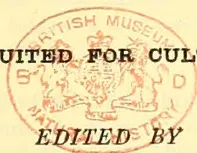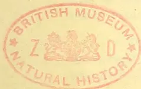

J. FERGUSON,

of the "Ceylon Observer," &c.

"It is both the duty and interest of every owner and cultivator of the soil to study the best means of rendering that soil subservient to his own and the general wants of the community; and he who introduces, beneficially, a new and useful *Seed, Plant, or Shrub* into his district, is a blessing and an honour to his country."—SIR J. SINCLAIR.

## VOL. XIII.

[Containing Numbers I. to XII.: July 1893 to June 1894.]

Colombo, Ceylon:

A. M. & J. FERGUSON.

LONDON:

MESSRS. JOHN HADDON & Co.; KEGAN PAUL, TRUBNER & Co., LTD.; LUZAC & Co.; &c.  
MADRAS: ADDISON & Co.; CALCUTTA: THACKER, SPINK & Co.;  
BOMBAY: THACKER & Co., LTD.; AUSTRALIAN COLONIES: GORDON & GOTCH.

MDCCCXCIV.

5------------------------------------------------

<!-- stage4: FAINT old-images-only -->

[Faint page: no legible print of its own could be verified; text withheld (stage 4 review list)]

6------------------------------------------------

## ◁ TO OUR READERS ▷

In closing the Thirteenth Volume of the “**Tropical Agriculturist**,” we would once more direct attention to the large amount of useful information afforded and to the great variety of topics treated in the several numbers. From month to month, we have endeavoured to embody in these pages the latest results of practical experience and scientific teaching in all that concerns tropical agriculture; and our ambition has been to make our periodical not only indispensable to the planter, but of service to business men and capitalists, never forgetting that agriculture trenches upon every department of human knowledge, beside being the basis of personal and communal wealth.

While directing our attention chiefly to the products prominently mentioned on our title-page, we have always taken care to notice minor industries likely to fit in with sub-tropical conditions; and our readers have an ample guarantee in the pages before them, that, in the future, no pains will be spared to bring together all available information both from the West and East, the same being examined in the light of the teachings of common sense as well as of prolonged tropical experience in this, the leading Crown and Planting Colony of the British Empire.

Special attention has, during the past year, been given to the extension of the planting enterprise in coffee, cacao and rubber in Mexico, Central and some parts of South America; to the wide field for coffee and other products in British Central, and by and bye in British East, Africa; to new developments in coffee in the Malayan Peninsula, North Borneo, Sumatra and Java, in which last Dutch Dependency several Ceylon planters have been investing largely.

The Tea-planting Industry has sprung into so much importance in India and Ceylon that a considerable amount of space is naturally given to this great staple, and we think it will be admitted by impartial judges that the *Tropical Agriculturist* should be filed, for ready reference, in every Tea Factory in this Island and India.

“The Manual of Chemical Analyses” prepared by Mr. M. Cochran specially for the benefit of planters, and which was begun in January 1893, cannot fail to instruct all who give it a careful persual.

The present volume is enlivened by the Collotype Portraits and interesting Biographical Notices of a number of the Pioneers connected with the development of the Planting Enterprise in this island, the whole forming an instructive chapter in the history of the Colony.

A full and accurate Index affords the means of ready reference to every subject treated in this, the thirteenth volume, which we now place in our subscribers' hands, in full confidence that it will be received with an amount of approval, at least equal to that which has been so kindly extended to its predecessors.

We are convinced that no more suitable or useful gift can be made to the tropical planter or agriculturist, whether he be about to enter on his career, or with many years of experience behind him, than the thirteen volumes of our periodical which we have now made available. They are full of information bearing on every department and relating to nearly every product within the scope of sub-tropical industry.

In conclusion, we have to tender our thanks to readers and contributors, and our wish that all friends may continue to write instructively and to read with approval; for then, indeed, must the “**Tropical Agriculturist**” continue to do well.

J. FERGUSON,

COLOMBO, CEYLON: 1ST JULY 1894.

7------------------------------------------------

<!-- stage4: SHOWTHROUGH tess-mirror:19/0/rot4 -->

8------------------------------------------------

# INDEX.

## A.

<table style="width: 100%; border-collapse: collapse;">
<thead>
<tr>
<th style="text-align: left;"></th>
<th style="text-align: right;">PAGE.</th>
</tr>
</thead>
<tbody>
<tr>
<td>Acacia, Hybridisation of ...</td>
<td style="text-align: right;">694</td>
</tr>
<tr>
<td>Aeids of Fruits ...</td>
<td style="text-align: right;">32</td>
</tr>
<tr>
<td>Acme Packages Co., Ltd. ...</td>
<td style="text-align: right;">852</td>
</tr>
<tr>
<td>    ... Tea Chests [See Tea Chests]</td>
<td style="text-align: right;"></td>
</tr>
<tr>
<td>Adhatoda Vasica ...</td>
<td style="text-align: right;">798</td>
</tr>
<tr>
<td>Adulteration, Indian Art of ...</td>
<td style="text-align: right;">739</td>
</tr>
<tr>
<td>Africa, British Central ...</td>
<td style="text-align: right;">187, 755, 768</td>
</tr>
<tr>
<td>    ..., East ...</td>
<td style="text-align: right;">673, 745, 815</td>
</tr>
<tr>
<td>    ..., Chinese Emigration to ...</td>
<td style="text-align: right;">122</td>
</tr>
<tr>
<td>    ..., Commerce of ...</td>
<td style="text-align: right;">690</td>
</tr>
<tr>
<td>    ..., and South, Openings in ...</td>
<td style="text-align: right;">671, 675</td>
</tr>
<tr>
<td>    ..., German ...</td>
<td style="text-align: right;">151, 179, 378, 387, 508</td>
</tr>
<tr>
<td>    ..., Planting in 25, 158, 468, 493, 527, 535, 543, 548, 628,</td>
<td style="text-align: right;"></td>
</tr>
<tr>
<td>Agriculture, Eastern ...</td>
<td style="text-align: right;">270</td>
</tr>
<tr>
<td>    ..., Electricity in ...</td>
<td style="text-align: right;">41</td>
</tr>
<tr>
<td>    ..., Native, Means of Improving ...</td>
<td style="text-align: right;">281</td>
</tr>
<tr>
<td>Agricultural Experiments in Burma</td>
<td style="text-align: right;">628</td>
</tr>
<tr>
<td>    ... Industries in Australia ...</td>
<td style="text-align: right;">126</td>
</tr>
<tr>
<td>    ... in Japan ...</td>
<td style="text-align: right;">32</td>
</tr>
<tr>
<td>    ... Investigators, Lady ...</td>
<td style="text-align: right;">248</td>
</tr>
<tr>
<td>    ... Literature 26, 29, 102, 121, 127, 340, 542, 550, 628, 678, 812</td>
<td style="text-align: right;"></td>
</tr>
<tr>
<td>    ... Notes 29, 41, 101, 126, 151, 206, 248, 304, 376, 384, 387, 392, 410, 423, 469, 493, 541, 550, 566, 627, 634, 662, 678, 699, 709, 750, 763, 774, 853</td>
<td style="text-align: right;"></td>
</tr>
<tr>
<td>    ... School, Ceylon ...</td>
<td style="text-align: right;">432, 537</td>
</tr>
<tr>
<td>    ... Science, Advanced ...</td>
<td style="text-align: right;">285</td>
</tr>
<tr>
<td>Alfalfa, Cultivation of ...</td>
<td style="text-align: right;">314</td>
</tr>
<tr>
<td>Aloe Fibre ...</td>
<td style="text-align: right;">473</td>
</tr>
<tr>
<td>Alton Tea Factory, Burning of the ...</td>
<td style="text-align: right;">690, 701</td>
</tr>
<tr>
<td>Alutkele Golden Tips ...</td>
<td style="text-align: right;">754</td>
</tr>
<tr>
<td>Amazon, Upper Valley of the 541, 619 [See also Peru]</td>
<td style="text-align: right;"></td>
</tr>
<tr>
<td>Ambagamuwa, Planting in ...</td>
<td style="text-align: right;">11, 383</td>
</tr>
<tr>
<td>America, Planting in ...</td>
<td style="text-align: right;">182</td>
</tr>
<tr>
<td>American Dewberry ...</td>
<td style="text-align: right;">296</td>
</tr>
<tr>
<td>    ... Ceylon Tea Planters' Company ...</td>
<td style="text-align: right;">157</td>
</tr>
<tr>
<td>Anonas ...</td>
<td style="text-align: right;">494</td>
</tr>
<tr>
<td>Annatto, Analysis of ...</td>
<td style="text-align: right;">290</td>
</tr>
<tr>
<td>    ..., Ceylon ...</td>
<td style="text-align: right;">206</td>
</tr>
<tr>
<td>Anthrax ...</td>
<td style="text-align: right;">572</td>
</tr>
<tr>
<td>Anise Oil ...</td>
<td style="text-align: right;">122</td>
</tr>
<tr>
<td>Ants on Plants ...</td>
<td style="text-align: right;">35</td>
</tr>
<tr>
<td>    ..., Parasol ...</td>
<td style="text-align: right;">35</td>
</tr>
<tr>
<td>Antipest for Paddy, etc. ...</td>
<td style="text-align: right;">484</td>
</tr>
<tr>
<td>Araucaria ...</td>
<td style="text-align: right;">661</td>
</tr>
<tr>
<td>Arboriculture ...</td>
<td style="text-align: right;">517</td>
</tr>
<tr>
<td>Arecanuts, Analysis of ...</td>
<td style="text-align: right;">290</td>
</tr>
<tr>
<td>Arrowroot ...</td>
<td style="text-align: right;">70</td>
</tr>
<tr>
<td>    ... Production in the West Indies ...</td>
<td style="text-align: right;">401</td>
</tr>
<tr>
<td>    ... Substitutes ...</td>
<td style="text-align: right;">140</td>
</tr>
<tr>
<td>Assam, Planting in ...</td>
<td style="text-align: right;">103, 175, 343, 763</td>
</tr>
<tr>
<td>Australian Agricultural Industries ...</td>
<td style="text-align: right;">126</td>
</tr>
<tr>
<td>    ... Tea Firm, A Big ...</td>
<td style="text-align: right;">525</td>
</tr>
<tr>
<td>    ... Trees, Destruction of ...</td>
<td style="text-align: right;">359</td>
</tr>
<tr>
<td>Avenue Trees on the Nilgiris ...</td>
<td style="text-align: right;">523</td>
</tr>
<tr>
<td>Azores, Tea Growing in ...</td>
<td style="text-align: right;">619</td>
</tr>
</tbody>
</table>

## B.

<table style="width: 100%; border-collapse: collapse;">
<thead>
<tr>
<th style="text-align: left;"></th>
<th style="text-align: right;">PAGE.</th>
</tr>
</thead>
<tbody>
<tr>
<td>Badulla, Planting in ...</td>
<td style="text-align: right;">609</td>
</tr>
<tr>
<td>Bahamas Fibre ...</td>
<td style="text-align: right;">230</td>
</tr>
<tr>
<td>    ..., Sissal Fibre in the ...</td>
<td style="text-align: right;">231</td>
</tr>
<tr>
<td>    " Baker and Cook " : Review ...</td>
<td style="text-align: right;">841</td>
</tr>
<tr>
<td>Balangoda District, Planting in ...</td>
<td style="text-align: right;">538</td>
</tr>
<tr>
<td>Balata Industry at Paramaribo ...</td>
<td style="text-align: right;">766</td>
</tr>
<tr>
<td>Bamboo Furniture Manufacture for India ...</td>
<td style="text-align: right;">277</td>
</tr>
<tr>
<td>Bamboos ...</td>
<td style="text-align: right;">382, 699, 770</td>
</tr>
<tr>
<td>    ... at Kew ...</td>
<td style="text-align: right;">82</td>
</tr>
<tr>
<td>Banana Cultivation ...</td>
<td style="text-align: right;">367</td>
</tr>
<tr>
<td>    ... in Jamaica ...</td>
<td style="text-align: right;">635</td>
</tr>
<tr>
<td>    ... Disease ...</td>
<td style="text-align: right;">726</td>
</tr>
<tr>
<td>    ... Meal ...</td>
<td style="text-align: right;">518, 740, 797</td>
</tr>
<tr>
<td>Bananas in Fiji ...</td>
<td style="text-align: right;">169, 843</td>
</tr>
<tr>
<td>    ... in Guatemala ...</td>
<td style="text-align: right;">380</td>
</tr>
<tr>
<td>    ... in Queensland ...</td>
<td style="text-align: right;">469</td>
</tr>
<tr>
<td>Bandarapola Ceylon Co., Ltd. ...</td>
<td style="text-align: right;">327, 837</td>
</tr>
<tr>
<td>Banian Tree, A Fine ...</td>
<td style="text-align: right;">271</td>
</tr>
<tr>
<td>Barnes, H. E. Lt. Sir Edward, G.C.B. ...</td>
<td style="text-align: right;">73</td>
</tr>
<tr>
<td>Batavia Exhibition ...</td>
<td style="text-align: right;">38</td>
</tr>
<tr>
<td>Beche-de-mer ...</td>
<td style="text-align: right;">770</td>
</tr>
<tr>
<td>Beefwood Tree ...</td>
<td style="text-align: right;">680</td>
</tr>
<tr>
<td>Bee-keeping ...</td>
<td style="text-align: right;">682</td>
</tr>
<tr>
<td>Beetles (Ceylon) in England ...</td>
<td style="text-align: right;">56</td>
</tr>
<tr>
<td>Bennett, Dr. Geo. ...</td>
<td style="text-align: right;">734</td>
</tr>
<tr>
<td>Bentota District, Planting in ...</td>
<td style="text-align: right;">669</td>
</tr>
<tr>
<td>Bird, George, Reminiscences of ...</td>
<td style="text-align: right;">528</td>
</tr>
<tr>
<td>Bloomfield Tea Factory, Burning of the ...</td>
<td style="text-align: right;">615, 619</td>
</tr>
<tr>
<td>Board of Trade Returns ...</td>
<td style="text-align: right;">414</td>
</tr>
<tr>
<td>Bone and Ivory ...</td>
<td style="text-align: right;">846</td>
</tr>
<tr>
<td>Botanic Gardens, Ceylon 535, 654, 747, (Sup.)</td>
<td style="text-align: right;"></td>
</tr>
<tr>
<td>    ... Society, Durban ...</td>
<td style="text-align: right;">820</td>
</tr>
<tr>
<td>Botanical Facts, Curious ...</td>
<td style="text-align: right;">566</td>
</tr>
<tr>
<td>Branches Casting Their Tips ...</td>
<td style="text-align: right;">661</td>
</tr>
<tr>
<td>Brazil, A Ceylon Planter in ...</td>
<td style="text-align: right;">124, 349, 464</td>
</tr>
<tr>
<td>    ... Crops, Diversified ...</td>
<td style="text-align: right;">669</td>
</tr>
<tr>
<td>    ... Labour in ...</td>
<td style="text-align: right;">101, 126</td>
</tr>
<tr>
<td>Brazilian Trade ...</td>
<td style="text-align: right;">542</td>
</tr>
<tr>
<td>Breadfruit Tree ...</td>
<td style="text-align: right;">358</td>
</tr>
<tr>
<td>Bricks from Sawdust ...</td>
<td style="text-align: right;">101</td>
</tr>
<tr>
<td>Brown, Mr. John, Death of ...</td>
<td style="text-align: right;">653</td>
</tr>
<tr>
<td>British Guiana, Condition of ...</td>
<td style="text-align: right;">754</td>
</tr>
<tr>
<td>    ... Government, Laboratory ...</td>
<td style="text-align: right;">30</td>
</tr>
<tr>
<td>    ... Labour in ...</td>
<td style="text-align: right;">184</td>
</tr>
<tr>
<td>    ... Planting in the Olden Days in ...</td>
<td style="text-align: right;">296</td>
</tr>
<tr>
<td>    ... Tropical Gardening in ...</td>
<td style="text-align: right;">662</td>
</tr>
<tr>
<td>    ... Honduras, Coconut Palm Weevil in ...</td>
<td style="text-align: right;">117, 134, 143, 166</td>
</tr>
<tr>
<td>    ... North Borneo Company's Annual Report ...</td>
<td style="text-align: right;">185</td>
</tr>
<tr>
<td>    ... Notes 122, 163, 181, 330, 405</td>
<td style="text-align: right;"></td>
</tr>
<tr>
<td>Buchanan, Mr. P. R., Visit to Ceylon of ...</td>
<td style="text-align: right;">548</td>
</tr>
<tr>
<td>Budding ...</td>
<td style="text-align: right;">295</td>
</tr>
<tr>
<td>Buffalo Bill and Barley Coffee ...</td>
<td style="text-align: right;">348</td>
</tr>
<tr>
<td>Burma Ruby Mines ...</td>
<td style="text-align: right;">416</td>
</tr>
<tr>
<td>Butter-making in India ...</td>
<td style="text-align: right;">429</td>
</tr>
<tr>
<td>" By Highways and Hedges" ...</td>
<td style="text-align: right;">284</td>
</tr>
</tbody>
</table>

9------------------------------------------------

INDEX.

<table border="0">
<thead>
<tr>
<th></th>
<th style="text-align: right;">PAGE.</th>
<th></th>
<th style="text-align: right;">PAGE.</th>
</tr>
</thead>
<tbody>
<tr>
<td><b>C.</b></td>
<td></td>
<td><b>Ceylon Plumbago and Desiccated Industries,</b></td>
<td></td>
</tr>
<tr>
<td>Cacao Cultivation in Assam ...</td>
<td style="text-align: right;">103</td>
<td>Slackness in ...</td>
<td style="text-align: right;">622</td>
</tr>
<tr>
<td>in Ceylon 51, 254, 339, 381,</td>
<td style="text-align: right;"></td>
<td>Produce Companies</td>
<td style="text-align: right;">780</td>
</tr>
<tr>
<td>482, 528, 664</td>
<td style="text-align: right;"></td>
<td>in Australia ...</td>
<td style="text-align: right;">309</td>
</tr>
<tr>
<td>in Colombia ...</td>
<td style="text-align: right;">699</td>
<td>Sales [See Supplements]</td>
<td style="text-align: right;"></td>
</tr>
<tr>
<td>in Cuba ...</td>
<td style="text-align: right;">112</td>
<td>Weekly Sales of ...</td>
<td style="text-align: right;">551, 598</td>
</tr>
<tr>
<td>in Java ...</td>
<td style="text-align: right;">126, 164</td>
<td>Products, Notes on ...</td>
<td style="text-align: right;">131</td>
</tr>
<tr>
<td>in Nicaragua ...</td>
<td style="text-align: right;">407</td>
<td>Season Reports ...</td>
<td style="text-align: right;">323, 551, 615, 843</td>
</tr>
<tr>
<td>in North Borneo ...</td>
<td style="text-align: right;">480</td>
<td>Selangor Planting Co., Ltd. ...</td>
<td style="text-align: right;">384</td>
</tr>
<tr>
<td>in San Domingo ...</td>
<td style="text-align: right;">189</td>
<td>Situations for English Youths</td>
<td style="text-align: right;">16</td>
</tr>
<tr>
<td>in the West Indies and</td>
<td style="text-align: right;"></td>
<td>Staple Exports ...</td>
<td style="text-align: right;">540</td>
</tr>
<tr>
<td>Ceylon ...</td>
<td style="text-align: right;">350, 403</td>
<td>Tea Abroad ...</td>
<td style="text-align: right;">411</td>
</tr>
<tr>
<td>with Liberian Coffee ...</td>
<td style="text-align: right;">471</td>
<td>and Coffee in ...</td>
<td style="text-align: right;">417</td>
</tr>
<tr>
<td>Enemies of ...</td>
<td style="text-align: right;">497, 806</td>
<td>and High Districts ...</td>
<td style="text-align: right;">82</td>
</tr>
<tr>
<td>in Ecuador ...</td>
<td style="text-align: right;">297, 750</td>
<td>at Chicago ...</td>
<td style="text-align: right;">591, 774</td>
</tr>
<tr>
<td>in Farther Uva ...</td>
<td style="text-align: right;">248</td>
<td>at Imperial Institute ...</td>
<td style="text-align: right;">198</td>
</tr>
<tr>
<td>in Panwila 249, 386, 622,</td>
<td style="text-align: right;">696</td>
<td>Company Ltd. ...</td>
<td style="text-align: right;">60</td>
</tr>
<tr>
<td>Planting Notes ...</td>
<td style="text-align: right;">322</td>
<td>Enterprise and Scientific</td>
<td style="text-align: right;"></td>
</tr>
<tr>
<td>Practical Cultivation of ...</td>
<td style="text-align: right;">385</td>
<td>Experts 615, 621, 624, 625, 628</td>
<td style="text-align: right;"></td>
</tr>
<tr>
<td>Seed for Planting ...</td>
<td style="text-align: right;">137</td>
<td>Estate Superintendents and</td>
<td style="text-align: right;"></td>
</tr>
<tr>
<td>Stealing in Ceylon 509, 599, 699</td>
<td style="text-align: right;"></td>
<td>their Salaries ...</td>
<td style="text-align: right;">33, 43</td>
</tr>
<tr>
<td>Cachar Planters' Dinner ...</td>
<td style="text-align: right;">381</td>
<td>Exports ...</td>
<td style="text-align: right;">128, 548, 589</td>
</tr>
<tr>
<td>California ...</td>
<td style="text-align: right;">25, 58, 125, 494</td>
<td>Factory, The Largest ...</td>
<td style="text-align: right;">610</td>
</tr>
<tr>
<td>Californian Exhibition of 1894 ...</td>
<td style="text-align: right;">457, 459</td>
<td>Finest ...</td>
<td style="text-align: right;">581, 676</td>
</tr>
<tr>
<td>Fruits ...</td>
<td style="text-align: right;">152, 662</td>
<td>Flavour of ...</td>
<td style="text-align: right;">23, 27</td>
</tr>
<tr>
<td>Calatropis Gigantea ...</td>
<td style="text-align: right;">857</td>
<td>Fund ...</td>
<td style="text-align: right;">196</td>
</tr>
<tr>
<td>Caledonian Tea Company ...</td>
<td style="text-align: right;">706</td>
<td>Industry 10, 91, 103, 305, 306, 309,</td>
<td style="text-align: right;"></td>
</tr>
<tr>
<td>Candle Manufactury, A ...</td>
<td style="text-align: right;">665</td>
<td>310, 419, 724</td>
<td style="text-align: right;"></td>
</tr>
<tr>
<td>Caramel, Production of ...</td>
<td style="text-align: right;">831</td>
<td>in America 181, 234, 237, 243, 253,</td>
<td style="text-align: right;"></td>
</tr>
<tr>
<td>Cardamom Sales in London [See Supplements]</td>
<td style="text-align: right;"></td>
<td>329, 333, 348, 409, 422, 493, 495, 519,</td>
<td style="text-align: right;"></td>
</tr>
<tr>
<td>Carey, Mr. E. V. ...</td>
<td style="text-align: right;">700</td>
<td>546, 548, 631, 632, 651, 684, 687, 691,</td>
<td style="text-align: right;"></td>
</tr>
<tr>
<td>Carnivorous Plants ...</td>
<td style="text-align: right;">508</td>
<td>698, 700, 704, 708, 731, 760, 762, 763,</td>
<td style="text-align: right;"></td>
</tr>
<tr>
<td>Cashmir Wine ...</td>
<td style="text-align: right;">32</td>
<td>764</td>
<td style="text-align: right;"></td>
</tr>
<tr>
<td>Cassia ...</td>
<td style="text-align: right;">122</td>
<td>in Australia 177, 181, 182, 194, 248,</td>
<td style="text-align: right;"></td>
</tr>
<tr>
<td>Anriculata as a Tan-producing Tree</td>
<td style="text-align: right;">593</td>
<td>266, 384, 385, 387, 461, 492, 519,</td>
<td style="text-align: right;"></td>
</tr>
<tr>
<td>Castlereagh Tea Co. ...</td>
<td style="text-align: right;">627</td>
<td>538, 545, 557</td>
<td style="text-align: right;"></td>
</tr>
<tr>
<td>Castor Oil ...</td>
<td style="text-align: right;">374</td>
<td>in London ...</td>
<td style="text-align: right;">41, 42, 44, 49, 53, 82,</td>
</tr>
<tr>
<td>Cassava Meal ...</td>
<td style="text-align: right;">802</td>
<td>113, 412</td>
<td style="text-align: right;"></td>
</tr>
<tr>
<td>Caterpillar Teaser, A Galvanic ...</td>
<td style="text-align: right;">8</td>
<td>Market ...</td>
<td style="text-align: right;">595, 596, 604</td>
</tr>
<tr>
<td>Cattle, Branding of ...</td>
<td style="text-align: right;">665</td>
<td>Mr. J. H. Roberts on the</td>
<td style="text-align: right;"></td>
</tr>
<tr>
<td>breeding for Beef at Port of Spain 35</td>
<td style="text-align: right;"></td>
<td>Permanence of ...</td>
<td style="text-align: right;">113</td>
</tr>
<tr>
<td>Diseases of ...</td>
<td style="text-align: right;">70, 282, 428</td>
<td>in New Zealand ...</td>
<td style="text-align: right;">773</td>
</tr>
<tr>
<td>Inspection ...</td>
<td style="text-align: right;">111</td>
<td>in Russia ...</td>
<td style="text-align: right;">40, 181, 237, 239, 775</td>
</tr>
<tr>
<td>Tuberculosis in ...</td>
<td style="text-align: right;">357</td>
<td>in the Transvaal ...</td>
<td style="text-align: right;">811</td>
</tr>
<tr>
<td>Vegetation Poisonous to ...</td>
<td style="text-align: right;">141</td>
<td>Packages and Tainting of Tea</td>
<td style="text-align: right;">508</td>
</tr>
<tr>
<td>Central Province, Ceylon, News 51, 253, 328, 381,</td>
<td style="text-align: right;"></td>
<td>Planting Companies ...</td>
<td style="text-align: right;">39, 337, 338,</td>
</tr>
<tr>
<td>412, 460, 491, 538</td>
<td style="text-align: right;"></td>
<td>700, 840</td>
<td style="text-align: right;"></td>
</tr>
<tr>
<td>Ceylon Agriculture in ...</td>
<td style="text-align: right;">105, 177</td>
<td>Plantations Co., Ltd. 10, 817, 850, 851</td>
<td style="text-align: right;"></td>
</tr>
<tr>
<td>and Formosa ...</td>
<td style="text-align: right;">245</td>
<td>Planters Exchange 44, 97, 159, 206</td>
<td style="text-align: right;"></td>
</tr>
<tr>
<td>and India, Tea Planting in ...</td>
<td style="text-align: right;">317</td>
<td>Planting Prospects ...</td>
<td style="text-align: right;">595</td>
</tr>
<tr>
<td>and Indian Tea ...</td>
<td style="text-align: right;">94</td>
<td>Prices for ...</td>
<td style="text-align: right;">51, 599, 762</td>
</tr>
<tr>
<td>Taring of ...</td>
<td style="text-align: right;">181</td>
<td>Progress of ...</td>
<td style="text-align: right;">83, 520</td>
</tr>
<tr>
<td>Oriental Estates Co., Ltd. 8</td>
<td style="text-align: right;"></td>
<td>Prospects ...</td>
<td style="text-align: right;">106, 527</td>
</tr>
<tr>
<td>at the Chicago Show 459, 465, 522</td>
<td style="text-align: right;"></td>
<td>Quality and Reputation of 49, 116,</td>
<td style="text-align: right;"></td>
</tr>
<tr>
<td>Beetles in England ...</td>
<td style="text-align: right;">56</td>
<td>205, 327</td>
<td style="text-align: right;"></td>
</tr>
<tr>
<td>Comments on ...</td>
<td style="text-align: right;">132</td>
<td>Quantity and High Prices of 273</td>
<td style="text-align: right;"></td>
</tr>
<tr>
<td>Early Planting in ...</td>
<td style="text-align: right;">673</td>
<td>Report for 1893 Supt.</td>
<td style="text-align: right;"></td>
</tr>
<tr>
<td>Exports and Distribution 63, 135,</td>
<td style="text-align: right;"></td>
<td>Rev. A. Paton on ...</td>
<td style="text-align: right;">463</td>
</tr>
<tr>
<td>207, 279, 351, 423, 501, 567, 637, 709,</td>
<td style="text-align: right;"></td>
<td>Teas, Alleged Deterioration of 98, 178,</td>
<td style="text-align: right;"></td>
</tr>
<tr>
<td>781, 853</td>
<td style="text-align: right;"></td>
<td>201, 250, 251, 257</td>
<td style="text-align: right;"></td>
</tr>
<tr>
<td>Flora, A Handbook of 96, 170, 233,</td>
<td style="text-align: right;"></td>
<td>High-grown ...</td>
<td style="text-align: right;">180</td>
</tr>
<tr>
<td>282, 528, 683</td>
<td style="text-align: right;"></td>
<td>How to Improve ...</td>
<td style="text-align: right;">134</td>
</tr>
<tr>
<td>Forest Conservancy 265, 269</td>
<td style="text-align: right;"></td>
<td>in Canada ...</td>
<td style="text-align: right;">385</td>
</tr>
<tr>
<td>Handbook and Directory, 1893-94 618</td>
<td style="text-align: right;"></td>
<td>Vegetation, Professor Potter on 743</td>
<td style="text-align: right;"></td>
</tr>
<tr>
<td>Highgrown and Fine Teas ...</td>
<td style="text-align: right;">169</td>
<td>Cellulose ...</td>
<td style="text-align: right;">570</td>
</tr>
<tr>
<td>Land and Produce Co., Ltd. 488, 493</td>
<td style="text-align: right;"></td>
<td>Cement for Broken Glass ...</td>
<td style="text-align: right;">411</td>
</tr>
<tr>
<td>Men and Coffee in the Straits 103</td>
<td style="text-align: right;"></td>
<td>Manufacture in India ...</td>
<td style="text-align: right;">271</td>
</tr>
<tr>
<td>Plantations, Area Cultivated in 233, 256</td>
<td style="text-align: right;"></td>
<td>Chemical Analyses, Ceylon Manual of 1, 153, 225,</td>
<td style="text-align: right;"></td>
</tr>
<tr>
<td>Planter in Brazil, A ...</td>
<td style="text-align: right;">349</td>
<td>289, 369, 447, 511, 583, 655, 727, 799</td>
<td style="text-align: right;"></td>
</tr>
<tr>
<td>in Selangor, A ...</td>
<td style="text-align: right;">635</td>
<td>Factory in the Transvaal, A 30</td>
<td style="text-align: right;"></td>
</tr>
<tr>
<td>in Victoria, A ...</td>
<td style="text-align: right;">337</td>
<td>Manure and Tea ...</td>
<td style="text-align: right;">48</td>
</tr>
<tr>
<td>Planters, A New Generation of 392</td>
<td style="text-align: right;"></td>
<td>Chicago Ceylon Tea Store ...</td>
<td style="text-align: right;">409, 401</td>
</tr>
<tr>
<td>as Pioneers in New Lands 849</td>
<td style="text-align: right;"></td>
<td>Coffee in ...</td>
<td style="text-align: right;">12</td>
</tr>
<tr>
<td>in Peru ...</td>
<td style="text-align: right;">666</td>
<td>Exhibition and Indian Tea ...</td>
<td style="text-align: right;">25</td>
</tr>
<tr>
<td>Planting in 241, 319, 349, 408, 482, 552,</td>
<td style="text-align: right;"></td>
<td>Chicory Fraud, The ...</td>
<td style="text-align: right;">230</td>
</tr>
<tr>
<td>589, 601, 690, 737</td>
<td style="text-align: right;"></td>
<td>Chiloe Island ...</td>
<td style="text-align: right;">340</td>
</tr>
<tr>
<td></td>
<td style="text-align: right;"></td>
<td>China and Ceylon Teas ...</td>
<td style="text-align: right;">550</td>
</tr>
</tbody>
</table>

10------------------------------------------------

# INDEX.

<table border="0" style="width: 100%; border-collapse: collapse;">
<thead>
<tr>
<th style="text-align: left;"></th>
<th style="text-align: right;">PAGE.</th>
<th style="text-align: left;"></th>
<th style="text-align: right;">PAGE.</th>
</tr>
</thead>
<tbody>
<tr>
<td>China Brick Tea</td>
<td style="text-align: right;">230</td>
<td>Coconuts, Consumption of</td>
<td style="text-align: right;">31</td>
</tr>
<tr>
<td>— Tea, A Bounty on</td>
<td style="text-align: right;">473</td>
<td>—, Desiccated</td>
<td style="text-align: right;">339, 541</td>
</tr>
<tr>
<td>— and Tea Trade 27, 91, 121, 193, 252, 309, 387, 521, 542, 554, 557, 671, 672, 811, 827</td>
<td style="text-align: right;"></td>
<td>—, Habits of</td>
<td style="text-align: right;">250</td>
</tr>
<tr>
<td>— Exports</td>
<td style="text-align: right;">127, 262</td>
<td>— in Chilaw and Puttalam</td>
<td style="text-align: right;">823, 824</td>
</tr>
<tr>
<td>— in Australia</td>
<td style="text-align: right;">266</td>
<td>— in Fiji</td>
<td style="text-align: right;">843</td>
</tr>
<tr>
<td>— vs. Assam Tea</td>
<td style="text-align: right;">417</td>
<td>— in Jaffna</td>
<td style="text-align: right;">191</td>
</tr>
<tr>
<td>— vs. Ceylon Tea</td>
<td style="text-align: right;">321</td>
<td>— in Pemba Islands</td>
<td style="text-align: right;">81</td>
</tr>
<tr>
<td>Chinese Emigration to Africa</td>
<td style="text-align: right;">122</td>
<td>— in Uva</td>
<td style="text-align: right;">42</td>
</tr>
<tr>
<td>— Labour for Brazil</td>
<td style="text-align: right;">101</td>
<td>— in Veddukaddu</td>
<td style="text-align: right;">699</td>
</tr>
<tr>
<td>Cholera Bacillus and Tea and Coffee</td>
<td style="text-align: right;">230</td>
<td>— in Zanzibar</td>
<td style="text-align: right;">30, 81</td>
</tr>
<tr>
<td>Cigars, Derivation of</td>
<td style="text-align: right;">206</td>
<td>— in the Batticaloa District</td>
<td style="text-align: right;">335, 343, 651</td>
</tr>
<tr>
<td>—, Fiji</td>
<td style="text-align: right;">163</td>
<td>“Coffee”</td>
<td style="text-align: right;">422</td>
</tr>
<tr>
<td>Cinchona Alkaloids vs. Opium</td>
<td style="text-align: right;">485</td>
<td>Coffee, Adulterated</td>
<td style="text-align: right;">423</td>
</tr>
<tr>
<td>— Association, A Dutch</td>
<td style="text-align: right;">773</td>
<td>—, Analyses of</td>
<td style="text-align: right;">153, 846</td>
</tr>
<tr>
<td>— Bark</td>
<td style="text-align: right;">270</td>
<td>—, A New Book on</td>
<td style="text-align: right;">622</td>
</tr>
<tr>
<td>—, Advances upon</td>
<td style="text-align: right;">29</td>
<td>— and Cholera Bacillus</td>
<td style="text-align: right;">230</td>
</tr>
<tr>
<td>—, Analysis of</td>
<td style="text-align: right;">225</td>
<td>— and Fibre Cultivation</td>
<td style="text-align: right;">501</td>
</tr>
<tr>
<td>— from Java</td>
<td style="text-align: right;">270</td>
<td>— and Rubber</td>
<td style="text-align: right;">596</td>
</tr>
<tr>
<td>— in the United States</td>
<td style="text-align: right;">336</td>
<td>— Berry, Development of the</td>
<td style="text-align: right;">423</td>
</tr>
<tr>
<td>— Prospects 48, 381, 383, 386, 399, 416, 654</td>
<td style="text-align: right;"></td>
<td>— Brazilian</td>
<td style="text-align: right;">126, 240</td>
</tr>
<tr>
<td>— Statistics</td>
<td style="text-align: right;">818, 839</td>
<td>— Bug</td>
<td style="text-align: right;">774</td>
</tr>
<tr>
<td>Cultivation in Ceylon</td>
<td style="text-align: right;">401, 580</td>
<td>—, Consumption of</td>
<td style="text-align: right;">109</td>
</tr>
<tr>
<td>— in India</td>
<td style="text-align: right;">423</td>
<td>—, Coorg, in Dumbara Valley</td>
<td style="text-align: right;">245</td>
</tr>
<tr>
<td>— in Netherlands India</td>
<td style="text-align: right;">768</td>
<td>— Cultivation in Brazil 124, 258, 310, 410, 748</td>
<td style="text-align: right;"></td>
</tr>
<tr>
<td>— in Java 103, 125, 244, 341, 385, 731, 773</td>
<td style="text-align: right;"></td>
<td>— Culture</td>
<td style="text-align: right;">29, 168, 230</td>
</tr>
<tr>
<td>—, Introduction of, into Java</td>
<td style="text-align: right;">617</td>
<td>— near Bangalore</td>
<td style="text-align: right;">274</td>
</tr>
<tr>
<td>Market, Hamburg vs. Amsterdam as a</td>
<td style="text-align: right;">769</td>
<td>—, Customs Duty on</td>
<td style="text-align: right;">850</td>
</tr>
<tr>
<td>— Pioneers</td>
<td style="text-align: right;">602, 617</td>
<td>— Disease in Jamaica</td>
<td style="text-align: right;">96</td>
</tr>
<tr>
<td>— Plantations in Java</td>
<td style="text-align: right;">315</td>
<td>— Drinking</td>
<td style="text-align: right;">320</td>
</tr>
<tr>
<td>—, Madras Government</td>
<td style="text-align: right;">194</td>
<td>— Drinking in England</td>
<td style="text-align: right;">707</td>
</tr>
<tr>
<td>— Report</td>
<td style="text-align: right;">95, 182</td>
<td>—, Duty on</td>
<td style="text-align: right;">32, 110</td>
</tr>
<tr>
<td>— Sales 16, 51, 57, 110, 111, 116, 124, 188, 245, 252, 315, 332, 390, 417, 490, 523, 596, 606, 779, 852</td>
<td style="text-align: right;"></td>
<td>—, Fine</td>
<td style="text-align: right;">674</td>
</tr>
<tr>
<td>— Supplies</td>
<td style="text-align: right;">271, 272</td>
<td>— growing in Burma</td>
<td style="text-align: right;">207</td>
</tr>
<tr>
<td>— Trade</td>
<td style="text-align: right;">48, 485, 700, 701</td>
<td>—, Hybrid</td>
<td style="text-align: right;">380</td>
</tr>
<tr>
<td>—, Travancore</td>
<td style="text-align: right;">384</td>
<td>—, Indian</td>
<td style="text-align: right;">462</td>
</tr>
<tr>
<td>Cinchonidine in India</td>
<td style="text-align: right;">41</td>
<td>— in America</td>
<td style="text-align: right;">263, 264, 272, 493</td>
</tr>
<tr>
<td>—, Sulphate of</td>
<td style="text-align: right;">401</td>
<td>— in Bogawantalawa</td>
<td style="text-align: right;">701</td>
</tr>
<tr>
<td>Cinnamon Cultivation in Ceylon</td>
<td style="text-align: right;">549</td>
<td>— in British North Borneo</td>
<td style="text-align: right;">122</td>
</tr>
<tr>
<td>— Oil, Analysis of</td>
<td style="text-align: right;">369</td>
<td>— in Ceylon</td>
<td style="text-align: right;">279, 417, 419</td>
</tr>
<tr>
<td>— Sales</td>
<td style="text-align: right;">490</td>
<td>— in Chicago</td>
<td style="text-align: right;">12</td>
</tr>
<tr>
<td>Citronella Oil, Adulteration of</td>
<td style="text-align: right;">404</td>
<td>— in Coorg</td>
<td style="text-align: right;">811</td>
</tr>
<tr>
<td>—, Analysis of</td>
<td style="text-align: right;">369</td>
<td>— in Dolosbage</td>
<td style="text-align: right;">327</td>
</tr>
<tr>
<td>Clove Culture in Zanzibar</td>
<td style="text-align: right;">117</td>
<td>— in Guatemala</td>
<td style="text-align: right;">380, 385, 539</td>
</tr>
<tr>
<td>Cloves</td>
<td style="text-align: right;">214, 297</td>
<td>— in Haputale</td>
<td style="text-align: right;">387</td>
</tr>
<tr>
<td>Coca, Analysis of</td>
<td style="text-align: right;">290</td>
<td>— in India</td>
<td style="text-align: right;">701, 750</td>
</tr>
<tr>
<td>— Growing in New York</td>
<td style="text-align: right;">798</td>
<td>— in Java 164, 188, 653, 678, 699, 709, 738, 763</td>
<td style="text-align: right;"></td>
</tr>
<tr>
<td>Cocaine-making in Peru</td>
<td style="text-align: right;">51</td>
<td>— in London</td>
<td style="text-align: right;">390</td>
</tr>
<tr>
<td>Cocoa, Analysis of</td>
<td style="text-align: right;">35, 226</td>
<td>— in Malay States</td>
<td style="text-align: right;">14</td>
</tr>
<tr>
<td>—, Consumption of</td>
<td style="text-align: right;">110</td>
<td>— in Mexico 110, 160, 169, 312, 313, 314, 778</td>
<td style="text-align: right;"></td>
</tr>
<tr>
<td>—, Curing</td>
<td style="text-align: right;">667</td>
<td>— in Montserrat</td>
<td style="text-align: right;">368</td>
</tr>
<tr>
<td>—, in Ceylon</td>
<td style="text-align: right;">149</td>
<td>— in Mysore</td>
<td style="text-align: right;">747</td>
</tr>
<tr>
<td>— in London</td>
<td style="text-align: right;">390</td>
<td>— in Netherlands India</td>
<td style="text-align: right;">121</td>
</tr>
<tr>
<td>— in Paramaribo</td>
<td style="text-align: right;">774</td>
<td>— in Nicaragua</td>
<td style="text-align: right;">244</td>
</tr>
<tr>
<td>— Market</td>
<td style="text-align: right;">234</td>
<td>— in Perak</td>
<td style="text-align: right;">812</td>
</tr>
<tr>
<td>—, Mr. Ernest Hart on</td>
<td style="text-align: right;">772</td>
<td>— in Queensland</td>
<td style="text-align: right;">151, 378</td>
</tr>
<tr>
<td>—, North Matale</td>
<td style="text-align: right;">126</td>
<td>— in Sandakan</td>
<td style="text-align: right;">85</td>
</tr>
<tr>
<td>—, Pure</td>
<td style="text-align: right;">111</td>
<td>— in the Far East</td>
<td style="text-align: right;">387</td>
</tr>
<tr>
<td>— Sales in London</td>
<td style="text-align: right;">[See Supplement]</td>
<td>— in the Straits</td>
<td style="text-align: right;">103, 129</td>
</tr>
<tr>
<td>—, Tea and Coffee</td>
<td style="text-align: right;">96</td>
<td>— in Uva</td>
<td style="text-align: right;">830</td>
</tr>
<tr>
<td>Coconut Cracking or Splitting Machine</td>
<td style="text-align: right;">738</td>
<td>— Investments in Mysore</td>
<td style="text-align: right;">524</td>
</tr>
<tr>
<td>— Crop Prospects</td>
<td style="text-align: right;">635</td>
<td>— Lands in Mexico</td>
<td style="text-align: right;">93</td>
</tr>
<tr>
<td>— Cultivation in Australia</td>
<td style="text-align: right;">810</td>
<td>— Leaf Disease in Ceylon</td>
<td style="text-align: right;">631, 680</td>
</tr>
<tr>
<td>— in Ceylon 16, 22, 42, 55, 103, 378, 380, 549, 823, 836, 847</td>
<td style="text-align: right;"></td>
<td>— in Costa Rica</td>
<td style="text-align: right;">807</td>
</tr>
<tr>
<td>— Industry</td>
<td style="text-align: right;">92, 581</td>
<td>— Leaves as a Beverage</td>
<td style="text-align: right;">845</td>
</tr>
<tr>
<td>— Oil</td>
<td style="text-align: right;">373</td>
<td>— Machinery</td>
<td style="text-align: right;">510</td>
</tr>
<tr>
<td>— Palm, Chemistry of the</td>
<td style="text-align: right;">106</td>
<td>— Manure, Analysis of</td>
<td style="text-align: right;">156</td>
</tr>
<tr>
<td>— Enemies of 101, 102, 117, 134, 143, 166, 725, 732, 818, 831, 836, 840, 847</td>
<td style="text-align: right;"></td>
<td>—, Maragogipe</td>
<td style="text-align: right;">24</td>
</tr>
<tr>
<td>Coconuts and Monkeys</td>
<td style="text-align: right;">247</td>
<td>—, Market</td>
<td style="text-align: right;">376, 381, 469</td>
</tr>
<tr>
<td></td>
<td></td>
<td>—, Mexican</td>
<td style="text-align: right;">93</td>
</tr>
<tr>
<td></td>
<td></td>
<td>— Mixtures</td>
<td style="text-align: right;">24</td>
</tr>
<tr>
<td></td>
<td></td>
<td>—, Mocha</td>
<td style="text-align: right;">601</td>
</tr>
<tr>
<td></td>
<td></td>
<td>—, Mr. Ernest Hart on</td>
<td style="text-align: right;">772</td>
</tr>
<tr>
<td></td>
<td></td>
<td>— near Kandy</td>
<td style="text-align: right;">384</td>
</tr>
<tr>
<td></td>
<td></td>
<td>— Notes 110, 150, 188, 231, 272, 314, 320</td>
<td style="text-align: right;"></td>
</tr>
<tr>
<td></td>
<td></td>
<td>— Plantation, A Large</td>
<td style="text-align: right;">391</td>
</tr>
<tr>
<td></td>
<td></td>
<td>— Plantation, A Unique</td>
<td style="text-align: right;">223</td>
</tr>
</tbody>
</table>

11------------------------------------------------

## INDEX.

<table style="width: 100%; border-collapse: collapse;">
<thead>
<tr>
<th style="text-align: left;"></th>
<th style="text-align: right;">PAGE.</th>
</tr>
</thead>
<tbody>
<tr>
<td>Coffee Planting in East Africa ...</td>
<td style="text-align: right;">527, 738</td>
</tr>
<tr>
<td>    in Jamaica ...</td>
<td style="text-align: right;">558, 706</td>
</tr>
<tr>
<td>    in Netherlands India ...</td>
<td style="text-align: right;">38, 62</td>
</tr>
<tr>
<td>    in Selangor ...</td>
<td style="text-align: right;">86, 87, 315</td>
</tr>
<tr>
<td>    Prospects 264, 387, 388 402, 527, 628,     635, 662, 676, 853</td>
<td></td>
</tr>
<tr>
<td>    in the Straits ...</td>
<td style="text-align: right;">24</td>
</tr>
<tr>
<td>    Roast ...</td>
<td style="text-align: right;">709</td>
</tr>
<tr>
<td>    Sales in London ... [See Supplements]</td>
<td></td>
</tr>
<tr>
<td>    Seed, Brazilian, for East Africa ...</td>
<td style="text-align: right;">469</td>
</tr>
<tr>
<td>    Seed, Wild ...</td>
<td style="text-align: right;">249</td>
</tr>
<tr>
<td>    Shares, An Action about ...</td>
<td style="text-align: right;">27</td>
</tr>
<tr>
<td>    Tea ...</td>
<td style="text-align: right;">152, 169, 236, 520</td>
</tr>
<tr>
<td>    Tea and Cocoa ...</td>
<td style="text-align: right;">69</td>
</tr>
<tr>
<td>    Trade, English ...</td>
<td style="text-align: right;">126</td>
</tr>
<tr>
<td>Coir Fibre ...</td>
<td style="text-align: right;">463</td>
</tr>
<tr>
<td>Coolies at the Straits Settlements ...</td>
<td style="text-align: right;">37</td>
</tr>
<tr>
<td>    for Tea Plantations ...</td>
<td style="text-align: right;">151</td>
</tr>
<tr>
<td>Cooly Immigration to the West Indies ...</td>
<td style="text-align: right;">388</td>
</tr>
<tr>
<td>Congo, Prairies of the ...</td>
<td style="text-align: right;">388</td>
</tr>
<tr>
<td>    Rubber ...</td>
<td style="text-align: right;">466, 739</td>
</tr>
<tr>
<td>Coorg Coffee in Dumbara Valley ...</td>
<td style="text-align: right;">245</td>
</tr>
<tr>
<td>    Planting Notes ...</td>
<td style="text-align: right;">247, 341, 410</td>
</tr>
<tr>
<td>Convict Cultivators ...</td>
<td style="text-align: right;">493</td>
</tr>
<tr>
<td>Corrugated Iron Buildings ...</td>
<td style="text-align: right;">128</td>
</tr>
<tr>
<td>Cotton, Analysis of ...</td>
<td style="text-align: right;">293</td>
</tr>
<tr>
<td>    Manures for ...</td>
<td style="text-align: right;">294</td>
</tr>
<tr>
<td>    Plant, Wonders of the ...</td>
<td style="text-align: right;">101</td>
</tr>
<tr>
<td>Cream and Milk, Preservatives for ...</td>
<td style="text-align: right;">642</td>
</tr>
<tr>
<td>Cuba, Cacao Cultivation in ...</td>
<td style="text-align: right;">112</td>
</tr>
<tr>
<td>Cubeb ...</td>
<td style="text-align: right;">135, 270, 390</td>
</tr>
<tr>
<td>Cucumber, Sponge-bearing ...</td>
<td style="text-align: right;">859</td>
</tr>
<tr>
<td>Cultivation, Systems of ...</td>
<td style="text-align: right;">639, 783</td>
</tr>
<tr>
<td>Culture, Scientific ...</td>
<td style="text-align: right;">30</td>
</tr>
<tr>
<td>    System in Java ...</td>
<td style="text-align: right;">259</td>
</tr>
<tr>
<td>Currant Crops in Greece ...</td>
<td style="text-align: right;">31</td>
</tr>
</tbody>
</table>

### D.

<table style="width: 100%; border-collapse: collapse;">
<tbody>
<tr>
<td>Dairies, Management of ...</td>
<td style="text-align: right;">355, 425</td>
</tr>
<tr>
<td>Dairy, Ceylon Government 38, 66, 174, 287, 640, 856</td>
<td></td>
</tr>
<tr>
<td>    Farming, Indian Government ...</td>
<td style="text-align: right;">352</td>
</tr>
<tr>
<td>    Notes ...</td>
<td style="text-align: right;">786</td>
</tr>
<tr>
<td>Damner and Sealing Wax ...</td>
<td style="text-align: right;">386</td>
</tr>
<tr>
<td>Darjiling, Notes from ...</td>
<td style="text-align: right;">524</td>
</tr>
<tr>
<td>Datura Stramonium, Analysis of ...</td>
<td style="text-align: right;">295</td>
</tr>
<tr>
<td>Days of Old : a Leaf from the Far East ...</td>
<td style="text-align: right;">528</td>
</tr>
<tr>
<td>Delgolla Estate Co., Ltd. ...</td>
<td style="text-align: right;">778</td>
</tr>
<tr>
<td>Deli, Tobacco in ...</td>
<td style="text-align: right;">245</td>
</tr>
<tr>
<td>    Planting in ...</td>
<td style="text-align: right;">667</td>
</tr>
<tr>
<td>Dietetic Products ...</td>
<td style="text-align: right;">327</td>
</tr>
<tr>
<td>Digestion and Coffee and Tea ...</td>
<td style="text-align: right;">674</td>
</tr>
<tr>
<td>Dimbula Estates, Timber Trees on ...</td>
<td style="text-align: right;">315</td>
</tr>
<tr>
<td>Disc Churn ...</td>
<td style="text-align: right;">215</td>
</tr>
<tr>
<td>Drayton Estates Co., Ltd. ...</td>
<td style="text-align: right;">781</td>
</tr>
<tr>
<td>Droughts ...</td>
<td style="text-align: right;">138, 855</td>
</tr>
<tr>
<td>Drug and Bark Report 19, 28, 150, 186, 199, 256,     264, 318, 343, 347, 389, 405, 422, 465, 492,     534, 556, 597, 619, 630, 637, 679, 701, 844, 853</td>
<td></td>
</tr>
<tr>
<td>    "Dun," Tea Prospects in the ...</td>
<td style="text-align: right;">679</td>
</tr>
<tr>
<td>Dyes, Vegetable ...</td>
<td style="text-align: right;">71</td>
</tr>
<tr>
<td>Dysentery and Milk Trees ...</td>
<td style="text-align: right;">409, 414, 623</td>
</tr>
</tbody>
</table>

### E.

<table style="width: 100%; border-collapse: collapse;">
<tbody>
<tr>
<td>Earthworms ...</td>
<td style="text-align: right;">748</td>
</tr>
<tr>
<td>East Africa for Planters ...</td>
<td style="text-align: right;">543, 548</td>
</tr>
<tr>
<td>    Planting in ...</td>
<td style="text-align: right;">409, 527, 628</td>
</tr>
<tr>
<td>Eastern Produce and Estates Co., Ltd. ...</td>
<td style="text-align: right;">817</td>
</tr>
<tr>
<td>Education of Colonial Boys ...</td>
<td style="text-align: right;">379</td>
</tr>
<tr>
<td>Eggs, Brown and White Shelled ...</td>
<td style="text-align: right;">860</td>
</tr>
<tr>
<td>    Packing of ...</td>
<td style="text-align: right;">542</td>
</tr>
<tr>
<td>    To Tell the Age of ...</td>
<td style="text-align: right;">410</td>
</tr>
<tr>
<td>Eila Tea Company of Ceylon, Ltd. ...</td>
<td style="text-align: right;">234, 375</td>
</tr>
</tbody>
</table>

<table style="width: 100%; border-collapse: collapse;">
<thead>
<tr>
<th style="text-align: left;"></th>
<th style="text-align: right;">PAGE.</th>
</tr>
</thead>
<tbody>
<tr>
<td>Electric Light, Tea Curing by ...</td>
<td style="text-align: right;">739</td>
</tr>
<tr>
<td>Electrical Motors ...</td>
<td style="text-align: right;">839</td>
</tr>
<tr>
<td>Electricity and Sulphate of Quinine ...</td>
<td style="text-align: right;">341</td>
</tr>
<tr>
<td>    in Agriculture ...</td>
<td style="text-align: right;">41</td>
</tr>
<tr>
<td>Elliott, Christopher, M.D. ...</td>
<td style="text-align: right;">361</td>
</tr>
<tr>
<td>English Farm, Story of an ...</td>
<td style="text-align: right;">388</td>
</tr>
<tr>
<td>    Patents, Selected ...</td>
<td style="text-align: right;">186</td>
</tr>
<tr>
<td>    Vegetables in Nuwara Eliya ...</td>
<td style="text-align: right;">411</td>
</tr>
<tr>
<td>    Youths, Ceylon Situations for ...</td>
<td style="text-align: right;">16</td>
</tr>
<tr>
<td>Englishman, Tropical ...</td>
<td style="text-align: right;">248</td>
</tr>
<tr>
<td>Entomologist for Ceylon ...</td>
<td style="text-align: right;">599, 626, 627, 628</td>
</tr>
<tr>
<td>Entomologists for India ...</td>
<td style="text-align: right;">829</td>
</tr>
<tr>
<td>Entomology as Employment for Women ...</td>
<td style="text-align: right;">849</td>
</tr>
<tr>
<td>Estate Management in Ceylon ...</td>
<td style="text-align: right;">390</td>
</tr>
<tr>
<td>Estates, Sale of 304, 328, 457, 493, 666, 700, <i>Sup.</i></td>
<td></td>
</tr>
<tr>
<td>Essential Oils ...</td>
<td style="text-align: right;">17, 369</td>
</tr>
<tr>
<td>Eucalyptus, A New Use of ...</td>
<td style="text-align: right;">274</td>
</tr>
<tr>
<td>    Coccifera ...</td>
<td style="text-align: right;">104</td>
</tr>
<tr>
<td>    Globulus ...</td>
<td style="text-align: right;">104</td>
</tr>
<tr>
<td>    Regnans ...</td>
<td style="text-align: right;">127</td>
</tr>
<tr>
<td>    Varieties of, for Oil ...</td>
<td style="text-align: right;">637</td>
</tr>
<tr>
<td>Exchange and Planters 44, 97, 159, 206</td>
<td></td>
</tr>
<tr>
<td>    and Tea ...</td>
<td style="text-align: right;">85, 93</td>
</tr>
<tr>
<td>Exports, Ceylon ...</td>
<td style="text-align: right;">[See Ceylon]</td>
</tr>
</tbody>
</table>

### F.

<table style="width: 100%; border-collapse: collapse;">
<tbody>
<tr>
<td>Fan Palm, West Australian ...</td>
<td style="text-align: right;">21</td>
</tr>
<tr>
<td>Farmyard Manure and Seaweed ...</td>
<td style="text-align: right;">569</td>
</tr>
<tr>
<td>Ferguson, A. M., Esq., C.M.G. ...</td>
<td style="text-align: right;">145</td>
</tr>
<tr>
<td>Fibre and Coffee Cultivation ...</td>
<td style="text-align: right;">501</td>
</tr>
<tr>
<td>    for Paper Pulp ...</td>
<td style="text-align: right;">143</td>
</tr>
<tr>
<td>    Industry, A New ...</td>
<td style="text-align: right;">725</td>
</tr>
<tr>
<td>    Machinery ...</td>
<td style="text-align: right;">273, 398</td>
</tr>
<tr>
<td>    Market ...</td>
<td style="text-align: right;">695</td>
</tr>
<tr>
<td>Fiji, Planting in ...</td>
<td style="text-align: right;">818, 843</td>
</tr>
<tr>
<td>    Trade of ...</td>
<td style="text-align: right;">732</td>
</tr>
<tr>
<td>Flies, Destruction of ...</td>
<td style="text-align: right;">240</td>
</tr>
<tr>
<td>Floral Splendour at Peradeniya ...</td>
<td style="text-align: right;">737</td>
</tr>
<tr>
<td>Florida, Orange Culture in ...</td>
<td style="text-align: right;">150</td>
</tr>
<tr>
<td>Flowers and Perfumes ...</td>
<td style="text-align: right;">466</td>
</tr>
<tr>
<td>    "Flowers and Gardens": Review ...</td>
<td style="text-align: right;">814</td>
</tr>
<tr>
<td>Flowering Period, Influence of Soil on the ...</td>
<td style="text-align: right;">858</td>
</tr>
<tr>
<td>Flush Worm in Tea ...</td>
<td style="text-align: right;">522</td>
</tr>
<tr>
<td>Fodder and Pasture Lands in Ceylon ...</td>
<td style="text-align: right;">69</td>
</tr>
<tr>
<td>    Compressed ...</td>
<td style="text-align: right;">679, 750, 810</td>
</tr>
<tr>
<td>    for Cattle ...</td>
<td style="text-align: right;">65, 856</td>
</tr>
<tr>
<td>    Grasses for Cattle ...</td>
<td style="text-align: right;">730, 820</td>
</tr>
<tr>
<td>    Guinea Grass as... ...</td>
<td style="text-align: right;">35</td>
</tr>
<tr>
<td>    Notes on ...</td>
<td style="text-align: right;">212</td>
</tr>
<tr>
<td>    Plants, New 135, 249, 376, 400, 466, 695,     680, 717</td>
<td></td>
</tr>
<tr>
<td>    Tree Lucerne (Tagasaste) as ...</td>
<td style="text-align: right;">143</td>
</tr>
<tr>
<td>Foochow Tea Buyer, A Leading ...</td>
<td style="text-align: right;">628</td>
</tr>
<tr>
<td>    Trade ...</td>
<td style="text-align: right;">95</td>
</tr>
<tr>
<td>Food, Consumption of ...</td>
<td style="text-align: right;">595</td>
</tr>
<tr>
<td>Forest Conservancy, Ceylon ...</td>
<td style="text-align: right;">265, 269</td>
</tr>
<tr>
<td>    Department, Indian ...</td>
<td style="text-align: right;">150</td>
</tr>
<tr>
<td>    Pests, Inoculating ...</td>
<td style="text-align: right;">326</td>
</tr>
<tr>
<td>Forestry, A Ceylon School of ...</td>
<td style="text-align: right;">569, 678</td>
</tr>
<tr>
<td>Formosa ...</td>
<td style="text-align: right;">245, 324</td>
</tr>
<tr>
<td>Formosan Tea ...</td>
<td style="text-align: right;">320</td>
</tr>
<tr>
<td>Freights, Ocean ...</td>
<td style="text-align: right;">27, 197</td>
</tr>
<tr>
<td>Frozen Meat, Australian ...</td>
<td style="text-align: right;">601</td>
</tr>
<tr>
<td>Fruit, Colonial ...</td>
<td style="text-align: right;">828</td>
</tr>
<tr>
<td>    Crystallizing of ...</td>
<td style="text-align: right;">623</td>
</tr>
<tr>
<td>    Culture, Artificial Manures for ...</td>
<td style="text-align: right;">63</td>
</tr>
<tr>
<td>    in India ...</td>
<td style="text-align: right;">30, 57</td>
</tr>
<tr>
<td>    Dried ...</td>
<td style="text-align: right;">749</td>
</tr>
<tr>
<td>    Growing ...</td>
<td style="text-align: right;">384, 426</td>
</tr>
<tr>
<td>    Preserving at Singapore ...</td>
<td style="text-align: right;">328</td>
</tr>
<tr>
<td>    Trees, Insects on ...</td>
<td style="text-align: right;">406</td>
</tr>
<tr>
<td>Fruits, Acid of ...</td>
<td style="text-align: right;">32</td>
</tr>
<tr>
<td>    Californian ...</td>
<td style="text-align: right;">152, 662</td>
</tr>
<tr>
<td>Fuel for Siroccos ...</td>
<td style="text-align: right;">747</td>
</tr>
<tr>
<td>Fungicides, Corrosive ...</td>
<td style="text-align: right;">774</td>
</tr>
</tbody>
</table>

12------------------------------------------------

INDEX.

G.

<table border="0">
<thead>
<tr>
<th></th>
<th style="text-align: right;">PAGE.</th>
<th></th>
<th style="text-align: right;">PAGE.</th>
</tr>
</thead>
<tbody>
<tr>
<td>Galaha Ceylon Tea Co. ...</td>
<td style="text-align: right;">198</td>
<td>Indian and Ceylon Tea, Taring of ...</td>
<td style="text-align: right;">181</td>
</tr>
<tr>
<td>— Tea Factory ...</td>
<td style="text-align: right;">344, 610</td>
<td>“Forester” ...</td>
<td style="text-align: right;">29</td>
</tr>
<tr>
<td>Ganja, Cultivation and Manufacture of ...</td>
<td style="text-align: right;">699</td>
<td>Guttapercha ...</td>
<td style="text-align: right;">300</td>
</tr>
<tr>
<td>Gavin, John, Esq. ...</td>
<td style="text-align: right;">647, 707</td>
<td>Jottings ...</td>
<td style="text-align: right;">429, 571, 641, 784</td>
</tr>
<tr>
<td>Gemming and Mining Co. of Ceylon ...</td>
<td style="text-align: right;">492</td>
<td>Patents 16, 28, 117, 186, 255, 348, 402, 539, 567, 653, 758, 778, 844</td>
<td style="text-align: right;"></td>
</tr>
<tr>
<td>General Items ...</td>
<td style="text-align: right;">70, 142, 215, 288, 358, 644, 716, 789, 860</td>
<td>Planters, Supplementary Cultivation for 733</td>
<td style="text-align: right;"></td>
</tr>
<tr>
<td>Geranium Oil ...</td>
<td style="text-align: right;">478</td>
<td>— Tea ...</td>
<td style="text-align: right;">1, 489, 605, 822</td>
</tr>
<tr>
<td>Gilt Frames, To Brighten ...</td>
<td style="text-align: right;">411</td>
<td>— and the Chicago Exhibition 25, 123, 489</td>
<td style="text-align: right;"></td>
</tr>
<tr>
<td>Gingelly ...</td>
<td style="text-align: right;">283</td>
<td>— Association 33, 200, 688, 843</td>
<td style="text-align: right;"></td>
</tr>
<tr>
<td>— Oil ...</td>
<td style="text-align: right;">374</td>
<td>— Companies 308, 686, 725, 748, 798</td>
<td style="text-align: right;"></td>
</tr>
<tr>
<td>Ginseng ...</td>
<td style="text-align: right;">282</td>
<td>— Crop 132, 555, 678, 818</td>
<td style="text-align: right;"></td>
</tr>
<tr>
<td>Girls: what to do with them ...</td>
<td style="text-align: right;">518</td>
<td>— Districts ...</td>
<td style="text-align: right;">754</td>
</tr>
<tr>
<td>Glasgow Estate Co. ...</td>
<td style="text-align: right;">747</td>
<td>— Exports ...</td>
<td style="text-align: right;">347</td>
</tr>
<tr>
<td>Gold Coast Botanical Station ...</td>
<td style="text-align: right;">301</td>
<td>— Freights ...</td>
<td style="text-align: right;">781</td>
</tr>
<tr>
<td>— in South Africa ...</td>
<td style="text-align: right;">9</td>
<td>— Gardens, Fine Plucking on ...</td>
<td style="text-align: right;">12</td>
</tr>
<tr>
<td>—, Silver and Tea ...</td>
<td style="text-align: right;">39</td>
<td>— in America 351, 377, 454, 548, 554, 629, 651, 652, 677, 683, 687, 688, 691, 704, 734, 764, 767</td>
<td style="text-align: right;"></td>
</tr>
<tr>
<td>Grafting ...</td>
<td style="text-align: right;">140, 295, 734</td>
<td>— in Australia ...</td>
<td style="text-align: right;">266</td>
</tr>
<tr>
<td>Grape-growing in California ...</td>
<td style="text-align: right;">125</td>
<td>— in Persia ...</td>
<td style="text-align: right;">238</td>
</tr>
<tr>
<td>Grape Vine ...</td>
<td style="text-align: right;">786</td>
<td>— Industry, Rise of the ...</td>
<td style="text-align: right;">91</td>
</tr>
<tr>
<td>Graphite, Preparation of ...</td>
<td style="text-align: right;">112</td>
<td>—, Notes and News 39, 205, 224, 232, 309, 331, 429, 606</td>
<td style="text-align: right;"></td>
</tr>
<tr>
<td>Guttapercha, Indian ...</td>
<td style="text-align: right;">300</td>
<td>—, Progress of ...</td>
<td style="text-align: right;">83</td>
</tr>
<tr>
<td>Grasse Perfume Industry ...</td>
<td style="text-align: right;">51, 304</td>
<td>—, Quality of ...</td>
<td style="text-align: right;">204, 838</td>
</tr>
<tr>
<td>Great Western Tea Co. of Ceylon, Ltd. ...</td>
<td style="text-align: right;">344, 347</td>
<td>— Sales ...</td>
<td style="text-align: right;">460, 594, 596, 606</td>
</tr>
<tr>
<td>Greece, Currant Crops in ...</td>
<td style="text-align: right;">31</td>
<td>— Shares ...</td>
<td style="text-align: right;">38</td>
</tr>
<tr>
<td>Greenbug, Destruction of ...</td>
<td style="text-align: right;">240, 467</td>
<td>— Supplies, Regulation of ...</td>
<td style="text-align: right;">419</td>
</tr>
<tr>
<td>Grevillea, Enemies of the ...</td>
<td style="text-align: right;">626</td>
<td>Indiarubber as a Covering for House-floors and Stairways ...</td>
<td style="text-align: right;">806</td>
</tr>
<tr>
<td>— Robusta ...</td>
<td style="text-align: right;">389</td>
<td>—, High Prices for ...</td>
<td style="text-align: right;">11</td>
</tr>
<tr>
<td>— Leaves, Analyses of ...</td>
<td style="text-align: right;">6</td>
<td>—, Prospects of ...</td>
<td style="text-align: right;">470</td>
</tr>
<tr>
<td>Groundnuts ...</td>
<td style="text-align: right;">429, 570, 810</td>
<td>Insect, A Rare and Large ...</td>
<td style="text-align: right;">245</td>
</tr>
<tr>
<td>Guatemala, Coffee and Tea in ...</td>
<td style="text-align: right;">380, 385, 521</td>
<td>— Enemies ...</td>
<td style="text-align: right;">812, 846, 853</td>
</tr>
<tr>
<td>Guineagrass as Fodder ...</td>
<td style="text-align: right;">35</td>
<td>— Pests and an Entomologist for Ceylon 599, 626, 627, 628</td>
<td style="text-align: right;"></td>
</tr>
<tr>
<td>Gum Tree Timber and Tea Firing ...</td>
<td style="text-align: right;">760</td>
<td>— in Australia ...</td>
<td style="text-align: right;">680</td>
</tr>
<tr>
<td>— Trees ... [See Eucalyptus]</td>
<td style="text-align: right;"></td>
<td>— in England ...</td>
<td style="text-align: right;">754</td>
</tr>
<tr>
<td>Guttapercha, Indian ...</td>
<td style="text-align: right;">300</td>
<td>Insects on Fruit Trees ...</td>
<td style="text-align: right;">406</td>
</tr>
<tr>
<td>— in the Philippines ...</td>
<td style="text-align: right;">134</td>
<td>Insecticides ...</td>
<td style="text-align: right;">240, 248, 467, 484</td>
</tr>
</tbody>
</table>

II.

<table border="0">
<tbody>
<tr>
<td>Hail ...</td>
<td style="text-align: right;">853</td>
</tr>
<tr>
<td>Hamburg versus Amsterdam as a Cinchona Market ...</td>
<td style="text-align: right;">769</td>
</tr>
<tr>
<td>Haputale, Notes from ...</td>
<td style="text-align: right;">484, 529, 536, 537</td>
</tr>
<tr>
<td>—, Planting and Transport in ...</td>
<td style="text-align: right;">128</td>
</tr>
<tr>
<td>Hashish ...</td>
<td style="text-align: right;">296</td>
</tr>
<tr>
<td>Hawaii, Labour in ...</td>
<td style="text-align: right;">167</td>
</tr>
<tr>
<td>Hay, Preparation of ...</td>
<td style="text-align: right;">785</td>
</tr>
<tr>
<td>Helopeltis 229, 250, 258, 261, 268, ...</td>
<td style="text-align: right;">635</td>
</tr>
<tr>
<td>Hemp Drugs and their Uses ...</td>
<td style="text-align: right;">379</td>
</tr>
<tr>
<td>—, Indian ...</td>
<td style="text-align: right;">296</td>
</tr>
<tr>
<td>Henequen Fibre ...</td>
<td style="text-align: right;">473</td>
</tr>
<tr>
<td>Hibiscus Esculentus as a Fibre Plant ...</td>
<td style="text-align: right;">216</td>
</tr>
<tr>
<td>Hills, From the ...</td>
<td style="text-align: right;">11, 51</td>
</tr>
<tr>
<td>Holly Tea ...</td>
<td style="text-align: right;">24</td>
</tr>
<tr>
<td>Honey, Analysis of ...</td>
<td style="text-align: right;">799</td>
</tr>
<tr>
<td>Hornsey Estate Co., Ltd. ...</td>
<td style="text-align: right;">340</td>
</tr>
<tr>
<td>Horsebreeding ...</td>
<td style="text-align: right;">142, 214</td>
</tr>
<tr>
<td>Horticultural College, Swanby ...</td>
<td style="text-align: right;">195</td>
</tr>
<tr>
<td>Horticulture ...</td>
<td style="text-align: right;">21, 26, 35</td>
</tr>
<tr>
<td>Hughes, Mr. John, and Tea Analyses ...</td>
<td style="text-align: right;">246</td>
</tr>
<tr>
<td>Hunasgeriya Tea Co., Ltd. ...</td>
<td style="text-align: right;">102</td>
</tr>
</tbody>
</table>

I.

<table border="0">
<tbody>
<tr>
<td>“Ibea” [See Africa, British East]</td>
<td style="text-align: right;"></td>
</tr>
<tr>
<td>Illuk Grass, How to Get Rid of ...</td>
<td style="text-align: right;">773</td>
</tr>
<tr>
<td>Imperial Institute, Ceylon Tea at the ...</td>
<td style="text-align: right;">198</td>
</tr>
<tr>
<td>—, West Indian Courts at the ...</td>
<td style="text-align: right;">203</td>
</tr>
<tr>
<td>India, Cinchonidine in ...</td>
<td style="text-align: right;">41</td>
</tr>
<tr>
<td>—, Natural and Industrial Resources of ...</td>
<td style="text-align: right;">379</td>
</tr>
<tr>
<td>—, Northern, Ceylon Planters in ...</td>
<td style="text-align: right;">87</td>
</tr>
<tr>
<td>—, Planting in ...</td>
<td style="text-align: right;">526</td>
</tr>
<tr>
<td>Indian Agriculture 143, 163, 267, 307, 567 ...</td>
<td style="text-align: right;"></td>
</tr>
<tr>
<td>— and Ceylon Tea 94, 700, 748, 882 ...</td>
<td style="text-align: right;"></td>
</tr>
<tr>
<td>— Companies 337, 338, 409 ...</td>
<td style="text-align: right;"></td>
</tr>
<tr>
<td>— Investors' Exchange (Ld.) ...</td>
<td style="text-align: right;">691</td>
</tr>
</tbody>
</table>

J.

<table border="0">
<tbody>
<tr>
<td>Jaffa Orange Trade ...</td>
<td style="text-align: right;">126, 404</td>
</tr>
<tr>
<td>Jaffna, Agriculture in ...</td>
<td style="text-align: right;">572, 643, 712</td>
</tr>
<tr>
<td>Jade Industry of Burma ...</td>
<td style="text-align: right;">627</td>
</tr>
<tr>
<td>Jak Seed for Planting ...</td>
<td style="text-align: right;">137</td>
</tr>
<tr>
<td>Jamaica at the Chicago Exhibition ...</td>
<td style="text-align: right;">465</td>
</tr>
<tr>
<td>—, Chemical Industry in ...</td>
<td style="text-align: right;">542</td>
</tr>
<tr>
<td>—, Coffee and Cocoa in ...</td>
<td style="text-align: right;">542</td>
</tr>
<tr>
<td>—, Planting in ...</td>
<td style="text-align: right;">161</td>
</tr>
<tr>
<td>—, Ginger ...</td>
<td style="text-align: right;">732</td>
</tr>
<tr>
<td>—, Planting in ...</td>
<td style="text-align: right;">692</td>
</tr>
<tr>
<td>—, Plum ...</td>
<td style="text-align: right;">635</td>
</tr>
<tr>
<td>—, Statistics ...</td>
<td style="text-align: right;">88</td>
</tr>
<tr>
<td>Japan, Agricultural Experiments in ...</td>
<td style="text-align: right;">32</td>
</tr>
<tr>
<td>— Tea Season ...</td>
<td style="text-align: right;">101</td>
</tr>
<tr>
<td>Java, Crops in ...</td>
<td style="text-align: right;">150</td>
</tr>
<tr>
<td>—, Culture System in ...</td>
<td style="text-align: right;">259</td>
</tr>
<tr>
<td>—, Petroleum ...</td>
<td style="text-align: right;">308</td>
</tr>
<tr>
<td>Johore, News ...</td>
<td style="text-align: right;">707</td>
</tr>
<tr>
<td>Jungle, Extermination of ...</td>
<td style="text-align: right;">367, 368, 482, 496</td>
</tr>
<tr>
<td>Jute Cultivation in Ceylon ...</td>
<td style="text-align: right;">839</td>
</tr>
<tr>
<td>— Plant ...</td>
<td style="text-align: right;">716</td>
</tr>
</tbody>
</table>

K.

<table border="0">
<tbody>
<tr>
<td>Kainit ...</td>
<td style="text-align: right;">88</td>
</tr>
<tr>
<td>Kalawewa Colonization Scheme ...</td>
<td style="text-align: right;">262</td>
</tr>
<tr>
<td>Kangra Valley and Tea ...</td>
<td style="text-align: right;">820</td>
</tr>
<tr>
<td>—, Planting in ...</td>
<td style="text-align: right;">120</td>
</tr>
<tr>
<td>Kauri Gum Exports ...</td>
<td style="text-align: right;">526</td>
</tr>
</tbody>
</table>

13------------------------------------------------

INDEX.

<table border="0">
<thead>
<tr>
<th></th>
<th style="text-align: right;">PAGE.</th>
</tr>
</thead>
<tbody>
<tr>
<td>Kapok</td>
<td style="text-align: right;">204</td>
</tr>
<tr>
<td>Kelani Valley Tea Co.</td>
<td style="text-align: right;">771, 774, 780</td>
</tr>
<tr>
<td>Kerosine Oil, Analysis of</td>
<td style="text-align: right;">372</td>
</tr>
<tr>
<td>Kew Gardens 93, 101, 190, 267, 273, 393, 628,</td>
<td style="text-align: right;">701, 709, 750, 818</td>
</tr>
<tr>
<td>Knight, Mr. H. M.</td>
<td style="text-align: right;">31</td>
</tr>
<tr>
<td>Klang, Planting in</td>
<td style="text-align: right;">160</td>
</tr>
<tr>
<td>Kola</td>
<td style="text-align: right;">110, 121, 135, 137, 556</td>
</tr>
<tr>
<td>Kwanto Tea Association</td>
<td style="text-align: right;">738</td>
</tr>
</tbody>
</table>

**L.**

<table border="0">
<tbody>
<tr>
<td>Labour in the West Indies</td>
<td style="text-align: right;">388</td>
</tr>
<tr>
<td>    —, Native, Encouragement of</td>
<td style="text-align: right;">831</td>
</tr>
<tr>
<td>Lactic Ferments</td>
<td style="text-align: right;">784</td>
</tr>
<tr>
<td>Lady Agricultural Investigator, A</td>
<td style="text-align: right;">248</td>
</tr>
<tr>
<td>Laggala District, Rainfall in</td>
<td style="text-align: right;">668</td>
</tr>
<tr>
<td>Lanka Plantations Co.</td>
<td style="text-align: right;">410, 414, 483</td>
</tr>
<tr>
<td>Lavender Fields, Surrey</td>
<td style="text-align: right;">339</td>
</tr>
<tr>
<td>Lawn, Nice, How to Have a</td>
<td style="text-align: right;">36</td>
</tr>
<tr>
<td>Legal Notes</td>
<td style="text-align: right;">27, 163</td>
</tr>
<tr>
<td>Lemongrass as Tea</td>
<td style="text-align: right;">850</td>
</tr>
<tr>
<td>    — Oil, Analysis of</td>
<td style="text-align: right;">376</td>
</tr>
<tr>
<td>Lemon Crops in Florida</td>
<td style="text-align: right;">627</td>
</tr>
<tr>
<td>Lemons, Properties of</td>
<td style="text-align: right;">846</td>
</tr>
<tr>
<td>Liberian Coffee</td>
<td style="text-align: right;">695</td>
</tr>
<tr>
<td>    — and Cacao in Kurunegala</td>
<td style="text-align: right;">763</td>
</tr>
<tr>
<td>    — Cultivation in Burma</td>
<td style="text-align: right;">202</td>
</tr>
<tr>
<td>    — in Ceylon</td>
<td style="text-align: right;">455, 623</td>
</tr>
<tr>
<td>    — in Java</td>
<td style="text-align: right;">330, 534, 541</td>
</tr>
<tr>
<td>    — in Matale</td>
<td style="text-align: right;">831</td>
</tr>
<tr>
<td>    — in Saigon</td>
<td style="text-align: right;">668</td>
</tr>
<tr>
<td>    — in Selangor</td>
<td style="text-align: right;">606, 669</td>
</tr>
<tr>
<td>    — in Sumatra</td>
<td style="text-align: right;">51</td>
</tr>
<tr>
<td>    — Pulping</td>
<td style="text-align: right;">275</td>
</tr>
<tr>
<td>Light and Flowers</td>
<td style="text-align: right;">734</td>
</tr>
<tr>
<td>    —, Action of, on Bacteria and Fungi</td>
<td style="text-align: right;">127</td>
</tr>
<tr>
<td>Lightning, Action of, on the Vine</td>
<td style="text-align: right;">128</td>
</tr>
<tr>
<td>    —, A Peculiar Discharge of</td>
<td style="text-align: right;">247</td>
</tr>
<tr>
<td>    — on Tea</td>
<td style="text-align: right;">192, 499</td>
</tr>
<tr>
<td>Lime Juice Industry of Montserrat</td>
<td style="text-align: right;">411</td>
</tr>
<tr>
<td>Limited Companies and the Valuation of     Tea Property</td>
<td style="text-align: right;">253, 257</td>
</tr>
<tr>
<td>Lipton and His Eastern Tea Trade</td>
<td style="text-align: right;">346</td>
</tr>
<tr>
<td>    — and Tea</td>
<td style="text-align: right;">774</td>
</tr>
<tr>
<td>Lipton's Coffee Store, Destruction by Fire of</td>
<td style="text-align: right;">348</td>
</tr>
<tr>
<td>Locust Eggs, Oil from</td>
<td style="text-align: right;">168</td>
</tr>
<tr>
<td>Looe Condura Tea Fields</td>
<td style="text-align: right;">244</td>
</tr>
<tr>
<td>London, Cardamom Sales</td>
<td style="text-align: right;">[See Supplements]</td>
</tr>
<tr>
<td>    — Cocoa Sales</td>
<td style="text-align: right;">[See Supplements]</td>
</tr>
<tr>
<td>    — Coffee Sales</td>
<td style="text-align: right;">[See Supplements]</td>
</tr>
<tr>
<td>    — Letters</td>
<td style="text-align: right;">345, 492, 581</td>
</tr>
<tr>
<td>    — Tea Sales</td>
<td style="text-align: right;">[See Supplements]</td>
</tr>
<tr>
<td>Lubricating Oils</td>
<td style="text-align: right;">373</td>
</tr>
<tr>
<td>Lucerne</td>
<td style="text-align: right;">211</td>
</tr>
</tbody>
</table>

**M.**

<table border="0">
<tbody>
<tr>
<td>Mace and Nutmegs in Banda</td>
<td style="text-align: right;">304</td>
</tr>
<tr>
<td>Madagascar Rubber</td>
<td style="text-align: right;">309</td>
</tr>
<tr>
<td>Madras, Mineral Wealth of</td>
<td style="text-align: right;">31</td>
</tr>
<tr>
<td>    — Presidency, Agriculture in</td>
<td style="text-align: right;">15, 663</td>
</tr>
<tr>
<td>    — Industries</td>
<td style="text-align: right;">278</td>
</tr>
<tr>
<td>    — Season Reports</td>
<td style="text-align: right;">41</td>
</tr>
<tr>
<td>Magney Fibre...</td>
<td style="text-align: right;">473</td>
</tr>
<tr>
<td>Malay States, Coffee in</td>
<td style="text-align: right;">14</td>
</tr>
<tr>
<td>Malays, Enterprising</td>
<td style="text-align: right;">628</td>
</tr>
<tr>
<td>Malt Liquors, Analyses of</td>
<td style="text-align: right;">799</td>
</tr>
<tr>
<td>Man and Beast</td>
<td style="text-align: right;">284, 356</td>
</tr>
<tr>
<td>Mana Grass</td>
<td style="text-align: right;">463</td>
</tr>
<tr>
<td>Mangoes</td>
<td style="text-align: right;">71</td>
</tr>
<tr>
<td>Mangosteens</td>
<td style="text-align: right;">229, 327</td>
</tr>
<tr>
<td>Mangroves and Their Effects</td>
<td style="text-align: right;">123</td>
</tr>
<tr>
<td>Manguey Tree, Mexican</td>
<td style="text-align: right;">35</td>
</tr>
<tr>
<td>Manual of Chemical Analyses</td>
<td style="text-align: right;">1, 153, 225, 289</td>
</tr>
<tr>
<td></td>
<td style="text-align: right;">369, 447, 511, 583, 655, 727, 799</td>
</tr>
</tbody>
</table>

<table border="0">
<thead>
<tr>
<th></th>
<th style="text-align: right;">PAGE.</th>
</tr>
</thead>
<tbody>
<tr>
<td>Manure, Farmyard, and Seaweed</td>
<td style="text-align: right;">569</td>
</tr>
<tr>
<td>    —, Liquid</td>
<td style="text-align: right;">209</td>
</tr>
<tr>
<td>Manures</td>
<td style="text-align: right;">88, 193</td>
</tr>
<tr>
<td>    —, Analyses of</td>
<td style="text-align: right;">447, 511, 583</td>
</tr>
<tr>
<td>    —, Artificial, for Fruit Culture</td>
<td style="text-align: right;">63</td>
</tr>
<tr>
<td>    — and Manuring</td>
<td style="text-align: right;">431</td>
</tr>
<tr>
<td>    — and Their Uses</td>
<td style="text-align: right;">36</td>
</tr>
<tr>
<td>    — for Tobacco Plants</td>
<td style="text-align: right;">294</td>
</tr>
<tr>
<td>Manuring, Complete</td>
<td style="text-align: right;">34</td>
</tr>
<tr>
<td>    — Experiments</td>
<td style="text-align: right;">830</td>
</tr>
<tr>
<td>    — of Coffee</td>
<td style="text-align: right;">156</td>
</tr>
<tr>
<td>    — of Tea</td>
<td style="text-align: right;">385</td>
</tr>
<tr>
<td>Maragogipe Coffee</td>
<td style="text-align: right;">24</td>
</tr>
<tr>
<td>Margosa Oil</td>
<td style="text-align: right;">374</td>
</tr>
<tr>
<td>Mariawatte Tea Plantation</td>
<td style="text-align: right;">609</td>
</tr>
<tr>
<td>Market Rates for New and Old Products</td>
<td style="text-align: right;">64,</td>
</tr>
<tr>
<td>    136, 208, 280, 352, 424, 502, 568, 627, 638,</td>
<td style="text-align: right;">710, 782, 854</td>
</tr>
<tr>
<td>Matale, Planting in</td>
<td style="text-align: right;">248</td>
</tr>
<tr>
<td>Mauritius</td>
<td style="text-align: right;">605</td>
</tr>
<tr>
<td>"Mazawatte" as a Trade Mark</td>
<td style="text-align: right;">411, 582, 598</td>
</tr>
<tr>
<td>Meat, Inspection of</td>
<td style="text-align: right;">360</td>
</tr>
<tr>
<td>Medicinal Plants in India</td>
<td style="text-align: right;">500</td>
</tr>
<tr>
<td>Mergui Pearling Company, Ld.</td>
<td style="text-align: right;">108</td>
</tr>
<tr>
<td>Mexico, Coffee Lands in</td>
<td style="text-align: right;">93</td>
</tr>
<tr>
<td>    —, Planting in</td>
<td style="text-align: right;">182</td>
</tr>
<tr>
<td>Mexican Coffee</td>
<td style="text-align: right;">93</td>
</tr>
<tr>
<td>    — Coffee District, A New</td>
<td style="text-align: right;">547</td>
</tr>
<tr>
<td>    — Manguey Tree</td>
<td style="text-align: right;">35</td>
</tr>
<tr>
<td>    — Potato, Wild</td>
<td style="text-align: right;">31</td>
</tr>
<tr>
<td>Mica and Rubber</td>
<td style="text-align: right;">738</td>
</tr>
<tr>
<td>    — as Manure</td>
<td style="text-align: right;">664</td>
</tr>
<tr>
<td>    —, Ceylon</td>
<td style="text-align: right;">492</td>
</tr>
<tr>
<td>    — in India</td>
<td style="text-align: right;">31, 127</td>
</tr>
<tr>
<td>    — Sheets as Protection for Palm     and Cacao Trees</td>
<td style="text-align: right;">837</td>
</tr>
<tr>
<td>Milch Cows, Grass for</td>
<td style="text-align: right;">623</td>
</tr>
<tr>
<td>    —, Treatment of</td>
<td style="text-align: right;">425</td>
</tr>
<tr>
<td>Milk, Analyses of</td>
<td style="text-align: right;">71, 727</td>
</tr>
<tr>
<td>    — and Cream, Preservatives for</td>
<td style="text-align: right;">642</td>
</tr>
<tr>
<td>    —, Skim, Utilization of</td>
<td style="text-align: right;">216</td>
</tr>
<tr>
<td>    —, Sterilized</td>
<td style="text-align: right;">789</td>
</tr>
<tr>
<td>    — Tester, Lister-Babcock</td>
<td style="text-align: right;">68</td>
</tr>
<tr>
<td>    — Trees and Dysentery</td>
<td style="text-align: right;">409, 414, 623</td>
</tr>
<tr>
<td>Mineral Plant Food in Soils</td>
<td style="text-align: right;">714</td>
</tr>
<tr>
<td>    — Oils as Fuel</td>
<td style="text-align: right;">268</td>
</tr>
<tr>
<td>    — Wealth of Madras</td>
<td style="text-align: right;">31</td>
</tr>
<tr>
<td>Mooha Coffee</td>
<td style="text-align: right;">601</td>
</tr>
<tr>
<td>    — Tea Co. of Ceylon</td>
<td style="text-align: right;">206</td>
</tr>
<tr>
<td>Moisture of the Soil and its Effect on     Plant Life</td>
<td style="text-align: right;">104</td>
</tr>
<tr>
<td>Monkeys and Coconuts</td>
<td style="text-align: right;">247</td>
</tr>
<tr>
<td>Montserrat, Lime Juice Industry of</td>
<td style="text-align: right;">411</td>
</tr>
<tr>
<td>Moon's Influence on the Rainfall</td>
<td style="text-align: right;">387</td>
</tr>
<tr>
<td>Morawak Korale Tea Co., Ld.</td>
<td style="text-align: right;">368, 493</td>
</tr>
<tr>
<td>Mosquito Blight</td>
<td style="text-align: right;">179, 180, 235, 467, 481, 695</td>
</tr>
<tr>
<td>Mother-o'-Pearls and Shells</td>
<td style="text-align: right;">381</td>
</tr>
<tr>
<td>Motive Power for Tea Estates</td>
<td style="text-align: right;">813</td>
</tr>
<tr>
<td>Muir, Sir John, Bart., Visit to Ceylon of</td>
<td style="text-align: right;">491</td>
</tr>
<tr>
<td>Murrain, Treatment for</td>
<td style="text-align: right;">282</td>
</tr>
<tr>
<td>Murunga Tree</td>
<td style="text-align: right;">358</td>
</tr>
<tr>
<td>Mysore</td>
<td style="text-align: right;">680</td>
</tr>
</tbody>
</table>

**N.**

<table border="0">
<tbody>
<tr>
<td>Natal, Agriculture in</td>
<td style="text-align: right;">274</td>
</tr>
<tr>
<td>    — Tanning Company</td>
<td style="text-align: right;">667</td>
</tr>
<tr>
<td>    — Tea</td>
<td style="text-align: right;">416, 606, 667</td>
</tr>
<tr>
<td>Negombo District, Planting in the</td>
<td style="text-align: right;">549, 566</td>
</tr>
<tr>
<td>Netherlands India, Planting and Produce in</td>
<td style="text-align: right;">38, 62,</td>
</tr>
<tr>
<td></td>
<td style="text-align: right;">115, 232, 247</td>
</tr>
<tr>
<td>Nettle Hemp</td>
<td style="text-align: right;">810</td>
</tr>
<tr>
<td>New and Old Products, Mr. R. S. Fraser on</td>
<td style="text-align: right;">812</td>
</tr>
<tr>
<td>    — Dimbula Co., Ld.</td>
<td style="text-align: right;">406</td>
</tr>
<tr>
<td>    — Guinea, Land in</td>
<td style="text-align: right;">35</td>
</tr>
<tr>
<td>    — Hebrides, Planting in the</td>
<td style="text-align: right;">289</td>
</tr>
</tbody>
</table>

14------------------------------------------------

## INDEX.

<table border="0" style="width: 100%; border-collapse: collapse;">
<thead>
<tr>
<th style="text-align: left;"></th>
<th style="text-align: right;">PAGE.</th>
<th style="text-align: left;"></th>
<th style="text-align: right;">PAGE.</th>
</tr>
</thead>
<tbody>
<tr>
<td>New Peradeniya Factory, Fire at the</td>
<td style="text-align: right;">538, 550, 628, 701</td>
<td>Peermaad, Notes from</td>
<td style="text-align: right;">726</td>
</tr>
<tr>
<td>Nicaragua, Planting in</td>
<td style="text-align: right;">407, 408</td>
<td>Pemba Islands, Coconut Palm in</td>
<td style="text-align: right;">81</td>
</tr>
<tr>
<td>Nicol, Andrew, Esq., M.L.C.</td>
<td style="text-align: right;">503, 667</td>
<td>Pepper at the Straits Settlements</td>
<td style="text-align: right;">781</td>
</tr>
<tr>
<td>Nilgiris, Avenue Trees on the</td>
<td style="text-align: right;">523</td>
<td>    in Cochin China</td>
<td style="text-align: right;">346</td>
</tr>
<tr>
<td>    Coffee and Tea in the</td>
<td style="text-align: right;">850</td>
<td>    in Trinidad</td>
<td style="text-align: right;">726</td>
</tr>
<tr>
<td>    Notes ..</td>
<td style="text-align: right;">100, 402, 410, 850</td>
<td>Peradeniya Botanic Gardens</td>
<td style="text-align: right;">535, 654, 747 <i>Sup.</i></td>
</tr>
<tr>
<td>Nitrogen</td>
<td style="text-align: right;">4, 50, 207, 803, 823</td>
<td>Perak, Agriculture in</td>
<td style="text-align: right;">57</td>
</tr>
<tr>
<td>North Borneo, Coffee in</td>
<td style="text-align: right;">470, 480</td>
<td>    Mining in</td>
<td style="text-align: right;">89</td>
</tr>
<tr>
<td>    Development Co.</td>
<td style="text-align: right;">267</td>
<td>    Planting in</td>
<td style="text-align: right;">89, 151, 402</td>
</tr>
<tr>
<td>    Planting in</td>
<td style="text-align: right;">470, 480, 552, 566, 626, 627, 698</td>
<td>Perfume Crops in South of France</td>
<td style="text-align: right;">347</td>
</tr>
<tr>
<td>    Prospects in</td>
<td style="text-align: right;">849</td>
<td>    Industry, Grasse</td>
<td style="text-align: right;">51, 304</td>
</tr>
<tr>
<td>Nutmegs and Mace in Banda</td>
<td style="text-align: right;">304</td>
<td>    in Jamaica</td>
<td style="text-align: right;">814</td>
</tr>
<tr>
<td>Nuwara Eliya, English Vegetables in</td>
<td style="text-align: right;">401</td>
<td>Perfumes and Flowers</td>
<td style="text-align: right;">466</td>
</tr>
<tr>
<td>Nyassa Company</td>
<td style="text-align: right;">29</td>
<td>Peru, Planting in</td>
<td style="text-align: right;">85, 541, 619, 663, 682</td>
</tr>
<tr>
<td></td>
<td></td>
<td>Pests, Agricultural</td>
<td style="text-align: right;">359</td>
</tr>
<tr>
<td></td>
<td></td>
<td>    Insect</td>
<td style="text-align: right;">[See Insect Pests]</td>
</tr>
<tr>
<td style="text-align: center;"><b>O.</b></td>
<td></td>
<td>Petroleum Fields in Sumatra, New</td>
<td style="text-align: right;">30</td>
</tr>
<tr>
<td>Oak, A Rival to</td>
<td style="text-align: right;">336</td>
<td>    Java</td>
<td style="text-align: right;">308</td>
</tr>
<tr>
<td>Occasional Notes</td>
<td style="text-align: right;">66, 137, 209, 282, 426, 521, 569, 640, 712, 783, 855</td>
<td>Philippine Islands, Plants on the</td>
<td style="text-align: right;">758</td>
</tr>
<tr>
<td>Odds and Ends</td>
<td style="text-align: right;">26, 464</td>
<td>    Crops and Prospects in the</td>
<td style="text-align: right;">345</td>
</tr>
<tr>
<td>Oil Trade, West African</td>
<td style="text-align: right;">163</td>
<td>    Guttapercha and New     Products in</td>
<td style="text-align: right;">134</td>
</tr>
<tr>
<td>Oils, Analyses of</td>
<td style="text-align: right;">369</td>
<td>Phosphoric Acid</td>
<td style="text-align: right;">5</td>
</tr>
<tr>
<td>    Essential</td>
<td style="text-align: right;">17, 369</td>
<td>Phylloxera, A Remedy for</td>
<td style="text-align: right;">384</td>
</tr>
<tr>
<td>Opium and Honey</td>
<td style="text-align: right;">340</td>
<td>Pianos, Wood for</td>
<td style="text-align: right;">680</td>
</tr>
<tr>
<td>Orange Culture in Florida</td>
<td style="text-align: right;">150</td>
<td>Pickings with a Practical Application</td>
<td style="text-align: right;">35, 87, 111, 161, 205, 295, 378, 466, 593, 665, 680, 748, 810, 845</td>
</tr>
<tr>
<td>    Derivation of</td>
<td style="text-align: right;">748</td>
<td>Pigment, A New Green</td>
<td style="text-align: right;">699</td>
</tr>
<tr>
<td>    Manuring of the</td>
<td style="text-align: right;">430</td>
<td>Pigs, Food for</td>
<td style="text-align: right;">623</td>
</tr>
<tr>
<td>    Rust Mite</td>
<td style="text-align: right;">69</td>
<td>Pine Hill Estates Co., Ltd.</td>
<td style="text-align: right;">276</td>
</tr>
<tr>
<td>    Trade of Jaffa</td>
<td style="text-align: right;">126</td>
<td>Pioneers of the Planting Industry in Ceylon</td>
<td style="text-align: right;">73, 145, 217, 273, 361, 439, 503, 575, 647, 667, 707, 791</td>
</tr>
<tr>
<td>Oranges, Curiosities about</td>
<td style="text-align: right;">539</td>
<td>Pitt's Taxation on Tea, Pun on</td>
<td style="text-align: right;">689</td>
</tr>
<tr>
<td>    Grafting of</td>
<td style="text-align: right;">140</td>
<td>Plantains</td>
<td style="text-align: right;">[See Banana]</td>
</tr>
<tr>
<td>    in Louisiana</td>
<td style="text-align: right;">32</td>
<td>Planter of the Old and New Style</td>
<td style="text-align: right;">410, 414</td>
</tr>
<tr>
<td>    Jaffa</td>
<td style="text-align: right;">126, 404</td>
<td>Planters and their Enemies</td>
<td style="text-align: right;">252</td>
</tr>
<tr>
<td>    Prices of</td>
<td style="text-align: right;">101</td>
<td>Planting Notes</td>
<td style="text-align: right;">26, 464</td>
</tr>
<tr>
<td>    Medicinal Value of</td>
<td style="text-align: right;">101</td>
<td>Plant Food, Sodium as a...</td>
<td style="text-align: right;">400</td>
</tr>
<tr>
<td>    Wild</td>
<td style="text-align: right;">102</td>
<td>    Pests</td>
<td style="text-align: right;">359</td>
</tr>
<tr>
<td>Orchella Weed</td>
<td style="text-align: right;">627</td>
<td>Plants, Ants on</td>
<td style="text-align: right;">35</td>
</tr>
<tr>
<td>Orchid Tea</td>
<td style="text-align: right;">26, 344</td>
<td>    as Barometers</td>
<td style="text-align: right;">128</td>
</tr>
<tr>
<td>Oriental Bank Estates Co.</td>
<td style="text-align: right;">305, 321, 341</td>
<td>    : Do they Dream?</td>
<td style="text-align: right;">531</td>
</tr>
<tr>
<td>Otters in Ceylon</td>
<td style="text-align: right;">481</td>
<td>    : How they Adapt themselves to     Circumstances</td>
<td style="text-align: right;">411</td>
</tr>
<tr>
<td>Otto-of-Rose Industry, Bulgarian</td>
<td style="text-align: right;">600</td>
<td>    Luminosity of</td>
<td style="text-align: right;">296</td>
</tr>
<tr>
<td>Ouvah Coffee Co., Ltd.</td>
<td style="text-align: right;">183</td>
<td>    New and Curious Substances from</td>
<td style="text-align: right;">304</td>
</tr>
<tr>
<td>Oysters and Oyster Fisheries in Australia</td>
<td style="text-align: right;">770</td>
<td>    Potting</td>
<td style="text-align: right;">123</td>
</tr>
<tr>
<td></td>
<td></td>
<td>    Respiration of</td>
<td style="text-align: right;">63</td>
</tr>
<tr>
<td style="text-align: center;"><b>P.</b></td>
<td></td>
<td>Ploughs and Ploughing</td>
<td style="text-align: right;">283, 573, 640, 828</td>
</tr>
<tr>
<td>Paddy, Antipest for</td>
<td style="text-align: right;">484</td>
<td>Plumbago in the United States</td>
<td style="text-align: right;">732</td>
</tr>
<tr>
<td>    Crops in Australia</td>
<td style="text-align: right;">161</td>
<td>Poetry</td>
<td style="text-align: right;">81, 84, 332</td>
</tr>
<tr>
<td>    in Jaffna</td>
<td style="text-align: right;">572, 643, 712</td>
<td>Poisoning of the Future</td>
<td style="text-align: right;">205</td>
</tr>
<tr>
<td>    in Madras</td>
<td style="text-align: right;">604</td>
<td>Polygonum</td>
<td style="text-align: right;">249, 376, 400, 466, 695</td>
</tr>
<tr>
<td>    in Mahara</td>
<td style="text-align: right;">50</td>
<td>Poona Dairy Farm</td>
<td style="text-align: right;">69, 713</td>
</tr>
<tr>
<td>    Cultivation</td>
<td style="text-align: right;">788, 856</td>
<td>Poonacs</td>
<td style="text-align: right;">787</td>
</tr>
<tr>
<td>    in the Straits Settlements</td>
<td style="text-align: right;">57, 143</td>
<td>Portland Cement Manufacture in China</td>
<td style="text-align: right;">271</td>
</tr>
<tr>
<td>    in Ceylon</td>
<td style="text-align: right;">393</td>
<td>Potash</td>
<td style="text-align: right;">4, 326</td>
</tr>
<tr>
<td>Palm Oil Tree</td>
<td style="text-align: right;">581</td>
<td>    and Wood Ashes</td>
<td style="text-align: right;">36</td>
</tr>
<tr>
<td>Palmyra Fibre</td>
<td style="text-align: right;">313, 388, 463</td>
<td>Potato Culture</td>
<td style="text-align: right;">555</td>
</tr>
<tr>
<td>Paliegama Land Grant Association</td>
<td style="text-align: right;">763, 843</td>
<td>    Wild Mexican</td>
<td style="text-align: right;">31</td>
</tr>
<tr>
<td>Panawal Tea Co., Ltd.</td>
<td style="text-align: right;">816</td>
<td>Poultry Keeping</td>
<td style="text-align: right;">181, 216, 860</td>
</tr>
<tr>
<td>Papaw Milk</td>
<td style="text-align: right;">763</td>
<td>Price's Patent Candle Co., Ltd.</td>
<td style="text-align: right;">665</td>
</tr>
<tr>
<td>Papermaking in India</td>
<td style="text-align: right;">339</td>
<td>Priestman's Oil Engines</td>
<td style="text-align: right;">832</td>
</tr>
<tr>
<td>Paper-pulp, Materials for</td>
<td style="text-align: right;">665</td>
<td>Produce and Finance Notes</td>
<td style="text-align: right;">23, 27, 121, 192, 197, 230, 238, 267, 308, 314, 320, 381, 391, 413, 422, 462, 489, 520, 545, 557, 594, 754, 771, 822</td>
</tr>
<tr>
<td>Parasol Ants</td>
<td style="text-align: right;">35</td>
<td>Pruning Fruit Trees</td>
<td style="text-align: right;">275</td>
</tr>
<tr>
<td>Passara Planting Products</td>
<td style="text-align: right;">633</td>
<td>Pun on Pitt's Taxation on Tea</td>
<td style="text-align: right;">689</td>
</tr>
<tr>
<td>Pasture and Fodder Lands in Ceylon</td>
<td style="text-align: right;">69</td>
<td>Pupil Planters</td>
<td style="text-align: right;">44</td>
</tr>
<tr>
<td>Patent Machine for Tea Mixing</td>
<td style="text-align: right;">701</td>
<td></td>
<td></td>
</tr>
<tr>
<td>Patents, Indian</td>
<td style="text-align: right;">16, 28, 117, 186, 255, 348, 402, 539, 653, 758, 778, 844</td>
<td></td>
<td></td>
</tr>
<tr>
<td>    Selected English</td>
<td style="text-align: right;">186</td>
<td style="text-align: center;"><b>Q.</b></td>
<td></td>
</tr>
<tr>
<td>Patiyagama Cinchona Co., Ltd.</td>
<td style="text-align: right;">744</td>
<td>Queensland State Nurseries</td>
<td style="text-align: right;">469</td>
</tr>
<tr>
<td>Peaches, Bud-dropping of</td>
<td style="text-align: right;">397</td>
<td>    Stockfarming in</td>
<td style="text-align: right;">111</td>
</tr>
<tr>
<td>Pearl Fisheries in Australia</td>
<td style="text-align: right;">770</td>
<td>Quinine and the People of India</td>
<td style="text-align: right;">273</td>
</tr>
<tr>
<td>    in Burma</td>
<td style="text-align: right;">108</td>
<td>    Central Price of</td>
<td style="text-align: right;">533</td>
</tr>
<tr>
<td>    in California</td>
<td style="text-align: right;">152</td>
<td>    Consumption</td>
<td style="text-align: right;">272</td>
</tr>
<tr>
<td>Pearls and Pearl Shells</td>
<td style="text-align: right;">770</td>
<td></td>
<td></td>
</tr>
<tr>
<td>    Self-breeding</td>
<td style="text-align: right;">330</td>
<td></td>
<td></td>
</tr>
</tbody>
</table>

15------------------------------------------------

## INDEX.

<table style="width: 100%; border-collapse: collapse;">
<thead>
<tr>
<th></th>
<th style="text-align: right;">PAGE.</th>
<th></th>
<th style="text-align: right;">PAGE.</th>
</tr>
</thead>
<tbody>
<tr>
<td>Quinine Depressed ...</td>
<td style="text-align: right;">122</td>
<td>Sewage, Chemical Value of ...</td>
<td style="text-align: right;">339</td>
</tr>
<tr>
<td>    Rigging ...</td>
<td style="text-align: right;">532</td>
<td>Seychelles Islands ...</td>
<td style="text-align: right;">706</td>
</tr>
<tr>
<td>    Factory, Auerbach ...</td>
<td style="text-align: right;">192</td>
<td>Shade Trees, Planting of ...</td>
<td style="text-align: right;">275</td>
</tr>
<tr>
<td>    for the Million ...</td>
<td style="text-align: right;">103</td>
<td>Shellac ...</td>
<td style="text-align: right;">853</td>
</tr>
<tr>
<td>    in America ...</td>
<td style="text-align: right;">336</td>
<td>Siam, Planting in ...</td>
<td style="text-align: right;">41</td>
</tr>
<tr>
<td>    Manufacture ...</td>
<td style="text-align: right;">839</td>
<td>    Tea Trade ...</td>
<td style="text-align: right;">393</td>
</tr>
<tr>
<td>    Market 87, 188, 274, 416, 553, 608, 668</td>
<td style="text-align: right;"></td>
<td>Side-saddles, Origin of ...</td>
<td style="text-align: right;">846</td>
</tr>
<tr>
<td>    Pice Packets of ...</td>
<td style="text-align: right;">418</td>
<td>Sierra Leone, Economic Plants in ...</td>
<td style="text-align: right;">126, 135</td>
</tr>
<tr>
<td>    Prospects ... 383, 386, 533, 558</td>
<td style="text-align: right;"></td>
<td>Silk, Artificial, from Wood Pulp ...</td>
<td style="text-align: right;">749</td>
</tr>
<tr>
<td>    Sulphate and Electricity ...</td>
<td style="text-align: right;">341</td>
<td>    Cotton Tree ... [See Kapok]</td>
<td style="text-align: right;"></td>
</tr>
<tr>
<td></td>
<td></td>
<td>    Tusser ...</td>
<td style="text-align: right;">101</td>
</tr>
</tbody>
</table>

### R.

<table style="width: 100%; border-collapse: collapse;">
<tbody>
<tr>
<td>Ragalla Tea Estate Co., Ltd. ...</td>
<td style="text-align: right;">329, 345</td>
</tr>
<tr>
<td>Railway Slopes, Cultivation of ...</td>
<td style="text-align: right;">32</td>
</tr>
<tr>
<td>Ramie Fibre ...</td>
<td style="text-align: right;">41, 199, 398</td>
</tr>
<tr>
<td>    in Java ...</td>
<td style="text-align: right;">162</td>
</tr>
<tr>
<td>Rain Compeller, A New ...</td>
<td style="text-align: right;">30</td>
</tr>
<tr>
<td>Rainfall in Ceylon ...</td>
<td style="text-align: right;">668, 696</td>
</tr>
<tr>
<td>    Heavy ...</td>
<td style="text-align: right;">127</td>
</tr>
<tr>
<td>    Highest, in 24 Hours ...</td>
<td style="text-align: right;">150</td>
</tr>
<tr>
<td>    Moon's Influence on the ...</td>
<td style="text-align: right;">387</td>
</tr>
<tr>
<td>    Returns in Ceylon ...</td>
<td style="text-align: right;">382</td>
</tr>
<tr>
<td>    "Ratnapura" Tea District ...</td>
<td style="text-align: right;">126, 382, 542</td>
</tr>
<tr>
<td>Reafforesting in the South of France ...</td>
<td style="text-align: right;">340</td>
</tr>
<tr>
<td>Red Spider ...</td>
<td style="text-align: right;">32, 67, 234, 467</td>
</tr>
<tr>
<td>Resin Opal ...</td>
<td style="text-align: right;">375</td>
</tr>
<tr>
<td>Reviews: "Baker and Cook" and "Flowers and Gardens" ...</td>
<td style="text-align: right;">841</td>
</tr>
<tr>
<td>Rhubarb Culture ...</td>
<td style="text-align: right;">108</td>
</tr>
<tr>
<td>Rice ...</td>
<td style="text-align: right;">[See Paddy]</td>
</tr>
<tr>
<td>Rinderpest ...</td>
<td style="text-align: right;">[See Cattle Disease]</td>
</tr>
<tr>
<td>Roofs, Tropical ...</td>
<td style="text-align: right;">245</td>
</tr>
<tr>
<td>Rosehaugh Tea Company, Ltd. ...</td>
<td style="text-align: right;">492</td>
</tr>
<tr>
<td>Rubberland, In the Heart of the ...</td>
<td style="text-align: right;">335</td>
</tr>
<tr>
<td>Rubber and Mica ...</td>
<td style="text-align: right;">738</td>
</tr>
<tr>
<td>    Assam ...</td>
<td style="text-align: right;">489</td>
</tr>
<tr>
<td>    as Shade for Cacao ...</td>
<td style="text-align: right;">635</td>
</tr>
<tr>
<td>    for Coffee ...</td>
<td style="text-align: right;">318, 329</td>
</tr>
<tr>
<td>    Congo ...</td>
<td style="text-align: right;">466, 739</td>
</tr>
<tr>
<td>    from Cotton Seed ...</td>
<td style="text-align: right;">645</td>
</tr>
<tr>
<td>    in Beira ...</td>
<td style="text-align: right;">763</td>
</tr>
<tr>
<td>    in Ceylon ...</td>
<td style="text-align: right;">455, 471, 601, 826</td>
</tr>
<tr>
<td>    in India ...</td>
<td style="text-align: right;">420, 635</td>
</tr>
<tr>
<td>    in the London Market ...</td>
<td style="text-align: right;">695</td>
</tr>
<tr>
<td>    Madagascar ...</td>
<td style="text-align: right;">309</td>
</tr>
<tr>
<td>    in Mexico ...</td>
<td style="text-align: right;">312, 313, 314</td>
</tr>
<tr>
<td>    in Nicaragua ...</td>
<td style="text-align: right;">709</td>
</tr>
<tr>
<td>    Researches, Recent ...</td>
<td style="text-align: right;">812</td>
</tr>
<tr>
<td>Ruby Mines in Burma ...</td>
<td style="text-align: right;">416</td>
</tr>
<tr>
<td>Rudd, Wm., Esq., Senr. ...</td>
<td style="text-align: right;">791</td>
</tr>
<tr>
<td>Rutherford, Mr. H. K., Visit to Ceylon of ...</td>
<td style="text-align: right;">609</td>
</tr>
</tbody>
</table>

### S.

<table style="width: 100%; border-collapse: collapse;">
<tbody>
<tr>
<td>Sales of Ceylon Property in 1893 ...</td>
<td style="text-align: right;">Sup.</td>
</tr>
<tr>
<td>Salt in Agriculture ...</td>
<td style="text-align: right;">138</td>
</tr>
<tr>
<td>Sandakan ...</td>
<td style="text-align: right;">84</td>
</tr>
<tr>
<td>Sandalwood Oil ...</td>
<td style="text-align: right;">814</td>
</tr>
<tr>
<td>Sandison's Famous Tea Seed ...</td>
<td style="text-align: right;">332</td>
</tr>
<tr>
<td>Sansevieria Zeylanica ...</td>
<td style="text-align: right;">274</td>
</tr>
<tr>
<td>Sap of Plants ...</td>
<td style="text-align: right;">251</td>
</tr>
<tr>
<td>Sawdust Building Bricks ...</td>
<td style="text-align: right;">101</td>
</tr>
<tr>
<td>Science Notes ...</td>
<td style="text-align: right;">469, 670</td>
</tr>
<tr>
<td>Scientific Industry in India ...</td>
<td style="text-align: right;">276</td>
</tr>
<tr>
<td>Scottish Ceylon Tea Co., Ltd. ...</td>
<td style="text-align: right;">13, 59</td>
</tr>
<tr>
<td>    Highlands, Farming in the ...</td>
<td style="text-align: right;">457</td>
</tr>
<tr>
<td>    Trust and Loan Co. of Ceylon, Ltd. ...</td>
<td style="text-align: right;">413</td>
</tr>
<tr>
<td>Sealing Wax and Dammer ...</td>
<td style="text-align: right;">386</td>
</tr>
<tr>
<td>Seeds, Testing ...</td>
<td style="text-align: right;">350</td>
</tr>
<tr>
<td>Selangor, Administrative and Material Progress in ...</td>
<td style="text-align: right;">685</td>
</tr>
<tr>
<td>    Climate of ...</td>
<td style="text-align: right;">7</td>
</tr>
<tr>
<td>    Coffee Planting ...</td>
<td style="text-align: right;">86, 87, 315, 707</td>
</tr>
<tr>
<td>    Planters' Association ...</td>
<td style="text-align: right;">670</td>
</tr>
<tr>
<td>    Planting in ...</td>
<td style="text-align: right;">814</td>
</tr>
<tr>
<td>Senegal Rubber ...</td>
<td style="text-align: right;">128</td>
</tr>
</tbody>
</table>

<table style="width: 100%; border-collapse: collapse;">
<tbody>
<tr>
<td>    Company and Ceylon Estates ...</td>
<td style="text-align: right;">248</td>
</tr>
<tr>
<td>    Sylhet Tea Companies, Ltd. ...</td>
<td style="text-align: right;">458</td>
</tr>
<tr>
<td>    Sun's Influence on Leaves ...</td>
<td style="text-align: right;">730</td>
</tr>
<tr>
<td>    Swanby Horticultural College ...</td>
<td style="text-align: right;">195</td>
</tr>
<tr>
<td>    Tahiti, Economic Plants in ...</td>
<td style="text-align: right;">299</td>
</tr>
<tr>
<td>    Talgaswela Tea Co., Ltd. ...</td>
<td style="text-align: right;">327, 501</td>
</tr>
<tr>
<td>    Tan-producing Trees ...</td>
<td style="text-align: right;">593</td>
</tr>
<tr>
<td>    Tapioca ...</td>
<td style="text-align: right;">70, 802</td>
</tr>
<tr>
<td>    Tasmanian Exhibition ...</td>
<td style="text-align: right;">312</td>
</tr>
<tr>
<td>    Tea Adulteration ...</td>
<td style="text-align: right;">127, 278</td>
</tr>
<tr>
<td>    and Smuggling of, in the Early Days ...</td>
<td style="text-align: right;">90</td>
</tr>
<tr>
<td>    Analyses ...</td>
<td style="text-align: right;">1</td>
</tr>
<tr>
<td>    and Mr. John Hughes... ...</td>
<td style="text-align: right;">246</td>
</tr>
<tr>
<td>    and Chemical Manure ...</td>
<td style="text-align: right;">48</td>
</tr>
<tr>
<td>    and Cholera Bacillus... ...</td>
<td style="text-align: right;">230</td>
</tr>
<tr>
<td>    and Consumers, What American Experts think about ...</td>
<td style="text-align: right;">152</td>
</tr>
<tr>
<td>    and Custom Duties 12, 87, 334, 388, 409, 551</td>
<td style="text-align: right;"></td>
</tr>
<tr>
<td>    and Exchange ...</td>
<td style="text-align: right;">85, 93</td>
</tr>
<tr>
<td>    and Helopeltis ...</td>
<td style="text-align: right;">229</td>
</tr>
<tr>
<td>    and Produce Companies : a Hint to Directors ...</td>
<td style="text-align: right;">508</td>
</tr>
</tbody>
</table>

### T.

<table style="width: 100%; border-collapse: collapse;">
<tbody>
<tr>
<td>    Tahiti, Economic Plants in ...</td>
<td style="text-align: right;">299</td>
</tr>
<tr>
<td>    Talgaswela Tea Co., Ltd. ...</td>
<td style="text-align: right;">327, 501</td>
</tr>
<tr>
<td>    Tan-producing Trees ...</td>
<td style="text-align: right;">593</td>
</tr>
<tr>
<td>    Tapioca ...</td>
<td style="text-align: right;">70, 802</td>
</tr>
<tr>
<td>    Tasmanian Exhibition ...</td>
<td style="text-align: right;">312</td>
</tr>
<tr>
<td>    Tea Adulteration ...</td>
<td style="text-align: right;">127, 278</td>
</tr>
<tr>
<td>    and Smuggling of, in the Early Days ...</td>
<td style="text-align: right;">90</td>
</tr>
<tr>
<td>    Analyses ...</td>
<td style="text-align: right;">1</td>
</tr>
<tr>
<td>    and Mr. John Hughes... ...</td>
<td style="text-align: right;">246</td>
</tr>
<tr>
<td>    and Chemical Manure ...</td>
<td style="text-align: right;">48</td>
</tr>
<tr>
<td>    and Cholera Bacillus... ...</td>
<td style="text-align: right;">230</td>
</tr>
<tr>
<td>    and Consumers, What American Experts think about ...</td>
<td style="text-align: right;">152</td>
</tr>
<tr>
<td>    and Custom Duties 12, 87, 334, 388, 409, 551</td>
<td style="text-align: right;"></td>
</tr>
<tr>
<td>    and Exchange ...</td>
<td style="text-align: right;">85, 93</td>
</tr>
<tr>
<td>    and Helopeltis ...</td>
<td style="text-align: right;">229</td>
</tr>
<tr>
<td>    and Produce Companies : a Hint to Directors ...</td>
<td style="text-align: right;">508</td>
</tr>
</tbody>
</table>

16------------------------------------------------

# INDEX.

<table border="0" style="width: 100%; border-collapse: collapse;">
<thead>
<tr>
<th style="text-align: left; width: 60%;"></th>
<th style="text-align: right; width: 20%;">PAGE.</th>
<th style="text-align: left; width: 20%;"></th>
<th style="text-align: right; width: 20%;">PAGE.</th>
</tr>
</thead>
<tbody>
<tr>
<td>Tea and Scandal</td>
<td style="text-align: right;">319, 404, 417, 463, 524, 539, 593, 615, 664, 703, 741, 749, 768, 810, 821, 845</td>
<td>Tea in Farther Uva</td>
<td style="text-align: right;">248</td>
</tr>
<tr>
<td>— and the Water Supplies</td>
<td style="text-align: right;">381</td>
<td>— in Fiji</td>
<td style="text-align: right;">843</td>
</tr>
<tr>
<td>— and Woman's Rights and Loss of Teeth</td>
<td style="text-align: right;">540</td>
<td>— in France</td>
<td style="text-align: right;">552</td>
</tr>
<tr>
<td>—, Annual Reviews of</td>
<td style="text-align: right;">94</td>
<td>— in Germany</td>
<td style="text-align: right;">126, 466, 695</td>
</tr>
<tr>
<td>—, A Profit on</td>
<td style="text-align: right;">344</td>
<td>— in Guatemala</td>
<td style="text-align: right;">380, 385</td>
</tr>
<tr>
<td>—, A New Evil in</td>
<td style="text-align: right;">152</td>
<td>— in India and Ceylon</td>
<td style="text-align: right;">317</td>
</tr>
<tr>
<td>— as an Investment</td>
<td style="text-align: right;">523</td>
<td>— in Japan</td>
<td style="text-align: right;">19, 32, 101, 411, 674</td>
</tr>
<tr>
<td>— Averages in Colombo and Calcutta</td>
<td style="text-align: right;">102</td>
<td>— in Johore</td>
<td style="text-align: right;">12</td>
</tr>
<tr>
<td>— Blending in Bond and Differential Duties</td>
<td style="text-align: right;">462, 566, 624</td>
<td>— in London</td>
<td style="text-align: right;">390</td>
</tr>
<tr>
<td>— Breakers</td>
<td style="text-align: right;">168, 304</td>
<td>— in Mahara</td>
<td style="text-align: right;">50</td>
</tr>
<tr>
<td>— Boxes, Lead in</td>
<td style="text-align: right;">492, 497, 696</td>
<td>— in Mincing Lane</td>
<td style="text-align: right;">465</td>
</tr>
<tr>
<td>— Boxes' Shooks for Ceylon from British Columbia</td>
<td style="text-align: right;">244</td>
<td>— in Natal</td>
<td style="text-align: right;">87, 152, 416</td>
</tr>
<tr>
<td>— Bug</td>
<td style="text-align: right;">235, 245, 250</td>
<td>— in Servia</td>
<td style="text-align: right;">339</td>
</tr>
<tr>
<td>— Bulking</td>
<td style="text-align: right;">23, 535</td>
<td>— in Siam</td>
<td style="text-align: right;">393</td>
</tr>
<tr>
<td>— Bushes, Big</td>
<td style="text-align: right;">132, 133</td>
<td>— in Sumatra</td>
<td style="text-align: right;">192</td>
</tr>
<tr>
<td>—, Spraying of</td>
<td style="text-align: right;">26</td>
<td>— in the Century Dictionary</td>
<td style="text-align: right;">255</td>
</tr>
<tr>
<td>— Campaign in America [See "Ceylon Tea in America," and "Indian Tea in America"]</td>
<td style="text-align: right;"></td>
<td>— in the Kelani Valley</td>
<td style="text-align: right;">23</td>
</tr>
<tr>
<td>—, Chemistry of</td>
<td style="text-align: right;">304, 613, 616, 631, 667, 670, 735</td>
<td>— in the Nilgiris</td>
<td style="text-align: right;">402, 410, 709</td>
</tr>
<tr>
<td>— Chests</td>
<td style="text-align: right;">51, 198, 487, 509, 510, 535, 594</td>
<td>— in the West Indies</td>
<td style="text-align: right;">127</td>
</tr>
<tr>
<td>—, Acme</td>
<td style="text-align: right;">422, 488, 553, 698</td>
<td>— in Wynaad</td>
<td style="text-align: right;">29</td>
</tr>
<tr>
<td>—, Close Planting of</td>
<td style="text-align: right;">741</td>
<td>— Jat and Manufacture</td>
<td style="text-align: right;">497</td>
</tr>
<tr>
<td>—, Coffee and Cocoa</td>
<td style="text-align: right;">96</td>
<td>—, Johore</td>
<td style="text-align: right;">267</td>
</tr>
<tr>
<td>— Companies</td>
<td style="text-align: right;">320</td>
<td>— Land for</td>
<td style="text-align: right;">31</td>
</tr>
<tr>
<td>—, Compressed</td>
<td style="text-align: right;">467</td>
<td>— Leaf and "Silo System"</td>
<td style="text-align: right;">684, 697, 743, 759, 775</td>
</tr>
<tr>
<td>—, Consumption of</td>
<td style="text-align: right;">27, 90, 109, 308, 470</td>
<td>— Lead, Proposed Manufacture in Ceylon of</td>
<td style="text-align: right;">677</td>
</tr>
<tr>
<td>—, Cultivation, Experiments in</td>
<td style="text-align: right;">541</td>
<td>— Leaves, Drying of, by Electricity</td>
<td style="text-align: right;">551</td>
</tr>
<tr>
<td>—, Extension of</td>
<td style="text-align: right;">128</td>
<td>—, Lightning on</td>
<td style="text-align: right;">192, 499</td>
</tr>
<tr>
<td>—, in America</td>
<td style="text-align: right;">30, 205, 238, 249, 725, 797</td>
<td>—, Literature on</td>
<td style="text-align: right;">90, 341</td>
</tr>
<tr>
<td>—, in the Azores</td>
<td style="text-align: right;">619</td>
<td>— Machinery</td>
<td style="text-align: right;">12, 29, 273, 339, 484, 553, 605, 618, 636, 701, 822</td>
</tr>
<tr>
<td>—, in Ceylon</td>
<td style="text-align: right;">102, 349, 376, 402, 417, 453, 461, 474, 480, 493, 498, 833</td>
<td>— Manuring...</td>
<td style="text-align: right;">3, 385</td>
</tr>
<tr>
<td>—, in India</td>
<td style="text-align: right;">41, 120, 349, 376, 455, 709, 819, 820, 833</td>
<td>— in Assam</td>
<td style="text-align: right;">601</td>
</tr>
<tr>
<td>—, in Russia</td>
<td style="text-align: right;">384, 416, 545, 614, 709, 845</td>
<td>— Market</td>
<td style="text-align: right;">308, 314, 490, 521, 754, 771</td>
</tr>
<tr>
<td>—, in the Transvaal</td>
<td style="text-align: right;">542</td>
<td>—, Mr. Ernest Hart on</td>
<td style="text-align: right;">767, 772</td>
</tr>
<tr>
<td>—, Culture</td>
<td style="text-align: right;">97</td>
<td>—, Mr. Kelway Bamber's Book on</td>
<td style="text-align: right;">613, 616, 631, 667, 670, 735</td>
</tr>
<tr>
<td>—, in Assam</td>
<td style="text-align: right;">175, 343, 763</td>
<td>—, Packing of</td>
<td style="text-align: right;">695</td>
</tr>
<tr>
<td>—, Curing by Electric Light</td>
<td style="text-align: right;">739</td>
<td>— Peddlers in America</td>
<td style="text-align: right;">558</td>
</tr>
<tr>
<td>—, Drinking</td>
<td style="text-align: right;">264, 320, 771</td>
<td>— Plantation near Colombo</td>
<td style="text-align: right;">626</td>
</tr>
<tr>
<td>—, by Natives in India</td>
<td style="text-align: right;">529</td>
<td>— Plantations, Coolies for</td>
<td style="text-align: right;">151</td>
</tr>
<tr>
<td>—, in Wales</td>
<td style="text-align: right;">403, 822</td>
<td>— Plant, Vigour of the</td>
<td style="text-align: right;">249</td>
</tr>
<tr>
<td>—, Sir Andrew Clark on</td>
<td style="text-align: right;">415</td>
<td>— Planters and Pupils</td>
<td style="text-align: right;">44, 192, 455, 496</td>
</tr>
<tr>
<td>—, Dusty, Packing of</td>
<td style="text-align: right;">332</td>
<td>— Planter's Foes</td>
<td style="text-align: right;">13</td>
</tr>
<tr>
<td>—, Enemies of</td>
<td style="text-align: right;">179, 180, 229, 235, 245, 249, 250, 252, 258, 261, 268, 467, 481, 545, 566, 589, 607, 634, 695</td>
<td>— Planting and Wild Tribes in North India</td>
<td style="text-align: right;">540</td>
</tr>
<tr>
<td>— Enterprise and Scientific Experts</td>
<td style="text-align: right;">615, 621, 624, 625, 628</td>
<td>— Pluckers, Patent</td>
<td style="text-align: right;">42, 43, 158, 163</td>
</tr>
<tr>
<td>— Estates Averages in Uva</td>
<td style="text-align: right;">7</td>
<td>— Plucking</td>
<td style="text-align: right;">83</td>
</tr>
<tr>
<td>— Exports to Russia</td>
<td style="text-align: right;">678</td>
<td>— in India</td>
<td style="text-align: right;">12, 412</td>
</tr>
<tr>
<td>— Factory, Science in the</td>
<td style="text-align: right;">696</td>
<td>— in India and Ceylon</td>
<td style="text-align: right;">826, 833, 837</td>
</tr>
<tr>
<td>— Factories, Dont's for</td>
<td style="text-align: right;">522</td>
<td>—, Preparation of</td>
<td style="text-align: right;">15, 418, 423, 487, 627, 691, 697, 698, 774, 831, 835, 848</td>
</tr>
<tr>
<td>—, Fire-proof</td>
<td style="text-align: right;">822</td>
<td>—, Prices for</td>
<td style="text-align: right;">51, 387, 624, 691</td>
</tr>
<tr>
<td>— Firing and Gum Tree Timber</td>
<td style="text-align: right;">760</td>
<td>— Production</td>
<td style="text-align: right;">127, 470</td>
</tr>
<tr>
<td>—, Formosan</td>
<td style="text-align: right;">320</td>
<td>— Prospects</td>
<td style="text-align: right;">541, 566, 753, 832</td>
</tr>
<tr>
<td>— Freights</td>
<td style="text-align: right;">554</td>
<td>— Property, Valuation of</td>
<td style="text-align: right;">253, 257, 768</td>
</tr>
<tr>
<td>— from an Orchid</td>
<td style="text-align: right;">26, 344</td>
<td>—, Pruning of</td>
<td style="text-align: right;">128, 274, 387</td>
</tr>
<tr>
<td>— Future of</td>
<td style="text-align: right;">97, 124</td>
<td>—, Prunings, Analysis of</td>
<td style="text-align: right;">2</td>
</tr>
<tr>
<td>— Garden in London, A</td>
<td style="text-align: right;">23, 121</td>
<td>— Purchases in the East End of London</td>
<td style="text-align: right;">91</td>
</tr>
<tr>
<td>—, in Nilgiris, Leaves from a</td>
<td style="text-align: right;">160</td>
<td>— Quality vs. Quantity</td>
<td style="text-align: right;">56, 747</td>
</tr>
<tr>
<td>— Good</td>
<td style="text-align: right;">835</td>
<td>— Reports of London Brokers [See Supplements]</td>
<td style="text-align: right;"></td>
</tr>
<tr>
<td>— Gold and Silver</td>
<td style="text-align: right;">39</td>
<td>— Roots and Soils</td>
<td style="text-align: right;">759</td>
</tr>
<tr>
<td>— Impostures</td>
<td style="text-align: right;">738</td>
<td>— Sales and Tea Samples</td>
<td style="text-align: right;">413</td>
</tr>
<tr>
<td>— Infusion of</td>
<td style="text-align: right;">81, 558, 734, 822</td>
<td>—, in Colombo [See Supplements]</td>
<td style="text-align: right;"></td>
</tr>
<tr>
<td>— in America</td>
<td style="text-align: right;">263, 264, 592, 608, 627, 695, 704, 707, 744, 751</td>
<td>—, in Mincing Lane</td>
<td style="text-align: right;">627, 666</td>
</tr>
<tr>
<td>— in Australia</td>
<td style="text-align: right;">486, 802</td>
<td>— Samples from India</td>
<td style="text-align: right;">332</td>
</tr>
<tr>
<td>— in Balangoda</td>
<td style="text-align: right;">81</td>
<td>— Seed, Best</td>
<td style="text-align: right;">496</td>
</tr>
<tr>
<td>— in Calcutta</td>
<td style="text-align: right;">186, 388</td>
<td>— Oil</td>
<td style="text-align: right;">252, 264, 273, 307, 345, 384, 400, 602</td>
</tr>
<tr>
<td>— in Central Asia</td>
<td style="text-align: right;">558</td>
<td>— Season</td>
<td style="text-align: right;">678</td>
</tr>
<tr>
<td></td>
<td></td>
<td>—, Germination of</td>
<td style="text-align: right;">464</td>
</tr>
<tr>
<td></td>
<td></td>
<td>— Shares</td>
<td style="text-align: right;">27, 34, 38, 491, 534, 744</td>
</tr>
<tr>
<td></td>
<td></td>
<td>— Short Landed</td>
<td style="text-align: right;">462</td>
</tr>
<tr>
<td></td>
<td></td>
<td>—, Sir Andrew Clark's Attack on</td>
<td style="text-align: right;">92</td>
</tr>
<tr>
<td></td>
<td></td>
<td>—, Small Breaks of</td>
<td style="text-align: right;">582, 703, 827, 828, 850</td>
</tr>
<tr>
<td></td>
<td></td>
<td>— Soil Analyses</td>
<td style="text-align: right;">455</td>
</tr>
<tr>
<td></td>
<td></td>
<td>— Statistics</td>
<td style="text-align: right;">339, 541</td>
</tr>
<tr>
<td></td>
<td></td>
<td>— Strong</td>
<td style="text-align: right;">152</td>
</tr>
</tbody>
</table>

17------------------------------------------------

## INDEX.

<table style="width: 100%; border-collapse: collapse;">
<thead>
<tr>
<th></th>
<th style="text-align: right;">PAGE.</th>
</tr>
</thead>
<tbody>
<tr>
<td>Tea Supply ...</td>
<td style="text-align: right;">207</td>
</tr>
<tr>
<td>—, Tablet ...</td>
<td style="text-align: right;">542, 635, 686, 734, 771</td>
</tr>
<tr>
<td>—, Tannin in ...</td>
<td style="text-align: right;">2, 29, 256</td>
</tr>
<tr>
<td>—, Taring of... ..</td>
<td style="text-align: right;">181, 192, 535</td>
</tr>
<tr>
<td>—, Taste in ...</td>
<td style="text-align: right;">391</td>
</tr>
<tr>
<td>—, Tasting Contest, A ...</td>
<td style="text-align: right;">152</td>
</tr>
<tr>
<td>—, Toning Tablets ...</td>
<td style="text-align: right;">419</td>
</tr>
<tr>
<td>—, Trade ...</td>
<td style="text-align: right;">391, 416, 664</td>
</tr>
<tr>
<td>—, — in Britain ...</td>
<td style="text-align: right;">125</td>
</tr>
<tr>
<td>—, Traders' Talk ...</td>
<td style="text-align: right;">84</td>
</tr>
<tr>
<td>—, Travancore ...</td>
<td style="text-align: right;">36, 92, 182, 256, 264, 323, 347, 384, 465, 522, 557, 597, 606, 679, 702, 765, 774, 812</td>
</tr>
<tr>
<td>— vs. Alcohol ...</td>
<td style="text-align: right;">377</td>
</tr>
<tr>
<td>—, Yield of ...</td>
<td style="text-align: right;">542, 566</td>
</tr>
<tr>
<td>Teak Log, A Bird's Nest in a ...</td>
<td style="text-align: right;">678</td>
</tr>
<tr>
<td>Technical and Industrial Education ...</td>
<td style="text-align: right;">262</td>
</tr>
<tr>
<td>— Education ...</td>
<td style="text-align: right;">391</td>
</tr>
<tr>
<td>— School, Ceylon ...</td>
<td style="text-align: right;">559</td>
</tr>
<tr>
<td>Teen-wo-chang Tea ...</td>
<td style="text-align: right;">700</td>
</tr>
<tr>
<td>Thistles ...</td>
<td style="text-align: right;">662</td>
</tr>
<tr>
<td>Thibet, Botany of ...</td>
<td style="text-align: right;">102</td>
</tr>
<tr>
<td>Timber, English, Prices for ...</td>
<td style="text-align: right;">699</td>
</tr>
<tr>
<td>— Trees ...</td>
<td style="text-align: right;">820</td>
</tr>
<tr>
<td>— on Estates in Dimbula ...</td>
<td style="text-align: right;">315</td>
</tr>
<tr>
<td>Tinplate Makers and the Tea Trade ...</td>
<td style="text-align: right;">269</td>
</tr>
<tr>
<td>Tobacco, Analysis of ...</td>
<td style="text-align: right;">289</td>
</tr>
<tr>
<td>— in Borneo ...</td>
<td style="text-align: right;">84, 470</td>
</tr>
<tr>
<td>— in Ceylon ...</td>
<td style="text-align: right;">747, 825</td>
</tr>
<tr>
<td>— in India ...</td>
<td style="text-align: right;">774</td>
</tr>
<tr>
<td>— in Netherlands India ...</td>
<td style="text-align: right;">121</td>
</tr>
<tr>
<td>— in Sumatra ...</td>
<td style="text-align: right;">245</td>
</tr>
<tr>
<td>Topical Ditties (The Tea Broker) ...</td>
<td style="text-align: right;">332</td>
</tr>
<tr>
<td>Trade and Finance ...</td>
<td style="text-align: right;">51</td>
</tr>
<tr>
<td>Transvaal, A Chemical Factory in the ...</td>
<td style="text-align: right;">30</td>
</tr>
<tr>
<td>Travancore and Ceylon Tea ...</td>
<td style="text-align: right;">231</td>
</tr>
<tr>
<td>—, Planting in ...</td>
<td style="text-align: right;">454, 459, 758, 769</td>
</tr>
<tr>
<td>— Tea ...</td>
<td style="text-align: right;">[See Tea]</td>
</tr>
<tr>
<td>Traveller's Jottings ...</td>
<td style="text-align: right;">210, 283</td>
</tr>
<tr>
<td>Tree, A Giant ...</td>
<td style="text-align: right;">678</td>
</tr>
<tr>
<td>— Leaves and Twigs as Fodder for Cattle ...</td>
<td style="text-align: right;">65</td>
</tr>
<tr>
<td>— Lucerne as Fodder for Cattle, &amp;c. ...</td>
<td style="text-align: right;">143</td>
</tr>
<tr>
<td>— Planting ...</td>
<td style="text-align: right;">549</td>
</tr>
<tr>
<td>Trees, Internal Temperature of ...</td>
<td style="text-align: right;">630</td>
</tr>
<tr>
<td>—, Trunks of ...</td>
<td style="text-align: right;">36</td>
</tr>
<tr>
<td>Tropical Englishman ...</td>
<td style="text-align: right;">248</td>
</tr>
<tr>
<td>— Products, Notes on ...</td>
<td style="text-align: right;">686</td>
</tr>
<tr>
<td>— Roofs ...</td>
<td style="text-align: right;">245</td>
</tr>
<tr>
<td><i>Tropical Agriculturist</i> ...</td>
<td style="text-align: right;">200, 261</td>
</tr>
<tr>
<td colspan="2" style="text-align: center;">Portrait Gallery:—</td>
</tr>
<tr>
<td>H.E. Lieut.-Gen. Sir Edward Barnes, G.C.B.</td>
<td style="text-align: right;">73</td>
</tr>
<tr>
<td>Alastair Mackenzie Ferguson, Esq., C.M.G.</td>
<td style="text-align: right;">145</td>
</tr>
<tr>
<td>Robert Boyd Tytler, Esq. ...</td>
<td style="text-align: right;">217, 273</td>
</tr>
<tr>
<td>Christopher Elliott, M.D. ...</td>
<td style="text-align: right;">361</td>
</tr>
<tr>
<td>Major Thomas Skinner, C.M.G. ...</td>
<td style="text-align: right;">439</td>
</tr>
<tr>
<td>Andrew Nicol, Esq., M.L.C. ...</td>
<td style="text-align: right;">503, 667</td>
</tr>
<tr>
<td>John Walker, Esq. ...</td>
<td style="text-align: right;">575</td>
</tr>
<tr>
<td>John Gavin, Esq. ...</td>
<td style="text-align: right;">647, 707</td>
</tr>
<tr>
<td>Messrs. Gabriel and Maurice Worms ...</td>
<td style="text-align: right;">719</td>
</tr>
<tr>
<td>William Rudd, Esq., Senr. ...</td>
<td style="text-align: right;">791</td>
</tr>
<tr>
<td>Trout for Mysore and Coimbatore ...</td>
<td style="text-align: right;">532</td>
</tr>
<tr>
<td>— in Nuwara Eliya ...</td>
<td style="text-align: right;">536, 538</td>
</tr>
<tr>
<td>Tuberculosis in Cattle ...</td>
<td style="text-align: right;">357</td>
</tr>
<tr>
<td>Turpentine Tree, American ...</td>
<td style="text-align: right;">661</td>
</tr>
<tr>
<td>Turtle Oil, Seychelles ...</td>
<td style="text-align: right;">304</td>
</tr>
<tr>
<td>Tytler, Robert Boyd, Esq. ...</td>
<td style="text-align: right;">217, 273</td>
</tr>
</tbody>
</table>

## U.

<table style="width: 100%; border-collapse: collapse;">
<thead>
<tr>
<th></th>
<th style="text-align: right;">PAGE.</th>
</tr>
</thead>
<tbody>
<tr>
<td>Udagama Tea and Timber Company Ltd.</td>
<td style="text-align: right;">236, 351</td>
</tr>
<tr>
<td>Udapussellawa District ...</td>
<td style="text-align: right;">340</td>
</tr>
<tr>
<td>Uganda, Tea and Coffee Prospects in ..</td>
<td style="text-align: right;">521</td>
</tr>
<tr>
<td>Upper Maskeliya Estates Co., Ltd. ...</td>
<td style="text-align: right;">15</td>
</tr>
<tr>
<td>Uva, Coconuts in ...</td>
<td style="text-align: right;">42</td>
</tr>
<tr>
<td>Uva Planting Report 52, 115. 149, 230, 325, 465, 705</td>
<td style="text-align: right;"></td>
</tr>
</tbody>
</table>

## V.

<table style="width: 100%; border-collapse: collapse;">
<tbody>
<tr>
<td>Vanilla Crop, Reunion ...</td>
<td style="text-align: right;">605</td>
</tr>
<tr>
<td>— Cultivation in Tahiti ...</td>
<td style="text-align: right;">813</td>
</tr>
<tr>
<td>— in Fiji ...</td>
<td style="text-align: right;">701</td>
</tr>
<tr>
<td>— in Sierra Leone ...</td>
<td style="text-align: right;">135</td>
</tr>
<tr>
<td>— is it a Parasite? ...</td>
<td style="text-align: right;">169</td>
</tr>
<tr>
<td>— Crops in Bourbon ...</td>
<td style="text-align: right;">199</td>
</tr>
<tr>
<td>Vanni District, Dry Grain Cultivation in ...</td>
<td style="text-align: right;">456</td>
</tr>
<tr>
<td>—, Paddy Cultivation in ...</td>
<td style="text-align: right;">393</td>
</tr>
<tr>
<td>Vegetation Poisonous to Cattle ...</td>
<td style="text-align: right;">141</td>
</tr>
<tr>
<td>Victorian Products for the East 532, 592, 609, 628, 633, 645, 749</td>
<td style="text-align: right;"></td>
</tr>
</tbody>
</table>

## W.

<table style="width: 100%; border-collapse: collapse;">
<tbody>
<tr>
<td>Wales, Tea Drinking in ...</td>
<td style="text-align: right;">403, 822</td>
</tr>
<tr>
<td>Walker John, Esq. ...</td>
<td style="text-align: right;">575</td>
</tr>
<tr>
<td>Wanarajah Tea Company, Ltd. ...</td>
<td style="text-align: right;">189, 774</td>
</tr>
<tr>
<td>Water, Analyses of ...</td>
<td style="text-align: right;">655</td>
</tr>
<tr>
<td>— and Stock ...</td>
<td style="text-align: right;">31</td>
</tr>
<tr>
<td>Water-bottles, To Clean ...</td>
<td style="text-align: right;">410</td>
</tr>
<tr>
<td>Weather, Forecasts of the ...</td>
<td style="text-align: right;">665</td>
</tr>
<tr>
<td>Weeds ...</td>
<td style="text-align: right;">87, 216, 354, 470, 471</td>
</tr>
<tr>
<td>Weeding ...</td>
<td style="text-align: right;">14</td>
</tr>
<tr>
<td>Wentworth Indian Estates Co. ...</td>
<td style="text-align: right;">194</td>
</tr>
<tr>
<td>West Indies, Chemical Works in ...</td>
<td style="text-align: right;">699</td>
</tr>
<tr>
<td>—, Cooly Immigration to the ...</td>
<td style="text-align: right;">388</td>
</tr>
<tr>
<td>—, Planting in ...</td>
<td style="text-align: right;">338, 678</td>
</tr>
<tr>
<td>Whitewash, A Durable ...</td>
<td style="text-align: right;">206</td>
</tr>
<tr>
<td>Wine, Cashmir ...</td>
<td style="text-align: right;">32</td>
</tr>
<tr>
<td>Wines, Analyses of ...</td>
<td style="text-align: right;">799</td>
</tr>
<tr>
<td>Wood Ashes and Potash ...</td>
<td style="text-align: right;">36</td>
</tr>
<tr>
<td>— Paving ...</td>
<td style="text-align: right;">734</td>
</tr>
<tr>
<td>Words (Four) in Common Use ...</td>
<td style="text-align: right;">88, 665</td>
</tr>
<tr>
<td>Worms, Messrs. Gabriel and Maurice ...</td>
<td style="text-align: right;">719</td>
</tr>
<tr>
<td>Wynaad Planters' Association ...</td>
<td style="text-align: right;">236, 677</td>
</tr>
<tr>
<td>—, Planting in ...</td>
<td style="text-align: right;">709</td>
</tr>
</tbody>
</table>

## Y.

<table style="width: 100%; border-collapse: collapse;">
<tbody>
<tr>
<td>Yataderia Tea Co., Ltd. ...</td>
<td style="text-align: right;">614, 627, 632</td>
</tr>
<tr>
<td>Yatiyantota Tea Co. Ltd. ...</td>
<td style="text-align: right;">269, 423</td>
</tr>
</tbody>
</table>

## Z.

<table style="width: 100%; border-collapse: collapse;">
<tbody>
<tr>
<td>Zambesi Industrial Missions ...</td>
<td style="text-align: right;">411</td>
</tr>
<tr>
<td>Zanzibar, Cloves in ...</td>
<td style="text-align: right;">117</td>
</tr>
<tr>
<td>—, Coconut Palm in ...</td>
<td style="text-align: right;">30, 81</td>
</tr>
<tr>
<td>—, Trade of ...</td>
<td style="text-align: right;">470</td>
</tr>
<tr>
<td>Zoological Notes 67, 213, 355, 571, 641, 715, 788, 859</td>
<td style="text-align: right;"></td>
</tr>
</tbody>
</table>

18------------------------------------------------

All Planters of New Products or Pioneers in new lands should not fail to order this periodical as their best instructor.—Every Tea Factory ought to have a file of the **TROPICAL AGRICULTURIST**, which contains a vast amount of information about Tea, and a Record of the Tea and other Produce Sales.

---

## ORDER FOR THE “TROPICAL AGRICULTURIST.”

---

.....1894.

Sir,

Please forward the above publication from the beginning of Vol. XIV. 1st July 1894.

Please send also (lettered as for..... Estate)  
Vols. I., II., III., IV., V., VI., VII., VIII., IX., X., XI., XII.,  
AND OR XIII, for 1881-2, 1882-3, 1883-4, 1884-5, 1885-6,  
1886-7, 1887-8, 1888-9, 1889-90, 1890-91, 1891-2,  
1892-3, and 1893-4.

I am, Sir,

Yours faithfully,

---

Messrs. A. M. & J. FERGUSON,

“Ceylon Observer” Office,

COLOMBO, CEYLON.

19------------------------------------------------

# SUBSCRIBERS

TO THE

## “TROPICAL AGRICULTURIST”

are reminded that with the June Number, already received by them, and the Index and Title-page now issued, the THIRTEENTH VOLUME (1893-94) is closed.

SUBSCRIPTIONS are due payable in advance for 1893-94, at the following rates:—

<table><tr><td>In Ceylon</td><td rowspan="2">{ Yearly</td><td>...</td><td>R12</td><td rowspan="2">| In Europe, &amp;c.</td><td rowspan="2">{ Yearly</td><td>£1 6s.</td></tr><tr><td>or India</td><td>{ Half-yearly</td><td>...</td><td>R8</td><td>{ Half-yearly</td><td>15s.</td></tr></table>

N.B.—Subscribers to the *Ceylon Observer* or *Overland Ceylon Observer* R4 (6s.) LESS per annum.

*Single Copies, R1 ; back copies, R1½.*

Price of each Volume, elegantly bound, to Non-Subscribers, R15.

---

Those who have not settled for past subscriptions are requested to do so by return of Post, and to send Cheque, Post Office Order, or Bank Draft, in favour of A. M. & J. FERGUSON, Colombo.

Covers for binding the Thirteenth Volume, July 1893 to June 1894 (860 pages) can be obtained for R1.50. Cost of binding and cover R2.50.

---

### WHAT IS THOUGHT OF

## THE “TROPICAL AGRICULTURIST.”

---

A gentleman resident in the Central Province, who has as good opportunities of knowing what is of benefit to planters as anyone we know, sent us the following explicit testimony to the value of the “T.A.”:—

“Since its commencement, I have regularly seen and perused the *Tropical Agriculturist*. There can be but one opinion that its scope and object are highly important, and that it supplies a distinct desideratum, which it is to the interest of every estate proprietor to have available in the bungalow for the use of his *locum tenens*, or superintendent. As a magazine it provides interesting and instructive fresh literature at intervals deprived, as most in Ceylon are, of easy access to libraries; and as years go by it will growingly become ‘The Ceylon Encyclopædia’ with reference to agricultural operations. Viewing estate property as practically a permanent investment to any proprietor, the trifling charge of R12 per annum—a rupee a month—is certainly of no account, provided the separate numbers are kept, and bound together yearly as a book of reference, for the benefit of the manager and his successors. In that light, as the property of an estate to be handed over just as much as its office furniture, few proprietors would probably refuse to authorize its being taken and filed regularly (if the periodical was brought under their notice), more especially as on looking over the most recent volume one cannot fail to see how much valuable information on ‘Tea’ has been collated. In the belief that ‘Tea’ will restore prosperity to Ceylon, and that plantation property is a good investment for capitalists, such should not omit the office and connected equipment so advisable on a ‘pucka’ estates, a part of which should be the *Tropical Agriculturist*. I find I have gone on writing, but as I am getting the numbers for the past year ready to be bound, the volume is before me.”

---

THE VALUE OF THE “T.A.” TO CEYLON ESTATE OWNERS.—A “planting correspondent” wrote some time ago:—“I think proprietors should supply every tea estate with the *T.A.* The information in it with regard to everything in connection with tea, &c., is invaluable: it would pay its value over and over again. Owners of estates should not leave it to hard-up superintendents to take it in.”

20------------------------------------------------

# \* The TROPICAL AGRICULTURIST \*

## ∞ MONTHLY. ∞

Vol. XIII.]

COLOMBO, JULY 1ST, 1893.

[No. 1.

### CEYLON MANUAL OF CHEMICAL ANALYSES.

A HANDBOOK OF ANALYSES CONNECTED WITH THE INDUSTRIES AND PUBLIC HEALTH OF CEYLON FOR PLANTERS, COMMERCIAL MEN, AGRICULTURAL STUDENTS, AND MEMBERS OF LOCAL BOARDS.

BY M. COCHRAN, M.A., F.C.S.

(Continued from page 734.)

Indian Teas.

HE following, from the work of Dr. Battershall "Food Adulteration and its Detection" are the results of the analyses by American chemists of samples representing 2,414 packages of Indian

Tea:—

*Analyses of Indian Teas by American Chemists.*

<table border="1">
<thead>
<tr>
<th></th>
<th>Per cent.</th>
<th>Average per cent.</th>
</tr>
</thead>
<tbody>
<tr>
<td>Moisture</td>
<td>5.830 to 6.325</td>
<td>5.938</td>
</tr>
<tr>
<td>Extract</td>
<td>37.800 to 40.350</td>
<td>38.841</td>
</tr>
<tr>
<td>Total Ash</td>
<td>5.050 to 6.024</td>
<td>5.613</td>
</tr>
<tr>
<td>Ash soluble in Water</td>
<td>3.122 to 4.280</td>
<td>3.516</td>
</tr>
<tr>
<td>Ash insoluble in Water</td>
<td>1.890 to 2.255</td>
<td>2.092</td>
</tr>
<tr>
<td>Ash insoluble in Acid</td>
<td>.120 to .296</td>
<td>.177</td>
</tr>
<tr>
<td>Insoluble Leaf</td>
<td>47.120 to 55.870</td>
<td>51.910</td>
</tr>
<tr>
<td>Tannin</td>
<td>13.040 to 18.868</td>
<td>15.323</td>
</tr>
<tr>
<td>Theine</td>
<td>1.88 to 3.24</td>
<td>2.736</td>
</tr>
</tbody>
</table>

*Theine in Tea.*

Dr. B. H. Paul of London is of opinion that the older processes for estimating the theine in tea are all more or less defective, giving in most cases results that are too low. He has accordingly adopted a different process by which he has determined the amount of theine in a great many different samples of tea. He finds that the theine in Indian and Ceylon teas varies in amount from 3.22 to 4.66 per cent, or in the perfectly dry tea from 3.43 to 4.96 per cent. The following is a table of 28 determinations of teas from various elevations in Ceylon and India. The value of the teas varied from 7d. to 3s. per pound, while No. 10 was valued at from 6s. to 7s. per pound. A. J. Cowdney was associated with Dr. Paul in these determinations, and the results were first published in the *Pharmaceutical Journal*.

*Theine in Ceylon and Indian Teas.*  
(PAUL & COWNLEY.)

<table border="1">
<thead>
<tr>
<th rowspan="2">CEYLON TEA.</th>
<th rowspan="2">Approximate elevation of place of growth in feet.</th>
<th rowspan="2">Moisture per cent.</th>
<th colspan="2">Theine per cent.</th>
</tr>
<tr>
<th>Original Tea.</th>
<th>Dry Tea.</th>
</tr>
</thead>
<tbody>
<tr>
<td>1 Penrhos ...</td>
<td>2,500</td>
<td>6.8</td>
<td>4.56</td>
<td>4.89</td>
</tr>
<tr>
<td>2 F. L. C....</td>
<td>...</td>
<td>6.0</td>
<td>4.56</td>
<td>4.85</td>
</tr>
<tr>
<td>3 Nahalma</td>
<td>300</td>
<td>5.6</td>
<td>4.54</td>
<td>4.80</td>
</tr>
<tr>
<td>4 Hairs from tea leaves ...</td>
<td>...</td>
<td>6.6</td>
<td>2.40</td>
<td>2.57</td>
</tr>
<tr>
<td>5 Hardenhuish Pekoe</td>
<td>3,500</td>
<td>3.8</td>
<td>4.08</td>
<td>4.24</td>
</tr>
<tr>
<td>6 Woodstock Pekoe Souchong</td>
<td>4,200</td>
<td>3.6</td>
<td>3.44</td>
<td>3.57</td>
</tr>
<tr>
<td>7 Radella Broken Pekoe ...</td>
<td>4,800</td>
<td>4.6</td>
<td>4.10</td>
<td>4.30</td>
</tr>
<tr>
<td>8 Morton Pekoe</td>
<td>400</td>
<td>4.2</td>
<td>3.98</td>
<td>4.15</td>
</tr>
<tr>
<td>9 Penrhos Broken Pekoe ...</td>
<td>2,500</td>
<td>6.4</td>
<td>4.64</td>
<td>4.96</td>
</tr>
<tr>
<td>10 Strathellie Orange Pekoe ...</td>
<td>2,000</td>
<td>5.4</td>
<td>4.10</td>
<td>4.33</td>
</tr>
<tr>
<td>11 Nahalma Orange Pekoe ..</td>
<td>300</td>
<td>5.4</td>
<td>4.06</td>
<td>4.29</td>
</tr>
<tr>
<td>12 Venture Orange Pekoe ..</td>
<td>4,300</td>
<td>5.4</td>
<td>3.74</td>
<td>3.95</td>
</tr>
<tr>
<td>13 St. Leys Pekoe Dust ...</td>
<td>4,600</td>
<td>5.6</td>
<td>3.46</td>
<td>3.66</td>
</tr>
<tr>
<td>14 Venture Pekoe Souchong</td>
<td>4,300</td>
<td>4.8</td>
<td>3.40</td>
<td>3.57</td>
</tr>
<tr>
<td>15 Venture Broken Orange Pekoe ..</td>
<td>4,300</td>
<td>6.6</td>
<td>3.98</td>
<td>4.26</td>
</tr>
<tr>
<td>16 Calsay Pekoe Souchong ...</td>
<td>5,000</td>
<td>6.2</td>
<td>3.22</td>
<td>3.43</td>
</tr>
<tr>
<td>17 Venture Pekoe</td>
<td>4,300</td>
<td>5.6</td>
<td>3.48</td>
<td>3.68</td>
</tr>
<tr>
<td>18 St. Clair Orange Pekoe ..</td>
<td>4,200</td>
<td>4.6</td>
<td>3.90</td>
<td>4.09</td>
</tr>
<tr>
<td colspan="5" style="text-align: center;">INDIAN TEA.</td>
</tr>
<tr>
<td>19 Pekoe Tips, picked out</td>
<td>...</td>
<td>7.56</td>
<td>4.27</td>
<td>4.62</td>
</tr>
<tr>
<td>20 Broken Pekoe</td>
<td>...</td>
<td>7.00</td>
<td>4.48</td>
<td>4.81</td>
</tr>
<tr>
<td>21 Pekoe</td>
<td>...</td>
<td>6.40</td>
<td>4.16</td>
<td>4.44</td>
</tr>
<tr>
<td>22 Orange Pekoe</td>
<td>...</td>
<td>4.80</td>
<td>4.66</td>
<td>4.89</td>
</tr>
<tr>
<td>23 Pekoe</td>
<td>...</td>
<td>5.60</td>
<td>4.48</td>
<td>4.74</td>
</tr>
<tr>
<td>24 Broken Pekoe</td>
<td>...</td>
<td>4.80</td>
<td>3.76</td>
<td>3.95</td>
</tr>
<tr>
<td>25 Pekoe</td>
<td>...</td>
<td>5.40</td>
<td>3.66</td>
<td>3.86</td>
</tr>
<tr>
<td>26 "Weak" Tea</td>
<td>...</td>
<td>6.80</td>
<td>4.06</td>
<td>4.35</td>
</tr>
<tr>
<td>27 Strong Tea</td>
<td>...</td>
<td>5.80</td>
<td>4.18</td>
<td>4.43</td>
</tr>
<tr>
<td>28 Mixture...</td>
<td>...</td>
<td>6.00</td>
<td>3.64</td>
<td>3.87</td>
</tr>
<tr>
<td>Average excluding No. 4</td>
<td>...</td>
<td>5.58</td>
<td>4.02</td>
<td>4.26</td>
</tr>
</tbody>
</table>

21------------------------------------------------

2THE TROPICAL AGRICULTURIST.[JULY 1, 1893.Tannin in Tea.

The amount of tannin in Indian and Ceylon teas has been made a special subject of investigation by Mr. David Hooper, F.C.S., F.I.C. The process he employed is that known as the acetate of lead process. His results were communicated in a paper to the *Chemical News*, 1890. Of prior determinations of tannin he says: "Mulder's determinations of tannin in teas are often quoted in text books; his figures for black tea are 12.88 and 17.80 per cent. Dragendorff found in teas of Russian commerce 9.42 to 12.70 per cent; Janke obtained a maximum of 9.14 and a minimum of 6.92 per cent in eighteen samples. Wigner analysing some astringent teas reported as much as 27.7 to 42.3 per cent. Hassall gives as the average 15.24 in black and 18.69 per cent in green teas; Clark found from 5 to 19 per cent; and Geisler, an American chemist obtained 14.87 as the average percentage of tannin in a large number of packages of Indian teas imported into New York."

Mr. Hooper enumerates 29 determinations of tannin in Nilgiri teas grown at elevations varying from 3,100 to 7,800 feet. The amount of tannin found varied from 10.14 per cent in Aratapara congou (3,400 feet elevation) to 24.37 in Green Mandarin broken pekoe (4,000 feet elevation).

In six samples of Travancore tea grown at elevations from 2,500 to 2,600 feet, the tannin varied from 17.37 per cent in Poonmuddie pekoe (2,600 feet elevation) to 21.22 per cent in Seafield broken pekoe (2,500 feet elevation).

Three samples of Coorg tea at an elevation of 4,000 feet yielded 15.15 to 16.93 per cent.

In Darjeeling tea, at an elevation of 3,000 feet, the range was from 13.61 in orange pekoe to 17.74 in broken pekoe.

In Assam tea, grown at an elevation of 600 feet, he found from 16.18 per cent in pekoe souchong, to 20.80 per cent in broken pekoe.

The following are the results Mr. Hooper obtained from 13 samples of Ceylon tea:—

Determinations of Tannin in Ceylon Teas.

(HOOPER.)

<table border="1">
<thead>
<tr>
<th>No.</th>
<th>Name of Estate.</th>
<th>Description of Tea.</th>
<th>Elevation Feet.</th>
<th>Tannin in 100 parts.</th>
</tr>
</thead>
<tbody>
<tr>
<td>1</td>
<td>Glenorchy ...</td>
<td>Broken pekoe</td>
<td>5,700</td>
<td>19.00</td>
</tr>
<tr>
<td>2</td>
<td>Do ...</td>
<td>Pekoe</td>
<td>..</td>
<td>17.90</td>
</tr>
<tr>
<td>3</td>
<td>Brownlow ...</td>
<td>Do</td>
<td>4,000</td>
<td>20.80</td>
</tr>
<tr>
<td>4</td>
<td>Do ...</td>
<td>Do</td>
<td>..</td>
<td>19.22</td>
</tr>
<tr>
<td>5</td>
<td>Ancombra ...</td>
<td>Broken pekoe</td>
<td>2,500</td>
<td>18.40</td>
</tr>
<tr>
<td>6</td>
<td>Yellangowry ...</td>
<td>Pekoe</td>
<td>..</td>
<td>15.67</td>
</tr>
<tr>
<td>7</td>
<td>Do ...</td>
<td>Do souchong</td>
<td>..</td>
<td>15.00</td>
</tr>
<tr>
<td>8</td>
<td>Bandarapolla ...</td>
<td>Broken pekoe</td>
<td>1,600</td>
<td>18.53</td>
</tr>
<tr>
<td>9</td>
<td>Do ...</td>
<td>Pekoe</td>
<td>..</td>
<td>17.40</td>
</tr>
<tr>
<td>10</td>
<td>Do ...</td>
<td>Do souchong</td>
<td>..</td>
<td>17.20</td>
</tr>
<tr>
<td>11</td>
<td>Kanangama ...</td>
<td>Broken pekoe</td>
<td>2,000</td>
<td>20.87</td>
</tr>
<tr>
<td>12</td>
<td>Do ...</td>
<td>Pekoe</td>
<td>..</td>
<td>17.18</td>
</tr>
<tr>
<td>13</td>
<td>Do ...</td>
<td>Do souchong</td>
<td>..</td>
<td>15.41</td>
</tr>
<tr>
<td colspan="4">Average of thirteen determinations</td>
<td>17.91</td>
</tr>
</tbody>
</table>

From his analyses Mr. Hooper draws the conclusions "that the finest teas are those that contain most tannin, that there is a gradual declension of this principle as we approach the souchongs and congous, and that elevation does not appear to affect the amount of tannin as is commonly supposed."

Tea Prunings.

Tea bushes are pruned about once in eighteen months. The prunings may be buried, left lying on the ground or removed either to be added directly or after burning to the compost heap. In any case it is interesting to know the amount of fertilising matter contained in the prunings.

Estimation of Fertilising matter and Oxide of Manganese in Tea-prunings.

The following is an estimation of the amount of fertilising matter and of oxide of manganese in tea prunings based upon an analysis of the prunings of ten trees from Madulkelle Estate, Ceylon. The prunings were received made up into two parcels for separate analysis, one of which contained leaves, twigs and a few seeds, the other the stronger portions of the branches together with some twigs.

Analysis of Leaves, Twigs and Seeds.

When dried the parcel was found to contain 56.67 ounces of dry matter. The dry matter yielded 2.794 per cent of nitrogen and 6.02 per cent of ash. The ash had the following composition:—

Analysis of Ash of Tea prunings (Leaves, Twigs and Seeds).

<table>
<tbody>
<tr>
<td>Lime</td>
<td>...</td>
<td>15.61</td>
</tr>
<tr>
<td>Potash</td>
<td>...</td>
<td>22.13</td>
</tr>
<tr>
<td>Phosphoric acid</td>
<td>...</td>
<td>5.91</td>
</tr>
<tr>
<td>Red oxide of Manganese</td>
<td>...</td>
<td>2.91</td>
</tr>
<tr>
<td>Other constituents</td>
<td>...</td>
<td>53.44</td>
</tr>
<tr>
<td colspan="2"></td>
<td>100.00</td>
</tr>
</tbody>
</table>

The total weight of each of the above ingredients in the 56.67 ounces of dry matter was therefore as follows:—

<table>
<tbody>
<tr>
<td>Nitrogen</td>
<td>...</td>
<td>1.583 ounces.</td>
</tr>
<tr>
<td>Lime</td>
<td>...</td>
<td>.533 "</td>
</tr>
<tr>
<td>Potash</td>
<td>...</td>
<td>.755 "</td>
</tr>
<tr>
<td>Phosphoric acid</td>
<td>...</td>
<td>.202 "</td>
</tr>
<tr>
<td>Red oxide of Manganese</td>
<td>...</td>
<td>.099 "</td>
</tr>
<tr>
<td>Other constituents of Ash</td>
<td>...</td>
<td>1.823 "</td>
</tr>
<tr>
<td>Total Ash</td>
<td>...</td>
<td>3.412 "</td>
</tr>
</tbody>
</table>

Analysis of Branches and Twigs.

When dried this parcel was found to contain 46.257 ounces of dry matter. The dry matter yielded 1.26 per cent of nitrogen and 2.05 per cent of ash. The ash had the following composition:—

Analysis of Ash of Tea prunings (Branches and Twigs).

<table>
<tbody>
<tr>
<td>Lime</td>
<td>...</td>
<td>20.300</td>
</tr>
<tr>
<td>Potash</td>
<td>...</td>
<td>25.600</td>
</tr>
<tr>
<td>Phosphoric acid</td>
<td>...</td>
<td>9.350</td>
</tr>
<tr>
<td>Red oxide of Manganese</td>
<td>...</td>
<td>2.420</td>
</tr>
<tr>
<td>Other constituents</td>
<td>...</td>
<td>42.330</td>
</tr>
<tr>
<td colspan="2"></td>
<td>100.000</td>
</tr>
</tbody>
</table>

The total weight of each of the above ingredients in the 46.257 ounces of dry matter was therefore as follows:—

<table>
<tbody>
<tr>
<td>Nitrogen</td>
<td>...</td>
<td>.583 ounces.</td>
</tr>
<tr>
<td>Lime</td>
<td>...</td>
<td>.192 "</td>
</tr>
<tr>
<td>Potash</td>
<td>...</td>
<td>.243 "</td>
</tr>
<tr>
<td>Phosphoric acid</td>
<td>...</td>
<td>.89 "</td>
</tr>
<tr>
<td>Red oxide of Manganese</td>
<td>...</td>
<td>.023 "</td>
</tr>
<tr>
<td>Other constituents of ash</td>
<td>...</td>
<td>.401 "</td>
</tr>
<tr>
<td>Total ash</td>
<td>...</td>
<td>.948 "</td>
</tr>
</tbody>
</table>

The following then gives in tabular form the amounts of the important ingredients of plant food contained in the prunings of ten tea trees and also in the prunings of tea per acre of 3,110 trees:—

22------------------------------------------------

JULY 1, 1893.]THE TROPICAL AGRICULTURIST.3

*Important constituents of plant food in the prunings of 10 and 3,110 tea trees respectively.*

<table border="1">
<thead>
<tr>
<th rowspan="2"></th>
<th colspan="3">10 Tea trees.</th>
<th rowspan="2">Per acre of 3,110 trees.</th>
</tr>
<tr>
<th>Leaves, Seeds and Twigs.</th>
<th>Branches with some Twigs.</th>
<th>Total of 10 trees.</th>
</tr>
<tr>
<th></th>
<th>Ounces.</th>
<th>Ounces.</th>
<th>Ounces.</th>
<th>Pounds.</th>
</tr>
</thead>
<tbody>
<tr>
<td>Nitrogen</td>
<td>1.583</td>
<td>.583</td>
<td>2.166</td>
<td>42.10</td>
</tr>
<tr>
<td>Potash</td>
<td>.755</td>
<td>.243</td>
<td>.998</td>
<td>19.40</td>
</tr>
<tr>
<td>Phosphoric acid</td>
<td>.202</td>
<td>.089</td>
<td>.291</td>
<td>5.66</td>
</tr>
<tr>
<td>Lime</td>
<td>.533</td>
<td>.192</td>
<td>.725</td>
<td>14.09</td>
</tr>
<tr>
<td></td>
<td>3.073</td>
<td>1.107</td>
<td>4.180</td>
<td>81.25</td>
</tr>
</tbody>
</table>

*Calculation of the amount of fertilising material removed per annum from one acre of land by the tea crop.*

A sample of Ceylon unassorted tea (August 1892) consisting of one-third high-grown from the Great Western Estate, 4,400 to 5,200 feet elevation, one-third grown at medium elevation 2,400 feet from Roseneath Estate, and one-third grown on a lowcountry Estate, Degalessa, was analysed by Mr. R. R. Tatlock F.R.S.E., F.I.C., F.C.S., City Analyst for Glasgow with the following result:—

*Agricultural Analysis of a sample of Ceylon unassorted Tea from High, Medium and Low Elevations. (TATLOCK.)*

<table border="1">
<thead>
<tr>
<th rowspan="2"></th>
<th colspan="2">Ash Analysis</th>
</tr>
<tr>
<th>Per cent.</th>
<th>per cent.</th>
</tr>
</thead>
<tbody>
<tr>
<td>Moisture</td>
<td>4.82</td>
<td>—</td>
</tr>
<tr>
<td>Nitrogen</td>
<td>4.38</td>
<td>—</td>
</tr>
<tr>
<td>Potash</td>
<td>2.27</td>
<td>42.04</td>
</tr>
<tr>
<td>Lime</td>
<td>.57</td>
<td>10.56</td>
</tr>
<tr>
<td>Phosphoric Acid</td>
<td>.76</td>
<td>14.08</td>
</tr>
<tr>
<td>Total Ash</td>
<td>5.40</td>
<td>—</td>
</tr>
</tbody>
</table>

If we take the crop of made tea at 400 lb. per acre per annum, we can with the above data readily calculate the amounts of the important constituents of plant food removed from the soil per acre per annum by the tea crop, thus:—

<table border="1">
<tbody>
<tr>
<td>Nitrogen</td>
<td>4.38 per cent of 400 lb.</td>
<td>= 19.52 lb.</td>
</tr>
<tr>
<td>Potash</td>
<td>2.27</td>
<td>400 lb. = 10.08 lb.</td>
</tr>
<tr>
<td>Phosphoric Acid</td>
<td>.76</td>
<td>400 lb. = 3.04 lb.</td>
</tr>
<tr>
<td>Lime</td>
<td>.57</td>
<td>400 lb. = 2.28 lb.</td>
</tr>
<tr>
<td></td>
<td></td>
<td>34.92 lb.</td>
</tr>
</tbody>
</table>

The total amount of the important constituents of plant food removed annually from the soil by the tea plant, supposing the prunings are all returned, amounts to rather less than 35 pounds. If the prunings are lost, the total amount of important constituents of plant food withdrawn from the soil per acre annually is calculated by adding to the loss by crop two-thirds of the fertilizing material in the prunings, as pruning only takes place about once in eighteen months. The loss thus calculated amounts to 47.59 lb. of nitrogen, 6.82 lb. of phosphoric acid and 23.02 lb. potash—total 77.43 lb. When the prunings are burned and the ashes only returned to the soil, the loss to the soil is all the nitrogen in both crop and prunings, i.e., 47.59 lb; but the phosphoric acid and potash in the crop only are lost, viz., 3.04 and 10.08 lb. respectively—total 47.59 lb.

#### *Manuring of Tea.*

The planter naturally looks to the Agricultural Chemist for useful suggestions on the subject of

manuring, and it is certainly greatly to be desired that a simple rule could be laid down for compounding a manure for any particular crop that would yield economically the best results. There are, however, a good deal of data wanting before it is possible to calculate with anything approaching scientific accuracy the composition of a manure that will, even on a given estate, be agriculturally sufficient, without some ingredient being in excess. We require to know the proportion of plant food supplied in the annual rainfall and the proportion lost by drainage as well as the composition of the soil. The amount of plant food lost in the soil removed by surface wash would also require to be known and allowed for. Supposing the weight of soil lost per acre were approximately determined, an ordinary analysis of such soil would give an idea of the loss of available plant food by this cause, e.g., if the analysis were to shew .2 per cent of nitrogen, .1 of phosphoric acid and .1 of potash, then the loss of important ingredients of plant food would be  $\frac{4}{3}$  lbs. of nitrogen,  $\frac{2}{3}$  lbs. of phosphoric acid and  $\frac{2}{3}$  lbs. of potash, in all 9 lbs. of available plant food per ton of soil lost.

The amount of plant food removed from the soil by the tea crop, and also by tea prunings, when these are not returned to the soil, has been determined with all the requisite accuracy, and the results have been recorded in the foregoing pages. The analyses of manures will be given in very full detail in the Chapter dealing with Manures as a special subject. The necessary data for arriving at the approximate commercial value of manures will also be there given; meanwhile, I give in three tables what cannot fail to be useful data for manuring experiments with tea. With reference to these I shall first offer a few words of explanation. The amount of manure required to return to the soil exactly what has been removed by crop only, or by crop and prunings may be termed a theoretical dose, and in this connection we confine our calculations to the three most important ingredients of plant food—nitrogen, phosphoric acid and potash. From the agricultural analysis of Ceylon tea and of tea prunings already given, we therefore calculate the theoretical dose of nitrogen, phosphoric acid, and potash (in the case of crop only) as the weight of these three constituents contained in two years' plucking, or 800 lbs. of made tea; and, in the case of both crop and prunings, as the weight in 800 lbs. made tea plus that in  $\frac{1}{3}$ d times the amount of a single pruning, as this operation is conducted at intervals of about eighteen months, thus:—

#### *Theoretical doses of Manure.*

<table border="1">
<thead>
<tr>
<th rowspan="2">Plant food.</th>
<th colspan="2">For tea crop</th>
<th colspan="2">For tea crop &amp; prunings.</th>
</tr>
<tr>
<th>lb. per acre.</th>
<th>only.</th>
<th>lb. per acre.</th>
<th>only.</th>
</tr>
</thead>
<tbody>
<tr>
<td>Nitrogen</td>
<td>39.04</td>
<td></td>
<td>95.17</td>
<td></td>
</tr>
<tr>
<td>Potash</td>
<td>20.16</td>
<td></td>
<td>46.03</td>
<td></td>
</tr>
<tr>
<td>Phosphoric Acid</td>
<td>6.08</td>
<td></td>
<td>13.63</td>
<td></td>
</tr>
</tbody>
</table>

The nitrogen table, therefore, gives the weights of manures in pounds per acre which contain 39.04 lbs. and 95.17 lbs. respectively of nitrogen.

The potash table gives the weights of manures in pounds per acre which contain 20.16 lbs. and 46.03 lbs. respectively of potash.

The phosphoric acid table gives the weights of manures in pounds per acre which contain 6.08 lbs. and 13.63 lbs. respectively of phosphoric acid.

23------------------------------------------------

4THE TROPICAL AGRICULTURIST.[JULY 1, 1893.NITROGEN TABLE.

This table gives the weights of various manures per acre which will return to the soil nitrogen equal to that removed by two years' plucking, viz., 39.04 lbs.; also to that removed by two years' plucking and pruning, viz., 95.17 lbs., together with the respective weights of phosphoric acid and potash which accompany the nitrogen in the manures.

<table border="1">
<thead>
<tr>
<th rowspan="2">DESCRIPTION OF MANURE.</th>
<th colspan="3">FOR TWO YEARS' CROP ONLY=800 lbs.</th>
<th colspan="3">FOR TWO YEARS' CROP AND PRUNINGS.</th>
</tr>
<tr>
<th>Weights of manures in lbs. which contain 39.04 lbs. nitrogen.</th>
<th>Weight of Phosphoric Acid in lbs. in manure.</th>
<th>Weight of Potash in lbs. in manure.</th>
<th>Weights of manures in lbs. which contain 95.17 lbs. nitrogen.</th>
<th>Weight of Phosphoric Acid in lbs. in manure.</th>
<th>Weight of Potash in lbs. in manure.</th>
</tr>
</thead>
<tbody>
<tr>
<td>(1) Cattle Manure No. 1. ....</td>
<td>8,754</td>
<td>23</td>
<td>83.3</td>
<td>21,339</td>
<td>53.3</td>
<td>203</td>
</tr>
<tr>
<td>(2) " " No. 2. ....</td>
<td>6,062</td>
<td>5.6</td>
<td>64.7</td>
<td>14,778</td>
<td>13.6</td>
<td>157.8</td>
</tr>
<tr>
<td>(3) Sulphate of Ammonia ....</td>
<td>198</td>
<td>—</td>
<td>—</td>
<td>483</td>
<td>—</td>
<td>—</td>
</tr>
<tr>
<td>(4) Nitrate of Soda ....</td>
<td>250</td>
<td>—</td>
<td>—</td>
<td>610</td>
<td>—</td>
<td>—</td>
</tr>
<tr>
<td>(5) " " Potash ....</td>
<td>340</td>
<td>—</td>
<td>136</td>
<td>828</td>
<td>—</td>
<td>331</td>
</tr>
<tr>
<td>(6) Dried Blood ....</td>
<td>316</td>
<td>5.5</td>
<td>1.0</td>
<td>770</td>
<td>1.2</td>
<td>2.5</td>
</tr>
<tr>
<td>(7) Meat Meal (Liebig's) ....</td>
<td>365</td>
<td>—</td>
<td>—</td>
<td>890</td>
<td>—</td>
<td>—</td>
</tr>
<tr>
<td>(7a) " " Scrap ....</td>
<td>780</td>
<td>131</td>
<td>—</td>
<td>1,889</td>
<td>318</td>
<td>—</td>
</tr>
<tr>
<td>(8) Guano Ichaboe ....</td>
<td>361</td>
<td>34.7</td>
<td>4.3</td>
<td>881</td>
<td>84.6</td>
<td>10.6</td>
</tr>
<tr>
<td>(9) " " Peruvian ....</td>
<td>390</td>
<td>61.7</td>
<td>11.7</td>
<td>952</td>
<td>150.5</td>
<td>28.6</td>
</tr>
<tr>
<td>(10) " " Equalized Peruvian ....</td>
<td>536</td>
<td>75</td>
<td>10.7</td>
<td>1,305</td>
<td>182.7</td>
<td>26.1</td>
</tr>
<tr>
<td>(11) " " Fish Superior ....</td>
<td>413</td>
<td>32.8</td>
<td>—</td>
<td>1,008</td>
<td>80</td>
<td>—</td>
</tr>
<tr>
<td>(12) " " Sold in Ceylon ....</td>
<td>912</td>
<td>47</td>
<td>—</td>
<td>2,223</td>
<td>114.5</td>
<td>—</td>
</tr>
<tr>
<td>(13) Woollen Refuse (Good) ....</td>
<td>580</td>
<td>7</td>
<td>1.3</td>
<td>1,291</td>
<td>1.7</td>
<td>6.2</td>
</tr>
<tr>
<td>(14) Castor Cake ....</td>
<td>558</td>
<td>16</td>
<td>7</td>
<td>1,359</td>
<td>39.4</td>
<td>17</td>
</tr>
<tr>
<td>(15) " " (Lower quality) ....</td>
<td>780</td>
<td>11.7</td>
<td>11.7</td>
<td>1,903</td>
<td>28.5</td>
<td>28.5</td>
</tr>
<tr>
<td>(16) Coconut Cake ....</td>
<td>1,235</td>
<td>16.2</td>
<td>25.7</td>
<td>3,011</td>
<td>39.4</td>
<td>62.6</td>
</tr>
<tr>
<td>(17) Bone dust ....</td>
<td>1,115</td>
<td>256.5</td>
<td>11.2</td>
<td>2,719</td>
<td>625.4</td>
<td>27.2</td>
</tr>
</tbody>
</table>

NOTE.—Analyses of above manures:—N standing for nitrogen,  $P_2O_5$  for phosphoric acid,  $K_2O$  for potash. (1) N 446,  $P_2O_5$  25,  $K_2O$  951. (2) N 644,  $P_2O_5$  692,  $K_2O$  1,068. (3) N 19.7. (4) N 15.6. (5) N 11.5,  $K_2O$  40. (6) N 12.36,  $P_2O_5$  16,  $K_2O$  33. (7) N 10.7. (7a) N 5.04,  $P_2O_5$  16.8. (8) N 10.8,  $P_2O_5$  9.6,  $K_2O$  1.2. (9) N 10,  $P_2O_5$  15.81,  $K_2O$  3. (10) N 7.29,  $P_2O_5$  14,  $K_2O$  2. (11) N 9.45,  $P_2O_5$  7.93. (12) N 4.28,  $P_2O_5$  5.15. (13) N 7.37,  $P_2O_5$  13,  $K_2O$  25. (14) N 7,  $P_2O_5$  2.9,  $K_2O$  1.25. (15) N 5,  $P_2O_5$  1.5,  $K_2O$  1.5. (16) N 3.16,  $P_2O_5$  1.31,  $K_2O$  2.08. (17) N 3.5,  $P_2O_5$  23,  $K_2O$  1.

POTASH TABLE.

This table gives the weights of various manures per acre which will return to the soil the potash removed by two years' plucking, viz., 20.16 lbs.; also by two years' plucking and pruning, viz., 46.03 lbs., together with the nitrogen and phosphoric acid accompanying the potash in the manure.

<table border="1">
<thead>
<tr>
<th rowspan="2">DESCRIPTION OF MANURE.</th>
<th colspan="3">FOR TWO YEARS' CROPS ONLY=200 lbs.</th>
<th colspan="3">FOR TWO YEARS' CROPS AND PRUNINGS.</th>
</tr>
<tr>
<th>Weights of manures in lbs. which contain 20.16 lbs. potash.</th>
<th>Weight of nitrogen in lbs. in manure.</th>
<th>Weight of phosphoric acid in lbs. in manure.</th>
<th>Weights of manures in lbs. which contain 46.03 lbs. potash.</th>
<th>Weight of nitrogen in lbs. in manure.</th>
<th>Weight of phosphoric acid in lbs. in manure.</th>
</tr>
</thead>
<tbody>
<tr>
<td>(1) Cattle Manure No. 1. ....</td>
<td>2,200</td>
<td>9.8</td>
<td>5.5</td>
<td>4,841</td>
<td>21.6</td>
<td>12.1</td>
</tr>
<tr>
<td>(2) " " No. 2. ....</td>
<td>1,888</td>
<td>12.2</td>
<td>1.7</td>
<td>4,310</td>
<td>27.8</td>
<td>4.0</td>
</tr>
<tr>
<td>(3) Nitrate of Potash ....</td>
<td>50.4</td>
<td>5.8</td>
<td>...</td>
<td>115</td>
<td>13.2</td>
<td>...</td>
</tr>
<tr>
<td colspan="7"><i>German Potash Salts containing....</i></td>
</tr>
<tr>
<td>(4) 50 per cent potash ....</td>
<td>40.3</td>
<td>...</td>
<td>...</td>
<td>92</td>
<td>...</td>
<td>...</td>
</tr>
<tr>
<td>(5) 40 " " ....</td>
<td>50</td>
<td>...</td>
<td>...</td>
<td>115</td>
<td>...</td>
<td>...</td>
</tr>
<tr>
<td>(6) 30 " " ....</td>
<td>67</td>
<td>...</td>
<td>...</td>
<td>157</td>
<td>...</td>
<td>...</td>
</tr>
<tr>
<td>(7) 25 " " ....</td>
<td>81</td>
<td>...</td>
<td>...</td>
<td>184</td>
<td>...</td>
<td>...</td>
</tr>
<tr>
<td>(8) 15 " " ....</td>
<td>134</td>
<td>...</td>
<td>...</td>
<td>307</td>
<td>...</td>
<td>...</td>
</tr>
<tr>
<td>(9) 13.5 " " ... (kainit)...</td>
<td>149</td>
<td>...</td>
<td>...</td>
<td>341</td>
<td>...</td>
<td>...</td>
</tr>
<tr>
<td>(10) Castor Cake (best)*....</td>
<td>1,612</td>
<td>112.9</td>
<td>46.7</td>
<td>3,762</td>
<td>263</td>
<td>109.1</td>
</tr>
</tbody>
</table>

\* For remarks on Potash in Castor Cake see Chapter IX.

24------------------------------------------------

JULY 1, 1893.]THE TROPICAL AGRICULTURIST.5PHOSPHORIC ACID TABLE.

This table gives the weights of various manures per acre which will return to the soil phosphoric acid equal to that removed by two years' plucking, viz., 6.08 lbs., also to that removed by two years' plucking and pruning, viz., 13.63 lbs., together with the respective weights of nitrogen and potash which accompany the phosphoric acid in the manure.

<table border="1">
<thead>
<tr>
<th rowspan="2">DESCRIPTION OF MANURE.</th>
<th colspan="3">FOR TWO YEARS' CROPS ONLY = 800 LBS.</th>
<th colspan="3">FOR TWO YEARS CROPS AND PRUNINGS.</th>
</tr>
<tr>
<th>Weights of Manures in lbs. which contain 6.08 lbs. phos- phoric acid.</th>
<th>Weights of nit- rogen in lbs. in manure.</th>
<th>Weight of potash in lbs. in manure.</th>
<th>Weights of lbs. manures in lbs. which contain 13.63 lbs. phos- phoric acid.</th>
<th>Weight of nit- rogen in lbs. in manure.</th>
<th>Weight of potash in lbs. in manure.</th>
</tr>
</thead>
<tbody>
<tr>
<td>(1) Cattle Manure No. 1</td>
<td>2,403</td>
<td>10.7</td>
<td>22.9</td>
<td>5,452</td>
<td>24.3</td>
<td>51.9</td>
</tr>
<tr>
<td>(2) " " No. 2</td>
<td>6,609</td>
<td>42.6</td>
<td>70.6</td>
<td>14,812</td>
<td>95.4</td>
<td>158.2</td>
</tr>
<tr>
<td>(3) Degelatinized Bone Meal</td>
<td>20.5</td>
<td>.4</td>
<td>...</td>
<td>46.2</td>
<td>.8</td>
<td>...</td>
</tr>
<tr>
<td>(4) Bone Dust or Meal</td>
<td>26.5</td>
<td>.9</td>
<td>.3</td>
<td>59.2</td>
<td>2.1</td>
<td>.6</td>
</tr>
<tr>
<td>(5) " " Steamed</td>
<td>27</td>
<td>.7</td>
<td>..</td>
<td>60.6</td>
<td>1.6</td>
<td>...</td>
</tr>
<tr>
<td>(6) Dissolved Bones</td>
<td>36.2</td>
<td>.8</td>
<td>.3</td>
<td>81.3</td>
<td>1.9</td>
<td>.6</td>
</tr>
<tr>
<td>(7) Guano, Peruvian</td>
<td>38.5</td>
<td>3.9</td>
<td>1.2</td>
<td>86.2</td>
<td>8.6</td>
<td>2.9</td>
</tr>
<tr>
<td>(8) " Equalised Peruvian</td>
<td>43.5</td>
<td>3.2</td>
<td>.9</td>
<td>97.4</td>
<td>7.1</td>
<td>1.9</td>
</tr>
<tr>
<td>(9) " Ichaboe</td>
<td>63.4</td>
<td>6.9</td>
<td>.8</td>
<td>142</td>
<td>15.3</td>
<td>1.7</td>
</tr>
<tr>
<td>(10) " Fish (superior)</td>
<td>76.7</td>
<td>7.3</td>
<td>...</td>
<td>171.9</td>
<td>16.2</td>
<td>...</td>
</tr>
<tr>
<td>(11) " " (as sold in Ceylon)</td>
<td>118.2</td>
<td>5.1</td>
<td>...</td>
<td>264.7</td>
<td>11.3</td>
<td>...</td>
</tr>
<tr>
<td>(12) " Meat Meal Scrap</td>
<td>100.7</td>
<td>5.1</td>
<td>...</td>
<td>226</td>
<td>11.4</td>
<td>...</td>
</tr>
<tr>
<td>(13) Nuba Phosphate</td>
<td>14.8</td>
<td>...</td>
<td>...</td>
<td>33.2</td>
<td>...</td>
<td>...</td>
</tr>
<tr>
<td>(14) Precipitated "</td>
<td>17.7</td>
<td>...</td>
<td>...</td>
<td>39.7</td>
<td>...</td>
<td>...</td>
</tr>
<tr>
<td>(15) Spanish Phosphorite</td>
<td>20.3</td>
<td>...</td>
<td>...</td>
<td>43.5</td>
<td>...</td>
<td>...</td>
</tr>
<tr>
<td>(16) Superphosphate (best)</td>
<td>27.2</td>
<td>...</td>
<td>...</td>
<td>61</td>
<td>...</td>
<td>...</td>
</tr>
<tr>
<td>(17) " " (good)</td>
<td>35.8</td>
<td>...</td>
<td>...</td>
<td>80.2</td>
<td>...</td>
<td>...</td>
</tr>
<tr>
<td>(18) " " (ordinary)</td>
<td>43.4</td>
<td>...</td>
<td>...</td>
<td>97</td>
<td>...</td>
<td>...</td>
</tr>
<tr>
<td>(19) Basic Slag (Thomas)</td>
<td>40.5</td>
<td>...</td>
<td>...</td>
<td>90.9</td>
<td>...</td>
<td>...</td>
</tr>
<tr>
<td>(20) Castor Cake (best)</td>
<td>209.7</td>
<td>14.7</td>
<td>2.62</td>
<td>470</td>
<td>32.9</td>
<td>5.9</td>
</tr>
</tbody>
</table>

Analyses (1) and (2) see previous table. (3) N1.8, P2O5.29.5. (4) N3.5, P2O5.23. (5) N2.56, P2O5.22.5. (6) N2.3, P2O5.16.8. (7) to (12) see previous table. (13) P2O5.41. (14) P2O5.34.3. (15) P2O5.30. (16) Sol P2O5.21.31. Total P2O5.22.36. (17) Sol P2O5.15.5. Total P2O5.17. (18) Sol P2O5.12.5. Total P2O5.14. (19) P2O5.15.

Experience in manuring experiments generally, has not proved that the best results are obtained by returning plant food to the soil in exactly the proportions in which it is carried off in the crop, especially when manuring operations are delayed till the falling off in crops demonstrates the necessity for manure. It might possibly be otherwise if manuring were begun while estates were still in good heart before one or more of the constituents of plant food had been abnormally reduced. Not only do differences in the resources of the soil affect the question of manuring, but also different degrees of solubility, and therefore of availability of different kinds of plant food and even of different combinations of the same kind of plant food.

The tables given will, therefore, not supersede the necessity for field experiments; but they will nevertheless afford useful data to the planter, as they will enable him to see more precisely what he is doing in the way of manuring, and how he may compound equivalent mixtures of various manures so as (with the help of the valuation table *vide* Chapter on Manures) to take advantage of the cheapest and most suitable manures available in the market.

Although all the manures mentioned will be more fully treated of in a subsequent Chapter, it may be well to explain here with reference to Ceylon Cattle Manures No. 1 and No. 2 mentioned in the tables, that No. 1 was cattle manure from cattle fed upon coconut poonac and guinea grass, the bedding being mana grass,

while No. 2 was cattle manure from cattle fed upon guinea grass only, the bedding being mana grass. The former proved to be much the richer in phosphoric acid, while the latter had the advantage in respect of nitrogen and (being drier) had also rather more potash. The phosphoric acid in this manure, however, was so deficient compared with No. 1 as to suggest the advisability of supplementing cattle manure made from cattle fed upon grass only with phosphatic manure. In both samples of cattle manure the proportion of potash was about double as great as is represented by certain well-known analyses of farmyard manure.

I have said that experience of agricultural experiments has not proved that a manure consisting of one theoretical dose of nitrogen, phosphoric acid and potash respectively gives the best results, so that instead of starting a series of experiments in manuring tea with the strictly theoretical dose, it would be preferable relying upon the known efficacy of good cattle manure, to begin by expressing the composition of good cattle manure in terms of theoretical doses of nitrogen, phosphoric acid and potash, and to start with such as a standard of comparison for a series of experiments. Doubtless careful planters are already acquainted with the amount per acre of good cattle manure which yields satisfactory results, so in conducting experiments with commercial fertilisers it might be advisable to start with a mixture which contains the important elements of plant food in the same relative pro-

25------------------------------------------------

5

THE TROPICAL AGRICULTURIST.

[JULY 1, 1893.

portions as good cattle manure. The three tables of theoretical doses will be found very helpful in compounding mixtures.

Thus, suppose we take Ceylon cattle manure No. 1 as representing, which it does, a good sample of cattle manure, we see that 8,754 lbs. contains 39.04 lbs. of nitrogen, 23 lbs. of phosphoric acid and 83.14 lbs. of potash, whereas the strictly theoretical doses would be 39.04, 6.08 and 20.16 respectively. It will be thus seen that 8,754 lbs. cattle manure No. 1 contains in round numbers one theoretical dose of nitrogen, 4 of phosphoric acid and 4 of potash calculated for the tea crop only, and that in like manner for the tea crop and prunings 21,339 lbs. contain approximately one theoretical dose of nitrogen, 4 of phosphoric acid and 4 of potash. Although artificial mixtures compounded so as to preserve the same relative proportions of the three most important ingredients of plant-food as they are found in good cattle manure might form a good starting point for a series of field experiments, experience would in all probability demonstrate that those proportions will be modified with advantage in the direction of an increase of the phosphoric acid and a reduction of the potash.\* The commercial salts of potash are all so soluble that when these are added in considerable quantity to the soil much is apt to be lost in the drainage water. Hence it is more economical if the plant can be stimulated to supply itself, for the most part, with potash from the soil supplemented by manures, which, like castor cake contain potash in a less readily soluble form.

\* In the case of coffee, as will be noticed in the next Chapter, the ordinary experience of the planter in manuring, has led him to adopt proportions of manurial ingredients widely diverging from the theoretical quantities, thus  $\frac{1}{2}$  lb. of castor cake and  $\frac{1}{2}$  lb. of bone-dust per tree contain plant food for coffee in the proportions of one theoretical dose of nitrogen, 20 theoretical doses of phosphoric acid, and 2 of the theoretical dose of potash.

Examples of commercial fertilisers specially prepared for the tea crop will be given in the chapter devoted to Manures.

*Leaves of the Grevillea Robusta.*

As the tea plant is found to flourish best under a certain degree of shade, the tree called *Grevillea robusta*, a native of Australia, has been largely planted on Ceylon tea estates. This tree serves the double purpose of breaking the force of the wind and of affording a suitable amount of shade for the tea plant. It is therefore interesting to ascertain how far this tree competes with the tea shrub for the plant food in the soil. With this object in view, two ten pound parcels of leaves were sent to the author for analysis; one parcel containing 10 lbs. green leaves, the other 10 lbs. of sun-dried old leaves.

It will be observed from the accompanying tables of agricultural analyses of *Grevillea* leaves and the comparison of their composition with that of tea leaves, that, while the tea leaves are very rich in the more important constituents of plant food, viz., the nitrogen, potash and phosphoric acid, the *Grevillea* leaves are correspondingly poor in these constituents and are very rich in the less valuable lime. The tea and *Grevillea* trees are therefore examples of different trees well suited to grow together on the same soil. It will further be observed that there is a very considerable difference between the *Grevillea* green and old leaves. The latter shew a smaller proportion of ash when calculated upon the dry matter of the leaf, and the ash is of inferior quality showing more especially a remarkable decrease in the lime and potash and a correspondingly large increase in the siliceous matter. Supposing these old leaves to have lain on the ground for some time, part of this difference might not be in the constitution of the leaf; but might be accounted for by mineral matter being dissolved out and a small addition of persistently adhering soil, as an amount of adhering soil which would add a very trifling percentage to the weight of the leaf would add a considerable percentage to the weight of the ash of the leaf.

*Agricultural Analyses of Leaves of Grevillea Robusta.*

<table border="1">
<thead>
<tr>
<th colspan="3">Green Leaves.</th>
<th colspan="3">Old Leaves (Sun dried.)</th>
</tr>
<tr>
<th></th>
<th>Per cent.</th>
<th>lbs. per 10 lb.</th>
<th></th>
<th>Per cent.</th>
<th>lbs. per 10 lb.</th>
</tr>
</thead>
<tbody>
<tr>
<td>Moisture ... ..</td>
<td>50.88</td>
<td>5.088</td>
<td>Moisture ... ..</td>
<td>4.78</td>
<td>.478</td>
</tr>
<tr>
<td>*Dry matter ... ..</td>
<td>49.12</td>
<td>4.912</td>
<td>*Dry matter ... ..</td>
<td>95.22</td>
<td>9.522</td>
</tr>
<tr>
<td></td>
<td>100.00</td>
<td>10.000</td>
<td></td>
<td>100.00</td>
<td>10.000</td>
</tr>
<tr>
<td>*Containing Ash ... ..</td>
<td>3.26</td>
<td>.326</td>
<td>*Containing Ash ... ..</td>
<td>5.59</td>
<td>.559</td>
</tr>
<tr>
<td>Nitrogen ... ..</td>
<td>.53</td>
<td>.053</td>
<td>Nitrogen ... ..</td>
<td>1.019</td>
<td>.102</td>
</tr>
<tr>
<th colspan="3">Dry Matter of Green Leaves.</th>
<th colspan="3">Dry Matter of Old Leaves.</th>
</tr>
<tr>
<th></th>
<th>Per cent.</th>
<th>Ounces per 10 lb. Green Leaves.</th>
<th></th>
<th>Per cent.</th>
<th>Ounces per 10 lb. Old Leaves. (Sun-dried.)</th>
</tr>
<tr>
<td>*Organic matter ... ..</td>
<td>93.363</td>
<td>—</td>
<td>*Organic matter ... ..</td>
<td>94.129</td>
<td>—</td>
</tr>
<tr>
<td>Ash ... ..</td>
<td>6.637</td>
<td>5.216</td>
<td>Ash ... ..</td>
<td>5.871</td>
<td>6.944</td>
</tr>
<tr>
<td></td>
<td>100.000</td>
<td></td>
<td></td>
<td>100.000</td>
<td></td>
</tr>
<tr>
<td>*Containing Nitrogen ... ..</td>
<td>1.08</td>
<td>.849</td>
<td>*Containing Nitrogen ... ..</td>
<td>1.07</td>
<td>1.645</td>
</tr>
</tbody>
</table>

26------------------------------------------------

JULY 1, 1893.]THE TROPICAL AGRICULTURIST.7

<table border="1">
<thead>
<tr>
<th colspan="3">Ash of Green Leaves.</th>
<th colspan="3">Ash of Old Leaves.</th>
</tr>
<tr>
<th></th>
<th>Per cent.</th>
<th>Ounces per 10 lb. Green Leaves.</th>
<th></th>
<th>Per cent.</th>
<th>Ounces per 10 lb. Old Leaves.</th>
</tr>
</thead>
<tbody>
<tr>
<td>Lime</td>
<td>40.26</td>
<td>2.10</td>
<td>Lime</td>
<td>19.32</td>
<td>1.728</td>
</tr>
<tr>
<td>Potash</td>
<td>12.75</td>
<td>.665</td>
<td>Potash</td>
<td>3.51</td>
<td>.314</td>
</tr>
<tr>
<td>Phosphoric acid</td>
<td>2.05</td>
<td>.107</td>
<td>Phosphoric acid</td>
<td>1.83</td>
<td>.164</td>
</tr>
<tr>
<td>Silica and Sand</td>
<td>3.66</td>
<td>.191</td>
<td>Silica and Sand</td>
<td>46.80</td>
<td>4.186</td>
</tr>
<tr>
<td>Other constituents</td>
<td>41.28</td>
<td>2.153</td>
<td>Other constituents</td>
<td>28.54</td>
<td>2.552</td>
</tr>
<tr>
<td></td>
<td>100.00</td>
<td>5.216</td>
<td></td>
<td>100.00</td>
<td>8.944</td>
</tr>
</tbody>
</table>

The difference in the proportion of plant food taken from the soil by equal weights of tea leaves and grevillea leaves will be evident at a glance from the following:—

*Comparison of the important constituents of plant food in Tea Leaves and Grevillea Leaves.*

<table border="1">
<thead>
<tr>
<th rowspan="2"></th>
<th colspan="2">Tea.</th>
<th colspan="2">Grevillea.</th>
</tr>
<tr>
<th>Unprepared leaves (lowcountry).</th>
<th>Prepared unassorted leaves.</th>
<th>Green Leaves.</th>
<th>Old Leaves.</th>
</tr>
</thead>
<tbody>
<tr>
<td>Nitrogen in dry matter per cent. ..</td>
<td>*</td>
<td>4.62</td>
<td>1.08</td>
<td>1.07</td>
</tr>
<tr>
<td>Total ash do do</td>
<td>—</td>
<td>5.67</td>
<td>6.637</td>
<td>5.871</td>
</tr>
<tr>
<td></td>
<td>Ash per cent.</td>
<td>Ash per cent.</td>
<td>Ash per cent.</td>
<td>Ash per cent.</td>
</tr>
<tr>
<td>Lime</td>
<td>10.24</td>
<td>10.56</td>
<td>40.26</td>
<td>19.32</td>
</tr>
<tr>
<td>Potash</td>
<td>41.96</td>
<td>42.04</td>
<td>12.75</td>
<td>3.51</td>
</tr>
<tr>
<td>Phosphoric acid</td>
<td>16.04</td>
<td>14.08</td>
<td>2.05</td>
<td>1.83</td>
</tr>
</tbody>
</table>

In the chapter which treats of Cocoa will be found tables shewing the respective amounts of plant food removed from the soil by equal weights and also by average crops of tea, coffee and cocoa.

**THE CLIMATE OF SELANGOR.**—The following particulars regarding the climate of Selangor are of interest. They are taken from meteorological observations for 1892 by Dr. Travers, the Residency Surgeon. It is stated that the mean average temperature for the year was 80.6° F., being slightly lower than during 1891, when the average was 81° F. The highest reading of the barometer was 29.997 on 6th April and 6th December. The lowest reading was 29.628 on 5th October. The highest temperature in the shade recorded at Kuala Lumpur was 94° F. on 10th, 15th and 22nd March and 4th and 7th April. The lowest was 61° F. on 9th February, 5th and 6th March and 13th October. The greatest range of temperature was at Kuala Lumpur, with an average of 24.8°. The total rainfall at Kuala Lumpur was 72.43 inches only, against 98.02 inches in 1891. At Ulu Selangor the rainfall was exceptionally heavy, no less than 180.26 inches being registered during the year. No particular season can be called a regular wet season in Selangor; thus at Kuala Lumpur the months of October, November and December were very wet in 1891, no less than 41.56 inches falling, while in 1892 only 14.77 inches were registered during the same period.

\* Not determined.

### THE AVERAGES OF UVA ESTATES.

A correspondent interested in Badulla sends us the following with reference to the averages of Uva estates:—

"I see you have corrected a mistake made in Messrs. Wilson, Smithett & Co.'s circular affecting a Badulla estate. This error is more important however, than you seemed to be aware of, since it very considerably affects the average for the Badulla district. In the circular before me Uva is fifth in order of the list of districts—so far as averages are concerned, Bogawantalawa being first with 11d, Nuwara Eliya next with 10½, Dimbula third with 10½, Dikoya and Uva being bracketed next with 9½d. The mistake about the Narangalams, however, makes all the difference. When this is put right, the Uva average—that is the average for all the Uva districts, Madulsima, Badulla, and Haputale—is found to be not 9½d but 10d.

This makes Uva the district with the third best average, coming immediately after Dimbula, and only ¾d. less than Nuwara Eliya. The proper order of the districts is thus:—

<table border="1">
<thead>
<tr>
<th></th>
<th>lbs.</th>
<th>d</th>
</tr>
</thead>
<tbody>
<tr>
<td>Bogawantalawa</td>
<td>3 000,000</td>
<td>11</td>
</tr>
<tr>
<td>Nuwara Eliya</td>
<td>2,500,000</td>
<td>10½</td>
</tr>
<tr>
<td>Dimbula</td>
<td>10,500,000</td>
<td>10½</td>
</tr>
<tr>
<td>Uva</td>
<td>2,449,000</td>
<td>10</td>
</tr>
</tbody>
</table>

But if Bogawantalawa is thus to be separated from Dikoya, I don't see why Badulla should not be separately shown. I have taken out the figures from the above list, and they work out for Badulla, Madulsima, and Haputale as follows:—

**BADULLA AND PASSARA.**—Average for the district 43.42 farthings or 10½d.

**MADULSIMA.**—Average for the district 38.60 farthings or 9½d.

**HAPUTALE.**—Average for the district 37.32 farthings or 9½d.

<table border="1">
<tbody>
<tr>
<td>Badulla and Passara</td>
<td>10½d</td>
</tr>
<tr>
<td>Madulsima</td>
<td>9½d</td>
</tr>
<tr>
<td>Haputale</td>
<td>9½d</td>
</tr>
<tr>
<td>Average for the whole of Uva</td>
<td>10d.</td>
</tr>
</tbody>
</table>

From the above it will be seen that the average for Badulla alone was 10½d which gives the district the second best average in the Island and equal to that obtained by the Nuwara Eliya and Maturata district, much higher in general altitude. I think you will agree with me that justice to Badulla demands that you should publish these figures, as Messrs. Wilson, Smithett's statistics would lead the casual observer to think poorly of the result obtained by Badulla and Passara factories, whereas, taking their altitude into consideration, they obtain the highest average in the Island, and without any allowance at all, are only beaten by one district in the whole Island.—Local "Times."

27------------------------------------------------

8

THE TROPICAL AGRICULTURIST.

[JULY 1, 1893.

THE CEYLON AND ORIENTAL ESTATES COMPANY, LIMITED.  
REPORT OF THE DIRECTORS.

The Directors beg to submit their Report and Audited Accounts for the nine months ending 31st December last.

The purchase of all the estates set out in the Prospectus was duly carried out, and, in addition, the second half-share of Oodewelle Estate was subsequently bought upon favourable terms. The Directors are glad to say that this last acquisition has proved even more profitable than they anticipated.

The weather during the year was unfavourable for Tea flushing, consequently the crop was not so large as expected, either from the Company's Estates, or the Island generally.

The entire crops (with the exception of 7,970 lb. Tea and 116 cwt. Coffee, the value of which is estimated) have been sold: the average selling price for the Tea, in London, being 9.22 pence per lb.

During the nine months the sum of £1,230 8s 11d has been spent upon new buildings and machinery, and £1,684 5s 0d upon extensions of Tea, Coffee and Cocoa, and these amounts have been charged to capital. Upon renewals and repairs of buildings and machinery the sum of £726 11s 10d has been expended and defrayed out of revenue. The extensions comprise about 230 acres of Tea, and 245 acres of Cocoa, interplanted with Coffee. The first clearing of 100 acres, planted with Cocoa and Coffee, on Pathagalga, promises so well that orders have been given to increase the cultivated area of these products by another 80 acres. Mr. Thring, who has recently visited and reported upon all the Company's estates, is of opinion that both the soil and climate of Pathagalga are eminently suited to the cultivation of Cocoa—the growth of the plants to date has been most vigorous and satisfactory. It is hoped that this estate will eventually prove a most profitable source of income. Mr. Thring has also assured the Directors that all the estates are in good order, and in charge of thoroughly experienced superintendents, and he is satisfied that the shareholders can look forward to an increased output of Tea at a reduced cost of production. Recent advices from Ceylon state that the weather was favourable, and the Tea bushes flushing freely. At foot will be found a schedule of the properties, and their respective acreages.

In pursuance of the conditions under which the Debentures were issued, viz., that at least 35 Bonds of £100 each be redeemed yearly, the first instalment of £3,500 was paid off on the 30th ultimo.

The balance at credit of Profit and Loss Account for the nine months' working, after paying all charges and interest, and setting aside £1,039 18s 10d. for the estimated loss on the deposit with the New Oriental Bank (but subject to Income Tax), is £5,122 7s. 9d., which the Directors recommend be appropriated as follows:—

<table border="0">
<thead>
<tr>
<th></th>
<th>£</th>
<th>s.</th>
<th>d.</th>
</tr>
</thead>
<tbody>
<tr>
<td>To writing off the Preliminary Expenses Account ..</td>
<td>1,339</td>
<td>16</td>
<td>11</td>
</tr>
<tr>
<td>.. reduction of the Debenture Issue Expenses Account ..</td>
<td>1,500</td>
<td>0</td>
<td>0</td>
</tr>
<tr>
<td>.. payment of the Preference Dividend at the rate of 6 per cent per annum ..</td>
<td>504</td>
<td>0</td>
<td>9</td>
</tr>
<tr>
<td>.. payment of an Ordinary Dividend at the rate of 4 per cent. per annum, free of Income Tax ..</td>
<td>1,485</td>
<td>8</td>
<td>11</td>
</tr>
<tr>
<td>.. carry forward to next account (subject to Income Tax) ..</td>
<td>293</td>
<td>1</td>
<td>2</td>
</tr>
</tbody>
</table>

The net earnings of the Company, it will be observed, show a return at the rate of about 12 per cent. per annum on the Ordinary Share Capital, after providing for the dividend upon the Preference Shares.

HUGH C. SMITH, Chairman, J. HUNTLEY THRING, Managing Director.

HUGH CHAPMAN, Secretary.

SCHEDULE OF ESTATES.

<table border="0">
<thead>
<tr>
<th>Name of Estate.</th>
<th>Acreage Tea.</th>
<th>Acreage Coffee.</th>
<th>Acreage Cocoa and Coffee.</th>
<th>Acreage Cocoa.</th>
<th>Acreage Cardamoms.</th>
<th>Forest Waste and Chena (Approximate.)</th>
<th>Total acreage (Approximate.)</th>
</tr>
</thead>
<tbody>
<tr>
<td>Bogahawatte ..</td>
<td>540</td>
<td>..</td>
<td>..</td>
<td>..</td>
<td>..</td>
<td>78</td>
<td>618</td>
</tr>
<tr>
<td>Lo Vallon and R. jetalawa ..</td>
<td>1,216</td>
<td>..</td>
<td>..</td>
<td>..</td>
<td>..</td>
<td>2,668</td>
<td>3,579</td>
</tr>
<tr>
<td>Den-game (one-half) ..</td>
<td>116</td>
<td>44</td>
<td>..</td>
<td>..</td>
<td>..</td>
<td>64</td>
<td>224</td>
</tr>
<tr>
<td>Pearcock Hill ..</td>
<td>800</td>
<td>..</td>
<td>..</td>
<td>..</td>
<td>..</td>
<td>192</td>
<td>492</td>
</tr>
<tr>
<td>Keenakelle ..</td>
<td>240</td>
<td>180</td>
<td>60</td>
<td>..</td>
<td>..</td>
<td>580</td>
<td>1,090</td>
</tr>
<tr>
<td>Peradeuia ..</td>
<td>874</td>
<td>..</td>
<td>..</td>
<td>..</td>
<td>..</td>
<td>797</td>
<td>1,171</td>
</tr>
<tr>
<td>Odevillo ..</td>
<td>317</td>
<td>110</td>
<td>..</td>
<td>..</td>
<td>..</td>
<td>968</td>
<td>1,395</td>
</tr>
<tr>
<td>Wiltshire and Hampshire ..</td>
<td>285</td>
<td>..</td>
<td>..</td>
<td>43</td>
<td>12</td>
<td>504</td>
<td>844</td>
</tr>
<tr>
<td>Waangu Oya ..</td>
<td>445</td>
<td>..</td>
<td>..</td>
<td>..</td>
<td>..</td>
<td>122</td>
<td>567</td>
</tr>
<tr>
<td>Moralioja and Wilton ..</td>
<td>193</td>
<td>..</td>
<td>..</td>
<td>..</td>
<td>..</td>
<td>230</td>
<td>423</td>
</tr>
<tr>
<td>Pathagalga ..</td>
<td>100</td>
<td>..</td>
<td>215</td>
<td>..</td>
<td>..</td>
<td>270</td>
<td>585</td>
</tr>
<tr>
<td>Nathapana and Degalga ..</td>
<td>183</td>
<td>..</td>
<td>..</td>
<td>..</td>
<td>..</td>
<td>267</td>
<td>450</td>
</tr>
<tr>
<td></td>
<td>4,309</td>
<td>334</td>
<td>295</td>
<td>43</td>
<td>12</td>
<td>6,385</td>
<td>11,278</td>
</tr>
</tbody>
</table>

Revenue account from 1st Jan. to 31st Dec. 1892.  
TO ESTATES WORKING ACCOUNT

<table border="0">
<thead>
<tr>
<th></th>
<th>£</th>
<th>s</th>
<th>d</th>
<th>£</th>
<th>s</th>
<th>d</th>
</tr>
</thead>
<tbody>
<tr>
<td>Expenditure including an outlay of £726 11s 10d on Buildings Machinery &amp;c. ..</td>
<td></td>
<td></td>
<td></td>
<td>25,506</td>
<td>6</td>
<td>2</td>
</tr>
<tr>
<td>GENERAL CHARGES—</td>
<td></td>
<td></td>
<td></td>
<td></td>
<td></td>
<td></td>
</tr>
<tr>
<td>Managing Director's expenses to Ceylon ..</td>
<td>140</td>
<td>15</td>
<td>3</td>
<td></td>
<td></td>
<td></td>
</tr>
<tr>
<td>Telegrams and other Disbursements ..</td>
<td>115</td>
<td>1</td>
<td>0</td>
<td>255</td>
<td>16</td>
<td>3</td>
</tr>
<tr>
<td>LONDON EXPENSES—</td>
<td></td>
<td></td>
<td></td>
<td></td>
<td></td>
<td></td>
</tr>
<tr>
<td>Directors' Fees (surrendered) ..</td>
<td></td>
<td></td>
<td></td>
<td></td>
<td></td>
<td></td>
</tr>
<tr>
<td>Managing Director's remuneration, Salaries, Office &amp; Law Expenses, Auditors' Fee, &amp;c. ..</td>
<td>1,659</td>
<td>9</td>
<td>5</td>
<td>1,659</td>
<td>9</td>
<td>5</td>
</tr>
<tr>
<td>Balance to Profit and Loss Account ..</td>
<td></td>
<td></td>
<td></td>
<td>9,154</td>
<td>9</td>
<td>4</td>
</tr>
</tbody>
</table>

<table border="0">
<tbody>
<tr>
<td>By ESTATES PRODUCE—</td>
<td>£36,576</td>
<td>1</td>
<td>2</td>
</tr>
<tr>
<td>Net proceeds ..</td>
<td>35,296</td>
<td>10</td>
<td>8</td>
</tr>
<tr>
<td>Commission on Consignments ..</td>
<td>421</td>
<td>13</td>
<td>6</td>
</tr>
<tr>
<td>Interest on Mortgages and Advances against Produce, &amp;c. ..</td>
<td>733</td>
<td>1</td>
<td>11</td>
</tr>
<tr>
<td>Miscellaneous receipts ..</td>
<td>124</td>
<td>15</td>
<td>1</td>
</tr>
</tbody>
</table>

£36,576 1 2

A GALVANIC CATERPILLAR TRASER.—Where is invention to stop? We find the following in the Horticultural Times of April 15th:—

An electrician has invented a curious device to prevent caterpillars from crawling up trees. The scheme is simply to run alternate wires of copper and zinc around the trunk of the tree at a distance of about half an inch apart. When the wires have been placed in position, Mr. Caterpillar starts his ascent. He strikes the copper wire, pokes his little nose over it, and continues. Half an inch further up his feet strike the zinc wire. Immediately the current is carried through his body. With a squirm of pain, Mr. caterpillar drops to the ground or if the current be strong enough, remains a prisoner until the rescue comes.

28------------------------------------------------

JULY 1, 1893.]THE TROPICAL AGRICULTURIST.9

GOLD GALORE!  
SOUTH AFRICAN MINES.

The prospects of an increased yield of the precious metal, whose "appreciation" according to some authorities is responsible for so much disturbance of business and currency, are, we are glad to think, greatly improving. From the Far West in Central and especially South America we have reports of new finds of gold; and British Guiana and other British settlements, such as Honduras, seem to promise really important additions to the annual yield of this indispensable metal. The Australian and New Zealand mines are showing increased signs of activity at present, and the latest report of a discovery of reef gold in North Borneo is certain not to be neglected. Here is a brief summary of the information, which we find in a Straits paper received by the French mail today:—

Sandakan, April 20th, 1893.—Captain Beeston, who has been for the last month or so prospecting for gold on behalf of the Governing Company in the district of the Segama and its tributaries, three days ago wrote to the Governor that he had discovered heavy reef gold, and accompanied his letter with samples which, if he is not mistaken in his assertion that there is plenty like it, will very quickly bring British North Borneo again to the front.

But the great hope of those who wish to see gold more plentiful in the world's money markets, undoubtedly rests on South Africa which is in a fair way to develop into a greater gold-yielding region than either America or Australasia. The Transvaal seems to be the centre of the principal auriferous region and already there are fourteen distinct gold-fields marked out in this territory usually spoken of as the "Rand." The returns so far as reported of the yield of gold, are marvellous for the progress displayed, and at the end of 1892, "Transvaal" was officially proclaimed the third in the list of gold-producing countries: America and Australasia taking the first and second places. Russia and other gold-yielding countries are left behind; and very soon South Africa, if not Transvaal alone will reach the first place; for here is one table dated from Johannesburg of the progressive output:—

<table border="1">
<thead>
<tr>
<th></th>
<th colspan="5">Gold in oz.</th>
</tr>
<tr>
<th></th>
<th>1888</th>
<th>1889</th>
<th>1890</th>
<th>1891</th>
<th>1892</th>
</tr>
</thead>
<tbody>
<tr>
<td>Total</td>
<td>230,640</td>
<td>382,364</td>
<td>494,292</td>
<td>729,213</td>
<td>1,223,031</td>
</tr>
</tbody>
</table>

1893—so far showing a large increase. One list of dividends before us for some 27 Companies shows £833,212 distributed in 1892—the lowest being at the rate of 5, the highest 125, per cent. The report of actual gold production gives a list of 74 Companies whose work, in 1892, is thus summarized:—

<table border="1">
<thead>
<tr>
<th></th>
<th>oz.</th>
<th>dwt.</th>
<th>£</th>
</tr>
</thead>
<tbody>
<tr>
<td>From Mill</td>
<td>973,291</td>
<td>9</td>
<td>3,506,787</td>
</tr>
<tr>
<td>From Concentrates</td>
<td>40,357</td>
<td>14</td>
<td>157,656</td>
</tr>
<tr>
<td>From Tailings</td>
<td>160,168</td>
<td>18</td>
<td>502,408</td>
</tr>
<tr>
<td>Alluvial</td>
<td>1,939</td>
<td>1</td>
<td>6,877</td>
</tr>
<tr>
<td>Other sources</td>
<td>35,111</td>
<td>14</td>
<td>123,882</td>
</tr>
</tbody>
</table>

Total .. 1,210,868 16 4,297,610

The tons of ore actually milled for the year were 1,979,354—produced by 2,530 stamps worked on 312 days, and representing 321 tons per stamp daily. The average yield of gold per ton was 9.777 dwt., or a value of £1 15s 3d per ton, irrespective of concentrates and tailings.

There can be no question that we are here face to face with an established gold-producing industry of world-wide importance. But according to some experts we are only at the beginning of the development of South African mineral wealth. One of the most important and impartial Reports made on the subject was that published a short time ago, by Mr. Hamilton Smith, a well-known mining engineer connected with the house of Rothschild. This received a good deal of attention from leading journals at home, and in London the conclusions arrived at by the expert seem to have been accepted as decisive, marking out the Transvaal as about the richest field of mineral wealth in the world. Mr. Smith dealt only with the Rand and with not more than 11 miles of reef, and he estimated that the product from this comparatively small district will exceed that from the whole of the United States. It is stated that the Rand gold mines will in three or four years more, produce gold to over 10 million ounces (against the 6½ million now given by America) at which rate it will continue for 30 years to come! Mr. Smith calculates that the one expense of reef-body he examined has an average width of 5 ft. carrying 12½ dwts of gold to the ton, thus making a total of 100 million tons of ore of which three million tons had already been mined and crushed, leaving a balance of 97 million tons, in turn equal to a gross yield of 60 million ounces or a cash value of £215,000,000 stg. which will probably be increased by 50 per cent. from mines outside of the 11 miles dealt with, bringing up the total yield to £325,000,000 stg! The final results may perhaps exceed even this enormous sum. The trough of the Rand basin is conjectured to be 15,000 ft. in vertical depth below the surface, and it is thought it may be worked down to a vertical depth of 3,000 ft. or with an inclination of 5,000 ft. The maximum depth yet reached is 3,300 ft. in the Great Comstock lode, but the heat was almost unbearable. Considering the great development that has taken place in refrigerating science during the last few years, it is quite conceivable that 30 years hence, means may be discovered whereby cold air may be supplied to miners in deeper levels of the earth than have yet been reached.

Is it any wonder, we ask, that South Africa is being described as the great British Dependency of the future? True, these rich Rand mines are in the Transvaal Republic; but they are worked in the great majority of cases by British subjects with English capital and all admit that the day is fast approaching when every separate State in South Africa will have to enter the great South African Dominion of Confederated States. Meantime, let it be remembered that gold is not confined to the Transvaal. Many experts consider that Swaziland has reefs equally rich, while Mr. Rhodes is still sanguine about the development of gold mines in Mashonaland, and British Companies, as we know, have been taking up mining concessions in Portuguese territory. Altogether, there is a future

2

29------------------------------------------------

10THE TROPICAL AGRICULTURIST.[JULY 1, 1893:

of immense importance before the gold-producing industries of South Africa—and one that is likely to bring an immense addition to the wealth and currency of the world; and which may also do more to redress the inequality with silver than all the efforts of the Bimetallists. This is perhaps, not saying much; but we certainly cannot help placing much faith in the Report and figures of the expert employed by the Messrs. Rothschild to examine the Rand mines; and who can say what effect, the addition of even 10 million ounces to the present annual produce of gold may have, if continued for thirty years. There is besides, however, the probability of other fields being developed in South and East Africa, in Borneo, New Guinea, British Guiana and Central America. Let no one fear, therefore, that the hidden riches of the earth in gold are about to be exhausted!

### TEA PLANTING IN CEYLON AND MATTERS FINANCIAL:

THE OTHER SIDE OF THE SHIELD.

(From another Planter.)

"Mr. Wm. Taylor has refused £10,000 cash from Bandarapolla Co. for Hapugahaland in North Matale. [Hapugahaland has 240 acres of fine tea and 53 acres grass and jungle, so that this is up to £40 sterling or over 650 rupees per acre.—Ed. T.A.]

"What would some former owners think of this? According to your morning contemporary gold is becoming over-appreciated as compared to some scores of other articles. Tea land cannot be one of them. Truth is, the value of Ceylon tea property is only now being ascertained. As a security it is far before any ordinary Eastern or Colonial Bank, and has been considered dear at 8 years purchase, while Bank shares fetch, or did fetch, 16 to 20 years.

"An old planter writes from home:—'I have been watching the numerous sales to Companies, and the progress the shares make, which is wonderful; yet I must admit I have noticed nothing extravagant so far.'

"The Banker and the Business Man, who wrote warning letters to your paper lately, were playing Cassandra too soon. Where else can such good security be got giving 8 to 12 per cent? All bankers here do not agree with this one, nor do the business men who get up Companies, and secure this business. Sour grapes?"

### THE CEYLON TEA PLANTATIONS COMPANY, LIMITED.

#### IMPORTANT SPEECH BY MR. RUTHERFORD.

The sixth annual report of this Company was held this afternoon, Mr. Rutherford in the chair.

The Secretary having read the notice convening the meeting,

Mr. RUTHERFORD said: Gentlemen,—You will, I presume, as usual, take the report and accounts as read. The Directors have the pleasure of meeting you again with a statement of your affairs which, I trust, you will agree with us in considering satisfactory, as we propose to distribute among the ordinary shareholders for the sixth consecutive year a total dividend of fifteen per cent. on the year's working, after making due provision for depreciation and a substantial increase to our Reserve Fund. Before entering into the general details of the year's working I will briefly refer to the accounts which have been placed before you. You will note the issued share

capital has been slightly increased from what it was the previous year by the addition of 65 ordinary and 334 preference shares, the former having been issued to our estate superintendents and assistants, and the latter to the public, the premiums on which have been added to the Premium Reserve Account. The sum of £59,814 against bills payable may appear to some shareholders as being considerably in excess of former years; but this increase happened to be merely temporary at the close of the year. The capital expenditure stands at £285,885 or an increase of £24,159 on the previous year. This arises from the part payment of the purchase of the Stair and Glenlyon estates—which you sanctioned in January of last year—the acquisition of 49 acres of forest-land from Government in proximity to these properties, and of some small lots of land adjoining Mariawatte estate. It also includes an expenditure on planting with tea and for buildings and machinery £8,563. We propose to set aside £6,275 7s 3d for depreciation, by withdrawing that sum from the "Reserve from Premiums" and applying it to the reduction of the Capital Account, so that the Reserve, as it will then stand, can all be utilized, if necessary, for the equalization of dividends. The Reserve Fund from "surplus profits" has been increased by the sum of £10,781 12s 0d bringing it up to £25,000, or 11 per cent of the issued share capital of the Company, and it will be of interest to shareholders to know that we have invested part of this money in first-class securities, and we will continue to withdraw further sums for investment and so separate as far as possible the reserve from the ordinary risks of our business when we can conveniently do so. There is a sum of £129 11s 2d reserved to cover a probable loss from advances to coolies. The item is doubtful; but we have thought it best to err on the safe side by providing for it this year. Unfortunately we had one or two estate accounts with the late New Oriental Bank Corporation in Ceylon, and we have set aside on this account ten shillings in the pound, or, in all, a sum of £286 16s 2d.

Now, as regards the profit earned for the past year, it will be noted this amounts (including the balance brought forward) to £38,359-10-1, and this sum represents 22 per cent. on the ordinary share capital after paying the dividends on the preference shares. When we consider that last year was an unfavourable one as regards weather for producing leaf, it is clear that with a diminished yield per acre of nearly 10 per cent. on the previous year, and practically the same price for our teas, there must have been causes operating beneficially to have produced this increase of profits. The important factors so operating were low exchange and cheap freights. I may here mention that, while we as growers benefit considerably by a low exchange, the Board has not overlooked the fact that our European staff suffers by the depreciation of the rupee, and I am sure the shareholders will be pleased to learn that for the past year we have allowed these officers a bonus of 10 per cent. addition to their salaries to compensate them for the heavy fall in exchange. Our bought-leaf business and manufacturing tea for other proprietors, although shewing a slight falling-off in volume of leaf, was more profitable than for the previous year. Coffee and cinchona are now almost products of the past on our estates, as they have been supplanted with tea, and although, as usual, they have assisted our profits, we look for little or nothing from these sources in the future.

I would now refer to the issue of ordinary and preference shares which was made early in this year, but which does not, of course appear in the accounts under review. These shares were offered *pro rata* to the shareholders, the former at a premium of £2 10s. per share, and the latter at a premium of £1 10s. per share, and I am pleased to be able to tell you they were readily absorbed by our shareholders. The premiums on this issue, amounting to over £5,000, will appear in next year's accounts to the credit of "Reserve from premiums or may be utilized for depreciation as may be deemed advisable. When the final calls have been paid, and

30------------------------------------------------

JULY 1, 1893.]THE TROPICAL AGRICULTURIST.11

shares allotted to the vendor of Glenlyon and Stair estates, the total share capital will amount to £247,310.

As to future prospects, Your Directors have never in the past given you the full estimated crop expected in the current year from our properties, as all such estimates are for their due fulfilment so greatly dependent on the weather that they are often apt to mislead. It will, therefore, I think, be more satisfactory for shareholders to be informed in a general way that our Ceylon Manager, Mr. Talbot (who was elected a Director last year, but, having returned to his post in Ceylon, has retired from office) reports that our properties are in first rate order and the bushes, both on our young estates and on the oldest properties, in his opinion show every indication of yielding well for many years to come, and he estimates when the land we have under tea comes into full bearing we will obtain an increase of over 50 per cent. above last year's crop.

This probable increase in the crops from the Company's estates naturally leads one to consider the question I have been asked so frequently by those shareholders who are not conversant with the Island of Ceylon and the history of its tea industry, as to the fear of over-production from further large areas of land being opened out in tea, that I may be pardoned making a general statement on the subject.

The maximum area that was ever under coffee cultivation in Ceylon was 275,000 acres, and practically all the old coffee land capable of growing tea has been planted up with that product. As there is little or no upcountry forest land suitable for tea in private hands or belonging to the Crown, it follows that there is no reserve area available for growing the finer quality of teas which the island produces, and Ceylon is therefore within a measurable distance of yielding all it will ever be able to export of fine teas grown at high elevations.

There are, however, many thousands of acres of low-country forest and chena lands suitable for growing the common grades of tea; but not only are Ceylon planters chary of opening out fresh lands in the low-country (unless where there are exceptionally favoured blocks), but the Government are very wisely, I think, not inclined to dispose of large areas of these forests as both they and the planters are alive to the fact that over-production would be a fatal policy to persons.

No doubt when increased consumption of tea demands it, the Ceylon Government will be prepared to part with it, and planters will be found ready to cultivate sufficient it areas to keep pace with the world's requirements.

Should the various markets in 3 or 4 years' time be able to absorb 100 millions of lb. of Ceylon teas, I do not fear any further natural increase from the Island materially affecting prices provided India does not abnormally add to the world's production. So completely has the public taste in this country been won over to British-grown teas that it will in a great measure rest with Indian and Ceylon planters to regulate the price of tea in the future by restricting, as far as possible, the opening out of new land, so that the supply will keep pace with, but not exceed, demand.

If Ceylon continues the energetic measures in pushing its teas into new markets in the way it has so successfully hitherto done through the co-operation of the growers and the sympathetic assistance of the Ceylon Government there does not seem to be any reason why our teas should not be maintained at a price that will continue to yield reasonable profits to producers. I do not think there is anything further that I can say regarding the Company's affairs; but should any of the shareholders present desire any further information I should be very pleased to answer any questions they may put as far as I am able. I have now to move, gentlemen "that the Report of the Directors and statement of accounts as submitted be received and adopted, and that a final dividend of 8 per cent. on the ordinary shares (making 15 per cent in all, free of income tax) payable forthwith be and is hereby, declared."

M. H. Todd seconded the resolution, which was carried unanimously.

Mr. D. Reid, Sevenoaks, proposed, and Mr. Herbert Anderson seconded, a resolution for the re-appointment of Mr. Rutherford to the Chairmanship of the Company, which was carried by acclamation.

Mr. J. L. Shand begged to move a vote of thanks to the London and Ceylon staff of the Company, to whose energies the shareholders were indebted for their measure of success. He knew how assiduously the London staff guarded their interests and last year, when he was in Ceylon, he had opportunities of judging of the valuable services rendered by the local staff. Having been seconded by Mr. Seton it was carried.

Mr. Rutherford acknowledging the compliment, and begged to say that the largest share of merit was due to those who in the island had toiled through the heat and burden of the day.

## AN EFFECT OF HIGH RUBBER PRICES.

A press dispatch states "it would appear" that preparations were being made by a number of men prominent in the rubber business for a trip to Rio Janeiro, Brazil, the purpose of the expedition being the "exploration of several thousand square miles of land near the Beni in southern Bolivia, which is said to have advantages for the production of cheap rubber." If the result of the expedition are as fruitful as "a French capitalist predicts, the Rubber Trust will have a most powerful competitor." The exploring party "has already organized the Beni Gum Company," and "will travel under the guidance of Melchor O'Baro, Bolivian Minister to the United States, who will also entertain them during the company's stay in Bolivia." The "trip will last six months," as the Amazon will be explored and trips to the Andes made. The Boston *Advertiser* says:—"It remains to be seen whether the developments will be of such a nature as to affect the Para grades, the trade in which has been more active of late. The new price list of the rubber-shoe companies is based on the estimate of 80c. rubber, which, it is believed by manufacturers, will be the average price during the coming season. New fine Para is now quoted at 75 to 77c., with coarse at 51 to 56c.—*Bradstreet's*, April 15th.

## FROM THE HILLS.

(By Old Colonist.)

AMBAGAMUWA, 22nd May 1893.

Climatically, I am quite out of my element here. As well send your hens to swim in the lake as send me "to the hills" with a quill at this season!

The rain has not ceased for ten minutes—on end—I believe, since I left Colombo. Everything is drenched and dreary. I cannot even find a bit of dry humour! Old Hugh's joke about "our water being sure" is stale and musty. Evidently Ambagamuwa has "drowned the (Joe) Miller."

Better—*infinitely better*—for me, is the interior of New South Wales where one inch of rain per month—is enough to make men, grass and trees rejoice. Or better still send me to the "Chicama haciendas" of Peru, where I found the oldest inhabitant had *never seen a shower of rain*; where visitors were described 10 miles off by the dust they raised; and yet where the rich sugar-cane produced such sweetness, as Ceylon never dreamt of; and the jolly coffee planter sends off his beans for noodles to drink, while he and his "spiritual adviser" console themselves with the liquor distilled from the luscious pulp. No "drowning the miller" there I can tell you!

But to turn to our virtuous tea plant. It has certainly found a suitable home here, and where the jatt is good, the bush is quite as beautiful in appearance as the best coffee of old—while its large, tender, glossy leaves fill the basket with marvellous rapidity.

31------------------------------------------------

12THE TROPICAL AGRICULTURIST.[JULY 1, 1893.]

Well may old Rozelle rejoice in the change of product, and I could wish for no greater pleasure today than to meet the owner of those good green fields. Albeit, there is still room for improvement in that quarter.

Then the leaf-fungus no greater blessing was ever sent upon a country. Under any circumstance, the over-boomed coffee was bound to collapse and the agony could only have been prolonged by the absence of the sharp decisive visitation, which has proved the tenderest of mercies.

### FINE TEA PLUCKING ON INDIAN GARDENS.

The cause of the better averages obtained by Indian gardens last season, compared with those previously secured, is,—says the local "Times,"—generally admitted to have been a much finer system of plucking. It would appear from the following cutting from the *Indian Agriculturist* that the same is to be continued this year:—

"If the sanguine expectations of those interested in the tea industry are realised, the coming season is likely to prove a record one, in Calcutta at any rate, whatever the fluctuations may be in the English market. Fine plucking is, we understand, to be generally adhered to, and as the recent large extensions will not come into bearing, to any appreciable extent, for the next two seasons, there is less probability of a glut taking place. We say the sales in the local market are likely to prove a record, advisedly, for not only is competition among remitters for medium to be pretty keen, but as Mr. Lipton will enter directly into the field, and the quantity sent to auction here will be comparatively restricted, prices will probably rule high. Possibly, satisfactory news as to the introduction of the Indian article into the States may reach us about July from Chicago. We trust the warnings of the press will not, however, be disregarded, and that, until the visible demand for our teas is well assured, extensions will be kept within moderate bounds, and due precautions taken against flooding the market with coarser out-turn than the samples sent to the World's Fair."

### TEA AND TEA DUTIES.

TO THE EDITOR "ECHO."

SIR,—In your issue of the 17th inst. you publish a report of a meeting in Poplar in favour of the total abolition of the existing duty on tea. If you will permit me—one who has worked in the wholesale tea trade for over ten years—to state a few facts on this most important question you will benefit thousands who, like myself, are interested.

In the first place, by abolishing the duty the public would not benefit by it—anyhow, to the extent it would be intended they should, and I am not far wrong in stating that out of the last reduction made of 2d (twopence) per pound the tea-consuming public have not gained one-third of that amount. If tea is any cheaper now than it was three years ago, it is simply owing to competition in the trade. The wholesale dealer or middleman has either pocketed the extra profit or expended it in smart and expensive labels and wrappers, which all help to sell his tea and which are no earthly use to the tea-drinker.

Then again, bonded tea warehouses would have to close, which roughly speaking, would mean about 10,000 men thrown out of employment with no other trade at their hands, to walk the streets and starve with the already unemployed.

There is another point to observe, if it is not taking up too much of your valuable time and space. That is the country would be overflowed with cheap and poisonous teas, and as we are all too well aware there is enough rubbish in the shape of tea imported into this country already, and Customs inspectors, or those whose duty it would be, would have to be very stringent as to the quality of the tea landed, or we should have some fearful diseases to dread and deal with in addition to those we have already.

Yours, &c.,

E. K. C.

### JOHORE TEA.

A report by the late United States Consul Wildman, at Singapore, gives some account of the above industry in Johore. He tells us:—

Under the wise and humane rule of its enlightened prince Johore has kept along abreast of the more stirring English civilisation of Singapore, and its 15,000 square miles is under as good cultivation as any part of the English colony and its 200,000 inhabitants as loyal and patriotic as their neighbouring Europeans. The Sultan, in his work of building up his country, has gone outside the natural products of the soil, and has experimented with staple productions that are native to other sections. In coffee, pepper, and tea his experiments have proven so far successful that today they comprise the chief output of his little kingdom, outstripping in value the native products of the soil—sago, tapioca, cocoa, pineapple, gambier, spices, and gums. Especially in regard to tea has the soil proved efficacious, giving it a delicious odour and flavour that to the taste of many connoisseurs places it ahead of the original Assam or the now famous Ceylon.

As the Sultan will send an exhibit of Johore tea to the Chicago Exposition, I have thought some description might be of interest. I am indebted to Dato (Lord) Walter F. Garland, M.I.C.E., Commissioner of Public Works in the Government of the Sultan, for aid in the compilation of this report. To Dato Garland's untiring energy and practical knowledge of the tea plant Johore is under great obligations for its successful culture. I would refer interested parties to him for any further information that they may desire.

The Michaelstowe tea gardens in the Sultan of Johore's territory have an area of 800 acres, of which 165 acres are under cultivation. In Johore no crop was picked until five years old, but this was due to difficulties in starting a new industry in a foreign country. Planting was commenced in 1882, when labour was difficult to find and expensive to keep; now, in 1892, thanks to the wise government of the State by its enlightened ruler, labour is cheap and plentiful. Coolies in these gardens receive 18 cents in Mexican silver per diem for every day they work. The whole garden has to be dug over three times a year, and with manure once in three years, is capable of producing an all-round average of 500 tons per acre. A description of the method of preparation, in to which we need not enter, is then given.—*L. & C. Express*.

### NEW TEA ROLLING MACHINES.

In the *Patent Journal* of the 26th ult. there are the following notices:—

20,964. December 1st, 1891. Tea. J. Y. Johnson, 47, Lincoln's Inn Fields, Middlesex.—(*W. Jackson; Colombo, Ceylon.*)

*Rolling Machines.*—Consists in means for preventing a rise of temperature during the rolling. Air is introduced into, or drawn from, the space in which the rolling takes place by means of a fan, air pump, etc. In the arrangement shown, a fan driven from the shaft which actuates the rolling surfaces is connected with perforated tubes extending along the sides of the casing and communicating with the rolling chamber.

20,965. Dec. 1, 1891. Tea. J. Y. Johnson, 47, Lincoln's Inn Fields, Middlesex.—(*W. Jackson; Colombo, Ceylon.*)

*Rolling Machines.*—Order to facilitate the circulation of the charge of tea leaf, the under surface of the upper plate, etc. is formed with a dome-shaped or convex projection.

COFFEE IN CHICAGO.—Many of our readers will feel interested in learning that the contract for furnishing roasted coffee to the World's Fair, requiring 700,000 pounds, has been awarded to Chase & Sanborn, of Montreal.—*Rio News*, April 4.

32------------------------------------------------

JULY 1, 1893.]THE TROPICAL AGRICULTURIST.13

SCOTTISH CEYLON TEA COMPANY.  
(LIMITED.)

Report of the Board of Directors to be presented to the Shareholders at their Fourth Annual Ordinary Meeting on 25th May, 1893.

The Directors beg to submit to the Shareholders the Accounts and Balance-sheet for the twelve months ending 31st December, 1892. The nett profits for the year are £7 016 11s 1d., which, with the balance of £807 0s 6d. carried forward from previous year, make a total of £7,823 11s 7d., available for distribution. A dividend of 5 per cent. (free of Income Tax) has already been paid, and the Directors now propose a further final dividend of 10 per cent. (also free of Income Tax), in all 15 per cent for the year.

Of the balance of profits remaining it is proposed to place a further sum of £1,000 to the Reserve Fund, which would then stand at £3,000, and to carry the remaining £673 11s 7d. forwarded to next account.

The season of 1892 in Ceylon proved abnormal, and resulted in a considerable general shrinkage in the estimated production of Tea, from which the Company's Estates also suffered, the estimate for the year being 587,000 lb. while the quantity secured was 520,969 lb. In view of this diminution the Directors consider the result quite satisfactory. The Company's Estates are all reported on as in excellent condition, and give every promise of favourable results for coming year. The factory on Lonach has been completed and is now in full working order.

It will be borne in mind that the total cost (£4,315 10s 2d.) of the original factories and machinery was paid for out of Revenue in the first year of the Company's existence, and no item for depreciation accordingly appears in the attached accounts.

The gross average price obtained for the Company's Teas in London was 10d 195 per lb.

The following is a list of the Company's properties, with their respective acreages:—

<table border="1">
<thead>
<tr>
<th></th>
<th>Under Tea.</th>
<th>Coffee &amp; other products.</th>
<th>Jungle Palms, &amp;c.</th>
<th>Total.</th>
</tr>
</thead>
<tbody>
<tr>
<td>Inverry ..</td>
<td>477</td>
<td>9</td>
<td>27</td>
<td>513</td>
</tr>
<tr>
<td>Mincing Lane ..</td>
<td>183</td>
<td>—</td>
<td>11</td>
<td>194</td>
</tr>
<tr>
<td>Strathdon ..</td>
<td>292</td>
<td>4</td>
<td>8</td>
<td>304</td>
</tr>
<tr>
<td>Abergeldie ..</td>
<td>170</td>
<td>5</td>
<td>18</td>
<td>193</td>
</tr>
<tr>
<td>Benachie ..</td>
<td>270</td>
<td>—</td>
<td>68</td>
<td>338</td>
</tr>
<tr>
<td>Lonach ..</td>
<td>241</td>
<td>—</td>
<td>165</td>
<td>406</td>
</tr>
<tr>
<td></td>
<td>1633</td>
<td>18</td>
<td>297</td>
<td>1948</td>
</tr>
</tbody>
</table>

The Directors have again to express their high appreciation of the services of the Company's Staff in Ceylon and in London. The date for the General Meeting has been made rather later than in past years. The Board hope by this to enable the Ceylon Manager to be present. He is now on his way home and the Directors feel sure it will be a satisfaction to the Shareholders to meet him, and to have from him personally the most recent reports of the Company's estates.

CROP ACCOUNT, 31st Dec. 1892.

<table border="1">
<thead>
<tr>
<th></th>
<th>£</th>
<th>s</th>
<th>d</th>
</tr>
</thead>
<tbody>
<tr>
<td>To Cost of Cultivation and manufacture of Tea, &amp;c. ....</td>
<td>11,930</td>
<td>15</td>
<td>9</td>
</tr>
<tr>
<td>To Commission Paid to Superintendents ..</td>
<td>265</td>
<td>0</td>
<td>10</td>
</tr>
<tr>
<td>To Difference in Exchange ..</td>
<td>72</td>
<td>9</td>
<td>4</td>
</tr>
<tr>
<td>To Balance (Gross Profit) carried down</td>
<td>8 507</td>
<td>2</td>
<td>7</td>
</tr>
<tr>
<td></td>
<td>£ 20,775</td>
<td>8</td>
<td></td>
</tr>
<tr>
<td>By Net Proceeds of Produce Sold ..</td>
<td>19,657</td>
<td>12</td>
<td>4</td>
</tr>
<tr>
<td>By Sundry Receipts in Ceylon in respect of Tea manufactured, profit on Rice, Produce sold locally, &amp;c. ....</td>
<td>1,717</td>
<td>16</td>
<td>2</td>
</tr>
<tr>
<td></td>
<td>£20,775</td>
<td>8</td>
<td>6</td>
</tr>
</tbody>
</table>

PROFIT AND LOSS ACCOUNT, 31st Dec. 1892.

<table border="1">
<tbody>
<tr>
<td>To London and Ceylon Expenditure including Rent, Office Expenses, Directors' Fees, Income tax, Auditor's Fees, Interest, Telegrams, T&amp;c., and (Ceylon Managers Salary) ..</td>
<td>£</td>
<td>s</td>
<td>d</td>
</tr>
<tr>
<td></td>
<td>1,490</td>
<td>11</td>
<td>6</td>
</tr>
<tr>
<td>To Balance, Net Profit for Year carried to Balance Sheet ..</td>
<td>7,016</td>
<td>11</td>
<td>1</td>
</tr>
<tr>
<td></td>
<td>£8,507</td>
<td>2</td>
<td>7</td>
</tr>
<tr>
<td>By Balance from Crop Account ..</td>
<td>£8,507</td>
<td>2</td>
<td>7</td>
</tr>
</tbody>
</table>

THE TEA PLANTER'S FOES.

Next to mosquito blight, red spider is probably the most injurious pest with which the tea planter has to contend. Hardly any locality is free from it in dry seasons, and the damage it occasions on some gardens has been estimated at many thousands of rupees in the year; for though it does not kill the bushes it saps their vitality to such an extent as to interfere very seriously with the yield of leaf. About six years ago attention was called, in a paper emanating from the entomological section of the Indian Museum, to the efficiency of the sulphur treatment, which had been successfully adopted in Florida for destroying a closely allied pest upon orange trees. The treatment seems to have been tried at the time by a few planters in Sikkim, but it attracted so little attention that even within the last two years costly and laborious methods of dealing with the pest by spraying the bushes many times over with decoctions of tomato leaves have been seriously discussed in planting circles. It is interesting, therefore, to find, in a publication recently issued by the trustees of the Indian Museum, a detailed account of an extensive trial by the treatment which has been carried out by Mr. G F Playfair on one of Messrs. Barry & Co.'s gardens in Cacheri. Five tons of refined flowers of sulphur were sent up to the garden and applied over an area of 188 acres, and the results appear to have been so successful that the treatment is likely to be very widely adopted.

The sulphur was put into bags made of common marking cloth, which were shaken over the bushes so as to distribute the powder. In some cases the bushes first splashed with water, but in localities where water was not easily obtainable, the sulphur was applied without any previous watering. The sulphur was found to adhere fairly well, even dry bushes in spite of the high wind which was prevalent at the time. The average cost of the treatment has been estimated at Rs 4 an acre including the price and freight of the sulphur and the cost of application. The sulphur was applied in the first instance, at the rate of one hundredweight to the acre; but a large area was afterwards successfully treated at the rate of two hundredweight to three acres. An experiment was also made over some eleven acres, of sprinkling a mixture of one part of sulphur mixed with two parts of sifted lime; but this application does not appear to have been so effective as the undiluted sulphur. Besides destroying the red spider almost completely, Mr. Playfair is inclined to think that the sulphuring is useful against mosquito blight. Upon this point, however, we are warned that it will be desirable to make further investigations, as mites like a red spider, are the only pest against which sulphur has hitherto been used successfully in other parts of the world.

It is interesting to notice that while the results of the dry sulphur treatment seem to have been so successful as to leave little to be desired—for eight or nine rupees per acre is a very small price to pay for securing healthy flushes over areas which would otherwise lie idle—an improvement upon the method has already been adopted in the United States and England. This consists in mixing the sulphur with soap, which is then dissolved in water and applied in the form of a fine spray, by means of a force pump. The cheapness of the little hand force pumps which have been invented for this kind of work, and the

33------------------------------------------------

14THE TROPICAL AGRICULTURIST.[JULY 1, 1893.]

speed with which large areas can be gone over with them are so great, that, we are told, this method of treatment is generally preferred to dry sprinkling. It is likely to prove both cheaper and more effective in the long run, though there is some prejudice against it on account of the initial cost of the force pumps. The value of this treatment is so well recognised in England that compounds of soap and sulphur are already being sold by some of the chief soap manufacturers ready made up for use. The possibility of applying insecticides by means of spraying apparatus over wide areas at a paying rate, has been recognised for a long time in America, and the demand which has sprung up for this class of apparatus is now said to be enormous. In England prejudice was so strong that it is only within the last few years that the system has been at all widely adopted, and only in the case of such valuable crops as hops and fruit. In India the system is still in its infancy, and there is an enormous amount to be done in the way of experiment before it can be placed upon a practical footing, though in view of the experience of the United States there can be little doubt that it will ultimately be taken up. Such valuable crops as tea and coffee seem to be peculiarly suited to this method of treatment. Mr. Playfair's experiments with red spider are a valuable contribution to the subject, and the importance of eliminating the uncertainty of yield so often induced by red spider will be appreciated by all who are interested in the tea industry. Mosquito blight, which is an even greater evil, still defies treatment, but the fact that it has been found possible to overcome the one raises hopes that the other may likewise be successfully dealt with.—*Englishman*.

### THE GOLD IN THE COFFEE.

In the good old times (so long ago as eight or ten years) men planted coffee in Malaya and said that at \$15 per picul they could easily pay back the money lent them on the security of favourable forecasts. For in those ancient days the hearts of men were young, and their hopes were high; and bankers besought their customers to borrow. Now coffee is at \$36 per picul, and those of the planters who are not dead or bankrupt are beginning to think that they may yet be able to "look the whole world in the face." And to this journal there comes a wondrous tale. Upon one estate in the Peninsula, the Javanese labourers have, at their own desire, entered into piece work contracts which appear to ensure to the estate a large profit. The estate is in full bearing and its average production is probably 4 piculs per acre—which is by no means a large production. The Javanese have offered to maintain the estate in order; to tend and pluck the coffee; and to deliver it ready for the market for a payment of \$11½ per picul, or \$10½ if certain machinery be provided. Beyond that the planter has only to supply the manure; to maintain the buildings; to run the coffee machinery; and to provide the cost of superintendence, which means his own cost of living or the equivalent in salary. The value of the manure to be supplied may be taken as \$10 per acre; and if \$8 per acre be regarded as sufficient allowance for the other expenses named, and if the yield be taken at 4 piculs per acre it follows that planter can put his coffee on the Singapore market at a cost price of \$15 per picul. He sells it at \$36 per picul. The difference between \$15 and \$36 constitutes the profit earned by the capital sunk in the estate. It may be said roughly speaking that to plant coffee and to tend it until it is in full bearing should cost \$200 per acre. Many estates have cost more than that; but it appears that the Javanese are willing to break ground and tend coffee for extension purposes at a charge which brings the cost of coffee in bearing to under \$200 per acre. The calculations submitted then assume the following shape. A thousand acres of land may be put into full coffee bearing for \$200,000. At the rate of four piculs per acre the estate will then yield four thousand piculs of coffee yearly. The cost of producing that coffee yearly and

bringing it to market will be \$15 per picul; and it will sell at \$36. The margin is \$21 per picul which, on four thousand piculs produced by one thousand acres, shows a net profit of \$84,000, per annum. The estate represents capital of \$200,000, so that the profit is at the rate of 40% per annum. It is further pointed out that, according to Messrs. Hill and Rathborne's returns, an estate should yield much more than four piculs per acre; and that, on the contract system, the Javanese will have an especial interest in producing a larger yield than four piculs per acre. Therefore, still further possibilities of profit are suggested. Further it is noted that by the piece work system it is the interest of the Javanese headmen to see that their kongsess work hard and regularly; so that the planter is supposed to be relieved of all the most tedious and disagreeable part of his work. By the change in the labour scheme the planter, who was a broken-hearted coolie driver, becomes a jolly squire; while at the same time the fields round which he is to enter become "vast potentialities of wealth beyond the dreams of avarice." In marble halls, cooled by plashing fountains, the happy planter will pass the sunlit hours in amorous dalliance or in smoke-wreathed ease; and in the cool of the evening he will ride forth to look at the work of that self-guided labour which is laying the foundations of his Mayfair palace or his villa by the Lake of Como. So Almaschar dreamed. We adopt the Eastern habit. The land of vain regret is lighted by the rays of facile hope.—*Straits Times*, May 9.

### WEEDING OF ESTATES.

With reference to the remarks of our Rattota planting correspondent in yesterday's *Observer*, it may be well to republish the following from our "Planter's *Vade Mecum*" for the benefit of young planters:—

It will also be your duty to see that the weeding contractors do their work properly, and let me tell you there is no work on an estate more liable to be scamped than weeding, and generally it is the most expensive. The estate you are going to, we will suppose is weeded once a month, still it is not clean and the contractors are making very little if any profit off their contracts, so that much of the assistant's time is spent having frequently to visit the different weeding contract gangs. I am quite aware this is often the case, but think the contractors should pay for their own overseer. Thus if your estate is 300 acres, and weeded by contract at so much per acre per mensem, it is an easy matter getting the contractors to agree to a reduction of three or four cents per acre, and you appoint one of themselves on the sum obtained by the reduction, to be overseer of all the contracts. His duty will be to visit every contract, daily examine the previous day's work, and make them do it over again if badly done. See that the coolies have the regulation weeding tool, whatever that may be, that each of them have a cooty sack to put the weeds into, and that one or more large sacks are being used for receiving and carrying the weeds from the cooty sacks to the weed depot, that none are missed, or allowed to lie amongst the tea or in heaps on the roads. The weeds ought to be transferred from the cooty sacks to the large sack and not thrown on the road in a heap, to be gathered afterwards. At 4 p.m. the weeding overseer reports to you in the presence of the kanganies, and on the work generally the number employed on the various contracts, which statement you enter in your check-roll. If you find that with monthly weeding with the close supervision of an overseer, and your own periodical visits that the estate is still far from clean, then insist on the contractors weeding the same ground three times in two months for the same money as allowed for weeding twice in two months. It is only a matter of a few extra coolies the first month or two; afterwards the work becomes lighter and contractors will reap a profit where formerly they had a loss.

34------------------------------------------------

JULY 1, 1893.]THE TROPICAL AGRICULTURIST.15

### WHAT IS DONE IN THE MADRAS PRESIDENCY FOR THE IMPROVEMENT OF AGRICULTURE.

The Report on the operations of the Department of Land Records and Agriculture in the Madras Presidency in 1891-92 has reached our hands. We learn by it that the amount advanced to agriculturists by the Government during the year aggregated Rs. 1,688,481 against Rs. 271,504 disbursed in the previous year. This large increase is said to be due to the great impetus to well-sinking given by the drought which prevailed in several of the districts, as well as to the favourable terms under which loans were granted. Irrigation works seem to have received a good deal of attention during the past year. On two projects, which when completed are expected to protect an area of 292,400 acres, a sum of about 61 lakhs of rupees was expended; while another extension, to irrigate 6,000 acres, has been made. In addition to this, the improvement of two river deltas, increasing the protected land by 277,400 acres, cost about 30 lakhs. Sanction for further improvements and extensions have been accorded by the Government. Under the heading *minor irrigation* we read that an allotment of 472 lakhs of rupees was sanctioned for the repair of minor irrigation works, and that the sum was subsequently raised to Rs. 640,092, this amount having been fully expended.

Under *Agricultural Education*, it is announced that the minor department of Saidapet College has been abolished; and by way of compensation it is proposed to establish five "Farm Schools" in different districts, in which Agriculture and Veterinary Science will be taught. A new scheme is also about to be introduced in the curriculum of the College. An excellent idea in connection with the establishment of the Farm Schools is that the Inspectors who are to take charge of them have been deputed to make themselves acquainted with local agricultural practice prior to entering upon their duties.

In connection with "Dairy Experiments" the Director refers to the successful introduction of modern dairy machinery into the Bombay Presidency and to the fact that by its use the cost of supplying wholesome milk for the use of troops and in hospitals has been greatly economised.

An attempt is being made to establish a Trade in Kitul and Palmyrah Fibres in the presidency. Kitul is, by the way, spoken of as the fibre of the sago palm (*Caryota urens*). This is misleading; the real sago palm is *Metoxylon sagu*, the kitul being sometimes known as the "bastard sago." It will be read with interest that the experiments made by the Madras and South Indian Railway Companies in the use of Eucalyptus leaves as disencrustators for locomotive boilers have been reported to be very satisfactory. A proposal to revive the investigation of *hemeleia vastatrix* has been wisely abandoned, as it is not expected that anything of practical utility is likely to result. The Agri-Horticultural Society of Madras is said to receive a Government grant of Rs. 4,000 per annum, and collects about Rs. 3,000 in subscriptions. Large losses of cattle from starvation are reported, owing to the scarcity of fodder and water. Let our correspondent "Agricola" know that a Superintendent, Civil Veterinary Department, has a subordinate staff consisting of 14 Stock Inspectors to aid him in the suppression of Cattle Disease. Full statistics are supplied in the body of the Report of the number of animals (cattle, sheep, goats and horses) that died during the year, the causes of death being also noted. Cattle are said to have enjoyed comparative immunity from serious

disease (rinderpest, diarrhoea and dysentery, anthrax, foot and mouth disease, variola), the total reported loss being 87,000 or 58 per cent of the average losses and 15 per cent less than in the previous year. Rinderpest (even including under this head deaths due to dysentery and diarrhoea) did not cause one-third the average number of deaths that it had done in the previous four years. Only 10,359 deaths were registered under rinderpest. Snakes and wild animals are said to have caused some 12,000 deaths! The season for cultivation is described as having been "most unfavourable;" the results being shown in a considerably reduced area of crop and in poor average yields.

### AN IMPROVED METHOD OF TEA MAKING.

We have received from Mr. A. Rajasingham an account of a modification of the Japanese teapot, which he has devised with the object of preventing as much as possible the extraction of tannin from tea leaves when making tea. For that purpose, he suggests that tea should not be infused and left "to draw" for a certain time, so as to "take the strength out of it," but that the leaves should only be subjected to a rapid percolation with hot water. In carrying out this plan of making tea, the leaves are placed in a cylindrical cup with a perforated bottom, and, while this is held or supported in the mouth of the teapot, hot water is poured upon the leaves. The difference between this arrangement and the ordinary Japanese teapot consists chiefly in keeping the leaves from contact with the infusion after this has passed through the perforated bottom of the strainer. The advantages of this method of making tea are (1) the freedom of the infusion from excess of tannin while extracting all the aroma; (2) simplicity and expedition as well as the inexpensive nature of the apparatus used. Mr. Rajasingham has sent a statement of the results obtained in a number of experiments in which the tea made by this process and by the old-fashioned method of infusion was tested as to the amount of tannin present in it; and the difference in this respect was found to be very marked in favour of that made by the percolation. Of course, the tea made by percolation is very much paler in colour than that made by infusion; but with moderately good tea it has a delicate aroma and a pleasant taste, without bitterness or the astringency caused by tannin, so that it can be drunk without either milk or sugar.—*British Medical Journal*, April 22

### UPPER MASKELIYA ESTATES CO. LD.

At the general meeting held today (Mr. W. D. Gibbon in the chair) the report of the Directors and accounts for the past year were unanimously adopted.

The retiring Directors were re-elected.

The following was the report of the directors:—

The Directors have pleasure in submitting to the shareholders the accounts of the Company for the nine months ending 31st December 1892.

The yield of tea during this period was 135,686 lb. which realized an average net price of 54 cents per lb. The bulk of the crop was sold in London and but for the disappointing prices obtained for the later shipments of the season which arrived when the market for fine teas was greatly depressed, this average would have been better.

The profit shown on tea manufacture account and from rents, &c. is satisfactory and as will be seen below, the Directors anticipate good returns from these sources during the current year.

After making ample provision for depreciation of buildings and machinery, the net balance of profit is Rs. 29,818.51 out of which a dividend of 10 per cent on the paid-up capital has been paid, absorbing Rs. 27,000. A balance of Rs. 2,818.51 therefore remains, which would permit of a further dividend of 1 per cent, but the Directors recommend that this

35------------------------------------------------

16THE TROPICAL AGRICULTURIST.[JULY 1, 1893]

amount be carried forward to the current year's account.

The expenses incidental to the formation of the Company charged in the present accounts will not be incurred again and, allowing for these special payments, the net profit for the nine months is at a rate equal to 16 $\frac{1}{2}$  per cent per annum on the capital of the Company.

The estimated crop in season 1893 is 190,000 lb. Tea against an Expenditure on the estate of R60,734, and the profits from other sources are estimated to amount to R12,612.

The above estimated expenditure does not include a proposed outlay on Capital account of R5,050 in additions to Buildings and Machinery.

In the Balance Sheet the Assets are thus stated:—  
By Property (Immovable) R262,610.13; Property (Movable) held by the Company, R40,957.37; Debt due to the Company—Outstanding account (since recovered) R1,883.80; Cash in Bank on Current Account R6,630.55. To'al R312,081.85. The Liabilities show: Capital:—R270,000; D.bts and Liabilities of the Company—R9,263.34; Depreciation Account R3,000; Profit and Loss Account—R29,818.51. Total R312,081.85.

On the Working Account, for the nine months the following appears on the creditor side:—By net proceeds of 135,606 lb tea R72,986.16; By net proceeds of 14,828 lb cinchona R1,329.07; By Profit on tea Manufacturing account R7,685.87; By Rents and Sundry receipts on estate R3,151.11. To'al R85,152.21.

The expenditure was R47,353.10; and the amount transferred to depreciation account R3,000; the balance transferred to credit of profit and loss account being R64,799.11. Total R85,152.21.

In the profit and loss account the following appears on the debtor side:—To expenses incidental to the formation and registration of the Company R984.10; to interest on purchase money R2.175; to interest on current account R32.35; to Directors' and Secretary's fees and office rent R1,725; to Auditor's fee R50; to stationery, postages and sundries R154.15; to balance R29,818.51.—R34,939.11. On the creditor side the items are: by balance transferred from working account R34,799.11; by transfer fees R140.—R34,939.11.

## THE AMSTERDAM CINCHONA AUCTION.

AMSTERDAM, April 27.—At today's bark sales here 2,984 packages Java bark sold at 5 $\frac{1}{2}$ ¢ per unit on the average (or 15-16th d. to 1d per lb.) The prices range from 8¢ to 57¢ (equal to 1 $\frac{1}{2}$ d to 10 $\frac{1}{2}$ d) per lb for manufacturing bark in quills, broken quills and chips; and from 11¢ to 36¢ (equal to 2d to 6 $\frac{1}{2}$ d) for ditto root; from 9¢ to 76¢ (equal to 1 $\frac{1}{2}$ d to 1s 2d) for druggists' bark in whole and broken quills, and 13¢ to 14¢ (equal to 1 $\frac{1}{2}$ d to 1 $\frac{1}{3}$ d) for ditto root. The principal buyers, in order of their quinine purchases, were the Auerbach Quinine Works, the Mannheim and Amsterdam Works, the Brunswick Factory, Matthes and Bormeester, and Briegleb.—*Chemist and Druggist*, April 29.

## INDIAN PATENTS.

Applications in respect of the undermentioned inventions have been filed, during the week ending the 18th March 1893, under the provisions of Act V of 1883, in the Office of the Secretary appointed under the Inventions and Designs Act, 1883:—

No. 81 of 1893.—Thomas Cattell Jones, M.R.C.S., Eng., L.R.C.P. and L.M.; Edin., and George Winter, Tea Planter, both of Shumshernugger Tea Estate, Shumshernugger, Sylhet in Assam, British India, for a new or improved mixture for preserving tea bushes, trees and the like from the attacks of insects, to be called "Red Spider and Blight Destroyer."

No. 86 of 1893.—T. Drewet, Jr., and Palonji D. Chowna, both Engineers and Contractors of 17, Elphinstone Circle, Bombay, for improvements in fibre baling machinery.

Specifications of the undermentioned inventions have been filed.

No. 69 of 1892.—David Rowell, Engineer, of 5, Victoria Street, in the City of Westminster, for improvements in apparatus for withering or drying tea. (Filed 9th March 1893.)

No. 152 of 1892.—Henry Thompson of Gainsborough in the Country of Lincoln, Engineer, but now residing at Ipswich in the Country of Suffolk, for improvements in the method of and apparatus for drying tea leaf and the like. (Filed 10th March 1893.)

No. 502 of 1892.—L'onel Maynard Torin, Tea Grower, of Aldourie Estate, Agrapatna, Ceylon, but now residing at London, England, for an improved method of and means for the drying of the leaves of tea and other plants. (Filed 19th April 1893.)

## COCONUT CULTIVATION IN CEYLON.

One of the best little gardens we know in the island is that from which we are enabled on the best authority to give the return of crops gathered as follows:—

G.—B., 14 acres in extent, with 1,151 bearing coconut trees standing thereon, or about 82 trees per acre:—

<table>
<thead>
<tr>
<th>Produce in 1883</th>
<th>57 000</th>
<th>nuts</th>
</tr>
</thead>
<tbody>
<tr>
<td>" 1884</td>
<td>56 200</td>
<td>"</td>
</tr>
<tr>
<td>" 1885</td>
<td>57,600</td>
<td>"</td>
</tr>
<tr>
<td>" 1886</td>
<td>58,300</td>
<td>"</td>
</tr>
<tr>
<td>" 1887</td>
<td>59,600</td>
<td>"</td>
</tr>
<tr>
<td>" 1888</td>
<td>59,600</td>
<td>"</td>
</tr>
<tr>
<td>" 1889</td>
<td>60,300</td>
<td>"</td>
</tr>
<tr>
<td>" 1890</td>
<td>60,500</td>
<td>"</td>
</tr>
<tr>
<td>" 1891</td>
<td>61,000</td>
<td>"</td>
</tr>
<tr>
<td>" 1892</td>
<td>60,700</td>
<td>"</td>
</tr>
</tbody>
</table>

Total...R590,200

Average for ten years 59,020 nuts; per acre 4,215 nuts; per tree per annum about 51 $\frac{1}{2}$  nuts. We do not think there are many places in the country that can show a better return than the above for ten years continuously.

A WARNING: TO BE COPIED INTO ENGLISH PAPERS.—We are assured that the time has come for sounding forth a word of warning to young men in the old country—their parents and guardians—who may be looking to the Tea industry in Ceylon as affording a field for their energies. We are told that at this moment there are in the island, more "pupils" learning (after payment of premium,) "all about tea"—"creepers" is now the colloquial, local term—and passed Assistants looking out for billets, than there are, or likely to be, places for them to fill. The planting districts have now in fact, a full supply of Superintendents and Assistants, and it will not be wise for any more young men to come out to learn tea in Ceylon with the hope of getting employment here, unless they have beforehand, a distinct promise or guarantee to that effect. We trust all advertisements for pupils in English papers will therefore now cease, unless the Manager so advertising, is able to offer employment afterwards; and, it would be well if planters and others writing home should cut out and enclose this paragraph to their friends to prevent a further influx of young men who can only come out here to be disappointed. Already, we hear of a good deal of disappointment and of idleness—"got no work to do"—among would-be young planters in certain districts, which can lead to no good for themselves or others.—If we are wrong or premature in this announcement, we shall indeed be very glad to stand corrected on satisfactory evidence being forthcoming.

36------------------------------------------------

JULY 1, 1893.]THE TROPICAL AGRICULTURIST.17ESSENTIAL OILS.

The Semi-Annual Report of Messrs. Schimmel & Co. (Fritzsche Brothers) of Leipzig & New York, dated April 1893, affords us some interesting particulars respecting different products and industries in which we are more or less interested. Germany evidently exports a large quantity of Essential Oils, the value increasing from \$222,470 in 1891 to \$232,243 in 1892, in spite of the McKinley Tariff. In the introductory statement much satisfaction is expressed at the election of President Cleveland and we have the following paragraph about the Chicago Exhibition:—

It is to be expected that the colossal confluence of people which will take place on the occasion of the "World's Columbian Exposition," and the gigantic consumption of all articles of necessity and luxury that will result from this gathering, will react favourably upon German exports to the States, always presupposing that no cholera-epidemic comes to blast all reasonable hopes with a single stroke! But on account of this possibility the immediate future is regarded not without anxiety. The "Exposition" itself will doubtless throw into the shade all previous performances of this character. Its financial aspect, however, is calculated to raise serious misgivings, which already throw a shadow before. It is not astonishing that all imaginable sources should be tapped to assist in defraying the enormous expenses. But that even the available space for exhibits should be hawked out on the competitive plan among exhibitors, and that, in addition to this, the admission of exhibits should be hampered by all sorts of intrigues, are practices unworthy of so serious an undertaking, and which were unknown at previous exhibitions, that of Philadelphia included. The following is of interest as showing the scope of the work of the firm:—

The building of our factory at Miltitz near Leipzig, (to be used for the distillation of roses and other plants cultivated in the fields of that neighbourhood), which was begun last autumn, is now so far advanced that we can commence operations at the time of the flowering of the roses. In the following pages we refer to the specialties of this establishment. The experimental laboratory for the manufacture of perfumery and soaps, established by us last year, has fulfilled its objects thoroughly. It has been shown that by inaugurating it we have supplied a real want. Our scientific laboratory has been able to take a still more active share than previously in the results chronicled in the following pages. The strain upon all its available strength caused by the demands of current business was so great, that special arrangements became necessary to render the more expeditious publication of the available material possible for the future. We continue to look upon the careful study of the composition of the most important essential oils of commerce as our chief duty, for it is only by this means that it is possible to obtain definite results in the estimation of quality, in other words, the detection of adulteration. The pages of our Report show that considerable results have been obtained, and that there is a justifiable expectation of further success in the near future. Self-evident practical considerations have caused us to direct our attention in the first place to those important essential oils which offer sophisticators the widest and most remunerative field for their operations. It is to be hoped that after the lapse of a few years a similar reform will have taken place in the qualities of all leading essential oils as has been effected in Chinese Cassia Oil, which, by prompt and thoroughly convincing action, we have again restored to an

honourable position, and which now, all the world over, is judged and dealt in upon the basis of our quality-test.

From the references to the long list of Oils prepared, we quote a few paragraphs:—

ALMOND OIL AS AN ADDITION TO COCONUT OIL.—Three parts of Coconut Oil and one part of sweet Almond Oil, saponified with a soda-lye of 38° B., produced an excellent Almond-coconut soap lathering smoothly, and acting very pleasantly upon the skin. In washing, the soap shows the characteristics of a good fat soap, viz., smoothness and slight frothiness.

BETEL OIL.—This distilled oil, on the composition of which we reported in detail, from the results of our own investigations, in previous Reports, has unfortunately not yet excited any practical interest and continues to preserve the character of a curiosity. We have a few pounds of it in stock.

CASSIA OIL.—The statements made by us in our last Report (October 1892) concerning the origin of Cassia Oil have been repeatedly confirmed in the meantime. In the very interesting pamphlet:—"Report on a journey to Kwang-Si" by H. Schroeter, Hong-Kong 1887, the writer from personal experience reports as follows upon manufacture of Cassia Oil:—

"The shrubs destined for the production of the Cassia lignea proper are partly stripped during the summer months of their minor branches and exceptionally juicy leaves. They are then conveyed in huge bundles into the valley, where they are boiled in large vessels. From the aromatic juice thus obtained the esteemed Cassia Oil is recovered by means of a most primitive distilling-apparatus. (See illustration at the end of Report.) As the Li-kin stations on the road to Canton levy an excessive duty upon the oil, in addition to that exacted by the Imperial Customs, the oil is carried in tins across the hills to Pakhoi and thence transported, via Macao, to Hong-Kong, instead of reaching Canton by the water-way intended, by Nature, for its conveyance." \*

The centre of the Cassia-production is described as consisting of the Tai-Wo and Yung-Shun districts in the province of Kwang-Si and the prefecture of Lo Ting in the province of Kwang-Tung.

In the illustration joined to this Report, (a reduction of the original kindly presented to us by Messrs. Melchers & Co., of Hong-Kong,) which gives a faithful representation of the apparatus and utensils employed in the distillation of Cassia Oil, only the leaves of the Cassia-shrub are figured. The accompanying note in Chinese evidently refers to these. Unfortunately we have not been successful in obtaining a translation of the text before the publication of this Report, as the Imperial Chinese Embassy in Berlin has only condescended to answer our application for assistance in this matter after a delay of several weeks.

After these explanations the solution of the question as to the origin and preparation of Cassia Oil may be regarded as accomplished. The questions concerning the quality of the article are unfortunately not yet quite so clear. As we stated in our last Report, we had already at that time received information from China that oils of such a very low aldehydepercentage as 45 to 55 had again appeared upon the market. These oils are stated to be of thin consistency, pale in colour, and are declared to be perfectly pure by the Chinese. The latter maintain that fresh, imperfectly ripe raw material always yields such an oil, and as a matter of fact several months went by before normal Cassia Oil again appeared upon the market. Of course it was a matter of the highest importance to us to become acquainted with these oils of low value. We examined four parcels of them with the following result:—

Brand

<table border="1">
<tbody>
<tr>
<td>YEO TACK, Cinnamic aldehyde</td>
<td>61</td>
<td>p. c.,</td>
<td>sp. gr.</td>
<td>1.066.</td>
</tr>
<tr>
<td>HING LOI TING</td>
<td>"</td>
<td>"</td>
<td>"</td>
<td>1.066.</td>
</tr>
<tr>
<td>HING TAI</td>
<td>"</td>
<td>"</td>
<td>"</td>
<td>1.066.</td>
</tr>
<tr>
<td>HING TAI</td>
<td>"</td>
<td>"</td>
<td>"</td>
<td>1.065.</td>
</tr>
</tbody>
</table>

\* These statements quite agree with those published as far back as 1892 in the "Journal of the Linnean Society."

8

37------------------------------------------------

18THE TROPICAL AGRICULTURIST.[JULY 1, 1893.]

All these oils were of thin consistency and pale yellow colour and, therefore, do not in any way differ in appearance from the best commercial qualities. Gross sophistications by means of resin, fixed oil or petroleum could not be proved. Unfortunately no thorough examination could be made in time for this Report. It goes without saying that similar oil was firmly rejected by the Hong-Kong houses, and probably only a little of it has found its way to Europe. It has chiefly, we hear, been shipped to the East Indies, where, as we know from experience, the chief stress in the purchase of essential oils is laid upon lowness of price, and where a proper discrimination of qualities is an exception.

The contention of the Chinese, referred to above, that young, immature raw material produces such an oil as here described, cannot be absolutely denied, as possibly a considerable proportion of aceto-cinnamic ether is present in the young leaves, from which, in the course of the maturing process, cinnamic aldehyde may be formed by oxidation. But we think it a more probable hypothesis that the oils of low value are prepared from other portions of the Cassia shrub, or from another variety of the species *Cinnamomum*. After the earlier history of the Cassia Oil question it will be admitted that we have no cause whatever to show great confidence in the Chinese, and we therefore propose to credit their assertions only after having convinced ourselves of their truth by distilling the raw material in question ourselves.

Under these circumstances careful control in Hong-Kong has become more urgent than ever. We take this opportunity of acknowledging that the Hong-Kong houses which learned from us the practical application of the cinnamic aldehyde test have acquitted themselves of this task with laudable zeal and dexterity, and have given us all the assistance in their power to carry out the reform of the Cassia Oil trade. The parcels of Cassia Oil imported by us since October last showed a minimum percentage of cinnamic aldehyde of 85, and a maximum percentage of 94.

Since the beginning of December arrivals of good, high-testing Cassia Oil have again been received in Hong-Kong. It is asserted that, last season, the Cassia crop has yielded a considerably smaller result, and that this fact cannot fail to influence the production of Cassia Oil. At this moment prices are still normal. But besides this, the important stocks which have accumulated in Europe stand in the way of an advance in price, always presupposing that the reports of enormous damage caused to the Cassia plantations by the abnormal frosts (which reach us just before the close of this Report), are not confirmed.

**CINNAMON OIL, CEYLON.**—It is true that the quotations of the finer grades of Ceylon cinnamon have considerably advanced lately, but on the other hand cinnamon chips, which form the raw material for distilling purposes, have not, up to the present, been drawn into the movement, nor is there any danger that it will be possible to carry through an advance in the price of these. The exportation of cinnamon chips has experienced a fresh increase during the last few seasons.

The export-lists for the first months of the new year also show large figures.

The quotations for our finest heavy, sweet Cinnamon Oil are extraordinarily favourable. We consider it superfluous to call attention to the unsurpassed quality of our distillate.

**CITRONELLA OIL.**—Since our last Report no important alterations in price have taken place. The production, therefore, has trebled in the last decade. The low price has, of course, contributed chiefly to the colossal increase of consumption. As regards value for money this perfume is altogether without a rival.

**LEMONGRASS OIL.**—This East-Indian oil has kept its previous low price. Its use appears to be diminishing, although it is the only essential oil which resembles the popular verbena somewhat in odour without at the same time being so prohibitive in price.

**MUSTARD OIL.**—East Indian mustard seed, which has been obtainable at comparatively low prices, has provided a welcome substitute for the Dutch and Italian (Puglian) varieties, of which the quotations have been exceedingly high. We have also consumed several truck-loads of Russian mustard seed, pressed in cakes. The demand for genuine Mustardseed Oil has been particularly brisk, especially for Russia. It would not have been possible to satisfy it, if we had not refused to accept a number of orders on account of the limits being too low. The difference in price between natural and artificial oil is only small now.

**NEROLI OIL.**—During the last few weeks this important article has assumed an upward tendency, on account of the damage done to the orange trees by the severe frosts. Of course it remains to be seen whether the reports bruited about are confirmed in every respect. Still, it is a fact that fine grades have risen in price about 20 per cent. It is also rumoured that the proprietors of orange-gardens, discontented with the low prices which they have obtained for their flowers during the last few years, have formed a combination for the purpose of taking up the distillation of Neroli Oil and orange-flower water themselves. Every member of the syndicate is to deliver his entire output to the syndicate. The quantities which, under this arrangement, will be withdrawn from the control of the Grasse manufacturers are estimated at about 1,300 lb. of Neroli Oil and 185,000 gallons of orange-flower water. The price at which the syndicate propose to sell is Frs. 300.—per kilo (= about 7/1 per oz.) for Neroli Oil and 50 centimes per litre (= about 1/11 per gallon) for orange-flower water. Upon this basis the syndicate will be in a position to pay its members 65 centimes for every kilo of flowers, against an average price of from 85 to 50 centimes obtained during the last few years upon the open market, and, in addition to pay a dividend of 7 to 8 per cent.

This report also requires confirmation, but there is no doubt whatever that the success of such a project would place those manufacturers in Southern France who are not covered by contracts in a most embarrassing position. Our first thought upon the receipt of this information was that the carrying out of some such scheme as that suggested might assist in shedding some light upon the question of determining the quality of Neroli Oil, which is still involved in much obscurity. We are working continually at the solution of this problem, but we are obliged to possess ourselves in patience, as several years of research into our own and other distillates are necessary for the elucidation of the problem.

Of the great rose distilling industry we read:—

**ROSE OIL (GERMAN).**—The stock of our own distillate is quite exhausted and we are looking forward to the new crop with impatience. When this has been distilled we shall probably be in the gratifying position of being able to satisfy our numerous customers who wish to acquire large quantities. The researches that have been carried out in our experimental laboratory, show German oil to be preferable to Bulgarian, not only in general excellence, but also in strength and permanence of odour. Toilet soaps scented with equal quantities of oil of the two varieties afford proof of this. It is always important to place such facts on record, even though, in consequence of the still limited output, the trade at large cannot at present have the benefit of the German otto.

The rose bushes on our plantations have splendidly withstood the unusually hard and severe winter (during which the temperature fell as low as  $-13^{\circ}$  deg. F. or 45 degrees of frost) and the general development of the plants leaves nothing to be desired. The many applications that have been addressed to us, as to the probable approximate quantity of German otto to be produced next season cannot, unfortunately, be answered definitely, as the rose-crop depends entirely, like all other agricultural products upon the state of the weather. According to our present know-

38------------------------------------------------

JULY 1, 1893.]THE TROPICAL AGRICULTURIST.19

ledge the yield under normal conditions (i.e. if the weather is not too hot during the flowering) may be estimated at about 90 lb., and if the conditions should be unusually favourable it may even be much greater. Excessive heat during the harvest is here, as every, where else, the great enemy of the roses. A cool, nay, even a slightly moist temperature, is a *sine qua non* for a good crop of flowers and otto, and it is time to dismiss the antiquated superstition that the rose requires a tropical heat for its successful cultivation and the development of a fine aroma. In the Balkan-districts the temperature, in the course of the winter, falls almost year by year to 50 degrees of frost (Fahr.) and during the flowering period "cool weather" remains the ideal of the rose-farmer.

The factory for the preparation of our rose-specialties (Otto of Roses, Rose-water and Rose-pomade) in the centre of our rose-fields, approaches completion. This factory may, without exaggeration, be called unique. It has been our chief aim to avoid completely all accumulation of gathered roses. Immediately after collection the roses are consigned to the still, i.e. into the maceration-vat, and they therefore yield their perfume in its completest freshness and delicacy. In no other part of the world is sufficient attention paid to this important factor. In Bulgaria, for instance, part of the roses collected at dawn are not put in the still until evening, and it is notorious that in Southern France the flowers often remain piled up in heaps for hours before they are distilled. As our factory, as already stated, is situated in the centre of the rose-fields, we gather only the quantity of flowers immediately required for the manufacture of Rose-pomade, and within the space of a few minutes the flowers go from the bush into the prepared vat.

We have so many stills in readiness for the manufacture of otto that the roses will always go straight from the collecting basket into the still. The present capacity of our stills is calculated at a maximum daily consumption of fifty tons of roses, but we have already made the necessary arrangements to double the output at the smallest notice. Three containers with an aggregate heating surface of about 350 square yards will generate steam. It will be patent to all who have inspected our works that the equipment of this new factory is in accordance with the severest technical requirements. Special attention is given to arrangements ensuring the minutest cleanliness in all departments, particularly in that of the manufacture of Rose-pomade.

Another paragraph of interest is the following :-

Through the kindness of the well-known co-editor of the "Pharmacographia indica," Mr. D. Hooper, (Quinologist to the Government of Madras), we received recently a small sample of the essential oil of the leaves of *toddalia aculeata* Pers. (N. O. Rutaceae) a shrub which grows wild on the Nilgiri Hills, and is locally known as "wild orange-tree."

All parts of this plant have a pungent, aromatic taste. The root is used by the natives as a popular stomachic remedy under the name of "Malakarunay." The ripe berries are employed as a spice, in the place of black pepper. The bark and leaves also are said to possess therapeutic value.

The oil is of thin consistency and pleasant odour resembling at once that of lemongrass and basilicum. Examination showed it to contain considerable proportions of Citronella-aldehyde (Citronellone) and along with this it contains an alcoholic principle which boils at over 200°. A closer examination was rendered impossible through want of material. The oil appears suitable for perfumery purposes and might become of practical importance if it could be procured at a moderate price.

We are glad to be able to seize this opportunity to express our sincere thanks to Mr. Hooper, who has always evinced the greatest interest in our work.

At the end of the Report there is a coloured picture given of a "a Chinese Still for Cassia Oil" in all its parts,

## BARK AND DRUG REPORT, (From the Chemist and Druggist.)

LONDON, May 4th,

CINCHONA.—At the fortnightly bark-sales, held on Tuesday, a fair average quantity was offered. There were twelve catalogues, comprising :-

<table border="1">
<thead>
<tr>
<th></th>
<th>Pkgs.</th>
<th>Pkgs.</th>
</tr>
</thead>
<tbody>
<tr>
<td>Ceylon bark ...</td>
<td>964 of which 685 were sold</td>
<td></td>
</tr>
<tr>
<td>East Indian bark ...</td>
<td>1,620 do</td>
<td>1,198 do</td>
</tr>
<tr>
<td>Java bark ...</td>
<td>69 do</td>
<td>69 do</td>
</tr>
<tr>
<td>West African bark ...</td>
<td>191 do</td>
<td>77 do</td>
</tr>
<tr>
<td>South American bark ...</td>
<td>233 do</td>
<td>44 do</td>
</tr>
<tr>
<td></td>
<td>3,077</td>
<td>2,073</td>
</tr>
</tbody>
</table>

The assortment was rather poor, the bulk of the Eastern barks consisting of ordinary succiruba, including one or two consignments of old import. At first the demand appeared fairly steady, but competition soon slackened and gradually the tone became more and more sluggish. Even the very moderate limits at which several parcels were held could not be reached, and the unusually large proportion of one-third of the supply was consequently bought in. The net result of the sale (which was generally anticipated) was a decided decline in value, the unit not averaging above 15-16ths d. per lb.—about as low as it has ever been—and nearly 10 per cent less than that of the last preceding auctions.

The following were the approximate quantities purchased by the principal buyers :-

<table border="1">
<thead>
<tr>
<th></th>
<th>Lb.</th>
</tr>
</thead>
<tbody>
<tr>
<td>Agents for the Brunswick works ...</td>
<td>134,118</td>
</tr>
<tr>
<td>Agents for the Auerbach works ...</td>
<td>93,723</td>
</tr>
<tr>
<td>Agents for the Frankfurt o/M and Stuttgart works ...</td>
<td>72,000</td>
</tr>
<tr>
<td>Agents for the Mannheim and Amsterdam works ...</td>
<td>65,086</td>
</tr>
<tr>
<td>Messrs. Howards &amp; Sons ...</td>
<td>35,092</td>
</tr>
<tr>
<td>Agents for the American and Italian works ...</td>
<td>24,657</td>
</tr>
<tr>
<td>Agents for the Paris works ...</td>
<td>10,439</td>
</tr>
<tr>
<td>Sundry druggists... ..</td>
<td>65,452</td>
</tr>
<tr>
<td>Total amount of bark sold ...</td>
<td>505,458</td>
</tr>
<tr>
<td>Bought in or withdrawn... ..</td>
<td>235,041</td>
</tr>
</tbody>
</table>

Total quantity offered ... 740,499

It should be borne in mind that the quantity of bark purchased gives no clue to the quantity of sulphate of quinine acquired by the buyer.

The following were the prices paid for sound bark :-

CYLON CINCHONA.—Original—Red varieties: Woody and dull to fair bright quilly stem and branch chips 1½d to 2½d; a fine lot 3½d; dust 1d; fair to good bright shavings 2d to 3½d; common dusty root 1½d per lb. Grey varieties: Ordinary woody and dull chips 1½d to 2½d; fair shavings 1½d to 2½d per lb. Yellow: Fair chips 4½d to 4½d; good root 5½d per lb. Hybrid: Chips low and dusty 1½d to 2½d; shavings 3d to 3½d per lb. Renewed—Red varieties ordinary to fair chips 1½d to 2½d; fair shavings 2d to 3d per lb. Grey ordinary to good bright quilly chips 3½d to 5½d; good bright shavings 5½d per lb. Hybrid chips 3½d per lb.

JAVA CINCHONA.—Sixty-nine bags, trans-shipped via Amsterdam, of recent import, sold at 3½d to 5d per lb for fair Yellow chips.

WEST AFRICAN CINCHONA.—Of 191 bales, just imported via Lisbon, the greater part was bought in, only two parcels, sound bark of Succiruba character, in broken, rather irregular quill, selling at 3d per lb, and damaged ditto at 2½d to 2½d per lb.

SOUTH AMERICAN CINCHONA.—The only variety of South American bark offered was cultivated Bolivian Callisaya of which 234 bales were shown. For fair medium broken quill an offer of 5d per lb was refused; a somewhat duller lot sold at 4½d per lb.

COCOA-BUTTER.—Three hundred 2-cwt. cases of Cadbury's cocoa-butter sold by auction on Tuesday at from 13½d to 13¾d per lb.

INDIARUBBER is dull of sale, with business in fine Para at 3s 1½d, and afterwards at 3s 1d per lb on the spot.

## TEA IN JAPAN.

Researches on the manufacture of various kinds of tea. Bulletin of the Imperial College of Agriculture and Dendrology. By Y. Kozai, Assistant in the Agricultural Chemical Laboratory. (Tokio, 1890.)

Y. Kozai is a Japanese chemist who performed his researches under the control of Dr. Kellner, the Director of the Chemical Laboratory at Tokio. His paper includes the chemical constitution of tea, the effect of tea on mankind, the principal methods of manufacture employed in Japan, and the methods of preparing tea for consumption. These subjects are

39------------------------------------------------

20THE TROPICAL AGRICULTURIST.[JULY 1, 1893.]

all treated mainly from the point of view of the analytic chemist. The author appears fairly well acquainted with what the German chemists have done in the matter of tea.

We need not abstract much of his account of the constitution and properties of tea, as it is largely taken from European sources. "The chief action of tea, after it has got into the blood, is to excite the nervous system, it thus harmonizes the mind, drives out drowsiness, and awakens thought, stops hunger, and cures repletion, refreshes the body, and prevents headache"—and (it might be added) if taken too strong keeps you awake half the night. As to its constitution, tea contains (besides the common plant-constituents) theine, a volatile oil, and tannin. Theine is a rank poison, in toxic doses causing convulsions and paralysis, in lethal doses death, but in small quantities is (like strychnine) a delicate tonic. Of the volatile oil, Y. Kozai can affirm little beyond its well-known exciting action upon the organs of taste and smell, nor is it easy to follow it analytically through the processes of manufacture, the hot steaming employed (at near boiling temperature) in the green-tea manufacture does not appear to diminish the volatile oil sensibly, though Y. Kozai intimates that preparing green tea by boiling does dissipate the aroma. As to the properties of tannin, it is an astringent remarkable for its strong affinity for the albuminoid, hence if taken in excess, it may, by precipitating the ferments of the digestive fluids, cause indigestion.

The account of the chief Japanese methods of manufacture is of more interest and instruction to the European planter.

We may premise that there are two (main) kinds of tea, viz. black and green. In the manufacture of black tea there are four essential processes viz. (1) withering, (2) rolling, (3) fermenting, (4) drying. In the manufacture of green tea, the fermenting is omitted, and in Japan (for some kinds of green) the rolling also.

For the manufacture of black tea there is no real difference between the Japanese method and that practised by English planters in Bengal. The fresh picked leaf (i. e. tips of the young shoots) must be first withered, or the petioles and leaves break under the rolling, the exposure of an hour or two in strong sun withers the leaf sufficiently, if there is no sun the leaf must be withered by the aid of fire-heat. The rolling is done, even in Japan, by the aid usually of a box, and in Bengal often by a steam-power (and very roughly). The juices are thus expressed, and the leaf given a "nice" twist, i. e. a twist pleasing to the fancy of the tea-purchaser. What perhaps renders rolling so essential in the manufacture of black tea for it is not essential in the manufacture of green), is that it masses the leaf in a state conducting without delay to fermentation. Neither Y. Kozai nor the best Bengal authorities like to lose the juices more than can be helped. He also hazards the view that, by rolling, the juice is expressed from the cellular tissues of the leaves and impregnated upon their surface thus is produced fine aroma, and the leaves are more easily infused. Fermentation is the most important point in the manufacture of black tea, and by it (side Y. Kozai) the leaves lose their raw smell, and the tea acquires its fine flavour. The fermentation is really only carried a very little way. Y. Kozai says it should be allowed, in a temperature of 104° F., to proceed only for about an hour. He thinks the process is a true fermentation, because if permitted to run too far the tea acquires an acid taste. He thinks it probable that the ferment is caused by a living organism, but he adduces very slight ground for this opinion and it has, in fact, been questioned whether there is any true fermentation in the process at all. But the English tea-makers are agreed with the Japanese in the importance of stopping the fermentation exactly at the proper point by drying the tea which is usually done by placing it first in the sun and turning it over till it is fairly dry, and then thoroughly drying it by fire-heat.

The result of all the Bengal experience is that the black tea is at least as good when these four processes are done simply and rapidly, as when much labour and time are expended in complicating them. In the early days of tea manufacture by Anglo-Indians great pains were taken to imitate with tedious minuteness the careful hand-processes (and repetitions of portions of the processes) as practised in China, but all planters now follow rapid short cuts to the finished tea.

The manufacture of green tea is nothing more than drying the leaf. It is so little practised in British India as to be of no commercial interest there, but Y. Kozai describes in detail three kinds of green tea manufactured in Japan.

1. *Japanese (not China) green tea.*—In this, the leaf is steamed in order to remove the raw flavour. It is then rolled and fire-dried, the two last processes being usually done together.

2. *Chinese green tea.*—In this, the leaf is roasted (while stirred with a stick) in an iron pan over a fire, then rolled a little, then roasted again, these processes being repeated even six or eight times, and the tea is then finally dried off.

3. *Flat tea*, the highest class tea of all. For this tea, the shrubs are usually kept shaded for three weeks before picking, so that the leaf is partly etiolated (bleached). The choicest leaves are selected before the manufacture is commenced. They are steamed, but never rolled nor, indeed, touched by hand at all, but carefully turned by aid of a bamboo stick. After sufficient steaming they are simply dried.

The author finds by analysis that there is 50 per cent more theine in etiolated leaves than in the leaves of the same plants grown in the light. He tried many experiments to test the chemical effect of the manufacturing processes. Among other tables given by him is the following:—A quantity of leaf was divided into three portions, whereof one portion is A, another portion is manufactured into green tea B, the third portion is manufactured into black tea C. Y. Kozai analyses A B C and finds:—

<table border="1">
<thead>
<tr>
<th></th>
<th>A</th>
<th>B</th>
<th>C</th>
</tr>
</thead>
<tbody>
<tr>
<td>Crude protein</td>
<td>.. 37.33</td>
<td>37.49</td>
<td>38.90</td>
</tr>
<tr>
<td>Crude fibre</td>
<td>.. 10.44</td>
<td>10.06</td>
<td>10.07</td>
</tr>
<tr>
<td>Etherial extract</td>
<td>.. 6.49</td>
<td>5.52</td>
<td>5.82</td>
</tr>
<tr>
<td>Other nitrogen-free extract</td>
<td>27.86</td>
<td>31.43</td>
<td>35.39</td>
</tr>
<tr>
<td>Ash</td>
<td>.. 4.97</td>
<td>4.93</td>
<td>4.93</td>
</tr>
<tr>
<td>Theine</td>
<td>.. 3.80</td>
<td>3.20</td>
<td>3.30</td>
</tr>
<tr>
<td>Tannin</td>
<td>.. 12.91</td>
<td>10.64</td>
<td>4.89</td>
</tr>
</tbody>
</table>

He remarks that the general result of the green tea manufacture is merely to dry the leaf, the black tea manufacture alters materially its chemical constitution. The principal change is the remarkable diminution of the tannin. He does not explain how this is brought about, nor is it easy to see how the incipient fermentation should affect the tannin.

The only teas exported to Europe from Japan are of low class, they are frequently "faced," and sometimes mixed with the leaves of various Japanese plants. Any plentiful leaf, not too unlike the leaf of tea will do for this adulteration, the leaves actually employed are (Y. Kozai assures us) all harmless and several contain tannin, but none of them any theine. As to the "facing," he says it can hardly be called adulteration; the quantity of Prussian blue employed to improve the appearance of green tea is (according to Y. Kozai) about 0.001 per cent the weight of the tea, perfectly innocent, and pleasing to the purchaser.

The author concludes with an account of the different ways of taking tea in Japan with some analyses of the prepared liquor.

1. In the case of flat tea, or of the very finest quality of Japanese green tea, the tea is ground to fine powder, and the whole infusion drunk.

(2) In the case of superior (i. e., from the Japan point of view) tea, the leaves are infused for two minutes in water at 120° to 150° F.

(3) In the case of a medium tea, the leaves are infused for one minute in boiling water.

(4) In the case of inferior tea, the leaves are boiled in water.

40------------------------------------------------

JULY 1, 1893.]THE TROPICAL AGRICULTURIST.21

The object to be aimed at in the preparation is to get the largest possible quantity of theine without dissipating the aroma, and accompanied by only a moderate amount of tannin. Y. Kozai gives analyses to show that this is effected (in the case of superior teas) by the infusion in water at 120° to 150° F., for two or five minutes. By superior tea, he understands worth five to seven shillings a pound in Japan. It is probable, therefore, that the highest class teas we ever have to deal with in England comes under the medium teas of Y. Kozai, which require infusion in boiling water for one minute at least. The majority of English people like a good deal of chicory with their coffee, and probably a majority also like a good deal of tannin with their tea and to them the analyses and recommendations of the Japanese writer are of small importance.

The paper will be of more use as food for reflection to the Anglo-Indian planter than as direct instruction. The palate of the Englishman is as yet only very roughly educated in tea. There can be very few Englishmen who would greatly prefer the superior teas of Japan and China to the ordinary Kumaon or Ceylon tea; most persons used to drinking the latter would probably prefer it to the most expensive tea made, say China tea worth 40s per pound in China. The English planter in Bengal has a tea garden of 200 acres (possibly still larger). His object is, by the aid of a steam-engine or other coarse help, to put his tea through, to keep his factory clear when he has a strong flush on. He has to carry the daily make through by the aid of uncivilized labourers and overseers. He must reduce every step of his manufacture to a routine, he must have no special tea separately and differently manufactured, and no current experiments. Few planters have made much profit by pekoe, and the green tea hardly exists commercially in India. There are no doubt many Englishmen who, having not a plantation, but (literally) a garden with some tea in it in India, have manufactured, not uncessfully so far as the flavour of the tea is concerned, green tea, pekoe, etc., but this has been a fancy article for their own drinking or for presents, and has never been put in any quantity on the market. To plant successfully in India, the Englishman has to proceed on a broad scale, his large cost and high expected profit cannot be got out of the close of superintendence of elaborate handmanufacture. Or, at least, it will be a long time before the public tea taste at home is sufficiently elevated to be willing to pay so large a price for such teas as would remunerate the English planter. For the present the object of the planter must be to produce the maximum quantity of tea that the English grocer can sell at 1s 6d to 2s 6d per pound. Hence to planters the utility of the paper of Y. Kozai must be mainly future.—*Nature* p. 12190. June 5, 18

### HORTICULTURAL NOTES.

Bone dust and wood ashes will supply everything lacking for strawberries as a fertilizer.

Seed may be tested by putting them on a flannel cloth, covering them with another cloth and keeping them moist.

Pull herbs when dry and in their first blossom, hang in bundles, head downwards in a dry attic. If sun dried they lose some flavour. When you have spare time, strip the leaves from the stalk, powder finely, put in labelled tin boxes or glass jars with close-fitting covers.

Sodium prolongs the period of plant growth, not in the sense of lengthening the season of growth for the plant, but it makes the maturity of the plant less rapid.

Iron is essential to the healthy growth of plants. Without it the leaves lose their greenness even in the sun, and death ensues.

Sulphur is a necessary constituent in the formation of albuminoids, without which no plants can grow. Give the children each a fruit tree and get them

interested in horticulture. Let each one attend to his own tree and have the fruit it yields.

#### FRUIT TREES AND POULTRY.

There should always be fruit trees in the poultry run. They provide shade and shelter from rain for the fowl, and the fowl pay for it by enriching the soil, by keeping down the grass and weeds and by destroying insects. It is about the only place where plums can be grown, but it is also favourable to the pear or quince tree, if not shaded by buildings or larger trees.

#### SULPHATE OF IRON AND PLANTS.

Professor Sache, of Wurzburg, asserted, and the Royal Institute for fruit and vine culture at Giesedheim has tried experiments and is apparently satisfied that sulphate of iron is a valuable stimulant to plants that are suffering from chlorosis, or absence of the proper green colour. They sowed small trees 2 1/5th lb of copperas, and large trees 4 and 2 1/5th lb. The results, it is said, were most gratifying. Strange to say, in some cases where the trees were suffering from the attack of aphides as well as deficiency of colour in the leaves, the aphides disappeared, and frequently the leaves became healthy within a few days after the treatment. The sulphate of iron was dissolved in water and applied near the roots. Early spring is the best time to try the experiment. Some soils do not require the addition of sulphate of iron.

#### POTASH AND B. NE.

The usefulness of nitrogen and phosphoric acid in slowly available forms, as they exist in bone, has been amply proved in practice, especially for slow-growing crops, in orchards, meadows, and in such other cases where a gradual increase in general fertility is regarded as important. A mixture of fine ground bone and muriate of potash, in the proportion of three parts of bone to one of potash, is used quite largely, and has proved a very effective and profitable manure for general use in grain farming. It furnishes all the essential ingredients, it costs less per ton than the average complete fertilizers, and it contains quite as much nitrogen and very much more phosphoric acid and potash. Under the present condition of the fertilizer trade and for purposes indicated, the substitution of ground bone, in part at least, for the more expensive though more available complete fertilizers, is in the line of wise economy.—*Horticultural Times*.

ON THE WEST AUSTRALIAN FAN PALM.—Baron von Mueller, in the *Victorian Naturalist*, November, 1892, says:—"It has been known since the discovery of the Hammersley Ranges, fully thirty years ago, that a Livistona Palm occurs on the Mill Stream there, isolated from any other species of that genus; but incomplete specimens led to the surmise that this Palm might be identical with Livistona Mariae, a species restricted to the Palm Glen and several valleys of the Macdonnell Ranges in Central Australia. The last-mentioned Palm we know now through Mr. J. Edgar, of the Rockhampton Botanic Garden, to be while, in a young state of cultivation, much more robust and upright in foliage than *L. Australis*, besides the leaves at the early age of the plant being of a 'rich bronzy colour.' I have always found transmitted fruitlets considerably larger than those of the genuine *L. Mariae*, and further some minor differences exist also in the flowers of the two species, as recently ascertained. The West Australian Fan Palm has, therefore, now been named *L. Alfredi*, in honour of H.R.H. the Duke of Edinburgh, at whose nuptial festival the Central Australian Palm was dedicated to the Princess Marie of Russia. What applies to many other Palms holds good also for *L. Alfredi*, namely, that the leaves are more strongly spinous in the young than in the aged plant. Mr. Beresford records this Palm now also from the Fortescue River and its tributaries, from the sources of the Robe River, and from Cave's Creek."—*Gardeners' Chronicle*.

41------------------------------------------------

22THE TROPICAL AGRICULTURIST.[JULY 1, 1893.COCONUT CULTIVATION IN CEYLON.

We direct attention to the very valuable notes for young coconut planters given below, compiled and placed at our disposal by "W. H. W."—initials which will be readily recognised as those of one of the most successful planters in the island. How he has made his Mirigama property so great a success will be at once understood after perusing his instructions to "all who wish to follow his steps and have a thoroughly satisfactory coconut clearing and plantation of their own. How very differently many planters have acted is only too evident in what we see in many directions even in regular plantations; while native gardens are in the majority of cases planted after the most haphazard fashion. One exception to the rule in the case of small gardens was that for which we quoted statistics the other day and to which our esteemed correspondent "Polgaha" makes reference elsewhere. The garden in question is situated opposite the Mount Lavinia Hotel and was originally planted with very great care some time in the "forties" under the supervision of the Rev. J. G. Macvicar, the learned and accomplished Scottish chaplain of that day. Mr. Macvicar bought Mount Lavinia from Government (as a great bargain) and going to reside in it, he, in his leisure time, gave attention to planting the 14 acres of waste land opposite with coconuts. Very vividly did the chaplain's daughter, Mrs. Green—who has just gone to England—lately recall the scene to us when as a very little girl, she watched her father's careful selection of the nuts (after the fashion prescribed by "W. H. W.") for his servants to put in the nursery. The garden is on fairly good soil, much of it cabook, and it has been favoured with washings from the high road and higher land for many years. The trees which have yielded the average of 51½ nuts each per annum for the past ten years must now be about 45 years old. "Polgaha's" own experience is of special interest: he gives returns for the two best fields on a valuable plantation and the result is an average yield of 47 to 48 nuts, while the profit in a good year like 1892-93 reached so satisfactory a figure as R130 an acre. What more could be wished? Tea, no doubt, in special cases does better; but considering the comparative permanency of the two industries, such coconut land, we suppose, ought to be worth double the value of tea land yielding the same profit per acre? In this connection, we call attention to the information respecting the use of coconuts in Uva afforded by our correspondent "Viator."

COCONUT CULTIVATION.HINTS TO THOSE ABOUT TO OPEN LAND UNDER COCONUTS.

Suitable land for coconuts having been purchased, it would, in my opinion, be very unwise to commit the common error of clearing it at once. One's first care should be the selection of nuts from well-grown, healthy trees whose branches do not droop or show a tendency to fall-off prematurely; the nuts should be large and heavy with a full kernel. So strongly am I of opinion that a careful choice of nuts is most essential, that I would recommend paying R10 or 15 more per 1,000 than the rates ruling, in the districts where you buy, for the privilege of being allowed a free hand in their selection. On deciding what nuts will suit you, send your men once a month to pick one bunch from each of the selected trees; and when picking, each bunch must be lowered to the ground by means of a rope, or the nuts picked separately and dropped down one by one carefully.

When you have the requisite number of nuts for the acreage you intend opening, prepare your nurseries; the soil should be turned over well and burnt before levelling. Set the nuts close to each other, and in a slanting position; shade them from the sun, and water during dry weather. The nuts will germinate within four months from date of putting down, and if at the end of five months there are any which show no signs of growth, reject them, for they will never make healthy trees. When the seedlings are from 2 to 2½ inches high transplant them at intervals of 18 to 20 inches in another nursery, where they would have more sun; ashes applied lightly after transplanting will help the growth of the plants greatly. The plants when twelve months old will be big enough to put out into your clearing, and sufficiently strong to withstand the attacks of white ants, one of the most formidable of enemies of the young coconut plant. On removing the plants from the nursery, carrying them by their branches must be strictly forbidden, as want of care in this respect is very likely to result in injury to the "cabbage." May being a wet month is the best time of the year for planting.

In getting your land ready do not stint money on holing, the holes should be cut 3 feet square and 3 ft. deep and lined 26" x 26"; burn as much wood and rubbish, as you can get in the holes, and fill in with surface soil till they are 18" deep when you should put down your plants, after trimming the roots carefully, and press the earth down firmly round the nut. In undulating land terracing is very desirable, while all ant-hills should be levelled to the ground and the earth from them applied to the adjacent coconut trees. There are 66 plants to the acre, but in your nursery it will be as well to allow an average of 80, so as to provide for supplying vacancies caused by drought, white ants, beetles, lightning, &c.

After planting give out your land on contract to native cultivators (goyiyas) for three years for the purpose of raising potatoes, cassava, &c.; in return for your granting them this privilege they must keep the coconut holes free from weeds and grass, and if they fail to do this they must submit to the forfeiture of one-half of the crops they raise. The goyiya must also undertake to report the destruction of any plant so that the vacancy may be filled immediately after the first rains. No vacancies should be allowed to remain unsupplied, as a property is greatly lowered in value by the presence of gaps.

As I have said the ills a coconut property is heir to are:—drought, white ants, beetles and lightning.

Of beetles the worst is the red kind (Sin. Kandapanuwa). Any tree attacked by this fearful pest must at once be rooted out, chopped into pieces and burnt without allowing any of the insects to escape; the remedy here is very drastic but there is no other, and if the one I advise is not adopted the result will be the scattering broadcast of a perfect army of destroyers to ravage not only your own, but your neighbours' estates. I have myself made it a point to find out and burn trees attacked by *Kandapanuwa* anywhere within two miles of my property; when a case is brought to my notice I send my own coolies to the spot to cut down and burn the tree, and as compensation for saving my neighbour further loss I make him a present of 50 cts.!

When a tree has been partially struck by lightning, steps should at once be taken to bleed it and the surrounding trees by boring holes at their bases with an auger, by which means a large percentage can be saved. Any tree, however, that has been irretrievably struck by lightning should at once be cut down and burnt to prevent the breeding of *kandapanuwa* within it.

*Drought.*—I do not water any plants when they are once put out in the field; they should be planted during the May rains. I only water them when they are in the nursery and the plants are generally one year old where they are put out.

Again, I lose very few plants by white ants; there are sometimes places where they destroy them often, and in such places I put in 2 years' old

42------------------------------------------------

JULY 1, 1893.]THE TROPICAL AGRICULTURIST.23

plants. Be careful in such holes not to allow any grass or weeds to be put in when filling them up.

I may mention that there are about 30 different kinds of coconuts and I do not as a rule prefer to get nuts for the nursery from any one district. I have seen very good nuts got from Veyangoda, from Negombo, Mirigama and Colombo. I get them from selected trees, not younger than 20 years' old, let the nuts be large and heavy, as I said before, with a full kernel.

In reply to the question as to the average yield of a coconut tree I may mention that during my experience I have seen trees which have borne 100 to 150 nuts each per annum; the yield of course depends on the nature of the soil, the locality and the manner of cultivation. I have recently visited an estate of about 150 acres in the Chilaw district which I valued at R1,000 per acre, and I was told by the owner, who has refused an offer of R1,200 per acre, that he gets over 100 nuts per annum on an average from each tree.

Land cleared and planted by me in May 1887 is now in partial bearing, 200 trees have borne a crop, from which copra was made and sold.

Kandangomuwa Mirigama.

W. H. W.

### A PLANTING REPORT FROM AN EARLY "PIONEER":—

ALL ABOUT "TEA" IN THE KELANI VALLEY, BY ONE WHO GREW COFFEE IN THE "FORTIES."

RUANWELLA, 22nd May 1893.

Regular monsoon weather alternating short sharp shower, slow drizzle, short blinks of sunshine, with an average daily rainfall of  $\frac{3}{4}$  of an inch. Everything outside dark and dripping, everything inside damp and mouldy. Flush falling off, but leaf accumulating in the withering houses. There was only a light flush in January and February; but in March, April, and the first half of May it was too rapid for the labour force to keep well in hand on most of the estates in this section of the valley. The teas made during this weather will mostly be defective in quality, and some compassion is due to the managers on the score of the "stinkers," due when they reach the market.

This section of the valley is perhaps not the most fertile portion as a whole, but it has within it some very productive fields, and even the oldest show no signs of falling-off. As the roots run to a great depth, they take in a wide foraging ground, and will continue to thrive for long years after the surface soil has been carried off, and the higher lateral roots are exposed above ground. Whatever the cause however, it seems certain that some of the oldest fields are still the best; but it is equally certain, different estates yield very different rates, and even different fields on the same estate, only separated by a ravine, give crops of from 50 to 100 per cent more on one ridge than on the other adjoining, and keep the same proportion year after year. Thus in low-country estates there appears to be no uniform suitability of soil, and to be situate in a generally fertile district, is no guarantee of value.

There can be no question about the general stability of the Ceylon Tea Industry; at least during the life of the present generation. It is true that the margin of profit, draws very near the vanishing point to many struggling properties, and any further fall in price will put the closure on the weakest; but the aggregate annual produce will not diminish, so long, as one penny per pound of profit can be realized. There is not the least chance of a general rise in the price of Ceylon tea; the conquest of new markets, is a slower process, than the measure of production, and even, if victory should be achieved all along the line there is never likely to be a time of deficient supply. Both India and Ceylon, could in a few years double their yield even at present rates, and would do it if encouraged by an increasing demand. There are few plants that would flourish over a wider range of the earth's

surface than tea; but only the lands, that can command cheap and abundant labour can command the markets of the world. It is impossible to decide, what places China and Japan would take, in a free and fair competition; but for the present, all the advantages are on the side of India and Ceylon. If the United States should succeed in producing tea at a cost of half a dollar per lb. they would no doubt shut us out by a  $\frac{3}{4}$  dollar duty, but that time is not yet. W. B. L.

Well done "W. B. L." who is now, like Her Most Gracious Majesty, in his 75th year; may his shadow never grow less.—Ed. T.A.]

### NOTES ON PRODUCE AND FINANCE.

THE FLAVOUR OF CEYLON TEA.—Messrs. Hawes and Co., in one of their market reports, recently called attention to the absence of choice flavoured Pekoe teas of Ceylon growth, whereupon Mr. Arthur C. Isham, writing from Clipstone, Northamptonshire, to the *Morning Post*, makes the following comments:—"In today's *Morning Post*, under the heading 'Produce Markets'—Tea—your correspondents, Messrs. Hawes and Co., report:—'It seems that Ceylon can no longer produce the choice Pekoe-flavoured teas that the island became famous for a few years ago.' As a tea estate proprietor, I want to know what this means. Ceylon has only produced tea in large quantities for a very few years, and yet the public are induced to believe that soil, climate, and the skill and energy of the planters are waning. I think Messrs. Hawes and Co. should at once qualify this remark, otherwise they will injure the Ceylon tea trade, which, to say the least, is worthy, from its extraordinary and rapid development, of every assistance on the side of truth that any trade reporters can give." Messrs. Hawes and Co. reply in the following letter:—"In reply to Mr. Isham's letter in your issue of today, we regard with regret the fact that, as a Ceylon tea proprietor, he has not followed the course and general reports of a market he is apparently so interested in as closely as he might have done, or he would not want to have the meaning of our views explained to him. It is the very truth of our report that probably he takes exception to; but, nevertheless, all dealers in Ceylon teas here will endorse the opinion expressed by us, 'that the general quality of Ceylon teas has steadily declined the last few years.' If Mr. Isham will call at our office we will fully convince him on this point, but cannot occupy your space by giving him a public education. The truth written on any article may influence its position in the market, and rightly so. We should be the last to write without good reason anything against Ceylon tea, we being personally largely interested in its success, and this falling off in the quality is a matter of serious concern to us as brokers and to all dealers in the article. Many Ceylon planters say that as much fine tea as formerly can be produced now, but it appears to pay the planter better to make a greater quantity at a lesser price rather than a smaller quantity at a higher price, as common teas are relatively very dear. We maintain, however, that this policy, although temporarily being more profitable to the growers, is entirely mortgaging the future of Ceylon teas."

TEA BULKING IN BOND.—A Cork tea merchant, Mr. J. N. Knott, has sent to the newspapers some correspondence which he has had with the Customs authorities with reference to blending or bulking tea in bond. Mr. Knott, having discovered a discrepancy between several chests of tea received from London and the samples from which he bought, discovered that the difference between the chest tea and the samples was due to the "bulking" of various qualities after the samples had been abstracted and sent out to the merchants. A personal investigation in the London warehouse where his tea was stored and communications from the Customs authorities confirmed this view. Two documents were received from the Board of Customs by Mr. Knott. "General Order 64, 1892," allows impor-

43------------------------------------------------

24THE TROPICAL AGRICULTURIST.[JULY 1, 1893.]

ters and brokers to "bulk" tea in bond in the case of lots not exceeding twelve chests or thirty boxes, even though the teas had arrived by different ships and from different gardens. In such cases the garden marks on the boxes should be obliterated, and the words "bulked" or "blended" put on instead. In the case of the bulking of tea from the same gardens, no indication need be placed on the chests to show that they have been touched. The dealers deny that any bulking takes place. One dealer writes:—"We cannot touch package that has not been duly paid, nor can any person, except the Customs officers, handle the same package." But the Customs regulations specially refer to the "bulking of teas in bond," and, as a matter of fact, the Secretary of the Customs Board writes under date of the 25th ult. informing Mr. Knott that "an order was signed for the bulking of packages" sent by the very firm whose statement has just been quoted. In the same letter from Mr. Frowse, the Customs secretary, it is stated that, "beyond seeing that the regulations of the department were fulfilled in the actual operation, the officers were not concerned in the matter." From his experience Mr. Knott concludes that the only way, to protect merchants from being victimised is to insert on the "permit" given when the duty is paid the fact whether the tea has been "bulked" while lying in bond, with the date of the operation. The dealer could then see whether the "bulking" took place before he got his samples or afterwards.

**COFFEE MIXTURES.**—Grocers are not enamoured of Dr. Cameron's Sale of Food Act Amendment Bill, whereby he proposes, with regard to the sale of coffee and chicory, that the percentage of admixture shall be stated on the label. The coffee trade section of the London Chamber of Commerce have considered this matter, and have passed the following resolution:—"That this section of the London Chamber of Commerce hesitates to support the proposal to make a declaration of proportions of coffee and chicory compulsory, on account of the difficulty of proving what proportion of each substance a given mixture contains, and also that the proportions themselves are no guarantee of the value of the mixture."

**HOLLY TEA.**—Paraguayan tea or Yerba Maté is pretty well known. A writer in *Chambers' Journal* describes the four species of holly used in the New World as a herbage. These are "Ilex Paraguayensis" in South America, "Ilex gongonha" and "Ilex theezans" in Brazil. "Ilex Paraguayensis," Yerba maté, or, as it is sometimes called, Paraguay tea, is yielded by a tree twelve to twenty-five feet in height, very leafy, and which at a distance bears some resemblance to an orange-tree. It grows wild in large natural plantations in Paraguay, and also in various localities between the rivers Uruguay and Parana. It is supposed, also, at one time to have been indigenous to Brazil. Yerba maté has been in use among the South American Indians from time immemorial. Maté is sometimes drunk in the same way as we take tea; but the more usual method is to suck it through a tube, after the fashion of American drinks. Gourds are often employed as cups, and these may be tastefully mounted; and the tube or bombilla, which is furnished at the lower end with a perforated bulb or strainer to prevent the leaves entering the mouth, is often made of electro silver. The taste for the infusion is very soon acquired and once the habit of taking it is formed, it is very difficult to break it. It is extremely refreshing and restorative, especially after great fatigue has been endured, and many travellers have testified to its value under these conditions. It is also said to exert a beneficial action upon the internal organism, which tea and coffee are incapable of doing. The North Carolina species ("Ilex vomitoria" or "Ilex cassine") was a most important plant at one time, as is evidenced by the fact that every traveller of repute that has visited the country has made mention of it. In addition to being used as an ordinary beverage with milk and sugar it was at times partaken of by men only, with great ceremonial and awful invocations. Why it has fallen into disuse as a beverage it is difficult to surmise

Possibly its odour and taste, which are not so pleasant as in the fragrant tea of China, Ceylon, and India, has something to do with it. It is said to be cheaper than these teas; but we are afraid that this advantage will scarcely be discovered. In the Argentine and the adjacent countries mate-drinking is quite an institution. Although there are said to be about forty thousand square miles from Virginia to Texas upon which the plant grows, we fear it will never recover its ascendancy in popular estimation.—*H. and C. Mall*, May 12.

## COFFEE PROSPECTS IN THE STRAITS

The price of coffee continues to be high; and from Borneo, from the Malay Peninsula, and from French Indo-China comes news of coffee estate extension. It was only the other day that we referred to an innovation in the working of a coffee estate in Malaya, an innovation which, if it answered expectations, would show that there is more gold in coffee than in the average gold mine. The picture was fanciful, and only the bright side was presented. People have yet in their minds the incalculable suffering which fell upon Ceylon through the failure of coffee, while there are yet other circumstances outside the realms of fungi that make the life of the planter not altogether happy. Putting aside all the dreams of wealth, and the comments upon the probabilities, it is remarkable how well the coffee planting industry is now progressing in Malaya. On all sides we hear of good crops or how well the crop is coming on. The Straits Liberian coffee is of such good quality that applications for seed come in from the foreign countries in the neighbourhood. Tonquin, French Indo-China, has already received a consignment for planting purposes. We understand that the seed supplied to Tonquin came from Johore where the coffee is particularly free from leaf disease, an essential element in rearing coffee trees. The country in Johore is being more taken up for coffee; and, in Muar, there is springing up a demand for good seed coffee. In Selangor and Sungei Ujong, the former a most important country for this article of the table, coffee is reported to be doing exceedingly well as it is in other parts of the Native States where the soil has been found suitable for its life. The prospects for coffee planting in the Straits and Native States are good. Planters cannot be said to be laying themselves open to the danger which threatened and crushed Ceylon. Malayan coffee estates are not closely locked together, but are indeed wide apart and neither is the whole country thrown open to coffee only; so that should the monster fungi, or other similar disease, put in an appearance, it can only affect one or two estates at the most. Planters have good reason to be grateful for the rising market which is mainly due to short crops elsewhere. The outlook for Straits coffee is bright.—*Straits Times*.

**MAROGOGIE (COFFEA SE.).**—This superior Brazilian Coffee, a plant of which was introduced by the Acclimatisation Society of Queensland four years ago, continues to thrive admirably, and is at present showing signs of an excellent crop. The plant is now 9 feet high, with a spread of 6 feet 6 inches of the lower branches; in habit it much resembles the Liberian Coffee, the foliage being much larger than the Arabian sort. Last year's crop of berries was all sown, and about a dozen and a half of plants will be available for distribution in the spring. About 300 berries are already set on the plant, and about a similar number are in younger stages of development. Six grafted plants were sent out last year, but up to the present no returns have come to hand as to the success attending their growth. In good soil this Coffee should produce good results. The ground at Bowen Park, although rich, is not of sufficient depth to fairly test the plant's capabilities; but it is hoped that with some of the young plants being at present raised, experiments in more favoured soils and situations will prove this new Coffee to be a most profitable cropper.—*Gardeners' Chronicle*.

44------------------------------------------------

JULY 1, 1893.]THE TROPICAL AGRICULTURIST.25CALIFORNIA.

Mr. W. Laing Malcolmson of Aberdeen, whose experiences as a fruit-grower in California we gave in our issue of March 11, sends us the following supplementary details:—I mentioned that I had known "many instances of men landing in California without any other capital than their own labour, and working themselves (with the aid of a wife) up to such a position as to be able, through their savings and economy, to own an orchard or a vineyard within a few years of their arrival." These instances (which I could enumerate in detail) are cases of men who had been brought up to field work, and who within a few hours of their arrival in California could command immediate work at from £5 to £6 per month and their board; whilst, if they had a wife, she could command from £4 to £5 per month as a domestic servant. For the ordinary clerk, artisan, or mechanic, there is practically no work in California, as there are more labourers of this class in that State than there is work for.

From the correspondence I have received from those with a little money, and who, I think, would form splendid colonists, let me select a letter received a day or two ago; and in answering it, I will cover much of the ground of other inquiries which have and may be made of me. The writer says:—

1. 1. "In what condition is the unbroken land?
2. 2. "What can the waste land be bought for?
3. 3. "What could land stocked with fruit trees, and bearing a fair return, be bought at?
4. 4. "Could you advise a person (who has money) to buy a going orchard that has had no experience in fruit-growing?
5. 5. "Would persons who have a young family and a few hundred pounds be successful settlers in California?"

I shall now answer for the benefit of your readers these questions as follows:—

1. "In what condition is the unbroken land?" The answer to this is, that generally the land in California suitable for fruit growing is level and of the richest description; no stones, shrubs, or trees; soil usually alluvial deposits, easily worked, and splendidly adapted for irrigation purposes.

2. "What can waste land be bought for?" Land suitable for fruit growing cannot be got for much less than £20 per acre, and may be as high as £50 per acre, according to situation and other facilities, although there might not be probably much difference in the quality of the land itself.

3. "What could land stocked with fruit trees, and bearing a fair return, be bought at?" This depends on the position of the property, its improvements, and its age; also the class of orchard. Orange groves bearing a net annual return of £200 per acre would, in proportion, be more than a young orchard or vineyard only a few years old; this question is difficult to answer.

4. "Could you advise a person to buy a going orchard that has had no experience of fruit growing?" Hundreds come out to California who have money, and rather than wait until an orchard comes into bearing, purchase an orchard or vineyard right out, and derive a handsome return from their investment. It is not necessary to have any experience in fruit-growing, as experienced help or assistance can be easily procured.

5. "Would persons who have a young family and a few hundred pounds be successful settlers in California?" There is only one answer to this. Most decidedly, yes.

I should like to mention also that I know of a property in California, situated in, perhaps, the best position of the State, known as Chino. The owner of this property, Mr. Richard Gird, has had lately erected on his property—which extends to some 55,000 acres—one of the largest sugar beet factories in the world. The settler on this property can, after he has planted his orchard, utilise the space between his trees for Beet growing, so that he can commence earning a return from his orchard, say, £6 to £8 per acre, within six months from his taking

up the land, and this advantage cannot be attained in any other portion of California.

Mr. Malcolmson's address is 102, Union Grove, Aberdeen, and he will be happy to answer all enquiries addressed to him regarding California.—*Gardeners' Chronicle*.

PLANTING IN EAST AFRICA.

Milanji, British C. Africa, March 28.

OUR WAR SCARE

is over and those aggressive chiefs who made a row with the white man, as he is generally called here, have had to pay the piper by way of a fine for peace. Soldiers' and blue jackets have all returned down country to their respective stations and gunboats.

OUR RAINY SEASON

is all but over and crop is showing signs of ripening. We have had an A 1 planting season during the past five months: over 60 inches of rain in 135 days recorded.

I see some of your correspondents wanting information about

UGANDA.

All I know is that coffee grows there indigenous. I presume, otherwise it has been introduced by Arabs from the North. Mr. Pigott shewed me at Mombasa a sample of

UGANDA COFFEE,

it was a very small bean of a grey or drab colour evidently produced in a dry climate. I am sure Uganda from what I have heard has not more than from 30 to 40 inches of rain per annum. Most of the

RAIN IN E. C. AFRICA

falls when the clouds come in contact with the range of mountains running parallel to the Indian Ocean about from 150 to 300 miles from the coast; beyond this range three or four months' severe drought is experienced and coffee (what is known to be in existence) about the lakes is regularly watered to keep it alive—this I know for a fact.

Awfully sorry to see

THE DEATH OF YOUR SENIOR EDITOR:|

Never will Ceylon get another to advocate the interests of the people and island as he did. All must mourn long and sincere for this sad loss.

I must offer my sincere sympathy to all related to the deceased. H. B.

THE CHICAGO EXHIBITION AND INDIAN TEA.

The official catalogue of the British section at the World's Fair makes a portly volume of something like 600 pages, filled with matter bearing on the industries and manufactures of Great Britain, her colonies and dependencies. India is accorded a special heading to herself, though the enumeration of the varied exhibits which she has sent across the seas only covers a few pages. As compared with some of the colonies, indeed, this country makes rather a poor show. Thus Canadian exhibits cover an area of over 100,000 square feet, while New South Wales is allotted 50,000 and Ceylon fills, 22,000. Of the grand total of 500,000 square feet which represents the full extent of British participation in the gigantic American show, only 5,000 square feet have been appropriated by our Eastern Empire, which merely ranks for the occasion with Jamaica. On the other hand, a glance at the catalogue is quite sufficient to show that, considering the mild enthusiasm to which Government restricted itself in reference to the undertaking, the results achieved are far in excess of what might have been anticipated. The Indian Tea Planters' Association have clearly turned to the best account the contribution of £4,000 handed over to them as a Government grant, but this

4

45------------------------------------------------

26THE TROPICAL AGRICULTURIST.[JULY 1, 1893.

sum cannot have gone very far towards providing the splendid display of the products of Indian plantations by which it is hoped to captivate American tea drinkers. The main credit clearly belongs to private enterprise, which will strike the world as less of a myth in India than is usually supposed. All the leading districts and estates are represented, Assam, Cachar, Chittagong, Darjeeling, Dooars, Kumaon, Sylhet, and the Terai vie with each other in spreading out their choicest products before the vast constituency of possible future customers who will frequent the Fair. Already, without the meretricious aid of a first-class "boom," Indian teas have commenced to find a considerable sale in America, but it is difficult to estimate what the present gigantic advertisement may do in opening up a still nearly virgin market.—*Pioneer*, May 26th.

ODDS AND ENDS.

(By an ex-Rangalla Planter.)

TEA MADE FROM AN ORCHID.

It is learned from a bulletin issued at Kew that the French have been making tea from an orchid, *Angrococcus fragrans*, for 50 years. It grows in the forest of Bourbon and Mauritius, and is akin to the vanilla, which is likewise an orchid. Of the 10,000 species of orchids known, about twenty only have been turned to any use.

"TEA, COFFEE, COCOA AND MATE ANALYSIS" BY  
J. ALFRED WANKLYN, M.B.C.S.

"Old Colonist's" quotation from this work, which I here repeat, is something awful:

"Tea, Coffee, Cocoa, and Mate Analysis" is the title of a book handed to me on leaving England. "A practical treatise by J. Alfred Wanklyn, M.B.C.S.," from which I make the following curious quotation for the information of planters (page 31):—"Coffee is a seed which grows in a pod like the pea or bean. The plant which produces coffee is a tree, *Coffea Arabica*.—It grows in Arabia, Ceylon, the W. Indies, Brazil and other hot countries. Before it is imported to Europe the coffee is deprived of the pod and also of another covering."

I wonder if Mr. Wanklyn has been spoken to on the subject, and how he feels when he remembers that a whole edition of his book, containing the above monstrous sentence, is being scattered about the world, holding him up to ridicule. It reminds me of a question I once read in an agricultural paper, put by a correspondent to the Editor, as follows:—"I am about to start sheep farming, and, as I am only an amateur in agricultural matters, I write to ask you to be kind enough to let me have your opinion as to which it would be best for me to use in my flock, a Leicester or a *hydraulic* ram!"

SPRAYING TEA BUSHES.

The following cutting from a scientific paper speaks for itself:—

"It has been demonstrated pretty clearly that neither copper solution nor arsenical washes, used for spraying fruit, are at all likely to cause any danger if used with any degree of common precaution; but it has lately been proposed to experiment with insecticides upon the tea plant, and the idea of drinking tea made from the leaves of tea plants that have been sprayed in China is at least rather disagreeable. Rightly or wrongly many people have less confidence in Chinese in the matter of poisons than in men of their own nation, and if it becomes a practice to spray the tea bushes in China with any such mixtures as Paris green our elderly ladies will be apt to have disagreeable fancies over their cups of tea. A late number of Bell's Weekly Messenger contains a proposition to spray the tea bushes with a mixture of benzine and naphthaline, which is said to act as an insecticide, and to evaporate so rapidly that it leaves the tenderest foliage uninjured and without the slightest trace of taste or smell. It may be so, but the idea is about as unpleasant as that of eating tinned rabbits said to have been poisoned with a substance uninjurious to human life."

COSMOPOLITE.

FROM THE HILLS.

(By Old Colonist.)

I suppose I dare not say

"WEATHER"

or I shall be put down as a grumbler. Yet although, it may be

"CHEERY CEYLON,"

the tea looking splendidly, and the prospect generally pleasing, one need not go through the country like an advertising merry-andrew!

THE TEA ENTERPRISE

may be more prosperous and remunerative than coffee ever was, the profits to the lucky proprietor—as I am assured,—being £7 or £8 per acre, while his well-paid Superintendent sups porridge and porter instead of the erstwhile humble curry-and-rice. Nevertheless, as a Briton I claim my right to take my pleasures sadly, and as I passed by the huge pile of old

COFFEE STUMPS

at Drayton. I am not sure I did not shed a few tears. It may have been only rain-drops, but in any case I brushed them away as I approached once more the classic grounds of

"TANGAPOO"

where in days of yore grand old *Guillelmus primus* attained the climax of his "potestature"—entertained Royalty—heartened to the voice of Hercules and silenced any local dog who dared bark in his presence.

How changed the scene! The same old undulating lands—the same grand water-fall;—but ye giants of old and poor king coffee, 'Faur are ye? Like the Flowers o' the Forest

'A wede away.'

And yet not all;—for the true

PATRIARCH OF THE DISTRICT

still flourishes, and I hope it may be my fate to meet him soon. It is 35 years ago next week, since this worthy planter first took up the reins at "tongal tottum" (Union)—the then *ultima thule* as the Tamil name implies, and I well recollect enjoying his hospitality soon after, when he enthusiastically described a magnificent water-fall he had just discovered in the jungle—the now familiar falls of Devon. What changes this interesting veteran has seen since then! And what an amount of splendid work he has accomplished. Surely, it is high time he were treating himself once more to a sniff of his native air on the East coast of Scotland, where so many of his friends are anxious to welcome him home again. It is only four months ago since I met half-a-dozen old friends of Gamrie and Rangalla davs, who expressed the earnest hope of seeing Mr. M. at home this summer. Unfortunately he was not in Dimbula as I passed through, else I would have delivered the message in person. Hence this round-about way of getting at him.

NOW ABOUT KING COFFEE.

I was surprised to find about 100 acres still thriving on Craigielea, to which estate Dimbula owes much. It was the first to show the way into *Dimbula felix*, and evidently made up its mind to reserve this 100 acres of the old product as a warning to others, proving the hopeless futility of leaving a single coffee plant alive in this never very fruitful valley.

This coffee looks as green and healthy as coffee did 30 years ago with little appearance of bug and less of crop. I do not think the most sanguine or desperate V.A. could estimate one-tenth of a cwt. per acre. To cherish coffee under such circumstances shows at once a respect for the old product and a desire to experiment for the public good which cannot be too highly commended.

Passing along near to the bridge leading to

FOREST CREEK,

I was suddenly startled by an apparition. I am no believer in ghosts, but there was something so realistic in this illusion, if illusion it was, that had the

46------------------------------------------------

JULY 1, 1893.]THE TROPICAL AGRICULTURIST.27

sun been shining I would have tried to fix it with my Kodak—if but to show how the stalwart descendant of “the fiddling clan” embraced my poor friend “Fat-un.” But as it was raining, I passed on—next wondering what on earth was the matter with the man who traced the lines for tea on yonder hillside. Does the “creeper” whose duty it is to put the coolies in lines ever bless this man? And have the coolies invented any special slang for this unique field? Probably the *lining* was done by ‘the Boards’ in London who instructed the Superintendent to “place the pegs 3 feet apart and dig the pits 18 inches on either side of the peg.” “And where am I to put the soil?” said the puzzled dorai. But lines or no lines, pits or no pits, plants or seed at stake, tea is altogether a phenomenal success where the *jat* is good; but there are a lot of bastard bushes about, and the marvel is, that it took so long to discover the paramount importance of “good *jat*.”

A very large proportion of the tea I passed through is not yet in full bearing.

Seeing this, few things surprise me more than the recent declaration of Mr. Rutherford indicating that Ceylon is near

#### THE LIMIT OF ITS OUTPUT,

and nearing the end of its tether as to extent of suitable land!

He would indeed be a bold man who would limit the capabilities of Ceylon to

#### DOUBLE ITS PRESENT EXPORT OF TEA,

and no one who has for ten years travelled over the length and breath of the island will say that there are less than 500,000 acres—1.32nd of the island—eminently suitable for the growth of tea. Difficult as it may be to dispose of the produce, and pleasing as it might be to our Assam friends to hear of our limited powers of production, it is better to face facts; and these facts are, that after the 500,000 acres have been planted, the further extension will only be limited by the demand.

### NOTES ON PRODUCE AND FINANCE.

**MORE TEA THAN BEER.**—The writer of an article “On the Consumption of Tea and other Staple Drinks,” in the March number of the *Economic Journal*, published by Messrs. Macmillan and Co., makes the statement, and gives statistics tending to prove it, that tea has become as much a national drink in the British Isles as beer, and that more of the former is consumed than the latter. Not that tea has taken the place of beer and spirits, but it has been a net addition to the comforts of the people.

**THE FLAVOUR OF CEYLON TEA.**—No further correspondence on this subject having appeared in the *Morning Post*, a member of our staff called on Mr. Hawes with reference to the controversy. That gentleman mentioned that some further correspondence had passed between himself and Mr. Isham, but the letters had not been sent to the papers. Mr. Hawes handed our representative a copy of a letter received from Mr. Isham. In it he says: “Your opinion in your letter of 5th inst., viz. reply to mine, cannot be gainsaid, but what I quoted from your newspaper report had a prospective as well as retrospective feature, and I still decline to believe that ‘Ceylon can no longer produce the choice pekoe-flavoured teas that the island became famous for a few years ago.’ Those who wish to sell Ceylon tea as proprietary articles are ever assuring us of the memory of the delicious flavours of thirty years ago, and the public verdict, borne out by Board of Trade statistics, shows that the tea grows in favour daily. Depend upon it, Ceylon is not played out yet, and will produce the choicest teas, the tea-taster to the contrary notwithstanding.” Mr. Hawes, in his reply, claims to have fully explained and substantiated the position he took up in his market report.

**THE NEW SEASON'S CHINA TEA.**—Comparatively there is little interest now taken in the news from China about the new season's tea. The season is

reported to promise fair, and the arrivals of tea at Hankow for shipment are very heavy. There is believed to be a heavy supply of low-priced tea. The Russian buyers have the market all to themselves, while London importers are for the most part just looking on.

**OCEAN FREIGHTS.**—A largely attended meeting of the Indian Tea Districts Association was held on Tuesday, when the question of ocean freights was fully discussed. The following resolution was unanimously adopted:—“That the draft agreement received from Calcutta does not meet with the approval of this meeting.”

**AN ACTION ABOUT COFFEE SHARES.**—In the Lord Mayor's Court, recently, before the Assistant Judge and a jury, the case of *Look v. Ross* came on for trial. This was an action brought by the plaintiff, who is secretary to the Ceylon Land and Produce Company, Limited, to recover from the defendant damages for breach of contract in not delivering shares at certain prices to the plaintiff. The defendant had pleaded that there had been a mistake made in the price given by the defendant to the plaintiff for the shares, and that he was therefore not bound to fulfil the contract. It appeared that in November last the plaintiff was anxious to obtain some shares in the Company, to which he was the secretary. The Company was one that had been formed for the purpose of working a coffee plantation in Ceylon, and the plaintiff applied to the defendant, who held a number of shares in the Company, and who was one of the original vendors to the Company, to supply him with the shares. On Nov. 23rd the defendant gave the plaintiff the price of £5 preference shares at £4 6s 3d and the price of ordinary £5 shares at £4 11s 3d. This offer was to stand over until the defendant found out how many shares he could sell. On the 25th the defendant said he could let the plaintiff have forty of each kind of share, and was about to give an acknowledgment of the bargain, in which he was putting down the price of preference shares at £5 6s 3d, being £1 difference per share to that which the defendant had previously given him as the price he could sell at. Plaintiff remonstrated and told him he was putting down the wrong price, when the defendant said that the price he had given to the plaintiff on the 23rd was a mistake, and he could not let the plaintiff have the shares at that price. Plaintiff had been unable to obtain the shares, and in consequence he had lost a profit of 2s 6d a share which he would have made if he had been able to supply the shares to his customer. At the end of the plaintiff's case, on the suggestion of the learned judge, the parties were able to come to terms by the defendant agreeing to pay the plaintiff the sum of £10 and costs. A verdict was entered for that amount for the plaintiff, and the jury were discharged.—*H. and C. Mail*, May 19.

### TEA SHARES AS INVESTMENTS.

Indian Tea shares are in many cases really good investments; but owing to the fact that so few of them are quoted on the London Stock Market, and that those few are not easily and freely dealt in, they do not seem to attract so much attention as they deserve. We are informed on good authority that owing to the recent good crops, and to an inside demand, prices at which the shares can be obtained must be regarded as being rather high, and that there is therefore some risk of reaction. This may be true, and so far as speculators are concerned, is a deterring factor; but the investor who finds that these securities return him from 5 to 6 per cent. on their present prices will not be debarred from buying by any fear of a speculative reaction.

A few words about the more promising shares may be useful to investors who find it difficult to obtain a sufficient rate of interest on their money for their desires. The following selection of Tea stocks that are all quoted cum dividend, and which, in the opinion of a market expert, are not considered to be too dear at their present prices, may prove instructive:

47------------------------------------------------

28THE TROPICAL AGRICULTURIST.[JULY 1, 1893.]

Darjeeling, cum total 6 per cent, 20 $\frac{1}{2}$ , at about 20 $\frac{1}{2}$  to 20 $\frac{1}{4}$ .

Dooars New Ordinary, cum final 7 $\frac{1}{2}$  per cent. (really about 4 per cent. only), 10 $\frac{1}{2}$ , at about 14 $\frac{1}{2}$ .

Jokai (1892 issue, not yet quoted), cum final 5 per cent., at 15 $\frac{1}{2}$  to 15 $\frac{1}{4}$ .

Jorehaut, cum total 10 per cent. or more, 20 $\frac{1}{2}$  share, at 34 $\frac{1}{2}$  to 34 $\frac{1}{4}$ .

Lebong, cum final 3 per cent. (and 2 $\frac{1}{2}$  return capita), 10 $\frac{1}{2}$  share at 11 $\frac{1}{2}$ .

Attaree Khát, 5 $\frac{1}{2}$  share, cum final (?) 4 per cent. or 5 per cent., at 5 $\frac{1}{2}$ .

Brahmapootra, 5 $\frac{1}{2}$  share, cum final (?) 9 per cent. or 10 per cent., at 10 $\frac{1}{2}$ .

Doom-Dooms "B" shares, cum final 10 per cent., at 14 up.

N. and S. Sylhet Company, 100 $\frac{1}{2}$  shares, 70 $\frac{1}{2}$  paid, cum total 10 per cent., at 80 up.

Chargola Ordinary, 1 $\frac{1}{2}$  shares, cum final 5 per cent., at 21 $\frac{1}{2}$  3d.

Chargola Seven per Cent. Preference, 1 $\frac{1}{2}$  shares (interest 31st March and 30th September), at 24s to 25s.

Ceylon Plantation Seven per Cent. Preference, 10 $\frac{1}{2}$  (dividends 30th June and 31st December), at 12 $\frac{1}{2}$ .

It must not be supposed, however, that these exhaust the list, although the investor should be put on his guard against a few shares which he may be tempted, in one shape or other, to buy. Of the above, the first five are quoted officially, while the others are not. Jokai and Jorehaut shares are perhaps the most satisfactory from the point of view of prestige. Luckimpore descriptions, which are also quoted, should be avoided, as there is some fear of the Company amalgamating with the Majula, whose stocks are unquoted, and this might mean the loss of the market quotation. Further reasons for avoiding them are that they are speculative, and the gardens are not first class.

Among the others, Attaree Kabát shares are expected to pay an increased dividend; North and South Sylhet Companies do not issue any reports or accounts so that the holders have to remain in the dark and be thankful to receive their dividends; which, however, are very good. Doom Dooms and Brahmapostras are looked upon as being the very pick of the Assam Tea Companies, the Chargola shares are convenient, and the expenses of the Company are understood to be very light. Not included in the foregoing selection but deserving of mention, are Moabund issues, for the reason that the Company gets a very good price for its tea; Borokai, which are very good, but difficult to deal in; Nonoi and Chubwa, which are about to amalgamate; Jhanzies, which are easy to deal in, Scottish Assam and Mazdehee. Some of these shares would be difficult to get, but their possession would well repay the investor any little trouble that he might be put to.—*Bullionist*, London, May 6.

## BARK AND DRUG REPORT.

(From the *Chemist and Druggist*.)

London, May 11.

CINCHONA.—There were several parcels of South American barks of some interest at today's drug-sales. Thirty-two bales flat Calisaya bark, mostly damaged, good bright but partly small mixed, sold at 1s 2d for sound, and 1s 1d to 1s 6d for damaged bark, which was about 2d per lb. below the valuation. Twenty-two serous Guayaquil-Loxa, ordinary rusty to fair brown quill, realised from 5 $\frac{1}{2}$ d to 12d per lb. Thirty-nine packages genuine Loxa bark realised exceedingly high rates, fair to good bright quill 1s 1d to 2s 1d, ordinary and broken ditto 5d to 10d per lb. A parcel of fair to good bright Huanoco bark sold at 10d to 1s 3d per lb., while a few lots of bark were bought in at a nominal price. Four Guayaquil were ordinary South American red bark were all bought in, a bid of 2s per lb. being refused for one lot. The April shipments from Java, which were stated in our last issue to have been 648,000 kilos were only in about half that amount—viz. 649,000 Amsterdam lb. In the stock of bark in London the figures given for "East Indian" bark includes all barks of Eastern growth.

COCAINE.—The German makers are now offering Hydrochlorate at from 1 $\frac{1}{2}$ s 6d to 1 $\frac{1}{4}$ s 6d per oz. according to quality.

COCA-LEAVES.—Nine bales good green bright but broken Truxillo were bought in at 1s 6d per lb today. Another lot of one bale sold at 1s 5d per lb., showing some little decline in value.

CUBEBS.—The market is quite neglected, and to effect sales lower prices would have to be accepted. Owners tried hard to place some lots at today's drug-sales, but were not successful in the attempt. About 65 bags were offered and bought in at 8 $\frac{1}{2}$ s 6d to 8 $\frac{1}{4}$ s per cwt. for fair, blue and brown mixed berries from Singapore, and at 7 $\frac{1}{2}$ s per cwt. for dust. A bid of 1 $\frac{1}{2}$ s per cwt for cubeb-stalks was rejected.

KOLA.—In small supply. Only 4 bags were sold today at 5 $\frac{1}{2}$ d per lb for medium brown bright seed.

QUININE.—On Tuesday a transaction of 10,000 oz second-hand German bark was made at 9 $\frac{1}{2}$ d per oz on the spot. Further sales have been made today at 9 $\frac{1}{2}$ d per oz for German bark in second hands.

VANILLA.—Under date of May 6th it is reported from Mahé (Seychelles Islands) that the vanilla-crop was estimated to yield from 35,000 to 40,000 lb. Although the quantity declared for sale at the drug-auctions was very small, there have, nevertheless, been rather considerable imports lately, and indications favour a further decline in the article at an early date. At today's auctions only a small quantity was offered, and sold at somewhat easier prices. Mauritius: Fine 6 to 8 inch chocolate, slightly crystallised 10s 6d to 14s 6d; 8 to 9 inch 15s 6d to 16s 6d; medium brownish 6 to 8 inch 7s 9d to 10s. Ordinary dark Madagascar 5 to 7 $\frac{1}{2}$  inch 7s to 8s 6d per lb.

## INDIAN PATENTS.

No. 131 of 1893.—Dean Guntlett, Civil Engineer, Hyderabad, Deccan, India, for a new and improved terraced or sloped roof and ceiling for rooms, verandahs, and other covered courts or spaces of public or private buildings, such as offices, railway stations, churches, dwelling-houses, markets, etc.

No. 132 of 1893.—Messrs. Jessop & Co., Limited, Engineers, Calcutta, for an improved cart wheel specially suitable for Government transport work, planters, carrying contractors, etc.

No. 134 of 1893.—Melvin Linwood Severy, Manufacturer, of 567 Tremont Street, Boston, in the County of Suffolk, and Commonwealth of Massachusetts, United States of America, for apparatus for coverting solar heat into continuous power.

No. 140 of 1893.—Tom Selmin Macaulay Brewer, of No. 3, Wellesley Street, in Calcutta, British India, Civil Engineer and Architect, for "a new or improved cement for building and repairing purposes."

No. 141 of 1893.—Scott McKenzie, Engineer, resident of Karachi, Sind, for a road-watering cart known as the "McKenzie Water-Cart."—*Indian Engineer*.

A TEA GARDEN IN LONDON.—A few days back I went to the Indian and Ceylon Tea Garden at the Crystal Palace, thinking I might find there something to interest my Ceylon readers. The garden is managed by a Mr. MacGregor, an Indian Tea planter, who has had previously some success at one of the London Exhibitions. He professes to shew you the tea plant in all its stages of growth, and also to show the manner of preparation of the leaf with the necessary machinery. There were a large quantity of tea plants growing in pots, but they did not look as if the Palace air quite agreed with them. They mostly ranged between four and eight inches in height; one plant about two feet high which was said to have blossomed profusely last September, was the feature of the show. But even it looked decidedly uncomfortable. In a photograph book lying there I found a letter thanking the tea producers in England, in the name of the Queen, for the first box of Ceylon tea ever grown and prepared in England, and also for the plant of which the tea came. The whole place was very nicely got up, and the managers were most polite, but the condition of the tea plants left much to be desired and will hardly convey to those who have not visited the tea gardens of India or Ceylon an adequate idea of the tea bushes as they grow there.—*London Cor. Local "Independent"*

48------------------------------------------------

JULY 1, 1893.]THE TROPICAL AGRICULTURIST.29VARIOUS AGRICULTURAL NOTES.

**THE ZANZIBAR EXPORT DUTIES ON SPICES.**—In 1892 the export duty on cloves in Zanzibar yielded a revenue of 450,237 rupees. For the present year it is expected to bring into the treasury 525,000 rupees or over 75 per cent of the total revenues of the country. The receipts from export duty upon chillies for the current year are estimated at 12,000 rupees, those derived from the clove-stem duty at 5,000 rupees.—*Chemist and Druggist*.

**TEA PATENTS** seem to be increasing apace, most of them purporting to be improvements in drying and rolling. One, however, is a patent plucker and is registered in the name of John Jonas, Engineer, of London. We should be glad to know whether the apparatus for planting tea recently invented by a gallant Colonel has proved successful.—*S. I. Observer*.

**TEA IN WYNAAD.**—If it be true as the following paragraph in the *Madras Times* indicates, that Assam planters are beginning to look to the Wynaad for the development of tea, a considerable extension of cultivation may possibly take place. We quote as follows:—

There has been "a chiel among us taking notes," with, I rejoice to say, delightful result as far as can be judged from an expression of opinion. I allude to a gentleman from Assam, who came to South Wynaad to judge of the possibilities of our district for tea. He made a most thorough scrutiny of such tea as has already been planted, and expressed it as his opinion that Wynaad was certainly suited for its cultivation. He seemed to be especially struck by the rapid growth of the young plants lately put out, and the enormous yield (as compared with Assam) of the old plantings. Altogether, he was evidently most agreeably impressed with the capabilities of our district, and gave us to understand that if we planted good jats of tea, and started with proper machinery, Wynaad had exceedingly good prospects before it. But unfortunately tea should be grown on a considerable scale to be remunerative, and that means that we must have enterprise and money introduced. But I am glad to say that from what I can gather, Wynaad is likely to be brought into more prominent notice, and therefore we may hope that better days are really in store for us.

The "INDIAN FORESTER"; a monthly Magazine of Forestry, Agriculture, Shikar and Travel, edited by J. S. Gamble, M.A., F.L.S., Conservator of Forests, and Director of the Forest School, Dehra Dun for April 1893. The contents are:—

I.—Original Articles and Translations.—A plea for protected Forests, by "G. E. M."—Injury by insects and value of Forests of the enemies of those Insects:—Translated from the *Forst und Jagd Zeitung* by S. E. W. Part II.—Influence on the vegetation of a forest of the removal of dead leaves from the soil.—Dispersion of seed by birds (translation).—Imperial Forest School, Dehra Dun. The Annual Prize day.—II.—Correspondence.—Manchuria Tiger-Skine, letter from "Huntingdon".—A Departmental Blazer, letter from "Velleda".—Potato cultivation, letter from "F. W. Seers".—III.—Official Papers and Intelligence.—The Palmyra Palm.—Report on the effects of the late frosts on vegetation in Hongkong.—IV.—Reviews.—Annual Progress Report of State Forest Administration in New South Wales for 1891.—Report on Canal Plantations, N. W. P. for the year ending 31st March, 1891.—Report of the Agricultural Department in Burma for 1891-92.—V.—Shikar.—The People's Tiger.—Sport in Austro-Hungary.—VI.—Extracts, Notes and Queries.—Roadside Arboriculture in Bengal.—Forest in Russian Turkestan.—Old Dehra-Dunite news.—Fellows of Coopers Hill.—Technical Education for Geologists and Foresters.—Sapless Cedar Block paving.—VII.—Timber and Produce Trade.—Churchill and Sim's Circular, March 2nd, 1893.—Market Rates of Products.—The Wood Trade in India.—VIII.—Extracts from Official Gazettes. Appendix Series.—Fibres used in Brush making.

**ADVANCES UPON CINCHONA IN HOLLAND.**—The manager of the Netherlands Bank in Amsterdam has agreed, says *Chemist and Druggist*, to include cinchona-bark among the articles upon which the bank is prepared to advance money. The value of the bark upon which a loan is asked is to be estimated by the bank's broker upon the basis of a double analysis of two specified chemists. Only barks equaling a minimum of 3 per cent of sulphate of quinine are admissible for advance, and the sum lent upon them shall not exceed 60 per cent of the value.

**THE NYASSA COMPANY**, recently incorporated by Portuguese Royal Decree, is undertaking the important work of administering and developing the district of Cabo Delgado and part of the district of Mozambique, comprising about 100,000 square miles, or 64,000,000 acres. The Company has the right to receive the customs and harbour duties, and all other taxes, in its territory. The management of this great enterprise is partly in English hands under the presidency of Baron Carl de Merck.

"COFFEE CULTURE" is the subject of an advertisement in the *Rio News* of rather a peculiar character. It says that coffee in Brazil pays better than any other agricultural work:—

Small farms of twenty to one hundred acres each are offered in exchange for manual labor. Ninety thousand acres of the first quality *terra roxa* coffee lands in the county of Araraquara, on the Jacare river, are to be had for the cultivation of them in coffee, a half interest in each farm given to the farmers who will work them. Address: The Farmers' Coffee Land Agency, Rua Direita No. 2. Sao Paulo. Care of Brazil. J. W. Coachman, Supt.

**TANNIN IN CHINA AND CEYLON TEAS.**—Says the *L. and C. Express*:—

One of our Colombo contemporaries has an article on the appendix concerning China tea to the report of the China Association, being that part of the memorandum drawn up by a sub-committee of the association rather more than a year ago, which has now been published. Our contemporary naturally defends Ceylon tea at the expense of China. On this we have nothing to remark for everyone is entitled to advertise his own wares to the best advantage. But when we are told that by the "thoughtless admission of the writer (of the memorandum) that, after all there is really very little difference in the quantity of tannin in China and Ceylon teas!" we must protest. The remark is contrary to fact, and also to the statement in the said memorandum, which reported:—"It is believed that the amount of tannin in a given quantity of green leaf, whether Indian, Ceylon, or China does not vary so much as might be supposed, and the quantity found in samples of tea in a prepared form is more a question of process of preparation than anything else." Precisely so; in the preparation of China most of the tannin is extracted, and at a very infinitesimal loss of its theine properties. In Indian and Ceylon teas the tannin is allowed to remain to a great extent, and hence the pungent coarse flavour, which seems to find so much demand by all the poorer classes. It brews stronger. What the memorandum went on to suggest was whether the Chinese should not be approached to prepare differently by leaving more tannin, as found in the green leaf, in, and thus vend an article likely to meet the demand here, and compete with Indian and Ceylon.

But the *L. and C. Express* and other organs of China tea ignore the fact, that the quantity of tannin in any infusion of Ceylon tea can be regulated by the quantity of tea put in the pot and the time occupied in infusing. Thus it is possible to get more tannin in an infusion of China than in that of Ceylon tea if the former is kept long infusing; while a four or five minutes infusion of Ceylon tea gives scarcely any of the tannin.

49------------------------------------------------

30THE TROPICAL AGRICULTURIST.[JULY 1, 1893.]

**SCIENTIFIC CULTURE.**—The Editor of the *Horticultural Times* puts true science in a nutshell and we commend the following to the attention of our planters:—

Nitrogen is an indispensable fertilizer in some crops and soils, yet nitrogen must be backed up in most cases by a corresponding proportion of potash and phosphoric acid. Whether this is so or not, theorising upon the subject will not settle the question one way or another: the only way to settle the matter is "to put the question to the soil and get the answer in the crop."

**FRUIT CULTURE IN NORTHERN INDIA.**—The Rev. M. M. Carleton has furnished the *Horticultural Times* with very interesting notes of his experience at 4,500 feet altitude, 65 miles from Simla: which we shall reproduce in full in the *Tropical Agriculturist*. He gives results of apple cultivation (a failure comparatively); Kashmiri apricots (a great success); hardy American grapes (a great success); common Himalayan walnut (also a success); European orange trees 8 years old gave over 200 oranges each year, yielding a profit of 16 rupees from 10 feet square of ground.

"AN AMERICAN TEA GARDEN"—(WHAT NEXT?)—Such is the rather ominous heading of a long paper with interesting and well-executed engravings which we find in the *American Grocer*, reproduced it seems from another Far Western publication *American Gardening*. The experiment thus attracting such widespread interest is that of Professor Shephard in South Carolina to which reference has already been made in our columns. Mr. Henry Cottam has been his factotum and 12 acres have been planted with plants from 'Assam-Hybrid seed got from Ceylon: other seed being tried in separate gardens. The engravings show very flourishing bushes and neatly arranged rows packed by the sombre pines for which the Carolinas are famous. That it will not do to smile at such experiments, especially in these days of "patent pluckers" may be judged from the *Grocer's* editorial remarks:—

An experimental tea garden in South Carolina brings up the old question: Can tea growing be made a profitable industry in the United States? When the raisin industry of California was started, and the orange plantations of Florida, nearly every one was an unbeliever in the ultimate success of the respective enterprises. The absence of cheap labor was the cause assigned; the want of it is now regarded the chief hindrance to tea cultivation in the United States. Both raisin making and orange growing have passed the experimental stage and are in a fair way to displace the foreign grown article. Mr. Shephard himself reports:—

The Pinehurst tea gardens are none of them much more than three years old; the most have been very recently planted. They comprise altogether about twelve acres, and consist of plants grown from the Assam hybrid seed, which has been raised in the Southern States, and from the best Ceylon estates. Other gardens have Chinese, Formosa and Japanese plants, all raised from seed procured from those countries. It is probable that some gardens of Indian seed will be established ere long, as it is intended to experiment with all the leading varieties. This year's manufacture did not extend beyond Assam-hybrid plants, but another year Chinese plants should be available to a limited extent as well. In addition to the gardens, there are in hedges tea plants equivalent to a couple of acres of garden, which are later to be used in manufacture. The gardens have been located on several varieties of soil (sandy, clay loam and bottoms of reclaimed swamp), for the purpose of testing their relative fitness.

Americans do not give up their "ventures" in a hurry, and if machines be utilized, we may hear a good deal more of tea-growing even in South Carolina.

**COCONUTS IN ZANZIBAR.**—Mr. Fitzgerald in a report which we shall quote in detail by-and-by, speaks of palms favorably situated yielding up to 300 nuts per annum, though he admits that the usual yield is from 100 to 200—or 30 to 50 at a plucking four times a year. Very good indeed—indeed magnificent, must such returns be considered, if verified by experience for any time and over any considerable area.

**A CHEMICAL-FACTORY IN THE TRANSVAAL.**—The Johannesburg *Star* gives particulars of a new factory for sulphuric-acid manufacture, known as the "Transvaal Chemical-works," which has just been erected at Knight's Dam, in the Transvaal Republic, close to the Hungarian Ore-reduction Company's factory. The factory is under the management of a Mr. Bageshawe, who has had experience of similar work in Scotland and elsewhere. The works will be of great advantage, it is thought, to the gold-fields; they will use the pyrites obtained in treating the ore, and supply the gold companies with the sulphuric acid, of which they require large quantities. There are four lead-chambers, measuring 130 by 90 feet, and from 12 to 14 feet high, erected by English workmen.—*Chemist and Druggist*, April 22.

**THE BRITISH GUIANA GOVERNMENT LABORATORY.**—The Government analytical chemist of British Guiana has hitherto been allowed to carry on a private analytical practice in addition to his official work, but at the last meeting of the "Court of Policy" of the colony a motion was brought forward suggesting that the fees received by the analyst in his private practice (which were stated to amount to \$1,320 a year) should go into the Treasury. Ultimately it was agreed to allow the analyst \$1,200 a year in lieu of his private fees—the latter to go into the Treasury—to raise his salary from \$3,000 to \$3,600, with quarters, and to allow him two assistants (one at \$800 and one at \$480), instead of one as theretofore. The analyst clearly appears to have had the best of the bargain.—*Ibid.*

**NEW PETROLEUM FIELDS IN SUMATRA.**—A correspondent writes to a Singapore paper to announce new petroleum discoveries in Sumatra:—

It seems that Sumatra shortly will not only be known as producing the finest tobacco and coffee, but also as the Pennsylvania of the East, as it is apparently coming into the first rank as a petroleum producing country. It is not so long ago, that the first Sumatra petroleum from Langkat appeared on the Singapore market. Since then it appears that an oil field of far larger extent has just been discovered in Palembang by Mr. Schmitz du Moulin. Most of the petroleum wells he controls are lying close to the shore where the largest seagoing vessel can lie along side. Hence the facilities for shipping cannot be surpassed, as no costly system of transport or pipe lines are wanted for bringing the petroleum to the ship's side. The geological formation is believed to be much the same as in the oil-bearing districts of the States, undulating country, the petroleum formation being overlaid by a soft sandstone. Many are trying now to find petroleum further inland or to get concessions in the neighbourhood, among them such well known names as those of Mr. Herrings of Assahan, Messrs. Schlimmer & Co., and others. Since the first wells have been found, there has been a real rush for concessions, a great many of which have been already applied for. What makes the discovery of Mr. Schmitz du Moulin still more important is that he declares that he has found there also enormous deposits of ozokerite, which is really a form of solidified petroleum. If there is truth in this asserted discovery, it will prove a great boon to our Eastern gas manufactories, especially as no really good gas coal has been yet found in the East,

50------------------------------------------------

JULY 1, 1893.]THE TROPICAL AGRICULTURIST.31

**A NEW RAIN COMPELLER.**—Mr. H. W. Allen, formerly of the Nizam's Public Works Department, is, says a contemporary, the inventor of an ether spray rocket rain-producer capable of rising to a height of one mile or more and then descending slowly, like a parachute. "It has been admitted by learned scientists that intense cold must cause a cloud to discharge rain, but as to its continuing to rain for any prolonged period, there are still different opinions expressed on this point."—*Indian Engineer*.

**STOCK AND WATER.**—According to Sir James Garrick, the Agent-General for Queensland, water is the secret of the enormous increase in the number of Australian cattle and sheep; the former are now estimated at 6 million head, and the latter at 22 millions. It has been ascertained that there is a splendid artesian water underlying vast tracts of country of at least 55 million acres in extent, where hitherto it was a matter of extreme difficulty to maintain stock, but by reason of this discovery the stock is now carried with ease.—*Indian Engineer*.

**MORE LAND FOR TEA.**—If it be true as we hear that some time during the present year, the Government are to offer for sale about 1,800 acres of fine forest land near Nambapanne in the Western Province, there will be a further element to reckon with reference to the future of our tea crops. The land in question is said not to be far off a very fine tea garden and as it will be cut up into about half-a-dozen blocks there is certain to be good competition from gentlemen whose object will be to plant tea as quickly as possible. The sale is not likely to take place before September-October.

**THE CURRANT CROPS IN GREECE.**—Reporting on the trade of the Morea for the year 1892, the British Consul says of the currant crop, that the vineyards in the districts of Pyrgos, Olympia, Gastuni, and Zante, suffered from a severe attack of the "Peronosporos," by which the crop was reduced by about 40,000 to 50,000 tons. Almost all the Currant-growing districts of Greece were visited by this malady, but only in the above was the damage of any serious consequence. "This disease, which has at times caused such great damage to the vines in Italy, France and elsewhere, is in appearance somewhat like the Oidium, and shows itself first in the form of a white blight or fungus on the leaves, which it partially destroys. It then attacks the bunches at the period when the fruit is just forming, and causes it to wither and drop off. Experts have recommended the powdering of the plants in the spring with a mixture of powdered sulphur, lime and sulphate of iron, but the expense would be considerable, and it is, therefore, doubtful if the peasantry will have recourse to this preventive, although great fears are entertained of a recurrence of the malady in the spring." Some protection of British buyers against imposition in fraudulently stating one kind of Currant to be that of another, has been made by the Greek authorities. "By a law passed in July last by the Greek Chamber," it is stated that it is now a punishable offence to mark any package containing Currants for shipment to any foreign market with any name other than that of the district where they were produced. The British consumers can, therefore, now depend upon getting "Vostizza," "Gulf," "Patras" Currants should he buy a package which has been so marked in Greece. Formerly, all kinds of rubbishy Currants grown on the western coast of the Morea were branded as Vostizza, Gulf, &c. in order to deceive foreign customers.—*Gardeners' Chronicle*, May 6.

**MADRAS'S MINERAL WEALTH.**—During last month 6,052 ounces of gold were obtained from the Ooregum gold mines. The topaz-bearing tract of country discovered in this presidency is reported to be sufficiently valuable to render exploitation a commercial success.—*Indian Engineer*.

**WILD MEXICAN POTATO.**—The Cornell University *Agricultural Bulletin*, n. 49, records some experiments made with this plant, which is the *Solanum tuberosum* var. boreale—alias *S. Fendleri*. The tubers are brown, with deep eyes, and tend to be flattened. They keep well; the flesh is very yellow. When cooked the flavour is rich, and possesses a slight aroma which is not present in the common potatoes.—*Gardeners' Chronicle*, May 6.

MR. H. M. KNIGHT, who was requested by the Travancore Planters' Association to visit the congested districts with a view to importing labour therefrom, has been promised every facility by the Madras Government. We regret to hear that owing to a severe attack of malarial fever Mr. Knight has had to go to England; he hopes, however, to be out again before the end of the year, when he at once starts on his mission.—*M. Mail*, May 13.

**MICA.**—In collaboration with Mr. T. H. Holland of the Geological Survey of India, Mr. E. Thurston, Reporter on Economic Products to the Government of India, has produced a monograph on mica, dealing with the present knowledge concerning the character, occurrence and trade in Indian marketable micas, treated purely from an economic point of view. From trade statistics quoted, it is proved that India is the principal producer of this mineral in the world, and thus may be able to fix the price of an article for which there is a steady and increasing demand, which fact should be an encouragement to further exploration amongst our crystalline rocks.—*Madras Standard*.

**CONSUMPTION OF COCONUTS.**—We agree with the "Examiner" that the Blue Book statistics of area and crops of coconuts have, for many years, been a disgrace to the Civil Service and the Government; but our contemporary is wrong in supposing that every other estimate has been reared on a basis of guesswork. Some years ago, we went carefully into the matter as to the area covered with coconuts in the principal districts and in connection with our Directory got in returns, aided by planters, agents and headmen which though, to some extent, approximate, were decidedly worthy of a good deal higher rating than guesswork, and most fully justified us in raising the total extent cultivated to 500,000 acres. Before that date, no one had ever ventured to speak or write of more than 260,000 to 300,000 acres as covered with the coconut palm in Ceylon.—As regards the local consumption of nuts, we are glad to see that our contemporary most fully supports our correspondent's and our own estimates against the "Times" critic who has a great deal to learn evidently about what is a staple food with a large proportion of our population. The "Examiner" states:—

For our part—although there are some families which perhaps do not use a dozen coconuts in the year—we are inclined to think—looking to the very large consumption of nuts in well-to-do families—that the rate allowed per family (of one nut per household per day) is an under estimate; while 600,000 families are an over-estimate in view of the census investigation of 1891 having fixed the number at 560,000\*\*\*. No account seems to have been taken of the immense number of nuts which the oil used for culinary and lighting purposes represents. Of course our correspondent and ourselves meant the figures given for local consumption to cover all household purposes: food, "culinary purposes," lighting, &c.

51------------------------------------------------

32THE TROPICAL AGRICULTURIST.[JULY 1 1893.]

**THE ORANGE CROP** of Louisiana is placed at 500,000 boxes or 200,000 barrels. Less than one-fourth of the available land of the State is utilized for orange culture. New orchards are being planted rapidly and five years will double the present producing acreage.—*Planters' Monthly*.

**CASHMIR WINE.**—According to the Lahore paper 6,000 to 10,000 bottles of red and white wine are made a year by the Maharaja of Kashmir. He employs two Italians, one to look after the vineyard, and the other the factory. The red wine is rich and strong, and resembles Chianti. A good quality of cognac is made from this wine.—*Pioneer*.

**JAPAN TEA.**—Hand-musters of the new seasons tea have reached Yokohama and Kobe from the tea-growing districts, but no definite forecasts of the quality or quantity of the crop is yet made. If the weather of the past few days continues the crop will come on rapidly, but at present there is no trustworthy report as to the probable quantity or quality of the outturn.—*Japan Weekly Mail*, April 15.

**AN AGRICULTURAL EXPERIMENTAL STATION** has been determined on in Japan, and the Imperial Ordinance relating thereto was promulgated on the 7th inst. The *Ohoya Shimbun* announces that the site selected is Nishigahara, Oji, Tokyo; and that Mr. Sawano, jun., Chief of the First Section in the Agricultural Bureau of the Agricultural and Commercial Department, has been ordered to take charge of the experiments conducted there.—*Japan Weekly Mail*.

**THE ACIDS OF FRUITS.**—Mr. George W. Johnson, in his *Chemistry of the World*, says, in describing the "Vegetable Food of the World":—"The grateful acid of the rhubarb leaf arises from the malic acid and binoxalate of potash which it contains; the acidity of the lemon, orange, and other species of the genus *Citrus* is caused by the abundance of citric acid which their juice contains; that of the cherry, plum, apple, and pear from the malic acid in their pulp; that of gooseberries and currants, black, red, and white, from a mixture of malic and citric acids; that of the grape from a mixture of malic and tartaric acids; that of the mango from citric acid and a very fugitive essential oil; that of the tamarind from a mixture of citric malic, and tartaric acids, the flavour of asparagus from aspartic acid, found also in the root of the marshmallow; and that of the cucumber from a peculiar poisonous ingredient called fungin, which is found in all fungi, and is the cause of the cucumber being offensive to some stomachs. It will be observed that rhubarb is the only fruit which contains binoxalate of potash in conjunction with an acid. It is this ingredient which renders this fruit so wholesome at the early commencement of summer, and this is one of the wise provisions of nature for supplying a blood purifier at a time when it is likely to be most needed. Beetroot owes its nutritious quality to about nine per cent of sugar which it contains, and its flavour to a peculiar substance containing nitrogen mixed with pectic acid. The carrot owes its fattening powers also to sugar, and its flavour to a peculiar fatty oil; the horseradish derives its flavour and blistering power from a volatile acrid oil. The Jerusalem artichoke contains fourteen and a half per cent of sugar and three per cent of inulin (a variety of starch), besides gum and a peculiar substance to which its flavour is owing; and, lastly, garlic and the rest of the onion family derive their peculiar odour from a yellowish, volatile acrid oil, but they are nutritious from containing nearly half their weight of gummy and glutinous substances not yet clearly defined."—*Public Opinion*.

**TEA IN JAPAN.**—The writer of this paper which we take over from *Nature*, (see page 19) shows great ignorance of what Indian and Ceylon planters are doing, in speaking of the absence of fine teas (Pekoes) from their manufacture; but we forgive him, for the valuable confirmation he gives us, writing on a subject with which he is acquainted, in saying that no pure tea is exported from Japan,—all is "faced" and often mixed with other than tea leaves.

**COFFEE.**—In consequence of the imposition of a duty on Venezuelan coffee very little Maracaibo and Laguayra coffee comes to this country today, Europe taking the bulk of the supply. Never were stocks of those grades in first hands in this market so light as at present, and as they are very desirable sorts the market feels the shortage, prices for similar kinds being higher than they would otherwise be.—*Merchants' Review*, New York.

**DARJEELING AND TERAI PLANTERS** say with reference to a leading article which recently appeared in the *Englishman*, upon Red Spider, that the sulphur cure is no new idea. In 1878 Mr. Christison, of Tukvar, conducted exhaustive experiments with sulphur and published full reports of the result. A Calcutta writer expresses belief in treating spider by promotion of strong growth with liberal root treatment, constitutional rather than local. Thorough drainage, forking and the hoe, is, he says, the best secret of getting rid of spider.—*Madras Times*, May 16.

**THE CULTIVATION OF RAILWAY SLOPES.**—According to the *Indian Agriculturist*, the utilisation of railway embankments for agricultural purposes opens up rather a novel field for discussion in India, though in England and the Continent these artificial slopes are made to bring grist to the mill. It would, of course, be out of the question attempting to raise anything requiring actual cultivation, i.e., disturbance of the soil, as in most parts of the country the heavy rains would speedily destroy the earthwork; so that the choice of plants or cereals must be rather circumscribed. Timber likewise would have to be tabooed on account of the great risks of uprooted trees being thrown on to the rails, and the buttressing of the roots undermining the permanent way. The various grasses such as *sibi* and *son* or perhaps rhea, might do in such tracts where they would thrive their roots binding the earth securely, though in the dry season considerable inconvenience, if not danger, might arise from fire. Anything of an edible character would need rather elaborate fencing throughout the entire length of the area planted. The castor plant is, perhaps the best and most promising that suggests itself for such lines where the rainfall is sufficient, but will come to nothing in dry arid districts, and the fruit would form no despicable revenue; but from the disturbance caused by the rush of passing trains among the foliage, those who moot the possibility of raising such silk-worms as feed on it *in situ* would, we apprehend, be disappointed, though, concentrated, as one may say, the plant would be domesticated, worms could be fed on the fresh flushes, *ad lib.*, and though the railway people could hardly combine silk-raising with their legitimate avocation, the embankment could be leased at a very appreciable rental. True, castor-planting on railway slopes has failed in the Punjab; but the soil, especially on rapidly filtering slopes, is not of a character to retain sufficient moisture to afford the plant fair play. Other economic shrubs, suitable to the climate, will suggest themselves—*croton tingii*, for instance.—*Indian Engineer*.

52------------------------------------------------

JULY 1, 1893.]THE TROPICAL AGRICULTURIST.33THE INDIAN TEA ASSOCIATION.

At the annual meeting of this Association held in Calcutta at the end of last month a very comprehensive report of the work done during the past year by the Committee was submitted. It appears that a satisfactory agreement has been made for the conveyance of goods to and from Assam and Cachar, and it is hoped that the steamer companies may see their way to running feeder steamers up the smaller streams. The question of ocean freights seems to have occasioned a good deal of heart-burning, the main question upon which there were divergent views being that of rebate, but efforts are being made to bring about a satisfactory settlement. Investigations had been made into the cultivation and manufacture of tea from a scientific point of view and a report giving the results will shortly be published. Another very important matter was the drawing up of rules for the sanitary care of coolies under the Emigrants Health Act. The planting community represented by the Association are to be congratulated on the position it has now attained by the appointment of the Hon. J. Buckingham to the Legislative Council of the Viceroy. A proposal had been made by the Assam Government to considerably enhance the rents, but the opposition which it called forth has resulted in a substantial reduction being made in the proposed rates. After referring to what was being done in connection with the Chicago Exhibition, the President (Mr. J. N. Stuart) alluded to a subject upon which other speakers also expressed themselves very strongly, namely the urgent need for steps being taken for the protection of life and property in the districts of Cachar and Sylhet which during the past twelve months have been the scene of a large number of dacoities and murders, and we sincerely hope that the joint representation to be made to Government by the Association and the Bengal Chamber of Commerce will result in the adoption of effective measures to put down the lawlessness complained of.

SUPERINTENDENTS OF CEYLON TEA ESTATES AND THEIR SALARIES.

We call attention as in duty bound, to the letter of "Superintendent" (on page 43) in which he points out that a principal cause—low exchange—which is proving so beneficial to estate proprietors, is very much the reverse of advantageous to their European employees. Immediately preceding this letter, there appears a short illustration from "Nemo" of what exchange means to the owner of a Ceylon plantation at the present time; and there can be no doubt that due consideration should be shown to the men whose care in oversight and good management conduce so largely to the profit on really paying properties. The Ceylon Tea Plantations Company Directors have acted prudently as well as generously in the arrangement made by them with their Superintendents, and we believe there are several other Plantation Companies as well as many individual proprietors who are equally considerate and liberal. They are indeed wise in their generation who, as proprietors and especially absent proprietors, endeavour to establish an identity of interest between themselves and their Superintendents in the case of all plantations worked with a margin on the right side. This can be done either by the grant

of privileges as to exchange, sick or holiday leave and reduced passage fare after a certain period of service, such as certain Plantation Companies allow—or by an allowance of a certain percentage—from  $2\frac{1}{2}$  to 5 per cent is we believe the general ratio—on the clear profits of the property under their care. It will be allowed, we suppose by "Superintendent" that all these privileges as well as half-salary in sterling would be too much to claim or expect, and therein will lie the difficulty of laying down any general rule such as it is proposed that the Branch Associations should be asked to recommend. In the first place, all Superintendents who are satisfied with their positions under Plantation Company terms, or otherwise, would scarcely join in the request; and in the second, all managers who share in profits would beg to be excused. This would make it very awkward in a general or even district meeting to bring on such a proposal, for the supporters would scarcely care to be noted as "discontented" either by Colombo Agents or home proprietors. It seems to us, therefore, that only by discussing the matter in the way we do today and so bringing it under the notice of all right-minded owners of profit-yielding plantations, can practical benefit ensue. We lay stress on "profit-yielding," because we have known cases of grumblers among Superintendents or Assistants on account of low salaries, although it was notorious that they and the coolies alone derived any benefit from the estate, while the poor proprietor either got nothing or found the balance increasing against him year after year. We fear there must be cases even now where the margin is narrow enough and therefore it will not do to condemn indiscriminately even in the case of "Sinne Durai's" or "Assistants" who draw less than the old-fashioned Rs3-34 a month. The law of supply and demand must be held answerable for a great deal: for, we know of cases where proprietors or big managers have said to an unfortunate applicant for a berth,—"I have really no place properly available; but since you are so pressing, I can make some work for you at so much a month, as a help, until you find a suitable vacancy elsewhere." Now in such a case, are we to condemn the employer who pays a very low salary very much as an act of charity? Indiscriminate criticism must, in such a discussion as the present, be carefully avoided. "Superintendent" and all who sympathise with him will find it by far the better way to discuss through the press in an amicable, practical way—as indeed our today's correspondent does—the state of the case and the remedy they would like to see applied without invoking either District or Parent Association. For our own part, we would, in the first instance, press on the attention of Directors of all local Plantation Companies earning a dividend of 10 per cent and upwards, the wisdom and advantage of placing their Superintendents on equally good terms with those of the premier Company specified by our correspondent; and in the second, we

6

53------------------------------------------------

34THE TROPICAL AGRICULTURIST.[JULY 1, 1893.]

would ask all individual owners of well-managed profitable Ceylon estates, to make quite sure they are dealing fairly and liberally by their Superintendents and Assistants, and if they do not see their way to granting a share in profits, to consider carefully, whether they cannot make the concession formulated on behalf of a good many of his brethren by the intelligent, hard-working planter in the letter signed "Superintendent" in another column.

## LONDON MARKET FOR TEA SHARES.

THURSDAY EVENING, May 18.

The strained financial situation has reacted a little even upon the market of Tea Shares, and transactions have been on a more limited scale in consequence. Mining Lane keeps quite with prices on a somewhat lower level, though curtailed supplies seem likely before long to cause a reaction.

**REPORTS AND DIVIDENDS.**—The Dooms Company issues its annual report, and announces the usual 10 per cent. dividend and 2½ per cent. bonus, besides which the reserve fund is raised from £5,000, at which it stood, up to £28,500! The year's working may be regarded as exceptionally satisfactory. Balijen shows a somewhat better account than last year, and pays 3 per cent. dividend. The Cherra and Endogram (Oscar Companies also issue their reports, but neither of them give anything to their shareholders. Hunwal shows an improved state of affairs—pays 7 per cent. inclusive of 2½ per cent. interim; and adds £1,000 to reserve, bringing it up to £3,000.

**MEETINGS.**—The Doom Dooms Company held its shareholders' meeting on Wednesday, and report of proceeding appears in another column. The Cherra and Endogram Companies also held meetings on Tuesday last for formal business. Special Meetings.—The Luckimpro Company calls its shareholders together on May 24th for the purpose of empowering its directors to negotiate terms of amalgamation with the Majuli (ostentuous) Coy., and proposes what appears fair and equitable terms of amalgamation.

The following companies have already announced their dividends, and, for our readers' information, we give a comparison with last year's distributions:—

<table border="1">
<thead>
<tr>
<th></th>
<th>Per cent.</th>
<th>Per cent.</th>
</tr>
</thead>
<tbody>
<tr>
<td>Darjeeling Co.</td>
<td>6</td>
<td>against 5</td>
</tr>
<tr>
<td>Dooms Co. (including Comis.)</td>
<td>12½</td>
<td>" 10</td>
</tr>
<tr>
<td>Balijen</td>
<td>3</td>
<td>" 2</td>
</tr>
<tr>
<td>Borokai</td>
<td>10</td>
<td>" 10</td>
</tr>
<tr>
<td>Chandpore</td>
<td>10</td>
<td>" 5</td>
</tr>
<tr>
<td>Chubwa</td>
<td>6</td>
<td>" 2½</td>
</tr>
<tr>
<td>Doom Dooms</td>
<td>13½</td>
<td>" 10½</td>
</tr>
<tr>
<td>Hunwal</td>
<td>7</td>
<td>" 2½</td>
</tr>
<tr>
<td>Indian Cashar</td>
<td>6</td>
<td>" 6</td>
</tr>
<tr>
<td>Leech River</td>
<td>20</td>
<td>" 7</td>
</tr>
<tr>
<td>Lungia</td>
<td>7</td>
<td>" 5</td>
</tr>
<tr>
<td>Mazdehee</td>
<td>9</td>
<td>" 5</td>
</tr>
<tr>
<td>Nonoi</td>
<td>10</td>
<td>" 7½</td>
</tr>
</tbody>
</table>

**CEYLON SHARES.**—Ceylon Plantation Tea Company.—The ordinary are rather offered for sale, at the recent div., and £15 or thereabouts would possibly fetch a limited number of shares. The *pref.* are in strong enquiry, but even at 12½ sellers cannot be found. Eastern Produce and Estate Company's ordinary shares have been taken at 32s. 6d. an advance of half-a-crown on last price. The 7 per cent *pref.* shares of the Oriental Bank Estate Company (which have paid no interest for the last two half-years) have been taken, speculatively, at from 2½ up to 3½, an advance on recent minimum value. Scottish Ceylon are asked for, but there are no sellers.—*H. and C. Mail*, May 19.

## COMPLETE MANURING.

The judicious combination of green manuring, with the use of the concentrated fertilizers of commerce, is surely the nearest approach that can be made to the idle treatment of the soil for the production of paying crops. It may safely be said that it is the only treatment which will build up a soil to a condition of lasting fertility. The continual practice of either of these methods, uncombined with the other, is certain to prove insufficient in the long run. Two conditions which prevail with us in Florida, make this especially true for us—our sandy soil and the heavy expenses of producing and marketing the products of that soil. How would the grower prosper who attempted to produce a paying crop of oranges on pine land by the use of green manuring alone? It is universally admitted that one of the essential factors of success in modern farming is a quick return upon one's outlay, and this necessity is increased in proportion, as labor, freights and the other expenses of production and sales are larger.

On the other hand, all the weight of testimony both in theory and practice, is against the constant use of concentrated fertilizers when entirely unaided by a suitable amount of green manuring. We hear of one grove or another which has been brought up in this method and are told that it is the way par excellence to raise up a grove rapidly to sell. This may be so, but assuredly the eventual owner will discover that the future of his grove has been mortgaged to secure the appearance of prosperity in the present, and that the foundation of a lasting fertility has yet to be laid in his soil.

We touched above upon the point which, beyond all others, makes green manuring alone unfit to produce paying crops. The inorganic matters and the nitrogen are very slowly given up for the use of the crop which follows, or which permanently occupies the soil. The living plant cannot assimilate the elements of the decaying matter until the latter has been completely disintegrated, and is in fit condition for absorption. Beside this particular in which the plan of green manuring is inadequate, we must remember the fact that the tendency of modern agricultural practice is towards intensive farming—the production of the largest possible crop on the smallest possible acreage—and with a view to this, the necessity of a liberal use of highly concentrated and quickly acting fertilizers is generally admitted. Even stable manure, Nature's complete fertilizer, has been left behind in the race as being too bulky and too slow. A further point which will naturally suggest itself in this connection is the readiness with which the commercial fertilizers can be adapted to the exact needs of the soil, or to any given state of the crop which occupies it.

On the other hand, to doubt the necessity of supplementing the concentrated fertilizer by some humus-forming manurial substance is to go in the face of the best authorities, whether theoretical or practical. The advantages of green manuring are many, and the majority of them are generally well known, even if often hardly understood. Not the least among them is the improvement of the texture of the soil. This bears particularly on the case of a sandy soil. A sandy soil is a close soil, and has a tendency to pack beyond almost any other kind. A soil which packs easily, loses its capacity for aeration, (and with this much of its absorptive properties), and capillary action. The introduction of humus by the practice of green manuring makes such a soil far lighter and more porous, and thus at the same time makes the results of cultivation more lasting. What practical farmer on the sandy soil of Florida has not had immediately after stirring the surface with the harrow, to deplore the action of a sudden heavy shower, which will, in ten minutes, almost entirely undo his work by forming a crust of the easily packed sand? The tendency of green manuring is to correct this undesirable characteristic of a sandy soil.

The actual supplying of nitrogen is another important function which is generally much underrated. An emi-

54------------------------------------------------

JULY 1, 1893.]THE TROPICAL AGRICULTURIST.35

ment chemist found the crop of bean plants grown upon an acre of ground, for green manuring, contained 280 lb. of nitrogen. While this is probably a somewhat exceptional quantity, the fact remains that any of the bean family used as a crop for plowing under puts into the soil a very appreciable amount of this valuable element, and that not pre-existing in the soil, but entirely derived from the atmosphere and fixed in a fit condition for the use of subsequent or contemporary crops.

The moisture-holding properties of humus in the soil are too well known and too self evident to need comment.

From the chemical standpoint, besides the direct addition to the soil of nitrogen, the practice of green manuring is highly important, inasmuch as it produces such a large amount of carbonic acid in the soil. While but little likely to produce an excess of this valuable chemical agent, when the practice is followed on land bearing a permanent crop, the result on new land is far more direct. The large quantity of carbonic acid given off during the decay of a single crop of green stuff plowed under the surface, works wonders in dissolving the crude materials which exist in virgin soil, and, no less important, in causing beneficial reactions which fit the fertilizing elements for absorption as plant food.

By all means then let us combine these two important means of enriching our soil, the commercial fertilizer to give us quick results, and to intensify our forming and the green crop to hold the surplus of the commercial manure, to gather still more from the atmosphere, and to fit the soil mechanically for those all-important chemical reactions which invariably precede and accompany the assimilation of food by plant or tree.—*Florida Agriculturist*.

#### “PICKINGS” WITH A LOCAL APPLICATION.

The idea of CATTLE-BREEDING for a local beef supply is scouted by the Agricultural Record of Port of Spain, where we are told cattle will stand up to their knees in bright green and apparently nourishing grass without touching it! This curious conduct is traceable to the fact of the grass being rank and sour. In Trinidad it is said that only by hand feeding, at great cost, and with many minor difficulties can cattle be kept in any condition whatever. The cost and excessive care demanded has therefore restricted this enterprise solely to milch cows and draft oxen, which, when wellbred and tame, are valuable and pay for the extra expense and trouble, in spite of the fact that milch cows there give less milk by far than they do in other tropical countries.

There would seem to be some prejudice against the use of GUINEA GRASS as fodder for milch cows, among the natives of Ceylon. They have an idea that it (as they put it) “dries up the milk.” It is quite possible that the more succulent “water” or Mauritius grass, owing to the large percentage of water it contains, tends to the secretion of a larger quantity of milk, which however, cannot be expected to be of the same quality as that produced from a diet of guinea grass. The latter is admitted by all who have tried to be an excellent fodder for milking cows. In Venezuela it is said that the herds run wild on the boundless prairies consisting of nourishing guinea grass, which at most requires only occasional care and attention for its satisfactory growth. It is noticeable that along the higher parts of the railway line to Kandy guinea grass grows apparently wild and with striking luxuriance.

Observations have lately been made regarding the habits of the “PARASOL ANTS” (*Oecodoma*), which are the cause of so much damage and destruction in the farm and garden. The food of these ants is said to be the fruits of a fungus which is specially raised by these creatures on leaf cuttings which they

carry to their “nests.” The particular fungus has not yet been satisfactorily identified, but the description of the manner in which the ants manipulate the leaf for the growth of the fungus is rather amusing. The ants are said to “lick the leaf with their tongues” in order to sterilize it, by cleaning it in such a manner that no fungus spores should grow other than those of the species required for food. This material after being carried in is cut up, chewed into balls, and then formed into flocculent cellular masses on which the fungus grows in a few hours. The “parasol ant” is happily easily killed, the best method when nests are in the ground being by the application of coal tar or gas water.

It has been stated by a German chemist who has taken up the subject of the analysis of COCAO, that “in a natural fresh condition the cocoa bean does not contain either Theobromine caffeine or cacao red, but a glucoside which is soluble in alcohol.” The glucosides of the bean were split up or decomposed by the process of curing, and Mr. J. H. Hart of Trinidad considers it possible that by an extended knowledge of the chemistry of the bean to obtain precise information as to how fermentation affects the order of change in the materials composing the bean during that process.

IN NEW GUINEA, where land is bought from the Government on condition that the purchaser shall introduce some new industry in cultivating the land, and shall carry out some specified extent of improvement within a given time, the price of the land alienated may be as low as two shillings and six pence per acre: if no conditions as to improvements are imposed, the price to be paid for land cannot be less an acre, than:—

- 1—For agricultural land.....10s
- 2—For pastoral land..... 2s
- 3—For land for trading or fishing purposes .....£5
- 4—For land for the planting of coconuts 5s

Land in parcels not exceeding 50 acres can be purchased at £1 an acre, the payment being made in instalments extending over 5 years. Land suitable for coconuts may be leased for 60 years. No rent may be payable for the first five years but for the next five it cannot be less than 6d per acre, and for the remainder of the lease not less than 1s an acre each year.

The MEXICAN MANGUEY tree it is said, furnishes not only a thread and needle, but many other conveniences. It is found generally near the door of Mexican houses loaded with clusters of beautiful flowers, and at the tip of each dark green leaf is a slender thorn needle that must be drawn carefully from its sheath, at the same time slowly unwinding the thread, a strong smooth fibre of great length, attached to the needle. Among its other uses the roots go to form a savoury dish, while the leaves make a pretty thatch and are so used by the Mexicans. The leaves also afford material for paper, and from the juices is distilled a favourite beverage. From the heavier fibres the natives make strong cords and heavy string cloth.

Look to your laurels, good old coconut-tree!

#### HORTICULTURE.

##### ANTS ON PLANTS.

Every now and then ants appear to combine forces and will take entire possession of a tree or shrub. There are three methods by which to circumvent the busy little pests. The first is the surest, but great care has to be taken in its application, for it is a fatal poison. Take lard and mix into it a small quantity of corrosive sublimate. Then dip a rag or a tow string into the mixture until it is thoroughly saturated therewith. Next lay the rag or string around the root of the tree at a little distance from the trunk, making sure to have both ends to meet, so that there will be no gate or entrance left. In a short time the ants will all disappear. They seem to recognise the poison and dread its effects. A colony of ants

55------------------------------------------------

36

THE TROPICAL AGRICULTURIST.

[JULY 1, 1893.

was once driven from a chrysanthemum plant, of which they had taken entire possession, by placing a bit of cloth 4 inches long and 2 inches wide near the roots, but not surrounding them. Of course this cloth was saturated with the mixture of lard and corrosive sublimate. Another method of application is; first to wrap a cloth around the trunk of a tree higher than children can reach; then wind two or three layers of the saturated string over the cloth wrapping. The ants will leave in disgust. If you will take the pains to rub a circle around the infested tree with ordinary chalk, making a band about 2 inches wide and taking care to make this as smooth as possible, the ants cannot crawl over it. For some reason they slip and lose their hold. They will sometimes cross a chalk mark on the floor, but they cannot climb over a chalk band made on the legs of a table or on a tree.

HOW TO HAVE A NICE LAWN.

City people love to see a beautiful lawn in front of their houses, so do the folks in the country, hence we give the following, showing, how they ought to be treated. The charm of a lawn consists largely in its dark green colour, luxuriant growth and freedom from weeds. Many try to secure this result by covering their lawns with rotten manure in the autumn or early winter. A much pleasanter method is to sow a mixture of, say—equal parts nitrate of soda, superphosphate muriate of potash on the lawn this autumn, and then next spring give another dressing of nitrate of soda. Apply this autumn the above mixture at the rate of half a ton per acre, or say a small handful to each square yard. Sow it broad-cast, as evenly as possible. In the spring sow 300 lb. of nitrate of soda per acre, or say a small handful to each three or four square yards of lawn. The above treatment will not only greatly improve the lawn, but will also give increased luxuriance to the trees, shrubs, roses and flowers that may be on the lawn. For pasture lands many will think they cannot afford to be so liberal in the use of fertilizers. Perhaps not. But there is great pleasure in seeing a closely cropped pasture clothed with dark green, luxuriant grass that looks fresh every morning and smiles in the sunshine during our hot weather. We believe there is profit as well as pleasure in such a field of grass. Put on a good dose of nitrate and superphosphate and potash this autumn, and an additional dressing of nitrate of soda in the spring.

TRUNKS OF TREES

It is a general impression that the trunks of trees lengthen, but this is not the case. The trunk of a tree, being once formed, does not lengthen a fraction, no matter if it lives to one hundred years. A branch from a trunk that is now say, six feet from the ground will have the centre of that branch still six feet from the ground, no matter how many years elapse. If branches are, therefore, now too low they had better be cut off at once. Again, it is worth remembering in cutting off branches that they should always be cut close to the trunk or to any main branch, so that the wound may heal over. If the branch is very large, so that the wound is likely to take several years to heal over, it is better to paint in to keep the water from rotting the wood until it is properly healed. More good trees are spoiled through leaving an inch or two of stump to a cut-off branch than people have any idea of.

POTASH WOOD ASHES.

It is quite probable that much phosphate soon passes beyond the condition in which it can be used. While there is nothing in salt to take the place of phosphate it may be better to make phosphate in the soil available than an extra supply of that mineral. Potash, especially in the form of wood ashes, has also the same effect, with the advantage that the ashes, besides furnishing carbonic acid, are themselves a supplier of potash, one of the direct constituents of all plants. Wood ashes are a necessity to the vineyardist and orchardist. Possibly farmers raising crops that require less potash, can keep their soil fertility available, for a time at least, more cheaply by the use of salt.

But whenever the time comes that potash is exhausted, as it is apt quickly to be on sandy or gravelly soil, salt will no longer be of any benefit, and resort must be had to supplies of potash.—*Horticultural Times.*

LONDON PRODUCE REPORT.

TRAVANCORE TEA.

(From Patry and Pasteur, Limited,

May 17th, 1892.

TRAVANCORE.—Prices generally have ruled easier during this week for all classes, except those showing individuality, either in leaf or liquor. This depression is due to the too plentiful supply of low medium kinds from Ceylon, which has been going on for some weeks past.

Fine thick liquoring kinds, or teas possessing tip, are badly wanted, and command stiff rates.

The quality of the 899 packages under offer was good medium.

<table border="1">
<thead>
<tr>
<th></th>
<th>Bro. Pek.</th>
<th>Pekoe.</th>
<th>Pek. Sou.</th>
<th>Sonchong.</th>
<th>Bro. Tea. Dust.</th>
<th>Quantity.</th>
<th>Av. about.</th>
</tr>
</thead>
<tbody>
<tr>
<td>Bon Ami</td>
<td>10½</td>
<td>9d</td>
<td>8d</td>
<td>..</td>
<td>8½d</td>
<td>5½d 100chs.</td>
<td>9½d</td>
</tr>
<tr>
<td>Seafield</td>
<td>1s 1d</td>
<td>8d</td>
<td>..</td>
<td>..</td>
<td>6d</td>
<td>106 ¼-ch.</td>
<td>8½d</td>
</tr>
<tr>
<td>Kuduwa</td>
<td></td>
<td>7½d</td>
<td></td>
<td></td>
<td></td>
<td></td>
<td></td>
</tr>
<tr>
<td>Karnum</td>
<td>10½d</td>
<td>8½d</td>
<td>..</td>
<td>..</td>
<td>7½d</td>
<td>6d 115 chs.</td>
<td>8½d</td>
</tr>
<tr>
<td>Corrimony</td>
<td>10½d</td>
<td>7½d</td>
<td>..</td>
<td>6½d</td>
<td>5½d</td>
<td>78 ¼-ch.</td>
<td>8½d</td>
</tr>
<tr>
<td>Merchiston</td>
<td>9½d</td>
<td>8d</td>
<td>7½d</td>
<td>..</td>
<td>4½d</td>
<td>45 ,,</td>
<td>8½d</td>
</tr>
<tr>
<td>Fairfield</td>
<td>11d</td>
<td>8½d</td>
<td>7½d</td>
<td>..</td>
<td>5½d</td>
<td>48 chs.</td>
<td>8½d</td>
</tr>
<tr>
<td>Venture</td>
<td>8½d</td>
<td>8d</td>
<td>..</td>
<td>7½d</td>
<td>4½d</td>
<td>115 ,,</td>
<td>8d</td>
</tr>
<tr>
<td>Invercauld</td>
<td>8½d</td>
<td>7½d</td>
<td>7½d</td>
<td>7½d</td>
<td>5½d</td>
<td>126 ¼-ch.</td>
<td>8d</td>
</tr>
<tr>
<td>Glenmore</td>
<td>8½d</td>
<td>7½d</td>
<td>..</td>
<td>6½d</td>
<td>5d</td>
<td>50 ,,</td>
<td>7½d</td>
</tr>
</tbody>
</table>

Balamore unassorted 50 half-chest 8½d. Linwood unassorted 46 half-chests 7½d, and Arnakel 18 chests broken pekoe 11½d per lb.

Total 899 packages, averaging 8½d per lb., against 8d last week, and 6½d for corresponding week last year.

MANURES AND THEIR USES.

If we consider the different substances used for fertilising purposes, their great variety must at once strike us very forcibly. There are, for instance, stable manure, compost, lime, bone-dust, superphosphates, gypsum, ashes, not to speak of the sundry artificial or commercial manures. The question then arises:—What is it that enables a substance to exercise manurial effect to promote and enhance the growth of plants? This consists of three things. Such a substance must afford direct nourishment to the plants or it must render the nourishing elements of the soil absorbable for plants; or it must improve the physical conditions of the soil by making it either more loose and porous or more compact and dense, or by warming it by its decay.

What, then, is it that affords nourishment to plants? The greater constituent part of all plants, aside from water, consists of combustible materials. Of these, again, the greater portion are woody fibre, starch, and other similar bodies, which are made up of oxygen, hydrogen, and carbon. The plant takes the material for those bodies from carbonic acid and water, which two substances are at its disposal, both in the air and ground, in sufficient quantities. Only a small portion of the constituents of a plant contains, besides carbon oxygen, hydrogen, also nitrogen. To prepare these the plant needs besides carbonic acid and water, also ammonia or nitric acid.

Now, in consequence of decaying plants and animals there is always ammonia in the air and the ground to be absorbed by plants through their leaves and

56------------------------------------------------

JULY 1, 1893.]THE TROPICAL AGRICULTURIST.37

roots; but the farmer wishes to obtain the largest possible yield from a given piece of ground; he, therefore, must in most cases, provide the plants with ammonia through manure. How much of it may not be very easy to determine. But suppose when there is an approximately correct proportion in the raising of market products and feed plants, where the location of plants in crop rotation is a correct one and where the stable manure is treated in such a manner as little as possible of its substance is sufficient to provide for an ample supply of the needed ammonia. A correct proportion between feed plants and products for the market must be pre-supposed, for the reason that plants with small and quickly withering leaves, such as cereals, are able to absorb but little ammonia from the air, while plants with large leaves that remain green for a long time, such as pod-bearing plants like peas, clover, &c., absorb a great deal of ammonia from the air, and only when young are they in need of a soil richly supplied with ammonia.

The manurial efficacy of some substances is owing to the fact that they do not themselves directly supply the needed elements, but because they dissolve ingredients of the soil to be absorbed by plants. Many substances, such as lime and gypsum, are known to act mainly as stimulants, that is, as chemical solvents of other substances.

Here the objection may be raised that an application of such stimulants impoverishes the soil. This, however takes place only where a re-supply is not properly cared for. Besides, the quicker the ingredients of the soil are dissolved and made available for growing plants the greater are the profits, for the same rule applies here as in business transactions—the oftener the capital is exchanged the greater are the gains if the wheel is turned the right way.

The third manurial effect of a substance consists in an improvement of the physical properties of the soil. We all know that heavy clay soil is well loosened by fresh stable manure and warmed by its decay, and on the other hand, light soils become more compact and better capable of holding water by the application of manure, because this manure, being a humus-like substance, retains the water better than sand.

From this it is evident that such a substance to be used as manure, will be most valuable to the farmer which is effective in all three directions, and at the same time is the cheapest.—*Australasian*.

#### COOLIES AT THE STRAITS: WHITEWASHING IN EXCELSIS.

This is the title of an editorial in a recent number of the "Straits Independent" dealing with a lengthy letter from the Colonial Secretary to the Residency Councillor regarding coolie mortality. A copy of the letter had been submitted at a meeting of the Penang and Province Wellesley Planters' Association, and our Straits contemporary describes it as "one of the most remarkable documents of its kind we have ever perused, and, as a specimen of wholesale whitewashing, absolutely unequalled." It appears that a Commission had been appointed to inquire and report upon the high rate of mortality on Caledonia and Byram estates, and the letter referred to, embodies His Excellency the Governor's views with regard to the conclusions of the Commission. In it the Colonial Secretary states:—

"The gentlemen forming the Committee, to whom His Excellency is much obliged for the trouble which they took to investigate the causes of the mortality among the Byram coolies, commented at some length upon incidents in estate management which, in their opinion, required reform. They arrived at certain conclusions and made certain recommendations. But they failed to appreciate that their verdict was required on the simple issue of whether or not the estate was, owing to some inherent defect in the locality itself, unfit for the residence and employ-

ment of statute immigrants. They found that the unhealthiness which had been experienced was due to removable causes and their report, after it has been twice referred back for further information, was accepted as a decision that the estate was not unfit for Indian coolies."

The points upon which His Excellency's views are given are:—

(a) House accommodation; (b) Hospital accommodation; (c) Water supply; (d) Food supply; (e) Unreliable nature of death returns; (f) Discharge by mutual consent; (g) System on which death rate is to be calculated in Indian Immigration Agent's returns.

With regard to the first His Excellency does not consider it necessary to give any directions beyond expressing his confidence that the Indian Immigration Agent will, in regard to all estates, see that the obligation of the employer to provide "sufficient and proper house accommodation" is carried out. The P. C. M. O. and the manager of the estates had had a consultation with reference to hospital accommodation and it is added:—

"His Excellency has approved of the arrangements proposed by Dr. Simon and they must be carried out. Instructions for the management of estate hospitals have been drawn up and are now being printed, and will shortly be issued."

On the question of water-supply the following is the Governor's deliverance:—

"His Excellency has no hesitation in deciding that the 'sufficient supply of wholesome water,' which by law an employer is bound to find for his statute immigrants should be, in respect of Caledonia and Byram estates, a supply of the Nebong Tegal water conveyed to the estates in pipes (at the expense of the proprietors) in connection with the Government water-works. His Excellency trusts that the necessary works will be put in hand at once."

As to food supply no interference is recommended. With reference to the death returns it is stated:—

"Six men who died in Hospital were returned as 'discharged' because they were discharged from their employment during illness. There has, however, been no attempt at anything like concealment, and the alterations made in the books were initialed by the Colonial Surgeon. His Excellency regrets therefore the use of the word 'falsification' in the Committee's report."

The subject of discharge by mutual consent is thus referred to:—

It has sometimes happened that employers have given invalid coolies their discharge, thus ridding themselves of a burden and shifting it on to the Government. In the interests of the coolie, the practice is not to be altogether condemned, for it is conceivable that the mental condition of a labourer who despairs of recovery on the estate, may be so stimulated by the knowledge that he is a free agent, that he may regain strength and health.

On the other hand, the system of discharges "by mutual consent" is susceptible of great abuse if it is allowed to free an employer from obligation or to affect the death rate on an estate, and the attitude of the Colonial Surgeon in Province Wellesley should have been that of the Indian Immigration Agent, who wrote to the general manager, Penang Plantations Company, in April 1891, to the following effect commenting on the case of an immigrant who was admitted into Sungei Bakap Hospital on the 26th January, was discharged "by mutual consent" on the 29th January and died on the 16th February 1891.

This subject had been fully considered by Government with the result that the following section has been inserted in "The Indian Immigration Ordinance Amending Ordinance 1892" which was passed in December last:—

"50a. Any contract under this Ordinance with a statute immigrant may be determined with the consent of such immigrant and of his employer and with the approval of the Indian Immigration Agent, but such determination shall not operate to relieve the employer from any liability under this Ordinance for

57------------------------------------------------

38THE TROPICAL AGRICULTURIST.[JULY 1, 1893.]

the space of three calendar months from the date of the determination of the contract. Every such consent and approval shall be endorsed on the contract by the person giving such consent or approval." With regard to the system on which the death-rate is to be calculated, it is stated that the Indian Immigration Agent has been instructed to follow the forms in use in Assam. After a complimentary reference to Mr. Turner, the manager of the Company owning the estates, His Excellency alludes to the remarks of the Committee with regard to the management of the Byram estate hospital which involve a severe censure on the Colonial Surgeon and acquits the doctor of any intentional neglect. He also accepts an explanation with regard to the evidence of the manager of the Byram estate which the Committee had characterized as untrustworthy. The point which the "Straits Independent" makes is that the Report of the Commission had not been made public.

### THE GOVERNMENT DAIRY.

Adjoining the Agricultural School is a very fine building capable of accommodating about 75 or 80 cattle. It is substantially built and tiled, the stalls being ranged round an open square, and from a sanitary point of view it is quite a model. Mr. C. Drieberg the principal of the Agricultural School and Mr. C. A. Lye the Colonial Veterinary Surgeon have taken a great deal of personal interest in the starting of the dairy and by the arrangements they have made one might say that there is absolutely no risk of the milk becoming contaminated as there is in the case of cattle stalled in ordinary byres. The stalls are strewed with coir dust and it will be readily understood how serviceable a material this is in a byre from its power of absorption. Everything offensive is removed as quickly as possible and there is an air of cleanliness about the building that at once strikes the visitor. With regard to the dairy appliances "up to date" is a phrase which exactly describes them. The most modern of separators and measures are used, and the milk is nicely cooled by being passed through a refrigerator in a room which it is intended to fit up with a patent window over which water will continually trickle so that the air in the apartment will be kept always cool. At present there are about 30 cattle in the stalls and the milk they yield is of first-rate quality, giving cream as thick as butter for which we should fancy there ought to be a good market in Colombo. The cattle recently imported from India are improving in condition wonderfully and the calves of which there are a dozen (and more expected) are thriving very well. Mr. Lye regularly inspects the cattle and sees that they receive every care and attention.

### INDIAN TEA SHARES.

Our contemporary *Truth* publishes the following letter:—

INDIAN TEA COMPANIES' SHARES.  
Old Cavendish Street, W., May 5, 1893.

DEAR SIR,—I have read with much interest your article on this subject. While coinciding generally with your views, I venture to make one or two qualifying remarks.

1. You are correct, that the eyes of investors, large and small, have recently been opened to the sound nature of these companies. While, however, there has been a rise in values, there are still shares in good companies which can be bought on favourable terms, provided buyers are prepared to pick up those which are offered for sale.

2. You are no doubt right to recommend caution in buying, but you appear to unduly accentuate the risk (sic) attaching to the tea industry. In the case, particularly of the larger companies, this risk (although it does perhaps exist) is greatly minimised—(1) by the estates being spread over wide areas, subject to different climatic conditions; and (2) by the companies possessing larger reserves of undivided profit, applicable, in unfavourable seasons, to equalisation of dividends.

3. As regards the "wheat" and the "chaff" (to quote your own words), I would merely say (1), that the proportion of "chaff" is, relatively, small; and (2), that among the "wheat" there are, in addition to the companies you mention, many other sound concerns, among which might be mentioned Assam Frontier, Borelli, Jhanzie, Scottish Assam, Borokai, Chubwa, Indian of Cachar, Lungle, &c.

4. As regards the yield to investors afforded by recent dividends, you appear to have rather underestimated them, many even of the "market" stocks returning from 6 to 7 per cent.

5. It should be borne in mind that some of the companies do and others do not pay interim dividends in December. The following, exceptionally, do not distribute interims, and hence now carry the entire dividend—viz., Darjeeling, Jorehaut, Indian of Cachar, Scottish Assam, North Sylhet, and South Sylhet.

6. In regard to your special remarks, your opinion is correct that Jakai is the Consols of the Tea Market; Jorehaut and Lebong as solid and substantial companies, Brahmaputra and D. and D. as the cream of Assam, but the younger Docars Company properties should not be overlooked (both its Ordinary and Preference Shares)—now great favourite with investors—not the Ordinary and Preference Shares of the Ceylon Tea Plantation Company, which may be called the Consols of the Ceylon Companies.—Yours faithfully,  
ANGLO-INDIAN.

\* \* \* We are obliged to "Anglo-Indian" for his letter. Investors will decide for themselves whether they will look through his rose-coloured spectacles or through ours of plain glass.—*H. & C. Mail*, May 19.

### NETHERLANDS INDIA: INTERESTING NEWS.

COFFEE.—THE BATAVIA EXHIBITION.

The Home Government have decided upon selling by auction at Batavia, this year, one hundred thousand piculs of Java coffee. The Netherlands Trading Company advised against it, on the ground that the Government coffee crop in Java, this year, is so short, the estimate being 150,000 piculs; and that the course adopted would lessen the quantity offered for sale in Holland. The BATAVIA EXHIBITION is short of funds. The expenses already reach one hundred thousand guilders, which have exhausted the proceeds of a lottery held to raise money to meet the expenditure. A second lottery is talked of, and the Governor-General is said to be not disinclined to sanction another lottery, so that there seems to be no fear of a deficit or a call upon the guarantors. The Queen and the Queen Regent of Holland have put at the disposal of the Batavia Exhibition Committees: 6 gold, 8 silver, and 8 bronze medal for competition. The Governor-General has given one thousand guilders as contribution towards the cost of medals and prizes.

The *Batavia Nieuwsblad* considers the sudden rise in tobacco prices in Holland as astounding and inexplicable to people in Java. For instance, 400 bales from the Deli estate of St. Cyr reached the enormous price of 370 cents per unit, and one brand attained the rate of 400 cents. When it is borne in mind that, in former days of big tobacco prices, 230 cents were the highest rate quoted, people do not know what to make of this violent reaction from the recent very low prices.

Advises from Menado in Celebes, to the 23rd April, mention activity on the part of a volcano there, called Loken, which had been looked upon as extinguished. On the 29th March, it suddenly began to show signs

58------------------------------------------------

JULY 1, 1893.]THE TROPICAL AGRICULTURIST.39

of activity. A thick column of smoke issued from the mountain, the sight of which brought about a panic among the inhabitants of the neighbouring villages and they took to flight with all they could carry away. But, as the volcano remained smoking without anything worse happening, the panic ceased and the people returned to their homesteads.—*Straits Times*.

#### INDIAN TEA NOTES.

Our Lallamook correspondent writes on 20th May 1893.—The weather has been frightfully hot. Thermometer has been up to 92° for the last week, that was in an Eastern Verandah, 95° and 97° was registered in a Western Verandah. Two good showers of rain fell on the 17th and 18th—48 and 30 inches. Further South on Thursday evening 1.50 of rain fell. Leaf coming on at last. The Burnherra Police Guard is costing R60 a month for 6 men.

The liberal amount of rain which has fallen during the past week will afford vast benefit to the tea districts. The Dooars and Assam planters, and Cachar and Sylhet teas under hybrid and indigenous alike, should now flush freely, and all the stronger for their having in places, of late, done indifferently. If as much rain as we have had here has fallen in the Surma Valley, we may expect to hear of floods. It will be interesting to hear what effect the downpour has had upon the freshly thrown up parts of the Dooars Railway embankment.

The new down-draft and T siroccos with fans, and slow careful firing, have caused complaints of soft teas to be much less frequently heard on factories, where these means of acquiring keeping qualities are used.—*Indian Planters' Gazette*, May 27.

#### CEYLON TEA PLANTATION COMPANIES.

(Communicated.)

The number of Companies in Ceylon has increased considerably during the past year, and the results generally have been very satisfactory and profitable to shareholders. An assuring fact in connection with the floating of these Companies being that proprietors when parting with their properties, in many instances retain large interests in the new concerns receiving a proportion of their payment in stock.

Doubtless but few investors at home have ever heard of local shares, and only a few Ceylon companies with sterling capital are quoted in London. Amongst which, Ceylon Tea Plantations, Scottish Ceylons, and Kelani Valley are probably the most prosperous; and holders of these shares have every reason to be satisfied with their stocks which are yielding them remunerative dividends. Investors who have been interested in the progress of these companies and are unable to obtain an interest in them except at a high premium would do well by turning their attention to the local market where investments could be made with good security to yield from 6 per cent to 10 per cent.

For the information of those interested in this subject we give a list, with notes, of some of the most important Ceylon Companies which have their capital in currency and are managed by local boards composed of Directors of experience in the island.

#### PRODUCE COMPANIES (TEA.)

"Mocha" is a well managed and prosperous Company of not very long standing—shares have been well taken up when offered by local buyers at R175 prem.

The dividend for this half will probably be 10 per cent, making with an interim of 5 per cent already paid 15 per cent for the year.

The investment on these figures would yield 11 per cent.

"Glasgows"—These shares are very firmly held locally at 50 per cent premium. Last half year's average for tea sold on the local market was 62½ cents per lb. The estate contains coffee and cinchona, but

it has been decided to replace these products with tea; as the crops for the former are uncertain, and for the latter the market is so low.

Investors at present would receive exactly 8 per cent for their money.

"Yataderias"—This stock is seldom in the market, and is always well inquired after by local buyers. At present quotation R240, the yield is a good 10 per cent. Last dividend 25 per cent.

"Yatiyantotas," like the above, are seldom offering. This Company has a record of high dividends. Shares R1,000 paid up at R3,300 would yield 9 per cent. Last dividend 30 per cent.

"Wannarajahs" were floated last year, a keen demand shortly after allotment ran them up to R200 premium. At the present moment they are available at a premium of R75. Investors would do well to consider them at this price; but must be prepared to wait for a year or so before receiving any dividend. When the property is fully developed it is expected to pay handsomely.

"Dunkelds"—For their first year had unfavourable weather resulting in a short crop, yet yielded a 10 per cent dividend for its shareholders. The present year so far has been more satisfactory. Last quotation 625.

"We Oyas" paid their shareholders 20 per cent for last year and are quoted at R225.

Among recent Companies which have not yet paid dividend "Agra Ouvahs," "Great Westerns," "Eadellas" and "Maha Ouvahs" are worth the attention of buyers.

Besides the above there are numerous other Ceylon tea stock which would prove good investments at a price, but the above list gives a fair criterion of well-known and carefully managed Tea Companies.

"Delgollas"—This is a promising investment and worth buying at R500. The first dividend declared was 8 per cent—which was subsequently increased to 9 per cent.

Being an estate wholly devoted to the cultivation of cocoa, coconuts, and Liberian coffee, it is popular with investors not caring for tea.

The coconut plantation has not yet reached maturity and contains many young plants which are yearly increasing in value.

Shipping and Landing Companies are represented by "Wharfs" and "Syndicates. The former being the safest investment in the island (excepting Government stock) for those requiring security and are satisfied with small dividends. At 100 per cent premium the yield is 4 per cent. This Company has a reserve of £157,500, against a capital of R200,000.

Hotels are represented for those desirous of taking up this class of investment. "G. O. H." take the first place and are considered good security—R230 gives buyers 6 per cent. Younger Companies which have not been long run are "Bristol," and "Nuwara Eliya"—the latter being situated in the hills and is much frequented during the hot season. A further addition is shortly expected in the way of a suburban hotel called the Brighton. This, however is being floated in London and only a few shares are reserved for Ceylon.

The local market is small, and business in any particular stock is not always possible at short notice. As holders are mainly planters scattered over various parts of the island, much time is lost in correspondence. The nominal value of shares in Ceylon vary as follows:—R50, R100, R400, R500, and R1,000; but R500 has been more generally adopted by the Tea Companies recently floated.

#### SILVER, GOLD AND TEA.

Mr. W. S. Wetmore sends a letter on the "Gold Question" to the *N. C. Herald*, which winds up as follows:—

In China, as is well-known, gold is in no way connected with the currency, and is simply a commodity, in every sense, as much as are tea or silk. Taking it, therefore, as a commodity, as it actually is, a reference to the commercial circulars where it is regularly quoted, will show that it has advanced from

59------------------------------------------------

40THE TROPICAL AGRICULTURIST.[JULY 1, 1893.]

162 taels of silver per bar of standard weight and fineness, since 1866, to 261 taels (the highest point tonoted) in March last, or somewhat over sixty per cent. That the advance from 1873 to 1892, inclusive, may be properly appreciated, I have given the silver equivalents of gold in each successive year in the horizontal line under that of the aggregates of commodities, adopting the same standard 2,000 in 1873, as the starting point, and it will at once be seen how the commodity, gold has advanced above the silver plane 2,000 which silver, and all commodities including gold, occupied in 1873.

That this enormous divergence between the values of gold and silver is entirely owing to an advance of the former and not, at all, to any decline in the latter, is, I think, abundantly proved by the attached table, for if silver had really gone down, even five per cent., then the aggregate value, for 1892, of the commodities specified, would have been more, instead of less than 2,000 and, with a decline equal to the difference between the two metals, instead of 1,761, as it now is, it would have been at least as high as the other commodity, gold, which stands as shown in the table at 2,950.

#### TABLE OF INDEX NUMBERS FOR TWENTY CHINESE STAPLE COMMODITIES.

COMPILED BY W. S. WETMORE FROM THE RETURNS OF TRADE OF THE IMPERIAL MARITIME CUSTOMS OF CHINA.

[We quote only for tea.]

<table border="1">
<thead>
<tr>
<th></th>
<th>1873.</th>
<th>1874.</th>
<th>1875.</th>
<th>1876.</th>
<th>1877.</th>
<th>1878.</th>
<th>1879.</th>
</tr>
</thead>
<tbody>
<tr>
<td>Tea, Black ..</td>
<td>100</td>
<td>111</td>
<td>99</td>
<td>99</td>
<td>84</td>
<td>85</td>
<td>91</td>
</tr>
<tr>
<td>Do Brick ..</td>
<td>100</td>
<td>123</td>
<td>112</td>
<td>102</td>
<td>99</td>
<td>95</td>
<td>78</td>
</tr>
<tr>
<td>Do Green...</td>
<td>100</td>
<td>97</td>
<td>76</td>
<td>73</td>
<td>64</td>
<td>75</td>
<td>74</td>
</tr>
<tr>
<td colspan="8">
</td>
</tr>
<tr>
<td>Aggregate values of commodities in silver ..</td>
<td>2000</td>
<td>1814</td>
<td>1787</td>
<td>1930</td>
<td>2031</td>
<td>2102</td>
<td>2023</td>
</tr>
<tr>
<td colspan="8">
</td>
</tr>
<tr>
<td>Silver value of Gold ..</td>
<td>2000</td>
<td>2029</td>
<td>2078</td>
<td>2160</td>
<td>2159</td>
<td>2215</td>
<td>2301</td>
</tr>
<tr>
<td></td>
<td>1880.</td>
<td>1881.</td>
<td>1882.</td>
<td>1883</td>
<td>1884.</td>
<td>1885.</td>
<td>1886.</td>
</tr>
<tr>
<td colspan="8">
</td>
</tr>
<tr>
<td>Tea, Black ..</td>
<td>82</td>
<td>67</td>
<td>70</td>
<td>69</td>
<td>57</td>
<td>63</td>
<td>73</td>
</tr>
<tr>
<td>Do Brick ..</td>
<td>120</td>
<td>87</td>
<td>78</td>
<td>86</td>
<td>82</td>
<td>67</td>
<td>77</td>
</tr>
<tr>
<td>Do Green ..</td>
<td>70</td>
<td>60</td>
<td>66</td>
<td>53</td>
<td>57</td>
<td>61</td>
<td>58</td>
</tr>
<tr>
<td colspan="8">
</td>
</tr>
<tr>
<td>Aggregate values of commodities in silver ..</td>
<td>1925</td>
<td>1940</td>
<td>1986</td>
<td>1916</td>
<td>1883</td>
<td>1854</td>
<td>1858</td>
</tr>
<tr>
<td colspan="8">
</td>
</tr>
<tr>
<td>Silver value of Gold ..</td>
<td>2275</td>
<td>2322</td>
<td>2307</td>
<td>2336</td>
<td>2376</td>
<td>2425</td>
<td>2571.</td>
</tr>
<tr>
<td></td>
<td>1887.</td>
<td>1886.</td>
<td>1889.</td>
<td>1890.</td>
<td>1891.</td>
<td>1891</td>
<td>1892</td>
</tr>
<tr>
<td>Tea, Black...</td>
<td>54</td>
<td>58</td>
<td>73</td>
<td>81</td>
<td>96</td>
<td>66</td>
<td></td>
</tr>
<tr>
<td>Do Brick...</td>
<td>62</td>
<td>65</td>
<td>83</td>
<td>67</td>
<td>74</td>
<td>104</td>
<td></td>
</tr>
<tr>
<td>Do Green..</td>
<td>60</td>
<td>66</td>
<td>59</td>
<td>53</td>
<td>51</td>
<td>52</td>
<td></td>
</tr>
<tr>
<td colspan="8">
</td>
</tr>
<tr>
<td>Aggregate values of commodities in silver ..</td>
<td>1774</td>
<td>1761</td>
<td>1808</td>
<td>1808</td>
<td>1748</td>
<td>1761</td>
<td></td>
</tr>
<tr>
<td colspan="8">
</td>
</tr>
<tr>
<td>Silver value of Gold ..</td>
<td>2648</td>
<td>2730</td>
<td>2746</td>
<td>2539</td>
<td>2621</td>
<td>2950</td>
<td></td>
</tr>
</tbody>
</table>

The standard being taken at "100" in 1873 with gold at "2,000,"—in 1892, we find black tea at 66 or 84 per cent of a fall, while gold has risen nearly 50 per cent in silver value. Silver itself, Mr. Wetmore holds has not declined in value!

#### CEYLON TEA IN RUSSIA.

M. Rogivue has apparently given up advising the P. A. of his doings. The following is what he writes to one of our contemporaries:—

"In previous reports to the Committee of the Ceylon Tea Fund I very often wrote that, although the task of pushing Ceylon interests here is not an easy one, I am, however, very sanguine about success,

were I better supported from that direction. Mr. P. G. Spence, through your kind columns, has been many times my advocate for placing the matter before the eyes of Ceylon Planters, but, I am sorry to say, his efforts, as well as yours had, up to this time, very little effect as the Tea Fund Committee seems to be more interested in other, perhaps more important questions. They never replied to one of my letters, this being, it seems, their way of acknowledging and encouraging the services of their "pioneers." It is true that more than a month ago I received from Mr. Philip, the Secretary of the Planters' Association a copy of the resolution passed recently by the Committee, that a grant of 9,000 pounds of tea is to be made to me, but up to this time I have not yet seen the first pound of that intended shipment, nor even received any advice from Messrs. Whittall & Co., that the tea has been bought and shipped. "Your suggestion that half-a-dozen agents, on similar terms to mine, should be despatched to Russia to co-operate with me, may be a good one; but, besides being unfair to me, who did for the past two years the first or more difficult work, it would, I think, be useless unless very large sums of money were devoted for this purpose (in such a case I could use the funds myself, and I have no hesitation to say I can do alone the whole work wanted). Let, instead, all the available funds be sent to me in kind (tea) for money, and I will show Ceylon, in a short time, what I am still able to do for the extension of Ceylon tea in Russia's. "Let, as you once suggested in your paper, as much as £1,000 a year be spared for my work for the next five years, and, like yourself, I feel certain that the money would be well laid out.

"Advertising by publications and by free distribution of tea, travelling and opening new agencies in the provinces, are the principal mediums for success; but having myself already spent a small fortune in doing this—my only reward up to the present time being to have worked for others—I have no means to continue it, and therefore require the assistance of the Tea Fund.

"The fact that Popoff Brothers are about to establish an agency in Colombo for the purchase of Ceylon tea is certainly a very palpable evidence that my work had some effect, for it is to be noticed that very firm was the most energetic enemy of Ceylon tea two years ago when I commenced operations and called at their office to offer them my produce. That they will sell Ceylon tea *pure in packets* I cannot say yet; it is well known that they mix it with their Chinese rubbish; but I fancy that the demand for *pure Ceylon* has so much increased by now that they must be in a position to deliver it to their regular customers. Another proof, amongst many others I could mention of the result of my work in Russia is to be found in Messrs. Gow, Wilson & Stanton's London circular of the 27th January, 1893, when they say: "One of the most noticeable features is the large quantity of Ceylon tea sent to Germany in 1892, amounting to very nearly one million pounds the bulk of which was most likely destined for the Russian market."

"You may be interested to hear that in the year 1892 I myself imported very nearly 100,000 pounds of Ceylon tea for the exclusive sale to the public *pure in packets*. I have now three retail magazines in Moscow and in Nijni-Nowgorod, and fourteen agencies in the provinces. In your editorial note referred to above I notice you are under the impression that I have not sent for some time a report to the Tea Fund Committee. I wrote them a long letter on the 13th-25th of November last, of which Mr. Spence has sent you a copy, but which for some reason or other has not been submitted to you as usual for publication in your valuable paper.

[Mr. Rogivue is wrong about the great Russian Tea House of Messrs. Popoff Brothers; for M. Popoff paid a visit to Ceylon in February 1891, went all over Abbottsford and expressed himself as greatly pleased with all he saw and as much interested in Ceylon tea which he was at once to study with a view to importations.—ED. T.A.]

60------------------------------------------------

JULY 1, 1893.]THE TROPICAL AGRICULTURIST.41VARIOUS AGRICULTURAL NOTES.

**RAMIE.**—London *Industries* says:—"Ramie fibre is now being used in connection with the manufacture of paper intended for French bank notes. It is stated that the paper thus made is finer and stronger than the ordinary paper employed, and that much clearer impression can be made upon it."—*Planters' Monthly*.

**TEA CULTIVATION IN INDIA.**—In the latest Official Report from the Government of India just to hand, we see that at the end of 1891, there were 362,130 acres planted under tea (with reserves for planting of no less than 812,517 acres!) and of this 309,852 acres were under "mature plants" and 52,278 acres "immature." Taking half of the latter as bearing in 1893, we get 336,000 acres to give 125½ million lb. this year for export, besides a few million lb. for home consumption. [In 1891, the crop is returned at 123½ million, which the export was 119 million.] It will be observed then that the average yield for all India is not far short of 400 lb. per acre. If Ceylon gave an average of 350 lb. an acre this year, our total crop should not be less than 84½ million lb. But the total export may not exceed 80 million and the crop perhaps a million more.

"THE BITTER CRY OF MINCING LANE"—OVER CEYLON TEA—is the heading of a letter that reached us by last mail from a "City" gentleman whose name is unknown to us, but who is evidently an expert in tea. His letter is a renewal of the cry raised by Mr. Hawes which we endeavoured to answer when at home in the columns of the *Financial Times*. The line of argument we adopted was that if "the trade" encouraged fine teas by paying good prices for them, the Ceylon planters would certainly respond; and surely the experience of the past six months accentuates our argument. "Philpot" complains that Chairmen of Ceylon Tea Companies never refer to the quality of the product; but why in the world does "Philpot" himself not notice and explain the fact that from November till very recently, fine Ceylon teas were glutting the market so far as equivalent demand was concerned; that Broken Pekoes could not get nearly their value, expert Brokers being witness; until at last the ridiculous position was reached of our commonest teas realizing prices within very little (1½d to 2d) of the finest! What encouragement was there here, will "Philpot" tell us, for Ceylon to send home fine teas?—On the other hand, the fact is patent to the world that Ceylon teas have fallen off as compared with Indian, grievously of late. All Assam for last year realized an average of 11¾d per lb. through "fine plucking" and this has succeeded so well, we are told, that similar plucking is to be the rule this year. Now in Ceylon, only one small district can show an average equal to Assam while for the island as a whole, last year's average was down to 9¾d. Now, what in the face of these facts, are we to say to "Philpot?" We do not, and cannot, believe that a great part of our planting districts cannot still produce as fine teas as those of Assam, or as went home a few years back;—we can only conclude that it pays the Ceylon Tea Planters better even in the upcountry districts to send home a coarser, commoner product on the whole than in earlier days. "Medium" plucking (inclining to "coarse" perhaps when the market favours cheap teas) is we suppose, rather than "fine" plucking the rule in Ceylon; while Assam is reported to be going in steadily for fine plucking and yet the total of Indian Tea Exports this year is to be 14 million lb. in excess of last year.

6

**PLANTING IN SIAM.**—In the opinion of the *Bangkok Times*, there appears to be misapprehension regarding concessions made to European planters in Siam. It makes out that few countries possess such facilities for acquiring land on favourable conditions. That journal states that no rent is required to be paid for three years, and at the end of that term only one *salung* per *rai*, (which about equals two-fifths of an acre) meaning practically about 2½ *salungs* per acre. It is understood that a concession of fifteen hundred acres is shortly to be granted in Bangkok.—*Straits Times*.

**CINCHONIDINE IN INDIA.**—We reported in October last that the Government of India do not propose to make cinchonidine sulphate there, as had been suggested, because they could import it cheaper from England if need be. Dr. King, superintendent of cinchona cultivation, now recommends that, instead of trying to make cinchonidine sulphate, it would be more economical to crystallise the alkaloids in the precipitates during the process of making quinine and cinchona febrifuge. He adds that an even cheaper plan would be to convert the quinine and cinchonidine into tartrates, without attempting to separate them, and to issue it as a tartrate of quinine and cinchonidine.—*Chemist and Druggist*, May 13.

**THE MADRAS SEASON REPORTS.**—Yesterday the Board of Revenue telegraphed to the Government of India for the week ending the 13th May as follows:—Rainfall is good except in parts of the Carnatic and Tinnevelly, where a few scattered showers. Cultivation is generally commencing for early crops, and some sowings have already been made. Standing crops, which are few, except cotton, and those under wells, are generally fair; but more rain is required in Tinnevelly. Pasture, fodder and drinking water are generally sufficient, and cattle is in good condition. Prices are almost stationary, but slightly easier in the Carnatic and Southern Districts. General prospects are favourable.—*M. Mail*, May 17.

**ELECTRICITY IN AGRICULTURE.**—Attention has recently been directed to the application of electricity to farming operations, and the designing and introduction of suitable dynamo-electric machinery for this purpose would no doubt be profitable both to the manufacturers and the farmers. Early in 1892 an electric power system was installed at the farm of the Agricultural Experiment Station, Auburn, Ala., the current being brought from the college laboratory by a line three-quarters of a mile in length, conducted by the students themselves. A 10 horse-power motor was used for ginning and pressing cotton, thrashing grain, cutting up feed stuff, &c., and gave entire satisfaction in every community where there is a water-power, electricity could be economically generated and used not only for the above-mentioned purposes, but also to run saws, planing machines, pumps, lathes, grindstones, cider presses, sorghum mills, churns, sewing machines—in short, for everything requiring power. What farmer would not welcome the exchange of smoky lamps for electric lights? The arc light may also prove useful in market gardening, some recent experiments made in France having shown that it has a marked effect in stimulating plant growth when sunlight is not to be had. Where sufficient water-power is not available, windmills might be used in connection with a system of storage batteries. Such a utilisation of the now wasted energies of nature would put off the coming of the coal famine that threatens future generations.—*Inventive Age*.

61------------------------------------------------

42THE TROPICAL AGRICULTURIST.[JULY 1, 1893.Correspondence.To the Editor."THE BITTER CRY OF MINCING LANE"—OVER "CEYLON TEA."

London, May 5th.

SIR,—The conscience of the Tea Trade is labouring under an uneasy sense of discomfort just at present. The "trade" is being rudely awakened to the fact, that in sounding the praises of Ceylon teas, it has not only played a part—but played it rather too well. Importers, brokers and dealers have vied with each other in exhorting the ubiquitous tea drinker to fall into ecstasies of gratitude that he should be permitted to enjoy the privilege of using Ceylon tea. They have proclaimed to the universe with fervid eloquence, that at length the growth of fine tea was really understood, and Ceylon was the place to produce it. The use of Ceylon-grown tea was to solve the problem—how to replace the "fine China Congous of thirty years ago." We have dismissed the unhappy China grower into well-merited oblivion, and have uttered words of timely warning to the Indian planter, lest a similar fate overtook him also. But there is a feeling abroad that these conclusions have been adopted somewhat too hastily.

Ceylon tea buyers have become painfully aware of the fact, that fine tea is conspicuous for its rarity. Our tasting boards illustrate with monotonous continuity, the vulcanised indiarubber flavor; the raw potato; the harsh metallic; the dull leathery; and other peculiarities of flavor equally mysterious and objectionable. Certain estates have made every Ceylon tea taster only too familiar with the remarkable characteristics of their produce, and revived a charitable recollection of former China experiences.

Chairmen of Companies display a marvellous reticence on this subject. Shareholders are congratulated on the lowness of freights; the depreciation of the rupee; the satisfactory condition of the foreign labour question; the fertility of the soil, but the *quality of the product* is a point that is modestly ignored. And yet in this trifling feature is involved the prosperity, or failure of the Ceylon tea industry. If dull mediocrity in quality is the goal of the Ceylon planters' ambition, then, there is abundant hope for the Chinaman, when the wave of popularity that floated Ceylon tea into consumption has subsided. If through preventible causes, planters permit the early promise of high quality, which excited our admiration and appreciation, to lapse into a faded memory, the unprejudiced British public will assuredly hark back to China teas. In this country we are familiar with the voice of the British farmer, bewailing the shortcomings of the "weather," but in this respect, the palm must shortly be awarded to the Ceylon planter. There is no eccentricity of flavor in Ceylon teas that is not amply accounted for by "the weather." Surprise and disappointment at the vagaries of tea manufacture, are assumed to be unjustifiable in presence of the "weather reports" from Ceylon, and so we reluctantly confess that our former jubilations on the triumph of Ceylon tea over its China rival were—to say the least—premature, and the depressing conviction is stealing over many English traders that *fine tea* had but a transient residence in the "spicy" Isle.

Apologising for trespassing upon your valuable space.—I am your obedient servant,

"PHILPOT."

PATENT TEA PLUCKERS.

DEAR SIR,—I see in your issue of 17th, a Manager of "extensive properties," writing against the use of Patent Tea Pluckers. Has he tried them? and has he tried them for long enough to be able to form an independent opinion. Say, a year at least? If not of what value is his opinion? I am trying them and will for a year ere I venture an opinion as to their merits one way or the other; but, I may say it is my opinion that every planter, especially the managers of large properties should try them on a small acreage—not only for the purpose of satisfying his mind as to their value as pluckers in lessening the cost of plucking by one-half—but to teach our labour force the use of them, in case of a scarcity of labour, when they would be invaluable, and which may occur any day.

ANOTHER MANAGER OF EXTENSIVE PROPERTIES.COCONUTS IN UVA.

May 22nd.

DEAR SIR,—Your estimate of the local consumption of coconuts is by no means too high in the opinion of those who have gone about the island and observed local usages. As regards Uva especially, the sweeping assertion of the "Times" (which you quote to refute) is not warranted by the facts. Coconuts from Batticaloa can be any day seen in the Passara and Lunugala bazaars. The villagers do use coconuts though sparingly. They cannot afford to use them so much as the maritime Sinhalese do, but when their means allow of it, the earliest and most pleasant addition to their diet is the coconut. I have often seen in several districts of Uva, Mormen and others carrying coconuts to the *village-bazaars*, and I have often had it in curries in the houses of villagers in many out-of-the-way places.

I by no means wish to lead you or your readers to suppose that coconuts are used largely or everywhere in Uva, but, I have to testify to the use being much more common than is generally supposed.

Another cause of the larger use of coconuts is the existence of a large body of Malabar coolies who do consume coconuts as a rule. This alone would account for many thousands of coconuts.

Coconuts are *very dear* in Uva, because the supply is not equal to the demand which has risen greatly of late years and continues to rise.

Yours faithfully, 'VIATOR.'

COCONUT CULTIVATION IN CEYLON.

DEAR SIR,—Not the least interesting of the valuable information which the columns of the *Observer* have recently afforded relative to the above industry, is the return of crops gathered on one of the best little gardens you know of as given in the issue of the 11th instant, on the best authority. Those readers of your paper who, like myself, are interested in the subject, would doubtless wish to know more about this excellent garden—the age of the trees, character of the soil and whether it has been manured regularly,—so that a comparison might be made with results obtained under similar conditions in other places.

For the benefit of such coconut estate owners as are sceptical of the profitable results which follow the judicious use of manure, you are at liberty to publish the annexed statement showing the yield, during the last 4 years, of two of the best fields on a coconut plantation of about 200

62------------------------------------------------

JULY 1, 1893.]THE TROPICAL AGRICULTURIST.43

acres in extent, in the Western Province. The soil of which naturally a poor light sand, more suited to cinnamon than coconut, has been much ameliorated by cultivation and liberal manuring.

STATEMENT REFERRED TO.

*Field A extent, 15 acres.*

Trees in full bearing, about 45 years old..1,123  
 ,, partial bearing, 12 to 15 years old 141

Total trees .. ..1,265

*Field B extent 10 acres.*

Trees in full bearing, 45 years old .. 658  
 ,, partial bearing, 12 to 15 years old 66

Total trees .. .. 724

A. B.

Fields:

<table border="0">
<tr>
<td>In</td>
<td>1889-90...</td>
<td>52,322 nuts.</td>
<td>29,422 nuts.</td>
</tr>
<tr>
<td>„</td>
<td>1890-91...</td>
<td>65,055 „</td>
<td>36,329 „</td>
</tr>
<tr>
<td>„</td>
<td>1891-92...</td>
<td>60,650 „</td>
<td>32,383 „</td>
</tr>
<tr>
<td>„</td>
<td>1892-93...</td>
<td>65,324 „</td>
<td>38,025 „</td>
</tr>
</table>

Total ...243,351 „ 136,158 „

Average for 4 years... 60,837 „ 34,039 „

Per tree per annum... 48 „ 47 „

The gross return from the larger of these fields in 1892-93 was R2,751.47, and the cost of production per 1,000 nuts R12.15, leaving a net profit of about R130 per acre.—Yours truly, POLGAHA.

THOMSON'S PATENT TEA PLUCKERS IN CONNECTION WITH STALK IN TEA.

DEAR SIR,—In the conclusion of your leading article of 5th May last headed "Stalk in Manufactured Tea," you quote what you term a very sensible\* extract from a letter from Mr. Cochran in which that gentleman says "when patent clippers are used I could easily understand an undesirable amount of stalk being taken along with the leaves." In reply to an enquiry from me Mr. Cochran informs me that he has seen a pair of patent clippers, but he does not reply to my enquiry as to whether he ever saw them being used. Mr. Cochran went home about the middle of last year and very few pluckers had been sold up to that date. He is good enough to say in his letter to me that given practised hands and trees in the proper trim, the pluckers are capable of doing excellent work. I enclose a letter from Mr. J. Ashington Thompson, the inventor and patentor of the patent pluckers, on the subject.—Yours faithfully, E. B. CREASY,

Agent in Ceylon for Thompson's "Patent Tea Pluckers."

Calcutta, May 14.

DEAR SIR,—My attention has been called to a leading article in the *Ceylon Observer* of the 5th inst. under the heading "Stalk in Manufactured Tea"; in which it is suggested, that an undesirable amount of stalk being discovered in some samples of tea examined by Mr. Hughes in London, were possibly owing to their having been prepared from leaf cut by a "patent plucker." As I believe mine are the only "patent pluckers" in use in India and Ceylon, these remarks are calculated to prejudice my patent, and I trust you will take an early opportunity to correct the idea that my patent pluckers can only pluck coarse leaf.

A planter using my patent pluckers has as much control (perhaps more) over what sort of leaf he

\* But our "very sensible" applied to the whole extract in which Mr. Cochran said a good deal besides, his reference to the "pluckers"—Ed. T.A.

will pluck than he who plucks in the old style—say he wants 2 leaves and the bud (which is the common plucking now in India)—well! he puts my patent pluckers on the bushes as soon as 2 leaves and the bud are grown; and it is surprising how regular and even the flushes rise, when the bushes have been some 2 and 3 months under the pluckers. As only 2 leaves and the bud are grown, he cannot get anything coarser than that; though he can, and does, get a good deal of leaf that is finer than 2 leaves and the bud.

If my patent pluckers are used according to my instructions, the planter will find after six months, that he gets as good leaf as by hand picking, with more tip in it, and at a much cheaper rate, while his bushes will have spread, completely covering the ground, and making it one even sheet of tea.

But why all this fuss about stalk in tea? It is nothing new in Indian tea—there is generally plenty of it in strong Assam Pekoes; and it is not disapproved of by the majority of planters, who consider that the stalk when young and succulent, improves the flavour of the tea. The *Observer's* correspondent writes that "both the Indian and Ceylon teas gave a larger proportion than did those of China, and that singularly enough, it was among the more expensive teas that the greater proportion of stalk was found."

But there is nothing singular in this. The Indian and Ceylon teas show more stalk than the China, because they are manufactured from a superior "jat," or variety of plant; take a vigorous high class Munnipuri or Assami indigenous bush, and it will be found that there is sometimes as much as 3 to 4 inches of stalk between the pekoe and souchong leaf, whilst a low class China will only have some  $\frac{1}{4}$  inch of stalk. Then in the sorting, the stalk being thin and wiry, naturally goes all into the pekoe and broken pekoe classes; and so it happens, not "singularly" but naturally, "among the more expensive teas that the greater proportion of stalk was found."—Yours faithfully, J. ASHINGTON THOMPSON.

SUPERINTENDENTS AND THEIR SALARIES:—AND LOW EXCHANGE.

May 29.

DEAR SIR,—We have recently and for some time past been treated to articles and letters on exchange, dearness of money, and the blessings (or otherwise) of cheap commodities (*vide* your morning contemporary on May 11th for this latter article), and there has been plenty of food for thinking men.

But no planter seems to have got upon one very warm scent in the hunt after causes and effects, though we have most of us been feeling the effects for some considerable time now.

The effect of low exchange on the Ceylon planter—superintendent is that salaries are one-third to one-fourth less than they used to be when exchange ruled at 1s 6d to 1s 8d. The cause is that we do not draw our salaries in sterling.

A simple remedy commends itself. Let all the Branch Associations of the P. A. take this matter up at once (the newly formed Northern districts one might take the lead and earn the gratitude of every Sinna Durai and many a Peria Durai too), and . . . . . recommend that in future Superintendents be allowed to draw at least half their salaries in sterling, and while on leave the whole amount.

It is a reasonable request. For we only ask a half of our pay in sterling, recognising that exchange does not affect a few items of living, such as country-made shoes, drill and cloth, and rice and curry.

It is reasonable because proprietor Companies and individuals reap most of the advantages of low exchange, while we superintendents lose all of them severely. Our work as tea planters and factory managers is harder, more continuous and anxious

63------------------------------------------------

44THE TROPICAL AGRICULTURIST.[JULY 1, 1893.

and more wearing and tearing than in the old coffee days, and salaries rule lower, especially to S. D. s. Commencing at R100 per month used to be the orthodox start. More often R83/33 is now the rule and sometimes less; for I have heard of R60 per month being offered and accepted by Europeans!

That this is really a serious matter to Superintendents, especially to married ones, the following list of commodities &c., for which we have to pay in sterling, will clearly prove:—

Clothes, medicines, groceries, oilmanstores, hardware and ironmongery, stationery, literature and periodicals, steamer passenger fares, wines and liquors, Tennis and cricket material, sporting requisites generally, and finally health-trips home and children's education.

It has been objected that the proprietor element is too strong in the Associations for the agitation to prove successful. I cannot and will not yet believe it. Many proprietors have been superintendents themselves and know from experience a little of the worries and anxieties in making both ends meet, and filling a "stocking" for the health furlough, and trip to see the old folks at home.

When a public Company can shew that it is directed by men with hearts and consciences (like the Ceylon Tea Plantations Co. with its generous-hearted and just-minded managing director H. K. Rutherford)—vide your evening contemporary of May 16th,—we may surely hope and expect the private individual proprietor to have a share of that deepest source of all the keenest and most lasting joys of life, the human heart—and I confidently recommend my fellow planters to have a shot, a firm, steady, united and well-aimed shot at this fair game:—"HALF PAY IN STERLING."—Yours faithfully,  
SUPERINTENDENT.

Civil Servants in the Colony are also interested in this question!

#### HOW ESTATE OWNERS LIVE BY EXCHANGE.

Colombo, May 30th.

<table border="0">
<tr>
<td>SIR,—The crop of an estate in the</td>
<td></td>
<td></td>
</tr>
<tr>
<td>year 1891, cost ..</td>
<td>R18,292</td>
<td>17</td>
</tr>
<tr>
<td>The proceeds (net) of the crop were</td>
<td>34,178</td>
<td>83</td>
</tr>
<tr>
<td></td>
<td>R15,886</td>
<td>66</td>
</tr>
</table>

Taking the exchange at 1s 4d (a higher rate than at present); there would have to be deducted from the proceeds of crop to show what the result would be with exchange at the old par 2s, about 33½ cent or say R11,389 01.

<table border="0">
<tr>
<td>So the account with exchange at 2s would stand</td>
<td></td>
<td></td>
</tr>
<tr>
<td>Proceeds ..</td>
<td>R34,178</td>
<td>83</td>
</tr>
<tr>
<td>less difference in exchange</td>
<td></td>
<td></td>
</tr>
<tr>
<td>between 2s and 1s 4d ..</td>
<td>R11,389</td>
<td>01</td>
</tr>
<tr>
<td>Expenditure ..</td>
<td>18,292</td>
<td>17</td>
</tr>
<tr>
<td>Profit with exchange at 2s</td>
<td>R4,497</td>
<td>66</td>
</tr>
</table>

In sterling the profit would be

<table border="0">
<tr>
<td>Exchange at 1s 4d on ..</td>
<td>R15,886</td>
<td>66</td>
<td>£</td>
<td>3,059</td>
<td>2</td>
<td>2</td>
</tr>
</table>

<table border="0">
<tr>
<td>Exchange at 2s on ..</td>
<td>R4,497</td>
<td>66</td>
<td>449</td>
<td>15</td>
<td>3</td>
</tr>
<tr>
<td>Yours obediently,</td>
<td></td>
<td></td>
<td>NEMO.</td>
<td></td>
<td></td>
</tr>
</table>

#### "PUPILS" AND TEA PLANTERS.

SIR,—The subject of "pupils" on tea estates and "premiums," has several times been alluded to in your columns, and in those of your contemporaries, probably a, "Madras paper" in your issue of the 2nd instant. I think that much that has been written shows an imperfect appreciation of all the facts of the case.

Advertising for pupils to learn tea planting is I think, a most undesirable procedure, to put it mildly. The advertiser presumably will know nothing of the character or antecedents of his pupil, and he will probably induce men to come to Ceylon, who would not otherwise do so, whilst many of them will come under a mistaken idea of the prospects and life awaiting them here. I am, therefore, quite at one with you in your strictures on the advertiser for pupils.

Apart from this point of the question, I, and I fancy almost every planter of experience in Ceylon, am constantly asked by friends and relations at home to start protégés of theirs as tea planters. For the last two years I have invariably opposed the idea in the case of young men without capital, though previously to that I was of opinion that the growing tea industry would afford openings for steady and energetic young men. At present I am of opinion that Ceylon offers as fair an opening as any country for young men with moderate capital, and I much question whether there is any colony where investments can be made with less risk. Now, as regards the term on which "pupils" are to be started on their career, I shall be glad, sir, if you will mention any profession in which inexperienced men are taken and a salary (their board and lodging is equivalent to a salary) given unless under an agreement for a term of years, by which the employer looks to getting the services of his employee at less than their value for the latter part of the term in consideration of his uselessness during the beginning of his apprenticeship. When a profession has to be learnt, and when no agreement of the kind is entered into, I question the possibility of finding any one to start a young man for nothing. Most men up-country are in charge of estates which already maintain the staff necessary for proper management. A manager so circumstanced is asked whether he will receive and train as a planter a young man fresh from home and newly entering upon the world. The charge is one of great responsibility, and often is in many ways extremely inconvenient.

The pupil is essentially a supernumerary, and it is preposterous to suppose that under such circumstances he will be taken, fed and lodged for a year, taught Tamil, estate accounts, and the working of a tea concern, without the payment of a fair and reasonable sum in return.

Personally, I have always considered that in taking pupils in response to the pressing wish of friends, the obligation is entirely on their side, and I should be sorry to accept the responsibility on any other understanding. I enclose my card and remain,—Yours &c.

AN UP-COUNTRY PROPRIETOR.

June 4th.

#### "THE BITTER CRY OF MINCING LANE:" OVER CEYLON TEAS.—No. I.

Colombo, May 27.

SIR,—The letter signed "Philpot" regarding the present quality of our Ceylon Teas has, I hope, drawn the attention of some to a most important feature in the Ceylon Tea Industry. It must be admitted the writer has some good ground for his statements and as one interested I am inclined to join issue with him as to the "preventable causes" by which the superiority of our teas over both Indian and China can be maintained. The fact remains that climatic causes play a most prominent part in the growth and manufacture of Ceylon teas and

64------------------------------------------------

JULY 1, 1893.]THE TROPICAL AGRICULTURIST.45

they cannot be ignored, without going the length of making the "weather" responsible for every little "vagary." But does "Philpot" know that "want of cultivation," the absence of manure, added to the scant Labour Supply in some districts are the main reasons which must be made responsible for the falling-off in quality which of late has been so apparent. These can all be overcome unless further "Extension" is anticipated, which in my opinion would be fatal and much to be deprecated. A small full area highly cultivated must be the aim of all, if that superiority which Ceylon tea has attained is to be in the future maintained, and then only we shall hold our own against all comers!—Yours truly, ROOD.

No. II.

DEAR SIR,—It is chiefly a matter of supply and demand, the demand has been almost solely for common kinds (teas for price) and the demand has been met.

There has been a limited demand for really finest kinds, but anything between that and common has sold with little reference to quality; consequently the coarser the plucking the better it paid.

Now, too much tea for price is going forward and we shall see these kinds fall, and then it will pay better to make finer teas.

No doubt India going in for fine plucking has increased the proportion of fine kinds as compared with common sorts; and so kept up the price of the latter.—Yours &c., QUIDNUNC.

No. III.

DEAR SIR,—All that I have got to say to "Philpot" is that the Ceylon planter is a very matter-of-fact creature, and he just works his estate on the lines that he considers *pays best*; the few that have from time to time tried to meet the longing cry of the buyers for fine teas have nearly all one after another had to give it up in disgust, poorer but wiser men. No, no, Mincing Lane buyers may send up as "bitter a cry" as they please, but they are not likely to get much fine tea from us at 9d to 10d per lb. Let them double their price and I have no doubt the article will once more appear on the scene. Buyers by their prices do more to discourage the making of fine teas than anything else.

TE-VE-A.

No. IV.

May 27.

DEAR SIR,—Seeing that the statements made by "Philpot" can only be met in a negative sort of way out here, and that replies to his letter therefore will probably fail to a great extent in carrying conviction to the minds of the outside public, I think the less notice taken of his communication the better. Leave him in fact severely alone, for it will be time enough to deal with the subjects he brings forward when they emanate from some responsible source.\*

If you wish however to know my views on the merits of Ceylon teas, I believe we can produce and as a matter of fact, *do* produce as good teas as ever we did, but there may be a larger proportion of poorer qualities reaching the market now and if this is so, it presumably pays the producer best to make these teas. Of late there has been no encouragement to send good teas to the London market.—Yours faithfully,

NUWARA ELIYA.

\* "Philpot" was duly and very specially authenticated to us.—ED. T.A.

No. V.

DEAR SIR,—With regard to the letter of "Philpot" my opinion is that it is a sensational one and written merely for the purpose of creating a prejudice against Ceylon tea to the advantage of China. Planters of undoubted integrity maintain that Ceylon teas are quite as good as ever they were, and I believe them in preference to "Philpot,"—Yours faithfully, G.

No. VI.

DEAR SIR—Your correspondent "Philpot" is a queer fellow. He tells us that "the conscience of the tea trade"—"my conscience" is uneasy because they are not getting fine teas from Ceylon, after they have got the public to believe in them! There were a good many more influences at work in pushing Ceylon teas to the front than the tea trade. It has never been suspected of having very much "conscience":—indeed the planters of Ceylon had to watch some of its members and proceed against them too, so rudimentary was it. But what is the use of crying out against common teas just now. When it is made worth our while to send fine teas, if it is not done, then it will be time to speak; but of late the better qualities have been sold at a sacrifice. The broker's circulars are full of this, and private advisers echo the same, and these common teas which "Philpot" wails over, have had a boom.

Somebody must have bought them, and I should say they have met a want in the tea trade, paying it and us too. Of course you may have too much of a good thing and if better teas have their innings now, I should not be at all surprised. MY CONSCIENCE.

No. VII.

Dear Sir,—My opinion is that not the slightest notice should be taken of these personal growls emanating from the "Lane," especially anonymous fulminations\*; but that planters should be solely guided by the law of "supply and demand." Thanks to the modern packet-men cutting down prices in competition, robbing—not the consumer, but the growers, not lessening their own unrighteous gains, but those of the sweating planter, who, thanks to them, can scarcely make "both ends meet,"—in order to fill their vile packets at a profit to themselves, they must have some rubbish, and a lot of common sorts. With "all India plucking fine" (!) if all Ceylon plucks fine also, who is to supply the common sorts, which the packet men *must* have? This is the "demand." As it is, our fine teas do not sell for their legitimate value. What if we sent fine teas only? China and Java would find the supply of common sorts and for our fine tea, glutting the market, there would be no demand. But does India pluck fine? Does India ship no dust, souchongs and Pekoe souchongs? Every pound of dust and Congou supplies the demand for so many of the "cups of tea" that are drunk in the world. OLD HAND.

No. VIII.

Upcountry, 29th May.

DEAR SIR,—I think we ourselves with provincial—nay parochial—arrogance, have claimed a superiority for Ceylon tea which it never really possessed and we have advertised it into a position it cannot easily maintain. But chiefly, why? Because tea dealers borne down by the excessive competition of the packet-men and Lipton, will not give us the

\* "Philpot" was duly and very specially authenticated to us.—ED. T.A.

65------------------------------------------------

46THE TROPICAL AGRICULTURIST.[JULY 1, 1893.]

same price they did—nor half of it. How do they expect us to make for 8½d the same average tea for which they once—say 7 years ago,—gave 1s 4d? With the “finest tea in the world” sold at 1s 7d in packets—it cannot cost more than 11d or 5d less than our average fetched before Lipton took up tea,—what encouragement then to make fine tea?

Your correspondent “Philpot” I take to be a man who was here some months ago, and a member of a firm who bought an estate in the Northern districts.\* His brokers if I mistake not are Gow, Wilson & Stanton. Now I have twice lately had letters from one of the partners of that firm, assuring me that after testing preserved samples of the last few years, they have come to the conclusion that the teas now made are quite up to those of years ago—and that the falling-off is not in the tea, but in the market. I take the opinion of these brokers to be worth more than the not-even-witty taunts of a disappointed investor.

He says “If dull mediocrity in quality is the goal of the Ceylon planter’s ambition, then there is abundant hope for the China man.” But when did the importer get fine China tea for 8½d. Certainly not since the Russian became willing to pay many times that price for average fine China tea.

If “Philpot” objects to the “weather” as an excuse for the vagaries of tea manufacture, he should send out a glass roof for his estate. If London is to be covered with glass, why not—?

#### LOCAL EXPERIENCE.

##### No. IX.

May 29th.

DEAR SIR,—There are several causes that may account in some measure for the complaint of which “Philpot” makes himself the mouthpiece:—

1st.—The novelty of manufacturing tea has worn off and with it some of the care planters bestowed on it.

2nd.—Most men pluck more for quantity than quality: it may possibly pay them better at present, but it is doing the good name of Ceylon tea harm.

3rd.—A great many men are so hampered with instructions from Colombo or London, that it is almost impossible for them to make good tea.

They are asked to change something after each Break, whereas if they were simply told to make good tea, they could or ought to be able to do it.

The tasting powers of ninety-nine out of a hundred men, are not discriminating enough to deal with the teas as professional tasters would apparently wish. That they are not so discriminating is hardly to be wondered at, when we see how professional tasters differ.

I should be sorry indeed to think that the majority of our tea estates cannot send home good teas.

That there is some (a good deal) poor land from which neither flavour nor strength can be hoped for, cannot be denied; but I trust that what is complained of is not irremediable in the majority of cases.

I think it will do the name of Ceylon tea and consequently our interest very great harm should our teas compare as unfavorably with Indian teas, this, as they did last, year.

#### TEA PLANTER.

##### No. X.

May 28th.

SIR,—In reply to Philpot’s “Bitter Cry from Mining Lane” I would ask you to compare the London reports herewith on tea sold for this estate in 1891, with this year’s reports and note the prices.

\* No—Our correspondent is mistaken; we do not think “Philpot” has any connection with Ceylon.—  
Ed. T. d.

I do not see there is any great falling-off in quality in the ‘93 tea exports. Do you? There is an uncommonly harsh coppery sound in the prices although every care is taken of the leaf in the manufacture. It is my opinion that the packet-men have ruined the demand for fine tea, or at least put buyers in the position that they are unable to give the old prices for really good teas. How can they give good prices when Lipton, an estate proprietor advertises the finest tea the world produces at 1s 7d. per lb.? Ceylon can produce fine teas, and will do so, when buyers are able to appreciate and pay a satisfactory (to the grower) price for them, but proprietors cannot be expected to rush the market with high class teas at the prices now paid for them. So soon as buyers can afford to give better prices and maintain them Ceylon planters will meet their wants with the high-class teas “Philpot” has so pleasant a reminiscence of and for which he paid over 2s 6d. per lb.

I know nothing of the ‘Indis-rubber’ the ‘raw potato,’ ‘metallic’ or ‘leathery’ flavour teas, unless from what I have had to swallow in some of the Ceylon hotels and resthouses where they do not study the art of ‘tea making’ or if they do, they must buy the low-class cheap teas for reasons best known to themselves.—Yours truly

A TEA GROWER.

(Reports referred to.)

Jan. 1891.

Jan. 1893.

1s 0½d. Rather dull, greyish Broken Pekoe leaf, with a few not over-bright ends, even, infused leaf fair flavour liquor slightly pungent, rather wanting in strength

11d. Rather pretty wiry leaf a trifle dull, very few fairly bright tips, rather dusty infused leaf rather dark but even. Fair flavour liquor a little light.

Feb. 1s 1d. Fairly even black leaf, some bright ends. Thin flavour liquor.

Feb. 10½d. Fair wiry leaf a little dull with a few brightish tips, infused leaf dark, rather full soft flavour liquor.

March. 1s. Rather even greyish leaf with a few tips. Infused leaf a little dark, fairly strong, slightly pungent liquor.

March. 9½d. Small wiry leaf, a little dull, few fairly bright tips. Infused leaf, rather dark, rather soft, slightly pungent liquor.

April. 11½d. Rather bold well-made blackish leaf with some bright tips, bright and even leaf after infusion, pure full liquor.

May. 9½d. Rather even blackish leaf with a few pale tips. Fair pure flavour liquor. Infused leaf fairly even.

##### No. XI.

30th May 1893.

DEAR SIR,—Philpot’s letter of May 5th is too narrow and onesided to seriously disturb the minds of Ceylon planters. Each sentence proclaims his identity as a dealer or broker (perhaps both combined) and we have been so accustomed in the past three years or more to hear this bitter cry simultaneously with a fall in the price of tea, that we can now foretell the nature of the coming reports by the weekly telegrams from the Lane. Will “Philpot” honestly affirm that the broken pekoes which have been lately selling at 9d to 10d. are not equal in quality to those sold at 1s 3d to 1s 5d six months ago? Does he imagine that planters are so credulous as to at once accept the various assertions advanced by the brokers and dealers at every change in the tone of the market?

Atmospheric influences have undoubtedly lowered the quality of the tea in some of the higher districts in the past twelve months, but this is only applicable to a comparatively small area and over this area exhaustion of soil or coarse plucking would not generally be ascribed as the cause of the deterioration in quality. Plucking has indeed

66------------------------------------------------

JULY 1, 1893.]THE TROPICAL AGRICULTURIST.47

been finer and teas have been made with greater care than when prices for these high-grown teas were 6d to 8d better than now.

The question is purely one of supply and demand and immediately the demand arises for broken pekoes, the price will rise and likewise the opinion of the brokers and dealers. The outcry from the Lane by this week's mail is for stronger teas and as pekoe souehongs have not, judging from the sale lists, deteriorated in quality nor fallen in value we must conclude that the finer sorts are meant and that the object is to secure a still better tea for the miserable prices paid since November last.—A. F. S.

No. XII.

DEAR SIR,—What does "Bitter Crier" want? and how much will he pay for it?

Amongst many others one might name the following marks:—Kotiyagalla, Holmwood, Waverley, Ouvakkellie, Kandapolla, Goattell, Labukellie, Norwood all of which have fine flavor and combined in some with body, others pungency, others softness, others good appearance of dry leaf; yet the Lane does not give an all-round price of 1s per pound for them. Throughout Ceylon, excepting on very few estates, plucking is being done for quantity by allowing leaf to grow beyond the point at which it produces tea with body and flavor. When the Lane can pay say 1s 4d per pound averages for shipments of fine flavored teas with good body, they will be supplied with them.

"MANAGER OF SEVERAL ESTATES."

No. XIII.

May 31st.

DEAR SIR,—I took the letter signed "Philpot" to be nothing more or less than "a draw" and that at no other time of the year could such a letter have been written or received. It is well known that prices are always lowest and reports less satisfactory at this time of the year than at any other; and it suits Ceylon that it has most "quantity" when the demand is most for this and not for "quality." This demand is proved by the better teas not realizing anything like their value of late, and home reports and valuations clearly show this. I have one just received, valuing some of my tea at 2d a lb. more than it sold for—&c. I do not see that "Philpot" deserves further explanation or that we are called upon to take notice of his attempt to draw us out or explain for his benefit the "why and wherefore" of fluctuations of markets or quality of tea. He knows the reason for the first and we know the reason for the last, and that what Ceylon has done before, it is most certainly capable of doing again. There is no doubt difference of experience on different estates; but Ceylon covers a lot of young tea still coming on, and full of flavour and life.

Indian teas generally show better averages than Ceylon at one season of the year and again Ceylon is highest at another. There is nothing new in all this and only by finer plucking can Indian keep up their higher prices and all this is just a question of profit or loss. The estate pays best which gives a large yield and fair average prices and any "fancy price" means simply finer pluckings from good estates. In giving credit for "higher prices" the yield of the estate should always be considered acre for acre, and the nature of the leaf manufactured for other estates—and the profit given for the whole year will prove what is the most profit for the planter, and Mining Lane must look out for itself, and make it pay for planters to give better quality it they want it. 4,200 to 4,500 ft.

No. XIV.

DEAR SIR,—I think the best plan is to say as

little as possible on the subject of "Philpot's" letter. It could only be answered by a Mining Lane man and then probably there is a grain of truth in it. It is not that the soil refuses to grow the same leaf as formerly and there is a great deal of young tea coming in, grown on rich young land; but the manufacture has altered in good deal to suit the wants of the packet-men at home who do not pack on the estates. They want a strong pungent, sharp tea which suits their purpose. Hence the unfermentation which is the fashion. It produces a sharp what they call a stand-out tea; but it is not nice tea to drink by itself, but no doubt it bends and mixes well. T.P.

No. XV.

DEAR SIR,—In reply to your letter asking for my opinion on the letter signed "Philpot," I think the question raised therein a somewhat difficult one to answer fairly and impartially.

It is possible, as some contend, that as the tea bush grows older and draws its food in an increasing degree from the lower soil, instead of mainly from the surface soil, the made tea becomes poorer in flavour and quality. So far however as my observation goes this is purely conjectural: I cannot find that there is more flavour and quality in tea made from young bushes—say four to seven years old—than in tea made from older bushes. On the contrary teas are very similar in both cases, whereas, were the theory alluded to a true one, there ought to be a marked difference between them.

While it is undoubtedly true that "the weather" can be made a convenient scapegoat at any time, it does not follow that it is always put forward to cover other faults: and my own conviction is that during the past twelve or eighteen months the weather has not been favourable to making good teas. If it be urged that this a *post hoc ergo propter hoc* argument I can only reply that applies equally to "Philpot's" contention.

The one certain fact is that to get first-rate teas requires careful (if not fine) and expensive plucking, and a smaller yield than would be otherwise obtained; and so long as ordinary teas obtain almost equally good prices with first-rate teas, so long it will pay the producer better to go in for quantity rather than quality.

If consumers really want first-rate teas, they must be willing to give a fair price for them; they cannot expect the owner to make them at a loss. Yours faithfully GILES F. WALKER.

No. XVI.

DEAR SIR,—In reply to your inquiry I think the quality of Ceylon tea has fallen off, although to nothing like the extent "Philpot" would have us believe:—

1st. In response to a demand in the trade for common sorts at comparatively higher prices.

2nd. Owing to the exhaustion of some constituent in the soil, as the teas from nearly every estate seem to fall off in a few years; and to remedy this we require the agricultural analyst badly.

3rd. Owing to insufficient factory supervision, as a man cannot give the same attention to the large quantities being turned out, as he could when a small quantity was being made.

But the worst feature in the case is the way Assam is licking us out of time. Some people say they plucked fine; hence their good prices last year. Please append a foot-note showing the crop per acre and the rate per lb. for Assam and Ceylon for last few years, which will show our position clearly.

67------------------------------------------------

48.THE TROPICAL AGRICULTURIST.[JULY 1, 1893.]

I make out that Assam not only got 400 lb. against our 340 lb. per acre over all the tea in bearing in 1892; but got in addition to this crop of 60 lb. an acre more than on Ceylon, a penny per pound more for its teas!

Of course we cannot tell the cost of production in Assam which regulates the profit, but if one estate in Ceylon gave 400 lb at 11d and another 340 lb at 10d per lb, the *extra* profit made by the former would be at least R50 an acre.

Is Ceylon going to permanently "take a back seat"? L. D.

[From an official statement before us, we see that the average yield of 188,329 acres in bearing in Assam during 1888 was 386 lb an acre; in 1889, the bearing area was 196,689 acres giving 391 lb per acre; in 1890 the average was 409 lb from 200,658 acres; in 1891 it was 434 lb from 208,407 acres; but in 1892 it must have been less, for though we have not the crop figures at hand just now, we see that the estimate for 1893 is only 88,930,560 against 90,399,362 lb plucked from a smaller area in 1891. This is the result of fine plucking. Assam beat Ceylon in average price last year not by a penny as L. D. puts it; but by the difference between 11 $\frac{3}{4}$ d and 9 $\frac{3}{4}$ d or 2 $\frac{1}{4}$ d per lb.—Ed. T.A.]

#### NO. XVII.

##### NEWS ABOUT CHINA TEAS.

June 3.

DEAR SIR,—I think the object of "Philpot's" letter too obvious to require comment. I naturally assume he is one who wishes to revive the trade in China tea and who does not scruple to endeavour for this end to discredit the produce of Ceylon.

My London reports as well as my own experiments convince me that speaking broadly our teas now are as good as ever they were; but that at certain seasons the quality *does* vary on every estate in the island, independently of the style of plucking or manufacture, ordinary care and attention in regard to each process being of course presumed.

The late boom in teas for price was caused by scarcity of low Chinas: and our low-priced teas being what are called "self-drinking," whereas low Chinas require to be blended with fine Indian or Ceylons to be drinkable, accounts for the absence of demand for high-priced teas for blending purposes.

What then is the situation? Why, just this. Blenders have been able to lay in large stocks of fine teas at low prices, and London has for months past been signalling to China for stuff to blend with these finer teas at a price which will cut out the "self-drinking" teas of Ceylon. As a result we see Ceylon teas for price receding and a slightly firmer tendency in the finer grades.

Mail advices from London report that financial troubles in the City have adversely effected Produce Markets, but that the sharp fall in common tea has been more immediately brought about by the size of the first crops in China which are wired as much larger than those of last year. It is also thought that buyers at Foochow will have much difficulty in financing against teas to the Australian markets: consequently that the stream will be diverted to London. FORT.

#### NO. XVIII.

June 4th.

DEAR SIR,—So far as my own experience goes, and judging by my brokers' reports, I find no evidence in support of "Philpot's" contention that the quality of Ceylon tea is not what it was.

With the exception of two periods, when I

plucked fine, (with a decidedly worse result financially) I have adhered to ordinary coarse plucking, but in no instance have my teas been described as possessed of any one of the wonderful and mysterious peculiarities of our candid friend. In fact my teas are reported on in almost identical terms now, with an average of 8 $\frac{3}{4}$ d to 8 $\frac{1}{2}$ d only, as when I was getting 10d to 11d average for my whole crop.

The trade by the price they pay for fine teas, hold out no inducement whatever to pluck fine especially at medium elevations. If we have pekoe souchongs down again to 5d, we may be compelled as in the early part of 1892 to pluck finer all round, and so reduce our output and thereby bring supply and demand into a more healthy condition. We have no doubt this very much in our own hands. On the other hand while the main demand is for teas for price the present fall will I anticipate drive our teas again into consumption. The low prices ruling in 1891-92 for the lower grades was I expect the chief cause of the increased consumption of our teas during that period and which more than kept pace with our increasing output. It was candidly admitted to me in the Lane, when I was last in England, that ordinary Ceylon pekoe souchong was 50 per cent. better for drinking purposes than ordinary China congou, and that the only advantage the latter had was in its appearance. No doubt the teas from the yearly rush of leaf in March, April and May are inferior to teas made at other seasons of the year, but the worst that can be said of them, is that they are thin and more or less common; though I have good authority for stating if they are fermented during the period of rolling only, that they ripen up to be sweet teas, mixing well with milk or cream.

The "bitter cry" it seems to me is the usual one at this season and I do not think need cause us any alarm. D.

"TEA AND CHEMICAL MANURE" is the heading of a letter on another page which gives an interesting account of some "rough and ready" experiments which are being made by a Tea-planter if we mistake not on the Nilgiris. He is greatly interested in Mr. Hughes' letters and it will certainly be instructive to learn how "Creighton" succeeds in his experiments. Mariawatte has, we believe, chiefly depended on cattle manure and the scavenging of Gampola with, we suppose, a proportion of castor-cake or poonac? At any rate on bulky, rather than chemical manures.

CINCHONA.—The prospects of the Cinchona market are by no means brilliant; but the Java planters undoubtedly can pretty well control the situation if they choose to do so, or rather if they are able to form a syndicate to regulate harvesting and shipments. It is no wonder though prices should be low at present, for, Java alone shipped no less than a million lb. of bark in April—a quantity equal in percentage of alkaloid to about 2 $\frac{1}{2}$  million lb. of Ceylon bark. In the case of Ceylon, the exports to date are 1,963,835 lb. compared with 2,410,764 lb. to same date last year; but unless prices improve there ought to be a big comparative falling-off henceforward. There are authorities in our midst who believe that Ceylon has many more million of cinchona trees growing than are reported to us for Directory purposes, because many planters do not count on their cinchona now, though the trees are allowed to grow all the same. For India, the area under cinchona is put down at 10,862 acres, nearly all in the Nilgiri division of the Madras Presidency.

68------------------------------------------------

JULY 1, 1893.]THE TROPICAL AGRICULTURIST.49CEYLON TEAS:—THEIR QUALITY  
AND REPUTATION:

“THE BITTER CRY OF MINCING LANE.”  
IS INDIA TO BE LEFT TO SUPPLY “FINE”  
TEAS AND CEYLON ONLY “MEDIUM” AND  
“COMMON”?

We think it will be admitted that the discussion which we invited on the letter of “Philpot” has been productive of a number of interesting letters embodying a considerable variety of opinion and much useful information. Of course, the large majority of the more than score of replies have come from practical tea planters, and although some few have treated the inquiry of the home buyer and dealer as almost unworthy of attention; yet most of our correspondents have written to the point and in a way that must attract considerable attention in “the City” and generally among home tea-dealers. There is also abundant food for reflection afforded in these letters, for all of us who take an interest in the great planting industry of the island.

In the first place, we may place the substance of “Philpot”’s complaint in a couple of clauses:—first, he would have us understand that the representatives of the home Tea Trade are awakening to the fact that they were in far too great a hurry in sounding the praises of Ceylon tea; secondly, because they are now finding out that “fine tea had but a transient residence in Ceylon” and that “dull mediocrity” can alone now describe the “quality” of our product. Before entering on the consideration of these questions, it is well to notice that fault has been found with “Philpot” as if his only object was to exalt “China” tea at the expense of “Ceylon”; but a London dealer would scarcely address himself to a Ceylon journal seen chiefly by planters, if that were his object; nor would he insist so strongly on the thesis that the future prosperity or failure of the Ceylon tea industry depends on the attention given to quality. We have reason to regard “Philpot”’s letter as perfectly *bona fide* and from one whose interest is mainly in “fine teas.” But now, to deal with his letter, “Philpot” will find his statement denied about the home trade doing so much to create a demand for Ceylon teas by sounding their praises. It is maintained by very many that Ceylon planters and their friends all over the United Kingdom did the advertising in the first instance and to a great extent, by creating the demand, forced the hands of the tea trade. Consequently, the planters recognise no special obligation to the trade in this direction.

As to quality, taking the whole of the Ceylon tea crop of the past two years as compared with the earlier years, we believe there can be no dispute as to a comparative falling-off. A few years ago Ceylon tea was ranked as equal, if not superior, to Assam tea as the average prices for both showed; but it is plain that we have fallen far behind in the comparison now; for the Assam average last year was only attained by two or three of our best districts; while the average for all India was also considerably ahead of that for Ceylon. There are not a few planters who, in replying to “Philpot,” maintain that there has been no falling-off in quality, that their teas are as good as ever they were. But obviously this testimony can only refer to particular plantations and not to districts, much less to the whole island.

But when we talk of the island, we must point out the great disadvantage under which Ceylon labours when brought into comparison with Assam or other leading Indian districts. We have here a

“low-country” tea division in a special sense which may be said to be unknown in India, and our average must always be considerably affected by the large proportion of our tea produced on land very little above sea-level and within seven degrees of the equator. If it were possible both here and in Mincing Lane to treat the Ceylon tea crops, exports and sales in two great divisions—high-country and low-country teas—and to give the total averages and grade quotations separately for each, we should be in a much better position to challenge comparisons; for, of course, it would only be in the higher division that *fine* teas would be looked for, and a fair contrast with “Assam’s” presented.

But now to come to closer quarters with our correspondents, we may say that only in about six letters out of twenty, is “Philpot’s” contention allowed that our teas according to districts, have decidedly fallen-off in quality. To account for this, there is scarcely a writer who admits deterioration due to exhaustion of soil in any constituent, or to treatment or age of bush. The almost universal testimony is that as fine teas as ever were produced, can even now be supplied if it is made worth the while of the Ceylon planter. The great law of Supply and Demand is appealed to and the actual facts of the home market in respect of the prices paid for fine, medium and common teas since November last. More than one planter explicitly states that he has given up making “fine” teas, because it did not pay him so well as making medium and common kinds. Others show by Brokers’ valuations that though their teas have been as good as two years ago; yet the prices realized have been less, so driving them in the direction of quantity rather than quality. Still another authority shows how our finest marks have only been getting 1s average against 1s 4d last year—in other cases broken pekoes said to be uniform in quality have fallen from 1s 3d to 9d—while for common kinds the advance in price has been phenomenal. In fact “fine” Ceylon teas for some reason have been selling several pence below valuation even; and so it is no wonder that one gentleman largely interested in our enterprise, declares that recent experience would seem to show it pays best for India to supply “finest” and “fine” teas and for Ceylon to follow up with “medium” and “common.” The fact that Assam is going in again this year for “fine” plucking is adduced as a further argument for this course. Indeed, this side of the planters’ case in reply to “Philpot” is summed up in the most practical fashion and in the fewest possible words by the Chairman of the Planters’ Association when he writes:—“If consumers want really first-class teas (that is from Ceylon) they must be willing to give a fair price for them; they cannot expect the owners to make them at a loss.” Now, be it remembered that Mr. Giles Walker writes from a high district and if his sentiment is re-echoed as we believe it is at present by the majority of his brother-planters, there can be no question as to the policy inferentially to be adopted, namely, that Ceylon is to go in for supplying “medium” and “common” teas, leaving to India—that is to Assam and Darjeeling—the supply of “fine” and “finest” teas. We suppose there need be no question as to this being the right course for the lowcountry division of Ceylon. Nor perhaps can it be said to be advisable that the older districts of medium altitude—say 1,500 to 3,500 feet above sea-level—should aim at much more than “medium” teas. But it is as to the truly wise policy, even from a financial point of view in the long run, for all plantations

7

69------------------------------------------------

50THE TROPICAL AGRICULTURIST.[JULY 1, 1893.

above 3,500 or 4,000 feet in the island that we would more immediately direct and concentrate attention. Here is the *crux* of the situation or discussion. Are planters in that higher region to follow the course of the market—to vary in "plucking" and manufacture according to prices, and supply and demand—and put the establishment of a permanent reputation for fine teas on one side?

These are questions which have arisen out of this discussion and which we think demand the careful consideration of all proprietors and managers in our higher regions. One of our earliest correspondents in the list, expressed the hope that there would be no more extensions of cultivation in Ceylon, but that our true policy was to go in for "a limited area and high cultivation" in every sense of the word. But if the decision be that Ceylon as a whole, is only to aim at supplying "medium" and "common," rather than "fine" teas, there will be far less objection to farther planting operations on a big scale. Indeed, one good result of the low averages for Ceylon tea in 1892-93 is, according to another letter, that it must put our teas more freely into consumption than ever before. Still, if we return from this digression, to consider the case of our higher districts—all over 4,000 feet at least—we confess that we shall be very loath to receive any decision which should lead our higher plantations or districts, not to aim at competing with Assam and even Darjiling for the supply of fine teas.

Now it is in this connection that we would specially direct attention to the letter signed "Fine Tea" given on page 53, as one of the most suggestive and important drawn forth by the discussion on "Philpot's" letter. This communication must surely afford cause for reflection to all planters between Adam's Peak and Pedrotallagalla and onwards to Maturata, Udapussellawa and the rest of Uva. The writer maintains that scarcely any teas leave the island now as fine as those of seven and eight years ago; but that there is no reason why even the finest could not still be made. He proceeds to indicate the process in plucking and manufacture. He then shows how a comparatively steady market for Ceylon "fine" (1s 1½d to 1s 5d)—not finest (1s 8d)—teas can be created, and he gives, what seem to us, good reasons why at present such "fine" teas as are sent to the Mining Lane, do not fetch their true value. He instances a case of a consignment worth at least 1s 6d in the Lane, selling for 1s 2d (resold soon after for 1s 10d) simply because no steady supply of "fine" Ceylon can be depended on. The only point on which we differ with "Fine Tea" is when he seems to advise "the whole island" of tea planters to "make principally fine—finest and stick to it." This cannot be good advice from a planting as well as financial point of view for our *low* districts. Surely it would be wiser to insist on such a policy being best for all plantations above 4,000 feet? That would give us an output of from 20 to 25 million lb. of fine teas to deal with against 45 to 50 million lb. common and medium teas for the lower divisions. The former figure should ensure a steady supply of (and steady demand for?) "fine" Ceylon teas all the year round.

Let us, in this connection, recall once more the advice given to high district planters by Mr. Arthur Thompson, of the well-known leading Mining Lane Tea-broking house, when on a visit to Ceylon some years ago. After visiting the districts around Nuwara Eliya and testing the teas, Mr. Thompson said that there was no reason, in his

opinion, why the teas of Upper Dimbule, Nuwara Eliya, Udapussellawa, Maturata, New Galway, &c., should not come near to those of Darjeeling in appearance and flavour; but he said it was no use expecting prices according to actual value until the trade could be assured of a steady and sufficient supply. When there was an appreciable quantity—several million of lb.—sent forward, then Mr. Thompson advised the planters concerned, to add to the marks on their boxes "Darjeeling-Ceylon" so as to attract the attention of the usual buyers of fine Darjeeling teas. This advice has never been acted on: at least not by all planters above 4,500 or 5,000 feet, the limit we believe Mr. Thompson had in view. Why should the Nuwara Eliya Planters' Association not take the matter up and secure a careful discussion on the subject with a view to united action? Let the point of the argument not be lost sight of. It is no answer to say that "so-and-so" has given a full trial to "fine" tea-making and he is convinced it does not pay. That is just the argument answered by "Fine Tea." Individuals cannot create or secure a remunerative demand for a limited quantity of "fine" Ceylon tea. It requires that all the proprietors in a district, or better still in two or three districts,—should band themselves together and declare unitedly for "fine" tea plucking and making, in order to secure the steady and appreciable supply which would ensure an equally steady demand and amply remunerative prices.

## PADDY AND TEA IN MAHARA.

Mahara, June 4.—We expected a bumper crop this year, but the continuous rain have caused much damage to the growing corn. Unless we get a spell of bright weather our expectations may not be realized.

Fever is still prevailing and even the prisoners at the Mahara jail have not escaped. The dispensary at Mahara is doing immense good, thanks to our good doctor. It is strange that cattle have enjoyed immunity from disease this year.

Our good Mr. Brown has planted nearly 50 acres of tea this year, and I think his is the nearest tea estate to Colombo.

## NITROGEN AGAIN—AND THE SOJA BEAN.

The following is an extract from a letter by Mr. Edward Atkinson of Boston, Massachusetts, to the *Southern Planter* of Carolina:—

"The deficiency in the diets of Europe is found to consist in nitrogen. The element of which we are depriving our soil without sufficient return is also nitrogen. The people of China and India comprehend this matter a great deal better than we do. I imported soja beans for distribution from the Cotton Exhibition in Atlanta in 1881, whence they went out in small parcels. Since then they seem to have attracted a good deal of attention in the South. I believe they were known before, but nothing had apparently come of the knowledge. In Church's book upon 'The Foods of India,' testimony is given to the very great value of the soja bean in yielding the nitrogenous element of food which is so necessary in what are called 'the rice-fed nations.' There is no such thing as a rice-fed nation. The people would starve if fed only on the starch in the rice.

"It is absolutely certain that your soils must be renovated either with cow-peas, clover, or beans. I have reason to believe that the "soja," the "mung" and some other East Indian varieties of beans are very much more nitrogenous than the cow-pea is as a rule.

70------------------------------------------------

JULY 1, 1893.]THE TROPICAL AGRICULTURIST.51

"In 1861, in my pamphlet on 'Cheap Cotton by Free Labor,' I made a forecast of the whole cotton seed industry.

What is now being done with palmira-stalks in Ceylon, might be quoted in favour of the idea that cotton stalks may yield valuable fibre. Has the soja bean ever been grown in Ceylon? It seems to be the richest in nitrogen of all the legums.

#### NEWS FROM THE CENTRAL PROVINCE: PLANTING AND OTHERWISE.

(Notes by Wanderer.)

June 6th.

TEA PRICES.—Gow, Wilson & Stanton's circular of the 19th May was anything but pleasant reading; the average for the week being 8½d, what sort of read or reading will this circular be when we get the mail of the 2nd June, the average for that week being only 8d. Of the illustrious four estates mentioned in that circular only Ravenswood sent its tea in chests. Charley Valley tea was packed in boxes, and Henfold and Walaha in packages. The Bogawantawa estates are certainly not to the front, but Glenalpine at 10d shows what Uva can do with good management and good machinery.

TEA CHESTS are getting very scarce. If the West Coast of India or the new Galle Company can supply us with good chests, we shall be more independent of Japan than at present. A cold-shiver passed through me the other day when told that Japan might soon stop the present export of shooks for tea chests.

TRADE AND FINANCE—indeed anything in which gold comes in—are bad at home. "London is panicky" were the words used by a London Correspondent by last mail. Australian Banks that have gone to the wall, will not be so easily reconstructed as some people imagine, and our Yankee Cousins are likely soon to have a bad time of it.

June will likely be a good month for the harvesting of tea, for the weather is still mild, and the leaf comes in gaily. Planters who end their financial year on the 30th instant, will thus be able to wind up with their estimates better realised than they some time ago anticipated.

COCOA.—The weather in Matale and Dumbara has been rather dry the last fortnight and the Cocoa is a little light in consequence Kurunegala has been favoured.

#### COCAINE-MAKING IN PERU.

May 18.

In an official report on the trade of Callao (Peru), which has just been issued, the name of one German firm (Bernard Pruess) is given as the manufacturer of crude cocaine at that port. The leaves used in the preparation of the article are those from the province of Huanuco, and the exports of cocaine during 1892 amounted to 2,672 lb. (value 16,362.) to London, 932 lb. (value 5,711.) to Hamburg, and 221 lb. (1,350.) to New York—a total of 3,825 lb. worth 23,423/. We believe that there are at least three or four manufacturers of cocaine in Peru in addition to the firm named, and that the export figures represent their aggregate output.—*Chemist and Druggist*, May 20.

#### THE AMSTERDAM MARKET.

AMSTERDAM, May 13.

The cinchona auctions to be held here on June 1 1893, will consist of 39 cases and 5,695 bales, or about 500 tons, of bark, divided as follows:—From the Government plantations, 11 cases and 346 bales (at out 32 tons); private plantations, 28 cases and 5,349 bales (about 46 tons). This quantity contains of druggists' bark: *Succirubra* quills, 17 cases; broken quills and chips, 282 bales 14 cases; root 8 bales. *Officinalis* quills, 4 cases. *Hasshariana*, 4 cases. Of manufac-

turing-bark: *Ledgeriana* broken quills and chips, 4,187 bales; root, 554 bales. *Hybrid* broken quills and chips 551 bales; root 70 bales. *Officinalis* broken quills and chips 33 bales; root 10 bales.—*Chemist and Druggist*, May 20.

#### LIBERIAN COFFEE.

In Priaman, on the West Coast of Sumatra, the cultivation of Liberian coffee has been taken in hand with labourers from Java, though there is a source of labour supply among the people of the land. As the law now stands, planters there cannot enter into labour contracts with them for work locally, though the natives can engage themselves for labour in other lands. The Governor-General's instructions direct him to lay no needless impediments in the way of useful enterprises in Netherlands India, yet the law countenances the absurdity of allowing planters on that coast to recruit labourers there to work in other countries, while refusing these planters the right to recruit them for labour on the spot. Planters in business there hence have to engage labourers from other parts of Netherlands India, and find it highly expensive.—*Straits Times*.

#### THE GRASSE PERFUME INDUSTRY.

Our information from Grasse is to the effect that the orange and rose flower harvests are at present in full swing. The farmers are able to obtain fairly satisfactory prices for their flowers, 60c per kilo. being freely paid for orange flowers—a fact which is the more noteworthy as the demand for essential oil of neroli is generally poor, many consumers having taken advantage of the extraordinarily low prices of last season to lay in a stock sufficiently large to cover part of their wants for the present year. The violet industry, which had expanded greatly in the Grasse district since the olive-trees, a few years ago began to show signs of exhaustion, is unfortunately menaced by a danger so grave as to threaten its destruction. About two years ago the violet plants at the moment of flowering were attacked, for the first time, by a blight which caused them to fade and die. The blight, it now appears, is caused by a minute, bright-red insect, which attacks the under-surface of the leaf and destroys the parenchyma. The insect spreads with great rapidity, and the plague has taken enormous proportions this season. Watering with dilute infusion of tobacco (1 part by weight of 15 per cent juice to 20 parts of water) is recommended as a cure, but meanwhile the violet-growers are much perturbed by the visitation.—*Chemist and Druggist*.

#### FROM THE HILLS.

(By Old Colonist.)

THE GRAND STAND—KANDY RACE COURSE—GETTING AHEAD OF THE TIMES!

June 6th, 1893.

I write from this spot for reasons that may appear further on. It's the first time—as far as I can remember that I ever entered a racecourse. It was only the other day I for the first time entered an opium den (I'm getting on!) and as I escaped from Little Bourke St., a wiser and happier man, so here I feel that if all racecourses are like the Kandy racecourse—the more the merrier for me!

In short, I'm a shareholder in this concern. Never you mind how infinitesimal my share may be. It is enough to give me a right to be here, and I may as well explain at once, that "the Ceylon Land and Produce Company" have taken a long lease of the interior of the course (about 30 acres) and are planting it up with tea—planting it very well too.

My chief object however, in climbing this mound was to obtain a view of the surroundings. But before I proceed to speak of this—just allow me a moment to moralize on planting matters generally, and if my language smacks clumsily of the stables—recollect where I am, and that I am a novice.

71------------------------------------------------

52THE TROPICAL AGRICULTURIST.[JULY 1, 1893.]

There is nothing, perhaps, I would more desire at the present moment than to see the August Editors of the Ceylon Press start fair here: I know which horse I would back!

And then in their turn, let them act as judges while we the planters trot out our favourites:—There goes "TEA"—she has of course got the bit in her mouth and is hopelessly distancing all other competitors we can bring forward today. But will it be always so? There is at present a remarkable rebound in favour of the CHOCOLATE Horse who is proving much harder and less squeamish as to food than at one time he was supposed to be.

This grand horse was introduced by my friend the late R. B. T. and acclimatization has unquestionably done a great deal for him; he looks better and thrives now where 25 years ago he would have died of "insidious defunction." At best however, I doubt if ever this horse will do more than come in a respectable third.

"CINCHONA."—Of course there is now no use talking of this old screw, yet he did Ceylon a good turn in his day, and disappointing as he was I cannot help taking a kindly interest in him. I was present when he was first trotted out of the stables near by—after careful training by Dr. Thwaites and Mr. Cameron—and Mr. MacNicholl. And have since seen his sires in their own native home, and though now not worth betting upon commercially, his interesting and useful life is well worth preserving.

The coming dark horse however—if I may reveal secrets, and offer "straight tips"—all round—is a true descendant of the once prime favourite. The sire, an Arab; the mother a sturdy LIBERIAN;—herself a grand horse, never in my humble opinion sufficiently appreciated—never indeed, got fair play—for it is not a matter of opinion at all, but a matter of fact that she was on more than one occasion ruthlessly pulled up. May it fare better for her hybrid son—Ab.-Lib.—for whom I would fain bespeak a kindly welcome.

And now let us once more take a look around at the grand amphitheatre of beautiful and familiar grounds.

Close by,

#### THE UNIQUE GARDENS

perhaps the prettiest tropical paddock on the globe. Whether it was the spot where Adam first delved we cannot tell, but this we know, he could not possibly have had a lovelier spot in which to spend his honeymoon.

Beyond the gardens lie the lands of the ever retiring BARNES. A splendid property (GANGARUWA) intrinsically worth more now than ever it was in the palmiest days, but surely the Sinhalese are being allowed to encroach upon it?

On the opposite side of the river stands PRIMROSE HILL—still 2,114 feet above sea level, and about to flourish again with a base of cocoa and a crown of tea.

Due north lies KANDY herself—the sweetest of all the long line of Lanka's Capitals. OLD HANTANE to the right is once more stretching out its bare arms—soon however to be clothed in the richest verdure, but as yet not one-half the property is under cultivation.

To the N. E. is MOUNT PLEASANT and HOPWELL, the real "Anthony Malle" where the elder Boustead accompanied me in the 60's—declaring as he gasped for breath, that the place was "only fit for Scotchmen and coolies!" Here also there is a little good cultivation, but the larger and better portion is still to re-open.

Below this are the quartz ridges where "Sandy Brown" was wont to reign supreme, and plant coffee with more energy than success; but those bare ridges are now clothed with quite a respectable garment and I wonder much what Sandy would think of these surroundings today?

He never really was a planter, in the same sense that R. B. T. — Peter Moir or even old Dickson and Jamie Martin were planters, because he never had the horticultural training to save him from gross blunders. Sandy was just the man to go in for bad jât, heedless of how it would affect posterity. At the same time he had energy, pluck and diction enough to demolish any dozen planters of his day.

I have not left space to write of the promising lands of MAHAOYA where a sheet of tea already covers the ground; nor to comment on the great valley of undulating land stretching from Nawalapitiya to Matale, which, with the exception of an occasional thin ridge might all if need be grow cocoa or tea. It is ridiculous to suppose that old WEANGAWATTE or NEW PERADENIYA have any monopoly of suitable soil! There is one redeeming feature in these medium and lowcountry lands. The planter here has various strings to his bow, while on the cold damp highlands there is nothing to hope for, as far as we at present know, beyond tea.

I would like to say a word about my immediate surroundings. If NEW PERADENIYA was the property of a private owner, I would not dare to comment but with a "soulless Coy." I have not the same compunction, and briefly I would say to my fellow-shareholders we have here got a magnificent property though with an abominably bad jât of tea. Were I the V. A., I would insist even now on throwing out 4 of the trees and replanting. I would also like to see the waters of the Mahaoya more conserved rather than denude the whole country-side to supply these engines with fuel.

I will return to this subject; meanwhile I leave these items to be digested by "THE BOARD."

#### UVA PLANTING REPORT.

BADULLA DISTRICT, June 6th 1893.

The MONSOON was thought to have burst here on the 18th May, since which date we have had dry weather with a certain amount of wind, though not nearly as much as we sometimes get. The past few days however have been quiet and we have had good showers in the afternoons which have done good. The early part of May was wet and genial, and May, all through the district, has been a capital month for tea; it has been in this neighbourhood by far the best we have had for the year. June has started well too, but there is a great deal of tea to be prune! during the next few months; some estates have commenced already, and the output of the district will fall off very much between this and December. This has been a very favourable season for tea in Ouvah, and though parts of the district were dry in December, and January, most estates got rain then and tea has continued flushing pretty well without a check the whole year. Yields are everywhere fair and I hear of fields giving extraordinary returns. Our prices too have been good and our position in the district averages—second—is very satisfactory. Prices just now are discouraging, but Exchange being favourable we are not yet going to stop opening. I fancy there will be a very considerable acreage opened in tea in the coming monsoon.

COFFEE is at present looking fairly well, where it has been attended to, but no reliance can be placed on crop prospects now-a-days. I am very sorry to say bug has put in a very vigorous appearance, and on the lower estates is already doing harm. As we usually do not expect to see bug until nearly the end of the dry weather, and as we do not expect it to do much harm to crop until November-December, I fear this early appearance can only mean a bad season for this pest, Spring crops are still coming in, but they are of course nearly over. They will generally prove disappointing.

CINCHONA is fast disappearing from the district and there are now only a very few estates with any quantity left. Canaverella still has a good show, but it is only in such places where analysis and quality of bark are good that proprietors can allow it to cumber the ground; for at present prices it can pay few.

ROADS are progressing apace, and they will be opened for traffic, it is hoped, before the end of the present year.

LABOR in the district is fairly plentiful, but I have not heard of any fresh arrivals lately. Sinhalese are working regularly in the intervals of their paddy fields and chena works, and are a reliable force for clearings and other similar works on most estates in the neighbourhood of villages.

72------------------------------------------------

JULY 1, 1893.]THE TROPICAL AGRICULTURIST.53Correspondence.To the Editor."THE BITTER CRY OF MINCING LANE"  
OVER CEYLON TEAS:—No. XIX.

Central Province, May 28th.

DEAR SIR,—The subject of the letter headed "Bitter Cry of Mincing Lane over Ceylon tea" is a matter that has interested me very much for a long time. That Ceylon have deteriorated since 1885 in flavor and point, is a fact which admits of no dispute, although those incapable of judging on such matters, residing in the island, say it is simply the taste that has changed and not the tea. Well, they don't know what they are talking about. There are scarcely any teas shipped from Ceylon now as fine as we had in 1885,—in fact I question whether even the gardens turning out the finest teas now and averaging over 1s 2d a lb. are as fine as some we used to get. Personally I don't believe our teas have really got appreciably worse—that is to say if we pluck to make really fine teas we can still make them—though few try to make fine teas; but now every one wants to show the 300lb. or 400 lb. an acre or over—as a rule as much over as possible. Now in manufacturing tea, you have only to very carefully separate the top leaf and bud from the 2nd leaf, and the 2nd leaf from the 3rd, to see what a wonderful difference there is in the quality of the different leaves. Of course when you pluck 3 leaves and a bud, some of the juice from the coarse gets mixed with the fine and *vice versa*. But no matter, even so, taste the 1 leaf and bud—the 2nd leaf and stalk attached, and the 3rd leaf with its stalk and you will see in an instant that whereas in spite of coarse juice being mixed with fine leaf juice, you still get liquor with fine quality from one leaf and bud; fair liquor from 2nd leaf; and really coarse common flavour from 3rd. Now in ordinary manufacture as opposed to experimental, you must roll at some period with very heavy pressure, if you pluck say 3 leaves and bud, in order to get any strength in cup and the consequence is that a great deal of the coarse common-flavoured tea gets either broken in the roller into the fine tea or the juice from the coarse gets absorbed into the fine leaf. The result is you get only very medium tea; 15 per cent. of coarse tea will give 85 per cent. of fairish tea, a common touch of flavour which spoils its sale entirely in London and makes it into medium, rather undesirable tea, instead of being inclined to fine useful tea which would be most saleable, and it also adds a certain amount of flat untwisted tea to the samples.

It is not correct when people say—"Oh when we make fine tea the market always drops for fine tea." The error lies here. When they change they usually change from common tea not to fine, but to finest—a vast difference. Now the market can't absorb too much finest i.e., tea over 1s 8d a lb. because there is not the demand for it and we send very little fine tea home—not enough in fact to create a steady demand for it. Were the island all over to go in for fine-ish plucking, not extra fine, but fine, so as to turn out plenty of teas averaging say 1s 1½d—1s 5½, a steady demand would soon commence for such teas—say after 6 months of such teas,—and it would continue without doubt so long as plenty was

forthcoming\* Now if a man buys a fine Ceylon, he may have to wait 2 months to get equally good again, and so lose his customers and name. Not so India. They always send plenty of fine tea, so that buyers can rely on getting it always and witness their prices. We send such a mere daub of fine to finest that people scarcely dare bid for it. Why I heard recently of a fine Ceylon being sold in open market at 1s 2d and resold in county at 1s 10d. Why so'd at 1s 2d? Because the trade dare not give high prices for what they may not be able to follow again. Make fine teas all round and the market will respond to it by giving higher prices, when it sees it can really rely on a constant supply of such teas. As soon as the market drops a bit, everybody here says, "Oh no one will buy our good teas so we may as well go in for quantity." Then when trade brightens up and buyers are ready for fine teas again, they are not to be got.

I don't think the *trade proper* have sounded the praises of Ceylon teas any more than of Indians or Chinas. All they care about is buying a tea which they can resell at a profit on cost price. Fine-finest can nearly always be resold to show a profit; common teas to medium not so always as the market is always jumping about up and down with such teas. A good Indian at 1s 3d—1s 8d is much safer stock than an 11d Ceylon. Sooner or later a dealer can nearly always sell the Indian because good teas are so often scarce and wanted and are not to be got in the open market, except during the months September—April, the period of the Indian tea season in the London market. But medium teas, why you can always get them in any quantity. The result is the dealer with medium teas only on his stock, has only got what everybody else has got or can easily get. And this medium tea is what nearly 90 per cent of Ceylon tea is. Now-a-days it is the exception, not the rule, for a big dealer to have any quantity of fine Ceylon on his stock list. How many parcels of Ceylon are sold at over 1s 8d say during the year? Of fine Indian he always has heaps, in the season. When once we recognise this fact throughout the whole island and make principally fine-finest and stick to it, then our prices will rise permanently to a high level, perhaps equal to Darjeeling, and dealers will not be so afraid to operate freely in "fine Ceylons" as they are now; for they will know a purchase can be repeated pretty nearly every sale and they will always be able to supply fine tea when asked for it and not, only once in a way as at present.—Yours truly, FINE TEA.

No. XX.

DEAR SIR,—It is perhaps, worthy of remark that so many planters in speaking of their teas, call their bro. or pek. or bro. pek. at 9-10d "fine tea"? They don't understand that 9-10d teas—or what 6 months or more to go were fetching 1/1-1/3—are not fine teas. They are good enough teas, pure, flavor, &c., &c., but they are only "medium teas."

Your correspondent "T. P." is wrong in calling under-fermented teas, "teas such as buyers would call stand-out." They might be called "pointy teas or sharp teas" but "a stand-out tea" is not simply a sharp or a pungent, or a thick tea, but one that stands out by itself for quality, leaf and

\* Witness the splendid prices invariably paid for Darjeeling teas. Why? Because if a man buys fine Darjeeling tea he knows he can always get equally good again during the season as nearly all Darjeeling is fine tea, fine in liquor and not on account of tip or leaf.

73------------------------------------------------

54THE TROPICAL AGRICULTURIST[JULY 1, 1893.]

richness above all those round and about it, a tea that would cause every one tasting it to stop for a second sip, to be sure that they gave such a tea the attention it would deserve.—Yours

THE LANE.

No. XXI.

June 5th.

DEAR SIR,—“Philpot’s” letter taken as a whole is simply blatant sensationalism and seeing he has been tasting fine China Congous for the last 30 years I should say the sooner he follows his Congous to the realms of well merited oblivion the better it will be for all concerned, as a tea taster with such an antiquated worn-out palate must be about as big a nuisance in the trade as our present Premier and his Home Rule Bill in the House of Commons.

In my opinion the Ceylon teas shipped during the past 12 months have been every bit as good, all round as those shipped years ago; but Lipton, Mazawatte & Co. & Co., must have teas at a certain price and the consequence is our lower grades have been fetching enhanced prices and our finer teas have sold comparatively for pence per pound under their value as all private advisers will I believe bear out. L. M. & Co. & Co., handle no mean proportion of the whole tea trade, and it therefore stands to reason if they will have none of our finer teas, the market for these is considerably circumscribed and they suffer accordingly. That estates generally have gone in for coarser plucking I do not for a moment believe, though undoubtedly a very few stand-out estates have done so as a fair quantity is found to pay better than extra fine quality all the year round.

If coarse plucking generally had been adopted increased shipments would have shown up long ere this.

I do not think we ever produce really fine teas in the second half of the N. East monsoon, and it is these teas which start the well known yearly outcry at this season. Moreover when these teas reach the market, trade as a rule is dull, and our worthy Brokers having little else to do, sit down and amuse themselves abusing us till first arrivals from India and China give them something more to do and put them in a good humour again.

Brokerage and Commission on an eight-penny tea compared to what it is on a shilling average is sufficient in itself to justify our most respectable London friends in sometimes saying swear. The main point is our tea continues to pay very well as judged by the dividends paid by our tea Companies.

—Yours faithfully,

SCEPTIC.

No. XXII.

June 3.

DEAR SIR,—Referring to the letter signed “Philpot” on the deterioration of Ceylon teas I am afraid there is much truth in what he writes, and I do not see, according to the laws of nature, how any other result could be reasonably expected. Here in Ceylon we have tea growing chiefly on old coffee land; and with few exceptions the soil is exhausted; but the wonderful climate has stimulated a vigorous growth and tea has flourished. Still climate cannot do everything: we must have soil and elevation to sustain the quality of the tea.

You remember a letter to the editor of the *Financial News* which I sent to you in London signed “Tropical Rustic”; just a year ago, he wrote:—“I am impressed with the fact that the area in Ceylon at present in bearing which can produce the finest teas is limited in proportion to the area yielding good medium, medium and common teas, and that it is a fallacy to try and force the latter to compete

with the estates at high altitude.” In fact all through that letter he called attention to the more or less exhausted soil; and I frequently remark as I travel about Ceylon, “How tea grows on such soil. I cannot understand, in Darjeeling such poor stuff would not even grow weeds.”

The estates in Ceylon which produce high class teas are all favoured with natural advantages, viz., elevation, climate, soil, and good jst. Some of the fortunate managers who are lucky enough to manage estates thus situated, flatter themselves that their especial ability in the direction of the factory, their careful pruning, &c. influence the good prices; but experienced men know such is not altogether the case.

In my opinion there is a great future for men who have the capital to open out suitable land at a high elevation; but can such land be got in Ceylon? Yours sincerely,

“INVESTOR.”

No. XXIII.

Agra Patana, June 6th.

DEAR SIR,—Ceylon can make as good if not far better tea now than ever it could; we have more and better machinery and our bushes are more matured. But when the trade will hardly give more for the finest high-grown tea than for a common grade from the lowcountry, it surely cannot expect a proprietor to be so financially mad as to interfere with his own interests to gratify the notions of “Philpot” or any one else—taking my last broker’s reports I see each break with reference to the former is said to be quite equal in quality, but my broken pekoe goes down in valuation (not value) from 1s 7d to 1s 3d. Vulcanised india-rubber, raw potato, leathery and so forth is mere bosh. Possibly tea tasters are a good deal over-worked and their tongues have got leathery their digestions vulcanised. I don’t know the taste of a raw potato as “Philpot” seems to do. In dread of overproduction I notice everywhere I have been upcountry finer plucking and many of my neighbours speak of reduced yields. I know some tasters like a high fired somewhat burned flavor which would be condemned in Colombo, but I am confident the lower fired flavour high grown tea is as good now as ever it was. I rather incline to the belief that familiarity breeding contempt has a good deal to do with the complaint. Moreover the China men whose occupation there is gone, cannot but be jealous and some of that jealousy must have its expression and consequences. That is my opinion whatever it may be worth.—R.W.W.

P.S.—While we condemn the sale of China tea under the name of Ceylon the suggestion of calling our teas Darjiling even with Ceylon added is simply audacious. I consider it would subject us to prosecution under the “Merchandise Marks Act.” Let us stand or fall on our own merits and not march under borrowed plumes from Darjiling or anywhere else. There is tea made in the Darjiling terai worse than anything sent from Ceylon—and the elevation of many of the so-called Darjiling gardens is under 400 feet.—R.W.W.

No. XXIV.

DEAR SIR,—I don’t fancy you will ever get all the planters to band themselves together to make fine teas. They all have so many theories and fads. But I maintain it would pay. I don’t think marking chests as Darjeeling Ceylon would pay one way or other apart from the fact that we scarcely have a right to make use of Darjeeling’s good name to enhance our own prices. Couldn’t Darjeeling object? Put Ceylon and say Ceylon-Java’s or Ceylon-China’s in the same form and what should we say?

I see you disagree with me about making fine

74------------------------------------------------

JULY 1, 1893.]THE TROPICAL AGRICULTURIST.55

teas in the low-country. Why shouldn't we? In Cachar low down? I believe so. It can make fine tippy thick teas, as for instance Borokai Garden India Tea Company of Cachar. They make or used to make very fine teas. And so could low-country Ceylon. Not fine-flavoured perhaps, but thick dark liquoring teas with tippy leaf and any amount of body. If low country places would send some fine tippy flavor pointy teas, Ceylons would soon pull up. When we get a good proportion of fine Ceylons—say 30 per cent to 35 per cent of our exports—and send it, from high, medium and low elevations and stick to it, then we may see Ceylon take a place equal to Assam and even perhaps above it—and not before—and then and only then will the trade look out for fine Ceylons and establish a regular trade in it as they do now in fine Assam.—Yours,

FINE TEA.

P.S.—*Later*.—In answer to your suggestion *re* separating Ceylon's into two classes—high and low grown, I myself fail to see where the advantage would come in. Even lowcountry teas can be made to produce high averages as I have tried it at a place not 300 feet above sea level but it was real good plucking that did it, i.e. two small leaves and a bud and no bangies. Teas from such leaf even in bad districts will give very tippy pretty B.O.P.'s with dark liquors which are always saleable when tippy as well as strong liquoring pretty leafed pekoes. But these places all go for big lowcountry yields and poor prices and I am sure almost that eventually prices paid would actually leave more profit than present system of nothing but medium and common teas and scarcely any fine. Why the very fact of making our exports fall to say 50 or 60 million, and having it all either good medium, fine or finest would of itself raise prices as the demand would be greater than the supply. Then this wretched coarse plucking I suppose would seize on everyone again and prices would again fall. Advocate and advocate strongly all round fine plucking and advocate sticking to it even when prices are high, and try and induce planters not to swamp London with common tea just because common teas are fetching high prices at some particular time, and by hammering away at it you may gradually produce fruit of some value. Pluck fairly fine at every elevation and coarse nowhere is the "word" and the result will bring its own reward and with interest I should be inclined to say. I notice very few answers to "Philpot" touch on the real point at issue. They mostly say when the market will pay for fine tea we make it—but however can the market pay for what they hardly ever get. Ormidale sends it. Why not others. Most seem to imagine their best grade of B.O.P. at 10d is fine tea instead of medium or poor medium. Witness the Assam and Darjeeling sales.

If you advocate strongly going in more in Ceylon for a better class of tea altogether than we send at present, it may have some effect in helping to improve our teas. Coarse and medium coarse plucking ruins the delicate flavour of our teas and entirely swamps all semblance of delicacy which Ceylon once possessed.—F. T.

No. XXV.

DEAR SIR,—In your summary of the "Bitter Cry" discussion, you dwell principally, indeed, almost exclusively on the question of "supply"; but what about "demand"? You do glance at the fact that "Ceylon teas for some reason have been selling several pence below valuation." And to account for this, so far as "fine tea" is concerned, you instance the advice given by Mr. Thompson, the meaning of which is that the supply of "fine" Ceylon tea is not steady enough, nor large enough to create an active demand, or to insure the realization of fair prices for the little that is offered. We are asked to infer from this that there exists a demand for fine Ceylon tea, which the planters themselves keep down, or in a latent

state, by not awakening into active and permanent life by the stream of a full supply.

Well, sir, after all, the opinion of an average planter on the London tea trade cannot be of much practical value. We laugh at the brokers' opinions on practical tea planting, and doubtless they are justified in laughing at our ideas of conducting the world's tea trade. But as between London brokers and planters there is a test which should be applied. How many estates in Ceylon are now practically under the immediate and absolute control of London brokers? Are these estates not well known? And do they stand out in any way distinguished from the general working of Ceylon estates? Do the estates controlled by Messrs. Gow & Wilson, and by Messrs. Anderson Bros., &c. &c., show different in the price lists from all the others? Also, I know sundry Colombo brokers interested also as planters: is their method different from ours? It is for you sir, to pick out these properties, to make the comparisons, and to draw the inferences. But this point wants clearing up.

Now as regards "Demand." Is not this all that a planter, as such has to guide him? What can he know about the under-currents of special demand? Surely there are trade secrets! But what you do not even touch upon in your summary, sir, is the bare-faced glaring "demand" of the middle-men who supply the consumer: the packet-men! Lipton who in himself combines planter, broker, merchant, middle-man and retailer assures the world that the "finest tea produced" can be retailed at 1s 7d a lb. Take 4d duty from this, 2d expenses and 4d profit, (for your middle-man and his retailer are determined, in the end to get most out of it, whatever becomes of the planter), and all they can afford to pay for such tea is 9d a lb. In elucidating this mystery, "What becomes of even the small quantity of high priced tea that is produced?" We must ascertain who are the consumers? What is the "demand" we are called upon to supply? Is there any other tea-drinking world or large country or class, not known to the planter? If this "demand" can be made clear to our intelligence we can then better judge how to meet it. Does any other "demand" exist that the middleman does not strive to supply? Who are the consumers of whose existence we apparently do not know, but who are anxious, and willing, to encourage the production of high-priced tea by paying for it, in face of the blends universally offered to them at 1s and 1s 3d a lb? Is not this actual demand of the middleman overwhelming in its bulk and extent, and yet, sir, you have not a word to say about it.

Many of my own friends, at home, are in the enjoyment of large incomes, and yet when I sent them broken pekoe at 2s 6d, free to their own door, they were dissatisfied because they could get it in packets from the shops at half that price, and they thought it "very fortunate" the servants liked the "dust" I send gratis, as that made the B. P. less expensive!

Does not this show the demand created by the packetmen? Can the "Lane" control the packetmen, or prevent them going from bad to worse? OLD HAND.

COCONUT CULTIVATION IN CEYLON:  
AN ANSWER TO CRITICISM.

DEAR SIR,—The leading article in last Wednesday's "Examiner" comments on the statistics quoted in your issue of the 26th ultimo, under the heading Coconut Cultivation in Ceylon, and

75------------------------------------------------

56THE TROPICAL AGRICULTURIST.[JULY 1, 1893.]

unjustifiably suspects that "a rough and misleading guess" was made with regard to an extent of one of the fields referred to, which it is arbitrarily suggested is "nearer 20 acres than 15."

In drawing this conclusion two things are assumed:—(1) that the trees in the field in question are planted farther apart than one would naturally infer from the figures given in the statement appended to the letter, and (2) that "Polgaha's" knowledge of the act of reckoning is too limited to enable him to calculate with any approximation to accuracy the extent of land covered by a given number of trees placed at certain distances apart from each other.

The reason adduced for the first assumption is that more than "84 trees to the acre would not be good planting" (I would fix the limit for "good planting" at 75); but the purpose of my letter and statement was not to show the results of good planting but to prove the profitability of liberal manuring.

There was no guess-work whatever in the statement in question, and in describing field A as of 15 acres, I did so advisedly; the trees in this field as well as in the other referred to, are planted from 22 to 28 feet apart and there are a number of young plants besides the bearing trees.

What manures to use and how to apply them have already been recommended in your columns by the best authority on the subject in the Island, and if his advice be followed in the treatment of bearing trees and W. H. W.'s instructions be attended to in the opening of plantations, even larger profits than R180 per acre may be calculated upon with the rates now ruling for nuts.—Yours truly,

POLGAHA.

#### CEYLON BEETLES IN ENGLAND.

SIR,—In a recent number of the *Spectator* in an article on the Butterfly Farm at the Zoo appears the following:—

"Among the butterfly cages is a glass case which since its inmates first found their way to the Zoo has never failed to excite the utmost interest and curiosity. On the floor of the box, partly sheltered by a few green plants, are ten or a dozen gold buttons, with a red gold centre, on a lighter gold setting, edged by a round semi-transparent rim. If watched attentively the buttons presently move about on invisible legs, and perhaps, one suddenly splits, puts out a pair of wings and flies. These astonishing beetles, which are at present unnamed, are from Ceylon. Above they exactly resemble an embossed gold sleeve button with a rim of yellow talc. Laid on their backs the under side of golden beetle appears to be surrounded by the same transparent rim."

Can any of your readers identify these beetles. Is this a description of the gold beetle that is to be found on the Madras thorn when in bean?—Yours truly,

J. B. D.

PLANTING POTATOS.—The question of the right number of eyes to the piece of seed tuber has long engaged the attention of cultivators and experimenters, without receiving a generally acceptable answer. The experimental data brought forward at the Purdue University Agricultural Station, *Bulletin*, n. 42, 1892, prove that the number of eyes per piece is immaterial, but that the weight of the piece is a very important factor. The proper manner of cutting Potatoes for planting, therefore, is to divide them into pieces of suitable weight (size), without regard to the distribution of the eye. Instead of attempting to have one, two, or three eyes pieces, as the case may be, the approximation should be to one, two or three ounce pieces, or some other definite weight.

—Gardeners' Chronicle.

#### TEA:—QUANTITY VS. QUALITY.

A very interesting and suggestive discussion has just been concluded in the pages of our senior contemporary on the alleged deterioration of Ceylon Tea. It originated from the publication of a letter signed "Philpot," which professed to be a bitter cry from Mining Leve over the falling-off in the original characteristics of the Teas of this Island which had earned for them so high a name. \*\*\* The *Observer* asks, are planters prepared that the good name of the Island should suffer though this rush for medium qualities? The answer, we fear, to this question is that there are matters which more nearly concern the producer than the good name of the Island; and that, provided he honestly turns out a pure article which bears a proper relation to the price at which he can sell it, he must consult his own personal interests, rather than those of the Island. A consideration, however, which generally seems to be forgotten, is that, if quality be more persistently and generally aimed at than quantity, one result would be the reduction of the quantity of Tea thrown on the market—at any rate, the prevention of its undue growth. One main cause of the falling-off in prices has unquestionably been over production. While the extended manufacture of medium qualities has aided or maintained over-production, adherence to quality might have to some extent maintained prices while checking the flooding of the market. Only a few writers have had the courage to say that the neglect of due cultivation is, if not wholly yet mainly, responsible for the lack of flavour in the Teas now produced as compared with those which were first turned out. Our best teas were not produced two or three years ago. They came into notice in almost the first years of the enterprise, as soon as the secrets of manufacture had been mastered. The bushes planted on virgin soil, or on soil from which the constituents required by Tea had not been drawn by the products which preceded it, yielded leaves of a decided flavour. Continuous plucking and frequent pruning have naturally taken away much from the soil; and even rich land may have been impoverished of constituents helpful to flavour. How much more land which had long grown other products, or whose poverty should have deterred the prudent Planter from placing it under Tea. It will never do for men jealous for the reputation of the Island, or confident in their treatment of their own valuable properties, to lose sight of the fact that a large acreage under Tea represents poor or washed out land, and that the produce of such land cannot be high flavoured. We remember hearing of the Superintendent of one Estate whose produce had long topped the market, on his return to it some years after confessing himself unable to detect the old flavour in the Tea. He had no personal or unworthy object in making the statement, which was supported not alone by the falling off in the price of the Teas it produced but also by the loss of the position it had once occupied with reference to other marks. The secret was that the Estate had not been manured at all, and his acknowledged skill in manufacture failed to make any difference in the price. With Estates in poor heart it becomes almost an absolute necessity, if they are not to involve loss, to adopt medium or even coarse plucking; for even so there is not much to boast of in quantity; but if their productiveness be increased by liberal cultivation, quantity will not be greatly sacrificed by studying quality. Without denying that London Tea Testers and Tea Brokers are at times erratic in their condemnation of Teas, and without questioning the force of other circumstances such as strikes and the uncertainty of the political outlook in influencing the Market, we lean to the view that more might be done by cultivation and in the Factory to improve the quality of our Teas. The question is one affecting European and Native alike not only because the whole Island benefits from the Tea enterprise, but because all classes are engaged in it, employs as well as those in the position of Proprietors; and we devoutly hope that the disturbing controversy will yet bear good fruit.—Local "Examiner"—June 12th.

76------------------------------------------------

JULY 1, 1893.]THE TROPICAL AGRICULTURIST.57FRUIT CULTURE IN NORTHERN INDIA.

The following interesting notes on this most important subject have been furnished by the Rev. M. M. Carleton.

*Results of experiments made in horticulture at Ani, a village at 4,500 feet, in Kulu subdivision, 65 miles from Simla.*

I. First experiment in apple cultivation. After ten years the whole experiment has proved well nigh a failure. American apple trees, as well as English, are not prolific in this climate at 4,500 feet. A few apples were obtained, and the growth of the trees has been all that could be desired, but apples brought from England or Scotland, or from the northern part of the United States and Canada, will not be profitable below, 6,000 feet. As an example of one variety, I introduced the Porter apple tree from New England, a standard apple for the last fifty years, both in Canada and New England. The trees grew finely, they are the finest in my orchard. They are now eight years old, but they have never produced even a blossom. This result is the same when trees from New England and Canada are transferred to the Southern States, especially Florida; they grow well, but never produce fruit.

II. Experiment No. 2 with Kashmir apricots has proved a remarkable success. The native apricot in this warm valley was not prolific, and, from analogy, we concluded that the place was too warm for the Kashmir, or English, variety. We, however, introduced ten trees from the Government Garden at Lahore. They grew very vigorously, and began to bear fruit the fourth year. They are even more prolific than the native variety in Kulu Valley. The fruit ripens about the 15th or 20th of June. I should advise the extensive cultivation of the Kashmir and English apricot in all the lower hills. The successful introduction of the famous Kashmir-American fruit-drying machines into Simla would enable enterprising persons to establish a very profitable industry in preparing dried apricots for the Indian markets.

III. Experiment No. 3 with American grapes has proved an unqualified success. My first experiment, made fifteen years ago, was with grapes from the Government Gardens of Lahore. The variety was called the Black Hamburg. After twelve years' experiment they proved an utter failure, scarcely a single cluster of grapes in the 12 years. About nine years ago I sent to America for a variety of hardy prolific grape, grown on the northern limit of grape cultivation, where the spring opens in May and frost comes in September. I held the opinion that such a variety would ripen in July before the heavy rain, because the spring opens the last of February or the 1st March. My experiment proved that the American grape in these lower hills is a great success. Only one vine lived of those I first received; that is about eight years old, and now, to-day (May 7) there are about 70lb. of green grapes on the vine. A few such vines around the houses of intelligent zemindars in the Simla district would give a handsome return, especially in the Simla market, in the month of July.

IV. Experiment No. 4 with the common Himalayan walnut is also a success. Very fine large trees in ten years, and very fruitful. In thirty-five years a grand change in the use of the walnut has taken place. In former times in Kashmir, Chumba and Kulu, the only use of the fruit was the production of oil to adulterate ghi. But now the demand for walnuts in the plains is greater than the supply. On account of the valuable timber the cultivation of the walnut should belong to the Department of Forestry. But in California the horticulturist has captured the species, on account of its valuable fruit. They have introduced the celebrated Persian walnut, and find it one of the most profitable fruit trees. We are surprised that the Department of Forestry have done little or nothing with the walnut in the Simla District.

V. Experiment No. 5 with the European orange has proved that the variety commonly called the Maltese orange can be grown in the lower hills, as

high up as 4,500 feet. In California orange cultivation is extending up the rich valleys of the Pacific slopes, and I see no reason why in these lower hills, orange cultivation should not be a success. This year, from one tree eight years old, we gather 220 oranges. They were of the crop of 1891, but they were taken from the tree February 25th. We follow the custom in California and Florida and keep the fruit on the trees till the new leaves appear, the last week in February. We have noticed one remarkable fact in this connection. In the winter of 1890-91 we had two snow-storms, the snow began to fall in the night, and it remained on the orange leaves till 8 a.m. next morning. I could not discover that the fruit was in the least injured, though after the snowstorm the leaves most exposed were somewhat injured. The crop of oranges should be gathered about the 1st of March, and kept in a dry, suitable place till the season opens in Simla. I learn that oranges sold from the Government Garden in Gujranwalla and other gardens usually fetch from five to eight rupees per hundred, and it is quite certain that Maltese oranges sent to the Simla market in April, where there is little fruit for sale, would fetch eight, and perhaps ten rupees per hundred. An orange tree eight years old that gives an annual crop of over 200 oranges could give the owner a profit of 16 rupees, and that on only 10 feet of square ground.—*Horticultural Times*.

SUGAR AND PADDY CULTIVATION IN THE PERAK.

From a Report by Mr. E. W. Birch of a trip through the Krian District, given in the *Perak Gazette*, we extract as follows:—

I was shown the Tamil Mission, which Father Fee assisted with \$4,000 by the Government, created. It numbers 130 families, or 650 souls. They have brought into cultivation 715 acres, and I have given instructions that their holdings are to be now democrated and certificates of title to be issued at a quit-rent of 40 cents per acre, as was promised when the agreement with Father Fee was entered into. There is a chapel in the village, and the community is reported to be happy and contented. Their padi crops are very good and are sufficient for their own wants.

At 11-30 a.m. we left in the launch for Kusa Kura. The Kura is a fine river, and we passed several sugar estates on both sides of the river. On the left bank going down we landed and inspected Jin Wee's estate, where there are 1,300 acres under cane. It is kept in excellent order. It is about three miles from here to Gula estate. The canes were exceedingly fine, and I went to the mill to see them crushed. The small mill only was working, as the other is undergoing repairs. It will soon be in order again, and then they will work both mills night and day, and expect to have enough canes to feed them. New and expensive brick and tile buildings to provide vats for the extra boiling are being erected. Mr. Baird, an engineer, lives on the estate and was so good as to take us over the works. From his house the whole estate can be seen, and beyond it for miles back the stretches of sugar-cane and the chimneys of other estates. The system of canals and water-gates is very good, and it is exceedingly satisfactory to see this permanent form of cultivation being carried on so briskly and extensively.

It appears to me that a great field for enterprise and capital is open to any one who would start a central factory and advance to, and buy from small cultivators. The Perak Government for a small quit-rent would, I imagine, give away land in square blocks of say 10 acres or so to planters, and if there was a market near at hand to take the canes, paying for the juice by measurement, I feel sure that the same confidence in the minds of the sugar growers would be created as is the case with the tin miners who deal with the Straits Trading Company.

Quite recently Messrs. Stewart and Kennedy have obtained a grant of 5,000 acres of land for

8

77------------------------------------------------

58THE TROPICAL AGRICULTURIST.[JULY 1. 1893.

sugar planting in Krian, and they hope to form a company. I should have thought that a good central factory would have been a more attractive venture, because it would give quicker returns. Of course it must be certain that the supply of canes would be adequate, but it would be difficult to import Chinese and to make arrangements with the Perak Government. By this means an assured acreage would be planted up by the time the factory was ready. The new canal and road which has been ordered to be made from Bagan Serai for six miles to Ayer Itam, near the Gula Estate, will bring a good deal of land into a state fit for cultivation.

At the mouth of the Kurau river is a flourishing village where every kind of fish-curing is carried on and a good deal of money is being made. After steaming past it we returned up the river and landed at Bagan Siakap, a rising place. A sale of land in a back street had recently gone off very well. There should be a bund up and down the river for some way to keep out the tides, or it will never be a satisfactory site for a township.

An enterprising Chinaman has started a padi hucking and pounding establishment and profited considerably thereby. He pays the cultivators, if delivery is taken on their land, \$5 for 100 gautangs of padi, and if they deliver it at his shop, \$5.50, and as he can sell often at \$8 his earnings may be easily gauged. I feel very strongly that the Perak Government would do well to get in a capitalist to start a good mill, and to pay the people a fair price for their padi. One, Leng Chiak, very business-like Chinaman in Penang, did enter into negotiations with the Perak Government last year, but nothing came of it. He has a rice mill in Kedah, and is not unlikely to come to Krian, if encouragement is given to him. At this moment he will not be able to do so, but he promised me in Penang, when I sent for him to see me, to think the matter over and see whether he could not approach Government early next year. He wants protection, and if he will give good prices for the grain, I think it would be well to give him the inducement he asks for.

From Bagan Siakap to Parit Bunter (9 miles) one passes through kampongs and padi fields stretching miles on both sides of the road the whole way. An enormous quantity of pumpkins are grown here by the Malays and heaps of them are stacked for sale and export all along the road, and in almost every shop and under almost every house. They are taken to Penang and largely used by the Chinese for cakes, and as a vegetable. The road between these points is metalled with the laterite brought from Pulau Kra, and is in good order. It only cost \$1,500 a mile to metal, and is very creditable to the Assistant Engineer, Mr. G. F. Bird.

#### A CEYLON PLANTER ON CALIFORNIA.

[Mr. W. Laing-Malcolmson referred to in the following long paper from the *Gardeners' Chronicle*, will be remembered as a Ceylon planter who went first to New Zealand and then to California and who has kept up his association with our *Tropical Agriculturist* and *Overland Observer*.—ED. T.A.]

Mr. Malcolmson, a native of Aberdeen, but settled in California, and now on a visit to his old home, communicates his experience as follows:—“The great industry of California today, and one that in a few years will overshadow all others, is fruit-growing. While fruit has been grown in the States for over a century, having been introduced by the Mission Fathers over a hundred years ago in the southern part of the State, and by the Russian traders early in the present century, in the northern portion, it is only during the past twenty years that any rapid progress has been made in this direction. But in that time California has forced her way ahead of all other States in the Union, until she is today the garden and orchard

of the world. With a continually widening market for our orchard products, with stories of fabulous returns from investments in fruit-farms, it is natural that people of small means, desirous of making a home and an income, should seek for information in regard to it. To this class of my countrymen, I have much pleasure in giving the following particulars, and I think the information I give can be relied upon as authentic, I myself being one of the largest raisin-vine growers in the State, and owning a vineyard of over 160 acres. The intending settler will naturally ask:—What assurance have I that my investment will be permanent as well as profitable? What are the causes that make California superior to other parts of the United States as a fruit producer? Will not other portions of America enter into competition with us, and overstock the market, and thus make our investment unprofitable, and our labour a failure? These doubts will quickly disappear with a knowledge of the advantages that California enjoys. These are climate, geographical position, and physical peculiarities. While descriptions of California's climate have become a household word, it is nevertheless, the one great cause of its superiority as a fruit section, and its climate depends upon its geographical position. California's position also gives it the world for a market; and while, with the continually-increasing home market, it is now beginning to ship large quantities of fruit to Australia, China, Japan, and India, and within the last few months shipments of fruit have been made to Great Britain. With, therefore, the United States and the rest of the world for a market, and the constantly-developing taste for California luscious fruits, there is no danger of over-production.

“To give some idea of the profits that can be made out of fruit-growing, I shall cite one or two instances which will go to show what one may expect for his labour and capital on only a moderate-sized orchard in California. Major Robert H. Noltan, formerly a railroad employe, nine years ago purchased the Mountain View Orchard, at Vernondale, consisting of 19 acres. It had been planted in fruit six or seven years before. He manages everything with railroad precision and neatness, and the following is his report from December 1890, to December 1891. (I give Major Noltan's report as an example of the various kinds of fruits that can be grown on such a small orchard as 19 acres, and the net results will, no doubt, startle many readers):—

<table>
<thead>
<tr>
<th colspan="3">INCOME.</th>
</tr>
<tr>
<th></th>
<th>£</th>
<th>s. d.</th>
</tr>
</thead>
<tbody>
<tr>
<td>2,500 boxes of Oranges</td>
<td>500</td>
<td>0 0</td>
</tr>
<tr>
<td>1,500 boxes of Lemons</td>
<td>400</td>
<td>0 0</td>
</tr>
<tr>
<td>37,000 lb. of Peaches</td>
<td>148</td>
<td>0 0</td>
</tr>
<tr>
<td>2,000 lb. of Pears</td>
<td>8</td>
<td>0 0</td>
</tr>
<tr>
<td>3,500 lb. of Apples</td>
<td>24</td>
<td>0 0</td>
</tr>
<tr>
<td>1,000 lb. of Walnuts</td>
<td>16</td>
<td>0 0</td>
</tr>
<tr>
<td>500 lb. of Crab-apples</td>
<td>2</td>
<td>0 0</td>
</tr>
<tr>
<td>400 lb. of Nectarines</td>
<td>2</td>
<td>0 0</td>
</tr>
<tr>
<td></td>
<td><b>£1,100</b></td>
<td><b>0 0</b></td>
</tr>
<tr>
<th colspan="3">EXPENSES.</th>
</tr>
<tr>
<th></th>
<th>£</th>
<th>s. d.</th>
</tr>
<tr>
<td>Two men employed</td>
<td>146</td>
<td>0 0</td>
</tr>
<tr>
<td>Hay and grain for three horses</td>
<td>54</td>
<td>0 0</td>
</tr>
<tr>
<td>Taxes</td>
<td>24</td>
<td>0 0</td>
</tr>
<tr>
<td>Family and domestic expenses</td>
<td>248</td>
<td>0 0</td>
</tr>
<tr>
<td>Net income over all expenses...</td>
<td>629</td>
<td>0 0</td>
</tr>
<tr>
<td></td>
<td><b>£1,100</b></td>
<td><b>0 0</b></td>
</tr>
</tbody>
</table>

“Major Noltan's family consisted of six. In this report no account is made of eggs, fowls, and two cows, the returns being consumed; but at a glance it will be seen that the handsome return of £629 was netted off such a small orchard as 19 acres.

“As another illustration, I quote the returns of a property near my own—that of the late Mr. F. R.

78------------------------------------------------

JULY 1, 1893.]THE TROPICAL AGRICULTURIST.59

Storie, an Aberdonian:—'My gross receipts from 4 acres of peaches amounted to £206. Among pears, I consider the Bartlett (Williams' Bon Chretien) the best variety. From  $\frac{1}{2}$  acres of young trees I took off £25 worth of fruit. Nectarines are a very good crop, bearing and paying well. I have netted £20 an acre on this fruit. Apricots pay from £25 to £30. French prunes do very well, and from  $\frac{4}{5}$  acres of this fruit I received £200. With a judicious selection of fruit trees there is much money in fruit.'

"Both of these accounts are very satisfactory, and it must not be forgotten that both Major Noltan's and Mr. Storie's orchards are still young, and that the older trees become, the heavier will be the returns. In giving such instances as these, although these are only two out of thousands, I do not wish readers to think that such results can be attained immediately on a settler's arrival in California, unless he is in a position to purchase outright an improved orchard or vineyard. Long weary months of anxiety and labour are necessary before either a vineyard or an orchard can yield such returns as the two cited. Still, in no part of the world can a man so soon see the result of his labour as in California, and in a very few months from the time of his going on to what may be considered a waste and useless piece of land, it can be transformed into a veritable paradise. As an instance of this, I may, *en passant*, cite my own vineyard, of which I took possession some few years ago in a desert state. Within some 60 days I had the whole 160 acres ploughed over twice, to a depth of 18 inches, and carefully harrowed, the whole planted with some 70,000 vines, 10 feet by 3 feet apart; some 5 miles of roads and avenues laid out, whilst on the borders of the avenues I planted alternately, fig and olive trees. In that time I also constructed some 7 or 8 miles of irrigating ditches and canals; enclosed the whole property under close wire fence; erected suitable buildings, stables, and coach-house; and planted an orchard consisting of no fewer than twenty-one different varieties of fruits, and a vine arbour of some twenty varieties of grape vines; whilst, as an adornment to the residence, I laid out a lawn and flower-garden. So that within the short space of three months [Is there not some mistake here?—Ed.] I had transformed into one of the most promising vineyards in California a piece of land which only sixty days previous might have been considered a barren piece of waste and useless land. This will give some idea of the forcing nature of the soil, and the magnificence of the climate of California.

"With such results as these, it is only but natural that the intending settler should wish to know what capital is required for the opening up and bringing into successful bearing a vineyard or an orchard. This, of course, is largely determined by the amount of capital he has available for investment; but my advice—with the experience I have had—is that it is better to own a well-kept 20-acre orchard or vineyard, than a 40-acre tract poorly attended to owing to lack of sufficient capital. But assuming the settler to have sufficient capital to open up and properly cultivate a 20-acre orchard or vineyard, until it begins to yield him a return—which cannot be calculated sooner than three or four years—I estimate that he should possess at least £500. With this sum, and provided he is willing to work, he ought, in the course of four or five years, to be in an independent position. With such a sum to commence with, he will be in a position to pay a portion of the price of his land, build himself a modest house, erect a barn, stable, and fowl-house, and purchase all requisites necessary for making himself a comfortable home;

and should he be further blessed with a thrifty wife, it will be no time before he is enjoying himself, with her help, under his own vine and fig tree. Although I mentioned this sum as necessary for the intending settler to possess before proceeding to California, I could enumerate hundreds of instances where I have known men landing in California without any other capital than their own labour, and working themselves with the help of a wife up to such a position as to be able, through savings and economy, to own an orchard or a vineyard within a few years of their arrival. In no country in the world can a man who is willing and anxious to get on, be so successful as in the golden State of California. In this account I have given of California and its possibilities as a field for emigration, I refer especially to those who are willing and anxious to work, and who are at the same time not afraid to put their shoulder to the wheel. I do not wish readers to imagine that my description has been overdrawn, or that I have been carried away in my statements, as is generally credited to the ordinary American."

Mr. Malcolmson intends, through the influence of some of the most prominent citizens of Aberdeen, to arrange for the purchase of a most desirable tract of land, of some 16,500 acres, known as the San Fernando Rancho, near the city of Los Angeles, in Southern California, and to colonise the same with a thrifty lot of Scotchmen.

#### SCOTTISH CEYLON TEA COMPANY.

A FIFTEEN PER CENT DIVIDEND, AND AN ADDITION TO THE RESERVE FUND.

The fourth annual ordinary meeting of the Scottish Ceylon Tea Company, Limited, was held yesterday, at the offices, 16, Philpot-lane, E.C., Mr. H. L. Forbes presiding.

The Secretary (Mr. John Anderson) having read the notice of meeting, and the report and accounts having been taken as read.

The Chairman said:—Gentlemen your Directors are very glad to see you here again. There are certainly some faces missing, but we will take that as a vote of confidence in the company. We have very great pleasure in presenting you with this fourth annual report, and though, perhaps, it is not so encouraging as that which was laid before you last year, still, we look upon it as a very satisfactory report indeed. We must remember that Ceylon during last year passed through an abnormal season—peculiarly abnormal I may call it; for we had drought when we ought to have had rain, and rain when we ought to have had drought, and, considering the circumstances, we ought to be very well satisfied. Taking it all round, I think that the shortness of crops of something like 66,000 lb. may be looked upon as a sort of little blessing in disguise; for the market here for tea was already over-stocked, and I think sometimes that our tea bushes are too hardly worked, and would therefore be all the better for a little rest. If we can pay our 15 per cent with a shortness of crop, we ought to be well pleased. The amount available for distribution is £7,823 11s 7d, out of which a dividend of 5 per cent. has already been paid, and your Directors now propose a further final dividend of 10 per cent., free of income-tax, making 15 per cent. for the year, and the transference of £1,000 to the reserve fund, bringing it up to £3,000. I may here take the opportunity of telling you that the reserve fund has been invested in approved stocks, and the additional £1,000 will be similarly dealt with. The gross average price of Ceylon tea for the year 1892 was 9 $\frac{1}{2}$ d. per lb., and the company's teas show 10 $\frac{1}{2}$ d., or 10 $\frac{3}{4}$ d. which is, I think, very satisfactory. The largest undertaking during the year, in the way of increase of capital, has been the completion of the Lonach factory, and, from all I can hear, it seems

79------------------------------------------------

60THE TROPICAL AGRICULTURIST.[JULY 1, 1893.]

to be not only a credit to the designer, Mr. David Kerr, but it is now one of the landmarks of Ceylon. You will recollect that, about this time last year, when we had the pleasure of meeting you here. I stated it might be possible, before the next annual meeting was due, we should have to call you together again to attend an extraordinary general meeting with reference to an issue of preference shares. Such meeting has been held, and, as you know, those shares have been issued, and were very much over-applied for, and the board regret that they were unable to grant the applications made by the various shareholders. The prospects for this present year 1893 are exceedingly good. The prices of tea are certainly not very high, but against that we have a very low exchange and abnormally low freights, and, given a good season, I see no reason why this present year should not be one of the best that we have ever experienced. You will join with me, I am sure, in expressing our high appreciation of the services rendered to the company by both our Ceylon and London staffs, and this gives me the opportunity and the pleasure of introducing to you Mr. David Kerr (our Ceylon manager) who will be very glad to give you any further information as regards the estates, which he only left about a month or six weeks ago. Both he and I, before the resolution for the adoption of the report is put, will be pleased to answer any questions.

Mr. Cooper: How is the reserve fund invested?

The Chairman: In Rupee paper and Midland four per cent preference stock.

Mr. Cooper observed that it was necessary that the reserve fund should be invested in something that was as good as ready money, and inquired how Rupee Paper was affected by the markets.

The Chairman, in reply, said that Rupee Paper was affected rather badly; but the directors had invested in it as a sort of hedge, as, when the company's profits went down would go Rupee Paper. The first £1,000 of the reserve fund was invested in Rupee Paper and the second £1,000 in Midland four per cent. preference stock, and the £1,000 that was now to be invested would be put into something similar. The Chairman then proposed: "That the report and accounts be adopted, and that a dividend of 10 per cent., free of income-tax, be paid on and after this date."

Mr. D. Kerr seconded the resolution, which was unanimously adopted.

The Chairman: I now propose: "That Mr. John Anderson be re-elected a director of the company."

Mr. R. W. Forbes seconded the proposition, which was carried.

Mr. James Anderson moved and Mr. D. Andrew seconded the reappointment of Mr. J. B. Lauris as auditor, which was agreed to.

The Chairman next proposed a vote of thanks to the Ceylon and London staffs. The company's main success, he said, was not here, but in Ceylon; what was done in Ceylon was done well, and what was done in Ceylon came here and was done equally well.

This was seconded by Mr. R. W. Forbes, and carried.

Mr. Kerr, in returning thanks for the staff in Ceylon said that the men under him there were all that could be desired; but he would also like to say that a great deal of their success had depended upon the great encouragement they had received from the London directorate. All matters in connection with the Ceylon staff had been so thoroughly understood at home that he had had no difficulty in getting along and working smoothly.

The Chairman said he had omitted to mention that at a board meeting previously held Mr. D. Kerr had been elected to act on the board during his residence in England, a step of which he was sure everyone would highly approve, as Mr. Kerr had kindly undertaken to render every assistance while he was in this country.

Mr. Cooper, in proposing a vote of thanks to Mr. Forbes (the managing director), said it must be gratifying to him that, notwithstanding the bad year that had been encountered, he had been able to present so satisfactory a report. At first sight he, as

an outsider, thought the estimated production of tea was very far out; but he now understood that the calculations were made so long beforehand that no one was to blame. Another point on which he wished to congratulate Mr. H. L. Forbes was the great success that attended the issue of the preference shares some time ago.

Mr. Todd seconded the motion, which was passed unanimously.

## THE CEYLON TEA COMPANY, LTD.

### GENERAL MEETING.

Minutes of proceedings at the second ordinary general meeting of the shareholders in the Ceylon Tea Company, Limited under the patronage of the Planters' Association of Ceylon held within the registered office of the Company, No. 42, King Street, Kandy, on Thursday, the 8th June, 1893, at 3-30 o'clock in the afternoon.

Present:—Hon. L. H. Kelly, M.L.C., Chairman, Ceylon Tea Company Ltd., Messrs. Giles F. Walker, (Chairman, Planters' Association of Ceylon), W. D. Gibbon, J. Munton, A. Philip (Secretary, Planters' Association of Ceylon) and A. E. Wright by his Attorney W. D. Gibbon.

The notice calling the meeting was read.

Letters regretting unavoidable absence were submitted from Mr. J. H. Reuton of Messrs. Bosanquet & Co., Colombo, Mr. A. Thompson of Messrs. Whittall & Co., Colombo, Mr. T. C. Owen of Hatale Estate, Wattegama, Lieut. E. de Frisch, Vice-Consul for Russia at Colombo; also from Mr. E. Hamlin, Oriental Bank Estates Company, Limited, who had hoped to attend.

The minutes of proceedings at the first Ordinary General Meeting of the shareholders of the Ceylon Tea Company Limited (under the patronage of the Planters' Association of Ceylon) held within the registered Office No. 42 King Street, Kandy, were read and were confirmed.

The statement of the income and expenditure and a balance sheet made up to March 31st, 1893, together with the Director's Report were submitted as follows:—

Report of the Directors of the Ceylon Tea Company, Limited (under the patronage of the Planters' Association of Ceylon), presented to the Shareholders at the Second Ordinary Annual General Meeting of the Company held within the Registered Office of the Company.—

St. George's House, 42 King Street, Kandy, on Thursday, the 8th day of June, 1893, at 3-30 p.m.

The Directors beg to submit the Second Annual Report of the Ceylon Tea Company, Limited.

In view of representations made by shareholders and as likely to be convenient the Directors have decided to close the accounts of the Company annually at 31st March instead of at 30th June.

The statement of income and expenditure and the balance sheet made up to 31st March, 1893, laid before the shareholders are accordingly on this occasion for a period of nine months only, while the profits shown have accrued between 15th August 1892 and 31st March 1893.

The sum of R511-91 shown to debit of profit and loss account results by including, it will be observed, the following items aggregating R1413-74 partially liquidated out of profits from 15th August, 1892, to 31st March, 1893, viz., Manager, Tea Kiosk (H. B. Millar) additional loss on working Tea Kiosk up to 15th August, 1892, R675-93; advertising account R275-06, a portion only of which should be charged against the working of the Company during the brief period under review; Registration of Trade Mark (in Ceylon) R102-64, an item which will not again occur, and Sign Boards at Railway Stations (on account) R860-11; property chargeable to property moveable, and which when the contract for this work is completed will be treated, a reasonable sum only for depreciation being debited to Profit and Loss satisfactory therefore on the whole as these statements of accounts are the Directors have now

80------------------------------------------------

JULY 1, 1893.]THE TROPICAL AGRICULTURIST.61

deemed it advisable in the interests of the shareholders to enter into new arrangements by which the Tea Kiosk will have the benefit of European supervision, and management in Colombo.

It has further been decided to largely reduce the price of the Tea for sale at the Kiosk, and generally to endeavour to increase the value of business.

A reference to the accounts from 15th August, 1892, shows that during the seven months that have elapsed since the services of the late Manager were dispensed with, expenses have been greatly curtailed, the total expenditure on establishment including inspection and all employees amounting to only R1,521.49 against R3,040.59 for similar services in the previous statement for a like period.

The losses on the earlier working and the lock-up of capital in the New Oriental Bank Corporation, Limited, prevent any dividend being declared, but the Directors trust that future operations will warrant them in recommending one.

It may be added that the commissions earned on general business for the period under notice amounted to R1,325.44 against R107.44 as per last statement. Some progress has been made in opening up negotiations with foreign countries with a view to future operations and when it becomes more generally known that the Company is prepared to give attention to export orders through the Colombo Agents (Messrs. Whittall & Co.) it is probable that this branch of business will assume large proportions ere long.

Two Directors retire from office and as Mr. C. J. Donald and Mr. Harry Whitham have left the island, their names are chosen under clauses 79 and 80 of the articles of Association of the Company.

The Directors recommend the re-appointment of Mr. J. Guthrie as Auditor on the same terms as heretofore.

By order of the Board A. PHILIP, Auditor, Agent and Secretary.

THE CEYLON TEA COMPANY LIMITED (UNDER THE PATRONAGE OF THE PLANTERS' ASSOCIATION OF

<table border="0">
<thead>
<tr>
<th>CEYLON.</th>
<th>R</th>
<th>c</th>
</tr>
</thead>
<tbody>
<tr>
<td>To Establishment Tea Kiosk..</td>
<td>1,521</td>
<td>49</td>
</tr>
<tr>
<td>" Head Officer, Kandy "</td>
<td>500</td>
<td>00</td>
</tr>
<tr>
<td>" Lighting "</td>
<td>285</td>
<td>63</td>
</tr>
<tr>
<td>" Boat hires, postage, and petty cash disbursements Tea Kiosk...</td>
<td>383</td>
<td>85</td>
</tr>
<tr>
<td>" Charges..</td>
<td>186</td>
<td>11</td>
</tr>
<tr>
<td>" Manager, Tea Kiosk, H. B. Millar additional loss on working Tea Kiosk...</td>
<td>675</td>
<td>93</td>
</tr>
<tr>
<td>" Stationery, office forms, &amp;c., "</td>
<td>81</td>
<td>90</td>
</tr>
<tr>
<td>" Fire Insurance "</td>
<td>37</td>
<td>50</td>
</tr>
<tr>
<td>" Rent account "</td>
<td>225</td>
<td>00</td>
</tr>
<tr>
<td>" Advertising account "</td>
<td>275</td>
<td>06</td>
</tr>
<tr>
<td>" Municipal Council, Colombo "</td>
<td>48</td>
<td>57</td>
</tr>
<tr>
<td>" Registration of Trade Mark (in Ceylon)</td>
<td>102</td>
<td>64</td>
</tr>
<tr>
<td>" Auditor "</td>
<td>200</td>
<td>00</td>
</tr>
<tr>
<td>" Signboards at railway stations "</td>
<td>360</td>
<td>11</td>
</tr>
<tr>
<td></td>
<td>
</td>
<td></td>
</tr>
<tr>
<td></td>
<td>4,883</td>
<td>179</td>
</tr>
</tbody>
</table>

Audited and found correct E. & O. E.  
(Signed) JOHN GUTHRIE, Auditor.

STATEMENT OF PROFIT AND LOSS, MADE UP TO 31st DAY OF MARCH 1893.

<table border="0">
<thead>
<tr>
<th></th>
<th>R</th>
<th>c</th>
</tr>
</thead>
<tbody>
<tr>
<td>By Profit on Tea sold ..</td>
<td>1,128</td>
<td>15</td>
</tr>
<tr>
<td>" Profit on sale of refreshments.—Tea in the cup, aerated waters, Ices and cigars ..</td>
<td>1,651</td>
<td>79</td>
</tr>
<tr>
<td>" Rent of stalls at the Kiosk ..</td>
<td>270</td>
<td>00</td>
</tr>
<tr>
<td>" Commission ..</td>
<td>1,325</td>
<td>44</td>
</tr>
<tr>
<td>" Transfer fee ..</td>
<td>1</td>
<td>50</td>
</tr>
<tr>
<td>" Balance ..</td>
<td>511</td>
<td>91</td>
</tr>
<tr>
<td></td>
<td>
</td>
<td></td>
</tr>
<tr>
<td></td>
<td>4,883</td>
<td>79</td>
</tr>
</tbody>
</table>

(Signed) L. H. Kelly, W. D. Gibbon, Giles F, Walker, J. Munton,—Directors.

A. PHILIP, Agent and Secretary.  
Kandy, 31st March 1893.

BALANCE SHEET OF THE CEYLON TEA COMPANY, LIMITED (UNDER THE PATRONAGE OF THE PLANTERS' ASSOCIATION OF CEYLON) MADE UP TO 31st DAY OF MARCH 1893.

Capital and Liabilities.

<table border="0">
<thead>
<tr>
<th></th>
<th>R</th>
<th>c</th>
<th>R</th>
<th>c</th>
</tr>
</thead>
<tbody>
<tr>
<td>I. To Capital 2,285 shares of which ..</td>
<td></td>
<td></td>
<td></td>
<td></td>
</tr>
<tr>
<td>11 On which paid up at R2.50 per share</td>
<td>27</td>
<td>50</td>
<td></td>
<td></td>
</tr>
<tr>
<td>182 On which paid up at R5 per share ..</td>
<td>910</td>
<td>00</td>
<td></td>
<td></td>
</tr>
<tr>
<td>1832 On which paid up at R7.50 per share</td>
<td>13,740</td>
<td>00</td>
<td></td>
<td></td>
</tr>
<tr>
<td>260 Fully paid up at R10 per share ..</td>
<td>2,600</td>
<td>00</td>
<td>17,277</td>
<td>50</td>
</tr>
<tr>
<td></td>
<td>
</td>
<td></td>
<td></td>
<td></td>
</tr>
<tr>
<td>II. To Debts due by the Company—</td>
<td></td>
<td></td>
<td></td>
<td></td>
</tr>
<tr>
<td>Thomas Mackie ..</td>
<td>00</td>
<td>70</td>
<td></td>
<td></td>
</tr>
<tr>
<td>Walland Molesworth ..</td>
<td>50</td>
<td>33</td>
<td></td>
<td></td>
</tr>
<tr>
<td>Augusta Estate ..</td>
<td>85</td>
<td>40</td>
<td></td>
<td></td>
</tr>
<tr>
<td>Ceylon Bakery ..</td>
<td>46</td>
<td>43</td>
<td></td>
<td></td>
</tr>
<tr>
<td>Colombo Gas and Water Company..</td>
<td>31</td>
<td>09</td>
<td></td>
<td></td>
</tr>
<tr>
<td>Colombo Apothecaries Company ..</td>
<td>12</td>
<td>50</td>
<td></td>
<td></td>
</tr>
<tr>
<td>Cargill &amp; Co. ..</td>
<td>221</td>
<td>90</td>
<td></td>
<td></td>
</tr>
<tr>
<td>Milk Contractor ..</td>
<td>48</td>
<td>94</td>
<td></td>
<td></td>
</tr>
<tr>
<td>Ceylon General Ice Company ..</td>
<td>56</td>
<td>03</td>
<td></td>
<td></td>
</tr>
<tr>
<td>Brunswick estate ..</td>
<td>66</td>
<td>00</td>
<td></td>
<td></td>
</tr>
<tr>
<td>Whittall &amp; Co. ..</td>
<td>573</td>
<td>33</td>
<td></td>
<td></td>
</tr>
<tr>
<td>Petty Cash ..</td>
<td>7</td>
<td>68</td>
<td>1,300</td>
<td>33</td>
</tr>
<tr>
<td></td>
<td>
</td>
<td></td>
<td></td>
<td></td>
</tr>
<tr>
<td></td>
<td></td>
<td></td>
<td>R18,577</td>
<td>83</td>
</tr>
</tbody>
</table>

Property and Assets.

<table border="0">
<thead>
<tr>
<th></th>
<th>R</th>
<th>c</th>
<th>R</th>
<th>c</th>
</tr>
</thead>
<tbody>
<tr>
<td>III. By Property Immovable ..</td>
<td></td>
<td></td>
<td>862</td>
<td>00</td>
</tr>
<tr>
<td>By Property Movable (C) Plant, fittings, Furnishings, and Sundry Improvements</td>
<td></td>
<td></td>
<td>1,416</td>
<td>28</td>
</tr>
<tr>
<td>By Stock of Tea &amp;c., Colombo Tea, Kiosk Kandy ..</td>
<td>989</td>
<td>08</td>
<td>1,202</td>
<td>96</td>
</tr>
<tr>
<td>Stock of Aerated Waters &amp; Bottles..</td>
<td>97</td>
<td>75</td>
<td></td>
<td></td>
</tr>
<tr>
<td>Stock of Cigars ..</td>
<td>2</td>
<td>28</td>
<td></td>
<td></td>
</tr>
<tr>
<td></td>
<td>
</td>
<td></td>
<td></td>
<td></td>
</tr>
<tr>
<td>IV. By Debts owing to the Company ..</td>
<td></td>
<td></td>
<td>777</td>
<td>48</td>
</tr>
<tr>
<td>Dharmandas ..</td>
<td>30</td>
<td>00</td>
<td></td>
<td></td>
</tr>
<tr>
<td>Rudra &amp; Co. ..</td>
<td>43</td>
<td>65</td>
<td></td>
<td></td>
</tr>
<tr>
<td>Tea shipped to India</td>
<td>218</td>
<td>25</td>
<td></td>
<td></td>
</tr>
<tr>
<td>H. B. Millar, suspense account ..</td>
<td>327</td>
<td>31</td>
<td></td>
<td></td>
</tr>
<tr>
<td>Kroning &amp; Schrader ..</td>
<td>18</td>
<td>46</td>
<td></td>
<td></td>
</tr>
<tr>
<td>Sundry Debtors, Ceylon Tea Kiosk</td>
<td>120</td>
<td>32</td>
<td></td>
<td></td>
</tr>
<tr>
<td>Ceylon Tea in Russia ..</td>
<td>19</td>
<td>50</td>
<td></td>
<td></td>
</tr>
<tr>
<td></td>
<td>
</td>
<td></td>
<td></td>
<td></td>
</tr>
<tr>
<td>V. By Cash ..</td>
<td></td>
<td></td>
<td>9,326</td>
<td>83</td>
</tr>
<tr>
<td>New Oriental Bank Corporation, Ceylon Tea Kiosk account</td>
<td>188</td>
<td>63</td>
<td></td>
<td></td>
</tr>
<tr>
<td>New Oriental Bank Corporation Company's account ..</td>
<td>4,896</td>
<td>16</td>
<td></td>
<td></td>
</tr>
<tr>
<td>Bank of Madras Compay's account</td>
<td>1,395</td>
<td>29</td>
<td></td>
<td></td>
</tr>
<tr>
<td>Bank of Madras Tea Kiosk No. 2 account ..</td>
<td>2,588</td>
<td>84</td>
<td></td>
<td></td>
</tr>
<tr>
<td>Superintendent Tea Kiosk, cash held for deposit after Easter Holidays ..</td>
<td>257</td>
<td>91</td>
<td></td>
<td></td>
</tr>
</tbody>
</table>

81------------------------------------------------

62THE TROPICAL AGRICULTURIST.[JULY 1, 1893.]VII. By Balance, Profit and

<table>
<tr>
<td>Loss as per last</td>
<td></td>
<td></td>
<td></td>
</tr>
<tr>
<td>statement 30th June</td>
<td></td>
<td></td>
<td></td>
</tr>
<tr>
<td>1892</td>
<td>4,480</td>
<td>36</td>
<td>4,992</td>
</tr>
<tr>
<td>From last statement</td>
<td></td>
<td></td>
<td></td>
</tr>
<tr>
<td>to 31st March 1893</td>
<td>511</td>
<td>91</td>
<td></td>
</tr>
</table>

---

R18,577 83

I certify that the balance sheet, to the best of my belief, contains a true and correct statement of the capital and liabilities and of the property and assets of the Company. (Signed) JOHN GUTHRIE.

Kandy, 3rd June 1893.

We certify that to the best of our belief this balance sheet contains a true and correct statement of the capital and liabilities, and of the property and assets of the Company.

(Signed) L. H. KELLY, W. D. GIBBON, GILES F. WALKER and J. MUNTON, Directors.

E. & O. E. A. PHILIP, Agent and Secy.

Kandy, 31st March 1893.

The CHAIRMAN in moving the adoption of the report, dwelt on the very much more satisfactory statement laid before the shareholders as compared with that presented at the first annual ordinary general meeting last year. At that meeting it was decided to dispense with the services of Mr. H. B. Millar, the then Manager, and to generally reduce the cost of the Tea Kiosk establishment, which was done, with the result, that the cost for Manager's salary, servant's wages, &c., which had cost R3040.57 was reduced by about 50 per cent; the amount for a similar period that from 15th August to 31st March being brought down to R1521.49, while the cost of stationery, office forms, account, &c., has been reduced from R560.47 to R81.90. Advertising &c., has been reduced from R362.64 to R225 notwithstanding that this includes a full page advertisement in Cook & Son's Handbook of Information to Travellers, the Orient Guide and the Guide to Kandy. The item R675.93 against Manager, Tea Kiosk (Mr. H. B. Millar) is the further ascertained loss in working the Kiosk up to 15th August 1892. Registration of trade mark in Ceylon is of course an item which will not occur again. Sign Boards at railway stations have cost R360.11. The gross profit on tea sold from August 15th to 1st March amounts to R1123.15 and shows that sales were well maintained during the new regime. The profit on sales of refreshments at the Kiosk amounted for 7½ months to R1651.79, the loss in the former statement of R141.50 on aerated waters being converted into a credit balance. Rent of stalls and space remains about the same. The most satisfactory feature of the Company's working being that commission earned on general business amounts R1325.44 as against R107.14 as per last statement.

The returns show that on passenger days the Kiosk is well patronized and there never has been any question as to the excellence of the tea served in the cup. The considerable stock of tea left at the Kiosk by the late manager has been disposed of and only fresh monthly supplies as required will be kept on sale. The time has now arrived when your directors consider it to the advantage of the Company to make fresh arrangements as to the working of the Kiosk while appreciating the care and zeal with which the Secretary and Agent and his staff have carried, but the arrangements and working when the late European Managers services were dispensed with the Board feels that for really efficient working the Kiosk requires European supervision on the spot, and Mr. A. J. Sawyer has been appointed to take charge of the management under the Colombo Agents of the Company; the prices of the tea have all been revised and reduced. As regards the Export business of the Company, Germany, Constantinople, France, Russia, Ireland, Syria, and India have all had attention, in

the last-named country the Chairman hopes to obtain a fair share of the business of supplying the messes.

The CHAIRMAN concluded by expressing the Board's appreciation of the services of the officers of the Company and expressed a strong conviction that the ends for which the Company was promoted would be attained and that matters were now placed on such a footing that at the next annual general meeting, he was sure that a most satisfactory report would be presented, and he saw every reason to expect that a dividend may then be recommended.

The statement of the income and expenditure, and the balance sheet made up to 31st March 1893 together with the director's report were then formally passed and adopted.

The meeting thereafter dispersed. A. PHILIP,  
Agent and Secretary.

---

COFFEE.

Sir George Bonham, Secretary to the British Legation at the Hague, notices in an official report the approaching close of an interesting economic experiment in Netherlands India—that of the compulsory cultivation of coffee on Government account. About sixty years ago, the finances of Netherlands India were in an embarrassed condition and difficulty attended the raising of revenue from the impoverishment of the people, especially in Java. The Dutch authorities in the island had inherited from their native predecessors a system of compulsory labour and levying taxation in kind, so that a labour tax was in accordance with long established institutions and familiar to the people. Hence, a labour tax in the direction of a compulsory cultivation for Government of staple export articles was resorted to. The Government sold the produce and, from the profits realised swelling the revenue, the chronic deficits soon gave place to surpluses which continued until the outbreak of the Acheen War. Several articles were experimented with until experience directed the retention of only sugar and coffee for compulsory planting. Gradually, as Liberal ideas made way in Holland, the forced labour principle met with objection and the Government decided upon leaving sugar to free cultivation. Coffee remained untouched owing to its enormous revenue yield which rendered rash tampering with it injudicious. In Java, every head of a family in coffee-growing districts had to plant a fixed number of trees in plantations at a rate of fifty a year—and to keep a nursery of seedlings available under official inspection. The produce is sold by the growers to Government at a fixed price much below the market value, the difference being reckoned as revenue. The coffee thus grown was sold in Java and Holland. Lately, the exhaustion of the soil in Java and the growing wealth of the natives have suggested the substitution of free cultivation, and the levying of direct taxation. The current of political opinion in Holland sets steadily that way, and the gradual substitution of free coffee cultivation is within measurable distance, but the important fiscal interests involved point to caution in furthering change. On the West Coast of Sumatra, the compulsory cultivation of coffee for revenue purposes also prevails among the Malays under Dutch rule. The article is delivered to Government at a fixed price far below ruling quotations, and sold by the latter at periodical auctions in Padang. There, too, the forced cultivation has fallen into disfavour, and its modification accompanied by a poll tax on the Malays is said to be under consideration by the Government. Whatever may be the economic objection to a labour tax of this kind, it has in the past done good service in Java. In 1889, the quantity of coffee turned out by Government and the planters came respectively to 578,000 and 376,000 piculs, and that island's population has risen during the sixty years from six to about twenty four millions and the yearly revenue from thirty to one hundred and thirty two millions of guilders.

—Straits Times.

82------------------------------------------------

JULY 1, 1893.]

THE TROPICAL AGRICULTURIST.

63

ARTIFICIAL MANURES FOR FRUIT CULTURE.

The subject of fruit-growing for profit is one that has during the last few years been attracting increasing attention, partly owing to the hope that it may prove a means of bettering the condition of the cultivator of land, and partly to the growing demand for fruit as an article of food. Evidence of the growing importance of fruit farming is supplied by the activity which may be observed in the manufacture of chemical manures. It appears that to-day the balance of opinion is against the total replacement, of natural by artificial manure, but many high authorities agree that a large proportion may be so substituted with advantage to the crop, and with economy to the cultivator. We are interested in observing that chemists of good standing are recognising the fact that, with profit to themselves and advantage to horticultural industry, they may devote serious attention to the chemical aspect of cultivation. It is significant that Mr. H. Brunner, the president of the Liverpool section of the Society of Chemical Industry, chose for his chairman's address the other evening the subject of artificial manures for fruit culture. And we congratulate the society on an occasion like this, that they can turn aside from the discussion of matters which, perhaps, are only interesting to the scientist strictly so called, to the consideration of a subject which is really of national importance.

Mr. Brunner, in the course of his long address, referred to his own experiments made on the cultivation of strawberries. He stated that, by employing chemical manures, far less potash, phosphoric acid, and nitrogen is required per acre than is the case with ordinary farmyard or stable manures, as, owing to their soluble form, they penetrate the soil, more rapidly and deeply.

With regard to the requirements of 1 acre of land planted with apple trees, it was stated that 20 tons of farmyard manure would be necessary once in three years, whilst the necessary ingredients contained therein would be supplied by the yearly use of 500 lb. of kainit (containing 13½ per cent. of potash), 120 lb. of superphosphate (containing 16 per cent. of soluble phosphoric oxide), and 360 lb. of nitrate of soda, or a total for the three years of 26 cwt. of material. From these data it is evident that in certainty of effect, in convenience of handling, and in distribution over the soil, chemical manures possess distinct advantages.

It must not be supposed, however, that Mr. Brunner is entirely biased towards manuring by strictly chemical means and methods; he does not recommend the complete discarding of farmyard manure, but rather the adoption of some system of rotation of manures, such as that advocated by Wagner of Darmstadt for the cultivation of vines, in which farmyard manure is supplied in the first year, and supplemented by chemical manure only in the second, third, and fourth years.

It has been urged against chemical manures that they render the soil poorer in organic matter, whilst farmyard manure has the reverse effect, but it has been shown by Joulie (*Mercure Scientifique, Supplement du Moniteur Scientifique*, June, 1892), that the more abundant harvests produced by the use of chemical manures have a larger proportion of residues in roots and otherwise in the soil, and consequently that there is no impoverishment, but an increase in the quantity of organic matter.

By the use of chemical manures each ingredient can be adjusted to the requirements of the crops, which is obviously not the case with natural manures; whilst Ville has shown (*Ville on Artificial Manures*, translated by W. Crookes, p. 105) that more than one-third of the nitrogen contained in the latter is lost to the soil on account of the decomposition which the manure must first undergo before it can exercise any beneficial action. The cost of carriage and of distribution on the land is also favourable to the employment of chemical manures.

Superphosphate is the most suitable form of phosphoric acid for the fruit-grower, and it further has the important advantage of supplying a considerable

quantity of a soluble lime-salt necessary for the building-up of healthy trees. Finely-ground basic-slag is also likely to prove of great value, since it contains 18 per cent. of phosphoric acid combined with lime in a fairly soluble form. The latter should be applied in larger proportionate quantity than the former, and will be found especially useful in preparing the ground before planting young fruit trees. Kainit affords the cheapest form of easily-soluble potash, but it only contains about 13 per cent. of potash, and as much as 40 per cent. of sodium chloride (common salt). Nitrate of soda is the best and most economical nitrogen manure for fruit cultivation; sulphate of ammonia is less suitable. *G. —Gardeners' Chronicle.*

THE RESPIRATION OF PLANTS WHEN INJURED.—Some curious experiments have recently been conducted by Herr Stich upon a large number of plants, in order to ascertain the effect of injury (from mere scratches to complete cutting up) on their respiration. He noticed in every case that there was an increased separation of carbonic acid gas when the plants thus had their tissues damaged. As might have been expected, various plants and their various parts behaved differently with regard to the extent and duration of this increased secretion of carbonic acid.—*Ibid.*

CEYLON EXPORTS AND DISTRIBUTION, 1893:

<table border="1">
<thead>
<tr>
<th rowspan="2">COUNTRIES.</th>
<th colspan="2">Coffee, cwt.</th>
<th colspan="2">Cinnamon.</th>
<th colspan="2">Coconut Oil.</th>
<th colspan="2">Plago.</th>
</tr>
<tr>
<th>Plan-tation</th>
<th>Total.</th>
<th>Bales lb.</th>
<th>Chips lb.</th>
<th>1893 cwt.</th>
<th>1892 cwt.</th>
<th>1893 cwt.</th>
<th>1892 cwt.</th>
</tr>
</thead>
<tbody>
<tr>
<td>To United Kingdom</td>
<td>21752</td>
<td>21762</td>
<td>250596</td>
<td>81012</td>
<td>26475</td>
<td>66713</td>
<td>50593</td>
<td></td>
</tr>
<tr>
<td>" Austria</td>
<td>4248</td>
<td>500</td>
<td>..</td>
<td>..</td>
<td>2824</td>
<td>10573</td>
<td>..</td>
<td>..</td>
</tr>
<tr>
<td>" Belgium</td>
<td>33</td>
<td>53</td>
<td>21500</td>
<td>5600</td>
<td>903</td>
<td>2024</td>
<td>6710</td>
<td>419</td>
</tr>
<tr>
<td>" France</td>
<td>65</td>
<td>65</td>
<td>17500</td>
<td>11200</td>
<td>..</td>
<td>..</td>
<td>419</td>
<td>..</td>
</tr>
<tr>
<td>" Germany</td>
<td>349</td>
<td>349</td>
<td>207900</td>
<td>75483</td>
<td>2137</td>
<td>17992</td>
<td>21662</td>
<td>1862</td>
</tr>
<tr>
<td>" Holland</td>
<td>23</td>
<td>23</td>
<td>14000</td>
<td>58800</td>
<td>..</td>
<td>..</td>
<td>3049</td>
<td>1</td>
</tr>
<tr>
<td>" Italy</td>
<td>12</td>
<td>12</td>
<td>32800</td>
<td>41832</td>
<td>101</td>
<td>505</td>
<td>..</td>
<td>..</td>
</tr>
<tr>
<td>" Russia</td>
<td>..</td>
<td>..</td>
<td>5000</td>
<td>..</td>
<td>1821</td>
<td>..</td>
<td>..</td>
<td>..</td>
</tr>
<tr>
<td>" Spain</td>
<td>..</td>
<td>..</td>
<td>11500</td>
<td>..</td>
<td>..</td>
<td>..</td>
<td>..</td>
<td>..</td>
</tr>
<tr>
<td>" Sweden</td>
<td>..</td>
<td>..</td>
<td>..</td>
<td>..</td>
<td>..</td>
<td>..</td>
<td>..</td>
<td>..</td>
</tr>
<tr>
<td>" Turkey</td>
<td>227</td>
<td>395</td>
<td>25200</td>
<td>4200</td>
<td>2923</td>
<td>42730</td>
<td>2165</td>
<td>40</td>
</tr>
<tr>
<td>" India</td>
<td>3279</td>
<td>577</td>
<td>1500</td>
<td>600</td>
<td>438</td>
<td>674</td>
<td>674</td>
<td>..</td>
</tr>
<tr>
<td>" Australia</td>
<td>20</td>
<td>218</td>
<td>..</td>
<td>..</td>
<td>53594</td>
<td>93077</td>
<td>107898</td>
<td>..</td>
</tr>
<tr>
<td>" Africa</td>
<td>..</td>
<td>..</td>
<td>..</td>
<td>..</td>
<td>..</td>
<td>..</td>
<td>..</td>
<td>..</td>
</tr>
<tr>
<td>" China</td>
<td>79</td>
<td>79</td>
<td>10000</td>
<td>..</td>
<td>375</td>
<td>5603</td>
<td>..</td>
<td>..</td>
</tr>
<tr>
<td>" Singapore</td>
<td>3</td>
<td>3</td>
<td>..</td>
<td>..</td>
<td>22459</td>
<td>510</td>
<td>..</td>
<td>..</td>
</tr>
<tr>
<td>" Mauritius</td>
<td>..</td>
<td>..</td>
<td>..</td>
<td>..</td>
<td>..</td>
<td>..</td>
<td>..</td>
<td>..</td>
</tr>
<tr>
<td>" Malta</td>
<td>..</td>
<td>..</td>
<td>..</td>
<td>..</td>
<td>..</td>
<td>..</td>
<td>..</td>
<td>..</td>
</tr>
<tr>
<td>Total Exports from 1st Jan. 1893 to 26th June 1893</td>
<td>30090</td>
<td>1820</td>
<td>566496</td>
<td>278732</td>
<td>186450</td>
<td>..</td>
<td>192737</td>
<td>206414</td>
</tr>
<tr>
<td>Do</td>
<td>23454</td>
<td>1384</td>
<td>173461</td>
<td>263844</td>
<td>240401</td>
<td>..</td>
<td>209414</td>
<td>209565</td>
</tr>
<tr>
<td>Do</td>
<td>1891</td>
<td>3637</td>
<td>269655</td>
<td>158609</td>
<td>186534</td>
<td>..</td>
<td>206414</td>
<td>181484</td>
</tr>
<tr>
<td>Do</td>
<td>54285</td>
<td>2166</td>
<td>702458</td>
<td>253458</td>
<td>92588</td>
<td>..</td>
<td>..</td>
<td>..</td>
</tr>
</tbody>
</table>

83------------------------------------------------

<!-- stage4: ACCEPT_TABLE vsplitV/V_002:105+106+107+108+109 -->

64THE TROPICAL AGRICULTURIST.[JULY 1, 1893.]MARKET RATES FOR OLD AND NEW PRODUCTS*(From S. Figgis & Co.'s Fortnightly Price Current, London, June 1st, 1893.)*

<table border="1"><thead><tr><th colspan="3">EAST INDIA.</th><th rowspan="2">QUALITY.</th><th rowspan="2">QUOTATIONS.</th><th colspan="2">EAST INDIA Continued</th></tr><tr><th>Bombay.</th><th>Ceylon.</th><th>Madras.</th><th>East Coast Africa.</th><th>Mala-</th><th>QUALITY.</th></tr></thead><tbody><tr><td></td><td></td><td></td><td></td><td></td><td></td><td></td></tr></tbody></table>

Coast and Zanzibar.

<table border="1">
<tbody>
<tr>
<td>ALOES, Socotrine ... ..</td>
<td>Good and fine dry liver...</td>
<td>£4 a £5</td>
</tr>
<tr>
<td>Zanzibar &amp; Hepatic</td>
<td>Common and good ...</td>
<td>40s a £5 10s</td>
</tr>
<tr>
<td>BARK, CINCHONA Crown</td>
<td>Renewed ... ..</td>
<td>2d a 6d</td>
</tr>
<tr>
<td></td>
<td>Medium to fine Quill ...</td>
<td>3d a 6d</td>
</tr>
<tr>
<td></td>
<td>Spoke shavings ... ..</td>
<td>1½d a 4d</td>
</tr>
<tr>
<td></td>
<td>Branch ... ..</td>
<td>1d a 1½d</td>
</tr>
<tr>
<td>Red...</td>
<td>Renewed ... ..</td>
<td>2d a 6d</td>
</tr>
<tr>
<td></td>
<td>Medium to good Quill...</td>
<td>3d a 6d</td>
</tr>
<tr>
<td></td>
<td>Spoke shavings ... ..</td>
<td>1½d a 3d</td>
</tr>
<tr>
<td></td>
<td>Branch ... ..</td>
<td>1d a 2d</td>
</tr>
<tr>
<td></td>
<td>Twig ... ..</td>
<td>1d a 1½d</td>
</tr>
<tr>
<td>BEES' WAX, E.I., White</td>
<td>Good to fine ... ..</td>
<td>£7 a £8 10s</td>
</tr>
<tr>
<td>Yellow ... ..</td>
<td>" " ... ..</td>
<td>£6 a £7</td>
</tr>
<tr>
<td>Mauritius &amp; Madagascar...</td>
<td>Fair to fine ... ..</td>
<td>£6 0s a £6 12s</td>
</tr>
<tr>
<td>CARDAMOMS—</td>
<td></td>
<td></td>
</tr>
<tr>
<td>Allepee ... ..</td>
<td>Fair to fine clipped ...</td>
<td>1s a 2s 6d</td>
</tr>
<tr>
<td>Mangalore ... ..</td>
<td>Bold, bright, fair to fine...</td>
<td>1s 6d a 3s</td>
</tr>
<tr>
<td>Malabar ... ..</td>
<td>Good to fine plump, clipped</td>
<td>2s a 2s 6d</td>
</tr>
<tr>
<td>Ceylon. Malabar sort</td>
<td>Fair to fine bold bleached</td>
<td>2s 3d a 3s 3d</td>
</tr>
<tr>
<td></td>
<td>" " medium "</td>
<td>1s 6d a 2s 2d</td>
</tr>
<tr>
<td></td>
<td>" " small "</td>
<td>1s a 1s 6d</td>
</tr>
<tr>
<td></td>
<td>Small to bold brown ...</td>
<td>1s a 1s 6d</td>
</tr>
<tr>
<td>Allepee and Mysore sort</td>
<td>Fair to fine bold ...</td>
<td>2s 3d a 4s</td>
</tr>
<tr>
<td></td>
<td>" " medium ...</td>
<td>1s 6d a 2s 2d</td>
</tr>
<tr>
<td></td>
<td>" " small ...</td>
<td>1s a 1s 5d</td>
</tr>
<tr>
<td>Long wild Ceylon...</td>
<td>Common to good ...</td>
<td>6d a 2s 2d</td>
</tr>
<tr>
<td>CASTOR OIL, 1sts</td>
<td>White ... ..</td>
<td>2½d a 3d</td>
</tr>
<tr>
<td>2nds</td>
<td>Fair and good pale ...</td>
<td>2½d a 2½d</td>
</tr>
<tr>
<td>C HILLIES, Zanzibar ...</td>
<td>Fair to fine bright nom...</td>
<td>35s a 45s</td>
</tr>
<tr>
<td></td>
<td>Ord'y. and middling ...</td>
<td>30s a 35s</td>
</tr>
<tr>
<td>CINNAMON, 1sts</td>
<td>Ord'y. to fine pale quill...</td>
<td>6½d a 1s 5d</td>
</tr>
<tr>
<td>2nds</td>
<td>" " " " ...</td>
<td>6d a 1s</td>
</tr>
<tr>
<td>3rds</td>
<td>" " " " ...</td>
<td>5½d a 10d</td>
</tr>
<tr>
<td>4ths</td>
<td>" " " " ...</td>
<td>5d a 9d</td>
</tr>
<tr>
<td>Chips</td>
<td>" " " " ...</td>
<td>2½d a 7d</td>
</tr>
<tr>
<td>CLOVES, Zanzibar {</td>
<td>Fair to fine plant ...</td>
<td>3½d a 3½d</td>
</tr>
<tr>
<td>and Pemba. {</td>
<td>Common dull and mixed</td>
<td>2½d a 3½d</td>
</tr>
<tr>
<td>STEMS</td>
<td>Common to good ...</td>
<td>¾d a 1d</td>
</tr>
<tr>
<td>COCULUS INDICUS ...</td>
<td>Fair sifted ... ..</td>
<td>8s a 8s 6d</td>
</tr>
<tr>
<td>COFFEE ... ..</td>
<td>Mid. Plantation Ceylon</td>
<td>103s a 105s</td>
</tr>
<tr>
<td>Low Middling " "</td>
<td>Low Middling " "</td>
<td>100s a 102s</td>
</tr>
<tr>
<td>COLOMBO ROOT... ..</td>
<td>Good to fine bright sound</td>
<td>22s a 30s</td>
</tr>
<tr>
<td></td>
<td>Ordinary &amp; middling ..</td>
<td>16s a 20s</td>
</tr>
<tr>
<td>CROTON SEEDS, sifted...</td>
<td>Fair to fine fresh ...</td>
<td>20s a 27s 6d</td>
</tr>
<tr>
<td>CUTCH ... ..</td>
<td>Fair to fine dry ...</td>
<td>20s a 32s</td>
</tr>
<tr>
<td>DRAGONS BLOOD, Zan.</td>
<td>Ordinary to good drop ...</td>
<td>50s a 90s</td>
</tr>
<tr>
<td>GALLS, Bussorah &amp; Turkey</td>
<td>Fair to fine dark blue ...</td>
<td>55s a 60s</td>
</tr>
<tr>
<td></td>
<td>Good white and green ...</td>
<td>50s a 57s 6d</td>
</tr>
<tr>
<td>GINGER, Cochin, Cut ...</td>
<td>Good to fine bold ...</td>
<td>75s a 90s</td>
</tr>
</tbody>
</table>

<table border="1">
<tbody>
<tr>
<td></td>
<td>"</td>
<td>Rough...</td>
<td>Small and medium</td>
<td>... 60s a 70s</td>
</tr>
<tr>
<td></td>
<td></td>
<td></td>
<td>Fair to fine bold</td>
<td>... 62s a 75s</td>
</tr>
<tr>
<td></td>
<td></td>
<td>"</td>
<td>Small and medium</td>
<td>... 50s a 60s</td>
</tr>
<tr>
<td></td>
<td></td>
<td>Bengal, Rough</td>
<td>Fair to good</td>
<td>... 42s 6d a 48s</td>
</tr>
<tr>
<td>GUM</td>
<td>AMMONIACUM</td>
<td>...</td>
<td>Blocky to fine clean</td>
<td>... 25s a 50s</td>
</tr>
<tr>
<td></td>
<td>ANIMI, washed</td>
<td>...</td>
<td>Picked fine pale in sorts,</td>
<td>£11 0s a £13 0s</td>
</tr>
<tr>
<td></td>
<td></td>
<td></td>
<td>Part yellow &amp; mixed do.</td>
<td>£9 10s a £10 10s</td>
</tr>
<tr>
<td></td>
<td></td>
<td></td>
<td>Bean &amp; Pea size ditto</td>
<td>£5 a £8 10s</td>
</tr>
<tr>
<td></td>
<td></td>
<td></td>
<td>Amber and red bold</td>
<td>£8 0s a £9 15s</td>
</tr>
<tr>
<td></td>
<td></td>
<td>scraped...</td>
<td>Medium &amp; bold sorts</td>
<td>£6 0s a £9</td>
</tr>
<tr>
<td>ARABIC</td>
<td>E.I. &amp; Adeu</td>
<td>..</td>
<td>Good to fine pale frosted</td>
<td>50s a 70s</td>
</tr>
<tr>
<td></td>
<td></td>
<td></td>
<td>sifted</td>
<td>35s a 45s</td>
</tr>
<tr>
<td></td>
<td></td>
<td></td>
<td>Sorts, dull red to fair</td>
<td>40s a 50s</td>
</tr>
<tr>
<td></td>
<td></td>
<td>Ghatti</td>
<td>Good to fine pale selected</td>
<td>23s a 33s</td>
</tr>
<tr>
<td></td>
<td></td>
<td></td>
<td>Sorts middling to good...</td>
<td>55s a 70s</td>
</tr>
<tr>
<td></td>
<td></td>
<td>Amrad cha.</td>
<td>Reddish to pale brown</td>
<td>25s a 50s</td>
</tr>
<tr>
<td></td>
<td></td>
<td></td>
<td>Dark to fine pale</td>
<td>15s a 50s</td>
</tr>
<tr>
<td></td>
<td></td>
<td>Madras</td>
<td>Fair to fine pinky block</td>
<td>50s a 90s</td>
</tr>
<tr>
<td>ASSAF</td>
<td>ÆTIDA</td>
<td>...</td>
<td>and drop</td>
<td>20s a 45s</td>
</tr>
<tr>
<td></td>
<td></td>
<td></td>
<td>Ordinary stony to midling</td>
<td>£15 a £20</td>
</tr>
<tr>
<td>KINO</td>
<td>...</td>
<td>...</td>
<td>Fair to fine bright</td>
<td>£5 a £7</td>
</tr>
<tr>
<td>MYRRH,</td>
<td>picked</td>
<td></td>
<td>Middling to good</td>
<td>35s a 60s</td>
</tr>
<tr>
<td></td>
<td></td>
<td>Aden sorts</td>
<td>Fair to fine white</td>
<td>22s 6d a 32s 6d</td>
</tr>
<tr>
<td>OLIBANUM,</td>
<td>drop...</td>
<td></td>
<td>Middling to good pale</td>
<td>12s a 18s</td>
</tr>
<tr>
<td></td>
<td></td>
<td>"</td>
<td>Slightly foul to fine</td>
<td>12s a 16s</td>
</tr>
<tr>
<td></td>
<td></td>
<td>pickings...</td>
<td>Red hard clean ball</td>
<td>1s 11d a 2s 2½d</td>
</tr>
<tr>
<td></td>
<td></td>
<td>siftings</td>
<td>White softish ditto</td>
<td>1s 7d a 2s</td>
</tr>
<tr>
<td>INDIARUBBER</td>
<td>...</td>
<td>...</td>
<td>Unripe root</td>
<td>10d a 1s 6d</td>
</tr>
<tr>
<td>East African Ports, Zanzi-</td>
<td></td>
<td></td>
<td>Liver</td>
<td>1s 4d a 1s 11d</td>
</tr>
<tr>
<td>bar and Mozambique Coast</td>
<td></td>
<td></td>
<td>Sausage, fair to fine</td>
<td>1s 9d a 1s 10d</td>
</tr>
<tr>
<td></td>
<td></td>
<td></td>
<td>" without sticks...</td>
<td>2s a 2s 3d</td>
</tr>
<tr>
<td>INDIARUBBER</td>
<td>Assam,</td>
<td></td>
<td>Good to fine</td>
<td>1s 7d a 2s 3d</td>
</tr>
<tr>
<td></td>
<td></td>
<td></td>
<td>Common foul &amp; middling</td>
<td>9d a 1s 6d</td>
</tr>
<tr>
<td></td>
<td></td>
<td>Rangoon</td>
<td>Fair to good clean</td>
<td>1s 7d a 1s 11d</td>
</tr>
<tr>
<td></td>
<td></td>
<td>Madagascar, Tamatave,</td>
<td>Good to fine pinky &amp; white</td>
<td>2s a 2s 6d</td>
</tr>
<tr>
<td></td>
<td></td>
<td>Majunga and Nossibe</td>
<td>Fair to good black</td>
<td>1s 6d a 1s 11d</td>
</tr>
<tr>
<td>ISINGLASS</td>
<td>or</td>
<td>Tongue.</td>
<td>good to fine pale</td>
<td>1s 10d a 3d</td>
</tr>
<tr>
<td>FISH MAWS</td>
<td></td>
<td></td>
<td>dark to fair</td>
<td>1s a 1s 9d</td>
</tr>
<tr>
<td></td>
<td></td>
<td>Bladder Pipe</td>
<td>Clean thin to fine bold...</td>
<td>1s 6d a 3s 3d</td>
</tr>
<tr>
<td></td>
<td></td>
<td>Purse</td>
<td>Dark mixed to fine pale</td>
<td>6d a 1s 6d</td>
</tr>
<tr>
<td></td>
<td></td>
<td>Karrahee Leaf</td>
<td>Common o fine pale</td>
<td>1s a 3s</td>
</tr>
</tbody>
</table>

bar and Madras Coast,  
Bengal.

QUOTATIONS.

<table border="1">
<tbody>
<tr>
<td rowspan="4">INDIGO, Bengal</td>
<td>Middling to fine violet...</td>
<td>5s 2d a 6s 2d</td>
</tr>
<tr>
<td>Ordinary to middling ...</td>
<td>4s 5d a 5s</td>
</tr>
<tr>
<td>Fair to good reddish violet</td>
<td>3s 9d a 4s 4d</td>
</tr>
<tr>
<td>Ordinary and middling...</td>
<td>2s 9d a 3s 6d</td>
</tr>
<tr>
<td rowspan="3">Madras (Dry Leaf).</td>
<td>Middling to good ...</td>
<td>2s 10d a 3s 4d</td>
</tr>
<tr>
<td>Low to ordinary ...</td>
<td>1s 6d a 2s 8d</td>
</tr>
<tr>
<td>Soft sound</td>
<td>£72 10s a £83</td>
</tr>
<tr>
<td rowspan="5">IVORY--Elephants' Teeth-- 60 lb. &amp; upwards ... over 30 &amp; under 60 lb. 50 a 100 lb. ... Scrivelloes ... .. " ... ..</td>
<td>" " "</td>
<td>£57 a £71</td>
</tr>
<tr>
<td>Hard " "</td>
<td>£45 a £60 10s</td>
</tr>
<tr>
<td>Soft " "</td>
<td>£20 a £38 10s</td>
</tr>
<tr>
<td>Hard " "</td>
<td>£15 a £19</td>
</tr>
<tr>
<td>Sound soft ... ..</td>
<td>£75 a £82</td>
</tr>
<tr>
<td>Billiard Ball Pieces 2½ a 3½ in</td>
<td>Sli. def. to fine sound soft</td>
<td>£63 a £72 10s</td>
</tr>
<tr>
<td>Bagatelle Points ...</td>
<td>Shaky to fine solid sd. sft</td>
<td>£50 a £72</td>
</tr>
<tr>
<td>Cut Points for Balls</td>
<td>Defective, part hard ...</td>
<td>£35 a £48 10s</td>
</tr>
<tr>
<td>Mixed Points &amp; Tips...</td>
<td>Thin to thick to sound, soft ... ..</td>
<td>£30 a £50 10s</td>
</tr>
<tr>
<td>Cut Hollows ...</td>
<td>Straight crked part close</td>
<td>1s 2d a 4s</td>
</tr>
<tr>
<td>Sea Horse Teeth— ¼ a 1¼ lb.</td>
<td>Bhimlies I, good &amp; fine pale</td>
<td>10s a 11s 3d</td>
</tr>
<tr>
<td rowspan="4">MYRABOLANES, Bombay</td>
<td>" II, fair pickings</td>
<td>5s 6d a 7s 3d</td>
</tr>
<tr>
<td>Jubbeypore I, good &amp; fine pale</td>
<td>8s a 9s 3d</td>
</tr>
<tr>
<td>" II, fair re- jections ...</td>
<td>5s 3d a 6s 9d</td>
</tr>
<tr>
<td>Vingorlas, good and fine</td>
<td>6s 3d a 7s 3d</td>
</tr>
<tr>
<td rowspan="4">Madras, Upper Godavery Coast ... .. Pickings ... ..</td>
<td>Good to fine picked ...</td>
<td>7s 9d a 8s 3d</td>
</tr>
<tr>
<td>Common to middling ...</td>
<td>5s a 6s 9d</td>
</tr>
<tr>
<td>Fair ... ..</td>
<td>6s 9d a 7s</td>
</tr>
<tr>
<td>Burnt and defective ...</td>
<td>4s 6d a 5s 9d</td>
</tr>
<tr>
<td rowspan="2">MACE, Bombay ...</td>
<td>Dark to good bold pale...</td>
<td>1s 7d a 2s 11d</td>
</tr>
<tr>
<td>W'd com. dark to fine bold</td>
<td>6d a 1s 6d</td>
</tr>
<tr>
<td rowspan="2">NUTMEGS, "</td>
<td>65's a 81's ... ..</td>
<td>2s 2d a 3s 0d</td>
</tr>
<tr>
<td>90's a 125's ... ..</td>
<td>1s 6d a 2s 2d</td>
</tr>
<tr>
<td>NUX } Cochin, Madras</td>
<td>Fair to fine bold fresh</td>
<td>8s a 9s 6d</td>
</tr>
<tr>
<td>VOMICA } and Bombay</td>
<td>Small ordinary and fair</td>
<td>6s a 8s</td>
</tr>
<tr>
<td rowspan="2">MIL, CINNAMON ...</td>
<td>Fair to fine heavy ...</td>
<td>9d a 2s</td>
</tr>
<tr>
<td>Bright &amp; good flavour...</td>
<td>¾d a ¾d</td>
</tr>
<tr>
<td>CITRONELLE ...</td>
<td>" " " " ...</td>
<td>2d a 2½d</td>
</tr>
<tr>
<td>LEMONGRASS ...</td>
<td>Mid. to fine, not woody</td>
<td>22s a 28s</td>
</tr>
<tr>
<td rowspan="2">)RCELLA } Ceylon ...</td>
<td>Picked clean flat leaf ...</td>
<td>14s a 23s</td>
</tr>
<tr>
<td>WEED } Zanzibar ...</td>
<td>" wiry ... ..</td>
<td>27s a 35s</td>
</tr>
<tr>
<td>WEED } Mozambique</td>
<td></td>
<td></td>
</tr>
<tr>
<td>PEPPER—</td>
<td></td>
<td></td>
</tr>
</tbody>
</table>

<table border="1">
<tbody>
<tr>
<td>Malabar, Black sifted ...</td>
<td>Fair to bold heavy ...</td>
<td>2½d a 3d</td>
</tr>
<tr>
<td>Alleppe &amp; Tellicherry</td>
<td>" good "</td>
<td></td>
</tr>
<tr>
<td>Tellicherry, White ...</td>
<td>" " " nom</td>
<td>10d a 1s</td>
</tr>
<tr>
<td>PLUMBAGO, Lump ...</td>
<td>Fair to fine bright bold</td>
<td>15s a 25s</td>
</tr>
<tr>
<td></td>
<td>Middling to good small</td>
<td>11s a 14s</td>
</tr>
<tr>
<td>Chips ...</td>
<td>Sli'tly foul to fine bright</td>
<td>9s a 12s</td>
</tr>
<tr>
<td>Dust ...</td>
<td>Ordinary to fine bright...</td>
<td>2s 9d a 5s</td>
</tr>
<tr>
<td>RED WOOD ...</td>
<td>Fair and fine bold ...</td>
<td>£3 a £3 10s</td>
</tr>
<tr>
<td>SAFFLOWER, Bengal</td>
<td>Good to fine pinky nominal</td>
<td>80s a 100s</td>
</tr>
<tr>
<td></td>
<td>Ordinary to fair ...</td>
<td>60s a 70s</td>
</tr>
<tr>
<td></td>
<td>Inferior and pickings ...</td>
<td>40s a 50s</td>
</tr>
<tr>
<td>SALTPETKE, Bengal ...</td>
<td>Ordinary to good</td>
<td>16s 6d a 17s</td>
</tr>
<tr>
<td>SANDAL WOOD, Logs...</td>
<td>Fair to fine flavour ...</td>
<td>£35 a £55</td>
</tr>
<tr>
<td>" " Chips...</td>
<td>Inferior to fine ...</td>
<td>£9 a £30</td>
</tr>
<tr>
<td>SAPÁN WOOD ...</td>
<td>Lean to good bold ...</td>
<td>£4 a £7</td>
</tr>
<tr>
<td>SEEDLAC ...</td>
<td>Ordinary to fine bright</td>
<td>40s a 70s</td>
</tr>
<tr>
<td>GENNA, Tinnevelly ...</td>
<td>Good to fine bold green...</td>
<td>9d a 1s 4d</td>
</tr>
<tr>
<td></td>
<td>Medium to bold green...</td>
<td>6d a 8d</td>
</tr>
<tr>
<td></td>
<td>Small and medium green</td>
<td>3d a 5d</td>
</tr>
<tr>
<td></td>
<td>Common dark and small</td>
<td>1d a 3d</td>
</tr>
<tr>
<td>Bombay ...</td>
<td>Ordinary to good ...</td>
<td>1d a 3d</td>
</tr>
<tr>
<td>SHELLS, M.-o'-P. ...</td>
<td>EGYPTIAN—bold clean...</td>
<td>92s 6d a 100s</td>
</tr>
<tr>
<td></td>
<td>medium part stout</td>
<td>117s 6da 132s 6d</td>
</tr>
<tr>
<td></td>
<td>chicken</td>
<td>85s a 100s</td>
</tr>
<tr>
<td>large ...</td>
<td>BOMBAY—good to fine</td>
<td>100s a 110s</td>
</tr>
<tr>
<td>medium part stout</td>
<td>clean part good color</td>
<td>120s a 137s 6d</td>
</tr>
<tr>
<td>chicken part stout</td>
<td>" " "</td>
<td>100s a 115s</td>
</tr>
<tr>
<td>oyster &amp; broken pcs</td>
<td>" " "</td>
<td>70s a 82s 6d</td>
</tr>
<tr>
<td>Mussel ...</td>
<td>bold sorts ...</td>
<td>40s a 57s 6d</td>
</tr>
<tr>
<td></td>
<td>small and medium sorts</td>
<td>36s a 42s 6d</td>
</tr>
<tr>
<td>Lingah Ceylon ...</td>
<td>Thin and good stout sorts</td>
<td>5s a 12s</td>
</tr>
<tr>
<td>TAMARINDS ...</td>
<td>Mid. to fine black not stony</td>
<td>8s a 9s</td>
</tr>
<tr>
<td></td>
<td>Stony and inferior ...</td>
<td>4s a 6s</td>
</tr>
<tr>
<td>TORTOISE SHELL ...</td>
<td>Sorts good mo'tle, heavy</td>
<td>20s a 23s</td>
</tr>
<tr>
<td>Zanzibar and Bombay</td>
<td>Pickings thin to heavy</td>
<td>5s a 16s</td>
</tr>
<tr>
<td>TURMERIC, Bengal ...</td>
<td>Leanish to fine plump</td>
<td></td>
</tr>
<tr>
<td></td>
<td>finger ...</td>
<td>20s a 22s</td>
</tr>
<tr>
<td>Madras ...</td>
<td>Fin. fair to fine bold brgt</td>
<td>23s a 26s</td>
</tr>
<tr>
<td>" ...</td>
<td>Mixed middling ...</td>
<td>20s a 23s</td>
</tr>
<tr>
<td>" ...</td>
<td>Bulbs ...</td>
<td>10s a 16s</td>
</tr>
<tr>
<td>Cochin ...</td>
<td>Finger ...</td>
<td>20s a 22s</td>
</tr>
<tr>
<td>VANILLOES,</td>
<td></td>
<td></td>
</tr>
<tr>
<td>Bourbon, 1sts ...</td>
<td>Fine, cryst'ed 5 to 9 in.</td>
<td>2s a 2s</td>
</tr>
<tr>
<td>Mauritius, 2nds...</td>
<td>Foxy &amp; redd sh 5 to 8 in.</td>
<td>9s a 15s</td>
</tr>
<tr>
<td>Seychelles, 3rds...</td>
<td>Lean &amp; dry to mid. un-</td>
<td></td>
</tr>
<tr>
<td></td>
<td>der 6 in. ...</td>
<td>5s a 9s</td>
</tr>
<tr>
<td>Madagascar, 4ths.,</td>
<td>Low, foxy, inferior and</td>
<td></td>
</tr>
<tr>
<td></td>
<td>pickings ...</td>
<td>5s a 8s</td>
</tr>
</tbody>
</table>

84------------------------------------------------

# THE MAGAZINE OF THE SCHOOL OF AGRICULTURE, COLOMBO.

Added as a Supplement monthly to the "TROPICAL AGRICULTURIST."

The following pages include the contents of the *Magazine of the School of Agriculture* for July:—

Vol. V.]

JULY, 1893.

[No. 1.

## TREE LEAVES AND TWIGS AS CATTLE FODDER.

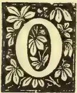

OUR attention has been called by the editor of the *Ceylon Independent*, to a paper by M. Girard on the subject of tree leaves as fodder for cattle.

Some months ago Professor Ramann of Eberswald drew attention to the feeding value of a special preparation of the twigs of trees. "The subject," says a correspondent of the *Rural Canadian*, "at least claims examination, especially as it has been tested by several practical farmers.

Bear in mind that all plants, whether annual or perennial, are built up from the same immediate principles—woody fibre or cellulose, azote compounds, sugar and fatty matters. The proportion of these substances varies largely in plants and in the organs of plants, yet even in the divers parts of these organs, according to their age. As a rule the younger the plant the richer it will be in digestible alimentary matters. For purposes of reproduction, nature forms at certain epochs of the year, alimentary deposits in certain parts of the plant; the grain has its depot of food in the infant shoot till it has leaves and roots to draw nutrition from the air and soil. In the case of trees at the fall of the leaves, there takes place in the branchettes or twigs an accumulation or store of nutriment, to assist the development of the early stage of the budding, and that becomes twigs in the course of the year. Professor Ramann prefers the twigs of the beech and birch, having a diameter between one quarter and one-

half of an inch. These as shown by analysis, have a richness equal to average hay, and very superior to the best straw; they yielded 10 per cent of starch. The professor subjects the twigs to two operations; first, crushing, but not pulverization, and next fermenting the mass by adding one per cent of malt and wetting with warm water; in the course of three days, following the weather, the temperature of the mass will have risen to between 140 and 158 degrees Fahr; the fermenting principle of the malt, diastate, transforms the starch into sugar. Finally, this twig paste is eaten with avidity by cattle, horses, and sheep; it is digested with facility and in the excrements no undigested particles can be detected. Agriculturist Jena, of Coethen, mixes the preparation with beets, potatoes, chopped hay, etc., commencing by small feeds; in the course of five days the animals take to it. He gave it to 110 cattle, 17 horses, and many sheep, from 10th February to 10th May at the rate per day, respectively,  $16\frac{1}{2}$ ,  $6\frac{3}{4}$ ,  $1\frac{1}{4}$  lbs.; stock gained 41 lb., superior weight than when the best straw was the basis of the ration mixture; the cost of the twigs, their preparation etc., is about 18 cents per hundredweight. M. Jena has further tested the fermented twig-food on 20 horses, 80 oxen, and 1,000 sheep, and finds it saved him in six months, \$500 for hay and straw. Several other German farmers are testing the novelty.

It is well-known that in India the twigs of trees are used as fodder for cattle in times of drought. The green leaf of the palmyrah palm, for instance, is extensively used as such in times of scarcity. There is little doubt that if the leaves of many trees are subjected to some process which will result in their being rendered soft, and to some extent also palatable, cattle will readily eat them. The process of ensilage is known to render thistles and brackens fit for consumption by cattle. But there are no doubt many leguminous trees whose leaves will be eaten in the raw state, and the richness of the

85------------------------------------------------

66Supplement to the "Tropical Agriculturist."[July 1, 1893.

individuals of this order of plants in nitrogenous matter is admitted. *Dhall* (which cattle greedily consume), *Erythrina Indica* and *Sesbania grandiflora* may be mentioned as examples.

Since writing the above we have been favoured with a copy of an agricultural letter from Paris, in which the subject of leaf and twig fodder is referred to and reviewed in an interesting manner. The following are the references:—

Excepting the loss of forage plants—and the loss is great,—there are no other crops seriously affected by the abnormal drought of March and April. The injured cereals are recovering, root crops are making up for backwardness, and resowings will repair blanks. It is the fodder difficulty that has to be grappled with, hence the exceptional attention and importance given to all substances capable of supplying the deficit. Leaves and twigs are closely related: the former have in several regions of France been, since late years more or less utilized to stretch fodder, or as a permanent source of alimentation. It is only recently that twigs; have been introduced as ration for cattle, horses, and stock. It is a novelty, but has the appearance of having "come to stay."

Precise information is still wanting on the food value of twigs; more chemical analyses are needed; further tests in the practical feeding of animals with the new ration are essential. Imperfect as are existing data, their trend is decidedly favorable to the food; the resistance has been shown to come from, not the animals, but the agriculturists. Two authoritative German cultivators, Major Jena and M. Biebrach, attest, that during two years they have throughout the winter, fed and maintained in good condition, 30 horses and 60 oxen and cows, on crushed twigs properly fermented with a little yeast.

Deer and chamois have no other aliment in the forests during winter almost, but the tender tips of branches. Only those twigs with a repulsive flavor are not ranked as comestible. Twigs and leaves, like other alimentary plants, contain the same elements for the formation of flesh and bone. Analysis shows that the twigs of the oak in the month of May are twice as nutritive as meadow hay, and those of the acacia rank next; the twigs of the poplar, elm, birch, pine and beech, are superior to oaten straw, that of wheat being very poor in nutritive substances. Fuller information is required respecting the facility of assimilation of the different twigs as food. Professor Ramann, who is the sponsor of the twig novelty, has analysed beech twigs, and finds that they were one-and-a-half times richer in food principles at the fall of the leaves in October, than in May when the flow of sap was in all its vigor. M. Poessier has analysed both leaves and twigs of one-quarter to three-quarters of an inch in diameter, and finds very notable differences in the percentage of protein contained in both the leaves and twigs; in spring it is much superior, and the more the shoots the higher will be that percentage. This only corroborates what is already known, that the younger the organs of plants or vegetables, the richer they will be in nitrogenous or flesh-forming principles.

Professor Girard in his work on leaves as fodder, estimates that an acre of forest produces

nearly five tons of leaves, and the mulberry half as much more. In the South-Western districts of France, leaves have been always employed in cattle feeding both in the green and dried state: in the Gironde, they are mulched up with the rations for fat stock; in Algeria the forest leaves when green, support flocks of sheep, and in winter the leaves, chiefly those of the ash are stacked as provender for horses, cattle and sheep. The experiments made by feeding milch cows and goats on lucerne *versus* fresh leaves are not conclusive: no difference was found in the quantity and richness of the milk; perhaps something could be said on the point of taste. In any case the twig food merits the serious attention and intelligent trial of all progressive agriculturists. Doubling the forage supply would be within measurable distance of making "the two blades of grass grow where only one grew before."

#### OCCASIONAL NOTES.

With this number the Magazine of the School of Agriculture begins its fifth volume, having been started in July 1889. We bespeak for our little publication the support of our subscribers in the future, and the help of our contributors in maintaining the character of the Magazine and issuing it with the same regularity with which it has hitherto appeared.

The S.S. "Madura" brought 21 cows and one bull from Bombay for the Government Dairy Farm on the 31st May. Considering the long voyage, and the bad weather that prevailed, the animals were landed in very fair condition. They are now comfortably housed in the dairy buildings, and are improving in condition, while the milk yield of the cows that have calved is steadily increasing.

Among the apparatus indented for from the Dairy Supply Co. for the new dairy, are a milk refrigerator, a dairy herd recorder, and a dairyman complete milk tester with Barham's patent percentage lactometer. We have already referred to the refrigerator which will be used for cooling the milk in warm weather and when it has to be carried long distances. By means of the dairy herd recorder the milk given by each cow at each milking can be conveniently reckoned in pounds or pints, so that a regular record of the milk-yield of the animals may be kept. The dairyman's complete milk tester consists of a milk thermometer, 4 cream tubes in a registering stand with China index, and Barham's lactometer. The patent lactometer is intended to show the purity of milk, and the percentage of water, if any present.

Foot and mouth disease was prevailing in the neighbourhood during the month of June, and with the present unsatisfactory arrangements for inspection and control of cattle sheds in the city, the greatest vigilance had to be observed against its introduction into healthy areas, as the risks of cattle free from disease being infected are very great. Reports have also been made of the disease, causing much havoc in other parts of the Province.

86------------------------------------------------

July 1, 1893.]Supplement to the "Tropical Agriculturist."67RED SPIDER.

The Red-Spider *Tetranychus telarius* familiar to agriculturists, is not a true spider but a spinning mite. It is distinguishable from the true spider in having its body and abdomen united into one piece, and not merely joined by an almost thread-like connection. When mature the red-spider is oval, furnished with four pairs of legs, two pointing backwards and two forwards; the head, body and abdomen form a solid mass, by which, as before mentioned, it is distinguishable from the true spiders which have the abdomen joined to the rest of the body by a fine stalk; and also from insects which have the head, body (thorax) and abdomen commonly distinct from each other, and which in their perfect state have never more than 3 pairs of legs. The head is furnished with a beak or sucker by means of which it draws the juices from leaves, and beneath the abdomen is a conical protuberance from which the threads are produced with which it forms its webs. The colour is various; of transparent yellowish white, orange red, or brick red, and other tints depending, as far as present observation shows, on the colour and nature of the food within, and partly also upon the age of the individual, as these mites have been noted as of a green colour in early life, changing with maturity to the rust colour we are best acquainted with.

Entomologists are not yet agreed whether there are different species of the red spider or whether the pests that attacks different forms of vegetation are all varieties of the one species. Mr. Murray, in his Handbook of Economic Entomology, thus describes the work of the mite: On leaves (especially the under side of them) it finds a fit hold, and spins its web, affixing the threads to the prominences and hairs of the leaf; and under this shelter a colony, consisting of both sexes in maturity, and young of all ages, feed and multiply with rapidity. The plant soon shows the influence of their presence in its sickly yellow hue; the sap is sucked by myriad insect-mouths from the vessels of the leaf, and its pores are closed by excremental fluids. The red spider causes enormous damage to hops in England (where it also attack the lime-tree, plum, rose, clover, &c.) in dry seasons, and its effect upon the leaves was until recently attributed to heat and drought and was called "fire-blast." These mites which are scarcely discernable by the naked eyes (except when collected together) spin their webs over the stems and branches and beneath the leaves of infested trees, giving a sort of glaze or silking lustre to the surface, and on this web they can travel easily.

Many preventatives against, and remedies for, red spider attack have been suggested, most of which are to be found in Miss Ormerod's "Manual of Injurious Insects." It is to be noted that the red spider does not thrive in the presence of moisture. Washing (by means of syringes or garden engines) with soft soap and water or even with pure water is one remedy. Miss Ormerod advises banking round the tree at a few feet distance and a few inches high, and filling the space enclosed with mud made as thin as would be retained by the raised edge. A liberal mixture of fish oil and soft soap so as to completely plaster round the foot of the tree and stick all the wandering

mites fast that touched it, could not fail to do good at a trifling cost. Sulphur is said to be one of the most active and efficient agents in preparations for destroying red spider, and sulphur and soft soap combined are among the most reliable remedies. One pound of flour of sulphur and 2 lbs. of fresh lime (an alkali is necessary for dissolving of sulphur in water) boiled in 4 gallons of water is a good mixture for washing. Miss Ormerod gives the following recipe: 3 gallons gas water, 1 lb. of flour of sulphur: these to be held over the fire while being mixed and soft soap added in such quantity as to make the mixture adhere. This may be applied to the branches with a brush, or after being diluted to a state in which it is a safe application, the liquid may be thrown over the leaves by means of a garden engine or spraying machine. Probably 15 parts of water to one of the mixture would be about the proportion, but this should be decided by trial.

ZOOLOGICAL NOTES FOR AGRICULTURAL STUDENTS.

Arthropoda (or articulata, from the fact of its members possessing jointed appendages articulated to the body,) comprises the crustacea (lobsters, crabs, &c.) Arachnida (spiders, scorpions, &c.), Myriapoda (centipedes), and lastly the important class Insecta. The crustacea, the majority of which are aquatic, include also, besides crabs and lobsters, the shrimps, water fleas, woodlice, barnacles and sand-hoppers. The Arachnida comprise, in addition to the scorpions and spiders, mites and ticks. Spiders are all carnivorous, living upon other animals, and all of them possess the power of constructing webs, which they employ either in the capture of their prey or in the construction of their own habitations. The material of which the web is made is the secretion of a special gland, and it is moulded to its proper shape by being passed through certain conical little organs which are placed at the extremity of the abdomen, and are termed "spinnerets." The spinnerets are either four or six in numbers and each has its apex perforated by a great number of little holes. The silk is at first fluid, and hardens rapidly on being exposed to the air. A single filament of silk is thus produced by each of the perforations in the spinneret, so that what we call a single "thread" in a spider's web is really a cable, composed of a great number of the most delicate fibres agglutinated together. Many species do not form regular webs, but they all use the silk to form little cases or "cocoons" in which the eggs are protected, and which the parent sometimes carries about with her. Some claim the garden spider as a friend to the Agriculturist, explaining that it destroys many of the insects injurious to plants, and that its web often protects plants from the force of wind; but this is doubtful.

The mites and ticks are grouped under the order Acarina. The mites (acari) include many species injurious to plant life, and specially to fruit trees. As instances may be mentioned the "red-spider," which is really a mite, and the orange rust mite *Acarus domesticus* is the

87------------------------------------------------

68Supplement to the "Tropical Agriculturist."[July 1, 1893.

common cheese-mite, another well-known species being *A. Destructor* which feeds on zoological specimens and thus causes much annoyance to the naturalist. *Sarcoptes scabiei*, another mite, is the cause of the skin-disease known as "itch." Mange in the domestic animals is due to three genera of *Acari*, viz., psoroptes or dermatodectes, symbiotes and sarcoptes. The true ticks (ixodidae) attach themselves parasitically by means of their suctorial mouths to the bodies of various mammals, such as horses, sheep, oxen and dogs. Another member of the *Acarina* is the curious little *Demodex folliculorum* which is found in the sebaceous follicles of man, especially in the neighbourhood of the nose. "It is probable," says Dr. Nicholson, "that few, if any individuals are exempt from this harmless parasite."

The *Myriapoda* are articulate animals in which the head is distinct and the remainder of the body is divided into nearly similar segments. They have one pair of antennæ or feelers, and the number of legs is always more than eight pairs. The centipedes and millepedes are included among them.

#### THE LISTER-BABCOCK MILK TESTER.

This new apparatus was invented by Professor Babcock, Chief Chemist of the Agriculture Experimental Station of Wisconsin, U. S. A., whose English Agents are Messrs. R. A. Lister and Company. The following is an account of how the percentage of butter fat in milk is tested:— First, thoroughly mix the mass by pouring from one vessel into another, or by stirring, and then with the pipette secure the sample and put in a testing bottle. Add an equal volume of commercial sulphuric acid that has been kept stoppered, of 1.843 specific gravity. By a gentle rotary motion thoroughly mix the acid and milk. Then place the bottles in machine and turn for ten minutes, at a speed of eighty-six to ninety turns of the handle per minute, then stop, and fill the tank with water at a temperature of 190 degrees Fahr., and at the same time fill bottles to the 7 per cent. mark with water of the same temperature. This may be taken with the pipette from the hotwater tank (be careful not to have the water above 190 degrees as it may burst the bottles); when this is done, put the bottles back into machine, and turn it again for two minutes, the bottles can then be taken out, held in a vertical position, and the amount of butter fat read off in the graduated tube. It may be 3.2, 4.4, or 5.6, or more or less, and this determines the value of the milk, just as the assayer fixes the value of ores by testing samples.

At the recent Dairy Conference, Professor Primrose McConnell elicited the hearty plaudits of the company when he referred to the Babcock tester as a most reliable test of the percentage of butter fat in milk. By means of this new tester, together with a hydrometer and special set of tables arranged by Mr. Embrey. F.C.S., City Analyst, Gloucester, any one can easily determine for himself with the greatest accuracy not only the percentage of fat in his milk but also of solids not fat, so that he thus obtains an exact analysis of the milk. This tester was en-

tered for competition at the London Dairy Show, and Mr. Gilbert Murray, the well-known expert at Elvaston, Derbyshire, was appointed by the British Dairy Farmer's Association to test the appliance. For this purpose he provided Messrs. Lister with three different qualities of milk—one being very rich, having been drawn from the first prize Alderney cow in the show, one being taken from an ordinary cow in the show, and one being newly-separated milk. The three milks were duly tested by the Lister-Babcock tester and the results noted. Samples of the same milk were then sent to the Society's Chemist, Professor Llyod, to be analysed in the usual way, and the accuracy of the analysis of the milks obtained by the tester was so fully borne out by Mr. Llyod's analysis, that a special silver medal was awarded to Messrs. Lister for this valuable appliance. The apparatus has also been tried in New South Wales, where the following conclusions were drawn by the authorities by whom the trial was conducted:—

1. The Babcock machine may be relied on to give uniform and concordant results within a limit of one-fifth per cent.

2. Its results do not differ from those obtained by extraction with ether by more than one-fifth per cent.

3. The prolonged contact of the acid with the milk in the bottle before whirling has no effect upon the reading of the butter fat within the limits of time occupied by the test. Should the acid have remained for any great length of time in contact with the milk, the tank must be filled with hot water. In any case, we consider the readings are more reliable if hot water be added during whirling, but if the filling be done expeditiously, and the bottles rotated at once, the initial temperature is sufficient.

4. Scrupulous attention to the detailed instructions is absolutely essential, as are also strict cleanliness and accuracy.

5. The machine is sound in principle and easy to understand and to work.

6. The time required for the treatment of twenty-four samples is about one and-a-half hours from the filling of the first bottle to the reading of the last. Forty-eight samples may be done in two hours if two men are working. We would, however, always advise that each milk be tested in duplicate. Thus fifty samples could be treated in about three hours.

7. The cost of the acid used for charging twenty-four bottles is about 3d. Commercial sulphuric acid may be used, but it is important that it should be of the right strength. Its specific gravity should not be much more or less than 1.834.

8. It has the great advantage over gravimetric methods that it is more expeditious, and does not require any special skill in the manipulation; accuracy and cleanliness are absolutely essential. It should, in our opinion, prove of great use in butter factories. With a ready and effective means of testing the quality of the milk supplied, both buyers and sellers would be benefited, as a fair scale of payment, according to the richness of the milk, could be adopted.

88------------------------------------------------

July 1, 1893.]Supplement to the "Tropical Agriculturist."69

According to Prof. Henry of the Agricultural Experiment Station attached to the University of Wisconsin, "the Babcock tester is used by several thousand creameries and cheese factories which pay for the milk by the fat delivered, and on thousands of farms for testing cows and weeding out poor ones. It is revolutionizing American Agriculture."

#### A FEW NOTES ON FODDER AND PASTURE LANDS IN CEYLON.

The village farmer has not yet attained to that degree of advancement in agriculture, necessary to appreciate the advisability of growing any special fodder crops for cattle. Of the enormous quantity of fodder required to keep cattle in condition he seems to be unaware. He does not take due care to raise fodder and only avails himself of what falls in his way by chance. In European and other countries where agriculture is in a prosperous condition, it is customary to grow special crops for cattle, such as the clover, lucerne, &c.

But, for the present, leaving alone the question of special crops for cattle, I wish to make a few remarks about the supply of fodder which is already at the disposal of the native cultivator, giving hints for improving it where possible.

1. The straw of Paddy forms the staple fodder used in this country; but care must be taken as far as possible, not to allow the straw to get exposed to the continual action of the elements and thus lose a good deal of its nourishing properties. Of course when it is stacked in the open field a certain amount of exposure cannot be helped, but it can be minimized by stacking the straw in a regular conical shape and placing a light portable umbrella-shaped ola cover called a *Kudil* at the top. The stubble left in the field after reaping the paddy is also available as fodder for the cattle for a few days. Just after the harvest the animals, if allowed a free run in the fields, will be found to become stouter and healthier.

2. After the harvest the fields are allowed to lie fallow for about half the year. But nature, a "mother kind alike to all," converts the paddy-field into a pasture-land in a short time, and until the next year's cultivation, the goiyas, black cattle and the buffaloes graze on it. Any one travelling upcountry by the train at this time of the year can form some idea of this transformation by looking at the paddy lands along the railway line.

3. The rolling patnas and the fertile valleys of the hilly districts abound in grass ranging from the tall 'mana' downwards, and supply food for the cattle. The European planters generally grow fodder specially for their cattle, but the native cattle-owners graze their animals solely on the grass of the patnas and valleys. In the dry months they set fire to the mana bushes, and after the very next shower fresh shoots come up from the old stumps, and the scorched patnas are soon again decked in green. It is thus that most of the upcountry pasture-lands are renewed for the use of the cattle. The moist climate of the hills is highly conducive to the luxuriant growth of grass, and the dark, glossy and stout buffaloes which freely graze on

the slopes and valleys there, contrast very favourably with the gray, haggard and lean ones of the low country.

4. Even in the driest districts the trees afford a welcome shade to the growth of grass. It is a pity that our cattle owners do not care to take advantage of this easy method of growing grass in districts where all the grass in the open is parched up by prolonged drought. They do not even care to keep the self-grown grass under trees clean of the weeds which choke it up. The late Mr. R. O. D. Asbury of Jaffna wrote thus in connection with growing grass under shade:—"What extensive and beautiful groves of palmyrabs and coconuts we have in Jaffna that can at once be set apart for this purpose—their shade being a protection to some kinds of grass."

5. In some parts of the North it is too common a custom to scrape out the grass in the compounds with an instrument called the *ulavdrum* when it is required for feeding cattle. This is very injurious to the further growth of the grass on the spot, as it is thus scraped up with the roots. It would be much better to mow or cut the grass, if it has grown tall enough, or otherwise to leave the cattle to graze on it. E. T. HOOLE.

(To be continued.)

#### THE ORANGE RUST MITE.

The rust-like appearance on the fruit of the orange tree is often thought to be due to a fungoid growth, but investigations have lately shown that it is caused by a very small-legged mite, which punctures the oil cells of the fruit. When exposed to the influence of the atmosphere the exuding oil undergoes a change, assuming a dark rusty appearance, which depreciates the value of the fruit for the market. The mite which causes this discoloration is known as *Thyoptus oleivorus*, and its life history and habits have been carefully investigated. It is said we do not know with what truth, that though badly-rusted fruit is small, the quality is improved rather than deteriorated. The cause of this improvement is said to be that the toughened rind preserves it from injury and decay and prevents evaporation from within. A solution of 1 lb. of whale oil soap in 50 galls. of water is highly recommended as a remedy; but several applications at short intervals are necessary. Flower of sulphur has also been put forward as one of the cheapest and most effective remedies, and it may be used in connection with the above mixture or other insecticides. Applications of insecticides should be made on the first appearance of the rust. Sulphur and washing soap has been reported to have done good when sprayed over the trees, while dusting with quicklime is also said to have produced favourable results.

#### A VISIT TO THE POONA DAIRY FARM.

The Poona Dairy herd when I visited the farm consisted of 42 head, being made up both of meat cattle and buffaloes. The following is Mr. Mollison's opinion on his dairy stock:—

"Aden cows are without exception the best milk breed of cows we have yet tested. They

89------------------------------------------------

70Supplement to the "Tropical Agriculturist."[July 1, 1893]

are very docile, and their milk is not easily affected by irregularity.

If well cared for, the heifers mature earlier than with most Indian breeds, and come into profit sooner. The cows give an equal yield of milk to that of large breeds, on much less food. They come in "season" 6 weeks to 2 months after calving, and, if permitted, will milk up to the day they calve again. Our best Aden cow gives after calving 22 lb. milk per day, and never gives less than 10 lb. Our next best milker is a five-year daughter of this cow by a Gir bull. The Gir cows are not so satisfactory as the Adens, and my conviction is that they do not, under the best management, maintain in the Deccan the same milking qualities they possess when grazed on the Gir Hills.

The Adens are small in size and most of all the Indian breeds resemble our own native animals. The Girs are handsome creatures and are characterised by large pendent ears and broad prominent forehead, and they are of a mild disposition.

Buffaloes are in great favour on the Bombay side as milk and especially butter producers, and much surprise was expressed by those engaged in dairy at my statement that there is a insurmountable prejudice in Ceylon against buffalo milk and butter. In the Bombay Presidency nearly all the butter is made from buffalo milk, the produce being slightly dyed with anatto to give it the colour of real cow's butter. This is no sophistication, for the consumers are perfectly well aware that they are being supplied with buffalo butter. Colouring with a standard contract of anatto dye is of course quite common in English dairies. The Surat buffalo is according to Mr. Mollison, unsurpassed as a butter producer, and in the hot weather when I was there gave 1 lb. of butter from 10 lb. of milk, and the best milker produced 36 lb. of milk. With the price of buffalo butter at 12 annas or 75 cents per lb., a good Surat buffalo thus gave by sale of its produce nearly R3 per day. In Poona buffalo milk is sold at 16 lb. for the rupee, while 13 lb. of cows milk are got for the same money.

Of concentrated food about 4 lbs. of cotton seed is allowed per cow, and Mr. Mollison characterises this as one of the best and cheapest foods. Gingelly cake, however, he considers the best of all, but as it was found rather expensive to purchase, carthamus. tinctorius, kusumbi (safflower) cake, bought at 101 lb. per rupee, was substituted. This latter has the advantage of keeping for months without moulding, though cattle have to get accustomed to it before they will eat it readily. Bran and chuni (or dhall husk) are the other foods depended on. When I was at Poona brewer's grain from the Deccan brewery was being utilized. Here is a sample of the diet of a dairy cow: 4 lb. bran, 4 lb. malt, 3 lb. oil cake and 3 lb. cotton seed, but the quantities of different foods vary according to the size milk yield of the animals. The cows were as a rule let out for a couple of hours in the cool part of the morning for a little exercise in the field.

It will be observed that the produce of the milk is reckoned in pounds. The term *seer* commonly heard in India is (like "maund") of

variable significance, and therefore milk is weighed by means of the dairy herd recorder which shows the milk in lbs. as well as imperial pints. The rule at Poona is to weigh each cow's milking and afterwards weigh the total produce again. A quart of milk weighs on an average  $2\frac{1}{2}$  lb. In the dairy I found a "baby" and "victoria" separator, a victoria churn as well as a refrigerator, and an alderney butter worker. I spent some time looking at the various processes in the manipulation of milk, and Mr. Mollison was most solicitous to place me in possession of all the information that I desired to have. He advised the use of four-wheeled spring carts for carrying the milk any distance, and to cover the vessels, into which the milk is put after being passed through the refrigerator, with canvas jackets that had been dipped in water, so that the process of evaporation that would go on while the milk was in transit might help to keep it cool.

#### GENERAL ITEMS.

Professor Walley, in his work "A Practical Guide to Meat Inspection," thus refers to foot and mouth disease:—"That it is due to a micro-organism is proved by its nature and its course, and by its clinical and pathological characters: but this micro-organism has not yet been satisfactorily demonstrated, though Klein has described a micrococcus in the fluid taken from vesicular lesions. That the virus pervades the whole system is shown by the fact that the characteristic lesions develop more or less over the cutaneous surface, and in the mucous membrane of the alimentary canal, on that of the sheath, the vagina, the udder, and, occasionally the bronchial tubes. The virulence of the disease varies materially in different epizootics in different animals, and in different seasons; thus, in some out-breaks, a large percentage of animals die either from the effects of the fever or from the effects of the local lesions. In the vast proportion of cases the fever which accompanies its evolution is of so benign a character as to interfere but very slightly with the nutrition of the blood or of the flesh. But every now and again—especially when the sufferers are exposed to such adverse influences as cold or wet, to exhaustion, or to bad sanitary conditions—it assumes malignant characters, and its lesions partake of the nature of those produced by septic infection; there is induced, in fact, a veritable septicaemia."

Mr. R. Atherton writes of "Arrowroot" and Tapioca:—"Both these products have been largely grown in this district, particularly the latter, as the Manioc is grown in nearly every garden and chena in the Province, and the industry began last year to be extended to Jaffna and Trincomalee, in which places it was not formerly grown, regular cargoes of bundles of sticks (or slips) being purchased by the traders and carried away. Of late years though Arrowroot is found growing here and there in small clumps or *patches*, the growth of it in any great proportion has visibly declined. Enough Arrowroot has been made from the produce of one garden in town to last

90------------------------------------------------

July 1, 1893.] Supplement to the "Tropical Agriculturist."71

one large family for over 3 years, but for many years to my certain knowledge none has been manufactured. The processes of making the impalpable powders called 'Arrowroot' and 'Tapioca' are exactly similar, viz., by macerating or pounding the root, steeping it, washing it in many waters and drying the powder in the sun or even in an oven. But while Tapioca is granulated, Arrowroot is left "en masse" and always retains its powdery form. Both Arrowroot and Cassava are extremely prolific and throw out new roots in great profusion, one single root of the former producing a large clump of 10 or 20 good tubers in about 12 months,—Cassava topping it in size and the ease from which it is grown from little slips. Some 30 to 40 years ago a large quantity of Arrowroot was manufactured in Colombo by the Industrial School, and any quantity could be had by importing it and that of an excellent and superior quality, but of late years I have not heard of any being made there. The ease with which the roots and slips can be obtained, the profusion with which it grows and its suitability for growth in our garden soils make it a matter for surprise that no special attempt has been made to extend the industry which must be a paying one. But very small quantities seem to be imported into the island, and that in a tinned form, each tin holding from  $\frac{1}{4}$  to  $\frac{1}{2}$  a lb. each; while as a "mainstay" if not exactly as a very nourishing food, Arrowroot might be much more largely grown and used. There is a variety of Arrowroot grown in some of our gardens which shews a beautiful cream and green mottled leaf, very showy and ornamental, but I know nothing of the quality of the tuber it produces.

The chemical analysis of milk, says an Australian paper, is neither complicated nor difficult. A small dish is accurately weighed, and the weight noted. Into it is now introduced a small portion of milk, and both are again weighed. By subtracting the weight of the dish from the weight of both, the weight of the milk is found and carefully recorded. The dish is placed over a steam jet, and the water of the milk evaporates, leaving a residue. It is this residue which passes under the name of "solids." A last weighing of the dish with the milk residue, less the weight of the dish, gives the weight of the

solids, and by a simple calculation the percentage is found. The solids of milk have been found by innumerable analyses to average about 13 per cent., and, while the fat varies in the milk from different cows, the solids left after extracting the fat are a very constant quality, hardly ever falling below 9 per cent. This gives the chemist a positive basis for his calculations, and enables him to state with great certainty whether or not the milk has been watered. The fat or oil in milk is determined by dissolving it by means of ether out of total solids, the residue remaining after the operation being termed "solids, not fat." The average fat or oil found in cows' milk is 3 per cent., and any amount less than this is commonly taken as showing that the milk has been skimmed. If analysis shows a decrease of fat, and solids, not fat, it is said to be certain that the milk has been watered, while, if the fat only is low, that the milk has been skimmed.

It is a matter of regret, as the *Indian Agriculturist* observes, that the permanent dyes of vegetable origin are being displaced by the cheap and fugitive productions of modern science. A collection of these permanent dyes is now being made in India for the Imperial Institute, and the latest Handbook, issued in connection with the Indian Court, gives an account of the *kamela* dye, which produces a gorgeous flame colour of varying shade, according to the process employed. The handbook is illustrated by pieces of dyed silk which are pasted into the book, and give an excellent idea of the rich colours to be obtained from the dye. The dye itself is merely the powder that coats the berries of *mallotus phillipinensis*, which is found wild in India. In Ceylon the tree is known as *hamparila* among the Sinhalese, and *kapila-podi* among the Tamils.

The distress in some parts of India from failure of crops and destructive flood is said to have compelled the poor people to live on roots and fruits varied occasionally with pounded mangoe kernals, and a few mhowra flowers, and it was remarked that they seemed to thrive on such diet.

A decorative horizontal flourish or scrollwork design, symmetrical and ornate, centered on the page.

91------------------------------------------------

<!-- stage4: FAINT old-images-only -->

[Faint page: no legible print of its own could be verified; text withheld (stage 4 review list)]

92------------------------------------------------

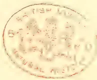A circular red ink stamp is centered on the page. The stamp features a central emblem, possibly a coat of arms or a crest, surrounded by a ring of text. The text is difficult to read due to fading, but it appears to be in a circular arrangement. The overall appearance is that of an official seal or a library stamp.

93------------------------------------------------

A detailed black and white engraving of a man's head and shoulders. The man has a high forehead, receding hair on the sides, and a serious expression. He is wearing a dark military uniform with a high, ornate collar. On his left chest (viewer's right), there is a large ribbon with several horizontal stripes. To the right of the ribbon, there are several circular medals and a star-shaped insignia. The background is a soft, shaded wash.

LIEUTENANT-GENERAL SIR EDWARD BARNES, K.C.B.

*Tropical Agricultural Portrait Gallery.*

No. I.

94------------------------------------------------

<!-- stage4: ACCEPT r2J/J_002:35 -->

# \* The TROPICAL AGRICULTURIST \*

∞ MONTHLY. ∞

Vol. XIII.]

COLOMBO, AUGUST 1ST, 1893.

[No. 2.

## H.E. LIEUT.-GENERAL SIR EDWARD BARNES, G.C.B.,

Lieut.-Governor of Ceylon from 1st February 1820 to 2nd February 1822,  
and Governor from 18th January 1824 to 12th October 1831.

THE FOUNDER OF EUROPEAN PLANTING INDUSTRY IN CEYLON:—BY HIS ROAD FROM COLOMBO TO KANDY, AND THENCE THROUGH THE HEART OF THE HILL-COUNTRY, AND BY HIS EXAMPLE IN OPENING "GANGARUWA"—ONE OF THE EARLIEST COFFEE PLANTATIONS.

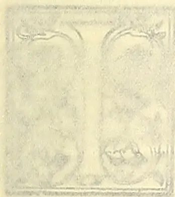

In some respects, Sir EDWARD administered the affairs of the Crown Colony of Ceylon. He had also the longest term of administration: first, 1820-22 for two years as Lieut.-Governor, and then from 1824 to 1831, for seven years and nine months continuously as Governor. These facts and the great amount of invaluable work performed during his term of office, make us all the more regret that, in the time at our disposal on the present occasion, we have been able to get so few particulars of his early career, distinguished as it was in many ways before Sir Edward Barnes ever saw Ceylon. Army Lists and other works of reference belonging to the early part of the century are wanting in our local Libraries, and although we have scanned a good many volumes of the "Annual Register," the results have been very scanty indeed. It may be truly said of Sir Edward Barnes that among the considerable list of Military Governors—some of them very able and distinguished men—who administered Ceylon during the first thirty years of the century,

He was the bravest warrior who ever buckled sword.

To substantiate this it is only needful to mention, as an evidence of his distinguished military career that Major-General Barnes was Adjutant-General to Field-Marshal the Duke of Wellington, K.C. at Waterloo. In the Duke's memorable Despatch to the Principal Secretary of State for War, dated "Waterloo, June 19th 1815," we find the following reference by the

Chief who was ever so sparing of words and praise,—"I had every reason to be satisfied with the conduct of the Adjutant-General, Major-General Barnes, who was wounded." As a coincidence, it may be mentioned that six weeks after Waterloo, the news reached Downing Street of the capture of Kandy and the downfall of the Kandyan Kingdom in Ceylon.

From the statue erected to Sir Edward Barnes at the head of Prince Street, we learn that he was born in 1776 and so, at Waterloo, Adjutant-General Barnes was 29 years of age (seven years junior to the Duke), and consequently he was in his 44th year when, as Lt. Governor, he assumed charge of Ceylon in 1820. He was still, therefore, not more than 55 when he left the island for India, in 1831; but no doubt exposure on many a hard-fought field in the Peninsula and elsewhere had told on him; because, after three years' service as Commander-in-Chief in India, returning home, he died in England in Oct. 1838, when only 62 years of age. The story we have heard is that after successfully contesting a seat for Parliament,—he was M.P. for Sudbury when he died,—he caught cold while attending a Levee at the Royal Palace, which developed a fatal illness. On his retirement from Ceylon—or rather in February 1831—he was made a Knight Grand Cross of the Bath, G.C.B.

Returning to his career in the East, and especially in Ceylon, with which we have more particularly to do, it is singular that so little reference is made to his term of office (1822-24) as Commander-in-Chief in India. But this is probably due to the fact that he did not get on well with the Civil authorities there, and was only too glad to exchange offices in the latter year with Sir E. Paget, and to return as full Governor to Ceylon. Here, by far the most interesting and vivid reminiscences of our great ruler are those afforded in his autobiography by the late Major Skinner, who was deservedly proud of having been, as a youngster, a special protege and favourite of Governor Barnes. But before

To accompany an engraving. We regret that this first portrait is such a poor one, due to the fact that a photograph or proper portrait was available, and the engraving had to be prepared from an ordinary old engraving. The second and third Collotype-frontispieces—specimens of which have arrived—are very good in their style and execution.

95------------------------------------------------

SIR EDWARD BARNES, K.C.B.

Tropical Agric.

Print Gallery.

96------------------------------------------------

# \* The TROPICAL AGRICULTURIST \*

◇ MONTHLY. ◇

Vol. XIII.]

COLOMBO, AUGUST 1ST, 1893.

[No. 2.

## H.E. LIEUT.-GENERAL SIR EDWARD BARNES, G.C.B.,

Lieut.-Governor of Ceylon from 1st February 1820 to 2nd February 1822,  
and Governor from 18th January 1824 to 12th October 1831.\*

THE FOUNDER OF EUROPEAN PLANTING INDUSTRY IN CEYLON:—BY HIS ROAD FROM COLOMBO TO KANDY, AND THENCE THROUGH THE HEART OF THE HILL-COUNTRY, AND BY HIS EXAMPLE IN OPENING “GANGARUWA”—ONE OF THE EARLIEST COFFEE PLANTATIONS.

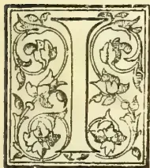

IN some respects, Sir EDWARD BARNES was the greatest Governor who has ever administered the affairs of the Crown Colony of Ceylon. He had also the longest term of administration: first, in 1820-22 for two years as Lieut.-Governor, and then from 1824 to 1831, for seven years and nine months continuously as Governor. These facts and the great amount of invaluable work performed during his term of office, make us all the more regret that, in the time at our disposal on the present occasion, we have been able to get so few particulars of his early career, distinguished as it was in many ways before Sir Edward Barnes ever saw Ceylon. Army Lists and other works of reference belonging to the early part of the century are wanting in our local Libraries, and although we have scanned a good many volumes of the “Annual Register,” the results have been very scanty indeed. It may be truly said of Sir Edward Barnes that among the considerable list of Military Governors—some of them very able and distinguished men—who administered Ceylon during the first thirty years of the century,

he was the bravest warrior who ever buckled sword.

To substantiate this it is only needful to mention, as an evidence of his distinguished military career that Major-General Barnes was Adjutant-General to Field-Marshal the Duke of Wellington, K.G. at Waterloo. In the Duke's memorable Despatch to the Principal Secretary of State for War, dated “Waterloo, June 19th 1815,” we find the following reference by the

Chief who was ever so sparing of words and praise,—“I had every reason to be satisfied with the conduct of the Adjutant-General, Major-General Barnes, who was wounded.” As a coincidence, it may be mentioned that six weeks after Waterloo, the news reached Downing Street of the capture of Kandy and the downfall of the Kandyan Kingdom in Ceylon.

From the statue erected to Sir Edward Barnes at the head of Prince Street, we learn that he was born in 1776 and so, at Waterloo, Adjutant-General Barnes was 39 years of age (seven years junior to the Duke), and consequently he was in his 44th year when, as Lt.-Governor, he assumed charge of Ceylon in 1820. He was still, therefore, not more than 55 when he left the island for India, in 1831; but no doubt exposure on many a hard-fought field in the Peninsula and elsewhere had told on him; because, after three years' service as Commander-in-Chief in India, returning home, he died in England in Oct. 1838, when only 62 years of age. The story we have heard is that after successfully contesting a seat for Parliament,—he was M.P. for Sudbury when he died,—he caught cold while attending a Levee at the Royal Palace, which developed a fatal illness. On his retirement from Ceylon—or rather in February 1831—he was made a Knight Grand Cross of the Bath, G.C.B.

Returning to his career in the East, and especially in Ceylon, with which we have more particularly to do, it is singular that so little reference is made to his term of office (1822-24) as Commander-in-Chief in India. But this is probably due to the fact that he did not get on well with the Civil authorities there, and was only too glad to exchange offices in the latter year with Sir E. Paget, and to return as full Governor to Ceylon. Here, by far the most interesting and vivid reminiscences of our great ruler are those afforded in his autobiography by the late Major Skinner, who was deservedly proud of having been, as a youngster, a special protege and favourite of Governor Barnes. But before

\* To accompany an engraving. We regret that this first portrait is such a poor one, due to the fact that no photograph or proper portrait was available, and the engraving had to be prepared from an ordinary old wood engraving. The second and third Collotype-frontispieces—specimens of which have arrived—are very different in their style and execution.

97------------------------------------------------

74THE TROPICAL AGRICULTURIST.[AUGUST 1, 1893.

quoting from Skinner, we may refer to some other and contemporary writers, and first here is the rather meagre summary from our Table of Events in Ceylon:—

SIR E. BARNES, GOVERNOR, 1824-31.

1824. Lieut-General Sir Edward Barnes, K.C.B., Governor; Sir R. Ottley, Chief Justice; Hon'ble J. Rodney, Colonial Secretary.

" Building of the Pavilion, Kandy; and of Mount Lavinia House, near Colombo.

" Moon's "Catalogue of Ceylon Plants" published.

" First regular Coffee Plantation opened. Although the first regular Coffee Plantation in Ceylon was opened in Ceylon in this year, the enterprise is usually dated from thirteen years later, in 1837.

1825. First English Steamer, the "Enterprise," in India.

" Bishop Heber visits Ceylon; August 25, arrives at Galle; Sept. 15, Kandy; Sept. 29, leaves for India.

1826. The infliction of capital punishment upon women, by drowning, in the Kandyan Provinces abolished.

" Uduvil Girls' Boarding School established by American Missionaries in Northern Province.

1827. The export of Coffee for the year equalled 16,000 cwts.

" Foundation of the Kotte Christian Institution laid by the Governor, 8th November.

1828. Nuwara Eliya established as a Military Convalescent Station.

1829. The Commissioners of Enquiry (Mr. C. H. Cameron and Lieut.-Col. Colebrooke), who were appointed, to report upon all matters relating to the administration of the Government of Ceylon, arrived at Colombo, 11th April.

" The Colombo Pettah Library instituted by the Burghers, 11th April.

1830. Colombo United Service Library established.

1831. The Colombo Friend-in-Need Society formed, 16th March.

" The Kandy Road via Kurunegala and Galedara and that via Kadugannawa finished.

" Series of successful Pearl Fisheries from 1828 to 1837.

Besides building the Pavilion, Kandy, and Mount Lavinia House,—of which works some curious information is extant,\*—a third Governor's residence was built in 1829 in "Barnes' Hall," Nuwara Eliya, the Sanatorium having been first discovered to Europeans three years earlier, and selected as a Military Convalescent Station by Sir Edward Barnes.† But, undoubtedly, the far-seeing wisdom and enterprise of Governor Barnes were most fully

\* On a rocky headland, which projects into the sea a few miles from Morottu, are the remains of what was once the marine palace of the governors of Ceylon; an edifice in every way worthy of the great man by whom it was erected—Sir Edward Barnes. But in one of those paroxysms of economy which are sometimes not less successful than the ambition of the Sultan in the fable, in providing haunts for those birds that philosophise amidst ruins, the edifice at Mount Lavinia had scarcely been completed at an expense which has been estimated at £30,000, when it was ordered to be dismantled, and the buildings were disposed of for less than the cost of the window frames.—Tennent's *Ceylon*.

† The first visit of Europeans to this lofty plateau was made by some English officers, who in 1826, penetrated so far in pursuit of elephants. Struck with its freshness and beauty, they reported their discovery to the Governor, and Sir Edward Barnes, alive to its importance as a sanitary retreat for the troops, took possession of it instantly, and commenced the building of barracks, and of a bungalow for his own accommodation. He directed the formation of a road; and within two years Neuera-ellia was opened (in 1829) as a convalescent station.—*Ibid.*

shown in his military and commercial roads between the sea-coast and the hill-country—his "Bridge of Boats" over the Kelani (which is only now after sixty years being superseded,) and his projection of main thoroughfares right through the Kandy country to Badulla and Matale and thence North and East to Trincomalee. If the first and most potent means of extending civilization (according to Sir Arthur Gordon quoted by Charles Kingsley in "At, Last") be found in roads—the second in roads—and this third again in roads,—to Sir Edward Barnes belongs pre-eminently the reputation of the far-seeing Statesman, the Educator and Benefactor of the people entrusted to his care. When the British landed in Ceylon in 1796 there was not in the whole island a single practicable road; before Sir Edward Barnes resigned his Government in 1831 every town of importance was approached by a carriage road. The permanent conquest and quiet settlement of the Kandyans who had baffled Portuguese and Dutch invaders for 300 years was undoubtedly due to Sir Edward Barnes' first-class macadamized road from Colombo to Kandy, including the alternative route via Kurunegala (which so completely answered the native tradition of their conquerors being those who should make a road through rocks) and the beautiful as well as substantial satinwood bridge (due to the genius of General Fraser) across the largest river in the island, the Mahawelliganga, at Peradeniya. The first attempt at a census—or an approach to an accurate numbering—of the population of Ceylon was made by Governor Barnes in 1824, the result being a total of 851,440 which shewed that including omissions due to the hiding of people, there could not be more than a million of both sexes and all ages in the island seventy years ago, against the three millions of our latest Census. But the same master-mind that conceived the system of carriage roads between the principal towns, was never satisfied until it demonstrated that there was an industry and trade in value capable of being developed in the hillcountry far in excess of the fabled mines of precious metals and jewels which the Portuguese, Dutch, and even early British had credited the Kandyan monarch with controlling within his territory. The Dutch who began coffee cultivation in the lowcountry in 1740 were never able to export more than 1,000 cwt. in one year. Mr. Geo. Bird, under the direct encouragement of the Governor, began the first regular plantation at Sinnapitia, near Gampola, in 1824, and then Governor Barnes himself, to stimulate and encourage capitalists to settle, led the way next year, by opening Gangaruwa estate above what are now the Royal Botanic Gardens, Peradeniya—and a plantation which, under the care of Sir Edward Barnes' son—Mr. R. H. Barnes,\* an accomplished meteorologist and careful planter—did well up to the sixties and seventies in coffee, while under cocoa and other products it is still a valuable property for its present owner and lessee. Had Sir Edward Barnes remained longer in the Island, coffee cultivation would have undoubtedly developed much more rapidly than it did, the export in the year he left being only a few thousand cwt., while in 1837—the year from which we usually date the active rise of the planting enterprise—it had risen to 30,000 cwt. The cause is clearly explained by Tennent when he writes:—

\* He left Ceylon in June 1867 and sold Gangaruwa in January 1872.

98------------------------------------------------

AUGUST 1, 1893.]THE TROPICAL AGRICULTURIST.75

So soon as Sir Edward Barnes had made such progress with the great central high road as to open a communication with the hill country, it was obvious to his clear and energetic mind that so grand a work would be a reproach instead of a trophy, were its uses to be limited to mere military exigencies, without conducing to the material prosperity of the island. Hence, even before its final completion, his measures were taken to emulate in Ceylon the industrial enterprise of India. The preparation of indigo was attempted, but unsuccessfully, near Veangodde; that of sugar was encouraged on the alluvial lands of the interior; and, taught by experience the inaptitude of the lowlands for the profitable cultivation of coffee, Sir Edward formed the first upland plantation about 1825, on his own estate at Gangaroova, adjoining the gardens of Peradenia.

The example of the Governor was speedily followed; plantations were opened at Gampola and elsewhere, and the first attempt, though begun in a comparatively low altitude sufficed to demonstrate the superiority of the hill country over the low land, for cultivation, both in the quality and the abundance of the produce.

At this crisis the fate of the experiment was decided, by the adoption, in 1835, of a measure which Sir Edward Barnes had urged on the home government in 1826; the duty was equalised upon East and West India coffee, imported into the United Kingdom, at the moment when the failing supply of the latter turned attention eagerly and anxiously towards Ceylon. In the very next year nearly four thousand acres of mountain forest were felled and planted, and in an incredibly short time the sale of crown lands exceeded forty thousand acres per annum.

Sir Edward Barnes was also the means of encouraging the local preparation of coconut oil with a view to its shipment to Europe:—the first shipment being taken away in 1820 by Capt. Boyd (afterwards of Acland, Boyd & Co.).

In May 1821 Sir Edward Barnes arranged for the gradual emancipation of the children of certain native castes hitherto held as slaves; and here we may give a list of the Proclamations and Regulations still retained in the Ceylon Statute Book as passed during the rule of Sir Edward Barnes:—

Proclamation of 7th September, 1820.—Whereas good and permanent roads have been and are now making in the Kandyan provinces for public convenience, and it is highly necessary the same should be preserved from any damage or encroachment, &c.

Proclamation of 14th July, 1821.—Sales of land to be final unless otherwise stipulated.

Proclamation of 21st May, 1822.—Applications to register temple lands will be received, if given in before 1st September, 1822.

Regulation No. 26 of 1822.—For obliging the possessors of wells to raise the walls to a sufficient height to secure persons from danger of accidentally falling in.

Regulation No. 15 of 1823.—For making a general provision in respect to property found.

Regulation No. 18 of 1823.—Interest.

Regulation No. 14 of 1824.—For preventing the wetting of coffee, the growth of this island, with the intent of increasing its apparent weight or quantity.

Regulation No. 8 of 1825.—For declaring the legal and established currency of the Island of Ceylon to be the silver and copper current coin of Great Britain, and also the Ceylon silver and paper rix dollar, and the copper subdivisions thereof, already current therein.

Proclamation of 14th January, 1826.—Fictitious Transfers of Lands.

Regulation No. 5 of 1829.—To remove all doubts as to whether the Statute 10 Geo. 4. cap. 7. passed "for the Relief of His Majesty's Roman Catholic subjects," extends to and is in force in Ceylon.

A more important Regulation than any of these is that which we find in "Bennett" and

which we cannot help transcribing in full:—

REGULATION OF GOVERNMENT,

*For promoting the Growth of certain Articles of Agricultural produce in the Island of Ceylon, and for the encouragement of Agricultural speculation.*

Whereas it is proper and expedient to afford every practicable encouragement to Agricultural speculations and pursuits in this Island and more particularly to the growth of certain articles of produce hereafter specified. And whereas it has been represented to His Excellency the Governor that some persons have been deterred from engaging in such speculations and pursuits by an apprehension that they might be liable to pay a proportion, the produce thereby raised as a tax due and payable to Government.

1. For removing therefore all such apprehensions, it is hereby enacted by his Excellency in Council, that no part of any Coffee, Cotton, Sugar, Indigo, Opium, or Silk, of the growth or produce of the Island, or of any part of its Dependencies, has hitherto been, or will be demanded or claimed by Government for the period of twelve years from this date.

2. And whereas by Regulation of Government, No. 9, of 1825, therein referred to, Coffee and Cotton are permitted to be exported from any port of this Island, free of duty, but no mention is made of the other articles of produce herein enumerated, it is therefore hereby further declared that all Sugar, Opium, Indigo, or Silk, the growth or produce as before named, may be exported from any port of this Island or its Dependencies free of all duties whatever.

3. And it is further enacted, that all Implements, Tools, and Machinery used for the purposes of Agriculture, or of any kind of Manufacture, may from henceforth be imported into this Island free of all duty whatever.

4. And with a view to the further encouragement of Agricultural speculations, it is also enacted that all Labourers, of whatever nation or description, who shall be *bona fide* employed in any plantation of Coffee, Cotton, Sugar, Indigo, Opium, or Silk, or in the manufacture or produce thereof, shall be exempt from being called out in the public service during the period of such *bona fide* employ, except during actual war, and for the purpose of repelling invasion, or during internal commotion. Provided, that in order to exempt from such public service those otherwise liable, a certificate from the Proprietor of such plantation, or manufacturer, or from his Agent, be produced to the Collector of the District. And any Proprietor or Agent issuing to any Labourer a certificate which shall be wilfully false in any particular, shall, on conviction, be liable to a fine not exceeding Twenty Pounds; and in default of payment, to imprisonment for any term not less than Two calendar months, nor more than Six calendar months.

Given at Colombo, 21st September, 1829.

By order of the Council,

T. EDEN,

*Secretary to Council.*

The common idea is that Sir Edward Barnes confined his attention, chiefly, to what is now the Central Province. But there never was a greater mistake, as Forbes, Colonel Campbell, and Bennett—all of them contemporaries of Governor Barnes—clearly show. Unfortunately there was no Legislative Council in existence in those days, for the Governor to lay before it once-a-year a summary of his works and plans. There are no Administration or other Reports available, so that we can only here and there gather hints of the many and varied schemes for the improvement of the people and the development of industries, old or new, in every district of the island which constantly employed the fertile, active brain of Sir Edward Barnes. One of his first Regulations as Lieut.-Governor was to promote a local industry "For encouraging the preparation

99------------------------------------------------

76THE TROPICAL AGRICULTURIST.[AUGUST 1, 1893.

of Salt Fish within the island." He freely patronised the "Literary and Agricultural Society of Colombo" frequently taking the chair at its meetings. He took a great interest in the development and proper management of the Pearl Fisheries, and was the first to introduce a Diving Bell to Ceylon. He encouraged the establishment in the South of the island of a "Tangalla Indigo Factory Company," becoming its patron himself, and granting 2,000 acres free of rent for a certain term of years, the Superintendent being Mr. John Tranchell (a Swedish gentleman of great ability, skill and enterprise) whose premature death and the departure of the Governor to India, put a stop to the experiment. The Company was one of 50 shares at £37 10s. each. The indigo was said to be growing wild. At the other end of the Island, in the Jaffna Peninsula, Governor Barnes took much interest in the "Potoor Well" with its daily influx and efflux of water, and (in 1824) as Tennent relates:—

In 1824, the Governor, Sir Edward Barnes, conceived the idea of using this apparently inexhaustible spring for maintaining a perpetual irrigation of the surrounding districts. With this view, he caused a steam-engine with three pumps to be erected at the well of Potoor. But for some reason, which I have been unable to ascertain\*, the attempt was soon abandoned. In reporting the early progress of the experiment, the Government officer of the district represented that the pumps, though worked incessantly for forty-eight hours, and drawing off a prodigious quantity of water, had in no degree reduced the apparent contents of the well, which rose each day precisely an inch and a half between the hours of seven in the morning and one o'clock in the afternoon; and again between eight o'clock and twelve at night—falling to an equivalent extent in the intervals. The natives are perfectly familiar with all these phenomena, and believe that the well communicates with the sea at the Kieremalie, near Kangesen-torre, a distance of seven miles, from which they affirm that a subterranean stream flows inwards.

Colonel Campbell relates how it was a saying in the Service in his day that no one who was not prepared to work with all the energy at his command, would do for Edward Barnes. By the Governor's wish, he repaired Galle fortifications and planted trees on the ramparts. The Kirime Canal, North of Tangalla, was due to Sir Edward Barnes and was considered a great work in its day. At its completion the Governor personally distributed honours and gold medals to the Headmen engaged in the work. St. Sebastian lock on the Colombo Lake was also Sir Edward Barnes' work to permit of navigation between the roadstead and the inland canals via the lake.

One of the most appreciative notices of Sir Edward Barnes' administration is that afforded by the late Capt. James Stewart, Master-Attendant of Colombo, in his "Notes on Ceylon." He relates with reference to the progress of the Kandy road:—

When the portrait of the late Sir Edward Barnes was placed in the Kandy Library, the natives flocked from the provinces to see it. An old Chief, who had been a rebel in 1818, was so struck with the likeness that he was heard to exclaim—"All the same, come back again! Only not speak!" When the natives of the interior visit Colombo, they have been seen to bring flowers and place them at the feet of the statue of Sir Edward Barnes as symbols of their reverence;

\*I have since been told that lands irrigated by the water procured from the well were found to yield no increase, the grain reaped being scarcely equal to the quantity of seed sown in the ground.

and not long since, when his son was travelling in Ceylon with a friend, the renter of a ferry, on discovering who one of his passengers was, ran and laid the money which had been paid him at Mr. Barnes' feet, declaring that he could not receive money from his late Rajah's son, and he was with difficulty prevailed on to receive payment of the tolls.

Stewart calls Sir Edward Barnes the "Prince of Governors," and shows how for three years before he left he had a revenue in excess of expenditure. In the early part of 1829, he sent his favourite Royal Engineer Officer, Capt. Dawson, with Capt. Stewart to inspect the several scours and channels in Adam's Bridge and to report on the improvement of the Pamban Passage. A spirit of progress was generally infused into the community, and in 1830 (8th June) a meeting was actually held at Colombo to consider a plan for establishing steam communication between India and England, *via* the Red Sea, and between Colombo and the Presidency towns.

Col. Campbell who, like everybody who ever served under him, is full of admiration of the Governor, has an interesting reminiscence of Sir Edward Barnes' visit to Kurunegala on his first carriage drive by the new road *en route* to Kandy:—

(From Campbell's "Excursions in Ceylon.")

In going up to Kandy, Sir Edward Barnes stayed three days with us here, when he looked closely into every thing that we had done and were doing, but particularly at the roads; and was pleased to approve of our exertions to meet his views and wishes.

Forbes shews how greatly the new road was appreciated:—

(From Forbes's "Eleven Years in Ceylon.")

From Colombo I returned to Kandy by the mail-coach, and remarked the immense improvement that had taken place in the face of the country near the great road which was opened under the Government of Sir Edward Barnes. When I first visited Kandy in 1824, this line was unfinished; and the numerous obstacles which had been overcome or were in progress of removal, could not be overlooked: the rocks which had been blasted, the embankments that had been raised, were then bare; and the forests through which we passed showed how much of energy and perseverance were required to trace the road which was then forming. Now these obstacles would hardly be credited by any one who had not previously seen the country; for the shattered rocks and huge embankments were overgrown with vegetation, and the dense forest had almost disappeared from the vicinity of the road. In place of the rumbling ford and ferry of the Maha-oya, we crossed an elegant bridge at Mawenella, the design of Captain, now Lieutenant-Colonel Brown, R.E.; and, instead of the clumsy ferry-boat at Peradenia, a light and elegant arch of satinwood, two hundred and five feet in length, spanned the Mahawelli-ganga. (This was constructed by Lieutenant-Colonel Fraser, Deputy Quarter-Master-General.) Immediately adjoining the bridge, in a bend of the river, and four miles from Kandy, is the Botanical Garden, a pretty spot, which owes as much to nature as to art for its beauties.

The last time I passed this way, in 1828, the able officer, Captain Dawson of the Royal Engineers, who had traced and directed the formation of this road, was in rude health and buoyant spirits: now his lofty monumental column gleamed on the summit of the Kaduganawe pass, the most elevated part of the road, and one thousand seven hundred and thirty feet above the level of the sea; his intrepid spirit and iron frame had sunk beneath the severe trials he underwent in the zealous discharge of his public duties.

Here is an incident of policy:—

100------------------------------------------------

AUGUST 1, 1893.]THE TROPICAL AGRICULTURIST.77

(From Pridham's "Ceylon and its Dependencies.")

The tunnel on the Kurunaigalla road, one of the great public works undertaken by Sir Edward Barnes, has lately collapsed, and the road now winds round the hill, a further distance of two miles. The waste of treasure and human life on this undertaking, would scarcely appear defensible, but for the tradition current among the natives, that no foreign nation could conquer and retain the Kandian country, unless they obtained possession of Buddha's tooth, bridged the Mahavelli-ganga, and bored a road through a mountain. The two first feats accomplished, Sir Edward Barnes thought it politic to consolidate our empire by displaying before the eyes of the astonished Kandians the completion of the third. In less than thirty years, his successors have felt the British power so firmly based, as to see with unconcern one of the tests of dominion destroyed, and voluntarily to resign another. Nor can the recent emeute be said to falsify the grounds on which they have acted, for it was but the effervescence of ignorant men acted upon by a wily and falling priesthood.

Bishop Heber's Chaplain makes several characteristic references:—

(From Robinson's "Last Days of Bishop Heber.")

Sir Edward Barnes's English horses (magnificent creatures) brought us into Colombo. In the evening we went to a small party of heads of departments at the Governor's, whose residence is called the King's House.

September 3rd.—The Bishop has been with the Governor this morning, and has laid before him his wishes with regard to schools. It is a subject of great difficulty, and has occupied many hours of consultation since we have been here. The Governor is ready to do whatever his lordship suggests.

To-morrow morning we start for Candy. The Governor drives the Bishop in his buggy, and I go with Mrs. Heber in a palanquin carriage. Six relays of horses are on the road, and we expect to reach Candy (78 miles) on Thursday morning. We shall all be glad of the comparative rest which this excursion will give us.

September 16th.—Sir Edward took us this evening to a beautiful ride, about a mile from the Pavilion, where a gorge in the hills displays a prospect which all agree to be the most lovely, even in Ceylon. It is more open and extended than any thing we have hitherto seen in this billy tract, and is called Dombra Valley.

September 17th.—Our friend the Governor is an admirable guide through the beauties of his favourite Candy.

But of all admirers and writers about Sir Edward Barnes, none can equal Major Skinner in detail and interest, as the following specimen extracts from his autobiography must show. The extracts are made very much at haphazard where the Governor's name comes in, which will explain the abruptness:—

With such energy and judgment, however, did Sir Edward Barnes proceed, that within twelve months from the date of the order for surveying and tracing his new roads, one line of eighty-four miles, from Colombo, through the principal grain district, to Kandy, was so far opened, and his transport department so complete, that his supplies for troops and his post were conveyed by wheels to Kandy with ease and celerity.

The means employed in the construction of the first 200 miles of road by Sir Edward Barnes were a splendid body of pioneers which he raised, such of the native troops as could be spared for and were adapted to the work, and the gratuitous labour of the inhabitants, which, according to their own laws, they were compelled to render to the State.

Although those roads of Sir Edward Barnes were surveyed, traced, and opened, through a closely wooded, mountainous country, with a rapidity which allowed no time for the correction of errors, they fortunately exhibit no mistakes; they have mainly contributed

to raise the colony to the importance she has attained and on them she is still dependent. \* \* \*

His personal intercourse with the official headmen and chiefs, and their families, was frequent; his conduct towards them was kind and encouraging, evincing an interest even in their private and domestic affairs, all tending to uphold their respectability and influence, while his knowledge of every district, and his frequent progresses through them, induced every member of his government, whether in the metropolitan or rural districts, to exercise the same line of conduct towards the natives, and compelled them to acquire the most intimate knowledge of the country, to prevent the appearing less informed than he was himself; he had no fears that the authority and influence of the native chiefs would be exercised prejudicially, and by protecting and upholding it, strengthened his own government and preserved order in all classes of society. His government was characterized by its decision and great energy; during the early part of it, he was compelled to exact much gratuitous service from the people, still he won the affections of all classes to his person, and their attachment to his government; his name is honoured throughout the land, as well by peasant as by chief.

Our reports were made weekly to Sir Edward Barnes and to the Deputy-Quartermaster-General. The former, whenever he had an opportunity, would correct our orthography and send back our reports for revision, to remind us of the interest he took in our doings, and this produced the good he intended it should, by keeping us all "up to our work." Sometimes there would be an encouraging remark made with his broad pencil, such as, "This lad with his Kandians is doing well." I also received a letter from an officer of the Quartermaster-General's Department, informing me that His Excellency had observed, and wished me to be told, that with my raw untaught Kandians I was accomplishing a larger quantity of work than an equal number of skilled labourers of a division of Pioneers. This encouragement was far more effective than any amount of fault-finding.

Sir Edward Barnes often came to inspect the work and to encourage his men. He kept the best table I have ever seen, and always insisted on living better when travelling than when at home in Colombo; in either case, he invariably dined off an entire service of plate. We were always his guests on these occasions, and naturally looked forward to the luxury of a good dinner served in a first-rate manner. \* \* \*

Hearing that Sir Edward Barnes was in London, I called on him in Dover Street, and, as I was taking my leave of him, he said:

"How are you off for money, youngster?"

I replied:

"Very well, sir, and I expect to get my passage-money from the Colonial Office in a few days."

He told me to wait for a few minutes, went upstairs and brought me down an order on the Board of Green Cloth for £25, which he put into my hand, and told me to pay him when I returned to Ceylon. This generous thoughtfulness quite set me up in the world.

At length, however, difficulties were overcome, and I received my due; but unfortunately, on that occasion, a relative accompanied me to the Colonial Office, and saw me draw my money. He tried very hard to "borrow" a portion of it, but I had the courage to refuse him, and said that the first thing to be done with it was to pay what I owed. To his amazement, I ran off so fast that he could not keep pace with me, and I did not feel myself safe until I gained admission at 7 Dover Street. Sir Edward Barnes fortunately was at home. I was out of breath when I thanked him for his timely aid, and told him I had drawn my money only a few minutes ago. He wanted me to keep the £25 until I could repay him with greater convenience in Ceylon; but I persisted in his allowing me gratefully to repay him then when I could do so, and abruptly left his presence before I had well recovered

101------------------------------------------------

78THE TROPICAL AGRICULTURIST.[AUGUST 1, 1893.

from the effect of my run up to his lodgings. I always had reason to believe him a noble fellow, but this little incident impressed it more deeply upon me than before. I cannot tell what would have befallen me but for his kindness.

Colonel Churchill, Sir Edward Barnes's Military Secretary, called on me, by order of the General, and said the latter officer advised me on no account to accept the adjutancy, but desired to know whether I should prefer to be one of Sir Edward Barnes's A.D.C.'s, or to be made Staff Officer of Colombo? My reply was thoughtlessly given, expressing my feelings on the subject: I said I never wished to be an A.D.C. to any man in time of peace, but that if His Excellency would make me Staff Officer of Colombo, which involved constant active military duty, I should be very proud of the appointment. The garrison then consisted of—a troop of Dragoons, a detachment of Royal Artillery, a detachment of Royal Engineers, a company of the Royal Staff Corps, 16th Regiment, a portion of this regiment detached, 78th Regiment, 83rd Regiment, 97th Regiment, Ceylon Rifles, Gun Lascars, Armed Lascoryns. Several detachments were drafted from these regiments, but still the garrison was large, and its duties were conducted on the most strict and rigid principles. A field officer and two subalterns were on garrison duty every day; guard-mounting was done with the utmost formality; guards were "trooped" every morning, and not the slightest deviation from established forms was permitted without the field officer of the day being called upon to give his reasons in writing. The Commandant was present at guard-mounting about three days in each week. I do not believe that the garrison at Gibraltar could have been under stricter discipline than that of Colombo at this time.

When I went to thank His Excellency for my promotion, imagine my surprise at his asking me to take up my quarters at King's House, and to become a member of his family. I began to think I had not done so far wrong in being honest and straightforward in my dealings with men in authority. My error would have been in thinking that I should always meet with so great and noble-hearted a man, and such a true soldier as Sir Edward Barnes, whose equal, for largeness of views, generosity, and nobleness of mind, I have never known in any position of life. He was a Commander for whom any soldier would have considered it the highest privilege to have served even unto the death. It was impossible to ride in his *cortege* without being inspired with the most devoted enthusiasm. How well any man who ever served under that perfect soldier can realise the description the late Sir Robert Arbuthnot gave of a desperate attack which he once saw Sir Edward make on a French position. The scene of the attack was an orchard, walled all round, to which he took his brigade up in open columns of companies; when at the proper distance he wheeled them into line, and then, having fired his men with his own enthusiasm, he rode his charger at the wall, and, cocked hat in hand, cleared it in the most splendid style. Sir Robert Arbuthnot said it was the finest sight and most effective attack he had ever witnessed. Sir Edward was, at the time, an exceedingly fine, handsome man.

I was a very active little sprite, and was never late for one of those 6 A.M. guard-mounting parades, or for any duty, though I must not say how often, during those four years' tenure of office, I did not go to bed till after guard-mounting. One morning Sir Edward Barnes came down to the billiard-room, as he usually did, between 12 and 1 o'clock, where we all congregated after breakfast. Seeing me intent on a game, he said:

"What are you doing here, youngster? I thought you would have been at Negombo by this time."

"What to do there, Sir?" I asked.

"What! Have you not received your orders from the Quartermaster-General?"

"No, Sir; I have not seen him to-day."

"Go to him at once, and be quick in what you have to do."

It was nearly 2 o'clock before the Quartermaster General could be found. When I caught him he directed me to proceed to Negombo—an old fort twenty-three miles north of Colombo—to make a plan of the barracks there and to prepare an estimate for their repair, so as to fit them for immediate occupation.

This was rather a bore, for I was engaged to a very pleasant dinner party that evening, to which I knew the Governor and Lady Barnes were going. It was 2 o'clock when His Excellency saw me ride out of King's House grounds. I knew I could depend upon my grey Arab charger, so the moment I got clear of the fort I started at a moderate hand-gallop, drew bridle for a minute or two at every sixth mile, and found that I reached Negombo within the two hours. There was no time to lose; I hooked my reins to a tree in the barrack square, and took out my field book and tape; measurements for the plans were soon made, data for estimate all taken within the hour, my horse girthed up, and I in my saddle on my return to Colombo. I allowed my Arab to go his own pace, which was always good, and found he had done the twenty-three miles home faster than on going out. I had my bath, dressed, and jumped into the buggy of one of the A.D.C.'s, and arrived at the dinner party very nearly as soon as the Governor and Lady Barnes.

The moment Sir Edward saw me he came up to me; there was no mistaking when he was displeased, though he had never found fault with me before. However, I thought to myself, "I will have a bit of fun; for I see you think I have neglected your orders." I was not left long in doubt on that point; for the following dialogue took place between us:

"Well, youngster, what the— are you doing here? I thought I told you this morning to go to the Quartermaster-General for orders."

"So I did, Sir."

"And what did he tell you to do?"

"He ordered me to proceed to Negombo, Sir, to take plans of the barracks, to report the number of men they could accommodate, and to submit an estimate for their repairs."

"And what do you mean, Sir, by neglecting those orders; you ought to have gone off instantly. Colonel — should have given you your orders yesterday evening."

"I have not neglected them, Sir; I have been to Negombo, and your Excellency will have all the information you require laid before you to-morrow morning."

"You have been to Negombo?"

"Yes, Sir."

"And taken plans of the barracks?"

"Yes, Sir."

"And framed an estimate for their repair?"

"Yes, Sir."

"At what time did you leave King's House?"

"Two o'clock, Sir; reached Negombo at nine minutes to four; and left it at a quarter to five."

"And what did you ride?"

"My own charger, Sir."

I saw the satisfaction he felt by his expression; he turned round, and although I pretended not to be looking at him, I saw the glee with which he was repeating my little exploit to our host, the Honourable Mr. Granville, and other members of the party. It was a fair ride and amount of work against time, but much more credit was due to my dear little horse than to myself.

I was only a pound or two over eight stone and never tired of riding if allowed to go the pace. This little incident pleased my patron immensely; he was a perfect horseman himself, and there was nothing he liked better than to have things done quickly.

Sir Edward Barnes was himself the best mounted officer I have ever seen, he rode a magnificent bay Arab charger with black points, whose coat shone like satin. Lady Barnes presented this Nigette Arab to her husband; he had cost her between £400 and £500, and was thought to be cheap at the price

102------------------------------------------------

AUGUST 1, 1893.]THE TROPICAL AGRICULTURIST.75

For a staff officer to appear on parade badly mounted was considered almost a military offence. One morning after a field-day, Sir Edward called "Mounted officers to the front."

They accordingly trotted round and formed a semi-circle before him, when he thus addressed them: "Gentlemen, the next occasion on which I have the honour of meeting you here, I shall expect to see you all properly mounted. Outward face. To your respective corps. Trot; canter; gallop!"

Later in the year, or more probably it was in the beginning of 1827, I was surprised one morning by Sir Edward Barnes sending me a message that he wanted to see me directly. I began to take a retrospect of my late life, wondering what I could be required for, at that early hour. When I went to his dressing-room, which was immediately over my own bed-room, I at once saw I was about to "catch" it. The difficulty which presented itself to my mind was to determine for which of my many peccadilloes I was to be brought under His Excellency's displeasure, for, I must own that while I was acknowledged to be a good, smart officer in all matters of duty and punctuality, I was a very wild one. Always consulted, and the first to be referred to, when any piece of mischief was wanted, I had had so many little adventures lately of which I was the originator, that I was fairly puzzled when confronted by the Governor. With his face covered with lather and a razor in his hand, he exclaimed in a very angry tone:

"What have I done, Sir, to deserve this treatment from you?"

I had never seen him look so angry, or heard him speak with such austerity before; and I had some difficulty in restraining my feelings, for I felt extreme sorrow and contrition for having offended the best friend that any youngster ever had. Every naughtiness I had been guilty of seemed instantly to crowd upon my memory, as a personal offence against the kindest and most partial of patrons, and I was overcome.

I fancy I see him now, with his arm up, his razor just as he had taken the first sweep from his chin, as I stammered out:

"I am extremely sorry, Sir, that I have done anything to displease you; will you be so kind as to tell me what it is? Be assured I would not intentionally have incurred your reproof."

"I feel it very much, and thought better things of you——"

I could not help interrupting, and implored of him to tell me in what respect I had been so unfortunate as to displease him.

"I hear, Sir, that you are allowing a man to purchase over you."

I replied: "Yes, Sir; but I have no money, and you know I am too thoughtless and extravagant a fellow to borrow it; I might never be able to repay it."

"Why did you not consult me? You must have known I could have helped you, and might, I should think, have been sure that I have the inclination to do so. I cannot easily forgive you for your want of confidence in me."

On the 28th of March, 1829, I lost a very dear friend, and the service a most invaluable officer, in Captain W. Dawson, commanding Royal Engineers. The poor fellow died in my arms. The whole island mourned for him. Wherever he was known, he was dearly loved. Sir Edward Barnes had, notwithstanding Dawson's junior rank, selected him for the position of C.R.E., which was a colonel's command, for Sir Edward knew, from his Peninsular experience of him, the great merit Dawson possessed as an officer. A singular coincidence occurred in reference to the monument erected to his memory on the top of the Kaddoganawa Pass, which was one of the triumphs of his skill. The foundation of this column was laid at the same time as that to the memory of His Royal Highness the Duke of York, late Commander-in-Chief, at the entrance of the Park at the end of

Waterloo Place. The dimensions of these two memorials are identical, the only difference in them being that Dawson's monument is built of brick, whereas that erected by the nation to the memory of the Commander-in-Chief of the Army, in a conspicuous position in the metropolis, is of granite, surmounted by a statue of His Royal Highness. Dawson's remains were interred in a vault in Saint Peter's Church, Colombo.

This year, 1831, His Excellency Sir Edward Barnes was appointed Commander-in-Chief in India, and left Colombo for Calcutta on the 13th of October. He was kind enough to tell me that he would have taken me with him, but that he conceived I should, both to the colony and to myself, be much more beneficially employed in Ceylon than I could be in India.

"That may be, Sir," I replied, "but I hope, if ever I hear of your being on active service in the field, you will allow me to join you on leave."

Sir Edward Barnes left Ceylon on the 13th October 1831 for India to re-assume the office of Commander-in-Chief by express orders from home; but in less than three years he threw the post up from difference of opinions which sprung up with the civil authorities. He passed through Colombo again. This is Major Skinner's account of the event:—

In February, 1834, my dear friend and patron, Sir Edward Barnes, visited Ceylon on his way home having been recalled from the appointment of Commander-in-Chief in India in consequence of a difference of opinion with the Viceroy on the subject of the necessity for an army of exercise in the North-West Provinces during the cool season. He was dissatisfied with the want of organization and discipline that he found in the Indian army, which he considered perfectly unprepared to operate in any considerable force.

During Sir Edward Barnes's stay in India I corresponded with Churchill, his military secretary, and other members of his staff, and anything more truly prophetic than Churchill's letters eventually proved, could not be. The Sikh and China wars were fully anticipated by him, and he deplored the defects in the whole system of the Native army, which led subsequently to its mutiny. It was little matter of surprise that so true a soldier as was Sir Edward Barnes should have differed so widely and vitally from Lord William Bentinck and his councils. Could he but have got a large force of native troops together, he might have reformed the abuses which he was aware existed against discipline, and have averted that awful calamity.

The news of Sir Edward's arrival spread like lightning through the country, and caused great excitement. He was worshipped by the natives, and when a statue of him was subsequently erected in Colombo they would come in the night from the interior and lay offerings of flowers, rice, and money, such as they present in their temples, at the base of the pedestal, compelling us to surround the monument with a railing for protection.

In England, Sir Edward Barnes, after a time, entered Parliament as M.P. for Sudbury, and though we do not read of his taking any part in the debates, it may be noticed that most likely this great Governor of Ceylon sat in the House with his great successor Sir Henry, then Mr. Ward.

Here is the closing entry for our record taken from the "Annual Register" for 1838:—

"In Piccadilly, aged 62, Lieutenant-General Sir Edward Barnes, G.C.B., of Beech-hill Park, near Barnet, Colonel of the 31st foot, and M.P. for Sudbury."

The officials and public of Ceylon erected a statue to the memory of their great Governor nearly opposite Queen's House and facing the beginning of the coach road to Kandy, which

103------------------------------------------------

80THE TROPICAL AGRICULTURIST.[AUGUST 1, 1893.]

road, with so many other beneficent works, afforded the best possible testimony to his genius and energy. The following engraving indicates the statue while we add the inscription below:—

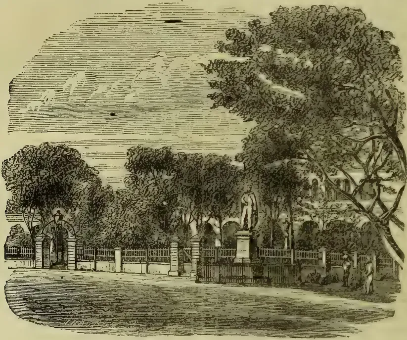

LIEUTENANT-GENERAL  
**SIR EDWARD BARNES,**  
 G.C.B., K.M.T., K.S.A.  
 ERECTED BY THE  
 EUROPEAN AND NATIVE INHABITANTS  
 OF CEYLON  
 AND FRIENDS IN ENGLAND AND INDIA  
 TO TESTIFY  
 THEIR RESPECT AND AFFECTION FOR HIS PERSON  
 AND TO PERPETUATE THE MEMORY OF  
 HIS DISTINGUISHED MILITARY SERVICES  
 AND  
 THE IMPORTANT BENEFITS CONFERRED BY HIM  
 UPON THIS COLONY  
 DURING HIS ADMINISTRATION OF THE GOVERNMENT  
 FROM 1820 TO 1822  
 AND  
 FROM 1824 TO 1831  
 HE DIED MARCH 1838  
 AGED 62 YEARS,

104------------------------------------------------

AUGUST 1, 1893.]THE TROPICAL AGRICULTURIST.81

### PROBABLE EXTENSION OF TEA CULTIVATION IN BALANGODA, CEYLON.

We have received intelligence which we fear will rather disturb the calculations of those who have been making out that there is no likelihood of any considerable additions to tea cultivation in Ceylon in the higher districts. Allusion has more than once been made to the great, unoccupied reserves of land in private hands in the Province of Sabaragamuwa. We have also referred more recently to the prospect of a good deal being taken up for tea in the Balangoda division. We now learn on good authority that negotiations have been opened by practical men with one or two Kandyan Chiefs who own a vast extent of forest-land in the Bambabarotuwa side, well adapted for tea, and that although they will not consent to sell an acre outright, for a rental of R1½ an acre, they are prepared to grant leases for any period up to 99 years. It is estimated that no less than 64,000 acres of good land adapted for tea are available for selection, and one well-known Dikoya planter (Mr. E. M. Leaf) has already got authority from England to take up a very large extent, prepare nurseries, build a central factory, and altogether to establish one of the biggest Tea concerns yet to be found in the Central Province. Others are likely to follow, and the prospect therefore is that within the next twelve months the BALANGODA-BAMBARBOTUWA district will have its cleared, if not planted, area with tea very largely increased.

### THE COCO NUT PALM IN ZANZIBAR AND PEMBA ISLANDS.

(FROM MR. FITZGERALD'S REPORT.)

The second great cultivation of Zanzibar, coco nut trees being found all over the fertile portions of the island, and very extensively cultivated. With the exception of solitary lanky trees scattered here and there, the coco nut trees generally are robust and healthy, but great neglect exists; and I noticed, more particularly in the northern part of the island, many dead and dying trees, which could only be attributed to this cause. The cultivation is very scattered, and no regular order appears adopted in planting, solitary trees as well as thicker groves being observable everywhere intermixed with the large handsome mango trees, so striking a feature in Zanzibar. As a rule no regular plantations are made, many people only owning a comparatively small plot of land, on which are generally found collected all the chief products grown in the island, viz. cloves, coconut, areca palms, mangoes, cassava, sweet potatoes, &c. As already remarked, no particular care appears to be taken once the trees are established, the only attempts at cultivation being the clearing of the ground beneath and this at irregular times, for the growth of ground produce, chiefly cassava though bananas are also frequently grown between the trees and in this case greater trouble is taken to keep the ground clean, but as a general rule it is thickly overgrown with grass and bush. Large plantations, however do exist notably that of "kokotoni," situated in the northern district of that name, covering over 1,000 acres and containing at one period 80,000 trees. Further reference will be made to this. Coconut trees are usually planted very thickly and closely together; in fact, some of the groves appeared overcrowded, giving the trees a lanky appearance. In other places the trees were planted 15 feet, 20 feet to 30 feet apart. A coconut tree is picked on an average four times a year, yielding each time, accord-

ing to the tree, 30 nuts, 40 nuts, 50 nuts, &c. In good situations, and where the tree is kept in good order and condition, it would yield 300 annually. But many trees neglected and uncared for will only give from 80 nuts to 100 nuts a year, and, with better conditioned trees, an annual average of 120 nuts rising to 200 nuts. Solitary lanky trees from 5 nuts to 50 nuts. Reason for poor appearance and yield being bad soil and often old age. Coconut trees growing amongst cloves are as a rule lanky, and yield poorly. The bye-products of the coconut tree are comparatively neglected. Want of labour and of transport facilities—with the exception of a few carts in Zanzibar wheeled conveyances not existing and pack animals, viz., donkeys being very little used—are at present the two great obstacles to their development. Coconuts in a small degree, are exported to Bombay in shovels. Copra is also exported, and I understand that European firms are now paying especial attention to this. An English firm has now imported machinery for the manufacture of coir. Previously too was made of the husks, heaps of these being met with thrown on one side, or else being burnt as fuel, the little coir that was made being manufactured in a crude manner by natives from the Comoro Islands, no Swahilis carrying it on a basket of coconut husks selling in Zanzibar for 6 pence, 7 pence and 8 pence (the cost of carriage); and the beaten and cleaned fibre being shipped to Bombay.

The removal of the husks is effected by either sharpened iron spike, called "tarimbo" (literally, an iron bar), but the more general practice is to use a sharpened stick for the purpose, called "kifuo." Toddy is simply sold for drinking and for making vinegar ("su siki"). Toddy syrup, a species of sugar or syrup, is also made by boiling toddy in a pot for half an hour, and sold at 2 pence a cup. "Asali ya tembo," syrup made from toddy. "Asali ya mua," the boiled juice of the sugar cane.

Pemba coconuts are easily distinguished from the variety, being smaller in size and with very yellow mid-ribs, and the nuts are also very much smaller and a dark yellow in colour. They appear to be valued chiefly for drinking purposes, the water in the immature nut being very sweet.—*Zanzibar Gazette*.

### HOW TO MAKE A CUP OF TEA.

(Eugene J. Hall in *Grocers' Criterion*.)

When Mrs. DeKalb, of West Fortieth street Gave her "five o'clock tea," 'twas a splendid affair; Mrs. Fitzhugh Whitehorse and Miss Coykendall Le,

The Frizzles, the Fowlers and Thompsons were there.

They talked of the arts of the gay Japanese, Of friezes, of dadoes, of ceilings and tiles, Of Greenaway costumes, of fashions in Greece:

When Peticles ruled o'er the isthmus and isles. When suddenly Mrs. DeQuackenbush Looked Gave a practical turn to the drift of the talk:  
"Ah, Mrs. DeKalb," she exclaimed in surprise, With a smile of delight and a flash of her eyes, "Your tea is delicious, its flavour is fine, Its aroma perfect, its color divine, I have tried for a month and I cannot obtain Such a 'sleeper' as this, 'tis as good as champagne."

Then said Mrs. DeKalb, "You easily can, 'Tis a mixture of Oolong and new leaf Japan, With a pinch of Pekoe to give it 'bouquet,' That epicures always pronounce 'rucherche.' Take the purest of water, and, when boiling hot, Pour it over the tea in a clean, china pot, Let it stand just a minute, then serve it just so, And your guests will pronounce it perfection, I know."

—*American Grocer*.

[The above will show how much our American cousins have yet to learn about the virtues of pure Ceylon tea.—*Ed. T.A.*]

11

105------------------------------------------------

82THE TROPICAL AGRICULTURIST.[AUGUST 1, 1893.FINE TEA AND HIGH DISTRICTS.

Mr. Talbot sends us a very interesting and suggestive contribution to the discussion on fine teas; but it is surely an unduly discouraging one? If we only take a few leading plantations and the results for 1892 according to Messrs. Wilson, Smithett & Co.'s list, we think it will be seen that the trade do give good prices for fine Ceylon teas, and the only question is whether the average of the following, and a lessened quantity of tea, would pay the rest of the estates in the higher districts if they went in for equally fine teas? We quote as follows:—

<table border="1">
<thead>
<tr>
<th colspan="3">QUANTITY AND AVERAGE IN 1892:</th>
</tr>
<tr>
<th></th>
<th>lb.</th>
<th>d.</th>
</tr>
</thead>
<tbody>
<tr>
<td>Ormidale.....</td>
<td>39,500</td>
<td>1 4<math>\frac{1}{2}</math></td>
</tr>
<tr>
<td>Norwood (E. P. &amp; E. Co.)</td>
<td>123,000</td>
<td>1 2<math>\frac{1}{2}</math></td>
</tr>
<tr>
<td>Waverley (C. T. P. Co.)</td>
<td>294,000</td>
<td>1 1<math>\frac{1}{2}</math></td>
</tr>
<tr>
<td>Portsmouth.....</td>
<td>80,000</td>
<td>1 1<math>\frac{1}{2}</math></td>
</tr>
<tr>
<td>Tommagong.....</td>
<td>43,000</td>
<td>1 1<math>\frac{1}{2}</math></td>
</tr>
<tr>
<td>Silverkandy.....</td>
<td>21,000</td>
<td>1 1</td>
</tr>
<tr>
<td>Diyagama.....</td>
<td>457,000</td>
<td>1 0<math>\frac{3}{4}</math></td>
</tr>
<tr>
<td>Henfold.....</td>
<td>258,500</td>
<td>1 0<math>\frac{3}{4}</math></td>
</tr>
<tr>
<td>Edinburgh.....</td>
<td>78,000</td>
<td>1 0<math>\frac{3}{4}</math></td>
</tr>
<tr>
<td>Mocha.....</td>
<td>63,500</td>
<td>1 0<math>\frac{3}{4}</math></td>
</tr>
<tr>
<td>Kotiyagalla.....</td>
<td>198,500</td>
<td>1 0<math>\frac{3}{4}</math></td>
</tr>
<tr>
<td>Portmore.....</td>
<td>113,500</td>
<td>1 0<math>\frac{3}{4}</math></td>
</tr>
<tr>
<td>Mooloya.....</td>
<td>107,000</td>
<td>1 0<math>\frac{3}{4}</math></td>
</tr>
<tr>
<td>Kandapola.....</td>
<td>259,500</td>
<td>1 0<math>\frac{3}{4}</math></td>
</tr>
<tr>
<td>Hauteville.....</td>
<td>259,000</td>
<td>1 0<math>\frac{3}{4}</math></td>
</tr>
<tr>
<td>Invery (S C T Co.).....</td>
<td>168,500</td>
<td>1 0<math>\frac{3}{4}</math></td>
</tr>
<tr>
<td>Ouvahkellie.....</td>
<td>153,000</td>
<td>1 0<math>\frac{3}{4}</math></td>
</tr>
<tr>
<td>P. D. M. ....</td>
<td>86,500</td>
<td>1 0<math>\frac{3}{4}</math></td>
</tr>
<tr>
<td>Kew .....</td>
<td>196,000</td>
<td>1 0</td>
</tr>
<tr>
<td>Glendevon (O B E C) .....</td>
<td>184,500</td>
<td>1 0</td>
</tr>
<tr>
<td>Elbedde.....</td>
<td>147,500</td>
<td>1 0</td>
</tr>
<tr>
<td>Frotoft .....</td>
<td>96,000</td>
<td>1 0</td>
</tr>
<tr>
<td>Bloomfield.....</td>
<td>50,500</td>
<td>1 0</td>
</tr>
<tr>
<td>Middleton.....</td>
<td>25,500</td>
<td>1 0</td>
</tr>
<tr>
<td>Total 3,454,000 lb.</td>
<td>1 0<math>\frac{3}{4}</math> (aver.)</td>
<td></td>
</tr>
</tbody>
</table>

We have selected all estates with an average last year, of 1s and upwards, and it is noteworthy that these (24 estates in all) represent the following, (among other) districts:—Maskeliya, Dikoya (including Bogawantalawa), Dimbula (with the Agrapatanas), Nuwara Eliya, Udagussellawa and Hewaheta. Perhaps the most notable case is that of Waverley belonging to the Company of which Mr. Talbot is Chief Manager and which sold in 1892 so large a quantity as 294,000 lb. at so good an average as 1s 1 $\frac{1}{2}$ d. Now of course, Mr. Talbot is by far the best judge as to whether it is feasible, or would be profitable, to bring all the plantations under his influence in the higher districts, up to the same average. Nearly as important is the case of the Diyagama plantation turning out so much as 457,000 lb. at an average of 1s 0 $\frac{3}{4}$ d—which is also, it will be observed, the average for the total quantity 3,454,000 lb. sold by the 24 estates we have quoted. Now, the practical point is, can Ceylon not send from her higher districts, 20 million lb. instead of 3 $\frac{1}{2}$  million, of a quality which would ensure a steady demand for such "fine teas" and an average of not less than 1s 1d per lb.? If this is possible—and profitable—there can be no doubt of the good it would do in raising the reputation of Ceylon teas in the estimation of the trade. This result, of course, would also come from a general improvement in plucking all over the country so as, if possible, to improve on last year's miserable average of 9 $\frac{3}{4}$ d for the island.

Mr. Talbot, however, supplies one very striking fact in the experience of tea from the young estate of Mudumana. How is it to be explained? Does it indicate general neglect of Ceylon teas on the part of the trade; or, otherwise, why should this carefully prepared tea,—virgin crops from virgin soil,—not be prized as much as were precisely similar teas a few years ago? This is a question, which we would call on "Philpot" or some other member of the home trade to answer.

CEYLON TEA AND THE "BITTER CRY:"  
No. XXVI.FINE TEAS AT HIGH ALTITUDES.

Nuwara Eliya, 14th June, 1893.

DEAR SIR,—Referring to your suggestion that estates at high altitudes should make finer teas and mark them Darjeeling-Ceylon,—

I do not think it would lead to any good: the Superintendents of estates in the Nuwara Eliya district have gauged pretty well the London market as is seen by the prices realized by such estates as Portsmouth, Kandapolla, Court Lodge and Hethersett and no alteration in style would, in my opinion, get higher prices. The idea that there is not enough fine tea sent from Ceylon is, I think, a mistaken one as a great deal of well-made flavor tea goes from the Nuwara Eliya, Agras and Bogawantalawa districts: my experience of the London market is that the more fine tea you send them the less they pay for it.

With regard to the cry that Ceylon tea has deteriorated, this is I think without foundation; for there is not the least doubt that leaf is more carefully plucked and better manufactured than it was 4 and 5 years ago: it is true that the leaf from tea that has not been pruned down, makes tea of better quality than old pruned tea, but there is still a great deal of leaf from young bushes being put in the market and it does not fetch good prices; for instance our young estate of Mudumana which is just coming into bearing and which is partly plucked does not fetch perceptibly higher prices than the older estates in the neighbourhood, and not within pence of what Dunedin and Dewalakanda fetched when they were the same age.

There is no resemblance between the Darjeeling flavour and that of our high districts; and it is probable that if we took the name it would set the trade against us.—Yours truly,—

G. A. TALBOT.

BAMBOOS AT KEW.—An interesting feature in the Royal Gardens is a plantation of Bamboos in the lower part of the grounds near the Rhododendron walk, and a few types have stood the recent severe weather. The well-known Bambusa Metake is full of health and vigour, and represented by several fine mosses. B. Simoni is also uninjured, the large examples of this graceful Bamboo having been little touched by winter frosts. The heavy mosses of rich green growth are remarkably effective, and in the variety striata we get a distinct variegation. This is a fine hardy Bamboo, and the same may be said of B. viridis glaucescens. A large group of this is delightful in the garden, and hardy. It is one of the most elegant and pleasing of Bamboos. B. nigra is very dense in growth, and seems little touched by the weather. Although less elegant than such a form as B. viridis glaucescens, it is a handsome kind, the leaves of a full green colour. One labelled Phyllostachys bambusoides has made splendid growth, the leafage pale green, spreading, and very handsome. It is apparently very hardy. A graceful Bamboo is B. Quiloi, compact, and forming a fine mass. Two of the most interesting kinds are B. tessellata (synonymous with B. Ragamowski) and B. Veitchii. Both are dwarf in growth, spreading out in a dense mass. The former has superb leaves, fully 4 inches broad, and 14 inches in length, the colour full rich green. At Kew the plants form a bold group, and have a telling appearance. Those who wish for a good dwarf Bamboo should make a careful note of this kind. B. Veitchii is of similar habit, and a charming species. The leaves are broad, not so long as in B. tessellata, rich green, with deep creamy-white margin—a distinct and bold contrast. Its variegation is not weak, as we get a rich contrast—deep green against creamy-white.—*Gardeners' Chronicle*.

106------------------------------------------------

AUGUST 1, 1893.]THE TROPICAL AGRICULTURIST.83

### THE PROGRESS OF INDIAN AND CEYLON TEA.

Messrs. Gow, Wilson & Stanton have published their annual Diagram-Circular under the above heading, and it is not one whit behind its predecessors in interest, or in the tasteful execution on fine paper of the many coloured diagrams. Writing to us on the 1st June, the Rood Lane Firm report that some days previous a large supply of the diagram circulars had been despatched to our address; but they have apparently failed to come forward by this mail. No doubt they will appear by the next steamer in good time for each of our subscribers to be furnished with a copy of this useful document as it will be published as a *Supplement* with the daily *Observer* and *Tropical Agriculturist*. The compilers report to us:—"This circular is issued partly with a view of showing to planters generally the various diagrams which have been exhibited in the Chicago Exhibition as well as in the Imperial Institute, and we think it will interest owners of tea estates to see what has been done in this matter."

The first diagram shows in a series of coloured blocks "Thirty Years' Record of the Tea Trade in the United Kingdom." Each square represents one million lb.; and the colours are red for Indian; yellow for Ceylon; and dark grey for China. In 1862 in a total consumption of 80 million, there was only  $\frac{1}{2}$  a million lb. of Indian tea and none of Ceylon; indeed the first appearance of Ceylon (and for half-a million lb.) appears only in 1882—the comparative blocks being given at five years' intervals. In 1892, yellow (Ceylon) shows on the top for the large total of 63 million; Indian (red) for 110 million and China for only 34 million out of the total of 207 million lb. consumed in the United Kingdom last year. This Diagram, we are informed, is placed in an enlarged form in the Indian and the Ceylon Courts at the Chicago Exhibition and in the Ceylon Court at the Imperial Institute.

The second page repeats the same information in a more striking form by means of coloured circles with lines drawn to the several countries of supply on a section of the map of Asia. For some unexplained reason this diagram entitled "The rise of Indian and Ceylon tea and the eclipse of China tea,"—in its enlarged form is only exhibited in the Indian Court. We read as follows in the letterpress appended:—

Had not last Season's Tea Crop from India and Ceylon proved to be considerably below the estimated quantity, the need of assistance from foreign markets would have been much more keenly felt. Simultaneous short crops from both countries proved a temporary relief to the industry in general, but increased production must be anticipated in the near future, and therefore no effort should be spared to develop every existing outlet, as well as to open up new markets, wherever such is possible.

On the third page we get "Thirteen Years' History of Ceylon Tea," the diagram showing the "Production in Ceylon" by means of green circles from a mere dot of 50 tons in 1880, to 31,083 tons in 1892; while the value is given next in oblongs rising in the same

way from £3,024 in 1880 to £2,766,050; then is shown the consumption (in blue circles) in Great Britain from 40 tons in 1880 to 28,170 tons. This diagram enlarged is shown in both Courts. The letterpress tells us:—

Increasing supply can only with safety be met by increased demand—a fact of vital importance to the welfare of the industry. Energy and determination can effect much, and if in two years the quantity of Indian and Ceylon Tea taken by markets outside Great Britain could be raised from *fourteen million pounds to twenty million pounds*, as actually occurred in 1890 and 1891, there is the strongest encouragement to foster this branch of the enterprise in every possible way.

With this object in view, the Commissioners for India and Ceylon at the World's Columbian Exposition have taken steps for the representation of Indian and Ceylon Tea at Chicago, where packets will be freely distributed, thus bringing these Teas prominently before the numerous visitors, who will assemble there not only from America and Canada, but also from Europe and, doubtless, many other parts of the world.

Finally we have a diagram showing the "Tea Consumption in the United Kingdom" from 1864 of the three kinds—Ceylon beginning as we said in 1880.

Altogether a more striking way of shewing the great progress made by India and Ceylon in ousting China teas in the United Kingdom could not be desired and if our American cousins only take to themselves the "object-lesson," we may hope to see China and Japan teas pretty soon beginning to give way before the purer British-grown article, across the Atlantic. There can be no doubt, at any rate, that Messrs. Gow, Wilson & Stanton deserve the thanks of all Indian and Ceylon tea-planters for the trouble they have taken in compiling and publishing this very elaborate and well-finished Circular-Diagram at this particular juncture.

### MEDIUM OR COARSE AND FINE PLUCKING OF TEA.

There would seem to be very little likelihood of this oft-disputed question receiving an early, final settlement. Indeed, we fear it is one of a class which cannot admit of a wholly satisfactory determination. So soon as one set of evidence appears to dispose of it, another, quite of a contrary character, is advanced which cannot fail to re-open the argument, leaving us no chance of finally making up our minds as to whether the advantage remains with the advocates for coarse or even medium plucking, or with those who hold that the reputation of our teas and the chance of maintaining prices are being sacrificed to such a course. Very recently Mr. John Hughes demonstrated by the result of his chemical analyses that it must pay our planters better to pluck for the commoner grades of tea than to endeavor, by sacrificing quantity, to secure quality. We had scarcely had time to digest his advice, and to consider the full meaning of the scientific deductions made by him from his experiments, than we are assured by London tea authorities that the inferior quality of the teas received of late from Ceylon is forcing down prices most seriously;—so much so, indeed, that the trade, when the mail left, feared a falling-off in the general prices for our teas to a point lower than has yet been reached. This would seem to be confirmed by the bad news telegraphed from the *Lanc*

107------------------------------------------------

84THE TROPICAL AGRICULTURIST.[AUGUST 1, 1893.

today. Who then is to decide for our much-puzzled planters when experts differ so widely in the advice they tender to them? At this end, moreover, we have leading planters—and one of them wields the pen today—declaring that the quality of Ceylon teas has not greatly fallen off; but on this point we suspect there is no getting over the average price paid for Ceylons as compared with Assam teas. Not so long ago the advantage lay with Ceylon; what has sent it so largely the other way? In this very material direction, therefore, it seems as if our critics had the best of the discussion. It is most essential that the reputation of Ceylon tea, as a definite production in the gross, should stand high in the London market. We know to what a standard the past brought our staple, and to this attainment of a high position, we know that we owe the almost marvellous advance our present industry has made. The question naturally suggests itself whether it can be wise to risk the sacrifice of this enormous advantage in order to secure a larger present return for our output? Should we not by doing this be effectually killing the goose that lays the golden eggs. We know, unfortunately, how narrow is the present margin which separates profit from loss in not a few instances. It may have paid at the recent prices to send home tea by quantity; but if the results anticipated by the London brokers follow our continuance in doing so, it is not likely that that advantage will long remain. It is quite true, we do not for an instant doubt, that scientific research is conclusive upon the data afforded by the late condition of the market; but any argument based upon such data must be held to be falsified when the stern logic of fact shows us that the conditions can no longer be accepted. The consideration of the effect of large quantities of common teas in the market we think could hardly be expected to have entered into Mr John Hughes' calculations. His counsel is of the abstract quality only. He knows nothing of the outside questions that are under the daily observation of the professional tea-broker. When we are assured that one of the more experienced of these has been condemning the bulk of Ceylon teas passing through his hands of late, and when even a proprietor of some of these teas—who must naturally be anxious to see in his property the highest possible qualities—is forced to confess that what he has for sale is poor stuff, we cannot hold that these opinions are special exaggerations. There is no question that Ceylon sends a considerable proportion of fine teas from the higher districts and there must be many cases where, as our planting correspondent shows today, the broker's description of our teas, is not fair. But then regarded in the gross what is the logic of facts: our average which was 8½ on 29th May was last week down to 7¼ and no one anticipates a better result this week.

We cannot help thinking, therefore, that in endeavoring to hold the balance fairly between the opinions of the professional scientist and those of the practical broker, we must incline, *velens volens*, towards the latter. He knows how the market is governed by conditions which science does not take account of. He knows that the quality and amount of supplies from other tea-producing countries sways the pendulum of prices, and therefore the prosperity or otherwise of Ceylon produce. Scientific fact must, no doubt, always be an important factor; but it is manifestly less of a sure guide than the daily vacillation in the volume of supply. It is difficult, perhaps, to decide upon the exact relative values of two

opposed counsels of perfection. But one fact is patent, and that is that under no conditions can it be a wise policy to lower the reputation of Ceylon tea. It is, on the contrary, all-important to the future life of the industry that this should be maintained. All other consideration must be held insignificant compared with the duty of maintaining a good name, and therefore it is that we consider that a sacrifice of some amount of present return must be made if the future of Ceylon tea is to be looked forward to with confidence.

### TEA TRADERS' TALK.

Barry Pain is responsible for the following parody:—

Pour, varlet, pour the water.  
The water steaming hot!  
A spoonful for each man of us,  
Another for the pot!  
We shall not drink from amber,  
No Capuan slave shall mix  
For us the snows of Athos  
With port at thirty-six  
Whiter than snow the crystals  
Grown sweet 'neath tropic fires,  
More rich the herb of China's fields,  
The pasture-lands more fragrant yield;  
For ever let Britannia wield  
The teapot of her sire.

### THE TEA TRADE.

There is nothing like the tea trade  
For merchants who would thrive,  
And busy be like busy bees working in the hive.  
With lives as sweet as sweetest honey  
They are storing up the money  
In a way that's most encouraging to see;  
But in all the tea they handle  
There's none can hold a candle  
To the tea that's known abroad as honesty.  
There's sobriety, society and best of notoriety,  
Punctuality, frugality and shrewd sagacity,  
There's modesty and jollity, the very finest  
quality  
Are blends and brands we all delight to see.  
There's sociality, generosity,  
And business reciprocity  
And charity with flavour ever free  
Such tea will always draw,  
And in them you find no flaw,  
But integrity's the finest in the line,  
But shun all sorts of animosity,  
All flavours of monstrosity,  
And remember that pompacity  
Was never known to please;  
Though mixed with ingenuity  
There will still be incongruity  
That will make you a nonentity  
In the handling of teas.  
If you deal in best of Oolong,  
Congon, Foochow or Souchong,  
Hyeon Skin or Old Bohea,  
Do not practice infidelity,  
Insobriety, profanity, or any sort of vanity  
If you would serve humanity  
In supplying them with tea.  
—Detroit Herald of Commerce.

### SANDAKAN JOTTINGS.

May 29th.

#### TOBACCO ESTATES.

The quick development of this country depends so greatly on the success of the tobacco estates now operating, that you can imagine how the news of the high prices realized at the first tobacco sales at Amsterdam this year have been received by our community. It has been and still continues to be the chief topic of conversation, and has raised the hopes of many who

108------------------------------------------------

AUGUST 1, 1893.]THE TROPICAL AGRICULTURIST.85

were becoming despondent. It is the same amongst the managers and assistants on the estates. At the same time, there is a general feeling of expectancy prevalent. The sales so far reported are only for Sumatra tobacco, and we want to see our home-grown leaf sold equally well, to confirm our hopes that a period of prosperity is before us. The fact that last year two crops at least were badly received on the market, through want of proper handling (so reported) during fermentation and baling, adds a touch of nervousness to the prevailing feeling. A recurrence of this would almost be certain to close the estates from which the tobacco is shipped. Reports from the different estates, continue favourable. Planting is being pushed on vigorously.

COFFEE.

The three coffee estates in this Bay are coming forward in a way that is very satisfactory to those concerned, and I hear the same reports as to the coffee estate in Marudu Bay, in which our Commissioner of Lands takes great interest. I see you have a paragraph, in one of your late issues, on Borneo gambier. The Chinaman, who made the venture in planting this vine, is so satisfied with the results as to quality and value, that he is now extending his operations. He has another small parcel ready for shipment and there is no reason why this plant should not be cultivated on a large scale by the Chinese.—*Straits paper*.

## COLONISING AND PLANTING IN EASTERN PERU—AT THE HEADWATERS OF THE AMAZON.

(By an Aberdeenian Pioneer.)

Denville, 5th March 1893.

As I expect mules down with provisions for us soon I am taking the opportunity of sending you a line to let you know how we are getting along on the Perene. It is now over four months since we came down here and although we are passing through the rainy season in a great measure unprepared, we are getting along wonderfully well. Our few colonists have got themselves well established with good houses up and are I may say fairly comfortable, but owing to the difficulty of transport, our greatest drawback has been the want of proper food.

You will be rather astonished to hear that we have had a lot of fever down here, myself getting a dose among the rest. It is however very simple and easily got rid of and no doubt when the place is more opened up and better food obtainable this will pass away.

Mr. Mackenzie wisely refrained from sending down more people this season as it would have been impossible to have fed them. With regard to my own work I cannot say that I have much to tell you. I have only had two and three men working with me, and these I employed cultivating a few acres and building. I find great trouble with the ants and will have to abandon the flat piece and clear virgin lands. They don't touch maize rice much, but yucca they simply devour. In this way of clearing we have done very little having arrived too late in the season but trust that this time next year will have a better show.

A new road is being made from the camp at Paucartambo down the side of the Perene, and a number of colonists are settling round there. I am afraid it will take a long time to complete and until it is finished we can never expect to make much headway here. If plenty of labour was at command it would not be a great undertaking, but as things are it will take some time.

The question of labour is going to be a very serious one, for finding plenty of work around Chanchamayo, Oholas don't care to come so far down except at greatly increased pay. In two or three years time when our coffee comes into bearing it will be a serious thing if we cannot find sufficient

labour to take our crop off. The Indians around here cannot be depended upon as they only work when the fit takes them and that is very seldom.

In my last letter to you I mentioned that I had written to Mr. Mackenzie re the introduction of coolies. He now informs me that this matter is receiving due attention in London. It is my most sincere hope that they may be able to carry it through successfully as it means a great deal to us.

I do not know what is to be done re an outlet for our produce, but I trust it will be by the Amazon. I intend visiting the Cascades a little later on to see what they are like and see the lands on the way down.

A considerable number of people keep coming into the camp, but I would like to get more Scotchmen who had a trifle of capital to form in a way the backbone of the Colony. I have not the least doubt there are plenty at home who would gladly come if matters were properly represented to them.

We are now in the height of the rainy season and it is not disagreeable to live in. We have mosquitoes, but they don't bother us much. Gnats are the trouble and just now they are terrible. One of my hands is breaking out into sores through them.

No doubt they will disappear as the country is cleared. Everyone suffers more or less from boils on their arrival, but that is good for them.

Taking everything into consideration I feel very hopeful of this scheme being a success. With the labour question settled I would have no hesitancy in taking up a tract of land myself and feel confident of success. Difficulties we will have and in a country of this kind things are not done in a day, but with a little bit of perseverance and pluck we will get over them.

I have been written to regarding "China Grass" (*Bohmeria Nivea*) and although I have found what I suppose to be it from description yet I am in no way certain of it.

We have had lots of tigers (jaguars) coming round us and some good specimens have been seen, but nothing of any size killed. We have plenty of birds but other game is scarce.

I can't say that I have seen many orchids that I consider good, but I have not seen many in bloom yet.

## TEA AND EXCHANGE.

The following is the letter addressed by the Hon. P. Playfair to the Indian Currency Association:—

I offer you a copy of a calculation we have made showing the profits earned by the Joint Stock Tea Companies of Calcutta during the past and previous years.

It seems that on a capital of R2,58,61,033 a profit of R26,42,031 has been made on Revenue Account, or 10.1-5 per cent. Of this surplus 6½ per cent appears to have been distributed to shareholders.

At first sight this appears to be an excellent return to investors, until the question of depreciation by Exchange is considered. As investors in tea are almost exclusively British, who have either brought out capital or hope to return to England with their capital, any variation in the sterling value of these investments must be of importance.

Between 1st January 1891 and 1st January 1893 Exchange fell 20 per cent (from 1s 6 13-12 to 1s 2 23-32d. Bank Bills on demand) which means R51,72,206 of the above capital, while the profits of these two years amount only to R38,94,636, leaving a difference of R12,77,570, say 5 per cent which, if it cannot at once be described as loss, does not, at all events, warrant the distribution of dividends.

But for very handsome profits made on Duars Gardens this depreciation would have been intensified. And here we derive the undue (temporary) advantage that new comers may have over older producers, £10,000 spent in the Duars having produced a garden four times greater than that formerly obtainable for the same money invested in Assam. The ultimate result to the country cannot produce good if it kills out the old settlers.

109------------------------------------------------

86

THE TROPICAL AGRICULTURIST.

[AUGUST 1, 1893.

It may interest you to review the result of each district which are as follows:—

Assem—Depreciation at 20 per cent, R17,45,585, profits 1891-92, R10,08,488, Dr. R7,37,097.

Cachar and Sylhet—Depreciation at 20 per cent R13,46,974, profit 1891-92, R10,04,975, Dr. R3,41,999.

Darjiling—Depreciation at 20 per cent R16 07,246, profits 1881-92, R8,08,846; Dr. R7,98,400.

Duars—Depreciation at 20 per cent R4,72,400, profits 1891-92, R10,72,327, Cr. R5,99,927.

Total—Depreciation at 20 per cent, R58,72,206, profits 1891-92, R38,94,636, Dr. R12,77,570.

Am I right in drawing the conclusion from these figures that Mr. Bell and the other Darjiling Planters with him were deceived in the notion that low Exchange was a benefit to capitalists having investments in tea?

The average value per lb. of tea you will observe was R2 higher than that of the previous year. But I find that the value of tea across in London between the months of August and January was 2d per lb. above the quotations of the previous year, which seems to go far to account for the better profits. Ocean freights, too, were abnormally low, as you know.—*Pioneer*.

[The position here maintained has been successfully overthrown by writers on the other side.—*Ed. T.A.*]

COFFEE PLANTING IN THE STRAITS SETTLEMENTS.

NEWS OF OLD CEYLON RESIDENTS.  
(From an Ex-Ceylon Planter's Letter.)

Kuala Lumpur, Selangor, June 3rd, 1893.

I send you a list of the Liberian coffee estates which I have taken from our "Government Gazette." The planters seem to be having a good time of it with no difficulties to contend with. I wish however there were more of them.

The chief difficulty here is for young men to find a home to learn planting previous to investing their capital. In Ceylon of course it is different, and every new arrival has someone to go to. The British Resident (Mr. W. H. Tracher, C.M.G.,) as you are aware visited the coffee districts of Ceylon some years ago and takes a great interest in all matters connected with agriculture.

My own opinion as an old planter is that there is not a safer investment in the Straits now that the pioneering difficulties are over, than coffee. In looking through the Singapore Share List there appear very few investments worth having. Of course people say that coffee is at a very high price now, but what would it be by the time a new estate came into bearing.

That is a question nobody can answer, but one can fairly say there will always be a heavy demand for tea and coffee.

The railway is being gradually extended into the interior and will shortly be finished to within easy distance of our future sanitarium, not quite a Nuwara Eliya, but that we no doubt shall discover as the extension proceeds.

Ex-Ceylon residents here, you will be glad to learn are well and flourishing, our State Engineer (Mr. C. E. Spooner) is busy—Mrs. Spooner leave for England shortly on a visit to her family.

Mr. and Mrs. Vane and Miss Watson from Sungei Ugong have been welcome additions to our small community.

Mr. E. A. Watson has returned from the jungle very seedy but is now much better.

Mrs. Venning returns from Europe at the end of the year.

Messrs. French, West, Carey, Cuming, Gatehouse and Christoffelsz seemed to have settled down in their new home.

Our first Agri-Horticultural Show is arranged for next year and we all hope it will be a success and benefit the country.

I notice the Sarawak Government are erecting a permanent orchid house. It is an excellent idea as Borneo is the home of orchids and the hunting

ground of all European orchid collectors. I forget if Dr. Trimen has anything of the kind at Peradeniya or Hakgala.

A good deal of interest is being displayed in the expected arrival of the Australian griffins. The system in force here in connection with them is briefly this. A number of residents subscribe \$200 each and a batch of horses are sent for from Australia. On arrival each horse is numbered and drawn for by the subscribers. The Selangor Turf Club give a prize at their meeting which greatly adds to the interest of the thing.

COFFEE ESTATES.

The following return may be accepted in evidence of the *bona fides* of the planting community in the Kuala Lumpur District:—

<table border="1">
<thead>
<tr>
<th>Situation.</th>
<th>Name of Estate.</th>
<th>Proprietors.</th>
<th>Managers.</th>
<th>Total.</th>
<th>Average.</th>
<th>Under Remarks.</th>
</tr>
</thead>
<tbody>
<tr>
<td>Batu 3rd mile..</td>
<td>Batu</td>
<td>H. Huttenbach</td>
<td>H. Huttenbach</td>
<td>500</td>
<td>120</td>
<td></td>
</tr>
<tr>
<td>K. Lumpur</td>
<td>Selangor</td>
<td>H. Huttenbach</td>
<td>A. K. Hampshire</td>
<td>72</td>
<td>50</td>
<td></td>
</tr>
<tr>
<td>Setapak</td>
<td>New Amherst</td>
<td>The Selangor Coff. Co. Ltd., 21, Mincing Lane, E.C.</td>
<td>E. V. Carey and R. Gatehouse</td>
<td>1,000</td>
<td>200</td>
<td></td>
</tr>
<tr>
<td>Setapak</td>
<td>Hawthornden</td>
<td>F. A. Toynbee T. Sword A. Currie W. Dougal (Executors)</td>
<td>F. A. Toynbee L. Dougal (Asst. Manager)</td>
<td>500</td>
<td>200</td>
<td>350 acres will be under cultivation end of 1893.</td>
</tr>
<tr>
<td>Setapak</td>
<td>Lincoln</td>
<td>Do.</td>
<td>Do.</td>
<td>500</td>
<td>125</td>
<td></td>
</tr>
<tr>
<td>Setapak</td>
<td>Abercross</td>
<td>G. Murray Campbell</td>
<td>R. S. Meikle</td>
<td>400</td>
<td>110</td>
<td></td>
</tr>
<tr>
<td>Setapak</td>
<td>The Mount</td>
<td>C. &amp; J. Gordon Glasford</td>
<td>C. &amp; J. Gordon Glasford</td>
<td>200</td>
<td>75</td>
<td></td>
</tr>
<tr>
<td>Setapak</td>
<td>Wardieburn</td>
<td>C. &amp; R. S. Meikle</td>
<td>C. Meikle</td>
<td>560</td>
<td>133</td>
<td></td>
</tr>
<tr>
<td>Batu*</td>
<td>Batu Caves</td>
<td>..</td>
<td>..</td>
<td></td>
<td>184</td>
<td></td>
</tr>
<tr>
<td>K. Lumpur</td>
<td>Weld's Hill</td>
<td>..</td>
<td>..</td>
<td></td>
<td></td>
<td></td>
</tr>
<tr>
<td>Batu*</td>
<td>Kent</td>
<td>..</td>
<td>..</td>
<td></td>
<td></td>
<td></td>
</tr>
<tr>
<td>Setapak</td>
<td>Klang Gates</td>
<td>M. A. Stonor</td>
<td>M. A. Stonor</td>
<td>300</td>
<td>75</td>
<td></td>
</tr>
</tbody>
</table>

Further applications by Messrs. Toynbee & Co. for 500 acres, and by Messrs. Murray Campbell and M. A. Stonor for 200 acres each, have been granted during the past year. The land applied for is in each case adjoining the present estates of the respective applicants.

The road through Ulu Gombak now in course of construction will open up land worth inspection by intending planters.

\* Returns not to hand. Kent estate is newly opened. Weld's Hill is fully cultivated.

110------------------------------------------------

AUGUST 1, 1893.]THE TROPICAL AGRICULTURIST.87EUROPEAN IMPORT DUTIES ON TEA.

Among the new features in the recently issued report of the Bengal Chamber of Commerce for 1892-93 is an appendix showing the various customs duties that govern the import of tea into European countries. Of these the highest appears to be that of Portugal where the import duty is equal to an English equivalent of 1s 11-5d per pound. Switzerland comes lowest with a duty of only 1-7d per pound. In Russia the duties are enormously high, being in the case of tea imported into any European port or over any European frontier, 1s 10-2d. On tea imported through the Likatsek custom-house, by way of Siberia and the steppes, the duty is 1s 1-7d; but on what is known as brick tea so imported the duty is only 2-6d. Such tea as is brought into Russia, accompanied by accredited certificates showing it to be of Russian preparation, is allowed to enter on payment of 10-6d per pound. In England, Denmark, Germany, and Spain the scale ranges from 4d to 6-5d. In Greece, Italy, and Austria-Hungary, the duties are very heavy.—*Pioneer*.

SELANGOR.

The coffee planters have been complaining a good deal lately about the damage done by Chinese wood cutters on their estates. The planters say that where the sun finds its way in through the jungle the soil is materially injured for coffee planting. The wood-cutting men do not as a rule have much respect for the rights of private property, and recently four offenders were fined \$10 each for cutting timber on the Mount Estate.

Mr. Raymond left yesterday for Perak where he intends to reside. He has left many friends behind him who will be glad to hear of his success in that State.

Mr. Venning, Government Treasurer of Selangor, who has this year been appointed Visiting Commissioner to the Keeling and Cocos Islands, left Klang today for Singapore, from which port he leaves by H. M. S. "Pigmy" for the Islands. *Straits Times*.

CINCHONA, &c., REPORT.

(From the Chemist and Druggist.)

LONDON, JUNE 1.

CINCHONA.—The fortnightly bark-auctions held on Tuesday were of fair extent, the ten catalogues comprising:—

<table border="1">
<thead>
<tr>
<th></th>
<th>Packages</th>
<th>Packages</th>
</tr>
</thead>
<tbody>
<tr>
<td>Ceylon cinchona</td>
<td>811 of which</td>
<td>764 were sold</td>
</tr>
<tr>
<td>East Indian cinchona</td>
<td>1185 "</td>
<td>1038 "</td>
</tr>
<tr>
<td>Java cinchona</td>
<td>24 "</td>
<td>" "</td>
</tr>
<tr>
<td>W. African cinchona</td>
<td>48 "</td>
<td>45 "</td>
</tr>
<tr>
<td>S. American (Calisaya) cinchona</td>
<td>185 "</td>
<td>185 "</td>
</tr>
<tr>
<td>do (Pitayo), &amp;c.</td>
<td>618 "</td>
<td>463 "</td>
</tr>
<tr>
<td></td>
<td>2,931</td>
<td>2,498</td>
</tr>
</tbody>
</table>

The barks offered showed no feature of any importance excepting that presented by the inclusion and the partial sale of 648 bales 8 uth American barks imported over ten years ago, most of which were now offered without reserve. There were also a few lots of common Ceylon barks seven years old, for which very low prices were accepted. The parcels generally were of medium quality with a fair sprinkling of Officinals and a few good Ledgers. The tone throughout the auctions was somewhat wavering, but upon the whole prices were lower, and sale may safely be said to have been one of the worst for sellers which have ever been held. The average unit probably did not exceed 7-4 per lb.

The following are the approximate quantities purchased by the principal buyers:—

<table border="1">
<thead>
<tr>
<th></th>
<th>Lb.</th>
</tr>
</thead>
<tbody>
<tr>
<td>Agents for the Mannheim and Amsterdam works</td>
<td>146,572</td>
</tr>
<tr>
<td>Agents for the Auerbach works</td>
<td>85,995</td>
</tr>
<tr>
<td>Messrs. Howard &amp; Sons</td>
<td>62,943</td>
</tr>
<tr>
<td>Agents for the Frankfurt-o/Main and Stuttgart works</td>
<td>40,913</td>
</tr>
<tr>
<td>Agents for the Brunswick works</td>
<td>35,630</td>
</tr>
<tr>
<td>Agents for the American and Italian works</td>
<td>35,149</td>
</tr>
<tr>
<td>Agents for the Paris works</td>
<td>29,912</td>
</tr>
<tr>
<td>Mr. Thomas Whiffen</td>
<td>18,824</td>
</tr>
<tr>
<td>Sundry druggists</td>
<td>61,800</td>
</tr>
<tr>
<td>Total quantity sold</td>
<td>534,744</td>
</tr>
<tr>
<td>Bought in or withdrawn</td>
<td>97,572</td>
</tr>
<tr>
<td>Total quantity of bark offered</td>
<td>626,316</td>
</tr>
</tbody>
</table>

QUININE.—Business is practically at a stand still in this article. German second-hand bulk can be had at 3-4d per oz. from the second-hand; and the manufacturers' quotations are as follows:—Howard's vials 1s 2d to 1s 3d; tins 1s 1d to 1s 2d; Whiffen vials 1s 2d; tins 1s Pelletier vials 1s 5-3d; Milan vials 1s 1d; tins 11d; Zimmer, Jobst, Auerbach and Mannheim tins 11d; Brunswick tins 10-4d per oz.

CEYLON PLANTERS IN NORTHERN INDIA.

(From an ex-Ceylon Planter.)

One of our largest Companies in Sylhet is now managed by an old Ceylon planter, Mr. E. Todd Naylor, formerly of Haputale. If you want a few facts about temperature it was 103° in the shade of my bungalow verandah a month ago, and it is now 93°—too hot to make writing pleasant!

NATAL TEA.THE SEASON'S PRODUCTION.

Mr. G. W. Drummond, of Kearney sends us the following special Natal tea report:—We have now arrived at the end of the tea season. On the whole it has been a good one. The outturn for this factory will be between 380,000lb. and 390,000lb., but the exact figures cannot be obtained for another week or 10 days. This means an increase of 30,000 lb. on our original estimate, and an increase of over 100,000lb. on the total outturn of last season. We are glad to know that the Clifton and Nonoti estates have also done well, and made a substantial increase on their last year's crop. The total outturn for Natal was estimated at the beginning of the season to reach 560,000lb. and we can now safely say that this has been more than accomplished. In fact, we should put the tea crop of the colony during the past season, 1892-93 at about 580,000 lb. in round figures.—*Natal Mercury*.

"PICKINGS" WITH A LOCAL APPLICATION.

The Department of Agriculture of New Zealand have offered a series of prizes for the best COLLECTION of NOXIOUS WEEDS found growing in the colony, properly mounted, with scientific names attached together with the name of the place where gathered. Two prizes are also offered for collections of insects injurious to vegetation. There is an instance how a properly organized Agricultural Department could gather the information that is necessary for the study of the means whereby the interests of the agriculturist may be safe-guarded. It is a crying shame that the plea you have so often put forward for a properly organized Agricultural Department in this chief of the British Crown Colonies has found no commendation among those in authority.

Mr. R. Atherton, to judge from his contribution to the last number of the "Magazine of the School of Agriculture," has not lost faith in SUGAR CANE CULTIVATION in Ceylon. I wonder how many supporters he could count in his belief in the cane as a remunerative crop, when it is remembered how many thousands of pounds were lost and how many planters were ruined in the attempt to grow it. Your "Directory" account of "Sugar Cultivation in Ceylon" is just a tale of woe. Even in the exceptional case of Baddegama you note that the saccharometer shows a density only of 9° against 11° and 12° in other sugar producing countries. Mr. Atherton, however seems to hint that the right sites were not chosen for sugar planting, and urges that further experiments—Government, if not private—should be undertaken. Our present Governor himself is said to have expressed his surprise that the cane was not cultivated in Ceylon.

The "Planters' Monthly" of Honolulu mentions cases of 6, 7, 8, and even 10 tons of SUGAR being produced per acre, as showing what good cultivation can accomplish in exceptionally fine spots. The average yield, however, it puts down at 4 tons to the acre,

111------------------------------------------------

88THE TROPICAL AGRICULTURIST.[AUGUST 1, 1893.

and says that this may be taken as the only safe basis when calculating the profit attending investments in the sugar business. And even to obtain this, we are told, requires not only good field work, but the highest skill in every department in the mill. The fact is that with the good prospects held out by tea, cocoa and coconuts, there are few capitalists that will venture to invest in sugar, especially with the bad record it has in Ceylon.

The German Experimental School has during the past year been inquiring into the action of KAINIT and other substances on manure. Kainit, it may be mentioned contains about 22 per cent of sulphate of potash, with sulphate of magnesia, chloride of sodium, and chloride of magnesium. Hitherto its chief value was held to consist in the potash it adds to the soil, but now well-known chemical authorities are agreed that it unites with the ammonia in manures, and that it also has another valuable quality of gathering additional ammonia,—most probably from the atmosphere. The following is the result of the German investigations: one per cent of lime caused a loss of 9.78 per cent of the nitrogen of dung; one per cent of plaster resulted in a loss of only .34 per cent of nitrogen; one per cent of sulphate of magnesia saved all the nitrogen, and attracted an addition of 5.06 per cent of ammonia; lastly one per cent of kainit saved all the nitrogen, and added 7.97 per cent to it. It is suggested that one pound of kainit should be either spread, or sprinkled after dissolving, in each stable or byre, to retain the nitrogen of manure. In addition to its preservative influence, kainit has also great purifying powers, and its free use is advised in horse and cow stables, muck and compost heaps, pig pens and chicken houses, as well as in closets, as it would not only keep down all offensive odours but would also promote the health and comfort, and lessen the mortality both in the dwelling and the stable. It is further advised, in order to make a complete and evenly balanced manure, that in addition to the kainit, dung and compost heaps should get half a bushel of bone dust to each cart load of manure.

### THE ISLAND OF JAMAICA.

In his report to the Colonial Office on the Jamaica Blue-book for 1891-92, Sir H. A. Blake, the Governor, states that since the closing of the Jamaica Exhibition on the 2nd of May, 1891, many applications have been made for information about the island of Jamaica and its possibilities, and it may not be amiss to supply some general information that may be useful to inquiring capitalists. The island of Jamaica contains about 2,683,000 acres, of which about 413,000 are flat and the remainder hilly. There are 640,000 acres under cultivation, or about one-fourth of the whole; but if there is deducted from this the 372,000 acres in common pasture, the amount of actual cultivation is reduced to about 268,000 acres or one-tenth of the total. Along the centre of the island run ranges of hills attaining an elevation in the west of 1,800 ft. and in the east of 7,500 ft. There is a great variety of soil and climate, and every tropical product, save, possibly, those requiring the streamy swamps of tropical South America can be grown, while many of the products of the temperate zone can also be successfully cultivated. Lying as the island does with its longer axis from east to west, the north side, exposed as it is to the constant north-east trade wind, is several degrees cooler than in the south; but all round the island a strong sea breeze blows during the day, which is replaced at night by a cool land breeze blowing down from the hills. The climate is extremely healthy. The average death-rate of 22.4 per thousand hardly conveys a true impression, the mortality among negro children here, as elsewhere, being very high as compared with the children of the Caucasian races. The climate is particularly suitable for lung complaints and nervous affections. There are several mineral springs of great medicinal value. The temperature of the spring at Bath in St. Thomas.

in the East is 126° F., and that of Milk River Bath, in Clarendon, 92° F. These springs are efficacious for gout, rheumatism, paralysis, &c. "The Jamaica Exhibition of 1891 was," says Sir Henry Blake, "conceived and carried out as an advertisement, a stimulus, and an object lesson. It was carried through without any interference on the part of the Government, the proposal being secured by private guarantees which were given to the amount of £27,000. It was opened on the 27th of January and closed on the 2nd May; during that time it was visited by 302,831 persons. The full result of the exhibition has not yet been shown, and it will afford a measure of the capacity of the people for improvement, but already there are gratifying evidences that the efforts of those who brought about the exhibition have not been in vain. There has been a considerable sale of improved sugar mills for small cultivators. Dairy farming has been started, and machinery imported similar to that exhibited, the beginning of what may be an important industry, as we import annually over 720,000 lb. of butter. Pottery works have been begun, as it was discovered that we have in Jamaica as good clays for the purpose as can be procured in England, and there had been generally excited an inquiring interest in possible additions to the products of the island that must bear fruit in the near future. While Great Britain, the United States, and Austria, France, Germany, and Italy were represented the principal exhibitor was Canada, and the Dominion has laid the foundations of increased trade with Jamaica that already begins to show signs of expansion. The exhibition closed with a net deficit of £28,465 to meet which £19,000 has already been paid up by the guarantors."

### FOUR WORDS IN COMMON USE.

Probably no four words in common use have become more tangled and confused in the minds of learned and unlearned than *cacao*, *coca*, *coco*, and *cocoa*. Dr. Eugene Murray Aaron points out that even critics themselves stumble in attempts to clear away the confusion, and he mentions that the four distinct products to which the names belong—the first and last of great importance—are commonly mixed under the one term *cocoa*. These products are: 1. *Cocoa* (*Theobroma Cacao*), the chocolate berry tree. This is an evergreen growing from 15 to 45 feet, a native of tropical America but now become wild in Africa. It bears pointed pods, each of which contains a number of the nutritive seeds. From the seeds are derived "cacao nibs," "chocolate (the most important substance,) "cacao" (erroneously called *cocoa* in English countries,) "broma," "cacao shells," and "cacao butter." 2. *Coca* (*Erythroxylon Coca*), the coca leaf bush. This shrub is found in the Andes, and is famed for the extraordinary stimulating properties of its leaves, which are known as "spadic" as well as "coca" and contain two alkaloids—cocaine and hygrin. 3. *Coco*, (*Calentum esculentum*, *et al.*) the coco roots. The name is properly applied, only to the tubers of several allied species of plants, which furnish a starch-laden food in tropical countries. 4. *Cocoa* (*Cocos nucifera*), the coconut palm, which yields the well-known hard-shelled fruit, together with valuable fibre. —*Straits paper*.

[No distinction is made between the product of the chocolate plant, namely "cocoa" and the palm fruit in the above, so far as spelling goes. As it is impossible to get Mincing Lane to give up the use of "cocoa" for pods and nibs, to make some distinction, we on the suggestion of Dr. Trimen, have dropped the "a" in the palm's name making it "coconut" which is more in accordance with the botanical name *Cocos nucifera*. This has been followed, we are glad to see, by the Kew authorities, by *Nature* and other London papers. We seldom or never hear of "coco roots." —*Ed. T.A.*]

112------------------------------------------------

AUGUST 1, 1893.]THE TROPICAL AGRICULTURIST.89

### PLANTING AND MINING IN PERAK STRAITS SETTLEMENTS.

The Administration Report for 1892 of the British Resident, Mr. F. A. Swettenham, is a very able State Paper and affords a great deal of information under every head. It covers some 22 pages, besides 30 pages of statistical appendices. We are chiefly interested in the Planting and Mining portions, though it is satisfactory to note the flourishing state of the revenue as shown in the opening paragraphs:—

The Revenue of Perak for the year 1892 amounted to \$2,689,565, a sum \$331,593 above the Estimates and \$364,584 more than was received in 1891. There are eight districts in Perak, and all of them except Selama share in the increase. The sources of Revenue are classified under fifteen heads, and all except three have realised more than was expected. The principal increases are Customs \$232,171, Interest \$46,384 and Land Revenue \$40,224. Licenses, Fees of Office, and Railway Receipts have failed to realise the Estimates by a sum amounting in all to only \$35,517. This year's Revenue exceeded the Expenditure by \$640,075.

#### LAND AND AGRICULTURE.

Under this heading we said:—The Land Revenue collected in 1891 amounted to \$92,603, whilst last year it gave \$152,900, an increase of \$60,297 over the revenue of the previous year and \$40,224 more than the estimate.

Within the last three years the area of cultivated rice land has been largely increased, new land opened and old abandoned fields re-cultivated, but it must be remembered that imported rice is cheap, that our agricultural population is small and the people are naturally lazy, while the fact that mining runs alongside of and often into padi cultivation, and is itself a far more lucrative and attractive pursuit, tends rather to reduce than increase the area of rice fields.

Of the old fields there is a far larger extent now under cultivation than was the case when the Residential system was first instituted, and this ground is being cultivated, not by new arrivals but by Perak Malays who for years have neglected to work on it. The principal causes of this improvement are the increased activity of European and Native Officers, the construction of new roads and the issue of orders by Government in 1890 regulating the times for clearing the fields and commencing planting operations.

In Krian and Lower Perak it is different. There large tracts of virgin forest have been converted into rice fields, plantations of sugar, pepper, coconuts and other tropical products, and even in the heart of Kinta, the principal mining district in the State, a good deal of successful planting has been done, mainly by foreign Malays.

The Government may fairly take credit for the fact that in Krian there are now 37,000 acres of rice, 23,000 of sugar, and 20,000 acres of fruit trees, indigo, nipah and other products, while the settlement of S'tiawan, in Lower Perak, alongside the Colony's territory at the Dindings, promises in time to become an equally successful agricultural colony. Whenever the Government is prepared to road and irrigate suitable land there will not be wanting colonists to work it, and the cultivation of rice can by this means be greatly increased, but this does not concern the people already in the State, and it is hardly likely that colonists will be induced to come and settle in Perak unless the terms offered are attractive and unless there is a strong probability that they will be able to better themselves.

People will give neither their labour nor their capital for the pleasure of living in a Malay State, however superior its administration. The fact that the leading stations and the public buildings are well kept and pleasant to look at will not greatly influence the padi planters of the coast, who may not realise the difference between a Protected and an unprotected Malay State. Twenty years ago Perak was not a pleasant place to live in, but I never heard of any number of the Perak people leaving it for the neighbouring British settlements.

The settlers we get now, whether from neighbouring States, from Sumatra, Borneo, Siam or other places, are only got with trouble and on the assurances of their friends that it is worth their while to emigrate to a place where they will be welcomed and where they are likely to live in greater comfort and make more money than in their native places.

#### EUROPEAN PLANTING: PEPPER AND COFFEE.

The pepper garden at Chigargala, in Kuala Kangsar district, undertaken with Government assistance, is now an assured success and a valuable property. It will export 200 pikuls this year and probably double that quantity next year.\* Many other pepper gardens have been started in different parts of the State and all those that are properly cared for will succeed. The Wa'erloo Estate (about 300 acres of Arabian coffee) and the Kamuning Estate, about the same quantity of Liberian coffee both belonging to European owners and under European management appear to be successful investments.

Other Europeans have applied for and obtained blocks of land on very easy terms but they have taken no steps to plant. Why it is difficult to say; the soil is good, rainfall and water supply satisfactory there are excellent roads in all directions, even into the hills—constructed purely as an inducement to planters—rice is cheap and the price of labour, if high, is not prohibitive. This last is the only objection I know of, and I think the supply might be increased and the wage rate reduced if there were any extensive demand for Indian agricultural labour. I understand that at Waterloo both Chinese and Malays are employed and give satisfaction.

It is interesting to know that the coffee planted about fifteen years ago at Slim by Messrs. Smith and Innes, and abandoned for ten years,—though surrounded by thick jungle and lalang grass, is still strong and healthy and bearing heavily; cocoa trees planted at the same time and place appear to be also doing well.

In 1891 the Government alienated 229 town lots and 4,192 acres of agricultural land. In 1892 the figures were—town lots, 476; agricultural land, 8,030 acres.

#### POPULATION AND IMMIGRATION.

Returns of Arrivals and Departures are kept only at the two principal ports of the State, Port Weld and Teluk Anson, and they show that the arrivals have exceeded the departure by 21,563, and the population of the State at the present time is probably not less than 235,000. The numbers and nationalities were as follows:—

<table border="1">
<thead>
<tr>
<th rowspan="2">District</th>
<th colspan="5">ARRIVALS</th>
<th rowspan="2">Total</th>
</tr>
<tr>
<th>Europeans and Eurasians</th>
<th>Chinese</th>
<th>Malays</th>
<th>Indians</th>
<th></th>
</tr>
</thead>
<tbody>
<tr>
<td>Larut.....</td>
<td>1,021</td>
<td>30,213</td>
<td>5,293</td>
<td>8,330</td>
<td></td>
<td>44,857</td>
</tr>
<tr>
<td>Lower Perak ..</td>
<td></td>
<td>21,108</td>
<td>6,860</td>
<td>3,597</td>
<td></td>
<td>31,565</td>
</tr>
<tr>
<td>Total</td>
<td>1,021</td>
<td>51,321</td>
<td>12,153</td>
<td>11,927</td>
<td></td>
<td>76,422</td>
</tr>
<tr>
<th colspan="7">DEPARTURES</th>
</tr>
<tr>
<td>Larut.....</td>
<td>940</td>
<td>22,496</td>
<td>4,811</td>
<td>7,447</td>
<td></td>
<td>35,694</td>
</tr>
<tr>
<td>Lower Perak ....</td>
<td></td>
<td>10,585</td>
<td>5,605</td>
<td>2,975</td>
<td></td>
<td>19,165</td>
</tr>
<tr>
<td>Total</td>
<td>940</td>
<td>33,081</td>
<td>10,416</td>
<td>10,422</td>
<td></td>
<td>54,859</td>
</tr>
</tbody>
</table>

#### RAILWAY CONSTRUCTION.

To the existing eight miles of railway in Larut have been added another nine miles, constructed at a cost of \$308,965, while railway surveys have been carried north to Selama (another 18 miles) and east to Kuala Kangsar and Ipoh, 55 miles. On the Kinta Valley Railway, from Ipoh to Teluk Anson (50 miles), a sum of \$788,989 has been already spent (to 31st December, 1892,) and 30 miles will be opened to traffic

\* NOTE.—One pikul = 1 cwt. 0 qrs. 21-333 lb.

Three pikuls = 3 cwt. 2 qrs. 8 lb = 1 bharu  
16 4-5th pikuls = 1 ton.

1

113------------------------------------------------

90THE TROPICAL AGRICULTURIST.[AUGUST 1, 1893.

by the middle of the current year. The whole line is due to be completed in August 1894.

This line will do for the Kinta district what the Selangor Railway did for Kuala Lumpur, and I shall be disappointed if it does not yield a revenue of a quarter million of dollars, or about 12 per cent on the capital invested.

Lord Ripon has been interesting himself—much to Mr. Swettenham's satisfaction—in the question of Land Taxation and the promotion of Agriculture including the settlement of Agricultural Colonies. Mr. Swettenham reports:—

That at the two places where, in Perak, colonisation schemes have gone beyond the preliminary stage, and that is in Krian and S'tiawan, remarkable success has been obtained. The experimental stage has been successfully passed in the case of a Tamil colony established some years ago in the Krian district by Roman Catholic Fathers, and yet again in a smaller and more recent settlement of Christian Chinese under the Roman Catholic missionary of Tamping, Father Gazeau. Father Gazeau has been able to return the entire sum lent by the Government to assist him in introducing the colonists, who are now permanently settled, and engaged principally in the cultivation of pepper. There are still two other colonies in the experimental stage, one a Siamese settlement at Pondok Tanjong, under Mr. Choomsai, and the other a Tamil colony at Tuluk Anson which my predecessor began, but declined to carry out in view of the expense of introducing immigrants from India.

### THE CONSUMPTION OF TEA AND OTHER STAPLE DRINKS.

Under the above title, Mr. C. H. Denyer contributes to the *Economic Journal* for March an article dealing at length with the consumption of tea, which, he says, "has long been outstripping every rival, and it is very probable that we now drink even more tea than beer." In 1891 we used 5.35 lb. of dry leaf tea per head, which, converted into a beverage at the rough average rate of seven gallons per lb., represent an annual consumption of no less than thirty-seven gallons per head, as against twenty-nine gallons of beer, so that we are almost justified in calling tea the English national drink, the more so as we take as much of it as all the rest of Europe put together; while the fact that our colonists in Victoria manage to consume per head two and a half times as much as we do points in the direction of greater possibilities yet in store for tea in this country.

#### THE LITERATURE OF TEA.

The literature of tea is interesting and extensive, and Pepys, Waller, Pope, Swift, Defoe, and Cowper all furnish apt references to the historian of its introduction. To confine ourselves as much as may be to its economic aspect, we find that the tea which was a new drink to Pepys in 1661, and of which the East India Company made the munificent gift of 2 lb. 2 oz. to Charles II. in 1664, was used as much as a drug as a beverage. However, the company determined to push its sale, and either the tea, or the porcelain cups which were introduced to drink it from became very fashionable by the end of the century; and this, notwithstanding the bitter complaints of such old-fashioned persons as Mr. Henry Savile, who complains of those who call for tea, instead of pipes and bottles, after dinner, a base unworthy Indian practice, and which I must ever admire your most Christian family for not admitting; . . . the truth is, all nations are growing so wicked as to have some of these filthy customs."

On the other hand, in the very same year (1678) a Dutchman, Cornelio Bontekoe, wrote his very popular and often translated *Tractaat van het excellente Kruyd Thee*. Tea, he said, was the infallible cause of health, and if mankind could be induced to drink a sufficient quantity of it, the innumerable ills to which man is subject would not only be diminished, but entirely unknown. Indeed, 200 cups daily would not be too much.

In 1731 the import of tea already amounted to 1,793,000 lb. weight the duty on which produced a revenue of £358,000. Tea had been liable to a duty since 1660 when 8d. a gallon was charged on the infusion as sold in the coffee-house, which was as Dr. Short says, "no small prejudice to the liquor, and inconvenience to its drinkers, for the excise officer was to survey it before any could be sold, and was not to survey it above once or twice a day." This primitive method of levying the duty soon gave place to a tax on the dry leaf, but the excessive rate charged, while it hardly availed to check consumption, caused vast loss to the revenue. One of the chief values of tea was considered to lie "in the fact that the great revenue it pays the Crown lessens the general taxes to the poor," who did not then drink it; a doctrine which sounds strange beside the statement of the late Chancellor of the Exchequer that tea is now the one article by which many of the poor contribute to the revenue. So absurdly high, however, was the duty fixed in 1732 that the duty paid import fell from 1½ million lb. in 1731 to ¼ million in 1735 while even the revenue was reduced one-third of its former level. Pelham took off half the duty in 1745, and the consumption of tea rapidly spread through the middle classes.

#### SMUGGLING AND ADULTERATION IN THE EARLY DAYS.

Smuggling and adulteration, however, render the official returns of consumption almost valueless till within quite a recent period. The proportion of tea smuggled into the country may be inferred from the fact that the reduction of duty in 1746 trebled in one year the number of pounds weight charged, and a similar rise took place between 1783 and 1785, when one of Pitt's greatest fiscal reforms increased the duty paid import from 5,800,000 lb to 16,300,000 lb a year.

Nor was the adulteration much less rampant, for Dr. Short, after seriously discussing the question whether a dealer who bought his tea from smugglers was an honest man, gives a long list of chemical tests for different kinds of adulteration, both English and Chinese. He complains that so great was the demand of the Chinese for *terra japonica* wherewithal to dye tea green, that the price of the said japan earth had risen from 4d to 18s a pound.

When in the last quarter of the Eighteenth Century, tea became a regular drink, even among farm labourers (*vide* Arthur Young's "Six Months' Tour," and Eden's "State of the Poor"), and at the same time the heavy duty kept the price high, a committee of the House of Commons discovered that 4,000,000 lb. of so-called tea were annually manufactured from sloe, liquorice, and ash leaves, and this at a time when the whole quantity imported, duty-paid, was only 6,000,000 lb.

The lessons taught by Pitt's early reductions of taxation were forgotten amid the pressure of the French wars. High duties again encouraged adulteration, and a Treasury prosecution in 1828 revealed an extensive manufacture of green "tea" from white and black thorn leaves dyed with white lead and verdigris. The Chinese, too, were not far behind in the arts of adulteration, for from an interesting paper read in 1839 by Dr. G. G. Sigmund before the Royal Botanical Society we learn that the remission of tea duties in the United States in 1832-33 caused a great and sudden demand for green tea at Canton, a demand which was met, in the absence of a supply of the genuine article, by refiring a great quantity of damaged black leaves, and dyeing them green with turmeric and Prussian blue.

In spite, however, of adulteration and high prices, the consumption increased rapidly, so that in the first five years of this century it reached nearly 25 million lb. duty-paid, i.e., 1½ lb. per head per annum. It appears that the further increase of taxation due to Napoleon's victories probably checked the consumption, and certainly increased smuggling; so that it was not till 1835-9 that the average annual consumption for a quinquegennium rose from a constant 20 or 21 ounces to 23 ounces per head.

114------------------------------------------------

AUGUST 1, 1893.]THE TROPICAL AGRICULTURIST.91

In 1834 the monopoly of the East India Company ceased, and an experiment was tried in the shape of differential duties of from 1s 6d to 3s per lb. for various kinds of tea. The experiment failed, for the Custom House officers were not skilled enough in tea-tasting, and a fixed duty was reimposed at the rate of 2s 1d per lb.

In 1820 came the war with China and 5 per cent extra duty. The price rose greatly, and the import fell from 40½ millions in 1838 to 28 millions in 1840. This war, however, opened the treaty ports, and prices rapidly fell to a far lower level. In the quinquennium from 1840 to 1844 the annual consumption was still only 1lb. 6oz. per head; but lowered prices, and the improving condition of the country after Peel's reforms raised it between 1845 and 1850 to 1lb. 11oz. The duty fell to 1s 10d in 1853, and to 1s 6d in 1854. Then the Crimean War raised it to 1s 9d, but it fell again to 1s 5d in 1857, and to 1s in 1863. This last reduction Mr. Gladstone declared to be a "final measure" yet two years later he again reduced it to 6d, while in 1890 it fell to 4d. Each reduction caused the consumption to leap up. From 21 lb. per head in 1852 it rose to 21 lb. 11 oz. in 1862, to 4 lb. in 1872, to 4 lb. 11 oz. in 1882, and to 5 lb. 5 oz. in 1891.

#### THE RISE OF THE INDIAN TEA INDUSTRY.

But we must now consider a new and most important factor in the tea supply. Just at the time when Dr. Sigmund wrote his paper on tea, a series of most interesting experiments in tea culture was being brought to a successful issue in the Upper Assam.

In 1763 Linnæus received the first living tea plant that had been brought to Europe, and recorded in his diary that he looked "upon nothing to be of more importance than to shut the gate through which all the silver went out of Europe." Tea-planting was accordingly enthusiastically tried in Southern France, but hopelessly failed. In India, however, botanical explorers had discovered that the tea plant, only found in a cultivated state in China, was indigenous to Upper Assam; the Indian Government did its best to encourage the production of British-grown tea, and in 1838 the first samples were sent home. Next year eight chests were sold in England; and, although the quality was not very good, the attraction of novelty made the tea sell at from 16s. to 34s. per lb. At about the same period the Dutch began tea-planting in Java, and the first crop fetched fancy prices in Amsterdam.

In 1839 the Assam Company was formed, and in spite of heavy initial losses owing to difficulties encountered on every hand, the company began to pay a dividend fourteen years later. In a few more years rival companies started in all suitable and many unsuitable parts of India. The fittest survived, production grew apace and in the last twenty-five years Indian tea has largely driven its Chinese rival out of the market and revolutionised the trade of the East.

#### CEYLON TEA.

Presently came the collapse of the coffee planting which had, since the emancipation of slaves in the West Indies, given prosperity to Ceylon. A parasite attacked the coffee-plant, and could not be extirpated. Many of the planters were absolutely ruined, but the rest grubbed up their coffee trees and tried tea instead. Their success has been phenomenal. In 1875 they only exported 282 lb., in 1884 they supplied 1 per cent. of the import into England; in 1885, 2 per cent.; in 1886, 3 per cent.; in 1887, 7 per cent.; in 1888, 10 per cent.; in 1889, 15 per cent.; while in 1891 no less than 25 per cent. of our home consumption came from Ceylon, and for it probably more than £2,000,000 was paid to the planters in that island. In this year, 1891, it appears that, for the first time, the consumption in England of Ceylon tea even exceeded that of Chinese. Of course the Indian trade, though of slower growth, is much larger than that of Ceylon, supplying, in 1891, 49 per cent of the total English consumption.

#### THE DECLINE OF THE CHINA TRADE.

On the whole, we find that China and Japan tea has shrunk from 97 per cent of the total in 1865, to 49 per cent in 1887, and 27 per cent in 1891, showing a great actual as well as proportional decline. Now the principal reason for this substitution of Indian for China tea is the greater strength of the former, a fact which has much exercised the mind of the Chancellor of the Exchequer, for, previous to the last reduction of duty, the revenue from tea had lost all its elasticity. The Commissioners of Customs in their report for the year ending March, 1889, went fully into the matter, and assign several reasons for the decline of the Chinese tea in public favour. There are heavy export taxes in China; Chinese tea, forced down in price, has deteriorated in quality. Its sale has not been pushed with the extraordinary energy put forth on behalf of its rival, and much of it has been diverted to other countries where it is more appreciated. But by far the chief reason is that it is not nearly so strong as either Indian or Ceylon teas, for while 1 lb. of Chinese gives, say, 5 gallons of infusion, 1 lb. of Indian gives 7½ gallons. This proportion given by the Commissioners in the report referred to, is accepted in the trade as practically correct, and corresponds with the results of my own experiments.

When we add this consideration of increased strength per pound to the vastly increased weight consumed some idea may be gained of the quite wonderful way in which tea is gaining ground in this country.

Tea and sugar won their way to our homes even when duties were excessive and the price enormous, but of late years not only have duties all but disappeared, but the decline in first cost has been most marked. In 1887 the Chancellor of the Exchequer stated that whereas the average wholesale cost (apart from duties) of a pound of tea and a pound of sugar was 1s 10½d in 1866, it was only 1s 7½d in 1876 and 1s 1½d in 1886, and since then the price has still more rapidly fallen.

#### EAST END PURCHASES OF TEA.

A large tea dealer tells me that some forty years ago when he went to gain retail experience in a Tottenham Court Road shop, one of his regular weekly occupations was to make up 500 ¾ lb of brown sugar, and 500 ¼ oz of tea, these being the quantities sold for 1d. Now, a pennyworth of sugar is ¼ lb of lump sugar, and a pennyworth of tea is 1 oz of strong Indian tea. My informant states that in Whitechapel and similar districts the demand for "pen'orths" of tea and sugar is enormous. The factory girls have the teapot by the fire all day, and it is very common for the same girl to come in five or six times a day for a "pen'orth" of tea and a "pen'orth" of sugar. They insist on having the strongest Indian tea, notwithstanding the serious nervous and digestive evils which medical experience shows to result from such excessive tea drinking.

Of Indian teas Darjeeling is the finest. It commands a high price, and, having a very marked and delicious flavour, is used for mixing with the less tasty China teas to retail as a high quality blend. Assam is very strong, has a marked and peculiar flavour, and is used for commoner blends. South Indian and Ceylon teas are strong, but less marked in flavour, and are largely sold unblended.

#### TEA AND THE CONSUMER.

It is to be feared that the average Englishman is a very bad judge of tea. His sole criterion of its quantity is its colour and strength; its delicate flavour he draws in sugar and milk. These latter are not to be despised, for they constitute no inconsiderable portion of his food; but they certainly help to put him at the mercy of the tea dealer. Strong cheap teas (and cheap teas are now as a rule the strongest) have taken the place of the older and weaker Chinese blends. The consumer gets plenty of flavour for his money, but of real quality and price he is a bad judge. I hear, on good authority, that one of our largest firms of tea retailers, who, before the reduction of

115------------------------------------------------

92THE TROPICAL AGRICULTURIST.[AUGUST 1, 1893.]

the duty, were selling a certain brand of tea for 1s 6d., are now retailing the same article, though it costs less than before, at 1s 9d., and the public is delighted with it. Yet there are some connoisseurs, and the best Chinese teas would, I am assured, easily command 3s per lb. in the wholesale market, not to mention the sale in August, 1891 of a special consignment of Golden Tip Ceylon tea at thirty-five guineas per lb. This ridiculous price was merely the result of a vulgar advertising trick.

#### THE EFFECT OF SIR ANDREW CLARK'S ATTACK.

Without for the moment considering the merits of tea as a national drink, we may note that there is no doubt that the chief reason why tea has supplanted coffee in this country is our English impatience of the arts of cooking, coupled with the comparative ease with which tea can be prepared for use. Yet, easy as the process is, it is rarely properly carried out. Our favourite beverage is left far too long on the leaves, with the consequence that not only is there extracted its aromatic essential oil, "theine," but also that other and distinctly harmful ingredient, "tannin." This latter is present in very large quantities in Indian and Ceylon teas and many doctors have spoken strongly as to its effects on the nervous and digestive systems. Sir Andrew Clark, in a recent lecture to the students of the London Hospital, speaks thus:—"Indian tea has become so powerful in its effect upon the nervous system, that a cup of it taken early in the morning, as many people do, so disorders the nervous system that those who take it actually get into a state of tea intoxication, and it produces a form of nerve disturbance which is most painful to witnesses."—*H. and O. Mail.*

#### THE COCONUT INDUSTRY.

Ever since the cultivation of tea became an assured success in this island, the tea planters have been from time to time warned against the imprudence of putting all their eggs in one basket, and they do not deny the wisdom of the advice, although few of them seem to show much inclination to act upon it; but while every one from the Governor downwards (in his Message on the abolition of the paddy-tax) believes, in theory at least, in the imprudence of relying with too much confidence on the permanence of the prosperity of the tea industry, nobody, at the same time, seems to think it necessary to suggest the making of some provision against a possible collapse of the coconut industry. Yet the warning does not seem to be less needed in the latter case than in the former one. It has been lately discovered that there is in this island a larger extent of land cultivated with coconuts than with any other product, and the coconut planters—for some reason which they perhaps could not themselves very well explain—appear to be gratified at the discovery; but the circumstance of there being in this island more land cultivated with coconuts than with any other product is all the more reason why the coconut planters should take timely precautions for letting themselves down easy in case there should be a collapse of the industry on which they are dependent.

Should the cultivation of tea ever cease to be a generally profitable business in this island, it is probable that the decline of the industry will be brought about by overproduction, and not by any blight affecting the tea plant. As coffee had, previously to its failure here, failed in Guiana and in some of the islands of the West Indies, its being affected here by some fatal blight was a calamity to be expected, and even if that had not happened, the coffee estates must in course of time have ceased to yield profitable crops in consequence of the exhaustion of the soil and of the vitality of the coffee bushes being impaired by old age; but there is no reason to anticipate a similar failure in the case of the tea plant because it has been cultivated for hundreds of years in China and Japan without being affected by any fatal blight or showing any symptoms of decrepitude, and experience in this

country has proved that when it is abandoned for many years it can hold its own against weeds and jungle vegetation in the struggle for existence. But the coconut palm has not everywhere shown a similar exemption from disease, nor is it, in this country at least, similarly capable of existing independently of the care of man. Coconut trees have been affected by fatal disease in the West Indies and Burma, and in this country when a coconut garden is abandoned for some years and allowed to be overrun with jungle growth, the trees present a sickly appearance, cease to bear and by degrees die out. We have no desire to diminish by evil forebodings the hopes which have been raised by the present prosperity of the coconut industry, but it would be foolish to ignore the possibility of the failure in this country from natural causes of a tree which has been proved by experience to be liable to fatal disease in other lands, and which has also been proved by experience to have too delicate a constitution to be capable of thriving long in this country when left entirely to nature. It is not likely that the coconut industry will ever become so unprofitable through overproduction as to cause many acres of coconuts to be abandoned, as may possibly happen in the case of tea; but it is unwise to be too confident that a tree having so many natural enemies as the coconut palm will continue in this country to be as exempt for all time to come from fatal blights as it has been in the past.

The recognition of the possibility of a failure of coconuts needs not have the effect of checking the extension of their cultivation, but it is a reason for endeavouring to grow other products in combination with them. In some cases tea has been planted among coconut trees, and the experiment seems to be more successful than similar attempts with cinnamon and coconuts have generally been; but there is quite enough of tea planted in Ceylon already, and it would therefore be advisable to try something else as an auxiliary to coconuts. The African palm oil tree thrives well in this country, and when planted among coconuts, it seems neither to injure them nor to be injured by them. Being a jungle tree, it is not so likely to be affected by disease as a tree which can thrive only in a cultivated state, and palm oil is more easily made than coconut oil. The value of palm oil is about the same as that of coconut oil, and as the United Kingdom imports about six times as much palm oil as coconut oil, there would not be much likelihood of the market for the former ever being swamped by overproduction.—Ceylon "Catholic Messenger."

#### TRAVANCORE TEA.

(From *Patry and Pasteur, Limited.*)

May 31st, 1893.

Prices have ruled easier for all classes, owing to the large supply of similar quality from Ceylon.

<table border="1">
<thead>
<tr>
<th></th>
<th>Bro. Pek.</th>
<th>Pekoe.</th>
<th>Pek. Son.</th>
<th>Souchong.</th>
<th>Bro. Tea. Dust.</th>
<th>Quantity.</th>
<th>Av. about.</th>
</tr>
</thead>
<tbody>
<tr>
<td>Penshurst</td>
<td>10½d</td>
<td>7½d, 7¾d</td>
<td>6¾d</td>
<td>..</td>
<td>..</td>
<td>114 chs</td>
<td>8d</td>
</tr>
<tr>
<td>Vembenard</td>
<td>8¾d</td>
<td>7½d, 7¾d, 7¾d</td>
<td>..</td>
<td>..</td>
<td>..</td>
<td>105 "</td>
<td>7¾d</td>
</tr>
<tr>
<td>Braemore</td>
<td>8¾d</td>
<td>7¾d</td>
<td>..</td>
<td>..</td>
<td>6¾d</td>
<td>59½-ch</td>
<td>7¾d</td>
</tr>
<tr>
<td>Stagbrook</td>
<td>8¾d</td>
<td>7¾d</td>
<td>7d</td>
<td>..</td>
<td>6d</td>
<td>65 chs</td>
<td>7¾d</td>
</tr>
<tr>
<td>Poonmudi</td>
<td>8d</td>
<td>7¾d</td>
<td>..</td>
<td>6¾d</td>
<td>6¾d</td>
<td>141½-ch</td>
<td>7¾d</td>
</tr>
<tr>
<td>Glenbrittle</td>
<td>8¾d</td>
<td>7d</td>
<td>..</td>
<td>6¾d</td>
<td>5¾d</td>
<td>65 "</td>
<td>7¾d</td>
</tr>
<tr>
<td>Brighton</td>
<td>8d</td>
<td>..</td>
<td>7d</td>
<td>..</td>
<td>..</td>
<td>20 pkgs</td>
<td>7¾d</td>
</tr>
<tr>
<td>Parvithi</td>
<td>8d</td>
<td>7d</td>
<td>6¾d</td>
<td>..</td>
<td>..</td>
<td>77½-ch</td>
<td>7d</td>
</tr>
<tr>
<td>T P C</td>
<td>7¾d</td>
<td>7d</td>
<td>6¾d</td>
<td>..</td>
<td>6¾d, 5¾d</td>
<td>55 chs</td>
<td>7d</td>
</tr>
<tr>
<td>Mount</td>
<td>unas.</td>
<td>6¾d</td>
<td>..</td>
<td>..</td>
<td>..</td>
<td>29 "</td>
<td>6¾d</td>
</tr>
<tr>
<td>Seenikali</td>
<td>..</td>
<td>6¾d</td>
<td>..</td>
<td>..</td>
<td>..</td>
<td>41½-ch</td>
<td>6¾d</td>
</tr>
</tbody>
</table>

Total 771 packages, averaging 7¾d per lb., against 8¾d for week ending May 17th, and 6¾d for corresponding week last year.

June 7th, 1893

The quality continues fair medium, but in almost every case the liquors are too light coloured at.

116------------------------------------------------

AUGUST 1, 1893.]THE TROPICAL AGRICULTURIST.93

tract attention, and prices remain much as before, the tendency being slightly in buyers' favor.

<table border="1">
<thead>
<tr>
<th></th>
<th>Bro.</th>
<th>Pek.</th>
<th>Pekoe.</th>
<th>Pek. Son.</th>
<th>Sonchong.</th>
<th>B. T. Dust</th>
<th>Quantity.</th>
<th>Av. About</th>
</tr>
</thead>
<tbody>
<tr>
<td>Fairfield</td>
<td>10½d</td>
<td>..</td>
<td>..</td>
<td>7d</td>
<td>..</td>
<td>..</td>
<td>5 chests</td>
<td>9d</td>
</tr>
<tr>
<td>Glenmary</td>
<td>9d</td>
<td>7½d, 7d</td>
<td>..</td>
<td>..</td>
<td>..</td>
<td>6½d, 5½d</td>
<td>70 do</td>
<td>8d</td>
</tr>
<tr>
<td>Arnakel</td>
<td>1s, 0½d, 9d</td>
<td>8½d</td>
<td>6½d</td>
<td>..</td>
<td>..</td>
<td>6½d</td>
<td>64 do</td>
<td>7½d</td>
</tr>
<tr>
<td>Isfield</td>
<td>9d</td>
<td>7½d</td>
<td>6½d</td>
<td>..</td>
<td>..</td>
<td>6½d, 5½d</td>
<td>75 do</td>
<td>7½d</td>
</tr>
<tr>
<td>Kuduwa</td>
<td>8½d</td>
<td>7½d, 7d</td>
<td>..</td>
<td>..</td>
<td>6½d</td>
<td>5½d</td>
<td>115 do</td>
<td>7½d</td>
</tr>
<tr>
<td>Karnum</td>
<td>10½d</td>
<td>6½d</td>
<td>..</td>
<td>..</td>
<td>..</td>
<td>4½d</td>
<td>25 do</td>
<td>7½d</td>
</tr>
<tr>
<td>Patana-verum</td>
<td>8½d</td>
<td>7½d</td>
<td>6½d</td>
<td>..</td>
<td>..</td>
<td>6d</td>
<td>51 do</td>
<td>7½d</td>
</tr>
<tr>
<td>Nagamally</td>
<td>8½d</td>
<td>7½d</td>
<td>..</td>
<td>..</td>
<td>6½d</td>
<td>6½d</td>
<td>116 ½-ch.</td>
<td>7½d</td>
</tr>
<tr>
<td>Bonaccord</td>
<td>..</td>
<td>..</td>
<td>..</td>
<td>..</td>
<td>..</td>
<td>5½d</td>
<td>..</td>
<td>..</td>
</tr>
<tr>
<td>Stagbrook</td>
<td>8d</td>
<td>6½d</td>
<td>6½d</td>
<td>..</td>
<td>..</td>
<td>..</td>
<td>80 chests</td>
<td>7d</td>
</tr>
<tr>
<td>T P C</td>
<td>8d</td>
<td>6½d</td>
<td>6d</td>
<td>..</td>
<td>6½d, 5½d</td>
<td>..</td>
<td>65 do</td>
<td>7d</td>
</tr>
<tr>
<td>Anemudi</td>
<td>7½d</td>
<td>7d</td>
<td>6½d</td>
<td>..</td>
<td>..</td>
<td>6½d</td>
<td>62 ½-ch.</td>
<td>6½d</td>
</tr>
<tr>
<td>Rockwood</td>
<td>..</td>
<td>..</td>
<td>6½d</td>
<td>..</td>
<td>..</td>
<td>..</td>
<td>20 chests</td>
<td>6½d</td>
</tr>
<tr>
<td>Corimony</td>
<td>..</td>
<td>6½d</td>
<td>..</td>
<td>..</td>
<td>..</td>
<td>..</td>
<td>60 ½-chs.</td>
<td>6½d</td>
</tr>
<tr>
<td>H G</td>
<td>..</td>
<td>..</td>
<td>6d</td>
<td>..</td>
<td>..</td>
<td>..</td>
<td>37 do</td>
<td>6d</td>
</tr>
</tbody>
</table>

#### COFFEE LANDS IN MEXICO.

During the past twelve months, the Bureau of American Republics is informed, more than a million acres of coffee lands in the State of Vera Cruz, Mexico, have been sold to purchasers of various nationalities, including Americans, Germans, Frenchmen, Englishmen and Belgians.—*American Grocer*.

#### REJECTED TEAS FOR CANADA.

It seems that for some time Canada has been made the dumping ground for all teas rejected by the United States and English tea inspectors. During the past ten days the tea inspectors have rejected some 4,200 packages of Pingsuys. It was the vilest kind of stuff, and the arbitrators at New York refused to allow it to enter there. It is understood that it is the purpose to also throw these teas on the Canadian market. The Minister of Finance's attention was drawn to the matter a couple of weeks ago, and it is imperative in the interests of the trade that some stringent measure should be taken to prevent a continuance of the pernicious custom.—*Canadian Grocer*.

#### MEXICAN COFFEE.

"You have no idea of the fineness of Mexican coffee," said Senor Gonzales at the Continental. "Those who don't know may talk about Java and Rio and mixtures of these with any other coffees, but they all fall into disrepute when the genuine Mexican berry has been tasted. Very little coffee has been marketed at home, and sells at 39 cents per pound just from the tree.

"There are some varieties of coffee there that retail at \$1 per pound. This is all used by wealthy Mexican families, and the use of coffee is universal in that country. Thousands of acres of the finest coffee lands can now be purchased at prices ranging from \$2 to \$5 per acre. The title is secured from the Mexican federal government on easy terms. Trees bear a half crop at three and a full crop at four years of age. Three pounds to the tree is an average yield, although many trees bear from five to six pounds. An acre of land will support about eight hundred trees, and their average life is about sixteen years. Syndicates will own all these fine coffee lands inside of two years, and they cannot then be purchased at any price."—*St. Louis Republic*.

#### TEA AND EXCHANGE.

In our last issue we published a letter addressed by the Hon. Mr. P. Playfair to the Indian Currency Association on the subject of "Tea and Exchange." Mr. Playfair has made a calculation of the profits of the Joint Stock Tea Companies of Calcutta during the past and previous years. He draws from his figures the conclusion that "Mr. Bell and the other Darjiling planters with him were deceived in the notion that low exchange was a benefit to capitalists having investments in tea." His remarks are, however, pervaded by a fallacy which is common among officials and others who do not take a business view of such matters. His letter betrays a confusion of ideas which it is to be feared is not altogether absent from Viceregal circles. The commercial value of a property is not what it cost originally, as Mr. Playfair seems to think, but what it is now worth to its present owner or what it would be worth to a purchaser, as a going concern. This depends upon results as shown in the balance struck in the profit and loss account. In the case of a public company the public estimation of its merits is indicated by the price of the shares. If it earns good dividends its shares rise in value, and *vice versa*. The profit and loss accounts of the Tea Companies alluded to by Mr. Playfair would, we are of opinion, show much worse results had exchange remained at 1s 6½d. The fall in exchange has helped to reduce their expenditure and has increased their income. But for this some of them would doubtless have been working at a loss, if at all, and the value of the shares of those working would have declined in consequence. Planters, it must be remembered, do not study the low exchange from a theoretical standpoint. They know by experience that low exchange helps them to make both ends meet.

According to Mr. Playfair's reasoning it might be contended that the Presidency Banks are not paying their shareholders because investors who sent them money out to India when Exchange was at a high level, could not remit it back again except at a loss. Such shareholders have, of course, lost something in Exchange, but that has nothing to do with the question of the Banks' success. An investment may be earning dividends for its present holder, although the original value of the shares may have declined. Any original shareholder who has stuck to such a concern is decidedly better off if it is earning more than its expenses than he would be were it not covering expenses. Part of his original capital is gone, and must be regarded as having been written off; the remainder is bringing back something; in many cases a fair dividend on the original capital. The comparison lies, therefore, not between the profits made in bygone years, and those now being made; nor between the sterling value of the original amount invested in India at the time of investment and now; but between the profits made together with the present value of the property now, and the profits and the value that would have been recorded had the rupee remained at former level.—*Madras Times*.

#### KEW GARDEN. (From a Correspondent.)

Croydon, Surrey, June 9.

I had the pleasure of meeting Mr. D. Morris, F.R.S., the Assistant Director, and of congratulating him upon the honour of C.M.G. conferred upon him in connexion with the Queen's birthday. Mr. Morris kindly accompanied my companions and myself over several of the hot-houses, where we met many old friends in the shape of palms, ferns (including the late Mr. Wm. Ferguson's), &c. After a time Mr. Morris had to leave us, as he had an appointment with Sir Alfred Dent, the Chairman of the British North Borneo Co., who was coming down to Kew to confer with Mr. Morris on matters connected with the agricultural industry of "New Ceylon." Among the various plants we saw some from Bermuda; and "thereby hangs a tale," which Mr. Morris related

117------------------------------------------------

94THE TROPICAL AGRICULTURIST.[AUGUST 1, 1893.

to us. The onioncrop of Bermuda, which is sent to the New York market, and brings in some £30,000 a year, was a complete failure some years ago; and the assistance of Kew was invoked by the colony. It was then discovered that with the onion seed, which was obtained from Teneriffe, a fungoid disease had been imported, which was the cause of the disaster. A cure was effected; and in token of gratitude Bermuda is constantly sending rare and useful plants to Kew. This was my first visit to these beautiful and wonderful Gardens; and I was sorry that I was not able to spend a longer time there. One of the greatest attractions of Kew Gardens, to my mind, is the North Picture Gallery. One is lost in amazement at the skill and industry of the late Miss Marianne North here displayed in such a variety and wealth of colour.

#### INDIAN AND CEYLON TEA: ANNUAL REVIEW.

38, Mincing Lane, June 1893.

By permission of the Proprietors we are enabled to publish some figures showing the result of another year's work on many of the estates whose produce is sold on the London market.

A comparison with the statistics compiled a year ago—which practically covered the same ground—shows that decrease in output in India has found compensation in higher average value of produce. Bearing in mind that growers have had the benefit of lower rates of exchange, and of cheaper freights than ruled in previous years, the returns—which are fairly representative of the entire crop—afford evidence that the past year has been a remunerative one, and has placed the industry in a position of strength and prosperity surpassing the expectations of those who have experienced the vicissitudes of its early history, and have taken note of the strenuous competition which always has to be encountered.

In one respect the season has afforded a contrast to all that have preceded it. For the first time the total production of India has shown an appreciable decrease in quantity: and for the first time since Ceylon became a producing country of high importance, the yield has ceased to show a large increase. In so far as this has been the result of bad weather prevailing in particular places it is a matter of general regret; but where it has resulted from the policy of trying to secure crops moderate in bulk but good in quantity, it affords grounds in satisfaction.

Increased supplies, both from India and Ceylon, may indeed eventually be called for by all the consuming countries of the world: but if producers would avoid the inconvenience of wide fluctuations in value, the increase should be gradual in its growth, attained by the natural development of the new acreage, and not by the sudden rush of crops made at the expense of quality.

In another respect the past year has been very unlike the season which preceded it. The crop being of higher average quality has contained a larger percentage of good and fine tea—though not much more of the finest—and consequently less than before of the inferior grades. The effect of this has been gradually to alter the normal relative range of value as between "common" and "good," bringing their quotations very close together. While this has not adversely affected average value—which is, of course, the main consideration—it has certainly for the time being given some advantage to the producer of a heavy crop of low grade tea, and we fear it may prove a temptation to seek success in the quantity made rather than in its quality the more so as there seems to be an impression that the demand for the finer qualities is diminishing.

That the course of the market at one time gave some ground for this impression we cannot dispute; and it is necessary to add that those who ought to know allege that the widespread advertisement of "the finest Indian and Ceylon Teas" for retail sale at prices far below what such kinds realise at Public Auction is affecting the trade of those who used to sell them. But after due allowance has

been made for this, the fact remains that, taking the year as a whole, the best teas have rarely failed to meet with enquiry and to bring full prices.

While observant of the tendency for retailers to reduce their quotations under stress of the keen competition for the trade of the country, we note that more than ever are care and discrimination shown by the buyers in picking out the *best liquoring tea*; and we must, therefore, prepare for a speedy return to the low rates ruling for inferior sorts a year ago if the coming crops from India or Ceylon should give a large supply of them.

It is possible that those who produce at a low cost could face such a price with equanimity; and that those who make specially good tea might even benefit by it—but for the great mass of growers it would be a disadvantage.

The London Warehouse Returns, which we print at foot, do not afford the satisfactory feature of increased Deliveries, such as we were able to point to a year ago, except in the case of Ceylon which continue to make headway, mainly at the expense of China. But we do not think these returns necessarily prove that consumption in the United Kingdom is declining. We attribute the decrease in the quantity taken out of bond partly to the less prosperous condition of the trade and industries of the country in general, but more to the fact that for the last six months there has been comparatively little tea of any kind obtainable under 7d per lb., whereas during the corresponding period of the previous year, when the great increase in delivery took place, retailers were freely supplied with cheap tea selling from 4d to 6d per lb. The inference is that the invisible supplies held out of bond are now light. This we believe to be the case, and it is an element of strength for the near future, unless China should once more heavily supply us with Congou laid down at a low price early in the season.

The displacement of China by British-grown tea, has progressed so regularly for many years, that the fear of the process ever being reversed may seem a groundless one—but it should be borne in mind that consumers have no prejudice against China tea as such, and that its disuse has been largely due to the deterioration in its quality being so marked as to emphasize the superior economical value of our teas. It is at least conceivable that a change might take place, and we must not, therefore, allow China and its power of supply to be forgotten factors in our forecast of the future. In this connection the following figures, taken from Board of Trade Returns, showing the proportions in which the different kinds of tea have been used during the past two years, may be of interest:—

Duty payments for the year ending 31st May.

<table>
<thead>
<tr>
<th></th>
<th>1893. Per cent.</th>
<th>1892. Per cent.</th>
</tr>
</thead>
<tbody>
<tr>
<td>Indian .....</td>
<td>51·50</td>
<td>50·80</td>
</tr>
<tr>
<td>Ceylon .....</td>
<td>30·50</td>
<td>28·15</td>
</tr>
<tr>
<td>China and Java.....</td>
<td>18·00</td>
<td>21·05</td>
</tr>
<tr>
<td></td>
<td>100</td>
<td>100</td>
</tr>
</tbody>
</table>

Exported from U. K. year ending 31st May :

<table>
<thead>
<tr>
<th></th>
<th>1893. Per cent.</th>
<th>1892. Per cent.</th>
</tr>
</thead>
<tbody>
<tr>
<td>Indian .....</td>
<td>9·20</td>
<td>11·30</td>
</tr>
<tr>
<td>Ceylon .....</td>
<td>10·00</td>
<td>8·20</td>
</tr>
<tr>
<td>China and Java.....</td>
<td>80·80</td>
<td>80·50</td>
</tr>
<tr>
<td></td>
<td>100</td>
<td>100</td>
</tr>
</tbody>
</table>

In times past it has been customary to discuss in detail the measures which managers should take to secure the most profitable results. Practically, all that has been written before holds good today, but the evidence before us of the thorough efficiency of those who are responsible, and their general appreciation of the needs of our market, seems to render repetition superfluous. The

118------------------------------------------------

AUGUST 1, 1893.]

THE TROPICAL AGRICULTURIST.

95

planters of India and Ceylon have passed the period of probation, and for the moment the burden seems to rest upon those who are called to watch over their interests here and in new countries. Consideration has been given, among other matters, to the question of regulating supply, both as regards the component parts of the crop and its even distribution to the market throughout the year; but discussion of the subject discloses such a variety of opinion amongst Importers and buyers as to the desirability, not to speak of the practicability of carrying it out, that at present the way does not seem very clear. The policy of such a course, however—whether taken from individual interest or by the general agreement of producers—may be considered from a somewhat different standpoint than has been usual in the past; for the Home Trade seems to be shifting from those who formerly were prepared to buy freely when Sales were heavy and to hold large stocks, to those who conduct their business on different lines and hold as little stock as they safely can, buying more or less regularly throughout the year. Experience only will show if the gain of a market comparatively free from fluctuations in value will compensate Importers for the expense of carrying stocks and the risk of deterioration in quality. : to ensure success, the whole body of Importers would need to agree and adhere to a common line of action.

During the Spring of this year the even course of business was interrupted to some extent by uncertainty as to the action of the Chancellor of the Exchequer with regard to the duty, and we must expect to be subject to this in the future. Remission of duty would probably raise the value of some kinds for the time being, and by increasing the number of those who retail tea would possibly cause a run on Stocks; but, unless the authorities are moved to take stringent precautions against the importations of rubbish under the name of tea, and the refuse of foreign markets, it is conceivable that considerable injury to the trade might eventually result from placing tea on the free list.

As regards the future—the latest information from India and Ceylon points to a larger supply during the coming year, but not to the extent that need cause anxiety as to the ability of the market to absorb it. When dealing with a total approaching 200 million lb., it is obvious that a margin of 5 or 10 millions one way or the other is not of such moment as it was a few years ago; and seeing that the total Stock is today at a lower point than has been reached since 1886, there is good reason to take a hopeful view of prospects for the season into which we have now entered.

London Warehouse Returns for 12 months ending 31st May :—

<table border="1">
<thead>
<tr>
<th></th>
<th>1893. lb.</th>
<th>1892. lb.</th>
<th>1891. lb.</th>
</tr>
</thead>
<tbody>
<tr>
<td>Import—</td>
<td></td>
<td></td>
<td></td>
</tr>
<tr>
<td>Indian ..</td>
<td>108,003,000</td>
<td>110,933,000</td>
<td>99,879,000</td>
</tr>
<tr>
<td>Ceylon....</td>
<td>64,162,000</td>
<td>64,142,000</td>
<td>47,405,000</td>
</tr>
<tr>
<td>China....</td>
<td>64,296,000</td>
<td>60,224,000</td>
<td>69,756,000</td>
</tr>
<tr>
<td>Java.....</td>
<td>4,553,000</td>
<td>3,121,000</td>
<td>3,781,000</td>
</tr>
<tr>
<td>Total ..</td>
<td>231,014,000</td>
<td>238,420,000</td>
<td>220,521,000</td>
</tr>
<tr>
<td>Delivery—</td>
<td></td>
<td></td>
<td></td>
</tr>
<tr>
<td>Indian ..</td>
<td>107,187,000</td>
<td>108,177,000</td>
<td>100,708,000</td>
</tr>
<tr>
<td>Ceylon ..</td>
<td>61,983,000</td>
<td>61,359,000</td>
<td>42,616,000</td>
</tr>
<tr>
<td>China....</td>
<td>68,676,000</td>
<td>63,461,000</td>
<td>81,381,000</td>
</tr>
<tr>
<td>Java....</td>
<td>4,017,000</td>
<td>3,341,000</td>
<td>3,995,000</td>
</tr>
<tr>
<td>Total ..</td>
<td>234,863,000</td>
<td>241,338,000</td>
<td>228,700,000</td>
</tr>
<tr>
<td>Of which</td>
<td></td>
<td></td>
<td></td>
</tr>
<tr>
<td>Home Consump- tion....</td>
<td>199,833,000</td>
<td>204,338,000</td>
<td>196,200,000</td>
</tr>
<tr>
<td>Export.....</td>
<td>35,000,000</td>
<td>37,000,000</td>
<td>32,500,000</td>
</tr>
<tr>
<td>Stock — 1st June—</td>
<td></td>
<td></td>
<td></td>
</tr>
<tr>
<td>Indian ..</td>
<td>30,129,000</td>
<td>29,305,000</td>
<td>26,661,000</td>
</tr>
<tr>
<td>Ceylon ..</td>
<td>16,940,000</td>
<td>17,761,000</td>
<td>14,915,000</td>
</tr>
<tr>
<td>China....</td>
<td>16,150,000</td>
<td>20,390,000</td>
<td>25,341,000</td>
</tr>
<tr>
<td>Java....</td>
<td>1,185,000</td>
<td>798,000</td>
<td>851,000</td>
</tr>
<tr>
<td>Total....</td>
<td>64,404,000</td>
<td>68,241,000</td>
<td>70,828,000</td>
</tr>
</tbody>
</table>

The progress of the Ceylon trade is shown by the following statistics :—

<table border="1">
<thead>
<tr>
<th>Year ending 31st May</th>
<th>Imported lb.</th>
<th>Sold in Auction, (exclusive of reprints) pkgs.</th>
<th>Avg. price. per lb.</th>
</tr>
</thead>
<tbody>
<tr>
<td>1893</td>
<td>64 million</td>
<td>790,000</td>
<td>*94 d</td>
</tr>
<tr>
<td>1892</td>
<td>64 million</td>
<td>790,000</td>
<td>94 d</td>
</tr>
<tr>
<td>'91</td>
<td>47½ "</td>
<td>605,000</td>
<td>11 d</td>
</tr>
<tr>
<td>'90</td>
<td>34½ "</td>
<td>450,000</td>
<td>11 d</td>
</tr>
<tr>
<td>'89</td>
<td>26½ "</td>
<td>381,500</td>
<td>10¾ d</td>
</tr>
</tbody>
</table>

The following figures (issued by Messrs. Alfred Harvey & Co. of Melbourne) relate to the trade in Colonies of Australia and New Zealand :—

<table border="1">
<thead>
<tr>
<th colspan="4">IMPORTS.</th>
</tr>
<tr>
<th>SEASON</th>
<th>1892-93</th>
<th>1891-92</th>
<th>1890-91</th>
</tr>
</thead>
<tbody>
<tr>
<td>From Ceylon.....</td>
<td>5,700,000</td>
<td>3,500,000</td>
<td>2,812,000</td>
</tr>
<tr>
<td>From India .....</td>
<td>3,909,000</td>
<td>5,165,000</td>
<td>4,717,000</td>
</tr>
<tr>
<td>From China .....</td>
<td>14,913,000</td>
<td>16,038,000</td>
<td>15,378,000</td>
</tr>
</tbody>
</table>

WM. JAS. HY. THOMPSON, Brokers.

CINCHONA REPORT.

(From Chemist and Druggist.)

London, June, 15th.

CINCHONA.—Tuesday's bark-supplies were somewhat heavier than usual, the total of the ten catalogues being :—

<table border="1">
<thead>
<tr>
<th></th>
<th>Packages.</th>
<th>Packages.</th>
</tr>
</thead>
<tbody>
<tr>
<td>Ceylon cinchona</td>
<td>1,186 of which</td>
<td>1,133 were sold</td>
</tr>
<tr>
<td>East Indian cinchona</td>
<td>1,579 "</td>
<td>1,164 "</td>
</tr>
<tr>
<td>Javan cinchona</td>
<td>160 "</td>
<td>160 "</td>
</tr>
<tr>
<td></td>
<td>2,925</td>
<td>2,457</td>
</tr>
</tbody>
</table>

For the first time for many months neither South American nor West African barks were offered. The quality of the assortment actually shown was exceedingly poor—worse probably than has ever been seen before. The bulk of the lots consisted of the commonest kinds of Succirubras, and the Officialis and Ledger barks also scarcely reached the average quality in any single instance. The total quantity of sulphate of quinine represented by them was between 6,500 and 7,000 kilos or about 2 per cent on the average.

The tone throughout the sales was dragging, and the bulk of the bark sold at a decided decline in price, the average unit for common barks not exceeding 11-16ths d. to 3d per lb. being the lowest ever recorded in the history of the article. Good barks would probably bring a somewhat a higher unit. Our prices are now about on a par with those realised at the last Amsterdam auction.

The following were the approximate quantities purchased by the principal buyers :—

<table border="1">
<tbody>
<tr>
<td>Agents for the Brunswick factory</td>
<td>...</td>
<td>Lb.</td>
<td>150,665</td>
</tr>
<tr>
<td>Agents for the Auerbach factory</td>
<td>...</td>
<td>...</td>
<td>112,185</td>
</tr>
<tr>
<td>Agents for the Mannheim and Amsterdam works</td>
<td>...</td>
<td>...</td>
<td>59,184</td>
</tr>
<tr>
<td>Agents for the American and Italian works</td>
<td>...</td>
<td>...</td>
<td>58,001</td>
</tr>
<tr>
<td>Messrs. Howards &amp; Sons</td>
<td>...</td>
<td>...</td>
<td>52,740</td>
</tr>
<tr>
<td>Agents for the Frankfurt o/M and Stuttgart works</td>
<td>...</td>
<td>...</td>
<td>41,343</td>
</tr>
<tr>
<td>Agents for the Paris factory</td>
<td>...</td>
<td>...</td>
<td>23,170</td>
</tr>
<tr>
<td>Mr. Thomas Whiffen</td>
<td>...</td>
<td>...</td>
<td>16,160</td>
</tr>
<tr>
<td>Sundry druggists ..</td>
<td>...</td>
<td>...</td>
<td>46,802</td>
</tr>
<tr>
<td>Total quantity of bark sold</td>
<td>...</td>
<td>...</td>
<td>560,251</td>
</tr>
<tr>
<td>Bought in or withdrawn...</td>
<td>...</td>
<td>...</td>
<td>98,322</td>
</tr>
<tr>
<td>Total quantity offered</td>
<td>...</td>
<td>...</td>
<td>658,573</td>
</tr>
</tbody>
</table>

JAVA CINCHONA.—Succirubra and Hybrid chips 2¾ to 4¾ d; Ledger branch and stem chips 2¾ to 3d per lb.

The exports from Java for the nine months ending March 31st have been as follows :—

<table border="1">
<thead>
<tr>
<th></th>
<th>1892-93</th>
<th>1891-92</th>
<th>1890-91</th>
<th>1889-90</th>
<th>1888-89</th>
</tr>
</thead>
<tbody>
<tr>
<td>Amster- dam lb.</td>
<td>Amster- dam lb.</td>
<td>Amster- dam lb.</td>
<td>Amster- dam lb.</td>
<td>Amster- dam lb.</td>
<td>Amster- dam lb.</td>
</tr>
<tr>
<td>Government plantation</td>
<td>473,714</td>
<td>515,352</td>
<td>450,212</td>
<td>445,910</td>
<td>558,712</td>
</tr>
<tr>
<td>Private plan- tations....</td>
<td>5,322,003</td>
<td>5,811,278</td>
<td>5,348,211</td>
<td>3,377,432</td>
<td>2,717,862</td>
</tr>
<tr>
<td>Totals..</td>
<td>5,795,717</td>
<td>6,326,630</td>
<td>5,798,423</td>
<td>3,823,372</td>
<td>3,276,574</td>
</tr>
</tbody>
</table>

TEA PROSPECTS AT FOOSHOW.—We call attention to an article on this subject from the Hongkong Press of special interest to Ceylon planters. It will be observed that shippers of China tea last year made money, but this was owing to the Indian and Ceylon crops falling short. This year caution is inculcated; but the teamen are not likely to think that the Indian and Ceylon estimates are to be exceeded, and so may ship more freely we suppose.

119------------------------------------------------

96THE TROPICAL AGRICULTURIST.[AUGUST 1, 1893.A HANDBOOK OF THE FLORA OF CEYLON.

We have just received a copy of the first part of Dr. Trimen's *magnum opus*—the work with which the name of the accomplished Director of our Royal Botanic Gardens will hence-forward be always connected. The full title of the book is as follows:—

A Hand-book to the Flora of Ceylon containing descriptions of all the species of flowering plants indigenous to the island, and notes on their history, distribution, and uses. By Henry Trimen, M.B. (Lond.) F.R.S., Director of the Royal Botanic Gardens, Ceylon. With an Atlas of plates illustrating some of the more interesting species. Part I. Ranunculaceæ—Anacardiaceæ. With plates I—XXV. Published under the authority of the Government of Ceylon. London: Dulau & Co., 37 Soho Square, W. 1893.

It is most clearly printed on toned paper; but what shall we say of its accompaniment—the Portfolio of 25 plates in illustration of our Flora? "Beautiful exceedingly" must be the verdict on what is done in the very best mode available to the publisher. We reserve anything like a due notice or review for the present; meantime mentioning that although the Volume and Plates have only now arrived here, the publication in London took place about the middle of May. We take the liberty of quoting as follows from a letter with which Dr. Trimen has favoured us, as the best and speediest means of making his wishes known:—

"I think its get-up is creditable, but publishers think too much of appearance and I wish the paper used had been half the thickness. [All the nicer for readers though.—Ed. T.d.] I must give up the idea of 2 volumes and have the book remain in its 4 parts as a permanency. This 1st one is the shortest of the four and I calculated about 800 pages for each volume which with the paper used will be much too bulky.

"Of course there are a good many misprints, one cannot avoid them in a book of this sort. Will you call attention to the local names. I have taken a great deal of trouble about them, but they are still rather chaotic, and I have numbers which I cannot allocate. The fact is many are merely descriptive and made up on the spur of the moment by people who do not like to say they don't know the name; others too are extremely local, and vary even in adjacent districts.

"I shall be glad of notes and corrections of these names, but no names are of any use unless given independently by several people over some tract of country, and they must be corroborated by actual specimens taken at the time from the plant."

COFFEE DISEASE IN JAMAICA.

The Ceylon Coffee disease caused by *Hemileia* has happily not been met with in Jamaica, though other less serious fungus pests have been discovered by J.D.A. Cockerell. These are the black rot, *Pellicularia keleroga*, which affects the leaves somewhat in the same way as the Potato fungus (*Phytophthora*) and the iron-stain "mancha de ferro," of Venezuela, which is attributed to *stilbum flavidum*, and which forms small pale brown spots on the leaves, which speedily fall off. Neither of these has any close relation to the *Hemileia*, and their effects are much less serious.

BULLETIN OF THE BOTANICAL DEPARTMENT OF JAMAICA.

The last number contains the Report of the Director of Public Gardens, for the year ending March, 1892. It contains an interesting account of the functions performed by colonial gardens, and a slight sketch of the history of each of the establishments in the island. "The value of the gardens existing in Jamaica, Trinidad, and Demerara, is so evident that lately Botanic Gardens have been

started in Antigua, Dominica, Montserrat, St. Kitts, and Nevis, amongst the Leeward Islands, under the direction of Mr. C. A. Barber, a Cambridge botanist; in Grenada, St. Lucia, and St. Vincent amongst the Windward Islands; and still more recently in British Honduras.

"The same movement is also going on in other parts of the world; for instance, botanic gardens have lately been established in Lagos, and the Gold Coast on the west coast of Africa.

"Botanic gardens in the Tropics do the work on the plant side, of agricultural departments in temperate climates. They are in themselves experimental stations; and are much more efficient in introducing new cultural products, and in distributing plants and imparting useful information than most agricultural departments.

"The whole of the botanic gardens in the British Empire are more or less in communication with one another, exchanging seeds, publications, &c., and all look up to the Royal Gardens at Kew as to their head for advice and assistance. Imperial federation is already in existence as regards the botanic gardens and their work. If any special variety of a plant, or any new culture comes into notice, information and plants are sought sometimes directly from the local gardens, sometimes through Kew as the botanic gardens' 'Clearing House,' The Director of Kew Gardens has at his disposal the services of experts in every branch of botanical inquiry, and is always most willing to aid colonial gardens in every way. Any intricate question that arises in chemistry, in diseases of plants, in insect pests, in the value of products, &c., can be determined by reference to Kew. Colonial gardens are therefore not isolated, but are branches of an agricultural department as wide as the British Empire itself." We are pleased to see that the resources of the Royal Horticultural Society have also been utilised. A closer interrelation between the Society and the colonial and foreign botanic gardens is greatly to be desired.—*Gardeners' Chronicle*.

TEA, COFFEE AND COCOA.—Every point scored for temperance is a gain to national health, and we have satisfaction in noticing says the *Lancet* such an advance as is indicated by a lecture delivered recently by Dr. W. Woodward on behalf of the Worcestershire Health Society. The subject was "Tea, Coffee, and Cocoa." As might have been expected, the first-named of these beverages received the largest share of consideration. Its varieties, its different qualities, its chemical properties, its mode of preparation true and erroneous, were discussed at some length, and with the happy result that it may be regarded as a wholesome stimulant and restorative of the nervous system which, if properly made and used in moderation, is guiltless of after ill-effects. A comparison between the different known methods of preparing tea is of some general interest, the Japanese plan—which allows infusion for about a minute and a half, and which does not require boiling water, cream, or sugar—having evidently an attraction for the lecturer. For general use, however, he recommends the ordinary British custom, the infusion being drunk whilst recent and not strong. In this country we stand in equal, if not greater, need of teaching in regard to the qualities and preparation of coffee and cocoa. The former of these wholesome luxuries was treated of in considerable detail. We should have welcomed a somewhat fuller exposition of the properties and uses of the latter. A recommendation of cocoa in the nourishment of infants is, however, noteworthy, and should prove of some practical service. The question of cost was not forgotten. The estimate for a cup of good tea ( $\frac{1}{2}$ d.) and of good coffee ( $\frac{1}{2}$ d.) is instructive, when the prices charged in many restaurants for infinitely poorer stuff are held in mind.

120------------------------------------------------

AUGUST 1, 1893.]THE TROPICAL AGRICULTURIST.97Correspondence.To the Editor.PLANTERS AND EXCHANGE.

SIR,—The remarkable reasoning put forth by the Hon. P. Playfair in the letter, copied by the Ceylon Press, which he has recently addressed to the Indian Currency Association with the object of proving that low exchange has been the reverse of a benefit to the producers of tea, should not be allowed to pass without comment.

Mr. Playfair seems to have a pleasant simple idea that the value of a concern is what it has cost, and that a tea garden which cost, say, £40 sterling to create would today, whether, profitable or unprofitable be worth that sum, but for the fall in the sterling value of the rupee. Of course it is not so; the governing factor in fixing the capital value of a concern being its profit-earning capacity. Generally, the tea gardens of India are profitable and therefore, they have a large capital value. Were the rupee raised to, say 1/9 they would cease to be profitable, and with the cessation of profit, I opine Mr. Playfair would see a shrinkage, if not a total loss of capital value even if the rupee stood at par.

Every European engaged in business or owning property in the East would, I have no doubt, like to see the rupee rise to its old value, if he could make sure that his present scale of rupee income would continue, but, of all others, it would indeed be fatuity for the producer of tea to believe that. For him (and I believe for many others) there could be no prospect of a permanent compensating rise in the value of his produce following a rise in the value of the rupee. With the increasing area of production in Ceylon and India, with the standing menace of a resumption of the China tea exports and with the certainty that consumption would diminish immediately, high tea prices would assuredly not follow high rupes.

It would not be difficult to refute Mr. Playfair's calculations on his own bases assuming for the moment that they were correct. The depreciation in capital value only happens once, while the benefit at present is annual (probably permanent) and not on the profits but on the gross value of each year's produce. As an estate would give quite one-third of its capital value in annual produce, the benefit in 3 years would wipe out the loss of capital and thereafter be gain.

I am, your obedient servant,

THOS. NORTH CHRISTIE.

St. Andrews, Maskeliya, 23rd June 1893.

THE FUTURE OF TEA.

Guildford, June 1893.

DEAR SIR,—In your *Overland* of 11th ultimo I have read a paragraph headed "The Future of Tea" the same being acknowledged as taken from London Cor. local "Times." It speaks of a "great gathering" of Ceylon men at a residence here. The gathering apparently consisted of three, so where its greatness came in I don't know! There has been no other gathering here that I know of; had there been, I daresay I should have heard of it and should have had the pleasure of reporting proceedings to my old friend the *Observer*.

I write to contradict the statement that any such great gathering has taken place here, and more especially to contradict the assertion that I

joined in the theory that the days of high-priced teas are numbered. Such is not my belief; moreover were it so, I have too many friends and interests in Ceylon to admit such at a "great gathering!"

The London Cor. of your contemporary the "Times" speaks of my adverse opinion as "gaining ground on all sides." It is the first I have heard of it, and I am occasionally in the way of hearing good (sometimes bad) authorities on the future of tea.

Ceylon we all know has suffered much and suffered quietly during the last fifteen years, but much of its suffering has been caused by thoughtless writing, thoughtless estimates and thoughtless men. Were it not for the indomitable pluck of the Ceylon planter, I believe long ere this one of the finest specimens of the human race would have been crushed out of existence by sceptical, wet-blanked men.

At this moment we are doubtless passing through a very bad time, but we must keep our spirits up, and not run our future down.—The tea market is about as depressing as depressing can be, but there are reasons for such, and what market is buoyant at present? Have you Mr. Editor ever seen good commercial times under a Radical Government? You will differ from me I know, but never mind! Look at Ireland and its stagnant trade; Ireland that but a short time ago bought largely of our fine teas, now it feeds but hand to mouth and finds such hard too. The present stagnant state of all trades can be put down, in nine cases out of ten, to the unsettled state of the country, and the unsettled state of the country is due to the present Government. "Home Rule," which however, thank God will never pass the Lords, is but the thin edge of the wedge applied to ruin not only Great Britain but her Colonies. We Ceylon men must do our best to fight the tea market throughout the world, send less stuff to it, and of better quality; do our best to convince the shippers of worthless rubbish, that they merely ruin their own prospects, and cut the throats of their neighbours. One hope, and a good one, with heavy shipments and low prices, China must succumb. Of our many millions shipped, how many are worthy of being sold in the greatest market in the world, and how many barely fit to hawk on barrows in the streets of our greatest city?

Fight as we have fought, and there are good times for us yet.—Yours H. L. FORBES.

TEA CULTURE.

SIR,—The following platitudes have been gleaned from two old planters upcountry.—Yours,

DEBILITATED TEA BUSH.

PLACID JOE.—Hallo Tom! glad to find you in. A drink, old man? That bill of yours has given me a healthy thirst. Ah! thanks, and how's the factory, totum and things in general treating you?

TOM.—Bad! very bad, P.J. Do what I will my tea instead of improving is deteriorating and that in spite of my almost living in the factory.

P.J.—Just so, you old fossil, while you are in your factory nursing your liver and making all hands unhappy there, your kanganies and coolies are playing "old gooseberry" with your bushes in the field. You surely don't expect to put strength and flavour into your leaves in the factory? No Tom, the field is the place for that and the sooner you pay more attention to the latter and less to the former the better for you.

T.—Why, bless my soul! My conductor and head kangani are men to be trusted and to do exactly

10

121------------------------------------------------

98THE TROPICAL AGRICULTURIST.[AUGUST 1, 1893.

what they are told, what more would you have? there's no fault to be found with the appearance of my place.

P. J.—Of course, and they carry out your orders most minutely, why, if a branch of a bush, when pruning, is an eighth of an inch above the level they'll have it off even if to cut through an "eye," *anything* to get the bush level and please Master! If you will butcher the bushes so severely have at least a little mercy. They are long suffering and put up with a lot of bullying; at the same time, respond at once to a little kindness which they never get from you. The appearance of your totum is all right old man! but should yield more, and wants a little common sense introduced to it.

T.—Well, what about that? every one does his level best to get flat-topped bushes and I flatter myself I succeed as well as any. I admit the yield is poor but lots of other men are in the same boat. Bosh! one can't hurt a tea bush.

P. J.—Granted, but it's at the expense of your flushes if a branch be cut between two "eyes" it dies back to the lower "eye" and healthy, strong lasting shoots spring from it, but if an "eye" be cut through the half "eye" left, makes spasmodic efforts to live by throwing out weak sickly shoots that run up into stalky buds and soon turn bangy, succumb to constant plucking, or take at least two years to arrive at anything like decent wood, surely it's poor consolation to your hurt to know others suffer as well as you.

T.—Ah! some more of your nonsensical absurdities! Like your suggestion of burying green prunings. I tried that and it did no good, but killed a few of my bushes near where I buried them!

P. J. Yes it's a wonder you did not put the whole field out; when one walked through the place it seemed as if one was walking on a spring mattress, that sort of burying of prunings is simply a waste of money and suicidal; had you dug a trench across the row of bushes 1 foot or 18 inches deep in which to scrape the prunings and well mixed with the earth again trenched from above, thereby enabling rapid decay, you would have had a different tale to tell.

T.—There's something in that! as the old woman said when she dropped a sov: in her stocking, but I'm not going to disturb the roots of my bushes again in a hurry. Did you not read an article in the *Observer* some time ago from a coconut planter signed "B," in which he suggested that tea planters should *never* disturb the roots of their bushes in anyway as he had found that it did more harm to his trees than good?

P. J.—Yes, but he should have given his other initial "F." A coconut tree and a tea bush are totally different: from one fruit is required and the other leaf.

T.—You must admit all plants have three separate roots for three separate purposes, firstly mass of fibres that grow about the stem and cluster near the surface, these are for fruit-bearing purposes solely, secondly, a lot of roots varying in size and number, that strike laterally off from their close associate, the tap root, in all directions, these are the *wood and leaf* roots which travel deep and long distances in search of food for wood and leaf formation; now the more one tilts, thereby disturbing, cutting up, and killing the surface roots the better for tea and quite the reverse for coconuts.

T.—So I thought, at one time and to prove it I trenched a hill about 9" all over, but I'll *never* do it again!

P. J.—Considering the hill you trenched was almost as steep as the face of a house the first shower of rain naturally carried the trenched soil down to the sea where it will no doubt make things easy for the railway that will some day connect the island with India. Tilt or trenching is admitted all over the world (barring our island perhaps) to be the next best thing to manuring; it answers several purposes, principally sweetens the soil and enables it to take in certain atmospheric chemicals, nitrogen of which is not the least and which your "totum" sadly requires,

T.—You seem to be a bit of a scientist; had you not better apply for Hughes' old billet?

P. J.—I'm neither a scientist nor do I believe in theory where I have proved it to be wrong by hard practical experience. Well good evening Tom, you've been too long in the island, old man, and are far too conservative to understand anything out of the ordinary old groove; better take a trip home or travel a bit!

## ARE CEYLON TEAS DETERIORATING?

Hatton, June 27.

DEAR SIR,—A great many opinions have been expressed on this matter and hardly two alike although all admit the fact that tea is very low. The abnormal weather is blamed, heavy pruning and all manner of things, but I think the reason is to be sought elsewhere; our soils are no doubt gradually becoming worn out, but we cannot for a minute admit that in the short space of two years such a material exhaustion has taken place as to cause the prices to run down to their present low level in face of a strong statistical position. We are aware that just recently a "Shilling Canister" has been introduced by Lipton and followed suit by as many tea dealers as could afford to do so and further we are aware that trade generally has been in a very depressed state in the United Kingdom recently and this state of affairs has had a direct influence on the masses of the people and forced them to curtail their household and other expenses all round and to patronize the "Shilling Canister" and all cheap teas more so than at any previous time. Then a demand for the inferior varieties is bound to lower the rate of prices for the better sorts to a certain extent. The demand for the lower kinds has (as we have lately seen) increased the demand for these teas and brought the prices within measurable distance of the better kinds. As soon as this came about, a demand sprang up for the higher varieties and we shall now no doubt see broken pekoes and such like teas fetching a far higher range of prices than we have seen for some little time. It is needless to cast ourselves into a state of excitement over the manner in which we prune, pluck and make our teas to better our prices. We should carefully study the reason of the fall of prices, for it seems very plain that the above-named reasons are at work which cause the decline under the present seemingly strong statistical position, It might be asked, and has been if I mistake not why it is that Indian teas are now so much higher than Ceylon's? Can we wonder at the fact when we learn that the Indian position is so strong and the first arrivals have been so over delayed. Any one who has gone into a broker's room in Mincing Lane and sampled some of the Indian and Ceylon teas knows that most of the former are very much stronger, darker in liquor and "creamier" than the Ceylon's. Up to May 3rd 1893 the Indian imports were 28 millions of pounds as compared with 32 millions last year and if I had these same particulars up to date it would be seen that the position is stronger still and when we take these facts all into account there is nothing to wonder at why Indians should now be higher than Ceylon's. The opinion was expressed some little time ago in London, "that Ceylon is working her own ruin." It may be as well for this party to know that we cannot afford to bolster up the prices of Ceylon teas by plucking fine so that China might push in her poor teas. If we can take this trade out of China's hands and make a better profit ourselves over coarse teas than for the pleasure of seeing a high average for Ceylon teas we shall to it. If anyone thinks that tea planting will end in ruin, let him take to heart the fact that we can at all times limit our supply according to the prices duling at home. As soon as prices came down we shall curtail the supply by plucking finer and on the other hand if prices rise we shall go in for coarser leaf and finally, we shall pluck our flushes in the manner that will produce the best results.—Yours truly,

W. A. T.

122------------------------------------------------

AUGUST 1, 1893.]THE TROPICAL AGRICULTURIST.99No. II.

DEAR SIR,—Your printer's imp, in altering my signature from "OLD LAND" into "Old Hand," has spoilt its significance and taken much from the *raison d'être* of the letter itself. If "W. A. T." should cut up, and want to know in what he had given offence, let him explain what he meant by "*the sellers not liking to come forward and say Oh, mine is a poor worn-out old article*" &c. &c. With every coffee estate in the island turned into tea he should go about to the different District Associations and say this in person. Why, some of the largest and best paying tea estates were once abandoned coffee estates, too poor for the cultivation of that product!

Against this we have some tea estates formed out of the finest virgin forest land. With these teas before us for comparison why need we go back "eight years"? I know tea-land paying very well whose general level is from one to two feet below the level it was at in coffee days. Such hard land may disappoint its owners (*the sellers*) in "quantity," but as regards "quality," (the point under discussion), that is another matter. Probably the old land has often the best of it, notwithstanding W. A. T.'s new discovery of very old formula.

I need not trouble you again on this subject.  
OLD LAND.

No. III.

DEAR SIR,—I have just read the letter so inscribed, and signed "W. A. T." One would think the science of "Agricultural Chemistry" had only just beamed upon the intelligence of this writer, or does he think that the world is as slow as himself? The principle he enunciates in half-a-dozen words in the closing lines of his letter is already as old as the hills. I learnt it in my earliest school-days, and Liebig had established it years and years before that, in volumes of encyclopedian capacity; and it has been doing duty all these years ever since like the alphabet in schools,—yet here we have it trotted out again as an object lesson for the planters of Ceylon! It is getting rather stale as a mere fact in science; but in connection with tea, "W. A. T." is no authority whatever. Other minds can see some connection between new soil, old soil and the quantity and quality of tea; but with more complications than "W. A. T.'s" very rudimentary discovery in 1893 discloses. Evidently the "Philpot's" of Mincing Lane are unable to see much connection, for to them the fine tea of virgin soil is worth no more than the make from old land, as you, Sir, recently pointed out. Let this point—to which attention has been drawn by so many—be settled, before we need pay much attention to amateur chemists like "W. A. T." We do not listen with much patience to Mr. John Hughes him self, because we think he needs practical as well as scientific—or mere laboratory—knowledge, which only a residence in Ceylon can give him. But to have such stale old lessons preached at us by mere Daniels suddenly come to judgment, mere newly-read-up amateurs, is slightly irritating. A good many points have to be settled and known before even a trained scientist can speak with unhesitating authority upon a mere chemical analysis of the made leaf. Chemical equivalents are so a most miraculously fine that a mere re-arrangement of the molecules consisting of the same elements will constitute a new product. If "W. A. T." has virgin soil let him be thankful if his prices satisfy him; but what he wants to know is something very much more than the mere A B C of

cultivation which everybody knows already, or think they know. But quality as well as quantity depend upon more considerations than enter into the philosophy of "W. A. T." No chemist, by a mere analysis, can lay his finger on any constituent and say: "The absence of this, or excess of that, is the cause of deterioration." Without its proper food in sufficient quantities, neither tea nor any other plant will grow at all. So long as the tea bush produces leaf that is essentially "tea," and the loss it produces in the proper climate, the stronger infusion it is supposed by practical men to make. "W. A. T." 's whole letter is weak and jumpy. A chemical analysis is one thing, but to interpret that analysis, an immense amount of practical experience is required. OLD HAND.

No. IV.

SIR,—My attention has been drawn to a letter in your paper signed by "Old Hand." "Old Hand" is a clever man—in his own estimation—and it is certainly a great pity for his own sake that he cannot come forward openly and plainly—and if he is bereft of reason, a little of that commodity as well—and give us some information worth having instead of a volume of sneers which are generally a sign of weakness in the upper storey. He sneers at Mr. John Hughes and I am not surprised, as a man of "Old Hand" 's scientific attainments can afford to sneer at "*any one*." "Old Hand" reasons like a man who turns over the foundation stone of an intended building and then turns round and says,—"hang it, I don't call that a house, it is only the '*rudimentary stages*' of one and you are a mere Daniel at building." "Old Hand" states that he learnt that soils deteriorated, when he was a school boy and that the fact was established years and years ago by Liebig, and as my statement was of a similar nature and nothing more, "Old Hand" has nothing to refute. I am quite aware and I presume every one else who has paid attention to the matter that no chemist by a mere analysis, can lay his finger on any constituents and say,—The absence of this, or the excess of that, is the cause of deterioration; but an analyst can easily furnish us with the constituents of a good sample of tea and those of a poor one, as well as the respective soils in which they were grown and having obtained these particulars in many and various ways, a thorough practical man versed well in Agricultural Chemistry would be able to tell us what we might add to our soils to procure a favourable result. "Old Hand" says that without its proper food in sufficient quantities tea will not grow; granted: what can we do better than find out the *right* food? And we must search further than this palm-fringed and tea-topped island to find the *right man* to do so. The testimony of experienced tea tasters is worthless to determine whether our teas have deteriorated in quality or not, for by changing the style of plucking we can turn out the finest of teas and the worst of teas *from the same field of bushes* and if the Mincing Lane people have had reason to complain about the quality of Ceylon teas it is because they have received coarser samples. What we require now in Ceylon is a man to make searching chemical tests of high and low grown teas, of good and of poor, and the respective soils that the analysed teas have grown in and then and not until, can we make a further move. This will take time and perhaps years, but nevertheless it is a matter well worthy of the attention of Tea Planters and if "Old Hand" who admits that our soils are getting exhausted will come forward, or anyone else, and give us some more information which will lead to some practical steps being taken to better our condition he will receive the thanks that he will merit from his brother planters.—Yours truly,  
W. A. T.

P. S.—I can assure "Old Hand" that my place is a worn-out old shop like his own.

123------------------------------------------------

100THE TROPICAL AGRICULTURIST.[AUGUST 1, 1893.LEAVES FROM A NILGIRI TEA GARDEN.

It was late on an April afternoon, after a seven teen miles' ride from Metapollium up a steep and rugged path, that I first saw a Nilgiri tea estate, and as I stood with my host on the steps of his pretty bungalow, looking down into the plains spread out below in the glare of the burning afternoon sun, I felt it was good to be there, 5,500 feet above them. Behind us were the pine-clad, silent hills, rising range after range into the clear sky, all clothed as with a garment with the overflowing sunshine, while on either side was a fair pastoral country of mountain, ravine and fertile valleys, hills, and open common, where small brown cattle and buffaloes grazed, and flocks of sheep and goats roamed at will, herded by little Badega boys in quaint, dust-coloured draperies bordered with red. The country seemed smiling with plenty hamlets of red-tiled, roomy houses, surrounded by fruitful orchards and waving cornfields were dotted here and there on the hillsides, or nestled in the valleys near brooks which rushed down tumultuously over their rocky beds from their mountain homes.

Within the boundary of the estate long trim rows of tea-bushes rose on either side of the stream that draws its clear waters from the eagle-haunted hill behind the house. A jungle cock kept up his curious, haunting cry in the woods, long-tailed swallows flew twittering across the gleaming water, the liquid song of the Indian blackbird vied in sweetness with the half-brooding carol of the robin, flitting from bush to bush. Away in the woods rose the call of the wild grey pigeons, soft and musical as the notes of the ring-dove which was stolen by the lover of old for a love-gift when it brooded on the juniper-tree; and everywhere the hum of a thousand insects might be heard, as they flitted among the crimson-hearded roses or took long draughts of honey from the pale cream cups of the weeping gum-tree, whose long graceful tassels hung tremblingly over beds of—

"Carnations and streak'd gillyvors,

Daffodils that come before the swallow dares and take,

The winds of March with beauty; violets dim,

But sweeter than the lid of Juno's eyes,

Bold orchids and the Crown Imperial; lilies of all kinds,

The flower de luce being one."

Soon the hillsides were bathed in rosy light, and the western sky was aflame with the crimson glories of the sunset. As the sun sank slowly and the wonderful afterglow painted the sky with molten gold and red, the quiet spot suddenly became alive. Up the winding paths of the estate came lines of coolies, women and children these, the pickers, each with a white basket on his or her head, full of bright green leaves, the newly picked "flush" of the tea. Behind them came the pruners, men and older boys, who gave up their pruning knives to the maestry who accompanied each gang, and departed to their homes in the hamlets around, while the pickers formed a line round the tin-tea-house or factory door, and as their names were called from a list, by the writer, they entered one by one and had their "leaf" weighed and the amount of each basket entered in a book. A picker will pluck from 5 lb. to 10 lb. of leaf a day, according to age and speed. 10 lb. is considered an exceptionally good day's work for an adult picker. On the floor of the tea-house a picturesque group were squatted round a heap of newly "fired" tea, just out of the "Sirocco;" children, mostly girls of 8 to 11 years, draped in yellowish-brown cloths, which they had drawn up tightly over their heads to keep out the tea-dust, which was flying in all directions, and a few boys in similar draperies, but with red worsted cap on. These were busily engaged in "sorting" and picking all the stalk and refuse out of the tea. This sorted tea was then sifted by three boys, who placed it in a large sieve, which they proceeded to rub briskly up and down on a wooden bench, the finer

tea falling into a sheet underneath, the coarser remaining in the sieve. The sifted tea was then taken possession of by another group, who fanned it with fans of coconut matting to remove all the tea-dust, which is sold separately. Many estates have sifting machines, but in some the old system of hand sifting is kept up, and some planters prefer it to the machines, as being more thorough. After the tea was sorted, sifted and weighed, it was locked up in the big lead-lined chests that lined the walls of the tea-house. Work was then over for that day, but during my visit I had ample time to watch the routine of tea-manufacture, which is most interesting.

The tea-plant is a species of *Camellia*. It grows into a sturdy bush from 3 to 5 ft. high, and has beautiful waxy-white flowers. Its leaves are dark green, and it would make a beautiful shrub for hedges. The soil (a rich sandy loam is best) must be well drained, and it is essential that water should not lodge round the roots of the plants. Many of the tea estates of Southern India are on hillsides, and rise in terraces up the mountains, reminding one of the vineyards along the Rhine. Level ground is however as good, providing it is well-drained.

The low-country coolies begin work at 7 a.m., and continue till sunset, with an interval in the middle of the day for eating their food, which they bring with them. The Badegas, or hill coolies, work from 9 a.m. till sunset, and have no interval in the middle of the day, as they only have two meals a day, in the morning and in the evening. Roll-call is held by the planter at 9 a.m., after which the pickers with their baskets, and the pruners armed with their carved knives, disperse, each gang with its maestry, to different parts of the estate.

A planter's life is a healthy open air active life, especially when his lot is cast in as perfect a climate as that of the Nilgiris. Here, as in most of the other paths of life, *l'œil de maître* is everything, and the sooner people get rid of the idea that the planter's life is an easy-going, sporting, happy-golucky one, the better. My host, whose estate was one of about 75 acres, was busy all day long from 6 a.m. to 5 p.m., in tea-house or on the estate, directing the pruners, superintending the weighing, firing, drying and packing. He could seldom be absent from his estate for a day, and at the time of my visit, the busiest time of the year, tea-making was going on night and day. He would get up two or three times in the night to see that all was going on right in the tea-house. It is therefore, obvious that only active, energetic and thorough men can make planting pay. A few days' spent with a planter in his estate will supply information which no reading of books and papers can afford.

"Back care" and "smiling hope" in tures hover round the path of an Indian planter, and there is much excitement and no little fascination in a life which is as full of ups and downs as his, whether he be a grower of cinchona, a planter of tea or of coffee. The cinchona grower was a few years ago thought to have a great future before him, and visions of rapidly-to-be-made fortunes and success seemed to rise up before him, but the unit shrank, hope vanished, and ruin looked many a cinchona grower in the face, and he was counted lucky who only had to master "the great art of cheerful poverty." The coffee planter, too, had a bad time for years, when the price of his produce sank lower and lower though the quality increased. The crops too, became poorer each season, until the crisis was reached two years ago, and there were neither crops nor promise for the next year. Then suddenly the tide turned, prospects brightened, and new life seemed to be infused into the crops, and coffee, both with regard to crop and value, now stands higher than ever it did before. As to tea at this moment, no fortunes are to be made in it, for production increases, while prices diminish. But who can tell what the future may have in store for the tea planter. A turn may come to fickle Fortune's changing wheel, and this great industry of Southern India may yet thrive and flourish again, even more than it has done in the past.

—Times of India.

M.

124------------------------------------------------

AUGUST 1, 1893.]THE TROPICAL AGRICULTURIST.101VARIOUS AGRICULTURAL NOTES.

THE ORANGES, of which no less than 156,025 cwt. were exported last year, are of two kinds the "mandarin" or loose skinned, and the "coolie," or tight skinned. The former commands better price than the latter, but the average value of the two kinds is about 0.4d., or a little under  $\frac{1}{2}$ d. per lb. These oranges like the fresh vegetables, and indeed the foodstuffs generally, are for the most part shipped to Hong Kong and the Straits Settlements.—*Swatow Circular Report for 1892.*

SAWDUST BUILDING BRICKS.—The sawdust is dried and screened, to remove the coarse particles, and is then mixed with cement, lime and sand in the following proportions: One part cement, two parts lime, five parts sharp sand and two parts sawdust. The sawdust is first mixed dry with the cement and sand. The final mixture is pressed into blocks, which are said to be cheap and useful. There is as much lime and more than twice as much sand as sawdust in them.—*Scientific American.*

TUSSER SILK.—Some stimulus is likely to be given to the cultivation of tusser silk in the Central Provinces by the recent orders of the Chief Commissioner, under which the feeding of the silk worms is to be accepted, with certain restrictions, as a legitimate undertaking in Government forests. The industry, it seems, has hitherto been somewhat discouraged by the Forest Department, owing to the damage done by the insects to the trees, but Mr. C. R. Cleveland has shown that the pollarded *saje* trees required for tusser cultivation can be worked for forest purposes upon a system of rotation, and that there is no reason why the silkworms should not be regularly cultivated upon areas marked out for the purpose.—*Pioneer*, June 18.

"CHINESE FOR BRAZIL"—Such is the heading of a rather startling announcement respecting the mission of Mr. Carlisle of Rio, who is on his way to China to engage 100,000 Chinamen to work on the coffee plantations in Brazil. There is nothing improbable in the whole story; for, we have no doubt the Brazil planters have had much trouble since Emancipation took effect and we can quite believe that a million sacks of coffee were lost last season for want of labour to gather the cherry and prepare the beans. The Chinese would revel in so hot a country as Brazil, and if 100,000 of them got settled through Mr. Carlisle, we suspect it would prove the beginning of a great change affecting the whole South American continent with its vast unoccupied areas. The yellow man would probably prove during the next century to be master of the situation.

WONDERS OF THE COTTON PLANT.—The cotton plant, which has for so many centuries furnished a large part of the population of the globe with clothing, seems to be almost without limit in its usefulness. From the seed a valuable oil is expressed, while the husks form an article of food for cattle in the shape of cakes. From the lint which clings to the seed after it has passed through the "gin" felt is made, while the oil extracted from the seed is applied to quite a large number of purposes. But, according to the British Consul, Mr. Portal, of Zanzibar, cotton seed is also capable of yielding sugar. A process has been discovered for extracting sugar from cotton-seed meal, and though the details of this process have not been disclosed, it is said that the product obtained is of very superior grade, being fifteen times sweeter than cane sugar, and twenty times more so than sugar made from beet. This indicates that sweetness is not due to cane sugar, but to some chemical.—*Public Opinion.*

KEW ROYAL GARDENS.—We have to acknowledge with thanks, the receipt from Government, of two numbers of Kew Bulletin:—(1) for February and March containing Palm weevil in British Honduras with two plates; New Orchids; Miscellaneous Notes; (2) Appendix II, 1893, New Garden Plants of the year 1892."

THE JAPAN TEA SEASON is in full swing, says the *Japan Weekly Mail* of May 6th, the first two shipments to America having been made by the last two outgoing mails. The Tea trade is increasing in volume, and purchases of new leaf are proceeding apace, but rates rule high. The *Boyeki* gives the following statistics of the volume and prices ruling in the tea trade of Yokohama for the past five years:—

<table border="1">
<thead>
<tr>
<th rowspan="2"></th>
<th rowspan="2">Arrivals. (Boxes.)</th>
<th rowspan="2"></th>
<th colspan="2">Sales.</th>
<th colspan="2">Prices.</th>
</tr>
<tr>
<th>(Kin.)</th>
<th>(Before 1st shipment.)</th>
<th>(After.)</th>
</tr>
</thead>
<tbody>
<tr>
<td>1892..</td>
<td>266,611 ..</td>
<td>..</td>
<td>23,086,900</td>
<td>$40 to 43</td>
<td>$34 to 36</td>
</tr>
<tr>
<td>1891..</td>
<td>289,617 ..</td>
<td>..</td>
<td>24,195,000</td>
<td>37 to 40</td>
<td>31 to 33</td>
</tr>
<tr>
<td>1890..</td>
<td>257,940 ..</td>
<td>..</td>
<td>21,752,000</td>
<td>41 to 45</td>
<td>35 to 38</td>
</tr>
<tr>
<td>1889..</td>
<td>18,625,000 kin ..</td>
<td>..</td>
<td>14,481,500</td>
<td>45 to 47</td>
<td>—</td>
</tr>
<tr>
<td>1888..</td>
<td>18,175,000 kin ..</td>
<td>..</td>
<td>17,998,000</td>
<td>43 to 45</td>
<td>—</td>
</tr>
</tbody>
</table>

THE ORANGE: ITS MEDICINAL VALUE.—A writer, in the *Horticultural Times* treating of "The Orange from a Dietetic and Commercial Point of View" has the following:—

The orange is rightly considered a most healthy fruit; the juice is slightly acid, refreshing, stomachic, aperient, antiputrid, and antiscorbutic. It may be given moderately to persons with fever or subject to biliousness, when the patient does not cough and has the bowels free from irritation. The orange is particularly wholesome when eaten fasting, but after meals it checks digestion frequently, especially when not ripe nor sweet. Delicate persons, then, should abstain from this fruit after meals.

The custom in England and Ceylon (?) is usually to eat fruit, including oranges, at the end of morning tea, or other meal: in America and on the Continent of Europe, fruit and especially oranges form, more usually, a first course.

THE COCO PALM WEEVIL.—A Jaffna correspondent writes in a letter dated the 19th inst.:—"About here, coconut trees in full bearing, and generally the best bearing trees are attacked by the red weevil. The presence of the larva is detected by a black spot from which there flows a reddish liquid, sap or otherwise. I am told that the larvae are killed and the trees saved by cutting a little into the tree at that spot, and applying fire. I have also read that driving nails into the trees will have the same effect. The alkali of the rust flows with the sap and kills the worms without hurting the trees." It is commonly asserted that a coconut tree attacked by the red weevil can be saved by cutting a hole in it, extracting all the weevil grubs that can be found, and fumigating the hole with the smoke of burned chillis to kill any grubs that may remain in the tree; but we do not think there is any experienced coconut planter who believes in this remedy. We have tried it without success; and we have also tried injecting turpentine into the tree with a syringe, but this also did no good. Of the alleged remedy of driving nails into the tree we have not previously heard, and it would not be safe to try it without being sure of its efficacy, because if it should fail the larvae would mature into beetles and the beetles would in turn breed progeny to destroy more trees. As we have said before, we believe the best thing to be done with a tree attacked by the red weevil is to chop it in pieces, feed the fowls with all the grubs that can be found, and burn the remains of the tree so as to destroy any weevils or weevil grubs that may be concealed in the pieces. Our opinion is, that a tree attacked by the red weevil is doomed any way, and that all that can be done is to prevent more trees from being destroyed by the progeny of the weevil and weevil grubs which it contains.—"Catholic Messenger."

125------------------------------------------------

102THE TROPICAL AGRICULTURIST.[AUGUST 1, 1893.]

**THE COCO PALM WEEVIL.**—I notice in the current issue of the *Kew Bulletin* an article covering many pages of that periodical, on what is there termed the coco palm weevil, which is none other than our old friend the Cooroominee, the remedy for which has been told over and over again, but which seems not to have reached the West Indies, where the ravages of this beetle are becoming very serious. This was very destructive in the Negombo district in the "forties," but was eradicated by means of barbed instruments of iron which were thrust down the apertures made by the insects in the stems of the trees, and by being forced into their bodies, were the means of drawing them from their refuges before they had a chance of depositing their eggs therein. Young Sinhalese lads were employed, who were paid a certain sum per hundred of the beetles caught, and in this way the pest was arrested.—*London Cor.*, Local "Times."

**THE "AGRICULTURE GAZETTE"** of New South Wales for May has the following Contents:—The Grasses of Australia, F. Turner—*Panicum divaricatum*, R. Br. ("Umbrella Grass"); Vegetable Novelties, Geo. Valder; Botanical Notes—Death of Dr. Woolle, Australian Flora, and Abnormal Inflorescence of Grasses; Report on the Tobacco-growing Industry in the Tumut District, S. Lamb and G. F. Sutherland; Tobacco-growing in New South Wales, S. Lamb; Tobacco as a Farmers' Crop for New South Wales, G. F. Sutherland; National Prizes for 1892—irrigation, H. G. McKinney; Stock Breeding and Fattening in New Zealand, A. Bruce; Dropping after Calving, Exchange; Report on Insects affecting Sugar-cane Crop on Clarence River, A. S. Olliff; The Hessian Fly ("Cecidomyia destructor," Say); Temperatures for Fruit Export; Cheese-making by Small Farmers, Exchange; Poultry, The Sub-Editor—The Australian Game, Note—Worms in Fowls; General Notes.

**TEA CULTIVATION IN CEYLON.**—We are at issue with the Chairman (P.A.) when he says that deterioration is "purely conjectural." We believe it to be scientifically certain, whether observable in some localities or not. In the nature of things deterioration is inevitable, unless prevented by artificial means. As a fact of experience there are places where the quality of Tea formerly produced cannot by any skill or care, either in plucking or manufacture, be reproduced. Our taking up this position with respect to Mr. Walker is not argumentative, but practical. We have more than once lately pressed upon the attention of our planting readers that their lands cannot go on producing Tea crops from year to year from the same soil, without eventual exhaustion, sooner or later, of some one or more of those ingredients which are essential to the quality of the Tea that the land produced when it was first cultivated. It is because we fear the effect of the Chairman's letter might be to cause planters to go on exhausting the soil, without recognising the importance of scientific restoration of the ingredients that Tea requires, that we notice his letter otherwise than by the practical approval of the latter clauses. It may be, and we believe it is true that there are comparatively few tea estates where the restorative process has become imperative; but what we contend for is timely help to those which have not yet begun perceptibly to suffer for the want of it. Tea is a much more critical product for the cultivator than coffee ever was. Though the bush is hardy in growth, and in some senses easy to grow, the leaf, when grown, cannot in the course of nature remain permanent in quality while the soil that produces it is being drawn upon, year by year, for the same essential ingredients! One by one, as each in turn becomes weaker the leaf will feel more and more the deficiency. Tea planting in Ceylon is as yet a young enterprise. Estates that were old before they were planted with tea, become more quickly exhausted than younger ones; but, as yet, they do not form a large proportion of the whole and they would benefit by an early application of restorative ingredients and conditions such as are not of merely stimulating nature.—Local "Independent."

**TEA AVERAGES IN COLOMBO AND CALCUTTA.**—We see from a contemporary that the average for all teas sold in Calcutta during the past two years was as nearly as possible as follows:—  
1891=40.62 cents; 1892=58.12 cents.

In Colombo, Mr. James Forbes is good enough to inform us that the average realised was as nearly as possible the same in both years:—

1891=41 cents; 1892=41 cents.

The London average for "Ceylons" went down a good deal last year, so that the above tells in favour of Colombo, against London Sales. The higher rates in Calcutta in 1892 corresponded with the improved average in London—due to fine plucking.

**THE BOTANY OF TIBET.**—Dr. Thorold, who, in 1890-91 accompanied Captain Bower's expedition through Tibet as a scientist, collected specimens of all the plants he saw during his journey across the country from west to east. The collection contains only 115 species, all told, showing the poverty of the Tibetan flora in the district traversed; a poverty which, however, is not astonishing considering that the greater part of the route lay over a country as high above sea-level as is the top of Mont Blanc. The 115 species belonged to no fewer than twenty-eight natural orders, and only about half-a-dozen species were quite unknown at Kew. One flowering-plant was collected at an altitude of 19,000 feet—probably the highest point on record in the history of botany.—*Chemist and Druggist*.

**THE WILD ORANGES** of the Society Islands, which are now an important article of export, owe their origin, according to Mr. Hawe's report, partly to Captain Cock, who brought hither ships from Brazil, and partly to the early missionaries from the Australian Colonies, who introduced another variety. It is these two kinds, though left untended—for there are no plantations of oranges in the islands—which have by acclimatisation and self-propagation gradually merged into the one variety so favourably known in the market as "the Tahiti orange." The fruit, which varies from oblong to oval in shape, is large, thin-skinned, very heavy, sweet, and full-flavoured. The propagation of the Tahiti orange-tree is accomplished by "raiders," such as rats and other animals, who scatter the seed, which, owing to the moist, warm climate, germinates with tainty and rapidity.

**HUNASGERITA, TEA COY.**—The eighth general meeting of the shareholders of the Hunasgerita Tea Company was held on Wednesday last, when the usual yearly accounts and reports were put in and taken as read. There is a dividend declared of two per cent., which, considering the indifferent season of last year, is perhaps as good as could have been expected. The tea sold amounted to 282,988 lb., the cardamoms to 1,338 lb., and cocoa of the weight of two tons; altogether the total proceeds of crop sales amounted to £8,424; total outlay £7,561, which shows a profit of £862. A finer plucking was carried out; but owing to lower market prices only a fractional advance on the previous year's sale prices was obtained. There has been no addition to the total acreage of the estate, which stands as follows:—

Tea over six years old...596 acres.

<table>
<tbody>
<tr>
<td>Planted in 1887</td>
<td>...124</td>
</tr>
<tr>
<td>Do 1888</td>
<td>... 40</td>
</tr>
<tr>
<td>Do 1891</td>
<td>... 29</td>
</tr>
</tbody>
</table>

Total under Tea ... 789

Cocoa planted in 1891 ... 30

The condition of the estate is very favourably reported on, and the directors consider that the result of the past year's working shows that they would do well in succeeding seasons as the lately planted areas come into fuller bearing.—Local "Times."

126------------------------------------------------

AUGUST 1, 1893.]THE TROPICAL AGRICULTURIST.103

**CACAO CULTIVATION IN ASSAM.**—We have an inquiry from a Calcutta firm about information respecting cacao, and they mention that an experimental plot is to be tried on an Assam tea estate. We shall watch the result of the experiment with the greatest possible interest.

**TEA AND COCONUT PALM INDUSTRIES IN CEYLON.**—The following extract is from the "Jaffna Catholic Guardian" and the comparison instituted is worthy of attention:—

The vast majority of the labourers on the Tea Estates are immigrants from India, while those in the Coconut plantations are almost exclusively natives of Ceylon. Accurate returns are given from year to year of the Indian immigrants who muster about 250 thousand. Of the natives who are engaged in Coconut planting, it is difficult, in the absence of returns prepared officially or otherwise, to give anything like a correct estimate, but their number must be considerable. Besides those who are employed in planting, fencing, watering, manuring, picking nuts, converting them into copperah, and other operations, there are a great many persons who find a living by the pursuit of one or other of the various industries connected with the palm, such as the drawing of toddy, the making of jaggery, the distilling of arrack, the expressing of oil, the making of cadjans and the manufacture of coir and cordage. According to the Census of 1891, the number of Arrack Distillers was 1,009, of Arrack renters and Tavern keepers 2,407, of Toddy drawers 11,907, of Jaggery manufacturers and dealers 2,494, of Cadjan Makers, 1,368, of Oil Millers and Mongers 6,903, and of Coconut driers and Copperah sellers 6,646. Of the industries to which the coconut has given rise, the one that supports or employs the largest number of persons is that of coir-making, of which Mr. Lee has given the following account:—

"In point of numbers, the Industrial Class comes next to the Agricultural, containing 485,766 persons or about one-sixth of the whole population. Of these, 64,845 persons, of whom 89 per cent are Sinhalese and 77 per cent females, belonging, three-fourths of them, to the Galle and Matara districts, are engaged in making and selling coir, the fibre of the husk covering the coconut. The beating out of the fibre from the husk, which is the first process after the steeping of the husk in water, is the work of the women, who, sitting half nude by the side of the water-holes, strike the husk with a short cudgel upon a stone until the fibre is separated. A woman working all day makes from 10 to 12 cents at this labour. The next process, which also employs women and girls, is the winding of the fibre into thin rope. This is done in front of the houses and there is hardly a house on the sixty miles of road between the Beutota and Matara rivers which has not its little heap of golden coir-fibre and yellow rope. Middlemen collect the rope thus made for the merchants, by whom it is sorted, twisted and exported."

That the advantages indirectly conferred on the island by tea cultivation are incomparably great, we are prepared to admit; but from the few facts and figures given above, one feels justified in thinking that the coconut is of far more service to the poor inhabitants of the island generally than the tea enterprise, in keeping the wolf from the door.

The writer of the above has scarcely recognised the great and increasing extent to which the Sinhalese are benefited by leaf-plucking and other operations on tea estates in the Kalutara, Kelani Valley and several other districts. Then he ought to refer to the chapter in our "Handbook's" Agricultural Review showing the vast amount of work given to the permanent inhabitants of Ceylon by the great upcountry plantation industry, in factory work as artisans, in box-making, building, in domestic service, in carting and trading; while all the villages in the Central Province along the roadsides may be said to depend mainly on tea. Finally of the 250,000 coolies on estates, a large proportion now regard Ceylon as their country, most of them being born and brought up here.

**JAVA CINCHONA PROFITS.**—At the annual meeting of the shareholders in the company for cinchona-cultivation, "Melattie" in Java, held in Amsterdam on June 7th a dividend of 7½ per cent was declared for the year 1892, after distribution of which the amount of 1,250/ was carried over to the reserve fund.—*Chemist and Druggist*.

**CEYLON MEN AND COFFEE IN THE STRAITS.**—Mr. E. V. Carey sends a chatty letter from Selangor:—"You've no idea what a strong Ceylon community we have in the little State—Spooner, the two Vennings, and French among the Government servants, Gatehouse, Cumming, and myself among the planters; F. G. West, who is piling up the dollars for himself and his company over tin, and the Burgher contingent who are as plentiful as bees. A wonderfully strong cricket team we can play, too: Gatehouse has made one or two scores over fifty, and is looked upon as one of the best bats in the State on a fast wicket. Coffee grows very well. Come over some day and see 18 months old trees being stripped to get the wood on! But our friend Ramesamy is absolutely hopeless; compare him to his Ceylon brothers, and your soul is plunged in woe. He is the best workman to be got here, though, in spite of all his shortcomings, and when our Tamils have a few more of their woman-kind to keep them in the way they should go, things will improve a great deal. At present the average on most estates is about 10 per cent only of women, and if one loses her husband by any chance, the competition for her hand is something astonishing; the dorai has to settle the question and adjudicate upon the merits and virtues which each competitor advances. I am told there is lots of sport if you like to go for it, and I have seen the tracks of tiger, leopard, pig, and deer of all sorts. The climate of Selangor is distinctly good, and Selangor men a real good sort. We shall do better still, I hope, when we get our church, which is shortly to be built, and is to cost \$10,000, half the amount being subscribed by the Government."

**QUININE FOR THE MILLION!**—The Government of India readily respond to the wishes of the Madras Government in the proposal we quoted the other day. "It is learnt with satisfaction," writes the Secretary, Sir E. Buck,—"that the Madras Government has resolved to reduce the price of the quinine packets." Suggestions for improvements in packets are however made, based on experience gained in Bengal. Then comes the following rather amusing paragraph in the official order:—

The Government of India are still advised that the simultaneous distribution of quinine and jalap powders is likely to afford a handle to ignorant village and country practitioners for discrediting the efficacy of the former drug. It is believed that poor natives seldom require purgatives, or that when they do they recognize the fact for themselves and resort to indigenous drugs which are effectual for the purpose. I am to suggest, therefore, that the separation of the jalap powders from the quinine may be tried as an experiment in selected districts. Dispensing establishments have to make up the packets; but it was objected in Madras that these were overworked already; an objection Sir E. Buck is instructed to overrule by submitting the following figures to show that Madras does far less for the money than other Indian divisions:—

<table border="1">
<thead>
<tr>
<th>Province.</th>
<th>Cost of establishments.</th>
<th>Number of patients.</th>
</tr>
<tr>
<th colspan="3" style="text-align: center;">R</th>
</tr>
</thead>
<tbody>
<tr>
<td>North-Western Provinces and Oudh.....</td>
<td>289,532</td>
<td>2,890,369</td>
</tr>
<tr>
<td>Punjab.....</td>
<td>250,433</td>
<td>2,580,496</td>
</tr>
<tr>
<td>Madras.....</td>
<td>420,054</td>
<td>2,580,746</td>
</tr>
</tbody>
</table>

In Ceylon over 400,000 patients were treated at 180 outdoor dispensaries in 1891, and perhaps about Rs30,000 paid by these patients on account of medicines, but we have no means of knowing what the total cost to Government was.

127------------------------------------------------

104THE TROPICAL AGRICULTURIST.[AUGUST 1, 1893.]

## MOISTURE OF THE SOIL AND ITS EFFECT ON PLANT LIFE.

It is sometimes extremely instructive to compare general results derived from study of living plants in the field with special conclusions obtained by experience in the laboratory. As a general rule the last method of inquiry leads into a wilderness of conflicting and contradictory statements, especially when the experiments have been conducted by independent observers; of course, a single set of experiments conducted by one person is (if it give any conclusion at all), more or less harmonious. Still, when one does find any double confirmation of this kind, the result is probably more valuable than any reasoning from either method alone; and in the following few facts, I have found such a double confirmation.

A series of very excellent papers has recently been published in Germany on the different capacities for retaining and conducting water shown by different soils, and these explain certain peculiar phenomena in plant life.

Thus, if one arranges a series of soils such as, sand of a quartzose character, loam, leaf-mould with a certain amount of lime and sand, pure leaf-mould, clay and peat, these will be found to vary as follows:—

The thicker or denser soils will be able to retain a larger amount of water than the loose and sandy ones, and this result holds true (Prof. Wollny, *Forschungen*, vol. v., p. 1) in the same kind of soil if the particles are closer together in one case than in the other. For instance, beating the soil in a pot, and pressing it closely down, makes it able to hold more water than if the earth is lightly poured in. The reason, of course, is, that the particles are so close to one another, that they form narrow capillary passages which retain the water in the same way as ordinary capillary tubes.

For a similar reason these thicker clayey soils do not thaw so quickly as the loose sandy ones, and in long-continued drought, the cracks formed by the sun are fewer in number (though deeper and narrower) than those produced in the looser sandy ground; in fact, all changes in temperature are felt more rapidly and severely in loose sandy soil than they are in thick clay or loam, which becomes more slowly heated and cooled, though retaining the heat for a longer period.

This explains a point which always greatly puzzled me in Egypt. Between Cairo and the Pyramids there is a stretch of flat ground, mostly pure alluvial of the Delta, but turning into the ordinary desert sand about half to a quarter of a mile before the low limestone hills on which the Pyramids are built. (Part of this forms the links of the Mena House Hotel.)

I noticed that when the soil was even very slightly clayey or alluvial, many small herbaceous plants and a few perennials grew upon it; but when there was no sign of alluvial, scarcely a single plant grew there, and the few which did exist, were all the regular desert forms which seem to subsist chiefly upon dew. The line was so well marked that one could almost have drawn it upon the soil, and in view of the preceding experiments, the reason is quite obvious. These little herbaceous Thistles and Plantains could not live unless the soil retained a certain amount of water for them, and it was only the fine-grained alluvial particles which were able to do this.

Another point brought out Professor Wollny and Herr Eser in the same *Journaul*, vols. vi. and vii., is the effect of plants on the temperature of the soil. Thus it was found, that ground which was covered by plants did not become either so hot in summer or so cold in winter as that which was left exposed,

and the daily change in temperature was also much less than in bare ground. It was also found that ground covered with straw or manure was not so well protected against these changes as that covered with living grass, and that the closer and thicker the stems of grass or corn were planted, the better was the protection against changes of temperature. It seems probable, from other experiments, that these differences are due to the way in which evaporation from the soil is checked by living plants. The plant-covering acts as a sponge, and after a shower of rain retains a large amount of water, which is only given off gradually afterwards. This explains the familiar fact, that the disappearance of forests usually produces drought in hot climates, as instanced by the Cape de Verde Islands, which, when discovered by the Portuguese, were covered with forest and very fertile, and are now exceedingly barren and arid, and only possess a single tree. This probably, also in part explains why ponds which are sheltered by trees do not freeze so quickly as those which are exposed—for instance, St. James's Park, as compared with the Round Pond.

There is also a peculiar reaction of surroundings on plants, and plants on their surroundings in this connection. A tropical forest, where there is great humidity of the air, is always extraordinarily full of plants and exceedingly dense. The trees are very close together, and there is an enormous amount of undergrowth, while the creepers fill up every available space between the undergrowth and the upper branches. This extreme density of the foliage is not nearly so marked on the tops of mountains, and sometimes disappear altogether on the crest of a mountain or a plateau, where the wind can sweep the moisture away. One sees exactly the same thing in this country; any very narrow valley or glen among the hills is, when left alone, much more crowded with vegetation than an exposed wood, and grass grows much more closely on stiff or wet ground than it does on light and loose soils.

One might multiply conclusions and hints of this kind indefinitely, but perhaps enough has been said to show the value of such laboratory experiments, which seem unfortunately to be made only in Germany, and not to have found an abiding place in our own country, where agriculture certainly requires the best scientific assistance.—G. F. SCOTT ELLIOTT.—*Gardeners' Chronicle*.

---

## HARDINESS OF EUCALYPTUS GLOBULUS AND E. COCCIFERA.

A note appeared in one of the New York gardening publications recently, setting forth the failure of a test for hardihood with seedlings of *Eucalyptus globulus* and *E. coccifera*. As these trees grow so rapidly, and are so very distinct in character, I think they are worth planting in the south of England; even though they get frozen every few years (say eight or ten), but they will attain a large size in that period of time. The experiments at Kew should be repeated with the supposed hardy types. I have not been in communication with the Gardens since the retirement of Sir Joseph Hooker, but perhaps some one there will see this note in your columns, and pardon me for any seeming want of courtesy. Kew is not Tasmania, and I do not see how it could be expected that young soft seedlings would survive an English winter. Unripened *Eucalyptus* wood will not endure 1° of frost. Young trees of 12 or 14 feet high are often killed back for 3 feet or more, with the thermometer barely touching 32° Fahr., when they are growing in swampy places. On hill sides they often escape, simply because there is less frost, and the wood is better ripened. It is well known that woody trees will stand considerable frost. I have had one out here which stood 22° Fahr. I then took it in, and wintered it out of pure pity, although I had to cut off 5 or 6 feet to house it. Try again, and keep the young plants in pots until they are strong and woody.—JAMES MACPHERSON, Tasmania.—*Gardeners' Chronicle*.

128------------------------------------------------

AUGUST 1, 1893.]THE TROPICAL AGRICULTURIST.105

## AGRICULTURE AND NEW PRODUCTS IN THE DIFFERENT PROVINCES OF CEYLON.

(From the Administration Reports for 1892.)

### EASTERN PROVINCE, TRINCOMALEE.

**COTTON.**—The experiment made from 1890 onwards at Andankulam continues. The cotton still proves itself likely to repay culture on a large scale on the edges of tanks, and the experiment, as far as it reaches, may now be considered finally successful. But to obtain healthy plants and a marketable product on a small scale is not necessarily conclusive proof that a culture on a very extended scale would give profit adequate to the risk of outlay. This I consider can only be proved by a large experiment, conducted on business lines by an experienced planter or syndicate. The growth of the cotton does not prejudicially affect the tank in its irrigation capacity. I repeat my remarks of 1891:—

The upper parts of tanks might be regularly cultivated with it, at great profit, as proved by the Andankulam experiment. Small dams would hold up the water of the early showers, and allow the land to be ploughed while damp. The people, however, have not sufficient intelligence to adopt a new cultivation, unless first stimulated by jealousy, and taught its value by European enterprise. The Andankulam experiment is proceeding.

### NORTH-CENTRAL PROVINCE.

#### GRAZING CATTLE.

The splendid facilities this district afforded for breeding and grazing cattle so struck the late Mr. Elphinstone that he started a cattle farm at Minneriya. But troubles connected with coffee unfortunately prevented his doing more than making a beginning, which had soon to be discontinued. In this connection I would point out that almost all the coast cattle landed north of Puttalam are driven to the plains of Tammankaduwa, whence they find their way to the upcountry and Colombo markets. The Principal cattle route is via Topawewa (Polonnaruwa) or Minneriya to Angasmedilla, and Elahera (on the Ambanganga) to Naula on the North road.

Besides the coconut, the palmyra palm is thriving in some of the lower Uva villages, and the cultivation of cacao is slowly but surely extending, the increase being from 730 acres in 1891 to 900 last year. For other products, here is Mr. Murray's Uva return:—

#### CULTIVATION IN UVA.

<table border="1">
<thead>
<tr>
<th></th>
<th>1891.</th>
<th>1892.</th>
</tr>
</thead>
<tbody>
<tr>
<td>Tea .....</td>
<td>23,609</td>
<td>25,799</td>
</tr>
<tr>
<td>Coffee .....</td>
<td>19,650</td>
<td>18,150</td>
</tr>
<tr>
<td>Paddy .....</td>
<td>23,210</td>
<td>25,950</td>
</tr>
<tr>
<td>Garden fruit, vegetables, &amp;c. ....</td>
<td>5,143</td>
<td>9,143</td>
</tr>
<tr>
<td>Other products .....</td>
<td>8,521</td>
<td>7,512</td>
</tr>
<tr>
<td>Fine grain .....</td>
<td>7,513</td>
<td>8,152</td>
</tr>
</tbody>
</table>

The tobacco crops of the Chilaw district are of well-known importance. Here are the statistics given by Mr. Noyes:—

**TOBACCO CROPS.**—The Mudaliyar of Pitigal Korale North reports that the tobacco cultivation in his division was not so good as in the previous year. Although a larger extent was sown, some damage was caused by untimely rains. The area cultivated was 190 acres, and the crop produced was 147,520 lb., the average price per pound being 75 cents.

The Mudaliyar of the Central Division reports that 114 acres were cultivated with tobacco during the year in his division, and that the weather was most favourable, and the crop better than in any other year during the past ten years. The value of the crop he estimates at R50,110.

In the Southern Division the Mudaliyar reports that about 375 acres were cultivated with tobacco, and yielded a crop of about 6,045,300 lb. which realised a sum of R1,209,060.

Mr. King has the following among other specially interesting paragraphs in his Report for Kurunegala:—

#### INDUSTRY IN SEVEN KORALES.

The people of the Seven Korales are, of course, chiefly engaged in agriculture. A considerable industry has sprung up in the manufacture of casks for tea leaf. The plumbago mines at Dodangaslanda and Kagedara, the Batalagoda irrigation works, the railway and tea, cacao, and coconut estates are now giving employment to large numbers. In Puttalam the manufacture of salt maintains a considerable section of the community, and all along the coast there is an active business in fishing.

Under Mr. Parker's able and energetic supervision the channel and headworks at Dedurnoya showed highly gratifying progress. Mr. Parker's management of Sinhalese labour is worthy of great praise. Men and women of every class and caste work side by side under his supervision, and he has often more applicants for work than he can give employment to. Had all other employers of labour in Ceylon the same happy tact, it would be a good thing for the prosperity of the country, and it would not be so much the fashion, as it is now, to denounce the Sinhalese as an indolent and improvident race.

Mr. Acland pushed on the survey of the extended Deduru-oya scheme, which ought to be finished about the middle of 1893.

Finally, we cannot refrain from picking out the following from Mr. Davidson's Report on Kegalla:—

#### NEW AREAS OF CULTIVATION IN KEGALLA.

**PADDY.**—The area under cultivation remains stationary at about 21,500 acres. The total extent as-weddumised is about 28,600 acres, but a considerable proportion is only cultivated under exceptionally favourable weather. There has been an increase of only a few acres of newly cultivated land during 1892. It is probable that, given favourable weather in March and April, 1893, a considerable area abandoned as too poor to bear a tax may be re-cultivated.

**TEA.**—The area under cultivation has increased to about 22,718 acres, yielding nearly 8,000,000 lb. of tea. This includes most of the Kelani valley and a considerable part of Dolosbage and Yakkessa. The extent opened during the year has been about 1,800 acres. The prospects of this enterprise in this District were never more prosperous than they are now.

**COCONUTS.**—The area under this product is approximately 20,000 acres. On the whole, the yield cannot compare with that in more suitable localities. But the permanent nature of the product and the little trouble it gives make it the most attractive product to those whose lives are bound up with the soil.

**ARECANUTS.**—A very large extent of the native gardens, probably covering 20,000 acres, contain groves of arecanuts which flourish better in this District, their ancient home, than in any other part of the world. Wherever an arecanut palm will grow, it is planted, and a not inconsiderable area is now added yearly on tea estates both in the Kelani Valley and in Dolosbage.

**CACAO.**—This product still covers less than 1,000 acres, although land is being put under cultivation throughout the Four Korales. There are few parts of Three Korales where it is not too wet or too windy for cacao, but in Galboda and Paranakuru Korales the plant should grow to perfection. The cultivation is extending among the villagers, to whom 348 pounds from the Royal Botanic Gardens have this year been distributed at the Kachoheri in small quantities, and a record is being kept in detail of all the successes and failures. This product promises to develop into an important source of wealth for the District. Complaint of theft of cacao pods from estates are rare.

#### OTHER PRODUCTS.

One hundred and eight acres are under coffee, all Liberian; the decrease since 1876 has been 5,759 acres. Cinnamon, cotton, and cardamoms

14

129------------------------------------------------

106THE TROPICAL AGRICULTURIST.[AUGUST 1, 1893.]

are cultivated on 19, 20, and 35 acres respectively. But they have no future here: *Coca erythroxylon* is being grown as an experiment, and the District could glut the markets of the world already. *Sapaneood* is being grown to a profit. Quickly growing timber, such as *unumidella*, is being grown to meet estate demands.

I have omitted references to the hill crops grown on chenas, because it is very difficult to compute the area under cultivation annually. I do not think that in 1892 it has much exceeded 9,813 acres. *Kurakkan* (raggi) is the favourite product.

The acreage of the district is about 416,640, of which it is calculated that 102,847 is now under cultivation.

Apart from coconuts, under which it is estimated that there are now 19,993 acres in cultivation, the principal garden products are arecanuts, which, however, yielded an exceptionally short crop, only 825 tons having been despatched by railway as compared with 1,158 tons the year before; plantains which are profitably cultivated for the Colombo market, 2,354 tons having been despatched by the railway alone, as against 2,462 tons the previous year; and jak, yams, breadfruit, cacao and cassava.

Of new products, cotton has been proved after an exhaustive trial, to be a failure in this district. Liberian coffee is very little cultivated, is not easily obtainable, and not much sought after. But cacao is rapidly coming into favour, and is a product the cultivation of which is gradually spreading. Up to date the Director of the Royal Botanic Gardens has furnished to the Kachcheri for distribution 1855 pods; the history of all these has been carefully kept, and although there has been a large percentage of failures to rear so delicate a plant in its earlier stages, yet there are now, especially in the Galboda and Paranakuru korales of Four Kralas, flourishing cacao trees scattered throughout the dwelling gardens, and there is a ready demand for seed.

#### MR. H. L. FORBES ON TEA PROSPECTS.

We direct attention to the very sensible, not to say shrewd, letter sent to us by our old friend Mr. H. L. Forbes, (chairman of the Scottish Ceylon Tea Plantations Company. It will be found on page 97, and it will be seen that, while allowing for the adverse influence of home politics, in reference especially to Ireland, in unsettling the tea market, Mr. Forbes emphatically holds that the recent low averages for Ceylon teas are mainly due to poor quality; and he dwells on the special need for improvement in the teas to be shipped during the rest of the year. It is quite clear that Ceylon is in danger of losing its reputation for really superior tea, and of falling down in the estimation of the home tea trade to the position occupied by Java; and yet it is admitted on all sides that most of the Ceylon districts can send teas, if the proprietors and makers so choose, nearly if not quite equal to the standard of the plantations which even now show us what fine Ceylon tea really means. Mr. Forbes's advice and warning, therefore, have reached us very seasonably, and we trust that, although it may be at the expense of quantity, we may see a steady rise in the average price of our teas in Mincing Lane from this time to the end of the year.

#### THE CHEMISTRY OF THE COCONUT PALM: ON LIBERAL CULTIVATION—MANURES—THE USE OF SALT, &c., &c.

"The Manual of Ceylon Chemical Analysis by Mr. Cochran," which you are publishing in the pages of the *Tropical Agriculturist* must prove to be of much interest to the practical planter and at the same time must show him ways of procedure for gathering further knowledge.

One would have naturally expected to see in this work some light thrown on the much-vexed question of the value of salt in coconut cultivation. However Mr. Cochran cautiously leaves it where it was. It must anyhow be admitted that coconut trees growing along the sea-border flourish better and give heavier crops than those grown inland and the point that has to be determined is, whether this improved growth and yield of the plant is due to the large percentage of salt found in such places or whether it may be attributed to any other cause, such as the climate, rainfall or the chemical composition or the mechanical state of the soil.

It was desirable that at least one analysis each of the different coconut soils should have been presented to the readers; and until such data are obtained, no conclusions could be drawn on the point, though one may be quite convinced that salt plays an important and rather a peculiar part in the economy of the coconut tree.

The natural habitat of the coconut tree is the sea coast and the borders of the salt creeks, there it flourished without any cultivation whatever, and even when it was cultivated we find the growers selecting similar situations. The extended use of the free products of the palm demanded a larger area under it and gradually the cultivation spread inland, where we do not find it to flourish as well as it does in the coast. This fact strongly leads one to mark salt as the substance which causes the difference. However it has also been noted that these coast soils are generally free sandy soils whereas the character of the soil assumes a harder texture as we proceed inland. Even in inland districts the coconut thrives better in light soils than in heavy ones. The second observation leads one to the conclusion that the coconut thrives better in loose soils. Now it resolves itself to the one question whether the soils in the coast are superior to those which are inland, and if so where does that superiority lie? Only an analysis of these different soils could throw a light on this point.

The word coconut milk seems to be pretty generally used by foreign writers for the water in the nut. In Ceylon we use the word milk to denote the expressed juice of kernel, which in appearance as well as in composition closely resemble the genuine article after which it is named, and if six to seven parts of water be added to the thick expressed coconut milk, it would form a fair substitute for cows' milk, with rather a higher percentage of fat and less of sugar.

The tables Nos. 1 and 2 give the general yield of nuts per tree in different soils, and the manures, quantities, cost and yield respectively, given in the chapter on the products of the coconut palm (chapter iii)\* seem to require much explanation. The tables are quoted from a statement supplied to the *Observer* by Mr. Davidson. When the figures are analysed and tabulated some strange facts come to light which appear to be against the results obtained by practical planters. I give below an analysis of the above mentioned tables which I have made:—

<table border="1">
<thead>
<tr>
<th>I.</th>
<th>Unmanured.</th>
<th>Yield.</th>
</tr>
</thead>
<tbody>
<tr>
<td>1</td>
<td>Poor soils (white sandy) ..</td>
<td>2 10 0</td>
</tr>
<tr>
<td>2</td>
<td>Dark mould ..</td>
<td>5 0 0</td>
</tr>
<tr>
<td>3</td>
<td>Reddish ..</td>
<td>7 0 0</td>
</tr>
<tr>
<td>4</td>
<td>Strong rich upland soil bordering the banks of a river ..</td>
<td>8 15 0</td>
</tr>
<tr>
<td colspan="3">II. Manured with Hultsdorf Mills' Compost.</td>
</tr>
<tr>
<td></td>
<td>Profit and Loss.</td>
<td></td>
</tr>
<tr>
<td></td>
<td>Cost of Manuring.</td>
<td></td>
</tr>
<tr>
<td></td>
<td>£ s. d.</td>
<td>Yield. Loss.</td>
</tr>
<tr>
<td>1</td>
<td>Poor soil 14 0 0</td>
<td>10 10 0 = 3 10 0</td>
</tr>
<tr>
<td>2</td>
<td>Dark mould 10 10 0</td>
<td>13 2 6 plus 2 11 6</td>
</tr>
<tr>
<td>3</td>
<td>Reddish 7 5 10</td>
<td>14 0 0 ,, 6 14 2</td>
</tr>
<tr>
<td>4</td>
<td>Strong rich soil 7 0 0</td>
<td>17 0 0 ,, 10 0 0</td>
</tr>
</tbody>
</table>

\* Ceylon Manual and Chemical Analysis by Mr. Cochran, vide "*Tropical Agriculturist*" for 1893.

130------------------------------------------------

AUGUST 1, 1893.]THE TROPICAL AGRICULTURIST.107III. Poonac mixed with bullock manure, &c.

<table border="1">
<thead>
<tr>
<th></th>
<th>Cost of Manuring.</th>
<th>Yield.</th>
<th>Profit.</th>
</tr>
<tr>
<th></th>
<th>£ s. d.</th>
<th></th>
<th>£ s. d.</th>
</tr>
</thead>
<tbody>
<tr>
<td>1 Poor soil</td>
<td>5 10 0</td>
<td>7 0 0</td>
<td>1 10 0</td>
</tr>
<tr>
<td>2 Dark mould</td>
<td>3 10 0</td>
<td>8 15 0</td>
<td>6 5 0</td>
</tr>
<tr>
<td>3 Reddish</td>
<td>2 6 8</td>
<td>9 12 6</td>
<td>7 5 10</td>
</tr>
<tr>
<td>4 Rich</td>
<td>2 0 10</td>
<td>10 10 0</td>
<td>8 9 0</td>
</tr>
</tbody>
</table>

IV. Tying a pair of bullocks for ten nights.V. One Cart load of husks.

<table border="1">
<thead>
<tr>
<th></th>
<th>£ s. d.</th>
<th></th>
<th>£ s. d.</th>
</tr>
</thead>
<tbody>
<tr>
<td>1 Poor soil</td>
<td>1 6 3</td>
<td>7 0 0</td>
<td>5 13 9</td>
</tr>
<tr>
<td>2 Dark mould</td>
<td>1 6 3</td>
<td>8 15 0</td>
<td>7 8 9</td>
</tr>
<tr>
<td>3 Reddish</td>
<td>1 6 3</td>
<td>9 12 6</td>
<td>8 6 3</td>
</tr>
<tr>
<td>4 Rich</td>
<td>1 6 3</td>
<td>10 10 10</td>
<td>9 3 9</td>
</tr>
</tbody>
</table>

Thus the poor soil yields £5 13s 9d manured with a cart load husks or by tying bullocks round the trees.

<table border="1">
<thead>
<tr>
<th></th>
<th>£ s. d.</th>
</tr>
</thead>
<tbody>
<tr>
<td>The same soil unmanured yield ..</td>
<td>2 10 0</td>
</tr>
<tr>
<td>Manured with poonac ..</td>
<td>1 10 0</td>
</tr>
</tbody>
</table>

Whilst manured with Hultsdorf compost there is a clean loss of £3 10s per acre. The dark mould yield £7 8s 9d manured with husks or by tying cattle; £6 5s, manured with poonac and cattle dung; £5, unmanured and only £2 11s 6d manured with the compost. The reddish soil gives the highest return manured with husks or by tying cattle £8 6s 3d; poonac and cattle manure £7 5s 10d, unmanured £7, with the compost £6 14s 5d. The rich soil gives the highest return with the compost £10, followed closely by the husks or cattle with £9 3s 9d, unmanured £8 15, and manured with poonac and cattle manure £8 9s 2d.

From the above it is seen that the manures which have proved most successful in all soils are coconut husks and fresh dung and urine from cattle tied under the trees. The costly compost is a failure in all soils except the richest, and strangely enough it has decreased the net profit in all other soils. The composition of this compost is not given anywhere and it would be interesting to know it if possible.

The mixture of poonac and cattle dung appears from the above table to be far inferior to coconut husks and in the case of a poor soil the profits are less than when unmanured. But the question comes now. Have the tables been correctly prepared? If so is it possible, that, coconut husk is a better manure than others?

That rich manures have no effect (comparatively) on poor soils? Or, does the coconut plant depend more on the texture of the soil and the moisture which it is able to absorb than on rich and concentrated nutritive matter? Does salt act in keeping the soil moist and porous and improve the condition of the coconut plant? These are questions which if even partly decided should prove of value to the coconut planter.

The values of the respective manures were computed above after deducting their costs. But if we look at them for a while without taking into consideration the cost of manuring, we find the compost standing first in the list, for it has been able to increase the crop nearly five times in the poor soil, and to a large extent in all the other soils. Poonac mixed with bullock dung and mud; coconut husks; fresh dung and urine from cattle tied under the trees, all take the same rank as regards the crops they produce. The cost of the composts prevents its profitable use in any but very rich soils.

Poonac and dung mixed together must according to the analysis of the manures contain more nutritive matter than husks. But in the yield of nuts they have proved to be of equal value with the disadvantage for poonac in its higher cost.

However well husks are represented in the tables referred to, many practical planters do not rely much on its value except perhaps in very heavy soils, besides it takes a long time to decompose and be of use to the plant. Chemically the substances contained in the husks are not equal to those in other manures, however the former has a large percentage of potash; and has the great advantage of "quantity," and cheapness. It would be well to

ascertain from your numerous correspondents whether "husks" could be given so high a rank as a coconut manure and for my part I am sceptical on that point. Fresh dung and urine obtained by tying cattle round the trees have come up in the same rank as husks and poonac, as regards its yield and when the cost is compared it takes the first rank along with husks. As regards the chemical composition of this manure it is decidedly superior to "husks" and contain more nitrogen than the poonac, (in the absence of the composition of the composts there is no way of comparing with it). The only difficulty which presents itself in the way of adopting this form of manure is the want of a sufficient number of cattle to effect it systematically. W. A. D. S.

Bombay.

(The above reviewed by W. J.)

The first part of W. A. D. S.'s paper deals almost exclusively with the question as to whether salt is the cause of the heavier crops yielded by coconut trees growing within the influence of the sea air, over those growing inland, or whether soil, rainfall and other conditions have a part in it. I am entirely of the latter opinion and deny that trees growing along the sea-borde are heavier producers than those growing inland in free soils such as are common along the coast. It should also be remembered that the coconut groves along the coast are thickly inhabited and are constantly receiving assistance from man, cattle, pigs, refuse, &c.; and a garden under the same conditions inland would bear equally well. I have in my Review of the chapter on the Coconut, in Dr. H. A. Nicholls' "Tropical Agriculture," already expressed my views upon this matter. Here is Liebig's opinion of salt as a manure:—"We have every reason to believe that where the crops are increased by manuring with common salt alone, or where the favourable influence of salts of ammonia or nitrate of soda is augmented by the addition of common salt, the operations of these three salts essentially depends upon their power of diffusing the nutritive substances present in the soil, or of preparing those substances for absorption. \* \* \* As that part of the action of nitrate of soda, sea salt, and salts of ammonia, which consists in effecting the distribution in the soil of other elements of food, may consequently be replaced by careful tillage, the effects produced upon the crops by these salts affords a pretty safe indication of the condition of a field. If all other circumstances are the same, their effect will be much less marked upon a well-tilled field than upon one not in the same condition." Again after recording the results of certain experiments with salt he says:—"In both these series of experiments the crops of corn and straw were remarkably increased by the addition of common salt; and it is scarcely necessary to repeat that such augmentation could not possibly have taken place unless the soil had contained a certain quantity of phosphoric acid, silicic acid, potash, &c., capable of being brought into operation, but which without common salt was not assimilable." These extracts show that

SALT

can hardly be classed as a manure, as it scarcely, if at all, adds anything to the fertility of a soil; but that it is a most valuable agent for dissolving and bringing into an assimilable condition ingredients already in the soil, and thus increasing crops. But this very property would soon exhaust a soil unless the ingredients removed in the shape of crops were restored by suitable manures. W. A. D. S.'s analyses of the tables given in "All About Coconuts," and quoted by Mr. Cochran are interesting; and, as he says, raise important questions which it would be well to have established or refuted. Especially is this the case with reference to the value given to coconut husks as a manure; they are placed on a par with pure cattle dung applied directly to the trees by tying cattle to them. This does not tally with experience, whatever deductions may be drawn from a chemical analysis of husks. If the analysis given in "All about Coconuts," of the "Total inorganic

131------------------------------------------------

108THE TROPICAL AGRICULTURIST.[AUGUST 1, 1893.]

and fixed matter drawn up annually by the deciduous parts of a coconut tree from an acre of land by 75 trees bearing 80 nuts per tree, &c., is correct. These assuredly shew the coconut husks are a most valuable manure; for they contain 611.04 out of 795.06 lb. Troy—the total quantity of mineral ingredients taken up by an acre of trees: that is to say that coconut husks appropriate to themselves  $3\frac{1}{2}$  times as much nutriment from the soil as the fruit and other parts of the tree (stem excepted) put together! This is truly a revolution, and to me seems incredible. That planters should have had such a valuable manurial substance at their very doors, for almost next to nothing and still should not have known it sounds ridiculous; and if true, would brand us as, at least, a most unobservant lot of men. The husks, penduncle and spathe being restored to the soil, all that would be necessary, to keep an estate in perpetual good bearing would be to supply those ingredients removed in the shell, kernel and water of the nut, and these according to the analysis, would be as under for one acre of 75 trees giving 80 nuts per tree:

<table>
<tr>
<td>Chloride of Sodium</td>
<td>...</td>
<td>...</td>
<td>14.09</td>
</tr>
<tr>
<td>Salts of Potash</td>
<td>...</td>
<td>...</td>
<td>80.20</td>
</tr>
<tr>
<td>Phosphate of Lime</td>
<td>...</td>
<td>...</td>
<td>21.55</td>
</tr>
<tr>
<td>Salts of Lime</td>
<td>...</td>
<td>...</td>
<td>3.50</td>
</tr>
</table>

119.34

Not having any works of reference by me on this subject, I am not in a position to say how many lb. bone meal and how many lb. wood ashes it would require to furnish 80 lb. salts of potash, 21 $\frac{1}{2}$  lb. phosphate of lime, and 3 $\frac{1}{2}$  salts of lime. I should feel much obliged to any local chemist who would afford this information as it would be useful to compare with the quantities of those ingredients usually applied by coconut planters who cultivate. Most planters are aware that coconut husks contain a large amount of potash; but, believing that the increase in yield would not pay for the cost of burying, they burn them and apply the ashes; but few do even this systematically, or return to each tree its proper share. They should be burned as directed by me in my letter in the *Observer* of the 4th April last. What

WHOLESALE ROBBERY OF THE SOIL

must take place when coconuts are sold with the husks, and on estates where coir is manufactured! We are told that coir dust is of no value as a manure, therefore all the virtue must be in the fibre; let no one henceforth speak disrespectfully of old coir rope: what old rags are to tea, such are old coir ropes to coconuts! To burn husks does seem a waste of valuable vegetable matter which being incorporated with the soil would greatly improve its mechanical condition as well as afford food for the trees; but until it is proved that the increase in the yield of nuts will repay the cost of burying, and leave a profit besides, I think few will care to adopt the plan on any large scale. Husks are so unmanageable that they cannot be dug or ploughed into the soil like weeds. To anyone wishing to experiment on a few acres I would recommend digging a trench between every other row of trees, 2 $\frac{1}{2}$  feet deep by 3 feet wide and fill in with a layer of husks and a layer of earth alternately; they decompose more readily when brought in contact with earth than when they are put in alone.

It would be easy enough to institute a comparison between the

THREE FIRST DESCRIPTIONS OF MANURE

applied, as their effects would be apparent about the same time and also be exhausted simultaneously; while the effects produced by the husks would only begin to be seen about the time the other manures were exhausted and would last for two or three years after. How then the comparison was arrived at it is hard to say; probably it was simply based upon the analysis of the constituents of the husks, and not by actual experiment; and this I think is very likely, and would account for such a high place being accorded to it. It remains however, to be proved by careful experiment, whether we may not have hitherto too much neglected what may turn out to be a

cheap and valuable addition to more costly manures. If I remember rightly the Hultsdorf Mills' compost consisted of night-soil, cattle manure, ashes, refuse poonac and the parchment covering of the coffee bean. This manure gave the best results on all soils, but owing to its cost the profits from it were not as high as from some of the others. I am a little puzzled however to know how No. 4 soil with one half the quantity of manure applied to No. 1 gave the same increase. The circumstance too that the increase from manures 2, 3 and 4 on all the soils is the same, is a very suspicious coincidence and tends to throw doubt upon the reliability of these labels; and to W. A. De S. belongs the credit of having drawn attention to them. The following table shows the yearly value of crop from the poor soils in an unmanured condition, and after being manured; also the enhanced value owing to the manuring:

<table>
<thead>
<tr>
<th rowspan="2">Soils</th>
<th rowspan="2">Value of yield after manuring</th>
<th rowspan="2">Value of yield before manuring</th>
<th colspan="3">Increase</th>
</tr>
<tr>
<th colspan="3">No. 1.</th>
</tr>
</thead>
<tbody>
<tr>
<td>1</td>
<td>10 10 0</td>
<td>2 10 0</td>
<td>+</td>
<td>8 0 0</td>
<td>0</td>
</tr>
<tr>
<td>2</td>
<td>13 2 6</td>
<td>5 0 0</td>
<td>+</td>
<td>8 2 6</td>
<td>6</td>
</tr>
<tr>
<td>3</td>
<td>14 0 0</td>
<td>7 0 0</td>
<td>+</td>
<td>7 0 0</td>
<td>0</td>
</tr>
<tr>
<td>4</td>
<td>17 0 0</td>
<td>8 15 0</td>
<td>+</td>
<td>8 5 0</td>
<td>0</td>
</tr>
<tr>
<th colspan="6">No. 2.</th>
</tr>
<tr>
<td>1</td>
<td>7 0 0</td>
<td>2 10 0</td>
<td>+</td>
<td>4 10 0</td>
<td>0</td>
</tr>
<tr>
<td>2</td>
<td>8 15 0</td>
<td>5 0 0</td>
<td>+</td>
<td>8 15 0</td>
<td>0</td>
</tr>
<tr>
<td>3</td>
<td>9 12 6</td>
<td>7 0 0</td>
<td>+</td>
<td>2 12 6</td>
<td>6</td>
</tr>
<tr>
<td>4</td>
<td>10 10 0</td>
<td>8 15 0</td>
<td>+</td>
<td>1 15 0</td>
<td>0</td>
</tr>
<tr>
<th colspan="6">Nos. 3 &amp; 4.</th>
</tr>
<tr>
<td>1</td>
<td>7 0 0</td>
<td>2 10 0</td>
<td>+</td>
<td>4 10 0</td>
<td>0</td>
</tr>
<tr>
<td>2</td>
<td>8 15 0</td>
<td>5 0 0</td>
<td>+</td>
<td>8 15 0</td>
<td>0</td>
</tr>
<tr>
<td>3</td>
<td>9 12 6</td>
<td>7 0 0</td>
<td>+</td>
<td>2 12 6</td>
<td>6</td>
</tr>
<tr>
<td>4</td>
<td>10 10 0</td>
<td>8 15 0</td>
<td>+</td>
<td>1 15 0</td>
<td>0</td>
</tr>
</tbody>
</table>

GARDENING NOTES.RHUBARB CULTURE.

I have found it best to open a trench 18 in. deep, and about the same in width, fill to within 6 in. of the top with well-rotted manure and fine soil mixed and trampled down. On this I place large pieces of roots having one strong bud, 3 ft. apart, and cover with good mellow soil, rounding it up in a ridge. This ridge will settle 4 in. to 6 in., and cultivation levels the surface. Planting is done as early in the spring as the ground can be worked. The soil is kept mellow and free of weeds with cultivator and hoe, and the plants make a rapid growth. Late in the autumn they are covered with 6 in. of strong manure, which is raked aside early in the following spring.

THE MERGUI PEARLING COMPANY, LIMITED.

This young Company, floated in Singapore, has the distinction of having already obtained financially the strongest position of any joint stock enterprise in the Straits. It has been started to work pearl and pearl shell fisheries on the Mergui coast at the southern extremity of the province of Tenneserim in British Burmah. The fishery district, comprising the islands and narrow waters of the Mergui archipelago, has been divided into four blocks of similar area. Three of these are in the hands of native concessionaries, who hold them directly from the Burma Government. Block No. 3 is that held by the Company, and they have just acquired a lease for three years, ratified by the Government of Budat. The area is roughly 1,200 square miles, and approximately the concession is a parallelogram of 40 miles by 30. The directors reside in Singapore and are themselves the chief shareholders, there being no shares on the market.

132------------------------------------------------

AUGUST 1, 1893.]THE TROPICAL AGRICULTURIST.109

In three and a half months' work the Company have raised 25 tons of pearl-shell, of the average value of £120 per ton, some realising as much as £126. The quality of the pearl-shell is much the same as that from Western Australia and Torres Straits, which may be put at from £90 to £150 per ton. £80 a ton is advanced on the shell by two firms in Singapore on delivery here, so that it can be seen that the Company are turning out a product of good market value. In addition about \$3,000 worth of pearls have been obtained, and besides these two of good quality, valued by a professional dealer respectively at R800 and R6,000, the latter, an exceptionally fine pearl, having been got just the other day. It will be sent down to Singapore, and will probably be exhibited on arrival. If disposed of in Hatton Garden it might fetch even £150 more than its local valuation.—*Free Press*.

### THE CONSUMPTION OF TEA AND OTHER STAPLE DRINKS.

The following is the conclusion of the article contributed by the *Economic Journal*, under the above heading, by Mr. C. H. Denyer:—

Sir Andrew's attack on Indian tea created quite a stir in the "West End," and a friend tells me there were for a time so many applications for pure China tea that he had to keep a special canister at hand for it. In a few weeks, however, came the reaction; the Chinese product had not flavour enough, and all his customers returned to their old love.

Professional tea-tasting is now partly carried on by smell instead of taste, yet a tea-taster tells me that he and his craft suffer acutely from weakness and nervous affections, and are for the most part strongly tempted to keep out the winter's cold by liberal alcoholic potations. Would it not seem, then, that there is some possibility of danger if English people take too much tea, and take it too strong? Yet it is in these directions that the tide seems to be running: we may, therefore, well question the wisdom of any further reduction in the tea duty. It was not long since asserted in the House of Commons that the fact that the consumption increased 6½ per cent. when the duty was reduced to 4d. tended to show that there were still many persons kept from tea by its high price. It is urged, too, that every increase of tea drinking means a decrease of alcoholic intoxication. These statements require further proof. My own experience tends to show that tea, and sometimes strong tea, has largely been substituted for the gruel or milk and water which an old labourer assures me used thirty years ago to form the staple drink of workmen's children. Of course, the added sugar and milk make this tea, to some extent, nourishing, but, nevertheless, the medical profession is strongly and rightly opposed to the growing practice of rearing infants on a drink so utterly unsuitable as tea.

#### THE INCREASED POPULARITY OF TEA.

One hundred and twenty years ago Arthur Young complained bitterly of "the custom coming in of men making tea an article of their food almost as much as women; labourers losing their time to go and come to the tea table; nay, farmers' servants demanding tea for their breakfast with the maids! which has actually been the case in East Kent." ("The Farmers' Tour," vol. iv., pp. 350—2) One may contrast with the above the story my father tells of the consternation caused nearly fifty years ago in the then little village of Leyton, Essex, by the advent of a new groom from Suffolk, who actually asked to be allowed to drink beer instead of tea for breakfast, this being the custom of his home. The squire's wife would not hear of a man wanting beer for breakfast, so completely had the customs of the country changed, and that, though you could not then buy tea much under 6s a lb.!

So far as I have been able to ascertain, it is the usual opinion both of doctors and laymen that tea is by no means the thing to aid in the digestion of a heavy meal; yet the so-called "meat teas" have become in many parts quite a social institution. Our stomachs are hardly like those of the "Cannibal Tartars" of whom Dr. Short says:—"Their delicate dish is raw horseflesh, and when their dinner sits uneasy upon their stomachs, they drink of this (coarse green tea), and it rarely fails to restore their appetite and digestion."

William Cobbett, writing in 1821 (*Cottage Economy*, p. 13 *et seq.*), and vehemently urging a reduction in the tax on malt, so that the labourer might be encouraged to brew and drink his own beer, draws a highly-coloured picture of the ruin brought into the homes of the poor by tea. He says:—"The drink which has come to supply the place of beer has in general been tea. It is notorious that tea has no useful strength in it. . . . that besides being good for nothing, it has badness in it because, it is well known to shake and weaken the nerves." He maintains that an average labourer's family would save £4 a year by brewing their own beer and giving up "the troublesome and pernicious habit of drinking tea," and he goes even further:—"I view the tea drinking as a destroyer of health, an euflebler of the frame, an engenderer of effeminacy and laziness, a debaucheur of youth, and a maker of misery for old age. If you fed a lean hog on tea messes instead of malt, he would starve," and the effect is as bad on men as it would be on hogs. Again, "Is it in the power of any man who has attained the age of fifty to look back upon the last thirty years of his life without cursing the day in which tea was introduced into England?" Cobbett's argument as to expense has long since fallen through, for the relative prices of tea and beer have now, largely owing to legislative interference, completely changed in favour of tea; and so curse or no curse, we drink four times as much tea per head as in 1821, while today tea is hailed by the advocates of temperance as having already done much to save the country from the curse of drunkenness.

We can perhaps adopt a *via media*. We may agree with the writer of a paper in vol. xv. of the Statistical Society's Journal, that "the consumption of tea and coffee has contributed materially to the sobriety, decency, and even morality of the inhabitants of this country;" but we must also remember that, as is maintained by the writer of the article "Tea" in the *Encyclopaedia Britannica*, "the large quantity of strong tea taken by the poor, though it blunts the edge of hunger, works sad havoc with the digestive and nervous systems," and we can fairly claim careful consideration of the whole question before further legislative steps are taken in favour of tea as against beer.

Having discussed our tea at such length, and indeed, the garrulity connected with this beverage is one of Cobbett's serious objections to it, I do not propose to do more than glance at the other items in my list of staple drinks.

#### COFFEE.

Among non-alcoholic beverages coffee takes the second place; but comes, in this country, a long way after its great rival, the annual consumption in 1890 being only ¾ lb per head.

In the Mohammedan world, and in most Continental countries, especially France, coffee is beyond question more popular than tea; but Mr. S. Dowell (*History of Taxation*, vol. iv., p. 231) assigns the three following causes for its secondary importance here:—(1) The incompetence, want of attention, and laziness of our servants in preparing the drink; (2) a belief that coffee is heating and more suited to a dry than a moist climate; (3) the heavy taxation to which it was subjected in former years, to which must be added in late years the cheapness and excellence of tea and white sugar.

Too much weight must certainly not be assigned to the last two points; for tea was always, and is still, more heavily taxed than coffee, and it was not till 1847, when the taxes on coffee had already been much reduced, that the consumption first began

133------------------------------------------------

116THE TROPICAL AGRICULTURIST.[AUGUST 1, 1893.

to decline, a decline that has continued ever since, in spite of further reductions in the duty, which is now only 11s. per cwt.

Coffee is largely adulterated with the root of a plant which grows freely in Europe, viz., the wild chicory, or chicory. It is possible that on the Continent chicory was used as a drink before the introduction of coffee; certainly it has been freely imported into England since 1833 to be mixed with coffee. Soon after this date its cultivation became popular in England; but by 1860, when duty was first levied on it, the home production had all but died away again under the stress of foreign competition. It has often been stated that the decline of coffee in public favour is due to the all but inevitable presence of this bitter-tasting adulterant, but it must be remembered that the latter is no less used in Belgium and Denmark without causing any apparent decline in the consumption of coffee.

In their report for 1888, the Customs Commissioners note that some coffee mixtures sold by retailers contain as much as 90 per cent of chicory, and discuss the opinion of the trade that the sale of such mixtures injuriously affects that of pure coffee. This they admit to some extent, but urge that the growing preference for tea and cocoa is chiefly due to the small amount of time and trouble required in the preparation of these latter.

The duty on chicory is slightly less than that on coffee, and the receipt therefrom vary from 32 to 38 per cent of those from the latter. In 1882 a tax of  $\frac{1}{2}$ d was imposed, by means of a stamp on the label, on every  $\frac{1}{2}$  lb. of coffee mixture containing any vegetable matter other than coffee or chicory. There were 2,242,739 such labels issued in 1882, but the number rapidly declined to 887,753 in '89, though it rose slightly in '90.

The Customs Commissioners would probably not be sorry to lose the modest £200,000 or less yielded by coffee and chicory, seeing that whereas we consume 72 per cent of the cocoa we import, and 87 per cent of the tea, we only keep 29 per cent of the coffee, the duty on which is thus necessarily collected at a high comparative cost.

#### COCOA.

Cocoa is generally classed by the Chancellor of the Exchequer in what is called the "coffee group," and thus undeservedly comes in for a share of the annual sigh heaved over the want of elasticity shown by the group.

Cocoa and chocolate are manufactured from the exceedingly nutritious fruit of the *cacao theobroma*. Since 1832, when the previously heavy duty was reduced, the drinks prepared from cocoa have been rapidly and deservedly rising in public favour. The consumption was only 118 lb per head in 1831; in 1852 it was 121; in 1872 244 and in 1891 571. In 1888 the Customs Commissioners noted that the consumption of cocoa had increased 75 per cent. in eight years, owing to its nutritiousness, its ease of preparation, and its cheapness in public cocoa rooms, of which the number was rapidly growing. They held that it was "largely displacing coffee, and no doubt also alcoholic drinks."—*H. and C. Mail*, May 9.

#### THE USE OF KOLA.

With reference to the report of the recent sale of a large quantity of kola-nuts in Holland in our last issue, Mr. Thomas Christie writes:—"I hear that the kola-nuts that were sent from Holland to France were wanted for two purposes—the better quality for the food of man, and the common quality to improve the 'horse-bread' which is being made in France to replace hay. The French have never been clever in making, storing, or cutting hay for transport, but this year the hay crop in France has failed altogether, and so a demand for food to be pressed into brick-bread, or 'briquets,' after being ground and mixed, has sprung up in that country. The Americans have already had to face this question and have found that nothing answered better

than poplar-wood as a base for the 'briquets.' I was recommended by friends in Paris to accept this wood for more than one season, especially as it is known and they can command any quantity. We have supplied kola-powder for years to certain feeders of horses here, and a small quantity mixed with the food answers well."—*Chemist and Druggist*.

#### CLEARING OFF OLD CINCHONA BARK STOCKS.

We call attention to the following curious episode of bark sales related by the *Chemist and Druggist*:

In our Trade Report we refer to an extraordinary incident at Tuesday's cinchona auctions, viz., the sale of 463 bales of hard Pitayo bark, imported ten years ago, when good bark of this kind was still quoted at 2s 6d lb. The greater part of this particular parcel was bark of very poor quality, however, and even at the time of its importation it went from London to the Continent, and *vice versa*, without finding a buyer. At an average value of, say, 6d a pound, the 463 packages which were old on Tuesday represented, at the time, a value of about £1,500. They have been since quietly resting in a warehouse, the owners of which, failing to find the warrant-holders who are responsible for the rent, advertised them for sale "without reserve" the other day, in accordance with an Act of Parliament which gives them the right to dispose of unclaimed goods in this manner after a certain period. The warrant-holders, of course, knew better than to reveal their identity, and at the bark sales about two-thirds of the bark was sold, much to the amusement of all present, at the record breaking prices of one-eighth to one-sixteenth of a penny a pound for the greater part, while the best lots brought from 1½d to 2d. per lb. The aggregate amount realised by the lot was about 180l. for which the happy buyers secured about 26 tons of cinchona. Everybody was amused excepting probably the original importers who are said to have refused from 4d to 6d per lb. for the parcel ten years ago. The lowest-priced lots were bought by German quinine-makers the remainder by various druggists. Even the best lots do not contain more than 1 per cent., while the commoner kinds are said to represent less than  $\frac{1}{2}$  per cent. of sulphate of quinine. Still, the bark purchased by the druggists is partly packed in hide-serons which are worth when in good condition about 5s. a piece.

#### COFFEE NOTES.

A telegram from the city of Mexico says that energetic preparations are being made in Vera Cruz and Oaxaca to extend the cultivation of coffee. Large sales of land suitable for the purpose have taken place, and the culture is expected to assume great proportions in a few years. It is also stated that this year's coffee crop in Oaxaca will be very large. There is no doubt that the rising prices of coffee are stimulating coffee production in all the countries that have suitable land to spare, but for some years the effects of the increased planting will probably be slight, as the coffee tree does not bear until the fourth year.—*Merchants' Review, New York*.

An editorial in the *American Grocer* ridicules the notion that the duty on Venezuelan, Columbian and Haytian coffee has materially enhanced the value of all kinds of coffee in this market, but an advertisement in the same paper, over the signature of a jobbing firm, stated that owing to the duty shortening the supply from those countries, the advertisers are importing Java coffee to fill up the gap. The supply of Java in this market is very much heavier than a year ago, which fact bears out the statement in the advertisement. Java coffee is more costly than the

134------------------------------------------------

AUGUST 1, 1893.]THE TROPICAL AGRICULTURIST.111

grades that have been partly excluded by the duty, and it is easy to see how the duty has indirectly affected the pockets of the American consumer when a higher-priced substitute has been used in some cases. We say, in some cases, because Brazil grades have also taken the place of Maracaibo and Laguayra coffees, at a higher price than they would have realized if Maracaibos and Laguayras had never been discriminated against. It is strange that some papers will not admit that import duties enhance prices, when they are so unwilling to have the duties removed. If the duties do not increase prices, they must be use'less; and if they are useless, why not remove them.—*Ibid.*

## THE AMSTERDAM CINCHONA AUCTIONS.

(Telegram from our Correspondent.)

AMSTERDAM, Thursday evening.

At today's cinchona-auctions 5,734 bales Java-bark were offered, of which only 3,235 found buyers, at a decline of 5 per cent upon the last auction rates, the unit averaging on this occasion  $4\frac{1}{2}$  cents (=about  $\frac{3}{4}$ d per lb.) For manufacturing bark in quills, chips and crushed from 5c. to 59c. (=1d to  $10\frac{1}{2}$ d); ditto root, 9c. to 32c. (=  $1\frac{1}{2}$ d to  $5\frac{1}{2}$ d); druggists' barks in quill, broken quill and chips 10. to 51c. (=  $1\frac{1}{2}$ d to  $9\frac{1}{2}$ d); ditto root, 14c. to 27c. (=  $2\frac{1}{2}$ d to  $4\frac{1}{2}$ d per lb.) was paid. The principal buyers, in the order of their quinine-purchases, were the Brunswick, the Amsterdam and Mannheim, and the Anerback factories, Messrs. Matthes & Bormester, and the Frankfurt-on-Main and Stuttgart work.—*Chemist and Druggist*, June 3.

## PURE COCOA.

SIR.—Referring to my letter in your journal of May 20, Messrs. Van Houten direct my attention to the fact that their cocoa is not described as "pure," but as "pure soluble." There may be more in this distinction than *prima facie* appears. There is no cocoa in the market which is "absolutely pure," strictly speaking. Every manufacturer either removes a portion of the fat or adds something to the ground nib to make the preparation more palatable when infused. A cocoa may be correctly described as "pure soluble" from a dietetic point of view, although it has been treated in a perfect innocuous manner, so as increase the proportion of soluble constituents.—Your very truly, D. B. Dorr.

104 South Canongate, Edinburgh, May 31.  
—*Chemist and Druggist*, June 3.

## PLANTING "PICKINGS" WITH A PRACTICAL APPLICATION.

The "cures" for all the ills that flesh is heir to are legion, but probably many people have not heard, of that common agreeable and cheap medicament to wit SUGAR. "The sugar cane" is the title of a long description in the *Produce Markets Review* of how sugar of which the patients are advised at first to take not more than  $\frac{1}{4}$  lb and never over  $\frac{1}{2}$  lb (though  $1\frac{1}{4}$  lb. may be taken afterwards) can cure indigestion, pains, oppression, acidity, nausea, insomnia, loss of appetite, debility, nervousness, wounds, sores, spots of hard skin, ulcerated ears, laringitis, &c, &c., &c. Let there be no fear of any dangerous results from this treatment, for we are told that "of 202 patients treated with sugar only 5 died." What a good time there is in store for our little ones among whom there would seem to be a prospect of much sickness (though not of a fatal nature) in the near future, and for the grocersmen too, who will be also our druggists. Our doctors of medicine would do well to throw physic to the dogs and take to sugarcane culture.

The stock movement reports in the *Queenslander*, give one an idea of the scale on which stock farming is carried on in the southern continent. Here

are a few items: "Today there are passing through Jundah, 1 112 bullocks from Spring Creek, Georgetown. P. Collins owner, George Blackall in charge. The bullocks are in exceptionally fine condition." "On the 12th inst. Mr. Wigram, with 13 000 good wethers from Beaconsfield, destination Yundilla." "1,000 bullocks and 600 cows, the property of T. B. Nimmo, passed on the 18th." This is something like farming!

The following quotation from the *Melbourne Leader* of June 3rd is of interest at the present moment:—

It may not be out of place, without any necessity for creating a scare, to call attention to the desirableness of improving our system of CATTLE INSPECTION, more particularly with reference to the dairy herds. The growing importance of the dairying industry in connection with the interests of the producers and consumers alike demands a complete revision of the present extremely slip-shod system. The staff of stock inspectors attached to the Department of Agriculture has not, we believe, at any time been subjected to a very severe veterinary examination test as a condition of admission to office; but if it be granted that some of the older officers in the service may have some practical experience in lieu of professional qualifications, that should certainly be no excuse for laxity in later appointments. It may of course be regarded as sufficiently in order from a Public Service Board point of view to transfer—as per a recent instance—a telegraph line repairer to a postal stock inspector, but to those outside who have no access to the sources of wisdom which actuate the members of that peculiar institution, the action is not altogether destitute of apparent anomaly. Even supposing the status of the stock inspectors was improved in a professional sense instead of weakened, it might be argued that the field of inspection is now becoming wide enough to demand even a more numerously officered system than the Department of Agriculture in these retrenchment times is likely to be able to command. In such case it might be as well to remember that clause 24 of the Public Health Amendment Act authorises borough and shire councils to register all dairies within their districts and appoint inspectors. Surely this is a duty that these bodies should undertake. For an annual fee that need not be beyond the ability of these bodies to easily defray the services of a competent veterinarian might be obtained to act jointly for several districts. One of the metropolitan districts, we note, has recently seen its way to adopt this course, with the result that already upwards of a score of cows have been marked as unfit for dairy use. It is not at all improbable that these condemned animals may have been transferred to some other district where inspection is not so methodically carried out, and if so that only adds weight to the reason why each local body should appoint its own inspector.

The *Auckland Weekly News*, under "Science and Inventions" refers thus to VEGETABLE IVORY, alluded to in our columns some time back:—This is furnished from the Andean palm tree, one of the most beautiful of all the palm tribes, a native of South America, but found especially in Peru. The stem of the tree is straight and short, and the crown ends in a splendid tuft of light green foliage, somewhat resembling an enormous ostrich plume running up for about 30 ft. or 40 ft. in height. The fruit is of great size and contains a number of cells or drupes all close together. In these cells are a number of nuts, each about the size of a hen's egg, which, when ripe, are extremely hard and known to commerce as corrozzo nuts. The kernels are quite white, and have a very close resemblance in their general appearance to ivory. Many millions of the nuts are now imported into this country. The resultant ivory-like substance is of very wide utility, and in various parts, Birmingham especially, the material is already being used for many purposes, useful as well as ornamental, for which previously true ivory was exclusively employed. In this curious natural product—or the resultant substance—there probably lies a great future, since there appears to be no practical limit to the production of the nuts.

135------------------------------------------------

112THE TROPICAL AGRICULTURIST.[AUGUST 1, 1893.CULTIVATION OF COCOA IN CUBA.

The French Consul at Santiago, in a report to his Government, says that the cultivation of cocoa is closely connected in Cuba with that of coffee, and is carried on at the same time and on the same properties. In fact, every coffee planter, if the nature of the soil permits him to do so, sows between the rows of young plants cocoa berries, which will produce trees that will continue to bear crops when the coffee plants have ceased to produce. It is impossible to discover the precise date at which the cultivation of cocoa was introduced into the island, but as this plant was cultivated in Mexico and New Grenada before the Conquest, it cannot long have remained unknown to the Spanish colonists in Cuba, who kept up constant communication with the possessions of Spain on the American Continent. It was not, however, until about 1830 that several planters made an effort to introduce cocoa into Cuba, and at this time plantations of a certain importance were formed at Figueras and elsewhere. Unfortunately, for many years the cultivation of the cocoa remained unprofitable, in consequence of the small demand and the low selling price. The price slowly rose however, the number of cocoa plantations increased, and by 1860 every coffee plantation in Cuba combined the cultivation of the cocoa, if the nature of the soil permitted it. The cocoa tree lives longer than the coffee plant, but it is much slower in producing. It takes, in fact, five or six years before the newly planted cocoa begins to bear fruit; it is at its full bearing at the end of the seventh year, and begins to decline at the end of fifteen, but without ceasing to bear; on some old estates there exist cocoa trees of upwards of fifty years of age, which still produce. The cocoa is usually planted in spring, by preference directly after rain; an interval of 10 to 12 feet is usually left between the plants. The kinds which are most used are those of Caracas, Guayaquil, and the Creole variety, which latter is said to come from Trinidad. The Caracas and Guayaquil varieties bear the finest fruit, but they are not so hardy and do not bear so well in Cuba as the Creole variety. The Caracas, however, fetches the best prices. The crop is gathered from the month of October to the month of August. During this period the trees are covered with blossom, and little bunches of ripe and half-ripe pods. The crop may therefore be gathered day by day, but as it is difficult to obtain the laborers necessary for the work, the owners generally prefer to harvest monthly or fortnightly. To prevent fraud as much as possible, the laborers are paid by piece-work and receive wages calculated upon the number of measures of fruit which they pick. There is no harm done by leaving the pods on the bushes for one, two, or even four weeks, except in the spring, when if possible, they should be picked at shorter intervals. The cultivation of cocoa, like that of coffee, is undertaken with the aid of colonists, who are hired by the day. The day is calculated from 6 a.m. to 4 p.m., for which time a man is paid about 2s. 6d., if food is not included, and about 6d. less if it is. The colonists are farmers to whom the proprietor of a coffee plantation has let a piece of ground, with the right to cultivate fruit or vegetables, but with the obligation of yielding the planter half or two-thirds of the cocoa gathered on the same piece of ground. Cocoa is weeded in the same way as coffee, but as the cocoa tree sometimes grows to a height of 15 or 20 feet, it is not so much troubled by coarse weeds as the coffee is. The spread of weeds is moreover, checked in

cocoa plantations by the continual fall of leaves, which soon cover the ground. The cocoa is pruned the same way as the coffee tree, with a view to prevent each plant growing too high and mingling its branches with those of its neighbours. It is necessary always to take great care to remove the suckers which are continually being thrown up from the foot of the tree. As soon as the pods are ripe, they are picked and broken on the spot. The berries, which are full of a curious syrup are measured and piled up in heaps, covered with leaves. These heaps are allowed to ferment for two or three days, the fermentation being regulated every morning by a rearrangement of the heaps. This process softens the bitterness of the berry, destroys the gum which surrounds it, and enables the cocoa to dry more rapidly. Moreover, the color of the berry depends on the proper conduct of the fermentation. Cocoa, like coffee, is then spread for two or three days on a sort of platform made of cemented stones, called a *secadero*, there to be exposed to the sun and dried. As soon as the cocoa is thoroughly dry, it is rubbed, cleaned of all the detritus which has gathered upon it, placed into bags, each containing about 105 lb. of cocoa, and sent on the backs of mules to the market at Santiago. The conditions of transport are the same as in the case of coffee. Each mule carries two sacks, or 210 lb. of cocoa, and travels ten leagues every day. Each group of twenty mules is led by a *capataz* and two watchmen, and travels by night to avoid the heat. The conductor, or *arriero*, is responsible for the arrival of the convoy, which is paid at the rate of 5d. per mile and per mule, or from 5s. 6d. per day's journey of ten leagues. Part of the cocoa grown in Cuba is consumed in the island, but the berries of the finest quality are sent abroad, and generally to Barcelona. France imports no Cuban cocoa whatever. The Cuban cocoa is, says the French Consul, exceedingly fine in quality, and it appears strange that there is no market for it in France. The price of cocoa in Cuba varies from 12 to 16 piastres the quintal, and sometimes, but rarely, rises to 18 piastres. The Caracas berries are sold one piastre dearer than the other varieties. The Consul says it would be difficult to foretell the future of cocoa cultivation in Cuba. Many cocoa plantations were destroyed during the civil war, but cocoa has suffered on the whole much less than coffee from the effects. In many of the largest plantations in the island, the cultivation of coffee is now entirely abandoned, and the cocoa plants only are depended upon for a return. Many planters, moreover, prefer cocoa planting, because for small planting it is an industry which requires much less outlay than coffee.—*Journal of the Society of Arts.*

---

THE PREPARATION OF GRAPHITE.—The action of nitric acid on graphite, to which H. Luzi has drawn attention, is stated to be of considerable practical importance. The mechanical preparation of graphite is not perfectly satisfactory in its results, and the Prodir method has also its disadvantages, in that it leaves a graphite containing hydrogen and oxygen and resembling lamp-black rather than graphite. Luzi moistens the graphite with concentrated nitric acid, and then ignites immediately. A number of fibres then form on the graphite which largely increases in volume. These fibres are chemically unchanged graphite, and are so light that they float on water, whilst the inorganic constituents liberated by this change of volume sink to the bottom. The nitric acid can be re-collected.—*Indian Engineer.*

136------------------------------------------------

AUGUST 1, 1893.]THE TROPICAL AGRICULTURIST.113MR. J. H. ROBERTS ON THE PERMANENCE OF TEA IN CEYLON.

At a time when the question of the permanence of our present staple industry is widely discussed, the opinion of a practical authority in the tea trade with respect to it, is of considerable interest. Such a critic is undoubtedly Mr. John Roberts of Messrs. S. Rucker & Co. He has shown himself not only one of the most reliable authorities as to our teas in the home market; but he seems to have seen the various methods of tea planting in many of the countries wherein it is pursued. There has been much conflicting testimony adduced from time to time relative to this question of permanency. The importance attached to it by the planters of this island was strongly evidenced by the expression of adverse feeling which followed remarks by Mr. J. L. Shand in his speech at the dinner given by the Ceylon Association in London to Sir Arthur Havelock. Mr. Shand assigned a possible failure to what is a comparatively remote epoch, but even this view did not find a willing acceptance by his audience! It is but natural that the planters of Ceylon should wish to remain under the assurance that as regards tea they have not to look forward to such a failure as attended the cultivation which preceded it. Therefore they will gladly read what Mr. Roberts said on the topic to our London Correspondent, as reported in his present letter. Not only does Mr. Roberts fully believe in the permanence of the tea-bush, but he further credits it with exceptional powers of resistance to visitations of the character which have almost entirely destroyed the coffee trees that once thickly covered our hill-sides. The argument advanced by him to support this opinion would seem to be cogent enough to warrant his holding it. The facts he adduced are well-known to all of us. In this respect he is no doubt in a much more safe position than that multiplicity of counsellors in whom we fear that as yet we have not found the safety traditionally assigned to them. In fact no matter that has as yet come under public discussion has evoked a greater contrariety of opinion than has this particular one of the permanence of tea. Foremost among those who have of late contributed to this subject has been Mr. John Hughes. That well-known expert has told us that tea is a most exhausting crop, far more so than is coffee, and that therefore it behoves us to take heed how we continue to draw upon the constituents of our soil without in some way ensuring to it the return of those constituents. Mr. Roberts does not dispute that from the chemical expert's point of view alone, this advice is to be justified, but he contends that in his judgment it has been based upon insufficient consideration of the structural peculiarities of the plant itself. These, he contends, make it to a great extent independent of the constituents of the surface soil, which he presumes to be that from which Mr. Hughes obtained the sample upon which he has experimented. Deductions based upon such experiments, Mr. Robert asserts, might be fully justified in the case of coffee, while they must be utterly misleading in the case of tea. He reminded our London correspondent that the roots of the first are essentially surface roots, having but little hold on the

soil. When those roots, as the result of leaf disease, became weakened, they could not take up the nourishment, however liberally provided in the shape of manure. The case of tea Mr. Roberts believe to be entirely different. The long deep root seeks a soil which coffee had never touched. It was, in the case of Ceylon therefore, a purely virgin soil, and to that fact Mr. Roberts attributes the wonderful vigour which has been developed by the tea bush in Ceylon. Such a soil, he further argues, cannot become exhausted for centuries (?) yet to come!—and it promises to give the tea tree a permanence and hold of the soil that could never be anticipated for the coffee tree. In addition he points out that the tea bush is now known to take up a large proportion of its nourishment from the air and from the moisture falling upon its leaves, and he contends that this fact largely increases the relative probabilities of the permanence of tea when compared with coffee. He declares his conviction that with respect to tea, this island is possessed of a virgin soil abundantly supplied with all the constituents required for its healthy and long-continued life. Practically, he believes that we may regard our present cultivation as one having a very permanent character.

So far as the comparison between the coffee and tea bushes and the greater vigour and longer life of the latter in an average Ceylon soil and climate are concerned, we are with Mr. Roberts. But in speaking of a permanence covering "centuries," we fear he goes too far. The subject is, however, a very big one; but on the facts related by our correspondent, two qualifying questions arise in our mind. First, did Mr. Hughes analyse soil taken from the depths reached by the tap root of the tea bush, or only that obtained merely from the surface, or a foot or two below it? Secondly,—has Mr. Roberts sufficiently borne in mind the fact that in many localities wherein tea has been planted the depth of soil, though ample for coffee, can hardly be sufficient to satisfy the needs for any long number of years of the deeper-seeking tea bush? On the replies to these two queries must depend to a considerable extent, the amount of relative value to be given to the opinion of Mr. Roberts and Mr. Hughes respectively.

TEA AND "THE BITTER CRY."

LONDON, June 23.

The letter which expressed to you "the Bitter Cry of Mincing Lane" has called forth a large amount of remark and attention here. Observing how widely this was the case, it appeared to me to be desirable to seek the opinion of Mr. John Roberts of Messrs. S. Rucker & Co. with respect to that letter. That gentleman had not seen anything of it or of your editorial remarks upon it before the interview had by me with him. He was much interested in the perusal of the extracts shown to him, and observed:—"I confess myself unable to even suggest any present solution of the question as to fine and coarse plucking. It seems to me that in time it will find that solution for itself, but without any attempt by any expert to forecast it. To do that, in my belief, is a simple impossibility, for it depends on so many varying considerations and conditions. Still we are not without a precedent to guide us. Don't you recollect when the continental demand was all for Rio coffee, and when fine Ceylon fell as low as 70/ and remained at that figure for an appreciable term? Well Rio went up and up in the market until it reached 80/. Then the buyers for the Continent—mainly Germans—began to think that with

15

137------------------------------------------------

114THE TROPICAL AGRICULTURIST.[AUGUST 1, 1893.

a difference of only 10s between the coarse Brazilian kinds and the best Ceylon plantation it was time they changed their operations and bought the latter. They were tempted by the narrow margin. The demand for Rio fell off and prices began to dwindle correspondingly. That for Ceylon improved, and prices went up as the result. Now that is precisely the same state of things, it seems to me, that we have to face now. The cry is everywhere for cheapness. It is probably the blending trade which is largely accountable for this, but certainly the reduced means of the general consumer is quite as largely responsible for it. What do we see as the consequence? Pekoes and Souchongs approaching each other so nearly in price that the margin is a very narrow one indeed. Directly the large buyers begin to see that there is no appreciable relative difference, they will seek the better sorts again. Then up will go Pekoes, and Souchongs will probably remain stationary, for I do not think it possible they can fall much lower than they are at present." It is evident Mr. Roberts does not think anyone can offer your planters reliable advice as to the quality of the tea they shall send home. At the same time he admits that it is a disgrace to Ceylon that its name should father a very large proportion of the stuff now sold at the auction as Ceylon tea. He fully endorsed the remark made to me by the broker who, as you were told by me recently, was seen by me fuming with rage over a dozen or so of liquored samples of your tea.

#### IS TEA EXHAUSTING AS COMPARED WITH COFFEE?

In the matter treated of above you will see that I failed in getting any directly useful suggestion from Mr. Roberts, but further conversation had with him on another point of recent controversy had a more useful result. On my asking Mr. Roberts if he was of opinion that tea was an exhausting crop as compared with coffee, he replied:—"I should say decidedly not. No doubt Mr. Hughes was perfectly correct in all that he stated to you, but it does not seem to me that chemical analysis alone should decide this question. There are other important points which must not be lost sight of in determining this matter, one which we know has been left open to much dispute. It is my belief that, as regards Ceylon, tea has every prospect of being permanent. It may be true that the tea bush requires great nutriment, but then it certainly derives much of this from the air and also from moisture falling on its leaves without calling again the soil to furnish it. I think sufficient distinction is not drawn between the structural characteristics of the tea and coffee plants, and those have a most material bearing on this question. Coffee has wide-spreading roots, but they go to no great depth. It is dependent therefore upon the first foot or two in depth of soil for its nourishment, and readily takes up manure applied on the surface around it. It has no great hold on the soil, and my belief is that the weakening of the plants by repeated attacks of leaf disease so relaxed the roots that they were powerless to supply from the surface soil, that there was no strength to support the tree. The roots did not nourish it. Now with tea the conditions are quite the reverse. It sends down a tap root deep into the soil, soil which had never been drawn upon in any way by the roots of the expired coffee. In Ceylon, therefore, when tea took the place of the latter cultivation, the planters had what was practically a virgin soil to draw upon. From this arose no doubt the vigour with which tea flourished in Ceylon from the first, and my

view is that it must be centuries yet before tea, which draws only a proportion of its nutriment from the soil, shows any signs of exhaustion or could suffer materially by any attack of wide-spread disease. Under these conditions it appears to me that it must be useless to apply manure unless it was dug down to a very considerable depth; and moreover, as I have said, the deeper subsoil is yet of too virgin a character to need this, of course I don't attempt to deny anything of what Mr. Hughes has written, but I should like to know whence the soil was taken of which he made analysis. If, as may be suspected perhaps, it was only surface soil, it seems to me that the constituents found do not affect the case of the tea tree as they did, undoubtedly, that of coffee. In the latter instance the surface soil had certainly become greatly exhausted had no nourishment to yield. How then can the facts be explained that, following the almost entire failure of coffee, tea, flourished from its first planting in Ceylon in an almost unprecedented degree? Simply because its roots drew nourishment from a soil which had never been, and could never have been, drawn upon by coffee. Now it seems to be evident that a few years of tea cultivation could not possibly have produced exhaustion in a great depth of feeding ground, and, as I have said, it is my belief that for centuries to come the tea bush is likely to flourish in Ceylon as greatly as it has hitherto done, and I really think that manuring is and would be for a long time yet, quite an unnecessary expenditure. Aeration of the soil by turning it over to a considerable depth must, however, always be a good thing, whether manure be applied or not. You denude the tea bush of the greater part of the leaf through which agency it takes up both nitrogen and moisture from the air, and therefore it might be well to aid the plant by thoroughly aerating the soil as deeply as possible. Beyond doing this, it does not seem to me to be necessary to adopt any measures. Rely upon it tea has practically an unlimited life before it in Ceylon, at least that is the opinion of my own experience, and what I have been able to learn from experts, has led me to form."

So much has been written of an alarmist character respecting the permanence of tea that no doubt the favourable view expressed by so practical an authority as in Mr. Roberts will be consoled to many. His opinion seems to me to be supported upon a common sense reasoning.

#### TEA IN AMERICA.

I found that Mr. Roberts is not at all sanguine as to the future chances of tea in America. He doubts if the climatic influences of that country will not prove too strong for you:—"Look," he observed, "at the character and variety of the drinks which the Americans prefer. They are all strong and highly flavored. They evidently meet some want due to climatic causes. Hence strong coffee must always remain the favorite beverage of the Yankees. If they drink tea, it must be sharp and biting, and a large amount of green tea is in consequence drunk by them. The delicate flavored teas of Ceylon will never meet this requirement, and it is impossible to ignore the demands naturally due to the peculiar character of the American climate. Consequently I never expect to hear that Ceylon teas will ever obtain a hold upon the people there except among the more refined classes, who have probably acquired a taste for delicate teas during repeated visits to Europe. But that it will ever become popularized I more than greatly doubt."

138------------------------------------------------

AUGUST 1, 1893.]THE TROPICAL AGRICULTURIST.115

Mr. Roberts' views on the several points above dealt with have been given by me at considerable length, but previous experience of the value of his opinions has inclined me so to give them.—London Cor.

### PLANTING REPORT FROM THE UVA DISTRICTS CEYLON.

Badulla, July 5th.

For the past ten days the WEATHER has been very extraordinary. Dull, cloudy, heavy showers. On the 23rd there was a heavy storm and a very sharp fall of hail. I never remember such weather in June—in Ouvih, before. We are now once more having bright sun, with a little wind.

It has again been a favourable month for TEA, and Factories have been busy; but pruning has now commenced generally and there will be comparatively little tea sent away from the district for the next few months. Prices of our tea, in common with those of other districts have been disappointing.

Considerable acreages of COFFEE are now being cut out for tea and there will be a large acreage put under that product in the coming year. The wet weather has been against poor old COFFEE, and unless July-August are dry months very little coffee will leave the district next year. Autumn crops are everywhere short, but high coffee is looking fairly well and only requires a little dry weather to blossom. I think bug has received a check. It does not strike me as having spread at all during the last month.

The Indian Government action with regard to EXCHANGE is the subject—naturally—of conversation; while no doubt it will give investors confidence, it is without doubt a heavy blow to producers for the time, already crippled by the present wretched prices for tea. We can only hope they will rise with the value of the rupee. It would have been a satisfaction had the Indian Government given the public some assurance that they did not propose raising the rate to 1/6 at an early date.

### PLANTING AND PRODUCE IN NETHERLANDS INDIA.

Consul S. R. Lankester writes to the Earl of Rosebery from Batavia, March 9th, enclosing his report on the trade, commerce and general matters relating to the Island of Java for the year 1892. Mr. Lankester states:—

Generally speaking the year 1892 has been a fairly prosperous one from an agricultural point of view, crops of most export products having been normal ones, and in the case of some articles, such as tea and tobacco, considerably above the average, whilst prices, except for tea, ranged on about the same level as during the preceding year.

Importers have also reason to be satisfied with the results of the year's business, demand having been good and money plentiful, while the general advance in prices of manufactures in Europe prevented excessive shipments during the closing months of the year, thereby imparting a healthy tone to the market.

#### EXPORTS

**SUGAR.**—As mentioned in my last report, the weather during the planting season, May to September 1891, was anything but favourable, and although the cane in most parts of the island recovered in great measure from the effects of the drought, thanks to the rains during the early months of 1892, the quality of the juice especially in East Java, seems to have suffered, thereby increasing the cost of extracting the sugar. Very little was heard in West and Middle Java of the once formidable *sereh* disease, and even in the eastern districts where it still continues more or less prevalent, it has not spread to any alarming extent nor is it expected to influence much the prospects of the coming crop.

The more enterprising among the planters have continued their efforts to keep abreast of the times by the introduction of the newest appliances for simplifying and perfecting the manufacture of sugar, and sundry minor improvements are being made year by year in the method of treating the cane.

Prices opened on about the same level as in the previous campaign, but were even better maintained so that the average rates obtained by planters were higher than in the preceding year. The total production exceeded that of 1891 by about 16,000 tons, about 6,000 tons of which increase is due to the out-turn of several new estates in East and Middle Java.

Up to Dec. 31st the exports of the 1892 crop were:—

<table border="1">
<thead>
<tr>
<th>Country.</th>
<th>1892 Tons</th>
<th>1891 Tons</th>
</tr>
</thead>
<tbody>
<tr>
<td>To Europe ..</td>
<td>117,548</td>
<td>149,900</td>
</tr>
<tr>
<td>Australia ..</td>
<td>40,800</td>
<td>42,594</td>
</tr>
<tr>
<td>China ..</td>
<td>52,213</td>
<td>64,227</td>
</tr>
<tr>
<td>America ..</td>
<td>89,792</td>
<td>51,039</td>
</tr>
<tr>
<td>Sundries ..</td>
<td>17,182</td>
<td>10,317</td>
</tr>
<tr>
<td>Total</td>
<td>317,515</td>
<td>318,077</td>
</tr>
</tbody>
</table>

The prospects for the coming sugar crop are satisfactory, and by the end of 1892 more than half the estimated production had already found buyers, at rates showing a considerable advance on those ruling for the crop just harvested. For a considerable proportion of the sugars sold, the buyers have stipulated the option of taking delivery in an assortment suitable for the United States, which fact points to the probability of a good demand from that quarter during 1893.

No final decision has yet been come to by Government as to the form the tax shall take, which is intended ultimately to supersede the export duty on sugar. As a provisional measure, however, a tax has been imposed, to be levied first, during 1893, on all sugar estates not producing sugar exclusively for consumption in the country.

Each estate will be taxed in proportion to the average income which has been derived therefrom during the three preceding years, and the total sum annually levied will be equivalent to the amount which the Treasury would have received on an average for export duty during the three preceding years had the latter form of taxation not been suspended.

**COFFEE.**—The crop of the past year on private estates did not quite come up to expectations, as many of the low-lying lands suffered from drought, but on the whole was a satisfactory one, and with the high prices ruling at home must have given good results to planters. Prospects for next year, owing to heavy rains in August-November, which prevented the blossom from setting, are unfavourable, the crop will be one of the smallest on record, but the plantations in general look very well, the rains having brought the trees forward, and after the present rest they should bear well in 1893-94.

The estimates published of the Government crop in the early part of the year were largely exceeded, the out-turn having been about 42,000 tons, of which quantity it is understood that about 12,000 tons will be retained for shipment in 1893.

For the coming year the yield of Government coffee estimated at not more than 9,000 tons.

**TEA.**—Statistics show an increase of from about 6,000,000 lb. in 1891 to 9,000,000 lb. in 1892, but prices in Europe ruled on such a comparatively low level that planters will hardly have been compensated even by the extremely heavy crops obtained.

**TOBACCO.**—The production was exceedingly large, especially of scrubs as usually produced by the natives, with the exception of the Bezoekie Residency, where the crop, being a late one, was almost ruined by heavy rain. The quality was fairly good, and prices ruled much the same as the preceding year.

**RICE.**—In consequence of the drought in 1891, the crop although it eventually turned out a large one in East Java, was much retarded, and imports took place on a large scale during the early months of the year, especially in Mid Java. The harvest was, however, abundant in the east of the Island, and the

139------------------------------------------------

116THE TROPICAL AGRICULTURIST.[AUGUST 1, 1893]

natives in that part of the country had so little need to work that labour could only be procured with difficulty in June, July, and August for sugar and coffee estates. The export, which concern principally West Java, showed a considerable decrease as compared with 1891, having only amounted to 18,895 tons.

**COCOA.**—A larger area is gradually coming under cultivation, but in consequence of less propitious weather last year's production was rather smaller than during the previous twelve months. Prices in the European markets, however, were somewhat higher, and planters were thus partly compensated for the smallness of the crop.

**CINCHONA BARK.**—The production of both Government and private estates (vide statistics) was considerably smaller than in 1891 and prices in Europe ruled low, so that this culture cannot be said to be in a flourishing condition. Planters are discussing the advisability of erecting a cinchona manufactory in Java in order to save the heavy charges now incurred by the export of the bark. Nothing definite has, however, yet been decided.

**COFFEE.**—The exports last year were quite insignificant; the coconut trees, in consequence of the wholesale manner in which they had been despoiled of their fruit during the previous season, yielded this year little or none, beyond what was required for consumption in the country, and for the local extraction of oil. It is expected that a fair crop will be obtained in 1893, but it is likely to be rather a late one.

**Annex 1.—Sugar Crop from July to June of following year.**

<table border="1">
<thead>
<tr>
<th>Country</th>
<th>1889-90 Tons</th>
<th>1890-91 Tons</th>
<th>1891-92 Tons</th>
</tr>
</thead>
<tbody>
<tr>
<td>Europe</td>
<td>172,597</td>
<td>194,571</td>
<td>215,431</td>
</tr>
<tr>
<td>Australia</td>
<td>34,468</td>
<td>32,185</td>
<td>48,410</td>
</tr>
<tr>
<td>China</td>
<td>62,688</td>
<td>79,450</td>
<td>98,558</td>
</tr>
<tr>
<td>America</td>
<td>46,301</td>
<td>83,114</td>
<td>60,788</td>
</tr>
<tr>
<td>Sundries</td>
<td>18,824</td>
<td>23,460</td>
<td>16,518</td>
</tr>
<tr>
<td><b>Total</b></td>
<td><b>329,878</b></td>
<td><b>412,780</b></td>
<td><b>439,705</b></td>
</tr>
</tbody>
</table>

**Annex 2.—Government Java Coffee Sales during 1892.**

<table border="1">
<thead>
<tr>
<th></th>
<th>Piculs</th>
<th>Average fl. c.</th>
</tr>
</thead>
<tbody>
<tr>
<td>Preanger Sept 15</td>
<td>10,000</td>
<td>62 00</td>
</tr>
<tr>
<td>Malanga do</td>
<td>15,000</td>
<td>59 76</td>
</tr>
<tr>
<td>Sisir WIP Oct. 20</td>
<td>4,000</td>
<td>68 33</td>
</tr>
<tr>
<td>Malanga OP do</td>
<td>21,000</td>
<td>62 14</td>
</tr>
<tr>
<td>Sisir WIP Nov. 24</td>
<td>400</td>
<td>68 55</td>
</tr>
<tr>
<td>Malanga OP do</td>
<td>24,400</td>
<td>62 83</td>
</tr>
<tr>
<td>Batoe WIP do</td>
<td>200</td>
<td>67 90</td>
</tr>
<tr>
<td>Karangan WIP Dec. 29</td>
<td>788</td>
<td>66 50</td>
</tr>
<tr>
<td>Sisir do</td>
<td>496</td>
<td>63 80</td>
</tr>
<tr>
<td>Malanga OP do</td>
<td>23,718</td>
<td>61 16</td>
</tr>
<tr>
<td><b>Total Piculs</b></td>
<td><b>100,000</b></td>
<td><b>...</b></td>
</tr>
</tbody>
</table>

**Annex 3.—Government Padang Coffee Sales during '92.**

<table border="1">
<thead>
<tr>
<th></th>
<th>Piculs</th>
<th>Average fl. c.</th>
</tr>
</thead>
<tbody>
<tr>
<td>First quality, April 5</td>
<td>8,190</td>
<td>...</td>
</tr>
<tr>
<td>Second quality, do</td>
<td>180</td>
<td>43 00</td>
</tr>
<tr>
<td>First quality, June 28</td>
<td>22,316</td>
<td>...</td>
</tr>
<tr>
<td>Second quality, do</td>
<td>700</td>
<td>32 80</td>
</tr>
<tr>
<td>First quality, Sept. 27</td>
<td>11,345</td>
<td>...</td>
</tr>
<tr>
<td>Second quality, do</td>
<td>420</td>
<td>25 50</td>
</tr>
<tr>
<td>First quality, Dec. 27</td>
<td>14,826</td>
<td>...</td>
</tr>
<tr>
<td>Second quality, do</td>
<td>230</td>
<td>37 52</td>
</tr>
</tbody>
</table>

**PLANTING PROGRESS AT THE STRAITS.**

From the Report of Mr. C. H. A. Turner, Senior District Officer on the Sepang district in the Selangore Government Gazette, June 23rd; we quote as follows:—

The District is purely an agricultural one at present, and, with the exception of the large concession at Sepang, planted with gambier and pepper (10,111 acres), the other holdings are only small ones. The cultivation of arecanuts had been abandoned for the more remunerative product, coffee. About 350 acres are now grown with padi, the culture of which has been patronised by H. H. the Sultan, by a very substantial loan of over \$3,000 to the people in the District, who have promising fields in Tanjong, Dumbas and other places.

The Raja Muda's property at Bandar has no longer the melancholy aspect of neglect which it bore last year. The small Malay holdings are being slowly cleared under the influence of the Penghulu of the mukime. The small coffee plantations on Jugra Hill, worked by Tanils, is prospering, and I am glad to say that a neglected coffee garden, held under a loan from Government, has changed hands, and with the short attention it has received looks promising and remunerative. The Javanese gardens at Klanang are all that can be desired, and a great many of these useful and industrious people, who last year deserted their holdings, are returning. Attempts have been made at Klanang, by Chinese and Javanese, at indigo, tobacco and patchouli, which gave good results, but the minds of the agriculturists of the District are now set on coffee, the present price of which I hope will continue for some time in the interests of the people and District.

Planting in Lob Cheng Keng's large estate at Sepang continues to extend, but I think it is more in favour of pepper than gambier. The output of pepper from the estate was greater than last year, but that of gambier was less.

The soil laid bare by the opening of the Klang-Langat Road is surprisingly rich, on which coffee, sugar, indigo, padi, fruit and vegetables could be grown successfully and remuneratively, and with a little pecuniary help from the Government and some spread of a knowledge of a District so little known in planting circles, I see no reason why the whole region between Bandar and Pangkalan Batu should not be opened up and cultivated. On the whole, I consider that agriculture has progressed during the year, as indicated by the large export of garden produce, such as pepper, arecanuts, indigo, &c., over last year.

**THE DUTCH MARKET.**

AMSTERDAM, June 15.—The cinchona-auctions to be held in Amsterdam on July 6th will consist of 246 cases and 6,364 bales, about 557 tons, divided as follows:—From Government plantations, 343 bales (about 33 tons); from private plantations 6,021 bales and 246 cases (about 524 tons.) This quantity contains: Of druggists' bark—Succirubra quilla, 186 cases; broken quilla and chips, 68 bales and 48 cases; root, 23 bales. Officialis quilla, 12 cases. Of manufacturing bark—Ledgeriana broken quilla and chips, 4,615 bales; root 912 bales. Hybrid broken quilla and chips, 492 bales; root, 68 bales. Officialis broken quilla and chips, 154 bales; root, 32 bales.—*Chemist and Druggist.*

**THE QUALITY OF CEYLON TEA.**

[The most serious view yet expressed bearing on the "Bitter Cry" discussion is surely that sent out from London by the veteran London correspondent of the local "Times" with a full realization of his responsibility.—*Ed. T.A.*]

You will not have failed to notice a passage in the after-dinner speech of your Governor, on the 14th inst., in which he cautions Ceylon planters as to the policy of maintaining the good name they have won for their tea by not allowing the quality to fall off. This advice was well intended, and was well timed if the assertion so often made by your "annexation" contemporary is correct—that planters can make as good tea as they have ever made if it would pay; but that it does not pay. Now that point is one that deserves special attention at the present time, when Indian tea-growers are constantly asserting that Ceylon is going back in the quality of much, if not most, of its tea. I have discussed the matter with any number of Ceylon men and Ceylon brokers, and, however unwillingly, they have had to confess that, owing to some unknown cause a number of once well-known teas which took a

140------------------------------------------------

AUGUST 1, 1893.]THE TROPICAL AGRICULTURIST.117

high position in averages are now low down in the list. I might name several of these, but refrain from doing so, not wishing to sit in judgment on the quality of any particular outturn of leaf, nor is it necessary I should do so, as the fact must be too well-known to need illustration. There are now Broken Pekoes and Broken Orange Pekoes coming to market and selling for 81, which early in last year or the year before realized 1s 6d or more. The teas shew no inferiority of make: there is no fault to lay at the factory door, for they are in appearance as good as ever they were; but the *old quality is not there*. It is useless to continue to live in a fool's paradise and delude ourselves with the belief that Ceylon planters can make as good tea as ever. They cannot, and the fault does not lie with them. It is not a question of fine or coarse plucking, of careful or indifferent make; the leaf is no longer the same; it has lost the old malty flavour—so soft and so fragrant—which was formerly the feature of your high-grown teas. Now all this has left them, and they come out in the cup a weak, watery liquor tasting of nothing in particular. My object in putting all this before your readers is to lead them to think the subject out and take action. There is no doubt that some element which formerly was in the soil, and which gave high-grown teas their fine delicate flavour, is now absent and the course to be adopted is to my mind, to obtain the services of a high-y-qualified chemist for a term of years, whose duty it shall be to determine what steps are necessary to return to the soil the element of which it is deficient. Ceylon is spending £20,000 to open a market for its tea in America. Is it not worth while to spend a few thousands in maintaining existing markets by improving the quality of your teas? It was thought at one time that Ceylon had a great advantage over other tea producing countries in that the bush could be plucked throughout the year. May not this be a disadvantage! May it not be possible to give the bush an artificial rest, and so help to improve quality? These are questions that may be worth considering. What is taking place with high-grown tea from crack estates happened to my knowledge thirty years ago with high-grown coffee; so long as there were certain elements in the soil on which the coffee bush could feed high-grown coffee from the Ramboda, Pussellawa, Maturata and Upper Hewaheta districts fetched in the London market 20s per cwt. more than coffee from Kurunegala, Dolosbage and such districts; but in time this advantage disappeared, for the reason that the element in question had become exhausted. It must have been so!

On the above the local editor remarks as follows:—

The position taken up by our London correspondent on this subject is not likely to commend itself to Ceylon planters, nor do we think it tenable. It may be perfectly true that certain estate teas which once fetched a higher price in the London market no longer do so. But why is this? It is because they are receiving less for the same class of tea made from the same class of leaf as before, or because they are making common teas in larger quantities. We believe that, if our London correspondent makes due inquiry, he will find the latter to be the case. The real test after all is this: Are the estates he refers to paying better now, when they are receiving poor prices for their teas, than before, when they obtained higher prices? If the answer is that they are doing better now than before all the talk about "deterioration" will not alter the mode of manufacture now pursued. For ourselves we believe that, given only the stimulus of high prices for really fine teas, and Ceylon would produce a larger number of really "stand out" full-flavored teas than ever before. But inducement must first be offered, and the remedy does not wholly lie in the hands of planters. But we think most readers will agree with us that if only to satisfy criticism, there ought to be a P. A., if not a scientific, inquiry.

## THE ZANZIBAR CLOVE-CROP.

The 25 per cent *ad valorem* export duty on cloves constitutes the chief part of the revenue of Zanzibar. This duty, says the British Consul, is always collected in kind, and the sums realised by sales in the course of the year, together with the balance remaining in hand on December 31st calculated at the current rate produce a total value of 500,340r., which falls short 14,896r. of the total realised in 1891.

The clove-crop as has been frequently pointed out, suffers from the insufficiency of available labour in Zanzibar. Domestic slave labour is, under present conditions, a steadily diminishing resource, and the Arab proprietors mortgaged as they are through both the islands to the Indian money-lenders have no available money, even had they the habit and inclination to hire additional labour. They barely contrive to make both ends meet by such crops as they can gather in with their domestic slaves, whom they pass on reciprocally from farm to farm when the short gathering season arrives. A considerable proportion of the crop always remains ungathered, and it is noticeable that large portions of various big estates are falling out of cultivation.

It is not surprising, therefore, to find that the total produce of the clove-crops in '92 has fallen short of that of '91 by some 50,000 frasilas, while that of '90 again was upwards of 100,000 frasilas better than that of '91. The steady decline in the produce of Pemba has in '92 been somewhat compensated by a considerable extension in the Zanzibar crop, but the cultivation generally seems to be decreasing; the crops for the current year do not promise to be very heavy, and prices may therefore still further advance.—*Chemist and Druggist*.

## INDIAN PATENTS.

No. 161 of 1892.—Alfred Horatio Bell Sharpe, Engineer, 32, Foss Bank, Lincoln, in the county of Lincolnshire, England, for combined steam-boilers and hair-heaters for tea-driving and other drying purposes. (Filed 5th June 1893.)

No. 28 of 1893.—Samuel Cleland Davidson, of Sirocco Works, Belfast, Ireland, Merchant, for improvements in apparatus for drying tea or other vegetable substances or other material. (Filed 7th June 1893.)

## COCONUT PALM WEEVIL IN BRITISH HONDURAS.\*

### I.—INTRODUCTION.

The industry of coconut palm growing, established within recent years in British Honduras, has been seriously discouraged during the past five or six years by the attacks of the insect commonly known as the Palm Weevil on the trees, a large proportion of which have been killed. In the year 1888, the Government of British Honduras recognised the fact that the annual loss thus incurred menaced the prosperity of the Colony, and therefore appointed a Commission to examine into and report on these attacks. The Commissioners issued their report early in 1889, and the Government, acting upon the recommendations contained in it, issued a draft ordinance. This ordinance, which was designed to enforce under penalties the destruction of attacked trees, and was of a very stringent character, was not persevered in and did not become law. In the autumn of 1892, specimens of the mature beetles were received at the Royal Gardens, Kew, both from the Government and from Mr. C. T. Hunter, of Belize, who is largely interested in the industry concerned. The specimens belonged to two species of weevils, of which the majority were, as was anticipated would be the case, examples of the well-known American Palm Weevil (*Rhynchophorus palmarum*, Linn.). It was then decided to publish an account of the known habits and economic treatment of this insect, so as to present

\* With two plates, in Kew Bulletin.

141------------------------------------------------

118THE TROPICAL AGRICULTURIST[AUGUST 1, 1893.

them in a convenient form for the use of planters engaged in coconut palm growing, who, according to the Commissioners, appear to be generally "unacquainted with the various stages in the existence of the Weevil;" and to serve as a guide towards obtaining a more thorough knowledge of the insect's habits and of the class of measures most efficient in keeping it in check. The present paper has been written and is published as the result of that decision.

#### II.—SOURCES OF INFORMATION.

The Palm Weevil of Central and South America (*Rhynchophorus palmarum*, Linn.) is one of the tropical insects, with which zoologists have been longest familiar.

There is another and distinct species, the Asiatic Palm Weevil, or "red-beetle" of the planters, (*Rhynchophorus ferrugineus*, Fabr.), a native of India and the Malay region, which also attacks the coconut palm, and closely resembles its American congener in habits. There has always been a tendency on the part of writers to confuse these two species, a tendency which no doubt has caused the geographical vagaries referred to. Though closely allied they differ in appearance, if not in habits; and it is desirable to remember that writers who speak of the Palm Weevil in Asia as *Rhynchophorus* or *Calandra palmarum* are referring to *R. ferrugineus*, and not to the American weevil. Attention to this point is necessary, particularly in the study of periodicals devoted to tropical agriculture, in which the mistake is constantly made.

III.—HABITS AND LIFE HISTORY OF THE PALM WEEVIL.—The Palm Weevil is one of the largest insects contained in that very important and extensive group of beetles, the Weevils, of which the most characteristic feature is the prolongation of the head forwards so as to form a snout or rostrum, sometimes of great length, into the sides of which the horns of *antennæ* are inserted. The snout, which is always distinguishable in the true weevils, bears at its extreme tip the mouth, very small but nevertheless efficient.

The mouth is used for feeding, and by the females in drilling holes, which operation is rendered possible by its position at the end of the snout, or in nibbling patches from the rind of plants in which the eggs are then laid. There has been a good deal of misunderstanding about the snout of the Indian Palm Weevil, and it has been several times said that that insect possesses no alimentary apparatus whatever. This is not the case. The beetle, like other weevils, which are, as a rule, long-lived insects in the adult state, can and does feed, and the observer, mindful of the elephant, has probably looked for the mouth under the head, at the base of the snout, which he has taken to be merely a horn with penetrating power limited by the force with which the beetle can drive it in. The insect can pierce far harder tissues by gnawing than it could ever do by mere pushing.

When the grub has become mature by continuous feeding, broken, however, by intervals when it changes its skin and emerges from its old garment clad in a new and larger one, it transforms by a further change of skin into a *pupa*. This takes place near the surface of the plant, so that the perfect insect, whose burrowing powers are in most of the true weevils limited, can break without difficulty through the structures which shield it from the air. The *pupa*, sometimes enclosed in a cocoon or covering constructed by the grub, resembles the perfect insect, but is soft and pale with the wings and limbs neatly folded down on its under side. The limbs are separately enclosed in a thin skin which is not continuous over the surface, as in the *pupa* of a moth. As a *pupa* the insect lies dormant for a shorter or longer time, taking no food and being absolutely harmless. At last the perfect beetle, which has slowly matured in the pupal covering, throws it off and issues forth. It is at first soft and pale, and remains in shelter till its outer integuments have hardened, when it sets forth on its work of feeding and reproduction. If an American Palm Weevil is carefully examined from above, it is seen to be a large oval beetle with its upper surface slightly flattened

and of a deep velvety-black, with little or no lustre. Specimens which are glossy appear to have lost their velvety pile by being rubbed, and have probably emerged some time; they frequently have a shiny streak along the middle of the back, while the sides are dull.

The statement that all the larger and more bulky specimens are females is wrong; both sexes are very variable in size.

The structure of the weevil is not adapted for burrowing into hard vegetable tissues, and it does not do so, though it may creep into crevices, or dig its way into loose, rotten material and soft structures like the split cabbage of a palm, in which they are sometimes found. In boring beetles the body is narrow and cylindrical, so as to fit the burrow, and the snout, if present, is short and strong, while the shanks, as a rule, are strengthened with teeth or spines set along their outer edge, sometimes for excavating, usually to resist the friction of burrowing, and to throw out of the burrow the debris that is bitten away. The Palm Weevil, with its unarmed shanks and its very small mouth, would have great difficulty in making a hole big enough to accommodate it in the trunk of a tree, and when specimens are found inside a tree, they have got there either through a wound, by entering the hole of another insect, or the soft parts of the split bud, or have been bred in the tree and not yet quitted it. In the latter case the immature beetles will be found near the surface with a thin layer of rind between them and the outer air, through which they can easily break. One observer speaks of finding the "parent beetle and three large grubs wrapped in the fibre about three inches from the bark." The beetle certainly was not the parent of the grubs, and it must be distinctly borne in mind that, except perhaps when the tree has external wounds, the beetle does not bore but lays its eggs from the outside.

The perfect weevils are mainly nocturnal in habit, and fly at dusk or by night with a loud booming noise (the Indian weevil is said, however, to fly frequently by day as well). They hide from daylight in rubbish at the foot of the trees, and occasionally, it is stated, burrow in sand; they are also to be found concealed in the folds of the leaf-sheaths and the matted fibre of the head of the tree, or in the holes made by other insects. They feed freely on decaying sap or fruit, such as mangoes or bread-fruit, and on the rotten tissues of the palm and cabbage pith, to which they are attracted by the smell of the fermenting juices, a circumstance that affords the readiest and best means of capturing them.\*

In the adult state they are not known to injure the palms for the purpose of feeding, and as they are the parents of further broods of destructive grubs, the chief point for study in their habits is the method of egg-laying, which is regulated by the instinct of the insect to place its eggs in a situation where the inactive grub can, upon hatching, get the food it requires.

Whether a tree is selected for egg-laying in preference to others is obviously determined by its condition at that time. As a rule, the act of egg-laying passes unnoticed, and the health of the tree only becomes a subject for inquiry sometime later, when the work of the grubs is apparent; and the inquiry is therefore complicated by the necessity for distinguishing between an unhealthy condition occurring as a result of the infestation, and one which may have originally brought it about.

The female is stated to lay her eggs singly, in accordance with the habit of other weevils, by perforating the rind of the tree and depositing an egg in the hole made. The appearance of the eggs and the number laid by each female have not yet been recorded.

It is desirable to know the exact spot selected for oviposition in order that it may be artificially protected. At present the evidence does not place it beyond doubt. It is generally admitted that eggs are not laid in

\* They also frequent freshly planted sugar-cane sets, in which the female deposits her eggs; this habit is as yet unrecorded from Honduras.

142------------------------------------------------

AUGUST 1, 1893.]THE TROPICAL AGRICULTURIST.119

the leaf-stalks nor upon the leaf-spike, when their hard silicious surface is unbroken; and the laying of eggs on the stem is limited below by its maturity, and the consequent presence under the rind of hard wood, for the grub is not a hard-wood feeder, but devours the pithy interior of the stem, and, as before stated, the beetle will not lay its eggs where the young larva cannot get its proper food.

The vulnerable point lies, therefore, about the upper part of the stem, below the attachments of the leaves, and above the woody portion. In young trees, where the wood has hardly begun to firm, and the stem is only from one or three feet long, any point above ground is open to attack, and even, according to Mr. Bellamy, below it. But fuller evidence is required in support of this statement, which may rest on the erroneous interpretation of observed facts.

In the Commissioners' report, the practice of trimming the leaves is condemned, but a reason is not given, and cannot be inferred from the statements there made about egg-laying. But in India this fact has been more generally recognized. Mr. Ridley writes about the weevil, "it finds its way to the base of the leaf-stalk of the palm, and pushes the egg as deeply into the body of the tree as it can. Some persons affirm that the beetle lays its eggs in the base of the tree, and that the grubs then burrow upwards. I have seen no case of this. . . . I have certainly seen burrows made by some insect in the old stems of the cocoa palm, but I do not believe that they were the work of this animal, but probably of some *Lo. gicorn* beetle."

All observers agree in condemning the practice of stripping off the old fronds, which by their leaf-sheaths so thoroughly protect the tenderest part of the stem. The simplest plan of dealing with them is to bend them down without breaking them, or even to tie them up. It is doubtful whether it is sufficient to cut off the fronds at some distance from the stem. If the stalks are not dry the exudation of sap from the cut ends probably attracts the beetles.

The female is also ready to take advantage of any wounds on the surface or cracks in the bark of the tree in which to lay her eggs. Such wounds may be made by other insects, for example in India by the Rhinoceros or Elephant beetle (*Oryctes rhinoceros*, Liun.), in the burrows of which into the head of the palm the weevils take shelter; they may also be caused by unskillful trimming of the leaves and fibrous sheaths, and thus afford another reason for giving up this practice. The cracking of the rind is to a large extent due to the same act which prematurely exposes it.

From the egg of the grub, at first minute, hatches and begins to bore into the pith of the tree. An observer should be able to recognise the grub, and distinguish it, even when small, from other larvæ to be found in the palm, those of longicorn beetles and of other weevils especially. In several accounts of grubs being found in trees in various stages of decay, there is nothing to show that they did not belong to some other species of insect. The larva, or *gru gru worm* is, when fully grown, about two to three inches long, and of a yellowish-white or brownish-yellow colour. Its body is slightly bent and is very stout in proportion to its length, so that the skin when stripped off is nearly circular. The head is large and horny, and the mouth is at its lower and anterior part; the jaws, which work, as in all insects, sideways, are short, stout and rather blunt. Its colour is a deep pitchy brown and the jaws are the darkest parts. It is set with a small number of bristles, and there are also a few on the hind segment, while the rest of the surface is hairless. The skin of the body is loose and wrinkled, and, if the underside be looked at, is seen to be thrown into 11 folds, so as to divide the body into 12 rings of segments. These folds are continued round to the upper side, where there between most of them an additional transverse fold. The body is stoutest at the seventh or eighth segment and tapers sharply from the ninth to the tail.

The boring of the grubs is said to be upwards, a statement that Mr. Ridley contests. They feed on the soft pith that fills the inside of the stem up to the

growing point, and can be found in any part of it. The tree is killed by their feeding at the base of the cabbage and injuring the growing point, whereas damage done to the pith in the lower part of the stem does not necessarily prove fatal. There is some confusion as to their feeding in the head of the tree or not, due partly to the larvæ of other insects being mistaken for them, partly to a loose use of the term "cabbage," the limits of which are not taken to be the same by different observers. It is the pith immediately below the true cabbage that appears to form their favourite source of food. The grub in boring makes a tunnel corresponding to the diameter of its body and becoming larger as the latter increases in size. It does not make holes on the outside of the trunk which can serve as a conspicuous sign of its presence. When approaching maturity it returns to the outside of the tree, according to Dr. Gabb by enlarging the channel along which it has come, a process that must necessitate its turning round in its tunnel. Arriving near the outside, it eats away the inner rind so as to leave a thin shell, "of the thickness of foolscap paper," between it and the outer air, through which shell the beetle can easily break. It then retreats a little way and constructs a close oval cocoon of the fibres surrounding the pith, that is, of the fibro-vascular bundles running to the fronds. This cocoon is three or more inches long and about one and a half in diameter, and consists of a dense mass of interlacing fibres, mostly arranged circularly and suggesting a bird's nest. No gum or silk is employed in the cocoon, within which the grub casts its skin for the last time, and appears as a pupa.

The pupa, perfectly harmless—for it takes no food and cannot quit the cocoon—has a general likeness to the beetle to which it changes. It is light-coloured with a thin delicate skin; the snout, antennæ, legs and wings are neatly and symmetrically folded on the underside, the snout extending along the middle of the body, the two anterior pairs of legs doubled up and covering the wing-cases and wings. These are shorter than in the mature insect and lie over the hind legs, the wings projecting beyond the wing cases. The upper side of the abdomen is exposed and its spiracles are now conspicuous.

Under the investing skin of the pupa the beetle slowly develops its organs, and at last splits it and emerges. Soft and pale, it does not leave the tree at once, but waits until its integuments have hardened and have acquired their full colour. Then it breaks through the rind which shelters it and comes out as an adult weevil. A certain number are unable to escape from different causes and perish in the tree.

The holes made by the exit of beetles are conspicuous, and may afford the careless observer the first clear sign of the mischief that is going on. They occur anywhere in the soft part of the palm stem, and most frequently just below the head. Cocoons are not to be found in the cabbage, but only close to the outside in the neighbourhood of the fibre from which they are made.

The length of life of the perfect weevil and the time passed in the early stages have not been ascertained, nor have the periods at which egg-laying is performed. These points are less important in tropical than in temperate countries, where the life-periods of an insect are closely related to seasonal change. But in the tropics the dry and wet seasons, at least, influence the stages of insect life, and an effort should be made to obtain accurate knowledge of matters which are of so great importance. Prevention of egg-laying for example is likely to be more successful if carried out in reference to the seasons of oviposition should any such exist.

The Palmetto Weevil of the Gulf States of North America (a feeder on *Sabal Palmetto*) is said by Summers (13) to emerge as a perfect insect in September and October, to live through the winter and lay eggs in the early summer, the grubs being found in the latter part of June and July. Adult weevils are usually long-lived, and it is possible that the Palm Weevil lives nearly a year as a perfect insect.

143------------------------------------------------

120THE TROPICAL AGRICULTURIST.[AUGUST 1, 1893.]

Mr. Hunter believes that there is more than one brood a year, which is probable, and specimens in all stages are said to have been taken from the same tree. This would show that seasonal development is not well marked, but the observer may have been mistaken as to the identity of some of the younger specimens found.

The American Palm Weevil feeds on several kinds of palm, probably on almost any kind, particularly of the soft-stemmed palms; among the species it is known to attack are the coconut palm (*Cocos nucifera*), the Cohoon palm (*Attalea Cohune*) the cabbage palm (*Oreodoca oleracea*), the Big Thatch palm (*Sabal umbraculifera*) and the Macaw tree or Gru-gru palm (*A crocomia sclerocarpa*).

It also attacks sugar-cane. Its range extends from South California over Central and South America as far as Brazil, and it is found in the West Indian Islands. The Indian species occurs throughout the Oriental region of naturalists (India, Borneo, Java, &c.), and is also a general feeder on palms, particularly on the coconut palm and the toddy tree (*Phoenix sylvestris*) (35.).

The range of the coconut palm is therefore wider than that of either insect, and being largely independent of human agency is so extensive—while its original home, which De Candolle finally considered as being in the Old World, is so doubtful—that it is now impossible to speculate on the length of time that the tree and either species of weevil have been in association. But whether it has always served as food for the American Palm Weevil or not, it is now perfectly clear that the insect is not dependent on that tree alone, and that "its extirpation could not be effected in Honduras by cutting down and destroying every single coconut palm in the colony."

Honduras possesses as large if not a larger variety and number of palms than perhaps any other region where the coconut is cultivated, and the greater proportion of the country is in a wild state and cannot be dealt with by any economic measures; there at all events, it would appear that the natural food of the insect consists of wild palms, from which its attention has been diverted to the coconut plantations.

Of these wild species the chief is the common Cohoon or Corozo palm, which does not grow in the same situations as the coconut tree, but in the rich alluvial soil of the Corozo, or cohoon ridges. These ridges are really depressions between the series of quartz elevations running more or less at right angles to the seaboard.

The coconut, a lover of sandy soil near the coast, is grown in plantations as a rule not nearer than five or six miles to the cohoon ridges, but which in some cases lie close to them. The land of the ridges is valued for banana growing, and for this purpose, and not for growing coconuts for which the soil is unsuitable, the cohoon and other palms have been extensively felled and allowed to lie upon the ground; this has resulted in a large increase in the numbers of the weevils, which have bred in the felled trunks. As long as they are feeding on wild plants they are not likely to multiply fast, because a balance will have established itself between the rate of increase of the trees and the causes tending to diminish the number of the beetles on the one hand, and the rate of propagation and destructiveness of the latter on the other hand—otherwise beetles or palms must gradually die out; and observers in Jamaica and India have noticed that the number of wild palms is not sensibly affected by the presence of the weevils.

But if this balance is disturbed by external causes such as the cutting of cohoon palms, which favour the weevils, a large increase in their numbers will result.

There is good reason for supposing that the extensive injury to coconut plantations is largely due to the swarms of weevils thus bred. In the Commissioners' report Mr. Baber in his evidence states that he considers the proximity of a cohoon ridge to be a source of danger; and Mr. Hunter has informed the writer that little was known of the beetle until about 1888, a period which coincided with

wholesale felling of cohoon palms in order to bring the ridges under cultivation.

As there is a particular age when the coconuts become liable to attack, namely, at the time of its first bearing, between four and six years old, it is possible that there is merely a coincidence in time and no further connexion between the clearing of the ridge and the damage done to the palms on their approach to maturity. Mr. Schofield, however, states that among some 2,000 trees planted about seven or eight years previously only a few isolated cases of disease had appeared until the end of 1888, "some five trees altogether having succumbed to the attacks of "the bug." This tends to negative the idea of a coincidence for the majority of his trees must have reached maturity without being immediately attacked.

As before mentioned the palm does not prove attractive to the beetle till it begins to come into bearing at an age from four to seven years, when the terminal bud becomes larger and more juicy. At this period the tree has some three feet of stem, and it remains liable to attack until it is about 12 years old and has some 12 or 14 feet of stem. If it is free up to that age it is rarely attacked afterwards. The greatest damage takes place from the middle to the end of the dry season, that is, about July to September, and perhaps corresponds to a period of egg-laying at the beginning of the season. It has been stated of the Indian weevil, "insects of the above class multiply rapidly in times of protracted drought, and it is during such periods of abnormal weather that they commit the greatest amount of mischief."

An infested tree shows at first little or no signs of injury, unless the points at which eggs are laid are discoverable by a skilful observer. The Commissioners' report says that "by careful observation small holes may be discovered with a little gum oozing from them, but by that time the larvae have attained considerable size and have eaten their way far into the heart of the tree." Mr. Ridley says of the Indian weevil:—"It works entirely inside the tree, and makes little or no external marks. By listening at the side of the tree the grub can be heard gnawing the wood. But usually the withering and fall of the central shoot is the first sign that anything is wrong. In some cases a tree exudes a shiny liquid, having an unpleasant sour smell, which is a sign of serious damage." To listen for the grub feeding may be more practical than it sounds; the ear should be placed against the tree, or against the end of a piece of seasoned deal, used like a stethoscope, with its other end on the trunk. Another account of the same insect, evidently from the pen of a careful observer, states that "if the heads of the trees are frequently inspected by skilful beetle searchers many trees may be saved by cutting out the grubs, their presence being known by the searcher either finding a cocoon in the tree or, more generally, by noticing slight wounds on the smooth skin (if I might call it so) of the leaf spike, which are unintentionally made by the grub in eating the soft pithy mass through which it pushes its way."

THE KANGRA VALLEY Tea planters are at last becoming alive to the immense value of the water power that at present runs to waste at their very doors. This has been recently utilized by the Manager of the Bundla Tea Company Limited who has erected a 'Hercules' type turbine for driving his tea machinery. He is the first to avail himself of water power in the Kangra Valley. If his example is followed it will, says the Lahore paper, almost revolutionise the tea industry and save lakhs of rupees to the large concerns which at present use steam, firewood for which has to be carried on coolies' heads at great expense. Moreover, the indiscriminate cutting of timber has a direct influence on the rainfall and nothing whatever is being done by *goshi* or private individuals to plant out.—*Madras Mail*, June 13th.

144------------------------------------------------

AUGUST 1, 1893.]THE TROPICAL AGRICULTURIST.121CHINA TEA AND PROSPECTS.

Consul R. W. Mansfield, in his latest report, on the trade of Foochow, to the Earl of Rosebery, states:—

The days of empty steamers coming to lie here to await high freigh's on the opening of the tea market have gone never to return. The Foochow tea business in London is now so small that shippers absolutely decline to ship in empty bottoms, which means flooding the market with more tea than is wanted at one time and an unnatural depression of prices. When the market opens in June the ordinary liners call in on their way home from Shanghai and take whatever cargo may be offering.

After referring to last year's tea trade experiences, it is stated:—

A good deal has been said of late about a reaction of taste in the United Kingdom in favour of China tea, but it is slow in becoming apparent to those engaged in the trade of the Far East.

It is idle to talk of the remission of the *lekin* tax, or partial reduction of the export duty, as the Chinese Government will not listen to it; but assisted in this way, were it possible, China tea would be placed on fair competing terms with India and Ceylon, and a resuscitation of the trade come about. Each session for 12 years past the supplies of tea have grown smaller and smaller, and this season proves no exception. The falling off is about 20,000 chests of Congou, or 6 per cent the figures being 327,000 chests against 347,000.

Unless something be done towards lowering the heavy charges by the Chinese Government on teas before they leave the country, it is hopeless to expect the Foochow article to compete with the untaxed product of India and Ceylon, and the trade must inevitably dwindle away. The charges I allude to are, roughly speaking, per picul—*Lekin* tax and other charges from the producing districts to Foochow, Tls. 2.70; export duty, Tls 2.50; total Tls. 5.20. This is an enormous percentage, especially on the cheap Congous which form the bulk of the Foochow export. By their short sighted policy the Chinese authorities are thus gradually but surely killing a once prosperous industry which gave employment to thousands of their people. A removal or even a considerable reduction in these imposts would doubtless go far to revive the trade even now in almost its moribund state, for the cost of production must always be less than in India and Ceylon, and the question of price is, I take, after all the crucial point. If fair China tea is to be bought in England considerably cheaper than other kinds, the poorer classes will inevitably use it. I merely record the above opinion, but have little expectation that the Chinese authorities will ever be induced to take this practical view of the question.

NETHERLANDS INDIA:COFFEE—TOBACCO GROWING.

The *Surabaya Courant* states that, in East Java, the coffee crop has turned out disappointingly short. Planters complain, too, of unseasonably wet weather which seriously interferes with clearing operations.

Papers laid before the Netherlands States General show that tobacco growing in Palembang does not answer expectations, as, out of 15 estates leased out in 1891, only two are now under cultivation. On one of these remaining estates, the yield is found too small to prove remunerative. On the other estate, the outturn was larger, but the quality fell short. In Indragiri, a European has started tobacco growing with encouraging results at the outset, but further trials show that the cultivation of the leaf does not turn out profitable there. In Sambas, three tobacco plantations, passing by the names of Serabe, Sikampoug, and Lorong have raised large crops.—*Straits Times*, July 4th.

A TEA GARDEN AND FACTORY AT THE CRYSTAL PALACE.  
(From a Correspondent.)

London, June 28.

On page 739 of the *Tropical Agriculturist* you refer to the tea garden at the Crystal Palace. You may not know that it was Mr. Gaselee who was induced to embark in this speculation. The loss he sustained so preyed on his mind that he committed suicide by shooting himself. It was a wild speculation and was unknown to his friends until it was too late to extricate him from his liability. I enclose you the only card I have:—

MACGREGOR & GASELEE, Tea Planters, late of Assam, Royal Indian Tea Factory, Near North Tower, Crystal Palace, S.E.

Mr. Gaselee had been for years in Ceylon and India, an uncle of his was a judge in India for years.

"THE MAGAZINE OF THE SCHOOL OF AGRICULTURE."

In the July number, with which begins the fifth volume, the discussion on the subject of supplementing our fodder supply by pressing the leaves and twigs of trees into use, is taken up, and the latest researches and opinions on the subject noticed. The articles on red spider and the orange rust mite deal with the nature of the work, and methods of meeting the attack, of these common pests. A description of a new apparatus for conveniently and rapidly testing milk (known as the Lister Babcock tester,) zoological notes for agricultural students, and an account of a visit to the Poona Dairy Farm, together with the occasional and general notes make up the rest of the number. It is to be hoped, as the editor remarks, that those for whom the Magazine is intended, will give the publication all the encouragement it deserves, now that it has served their interests unintermittingly for four years.

NOTES ON PRODUCE AND FINANCE.

KOLA.—Planters in search of something new should turn their attention to kola. Some useful information with reference to this valuable plant is contained in a report on the botany of Sierra Leone presented to the Colonial Office and published as an official paper by Mr. O. F. Scott Elliot. The tree, *Kola acuminata*, Mr. Elliot says, grows freely everywhere, and is found from the sea level to fully 3,000 ft. at Sumbanays, in the Talla highlands. It appears to thrive wherever planted, and is well able to hold its own in the original native bush. Mr. Elliot could not find any special conditions of soil as necessary, but it certainly grows on disintegrated gneiss, red grit, or laterite, dolerite, and occasionally on dry alluvium. He does not think he ever saw it on marshy ground or soil liable to be overflowed, and in planting the tree such places ought to be avoided. It begins to bear in seven years, and is in full bearing after eight to ten years. Each tree is said to yield £3 to £4 per annum, and hence a plantation ought certainly to include a large number of these trees. The yield given by Mr. Fawcett is 125 lb., or 4,000 seeds per tree—that is, £8 to £10 per tree, or £800 an acre. At present the nuts are chiefly used by the natives; but so much has been done of late years to bring their valuable properties before the public that it may be safely said that the demand in Europe is sure to increase. The following are some of its properties. A nut, or even half a nut, will enable a man to go without food and support great fatigue for twenty-four hours or more. It is an excellent nerve tonic, and is specially good for keeping the brain clear and active at night. It, however, prevents sleep almost too thoroughly, and should not be taken less than four hours before bed. A property not understood is that of rapidly clearing foul water and improving beer. It is also said to remove immediately and thoroughly the uneasiness and stupidity due to drunkenness.—*H. and C. Mail*, June 28.

16

145------------------------------------------------

122THE TROPICAL AGRICULTURIST.[AUGUST 1, 1893.]

**BRITISH NORTH BORNEO NEWS: COFFEE.**  
(*British North Borneo Herald*)

We understand that a small sample of Liberian coffee grown on the Trading and Planting Co.'s Segaliud estate has been valued in London at 89/-90/ per cwt.

Captain Beeston who is now prospecting the Kumpong (Pallas) river for gold reports getting colour all the way up and the samples improving as he got higher. He has procured a number of specimens which he will bring with him to Sandakan on his return from Tunku which is the last of the rivers he was sent to explore.

The cultivation of coffee is gradually extending amongst the squatters at Kudat. Several applications for land at \$1 per acre, adjoining the country road have been received. One larger application for 2,000 acres to be selected at Bauquey has been forwarded to the Land Office. The high prices realized in Singapore by consignments have opened the eyes of the squatters; who, hitherto, preferred to direct most of their attention and time to fruit planting. But now that tobacco estate managers find that their coolies spend too much of their earnings in buying plantains and pineapples, the export of these fruits to land concessions in the Bay is forbidden and orchards are at a discount, so the coffee trees receive more care now.

The total tobacco shipment for the season of 1892-3 from Province Alcock is as yet uncertain but 4,918 bales weighing 786,880 Dutch lb. may be taken as an approximate figure.

A Hongkong firm, is said to be negotiating for a lease of the Sikwati oil spring, the samples of oil having been favourably reported.

**QUININE DEPRESSED.**

The interest in quinine from a speculation point of view seems to have subsided. Nobody at the present time can be found who is willing to buy the salt as an investment, notwithstanding that the market, so far as future prospects go, seems to be in better shape than it has been on many occasions when the speculation fever was at its height. There is no good reason to doubt that the manufacturers have reached a final conclusion not to sell as freely for future delivery as they have been in the habit of doing in the not very remote past. The fact that they will not accept orders for deliveries extending over sixty days is proof of this. There is also very good reason to believe that there exists an understanding among the producers to keep prices up to the present level, and there is ground for the presumption that they have entered into an alliance to keep the price of bark down. The returns from recent bark sales seem to show that. There are strong features in the bark situation, which ought, in the ordinary course of events, to be reflected by the quinine market, but the facts are that selling prices have weakened steadily though gradually during the last few weeks, and the margin between manufacturers' and second hand prices has increased until at the present time the difference is fully one cent per ounce. That is to say, while none of the manufacturers' agents is at liberty to accept less than twenty cents per ounce, second hand holders have taken or are said to be willing to take nineteen cents and it is even intimated that a firm offer of eighteen and three-quarter cents would not be declined. In seeking a cause for this depression there are two or three things to be considered. These are the falling off of actual consumption, the absence of speculation interest and the anxiety of holders to dispose of their stocks. Perhaps the financial distress which is such a marked feature of the commercial situation today, induces some holders, at least, to turn their quinine into money. The Government statistics giving the imports for the past nine months show receipts during that time of nearly 550,000 ounces in excess of the quantity brought in during the corresponding period a year ago, a good deal of this represents manufacturers' deliveries direct to consumers, but no small part of it was bought on speculation, and remains unsold.—*Drug Reporter*.

**CHINESE EMIGRATION TO AFRICA:**

Consul Fraser at Kiungchow reports to Lord Rosebery:—

New fields for Chinese labour have lately been opened in Africa, both East and West. It was lately reported by a newspaper that there were 500 employed on the Congo Railway in the west. As regards the East Coast, on August 10th appeared in the *Berliner Tageblatt* and *Handels-Zeitung* an interesting letter, a translation of which made by me into English appeared in the *Hongkong Daily Press* of October 20th. It appears from this that on July 25th the British steamer "Flintshire," chartered to convey Chinese labourers for the German East African Company and the German Plantation Company, brought to Bagamoyo direct from Singapore 240 Chinamen, 243 Javaese men, and 25 Javaese women. It is intended to employ these men in the cultivation of tobacco, cotton, coffee, cocoa, vanilla, rice, indigo and perhaps opium. Chinese may also find employment, it is expected as house-servants, boatmen, smiths, market gardeners, washermen, and cooks, and also as policemen for harbour, toll, or custom-house, or plantation purposes.

The regulations promulgated by Governor Baron von Soden, to come in force on May 1st 1892 restrict the landing of Eastern Asiatic labourers to the ports of Dar-es-Salaam, Bagamoyo, Tanga, Pangani, Kilwa, and Lindi. Provision is made by regulations, which it is to be hoped will be stringently enforced, to ensure that they are voluntary emigrants; that they shall be properly treated, and that they shall be sent home at the expiry of their contracts. "These regulations," says the *Daily Press*, in an editorial article, "must in the main command general approval; and it is gratifying to find the German Government exhibiting such solicitude for the proper treatment of the Asiatic emigrants in the East African Territory."

In September a steamer also took coolies from Macao for Africa; and a letter was received here from a person in Hongkong, inquiring about the prospects of reviving the Chinese emigration to Cuba and Peru. It is to be hoped that with greater knowledge of and interest in the condition of the Chinese abroad, which the Chinese Government has lately evinced, and the patriotic zeal or national pride which its representatives in foreign countries have of late shown so conspicuously, that the strictest possible measures will be taken to prevent the ill-treatment of the emigrants in these and other far-away corners of the world and on the way thither.

**THE TRADE IN CASSIA AND ANISE OILS.**

In 1892 there was a most remarkable development in the export trade of star-aniseed and the essential oils of aniseed and cassia from the Chinese port of Pakhoi, reports our Consul there. In the former article the advance has been from £15,185 in value to £35,579, or considerably over 100 per cent and in the latter the export has more than trebled, reaching a value of £41,408 as against £13,074 in 1891. Chinese traders who alone have any knowledge of the trade in star-aniseed and essential oils, assert that this extraordinary increase is due solely to increased production, and further state that every alternate year there is a large increase in the trade. This latter statement is, however only partially verified by the Customs returns for past years in the case of star-aniseed, and not at all in that of the essential oils. The consul is therefore inclined to account for the great increase in part at any rate to a change of route, and believes that whereas in past year these goods have been sent in native boats to Macao by the West River last year, possibly owing to increased taxation by that route, the trade has been diverted to Pakhoi. The essential oils of aniseed and cassia are mainly destined for export to Europe, where the demand, stimulated no doubt by the heavy fall in silver has greatly increased. Inquiries have been made by European firms with a view to

146------------------------------------------------

AUGUST 1, 1893.]THE TROPICAL AGRICULTURIST.123

purchasing the oils in Pakhoi, but the trade is entirely in the hands of the Macao merchants established there, who prefer to send them to Macao before sale to foreigners and shipment to Europe, and it seems improbable that they will ever be purchased at profitable rates, or indeed at all, in Pakhoi.

The exports were as follows:—Star-anise—1893: 1,722,000 lb., value £35,579; 1891: 775,710 lb., value £15,185. Cassia and anise oils—1892: 204,864 lb., value £41,408; 1891: 74,048 lb., value £13,074.—*Chemist and Druggist.*

### INDIAN TEA AT CHICAGO.

The Indian Tea Association have, we see, received a letter from Mr. R. Blechynden, reporting the successful opening of the Indian Pavilion at the Chicago Exhibition on the 22nd May; and on that and the three succeeding days, that is, up to the date of Mr. Blechynden's letter, the place seems to have been constantly crowded with people thirsting for tea.

After paying a warm tribute of praise to Mr. Tellery's arrangements, Mr. Blechynden says:—

"The tea itself is, I am exceedingly glad to be able to say, appreciated by the majority of people in a manner which, I much admit, surprises me, although I had some hint as to how it would be from what I gathered at the bazaar I referred to and at the club and parties. I have but little doubt now that the action taken by the Association will have good and early results, and if our plans included the selling of tea by the pound we could sell quite a large quantity daily.

"The experience of the first afternoon satisfied me that it would be impossible to keep up the distribution of tea at the same ratio many hours per day. On Tuesday I commenced at 11 o'clock, and before 3 p.m. had exhausted our stock of cream  $5\frac{1}{2}$  gallons. Yesterday we opened half an hour later, and had finished 6 gallons by the same hour in the afternoon, and today opening at 12 had the same experience.

"I have screened off portion of the hall and reserved it exclusively for ladies, and from tomorrow I propose to serve tea only here from 11 o'clock to 1 p.m., and after that to all. I foresee that to check the unmanageable crowd we will have to serve tea at certain hours, with intervals sufficiently long between to force people to move on,— say from 9 to 12 and then from 3 to 5-30. This will also keep the people who made this their midday lunching place in check to some extent.

When the sample boxes arrive and we begin to distribute samples, I am afraid we will have to make a charge though I would prefer not to, and sell the tea in the cup at certain hours, giving away samples at those hours only.

I think I may say we have got a good start of Ceylon whose buildings are not yet ready, and our Pavilion, now that one can see the direction in which the crowds moves is in a better place than theirs.

The exhibition, as a whole, is still very backward, whole sections in some buildings being closed. A number of the State buildings are also incomplete, and as a whole I know of no building but our own which is ready. New South Wales, Canada, Hayti, Sweden, Ceylon, Great Britain, are all closed to the general public and many others. I only mention those near to us. Great Britain's building is only for offices for the Royal Commissioners, and the cost, £30,000, is quite out of proportion to the space the exhibits occupy in the Exhibition Buildings.

Mr. Blechynden seems to be having a warm time of it. It is to be hoped he has insured his life heavily. Probably any tea, served free, gratis and for nothing, would have attracted similar crowds. Still it is reasonable to anticipate that among those crowds there will be a fair proportion of discerning ones who will discover that what they had been previously accustomed to consume as tea was trash, and who will insist on getting the real thing ever after. Have the Association made adequate arrangements for meeting any demand for Indian tea that may immediately spring up, as a consequence of this experiment? In all such cases it is essential to strike while the iron is hot.—*Capital, July 4.*

### MANGROVES AND THEIR EFFECTS.

LONDON, JUNE 23.

Everyone in Ceylon is well-acquainted with the mangrove plant, and dwellers by the seashore in the less-frequented districts well know the depressing effect they have upon the view of the coast lines, sometimes for miles of its length. They no doubt, however, serve a useful purpose, and the following extracted paragraph indicates this to be the reclamation of swampy land and of that of localities liable to flooding by the sea at high tides. Doubtless some of your older residents have been able to watch the gradual advance of portions of your shore line due to the growth of this very uninteresting-looking, indeed rather repulsive-looking plant:—

MANGROVES AND THEIR EFFECTS ON THE COAST LINE. —In his interesting report to the Colonial Office on the scientific results of the Anglo-French Delimitation Commission which he accompanied to Sierra Leone, Mr. Scott Elliot states that the effect of the mangrove in creating alluvial soil could be very clearly seen at Mahela and in the Samu country generally. Mangrove trees seem in fact, he says, to have been designed by nature to change any bay or indentation of the coast line into fertile soil. Thus the whole of the country from Mahela to Rokon and round from Digipali to Kitchon seems to have been at one time a wide bay or arm of the sea, in which sand and mudbanks accumulated through the action of the tides and currents. Wherever such a mudbank is in process of formation, the mangroves grow upon it, gradually advancing seawards as the silt accumulates. They require brackish water, and their mode of growth is thoroughly adapted to this habit. The trunk divides at the base into six or seven curved buttress-like roots, each of which subdivides repeatedly, so that it covers a wide area, with curved, grasping supports. This is, however, but the first stage of growth; after a very short time long hanging roots are sent down vertically from every branch of the tree, and about the level of high tide each of these pendent roots divides into five or six grasping fingers, which grow down into the water and root themselves so firmly in the silt that they cannot be torn up by any ordinary force of current. As each branch of every mangrove acts in this way, the soil becomes pierced by roots in every direction, so much so that, where the natives have made a clearance for rice-growing, the numerous standing roots in the ground seem like a harrow with the points turned outwards. Hence the leaves of the mangrove and all the silt and soil in the water are held by this mesh-work of roots and rootlets, and the accumulation of soil advances rapidly. As the level of the ground (through this accumulation) rises above high tide, the mangroves, which require a constant supply of brackish water, die off, and the whole grove advances seaward, leaving behind it a mass of rich vegetable, alluvial mud, better suited for rice than probably any other soil in existence. In mapping out the windings of the Mahela creek the members of the Commission constantly saw how the mangroves were blocking up the channels, and no doubt, in course of time, the whole creek, Mr. Elliot says, will become solid land.—*London Cor.*

### POTTING PLANTS.

In practice, "Pot that plant" really means, give it a larger pot—that is, more room for its roots. Repotting, however, sometimes in practice comes to just the opposite of this, and the experienced potter in shifting his plants determines his course by root-condition. If that is good, vigorous, and obviously cramped, he gives a larger pot; if otherwise, he not unfrequently puts it into a smaller one. There is no resuscepting process so prompt and effectual as this in the case of many plants. Worms, bad drainage, indifferent or unsuitable soil, unskilled watering, may have converted the root-runs into quagmires of sour, putrid earth, in which the roots are sickening towards

147------------------------------------------------

124THE TROPICAL AGRICULTURIST.[AUGUST 1, 1893.]

death. Remove the whole, wash the roots clean if needful, as it often is, and re-pot in very light, porous, sandy soil, or fine sand, placing the roots in the smallest possible pot, and give such extra nursing as advised after potting off, and the roots may be re-established in health and quadrupled in numbers in a few weeks, and the plant saved. So soon as this renovation is effected, the plant may be re-shifted into a larger pot, and treated as advised for others. The time for shifting plants must be determined by condition, and with but little reference to the calendar. At one time, however, the spring and early summer months were mainly devoted to the potting of plants. This was carried so far that plants were shifted in April or May, whether they wanted it or not. No doubt these general pottings at such seasons suited the majority of plants; hence the practice survives to this day. Accepting as an axiom, that no plant should be pruned and potted at the same time, whatever its condition, as such a double check hinders alike the formation of roots and the growth of top, there are three general conditions of plants favourable to their re-potting or shifting. The first is soon after starting; the second, in the middle of their growth; and the last, just before their growth is ripened. And these seasons, determined by condition, apply to all plants without exception, whether hard or soft-wooded, herbaceous or bulbous, exogens or endogens.—From "*Cassell's Popular Gardening*" for April.

#### THE FUTURE OF TEA.

Under this head we have received a communication from a correspondent signing himself "Hard Times," who is interested in Indian and Ceylon tea, and thinks it time that planters should be warned not to take too cock-sure a view of the tea market. Our correspondent thinks if planters are not more careful about quality there will be a reaction against Indian and Ceylon tea. The tone of our contemporary's letter is very pessimistic and we cannot endorse all that he says, but his remarks are entitled to consideration. He thinks that the reason medical men have made such a dead set against these teas is that the consumer as a rule brews them too long and too strong, and that stomachic trouble arises in consequence which medical men cannot fail to detect, hence the tone they adopt in regard to Indian and Ceylon teas, and hence also the necessity for imparting more knowledge on the subject of brewing tea to the ignorant consumer. As regards the edict in China against adulterated tea, he says:—

"It is well known that, for many years past, Sir Robert Hart, the head of the Chinese Customs, has not ceased to urge the Chinese Government not only to abolish the liken-tax and export duty amounting altogether to about 2d. per lb., but to issue edicts punishing severely the adulteration of tea. At the same time, in order to enable the Chinese tea growers to compete with their Indian and Ceylon opponents, he recommended that schools should be opened in the tea districts, where the Indian mode of preparing tea for the London markets could be taught to the students, who would likewise be accorded the advantages of Indian experts and English tea machinery. Perhaps this advice is at last going to bear fruit.

"The Chinese Government could not have a better time in which to set about the task of attempting to regain a once thriving trade with England. From some cause or another it is a notorious fact that both Indian and Ceylon teas have fallen off in quality very lamentably of late. This is notably the case with regard to Ceylon.

"The Indian and Ceylon tea planters will have to bear heavy export duty on their product, if it is true that an import duty on silver is to be

levied by the Indian Government, and also a mint tax. With the taxes on tea abolished in China and imposed in India, the Chinese tea growers would probably be enabled to compete successfully with their opponents. It is, therefore, quite on the cards that in a few years to come we may see in the grocers' windows invitations to 'Drink Pure China Tea.'

"How can the Indian and Ceylon tea planters now hope successfully to exploit such desirable markets as the United States offers, already enamoured as they are by the delicately-flavoured, pale straw coloured infusions obtained from the exquisitely prepared Japanese teas, which by the way, are just as little known in England as Indian and Ceylon tea is in America at the present day, after years of vain attempts to introduce them. In the United States Japanese tea has wrenched the bulk of the tea trade from the Chinese, so no wonder that the Government of the latter country are at last showing signs of waking up. Since the Whitsuntide holidays Indian and Ceylon teas have lost about 12½ per cent. in value, and unless the quantity sent to London in future is lessened and the quality correspondingly improved hard times would appear to be in store for the British tea planters."—*H. & C. Mail*, June 28th.

#### THE DUTCH MARKET.

AMSTERDAM, June 26.

CINCHONA.—All the analyses for our sales on July 6th next have been published now. The manufacturing bark contains 26 tons sulphate of quinine, or 4.61 per cent on the average. About 6 tons contain 1.2 per cent, 49 tons 2.3 per cent, 141 tons 3.4 per cent, 152 tons 4.5 per cent, 93 tons 5.6 per cent, 54 tons 6.7 per cent, 39 tons 7.8 per cent, and 1 ton 9.10 per cent sulphate of quinine. The auctions contain 556 tons, instead of 657 tons as formerly stated.—*Chemist and Druggist*.

#### A CEYLON PLANTER IN BRAZIL.

(For the "*Ceylon Observer*" and "*Tropical Agriculturist*.")

##### COFFEE

is the only thing that holds its own: the Fazendeiros or Coffee Planters continue to increase their fortune with low exchange, for the gold value of coffee still keeps up. The coffee crop for Rio is estimated at 2,700,000 bags of 60 kilos. Santos nearly as much. In S. Paulo old coffee will give little owing to a long drought last year, but there is a large extent of young coffee coming into bearing, which dry weather did not much damage, which will make up the deficiency on the old. In that State labour forces are being kept up by European immigration.

A law was passed last year for allowing Chinese Immigration, and a Mission consisting of an Ambassador and staff went from here a month ago to China, to make a treaty with the Celestial Empire. They will have past by your port before you receive this. A war ship is to join them in eastern waters and it will call at Colombo. She arrived at Port Said fifteen days ago.

By the way the ex-Minister of Marine Custódio de Mello was in Command of the Brazilian man-of-war the "*Almarant Barrosa*" the same vessel now going to China and which was in your port when news of the Brazilian Revolution in Nov. 1889 was telegraphed. He, I noticed, wrote a letter to your paper in reply to some reports of Brazilian sailors having been flogged. He was the leader of the Revolution which made Theodore resign. He has since been rather satirically "badgered" about his ship when at the head of the fleet on that occasion sticking in the mud of the Rio harbour just as the inhabitants of peaceful Rio de Janeiro expected he was to blow their great city to "smithereens."

A. SCOTT BLACKLAW,

148------------------------------------------------

AUGUST 1, 1893.]THE TROPICAL AGRICULTURIST.125GRAPE-GROWING IN CALIFORNIA.

Now that public interest is excited by the recollection of the great anatomist, Sir Richard Owen, the following record of the adventures of one of his grandsons in California may be read with interest:—

Misled by the representations of interested persons, Mr. Owen leased a 30-acre vineyard lying 1 mile outside of Santa Barbara, expecting to realise several thousand dollars from the year's crop. He undertook to cultivate it himself, but, after smashing three ploughs in his endeavour to train a spirited horse to rustic accomplishments, he called in help. Before the summer was over, the pay-roll of his vineyard had mounted to a very pretty sum, but he still looked confidently at the handsome bunches hanging in the shelter of the green foliage, and counted his harvest. At about this time he bethought himself that it would be a good idea to negotiate his crop with some fruit dealer. To his surprise, he found that not a single fruit dealer or grocer of Santa Barbara would agree to take it at any price. A few Italians sometimes bought Grapes for wine, but their offers were so low that to accept them seemed a craven retreat from his high expectations. San Francisco was too far away and freights too high to send his Grapes there.

"The Grapes are there," said he, "and they are exceedingly nice Grapes—except where the mildew struck them. There is just one thing left to do. I shall not stand by and see them spoil on the Vines. I will peddle them from house to house," he said.

Some one mildly suggested to him that he might suffer disagreeable experiences, but he was not to be balked by fate or the storekeepers. He bought an old waggon from a peddler and as soon as his Grapes had taken on a deep colour he began his new career. Being very anxious to be the first in market, and to sell his fruit while prices were high, he started out before Dame Nature had served the Grapes with their full portion of saccharine matter. That evening he presented himself at a neighbour's house in a state of riotous indignation. He presented his hostess with a basket of Grapes.

"I have had the most extraordinary experience to-day," he announced. "Everybody is accusing me of selling sour Grapes. Now, these Grapes seem sweet and delicious to my English palate. Will you be kind enough to try them, and give me the benefit of your opinion?"

The lady did not make a wry face. "They are very nice," she said.

The keen sense of the young Englishman detected the reserve in her speech.

"I shall have to give up," he said, with a merry laugh. "And I'll own to you, that these are some of my choicest specimens. All that I took out did not come up to these. And you Americans have such an awfully sweet tooth. Still, I would have got along very well if I could only have persuaded my customers to try my samples."

"I picked out my nicest and ripest specimens and put them in a basket, along with a few other bunches that were not so ripe," he continued. "The first house that I visited was that picturesque Swiss Cottage on the hill. It is inhabited by an old maid. How do I know? A feather duster hangs beside the door, as a suggestion to people to brush the dust off their feet before entering. Wherever a feather duster is hung out in Santa Barbara there is an old maid within. It is an infallible sign. This lady was very nice, however, and when I asked her if she wanted to buy some Grapes, she responded with a cordiality that made me rejoice in my calling. 'But it is very early for Grapes. Are they sweet?' she asked, 'Try one,' I rejoined, with confidence. I pointed to a luscious bunch. She reached beyond it for another, and my heart quaked. She made a wry face. 'Try this one,' I insisted, pointing to one of my samples. 'I prefer to try this,' she replied, and to my horror she reached for another that was a little off colour. Then she beat a hasty retreat, saying politely, 'Thank you, but I believe

I do not care about any Grapes to-day.' I have repeated this experience all day, in different keys. Fortunately, I started out with but little fruit. Now I shall lay off for a week or two, till the Grapes are riper."

A couple of weeks later Mr. Owen took up his new profession in good earnest. He was snubbed and patronised, haggled with over prices, impatiently turned away, or kindly invited to rest, and his wares were praised as cordially by one customer as they were depreciated by the next. He enjoyed some experiences that he would not have been likely to encounter if he had canvassed the United Kingdom for a life-time in a similar capacity. Kind-hearted old ladies noticing his refined manners and his English accent, were perpetually inviting him to take a cup of tea, attentions which he appreciated, but, it is needless to say, courteously declined, for he was disinclined to mix social and business matters. Occasionally he had an amusing encounter. He aimed to avoid the houses of his few acquaintances, but now and then he stumbled upon one, and explanations ensued, or an embarrassing scene occurred, according to the real gentility of the people.

Alan Owen's career as a peddler was of short duration, but he did not forsake it because he was at all daunted by its results. He had been for some time conducting negotiations for an important stock range over the mountains. The bargain was consummated. He sold the remainder of his Grape crop to the Italians, a younger brother and two other young English gentlemen came out from England to join him, and he is now herding his cattle over 75,000 acres of land. He has taken out his first naturalisation papers, and expects in a few more years to become an American citizen.—*Gardeners' Chronicle*.

THE CULTIVATION OF CINCHONA IN JAVA.

At the general meeting of shareholders in the Western Java Cinchona Company, which was held in Amsterdam on May 26th, it was stated that the next receipts by the company from the sale of cinchona during the year were 151,610fl., the year's trading showing a net profit of 58,522fl. The company owns four plantations, and derives practically the whole of its revenue from cinchona. Two of the plantations are being uprooted, and at the meeting aforesaid it was decided to uproot the third plantation also, and to sell the cleared ground at the first opportunity. The fourth plantation, Panjairan which is considered an exceedingly valuable one, and promises well for the future, although thus far no bark has been harvested from it will be continued.—*Chemist and Druggist*.

THE TEA TRADE AT HOME.—I do not think there is any trade in London in which the competition is so fierce as in the tea trade. It is a simple fact to state that every grocer and provision man in London has visits each week from at least 40 travellers. But this is not all. The trade is simply choked up and sub-divided to an enormous extent by the men who, in the old drinking days, used to "go into the wine trade" and now in these temperance days "go into the tea trade." A private business is doubtless very nice, if there were enough of it procurable to make it pay expenses. But everybody has a relation or friend in the tea trade who can get their tea for them "wholesale"; every hotel-keeper, canteen, hydropathic establishment, and other kindred places, is already secured by some one interested in the supply to make a profit out of it. There is but one chance of doing a turnover which will pay and that is through travellers or heavy and continuous advertising. Neither of these channels for securing a tea trade can be gone into by inexperienced individuals. The result is certain loss.—*Cor., local "Times."*

149------------------------------------------------

126THE TROPICAL AGRICULTURIST.[AUGUST 1, 1893.]VARIOUS AGRICULTURAL NOTES.

**BRAZILIAN COFFEE.**—In the *New York Herald's* account of the Agricultural Building at the Chicago Exhibition the following occurred:—Brazil, now a sister republic, sends the entire national display from last year's exhibition at Rio Janeiro. Coffee is naturally the staple of the exhibit, and it will be in evidence from the berry to the liquid in the breakfast cup. The entire process of its production from first to last will be elaborately illustrated, and a series of samples will show the different varieties. It will be the most complete showing Brazil has ever made.

**THE ENGLISH COFFEE TRADE** thinks that some of the vendors of the "finest French coffee" and other similar compounds of chicory are not too particular, but we (*Produce Markets Review*) think that even they will be amused at the unblushing impudence and absence of any moral misgiving shown in the following copy of an actual letter recently received in America:—"We have mailed you samples of steamed, cooked, and prepared peas, and Germanian coffee, which we trust you will not cast in the waste-basket without inspection. If you sell ground coffee we confidently state that you are not in it. Where are we now at? Test these goods, and you will find your trade and bank account increased by their use. Write us, and we will give you special prices according to quantity. Be sure to draw and test these goods; you will find you have struck a bonanza."

"AUSTRALIAN AGRICULTURAL INDUSTRIES" are most favourably reported on by Miss Shaw, the *London Times'* Special Correspondent, whose letters have recently been attracting a great deal of attention. Her latest letter published about a month ago and from which we extract on our last page, cannot fail to have an influence in restoring confidence in Victoria, where "small farming" especially is rapidly advancing. The great want here, as in every one of the Southern Colonies, is of course described as "population"; but then the population to benefit the community as well as themselves out there, must be of the right sort—willing to work in the country rather than lounge about the towns. In this connection, attention may be called to "the Agricultural Paradox" as discussed by the *Australasian* elsewhere.

**THE ORANGE TRADE OF JAFFA.**—Jaffa Oranges, which have appeared in the English markets of late in increasing quantities, seem to have become such an important item of export in the trade returns of Jerusalem, that a new system of steam communication has been established for their rapid transit to this country. This was established last autumn, with the object of shipping the Oranges direct to Liverpool. According to the report of Mr. Consul Dickson on the trade and commerce of Palestine for the year 1892, one firm sent on an average a steamer every ten days from the commencement of the Orange crop, each vessel loading from 15,000 to 20,000 boxes at a time, the freight varying from 1s 8d to 3s or 5s per box. This system of conveying Oranges direct to the United Kingdom has not only proved a profitable business to the steamship companies, but great service has been rendered to the shippers, as the fruit reaches its destination in a shorter time and in better condition than if sent *via* Egypt. In former years the Oranges were forwarded to Port Said in the coasting steamers, and then transshipped in vessels sailing for the United Kingdom, but by this method much damage was occasioned as well as delay. Nearly three-fifths of the whole Orange crop of Jaffa is now shipped to Liverpool, the rest being exported, for the most part to Austria and Egypt.—*Gardeners' Chronicle*.

**CACAO CULTIVATION** is extending in East Java we read in a *Straits* paper; but in certain districts the inhabitants will not lease land suitable for the purpose except at exorbitant rates. The Government are not inclined to lease out Crown land for this line of cultivation in that neighbourhood, because the still available area must be reserved for the use of the people.—*Straits Times*.

**BRAZIL** is waiting (says *The India-Rubber Journal*) with open arms to welcome at least a million immigrants. Unless more labour can be procured the rubber and all other crops will suffer. Nevertheless we do not advise anyone to rush of without full enquiries as to cost of living, &c. When Amazonia separates itself from Brazil, the case will be different.

**TEA IN GERMANY.**—A *Calcutta* paper calls attention to Germany as a new market for Indian tea, and remarks:—"If Indian tea is only pushed with skill and energy it may have a great future before it in the fatherland. Only let us beware that Ceylon does not get the start." The advice is well-meant, but comes a little late, says the *Madras Times*.—Why this jealousy of Ceylon we ask? What both India and Ceylon have to do is to fight China.

**NORTH MATALE "COCOA"**—selling up to 181s per cwt. No wonder though, as we learn from Mr. D. Edwards, the Ceylon Land and Produce Co., already the owners of a considerable extent under the chocolate plant, should have lately been freely extending its cultivation. We wish Mr. Edwards, who is now the sole representative of the Company in Ceylon, all success in his further development of this very desirable branch of cultivation. In tea, the Company has also some very valuable properties; but the Chairman, Mr. Wilson, returned home after his recent visit to the island, greatly strengthened in his belief, in the future of "Ceylon Cocoa."

**THE "RATNA PURA" TEA DISTRICT**—is coming to the front. Mr. Danbar's fine property, part of which touches the gravets of the town, is doing so well that it is expected 100,000 lb. of made tea will be got from the 200 acres cultivated (some of it young) during the coming year. Fifty additional acres are to be planted. There is also to be a new clearing on the adjacent property, a share of which Mr. Hardie has just sold to the Messrs Lamont. It is quite cheering to hear of the old veteran, Mr. W. B. Lamont acting the tea-wattie superintendent, and doing rough work and long walking trips too, as if he had not borne the heat and burden of planting life for over the half century. We trust he and his son and their partner will be very successful in this new venture.

"SOME ECONOMIC PLANT OF "SIERRA LEONE" is the heading of a concise paper in the *Pharmaceutical Journal* being an abstract from a Colonial Report by G. F. Scott Elliott and we are republishing it in the "TA." A wild native bush coffee (*coffee stenophylla*) is described which grows freely, yields as much as Liberian and in the opinion of some people, has a superior flavour. The cultivation of "Liberian" is said to be extremely profitable in the Sierra Leone district. So with "Kola" which grows freely (especially on dis-integrated gneiss or laterite) from sea-level to fully over 3,000 feet, begins to bear in 7 years and each tree yields £3 to £4 per annum! Coconut palms (so spelt by Mr. Elliott) long established are said to bear 12 dozen nuts a year; there is one big plantation in full bearing 10 years old but troubled by beetles.

150------------------------------------------------

AUGUST 1, 1893.]THE TROPICAL AGRICULTURIST.127

**A TALL GUM TREE YARN.**—The tallest tree on earth so far as is known is a gum tree (*Eucalyptus regnans*) in the Cape Otway Range, Victoria. It is 415 feet high. Gum trees grow very rapidly; one in Florida shot up 40 feet in four years with a stem one foot in diameter, and another in Guatemala grew 120 feet in twelve years, with a stem nine feet thick. This is at the rate of 10 feet a year, or nearly a foot per month.—*E. Mail.*

**TEA PRODUCTION AND ADULTERATION.**—The *Review* of New York of May 4th had a lengthy article on the subject of tea production and adulteration. It contained the statement that "the present consumption of tea *per capita* approximately 1.33 pounds per year. We derive about 51 per cent of our tea from China, 42 per cent from Japan, and all but a small fraction of the remainder from the British possessions."—*London Cor.*

**THE ACTION OF LIGHT ON BACTERIA AND FUNGI SPORES.**—Professor Marshall Ward, at a recent conversazione of the Royal Society, exhibited by the aid of the electric lantern some photomicrographs illustrating the action of solar and electric light on the spores of bacteria and fungi. He demonstrated that the action of strong light is to kill these when the exposure is long enough, amounting in some cases to two hours, and the blue rays are most powerful in producing the effect; the less refrangible waves of the spectrum have little influence in the matter. You will perhaps recollect that I noticed in these letters some time back a lecture on a kindred subject by Professor Ward demonstrating the effect of strong sunlight on bacteria.—*London Cor.*

**MICA IN INDIA.**—We have received No. 1 of the Indian Section Imperial Institute Series; being Guides to Commercial Collections. This is a guide to collections of 1892, and is published in Calcutta and the following are the subjects very briefly treated:—

Adhatoda Vasica; Coal: Cotton:—Bengal, Madras, North-Western Provinces, Central Provinces, Assam; Cutch; Fibres used for brush-making; Indigo; Ipecacuanha; Iron:—Southern districts of Madras, Barakar Iron Works, Bengal; Jute; Mica; Morinda (Al dye); Padouk Timber; Podophyllum emodi; Resin and Turpentine from Indian Pines; Sida Fibre; Silk; Castor oil; Linseed; Gingelly (Sesamum).

We quote the page of most local interest:—

Rough and cut mica (Muscovite) from Bengal mines, obtained in the Calcutta bazaar. Raw and prepared mica (Muscovite), ruby-tinted. From the Gaya District, Bengal. From the Monghir District, Bengal. The following specimen from the Luikurti mines, Nellore District, Madras:—Length 3 ft., breadth 2 ft. 6 in. weight 68½ lb., remarks excellent quality.

Collection of paintings on mica from Benares, Calcutta bazaar, and Trichinopoly is purchased from the Marakoyers (a class of Muhammadans) of Negapatam, who purchase large quantities of mica every year from ships arriving from Calcutta, for making their big taboots for the Kauthiri festival. Curtains spangled with mica. From Lahore, Mica fans from Poona. Fans ornamented with mica from the Calcutta bazaar. Mica ornaments (flowers, flower-trees, etc.) and lamps used in processions in Calcutta. The United States are the principal consumers of Indian mica, and the quantity exported from India has increased coincidentally with a falling-off of production from the North Carolina deposits. It has been estimated that from Bengal alone there will be an output of 500 tons during this year, which is about one and a half times the production of North Carolina from 1868 to 1887, and more than fifteen times the amount raised in the United States in 1887.

**HEAVY RAINFALL.**—Mr. Clement Wragge, the well-known meteorologist, has, says the *Globe*, drawn attention to the fact that at Crohamhurst, Queensland, no less than 77in. of rain fell in the four days from February 1st to 4th last. On the 3rd nearly 38 in. fell during the 24 hours. Such heavy rainfalls have been observed in India, but probably the above makes the record.

**CHINA TEA EXPORTS.**—Our Special Telegram from the Far East conveys to us, the unexpectedly good news that the tea shipments from China and Japan to date to the United Kingdom are no less than eight million lb. less than at the same date last year. It is evident therefore that there was no room to operate during the days of very low exchange; for as was said here, the first China crop had probably been disposed of, and before the second comes into play we may expect to be on more equal terms even in respect of exchange. At any rate China buyers for London have a good deal of leeway to make up before they are on a level with last year's shipments.—The Indian shipments for June are only 6 million lb.; from Ceylon 7½ million—so that, altogether the home market should become firmer in view of limited shipments.

**TEA IN WEST INDIES.**—Lord Brassey in writing of the West Indies says that the future "of the islands will depend on the introduction of new tropical cultures, among which those of fruit, cocoa, coffee, tobacco, nutmeg, are specified." To that list the *London Spectator* adds:—"And, as we should think, tea, may safely be reckoned. It is to be noted, as a curiosity in commercial history, that the taste for spices once world-wide has seriously declined, and in some countries may be said to be extinct." The *Spectator* is not wise in adding "tea" considering the dearness of labour in the West Indies. Lord Brassey if we mistake not, was influenced by the objections we offered at the Royal Colonial Institute and elsewhere to the spread of tea cultivation under British auspices beyond India and Ceylon.

"A COMPANION FOR THE QUEENSLAND STUDENT OF PLANT LIFE," by F. M. Bailey, F.L.S., Colonial Botanist—is the title of a pamphlet of over 100 pages issued by the Department of Agriculture, Brisbane, Queensland; and which cannot fail to be very useful to colonists. It is stated that copies can be obtained free by such persons interested, on application to the Under Secretary for Agriculture, Brisbane, the object being to interest residents in Queensland in the plant life of the country. There is a helpful "Introduction or Prefatory Notice," (15 pages) giving information in a popular form to help the beginners. Mr. Bailey states:—

The compiler has been frequently urged to publish a full glossary of the terms used in botanic descriptions and in complying with this request he has aimed at combining with a glossary a view of plant life in general. Thus, not only are explanations of the terms used to designate the various organs or parts of plants given, but some account will be found of the functions of the organs themselves.

The main portion is thus headed:—

Glossary of Botanic Terms, their Explanation and Application, Functions of the Various Organs, &c., and Hints about Plant Life in General.

In Addenda, specimen descriptions are given having particular reference to Australian plants. Altogether this little companion ought to be very useful to the Australian colonist and Mr. Bailey has to be congratulated on its compilation.

151------------------------------------------------

128THE TROPICAL AGRICULTURIST.[AUGUST 1, 1893.

**CORRUGATED IRON BUILDINGS.**—Messrs. Bruce & Still Ltd. of the Mersey Galvanizing Works Liverpool, who are advertising in the *Tropical Agriculturist* have issued a beautifully illustrated catalogue of which we would recommend our readers to obtain a copy. It shows substantial and artistically designed corrugated iron buildings suitable as residences, clubs, warehouses, halls, &c, and the prices stated seem very moderate.

**TEA CULTIVATION: PROSPECTIVE EXTENSION.**—We take the following from the *H. and C. Mail*:—

A notable feature of the past week is the issue of a "confidential" circular to its shareholders by the administration of the two large Glasgow companies engaged in tea planting, informing them of their intention to increase the joint capital by the issue of £800,000 of fresh capital for the purpose of extending operations to the Bramapootra Valley and Ceylon, in both of which districts land has been applied for. One-half of this same it is intended immediately to offer to existing shareholders in the two companies.

Can this have reference to the pioneering already reported in our Balangoda-Bamberabotuwa district?

**CEYLON TEA EXPORTS.**—The total for the half-year, according to the Customs accounts, is 43,913,878 lb, as compared with 39,639,796 lb. for the same half-year of 1892. This would point in the case of the current year to an aggregate total as per Customs, of about 82 million lb. But the Chamber of Commerce figures for the half-year indicate a total for the year under rather than above 80 million lb., for the shipments during the second half of the year have always been about ten per cent less than in the first six months; while if fine tea-making becomes more general we may even see a shorter outturn. Messrs. Forbes and Walker give the exports to date (6th July) as follows:—

<table>
<tr>
<td>To United Kingdom</td>
<td>...</td>
<td>41,461,000 lb.</td>
</tr>
<tr>
<td>" Australasia</td>
<td>...</td>
<td>3,032,000 "</td>
</tr>
<tr>
<td></td>
<td></td>
<td>44,493,000 lb.</td>
</tr>
</table>

One reason, undoubtedly, why the total of our exports has not reached larger figures in proportion to acreage during the past eighteen months, is that a good many corners put into tea on some of the older coffee estates, have latterly been left without plucking. The acreage so treated may be comparatively trifling in each individual case, but when the aggregate is made up for the whole country, it is undoubtedly appreciable. Tea is such a hardy plant that non-cultivation does not affect it in the same way as coffee, and in the event of a better market and higher prices by and bye, a resumption of plucking, after getting the bushes into order, might take place in the cases referred to. It will be of interest to see how our total acreage under tea works out this time for our Directory. We are not prepared to say as yet; but hope before long to be able to lay the figures before our readers.

**THE ACTION OF LIGHTNING ON THE VINE.**—A memoir, having the above title, has just been presented by E. Rathay to the Academy of Science at Vienna, in which the following affirmations are made:—

1. Colladen's statement with regard to the reddening of the Vine-leaves during thunder-weather is confirmed. It had been impugned by Caspari, but Rathay finds that it is common amongst all Vines, the leaves of which redden in the autumn.

2. The reddening of the leaves occurs in *Vitis sylvestris*; it does not affect some of the American Vines.

3. The phenomena are comparable to those which result from various mechanical injuries.

4. The colouring is an immediate consequence of the lightning, and is followed by troubles in the cambium, and by decortication.

5. The fruit suffers, and appears to wither.

A number of statements of less importance are also made.—*Gardeners' Chronicle*.

**SENEGAL RUBBER** should be "looking up" a little, as the Belgian Vice-Consul at Gorée says, only five or six years ago the exports of esoutchoune only attained 50 to 60 tons, but in 1892 they reached 306 tons. He states that the quality has been sensibly improved "by processes that the natives have borrowed from Europeans." Caymanance is the district where rubber collection has most progressively developed.—*Electrical Trades Journal*, June 8.

**PRUNING OF TEA.**—No hard and fast rule can be laid down for this important work on a tea estate. A mistake many of us have made, was in cutting down our bushes too soon, and getting leaf out of them before they came to maturity. One of our most successful coffee planters, as he is as a tea planter—Mr Blackett or Dolosbage—is now reaping the fruits of being in no hurry to cut down or to prune. Jât, soil, and climate have all to be taken into account in this important work. It cannot be managed from Colombo at any rate.

**PLANTS AS BAROMETERS.**—A French observer, named M. Cans, has been for some time past closely observing the action of several common plants when the barometer indicated a change of weather. He found that if the heads of clover and other leguminous plants stand upright there will be rain. If the leaves of sorrel turn up, it is a sure sign of storm, which is also foretold by the leaves of willow grass slowly turning up. The closing of the flowers of convolvulus indicates rain, which, as is so generally believed, may be said of the flowers of the pimpernel, and also the hibiscus flowers. When the flowers of the sorrel open, it is said to be a sure sign of fine weather, but if they close it will rain. If the flowers of the carline thistle close, there will be a storm. The expanding flowers of cinquefoil suggest rain, but their closing means fine weather. The African marigold flowers close before rain; while the scales of the teasel, pressing close together, pretty surely mean rain.—*Boston Commonwealth*.

**PLANTING AND TRANSPORT IN HAPUTALE.**—We learn that planters in Eastern Haputale are on the whole well-pleased with the railway rate equivalent to 1½ cent. per lb. on their tea to Colombo. This has hitherto been the cart rate from the Koslande end of the district to the capital, and steps are now being taken to secure carts on estate account to work to and from the Haputale railway station. Of course this will add somewhat to the transport charges down; but there will be a saving on goods up, apart from the immense advantage in time and safety en route. There is a talk of a wire shoot through Kelburne to connect with the railway station as there used to be of one between Batgodde and Idulgashena when that station was projected. More likely will be road extensions to serve the Eastern valleys from Bandarawella, though it will not be easy to get a route that will be convenient for all.—We hear very good accounts of the prospects for an autumn coffee crop; green bug is not so prevalent, and still more satisfactory, some fields that were treated to a brushing of lime solution after a severe pruning of the bushes, have kept free of bug since. We sincerely trust that it may be possible by fighting bug with lime to keep in profitable cultivation, even a remnant of coffee in Haputale and other Uva districts.—Cacao in some parts is also doing well.

152------------------------------------------------

AUGUST 1, 1893.]THE TROPICAL AGRICULTURIST.133

puffy sort of strain? Were this limited to the describing of the natural beauties of the island, truth would not be violated;—but when the same inflated style is applied to our agricultural industries—it may be at some sacrifice of veracity—and this invariably does harm, in the long run.

The fact is this is a very poor country: one enterprise has failed after another, and but for the perseverance and special aptitude of Ceylon men for surmounting difficulties, the island would have been abandoned (by-planters) a while ago.

Our standard product tea shows signs of instability; any how, it has had to take a *back seat* against Indian tea, within last season or two, and for aught we know—may have to remain there.

“Is our tea deteriorating?” is the question of the day. I would reply that any falling-off is yet but inappreciable, as regards quality. In fact with improvements in factories—and better appliances—our tea is likely, all round, to be *much better made* than formerly. Indian tea is stronger and *harsher* and more suited to disguise inferior stuff for the “canister” trade—which has developed enormously of late; this with hard times at home—accounts for our low prices—and the difference to Indian tea.

But it would be unwise to neglect precautions against “deterioration.” You, sir, are instant in warning, on the subject of cultivation and the expediency of growing as many products as possible. There is wisdom in this. Neglect of such precautions can only end in disaster more or less emphatic.

At the higher elevations, we are confined to the one product—tea—and there does not appear, at present, any other product as an adjunct—to grow profitably, though something may be found. It was well remarked by that observant and highly-gifted writer “Old Colonist” that a lowcountry estate has the great advantage of being fit for a variety of products as compared with those situated at high and cool elevations. So it is; but those in each condition must just work to gain all possible good results. Cultivation on the hills is most difficult, and no doubt deterrent in a measure from the not very certain results. . . . The first great drawback is the generally poor soil to be dealt with. The excessive *wash* of the same from the heavy rains, which nothing can prevent, unless we could terrace the land on the stupendous scale—practised by the Etruscans of old. The soluble constituents of the manures applied are in part lost by this heavy rainfall. For months on end the sunshine is deficient and in the clear weather, cold nights do harm in retarding growth or “flush.” Shall we sit down with folded hands and await the upshot of circumstances? Certainly not. Much can be done, enough can be done; but is enough being done in cultivation? I fear not; if so, “deterioration” in quantity and quality of our tea, is a certain sequence, and not a very remote one. Some soils in patches here and there in favoured localities may stand the strain on them for a considerable time; but in general most require cultivation to keep them up to a profitable standard of fertility. To quote “Old Colonist” again. In writing on farming in Australia, he said that agriculture as a science is the same all the world over; no doubt about that, it only varies in practice to suit conditions of differences.

Now, Mr. Editor, I must differ from your dictum that Ceylon is a good place to learn Tropical Agriculture in—*vide* your remarks lately regarding young men of the “Creeper” persuasion. All young men can learn much better in England or in some of the continental states the science of

agriculture with practice combined. Tillage, manuring, rotation of crops, the effect of seasons and the thousand and one facts &c., belonging to the craft of the cultivator. The money sometimes given by “Creepers” in premium to men, without any special knowledge of “the reason why” in agriculture would have paid for a training at Cirencester College! Here the usual routine is but weeding, pruning, and plucking &c., with the contingency of seeing some manure put out at haphazard; this to a young man not to remain in the island is little worth his while.\*

One *evil* more in “Cheery Ceylon” is our Labour Supply—always uncertain, dear and generally bad. It has undoubtedly “deteriorated.” From the fairly good gangs of people in their prime which used to come to us in the good old days of coffee, we have come down to a lot of *riff-raff*, the aged and decrepit, “halt” “lame,” and “blind” &c., bringing to mind the company (in the parable) invited to the rich man’s supper.

This leads me to expatiate on the Advance System—a veritable curse to those concerned. It is allowed by all that our labour force is demoralized by the system, and there is no feasible remedy for it; at least experts say that the system can only be altered, abated or abolished by the united action of the employers of the labour. This union is, I think, just as likely to come in our time, as the Milenium!

Now, Mr. Editor, you who in a few leaders with your incontrovertible facts and invincible figures, have done much already to alter the destinies of this “the land we live in” (and I believe “annexation to India” would in most respects be advantageous to Ceylon) can you not suggest a practical remedy for this “Coast Advance” evil? There can be no mistake, local advances amount in effect often to a species of bribery: employers with a press of work on, out-bid each other for labour. Kanganies will naturally go where they can get more money at the time, regardless of future consequences. Now if this is an evil, in the long run to both parties, I think the only and correct plan is that a law be made making *local advances* for immigrant labour illegal. For advances *bona fide* given for road expenses, some simple precautions might be made, such as the payment of the money in India &c.

I trust you will be pleased to look into this matter; with your powerful position, in the matter of a thorough knowledge of both sides of the question it is not beyond you, but it is beyond the control of individual planters. A railway to join us to India, of which an annexation scheme is the precursor, would doubtless help us with labour amongst other benefits.—I am, yours faithfully,

“SENEX”

#### BIG TEA BUSHES: BALANGODA TO THE FRONT.

HALDUMULLA, July 14th.

DEAR OBSERVER,—As the big tea bush season appears to have set in again, I send herewith measurement of a tea bush that I measured last week on Keenagaha Ella. They were taken 4 in. above ground surface:—

Diameter 13 ft. and 10 ft.  
Girth of Stem 3 ft. 3 in.

Several other bushes measured 11 ft. and 8 ft.

\* Surely there is an advantage in learning how to work coolie labourers, and in seeing how tropical planting and preparation whether of tea, cocoa, coffee, etc., are carried out.—ED. T.A.

153------------------------------------------------

134THE TROPICAL AGRICULTURIST.[AUGUST 1, 1893.]

in diameter. This is not bad for trees growing in old coffee land.—Yours faithfully,

H. H. KIRBY.

[Well done the Balangoda-Haldumulla region! We had long ago heard of the magnificent growth of tea on Mr. Bastard's fine plantation. The above champion trees are not quite equal to the St. John's one.—Ed. T.A.]

#### HOW TO IMPROVE CEYLON TEAS.

Upcountry, July 18.

DEAR SIR,—Don't you think that a good plan for a start in improving the quality of our teas would be for Superintendents when in Colombo, for a holiday, to take lessons in tasting from the brokers, two or three of whom could hold an 'exam' and give a diploma, according to qualifications. I only throw this out as a hint. At present one brain manufactures for a Company—rule of thumb—but if a man had a diploma in degrees, he would no doubt be allowed to use his own brain a bit; then the best brain would get its reward. A little science in manufacture would cost less than in manuring and would have the advantage of not increasing the output.—Yours truly,

AN OLD COFFEE STUMP.

GUTTA-PERCHA AND NEW PRODUCTS IN THE PHILIPPINES.—CONSUL WEBB, OF MANILA:—As far as is known to the department of forests and mountains of the Philippines, the caoutchouc or India-rubber tree is not found in the Philippine Archipelago; it is certain that India-rubber has never been a product of this consular district. But it is quite probable that an exploration of the hitherto unexplored jungles of the southern islands would result in the discovery of this valuable tree, for the climate and apparently the soil are favourable to its growth. There is a widespread conviction that this archipelago will yet be made to yield many articles of commerce the existence of which is yet unknown here, for the whole vast country, with the exception of the environs of the three principal ports, Manila, Iloilo, and Zebu, is almost as completely wild and undeveloped as it was three hundred years ago. There are hundreds of square miles of jungle rich with botanical treasures that are never disturbed by human foot, black or white, and it will probably never be known what they really contain until the Spanish Government awakes to the advantage and necessity of removing some of the obstacles that stand in the way of immigration to the Philippines, and of encouraging American and English capital to come in and develop the country. But it may be of interest to those engaged in the rubber trade to know that about fourteen months ago Gutta-percha found its way to Manila and that it promises to take a prominent place among the exports. For several years the natives of Zamboanga, Jolo, and other southern islands have been sending the crude Gutta-percha under the name of "goma," by sailing vessels, to Singapore, from whence it was shipped to England, and it, apparently, never occurred to them that a market might be found for it in Manila until some enterprising Chinamen sent a consignment here, which was promptly sold at \$12 per picul of 140 pounds. Since then the price has steadily advanced and Gutta-percha is sold now at \$34 per picul. Within the past year about 1,000 piculs have been received, all of which has been sent to England, and agents have been sent to Zamboanga and the Sooloo Islands by two English houses in Manila to endeavour to secure larger quantities than have yet been sent here. For the past four months the receipts have averaged about 100 piculs per month, and four houses are now handling it instead of the one which received the first consignment.—*Electrical Trades Journal*.

#### THE COCONUT PALM AND ITS ENEMIES.

On page 117 will be found the first portion in an abridged form of the valuable paper on the "Coconut-palm Weevil" or beetle which is responsible for special ravages in Honduras. This paper appears with a series of admirably executed plates in the June number of the "Kew Gardens Bulletin." We give today an instalment of what we have marked, and the balance will follow in another issue. There is no need that we should enter on a review of the contents of this paper; for we have received one from a gentleman who is about the most competent to discuss the subject of any we know in the island. He writes as follows:—

Thanks for sending me the Kew "Bulletin of miscellaneous information" for February and March, containing the paper on the "Palm Weevil in British Honduras." The paper is a most valuable and interesting contribution to our knowledge of the history of the Coconut Weevil. It is thoroughly exhaustive; and as far as I know it leaves scarcely anything more to be said upon the subject. Every intelligent coconut planter should have a copy. Plate I. gives capital illustrations of the American palm weevil in all stages of its life, and is easily recognizable as identical with our Ceylon red beetle (*Rhynchophorus ferrugineus* SRIBALESE, *Kandapanuwa*), only that the colour is a velvety black, while the Ceylon variety is red, with 5 or 6 black spots on the upper surface of the thorax. Judging from the drawings the American variety is a little larger, more powerful and evidently more destructive. Such alarming havoc as it commits in Honduras is fortunately quite unknown in Ceylon. The habits of the two insects seem to be identical, and their life history the same. Several remedies are suggested for the prevention of egg-laying in the trees, and for the cure of those injured; but I doubt if any of them would be of much use; though where from 30 to 40 per cent of trees are destroyed one cannot be surprised that a variety of remedies have been suggested. With such an insidious enemy to combat, constant and careful examination of the trees would be necessary to detect the first signs of attack and to apply a remedy early. When there are signs of the spike leaf beginning to wither it is too late to try remedies; for the tree must die. "The above list of remedies is intended to include all that have been tried and are likely to be of success under different conditions. THE PROTECTION OF TREES AGAINST EGG-LAYING, BY NOT TRIMMING THEM, AND THE CAPTURE OF THE WEEVILS ARE, TOGETHER WITH THE CAREFUL DESTRUCTION OF THE KILLED TREES, THE MOST PROMISING." I have underlined this para for small caps, as it contains in my opinion, the whole secret of preventing destruction by these insects. Of all the methods suggested for the capture of the beetles that by bait strikes me as the best. It is recommended that the stumps and soft tissues—the split cabbage—of the destroyed coconut palms should be left exposed, and when the surfaces dry, split again, to expose other fresh surfaces; the fermenting juice will attract the beetles, and they can be captured by examining the baits at stated intervals. "As the weevil, like many other kinds, seeks shelter, by day, the stumps and other baits should be visited at different times, particularly at day-break, to find out when the insects frequent them most; and the stumps will probably last longer and keep fresher if protected from the sun with a light covering of leaves and fibre, which can be removed to get at the insects." It is also suggested that fermenting mangoes should be used as attracting

154------------------------------------------------

AUGUST 1, 1893.]

THE TROPICAL AGRICULTURIST.

135

baits. It is so seldom that the mischief going on in darkness, is discovered in time to admit of attempts at cure, that it is rare for any one to try a remedy. It is only on estates where systematic hunting for *Rhinoceros* beetles is carried on, that there is any hope of trees attacked by the weevils being discovered before their destructive work has been carried too far; and I doubt if there is any estate in Ceylon where sparing of the black beetle is now attempted, it being generally believed that more mischief is often caused by the use of the spear than there is harm done by the beetle. The late Mr. David Wilson however had a good 'try' at saving trees attacked by the weevil. He had made a receptacle of iron—a cylinder 6 inches long and 4 inches deep, with a hinged lid, and a nozzle 6 inches long at each end. Into the chamber was put coarse tobacco leaves and sulphur which were ignited. When as much as possible of the affected portion of the tree had been removed with chisel and mallet, and all the grubs within reach destroyed, the orifice was shut with a piece of board and clay, leaving only a small opening at one corner; into this, one nozzle of the instrument was inserted, and into the other the snout of a small hand-bellows, by the gentle use of which the smoke was forced into the tree. This was continued for about a quarter of an hour each day till there was no sound heard of the gnawing of the grubs. If the work of destruction had not proceeded too far this remedy proved effectual; but in most cases it was tried too late.

"The coconut palms of Honduras appear also to suffer from disease, and disease of an obscure kind not due to insects. It is known as *fever*, &c." This disease from its obscurity and proving rapidly destructive, would, if it spread to any extent, be far more to be dreaded than the weevils which can be combated. Fortunately nothing of this disease is known in Ceylon.

W. J.

MEDICINAL PLANTS FROM SIERRA LEONE.

KOLA—VANILLA—CUBEBS.

A report on the botany and geology of Sierra Leone has just been published by the Foreign Office. It is the joint work of Mr. G. F. Scott Elliot and Miss Catherine A. Raisin, and contains some information of pharmaceutical interest. Mr. Elliot was attached to the Anglo-French boundary commission, which has lately traversed the interior of the country and he had therefore exceptional facilities for collecting specimens of native plants of medicinal and other economic value. He has brought with him about 2,000 specimens of these, most of them quite unknown to European materia medica. Some of them have already been identified, others are at present being examined by Mr. E. M. Holmes, who proposes to publish the result of his investigations shortly. Some of the native medicines may ultimately acquire a footing in Europe, but most of them are not likely ever to possess more than an academic interest. Of the kola, Mr. Elliot says that it "grows freely everywhere, and was found from the sea-level to fully 3,000 feet at Sumbaraya in the Talla highlands. It begins to bear in seven years, and is in full bearing after eight to ten years. Each tree is said to yield 3/4 to 4/5 per annum, and hence a plantation ought certainly to include a large number of these trees. The yield given by Mr. Fawcett is 125 lb., or 4,000 seeds per tree—that is, 8/4 to 10/4 per tree, or 800/4 an acre." Mr. Elliot's views of the market value of the drugs which he describes are likely to lead to disappointment if anyone should be induced to start drug-collecting or drug-growing in Sierra

Leone upon the strength of them. Thus he would have it that African vanilla would be worth from 20s to 25s per lb., whereas it is hardly likely, even when of fine quality, to catch more than half that figure; and he tells us that cubebs, *Piper Clusii*—(sic)—grows freely at Sierra Leone, and that "its seeds are worth some 20/ per cwt." Apart from the fact that even true cubebs are not worth now a third of the figure mentioned, a little investigation would have shown Mr. Elliott that the fruits of *Piper Clusii* are quite unlike those of the true cubebs in their medicinal action, that they are well known to pharmacologists, and would probably be unsaleable if consigned to our drug-market.—*Chemist and Druggist*.

A NEW FORAGE PLANT has appeared—says the London *Globe*—in the form of the *Polygonum Saghali* which grows in the island of Saghalien, near Japan. It shoots very fast, and in three or four weeks is over six feet high, and covered with large leaves, of which cattle are very fond. When cut it rapidly pushes a second growth. A single plant covers more than a square yard, and the weight of leaves is stated to exceed eighty pounds. The new plant has been tried experimentally at Alliers, in France, and is said to require little or no care.

CEYLON EXPORTS AND DISTRIBUTION, 1893.

<table border="1">
<thead>
<tr>
<th rowspan="2">COUNTRIES.</th>
<th rowspan="2">Collec. cwt.</th>
<th colspan="2">Cinnamon.</th>
<th colspan="2">Coconut.</th>
<th colspan="2">Pebago.</th>
</tr>
<tr>
<th>Plan-tation</th>
<th>Total</th>
<th>1893 Bunch &amp; Trunk lb.</th>
<th>Ouncs.</th>
<th>1893 cwt.</th>
<th>1893 cwt.</th>
</tr>
</thead>
<tbody>
<tr>
<td>To United Kingdom</td>
<td>25911</td>
<td>2441252</td>
<td>4440595</td>
<td>22138</td>
<td>110711</td>
<td>339796</td>
<td>96232</td>
</tr>
<tr>
<td>" Austria</td>
<td>500</td>
<td>3450</td>
<td>3450</td>
<td>80</td>
<td>404</td>
<td>24500</td>
<td>5600</td>
</tr>
<tr>
<td>" Belgium</td>
<td>33</td>
<td>47004</td>
<td>2999</td>
<td>24</td>
<td>1745</td>
<td>35400</td>
<td>11200</td>
</tr>
<tr>
<td>" France</td>
<td>115</td>
<td>2529</td>
<td>97497</td>
<td>520</td>
<td>1000</td>
<td>23700</td>
<td>7548</td>
</tr>
<tr>
<td>" Germany</td>
<td>349</td>
<td>15410</td>
<td>6972</td>
<td>347</td>
<td>736</td>
<td>58800</td>
<td>18210</td>
</tr>
<tr>
<td>" Holland</td>
<td>23</td>
<td>24080</td>
<td>24080</td>
<td>5000</td>
<td>34000</td>
<td>50300</td>
<td>44800</td>
</tr>
<tr>
<td>" Italy</td>
<td>12</td>
<td>3139</td>
<td>3139</td>
<td>25200</td>
<td>1500</td>
<td>600</td>
<td>...</td>
</tr>
<tr>
<td>" Russia</td>
<td>...</td>
<td>...</td>
<td>...</td>
<td>...</td>
<td>...</td>
<td>...</td>
<td>...</td>
</tr>
<tr>
<td>" Spain</td>
<td>...</td>
<td>...</td>
<td>...</td>
<td>...</td>
<td>...</td>
<td>...</td>
<td>...</td>
</tr>
<tr>
<td>" Sweden</td>
<td>...</td>
<td>...</td>
<td>...</td>
<td>...</td>
<td>...</td>
<td>...</td>
<td>...</td>
</tr>
<tr>
<td>" Turkey</td>
<td>...</td>
<td>...</td>
<td>...</td>
<td>...</td>
<td>...</td>
<td>...</td>
<td>...</td>
</tr>
<tr>
<td>" India</td>
<td>476</td>
<td>834</td>
<td>834</td>
<td>89503</td>
<td>...</td>
<td>40301</td>
<td>50995</td>
</tr>
<tr>
<td>" Australia</td>
<td>4102</td>
<td>590</td>
<td>4692</td>
<td>322</td>
<td>736</td>
<td>435</td>
<td>776</td>
</tr>
<tr>
<td>" America</td>
<td>20</td>
<td>218</td>
<td>218</td>
<td>...</td>
<td>...</td>
<td>62250</td>
<td>17771</td>
</tr>
<tr>
<td>" Africa</td>
<td>30</td>
<td>30</td>
<td>30</td>
<td>...</td>
<td>...</td>
<td>875</td>
<td>5963</td>
</tr>
<tr>
<td>" China</td>
<td>108</td>
<td>12</td>
<td>12</td>
<td>244</td>
<td>...</td>
<td>29623</td>
<td>510</td>
</tr>
<tr>
<td>" Singapore</td>
<td>4</td>
<td>4</td>
<td>4</td>
<td>66</td>
<td>...</td>
<td>...</td>
<td>...</td>
</tr>
<tr>
<td>" Mauritius</td>
<td>55</td>
<td>57</td>
<td>112</td>
<td>...</td>
<td>...</td>
<td>...</td>
<td>...</td>
</tr>
<tr>
<td>" Malta</td>
<td>...</td>
<td>...</td>
<td>...</td>
<td>...</td>
<td>...</td>
<td>...</td>
<td>...</td>
</tr>
<tr>
<td>Total Exports from 1st Jan. 1893 to 24th July 1893</td>
<td>35801</td>
<td>2513485</td>
<td>4861452</td>
<td>23221</td>
<td>219299</td>
<td>775596</td>
<td>298920</td>
</tr>
<tr>
<td>Do</td>
<td>1735</td>
<td>37536</td>
<td>...</td>
<td>...</td>
<td>...</td>
<td>915501</td>
<td>304244</td>
</tr>
<tr>
<td>Do</td>
<td>2753</td>
<td>1825</td>
<td>99678</td>
<td>...</td>
<td>...</td>
<td>21558</td>
<td>237310</td>
</tr>
<tr>
<td>Do</td>
<td>1891</td>
<td>472</td>
<td>3769</td>
<td>49740</td>
<td>185444</td>
<td>18734</td>
<td>201649</td>
</tr>
<tr>
<td>Do</td>
<td>1890</td>
<td>6073</td>
<td>2281</td>
<td>62624</td>
<td>126059</td>
<td>89604</td>
<td>254150</td>
</tr>
</tbody>
</table>

155------------------------------------------------

<!-- stage4: ACCEPT_TABLE vsplitV/V_002:70+71+72+73+74 -->

136THE TROPICAL AGRICULTURIST.[AUGUST 1, 1893.]

---

**MARKET RATES FOR OLD AND NEW PRODUCTS**

*(From Messrs. E. H. & Co.'s Fortnightly Price Current, London, July 13th, 1893.)*

---

(From S. Figg's & Co.'s London)

<table border="1">
<thead>
<tr>
<th data-bbox="141 58 468 138">EAST INDIA. Bombay, Ceylon, Madras Coast and Zanzibar.</th>
<th data-bbox="554 58 691 88">QUALITY.</th>
<th data-bbox="781 48 968 81">QUOTATIONS.</th>
</tr>
</thead>
<tbody>
<tr>
<td data-bbox="141 161 468 218">ALOES, Socotrine ... .. Zanzibar &amp; Hepatic</td>
<td data-bbox="474 154 771 218">Good and fine dry liver... Common and good ... .. Renewed ... ..</td>
<td data-bbox="781 148 924 228">£4 a £5 40s a £5 10s 21 a 6d</td>
</tr>
<tr>
<td data-bbox="141 218 468 248">BARK, CINCHONA Crown</td>
<td data-bbox="474 238 771 318">Medium to fine Quill ... .. Spoke shavings ... .. Branch ... ..</td>
<td data-bbox="781 231 891 311">3d a 6d 1½d a 4d 11 a 1½1</td>
</tr>
<tr>
<td data-bbox="391 318 468 348">Red...</td>
<td data-bbox="474 318 771 451">Renewed ... .. Medium to good Quill... Spoke shavings ... .. Branch ... .. Twig ... ..</td>
<td data-bbox="781 311 934 441">2d a 61 3d a 6d 1½d a 3d 1d a 2d 1d a 1½d</td>
</tr>
<tr>
<td data-bbox="141 451 468 508">BEES' WAX, E.I., White Yellow ... ..</td>
<td data-bbox="474 451 771 508">Good to fine ... .. " " ... ..</td>
<td data-bbox="781 441 954 518">£7 a £8 10s £6 a £7 £6 0s a £6 15s</td>
</tr>
<tr>
<td data-bbox="141 508 468 538">Mauritius &amp; Madagascar...</td>
<td data-bbox="474 508 771 538">Fair to fine ... ..</td>
<td data-bbox="781 508 954 538"></td>
</tr>
<tr>
<td data-bbox="141 538 468 568">CARDAMOMS—</td>
<td data-bbox="474 558 771 718">Fair to fine clipped ... .. Bold, bright, fair to fine... Good to fine plump, clipped Fair to fine bold bleached " " medium " " " small</td>
<td data-bbox="781 548 961 718">1s a 2s 6d 1s 6d a 3s 2s a 2s 6d 2s 3d a 3s 3d 1s 6d a 2s 2d 1s a 1s 6d</td>
</tr>
<tr>
<td data-bbox="318 748 468 808">Alleppe and Mysore sort</td>
<td data-bbox="474 718 771 831">Small to bold brown ... .. Fair to fine bold ... .. " " medium ... .. " " small ... ..</td>
<td data-bbox="781 718 961 831">1s a 1s 6d 2s 3d a 4s 1s 6d a 2s 2d 1s a 1s 5d 6d a 2s 2d</td>
</tr>
<tr>
<td data-bbox="141 831 468 891">Long wild Ceylon... CASTOR OIL, 1sts 2nds</td>
<td data-bbox="474 831 771 908">Common to good ... .. White ... .. Fair and good pale ... ..</td>
<td data-bbox="781 831 931 918">2½d a 31 2½ a 2½d 3½s a 36s</td>
</tr>
<tr>
<td data-bbox="141 908 468 938">CHILLIES, Zanzibar ...</td>
<td data-bbox="474 908 771 961">Fair to fine bright nom... Ord'y. and middling ...</td>
<td data-bbox="781 918 931 961">25s a 30s</td>
</tr>
<tr>
<td data-bbox="141 961 468 991">CINNAMON, 1sts 2nds</td>
<td data-bbox="474 961 771 991">Ord'y. to fine pale quill...</td>
<td data-bbox="781 961 931 991">6½d a 1s 5d 61 a 1s</td>
</tr>
</tbody>
</table>

<table border="1">
<tbody>
<tr>
<td></td>
<td>2nds</td>
<td>"</td>
<td>"</td>
<td>"</td>
<td>"</td>
<td>5 1/2d a 10s</td>
</tr>
<tr>
<td></td>
<td>3rds</td>
<td>"</td>
<td>"</td>
<td>"</td>
<td>"</td>
<td>5d a 9d</td>
</tr>
<tr>
<td></td>
<td>4ths</td>
<td>"</td>
<td>"</td>
<td>"</td>
<td>"</td>
<td>2 1/2d a 7d</td>
</tr>
<tr>
<td></td>
<td>Chips</td>
<td>Fair to fine plant</td>
<td>...</td>
<td>...</td>
<td>2 11-16d a 2 1/2d</td>
</tr>
<tr>
<td rowspan="2">CLOVES, Zanzibar</td>
<td rowspan="2">and Pemba.</td>
<td>Fair to fine bright</td>
<td>...</td>
<td>...</td>
<td>1/2d a 2 3/4d</td>
</tr>
<tr>
<td>Common dull and mixed</td>
<td>...</td>
<td>...</td>
<td>1/4d a 1d</td>
</tr>
<tr>
<td></td>
<td>STEMS</td>
<td>Common to good</td>
<td>...</td>
<td>...</td>
<td>8s a 8s 6d</td>
</tr>
<tr>
<td>COCULUS INDICUS</td>
<td>...</td>
<td>Fair sifted ..</td>
<td>...</td>
<td>...</td>
<td>10s a 10s 3/4</td>
</tr>
<tr>
<td>COFFEE</td>
<td>...</td>
<td>Mid. Plantation Ceylon</td>
<td>...</td>
<td>...</td>
<td>10s a 10s 3/4</td>
</tr>
<tr>
<td></td>
<td>...</td>
<td>Low Middling "</td>
<td>...</td>
<td>...</td>
<td>18s a 2s</td>
</tr>
<tr>
<td>COLOMBO ROOT...</td>
<td>...</td>
<td>Good to fine bright sound</td>
<td>...</td>
<td>...</td>
<td>14s a 16s</td>
</tr>
<tr>
<td></td>
<td>...</td>
<td>Ordinary &amp; middling ..</td>
<td>...</td>
<td>...</td>
<td>20s a 27s 6d</td>
</tr>
<tr>
<td>CROTON SEEDS, sifted...</td>
<td>...</td>
<td>Fair to fine fresh</td>
<td>...</td>
<td>...</td>
<td>20s a 32s</td>
</tr>
<tr>
<td>CUTCH</td>
<td>...</td>
<td>Fair to fine dry</td>
<td>...</td>
<td>...</td>
<td>30s a 60s</td>
</tr>
<tr>
<td>DRAGONS BLOOD, Zan.</td>
<td>...</td>
<td>Ordinary to good drop</td>
<td>...</td>
<td>...</td>
<td>55s a 6s</td>
</tr>
<tr>
<td>GALLS, Bussorah &amp; Turkey</td>
<td>...</td>
<td>Fair to fine dark blue</td>
<td>...</td>
<td>...</td>
<td>50s a 57s 6d</td>
</tr>
<tr>
<td></td>
<td>...</td>
<td>Good white and green</td>
<td>...</td>
<td>...</td>
<td>72s 6d a 85s</td>
</tr>
<tr>
<td>GINGER, Cochin, Cut</td>
<td>...</td>
<td>Good to fine bold</td>
<td>...</td>
<td>...</td>
<td>65s a 70s</td>
</tr>
<tr>
<td></td>
<td>...</td>
<td>Small and medium</td>
<td>...</td>
<td>...</td>
<td>62s 6d a 70s</td>
</tr>
<tr>
<td></td>
<td>Rough...</td>
<td>Fair to fine bold</td>
<td>...</td>
<td>...</td>
<td>50s a 60s</td>
</tr>
<tr>
<td></td>
<td>...</td>
<td>Small and medium</td>
<td>...</td>
<td>...</td>
<td>5s a 45s</td>
</tr>
<tr>
<td></td>
<td>Bengal, Rough</td>
<td>Fair to good</td>
<td>...</td>
<td>...</td>
<td>25s a 50s</td>
</tr>
<tr>
<td>GUM AMMONIACUM</td>
<td>...</td>
<td>Blocky to fine clean</td>
<td>...</td>
<td>...</td>
<td>£11 0s a £13 0s</td>
</tr>
<tr>
<td>ANIMI, washed</td>
<td>...</td>
<td>Picked fine pale in sorts</td>
<td>...</td>
<td>...</td>
<td>£9 10s a £10 10s</td>
</tr>
<tr>
<td></td>
<td>...</td>
<td>Part yellow &amp; mixed do.</td>
<td>...</td>
<td>...</td>
<td>£5 a £8 10s</td>
</tr>
<tr>
<td></td>
<td>...</td>
<td>Bean &amp; Pea size ditto</td>
<td>...</td>
<td>...</td>
<td>£8 0s a £9 15s</td>
</tr>
<tr>
<td></td>
<td>...</td>
<td>Amber and red bold</td>
<td>...</td>
<td>...</td>
<td>£6 0s a £9</td>
</tr>
<tr>
<td></td>
<td>...</td>
<td>Medium &amp; bold sorts</td>
<td>...</td>
<td>...</td>
<td>50s a 70s</td>
</tr>
<tr>
<td>scraped...</td>
<td>...</td>
<td>Good to fine pale frosted</td>
<td>...</td>
<td>...</td>
<td>35s a 45s</td>
</tr>
<tr>
<td>ARABIC E.I. &amp; Aden</td>
<td>...</td>
<td>sifted</td>
<td>...</td>
<td>...</td>
<td>5s a 50s</td>
</tr>
<tr>
<td></td>
<td>...</td>
<td>Sorts, dull red to fair</td>
<td>...</td>
<td>...</td>
<td>23s a 30s</td>
</tr>
<tr>
<td></td>
<td>...</td>
<td>Good to fine pale selected</td>
<td>...</td>
<td>...</td>
<td>55s a 70s</td>
</tr>
<tr>
<td></td>
<td>Ghatti</td>
<td>Sorts middling to good...</td>
<td>...</td>
<td>...</td>
<td>25s a 50s</td>
</tr>
<tr>
<td></td>
<td>...</td>
<td>Good and fine pale</td>
<td>...</td>
<td>...</td>
<td>15s a 50s</td>
</tr>
<tr>
<td></td>
<td>Amrad cha.</td>
<td>Reddish to pale brown</td>
<td>...</td>
<td>...</td>
<td>50s a 90s</td>
</tr>
<tr>
<td></td>
<td>...</td>
<td>Dark to fine pale</td>
<td>...</td>
<td>...</td>
<td>20s a 45s</td>
</tr>
<tr>
<td>Madras</td>
<td>...</td>
<td>Fair to fine pinky block</td>
<td>...</td>
<td>...</td>
<td>£15 a £20</td>
</tr>
<tr>
<td>ASSAFETIDA</td>
<td>...</td>
<td>and drop</td>
<td>...</td>
<td>...</td>
<td>£5 a £7</td>
</tr>
<tr>
<td></td>
<td>...</td>
<td>Ordinary stony to midling</td>
<td>...</td>
<td>...</td>
<td>85s a 95s</td>
</tr>
<tr>
<td>KINO</td>
<td>...</td>
<td>Fair to fine bright</td>
<td>...</td>
<td>...</td>
<td>35s a 60s</td>
</tr>
<tr>
<td>MYRRH, picked</td>
<td>...</td>
<td>Fair to fine pale</td>
<td>...</td>
<td>...</td>
<td>22s 6d a 32s</td>
</tr>
<tr>
<td>Aden sorts</td>
<td>...</td>
<td>Middling to good</td>
<td>...</td>
<td>...</td>
<td>12s a 18s</td>
</tr>
<tr>
<td>OLIBANUM, drop...</td>
<td>...</td>
<td>Fair to fine white</td>
<td>...</td>
<td>...</td>
<td>12s a 16s</td>
</tr>
<tr>
<td></td>
<td>...</td>
<td>Reddish to middling</td>
<td>...</td>
<td>...</td>
<td>1s 11d a 2s</td>
</tr>
<tr>
<td></td>
<td>pickings...</td>
<td>Middling to good pale</td>
<td>...</td>
<td>...</td>
<td>1s 7d a 2s</td>
</tr>
<tr>
<td></td>
<td>siftings</td>
<td>Slightly foul to fine</td>
<td>...</td>
<td>...</td>
<td>10d a 1s 6d</td>
</tr>
<tr>
<td>INDIARUBBER</td>
<td>...</td>
<td>Red hard clean ball</td>
<td>...</td>
<td>...</td>
<td>1s 4d a 1s 11d</td>
</tr>
<tr>
<td>East African Ports, Zanzibar and Mozambique Coast</td>
<td>...</td>
<td>White softish ditto</td>
<td>...</td>
<td>...</td>
<td>1s 9d a 1s 10d</td>
</tr>
<tr>
<td></td>
<td>...</td>
<td>Unripe root</td>
<td>...</td>
<td>...</td>
<td>2s a 2s 3d</td>
</tr>
<tr>
<td></td>
<td>...</td>
<td>Liver</td>
<td>...</td>
<td>...</td>
<td>1s 7d a 2s 3d</td>
</tr>
<tr>
<td></td>
<td>...</td>
<td>Sausage, fair to fine</td>
<td>...</td>
<td>...</td>
<td>9d a 1s 6d</td>
</tr>
<tr>
<td></td>
<td>...</td>
<td>" without sticks...</td>
<td>...</td>
<td>...</td>
<td>1s 7d a 1s 11d</td>
</tr>
<tr>
<td>INDIARUBBER Assam,</td>
<td>...</td>
<td>Good to fine</td>
<td>...</td>
<td>...</td>
<td>2s a 2s 6d</td>
</tr>
<tr>
<td></td>
<td>...</td>
<td>Common foul &amp; middling</td>
<td>...</td>
<td>...</td>
<td>1s 6d a 1s 11d</td>
</tr>
<tr>
<td></td>
<td>Rangoon</td>
<td>Fair to good clean</td>
<td>...</td>
<td>...</td>
<td>1s 3d a 2s 6d</td>
</tr>
<tr>
<td>Madagascar, Tamatave,</td>
<td rowspan="2">}</td>
<td>Good to fine pinky &amp; white</td>
<td>...</td>
<td>...</td>
<td>1s 6d a 2s 6d</td>
</tr>
<tr>
<td>Majunga and Nossibe</td>
<td>Fair to good black</td>
<td>...</td>
<td>...</td>
<td>9d a 1s 6d</td>
</tr>
<tr>
<td>ISINGLASS or</td>
<td rowspan="2">}</td>
<td>good to fine pale</td>
<td>...</td>
<td>...</td>
<td>1s 6d a 3s</td>
</tr>
<tr>
<td>FISH MAWS</td>
<td>dark to fair</td>
<td>...</td>
<td>...</td>
<td>6d a 1s 4d</td>
</tr>
<tr>
<td></td>
<td>Bladder Pipe</td>
<td>Clean thin to fine bold...</td>
<td>...</td>
<td>...</td>
<td>9d a 2s 6d</td>
</tr>
<tr>
<td></td>
<td>Purse</td>
<td>Dark mixed to fine pale</td>
<td>...</td>
<td>...</td>
<td>Common to fine pale</td>
</tr>
<tr>
<td></td>
<td>Karrachee Leaf</td>
<td>...</td>
<td>...</td>
<td>...</td>
<td>Common to fine pale</td>
</tr>
</tbody>
</table>

EAST INDIA *Continued*  
 East Coast Africa, Mala-  
 bar and Madras Coast,  
 Bengal.

<table border="1">
<thead>
<tr>
<th colspan="2"></th>
<th>QUALITY.</th>
<th>QUOTATIONS.</th>
</tr>
</thead>
<tbody>
<tr>
<td rowspan="4">NDIGO, Bengal</td>
<td rowspan="4">...</td>
<td>Middling to fine violet...</td>
<td>5s 2d a 6s</td>
</tr>
<tr>
<td>Ordinary to middling ...</td>
<td>4s 5d a 5s</td>
</tr>
<tr>
<td>Fair to good reddish violet</td>
<td>3s 6d a 4s</td>
</tr>
<tr>
<td>Ordinary and middling ...</td>
<td>2s 4d a 3s 3d</td>
</tr>
<tr>
<td rowspan="2">Madras (Dry Leaf).</td>
<td rowspan="2">...</td>
<td>Middling to good ...</td>
<td>2s 8d a 3s 2d</td>
</tr>
<tr>
<td>Low to ordinary ...</td>
<td>1s 3d a 2s 4d</td>
</tr>
<tr>
<td rowspan="6">VORY--Elephants' Teeth- 60 lb. &amp; upwards</td>
<td rowspan="6">...</td>
<td>Soft sound</td>
<td>£72 10s a £83</td>
</tr>
<tr>
<td>" "</td>
<td>£57 a £71</td>
</tr>
<tr>
<td>Hard " "</td>
<td>£45 a £60 10s</td>
</tr>
<tr>
<td>Soft " "</td>
<td>£20 a £38 10s</td>
</tr>
<tr>
<td>Hard " "</td>
<td>£15 a £19</td>
</tr>
<tr>
<td>" " " "</td>
<td>£75 a £82</td>
</tr>
<tr>
<td>Billiard Ball Pieces 2½ a 3½ in</td>
<td>...</td>
<td>Sli, def. to fine sound soft</td>
<td>£63 a £72 10s</td>
</tr>
<tr>
<td>Bagatelle Points</td>
<td>...</td>
<td>Shaky to fine solid sd. sft</td>
<td>£50 a £72</td>
</tr>
<tr>
<td>Cut Points for Balls</td>
<td>...</td>
<td>Defective, part hard ...</td>
<td>£35 a £48 10s</td>
</tr>
<tr>
<td>Mixed Points &amp; Tips...</td>
<td>...</td>
<td>Thin to thick to sound, soft ...</td>
<td>£30 a £50 10s</td>
</tr>
<tr>
<td>Sea Horse Teeth— ¾ a 1¼ lb.</td>
<td>...</td>
<td>Straight crked part close</td>
<td>1s 2d a 4s</td>
</tr>
<tr>
<td rowspan="4">MYRABOLANES, Bombay</td>
<td rowspan="4">...</td>
<td>Bhimlies I, good &amp; fine pale</td>
<td>10s a 11s 3d</td>
</tr>
<tr>
<td>" II, fair pickings</td>
<td>5s a 6s 9d</td>
</tr>
<tr>
<td>Jubblepore I, good &amp; fine pale</td>
<td>7s 9d a 8s</td>
</tr>
<tr>
<td>" II, fair re- jectious ...</td>
<td>5s a 6s 6d</td>
</tr>
<tr>
<td rowspan="4">Madras, Upper Godavery</td>
<td rowspan="4">...</td>
<td>Vingorlas. good and fine</td>
<td>6s a 7s</td>
</tr>
<tr>
<td>Good to fine picked ...</td>
<td>7s 6d a 8s</td>
</tr>
<tr>
<td>Common to middling ...</td>
<td>4s 9d a 6s 6d</td>
</tr>
<tr>
<td>Fair ...</td>
<td>6s 6d a 7s</td>
</tr>
<tr>
<td rowspan="2">Coast Pickings</td>
<td rowspan="2">...</td>
<td>Burnt and defective ...</td>
<td>4s 6d a 5s 9d</td>
</tr>
<tr>
<td>Dark to good bold pale...</td>
<td>1s 6d a 2s</td>
</tr>
<tr>
<td>MACE, Bombay</td>
<td>...</td>
<td>W'd com. dark to fine bold</td>
<td>6d a 10d</td>
</tr>
<tr>
<td rowspan="2">NUTMEGS, "</td>
<td rowspan="2">...</td>
<td>65's a 81's ...</td>
<td>2s 1d a 2s 11d</td>
</tr>
<tr>
<td>90's a 125's ...</td>
<td>1s 6d a 2s</td>
</tr>
<tr>
<td rowspan="2">NUX } Cochin, Madras</td>
<td rowspan="2">}</td>
<td>Fair to fine bold fresh</td>
<td>8s a 11s</td>
</tr>
<tr>
<td rowspan="2">VOMICA } and Bombay</td>
<td>Small ordinary and fair</td>
<td>6s a 8s</td>
</tr>
<tr>
<td rowspan="2">OIL, CINNAMON</td>
<td rowspan="2">...</td>
<td>Fair to fine heavy ...</td>
<td>9d a 2s</td>
</tr>
<tr>
<td rowspan="2">CITRONELLE</td>
<td rowspan="2">...</td>
<td>Bright &amp; good flavour..</td>
<td>¾d a 1d</td>
</tr>
<tr>
<td rowspan="2">LEMONGRASS</td>
<td rowspan="2">...</td>
<td>" " " " ...</td>
<td>2d a 2½d</td>
</tr>
<tr>
<td rowspan="2">ORCHELLA } Ceylon</td>
<td rowspan="2">...</td>
<td>Mid. to fine, not woody</td>
<td>22s a 23s</td>
</tr>
<tr>
<td rowspan="2">WEED } Zanzibar</td>
<td rowspan="2">...</td>
<td>Picked clean flat leaf ...</td>
<td>14s a 23s</td>
</tr>
<tr>
<td rowspan="2">}</td>
<td rowspan="2">Mozambique</td>
<td>" wiry ...</td>
<td>27s a 35s</td>
</tr>
</tbody>
</table>

<table border="1">
<tbody>
<tr>
<td>PEPPER—</td>
<td></td>
<td>Fair to bold heavy ...</td>
<td>1/4d a 2/1</td>
</tr>
<tr>
<td>Malabar, Black si'ed ...</td>
<td></td>
<td>" good "</td>
<td>10d a 1s</td>
</tr>
<tr>
<td>Alleppe &amp; Tellicherry</td>
<td></td>
<td>" " " nom</td>
<td>15s a 25s</td>
</tr>
<tr>
<td>Tellicherry, White ...</td>
<td></td>
<td>Fair to fine bright bold</td>
<td>11s a 14s</td>
</tr>
<tr>
<td>PLUMBAGO, Lump ...</td>
<td></td>
<td>Middling to good small</td>
<td>9s a 12s</td>
</tr>
<tr>
<td>Chips ...</td>
<td></td>
<td>Sli'tly foul to fine bright</td>
<td>2s 9d a 5s</td>
</tr>
<tr>
<td>Dust ...</td>
<td></td>
<td>Ordinary to fine bright...</td>
<td>£3 a £3 10s</td>
</tr>
<tr>
<td>RED WOOD ...</td>
<td></td>
<td>Fair and fine bold ...</td>
<td>80s a 100s</td>
</tr>
<tr>
<td>SAFFLOWER, Bengal</td>
<td></td>
<td>Good to fine pinky nominal</td>
<td>60s a 70s</td>
</tr>
<tr>
<td></td>
<td></td>
<td>Ordinary to fair ...</td>
<td>40s a 50s</td>
</tr>
<tr>
<td></td>
<td></td>
<td>Inferior and pickings ...</td>
<td>16s 6d a 17s</td>
</tr>
<tr>
<td>SALTPETRE, Bengal ...</td>
<td></td>
<td>Ordinary to good ...</td>
<td>£35 a £55</td>
</tr>
<tr>
<td>SANDAL WOOD, Logs...</td>
<td></td>
<td>Fair to fine flavour ...</td>
<td>£9 a £30</td>
</tr>
<tr>
<td>Chips...</td>
<td></td>
<td>Inferior to fine ...</td>
<td>£4 a £7</td>
</tr>
<tr>
<td>SAPAN WOOD ...</td>
<td></td>
<td>Lean to good bold ...</td>
<td>40s a 70s</td>
</tr>
<tr>
<td>SEEDLAC ...</td>
<td></td>
<td>Ordinary to fine bright</td>
<td>9d a 1s 4d</td>
</tr>
<tr>
<td>SEENNA, Tinnevelly ...</td>
<td></td>
<td>Good to fine bold green...</td>
<td>61 a 8d</td>
</tr>
<tr>
<td></td>
<td></td>
<td>Medium to bold green...</td>
<td>3d a 5d</td>
</tr>
<tr>
<td></td>
<td></td>
<td>Small and medium green</td>
<td>1d a 3d</td>
</tr>
<tr>
<td></td>
<td></td>
<td>Common dark and small</td>
<td>1d a 3d</td>
</tr>
<tr>
<td>Bombay ...</td>
<td></td>
<td>Ordinary to good ...</td>
<td>92s 61 a 100s</td>
</tr>
<tr>
<td>SHELLS, M.-o'-P. ...</td>
<td></td>
<td>EGYPTIAN—bold clean...</td>
<td>102s 6da 171s 6d</td>
</tr>
<tr>
<td></td>
<td></td>
<td>medium part stout</td>
<td>7s 6da 85s</td>
</tr>
<tr>
<td></td>
<td></td>
<td>chicken</td>
<td>100s a 105s</td>
</tr>
<tr>
<td>large ...</td>
<td></td>
<td>BOMBAY—good to fine</td>
<td>95s a 125s</td>
</tr>
<tr>
<td>medium part stout</td>
<td></td>
<td>clean part good color</td>
<td>70s a 107s 6d</td>
</tr>
<tr>
<td>chicken part stout</td>
<td></td>
<td>" " "</td>
<td>70s a 82s 6d</td>
</tr>
<tr>
<td>oyster &amp; broken pcs</td>
<td></td>
<td>" " "</td>
<td>40s a 57s 6d</td>
</tr>
<tr>
<td>Mussel ...</td>
<td></td>
<td>bold sorts ...</td>
<td>30s a 42s 6d</td>
</tr>
<tr>
<td></td>
<td></td>
<td>small and medium sorts</td>
<td>5s a 12s</td>
</tr>
<tr>
<td>Lingah Ceylon ...</td>
<td></td>
<td>Thin and good stout sorts</td>
<td>8s a 9s</td>
</tr>
<tr>
<td>TAMARINDS ...</td>
<td></td>
<td>Mid. to fine black not stony</td>
<td>4s a 6s</td>
</tr>
<tr>
<td></td>
<td></td>
<td>Stony and inferior ...</td>
<td>21s a 23s 6d</td>
</tr>
<tr>
<td>TORTOISE SHELL ...</td>
<td></td>
<td>Sorts good mottle, heavy</td>
<td>6s a 16s</td>
</tr>
<tr>
<td>Zanzibar and Bombay</td>
<td></td>
<td>Pickings thin to heavy</td>
<td></td>
</tr>
<tr>
<td>MURMERIC, Bengal ...</td>
<td></td>
<td>Leanish to fine plump</td>
<td>17s a 20s</td>
</tr>
<tr>
<td></td>
<td></td>
<td>finger ...</td>
<td>23s a 26s</td>
</tr>
<tr>
<td>Madras ...</td>
<td></td>
<td>Fin. fair to fine bold brgt</td>
<td>20s a 23s</td>
</tr>
<tr>
<td>" ...</td>
<td></td>
<td>Mixed middling ...</td>
<td>10s a 16s</td>
</tr>
<tr>
<td>" ...</td>
<td></td>
<td>Bulbs ...</td>
<td>17s a 20s</td>
</tr>
<tr>
<td>Cochin ...</td>
<td></td>
<td>Finger ...</td>
<td></td>
</tr>
<tr>
<td>VANILLOES,</td>
<td></td>
<td></td>
<td>10s a 17s 6d</td>
</tr>
<tr>
<td>Bourbon, 1sts ...</td>
<td></td>
<td>Fine, cryst'ed 5 to 9 in.</td>
<td>7s a 13s</td>
</tr>
<tr>
<td>Mauritius, 2uds...</td>
<td></td>
<td>Foxy &amp; reddish 5 to 8 in.</td>
<td></td>
</tr>
<tr>
<td>Seychelles, 3rds ..</td>
<td></td>
<td>Lean &amp; dry to mid. un-</td>
<td>4s a 7s</td>
</tr>
<tr>
<td></td>
<td></td>
<td>der 6 in. ...</td>
<td></td>
</tr>
<tr>
<td>Madagascar, 4ths...</td>
<td></td>
<td>Low, foxy, inferior and</td>
<td>3s a 6s</td>
</tr>
<tr>
<td></td>
<td></td>
<td>pickings ...</td>
<td></td>
</tr>
</tbody>
</table>

156------------------------------------------------

AUGUST 1, 1893.]THE TROPICAL AGRICULTURIST.129COFFEE CULTIVATION IN THE STRAITS.

*Bukit Nanas, Sungei Ujong, Malay Peninsula, 7th June.*

TO THE EDITOR OF THE "STRAITS TIMES."

Sir,—Your late articles, and the letters subsequently published in your paper lead one to hope that the public are taking somewhat more interest in the agricultural future of the Native States than has hitherto been the case. Herewith, you will find sundry crop returns for the year 1892, which I trust may prove of general interest; in looking at them, it will be well in all cases to note the age of the field referred to. Whilst I was in England in 1892, certain estimates were published in connection with a proposed scheme for the opening of the Government Plantations in the State of Selangor, and in reference to them it was stated that it would be more satisfactory to the public and more reliable if such returns were available from Government sources. In reply, I would wish here to explain that the return per acre has always been open to Government verification both as to the areas from which the crops have been gathered and the amount of such crops; indeed it was part of the original understanding upon which the concessions were made, and the Residents have been notified to this effect from time to time by me; if therefore, the Government have not taken such steps, it is to be premised that they are satisfied of the correctness of such statements as have been laid before them. The system that has been followed in arriving at the area of any given field is the number of plants that have been put out originally making no subsequent deductions for deaths; and in all cases when surveys have followed, the area stated has been proved accurate or rather less than that stated thus increasing the yield per acre. One acre is 43,560 superficial feet, therefore, planted 9 × 10, would contain in a clearing of 50 acres 24,200 plants and so on. With these remarks in explanation, I send a few notes on the yields for 1892 and other matters in connection with planting in the Native States. The system of cultivation followed has not been altogether in accordance with the more modern Ceylon school of absolutely clean weeding at all times, which in my opinion has its cheapness as its chief recommendation; for, paradoxical as it may sound, it is much cheaper to keep an estate clean, than in weeds if under control; the more so in each series of years. Perhaps the results have justified the means. The formulas followed for manuring have been, if I may say so, in accordance with the most advanced system of enriching the soil at present followed in Europe. And, whilst differing with the system of Monsieur George Ville as to the manner of application, the actual manures used have been generally in accordance with the formulas recommended by him; although the system followed was arrived at by correspondence held by a large proprietor in Ceylon with the late Baron Liebig and which I had the advantage of having held at my disposal some years ago. I took the opportunity of my last visit to Europe to enquire with care into these matters, with the result that in a series of years for the future I should look with confidence, always premising that the climate remained the same, of attaining at least equally favourable results. Whilst there are many planters who disbelieve in what they are pleased to call "artificial manures," I would call their attention to the experiments at Rothamstead, by which it has been proved to be practicable, to grow the same crop on the same land for 30 to 40 years in succession with artificial manures alone, and in instances the results, not a few, have equalled that of land yearly manured with cake-fed, farm yard manure

at the rate of 14 tons per acre per annum for the same term of years. These papers are open to the consideration of all by the great liberality of Sir John Dawes and Dr. J. H. Gilbert. In comparing these examples with a perennial cultivation like coffee, the value is very great; owing to the same crop having been and continuing to be grown on the same land for a long term of years. On the other hand, we find further corroboration starting later on so far as I have been able to learn, only published in a more summarised form in the book published by M. George Ville entitled "Artificial Manure." After looking carefully over the formulas, for manuring employed on Rothamstead, it is most reassuring to find that the nearer the manures employed approach to that advocated by M. George Ville, notwithstanding the variety of the crops generally, the results are the most favourable; thus, by an independent source proving the enormous value of the work that has been done at Rothamstead to the whole agricultural community of the world. The kindness, consideration, and liberal way in which Dr. Gilbert assists and lays his stores of knowledge open to visitors is worthy of the highest public gratitude and greatest praise. You will observe from the foregoing that I am of opinion that high cultivation is necessary to produce large crops and that the soil in itself is not rich enough to bear a succession of large crops; this is so, and whilst nature has most richly endowed the Malay Peninsula with an extremely fertile climate, the soils, neither by analysis nor results without cultivation, are found sufficiently rich to produce a succession of heavy crops without skilled manuring and careful cultivation. When it is brought to notice that for each picul of clean coffee (in which the returns are given) it has taken 9 piculs of fruit to produce it, the desirability of high cultivation becomes at once apparent. On looking back over a series of years of the crop returns from different fields it becomes plain that, for many years, I have been removing a gross weight of from 4 to 5 tons per acre. The year 1892 was a late one and, owing to the concentration of the rainfall and the numerous unusual short spells of hot dry weather, a good deal of coffee that would under ordinary circumstances have ripened and been gathered during 1892, was not gathered until 1893; thus in all probability if the year 1893 continues as favourable as it has been hitherto the yield will be large.

LINSUM ESTATE.—With regard to the yield of field No. VII during its third and fourth year, it is a remarkable indication of what may be done in four generations of selected seed from selected trees. No. VIII, a clearing planted in 1891 October to December, will certainly give a crop of 10 piculs from the 50 acres within 26 months of planting and I shall be much surprised if in 1894 it does not beat the record of No. VII.

S'LIALL ESTATE.—77 piculs of clean coffee were gathered off, in January; of course going into the 1893 crop account. Although it was ripe previous to the 31st December, the labour was not available to pick it.

BATU CAVES figures speak for themselves and, having little cultivation, shew some falling off on the older coffee; the durians are responsible in some measure.

WELD'S HILL.—This Estate is on an isolated hill near Kuala Lumpur and it shews some falling off also, there are also a very large number of durians on the estate which are now being removed; and when this is completed I expect the crop to go back to what I consider normal, under the system of cultivation followed. In connection with this estate, I attach the Weather Report taken at the General Hospital within a mile as the crow flies, shewing that, against an average number of days on which rain fell for the preceding 7 years of 180 days per annum, rain only fell on 110 in 1892.

This I submit is worth consideration on the part of the Selangor Government, as to whether it would not be to the advantage of the State to have the lalang fields and bare hills of mine-refuse lying exposed to the rays of the sun for a large area surrounding Kuala Lumpur economically re-afforested, either the Tumbooso (as seen in Singapore)

17

157------------------------------------------------

130

THE TROPICAL AGRICULTURIST.

[AUGUST 1, 1893.

or Albiggia Moluccana grow in the lalang, if not burnt, and eventually smother it. Having removed the tin which is part of the capital of the country; in all equity to future generations, some steps should be taken to preserve another important capital item; the climate.

Kamuning Estate, Perak; there are many vacancies in the early plantings owing to the usual pioneering difficulties in a new district. The soil is beyond the average and as the later planting, i.e. supplies come into bearing I have no doubt that this estate will give a good account of itself.

S'LIAN ESTATE, SUNGEI UJONG.

Crop from 1st January to 31st December 1892.

<table border="1">
<thead>
<tr>
<th>Area in Acres.</th>
<th>Field No.</th>
<th>Date Planted.</th>
<th>Age.</th>
<th>Cherry in Boxes.</th>
<th>Outturn 9 boxes to 1 picul coffee.</th>
<th>Clean Coffee in piculs. cts.</th>
<th>Yield per acre in piculs. cts.</th>
</tr>
</thead>
<tbody>
<tr>
<td>4</td>
<td>I</td>
<td>in 1888</td>
<td>4 years.</td>
<td>226½</td>
<td>@ 9 boxes.</td>
<td>25 00</td>
<td>6 25</td>
</tr>
<tr>
<td>9</td>
<td>II</td>
<td>in 1881</td>
<td>11 years.</td>
<td>782½</td>
<td>"</td>
<td>87 00</td>
<td>9 66</td>
</tr>
<tr>
<td>23</td>
<td>III</td>
<td>August '82</td>
<td>10 years 5 months</td>
<td>1005</td>
<td>"</td>
<td>112 00</td>
<td>4 86</td>
</tr>
<tr>
<td>9</td>
<td>IV</td>
<td>Sept. 1883</td>
<td>9 years 4 months</td>
<td>540</td>
<td>"</td>
<td>60 00</td>
<td>6 60</td>
</tr>
<tr>
<td>45</td>
<td></td>
<td></td>
<td></td>
<td>2554</td>
<td></td>
<td>284 00</td>
<td></td>
</tr>
</tbody>
</table>

Remarks.—Formerly shaded.

LINSUM ESTATE, SUNGEI UJONG.

Crop from 1st January to 31st December 1892.

<table border="1">
<thead>
<tr>
<th>Area in Acres.</th>
<th>Field No.</th>
<th>Date Planted.</th>
<th>Age.</th>
<th>Cherry in Boxes.</th>
<th>Outturn @ 8 1/8 box to 1 picul clean coffee</th>
<th>Clean Coffee in piculs and cts.</th>
<th>Yield per acre in Pls. cts.</th>
</tr>
</thead>
<tbody>
<tr>
<td>15</td>
<td>I</td>
<td>May/July '81</td>
<td>11½ years</td>
<td>854½</td>
<td>@ 8 15-16 box to 1 picul</td>
<td>95 50</td>
<td>6 88</td>
</tr>
<tr>
<td>25</td>
<td>II</td>
<td>Early in '80</td>
<td>12</td>
<td>1,283</td>
<td>"</td>
<td>143 00</td>
<td>5 50</td>
</tr>
<tr>
<td>35</td>
<td>III</td>
<td>Dec.'87-May '88</td>
<td>4</td>
<td>277½</td>
<td>"</td>
<td>31 50</td>
<td>0 87</td>
</tr>
<tr>
<td>22</td>
<td>IV &amp; V</td>
<td>April to June '82</td>
<td>10</td>
<td>1,535½</td>
<td>"</td>
<td>172 60</td>
<td>7 84</td>
</tr>
<tr>
<td>18</td>
<td>VII</td>
<td>January '89</td>
<td>3 years 11 months</td>
<td>854</td>
<td>"</td>
<td>195 50</td>
<td>5 38</td>
</tr>
<tr>
<td>44</td>
<td>VIII</td>
<td>11. 12. '89</td>
<td>37 y. &amp; 12 months</td>
<td>1,091½</td>
<td>"</td>
<td>21 50</td>
<td>2 75</td>
</tr>
<tr>
<td>159</td>
<td></td>
<td></td>
<td></td>
<td>5,896</td>
<td></td>
<td>659 50</td>
<td></td>
</tr>
</tbody>
</table>

Remarks.—70% young plants. Old Cacao Lands replanted.

RAINFALL.—KUALA LUMPUR.

<table border="1">
<thead>
<tr>
<th rowspan="2">Month.</th>
<th colspan="2">1885.</th>
<th colspan="2">1886.</th>
<th colspan="2">1887.</th>
<th colspan="2">1888.</th>
<th colspan="2">1889.</th>
<th colspan="2">1890.</th>
<th colspan="2">1891.</th>
<th colspan="2">1892.</th>
</tr>
<tr>
<th>Dys.</th>
<th>In.</th>
<th>Dys.</th>
<th>In.</th>
<th>Dys.</th>
<th>In.</th>
<th>Dys.</th>
<th>In.</th>
<th>Dys.</th>
<th>In.</th>
<th>Dys.</th>
<th>In.</th>
<th>Dys.</th>
<th>In.</th>
<th>Dys.</th>
<th>In.</th>
</tr>
</thead>
<tbody>
<tr>
<td>January .. ..</td>
<td>5</td>
<td>1.12</td>
<td>15</td>
<td>7.12</td>
<td>14</td>
<td>6.35</td>
<td>11</td>
<td>8.62</td>
<td>12</td>
<td>8.96</td>
<td>9</td>
<td>7.19</td>
<td>19</td>
<td>16.24</td>
<td>6</td>
<td>6.31</td>
</tr>
<tr>
<td>February .. ..</td>
<td>10</td>
<td>1.47</td>
<td>7</td>
<td>1.96</td>
<td>14</td>
<td>2.93</td>
<td>7</td>
<td>5.13</td>
<td>7</td>
<td>4.09</td>
<td>17</td>
<td>13.56</td>
<td>11</td>
<td>5.42</td>
<td>13</td>
<td>10.44</td>
</tr>
<tr>
<td>March .. ..</td>
<td>11</td>
<td>5.88</td>
<td>14</td>
<td>6.33</td>
<td>17</td>
<td>8.77</td>
<td>19</td>
<td>14.70</td>
<td>14</td>
<td>11.25</td>
<td>10</td>
<td>7.31</td>
<td>9</td>
<td>4.17</td>
<td>13</td>
<td>10.38</td>
</tr>
<tr>
<td>April .. ..</td>
<td>21</td>
<td>9.29</td>
<td>17</td>
<td>9.84</td>
<td>18</td>
<td>12.10</td>
<td>21</td>
<td>10.15</td>
<td>19</td>
<td>10.05</td>
<td>17</td>
<td>12.16</td>
<td>17</td>
<td>5.47</td>
<td>16</td>
<td>11.67</td>
</tr>
<tr>
<td>May .. ..</td>
<td>19</td>
<td>18.86</td>
<td>19</td>
<td>11.47</td>
<td>11</td>
<td>8.22</td>
<td>21</td>
<td>6.09</td>
<td>13</td>
<td>15.11</td>
<td>14</td>
<td>8.41</td>
<td>14</td>
<td>7.98</td>
<td>9</td>
<td>6.62</td>
</tr>
<tr>
<td>June .. ..</td>
<td>13</td>
<td>7.37</td>
<td>8</td>
<td>3.80</td>
<td>11</td>
<td>4.40</td>
<td>15</td>
<td>3.97</td>
<td>16</td>
<td>6.97</td>
<td>9</td>
<td>3.75</td>
<td>9</td>
<td>2.25</td>
<td>8</td>
<td>3.47</td>
</tr>
<tr>
<td>July .. ..</td>
<td>12</td>
<td>9.75</td>
<td>14</td>
<td>7.39</td>
<td>8</td>
<td>4.51</td>
<td>11</td>
<td>1.81</td>
<td>13</td>
<td>4.97</td>
<td>12</td>
<td>6.67</td>
<td>8</td>
<td>4.16</td>
<td>1</td>
<td>0.20</td>
</tr>
<tr>
<td>August .. ..</td>
<td>12</td>
<td>4.52</td>
<td>20</td>
<td>9.40</td>
<td>20</td>
<td>13.90</td>
<td>16</td>
<td>6.69</td>
<td>19</td>
<td>10.78</td>
<td>18</td>
<td>12.79</td>
<td>11</td>
<td>4.61</td>
<td>11</td>
<td>4.97</td>
</tr>
<tr>
<td>Set ember .. ..</td>
<td>19</td>
<td>8.55</td>
<td>15</td>
<td>6.76</td>
<td>7</td>
<td>1.84</td>
<td>19</td>
<td>14.60</td>
<td>18</td>
<td>8.12</td>
<td>12</td>
<td>5.58</td>
<td>13</td>
<td>6.16</td>
<td>7</td>
<td>3.53</td>
</tr>
<tr>
<td>October .. ..</td>
<td>25</td>
<td>16.09</td>
<td>13</td>
<td>8.32</td>
<td>22</td>
<td>10.31</td>
<td>23</td>
<td>15.14</td>
<td>18</td>
<td>7.38</td>
<td>14</td>
<td>7.07</td>
<td>25</td>
<td>2.53</td>
<td>10</td>
<td>2.95</td>
</tr>
<tr>
<td>November .. ..</td>
<td>18</td>
<td>11.69</td>
<td>20</td>
<td>10.76</td>
<td>21</td>
<td>11.79</td>
<td>26</td>
<td>13.32</td>
<td>18</td>
<td>5.64</td>
<td>15</td>
<td>4.75</td>
<td>18</td>
<td>10.48</td>
<td>10</td>
<td>4.45</td>
</tr>
<tr>
<td>December .. ..</td>
<td>13</td>
<td>3.27</td>
<td>14</td>
<td>11.71</td>
<td>20</td>
<td>9.31</td>
<td>19</td>
<td>12.54</td>
<td>13</td>
<td>7.09</td>
<td>17</td>
<td>7.44</td>
<td>19</td>
<td>10.55</td>
<td>6</td>
<td>7.37</td>
</tr>
<tr>
<td>Total .. ..</td>
<td>177</td>
<td>97.86</td>
<td>176</td>
<td>94.86</td>
<td>183</td>
<td>94.43</td>
<td>208</td>
<td>115.73</td>
<td>185</td>
<td>100.92</td>
<td>164</td>
<td>96.65</td>
<td>178</td>
<td>98.02</td>
<td>110</td>
<td>72.43</td>
</tr>
</tbody>
</table>

WELD'S HILL ESTATE, KUALA LUMPUR.

Crop from 1st January to 31st December 1892.

<table border="1">
<thead>
<tr>
<th>Area in Acres.</th>
<th>Field No.</th>
<th>Date Planted.</th>
<th>Age.</th>
<th>Cherry in Boxes.</th>
<th>Outturn @ 8.24 boxes to 1 picul coffee.</th>
<th>Clean Coffee in Piculs &amp; Cts.</th>
<th>Field per Acre Pls. Cts.</th>
</tr>
</thead>
<tbody>
<tr>
<td rowspan="2">65</td>
<td rowspan="2"></td>
<td rowspan="2">August '82</td>
<td rowspan="2">10 years 4 months.</td>
<td rowspan="2">2,434</td>
<td>Monkey Coffee at 8.24</td>
<td>17 48</td>
<td rowspan="2">4 81</td>
</tr>
<tr>
<td>Monkey Coffee at 8.24</td>
<td>295 37</td>
</tr>
<tr>
<td rowspan="2">35</td>
<td rowspan="2"></td>
<td rowspan="2">October '87</td>
<td rowspan="2">5 years 2 months.</td>
<td rowspan="2">1,351</td>
<td>Monkey Coffee.</td>
<td>8 74</td>
<td rowspan="2">4 93</td>
</tr>
<tr>
<td>"</td>
<td>163 95</td>
</tr>
<tr>
<td rowspan="2">5</td>
<td rowspan="2"></td>
<td rowspan="2">June '89</td>
<td rowspan="2">3 years 6 months.</td>
<td rowspan="2">27</td>
<td></td>
<td>8 27</td>
<td rowspan="2">65</td>
</tr>
<tr>
<td></td>
<td></td>
</tr>
<tr>
<td>105</td>
<td></td>
<td></td>
<td></td>
<td>3,812</td>
<td></td>
<td>488 81</td>
<td></td>
</tr>
</tbody>
</table>

Remarks.—Many Durains, Monkey Coffee 26 pls, 22 cts.

158------------------------------------------------

AUGUST 1, 1893.]THE TROPICAL AGRICULTURIST.131BATU CAVES ESTATES, KUALA LUMPUR, SELANGOR.

Crop from 1st January to 31st December 1892.

<table border="1">
<thead>
<tr>
<th>Area in Acres.</th>
<th>Field No.</th>
<th>Date Planted.</th>
<th>Age.</th>
<th>Cherry in Boxes</th>
<th>Outturn @ 8.15 Clean coffee Boxes to 1 picul in coffee.</th>
<th>Clean coffee in Piculs and cts.</th>
<th>Yield per acre in Pls.</th>
<th>cts.</th>
</tr>
</thead>
<tbody>
<tr>
<td>11½</td>
<td>I</td>
<td>May/June '84.</td>
<td>8½ years.</td>
<td>377</td>
<td>Monkey coffee at 8.15.</td>
<td>1 04 46 24</td>
<td>4</td>
<td>20</td>
</tr>
<tr>
<td>9</td>
<td>II</td>
<td>December '88.</td>
<td>4 do</td>
<td>222</td>
<td>Monkey coffee do</td>
<td>81 27 22</td>
<td>3</td>
<td>11</td>
</tr>
<tr>
<td>3½</td>
<td>III</td>
<td>November '87.</td>
<td>5 years 1 month.</td>
<td>134</td>
<td>Monkey coffee do</td>
<td>32 16 43</td>
<td>5</td>
<td>15</td>
</tr>
<tr>
<td>13</td>
<td>III</td>
<td>6A-December '88 7A-November '89</td>
<td>4 years 3 years 1 month</td>
<td>240</td>
<td>Monkey coffee do</td>
<td>1 17 29 43</td>
<td>2</td>
<td>35</td>
</tr>
<tr>
<td>17</td>
<td>IV</td>
<td>June '88.</td>
<td>4 years 5 months.</td>
<td>407</td>
<td>Monkey coffee do</td>
<td>1 53 49 92</td>
<td>3</td>
<td>02</td>
</tr>
<tr>
<td>53½</td>
<td></td>
<td></td>
<td></td>
<td>1380</td>
<td></td>
<td>174 11</td>
<td></td>
<td></td>
</tr>
</tbody>
</table>

Remarks.—Many Durians. Monkey coffee 4 pls. 87 cts.

KAMUNING, KUALA KANGSA, PERAK.

Crop from 1st January to 31st December 1892.

<table border="1">
<thead>
<tr>
<th>Area in Acres.</th>
<th>Field No.</th>
<th>Date Planted.</th>
<th>Age.</th>
<th>Cherry in Boxes.</th>
<th>Outturn at 8.36 Boxes to 1 Pl. Coffee.</th>
<th>Clean Coffee in Piculs and Catties.</th>
<th>Yield per acre in Pls.</th>
<th>Cts.</th>
</tr>
</thead>
<tbody>
<tr>
<td>82</td>
<td>1</td>
<td>Oct./Dec. '88...</td>
<td>4 years ... ..</td>
<td>1,125½</td>
<td>At 8.36 per pl.</td>
<td>137 50</td>
<td>1</td>
<td>67</td>
</tr>
<tr>
<td>56</td>
<td>2</td>
<td>Nov. '88 ... ..</td>
<td>4 years and 1 month</td>
<td>1,504</td>
<td></td>
<td>183 80</td>
<td>3</td>
<td>25</td>
</tr>
<tr>
<td></td>
<td>3</td>
<td></td>
<td></td>
<td>23½</td>
<td></td>
<td>2 80</td>
<td></td>
<td></td>
</tr>
<tr>
<td></td>
<td>4</td>
<td></td>
<td></td>
<td>19</td>
<td></td>
<td>2 25</td>
<td></td>
<td></td>
</tr>
<tr>
<td>138</td>
<td></td>
<td></td>
<td></td>
<td>2,672½</td>
<td></td>
<td>326 35</td>
<td></td>
<td></td>
</tr>
</tbody>
</table>

Remarks.—Large percentage of supplies not in bearing.

NOTES ON CEYLON PRODUCTS.

**PLUMBAGO.**—The Reichstag has passed the "German Army Bill" and dealers are expecting a better time than before. They are in hopes of hearing that Europe will send large orders for the Mineral, and that the large stock—cured and uncured—lying in the stores will soon disappear. However, the market is still very weak, and there is no demand whatever for low qualities. Inquiries are made for Chips and Dust of the finest quality only, which some dealers call the "Ashk Bee" mark. Since my last notes appeared, only two transactions have been made in the Colombo market in these two grades. In large lumps and ordinary no business is being done at all. These remarks stand good for Galle too. Still the closing of pits is the chief topic among owners, and news has been received here that several pits have been closed and are being closed at Pasum Kora'e, too. Some exceptionally fine plumbugo (uncured) turned out from a pit at Kurnegala has found a purchaser in a rich European house here. The dealers are very chary about making purchases of the uncured stuff before finishing off the large quantity they have in hand; and the result is that the price of plumbugo in its raw state at the mouth of the pits is very low.

**CINNAMON.**—Fairly good supplies are finding their way to the market, both from down South and the Negombo district. As a rule, the cinnamon brought from the South does not fetch a good price. The make is clumsy and the colour and flavour are poor; while Negombo supplies the best stuff and peelers pay special attention to the turning out of pretty quills. For the best plantation cinnamon from the Negombo District the price varies from 30 to 42 cents per pound while the price for usual assortment now prevailing in the market is 35 to 36 cents per pound. The supply of chips is also increasing slowly, but surely. During the last week about one hundred caddies found their way to Colombo market and the prices paid were from R36 to R40 per caddy.

**COFFEABAH AND COCONUT OIL.**—The price has gone up since the last notes appeared by 50 cents and the price paid this morning for "Calpentyn" was R51 per caddy. Madampe and Maravilla fetch R43 to R48.

There has been no marked improvement in the arrivals of the boats. It is believed that this being the season for the Festival of St. Anna, the copperah Dealers and the Boatmen (the majority of whom are Roman Catholics) prefer to attend the services, and a lull in the market may possibly ensue.

During last week about two dozen pipes of chekkoo oil arrived. Up till yesterday morning, R14.87½ per cwt. was the closing price and today there was a decrease of 12½c. Oil dealers are also doing very little business now. In the Fort, during the week ending yesterday only 500 cwt. of dealers' oil were purchased by a firm at R15 per cwt. There is a demand for oil at Calcutta, Bombay and Singapore, but Native shippers cannot buy oil at the rates demanded by the sellers. This is chiefly due to the sudden rise in the copperah market. Chekkoo oil cannot be shipped in the state in which it is purchased. It has to be cleaned and filtered, when it becomes merchantable.

**COCONUT POONAC.**—There is nothing doing in this stuff. A native "Miller" has in his hands three contracts to supply mill poonac to three European Houses. The contracts were made about a couple of months ago. R75 to £0 per ton F O B is about a fair value for the article now.

**CARDAMOMS.**—Native dealers have about a couple thousand pounds in their hands unsold. Some of them have commenced to 'bleach' with a view of effecting sales sooner or later—(the latter more likely.) The native dealers, as a rule, find a market in Calcutta and Bombay; but there is not much of a demand now. 'If we get very cheap, we'll buy' is the sentiment of the day. As cheap as dust, of course! and let the poor native dealer go to the—! One Calcutta merchant is offering for sale locally about two thousand pounds of good 'Myore' for which he cannot find a market at Calcutta.

**ARECA NUTS.**—The season for these nuts will be in very soon and the Coast Moormen and Chetties who monopolise the trade are making preparations for receiving and curing the large supplies expected.

**SAPAN WOOD.**—No arrivals at Colombo during last week.

CHIPS.

—Local "Examiner," July 19th.

159------------------------------------------------

132THE TROPICAL AGRICULTURIST[AUGUST 1, 1893.]Correspondence.To the Editor.THE INDIAN TEA CROPS.

Indian Tea Association, Calcutta, July 1.

DEAR SIR,—In reply to your favour of the 16th ult., I have posted to your address as requested statements giving the statistics you ask for. The comparison with past years will be given from 1st April to meet the new conditions.—Yours faithfully,

W. PARTOHL, Asst. Secretary.

[We wished to know whether any change had been made in the Estimate under the new arrangement by which the Season is counted from 1st April. It may be well to repeat the figures sent us for the benefit of our planting readers:—

Actual Outturn of Crop of 1892.

<table>
<thead>
<tr>
<th></th>
<th>lb.</th>
</tr>
</thead>
<tbody>
<tr>
<td>Assam .. .. .</td>
<td>46,307,348</td>
</tr>
<tr>
<td>Cachar .. .. .</td>
<td>16,110,506</td>
</tr>
<tr>
<td>Sylhet .. .. .</td>
<td>17,744,557</td>
</tr>
<tr>
<td>Darjeeling .. .. .</td>
<td>6,796,315</td>
</tr>
<tr>
<td>Terai .. .. .</td>
<td>2,807,530</td>
</tr>
<tr>
<td>Doors .. .. .</td>
<td>14,889,006</td>
</tr>
<tr>
<td>Chittagong .. .. .</td>
<td>830,293</td>
</tr>
<tr>
<td>Chota-Nagpore .. .. .</td>
<td>201,328</td>
</tr>
<tr>
<td>Dehra Dun, Kumaon and Kangra .. .. .</td>
<td>4,000,000</td>
</tr>
<tr>
<td>Private and Native Gardens .. .. .</td>
<td>4,000,000</td>
</tr>
</tbody>
</table>

113,686,883

Original Estimate of Crop of 1893.

<table>
<thead>
<tr>
<th></th>
<th>lb.</th>
</tr>
</thead>
<tbody>
<tr>
<td>Assam .. .. .</td>
<td>50,326,320</td>
</tr>
<tr>
<td>Cachar .. .. .</td>
<td>18,216,560</td>
</tr>
<tr>
<td>Sylhet .. .. .</td>
<td>20,387,680</td>
</tr>
<tr>
<td>Darjeeling .. .. .</td>
<td>7,330,430</td>
</tr>
<tr>
<td>Terai .. .. .</td>
<td>3,427,200</td>
</tr>
<tr>
<td>Doors .. .. .</td>
<td>16,085,056</td>
</tr>
<tr>
<td>Chittagong .. .. .</td>
<td>1,008,000</td>
</tr>
<tr>
<td>Chota-Nagpore .. .. .</td>
<td>267,000</td>
</tr>
<tr>
<td>Dehra Dun, Kumaon and Kangra .. .. .</td>
<td>4,500,000</td>
</tr>
<tr>
<td>Private and Native Gardens .. .. .</td>
<td>4,000,000</td>
</tr>
</tbody>
</table>

125,548,246

being 11,861,363 lb. over the actual outturn of the crop of 1892, but  $3\frac{1}{2}$  million lb. less than original estimate of that crop. Estimating shipments to the Colonies and other Ports with local consumption at 9 millions, there will remain about 116 $\frac{1}{2}$  million lb. for export to Great Britain.

—Ed. T.A.]

THE FINEST TEA BUSH IN CEYLON.

July 7th, 1893.

DEAR SIR,—A correspondent in your paper challenged anybody to beat his big tea bush, the other day. I do not know what his dimensions were, but on this estate there is a tree

13ft. 9in. in diameter

and over 41ft. in circumference measured last week. What were his dimensions? This bush was pruned about 3 months ago. So that its present diameter is *pruned wood*. I have no doubt this is the finest bush in Ceylon.

WALTER W. SEVIER.

[The challenge came from a Travancore correspondent to the *Observer*, was copied into the Madras papers, and from there as something new into the local "Times" and other papers! The Travancore dimensions given were:—Diameter of plucking surface 9ft. 2 $\frac{1}{2}$ in., height 3ft. 8in., tree 7 years old," so that it is quite clear the bush Mr. Sevier has measured on St. John's, is by far the larger; and probably the champion tea tree in the island. It ought to be photographed.—Ed. T.A.]

"BIG TEA BUSHES."

Abbotsford, Nanzuoya, July 10.

DEAR SIR,—I had the pleasure of seeing the St. John's giant tea tree some three years ago and I had then no doubt it was the largest tea bush in Ceylon as it probably is still.

We, on Abbotsford, might have had a look-in for premier place had we not circumscribed the size of our larger bushes some five or six years ago as we found them inconveniently large for plucking purposes.

I have measured one of our larger bushes today and I find it is only 11' 3"  $\times$  9' in diameter with a circumference of 30 ft.

The tree has a stem girth of 30" and is not at all a bad specimen, but as it has not been pruned for some time, it is not in it with the giant of St. John's.

We have some enormous masses formed by root-suckers from the original plant but as these might be encouraged in the course of time to cover acres, I do not think they would be a fair comparison to a tree standing on its own footing as, if I remember rightly, the St. John's tree does.

These enormous bushes are all very well for bringing forward like the "big gooseberries" of the season—as your Travancore correspondent did with his bush (only to be beaten though);—but for ordinary paying purposes give me a few hundred acres of good *jat* ordinarily-sized bushes 4 ft. or so across and I don't want anything better or bigger.—Yours truly, J. F.

THE CHAMPION TEA TREE?

Gallebodde, Galboda, July 10th, 1893.

In last evening's issue of the local "Times" the following letter appeared:—

SIR,—I noticed in the "Times" the other day that an ex-Ceylon planter had seen a tea bush in Travancore which measured over 9 feet in diameter and wished to know if Ceylon could beat that. There is a tea bush on this estate, grown from a single plant, which measures over 13 feet in diameter, and would be more than that had it not been pruned recently.—Yours &c.,

W. WILSON SMITH.

[In a note the "Times" editor asked:—"Now Travancore is 'knocked out,' can any other Ceylon estate beat this?" For answer we would refer to the letter of Mr. W. W. Sevier of St. John's, which appeared in our issue of the 8th inst. Mr. Sevier there stated that on his estate there was a tree 13 feet 9 inches diameter and over 41 feet in circumference.—Ed. T.A.]

CEYLON, "A POOR COUNTRY":—ITS LATEST STAPLE AND CLIMATE; AND NOT THE SCHOOL FOR TROPICAL AGRICULTURE; ON COAST ADVANCES AND DEMORALIZED LABOUR RAILWAY TO INDIA.

Dimbula, July 1893.

DEAR SIR,—"Cheery Ceylon"—is it? Perhaps so—to favoured individuals like the talented Mr. Clement Scott who came here in the best weather, went to see the best tea estates in the best climate and sees everything, figuratively speaking, on but one side of the shield—on which is not the baser metal.

Now I like to call a spade—a spade; and a spade is a spade—and nothing more. With this premonition—may I ask why most people in writing of Ceylon fall into a sort of gaseous, exaggerative or

160------------------------------------------------

# THE MAGAZINE OF THE SCHOOL OF AGRICULTURE, COLOMBO.

*Added as a Supplement monthly to the "TROPICAL AGRICULTURIST."*

The following pages include the contents of the *Magazine of the School of Agriculture* for August:—

Vol. V.]

AUGUST, 1893.

[No. 2.]

## OCCASIONAL NOTES.

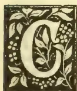A decorative initial letter 'C' in a black and white woodcut style. The letter is surrounded by intricate floral and leaf patterns, with small circles representing seeds or berries.

COCOA seed for planting should be obtained from pods growing on the stem of the tree. It does not germinate sooner than

the seeds from branch pods; but I have observed it grows into a more robust plant than the latter. Since adhering strictly to this rule, and sowing the seed in small baskets made of areka bark, and planting them out just when they were two months old, during the middle of April last—in fact planting them out whenever a couple of days' rain gave me a chance, albeit the proper time for planting or not—but with sufficient artificial shade to protect it from the direct rays of the sun; I have found that even after that protracted drought of twenty-three days between April and May last, the mortality among them from want of moisture in the ground was not at all what one might have expected under these circumstances. I assure my readers that in a field of 3,000 of these plants where I expected 90 % damaged, there were only about 200 failures!

It is not advisable to get the cacao seed to grow too soon as many people do by placing it about half an inch below the surface of the soil; for the result then is a very thin and wiry-looking plant liable to be blown down by the wind or scorched by the heat of the sun. On the contrary, plant it flat  $1\frac{1}{2}$  inch deep;

it takes from two to three weeks to rise, when only good seeds grow and give fine strong plants.

Although the genera and species of the two are wide apart, there is a strong affinity between the cacao and the jak fruit tree—both produce fruits from the stem as well as from the branches. It strikes me therefore as likely that the reason why jak trees cannot be evenly grown, even where the seed has been obtained from the best and largest fruit, is because the fruit has been one grown from the branch of the tree. In 1877 I planted several thousands of jak seed at stake along the roadsides of that well-known coffee estate "Gallekoluan," then only a new clearing, from fruits procured from the adjacent villages. These of course must have been fruits plucked from different trees and different parts of the trees. It was a severe disappointment to me to have seen that more than half of these seedlings had failed—some growing very poorly, and only a very small number rising up to beautiful plants. The estate has since changed hands and partly abandoned, but the jak plants that survived are now lofty trees in full bearing. Who can say whether these trees were not grown from *stem fruit seed*, and those that failed were all from *branch fruit seed*? A resident lately advertised in the local newspapers jak seed for sale at 50 cents a bushel. If these were of the proper kind I have indicated for planting, they ought to sell at several rupees a bushel.

Your readers have no doubt heard of Kola and the wonderful hunger-satisfying virtues of this valuable article of commerce from Africa. Mr. George Wall, I think it was that introduced it into Ceylon, and one of his plants growing on Ankanda estate is now in bearing. Plants raised in the island are known to have changed hands at R5 a piece. I would venture to draw attention to

161------------------------------------------------

138Supplement to the "Tropical Agriculturist." [August 1, 1893.

another tree which is indigenous to Ceylon. A fruit, with edible seeds, that has a strong resemblance to the Kola pod is produced by *Sterculia Foetida*, the "Telamboo" of the Sinhalese. My readers who have tasted the kernel of the Cajunut need only be told that the Talamboo-nut tastes similar if not more delicious. I have not tasted a Kola-nut, but from what I have heard from those who have, I think the Telamboo-nut might reasonably occupy its place in Ceylon. A specimen of these seeds might be seen at the Museum of the School of Agriculture, sent there by the writer.

"ALL PRODUCTS."

### SALT IN AGRICULTURE.

The Salt Union, Cheshire, has issued a circular drawing attention to the value of salt in agriculture. The pamphlet is no doubt intended as an advertisement, but it is valuable as indicating, under separate heads, the various way in which salt benefits the land and stock of the agriculturist. Exception may, however, possibly be taken to one or two points raised in favour of salt :

1. Salt consists of two-thirds chloride and one-third soda, and as the solvent powers of chloride are 20 times greater than those of rainwater, it is undoubtedly the most powerful substance known for breaking up the soil and setting its constituents free and available to nourish the roots of the plants. If the soil be stiff and dry, it is useless, and the roots cannot spread. An ordinary quantity of rain is not sufficient on stiff or sloping land. In all cases Salt hastens weathering.

2. Salt absorbs moisture from the atmosphere, and retains it in the soil, thus compensating for a deficiency of rain.

3. Salt purifies and decomposes all inert matter.

4. Salt makes stubborn soils easier to work.

5. Salt quickly destroys all kinds of noxious vermin, wire worms, slugs, and turnip fly.

6. Salt renovates old pasture lands, making sour grasses sweet and palatable for cattle and sheep. Where Ground Rocksalt is freely used for this purpose, the animals are healthy. It also neutralizes the injurious effect of rank grasses on new pastures. At the rate of 1 ton per acre in spring, it has a wonderful effect.

7. For strengthening the straw of cereals, the use of Salt is most important, owing to the fact that it seems to be the only substance which has the chemical power of setting free the requisite quantity of silica to nourish the stems.

8. For root crops Salt is valuable when previously incorporated in the soil, on account of its powerful moistening properties as before mentioned, and there is conclusive evidence that it prevents disease in potatoes.

9. If Salt be mixed with other manures, it will make them far more effective by dissolving the various constituents, and keeping them moist.

10. A plentiful application of Salt to the dung heap will not only fix the valuable ammonia, but will destroy millions of vermin, which would otherwise be carried on to the land and damage the crops.

As to the application of Salt, it is difficult to lay down hard-and-fast rules, as so much depends upon the condition of the soil and the seasons. From 8 to 10 cwts. per acre for cereals, and 10 to 15 cwts. for roots, is generally recommended, upon the breaking up of land or the month before seed time (but not with the seed). Light shallow soil requires more Salt. Repeated top-dressings in small quantities during the spring will be found very beneficial. It should be liberally applied to fallows, and on the stubble.

All animals are fond of Salt, and always prefer marshes and salted grass. Lumps of Rocksalt should be placed in all stables, shippones, pigstyes, and fields, as it improves the appetite, hastens fattening, prevents many diseases and epidemics, especially rot in sheep. A solution of salt and water is one of the best remedies for scab. Recent trials prove that for fattening pigs and keeping them healthy, it has a surprising effect. It also improves the coats of horses.

For sweetening and preserving fodder, and to prevent hay from fermenting and becoming mouldy when stacked, the antiseptic properties of Salt make it a most valuable remedy.

### DROUGHTS.

A drought is generally taken to mean in agriculture a want of rain. This condition is a very common one in the Eastern tropics, and is attended with special disaster in rice-growing districts. The want of rain is frequently given as a cause for the failure of the paddy crop, while from the fact that grass and other short-rooted fodder crops are easily killed out during severe droughts, the prolonged absence of rain has a most important bearing on the management of stock. On a recent visit to India we found that the severe drought that prevailed in the Southern districts during the first part of the year was the means of greatly reducing the number of cattle in those parts. On enquiry we learnt that the owners of stock, driven to their wits' end in the fruitless attempt to keep their animals from starvation point, were compelled as a *dernier resort* to part with them for one-fifth and less than a fifth of their values either for the butcher or to be removed to less drought-stricken districts. We have since read of how even English stockowners have been compelled to part with their animals to the butcher during the late unusual drought that prevailed in England; while in France a similar condition of affairs drove farmers to look for fodder in the trees of the forest, whose nutritive qualities Necessity has brought to light. Indeed the apparently general drought that lately prevailed compelled the natives of some parts of India to find sustenance in mango kernels and mhowa flowers.

Professor Warington, the well-known Agricultural chemist, has seized the opportunity when farmers in England were sorely troubled for lack of rain to deliver a homily on "drought," in its scientific aspects, and it would be worth our while to ponder over what he has said on the subject.

In agricultural text-books statements will be found as to the power of certain soils to maintain

162------------------------------------------------

August 1, 1893.] *Supplement to the "Tropical Agriculturist."*139

a moderate degree of moisture, even in the absence of rain. We are told that clay and humus are hygroscopic, especially the latter; that is, that when they have been perfectly dried, and are placed in moist air, they absorb a certain amount of water. The true hygroscopic action is, however, very limited even under favourable circumstances, and the amount of moisture thus obtained would be quite insufficient for plant nutrition, save in the case of the small growths of some of the lower organisms. The condensation of moisture from the atmosphere may, however, become considerable when changes of temperature intervene, and water is deposited in the soil as dew, and this is undoubtedly a powerful agent in renewing the moisture of the surface soil. The soil being cooled by night radiation, the moisture of the atmosphere is condensed, not only upon it, but within it if the soil has undergone a proper tillage; and the plants, which in the evening appeared limp are in the morning again fresh and vigorous. The water thus condensed at the surface may not in all cases be derived from the air; the vapour of water rising from a moist subsoil may be condensed at the cold surface; but for this to take place after drought has long continued, a soil of very open texture would be required. In the case of gravels, this supply of water vapour from below is very important. For the condensation of water from the air to be of really practical effect, it is of course essential that the air should be sufficiently moist, and this condition generally fails when a drought has long continued. Land in the neighbourhood of the sea possesses considerable advantages in this respect, and crops in such localities suffer distinctly less in time of drought. As already mentioned, the amount of condensation in a soil depends greatly on its being in a porous state, the result of good tillage.

The amelioration brought about by atmospheric moisture can be looked on only as a mitigation of drought; for any considerable supply of water in the absence of rain we must look to the stores already in the soil. Much depends on the distance of the water level below the surface; if this distance is only a few feet, crops should suffer but little in time of drought. Where, as is generally the case, the water level in the soil is at a considerable depth, the supply of water at the surface must depend (1) on the power of raising water by capillary attraction possessed by the subsoil; (2) on the water-holding power of the soil and subsoil; (3) on the amount of evaporation taking place at the surface.

The height to which water can be raised by capillary attraction depends on the narrowness of the passages through which it rises; the narrower, however, become the passages the slower becomes the rate of ascent, so that a practical limit to the action of capillarity is soon reached. The action of capillarity in bringing water to the surface from a considerable distance beneath is much smaller than is commonly supposed. When the surface soil is far above the water level its water-holding power is determined by the amount retained on the surface of its particles, in its pores, and in the finer capillary tubes; the wider tubes are all empty. Humus has a far greater power of holding water than either clay or sand, being far more porous in its nature. According

to Schloesing, some extremely fine sands, containing no cementing material, exceed clay in their power of retaining water. Such fine sands, resembling silt, constitute some of the most fertile soils, especially when of a good depth. Much may be done to increase the water-holding power of heavy soils by deep tillage and subsequent pulverising of the soil; also by increasing the proportion of humus by the use of farmyard manure or other means.

The next important point to be borne in mind is the loss of water from the soil by evaporation. All soils when saturated with water lose by evaporation at an equal rate, but when partially dry, evaporation proceeds more rapidly in a coarse soil than in one consisting of fine particles. Here again the advantage of good tillage is apparent. The greatest amount of evaporation takes place when the soil is occupied by a crop in full vigor of growth.

The object of the farmer in a time of drought is that the crop shall have the full benefit of the water still in the soil, and that as little as possible shall be lost by surface evaporation. Much may be done to attain this result. By shallow surface cultivation, leaving in a loose state a couple of inches of the surface soil, the evaporation of water is greatly hindered. When the soil remains solid any loss of water at the surface is replaced from beneath, and so the loss becomes continuous; but after the surface soil has been stirred, it dries without again absorbing water from below, while it effectually protects the lower soil from the action of sun and wind. The mulching employed by gardeners, and the application of cocoa-nut fibre, are still more effective plans for preventing useless evaporation from the soil.

A Veterinary authority treats of the effects of drought on animal health in an article in a late number of the *North British Agriculturist*. He states that a scant and diminishing supply of water, which threatens many parts of the country, affects in many ways the well-being and life alike of man and beast. As essentials for animal life, next after continuous supplies of fresh air, come frequent supplies of pure water. The bodies of the domestic animals contain nearly 60 per cent. of water, which is not only a necessary constituent of every tissue, but is requisite for digestion, absorption, and nutrition; for the regulation of animal temperature; for the solution and washing out of waste products. From air passages, skin, kidneys, and bowels, fluid matters are almost continuously excreted, and the loss thus sustained must be made good by the ingestion of water or watery food. During such hot weather as has been recently experienced, the skin secretions are greatly augmented, necessitating increased recuperation of fluid matters. Horses at work during hot summer weather, and living on mixed diet, will take daily 15 to 25 gallons of water, while cattle will drink even more; and sheep, although popularly believed to be independent of water, when the air and food are dry, consume 2 or 3 gallons daily.

A restricted water supply seriously interferes with thriving. The thirsty animal will not eat, no matter how tempting the food may be. So long as strength remains, it moves restlessly about; the mouth and throat are dry, and the tongue usually swollen and protruded; febrile

163------------------------------------------------

140Supplement to the "Tropical Agriculturist." [August 1, 1893.

symptoms supervene; and, where privation of water is absolute, exhaustion and death occur in a few days. Occasional, or even, continued, shortage of the fluid nutriment does not always produce notable immediate effects. The hair or wool may be observed to be dry and harsh, the animal does not grow or gain weight, the bowels are usually torpid, the urine may be high coloured and concentrated, and hence will irritate the excretory passages. Unless, however, the restriction is of short duration, more serious and permanent mischief results, especially in young cattle and sheep. The animals become gradually more thriftless, there is gastro-intestinal derangement, the skin is scurfy, the mucous membranes pallid, frequently jaundiced. Change of food, good nursing, and medicinal treatment in such cases are seldom of much avail. The patient pines, and perhaps six months after the mischief has been done dies, and the chief morbid condition discovered is a shrunk, hardened, fibroid liver.

Protracted drought not only affects the quantity, but also the quality, of the water supply. In a densely-populated country, the risks of sewage contamination are greatly increased. As rivers, streams, springs, and pools rapidly evaporate under the solar heat, and are freely absorbed by the dry-baked soil, the water is apt to contain a larger percentage of impurities, notably of injurious organic and organised materials. It is thus that springs, wells, and more especially pools, particularly if they have no fresh stream constantly passing through them, become dangerous sources of drinking water. Such contaminated water produces diarrhoea, often of a serious, sometimes of a fatal, choleraic type. Not infrequently such supplies become deadly from admixture with anthrax virus, and the increase of such cases recently reported from various localities may probably be thus accounted for. Many instances are on record of pools, which for years had with impunity been used for watering the stock of the farm, becoming during dry seasons so impregnated with putrefaction products that fatal anthrax occurred, not only in cattle drinking therefrom, but in the horses, hogs, sheep, and even in the poultry.

When any particular variety of food fails, others may usually be substituted for it; but there is no substitute for water. Practically, there is also but one source of it, namely, the clouds. Notwithstanding American projects, neither electrical nor other methods will coerce them to part with their contents. The best must, accordingly, be made of available supplies. In view of dry seasons like the present, live stock farms must be better furnished with such a prime necessary. An adequate permanent supply must be got, even if the cost be considerable. Streams and springs must be more carefully and economically utilised. Loss and waste must be guarded against.

#### ARROWROOT SUBSTITUTES.

The true arrowroot flour is, as is well known, got from the tuber of *Maranta Arundinacea*, but many other tubers are said to yield a very similar product.

*Curcuma pseudo-montana*, a yellow flowered variety belonging to Zingiberaceæ, is found spring-

ing up all over the Konkan in the rainy season. From its oblong bulb there grow, hanging by fibres, small potato-like tubers, which are perfectly white in the inside.

Arrowroot was manufactured from the tubers at one time, but now they are boiled and eaten in times of scarcity.

*Curcuma angustifolia*, "East Indian arrowroot," is also yellow-flowered, and common in India. What is known as "Travancore arrowroot" is prepared from the bulbs, and a good deal of it is imported. This flour is often mixed with that of *Maranta arundinacea* or the flour of Cassava.

*Curcuma leucorrhiza*.—Roxburgh mentions that a kind of arrowroot is prepared from the tubers of this plant.

*Curcuma caulina*.—From this arrowroot is manufactured in the Bombay Presidency.

*Aresama tortuosum* (var. *heliborefolium*) and other species of *Aresamae* are used in the same way as arrowroot tubers in parts of India.

*Arum maculatum* produces Portland Island arrowroot.

*Tacca Pinnatifida*, according to Hooker, affords the South Sea arrowroot. Its tuberous roots, as large as a fair-sized mango, yield a great quantity of beautiful white starch, of which it is said the best flour for confectionary and puddings is prepared. Drury says the fecula much resembles arrowroot and is very nutritious.

Species of Araceæ are also mentioned as substitutes for arrowroot; among these come the panu-ala and kidaran of the natives of Ceylon.

#### GRAFTING ORANGES.

The process of inarching or grafting by approach, by its simplicity and perfect adaptability to the atmospheric and other cultural conditions obtaining in the tropics, is said to recommend itself, above all other modes of grafting to the non-professional operator. Inarching has been before referred to in the pages of the Magazine in connection with the propagation of mangoes, and on a recent visit to India we saw the process most successfully carried on in the neighbourhood of Bombay and Poona. Dr. Nicholls, in his work on "Tropical Agriculture" mentions inarching as the most certain of all kinds of grafting, and as being extensively employed in the West Indies for the multiplication of plants of the better kind of mangoes. In the Bulletin of the Botanical Department of Jamaica, issued last April, the following description of the method is given:—

Procure seedling orange plants, sweet or sour, one to two years old, from the thickness of a goose quill to half an inch in diameter. Place them singly in good soil, well compressed in bamboo pots and nurse them until properly established. They will then be ready as stocks on which to inarch the improved or favourite variety. Tie each pot separately to a branch of the favourite, strong enough to bear it up, and at the same time, at a point from which the middle portion of the stock can easily, and without much pressure, reach and lie parallel to a twig or small branch of the tree of or about the same diameter. The

164------------------------------------------------

August 1, 1893.] *Supplement to the "Tropical Agriculturist."*141

operator should now cut away leaves and spines, if present, at and near to the point on the stock above indicated, and then with a sharp thin bladed knife, cut out of both stock and scion a longitudinal slice, from 2 inches to  $2\frac{1}{2}$  inches or even 3 inches long, gradually deepening, about the middle of each cut, to near the pith or half-diameter, at the same time taking care that the cuts may be so straight and in width, at least, equal, so as to readily allow their surfaces to meet without resorting to too much force. So important is it that the cuts on both stock and scion should be, at least, of the same width that, theoretically the corresponding inner or lower edges of their barks should, when opposed, come into perfect contact; and with the beginner it will be as well for him to consider this as being absolutely essential to success. Having thus fitted stock and scion, they should now be bound together with threads of cotton or worsted, or with shreds of calico or bast fibre. The tying material must not be drawn so tightly as to either cut into or bruise the bark, the object being merely to keep the edges of the wounds in contact. In addition to such tying, it is nearly always necessary to wrap the wounds with shreds of calico, previously saturated with a solution of wax, oil, etc., purposely to keep out rain as well as to exclude desiccating air.

Procure equal weights of bees wax and common resin. To a quarter of a pound of each add a tea-spoonful of coconut oil, or even animal fat; put into a vessel and boil. This must be done close to the tree on which the operation is being performed. The shreds of calico should be one inch wide, and long enough to thoroughly wrap the wound. When ready take hold with the hands of both ends and let all but the ends sink into the boiling wax until saturated, then draw it across the edge of the vessel to dislodge all excess of wax and allow it to cool until it can be touched by a damp finger with impunity. This part of the operation is of the utmost importance, inasmuch, as the application of the waxed cloth too hot, will scald the tender bark and thereby neutralize all hope of success; on the other hand, if applied too cold it is rendered unsuitable for the purpose intended.

When the requisite temperature has been attained, the waxed shred must be wrapped tightly and carefully round the wound, and this completes the operation. Kind nature will accomplish the rest. It is now only necessary to keep the soil in the pot moist; and to prevent undue evaporation, the space between the surface of the soil and the top of the pot should be stuffed loosely with either moss or hay. If the tree sought to be propagated is of moderate size a hundred or perhaps two hundred pots might be fixed to it at one time. It would cost very little more to water and otherwise nurse two hundred inarched plants than it would one hundred. In about six or eight weeks after the operation, with a view to aid in weaning, if I may so express myself, the scion from the parent tree, a notch should be made in the scion, immediately below the point of union, reaching almost to the pith. In two weeks thereafter the notch ought to be deepened, but not widened through and slightly beyond the pith; and finally in a week or two weeks more, if the weather is moist, the scion

should be severed and the new plant taken from the tree, shaded from the sun, and for a time most carefully nursed. It may be well to state that the beginner should not attempt to sever the scion from the parent tree unless when its leaves are developed and matured. When it is evident that the plant is out of all danger, and when active growth has set in, the stock, above the graft, should be cut back, a piece at a time, until finally foreshortened to the upper end of the grafted part.

#### VEGETATION POISONOUS TO CATTLE.

In all countries there occur forms of vegetation, whether plants, shrubs or trees that possess poisonous properties, and which if consumed by stock may produce fatal results. It is a popular belief that cattle like birds are endowed with special instincts by nature, by which they avoid eating poisonous vegetation when met with under natural conditions, that is growing in the field; but that when such poisonous vegetation is cut and fed to stock together with other fodder, they either lose the power of discriminating between poisonous and non-poisonous vegetation, or trusting in the good intentions of man, do not refuse to partake of the objectionable food. Whatever value may be placed upon such belief, it is a fact that very seldom is it the case that cattle die from eating poisonous vegetation found growing in the field, and we have heard of cases where animals that would not browse on the foliage of a poisonous plant when it was in a living and growing condition, have consumed the same after it was cut and thrown upon the grazing ground or in the stall.

In western countries yew and laural are the most common causes of death by poison, but until quite lately we had not heard of stock in Ceylon having died from eating the leaves or other parts of poisonous plants. Two cases of sudden and unaccountable death occurred among the cattle kept for slaughter at the Dematagoda Slaughter House last month. On examination of the grass (Mauritius or water grass) provided by a contractor, large quantities of Datura (Sin. Attana) leaves were found in the bundles. The seeds of this plant contain the alkaloid daturine which is used as a narcotic anodyne, but which, when given in any quantity produces death by poison. The leaves of datura are also known to possess poisonous properties, though perhaps not so pronounced as in the case of the seeds. There is little doubt that the cattle in question died by the effects of such poison, though direct proof was wanting, for an examination of the stomachs failed to show any traces of the succulent leaves or stems of the poisonous plant mixed up with the half-digested pulpy grass that filled them. It is a common deception among grass suppliers to conceal the leaves of trees among the grass they supply, in order to make the bundles of standard size or weight. What is suspicious in the cases referred to is, that the leaves of a plant so well known among the natives as possessing poisonous properties should have been used. It would be interesting to inquire whether a mixed diet of datura leaves and water-grass, though not producing

165------------------------------------------------

142Supplement to the "Tropical Agriculturist." [August 1, 1893.

the death of the animals, would impart any noxious properties to the meat after the cattle are slaughtered. The alkaloid daturine occurs in datura as well as in henbane (*Hyoscyamus Niger*). It is described as bitter, very poisonous, and as strongly producing dilatation of the pupil of the eye. We have not heard of any tests by which the presence of datura poison in the system can be ascertained. It is, as has been hinted, almost impossible to detect the presence of the leaves or leaf stalks in the stomach of an animal, owing to their being of such a succulent nature and occurring in so intimately mixed a condition with the pulp of grass. But the fact that cattle can be poisoned by datura leaves deserves serious consideration. It behoves stock owners to ensure careful examination of the grass that is supplied to their cattle, and to destroy all datura plants (for it is rather a common weed, and is, moreover, found springing up in Mauritius grass plantations) found in their gardens; while we must look to our chemical analysts and physiologists to discover some tests for the poison, and some definite post-mortem evidences which would go to prove that death was due to the poison.

Professor Wallace, in his book on India, in referring to intentional poisoning of cattle by the natives, makes the following statement:—"It (poisoning) is usually accomplished by throwing the leaves of some species of datura, or a plantain leaf spread with arsenic to a cow which is perhaps tethered out at pasture." Let us hope that our natives are not drawing upon the wisdom of the Hindus, and that the suspicious cases at the Slaughter House are after all traceable to purely accidental causes.

#### HORSE-BREEDING.

The Indian authorities hold out every encouragement to the ryots to carry on horse-breeding. The department entrusted with the work of encouraging breeding operations, has established depôts in various places where they keep selected stallions, so that the horse owners may avail themselves of them. This is not all that is done, for in addition to the depôts there are a few central stations or breeding farms entirely under the control of the officers of the department. These officers also periodically visit the villages and examine the mares in the possession of the owners, as to their fitness for breeding purposes, and brand them accordingly; for great care is taken not to allow undesirable animals to be bred from diseased or deformed dams. Each district has its Annual Horse Show, when prizes are awarded for such deserving animals as are exhibited by the villagers, and lectures and instructions are given on the best method of treating the animals.

The demand for horse-flesh is so great in India, especially for Military and Police use, that a large number of animals have to be annually brought down from Arabia, Persia, the Cape and Australia; and hence there is ample scope for profitably raising animals on Indian soil.

What are the conditions of soil and climate best adapted for horse-breeding? This is rather a general question, and one which cannot be satisfactorily answered offhand. It has, however,

been found out, that localities favoured with a hard sandy soil or a good loam with an undulating surface is the best adapted. When animals are bred on lowlying moist ground they lose their spirit, whilst animals bred on ragged hillsides generally are stunted in growth. Another important item necessary in a horse-breeding district is a plentiful supply of fresh water. The question naturally occurs to me whether horses could not be profitably bred in Ceylon, and if so, which system would commend itself to our circumstances, there being two systems in vogue, breeding farms where a large number of dams are kept, or the village system where the people keep a few mares. The last is no doubt the best and the most feasible, though it is not the most profitable. The absence of professional advice in such cases does not stand much in the way of the would-be breeder, for the attention and care which he could bestow on the few animals belonging to him, and constant personal contact with them, tend to produce better animals, than when a whole stud is maintained though under professional supervision.

The cost of breeding a foal may be summed up as follows:—

- (a) The cost of the services of a stallion.
- (b) The loss of the mare's services, say for three months.
- (c) Extra food for the mare.
- (d) Extra food for the foal.
- (e) The risks of losing the dam, or the foal or both.
- (f) And the interest on the initial cost of the mare.

It naturally follows that in order that horse-breeding may become profitable, the value of the foal produced should not only meet the above expenses, but also give a fair margin of profit for the trouble of the breeder: and under ordinary circumstances, this is effected.

No one in Ceylon has paid sufficient attention to horse-breeding, though it would be seen that the climate and soil in many parts of the Island are better adapted for the purpose than in India; and above all, in many districts we hardly ever suffer from a scarcity of water during any part of the year.

We cannot hope to make horse-breeding a general industry in which our goiyas could take a part, for though in India the ryots do not find it at all a difficult work, the goiyas will require ample demonstration as to the profits of an industry of which they know practically nothing, and will need to acquire a knowledge of the details of the treatment and care of an animal of which they hardly care anything about. Under these circumstances, it is left for those who know and understand to make a beginning.

Bombay.

W. A. D. S.

(To be continued.)

#### GENERAL ITEMS.

With reference to "All Products" note regarding *Sterculia Foetida*, we may mention that there are no less than six members of the genus *sterculia* indigenous to the Island, viz., *S. Foetida* (S. Telambu), *S. Urens* (T. Kaval), *S. Guttata*, *S. Balanghas*, (S. Nava), and *S. Colorata*. The Kola nut tree is *Sterculia acuminata* which is not a

166------------------------------------------------

August 1, 1893.] *Supplement to the "Tropical Agriculturist."*143

native species: but a specimen can be seen at the Royal Botanical Gardens, Peradeniya. The seeds of *S. Foetida* if eaten raw are said to bring on nausea and vertigo, but if roasted are edible. Whether they possess any properties similar to those of kola has yet to be ascertained. The leaves and bark are valued as remedial agents by the natives. There is no reason, however, why *S. Accuminata* should not be grown systematically in Ceylon, especially after Mr. T. Christy wrote as follows:—Should any of your (*Daily News*) readers feel interested in this nut, and have at their command lowlying damp land in the Colonies, such as would exist on the shores of Ceylon, I would strongly advise them to cultivate the kola, as it is one of the most promising products of the future. Among the exhibits sent from Ceylon to the Imperial Institute was a case of kola-nuts.

The *Kew Bulletin* for February and March contains an exhaustive paper on Palm Weevils in British Honduras. In its reference is also made to a disease of an obscure kind not due to insects, and known as "fever." Mr. Fawcett, Director of the Botanical Department, Jamaica, is of opinion that the disease is due to an organised ferment which attacks the tender tissues. Firing the fibres at the base of the leaves, though the production of fruit is temporarily retarded, is said to be effectual in the early stages of the disease. The application of salt to the cabbage is believed by some to do good. The following is also recommended: 1 lb. bluestone, 1 lb. freshly burned lime, 5 galls. water. The bluestone should be of good quality and dissolved in the water; the lime is slaked and stirred into a solution which is made up to the proper quantity with water. It should be used fresh and kept stirred, as the copper hydrate formed soon settles. It can be applied into a syringe or spraying pump to the cabbage. It is advised that the soil round the trees should be scraped away from the roots, and ashes together with some manure applied.

The *Straits Times* of May 23rd gives an extract from the Education Report of the Inspector of Schools for 1892, in which reference is made to paddy growing. It appears that the natives plant seed from the same land for 15 or 20 years in succession; in fact, seed from the same land is sown year after year until the crop failed, when fresh seed was obtained elsewhere for planting. That for so many years, under this system of cultivation, there continued to be a crop at all, is, says the writer, probably due to the practice among Malay paddy growers of transplanting the seedlings and manuring the roots when doing so. The Inspector in question is at present awaiting reports of the result of cultivating with seed paddy obtained from new districts. He hopes that the superior results from such a method will induce the paddy cultivators to always supply themselves with new seed, for, he says, "I have no doubt that the Malays are sufficiently alive to their own interests to follow this course for the future."

The fibre of *Amphidonax* (order Gramineæ) has been suggested as a source of pulp for paper-

making, being tough, cohesive, and readily rid of the resin contained in the stems. *Capital* asserts that the fibre of *A. kurka* offers a field for exploitation equal if not superior to esparto. A report on some prepared fibre sent to a leading manufacturing firm in London places its suitability beyond doubt, and it now only remains to ascertain the probable margin. At present the fibre is used in India for making mats, string and rope. In Ceylon we have two species of *Amphidonax*, viz., *A. Heynei* (*Zenkeria elegans*. Trin.), and *A. obtusifolia* (*Zenkeria obtusifolia*, Benth.). Thwaites mentions that the habitat of the former is Ratnapura, and that of the latter the Southern and Central Provinces.

It is reported that the unsatisfactory arrangements by which the Agricultural Department of Madras has no independent status, as the result of which it appears "impossible for any honest desire to do good service in the direction of agricultural improvement to be fulfilled," is compelling Mr. Benson of Madras to retire. The present case recalls that of Mr. Robertson, who when he found his freedom of action restrained "after he had been for a short time relegated to educational work, was driven from the country in disgust." It is a matter for regret that the services of two such excellent officers should be lost to India, owing to the authorities refusing to relinquish a false and faulty policy.

Salt is said to exist in such incalculably large deposits, that there is not the slightest apprehension to be entertained of any succeeding generations finding themselves without the universal seasoning. Thus for example, with reference to the rock-salt of Kohat we read of a stretch about 8 miles long, more than  $\frac{1}{2}$  mile in width, and with an exposed thickness of 1,000 feet,—one of a series of the largest known exposures of salt on the face of the globe; and further, hills 200 feet high are sometimes formed of pure salt.

There are several Schools for industrial training in the Madras Presidency, and in these engraving, carpentry, blacksmithy, tailoring, lacemaking, embroidery and other handicrafts are taught.

The *Indian Agriculturist* asserts that irrigation works in India are, both in size and completeness of arrangements, on a scale surpassing those of any other country. In 1890-1891 the area irrigated is computed at upwards of 10 millions of acres, the average value of the crop per acre varying from R25 an acre in Madras to R92 in Bombay.

In 1892, there were in India 126 cotton mills with a capital of eleven crores, or taking the rupee at nominal value, of eleven millions sterling. These factories run 24,670 looms and 3,272,988 spindles, employing 112,000 persons.

A resident of Nuriotpa, South Australia, has written to the local Press drawing attention to the drought-resisting and stock-feeding properties of tagasaste, or tree lucerne, which was

167------------------------------------------------

144Supplement to the "Tropical Agriculturist." [August 1, 1893.

introduced to the colony about twelve years ago by the late Dr. Schomburgh. The tagasaste is a species of *cyrtus* or *laburnum* indigenous to the Canary Islands, where it is utilised to a great extent for feeding horses and cattle. It forms a dense spreading tree, with foliage closely resembling that of lucerne, and much relished by all kinds of stock. It grows rapidly upon even the poorest land, and under the most favourable conditions, which comprise a warm climate and a loose, sandy soil; it frequently attains a height of from 18ft. to 20ft. with a diameter of from 12ft. to 15ft., within the short space of five years. However, by close planting and constant cutting or feeding off it can be kept quite dwarf and bushy, and the more often it is cut the more valuable it becomes. In the report of the Adelaide Botanic Gardens for 1882 it is stated that stock fatten more quickly on tagasaste than anything else, and it is recommended to mix it when fresh cut with half its weight of chaffed straw. Horses are particularly fond of tagasaste, and keep in first class condition, and work as well on this as when fed with the best wheaten hay. The seeds may be sown at

any time, and the young plants set out during the winter months 4ft. or 5t. apart each way. It will be necessary to cultivate between the rows occasionally for the first two years, after which stock may be turned in and no further cultivation required.

It has been estimated by Reamur that a single aphid, which lives only for a few weeks, could, if destructive agencies were withdrawn, be the progenitor of no less than 5,904,900,000 individuals; the unrestrained increase for 300 days would reach to marvellous figures—indeed, according to Professor Huxley's calculations, the descendants of a single aphid would, in 300 days—if restraining influences were removed—amount to such an enormous weight as to leave no room for man or any other creature.

We acknowledge with thanks the receipt of the following periodicals:—St. Thomas's College Magazine, Our Boys, Native Opinion, Jaffna Patriot, Royal College Magazine, La Croix, and the Diocesan Gazette.

A decorative horizontal flourish or scrollwork design, symmetrical and ornate, centered on the page. It features intricate, swirling patterns and floral motifs, typical of late 19th-century book design.

168------------------------------------------------

A small, faint, circular seal or stamp impression is centered on the page. The seal appears to have a decorative border and contains some internal design, possibly a crest or text, but the details are too faded to be clearly discerned. The overall appearance is that of a light-colored ink stamp on aged paper.

169------------------------------------------------

**ALASTAIR MACKENZIE FERGUSON, Esq., C.M.G.**

*Tropical Agriculturist Portrait Gallery,*

*No. II*

170------------------------------------------------

# \* The TROPICAL AGRICULTURIST \*

◇ MONTHLY. ◇

Vol. XIII.]

COLOMBO, SEPTEMBER 1ST, 1893.

[No. 3.

## "PIONEERS OF THE PLANTING ENTERPRISE IN CEYLON."

A. M. FERGUSON, C.M.G.\*

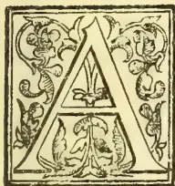

LASTAIR MACKENZIE FERGUSON—the subject of this notice—was born in Wester Ross in the North of Scotland on 23rd January, 1816, and he died in Colombo on the 26th December, 1892,

within a few weeks of completing 77 years, 55 of which with but brief intervals, were passed in Ceylon. With no exceptional advantages in education, his natural endowments and literary ability early manifested themselves, a few of his youthful poetical writings receiving insertion in the *Inverness Courier* from so good a judge as Dr. Carruthers (the editor of Chambers' "English Literature") at a time when some of those of Hugh Miller were rejected. These writings attracted the attention of "Seaforth," the Rt. Hon. J. A. Stewart-Mackenzie (after a member of whose family A. M. Ferguson was named), a distinguished statesman, under whose auspices he came up to London and afterwards on his being appointed Governor, out to Ceylon. Mr. A. M. Ferguson landed at Colombo on November 7th, 1837, and he was fond of describing the woefully deserted and depressing appearance of the open Colombo roadstead with its few native dhonies and perhaps one "sailer" at that time, as compared with the wonderful development twenty and forty years later under the influence of the planting enterprise and still more with the picture presented by Sir John Coode's magnificent breakwater, the big mail and commercial steamers and the manifold signs of trade and prosperity in the present day. From 1837 to 1846, Mr. A. M. Ferguson had a varied experience of the island, in business, as a planting pioneer in Uva, and as a Customs

Officer and Acting Magistrate at Jaffna. In 1844, his marriage took place there with Miss Mackerras who had come out from Scotland and who died in August 1890, their married life extending over some 46 years. Mr. Ferguson from the day of his arrival in Ceylon had been a frequent and esteemed contributor to the *Colombo Observer*, then owned and conducted by Dr. Elliott, and the latter in 1846 invited him to become his Assistant Editor. With the career and development of the *Observer* from that year onwards, his name was inseparably associated. He continued as co-Editor up till 1859 when Dr. Elliott, becoming Principal Civil Medical Officer and head of the newly-created Government Department, sold the *Observer* to his colleague. The death soon after of his long-tried friend the Doctor, the best-loved colonist in Ceylon, tried Mr. Ferguson very seriously, a severe attack of fever nearly carrying him off,—this being almost his only serious illness during 55 years in Ceylon, until the last. We came out and joined our relative as Assistant Editor in November 1861, and enabled him to take his first holiday outside of the island in March 1863. Mr. Ferguson had then been nearly 25½ years in Ceylon without a change—he had never seen a railway, the first of the London suburban lines being under construction towards Blackwall as he left in November 1837, while Mr. Faviell and his staff arrived in Colombo to begin the line to Kandy, a few days after his holiday commenced. He went home via Bombay, making his first railway trip over the Bore Ghaut. While in England, where he remained a year, he lost his eldest daughter suddenly, whom he had expected to bring out, his eldest son having died there two years before. Returning to Ceylon, after some years of work he was able

\* We had intended our Senior to come later in the list, but the non-receipt of "Old Colonist's" account of Mr. Tytler obliges us, to make a change.—Ed. T.A.

171------------------------------------------------

146THE TROPICAL AGRICULTURIST.[SEPT. 1, 1893.]

to revisit the old country in 1867 and bring out his "Souvenirs of Ceylon," a handsome oblong volume with illustrations, as a gift-book, giving a popular account of much connected with the island. A further visit was made in 1871, and it was then that in consequence of a threatened break-down, Sir Wm. Gull advised him not to venture back to England, at any rate save in summer, as his constitution was evidently thoroughly acclimatized to the tropics. We may next refer to Mr. A. M. Ferguson's labours as Ceylon Commissioner to the Melbourne Exhibition of 1880-81, for which he was chosen by universal acclamation, while his services were acknowledged by his fellow-colonists with a purse of R10,000, a gold watch and service of plate, followed from Her Majesty, on the recommendation of the Governor, by the honour of C.M.G. It is not for us to say how well-deserved these tributes to good work were, or how his exertions on behalf of Ceylon tea in Melbourne bore good fruit in increasing exports to Australia, which have gone on to the present day. No more visits were paid to Europe, but Mr. Ferguson made several trips to India—to the Nilgiris and to Darjeeling as well as other parts—in connection with his promotion of the cinchona and tea planting enterprises which he did so much to develop by his example as well as by his writings. In this connection it may be mentioned how heartily he welcomed the appearance of *The Tropical Agriculturist* which we had started during his absence in Victoria, a stranger bringing a copy under his notice before our first issue and advice had reached him. In the same way each successive "Handbook and Directory" and each "Planting Manual" from our press excited in him the liveliest interest and satisfaction, while to many of them, of course, he made valuable contributions. His own first "Commonplace Book and Directory" appeared in 1859, and it was peculiarly interesting for its "Planting Gazetteer" which we have often wished to revise and republish. Directories were continued in 1860 and onwards; but they were small volumes until developed into the larger "Handbook and Directory" so well-known of recent times. From 1879 onwards, Mr. Ferguson had been spared the necessity of coming to his desk in the newspaper office; but he was always reading or writing in the public interest while in Colombo, and when at Abbotsford his letters "From the Hills" were very regular. The illness of his wife in 1889 necessitated another trip to Australia, and her removal in August 1890 made a great blank; but he made himself happy with sons, grandchildren and nieces in the intervals of his occupations.

He was, as is well-known, never happier and never more his natural self than when on Abbotsford plantation, Upper Dimbula. He loved every

hill and stream, knoll and dale, aye almost every tree on the property which he had seen changed from original forest into fields of coffee and cinchona and tea and of useful and ornamental trees. Until quite an old man up to and over his 70th year he was accustomed to take such walks on the plantation, a long and steep one, and into the jungle, as often tried the mettle of far younger men. Indeed, it became a proverb in the neighbourhood that "old Ferguson" could walk the most muscular young planter off his legs, while all the time keenly enjoying the vegetation and the scenery, the distant hills and cloud effects, or the note of birds and the flower of a striking or new plant close at hand, and at the same time pouring out information intermixed with shrewd inquiry and keen observation. Nothing afforded him greater pleasure than taking visitors over Abbotsford,—his readiness and enjoyment in this way equalling that of his great prototype (if we may so say) Sir Walter Scott in the Abbotsford home he had created by the Tweed, in the early part of the century.

And now of Mr. Ferguson's character and work as colonist and journalist for fifty-five years in this island, what need of us to speak? He was the oldest British editor in Asia by a long way. He belonged to the old school of journalists who were far more literary and descriptive writers, than politicians, and busy social critics ready to watch and develop any turn of public opinion. The comfort of the good old days when there was only a fortnightly mail with ample time to digest all its news, was much more to our senior's liking than the hurry and worry of more recent years, and his power and taste lay more in descriptive writing than in editorial work. He has never been excelled in his description of the natural beauties of Ceylon, and his was a poet's prose, for he had the poetic Celt's imagination highly developed, and some of his writings of "the fifties" describing visits to the Dumbara Valley, to Kelebokka, to the Matale hill ranges &c. have only been equalled as word-paintings by the wealth of language which in later years he lavished on Upper Dimbula, Nuwara Eliya, Hakgalla and the surrounding panoramas. An accomplished Australian journalist—now editor of one of the leading papers—told us after a year's observation in Ceylon, of our senior, that his was one of the most interesting personalities he had ever met from Carlyle onwards—unique and picturesque in his journalistic and book writings, but scarcely intended for the constant and trying duties of "daily" editor. And yet never was there one more ready or determined to defend the right as he saw it, against all odds—never a public writer more ready to stand up to, and denounce, mistaken autocrat or wrongdoer,

172------------------------------------------------

SEPT. 1, 1893.]THE TROPICAL AGRICULTURIST.147

whether Governor, civil servant, planter, merchant, or native. There could be no tampering with conscience in his case, and especially where his religious convictions were concerned, was he immovable, so that of him at his best in his fullest powers, it were surely apposite to quote the Laureate's lines on one of England's greatest and most honest sons:—

O good gray head which all men knew,  
O voice from which their omens all men drew,  
O iron nerve to true occasion true,  
O fall'n at length that tower of strength  
Which stood four square to all the winds that blew!

"Such was he whom we deplore." And yet great injustice would be done to a man of whom the public too often only saw the stern fighting side, if we did not dwell on the other and softer phase of his character. One of the kindest and most generous hearts that ever beat when one came to know it—full of fun and humour. A poor speaker, so that he could only stammer out halting sentences when we came to Ceylon, in the sixties, after his visits to Europe he developed into by far the readiest and happiest public speaker in the colony. Indeed, he appeared far too seldom in this capacity. Had he gone to planters' and other meetings after his retirement from active editorial work, he would have become better known to, and more appreciated by, the younger generation of colonists. He especially made his mark in Victoria as a speaker, and at the various Exhibition banquets it was declared again and again that the Commissioner for little Ceylon was the most notable man amongst them when on his legs. He was more than once asked to go into the Legislative Council, notably by Sir Arthur Gordon, but it was to take an "acting" appointment, and having contended on principle that there should be no acting appointments, he was far too consistent to accept an offer which, in reality, would have led on to the permanent seat a few months later. He prided himself in the early days on being the means of securing cheap newspaper postage for Ceylon, of freeing printing paper from Customs duty and of securing the simplification of our tariff at a time when it was more cumbersome even than at present. His good work in connection with the Carrier Pigeon Service of the *Observer* will not be forgotten: it extended over seven years; but no one welcomed telegraphs, railways or other modern improvements more heartily than he did. How he urged Harbour Works and Railway Extension for years is well-known. In respect of improved social and general legislation he did much by his writings, supporting the abolition of Polyandry, opposing the loose Muhammadan Marriages Registration Bill, criticizing in a long State Paper for Sir Arthur Gordon's benefit, the Buddhist Temporalities measure; while the consistent stand he took in opposing the Paddy

rents abolition while retaining the Customs rice tax, is fresh in everybody's memory. But all this and much more belong to the record of a life which if written in detail could not fail to offer much of instruction to his brother Colonists.

We had fain hoped that Mr. Ferguson would have been enabled to take a voyage to England—as a farewell visit—and for the first time to see America (and Chicago) during 1893; but it was fated otherwise:—

God's finger touched him, and he slept.

And yet, of course, with all our regret and the weak human thoughts of "what might have been," no one can call this an untimely death, or speak of it as a life cut short in its usefulness. Rather it was prolonged and rounded off and filled with good useful work far beyond the common, especially in the experience of tropical colonists of British blood. The subject of this notice had surely fought the fight, finished the course and kept the faith, and in his case the promise we know has been made sure.

The name of A. M. Ferguson, C.M.G., cannot fail to occupy a prominent place in the annals of Ceylon for a longer period than that of any of his contemporaries. He watched over the rise of the planting enterprise, and he saw it reach its high-water mark in coffee, in cinchona, and shall we say in tea? He lived to see the population well-nigh double what it was when he first arrived—an undeniable testimony to good government and easy taxation whatever critics may say—he watched the multiplying of roads and bridges, the rapid extension of railways and the multiplied establishment of dispensaries and hospitals, and the great spread of education. He helped on in every good work, and was a main force in some causes; but the world moves on; and if much has been done, much remains to be done—and one lesson to all of us is not to regard the vanities, the honours or temporal rewards, but to keep on in the straight line of work and duty, remembering,—

The world will turn when we are earth—  
As though we had not come or gone;  
There was no lack before our birth,  
When we are gone, there will be none.

But of Mr. A. M. Ferguson's career as a planting pioneer in Uva in the early "forties," and thirty years later in Upper Dimbula, we must offer some further remarks before closing. He did some rough work in cutting out extensive blocks of forest land above Badulla, afterwards formed into the well-known Weywelhena, Gowrakella and Cannavarella plantations. He lived in a Kandyan Chief's house while engaged in this duty, and he frequently referred to his experience in after years. We quote what he himself wrote on the subject in the "Planting Gazetteer" of 1859:—

This is a District of which the compiler of this work, ought to know something, seeing that he was one of the

173------------------------------------------------

148THE TROPICAL AGRICULTURIST.[SEPT 1, 1893.

Pioneers of Planting in Ouvah. Our predecessors there in the planting line, (and they were only just commencing,) were Major Rogers, Dr. Galland, Sir W. Reid and Dr. Sortain. That was in December 1840. The three first have been long dead. One fell by the lightning stroke in the midst of his active and useful career. Another, wasting under consumption, sought in vain to prolong life in the climate of Texas. "The sea, the blue lone sea," is the resting place of the third. The fourth is living (and long may he live,) although we believe he has ceased to have any interest in Ouvah or its Coffee. Our individual task was to report upon, cut the boundaries of and plant Nurseries in an immense tract of Forest, extending from Weywelhena and Gowrakella at the foot of Namanakoola Kande, on through Cannavarella and Nahavilla to the extreme end of the range where Hindugalla looks down on the hillock-dotted plains of Wellasse. There were 3,700 acres in this one block, and, including another piece of land near the Fort of Himblatawella, up on the way towards Newera Ellia, we have the satisfaction of believing that we launched into planting existence some 4,000 acres of as fine coffee land as can be found in Ceylon. We left in June 1841, just as the nursery plants were peeping above ground, and we have not seen Badulla since then, excepting as a feature in the grand and varied view from the top of the Newera Ellia Pass. We trust some day to revisit scenes which we remember with pleasure.

In a humorous and descriptive piece of verse written a few years later, he made further references worth giving:—

#### THE SONG OF UVA.\*

Ye hills and vales of Badulla,  
When we were first acquaint;  
Ye were but rarely visited,  
Your riches little kent;  
But now, from Nam'nacooly's base  
To Hapootelle's crown,—  
The Coffee shrub is springing up,  
The forest going down.

Auld Willie Reid and douce Sortain  
First "prospected" thegither;  
I followed,—and the pleasant cracks  
We had wi' ane another!  
Now Rogers, Galland, Reid have gone  
The path that all must go;  
While we life's battles still must fight,  
Sortain, my worthy jo!

Past ane an' twenty busy years,  
An' lo' the wondrous change;  
Those Hills are now the white men's homes,  
Which were the wild beasts' range;  
And, mixing with the torrent's roar,  
The steam-pipe's puff is heard;  
While rattling round the pulper goes,  
As merry as a bird.

And good and true men live and work,  
If good and true are gone:—  
There's Wood and Brown and Norman Stewart  
And clever Henry Don.  
There's Byers with harmoniums twain,  
For light or sacred song;  
And Cruwell of the thunder tones,  
As pliant as they're strong.

There's Herjee Franjee of Bombay,  
John Oliver of Lews;  
Canadian Irvine, who can tell  
Of sleigh drives and snow shoes,  
And, to repress those crimes which with  
Prosperity increase,  
There's H. C. Bury, grave and stern—  
The Justice of the Peace!

There's Pineo with the foreign name,  
And Jenkins born in Wales;  
While Scottish Celts stride o'er those hills  
MacColls, and eke MacPhails;  
And Dr. Kelson roams around.  
With potion and with pill,  
To keep the sturdy Planters all  
From ever getting ill.

We've Dawson, Kirkton, Linton, Smith,  
Imlah, and Atwells (two);  
With Johnstone, Geddes, Bayley, Sikes,  
Roaming our forests through.  
There's Cummins (not the Crown Court Seer).  
And Handyside my friend;  
And more, whose names if I should write,  
My song would never end.

There's Russell with the treble voice,  
But masculine of mind;  
A better man to fill his post  
You might go far to find.  
There's A. Y. Adams, who as Judge,  
Has everybody's praise;  
And last (not least) there's "Billy Hall,"  
The man who mends our ways!

And Ouvah's crops are bumper crops—  
The quality is prime;  
The climate all that could be wish'd,  
Good roads will come in time;  
No doubt the Planters have their griefs,  
Their grievances and fears;  
But if they knew what we endured—  
Old Ouvah's PIONEERS!

For, few and scant our comforts were—  
The leaders of that band—  
Whose cosie cottages now rise,  
Bright homesteads o'er the land;  
So while for all that's still to do,  
Ye strive with high resolve—  
Let grateful thoughts too, have their play,  
As ye THE PAST revolve.

Ye Hills and Vales of Badulla,  
When we were first acquaint;  
Ye were but rarely visited,  
Your riches little kent.  
But soon from utmost Ouvah's height  
To Ratnapoora town,  
THE ROAD!—will help the Rice Carts up—  
The Coffee Bannies down!

[Of all named in these verses, only Messrs. Byers, MacPhail, Jenkins, Pineo, Sikes, Atwell, Geddes, A. Y. Adams and perhaps Dr. Kelson, remain in the land of the living.—Ed. T. A.]

In the "seventies" Mr. Ferguson threw himself with great ardour as proprietor of Abbotsford into all that concerned practical coffee cultivation—and especially into the combat and struggle against "coffee leaf disease" (*hemileia vastatrix*), writing a full account of the same in pamphlet form. No one again did more to pioneer cinchona cultivation and to introduce fresh and valuable seed or to arrive at a right understanding of the best mode of cultivating and harvesting, together with the mossing and other processes. And finally Mr. A. M. Ferguson was, equally, a pioneer with tea culture in our hill districts, as he was in the low-country with Liberian coffee and cacao. With each of these products he experimented, and at the same time wrote in the *Observer* and *Tropical Agriculturist* very fully on every department of their cultivation, preparation, &c. For no one was ever more ready to impart the results of his experience than the subject of this notice, while he took a special interest in the work and success of his planting neighbours.

Peace to the memory of a man of worth!

\* Written by A. M. Ferguson, Esq, C.M.G., in 1862.

174------------------------------------------------

SEPT. 1, 1893.]THE TROPICAL AGRICULTURIST.149"COCOA CURING IN CEYLON."(From *Bulletin of the Botanical Department, Jamaica*.)

The following information received from Dr. Trimen, Director of the Royal Botanic Gardens, Ceylon, will no doubt be of great interest to planters in Jamaica.

"You ask about Cocoa curing. We always carefully wash off with repeated ablutions every particle of mucilage from the seeds. No doubt this lessens weight, but much improves the sample and I think one of the principal reasons for the generally high price Ceylon cocoa fetches in London is the clean bright look of the bean. Another and perhaps more important thing is thorough drying. On estates this is always done by a current of hot air drawn by a fan through a small house, the seeds being spread out in layers on trays and turned over several times. No Planter here would allow a speck of mould to be seen on a Cocoa bean. I gave a description of the ordinary style of drying house for Cocoa to Sir W. Robinson of Trinidad a few years ago, and he printed it in the "Agricultural Record" of that Colony for 1890. I enclose a leaflet which is distributed with Cocoa seed to the native villagers."

DESCRIPTION OF CEYLON COCOA DRYING HOUSE.

"The house is about twice as long as broad, built of brick, and is provided with double doors, but with the exception of the opening for the ingress and egress of the hot air, is hermetically sealed. The interior is fitted with a number of upright frames into which slide, one above the other, the trays upon which the beans are spread; these should be made of narrow pieces of split bamboo, not of wire or coir-matting. The heating apparatus is outside in contact with one end of the building, and consists of a large stove standing in a short tunnel which opens into the house. At the other end of the building, also outside, is a powerful fan, fitted in another short tunnel; this is worked by hand (three or four coolies needed) and by its rapid revolutions draws the air through the house. By passing over and round the stove the air is dried and heated; that which passes out is hot and damp. The flue of the stove passes under the floor of the house and contributes to warm it. A drying house of this sort is very simple and its cost only about 120\* rupees; it does its work perfectly, and nothing more elaborate or costly is required.

"It is found desirable here to dry Cocoa as slowly as possible, provided the risk of mould be avoided. This appears in the interior of the beans in twelve hours and on their outside in about twenty four in wet weather if they are left cold, but by passing them rapidly through the hot air house, so as to have them hot when taken out, it is found that they will remain for a night or so in the store without injury."

"[As the annual average number of rainy days in Ceylon is from 80 in dry districts, to 328 in the wet, and Cocoa is grown only in the moist regions of the Island we may assume that at least four-fifths of the Cocoa exported from that colony is dried artificially. The rainfall in the best Cocoa Districts of Trinidad appears to average between 80 and 100 inches. The total yield as before stated is 12,500 cwt. representing an enormous crop and an immense number of people dependent upon it.]"†

"INSTRUCTIONS TO NATIVE CULTIVATORS OF THE CACAO OR CHOCOLATE TREE, 1884.

"1. *Localities, soil, climate, &c.*—Cacao is a completely tropical plant, and its cultivation should not be attempted above 2,500 feet, and only in warm situations well sheltered from wind. Flat ground is better than sloping. The climate must be moist, but a well-marked dry season, if not too long, is no disadvantage. The soil should be deep and well drained; good forest soil is, of course, best, but that of native gardens is generally very suitable.

\* Should be R1,200, as given by Dr. Trimen.—Ed. T.A.

† This no part of Dr. Trimen's writing. Probably Sir W. Robinson's addition.—Ed. T.A.

"2. *Planting.*—The seeds must be sown as soon as possible after they are gathered, as they quickly spoil for germination after becoming dry. Germination commences soon and proceeds very rapidly, and the young plants are very impatient of being transplanted, unless with the adoption of such precautions as will prevent any injury to the roots. Arrangements must, therefore, be made either for growing the seeds in a nursery in such a manner as to allow at least a foot between each seedling, so that they may subsequently be taken up with the earth about their roots, or for sowing them singly in bamboo or other pots or for putting two or three seeds in each place it is intended a tree shall occupy, afterwards allowing only the strongest seedling of these to remain. The last plan is the best for native cultivators. In plantations the trees should stand at from 10 to 15 feet apart, according to the richness of the soil, 12 feet being a good average distance.

"3. *Cultivation.*—It is necessary to shade the seedling plants when young: this is effected by branches fastened in the ground of any tree which retains its withered leaves—as cinnamon, mora, &c. There is no occasion to provide any permanent shade in most parts of Ceylon, but sheltered from wind is of great importance. Plenty of light and a free ventilation of air are essential for the production of good and abundant crops. The ground under the trees must be kept perfectly free from weeds, and may be littered with decaying leaves and other vegetable matter. Manure is very beneficial. The trees should be kept from growing higher than 10 or 12 feet, and the primary branches be encouraged to assume a horizontal direction; redundant shoots from these or from the trunk must be pinched off when young. The principal trunk and branches should be kept very clean, and great care should be taken that the small and delicate flowers are not rubbed off or injured.

"4. *Gathering.*—A first crop may be expected on good soil in the third year. The fruit must be quite ripe before it is gathered; this is known by the rind having a yellowish colour when cut into. The pods should be cut off cleanly with a knife, and not too closely to the stem. They can be easily split by a blow from a wooden mallet, and the seeds and pulp are then taken out and put into baskets to be carried to the curing place.

"5. *Curing.*—The seeds should be heaped together to "sweat." This may be done in pits or boxes, or better on a platform covered with coir matting; the seeds should be covered over with matting, gunny bags, or a tarpaulin. Every other day they must be thoroughly turned over until the process of fermentation has gone far enough, which will be in seven, eight or nine days; on the proper duration of this depends the goodness of the sample. The mucilage and pulp round the seeds is now ready to be washed off, and this washing requires several repetitions with plenty of water. As soon as clean they should be at once spread out on mats in the sun to dry, avoiding, however, the extreme heat of the day, and in about three days they will be fit for the market. In wet weather the drying must be done by artificial heat in the house.

"When well dried the "beans" should be perfectly clean, with a thin pale cinnamon-brown skin, of one colour all through, and entirely free from damp or mouldiness.

HENRY TRIMEN, Director, R.B.G.

UVA PLANTING PROSPECTS.—We are glad to see so encouraging a planting report from Uva as that furnished on the present occasion by our correspondent. In respect of the future of tea, he is especially strong and under these circumstances, it is all the more aggravating and inexplicable, to learn that there has been a suspension of the work on the roads which are required as feeders to the Railway. Can it be that the Government do not want to draw more traffic to their *Hauptale* or other stations?!

175------------------------------------------------

150THE TROPICAL AGRICULTURIST.[SEPT. 1, 1893.]

### HIGHEST RAINFALL IN TWENTY-FOUR HOURS.

With reference to the paragraph quoted in your notes of this week's NATURE from the *Indian Planters' Gazette* of Jan. 28th, 1893, the most elementary knowledge of Indian meteorology would suffice to show that the remarkable figure, 48 inches, supposed to represent the fall of a single night in January at Dehra Dun, is simply a misprint for 48. The entire rainfall of the winter season in no part of India exceeds one-half this amount, and I have no hesitation in declaring such a figure as 48 inches in twenty-four hours to be absolutely without precedent, and, in my opinion, so extraordinary at such a season, that, if it really were 48, it would require us to regard all existing Indian meteorological data with suspicion. Thirty inches in twenty-four hours has often been recorded at Chirapunji in June and July. Can any one show a single instance of even 20 inches in twenty-four hours at Dehra Dun?

Moreover, the whole annual supply at Dehra Dun is only 75 inches, while that of Chirapunji is 600 inches! E. DOUGLAS ARCHIBALD.

—Nature, July 29.

### COFFEE NOTES.

A commission of the commercial association at Santos made a revision of the stock of coffee in that port on the 1st inst. which was found to be 58,000 bags in flat hands, 59,000 bags in second hands and 3,000 afloat, in all 120,000 bags.

During the past twelve months, the bureau of American republics at Washington is informed, more than a million acres of coffee lands in the state of Vera Cruz, Mexico, have been sold to purchasers of various nationalities, including Americans, Germans, Frenchmen, Englishmen and Belgians.—*Rio News*.

### CROPS IN JAVA.

AMSTERDAM, Aug. 2.—The Chamber of Commerce in this city has issued its report for 1892, from which it appears that there has been a larger decrease of trade, which is generally ascribed to the protective measures introduced by foreign countries, especially France, which prevents business. The exports to the United States were, however, double the value of those in 1891, and the following articles have much contributed to this result:—Coffee, \$1,074,126 in 1892, against \$309,643; Tobacco, \$4,573,702 in 1892, against \$837,246. As regards Netherlands East India the report mentions that the sugar crop was larger than in 1891, and the total exports of Java sugar to all ports amounted in 1892 to 7,207,681 piculs. The coffee cultivation did not answer the expectations, and the exports were 446,700 piculs private, and 302,074 piculs Government coffee. The tea crop was more abundant, but the cinchona cultivation is nearly ruined by the constantly drooping prices. The tobacco cultivation in Java was profitable in some districts, while the prospects for the Sumatra crop improved.—*London and China Express*.

### BARK AND DRUG REPORT

(From the *Chemist and Druggist*.)

London, Aug. 2.

COCOA-BUTTER.—At auction on Tuesday 200 2-cwt cases of Cadbury's cocoa-butter sold at 1s 2½d to 1s 3½d per lb. showing a steady market.

CARDAMOMS.—A moderate supply was offered today. It consisted of about 161 boxes, for which comparatively little interest was shown. Good qualities were a little easier, but common fruit sold at steady prices. Ceylon-Mysore medium good pale are held for 2s 6d; for a yellow lot a bid of 2s 7d was refused. Small to medium fair yellow brought 1s 1½d to 2s; long medium brownish 1s 6d to 1s 7d; small long brown 1s 5d to 1s 3d per lb. Ceylon-Malabar small round brownish brought 1s 3d to 1s 4d; very small dull greenish 1s 1d to 1s 2d per lb. A parcel of 16 cases small grey (salvage) brought 10d per lb.

CINCHONA.—A parcel of 29 serons Guayaquil bark, in fair, 1 ng. brown quill, sold at 1s to 1s 2d per lb. for sound quality. Three serons fair, somewhat thin Laxe (a kind which is exceedingly scarce), were strongly competed for and brought the high price of 2s 6d per lb.

CINCHONIDINE.—Two cases of 1,000 oz. each, were offered today, and bought in at 2d per oz., there being no off rs. The price is, of course, much above the value of the article.

COCA-LEAVES are gradually coming down in price. Eleven bales of brown dull Huanoco leaves were bought in at 1s 6d; and broken, but good and rather pale Truxillo at 1s 2d and 1s 3d, also retired.

### THE ORANGE CULTURE IN FLORIDA.

A very interesting communication on Orange-tree blight and the cultivation of Oranges in Florida has recently been made from New Orleans to the Foreign Office. "Many persons" it is said, "who have hitherto taken pride in their Orange trees have been grieved to see them sicken and gradually die without apparent cause. Close examination will disclose the fact that the bodies of the tree, their branches, and even many of the leaves are covered with a brownish substance, which might be mistaken for dust; attempt to brush it off, and it will be found to adhere closely in the form of minute scales. When hatched, the young insects move about for a while, then attach themselves to the tree, and form the scale over the bodies, and literally suck the life from the tree, attacking the lower branches first. Twice a year (spring and fall) they send forth broods of young, when the old insect dies, and at such times the scale is found dry, loose, and easily washes off. Then the young insect can be seen by good eyes, but an ordinary microscope will show scores, if not hundreds, of the young to each square inch, actively running about. While the insect, when encased under the scale is hard to kill by any safe application, when young and exposed they may be easily destroyed by the following simple emulsion, which was first recommended by Professor Riley, the Government entomologist:

"The remedy is: one bar of soap, dissolved in 1 gallon of boiling water, to which add while yet hot, 2 gallons of coal-oil. Immediately churn by violent agitation in a demijohn; or better still, by a hand force-pump, in an open vessel, and in a few minutes it will become thoroughly mixed and assume a creamy consistency. Test it on a pane of glass, and if it adheres without being oily, it is ready for use as soon as cold, but before applying to the tree it should be diluted with nine parts of water to one part of the emulsion. After thoroughly shaking, it may be applied with a brush to every part of the tree which can be reached, but a better plan is to attach a spraying-nozzle to the force-pump (often used in gardens), and thoroughly spray body, branches, and leaves. The young insects are now moving about, and one application will kill most of them. However, as a matter of precaution, the trees should be sprayed with this emulsion two or three times, a few days apart."

Referring to Orange culture in Florida, it is stated that the crop has reached such large proportions, that for some time past the growers have been looking elsewhere for new markets. Last year the State produced 3,500,000 boxes; this year's crop amounted to 3,000,000 boxes. It is said that the Florida Orange has driven, or is driving, the Spanish and Italian product out of the American market, and that besides this a large trade has been commenced in Europe.

A short time ago, a shipment of Oranges, amounting to 9,566 boxes, was made to Liverpool. The shipment was by a British steamer. The vessel had a stormy passage, which caused the fruit to reach England in a more or less damaged condition. The said fruit, however, sold at such good prices as to leave the shippers a handsome profit. The shippers of this cargo propose to put on a regular line of fruit-carriers from Florida to England, and port on the Continent. It is thought that from 100,000 to 300,000 boxes will be shipped to Europe next year.—*Gardeners' Chronicle*, Aug. 6.

176------------------------------------------------

SEPT. 1, 1893.]THE TROPICAL AGICULTURIST.151VARIOUS AGRICULTURAL NOTES.

THE INDIAN FOREST DEPARTMENT is the subject of a striking introduction to one of Rudyard Kipling's best stories ("In the Rukh") in his latest book. The introduction runs as follows:—

"Of the wheels of public service that turn under the Indian Government there is none more important than the Department of Woods and Forests. The reboisement of all India is in its hands; or will be when Government has the money to spend. Its servants wrestle with wandering sand torrents and shifting dunes; wattling them at the sides, damming them in front, and pegging them down atop with coarse grass and spindling pine after the rules of Nancy. They are responsible for all the timber in the State forests of the Himalayas, as well as for the denuded hillsides that the monsoons wash into dry gullies and ashing ravines; each cut a month crying aloud what carlessness can do. They experiment with battalions of foreign trees and coax the blue gum to take root, and, perhaps, dry up the Canal fever. In the plains the chief part of their duty is to see that the belt fire-lines in the forest reserves are kept clean, so that when drought comes and the cattle starve they may throw the reserve open to the villager's herds and allow the man himself to gather sticks. They poll and lop for the stacked railway fuel along the lines that burn no coal; they calculate the profit of their plantations to five points of decimals; they are the doctors and the midwives of the huge teak forests of Burma, the rubber of the Eastern jungles, and the gallnuts of the South; and they are always hampered by lack of funds. But since a Forest Officer's business takes him far from the beaten roads and the regular stations he learns to grow wise in more than wood-lore alone; to know the people and the polity of the jungle; meeting tiger, bear, leopard, wild-dog, and all the deer, not once or twice after days of beating, but again and again in the execution of his duty. He spends much time in saddle or under canvas—the friend of newly-planted trees, the associate of uncouth rangers and hair trackers—till the woods, that show his care, in turn set their mark upon him, and he ceases to sing the naughty French songs he learned at Nancy, and grows silent with the silent things of the under-bush.

COFFEE IN QUEENSLAND.—Mr. W. J. Thompson is writing a series of papers in the *Australian Agriculturist*, July 1, on the cultivation of coffee made practical for Queensland, and adapted for the age in which he writes:—

Expensive, slovenly, and pernicious as the Ceylon and Indian system was, I must freely admit that no other course was open. Had there been one the class of men who have made Ceylon what it is today would have found it and acted upon it. Let us look at the advantages offered by a new and virgin country like Queensland. From the very verge of the coast to above and beyond the Barrier Range, we have mile upon mile of virgin forest and scrub land, in fact the richest of the rich, that no previous generation has ever sown or reaped. The climate is warm and humid, suitable to the growth of the tenderest fern to the giant hardwood; the scorching heat of the Indian coast is but rare with us; in fact, our climate is identical with that of Ceylon at from 6,000 to 8,000 feet. It is hardly to be wondered at that one at least of the products of Ceylon has made its home with us, almost unknown to us. The question at once arises—If we are going to cultivate that product for our own and country's benefit, shall we blindly follow the system which we know to have propagated leaf disease in Ceylon and India, or try to think out a system of our own, based upon the highest agricultural principles, while making use of the natural advantages we possess. These advantages are briefly as follows:—1st.—The surety by ocular demonstration that the coffee tree has made its home with us, and will even stand neglect that would kill it in any other country. 2nd.—It has made its home on flat land on the coast where the bulk of our scrub land is situated. 3rd.—That on flat land the plough and the cultivator will take the

place of cheap labour at less than half the expense, while the up-keep will cost less than one-fourth of the old system. 4th.—That by river or road a few miles will convey the crop to the market or ocean-going steamers, while in India 150 miles by bullock carts has to be paid for before it reaches the coast. With these advantages before us, that which has so long appeared a disadvantage entirely disappears and becomes a blessing and a saving that will enable us to compete with any country in any market, to say nothing of the natural increase we may expect by bringing true agricultural principles to bear on a product that has previously been planted in pot holes, among roots, fungus, and half-burnt logs.

With their advantages, it is curious that coffee in Queensland has made so little progress.

GERMAN EAST AFRICA.—We call attention to the long letter from Mr. W. H. Cowley, on page 179, formerly of Nella Oola estate, about his new planting home in East Africa, and in defence against unwarrantable criticism made by the only Ceylonese who seem to have turned out failures, as settlers in the African plantation. What we are told about climate, food, medical attendance, &c. is very interesting.

PLANTING &C., IN LOWER PERAK.—Mr. Noel Denison in his latest monthly report on this district, states:—

I am not giving out much new land at present, confining myself to improving what has already been planted up. Coconut trees are now being planted between the nilams; many thousand coconuts will be planted out this year. The pigs are the great difficulty and the curse of the place, destroying the coconuts in every direction if they can find an opportunity, And again,

The accounts from S'tiawan this month are very satisfactory. At Ayer Tawar the padi crop has been very good, the Ketuah here getting as much as 800 gantang of padi, and as it is said, that 300 gantang is will suffice a whole family for a year, the people are more than satisfied. If the crop at this place, Surg or Tiram and Lumut is good this year, there will be a rush for padi land in this portion of the State for next year's planting. During the month some more Kelantan and Javanese settlers have come in, bringing in the same tongkang, 30 head of cattle for the settlers here. These are the cattle the Sultan assisted the settlers with. The cattle are a fine strong lot; 11 head have been trained to ploughing, and we shall now soon have five cattle ploughs and two buffalo ploughs at work at S'tiawan, and one buffalo plough at Pasir Paujang.

The Straits officers are very wise in encouraging native agriculture. Their "land revenue" is becoming a considerable item.

COOLIES FOR TEA PLANTATIONS.—From a resolution of the Bengal Government upon Dr. Macleod's report, it appears that a very considerable increase took place last year in the number of coolies supplied to the tea districts under the free emigration system. The figures show nearly 26,000 free emigrants for 1892, against little over 18,000 in 1891. A noticeable feature of the year is the increase which has taken place in sardar system of recruitment as opposed to that by contractors. The number of sardars employed by garden managers in the work was double that of the preceding year, and the corresponding increase in the coolies amounted to nearly 4,000. On the other hand, contractor's coolies fell off by more than 3,000, though no particular reason is assigned for the change. Upon the whole the statistics of the year are normal. A few cases of cholera are reported, but there does not appear to have been any special outbreak, and the results may, therefore, be looked upon as satisfactory in this respect.—*Pioneer*.

177------------------------------------------------

152THE TROPICAL AGRICULTURIST.[SEPT. 1 1893.]

A TEA-TASTING contest at Minneapolis has been conducted as follows. The committee were given several boxes of teas of different marks and prices the prices in sealed envelopes, corresponding to the marks on the tea. These envelopes remained unopened till the contest was over. From the several teas, the committee chose three changed the marks, and after infusion presented them to the competitors to taste. Five minutes were allowed for valuations, which were recorded by each taster and passed to the committee in sealed envelopes, opened and compared with the prices as registered and the competitor who made the nearest approach to the right figures got a handsome prize. American tea tasting is certainly in its infancy.—*Indian Planters' Gazette*.

"COFFEE-TEA."—Some time ago we learned how a Treasury official had sent in a great hurry for a Ceylon planter (Mr. Huntly-Thring) to ask what our product, "Coffee-tea" was, and whether its export from Ceylon was likely to increase, as no provision had been made in the Customs Tariff for it! "Tea we know and coffee we know," the official seemed to say, "but what is Coffee-tea?" Mr. Huntly-Thring was able to allay any anxiety as to quantity then; but we suspect the Treasury will think seriously of amending the Tariff regulations when they find from Messrs. Geo. White & Co.'s latest circular that some more of the *duty-free* product has been coming forward for sale. We quote as follows:—

Two small lots, printed as Coffee Tea "Duty Free" sold as follows:— $2\frac{1}{2}$  chests at 93d per lb, and  $3\frac{1}{2}$  chests at 104d per lb.

STRONG TEA.—Mr. C. H. Denyer ascribes the preference for India and Ceylon teas to their having a greater strength, in the proportion of  $7\frac{1}{2}$  gallons of infusion per lb. against five from Chinese. He declares the Indian leaf is too strong for the nerves. He deplores the habit of factory girls drinking tea five or six times daily. (The late Mr. Nicholson, and surgeon of local repute 30 or 40 years ago, held the same opinion, and expressed it very strongly.) "Professional tea-tasters suffer from weakness and nervous affection." Yet the love of "the liquor of the fragrant leaf" grows and on the other side of the argument is the experience of Australian bushmen and shepherds and African explorers, including Mr. Selous, who are associated with nerves of iron and sinews of steel, not with debility.—*Sheffield Telegraph*, June 29.

A NEW EVIL IN TEA.—Dr J. Murray-Gibbes has discovered—according to the *Daily Chronicle*,—a new evil which attends too much tea-drinking:—"In the current number of *Hygiene* he declares that Mrs. John Bull and her daughters are the largest consumers of the contents of those cups that cheer but do not inebriate, except indeed their colonial cousins in Australia, whence the doctor has sent his contribution on the effects of stimulants generally. Dr. Murray-Gibbes sees a distinct connection between the movement to secure women's rights and too great a consumption of congou. To tea-drinking the doctor appears to trace the growing desire felt on the part of the fair sex to enter the professions, and, in fact, to take the place of man as bread-winners. He views with alarm what he regards as a struggle for supremacy between man and woman, and believes that woman's brain-power must develop at the expense of her physique. In short, if things go on as they are doing, the worthy doctor fear that a century hence man will have become a toothless animal, and woman also. What a prospect is this for the dentists of coming generations! Perhaps people will give up their tea rather than their teeth," adds our London contemporary; but the good sense of the English people will see that both tea and teeth can defy such absurd statements as those of Dr. J. Murray-Gibbes.

THE OUTPUT OF TEA IN NATAL for the season just closing is set down at 580,000 lbs., being 20,000 lbs. more than was estimated. This is satisfactory, and shows that the tea industry is going along satisfactorily in the Colony. Natal has some fine tea country, and a good deal ought to be made of this product before long.—*Colonies*.

PEARL FISHERIES.—The Mexican Government has leased to a company the pearl fisheries of the Island of San José, in the Gulf of California, for a term of sixteen years. During the first three years the lessees are to pay in cash to the Government the sum of \$10 per ton of pearl oyster obtained, and \$12 per ton during the remaining thirteen years.—*Financial News*, Aug. 1.

FRUITS ARE THE LEADING PRODUCTS OF SOUTHERN CALIFORNIA, and hitherto have been almost entirely consumed in the United States, being despatched, as a rule, overland. According to British Consul Donohoe at San Francisco, there is apparently a surplus for export, which in the near future must be largely increased; but the question whether these fruits, or any of them, can be profitably disposed of in the English markets, cannot, on account of the great distance and the cost of transportation, be said to be definitely settled. Oranges are the leading fruit, and it is believed that in the course of a few years, instead of the crop amounting to 60,000, tons, it will come up to about 200,000 though there is no present visible domestic market for such a quantity.—*London Chamber of Commerce Journal*.

WHAT AMERICAN EXPERTS THINK OF TEAS AND CONSUMERS.—Says the American *Grocer* after reproducing Messrs. Gow, Wilson & Stanton's diagrams under the heading "the eclipse of China tea:—

We think that the advocates of these teas fail to take into consideration the effect of climate on taste, which is also influenced by social causes. The rank and coarser sorts of coffee and tea are in most favour in the newer portions of the country, while in the older established sections, especially those where wealth and culture are most marked, tea and coffee of the most delicate flavour are in highest favour. Boston, New York and Philadelphia are the best markets for the finest Formosa and Foochow Oolong. In the leading cities of the South, great attention is given to flavour. In New Orleans the best grocers use the very finest grades to be had in the American market, taking the finest Congou, English Breakfast, Foochow, Formosa Oolong, Moyune, Gunpowder and a little India and Young Hyron and a very little Japan. In the country districts of the South, price rather than quality is the first consideration. Country jobbers will buy black teas ranging from 12d to 30 cents, and are indifferent as to whether Amoy, Foochow or Formosa Oolong. In purchasing low grade greens attention is given to well made leaf so that Pingsueys are in favour. It is said that in and about New Orleans country dealers take about two packages of green to one of black, while in the city, dealers take two of black to one of green. A correspondent in Philadelphia states that Formosa Oolong has for many years been the favourite with old Philadelphia families; the custom prevailing with them tends to affect the demand of the entire community. The newer element in Philadelphia are quite partial to Formosa Oolong, which at first was mixed with Foochow Oolong until the demand gradually and steadily inclined towards straight Formosa. The popular tea with the masses of the people is one that retails for fifty cents. Japan and Green are used only to a limited extent. It is said also that the medium and common grades of English Breakfast have been more freely used during recent years owing to their cheapness. Blended teas have made little headway in Philadelphia, although some of the prominent retailers have been very successful in pushing a mixture of Ceylon tea.

178------------------------------------------------

SEPT. 1, 1893.]

THE TROPICAL AGRICULTURIST.

153

CEYLON MANUAL OF CHEMICAL ANALYSES.

A HANDBOOK OF ANALYSES CONNECTED WITH THE INDUSTRIES AND PUBLIC HEALTH OF CEYLON FOR PLANTERS, COMMERCIAL MEN, AGRICULTURAL STUDENTS, AND MEMBERS OF LOCAL BOARDS.

BY M. COCHRAN, M.A., F.C.S.

(Continued from page 7.)

CHAPTER V.—COFFEE.

VARIETIES OF COFFEE—RELATIVE SIZE OF VARIOUS KINDS OF COFFEE SEEDS—RAW AND ROASTED COFFEE SEEDS—MOCHA AND EAST INDIA COFFEE—COMPOSITION OF COFFEE SEEDS FROM DIFFERENT COUNTRIES—ASH OF VARIOUS COFFEES—COMPARISON OF THE ASH OF COFFEE AND CHICORY—COMPOSITION OF PARTS OF THE BRAZIL COFFEE TREE—ASH IN CEYLON COFFEE LEAVES' PARCHMENT COFFEE AND PULP—PARCHMENT COFFEE FROM BADULLA—ESTIMATE OF CONSTITUENTS REMOVED FROM THE SOIL PER ACRE, BY AVERAGE COFFEE CROP—MANURING OF COFFEE—TABLES OF USEFUL DATA FOR MANURING EXPERIMENTS.

The coffee plant belongs to the natural order rubiaceae, the best known species being *Coffea Arabica*, a plant indigenous to Abyssinia, where its useful properties have been known from the earliest times. It appears also to be native to Arabia where it was a common article of diet in the 15th century. The plant is now naturalised and cultivated in a great many countries, such as India, Ceylon, Java, Sumatra, Bourbon, Celebes, Fiji and islands of the Pacific. In Africa, besides its home Abyssinia, it is grown in Egypt, Mozambique, Natal and Western Africa. It is cultivated in Central America, and the country of Brazil is said to furnish one-half of the world's supply. Botanists have distinguished eight species. In commerce different varieties of coffee are named from the countries where they are grown.

The coffee fruit, technically termed "cherry," from its size and general appearance resembling that of a cherry, consists of an outer fleshy part of a saccharine glutinous character. Imbedded in this are usually two seeds each enclosed in two integuments; the inner one called the silver skin is of a membranous character, the outer one is called the parchment skin from its resemblance to ordinary parchment. The seeds vary in size to a considerable extent as indicated in the following table from Thorpe's Dictionary

of Applied Chemistry. Liberian coffee does not appear in the list. The figures given represent the number of seeds required to fill a measure capable of holding 50 grams of water. The sizes therefore are inversely as the numbers:—

Size of Coffee Seeds:

<table border="0">
<tr><td>Fine brown Java</td><td>...</td><td>...</td><td>187</td></tr>
<tr><td>Fine Mysore</td><td>...</td><td>...</td><td>198</td></tr>
<tr><td>Fine Neilgherry</td><td>...</td><td>...</td><td>203</td></tr>
<tr><td>Costa Rica</td><td>...</td><td>...</td><td>203</td></tr>
<tr><td>Good ordinary Guatemala</td><td>...</td><td>...</td><td>207</td></tr>
<tr><td>Good La Guayra</td><td>...</td><td>...</td><td>210</td></tr>
<tr><td>Good average Santos</td><td>...</td><td>...</td><td>213</td></tr>
<tr><td>Fine long berry Mocha</td><td>...</td><td>...</td><td>217</td></tr>
<tr><td>Good ordinary Java</td><td>...</td><td>...</td><td>223</td></tr>
<tr><td>Fine Ceylon Plantation</td><td>...</td><td>...</td><td>225</td></tr>
<tr><td>Good average Rio</td><td>...</td><td>...</td><td>236</td></tr>
<tr><td>Medium Ceylon plantation</td><td>...</td><td>...</td><td>238</td></tr>
<tr><td>Manilla</td><td>...</td><td>...</td><td>248</td></tr>
<tr><td>Ordinary Mocha</td><td>...</td><td>...</td><td>270</td></tr>
<tr><td>West African</td><td>...</td><td>...</td><td>313</td></tr>
</table>

The following are some of the standard analyses of raw and roasted coffee "beans" beginning with the older analyses of Schrader and Payen:—

Analyses of Raw and Roasted Coffee. (SCHRADER.)

<table border="0">
<thead>
<tr>
<th></th>
<th>Raw Coffee.</th>
<th>Roasted Coffee.</th>
</tr>
</thead>
<tbody>
<tr>
<td>Peculiar Caffeic principle</td>
<td>17.58</td>
<td>12.50</td>
</tr>
<tr>
<td>Gummy and Mucilaginous extract</td>
<td>3.64</td>
<td>10.42</td>
</tr>
<tr>
<td>Extractive</td>
<td>.62</td>
<td>4.80</td>
</tr>
<tr>
<td>Fatty oil</td>
<td>.52</td>
<td>2.08</td>
</tr>
<tr>
<td>Resin</td>
<td>.41</td>
<td></td>
</tr>
<tr>
<td>Solid residue</td>
<td>66.66</td>
<td>68.75</td>
</tr>
<tr>
<td>Water and loss</td>
<td>10.57</td>
<td>1.45</td>
</tr>
<tr>
<td></td>
<td><u>100.00</u></td>
<td><u>100.00</u></td>
</tr>
</tbody>
</table>

Analysis of Raw Coffee. (PAYEN.)

<table border="0">
<tr><td>Cellulose</td><td>...</td><td>...</td><td>34.00</td></tr>
<tr><td>Hygroscopic water</td><td>...</td><td>...</td><td>12.00</td></tr>
<tr><td>Fatty substances</td><td>...</td><td>10 to 13.00</td><td></td></tr>
<tr><td>Glucose, dextrin and undetermined acid</td><td>...</td><td>15.50</td><td></td></tr>
<tr><td>Legumin, gluten</td><td>...</td><td>0.00</td><td></td></tr>
<tr><td>Caffeate of potash and caffeine</td><td>...</td><td>3.5 to 5.00</td><td></td></tr>
<tr><td>Nitrogenous substance</td><td>...</td><td>3.00</td><td></td></tr>
<tr><td>Free caffeine</td><td>...</td><td>.80</td><td></td></tr>
<tr><td>Concrete essential oil</td><td>...</td><td>.001</td><td></td></tr>
<tr><td>Aromatic fluid essential oil</td><td>...</td><td>.002</td><td></td></tr>
<tr><td>Mineral substance</td><td>...</td><td>6.697</td><td></td></tr>
<tr>
<td></td>
<td></td>
<td></td>
<td><u>100.000</u></td>
</tr>
</table>

The following are Dr. Hassall's analyses of raw and roasted coffee:—

Analyses of Raw and Roasted Coffee. (HASSALL.)

<table border="0">
<thead>
<tr>
<th></th>
<th>Raw.</th>
<th>Roasted.</th>
</tr>
</thead>
<tbody>
<tr><td>Water</td><td>8.26</td><td>.36</td></tr>
<tr><td>Cane Sugar</td><td>8.18</td><td>1.84</td></tr>
<tr><td>Caffeine</td><td>1.10</td><td>1.76</td></tr>
<tr><td>Fa</td><td>11.42</td><td>8.50</td></tr>
<tr><td>Gluten</td><td>10.68</td><td>12.05</td></tr>
<tr><td>Extractive (Caramel Gum Tannin, &amp;c.)</td><td>14.03</td><td>26.28</td></tr>
<tr><td>Cellulose</td><td>42.36</td><td>44.96</td></tr>
<tr><td>Ash</td><td>3.97</td><td>5.17</td></tr>
<tr>
<td></td>
<td><u>100.00</u></td>
<td><u>100.00</u></td>
</tr>
</tbody>
</table>

With the exception of water the substance which suffers the greatest decrease by roasting

29

179------------------------------------------------

154

THE TROPICAL AGRICULTURIST.

[SEPT 1, 1893.

is the cane sugar, which is for the most part changed into caramel.

The following are Dr. Bell's analyses of Mocha and East Indian Coffee:—

*Analyses of Coffee. (BELL.)*

<table border="1">
<thead>
<tr>
<th rowspan="2"></th>
<th colspan="2">Mocha.</th>
<th colspan="2">East Indian.</th>
</tr>
<tr>
<th>Raw.</th>
<th>Roasted.</th>
<th>Raw.</th>
<th>Roasted.</th>
</tr>
</thead>
<tbody>
<tr>
<td>Caffeine...</td>
<td>1.08</td>
<td>.82</td>
<td>1.11</td>
<td>1.05</td>
</tr>
<tr>
<td>Saccharine matter</td>
<td>9.55</td>
<td>.43</td>
<td>8.90</td>
<td>.41</td>
</tr>
<tr>
<td>Caffeic acids</td>
<td>8.46</td>
<td>4.74</td>
<td>9.58</td>
<td>4.52</td>
</tr>
<tr>
<td>Alcoholic extract containing nitrogen and coloring matter...</td>
<td>6.90</td>
<td>14.14</td>
<td>4.31</td>
<td>12.67</td>
</tr>
<tr>
<td>Fat and Oil</td>
<td>12.60</td>
<td>13.59</td>
<td>11.81</td>
<td>13.41</td>
</tr>
<tr>
<td>Legumin or albumin</td>
<td>9.87</td>
<td>11.23</td>
<td>11.23</td>
<td>13.13</td>
</tr>
<tr>
<td>Dextrine</td>
<td></td>
<td></td>
<td></td>
<td></td>
</tr>
<tr>
<td>Cellulose and insoluble coloring matter...</td>
<td>.87</td>
<td>1.24</td>
<td>.84</td>
<td>1.38</td>
</tr>
<tr>
<td>Ash</td>
<td>37.95</td>
<td>48.62</td>
<td>38.60</td>
<td>47.42</td>
</tr>
<tr>
<td>Moisture</td>
<td>3.74</td>
<td>4.56</td>
<td>3.98</td>
<td>4.88</td>
</tr>
<tr>
<td></td>
<td>8.98</td>
<td>.63</td>
<td>9.64</td>
<td>1.13</td>
</tr>
<tr>
<td></td>
<td>100.00</td>
<td>100.00</td>
<td>100.00</td>
<td>100.00</td>
</tr>
</tbody>
</table>

The following by O. Levesie quoted in Thorpe's Dictionary from *Archiv. der Pharmacie* gives a tabular view of the percentage composition of coffee seeds from seven different countries:—

<table border="1">
<thead>
<tr>
<th rowspan="2"></th>
<th rowspan="2">Gummy Matter.</th>
<th rowspan="2">Caffeine.</th>
<th rowspan="2">Fat.</th>
<th rowspan="2">Tannic and Coffee Acid.</th>
<th rowspan="2">Cellulose.</th>
<th rowspan="2">Ash.</th>
<th rowspan="2">Potash.</th>
<th rowspan="2">Phosphoric Acid.</th>
</tr>
<tr>
<th></th>
</tr>
</thead>
<tbody>
<tr>
<td>Finest Jamaica plantation</td>
<td>25.3</td>
<td>1.43</td>
<td>14.76</td>
<td>22.7</td>
<td>33.8</td>
<td>3.8</td>
<td>1.87</td>
<td>.33</td>
</tr>
<tr>
<td>Finest Green Mocha.</td>
<td>22.6</td>
<td>.64</td>
<td>21.79</td>
<td>23.1</td>
<td>29.9</td>
<td>4.1</td>
<td>2.13</td>
<td>.42</td>
</tr>
<tr>
<td>Ceylon plantation</td>
<td>23.8</td>
<td>1.53</td>
<td>14.87</td>
<td>20.9</td>
<td>36.</td>
<td>4.</td>
<td>—</td>
<td>.27</td>
</tr>
<tr>
<td>Washed Rio</td>
<td>27.4</td>
<td>1.14</td>
<td>15.95</td>
<td>21.1</td>
<td>32.5</td>
<td>4.5</td>
<td>—</td>
<td>.51</td>
</tr>
<tr>
<td>Costa Rica</td>
<td>20.6</td>
<td>1.18</td>
<td>21.12</td>
<td>21.1</td>
<td>33.</td>
<td>4.9</td>
<td>—</td>
<td>.46</td>
</tr>
<tr>
<td>Malabar...</td>
<td>25.8</td>
<td>.88</td>
<td>18.80</td>
<td>20.7</td>
<td>31.9</td>
<td>4.3</td>
<td>—</td>
<td>.60</td>
</tr>
<tr>
<td>East Indian</td>
<td>24.4</td>
<td>1.01</td>
<td>17.00</td>
<td>19.5</td>
<td>36.4</td>
<td>—</td>
<td>—</td>
<td>—</td>
</tr>
</tbody>
</table>

*Ash of Coffee.*

The following analyses by Messrs. Graham,

Stenhouse and Campbell represent the composition of the ash of various coffees:—

*Analyses of the Ash of Coffee.*

<table border="1">
<thead>
<tr>
<th></th>
<th>Plantation Ceylon.</th>
<th>Native Ceylon.</th>
<th>Java.</th>
<th>Costa Rica.</th>
<th>Jamaica.</th>
<th>Mocha.</th>
<th>Neilgherry.</th>
</tr>
</thead>
<tbody>
<tr>
<td>Potash</td>
<td>55.10</td>
<td>52.72</td>
<td>54.10</td>
<td>53.20</td>
<td>53.72</td>
<td>51.52</td>
<td>55.80</td>
</tr>
<tr>
<td>Soda</td>
<td>4.10</td>
<td>4.58</td>
<td>4.11</td>
<td>4.61</td>
<td>6.16</td>
<td>5.87</td>
<td>5.68</td>
</tr>
<tr>
<td>Lime</td>
<td>8.42</td>
<td>8.46</td>
<td>8.20</td>
<td>8.66</td>
<td>8.37</td>
<td>8.87</td>
<td>8.49</td>
</tr>
<tr>
<td>Magnesia</td>
<td>45</td>
<td>98</td>
<td>73</td>
<td>63</td>
<td>44</td>
<td>44</td>
<td>61</td>
</tr>
<tr>
<td>Ferric oxide</td>
<td>3.62</td>
<td>4.48</td>
<td>3.49</td>
<td>3.82</td>
<td>3.10</td>
<td>5.26</td>
<td>3.09</td>
</tr>
<tr>
<td>Sulphuric acid</td>
<td>1.11</td>
<td>.45</td>
<td>.26</td>
<td>1.00</td>
<td>.72</td>
<td>.59</td>
<td>.60</td>
</tr>
<tr>
<td>Chlorine...</td>
<td>17.47</td>
<td>16.93</td>
<td>18.12</td>
<td>16.34</td>
<td>16.54</td>
<td>16.98</td>
<td>14.92</td>
</tr>
<tr>
<td>Carbonic acid</td>
<td>10.36</td>
<td>10.60</td>
<td>11.05</td>
<td>10.89</td>
<td>11.13</td>
<td>10.15</td>
<td>10.85</td>
</tr>
<tr>
<td>Phosphoric acid</td>
<td></td>
<td></td>
<td></td>
<td></td>
<td></td>
<td></td>
<td></td>
</tr>
<tr>
<td>Silica</td>
<td></td>
<td></td>
<td></td>
<td></td>
<td></td>
<td></td>
<td></td>
</tr>
<tr>
<td>Sand</td>
<td></td>
<td></td>
<td></td>
<td></td>
<td></td>
<td></td>
<td></td>
</tr>
<tr>
<td></td>
<td>100.63</td>
<td>100.20</td>
<td>99.97</td>
<td>99.06</td>
<td>100.18</td>
<td>99.68</td>
<td>100.04</td>
</tr>
</tbody>
</table>

The remarkable features of these analyses are the high proportion of potash and the absence of soda and silica. These characteristics together with the small quantities of chlorine and ferric oxide are useful in enabling the analyst to decide whether or not a sample of coffee has been adulterated with chicory:—

Dr. Winter Blyth furnishes the annexed table shewing the characteristic differences between the ash of coffee and of chicory.

*Comparison of the Ash of Coffee and of Chicory.*

<table border="1">
<thead>
<tr>
<th></th>
<th colspan="2">Percentage.</th>
</tr>
<tr>
<th></th>
<th>Coffee Ash.</th>
<th>Chicory Ash.</th>
</tr>
</thead>
<tbody>
<tr>
<td>Silica and sand</td>
<td>None</td>
<td>10.69 to 35.88</td>
</tr>
<tr>
<td>Carbonic acid</td>
<td>14.92</td>
<td>1.78 to 3.19</td>
</tr>
<tr>
<td>Ferric oxide...</td>
<td>.44 to .98</td>
<td>3.13 to 5.32</td>
</tr>
<tr>
<td>Chlorine</td>
<td>.26 to 1.11</td>
<td>3.28 to 4.93</td>
</tr>
<tr>
<td>Phosphoric acid</td>
<td>10. to 11.00</td>
<td>5. to 6.00</td>
</tr>
<tr>
<td>Total soluble ash</td>
<td>75. to 85.00</td>
<td>21. to 35.00</td>
</tr>
</tbody>
</table>

The following are analyses of the ash of coffee and of chicory by Dr. J. P. Battershall:—

*Analyses of the Ash of Coffee and of Chicory.*

<table border="1">
<thead>
<tr>
<th></th>
<th>Java Coffee Ash.</th>
<th>Chicory Root Ash.</th>
</tr>
</thead>
<tbody>
<tr>
<td>Potash</td>
<td>53.37</td>
<td>23.00</td>
</tr>
<tr>
<td>Soda</td>
<td>—</td>
<td>13.13</td>
</tr>
<tr>
<td>Lime</td>
<td>5.84</td>
<td>9.40</td>
</tr>
<tr>
<td>Magnesia...</td>
<td>9.09</td>
<td>5.88</td>
</tr>
<tr>
<td>Alumina</td>
<td>.43</td>
<td>—</td>
</tr>
<tr>
<td>Ferric oxide</td>
<td>.53</td>
<td>5.00</td>
</tr>
<tr>
<td>Sulphuric acid</td>
<td>3.19</td>
<td>9.75</td>
</tr>
<tr>
<td>Chlorine</td>
<td>.78</td>
<td>4.93</td>
</tr>
<tr>
<td>Carbonic acid</td>
<td>15.26</td>
<td>4.01</td>
</tr>
<tr>
<td>Phosphoric acid...</td>
<td>11.26</td>
<td>8.44</td>
</tr>
<tr>
<td>Silica and sand</td>
<td>.25</td>
<td>16.46</td>
</tr>
<tr>
<td></td>
<td>100.00</td>
<td>100.00</td>
</tr>
<tr>
<td>Total ash per cent</td>
<td>3.93</td>
<td>4.41</td>
</tr>
</tbody>
</table>

*Ceylon Ground and Roasted Coffee.*

Two samples of ground roasted coffee prepared in Ceylon were sent to me in order that I should certify to their being free from chicory. This

180------------------------------------------------

SEPT. 1, 1893.]

THE TROPICAL AGRICULTURIST.

155

I was able to do from the result of a microscopic examination of the sample confirmed by the examination of the solubility of the ash. One sample yielded 5.44 per cent of ash, of which 83.45 per cent was soluble in water. The other yielded 5.38 per cent of ash, of which 78.8 per cent was soluble in water. Roasted coffee of course contains a higher percentage of ash than raw coffee. A sample of Liberian coffee (raw) grown in Ceylon yielded ash 4.23 per cent.

In Levesie's table of analyses of coffee seeds already quoted the total ash varied from 3.8 to 4.9 per cent, shewing an average of 4.28 per cent, while the figure for Ceylon plantation was 4 per cent. The following are additional determinations of the ash of coffee from Dr. Hassall's work on food and its adulterations:—

*Mineral Matter in Coffee.*

<table border="1">
<thead>
<tr>
<th rowspan="2"></th>
<th colspan="2">Percentage.</th>
</tr>
<tr>
<th>Total Ash.</th>
<th>Soluble Ash.</th>
</tr>
</thead>
<tbody>
<tr>
<td>Coffee ... ..</td>
<td>4.75</td>
<td>—</td>
</tr>
<tr>
<td>" ... ..</td>
<td>4.50</td>
<td>—</td>
</tr>
<tr>
<td>" ... ..</td>
<td>4.17</td>
<td>—</td>
</tr>
<tr>
<td>Mysore Coffee ... ..</td>
<td>4.29</td>
<td>3.53</td>
</tr>
<tr>
<td>East India ,, ... ..</td>
<td>4.07</td>
<td>3.24</td>
</tr>
<tr>
<td>Jamaica ,, ... ..</td>
<td>4.59</td>
<td>3.71</td>
</tr>
<tr>
<td>Average ... ..</td>
<td>4.56</td>
<td>3.49</td>
</tr>
</tbody>
</table>

An interesting table of ash analyses of the different parts of the Brazilian coffee tree by H. Ludwig appeared in the *Archiv. der Pharmacie* which has been extracted without criticism for the article 'Coffee' in Thorpe's Dictionary of Applied Chemistry. I therefore quote them here, although I think it would be desirable if some other analyst would take the trouble to verify experimentally, the results arrived at. Ludwig's figures shew a tendency of phosphoric acid to accumulate in the roots of old trees, the proportion in the ash of the root of an old coffee tree being about five times as great as in the ash of the root of a young coffee tree in bearing. The analyses undertaken to investigate the effect of different soils on the composition of the ash of the coffee bean yield very remarkable results. The limestone soil yielded a bean, the ash of which was poorer in lime and phosphoric acid than, but contained more than three times as much potash as, the ash of the bean grown on gneiss soil. The latter soil also yielded proportions of ferric oxide and sulphuric acid which seem to me to be phenomenally high. Soda, which was absent from the ash of coffee beans analysed by Messrs. Graham, Stenholme and Campbell was found in both cases by Ludwig to the extent of fully 5.8 per cent. Alumina, which is an ingredient very sparingly assimilated by plants was found in considerable proportion in the roots (young), leaves and parchment skin.

*Ash Analysis of Parts of the Brazilian Coffee Tree.*

(H. LUDWIG.)

- No. 1 Root of a young tree in bearing.
- 2 Root of an old tree.
- 3 Leaves.
- 4 Pulp of the pericarp.
- 5 Parchment-like coating of Coffee beans.
- 6 Coffee beans grown in gneiss soil.
- 7 Coffee-beans grown in lime-stone soil.

<table border="1">
<thead>
<tr>
<th></th>
<th>1.</th>
<th>2.</th>
<th>3.</th>
<th>4.</th>
<th>5.</th>
<th>6.</th>
<th>7.</th>
</tr>
</thead>
<tbody>
<tr>
<td>Potash</td>
<td>16.24</td>
<td>3.99</td>
<td>14.95</td>
<td>15.56</td>
<td>15.87</td>
<td>14.13</td>
<td>44.03</td>
</tr>
<tr>
<td>Soda</td>
<td>2.18</td>
<td>6.66</td>
<td>1.13</td>
<td>trace.</td>
<td>5.10</td>
<td>5.84</td>
<td>5.85</td>
</tr>
<tr>
<td>Lime</td>
<td>27.04</td>
<td>38.04</td>
<td>20.82</td>
<td>16.83</td>
<td>21.92</td>
<td>8.64</td>
<td>4.89</td>
</tr>
<tr>
<td>Magnesia</td>
<td>4.15</td>
<td>5.39</td>
<td>7.96</td>
<td>5.63</td>
<td>4.62</td>
<td>8.14</td>
<td>8.01</td>
</tr>
<tr>
<td>Ferric oxide</td>
<td>3.39</td>
<td>5.03</td>
<td>3.58</td>
<td>11.38</td>
<td>7.12</td>
<td>16.54</td>
<td>1.96</td>
</tr>
<tr>
<td>Magnetic oxide</td>
<td>...</td>
<td>...</td>
<td>...</td>
<td>...</td>
<td>...</td>
<td>...</td>
<td>...</td>
</tr>
<tr>
<td>Alumina</td>
<td>44</td>
<td>trace.</td>
<td>40</td>
<td>trace.</td>
<td>—</td>
<td>trace.</td>
<td>trace.</td>
</tr>
<tr>
<td>Carbon-dioxide</td>
<td>7.85</td>
<td>1.59</td>
<td>9.11</td>
<td>trace.</td>
<td>4.19</td>
<td>2.78</td>
<td>trace.</td>
</tr>
<tr>
<td>Phosphoric acid</td>
<td>6.16</td>
<td>1.23</td>
<td>9.60</td>
<td>15.16</td>
<td>9.25</td>
<td>1.65</td>
<td>.37</td>
</tr>
<tr>
<td>Sulphuric acid</td>
<td>27.55</td>
<td>25.16</td>
<td>21.03</td>
<td>20.13</td>
<td>13.28</td>
<td>8.34</td>
<td>21.24</td>
</tr>
<tr>
<td>Chlorine</td>
<td>2.28</td>
<td>11.30</td>
<td>6.23</td>
<td>9.99</td>
<td>16.70</td>
<td>18.63</td>
<td>10.54</td>
</tr>
<tr>
<td>Iodine</td>
<td>2.26</td>
<td>1.38</td>
<td>3.99</td>
<td>3.94</td>
<td>1.95</td>
<td>15.28</td>
<td>1.64</td>
</tr>
<tr>
<td></td>
<td>1.05</td>
<td>.25</td>
<td>1.56</td>
<td>.88</td>
<td>trace.</td>
<td>trace.</td>
<td>.98</td>
</tr>
<tr>
<td></td>
<td>...</td>
<td>...</td>
<td>...</td>
<td>...</td>
<td>...</td>
<td>...</td>
<td>...</td>
</tr>
<tr>
<td></td>
<td>100.59</td>
<td>100.02</td>
<td>100.36</td>
<td>100.84</td>
<td>100.00</td>
<td>99.99</td>
<td>99.51</td>
</tr>
</tbody>
</table>

The following are partial analyses by Mr. John Hughes of Parchment Coffee from Badulla, Ceylon, and of partially dried Coffee leaves:—

<table border="1">
<thead>
<tr>
<th colspan="2"><i>Analyses of Ceylon Parchment Coffee.—(HUGHES.)</i></th>
</tr>
</thead>
<tbody>
<tr>
<td>Water lost at 212° F...</td>
<td>13.31</td>
</tr>
<tr>
<td>Fat ... ..</td>
<td>10.97</td>
</tr>
<tr>
<td>*Other organic matter</td>
<td>72.42</td>
</tr>
<tr>
<td>Mineral matter (ash) ..</td>
<td>3.30</td>
</tr>
<tr>
<td></td>
<td>100.00</td>
</tr>
<tr>
<td>*Containing Nitrogen...</td>
<td>1.47</td>
</tr>
</tbody>
</table>

<table border="1">
<thead>
<tr>
<th colspan="2">The total Mineral matter 3.30 per cent consisted of:—</th>
</tr>
</thead>
<tbody>
<tr>
<td>Potash</td>
<td>1.349</td>
</tr>
<tr>
<td>Soda ... ..</td>
<td>.065</td>
</tr>
<tr>
<td>Lime...</td>
<td>.193</td>
</tr>
<tr>
<td>Magnesia</td>
<td>.219</td>
</tr>
<tr>
<td>Phosphoric acid</td>
<td>.260</td>
</tr>
<tr>
<td>Sulphuric acid</td>
<td>.076</td>
</tr>
<tr>
<td>Carbonic acid</td>
<td>.921</td>
</tr>
<tr>
<td>Chlorine</td>
<td>.028</td>
</tr>
<tr>
<td>Iodine</td>
<td>.094</td>
</tr>
<tr>
<td>Oxide of iron...</td>
<td>.095</td>
</tr>
<tr>
<td></td>
<td>3.300</td>
</tr>
</tbody>
</table>

<table border="1">
<thead>
<tr>
<th colspan="2"><i>Analyses of Partially-dried Coffee Leaves.—(HUGHES.)</i></th>
</tr>
</thead>
<tbody>
<tr>
<td>Water lost at 212° F. ...</td>
<td>9.750</td>
</tr>
<tr>
<td>* Organic matter soluble in water</td>
<td>23.760</td>
</tr>
<tr>
<td>Mineral matter soluble in water</td>
<td>3.890</td>
</tr>
<tr>
<td>† Organic matter insoluble in water</td>
<td>58.890</td>
</tr>
<tr>
<td>Mineral matter insoluble in water</td>
<td>3.710</td>
</tr>
<tr>
<td></td>
<td>100.000</td>
</tr>
</tbody>
</table>

<table border="1">
<tbody>
<tr>
<td>* Containing nitrogen ... ..</td>
<td>.994</td>
</tr>
<tr>
<td>† Do ... do ... ..</td>
<td>1.678</td>
</tr>
<tr>
<td>Total Nitrogen ... ..</td>
<td>2.672</td>
</tr>
<tr>
<td>The total Mineral matter 7.60 per cent consisted of:—</td>
<td></td>
</tr>
<tr>
<td>Potash</td>
<td>2.078</td>
</tr>
<tr>
<td>Soda ... ..</td>
<td>.493</td>
</tr>
</tbody>
</table>

181------------------------------------------------

156THE TROPICAL AGRICULTURIST[SEPT. 1, 1893]

<table border="1">
<tr><td>Lime...</td><td>...</td><td>...</td><td>...</td><td>1.689</td></tr>
<tr><td>Magnesia</td><td>...</td><td>...</td><td>...</td><td>.919</td></tr>
<tr><td>Phosphoric acid</td><td>...</td><td>...</td><td>...</td><td>.352</td></tr>
<tr><td>Sulphuric acid</td><td>...</td><td>...</td><td>...</td><td>.261</td></tr>
<tr><td>Carbonic acid</td><td>...</td><td>...</td><td>...</td><td>.995</td></tr>
<tr><td>Chlorine</td><td>...</td><td>...</td><td>...</td><td>.082</td></tr>
<tr><td>Silica and Pastules of Quartz</td><td>...</td><td>...</td><td>...</td><td>.641</td></tr>
<tr><td>Oxide of Iron...</td><td>...</td><td>...</td><td>...</td><td>.100</td></tr>
</table>

7.600

The following are percentage results calculated from Mr. Hughes' analyses showing the composition of the Ash of Ceylon Coffee Leaves, Coffee Pulp and Coffee Parchment:—

*Ash Analyses.*

<table border="1">
<thead>
<tr>
<th></th>
<th>Coffee Leaves.</th>
<th>Coffee Pulp.</th>
<th>Coffee in Parchment.</th>
</tr>
</thead>
<tbody>
<tr><td>Potash</td><td>27.34</td><td>47.76</td><td>40.88</td></tr>
<tr><td>Soda</td><td>6.36</td><td>1.69</td><td>1.97</td></tr>
<tr><td>Lime</td><td>22.23</td><td>10.06</td><td>5.85</td></tr>
<tr><td>Magnesia</td><td>12.09</td><td>2.02</td><td>6.64</td></tr>
<tr><td>Ferric oxide...</td><td>1.32</td><td>1.59</td><td>2.88</td></tr>
<tr><td>Magnetic oxide of Magnesia</td><td>—</td><td>—</td><td>—</td></tr>
<tr><td>Alumina</td><td>—</td><td>—</td><td>—</td></tr>
<tr><td>Silica</td><td>8.43</td><td>3.93</td><td>2.85</td></tr>
<tr><td>Carbon dioxide</td><td>13.09</td><td>22.40</td><td>27.89</td></tr>
<tr><td>Phosphoric acid</td><td>4.63</td><td>4.59</td><td>7.88</td></tr>
<tr><td>Sulphuric acid</td><td>3.43</td><td>3.39</td><td>2.31</td></tr>
<tr><td>Chlorine</td><td>1.08</td><td>2.57</td><td>.85</td></tr>
<tr><td></td><td>100.00</td><td>100.00</td><td>100.00</td></tr>
</tbody>
</table>

The above analyses of the ash of Ceylon coffee leaves and coffee pulp differ widely in some respects from the corresponding analysis of Brazilian coffee. Ceylon ashes are richer in potashes but not so rich in phosphoric acid.

The following is Mr. John Hughes' estimate of the constituents removed per acre by an average crop of coffee, assuming 7 cwts. of parchment from 1,200 trees:—

*Estimate.*

<table border="1">
<thead>
<tr>
<th></th>
<th>Seed.</th>
<th>Pulp.</th>
<th>Leaf</th>
<th>Total.</th>
</tr>
<tr>
<th></th>
<th>7 cwts. Parchment = 784 lbs.</th>
<th>Fresh Pulp = 849 lbs.</th>
<th>Partially dried 240,000 leaves = 247 lbs.</th>
<th>Weight = 1,880 lbs.</th>
</tr>
</thead>
<tbody>
<tr><td>Water</td><td>104.3</td><td>664.8</td><td>24.0</td><td>793.1</td></tr>
<tr><td>* Organic matter</td><td>653.8</td><td>168.7</td><td>24.2</td><td>1026.7</td></tr>
<tr><td>Mineral (Ash) matter</td><td>25.9</td><td>15.5</td><td>18.8</td><td>60.2</td></tr>
<tr><td>lbs...</td><td>784.0</td><td>849.0</td><td>247.0</td><td>1880.0</td></tr>
<tr><td>*Containing nitrogen...</td><td>11.5</td><td>2.8</td><td>6.6</td><td>20.9</td></tr>
<tr><td colspan="5">The Ash consists of:—</td></tr>
<tr><td>Potash</td><td>10.6</td><td>7.5</td><td>5.2</td><td>23.3</td></tr>
<tr><td>Soda</td><td>.5</td><td>.3</td><td>1.2</td><td>2.0</td></tr>
<tr><td>Lime</td><td>1.5</td><td>1.5</td><td>4.2</td><td>7.2</td></tr>
<tr><td>Magnesia</td><td>1.7</td><td>3</td><td>2.3</td><td>4.3</td></tr>
<tr><td>Phosphoric acid</td><td>2.1</td><td>.7</td><td>.9</td><td>3.7</td></tr>
<tr><td>Sulphuric acid</td><td>.6</td><td>.5</td><td>.6</td><td>1.7</td></tr>
<tr><td>Chlorine</td><td>.2</td><td>.4</td><td>.2</td><td>.8</td></tr>
<tr><td>Oxides of iron</td><td>.7</td><td>2</td><td>.2</td><td>1.1</td></tr>
<tr><td>Silica</td><td>.7</td><td>6</td><td>1.6</td><td>2.9</td></tr>
<tr><td>Carbonic acid</td><td>7.3</td><td>3.5</td><td>2.4</td><td>13.2</td></tr>
<tr><td>lbs</td><td>25.9</td><td>15.5</td><td>18.8</td><td>60.2</td></tr>
</tbody>
</table>

*Manuring of Coffee.*

The following tables show the quantities of manures required to return to the soil, the important elements of plant food removed by the coffee crop, basing the calculations on the preceding estimate by Mr. Hughes. Seven cwts. of parchment coffee is no doubt much above the average crop, but for manuring purposes it is a safe basis to go upon.

The theoretical doses of nitrogen, phosphoric and potash required to return to the soil, the amounts of these important ingredients removed by the coffee crop in two years, i.e., 14 cwts. of parchment coffee with accompanying pulp and loss of leaf; but not of prunings, are,

<table border="1">
<tr><td>Nitrogen</td><td>...</td><td>41.8 lbs.</td></tr>
<tr><td>Phosphoric acid</td><td>...</td><td>7.4 "</td></tr>
<tr><td>Potash</td><td>...</td><td>46.6 "</td></tr>
</table>

The staple manures for coffee are cattle manure castor cake and bone dust, to which are some times added salts of potash.

The following tables are drawn out on the same principle as those already given in connection with the manuring of tea. The nitrogen table gives the weight of manures which contain the theoretical dose of nitrogen, viz., 41.8 lbs. The phosphoric acid table gives the weight of the manures which contain the theoretical dose of phosphoric acid, viz., 7.4 lbs. The potash table gives the weights of manures which contain the theoretical dose of potash, viz., 46.6 lbs.

*Nitrogen Table.*

This table gives the weights of certain manures which will return to the soil nitrogen equal in amount to that removed from the soil by two years' crops, including pulp and leaves, viz., 41.8 lbs. nitrogen together with the weights of phosphoric acid and potash in the manures:—

<table border="1">
<thead>
<tr>
<th>Description of Manure.</th>
<th>Weights of manures in lbs. which contain 41.8 lbs. nitrogen.</th>
<th>Weights of phosphoric acid in lbs. in the manures.</th>
<th>Weights of potash in lbs. in the manures.</th>
</tr>
</thead>
<tbody>
<tr><td>Ceylon Cattle Manure No. 1..</td><td>9,372</td><td>23.4</td><td>89.1</td></tr>
<tr><td>Do do No. 2</td><td>6,490</td><td>6.0</td><td>69.3</td></tr>
<tr><td>Castor-Cake (best) ..</td><td>597</td><td>17.3</td><td>7.5</td></tr>
<tr><td>Do (lower quality)..</td><td>836</td><td>12.5</td><td>12.5</td></tr>
<tr><td>Bone dust ...</td><td>1,194</td><td>275.0</td><td>11.9</td></tr>
</tbody>
</table>

*Phosphoric Acid Table.*

This table gives the weights of certain manures which will return to the soil phosphoric acid equal in amount to that removed from the soil by two years' crops, including pulp and leaves, viz., 7.4 lbs. phosphoric acid together with the weights of nitrogen and of potash in the manures:—

182------------------------------------------------

SEPT. 1, 1893.]

THE TROPICAL AGRICULTURIST.

157

<table border="1">
<thead>
<tr>
<th>Description of Manure.</th>
<th>Weights of manures in lbs. which contain 7.4 lbs. phosphoric acid.</th>
<th>Weights of nitrogen in lbs. in the manures.</th>
<th>Weights of potash in lbs. in the manures.</th>
</tr>
</thead>
<tbody>
<tr>
<td>Ceylon Cattle Manure No. 1...</td>
<td>2,960</td>
<td>13.2</td>
<td>28.1</td>
</tr>
<tr>
<td>Do do No. 2...</td>
<td>8,042</td>
<td>51.8</td>
<td>85.9</td>
</tr>
<tr>
<td>Castor-Cake (best) ...</td>
<td>255</td>
<td>17.9</td>
<td>3.2</td>
</tr>
<tr>
<td>Do (lower quality)...</td>
<td>493</td>
<td>24.7</td>
<td>7.4</td>
</tr>
<tr>
<td>Bone dust ...</td>
<td>32</td>
<td>1.1</td>
<td>.3</td>
</tr>
</tbody>
</table>

*Potash Table.*

This table gives the weights of certain manures which will return to the soil potash equal in amount to that removed from the soil by two years' crops, including pulp and leaves, viz., 46.6 lbs. potash together with the weights of nitrogen and phosphoric acid in the manures:—

<table border="1">
<thead>
<tr>
<th>Description of Manure.</th>
<th>Weights of manures in lbs. which contain 46.6 lbs. potash.</th>
<th>Weights of nitrogen in lbs. in manures.</th>
<th>Weights of phosphoric acid in lbs. in manures.</th>
</tr>
</thead>
<tbody>
<tr>
<td>Ceylon Cattle Manure No. 1</td>
<td>4900</td>
<td>21.9</td>
<td>12.3</td>
</tr>
<tr>
<td>Do do No. 2...</td>
<td>4391</td>
<td>28.3</td>
<td>4.0</td>
</tr>
<tr>
<td>Castor-Cake (best) ...</td>
<td>3728</td>
<td>261.0</td>
<td>108.1</td>
</tr>
<tr>
<td>Do (lower quality)...</td>
<td>3106</td>
<td>155.3</td>
<td>46.6</td>
</tr>
<tr>
<td>Nitrate of Potash ...</td>
<td>11.6</td>
<td>1.8</td>
<td>—</td>
</tr>
<tr>
<td>Muriate of do (80 %)</td>
<td>5.8</td>
<td>—</td>
<td>—</td>
</tr>
<tr>
<td>Sulphate of do (50 %)</td>
<td>9.3</td>
<td>—</td>
<td>—</td>
</tr>
<tr>
<td>Kainit (13.5 %)</td>
<td>34.5</td>
<td>—</td>
<td>—</td>
</tr>
</tbody>
</table>

The results of ordinary experience hitherto in the manuring of coffee, had not shown, except perhaps in the case of nitrogen, that the important elements of plant food should be added to the soil in the proportions in which they are removed by crop, etc., thus when using cattle manure No. 1 instead of adding the important ingredients of plant food in the proportions of 1 theoretical dose of nitrogen, 1 of phosphoric acid and 1 of potash, these are added in the proportion of 1 of nitrogen, 3 of phosphoric acid and 2 of potash. Mixtures of Castor-cake and Bone-dust, such as planters have been long accustomed to use, depart still further from the theoretical quantities; thus a mixture of  $\frac{1}{4}$  lb of Castor-cake and  $\frac{1}{2}$  lb. of Bone-dust added to each tree represents per acre 1 theoretical dose of nitrogen, 20 of phosphoric acid and 0.2 of potash, and when a mixture of  $\frac{1}{2}$  lb. of Castor-cake and  $\frac{1}{2}$  lb. Bone-dust is added per tree, such a manure adds to the soil  $1\frac{1}{2}$  times the theoretical dose of nitrogen, 21 times the theoretical dose of phosphoric acid and 0.3 of the theoretical dose of potash. The mixtures of artificial manures which planters have been accustomed to use, thus: fully keep up the supply of nitrogen, add many times the theoretical quantity of phosphoric acid, but fall far short of the theoretical quantity of potash. For some years past the addition of potash salts to manures

has been practised by some, but with what success compared with the method of manuring with Castor-cake and Bone-dust only, there do not appear to be any published numerical data to show.

Some of the special commercial manures for Coffee cultivation will be found in the chapter on Manures.

THE FUTURE OF THE AMERICAN-CEYLON TEA PLANTERS' COMPANY.

The latest information to hand relative to the proceedings of the above Company would appear to warrant some hope that the good work accomplished by Mr. Elwood May and Mr. Pineo is not to be left to utter failure. Very large interests in the welfare of the undertaking have been created by Mr. May's arrangements for advertising entered into with several leading American newspaper proprietors. These last evidently see that, failing some effort on their part, there is no chance of their obtaining any return for the speculative work they have hitherto done under that arrangement. For the first time we had lately made known to us, and that in a very striking way, the results hitherto obtained by the Company. We propose to recapitulate the figures showing the progressive nature of the business done. From October 1890, when work first commenced, to January 1891, the gross profits made were only 697 dollars. From the latter date to May of the same year 1,290 dollars were obtained. From May 1891 to January 1892 the profit equalled 2,586 dollars. From January 1892 to April 1892 it was 1,856 dollars; while from the last-mentioned date to April 22nd of the present year the return had risen to 8,830 dollars. Now although the last-mentioned amount of profit is certainly not large, it shows a very striking bound upwards. Indeed the figures would seem to indicate quite a sudden appreciation of our teas in America, the evidence of which has only just been forthcoming as unavoidable misfortune has fallen upon the company. With such indications of rapid progress in the future, it will be a thousand pities if some mode of carrying on the work so well begun cannot be found. Such, no doubt, is the feeling which now actuates the proprietors of the American newspapers who have interested themselves in the operation of the Company, and who are its creditors to a very large amount. We see it stated that the value of the advertising done in one form or another represents the sum of 99,855 dollars. To that extent Ceylon tea has been prospectively benefitted, and this without any outlay whatever by this island beyond the value of the grant made by the Tea Fund of 9,000 lb. of tea. This grant we see is assessed in the Company's accounts at 1,892 dollars, or an average of about ten-pence the pound. Taking the general analysis of profit and loss, which includes the amount due for advertising the debit balance stands at 220,655 dollars. This is a serious amount; but it is, so far as the advertising account goes, in part only a nominal loss, and by no means represents any financial result to actual trading. All the figures would seem to show that the crisis had arrived just at the juncture when the large outlay on advertising was about to bear fruit. We observe that it had been determined that the claim of Messrs. Watson and Farr is to be "vigorously resisted" or opposed, according to the Committee's report, "to the terms of their agreement with the Company and to the common understanding had with all the parti

183------------------------------------------------

158THE TROPICAL AGRICULTURIST.[SEPT. 1, 1893.

interested." Into the merits of this threatened resistance we cannot, for want of sufficient information, enter. It is a matter which must be determined by the good faith of those against whom the claim is made. Apparently it is proposed to consult the present stockholders individually, as to the best course to be pursued for the future. We cannot observe that any distinct proposition for future working, or for the continuance of the Company, has as yet been formulated; but we think we see in the activity of the parties chiefly interested—and these we have pointed out are mainly the newspaper proprietors who have gratuitously advertised the Company—a promise that means will be found for continuing its operations. If so there seems little doubt that Mr. May will yet remain at the helm, for he has received a strong expression of the confidence felt by all concerned in his management.

## GOVERNMENT AND PLANTING IN EAST AFRICA:

BY AN EX-CEYLON PLANTER.

### THE MOMBASA MISSION, PLANTING &c.

In a letter accompanying the appeal which appears in our advertising columns, Mr. J. R. W. Pigott writes:—

As I know you are interested in good works I send you the enclosed and may be you would see your way to help us either directly or through your valuable paper the *Observer*, which I hope still flourishes as it did in the days when I had the pleasure of digesting its contents with my dinner on Alloo-wiharie. I need say nothing of the wants of Mombasa as they are fully set forth in the notice.

"Things here are not very bright. No one knows what is to become of the country whether Government will take over or whether it will be annexed to the Zanzibar Protectorate.

"We are expecting Sir Gerald Portal back from Uganda early in August.

"There is nothing to be done here in the way of planting at present except perhaps in coconuts, cotton and tobacco as the rainfall on the coast is so very uncertain; but when the railway is an accomplished fact, things will, I think, change; there is some very fine country inland, but the difficulties of transport make anything beyond experimental cultivation impracticable.

"I see the *T.A.* every month, but have not yet the time to read it so carefully as I could wish; being Acting Administrator my time is fully taken up.

"I am always looking forward to seeing Ceylon again. I have had a somewhat varied and rough life since I saw you last in April 1885. Thanking you and our other friends in Ceylon for the generous way in which you are going to help us."

## PATENT TEA PLUCKERS

There is no escape from the fact that we are on the eve of a revolution in the mode of harvesting tea leaf, and one that may have a considerable economical and especially 'labour' influence. "Thompson's Patent Plucker" has so far alone been before the planting public; but there are rumours of another "Richmond" coming into the field very shortly. In the meantime we have been favoured with copy of a Report made to the patentee, of the operations extending over twelve months of the one available Tea plucker and we have not the slightest doubt that the Ceylon planting community as a whole will receive Mr. Dobree's letter and figures with the careful attention they merit. "Thompson's Patent Pluckers" we ourselves can vouch for as very handy and attractive in appearance;

the instructions for their use are simplicity itself; and better still there can be no doubt of the meed of approval which they have secured from men of a thoroughly reliable practical character. For instance, apart from Mr. Dobree, we had testimony today from one of the best authorities we should say, in the island, that for use during the four months' plucking following on a tea bush coming round again after pruning, he considers "Thompson's Plucker" perfect. For continuous use onwards, our authority is not prepared to speak in the same terms, simply because he has not as yet had sufficient experience. In the meantime, he speaks of what he does know and for the rest here is the testimony of a planter so careful and experienced as Mr. Dobree:—

J. ASHINGTON THOMPSON, Esq.,

Dikoya, July 12th, 1893.

DEAR SIR,—I have now used your Patent Pluckers on two fields on Dikoya estate of 15 acres each for 12 months, and I send you the returns of leaf plucked or rather tea made from each field, and the total cost of plucking of all the tea made from leaf plucked by your plucker since I began using them, i.e., 55,000 lb. made tea at 4.35 cents per lb.

If this tea had been hand-plucked it would have cost me at least 10 cts. per lb., so I consider I have saved 5.65 cents per lb. in the plucking.

The leaf on the whole has been rather better than if hand-plucked, as I have been able to go round regularly from 10 to 12 days, except for 2 rounds at the burst of the S.-W. when the coolies did not turn out well, and the leaf ran to 13 days on two or three days.

I never had a runaway of leaf during the forcing months of April and May, which I consider most important as during those months we get in most leaf. When tipping for the first two or three rounds after pruning, I get rather more stalks than with hand-plucking, but these are easily picked out and the slight disadvantage is much more than made up in other wages.

There can be no question of the great improvement of the bush under your clippers. My bushes have spread out and covered the ground in a way I never expected and as all the tea on which I have been using them (with the exception of one field of 15 acres) was cut down to 15 inches, the spread is the more remarkable, and next year when pruned higher the bushes will quite cover the ground, as they are not high yet and planted in land opened for 43 years. I think the result most satisfactory. I have used your clippers on all tea that I have pruned for the last year, i.e. 12 months, and intend going on using them for 12 months after tipping. After that as the shoots get smaller, it may be advisable to hand pluck, but it will depend very much when the 12 months are up. If the 12 months ended on 1st April, then I think you could easily go on using the clippers till the end of May or till the S. W. had checked the flush.

I think it advisable to hand pluck every field under the clippers 3 or 4 times during the 12 months, say once a quarter to take off bangy thoroughly and give the smaller shoots a chance.

This year there has been plenty of labour and the want of coolies in April and May has not been felt, but when coolies are short, as they probably will be next year, those who are using your clippers will have an immense advantage. During April and May I could keep my flush in hand with about 100 coolies, less than I used in 1891-92.

To the objection, that you can't use small children to clippers, I would point out that after you have them in full swing, there will always be a portion of the estate over 12 months from tipping on which the children can be put to hand-pluck.

The higher the jât the more suitable it is for the clippers. I do think they can be used economically on very poor jats. They want a lot of personal supervision at first to teach the coolies how to use them, but when once the coolies get to know them, they

184------------------------------------------------

SEPT. 1, 1893.]

THE TROPICAL AGRICULTURIST.

159

like them and the saving in labour and cost of plucking speaks for itself.—I remain, yours truly,

(Signed) T. S. DOBREE.

DIKOYA ESTATE (CLIPPING a/c) MADE TEA IN EACH MONTH.

1893.

1892.

<table border="1">
<thead>
<tr>
<th rowspan="2">Field.</th>
<th rowspan="2">Acreage.</th>
<th colspan="12">1892.</th>
<th colspan="12">1893.</th>
</tr>
<tr>
<th>July.</th>
<th>August.</th>
<th>Sept.</th>
<th>Oct.</th>
<th>Nov.</th>
<th>Dec.</th>
<th>Jan.</th>
<th>Feb.</th>
<th>March.</th>
<th>April.</th>
<th>May.</th>
<th>June.</th>
<th>Total of June. made Tea.</th>
<th>Total made No. of Tea months clipped.</th>
<th>July.</th>
<th>August.</th>
<th>Sept.</th>
<th>Oct.</th>
<th>Nov.</th>
<th>Dec.</th>
<th>Jan.</th>
<th>Feb.</th>
<th>March.</th>
<th>April.</th>
<th>May.</th>
<th>June.</th>
<th>Total of June. made Tea.</th>
<th>Total made No. of Tea months clipped.</th>
</tr>
</thead>
<tbody>
<tr>
<td>A</td>
<td>15 of 110</td>
<td>195</td>
<td>315</td>
<td>283</td>
<td>234</td>
<td>496</td>
<td>488</td>
<td>314</td>
<td>505</td>
<td>704</td>
<td>473</td>
<td>730</td>
<td>273</td>
<td>5010</td>
<td>334</td>
<td>12</td>
<td>Never manured.</td>
<td>273</td>
<td>5010</td>
<td>334</td>
<td>12</td>
<td>Never manured.</td>
<td>273</td>
<td>5010</td>
<td>334</td>
<td>12</td>
<td>Never manured.</td>
</tr>
<tr>
<td>B</td>
<td>15 of 106</td>
<td>78</td>
<td>237</td>
<td>446</td>
<td>478</td>
<td>584</td>
<td>607</td>
<td>425</td>
<td>602</td>
<td>714</td>
<td>979</td>
<td>1020</td>
<td>452</td>
<td>6622</td>
<td>441</td>
<td>12</td>
<td>Manured with cattle and bazaar sweepings.</td>
<td>452</td>
<td>6622</td>
<td>441</td>
<td>12</td>
<td>Manured with cattle and bazaar sweepings.</td>
<td>452</td>
<td>6622</td>
<td>441</td>
<td>12</td>
<td>Manured with cattle and bazaar sweepings.</td>
</tr>
<tr>
<td>C</td>
<td>34 of 109</td>
<td>P</td>
<td>P</td>
<td>P</td>
<td>P</td>
<td>655</td>
<td>509</td>
<td>862</td>
<td>1321</td>
<td>1414</td>
<td>1527</td>
<td>1952</td>
<td>917</td>
<td>9187</td>
<td>270</td>
<td>8</td>
<td>do</td>
<td>917</td>
<td>9187</td>
<td>270</td>
<td>8</td>
<td>do</td>
<td>917</td>
<td>9187</td>
<td>270</td>
<td>8</td>
<td>do</td>
</tr>
<tr>
<td>D</td>
<td>31 of 106</td>
<td>P</td>
<td>P</td>
<td>P</td>
<td>P</td>
<td>P</td>
<td>621</td>
<td>715</td>
<td>946</td>
<td>1603</td>
<td>1334</td>
<td>2305</td>
<td>1360</td>
<td>9184</td>
<td>296</td>
<td>7</td>
<td>do</td>
<td>1360</td>
<td>9184</td>
<td>296</td>
<td>7</td>
<td>do</td>
<td>1360</td>
<td>9184</td>
<td>296</td>
<td>7</td>
<td>do</td>
</tr>
<tr>
<td>E</td>
<td>20 of 113</td>
<td>P</td>
<td>P</td>
<td>P</td>
<td>P</td>
<td>P</td>
<td>427</td>
<td>861</td>
<td>701</td>
<td>1346</td>
<td>1885</td>
<td>1362</td>
<td>1118</td>
<td>7630</td>
<td>385</td>
<td>7</td>
<td>do</td>
<td>1118</td>
<td>7630</td>
<td>385</td>
<td>7</td>
<td>do</td>
<td>1118</td>
<td>7630</td>
<td>385</td>
<td>7</td>
<td>do</td>
</tr>
<tr>
<td>F</td>
<td>12 of 106</td>
<td>P</td>
<td>P</td>
<td>P</td>
<td>P</td>
<td>P</td>
<td>510</td>
<td>124</td>
<td>229</td>
<td>460</td>
<td>415</td>
<td>672</td>
<td>467</td>
<td>2907</td>
<td>242</td>
<td>7</td>
<td>Never manured.</td>
<td>467</td>
<td>2907</td>
<td>242</td>
<td>7</td>
<td>Never manured.</td>
<td>467</td>
<td>2907</td>
<td>242</td>
<td>7</td>
<td>Never manured.</td>
</tr>
<tr>
<td>G</td>
<td>12 of 113</td>
<td>P</td>
<td>P</td>
<td>P</td>
<td>P</td>
<td>P</td>
<td>460</td>
<td>84</td>
<td>216</td>
<td>461</td>
<td>431</td>
<td>561</td>
<td>331</td>
<td>2570</td>
<td>214</td>
<td>7</td>
<td>do</td>
<td>331</td>
<td>2570</td>
<td>214</td>
<td>7</td>
<td>do</td>
<td>331</td>
<td>2570</td>
<td>214</td>
<td>7</td>
<td>do</td>
</tr>
<tr>
<td>H</td>
<td>14 of 113</td>
<td>P</td>
<td>P</td>
<td>P</td>
<td>P</td>
<td>P</td>
<td>P</td>
<td>493</td>
<td>380</td>
<td>691</td>
<td>832</td>
<td>833</td>
<td>849</td>
<td>4073</td>
<td>291</td>
<td>6</td>
<td>Manured with cattle and bazaar sweepings</td>
<td>849</td>
<td>4073</td>
<td>291</td>
<td>6</td>
<td>Manured with cattle and bazaar sweepings</td>
<td>849</td>
<td>4073</td>
<td>291</td>
<td>6</td>
<td>Manured with cattle and bazaar sweepings</td>
</tr>
<tr>
<td>I</td>
<td>14 of 106</td>
<td>P</td>
<td>P</td>
<td>P</td>
<td>P</td>
<td>P</td>
<td>P</td>
<td>83</td>
<td>215</td>
<td>476</td>
<td>707</td>
<td>886</td>
<td>574</td>
<td>2883</td>
<td>207</td>
<td>3</td>
<td>do</td>
<td>574</td>
<td>2883</td>
<td>207</td>
<td>3</td>
<td>do</td>
<td>574</td>
<td>2883</td>
<td>207</td>
<td>3</td>
<td>do</td>
</tr>
<tr>
<td>J</td>
<td>18 of 113</td>
<td>P</td>
<td>P</td>
<td>P</td>
<td>P</td>
<td>P</td>
<td>P</td>
<td>P</td>
<td>196</td>
<td>598</td>
<td>479</td>
<td>795</td>
<td>850</td>
<td>2918</td>
<td>162</td>
<td>5</td>
<td>do</td>
<td>850</td>
<td>2918</td>
<td>162</td>
<td>5</td>
<td>do</td>
<td>850</td>
<td>2918</td>
<td>162</td>
<td>5</td>
<td>do</td>
</tr>
<tr>
<td>K</td>
<td>15 of 113</td>
<td>P</td>
<td>P</td>
<td>P</td>
<td>P</td>
<td>P</td>
<td>P</td>
<td>P</td>
<td>P</td>
<td>P</td>
<td>P</td>
<td>587</td>
<td>587</td>
<td>1718</td>
<td>115</td>
<td>3</td>
<td>do</td>
<td>587</td>
<td>1718</td>
<td>115</td>
<td>3</td>
<td>do</td>
<td>587</td>
<td>1718</td>
<td>115</td>
<td>3</td>
<td>do</td>
</tr>
<tr>
<td>L</td>
<td>20 of 113</td>
<td>P</td>
<td>P</td>
<td>P</td>
<td>P</td>
<td>P</td>
<td>P</td>
<td>P</td>
<td>P</td>
<td>P</td>
<td>P</td>
<td>...</td>
<td>509</td>
<td>309</td>
<td>15</td>
<td>1</td>
<td>do</td>
<td>509</td>
<td>309</td>
<td>15</td>
<td>1</td>
<td>do</td>
<td>509</td>
<td>309</td>
<td>15</td>
<td>1</td>
<td>do</td>
</tr>
<tr>
<td colspan="15"></td>
<td colspan="10">Average Cost of Clipping, 4.35 cents per lb</td>
</tr>
<tr>
<td colspan="15"></td>
<td colspan="10">Made Tea for above fields, 55,086 lb. tea.</td>
</tr>
</tbody>
</table>

A was pruned in March-April 1892; clipped in June July

P month field was pruned.

TEA PLANTERS AND THE RUPEE.

No planter is likely to object to the Commission of Inquiry in reference to the "Sixteen-penny rupee" proposed by Mr. T. N. Christie. What importers would say if they were represented in the Association is another matter. It may, however, be felt that the Commission might well be delayed a few months until the effect of the new departure, and of other changes anticipated in America, was seen more clearly. But the Commission even if appointed at an early date, need not be in a hurry to report or to make recommendations; it can indeed furnish more than one Report, delaying its final conclusions until the future of silver, under the new conditions, is more clearly revealed especially in America.

In the meantime it is evident that Mr. Christie himself has no doubt about the answer to be given to the question raised in the first part of his Resolution. He first asks that the proposed Commission should "consider and report on the probable effect in Ceylon"; but in the second clause, the answer seems to be afforded when the Commission is requested to "consider the measures it may be expedient to take to protect the interests of the "Colony under the altered nature of the currency "as, in the opinion of this Association, the prosperity of the Colony has been seriously endangered." This scarcely gives the Commission the free hand which the first clause would imply; but practically, that is not of much consequence since no one can say what further developments we may see in the silver world. Meantime in connection with the Resolution and the status of the Tea-planting industry, we think it well to reprint in full an editorial which appeared in the London *Financial Times* of the 30th ult. on "Indian Tea Companies." Several references are made to Ceylon, and we may at once challenge the disparaging comparison made in regard to our Tea Companies with the exception of the premier one, the Ceylon Tea Plantations Company. We can assure our critic that the large majority of the Ceylon Companies known to us are as sound investments to judge by what he himself says, as the Indian Companies he recommends. The cases of Lolecondura—tea fields some 25 years old, and Mariawatte—thirteen years, not to speak of others of our older plantations—are sufficient evidence of the position of tea in Ceylon. It is reassuring to read once more that experts are against the idea that China tea, even with exchange greatly in its favour, can regain the position it has lost in the United Kingdom. But here is the article referred to in full:—

INDIAN TEA COMPANIES.

Among the many phases of the Indian currency question not the least important or interesting to the British investor is the manner in which the new departure is likely to affect industrial and agricultural enterprise in our great dependency. Doctrinaires and experts have as usual expressed exactly opposite opinions on the subject, and in the multitudes of councillors wisdom has not yet been found. We are only concerned here with one particular branch of this complex question, but that an important one—the prospects of the Indian Tea Companies. It is a matter of common knowledge that exports of Ceylon and Indian tea have increased enormously of late years, Chinese competition being in many directions almost annihilated. An idea of the pecuniary stake that we have in this industry may be obtained from the fact that the capital, including debentures, of some sixty companies having head offices in London comes to something like five millions sterling. Now, as three-fourths of the expenses of these companies are disbursed in silver in India, and their produce for the most part sold for gold in London, it is easy to conceive that a low

We learn that Mr. Thompson, the patentee, has prepared a new and much improved pattern of the "Tea Plucker," and that a supply has just arrived and is available, as advertised, for distribution.

185------------------------------------------------

160THE TROPICAL AGRICULTURIST.[SEPT. 1, 1893.]

rupee is no disadvantage to them, but the reverse, and some apprehension has been expressed by shareholders as to the effect of the value of the coin being definitely fixed at 1s 4d. Regarded abstractly there is, of course, no question that any advance in the exchange must diminish the Companies' profits by increasing their expenses in India; but, on the other hand, 1s 4d is not a ruinous quotation, and the Companies have done very well when the rate was as high as 1s 9d. But there is another side to the question, for there can be little doubt that if more stability were given to the rupee investors would have greater confidence in Indian undertakings, and, being contented with a smaller yield, would buy shares at higher prices. This prospect tends to counteract any depreciation of value following upon a possibly smaller margin of profit.

Another point which has been insisted upon with more zeal than judgment by writers in the Press is that the new measure will give undue prominence to Cingalese and Chinese competition with India. As far as Ceylon is concerned, this statement is absolutely untrue, because the conditions of currency and therefore of the rupee are practically identical in Ceylon and India, and will continue so under the new departure. If a legislative enactment be necessary in the Island, it will do no more than fix the official *cachet* upon a state of things that will be called into existence whether or no. Both countries being therefore—so to speak—in the same boat; there can be no question of favouring Ceylon in the matter. It is otherwise with China, whose tea, owing to the much lower rate of exchange, will have an increased advantage over that of India, as far as price goes, in the European markets. Experts, however, do not stand in much dread of Chinese competition, even under these conditions. In the first place, they assert that the taste for the stronger and rougher teas of India and Ceylon is so pronounced that ordinary China Congou, though much lower in price, is almost unsaleable in the London market, and the appetite for Indian tea is growing on the Continent, in the Colonies, and even in the United States. In the next place John Chinaman, being an eminently conservative person, sticks to his antiquated methods of production, dries his plant in the sun and is too poor and unenterprising to adopt modern machinery. It is partly owing to this backwardness and partly to his fondness for adulteration, that China has been so distanced in the race that exports of Chinese tea to this country for the year ended May, 1893, only amounted to about 17 per cent. of the whole, whereas 83 per cent. came from India and Ceylon. It must not be forgotten, moreover, that the taste for Indian tea has been created by the enterprise and intelligence of producers. Although, then, it is possible that the trade of China in this respect may receive a temporary stimulus from the lower exchange, there is little reason to fear that it will inflict permanent injury upon the Indian Companies. These considerations may help to allay any alarm as to the effect upon these enterprises of the practical adoption of a gold standard for India.

Let us now look a little at the present situation of the Indian Companies. Taken as a whole, they have progressed of late steadily and rapidly. One or two exceptions may be found, no doubt, but the great majority are in a very much better position now than they were three or four years back. Their increased strength is due in some measure to heavy betterments; that is to say, extensions of area and improvement of plant, which have been largely charged to revenue account. Most of them have also accumulated good reserves of undivided profit, while the great bulk are free from any debt worth mentioning. With the exception of the Ceylon Tea Plantations Company, which is in every respect a sound, strong undertaking, the Indian Companies are in a better position than those of Ceylon, many of the latter being offshoots of moribund Coffee and other Companies, and handicapped by liabilities taken over from former undertakings, which, however, they are gradually shaking off. Another circumstance in favour of Indian Tea Com-

panies is that there is a much freer market in the shares now than there used to be, owing to the greater publicity given to their quotations. The FINANCIAL TIMES has contributed something to this result by publishing weekly a table of quotations, one of which will be found in today's issue, and for which we are indebted to Mr. George Seton. Still these shares can be picked up even now at a comparatively low cost, yielding the purchaser a return, roughly speaking, of from 7 to 8 per cent. A question which will no doubt occur to a careful investor is whether the properties are not liable to be exhausted after some years' working. The answer to this is reassuring, as far as India and Burmah are concerned. With proper cultivation and attention there is little reason to fear exhaustion of the soil, and only the other day the chairman of a Company working in the District of Sylhet, Assam, assured a shareholder that over 400 acres of their oldest plant—say, 20 years old—were yielding still the handsome return of 600 lb. per acre. Opinions vary more about Ceylon. There are people who say that Ceylon cannot last not having a sufficient depth of soil, but the industry is not yet old enough in the Island to allow of an authoritative statement being made on the subject. In India, on the contrary, we have a quarter of a century's production upon which to base an opinion. Lastly, we may ask what fear there is of production outrunning the demand. To this inquiry also a satisfactory reply is forthcoming. Vast fields of consumption have yet to be opened up for Indian tea. Thanks chiefly to the enterprise of Ceylon growers, efforts have been made to introduce it into the United States, Holland and even Russia, with promising success. Already of the tea consumed in Australia hails from India, and Canada is rapidly taking to it. With these great areas of consumption barely scratched growers, if they have any energy, may rest easy about finding markets for their surplus stock. With regard to the present crops reports both from India and Ceylon are favourable to a moderate increase over last year's yield, though it is rather too early to say anything about quality. There is, therefore, every likelihood of the past year's dividend being maintained, despite the silver bogey, and, on the whole, the shares of Indian Tea Companies may be recommended to the speculative investor as a lucrative and comparatively safe field for the employment of capital.—*Financial Times*, June 3rd.

#### NEW COFFEE ENTERPRISE IN MEXICO.

An English company has bought between 60,000 and 70,000 acres, situated near Suchi on the Isthmus of Tehuantepec, Mexico. It is their intention to go into the coffee and tobacco culture, and they will probably introduce immigration from England. They expect to begin active operation next season.—*American Grocer*.

#### PLANTING ENTERPRISE IN KLANG.

Mr. W. W. Skeat, the Assistant District Officer at Klang, gives the following particulars of estate progress there in his report for May:—

Over all the acres of coffee in bearing, the proprietors of Tremelbyr Estate on the Langat Road expect three pikuls an acre. A small quantity has already been exported and has fetched \$35 a pikul. There are at present 35 acres of pepper on Tremelbyr Estate, of which 15 acres are in full bearing. Gathering has been going on for six weeks and the crop is a splendid one, but the price is under nine dollars. From Beverlac and Ebor, Mr. P. Stephenson reports the exportation of 106 pikuls of pepper during the past few months, while another 50 pikuls are in store.

Mr. Hurth on Enterprise Estate is doing fairly well, and says that the estate already covers its expenses. The pepper crop for this year is expected to be 250 pikuls, and it is intended to open up fresh ground with coffee in 1893.

I have not had time to obtain information as to Glenmarie.—*Strait's Times*.

186------------------------------------------------

SEPT. 1, 1893.]THE TROPICAL AGRICULTURIST.161

### PICKINGS WITH A LOCAL APPLICATION.

Says an Australian exchange, referring to the RICE-CROP in Cairns: "The average return is 2 tons of PADDY per acre against  $1\frac{1}{2}$  tons last season, while the estimated total cultivation is expected to produce 1,000 tons of paddy. The quality of the rice is reported to be excellent, and it is possible the extent of cultivation will be greatly increased next season. As the paddy is a marketable commodity when shipped south, growers need not fear that an output, however large, would congest the local market, and we hope next season to see 1,000 to 1,500 acres under crop."

A very interesting series of tests have been made at the Wyoming experimental station to determine the quantity of water necessary to IRRIGATE an acre of land. A continuous flow of one cubic foot per second during May, June, July, and August was found sufficient, with a rainfall of about 6 inches, for over ninety-five acres of land which had never been irrigated; but the next year, with a rainfall of nearly 7 inches, it would have sufficed for over 216 acres of such previously irrigated land. The need of water varied with the kind of crop. Thus one second foot through the four months would have supplied 167 acres of oats, 295 acres of sugar beets, 336 acres of sorghum, 588 acres of peas, 735 acres of corn, all growing on land close to the irrigation canal. The previously estimated duty of water for Wyoming was about 100 acres to the second foot through four months.

Experiments made at one of the Scottish experimental stations, if they have been properly carried out, go to upset some of the common notions of GRASS PASTURE. It is generally believed that short pasture is more nutritive than long. It will, however, be conceded that the value of any grass is in direct ratio to its power of extracting salts from the soil. The experiments alluded to go to show that pasture when eaten short does not supply half as much nutriment to stock, as if allowed to grow say 8 inches long. The leaves condense the sap by evaporation of water from their surfaces and finally assimilate the material that was carried up to them in solution; thereby causing the roots to extract more food from the soil. If the plant be eaten short, it is deprived of this power of extraction or absorption, and its value as pasture is in consequence greatly discounted. This is the manner in which the results of the experiments are explained. Overstocking therefore, is bad policy in more senses than one.

A Russian paper thus refers to the AGRICULTURE of the country:—"In 1891 the Government lost three hundred million roubles, viz., one hundred and seventy millions spent in famine relief, and one hundred and thirty millions deficit in ordinary revenues. But the country lost more than three times that amount altogether, not less than one thousand million roubles, and all this because our population is ignorant of the elementary principles of agriculture; in other words, we have lost this milliard by our own darkness, by our want of knowledge in that very subject (agriculture) by which nine-tenths of the nation live, and on which depends the whole of our economical and financial prosperity."

A writer on Cocoa in the *Scientific American* believes that in a few years the supply will exceed the demand, though for years to come it will remain an important factor in the earnings of many tropical planters, passing current in some places (as it has long done in the Upper Amazons) in the place of money.

The same writer objects strongly to the term "SOLUBLE COCOA" as misleading. No cocoa in the market, he says, contains more than 10 to 30 per cent. of matter soluble in water, unless the material so dissolved is foreign soluble material that has been added during the process of preparation. Cocoa should be so finely divided that the insoluble part will not be quickly deposited, and will be in a condition in which it can be better acted upon by the digestive juices. It is a common practice and one much to be deprecated to add a foreign substance such as starch or sugar to render the liquid of so high a specific gravity or so pasty that the insoluble matter will not deposit.

Here is a most instructive bit of reading (from the *American Grocer*) which however much it may be marked and learned will we fear be found rather indigestible:—ANTIPYRINE, which people use a good deal nowadays, is made by the condensation of a halogen butyrate and phenylhydrazine; the methylphenylpyrazine resulting is converted by a weak dehydrodimethylphenylpyrazine, and this by methylation yields dehydrodimethylphenylpyrazine.

### LETTERS FROM JAMAICA:—NO. 36.

#### COFFEE PLANTING, &c.

#### Blue Mountain District for Packet of June 13.

*The Editor,*

DEAR SIR,—I last addressed you not long after my return from my visit to Montserrat: and now take up my pen to record what has happened in Jamaica since that date, that may be of interest to your readers. As I write it is blowing and pouring in heavy squalls of wind and rain, we are surely experiencing what are here termed the May SEASONS, but in Ceylon would be called the LITTLE MONSOON. Since towards the end of March we have had showery weather, not good for curing coffee or weeding, but capital for vegetation, after the rather long spell of dry weather that had hitherto prevailed.

As regards

#### BLUE MOUNTAIN COFFEE CROPS

they are very backward this year, and will probably last on till the end of June, and will as a rule, from what I gather, be smaller than last year, with the exception of one or two more favoured properties. Our high mountain coffee does not seem to bear heavily two years running: this is much more marked than it was in Ceylon, as most fine estates used if I recollect right to give a very good average, quite equal to our one tierce, or say 7 cwt. an acre: here the average must be very much smaller. Our estates are so few that the Blue Mountain crop cannot much effect the home market except in there being a smaller quantity of good coloury coffee available: and now that Ceylon coffee exports are getting less and less every year, and such fancy prices are given for pea-berry coffee, surely our celebrated berry should also maintain its deservedly good prices in the market. A great deal of coffee appears to be finding its way to England in parchment: no doubt it answers well for Central American planters to have their

#### COFFEE CURED IN LONDON,

as it enables them the quicker to get their large crops off the estates, and they have undoubtedly obtained better prices for London cured coffee. But to us in Jamaica with our not heavy crops, and with all the necessary machinery at hand on the spot, it is best to continue the old time process. We have no trouble in gathering or preparing the crop for market: it is the getting the coffee dry enough for the mill that most bothers us, as we have no very long spells of settled weather up in the mountains; very pleasant but showery weather is more frequent, so that it is often very risky to put half, or three quarters dry parchment on the barbecues, and so a sufficient force has to be kept ready to put back the coffee in time in case of a sudden shower, and this is what causes the curing to be expensive. As to what is here termed "picking for market" there is no difficulty, as the more respectable and well-to-do women, who will not do any field work are very ready to come for this work, and as regards the milling, winnowing and sizing, that is soon done especially where there is water power.

21

187------------------------------------------------

162THE TROPICAL AGRICULTURIST.[SEPT. 1, 1893.]BANANAS

from what I learn by the newspapers have not been paying as well as they did a few years ago; competition by other countries is beginning to tell unfavourably, so that except for three or four months in the year, before the home grown fruits begin to come in, the demand in the United States becomes slack, and much smaller prices have to be accepted by our local growers.

The most paying occupations in Jamaica appear to be

PEN KEEPING

as stock sell well and where the property also grows Pimento and Logwood trees: giving quite a park-like appearance to the pastures, all the more profit is made by the fortunate owners of these properties which do not require a large force of labour for the upkeep, as is the case with coffee and sugar.

SUGAR PLANTERS

have a "boom" this year, because of the partial failure of the Beet root crop; if present prices were to be maintained many of the old time properties would probably be re-opened, and more coolies indent for and were the system of central factories (or Usines) adopted, running the most improved machinery, sugar might yet give the Jamaica planter a very good return for his investment.

As to COCOA OR CHOCOLATE, as the natives here will call it, a great deal more could be grown as there is plenty of land for it at 500 to 2,500 feet above the sea; but unless it is prepared Ceylon fashion, it is not likely to fetch higher prices than it does at present; lately more attention has been paid by one or two growers, and the result has been most satisfactory and now the Botanical Department have published the Ceylon mode of curing, it is hoped Jamaica cocoa will come to the fore for the quality is good enough, it was the curing that was defective.

The two batches of

COOLIES

last arrived appear to have satisfied sugar and banana planters for the present, as there were not sufficiently numerous applications to enable Government to order another shipment this year. I am told that the coolies which came last, are physically a stronger set of men and women, and came not from Bengal, but from Oudh, and the neighbourhood of Lucknow. Our local Legislative Council had rather a long sitting and passed a good many laws rather rapidly. A new feature was that the Governor no longer presides over the Assembly, but an outsider has been appointed by the Secretary of State to fill that honourable and responsible post. Dr. Phillipo, is already a member of the Governor's Privy Council, and a well-known and respected member of the community very long resident in Kingston. There were some rather unruly proceedings; notably that the members positively refused to appoint a Vice-President and more scrupulous order might have been maintained had the Governor presided as before. Amongst the laws passed, is one authorizing whipping for the practice of "Oheah," which "sub rosa" is still very prevalent, and proves how little comparatively fifty years of freedom and Christianity have yet served to eradicate this heathenish belief, and what is still more sad to contemplate, is that many respectable and educated people apply for assistance to the Oheah man. Our member for St. Thomas and Portland named William Andrews, a awyer spoke and voted against the flogging as degrading to human nature, and so forth; but

fortunately the other members held a different opinion. It is known that Oheehism has caused many deaths by poisoning, surely flogging is not too severe for the perpetrators of such a crime. At home it was only the "cat-o-nin-tail" that stopped "garrotting," and were it lawful to use fire-arms against burglars who have broken into your house, I am sure there would be fewer burglaries. Flogging is also to be administered for crimes against the person.

Education has been made free, and may become compulsory in certain towns, or places if it is so proclaimed by the Governor, the result has been a large increase in

SCHOLARS.

To meet the education expenditure an extra house tax has been imposed which of course is not popular. There were some unpleasant scenes also over the railway extension; now that it is too late, the mistake of having handed over the railway to an American Syndicate and Improvement Company is being found out, and when we shall hear the last of it "no fellah can tell." A Major York, R.E., railway expert has been sent for, and is now reporting on the two completed sections, and the Americans have had an expert on their own account. The colony is still responsible for the £700,000 due on the old Government Railway on which interest has to be paid out of general revenue, and can only be paid off gradually by a Sinking Fund; Jamaica sold the railway, which was paying well and doing better every year for £100,000 cash and £700,000 visionary secondary Debentures; the interest on which is not payable until 3 per cent has been paid on the first Debentures representing the capital expended on the new line. The Government has guaranteed this three per cent, so that until the line pays that return it will have to pay the interest on the new line, as well as on the old as above stated; and it seems a bad look-out. Jamaica, has as it were given away a paying railway, which it could have retained, and have made the extensions, by employing Contractors like David Reid, on capital easily borrowed in England, at 3½ per cent on Government Guarantee.

The Governor, Sir Henry Blake has had a very sharp attack of quinsy, his throat had to be lanced several times: he is now convalescent, but the doctors have ordered him a sea voyage, so he is leaving very shortly via New York, and will only be at home a few days, waiting for the first Royal mail steamer. Lady and Miss Blake remain in Jamaica. Major-General Black C.B., will act as Lieut.-Governor; he is the officer who commanded the party of H.M. 24th Regt., which recovered the colours, after the death of Lieut. Coghill and Melville, who it will be remembered so nobly saved them after Isandhlwana.

W. S.

RAMIE IN JAVA.

Mr. B. S. Rairden, U.S. Consul at Batavia writes as follows on this subject:—Ramie imported from China, is grown in Java and cultivated on the same principle as paddy. The temperature of the climate where it is cultivated is about 70 degrees in the summer months—from November to April—and 60 degrees in the winter months—from April to November. There is only one crop a year, grown during the rainy season—from November to April. Before sowing the seeds, which is done usually in December, the soil must be well dressed with manure. The seeds are sown on the top of the ground and covered with mats, which must be kept well watered, so as to be always damp. As soon as the seeds have taken root the mats are removed, and the plants are allowed to grow till

188------------------------------------------------

SEPT. 1, 1893.]THE TROPICAL AGRICULTURIST.163

about ten inches high, when they are transplanted about six inches apart. After being transplanted the ground must be kept moist, and this is done by inundation, as with paddy. After nearly four months the plant is gathered (cut near the ground), dried and packed in bales of 60 to 100 pounds in weight and is used for making ropes and twine. As far as I can ascertain there is not enough grown for export, and the bales are only roughly packed for transportation through the island. This is done by hand as is also the rope-making.—*L. and C. Express.*

### THE WEST AFRICAN OIL TRADE.

In a recent report on the botany of Sierra Leone Mr. Scott Elliot says that the export of palm oil and kernels forms by far the largest part of the West African export trade. In 1890 the value of the palm oil exported from Sierra Leone was £13,599, and of the palm kernels £107,827. The tree is more abundant further down the West African coast, and appears to prefer alluvial, often marshy ground near the sea. It particularly seems to thrive on the rich soil of the mangrove accumulations. There are large numbers of palm trees in the Mahela district, where a factory once existed, and there are also a considerable number up the Scaroes River and in the lower part of the Limba district. It grows also on low sandstone or gneissose hills, but probably does not produce so much in such places as on the low-lying, rich alluvials. The palm is propagated from the offshoot that appear at its base, and these are said to begin in the second or fifth year, and in full bearing about the 10th to 15th year. They continue producing for 60 years. A single tree yields from one to three gallons of palm oil, or, according to Semler, 16 litres annually, and this amount of oil will give from one-sixth to half a hundredweight of kernels. This would be a profit of from 2s to 6s a tree per annum, as about 300 gallons of palm oil give a ton of oil and about 2½ tons of kernels. Hence plantations of these trees should be profitable in time. It is, however, exceedingly difficult to get any trustworthy information, and the above, Mr. Elliot says, must be regarded as very approximate. The palms require no care and are not, apparently, attacked by any injurious insects. The preparation is of a very rough and makeshift character; the fruits are thrown into a tank and left till decomposition begins. They are then boiled and afterwards pounded in a mortar. Probably 25 per cent of the oil is lost in preparation.

### FIJI CIGARS.

The exportation of these in large quantities has commenced, Mr. Sketchley having shipped a consignment of 25,000 to Sydney by the s.s. "Rockton," on Wednesday last, to test the market there. In addition to this, a standing order for 10,000 a month has been received from London, to initiate which trade, a parcel of 20,000 will go forward by next opportunity.—*Polynesian Gazette.*

### PLANTERS' AT LAW: A TEA MANUFACTURING DISPUTE.

An action which has been raised in the District Court of Badulla and has been fixed for trial on the 24th inst. is at the instance of J. H. B. Cockburn, Badulla and G. E. M. Nuttall, Bogawantawa, proprietors of Hopton estate, Madulima, against J. M. Mason, Yapama in Lunugalla for R843.19 being the amount of loss they say they sustained in consequence of the defendant who had agreed to manufacture their Hopton leaf at Keenagoda factory, having in December 1891 forwarded to their agents in Colombo (the Commercial Co.) 5,940 lb. of tea inferior in quality and other than Hopton which when sold in London

in January, February and March 1892 realised only R2,791.80 whereas their shares of the tea manufactured would have realised R3,634.99. They therefore claim the R843.19 as the difference between these two sums. The defendant denies the agreement as stated and says that there was at the end of October 1891 due from the defendant to the plaintiffs 4,729 lb of tea. By letter dated 4th November the first plaintiffs on behalf of the plaintiff's requested the defendant to despatch a break of tea as soon as thereafter as possible to them. Accordingly on the 10th November he delivered into carts at Keenagoda 5,940 lb of tea for the plaintiffs of which they took delivery knowing that it was in excess of the amount due to them. He denies that that tea was shipped to London by plaintiffs' agents or that the plaintiffs share would have realised R3,634.99.

### TEA PLUCKING AND PATENT PLUCKERS

(From a planter.)

I saw a statement from—of Dikoya to the effect that in the fields he used Thompson's Clippers his plucking for the year showed a saving of 50. per lb. of made tea. There is a rumour that another Clipper is coming out—that is to knock the other one clean out. What I have seen of it shows the idea to be good, but I fear it will be expensive. Thompson's Clipper is far too dear: R6 for one, A cooly has to pluck a lot of leaf extra to make up for the price, viz R6, and has yet to be proved if a flat bush gives more leaf than a conical one.

### THE BRITISH NORTH BORNEO COMPANY.

#### PLANTING PROSPECTS.

The twenty-first half-yearly meeting of the shareholders in the British North Borneo Company was held on 4th inst. at the Cannon-street Hotel, Mr. R. B. Martin, M.P. presiding. The Secretary (Mr. Benjamin T. Kindersley) having read the notice convening the meeting.

The Chairman in moving the adoption of the report and accounts stated that by the deed of settlement a shareholder holding less than ten shares was not entitled to be present at the meeting or to vote at a poll. The directors had no desire to keep the shareholders from the meeting, but as long as the law stood as it was at present it was their duty to acquaint the shareholders with it, so that there might be no misunderstanding. During the past year events in North Borneo had been progressing in a manner not altogether to the disadvantage of the company. They were still passing through a serious crisis in the East, but they had managed to hold their own. The receipts fell in 1892 by \$51,000, compared with those of 1891, but the expenses had been reduced by no less than \$82,000. He feared, however that they could not reduce the expenses further. They were now within measurable distance of seeing the scheme for telegraphic communication between this country and Borneo practically completed. Owing to the depression in the East their land sales account had naturally fallen off considerably, and, in fact, so sharp had been the crisis that many tobacco estates had been abandoned. The proposed extra duty of 1 per cent per pound on tobacco would make a considerable difference in their revenue if the profits on the tobacco trade proved to be anything like what was expected. Another product to which considerable importance was attached was coffee, which grew well and strong there, and seemed to be able to throw off the disease which caused the destruction of the coffee estates in Ceylon. The timber trade looked promising, and their experts and surveyors were finding gold which experience went

189------------------------------------------------

164THE TROPICAL AGRICULTURIST.[SEPT. 1, 1893.]

to show was of good quality, and therefore, they did not despair of becoming in time, and in a small way a gold-producing country. To those who had invested their money in Borneo it must be disappointing to find, year after year, that the prospects were more or less good, but that dividends were altogether absent. They were unable to declare a dividend, and they were also unable to promise that a dividend would be an event of the very near future. On the contrary they were financially, in very low water, and it was his duty to inform the shareholders that, although, owing to the arrival of an unexpected remittance, they were in a better position than the accounts showed, yet the time might very possibly come when they would require to make another call upon them to keep sufficient money in hand for emergencies. The call, however, would not extend to more than £1, and would be spread over some considerable time. They had from time to time, with fairly successful results—results that promised to be even more successful in the future—advanced money to different trading concerns in Borneo. He would like the shareholders to study as far as possible the comparative statements and accounts which were appended to the report. They were very instructive because they showed the progress of the Colony more than could be shown by any words. They would see that the reductions and expenditure were spread very fairly over all items, the largest reductions being in the Coastabulary and some of the European employer. Nothing had been more painful to the directors than to be under the necessity that they had been during the past year of dispensing with the services of men who had gone out to Borneo and served them well and faithfully in a trying climate. With regard to the paragraph about the railway on page 4 of the report, there was no disparagement to the gentlemen who had the preliminary concession. He did not think it at all surprising that they had not been able to carry the scheme to a successful issue during the last year or so. He knew of no new enterprise during that period which had been successfully accomplished, and it was not to be wondered at that they should be among those that were absolutely abortive. At the same time there had been an expression of feeling conveyed to the directors from the shareholders that the scheme was on too large a scale, and that in giving away so much territory as they did, they were buying enterprise rather dearly. Be that as it might, the directors were prepared to complete their share of the transaction providing the railway came into being, but at the present time it seemed unlikely that it would be carried out. From fresh sources, however, there were proposals for smaller light railways as through communication to open up certain definite tracts of country. The directors were anxious to do all they could to open up the country. In conclusion he moved that the report and accounts be adopted.

#### COFFEE AND COCOA IN JAVA.

Ceylon has just been favoured with a few weeks' visit from Mr. Dorrepaul who has been twenty years' resident in Java without any change home to his native Holland. During that time his work has been on a plantation only about 600 feet above sea-level, and indigo, coffee and cocoa cultivation has been his chief pursuit. Our visitor has been much pleased with all he has seen in Colombo, Kandy and Galle and a visit to the Peradeniya Gardens and another to Pallakelle estate, Dumbara, have much interested him. Cocoa planting is rapidly spreading in Java, and he also speaks favourably of Liberian coffee which does exceedingly well in the plantations where leaf disease had practically killed out *Coffea Arabica*. The Liberian is usually topped at 6 feet high and it then crops well. Mr. Dorrepaul has nothing good to say about cinchona in view of the low prevalent prices for a

long time past and the poor prospect. In the East of Java nearly all the new plantations have Arabian coffee and are cropping very well. He speaks well of the land taken up by Mr. Fairweather and other Ceylon planters and thinks coffee should bear very good crops upon it and that cheap good labour can be commanded from Javanese and natives of the neighbouring islands.

Our visitor has favoured us with the following translation of an extract from the latest number of the *Indische Mercur* in confirmation of what he has told us about Liberian Coffee:—

"In many parts of Java, where the plantations of Coffee Arabica seem to become less profitable there will be a better future by planting Liberian Coffee, because this species does not want such a rich soil and climate and does not suffer so much from the blight. Till at present, the Government has not done much in planting Liberian for their own account, but seeing the good results, private planters were getting with Liberian Coffee, it proposes now to give a great extension to that culture. Up to present time only 2,800 acres are planted by the Government, and the Javanese are extending for their own account also greatly that species."

On this our visitor remarks:—"Number of coffee trees, *Coffea Arabica* and Liberian planted by order of the Government 88,850,400—1891-92. Free Javanese plantations the crops of which must be handed to the Government (being then free from all taxes) for 15 fis. per picul, 193,363,800—these figures speak volumes, the Javanese would not plant on this condition if they did not have a fair profit. And the free plantations are increasing every year."

In an American paper there is a long article on "Coffee in Java," which we have had the privilege of submitting to our visitor and now append with his remarks on each paragraph:—

#### THE JAVA COFFEE INDUSTRY.

The present system of coffee cultivation in the Netherlands, India, is unsatisfactory. There is a growing disposition to replace the monopoly in cultivation enjoyed by the Government by a system of free cultivation by planters.

[I agree there are some parts of Java, where it would be better to abandon Government coffee culture and I am sure that the present Minister of Colonies and Governor-General, both very clever men, assisted by a most clever staff of officials, headed by its Vice-President of the Council of N. India, Mr. Groeneweldt will manage these affairs better than formerly was done. It is not burdensome where the soil is good and yielding good crops. Many Javanese plant on their own risks and perils (monosoco) and are getting fair profits. In those districts where coffee arabica exhausted the soil, Liberian coffee will yield a fair and paying crop to the Javanese planters. As regards quality I only refer to what is said in the brochure of the *Indische Mercur* where very fine qualities are named. The great consignee of the Government, the Nederlands-Handelsvelly, writes—the coffee of the Government sold in public auction in 1892 (crop 1891) was of very satisfactory quality, only a few parcels were somewhat inferior.—Cor.]

The present plan is burdensome to the natives subject to compulsory coffee cultivation and fails to develop the highest state of the industry both as regards the quantity and quality of the bean. Various plans have been proposed, but none upon which all interests are inclined to unite. It is also believed that a radical and sudden change is impracticable and that reform must come gradually. At all events it is evident that the old system has served its time and purpose and that coffee cultivation in the Dutch East Indies must be put upon the same plan it is in Brazil, U. S. of Colombia, Central

190------------------------------------------------

SEPT. 1, 1893.]THE TROPICAL AGRICULTURIST.165

America, Mexico, or other country where the industry is left almost wholly to the free action of planters.

[I don't agree that the old system has served its time. If properly managed the Government could still have beautiful crops and great revenues from it. And I am sure it is better for our colony that these profits come greatly to the Government, that is to say to the whole community then and remaining in the Colonies than to fill exclusively the money bags of foreign shareholders draining the capital from Java exhausting the soil and abandon the enterprise when it does not pay more. There is for the capital still a great working field in Java except coffee. I now only name cocoa, sugar, kerosine, &c., and all should be right if the writer in the American paper could offer to the Government a perfect good working scheme of new taxes, balancing the revenue of the coffee. But I think as long as the Javanese is not changing in character a habit he will prefer selling coffee for 15 per perol coffee to the Government, then paying a money tax.—Cor.]

The profits of the Dutch Government have dwindled, partly owing to the exhaustion of the soil. In some districts there is free cultivation and direct taxation, and this plan is likely to be extended.

The Financial Minister has pointed out the difficulties growing out of fixing an arbitrary uniform price for coffee whether grown on the Crown lands or on private property, viz., 15 florins (\$6 00) per picul, (133 lb.) [Very difficult indeed to manage, because one man having an acre of good soil might get from that 5 piculs at R15 which would be a good return, whereas a man with the same extent of land but not so good soil might only get 2 piculs which would not pay his labour.—Cor.]

As both the suitability of the ground for coffee growing and the conditions of labor vary throughout Java, a fixed price below the market value must inevitably press unfairly on some growers, and render cultivation unprofitable in some parts of the island where a land tax in proportion to the net produce might have had an opposite effect. Furthermore, in cases where the harvest does make such a price remunerative, it is a question whether less labor might not have been employed with advantage, than has hitherto been the case, for it is a generally accepted maxim in agricultural matters that when a certain point is reached the application of additional labor and capital does not lead to a proportionate increase of production. In coffee cultivation, moreover, there is the special condition that the quantity and quality of the crop depend to no small extent upon the time and care bestowed upon the gathering of the fruit, and it furthermore depends upon the price obtained how far this time and trouble are remunerative. Another difficulty made very evident by the report of the commission appointed to investigate the matter is the fact that as the coffee plant only comes into bearing in its fourth year, the capital and labor expended are meanwhile unproductive, a state of things rendered particularly unsatisfactory in the case of the native, who is usually entirely destitute of capital or ready money, and consequently has to borrow, if possible. To assist this class it has for some years been the practice of Government to give special advantages for the growth of "intermediate" crops, i. e., crops grown between the rows of coffee plants; but this system has again certain disadvantages. The fact that land suitable for coffee cultivation is no longer to be found in the neighborhood of the village causes the crop to be looked upon as an auxiliary one where the cultivator has other resources to depend upon. During the four years that a planter derives no income from his coffee he devotes his attention to the cultivation of indigenous crops, and ends by regarding these as his principal source of income, the coffee being entirely subsidiary. So that a man may plant as few as fifty trees annually, thus leaving himself ample time to grow other crops. The case of the free coffee farmer is entirely different; he plants not by tens, but by hundreds and thousands. Coffee planting is his principal business, occupying all his time and

resources. To work any coffee plantations of importance he must either have large means or good credit to tide him over the four years of waiting for the first full coffee harvest.

[This all would be true if the Javanese coffee planters had no other revenues. He is generally proprietor of gardens, dry and wet rice fields etc.; dry rice fields are named gogo, if irrigated, sawah.—Cor.]

A hardship in the case of the native planter under Government, mentioned in the Indian reports, is that he bears all risks, so that should any planting thrive he may have undertaken by superior orders fail, then all his labor is lost. According to a witness well able to judge of practical results, losses seldom become apparent, because, as yet, they only affect the native population. Such cases may, no doubt, be alleviated by the before-mentioned facilities for growing "intermediate" crops. A fourth charge against the present system of coffee cultivation is that it is imperfect. Although there is some diversity of opinion as to details, the most advanced experts agree that great errors are committed in an agricultural sense, which have resulted in a great deal of unproductive labor from the agriculturist. The soil becomes exhausted and nothing is done to restore its fertility, while in clearing ground for coffee cultivation no allowance is made for the requirements of climate and rainfall.

[True, but almost the fault of too zealous sub-officials, but when those are properly superintended it should not be possible.—Cor.]

The majority of the commissions, while acknowledging the objections to a uniform price, say that there is practically no way of escaping it. All proposals made in a contrary sense must in their opinion fall when confronted with difficulties which they consider insuperable. They therefore confine their recommendation to raising the price of coffee from 15 to 20 florins in addition to giving the planters other advantages, such as facilities for growing "intermediate" crops, and advances on the security of the harvest for the current year: the choice of land and the system of cultivation to be left practically free, and after five years all compulsory planting to be abolished.

Other plans than those recommended by the commission have been proposed, but are not received with favour. They include granting a bounty to planters above the purchasing price, and under certain conditions a remission of taxes.

One plan which is much advocated by the Director of Inland Affairs and approved by the Governor-General is to concentrate the area of Government cultivation to certain districts (complexen), so that they may no longer impede the development of free industry.

The Indian Government does not consider this project as regards districts feasible, although it desires to see the system of granting subventions in money on farms under Government introduced universally, even at the cost of lowering the purchasing price to 13 florins or 14 florins per picul, against which there are weighty objections. The subvention should also be granted to anyone who will plant coffee voluntarily on land and according to a system approved by the authorities. The native preferring to plant according to his own system should be free to do so, however, on the old terms.

If the cultivation of coffee is to be adopted as a national industry, the Council are of opinion that Government cultivation should be gradually restricted, and free cultivation on a larger scale encouraged, a measure which would not only increase the revenue by producing a directly taxable commodity, but appreciably advance the welfare of the people. As a beginning, the Council would like to see the principle adopted of relinquishing the system of compulsory supply, wherever it can be done without very great difficulty or increase of police precautions.—[It is also my opinion that this is a good way to lead this affair.—Cor.]

191------------------------------------------------

166THE TROPICAL AGRICULTURIST.SEPT. 1, 1893.COCONUT PALM WEEVIL IN BRITISH HONDURAS.

(Continued from page 120.)  
(From Kew Bulletin for March.)

The destruction of trees on Mr. Baber's plantation amounted to nearly 40 per cent, that on Mr. Phillips's to be about 30 per cent (1,000 out of 3,500). Other owners have lost equally large numbers. But the amount of injury has not been uniform over the different plantations; Mr. Baber believes that although the weevil was abundant in Sittee River, they had not affected his plantations at Serrano Bight or False Sittee at the mouth of the river.

V.—FEVER.—The coco-nut palms of Honduras appear also to suffer from disease, and disease of an obscure kind not due to insects. It is known as *fever*, and at present no accurate account has been given of its symptoms, nor of its prevalence, so that it cannot yet be accepted as a cause of the weevils' increase, but it must be taken merely as a hypothesis to be inquired into. From the little known about it, it appears to be allied to one or other of the diseases (if, indeed, they are not the same) observed in Demerara in 1875-6, and in Montego Bay, Jamaica, in 1891. Attention has been called to it in Honduras in a recent communication by Mr. Seay to the Colonial Office of which the writer has only seen an abstract. According to Mr. Hunter, 50 to 80 per cent. of the trees attacked by the weevil show signs of the disease at the top first. This may be merely a misinterpretation of the early signs of injury due to weevil-grubs before they have been noticed in the trunk, but the statement is of importance and should be confirmed or refuted.

VI.—OTHER INSECTS.—Another question for consideration is the possibility of other kinds of insects aiding or preceding the weevil in its work of destruction. There is no evidence whatever that such is the case in Honduras, if we except another species of weevil, but it is not so elsewhere. The Indian weevil shares its responsibility with two other beetles, *Xylotrupes gideon*, Linn., and *Oryctes rhinoceros*, Linn. both quite distinct in appearance and allied to the chafers. The latter, the Rhinoceros, Elephant or "black beetle" of the Indian planter, is a stout cylindrical insect about  $2\frac{1}{2}$  inches long; the head has no snout whatever, but is short and broad with small clubbed antennae, whose ends are formed of several flat plates placed side by side. Between the eyes is a fixed horn, like that of the rhinoceros, large in the male, small in the female. The legs are very strong, with stout shanks set on the outer edge with three teeth, binner end; they are harmless, and live in heaps of teeth and five-jointed feet. The grubs are large, soft and curved, with six stout legs and a baggy rotting vegetable matter or the manure-like inside of decayed palm trees. The beetles are the destroyers, and attack the palm at night boring in at the base of the leaf-stalks till they reach the cabbage, thus forming holes which attract the weevils. They bite through the young folded leaves which become characteristically ragged, and may kill the tree by injuring the bud. Treatment consists in the removal or destruction of the heaps of rotting matter in which they breed, and in extracting the beetles from the holes in the trees with a barbed wire or beetle spear.

VII.—METHODS OF TREATMENT.—To a certain extent reference has been made to measures adopted against the ravages of the Palm Weevil. It is now necessary to discuss them in detail, and in so doing to keep in mind the ascertained facts of its life history, and the records of this and similar infestations. These measures will be found, as usual, to fall under two heads, those designed to prevent attack upon trees hitherto untouched, and those intended to save injured plants. The former are more important, for the latter in the opinion of many experienced men do not exist.

1. METHODS OF GROWTH AND CULTIVATION.—Care should be taken in the choice of sites for new plantations, and special attention paid to the avoidance of undue proximity to a coconut ridge.

2. PREVENTION OF EGG-LAYING.—The trees should be left as far as possible in the natural state, and unnecessary trimming either of fronds or of the fibre

avoided. It may be necessary to tie up the older fronds, and if they must be removed the stalk should be cut through sufficiently far from the stem to leave the sheathing base intact. It may be advisable to tar the cut stump if it is found to attract beetles. The value of leaving the tree alone is shown by a passage in Ferguson's *All about the Coconut Palm*, which is also quoted by Ridley:—"Scores of instances might be recorded where, till the trees were come into bearing, a red beetle was never seen, but, no sooner was the land cleared and the trees trimmed, then it made its appearance and became very destructive. On one property the trimming system had been carried on for years till, indeed, more than one-third of the original plants perished, before the estate was ten years old, and they were going at the rate of three trees weekly. The work of trimming was stopped for the reasons offered above; the loss of trees continued for some time afterwards, but at the end of six months it had entirely ceased. On another property beetle men had been employed for ten years, and trees were being constantly lost; from the day that the beetlers were discontinued two trees perished within the month, and not another was lost in the subsequent seven years." And W. B. L. writes in the *Tropical Agriculturist* to the same effect:—"The red-beetle [*Rhynchophorus ferrugineus*] cannot penetrate the leaf imbrication, and, when the older ones decay in the course of nature, the stem has become too hard for its operations. A tree here and there may be lost from an accidental wound or from some defect in the fitting of the leaf sheaths, but it is only where the good taste of the planter has impelled him to trim the leaves that any serious damage has been done to a field. All the leaves should be left on the tree till nature disposes of them at her own time and in her own way. Nothing that can be done to a coconut tree above ground can be anything but injurious."

All wounds, whether made by accident or by insects, on the soft part of the stem, leaf sheaths or spike, should be at once dressed with a dab of tar mixed with sand. Holes should be probed with a "beetle spear" or hooked wire to extract insects which may have caused them, and then plugged with a tuft of fibre or dry grass dipped in tar.

The parts selected for egg-laying on the stem may be plastered with lime-wash, to which, when cold, there may be added, as an experiment, a small quantity of Paris-green (a deadly arsenical poison).

Tarring the stem will probably keep off the beetles, but should be tried with great caution till its effects on the tree have been ascertained. Mr. C. T. Hunter states that he has kept away the beetles by pouring tar on the leaf-spike and the leaf sheaths; he claims for this method that it does not injure the tree and that the effects of it last for some three years. Application of tar to the leaf sheaths would probably do no harm, but may not be necessary if they themselves afford sufficient protection by being left intact. It might, however, lessen any possibility of beetles creeping in to oviposit between loosely fitting sheaths. Such a remedy ought only to be tried on a small number of trees, so that the loss may not be felt if it proves injurious. Most disastrous results have before now followed the application on a large scale of an untested method of treatment to plants. Coatings of moist clay have been found useful in similar circumstances, and a composition which has met with success in Germany is Leinweber's, and is thus prepared: Five pounds of coarse tobacco are infused in a bucket half full of boiling water and allowed to stand for 24 hours. The vessel is then filled with ox-blood and one part of slaked lime and sixteen of fresh cow-dung are added (quantity not stated.) These are well mixed and allowed to ferment for two or three days in an open tub, and then applied to the parts requiring protection. It is particularly well suited for the lower parts of the stem.

It is not supposed that the above mixture can be successfully employed in Honduras, but its given as an example of the class of compositions found to be of service.

Coarse soaps and rank oils (whale oil) have also been of use.

192------------------------------------------------

SEPT. 1, 1893.]THE TROPICAL AGRICULTURIST.167

3. DESTRUCTION OF INJURED TREES.—This treatment is the one most generally recommended, but it requires caution. An attacked tree should not be hastily cut before there are unmistakable signs, by the withering of the leaves and spike, that it is doomed. About the possibility of saving injured trees there is much dispute, but a certain number do survive the first attack, especially if low down in the stem, and in India it is found practicable to attempt their cure. It is useless to cut down any infested tree, unless proper steps are taken to treat it when felled so as to make it unsuitable as a breeding place. In fact it will be probably less harmful if left standing than if felled and neglected.

4. CAPTURE OF THE WEEVILS.—This plan has also been generally recommended, and is in some ways preferable to the last. It is attended with no destruction of trees, and is applicable to plantations which have not yet become seriously infested, whereas the felling of palms can only be resorted to when they are already injured. There are three ways of taking the pest insects: on the wing or when crawling about; when lurking in the crevices of the leaf-sheaths and fibre; when attracted to baits.

The best way—that by which the greatest number can be caught with the least labour—is the last. It has been mentioned in the preceding section that the stumps and soft tissues—the split cabbage—of felled palms are most suitable for this purpose, because the weevils are attracted in large numbers to the fermenting sap, and can be easily collected. It has been proposed to sprinkle the stumps with Paris-green to kill the weevils visiting them. The experiment may be tried, but will possibly defeat its object, because arsenic is an antiseptic and may check the fermentation of the sap and its attractive odour.

The beetles can be collected into buckets and killed with boiling water. If they are apt to escape from the buckets these should be furnished with a tin of iron lid sloping down to a hole in the middle, so as to form a funnel through which the weevils can be dropped. As the weevils, like many other kinds, seek shelter by day, the stumps and other baits should be visited at different times, practically at daybreak, to find out when the insects frequent them most; and the stumps will probably last longer and keep fresher if protected from the sun with a light covering of leaves and fibre, which can be removed to get at the insects. When no felling of palms is going on, other suitable baits are mangoes or other fruit crushed and allowed to ferment. It has been suggested to cut wild palms in the neighbourhood in order to catch the beetles visiting the stumps. This is open to the objection that these palms must be carefully destroyed or by becoming breeding places they will be more dangerous than if left standing. Now the practice of attracting the weevils to fermenting mangoes cannot, however carelessly carried out, increase their numbers. The search for weevils hiding in the crannies of the palms is more suitable for Indian plantations, where the trees are regularly examined to catch Rhinoceros beetles and the Palm Weevils are taken incidentally. It is simply a question of convenience and the amount of labour involved. Observations may be made to see if there is any hour when the weevils can best be taken on the trees. The females are the important sex, and any means of capture which only takes males will not limit the numbers of the next generation. One advantage of the method of capture at baits is that it can be carried out by children and unskilled labourers. Attraction, by fires, into which the weevils plunge at night, has been tried in Asia, but the Palmetto Weevil, according to Summers, does not come to light.

5. ENCOURAGEMENT OF INSECTIVOROUS ANIMALS.—Till the habits of the weevils' natural enemies have been more studied, not much can be done in this way, and it is unlikely that there is at present any large destruction of insectivorous birds that requires checking. Mr. Hunter in the Report ascribed the immunity of his plantations to his keeping a herd of 190 pigs. The practice of letting swine forage is well known and employed in Continental forestry. They are greedy

devourers of such large insects and grubs as they can find on the ground or by rooting. Mr. Craig, another planter, states: "in a group four trees out of 25 were not attacked, found that those four were infested with black ants. Has tried to transplant ants, but failed; says the ants feed on the eggs of the beetles. Did not understand the various stages of insect life; did not know female ants; accidentally smoked some ants out of a tree five years old; the next year it was attacked by beetles and died."

6. THE CURE OF INJURED TREES.—This, though little tried in Honduras, has met with a certain amount of success in India. One method is to cut into the soft parts of the tree, and extract the grubs. This requires great skill, both in observing the early stages of the injury—for it is useless to try it on a tree whose leaf-spike is manifestly dying—and in the operation itself. It is preferable not to attempt to reach the grub, but to kill it by the injection into its burrow of carbolic acid, kerosene, or Paris green suspended in water, but there is a risk of injuring the tree in this way. All wounds should be properly dressed with tar. Another plan is to apply remedies to the head of the tree, which presumably are carried down to holes made by the grubs at the base of the spike. It is questionable whether these applications are not more of a prevention than a remedy. An Indian native method of destroying them "is to hang little bags of salt over the affected parts of the tree. Water is then poured over the salt, so that the brine soaks into the borings and drives out the beetle. It is believed that the latter will never return to a tree where it has been subjected to the above treatment." The above quotation from a recent report is intended to refer to the Palm-Weevil. It appears, however, to the writer that the plan is used for the Rhinoceros beetle.

Other applications said to have met with success in some persons' hands are slaked lime, kerosene and arsenic; the latter is perhaps the best, and should be used as Paris green or London purple, stirred up in water in the proportion of about 1 oz. of Paris green and 2 of flour made into a paste, to 10 or 12 gallons of water and sprayed into the head of the tree. If the plant shows signs of injury a weaker solution should be used. Lime deserves a further trial, and nitrate of soda might be used. None of the above methods should be tried on a large scale till they are proved to be harmless to the plant. Firing the head of the tree as recommended for "fever" has also proved a cure, but the palm is greatly weakened, and a further attack is thereby invited. Perhaps the method of pouring poison into the holes is the most promising; according to Mr. Seay it has already met with some success.

#### LABOR ON HAWAIIAN PLANTATIONS.

Among the questions involved in the proposed change of the present Hawaiian Government by its absorption in the American Republic, and which has brought out much comment, is the labor system on our sugar and rice plantations. If we rightly understand the American law, no contract made abroad for any class of laborers is binding in the United States, and a penalty attaches for every attempt to evade this law, which is designed to prevent the importation of foreign laborers of any kind whatever, skilled or unskilled.

Laborers on Hawaiian plantations come here under a verbal promise or a written engagement to enter into a three-years' contract immediately on arrival. These contracts are generally favorable to the laborer, and in the case of the Japanese, where a portion of the wage is paid to the consul, many of them close their term of service with a handsome cash balance to their credit. In fact, they return comparatively independent to their homes in Japan, which they left as poor men three years before.

As some of the existing contracts contain penal provisions, these will, in the event of annexation, require to be changed. This might be done readily, if a small advance in wages were offered. It would seem, then, that our labour system, as thus modified, might be made to suit the new order of things, without injury to the planting interest.

193------------------------------------------------

168THE TROPICAL AGRICULTURIST.[SEPT. 1, 1893.]

The plantations employ about 20,000 laborers, of whom at the present time only 9379 Japanese and Chinese are under contract, out of a total of over thirty thousand Asiatics residing in the Islands. Besides the above, many Hawaiians, Portuguese and others are employed under various forms of service, mostly as day or month laborers.

There is another system of service now being tried on several estates, which promise to work well, being based on the co-operative plan. A planter takes a tract of, say one hundred acres, more or less, and engages to plow, plant, cultivate and harvest for one-fifth of the sugar manufactured from it, less certain small charges. He is furnished by the plantation at cost with all the necessary tools, and agrees to provide all the labor that is required to work the tract assigned to him in the best manner possible. For each laborer in his employ, while the crop is growing, he receives from the plantation, say, ten dollars a month on account. When the cane is ground and the sugar delivered in Honolulu, he is credited with one-fifth, or whatever proportion may have been agreed on, of the sugar produced from his tract, which sum is equitably divided among all who have shared in the cultivation of the cane. This plan has been tried on several estates, and has worked well for all, though experience will doubtless show how it may be improved for the benefit of all interested. It is a system that can be readily adopted on any or all the plantations. The labor question will, therefore, adjust itself to any changes that may be required whenever annexation may take place, and without much, if any, loss to the plantations, and in the end both employers and employees will be the gainers, for time will show that annexation will be a wise policy, not only for every industrial interest here, but equally so for the United States.—*Planters' Monthly*.

#### HOW INDIAN NATIVE AGRICULTURE

Is watched over, controlled and encouraged under the Indian Revenue system is well illustrated in the annual Report to the Board of Revenue for the North-Western Provinces, thus reviewed in the *Pioneer* :—

With the extension of the canal system, the revision of the land-revenue settlements in many districts, and the growth of local rates and cesses, the public land-revenues have greatly increased during the last twenty years. But there is no evidence that the increase of these burdens on the land is disproportionate to its increased productiveness, or that their collection is attended with increasing difficulty. On the contrary, the report indicates that, except in certain limited tracts where agriculture is depressed through special causes, the revenue comes in with ease, and the severer forms of coercion are seldom resorted to. The depressed tracts lie in the Agra Division, where a rise in the subsoil level, and consequent water-logging, has thrown thousand of acres out of cultivation. Large reductions of revenue have been made in the distressed districts, extensive drainage works undertaken, and money advanced to landlords and tenants. The low-water mark of depression has evidently been passed, but debts, insufficient capital, traditional extravagance, and the belief that the State will forego its claims if pressed hard enough, retard improvement in agriculture and the collection of the revenue. The Thakur landlords of Mainpuri are thus described :—"Nearly all are heavily involved in debt or litigation, and have spent their rents in staving off the most urgent demands of their private creditors, in contesting suits, or in marriage expenses, there being quite an unusual number of marriages this year. In short, the State has come to be looked on as the least pressing of those whose demands have to be met and the one to whom payment can be deferred for a more convenient season. It is clear that no remissions or reduction can ensure the punctual payment of the Government demand when the proprietary body is determined to make default and wilfully misappropriates all assets that it can lay hands on." If this description be accurate, and its accuracy is accepted by the Commissioner and the Board the administra-

tion of the district must indeed be arduous. On one side is the Scylla of leniency : on the other the Charybdis of coercion. Elsewhere the land revenue came in easily, and the harvests and the condition of the people were generally good. It is satisfactory to notice that in districts where the land revenue has been revised and greatly raised, the demand was paid without difficulty. The returns of the Director of Land Records enable us to ascertain with close accuracy the incidence of the State land-dues and the proportion in which they stand to the gross rent. Including cesses and patwari rate, but excluding canal dues, which are virtually payments for value received, the State demand on the land amounts to 527 lakhs in the N.-W. P. and 153 lakhs in Oudh, or 680 lakhs in all. The area occupied by landlords and tenants aggregates 36 million acres. The incidence of the State demand is thus Rs 1-13 per acre, being Rs 2 the acre in the North-Western Provinces and Rs 1-10 in Oudh. Of the 36 million acres, 8½ millions are shown in the village accounts as paying no rent, being for the most part cultivated by the proprietors themselves. The recorded rental on the remaining 27½ million acres amounts to 1,201 lakhs. The corrected rental of the Province is, therefore, considerably more than double the State demand, including local rates of every kind.

#### COFFEE CULTIVATION.

##### CLOSE versus WIDE PLANTING.

Says our contemporary *The Queensland* :—As a large number of the cultivators of the soil in Queensland are thinking seriously of devoting some attention to coffee growing, the following information elicited at a meeting of fruit growers at Wellington Point lately will be read with interest. Mr. Gilbert Burnett asked for information about the distance apart coffee trees should be planted, as he intended to plant a few acres. He had made inquiries through a merchant who was informed by a planter that, in Ceylon, coffee was planted 6ft. by 6ft. apart. From what he had seen of the habits of the plant in Queensland he rather doubted the accuracy of the information. Mr. Soutter stated in reply that the coffee plant required space according to climate and soil. In rich soil or flats, Ceylon coffee had been planted 15ft. apart and Liberian 20ft. apart. From his own experience here he found 12ft. by 12ft. sufficient space. Here the coffee plant wanted plenty of shelter, and if planted close it would protect itself. He found that in Brazil, coffee was planted 12ft. by 10ft. with very satisfactory results. He had plants in the Acclimatisation Society's grounds, which were sown and grew in but poor still four years ago, 9ft. apart, the branches of which were touching each other, and now bearing berries. Mr Cowan said he thought the information obtained from Ceylon by Mr. Burnett was correct, because in that island coffee trees were planted principally on the hill sides and slopes, not on flats, and being so thick protected themselves. He believed in close planting as he had seen it in the West Indian Islands as on the slopes the heat was especially severe, and being closely planted the trees protected the roots by their shade. Coffee trees threw out an immense mass of surface roots.

A NEW TEA BREAKER.—We received from a Terai planter a very good account of a new tea breaker, the invention of Mr. H. Sabow, the well known Kurseong Engineer. Since using this breaker, the planter informs us, he has made 40 per cent less Fannings and Dust than with his former machine. Mr. Sabow's breaker costs Rs 250.—*Indian Planters' Gazette*, July 8.

THE EGGS of the Algerian locust have been found to yield a thick oil resembling honey in appearance. It burns well, and makes good soap with alkali. As large quantities of these eggs are collected by the natives in order to destroy them, it is proposed to extract the oil for industrial purposes.—*Standard*.

194------------------------------------------------

SEPT. 1, 1893.]

THE TROPICAL AGRICULTURIST.

169

CEYLON HIGH-GROWN AND FINE TEAS:

A CORRECTION AND INTERESTING INFORMATION FROM MR. ARTHUR THOMPSON.

We direct special attention to the letter which Mr. Arthur Thompson (of the well-known Mincing Lane firm, Messrs. W. J. & H. Thompson) on page 180. We regret very much that Mr. Thompson should, through a misconception, have been credited with a suggestion which he never made; and the strange part is that the statement of this suggestion as a fact, originally published soon after Mr. Thompson's visit, was formally repeated by being made the text for an editorial in our *Tropical Agriculturist* of Dec. 1887, and has never, until now, been contradicted or corrected. However, we can readily see how the misconception arose in the first instance and, as Mr. Thompson explains, there is no virtue in a mark now, unless backed by undoubted quality. The testimony afforded in the letter before us to the better paying results, in the long-run, from going in for quality rather than quantity, should receive attention especially in view of the possibility of the difference in value between ordinary and fine teas being accentuated more in the future than it has been of late.

COFFEE IN MEXICO.

A syndicate of American capitalists has purchased the San Marcial coffee plantation, situated near Cordoba, in the State of Vera Cruz, (Mexico) the prices paid being \$160,000. There are 550,000 coffee trees in production on the plantation and 100,000 nursery plants of various kinds. It is stated that although Claus Spreckels' name does not appear in the syndicate he is heavily interested in the enterprise.—*Merchants' Review*.

—An American who has recently made an extended tour through the coffee districts of Vera Cruz, Mexico, has the following opinion of its capacities: "The great bulk of these lands could be put in coffee, and when in coffee plantations their value is almost inestimable. To illustrate the value of these coffee plantations, I will take 100 acres which can be purchased for 500 pesos, or about \$375 in American money. Each acre can be planted in 1,000 trees. After the third year each tree will produce a pound and a half of coffee on an average of 1,500 pounds to the acre, or for the 100 acres, 150,000 pounds, worth \$37,500 on the spot. After five years the plantation will produce 3,000 pounds to the acre worth \$75,000 in Mexico. In the interim the spaces between the coffee rows can be planted in bananas, corn or beans bringing from this source a revenue early sufficient to maintain the property."—*Rio News*.

IS VANILLA A PARASITE?

Some time ago Mr. Geo. N. Beringer, of Philadelphia, asserted at the college there that vanilla is not a parasite, and he expressed his astonishment that such an authority as the *Encyclopædia Britannica* should have perpetrated that mistake. This touches Mr. E. M. Holmes, no doubt, for he was the writer of most of the drug-articles in the *Encyclopædia*; it also touches Mr. C. E. Hires, of Philadelphia, in respect to the fact that Mr. Beringer started his remarks from a circular issued by Mr. Hires's firm. Mr. Hires did not succumb at once, but wrote to two Mexican firms—Messrs. Montessoro & Scagno, of Gutierrez Zamora, and Mr. L. S. Silvers, of Papantla—who reply (we quote from the *Pharmaceutical Era*) that they have often cut the vanilla-plant 5 or 6 feet above the root, and that it lives from the sap of the

tree after the root is cut for two or three years, but by that time its rootlets grow down to the ground again, the plant bearing flowers and fruit during the whole time. On the other hand, when the tree upon which the plant attaches itself dies, the plant fails to propagate and will soon show decay. While admitting that his knowledge of the vanilla from the islands of the Indian Ocean is not as full and as ripe as that of this Mexican, Mr. Hires adds that all information received on the subject warrants him in stating that the cultivated and wild plants bearing fruit in these countries take their sustenance and life from the sap of forest-trees.

COFFEE LEAF-TEA.

Mr. A. J. Slaney, of the National Wholesale Tea Supply Association, writes under date June 30th, and accompanying his letter is a specimen of the leaf:—"We purchased in Thursday's Ceylon tea sales two small lots, we believe the first substitute for tea made from coffee-leaf imported into England. It does not yield a very agreeable drink when prepared after the fashion of ordinary tea, but on making experiment we find by another process it yields a highly characteristic, yet, withal, exceedingly pleasant beverage. We have decided to offer it to the trade in parcels value 5s each, containing packets made up in attractive form, giving thereon instructions we recommend for use."—*H. and C. Mail*.

BANANAS IN FIJI.

Appended is an estimate of the result of the cultivation of 40 acres of bananas in four years. After that time, if the disease appear, not at all a certainty, the returns decrease, but a good profit in cultivation can be looked for another two years. [No explanation is given of the disease.—*Ed. T.A.*]

Estimate of cost of planting and cultivation of 40 acres of bananas and returns for second, third and fourth years.

<table border="0">
<thead>
<tr>
<th></th>
<th style="text-align: right;">EXPENDITURE.</th>
<th style="text-align: right;">£</th>
</tr>
</thead>
<tbody>
<tr>
<td>1st Year—Plants 12,000 at 40s</td>
<td></td>
<td style="text-align: right;">24</td>
</tr>
<tr>
<td>Houses</td>
<td></td>
<td style="text-align: right;">20</td>
</tr>
<tr>
<td>Tools, &amp;c.</td>
<td></td>
<td style="text-align: right;">20</td>
</tr>
<tr>
<td>Five Labourers at £10</td>
<td></td>
<td style="text-align: right;">50</td>
</tr>
<tr>
<td>Food</td>
<td></td>
<td style="text-align: right;">50</td>
</tr>
<tr>
<td>Overseer</td>
<td></td>
<td style="text-align: right;">100</td>
</tr>
<tr>
<td></td>
<td></td>
<td style="text-align: right;">£264</td>
</tr>
<tr>
<td>2nd Year—10 Labourers at £10</td>
<td></td>
<td style="text-align: right;">100</td>
</tr>
<tr>
<td>Food</td>
<td></td>
<td style="text-align: right;">100</td>
</tr>
<tr>
<td>Overseer</td>
<td></td>
<td style="text-align: right;">100</td>
</tr>
<tr>
<td></td>
<td></td>
<td style="text-align: right;">£300</td>
</tr>
<tr>
<td>3rd Year—</td>
<td></td>
<td style="text-align: right;">300</td>
</tr>
<tr>
<td>4th Year—</td>
<td></td>
<td style="text-align: right;">300</td>
</tr>
<tr>
<td>Total for 4 years</td>
<td></td>
<td style="text-align: right;">£1,164</td>
</tr>
<tr>
<td>Freight 60,000 at 20s per 100</td>
<td></td>
<td style="text-align: right;">600</td>
</tr>
<tr>
<td></td>
<td></td>
<td style="text-align: right;">£1,764</td>
</tr>
<tr>
<td>Profit</td>
<td></td>
<td style="text-align: right;">£1,236</td>
</tr>
<tr>
<th></th>
<th style="text-align: right;">RETURNS.</th>
<th style="text-align: right;">£</th>
</tr>
<tr>
<td>2nd year 20,000 at 1s</td>
<td></td>
<td style="text-align: right;">1,000</td>
</tr>
<tr>
<td>3rd year</td>
<td></td>
<td style="text-align: right;">1,000</td>
</tr>
<tr>
<td>4th year</td>
<td></td>
<td style="text-align: right;">1,000</td>
</tr>
</tbody>
</table>

N.B.—The only actual outlay is for the first twelve months. The second year's produce shows nearly 100 per cent on cost for the two years.

The foregoing is a very fair and moderate estimate. A sufficiency of labor is provided for, also of plants calculated at 300 to the acre as it is not desirable to plant too close. The returns are calculated at a low average, some plantations on the Rewa and Navar having cut 600 bunches per acre per annum. The present estimate is at 500 only. The price is that ruling in Levuka at present, but large contracts were made in Suva for 1s 3d and 1s 6d per bunch delivered f.o.b.—*Polynesian Gazette*, June 17.

22

195------------------------------------------------

170THE TROPICAL AGRICULTURIST.[SEPT. 1, 1893.]HANDBOOK TO THE FLORA OF CEYLON:

By DR. H. TRIMEN, M.B., (London.)  
F.R.S., DIRECTOR OF THE ROYAL BOTANIC GARDENS,  
CEYLON\*

We welcome heartily the first part of this valuable work of our learned Director. It is a work that has long been wanted, but to which very few men could or would devote themselves. Only a botanist can realize what time is required to perfect such descriptions of plants from the examination of numbers of specimens, as well as the labour or difficulty of collecting the plants. It is wonderful, though, how a trained native at last gets to recognize all the familiar plants, and with what glee he will bring his master a new specimen. The Handbook is to consist of four parts, and this one is accompanied by an atlas of 25 (quarto) coloured plates which are selections from the extensive series illustrating the Ceylon flora now preserved in the Library of the Botanic Gardens at Peradeniya. There are several thousands of these plates and they have been the work successively of three members of one Sinhalese family, employed on the Garden staff as draftsmen. The plates selected are beautifully executed as to work and colouring and correct in drawing and scientific detail and add greatly to the value of the Handbook. Being enclosed in a separate case they are easy of reference and handy for the study of any one plant. We hear they are not so delicate and reliable as to colour as the originals by the Messrs. de Alwis, but a more exact imitation would have been too expensive.

The plates for Part II are already half printed and Dr. Trimen is now sending home the MS. But, as he tells us, he is much interrupted; also he is hampered by want of books and specimens and will have to visit Kew and the British Museum before Part III can be properly done.

We can best give our readers an idea of the scope and intention of the work by quoting from the author's Introduction:—

One principal object of this Handbook is to enable observers in Ceylon to ascertain the name of any plant they may find growing wild. When this is arrived at, they are in a position to learn all that may have been written about it in botanical and other literature, to appreciate its relationships with other plants, to trace its distribution in other lands, and to intelligently investigate its properties and uses.

The analytic keys and descriptions here given for this purpose require for their use a general knowledge of the outside anatomy and structure of the principal organs of plants and of the terms in use for defining and distinguishing their different parts and modifications. This knowledge can be readily obtained from any elementary work on Botany, and is here presupposed. The descriptions are, however, as little technical as I can make them consistently with accuracy.

The book refers to Ceylon only. In the definitions of the Natural Orders and Genera it must be distinctly understood that the distinguishing characters here given for each group do not include the whole of those which belong to it, but such only as are shown by the species found in Ceylon. It is especially necessary to bear this in mind in using this Handbook for educational purposes; for it may so happen that the Ceylon members of a particular Order or Genus are more

or less exceptional, and in that case the definition given will be by no means characteristic of that group as a whole.

To a less extent this applies also to each species. My descriptions have been made wholly from Ceylon specimens, and will thus often be not comprehensive enough to cover the range of form exhibited in other countries. I have, indeed, throughout this Flora endeavoured to restrict all the information given under each species to it as a Ceylon plant only, excluding, as a rule, everything referring only to Peninsular India, Malaya, or other regions beyond our limit.

Concerning the "Plan of this Handbook," he writes as follows:—

"The sequence of the Natural Orders and Genera is that followed in all recent English systematic Floras, viz., that of Bentham and Hooker's 'Genera Plantarum.' For the species I have kept mainly to the 'Flora of British India,' with which important work it is highly desirable that this Flora should be in general accordance. When any deviation occurs from these standard books, attention is always drawn to it.

"After a diagnostic description of each Order there follows a brief Key for the rapid determination of its Genera; and fuller description of each Genus is afterwards given with a similar Key to its species. Each species is treated in paragraphs on the following plan:—

1. *The Botanical Name* (in Clarendon type) immediately followed (in *Italic type*) by a reference to the authority by whom that name was first published, with the date.

No Botanical name in the modern taxonomic sense can be of earlier date than 1758, when Linnaeus first definitely published his binominal nomenclature.

The *Vernacular Names* when known (also in Clarendon type) follow, the letters S. and T. signifying Sinhalese and Tamil respectively.

2. *References* (in small type) arranged chronologically, to published books and papers where the species is treated of or noticed as a Ceylon plant, with any names (= synonyms) there given when different to the one adopted.

3. A reference (also in small type) to the 'Flora of British India' and to selected published Figures of the plant.

4. The *Description* (in larger type).

5. The *general distribution in Ceylon* and the comparative frequency (in small type); followed, in the case of the rarer species, by *special localities*.

The *time of flowering and colour of the flowers*.

6. The *general range of distribution beyond Ceylon* (also in small type).

Intercalated in their proper places among the species thus fully treated are certain other plants which are not natives of Ceylon, but have been certainly introduced by the agency of man, and are now met with in a more or less completely wild or naturalised state. The names of these are printed in *Italic*, not Clarendon, type, and the whole account runs on in a single paragraph.

The Appendices give us (a) Common Prefixes in the Vernacular names of Plants, Sinhalese and Tamil, with their English equivalents; (b) Abbreviations used in the description; and (c) a Sketch of the Climatic Regions of Ceylon.

Of course, the reader already grounded in Botany will be able to make most use of a volume of this description, and if any of our readers are stimulated by the publication of this work to commence the study of Botany, they will find the "First Book of Indian Botany" by Oliver, the clearest and most useful Handbook (locally procurable) to adopt. But to many others who may have no scientific knowledge of Botany, the publication cannot fail to be useful.

The descriptions of plants range from Ranunculaceæ to Anacardiaceæ. In order to show the style of the book we quote the description of the well-known Kina tree:—

\* A Handbook of the Flora of Ceylon, Containing Descriptions of all the Species of Flowering Plants Indigenous to the Island, and Notes on their History, Distribution, and Uses. By Henry Trimen, M.B. (London), F.R.S., Director of the Royal Botanic Garden, Ceylon. With an Atlas of Plates Illustrating some of the more Interesting Species. Part I. Ranunculaceæ—Anacardiaceæ. With Plates I—XXV. Published under the Authority of the Government of Ceylon. London: Dulau & Co., 37 Soho Square, W. 1893.

196------------------------------------------------

SEPT. 1, 1893.]THE TROPICAL AGRICULTURIST.171

11. *C. Walkerii*, Wight, Ill. i. 128 (1840). Kina, S. Planch. and Tri. l. c. 263, C. P. 1170.  
Fl. B. Ind., i. 275 (localities omitted). Wight, Ill i. t. 45 (poor).

A very large tree, with a thick, straight, tall trunk and a rounded head, bark reddish-brown, thick, twigs quadrangular, glabrous; l. small,  $1\frac{1}{2}$ —2 in., crowded, rotundate or obovate-oval or obocordate, cuneate or rounded at base, obtuse, very stiffly coriaceous, lat. veins coarse, not prominent, petioles very short stout; fl. large, 1 in. diam., numerous, in axillary and terminal racemes forming together a large terminal panicle much exceeding the l., ped.  $\frac{1}{2}$ — $\frac{3}{4}$  in., glabrous; sep. 4, inner twice as long; pet. usually 8, longer than sep., inner row smaller; stam. very numerous, slightly coherent at base; fr. globose,  $\frac{3}{4}$  in. or rather more, apiculate, smooth, pale yellow mottled with brown.

Upper mountain zone in forests; common. N. Eliya; Aam's Peak; Ambagamuwa; Knuckles. There is a specimen from Moon in Mus. Brit. without definite locality. Fl. Jan.—April; white or pinkish (not yellow as in Wight's fig.).

Endemic.

The well-known 'Kina' tree of the mountains, growing often to an immense size. The flowers are very beautiful and sweet-scented, and are said to be produced only once in 3 or 4 years. Wight's plate gives a very poor idea of this fine species.

Wood pale reddish-brown, hard, rather light, durable.

This is liable to very curious terminal galls which have been often mistaken for fruit; they are urceolate in form with a 2-lipped chink at the summit, and appear to be formed by the fusion and malformation of a pair of opposite leaves. They occur in other species also of this genus.

Dr. Trimen's Handbook is sure to be warmly welcomed in the world of botanists, and we trust it will have a fair sale among our countrymen here: Government officials, foresters, masters in public schools and the more observant of our planters should have it among their works of reference. An intimate acquaintance with the plant life by which we are surrounded adds much to the charm of life out here and well repays one for the labour of learning even the alphabet of Botany.

Since the above was in type, we have received from a friend, competent to treat on the subject, a very interesting analytical summary of generally useful information given in the Handbook. With this as a guide, we are making a series of extracts to embody in a second notice of a publication which really marks an important advance in the permanent and scientific literature connected with the island. Dr. Trimen's "Handbook to the Flora of Ceylon" is a work for all time.

(Second Notice.)

We now give the very interesting references to various parts of Dr. Trimen's Handbook furnished by a correspondent and to make the analysis complete, we have extracted the information in each case, so that Planters and others may be able to judge of the value of the work by the samples afforded. Our friend writes:—

The introductory part appears to me to give all that is required to make it very plain to even an ordinary reader. The Analytic Keys are so clearly given that it is very easy to tell at a glance what the Order or Genus is like. I believe it to be a most useful and interesting book for planters or other residents who wish to become acquainted with the plant life around them, giving as it so often does, such interesting particulars in a concise form, of their preparation, products and uses, as for instance the *Anemone* on page 3. There one is told that it is a pretty plant and is the only one of its genus that extends into the tropics, and persons who wish to send Ceylon plants home can learn that this is one which would not only be worth

sending, but could be successfully grown there. Another example is on (p. 93) where *Hypericum* is described as a remarkably ornamental shrub and, growing in the upper montane zone, would be a desirable plant for greenhouse cultivation in Europe; also *Hibiscus* p. 153 and the beautiful Balsam, *Impatiens Hookeriana* p. 208, and many others.

Then see the very valuable information that is given about the timber trees; and what Planter or Proprietor is there who is not interested in these. It not only enables you to find the proper and common names of the trees, but tells you the colour of the wood, whether it is hard or soft, durable, useful for building or other purposes. It also gives information when the fruit is good for food and the seeds for oil, &c., see

*Michelia Nilagirica*, "Wal-sapu S. (p. 15.)

"One of the best of the mountain timbers. Wood pale-brown, often somewhat greenish, fine-grained, strong and very durable. One sort is often called by carpenters 'Wal-buruts,' and distinguished from the ordinary 'Wal-sapu' by darker colour and greater weight. The 'Buruta' wood used for sleepers on the Nanu-oya Railway (see Vincent's Forest Report. par. 452 and note) was this, and not satin-wood."

*Crataeva Roxburghii*, Lunn-warana S. (p. 59.)

"Much planted by the Tamils for the sake of its bitter leaves, used as a stomachic. Wood yellowish-white, fairly hard; used for making sandals."

*Garcinia Cambogia*, Goraka, S. (p. 95 and 96)

"The fruit varies extremely in the number of grooves, often as many as 12 and 13, and in the shape and depth of the lobes and their colour: one red variety is very like a large tomato. It is ripe in July, and is acid but pleasant; the rind cut into pieces and dried in the sun is much eaten by the natives, and is very palatable.

"Wood hard, fine-grained, greyish. The bark affords a transparent gum-resin."

*Calophyllum spectabile*, Dumba-kina, S. (p. 99)

*Calophyllum tomentosum*, Kina, S. (p. 101)

"This is the ordinary 'kina' of the lower hill-country, and its seeds afford orange-coloured oil, 'kina-tel' much used by the natives. Wood pale red, rather light, smooth."

*Calophyllum Walkeria*, Kina S. (p. 104)

*Messua ferrea*, Na. S. (p. 105)

"One of our most beautiful trees, and much planted, especially near Buddhist temples. The large fl. are deliciously scented, and the young leaves of an intense blood-red passing into the dark green of the adult growth through delicate shades of pink.

"The 'Iron wood' of the English. Wood very hard and heavy, dark red extremely durable."

"An oil is obtained from the seeds."

*Ternstroemia japonica*, Pena-Mihiriya S. (p. 108)

"Wood even-grained, pinkish-brown, rather heavy, durable; called by the carpenters in the hill districts 'Pena-mihiriya,' 'Rattuta,' and 'Rataiya.' The bark is chewed."

*Eurya acuminata*, Wild Tea, Eng. (p. 110)

"The habit and foliage of these species of *Eurya* are very like those of Tea, and young plants have been frequently mistaken for it, and even cultivated in nurseries. Hence the plant has acquired the name of 'Wild Tea' among the planters."

*Dipterocarpus Zeylanicus*, Hora S. (p. 114)

*Doona Zeylanica*, Dun, S. (p. 119)

"A characteristic tree of the lower hill-forests, now much cleared. The mode of branching horizontally chiefly at the top, and the preference of the tree for the crests of hills, which causes their outlines to stand out against the sky, gives the tree at a distance much the appearance of the Stone Pine of Italy.

"The timber is light, moderately hard, pale greyish-brown, durable, and greatly in request for shingles, whence the tree is often called 'shingle-tree.' It burns with a bright flame. An excellent colourless Dammar-like resin exudes from the trunk."

*Vateria acuminata*, Hal, S. (p. 131)

"A very beautiful tree, often planted for ornament.

"The stem exudes a clear yellowish (erroneously said to be 'green' in Fl. B. Ind.) resin abundantly, equal

197------------------------------------------------

172THE TROPICAL AGRICULTURIST.[SEPT. 1, 1893.]

to the best dammar. The bark is much used for checking the fermentation of toddy, and many trees are killed by being stripped. Wood light, rather hard yellowish-grey. The seeds are ground into meal and eaten.

And many others in this family *Dipterocarpaceae* *Heritiera littoralis*, Etuna S. (167.)

*Berrya Amomulla*, Hal-milla S. (173.)

*Erythroxylon lucidum*, Devadara S. (191.)

"The juice of the leaves is a valuable anthelmintic and much used, especially for children."

*Chickrassia tabularis*, Hulan-hik S. (p. 252.)

"Wood hard, rather heavy, even, shining, brownish red, with rather large pores, durable. Much valued, and goes by the name of 'Chittagong wood' and 'White cedar' at Madras. The finely carved pillars in the audience-hall (now District Court) at Kandy are made of it."

*Chloroxylon Swietenia*, Buruta, satinwood S. (253.)

and others of this order *Meliaceae*.

*Kokona Zeylanica*, Kokum S. (p. 270.)

"Wood pale yellowish-brown, smooth, light, readily splitting. The inner bark is of brilliant yellow colour, and is used by jewellers for polishing gold embroidery, and also as a snuff when powdered."

*Schleichera trijuga*, Kon S. (p. 304.)

"The 'Ceylon Oak' of the English, the foliage in the mass, especially when young, very much resembling that of *Quercus Robur*."

"The fruit sometimes bears sharp spines on its sides."

"Koenig states (in *Hb. Banks*) that the seeds excite vomiting; the pulpy aril is however, eaten. An oil is obtained from the seeds. Wood very hard, heavy, close-grained, pale reddish brown, strong and durable."

*Sapindus emarginatus*, Penela S. (307.)

and *Campnosperma Zeylanicum*, Aridda S. (p. 326.)

"A handsome tree with fine dark foliage. Attains a great height in Kurunite Korale, and 6 or 7 ft. in circumference. In a few forests this is a gorgeous tree."

"Wood white, smooth, rather light and soft, coarse-grained, of little use except for tea-boxes, for which it is said to be very good."

The common and useful trees, plants and shrubs that have become wild, though not indigenous, are also interestingly noted

see *Michelia Champaca*, Sapu S. (p. 15.)

"*M. Champaca*, L. (O. P. 1,023) is the well-known 'Sapu,' 'Hapu' or 'Champak' tree much cultivated in Ceylon, but nowhere native. It is considered wild in many parts of India and in Java, and is doubtless a very ancient introduction here. There are specimens in Hermann's Herbarium, and it is recorded in his Mus. Zeylan. p. 64 as 'Hapughaba.' The very fragrant yellow flowers are produced in May, and much used for temple offerings. They are quickly followed by the fruit, which contains several somewhat angular seeds extremely like fragments of pink coral. The tree is well figured in Pierre's magnificent 'Flores Forstiere' of Oochiu Ohma, t. 3."

*Cananga odorata*, Ilang-ilang m. (p. 22.)

"*Cananga odorata*, Hk. f. and Th., though not native, is so commonly met with in an apparently wild state in the moist low country that it requires notice. It is a tall, quick-growing, straight tree with very large drooping strongly sweet-scented yellow flowers. It is a native of Burma, Java and the Philippines. The scent known by the Malay name Ilang-ilang is said to be obtained from its flowers. The tree is often called 'Wana-sapu' or 'Rata-sapu' by the Singalese."

*Nasturtium officinale*, Watercress Eng. (p. 53.)

"*Nasturtium officinale*, Br., the common English watercress, has become naturalised in many small streams in the mountains where intentionally introduced. The name 'Kakkuta-pala' has been given to me by Sinhalese for this, but by Moon (Cat. 13) this native name is applied to his *Anagallis esculenta* from Uva which is undetermined. The watercress is also given by Moon (p. 47) as found naturalised at Kandy."

*Flacourtia inermis*, Lovi Lovi (p. 78.)

"*F. inermis*, Roxb., is the Lovi-lovi, the red acid fruit of which is well known, and the tree commonly grown in native gardens; it is of Malayan origin."

*Adansonia digitata*, Baobab (p. 159.)

Very interesting particulars are here given of the tree.

"*Adansonia digitata*, L. (O. P. 1141). The Baobab trees at Maunur have long been well known, and are said to have been introduced by the Arabs. The tree is native to Trop. Africa. Roxburgh (Fl. Ind. iii. 164) quotes a letter from Gen. Hay Macdowell, written in 1802, describing one of these trees at Mantota (Mantai) nearly 50 ft. in circumference and stating that there were then many about that place. In 1890 I observed only a few there, on the site of the ancient city of Tirukettivaram, the largest stem measured being 48 ft. in circumference at 6 ft. from the ground. On Manner Island itself are several dozen very conspicuous objects in the low scrubby jungle, and Mr. M. S. Crawford, c.c.s., gives the circumference of the largest stem (in 1890) as 61 ft. 9 in., whilst the tree is only 30 ft. high. The trees fruit freely, but though the seeds germinate well, no young plants are to be seen, being at once eaten off by cattle. The Tamil names for the tree are Papparappuli and Perukka, and the Roman Catholics call it 'Judas' Bag' because the fruit contains 30 seeds. I have not seen naturalised trees elsewhere in Ceylon, but Moon (Cat. 49) gives Jaffna, and Towaites (Enum. 28) says 'naturalised in the north.' There are specimens from Koenig in Brit. Mus. labelled by him 'in sylvis zeylanicis solo arenoso arido,' no doubt from Maunur and collected in 1781. Specimens from Gardner in Herb. Perad. are labelled 'Batticaloa(?) 1848,' and Tennent (Ceylon, ii. 627) mentions a large tree at Puttalam in 1848, which was destroyed a few years later."

"The pulp round the seeds is agreeably acid and is eaten with buffalo milk and sugar; the leaves are excellent fodder for cattle."

*Egle marmelos*, Beli, S. (p. 229)

*Feronia elephantum*.

"This is the 'Wood-apple' of the English, the hard fruit of which is sometimes mistaken for that of the Bacl. The specific name refers to its common appellation in India, 'elephant-apple.' Pulp of the fruit eatable. Wood hard, heavy, yellowish white. Affords a good gum."

*Canarium commune*, Rata-kekune S. (p. 240)

"*C. commune*, L., the Java Almond, *Rata-kekuna*, S., is not unfrequently found as an introduced tree; it is a native of Malaya generally. The fruit is considerably larger than in *C. zeylanicum*, and the seeds form a good substitute for almonds."

"*Canarium Zeylanicum*. Whole tree fragrant when bruised. Abundance of a beautifully clear fragrant balsamic gum-resin, like the Elemi of commerce, flows from the bark; it is much used for fumigation, and also burnt for light in houses, mixed with sand. Hermann who spells the name 'Kakuriaghaba,' notices the flow of gum Elemi. The oily seeds are eaten. Wood rather light and soft, even-grained, white."

*Anacardium occidentale*, Caju S. (p. 317)

"*Anacardium occidentale*, L., Cashewnut, is so completely established in the low country, especially in sandy ground near the sea, as to have all the look of a native tree. There are specimens in Hermann's Herbarium. The Sinhalese call it 'Caju,' an adoption of the name used by the Portuguese, who no doubt introduced it. The Tamil name for the edible part is 'Montirikay.' It is figured in Bedd. Fl. Sylv. t. 163. Its native country is Tropical America and 'Acaju' is the native Brazilian name."

and *Moringa pterygosperma*, Murunga S. (p. 327)

"*Moringa pterygosperma*, Gaertn. (*M. zeylanica*, Pers.) is much cultivated in native gardens and appears semi-wild. There are specimens in Hermann's Herb. (Fl. Zeyl. n. 155), and it is figured in Burm. Thes. t. 75. Well known as *Murunga*, S. and as 'Horse-radish tree' by the English. The long fruit is much eaten in curries and the root is a good substitute for horse-radish, the seeds afford an oil. Native of Northern India. *Moringa* has a remarkable floral structure and forms of itself the small order *Moringaceae*."

Again it tells you what plants to seek for that are useful for food, medicine, dyes and various other economic purposes, such as *Coscinium fenestratum*, Weni-wel S. (p. 41.)

198------------------------------------------------

SEPT. 1, 1893.]THE TROPICAL AGRICULTURIST.173

"The wood is of a bright yellow colour, and is valued as a bitter tonic by the Sinhalese. It has been exported to England as a substitute for Calumba root and called 'false calumba' (see W. J. H.oker in Pharm. Journ. Oct. 1852). A yellow dye is also obtained from it."

*Berberis aristata*, Barbary Eng. (p. 49.)

"Wood yellow, hard. The root bark of this species is much used in India as a bitter tonic in fevers and an extract from the wood is there well known as 'Rasout,' and is found a valuable local application in chronic ophthalmia."

*Nelumbium speciosum*, Nelun S. (p. 51 & 52.)

"This is the Cyamus or 'Sacred Bean' of ancient Egypt, but is usually called the 'Lotus' by Europeans in the East. It does not now grow in Egypt. A great ornament to the tanks, often covering many acres with its curious leaves and fruit and magnificent flowers. The large seeds are an article of food."

*Capparis Zeylanica*, Kattoddi (p. 61.)

"The leaves vary greatly in width, but the varieties based on their forms are connected by intermediate states. The coloured patch at the base of the upper petals may be either yellow, pink, dull purple or crimson, or either in combination as seen at different stages of growth. Some of Hermann's specimens are doubtful. The green fruit is sliced, dried, cooked and eaten."

*Trichadenia Zeylanica*, Tolol or Titta S. (p. 75.)

"A little known forest tree, now become scarce through extensive clearing. The leaves of seedling trees or young shoots are sometimes very large and deeply palmately 7-fid. The wood is useless. An oil is obtained from the seeds and used in skin diseases and for burning."

*Portulaca oleracea*, Genda-Kola S. (p. 89.)

"An abundant weed in cultivated ground throughout the country. Fl. all the year; yellow. In all tropical and warm countries. The Purslane, a common potherb. The fls. are open only for a few hours in the morning, and *P. quadrifida*, Hin Genda-Kola S. (p. 90.)

"Extremely common in cultivated ground in the low country, extending up to 3,000 ft. Fl. all the year; lemon-yellow, open in the middle of the day only. Throughout tropical Asia and Africa, a common weed. Variable; in dry places often very small with the stipular hairs very long and shaggy."

*Garcinia Cambogia*, Goraka S. (p. 95 & 96.)

"The fruit varies extremely in the number of grooves often as many as 12 or 13 and in the shape and depth of the lobes and their colour; one red variety is very like a large tomato. It is ripe in July, and is acid but pleasant; the rind cut into pieces and dried in the sun is much eaten by the natives, and is very palatable. Wood hard, fine-grained, greyish. The bark affords a transparent gum-resin."

*Doona trapezifolia*, Yakahalu S. (p. 121 & 122.)

"Easily recognised by the fine small raised reticulation of the upper surface of the leaf. The name 'Yakahalu' is applied, with different prefixes to several other species of this family in South of Ceylon. This is called 'Beraliya Yakahalu' in S. Prov. There appear to be several varieties recognised by the natives and possibly more than one species are confounded here. The fruit of the Ambagamuwa tree (2200 ft.) is shorter and has smaller fruit-sep. than as above described. The fruits are dried, pounded and made into flour for food and are largely consumed when they can be got, but are said to be produced only every seventh year. It was abundant in the S. Prov. in 1887."

*Vateria acuminata* Hal S. (p. 131.)

"A very beautiful tree often planted for ornament. The stem exudes a clear yellowish (erroneously said to be 'green' in Fl. B. Ind.) resin abundantly, equal to the best dammar. The bark is much used for checking the fermentation of toddy and many trees are killed by being stripped. Wood light, rather hard yellowish grey. The seeds are ground into meal and eaten."

*Hibiscus Abelmoschus*, Kapukinissa S. (p. 156.)

"Moist low country; rather rare and doubtfully native Colombo (Moon); Kandy; Badulla; Reigam Korale. Fl. September; bright yellow with a purple centre. Found wild or cultivated in most Tropical countries. The seeds have a very strong odour of musk but I do not know that they are used in Sinhalese medicine,

though they have a reputation in Persia and Arabia. *H. esculentus*, L. is commonly grown as a vegetable and met with half wild in native gardens. Its capsules are the *Vandakkiy*, T. so much used in Ceylon cookery."

*Eriodendron anfractuosum*, Imbul S. (p. 161)

"Low country up to 2,000 ft., very common but nearly always planted and I doubt if really a native. Fl. Jan.-March; creamy-white, faintly scented. Apparently found in Tropics of both worlds; native of Malaya (?) Though each seed appears to have a separate investment of cotton, this is quite unconnected with the testa and really arises from the inner side of wall of the capsule and from the central axis; it ultimately becomes separated from these and is then a mere stuffing round the seeds. This material is called 'Pulun' or silk cotton and is largely used for stuffing cushions and pillows; of late years (under its Malay name 'Kapok') it has become an article of export on a rather large scale, chiefly to Queensland. A bright red resinous gum is afforded by the stem."

*Muraya koenigii*, Karapincha S. curry leaf S. (p. 221)

"Low country, especially in dry region; rather rare. Badulla; Maturata. Very much cultivated. Fl. Dec., August; white, scented. Also in India. This is the familiar 'curry leaf,' a constant ingredient in curries and muligatawny. Its scent is pungent and slightly aromatic. Wood hard, close-grained, smooth, pale brownish-yellow, durable."

*Samadera indica*, Samadara S. (p. 231)

"Moist low country, in forests; rather common. Galle; Kalntara; Hewesee; Ohilaw. Fl. March; pinkish-yellow. Also on the Malabar coast of S. India. The whole plant is very bitter and the bark, root and fruit are all used as febrifuge medicines. An infusion of the leaves is a good insecticide and destructive to white ants. Wood light, soft pale yellow."

and *Azadirachta indica*, Kohomba S. (p. 244.)

"This tree is generally known by its Portuguese name 'Margosa.' In India it is called 'Nim.' Wood moderately heavy, very hard, dark red with large pores. The bark is astringent and bitter and used as a febrifuge and tonic. The oil from the seeds, Kohomba-tel is a universal external application for rheumatism, &c, and as an insecticide. Thw. states that the juice of the leaves which is very bitter, is used as an anthelmintic for cattle. Stands drought well and much planted as an avenue and roadside tree in the Jaffna district."

Also it tells which are to be avoided as dangerous and poisonous as

*Anamirta paniculata*, Titta-wel S. (p. 40)

"The seeds are very bitter and poisonous, and are known as 'Oocoolus indicus' in pharmacy and in trade; they do not appear to be used in Ceylon."

*Hydrocarpus venenata*, Makulu S. (p. 75 and 76)

"The fruits are used as a fish-poison having narcotic properties; and it is said that these are sometimes communicated to the fish so killed. The oil from the seeds is employed in skin complaints. Wood yellow, moderately hard."

*Cullenia excelsa*, Katu-boda S. (p. 162)

"This is known as the 'Wild Durian' and it very closely resembles that Malayan fruit tree, *Durio zibethinus* L., in foliage and the structure of the fruit; this, however, has not the disgusting odour of the Durian, nor is it edible. Wood light, rather soft, pale yellow."

*Oxalis violacea*, (a dreadful weed) (p. 197)

"*O. violacea* L. This I take to be the name of the species which has become a very troublesome weed in some parts of the hill districts in cultivated ground, increasing very rapidly by no means of its numerous bulbs. It is a native of the United States and already recorded in Moon Cat. 36."

*Cansjera Rheedii*, Eta-mura S. (p. 259)

"Low country in both dry and moist regions; common. Mannar, Koenig (Mus. Brit.) Fl. Jan. Feb.; pale yellow. Also in India, Malaya, China and Trop. Australia. The leaves are finely wrinkled and greyish-yellow when dry. Three women at Galle are said to have been poisoned by this plant eaten accidentally with vegetables."

and *Lea sambucina*, Burulla S. (p. 297.)

199------------------------------------------------

174THE TROPICAL AGRICULTURIST[SEPT. 1, 1893.]

"It also gives interesting and useful notes of any special peculiarity as in the stamens of the *Berberis* (p. 49) also the scent-in."

"*Berberis aristata*. The stamens are irritable and bend over the stigma if touched at the base."

*Gynandropsis pentaphylla*, We. la S. (p. 58.)

"A common weed in all tropical countries. Develops when bruised a very strong and peculiar scent."

*Xanthophyllum flavescens* (leaves), Palala S. (p. 84.)

"Most low country; rather rare. Kalutara; Pasum Koralt; Ratnapura; Colombo. Fl. Merch; pinkish-white. Also in S. W. India, E. Bengal, Burma, Sumatra and Java. The Ceylon plant is *X. virens* Roxb. which is reduced to a variety of *X. flavescens* in Fl. B. Ind. The leaves frequently present large circular pores scattered over the under surface."

*Portulaca Wightiana*, (p. 90 and 91.)

*Calophyllum bracteatum*, Walu-Kina S. (p. 102)

"The dimorphic leaves give this tree a very singular appearance. The smaller leaves appear to be of the nature of persistent bud-scales and to mark periods of less vigorous growth. Thwaites' name *bracteatum* refers to the conspicuous bracts of the inflorescence; not as thought by Planch. and Tr. (l. c.) to the dimorphic leaves."

and *Semecarpus marginata*, The remarkable horny border to the leaves—(p. 320)

"Very unlike the rest of the species in habit; the horny border to the leaves is also very remarkable. The receptacle of the fruit is sweet and edible."

The short notes on the meaning of some of the names are especially interesting, for instance *Sulomonia* (p. 83) commemorates King Solomon, the earliest of known botanists, also see *Carria speciosa* (p. 111.)

Dedicated to the Hon. afterwards Sir) W. O. Carr, F.L.S., Senior Puiene Judge of Ceylon in 1846.

*Wissadula* (p. 146.)

"From the Sinhalese name 'Visaduli' which has been very variously applied. Hermann (in Par. Bat. Prod. 309) gives it for this; but in Mus. Zeyl. 11 refers it to *Knokia zeylanica* which also represents it in his Herbarium. But at p. 42 of Mus. he applies the name to some parasitic or epiphytic plant and Moon (Cat. 60) gives it to *Cymbidium bicolor*. I find the name is in use still, but for the little prostrate weed, *Centipeda orbicularis* (q. v.) 'Wissa' =poison, and Hermann explains it as meaning the pain and inflammation caused by the bite of the cobra; 'duli' is a very fine powder."

*Grewia microcos* (p. 177.)

"Microcos is Burman's translation of the names 'Kocutille,' 'de Kleine Cocos,' given by Hermann (who has also 'Kohukirilla') for this plant apparently referring to the small hard stone of the fruit, suggesting a miniature coconut."

*Huyonia Mystax* (p. 189.)

"From the resemblance of the curved woody tendrils to a pair of moustaches."

*Feronia* (p. 228.)

"One of the deities to whom the ancients dedicated forests."

*Dysosyllum* (p. 247.)

"From the disagreeable scent of the wood and bark of *D. alliaceum* of Java, the first species described. Our species does not possess it."

*Leea* (p. 297.)

"Commemorates James Lee nurseryman of Hammer-smith who by his 'Introduction to Botany' (1760), brought the Linnean system into England. Died 1795."

*Glenlea* (p. 305)

"Named in commemoration of Rev. S. O. Glenie, Colonial Chaplain and Archdeacon of Ceylon, F.L.S. He resided at Trincomalee from 1859 to 1871, where he made large collections and sent them to Thwaites for determination and incorporation in the 'Enumeration.' Died 1875."

and *Delima* p. 5.

"From *delimare*, to polish or smooth, from the use made of the rough leaves; the native name has the same meaning."

The arrangements of the Zones, makes it specially easy to fix the locality of the various plants. I find the book more interesting and instructive the more I go into it.

## THE GOVERNMENT DAIRY, COLOMBO.

The Government Dairy at the School of Agriculture is now in full swing and this morning (August 1st) milk was supplied from it for the first time to all the hospitals and asylums in Colombo. It was hoped that this supply would have been begun last month, but on account of opposition on the part of natives who did not relish the idea of the contract being taken out of their hands, difficulty was experienced in getting together the full complement of cattle to give the requisite yield. The total quantity of milk required for the six institutions—four hospitals and two asylums—is about 135 quarts, of which the General Hospital with the Planters', Anthoniez, and Seamen's Wards attached, takes, we believe, between 80 and 100. With the number of cattle in stock at the beginning of July it was of course impossible to overtake the requirements of Government and it was therefore arranged that in the meantime a partial supply should be sent out and entry upon the full contract be postponed till August in order that those in charge of the dairy might have an opportunity of gradually bringing the stock up to the necessary number. This they have succeeded in doing. The "corner" proved ineffectual and a week ago the purchases were completed. There are now 45 cows at the dairy. As is already known 21 of these were brought down from Bombay in accordance with the arrangements made by Mr. C. Drieberg, the Principal of the Agricultural School on the occasion of his visit to India. They are of the Surat breed and were selected through the instrumentality of Mr. Mollison, Superintendent of Farms in the Bombay Presidency who is considered to be one of the best authorities on dairying in India. They are all capital milkers, three of them being exceptionally good, giving as much as 15 bottles a day. The Indian cattle give on the average about 9 bottles, whereas native animals only give about 3 bottles. The stock also includes five pure Sinhalese cows, and the result of feeding them with gingelly poona will be looked forward to with interest, for, as a rule, their food consists of grass only. Every attention is given to the dieting and health of the cattle under the supervision of Mr. Lye, the Colonial Veterinary Surgeon, who has taken a great deal of personal interest in the starting of the dairy which he visits daily. The food of each cow is weighed and given out according to scale, and the yield of milk which each gives is entered in a book. This register is submitted for Mr. Lye's inspection at every visit so that he may be able, after examining the animals to give instructions as to whether their diet should be lowered or increased. Whenever a cow shows the slightest symptom of ill-health in any way it is at once removed from the building where it has been stalled along with the others to the shed at some distance off where it is treated until thoroughly recovered.

The cows are milked at 3 o'clock in the morning and 1 o'clock in the afternoon. The milk is first passed into a pail through a strainer so as to ensure its being perfectly clean and is then weighed on a patent recorder, the estimate being we understand, 2½ lb to the quart, and the result entered up at once. Having been weighed the milk is poured into a graduated tank where the

200------------------------------------------------

SEPT. 1, 1893.]THE TROPICAL AGRICULTURIST.175

exact quantity required by a customer is measured and put into the churn in which it is conveyed to its destination and which is secured by means of a Yale lock of which duplicate keys are kept, one at the dairy and the other at the hospital or asylum. When the milk is taken from the cows in the afternoon it is passed from the graduated tank through the refrigerator, the result of which is that it keeps better and is not so liable to give way when it has to be taken a long distance to the customer; and when the milk is sent out in the afternoon a wet canvas jacket is put over the churn which is thus kept nice and cool. The refrigerator consists of a tank with a series of tubes fitted below. The milk passes from the tank to the vessel in which it is to be removed over these tubes which are so constructed that not a drop of milk is spilt as it trickles over them. Through these tubes an upcurrent of water is continually passing and so the milk is cooled. Hitherto the milk supplied to the hospitals has been tested by means of the lactometer, but now we believe this practice is being discontinued. It seems that the lactometer is not altogether reliable, because it has been found that the specific gravity of milk varies with the temperature, and that in the case of milk that has been taken any distance, unless it is at once brought down to some standard temperature, the lactometer test is of no value. According to the lactometer the standard specific gravity is 1030 or 60 degrees, but milk that has been skimmed will show a higher specific gravity than pure milk with the cream. Where we believe the lactometer is of most value is in testing two samples of pure milk. With the milk which is over after the hospitals have been supplied, butter is made and of splendid quality indeed, judging by the specimen which one of our representatives was shown today. This butter is for sale to private individuals and we should think there would be a good demand for it. From the separator the cream is put into one of the Speedwell crystal churns and there manufactured. This churn is a very efficient apparatus and consists simply of a glass jar with lid thoroughly secured placed on a swinging frame which is made to revolve by turning a crank. Now supposing the butter in stock shows signs of giving way it need not be allowed to run to waste; but made into what is known in India as ghee which is very extensively used amongst the Hindus we believe as a concomitant of rice. This is very easily accomplished, all that is required being to subject the butter to heat for a length of time until it has become thoroughly clarified and then allow it to cool when it is ready for sale.

Of the 45 cows there are four or five uncalfed, the number of calves at present being about 30, and all doing well. We have previously given a general description of the building in which the cattle are housed but we may mention that it consists of 70 stalls, 35 on each side; the space allowed for each cow which has its name displayed on a board at its stall being 4 ft. The sanitary arrangements can only be described as admirable. The stalls are strewed with cow dust which absorbs all liquid matter and a man is kept constantly on the premises for the purpose of keeping them clean. Manure is at once removed outside and afterwards taken to the adjoining fields. The place is frequently scoured with water and presents a remarkably tidy appearance. No offensive matter being allowed to lie about, there are no bad smells, and from a sanitary point of view there seems nothing left to be desired. A drain passes along the stalls and all that goes into it is at once carried outside

into a tank. Mr. Rodrigo, who was formerly one of the assistant masters in the Agricultural School, has been appointed manager of the dairy. He has been specially trained at the School for this work and Mr. Drieberg gives him a high character as a very willing worker. Of course the administrative part of the work devolves upon Mr. Drieberg and the duty could not be in better hands.

The idea of starting the Dairy originated we believe with His Excellency the Governor who had been impressed with the success of similar institutions in the West Indies, and we trust that he may witness complete success in Ceylon.

#### SUGGESTIVE READING FOR CEYLON TEA PLANTERS.

JOKAI (ASSAM) TEA.  
(*Financial News.*)

DIVIDEND MAINTAINED NOTWITHSTANDING A BAD SEASON.

At the thirteenth ordinary general meeting of the shareholders of the Jokai (Assam) Tea Company, Limited, the Chairman, Mr. J. Berry White said: Gentlemen,—The report and accounts which we present to you today would, in most concerns, be considered very satisfactory ones, but I am bound to say that we feel more or less disappointed that the results are not better than they have proved. At the end of October I felt almost certain that the gross receipts could not be under 150,000 notwithstanding the short out-turn. We were working under many advantages, with the lowest rate of exchange and the lowest rates of freight ever known; whilst, on the other hand, we had at that time sold nearly a moiety of the crop at the highest average price to which we had ever attained. My expectations were, however, cruelly upset. The early closing of the season—nearly a month before the normal time—reduced the yield to fully one-eighth under the estimates, and after the commencement of the New Year the market value of the high-class teas, which we produce, fell quite 25 per cent. This falling off in the quantity of the crop was almost universal throughout all the tea districts of India, excepting in the Dooars, but it was probably more felt in Upper Assam than in other portions of the country. Notwithstanding the adverse climatic influences, I have no doubt that we would have made the full quantity had it not been that we gave orders that fine plucking should be pursued in those divisions which hitherto had given more consideration to quantity than quality. The shortness of the crop enhanced by over 20 per cent. the cost of production, which amounted to 10/6½ per lb. against a little over 8d for the average of the previous five years. Still, if the cost of production was an extreme one, so was the selling value, as we realised 1s 1-1/2d per lb. being the actual highest average attained for ten years. The profit per lb. was also above the average, being more than 2½d. Our gross profit on the season's working was a little less than £30,000, which, after paying the usual dividend of 10 per cent, &c., leaves a balance of £3,926. I had hoped that we should have been able to have added materially from the profits on the sale of the crop to the reserve fund; but, for the reasons which I have given you, this is impossible. But the premium on the issue of the capital necessary to pay for the Witton estates has put us in possession of £9,041 for this purpose, and the whole of this we, of course, place to reserve, bringing that fund up to £39,041. The estimates of expenditure for next year have been very carefully arrived at, and I have every hope that the crop estimated for will not only be attained, but that it will exceed three million lb. The estimated cost of production (8½d) is, I admit, a high one. I am connected with two other properties, which produce their teas for under 6d per lb., but then the produce from these

201------------------------------------------------

176THE TROPICAL AGRICULTURIST.[SEPT. 1, 1893.]

estates rarely realises more than 8d per lb., against our average of about 1s. In making these calculations we have taken 1s 3½d as the rate of exchange. This may be slightly exceeded, but if so, it will be very little, as we have already enjoyed a lower rate for the first six months of the year, and if the measures today announced by the Government of India fix the exchange at 1s 4d, it will give us an average of about 1s 3½d for the year. We have a considerable area of young plant, which will give a greatly increased yield this year. The old tea at Dikom, with its improved cultivation, is also expected to make an increase, and we have received a cable that the total quantity actually made up to the 15th inst. was 33 per cent, ahead of last-year.

#### GOING AHEAD VERY FAST.

The increased area of cultivation last year was 246 acres, and we have partly cleared and made arrangements for putting out another 120 acres during the current season. We then proposed to stop further extensions for some years. The fact is, we want a little breathing time. We have been going ahead very fast, and these new extensions although they will be by far the most valuable portion of our property in the future, are at present a heavy drag on revenue. The saw mills have made a profit of over £800, a fair return on the capital expended; but the advantages are not to be regarded as a mere profit realised, as indirectly we derive considerable benefit from having our own mills. We are about to transfer them to Bordeobam, one of our gardens on the North bank of the Brahmapootra, as there is a want of soft wood in the forests close to Bokel. We have at that place over six square miles of splendid timber, and the mills were set up there with a view to utilising it. At Bordeobam we have an abundance of this timber on the shelving banks of the Subansiri, sufficient indeed to supply all the tea boxes required for the whole of India for some years. We have imported during the year over 1,500 coolies. Our labour force has thus been well maintained there being nearly 12,000 actually on the books, which, with coolies, gives an average of nearly 1½ coolies for every acre in bearing, and of 1 coolie for every immature acre. With regard to dwellings, hospitals, and water supply, the coolies on our estates are now far better off than their European masters were 25 years ago. We naturally looked for a great improvement in the health of the coolies, and in this we have not been disappointed, although, unfortunately, during the past year we suffered much from cholera, and even more from influenza. The report contains the usual information as to the course of the market, and the statistics of teas from all countries. The first fall occurred after Christmas, and was undoubtedly produced by the shortsightedness of growers and importers in forcing immense quantities on the market, quantities so large that the trade were unable to taste or value them. Then, owing to the distrust and uncertainty created by the introduction of the Home Rule measure, the wholesale merchants in Belfast and Dublin ceased to hold stock in any quantity. This for the most part affected fine teas only. Further, many supporters of the new Government were identified with the cry for "a free breakfast table," and dealers and grocers believing that this would be carried out in the Budget, held only sufficient stock for their requirements from week to week. There has been no change in the public taste for Indian teas and no falling off in their consumption, as the deliveries were 111½ millions, being nearly 10 millions higher than the highest figure ever before recorded. As usual, this increase was gained at the expense of the China article which, in the same year, fell to 60 millions. Although the Wilton estates were only acquired during the year under review, it was yet an accomplished fact when we met you last year. The result of their working has proved much more profitable than even I anticipated. At the close of the season, in November last, we concluded the purchase of a small garden, which lay between two of our Wilton properties. We would not have thought of purchasing it had it not

been for its situation. Although we got it interribly bad order and with very few coolies, I have no doubt whatever that under our system of working, it will give a profit from the first. I pointed out last year that our expenditure on Block account was nearly £9,000 in excess of capital then called up. To meet the sum required for the purchase of Tengakhat and for extensions we have made since, we determined on issuing the remainder of our uncalled capital. This we did in April, and the proceeds still leave our Block £10,000 more than the paid up capital. This we have taken temporarily from reserve, and will make good whenever any additional capital is authorised.

#### THE AUTHORISED CAPITAL EXHAUSTED.

We have now exhausted our authorised capital of a quarter of a million, all in ordinary shares. We have given the subject of future increase of capital much thought, and consider that any future increment should be in the form of preference shares. I have no doubt that we could place our preference capital, bearing 6 per cent, at a premium of from £1 to £2 per share, although I would advocate its being offered to the existing shareholders at par. But the time has not yet come. We would only need it in the case of some property offering for sale and the acquisition of which would be as desirable as, say, the Wilton estates. We have no keen desire to add in any way to our present area. Turning to the accounts, you will see that Bokel and Sakai give us a gross profit of about £3,500, which is much less than in the previous three or four years, so that the change from general to fine plucking told most unfavourably in this division. The same may be said of Muttuck, which only gives a small profit of £1,200. Dikom left us the handsome profit of over £8,000. Jamira, owing to special causes, barely covered its expenses. I now learn from independent sources that the property is now in first-class order, and I am confident that its working this year will be as satisfactory as formerly. Panitola and Hukaupuki yield nearly a half of the income made by the company, as has been the case for some years past. This is particularly gratifying to me, as these estates were formerly for the major part owned by me, and although a loser by the transaction, it is highly satisfactory to know that the shareholders who accepted my estimate of the property have gained largely by doing so. Tippuk yielded a moderate profit of about £4,000, which is much less than it should do; but it was worked under considerable disadvantages, which will not recur. Joybing shows the very small profit of under £1,000; but this is more apparent than real. Since we purchased this place four years ago we have nearly doubled the cultivation, and the present working revenue is saddled with a number of charges which more correctly should have been charged to Block. The working of Subansiri has been thoroughly unsatisfactory, showing for the second year, a considerable loss. I am quite satisfied that the property is a valuable one, and will repay us handsomely in coming years; but since we have held it, it has suffered from a succession of misfortunes. I have little doubt that this year it will turn the corner. No blame attached to the management, in which we have every confidence. We have, in co-operation with a number of other large tea companies, representing more than a quarter of the entire crop of Indian tea, put £5,000, of which half is paid up, in Butler's Wharf, where our tea on arrival is warehoused, and which is one of the most valuable properties in the City. It was acquired on such advantageous terms that our investment could already be sold at much above cost, and it will most probably double in value in a few years. The next two investment made out of a portion of the reserve I cannot speak so favourably of. They are really advertisements for the purpose of extending Indian tea on the Continent and in the United States. They have succeeded in some measure in effecting their object, and it is only indirectly or remotely that we can expect to derive any benefit from them. With the same view we have recently given about R1,000

202------------------------------------------------

SEPT. 1, 1893.]THE TROPICAL AGRICULTURIST.177

for the purpose of representing Indian tea at the Chicago Exhibition. In all these matters we have acted in concern with the majority of the other tea companies. Some years ago when it appeared that there was a possibility of the rupee going to 1s 10d or higher, it having actually touched 1s 9d, we purchased two lacs and 31,000 Indian rupee paper. The public funds of the country in which one's operations are carried out form the most suitable means for investing a reserve, and it was a mode of insuring against any extreme rise in the value of silver. The action just taken by the Government of India in the adoption of measures to steady the value of the rupee has caused a considerable rise in value in this stock and at the price we gave for it yields about 3½ per cent. In conclusion, the Chairman said he entirely disagreed with the opinion expressed by the *Standard* that morning to the effect that the action of the Indian Government with regard to the rupee would adversely affect tea planters and other producers in the country. He regarded this as a very statesmanlike move on the part of the Government. They were bound to do what they had done or they would soon have been landed in bankruptcy—at any rate there must certainly have been a tax imposed upon some of the industries to make up the existing deficit, if this course had not been adopted. (Hear, hear.) He moved the reception and adoption of the report (Applause.)

The resolution was seconded by Surgeon-General A. C. C. De Renzy, C.B., and carried after a brief discussion, and a final dividend of 5 per cent. was then declared, making 10 per cent for the year.

#### PROVINCIAL ADMINISTRATION IN CEYLON IN 1892.

##### THE CENTRAL PROVINCE.

In respect of extended cultivation we find the following remarks:—

It is satisfactory to note that there has been considerable extension—estimated for the Kandy district by the Ratamahatmayas at 687 acres—in the opening of land for tea by natives. I cannot say what may be the quality of the leaf—which is generally sold to some neighbouring European planter—but the gardens which I have seen appear to be carefully and well cultivated.

The Ratamahatmayas also report 700 acres of new land—mostly in Lower Dumbara, Harispattu, and Lower Hewaheta—opened in cacao. As regards these latter figures I do not pretend to guarantee them as correct. The plantations are individually so small and so scattered that it must be very difficult to compute their acreage. In Lower Hewaheta I saw some very fine cacao planted by Chetties and Tamils on extensive portions of old abandoned coffee estates; but elsewhere all that I have seen are small patches, which I fear only serve as pretext for the possession of stolen produce.

And this information can be supplemented from Mr. Saxton's Report as follows:—

**CULTIVATION.**—The product which is making the most notable strides in this district is cacao. The Matale climate and soil have been shown to be most suitable for its cultivation, and clearings are being made in many places. At Marukona, Nugapitiya, Ratwatte, Warakamure, Tenna, Kaduwela, in Asgiri korale, close to Matale, and in other places land is being bought freely for cacao by European planters. Natives are induced to sell their gardens and chenas, and frequently their paddy fields for the hard cash offered to them. They are planting it themselves in all available places, and it would seem likely that the Matale and Asgiri valleys will in a few years be almost a sheet of cacao. Seed is distributed amongst them occasionally from the Botanical Gardens, Peradeniya. The output last year was perhaps less than was estimated, as the autumn crop was a very late one.

The cultivation of tea is also extending, chiefly at Ratwatte, Mqandeniya, Nagolle and Alnvihare,

I have already noticed the applications for tanks in the Kandapalla korale for paddy. Palu Rotawewa, Pahalawewa, and Kuda Dissawagewewa having new clearings under them, and the gradual improvement of the tanks leading to small patches of new asweddumas, for instance, at Henayale Puakpitiya, and under Bambaragaswewa.

#### CEYLON TEA IN AUSTRALIA:

##### REVIEW OF THE PAST SEASON'S TRADE.

The Melbourne *Argus* has a very interesting Review of the past season's Trade in Tea and one which ought to be deemed extremely satisfactory to Ceylon, though there are warnings given and lessons to be learned which ought not to be lost on our planters. First of all it is pointed out how great is the need for "federation" among the Colonies—at any rate for a fiscal and Customs Union—from the point of view of the Tea Trade. New South Wales abolished its duty on tea, just as Victoria re-imposed the duty, while Queensland put an extra duty on packet teas—all these movements disturbing the trade almost as much as the financial panic. It says well, however, for the soundness of business on the whole that only one failure in the tea trade has been reported. Sydney, it is stated, is in a fair way to supercede Melbourne as the most important tea import and re-export market in the Southern Colonies and the New South Wales dealers are doing a largely increased business since the tea duty was abolished. The sources of supply are next considered and the great change which has taken place within a few years, since the time when Melbourne blenders began using ¾th of Indian or Ceylon tea to ¼ths of China kinds. Now 2-5ths of the requirements are supplied by India and Ceylon and the *Argus* reviewer anticipates that during the ensuing twelve months the supply may be drawn in equal proportions from China and from India and Ceylon. Now then is the time in our opinion, for the Ceylon Tea Fund Committee to make a strong bid for an even larger share of the Australian tea trade. It is distinctly stated that the drinkers of "India and Ceylon" teas can never go back to China's. What an argument this affords to so distribute samples and multiply agencies of Ceylon teas as to gather in, practically, the whole custom of the Austral Colonies for our teas. Many people think that R10,000 spent in such work in Australia would produce better and speedier results than R100,000 spent at Chicago. Be that as it may, while there can be no drawing back from the latter, it behoves planters to consider the immense advantage of annexing the Australian tea trade. At present the capitals have practically adopted our teas; it is in the "inland trade" that China's have the pull. But then there come the words of warning in the Review under notice, and what is said about Ceylon tea is of so much importance that we quote it in full:—

"Ceylones have come forward by leaps and bounds until, as regards quantity, they exceed Indians, but as against this advantage there has been a far too large percentage of poor rubbishy sorts, which have been a great drawback to their popularity. Not only does the make of leaf of some of these remind one of the earlier days of "post and rails," but the faults in curing, even in the higher grades of the others, has done much harm. The main cause of this drawback is the primitive character of the market in Colombo owing to the policy of most of the gardens in sending their fancy breaks to the local market, and their good ones direct to London. Time will correct this fault, and then we may look for a steady and increasing demand for the excellent

23

203------------------------------------------------

178THE TROPICAL AGRICULTURIST.[SEPT. 1, 1893.]

quality Ceylon can send in the common, medium, and fine grades. For the greater part of the season the importation of these teas was attended with satisfactory results, but for the last five months prices paid in Colombo were very high, and consequently those who held over stock for covering rates met with losses of 15 to 30 per cent. upon purchases made during the height of the excitement. Present rates are, however, reasonable, and should they continue there must be a large increase of shipments from Colombo to Australia. China, as supplying us with less and less, is now the least important, although up to the present we receive the greatest weight of leaf from it. Hardly a chop comes from Hankow, Canton and Macao send but little congou, though still a considerable quantity of scented kooloos comes from those ports to meet the present requirements of the lower grade blends. Fochow is rapidly losing its trade in good scents and also in buds, and the choice teas of the earlier days are not now grown, or, if they are, the valued flavour and quality upon which their reputation was built no longer exist. The percentage of fine and choice kinds imported has rapidly diminished, the supply being mainly confined to teas for price, and common kinds upon the one hand, and fair flavour to good medium panyong kinds on the other. The good old-fashioned kai-owe, souchong, saryone, and padraes are things of the past as far as these markets are concerned."

So, poor "Ceylon's"—poor, both in make and quality—have been finding their way to Australia, and much harm,—let the planters note this—has been done to the reputation of, and trade in, our teas. Then again here is what is said about "fine teas" and improvements in the mode of doing business:—

"One change that has gradually taken place, and this season is more particularly marked, is the falling-off in the demand for fine tea. The public, apparently, will not pay its value, and consequently really fine tea is practically unknown in the markets of Australia. The whole of the choice growths of Hankow go to Russia, with a small percentage to London, and the whole of the choice breaks of India and Ceylon go to London. Here, however, we may look for a change as the poorer a nation becomes the greater is the demand for excellence of quality in "the cup that cheers." Another change of moment is in relation to the terms of trade. Nominally they are the same as in the past, but actually they are getting closer and closer to the requirements of legitimate trade, the greater bulk of local settlements being now made upon a cash less discount basis in 14 or 30 days, as against extended terms without any cover. This is an immense advantage to all, and it seems possible that in the near future our traders may enjoy the benefit of paying net cash upon delivery of documents, and so avoid the necessary charges where a credit basis exists. These charges are at present a tax upon consignments and inflict an injury to the trade as a whole."

Let it not be overlooked that "fine teas" are again expected to be in demand. Finally here are the trade statistics for the year:—

<table border="1">
<thead>
<tr>
<th colspan="5">The importations have been:—</th>
</tr>
<tr>
<th></th>
<th>1892-3.</th>
<th>1891-2.</th>
<th>1890-1.</th>
<th>1889-90.</th>
</tr>
</thead>
<tbody>
<tr>
<td>To all the Colonies.</td>
<td>lb.</td>
<td>lb.</td>
<td>lb.</td>
<td>lb.</td>
</tr>
<tr>
<td>From China..</td>
<td>14913513</td>
<td>16038403</td>
<td>15378142</td>
<td>21050332</td>
</tr>
<tr>
<td>India...</td>
<td>3982998</td>
<td>5165109</td>
<td>4716827</td>
<td>3600000</td>
</tr>
<tr>
<td>Ceylon...</td>
<td>6000000</td>
<td>8750000</td>
<td>2812892</td>
<td>1582440</td>
</tr>
<tr>
<td>Total..</td>
<td>24846511</td>
<td>24953512</td>
<td>22906861</td>
<td>26182772</td>
</tr>
<tr>
<td>To Melbourne</td>
<td>lb.</td>
<td>lb.</td>
<td>lb.</td>
<td>lb.</td>
</tr>
<tr>
<td>From China..</td>
<td>7663738</td>
<td>9032519</td>
<td>9448381</td>
<td>12137400</td>
</tr>
<tr>
<td>India...</td>
<td>2274050</td>
<td>3650518</td>
<td>8106201</td>
<td>2750000</td>
</tr>
<tr>
<td>Ceylon...</td>
<td>3320000</td>
<td>2812000</td>
<td>1827000</td>
<td>1125000</td>
</tr>
<tr>
<td>Total imports</td>
<td>13257788</td>
<td>14995037</td>
<td>14471532</td>
<td>16012400</td>
</tr>
<tr>
<td>Total exports</td>
<td>7020145</td>
<td>7580000</td>
<td>6720000</td>
<td>6770872</td>
</tr>
<tr>
<td>Total home consumption</td>
<td>5442248</td>
<td>11927372</td>
<td>8972000</td>
<td>8356800</td>
</tr>
</tbody>
</table>

The apparently large consumption of last season was due to heavy clearances in anticipation of an increase in duty, the accumulation of these stocks and the recent depression accounting for the falling-off in duty payments this season.

It will be observed that in round numbers the supply of the past twelve months was made up of 6 millions Ceylon and about 4 of Indian to about 15 millions of China. In 1893-4, it is expected to be say 13 millions China to 7½ Ceylon and 5¼ Indian? But with a special effort on the part of our Tea Fund Committee, we do not see why even before the middle of 1894, we should not be supplying at the average rate of a million lb. of tea a month, leaving room only for half-a-million lb. of China tea in the market each month. We need scarcely say that to have 12 million lb. of Ceylon tea taken off by Australia in 1893-4 would be of very special advantage to our planters."

#### CEYLON TEA HAS NOT DETERIORATED.

MR. DONALD MACKAY'S OPINION.

"I have seen as much as I could in the ten days I have been here. I went all over Mariawatta, and the condition of the place greatly pleased and even astonished me. Of course, I had known the place intimately when in charge of all Reid's and Rutherford's places before they were converted into the Ceylon Tea Plantations Company, and I can safely say that the estate looks, if possible, more healthy, and the trees more vigorous, than when I knew it. I also went over East Hoiywood, the Scrubs, and Tillyrie, and a few other places besides. In all I found tea looking astonishingly strong and vigorous. To maintain in face of this fact that the quality of the tea in the cup is deteriorating is hardly possible. Any one could see that the soil of all these and many other estates that I saw was admirably suited to the growth of healthy and promising tea bushes, and I cannot believe that the splendid leaf I saw plucked from these estates has fallen off in any respect from that which they yielded in their earlier stages of growth.

TEA A PERMANENCY IN CEYLON.

My visit convinces me of one thing, namely, that tea is, for all practical purposes, a permanency in Ceylon. I saw a large number of our best known and most practical planters, and none of them would admit that there was any deterioration in the leaf now obtained. I did not have time to visit the Kelani Valley as I had wished, but, from what I learnt here, estates in that district and in the low-country generally are as healthy and as vigorous as they were when I left the country some years ago. Altogether, therefore, I am very pleased with what I have seen, and am more convinced than ever of the stability and future prosperity of the tea enterprise in Ceylon. It may be that when the market is slack and in times of commercial depression, such as the present, complaints may be heard as to some deterioration in quality; but I do not think the planters need be alarmed in this respect. Wherever I went I found well-equipped factories possessing abundance of withering-space where years ago insufficient machinery, cramped accommodation, and other drawbacks were the rule; and it is impossible to believe that with all these advantages, with a superior knowledge of the requirements of tea manufacture, of the necessities of the market, and with leaf plucked from trees in no way deteriorated in growth, a deterioration in the quality of the liquor has taken place."—Local "Times."

CEYLON IMPORTING COFFEE!—That we should come to this—it is hardly conceivable! A correspondent writes:—"A pretty large consignment of native coffee has been imported from Tillychery by a local firm for a native dealer. From Singapore a few bags of Liberian coffee have been sent to a European firm. The price of coffee has gone down considerably the last few months."—Cor., local "Times."

204------------------------------------------------

SEPT. 1, 1893.]THE TROPICAL AGRICULTURIST.179Correspondence.To the Editor.MOSQUITO BLIGHT.

DEAR SIR,—In the course of a conversation lately, on the Enemies of Tea in Ceylon, the question was started whether mosquito blight had yet visited Ceylon. Can you or any of your readers describe the appearance of this blight, and what remedies are recommended or have been found useful in the treatment of same? The *T.A.* does not mention it.—Yours faithfully,

ENQUIRER.

[“Mosquito Blight” is better known by the name which made it so sadly familiar to cocoa planters in Ceylon a few years ago, namely *Helopeltis Antonii*. It has not attacked tea in Ceylon yet seriously, so far as we know; but in India it is no uncommon occurrence to see a field with a luxuriant flush one day, all brown and withered the next, from a sudden attack of this enemy. The insect attacks the young shoots, sucking out the juices, so that they wither and die. Red and black ants readily prey on *Helopeltis* if they have the chance. “Enquirer” will find a great deal about the pest in past volumes of the *T.A.* and a short account on page 134 of the *Tea-planter’s Manual*—Ed. *T.A.*]

PLANTING; IMMIGRANT LABOUR; CLIMATE AND FOOD IN GERMAN EAST AFRICA; MR. COWLEY IN DEFENCE.

Derema, Tanga, German East Africa, June 30th.

DEAR SIR,—Were it not for the expense and trouble that the German East Africa Company has already been put to in introducing conductors and foreign labourers into this Colony, and the serious injury such a letter as that which appeared in “The Ceylon Examiner” of the 25th April last is likely to do to the Company and to myself, I think Mr. Percy Braine’s letter would suffice; but in view of all this I must ask you to do me the favour of publishing my reply as well; for the letter in “The Examiner” simply teems with oriental exaggerations from beginning to end.

There is not the slightest truth in the statement that “the estates are 50 to 60 miles from the coast and that it takes about a month to get here.” In proof of what I say, I can first of all produce tracings of the “whole of the cooly route” from Tanga to this, and of the “railway trace” half way, and besides these tracings I have the Agent’s letter dated the 16th June 1892 stating “the conductors arrived here (Tanga) from Zanzibar on the 14th instant and are now leaving for Derema;” and to this I would add they arrived here on the 13th June, thus accomplishing the journey in the average time of 2 days, the distance being under 45 miles, and not looking at all as if they had “suffered considerably from a scarcity of good water.” So much for statement No 1.

Now, turning to the second statement that “they had suffered considerably from a scarcity of good water.” I must say they had only themselves to blame to a very great extent in this matter. Considering they were two whole days in Tanga, during which time they were careful enough to lay in a stock of tinned provisions, besides brandy, for consumption on the road, they could also have provided themselves with soda, a common enough drink in Tanga; and, supposing the soda had run dry, by exercising a little forethought, they could

very easily have got filtered water, or cold tea, not to mention coconuts. However, be this as it may, with regard to drinkable water on the road, it can be obtained in quantity at two places, and in small quantities, at, at any rate, one other place along the road; but of course to obtain it one must try a little persuasion in the shape of copper money, for no native is going to bestir himself, just for the sake of a little water even without some slight encouragement being offered by strangers.

I have brought up as many as 223 persons with me and have provided all with water, partly by carrying some, and partly by buying it for them along the road, paying a few pices for each chatty full, and had the 3 conductors only thought of all likely requirements they could have made themselves perfectly independent of any water for drinking purposes along the road, especially as all expenses for porters, drink and provisions were paid for by the estate.

With regard to the number of Ceylonese originally here, there never were 8, even if Burghers, Sinhalese and Malays are counted together. When I started I brought 1 Tamil with me, since that 1 Malay and 2 Ceylonese or Burghers followed in June, and 1 Tamil, 1 Burgher and 2 Sinhalese arrived during December, and of this lot the 3 Burghers have been the only ones to return.

The first of these I sent off because shortly after his arrival he complained of pains in his chest and throat, and according to his own admission he should never have left Ceylon being in ill-health before starting; the second to go was obliged to return because he had no engagement here, having been employed to bring out various products, and some men (had the Ceylon Government allowed them to go,) and the last of all to leave was compelled to do so because he was peculiarly susceptible to fever when others fell ill of it, so that it would have been nearer the truth to have said that sickness (contracted in Africa) compelled I to leave and not some, thereby leaving the impression that all 3 were compelled to leave because of the climate.

And now regarding the climate and its effect on the labourers here: With the exception of the death of a little girl of 5 years of age from acute pneumonia following an attack of fever, not a single Javanese or Chinaman has died of fever up to the present time. The few deaths that have occurred, and amongst the Chinese only, were due to contagious diseases, consumption and pure dysentery, some of the men being ill from the time of landing, and two deaths out of these few not occurring on the estate at all, and one of the Chinese committed suicide whilst off his head with dysentery and under the influence of opium.

On arrival here slight fever did attack a good many at first towards end of August. During September the cases of fever had dwindled down by 50 per cent., and in October there were no cases, and included amongst the fever-striken ones were many cases of contagious diseases. Since October cases of pure fever have been exceedingly few and far between, the diseases imported giving us far more trouble than any fever cases, so that what business the writer has “for believing that if Sinhalese came here they would have to return within a year,” that “the attacks of fever are unbearable and carry one off within eight and ten days” I cannot conceive; nor, as I understand this assertion that there is “no proper medical attendance,” The medical officer here has been attached to the Army Medical Department both in Germany and out here—in the Hospitals—and on the march, and is fully qualified to deal with all ordinary cases such as one meets with either on

205------------------------------------------------

180THE TROPICAL AGRICULTURIST.[SEPT. 1, 1893.

low-lying estates, or those at high elevations, and he is also able to conduct surgical operations. Besides having at hand the services of a resident Medical Officer, the Government send up here every two months a fully qualified doctor to inspect every individual coolie, all coolies being stripped and thoroughly examined in my presence and in that of the medical officer. Could we have better medical supervision under the circumstances and can any estate in Ceylon say it has any better? Should one man fail I can easily obtain the services of another Medical Officer, for an hour's walk from this another Medical Officer is stationed.

As to good and nutritive food not being supplied, this assertion is on a par with each and all of the others, there not being a tittle of truth in any one of them. Had we been supplying bad food to our coolies, complaints would have been heard soon enough; but very few complaints have ever been made, for the simple reason that if I find any bad food amongst the tons of it brought up here, I condemn it and it is thrown away or destroyed at once. Besides, the Governor of the district visits the estate very regularly, and any complaint of whatever kind the coolies may have to make, they are at full liberty to bring up before the Governor, and I am glad to say any little differences, mostly through misunderstandings at first about contracts, have always been arranged with satisfaction to both parties and never has there been a question about the food.

As to food for Europeans and conductors such can be had, and always is here in sufficient quantity. When I first came there was some little difficulty, but I soon knocked that on the head by arranging with a Hindustani 18 miles off to send up provisions regularly, and that source hasn't dried up yet. Putting beef aside, we get mutton, duck, fowls, fruit, such as bananas, pineapples and oranges, vegetables (perfectly fresh) grown on the estate and sold to the coolies, and really we get everything mortal man requires. Not only can food be got, but liquor also can be obtained by the conductors in small quantities. You would really be surprised to see the quantity and variety of stores we have,—clothing, food, and groceries of all kinds, worth some thousands of rupees, brought up here at immense cost and trouble, and for the benefit of those resident here.

In conclusion I may state that the two Ceylonese sent back in ill-health should have been the last of any to complain about medical attendance, from the fact that they were attended at different times by the English Doctors at the Mission, and in future I would advise the writers before putting pen to paper about other people's business, to make up their minds to stick to facts and not go in for fiction only fit to adorn the pages of their next volume on their hunting experiences in East Africa.

They might also lay in a good stock of "grit" which will enable them to withstand any little ailments and rough work that "nice and healthy" climate may have in store for them, and where the much-abused native may not only be able to "fry an egg to their liking," but perhaps be able to serve up "Crocodile as pie" or "Manyurma on Jutti Frutti Toast" whichever tasty dish may take their fancy at the end of a day's march.

The subject of Emigration from Ceylon to this is still under consideration, and you may rest assured I would not undertake the responsibility of introducing any large body of labourers into this part of the country if I thought there was danger of seeing them die off one by one from malaria; but taking the facts as they stand at present, the elevation of the estate, no part being under 920

metres=3,000 feet, and the distance we are from the low-lying plains, and the good water we have here, I see no chance of fever attacking the men seriously. If I thought that such a thing would be likely to occur, or if I find that during the next few months fever compels me to alter my opinion regarding the healthiness of the place, then I will be the first to give up the idea of introducing Sinhalese labourers or artisans until the place became healthy.

Regretting the inordinate length this letter has run to, only to be excused on the ground of the unwarrantable charges brought against the estate demanding a full explanation from me, and thanking you in anticipation for the publication of this,—I beg to remain, sir, yours very truly,

W. H. COWLEY.

#### MOSQUITO BLIGHT IN CEYLON.

DEAR SIR,—I see in your issue of 22nd inst. an inquiry as to whether mosquito blight has yet visited Ceylon. The answer must be a decided *yes*. I have seen fields in Ceylon covered with it, and the young flush completely spoiled. The fly does not pierce the leaf right through, but sucks the juice (as a mosquito would the blood from one's hand) from under the skin of the leaf. If closely looked at after the fly shifts its ground, it is seen that the part left is of a much paler green than the rest of the leaf, and very soon gets dark brown. On the bud and finest leaves there will be many punctures all turning black; and it is a heart-breaking sight to see whole fields without a single young shoot free of the pest. The remedy has yet to be found.

Yours

LYNX EYE.

#### HIGH-GROWN CEYLON TEAS—"A CORRECTION" AND INTERESTING INFORMATION FROM MR. ARTHUR THOMPSON.

38 Mining Lane, E.C., London, July 14, 1893.

Sir,—In one of your late issues I see you have credited me with having suggested marking your high-grown teas "Ceylon-Darjeeling."

It is nearly nine years since I had the pleasure of visiting your island and when there, the chief part of my time was spent in discussing the one engrossing topic, tea; but I must distinctly disclaim being the author of such a proposal, which I feel would be misleading and unfair to both countries. High-grown teas and Darjeelings have each a distinct flavour and are as different as hock and claret, while at the same time both are highly appreciated by the various buyers.

What I have probably frequently said and still consider,—which may have led to this misapprehension,—is that the high-grown teas of Ceylon compare with other Ceylon growths as those of Darjeeling compare with the teas from other districts in India, that is, they have a fine delicate flavour peculiar to themselves; but while claiming this, I fully recognise that we do receive good fine teas from other districts in Ceylon and India, and shall no doubt continue to do so.

What a tea is marked is now of little consequence, each sample is valued on its merits, and if special marks at any one time fetch special prices, a close examination will nearly always show that there is a good reason for it.

The trade is too keenly watched to buy for a mark only, or indeed for a country, and it is not unusual to see batches of Ceylon, Indian and China teas tasted together so as to test their comparative value for blending purposes.

206------------------------------------------------

SEPT. 1, 1893.]THE TROPICAL AGRICULTURIST.181

"Good wine needs no bush" and in the long run I believe that "quality" rather than "quantity" will best pay the producer; for while it is true, as Mr. G. A. Talbot says, "the more fine tea you send the lower the price you get for it,"—taking a "quality" crop at an average of 2d per lb. over a "quantity" crop, the net result would prove in favour of the former.

The steadily increasing extensions in all parts must also be noted:—China, whose export has been steadily decreasing the past few years,—may yet find it worth while to ship more freely and in that case the difference of value between ordinary and fine teas may be more accentuated than we have of late been accustomed to see.—Faithfully yours,

ARTHUR THOMPSON.

#### MORE HINTS TO POULTRY-KEEPERS.

DEAR SIR,—When cholera appears in the poultry-yard, cholera can be detected by the evacuations being very white: administer to the birds attacked a pinch, night and morning, of pepsalia and another of quinine.

Another hint is that the disease called "roop" is incurable. Birds attacked should, therefore, be killed and buried as soon as possible. The symptoms of roop are difficulty in swallowing, and a sort of bad snuffles, with much shaking of the head on food being taken into the mouth.

Third hint is, use whitewash for the walls, and wood-ashes for the flooring of the sleeping rooms liberally. MARTHA.

#### NORTH BORNEO COMPANY.

Kandy, August 5.

DEAR SIR,—I send the British North Borneo Company's Report and balance-sheet presented at the last half-yearly meeting of the Company.

The comparative statement of the expenditure and revenue of British New Guinea, Imperial British East Africa Company, British Bechuanaland and the British North Borneo Company is a very interesting one, and shows how the last-mentioned Company though not subsidised either by the British or Australian Government, or Missionary Society has held its own and developed a revenue in four years double that of all the other Companies put together and with an expenditure of only a third. The British Colony of Fiji has a public debt of £259,000, and the British Government has advanced that colony £126,000 on which no interest is charged.—I remain, yours faithfully, W. D. GIBBON.

[We have quoted from the Report fully on page 185.—Ed. T.A.]

#### CEYLON TEA IN AUSTRALIA, RUSSIA, AND AMERICA.

Talawakella, August 8.

DEAR SIR,—With reference to your Editorial of 5th inst, I sent the encouragement to a further "Tea Campaign in Australasia," I would go a step further and include Russia, as well as follow up this splendid advertisement we are getting at Chicago, for I hold, unless a some well-thought-out scheme is ready to be put in practice almost before the Hon. J. J. Grinlinton leaves that city we might as well have had our money in our pockets. Whatever shape this effort takes, it is quite clear from our experience of America that it must not only be a determined one, but sustained for some time to come.

This being so, it is high time the subject was having attention. Mr. Rutherford's scheme of voluntary

subscriptions if it has not already had its day, (so far as it went, a good day too it has proved) is unable to cope with any plan or plans which will be worth trying. Why not therefore agree to continue the special levy made on the planters by themselves after all expenses connected with Chicago have been met? Where so much of the island's prosperity rests, Government would not object to continuing to be the medium of collecting the levy. In it, we have a perfectly equitable means of getting subscriptions which none can shirk and I should be surprised if there were a dissentient voice to its continuance. So long as the spending of it is in the hands of such a body for instance, as the existing Tea Fund Committee, nothing but good to our industry can accrue.

Taking ninety millions per annum as the yearly output for the next five years and one-eighth of a cent tax on that we have a sum equal to £7,500 per annum with which to subsidise traders, advertise pure and simple, or any other scheme suitable in each case; whilst surely no one would grudge a quarter of a cent were it necessary!

No accounts have yet been published in connection with the tax so far, nor do I know if the Tea Fund Committee is in funds to allow of an immediate grant for the object your Editorial dealt with. At all events, as I find I have not subscribed for two years now I have no right to make any proposal regarding their available funds, but I should think if it were agreed to by the planters, that the levy should be continued a sum sufficient for the object you advocate could be got immediately.

It is a pity that no one has thought of moving a Resolution on the subject at the Planters' Meeting of the 11th. Perhaps it may be competent for some one to take it up, notice not having been given notwithstanding.—Yours faithfully,

JAMES SINCLAIR.

#### TEA DEALERS COMPLAIN.

In the report presented at the annual meeting of the London Wholesale Tea Dealers' Association there is the following:—

"Many complaints having been received of irregularities in the tares of certain Indian and Ceylon teas, especially that some Indian teas were inferior to sample; also that in some warehouses tea, after bulking, had been left on the floor for an unnecessary time before the packages were refilled, these subjects were brought under the notice of the Tea Brokers' Association, and greater care has since been exercised. Attention has been given to the reweighing of tea on leaving the bonded warehouses, and it is hoped that uniformity of practice and a correct record of the delivery weights will be kept in future. The subject of the establishment of a central sampling warehouse has been considered, and further details have been promised. Your committee await these before expressing any opinion. Instances were mentioned to your committee of parts of breaks of tea only being offered in public sale, when it was generally understood that the complete parcels were submitted, and the attention of the Brokers' Association has been directed to the subject with the view of having fuller particulars specified in the catalogues. It has been found that wood in a green state is frequently used in Indian, but still more often in packing Ceylon teas. The sap from the wood, when it comes in contact with the leaf, produces an acid which seriously affects the tea. The Indian and Ceylon associations have been fully advised of this, and, recognising the justice of the case, have taken steps to insure only seasoned wood being used in future."

207------------------------------------------------

182

THE TROPICAL AGRICULTURIST.

[SEPT. 1, 1893.

PLANTING IN CENTRAL AMERICA AND MEXICO.

An ex-Ceylon planter writes:—"That was a very interesting letter of Forsyth's about coffee planting in Guatemala and Mexico, it should tempt many of our young capitalists to try their luck there. Still these Republics are not over safe places with their frequent insurrections; there is one on now in Nicaragua."

LONDON REPORTS ON TRAVANCORE CEYLON PRODUCE.

TRAVANCORE TEA.

(From *Patry & Pasteur, Limited*, July 5th, 1893.) Venture was the only estate in sale this week, and sold as under.

<table border="1">
<thead>
<tr>
<th></th>
<th>Bro. Pek.</th>
<th>Pekoe.</th>
<th>Pek. Son.</th>
<th>Souchong.</th>
<th>Bro Tea Dust.</th>
<th>Quantity.</th>
<th>Av. about.</th>
</tr>
</thead>
<tbody>
<tr>
<td>Venture</td>
<td>7d</td>
<td>6½d</td>
<td>5½d</td>
<td>...</td>
<td>5½d</td>
<td>154ches.</td>
<td>6½</td>
</tr>
</tbody>
</table>

CINCHONA REPORT.

(From *Chemist and Druggist*.)

London, June, 29th.

CINCHONA.—The fortnightly bark-auctions this week were of very small extent, six catalogues comprising the whole of the supply which amounted to:—

<table border="1">
<thead>
<tr>
<th></th>
<th>Packages.</th>
<th>Packages.</th>
</tr>
</thead>
<tbody>
<tr>
<td>Ceylon cinchona</td>
<td>715 of, which</td>
<td>521 were sold</td>
</tr>
<tr>
<td>East Indian cinchona</td>
<td>400 "</td>
<td>208 "</td>
</tr>
<tr>
<td>Javan cinchona</td>
<td>44 "</td>
<td>44 "</td>
</tr>
<tr>
<td>S. American cinchona</td>
<td>46 "</td>
<td>46 "</td>
</tr>
<tr>
<td></td>
<td>1,205</td>
<td>819</td>
</tr>
</tbody>
</table>

The assortment of bark was fairly satisfactory one considering the small quantity offered, the total supply representing about 104,000 oz. (2,900 kilos) sulphate of quinine, or an average of, say, 2·3 per cent. The Indian barks included about 200 bales of old stock, imported in 1886 and 1887. For most of these only a fraction of 1d per lb. was obtainable, and about one-half was bought in offers of ½d per lb. being refused for low mixed chips. There were a few parcels of good renewed red and grey shavings from Ceylon, but the Indian barks were very poor. Yellow bark was scarcely shown at all. The tone throughout the auctions was quiet, but there was no further decline on the low rates of the last preceding sales, and the unit remains upon an average from 11-16ths d. to 1d per lb.

The following are the approximate quantities purchased by the principal buyers:—

<table border="1">
<thead>
<tr>
<th></th>
<th>Lb.</th>
</tr>
</thead>
<tbody>
<tr>
<td>Agents for the Mannheim and Amsterdam works...</td>
<td>49,620</td>
</tr>
<tr>
<td>Agents for the Auerbach works...</td>
<td>23,690</td>
</tr>
<tr>
<td>Agents for the Frankfurt o/M and Stuttgart works...</td>
<td>22,039</td>
</tr>
<tr>
<td>Agents for the Brunswick works...</td>
<td>21,989</td>
</tr>
<tr>
<td>Agents for the American and Italian works...</td>
<td>21,139</td>
</tr>
<tr>
<td>Agents for the Paris works...</td>
<td>19,780</td>
</tr>
<tr>
<td>Messrs. Howards &amp; Sons...</td>
<td>2,970</td>
</tr>
<tr>
<td>Sundry druggists...</td>
<td>21,782</td>
</tr>
</tbody>
</table>

<table border="1">
<tbody>
<tr>
<td>Total quantity of bark sold</td>
<td>176,000</td>
</tr>
<tr>
<td>Bought in or withdrawn</td>
<td>105,616</td>
</tr>
</tbody>
</table>

<table border="1">
<tbody>
<tr>
<td>Total quantity offered</td>
<td>281,616</td>
</tr>
</tbody>
</table>

SOUTH AMERICAN CINCHONA.—A recently-imported parcel of 46 bales cultivated Bolivian Calisaya in good but somewhat irregular quills sold at 4½d per lb. for sound, and at 3½d to 4d per lb. for country damaged bark.

The following are the exports of cinchona from Ceylon during the periods between January 1st and June 5th:—1893, 2,099,831 lb.; 1892, 2,875,845 lb.; 1891, 2,417,611 lb.; 1890, 3,890,902 lb.

The exports of cinchona from Java during the ten months from July 1st to April 30th are given as follows:—

<table border="1">
<thead>
<tr>
<th></th>
<th>1892-93</th>
<th>1891-92</th>
<th>1890-91</th>
<th>1889-90</th>
<th>1888-89</th>
</tr>
</thead>
<tbody>
<tr>
<td>Amster-</td>
<td>Amster-</td>
<td>Amster-</td>
<td>Amster-</td>
<td>Amster-</td>
<td>Amster-</td>
</tr>
<tr>
<td>dam lb.</td>
<td>dam lb.</td>
<td>dam lb.</td>
<td>dam lb.</td>
<td>dam lb.</td>
<td>dam lb.</td>
</tr>
</tbody>
</table>

<table border="1">
<tbody>
<tr>
<td>Government plantation</td>
<td>533,034</td>
<td>536,677</td>
<td>484,087</td>
<td>445,940</td>
<td>728,481</td>
</tr>
<tr>
<td>Private plantations...</td>
<td>5,91,999</td>
<td>6,140,017</td>
<td>5,718,677</td>
<td>3,709,648</td>
<td>2,989,780</td>
</tr>
</tbody>
</table>

<table border="1">
<tbody>
<tr>
<td>Totals...</td>
<td>6,414,883</td>
<td>6,676,694</td>
<td>6,202,684</td>
<td>4,155,588</td>
<td>3,713,271</td>
</tr>
</tbody>
</table>

THE CINCHONA SUPPLIES.

A telegraphic report from Java states that the shipments of cinchona bark from that island during the month of June reached the unusually large figure of 900,000 Amsterdam lb. This brings up the total for the Java season 1892-3 (July 1st to June 30th) to 7,900,000 Amsterdam lb., which is the heaviest crop on record. Add to this that the shipments for the first half of the present year amounted to 4,000,000 Amsterdam lb., an unprecedented figure for that period, and that the average quality of the bark is steadily, if slowly, improving, and it will be seen that the sudden decline of 25 per cent at last week's public sales in Amsterdam was by no means unjustified. The unit value for Java bark is at present equal to only ½d. per lb., London terms and it is possible that this drop may have the effect of driving up to some extent the enormous flow of the bark supplies from Java. The Ceylon shipments are gradually dwindling, but the deficit from that island does not balance the excess of the Java exports. Our London stock on July 1st is returned at 37,944 bales only, against 45,310 in 1892, and 53,388 in 1891.—*Chemist and Druggist*.

THE MARKET FOR CEYLON TEA IN AUSTRALIA.

It is an encouraging coincidence that within a few days of the appearance of our strong appeal to the Tea Fund Committee to make one more special effort in Australia, we should receive a letter from a well-known ex-Bangalla planter and ex-Australian Colonist, urging the same thing on the attention of Ceylon Tea Planters. Last mail brought (along with a contribution on another subject) a private letter from "Cosmopolite" who knows the back-countries of both Victoria and New Zealand so well, and here is what he says:—"I see W. A. T. has struck the same idea as I have, about exploiting tea in Australia, namely getting it up to the stations direct. Let the squatters and the station hands once get a taste for it (UNBLENDED) and they are the real tea-drinkers of Australia." This is confirmed—it will be remembered—by the *Argus* annual tea report which distinctly stated that Ceylon and Indian tea had conquered the big towns, but was comparatively unknown in the country districts of Australia. There is here therefore, very special encouragement—in fact an urgent call—on the Tea Fund Committee to make an effort to place pure Ceylon tea before the squatters and their employees, country farmers and villagers. Unfortunately both "W. A. T." and "Capricorn"—planters in Australia—who have been writing to us about this work, will not be available to act as agents, as they are both returning to the island shortly; but we know of a third and most reliable Ceylon planter, who is going to New Zealand by the end of the year and who would be very glad to act as Agent of our Tea Fund and to lecture and show slides all through the provincial towns and villages while distributing tea samples in likely quarters. Such an opportunity should not be lost.—There is the utmost encouragement in the way the exports from India and Ceylon are now increasing to Australia, to go in and conquer the untouched field pointed out to us by Tea authorities in the Melbourne press as well as by W. A. T., A. H. D. and "Capricorn" (C. M. H.); and Mr. James Sinclair supports the movement in a letter elsewhere which, besides, pleads that Russia and America should not be forgotten, as of course they will not. Why we urge Australia for immediate attention is that the pear there seems ripe to fall into our lap with a very little additional exertion. The comparative figures for

208------------------------------------------------

SEPT. 1, 1893.]THE TROPICAL AGRICULTURIST.183

Export so far from India and Ceylon are as follows:—

*To Australia and New Zealand:*

<table>
<thead>
<tr>
<th></th>
<th>1893.</th>
<th>1892.</th>
</tr>
<tr>
<th></th>
<th>lb.</th>
<th>lb.</th>
</tr>
</thead>
<tbody>
<tr>
<td>India (to 1st Aug.) ..</td>
<td>754,455—</td>
<td>301,049</td>
</tr>
<tr>
<td>Ceylon (to 7th Aug.) ..</td>
<td>3,596,788—</td>
<td>3,064,549</td>
</tr>
</tbody>
</table>

Total lb. 4,351,193—3,365,598

The increase is greater in proportion in the case of Indian tea and the expectation is, as we have said, that Ceylon and India should supply 10 to 11 million lb. this season against 18 to 19 million lb. from China. But if only the country drinkers of tea in the Southern Colonies got the taste for pure unblended Ceylon tea, we believe that these figures ought to be reversed before another twelve months rolled over our heads.

**OUVAH COFFEE COMPANY, LIMITED.**

Report to be presented to the Thirtieth Ordinary General Meeting of the Company, to be held at No. 5, Dowgate Hill, London, on Friday, the 28th day of July 1893, at 12-30 o'clock p.m.

The following Annual Accounts are now presented to Shareholders, viz.:—Profit and Loss Account for Crop 1891-2, Balance Sheet made up to 31st May 1893.

**CROP 1891-2.**

In the Directors' last report the coffee crop of the above season was estimated at about 1,250 cwt., and it will be seen that the actual weight sold in London amounted to 1,109 cwt. The proceeds amounted to £5,579 14s. 10d., giving an average of 100s. 7d. per cwt., against an average of 97s. 10d., obtained for the previous crop. The Crop of Tea was estimated at 340,000 lb. and the actual weight sold from the Company's own estates was 334,568 lb. Besides this 255,900 lb. of Tea manufactured from leaf brought from neighbouring estates were sold. The value of all Tea sold was £26,103 4s. 1d., or an average of 10 $\frac{1}{2}$ d. per lb. as compared with 10 $\frac{1}{4}$ d. for the previous season. The weight of Cinchona Bark sold was 45,302 lb., and the value £539 8s. 9d., or 2 $\frac{1}{2}$ d. per lb., against the former year's average of 3d. per lb. Cocoa, weighing 73 cwt. 0 qrs. 15 lb. realized £333s. 16s. 6d., the average selling price being 91s. 4d. per cwt. against 96s. 3d. for the former year's crop. It will thus be seen that the total value of all produce sold amounted to £32,556 4s. 2d.

The total Expenditure for the year in Ceylon and London, amounted to £29,909 7s. 1d., and deducting this from the value of the Produce, a Profit is shown on the season's working of £2,646 7s. 1d. To this has to be added the balance of £88 5s. 6d., brought forward from last year, giving a total of £2,735 2s. 7d. at the credit to Profit and Loss Account.

An interim dividend of 1 $\frac{1}{2}$  per cent. on the capital of the Company was paid on the 14th January last, which absorbed £1,500 of the above-named sum, and the Directors now recommend that £1,000 be applied to the payment of a further dividend of 1 per cent., making 2 $\frac{1}{2}$  per cent. for the year, and that the balance of £235 2s. 7d. be written off the £600 at present standing at the debit of Machinery Account.

It will be remembered that the Coffee Crop of 1890-1 amounted to 2,791 cwt., and realized £13,875, while the crop of the season now under review, amounted to only 1,109 cwt., which sold for £5,579 showing a reduction in value against the present season of £8,296.

When this falling off in the Coffee Crop is taken into account, it will be seen that the working of the Estates even to a small profit was a task necessitating the closest management, especially as the area from which the Coffee was secured was the same in both years, viz.: 914 acres, and involved practically the same labour for cultivation. For season 1891-92, the Coffee produced was little more than 1 $\frac{1}{2}$  cwt. to the acre.

The yield of Tea from the Company's Estates showed a fair increase on that of the previous year, being 384,568 lb., against 266,346 lb. This increase was due

to a favourable season, and to the improvement of the bushes by age, as the area plucked from was about the same.

The principal difficulties which had to be contended with during the season, were the upkeep and cultivation of a large area under Coffee from which only a small crop was secured, the upkeep of over 400 acres of Tea not yet producing any leaf, and the planting up of 109 acres of Tea which last expenditure was also debited to revenue.

**CROP 1892-93.**

Shortly after the beginning of this season it was feared that the Coffee Crop would be a complete failure, as it was reported that the trees were looking very weak from disease, and it was doubtful whether they would be able to mature the blossom that had set. The result, however, has proved more satisfactory than was then thought possible, and it is now expected that the Crop will total about 1,300 cwt. From the reports which they receive from the Estates about this product, the Board feel that they are no longer justified in looking with any confidence for remunerative crops of Coffee, as owing to the effects of disease, the bushes have reached that stage when large areas might entirely fail to produce crop especially if the weather proved unfavourable. They have therefore decided to plant up in Tea about 200 acres of the coffee area this year, and unless any unexpected change takes place in the condition of the coffee bushes it is their intention to continue this process year by year. The Tea continues to grow well and the yield from the Company's Estates for season 1892-93 which was estimated at 865,000 lb will be exceeded. The present market price, however is very low and leaves only a small margin of profit, but it is hoped that the returns from both Tea and Coffee will be such as will enable the further planting up of Tea to be carried out without unduly curtailing dividends.

During the last eight years considerable sums have been provided out of revenue to meet the cost of planting and the various works in connection with the manufacture of Tea, it may not now be found necessary to charge up further expenditure on Tea planting to Profit and Loss directly it is incurred, but as the Capital Account was not reduced when Coffee gave out, all such expenditure will have to come out of revenue at no distant date.

The area now under Tea is as follows:—

<table>
<thead>
<tr>
<th>TEA.</th>
<th>acres.</th>
</tr>
</thead>
<tbody>
<tr>
<td>Over 5 years old .....</td>
<td>912</td>
</tr>
<tr>
<td>Planted November/December 1888 .....</td>
<td>87</td>
</tr>
<tr>
<td>Do. .... 1889</td>
<td>18</td>
</tr>
<tr>
<td>Do. .... 1890</td>
<td>283</td>
</tr>
<tr>
<td>Do. .... 1891</td>
<td>109</td>
</tr>
<tr>
<td>Do. .... 1892</td>
<td>45</td>
</tr>
</tbody>
</table>

Total area under Tea ... 1,454  
Total area under Coffee..

**SPRING VALLEY COFFEE COMPANY, LTD.**

Report to be presented to the Twenty-Eighth Ordinary General Meeting of the Company to be held at No. 5, Dowgate Hill, London, on Friday, the 28th day of July, 1893, at 1-30 o'clock p.m.

**CROP 1891-92.**

In last year's Report, Shareholders were informed that the Coffee Crop of the above season was estimated at 1,300 cwt., and it will be seen that the actual weight sold amounted to 980 cwt. exclusive of Clean and Refuse Coffee. This crop realised £5,631 12s. 8d., the average selling price in London being 102s. 7d. as compared with 98s. 5d. per cwt. obtained for crop 1890-91. The yield of tea from the Company's Estate amounted to 192,372 lb. the estimate in last report being 215,000 lb. and this, together with 77,920 lb. brought from neighbouring estates and manufactured at Spring Valley, sold for £12,550 8s. 6d. or an average of 11d. per lb. the average selling price last year being 10 $\frac{1}{2}$ d. per lb. Cinchona Bark to the extent of 30,342 lb. was also sold for £295 17s. 10d. the average selling price being 2 $\frac{1}{2}$ d. per lb. or the same as last year's average. The

209------------------------------------------------

184THE TROPICAL AGRICULTURIST.[SEPT. 1, 1893.]

total proceeds from the sale of produce amounted to £18,477 19s 0d and deducting from this the total expenditure in Ceylon and London, there remains a profit of £2,171 10s 1d on the year's working. To this has to be added the sum of £2,555 14s 8d brought forward from last year, making a total of £4,727 4s 9d at the credit of profit and loss.

On the 14th January last an interim dividend of  $\frac{1}{2}$  per cent was paid on the capital of the Company, and the Directors recommend that a further dividend of  $\frac{2}{3}$  per cent be now declared, making 4 per cent for the year, and leaving £1,527 4s 9d to be carried forward to next account.

For Season 1890-91 the crop of coffee was 3,485 cwt., while for the year above referred to, the coffee secured all told, amounted only to about 1,100 cwt. The net proceeds from this product for the two seasons were respectively £17,237 4s 8d and £5,631 12s 8d, showing a reduction in value adverse to crop 1891-92 of no less than £11,605 12s. In the face of this great reduction in returns from coffee, the Board consider that great credit is due to the Manager for having worked the Spring Valley with such economy that a fair profit was earned.

#### CROP 1892-93.

The coffee crop for this season is now estimated at 1,200 cwt., but from the reports which came home early in the season, it was at one time feared that it would not reach more than half the above estimate. While the Board are glad to report the above improvement in the year's crop over the small estimate at one time given, it must be remembered that the outturn of coffee will be but little better than season 1891-2, and that it is being secured off the same area, viz. 872 acres. In view of the reports which have come to hand during the past six months the Board feel bound to take into consideration the possibility that they might at any time have to face a complete failure in the coffee crop, the trees, already weakened by disease, not having sufficient vigour to mature their crop should they have to contend with an unfavourable season. As the area of tea on Spring Valley is by no means large, the Board have resolved to plant up in tea during the present year some 200 acres of the coffee area, and about 100 acres in each subsequent season, always selecting for this purpose only such areas of coffee as are not expected to yield crop.

From Reports received during the last few months an improvement had set in in the condition of the coffee; this may or may not be only of a temporary nature, but if it is found that the improved state of the coffee is likely to be at all permanent, the instructions of the Board with regard to the extension of the tea area will be modified accordingly. The tea on Spring Valley is not yielding quite up to expectations, but from the satisfactory appearance and growth of the bushes, this is only attributed to passing conditions brought about by a not altogether favourable season, and the Board have no reason at all to doubt that a full average yield will be secured as the bushes develop with age.

The crop of tea from Spring Valley for Season 1892-93 is now estimated at 170,000 lb. and from Oolanakaude at 23,000 lb.

#### TEA.

<table>
<thead>
<tr>
<th>The area under tea is as follows:—</th>
<th>acres.</th>
</tr>
</thead>
<tbody>
<tr>
<td>Spring Valley over five years old</td>
<td>501</td>
</tr>
<tr>
<td>Planted Nov./Dec., 1888</td>
<td>20</td>
</tr>
<tr>
<td>" " " 1890</td>
<td>100</td>
</tr>
<tr>
<td>Oolanakaude over five years old</td>
<td>150</td>
</tr>
<tr>
<td>
Total area under tea</td>
<td>
771</td>
</tr>
<tr>
<td>Total area under coffee</td>
<td>872</td>
</tr>
</tbody>
</table>

#### PLANTING AND AGRICULTURAL PROGRESS IN THE STRAITS.

(From Mr. Bellamy's Report on Kuala Selangor.)

With regard to agriculture in the District, I am able to report very favourably. Large tracts of land are under permanent cultivation and all the planta-

tions of young coconuts are in excellent order. I have used every effort to encourage this kind of cultivation, as the soil here is eminently fitted for the growth of the coconut palm. I feel perfectly certain that the extent of the plantations in this District is not known at head-quarters. The work of assessing the holding in the District gave an excellent opportunity to the District officer of making himself familiar with the various mukims, and I was astonished at the magnificence of some of the coconut plantations at Jeram, Permatang, and Ujong Permatang. These are a constant source of revenue to their owners, and the Penghulus work hard to induce people to open up new land for this crop. Padi planting also received great encouragement by the Government making small advances to people wishing to make ladangs. At Api-API about 80 acres of land is under padi, and here the buffalo has been used with great success. At Sungai Burong to which place the new Bernam Road has given access, over 60 people have got ladangs, covering something between 200 and 300 acres. All these people were assisted by Government, and I am glad to report well of their work. Padi planting without Government assistance has also been carried on in Ujong Permatang, Panchang Pedena, Bagan Nakhoda Omar, Sabak and Ijok, and good reports are received from all these places with the exception of Ijok, where the Penghulu confesses he is not a skilful padi planter. He deserves considerable credit for having made the trial. Padi cultivation, however, will never gain a sure hold in this District unless the buffalo is utilised, and I trust that in the present year Government will be induced to make advances to the settlers to enable them to purchase these useful animals. In the old Malay times buffaloes were very plentiful here, and padi cultivation was carried on to a far greater extent than it is now. I feel sure that if the people are given the means they will raise heavy crops of padi as the place has ever known. All the District here is suitable for padi cultivation, but the native, unaided by his buffalo cannot keep down the tremendous growth of grass and weeds that spring up in a very short time after a clearing has been abandoned. A much larger population of padi planters is needed for the District and it has struck me that, owing to the land in the interior of the State having now become so valuable for tin-mining, padi sawahs are being bought up by Chinese miners, it would be a good thing if Government were to transport the agricultural population from the interior Districts to the coast Districts, where there is no tin-mining to interfere with their padi fields. The "anak dagang's" objection to dealing with the "anak negri," or settling near him is, I believe, the reason why foreign settlers do not come to Kuala Selangor, but if they were backed up by Government they would, I fancy, willingly come here. For instance, the people from the Setapak Valley, a place much coveted by the tin-miner, could settle in this District, where they would be free from molestation, and I venture to predict their crops of padi would be quite as heavy as those raised in the interior, while they would be able to live here at a cheaper rate.

THE PLANTERS and others connected with the staple industries in British Guiana are turning their attention to the question of endeavouring to secure some of the Chinese cheap labour which will very shortly be leaving the United States *en masse* as a consequence of the late legislation. "John Chinaman" is unquestionably patient, persevering, very practical, and withal very cheap, but he seems not to have been altogether a success in most countries. The States will have none of him, Australia rejects him, and we believe Cuba has been endeavouring to diminish his numbers within her borders. Will Demerara do any better with him? An article in the *Chronicle* seems to regard his acquisition as only a *pis aller*, and not to be looked to as a constant factor.—*Sugar Cane*, July 1.

210------------------------------------------------

SEPT. 1, 1893.]THE TROPICAL AGRICULTURIST.185THE BRITISH NORTH BORNEO COMPANY'S ANNUAL REPORT.

In our issue of the 25th ultimo we gave a report of the proceedings at the half-yearly meeting of this Company held on 4th July. We have now received a copy of the Directors' report for the year ended 31st December last from which we make the following extracts:—

PROGRESS OF THE COLONY.

The largest and most satisfactory increases in the exports will be found under timber and tobacco. The progress of the country is clearly indicated by the figures under review, shewing as they do that whilst in 1888 the total export trade, consisting chiefly of jungle produce amounted to \$525,875, it has grown in four years to \$1,762,246, the bulk of which is due to Agriculture and Manufactured produce.

A sample of block Gambier produced in the Government Experimental Garden at Sandakan under the superintendence of the Commissioner of Lands, weighing about 7 cwt, has realised a good price in the London market. The authorities at Kew, who have given the directors valuable assistance and advice in this matter, are of opinion that as there is a demand for this article for tanning purposes both in Europe and America, the experiment may be fraught with important results to the country. The reports on this shipment will be brought to the notice of European tanners, who may be inclined to embark in the enterprise. Mr. H. Walker (the Commissioner of Lands) writing to Mr. Thistleton Dyer of Kew, under date of 21st April last, on this and other planting operations, states:—"Up to the present only Chinese have taken up the cultivation of Gambier, but I can confidently assert that Europeans would do it better and get a higher price. What the trade wants is an assurance of quality and a sufficient quantity of a similar quality. I think it would be well to sell it per unit of tannin as cinchona bark is sold, with a guarantee as to moisture, &c., and if copper pans and properly constructed drying houses be used, the colour would never vary. The pepper plants are doing well. I am glad to tell you our coffee, Liberian, is doing very well. About 330 acres were planted by Europeans last year, and I believe a similar acreage will be planted this year. The reports all round are very favourable, and 12 months' plants are now blossoming. Our climate, with its well divided rain-fall, seems particularly well suited to Liberian coffee, and I never saw anything like it in Ceylon for vigour of growth or size of stem. Cocoa is doing well here, and has a remarkable stem, but it is only since my return in 1891 that any plantings of coffee &c., (of any size) have been made by Europeans, so that we do not figure in the market. That we shall do so I have no doubt; indeed I expect this will be a great coffee country." The distribution of seed by the Government among the natives has considerably increased, and reports have been received that the appearance of the plants in various parts of the Territory is very encouraging. As the market price of this coffee shows a very large profit, this cultivation promises to become one of the staple industries of the country. All the above products are being planted by the Development Corporation, with the addition of coconuts and Manila hemp. The reports from their estates continue to be satisfactory. When it is considered that the Sumatra tobacco trade, after 22 years of prosperity, has passed through a crisis during the last two years, so severe that the result has been the closing of a large number of estates in that country, it is a matter of congratulation that so many companies have weathered the storm in North Borneo; and, now that the supply of Wrapper Tobacco is quite unequal to the demand, there is every reason to anticipate a cycle of good years and high prices and, consequently, renewed activity in planting in the company's territory. This is foreshadowed by the unprecedentedly high prices which have been realized this year in Amsterdam. On the 10th inst., some

13,000 bales of Sumatra and 2,000 bales of Borneo tobacco were offered for tender, and in spite of the absence of American buyers for the first time this season, the result as regards the following lots of Borneo tobacco was highly satisfactory, viz.:

<table>
<tbody>
<tr>
<td>The New London and Amsterdam (Kinabatangan River) ...</td>
<td>335 bales, about 4/ per lb.</td>
</tr>
<tr>
<td>The Tobacco Estates Syndicate ...</td>
<td>289 do do 3/6 do</td>
</tr>
<tr>
<td>The New Darvel Bay Company (Darvel Bay)...</td>
<td>401 do do 2/11 do</td>
</tr>
<tr>
<td>The New London Borneo Company (Marudu Bay) ...</td>
<td>480 do do 2/4 do</td>
</tr>
</tbody>
</table>

These prices compare favourably with those obtained by Sumatra Companies, which sold at an average of about 3s. per lb., and are the more satisfactory from the fact that the Tobacco came from various parts of the Company's territory. It has been stated that although good Tobacco can be raised in North Borneo the yield per field is so small, and the cost of production so great, that it cannot be grown to pay. These theories have been completely upset this year, as Count Geloes, of the London Borneo Tobacco Company, has succeeded in producing a crop of about seven piculs a field from about 800 fields at a cost of about seventy guilder cents per half-kilo (equal to about 1s. 2d. per pound avoirdupois) which compares favourably with Sumatra where the cost of production varies from 75 to 110 cents per half kilo, or an average of about 1s. 6d. per pound. Count Geloes has rendered signal service not only to his own company but the country generally, as he has demonstrated that there is no reason why, with equally careful management, Tobacco Estates in North Borneo should not achieve the same brilliant results as have attended the enterprise in Sumatra. Too much stress cannot be laid on the fact that the cultivation of Tobacco in the Company's territory has had to pass through the same difficulties as were experienced in the early days of Tobacco planting in Sumatra. Recent reports speak very favourably of the health of the Coolies in all parts of the country; the weather also continued favourable for Planting operations, which were being pushed forward on all Estates.

In a letter lately received, Governor Creagh reports that the Timber trade was improving, owing to the advance of prices for hard woods of all sorts in China, and that the Sago trade on the West Coast is very brisk on account of the high price ruling in Singapore.

GOLD.—The Directors have instructed the Governor to carry out a systematic search for Gold, under the advice of an experienced consulting Engineer in London who, after digesting all the information put before him, is strongly of opinion that the gold fields of Borneo will be found to resemble the banket formations of South Africa.

A Scheme has been put forward by a Japanese gentleman for introducing his countrymen into the Company's territory for the purpose of planting rice, sugar, coffee, tapioca, &c., and a grant of land in Sandakan harbour, proposed by the Governor, has been approved by the Directors. If this undertaking is successfully carried out it will introduce a desirable class of colonists for the development of the country.

To those who may be disposed to contend that the progress of the Territory has been slow and unremunerative to Shareholders, it may be confidently answered that if a comparison be instituted with the progress of any modern Colony, whether under the British Crown, any Foreign Government, or Chartered Company, there is not one—with the exception of the Niger Company—that can show, without the aid of minerals, such good results in so short a time, at so little cost. For instance, British New Guinea was taken possession of in 1884, and although the Australian Government have contributed some £15,000 a year in addition to what has been spent by the Imperial Government for its administration, the trade of the country is still quite undeveloped, and but little progress has been made towards opening up the country, as shown by the comparative statement given below

24

211------------------------------------------------

186THE TROPICAL AGRICULTURIST.[SEPT. 1, 1893.]

Lord Ripon in the last Colonial Report published, testifies to the value of the work which is being performed by the able Administrator, Sir William Macgregor, who is of course backed by the prestige of the British Government and the Australian Colonies. The Imperial British East Africa Company have recently issued a Report to their Shareholders, shewing that in four years they have spent £378,042 of the Shareholders money, £30,000 contributed by Her Majesty's Government and £26,435 presented to them by the Church Missionary Society, or a total expenditure of £434,477, whilst the receipts for the same period amount to £45,037 from Customs, &c., and £26,080 from other sources, or a total of £71,117. British Bechuanaland was taken possession of by the Government in 1884, and after seven years a revenue of £45,313 was secured by an expenditure of £159,545. During the whole period the Imperial Treasury has contributed by Parliamentary grants a sum of no less than £446,437.

#### COMPARATIVE STATEMENT.

<table border="1">
<thead>
<tr>
<th></th>
<th>Expenditure.</th>
<th>Revenue.</th>
</tr>
<tr>
<th></th>
<th>Total for 4 years (1888-91)</th>
<th>Total for 4 years (1888-91)</th>
</tr>
</thead>
<tbody>
<tr>
<td>British New Guinea</td>
<td>... £60,000</td>
<td>£13,158</td>
</tr>
<tr>
<td>Imperial British East Africa Company</td>
<td>... 434,477</td>
<td>71,117</td>
</tr>
<tr>
<td>British Bechuanaland</td>
<td>... 422,108</td>
<td>92,779</td>
</tr>
<tr>
<td>British North Borneo</td>
<td>... 284,564</td>
<td>314,126</td>
</tr>
</tbody>
</table>

The total trade of New Guinea for this period amounted to £98,308, whilst that of British North Borneo reached £1,483,300.

The German Colonies on the West Coast of Africa and in New Guinea, which have been established since the formation of the British North Borneo Company, are not yet making any material progress and continue to be a heavy charge on the Imperial Treasury; whilst the collapse of the German Chartered Company on the East Coast of Africa cost the Imperial Government £1,500,000 in subsidies.

Mr. W. H. Treacher, the Company's first Governor (than whom no one is more competent to express an opinion) has recently written a small book on Borneo, in which the following paragraph appears:—"The question may be asked, what has the Company done for North Borneo? A brief reply to this question would include the following points: The Company has paved the way to the ultimate extinction of the practice of slavery; it has dealt the final blow to the piracy and kidnapping which still lingered on its coasts; it has substituted one strong and just Government for numerous weak, cruel and unjust ones; it has operated Courts of Justice which know no distinction between races and creeds, between rich and poor, between master and slave, it is rapidly adjusting ancient blood feuds between the tribes and putting a stop to the old custom of head-hunting; it has broken down the barrier erected by the coast Malays to prevent theaborigines having access to the outer world, and is thus enabling trade and its accompanying civilisation to reach the interior races; and it is attracting European and Chinese capital to the country and opening a market for British traders."

After obtaining a Charter H. M. Government in 1881, the Directors took possession of an uncultivated country, inhabited by barbarous tribes, similar, in fact, in every respect to British New Guinea, to which a reference has already been made, and from which neither trade nor revenue of any magnitude could be expected, except as the result of skilful opening up and development, extending over a great number of years. A British Colony has since been successfully founded on the basis of the Charter, which has been further strengthened by the establishment of a British Protectorate creating "The State of North Borneo." Outside capital amounting to over a Million sterling has been attracted to the country. The annual revenue has been raised from \$51,000 in 1883, to \$357,000 in 1892, and the volume of trade has increased in the same period from \$590,000 to over \$8,000,000. To have carried out this work, de-

frayed the cost of administration and paid two small dividends (laying meantime the foundations of new industries and enterprises, capable of enormous extension in the near future and likely to add largely to the revenues of the Company) must generally be admitted to be a considerable and promising result from small beginnings, achieved under many discouraging circumstances.

#### INDIAN PATENTS.

Calcutta, the 13th July 1893.

No. 79 of 1893.—Alfred George Woodward Reid, Executive Engineer, Punjab Irrigation, Ludhiana, for raising and holding at every required height the gates used for regulating the admission of water into the minor distribution channels on irrigation canals. (Filed 20th June 1893.)

No. 133 of 1888.—Messrs. O. Bowen, A. S. Tomkins and J. Cobeldick's invention for an improvement in the manufacture of charcoal. (Specification filed 11th April 1889.)—*Indian Engineer*.

#### HIGH PRICE FOR TEA IN CALCUTTA.

At the tea sales in Calcutta on the 27th instant, some of the prices realised were remarkably high. The produce of the Balasun Tea Company Darjeeling, sold at particularly high rates. Thirty-four chests of Orange Pekoe were sold at Rs. 10; twenty chests of Pekoe at Rs. 3; fifteen chests of Peasouch at Rs. 2.9; and twenty chests of Broken Orange Pekoe at Rs. 12.5 per lb. The Tung Ling Tea Co. Darjeeling has also done remarkably well. Among its sales were twenty-one chests of Broken Orange Pekoe which sold at Rs. 3; thirty chests of Orange Pekoe at Rs. 6; thirty-five chests of Pekoe at Rs. 6 per lb. The average of Balasun was Rs. 5.3, and of Tung Ling Rs. 3.4. Last year the best averages from these two garcues were Rs. 9.2 and Rs. 5.11, respectively. The best invoices are late this year and are still to come.—*Madras Mail*, July 31.

#### SELECTED ENGLISH PATENTS.

No. 20,964.—TEA.—J. Y. Johnson, 47, Lincoln's Inn Fields, Middlesex.—(W. Jackson; Colombo, Ceylon.) Rolling Machines.—Consists in means for preventing a rise of temperature during the rolling. Air is introduced into, or drawn from, the space in which the rolling takes place by means of a fan, air pump, etc. In the arrangement shown a fan driven from the shaft which actuates the rolling surfaces is connected with perforated tubes extending along the sides of the casing and communicating with the rolling chamber.

No. 20,965.—TEA.—J. Y. Johnson, 47, Lincoln's Inn Fields, Middlesex.—(W. Jackson; Colombo, Ceylon.) Rolling Machines.—Order to facilitate the circulation of the charge of tea leaf, the under surface of the upper plate, etc., is formed with a dome-shaped or convex projection.—*Indian Engineer*.

#### BARK AND DRUG REPORT

(From the Chemist and Druggist.)

London, July 6.

COCOA-BUTTER.—At the auction on Tuesday 2nd 2-cwt. cases of Cu-bury's cocoa-butter sold at an advance of about 1 9-10ths d. per lb. on the preceding sales—viz., at from 1s 3d to 1s 3½d per lb.

GAMBIER.—Block gambier remains inquired for. A fair amount of business is reported, mostly for arrival, at from 18s 3d down to 15s per cwt according to position.

July 13th.

CINCHONA.—The fortnightly auctions which were held on Tuesday were among the most insignificant in point of quantity, as well as of quality, which have ever taken place in London. The eight catalogues comprised;—

212------------------------------------------------

SEPT. 1, 1893.]THE TROPICAL AGRICULTURIST.187

<table border="1">
<thead>
<tr>
<th></th>
<th>Pkgs.</th>
<th>Pkgs.</th>
</tr>
</thead>
<tbody>
<tr>
<td>Ceylon cinchona ...</td>
<td>617 of which 548 were sold</td>
<td></td>
</tr>
<tr>
<td>East Indian cinchona</td>
<td>216 do</td>
<td>216 do</td>
</tr>
<tr>
<td>West African cinchona</td>
<td>32 do</td>
<td>32 do</td>
</tr>
<tr>
<td>Javan cinchona ...</td>
<td>28 do</td>
<td>28 do</td>
</tr>
<tr>
<td>Cuprea bark ...</td>
<td>153 do</td>
<td>153 do</td>
</tr>
<tr>
<td></td>
<td>1,048</td>
<td>919</td>
</tr>
</tbody>
</table>

The assortment was an exceedingly poor one, the bulk of the lots shown consisting of low-class natural *Succirubra* and *Ledger* barks, probably containing less than  $\frac{2}{3}$  per cent of quinine. The highest price realised for any lot at the auctions was  $\frac{4}{3}$ d per lb. The tone was a very dull one, and prices fell considerably in sympathy with the heavy decline established at the last Amsterdam auctions. A rather larger proportion than usual was bought by druggists, but the average unit cannot be placed above  $\frac{1}{2}$ d per lb., the lowest on record. The following were the prices paid for sound bark:—

The average unity obtained at last Thursday's auctions in Amsterdam is the lowest on record in the history of the bark. The total quantity-equivalent of sulphate of quinine sold was 12,385 kilos, at an average unit of 3.55 cents, but including 794 kilos at 3 cents and ranging hence up to 4.25 cents, at which last-named figure 386 kilos found buyers. The greater part of the bark offered (representing 12,728 kilos quinine) was bought in. The tone throughout the auctions was one of increasing listlessness, the unit being 0.5 cent lower at the end than at the beginning. The principal buyers were the Pharmacy. Trading Company 3,218 kilos, Mr. Gustav Briegleb 3,164 kilos, Mr. H. A. O. Wischenhoff 2,655 kilos, the Amsterdam Quinine Works 1,837 kilos, and J. J. Louet Feisser 1,512 kilos. Druggists' bark were in rather better request, and fine quills were held for comparatively high prices. The next Amsterdam sale will be held on Aug. 31st. The richest parcel in the sales was one of 7 bales *Ledger stem bark*, testing 9.58 per cent sulphate of quinine for which 37 cents ( $\frac{7}{8}$ d per half-kilo) was paid.

**COCA-LEAVES.**—There have been heavy arrivals of good bright green *Truxillo* leaves in Liverpool: Is has been asked for them, but it is doubtful whether more than 10d could be obtained at present. Advances from Peru, on the other hand indicate the scarcity of cocoa-leaves, and report higher prices as likely.

## PLANTING IN BRITISH CENTRAL AFRICA.

### COFFEE NOTES.

(By an ex-Ceylon planter.)

Milanzi, June 20th.

Our coffee just two years planted out, has cherry ripe from November blossom. Such grand clusters, which please the eye and tell in an estimate, 10 to 15 berries!

There is evidence of an autumn crop's blossom just starting. We have doubtless an Uva climate here which was always considered the home of the coffee tree.

Mr. Johnstone, H.B.M. Commissioner, is reported to have gone down to the Cape Colony to meet Mr. Rhodes.

All is quiet now in the country. Natives are swarming here in want of work having come some hundred odd miles in search of calico. Unfortunately, they only come from a distance during the dry season after their crops are gathered; they are in time, however, for the coffee crop although not available for planting purposes.

Our rainy season is just over, and it totals up in inches about 80. During the dry season very little falls, only a few showery days per mensem.

P.S.—Please let it be known that I am not the B. who advertises for men for Africa, as I've had letters applying.—I am sending you a local Mission publication from which you will learn a good deal. H. B.

We quote as follows from the publication referred

to, albeit it is older than the letter a good deal:—

Coffee which threatens to bless or curse men with orlunes is this year crowded with berries. The season has also been a splendid one for nurseries and for planting out. The River has shown no flood and we cannot tell what is going on in the North, but the rains here could not be better.

We hear that some of those who have been helpful to the German Expedition stand the chance of receiving the decoration of the Red Eagle. At any future levee held in the Shire capital and given by his Excellency the Governor we shall see an African brilliance of no mean lustre.

With a Civil Service for Africa; a hall of learning at Blantyre; ecclesiastical, civil, naval, military and geographical degrees, we shall soon be a community of kings and knights and professors, with not one amongst us who does not boast a spur or a hood or some other peaceful weapon of inspiring awe. And it is quite as it ought to be. We need kings for Africa and any kings going a begging may apply—only we need real kings.

The native villagers are coming down from the hills to build upon the plains, beside the streams, and beside garden ground. Local supply almost sufficed this year for coffee planting, and if settlement of villagers begins and if garden plots are judiciously arranged, there should be a local supply in almost every plantation.

We must not drive them away by the terror of armed soldiery and taxing raids: the country will soon lie to and run with willing hands the Union Jack up to the mast head.

We are almost, as far as man can promise, sure of a railway now, to connect in some way the upper with the lower Shire. Of course there are many ideas as to how such a railway ought to run. After long consideration of the subject, we hold the opinion that the old Katunga road is certainly the cheapest and we believe the best. The only real difficulty is the first Katunga hill, and this could easily be overcome by a cogged wheel and wire rope arrangement. It would take very little cutting to bring the Mbame hill into good order, and the Mtonda hill is already overcome by Captain Selater's new portion of the road. The 3,000 feet must be got over some way, and there is not another spot where twenty times the amount of cutting and engineering, and six times the length of road would not be necessary. The Mlanje plain is a marsh in the rains, and necessitates a long journey through a malarial region.

The interlacing with railroads of the Shire highlands themselves is an afterthought in any case and will come in equally well with any route. A very slight dredging would clear the Shire and Zambezi, for they are splendid rivers. We must not discount real water resource already there, laid down for us and ready to hand by nature, because some of the natives who chance to guide the vessels are not so good as some others and the European guides are new to the work. Think of a run down to Chinde from Chiromo being possible in 24 hours with our present means of conveyance! Think of two days from Katunga to the sea! And yet we have not touched the river channel nor the river banks, nor dredged a foot of sand, nor even learnt the river channel as we might.

I need not say that the railway will pay. Coffee in its green dress forms as good if not as gaudy an asset as gold, and the land and the people, which are the real banquet will be served well after this judicious *hors d'oeuvre*.

A most surprising speech has been made by Mr. Rhodes in England, and news of it has just reached us here. It is about as fine a piece of audacity as we could well have conceived. Against the reiterated pledges of our Commissioner that the country is British, and would be so, against the assurances of the Foreign Office that we are under "misapprehension" and "misconception" in thinking anything else, Mr. Rhodes says, "Our understanding with the British Government is that we shall gradually relieve it o

213------------------------------------------------

188THE TROPICAL AGRICULTURIST.[SEPT 1, 1893.]

responsibility in the Nyassaland Protectorate," and that "the reversion of the land" is with them. The ignorant applause this evoked is said to have been extravagant, and to us falls the difficult task of enlightening the British public.

The Churches themselves have sunk about £200,000 in money; how much more in men! and this money is not lost; it is invested lawfully, under British sanction in every note of it, and is recoverable. What else means the fact that the only place where Mr. Rhodes can place his soldiers is in Blantyre. They cannot exist anywhere else. He has not lent them to us; we have rather lent him these hills for barracks; and an element of disturbance and danger has been quartered upon us against our will. There are three and a half million coffee plants (almost all of them descended from one Mission tree), and these should yield even this year their £18,000; and this is nothing to the money sunk, by Lakes' Company, by traders and planters and by others. Blantyre is the only annexable spot in the whole of Central Africa, and the annexable in it is not land, not people, but that which has been made into a property by the life and labours of seventeen years' work. Who is "the concession hunter" which Mr. Rhodes so unsparingly condemns? Who with a miserable "bit of paper" from "some wretched native" wants to "climb upon the backs of those who have done all the work" and to "keep all the profits"? Who but Mr. Rhodes himself.

Not a foot of land had Mr. Rhodes in the country until six months ago, and then it was a small holding at Chiromo bought for him by Mr. Johnston, not a share in the country until he managed to out-manoeuvre the Lakes' Company and get a share of their business. The Shire highlands are not touched by his Charter or has he a pennyworth of claim on the land.

Quinine is considered by the people almost one of their own medicines now: and they have their own ways of taking it. We heard of one patient taking it in *pala* (gruel.) The reader must express for himself his idea of the taste, we cannot.

From Mr. Lionel Deele we have received in great kindness the donation of £2 2s.

He is travelling through the country as a scientist for the French Government. He has a series of most interesting photos of Zimbabwe ruins, Victoria falls, and drawings of various types of African tribes.

MLANJE STATION.—Road-making in our neighbourhood goes on apace. Under contract with Government Mr. Brown is pushing on the road to the Mlanje plateau and soon the fagged-out and fever-stricken from other places will find their way by an easy route to the home-like climate of our mountain-top. Mr. Angus, on behalf of Mr. Moir, is also busy on the contract-road between Blantyre and Mlanje.

COFFEE.—Cholo,—or to be phonetically precise, Chyolo is without doubt the coffee garden of the Shire hills. The native carriers (and there is no better judge of good soil than the African) declared it to be the "home of coffee." Nowhere had they seen soil so rich nor water so plentiful as along the banks of the upper waters of the Mswazi river. To the south towards to the Ruo the country becomes very rough, and the useful gives place to the picturesque. On the journey out they kept to the high road along the escarpment of the plateau. On the return journey they followed for the most part the course of the Mswazi River. Along this latter route we believe an engineer would find little or no difficulty in the way of constructing a good waggon road or even a railroad. Starting from Chiromo the route could follow the present path to Mlanje with Zoa as far as the junction of the Tuchila and Ruo. Thence it would follow the Tuchila for a short distance, and then the Mswazi by an easy gradient, till it reached the level of the Blantyre plateau at Malanduzi: thence to Blantyre, Chiradzulo and Zomba would be an easy task, and so from Zomba on to the Lake or Upper Shire. In this way the road or railway would touch the chief centres of work and trade and coffee cultivation in the Shire Hills. To carry it, as we once heard an engineer gravely propose, twice across the Tuchila River and along the Tuchila plain, would be the task of a De Leesteps.

## COFFEE GROWING IN JAVA.

Reporting on the finances of Netherlands' India for the year 1893, Sir G. Bonham makes some interesting remarks on the cultivation of coffee in Java, which had been brought out by a Government commission on the subject. Referring to the difficulties a coffee planter has to contend with, the fact is stated, that, as the coffee plant only comes into bearing in its fourth year, the capital and labour expended are meanwhile unproductive, a state of things rendered particularly unsatisfactory in the care of the native, who is usually entirely destitute of capital or ready money, and consequently has to borrow if possible. To assist this class, it has for some years been the practice of the government to give special advantages for the growing of intermediate crops, i.e., crops grown between the rows of coffee plants, but this system has again disadvantages. The fact that land suitable for coffee cultivation is no longer to be found in the neighbourhood of the villages causes the crop to be looked upon as an auxiliary one where the cultivator has other resources to depend upon. During the four years that a planter derives no income from his coffee, he devotes his attention to the cultivation of indigenous crops, and ends by regarding these as his principal source of income, the coffee being entirely substantially, so that a man may plant as few as fifty trees annually, thus leaving himself ample time to grow other crops. The care of the free coffee farmer is entirely different; he plants not by tens, but by hundreds and thousands. Coffee planting is his principal business, occupying all his time and resources. To work any coffee plantations of importance he must either have large means or good credit to tide him over the four years of waiting for the first full coffee harvest.—*Gardener's Chronicle*, July 15.

## THE AMSTERDAM CINCHONA AUCTIONS.

AMSTERDAM, July 6th.

At today's bark auctions 3,459 packages Java bark sold at a decline, the unit being only 34c. (?) per half-kilo. Manufacturing bark in quill and chips brought 6c. to 37c. (=1d. to 6½d. per lb.); ditto root, 7c. to 28c. (=1¼d. to 5d. per lb.); druggists' bark in quill and chips, 10c. to 65c. (=1½d. to 11½d. per lb.); ditto root, 6c. to 14c. (=1d. to 2½d. per lb.). The principal buyers were the Frankfurt Quinine-works, Mr. Gustav Briegleb, the Brunswick, Amsterdam, and Auerbach Works.—*Chemist and Druggist*.

## QUININE, &c.

Messrs. C. F. Boehringer & Sohn, Waldhof near Mannheim, report on 10th July:—

Quinine.—Large quantities of Bark were brought forward in the Sales at Amsterdam, and as some of the growers were obliged to realise low prices had to be accepted for the Bark. Quinine makers remain however very firm with their quotations, as the exceptionally low figures for the raw material, which cannot possibly cover the expenses of production, must prevent the growers from sending large quantities of Bark to Europe. The consumption of Quinine is steadily increasing and as soon as a few weak holders of second hand goods are cleared out, we shall see an improvement in the market.

CAFFEIN.—The raw materials is getting very scarce and we shall have to raise our quotations shortly.

Cocain remains firm with a good demand.

## COFFEE NOTES.

Mexico has recently imposed an export tax on coffee, which is estimated to yield \$331,748 on an exportation next year of 11,058,279 kilograms. The duty is \$3.00 per 100 kilograms, net weight.

An important movement has been initiated in commercial circles in the United States to secure

214------------------------------------------------

SEPT. 1, 1893.]THE TROPICAL AGRICULTURIST.189

the abolition of the discriminating tax on Venezuelan coffee. It has been found that the tax has made no difference whatever with the Venezuelan producer, as his coffee is readily taken in Europe, while the American consumer loses a favourite brand.

A correspondent of an American journal writes:—  
 "In the State of Oaxaca, recently opened up by the completion of the Mexican Southern railway to the city of Oaxaca, there is an unwonted stir at the present moment. Americans and Englishmen are going extensively into coffee there, and some idea of the profits now being made in this culture may be had when it is learned, as I am credibly informed, that coffee there costs 10 cents a pound to raise pick, and send to the city of Oaxaca, and is selling in that place at 27 to 28 cents, giving a net profit which should tempt the most cautious. Good native coffee, unroasted, sells in this city today at retail at 36 to 38 cents. A man with \$25,000, or a small company with from that sum to \$50,000, could start into coffee today and in a few years be paying heavy dividends. Throughout all the coffee-producing states of the republic there is a steady investment in lands appropriate to that culture. Brazil has given Mexico her golden opportunity, and it is being availed of by enterprising men here. Mexican coffee has won its way in the United States and in Europe and is no longer treated with indifference in the trade. Its market is assured for all time. It has no longer to masquerade as Mocha or take other names, but now stands on its own merits."—*Rio News*.

#### COCOA CULTIVATION IN SAN DOMINGO.

The production of cocoa is gradually but surely increasing in the Republic of San Domingo, and more attention is given to selection and classification than formerly. Thanks to the perseverance and good example of a young Russian gentleman (a resident in the interior, and the representative there of a substantial London firm), who has taken the trouble to go round to the cocoa producing districts, and with samples before him, shown to the country people the exact condition in which cocoa should be shipped to bring a good price in the European market, a great deal of care is now being taken by planters to bring their produce to as high a pitch of perfection as possible, and although there is still room for improvement (according to our consul), a very creditable effort has been made, with the result that a carefully selected grade has been sold in London at £3 8s per cwt.—*Circular Report*.

#### WANARAJAH TEA COMPANY.

##### GENERAL MEETING:

The first ordinary general meeting of the Wanarajah Tea Company of Ceylon was held on the 5th August at No. 4 Queen Street, Fort. The chair was occupied by Mr. Joseph O. Dunbar and the others present were Messrs. Wm. Taylor, J. W. Vanderstraaten, D. Noble, J. Buchan, W. H. Davies, R. L. M. Brown, M. Bremer, E. B. Creasy and J. F. Baker as representing the agents and secretaries. Messrs. T. W. Hall, and F. H. M. C. rte were represented by their attorneys and Messrs. G. G. Anderson, Alexander Skene, W. M. Sutter and Robert Porter by proxy.

The directors' report which was as follows was taken as read:—

The Directors have the pleasure to submit to the shareholders their Balance Sheet and Profit and Loss account for the year ending 30th June, 1893.

The accounts show a profit on the working expenditure of R7,871.53; and after writing off the preliminary expenses in full, leave a balance of R1,170.89 to be carried to credit of next profit and loss account.

The Shareholders are aware that when these estates were taken over by the Company there had been very little spent on them for some years, and they were consequently in a rather neglected

state: buildings very much out of repair, waste land and ravines grown up and encroaching on the cultivated area. This has during the year been for the most part rectified: all the coffee land has been planted up with tea, and ravines, banks, and waste land put into cultivation either with tea, timber trees, or grass.

The acreage taken over by the Company was:—

<table>
<tr>
<td>Coffee</td>
<td>...</td>
<td>...</td>
<td>350</td>
</tr>
<tr>
<td>Tea</td>
<td>..</td>
<td>..</td>
<td>541</td>
</tr>
<tr>
<td>Waste</td>
<td>..</td>
<td>..</td>
<td>29</td>
</tr>
<tr>
<td>Forest</td>
<td>..</td>
<td>..</td>
<td>214</td>
</tr>
</table>

Total ... 1,134

At end of this month it will be as follows:—

<table>
<tr>
<td></td>
<td></td>
<td></td>
<td>Ares.</td>
</tr>
<tr>
<td>Tea</td>
<td>..</td>
<td>...</td>
<td>964</td>
</tr>
<tr>
<td>Fuel Timber, and Grass (about)</td>
<td>..</td>
<td>..</td>
<td>61</td>
</tr>
<tr>
<td>Forest</td>
<td>..</td>
<td>...</td>
<td>99</td>
</tr>
<tr>
<td>Encroachment by Newton Estate</td>
<td>..</td>
<td>..</td>
<td>10</td>
</tr>
</table>

Total ... 1,134

The estate having been re-surveyed, an encroachment of about 10 acres of very old standing by Newton Estate was discovered, and the proprietors of that estate have offered to pay R1,000 as compensation on transfer of the land, and this offer the Directors have decided to accept. A very substantial Factory is in course of erection, and will probably be ready for work early in October. The Directors considered it good policy, in view of the rapidly extending plucking area, to build in advance of present requirements both as regards accommodation and motive power. The Store is 120 ft. by 40 ft., with 3 floors; and the turbine is calculated to develop 40 horse-power.—By order of the Directors,

BAKER & HALL,  
 Agents and Secretaries.

The CHAIRMAN, in moving the adoption of the report, said it would be seen that the acreage in tea had been considerably extended. He thought that by the end of the month the land under tea would be increased by 420 acres. In addition, about 60 acres of scrub and abandoned land on each side of the cart road had been cleared and planted in timber which would add very much to the appearance of the estate. The Directors he said were determined to push on the tea cultivation as rapidly as possible, because little or nothing could be expected from coffee. Another matter he wished to mention was that he had received a letter from a shareholder who seemed to be under the impression that the factory was far too large for their requirements. That was a matter which the Directors as practical men had considered, and they thought it better that they should at the beginning build the factory and make a good job of it, as well as finish the watercourse. Of course, they did not intend to put in as much machinery just now as they might perhaps require afterwards, but in putting up the full extent of building, although it ran away with a good deal of their capital early in their career, the Directors thought they were doing the best they could for the Company. Passing on to other items he stated that a great many of the shares had been paid up in full, but there was still a sum of about R14,000 to come in of the third call. On the opposite side of the account it was shown that R240,000 of the original capital had been spent as follows:—On land R228,000, on buildings (original value) R10,000, and on machinery which was practically the machinery at Manickwatte R2,000. The sum of R15,379 had been spent in 1892-93 on new building, not on repairs, and R34,832 on extension, tea, timber, and grass, and upkeep of land not in bearing. The expenditure on machinery in 1892-93 was R7,485 being the cost of piping or new factory turbine and a new sirocco

215------------------------------------------------

190THE TROPICAL AGRICULTURIST[SEPT. 1, 1893.]

which was necessary for the factory in which they were at present manufacturing their tea. In the profit and loss account an item which might be considered rather large was that of preliminary expenses amounting to R6,700, and he explained that it represented discount on payment of calls in advance, payment of bonuses to superintendents under agreement with the vendor Mr. Corbet, legal expenses, valuation and various other items. He did not think there were any other points calling for special mention and he would therefore simply move the adoption of the report.

Mr. NOBLE seconded and the report was unanimously adopted.

#### DIRECTORS.

The CHAIRMAN said the next business was the election of Directors. The Provisional Directors placed their resignation in the hands of the meeting but they offered themselves for re-election.

Mr. NOBLE accordingly moved that Messrs. Thomas Mackie, J. C. Dunbar, J. W. VanDerstraten and William Taylor be re-elected Directors.

Mr. BUCHAN seconded.

Mr. CREASY thought it went without saying that the Company were most fortunate in having such an able Manager as Mr. Taylor, but it struck him as not advisable in the interests of the Company that the Manager should have a seat at the Board. It seemed to him to be rather anomalous that as a Director he should be able to issue instructions to himself as Manager. He therefore thought it would be in the interests of the Company if Mr. Taylor did not have a seat at the Board.

Mr. NOBLE—Do you move that as an amendment!

Mr. CREASY replied in the affirmative and moved accordingly.

The amendment however was not seconded and the Directors were re-elected as moved by Mr. Noble.

#### STATEMENT BY THE MANAGER.

Mr. BROWN suggested that it would be very desirable to have a statement from Mr. Taylor giving them some idea of the progress that had been made on the estate. The clearing that had been done must constitute a great factor in the development of the Company.

Mr. TAYLOR at once complied with the suggestion. As they were aware the most of the planting last year was done by seed, and he was happy to say it had been very successful. About 11 or 12 per cent covered the vacancies and those had been supplied, and the clearing was getting on, in his opinion, very satisfactorily. The extension this year, 102 acres, was already roaded and drained, and a great part of it holed, and he expected to have the planting of it finished by the end of this month. The factory, he thought, would be finished about October. After that it would be pretty plain sailing; there would be very little capital expenditure except the upkeep of the land not in bearing. He was in hopes that they would have secured the manufacturing of leaf from another estate amounting to 200,000 lb. of tea, but their factory not being ready in time that estate had made other arrangements for another year. They might possibly get some outside leaf yet to manufacture at their factory which was of course rather in advance of their present requirements. If they had not thus built in advance they would never have been done building, and they knew very well that it was better to finish their building at once than to adopt a patch-work system. It was more economical in the end and best in every possible way so to do. They had put up a more powerful turbine than they required at present but if they had put in a smaller one they would have had to discard it in the course of a few years, throwing it away or selling it at half price. He considered it very

much better that they should put in as powerful a turbine as they were likely to require and have done with it. The weeding had been very troublesome and probably would give some more trouble for the next year or so, especially where the ravines had been overgrown, but the place was much cleaner than it had been and the progress generally, he thought, was very satisfactory.

#### ELECTION OF AUDITOR.

The CHAIRMAN said the next business was the election of auditor. Mr. Guthrie had audited the accounts this year and he proposed that they re-elect him for the ensuing year on a fee of R100.

Mr. CREASY seconded and Mr. Guthrie was unanimously re-elected.

#### NOTE OF THANKS.

This being all the business

Mr. BROWN proposed a vote of thanks to the Chairman and Directors for their services during the past year. They deserved it particularly after the very satisfactory explanation that had been given by Mr. Taylor as to the progress that had been made. It showed that they had the interests of the Company at heart, and the least they could do was to thank them.

Mr. BUCHAN had much pleasure in seconding, and the vote was cordially passed.

The meeting then terminated.

#### FINEST GARDEN IN THE WORLD.

Every year upwards of a million and a half of people visit the Royal Gardens at Kew. One hundred thousand have been admitted on a Bank Holiday; 50,000 on a Sunday. But very few of the thousands who roam about its 270 acres and huge glass-houses realize the splendid work done there, and its importance to the British Empire. For 120 years Kew has taken the lead in the discovery and utilization of "economic" plants, with a view to the extension of trade, the development of our Colonies, and the creation of new industries. "Economic" plants by the way, are those whose fruit, seed, fibre, sap, etc. may be turned to account. Kew has no equal, for no rival garden has half so large a sphere of usefulness. It is the centre of a hundred similar gardens in various parts of the Empire many of whose directors it has trained. All are engaged in the same work, which is something much more magnificent than growing lovely flowers to delight the eyes of visitors, or for profit. An illustration: A tanner informs the Director of Kew that the supply of "gambier," an extract from the leaves and shoots of a Malayan climber, is not equal to the demand. The price has doubled two or three times. No substitute has been discovered. Then Kew goes to work. The Director communicates with the Colonial Office, which instructs the Consul at Singapore to send seeds and particulars of the culture of "gambier" to Kew. This is done. The seeds are sown, and plants dispatched to such botanical centres as possess a suitable climate. Full particulars of growing and preparing for the market are published in the "Kew Bulletin," or elsewhere. Planters and natives are put in the way of cultivating *Uncaria Gambier*, and so the output is or will be increased, to the great benefit of the traders interested and the public. Again: A trader, say on the West Coast of Africa, is shown by the natives a sample of rubber new to him. It may be valuable or worthless. He does not know the plant from which it is extracted. He obtains specimen leaves and inflorescence, and sends them, with a sample of the rubber, to Kew. There the plant is identified with almost unerring certainty. The rubber is sent to a manufacturer to be tested. Eventually, particulars of the plant, the manner of obtaining the rubber, and its capabilities and market value, are published. Thus the trader learns whether the article is worth exporting. If it prove valuable, other traders are apprised of a commodity worth seeking.

216------------------------------------------------

SEPT. 1, 1893.]THE TROPICAL AGRICULTURIST.131

This systematic identification, testing, and propagation are going on daily. A dozen "economic" plants may be receiving attention at one time. Kew introduced to India the cinchona, from which quinine is obtained. It is constantly studying new fibrous plants, an idea of the value of which may be gathered from the price of pineapple-leaf fibre—£60 the ton. Guttas, gums, indigo, jute, coffee, cacao, and other products too numerous to mention, plant diseases, insect pests, adulterants, etc., are taken in hand with a view to extension or removal. Whenever something new is discovered an attempt is made to propagate it for cultivation in our Colonies. Should the demand for the staple product of a colony fall off, Kew is able to suggest and supply another, indirectly or otherwise.

Much of its work, though entrancing to those engaged in it, is naturally uninteresting to the general public. That cannot be said of the inquiry into the so-called "weather-plant," the "Pateroster pea," of which much nonsense has been written. A Mr. Nowack, an Austrian, actually patented the plant, *Abrus precatorius*, with an apparatus to enable it to foretell the weather—fog, rain, snow, and hail; earthquakes, depressions likely to cause expiations of fire damp in mines, and what not, forty-eight hours in advance, for forty miles round! Such were the claims advanced.

Kew, in conjunction with the Meteorological Office, took the "Pateroster pea" in hand, demonstrating that the much-advertised "weatherplant" is not influenced by the weather, past, present or future in any way. The movements of the leaves are induced by variations of light; the downward motion supposed to presage an earthquake, is caused by an insect that punctures the stem, when the leaves drop and die. Exit the wonderful "weather-plant." The services rendered by Kew in connection with coffee have been of the greatest value. The coffee tree is a native of Abyssinia and tropical Africa. Kew has assisted to spread it over the tropical world. It has inquired into its acclimation, which is carried on to such an extent that 96,000,000 pounds of bogus coffee are said to be sold every year in the United States alone. In the Kew Museum are specimens of sham coffee-berries made of rice-flour, glucose, and water, worked into a paste and shaped in a mould. Kew has endeavoured to check adulteration by increasing the output of the genuine article.

The Royal Gardens are an advanced technical school. Each gardener is admitted for a two years' course, but it is necessary that he should have had experience elsewhere. He sees every kind of cultivation carried on in the establishment, attends lectures, and obtains instruction in scientific subjects connected with his profession. Kew men are in great request; the best receive valuable appointments as opportunity offers, and are to be found in every part of the world. Nearly all of them are in constant correspondence with their alma mater; the authorities foster it in every way.

Four periodical publications are issued from or prepared at Kew. The 'Botanical Magazine' has been prepared there since 1841. The 'Kew Bulletin' has been issued monthly since 1887. The 'Kew Annual Report' is, as its name implies, published yearly. The first number of a new publication, a private enterprise, has just been issued. It is the 'Journal of the Kew Guild,' an association of past and present Kew men.

The Kew roll of martyrs is not insignificant. Not long ago two promising young fellows went to the Niger to found and superintend Botanical Gardens for the Royal Niger Company. The climate killed both in a very short time. A brief history of the gardens may be of interest. In the reign of Charles II., Lord Capel had at Kew, somewhere near present chief entrance, a garden containing an orangery and the finest fruit-trees and flowers in England. He grew everything obtainable at that time. The garden was famous. In 1730 Frederick Prince of Wales obtained a long lease of the house and ground from the Capel family. To his widow Kew owes much of its present glory. She gave it its definite scientific form. It was then described as "that garden

where every tree that has been seen in Europe is at hand." George III. showed great interest in the gardens after his mother's death. During his reign the botanical, exploration, and horticultural activity at Kew had no parallel—and has not since been surpassed. No fewer than 6,746 rare exotic plants were introduced. At that time a common *fuchsia*, now worth 6d., fetched £5. Sir Joseph Banks, who voyaged with Captain Cook, became unofficial Director. He sent out collectors all over the world. A botanist connected with Kew accompanied Captain Cook on his third voyage. The same man, David Nelson, sailed to the South Seas in the ill-fated "Bounty" when that vessel went to introduce the bread-fruit to the West Indies, an idea which probably originated at Kew.—*Tit Bits*.

#### COCONUT PLANTING IN JAFFNA.

The cultivation of this palm in the Northern Province has received considerable impetus from the experimental attempts made by some native gentlemen in different parts of the Province. Till about 10 years ago the industry was exclusively in the hands of some Europeans, who opened up large tracts between Pallai and the Elephant Pass and turned them into useful and profitable estates. There was also a small area nearer Jaffna planted about the time the Pallai district was favoured by the introduction of English capital and skill. Our countrymen, who are slow to view with favour innovations of any kind have tardily begun to appreciate the advantages of the industry on a large scale and to believe in the adaptability of our soil to the growth of the palm. Those who had the capital were sceptical whilst those who had faith in the suitability of the soil had not the means. But we are glad to note that the sweetness of some native planters have wrought a healthy change; and the eyes of our few capitalists are now turned towards planting, though in certain quarters still lurks the idea that we should wait for a favourable opportunity to buy up an estate instead of speculating on virgin soil and waiting long for the expected outturn. Even the most sceptical ought not now doubt the facility with which fit lands can be procured. We learn that there are still large tracts to be had in the Pallai district where the soil has been so long tried and not found wanting.

Landed property in our district may be said to bring 4 per cent to the owner. Even this percentage is very doubtful in the case of our costly paddy fields. The little capital that finds its way into our country from parts near and far is invested in the purchase or upkeep of costly gardens worked at a loss, of palmyra lands of high value, and of paddy fields reputed to have brought many a man to the verge of insolvency. In spite of the large opening we have at a short distance from our centre, it is to be regretted that our love for proximity to home has been so inordinate as to make a capitalist ambitious of owning some unprofitable plots in his own parish. In fact the *sursum bonum* of many a man has been this. Hence the congestion and property of our district, which can effectually be relieved by continuing to convert the now waste, but not sterile, lands in the Pallai district and beyond into good plantations. The man who takes to planting coconut in fit soil will find that his capital is not dissipated, the net yield of a plantation in Pachohilapalli being estimated at rates varying from 12 to 20 per cent on the outlay. He will without wasting his fortune find labour for the destitute and homes for the homeless. It is needless to recount here several other advantages.

We would earnestly exhort our well-to-do countrymen not to wait to buy estates, already planted, but to rise above the mental infirmities of the vulgar and benefit themselves as well as their countrymen by opening up new plantations in suitable places. The construction of our longed-for railway will be expedited by the promotion of the industry, which, whilst being productive of capital and increased trade, would turn places at present uninhabited into fit habitations for our surplus population.—"Jaffna Patriot."

217------------------------------------------------

192THE TROPICAL AGRICULTURIST.[SEPT. 1, 1893.]NOTES ON PRODUCE AND FINANCE.

**TEA IN SUMATRA.**—At the meeting of the British Delhi and Laughton Tobacco Company, Limited, held on Friday, Mr. J. Berry White, the chairman said that the company had lately utilised a portion of their large estate in raising other crops. "The climate and soil are," said Mr. White, "admirably suited for all these plants, the only doubt being whether labourers can be procured at sufficiently low rates to grow these crops remuneratively. We, of course, will feel our way very cautiously, and will spend very little capital on this departure until we have ascertained that we can grow these products to a profit. We have commenced with tea. We got some of the choicest variety of tea seed from Upper Assam, and this has been planted out in nurseries and will soon be transplanted on specially suitable land at Lingga, which, in my opinion, is far better adapted to the growth of tea than fortobacco. Liberian coffee already grows luxuriantly at Rimboem, and when the tea has made a fair start this will be proceeded with. Cocoa is a less hardy plant than either tea or Liberian coffee, and we do not expect to commence planting any until next year. We have engaged a skilled assistant from Java, and have recruited a number of Javanese coolies at moderately low rates of wages for the cultivation of the new products."—*H. and C. Mail*, July 7.

**THE TARE QUESTION.**—Commenting on the tare question, the *Grocer* says:—"We are not surprised to learn that many complaints have been made of the irregularities in the allowances for tares in some Indian and Ceylon teas, for the importers have in recent years managed so skilfully to arrange the weight of the wood and lead that any little overweight from this source has nearly disappeared, and consequently the purchaser of a few packages has little or no compensation for any short weight which may arise from an excessive tare. Of course in all cases the actual net contents of packages should be ascertained before any complaint is made, as the cooping of a package in the bonded warehouse may add to the gross and tare without affecting the net weight, but we are satisfied there have been good grounds for an alteration in the manner in which the tares have been determined, and it is comforting to what extent greater care is to be exercised in future. The subject of leaving tea on the warehouse floors for an unnecessary time after bulking is one we have previously drawn attention to, and as Indian, and particularly Ceylon, teas deteriorate so rapidly, it is highly desirable that the exposure to air should be as little as possible, for, as our readers know to their cost, they purchase from a sample perhaps submitted to them soon after the tea has arrived in London, and they are the greatest losers if the tea is not properly protected when in the bonded warehouses."

**CINCHONA, COFFEE, AND TEA.**—From a report which is given elsewhere it will be seen that the Wentworth Indian Estates Company, not content with its operations in cinchona, is extending its cultivation of Liberian coffee and tea. When everything else is doubtful try tea seems to be the idea prevailing, and so long as tea cultivation is not overdone there is something in it.—*H. and C. Mail*, July 21.

TEA PLANTING PUPILS IN CEYLON.

To the Editor "The Field."

Sir,—As so many young fellows come out here as pupils to learn tea planting, without having the faintest idea of the sort of life or prospects before them, I venture to send you a few remarks on the subject, which you may see fit to publish for the benefit of intending "creepers," as the pupils are termed out here. These consist of two classes: those who have a certain amount of capital to invest, and those who have not. The prospects of the former are good; a year's training (generally costing, premium, board, and lodging, about £200) should qualify him,

provided he throws himself into his work, to manage—under the advice of an experienced visiting agent—a small property of his own, in which case a good start in life is assured him; and I believe tea is now considered to be as safe and profitable an investment as any in the Colonies, though I am personally far too inexperienced to give any opinion on this subject.

Planting is undoubtedly a healthy, open air life, up-country the climate is all that could be desired, and living is, of course, far cheaper than at home. At the same time there is heaps of work to be done, consisting almost entirely of accompanying and looking after the Tamil coolies in the field. Youngsters embarking for the Spicy Is'c will do well to bear this in mind.

Now a word to those of the second class who are thinking of coming out here, *Don't!* At least, do not take the step without thoroughly thinking it over.

For a young man without capital or interest in the island the prospects are at present very poor. The island is at present quite overstocked with premium-paying pupils seeking employment, and the cry is "Still they come." Most of the billets are in the gift of Companies, who, of course, generally have their own men; and when the "creeper" obtains the desired billet, it is only to find that the work is hard and the pay is small. Assistant's salaries vary from 83 rupees to 150 rupees or so a month, and when, after years of work, the "creeper" becomes a full-blown superintendent, he will probably never get more than 3,000 rupees or 4,000 rupees a year at the outside; and, though the vanishing value of the rupee may benefit the proprietor, the paid superintendent certainly suffers by it.

Ceylon, June 6.  
—Field, London,

YOUNG PLANTER.

LIGHTNING ON TEA.

A Ceylon paper mentions that on the summit of a hill in the Kelani Valley, 60 tea bushes were killed by lightning, and it is further of opinion that this is the first occasion on which such a circumstance has happened. In Cacher, though such occurrences are not frequent, many instances are recorded, especially on plantations situated immediately under the Northern hills. Nulwapore factory being particularly liable to these visitations, owing no doubt to the quantity of iron in the soil.—*Indian Planters' Gazette*. [We have since heard of a case in Dolosbaga some years ago.—Ed. T.A.]

THE AUERBACH QUININE-FACTORY.

A rumour obtained currency on Change this week, and spread with great rapidity among the holders of quinine, that the Auerbach Quinine-factory was in liquidation and would give up manufacturing. This report is entirely inaccurate. All that has happened is that the factory in question is being re-converted from a limited company into a private concern, a change which will enable the proprietors to dispense with certain formalities regarding the publication of periodical accounts prescribed by the law in the case of companies. The firm, however, propose to make quite as much quinine in the future as they have done in the past.—*Chemist and Druggist*, July 28th.

THE REFUSE STICKS of the sugar cane can be utilised in making paper, and a contemporary expressed natural astonishment that in face of the present large production of sugar, which results in the constant depreciation in value of this product and *per contra* of the increasing use of paper, this industry has not been developed on a practical basis, so as to enable the sugar planters to get a better return from their plantations. The mechanical and chemical manipulation required in this industry is, we believe, of the simplest character, which only makes its neglect the more remarkable.—*Invention*.

218------------------------------------------------

SEPT. 1, 1893.]THE TROPICAL AGRICULTURIST.193

## THE CHINA TEA TRADE AND ITS PROSPECTS.

Although we do not hear much from the China ports on the subject—probably because it is too late to do much this season; yet, we must not suppose that China tea-dealers are not aware of the advantage they have with a cheap dollar. Here are two views of the Foochow Tea Trade from our latest files which show how the wind blows:—

### THE FOOCHOW TEA TRADE.

To the Editor of the *Daily Press*.

SIR,—I perused with some interest the reproduction in your paper dated 21st inst. of a letter to the *Foochow Echo* on this subject from a correspondent. As if in reply, London, dated 16th June advises:—

"We hear that shipments from the North and Foochow to date are too large for our requirements; what we are to do with them we do not know; they will have to be dealt with in a most retail manner, or a ruinous scale of prices will be the result."

As I take the trade to be in the United Kingdom, Ceylon and Indian teas are the basis they work upon and China congous, with the exception of really fine quality, are mostly used by blenders as a stopgap, the demand and price for which varies in proportion to the export from India and Ceylon being in excess or diminution of trade requirements.

This being so and the fashion having set in for Ceylon and Indian teas, I do not, unless the quality shows most phenomenal improvement on previous crops of former seasons, look to a quantity of Foochow teas, such as could be bought from 11s 7½d to 15 per picul, reversing the now established order of things at home. On the other hand, if in excess and not required they may only serve to depress China tea still further and the trade all round. It would appear that if Foochow wishes to advertise her trade into some of its former position on the London market it would best be done by the exceptional quality and strength of her teas, together with a restricted export, and not by quantity even though at a low price.

It must be remembered that the same cause which brought about a demand for China congou for price at the close of last season raised Indian and Ceylon rates most materially for lower grades. It was not a revival of feeling in favour of China tea by any means the want of tea from all producing centres was felt not Foochow in particular.—Yours faithfully,

F. O. S.

Macao, 24th July 1893.

A correspondent writes to the *Foochow Echo* as follows:—

There is a feature in our tea trade this season which I look upon as distinctly cheering. It is this, that instead of the falling off of supplies which has been going on uninterruptedly year after year for nearly ten years past, we have now an increase. This I trust will be henceforward progressive. The dwindling away was a great misfortune. Had it continued, our trade would before long have been a thing of the past.

The statistical year of the London Tea Brokers Association ended on the 31st May, and their interesting statement of imports, deliveries, and stocks for the year is now before us all. We look aghast at the figures of the twelve months deliveries of China congou as compared with those of the previous year and of other earlier years in order, but what was to be expected? How could the London dealers buy and take delivery of what was not there for them to buy? They have taken all China could manage to send them, leaving but a minimum of stock, and it is only fair to suppose that more would have been taken had it been shipped for them to take. The more we retire from the London Market, the more we may retire. We have been simply bowing Indian and Ceylon into a position we ought never to have surrendered, and probably never would have surrendered but for the high cost price which had grown up in our time of prosperity, and, so to speak, be-

came normal obliging us to be cautious and limit our shipment.

We are, however, I think, on the eve of a change—indeed it commenced, I consider, last year when the teamen "went for" the growers to cheapen the first cost, in which they succeeded, and they, as well as foreigners, made money. The growers certainly lost, but they are contented again this season, the teamen having agreed to pay them about ten per cent advance on last season's prices which they could well afford to do and yet make money, as, indeed, they have done, while as far as foreigners are concerned they have still been able to lay down their teas at the same reasonable prices, exchange having favoured them to the extent of the higher tael cost. At these prices, the shipments that have gone forward may be considered "fair merchants' risks," that is to say, there is every promise of a profit and at worst no room for more than a minimum of loss. In a word, we have, last year and this, got prices down to a level at which we may send tea freely forward to London to meet its fair share of the large consumption in the United Kingdom without being careful to heed our rivals. Whatever general trouble the adoption of a gold currency and the fixed value of the rupee in India may bring about, our tea trade will not suffer. On the contrary, it will be to our advantage, just as it will be against India and Ceylon, on the other hand, in the matter of laying down their teas, through their being handicapped in exchange.

Altogether I look upon the prospects of the Foochow tea trade as improving, but we must keep our teas well advertised by sending plenty of them—not too much at a time, which would depress prices—but spread over the season as much as possible; and, certainly, on no account allow the business to dwindle away as it has done for so many years up to the present time, if it can possibly be helped.

The point of my argument applies equally to the Australian markets. The export to that quarter of the world dropped from 21 millions in 1889 to 15 millions in 1890, thereby leaving a direct opening for the produce of India and Ceylon.

Although not apropos of my subject, I can never touch upon the subject of tea without referring to the cruel heaviness of the China export duties. More than half of the Congou settled, so far, this season, has cost from Tls. 7½ to Tls. 15 per picul, the duty on which is 20 to 30 per cent. With only a partial reduction our trade would, I do not hesitate to say, double in extent in two or three years.

## ST. HELIERS TEA COMPANY, LTD.

Minutes of First General Meeting held at the Office of the Company, No. 11, Queen Street, Colombo, at 12 noon on Tuesday, 8th August, 1893.

Present:—W. H. Figg, Esq., (in the Chair); E. M. Shattock, Esq.; W. B. Kingsbury, Esq.; Stanley Bois, Esq.

Notice convening the meeting being read, and there having been no previous general meeting, it was proposed by Mr. W. B. Kingsbury, seconded by Mr. W. H. Figg: "That the Report and accounts be passed and that a dividend of 17 per cent for the past year be paid forthwith."

Mr. E. M. Shattock drew attention to the falling-off in the make of recent breaks of tea, and suggested that the attention of the Superintendent and of Mr. W. S. Thomas be drawn to the matter with a view to maintaining a higher standard. The Secretaries then read Mr. W. S. Thomas' report on his visit of 14th July.

Proposed by Mr. E. M. Shattock seconded by Mr. W. B. Kingsbury:—That all the Directors be re-elected.

Proposed by Mr. W. H. Figg seconded by Mr. W. B. Kingsbury:—That Mr. E. M. Shattock be appointed Auditor on a fee of Rupees fifty.

25

219------------------------------------------------

194THE TROPICAL AGRICULTURIST.[SEPT. 7, 1893.]

The meeting concluded with a vote of thanks to the Chair.

The following was the report of the Directors:—

The Directors herewith have the pleasure to submit their first Report, which they trust will be considered satisfactory by the Shareholders, showing as it does a profit of nearly 26 per cent on the year's working.

The crop, which was estimated to be 100,000 lb. of made tea to 30th June, only reached 89,505 lb.; but this short fall was fully compensated for by the higher average price realized—namely 48 cents.

The Directors recommend dealing with the profit as follows, viz.:—To write off the total preliminary expenses incurred in the formation of the Company, amounting to R3,449.66; to set aside the sum of R855.27, being 4 per cent on the full insured value of Factory and Machinery, in respect of depreciation thereon; to divide a profit at the rate of 17 per cent for the year; and to carry forward the small remaining balance of R62.91.

In terms of the Articles of Association, all the Directors retire, but are eligible for re-election. It will also be necessary to appoint an Auditor.

#### CEYLON TEA IN SOUTH AUSTRALIA.

Messrs. Drummond of Adelaide are now firmly established in Adelaide and they should be encouraged in every way. They have had great uphill work, but now their business is progressing well. A joke appeared lately in the Adelaide paper "Quiz." Major-General Downes the Commandant of the South Australian troops complained to the Manager of the Refreshment Rooms of a large railway station in South Australia as regards the wretched quality of the tea:—"Why don't you get your tea from Drummond Bros. They sell Ceylon tea and it is good." "Ah" the Manager replied "We are not all Major-General's!"—Miss Drummond a sister of Messrs. Drummond has arrived by the "Hohenzollern" and has had the pleasure of meeting her brother here who has completely recovered from his late illness.

#### THE CINCHONA DEPARTMENT.

According to the report of the Director of the Cinchona Department, the absence of sunshine and drought which prevailed on the western side of the Nilgiri plateau from October till the end of February last, rendered the season unfavourable for cinchona cultivation in all the estates except Dodabatta. The crop harvest during the year was, therefore, less than the quantity disposed of. Of the bark disposed of, a large quantity was utilised for the manufacture of sulphate of quinine and solid febrifuge. Crown bark was principally used in the manufacture of quinine. A large quantity of sulphate of quinine and febrifuge was manufactured at the Nedivattam factory and supplied to the medical stores departments of Madras and Bombay, to the Mysore Durbar and to private parties. The annual output of the factory is considerably in excess of the requirements of the Government Medical Department and there will always be a sufficient quantity of the drugs in stock to meet all demands. There was a very material increase in the number of indents received from the several Collectors of quinine packets. The receipts during the year under review excluding the cost of quinine packets supplied to collectors for distribution was less than the budget and revised estimates. The decrease was due to a reduction in the price of quinine and to the Ceylon Government having discontinued the purchase of quinine from the Nedivattam factory. The expenditure of the department during the year was also less than the budget and revised estimates. The reduction in the expenditure is the result of an attempt on the part of the Director to equalize the actual revenue and expenditure.—*M. Standard.*

#### WENTWORTH INDIAN ESTATES CO.

##### GOLD, TEA AND LIBERIAN COFFEE.

The thirteenth ordinary general meeting of the Shareholders of the Wentworth Gold Mining and Indian Estates Company, Limited, was held on Thursday week, at the offices, 34, Nicholas Lane, E.C., Mr. Robert Ewing (the chairman) presiding.

The Secretary having read the notice convening the meeting.

The Chairman said: Gentlemen, during the year we have been pursuing the same policy as we have done for several years past; but now you will see from the accounts that we are coming to the end of our cash resources. This has arisen, to a material extent, owing to our not being able, from various reasons, to get in the whole of our last call. We have, however, the last two years' harvests of cinchona bark on hand, which will, we expect, with the growing coffee crop, produce sufficient to carry us over the current year. We have done our best to keep the estates in proper order, and have, moreover, only taken such harvests of bark as were necessary to the well-being of the plantations. By taking a fair crop each year the estate would be self-supporting, unless prices fall below their present level. We are making extensions of tea and Liberian coffee, which we think, when they come into bearing, will add considerably to the returns from the estates. We cannot see our way to making any reduction on the debit side of the account, and it is possible the cost may be slightly larger next year, owing to the recent rise in exchange, caused by the legislative enactment. As regards the share capital, after exhausting all possible means of getting the arrears of calls paid up, and not having succeeded, we put the matter into the hands of our solicitors, and at the small cost shown in the account they succeeded in getting in a considerable amount. The shares in respect of the remainder of the calls, with the exception of a small amount, we have declared forfeited, owing to bankruptcy, death, or inability to trace the shareholders. At the same time we have, under the articles of association, a claim upon these people in respect of those calls should the opportunity of enforcing it arrive, and this will explain the cross entry in the balance-sheet of debtors for calls on forfeited shares. Since the accounts were made up a further sum of £10 has been got in for arrears, and we think that the small sum of £145 will be ultimately recoverable. In the extract we have given you from the manager's report you will observe that the Liberian coffee seems to suit our estates remarkably well, and a great feature in its favour seems to be that this species is not subject to the ravages of leaf disease. Our managers also inform us that he is now planting out 60 acres of this coffee, which, I understand, comes to maturity quicker than the Arabica, therefore we may expect some returns from this source in a year. We are going on as actively as possible with the cultivation of tea, as you will see from the report. As regards the future of the company, we think that the policy that should be adopted is to take sufficient bark to pay the outgoings each year, and when the coffee and tea extensions come into bearing it will be for the company to consider whether some plan of reconstruction should not be adopted to reduce the large amount at which the capital stands, and provide some further working capital. With regard to the position of the produce market, I will ask Mr. Labouchere to address you. I now beg to move: "That the directors' report and statement of accounts be, and they are hereby, received and adopted."

Mr. James Labouchere said:—The market for bark has not been satisfactory for the last two or three years. I can state no reason why the market has not improved; certainly the supplies of bark have not been larger than in previous years. There have, however, been certain changes of distribution. Ceylon, for instance, is reducing its production of bark, and no doubt, next year there will be a decrease, inasmuch as less bark is being imported from Central America and Java. The Java bark is very rich, and larger quantities have been sold at Amsterdam. Experience

220------------------------------------------------

SEPT. 1, 1893.]THE TROPICAL AGRICULTURIST.195

has taught us that there generally has been a fair competition for the bark, and the prices are fairly maintained; but recently, at the sales at Amsterdam, the competition has fallen off, and, consequently, importers have not sent the same quantity. The Java importers are passing through the same crisis as we have had to pass through in Ceylon and India, and, consequently, only good estates will survive, and the bad ones will have to go to the wall. That process has been going on for a year; but the curious part of it is that, although the supply of bark is not larger than last year, the prices of bark have fallen off. For three years prior to last year the prices were 1*d.* per unit, 1½*d.* per unit, and 1¼*d.* per unit; but since then the price has fallen to ¾*d.* and ¾*d.*, which is a reduction of 25 per cent. With such a falling-off it is hardly worth while to sell. A rise, however, to 1¼*d.* or 1½*d.* in the next three or six months may bring about a little more demand. Owing to the fall in the price of the bark we have not made a regular harvest, but have thought it better to wait until the market improves. The recent price of quinine has been 10*d.* and 9*d.* per ounce; but in 1892 it was 8¾*d.* and 8¾*d.* The German manufacturers have combined not to sell any quinine under 10*d.*, and I am glad to say that they are holding to their compact. I think that you have no reason to be alarmed about the price of quinine, and, although the price of bark is getting lower and lower, it will work its own cure. As regards the production of our coffee I am glad to say that it sells at a very high price. Last year, unfortunately, we had no crop, but this year we expect three or four tons, for which we hope to receive £300 or £400. As to the tea, as soon as we are able to bring it forward we can dispose of it in Mincing Lane, if it is made without machinery, at 7*d.* or 6*d.* a lb.; but if it is a better class of tea which we sell be able to produce later on, we ought to be able to get from 9*d.* to 1*s.* a lb., according to the market. The prices of tea have been fairly good lately, but we should possibly be able to produce tea and sell it at a profit even at lower prices. We have in this company, therefore, three strings to our bow—our bark, coffee, and tea—which are coming to the front. I beg to second the resolution.

Mr. E. Jones asked the amount of the assets and liabilities of the company.

A number of other questions having been asked. The Chairman, in reply, stated that Mr. Jones would see from the balance-sheet that the cash liabilities amounted to £1,141, and against that they had produced £2,820, £602 in cash and sundry debtors for £26. Sixty acres of coffee were being planted out. The report from the manager was dated March 29 last. As regarded the appointment of a new assistant-manager, the board were at present in negotiation with a young man to proceed to the estates. The board would be very pleased to consider any suggestions that Mr. Eccles might make with regard to planting other articles of produce. As regarded ever production of tea, to which allusion had been made, statistics proved that the deliveries were larger than the imports. There was a good deal of room, therefore, for extensions; but he did not think they would be so large as to materially effect the supply.

The motion was then put, and carried unanimously.—*H. and C. Mail.* July 21st.

## THE HORTICULTURAL COLLEGE, SWANBY.

This College was founded about four years ago, with the object of promoting scientific horticulture, as well as poultry rearing and agriculture. Such an establishment was a long felt want, and the means of acquiring a practical knowledge of the best system of horticulture was out of the reach of those who wished to enter this field for the employment of labor or capital; but, at the Swanby College, young men—and young ladies also, for there are eight lady students there at the present time—are given every facility to acquire a thorough and practical knowledge of the most scientific systems of horticulture, thus fitting them to fill posts either as market gard-

ners or land owners, either as tea planters or fruit-growing colonists.

The College is situated 15 miles from London, near Swanby Junction on the London, Chatham and Dover railway, and its grounds, including orchards, glass houses &c. are 4¾ acres in extent. It was formerly the residence of Sir Edward Reed, designer for the navy, and inventor of that shocking failure, the "Bessimer," the swinging saloon of which is now utilized as the lecture room of the college. There is accommodation for 50 students; and the buildings include also a lecture hall, class rooms, dining hall, laboratory and library, in addition to the private residence of the Principal. There are also farm buildings, stables, workshop, dairy, apiary and poultry runs, with glass houses and horticultural accessories adjoining. Like many other schemes this one had an uphill climb to commence with, and many difficulties had to be encountered before it could be said that the college was in a fair way to success.

The Kent County Council, however, has proved of the greatest assistance to the college, by nominating and paying for twenty students, these being first selected and subjected to an examination. Three members of the Kent County Council are on the governing body of the college, to watch over the interests of their students, but they do not interfere in the least with financial matters.

The number of students have increased, during the past few months, from 35 to 50—the full complement,—and a scheme is even now under consideration to enlarge the college by taking a house adjacent, and thus have accommodation for more students. In addition to these there are 8 young lady students, who live in a house close by, with Mrs. Watson as matron, and these attend the lectures and practical demonstrations in pruning, poultry raising &c. It has been argued by many that the study of Horticulture is not a suitable one for young ladies, but it may not be generally known that there are, at the present day, 8 lady gardeners in England, 3 in Ireland, 2 in Wales and 1 in Scotland, and these are all in the first rank of their profession. There are many ways for ladies to turn the knowledge of gardening to account besides growing for the wholesale market or retailing to private individuals. They might take situations as gardeners, or even manage their own gardens and thus save the expense of a gardener. There are many women to whom an active out-of-door-life is preferable to a life of confinement, such as school teaching or dress-making, and these, if they decide on adapting the profession of gardening, could not do better than place themselves under the care of Mrs. Watson at the College, for gardening must be systematically learned if a living is to be made from its pursuit.

Experts daily lecture in the College on many subjects, such as Horticulture, Floriculture, Botany, Zoology, Physics, Chemistry, Agriculture and Land Surveying, besides which practical demonstrations are given in pruning, grafting, agriculture &c. and I may here remark that at Swanby College, I saw the gooseberry bushes pruned in the same way as Ceylon planters were wont to prune their coffee trees, a thing I have only seen once before in Great Britain, namely, in my own garden. And I may also here remark that the finest gooseberries and the heaviest crops I have seen on any gooseberry bushes in the Island were on the bushes in my own garden and at Swanby College, from which I conclude that the system of pruning coffee has been successful when applied to gooseberries.

During the fruit season a van laden with produce leaves the College three times a week for London, and on the other three days orders are fulfilled by train, the College fruit being well known in Covent Gardens. When a rush of crop takes place, and the means of despatching the fruit is inadequate, the surplus is made into jam, the boiling being done by means of a small steam engine, and the bottled fruit and jams which I not only saw but sample, needs no recommendation at my hands, as they speak for themselves.

221------------------------------------------------

196THE TROPICAL AGRICULTURIST.[SEPT. 1, 1893.]

The rearing of poultry is done principally by means of an incubator, and this is worked more skilfully and with less trouble than any incubator that I have seen. The fowls are not of any special breed being prized more for their generous production of eggs than for the length of their pedigrees.

The glass houses appear to be worked in a manner which is likely to leave a profit, for no sooner is a crop of geraniums or peaches finished than the pots in which the plants are growing are put outside, and young tomato or melon plants are substituted and these again give place to something else, so that the heating apparatus is always usefully employed in forcing something or other on the market. The grape vines are very fine and the crop when I saw it hung in huge bunches from the roof of the vinery; whilst some idea may be gathered of the profusion of roses when I say that, from one glass house alone, upwards of 10,000 gloire-de-dijon rose blooms were sold in the London market this spring.

The Principal, Mr. Eliot, took over charge from Mr. Boud some eight months ago, before which time he was engaged on the Manchester Ship Canal as Resident Engineer, he having the chief section under his care, namely the lock-gates at Eastham and that portion of the embankment which has to withstand the severest strain of the tidal waters. Previous to that he was engaged in harbour works in all parts of the world, and the breakwater at East London, Cape Colony, I have heard spoken of as a far superior feat of engineering to the Colombo one, because in East London there never is such a thing as a spell of calm weather, such as you have in Ceylon during the N.-E. monsoon. Mr. Eliot appears to be as contented and enthusiastic with his life at the College as ever he could have been as an engineer, and his knowledge of surveying, building construction, &c. must be of material assistance to the students.

I left the College with the conviction in my own mind that, for young men who intend going abroad either as planters to Ceylon or India, or as fruit-growers in Australia, no better training could be given to them than what they could obtain by residence at Swanby College, and as it is only half-an-hour's run from London, parents, whose sons are preparing to go to the East, might do worse than take a run down to see the College and judge for themselves of the good that a year's training there might do their sons before going abroad.

COSMOPOLITE.

#### THE CEYLON TEA FUND.

Minutes of proceedings of a meeting of the Standing Committee of the "Ceylon Tea Fund" held at Kandy on Thursday the 10th day of August 1893 at 3 o'clock (3 p.m.) in the afternoon.

Present:—Messrs. Giles, F. Walker, Chairman Planters' Association of Ceylon; J. Anderson, Kandy and Matale West; Charles Gibbon, Hon. Secretary Northern Districts Planters' Association; W. Megginson, Chairman Ambegamuwa Association; James Westland, Chairman Northern Districts Planters' Association, C. Spearman Armstrong, Hewabeta; T. C. Owen, Kandy; Charles Young, Kandy; J. H. Starey, Kandy; R. S. Duff Tytler, Kandy; A. W. S. Sackville, Maskeliya; Hugh Blacklaw, Ambegamuwa; Thomas Smith, Chairman Dolosbage and Yakkessa Planters' Association; H. M. Toller, Chairman Maskeliya Association; W. S. Thomas, Dimbula; S. E. T. Moh, Hon. Secretary, Maskeliya Association; F. G. A. Lane, Kandy; A. Philip, Secretary to the Planters' Association of Ceylon Kandy.

The notice calling the meeting was read.

The minutes of proceedings of a meeting of the committee held at Kandy on Friday the 9th June 1893 were submitted for confirmation.

Resolved that they be and they hereby are confirmed. Read letters from Mr. T. C. Anderson on the subject of certain Exhibits at the Chicago Exhibition, and

forwarding a photograph of the sale of Gartmore Estate golden tips at £25 10s per lb.

Resolved:—"That the letters be acknowledged and thanks conveyed for the photograph."

Read letter from the Yatederia Tea Company of Ceylon Limited.

Read letter from the Manager Syndicate Boat Company Limited.

Resolved (I):—"That a copy of the letter be sent to the Chairman of the Ceylon Tea Company Limited for his information with a request that he will arrange with the Manager of the Syndicate Boat Company for carrying out the proposed alteration."

Resolved (II):—"That a copy of this Resolution be forwarded to the Syndicate Boat Company Limited."

#### CEYLON TEA AT THE IMPERIAL INSTITUTE.

Read letters from the Secretary Ceylon Association in London on the subject of the agreement with the Contractors and advising draft R1,441-06 on account.

Read letters from the National Bank of India Limited acknowledging payment of acceptance.

Read letters from Mr. F. R. Saunders and Messrs. Gow Wilson & Stanton notifying the transmission of a diagram showing the history of the Ceylon Tea Industry similar to one placed in the Ceylon Court at the Imperial Institute.

Resolved (I):—"That the letters and enclosures be sent to the Newspapers for publication."

Resolved (II):—"That Mr. Saunders and Messrs. Gow Wilson & Stanton be thanked for their courtesy in forwarding Diagram of Ceylon Tea as exhibited at Chicago."

#### CEYLON DUST TEAS.

Read letter from the Secretary London Wholesale Tea Dealers' Association received through the Secretary Ceylon Association in London inviting attention to the class of chests used for dust teas, and asking that the matter may be considered with the view to having a more suitable package adopted.

Resolved:—"That it be stated in reply that in the opinion of this Committee it is advisable to pack dust teas in half chests properly hooped."

#### CEYLON TEA AT THE WORLD'S EXPOSITION AT CHICAGO 1893—CHICAGO EXHIBITION FUND.

Read letters from the Colonial Secretary.

Read letter from the Special Commissioner for Ceylon at the World's Columbian Exposition.

Read letters from the Ceylon Agent of the Commissioner.

Laid on the table Official Guide World's Columbian Exposition received by the courtesy of the Special Ceylon Commissioner.

Resolved (I):—"That Government be thanked for the letters received and informed that the question alluded to in the Colonial Secretary's letter of the 1st August is having attention."

Resolved (II):—"That Mr. Grinlinton be asked to state with reference to paragraph 7 in his letter of the 26th June to the Colonial Secretary what steps he would advise being taken in Ceylon to assist in carrying out his views, and to add to what extent he would be willing to initiate arrangements personally and further to afford the Committee any information in his power that may bear on the question."

Resolved (III):—"That a meeting of the subscribers to the Chicago Exhibition Fund be convened at the date and place of the next Planters' Association Committee meeting to decide on the further disposal of the money."

Resolved (IV):—"That the memo: submitted by the Secretary be annexed to this minute."

#### CEYLON PLANTERS' TEA COMPANY OF NEW YORK.

Read letter from Mr. R. Wade Jenkins.

Read letters from the Ceylon Planters' Tea Company of New York.

Read correspondence between Mr. C. O. Mackwood and the Chairman.

#### CEYLON TEA IN PORTLAND, OREGON WEST COAST OF AFRICA.

Read letters from Messrs. A. B. Scott & Co.

222------------------------------------------------

SEPT. 1, 1893.]

THE TROPICAL AGRICULTURIST.

197

Resolved:—"That the Committee is not in a position to avail itself of the proposals made on the subject during the present year.

CEYLON TEA IN RUSSIA.

Read letter from Mr. M. Rogivne.

CEYLON TEA IN BAVARIA.

Read letter from Mr. Wickremasinghe.

CEYLON TEA IN AUSTRALIA.

INTERNATIONAL EXHIBITION, TASMANIA.

Discussed the representation of Ceylon Tea at the Tasmanian Exhibition.

Resolved:—"That consideration of the question be deferred to next meeting.

Laid on the table and circulated at the request of Mr. John Ferguson his article in the Ceylon *Observer* on the subject of Ceylon Tea Consumption in Australia.

Read letter from Mr. Alexander Thom on the subject of pushing Ceylon tea in the North Island of New Zealand comprising beside the Auckland Province, the districts of Wellington, Hawkes Bay, &c.

Resolved:—"That Mr. Thom be asked to supply the Committee with further information before next meeting of the Committee."

CEYLON TEA FUND STATEMENT OF ACCOUNT AS AT 30th JUNE 1893.

Laid on the table statement of account as at 30th June 1893.

Resolved:—"That it be published, The Standing Committee of the Tea Fund then adjourned."

A. PHILIP.

Secretary to the Planters' Association of Ceylon.

WORLD'S FAIR AND COLUMBIAN EXPOSITION AT CHICAGO 1893.

Memo showing payments into the Government Chicago Exhibition Fund:—

<table border="0">
<tr>
<td>Vote from Government 1892</td>
<td>..</td>
<td>..</td>
<td>R20,000</td>
</tr>
<tr>
<td>Treasurer Ceylon Chamber of Commerce</td>
<td>..</td>
<td>..</td>
<td>R15,000</td>
</tr>
<tr>
<td>Ceylon Tea Fund</td>
<td>..</td>
<td>..</td>
<td>R 5,000</td>
</tr>
<tr>
<td>Difference between the 3rd and 4th class rates on freight recovered on tea between October and December 1892</td>
<td>..</td>
<td>..</td>
<td>R32,288.19</td>
</tr>
<tr>
<td>Duty collected on tea from 1st January to 30th June 1893</td>
<td>..</td>
<td>..</td>
<td>R42,403.55</td>
</tr>
</table>

THE CEYLON TEA FUND IN ACCOUNT WITH A. PHILIP AT 30th JUNE 1893.

<table border="0">
<thead>
<tr>
<th colspan="2"></th>
<th>R.</th>
<th>c.</th>
</tr>
</thead>
<tbody>
<tr>
<td>To Paid on account Auditor</td>
<td>..</td>
<td>0</td>
<td>00</td>
</tr>
<tr>
<td>Do do Ceylon Tea in Russia*</td>
<td>..</td>
<td>5,846</td>
<td>34</td>
</tr>
<tr>
<td>Do do Ceylon Tea in Germany†</td>
<td>..</td>
<td>1,749</td>
<td>87</td>
</tr>
<tr>
<td>Do do Ceylon Tea in America‡</td>
<td>..</td>
<td>..</td>
<td>..</td>
</tr>
<tr>
<td>account grant of Tea to the Ceylon Planters' Tea Co. New York</td>
<td>..</td>
<td>3,876</td>
<td>16</td>
</tr>
<tr>
<td>Do do Ceylon Tea at the Imperial Institute</td>
<td>..</td>
<td>886</td>
<td>43</td>
</tr>
<tr>
<td>Do do Charges account...</td>
<td>..</td>
<td>500</td>
<td>50</td>
</tr>
<tr>
<td>Do do Ceylon Green Teas</td>
<td>..</td>
<td>103</td>
<td>94</td>
</tr>
<tr>
<td>Do do Times of Ceylon Press</td>
<td>..</td>
<td>50</td>
<td>60</td>
</tr>
<tr>
<td>Do do Stationery, Printing, Postages and pettyes</td>
<td>..</td>
<td>362</td>
<td>13</td>
</tr>
<tr>
<td>Do do W. Herbert Jones, Royal Geographical Society of Australia</td>
<td>..</td>
<td>87</td>
<td>50</td>
</tr>
<tr>
<td>Do do Melbourne Exhibition</td>
<td>..</td>
<td>19</td>
<td>58</td>
</tr>
<tr>
<td>Do do Book of Proceedings</td>
<td>..</td>
<td>343</td>
<td>50</td>
</tr>
<tr>
<td>Do Balance in New Oriental Bank Corporation Limited in Liquidation Tea Fund Account</td>
<td>..</td>
<td>7,364</td>
<td>49</td>
</tr>
<tr>
<td>Do do Bank of Madras Tea Fund a/c at 30th June 1893</td>
<td>..</td>
<td>6,460</td>
<td>81</td>
</tr>
<tr>
<td></td>
<td></td>
<td>R27,641</td>
<td>25</td>
</tr>
</tbody>
</table>

NOTE.—\*Ceylon Tea in Russia.  
† Ceylon Tea in Germany.  
‡ Ceylon Tea in America.

<table border="0">
<thead>
<tr>
<th colspan="2"></th>
<th>R.</th>
<th>c.</th>
</tr>
</thead>
<tbody>
<tr>
<td>Amount as per previous statements...</td>
<td>1,0340</td>
<td>38</td>
<td></td>
</tr>
<tr>
<td>Do as per statement as at 30th June 1893</td>
<td>5,846</td>
<td>34</td>
<td></td>
</tr>
<tr>
<td></td>
<td>16,186</td>
<td>72</td>
<td></td>
</tr>
<tr>
<td>Amount as per previous statements as at 30th June 1892</td>
<td>1,094</td>
<td>46</td>
<td></td>
</tr>
<tr>
<td>Do as per previous statements as at 31st Dec. 1893</td>
<td>3,188</td>
<td>10</td>
<td></td>
</tr>
<tr>
<td>Do as per above statement as at 30th June 1893..</td>
<td>1,749</td>
<td>87</td>
<td></td>
</tr>
<tr>
<td></td>
<td>R6,032</td>
<td>43</td>
<td></td>
</tr>
<tr>
<td>Amount as per statement as at 31st Dec. 1888</td>
<td>1,871</td>
<td>54</td>
<td></td>
</tr>
<tr>
<td>Do as per statements as at 31st Dec. 1892</td>
<td>2,365</td>
<td>87</td>
<td></td>
</tr>
<tr>
<td>Do as per statements as at 30th June 1893</td>
<td>3,876</td>
<td>16</td>
<td></td>
</tr>
<tr>
<td></td>
<td>R8,113</td>
<td>57</td>
<td></td>
</tr>
<tr>
<td>By Balance in New Oriental Bank Corporation at 31st Dec. 1892 as per previous statement</td>
<td>..</td>
<td>9,205</td>
<td>61</td>
</tr>
<tr>
<td>Do Balance in Bank of Madras at 31st Dec. 1892 as previous statement</td>
<td>..</td>
<td>8,779</td>
<td>89</td>
</tr>
<tr>
<td>Do Ceylon Tea Kiosk Rent recovered</td>
<td>..</td>
<td>316</td>
<td>67</td>
</tr>
<tr>
<td>Do do Green Tea Sets of samples issued</td>
<td>..</td>
<td>30</td>
<td>00</td>
</tr>
<tr>
<td>Do Chicago Exhibition as under..</td>
<td>..</td>
<td>3,591</td>
<td>06</td>
</tr>
<tr>
<td>First dividends from New O. B. C as under repaid into Ceylon Tea Fund account in terms of Resolution of the Standing Committee of the Tea Fund at a meeting held at Kandy on the 14th day of Oct. 1892.</td>
<td>..</td>
<td>..</td>
<td>..</td>
</tr>
<tr>
<td>Fixed Deposit Receipt No. 8/40 F. D. No. 1,144 for R.</td>
<td>..</td>
<td>..</td>
<td>..</td>
</tr>
<tr>
<td>Do do Receipt No. 8/55 F. D. No. 1,145 for</td>
<td>R7,869</td>
<td>87</td>
<td>R1,573 97</td>
</tr>
<tr>
<td>Do do Receipts No. 11/56 F. D. No. 1,147 for</td>
<td>R7564 11</td>
<td>R1,512</td>
<td>82</td>
</tr>
<tr>
<td></td>
<td>R2,521</td>
<td>37</td>
<td>544 27</td>
</tr>
<tr>
<td></td>
<td>R3,591</td>
<td>06</td>
<td></td>
</tr>
<tr>
<td>By Subscriptions received during the six months ending 30th June 1893</td>
<td>..</td>
<td>5,631</td>
<td>89</td>
</tr>
<tr>
<td>Interest from Bank of Madras on current account</td>
<td>..</td>
<td>..</td>
<td>86 13</td>
</tr>
<tr>
<td></td>
<td>R27,641</td>
<td>25</td>
<td></td>
</tr>
</tbody>
</table>

E. & O. E.

Kandy, 30th June 1893.

Audited and found correct 22nd July 1893.

(Signed) J. MURTON.

A. PHILIP, Honorary Treasurer.

NOTES ON PRODUCE AND FINANCE.

OCEAN FREIGHTS.—At the annual general meeting of the India Tea Districts Association, a full report of which appears in another column, a most important discussion took place regarding the attitude of the tea industry towards the ocean steamship companies. Our readers are aware that while undoubtedly there exists some divergence of views among the more powerful members of the Tea Association, there is a general feeling that the time has now arrived for the important tea industry to shake itself free altogether from the engagements with the steamship owners hitherto existing, of an onerous and unseemed nature. This view has been affirmed and re-affirmed at various meetings of tea proprietors, both in Calcutta and in London. The chairman of the meeting above alluded to very properly characterised the attitude of the shipowners as one which appeared to ignore the most ordinary business principles, and he also indicated very rightly that the tea industry was bound, on ordinary principles of self-defence to organise to protect its own interests. It was accordingly decided to make a strong endeavour to obtain

223------------------------------------------------

198THE TROPICAL AGRICULTURIST.[SEPT. 1, 1893.]

from shippers, representing not less than a certain proportion of the whole industry, to agree to stand unconditionally together in opposition to any one-sided or disadvantageous arrangement of the steamship companies, which might have for its object directly or indirectly to stifle free competition. It is sincerely to be hoped that this suggestion will not only command a wide support, but will result in placing the whole question on a better basis, and that the Indian tea industry will be enabled to hold its own against the increasing competition of Ceylon and China, both of which countries are at present very much more favourably treated than India in regard to freight rates.

**THE INDIAN PLANTERS AND CO-OPERATION.**—At the meeting of the Indian Tea Association a most important proposal, which on more than one occasion of recent years has been brought before that body, was made with a view to placing the association, so far as its financial resources are concerned on a more solid and satisfactory basis. It is suggested that, in co-operation with the Ceylon Tea Association, the revenues of the association should in future be increased and placed on a better footing by means of the assessment which is levied in India—this being increased a little, if necessary, and that in this way the two associations may not only be strengthened financially, but may be brought into closer connection with one another. We have always advocated the strengthening of the industry by such co-operation and self-help, and we would strongly urge on our readers, so far as in them lies, to give their support and assistance to any well-conceived scheme which may be placed before them with the above object in view.

**FIBRE CULTIVATION IN THE BAHAMAS.**—Sir A. Shea's report to the Colonial Office says that the area of Crown land already acquired for the cultivation of the fibre in the Bahamas is about 70,000 acres, of which nearly 12,000 acres are already under cultivation in various stages of progress. From the present agencies at work it can be safely estimated that 5,000 acres per annum will continue to be added to the operations. There need be no special effort to dispose of the land of the land now ungranted, within the prescribed limit of 100,000 acres, as the increasing experience of the value of the fibre enterprise will assure the sale of the available land in good season. None of the investors would, if they could, withdraw from the enterprise, and there is no diminution of the confidence with which it was undertaken. The small shipments that went forward in the past year satisfied every expectation on the score of the excellence of the fibre and its market value, and as shipments increase, and the article becomes more extensively known, there is little doubt that it will establish a stable portion in the fibre market. It is now generally conceded that it will enter considerably into the manufacture of various fabrics, and that for some time to come but a small portion of the production will be used for rope making. Indeed the prices that have been hitherto paid indicate clearly that other uses have been found for the fibre, for the rates have gone well above the quotations for Manila.—*H. and C. Mail*, August 4.

#### THE GALLAHA CEYLON TEA COMPANY.

We are now in a position to be able to announce at least one proposal towards the substitution of a new Limited Company on a big scale for private proprietors in Ceylon Tea Plantations. The Gallaha Ceylon Company is to have a capital of £100,000 in £10 shares with £30,000 in mortgage Debentures bearing 6 per cent. The Company is to take over the group of properties belonging to Messrs. Chas. Strachan & Co. in the Hantane, Nilambe and Hewaheta districts, including the well-equipped Gallaha Tea Factory which we have heard described by an impartial authority as one of the best arranged and roomiest Factories he had seen in

the island. The Company also takes the Union Mills and Agency premises. Altogether, a total of 4,000 acres with 1,953 in tea and 66 in cardamoms are taken over on the following estates:—Gallaha, Kitulamule, Vedehettes, Mousakelle, New Madagama, Gourakella Group. Last year, the crop was over 500,000 lb. of tea and for the coming year it is expected to be as much as 630,000 lb., besides the leaf purchased for manufacture. The vendor Mr. Chas. Strachan takes 2,500 fully paid shares. He and Messrs. M. P. Evans and C. Hannen are to be Directors, and the valuations of the properties being made by Mr. W. D. Gibbon, the estimate is that the crops after paying 6 per cent to debenture-holders will secure 10 per cent to shareholders with a balance over, during the coming year and do better probably in the years following:

In any case, there is not likely to be any general appeal to the public to take up many of the shares; for we understand that about three-fourths of the number were almost at once subscribed for by friends of the promoters.

#### CEYLON TEA AT IMPERIAL INSTITUTE.

Kandy, 16th Aug., 1893.

SIR,—I enclose copy of letters from the Secretary Ceylon Association in London in reference to Ceylon Tea at the Imperial Institute and other matters—I am, sir, yours faithfully A. PHILIP,  
Secretary to the Planters' Association of Ceylon.

(Copy.)

4 Mincing Lane, London, 30th June 1893. E.C.  
A. Philip, Esq., Secretary, Planters' Association, Kandy, Ceylon.

Dear Sir,—I have to thank you for your letter of 29th ultimo, confirming my action in regard to the agreement with Messrs. J. Lyons & Co. of the Imperial Institute. I am sending you by parcel post one of Messrs. J. Lyons & Co.'s advertisements. The Firm is carrying out the terms of the agreement faithfully: and the Tea supplied seems to be of uniform good quality in the cup.

By next mail I shall have to draw on you for the £100 payable on 8th proximo under the agreement. Kindly bear in mind that on or before 31st proximo I have to give notice of continuing the agreement till June 1895. If you have not already sent instructions on this point when you receive this letter, please wire to me what I am to do. I enclose copy of a letter received from the London wholesale tea dealers' Association as to the chests used for packing tea dust in Ceylon.—I am, &c,  
(Signed) WM. MARTIN LEAKE, Secretary.

#### TEA CHESTS.

London Wholesale Tea Dealers' Association,  
4, Fenchurch Street, E.C., 23rd June 1893.

W. MARTIN LEAKE, Esq.,—Dear Sir,—Complaints have reached my Committee that the chests used for dust teas are not made sufficiently secure to prevent leakage in transit; so much so, that in some cases the Railway Companies refuse to take the tea unless it is covered with a canvas wrapping, the Consignees in many instances decline to pay the cost thereof, which therefore falls upon the wholesale dealer.

My Committee would feel obliged by the Importers considering this matter with the view of their adopting a more suitable package for this class of tea.—I am &c, Signed R. SEDGWICK, Hon. Secretary.

4, Mincing Lane, London, E.C., 7th July, 1893.  
A. PHILIP, Esq., Secretary, Ceylon Planters' Association, Kandy.

Dear Sir,—I have the pleasure to enclose account showing an error in my transactions with Messrs. J. Lyons & Co., Ltd., owing to an error in the making up the account (an error which is now corrected) the proceeds of my

224------------------------------------------------

SEPT. 1, 1893.]

THE TROPICAL AGRICULTURIST.

199

Draft on you at 7 days sight for R1,441.06, for which I ask your kind protection, leave a balance due to me of 5/ to be carried to a fresh account. I have today sent a cheque for £100 to Messrs. J. Lyons & Co. Limited, in terms of your agreement with them. If it be wished I can send full particulars of the tea purchased for Messrs. Lyons & Co. I have sent them this week a further supply of 1 chest and 2 half chests. All the tea sent has been of excellent quality and it has I have met with general approval as served in the cup at the Imperial Institute. I have sold the above-mentioned Draft to the National Bank of India at 1-3 9-16th per rupee.—I am &c. (Signed) WM. MARTIN LEAKE, Secretary.

CEYLON ASSOCIATION IN ACCOUNT WITH  
WM. MARTIN LEAKE.

May 2nd 1893.

<table border="0">
<tr>
<td>By cash received from Messrs.</td>
<td></td>
<td></td>
</tr>
<tr>
<td>J. Lyons &amp; Co...</td>
<td>25</td>
<td>15 3</td>
</tr>
<tr>
<td>June 7th.</td>
<td></td>
<td></td>
</tr>
<tr>
<td>To paid Messrs. Gow Wilson &amp; Co.</td>
<td>20</td>
<td>10 2</td>
</tr>
<tr>
<td>June 29th.</td>
<td></td>
<td></td>
</tr>
<tr>
<td>By cash received from Messrs.</td>
<td></td>
<td></td>
</tr>
<tr>
<td>J. Lyons &amp; Co...</td>
<td>11</td>
<td>10 9</td>
</tr>
<tr>
<td>July 5th.</td>
<td></td>
<td></td>
</tr>
<tr>
<td>To paid Messrs. Gow Wilson &amp; Co.</td>
<td>10</td>
<td>7 5</td>
</tr>
<tr>
<td>July 7th.</td>
<td></td>
<td></td>
</tr>
<tr>
<td>To paid Messrs. J. Lyons &amp; Co...</td>
<td>100</td>
<td>0 0</td>
</tr>
<tr>
<td>To Bills Steamers and Postage</td>
<td>0</td>
<td>2 6</td>
</tr>
<tr>
<td>By proceeds of draft for R1,441.06 at 1/3 9/16</td>
<td></td>
<td>93 9 1</td>
</tr>
<tr>
<td>By Balance...</td>
<td></td>
<td>0 5 0</td>
</tr>
<tr>
<td></td>
<td>£131 0 1</td>
<td>131 0 1</td>
</tr>
<tr>
<td>July 8th To Balance</td>
<td>£0 5 0</td>
<td></td>
</tr>
<tr>
<td>E. &amp; O. E.</td>
<td></td>
<td></td>
</tr>
<tr>
<td>London, 7th July 1893.</td>
<td></td>
<td></td>
</tr>
<tr>
<td>Signed WM. MARTIN LEAKE.</td>
<td></td>
<td></td>
</tr>
</table>

BARK AND DRUG REPORT,  
(From the Chemist and Druggist.)

London, July, 20th.

ANNATTO.—Two casts bright and dryish paste were bought in at 4½s, and two barrels seeds sold cheaply without reserve (if paying charges) at ¼d; 7 bags good seeds were bought in at 2d.

ARRECA-NUTS.—Of 135 bags offered, only 25 sold—5 at 19s and 20 at the same price subject; for 50 bags good clean a bd of 17s 6d was refused, the parcel being bought in at 21s.

CARDAMOMS.—Over 200 packages of various kinds were offered, including a goodly number of fine white Mysore, and there was comparatively little demand for them, and ultimately only about a half sold. The principal prices obtained were: Fair bold white Mysore 2s 7d to 2s 8d (mainly subject); the finest lots were bought in at 3s to 4s. Small to medium Ceylon Mysore, pale in colour 1s 6d to 1s 8d; duller is 4d; some parcels of a bolder character 1s 8d and 2s 6d; spits 1s 3d. A fair proportion of the Malabar met with demand at 1s to 1s 5d for small to medium, and 1s 6d to 1s 8d for bold, these being chiefly brown.

CROTON-SEED.—One case sold at 20s subject. It was an old and poor-looking lot.

LONDON, July 26th.

CINCHONA.—Tuesday's bark-auctions bore off the palm in respect of insignificance, the quantity of bark offered being barely one-tenth of that shown at an average sale. There were nine catalogues, which included:—

<table border="0">
<thead>
<tr>
<th></th>
<th>Packages</th>
<th>Packages</th>
</tr>
</thead>
<tbody>
<tr>
<td>Ceylon cinchona</td>
<td>218 of which</td>
<td>135 were sold</td>
</tr>
<tr>
<td>East Indian cinchona</td>
<td>404 "</td>
<td>404 "</td>
</tr>
<tr>
<td>South American bark</td>
<td>266 "</td>
<td>246 "</td>
</tr>
<tr>
<td></td>
<td>878</td>
<td>785</td>
</tr>
</tbody>
</table>

African or Java barks were not offered. The assortment was rather poor, and very little interest was shown in the auction, one or two firms obtaining from competition altogether. The unit remains unchanged, at from 9-16ths d. to ¾d per lb. for ordinary and medium qualities.

The approximate quantities secured by the principal bayers were:—

<table border="0">
<thead>
<tr>
<th></th>
<th>Lb.</th>
</tr>
</thead>
<tbody>
<tr>
<td>Agents for the Mannheim and Amsterdam works</td>
<td>48,834</td>
</tr>
<tr>
<td>Agents for the Brunswick works</td>
<td>25,589</td>
</tr>
<tr>
<td>Agents for the Paris factory</td>
<td>25,185</td>
</tr>
<tr>
<td>Agents for the Frankfurt-o/Main and Stuttgart works</td>
<td>8,280</td>
</tr>
<tr>
<td>Agents for the American and Italian works</td>
<td>1,908</td>
</tr>
<tr>
<td>Messrs. Howard &amp; Sons</td>
<td>900</td>
</tr>
<tr>
<td>Sundry druggists</td>
<td>25,479</td>
</tr>
<tr>
<td>Total quantity sold</td>
<td>138,155</td>
</tr>
<tr>
<td>Bought in or withdrawn</td>
<td>30,910</td>
</tr>
<tr>
<td>Total quantity offered</td>
<td>167,065</td>
</tr>
</tbody>
</table>

CEYLON CINCHONA.—Original—Red: Dull to good bright quilly stem and brn chips 1d to 1½d; dull root 1½d; fair medium druggists' quill 2½d to 2¾d per lb. Grey: Dull woody stem chips 1½d; dull root 1½d per lb. Yellow: Fair bright quilly stem chips 3½d to 4d per lb. Renewed—Dull red stem and branch chips 1½d per lb.

QUININE.—The makers' quotations remain unchanged, as follows:—Howards, tins 1s 1d to 1s 2d; vials 1s 2d to 1s 3d; Whiffins, tins 1s; vials 1s 2d; Brunswick, Mannheim and Auerbach, tins 10½d; Zimmer & Jobst, tins 11d; Fabrica Lombarda, tins 11d; vials 1s 1d; Pelletier, vials 1s 5½d. There has been rather more demand during the last week for second-hand quinine, and sales have been made of 3,000 oz German bulk at 9d, and 25,000 oz. ditto at 8½d per oz.; there are still further sellers at the latter price.

VANILLA.—The following figures refer to the yield of the Bourbon crop during the last twenty-four years:—

<table border="0">
<thead>
<tr>
<th>Year.</th>
<th>Kilos.</th>
<th>Year.</th>
<th>Kilos.</th>
<th>Year.</th>
<th>Kilos.</th>
</tr>
</thead>
<tbody>
<tr>
<td>1869-70...</td>
<td>12,644</td>
<td>77-78...</td>
<td>32,077</td>
<td>85-86...</td>
<td>57,073</td>
</tr>
<tr>
<td>70-71...</td>
<td>7,462</td>
<td>78-79...</td>
<td>29,912</td>
<td>86-87...</td>
<td>48,549</td>
</tr>
<tr>
<td>71-72...</td>
<td>13,780</td>
<td>79-80...</td>
<td>44,689</td>
<td>87-88...</td>
<td>59,57</td>
</tr>
<tr>
<td>72-73...</td>
<td>11,814</td>
<td>80-81...</td>
<td>23,031</td>
<td>88-89...</td>
<td>52,217</td>
</tr>
<tr>
<td>73-74...</td>
<td>9,844</td>
<td>81-82...</td>
<td>27,764</td>
<td>89-90...</td>
<td>48,049</td>
</tr>
<tr>
<td>74-75...</td>
<td>20,565</td>
<td>82-83...</td>
<td>21,095</td>
<td>90-91...</td>
<td>55,617</td>
</tr>
<tr>
<td>75-76...</td>
<td>22,882</td>
<td>83-84...</td>
<td>28,049</td>
<td>91-92...</td>
<td>9,722</td>
</tr>
<tr>
<td>76-77...</td>
<td>26,838</td>
<td>84-85...</td>
<td>48,648</td>
<td>92-93...</td>
<td>94,282</td>
</tr>
</tbody>
</table>

RHEA (RAMIE) FIBRE.  
(*Bœhmeria Nivea*.)

I have received a prospectus of the Indian Husbandsry Company, Limited, which has secured 200 acres of suitable land about 90 minutes' journey by rail from Calcutta and is in treaty for about 800 acres of land close to the above.

The object of the Company is to grow and manufacture rhea, flax, jute hemp and other products on a commercial scale.

"Rhea," it is stated in the prospectus, "is an indigenous perennial plant propagated by roots, cuttings or suckers and yields in some places, five crops in a year. Its fibre is placed in a pre-eminent position by its inherent physical properties: fineness, length, lustre, strength, lightness, durability and resistance to water, which favour its application to various textile fabrics. It is already being converted in Europe into imitation silk fabrics, handkerchiefs, neckerchiefs, ladies' scarves, umbrellas and parasol covers, waistcloth etc., etc. It stands a strong rival to the finest varieties of flax, and in canvas and sail cloth its superiority over flax is undoubted. It admits of advantageous admixture with wool as well as silk and the 'noils' or the waste of the fibre, when cut into lengths of 2 inches and mixed with cotton in the willow machine, render the yarn stronger and shining."

Mr. J. Cameron, Superintendent, Botanical Gardens Bangalore, writes to me that he has been selling Rhea roots at a nominal charge of R25 per 1,000 and that he still has several thousand in stock and could easily increase the nursery stock enormously.

In the 'Kew Bulletin,' Oct ber 1892, it is stated that "what little interest is at present being taken in extracting Ramie fibre from *Bœhmeria nivea* appears to be centred at Belfast."

According to 'Indian Textile Industries,' November 1892, "the Bank of France will have their new issue of notes printed on paper made from it."—Indian Forester.

225------------------------------------------------

200THE TROPICAL AGRICULTURIST.[SEPT. 1, 1893.]THE SIROCCO WORKS.

Sir,—As I was lately in Belfast, I availed myself of the opportunity to see the Sirocco Works, and think a few lines on the subject may interest you. Those who have watched the history of the Sirocco cannot fail to have been struck by the energy and striving after improvement which Mr. Davidson has shown. The evolution of the newest Downdraft from the old charcoal Sirocco is remarkable, and can, I think, only be the work of a man who invents and improves because he cannot help doing so. Mr. Davidson received the most kindly and handed me over to his General Manager, Mr. Chambers. The Sirocco Works form two sides of a private street, the offices and the bulk of the workshops being on the right side at present, though new offices and workshops are in course of erection on the other side, to which a large part of the staff will be transferred before long. Some months previous to my visit I had asked a Belfast shipbuilder about the Sirocco works, and had received the answer "When I want to show anyone a model workshop I send them there," and to an unprofessional man the praise seems well earned. As soon as one enters the shops on the ground floor, where all the heavier work is done, one notices the characteristic which runs through the whole works, that is the ingenuity and thought which has been expended on labour-saving appliances. Almost every operation in the place is done by machinery, even down to stamping out the clamps for the corners of the packing cases. So far as I saw, the only work done by hand was a little riveting in inaccessible places, fitting up the machines when made, and packing them for transport. I should like to give you a detailed account of the works; but it would take much too long to do so, suffice it to say, that I was shown the whole process of making Siroccos, from the rough sheets to the finished machine packed in cases. The principal improvement in the Downdraft this year are the extra "Tray Ports," by which a tray can be withdrawn and examined, and the leaf shaken up and re-spread when half fired, and the insertion above the trays of a perforated sheet to equalise the distribution of the hot air. I was much interested in the sifter, which has just been brought out. It is on the cylindrical system, which from previous experience rather prejudiced me against it; but I am bound to admit that the tea sifted by this machine on Mr. Davidson's own estate was not in the least grayed and was very evenly sized. The machine can be made to sift into five sorts, or by a little manipulation into any less number down to Broken Pekoe and Pekoe only, in which case it gives 56 per cent. B. P., 40 per cent. P., and 4 per cent. Dust. The machine runs so lightly that it can, I believe, be worked by hand, though at present it is fitted for power.

Another most ingenious invention, which should be a boon to planters, is the double-clinch fastener for sewing leather. Anyone who has wrestled with a blunt punch and a piece of thick cotton belting will appreciate a rivet which is merely placed on the surface of the belt and hammered through. They are being made from  $\frac{1}{4}$  inch up to  $1\frac{1}{4}$  inch, and the former size will do admirably for mending a broken stirrup strap or anything else when the cobbler is not handy. I should strongly advise any Ceylon man at home to turn over to Belfast and see the Sirocco Works. He will see much to interest him, and will find it a pleasant trip either via Liverpool or Fleetwood.

I was asked lately by a very large tea dealer why no one ships in metal chests now. I said planters had an idea that grocers did not like them, and was told in reply that grocers prefer metal to wooden chests, and, judging from the state in which packages leave the hands of the customs people, I can quite understand it.—Yours truly, W. B. H.—Local "Times."

INDIAN TEA ASSOCIATION: TEA BLIGHT; FIXED RUPEE: FREIGHTS, &c.

Abstract of proceedings of a Meeting of the General Committee, held on Friday, the July 21st.

The Chairman stated that he had received a letter from the Hon'ble J. Buckingham, C.M.E., Chairman of the Assam Bunch, stating that the Branch were intending to offer a prize of Rs 500 for the best essay on the prevention of blight in tea.

Read letter of the 16th June, from Editor, *Ceylon Observer*, Colombo, asking for figures of the actual crop of 1892 and the estimate for 1893; also asking how the comparison with past years was to be adjusted now that the commencement of the sea-on was altered from 1st May to 1st April. The information asked for had been supplied.

Read letter of 18th June, from Mr. George Seton, London, on the subject of pushing Indian Tea in Germany, and detailing for the information of the Committee, efforts he had himself made to further Indian Tea interest. Mr. Seton was to be thanked for his letter with an expression of regret that at the present moment the General Committee had no funds available for this purpose.

Considered also letters of 8th and 21st June, from Messrs. Schlochaub and Levy, Berlin, with reference to the same subject, and the same answer was to be forwarded to these gentlemen.

Read letter of June 30th, from Planters' Stores and Agency Co., Ltd., drawing attention to the serious consequences certain to result to the Indian Tea interests from the artificial raising of the rupee in India, and asking whether the Committee were taking steps to place their views before the Government of India, while yet the matter was capable of some remedial action. The latter had been replied to, stating that the Committee knew of no remedial action that could be taken, and asking for the further views of the Planters' Stores and Agency Co., on the matter.

Read extract from a letter of 16th June, from Secretary, Indian Tea Districts' Association, London, stating that a form of Agreement was to be drawn up for the signature of shippers, undertaking not to accept rebate on shipments and holding themselves free to ship by any steamers available, the object being to ensure concerted action among shippers representing 40 million pounds of tea for the purpose of maintaining a fair competition in freights.

In the same letter it was stated that a large firm of buyers of Indian Tea had drawn attention to the loss occurring in chests containing dust, and suggesting that Planters should pack all their dust and small broken tea in the patent metal chests so as to avoid the dissatisfaction and complaints occasioned by the loss of weight sustained under the present system.—*Indian Planters' Gazette*, Aug. 5.

"THE TROPICAL AGRICULTURIST."

A COMPLIMENT FROM A BROTHER EDITOR WHO IS ALSO AN AGRICULTURIST.

It is no secret we believe that the Editor of the "Examiner" now resides on his "Franklands" coconut plantation in the Veyangoda district and that for a good many years he has given attention to a variety of experiments in low-country agriculture. This makes the testimony in the following letter addressed to us in the ordinary course of business all the more telling and welcome. We venture to quote as follows:—

"I have much pleasure in sending herewith Rs in advance for the *Tropical Agriculturist* for the current year. There is no payment that I grudge less than this. The bound volumes from No. 1 are among the possessions of the estate, and I should consider no estate properly equipped without the *Tropical Agriculturist*. I note that you mean to improve it in some way; but as a repository of information bearing on Agriculture it leaves little to be desired; and is very cheap in the bargain. Will you please direct the Nos. for last year, sent herewith, to be bound."

226------------------------------------------------

SEPT. 1, 1893.]THE TROPICAL AGRICULTURIST.201ALLEGED DETERIORATION OF CEYLON TEAS.

Our opponent of 1891-92—Mr. F. Sutton Hawes—has returned to his preaching against Ceylon teas as may be seen by his letter given on page 205, addressed to the *Morning Post*. But it gives us great pleasure to be able at this time to publish a letter addressed to ourselves and received by the same mail from England which we regard as one of the most valuable contributions yet made to the prolonged discussion in our columns of two months ago. This discussion has evidently been attracting a good deal of notice at home. We ask for special attention and careful consideration in the case of the letter signed "Anon," (given below) because the writer if we were allowed to publish his name would at once be recognised as one of the very first authorities in the Tea Trade. The great care he has taken to discriminate between terms usually mixed up in our local discussions, and the new light he throws on the condition of our teas as a whole in the estimation of experts in the Lane, cannot fail to be regarded with interest. On the whole, we consider "Anon's" deliverance to be distinctly encouraging and fortifying to the position of Ceylon teas in general estimation. Under the shield of an authority like our correspondent, we can afford to disregard to a great extent the criticism which would have the world believe that Ceylon teas had fallen irretrievably in quality and that too in a way that was not experienced with Indian teas. On the contrary, Indian teas have passed through precisely the same experience as our adverse critics would have had us believe was peculiar to Ceylon.

THE ALLEGED "DETERIORATION OF CEYLON TEA"—THE OPINION OF AN EXPERT WHO HAS TASTED AND SOLD CEYLON TEAS FROM THE BEGINNING.

(To the Editor, "*Tropical Agriculturist*,")

LONDON, 28th July 1893.

SIR,—If it be not too late, I would like to contribute a supplement to the discussion carried on in your columns in May and June about the alleged deterioration in quality of Ceylon tea: and as I write anonymously I ought to preface my note with the remark that it has been my occupation for twenty years to taste and sell Indian tea for growers, and Ceylon tea from the first day of its introduction here.

Such a calling trains one to be careful in observation and precise in statement, if less positive than is usual with those who have not a similar experience, and I realize the difficulty of giving a direct answer to the question "has Ceylon tea deteriorated in quality?" For this reason: the term "quality" is very loosely used and needs definition. By some it is used as the equivalent of "value," and this I think accounts for the widely divergent opinions on the matter at issue.

What, then, is the professional index of "quality?" I should reply "the colour and texture of leaf after infusion." Tea makers from the beginning have been taught to watch this in order to satisfy themselves that they were working on the right lines; and no safer standard could have been given them, for the senses of sight and touch are in most men more acute and reliable than those of taste or of smell.

Trying, by this rule, to find an answer to the question, I should say that the average quality of Ceylon tea has not deteriorated, but that its character has undergone a gradual change. This change is only one of the causes of the fall in value; but it accounts for one so often hearing planters complain that though their tea is of good

quality they get poor prices. Gauged by the standard given them their teas are of good quality, though they may not have the characteristics which create high value.

The phrase "poor quality" strictly used, implies either that the leaf was in bad condition before or during manufacture, or that it has been badly treated in the making; but the term is carelessly applied to crops made from good leaf but not such as has been "plucked fine," and properly made up but necessarily of a low grade and low average value.

The criticism passed on planters and their produce on this side often arises from confounding "quality" with "value;" from mistaking a low quotation for a low profit to the grower; or from failure to understand that planters know their business, and aim at the sort of crop which seems likely to pay most. When such criticisms do not proceed from responsible advisers, given in the privacy of confidential reports, producers need not be sensitive about them, for they do not touch the trade at large.

Having spoken of a "change in character," I should like to give evidence (if you, Sir, will answer for my competence) that it appears to be neither more nor less than is experienced by Indian gardens which give up making specially fine tea and instead of that pluck freely in order to make a large crop. I think it is even less than the change which has taken place (subject to exceptions) in the entire crops from Kangra Valley, Chittagong, the Terai, and the Dooms since the estates first began to yield.

Outside certain favoured localities in Darjeeling and Assam, very little tea comes from old estates equal in character or value to the teas of 20 years ago—though much of it is still of excellent quality; and far better manipulated than it used to be.

On the other hand, each season witnesses an estate notorious for making poor tea sending some of good quality and value, due to a different policy, first in the field then in the factory.

This being so, I have grounds for assuming that if Ceylon planters should see it to be to their interest to make a different kind of crop, it is in their power to do so, and thus to dispose of the rumours that "plans are played out," "the soil exhausted" &c., which I may say are becoming unpleasantly prevalent.

It would seem to be desirable that some of the Companies which control numerous estates should try this on a limited portion of their property, as they can do so with the minimum of risk. For a precedent, I may cite the Jokai Co. of Assam, a prosperous concern, which makes choice tea on some estates and heavy crops on others, and so caters for varying requirements, and provides against fluctuations of market.

Reverting to the "change in character"—as it fell to me to handle most of the choice teas in the early days, trusting to memory, I should say that we do not now receive any with the high flavour of Rockwood, the richness of Loolcondora, the strong ripe liquor of Blackstone, or the peculiar strength of Agarsland, when those teas made Ceylon the talk of the town. Neither do we receive much tea now which shows the unmistakable outward signs of being made from specially "fine-plucked" leaf, but numerous estates make equally good quality in the strict sense of the term; for "strength" "richness" "flavour" are not in themselves essential to quality.

Whether the prices paid for choice teas in the past will ever be paid again is another matter altogether: on referring to memoranda of the years 1884-5 when such high prices were paid, I see that quotations for the best Indian teas were 6d to 9d higher than they are now, and the average value of Indian tea about 30 per cent higher than it is today. —I am, sir, yours &c., ANON.

20

227------------------------------------------------

202THE TROPICAL AGRICULTURIST.[SEPT. 1, 1893.]LIBERIAN COFFEE CULTIVATION IN TAVOY

The following report has been written by Mr. J. D. Watson, Tavoy, to the Director of the Department of Land Records and Agriculture, Burma:—

The investor in coffee land for the purpose of planting Liberian coffee has several choices in Burma. The superiority of forest land over *chenas*, especially if they are recent, is very marked at low elevation, this system of cultivation having very poor results on soil exposed to the hot sun and heavy rains of the plains. On the hills rich forest lands that have a free soil are much to be preferred. Much land of this description is to be found in Burma in all the districts in Lower Burma, and forest land should be selected in any case. The soil for Liberian coffee cannot be too rich, but it must be deep and friable. Shallow soil, especially if mixed with quartz and gravel, will not grow good Liberian coffee, but a sandy loam friable to a good depth; this is of great importance, and in selecting soil one must take the trouble to inspect the nature of the soil down to a depth of 2 feet at least, and, if found friable at this depth, it recommends itself. Stiff marsh or clay land should also be avoided. All land that might be water-logged, i.e., retain water for a long time, should be also avoided and friable land insisted on with a natural slope to drain itself. As to lay of land, this should be undulating and not too steep as Liberian coffee is a tree that should not be exposed to wind, and shaded ground well protected at the base of our many mountains is perfection for the cultivation of Liberian variety. The steep land at the higher elevations would be suitable for *Coffea Arabica* and tea. Exposure to wind is a certain drawback to the cultivation of this variety as it is to any other planted product, but its ill-effects are comparatively small, if the land is selected with care, and the wind must be very exceptionally bad, if other conditions which I have formerly pointed out are favourable.

The best climate is undoubtedly that of the wet portion of Lower Burma (I am here speaking of what I know as I have only been once up in Upper Burma, and I cannot say what might not be possibly attained in Upper Burma in those great mountain ranges which have all the appearance of a country that would be perfection itself for the cultivation of the coffee plant and other valuable products, such as tea, cocoa, pepper, and rubber, and by appearance from what I have attained here Liberian coffee ought some day to be the king of products in Burma). A rainfall of 100 inches is sufficient for Liberian coffee, but for all that 200 inches in the Tavoy district seems to be in its favour; if the ground is well drained, this must be attended to strictly, as no coffee will stand what is termed *wet feet*; standing water in the soil rots the roots. Elevation, where aspect and exposure are favourable, from sea-level up to 2,000 feet, each elevation having its own advantages, but the higher we go the greater the necessity for good soil and shelter from wind.

Shade is most important in the cultivation of Liberian coffee until the tree once gets a good hold of the ground. In forest this can be done by only removing the small trees and scrub at first, planting at the same time as the coffee valuable trees for shade (trees that are sub-soil feeders), such as jack and the san tree, *Albizia stipulata*, and Medeloa (*Albizia etata*), San, (*Albizia stipulata*), Hiris or siris (*Præru* or *Sirisu*), *Fatikoia* (*Marginata odoratissima*). All these trees are found in Burma and the Forest Department might be asked to secure seed of some and supply to intending planters. The jack tree is my favourite tree, and it can be turned to account to grow the pepper *vine* upon it at the same time.

When the shade trees grow up the jungle trees left for the purpose of temporary shade can be gradually cut down and removed, or allowed to rot on the ground for manure. Rotten timber mixed with the weeds and surface soil and quicklime makes a splendid manure for the coffee trees, nothing better, barring cattle-dung.

The size of the estates depends on the means of the planter. But I should recommend blocks of land to be taken up from 200 acres up to 4,000 acres; to those intending to form a company every encouragement ought to be given.

Seed ought to be selected from matured trees; this is an important point; and the seed should be thoroughly ripe and selected from the most robust trees that are well formed, as Liberian coffee is inclined to what is termed "sport," i.e., you will find trees that do not cover ground well and get as it were spindly and do not throw out branches from the stem near the ground; those trees should be avoided in selecting the ripe cherry. Seed for planting into nurseries should never be dried in the sun; the sun's power destroys the germ, the life of the seed. Seed ought to be all dried for seed purposes under shade and never allowed to heat or ferment, and it ought to be kept in an open space to allow air to pass, but shaded from the sun's rays, and I prefer to cure seed in this manner with the husk on the bean, not as parchment. Should the seed be wanted for seed purposes when ripe, then by all means remove the husk and put in the seed at once to the ground without drying. This is a sound and sure plan to put into boxes or prepared beds. As to the best method of germinating seed there are many opinions. I have been most successful in the germinating of Liberian coffee seed between coir mats simply. The seed is laid in a layer on a coir mat, care being taken that the layer is a single one, and on it another mat is placed. If kept damp, but not wet, the seed will germinate freely and can be readily picked out. This method has the advantage of cleanliness. Another plan is to put the seed after the husk has been removed into coconut fibre dust into boxes, a layer of seed and a layer of coconut fibre until the box is full, and put a piece of wood in the centre of the box so that you can draw out and put in your hand to inspect how germinating progresses. This is a good sound plan and generally safe. The fibre must only be kept damp and not wet. The same method may be carried out with charcoal where experience is wanting, as if too wet the charcoal takes in the extra moisture, and gives it out again, when the bean or germ requires it; any of these three methods I fully recommend.

The formation of nursery beds is a matter which need not engage our attention much here. Sloping ground should be chosen, with water above it if possible, but in any case close at hand. The beds should be made about 4 feet wide to facilitate sowing, weeding, &c., and should be raised above the paths between them in the usual way so as to allow superfluous moisture to run off readily. The soil of the nursery should not be dug too deeply, otherwise the tap roots of the plant will reach an inordinate length before they are put out and be most difficult to deal with, but it should be thoroughly pulverised and cleared of all stones and roots. Soil with a good proportion of clay in it is better than what is gravelly as it enables the plant to be removed with earth round the roots. Soil in nurseries should be rich; it does not answer practically to make them in poor soil. As regards the distance apart at which the seeds should be planted, much depends on the class of plants and the length of time they are intended to remain in the nursery; 2½ to 3 inches apart is the most satisfactory distance. I would recommend all such nurseries to be shaded until the plant get up at least 4 or 5 inches and has six or eight leaves. Out of the rains they should be shaded right throughout the dry season here and, when the rains are well set in, the shade should be gradually removed to allow the stem or collar of the plant to harden. The importance of watering nurseries in a liberal manner during the dry weather cannot, I think, be overrated. They should be watered thoroughly after the sun is well down, say, 4-30 or 5 p. m. I object to watering in the morning for the reason that the sun is so powerful that it burns the leaves in a manner, if the water is not brushed off the leaves. No plant in fact ought to be watered in the morning in India, a great mistake which few understand. \* \* \*

228------------------------------------------------

SEPT. 1, 1893.]THE TROPICAL AGRICULTURIST.203

Now that I have made things clear how this variety can be planted with success in Burma, and also proved that it is to be a lasting and standing product of value, I am able to state what can be done to bring it into bearing. It can be planted fairly well at the cost of R 120 per acre, and brought into bearing for R 350 with care, if all that I have pointed out here is properly attended to, and bear in mind that it thrives best not beyond the voice of man, that it must have daily attention for its protection from cattle and it must not be knocked about, but tended to with care. After it comes into bearing see what a gold mine it is to be. I have pointed out already that I have individual trees bearing  $\frac{1}{2}$  cwt. husk or cherry coffee per tree. Now if we will take it at Burmese measure you will understand this better. Say one basket per tree, and to take this at 8 viss per tree of husk or cherry coffee. Another thing must not be lost sight of here, *i.e.*, that the Liberian coffee contains far more percentage of husk than the Arabian, or we will call it Ceylon coffee. I point out this not to mislead any one on this important point, which has again and again been misunderstood even by expert planters who have not had experience in the manipulation of this product. Now we will take, instead of 8 viss to the tree, only 1 viss. Mind I am now speaking of clean coffee or rice coffee prepared for the shop or London market, *i.e.*, say that 8 viss of husk only produce 1 viss clean coffee. Now 1 viss of clean coffee brings at the present moment in Tavoy R2-8-0 per viss: Now we will take the lowest percentage of trees per acre leaving allowance for shade trees and roads and drains, &c., say, 600 trees per acre. See what this will bring in yearly, or again, to put it at the very lowest, put it at  $\frac{1}{2}$  viss per tree of clean coffee and value it at R2 per viss, and again see what this will bring in per acre of cultivated coffee. This is about the lowest average and is the lowest amount which I have put down for information to the Government of India, which has been called for from me. I put down the very lowest, namely, 896 pounds or 8 cwt. per acre. At the present moment clean coffee in London is selling at over 120 shillings or, say, £6 sterling per cwt. See what this will come to per acre, £48 sterling. I need not say more on this point as the very lowest average recommends itself.

We will now take £48, or say R600, allowing the rupee to revert to the value of 1s. 8d. Now R600 will allow an expenditure of R300 per acre, and with this amount on an estate of 400 acres much could be done to bring this variety into even greater perfection and allow expenditure on building roads, drains, dams, tools, machinery of all necessary sorts for irrigation purposes; much can be done here by irrigation in the dry season. I have proved this, and this amount should allow a liberal amount for cultivation, such as manuring with cattle manure and compost, making new cattle sheds and roads for cart traffic and the purchase of pigs and cattle. Pigs could be fed on jack fruit and poonack from the rice-mills, such as paddy-dust, and after this liberal all wance the planter would have a profit at the very least of R300 per acre yearly. I do not recommend the Ceylon coffee, *i.e.*, *Coffea Arabica* to be planted below an elevation of at the very least of 2,000 feet, and it will succeed much better at 3,000 or 4,000 feet elevation. I planted 14 acres here; it gave a maiden crop and went out, *i.e.*, died right out.

You will see by this report that where the cultivation of Liberian coffee stops, Ceylon coffee begins. From 2,000 up to 6,000 Ceylon coffee can be grown with this variety, but I do not consider the conditions in Burma yet ripe for this valuable cultivation. Should planters wish to embark in this cultivation, let them do so by all means, but at their own risk. I do not recommend it for the reasons, first, of dread of the leaf disease; it I think must have a time of rest for this evil to leave the coffee or work itself out by ultimate death of the trees where it exists. Where it does not exist it will again flourish and pay well in this country, but the local Govern-

ment ought not to recommend it as the time has not come as yet to recommend its cultivation again on a large scale.

Besides, the present existing circumstances in this great country do not afford facilities to reach elevation. Take this into consideration. Where are your roads? Nowhere. At this elevation I strongly recommend the cultivation of Liberian coffee, cocoa, cardamom, cinnamon, croton oil trees, ginger, Colombo root, sapan wood, pepper, vanilla, and all manner of fruit-bearing trees for shade purposes. And above all, next to Liberian coffee, I would strongly recommend cocoa for Burma, as the soil and conditions are suitable for its cultivation.

The local Government ought to procure fresh cocoa pods for those that would give a guarantee to cultivate the same. As I have already remarked, it can be grown side by side and interplanted with the Liberian coffee as the great Liberian trees would answer for shade for the valuable cocoa.—*Rangoon Gazette*.

## THE WEST INDIAN COURTS AT THE IMPERIAL INSTITUTE.

### THE BAHAMAS.

The first section of the West Indian department is that occupied by the Bahamas. The exhibits are not at present numerous, being represented only by a few specimens of fibre, coral, woods, and certain seeds and species, &c. A very attractive feature in this section is, however a collection of pictures and photographs. These illustrate the remote past, a century ago, and the present day, and serve as a picture history of the colony.

### JAMAICA.

The whole of the West Indian section is installed in the west half of the intermediate gallery, the greater part of it being occupied by the Jamaica section.

The entrance to the Court is under a fine screen, the panels of which are beautifully inlaid with woods from the colony, and cannot fail to be admired by the visitors. At the entrance to the Court there are two cases, thirty feet long, largely given up to the reception, on the south wall, of coffees, sugars, medicinal drugs, a large exhibit of the rums produced in the colony, spices, &c. The large and increasing importation of these products from the island of Jamaica is well known. The island is very rightly classed as a veritable garden, and the collection in this Court cannot fail to more deeply impress the visitor with that view.

In the case on the north wall is a large collection of sugars, not less than two hundred specimens, to each of which is affixed a number. By referring to the information against that number, in the possession of the Imperial Institute authorities, the whole of the details concerning each specimen can be given—such as the estate and locality from which the sugar was imported, the price at which it can be placed upon the London market, quantity imported &c.

The whole of these specimens will, as in the other sections, be replenished from time to time as new consignments arrive, so that it will not be a mere collection of obsolete samples, but practically a living museum, where the latest information concerning each particular product can be obtained and turned to account.

Noticeable also is the collection of turtle in various forms, as used for food and other purposes. The economic products of the colony are also shown in a number of beautifully coloured drawings, tastefully framed and arranged upon the screen at the west end of the section. This, no doubt, will be much admired.

The centre of the court is occupied by a trophy of the timbers of the colony in logs, one side simply planed and polished, which arrangement not only shows the outside of the tree, but also a cross section, and the heart-wood.

229------------------------------------------------

204THE TROPICAL AGRICULTURIST.[SEPT. 1, 1893.]

In the table portions of the case will be noticed some tastefully arranged mats, made from ferns and dried flowers. These, though not exactly an economic product, show the flora of the colony and the handicraft of the natives in the arrangement of them in a decorative manner.

The whole of the specimens in this section has been obtained and arranged by Col. Washington Eves, and comprising, as it does, some two thousand different specimens classified and arranged, it will be understood that the task has been anything but an easy one.

#### LEEWARD ISLANDS.

On quitting Jamaica the visitor enters that part of the gallery devoted to the Leeward Islands.

**Dominica.**—Among the chief exhibits of this island are the following:—Cocoa, coffee, sugar, arrowroot, starches, spices, lime juice, alum, gum, barks, fibres and rums. There are also specimens of timber.

**Montserrat.**—The most conspicuous exhibits are seeds, gums, barks, roots, woods, ropes and fibres; but there are also some specimens of bay and other waters, and essential oils, as well as of gypsum, and sulphate of alumina.

**Antigua.**—A few woods and seeds at present represent the products of this island.

**St. Kitts and Nevis** exhibit a small collection of arrowroot, cassava meal, and castor oil, in addition to a few other miscellaneous articles.

#### WINDWARD ISLANDS.

These islands follow the Leeward Islands in the West India Gallery.

**St. Lucia** displays specimens of wood and of rums, fibres and petrefactions.

**St. Vincent** is conspicuous for its display of fish oils, and essential vegetable oils. It also exhibits some arrowroot, barks, fibres, and woods.

**Tobago.**—Specimens of fibres, some rums, and a box of mineral specimens are the chief objects.

#### BRITISH GUIANA

comes next, with a comprehensive display of its products.

#### TRINIDAD.

The collection is small at present, the most noticeable articles being seeds, fibres, materials for paper, barks, and silk cotton. There are also exhibited some blocks of pitch from the celebrated pitch lake. A complete collection is being prepared in the island.

#### BRITISH HONDURAS

is the last of the sections in the West India part of the gallery. Its chief display is timber, which is exhibited in a most practical and, at the same time, attractive manner by means of an elaborate screen, which not only illustrates the use but also the decorative qualities of the woods. Its other exhibits comprise shells, seeds, beans, Indian corn, coffee, sugar, flours, pickles and rums. There are also some interesting photographs, illustrating life and scenery in the colony.—"Ceylon Advertiser."

### QUALITY OF NEW "CROP" INDIANS.

To the Editor of the HOME AND COLONIAL MAIL.

SIR,—In a quotation from the *Produce Markets Review* (a usually well-informed journal), which you give in your last week's issue, the following sentence occurs:—"It seems almost certain that the supply of the higher grades of tea (from India) will be much smaller than last season, as there appears every indication of a desire to produce tea for price."

From the evidence at my disposal, I cannot see that there is any certainty whatever of this, and I would be obliged if you would give publicity to this letter, with a view to perhaps removing certain misapprehensions from the minds of your readers. It should not be overlooked that one remarkable feature regarding the Indian tea crop—applicable also, no doubt, to Ceylon—is that from month to month, owing

to conditions of weather and other causes, there always is, and probably always will be, more or less, a great divergence in the quality of the tea produced in each separate district. Happily, the effect of this in one direction or another is largely neutralised by the varied conditions prevailing in the different districts. But the fact remains that this is the case.

Another point which affects the matter of quality is that, fortunately for all concerned, there always are, and probably always will continue to be, certain districts whose *forte* is the production of a comparatively low class of tea at a low cost, and others the conditions of which favour the production of a high-class tea at a higher output cost, while the relative proportions given from these districts will always vary considerably.

A third factor, affecting, in a general way, the quality of the crop, is that a certain proportion of producers are, at all times, making a greater or lesser effort to produce quantity as opposed to quality, while another section are, in all probability, endeavouring to produce a smaller quantity of tea of enhanced quality.

At present, looking at the districts generally, we have no clear evidence to lead to the conclusion that the majority of planters are "going for" common teas. If anything, the evidence at my disposal leads to the belief that the majority will be rather going on the opposite tack; but we must advance much further in the season before anything positive can be said on the subject.

Recurring again to the question of quality as resulting from uncontrollable weather conditions, it is undoubtedly the case that all the districts (more or less) the first months of this season were adverse to the manufacture of good quality generally. But this is the very reason why the probabilities are all in favour of the ensuing few months (which are the largest producing months), being the reverse in this respect, and consequently that teas due to arrive here, say, from September 1st onwards, if not earlier, will show improvement, while I may say that there appear signs already in Mincing Lane of forerunners of this better range of quality.

I would merely conclude by pointing out that the above remarks have some bearing on certain points raised recently, I think in your columns or elsewhere, in a letter addressed to the Press by so well-known an authority as Mr. Francis Peek.

If my views are incorrect, I should be only too pleased to hear of anything which may be advanced by others of your correspondents on the point at issue.—Yours truly,  
August 3rd 1893.  
MINCING LANE.

—Home and Colonial Mail.

### SILK-COTTON TREE.

In an article entitled "*Un nouveau service for entier sous les tropiques*," contributed to the *Revue des Eaux et Forêts*, 10th December 1892, M. A. Chavegrin writes from Réunion as follows:—

"I plant out in some moist localities the woolgiving tree, *Bombax malabaricum*. The timber of this species is valueless, but the fruit capsules, which the tree produces from the age of five years onwards, contain a valuable down, for which as much as five francs per kilo is given. In certain years, when there have been no violent gusts of wind, the tree at ten years of age can yield as much as ten kilos of woolly stuff, but this figure is a maximum which is very rarely reached."

In the British Trade Journal, 1st January 1893, it is stated that "the export in kapok (*Bombax* or *Eriodendron* ?)" in Ceylon is of very recent origin, and that, since an export trade has begun, the demand has increased so much that not only is kapok carefully collected from the trees growing wild, but great care is taken to preserve it, and plant new trees wherever the opportunity occurs. There is a large demand for the article in Australia, where it is used in the manufacture of pillows and cushions; and it is also exported to Holland and Fiji, where it is said to be used for the manufacture of cloth."—*Indian Forester*.

230------------------------------------------------

SEPT. 1, 1893.]THE TROPICAL AGRICULTURIST.205CEYLON TEAS.

To the Editor of the *Morning Post*.

SIR,—I left London on the 15th ult., and have only just returned. My attention has been drawn to your issue of that date, in which there appeared an anonymous letter on Ceylon tea, commenting adversely on some previous reports on the subject written by myself, under my firm's signature. In the ordinary course I should not take notice of opinions expressed by anyone who has not the courage to append his name to them, but the letter in question is so personal that I must reply to it. It is evidently written by an interested and prejudiced planter. His statements as to the teas naturally being inferior at this time of the year, because of the early pickings, &c., after the annual pruning, contradict nothing I have stated, and I again maintain that the general quality of Ceylon tea has been declining for the last two years. It is true that sometimes for a short period a few months ago the best Ceylons offering were slack of sale, but that was only an ordinary turn of the market, when there was an abundance of fine Indian tea which could be bought comparatively giving much better value to the trade and therefore until fine Ceylons fell to a tradeable price they were neglected. Really fine Ceylons, as a rule, are always saleable at good prices. He could, he says, give at least a dozen gardens from which the teas have improved in quality, but what is a dozen against the hundreds of gardens that have been sending depreciating qualities? The closing paragraph of the letter is also misleading as it was the former full fine-flavoured teas from Ceylon which gave that country such a reputation everywhere. Now the constant complaints from all consumers is that the teas are not as good as formerly. The writer has only to consult any of the large wholesale dealers or leading brokers of Ceylon teas to learn the truth of my assertions. My strictures on this article, the success of which I am largely interested in, have not been to damage, but, on the contrary, to prevent it becoming damaged in the public estimation.—Yours, &c., F. SUTTON HAWES.  
14, Mincing Lane, July 21.

INDIAN TEA NOTES AND NEWS.

Our Monani correspondent writes on 29th July, 1893:—Rainfall up to date 55.10; same period last year 47.57. Most gardens now falling behind owing to unfavourable weather and blights, and those mountains of tea which we read about as having been made in the district are growing beautifully less.

INDIAN TEA DISTRICTS weather news is as follows:—Duars—clearing, but still cool, fair quantities of leaf of light quality and wanting in sap; gardens rather falling behind again. Terai—a little more sunshine but still unfavourable. Cachar—High floods still prevail and in places the young rice crops are deep under water. South Sylhet—ceaseless rain and coolies having a hard time owing to scarcity and dearness of rice. In Sibsaur there have been heavy flushes, but wet days have interfered with manufacture. As to outturn over the whole of the tea districts, a writer in the *Englishman* says with regard to the comparative statement of yields of a leading Tea Firm, "The Agency is, over all its large interests, about three thousand five hundred maunds ahead of last year, which is doubtless fairly indicative of the state of matters over the whole of the North-Western tea district." "North-Western is without doubt, a misprint for "North-Eastern."

The season is now getting well on and another fortnight will see many plain gardens at their half-crop day. Most of the large agency houses' yield-returns show up, we believe, fairly ahead of last season, but against this has, of course, to be set, the new area which has come into yield. Upper Assam is doing best among all the districts, but Cachar is getting on well also. Sylhet is, in spite of its large area of new tea, only on about a level with last year, and the Duars seem rather to have gone back some.

what lately. Severe landslips on the steep Darjeeling slopes have been caused by the recent heavy and continuous rains, and much tea has been buried by the avalanches and mud stones. Green fly blight is prevalent on some Sibsaur gardens, others of which are unaffected, and making mountains of tea.—*I. P. Gazette*, Aug. 5.

CAN'T GROW TEA IN AMERICA.

IT WILL NEVER BE A PAYING INDUSTRY  
IN THIS COUNTRY.

THE EXPERIMENTS OF DR. SHEPARD IN SOUTH CAROLINA  
MORE SUCCESSFUL THAN THOSE OF THE AGRICULTURAL  
DEPARTMENT, BUT WE CANNOT COMPETE WITH CHINA,  
INDIA AND JAPAN IN GROWING TEA.

Washington, D. C., July 19.—About ten years ago the then Commissioner of Agriculture, under direction of Congress, expended a small appropriation made for the purpose of ascertaining whether the tea leaf could be grown in any part of the United States in such quantities as would warrant the fostering of the industry for commercial purposes. The result of the experiment, which was made in one of the Southern States, demonstrated that the soil was too dry, the average temperature too low, and that it would require much irrigation and outlay of much money and care to carry out the project. It was accordingly abandoned by the Government as a failure.

The trial was so thorough that the department has since expended nothing in further experiments.

Not long since, Dr. Charles U. Shepard wrote to ex-Secretary Rusk requesting his co-operation in further experimenting with the production of tea. On the doctor's request Secretary Rusk wrote to the Secretary of State to request the United States Consul at the various tea ports to send samples of the seed of the tea grown there. The seed was forwarded to Dr. Shepard which action ended whatever pecuniary interest the department had in the experiment.

Dr. Shepard selected Pinehurst, S. C. where he established an experimental station at his own expense and began the propagation of the plant. He has made a report to the Secretary of Agriculture, which will be incorporated in the annual report of the department on the progress of the plant. While he has had more success than did the department in growing the leaf, and is quite hopeful of better results, it is plain that the conditions are such that as an industry, tea-growing in the United States can never be profitably conducted in competition with China, India and Japan.—*Brooklyn Standard Union*, July 19th.

PICKINGS WITH A LOCAL APPLICATION.

In an article on "THE POISONING OF THE FUTURE" in the *New Review* for July last, Dr. Squire Sprigge referring to poisoning by vegetable alkaloids mentions the following facts as being in favour of this method of poisoning, viz., the smallness of the fatal dose, the obscurity of the symptoms produced, and the impossibility of obtaining chemical proof of the presence of the alkaloid in the body. Against these he puts the difficulty of obtaining the drug, possibly the great difficulty of administration, the notoriety that will attend the purchase, and the impossibility of all questions of accident, and most questions of suicide. Now in Eastern countries the difficulties attending the adoption of vegetable poisons practically vanish, since poisoners of men or cattle do not use the alkaloidal extracts of poisonous plants but parts of the plants themselves. It is to be hoped that the reproach against science of not providing satisfactory tests for vegetable poisons will be absent before long, at any rate it behoves our chemical and physiological students to work at the subject of vegetable poisons if they would be benefactors of mankind and

231------------------------------------------------

206THE TROPICAL AGRICULTURIST.[SEPT. 1, 1893.]

are anxious to secure for themselves a niche in the temple of fame.

Would that our prize day orators would seek to emulate ZOLA in delivering to our boys such deep and wise words as that author embodied in his address to the Paris Students' Association—the authentic text of which has just been published. Here is a specimen: "Labour! remember that it is the unique natural law of the world, the regulator which leads organized matter to its unknown goal. Life has no other meaning, no other *raison d'être*; we only appear on this earth in order that we each may contribute our share of labour and disappear. One can only define life by that motion which is communicated to it and which it transmits, and which after all is but so much labour towards the great final work to be accomplished in the depths of ages. Why, then, should we not be modest, why should we not accept the respective tasks that each of us comes here to fulfil, without rebellion, without giving way to the pride of egotism which prompts men to consider themselves centres of gravity, and deters them from falling into the ranks with their fellows?"

The word CIGAR is said to owe its origin to the fact that when the Spaniards smoked their cigars they did so in the orchard or "cigarral," so called from its being the abiding-place of those soothing sleep-producing insects, the balm crickets: Hence "cigarro" a small roll, "cigarron" a large roll, and ultimately cigar.

Here is an AMERICAN RECIPE which is worth a trial by our local architects. It is described as a durable white-wash which retains its brilliance for many years, and those who have tried it say there is nothing of the kind that will compare with it, either for inside or outside walls. As a recommendation it may be mentioned that it is being applied to the White House at Washington.

Take one half-bushel unsacked lime; slack it with boiling water, cover it during the process to keep in the steam. Strain the liquid through a fine sieve or strainer, and add to it a peck of salt previously dissolved in warm water, three pounds of ground rice boiled to a thin paste, one half pound of powdered whiting, and one pound of clear glue which has previously been dissolved by soaking it well, and then hang it over a slow fire for an hour in a small kettle within a larger one filled with water. Then add 5 gallons of hot water to the mixture, stir it well, and let it stand for a few days covered from dust. It should be put on hot, and for this purpose it can be kept in a kettle on a portable furnace. It is said that about a pint of the mixture will cover a square yard on the outside of a house. Fine or coarse brushes may be used, according to the neatness of the job required. It answers as well as oil paint for wood, brick, or stone, and it is cheaper. Colouring matter, of any shade or colour, may also be mixed with it.

Ceylon ANNATTO would seem to be hard to beat, and the credit of extracting the dye and oil from the seed most successfully, must be given to Messrs. Borron and Van Starre. The *Kew Bulletin* referring to the annatto sent from the Andaman and Nicobar Islands, remarks, "upon submitting samples to Messrs. Fullwood & Bland, the well-known annatto makers, they reported that both the seeds and prepared dye were valueless in the English market. The fact is," continues the *Bulletin*, "that Ceylon now supplies annatto dye of such excellent quality, that other countries can scarcely compete with it, except when prices are exceptionally high."

#### THE MOCHA TEA COMPANY OF CEYLON.

The ordinary general meeting of the Mocha Tea Company of Ceylon Limited was held at the registered office No. 6 Prince Street Colombo. Mr. F. W. Bois presided and, there were present:—Messrs. F. G. Bois, H. G. Bois, W. Moir, V. A. Julius, W. H. Kingsbury, H. Tarrant, G. Vanderpaar, R. Webster, and S. E. Teneh. The notice convening

the meeting was read after which the minutes of the last meetings were confirmed.

The CHAIRMAN then moved the adoption of the Report and in doing so said that the Report was satisfactory and did not require much comment. He gave particulars of the profits and working expenses of the two estates Mocha and Glentilt, the tea of the former realising 57 cents per lb. and the latter 51½, the profits per acre being R109½ and R90½ respectively. The estimate for next season was 280,000 pounds, and if the prices continued as in last year the prospects would be satisfactory. He mentioned that out of the reserve fund R20,000 had been devoted to the purchase of Government stock.

Mr. KINGSBURY seconded and the Report was adopted.

On the motion of Mr. Tarrant seconded by Mr. Webster a dividend of 11 per cent was declared.

Mr. JULIUS proposed and Mr. KINGSBURY seconded the re-election of Messrs. J. N. Campbell, F. W. Bois and W. B. Baring as directors.

The CHAIRMAN proposed and Mr. Vanderpaar seconded the election of Mr. W. Moir as Auditor.

On a question by one of the shareholders whether any percentage of profits was given to the Superintendent, the Chairman said that it has been decided by the Directors to give them a bonus of 20 per cent on their salary, but if it was suggested to give them a percentage on profits the matter would be considered.

With a vote of thanks to the chair the meeting concluded.

The following is the Report of the Directors:—

Your Directors have now to submit their Report and Accounts for the year ending 30th June last and trust they will be considered of a satisfactory nature.

The purchase of the Glentilt Estate was completed in accordance with the special resolution passed on 13th June, 1892, and confirmed at a subsequent meeting on 14th July, 1892; and it is a source of gratification to the Directors that it has proved a valuable addition to the Company's property.

The capital of the Company has been increased to R500,000, in accordance with a special resolution passed on 14th July, 1892 and confirmed on 16th August 1892; but only 508 shares have been issued, all of which are fully paid, and represent a subscribed capital of R404,000.

Notwithstanding the unfavorable yield during the first six months of the period under review, the crops from the two Estates—Mocha and Glentilt—now belonging to the Company, have resulted as follows, which compare favorably with the estimates referred to in the last Report. The yield of Tea, which is the only product which need be enlarged upon, is equal to 363 lb. per acre on the area in bearing. The average nett price realized is cents 54.48, and the average cost, after deducting expenditure on Capital account and produce other than Tea, is cents 27.07 per pound.

The nett profits for the year amount to R82,094.94, which is equal to 20.32 per cent upon the capital. To this falls to be added the small balance remaining after the payment of dividend to 30th June last, making R82,168.77 available. Out of this your Directors have already paid an interim Dividend of 5 per cent. amounting to R20,200, and have transferred to Depreciation Fund R6,400, Reserve Fund R10,000, leaving R45,568.77 still to be dealt with. It is proposed to pay a further dividend of 11 per cent. making 16 per cent. for the year, which will absorb R44,440, and carry forward the balance of R1,128.77.

The prospects for the season on which we have entered are satisfactory, and the estimate of crop and expenditure will be framed on a safe basis.

At the last General Meeting held on 15th August 1892, all your Directors retired, and were re-elected; but as the Articles of Association provide that they retire at the First Ordinary General Meeting to be held in 1893, they now do so, but being eligible offer themselves for re-election.

The meeting has also to appoint an Auditor. By order of the Directors, J. M. ROBERTSON & Co.

232------------------------------------------------

SEPT. 1, 1893.]

THE TROPICAL AGRICULTURIST.

207

VARIOUS AGRICULTURAL NOTES.

**FIXATION OF NITROGEN.**—At a recent meeting of the Académie des Sciences, M. Gain (according to a London paper,) read a paper on the influence of humidity on the warts or nodosities growing on the roots of vegetables. These nodosities are known to be the seat of bacteria which fix atmospheric nitrogen, and hence the growth of such vegetables improves the soil instead of exhausting it. M. Gain finds that the nodosities are much more numerous in moist soil than in dry, and have a somewhat different form. It follows that the fixation of nitrogen by the bacteria must be more active in moist than in dry soil.

**TEA-GROWERS in India and Ceylon**—says the *Indian Agriculturist* of July 29th,—have been raising a note of alarm as to the consequences of cheap silver and a dear rupee in their competition with China in the tea trade, and no doubt had the rupee been sent up at a bound to 20d., there would have been some ground for apprehension; but an advance of about 1½d in the rupee, the equivalent of 3d. on a pound of tea, cannot place Ceylon and India planters at any disadvantage in regard to China, seeing that the ordinary fluctuations in the market price of tea frequently amounts to as much and more. Besides, Ceylon and India have not carried on a war with China in teas for *price*, but in a leaf for *quality*; and no matter what silver may decline, these countries need not fear the competition of China, unless at the same time the markets of that country improve the quality of their tea. This is the pronounced opinion of tea experts in Mining-lane, who point to recent proclamations of the Chinese authorities once more denouncing the markets of and dealers in *li* tea, i.e., rubbish, in support of their matured opinion and belief in British grown-teas being able to hold their own.

**COFFEE GROWING in BURMA.**—Mr. J. D. Watson, an old Dimbula planter, has submitted to the Director of Land Records and Agriculture, Burma, a very interesting, not to say glowing, report on the prospects of coffee cultivation in Burma. Speaking only of Lower Burma, and more especially of Tavoy, Mr. Watson is of opinion—says the *Pioneer*—“that coffee will ultimately become one of the staple products of the country. For the comparatively low-lying districts he recommends the Liberian variety, and, in addition to practical hints on cultivation derived from his own personal experience, he has drawn up an estimate of cost and probable profits, which is well worthy of attention. Liberian coffee, says Mr. Watson, can be planted fairly well at a cost of R120 per acre, and brought into bearing for R350 with adequate care and attention. After it comes into bearing, it is, he adds, a veritable gold mine. As the result of a calculation, Mr. Watson arrives at the conclusion that the planter should make an annual profit of R300 per acre.”—This is just the sort of bait that does harm to a good cause. No doubt J. D. Watson writes in good faith, but he is one of the very sanguine ones, as his letters to the *Tropical Agriculturist* shew. We would just ask from how many acres has Mr. Watson—and he has now been a good many years in Tavoy—netted R300 per acre or even *half* that amount for himself or his employer? We reprint Mr. Watson's Report—which is a long as well as instructive one in its details—on pages 202-3. We observe that at the lowest he counts on 8 cwt. clean coffee from 600 Liberian trees per acre, and that this would sell at £6 per cwt. so giving £48 per acre gross! He converts this into 600 rupees at no less than 1s 8d per rupee (!), takes half for expenditure—and *hay presto* the thing is done with a balance of R300 of profit.

**TEA SUPPLY.**—Remarkable changes in the source of the world's tea supply—says the *Indian Agriculturist* of July 29th,—have taken place during the last thirty years, and are still going on in the continued displacement of China tea, and the rapid increase of the supply from Ceylon and India. These changes are strikingly shown by the figures given below:—

PRODUCE IN MILLIONS OF POUNDS OF TEA.

<table border="1">
<thead>
<tr>
<th></th>
<th>1862</th>
<th>1872</th>
<th>1882</th>
<th>1892</th>
</tr>
</thead>
<tbody>
<tr>
<td>China</td>
<td>80</td>
<td>111</td>
<td>114</td>
<td>34</td>
</tr>
<tr>
<td>India</td>
<td>1</td>
<td>17</td>
<td>51</td>
<td>110</td>
</tr>
<tr>
<td>Ceylon</td>
<td>—</td>
<td>—</td>
<td>1</td>
<td>63</td>
</tr>
</tbody>
</table>

It took from 1862 to 1884 for the Indian production to reach about the stage that in Ceylon occupied the period between 1880 and 1892. In other words, to attain a production in Ceylon of about 63 million pounds occupied 12 years, while to attain much the same production in India took a period of 22 years. The maximum consumption of Chinese tea in the United Kingdom was in 1879, when it reached approximately 125 million pounds. The consumption in the year 1892 was reduced to about 34 million pounds. Between 1879 and 1892 therefore, the production of Chinese tea fell off 91 million pounds; and between the same years the production of Indian and Ceylon, British-grown tea as it is termed, increased about 136 million pounds.

CEYLON EXPORTS AND DISTRIBUTION, 1893

<table border="1">
<thead>
<tr>
<th rowspan="2">COUNTRIES.</th>
<th colspan="2">Coffee, cwt.</th>
<th colspan="2">Cinnamon.</th>
<th colspan="2">Ceylon.</th>
<th colspan="2">Ceylon.</th>
<th colspan="2">Ceylon.</th>
<th colspan="2">Ceylon.</th>
<th colspan="2">Ceylon.</th>
</tr>
<tr>
<th>Plan- tation</th>
<th>Total</th>
<th>1893 B'nob &amp; Trunk lb.</th>
<th>1893 cwt.</th>
<th>1893 lbs.</th>
<th>1893 lbs.</th>
<th>1893 lbs.</th>
<th>1893 lbs.</th>
<th>1893 lbs.</th>
<th>1893 lbs.</th>
<th>1893 lbs.</th>
<th>1893 lbs.</th>
<th>1893 lbs.</th>
<th>1893 lbs.</th>
</tr>
</thead>
<tbody>
<tr>
<td>To United Kingdom</td>
<td>30387</td>
<td>30387</td>
<td>2591424</td>
<td>23193</td>
<td>127181</td>
<td>91114</td>
<td>34716</td>
<td>87629</td>
<td>64752</td>
<td></td>
<td></td>
<td></td>
<td></td>
<td></td>
</tr>
<tr>
<td>“ Austria</td>
<td>500</td>
<td>5144</td>
<td>47004</td>
<td>3470</td>
<td>17794</td>
<td>18800</td>
<td>2824</td>
<td>10573</td>
<td>6710</td>
<td></td>
<td></td>
<td></td>
<td></td>
<td></td>
</tr>
<tr>
<td>“ Belgium</td>
<td>33</td>
<td>115</td>
<td>151157</td>
<td>17794</td>
<td>804</td>
<td>11200</td>
<td>1906</td>
<td>2232</td>
<td>419</td>
<td></td>
<td></td>
<td></td>
<td></td>
<td></td>
</tr>
<tr>
<td>“ France</td>
<td>358</td>
<td>353</td>
<td>6822</td>
<td>6822</td>
<td>17545</td>
<td>4434</td>
<td>21029</td>
<td>5544</td>
<td>33433</td>
<td></td>
<td></td>
<td></td>
<td></td>
<td></td>
</tr>
<tr>
<td>“ Germany</td>
<td>23</td>
<td>12</td>
<td>16410</td>
<td>27520</td>
<td>5000</td>
<td>44500</td>
<td>101</td>
<td>505</td>
<td>1</td>
<td></td>
<td></td>
<td></td>
<td></td>
<td></td>
</tr>
<tr>
<td>“ Holland</td>
<td>12</td>
<td>12</td>
<td>27520</td>
<td>3139</td>
<td>25200</td>
<td>4510</td>
<td>1012</td>
<td>776</td>
<td>18</td>
<td></td>
<td></td>
<td></td>
<td></td>
<td></td>
</tr>
<tr>
<td>“ Russia</td>
<td>510</td>
<td>258</td>
<td>4246518</td>
<td>322</td>
<td>95682</td>
<td>55276</td>
<td>62349</td>
<td></td>
<td>2165</td>
<td></td>
<td></td>
<td></td>
<td></td>
<td></td>
</tr>
<tr>
<td>“ Spain</td>
<td>5108</td>
<td>630</td>
<td>7663</td>
<td>347</td>
<td>756</td>
<td>1000</td>
<td>74599</td>
<td>14153</td>
<td>133597</td>
<td></td>
<td></td>
<td></td>
<td></td>
<td></td>
</tr>
<tr>
<td>“ Sweden</td>
<td>102</td>
<td>218</td>
<td>149818</td>
<td>244</td>
<td>384</td>
<td>600</td>
<td>895</td>
<td>5366</td>
<td></td>
<td></td>
<td></td>
<td></td>
<td></td>
<td></td>
</tr>
<tr>
<td>“ Turkey</td>
<td>30</td>
<td>12</td>
<td>13318</td>
<td>246</td>
<td></td>
<td></td>
<td>29645</td>
<td>1113</td>
<td></td>
<td></td>
<td></td>
<td></td>
<td></td>
<td></td>
</tr>
<tr>
<td>“ India</td>
<td>149</td>
<td>101</td>
<td>6260</td>
<td></td>
<td></td>
<td></td>
<td></td>
<td></td>
<td></td>
<td></td>
<td></td>
<td></td>
<td></td>
<td></td>
</tr>
<tr>
<td>“ America</td>
<td>4</td>
<td>57</td>
<td>20040</td>
<td></td>
<td></td>
<td></td>
<td></td>
<td></td>
<td></td>
<td></td>
<td></td>
<td></td>
<td></td>
<td></td>
</tr>
<tr>
<td>“ Africa</td>
<td>110</td>
<td></td>
<td></td>
<td></td>
<td></td>
<td></td>
<td></td>
<td></td>
<td></td>
<td></td>
<td></td>
<td></td>
<td></td>
<td></td>
</tr>
<tr>
<td>“ Singapore</td>
<td></td>
<td></td>
<td></td>
<td></td>
<td></td>
<td></td>
<td></td>
<td></td>
<td></td>
<td></td>
<td></td>
<td></td>
<td></td>
<td></td>
</tr>
<tr>
<td>“ Mauritius</td>
<td></td>
<td></td>
<td></td>
<td></td>
<td></td>
<td></td>
<td></td>
<td></td>
<td></td>
<td></td>
<td></td>
<td></td>
<td></td>
<td></td>
</tr>
<tr>
<td>“ Malta</td>
<td></td>
<td></td>
<td></td>
<td></td>
<td></td>
<td></td>
<td></td>
<td></td>
<td></td>
<td></td>
<td></td>
<td></td>
<td></td>
<td></td>
</tr>
<tr>
<td>Total Exports from 1st Jan. 1893 to 28th Aug. 1893</td>
<td>41640</td>
<td>1776</td>
<td>2531060</td>
<td>2416</td>
<td>242732</td>
<td>310478</td>
<td>205726</td>
<td></td>
<td>247199</td>
<td></td>
<td></td>
<td></td>
<td></td>
<td></td>
</tr>
<tr>
<td>“ Do</td>
<td>35228</td>
<td>1970</td>
<td>427983</td>
<td>14564</td>
<td>242172</td>
<td>317351</td>
<td>357269</td>
<td></td>
<td>291185</td>
<td></td>
<td></td>
<td></td>
<td></td>
<td></td>
</tr>
<tr>
<td>“ Do</td>
<td>5918</td>
<td>62032</td>
<td>308477</td>
<td>16445</td>
<td>205692</td>
<td>324202</td>
<td>278879</td>
<td></td>
<td>277804</td>
<td></td>
<td></td>
<td></td>
<td></td>
<td></td>
</tr>
<tr>
<td>“ Do</td>
<td>64630</td>
<td>2436</td>
<td>586850</td>
<td>11053</td>
<td>215563</td>
<td>282430</td>
<td>185720</td>
<td></td>
<td>245589</td>
<td></td>
<td></td>
<td></td>
<td></td>
<td></td>
</tr>
</tbody>
</table>

233------------------------------------------------

<!-- stage4: ACCEPT_TABLE vsplitV/V_002:75+76+77+78+79 -->

268THE TROPICAL AGRICULTURIST.[SEPT. 1, 1893.]

---

**MARKET RATES FOR OLD AND NEW PRODUCTS**
*(From S. Figgis & Co.'s Fortnightly Price Current, London, August 10th, 1893.)*

---

<table border="1">
<thead>
<tr>
<th colspan="3">EAST INDIA.</th>
<th rowspan="2">QUALITY.</th>
<th rowspan="2">QUOTATIONS</th>
<th colspan="2">EAST INDIA <i>Continued</i></th>
</tr>
<tr>
<th>Bombay</th>
<th>Ceylon</th>
<th>Madras</th>
<th>East Coast Africa.</th>
<th>Mala-</th>
<th>CHALFEN</th>
</tr>
</thead>
<tbody>
<tr>
<td></td>
<td></td>
<td></td>
<td></td>
<td></td>
<td></td>
<td></td>
</tr>
</tbody>
</table>

Coast and Zanzibar.

<table border="1">
<tbody>
<tr>
<td>ALOES, Socotrine ... ..</td>
<td>Good and fine dry liver...</td>
<td>£4 a £5</td>
</tr>
<tr>
<td>Zanzibar &amp; Hepatic</td>
<td>Common and good ... ..</td>
<td>40s a £5 1</td>
</tr>
<tr>
<td>BARK, CINCHONA Crown</td>
<td>Renewed ... ..</td>
<td>2d a 6d</td>
</tr>
<tr>
<td></td>
<td>Medium to fine Quill ... ..</td>
<td>3d a 6d</td>
</tr>
<tr>
<td></td>
<td>Spoke shavings ... ..</td>
<td>1½d a 4d</td>
</tr>
<tr>
<td></td>
<td>Branch ... ..</td>
<td>1 1 a 1½ 1</td>
</tr>
<tr>
<td>Red...</td>
<td>Renewed ... ..</td>
<td>2d a 6 1</td>
</tr>
<tr>
<td></td>
<td>Medium to good Quill...</td>
<td>3d a 6d</td>
</tr>
<tr>
<td></td>
<td>Spoke shavings ... ..</td>
<td>1½d a 3d</td>
</tr>
<tr>
<td></td>
<td>Branch ... ..</td>
<td>1d a 2d</td>
</tr>
<tr>
<td></td>
<td>Twig ... ..</td>
<td>1d a 1½d</td>
</tr>
<tr>
<td>BEES' WAX, E.I., White</td>
<td>Good to fine ... ..</td>
<td>£7 a £8 1</td>
</tr>
<tr>
<td>Yellow ... ..</td>
<td>" " ... ..</td>
<td>£6 a £7</td>
</tr>
<tr>
<td>Mauritius &amp; Madagascar...</td>
<td>Fair to fine ... ..</td>
<td>£6 a £7</td>
</tr>
<tr>
<td>CARDAMOMS—</td>
<td></td>
<td></td>
</tr>
<tr>
<td>Allepee ... ..</td>
<td>Fair to fine clipped ... ..</td>
<td>1s a 2s 6d</td>
</tr>
<tr>
<td>Mangalore ... ..</td>
<td>Bold, bright, fair to fine...</td>
<td>1s 6d a 3s</td>
</tr>
<tr>
<td>Malabar ... ..</td>
<td>Good to fine plump, clipped</td>
<td>2s a 2s 6d</td>
</tr>
<tr>
<td>Ceylon. Malabar sort</td>
<td>Fair to fine bold bleached</td>
<td>2s 3d a 3</td>
</tr>
<tr>
<td></td>
<td>" " medium "</td>
<td>1s 6d a 1</td>
</tr>
<tr>
<td></td>
<td>" " small "</td>
<td>1s a 1s 6d</td>
</tr>
<tr>
<td></td>
<td>Small to bold brown ... ..</td>
<td>1s a 1s 6</td>
</tr>
<tr>
<td>Allepee and</td>
<td>Fair to fine bold ... ..</td>
<td>2s 3d a 3s</td>
</tr>
<tr>
<td>Mysore sort</td>
<td>" " medium ... ..</td>
<td>1s 6d a 2</td>
</tr>
<tr>
<td></td>
<td>" " small ... ..</td>
<td>1s a 1s 5</td>
</tr>
<tr>
<td>Long wild Ceylon...</td>
<td>Common to good ... ..</td>
<td>6d a 2s 2</td>
</tr>
<tr>
<td>CASTOR OIL, 1sts</td>
<td>White ... ..</td>
<td>2½d a 3 1</td>
</tr>
<tr>
<td>2nds</td>
<td>Fair and good pale ... ..</td>
<td>2½d a 2½d</td>
</tr>
<tr>
<td>CHILLIES, Zanzibar ...</td>
<td>Fair to fine bright nom...</td>
<td>32s a 36s</td>
</tr>
<tr>
<td></td>
<td>Ord'y. and middling ... ..</td>
<td>25s a 30s</td>
</tr>
<tr>
<td>CINNAMON, 1sts</td>
<td>Ord'y. to fine pale quill...</td>
<td>6½d a 1s</td>
</tr>
<tr>
<td>2nds</td>
<td>" " " " ... ..</td>
<td>6 1 a 1s</td>
</tr>
<tr>
<td>3rds</td>
<td>" " " " ... ..</td>
<td>5½d a 10d</td>
</tr>
<tr>
<td>4ths</td>
<td>" " " " ... ..</td>
<td>5d a 9d</td>
</tr>
<tr>
<td>Chips</td>
<td>" " " " ... ..</td>
<td>2½d a 7d</td>
</tr>
<tr>
<td>CLOVES, Zanzibar</td>
<td>Fair to fine plant ... ..</td>
<td>2½d a 3d</td>
</tr>
<tr>
<td>and Pemba. }</td>
<td>Common dull and mixed</td>
<td>4d a 2½d</td>
</tr>
<tr>
<td>STEMS</td>
<td>Common to good ... ..</td>
<td>4d a 1d</td>
</tr>
<tr>
<td>COCULUS INDICUS ...</td>
<td>Fair sifted... ..</td>
<td>8s a 8s 6d</td>
</tr>
<tr>
<td>COFFEE ... ..</td>
<td>Mid. Plantation Ceylon</td>
<td>102s 6d a</td>
</tr>
<tr>
<td>COLOMBO ROOT... ..</td>
<td>Low Middling " "</td>
<td>99s a 102s</td>
</tr>
<tr>
<td></td>
<td>Good to fine bright sound</td>
<td>15s a 2s</td>
</tr>
<tr>
<td></td>
<td>Ordinary &amp; middling ..</td>
<td>10s a 13s</td>
</tr>
<tr>
<td>CROTON SEEDS, sifted...</td>
<td>Fair to fine fresh ... ..</td>
<td>20s a 27s</td>
</tr>
<tr>
<td>CUTCH ... ..</td>
<td>Fair to fine dry ... ..</td>
<td>20s a 32s</td>
</tr>
<tr>
<td>DRAGONS BLOOD, Zan.</td>
<td>Ordinary to good drop ... ..</td>
<td>30s a 60s</td>
</tr>
<tr>
<td>GALLS, Bussorah &amp; Turkey</td>
<td>Fair to fine dark blue ... ..</td>
<td>52s 6d a 5</td>
</tr>
<tr>
<td></td>
<td>Good white and green ... ..</td>
<td>45s a 50s</td>
</tr>
<tr>
<td>GINGER, Cochin, Cut ...</td>
<td>Good to fine bold ... ..</td>
<td>72s 6d a 8</td>
</tr>
</tbody>
</table>

<table border="1">
<tbody>
<tr>
<td></td>
<td>"</td>
<td>Small and medium</td>
<td>65s a 70s</td>
</tr>
<tr>
<td></td>
<td>Rough...</td>
<td>Fair to fine bold</td>
<td>62s 6d a 7</td>
</tr>
<tr>
<td></td>
<td>"</td>
<td>Small and medium</td>
<td>50s a 60s</td>
</tr>
<tr>
<td></td>
<td>Bengal, Rough</td>
<td>Fair to good</td>
<td>35s a 40s</td>
</tr>
<tr>
<td rowspan="2">GUM</td>
<td>AMMONIACUM</td>
<td>Blocky to fine clean</td>
<td>25s a 50s</td>
</tr>
<tr>
<td>ANIMI, washed</td>
<td>Picked fine pale in sorts, Part yellow &amp; mixed do. Bean &amp; Pea size ditto Amber and red bold Medium &amp; bold sorts</td>
<td>£11 0s a 4 £9 10s a £ £5 a £8 £8 0s a £ £6 0s a £9</td>
</tr>
<tr>
<td></td>
<td>scraped...</td>
<td>Good to fine pale frosted sifted</td>
<td>50s a 70s</td>
</tr>
<tr>
<td>ARABIC</td>
<td>E.I. &amp; Aden ..</td>
<td>Sorts, dull red to fair</td>
<td>35s a 45s</td>
</tr>
<tr>
<td></td>
<td></td>
<td>Good to fine pale selected</td>
<td>35s a 50s</td>
</tr>
<tr>
<td></td>
<td>Ghatti ...</td>
<td>Sorts middling to good...</td>
<td>23s a 30s</td>
</tr>
<tr>
<td></td>
<td></td>
<td>Good and fine pale</td>
<td>55s a 70s</td>
</tr>
<tr>
<td></td>
<td>Amrad cha.</td>
<td>Reddish to pale brown</td>
<td>25s a 50s</td>
</tr>
<tr>
<td></td>
<td></td>
<td>Dark to fine pale</td>
<td>15s a 50s</td>
</tr>
<tr>
<td></td>
<td>Madras ...</td>
<td>Fair to fine pinky block and drop</td>
<td>50s a 90s</td>
</tr>
<tr>
<td>ASSAFETIDA</td>
<td></td>
<td>Ordinary stony to middling</td>
<td>20s a 45s</td>
</tr>
<tr>
<td>KINO</td>
<td>...</td>
<td>Fair to fine bright</td>
<td>£15 a £20</td>
</tr>
<tr>
<td>MYRRH,</td>
<td>picked</td>
<td>Fair to fine pale</td>
<td>£5 a £7</td>
</tr>
<tr>
<td></td>
<td>Aden sorts</td>
<td>Middling to good</td>
<td>85s a 95s</td>
</tr>
<tr>
<td>OLIBANUM,</td>
<td>drop...</td>
<td>Fair to fine white</td>
<td>35s a 60s</td>
</tr>
<tr>
<td></td>
<td>"</td>
<td>Reddish to middling</td>
<td>22s 6d a 3</td>
</tr>
<tr>
<td></td>
<td>pickings...</td>
<td>Middling to good pale</td>
<td>12s a 18s</td>
</tr>
<tr>
<td></td>
<td>siftings ...</td>
<td>Slightly foul to fine</td>
<td>12s a 16s</td>
</tr>
<tr>
<td>INDIARUBBER</td>
<td>...</td>
<td>Red hard clean ball</td>
<td>1s 11d a 2</td>
</tr>
<tr>
<td></td>
<td>East African Ports, Zanzi-</td>
<td>White softish ditto</td>
<td>1s 7d a 2s</td>
</tr>
<tr>
<td></td>
<td>bar and Mozambique Coast</td>
<td>Unripe root</td>
<td>10d a 1s 6</td>
</tr>
<tr>
<td></td>
<td></td>
<td>Liver</td>
<td>1s 4d a 1s</td>
</tr>
<tr>
<td></td>
<td></td>
<td>Sausage, fair to fine</td>
<td>1s 9d a 1s</td>
</tr>
<tr>
<td></td>
<td></td>
<td>" without sticks...</td>
<td>2s a 2s 3d</td>
</tr>
<tr>
<td>INDIA RUBBER</td>
<td>Assam,</td>
<td>Good to fine</td>
<td>1s 7d a 2s</td>
</tr>
<tr>
<td></td>
<td></td>
<td>Common foul &amp; middling</td>
<td>9d a 1s 6</td>
</tr>
<tr>
<td></td>
<td>Rangoon</td>
<td>Fair to good clean</td>
<td>1s 7d a 1s</td>
</tr>
<tr>
<td></td>
<td>Madagascar, Tamatave, }</td>
<td>Good to fine pinky &amp; white</td>
<td>2s a 2s 6d</td>
</tr>
<tr>
<td></td>
<td>Majunga and Nossibe }</td>
<td>Fair to good black</td>
<td>1s 6d a 1s</td>
</tr>
<tr>
<td></td>
<td>ISINGLASS or }</td>
<td>good to fine pale</td>
<td>1s 6d a 2s</td>
</tr>
<tr>
<td></td>
<td>FISH MAWS }</td>
<td>dark to fair</td>
<td>8d a 1s 4</td>
</tr>
<tr>
<td></td>
<td>Bladder Pipe ...</td>
<td>Clean thin to fine bold...</td>
<td>1s 6d a 3s</td>
</tr>
<tr>
<td></td>
<td>Purse ...</td>
<td>Dark mixed to fine pale</td>
<td>6d a 1s 3</td>
</tr>
<tr>
<td></td>
<td>Karraches Leaf ...</td>
<td>Common to fine pale</td>
<td>9d a 2s d</td>
</tr>
</tbody>
</table>

bar and Madras Coast,  
Bengal.

QUALITY.

QUOTATIONS.

<table border="1">
<tbody>
<tr>
<td rowspan="4">0s</td>
<td rowspan="4">INDIGO, Bengal</td>
<td>Middling to fine violet ..</td>
<td>5s 6d a 6s</td>
</tr>
<tr>
<td>Ordinary to middling ..</td>
<td>4s 10d a 5s 4d</td>
</tr>
<tr>
<td>Fair to good reddish violet ..</td>
<td>3s 6d a 4s</td>
</tr>
<tr>
<td>Ordinary and middling ..</td>
<td>2s 4d a 3s 3d</td>
</tr>
<tr>
<td rowspan="2"></td>
<td rowspan="2">Madras (Dry Leaf)</td>
<td>Middling to good ..</td>
<td>2s 8d a 3s 2d</td>
</tr>
<tr>
<td>Low to ordinary ..</td>
<td>1s 3d a 2s 4d</td>
</tr>
<tr>
<td rowspan="6">0s</td>
<td rowspan="6">IVORY--Elephants' Teeth-- 60 lb. &amp; upwards over 30 &amp; under 60 lb. 50 a 100 lb. Scrivelloes .. .. " .. .. Billiard Ball Pieces 2½ a 3½ in</td>
<td>Soft sound</td>
<td>£65 a £74</td>
</tr>
<tr>
<td>Hard " "</td>
<td>£57 a £69</td>
</tr>
<tr>
<td>Soft " "</td>
<td>£49 a £55</td>
</tr>
<tr>
<td>Hard " "</td>
<td>£28 10s a £40</td>
</tr>
<tr>
<td>Sound soft .. ..</td>
<td>£15 a £19</td>
</tr>
<tr>
<td>Bagatelle Points ..</td>
<td>£71 a £81</td>
</tr>
<tr>
<td rowspan="4">1</td>
<td rowspan="4">Cut Points for Balls Mixed Points &amp; Tips... Cut Hollows .. ..</td>
<td>Sli. def. to fine sound soft</td>
<td>£60 a £68 10s</td>
</tr>
<tr>
<td>Shaky to fine solid sd. sft</td>
<td>£53 a £76 10s</td>
</tr>
<tr>
<td>Defective, part hard ..</td>
<td>£41 a £49</td>
</tr>
<tr>
<td>Thin to thick to sound, soft .. ..</td>
<td>£27 a £51</td>
</tr>
<tr>
<td rowspan="2">s 10d</td>
<td rowspan="2">Sea Horse Teeth -- ¾ a 1¼ lb.</td>
<td>Straight crked part close</td>
<td>1s 11d a 2s 6d</td>
</tr>
<tr>
<td>Bhimlies I, good &amp; fine</td>
<td></td>
</tr>
<tr>
<td rowspan="6">61</td>
<td rowspan="6">MYRABOLANES, Bombay</td>
<td>pale</td>
<td>10s a 11s 3d</td>
</tr>
<tr>
<td>II, fair pickings</td>
<td>5s a 6s 9d</td>
</tr>
<tr>
<td>Jubblepore I, good &amp; fine</td>
<td></td>
</tr>
<tr>
<td>pale</td>
<td>7s 9d a 9s</td>
</tr>
<tr>
<td>II, fair re- jection s ..</td>
<td>5s a 6s 6d</td>
</tr>
<tr>
<td>Vingorlas. good and fine</td>
<td>6s a 7s</td>
</tr>
<tr>
<td rowspan="6">5d</td>
<td rowspan="6">Madras, Upper Godavery " " .. .. Coast .. .. Pickings .. ..</td>
<td>Good to fine picked ..</td>
<td>7s 6d a 8s</td>
</tr>
<tr>
<td>Common to middling ..</td>
<td>4s 9d a 6s 6d</td>
</tr>
<tr>
<td>Fair .. ..</td>
<td>6s 6d a 7s</td>
</tr>
<tr>
<td>Burnt and defective ..</td>
<td>4s 6d a 5s 9d</td>
</tr>
<tr>
<td>MACE, Bombay ..</td>
<td>Dark to good bold pale...</td>
<td>1s 6d a 2s</td>
</tr>
<tr>
<td>W'd com. dark to fine bold</td>
<td>6d a 10d</td>
</tr>
<tr>
<td rowspan="3">105s</td>
<td rowspan="3">NUTMEGS, "</td>
<td>65's a 81's .. ..</td>
<td>2s 1d a 2s 11d</td>
</tr>
<tr>
<td>90's a 125's .. ..</td>
<td>1s 6d a 2s</td>
</tr>
<tr>
<td>NUX } Cochin, Madras</td>
<td>Fair to fine bold fresh</td>
<td>8s a 11s</td>
</tr>
<tr>
<td rowspan="2">6d</td>
<td>VOMICA } and Bombay</td>
<td>Small ordinary and fair</td>
<td>6s a 8s</td>
</tr>
<tr>
<td>OIL, CINNAMON ..</td>
<td>Fair to fine heavy ..</td>
<td>9d a 2s</td>
</tr>
<tr>
<td rowspan="2">7 6d</td>
<td>CITRONELLE ..</td>
<td>Bright &amp; good flavour...</td>
<td>¾d a ¾d</td>
</tr>
<tr>
<td>LEMONGRASS ..</td>
<td>" " " ..</td>
<td>2d a 2½d</td>
</tr>
<tr>
<td rowspan="3">0s</td>
<td>ORCHELLA } Ceylon ..</td>
<td>Mid. to fine, not woody</td>
<td>22s a 28s</td>
</tr>
<tr>
<td>WEED } Zanzibar ..</td>
<td>Picked clean flat leaf ..</td>
<td>14s a 23s</td>
</tr>
<tr>
<td>PEPPER-- } Mozambique</td>
<td>" wiry .. ..</td>
<td>27s a 35s</td>
</tr>
<tr>
<td rowspan="3">5s</td>
<td rowspan="3">Malabar, Black sifted .. Alleppe &amp; Tellicherry .. Tellicherry, White ..</td>
<td>Fair to bold heavy ..</td>
<td>2½d a 2¾d</td>
</tr>
<tr>
<td>" good " ..</td>
<td></td>
</tr>
<tr>
<td>" " " nom</td>
<td>10d a 1s</td>
</tr>
<tr>
<td rowspan="3">0s</td>
<td rowspan="3">PLUMBAGO, Lump .. Chips ..</td>
<td>Fair to fine bright bold</td>
<td>15s a 25s</td>
</tr>
<tr>
<td>Middling to good small</td>
<td>11s a 14s</td>
</tr>
<tr>
<td>Sli'tly foul to fine bright</td>
<td>9s a 12s</td>
</tr>
</tbody>
</table>

<table border="1">
<tbody>
<tr>
<td></td>
<td>Dust</td>
<td>...</td>
<td>Ordinary to fine bright...</td>
<td>2s 9d a 5s</td>
</tr>
<tr>
<td>RED WOOD</td>
<td>...</td>
<td>...</td>
<td>Fair and fine bold ...</td>
<td>£3 a £3 10s</td>
</tr>
<tr>
<td>SAFFLOWER, Bengal</td>
<td></td>
<td></td>
<td>Good to fine pinky nominal</td>
<td>80s a 100s</td>
</tr>
<tr>
<td></td>
<td></td>
<td></td>
<td>Ordinary to fair ...</td>
<td>60s a 70s</td>
</tr>
<tr>
<td></td>
<td></td>
<td></td>
<td>Inferior and pickings ...</td>
<td>40s a 50s</td>
</tr>
<tr>
<td>SALTPETRE, Bengal</td>
<td>...</td>
<td>...</td>
<td>Ordinary to good ...</td>
<td>16s 6d a 17s</td>
</tr>
<tr>
<td>SANDAL WOOD, Logs...</td>
<td></td>
<td></td>
<td>Fair to fine flavour ...</td>
<td>£35 a £55</td>
</tr>
<tr>
<td></td>
<td>Chips..</td>
<td></td>
<td>Inferior to fine ...</td>
<td>£9 a £30</td>
</tr>
<tr>
<td>SAPAN WOOD</td>
<td>...</td>
<td>...</td>
<td>Lean to good bold ...</td>
<td>£4 a £7</td>
</tr>
<tr>
<td>SEEDLAC</td>
<td>...</td>
<td>...</td>
<td>Ordinary to fine bright</td>
<td>40s a 70s</td>
</tr>
<tr>
<td>SEENNA, Tinnevelly</td>
<td>...</td>
<td>...</td>
<td>Good to fine bold green...</td>
<td>9d a 1s 4d</td>
</tr>
<tr>
<td></td>
<td></td>
<td></td>
<td>Medium to bold green...</td>
<td>6d a 8d</td>
</tr>
<tr>
<td></td>
<td></td>
<td></td>
<td>Small and medium green</td>
<td>3d a 5d</td>
</tr>
<tr>
<td></td>
<td></td>
<td></td>
<td>Common dark and small</td>
<td>1d a 3d</td>
</tr>
<tr>
<td></td>
<td>Bombay</td>
<td>...</td>
<td>Ordinary to good ...</td>
<td>1d a 3d</td>
</tr>
<tr>
<td>SHELLS, M.-o'-P.</td>
<td>...</td>
<td>...</td>
<td>EGYPTIAN—bold clean...</td>
<td>92s 6d a 100s</td>
</tr>
<tr>
<td></td>
<td></td>
<td></td>
<td>medium part stout</td>
<td>102s 6da 117s 6d</td>
</tr>
<tr>
<td></td>
<td></td>
<td></td>
<td>chicken</td>
<td>87s 6da 95s</td>
</tr>
<tr>
<td></td>
<td>large</td>
<td>...</td>
<td>BOMBAY—good to fine</td>
<td>100s a 105s</td>
</tr>
<tr>
<td></td>
<td>medium part stout</td>
<td>...</td>
<td>clean part good color</td>
<td>105s a 120s</td>
</tr>
<tr>
<td></td>
<td>chicken part stout</td>
<td>...</td>
<td>" " "</td>
<td>90s a 107s 6d</td>
</tr>
<tr>
<td></td>
<td>oyster &amp; broken pcs</td>
<td>...</td>
<td>" " "</td>
<td>70s a 82s 6d</td>
</tr>
<tr>
<td></td>
<td>Mussel</td>
<td>...</td>
<td>bold sorts ...</td>
<td>40s a 57s 6d</td>
</tr>
<tr>
<td></td>
<td></td>
<td></td>
<td>small and medium sorts</td>
<td>30s a 42s 6d</td>
</tr>
<tr>
<td></td>
<td>Lingah Ceylon</td>
<td>...</td>
<td>Thin and good stout sorts</td>
<td>5s a 12s</td>
</tr>
<tr>
<td></td>
<td>TAMARINDS</td>
<td>...</td>
<td>Mid. to fine black not stony</td>
<td>8s a 9s</td>
</tr>
<tr>
<td></td>
<td></td>
<td></td>
<td>Stony and inferior ...</td>
<td>4s a 6s</td>
</tr>
<tr>
<td></td>
<td>TORTOISE SHELL</td>
<td>...</td>
<td>Sorts good middle, heavy</td>
<td>21s a 23s 6d</td>
</tr>
<tr>
<td></td>
<td>Zanzibar and Bombay</td>
<td></td>
<td>Pickings thin to heavy</td>
<td>6s a 16s</td>
</tr>
<tr>
<td></td>
<td>FURMERIC, Bengal</td>
<td>...</td>
<td>Leanish to fine plump</td>
<td></td>
</tr>
<tr>
<td></td>
<td></td>
<td></td>
<td>finger ...</td>
<td>17s a 20s</td>
</tr>
<tr>
<td></td>
<td>Madras</td>
<td>...</td>
<td>Fin. fair to fine bold brgt</td>
<td>23s a 26s</td>
</tr>
<tr>
<td></td>
<td>"</td>
<td>...</td>
<td>Mixed middling ...</td>
<td>20s a 23s</td>
</tr>
<tr>
<td></td>
<td>"</td>
<td>...</td>
<td>Bulbs ...</td>
<td>10s a 16s</td>
</tr>
<tr>
<td></td>
<td>Cochin</td>
<td>...</td>
<td>Finger ...</td>
<td>17s a 20s</td>
</tr>
<tr>
<td></td>
<td>VANILLOES,</td>
<td></td>
<td></td>
<td></td>
</tr>
<tr>
<td></td>
<td>Bourbon,</td>
<td>1sts ...</td>
<td>Fine, cryst'ed 5 to 9 in.</td>
<td>10s a 17s 6d</td>
</tr>
<tr>
<td></td>
<td>Mauritius,</td>
<td>2nds...</td>
<td>Foxy &amp; reddish 5 to 8 in.</td>
<td>7s a 13s</td>
</tr>
<tr>
<td></td>
<td>Seychelles,</td>
<td>3rds...</td>
<td>Lean &amp; dry to mid. un-</td>
<td></td>
</tr>
<tr>
<td></td>
<td></td>
<td></td>
<td>der 6 in. ...</td>
<td>4s a 7s</td>
</tr>
<tr>
<td></td>
<td>Madagascar,</td>
<td>4ths...</td>
<td>Low, foxy, inferior and</td>
<td></td>
</tr>
<tr>
<td></td>
<td></td>
<td></td>
<td>pickings ...</td>
<td>3s a 6s</td>
</tr>
</tbody>
</table>

234------------------------------------------------

# THE MAGAZINE OF THE SCHOOL OF AGRICULTURE, COLOMBO.

*Added as a Supplement monthly to the "TROPICAL AGRICULTURIST."*

The following pages include the contents of the *Magazine of the School of Agriculture* for September:—

Vol. V.]

SEPTEMBER, 1893.

[No 3.

## OCCASIONAL NOTES.

A large, ornate initial letter 'W' is set within a decorative floral frame. The frame features symmetrical scrollwork and leaf-like patterns on either side of the letter.

WE mentioned some time ago that we were favoured with the loan of some American implements for trial, through the kindness of Messrs. W. H. Davies & Co.

These, viz., the "Planet, jr.," double-wheel hoe, the single-wheel hoe with cultivator and rake and plough attachments, and the standard horse-hoe and cultivator combined have now received a fair trial. While we do not hesitate to say that the last mentioned is rather too cumbrous an implement for our cattle, the two former are undoubtedly excellent little machines easily worked by a man, and doing effective work which saves much time. The great point about these is that they are moderately priced and are admirably adapted for garden cultivation.

We note with pleasure that the idea of a Zoological Garden for Colombo has been revived. We trust the matter will not be allowed to drop out of sight, and that Colombo will not be long wanting in one of the most interesting and entertaining institutions of a city.

The present want of rain is telling badly on all forms of vegetation in the country. In the Colombo district there is a dearth of fodder for cattle, as the cultivated and natural grasses are fast dying out for want of moisture.

We hear of two or three projects for starting dairies on an approved system. We wish them all success, and do not hesitate to say that if the concerns are properly managed, they will yield handsome returns.

Nothing practical has yet come out of the discussion on the "Dairies' Supervision Act of New South Wales." It is to be hoped that the matter of controlling the dairies and cattle sheds of the city will be carefully considered in all its bearings, so that a workable ordinance will before long be the result.

It has been recommended that the Colonial Veterinary Surgeon should supervise the slaughtering of cattle in Colombo and inspect the meat before it passes into the markets. Any proposal with the object of ensuring an improved meat supply deserves to be heartily supported.

Cattle disease was prevailing in August in the Negombo and Mirigama districts. The Veterinary Surgeon visited both these infected areas.

The School of Agriculture reopened, after the Midsummer holidays, on the 21st August, and work will be carried on now till the Christmas holidays without a break.

## TREATMENT OF LIQUID MANURE.

Dr. J. H. Vogel recommends the following for fixing and preserving the readily decomposable nitrogen compounds occurring in urine:—The liquid manure is allowed to collect in a suitable vessel, and sulphuric acid is then added sufficient to fix the contained nitrogen. When the vessel is full, the liquid manure is carted to a place prepared for its reception by heaping dry mould (or peaty soil) on to a concrete floor to a height of 20 inches. The spot should be protected from rain by a light roof. About 1 cwt. of mould may be conveniently used for every 56 gallons liquid manure. Whilst the vessel employed is filling again, which will take, say 14 days, the saturated mould should be turned over with a spade every

235------------------------------------------------

210Supplement to the "Tropical Agriculturist." [Sept. 1, 1893.

third or fourth day. This can easily be done in 14 minutes for half a ton of mould. After from 8 to 14 days the mass will be completely dry, and will contain, in a non-volatile form, all the fertilising compounds of the liquid manure.

When the vessel is full again the liquid manure is once more poured on the same mould, and this is dried again in the way described while the vessel is refilling. The procedure is repeated till the mould has absorbed as much as possible. It should stand five or six soakings. In experiments made last year, 2 cwt. peat litter absorbed 480 gallons horse urine between 21st May and 1st August.

The advantages of the method are—(1) Preservation of the easily decomposed nitrogen compounds in liquid manure. (2) The manure need not be used at an inconvenient time. (3) The resulting manure is comparatively concentrated (e.g., the liquid manure produced in a whole year by a single horse can be stored up in a space 39 inches square), and can be carted with little expense. The more bulky stable manure can be used for the land nearest the farm, and can be easily preserved by keeping damp and strewing small quantities of kainite or carnallite upon it. (4) Any sulphuric acid added in excess re-acts on the mould and converts its insoluble nitrogen compounds into a soluble form.

Dr. Vogel is continuing his work on this subject, and is particularly anxious to determine whether the drying process will go on as well in winter as summer. The German Agricultural Society have made a grant of £2,000 to be expended during the next four years on research, conducted by Dr. Vogel, to determine the best ways of preserving manure.

The subject of the conditions under which loss of nitrogen in farmyard manure takes place is of the highest interest to every farmer. The results of some experiments recently carried out are worth citing. It was found in comparative experiments that the loss of nitrogen by fermentation is greater when the manure is left to ferment in the stable or byre, than when it is removed and left in a heap by itself, this being due to the more rapid fermentation of the urine which takes place in the former circumstances. The loss is greater in summer than in winter.

The experimenters (Müntz and Girard) have found that this loss is considerably reduced by the substitution of peat for ordinary straw litter. It is also reduced when dry earth, rich in humic substances, is used, the efficacy of this latter substance as a litter being in proportion to the amount of humic matter it contains. Thus the difference of loss, in a stable containing 16 horses, between straw and peat was as much as 15 per cent. of nitrogen—the loss of nitrogen when straw was used being 63.6 per cent., while with peat it only amounted to 48.3 per cent. The difference between straw and dry earth was even greater. In a sheep-fold, with 25 sheep, the loss amounted to 50.2 per cent. when straw was used; on the other hand, when dry earth was used, the loss was reduced to 25.7 per cent.

These results are distinctly in favour of peat as a litter, and confirm experiments carried out by other investigators on the same subject.

Among these we may mention some extremely interesting ones made by Dr. Bernard Dyer, of London, some years ago, the results of which appeared in the *Mark Lane Express* (7th October, 1889). The experiments were carried out with peat-moss litter, as compared with straw. From them Dr. Dyer concluded that in every respect peat-moss was superior to straw as a litter. It absorbed about three times as much liquid as the straw did, and its power of retaining this liquid was very much greater. Both these properties are of great importance in a litter. It further absorbed and retained more nitrogen than the straw, and produced a richer manure.

To return to Müntz and Girard's experiments, in summing up their results the learned experimenters suggest that where peat is not readily accessible, the best plan would be to supplement the usual straw litter with a little earth, rich in humus, sprinkled on the top of it. This is, of course, purely in the interests of the conservation of nitrogen. The question of cleanliness in stable or byre has also its claims to be considered. There is a further point to be urged in supporting the use of straw substitutes for the purposes of litter, and that is the value of straw itself as a fodder.

#### TRAVELLER'S JOTTINGS.

One is particularly struck while en route to Anuradhapura with the apparently wild growth of *Cassia fistula* (the Sinhalese *Ehela*) which lightens up the roadside in the month of August with its golden blossoms that have been compared with the laburnum. Among the other common and striking trees in the neighbourhood of the ruined city are the Kon (the Ceylon oak) *Schleichera triguga*, which in that part is a veritable giant of the forest, palu (*Mimusops hexandra*) and wêra (*Hemicyclia sepiaria*), mimusops elengi (*Moonaamal*) and *Diospyros ebenum*, the ebony tree. These are all valuable timbers, and the first three bear fruits that are much appreciated by the natives.

I was pleasantly surprised to find the cattle of the country in such good condition. The reason of this may be that the animals are allowed to roam at large and find fodder anywhere it can be got at. The native breed has, I observed, become a good deal mixed, also owing probably to the fact that the cattle have no restraint whatever placed upon them, being secured neither by day nor night. But what is to be regretted is that the males are not kept under control, and only desirable animals allowed to go with the herds of cows. No attempt whatever is made at selection in breeding, and it is most to be regretted that young bulls are permitted to run about with the rest of the animals.

It struck me that the vicinity of the ruined city would not be so bad a place for a cattle-breeding station, now that some of the ancient lakes of the district have been restored. By means of irrigation cultivation during the rainless hot months, a grass and cattle farm ought to do well. Further up towards Tamankaduwa the

236------------------------------------------------

Sept. 1, 1893.] *Supplement to the "Tropical Agriculturist."*211

pasture lands are reported to be of exceptionally fine quality, and may perhaps be still more suitable for such an object.

One cannot but wonder and feel indignant when he sees the manner in which cattle manure is wasted in these parts. In the lowcountry the value of farmyard manure is now being fully appreciated by the natives, who, knowing that there is a ready market for the stuff, take care to store it after a crude fashion. In some places not far from Colombo I have heard of as much as R1.25 having paid for a load of dung. But in Anuradhapura manure seem to be looked upon as a nuisance to the possessor of cattle, since he cannot dispose it of for money. One sees heaps thrown about with other rubbish, and I was told it is not uncommon to burn the dung in order to get rid of it in some way, and why is this? Is there no cultivation in the neighbourhood? Well, there are some large stretches of paddy land—but altogether not very much cultivation to speak of near the tanks. The explanation I was given for the neglect to use the dung was that the lands are so fertile that they did not need manure!

Indeed, the reviving capital of the ancient Sinhalese kings is sadly in want of some little instruction in the arts of agriculture and rural economy, the knowledge of which, like its marvellous engineering skill, would seem to have been buried with ruined temples and palaces.

#### LUCERNE.

The cultivation of lucerne is the subject of an interesting paper by the Principal of the Government Agricultural College of South Africa, where lucerne is considered the queen of perennial fodder crops. As we believe that, with an increasing interest in dairy farming, lucerne is destined to be one of the fodder crops of Ceylon, a statement of the methods of cultivation of the plant in the Cape will not be without value. It forms a green fodder and hay which is most wholesome and useful to dairy cows as well as horses, it resists drought, and, last but not least, it improves the soil on which it grows. We quote as follows:—

"The European farmer is as a rule very particular in selecting land for lucerne culture, and he is in one sense correct, since the duration and productiveness of the crops depend chiefly on the nature of the soil. I have, however, found by experience that in this climate a soil which would not be considered a 'lucerne soil' produces quite a fine crop. But it will be understood that on a loamy soil containing a fair amount of lime with a rich permeable deep subsoil the duration and yield of a lucerne field is very much more accentuated than in places where the soils contain less lime and have not such a subsoil. The cultivation of lucerne is, however, also profitable where the natural conditions are not so favourable, though under such circumstances it may last as long and may require some manuring to insure a proper start and vigorous growth. In spite of the fact that lucerne does not require much moisture it thrives best when it gets a fair amount of rain every month, and where the local rainfall is under  $1\frac{1}{2}$  in. to 2 in. per month it should obtain a good

wetting once after each cut. Heavy rains are rather injurious, they favour the growth of grass to too large an extent and the lucerne is easily suppressed by it.

"There are two essential points which must not be lost sight of in growing lucerne—the necessity of deep cultivation and of keeping the land free from weeds. Lucerne is naturally a deep-rooted plant, and it is imperative that in preparing the soil for lucerne sowing, it should be loosened to a great depth. Such an operation obviates the application of manure and at the same time serves to keep weeds off."

It is advised that manuring where necessary should be done some time before the sowing of the seed:—

"The application of manure may, however, be dispensed with entirely on a great many soils, and in almost all instances where lucerne is sown on new land, manuring may be considered as unnecessary except when sown in very shallow soils. If the subsoil is of the proper description the lucerne derives its mineral food from a great depth, the roots having been found to penetrate into the soil to a depth as great as from 5 ft. to 10 ft. and even further. In the Museum at Berne the root of a lucerne plant is exhibited measuring 50 ft. in length. In many instances some manuring with lime and ashes will prove very useful; this can easily be comprehended when it is considered that a hundred pounds of ash of lucerne plants contains, according to a series of analyses, as much as 34.9 lb. of lime and 21.9 lb. of potash. Ashes, it may be remarked, also tend to check the growth of weeds.

"There is considerable difference of opinion regarding the time and method of sowing lucerne and the quantity of seed required per acre. At Stellenbosch, I found by experience, it is best to sow lucerne during April and May (autumn) broadcast in beds 5 in. to 6 in. broad at the rate of 15 lb. to 20 lb. per acre. This method will prove satisfactory in many other parts of the colony, notably in the Western Province. Sowing in spring can also be recommended if there is no danger of late frosts and of the earth-fly destroying the young tender plantlets. It is true that the autumn sowing affords a chance to the growth of weeds, but the crop will have the full benefit of the moisture in localities where winter rains are prevalent, and besides a full cut is produced early in the ensuing spring. Wherever the land is clean enough to allow of broadcast sowing it should be preferred to sowing in rows, more food being produced by broadcasting the seed, and the plants in consequence of being more closely crowded together will be more tender. Thick sowing is generally preferred to thin sowing; in France, where lucerne culture is an old and important part of farming, as much as 35 lb. of seed per acre is sometimes sown. I found 15 lb. to 20 lb. ample here, and in Australia some sheep farmers, who have laid out lucerne pastures, have successfully sown only 2 lb. to 3 lb. of seed per acre. The seed should be of a bright yellowish brown colour and smooth. Seed a year old is preferred to quite fresh seed, as the former does not contain such a large percentage of hard grains as the quite fresh article. The seed should not be covered too deep. The covering is best accomplished by means of light wooden harrows or

237------------------------------------------------

212Supplement to the "Tropical Agriculturist." [Sept. 1, 1893.

inverted heavier harrows. The practice of dragging a stout sapling to which are attached a number of small branches over the land will also serve the purpose. Sometimes the seed is merely pressed into the soil by rollers, and when a large area has been sown grass-seed harrows will render good service in covering the seed. At Oudtshoorn lucerne is sometimes sown along with barley. This practice has the advantage of requiring only one preparation of the land for two crops, and the lucerne further enjoys some protection. In spring sowing, particularly in localities where the spring is dry, this method of sowing lucerne mixed with a cereal crop is not advisable.

The principal attention required by young lucerne is the removal of weed with a cultivator if sown in rows or by hand if sown broadcast. It is a work which may be inconvenient to many growers, but it must be done to insure success, for lucerne is very easily suppressed by weeds in the early stages of its growth. As there is nothing so fatal to lucerne as a sward of grass, which is almost as pernicious as dodder, old lucerne fields should be subjected to a thorough harrowing after the last autumn cut and before the growth sets in again in spring. Such a system of cultivation keeps down weeds and loosens the ground, thus allowing the air to penetrate into the soil. Well-rotted manure, and in particular compost to which lime has been added, may at the same time be applied as a top dressing where manuring is necessary. Sometimes a fungus shows itself early in spring, causing brownish and blackish spots to appear on the leaves, which finally drop off. The only thing to be done in this case is to cut and feed the lucerne when the disease first becomes manifest. As the season advances the disease disappears altogether. Plots showing the symptoms of the presence of dodder should be cut off and the infected spots treated with a strong solution of sulphate of iron. The slugs sometimes found on lucerne may be killed and driven off by dusting quicklime over the crop.

"One of the important questions to be considered in laying out a field for lucerne is its duration and the number of cuts which may be expected per annum in the locality selected. Lucerne will not last longer than five years where the soil is shallow, deficient in lime, and sometimes water-logged. On suitable soils it may last from fifteen to twenty-five years and even longer. I have seen a lucerne field at Graaff-Reinet which is supposed to have been in existence for about seventy years; the soil there is, however, of the best quality to an almost unlimited depth. It appears that this bed of lucerne has resown itself, it being sometimes cut after some seeds had ripened and fallen to the ground. Lucerne may be cut in this country from five to nine times per year, each time before being in full flower. During midsummer it may be cut at intervals of about a month. The yield, which is at its best during the third year of its growth or during the second in poorer soils, is simply astonishing to a European farmer. Out of a plot of two and a half years' standing above  $8\frac{1}{2}$  tons of green lucerne were cropped per acre at one cut, yielding above 2 tons of hay. This is of course exceptional, but 4 to 5 tons of hay per acre may annually be expected in most localities and on soils of

average quality, in many places much more. That means two or three times as much hay as is obtained from one acre of oats, the nutritive value of lucerne hay being besides much higher than that of oat hay. When cut at the proper time, some time before flowering, green lucerne is an excellent food stuff, rich in albumen, and most suitable for dairy cattle. When cut whilst flowering, during which time the stems become harder and tougher, lucerne adds to the flesh rather than to the milk. Good lucerne being so very rich in composition it should always be fed along with some poorer food, such as straw, green maize, grasses, and root crops. The hay, properly cured, is almost as valuable as the green stuff, and forms a forage which is much relished by horses, sheep, and cattle. To give some idea of the richness of lucerne I may mention that the ratio of nitrogenous to non-nitrogenous nutriment in lucerne, hay or green fodder, is about as 1:3.2, whilst that of maize is about as 1:9.5, that of good oat hay as 1:6.5—1:7, that of millet as 1:7.1—that is, there is more of the valuable albuminous matter in lucerne than in any other fodder plant.

"It is often fancied that lucerne cannot stand depasturing. In a moist climate there is some truth in this assertion, but extensive experiments conducted in Australia, where several thousands of acres of land have been sown with lucerne, and where the area under lucerne for the purpose of pasturing is extending largely, have shown that the plant is suitable for grazing sheep. In other countries, too, where stable feeding has become a necessity, it is the usual practice to depasture lucerne in autumn instead of cutting it once more before winter sets in.

"It is a recognised fact that the prosperity of several districts of countries such as the south of France, the north of Italy, some parts of California, Hungary, &c., depend upon their lucerne fields to a great extent. It suits the natural conditions of these countries better than any other fodder plant, being a crop which is exceedingly productive and rich in composition; it at the same time restores fertility to soils, and is a great factor in the production of manure on farms, besides being a never-failing source of food for dairy stock and other farm animals."

#### A FEW NOTES ON FODDER. II.

1. As is well-known it is in dry districts that cattle suffer most for want of sufficient fodder. But in many of those parts where even very severe droughts occur, there are periodical rains which fall more or less regularly when the monsoon sets in. At this season a surplus quantity of grass may be grown on the waste lands with a little extra trouble, and can be stored up as hay or ensilage, if cattle-owners will only care to do it. This no doubt will be looked upon as a novel practice, and there are many among our village farmers who will consider it hardly worth their while to take so much trouble on account of their cattle. But those who do will be amply rewarded in the better condition and yield of their animals, not to mention the amount of suffering they will save them from.

2. Again in the neighbourhood of some parched and sterile places there are to be found well-

238------------------------------------------------

Sept. 1, 1893.] Supplement to the "Tropical Agriculturist."

213

watered fertile spots like oases in a sandy desert. Grass and other fodder crops may be abundantly grown in these fertile places, throughout the year or in rotation with the paddy, so as to supply forage to the cattle both there and in the dry districts around. For instance, in the North, a few miles from Mullaitivu, we come across a fertile spot called Taniuttu, which derives its name from a perennial stream by which it is watered. The vegetation here is in a very thriving condition, and the place contrasts favourably with the dry and sterile look of the town of Mullaitivu. The flora on the banks of the stream is characteristic of comparatively cold places, and bears a striking resemblance to that of some hilly districts in the centre of our Island. At Mullaitivu cattle suffer from a scarcity of food during the dry season, and sometimes when the drought is unusually prolonged, they are well nigh starved to death. Now, why should not cattle-owners of this place take advantage of the close proximity of the fertile and well-watered village for growing a large quantity of fodder for their starving cattle?

3. Where natural irrigation is not available in the vicinity, recourse may be often had to artificial irrigation for growing fodder crops. Now, that there is a fair sprinkling of tanks, why should not a part of the immense tracts of land under them be set apart for growing food for cattle? And indeed even where such easy irrigation is unavailable, some have found it profitable to grow fodder by irrigation from wells by means of the 'picottah, or 'well-sweep,' though on a small scale. For example, in the Mission compound at Nellore, there is a nice little plot of guinea grass grown in this way. The tall, luxuriant growth of it shows that much might be done by this method of irrigation.

4. Besides straw and grass, there are various other kinds of forage used in the districts with scanty rainfall; and the great avidity with which half-starved cattle, being compelled by necessity, gorge themselves with any trash they come across, has become proverbial in the North. But there is also a variety of wholesome stuff with which they may be fed.

(1.) The browse of various trees and shrubs is one of this class. The live-fence trees such as *Erythrina Indica*, *Inga dulcis*, &c., which are so common, are very serviceable to cattle in this way; and considering the fact that they also form strong, durable fences and are useful for shade and shelter in addition, the usefulness of live fences cannot be too highly spoken of.

The leaves and tender twigs of some common big trees are also sometimes eaten by cattle; and certain varieties of browse are reputed to have medicinal properties too. Thus the margosa leaf which is freely eaten by cattle in some parts, is said to have a tonic action, while the erythrina leaves serve as a laxative when taken in considerable quantities. But there are several kinds of browse to which cattle do not take very kindly until they are specially trained by degrees to eat them.

(2.) The leaves and stalks of the maize and the straw or hay of the inferior cereals, such as 'kurakkan' (*Eleusine corocana*), 'Varagu' (*Panicum miliaceum*), 'Tinaï' (*Panicum Italicum*), 'Shami' (*Panicum militare*) are also used for feeding cattle in Jaffna and some adjoining districts.

(3.) The bran of paddy is given to cows and cart-bulls. When given to milch cows mixed up with tepid water, it is said to increase their yield of milk.

(4.) The mesocarp of the tender palmyrah fruit is also said to have a similar effect. By way of explanation it might be mentioned that all the palmyrah fruits do not mature and ripen on the tree. Many of them drop down when they are tender, i.e., in the *nonku* stage, being shaken off by the wind or partly injured by squirrels &c. They are then gathered, and after the refreshing juice in the 'eyes' of the *nonku* is sucked up and drunk by children, who, by the way, are extremely fond of it, the tender fruit is sliced up into thin bits and served to the cows.

There are several other kinds of food which are given to cattle in the dry districts of the North-East, but as they are of minor importance, it is not necessary to mention them here, but I trust that these few lines will awaken some little interest in the subject of fodder. The natural grass in the South-West and centre of the Island is generally so abundant and unfailing that most of the village cattle-owners there complacently regard it as a sufficient food for all classes of cattle at all times and seasons; but it is in the dry parts of the North where protracted droughts occur, that the necessity for raising artificial forage is seen. When we remember that all the meat, dairy products, and labour of cattle come to us as the result of feeding, the importance of growing sufficient food for cattle will not be undervalued, and I have been induced to write these notes in the interests of starving cattle, after seeing the careful feeding on scientific principles practised at the Government Dairy, and the laudable attempts of the Superintendent of the School of Agriculture to introduce fodder crops into the Island.

E. T. HOOLE.

---

ZOOLOGICAL NOTES FOR AGRICULTURAL STUDENTS.

---

We now come to the fourth class of Annulosa, and perhaps the most important group of animals so far as the agriculturist is concerned, viz., Insecta. The Insecta may be defined as articulate animals in which the head, thorax, and abdomen are distinct; there are three pairs of legs borne on the thorax, the abdomen is destitute of legs, and a single pair of antennæ is present in most there are two pairs of wings on the thorax; respiration is carried on by means of trachæa. The natural orders of insects which possess the greatest interest to the agriculturist are Coleoptera, Hymenoptera, Lepidoptera, Homoptera, and Diptera. The termination *ptera* is derived from the Greek *pteron* a wing, while the prefix refers to some peculiarity of that organ.

The life-history of many insects may be illustrated by that of the butterfly. The female lays eggs which produce caterpillars (or larvæ). When full grown these choose a place of security, or in some cases spin a cocoon in which to change to the chrysalis (or pupa) stage. In due time the outer coat of the pupa cracks

239------------------------------------------------

214Supplement to the "Tropical Agriculturist."[Sept. 1, 1893.

and from within it comes the mature winged insect (imago). The change from the grub-like larva to the imago takes place during the quiescent period or resting stage represented by the pupa. After pairing the female lays eggs and dies. Then the whole cycle of egg, larva, pupa, and imago, is repeated.

This is termed "complete metamorphosis," and it includes, as mentioned, the quiescent pupa stage. It takes place in the case of the following orders of insects: Coleoptera, Hymenoptera, Neuroptera, Lepidoptera, and Diptera. In some orders, however, the pupa stage is absent; the larva is then much like the adult form which is reached after many moultings. This is the case with the Homoptera, Heteroptera and the Orthoptera.

To the order Coleoptera or "sheath-winged" insects belong the beetles. The front wings are hard and act as a protection to the membranous hind wings. Beetles have biting jaws. The insects of this order pass through a complete metamorphosis. The larvæ are usually fleshy grubs, the mouths being furnished with jaws; they are mostly 6-legged and often have a fleshy proleg at the end of the tail. Weevils are a group of hard beetles provided with snouts, their larvæ are legless grubs. What are known as lady-birds, are useful beetles which destroy plant lice. Wireworms and cockchafer grubs, which live in the soil for years, are very troublesome. To this order also belong, beside the wireworm and cockchafer, the turnip fly, the mustard beetle, the bean seed beetle, the turnip gall beetle, the nut weevil and others.

The Hymenoptera or membrane-winged insects have usually four membranous wings which have few veins, though often furnished with scattered bristles. The abdomen of the female frequently has a conspicuous ovipositor or egg-laying apparatus, which is also used as a borer or is developed as a string. The Hymenoptera pass through a complete metamorphosis. In some species the larvæ are legless (existing as a maggot or grub), and live in a nest stored with dead insects or pollen; in others they possess up to 10 or 11 legs, and feed on leaves, or stems in galls. The latter are specially destructive to crops.

The true stinging insects such as wasps, bees, and hornets belong to this order, and most of the parasitic insects (such as gall flies) and the true ants are also included in it. The galls on the oak tree is due to the marble-gall fly.

To the Lepidoptera or scaly-winged insects belong butterflies and moths, of which the latter are the more numerous. They possess four wings which are usually covered with delicate vari-colored scales. The organs of the mouth are adapted to sucking, and the insects pass through a complete metamorphosis. The larva is worm-like with usually 5 to 8 pairs or less (occasionally none) and is furnished with biting jaws (caterpillar). The following are the differences between butterflies and moths; butterflies have antennæ or horns with knobs like a drumstick, the antennæ of the moths have no knobs. Butterflies when at rest raise the wings so that they meet back to back; moths at rest keep their wings spread out so as to cover their bodies. Butterflies usually fly by day, moths at night or twilight.

The Homoptera or similar-winged insects have wings of the same texture throughout, either leathery or membranous. The wings when at rest are held slanting over the back like a steep roof. Though four wings are usually present, there are only two in some species and none in others. The mouth or beak is adapted for sucking. The antennæ are generally short. The larvæ are much like the mature insect and there is no quiescent stage. The Homoptera are terrestrial insects and are all injurious to vegetation. With the Heteroptera (dis-similar winged)—an order including the plant bugs and certain water insects—they make up the division called Hemiptera (half-winged). The Homoptera are well illustrated by the aphides or plant lice which include some of the most destructive insects known. Vegetables, hops, vine (attacked by the Phylloxera), fruit trees and corn are all subject to their attack.

Diptera (two-winged) have only one pair of wings which have few veins and are naked. This is the order of the true flies. In place of the hind wings are a pair of balances or poisons; the mouth is furnished with a proboscis for piercing or lapping. The larvæ are usually wormlike, legless maggots with a soft retractile head of no definite shape, though sometimes there is a hard head with jaws. The house-fly and blow-fly are familiar examples, and one of the most destructive root pests is the leather-jacket, which lives in the soil like the wireworm. The ox warble fly, horse bot fly, gad fly, forest flies, sheep's nostril fly, sheep tick and mosquitos are all dipterous insects.

As before mentioned the above five orders include the most important plant pests. The Orthoptera (right-winged) have four wings, the outer being leathery rather than horny as in Coleoptera, and slightly overlapping; the hind legs are fitted for leaping, the jaws for biting. The larvæ live on land and there is no resting stage. Cockroaches, crickets, grasshoppers, and locusts (so destructive to vegetation in some countries) belong to the order, as do the walking-stick and leaf insects.

Neuroptera (nerve-winged or net-veined) have four wings, generally with numerous hollow veins and either naked or hairy. The worm-like larvæ have six legs and are provided with jaws. They are mostly aquatic and with few exceptions pass through a pupa stage. Dragon flies, may flies, and the well-known termites or white ants are examples of Neuroptera.

---

## HORSE-BREEDING. II.

We have all heard of the horse-breeding farm at Delft which is said to have produced very good animals at one time. Another place where a few animals are bred is the Massalwala near Beruwala. Moist soil and undrained lands are the worst places for animals to live in and far less to breed. The Beruwala land is thus totally unfit to be a breeding station, and could only have been chosen owing to so large an expanse of flat country being available, and from the fact that there is also a good growth of natural grasses in the locality. The place was probably originally a resort for cast-off horses, which, having bred under natural conditions, set a precedent for a

240------------------------------------------------

Sept. 1, 1893.] Supplement to the "Tropical Agriculturist."215

crude form of breeding whereby foals of the very poorest quality were got.

Now if there is sufficient encouragement for carrying on this method of breeding in so unfavourable a spot, surely it should both pay and prove in every way a success to breed horses in suitable localities and under favourable circumstances.

One may venture to say that it would pay any moderate capitalist to go in for horse-breeding in the Island, without the least aid from Government.

Even if the idea of adopting horse-breeding as an independent industry be put out of consideration in a country with such a grateful soil and climate, where very few would care to venture in any new enterprise unless driven to it under severe pressure, still the subject is surely deserving the serious attention of coconut planters, both small and great; I mean those who possess from a few acres to thousands. Even in the smallest garden one or more mares could be profitably kept. Serviceable Indians need not cost more than from R100 to R150, and they should not require much for their keep, for they need not get their paddy and gram so long as they are left to graze in the estate, and the most they would require in the way of additional expenses would be some straw and a shelter, except when in foal a little feeding for a few weeks. The animals may, moreover, be put to some use in a coconut estate, which would amply pay the little extra care and feed.

As a matter of course the item on which something will have to be spent is on the keep of a stallion; this is the most important point in the success of the whole industry, though some may think that the method followed at Massalwela aforementioned would be ample.

The cost of a serviceable stallion would range from two hundred and fifty rupees to thousands; and the more the outlay on a stallion the better the quality of the progeny, and hence the profits. It has been estimated by Indian authorities after the experience of many years, that in this country a stallion could profitably serve fifty mares in a year, though I believe they make more use of a stallion in England. So a single stallion, if obtained, would be ample for a whole district, and a small charge from those who keep the mares would amply repay its cost and keep.

There is no reason why some system like the above should not prove successful, and perhaps lead to altogether a new industry and a new source of profit which may eventually be shared by the native cultivators themselves.

W. A. D. S.

---

### THE CLOVE TREE.

The English name clove is said to be derived from the Spanish *Clavo*, and the French *Clon*—the names of the spice in these languages—from the resemblance which the dried buds bear to nails.

A peculiarity of the clove-tree is that every part is aromatic, but the greatest strength is found in the bud, which is the "clove" of commerce. The finest quality of cloves are dark brown in color with full, perfect heads, free from moisture.

In the cultivation of the clove, the first thing to be done is the starting of the shoot. The seeds are planted in long trenches and kept well watered until after sprouting. In the course of forty days the shoot appears above ground. They are carefully watered and looked after for the space of two years, when they should be about three feet high. They are then transplanted, being set about thirty feet apart, and are kept watered till they become well rooted. From this time the young trees require only ordinary care, though the best results are obtained when the ground about the trees is well worked over and kept free from weeds.

The growth of the tree is very slow, and five or six years are required for it to come into bearing, at which time it is about the size of an ordinary pear-tree, and is usually very shapely. It is a pretty sight to see a young plantation just coming into bearing. The leaves, of various shades of green tinged with red, serve to set off the clusters of dull red clove buds.

As soon as the buds are fully formed and assume this reddish color the harvesting commences, and is prosecuted for fully six months at intervals, since the buds do not form simultaneously, but at odd times throughout the said period. The limbs of the trees being very brittle, a peculiar four-sided ladder is brought into requisition, and the harvesting proceeds apace.

As fast as collected, the buds are spread out in the sun, until they assume a brownish color, when they are put in the storehouse and are ready for market.

A ten-year-old plantation should produce an average of 20 lbs. of cloves to a tree. Trees of 20 years frequently produce upwards of 100 lbs. each.

Zanzibar, as is well known, is noted for being the principal source of the world's supply of cloves. The industry received a serious check there in 1872, when a great hurricane swept over the Island. It is said that at least nine-tenths of the trees were destroyed at that time, so the larger part of those now standing are of new growth. It is reported from there that the present season, commencing with July 1889, is very favourable, and that the crop will exceed that of any previous seasons. It is expected in all probability to amount to 13,000,000 lbs., averaging a local value of 10 cents per lb. Besides the clove buds, the stems are also gathered, and form an article of commerce, commanding about one-fifth of the value of cloves, and having about the same percentage of strength. To this circumstance is traceable the fact that ground cloves can frequently be purchased in the market at a lower price than whole cloves.

---

### GENERAL ITEMS.

A new patent, called the Disc churn, has been awarded the Silver medal at the late Royal Agricultural Society's Show. It is described as a simple contrivance which is likely to revolutionize butter-making. The principles which are employed to produce butter from cream seem to set at naught the rules which have hitherto been observed in modern dairying. Temperature is disregarded, and the speed of the churning

241------------------------------------------------

216Supplement to the "Tropical Agriculturist." [Sept. 1, 1893.

has no other effect than to make the butter-making a longer or shorter process; the faster the handle is turned, the sooner the butter comes, is the maxim of the Disc; and the quality and the quantity of the butter are the same whatever the speed. The machine and the process are so simple and ingenious that a description of them, as given in the *Ayr Advertiser* is worth giving:—A very simply constructed box, open at the top is fitted with a narrow wooden disc which is levelled so as to come to a knife-like edge. The disc is placed vertically in the box, and is made to revolve by means of a handle which is geared to cogs to acquire speed. Over the wheel, and fitted on to the top of the box, is a wooden cup some three inches in width with hanging boards. As the disc revolves a thin layer or film of milk is picked up and dashed with great force against the lid or cup. The working of a natural law prevents the butter from being worked beyond the granular stage, for when once the cream becomes butter it no longer adheres to the disc, but dances about in the butter-milk as the liquid is disturbed. The washing of the butter is easily effected, as when the butter milk is drawn off and clear water is substituted, a few revolutions of the disc are sufficient to clear the grains of the fluid matter, while the brining or salting becomes effective in a similar manner. The butter is easily removed, and the scalding and cleaning of the churn is as simple as the cleaning of a bucket. It is said to be possible to make the box of glazed earthenware or porcelain, when a foul churn would be almost an impossibility. It will thus be seen that the process is very simple, and the value of the machine is best realized when it is known that from three to eight minutes are sufficient to produce the butter.

The utilization of skim-milk is a matter of great economic importance under the developing system of separation by cream separators. The Royal Agricultural Society invited Mr. Rehenstrom, expert in dairy science to the Swedish Government to visit the Show to exhibit his machinery for making human and cattle foods from the solid constituents of skim-milk. The following is a description of the process:—By means of a steam exhaust the milk is brought into a pulpy consistency and is subsequently subjected to pressure which gets rid of moisture, and the solid matter can be dealt with as required. Cakes of a highly nutritious nature composed of the solid milk and grain are combined to constitute a horse fodder. Calf foods, coffee, cocoa mixtures, and an unlimited variety of palatable foods are made, and when it is remembered that all that is good in milk (except the fat) is retained, it is certain that there must be much that is valuable in them. Food that has a milk foundation must be good for the young animals, and the makers state they can produce the articles so cheaply, that compared with foods of a similar value they are able to find a good profit.

A thorough test, however, is necessary as to the practical value of the discovery.

Within the past few years, says the *Auckland Weekly News*, much attention has been given to okra (*Hibiscus esculentus*) as a fibre plant in the Southern States of America. Mills are said to have been erected in England, Germany and France by a Mr. Sadlow, for working up the raw material, which he says he can produce at  $\frac{1}{2}$ d per lb. This information we have gleaned from American sources, and it may of course be overdrawn. But one fact is patent, and it is a valuable fibre plant, and its production, cost and value are worthy of careful enquiry.

No. 16 of the Imperial Institute series of Handbooks issued by the Indian Government reproduces the information in the Dictionary of Economic Products regarding *Kamela* dye, the powdery substance obtained as a glandular pubescence from the exterior of the fruit of *Mallotus Phillippinensis* (*Rottlera tinctoria*), the Sinhalese hamparila, and the Tamil kapila-podi. Regarding it Dr. Watt says: "Even at the present day *Kamela* dye cannot be said to have obtained the position in European countries which its merits deserve."

When you are ready to plant, says a correspondent of the *Practical Farmer*, put your corn in a sack, hang it and give it a thorough smoking. With seed that had been smoked no damage was done by the ant-worm and other vermin, and as far as I could judge not a single kernel was disturbed, while the corn which was planted without smoking on adjacent ground was badly damaged.

As an instance of the ease with which weeds may be introduced, the following will be of interest to agriculturists. A box containing *Smyrna* fig cuttings is said to have been brought over to Australia; these plants on identification were found to be *Hypocoum procumbens*, *Vesicaria utriculata* and *Artemisia campsis*,—the plants appearing for the first time in the colony. As they were known to have the character of noxious weeds, prompt steps were taken to destroy them at once, so as to prevent the possibility of their spreading in the country. It is not an uncommon experience to find a few weeds among flowers and vegetables, the seeds of which have been imported from abroad.

Chickens are often observed to become stupid, go to sleep, and appear to sleep themselves to death. Some style this the "sleepy disease," which often destroys the chicks rapidly, especially in warm weather and in a warm climate. The so-called "sleepy disease" is nothing more or less than *lice*. Whenever a chicken droops without any apparent cause, examine the head closely for the bloodsucker, and rub two or three drops of sweet oil on the head of each chick twice a week.

242------------------------------------------------

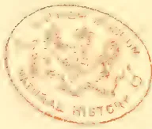A circular red ink stamp is centered on the page. The stamp features a central crest or emblem, possibly a bird or a coat of arms. Surrounding the central image is a circular border containing text. The text at the top of the border appears to be "BRITISH MUSEUM" and the text at the bottom appears to be "NATURAL HISTORY". The stamp is slightly faded and has a reddish-brown color.

243------------------------------------------------

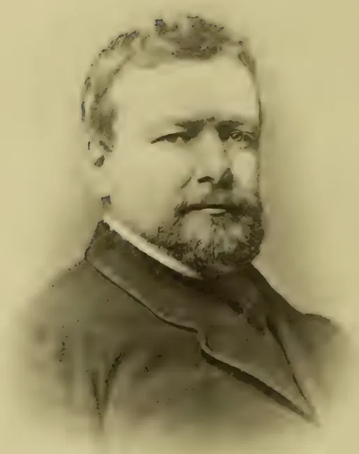A sepia-toned portrait of a man, Robert Boyd Tytler, Esq. He is shown from the chest up, facing slightly to the right. He has dark, wavy hair, a full beard, and a mustache. He is wearing a dark suit jacket over a white collared shirt. The background is a plain, light color.

ROBERT BOYD TYTLER, Esq.

*Tropical Agriculturist Portrait Gallery,*

No. III.

244------------------------------------------------

# \* The TROPICAL AGRICULTURIST \*

◁ MONTHLY. ▷

Vol. XIII.]

COLOMBO, OCTOBER 2ND, 1893.

No. 4.

## "PIONEERS OF THE PLANTING ENTERPRISE IN CEYLON."

ROBERT BOYD TYTLER.\*

### EARLY LIFE.

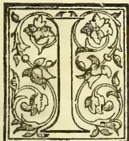

F "a wise son knows his own father" it is but meet and right that the modern planter should desire to know, and learn a lesson from the life of the late Robert Boyd Tytler, emphatically the

father of coffee and cacao *cultivation* in Ceylon. Specially educated and trained for a tropical agriculturist, practical, shrewd, energetic and conscientious, Mr. Tytler would have made his mark in any walk of life. That he devoted the first-fruits of his experience and active life to the interests of Ceylon, was indeed a fortunate circumstance for the island, which at the time, so specially needed guidance in planting matters. And now though gone, upwards of ten years ago, the result of his life and labours may yet be seen in a body of highly-trained planters, whose energy, intelligence and integrity will compare favourably with that of any agriculturists in the world.

It may be said that while yet a baby, "Bobbie" was expressly set apart for a planter. Born in the village of Inverurie, 16 miles North-west of Aberdeen, on the 27th July 1819, he received the name of *Robert Boyd* after a cousin of his mother, which proved a fortunate thing for all concerned, and must have often led the parents to think that after all there's something in a name. Had the boy's name been plain *Peter* or odd *Obadiah*, ten to one, Ceylon would have never seen him. Mrs. James Tytler's uncle was minister of Crimmond, consequently the boy's name-father was "a son of the manse," already well-known as a keen and successful man of business, deeply interested in eastern trade, particularly in the planting prospects of Ceylon.

### THE MANSE.

The manse had now no children to enliven it, while James Tytler had a quiverful of a round dozen. What so natural and so proper than that the manse should adopt one, and that this one, should be the bright little embryo planter now verging upon 8 years of age. Bobbie was a decided acquisition to the manse. Especially appreciated by the two ladies, who charmed by his quaint humour, would listen amusedly to his naive recital of village life. "And can you sing?" said Miss Boyd, one day after calling him in from the garden to amuse some lady visitors. "Hoot ay!" said he, and clearing his throat at once proceeded. But the first line proved enough. "Stop" they all shrieked at once, and the astonished Bob received such a lecture on the impropriety of his song as he never forgot to his dying day.

### THE SCHOOL.

It was now considered high time to send the boy to school, and to school he forthwith went, and so set himself to master the mysteries of *Mc'ulloch*, *Lindley Murray* and *Gray* with a success which, while it delighted the dominie, astonished the good folks at the manse. At this same school Tytler made the acquaintance of several youths with whom he afterwards came in contact in Ceylon. Amongst others, Reid, Webster, &c., all of whom were distinguished in after life by their splendid *penmanship*, alas! now almost a lost art.

Even at this early age R. B. T. made his mark, and it is said left it on more than one of the boys.

### THE GARDEN.

At 12 years of age he was removed from the public school, and bearing in mind the life and work for which he was destined, his studies were transferred to the Gardens of Philorth, the seat of Lord Seafield. Although it was understood he was sent there as a sort of supernumerary apprentice—in something like the position of a modern "creeper"—yet he had to begin at the beginning, taking his turn with the others, and he had reason to remember his first afternoon's work.

In those days it was the fashion—and for all I know may be so still—that every lout who called himself a journeyman gardener, thought he was entitled to inflict all sorts of practical jokes on the

\* By "OLD COLONIST," with a few additions by the Editor.

245------------------------------------------------

218THE TROPICAL AGRICULTURIST.[Oct. 2, 1893.]

green hand, and the tender years of the new arrival were no protection for him; rather the reverse.

The work in hand was wheeling manure along a steep walk, and the others took care that Bob's barrow was filled to the overflowing, but he was too proud to give in, and pluckily kept his turn. Again and again they filled the barrow with double the quantity that they themselves attempted to lift, but Bob only set his teeth and manfully came in up to time. At length they so contrived to build up the barrow with wet muck, that his utmost strength could only wheel it along the level. In attempting to take the hill, his poor little legs tottered beneath him, and in pure vexation of spirit the tears came to his eyes. "What a — shame!" said the voice of one behind him; who had taken in the situation. "Let me take that barrow," and as Bob relinquished it, he saw that the voice came from the kind-hearted Forester, and as he walked behind the powerfully-built man, he made two resolves. The first being, that if ever he became an influential man, he would reward that Forester or those belonging to him; and the second was that he would yet be up sides with his persecutors, both of which laudable resolutions he literally carried into effect. Thrashing the journeyman gardener before he was two years older, and in after years when he had become a prosperous proprietor in Dumbara, two of the Forester's sons were amongst his most capable and liberally-paid managers. Meanwhile, young Tytler became an adept in "the Art that doth mend Nature," and as soon as his three years' prenticeship were completed, he was sent out to continue his studies in Jamaica.

#### JAMAICA.

He reached Kingston when only 15 years of age, and for the next three years led a very active and highly-interested life, partly on the Blue Mountains, studying the coffee tree; partly on the plains learning the art of sugar-making. But it may here be said, that he never took kindly to sugar planting; his specialty now—and for many years after—was *Coffee*.

The lively young Scot soon became a special favourite in Jamaica, was an active Militia-man, and generally took a keen interest in all the social affairs of the little colony, so that it was not without much regret that his friends at Kingston bade good-bye to him at the end of three years.

#### CEYLON.

A larger and more promising field, however, now lay before R. B. T. Coffee-planting in Ceylon was only as yet in the experimental stage: the experience he had gained in the only spot where the tree could be said to be cultivated, was much required. True, a considerable export, amounting to about 30,000 cwt. per annum was already being shipped from Colombo. Albeit, the planters were but groping in the dark, under the shade of massive trees, and the lanky long-drawn coffee plants were already pining for more light.

For a few weeks only did our young planter pay a visit to his native Aberdeen. "And how did he look on his return from Jamaica?" the writer asked of the only remaining brother the other day.

"Look! (he said) Better than any o's; but the only thing I can distinctly remember is, that he gave me his watch to hold till he ran round the race-course, *two miles in 10 minutes*!" In 1837—Mr. Tytler being then 18 years of age—landed in Colombo, and was without much delay forwarded to Dumbara, in which rich and beautiful valley he was destined to play so important a part. For

a time his attention was confined to sugar, and it was said that this was the only time in Ceylon when sugar showed a profit; but it was never congenial work, nor were the surroundings at this time in Dumbara very congenial to the new arrival, and it was not without a considerable feeling of relief that he ultimately got a commission to explore the surrounding mountain valleys, in order to select the most suitable land he could find for coffee. He had previously given the benefit of his experience to the planters in the vicinity of Dumbara, and the West Indian system of cultivation was universally adopted, perhaps rather too literally, for although the benefit from entire absence of shade became speedily apparent, it was not a lasting benefit, and suitable and necessary as its absence may be on the misty hills, a modified shade is unquestionably beneficial both for coffee and cacao in low, hot and dry localities.

#### PIONEER.

It was as a pioneer on the mountain zone that R. B. T. first really distinguished himself. To him is due the merit of selecting the famous Kelebokke Valley, and some of the finest properties in Matale East, in both of which districts he did admirable work, not merely as a selector but as a practical planter, contending with difficulties such as the present race of planters could scarcely conceive possible.

#### WRITES.

While working here as a pioneer planter, Mr. Tytler began to make his presence felt in the island generally. Not only was his work executed in a manner to call forth the admiration of those who saw it; but in his spare moments he dropped letters to the *Observer*, which for terseness of language, commonsense and fearless hard hitting, Colombo had not before been accustomed to receive "from the hills."

At first Colombo merchants were not disposed to put up with this youngster's advice on coffee curing and copper-bottomed clippers, and more than once a dignified attempt was made to silence the obnoxious scribbler, the only result being a retort more "outrageously" plainspoken than before. To those who only know the modest Colombo Agent of today there is no use trying to picture the effect of such exasperating conduct upon the mercantile grandee of the 40's and 50's. Occasionally it seemed to bode badly for the prospects of R. B. T.; but by-and-bye even Colombo merchants came to appreciate his worth, and work much more than he could undertake came to him unsought.

#### BECOMES A V. A.

For some time he took up his residence in Kandy acting as agent and adviser for a number of absent proprietors, and always with the most satisfactory results to those directly interested.

#### PALLAKELLIE.

To become a resident proprietor in his beloved Dumbara was, however, the aim of his life and acmé of his ambition as a planter, and this he ultimately accomplished by acquiring the abandoned estate of Pallakellie, also holding shares in the adjoining properties of Rajawella, Ambecotte and Gangawatte.

On Pallakellie he built and formed his unique demesne, which for many years has been the admiration of all visitors. "Twas here he became best known to Ceylon during the middle and latter years of his planting life; here he received distinguished travellers interested in tropical agriculture

246------------------------------------------------

Oct. 2, 1893.]THE TROPICAL AGRICULTURIST.219

here he entertained, as no other planter could entertain, all and sundry, from the Queen's representative down to the humblest coolie, and all were alike welcome to his table and the best he had upon it. It was from here he was chosen Chairman of the Planters' Association and became member of the Legislative Council, a position he deliberately aimed at and steadily worked up to.\*

It was here the writer periodically paid him a passing visit, and generally found the patriarch surrounded by a bevy of his favourite coolies, singing extempore songs and ever ready to laugh

"At all his jokes,  
For many a joke had he."

Meanwhile, the estates were giving bumper crops, and everything he touched seemed to prosper. Pallakellie itself seemed a curious experiment by one who came to teach pruning and the clearing away of shade, but it succeeded; and nothing could exceed the beauty of the coffee as it grew like large patches of glossy shrubbery in a noble park. For some ten years the average crops on the Dumbara estate had equalled 10 cwt. per acre. Wealth accumulated, and the people did not decay, prosperity indeed only stimulated our friend to greater exertions and still more liberal giving.

#### DRY CYCLE.

But the time at length came when the prosperity of Dumbara received a serious check, a cycle of dry seasons set in and the crops became more and more uncertain. The trees indeed blossomed as of yore, and the bright red cherry too followed in abundance; but alas the bean did not mature, and only floated like chaff in the cisterns. Dumbara, with all its rich soil and genial sunshine, could not be got to grow fully-developed fruit without seasonable moisture, and how to supply this too-evident want now exercised the active brain of Mr. Tytler.

#### IRRIGATION.

The Mahavelliganga rolled past. What so natural to suggest itself as that these muddy waters, carrying the riches from the hill estates, should be utilized in moistening the thirsty lands of Rajawella. And now comes the interesting story of the gigantic Waterworks, a story unfortunately too long for the space at my disposal, works ably conceived and admirably carried out.

We have looked upon the elaborate make-shifts of the Egyptians for the conveyance of water, seen the stupendous aqueducts of the ancient Incas; but nowhere in the world have we seen such powerful force-pumps in use, as those erected by Mr. Tytler. In the erecting of these works, Mr. John Brown—since so well known as the pioneer of Uva Companies—first made his mark as Engineer and Colonist under Mr. Tytler's auspices.

A huge turbine supplied by water from the river gave the motive power, by which a continuous stream of about 1,000 gals. per minute was carried to the crest of a ridge 500 feet above the pumps. On the crest of each minor-ridge the main pipe was

\* No more popular Chairman ever presided over the Planters' Association, and to the last, the sight of "R. B. T.'s" gigantic "topee" with its famous pugnacity, making for a P. A. meeting was a sure sign of a successful gathering with abundance of humour to season the business speeches. As M. L. C., Mr. Tytler was all too short a time in office, and the Governor, Sir Henry Ward (who most warmly appreciated his ability and good qualities) greatly regretted that he had not his (Mr. Tytler's) co-operation in the Legislature for a longer period.—*Ed. T.A.*

furnished with stop-cocks to let out the water, which was conducted by surface drains to each line of coffee and every coffee tree. But carefully thought-out and faithfully-executed as these costly works were, it must be admitted they did not prove a financial success. Magical as the effect at first seemed to be, it was found that the water percolated rather too readily through the open subsoil, and although it refreshed the coffee for the time, it did not even with liquid manure added, sufficiently sustain the trees to enable them to carry the crop to maturity.

That coffee will thrive and prove eminently productive under irrigation, is of course well known, and we have seen it bearing very abundantly where *rain was never known to have fallen*, but only on perfectly flat land, regularly irrigated at night, and these conditions were not present or very practicable in Dumbara, so that the success of the costly waterworks was far from being such as Mr. Tytler and his many friends could have wished. In short, the irrigation works proved his first serious loss; but nothing daunted, his ever-resourceful brain was next directed to a study of the chemical composition of the soil, the gradual impoverishment of which he now saw with growing concern. This was a study of years, the result of which we will come to later on.

#### TAKES A TRIP HOME.

Meanwhile (1857), Mr. Tytler prepares to take a trip home, a visit which Aberdeen well remembers. He was then in the prime of manhood (38); weighed 18 stone! but ever active, hearty and cheerful to a degree. The burly frame of the broad-chested planter became familiar on the Castle Gate, and a welcome sight at all public meetings, while his cheery salutation on the streets was enjoyed by gentle and simple alike. There was something so intensely sympathetic, and at times so child-like in voice and laughter, that he invariably won the hearts of all with whom he came in contact. But this was not the whole secret. He was passionately fond of giving—enough of itself to insure unbounded popularity in Aberdeen—liberal to a fault, though surely a fault that leant to virtue's side. The boys thought so; would double round corners, change bonnets, and do as they did in the days of dear old Dr. Kidd. But in this case it was not to get a double blessing but *another saxpence*, or even a "fite penny" as R. B. T. would call the florin with which he delighted to astonish the recipient.

Most unselfish of men! He cared nothing for money, as *money*, and looked with the greatest contempt on the poor creatures who accumulated it for the sake of hoarding:

"You see what the Lord thinks of money by the sort of people he gives it to keep"—he used to say.

#### THE VOLUNTEER FIASCO.

It was at this time that the famous Volunteer movement broke out amongst the Ceylon planters, and when he threw his celebrated letter like a bombshell in their midst, it caused intense excitement. He ridiculed the movement as an impossibility and an outrage on commonsense, could see nothing in it but "an idle vapouring of undignified playing at soldiers," that "the planter was paid for duties which no man of honour would neglect for the purpose of volunteering," that "proprietors at home who were already torturing their ingenuity how to get the two ends of high expenditure and short crops to meet, would derive little consolation from seeing in the *Observer*, that their Superintendents were zealous Volunteers!" Finally, he recommended his friends in *Malaya* to

247------------------------------------------------

220THE TROPICAL AGRICULTURIST.[Oct. 2, 1893.]

"give the *kepi* to the kangany, take opening medicine, and put their feet in warm water!"

The letter gave mortal offence to many, and for weeks the *Observer* was inundated with fierce, fighting letters in reply. "Who cares for R. B. T.'s impertinence" was the burden of the comments upcountry. "It will only stimulate us to persevere" said "B. W." ("Backwoodman" or W. Abercrombie Swan) and so said Matale generally. Grand old Crüwell was particularly savage, though the time soon came when he generously relented, as I see from a letter addressed to R. B. T. beginning "My dear old boy, Glad to see you fist which I should like to shake very much again." As for the Matale Volunteers, they in a few months wisely disbanded, and sought the shelter of their own pulping-houses. From all of which, we can only surmise, that if a few plucky R. B. T.'s were now to arise, it might fare badly with that grotesque body of Don Quixotes, yelegt "the Mounted Fut."\*

#### RETURNS TO CEYLON.

Mr. Tytler returned to Ceylon about 1862, in order to carry out certain experiments with reference to the special manure he was now having prepared. He was not a man to do anything by halves, and certainly no man ever went more patiently and systematically to work to ascertain the exact requirements of the coffee tree in the shape of sustenance, for day after day he would sit studying the different groups of trees. Here under the sloping rock a vigorous tree bearing at the rate of 16 cwt. an acre; there within a few yards a tree planted at the same time from the same nursery, year after year with only a few beans; what is wanting in the one case which the other has got? Here said Mr. Tytler "are certain conditions, there they are wanting; let us but ascertain what these are, and the difficulty is kraaled."

#### SOMBREORUM.

Carefully he had the heavy bearing tree lifted up with half a ton of the soil in which it grew, not forgetting portions of the sloping rock above, and all was packed away in huge cases. The same was done with the unfruitful tree, and home he went with his cases to the eminent chemist Professor Brazier of Aberdeen University. The writer accompanied Mr. Tytler on this occasion, and well remembers the eagerness, care and thoroughness with which the whole matter was gone into. The ultimate result was "*Sombreorum*," his remarkable letter of April 1866, addressed to the *Observer*, and something was said about a sealed packet to be opened when all Ceylon was again bearing bumper crops. Many planters now set confidently and zealously to work to apply the elixir. There was much real enthusiasm and not a little chaff. The Volunteer letter had not been quite forgotten, and two Matale men put their heads together and hammered out the following specious parody on

#### TULLOCH-GORUM.

O, Sombreorum's my delight,  
In it gude qualities unite;  
And ony Dori wha shows spite,  
May puku copee smoor him!

\* Times are greatly changed since the "fifties"—one of the chief objections then was the difficulty of moving about and getting together a decent number of recruits; roads and railways have altered that, as time has also brought us a heavier military tax, of which the success of our Volunteers may justify us in claiming a reduction.—*En. T. d.*

Glad and busy coolies a',  
Glad and busy, glad and busy,  
Glad and busy coolies a',  
Wi' plenty coffee o'er them.

Ower a' the totums that I ride  
Baith "bones" and "poonac" I have tried;  
And o'er guano I have cried  
And even cattle orum!

They're puir and feckless at the best,  
Puir and feckless, puir and feckless;  
They're puir and feckless at the best,  
Compared wi Sombreorum!

#### HEMILEIA VASTATRIX.

Nevertheless, the effects of *Sombreorum* were very striking, the mixture had unquestionably a potent fertilising and sustaining power, and for some years gave promise of a revival of coffee crops, wherever applied. Alas! these hopes were but short-lived, and were destined to be more completely shattered than any previous promises, by the appearance of the new and unlooked-for enemy *Hemileia Vastatrix*, an enemy which baffled the scientist, rendered worthless the experience of forty years, and ultimately brought irretrievable ruin upon nearly every coffee planter in Ceylon. No single individual suffered more from this calamity than Mr. Tytler.

#### THE AGE OF 10 %

It is true he still had his pet product *Cacao* to fall back upon, a product he had been carefully nursing and acclimatizing for 20 years, but to thoroughly establish this in the place of coffee, still meant five or six years. How to get over this interval was the difficulty; and with the income from coffee reduced from £5,000 or £6,000 a year, to less than nothing, and compound interest accumulating at 10%, the prospect was not encouraging. The age of 5% block loans and 50% reduction in the cost of production (which depreciated silver practically means to the planters) had not yet come, a fact which men who marvel at Mr. Tytler's inability to surmount the difficulty, would do well to remember.

#### THE COMING STRUGGLE.

R. B. T., naturally the most sanguine and cheerful of men, began to give way under the growing load. He found the pillow indeed a hard one, and frequently when sleep forsook him would rise up, look once more at the unconscionable balance piled up against poor king coffee by those who had most profited by his generosity. And as often would he seek and obtain comfort from the only Source he implicitly believed in, and few who met his cheery smile on the morrow could dream of the agony he had passed through during the night-watches.

#### HIS CHARITY.

And yet, it was not for himself that he grieves,—"not so much for the planters as the poor patient wives and helpless bairns dependent upon them." "O man," he would write, "I am dowie, I continually am, I cannot rise out of it, and the only cure would be a return to coffee of its former capacity for crop-bearing. I am aware that my own prospects, bad as they are, might be envied by many, and I am not unthankful, far from it, only dowie and wae, and no small degree of that comes from thoughts of others. God help us all!"

"There's that poor widow Mrs.—; my heart bleeds for her; could you convey the enclosed

248------------------------------------------------

OCT. 2, 1893.]THE TROPICAL AGRICULTURIST.221

to her *without mentioning any name*. I am impelled to send it by Unseen dictation."

The enclosure was a £20 note, and it might not be out of place now to take a passing peep at the home of the poor young planter's widow, whose half-broken heart still fondly clung to the hills of Ceylon.

It was the November term; the grey granite city looked cheerless and cold, and few were abroad in the slush, except what Tytler playfully called the Platypus, *i.e.*, a beast with a bill!

Poor Mrs.—heard the door bell ring, felt assured it was a demand for the rent, her legs trembled beneath her, she sank down on the stair and uttered a brief prayer. Again the bell rang, and she opened the door to find her prayer fully answered.

This I know to be only a sample of R. B. T.'s religion, and the grief he felt at the downfall of coffee was chiefly the grief of having to discontinue these generous acts of real Christian charity.

#### THE GLOOM DEEPENS.

Early in 1882, he wrote after his last visit to Ceylon:—"There is now no longer any doubt about the gravity of affairs. What to do is the question asked on every side. What's the use of foreclosure? and who's to buy if put up for sale? I incline rather to the view of restricted upkeep doing its fatal work by degrees, and how fatal that will be in Ceylon soil and amongst coffee *planted* as the *bulk of it* has been, there's none can conceive better than *yourself*. Whole sweeps of districts, and even districts themselves, will drop out of existence as coffee producers, and then the poor owners, *their wives and families?* (Oh! good Lord help them!) What will become of them in such a country I do not know; mortgages will drop very heavily, banks and firms will go down, and then? Why I fear except for *Cacao* it will be gloaming in Ceylon."

It will here be noted that there is not a word about tea, the profitable cultivation of which has since been rendered *possible* by the depreciation in the value of silver.

#### CACAO THE HOPE OF THE FUTURE.

I have already alluded to Mr. Tytler's experiments in cacao cultivation. He was the first to *plant out* this famous tree in Ceylon. His "Chocolate Watte" at the Kondesalli corner, was for years one of his favourite show spots on Pallakellie. He invariably spoke of it as "*Chocolate*," in order to distinguish it clearly from the somewhat confusing name of *cacao* (really pronounced *kakow* in its native home of South America). At first, the tree had many enemies in Ceylon, the worst of which proved the dry scorching winds. To provide against this, and with a view to further extensions, Mr. Tytler had been for years steadily planning and planting belts along the ridges. He was opposed to shade, but after a visit to the West Indies in 1879, he became convinced that a moderate amount of shade was beneficial for cacao. The soil of Dumbara is well adapted for its growth and the climate admirably suited for the preparation of the product, but there is much more moisture in the warm shady valleys of Ecuador and Amazon, where the tree is indigenous.

#### VISIT TO TRINIDAD.

In the winter of 1879-80, Mr. Tytler paid a visit to the islands of Trinidad and Grenada for the

purpose of further studying the growth and manipulation of cacao. In Trinidad he found much to interest and surprise him in the vigour and fruitfulness of the gigantic trees, albeit growing in a soil much inferior to the average of Ceylon, but in a climate even hotter and much moister than Dumbara. So long as this soil is kept shaded it will bear abundant crops; remove this, and it would be reduced to sterility for years. In the matter of curing the cacao it soon became evident that there was little to be learned from the Trinidad planter, who indeed has got very much to unlearn before he produces good marketable cacao. We have nothing in Ceylon to compare to the massive cacao trees in Trinidad, but the curing of the crop here is primitive, slovenly and filthy to a degree, quite accounting for the low prices of the article when compared with the carefully prepared cacao from Ceylon. In after years the writer had occasion to follow in the footsteps of his friend, through Trinidad and Grenada, and was gratified to hear him frequently spoken of as "the G. O. M. of Ceylon," for by this time—though only 60 years of age—he looked quite an old man, the cares of recent years having already told upon him.

#### LAST VISIT TO CEYLON.

Once more, after his visit to the West Indies he returned to Ceylon full of schemes for the future, and sanguine of cacao as ever he was of coffee. Probably many will think he was *over sanguine*, but here again the fault surely leant "to virtue's side," for the world has ever been much indebted to her most sanguine men. Early in 1882 he wrote in great glee from Pallakellie:—

"Cacao in Dumbara is something magnificent. During the first stroll, I let my cheroot out three times, absorbed in the spectacle! 800 acres Palli. The last sold at 115/6 against Trinidads at 90/, and with 8 cwt. per acre, *clear profit*—100/ p. cwt. *Mind you, we take a trip round the world two years hence, to celebrate my freedom from debt!*"

#### HOPEFUL TO THE LAST.

In May 1882, just a month before the end, he writes:—

"Palli Cocoa selling at 116/. Caracas 93/. Keep me going for only two or three years, and—harroosh for all debts paid!"

To the last he firmly believed in the recuperative powers of his Ceylon properties. "With fair play between man and man, the uttermost farthing will soon be paid."

Those now most interested, may at any rate, well congratulate themselves upon the forethought and perseverance of R. B. T. on leaving one of the most valuable properties in Ceylon, where thirty years before he found an abandoned coffee estate.

#### VALUE OF ESTATES.

Yes. Ye who shake your heads and talk about the depreciation of Ceylon property, *remember this*, that in 1852, R. B. T. purchased Pallakellie at the then current value of £1,500 with 5 years to pay it in, and after gathering crops to the value of fully £150,000, he leaves to his fortunate creditors a property valued at £60,000! This applies to the single estate of Pallakellie, and does not include his one-third of the Raja group, and the whole of Hoolankanda.

The end came in June 1882, at the critical age of 63. His father William Tytler died about

249------------------------------------------------

222THE TROPICAL AGRICULTURIST.[OCT. 2, 1893.]

the same age, a period, which it will be observed, carries off very many.

R. B. T. did not expect it; indeed, during the past year he frequently wrote:—"I have 15 or 20 years yet; let us seriously consider whether it is to be in Tasmania or New Zealand."

But it was otherwise ordered. The call came rather suddenly at last, and the closing scene was comparatively brief.

In a certain sense—in the most important of all senses—few men could have been better prepared for the change. Albeit, as he painlessly, silently and calmly crossed the bourne, there seemed to me an expression of slight surprise that the journey had come to an end so soon.

So ends the succinct, graphic word-picture by R. B. T.'s old friend, to be developed some day, we hope, into an adequate biography of this 'fine old Tropical Planter all of the olden time,' from whose life-work and varied experiences for 51 years—from his 12th to 63rd year—so many valuable lessons may be pointed for the young tropical colonists of the present age. But we cannot deny ourselves or our readers the pleasure of quoting from further MSS. which "Old Colonist" has forwarded with his essays, and we feel sure these extracts will be pardoned for the further insight they give into the character of Mr. Tytler. First, in his letter to us with the above notice, "Old Colonist" says:—

"Bearing in mind that I was writing for the *T.A.*, I have not—as I would have otherwise so much liked to do—dwelt (scarcely touched) upon the most notable and interesting side of his character, viz., *R. B. T. as an Evangelist*. His tact in preaching to the motley crowds on Castle Gate or the Fair; how he was attacked by a burly mason who said he "didn't believe in a Deevil." Have you not read said the ironical R. B. T., "Believe in the D—l and thou wilt be saved"! "Na," said the man stopping to think a bit, and then the correct version took hold of him. He followed T. home, ever after to be fast friends. How with a volley of oaths the cobbler in Gallow Gate ordered him (T.) out of his shop, as he didn't want any hypocritical—s there; but T. never turning a hair, coolly took to examining the cobbler's work: "Man, that's fine work! I like the hand-sewn—." "Get oot o' this ye—," howled the cobbler, but T. only continued to turn over the boot. "Much better than pius or sprigs," ending in getting his foot measured, and the savage soter becoming a sincere disciple!

"Again one would like to tell how T. brought his religion into all the affairs of life. He wasn't the man to throw it off with his Sunday clothes. 'O Lord give us good crops and fair prices, was his form of asking "daily bread" in Ceylon, and you remember the apt petition about "crimping," when G. M. interjected "Speak for yourself T." Such traits as these, and gems from the marvellous flow of grim humour have yet to be recounted when the opportunity occurs, but I quite recognize that the place for all this is not in the *T.A.*."

Under date, Aberdeen, 24th May, 1879, R. B. T. writes to his friend:—

"It was you, was it not; wrote that scrap in the *Weekly Free Press* on Sleep? You old rogue! Sleep is coming back to my pillow since Palli is coming so to the front with Cacao. Possibly 3 years he ce my account will shew large credits per annum—no bad sudoric with a good 'night cap' to promote saporific sweating off the effects of astonish-

ment at finding one's self with more money than one can possibly manage. THEN, (when this 'next year' comes,) I am to requisition you to join me in a cruise to Manitoba, thence to Colorado, thence Hawaii, Fiji, New Zealand, and Tasmania (not forgetting Cyprus or Zululand) to prospect."

Later on, 26th February, 1882, we have another characteristic letter:—

"It seems an age since we exchanged halls. I know I am owing you a letter, yours to me being our last, so here's a square. How are ye—and *Thoo's da*? We are as usual. I am *pech-pechin*? Aye 'gruppet, and doonhadden.' Oh, me—*mu!!! Coffee*—say 'KAUFY'—(and give it a good deep *groan*.) You see it *transforms*! not one letter of the proper word. It has got to this. There's not one comfort such as there *used* to be 20 years ago when all was roseate in the future sky. Fact was we *then* LOOKED FORWARD. Now alas we look back, and *present*! My wonder is that I am still upheld. It is purely and surely to God's providence alone that this is attributable. Yet—cacao looms hopefully ahead and may carry a poor fellow through. Do write me something, and soon—for I am wae.

"What a grand success is John Ferguson's *Tropical Agriculturist* idea! It promises (or indeed is already) to be a most valuable production to the entire world.

"When are you coming this way? I am wearying for a crack? What a winter. It's no winter at all, and, best of all, there's oceans of rain in Doomburn. Never seen such floods—and soil soaked. But for disease it would be a red-letter year there. What about Boustead and his Ceylon affairs—or Byrde—or our old friend Willie Smith, or any body? There's been no snow at all here! Now on the verge of February."

"Dumbara and rain" reminds us of the two photographs Mr. Tytler had taken in Colombo to present to his friends:—one represented him looking downcast and weary almost sulky as if ill-used and bad for superscription "Dumbara in dry weather—R. B. T." The other, representing a cheery, laughing open countenance, he entitled "R. B. T. with rain in Dumbara." The portrait we are enabled to present with this notice represents the natural man in his prime, and does justice to his well-developed, well-balanced head, and the firm, intelligent, self-reliant nature revealed in his countenance. One important omission from "Old Colonist's" narrative has reference to Mr. Tytler's happy marriage in 1848 with the youngest daughter of the Rev. Charles Gibbon, D.D., the Parish Minister of Lonnay, Aberdeenshire, Miss Annie Grace Gibbon, who still survives him, and who was in every sense a worthy helpmeet and companion to her husband. Mr. Tytler was the friend and generous supporter of every good work that was ever brought to his notice in Ceylon, and no one appreciated him more than Dr. John Murdoch, the apostolic founder of the Sinhalese Tract Society and of the Christian Vernacular Education Society of India, lifelong friends as he and Mr. Tytler were. No one could be in his company long without realizing the original as well as masterful character and the many varied as well as good qualities of

ROBERT BOYD TYTLER.

He was indeed as a Planting Colonist, one of whom it may be said:—

—take him for all in all,  
We shall not look upon his like again,

250------------------------------------------------

Oct. 2, 1893.]THE TROPICAL AGRICULTURIST.223

### AN UNIQUE COFFEE PLANTATION (OR GARDEN OF 15 ACRES).

The visitor to what are commonly termed "the planting districts" of Southern India is not surprised to see Coffee growing more or less luxuriantly, be he in certain parts of Mysore, in Coorg or the Wynnaad, or on the Nilgiri Hills; but the visitor to Bangalore is not usually aware that he may see coffee thriving and bearing plentiful crops within but a short distance of "the city of beans." Yet such is the case. Climatic difficulties have been overcome, and the growth of the coffee shrub from the seed to the heavily-laden plant weighted with ripe berries may be as satisfactorily observed near, Bangalore as on the larger plantations which are to be found in other parts of Southern India. Experience has shown that, as regards rainfall, the distribution rather than the quantity that falls during the year is of the greatest importance in the cultivation of Coffee. In Mysore and Coorg, owing to the lengthened periods of drought that occur, elaborate arrangements, which are the result of many years of experience and patient study, have been made for shading the estates with carefully selected varieties of trees which are either left standing when jungle is cleared or are systematically planted and annually lopped and regulated in accordance with the requirements of the Coffee below them. The class of soil, its physical condition and inherent fertility have each an important bearing on success in coffee cultivation; the most favourable conditions being usually found in forest land where the manurial wealth of ages has been accumulated by the dropping of the fruit, leaves and bark of trees, and by the decay of a luxuriant undergrowth. Art, however, has learnt to assist Nature. What may be termed an unique example of the truth of this is visible at Bangalore, where that enterprising gentleman, Mr. Meenatchee Iyer, now Acting Judge of the Mysore High Court, has solved the problem of growing coffee, at a fair altitude it is true, but in a climate where a low average of rainfall is accompanied by heat which would be considered by many planters fatal to the development and fruition of the coffee shrub. Mr. Meenatchee Iyer's successful experiment, which affords a new example of the potentialities of irrigation, has been rightly described as of the utmost importance to the State of Mysore. We have reason to believe that recent progress has been watched and criticised by many coffee planters; and there is a possibility that the example set will be followed by other enterprising gentlemen, Europeans and Natives, who having witnessed what has been done at Rochdale Park, within three miles of Bangalore, on level ground, will try to emulate the efforts of Mr. Meenatchee Iyer, able lawyer, wise councillor, good Judge, and—as is now shown—successful pioneer in a new branch of coffee cultivation.

While in Bangalore last week a representative of this paper took an opportunity to visit the estate referred to. The courteous proprietor showed him over the whole place, giving most interesting particulars of his experiments and experiences, and entering upon explanations which showed that he had made a careful study of books on coffee cultivation, had received and availed himself of useful hints from experienced planters, and had followed the growth of the estate with a zeal and enthusiasm which in themselves mark him out as a man who deserves to be successful. Knowing the age of each batch of plants, acquainted with the minutest detail of cultivation, from the nursery to the full grown and fruit-bearing shrub, Mr. Meenatchee Iyer has throughout conducted on business principles an experiment which some of his friends perhaps regarded at the outset as unpractical. Apparently, however, he still regards his coffee plantation as an *experiment*; at any rate, he is still anxious to hear the opinions expressed upon it by more experienced planters. In this connection it need only be said here that excellent as is the general condition of the coffee, there is reason to believe that some few improvements will be introduced from time to time. For

instance, there is room for criticism in respect of shade trees. The trees used are mentioned elsewhere; but it is open to question whether they are the best that are available. In Mysore there is every facility for obtaining other varieties of excellent shade trees, and with few exceptions those belonging to the *Ficus* tribe are the best, although the *Gerwulligan* or *Nogga* (Canarese for "yoke"—*Cedrela toona*) is greatly used to fill immediate temporary requirements.

The following details of the Rochdale Park estate will probably interest our planting readers:—

#### FIRST EXPERIMENTS.

Nine years have passed since Mr. Meenatchee Iyer started a coffee plantation in the vicinity of Bangalore with a view to see how the shrub would succeed under irrigation. He started with 170 plants. They turned out well, but it was some time before he added to their number. At the outset he had been warned that the coffee might do well for two or three years, but would then, in all probability, die away. Predictions of this stamp were falsified, however, and in course of time 1,500 plants were added to the original 170. This second batch comprises trees which are now four years old, having been planted three years ago after having spent one year in the nursery. Another batch consists of 2,500 trees, now three years old, i.e., planted two years ago. There are also 2,500 trees planted 14 months ago and now about 2½ years old. This year, within the last three months, Mr. Meenatchee Iyer has planted 9,000. He states that he has now a total of about 18,000 plants, on 15 acres of ground. How thoroughly the oldest of these have falsified pessimistic prophecies, is shown in the fact that at nine years of age they are so strong and healthy as to give good promise of flourishing for another twenty years at least. The estate stands about 3,020 feet above sea level. The shrubs are planted 6 feet apart. The soil in which they stand is mostly red earth, but it is sandy at a little distance below the surface and is strengthened by the addition of a mixture of red earth with tank silt. At the present time it is decidedly hard, so much so, that an experienced planter recently declared that, but for irrigation, no coffee could grow in such soil. It does grow, however, and this despite other conditions not exactly favourable to its success. The average annual rainfall in the locality is not more than 30 inches. In normal seasons, the minimum temperature is 58°, the maximum 90°, as recorded on an upstairs verandah of the proprietor's house, which stands within the plantation.

#### THE IRRIGATION SYSTEM.

The most interesting feature of the experiment is, of course, the irrigation of the soil, which renders the property almost wholly independent of blossom showers. The system employed is for the most part that of drawing water from wells, by means of *piccottahs*, but three of the wells on the plantation are provided with *kappillas*. These are seldom used except in the hottest weather when the level of water in the well is so low as to render raising by means of the *piccottah* difficult. There are altogether 7 wells used in connection with the coffee, but Mr. Meenatchee Iyer has a total of 18 wells for coffee cultivation and other purposes. The 7 wells were not constructed specially to aid coffee cultivation; they were originally intended for sugarcane and coconuts, which were formerly grown on the land. The supply of water from the seven is, however, more than enough for the coffee. In fact, the proprietor considers that he has "a luxury of wells." He thinks that the 15 acres could be irrigated by 4 wells. Of the seven now in use, one is 39 feet in diameter, three are 20 feet in diameter, and three are under 20 feet. The deepest is 35 feet, another 25 feet, another 20 feet, another 13, another 11, and the rest 6 to 7 feet. Irrigation is practised during the hot weather, and when the spring goes below 20 feet from the surface of the well the *kappilla* is used. A commencing rent is usually made with irrigation

251------------------------------------------------

224THE TROPICAL AGRICULTURIST.[Oct. 2, 1893.]

in January. During that month the plantation is watered once a fortnight; during February once in ten days. In March, April and May until the monsoon sets in, the irrigation proceeds once a week; but it is entirely stopped when the monsoon sets in. The above months are the dry months of each year, rain does not usually fall until about the beginning of May; hence the need of irrigation. It should be here added that the cost of the 7 wells used for irrigation of coffee amounted to from R8,000 to R9,000. This is, however, regarded as excessive, the wells having, as has been said, constructed for other purposes. Mr. Meenatchee Iyer is of opinion that four wells, such as he deems requisite to irrigate his present coffee land, could be constructed at a cost of something like R5,000.

#### METHOD OF CULTIVATION.

From the feature which establishes the claim of the Rochdale Park Estate to be regarded as *sui generis*, we pass to details of cultivation, &c., more familiar to our planting readers. We understand that all the seed used is obtained from Mr. Chisholm's estate in Coorg, and that a fresh supply is obtained every year at a moderate cost. The seeds are planted in the usual nursery. When the seedlings are three months old, they are transferred to pots, still within the nursery, and here they are kept until they are from 6 to 9 months old and about a foot high. They are then planted out in pits of 2½ cubic feet dug 6 feet apart. Before the seedlings are planted a little manure and earth are put in. There is no special season for planting out, for if it is the dry weather irrigation is available to keep them alive. It is found, however, that, as a rule, plants put out in July and August in the rainy season, require less irrigation subsequently than those planted in the dry season. No particular system of weeding is adopted. Once in two years the plantation goes through a process of digging similar to what takes place in an apple orchard. When the ground is first prepared for planting the whole is dug up. Then the pits are made, the digging process being repeated at intervals of two years after the seedlings have been planted. Two years after planting, picking commences; it continues for 6 months from July to December. Picking in July, August and September is light, but for the two subsequent months it is very heavy, a rich harvest succeeding the monsoon blossom. During the last two months about 20 maunds of coffee has been picked, and it is estimated that ten times this quantity will yet be gathered this season. The fertilisers available are horse and cattle manure and oil-cake. Very few cattle are kept upon the estate, but two pairs of bullocks which are available for the *kappilla* are, of course, useful also for manurial purposes.

#### SHADE.

In regard to the important matter of shade, Mr. Meenatchee Iyer states that he does not expect his shade trees to afford protection until his coffee shrubs have yielded two or three crops. This takes about four or five years. Shade trees are planted along with the coffee seedlings, and by the time that the former are in a condition to serve the purpose for which they are intended, the coffee is from four to five years old. The shade trees used are that known locally as the *Howligay* and the *Grevillea Robusta*, or silver oak, which are also employed to form wind belts. The former is the *Acrocarpus flaxinifolius*, the wood of which resembles that of some of the cedar tribe.

#### COST OF UPKEEP.

The cost of the upkeep of the estate is stated it between R170 and R180 per acre per annum, including manure\* which costs about R600 a year, and supervision, which costs about the same.

\* Cheap labour and garden cultivation which could scarcely be given to an appreciable area, say 100 acres or more.—Ed. T. A.

#### YIELD.

Last year the experimental trees yielded 10 maunds, the yield having increased from 6 maunds in the previous year, and 6 maunds in the year before that. At the present time there are 2,500 plants of three years old from time of planting, which yielded 30 maunds last year in the virgin crop. From these very trees a yield of 1½ tons may now be expected according to experts' estimates of the crop on them. Out of the other 2,500 trees at least 1 ton is expected, though this will be their virgin crop. Approximately, a ton is worth £100 in the London market. A fair virgin crop can, according to Mr. Meenatchee Iyer's experience, be gained after two years, the yield being probably 3 to 4 cwts. an acre. He has, as will have been seen, only a limited area under cultivation, and his experience is not therefore great, but the figures which he has given will, we believe, be found very interesting to planters of much longer experience. To the particulars already given we may add some more regarding output and price. Last year, the proprietor informs us, he had about 30 maunds, and this he sold locally, at R16 per maund; peaberry at R18. He states that the demand is so great locally, that for the last two months retail dealers have offered to give him a large advance in order to secure the crops at market rate. Nevertheless, he is thinking of trying the London market this year.

#### DISEASES.

Leaf disease and borer have had to be contented with. When trees are attacked by the former, constant irrigation and heavy manuring are resorted to, with considerable success. Bored plants are simply extirpated by being dug up and burnt.

#### REMARKS.

In conclusion, we may observe that Mr. Meenatchee Iyer has 7 or 8 acres of land fit for coffee, besides that which is already planted with it. He finds it difficult to give reliable information as to the cost of similar land in the same part of the country. Dry land in the immediate neighbourhood of Bangalore may be obtained at R100 an acre; wet costs about R200 an acre. He has tried coffee under coconuts, but this proved unsuccessful, the reason given being that the coconuts, which are surface feeders, choked the roots of the coffee. Mr. Meenatchee Iyer is of opinion that 1 ton an acre is a poor average, but he remarks that if coffee is to be tried under irrigation, the planter must be sure of his water-supply. He objects to planting coffee below tanks, because it is not likely to succeed there unless an efficient system of drainage is arranged for.—*Madras Times*.

#### INDIAN TEA NOTES AND NEWS.

Our Darjeeling correspondent writes on 31st August:—We have just passed through perhaps one of the most sunless months known for some time and what with the cold week I have already mentioned, crop has been very short, and most gardens here, instead of hoping to pick up on what they have lost are only too anxious to keep up with what they made at the same time last year. September will open fairly well in these parts, as sun has been rather more frequent the last two or three days and some heavy rain fallen which has done the roads anything but good but will probably keep that dreaded pest mosquito blight off for some time yet, as it generally appears in these parts, on the lower elevations, about the middle of September if it is at all dry. Rainfall is still some 20 inches behind, but the soil is soaked to as much as it can hold.

The reports from the Terai are to the effect that there is good tea weather, alternate sun and rain, and the gardens are flur-king freely.

During the last week the weather at Kurseong has been cold and wet, but there is little to complain of in regard to output.—*Indian Planters' Gazette*, Sept. 9.

\* But this is equal to far less than £100 a ton; not ¾d unless parchment coffee is meant in the instant, and clean coffee in the other.—Ed. T. A.

252------------------------------------------------

Oct. 2, 1893.]THE TROPICAL AGRICULTURIST.225

## CEYLON MANUAL OF CHEMICAL ANALYSES.

A HANDBOOK OF ANALYSES CONNECTED WITH THE INDUSTRIES AND PUBLIC HEALTH OF CEYLON FOR PLANTERS, COMMERCIAL MEN, AGRICULTURAL STUDENTS, AND MEMBERS OF LOCAL BOARDS.

By M. COCHRAN, M.A., F.C.S.

(Continued from page 157.)

### CHAPTER VI.

#### CINCHONA BARK AND COCOA.

SPECIES OF BARK—CEYLON SUCCIRUBRA BARK, NATURAL AND RENEWED—INDIAN BARKS—MATTAKELLIE ESTATE LEDGER BARKS—WEIGHT OF, AND PERCENTAGE OF QUININE IN CEYLON BARKS ANALYSED DURING THE YEARS 1885 TO 1891 INCLUSIVE—COMMERCIAL ANALYSES OF CEYLON BARKS: SUCCIRUBRA, OFFICINALIS, CALISAYA LEDGERIANA HYBRID AND MIXED BARKS—ANALYSIS OF SULPHATE OF QUININE MANUFACTURED BY THE INDIAN GOVERNMENT—COCOA OR CACAO—PREPARATION OF SEEDS FOR MARKET—CEYLON COCOA—TRINIDAD COCOA-NIBS—COCOA-NIBS VARIOUS—ASH OF COCOA-NIBS AND HUSKS—COMMERCIAL COCOAS—AGRICULTURAL ANALYSIS OF CEYLON COCOA SEEDS—PROPORTION OF NIBS AND HUSK IN SEED—PROXIMATE ANALYSES OF COCOA NIBS—ALKALOIDS IN COCOA-NIBS—NITROGEN, PHOSPHORIC ACID AND POTASH IN COCOA CROP—COMPARISON OF THE IMPORTANT CONSTITUENTS OF PLANT FOOD REMOVED FROM THE SOIL BY TEA, COFFEE AND COCOA CROPS RESPECTIVELY.

#### CINCHONA BARK.

Various species of cinchona bark are cultivated in Ceylon on a commercial scale, viz., Cinchona Succirubra, Cinchona Officinalis, Cinchona Calisaya, especially the Ledgeriana variety, and several hybrids. The amount of Succirubra grown hitherto has been more than that of all the other species put together.

The following are examples of the analyses of Ceylon Succirubra bark, both natural and renewed:—

##### Analysis of Ceylon Succirubra Bark.

<table border="1">
<thead>
<tr>
<th rowspan="2"></th>
<th colspan="2">Natural Bark.</th>
<th colspan="2">Renewed Bark.</th>
</tr>
<tr>
<th>Per ct.</th>
<th>Per ct.</th>
<th>Per ct.</th>
<th>Per ct.</th>
</tr>
</thead>
<tbody>
<tr>
<td>Cryst. Quinine Sulphate ...</td>
<td>1.03</td>
<td>1.39</td>
<td>1.62</td>
<td>3.67</td>
</tr>
<tr>
<td>Quinine ...</td>
<td>.75</td>
<td>1.03</td>
<td>1.20</td>
<td>2.73</td>
</tr>
<tr>
<td>Cinchonidine ...</td>
<td>1.79</td>
<td>4.54</td>
<td>1.95</td>
<td>3.85</td>
</tr>
<tr>
<td>Quinidine ...</td>
<td>—</td>
<td>.36</td>
<td>—</td>
<td>.27</td>
</tr>
<tr>
<td>Cinchonine ...</td>
<td>.60</td>
<td>.08</td>
<td>.31</td>
<td>.08</td>
</tr>
</tbody>
</table>

In the sample of renewed succirubra, the amount of Crystallised Quinine Sulphate is high. The great bulk of Ceylon renewed Succirubra contains only from 1.8 to 3 per cent of crystallised quinine sulphate.

The following analyses of Indian barks by Mr. Broughton quoted from Mr. T. C. Owens' Cinchona Planter's Manual shew the effect of renew-

ing the bark of Cinchona Succirubra under moss:—  
Age of trees 8½ years.

<table border="1">
<thead>
<tr>
<th rowspan="2"></th>
<th>Natural.</th>
<th>Moss renewed</th>
</tr>
<tr>
<th>per cent.</th>
<th>18 months. per cent.</th>
</tr>
</thead>
<tbody>
<tr>
<td>Total Alkaloids ...</td>
<td>6.36</td>
<td>6.39</td>
</tr>
<tr>
<td>Quinine ...</td>
<td>1.36</td>
<td>3.21</td>
</tr>
<tr>
<td>Cinchonidine and Cinchonine ...</td>
<td>5.00</td>
<td>3.18</td>
</tr>
<tr>
<td>Sulph. Quinine Cryst. ...</td>
<td>.90</td>
<td>2.30</td>
</tr>
<tr>
<td>Cinchonidine ...</td>
<td>4.03</td>
<td>3.03</td>
</tr>
</tbody>
</table>

The following analyses, quoted from the same source as the last, shew the effect of renewing officinalis or crown bark:—

<table border="1">
<thead>
<tr>
<th rowspan="2"></th>
<th>Age of trees 8 years. Natural.</th>
<th>Renewed 2 years old. per cent.</th>
</tr>
</thead>
<tbody>
<tr>
<td>Total Alkaloids ...</td>
<td>3.61</td>
<td>5.83</td>
</tr>
<tr>
<td>Quinine ...</td>
<td>2.34</td>
<td>3.34</td>
</tr>
<tr>
<td>Cinchonidine and Cinchonine</td>
<td>1.27</td>
<td>2.49</td>
</tr>
<tr>
<td>Cryst. Quinine Sulphate ...</td>
<td>2.10</td>
<td>3.13</td>
</tr>
<tr>
<td>Cinchonidine Sulph. ...</td>
<td>1.44</td>
<td>2.60</td>
</tr>
</tbody>
</table>

Examples might also be quoted shewing the amount of crystallised sulphate of quinine to be larger from the natural than the renewed bark; but such cases are rather exceptional. As a general rule the amount of crystallisable quinine is considerably larger in renewed than in natural bark from the same trees, particularly if the bark has been renewed under cover.

The highest results obtained in the analyses of Ceylon barks which have come under my notice were those of individual trees from Mattakellie of the Ledgeriana variety, submitted to the Messrs. Howard of London, for analysis and report. The following were the analytical results:—

<table border="1">
<thead>
<tr>
<th rowspan="2">Analysis of Mattakellie Estate Ledgers. (HOWARD)</th>
<th>p. c.</th>
<th>p. c.</th>
<th>p. c.</th>
<th>p. c.</th>
<th>p. c.</th>
<th>p. c.</th>
<th>p. c.</th>
<th>p. c.</th>
<th>p. c.</th>
</tr>
</thead>
<tbody>
<tr>
<td>Quinine Sulphate Cyst. ...</td>
<td>12.8</td>
<td>8.6</td>
<td>9.4</td>
<td>8.7</td>
<td>8.3</td>
<td>8.1</td>
<td>8.0</td>
<td>8.0</td>
<td>8.0</td>
</tr>
<tr>
<td>Quinine Alkaloid ...</td>
<td>9.6</td>
<td>6.4</td>
<td>7.3</td>
<td>7.3</td>
<td>7.3</td>
<td>7.3</td>
<td>7.3</td>
<td>7.3</td>
<td>7.3</td>
</tr>
<tr>
<td>Cinchonidine ...</td>
<td>—</td>
<td>6.9</td>
<td>3.3</td>
<td>3.3</td>
<td>3.3</td>
<td>3.3</td>
<td>3.3</td>
<td>3.3</td>
<td>3.3</td>
</tr>
<tr>
<td>Cinchonine ...</td>
<td>—</td>
<td>—</td>
<td>—</td>
<td>—</td>
<td>—</td>
<td>—</td>
<td>—</td>
<td>—</td>
<td>—</td>
</tr>
<tr>
<td>Quinidine ...</td>
<td>—</td>
<td>—</td>
<td>—</td>
<td>—</td>
<td>—</td>
<td>—</td>
<td>—</td>
<td>—</td>
<td>—</td>
</tr>
</tbody>
</table>

Renewed Ledgeriana bark does not exhibit the like increase on quinine which is shewn by renewed Succirubra and Officinalis barks.

The following commercial analyses of Ceylon cinchona barks are interesting as shewing the average richness in quinine sulphate of bark analysed by Mr. C. E. H. Symons and the author between April 1885 and December 1891. I give

29

253------------------------------------------------

226THE TROPICAL AGRICULTURIST.[Oct. 2, 1893.

also, approximately, the weight of bark represented by the samples analysed each year:—

*Commercial Analyses of Ceylon Cinchona Bark.*

<table border="1">
<thead>
<tr>
<th></th>
<th>Approximate Weight of lots Analysed.</th>
<th>Anhydrous Sulphate of Quinine.</th>
<th>Crystallised Sulphate of Quinine.</th>
</tr>
<tr>
<th></th>
<th></th>
<th>Per ct.</th>
<th>Per ct.</th>
</tr>
</thead>
<tbody>
<tr>
<td>April to Dec. 1885</td>
<td>2,611,530 lb.</td>
<td>1.58</td>
<td>1.85</td>
</tr>
<tr>
<td>Jan. to Dec. 1886</td>
<td>2,643,186 "</td>
<td>1.50</td>
<td>1.75</td>
</tr>
<tr>
<td>Do 1887</td>
<td>2,100,981 "</td>
<td>1.83</td>
<td>2.14</td>
</tr>
<tr>
<td>Do 1888</td>
<td>2,914,100 "</td>
<td>1.84</td>
<td>2.15</td>
</tr>
<tr>
<td>Do 1889</td>
<td>2,127,985 "</td>
<td>2.05</td>
<td>2.40</td>
</tr>
<tr>
<td>Do 1890</td>
<td>2,572,733 "</td>
<td>2.28</td>
<td>2.68</td>
</tr>
<tr>
<td>Do 1891</td>
<td>2,609,832 "</td>
<td>2.28</td>
<td>2.68</td>
</tr>
</tbody>
</table>

The following are commercial analyses showing the maximum, minimum and mean richness of the different kinds of cinchona bark analysed by Mr. Symons and the author during the year 1891:—

*Commercial Analyses of Cinchona Succirubra during the year 1891.*

<table border="1">
<thead>
<tr>
<th></th>
<th>Rough Sulphate.</th>
<th>Impurity.</th>
<th>Dryage.</th>
<th>Anhydrous Quinine Sulphate.</th>
</tr>
<tr>
<th></th>
<th>Per ct.</th>
<th>Per ct.</th>
<th>Per ct.</th>
<th>Per ct.</th>
</tr>
</thead>
<tbody>
<tr>
<td>Maximum</td>
<td>5'</td>
<td>16'</td>
<td>3'</td>
<td>4.05</td>
</tr>
<tr>
<td>Minimum</td>
<td>1.70</td>
<td>41.2</td>
<td>5.5</td>
<td>.94</td>
</tr>
<tr>
<td>Mean</td>
<td>2.90</td>
<td>35.44</td>
<td>4.81</td>
<td>1.78</td>
</tr>
</tbody>
</table>

*Commercial Analyses of Cinchona Officinalis during the year 1891.*

<table border="1">
<thead>
<tr>
<th></th>
<th>Rough Sulphate.</th>
<th>Impurity.</th>
<th>Dryage.</th>
<th>Anhydrous Quinine Sulphate.</th>
</tr>
<tr>
<th></th>
<th>Per ct.</th>
<th>Per ct.</th>
<th>Per ct.</th>
<th>Per ct.</th>
</tr>
</thead>
<tbody>
<tr>
<td>Maximum</td>
<td>8.54</td>
<td>5'</td>
<td>3.5</td>
<td>7.83</td>
</tr>
<tr>
<td>Minimum</td>
<td>2.23</td>
<td>32.6</td>
<td>5'</td>
<td>1.43</td>
</tr>
<tr>
<td>Mean</td>
<td>3.86</td>
<td>18.43</td>
<td>4.37</td>
<td>3.06</td>
</tr>
</tbody>
</table>

*Commercial Analyses of Cinchona Calisaya Ledgeriana, during the year 1891.*

<table border="1">
<thead>
<tr>
<th></th>
<th>Rough Sulphate.</th>
<th>Impurity.</th>
<th>Dryage.</th>
<th>Anhydrous Quinine Sulphate.</th>
</tr>
<tr>
<th></th>
<th>Per ct.</th>
<th>Per ct.</th>
<th>Per ct.</th>
<th>Per ct.</th>
</tr>
</thead>
<tbody>
<tr>
<td>Maximum</td>
<td>6.75</td>
<td>5'</td>
<td>3'</td>
<td>6.22</td>
</tr>
<tr>
<td>Minimum</td>
<td>1.08</td>
<td>18'</td>
<td>4'</td>
<td>.85</td>
</tr>
<tr>
<td>Mean</td>
<td>4.38</td>
<td>5.79</td>
<td>3.41</td>
<td>3.99</td>
</tr>
</tbody>
</table>

*Commercial Analyses of Hybrid Cinchona Bark during the year 1891.*

<table border="1">
<thead>
<tr>
<th></th>
<th>Rough Sulphate.</th>
<th>Impurity.</th>
<th>Dryage.</th>
<th>Anhydrous Quinine Sulphate.</th>
</tr>
<tr>
<th></th>
<th>Per ct.</th>
<th>Per ct.</th>
<th>Per ct.</th>
<th>Per ct.</th>
</tr>
</thead>
<tbody>
<tr>
<td>Maximum</td>
<td>5.73</td>
<td>5.3</td>
<td>4.5</td>
<td>5.18</td>
</tr>
<tr>
<td>Minimum</td>
<td>.60</td>
<td>5.0</td>
<td>4'</td>
<td>.54</td>
</tr>
<tr>
<td>Mean</td>
<td>3.35</td>
<td>23.4</td>
<td>4.34</td>
<td>2.58</td>
</tr>
</tbody>
</table>

*Commercial Analyses of Mixed Bark during the year 1891.*

<table border="1">
<thead>
<tr>
<th></th>
<th>Rough Sulphate.</th>
<th>Impurity.</th>
<th>Dryage.</th>
<th>Anhydrous Quinine Sulphate.</th>
</tr>
<tr>
<th></th>
<th>Per ct.</th>
<th>Per ct.</th>
<th>Per ct.</th>
<th>Per ct.</th>
</tr>
</thead>
<tbody>
<tr>
<td>Maximum</td>
<td>4.64</td>
<td>8.9</td>
<td>4'</td>
<td>4.06</td>
</tr>
<tr>
<td>Minimum</td>
<td>1.42</td>
<td>23.2</td>
<td>5'</td>
<td>1.04</td>
</tr>
<tr>
<td>Mean</td>
<td>3.03</td>
<td>28.11</td>
<td>4.68</td>
<td>2.08</td>
</tr>
</tbody>
</table>

In the above analyses, rough sulphate means sulphates of crude alkaloids from sun dried bark extracted in the process for estimating the quinine.

Impurity indicates the sulphates of alkaloids other than quinine, together with a little coloring matter in the rough sulphate.

Dryage indicates the loss in weight sustained by the bark when dried in the sun. Anhydrous quinine sulphate indicates crystallized quinine sulphate deprived of its water of crystallisation.

The following is an analysis of a sample of the crystallized sulphate of quinine manufactured by the Indian Government in 1892:—

<table border="1">
<thead>
<tr>
<th></th>
<th>Per cent.</th>
</tr>
</thead>
<tbody>
<tr>
<td>Water of crystallization and moisture</td>
<td>6.80</td>
</tr>
<tr>
<td>Sulphate of quinine (anhydrous)</td>
<td>91.95</td>
</tr>
<tr>
<td>Sulphates of other cinchona alkaloids</td>
<td>1.25</td>
</tr>
<tr>
<td>Ash...</td>
<td>—</td>
</tr>
<tr>
<td></td>
<td>100.00</td>
</tr>
</tbody>
</table>

This article contains a very high percentage of anhydrous sulphate of quinine, the water of crystallization being much below the theoretical quantity. This absence of the full complement of water would not interfere with its efficacy as a febrifuge. Other analyses of this product will be found in the Appendix.

COCOA OR CACAO.

The plant *Theobroma Cacao* of the natural order Bythmeriaceae yields the cocoa of commerce. It is grown in the West Indies, Central America, and now also in India and Ceylon, and parts of Africa. The tree is indigenous to the West Indies and Central America. It attains a height of from 12 to 20 feet usually, but is found much higher. It bears fruit at 3 years old, and its productiveness increases to the age of 8 years. The seeds are contained in pods, the length of which, as given by different writers, is from 5 to 12 inches long, and the number of seeds from 20 to 50. The diameter of the pods is from 3 to 3½ inches. The size of the seeds is from .7 to .9 inches long by .39 to .58 inch broad.

The seeds having been removed from their pods may be prepared for the market by simply drying them; but their value is increased by a preliminary fermentation, by which a good deal of the harsh disagreeable flavour of the raw seed is got rid of. Fermentation also darkens the color, and the beans that have been so treated throw off their outer coatings or husks more readily after the process of roasting.

In Ceylon the cocoa chiefly grown is the Caraccas variety; but the Forastera is also cultivated. A Ceylon Estate owner resident in London, who has been in communication with chocolate manufacturers and also with brokers who deal in cocoa, supplies the following information, which, as bearing directly on the

254------------------------------------------------

Oct. 2, 1893.]

THE TROPICAL AGRICULTURIST.

227

composition of Ceylon cocoa may fitly be inserted here:—

"The Ceylon cocoa is specially adapted for the manufacture of chocolate. Its delicious aroma and flavour making it especially agreeable to the palate. The Forastera sort is not bought at all by some manufacturers. Ceylon cocoa is said to be largely bought for America, and sent to Mexico, where it is slightly roasted, and eaten without further preparation. A glass containing these beans may usually be seen in any bar in Mexico."

I extract some of the most recent published analyses connected with the cultivation and manufacture of cocoa, from Thorpe's Dictionary of Applied Chemistry (1890). The following analysis of cocoa nibs, by which are meant the bruised roasted beans deprived of their husky covering is by Dr. Bell, Director of the Chemical Laboratories, Somerset House:—

*Analysis of Trinidad Cocoa Nibs.*

<table border="1">
<thead>
<tr>
<th></th>
<th>Per cent.</th>
</tr>
</thead>
<tbody>
<tr>
<td>Moisture</td>
<td>5.23</td>
</tr>
<tr>
<td>Fat</td>
<td>50.44</td>
</tr>
<tr>
<td>Starch</td>
<td>4.20</td>
</tr>
<tr>
<td>Albuminous matter (soluble)</td>
<td>6.30</td>
</tr>
<tr>
<td>Do do (insoluble)</td>
<td>6.96</td>
</tr>
<tr>
<td>Astringent principles</td>
<td>6.71</td>
</tr>
<tr>
<td>Gum</td>
<td>2.17</td>
</tr>
<tr>
<td>Cellulose</td>
<td>6.40</td>
</tr>
<tr>
<td>Alkaloids</td>
<td>.84</td>
</tr>
<tr>
<td>Cocoa (red)</td>
<td>2.20</td>
</tr>
<tr>
<td>Indefinite organic matter (insoluble)</td>
<td>5.80</td>
</tr>
<tr>
<td>Ash</td>
<td>2.75</td>
</tr>
<tr>
<td></td>
<td>100.00</td>
</tr>
</tbody>
</table>

The following are by another analyst, Heisch:—

<table border="1">
<thead>
<tr>
<th></th>
<th>Husk.</th>
<th>Fat.</th>
<th>Nitrogen.</th>
<th>Albumenoids.</th>
<th>Ash.</th>
<th>Ash soluble in Water.</th>
<th>Ash insoluble in water, soluble in Hydrochloric Acid</th>
<th>Phosphoric Acid in Ash.</th>
<th>Moisture.</th>
<th>Starch, Gum, Cellulose, &amp;c.</th>
</tr>
</thead>
<tbody>
<tr>
<td>Caracas</td>
<td>13.8</td>
<td>48.4</td>
<td>1.76</td>
<td>11.14</td>
<td>3.95</td>
<td>2.15</td>
<td>1.80</td>
<td>1.54</td>
<td>4.32</td>
<td>32.19</td>
</tr>
<tr>
<td>Trinidad</td>
<td>15.5</td>
<td>49.4</td>
<td>1.76</td>
<td>11.14</td>
<td>2.80</td>
<td>.90</td>
<td>1.90</td>
<td>.93</td>
<td>3.84</td>
<td>32.82</td>
</tr>
<tr>
<td>Surinam</td>
<td>15.5</td>
<td>54.4</td>
<td>1.76</td>
<td>11.14</td>
<td>2.35</td>
<td>.80</td>
<td>1.85</td>
<td>.23</td>
<td>3.76</td>
<td>28.35</td>
</tr>
<tr>
<td>Guayaquil</td>
<td>11.5</td>
<td>49.8</td>
<td>2.06</td>
<td>13.03</td>
<td>2.50</td>
<td>1.75</td>
<td>1.75</td>
<td>1.87</td>
<td>4.14</td>
<td>30.47</td>
</tr>
<tr>
<td>Grenada</td>
<td>14.6</td>
<td>45.6</td>
<td>1.96</td>
<td>12.40</td>
<td>2.40</td>
<td>.60</td>
<td>1.80</td>
<td>1.35</td>
<td>3.90</td>
<td>35.70</td>
</tr>
<tr>
<td>Bahia</td>
<td>9.6</td>
<td>50.3</td>
<td>1.47</td>
<td>7.40</td>
<td>2.60</td>
<td>.90</td>
<td>1.70</td>
<td>1.26</td>
<td>4.40</td>
<td>35.30</td>
</tr>
<tr>
<td>Para</td>
<td>12.0</td>
<td>45.3</td>
<td>1.37</td>
<td>8.67</td>
<td>2.90</td>
<td>.95</td>
<td>1.95</td>
<td>1.13</td>
<td>3.72</td>
<td>39.41</td>
</tr>
<tr>
<td>...</td>
<td>8.5</td>
<td>54.0</td>
<td>2.00</td>
<td>12.66</td>
<td>3.05</td>
<td>1.40</td>
<td>1.65</td>
<td>1.00</td>
<td>3.96</td>
<td>26.33</td>
</tr>
</tbody>
</table>

*Analyses of the Ash of Cocoa Nibs and Husks.* (BELL.)

<table border="1">
<thead>
<tr>
<th>Analysis of Ash of Cocoa Nibs and Husks.</th>
<th>Guayaquil Nibs.</th>
<th>Surinam Nibs.</th>
<th>Grenada Nibs.</th>
<th>Trinidad Nibs.</th>
<th>Trinidad Husks.</th>
</tr>
</thead>
<tbody>
<tr>
<td>Sand</td>
<td>.15</td>
<td>—</td>
<td>—</td>
<td>—</td>
<td>5.12</td>
</tr>
<tr>
<td>Silica</td>
<td>.46</td>
<td>.53</td>
<td>.57</td>
<td>.65</td>
<td>2.87</td>
</tr>
<tr>
<td>Sodium Chloride</td>
<td>.46</td>
<td>.63</td>
<td>.57</td>
<td>.83</td>
<td>.44</td>
</tr>
<tr>
<td>Soda</td>
<td>.23</td>
<td>.28</td>
<td>.27</td>
<td>.29</td>
<td>.89</td>
</tr>
<tr>
<td>Potash</td>
<td>.35</td>
<td>.66</td>
<td>.64</td>
<td>.30</td>
<td>37.89</td>
</tr>
<tr>
<td>Magnesia...</td>
<td>.19</td>
<td>.06</td>
<td>.19</td>
<td>.23</td>
<td>13.04</td>
</tr>
<tr>
<td>Lime</td>
<td>.34</td>
<td>.38</td>
<td>.53</td>
<td>.51</td>
<td>7.30</td>
</tr>
<tr>
<td>Alumina</td>
<td>.10</td>
<td>.04</td>
<td>.08</td>
<td>.08</td>
<td>.55</td>
</tr>
<tr>
<td>Protoxide of Iron</td>
<td>.21</td>
<td>.38</td>
<td>.15</td>
<td>.10</td>
<td>.03</td>
</tr>
<tr>
<td>Carbonic Anhydride</td>
<td>.69</td>
<td>3.31</td>
<td>2.92</td>
<td>4.19</td>
<td>10.80</td>
</tr>
<tr>
<td>Sulphuric do</td>
<td>2.75</td>
<td>4.29</td>
<td>4.53</td>
<td>3.91</td>
<td>3.25</td>
</tr>
<tr>
<td>Phosphoric do</td>
<td>49.39</td>
<td>37.78</td>
<td>39.20</td>
<td>36.20</td>
<td>17.17</td>
</tr>
<tr>
<td></td>
<td>100.00</td>
<td>100.00</td>
<td>100.00</td>
<td>100.00</td>
<td>100.00</td>
</tr>
</tbody>
</table>

<table border="1">
<thead>
<tr>
<th></th>
<th>Prepared Cocoa.</th>
<th>Inland Moss Cocoa.</th>
<th>Rock Cocoa.</th>
<th>Flake Cocoa.</th>
<th>Cocolatina.</th>
<th>Chocolate de Santi.</th>
<th>Cocoa Extract.</th>
</tr>
</thead>
<tbody>
<tr>
<td>Moisture...</td>
<td>4.95</td>
<td>5.47</td>
<td>2.58</td>
<td>5.49</td>
<td>3.52</td>
<td>4.40</td>
<td>5.76</td>
</tr>
<tr>
<td>Fat</td>
<td>24.94</td>
<td>16.86</td>
<td>22.76</td>
<td>28.24</td>
<td>23.98</td>
<td>29.60</td>
<td>29.50</td>
</tr>
<tr>
<td>Starch (added)</td>
<td>19.19</td>
<td>24.70</td>
<td>17.56</td>
<td>None</td>
<td>None</td>
<td>None</td>
<td>None</td>
</tr>
<tr>
<td>Sugar (cane)</td>
<td>23.08</td>
<td>29.23</td>
<td>32.20</td>
<td>None</td>
<td>None</td>
<td>None</td>
<td>None</td>
</tr>
<tr>
<td>Non-fatty cocoa</td>
<td>27.89</td>
<td>23.74</td>
<td>24.90</td>
<td>66.27</td>
<td>72.50</td>
<td>66.00</td>
<td>64.74</td>
</tr>
<tr>
<td></td>
<td>100.00</td>
<td>100.00</td>
<td>100.00</td>
<td>100.00</td>
<td>100.00</td>
<td>100.00</td>
<td>100.00</td>
</tr>
</tbody>
</table>

*Analyses of Commercial Cocoas.* (BELL.)

255------------------------------------------------

228THE TROPICAL AGRICULTURIST.[Oct. 2, 1893.]Ceylon Cocoa.

The following analyses of Ceylon Cocoa, grown on Anniewattie estate in 1892, are by Mr. R. R. Tatlock, City Analyst of Glasgow and Chemist to the Glasgow Agricultural Society:—

Agricultural Analysis of Cocoa Seeds.

<table border="1">
<thead>
<tr>
<th></th>
<th>Per cent.</th>
</tr>
</thead>
<tbody>
<tr>
<td>Moisture ... ..</td>
<td>5.12</td>
</tr>
<tr>
<td>Lime ... ..</td>
<td>.20</td>
</tr>
<tr>
<td>Potash ... ..</td>
<td>1.25</td>
</tr>
<tr>
<td>Phosphoric Acid ... ..</td>
<td>1.21</td>
</tr>
<tr>
<td>Nitrogen ... ..</td>
<td>2.20</td>
</tr>
<tr>
<td>Ash ... ..</td>
<td>3.35</td>
</tr>
</tbody>
</table>

Proportion of Nibs and Husk in Seed.

<table border="1">
<tbody>
<tr>
<td>Nibs ... ..</td>
<td>92</td>
</tr>
<tr>
<td>Husk ... ..</td>
<td>8</td>
</tr>
<tr>
<td></td>
<td>100</td>
</tr>
</tbody>
</table>

Proximate Analysis of Cocoa Nibs.

<table border="1">
<thead>
<tr>
<th></th>
<th>Per cent.</th>
</tr>
</thead>
<tbody>
<tr>
<td>Moisture ... ..</td>
<td>4.81</td>
</tr>
<tr>
<td>Fat ... ..</td>
<td>56.50</td>
</tr>
<tr>
<td>Albuminoids ... ..</td>
<td>13.87</td>
</tr>
<tr>
<td>Alkaloids ... ..</td>
<td>.95</td>
</tr>
<tr>
<td>Ash soluble in water ... ..</td>
<td>1.05</td>
</tr>
<tr>
<td>Ash insoluble in water, but soluble in hydrochloric acid ... ..</td>
<td>2.37</td>
</tr>
</tbody>
</table>

According to the above analysis Ceylon cocoa nibs are richer in fat and albuminoids than any of the other analyses quoted. The alkaloids, one of which Theobromine gives the name to the plant, are also higher than in all the most recent analyses. The following table shows the amount of alkaloids obtained by Dr. Bell in several varieties of cocoa nibs:—

Alkaloids in Cocoa Nibs.

<table border="1">
<thead>
<tr>
<th>Cocoa.</th>
<th>Theobromine. Per cent.</th>
<th>Theine-like Alkaloid. Per cent.</th>
</tr>
</thead>
<tbody>
<tr>
<td>Guayaquil ... ..</td>
<td>.54</td>
<td>trace</td>
</tr>
<tr>
<td>Grenada ... ..</td>
<td>.91</td>
<td>"</td>
</tr>
<tr>
<td>Surinam ... ..</td>
<td>.78</td>
<td>.02</td>
</tr>
<tr>
<td>Trinidad ... ..</td>
<td>.59</td>
<td>.25</td>
</tr>
<tr>
<td>" Husk ... ..</td>
<td>1.02</td>
<td>.33</td>
</tr>
</tbody>
</table>

It is worthy of remark that the husk contains a larger percentage of alkaloids than the whole seed.

The following results according to Dr. Bell have been obtained by other Chemists. Tucker obtained .38 to .66 of Theobromine, Hassall from .47 to .78 per cent, and Muter .9 per cent. Payen, Playfair and Lankester report 2 per cent, and Mitscherlich 1.5 per cent.

The agricultural analysis of the seeds by Tatlock enables us to calculate the amount of important ingredients removed from the soil per annum by a crop of the seed; thus, taking an average crop of cocoa seeds at 300 lbs., the nitrogen, phosphoric acid and potash removed from the soil will be as follows for one and two years respectively:—

<table border="1">
<thead>
<tr>
<th></th>
<th>One Year.</th>
<th>Two Years.</th>
</tr>
</thead>
<tbody>
<tr>
<td>Nitrogen ... ..</td>
<td>6.6</td>
<td>13.21</td>
</tr>
<tr>
<td>Phosphoric Acid ... ..</td>
<td>3.63</td>
<td>7.26</td>
</tr>
<tr>
<td>Potash ... ..</td>
<td>3.75</td>
<td>7.50</td>
</tr>
</tbody>
</table>

It will be interesting to compare here the amounts of important ingredients removed from the soil by equal weights of tea, coffee and cocoa.

Important constituents of plant food removed from the soil by 1,000 lbs. of Tea, Coffee and Cocoa respectively.

<table border="1">
<thead>
<tr>
<th>Plant-food.</th>
<th>Tea lbs.</th>
<th>Coffee in Parchment lbs.</th>
<th>Cocoa lbs.</th>
</tr>
</thead>
<tbody>
<tr>
<td>Nitrogen ... ..</td>
<td>48.8</td>
<td>14.6</td>
<td>22.0</td>
</tr>
<tr>
<td>Phosphoric Acid ... ..</td>
<td>7.6</td>
<td>2.7</td>
<td>12.1</td>
</tr>
<tr>
<td>Potash ... ..</td>
<td>25.2</td>
<td>13.5</td>
<td>12.5</td>
</tr>
<tr>
<td>Lime ... ..</td>
<td>5.7</td>
<td>1.9</td>
<td>2.0</td>
</tr>
</tbody>
</table>

It will be seen from the above that, for equal weights, the tree crop is the most exhausting of the three as regards the nitrogen, potash and lime, removed from the soil, while Cocoa is the most exhausting as regards phosphoric acid. If on the other hand instead of basing our calculations on equal weights of the three crops, we take average crops, the following table will show the respective amounts of plant food in lbs. removed from the soil by tea, coffee and cocoa:—

Important constituents of plant food removed from the soil by average crops say, 400 lbs. tea, 500 lbs. coffee and 300 lbs. cocoa per acre.

<table border="1">
<thead>
<tr>
<th>Plant-food.</th>
<th>Tea 400 lbs.</th>
<th>Coffee in Parchment 500 lbs.</th>
<th>Cocoa 300 lbs.</th>
</tr>
</thead>
<tbody>
<tr>
<td>Nitrogen ... ..</td>
<td>19.52</td>
<td>7.3</td>
<td>6.6</td>
</tr>
<tr>
<td>Phosphoric Acid ... ..</td>
<td>3.04</td>
<td>1.35</td>
<td>3.63</td>
</tr>
<tr>
<td>Potash ... ..</td>
<td>10.08</td>
<td>6.75</td>
<td>3.75</td>
</tr>
<tr>
<td>Lime ... ..</td>
<td>2.28</td>
<td>.95</td>
<td>.6</td>
</tr>
</tbody>
</table>

The above table again shows that tea is the most exhausting of the three crops as regards all the ingredients except phosphoric acid, in respect of which cocoa exceeds it.

Cocoa Pods Analysed as a Manure.

The following analysis was undertaken by the author to ascertain the proportion of fertilising constituents contained in cocoa pods after the removal of the seeds. The analyses was made at the instance of a local firm. The pods when received were partially decomposed, being quite black in color:—

<table border="1">
<thead>
<tr>
<th></th>
<th>Per cent.</th>
</tr>
</thead>
<tbody>
<tr>
<td>Mixture ... ..</td>
<td>76.00</td>
</tr>
<tr>
<td>Dry Matter ... ..</td>
<td>24.00</td>
</tr>
</tbody>
</table>

Analysis of Dry Matter.

<table border="1">
<thead>
<tr>
<th></th>
<th>Per cent.</th>
</tr>
</thead>
<tbody>
<tr>
<td>*Organic Matter ... ..</td>
<td>94.34</td>
</tr>
<tr>
<td>†Ash ... ..</td>
<td>5.66</td>
</tr>
</tbody>
</table>

<table border="1">
<thead>
<tr>
<th></th>
<th>100.00</th>
</tr>
</thead>
<tbody>
<tr>
<td>Containing Nitrogen ... ..</td>
<td>2.85</td>
</tr>
<tr>
<td>" Lime ... ..</td>
<td>.65</td>
</tr>
<tr>
<td>" Potash ... ..</td>
<td>.89</td>
</tr>
<tr>
<td>" Phosphoric Anhydride ... ..</td>
<td>.07</td>
</tr>
<tr>
<td>" Silica ... ..</td>
<td>2.04</td>
</tr>
<tr>
<td>" Undetermined ... ..</td>
<td>2.01</td>
</tr>
</tbody>
</table>

Percentage Analysis of Ash.

<table border="1">
<tbody>
<tr>
<td>Silica ... ..</td>
<td>36.10</td>
</tr>
<tr>
<td>Lime ... ..</td>
<td>11.48</td>
</tr>
<tr>
<td>Potash ... ..</td>
<td>15.64</td>
</tr>
<tr>
<td>Phosphoric Anhydride ... ..</td>
<td>1.20</td>
</tr>
<tr>
<td>Undetermined ... ..</td>
<td>35.58</td>
</tr>
</tbody>
</table>

100.00

256------------------------------------------------

Oct. 2, 1893.]THE TROPICAL AGRICULTURIST.229

Cocoa pods are thus very slightly richer than Ceylon cattle manure No. 2 in respect of nitrogen, much poorer in potash and lime, and very much poorer in phosphoric acid of which they only contain a mere trace.

Analyses of the leaves of the cocoa plant are still required, and also an estimate of the loss of leaf per acre per annum to enable us to calculate the amount of plant food removed from the soil by cocoa cultivation. Judging from the analysis of the seed an ordinary coffee manure should meet the wants of this plant, nitrogen and potash in the average crop being somewhat less than in coffee, and the phosphoric acid (which in coffee manures generally is added so much in excess of the theoretical dose) greater. The quantity of manure per tree will of course be greater than in the case of coffee, but not necessarily the quantity per acre.

(To be continued.)

### MANGOSTEENS IN THE PLANTING DISTRICTS.

The mangosteen is a very difficult fruit tree to propagate and bring to successful bearing even in the low-country. We have known of trials of young plants in Colombo with every care given, again and again fail. Kalutara seems to be the district in which they best succeed. We are surprised however, to learn of the tree growing and bearing freely in Western Dolosbage on Gang Warily plantation at an elevation we suppose not under 2,500 feet above the sea. Mr. Drummond has two trees in bearing and they are fine specimens and are giving a splendid crop this year, the fruit being of first-class quality as we can testify through Mr. Drummond's kindness. An orchard of mangosteens or even of oranges in these "steamer" days would be a little fortune in itself!

### TEA AND "HELOPELTIS."

Writes a proprietor:—"Helopeltis is something we must try to keep down, and in the meantime out of the newspapers, as they won't find us aremedy."

This is going a little too far! For instance, how were Dr. Trimen's most practical and timely suggestions to be made known save through the Press—and again what could be more useful news than the hints about the appearance of the eggs of *Helopeltis* given by us the other day.

At the same time, we can quite understand how multiplied discussion may be regarded as magnifying the evil to the imagination of outsiders, and also there is the risk of creating a scare about any little difference in appearance of the tea bushes or leaves. A case of this kind occurred the other day: a gentleman sent us some tea leaves to ask what ailed them or attacked them. We referred to Dr. Trimen who is of opinion that there is nothing beyond a scorching of the sun which has dried them up and turned them suspiciously brown.

On the other hand, we feel sure that the series of letters or extracts we append will only do good by their publication as showing that in some Ceylon tea districts, the insect has not made its appearance at all. But first we may give a letter which affords a really good practical hint about how to "catch and kill" the enemy:—

How to CATCH HELOPELTIS.  
To the Editor "Ceylon Observer."

DEAR SIR,—Dr. Trimen telling planters to catch and kill helopeltis, puts me in mind of Mrs. Glass's receipt for hare soup "first get your hare." Your correspondents talk of bottles and match-

boxes to hold those caught, but none tell you how to capture. I tell you a plan I find answers. Get a green wand cut from any tree 15 to 18 inches in length. Peel, to make it white, smear all but 6 inches of thick end with jack milk and arm your podian with this and send him forth. Every insect he touches with it will stick and show his assiduity at *vellayatu* at 5 p.m.—B. B. B.

From typical districts North of Kandy, here are the reports made to us:—

"I have nothing to add to the information already published re *Helopeltis*, but can only support the idea of stamping it out by collecting. Unless the *Helopeltis* is more apparent in one place than another, I think the usual gangs of pluckers or pruners ought to be sufficient to do all the collecting. If the coolies are shown what is wanted and promised a cent per so many insects or grub, according to the extent of the pest, it will be found that they will work harder perhaps than if they had no *Helopeltis* to collect. The price to be paid should be fixed for two or three days and if they bring many without much trouble the price should be reduced, the coolies wont object, so long as they earn from 4d to 6d a day extra."

"I must say I do not know much about *Helopeltis*, but that it has been with us for years, attacking cinchona and cocoa before tea was planted; here the higher fields of tea from 3,500 to 4000 feet are mostly pestered, bushes nearest the jungle being preferred, little seedlings under the bushes are attacked just as often as the big trees. So far the attacks have been slight not doing much harm. It checks the flush a little, but as the leaves do not fall off I do not think it can do permanent injury.

"Another pest does much more damage, this insect rules a line on either side of the midrib of the leaf, and then eats along the under surface from the midrib to the ruled lines, the result is the whole bush looks puckered, the flush shrivelled and coming into the Factory quite red when the attack is at its height. It begins anytime from February to July and on tea a few months from pruning, the attack lasting on each field for about 2 months. This is the third year we have had it. The bushes recover rapidly and seem none the worse a month afterwards. I send (enclosed) a few leaves to let you see what it is like, it is nearly away or I should be able to send better samples. I call it the 'Ruler' for want of a better name. I have heard it called the tea louse. This year we have had red spider, *Helopeltis*, ruler and scale bug; but we are quite happy, all the estates in the district doing better than last season."

Then from Kandy, Mr. Gibbon writes:—

"Re *Helopeltis* in tea I have had no trouble with it in any of the estates I visit. Dr. Trimen tells us and others corroborate his testimony that it is the same pest that did such serious damages to our cacao some years back. Cacao planters in the course of two years so reduced their numbers by systematic destruction that now they scarcely do any harm. The planting of suitable shade and shelter belts no doubt considerably facilitated the destruction of the pest as regards cacao. There is the difficulty of SHADING tea in its checking flush, but I understand a great deal might be done in the way of shelter belts on the tea estates in the low country where the pest has been most troublesome. The coolies are most expert in catching the *Helopeltis* when money inducements are offered."

From districts South of Kandy:—

"I know nothing of *Helopeltis*, don't know the gentleman when I see him. I have just returned from a tour in the district and no one here has seen anything of the kind on tea. Will let you know, if he does turn up."

257------------------------------------------------

230THE TROPICAL AGRICULTURIST.[Oct. 2, 1893.

"I have never seen a *Helopeltis* and I note with satisfaction that Dr. Trimen only warns those whose properties are below 3,000 or so. The tea in which I am interested high runs; I had some little black bug on tea grown near willows, but that disappeared when the willows were removed.

"Black grub bothers me by eating off the shoots of the tea seed at stake and in the nursery. We also have a very small fly at times that destroys the young buds of cinchona, grevilleas &c., but it does not touch the tea. These are our only insect pests. Frost is what I suffer from: I lost the flush this year for 2 months off 2-3rd my acreage. The price of tea is as surely and steadily falling as was the case with cinchona only not so rapidly.

And finally from Uva:—

"I am thankful to say that as far as I know, we have no *Helopeltis* on tea in these districts. I trust it may keep away. At present prices we can hardly support a pest!"

#### NOTES ON PRODUCE AND FINANCE.

CHINA BRICK TEA TO RUSSIA.—There is no great change in the volume of the export trade in brick tea from China to Russia overland. A new feature is worthy of notice, however. A form of brick tea termed tablet tea has been introduced, and has become popular. It is made of the finer kinds of tea dust compressed into small cakes like the well-known chocolate Menier cakes. Its extreme profitability and freedom from deterioration would seem to recommend it for the use of travellers or for troops on the march. Over 1,000,000 lb. of this article were exported last year.

TEA, COFFEE, AND THE CHOLERA BACILLUS.—In an article dealing with the question, "What the cholera bacillus thrives on," a writer in *Nature* says:—"As regards the behaviour of the whole organism in tea, it is interesting to note that in a three per cent. infusion of black Chinese tea they are destroyed within 24 hours, while in a four per cent. infusion no trace of them could be found at end of 60 minutes. Friedrich has confirmed the results of other investigators on the bactericidal properties of coffee, finding two hours' immersion in a six per cent. infusion of this material sufficient for the destruction of these organisms. We take it for granted that there was nothing special about the black Chinese tea, and that a three per cent. infusion of black Indian or Ceylon would have done the business in quicker time."

COFFEE PLANTING.—Coffee planting has had its "ups and downs," and of late years the latter have predominated; but the prospect is rather brighter in India. According to recently published statistics, the total yield of coffee in India, in the year 1891, amounted to no less than 39 million pounds. This is a very considerable advance upon the yield of the preceding year, which was only 22 million pounds.

THE CHICORY FRAUD.—The consumption of coffee in the British Isles is hampered very considerably owing to the chicory dodge, which continues to flourish notwithstanding the occasional raids made by the legal authorities. The *Daily Telegraph*, in calling attention to this, says:—"English people will drink almost anything as coffee, if a shop-keeper tells him that it is Mocha. As a rule the majority of purchasers do not know the taste of coffee at all, for the simple reason that the real article has never touched their palates. For example, Albert Green, of Harrow Road, who has a shop in a good position in a poor neighbourhood, sells "coffee" at 1s 4d and 1s 6d per pound. The public should understand that they cannot buy, retail, real coffee at these prices. They must pay at least 1s 8d per pound for pure beans, and even more for the scarcer sorts, which are dearer but are really no better. An Inspector entered Mr. Green's shop and bought a pound at 1s 4d, and when he told Mrs. Green, who served him, that it was for analysis, she said, 'If I had known that I should have given you pure coffee.' The force of her remark

may be gathered from the fact that the article sold was adulterated with fifty per cent of chicory. Think for a moment of the profit made from such stuff. You can buy first-class and really pure coffee retail for 1s 8d and yet in a pound sold at 1s 4d there is 50 per cent of chicory! And sold to the poor! Those who know the taste of coffee would hardly drink such stuff for nothing; and those who are ignorant of it ought not to be driven away from the real article to suit the avarice of dealers who ought to know better. Green was fined £3 with 12s 6d costs."

THE BAHAMA FIBRE INDUSTRY.—The fibre industry has worked wonders for the Bahamas. A complimentary dinner to Sir Ambrose Shea, M.C.M.G., Governor of the Bahamas, was given on Wednesday evening last week at the Imperial Institute, Mr. Herman Lescher, of the Bahamas Fibre Company, in the chair. Sir Ambrose Shea said that it seemed more like a fable than an accomplished fact that a colony which five years ago was in the throes of depression should now be running a course of progress that bid fair to give it a distinct place in the roll of prosperous dependencies. Nor was this transformation more remarkable than the agency through which it had been accomplished. It seemed hard to conceive that a plant long known in the colony, and regarded as a pestilent weed, should be found to contain one of the finest fibres in the world, that was to lay the foundation of a future of unexampled prosperity for the colony. When first he was convinced of the value of the product, he invited the attention of outside capitalists to its great attractions, but never without an admonition that a personal examination on the spot should precede any outlay, and he was unaware of any instance in which enquiry failed to satisfy the parties that an investment was a safe and conservative measure. The plant was of unfailing growth; it resisted the influence of droughts; the fibre is the best that can be seen in England; labour in the colony was moderately paid; and there was no necessity for a reserve fund, as renewals are so inexpensive that the cost is fairly chargeable to the current account. The progress of industry was satisfactory, and already some cultivators had reached the harvest stage and the exports would now be an annually increasing quantity. It was felt wise to place a limit on the production and the Crown land allotments were consequently restricted to 100,000 acres for ten years, which area might now be said to be disposed of. At half a ten to the acre this quantity would yield 50,000 tons; but some years must pass before this issue is reached, and meanwhile it would be a process of steady progress to that result. At a bottom price of £20 a ton the value of the production would be £1,000,000 annually, as against about £120,000 a year, which had hitherto been the amount of exports from the colony of fruit and sponge, which were its only resources. Mr. D. Morris, of Kew Gardens, who spoke as an expert upon the character of the plant, and not as a commercial man, referred to the judgment that had been formed at Kew Gardens of the Bahamas plant and its fibre, which they considered most emphatically to be the best of its kind that had come under the notice of that institution.—*H. and C. Mail*, Aug. 25.

#### UVA PLANTING REPORT.

Badulla, Sept. 8.

The WEATHER during the past month has been dry, with a high wind. There have been one or two good showers however, and there has been no drought this year. I have not seen a coffee bush drooping.

It has in consequence been a particularly good year for TEA, which has not only not shut up, but has continued flushing well right through the dry months. Tea is looking as well now as it did in June, and there is not nearly as much red spider as usual. A large acreage has been pruned during the past two months and the earlier pruned fields are coming round fast.

258------------------------------------------------

Oct. 2, 1893.]THE TROPICAL AGRICULTURIST.231

COFFEE has had one moderate blossom for the coming season's spring crop, and there is a small spike for a further blossom now forming on high coffee. Wood is still immature however and there is none of the 'bristly' look, coffee in these districts at this season used to have—with spike. Higher coffee will do much better however in coming years than seemed probable a few weeks back. Bug is showing up again and is doing harm in patches on low coffee—but at present the attack is not general and I do not fancy will prove as disastrous as the attack we had last year.

I do not think *HELOPELTIS* is present in any numbers on tea in this district. Odd trees here and there have all sorts of curious diseases, some of which may be due to *Helopeltis*. But I have not seen the animal yet and I have not seen any field of tea look other than vigorous and well. Should *helopeltis* be sufficiently considerable as to breed at certain fixed times it will be a comparatively easy matter to wage war with it.

### COFFEE NOTES.

The people of the United States in 1892 consumed, per capita, 6.54 pounds of coffee, and 1.37 pounds of tea. Coffee is imitated there in many ways, besides being adulterated, and when the price of coffee is high the substitutes are largely purchased by poor people.

A *S. n. o.* telegram of the 15th says that the receipts of coffee during the week had been 26,000 bags, and the sales 30,000 bags. The stock on that date was 116,000 bags.—*Rio Nes.*

### SISSAL FIBRE IN THE BAHAMAS:

DINNER TO SIR AMBROSE SHEA.

A dinner was given at the Imperial Institute the other evening to Sir Ambrose Shea by the Directors of the Bahamas Fibre Company (Limited), of London, in testimony of His Excellency's services as Governor in bringing an important industry into existence and converting the Colony from its former condition of great depression into one of fast growing prosperity and importance. The chair was taken by the Chairman of the Bahamas Fibre Company, Mr. Herman Lescher, and there were present, besides the guest, the Earl of Denigh, Mr. Austen Chamberlain, M.P., the Count de Torre Diaz, Sir J. Somers Vine, C.M.G., Mr. John Fleming, Judge T. A. Thompson (Bahamas), Mr. D. Morris, C.M.G. (of Kew Gardens), Mr. Willard Brown (of New York), Mr. J. W. Knowles (secretary of the Bahamas Fibre Company), and about forty other gentlemen of prominence in the commercial world, and more or less interested in the industry. When the loyal toasts had been disposed of the Chairman gave the toast of the evening, and referred to the remarkable services rendered by Sir Ambrose Shea, who out of depression had by his own efforts lifted the Colony into a proud position of progress and independence. Sir Ambrose Shea thanked them most heartily for the kind works spoken on his account. He, of course, valued them all the more as he knew they were the friendly recognition of successful endeavour, which had opened a new field for safe and promising investment of English capital, and was also fast bringing to the families of thousands of peasants comfort and brightness of which they had no previous experience. It seemed more like a fable than an accomplished fact that a Colony which five years ago was in the throes of depression should now be running a course of progress that bids fair to give it a distinct place in the roll of prosperous dependencies, nor was this transformation more remarkable than the agency through which it had been accomplished. It seemed hard to conceive that a plant long known in the Colony and regarded as a pestilent weed should be found to contain one of the finest fibres in the world, and was to lay the foundation of a future of unexampled prosperity for the Colony. When first he was convinced of the value of the product he invited the attention of outside capitalists to its great

attractions, but never without an admonition that a personal examination on the spot should precede any outlay, and he was unaware of any instance in which inquiry failed to satisfy the parties that an investment was a safe and conservative measure. The progress of the industry was satisfactory, and already some cultivators had reached the harvest stage, and the exports would now be an annually increasing quantity. It was felt wise to place a limit on the production, and the Crown Land allotments were consequently restricted to 100,000 acres for 10 years, which area may now be said to be disposed of. At half a ton to the acre this quantity will yield 50,000 tons; but some years must pass before this issue is reached and meanwhile it will be a process of steady progress to that result. At what was deemed a bottom price of 20% a ton the value of the production would be 1,000,000% annually, as against about 120,000% a year which had hitherto been the amount of the exports from the Colony of fruit and sponge which were its only resources. Although his term as Governor of the Colony was now about to expire, he should remain for another year as Lord Ripon thought it undesirable that he should for the present be separated from the supervision of the important interests it had been his good fortune to have called into existence.

The Earl of Denigh proposed "The Visitors," coupling therewith the name of Mr. Austen Chamberlain, M.P. He paid a high tribute to the Governor's remarkable career and its far-reaching beneficial consequences. Mr. Austen Chamberlain, in responding, said he had twice visited the Colony, and could speak from observation on the spot of the Governor's phenomenal and successful efforts for its advancement. For himself, he had every confidence in the future of the Colony and in the industry in which he was largely concerned. Mr. D. Morris, of Kew Gardens, who spoke as an expert upon the character of the plant and not as a commercial man, referred to the judgment that had been formed at Kew Gardens of the Bahamas plant and its fibre, which they considered most emphatically to be the best of its kind that had come under the notice of that institution. He had known of its existence for many years, but it had never been practically dealt with until Sir A. Shea went to the Colony, and made it the splendid success to which it had now attained.—*Colonies and India.*

### TRAVANCORE AND CEYLON TEAS.

Considering the nearness of the two tea-planting countries of Travancore and Ceylon to each other, it is a remarkable fact how very much the ways and means of production and general arrangements differ, and this is the more extraordinary when it has to be borne in mind that the Tamils from Madura, Tinnevelly, and Tencasy, etc., supply the whole or practically the whole of the labour in both places. The principal and most self evident fact is that Ceylon being a colony under the British Government; whilst that of Travancore is under a Native Government. Ceylon has also the advantage of the port of Colombo, and having almost daily communication, i.e., daily vessels sailing for and arriving from Europe. The railway also which goes from Colombo right through the principal planting districts is an enormous boon. Tea picked on a Saturday can be made and packed by the Monday and be on the high seas on the Wednesday. Whilst with Travancore, tea can at the quickest not be got on board under ten days, and that is rare; in fact, unless you ship by P. I. boats from Alleppey at the rate of 40s and 45s a t.n. of 40 ft., you often have to wait weeks for a direct steamer from Cochin, rates for which are 32. 61 for 50 ft. But, given these advantages to Ceylon, there are a huge number of considerations on the Travancore side. The Ceylon planter is famous the world over for his push and go, and rightly so. But it is obviously absurd that the smart man should always go to Ceylon and the duffer to India. The fact is, in Ceylon the planting interest is the interest of the whole island. Without it Ceylon would be of but

259------------------------------------------------

232THE TROPICAL AGRICULTURIST.[OCT. 2, 1893.

minor importance, so though the planter is taxed, he is encouraged; railways and the best roads in the world are made for him; he is represented in the Legislative Council, and his grievances and needs attended to. He forms Associations, and the whole planting community being comparatively close to each other, the Associations are of real good, and are conducted on a business system utterly free from the amateurish element which though less now by far than it was 20 years ago, still permeates the whole of Southern India from Government to individuals.

Ceylon exports now 80,000,000 lb. of tea a year Travancore 3,000,000 lb. at the most, and yet there is nothing to prevent Travancore sending 40,000,000, and at a cheaper rate than Ceylon. But the Government of Travancore, though it tolerates the European planter, does not hanker after his presence. It has a nice comfortable little surplus yearly, and does not at all see to opening up its masses of unequalled forest, which are now practically valueless to European enterprise. It has grand opportunities of a fine harbour at Quilon, and, railways to benefit the whole country, and it likes to talk of these things, but it does not do much more. So the planter who comes is treated well, but not encouraged. He can get land, but it is troublesome. He is given roads but grudgingly, and the munificent sums of R150 and R100 a mile are allowed for upkeep. *Per contra* and on the same lines he is not taxed, or hardly at all, and he is hampered by no medical or other expenses; but fancy, if Travancore were opened up to the European with its miles of forest, if shipping arrangements were facilitated and good roads cut through the old and new districts, and railways touching the feet of the hills constructed, but not only tea but cocoa and Liberian coffee would be cultivated along the whole chain, as would the other tropical products, all of which thrive in that little State far more luxuriantly than elsewhere. Planters would of course be taxed, but if this were done fairly, none but the most shortsighted could object, and Travancore would find itself in very truth the richest of Native States. But the present system prevents this. Twenty years ago in coffee planting it was far worse, but even now the good done by associations is trifling compared with what it might be. The head branch is the South, though that section turns out less tea than the Central. Still it does hold an annual meeting and publish an annual report of its proceedings. But of the others, what can be said? A meeting every year or 18 months, a unanimous carrying of two or three petty motions, and a good breakfast is about all it means, and all this could be altered if Government set the example and offered inducements for new men. New blood is a *sine qua non* in everything, and if the new blood is set going, why it will probably have a dash and go on it, that can but do good and stir up the older members. Another drawback which, however, is vanishing was the large number of small proprietors, who quite overbalanced the firms who held estates. At one time everyone indulged in his own fads, the distance from estate to estate kept opinions from being ventilated, and so on ten places at least five different systems would be pursued. But hard times and low prices have done much to alter this, and in many places there is as much system as on a Ceylon plantation, and as much care is taken to keep up the average prices and keep down the expenditure, so far at least as is compatible with good cultivation.

Now, among the advantages a Travancore planter reaps over a Ceylon one are, first, the soil, which is far richer everywhere. Then there is a superabundance of firewood, the grass-land grows excellent tea, and is practically unlimited and is broken up everywhere with pieces of forest, and besides this grass-land gives wonderful conveniences for manuring, and herds of cattle can be kept at a nominal cost, and in the spring months when they come up from the plains in thousands to graze, they can be induced with little trouble to camp close to the land which requires manuring. In this matter the Government helps, and it remits the grazing tax for cattle which come up and camp on or near an estate. In this way the cost of manuring with Travancore

planters is reduced to a minimum, which is far from being the case in Ceylon. Labour is cheap, averaging 4 annas a head all round, and abundant especially in Peermad. In that district there is not an estate which has not more than it wants almost, many places having to send away 25 per cent of those who come up; this, of course, means that advances are practically nil. More over labour can be got up and sent down very much as is required! We believe that this is not the case in the south, but probably the difficulty there is temporary. The average yield for Peermad was just 400 lb. an acre, which beat Ceylon we fancy. Rice is cheap, tea can be put f. o. b. at Alleppey for 4 1/2 annas allowing for manuring the whole place every three years i. e. one-third a year, and when machinery is properly started and going this will be reduced. Travancore backwaters, which run miles inland give cheap transport and if railways run from the foot of the hills this would be cheaper still. Ceylon will always have the pull in shipping and probably in capital. But it rests with the Government in the first place and with planters themselves in the second to bring the exports of Travancore as much to the front as those of Ceylon are at the present time.—*Madras Times*, Aug. 20.

#### TEA NOTES AND NEWS.

Writing on the progress of Ceylon teas in the United States, a correspondent says some of the orders received cannot be executed owing to scarcity of the teas required in the market. "I saw," he says, "some parcels of Broken Pekoe which had realised only 8 3/4d., whilst Pekoes of the same mark had brought 8 1/2d. and Pekoe Souchongs 7 1/2d. On casting my eye down the broker's catalogue I noticed that the grades were in these proportions:—Broken Pekoes 45 per cent.; Pekoes 30 per cent.; and Pekoe Souchongs 25 per cent. Now if the proportions of these had been reversed they would in all probability have been properly graded, as it was, it precisely bore out what had been said by Mr. Lipton's Agent, that teas are being overgraded. The worst of this practice is that country dealers, seeing sales of Broken Pekoe effected at 8 1/2d., fail to see why they should pay 1s. which is frequently asked for what is really a fine tea worth all the money. I mean *fine in flavor*, not fine in make merely, for a tea may be made anything."—*Indian Planter's Gazette*, Sept. 2.

#### NETHERLANDS INDIA.

COFFEE IN EAST BORNEO AND JAVA—TOBACCO IN EAST BORNEO.—PEARL SHELL FISHING.

The Sultan of Coe in Netherlands East Borneo has gone heavily into coffee-growing there. He has been enterprising enough to lay out a plantation of the Liberian variety which now begins to bear. The Sultan has since ordered machinery for his own use to facilitate preparing the berry for market.

In Java, the estimates of the Government coffee crop this year show every prospect of the outturn proving shorter than had been expected. Successive estimates point to steady diminution.

The *Sourabaya Courant* calls attention to successive failures in tobacco cultivation in Netherlands East Borneo owing to the soil proving unsuitable for that line of enterprise.

Arrangements for despatching a man-of-war to the Aru islands to check contraband fishing by pearling parties from Australia will, in all likelihood, be hastened by news of alleged high-handed proceedings by them in that group. For instance, one of them threatened to shoot down a district officer who had objected to his fishing for pearl shell without a license from Netherlands India Government. At Batavia, a pearl-shelling venture was being promoted at the date of last advices under the style of the Netherlands India Pearl Fishery Company with a capital of a quarter of a million of guilders. It has not been started yet, but the promoters hold out prospects of a dividend of 58 per cent yearly on the capital. The waters around Banks are to be its field of operations.—*Straits Times*.

260------------------------------------------------

Oct. 2, 1893.]THE TROPICAL AGRICULTURIST.233

### AREA CULTIVATED ON CEYLON PLANTATIONS.

In the two years which have elapsed since the statistics of our Planting Enterprise were last compiled, a considerable addition has been made to the area in cultivation. So far as we can judge from figures which are now being finally checked, the total amounts to less than 20,000 acres, or to give the exact figures before us, 19,164 acres. We are not prepared to say how much of this should be credited to different products—tea and cacao especially. Indeed, as regards the former, it is very likely that when our tables are complete we may find that tea has to be credited with more than 20,000 acres, and for this reason. Simultaneously with the expansion of tea in many districts during the past two years, there has been a contraction of the area under coffee and perhaps cinchona. No doubt in most cases, tea has taken the place of the older staples; but there are not a few fields given up in the older districts which have not been replanted. We quite expect therefore to see the increase under tea exceed the total aggregate addition when making allowance in the latter for the extent once under the older staples but no longer cultivated. Meantime, it is safe to speak of 20,000 acres as the addition to our tea area since August 1891.

Of the distribution of this additional planted extent according to districts, we can speak a little more definitely. One-tenth of the whole, or about 2,000 acres, has to be credited to the Kelani Valley district, and in this case of course we know that the addition have been made on fresh land, generally virgin forest land. Matale West and Pangwila districts come next, if we couple them together with about another 2,000 acres of additions either to existing plantations or in new places. We take these two districts together, because they really indicate the same new and important expansion of industry in the Valley north of Katugastota and Wattagama, which promises to give us more than one "Mariawatte," besides valuable properties under cacao. It is significant of the attention once more given to the older districts and of the new lease of prosperity which seems falling to them that such well-known divisions as Pussallawa, Kadugannawa and Kurunegala, can each show an appreciable increase in the area cultivated. The first-named has 1000 acres more than in 1891, indicative of the activity displayed in planting up tea in the valleys and hillsides South of Gampola. Kadugannawa has been freely entered on, though long treated as an almost wholly abandoned district, and we find an addition of 600 acres to the cultivation; while Kurunegala has begun to raise its head again with its important cacao and coconut fields and we find additions here aggregating no less than 800 acres. Before leaving the older districts we may mention that Rangalla, Allagalla, Hewaheta Lower and Nilambe have each got a few hundreds of acres added to their record; while more notable are the cases of Dolosbage which has added 800 acres to its tea fields and Upper Hewaheta which has increased its planted extent by no less than 1,400 acres—all tea of course. Reverting to low-country districts we find an addition of about 500 acres to the Kegalle-and-Polgahawela district and

surprising to say not much more added in the two years to the planted area of the Kalutara district.

If we turn to the higher districts, our record of cultivation would seem to compare somewhat as follows:—

<table border="1">
<thead>
<tr>
<th>District.</th>
<th>Total cultivated.</th>
<th>1891.</th>
<th>1893.</th>
</tr>
</thead>
<tbody>
<tr>
<td>Dimbula</td>
<td>" "</td>
<td>acres...45,420—</td>
<td>45,747</td>
</tr>
<tr>
<td>Dikoya</td>
<td>" "</td>
<td>" ...28,034—</td>
<td>29,269</td>
</tr>
<tr>
<td>Maskeliya</td>
<td>" "</td>
<td>" ...18,508—</td>
<td>18,818</td>
</tr>
<tr>
<td>Lower Dikoya</td>
<td>" "</td>
<td>" ... 6,771—</td>
<td>7,368</td>
</tr>
<tr>
<td colspan="2">Total</td>
<td>...98,733—</td>
<td>101,202</td>
</tr>
</tbody>
</table>

An addition of 2,500 acres in the two years in the case of these important districts cannot be considered much; but as respects tea, the process of superceding coffee and cinchona fields with the new product has certainly gone farther. If we now turn to Uva we have to face the division of Badulla into two districts:—Badulla with 11,227 acres under cultivation and Passara with about 5,664 or together 16,891 acres against 15,424 for both, two years ago. Huputale and the other divisions including Udupussellawa show little or no change; what may be lost in coffee has been gained in tea. The only district which has to be entered as altogether abandoned this time is Lower Walapana, and this arises very much from the transfer of Maha-Uva to the Udupussellawa or Upper Walapana division. Finally, we may notice that the "low-country districts" not separately classified, such as Ambangoda, Hanwella, Heneratgoda and Veyangoda, show a total addition to cultivation of no less than 3,000 acres. Altogether progress during the two years has been steady though it may be regarded as slow when compared with "the rush into tea" of the previous years.

### A HANDBOOK TO THE FLORA OF CEYLON, &c.

By Henry Trimen, M.B., F.R.S. With an Atlas of Plates. Part 1. Ranunculaceæ—Anacardiaceæ. 8vo. Pp. 327 (Dulau & Co)

Botanists have been long waiting for a flora of Ceylon. Gardner, and especially Thwaites, laid the foundations of such a work, whilst the successive volumes of the *Flora of British India* have comprised Cingalese plants, as well as those from other parts of our great Indian dependency. A separate Flora of Ceylon is, however, a great desideratum, especially to residents in the island, and this desideratum Dr. Trimen is specially well qualified to supply. In plan this volume follows the lines of the *Flora of British India*, the descriptions of plants being in English. No name earlier than 1753, when Linnaeus first definitely published his binominal nomenclature, is accepted. The adopted names of species are followed by reference to the author who first described them and the date of publication. Synonyms are duly recorded, and references given to the literature of the subject, and to the local and general distribution of the plants. The coloured plates comprise a selection from several thousand figures, made under the direction of successive Directors of the Botanic Garden by three members of one Singhalese family—De Alwis. A sketch of the climatic regions of Ceylon is given, and the island shown to be divided into three main regions, distinguished by varying amounts of rain and temperature, viz., the dry low country region, the moist low country region, and the montane or hill country. Four-fifths of the island belong to the first region, where the vegetation is mainly that of peninsular India. The moist low country region, though occupying less than one-fifth of the area, is the best known, and the most interesting. Dr. Trimen assigns to it a limit in altitude of 3,000 feet,

30

261------------------------------------------------

234THE TROPICAL AGRICULTURIST.[OCT. 2, 1893.]

all above that being included in the montane region. This district has a rainfall of from 75 to 200 inches in the year, chiefly in May and June. A short dry period occurs in the first quarter of the year, and again in August and September. This wet tropical region is the home of the bulk of the endemic species and has a strong Malayan affinity. The montane region above 3,000 feet, up to 8,286 feet on Peduratalagale, is wholly in the moist region, and south-west of the centre of the island. The descriptions seem to be particularly clear, and the typographical arrangements excellent, so that the work of the student is greatly facilitated.

No doubt when the work is completed, an index and a map will be provided. The volume is so indispensable to all those concerned with the Flora of Ceylon that we hope succeeding volumes will be speedily issued.—*Gardeners' Chronicle*, August 3rd.

### THE COCOA MARKET: FALL IN PRICES.

(From a Correspondent.)

London reports the absence of American buyers and the troubled state of business on that Continent as the cause of the tumble down of cocoa rates. Good Ceylon marks were offered before the mail left and were returned as there was really no market. It is always a bad time of the year this for cacao, and our low quotations—95s—contrasts not unfavourably with some of our rival's highest!

### SULPHUR, A REMEDY FOR RED SPIDER.

A well-known planter writes:—You are wrong in supposing (see *T.A.*) that sulphur is no longer used as a remedy for "red spider" in Darjeeling. The gentleman you mention as having tried it without success, now imports large quantities annually to be used as an "anti-rust" or "spider."

[Flowers of sulphur is the great remedy in gardens and conservatories in England. We have good reason to believe that "Red Spider" can never be such a pest in Ceylon as it is in some of the Indian tea districts.—ED. *T.A.*]

### CEYLON TEA IN AMERICA.

In contrast with M. Rogivue's experience in Russia in building up a tea trade equal to a demand for 200,000 lb. to 300,000 lb. per annum already, may be put that of a well-known ex-Ceylon tea planter in America who gives a piteous account of how "Ceylon tea has ruined" him! We need not quote names—to say that Philadelphia was his headquarters is sufficient and he got, we fear, very little aid indeed from the Ceylon Tea Fund. This is how he writes in a letter before us addressed to a friend in London:—

I am no longer in the business, having failed absolutely in the attempt to introduce, unsupported Ceylon tea in America. There have been opportunities when Ceylon could have helped me instead of letting me drop out of their minds. There is no one in this country who has worked harder and faced debt and starvation in the interests of Ceylon as I have done, and had I not been naturally musical and received an education in the art which stood by me, I would have been lost in the thankless and discouraging attempt to make a stand for Ceylon in this country. The little capital I had was lost before I had been two years in the business and twice I lost my business and started again.

Even now I own the oldest brand of Ceylon Tea in the country and am known to every one in the Tea or grocery business in Philadelphia as associated entirely with Ceylon Tea. I lecture at my own risk. I advertised grocers who would handle it at my own cost and loss. I stood up for it, more like a bull alone

in the Spanish arena to be killed, than anything else I can think of. I laid the way in Phila for the Ceylon Planters' Tea Co. who today are selling to nearly all my best customers. When Mr. May wanted my good word, he got it in New York when at my own expense I made a special visit to him. He promised to do great things as "I was just the man he wanted." He went to England and kept me waiting for months in hopes of some results. He was two months in New York before he wrote to me and when he did, he meant nothing and did nothing\*. I could stand up today before the Retail Grocers' Association and let them say who has fought for Ceylon Tea. What has Ceylon tea done for me? Absolutely ruined me. It will take me years of teaching to repay what I owe on Ceylon tea.

There was a time when a little assistance from the Ceylon planters would have established me in Phila. I had gathered together a loyal circle of customers, but not enough to make a living. I know one thing, there is a face missing in the city which reflected Ceylon Tea wherever it was seen for five solid years. Years that I would not go through again for ten fortunes. It was a reign of terror to me, and it is a wonder to me today that I am what I am, of sound mind, with prospects of living once again.

### EILA TEA COMPANY.

#### GENERAL MEETING.

The ordinary general meeting of the shareholders of the Eila Tea Company of Ceylon, Ltd., was held this forenoon at the registered office, Colombo. Mr. F. W. Bois presided. The report and the accounts (given below) were adopted and a dividend of 10 per cent declared. Mr. Stanley Bois who retired according to the articles of Association was re-elected as a Director.

Mr. E. M. Shattock was elected Auditor.

#### REPORT.

Your Directors beg to submit their report and accounts for the year ending 30th June last, which, notwithstanding a short fall on the estimated crop, are of a satisfactory nature, and afford encouragement for the future of the Company.

Work in the New Factory commenced on 1st November, and since that date 120,000 lb. Teas of uniformly good quality have been manufactured. The average nett price for the year shows an advance of no less than 12 cents per pound over last season.

The working profit is equal to 16 per cent on the Capital of the Company; but your Directors think it expedient to write off R10,000 from the cost of the Factory and Machinery. The balance available is therefore R22,815.30; out of which it is proposed to pay a dividend of 10 per cent and carry forward R315.30.

The estimate for the new season is 190,000 lb. to cost 22½ cents per pound in Colombo, exclusive of expenditure on capital account. It is proposed to plant up further 105 acres of forest, which, with the extensions recently completed, will make 150 acres of young Teas.

In terms of the Articles of Association, Mr. Stanley Bois retires from the Direction; but, being eligible, offers himself for re-election.

It will also be necessary to appoint an Auditor.

By order of the Directors,

J. M. ROBERTSON & Co., Agents and Secretaries.  
Colombo, 15th August, 1893.

\* No doubt Mr. May hoped his Exhibition negotiation was going to lead to great things; but both he and his lieutenant would now respond to 'Philadelphia' by saying,—"And see what Ceylon tea has done for us!"—Pineo, Arthur, Murray alas! all in the same boat: the man who is to make Ceylon tea pay in America has evidently yet to appear.—ED. *T.A.*

262------------------------------------------------

OCT. 2, 1893.]THE TROPICAL AGRICULTURIST.235ENEMIES OF TEA:MOSQUITO BLIGHT OR TEA BUG.

There is no call for alarm, or even uneasiness at the heading of our article. No cultivation is without its enemies and the minor pests affecting tea have long been the object of inquiry in India, while in Ceylon they have also from time to time been noticed by our planters. We direct special attention to the timely and important letter of the Director of the Royal Botanic Gardens, and we trust Dr. Trimen's advice will, at once, be taken, by a systematic campaign being started for the extermination of *helopeltis antonii* from the Ceylon tea districts now affected by it. Our cacao planters got a pretty intimate acquaintance with this insect pest in 1883-4-5, and only by the cultivation of shade trees were they able to get rid of the attacks of the enemy though its numbers were greatly reduced by following Dr. Trimen's counsel "to catch and kill them." Shade cannot be thought of in the case of tea, and therefore, there is nothing for it, but to set a campaign of capture and extermination on foot throughout the tea districts referred to. We may be told that only isolated estates are affected by this "tea-bug"; but as was the case with cacao-fields when once examination and search for the insect take place, it is very possible that it may be found more generally prevalent than is at present realized. To enable tea planters the better to judge for themselves, we quote from the *Tropical Agriculturist* the portions of Dr. Trimen's Report dated 9th September 1884—written primarily for the benefit of cacao planters—that more particularly bear on the description and identification of the insect:—

*Helopeltis* itself belongs to the true *Hemiptera*, being a member of the tribe *Cuspidæ* all of which are destructive to plants (one especially so to raspberry fruits) and are partly characterized by their comparatively active running habits of the genus, several species have been described by naturalists of which the present insect *H. antonii* Lynt, is the best known. In the adult state this can scarcely be mistaken for any other insect, and may be recognized by the following description. The narrow body is less than  $\frac{1}{4}$  inch (6 mm.) in length, but the greyish wings project beyond the abdomen and thus increase the length to nearly  $\frac{1}{2}$  inch (8 mm.); the thorax is brownish-red in colour and ends in a slender red neck, from its centre arises the singular erect rigid pin-like process which gives the genus its scientific name (*hilos*—a nail). The head is small and black, and a characteristic feature are the antennæ quite  $\frac{3}{8}$  inch (10 mm.) long spreading, 4-jointed, and curved. On turning the insect over, the abdomen is seen to be black, but in the female this is crossed about the middle by a broad band of white. The formidable beak or proboscis, fully 2 mm. long, can be seen beneath the thorax, to which when not in use it is pressed. The insect is long-legged and active and can fly well, but so far as I have seen does not make any long flights.

Before arriving at the imago state, the *Helopeltis* passes through several stages, but the changes (as in all the bugs) are not so complete as in most insects. When first hatched it is about 1-24th inch (say 1 mm.) long, pale yellowish olive in colour and semi-transparent, the eyes and some internal parts showing red. During its progress through the larval stage it sheds its skin several times, and the little empty sloughs are commonly found on the cacao. The olive colour is maintained through these changes, and the insect is easily recognized by the thoracic spike which is soon developed, the long antennæ, and the long legs which raise the body well off the surface; the abdomen is soft and pointed and turned up at the end. Rudimentary wings are present in the pupal stage but are not matured for use until the final change from this to the perfect insect. Though thus

unable to fly, these immature creatures run about pretty briskly and their appearance is decidedly ant-like; apparently their whole existence is passed on the cacao plant where they were born.

I regret that my opportunities and leisure have not permitted me to trace out the whole life history of the insect. I do not know the time occupied from egg to imago nor how long the latter lives. I find that the female contains from 8 to 12 eggs, large for the size of the insect, and of a peculiar long flask shaped form provided at the truncate end with two filaments half its length. I have not succeeded in seeing the actual deposition of the egg, but I have detected two *in situ*, one attached to a punctured cavity in the leaf-stalk; and the other in the tender shoot at the foot of a leaf-stalk these were milk white with a tough skin. After a careful search I have not discovered more than these two and my knowledge on the point is thus very defective; so far as it goes it corresponds with that of Van Gorkom in Java who says that (in *Cinchona*) the eggs are laid in the ends of twigs and in leaf-stalks but are quite hidden and very difficult to find.

The little insects commence to suck the plant at once, and they continue to do so throughout their lives. Apparently they specially feed at night, and the amount of injury a single one is capable of effecting can be seen by any one who will place on in a cage with a fresh shoot for a night and examine the shoot in the morning. The underside of the mid-ribs of the very young leaves is also a favorite position for the punctures. It may be presumed that the perfect female insect does no damage also by the deposition of the eggs.

The difficulty, however, of detecting the immature *Helopeltis* is well-known, so much so that both in Java and Assam as now here, it is difficult for planter to believe that such serious mischief is wrought by a foe so nearly invisible. I therefore requested the superintendent to initiate systematic cating of this insect, which he consented to do. The results obtained corroborated my belief that *Helopeltis* is really far more abundant than it appears to be. During the first two days, indeed, though six coolies went over 220 acres, only 311 specimens resulted; but so soon as the boys learned how to find the insect, the numbers increased. Thus by the end of ten days 2,011 had been bottled, and in the forty-one days ending with August 31st, as many as 25,000 individuals (the greater proportion being immature ones) had been captured and destroyed.

Then as regards the remedy and in view of further investigation we quote:—

As regards remedies, I have but one to recommend, that is to catch and destroy the insect. Nothing else that can be suggested is so direct and radical as this. The coolies employed should be instructed to go over the trees, one by one in order, carefully and exhaustively; the larvæ and pupæ of *Helopeltis* being unable to fly are caught easily enough when once seen, and even the perfect insects are not quick to escape. No doubt, a promised reward for the largest "bag" at the end of the day will stimulate the search. The superintendent of the estates to which this report refers is of opinion that the practice has been of very great benefit; and indeed it was evident on my last visit, that the latest "flush" of young shoots, brought out by recent very slight rains had passed through the critical period, and has "set" without much damage during the time that the systematic catching of *Helopeltis* was being pursued. If the attacks of this insect ceased, I believe that the trees would to a great extent recover. Thus experience here, so far as it goes, perfectly agrees with that in Java, where the attacks of *Helopeltis* on *cinchona* produce almost precisely the same effects as here on cacao. By constant watchfulness and the capture of all the individuals that can be detected, the pest has in the Government plantations been kept under and in some nearly abolished.

Did we possess more certainty as to the precise positions where the eggs are laid and a ready means of detecting their presence, a timely removal

263------------------------------------------------

236THE TROPICAL AGRICULTURIST.[Oct. 2, 1893.]

of the parts of the tender shoots affected before hatching had occurred could be confidently recommended. Unfortunately the first indications we get are the brown stains showing that the young *Helopeltis* is already at work. The investigation of this point is to be strongly recommended to those in a position for observing it.

There is thus made available, sufficient information to enable every tea-planter who should take part in the "tea-bug campaign," to begin and carry on operations leading to the extermination of the pest. Our senior nine years ago, thought that the aid of the magnesium light might be called into requisition at night on cacao plantations for the capture of the immature but destructive "cusses" at night. But cool children can evidently give a good account of large numbers of the enemy if set systematically to work, during the day. On Mr. Kerkhoven's tea estate in Java, they were regularly captured and "given to the dogs to eat." We trust in the case of Ceylon that the catching and killing process may result in the practical extermination of the pest. It must be remembered that we have here not a fungus, but an insect to deal with—and an insect too of an appreciable size, so that there is nothing *prima facie* to prevent such a united campaign as we now advocate, under Dr. Trimen's advice, being fully successful in banishing "*helopeltis antonii*," "tea bug" or "musquito blight" from every tea-field in Ceylon.

#### COFFEE-TEA.

The Lords of the Treasury will have to get the British Tariff revised and a new heading—Coffee-tea—introduced if this sort of thing, about the preparation of coffee leaves as tea, goes on. The *Lancet* is one of the most influential journals in the world on dietetic matters and when it speaks so highly of "Coffee-tea" as in the following report, we may be sure a demand for the product will follow and there will be planters ready to meet it. Ceylon, however, we fear, can never do much in this way, unless the very leafy Liberian variety be taken advantage of for crops of leaves as well as, or in place of, berries. The Coffee-tea shown by Messrs. J. A. Hadden & Co. was, we learn, from Middleton estate, Dimbula.

(From the "Lancet," Aug. 5th.)

(JAMES A. HADDEN & CO., 25 FENCHURCH-STREET, E.C.)

In a recent article on the merits of Indian and Chinese teas we were led to remark that mankind would seem to have instinctively selected as the bases of common beverages amongst the plants at his disposal only those of seeds, fruit, or leaves of which contain that interesting body, caffeine or theine. It by no means follows, however, according to a short investigation that we have recently conducted, that man has selected that part of the plant which yields the greatest abundance of this alkaloid. He has done so, it is true, by choosing the leaves of the tea plant and of the mate plant of Paraguay and the nut of the kola plant, but it would appear that in the case of coffee he has arrived at a wrong conclusion, at least as regards the theine-containing portion. The coffee berry or seed contains but a feeble portion of theine, but of course there are other principles present which together make coffee a wholesome and agreeable beverage. According, however to a recent analysis we have made, the dried leaves of the coffee plant are nearly as rich as regards theine as is tea itself; moreover, they contain a smaller proportion of tannin than the stronger teas of India and Ceylon. Two specimen parcels of coffee-tea, which really consists of the dried leaves of the coffee plant, have recently been submitted to us by the above firm, and we have devoted some time to an analysis and an examination which a product of this unique character demands, presenting

as it does certain novel features which may assign it to an important place amongst the beverages available for the use of man. The samples we have submitted to analysis formed part of a recent experimental consignment grown in the district of Ceylon called Dimbula, at an elevation of from 3,500 ft. to 8,000\* ft. On examination one proved to be a small broken leaf and the other a whole leaf sample. Both presented very closely the characteristics of tea as regards appearance and aroma. The infusion made in the same way as ordinary tea, had an agreeable aroma and a full-bodied, smooth, though bitter flavour, in which there was a suggestion of tea; it was entirely destitute, however, of that delicate roughness characteristic of a real tea infusion. The taste was, in fact, somewhat insipid, but not disagreeably bitter. The specimen of small broken leaf yielded the best liquor on infusion in regard to body, flavour and aroma. The following analysis of both specimens is very interesting as showing that the dried leaves of the coffee plant contain almost as much theine as does tea, whilst the tannin, which does not appear to be identical with the tannin of tea, is distinctly less. Sample 1, whole leaf: theine, 2.66 per cent; tannin, 7.14 per cent; extract, 39.45 per cent; moisture, 7.60 per cent; mineral matter, 6.10 per cent. Sample 2, small broken leaf: theine, 3.20 per cent; tannin, 6.66 per cent; extract, 34.40 per cent; moisture, 7.09 per cent; mineral matter, 5.50 per cent. Although the flavour of the infusion yielded by coffee-tea compares unfavourably with both that of the coffee and of tea, yet in view of the restorative and refreshing properties which it must possess on account of the excellent proportion of theine it contains it might be advantageously used by many individuals, and especially by those who are not able to tolerate coffee or tea.

#### THE UDUGAMA TEA AND TIMBER COMPANY,

Which is being formed with a capital of R400,000 will, it is proposed, acquire Udugama, Ginnedomine, and Saumares estates, the cost of the property being set down at R260,000, machinery R50,000 and cultivation, working expenses &c. R40,000. The total acreage of the three estates which are from 18 to 24 miles from Galle, is 4,710, 377 being tea, 149 areka, 66 coconuts, 1,339 virgin forest, and 2,779 chena. At present it is proposed to issue 7,000 shares of the value of R350,000 and an estimate has been prepared showing profit at the rate of 13 per cent on the called up capital. The profit on the making of tea (for others as well as the estates in the Company) is estimated at R10,000, on the making of chests R25,000, on timber R12,000, and on rents, jungle sticks &c. R1,000. The vendors have signified their willingness to accept in part payment of the purchase price 1,660 fully paid shares of the value of R78,000 and the balance in cash.

#### WYNAAD PLANTERS ASSOCIATION.

Proceedings of a General meeting held at Poothacoolie Bungalow, Friday, 11th August, 1893.

CINCHONA.—Read letter from Baron von Rosenberg, President of the Kaunan Devan Planters' Association suggesting that statistics should be collected and published with a view of proving that the present low price of bark is not warranted by the statistical position of the article.—Resolved that the Honorary Secretary write in reply that in the opinion of this Association the collection of such statistics would involve a great deal of trouble and is not likely to have any practical result.

\* A mistake for 5,000 or at most 6,000 feet.—  
ED. T.A.

264------------------------------------------------

Oct 2, 1893.]THE TROPICAL AGRICULTURIST.237CEYLON TEA IN RUSSIA, AMERICA &c.

Undoubtedly pioneers who endeavour to introduce our teas into foreign countries have to battle against many adverse influences. It has not as yet been shown that any of those who have thus endeavoured to secure Ceylon interests, have found the results to themselves financially satisfactory. Very recently, it has been made plain how discouraging to the parties concerned has been such an attempt with regard to America, where efforts have been made by pioneers who certainly deserved, although they have not obtained, a full measure of success. In France, Germany, and other Continental countries but little has been effected up to the present date, at all events not to the extent which can have repaid the time and labour expended by individuals. The opening of new markets for our teas is, however, a necessity of the time, and one that in our planting interests must be encouraged in as liberal a spirit, as is possible.

None of the enterprising persons who have set themselves to the accomplishment of this object on the Continent of Europe, have rivalled in success the Tea Fund's recognized agent in Russia. And yet the field M. Rogivue attacked was, perhaps, one of the most unpromising that could have been selected. True it is that throughout that Empire the population is essentially a tea-drinking one. The infusion is in every Russian household the established drink, and on every sideboard there stands the samovar in readiness to supply the craving of every visitor. But the custom of centuries of growth has led to the formation of certain tastes and of prejudices which could not easily be overcome. The trade in tea was in the hands of a few firms of long establishment and of ample financial means. These seem to have set their faces strongly against any new introduction that might disturb the commercial relations they had formed, and M. Rogivue soon found, when he first applied to these firms, that they were determined to oppose him in every possible way. They had established a strong influence in high political quarters, and brought that to bear with great effect in opposition to the efforts made by M. Rogivue. With but very limited means at his command, that gentleman found that unless he could commence work as a retailer he had no chance of inducing a demand in Russia for Ceylon teas. Foiled in his attempts to do this in St. Petersburg, he transferred his exertions to the ancient capital of Moscow, and radiating thence as from a centre he has now succeeded in establishing a large number of agencies, and has carried his warfare into the very heart of the enemy's country at Nijni-Novgorod. All this has not been done without a great amount of personal labour and of financial risk, and M. Rogivue now complains to our London Correspondent—whose report will be found on page 229—that he has not for this as yet reaped any reward for himself, and that his prospects of ultimately doing so are cramped by the narrowness of his resources and by the want of adequate help from Ceylon tea planters who are, with himself, interested in the development of his business. It may readily be understood that hesitancy is felt out here as to granting direct financial assistance to a business which in the first place is certainly one of private aim. But there is a side-issue which in fairness to M. Rogivue we think cannot and should not be overlooked. Quite independently of the amount of Ceylon tea now sold through his agency in his establishments throughout Russia—and this is no inconsiderable quantity—he has succeeded in making Ceylon tea a felt want

in many a Russian household. His success in this respect has stirred up the Russian tea merchants to the consciousness that they must endeavour to meet the consequent demands, and accordingly, we are assured that month by month the exports of Ceylon tea from London to Russia have shown a steady increase.

We are not quite clear that the whole credit of this result should be given to M. Rogivue's Agency. Undoubtedly some part at least of this result is due to other, though we admit, much more limited and temporary agencies. For instance, the visit of Sir Graeme Elphinstone to Russia did some good in making the name and quality of Ceylon tea known. Then again, we ourselves had communications with the St. Petersburg Correspondent of a well-known London journal, whose friendship we made at Vichy so far back as 1887 and both in St. Petersburg and Moscow we are aware that the said Correspondent did some service for Ceylon tea by distributing samples among his friends and causing an inquiry to be made for it at the stores. Then again as to M. Popoff's visit to Abbotsford, so far back as 1890-91 and his interest in Ceylon tea, that could scarcely be due to extraneous influence.

Nevertheless, we are quite prepared to admit that each and all of these efforts and agencies are not to be compared in importance with the work done by M. Rogivue and for this reason, that his own figures of his sales last year, and estimate for the current season, show the large and increasing business developed solely by himself. It is the importance of this business in itself that has caused some leading Ceylon planters to indicate that surely M. Rogivue has got aid and start enough,—that he has now only to go on and win a fortune out of an established, ever-growing trade? Be it remembered too, that all the Tea Fund Committee promised, or that M. Rogivue, originally asked in the way of aid, has been scrupulously fulfilled. What then has caused the fresh demands—preferred too almost by way of complaint? We cannot help thinking that—as London tea men think—the lavish way in which planting money has been devoted to Chicago, is responsible for these and other demands specially urged on the Tea Fund. And with some show of reason we are bound to say. For, M. Rogivue and other claimants for aid, may well argue,—If the Ceylon tea planters are able to spend £20,000—£25,000—£30,000? (albeit, a goodly portion of this comes out of the general revenue) on an Exhibition in a coffee drinking country, surely they may well spend a comparatively, paltry £500 or £1,000 more on such a grand field as tea-drinking Russia, and in aid of one who has already given of his time and expenditure of private means, so freely? We most firmly agree in the logic of such an argument, and if we saw the means available—and had the power to grant it—M. Rogivue would have £500 twice over to do further justice to his tea crusade in Russia, while a similar amount would also at once be devoted to still further develop the demand for our teas in the back-country of the Australian Colonies,—a more promising field even than Russia—assured as we should feel, in both cases, of an immediate return in an increased demand for our teas.

But then the financial position of the Tea Fund in Ceylon and the means of the planters to further supplement it, must be taken into consideration. With the fall of late years in the average

265------------------------------------------------

238THE TROPICAL AGRICULTURIST.[Oct. 2, 1893.]

price of his product, and the risk of exchange going against him, the self-imposed Chicago tax of ten cents per lb. which is likely to last through all 1894, may in itself, be considered no inconsiderable burden by the Ceylon planter. The Tea Fund has no great balance at command, and except by calling on those proprietors who have hitherto most unfairly escaped contributions to it, there is no means that we can see of supplementing its income. The thought of laying any further burden on the tea planter, beyond the Chicago tax and Tea Fund contribution, before 1895, may at once be dismissed as impracticable, and therefore however deserving M. Rogivue may be of further aid,—however encouraging the Russian and Australian markets may be for the distribution of further samples,—all that can be done must be according to the very moderate balance available to the Tea Fund Committee.

All this has, of course, a bearing on the further proposal in the Chicago Commissioner's letter about following up his splendid advertising work at the Exposition. We see no hope in looking to the community as a whole: the poorer members are really doing more already than they can perhaps well afford. It must only therefore be through the voluntary co-operation of our wealthier tea proprietors that anything can be done of the nature suggested by Mr. Grinlinton; and the same may be true of M. Rogivue's work. If he wants shareholders in his business, it is possible that some big Ceylon tea-growers who would wish to have a special market for their produce in Russia, might, on such terms, advance capital. On the other hand, it would be well, perhaps, to get the opinion of London firms now engaged in exporting Ceylon tea to both Russia and the United States, as to whether the business might not be allowed to develop after a normal fashion, on the close of the expenditure of the taxation already guaranteed to the end of next year for America, and of such aid as the Tea Fund can now afford to M. Rogivue.

To sum up, our advice to the Committee of the Tea Fund is to devote what they can spare to Russia and the Australian back-country in about equal proportions, and to point out in respect of America that the tax already pledged is the utmost the planting community as a whole can do in that direction. If once the Chicago debt were paid off, a good deal more might be accomplished.

#### NOTES ON PRODUCE AND FINANCE.

**INDIAN TEA IN PERSIA.**—Mr. E. O. R. Thompson the English Consul at Meshed, in a report to the Foreign Office, says:—"The statistics show that during the past year British trade improved all round and Russian trade declined. For this we have to thank the cholera, and the rigid quarantine enforced, in consequence, by the Russians, for many months. The total value of the British tea imports via the Persian Gulf amounted to 958,556 tumans (£245,782), as against 753,110 tumans (£198,187) for 1891-92. The amount of green tea imported was considerably greater than in the previous year, the figures being 660,230 tumans (£169,290), against 478,750 tumans (£125,987) for 1891-92. Most of this green tea comes from China to Bombay, and is despatched thence to Persia. The amount of black tea imported was also greater than during the previous year, the figures being 95,325 tumans (£24,442), against 80,715 tumans (£21,241) for 1891-92. Nearly the whole of this black tea is Indian."

**TEA CULTIVATION IN THE UNITED STATES.**—The *Chicago Evening Journal*, which contains a long account of the work performed by Mr. Blechjnden on behalf of Indian tea at the World's Fair, also gives particulars of the experimental tea culture by the

United States Department of Agriculture, and has a great deal to say about adulterated tea. It says:—"The department of Agriculture is pushing experiments with tea culture in South Carolina, and the forthcoming annual report will give a glowing account of the prospects of this industry in the United States. Last summer," says the *Journal* quoting from the *Washington Star*, "the first pickings were taken from plants that sprouted in 1889. The product, submitted to expert tea tasters and merchants, has been pronounced excellent and readily marketable at a high price. It is declared to have a character distinct from the teas of any other country. There is reason to believe that it can be grown with profit on a commercial scale. Not requiring special curing for export, like Chinese and Japanese teas, the leaves can be dried for domestic trade, and sold in bricks like other herbs. Ten years ago the Department of Agriculture attempted to grow teas in South Carolina. The effort was abandoned without a fair trial, as is now believed, and it is being resumed. At the request of Uncle Jerry Buss the Department of State issued requests to consuls at the tea ports for seeds of the best teas. Experimental gardens have been established near Summerville, S.C., where plants of Japanese, Chinese, Formosa and Assam hybrid varieties are under cultivation. The first season's crop was 33 lb. of the cured article per acre. It takes 4 lb. of fresh leaves to make 1 lb. of cured tea. It is expected from that 400 lb. to 500 lb. per acre of fresh tea can be raised yearly. In China the cost of picking is 1c. per lb. of cured tea. The cost in South Carolina is 6c. a lb."

**COST OF AMERICAN TEA.**—On account of this difference in the price of labour, American teas can only compete with high-priced imported grades. "It is estimated" (says the *Evening Journal*) "that the cost of raising a pound of tea in South Carolina is 20 cents, in addition to the rental of the land. If successful this new field for agriculture enterprise will furnish an easy outdoor occupation for many who are unequal to rougher employment in the fields. Taking an average, every man, woman and child in the United States consumes twenty-one ounces of tea per annum. Just half of it comes from China, 42 per cent. from Japan, and the balance from India and other British possessions. The first plant of this species grown in South Carolina was set out by Michaux, the French botanist, in 1804, fifteen miles from Charleston. During the latter half of this century people in that section have cultivated little patches and larger gardens of tea, which have produced crops of a fine flavour, though usually not strong enough to satisfy many drinkers. It is believed, however, that the failure of pungency has been due to defective curing. Many families in that part of the country today grow what tea they require for household use. A Fayetteville (N.C.) man writes that half a dozen bushes furnish his family of six persons with more tea than they can consume. His wife prepares it by heating the leaves in an oven until they are wilted squeezing them by hand until the juice is expressed from them, and finally drying them again in the oven. The tea is then fragrant and ready for use."

**ADULTERATED TEAS.**—Immense quantities of trashy and adulterated teas are—says the *Evening Journal*—sold in the markets of the United States. One method of sophistication is to introduce leaves of other plants. This species of cheat is readily detected by means of the microscope. The tea leaf possesses so marked a character of its own, in respect to its veins and serrated edges, that it cannot be mistaken. What is called "lie tea" in China is an imitation usually containing fragments or dust of the genuine leaves, foreign leaves, and mineral matters, held together by a starch solution and coloured by a "facing" preparation. Tea is sometimes falsified by the addition of spent or partly exhausted leaves—in other words, old leaves dried for use second-hand. This is a fraud difficult to prove, though weakness of the beverage may cause it to be suspected. Sometimes teas are treated with catechu to increase their apparent strength. This can only be

266------------------------------------------------

OCT. 2, 1893.]THE TROPICAL AGRICULTURIST.239

discovered by chemical tests. The teas exported from China and Japan are nearly always "faced" with some mixture to impart a colour or gloss to the leaves. The preparations employed for this purpose contain Prussian blue, tumeric, indigo, and plumbago. Damaged and imperfect leaves are treated in this way to improve their appearance. The substance most commonly used for black teas is plumbago—black lead.—*H. and C. Mail*, Aug. 11.

#### CEYLON TEA IN RUSSIA.

LONDON, Aug. 11.

My last letter mentioned that there was a prospect of my having an interview with Mr. Rogivue before this my next writing. It unfortunately happened, however, that the delay in my receipt of that gentleman's note before alluded to prevented my reply to it from reaching him before he had started on his return journey to Russia. He had left a request with his London agents, Messrs. Malcolm, Kearton & Co., of 17 Fenchurch Street, that my letter, when received, should be opened by them, and that they would endeavour to see me and discuss with me the circumstances of his enterprise in Russia. Mr. Piper of that firm accordingly made an appointment with me and gave me the opportunity desired by me of gaining more extended information than I had possessed of the situation of affairs. It was known to me that Mr. Rogivue had expressed himself a feeling that he had not received from Ceylon the acknowledgement of and support to his services rendered to it that he considered he had a right to expect. Mr. Piper explained to me what the nature of those services has been. Upon this topic it is hardly necessary for me to enter, for recent communications by Mr. Rogivue that have appeared in your own columns will have made you very fully acquainted with all that he has accomplished towards introducing your teas into the great empire of the Tsar. On my stating to Mr. Piper my belief that there was no disposition in Ceylon to underrate those services, but that I could readily understand how it might be difficult for the public bodies there to vote assistance to an enterprise undertaken primarily for the saving of a private interest, that gentleman remarked:—"You seem scarcely to realise all that Mr. Rogivue has achieved. It is not only that he has been gradually working up a business for himself that may in the end prove remunerative and that he is even now disposing on his own account of a very considerable amount of Ceylon tea, but that what he has done has been the means of breaking down the opposition felt by the tea trade throughout Russia to the introduction of a competitor with the classes of teas in which they have an established interest. Probably you have no idea of the increasing extent to which Ceylon teas are now being exported from London to Russia. I have not the figures at hand, but will obtain them for you very shortly. I can only say at present that the trade is becoming a very large and important one. This is solely due to the fight Mr. Rogivue has fought during the three years of his residence in Russia. When he first went there he met with every kind of opposition, both from private parties and officials. In spite of this he has literally forced Ceylon tea into consumption and demand, and that so successfully that the Russian tea firms are now obliged to hold supplies ready to meet this. Is that nothing to have done on behalf of Ceylon? And you must remember that from this increasing trade Mr. Rogivue himself derives not a penny of benefit, while the Ceylon

planters obtain from it a great advantage. Mr. Rogivue has therefore rendered a public service to Ceylon quite apart from the serving of his own interests, and he feels, naturally as we think, that this service has not met with the recognition that it should have done."

On my asking how Mr. Rogivue thought that recognition could best be afforded, Mr. Piper replied that, in his opinion, that gentleman should distinctly state what he thought the Tea Fund could do to assist him in the development of his business. "He wants," Mr. Piper continued, "to greatly extend the number of his distributing agencies. This necessarily demands either a considerable first outlay or a large extension of credit. This last we have already ourselves afforded to him to a very considerable amount. But we feel Mr. Rogivue is a man thoroughly to be trusted, and we do not therefore object to helping him as far as we possibly can. We buy largely for him in the London Markets, and here you see an invoice showing that during his recent ten days' visit to England we purchased on his account for shipment to Russia £800 worth of Ceylon tea. But this is a trifle to what could be disposed of if either his capital were larger or his credit wider." My next remark was that probably the Ceylon Tea Fund could send Mr. Rogivue supplies on good terms of credit if it was asked to do so. Mr. Piper replied that "this suggestion would hardly meet the case. Mr. Rogivue told us when recently here that the nature of his present business is such that he cannot foresee either the amount or character of his demands beyond a month or so in advance. If he wired at a considerable expense to Ceylon he could not get tea thence under three or four months. Therefore, you see, he must buy in the London market. The larger volume of his business is of course in teas costing here from 7d to 8d per lb., but we have orders from him which we have long been unable to execute for teas at 2s 6d the lb. There are none of these to be bought at present. The Russian families will have the cheap tea for their own consumption, but when they go to the stores to purchase these they always buy a proportion of the finer teas to give to their guests. Mr. Rogivue says he should lose the latter trade if he did not supply the demand for the cheaper sorts. You ask how for the prices charged by him for Ceylon's correspond with those asked for the other teas sold in Russia. Well, they are about even throughout all grades. You see the enormous duties charged tend to bring the prices for all sorts to a comparative level. It cost Mr. Rogivue nearly £90 for the duty upon the £30 of tea with which he was supplied by the Ceylon Tea Fund when he first went to Russia, and it is the payment of this heavy duty upon the late grant of tea made to him that hampers his financial position. Mr. Rogivue while in England lately saw Mr. Whittall, and I believe that gentleman promised that he would write to the Tea Fund urging that further support should be accorded to him. Mr. Whittall feels that a very good work has been done on behalf of Ceylon, and that Mr. Rogivue is entitled to that assistance which will enable him to himself reap some benefit from the exertion he has made." I think the above account describes pretty fully all that Mr. Piper told me on behalf of his client. It seems to me that the development of the export of Ceylon tea to Russia must in all fairness be attributed to Mr. Rogivue, and that had he not gone to Russia that market would have been at the present time quite closed to you. So much has been said to me in many

267------------------------------------------------

240THE TROPICAL AGRICULTURIST.[OCT. 2, 1893.]

quarters in praise of your agent in that country, of his energy, his trustworthiness, and his determination not to be cowed by the most serious obstacles placed in his way, that personally I feel a pleasure in putting his case before your readers with all the strength of conviction felt by myself in the good the exercise of those qualities has effected on behalf of Ceylon. It is the hope of many of us here that some way may be devised of enabling him to extend those benefits while at the same time legitimately serving his own interests.—London *Cor.*

### THE DESTRUCTION OF FLIES AND GREEN BUG.

The subjoined letter and its enclosure is published in the *Gazette* for general information:—

By His Excellency's command, J. A. SWETTENHAM,  
Acting Colonial Secretary.  
Colonial Secretary's Office, Colombo, Aug, 17th, 1893.

The Assistant Government Agent, Matara, to the Government Agent, Galle.

No. 735. Matara Kachcheri, July 31st, 1893.

Sir,—I have the honour to annex copy of a report No. 1,158 of the 23rd instant from the Mudaliyar of the Weligam Korale, and to suggest that it be published for general information.

2. I believe that in the use of these sprayers and "London Purple" is to be found a remedy for the fly that is so destructive to paddy in the Kandyan Provinces, and possibly for green bug on coffee as well.—

I am, &c.,  
C. J. R. LE MESURIER,  
Assistant Government Agent.

Report referred to.

The Mudaliyar, Weligam Korale, to the Assistant Government Agent, Matara.

No. 1,158. Tejjawila, July 23, 1893.

Sir,—In continuation of my letter No. 1,142 of the 20th inst. I beg to submit for your information the highly successful results obtained by the use of the sprayer to destroy "godavellus," and the general feeling of gratitude among the cultivators, particularly those of the fertile paddy tracts of the Malimada division, where the sprayer was lately used, that a remedy has at last been discovered to avert what has been the curse of the cultivator from "time immemorial."

The godavella was hitherto believed to be indigenous to the soil. The introduction of the sprayer has now brought the information that instead of its being so, it is a kind of caterpillar that comes from an egg that is laid by a moth that flies about during night from place to place.

These insects generally appear about three days after sowing, in such numbers that the tract literally swarms with them, two or three of them attacking each paddy plant. If left unheeded the tract is converted into such a complete waste within seven or eight days that a second sowing is required. Flooding the tracts where water was available for that purpose was the only remedy known, and where this was not possible the more primitive methods of "polgehima" (coconut throwing) and "ankeliya" (horn pulling) and their connected feasts were resorted to, by which it was expected to propitiate the deities from whom this pest was supposed to be a visitation. The belief in such methods was maintained by the mere coincidence that as the period of these ceremonies drew to a close the godavellus, in the course of nature, disappeared.

The first attempt to devise a more practical way of destroying them was made at your suggestion early in 1892. This was to sprinkle with the hand—like seed being thrown in sowing—a solution of one part of kerosine oil to sixteen parts of water over the attacked tracts which had been previously flooded for the purpose. After a few hours the water was drained off, and the insects were found dead

or were swept away dying with the ebbing water. I tried this in several large tracts in Aparakka in the Welleboda pattu, but although the results were satisfactory it had its drawbacks in the manner of sprinkling, which was necessarily slow, and in the fact, too, that the solution could be used only in flooded fields, or there was the danger of damage to the crops. The sprayer removed the former, while the insecticide (London Purple) supplied this harvest has removed the latter. We have now an unfailing remedy, obviating, too, the often impossible necessity of flooding, to take the place of the pristine methods of "polgehima" and "ankeliya" of our forefathers.

Early in July there was great apprehension in Malimada, Uninduwela, and Kaduwa, some of the finest paddy tracts in the Province, owing to the appearance of godavellus in denser swarms than before, even prior to sowing, wherever a field was seen above water. This occurred just about the time the amunas were to be broken for sowing. I deferred sowing for another week for fear of the insects getting into the fields when the water was drained off, and reported the state of affairs to you. The sprayer with the insecticide was sent. It was freely used in the parts of the tracts referred to, which were not flooded by the amunas, and the effect was even better than was expected. The insects operated on in the morning were found dead at sun-turn. This was so reassuring that the cultivators, who opposed the late Mudaliyar in using the solution of kerosine oil, and who were clamorous for the retention of the amunas even longer than I wished, of their own accord opened them, and allowed my men to spray the insecticide, with the results stated. Within a few days there were no godavellus in this tract. What specially commends this treatment is that, unlike all other methods, godavellus never appear in the same tract again, and that the powder is perfectly harmless to the plant, obviating, as I said, the necessity for flooding the crops. There was a scramble for the sprayer among the cultivators when the first results were seen, and it was used here and there, so that the exact extent operated upon cannot be stated, but I put it down at thirty-five amunas.

I am so satisfied with this experiment that I would recommend that six sprayers may be supplied to my district with the necessary insecticide, so that they may be used simultaneously all over the district in future occasions—I am, &c.,

JAS. A. WICKREMERATNA,  
Mudaliyar, Weligam Korale.

NOTE BY THE ASSISTANT GOVERNMENT AGENT.

The sprayer is a copper vessel containing about 4 gallons of liquid. It is slung on a man's back and easily worked by him, the pump handle with one hand and the jet with the other. I obtained my sprayer from Mr. J. H. Starey, of the Eastern Produce Company, at a cost of R68.27 in Colombo.

The London Purple is used in the proportion of 1 lb. to 100 gallons of water. It costs, I think, about £2. per cwt. in London, and it is sold by the Hemingway's London Purple Company, Limited, London and New York. One pound is sufficient for about ten acres of paddy.

C. J. R. LE MESURIER,  
Assistant Government Agent.

### BAZIL COFFEE.

In their Market Report, dated on the 13th Augt. Messrs. Vaughan, McNair & Co., of Bahia, says: "In the superior grades of coffee, values are steadily rising, whilst the lower qualities, of which but few are bought by exporters, prices remain very steady. It is expected that most of this season's coffee will pass through the hands of the machine cleaning companies before reaching exporters. Crop reports continue of the best and a total harvest of not less than 400,000 sacks is expected. Some dealers expect fully half as much again, but we consider the figures given as being nearly correct."—*Rio News*.

268------------------------------------------------

OCT. 2, 1893.]THE TROPICAL AGRICULTURIST.241

THE PLANTING ENTERPRISE OF CEYLON:  
IN TEA, COFFEE, CACAO, CINCHONA,  
CARDAMOMS AND MINOR PRODUCTS:  
EXTENT OF CULTIVATION UNDER  
EACH PRODUCT IN AUGUST, 1893.  
NUMBER OF PLANTATIONS AND  
SUPERINTENDENTS, &c.

No tropical industry—and probably no agricultural enterprise outside the tropics—has had so much care bestowed on the compilation of substantially accurate statistics concerning its position and progress as has the Planting Enterprise of Ceylon in the products above-named and to a lesser extent in Coconuts and Cinnamon. Thirty-seven years ago it was a comparatively easy task to frame a list of the then limited number of plantations in cultivation, and to sum up a cultivation confined entirely to one product. This was done by the Planters' Association in 1856; but no further attempt was made to collate the acreage in cultivation, for thirteen years afterwards, until 1869, when the present compiler first prepared a complete "Directory" with this information. Since then at twelve distinct periods—in 1871, 1873, 1874, 1875, 1877, 1881, 1883, at end of 1885, in the middle of 1888, of 1890, of 1891, and now in the latter half of 1893,—the compilation has been carefully made and the position of the Planting Industry accurately gauged, our figures being adopted not only by planters and merchants, but by the Government and Civil Servants as the only available and reliable returns of an Industry which has been regarded as the backbone of the prosperity of the Colony. We have, in fact, at the expense of much time and labour for twenty-four years back, been doing the work which properly appertained to the Agents of the Government, and supplying information which in other Colonies and Dependencies is only to be found in official publications. However, we have had our reward in the intimate acquaintance it has given us with all the phases of the most important industry of the country and in being enabled to follow closely each successive development of new branches of that industry. Especially interesting, although involving far more trouble, has been the work of collating the statistics since a variety of new products has been added to our old staple; and never perhaps has so much pains been taken as on the present occasion to secure accurate returns of the area planted with the all-important new staple, TEA, and with minor Products, although no one can be more conscious than the compiler of the impossibility of attaining perfect accuracy. Still for all practical purposes we believe, the results derived from our tables, may be taken as reliable statistics from which to gauge the present position of industries, the importance of which as regards the revenue, trade and general well-being of this community, cannot be overestimated.

Taking first the total extent of the properties included in our Directory, namely 724,805 acres,—there is an increase of 36,973 acres on the return made up at the middle of 1891. This is owing chiefly to the inclusion of some 10,000 acres of land fit for tea-planting in native hands in Balangoda district and about the same extent added in "low country divisions," while the new district of Passara involves an addition of 3,000 acres beyond what was included in both it and Badulla formerly. Then there has been an addition of 3,500 acres, through land sales, to the Kelani Valley District, and further areas added to Panwila, Matale East and West through land opened at Ukuwela; and in other districts due to the revival of old properties

for tea, that had fallen out of cultivation and notice. In other directions, more correct returns have slightly increased or reduced the totals for each district.

Turning to the more important figures representing the area now in cultivation with tea, coffee (*Arabica* and *Liberica*), cinchona, cacao, rubber, and the host of new and old products with which experiments are being made in different quarters, we find the grand total to be 353,235 acres, or an increase of 19,282 acres on the middle of 1891. This addition of 19,000 acres may not be considered much for the two years, more especially when it is remembered that over 2,200 acres additional have been brought into cultivation, in the Kelani Valley alone, and 3,000 more in the minor Western Province "lowcountry" districts in the interval; while Panwila, Matale West and the higher districts show additions; and there is a distinct extension of cultivation in Eastern Uva if we take the Badulla, Passara, Madulsima and Monaragalla group together. But old coffee land has continued to be "abandoned" within the past few years in other directions, though much of the extent, of course, was in a semi-abandoned state for several years back, and chetty and native plantations make up a certain proportion. Still, in respect of old coffee land, a revival has come in favour of tea. In Maskeliya, a comparatively young district, our cultivated return in 1883 was lower than in 1881 by 2,000 acres, indicating how coffee had then fallen out of esteem there; but all this has now been more than recovered under tea. On the other hand, it is noteworthy that neither in Dimbula nor Dikoya has any land gone out of cultivation—and the same is true of most of the Uva districts which with the higher and younger divisions, never showed so large an area in cultivation as at present. That the total area under cultivation—after careful checking and verification of the returns—should stand so high as 353,235 acres (or over 550 square miles), notwithstanding the adverse experiences of coffee and cinchona, is matter for surprise and gratulation, and shews how widely tea has been planted and how satisfactory so far, have been the results.

Considering the efflux of planters from our shores during the period of coffee depression, no one will be astonished to learn that the total number of Superintendents fell from 1,389 in February 1881 and 1,108 at the end of 1883 to 1,079 by December 1885. Since then, however, the turn of the tide has set in steadily; for we had in July 1888 as many as 1,136; increased by June 1890 to 1,211; and by August 1891, to 1,258; while now we have the full number of 1,334 Superintendents and Assistants corresponding to 1,439 estates in cultivation out of a total of 1,949 properties. It is probable that more than 300 European planters left Ceylon in the four years, between 1881 and 1885; but a considerable number afterwards returned, while a large quota of young men "to learn tea" have been added to the number of Assistant Superintendents. Perhaps we may fairly say that our planting community diminished at the rate of sixty Superintendents or Proprietor-superintendents a year, between 1880 and 1886—and that about 260 or about 40 per annum have since been added of old colonists returned or new men from home. The total now is very nearly as high as in the height of our coffee prosperity; but it is noteworthy that the number of separate plantations has decreased during the past two years, a fact explained by the aggregation of small properties into one charge under the process which has given us so many Limited Companies among "tea" estates.

21

269------------------------------------------------

242THE TROPICAL AGRICULTURIST.[OCT. 2, 1893.]

The analysis of the Cultivated Area is, however, of more practical importance than the foregoing total results. We must explain the principle on which the returns have been compiled. After giving the matter a fair trial, on a former occasion, we found it quite impossible to work out a suggestion made to us of securing returns from each estate of the number of trees (in thousands) of each product. In respect of all products, save cinchonas, we had to fall back on the old plan of acreage returns, asking for the figures representing each product whether cultivated in fields by itself or interspersed with others. We have thus obtained, as far as possible, the acreage in tea, coffee, cinchona, cacao, cardamoms, &c., planted alone; of tea or coffee intermixed, or planted with cinchona, or cacao or rubber; also of each of the minor products separately; and of tea and cinchona; cacao and rubber, &c. The total results under each head may be seen at a glance from the following:—

(August, 1893.)

<table>
<thead>
<tr>
<th></th>
<th style="text-align: right;">Acres.</th>
</tr>
</thead>
<tbody>
<tr>
<td>Total extent of Tea planted by itself ..</td>
<td style="text-align: right;">263,200</td>
</tr>
<tr>
<td>Do of Coffee (<i>Arabica</i>) cultivated by itself ..</td>
<td style="text-align: right;">22,448</td>
</tr>
<tr>
<td>Do of Coffee (<i>Liberica</i>) ..</td>
<td style="text-align: right;">544</td>
</tr>
<tr>
<td>Do of Cinchona do ..</td>
<td style="text-align: right;">3,074</td>
</tr>
<tr>
<td colspan="2">(besides 1,427,000 trees partly alone and intermixed),</td>
</tr>
<tr>
<td>Do of Cacao by itself ..</td>
<td style="text-align: right;">18,322</td>
</tr>
<tr>
<td>Do of Coffee and Cinchona interspersed ..</td>
<td style="text-align: right;">8,115</td>
</tr>
<tr>
<td>Do of Coffee and Tea interspersed ..</td>
<td style="text-align: right;">8,789</td>
</tr>
<tr>
<td>Do of Coffee and Cacao do ..</td>
<td style="text-align: right;">3,006</td>
</tr>
<tr>
<td>Do of Tea and Cinchona do ..</td>
<td style="text-align: right;">5,409</td>
</tr>
<tr>
<td>Do of Tea and Cacao do ..</td>
<td style="text-align: right;">890</td>
</tr>
<tr>
<td>Do of Tea and Liberian Coffee do ..</td>
<td style="text-align: right;">146</td>
</tr>
<tr>
<td>Do of Cacao and Liberian Coffee do ..</td>
<td style="text-align: right;">566</td>
</tr>
<tr>
<td>Do of Cardamoms alone ..</td>
<td style="text-align: right;">4,537</td>
</tr>
<tr>
<td>Do of Rubber do ..</td>
<td style="text-align: right;">265</td>
</tr>
<tr>
<td>Do of Tobacco do ..</td>
<td style="text-align: right;">42</td>
</tr>
<tr>
<td>Do of Cotton do ..</td>
<td style="text-align: right;">109</td>
</tr>
<tr>
<td>Do of Other Products and some of the above mixed ..</td>
<td style="text-align: right;">24,071</td>
</tr>
</tbody>
</table>

[Some Cacao and Liberian Coffee are mixed with Annatto, Coconuts and other products.]

To arrive at a fair estimate of the total extent which may be taken to represent each product, we have, in the case of cinchona growing among coffee or tea, taken from one-third to one-fourth the acreage for the cinchona, and credited two-thirds or more to the staple. In the case of coffee and tea, or coffee and cacao, being planted together, we have divided the acreage into two equal parts. Of course, this would not be a fair criterion in every case; some planters who may have their 100 acres of tea or coffee interspersed with 20,000 cinchona trees will maintain that the tea should still be reckoned at the full 100 acres *plus* the cinchona. But knowing as we now do by experience that the cinchona, where it matures, does not benefit the other product, but the reverse, it is misleading to count the full acreage of the staple, in addition to a certain extent of new products interspersed. However we have left the figures in the Directory lists and in our tables as returned to us from the estates and agents, to speak for themselves, and it is possible that some may consider the tea and coffee area should be counted in full even when mixed with cinchona, cacao, or rubber. We have no doubt, however that the majority will agree with us that, analyzing the above figures in the way we have pointed out, and with a moderate estimate for the average number on cinchona trees per acre, the position of the Ceylon

Planting Enterprise at the end of August 1893 may be represented somewhat as follows:—

<table>
<thead>
<tr>
<th></th>
<th style="text-align: right;">Acres</th>
</tr>
</thead>
<tbody>
<tr>
<td>Total area of 1,949 plantations and planting properties...</td>
<td style="text-align: right;">724,805</td>
</tr>
<tr>
<td>Do do of 1,429 plantations in cultivation with 1,334 Superintendents and Assistants..</td>
<td style="text-align: right;">853,235</td>
</tr>
<tr>
<td>Total approximate extent under TEA ..</td>
<td style="text-align: right;">273,015</td>
</tr>
<tr>
<td>Do do COFFEE (<i>Arabica</i>)..</td>
<td style="text-align: right;">80,096</td>
</tr>
<tr>
<td>Do do COFFEE (<i>Liberica</i>)...</td>
<td style="text-align: right;">2,438</td>
</tr>
<tr>
<td>Do do CINCHONA [6,909,000 trees over 2 years.]</td>
<td style="text-align: right;">...</td>
</tr>
<tr>
<td>Do do CACAO ..</td>
<td style="text-align: right;">16,286</td>
</tr>
<tr>
<td>Do do CARDAMOMS ..</td>
<td style="text-align: right;">4,723</td>
</tr>
<tr>
<td>Do do RUBBER ..</td>
<td style="text-align: right;">651</td>
</tr>
<tr>
<td>Do do TOBACCO (by European)...</td>
<td style="text-align: right;">62</td>
</tr>
<tr>
<td>Do do COTTON do ..</td>
<td style="text-align: right;">153</td>
</tr>
<tr>
<td>Do do GRASS (Cultivated),</td>
<td style="text-align: right;">4,270</td>
</tr>
<tr>
<td>Do do of Annatto, Coco, Vanilla, Pepper, Cloves, Plantains, Citronella grass, Divi-Divi, Croton, Castor-oil, Aloys, Cinnamon, (on the coffee, tea, or cacao plantations)...</td>
<td style="text-align: right;">4,425</td>
</tr>
<tr>
<td>Of Fuel, Timber and Fruit-trees, Span, Coconuts, Areca, Nutmegs, Kapuk (on the tea coffee or cacao plantations) ..</td>
<td style="text-align: right;">12,835</td>
</tr>
</tbody>
</table>

We have 8,500 fewer acres under Coffee now than in the middle of 1891, and more than 2½ million trees fewer of cinchona. On the other hand we have an increase of nearly 23,500 acres in the staple (Tea) which is of chief interest. The cultivation of Cacao shows an increase of 8,300 acres which is very satisfactory as is also the extent added (800 acres) to Liberian Coffee, while the extent in Cardamoms and minor products has either been stationary or shows a decrease due to the great attention given to tea in the past two years. In giving 273,000 acres as the total area of tea it must be remembered that a certain proportion of clearings planted during the current south-west monsoon, are included. Nevertheless it is clear that 275,000 acres of tea will shortly be reached, and exceeded were it only through the supercession of both coffee and cinchona where these are at present intermixed with the staple, in the proportions credited this time to the latter products. We may expect indeed to see the 8,789 acres at present credited to tea and coffee, altogether tea, and so with cinchona and tea, so that we are quite prepared to find our once great staple reduced from 272,000 acres (as in 1877) to 25,000 acres by the time we make up another return; while on the other hand tea will probably be represented by 280,000 acres in full cultivation before the middle of 1894, even if there be no more new clearings.

In the returns of 1883, the considerable number of plantations with "abandoned" opposite their names, attracted attention: altogether they aggregated 53,540 acres; at the beginning of 1886 the aggregate was 40,000; but in the middle of 1888, the total of 298 "abandoned" properties stood at 69,432 acres; in July 1891 there were entered about 293 "abandoned" properties containing 73,262 acres; while now through more careful returns the total number is 324 with an area of 74,217 acres; but a certain proportion of this extent,—probably one-third—must still be considered reserve and untouched forest or chena land, and the increase is chiefly due to native-owned plantations, as well as to some properties lost sight of, being brought on our list.

Of good forest reserves mentioned in many of our district returns, though not in all, the aggregate is about 60,000, but, even if we add one-third of the

270------------------------------------------------

Oct. 2, 1893.]THE TROPICAL AGRICULTURIST.243

abandoned, making a total of 85,000 acres, we feel sure this is far below the actual extent of forest-land in private hands. How then is the difference between the total area of 725,000 acres and the cultivated area of 353,000 namely 372,000 acres to be accounted for? Our estimate would be that of forest land fit for tea, cacao, Liberian coffee or other products, there are counting all reserves and unopened blocks about 120,000 acres in private hands; that 50,000, acres represents the area of land once cultivated, but abandoned within the last 30 years and now growing up in weeds and lantana, and that the balance of about 202,000 acres may be put down as representing chena and patana (a good deal of both fit for cultivation,—especially in Uva, where patana land is turning out so well in tea—should prices of produce keep up) besides swamps and other utterly waste portions.

#### CEYLON TEA IN AMERICA.

A gentleman largely interested in tea has kindly favoured us with his views regarding the necessity for steps being taken at once to carry out the suggestion of our Chicago Commissioner for the establishment of stores in the principal cities of America. He says:—

"The efforts being made by Ceylon at the Chicago Exhibition for the introduction of Ceylon tea into America have been engaging the attention of all interested in the welfare of the colony and especially of those who are engaged in the tea industry. A large expense has been and is being incurred, the main object of which is to get an entrance for our teas into America. It was at one time hoped that through the agency of the Ceylon Planters' Tea Company much in this direction might have been done, but as this organization has ceased to exist, the question is now forcing itself on the minds of all thoughtful people—what is to be done when the Exhibition closes and the Commissioner leaves America? Attention seems to have been more forcibly drawn to this question since the receipt of recent letters from the Hon. Mr. Grinlinton. In his latest letter to the Planters' Association, that of 7th July, he puts the matter more plainly than on any previous occasion, and presses home the urgency of it in a manner that will demand the most serious attention of that body. He points out that there ought to be agencies or stores in the principal cities where purchasers can obtain supplies of Ceylon tea. He has found that grocers generally show an unwillingness to sell the tea, and this of itself is a serious obstacle that has to be surmounted. He appeals to the Planters' Association in the hope that those interested will provide the funds that may be necessary. Not only is a good deal of money required, as the experience of the old and also the new American Tea Companies amply testify, but men with plenty of energy and push are needed as well to persevere with the work in which men like McCombie Murray, Arthur, Pineo, and Elwood May have failed. It is useless for us to shut our eyes to the want of success that has hitherto attended efforts. We must face it, try to discern where these efforts have been misdirected, and endeavour to avoid in the future any mistakes that may possibly have been made in the past. As regards the finding of funds I do not know what the feeling amongst planters generally may be, but I am inclined to think that but little would be voluntarily contributed in Ceylon after all that has passed to carry on the work. The suggestion has been made that through the Ceylon Association in London funds might be obtained; but in that direction, too, I fear there will be but little inclination to find money. To me it seems that the fairest and most effectual way of providing funds would be by the continuance of the export duty at the Customs here, for as long a period as is necessary to provide the

sum required to continue the efforts to introduce Ceylon tea into America after what is now being done at Chicago is concluded. As a tea-grower myself I would willingly agree to the continuance of this levy. Assuming that by this means the money should be obtained, the next question is—by what means or through what organization are the men to be found to give effect to what is desired. A good many people may say leave this to private enterprise and let Ceylon tea make its way; but if only this is to be done we may find that we might as well have saved all the money expended and kept our Commissioner in Ceylon. That there is some fear of this I am somewhat apprehensive and my reason for this feeling is as follows. I see by Mr. Grinlinton's letters that the attitude he seems to feel himself bound to observe is that of a representative of the Ceylon Government and the Planters' Association, prevented as such by the very nature of his position, from personally engaging in any undertaking which would savour of personal gain. And whilst furnishing all the information in his power to those who desire to be made further acquainted with our Ceylon teas and putting them in the way of obtaining them, he does not seem to feel at liberty to enter into arrangements for the further permanent introduction of tea beyond providing this information and selling tea in packets in the manner he describes. Now if this is carried to its extremity we shall not find ourselves very much further forward at the close of the Exhibition than we were at the start. What is wanted now as it appears to me is that the Government and the Planters' Association should without delay give Mr. Grinlinton a free hand and let him know that his position as Commissioner need not prevent him from entering into any arrangements he deems fit in the interests of the Ceylon tea industry for the establishment of such agencies as he indicates to be necessary, using every reasonable safeguard to ensure his being honestly dealt with. So long as his hands are tied, or so long as he believes them to be so, it is obvious that we need not look for the important results we are all hoping for; but if he is given freedom of action to take such measures as in his judgment seem expedient and likely to be successful, then I think he would at once be likely to set about organizing the stores which he recommends should be established. It may be that many who have read Mr. Grinlinton's letters may not have been impressed in the same way as I have been and as I have endeavoured to describe, but I would invite attention again to these letters, and as there is no time to be lost I would earnestly urge the Government and the Planters' Association to consider well all that Mr. Grinlinton has put forward. My suggestions I submit with all diffidence because, I feel it is a very large question and one that seems to have an important bearing upon the future of our industry, seeing that exports of tea from China are increasing and that prices in Europe are declining. We are now in the month of September and the Chicago Exhibition will close at the end of October. There is therefore no time to lose and the urgency of the situation and need for immediate action goes without saying."

The tea planters of Ceylon may well cry where and when is this sort of demand on their pockets to cease? After voting £20,000 (since increased by some thousands) for a Show at Chicago which was to conquer America for Ceylon tea, they may well be taken aback at a proposal to spend still more money in order to push their teas into demand. The Customs Cess, to cover existing debt, will have to run on to the end of 1884—perhaps into 1885. To guarantee or vote expenditure, which may involve its continuance for a further indefinite period, is a rather serious matter. And yet what is to be done? If the inference from the Commissioner's letters and reports is, that notwithstanding the ready way in which Ceylon tea is being

271------------------------------------------------

244THE TROPICAL AGRICULTURIST.[OCT. 2, 1893.]

drunk and sold at Chicago now, there is not mercantile or private enterprise enough to follow up the "Show" and profit by its advertisement, then can the Ceylon Courts and our tea be really said to have made a due impression and to be the *practical success* credited to them? We do not know, of course, how far Mr. Blechynden is justified in his reports; but he has stated to his Association that some Chicago Stores are eager to buy and sell Indian teas as the result of his Indian Tea-court and canvas. And again, our correspondent "T. A. O." discovered an "Imperial Company" at Detroit, already selling Ceylon tea; and surely the business of such a Company will receive a great impetus from the work of the Ceylon Courts. But will there not be the danger of setting this Company and other dealers or would-be dealers in our teas, against "Ceylon's" if they find the planters promoting rival retail Stores? These are questions which ought to be duly considered. For, it would be a thousand pities if private enterprise were interfered with and discouragement offered to the importation and distribution of our teas by native American Companies or Firms.

On the other hand, if it be decided by the planters themselves that a free hand is to be further given to the Commissioner to open one or more Ceylon Tea Stores, we should say that the best way would be to work through the Ceylon Tea Company, making Mr. Grinlinton in his private capacity, Agent for the Company and affording the necessary guarantee either from the Tea Fund Committee, or the Planters' Association as more fully representing the Customs Cess. We should much prefer the latter; because we think the Tea Fund resources are very specially required for, and are more likely to produce earlier and bigger results by being devoted to, Russia and the back-country of the Australian Colonies. Our Commissioner ought to be able now to say definitely what his Exhibition expenditure is likely to aggregate, and if he were to estimate how much would be required for two or three years to run the required Ceylon Tea Stores, the planting representative bodies would be in a better position to judge how long their "Cess" would take to cover the whole. The Government grant is, of course, only promised for the Exhibition expenditure. The Customs Cess by itself would next year, probably produce about R85,000 and in 1895 over R90,000.

#### SOME OF THE OLDEST TEA IN CEYLON: LOOLE-CONDURA FIELDS.

Time after time, it was our pleasing duty to inquire of worthy James Taylor as to the condition of his oldest tea fields planted between 1866 and 1869 and his reports were uniformly satisfactory. Mr. Taylor is alas no more; but the present Manager of Loole Condura (Mr. G. F. Deane) very readily responds to our wish to have information for the "Ceylon Handbook and Directory." What Mr. Deane has written, will be read with interest by all who wish well to the permanency of the tea industry in Ceylon:—

LOOLECONDEBA, DELTOTA, Aug. 31.—In reply to yours of yesterday's date I am pleased to tell you that the oldest Tea field here, Assam Hybrid planted in 1868 or 1869 (20 acres), is full of vigour shewing no signs of decay and up to date from 1st January last has given yield at the rate of 471 lb. made tea per acre per annum. The Tea (apparently China Jat) planted out along roadsides in 1866 now 2 years old is also flourishing and yielding well. And we infer that very little manure, and that only at intervals, has been given to this good old tea.

#### TEA-BOXES' SHOOKS FOR CEYLON FROM BRITISH COLUMBIA.

The start of the steamship service between Australia and Canada is, according to the *Canadian Gazette*, already suggesting new developments of Canadian trade, and Mr. J. B. Spencer, (7 Mr. J. A. Spence) of Ceylon, has made arrangements with the Rathburn Company, of Deseronto, for a trial shipment of shooks for the construction of tea-boxes. The wood now in use is obtained from Japan, but the Douglas fir of British Columbia, the Ceylon man says, is far superior to it.—*Pall Mall Gazette*, Aug. 5th. [We suppose the shooks are to come to Yokohama and thence to Colombo.—ED. T. A.]

#### CINCHONA IN JAYA.

AMSTERDAM, Aug. 9.

A planter of Cinchona bark in Java has sent an open letter to the Chamber of Commerce in this city in connection with the report of the latter on a question made by the Minister of the Colonies, what to do to improve the deplorable condition of the article. The Chamber had advised the decrease of the Government's cultivation. In his letter the writer points out that it is urgently necessary to avoid the total ruin of the cultivation by the low prices ruling at present. According to the statistics the private undertakings will produce during the current year a total quantity of 3,492,889 kilos bark. The number of undertakings is 82, so that the average production of each undertakings is 42,486 kilos, with an average of 4.27-100 per cent. sulphas quinine. About the half of the undertakings are situated too high to enable the cultivation of any other produce, and thus these undertakings will be a total loss. Calculated at an unit value of 5 cents (which price, however, receded in the auction of July 6, last to 3.6-10 cents), the yearly proceeds of an estate producing 42,486 kilos would be f.18,141, from which is to be deducted freight and charges in Amsterdam, f.3,398, so that there is a balance of f.14,741. With this amount the working charges cannot be covered. The existing system of selling at any price, adopted by the Government, should not be maintained, or if this is impossible the lots of private importers should be offered at auction before those of the Government. Probably in this way an improvement of prices would take place.—*L. and C. Express*.

#### COFFEE PROSPECTS IN NICARAGUA.

An American resident of Matagalpa, a coffee district in Nicaragua, states in the *Boston Herald* that there is now in the centre of Nicaragua a forest of coffee land 300 miles long and 200 miles wide, which is not yet explored. There are three ways for a man to begin the coffee business in Nicaragua—buy land from the Indians, buy government land, or make a private purchase from a regular resident. The first way appears to be the best from the fact that in getting Indian land you have generally something with which to begin operations. The land is in condition partially; the plantations must always have some trees on them—probably 4,000 or 5,000—which give the purchaser a start. It takes five years for a tree to bear from the planting, and if you purchase an Indian plantation the trees will be from two to three years old when you purchase. Thus while your young trees are getting their five years' growth, in two or three years your Indian trees will be bearing enough to pay expenses. You can buy 100 or 200 acres of this Indian land with the trees for \$500. These plantations are commonly known as "finca." A "finca" is a plantation for a certain purpose; that is a coffee finca would be a plantation for the cultivation of coffee and nothing else. There are banana fincas and cocoa fincas. In getting government land one has to start from the very beginning

272------------------------------------------------

OCT. 2, 1893.]THE TROPICAL AGRICULTURIST.245

and wait four or five years for any profit. Government land including all expenses, such as surveying, etc., cost \$1.50 per acre. In making a private purchase one must pay from \$5 to 7 per acre. If a man will promise to build a house, no matter what kind of a building he puts up, the town of Matagalpa will give him a lot. The best coffee is raised on high ground, Matagalpa is nearly 3,000 feet above the sea level, and the coffee there is considered very good quality. In that section of Nicaragua there have been planted by Americans 3,000,000 coffee trees in the last three years. Most of the men from the United States appear to be from Chicago. Many are from Milwaukee.

A man should not go there with the idea of buying land, starting a plantation and then leaving it in charge of an overseer and returning to the United States when he pleases; but he will stay long enough—say five years, until his place is in thorough working order, he can live six months in the United States and six months in Nicaragua very easily.—*American Grocer*.

#### WHERE THE TEA-BUG BREEDS.

A planting correspondent in writing to a contemporary, having mentioned (on the authority of Mr. P. D. Clarke) that *Helopeltis* breeds freely on a weed (*Stachytarpheta Indica*) which should be eradicated, we applied to the Director of the Gardens for confirmation, or otherwise, of this important piece of news. Dr. Trimen is good enough to write:—

"Mr. Clark is unfortunately away from home today so I cannot ask him what he knows about *Helopeltis* breeding on *Stachytarpheta*. It is possible, but not very likely. The eggs are so peculiar that when once seen they cannot be mistaken—white, with 2 long horns at one end. The insect certainly breeds on tea and on cacao and on cinchona, and probably on a good many other plants; but I should expect them to be woody plants, not herbs like *Stachytarpheta*.—To attempt to eradicate the commonest weed we have, even commoner than *lantana*, will give a good deal of work."

#### FORMOSA AND CEYLON.

Formosa—the Beautiful Island—attracted a few years ago a great deal of attention from residents in the Far East because of the extraordinary activity of the Chinese Governor, Liu Ming-Ch'uan, who laid down railways, built elaborate forts, imported Armstrong guns and waged perpetual war with the aboriginal savages. Little, however, is known about it by most people in this country, and therefore a Foreign Office paper just written by Mr. Alexander Hosie, our Acting Consul at Tamsui, deserves special attention, because it is a most admirable summary of the characteristics and commercial possibilities of the island and its products. Americans know more about Formosa than we do, for its particular brand of tea is greatly appreciated by them, so much so that the Ceylon tea-growers have tried in vain to imitate it.—*Daily Chronicle*, August 18, [This is quite new to us in Ceylon.—ED. T. A.]

#### THE DUTCH CINCHONA-SALES.

(From our Correspondent.)

AMSTERDAM, August 10.

The cinchona-auctions to be held in Amsterdam on August 31st will consist of 365 cases and 6,185 bales (about 553 tons), divided as follows:—From Government plantations, 341 bales (about 32 tons); from private plantations, 365 cases and 5,844 bales (about 521 tons). This quantity contains—Of druggists' bark: *Succirubra*—quills, 250 cases; broken quills and chips 55 bales 115 cases; root, 57 bales. Of manufacturing-bark: *Ledgeriana*—broken quills and chips, 4,603 bales; roots, 834 bales. *Hybrids*—broken quills and chips, 646 bales; root, 78 bales. *Officialis*—broken quills and chips, 12 bales.—*Chemist and Druggist*, Aug. 19.

#### RARE AND LARGE INSECT.

Capt. Whitley of the s.s. "Lady Gordon" on his last voyage round the island picked up a curious and unusual beetle visitor at Hambantota. It has been prepared and preserved by Mr. Haly who says of it:—"It is one of the large Indian Longicornes (*Cerambyidae*) probably *Acanthophorus serratecornis*; but I am sorry I cannot name it with certainty at present."

#### COORG COFFEE IN DUMBARA VALLEY.

We have the following encouraging account from a correspondent of a coffee clearing in Dumbara:—"Coorg coffee planted here in June-July last year is at present most promising. The trees were topped at 3 feet some time back and they have spread out well and cover the ground. A great many have crop set on them and what is most satisfactory is that there is very little leaf-disease noticeable, whilst other and older coffee in the neighbourhood is being ravaged by the disease. Of course where the soil is indifferent or where plants from inferior seed have been put out, there are vacancies and sickly trees, but taken as a whole, it is a most successful clearing and quite equal to the best of clearings in the olden golden days. It was planted with cacao at the same time, so has not a fair chance."

#### DELI NEWS: TOBACCO CROP PROSPECTS.

During July, says the *Deli Courant*, the weather took a dry turn, from too little rain falling, especially on the low lying estates. The drought was followed by rain in the beginning of August, and most of the planting companies consequently consider the outlook either satisfactory or favourable, though the dry weather had taken bad effect on the later planted crop. The drought, on the other hand, proved favourable for cutting the ripening crop, so that on many estates, two-thirds of the latter have been thus disposed of. The tobacco that has so far reached the sheds, comes in for much praise from the leaf being fine. The seedling disease shows itself in several places, and extensive nurseries have been laid out in consequence. The shipment of last year's crop has almost all been carried through. On several estates, preparations are in full course for next year's crop.—*Straits Times*, Aug. 22.

TROPICAL ROOFS.—The native of the interior of Ceylon—says the *Scientific American*—finishes walls and roofs with a paste of slaked lime, gluten, and aium, which glazes and is so durable that specimens three centuries old are now to be seen. On the Malabar coast the flat bamboo roofs are covered with a mixture of cowdung, straw, and clay. This is a poor conductor of heat, and not only withstands the heavy rains to a remarkable degree, but keeps the huts cool in hot weather. In Sumatra the native women braid a coarse cloth of palm leaves for the edge and top of the roofs. Many of the old Buddhist temples in India and Ceylon had roofs made out of cut stone blocks, hewed timber, and split bamboo poles. Uneven planks, cut from old and dead palm trees—seldom from living young trees—are much used in the Celebes and Philippines. Sharks' skins form the roofs of fishermen in the Andaman Islands. The Malays of Malacca, Sumatra and Java have a roofing of attaps, pieces of palm leaf wicker work, about three feet by two in size and an inch thick, which are laid like shingles and are practically waterproof. The Arabs of the East Indies make a durable roof paint of slaked lime, blood and cement. Europeans sometimes use old sails made proof against water, mould, and insects by paraffine and corrosive sublimate—for temporary roofs.

273------------------------------------------------

246THE TROPICAL AGRICULTURIST.[OCT. 2, 1893.]MR. JOHN HUGHES AND TEA ANALYSES.

The delay that has attended any decision by the Planters' Association about securing the services of a Chemical Expert for the purpose of locally analysing teas, reporting on fermentation, &c. will not have to be regretted should it result in a full prior understanding of the nature and scope of the services he would be expected to render. For there is no doubt that what would be required must necessitate a stay in the island of considerable length and of consequent costliness. If examination into all the questions to which answers are required is to be made at all, it must be made with a thoroughness which alone could give value to the results sought to be attained. It appears from what our London Correspondent writes us on this topic by the present mail that inquiries have been addressed by our local Association to Mr. Hughes by which it is sought to ascertain details as to the course that gentleman would recommend. To these queries the well-known Analyst finds it difficult to succinctly reply. It is, he declares, impossible to wholly foresee how far it might prove desirable to carry on the experiments to be made; and in many respects he thinks the questions put can best be solved here by experienced planters rather than by himself. He has suggested, however, that a safe preliminary step might be for himself to personally make some fifty analyses of samples of tea to be selected and forwarded to him by the Association. These samples, Mr. Hughes presumes, would include teas from estates of varying elevations and of differing conditions of manufacture. With the results to the analyses of these, carefully tabulated, the Association Committee would have before it a tolerably good index to the work which in the future should be carried on locally. Mr. Hughes has given a price for this preliminary work, and we think it should be undertaken with as little delay as may be possible. For although many among us differ as to the mode of procedure to be followed, all, we conceive, unanimously agree in attaching value to a more intimate knowledge of the chemistry of tea than is at present possessed by us. Earlier communications of Mr. Hughes to the Planters' Association having led to no results, he communicated the data of his last experiments—made voluntarily and gratuitously—to ourselves rather than run a further chance of their being ignored by the body most concerned with them. Such a course, however complimentary it may have been to this journal, we hope will not in the future have to be followed. As Mr. Hughes observed, he had no personal interest to serve in making the analyses he favoured us with. But he deemed that in ignoring the subject as it had done, the Association shewed itself hardly alive to the importance of the investigation he suggested, and therefore, he took it up *con amore* in the hope of awakening general interest in the subject. That he has been successful in doing this is evident from the wide comments upon the articles we have published made by the Indian newspapers. More especially has the subject of "stalk in tea," to which Mr. Hughes prominently directed attention, attracted the notice of our *confreres* on the other side of the water, and no doubt his communications generally will prove to be fruitful of results.

During the course of recent conversation with Mr. Hughes by our London correspondent, the latter touched upon a point which we believe to have an important bearing upon the question of the permanence of tea and the necessity or otherwise for returning to the soil the constituents of which it is deprived by the growth of the plant. It will be recollected that Mr. John

Roberts, while assigning a high value to the experiments detailed by us, declined to accept them as conclusive unless he could be informed as to the character of the samples of soils upon which they were conducted. Were these "he asked," "taken from the surface," which had been greatly exhausted by prior coffee cultivation, or from the depth at which the tea-bush seeks its nutriment." This question Mr. Hughes confesses himself to be unable to answer. He has in his possession at large number of such samples sent to him at different times, but without that full classification and description that would enable him to satisfy Mr. Roberts' objection. It is precisely such a cause for doubtfulness that we should desire to see removed by those whom we hope to see entrusted with the duty of selecting samples, both of soils and teas, for Mr. Hughes' further proposed experiments. As we have said, Mr. Hughes, expert as he is, has hitherto been working voluntarily on our behalf, and could only make use of such material as he had at hand. If commissioned for further investigations by our Planters' Association, the above difficulty—one that undoubtedly reduces the value of his previous work—must no longer be allowed to operate. A further matter that received mention by Mr. Hughes was a suspicion expressed by the Association that the samples of tea analysed by him might not have been of pure Ceylon tea: that indeed he might have been supplied with blended teas. Mr. Hughes gives us the assurance that the method he adopted for securing these left little or no chance that so fundamental an error could have been made, and we think, therefore, that it may be assumed that he worked upon data that were fully correct. At the same time, all future experiments should certainly be made upon teas specially selected and sent to him under the *oëis* and seal of the Planters' Association of Ceylon.

(From a Correspondent.)

LONDON, Aug 18.

My recent efforts to see

MR. JOHN HUGHES.

were unsuccessful until the present week. I was anxious to learn from him whether he could give me the information desired by Mr. John Roberts as to whether the Ceylon estate soils on which he had experimented had been taken from the surface or from the depth at which the tea tree feeds. Unfortunately this was a point on which Mr. Hughes could not satisfy me. He is in possession of very many samples of soil, but without knowledge of the depth from which they were derived. Under these conditions, certainly the objection taken by Mr. Roberts as to forming definite conclusions on Mr. Hughes' analyses must be held to stand. What is now wanted is that these experiments should be repeated on data that would be authoritative, and which should, some of them, represent the stratum in which the deep tap root of the tea tree seeks nutriment. On my asking Mr. Hughes whether he had heard anything from your Planters' Association, he replied that he had done so in the forms of queries as to what he thought should be done in the way of further investigation on the spot by an imported chemical expert. He had replied, he told me, in the sense that he could not formulate advice on the insufficient data at present possessed. He had made the experiments he had done to satisfy his own views and to awaken the Association to the importance of results that might be obtained. The letter of the Association, he further said, cast some doubt upon the genuineness of the teas with which he had experimented.

274------------------------------------------------

OCT. 2, 1893.]THE TROPICAL AGRICULTURIST.247

It contained, indeed, a suggestion that these might have been blended teas, and that upon such data his conclusion might have been wholly incorrect. This Mr. Hughes assured me he felt to be impossible. He had exercised the greatest care in obtaining his samples, applying for them to a firm the three members of which were his personal friends, that firm deals in China, India, and Ceylon teas, and each of the three partners has one of three as his specialty. Consequently he was content with their assurances that they had selected for him perfectly genuine and unmixed samples, as the partners had no more interest in one description than in another. However, he had, as requested by the Association, quoted a price for the analysis of fifty new specimens to be selected and sent home to him by that body. He had suggested that these should embrace samples of different kinds, having special regard to elevation and varying conditions of manufacture. He thought that when these further experiments shall have been made we shall be possessed of sufficient data upon which he could advise as to further work to be done locally; but he remarked that the last, to be efficient, must occupy a considerable time, and that the cost of them must be somewhat heavy. Therefore he should counsel further delay before this expense was incurred. Mr. Hughes thinks that Mr. Roberts' view as to the virginity of the deeper soils of Ceylon estates can hardly be maintained, or at all events that it is generally held that that of the surface is richer than that at greater depths because it has the benefit of all vegetable decay. My reply was that it seemed to me that this could scarcely apply in such cases as those wherein the surface soil had been for years drawn upon for constituents which had not been returned to it, and I still hold this to be a correct view. It is one, however, that can scarcely be determined without

ANALYSES.

being made of the upper and lower soils taken from the same locality, and this should certainly form part of the work that Mr. Hughes suggests should be carried out as preliminary. During the course of our conversation it was pointed out to me that when writing you on the subject of the experiments made as to the quantity of stalk in different varieties of tea I had fallen into error in saying that Mr. Hughes had sorted out the stalk *before* infusion. This he told me it would be quite impossible to do. It was only after the expression arising from infusion that it was possible to separate the stalk from the leaf. My error, however, in no way affects the conclusions drawn. It was further remarked to me that the Association seemed to think the analyst had shown it some neglect in having communicated the results of his last work to yourselves instead of to its Committee, but Mr. Hughes explained that his previous communication had met with but scant attention, and that to fulfil his purpose of awakening interest in the subject he could not have done better than in asking yourselves to oblige him with free and full ventilation of it. His work had been gratuitously done, and he was at liberty to seek his own channel for publicity. If specially retained and paid, of course he would be bound to communicate only with the Association.

A PECULIAR DISCHARGE OF LIGHTNING.

*To the Editor, Nature.*

I should like to add to the many recent accounts of lightning discharges the following particulars of which I have not yet seen any published account.

On the afternoon of Wednesday, July 26th during a storm at about 5-30, a blue flame was observed by some of the inhabitants of Epping to approach and shatter the chimney of a house upon the hill, occupied by Mrs. Brown and family at the time.

An examination of the interior of the house shows the discharge to have passed chiefly by the bell wires which are fused, down one corner of a room upon the upper floor, breaking the back of a chest of drawers near, and setting the wall in the vicinity on fire.

On the ground-floor the discharge seems to have taken two paths to earth, viz. down the corner of a front room by means of some metallic damp-proof paper, and in the kitchen adjacent by means of some wooden cupboards, the doors of which were much broken and thrown across the room.

Mrs. Brown, who was seated in the front room, states that a few seconds before the house was struck she noticed what appeared to be a darkened space, surrounded by a crimson fringe of flame in the corner (perhaps a brush discharge), and her son in the kitchen at the time testifies to having seen a similar thing previous to what appeared to be the bursting of the luminous mass, which occurred with a loud report filling the house with smoke and the usual accompanying smell of ozone. The walls are much damaged, and the polarity of a small compass in a drawer of side-board nearest the path of discharge was reversed. I considered the apparent forewarning of the brush discharge of sufficient interest to justify this letter.

WILLIAM BREW.

Electric Light Department, British Museum, Aug. 8th.

MONKEYS AND COCONUTS.

Among the presents given to the Shah of Persia by British traders in the 17th century were some monkeys; and this is how they were caught:—

"We took coconuts from the trees, cut a hole that the hand of one of them might go in, which they finding thrust in their hand, and could not withdraw it unless they drew it back empty, which their covetous nature permitted not, ensnaring themselves thereby."—London *Athenæum*.

PLANTING NOTES FROM COORG.

Aug. 18.—Although leaf disease has shown up in patches, coffee is, on the whole, looking extremely well. A very good plan of helping trees to tide over the disease consists in giving them a small dose each of some quick acting manure, like nitrate of soda, &c., and following it up by a renovation pitting &c. I noted some trees treated in this way last year which have not had a return of the disease this season.

Owing to the success as regards crops which has attended the constant renovation pitting and applying of manure round the stems of the trees on one set of places in North Coorg, this work is coming into general favour and large acreages in Santikrppa are being pitted. It is likely, I am afraid, to supersede digging. This style of work is more in consonance with the practice in orchards at home, where a trench is dug some distance away from the trees to prevent injury to the fruit producing fibres, and the coarse roots producing roots are bared and served, manure being applied all round the trees between the trenches and the stems. This treatment forces the trees to crop heavily. The only danger from constant renovation pitting is increased borer.—*M. Mail*.

PLANTING IN NETHERLANDS INDIA.

CINCHONA.

At a recent meeting of Cinchona planters held at Batavia, it was decided to restrict the output of bark owing to the glut of unsold bark in the markets in Europe. It was also resolved to ask the Government to lessen the load of taxation on cinchona planters. Stress was laid on the need for the Government to limit sales of its stock of bark in Europe, and to stop collecting bark on its plantations until better times set in.—*Straits Times*, Aug. 22.

275------------------------------------------------

248THE TROPICAL AGRICULTURIST.[OCT. 2, 1893.]VARIOUS AGRICULTURAL NOTES.

THE SYLHET TEA COMPANY AND CEYLON ESTATES.—We do not think we are betraying any secret when we say that Mr. A. Y. Buchanan has come out to represent the Sylhet Tea Company in Ceylon, and to see what prospect there is of any large extent of land or estates being secured for that Company. He has already paid a visit to Dimbula and Dikoya, and left this afternoon for Rakwana via Ratnapura. Mr. Buchanan will see many changes in all the districts he visits since he was last here, but we should think that he would experience great difficulty in securing such a large block of tea or tea land in one locality as he is reported to be after on behalf of the Company he represents, unless he is willing to pay a very high price for it indeed.

THE TROPICAL ENGLISHMAN.—That the active habits of the Englishman (or Britisher) preserve him from the effects of a tropical climate has long been the belief of those who have had experience in both the East and West Indies; now it receives scientific explanation and endorsement from the pen of Dr. Eijkman, of Batavia who discussing the question of "Tissue Change in the Inhabitants of the Tropics," says that they are all, especially European settlers, disinclined to bodily exertion and limit muscular work to only necessary movements. It is only the Englishman, he says true to the customs of his country, who is more or less an exception to the rule.—*English Mechanic*.

TEA AND CACAO IN FARTHER UVA.—It is cheering to hear of the progress recently made in developing tea and cacao fields in Eastern Uva. The long-neglected Moneragala district is in a fair way to come to the front after an important fashion, if only Government complete the outlet by bridging certain streams. Already cacao is doing so well that applications are in for all the remaining available forest land and there are no drawbacks now save a ready means of getting to the railway station and the stern repression of the native thieves of pods and prepared produce, who would fain imitate their Matala brethren. As there is little or no native grown cocoa in Eastern Uva, the making holders of such produce accountable for its possession would speedily put a stop to the thefts complained of, which are chiefly from and by the tavelam men, perhaps in collusion with store-keepers.—In respect of tea, the really wonderful results got from patena-land in Uva must arrest attention. In the Passara and neighbouring districts, 500 to 600 lb. made tea from young fields on very ordinary patena, is a regular experience and it is quite evident that there is special encouragement to extend the cultivation of both products in the Principality.

NORTH EAST MATALE, Sept. 4th.—We have had so much wind lately that the wonder is we have have been getting any flush at all, and compared with last year we are getting even more than we did then. Thanks are due to Dr. Trimen and your other correspondents for the interesting description of the new enemy to tea and for their suggestions as to how we should get rid of it should we see the slightest symptoms of its presence. I shall be on the look-out for it and let you know the result. This proposed method of gathering the *Helopeltis* reminds me of when I was Sinna Dorai on an estate in 1871. I was known amongst the coolies in that district as the "Poochi Dorry" from the fact of my taking the trouble of collecting every day at 4 o'clock, all the coffee borers the coolies brought me and for which they were paid a half-penny each at the commencement, and gradually the number was raised until we got I

think ten for a penny. The coolies not so used to catching them that they spotted the branch with the borer before the leaves showed the slightest decay, broke off the twig with the borer in it, rolled it up in his cloth, and went on with his work. At 4 o'clock the coolies were as busy as wood-cutters chopping up their branches and twigs, hammering them with stones or breaking them with their teeth to get out the pooches alive. They then brought them to me spread on a leaf or leaves to enable me to count them and see them put into old salt bottles. Each collector received a ticket stating the number gathered, the date, and my initials. The tickets were cashed every Saturday. The coolies were delighted with their poochi "kase," which got for them little luxuries they would otherwise have had to go without.

CEYLON TEA IN AUSTRALIA.—A contemporary is anxious to know when we visited Austria. We were in Vienna not in the Spring of 1892, but in September 1891. Austria got 74,426 lb. of Ceylon tea direct in all 1891 and 93,793 lb. in 1892. So far this year, the direct export has fallen off most miserably—less than 4,000 lb. against over 80,000 lb. to same date last year. But it is quite possible that this means a diversion of the trade to the London market. M. Rogivue's friend who had taken up the Vienna business seemed well pleased with his prospects; but he found it more convenient to buy in London; and in regard to Carlisbad, several London dealers in Ceylon teas, to whom we poke, were we know, going to try that market.

A LADY AGRICULTURAL INVESTIGATOR.—The tea planters of Ceylon are as much interested as any body of agriculturists in the investigation taken up by Miss O'Brien, who was recently awarded one of the Scientific Research Scholarships; for she proposes to investigate the question of the nitrogen supply of leguminous and other plants. Miss O'Brien has had a brilliant career. Her earliest education was received at the Friends' Schools, in Ackworth and York. After teaching for some time at the latter institution she gained an open scholarship of £25 for natural science at the Aberystwith College in 1890, and took her B.Sc. (Lond.) degree last year, with honours in both botany and zoology. In the former subject she was third in order of merit, and was alone in her class. Miss O'Brien, who is the daughter of Mr. Thomas O'Brien of Liverpool and she is to study under Professor Vines at Oxford.

INSECTICIDE: SUCCESSFUL EXPERIMENTS ON "PADDY FLIES" IN MATARA.—Last Government *Gazette* contained interesting correspondence in reference to experiments made in the Weligam Korale with the well-known insecticide "London Purple" sprayed on the paddy for the destruction of the flies often so damaging to that crop. The experiment has been made under Mr. Le Mesurier's direction and the Mudaliyar reports entire success. There is ample encouragement now to try the same experiment in other grain-growing districts and Mr. Le Mesurier suggests that as a remedy for green bug in coffee the mixture so sprayed might be effective. We should expect Mr. Starey (who seems to have put Mr. Le Mesurier in the way of this experiment) to have given it a trial on coffee: indeed we have some recollection of a trial of "London Purple" some years ago on some Ceylon plantations, but that may have been for the leaf fungus? Planters are now not troubled with too much coffee, and we think one of the Uva proprietors might well give a trial to the sprayer and mixture on fields affected by green bug and report the result for the general benefit.

276------------------------------------------------

Oct. 2, 1893.]THE TROPICAL AGRICULTURIST.249Correspondence.

To the Editor.

TEA CULTURE IN AMERICA.  
RAISING PLANTS FROM CEYLON SEED.  
Summerville, U.S.

DEAR SIR,—Through some mishap my copy of the June number of your most interesting journal has failed to reach me: please send me another in its place.

I am very much pleased with what I have read of Ceylon; I liked Ceylon's exhibit at Chicago; I read your journal with pleasure, and have just raised at the stake and in nurseries fully 15,000 seedlings from one maund of Ceylon tea-seed.—Yours very truly. CHARLES U. SHEPARD.

WILD COFFEE SEED AND FODDER  
PLANT.

London, E.C., Aug. 11th.

SIR,—Today I enclose for you a few grains of a wild coffee from East Africa which I am planting; the flavor is good and it fetches a high price.

The "Polygonum" you see so much written about, I have grown for years, and some of the Indian planters who have been to Sydenham have ordered cases of the roots not only to grow for fodder but to hold the land up by the side of streams. They saw my cows eating the foliage. Even in this dry season it is 9 feet high. I must send you a leaf and a few roots.—Yours faithfully, THO. CHRISTY.

[The "wild coffee" seed packet, we shall send to the Peradeniya Gardens for inspection and trial.—Ed. T.A.]

COCOA PLANTING IN THE PANWILA  
DISTRICT:SPLENDID PROFITS—BEATING TEA  
OR COFFEE.

Marakona Estate, Ukuwela, 17th August.

DEAR SIR,—I notice in the papers many Planters and some Magistrates dwell on natives getting such large crops on small acreages. If they had seen as much of native holding or small estates, as I have from 1860 onwards, especially from 1871 to 1875 when visiting nearly all coffee gardens from Kadugannawa to Maturata and Kotmale, Matale East, North, South and West and over all Dumbara, as I can even now prove from my travelling notes then made, they would not make such remarks. In fact they would (as I did) find that working the soil, with the help of weeds and rain trenches did give them good crops, more in many cases than some of our best estates.

What do you think of Frankland Estate, Wattegama, visited by some old Planters when not even grass would grow as also Mr. Surveyor Spencer can testify that all shook their heads and thought I could not grow anything there. Yet last year I reported a good crop, and now have the pleasure to state that my cocoa crop this year from 15 acres in full bearing realized ... R7,350  
Upkeep of 30 acres (15 not in bearing) 2,040

Profit ... R5,310

A profit of R354 per acre for bearing cocoa! Come and see then you will believe. Where are these witty folks who can write about Holl-or-away. Let

them master their profession and prove themselves able to show such results and then they can sing—"cock-a-doodle do"—I trust to make this estate of a large acreage as paying as Frankland's.

J. HOLLOWAY.

THE VIGOUR OF THE TEA PLANT.  
12, Great Tower Street, London, E.C., Aug. 18.

DEAR SIR,—In your remarks contained in the *Observer* of 11th July, respecting my opinion about the vigour of the tea plant as developed in Ceylon, I fear there has been some slight error in the allusion to a remark attributed to me, that it "cannot become exhausted for centuries."

As nearly as I can remember I said, that I thought it would be a considerable time before there could be any signs of exhaustion, but I would scarcely have ventured to extend it to "centuries."—Yours obediently,

J. HENRY ROBERTS.

[We put a query at "centuries" in noticing the report at the time, feeling sure that Mr. Roberts had been misapprehended by our London correspondent.—Ed. T.A.]

ENEMIES OF TEA.

Colombo, Aug. 21.

DEAR SIR,—Enclosed we hand you two tea leaves received from the Superintendent of one of our estates and shall feel much obliged if you can tell us what sort of disease it is.—Yours aithfully,

per pro BOUSTEAD BROS.,  
E. CAVE BROWNE.

[The tea is suffering from an attack of red spider—the white specks on the brown, withered leaves indicating where the eggs of the insect have been adhering to the leaf. We quote as follows from the "Tea Planter's Manual":—

"The red spider is a very diminutive insect, reddish colour on the back, and white on the under part of the body. It lives and feeds on the sap of the leaf. Its eggs resemble white dust or very fine soot. The eggs have a very slight adhesive coating, by which they adhere to the leaf; the numbers that are to be found on the leaves are sufficient to extract all sap, after which they wither, showing in bad cases a resemblance as if the leaf had been scorched by fire, leaving white stains. The red spider, as I have generally seen it, is worse on tea without shade on flat land, but bushes along the slopes of hollows where jungle is growing, are rarely bad with it."

Curiously enough on opening the *Gardener's Chronicle* received by this mail, we find the following reference to a remedy which is said to be discovered in England, red-spider being a great pest on hops, vines and in the garden generally. Here is the paragraph in question:—

"RED SPIDER."—A correspondent sends us a printed copy of Miss Ormerod's favourable remarks on some Hop leaves which had been very effectively treated with a wash of his invention for the eradication of "red-spider." Any really efficient and to plants non-injurious means of lessening the numbers of these troublesome acari or mites—total eradication is out of the question—would prove a great boon to gardeners, if it should be found as cheap and as easily applied as flowers-of-sulphur. Perhaps the inventor of the remedy will kindly furnish us with a small quantity for the independent testing of its alleged powers.

We shall be on the lookout for any further report; but the great difficulty is to apply any remedy on so large a scale as is required on a tea plantation. However, the great consolation in the

32

277------------------------------------------------

250THE TROPICAL AGRICULTURIST.[OCT. 2, 1893.]

case of Ceylon, is that red-spider detects moisture and ought therefore to be quickly disposed of by a good shower of rain and fortunately for us, no Ceylon tea districts are without well distributed rainfall throughout the year.—*Ed. T.A.*]

#### HABITS OF COCONUTS.

Nilgiris, Aug. 21st.

SIR,—I have perused with great interest the various articles and letters on coconut planting in your columns. I should be greatly obliged if "W. H. W., or, W. J." or any other experienced planter could inform me (1.) If proximity to the sea is essential to the success of coconut plantations, (2.) If not, what approximate rainfall do they require?—I am, sir your etc.,

CREIGHTON.

[Some of our best Ceylon coconut plantations are 20 to 30 or more miles inland, with an average annual rainfall under 100 inches, perhaps as low as 70 inches.—*Ed. T.A.*]

#### THE TEA BUG: A WAR OF EXTERMINATION IN CEYLON ADVISED.

Peradeniya, August 26.

SIR,—The serious damage done in Assam tea gardens by the tea bug or "Mosquito Blight" (*Helopeltis theivora*) is only too notorious, and I have always dreaded lest it should be introduced to Ceylon where another member of the genus (*H. antonii*) has already been so mischievous to cacao. Owing to several complaints of "Mosquito Blight" on tea on some estates in the lowcountry, I have been recently examining the insects concerned and find that the *Helopeltis* sent me from these estates is not the Assam one, but our old enemy the native *H. antonii*.

At present the attacks of this insect are not of very great importance; tea is no doubt a new diet to it, and it has not as yet taken to it with avidity; but no certainty can be felt that this state of things will continue. On the contrary it appears to be increasing in abundance and it is highly probable that it will find the tea-plant much to its taste and so rapidly multiply on it as to become a serious pest. I therefore feel that an effort should be made at once to check its progress.

Our experience with cacao comes in useful. In my report on this pest to Government (printed in *Tropical Agriculturist* for October 1884 pp. 327-9) the good results of the systematic catching of the insect are described; and it has been found that where carried out vigorously and thoroughly, the practice has had the effect of very greatly mitigating the damage done to the trees. I feel therefore confidence in strongly advising a similar proceeding on tea-estates while the pest is still manageable, thus anticipating a time when it may have assumed proportions rendering remedial efforts ineffectual.

To be of any real use, however, the attack must be a general and concerted one, and worked unanimously for the common good. I am not aware that *Helopeltis* extends beyond the limits of the low-country, but I think I am justified in earnestly advising immediate action on all estates below 3,000 ft. elevation. There is no occasion for any alarm, the measure recommended is a precautionary one, and offers a reasonable chance of checking the progress of this extremely destructive insect.

There is little difficulty in catching *Helopeltis*, and it should be captured in all its stages. The fully-developed flying insect can be caught in a hand-net, and in the wingless larva stages it can be picked off the plant by hand. These larvae must

not be overlooked as they do as much damage (or perhaps more) as the perfect insect. They considerably resemble long-legged yellow ants and run very rapidly; coolies quickly get into the way of securing and bottling them.

As regards the egg, I have not as yet had the opportunity of examining them on the tea-plant, but in Assam those of *H. theivora* are laid in the tender young shoots, and were found by Mr. Wood-Mason of the Calcutta Museum, especially in the spaces between the "pekoe" and next two or three leaves. No doubt those of *H. antonii* will be found to occupy the same position; they do so on cacao, being found particularly just below the bases of the young leaf-stalks. They are of considerable size (about 1.24:1 inch) and, though white, are not conspicuous, being buried in the twig; usually, however, the two terminal bristles protrude and so show the position. In my cacao report (para 12) I recommended that wherever detected such shoots should be removed and burnt or buried, and a similar course should be followed with tea. The eggs will not be found in badly sucked twigs, but in those little or not at all so attacked.

In Java, another species of *Helopeltis* (*H. Bradyi*) was at one time very injurious to cinchona, but there also systematic and continued catching practically exterminated the insect.

I therefore strongly urge upon all interested in our tea-industry to combine in a vigorous effort for the suppression of the Ceylon *Helopeltis*, and the prevention of its development into an unmanageable pest.

HENRY TRIMEN, (*Director R. B. G.*)

#### ENEMIES OF TEA: HELOPELTIS BAD IN THE LOWCOUNTRY.

Lowcountry, Aug. 29.

SIR,—I am very pleased to see your Editorial in *re* Enemies of Tea, as I think many planters are inclined to stand still knowing they have the pest of *Helopeltis* on their estates, through the fear that by trying to catch them it may become known that they are doing so, and, in their ideas, thus depreciate the value of their estates. Now I consider this should at once be exposed, as it is quite antagonistic to the interest of proprietor or company to ignore a known evil, and one and all should co-operate in strenuously doing their level best to exterminate any enemy of our staple industry. When taken in time we can overcome it, and no one until they try, knows the number of flies that can be brought in daily by their pluckers, without reducing their plucking average to any extent; and as every female fly brought in means 8 to 10 eggs besides the individual fly the game is indeed worth the candle. I thought I had none on this estate, but to co-operate with a neighbour I started my pluckers on the hunt and I am now destroying daily from 1,500 to 2,600 mature flies; some of my neighbours are more than doubling that. Should we then, Sir, be doing our duty to our employers, if we calmly sat down and ignored the presence of this pest? I trow not. Let us have the courage of our convictions and eradicate the *Helopeltis*.—Yours, A PLANTER.

#### THE ALLEGED DETERIORATION OF CEYLON TEA—AN INDIAN PLANTER TO THE RESCUE.

Naduvatum, Nilgiris, S. India, Aug. 29.

DEAR SIR—May I ask you to allow me just this once to call the attention of my brother planters to most important facts which are not

278------------------------------------------------

Oct. 2, 1893.]THE TROPICAL AGRICULTURIST.251

obscure or doubtful, but are the mature results of the closest observations and investigations of our European Scientists. To one or two of these facts, I shall have to draw special attention in answering the present inquiry regarding the deterioration of Ceylon teas. What then has chiefly led to the falling-off in quality of Ceylon teas? I reply the same causes that led to the ruin of coffee! I will endeavour to be as explicit as possible.

We know how the deciduous trees in England shed all their leaves in Autumn, leaving them bare and leafless. Then in Spring those bare trees renew their branches with innumerable young shoots. Now I ask: "From whence comes the sap that supplies those young shoots to the leafless trees?" Someone hastily replies: "Why from the roots of course." Now Mr. Editor one of the thoroughly certified "facts" that I referred to, is that no leafless tree, bush, or plant is able to draw up a single particle of nutriment from the roots (not to mention the assimilating process) until that tree, bush or plant has again become clothed with foliage. It would monopolize too much of your space were I to explain how this is, but shall be glad to give a full explanation if required. Now I merely mention the fact. Where then does the sap come from that supplies those young shoots to the bare branches? Why from the same place that it went to in the previous Autumn when the green leaves emptied out their contents before they fell dry and sapless to the ground. That is from the store-house of the bark of the trees, where the sap lay stored up all Winter until set in motion again by the genial influences of Spring. To make this more evident. What happens after we have stuck out cuttings from tree, bush or plant? Young shoots appear on these cuttings. Where does the sap come from that supplies these young shoots? Not from any roots, because the shoots appear generally before there is any development of root on the cutting. The sap then evidently could only have proceeded from the bark. But now I think I hear the exclamation:—"What on earth is this fellow aiming at, and what connection is there between deciduous trees and tea bushes?" Well *festina lente*, I am working up to the point. If we examine a tree, after pruning, we find the bare branches in the same condition as deciduous trees in autumn, namely leafless. Now I ask where is the nutriment to come from that will clothe those bare branches with fresh foliage in the spring? Do I hear the answer: "Why from the same source as the deciduous trees get it of course?" Now I come to fact number two, which is that no tree, bush or plant can provide or store up any nutriment for its future requirements [during the growing period; for all the sap, and nutriment, is then thrown forward to the growing points to form new growth and none reserved for the future requirements of the tree or bush itself. When the growing season comes to a close and the tree or bush seems to have relapsed into a dormant state, then only is the time when the storing-up of sap in the tissues is actively proceeding.

Now how is it with the tea bush in Ceylon? With the forcing climate of Ceylon, the tea bush is kept in a perpetual state of growth with only a very few slight checks occasionally. But when the growing season is supposed to have come to an end (it it ever does in Ceylon) and the overtaxed tea bush is beginning to rest and recuperate its forces by storing up sap in its tissues and bark, round comes the pruning knife and off goes all the foliage, leaving the denuded bushes in a state in which no storing of sap is possible. Thus the

poor tea bushes are starved and robbed. Every tea planter knows, or ought to know, that tea manufactured from the flushes of bushes which were allowed to retain their foliage through the dormant season, is incomparably superior in quality to tea made from bushes that were pruned in the usual way. The reason of this lies in the facts I have described. This then Mr. Editor is one of the chief causes of the deterioration in Ceylon tea. There are other causes such as a prolonged dry season being necessary for the thorough process of nitrification and aeration of the soil &c.; but I will not trouble you with this point now. I may add that with the climate of India, the tea has various sufficient intervals of rest from active growth (when the tea bushes are not flushing) to permit of the storing-up of sap in the tissues of the bushes.

By-the-bye, to those who are acquainted with such elementary facts as that the process of nitrification is only possible in the topmost twelve\* inches of the soil, it is amusing to hear the earnest assertion of your London correspondent and others that tea can appropriate nourishment by its deep tap-root!—Enough for the present. —Yours faithfully, J. MCKENZIE.

P.S.—\*Correction dated Aug. 30th.—"I meant to say that the process of nitrification is confined to the topmost eighteen inches or two feet of soil—according to the texture and composition of the soil." —J. McK.

[We take it that when Mr. Mackenzie wrote the above letter, he had not seen the communication from one of the first Mincing Lane authorities on tea controverting the common notion that Ceylon teas had deteriorated in quality, though they had in value (as a whole) through the far greater quantity produced and more especially of the lower grades. Ceylon can (and does) produce as good teas as ever it did in certain quantities which the planters concerned judge to be equal to the demand. We are obliged to our present correspondent, however, for his suggestive remarks about sap, the seasons, and the process of nitrification. Our best means of reassuring Mr. Mackenzie as to his fears for the Ceylon tea plant is to point to the report of the manager of Lole Condura which he will find in next issue of the *Tropical Agriculturist*, where he shows that his tea-bushes 25 to 27 years old, and which have been regularly cropped, are as vigorous as ever they were and are now yielding at the rate of close 500 lb. made tea per acre. Mariawatte field too, near 14 years old, still looks luxuriant after giving annually over 1,000 lb. per acre ever since it came into full bearing. Let Mr. Mackenzie come and see our Ceylon Tea districts and he will be comforted as to their condition and feel that too much is made by Mr. Hawes and others of the "deterioration" cry.—Ed. T.A.]

#### THE SAP THEORY AND ALLEGED DETERIORATION OF CEYLON TEAS.

5th Sept.

DEAR SIR,—On looking over your issue of 4th inst. my attention is directed to a letter on the "Deterioration of Ceylon teas." Now, I am too young a planter to give my views on the "supposed" deterioration of our tea, but I cannot refrain from expressing myself on the botanical aspect of your correspondent's letter.

As regards his "sap" theory, it is simply quixotic. To say that the sap elaborated by the leaves is stored up in the bark, might have received credence in a by-gone age, before experiment demonstrated that it descended to the roots between the cambium

279------------------------------------------------

252THE TROPICAL AGRICULTURIST.[Oct. 2, 1893.

layer of the wood and the inner tissue of the bark. There is no word of its remaining in the bark! The ascending sap on the other hand creeps up from the roots chiefly in the prosenchymatous cellular constituents or soft cells in the fibro-vascular bundles of the wood. It is true that in Spring absorption is much greater than transpiration and so the water is stored in the stem—not the bark, mark you!—to meet the immediate demands of expanding buds and cell life generally. The causes of this upward flow of "crude sap" are manifold, *e.g.*, Endosmotic action through the absorption of fluids by the root; capillarity and imbibition in or between the fibro-vascular bundles; pressure caused by tension of elastic cell walls on their contents or by increased temperature, expanding the air in the cells and so causing the fluid to move in the direction of least resistance. The "genial influences of Spring" are very potent factors, *e.g.* the swaying of trunk and branches in a March wind.

Many more causes might be given; but if your correspondent will refer to any standard work on Botany, I doubt not, but that he will modify his views.—Yours faithfully, **YOUNG PLANTER.**

### THE CHINA TEA TRADE.

DEAR SIR,—I enclose a leaf of the *N. C. Herald* of Aug. 18th:—

#### LOOK AT THE EXPORT OF TEA TO GREAT BRITAIN FROM SHANGHAI.

<table>
<thead>
<tr>
<th></th>
<th>Black. lb.</th>
<th>Green. lb.</th>
</tr>
</thead>
<tbody>
<tr>
<td>Total to date, 1893 .....</td>
<td>15,807,381</td>
<td>1,597,488</td>
</tr>
<tr>
<td>Total to corresponding date 1892..</td>
<td>19,515,412</td>
<td>2,027,804</td>
</tr>
</tbody>
</table>

Decrease present season.... 3,708,031 430,316

#### EXPORT OF TEA TO THE UNITED STATES AND CANADA.

<table>
<thead>
<tr>
<th></th>
<th>Black. lb.</th>
<th>Green. lb.</th>
</tr>
</thead>
<tbody>
<tr>
<td>Total to date, 1893.....</td>
<td>3,828,216</td>
<td>3,869,749</td>
</tr>
<tr>
<td>Total to corresponding date 1892..</td>
<td>4,672,665</td>
<td>5,098,361</td>
</tr>
</tbody>
</table>

Decrease present season.... 844,449 ....  
Increase " " ..... 781,388

Nett decrease..... 63,061

#### EXPORT OF GREEN TEA TO BOMBAY.

<table>
<thead>
<tr>
<th></th>
<th>lb.</th>
</tr>
</thead>
<tbody>
<tr>
<td>From com. of season to 3rd 'Augus', 1893..</td>
<td>1,062,131</td>
</tr>
<tr>
<td>Cleared August 11th Surat..</td>
<td>536,253</td>
</tr>
</tbody>
</table>

Total to date, 1893.. 1,598,384  
Total to corresponding date 1892.. 929,692

Increase present season.. 668,692

#### EXPORT OF BLACK TEA TO RUSSIA DIRECT.

<table>
<thead>
<tr>
<th></th>
<th>lb.</th>
</tr>
</thead>
<tbody>
<tr>
<td>Total to date, 1893..</td>
<td>21,185,993</td>
</tr>
<tr>
<td>Total to corresponding date 1892..</td>
<td>15,423,703</td>
</tr>
</tbody>
</table>

Increase present season.. 5,762,290

See the vast importance of Russian trade in tea compared to America. Note also the increase of shipments to the Bombay market though during the past two months exchange has been all against shipping to India though in favour of shipments to England, which, however, show a decrease of over 4 million lb.—Yours truly,

MERCHANT.

[Yes, for Shanghai alone: not so for Foochow and other ports.—Ed. T.A.]

### TEA SEED OIL.

Lunugalla, Sept. 8.

DEAR SIR,—I am obliged to you for the kind notes you have inserted in your valuable journal re tea seed oil. I am sending you in a bigger phial of the same oil. This quantity has been extracted from a lb. and a half of tea seed which was considered not very good by Mr. N. D. S. J. From one lb. of good seed it has been found experimentally that a little less than a pint of oil can be obtained. Kindly show or give this or part of it to any one who may feel interested I would also ask you to try it in a lamp. This ought to find its way to the London market soon and give Ceylon a chance. Some of the planters here are trying it themselves.—Yours very truly,

WALLACE.

[We shall send the sample to London for report.—Ed. T.A.]

### PLANTERS AND THEIR ENEMIES.

DEAR SIR,—Referring to a letter by your correspondent "Planter" which appeared in your issue of the 31st ult., "Planter" must entertain curious ideas regarding his brother planters—or those he comes in contact with must differ widely from the true representative body—when he is led to write of them: "I think many planters are inclined to stand still knowing that they have the pest of *Helopeltis* on their estates through the fear that by trying to catch them it may become known that they are doing so and thus depreciate the value of their estates." Is "Planter" "a new chum!" that he seems to know so little of "the acts of the planters?" Have they not ever vented the attacks of every enemy that made its appearance since bug made its inroads on the coffee in the fifties. Volumes might be made from old *Observers* on black bug, white bug, green bug, cockchafers and all the other enemies of coffee enumerated and scientifically dealt with in the *Observer* by Nieter down to that most fearful of all pests, leaf-disease, that completely routed the coffee planter. "Calmly sit down," says your correspondent, "and ignore the presence of this pest." No, I think it is the other way. A neighbour of mine has been on the war-path for a week and only found one fly. Taking a number of estates about here, the average elevation I suppose to be about 1000ft. *Helopeltis* has hardly made an appearance—and every Planter seems alert to stamp it out before it can do any appreciable damage. Personally I have just seen enough to convince me that it had made a faint attempt at colonisation on this estate but could not find a single fly. Nature, I believe had forestalled me. Whenever I found marks that I supposed to be *Helopeltis*,—a spider was there and had her net spread. As you wisely remark there is no cause for alarm we have got an insect and not a fungus to contend with, and grevilleas which are now being largely planted amongst the tea may be some protection.—Yours, &c.,

ANOTHER PLANTER.

### THE DUTCH MARKET.

AMSTERDAM, August 22.

All the analyses for the cinchona-bark sales on August 31 have been completed now. The manufacturing-bark contains 25 tons of sulphate of quinine, or 4.75 per cent. on the average. About 4 tons contain 1 to 2 per cent.; 54 tons 2 to 3 per cent.; 103 tons 3 to 4 per cent.; 135 tons 4 to 5 per cent.; 125 tons 5 to 6 per cent.; 59 tons 6 to 7 per cent.; 27 tons 7 to 8 per cent.; 3 tons 8 to 9 per cent.; 3 tons 9 to 10 per cent., 1 ton contains 10 to 11 per cent.; and 1 ton 12 to 13 per cent. sulphate of quinine.—*Chemist and Druggist.*

280------------------------------------------------

Oct. 2, 1893.]THE TROPICAL AGRICULTURIST.253LIMITED COMPANIES AND THE VALUATION OF TEA PROPERTY.

Our correspondent "Tea Planter" raises a very important question in the letter on page 257. The subject of it, he says is one which Editors ought to discuss and he thinks as much responsibility rests on us in connection with the formation of local Limited Liability Companies as there does on the conductors of "Financial" and other special newspapers at home. Therein, we beg to differ. Before we could venture to set ourselves to discuss the *pro's* and *con's* of each Plantation or other Company that might be brought forward, we should have to add an expert to our staff and devote far more space and attention to the subject than the circumstances of the case would warrant. In most instances, we can only profess a general acquaintance with the subject and the application of common-sense and unbiased judgment, and we must still look to critics like "Tea Planter" and others, to enlighten us and the general public where cases are supposed to arise of unreliable valuations or exaggerated prospectuses. The illustration afforded by our correspondent of two valuations (we suppose made at short intervals?) differing so greatly as £75,000 and £105,000 is a very serious one and carries us right away back to the speculative days of coffee and the inflation caused by cash credits. Certainly any business which is the outcome of inflated valuations of tea or other property ought to be condemned by every right-minded person in the community, and we quite agree with "Tea Planter" that—other things being equal—Limited Plantation Companies in Ceylon whose capital stands at no more than £30 per acre for tea in bearing are much to be preferred to those rated at £40 to £50. But, at the same time, would it be fair or right to condemn the latter simply for this reason? There are tea properties up and down the country which would be extremely bad bargains at £30 an acre; but as "Tea Planter" well knows there are others, whose proprietors would laugh the purchaser or Limited Company to scorn, who ventured to approach them with an offer of £40, and in some cases we know, of even £50 per acre for their full bearing tea. "Tea-planter," however, enters into crop figures and anticipated profits per lb. and when he asks us if it is reasonable to count on 25 cents profit per lb. of made tea, per annum, we have no hesitation in saying that only very exceptionally good, or heavy bearing, tea would justify such an estimate. We have no doubt that such a rate of profit has been, and will yet be realised in Ceylon; but with the certainty of increasing production and the uncertainty about new markets and prices keeping up, we do think it to be an extreme rate of profit to put before the public for any concern on a large scale. In saying so, we have no particular Company or plantation in view: if "Tea Planter" has, he ought to send us the prospectus or valuation and tell us all he knows, so that we may make further inquiry and see whether a good case is made out for giving further counsel or even warning, in the interests of the good name of the Tea Planting Industry of Ceylon.

NEWS FROM THE CENTRAL PROVINCE: PLANTING AND OTHERWISE.

(Notes by "Wanderer.")

Sept. 5th.

**CEYLON TEA IN AMERICA.**—We now have Mr. Grinlinton's strongly expressed opinion backed up by Ceylon planters who have lately visited America and have a large stake in Ceylon tea property, that we must at once take measures to supply the Americans with the tea we have at such great expense forced on their notice. The Ceylon Government and the Planters' Association through their Tea Leaf Fund must subsidise some large Company to be managed by Mr. Grinlinton in America for some time at any rate, which will have deposits in some of the principal cities where Ceylon tea, black or green, may be supplied.

There is the CEYLON TEA COMPANY under the patronage of the Ceylon Planters' Association, and in which Ceylon planters, proprietors, managers, assistants and even conductors are shareholders. Why should not the capital of this Company be raised to £100,000 and be the channel by which the Government and Tea Fund can further advertise Ceylon Tea. This Company has as its Agents one of the leading agency firms in Colombo, Messrs Whittall & Co. I trust the Chairman of the Ceylon Tea Company and the Chairman of the Planters' Association will take prompt steps to put the Ceylon Tea Company in a strong position and not allow the present shareholders' money to share the fate of the American Tea Company, Messrs. McCombie Murray, Arthur Pinco, &c.—A Company and a Company only can meet Mr. Grinlinton's requirements. Why not the Ceylon Tea Company?

TEA down 3d per lb. shows the Ceylon planter that his only hope is to have new outlets for his tea. China it appears has not thrown up the sponge, so Ceylon must continue to advertise, advertise, advertise the purity of its tea, the excellence of its preparation, and the iron its soil contains. Mr. Grinlinton can be left with safety to do that for us in America if he gets money, Mr. Rogivue in Russia if he gets support as well as promises, and the present campaigners in Australia and New Zealand, to the latter of which Mr. Thom goes as a fresh agent—by timely subsidies and parcels of tea.

<table>
<tr>
<td>Indian Tea</td>
<td>has increased its exports to United Kingdom from 1st May to 19th August ..</td>
<td>lb. 2,700,000</td>
</tr>
<tr>
<td>Ceylon Tea</td>
<td>.. .. from 1st June to 31st August ..</td>
<td>4,300,000</td>
</tr>
<tr>
<td>Ceylon Tea</td>
<td>has increased its exports to Australia and New Zealand from 1st June to 31st August ..</td>
<td>800,000</td>
</tr>
</table>

**COCOA.**—Those interested in this cultivation would do well to mark the following figures:—

<table>
<tr>
<td>Total Ceylon exports from 1st January to 28th August 1893 ..</td>
<td>cwt. 24,456</td>
</tr>
<tr>
<td>Do. Do. 1892 ..</td>
<td>14,564</td>
</tr>
<tr>
<td>Increase ..</td>
<td>9,892</td>
</tr>
</table>

or over lb. 1,000,000.

a jump of 30 per cent in the exports of cocoa in the first 8 months of the year is somewhat alarming—but when we study the movements of stock in London and Continental countries, it becomes more so.

<table>
<tr>
<td>In London and Liverpool, stock 1893 Aug 1st 1893</td>
<td>bags. 89,638</td>
<td>bags. 86,372</td>
</tr>
<tr>
<td>Havre ..</td>
<td>42,630</td>
<td>38,452</td>
</tr>
<tr>
<td></td>
<td>131,668</td>
<td>124,824</td>
</tr>
</table>

281------------------------------------------------

254THE TROPICAL AGRICULTURIST.[Oct. 2, 1893.]

The coming year in Ceylon is not expected to be so heavy as last year, but it is too soon to make any reliable estimates.

**CATTLE DISEASE** (foot and mouth) has been troublesome in the Dikoya and Maskeliya districts. How thankful we ought to be for our railways!

Roads are generally considered to be somewhat starved. Too much of the work of metalling and gravelling has to wait for suitable weather. Mac-Bride is a veritable Micawber in the way of waiting for something favourable to turn up.

**HELOPELTIS IN TEA.**—Dr. Trimen's advice is like himself, sensible. Let planters in districts where it is troublesome, which at present is in the low country, use every effort to catch the insect. Thank goodness it is not a vegetable fungus.

WEATHER very uncertain, except that we have more constant windy weather than we care for.

**COCONUTS.**—It is amusing to read in the August *Tropical Agriculturist* of the editor of the "Catholic Messenger" (an old coffee planter, I believe) warning the natives of Ceylon to have another horse ready in case the coconut nag can be ridden no longer. Native organs have always been taunting the European planter that he puts too much trust in tea. The "Catholic Messenger" proves that the tea bush is less liable than the coconut tree to disease. "Over production may be the downfall of the tea bush, not disease," says our Catholic friend, but over-production may kill coconuts for I have heard W. J. confidently assert that if coconut planters, European and native, properly cultivated coconuts, the present cultivated area would produce double what it now does. What about prices in that case!!

**VEGETATION POISONOUS TO CATTLE.** The article in the supplement to *Tropical Agriculturist* or magazine of "School of Agriculture" is almost as gruesome reading as Mr. Clark's "Clockwork Coolie." It is bad enough to have one's cattle poisoned by Datura leaves being mixed with grass, but to be poisoned eating beef of an animal whose life had been slowly terminated by eating such food is too- too.

Advice to CACAO PLANTERS is given in this same number and that is never to take seeds for a nursery or stake planting from a pod which grows on the branch but on the stem.

#### CACAO CULTIVATION AND CROPS IN CEYLON.

When coffee began to fail in Ceylon, it was remarked how the crops became alternate ones—how a very poor export was followed by a better one and so on, although every pair showed a steady decline on the total of the preceding two years. Now, we do not think it has been noticed how in the case of our cocoa crops and exports, the experience from almost the outset of the enterprise has also been one of alternate crops, and these have prevailed even before and after the severe visitation of *Helopeltis Antonii* some years ago. The difference in the case of cocoa is, that each pair of crops shows a rise on the preceding, we are glad to say. Here are the exports for ten years with a regular alternation:—

<table border="1">
<thead>
<tr>
<th colspan="2">Cocoa.</th>
<th colspan="2">Cocoa.</th>
</tr>
<tr>
<th></th>
<th>Cwt.</th>
<th></th>
<th>Cwt.</th>
</tr>
</thead>
<tbody>
<tr>
<td>1883...</td>
<td>4,166</td>
<td>1888...</td>
<td>13,159</td>
</tr>
<tr>
<td>1884...</td>
<td>9,606</td>
<td>1889...</td>
<td>19,054</td>
</tr>
<tr>
<td>1885...</td>
<td>7,247</td>
<td>1890...</td>
<td>15,981</td>
</tr>
<tr>
<td>1886...</td>
<td>14,855</td>
<td>1891...</td>
<td>20,532</td>
</tr>
<tr>
<td>1887...</td>
<td>16,301</td>
<td>1892...</td>
<td>17,327</td>
</tr>
</tbody>
</table>

Moreover the export for 1893 will fully maintain the alternation with, however, a considerable bound forwards; for already the export is about 25,000 cwt. and ought to be at least 28,000 cwt. by the end of the year.

As regards the area planted in 1877-78, it was 500 acres; in March 1881 this had increased to 5,460 acres, and this area in three years by December 1883 had increased by 4,500 acres, making 10,000 acres. Up to 1884, the growth and promise were all that could be desired, and proprietors of cacao clearings were deemed fortunate men; but about the middle of 1884, after a prolonged drought, the appearance of the cacao in several districts was so lamentable that Dr. Trimen was called on to report, and he found the chief enemy to be a sucking bug (*Helopeltis Antonii*), which lives on the tender young tissues of the plant. The only remedy was systematic catching and destruction of the larvae, but it was also clear that an exceptionally dry year, and a wrong system of cultivation in the open in place of under shade-trees had increased the virulence of the attack. Where cacao has been grown from the first under shade, it has suffered very little from insect attack. Shade trees are now being grown everywhere. As a consequence, however, of the attack referred to, the planting of cacao was for a time stopped, and the total area covered by December 1885 was only 12,325 acres or 2,300 acres of extension in the two years. Then our figures gave no more than 12,000 acres in July 1888; and 12,900 acres for Augt. 1891. Among the natives in some parts of the lowcountry, in Matale, Uva, Kegalla, Kurunegala, and Dumbara districts, there was a good deal added to garden cultivation, but the rush into tea, and the long time taken by the cacao tree to mature, kept back the European planters. Nevertheless, in the two years up to August 1893, about 3,400 acres have been added and from the area now planted (16,286 acres) we trust we may look for an export of 60,000 cwt. (or say 6,720,000 lb. as the Trinidad people count it) by the time all is in full bearing. For 1893, the export is likely to be between 28,000 and 30,000 cwt. Now that the railway is opened to Haputale we expect to see cacao culture gradually extended in Uva: in Monaragala district it flourishes well and the Government Agent for Uva reports (1893) "abundant land available" there and in other lowlying parts. Of cacao planted alone, the area returned now is 13,322 acres; of coffee and cacao planted together we have 3,006 acres, besides 516 acres of Liberian coffee and cacao. At present cacao cultivation is chiefly confined to the Dumbara valley (about 4,200 acres); Kurunegala, Kegalla and Polgahawela (about 2,700 acres); Matale North, East and West (over 4,800 acres); about 1,000 acres in Uva; nearly 1,600 in Panwila; and 250 to 400 acres each in Alagala, Kaduzarnawa, Dolosbage, Hantane, Nilambe, &c. In Matale the Assistant Agent says, "the Matale and Asgiri Valleys will soon be one sheet of cacao" and with this and Uva and other parts in the lowcountry, there should be no difficulty in covering a good deal more than 25,000 acres of suitable land with this product. But it is of slow growth, and more liable to enemies than the favourite tea and the planting of it therefore advances much more slowly. Shelter and good soil are indispensable: even in the Dumbara Valley, the trees never grow when exposed to wind or on poor patches.

An experimental cacao clearing of 13 acres has been formed near the Walawe river in the Southern province on a large block of 800 acres taken up for low-country products by Mr. Pol-Carew.

Cacao was supposed to be first introduced into Ceylon in the time of the Dutch, and Bennett states that he got ripe pods early in the present century, before 1820 certainly, from trees planted by a Dutch gentleman. Indeed Dr. Trimen mentions that as early as 1819 "chocolate pods" were

282------------------------------------------------

Oct. 2, 1893.]THE TROPICAL AGRICULTURIST.255

being sold for seed from the old Botanic Gardens at Kalutara, and the distribution continued after removal to Peradeniya in 1821; but he (Dr. Trimen) believes the introduction took place by Moon early in this century, 1816-19 (see *T. A.* Vol. X.) In 1833, many seeds were sent out, and in 1843 plants were sold at the rate of 4s a dozen. Bennett thought the soil of the Northern Provinces and of the district of Kalutara well suited to this product, suggesting that lines of plantains should be planted between the cacaoas. The cacao was certainly cultivated in Peradeniya Gardens so far back as 1824, in Moon's time, and has been grown there ever since. It is said that Governor Wilmot Horton introduced a case of Trinidad cacao plants about 1834-5, which were grown at the Pavilion, Kandy, and also at Peradeniya Gardens. From a tree in an Army Surgeon's garden in Kandy, the late Mr. R. B. Tytler got seed which he utilized on Pallakellie estate, in the Dumbura Valley, the trees being intended for ornamental purposes around his bungalow. The trees flourished bearing fruit which was allowed to fall to the squirrels until 1872-3, when a gathering being made of the pods and the seeds prepared, a sample was sent to London and valued at 70s per cwt., and then Mr. Tytler began its systematic cultivation. The 48-years old trees at Pallakellie are still vigorously bearing fruit.

#### INDIAN PATENTS.

CALCUTTA, the 24th Aug. 1893.

Specifications of the undermentioned inventions have been filed.

No. 94 of 1893.—William Carey Leechman, of 92, Sinclair Road, in the County of Middlesex, England, Merchant, for an improved preparation of tea and the process of making the same. (Field 26th July 1893.)

No. 161 of 1889.—William Alfred Gibbs, of Gilwell Park, Sewardstone, in the County of Essex, England, Gentleman, for improvements in or connected with furnaces and apparatus for the production of hot air and for drying coffee, withering and fishing tea, and for other drying purposes. (From 22nd Aug. 1893 to 21st Aug. 1894.)

Whereas the inventors of the, undermentioned inventions have respectively failed to pay within the time limited in that behalf by the 4th Schedule to the inventions and Designs said Act (V of 1888) [or within the further time allowed under section 8, sub-section (4) of the Act] the fee hereinafter mentioned, it is hereby notified that, under the provisions of section 8, sub-section (2) of the said Act, the exclusive privilege of making, selling, and using the said inventions in British India and of authorising others so to do has ceased:—

No. 60 of 1883.—Mr. B. C. Schumacher's invention for an improved method of winnowing and cleaning rice and other grain seeds and berries and apparatus therefor. (Specification filed 15th May 1889.)—*Indian Engineer*, Sept. 2nd.

#### TEA IN THE CENTURY DICTIONARY.

The following from the latest Dictionary is worth quoting in a tea-growing country:—

"TEA-TREE (te-tree), *n.* 1. The common tea-plant or tea-shrub. See tea 1, 2.—2. A name of various myrtaceous and other plants, chiefly of the genera *Leptospermum* and *Melaleuca*, found in Australia, Tasmania, and New Zealand. See phrases below. Very abundant and conspicuous, especially in New Zealand, is *L. scoparium*, the broom tea-tree, known also as tea-scrub. It is an erect rigid shrub, or in the mountains prostrate, from 1 to 12 feet high, forming dense thickets, with leathery sharp-pointed foliage, covered for two months with abundant small white blossoms. Its wood though small, is hard and useful

for tarring, etc. *L. lanigerum*, the Tasmanian tea-tree (found also in Australia), is a somewhat larger, very abundant shrub or tree, with a hard even-grained wood. The leaves of both are reputed to have been used by Captain Cook or early colonists as teas, which may account for the name, but the native Australian name of the former is *ti*. *Melaleuca uncinata*, the common tea-tree, is a shrub, or sometimes a tree from 40 to 80 feet high, with hard, heavy, durable wood, widely diffused in Australia.

"Even the grass itself is not indigenous, all these hills [in New Zealand] having till recently been densely clothed with a thicket of tea-tree, which is a shrub somewhat resembling Juniper or a gigantic heather-bush, its foliage consisting of tiny needles, while its delicate white blossoms resemble myrtle. It is called by the Maoris manakau, but the settlers have a tradition that Captain Cook and his men once made tea of its twigs; hence, they say, the name. It is, however, noteworthy that this plant is called *ti* by the Australian blacks, so it is probable that the name was brought thither by some colonist from the sister isle.—*C. F. G. Cumming*, in *The Century*, XXVII. 920.

"African tea-tree. See *Lycium*.—Bottle-green tea-tree, an evergreen myrtaceous shrub, *Kunzea corifolia*, of Australia and Tasmania.—Broad-leaved tea-tree, a myrtaceous shrub or tree, *Callistemon salignus*, of Australia and Tasmania. Its wood is very close-grained, hard and heavy.—Ceylon tea-tree, *Eleodendron glaucum*.—Duke of Argyll's tea-tree. See *Lycium*.—Prickly tea-tree. Some as *naambarr*.—Red scrub tea-tree, the Australian *Rhodamnia trinervia*, a myrtaceous shrub or tree. Also called *three-veined myrtle*.—Swamp tea-tree, *Melaleuca squarrosa*, of Australia and Tasmania, a shrub, or sometimes a tree, with hard heavy wood, the bark in thin layers. *M. armillaris* is also so called in Tasmania.—Tasmanian tea-tree. See def. 2.—White tea-tree, *Leptospermum ericoides*, of New Zealand, a shrub, or a tree 40 or 50 feet high. The wood is hard and dense.

"Tea-urn (te'urn), *n.* A vessel used on the tea-table for boiling water or keeping water hot: it differs from the tea-kettle chiefly in having a fanet or cock instead of a spout, so that it has not to be moved or tipped for drawing hot water. "At the head of the table there was an old silver tea-urn, looking heavy enough to have the weight of whole generations in it, into which at the moment of sitting down a serious-visaged waiting-maid dropped a red-hot weight, and forthwith the noise of a violent boiling arose."—*H. B. Stowe*, Oldtown, p. 294.

In reference to the "Ceylon tea-tree," (*E. glaucum*) we applied to the Director, Royal Botanic Gardens, for an explanation and he has kindly informed us that General Hay MacDowall was, apparently, responsible for the name which was adopted from him by Roxburgh. But "all about" the tree we find in Dr. Trimen's "Flora" page 272 as follows:—

*E. glaucum*, *Pers. Syn.* i. 241 (1805). Neralu *S. Piyari*, *Perun-Piyari*, *T.*

*Schrebera albens*, *Retz. Obs.* vi. 25. *Celastrus glaucus*, *Vahl, Symb. Bot.* ii. 42. *Moon Cat.* 17. *Thw. Euum.* 73. *C. P.* 1227.

*Fl. B. Ind.* i. 623. *Wight, Ill. t.* 71 (*E. Roxburghii*). *Retz. Obs.* vi. t. 3.

A small tree, much dichotomously branched, bark worted, thick, brownish-grey, twigs slender, young parts glabrous; l. opp. 2-3 in., variable, oval or roundish-oval, acute at base, obtuse, often twisted at apex, shallowly serrate-crenate or entire, glabrous, rather coriaceous, glaucous, reticulate, petiole  $\frac{1}{4}$  in. or more, stip. minute, triangular; fl. under  $\frac{1}{2}$  in., numerous, in very divaricate, axillary, or extra-axillary, paniculate, dichotomous cymes, ped. long, glabrous; sep. almost distinct, rounded; pet. oblong, obtuse, distant; stam. much shorter than pet., anth. roundish; disk obscurely lobed; drupe ovoid,  $\frac{1}{2}$ -1 in., apiculate, glabrous, stone bony.

Var.  $\beta$ , *mountanum*, *Thw. Enum.* 73. *C. P.* 2520.

L. less glaucous; fl. much larger,  $\frac{1}{2}$  in.; fr. larger  $\frac{1}{2}$  in. Dry country; common, especially near the coast.  
Var.  $\beta$ , lower montane zone, from 3000 to 4500 feet;

283------------------------------------------------

256THE TROPICAL AGRICULTURIST.[Oct. 2, 1893.

rather common. Dimbala; Doltota; Huna-giris. Fl. all the year; pale yellowish-green. Also in India and Malay Archipelago.

Wood hard, heavy, close-grained, smooth, reddish-brown.

First noticed by Koenig, whose specimens are in Mus. Brit. Moon gives the name 'Bat-hik' for this.

The leaves vary extremely; in the dry region they are frequently found strongly serrate, and this form is called 'Karukku-vaychchi' by the Tamils. It is this which Roxburgh records (Hort. Beng. 18) as 'Ceylon Tea,' under which name it was sent from Ceylon to the Bot. Garden, Calcutta, by Gen. McDowall (see Roxb. Fl. Ind. i. 639).

### TANNIN AND THEINE IN CHINA AND INDIAN TEAS.

The London *Lancet* reports in its issue of July 1st' the results of an investigation of China and Indian teas, based on the constituents of tea as it is ordinarily made and presented to the drinker.

The results to which these experiments have led may thus be generalized:

1. 1. There is an important difference in the amount of tannin but not of theine in these China and Indian teas. The China teas contain from 5 to 6 per cent of tannin and the Indian tea an average of 10 per cent. In both the theine amounts to practically the same—averaging 8.4 per cent.

1. 2. Distilled or softened water to which carbonate of soda has been added, dissolves the tannin more rapidly, but effects no increase in the amount of theine dissolved; the practice of adding carbonate of soda to the water, therefore, is not to be recommended. Moderately hard water used the moment it reaches boiling point effects just as rapid a solution of the valuable principle theine as distilled water, whilst the objectionable tannin is not so rapidly dissolved.

1. 3. China teas may safely be left to infuse for a longer period of time than the Indian teas; for the former even fifteen minutes may be allowed without fear of dissolving an excess of tannin, but for the latter not longer than five, or at the most seven minutes is advisable.

1. 4. Tannin, of course, imparts astringency to tea; but this constituent is not wholly concerned in producing an infusion of the desirable body and strength, for the theine and tannin together amount to only one-fourth of the total extractive matter present, except in some instances of Indian tea, which are particularly and undesirably rich in tannin.

1. 5. The best results are obtained when the tea is powdered immediately before use. The flavor is then exquisite, complete extraction of the theine is insured and provided the infusion is allowed to stand for only five or seven minutes, a minimum of tannin is dissolved and no sacrifice of body or strength is perceptible. The remarks in section 2 also apply here.

The Indian tea No. 4 used in this investigation was obtained by private purchase; the China teas were supplied by the Russian-China Tea Company, which has been established with the avowed object of supplying Chinese plantation teas in the United Kingdom as imported into Russia.—*American Grocer*.

### BARK AND DRUG REPORT

(From the Chemist and Druggist.)

London, Aug. 17.

At the drug-sale today remarkably little business was done—in fact, buyers appeared to be at a premium. Brokers came and brokers went, but in nearly every case without effecting sales, and catalogue after catalogue was gone through with apparently only a slender transaction of business.

ARECA-NUTS.—Of 137 packages 33 sold, without reserve, at 10s 6d to 13s. This was apparently for very old stock, being more or less wormy. Another parcel of 4 bags was sold at 8s.

CANELLA-BARK.—Eight bales of good pale bark, considerably broken, were bought in at 30s.

CARDAMOMS.—There was a limited supply offered, and nearly the whole was sold at good prices, considering that the quality was just about average. One parcel of fine plump and white Mysore sold at 2s 9d; split of about

equal size and colour 2s 1d to 2s 6d; small to medium, white, sold at 2s, and the smallest at 1s 4d; natural brown fruit fetching 1s 6d to 1s 9d. Of the few cases of Malabars offered all s. id; medium in size and colour at 2s 1d, and low brown at 1s 3d. Seed sold at 1s 4d.

KOLA-NUTS.—At the sales 35 packages were offered, but only 2 s. id at 4d; the remainder were all bought in.

ESSENTIAL OIL.—At the auctions today there was a large variety of oils offered, but business was especially stagnant, and there being no demand everything offered was bought in.

### AREA PLANTED WITH TEA AND OTHER PRODUCTS.

We are now enabled (after a greater expenditure of time and labour than we care to think of), to present our readers with the all-important main results of the compilation and analysis of the returns for our Estates' Directory, now finally closed. These are as follows, and we include a comparison with the results arrived at two years ago:—

#### CEYLON PLANTATIONS IN TEA, COFFEE, CACAO, CINCHONA, CARDAMOMS, &c.

<table border="1">
<thead>
<tr>
<th></th>
<th>Results in July 1891.</th>
<th>Aug. 1893.</th>
<th>Difference.</th>
</tr>
<tr>
<th></th>
<th>Acres.</th>
<th>Acres.</th>
<th>Acres.</th>
</tr>
</thead>
<tbody>
<tr>
<td>Total area of Properties ..</td>
<td>697,832</td>
<td>721,605</td>
<td>Incr. 23,773</td>
</tr>
<tr>
<td>Do Cultivated ..</td>
<td>33,563</td>
<td>353,335</td>
<td>do 19,282</td>
</tr>
<tr>
<td>In Tea ..</td>
<td>249,385</td>
<td>278,015</td>
<td>do 28,630</td>
</tr>
<tr>
<td>Do Coffee (Arabian) ..</td>
<td>38,759</td>
<td>30,096</td>
<td>Decr. 8,663</td>
</tr>
<tr>
<td>Do do (Liberian) ..</td>
<td>1,933</td>
<td>2,438</td>
<td>Incr. 505</td>
</tr>
<tr>
<td>Do Cacao ..</td>
<td>12,900</td>
<td>16,286</td>
<td>do 3,386</td>
</tr>
<tr>
<td>Do Cardamoms ..</td>
<td>4,985</td>
<td>4,723</td>
<td>Decr. 262</td>
</tr>
<tr>
<td>Do Cinchona trees ..</td>
<td>9,175,000</td>
<td>6,908,000</td>
<td>do 2,267,000</td>
</tr>
</tbody>
</table>

An increase of 19,282 acres to the area covered with tea in the two years may a considered moderate when compared with the "rush" of the previous years. But as there is about 7,000 acres of tea beyond our total, intermixed with coffee or cinchona, which before long will, we fear, be all tea, it is safe to speak of 280,000 acres as representing the Tea Industry of Ceylon towards the end of 1893. The increase in cacao and Liberian coffee is very satisfactory.

### LONDON REPORTS ON TRAVANCORE CEYLON PRODUCE.

#### TRAVANCORE TEA.

(From *Patry & Pasteur, Limited*, Report of the Colonial Markets for the Week ending Aug. 16th, 1893.)

The 452 packages offered were not attractive, and prices ruled in favor of buyers.

<table border="1">
<thead>
<tr>
<th></th>
<th>Bro. Pek.</th>
<th>Pekce.</th>
<th>Pek. Son.</th>
<th>Sonchong.</th>
<th>B. T. Dutt</th>
<th>Quantity.</th>
<th>Av. About</th>
</tr>
</thead>
<tbody>
<tr>
<td>Glenmary ..</td>
<td>8d</td>
<td></td>
<td>7d</td>
<td>6½d</td>
<td>..</td>
<td>60 chests</td>
<td>7d</td>
</tr>
<tr>
<td>Aneimudi</td>
<td>8½d</td>
<td>7d</td>
<td>6½d</td>
<td>..</td>
<td>6d</td>
<td>40 ½-chs.</td>
<td>6½d</td>
</tr>
<tr>
<td>Arienkow</td>
<td>7½d</td>
<td>..</td>
<td>6½d</td>
<td>..</td>
<td>5½d</td>
<td>48 chests</td>
<td>6½d</td>
</tr>
<tr>
<td>Venture</td>
<td>7½d</td>
<td>6½d</td>
<td>5½d</td>
<td>..</td>
<td>5d</td>
<td>149 "</td>
<td>6½d</td>
</tr>
<tr>
<td></td>
<td>7¼d</td>
<td>6½d</td>
<td></td>
<td></td>
<td></td>
<td></td>
<td></td>
</tr>
<tr>
<td>Nagamally</td>
<td>7½d</td>
<td>6½d</td>
<td>6d</td>
<td>..</td>
<td>6½d, 61</td>
<td>..</td>
<td>6½d</td>
</tr>
<tr>
<td></td>
<td></td>
<td></td>
<td></td>
<td></td>
<td>5½d</td>
<td></td>
<td></td>
</tr>
<tr>
<td>Linwood ..</td>
<td>6½d</td>
<td>..</td>
<td>..</td>
<td>..</td>
<td>..</td>
<td>94½ "</td>
<td>6½d</td>
</tr>
<tr>
<td></td>
<td></td>
<td></td>
<td></td>
<td></td>
<td></td>
<td></td>
<td>unas.</td>
</tr>
</tbody>
</table>

Total 452 packages, averaging 6½d to 6¾d per lb. against 7¼d for corresponding week last year.

284------------------------------------------------

OCT. 2, 1893.]THE TROPICAL AGRICULTURIST.257Correspondence.To the Editor.CRITICISM OF THE VALUATION OF SOME CEYLON PROPERTIES AND PROSPECTS BASED THEREON.

DEAR SIR,—Sales of Ceylon property at high rates to public Companies are a matter for congratulation to the sellers. If, however, the expectations of the valuers and promoters are not realised and the shareholders consequently disappointed, will not the credit of the Colony in the home markets be seriously injured?

It may be an unpleasant task, but it is a duty on the part of every editor whose journal is connected with the Colony's industries, to give his honest opinion in regard to the stability and prospects of any public Company that is floated, a rule invariably adhered to by financial journals at home.

A very few years ago Ceylon investments "stank in the nostrils" of home capitalists and were connected only with disastrous failure with the result that many a struggling proprietor—to whom a few thousands of rupees or pounds to tide him over temporary difficulties would have meant salvation and comfort in his old age,—was unable to raise a single penny and was ruthlessly "sold up," his property in many instances only realizing a few rupees; and he forced to begin the struggle of life again at the bottom of the ladder, a broken-hearted man in middle life.

It entailed another serious loss to the Colony. Properties which had, up to a certain point, been carefully cultivated were from the same cause suddenly abandoned, and, after being neglected for a time, mamoty weeding was resorted to, and surface soil washed away, with the result that many estates which were splendid coffee properties, have through this ill-treatment, turned out very indifferent tea gardens, hardly more than paying their way now. The most successful Companies in Ceylon today are those whose capital account is small, and crops large, and the premier Company in every respect the "Ceylon Tea Plantation Company," has (I speak from memory) a capital of about £30 an acre; and although it made only 2½d per lb. of profit on its made tea last year, it paid a very large dividend.

The Standard Company is another instance of some of the finest estates in Ceylon, having a capital of only about £30 an acre.

Wannarajah will have even less than this capital when in full bearing, and although there may be a long wait, fine results are assured. The Yataderia and Yatyantota Companies are other instances of small capital and large profit; while I do not think you could give a single instance of a Public Company with large capital either in India or Ceylon that has given good returns for the last 4 or 5 years. These reflections have been caused by the floating of two Companies, and with the figures given I cannot for the life of me see where the dividend is to come from, as to earn it a profit of something like 25 cents per lb. will require to be made, or 33 per cent more than the Ceylon Tea Plantations Company made last year, and about two and a half times what Mr. Christie told the Kandy Meeting he was making with exchange at 1s 4d!

The other Company is not yet before the public, but the properties were valued by two different Visiting Agents who took very different views as

follows: (I give the proportions but not the amounts;) Mr. A. valued the properties at £74,650; Mr. B. at 105,000! in both cases valuation was made with a view to float a Company in England.

Now, either the first man shamefully undervalued, and by sale at his figure the present owners would have lost heavily, or the second man made an excessive valuation, and if floated the shareholders will have their fingers severely burnt, I take the latter view, and hope it won't float, as although at this figure it will pay the sellers largely, it will later on injure the credit of the whole community in Ceylon if it fails to pay reasonable interest to the English shareholders.

We have quite enough public Companies connected with the Colony, whose shareholders in England year after year wait vainly for the dividend which never comes, and whose sole function seems to be to pay good fat fees to Directors and Agents, without wanting to increase their number. And I write this in the hope that the Editors of all the Ceylon papers will have the prospectus of each public Company carefully scrutinized as it appears, and if necessary call on the promoters and valuers to explain any point that is not clear and to show where the dividend can be reasonably expected to come from, before they recommend their readers to take up a single share.

By doing so they will promote the floating of all solid Companies and help the free flow of English capital into the island and assist their readers in investing, while at the same time they will do a grand work in assisting to exterminate any "cats paw" schemes which are put before the public.

TEA PLANTER.

THE ALLEGED DETERIORATION OF CEYLON TEAS, AND THEORIES IN EXPLANATION THEREOF.

DEAR SIR,—In your issue of the 4th inst., a correspondent writing from the Nigiris has offered an explanation, based on his scientific knowledge, of the deterioration of Ceylon teas. I am not at present concerned with the question of fact whether Ceylon teas are deteriorating or not, but I should like to say a few words with regard to the scientific explanation offered by the correspondent referred to above, and the criticism on that explanation or theory by "A Young Planter" in your issue of the 8th inst. Discussion and criticism when carried on in a proper spirit, with the object of edification, I believe to be desirable, and it is with a view to elucidating as far as lies in my power, some of the scientific points bearing on plant life, and specially of plant-nutrition, which have been brought out in the discussion between your Indian correspondent and his Ceylon critic, that I am persuaded to write on this subject. Your correspondent from the Nigiris has written a long and no doubt carefully-thought-out letter which proves that he has been a student of the physiology of the plant. In the second paragraph of his letter he refers, for analogy, to the case of the deciduous trees of England that shed their leaves in autumn, and asks, whence comes the sap that supplies the leafless trees with young shoots in the spring time? His answer (to quote his own words) is: "Why, from the same place that it went to in the previous Autumn, when the green leaves emptied their contents before they fell dry and sapless to the ground. That is from the store-house of the bark of the trees, where the sap lay

33

285------------------------------------------------

258THE TROPICAL AGRICULTURIST.[OCT. 2, 1893.]

stored up all the Winter until set in motion by the genial influences of Spring."

With reference to this "Young Planter" writes as follows:—"To say that the sap elaborated by the leaves is stored up in the bark, might have received credence in a by-gone age, before experiment demonstrated that it descended to the roots between the cambium layer of the wood and the inner tissue of the bark."

Now if your Indian correspondent made a slight slip in using the word "bark," when he might in a general way have said "stem," his Ceylon critic has certainly been very hasty in the making the statement he has done. To begin with he has misunderstood what Mr. McKenzie (the writer from the Nilgiris) intended to convey, for Mr. McKenzie in the passage from his letter quoted above, did not intend to describe the behaviour of the sap in dicotyledons during the ordinary periods of growth, but its behaviour in deciduous trees during Autumn and Winter when growth is arrested. If Mr. McKenzie was wrong in saying that the descending or elaborated sap (for that is the sap meant) was stored in the bark, "Young Planter" is quite as wrong in saying that it "descended to the roots." In concluding his letter "Young Planter" writes, thus:—"But if your correspondent will refer to any standard work on Botany, I doubt not that he will modify his views." Now, as I shall probably be credited with little authority if I gave an opinion, as my own, on the question at issue, I have decided to follow the advice offered by "Young Planter" and not only refer to standard works on Agriculture and Botany, with which my library is fortunately well furnished, but also to quote from them, and thus settle the matter. Warrington in his "Chemistry of the Farm," writing on plant development, says, "In trees plant food is stored up at the end of summer in the pith, the pith rays, and in the layer between the wood and bark. The leaves which fall in autumn have lost nearly all their starch, albuminoids, phosphoric acid and potash, these having been transferred to the stem. By the action of the sun in spring-time the new buds swell, the sap rises, the starch and other matters deposited in the wood during the previous autumn are re-dissolved, and employed for the production of new growths." This very clearly indicates that the sap in autumn and winter is in the case of deciduous perennial dicotyledons, stored up in the tissues immediately in contact with the wood and surrounded by it, viz., the pith, the cambium, and the medullary rays. So that, as I said before, if Mr. McKenzie erred slightly in saying that the sap was stored in the bark, which lies outside the cambium layer, "Young Planter" was very far out in insisting, at least in the case of the trees referred to, that the sap goes down to the roots. In the case of biennials it is true, to quote Warrington again, that "towards the end of summer there is a storing up of concentrated plant food in the root or stem to serve for the commencement of growth in the following spring. In a biennial root crop, the turnip, for instance, the root attains a great size in autumn, the leaves dying after transferring to the roots their most important constituents. The next reason the root throws up a flower stem, and the store of matter accumulated during the previous autumn is consumed in the production of seed." In the potato the store house is the stem and not the root. But Mr. McKenzie was referring to the deciduous trees of England (and by analogy to the tea plant); not to biennials. And even referring to ordinary circumstances of growth it is incorrect to say that the elaborated sap descends "to the roots"

"Young Planter" puts it. The fact is that "the elaborated sap forms downward and cross currents varying in direction and intensity according to the requirements of the growing tissues and their conformation." It is difficult to understand what purpose could be served in the plant economy by the sap collecting itself in the roots alone. I am here reminded of Dr. Master's warning in his work on "Plant life":—"It is necessary," he says, "to guard against the still prevalent fallacy attaching to the use of the word 'sap.' That term was first employed when it was imagined that a regular circulation of fluid took place in plants from root to leaf and from leaf back to root—just as in animals the blood courses from the heart to the capillaries, and back from the capillaries to the heart by the veins." This is a warning which I cannot help thinking is applicable to "Young Planter's" case. These are the only points bearing on the "theory" of Mr. McKenzie. "Young Planter" gives further information on the medium through which the ascending and descending sap flows, but is obscure when he says that the latter descends "between the cambium layer of the wood and the inner tissues of the bark." Still further, he states that in spring "water is stored in the stem,—not the bark, mark you!—to meet the immediate demand of expanding buds and cell life generally," but no reference was made to spring storing, but only to storing during winter when there is cessation of growth analogous to that produced by tea pruning. Lastly the causes of the upward flow of the crude sap (a subject which Mr. McKenzie did not wish to burden your columns with a dissertation on, as having no direct bearing on the question at present at issue) is taken up.

Mr. McKenzie's communication in my thinking is a most interesting production and he works out the analogy between the wintering tree and the pruned tea bush with much ability, at least from a scientific point of view. I shall watch the treatment of the subject from a practical standpoint with much interest. The last paragraph of Mr. McKenzie's letter is, however, an unfortunate production. I should hardly have expected him to be astonished or rather amused to find it said by your London correspondent that tea can appropriate "nourishment" (the italics mine) in spite of the fact that nitrification is only possible in the topmost twelve or (as afterwards corrected into) eighteen inches or two feet of soil, according to texture and composition.—Yours truly, AGRICULTURIST.

#### HELOPELTIS AT HIGH AND LOW ELEVATIONS.

DEAR SIR,—I was first introduced to *Helopeltis* some 7 years ago at an elevation of 6,000 feet.

I was sceptical as to its identity until the microscopist and Col. Money were brought to bear on it when I had reluctantly to confess its existence.

It did but little harm however, and I am glad to say I have not seen the slightest evidence of it for years, so I think there need be no fear of its becoming troublesome at the higher elevations.

I doubt its general prevalence in the low-country as I have not yet seen any appearance of its presence on an estate 20 miles east of Colombo. J. F.

COFFEE IN BRAZIL.—The bureau of American republics is informed that the Committee of coffee factors of Brazil, appointed to estimate the coffee crop available for exportation from that market, ratifies the estimate already published of 2,700,000 bags as the maximum export from Brazil for 1893. This is a large decline from previous crops.

286------------------------------------------------

OCT. 2, 1893.]THE TROPICAL AGRICULTURIST.259THE CULTURE SYSTEM IN JAVA.

[From Worsfold's Visit to Java.\*]

Towards the end of last century, the British Colonial Government succeeded the Dutch East India Company in the administration of Java. During the period antecedent to the British Occupation, the revenue of the Government was derived from two monopolies: (1) that of producing the more valuable crops, and (2) that of trading in all products whatever. Meanwhile the mass of the natives were left entirely to the mercy of the native princes, by whom they were subjected to all manner of exactions.

The financial results of this state of things were seen in the fact that in 1810 the gross revenue of Java was only three and a half million florins,† a sum wholly inadequate to the requirements of administration.

During the five years of British occupation (1811-1816) Sir Stamford Raffles was Lieutenant-Governor. He at once introduced reforms. The native princes were displaced; the village community, with its common property and patriarchal government, was modified; a system of criminal and civil justice, similar to that in force in India, in which a European judge sat with native assessors, was introduced; the peasants were given proprietary rights in the soil they cultivated; and complete political and commercial liberty was established. An inquiry into the nature of the respective rights in the soil of the cultivator, the native princes, and the Government resulted in establishing the fact that of the subject territory the Government was sole owner of seven-tenths. Of the remainder, two-tenths belonged to the Preanger Regents, and one-tenth was occupied by private estates, chiefly in the neighbourhood of Buitenzorg and Batavia. In order to teach the natives the western virtues of industry and independence, Raffles determined to introduce the Ryotwarree system. The property in the land vested in the Government was handed over to individual peasant proprietors. In return for his land each proprietor was made individually and personally responsible for the payment of his land tax, and his land was liable to be sold in satisfaction of his public or private debts.

Before the English administration the peasant had paid—(1) a land rent for his rice lands to the native princes, amounting to a sum equivalent to one-half of the produce of sawah (irrigated) and one-third of tegal (unirrigated) lands; and (2) a tax of forced labour to the Dutch Government, which took the form of unpaid labour in the cultivation of the produce for export. Raffles abolished both, and in place of them he established a fixed money payment equivalent to a much smaller proportion of the produce of the land than had been paid before to the native princes alone.

The Dutch regained their East Indian possessions by the Treaty of London. On their return to Java, they restored the village community with its joint ownership and joint liability, and abolished all proprietary rights of the natives in the soil, only allowing ownership of land to the Europeans. They contend that this attempt of Raffles to apply Western Principles to an Eastern society had already proved disastrous. The peasants, on the one hand, had not acquired the habits necessary for the successful development of their holdings, but, on the other, through their inability to pay the land rent, were becoming hopelessly involved in debt to the Chinese and Arab money-lenders. The broad fact, however, remains that during the short period of British rule the revenue rose from three and a half to seven and a half million florins, and the population from four to five and a half millions.

As the old monopolies from which the chief part of the revenue had formerly been derived had been abolished by the policy of unrestricted commerce introduced by Raffles, it was necessary to find some

other method of raising money. It was decided to retain the land tax as a basis of revenue, but, in order to make it more profitable, a return was made to the original principle of land tenure under native rule, by which the cultivator paid one-fifth of his labour and one-fifth of his produce in return for the usufruct of the land. One day of gratuitous labour in seven (the European week) was substituted for one day in five formerly given to the landlord. In certain districts, namely, those of which the Dutch became possessed by treaty and not by conquest, this contribution in kind and labour was paid to the native princes, and not to the government. On private estates, again, as the Government had parted with their feudal rights in alienating the property, a tax of three-fourths per cent. on the estimated value of the property was substituted. This tax, called *verponding*, was at most equivalent to one fifth of the net yearly income.

As before, the produce due from the peasants cultivating Government lands was commuted into a money payment assessed upon the rice crops; but this payment was made, not by the individual peasants, but by the *wedanas*, or village chiefs, on behalf of the whole community. Beside the land tax, an additional source of income remained in the profit arising from the sale of coffee, grown either by the Preanger Regents and sold to the Government at prices fixed by treaty, or on the coffee plantations established by Marshall Daendels, which were now restored.

These two methods of raising revenue were resorted to by the Dutch upon their return to the island, and continued in force during the period 1816-1833. They were wholly inadequate. Whether the Dutch were right or not in characterising Raffles' reforms as a failure, it is certain that nothing could be more desperate than the state of the island in the years immediately preceding the introduction of the culture system. At the end of the period 1816-1833 both revenue and population seem to have become stationary. The mass of the natives were becoming so impoverished that they ceased to be able to keep a supply of domestic animals and implements necessary for the cultivation of their lands. Apart from the princes, there was no class, merchants or tradespeople, possessing any wealth that could be taxed. Not only was the revenue stagnant, but, owing to a war with the sultans of the interior, a debt of over 35,000,000 florins was incurred by the Government. In a word, the colony seemed likely to become an intolerable burden to Holland. It was at this crisis that General Van den Bosch proposed the culture system as a means of rescuing the island from its financial and social difficulties.

The immediate object of the culture system was to extend the cultivation of sugar, coffee, and other produce suited for European consumption; its ultimate object was to develop the resources of the island. This latter was, of course, the most important. Van den Bosch saw that the natives would never be able to do this by themselves. In the first place, they were still organised on the patriarchal model in village communities; and, in the second, owing to the tropical climate and the extreme ease with which life could be sustained in so fertile a country, they were naturally indolent and unprogressive. He therefore proposed to organize their labour under European supervision. By this method he thought that he would be able both to raise the revenue and to improve the condition of the peasants by teaching them to grow valuable produce in addition to the rice crops on which they depended for subsistence. Van den Bosch became Governor-General of Java and its dependencies in 1830. Before leaving Holland he had made his proposals known, and obtained the approval of the Netherlands Government. He took with him newly appointed officials free from colonial traditions, and his reforms inspired such confidence, that a number of well-educated and intelligent persons were willing to emigrate with their families to Java in order to take up the business of manufacturing the produce grown under the new system. Upon his arrival in the island, a

\* A visit to Java. By W. Basil Worsfold. London, R. Bentley & Son, 1893.

† 12 florins = £1.

287------------------------------------------------

260THE TROPICAL AGRICULTURIST.[OCT. 2, 1893.]

special branch of the Colonial Administration was created. The first work of the new department was to found the sugar industry. It was necessary to supply the manufacturers with both capital and income. Accordingly a sum amounting to £14,000 was placed to the credit of each manufacturer in the books of the department. Of this sum he was allowed to draw up to £125 per month for the expenses of himself and his family during the first two years. From the third year onwards he paid back one-tenth annually. Thus at the end of twelve years the capital was repaid. The manufacturer was to apply the capital so advanced to the construction of the sugar-mill, which was to be fitted with the best European machinery, and worked by water-power. Free labour, and timber from the Government plantations, was supplied; and the customs duties upon the machinery and implements imported were remitted. The building of the mills was supervised by the *controlleurs*, the officials of the new department, and had to be carried out to their satisfaction. The department also undertook to see that the peasants in the neighbourhood of each mill should have from seven hundred to a thousand acres planted with sugar-canes by the time the mills were in working order. In Java, as in other Eastern countries, the landlord has the right of selecting the crop which the tenant is to plant, and therefore the peasants saw nothing unusual in this action of the Government. The *controlleurs* ascertained, in the case of each village, how much rice land was necessary for the subsistence of the village, and they then ordered the remainder, usually one-fifth, to be planted with sugar-canes. At the same time, they explained that the value of the crop of sugar would be much greater than that of the rice crop, and promised that the peasants should be paid not only for the crops, but also for the labour of cutting the canes and carrying them to the mill. When, at the end of two years, the mills had been built and the plantations established, another advance was made by the department to the manufacturers. This was capital sufficient to pay for the value of the sugar crop, estimated, as it stood, for the wages of the peasants, and generally for the expenses of manufacture. This second advance was at once repaid by the produce of the mill. At first the department required the manufacturer to deliver the whole amount of produce to them at a price one-third in excess of the cost of production. Subsequently he was allowed the option of delivering the whole crop to Government, or of delivering so much of the produce only as would pay for the interest on the crop advance, together with the instalment of the original capital annually due. Working on these terms, large profits were made by the manufacturers, and there soon came to be a demand for such new contracts as the Government had at their disposal.

As for the peasants, they were undoubtedly benefited by the introduction of the system. While the land rent continued to be calculated as before, on a basis of the produce of ricefields, the value of the sugar crop was so much greater than that of the rice, which it partially displaced, that the money received for it amounted on the average of twice the sum paid to Government for land rent on the whole of the village land. Moreover, although the estimated price of the crop was paid to the *wedanas*, or village chiefs, the wages for cutting and carrying were paid to the peasants individually. The value of the crop, the rate of wages, and the relation between the peasants and the manufacturers generally, were settled by the *controlleurs*.

In 1871, when the culture system was in full operation, there were 39,000 *bouws*, or 70,000 acres, under sugar cane, giving employment to 222,000 native families, and ninety-seven sugar mills had been started. One-third of the produce was delivered to Government at the rate of eight florins per picul,\* and the remaining two-thirds were sold by the manufacturers in open market. In the five years 1866-1870 the Government profit on sugar amounted to rather more than 25,000,000 florins.

Subsequently the cultivation of coffee, indigo, cochineal, tobacco, pepper, tea, and cinchona was added to that of sugar. The system pursued was not identical with the case of all produce. Cochineal, indigo, tea, and tobacco were cultivated in a manner similar to that adopted for sugar. But in the case of coffee, cinnamon, and pepper it was not found necessary to have any manufacturers between the *controlleurs* and the peasants. Of these, coffee, the most important, is grown on lands having an elevation of from 2000 to 4500 feet. Each head of a family is required to plant a certain number of trees in gardens (the maximum was fixed in 1877 at fifty a year), and to keep a nursery of young trees to replenish the plantations. These gardens and nurseries are all inspected by native and European officials. The process of harvesting the berry is similarly supervised, but after that is accomplished the peasants are left to dry, clean, and sort the berries by themselves, and are allowed to deliver the crop at the coffee stores at their own convenience. Finally, private persons contract for periods of two or three years to pack and transport the coffee to the central stores at the ports. Of the coffee produced on Government account, one-fifth only is sold in Java, and the remainder is sent over to Europe and sold there.

The culture system was so successful as a financial expedient, that between the years of 1831 and 1875 the colonial revenue yielded surpluses to Holland amounting to 725,000,000 florins. This total seems the more remarkable when we know that from 1838 onwards, the colonial revenue was charged with 200,000,000 florins of the public debt of Holland, being the proportion borne by Belgium before the separation of the two countries, which took place at that date.

In 1876, however, the long series of surpluses ceased, and they have since been replaced by deficits almost as contiguous. These deficits are due to three well-ascertained causes: (1) the Achin war, (2) public works, (3) the fall in the price of sugar and coffee. In order to show that this remarkable change in the financial fortunes of Java is in no way due to the culture system, it is necessary to go somewhat more into detail.

(1) Before the outbreak of the Achin war in 1873, the average expenditure of the Colonial Government for military purposes was 30,000,000 florins annually. During the period 1873-1884 this expenditure rose to an average of 50,000,000 florins, and the total cost of the war during that period amounted to 240,000,000 florins. Since 1884 the expenditure has been reduced by confining the operations of the troops to such as are purely defensive; even then the average annual expenditure has reached 40,000,000 florins.

(2) Since 1875 the construction of railways and of other public works, notably the harbour works at Tanjong Priok, the port of Batavia, has been undertaken by Government. Since the cost has been paid out of current revenue, and not raised by loans, these works have necessitated a further annual expenditure of 8,000,000 florins. The total sum spent in public works between the years 1875-1884, amounting to 75,000,000 florins, is almost exactly equivalent to the deficit incurred during the same period.

(3) In suffering from the competition of France in sugar, and of Brazil in coffee, Java has not been peculiar. The British West Indian colonies are at the present time most disastrously affected by the bounty-fed sugar industry of France, and Ceylon is only just learning how to compensate itself for the diminution of its coffee export by the introduction of a new industry—tea.

As for the general progress of the island, it is sufficiently indicated by the fact that since the date (1831) of the introduction of the system, the population has increased from six to twenty-three millions, and the revenue from thirty million florins to one hundred and thirty-two.

Although the culture system has yielded such satisfactory results, it has been gradually abandoned since 1871.

\* The picul=135 lb.

288------------------------------------------------

OCT. 2, 1893.]THE TROPICAL AGRICULTURIST.261

The reason for this change of policy is the feeling that the system, though necessary originally to develop the resources of the island, is at variance with the best interests of the natives and hinders the introduction of private enterprise and capital. Increased commercial prosperity is expected to compensate for the loss of revenue caused by the withdrawal of the Government from the work of production. In the meantime, it has been found necessary to impose various new and direct taxes. The most important of these is a poll tax on the natives, which has taken the place of the personal services formerly rendered by them on the Government plantations. Originally imposed in 1871, it yielded two and a half million florins in 1886. Another compensating source of revenue is the growth of the verponding. As already mentioned, this is a tax of three-fourths per cent. on the capital value of house property and industrial plant. It is assessed every three years, and therefore is an accurate test of the growth of private wealth invested in the colony. In the fifteen years from 1871 to 1886, the amount yielded by this tax showed a growth of seventy-five per cent.

It is not necessary to detail the various steps by which the Dutch have carried out this policy of abandonment. It is sufficient to note the general result.

Today all industries, with the exception of coffee, opium, and salt, are free. In the production of the two latter, opium and salt, the Colonial Government maintains a complete monopoly; in the case of coffee they compete with the planters. The extent of the shares respectively taken by the Government and private enterprise in the trade of the island is exhibited by the following returns for 1889:—

<table>
<thead>
<tr>
<th></th>
<th>IMPORTS.</th>
<th>EXPORTS.</th>
</tr>
<tr>
<th></th>
<th>Florins.</th>
<th>Florins.</th>
</tr>
</thead>
<tbody>
<tr>
<td>Government .. ..</td>
<td>13,009,445</td>
<td>33,072,175</td>
</tr>
<tr>
<td>Private persons ..</td>
<td>160,375,326</td>
<td>164,590,439</td>
</tr>
<tr>
<td>Total .. .. .</td>
<td>173,384,771</td>
<td>197,662,614</td>
</tr>
</tbody>
</table>

The Government still produces two-thirds of the coffee crop. In 1889 the amount produced respectively by the Government and the planters was 578,000 and 356,000 piculs.

Of the two chief industries of the island, sugar and coffee, the exports in 1890 amounted in value to fifty and fifteen million florins respectively. To these must be added two new industries—tea and cinchona bark. The former is only in its infancy, and is confined to the immediate neighbourhood of Soekaboemi, the head-quarters of the planting interest in Java. Here there are two important estates, Sinagar and Parakan Salak, which are from 12,000 to 15,000 acres in extent. The latter industry is especially hopeful. In 1890 the area of cinchona plantations was 22,500 acres, and 6,000,000 pounds of bark, containing four per cent. of sulphate of quinine, was exported. This amount is equivalent to half the world's supply for the year.

Of the import trade it is not necessary to say more than that the most important item is that of the various cotton goods, coming mainly from this country, which serve the natives with material for clothing suitable for their tropical climate. It is also important to remember that there are a quarter of a million Chinese residents in the island, by whom all the retail, and part of the wholesale, trade is conducted.

Last year (1891) the administration of Java was the subject of severe criticism in the Netherlands Parliament. The complaints were chiefly directed against the conduct of the Achin war, the opium monopoly, and the continued interference of the Government in the coffee industry. The reply of Baron Mackay, the colonial minister at the Hague, was in substance as follows:—

The Achin war, he said, was the result of unavoidable circumstances, and neither the Colonial nor the Home Government could be regarded as responsible for the loss of revenue involved in it. He added, however, that "excellent results were

expected from the blockade system" now adopted, and that there were already signs that the Achinese would before long be brought to terms. With regard to the sale of opium, he assured the States-General that "every possible means were being taken to reduce the sale of the drug, and to remedy its evil effects." He frankly recognised the importance of the question of coffee-culture, but at the same time urged the advisability of maintaining the system for the present. It was not certain, in the first place, that the existing system could be changed with advantage; and, in the second, "no product in the immediate future could be looked for to replace coffee as a source of revenue."

Undoubtedly the resources of Java are at the present time subjected to a heavy strain. On the other hand, it must not be forgotten that (1) the burden of the Achin war may be at any time removed, and (2) all public works are being paid for out of current revenue without recourse to loans. There is, therefore, no reasonable grounds for supposing that the present financial difficulties of the Colonial Government are more than temporary. A glance at the balance-sheet of the island for the year 1889 shows to what an extent the difficulties are due to an increasing sense of responsibility towards the natives, and to an intention to eventually open all the industries of this singularly fertile island to private enterprise.

#### HEADS OF REVENUE AND EXPENDITURE FOR 1889 IN MILLION FLORINS.

<table>
<thead>
<tr>
<th>Revenue.</th>
<th>Expenditure.</th>
</tr>
</thead>
<tbody>
<tr>
<td>Taxes .. ..</td>
<td>40</td>
<td>Instruction ..</td>
<td>10</td>
</tr>
<tr>
<td>Monopolies .. ..</td>
<td>31</td>
<td>Army and Navy ..</td>
<td>40</td>
</tr>
<tr>
<td>Sale of produce (of this coffee contributes 37, sugar 2) .. ..</td>
<td>49</td>
<td>Public works (of this railways cost 10)</td>
<td>20</td>
</tr>
<tr>
<td>Other sources (railways, school fees, etc.) ..</td>
<td>14</td>
<td>Administration, etc.</td>
<td>60</td>
</tr>
<tr>
<td>In round numbers ..</td>
<td>134</td>
<td></td>
<td>130</td>
</tr>
</tbody>
</table>

When the natives have been educated and the industries of the island free from unnatural restrictions, financial and commercial prosperity will return to Java.—*The Sugar Cane.*

### THE "TROPICAL AGRICULTURIST."

(From a Proprietor.)

I wonder how many planters know what they lose in not subscribing to your wonderful publication? The cost is absolutely nothing, compared to the convenience of having in a bound book all that is interesting and necessary in the literature of their calling. Information culled from a thousand sources, price lists of all produce sold locally and home advertisements not seen elsewhere, and a hundred other things necessary for them to see and to know. The *T. A.* is, in fact, a convenient file of useful information daily arising and permanently preserved.

### TEA, CINCHONA AND HELOPELTIS.

(From an Old Planter.)

We are having a good deal of damage done to tea by helopeltis, especially in fields where there is also cinchona growing. Cinchona seems to have a greater attraction for the insect than tea, and so have other fruit and jungle trees, so it is to be hoped that, with abundance of other food, it will not develop any extra fondness for tea. Judging from the damage done and the small number of insects we can catch, one helopeltis must be capable of injuring a large number of young shoots.

289------------------------------------------------

262THE TROPICAL AGRICULTURIST.[Oct. 2, 1893.]CHINA TEA EXPORTS.

Our Special Telegram today shows that during the past ortnight the exports of tea from the Far East to the United Kingdom have been increased by only one million lb., bringing the total for the season so far, up to 40 million lb. According to our telegram at the same date last year this means a comparative increase of four million lb; although compared with 1891, there is still a falling-off of two million lb. In other words during the fortnight Aug. 29th to Sept. 13th just past, the exports of China Tea to Britain have been only 1 million lb. against 1 million lb. in the same period of 1892. This looks rather like the practical closing of the China Tea Season and the comparison, according to our *Special Telegrams* (substantiated up to mail dates by those sent to Messrs. W. J. & H. Thompson) would run as follows:—

TOTAL EXPORTS TO UNITED KINGDOM:

<table>
<tr>
<td>Season 1893 to 15th Sept.</td>
<td>=</td>
<td>40,000,000 lb.</td>
</tr>
<tr>
<td>Do 1892 do</td>
<td>„</td>
<td>36,000,000 „</td>
</tr>
<tr>
<td>Do 1891 do</td>
<td>„</td>
<td>42,000,000 „</td>
</tr>
<tr>
<td>Do 1890 do</td>
<td>„</td>
<td>40,000,000 „</td>
</tr>
</table>

But here again comes the Hongkong Price Current with its contradictory information. The copy dated 30th Aug. in its table makes the comparison as follows and we can only leave the figures with our readers, pending the explanation which we have called for from our Far East Correspondent:—

EXPORT OF TEA FROM CHINA AND JAPAN TO UNITED KINGDOM.  
Season 1893-94.

<table>
<tr>
<td></td>
<td>Total from Japan</td>
<td>Grand</td>
</tr>
<tr>
<td></td>
<td>China.</td>
<td>direct total.</td>
</tr>
<tr>
<td>Total to date 30th Aug.</td>
<td>38,042,583</td>
<td>38,108 38,080,691</td>
</tr>
<tr>
<td>Same time in 1892,</td>
<td>24,289,490</td>
<td>192,618 24,482,108</td>
</tr>
<tr>
<td>1891,</td>
<td>31,124,379</td>
<td>107,272 31,231,651</td>
</tr>
</table>

How is it possible that the London Brokers should be misinformed if there were really an excess of 13½ million lb. tea and would our Ceylon tea prices be reported firm if such were the case?

TECHNICAL AND INDUSTRIAL EDUCATION.

(Communicated.)

We read in the *Bombay Gazette Budget* that, at the instance of the Industrial Association, the Poona Municipality has undertaken to prepare a comparative statement of the occupations of the population of the city with a view to ascertain what industries are common, and which require the aid of higher technical education. At the industrial conference held at Poona this month, local Municipalities and District Boards were induced, through the agency of the Industrial Association which received the sanction of the Government to the co-operation of district officers, to send representatives from the various districts. We read further that it is contemplated to include the subject of rural industries, in the program of the annual agricultural conference at Simla, with a view to their improvement. The Chairman of the Poona meeting dwelt forcibly on the necessity of fostering existing industries and reviving those which are perished. Says the *Bombay Gazette*, in this connection: "Everyone must heartily concur in the hope that the Indian industries will receive a new and a large development, for if man cannot live by bread alone, a nation cannot hope to prosper by agriculture alone, though for every nation the culture of the soil is the most indispensable of its industries."

The facts brought out in the above reference to the movement in favour of native Indian industries are well worth the serious consideration of those who are connected with Technical Education in Ceylon. The suggestion that a comparative state-

ment of the occupations of the people should be drawn up is an excellent one, and might well be acted upon in Ceylon, with a view to ascertain to what extent higher Technical Education can help native industries. That such aid is possible and necessary no one can for a moment deny. We constantly read, in accounts of Ceylon, of the baried wealth of the island, in the form of fibres, dyestuffs, tanning materials, oils, gums, resins, and other natural products, only waiting to be developed. We would here quote the following passage from an address by the Right Hon. A. J. Balfour on Technical Education. He says:—"I venture to lay down no general rule about the advantages or disadvantages of Technical Education. I believe it to be of vital importance in some places and some industries; I believe it to be nearly useless in any form in which it is likely to be applied in other places and other industries. Each case must be considered on its own merits, not simply in the light of vague generalizations, but with a close scrutiny of the practical mode in which any proposed reform would work." These are very suggestive words. There is no doubt that Technical Education is a desideratum in Ceylon, but have the authorities in Ceylon given the subject the "close scrutiny" it calls for, so that it may not be "nearly useless in any form in which it may be applied"? Have they discovered the particular industries which require the aid of such education, and which are likely to benefit thereby? Or have they "simply considered the subject in the light of vague generalizations"? These are questions for serious consideration now that a Technical School is about to be started in Ceylon. If an attempt is to be made to develop the dormant industries of the Island, and utilize for economic ends its many valuable resources, as yet but little recognized, and the value of which has been only imperfectly realized, some such measures as those suggested for India must be energetically adopted.

An adequate knowledge of the native industries and the details involved in their pursuit, is of the first necessity, and a comparative statement based on careful inquiry, such as was applied for by the Industrial Association of Western India, would tend toward securing this. In fact an Industrial Museum at the Technical School would be a most desirable instrument towards the same end. The aid of District and Provincial Officials and *Gramarakshasamagamas* can with advantage be sought with the same purpose. Forest officers might also be invited to contribute much of the invaluable information which they would be able to give, regarding the undeveloped raw products of the Island. And if a Conference for deliberation the subject of Technical Education with a view to the development of existing and latent native industries, be arranged for, we should then, then only, be in a fair way towards discovering the right direction in which Technical Instruction for Ceylon should tend.

THE KALAEWEWA COLONISATION SCHEME.

Report of Mr. R. W. Levers, Government Agent of the North-Central Province.

The Report of March 26th last (sent with letter No. 90) gives the history of the experiment up to that date. Subsequently fourteen families arrived from Jaffna, who were sent to me by Mr. Assupillai. For these colonists I had houses ready in a healthy site, which had been cleared some years previously, and I allotted them land under Balauwewa. But partly from sickness which occurred among them and partly from natural disinclination to work, after repeated warnings to them, I was obliged, in December to discontinue Government aid, and soon afterwards these people returned to Jaffna. The following extract\* from my Administration Report for 1892 supplies the general history of the experiment, and the accom-

\* Appendix A.

290------------------------------------------------

OCT. 2, 1893.]THE TROPICAL AGRICULTURIST.263

panying extracts\* from my official diary give details of my inspections and my notes thereon. I personally visited and inspected the colonists and their lands in every month in 1892, except March, July, and October. The total expenditure† to date has been R2,576.20. But from this must be deducted the money paid for the paddy, which will be sold and refunded to Government (about R600,) and the value of some gingly sown on the lands cleared (partly sown and abandoned) at Balaluwewa. The tools procured will also be sold and the proceeds credited to Government. When the account is finally made up the expenditure will probably be about R1,800, and of this the advances to the ten families who remain will be hereafter recovered.

The *Sinhalese* settlement (of Etawirawewa villagers) below the Yoda-ela proved a failure. These people cleared a considerable extent of land, and put up houses. When, however, they heard that lands adjoining theirs had been sold to Mr. Silva, they at once abandoned the place and went back to live in their own wretched village, where they have barely enough for subsistence. It is difficult for any but those who live among these people to understand their peculiarities. Here, people practically starving were given ample land and sure water, and all the elements of agricultural prosperity; yet they abandoned the land from some prejudice regarding their future neighbours. In the same way, one would suppose that natives of Jaffna—such as the men who came here, who have no land of their own, and cultivate almost as the slaves of landowners, and who, after working from morning to night, can only expect one full meal a day—would be satisfied with their prospects of independence and property. The land cleared by them is a valuable one, and being so improved will readily sell at a price considerably above the upset. There has been no expenditure by Government on account of these Sinhalese villagers.

The restoration of Maha Ilippallawa, to which I referred in my former report, is proceeding; and I have arranged that when sufficient work has been done on the embankment of the tank by the settlers, a sluice for irrigation should be supplied to them. The proposal of some capitalists from Jaffna to take up land under Kalawewa came to nothing, as they obtained land on easier terms than I was able to offer them, at Kanakarayanakulam, in the Vavuniya District.

In my Administration Report I have referred to the sale of 1,200 acres adjoining the land on which the Tamil families have settled, to Mr. Silva, a Sinhalese gentleman of the Negombo District, who is a solvent purchaser, and has command of a full labour supply for opening up the land.—R. W. LEVERS, Government Agent. Anuradhapura Kachecheri, April 7, 1893.

## TEA AND COFFEE IN AMERICA.

The blockade and bombardment of the commercial capital of Brazil means, at the very least, a great disturbance of trade. The important coffee trade of Rio is certain to be very seriously interfered with. For a time there will be no exports, and yet the markets in the United States and Europe are by no means heavily stocked. Indeed, the year 1893, judging by the best statistics available, was in any case to be a year of short supply, following a season of good crops and the prospect a few months ago was of coffee generally being in keen demand towards the end of this year. The consumption on the Continent of Europe for the four years 1889-92 averaged a total of 410,717 tons; but 1892 itself showed that 422,801 tons were called for. This, apart from about 12,000 tons required for the United Kingdom (against 15,000 tons consumed some years ago). Then the United States used up as its average annual supply from 1889 to 1892, as much

as 240,667 tons; but for last year required 255,000 out of an import of 260,876 tons. This makes a consumption of between 8 and 9 lb. of coffee per head of population in the United States.

How different the consumption of tea in America! Of our present staple there is in the U. States, scarcely 1½ lb. per head used, against about 6 lb. for the United Kingdom and between 7 and 8 lb. in Australasia. In 1892, America got over 83 million lb. of tea of which not more than one per cent or about 800,000 lb. could have been Ceylon Tea. There is therefore immense room for an increased consumption of our staple product even in the present American consumption. But still more, is there room—as we want specially to point out today—for taking advantage of the critical period which may now possibly be overtaking the American coffee trade. Brazil supplies about 55 per cent of the entire coffee supply of Europe and America and between Rio and New York the trade in coffee is very large. As already stated, this year's coffee supply from Brazil, as well as from Java, India and the East generally, was expected to be short; and although Mexico and Central America are rapidly coming to the front as coffee growers, it was not anticipated that they could fully make up the deficit. With coffee getting dearer and scarcer after this fashion, we may fairly expect many in America to be ready to give attention to tea when they find it cheap and abundant, and especially if the refreshing beneficial character of the beverage properly infused from pure Ceylon and India teas, is rightly brought before them. Not for a long time therefore, has there been so favourable a season throughout the United States for getting at the mass of consumers (of coffee, tea and cocoa) with our good teas. But if in addition to scarce and dear coffee under ordinary circumstances, there is added for a certain period (even for a few weeks) an entire suspension of the coffee import trade from Brazil, what can the people of America do in self-defence, but turn to and drink tea? The bombardment and blockade of Rio and the consequent disturbance and stoppage of business, may therefore, quite possibly, have very important consequences in creating and stimulating a special demand for Ceylon and Indian teas. We hope our Chicago Commissioner will be on the alert to read "the signs of the times." If once our American cousins were got, even for a few weeks, in view of a coffee famine, to try our pure refreshing teas, it is quite likely that many of them would continue to buy tea and come gradually to substitute it altogether for coffee. Elsewhere will be found an extract from the American *Grocer* showing that two months ago there were complaints about coffee becoming dear and scarce, and also that the consumption in the United States was by no means keeping up to the old ratio. When on the top of this, there comes the present outbreak at Rio, we may depend on the New York coffee importers having difficulty in supplying their customers and on many of the grocers turning their attention to the substitute in which a good, large and profitable business can be done, namely the NEW CEYLON TEAS—so freely advertised of late in the Eastern States by the defunct Company—and which, along with INDIAN TEAS, have been made so special a feature at the World's Columbian Exposition. Here then is a grand opportunity in our opinion for pushing the sale of our teas, and we trust Ceylon planters will very emphatically support their Chairman in the proposal he is about to make for the establishment of Chicago, and perhaps New York, Tea Agencies through the medium of Mr. Grilinton.

\* Appendix B. † Appendix C.

291------------------------------------------------

264THE TROPICAL AGRICULTURIST.[Oct. 2, 1893.]

LONDON REPORTS ON TRAVANCORE  
CEYLON PRODUCE.  
TRAVANCORE TEA.

(From *Patry & Pasteur, Limited*, Report of the  
Colonial Markets for the Week ending  
August 23rd, 1893.)

The chance of a good market for this class of tea was very severely handicapped by the over abundant supply of low medium, both from India and Ceylon, but although prices appear low, they are quite equal to those paid for similar kinds in the other markets.

The kind of tea buyers look for and expect to find in Travancore is that possessing thick coloury liquor, for which they are always prepared to pay a good price.

<table border="1">
<thead>
<tr>
<th></th>
<th>Bro. Pek.</th>
<th>Pekoo.</th>
<th>Pek. Sou.</th>
<th>Souchong.</th>
<th>Bro Tea Dust.</th>
<th>Quantity.</th>
<th>Av. about.</th>
</tr>
</thead>
<tbody>
<tr>
<td>Penshurst</td>
<td>9<math>\frac{1}{2}</math>d</td>
<td>7<math>\frac{1}{2}</math>d, 6<math>\frac{1}{2}</math>d</td>
<td>6<math>\frac{1}{2}</math>d</td>
<td>..</td>
<td>6<math>\frac{1}{2}</math>d</td>
<td>108 pkgs.</td>
<td>7<math>\frac{1}{2}</math>d</td>
</tr>
<tr>
<td>Belford</td>
<td>..</td>
<td>7<math>\frac{1}{2}</math>d (unas.)</td>
<td>..</td>
<td>6d</td>
<td>6<math>\frac{1}{2}</math>d</td>
<td>78<math>\frac{1}{2}</math>ch.</td>
<td>7<math>\frac{1}{2}</math>d</td>
</tr>
<tr>
<td>Braemore</td>
<td>9d</td>
<td>7d</td>
<td>..</td>
<td>..</td>
<td>6<math>\frac{1}{2}</math>d, 5<math>\frac{1}{2}</math>d</td>
<td>24 do</td>
<td>7<math>\frac{1}{2}</math>d</td>
</tr>
<tr>
<td>Home</td>
<td>..</td>
<td>7<math>\frac{1}{2}</math>d (unas.)</td>
<td>..</td>
<td>6<math>\frac{1}{2}</math>d</td>
<td>6<math>\frac{1}{2}</math>d</td>
<td>95 do</td>
<td>7<math>\frac{1}{2}</math>d</td>
</tr>
<tr>
<td>Stagbrook</td>
<td>8<math>\frac{1}{2}</math>d</td>
<td>7d, 6<math>\frac{1}{2}</math>d</td>
<td>..</td>
<td>6d</td>
<td>..</td>
<td>85 chs.</td>
<td>7d</td>
</tr>
<tr>
<td>Poonmudi</td>
<td>9d, 7<math>\frac{1}{2}</math>d</td>
<td>6<math>\frac{1}{2}</math>d</td>
<td>6d</td>
<td>..</td>
<td>..</td>
<td>40 do</td>
<td>6<math>\frac{1}{2}</math>d</td>
</tr>
<tr>
<td>Brighton</td>
<td>7<math>\frac{1}{2}</math>d</td>
<td>6<math>\frac{1}{2}</math>d</td>
<td>..</td>
<td>..</td>
<td>..</td>
<td>58 pkgs.</td>
<td>6<math>\frac{1}{2}</math>d</td>
</tr>
<tr>
<td>Invercauld</td>
<td>7<math>\frac{1}{2}</math>d</td>
<td>6<math>\frac{1}{2}</math>d</td>
<td>6d</td>
<td>..</td>
<td>6d</td>
<td>49<math>\frac{1}{2}</math>ch</td>
<td>6<math>\frac{1}{2}</math>d</td>
</tr>
<tr>
<td>Merchiston</td>
<td>8<math>\frac{1}{2}</math>d (unas.)</td>
<td>6<math>\frac{1}{2}</math>d</td>
<td>..</td>
<td>..</td>
<td>6d, 5<math>\frac{1}{2}</math>d</td>
<td>39 do</td>
<td>6<math>\frac{1}{2}</math>d</td>
</tr>
<tr>
<td>Glenbrittle</td>
<td>7<math>\frac{1}{2}</math>d</td>
<td>6<math>\frac{1}{2}</math>d</td>
<td>6d</td>
<td>..</td>
<td>5<math>\frac{1}{2}</math>d</td>
<td>22 do</td>
<td>6<math>\frac{1}{2}</math>d</td>
</tr>
<tr>
<td>Seenikali</td>
<td>7<math>\frac{1}{2}</math>d</td>
<td>6<math>\frac{1}{2}</math>d</td>
<td>..</td>
<td>..</td>
<td>5<math>\frac{1}{2}</math>d, 5<math>\frac{1}{2}</math>d</td>
<td>86 do</td>
<td>6<math>\frac{1}{2}</math>d</td>
</tr>
<tr>
<td>T P C</td>
<td>8d</td>
<td>6<math>\frac{1}{2}</math>d</td>
<td>6d</td>
<td>..</td>
<td>5<math>\frac{1}{2}</math>d</td>
<td>147 chs.</td>
<td>6<math>\frac{1}{2}</math>d</td>
</tr>
<tr>
<td>Isfield</td>
<td>7<math>\frac{1}{2}</math>d</td>
<td>6<math>\frac{1}{2}</math>d</td>
<td>6d</td>
<td>..</td>
<td>..</td>
<td>108 do</td>
<td>6<math>\frac{1}{2}</math>d</td>
</tr>
<tr>
<td>Granby</td>
<td>(unas.)</td>
<td>7d, souchong</td>
<td>6<math>\frac{1}{2}</math>d</td>
<td>..</td>
<td>..</td>
<td>..</td>
<td>..</td>
</tr>
<tr>
<td>R W D6d bid</td>
<td>(unas.)</td>
<td>..</td>
<td>..</td>
<td>..</td>
<td>..</td>
<td>..</td>
<td>..</td>
</tr>
<tr>
<td>Arnakel</td>
<td>6d</td>
<td>(unas.)</td>
<td>..</td>
<td>..</td>
<td>..</td>
<td>..</td>
<td>..</td>
</tr>
<tr>
<td>E G 6d</td>
<td>(broken pekoo souchong).</td>
<td>..</td>
<td>..</td>
<td>..</td>
<td>..</td>
<td>..</td>
<td>..</td>
</tr>
</tbody>
</table>

Total 1,067 packages, averaging 6 $\frac{1}{2}$ d per lb., against 6 $\frac{1}{2}$ d for corresponding week last year.

COFFEE PROSPECTS.

Messrs. I. A. Rucker & Bencraft report on August 31st—Messrs. G. Trinks & Co. cable from Rio this week, "Weather unfavourable for the future crop. There is too much rain, and up to the present there is only poor flowering." There is a unanimous belief current that the 1894 crops will be very large, and therefore a telegram such as the above at present attracts little attention; but may possibly yet prove to be of some importance. After nearly three years of more or less bad times, once we turn the corner we should anticipate a decided revival in trade. The important question is, are we getting within measurable distance of that revival. Since the issue of our last, there has been a distinctly better feeling about, futures are dearer, and spot coffees are steady to its advance from the recent lowest point. Moreover, the feeling generally current in commercial circles is more hopeful, and there appears to be a growing opinion that we have seen the worst.

COFFEE AND TEA IN AMERICA.

"The people of the United States in 1892 consumed per capita 6.54 pounds of coffee and 1.37 pounds of tea. Coffee is imitated there in many ways besides being adulterated, and when the price of coffee is high the substitutes are largely purchased by poor people."—*Bradstreet's*, Aug. 19.

TEA SEED OIL.

A gentleman with extensive experience in China and East who is at present on a visit to Colombo informs us that tea seed oil is regularly used in Hongkong and the southern parts of China as an illuminating oil. It will not however burn in a cold climate.

ARE WE A NATION OF TEA-  
DRUNKARDS?

We are a nation of tea-drinkers; we consume about 5 $\frac{1}{2}$  lb. of the leaf per head annually, which, when made into a beverage, produces about thirty-seven gallons of tea. The question (says the *Hospital*) is beginning to arise—Are we a nation of tea-drunkards? For not only are we yielding with all the weakness of the inebriate to the diseases of nerve and stomach which excessive tea-drinking brings in its train, but we are developing that indifference to quality which is the crowning mark of indulgence, the point of severance between the gourmand and the connoisseur. Tea has always been popular in England, even when its price was enormously high, and when a moralist condemned its consumption as a "filthy custom," to be explained only by the growing wickedness of the nations. This gentleman, Mr. Henry Savile, writing to a friend, speaks with indignation of those who "call for tea, instead of pipes and bottles after dinner, a base unworthy Indian practice, and which I must ever admire your most Christian family for not admitting." What would this old-fashioned Christian of 1678 say to our modern temperance societies and their endless tea drinking? But, indeed, it almost seems as if a new temperance would have to arise to lead a crusade against our favourite beverage, and reformers should petition parliament to increase the duty on tea. By far the larger part of the tea we drink now is the product of India and Ceylon. From a pound of Indian tea you can make 7 $\frac{1}{2}$  gallons of infusion; from a pound of Chinese tea only 6 gallons. The consideration is likely to weigh with the average housekeeper, who appreciates an immediate effect on her purse more than a remote effect on the digestions of her household. The result is that nearly 75 per cent of our tea is of Indian and Cingalese growth. These teas are, moreover, cheaper than the China leaf, and as they are thus doubly tempting, they have attained a dangerous popularity. We drink more tea than our parents; we take it oftener, stronger, and of coarser quality. The results are less obvious than those of alcoholic intoxication, but not less serious; and, in truth, the time may be not far distant when the earnest disciples of the new temperance will plead with us with tears in their eyes, give up this accursed tea, and take to cocoa, or even to beer."—*St. James's Gazette*, Sept. 1. [What is the 5 $\frac{1}{2}$  lb. per head of tea drunk per annum in the United Kingdom to the 7 to 8 lb. in Australia, and where will a finer healthier people be found?—*Ed. T.A.*]

DRUG REPORT.

(From the *Chemist and Druggist*.)  
London, Aug. 31.

CALUMBA.—Of 339 bags offered today 120 sold at 11s per cwt. for brown mixed sorts, partly starchy, dull and slightly mouldy, and 8s for very common. A lot of fair bright yellow root is limited at 30s per cwt.

COCA-LEAVES.—South American leaves are very dull of sale. Fair bright green broken Truxillo being bought in at auction at 1s 3d, good thick brownish Huanoco at 1s 4d per lb. Four small bags from Colombo were also shown, and two of these dark thick brown damaged leaves sold at 1d per lb.

CROTON-SEED.—Twenty bags of very small seeds from Ceylon realised 25s per cwt.

CUBES are neglected; 70s was suggested as the price for 4 bags small brown shrivelled berries, and of another lot of 14 packages from Bombay, 4 sold at 70s per cwt for good brown small mixed; for a less desirable lot a bid of 62s was rejected.

292------------------------------------------------

Oct. 2, 1893.]THE TROPICAL AGRICULTURIST.265GOVERNMENT PLANTATIONS IN CEYLON.

(From the Administration Report on Forest Conservancy for 1892.)

The work done in the different Provinces was as follows:—

**WESTERN PROVINCE.**—The creepers in the Polonnaruwa jak chena were cut, but I am unable to say at what cost.

**CENTRAL PROVINCE.**—The strip plantations at Nanuoya are doing well, the trees planted in 1890 and 1891 being particularly healthy, notwithstanding the attacks of elk which do much damage to the young plants. The young trees in the plantations of 1890 are larger than most of those in the plantations of 1889. This is partly due to the large number of failures which there were in the former, and to the large number of standards which were left. There is no doubt that where few standards were left the growth of the young plants has been very much more vigorous. To make a fair comparison between the two systems, however, the annual girth increment of the standards should also have been taken into consideration. It will be interesting to see whether in another twelve or fifteen years' time, when it is estimated the first fellings can take place, the outturn will be larger in the areas containing numerous standards or in those containing few.

The following measurements were taken by the Forester, Nawara Eliya:—

<table border="1">
<thead>
<tr>
<th>Species.</th>
<th>Year of Planting.</th>
<th>No. of Trees measured.</th>
<th>Aver. Girth.</th>
<th>Aver. age Height.</th>
</tr>
</thead>
<tbody>
<tr>
<td><i>Eucalyptus globulus</i></td>
<td>1889</td>
<td>7</td>
<td>7.82</td>
<td>25</td>
</tr>
<tr>
<td>Do</td>
<td>1890</td>
<td>9</td>
<td>9.03</td>
<td>26</td>
</tr>
<tr>
<td><i>Acacia decurrens</i></td>
<td>1889</td>
<td>3</td>
<td>8.87</td>
<td>30</td>
</tr>
<tr>
<td>Do</td>
<td>1890</td>
<td>2</td>
<td>7.75</td>
<td>24</td>
</tr>
<tr>
<td>Do</td>
<td>1891</td>
<td>5</td>
<td>5.10</td>
<td>13</td>
</tr>
<tr>
<td><i>Eucalyptus robusta</i></td>
<td>1891</td>
<td>5</td>
<td>6.40</td>
<td>16</td>
</tr>
<tr>
<td><i>Acacia melanoxylon</i></td>
<td>1891</td>
<td>4</td>
<td>2.69</td>
<td>9</td>
</tr>
</tbody>
</table>

*Eucalyptus robusta* and *Acacia decurrens* have proved to be the best growing trees on these clearings; *Acacia melanoxylon* grows slower, and *Eucalyptus globulus* does not seem to thrive. This may be due to the roots reaching slab rock, the covering of soil appearing to be thin.

In the Nawara Eliya plantations the blue gums planted in 1888 average 17 in. in girth and 40 ft. in height, and the *Cryptomeria* of the same age 6.67 in. in girth and 14 ft. in height in the Kachoheri clearing, while in the nursery clearing the blue gums of 1888 only average 12.04 in. girth and 28 ft. in height. In this clearing the average girth of *Acacia melanoxylon* of the same age is 6.25, and the average height 20 ft., while *Acacia decurrens*, also of the same age, attains an average girth of 23.67 in. and height of 40 ft. The *Eucalyptus robusta* planted in 1891 has not done quite so well as at Nanuoya, as it averages only 4.62 in. in girth and 14 ft. in height. These plantations are getting on very nicely, but are somewhat expensive, as the area added during the year and the upkeep of former plantations cost upwards of R73 per acre.

The G-lboda Railway fuel plantations have given rise to much discussion and correspondence during the year, owing to the large number of vacancies in all the clearings. I have made allusion above to some of the causes of failure, and as special reports have already been submitted to Government by Captain Walker and by myself, there is not much need for me to dwell at length on the causes of failure. It may however be said that where the soil proved to be suitable, supplies were put in, nearly 20,000 plants being used. These are doing well, excepting some seedlings taken from the adjoining clumps of forest and planted on Penrhos, which were not able to stand the sudden change of surroundings and withered. On Blackwater field *Grevillea*, *Acacia melanoxylon*, and *Eucalyptus robusta* are doing best; on Dekinda *Grevillea*; while on Penrhos *Grevillea*, *Cassia siamea*, jak, and *Adenanthera paucina* are growing well. The Mapakanda field is still very bare and wants re-stocking. The plantations

of the Central Province has cost up to date R53.35 per acre, but if the revenue obtained from areas planted be deducted, this cost is reduced to R33.29.

**EASTERN PROVINCE.**—The teak chena cannot be called successes. Most of them, especially the more recent ones, consist of sheets of ilink grass with scattered teak poles. The grafting of such chena has been abandoned, and I think that the efforts of the Forest Department should consist in fully stocking these areas with teak trees or other quickly growing species, which will fight successfully with the invading grass. Twelve acres were taken up departmentally near the Tempalancholai resthouse, but the success was not very great. I have received no measurements of growth from this Province.

**NORTH-WESTERN PROVINCE.**—In this Province all the plantations are doing well, except the portion which was taken up at Puttalam for teak. This was unsuccessful owing to failure of the monsoon. The plantation of teak and jak at Kumbalpola, 10 acres in extent, is doing well, and has only cost R525 in three years, while that of Sundapola which is equally successful, and which now covers 89 acres, has cost less than R3,000. This plantation is chiefly of teak and jak, but also contains other species, such as satin, margosa, and the large-leaved mahogany, while the place is full of self-sown seedlings of *Immidiella* (*Melia dubia*) and also of jak, for the forest contains a number of wild jak trees. The plants are put in partly in well-cleared strips and partly under shelter of the forest, which has however been considerably thinned. It will however be necessary to make further thinnings, as the young plants are growing far too lanky and spindly. I think these would benefit by being topped.

The large-leaved mahogany supplied by Dr. Trimen is doing very well indeed, the saplings being straight and sturdy. Mr. Foers, the late Assistant Conservator, and Mr. Felsinger, the Forest Ranger, deserves great credit for the efficient manner in which this plantation has been made.

At PUTTALAM 19 acres were added, but they were only very partially successful. In this case the old system was no longer adhered to of making a clean felling of the jungle and planting over the whole area, but strips 15 ft. broad were cut 45 ft. apart and planted, each with three rows of plants. However, the monsoon failed and a great number died. The remainder, which were growing on the outside rows on the strips, were saved by the shade which they obtained from the adjoining jungle. I found that the strips had not been cleared sufficiently well, and left instructions to leave no overhanging trees. The older plantations are doing well, the last one made by Mr. Armitage at the end of 1891 being particularly successful. The thinning which the late Asst. Conservator, late Forester, and myself made at the end of 1891 in the 1885 plantation has done much good, many trees which showed signs of suppression having thrown out new leaders. A similar operation was carried out in the 1886 plantation by the Assistant Conservator, the Forester, and myself shortly after the close of the year, but fewer trees were taken out, as the plot had been maltreated by Mr. Gordon-Cumming while Forester. I have not been furnished with any measurements, and cannot therefore state the average increase in girth for the plantations of different years. The cost of plantations in this Province has been up to date R40.17 per acre, or if the value of timber sold and granted free be deducted only R31.80 per acre.

**PROVINCE OF UVA.**—Judge's Hill plantation. This has probably been the most expensive plantation in the Island. Half an acre has been added during the year, and its total extent is now 24.5 acres. The knoll on which it is situated was originally covered with mana grass. The soil is poor, and the prison labour, which was at first lent for this work, was not regular, and unable to cope successfully with the weeds which kept springing up. No drains were cut, and in one place there must have been considerable scour. Here, the plantation is still not quite stocked; elsewhere, the plants are doing fairly well,

84

293------------------------------------------------

266THE TROPICAL AGRICULTURIST.[Oct. 2, 1893.]

especially near the high road. The cost of this plantation up to date has been over R180 per acre.

**ELLADALUWA PLANTATION.**—Of the 27.5 acres added during the year, as shown in form 5, only 2.5 acres were fully stocked; the remainder was only cleared and holed. This plantation is a decided success, the sapu especially showing up very well.

**HAPUTALE PLANTATION.**—This is only 4½ acres in extent, an attempt to enlarge it having failed. It consists of *Eucalyptus robusta* with a few *Aacia melanoxylon*, the latter being suppressed by the former. The younger trees have formed complete leaf canopy and are doing well.

**BANDARAWELA PATANA PLANTATION.**—This was abandoned during the year, the land being wanted by the Railway Extension Department. Two new plantations were started by order of the Government Agent at Bandarawela, one near the railway tank and another near the depot. The land was only cleared and holed, but no plants put in. I do not put any faith in scattered small plantations. The cost of plantations in Uva amounts up to date of R102.05 per acre. Appendix B shows the measurements taken in the different plantations by the Assistant Conservator.

**PROVINCE OF SABARAGAMUWA.**—Para Rubber Plantations. A small addition was made to the Edangoda plantation, and 21 acres were added to the Yattipowa plantation. This addition was however not fully planted up before the end of the year. The delay was mainly due to the contractor, who put off clearing the jungle until the rains came on, with the result that the wood had all to be collected and removed before anything could be done in the way of planting, and by that time the season was over. The seed procured for this piece was therefore put in a nursery and will be planted in 1893. At Edangoda the trees planted in 1890 are over 20 ft. high on an average, and look moderately healthy. They are, however, as yet far too lanky for their height, notwithstanding the amount of light which reaches them; and it is to be hoped that during the next few years they will develop in girth rather than in height. The same remarks apply to the young trees of 1891 planted at Yattipowa, which are liable to be knocked over by wind. It is evident that this tree requires shelter from wind, and a good soil. At Yattipowa the growth on the tops of the knolls is very poor, and Mr. Lewis and I have agreed that it will be advisable not to plant them with rubber trees in future.

At EDANGODA the plantation was extended 10 acres above the road with the object of ascertaining whether jack can grow on ordinary jungle land. The experiment has been a success so far except where cattle has been able to get at the young plants. Should this plantation continue to be a success, there is no reason why hundreds of acres of poor chena land adjoining the Kalu-ganga should not be planted up. There is now a very great demand for this valuable timber, and it is to be feared that unless steps be taken by Government to satisfy this demand the gardens near Colombo and Moratuwa will be stripped of their fruit trees.

A small attempt was made by the Assistant Conservator to plant hal and nedun on the low ground in the Para plantations, and it has been made apparent that both of these trees require some shelter to start with. Hal was only moderately successful, while nedun was a total failure. It is worth noting that some natural seedlings of nedun, which had sprung up on the edge of the jungle, and were separated from those planted only by a few yards, are doing well. Sundry experiments were tried by the Assistant Conservator with the object of ascertaining the effect of light, shelter, and total exposure on young seedlings, with the result that he has come to the conclusion that most young plants indigenous in the wet zone require shelter to start with.

The teak plantations of GABELLA had to be abandoned. Not one of the plants survived a second year. It is evident that the soil was not favourable to this species. The cost of plantations in this Province up to date is R78.84 per acre, or, after deducting revenue obtained from the acres planted, over R70.27 per acre.

#### IMPROVEMENT FELLINGS AND CREEPER CUTTINGS.

—Small improvement fellings have been made here and there, but without any system. As I have stated before, I am very anxious that this work should be started, but Assistant Conservators do not show particular zeal in this respect. Perhaps some of them, like the Assistant Conservator, Central Province, consider that improvement fellings should invariably be paying concerns, and that it is not worth while attempting any, unless it gives an immediate return. If such fallacious ideas are allowed to prevail, the forests will benefit very little from having special officers appointed to look after their welfare.

The area in the Kalugala forest, KuruNEGALA District, over which creepers were cut in 1891, is reported to show marked improvement. In the Eastern Province 150 acres of the halmilla forest of Verana were cleared of creepers at a cost of R236.76, or R1.58 per acre.

Experiment in Exotics.—No new exotics were tried this year. The Deodar plants at Nuwara Eliya have failed, and *Pinus longifolia* is coming up well only in the nursery. At Bandarawella it was a failure.

### CEYLON, INDIA AND CHINA TEAS IN AUSTRALIA.

(From Rowbotham & Co.'s Monthly Tea Market Report.)

SYDNEY, Aug. 31st, 1893.

#### CHINA.

The "Guthrie," with the first shipment of the new season's China teas, arrived on the 3rd instant, and the month's business has been chiefly confined to the disposal of her cargo. About 22,000 packages were printed for the first sale on the 8th. Although only a few lots were eventually passed in, there was a great want of animation in comparison with past years. Bidding was slow and hesitating, and buyers appeared undecided as to their intended operations. Irregular prices were the natural result. Several lines have been turned over since the sale at a fair advance, and similar bids refused for others. A bold, consistent buyer would have done a good day's business for himself, and made a considerable difference to the sale; but the present general state of trade is undoubtedly a check on speculative enterprise even when the prospects are most favorable. The liquor value obtained for the prices paid is about the same as last year, but the make of leaf is much inferior. There is also a much larger proportion of dust than usual. This is specially noticeable in the finer grades; and although it has doubtless improved them in cup, it has, in several instances, seriously depreciated their local market value. Referring to the laid down cost, in comparison with last season, we do not see that any advantage has been reaped on this side from the fall in exchange, and we rather incline to the view that, taken all round, the teas have cost more than they did last year, and that results, so far, have not been satisfactory to importers. The bulk of the shipment consists of Panyong and Ching Wo kinds. Kaisows seem to have been avoided. A few Padraes were shown, but not of the finer grades.

#### INDIA.

ARRIVALS.—"Mombassa," from Calcutta 416 packages.

Some small shipments ex "Mombassa" and the mail steamers have arrived, and met with ready sale; the greater portion of them being Darjeelings with more strength and more color in the cup than is usual with the early pickings. Prices have ranged from 7½d for useful whole leaf pekoe souchongs to 1s 3d for fine, true flavored orange pekoes.

#### CEYLON.

ARRIVALS.—"Victoria," from Colombo, 700 packages  
"Ormuz," from Colombo, 650 packages.

294------------------------------------------------

OCT. 2, 1893.]THE TROPICAL AGRICULTURIST.267

These have been arriving in smaller quantities, and have not had so much attention as heretofore. The advance in Colombo during the past three weeks is equivalent to as much as 15 per cent on teas costing 9d and under; and, if the present rates continue, the trade will have to accommodate themselves to a higher range of prices.

We quote fair pekoe souchong, 7½d to 8¼d; pekoes, 8¼d to 9d; fine pekoes, 9½d to 10½; broken pekoes, 9½d to 1s 4d.

<table border="1">
<thead>
<tr>
<th>Season</th>
<th>Same period last season.</th>
</tr>
<tr>
<th></th>
<th>lb.</th>
<th>lb.</th>
</tr>
</thead>
<tbody>
<tr>
<td>Shipments from China to Colonies .. 1893-4 to 28 July</td>
<td>3,901,480</td>
<td>6,555,494</td>
</tr>
<tr>
<td>Shipments from India to Colonies .. 1893-4 to 17 July</td>
<td>404,244</td>
<td>143,237</td>
</tr>
<tr>
<td>Shipments from Ceylon to Colonies ... 1893 to 3rd Aug.</td>
<td>3,742,865</td>
<td>3,018,000</td>
</tr>
</tbody>
</table>

EXCHANGE.—Foochow on London, 6 months, 2s 7½d; Calcutta on London, 6 months, 1s 3½d; Colombo on London, 1s 3½d.

FREIGHTS.—Foolchow, 40s; Calcutta, 40s; Colombo, R35.

## NORTH BORNEO DEVELOP. CORPN.

(To the Editor of the *L. and C. Express*.)

SIR,—As Mr. J. G. T. Hassell, secretary of the above-named company, in your issue of 9th ult., does not mention why it is I am no longer in the company's employ, and as inferences detrimental to me may be drawn from his remark, I wish it to be known that the company dispensed with my services for want of funds and their inability to keep me on, and not for any fault of mine, as the accompanying letter from Mr. Pryer shows, and that after I had done all the hard work in opening out and planting up their estates, though when engaged I was led to believe the company was in a flourishing condition, which subsequent events have shown they were not.

My letter in your issue of 2nd ult. was written in the interest of the public in general, the shareholders, and of British North Borneo.

Had Mr. Pryer the sprouting coconuts Mr. Hassell says he was in want of, he would not even then be anywhere near the "about 1,000 acres in all under cultivation," as there are not more than 600 acres in all of the company's land filled, and about 150 acres of that not cleared.

Time, and that in a few months, will show whether I or Mr. Pryer and Mr. Hassell are right with regard to Manila hemp and sugar. As to coconuts it is a far cry; but all the same I am aware they pay in the end, if properly planted, not stuck about promiscuously anywhere, as has been done on the company's land.

I certainly have a firm faith in coffee for Borneo, and that it will yet be an important coffee-growing country, and I sincerely trust I may yet see the company's land taken up for that purpose by experienced and practical men. Coffee will certainly pay if properly managed, and I state this with over seventeen years' practical experience as a coffee planter; and had the company and Mr. Pryer gone in for coffee only his and their "visions" of wealth and prosperity for the country would to a certain extent be justified.—Yours faithfully,

Labuan, July 19, 1893. J. HAMILTON HUNTER,  
Sandakan, Dec. 27, 1892.

My dear Hunter,—It is with considerable regret that I have to tell you that at the end of three months from this date your services will no longer be required by this company. In sending you the annexed three months' notice of the termination of your agreement, while telling you that as matters are at present you must consider it as final, yet I am not without hope that this company may largely extend its operations at some future time, in which case I would give your application for another en-

gagement the first consideration. As to when this may take place I am not in a position to say at present.

I may take this opportunity of expressing my satisfaction of your work on the Byte and Weston Jervis Estates, especially with regard to the large acreage of coffee planted up there under very trying circumstances.—Yours very truly,

(Signed) W. B. PRYER, Manager.  
(True Copy.) J. H. Hunter.

## NOTES ON PRODUCE AND FINANCE.

JOHORE TEA.—A contemporary, referring to the natural products of the soil of Johore, and the means taken by the Sultan to develop them says:—"Especially in regard to tea has the soil proved efficacious, giving it a delicious aroma and flavour that to the taste of many connoisseurs placed it ahead of the original Assam, or the now famous Ceylon tea. The Sultan of Johore is now in America attending the Chicago Exhibition where he has sent numerous samples of tea. It is expected than an important market for Johore tea will be found in the United States." There are a great many expectations about the market for tea in the United States, and it is to be hoped the Sultan will not be disappointed.

INDIAN AGRICULTURE AND ITS IMPROVEMENT.—The complete report of Dr. Voelcker on the best means of improving Indian agriculture has been received by the Government of India, and forms the subject of a circular addressed to the several local Governments. It is stated that in 1889 Dr. Voelcker was sent out by the Secretary of State "to advise as to the best course to be adopted in order to apply the teachings of agricultural chemistry, and in order to effect improvements in Indian agriculture." His preliminary recommendations led to the appointment, in October last, of an agricultural chemist, who takes the position of the expert asked for by the Government of India. In his detailed report, Dr. Voelcker makes numerous recommendations for the improvement of agriculture, many of them covering the same ground as those of the Famine Commission of 1880, which have been only partially carried into effect. The Government state that they still adhere to the principles of a comprehensive scheme based upon the report of that commission, issued in 1881, but that they desire their chemist and the provincial Agricultural Departments to take part in a organised system of enquiry before any schemes of agricultural improvement on a large scale are attempted. The enquiry is to include a systematic analysis of soils, water, manures; the collection of information relating to existing agricultural practices throughout India, and the best means of improving them; and the consideration of the directions in which experiments can best be applied. In order to obtain a sufficient discussion of the whole subject the Government have invited the local Governments to send representatives to a conference at Simla, to be opened on Oct. 2nd when the principal proposals of Dr. Voelcker's report will be specially considered.

THE INDIA COUNCIL AND SILVER.—Bar silver for immediate delivery has been in strong demand for India and China, and the price is 34½s. As, however, indicating the course of the market in the near future it may be remarked that the metal was offered for delivery at the end of September at 33¼d and into October at 33d. Last week the India Council sold nothing, but they had little opportunity, for there was practically no demand. On Wednesday they offered forty lacs, and more than forty lacs were applied for at a price slightly over the exchange of the day, but they refused to allot.—*H. and C. Mail*, Sept. 1.

KEW BULLETIN of Miscellaneous Information for August has for contents:—St. Vincent Arrowroot; Pulping Liberian Coffee; Fibre Investigations in the United States; Decades Kewenses, VI.; Henquen Hemp in Yucatan; Californian Fruit Industries; Plant industries in the Caucasus; Miscellaneous Notes.

295------------------------------------------------

268THE TROPICAL AGRICULTURIST.[Oct. 2, 1893.]

MINERAL OILS AS FUEL:  
IN TEA FACTORIES IN THE NEAR FUTURE;  
AND THE COST.

We have been much struck by the advance made of late years in the use of mineral oils for fuel for the generation of steam. More particularly has this been the case in connection with the Chicago Exposition. There, these oils are the sole fuel employed for the large batteries of boilers which supply the steam required to give motion to the many mechanical exhibits. Throughout Southern Russia nearly all the railway lines, as well as a large proportion of the local steamer enterprises, are similarly served, and have been so, we understand, for a good many years past. These facts, as well as many others that could be quoted if necessary, suffice to assure us that the difficulties in the efficient burning of oil for the purposes mentioned have been overcome. Those difficulties as generally experienced were serious, and it seemed hopeless at one time to expect that they would be surmounted. The feeding of the oil in the shape of spray has, however, resulted in a success that has led to the widespread adoption of the system, and as we have above indicated, the latest development of it is to be seen at Chicago.

Now, every year is bringing about among ourselves an increased scarcity of fuel for estate factories, especially in some of the older districts. The manufacture of tea makes a far greater demand upon our restricted and rapidly diminishing fuel supplies than did the processes connected with the curing of coffee. To a very great extent, also, the treatment of the bean produced the fuel—coffee huck—required for steam generation. No such compensatory result attends the manufacture of tea, and a scarcity of fuel is now felt in not a few upcountry localities that have hitherto been tolerably well supplied. It cannot be very long, we should say, before the augmenting cost of wood fuel must cause many planters to look about for a substitute. The objections that when writing some years ago on the subject of fuel for estate purposes, we advanced to the adoption of mineral oil, have now been largely removed by inventive progress; and there can be little doubt that ere very long, several of our upcountry factories will become dependent for their fuel on imported oils. While this prospect is developing itself, we find ourselves face to face with the imposition of an increased duty on this material. Now every year has shown that to meet competition, every means of economy must be practised both in the cultivation and in the preparation of tea. If, as we anticipate, the use of mineral oils on estates in large quantities becomes a necessity in the early future, how will our planting industry be affected by the increased duty to which we have referred? Already, as we know, and even with the restricted purposes for which mineral oils are now used in this island, this increase in the duty has led to considerable dissatisfaction. How much more will this be increased when such fuel becomes a necessity vital to the well-being of our present chief industry? We cannot ourselves say how far the present scale of taxation would apply in the case of such oils as might have to be imported for heating purposes only; but we presume that these must come under the classification on which an increased duty has recently been laid. There can be no doubt that if what we think is likely to occur in the future should take place, the present clamour against recent fiscal legislation will be increased to a point which must ensure its abrogation. We are aware that some estates

have already in part resorted to the use of coal fuel in consequence of the failure in the supply of wood. Even at the present low scale of shipping freights the price of coal laid down on some estates amounts to £4 per ton, and this rate in one or two instances has been exceeded. It may not be long before the existing rates of freight may become seriously higher. They may even be approximately doubled. Is it likely that when such an increase occurs the use of coal as in estate fuel can be maintained? With large ships specially built for the transport of the liquid fuel it is certain that the use of mineral oil will be less expensive than that of coal. All that is needed to adapt furnaces for the consumption of oil is, so we read in the scientific journals, a very inexpensive internal arrangement of bricks and mortar and an almost similarly inexpensive arrangement of tubing. The change therefore would not involve a first expenditure likely to deter tea planters from making it. But if a high rate of import duty is to be maintained, not a few planters may find themselves cut off from the use of a fuel which alone seems to promise them a road of escape from difficulties that may become embarrassing in the near future.

THE OLDEST CEYLON TEA ESTATES COMPANY AND WHAT IT HAS DONE.

We believe the Yatiyantota Tea Company Limited to be about the oldest connected with our staple industry. It commenced operations at the end of 1884 and during the year 1885 and 1886 planted 400 acres forest with Tea. The following dividends have since been paid:—

<table>
<thead>
<tr>
<th></th>
<th>per cent.</th>
</tr>
</thead>
<tbody>
<tr>
<td>On 1888 working</td>
<td>.. 22</td>
</tr>
<tr>
<td>1889</td>
<td>.. 25</td>
</tr>
<tr>
<td>1890</td>
<td>.. 25</td>
</tr>
<tr>
<td>1891</td>
<td>.. 40</td>
</tr>
<tr>
<td>1892</td>
<td>.. 80</td>
</tr>
<tr>
<td>1893</td>
<td>.. (interim) 15</td>
</tr>
<tr>
<td></td>
<td>157</td>
</tr>
</tbody>
</table>

and the following sums have been set aside from profits to credit of an 'Extension Fund':—

<table>
<tbody>
<tr>
<td>From 1889 working account</td>
<td>.. Rs. 600</td>
</tr>
<tr>
<td>" 1891 "</td>
<td>.. 18,500</td>
</tr>
<tr>
<td>" 1892 "</td>
<td>.. 7,500</td>
</tr>
<tr>
<td></td>
<td>Rs 27,600</td>
</tr>
</tbody>
</table>

It should not be overlooked that during the incubation period the shareholders got no interest on their capital, but they have been amply repaid since.

The paid-up Capital of the Company now is Rs 100,000. It owns 1,440 acres of land (Polatagama plantation in the Kelani Valley) whilst 669 acres are planted with tea. Mr. Geo. Maitland is the efficient manager; Mr. Chas. Young, Inspector of the Estate, and Messrs. Whittall & Co. Agents. The oldest of our Tea Companies certainly reflects credit on the Industry and Colony.

TEA AND HELOPELTIS.

A mid-Dimbula planter writes:—"I am pleased to say that I have seen no signs of the pest on this estate nor have I seen any on other estates that I have travelled through in this district. I have not been to Kadugannawa lately, but my conductor there tells me he has seen nothing to disturb the flush on the trees."

296------------------------------------------------

Oct. 2, 1893.]THE TROPICAL AGRICULTURIST.269FOREST CONSERVANCY.

Among the many Administration Reports furnished to Government, there is perhaps none more generally interesting to the community than that of Mr. A. F. Broun, Conservator of Forests. Some years ago, Mr. F. D' A. Vincent afforded us a taste of what a first-class Anglo-Indian Officer could do in the way of investigating, and then preparing a valuable Report where a free hand was afforded him. We are in no danger in Ceylon of incurring the penalty which has fallen on certain lands from the ruthless destruction of their forests and *malgre* Sir Arthur Gordon and the *Spectator*, even had there been no Order from Downing Street shutting off from public sale all forests at an altitude over 5,000 feet, this island in the pathway of the two monsoons, and with its moist climate on the mountain zone, could scarcely run the risk which has been incurred by some other Colonies less favourably situated. As it is, our planters in the higher districts have, of their own accord, set to with their usual energy to plant up their reserves, their waysides and bare places with useful timber or fuel trees and in some districts we have a process of re-afforesting going on of a most interesting character, apart from the Forest Department altogether. But that does not affect the very important work of the Forest Department in its various branches as related in the Report before us. The Conservator has really entered on a notable work in this little island and one that is bound to produce much good fruit if he is only allowed to carry it on steadily and judiciously. But alas! even in respect of Forest Conservation, there must needs be wheels within wheels and a vast amount of red-tape to be overcome. It is quite pitiable to read Mr. Broun's account of how his efforts to push on with the duties assigned to himself and his Staff are baffled by certain public servants who choose to be obstructive. In a previous Report we were told that at the rate the work was progressing it would take "400 years to reserve the valuable forests of the island if they still exist by that time." This time Mr. Broun reports a rather better rate of progress, though still unsatisfactory. Here is a specimen of the Conservator's experience and of the treatment meted out to him and his staff:—

I beg to place on record that many forests are reserved or proposed to be reserved without the slightest reference to me. The Hon. the Government Agent, Western Province, whenever he wishes to have an acre set aside for reservation, always refers all the papers for my opinion, but as regards the forests in Sabaragamuwa I know nothing until I see the notice in the Government Gazette. In a section of the amended Forest Ordinance it is stated that the Conservator may, as regard reserved forests, be invested with powers of a Government Agent and made directly responsible with the administration and working. It seems rather strange then that the officer who may be most interested in the management of these areas should have no means of expressing his opinion as regards the advisability or otherwise of reserving them.

In a report to Government submitted towards the end of 1891, I stated that there were, especially in the Northern, North-Central, and Eastern Provinces, vast tracts of forests which were practically free of rights, and the settlement of which need not be delayed by waiting for detailed surveys. I am very eager to have these areas reserved, as the framing of even the roughest working plans cannot be made for undefined and unsettled areas. I have received proposals from different Provinces, and I hope that Government may take the matter in hand.

In paragraph 14 of my annual report for 1890, and in paragraph 10 of that for 1891, I mentioned that a piece of land had been taken up within the Haputale reserved forest without my knowledge, and that the land had not been excluded from the reserve. So far from anything having been done, an additional piece was taken up, and now a number of buildings have been erected within the reserved forest without any attention being made to the provisions of the Forest Ordinance. All these encroachments have been countenanced by the Government Agent, who is *ex officio* the Chief Forest Officer for the Province! A very bad example is set to private persons when the very officers whose duty it is to see the law duly carried out expose it to such ridicule. It is impossible for officers of the Department to take a real interest in their work when those who should really help and advise them do their best to make a farce of the laws which should enable them to protect their forests.

The dealings between Assistant Conservators and Government Agents have been satisfactory in seven out of the nine Provinces. Of the other two the less said the better. In order to regulate these relations, and to define exactly the duties of the Assistant Conservators, Government issued a circular, which was meant to be obeyed, but which was set at naught by the Hon. the Government Agent, Western Province. The result is, as far as I am at present concerned, that the office accounts are in such a state that I am unable to obtain the annual forms necessary for my annual report. I am therefore unable to state how far the Province itself has derived benefit or otherwise from the *régime* which is now in force. I may however be allowed to doubt that a system which necessitates constant appeals to Government from one side or the other can be beneficial.

What would Governors Sir Henry Ward or Sir Hercules Robinson—to mention no more—do, if such a Report came before them? It is scarcely necessary for us to describe their action, but we venture to say there could be no further complaint of the kind?—We have already laid before our readers one of the most interesting portions of Mr. Broun's Report in the description he afforded of the several Plantations undertaken by his Staff under his direction. There is further interesting remarks in reference to "Natural" as well as "Artificial" Reproduction, and the foundation is being laid for the collection of a vast amount of most useful information respecting the very valuable property of the Crown and public in the Ceylon Forests. We must, however, reserve further details, merely giving the Value of the Produce sold by the Department in 1892:—to Public Departments R272,165; Private Purchasers R197,099—total R480,885. There were besides free grants of Forest Produce: to the Chicago Exhibition for instance, and the Stock in deposits at the end of the year was valued at R229,931. In 1891, after defraying all the charges and the cost of the Establishment there was a deficit of R31,170; in 1892, the deficit was only R13,178—so that for 1893 we may expect the Forest Department to be self-supporting, while the work of Forest Conservation and Reproduction (in Plantations and otherwise) cannot fail to be a very profitable one to the Colony as time rolls on.

---

 TINPLATE MAKERS AND THE TEA TRADE.

The suggestion is being revived in some quarters for the employment of tea chests in the tea trade made of tinplate instead of lead-lined wood as at present. In this connection it is pointed out that the Ceylon and Indian tea trade continues to grow a

297------------------------------------------------

276THE TROPICAL AGRICULTURIST.[Oct. 2, 1893.]

the expense of the Chinese business—a matter not at all unsatisfactory to British tinplate makers. During last year the imports of East Indian tea into this country increased by twenty-two and a half million pounds, while the consumption of the Chinese and Japanese leaf declined by eighteen million pounds. Herein is encouragement for the tinplate makers to renew their efforts to get the Indian tea exporters to take up with metal instead of wooden chests. It has been proved over and over again that the metal articles are stronger, lighter, and more durable than the Chinese timber productions. We know of no sufficient reason why the Indian exporters should continue to send their orders for packing cases to Japan instead of to South Wales and the Midlands, and we should greatly rejoice to see a radical change in this direction.—*Money and Trade.*

### CINCHONA BARK AND CUBEBS FROM JAVA.

CINCHONA.—The detailed figures relating to the exports of cinchona from Java during the season which closed on June 30th last have just been received. They show the following result:—

<table border="1">
<thead>
<tr>
<th rowspan="2">Season.</th>
<th>Govt. Plantation</th>
<th>Private Plantation</th>
<th>Total Amster- dam.</th>
</tr>
<tr>
<th>dam lb.</th>
<th>Amster- dam lb.</th>
<th>lb.</th>
</tr>
</thead>
<tbody>
<tr>
<td>July 1, 1892</td>
<td>1893 645,124</td>
<td>7,309,966</td>
<td>7,955,090</td>
</tr>
<tr>
<td>do '91</td>
<td>do '92 605,792</td>
<td>7,181,075</td>
<td>7,786,867</td>
</tr>
<tr>
<td>do '90</td>
<td>do '91 553,255</td>
<td>6,323,561</td>
<td>6,876,816</td>
</tr>
<tr>
<td>do '89</td>
<td>do '90 541,481</td>
<td>4,579,787</td>
<td>5,121,268</td>
</tr>
<tr>
<td>do '88</td>
<td>do '89 815,606</td>
<td>3,599,525</td>
<td>4,415,031</td>
</tr>
</tbody>
</table>

CUBEBS.—The exports of cubebs from Java during the last five years (seasons from July 1st to June 30th) have been: 1892-3, 3,244 piculs; 1891-2, 2,207 piculs; 1890-1, 1,378 piculs; 1889-90, 1,853 piculs; 1888-9, 883 piculs.—*Chemist and Druggist.*

### CINCHONA BARK.

Sept. 7.

A meeting was held on July 27th, at the office of one of the firms in Batavia (Java) interested in the exportation of cinchona, to consider the question of restricting the exportation of bark from the island until prices shall become more remunerative. Rather over one-third of all the Java planters were represented at the meeting, and it was in principle agreed to restrict the shipments for the present year to 75 per cent. of the estimated output of the plantations, and to send a memorial to the Government asking them to fix a minimum below which no Government bark shall be sold at the Amsterdam auctions; to suspend entirely the harvesting of cinchona at the Government plantations for the present; and to remove all the special taxes upon cinchona plantations which are now in force. A further meeting, this time of the Planters' Association, was convened for August 10th, at which the matter was to be further discussed.

At the bark-sales on Tuesday, Mr. David Howard proposed, and Mr. Tabor, of the firm of W. H. Cole & Co., seconded a motion, that it shall in future be permissible to advance bids on single lots of cinchona bark by  $\frac{1}{2}$ d, and on whole bales by  $\frac{1}{2}$ d per lb. at a time. The object of this alteration is to make the London bidding resemble somewhat more closely that of Amsterdam, where advances are made by 1s or 3s at a time. Some further discussion arose as to the desirability of getting the brokers to offer manufacturing barks by larger parcels than is now the case. At present the rule is to break the parcel up in lots of about 5 bales each, whereas in Amsterdam the whole parcel, often aggregating 80 bales or more, is offered in one lot. On this subject, however, no definite agreement was arrived at, though some brokers appeared to be willing to adopt the change if it should be generally acceptable to the sellers.—*Chemist and Druggist.*

### EASTERN AGRICULTURE.

(Communicated.)

In his Report on the "Improvement of Indian Agriculture" (a volume of over 400 pages) Dr. Voelcker does not accept the general idea which prevails in England and even in India, that the system of the natives is on the whole primitive and backward. He believes that while in some parts of the country, Agriculture is capable of improvements by the application of Science or otherwise, in other parts, the cultivators are best left alone. Speaking of the Indian ryot, Dr. Voelcker says,—he keeps his land free from weeds, he is ingenious in devising means of watering his crop, he knows the different qualities of soil and their capabilities, he is an excellent judge of the exact time to sow and to reap, he knows the necessity of rotation and of letting his lands lie fallow, and he is an adept at raising mixed crops. The modifications of existing circumstance,—says Dr. Voelcker,—should be effected by measures taken by the people themselves, and by the Government, whose special business it is to test and introduce the applications of modern science which are suitable for India, and to diffuse a knowledge of scientific principles among the people. Prejudices of race and caste, in his opinion, constitute the main difficulty in the amelioration of Native Agriculture where it is capable of improvement, but he is encouraged to believe that these prejudices can be overcome by the spread of education. Dr. Voelcker strongly advises that means should be provided whereby practical effect can be given to the teachings and recommendations of the Agricultural Department. He remarks that if it is necessary—though he does not admit the necessity—that European officials should take part in the administration of the Agricultural Department, then these officials should receive instruction in Agricultural methods, particularly as carried on under native conditions.

There is another erroneous idea which is commonly prevalent, and that is that there is no difference between the Native Agriculture of India and that of Ceylon (we mean Sinhalese Agriculture). It need hardly be said that this view is held only by those who have never travelled in the neighbouring Continent, or had an opportunity of seeing the cultivation of the land as practised by the Indian ryot and comparing it with the methods of the Ceylon goiya. We do not by any means intend to make invidious comparisons between the two with the object of pilloriing the much-maligned goiya, or holding him up as an incarnation of spathy and ignorance. So far from doing this, we are inclined to follow Dr. Voelcker's example and say that there is as much to be commended in the Native Agriculture of Ceylon as in that of India. But it would be absurd to say, with a knowledge of Indian Agriculture as practised particularly in the Madras, Bengal and Bombay Presidencies, that Native Agriculture has arrived at such a stage of advancement in Ceylon as it has in India.

The struggling on in the face of difficulties created by the absence of water and manure with extraordinary patience, referred to by Dr. Voelcker, is characteristic of the Indian ryot. No one who has seen the "hard-labour" involved in supplying water to plants in the arid regions of the Deccan will for a moment think of placing the ryot and the goiya upon the same platform, when it is remembered that no effort is made to irrigate by means of wells when the rains fail, or to utilize the manure that is available to him, by the Ceylon cultivator.

298------------------------------------------------

Oct. 2, 1893.]THE TROPICAL AGRICULTURIST.271

[What a paradise Northern and North-Central Ceylon would present to a settlement of such ryots, overcrowded as they are in many parts of India, if the Indian authorities would bear part of the expense, at any rate, of the restoration of a tank or tanks for their use.—*Ed. Z. A.*]

Here is how Dr. Voelker sums up his estimate of the ryot:—"at his best the Indian cultivator is the equal, and perhaps the superior of the average British farmer, while at his worst his state is due to absence of water and manure, and he struggles on in the face of the difficulties thus created with extraordinary patience." This is indeed high praise and from a high authority. Practice of rotations of crops, mixed cultivation and other matters in which Dr. Voelker credits the Indian ryot with a superior knowledge, are unknown methods to the Sinhalese goiya, whose cultivated crops, if we except paddy, are as poor in number as they are in the extent of their growth. There are of course exceptions to the rule, in the cases of a few enterprising and energetic natives of enlightened views, and the pity of it is that these should be only exceptions. It behoves the Government of this Colony to ponder over the opinion of Dr. Voelker, the eminent Chemist to the Royal Agricultural Society of England, as to its duties in relation to Eastern Agriculture. There is much that can be done in the way of rousing up the Sinhalese cultivator and encouraging him to put his heart and soul into his work, by introducing to him new and paying crops and instructing him in methods of which he lacks a knowledge; and this we say is the duty of Government to do in a systematic and wholehearted manner if it is to have any good effect. The half measures and economic policy adopted by the Government in its weak attempt to improve Native Agriculture in Ceylon have done more to bring ridicule upon Agricultural Education than any else.

#### A FINE BANIAN TREE.

At Behron, seven miles north-east of Madhapur railway station, there is a very fine banian tree, which appears to be very little known, although it is one of the largest in India.

The following measurements taken about two years ago, will no doubt be of interest to some of our readers.

<table>
<tr>
<td>Circumference</td>
<td>1,200 feet</td>
</tr>
<tr>
<td>East to west</td>
<td>403 "</td>
</tr>
<tr>
<td>North to south</td>
<td>378 "</td>
</tr>
<tr>
<td>Longest branch</td>
<td>159 "</td>
</tr>
</table>

Total area covered  $2\frac{1}{2}$  acres. In this are 236 other trees, the whole forming a shady grove of respectable size.—*Indian Engineer.*

#### THE CINCHONA SUPPLIES.

A telegraphic report from Java states that the shipments of cinchona bark from that island during the month of June reached the unusually large figure of 900,000 Amsterdam lb. This brings up the total for the Java season 1892-3 (July 1st to June 30) to 7,900,000 Amsterdam lb., which is the heaviest crop on record. Add to this that the shipments for the first half of the present year amounted to 4,000,000 Amsterdam lb., an unprecedented figure for that period and that the average quality of the bark is steadily, if slowly improving, and it will be seen that the sudden decline of 25 per cent at last week's public sales in Amsterdam was by no means unjustified. The unit value for Java bark is at present equal to only  $\frac{1}{2}$  per lb., London terms, and it is possible that this crop may have the effect of drying up to some extent the enormous flow of the bark supplies from Java. The Ceylon shipments are gradually dwindling

but the deficit from that island does not balance the excess of the Java exports. Our London stock on July 1st is returned at 37,944 bales only, against 45,310 in 1892, and 53,338 in 1891.—*New York Drug Reporter.*

#### PORTLAND CEMENT MANUFACTURE IN CHINA.

Considerable quantities of Portland cement are manufactured at a place called Tongshan, about 80 miles from Tientsin. Consul Brennan says that the raw materials used at the Tongshan works are mountain limestone, fire clay, marl, and a rough kind of China clay, all of which are found in the immediate neighbourhood of the works. The fuel used is hard furnace coke, made on the premises from the local bituminous coal. The process of manufacture is somewhat more elaborate than that adopted in the Thames works, much greater care and attention being necessary to ensure the production of good Portland clinker. The limestone and clays have first to be reduced to an almost impalpable powder. Their respective analyses being ascertained, it is then passed through the brush mill, from whence it is pumped into the "backs," to be eventually moulded into bricks for burning into cement in the kilns. The greatest possible care has to be exercised at the washing part of the process, by reason of the limestone and clays being so variable in quality as it is delivered into the works, an analysis of the slip being necessary every half-hour or so. Owing, however, to the different densities of the raw materials used, they settle down in the "backs" in their distinctive strata, and before the brick moulding can be done, it is necessary to thoroughly turn over the "slurry" with the shovel, and tread it well under foot in order to obtain a uniform mixture. The bricks are then transferred to the drying ovens, and in due time taken to the kilns for conversion into Portland cement clinker. Nothing but true clinker is ground at the Tongshan works. The resulting Portland cement is of great density, viz., 158 pounds per bushel. The present output is 300 tons per week, and that is the limit of the capacity of the works. It is all used at the various works of the Imperial Government, viz., harbours, forts, Yellow River Embankment, railways, arsenals, &c., very little finding its way into the hands of private consumers. There is every probability that the demand will soon be largely in excess of the existing works. The cement is guaranteed to yield a tensile strain of 400 pounds per square inch, after having been immersed in water for seven days; and as a matter of fact, it invariably tests much higher. Every day's work is tested in the following manner:—The man in charge of the grinding draws a sample from each pair of millstones every half-hour. At the end of the day the whole is mixed uniformly and taken to the testing-room. It is there tested for fineness, and twelve test briquettes are made from the same, 23 per cent. of water being used in gauging the cement. After standing in the moulds for 24 hours—note having been made of the time occupied in "setting"—the briquettes are each marked and placed under water for seven days, each being examined from time to time for any signs of blowing or shrinkage, the usual glass test being adopted as well; at the expiration of this time they are taken direct from the water and tested for tensibility and compressibility in patent cement-testing machines. If the cement passes the tests it is handed over to the storekeeper for delivery. At the time of delivery it is again sampled and tested, and a record of each test is kept. For some considerable time difficulty was experienced in obtaining cement of uniform quality. It was no easy matter to get the ignorant Chinese coolie to understand the absolute necessity of accuracy and carefulness in every stage of the process. No reliance, whatever, could be placed upon the native foreman, nor any assistance excepted from them, their ideas being vulgar and crude as those of the coolie. But by means of perseverance and keeping to one set of men, something like system has been established

299------------------------------------------------

272THE TROPICAL AGRICULTURIST.[Oct. 2, 1893.]

and the work technically proceeds with the utmost satisfaction, the output being as uniform in quality as it is possible to obtain anywhere. The fuel (furnace coke) employed in the kiln was also a great source of trouble at first. In order to effect its combustion, a very free passage of air is necessary; but unless the greatest care is exercised at this stage of process, the heat produced is so intense that complete fusion at once takes place at the very bottom of the kiln, thus shutting off all draught—in other words, the decarbonisation and subsequent fusion of the upper layers of the kiln are arrested. By the introduction of air passages throughout the depth of the kiln this difficulty has been completely overcome, and the even and uniform clinkering of the entire mass is now effected with great regularity, 48 hours being sufficient for a 90-ton charge. Owing to the severity of the winter, it is impossible to do any mixing for four months in the year, so that the output is limited to about 9,500 tons per annum. The works are in full swing 16 hours a day, including Sundays.—*Journal of the Society of Arts.*

### QUININE CONSUMPTION AND THE SUPPLY OF CINCHONA BARK:

#### IS DEMAND TO EXCEED SUPPLY?

In summing up the information at our command in reference to the production and export of Cinchona Bark from different countries, the requirements of manufacturers and the latest statistics of the production and consumption of Quinine,—the fact is borne in upon us that the price of Cinchona Bark must ere long advance considerably unless Java planters choose to throw away their virtual command of the situation. So far as we can learn there are now seventeen manufactures of quinine and alkaloids in the world; but of these the German factories are by far the most important. Last year there are authentic figures to show that Germany exported very nearly 8 million ounces of quinine and quinine salts, a quantity which even if made chiefly from Java bark (averaging close on 4½ per cent), South American reaching to 7, with an admixture of Ceylon and Indian of about 2½ per cent, must have required from 12 to 13 million lb. of bark to give so large a yield. In estimating the annual output, we have only ventured to put 400,000 lb. (6,400,000 ounces) of quinine down for the five manufactures in Germany; against 60,000 lb. for four factories in the United States (a good deal of the bark in America and England and especially in Spain is used in the form of "decoctions"); 51,000 lb. for two factories in France and the same for two in Italy (Genoa and Milan); 10,000 lb. for one in Hol and 8,000 lb. for India, making a grand total of 558,000 lb., although probably the round ten million ounces of quinine may be turned out in a busy year like the present. By far the greatest consumers are the people of the southern States, and America altogether requires close on 4½ million ounces of quinine a year; while Russia, Southern and Middle Europe generally, and India come next in the list of consuming countries.

For the present year, we make out that no less than 21,200,000 lb. of bark must be used up (including requirements for bark decoctions, druggists' shop bark, some for brewers in place of hops, &c.), of which Germany is credited as requiring 10 million (probably below the mark), rest of European factories 5, England 2½ and America 3. But it is difficult to see where all is to be got, even when we put down Java for an export of 9 million lb. of her rich bark (to average this year 4½ per cent), and

allow for some of the rich South American barks running up to 7 per cent; but only a very limited quantity. Ceylon and India are not likely to export more than 7 million lb. between them and this would leave over 5 million lb. to be got from South and Central America. Now of late years the South American exports from wild or indigenous trees have fallen very low indeed. Bolivia and West Africa have sent certain quantities of good bark to Europe from cultivated trees. But it is very doubtful if bark cutting from indigenous trees can be resumed at the present miserably low prices. No doubt a certain quantity does still find its way to the coasts and to Europe, through the work of men who cannot well abandon their old vocation altogether. We have allowed in our Estimate of Production about 2½ million lb. for Bolivia, Peru, Ecuador, Colombia, New Granada &c., besides about one million to. from cultivated plantations in Bolivia and West Africa. These, we cannot help thinking to be liberal estimates, and yet they do not enable us quite to cover the demand. So far as we can judge indeed, only large drafts during 1892-3, on existing stocks of bark, in London especially, have enabled the quinine manufacturers to get all they required up to date, and unless our information is a good deal out as to manufacture and consumption of quinine,—which we cannot admit, because the best local authority generally agrees in our figures,—there ought really to be a better time approaching for the holders of cinchona bark. Our advice to planters is certainly to hold back their bark, or delay any harvesting, in the well-grounded expectation of "good times coming"—at any rate of better prices than the miserably inadequate quotations of bark prevalent for many months back.

### SCARCITY OF COFFEE IN THE UNITED STATES.

Brazil furnishes about 54½ per cent of the world's requirement of coffee, taking the average exports for five years as a basis of computation.

It is apparent that any decrease in the Brazil supply below a crop permitting of minimum exports of 6,000,000 bags, or 54½ per cent of the world's total supply, means high prices until other producing countries extend their area under coffee to an extent great enough to produce and export an average of at least one-half of the world's requirements—unless Brazil has other years of exceptional yield, as in 1891-92, when the receipts at Rio and Santos went 1,338,200 bags beyond the yearly average.

Coffee culture is being pushed in Mexico, Central America and the United States of Colombia, but new plantations have not yet reached a point where they are able to push exports abreast of Brazil; and until that time is reached, high prices must rule. Consumption has not increased since 1886 as much as it should in view of the increase in population and the prosperous condition of the United States. It requires the stimulus of low prices and exceptional prosperity to advance coffee consumption in the old time ratio of about 9 per cent. per annum.—*American Grocer*, July 16.

### COFFEE NOTES.

The government of Costa Rica has repealed the export duty on coffee which was established by decree of May 29th, 1890 and December 29th, 1892, to aid in the building of the national theatre at San José. In lieu of that duty an increase of one cent per kilogramme has been ordered to be made in the wharfage dues incurred by all foreign merchandise imported in Costa Rica. This new arrangement will take effect July 1st, 1893. The increase in wharfage dues is to be used for the same purpose—that is, the completion of the theatre.—*Rio News*, Aug. 6th.

300------------------------------------------------

OCT. 2, 1893.]THE TROPICAL AGRICULTURIST.273

**OUR "TROPICAL AGRICULTURIST" GALLERY.**—A planter expresses his great satisfaction with the portrait which accompanies the September issue of our *T.A.* It is in the style in which we hope all future portraits are to appear, though the execution must depend to some extent on the faithfulness and clearness of the photograph placed at our disposal. The collotype of Mr. R. B. Tytler which goes with this issue is one of the best portraits of this "father of Ceylon planters" we have ever seen, and does him full justice—showing Mr. Tytler as he was in his prime and at his best, in the Colony.—Another planting correspondent expresses great satisfaction with the notice given of our deceased senior which accompanies the portrait in the September issue.

**QUININE AND THE PEOPLE OF INDIA.**—The Indian Government are certainly not failing in their duty to the people in respect of the cheap and free distribution of quinine. Not only is all the bark harvested in the Sikhim Government Gardens and a great deal of that at the Nilgiris manufactured into a febrifuge for local use; but the importation of quinine within the last few years has nearly doubled. Thus in 1889-90, the total imports for India was 15,119 lb. while in 1892-3 it was 32,158 lb. (and over 30,000 in each of the two preceding years). This means 514,528 oz.,—an appreciable quantity when added to Mr. Gammie's manufactured article; but still, what is the total of both for a year among 300 millions of people. The United States—mainly in the Southern States—for one-fifth the population consumes five times as much quinine!

**"KEW BULLETIN."**—Three numbers are before us—those for April, May, June and July. The articles on Economic Botany and Tropical Horticulture are very serviceable to experts, but the general reader will feel greater interest in the miscellaneous notes which give an idea of the current work at Kew. The descriptions of new plants, Orchids, &c., render the *Bulletin* indispensable to the systematic botanist. It is interesting to learn that the first head gardener at the famous garden of Buitenzorg was trained at Kew. His name was James Hooper, who on the recommendation of Sir Joseph Baks joined the Embassy to China under Lord Amherst, and was appointed to Buitenzorg in 1817, and remained there as head gardener till 1830, when he left Java for his health, but died before reaching Europe.—*Gardeners' Chronicle*.

**INTERESTING FACTS ABOUT SIROCCOS.**—The first shipment to Mauritius: It may interest our readers to know that Mr. Harris, the local representative of Messrs. Davidson & Co., is about to ship by the next B. I. steamer a 4-tray sirocco to Mauritius to the order of Mr. A. J. Carson, the Superintendent of the Government Gardens, formerly on Cannavarella, Badulla, and well-known to many old residents in that district. It would appear from this that the "experimental garden" of the Government of Mauritius must be much larger than we had any idea of. There can be no doubt, we take it, that Mauritius can grow tea, for it has a very forcing climate and a fertile soil; but whether labour can be obtained cheap enough to make the enterprise a success is another matter. Questioned on the subject of siroccos today, Mr. Harris said:—"How many siroccos have we in work in various parts of the world? Well, it would be difficult for me to give the exact figures, but, roughly speaking, there are 650 now at work in Ceylon, and there are, I think, just about 2,200 of various kinds of siroccos in India, so that taking Java into consideration there cannot be far short of 3,000 altogether—not a bad record?"

**TEA SEED OIL.**—It is well-known, of course, that the tea seed is very juicy and oleaginous and a likely product to yield a useful oil freely; but we can find no reference in any of the books at hand, to the manufacture or use of, or even experiments with, tea seed oil. We are obliged to our correspondent "Inquirer" for sending us the first phial specimen we have seen of this oil and an expert to whom we have shown it, writes:—"I am glad to see a sample of tea seed oil, I don't remember if this oil has any special qualities to give it a price in the market, over and above the level of about £20 per ton. This is about the price any simple, non-medicinal oil, would be sure to command in the London market. Here we know nothing of the uses to which oils are applied, and there would be no local market for this oil until London declared what it would give for it." Who can tell us anything further about tea seed oil? Has any one had it tried in England? The specimen phial can be seen at our office.

**FIBRE-EXTRACTING MACHINE.**—It would require a much more definite report than that which Mr. D. Morris was enabled to give on "Weicher's Fibre Extracting Machine" before we should feel confidence in its practical success. We have so often hoped for a great success and been so often disappointed. The Lieutenant Governor in ordering the report to be reproduced from the "Kew Bulletin" for June in the *Government Gazette* has caused an account of the well-known *Sansevieria Zeylanica* to be reproduced from the "Ceylon Almanac" for 1855! This is going back a long way. Our file of the *Tropical Agriculturist* has much later information, including an account of a series of Colombo experiments made in the time of coffee depression, with a number of Ceylon-grown fibrous plants *S. zeylanica* among the rest. In summing up the chapter on "Fibre Plants" in the Agricultural Review for our "Handbook," we have just been writing after noticing the great Mexican industry and trade in "Sisal Hemp," that "when tea becomes less profitable, attention will be given to fibres and other new products." Dr. Trimen has told us nothing about his Peradeniya plants of "Sisal" (*Agave rigida* var. *sisalana*) since his Report of 1890—we are they still thriving?

**TEA IN CEYLON: QUANTITY AND HIGH PRICES.**—Mr. George Beck is the fortunate owner of two first-class tea plantations in Dimbula in the cropping and working of which the best mode of combining good heavy crops with high prices in the London market, has been exceptionally well illustrated. Mail after mail for a long time back Henfold has stood in the select list of high averages in the London Brokers' reports, while the quantity of tea made per acre as we learn from the proprietor, is so abundant as to be equal to, if not above the average for plantations of the same altitude. Mr. Beck, we find, attributes some importance to his system of regular pruning every six months or so of one-third his acreage; but we suspect even more is due to the fine soil on Henfold and St. Regulus and still more to the exceptionally good jât of the tea. Indeed the seed of a good deal of the latter was specially imported as only one remove from "indigenous," and therefore we may take it that in addition to good management and careful preparation, Henfold with its good soil owes its pre-eminence very much to the fine jât of its tea, not only in yielding heavy crops per acre, but also a superior quality of tea—a quality which as Lane experts declare, combines strength and flavour to an exceptional degree.

35

301------------------------------------------------

274THE TROPICAL AGRICULTURIST.[Oct. 2, 1893.]

**THE PRUNING OF TEA ON HENFOLD ESTATE.**—Mr. Beck send us a correction of our remarks as follows:—

“You did not understand what I told you about the system of pruning on Henfold. We prune one-third of the acreage every six months, that is to say two-thirds yearly.”

**A NEW USE OF EUCALYPTUS LEAVES.**—Have blue-gum leaves been at all tried in Ceylon for the use thus mentioned in the *Pioneer*?—A small demand for eucalyptus leaves for cleaning locomotive boilers continues to exist in the North West Provinces. Last year the Saharanpur Botanical Gardens supplied forty-six maunds, while the Lucknow gardens were indented upon to the extent of sixty-three maunds for various railways. Whether or not, therefore, the treatment eventually proves to be a successful solution of this much-discussed difficulty, it would seem to be still considered sufficiently promising to be worth experiment.

**“SANSEVIERA ZEYLANICA.”**—We can scarcely believe that the Director of the Botanic Gardens was consulted as to the republication in the Government *Gazette* of Mr. W. C. Ondaatjes crude remarks on this plant so far back as 1853. The botanical name of the plant is not even correctly spelt in that paper, but for that matter we find there is a slip in the name in the “*Kew Bulletin*.” We should say when any subject of this kind came to the front, or under the notice of the local Executive, that the Colonial Secretary should at once refer the papers to Dr. Trimen, F.R.S., who would take care that the latest information within his extensive knowledge, was made available and in a really serviceable form.

**“QUININE IMPROVING.”**—Is the heading of an article in the *New York Drug Reporter* of August 7th which winds up as follows:—

For several weeks past the position of quinine abroad has acquired considerable strength, values being higher and the tone decidedly firmer in all the important markets. This improvement has had due effect here and holders have this week been doing business on a slightly better basis and the feeling is more sanguine than has been the case for a long time. The improved position of quinine has been approaching gradually, as our market reports will show, and with the increased demand for goods which is now developing, greater activity and steadier prices will doubtless prevail.

**COFFEE CULTURE NEAR BANGALORE.**—The *Madras Times* has a long description of what it calls “A Unique Coffee Plantation,” situated near Bangalore, belonging to a Native Judge of the Madras High Court. But as the low cultivation only extends over and 51 acres Mr. Meenatchee Ayer has only 7 or 8 more acres available, his experiment should be more properly termed a horticultural one and when we mention that regular irrigation from wells over the area and manuring almost from the beginning are features of the Judge's experiment, it may be seen that the whole has little bearing on coffee culture under ordinary conditions and on the area that would alone make it worth the while of Europeans or capitalists generally to take it up. With cheap labour, water, manure and money to spend, Judge Iyer can no doubt do wonders on his 15 acres. In Ceylon, men have experimented sometimes at an outlay of a rupee a tree and got 50 cents (8 annas) back! Still, we are bound to say that the Judge is not so extravagant, for he limits his expenditure apparently—it he counts everything?—to R180 an acre; but this course he does not include the cost of the Irrigation Wells confessed to be R8,000 to R9,000. As to returns,

20 maunds (1,680 lb.—51 cwt.) are reported from 2,500 trees 3 years old, and this year they are to give  $1\frac{1}{2}$  ton. The trees are put 6 feet apart in holes dug  $2\frac{1}{2}$  feet cubic. The detailed account is in its way interesting, which we give in full on page 223.

**AGRICULTURE IN NATAL**—is of interest to us here, because of its mingling of the products and industries peculiar to temperate and subtropical regions. Here, for instance, are tea, sugar and coffee exhibits at the Maritzburg Agricultural Society's Show discussed along with live-stock, poultry-rearing, fruit-growing, &c. The president of the above Society has issued a very interesting report which states in reference to the recent show that tea, sugar, and coffee were not exhibited as they should be. It then goes on:—

“I have already spoken to several leading coast planters, who have promised to assist us. Several gentlemen from the adjoining States have also promised to compete next year. The number of entries received was 1095, forming a record in South Africa. We had not only the entries, but the exhibits, which are the test of a show; a thousand entries may be good, but a thousand good exhibits are better. All classes, except sheep, were well represented, and the quality is year by year improving. Several exhibits in sheep from the Free State did not arrive, being prevented by the compulsory dipping required by our Sheep Law. We have now reduced the debt on the yard to £750, for which we are paying 7 per cent. Farming generally throughout the colony, I do not think has had a good year, but sugar-planters are having a glorious time and are making about as much money as they could wish. Coffee is again looking up, and the tea industry is an established success; but the up-country farmers have had much to contend with through diseases in stock, and very low prices for their produce have prevailed throughout the year. Farming, however, is being carried out generally on improved lines, and farmers are realising that it is better to go in for less, and so do that well. Improved breeds of stock, better cared for, and improved methods of cultivation are annually becoming more popular. Crushed mealie cob and winter oats form splendid food in winter, and no farmer should lose an animal from property, but produce plenty of butter and milk, and have fat stock for sale early in the spring. I heard of a farmer selling spring lambs four months old at 17s. each; this should pay. Wattle-planting is still being proceeded with on a large scale, and even at present prices should pay well in favourable localities. Poultry-rearing is an industry that has yet to be carried out successfully in Natal. I think it is about the only produce upon which there is yet no duty in the Transvaal. The steamship companies would take large quantities of eggs and poultry if there was a reliable supply. Fruit culture should also pay in the midland districts. It is an absurdity that a single tin of jam should be imported into a country where sugar is made and tons of fruit are allowed to rot. After visiting farms in the Cape Colony, I was more than ever convinced of the value of lime for stock. I believe the great value of the Karoo veld, which looks so barren, is the great quantity of lime in the soil. I trust that easier means will be available for farmers to test the soil. I believe most farmers are practically groping in the dark, not knowing what manures are necessary for their lands, or what crops they are most suited for. Stock-stealing is a great nuisance, but district responsibility has been enforced with good effect. This punishment and a smart detective force will do much to lessen this evil. Fencing has now become so generally erected that farmers wonder how they ever managed to do without it. Farmers should do their best to encourage industries. What the farmers want is population to feed, and so long as we import everything where is that population to come from?

302------------------------------------------------

Oct. 2, 1893.]THE TROPICAL AGRICULTURIST.275PLANTING OF SHADE TREES.

The following is a tabulated statement of the number of shade and fruit trees actually growing, all of which have been planted since this meritorious work was begun in 1890:—

Shade-giving Trees. Fruit Trees

<table border="1">
<thead>
<tr>
<th>Province.</th>
<th>Ingasman.</th>
<th>Margosa and Suriya.</th>
<th>Iron Bark (Grevillea).</th>
<th>Various kinds.</th>
</tr>
</thead>
<tbody>
<tr>
<td>Western</td>
<td>361</td>
<td>31</td>
<td>..</td>
<td>591</td>
</tr>
<tr>
<td>Central</td>
<td>2,162</td>
<td>823</td>
<td>1,314</td>
<td>1,078</td>
</tr>
<tr>
<td>Northern</td>
<td>3,404</td>
<td>10,926</td>
<td>..</td>
<td>1,202</td>
</tr>
<tr>
<td>Southern</td>
<td>1,944</td>
<td>10</td>
<td>..</td>
<td>558</td>
</tr>
<tr>
<td>Eastern</td>
<td>4,496</td>
<td>1,307</td>
<td>..</td>
<td>505</td>
</tr>
<tr>
<td>North-Western</td>
<td>1,553</td>
<td>..</td>
<td>..</td>
<td>14</td>
</tr>
<tr>
<td>North-Central.</td>
<td>3,252</td>
<td>..</td>
<td>..</td>
<td>1,540</td>
</tr>
<tr>
<td>Uva</td>
<td>3,306</td>
<td>392</td>
<td>..</td>
<td>202</td>
</tr>
<tr>
<td>Sabaragama.</td>
<td>329</td>
<td>..</td>
<td>..</td>
<td>579</td>
</tr>
<tr>
<td>Total..</td>
<td>20,807</td>
<td>13,489</td>
<td>1,314</td>
<td>6,269</td>
</tr>
</tbody>
</table>

The protection thus afforded the weary traveller will extend over many miles of principal roads. The trees have been planted 60 feet apart and alternately on each side; unfortunately, as recorded in the Director's report of 1891, the enemies of shade tree planting are many and among them man is still the greatest. It is very discouraging to see the havoc wrought by the scoundrel who, passing along the road with a catty or knife, deliberately cuts down a young sapling, leaving it on the roadside as evidence of his wanton misconduct. But for such misconduct shelter to travellers would already be an accomplished fact and conduce greatly to the public comfort.—*Report of the Director of Public Works for 1892.*

PULPING LIBERIAN COFFEE.

The cultivation of Liberian coffee is extending in many parts of the world, especially in Java, the Straits Settlements and the West coast of Africa. Information respecting this coffee has been given rather fully in the *Kew Bulletin* ('88, p. 261, and '90, pp. 107 and 245). In the *Kew Bulletin* for '92, pp. 277-282 there is given a detailed account with the actual yield of several estates in the Malay States showing that Liberian coffee can be successfully established at elevations much below those suited for Arabian coffee and further that crops of 9 to 12 cwt. per acre can be obtained from trees after the third or fourth year. In some countries difficulty has been experienced in preparing Liberian coffee for the market. Inquiry has often been addressed to Kew on the subject, and it is desirable to place on record such facts as have been obtained after careful inquiry amongst persons possessing the necessary experience.

It is well known that when the Liberian coffee is ripe the pulp investing the beans is never soft as in Arabian coffee. It is generally of a tough fibrous character, and offers considerable resistance during the process of pulping. This circumstance has discouraged many people just starting, and after vainly trying to overcome the difficulty, they have given up the cultivation of Liberian coffee as impracticable. It would appear, however, that if rightly managed there is no special hindrance to be overcome. The first point to be attended to is to pick the cherries when perfectly ripe, and when brought in they should be passed through a simple machine called a "sizer," in order to obtain two or three lots of cherries of similar size. Cherries of unequal size cannot be successfully treated. That is well understood by everyone who has had experience with Liberian or indeed any coffee. When the cherries have been sized they are then to be passed through the "pulper." There are special pulping machines prepared for treating Liberian coffee fitted with an adjustable "breast" suited to different sizes of cherries.

There are other and larger machines combining both a sizer and pulper in one. A machine of this latter kind made by John Gordon & Co. of London is described as follows:—

"The machine is provided with a rotary screen and an elevator; it is also fitted with a patent adjustable breast, having removable working parts made of steel.

"The hopper is divided into two unequal parts, and the coffee berries are delivered into the larger division with a constant stream of water, the water being absolutely necessary to float the coffee over into the machine and to carry off the pulp and skins. The coffee berries which owing to difference in size, pass through the machine unpulped are discharged by the screen into the elevator and delivered by it into the smaller division of the hopper, and thence they pass into a separate channel of the breast, which should be adjusted to the size of the berries thus brought into the machine by the elevator.

"The working of the machine is simple, and the only part which requires care is the breast, and if this be carefully fixed and its channels intelligently regulated, no difficulty whatever will be found in obtaining good results always provided that the coffee be ripe and freshly picked."

A smaller machine capable of being worked by hand is also made by the same firm. The makers attach great importance to certain points considered essential in regard to Liberian coffee. These have already been briefly alluded to. They say that "in order to obtain good results, it is imperative that the coffee be ripe, freshly picked and fed into the machine with a constant stream of water."

Further information on the treatment of Liberian coffee is contained in the following correspondence:—

Messrs. John Gordon & Co., to Royal Gardens, Kew, Dashwood House, 9, New Broad Street, E.C., 6th May 1893.

Dear Sir,—We thank you for your favour of yesterday, and shall be very pleased to forward copies of our catalogue to the addresses you have kindly favoured us with. We have supplied pulpers for Liberian coffee to Java, West coast of Africa, and mostly to the Malay Peninsula. One firm there, Messrs. Hill and Rathbone have had six or seven pulpers; they have also our peelers and separators. You may know that we sent Mr. Hart of the Botanical Gardens, Trinidad, one of our small pulpers with which he obtained very good results.

It is quite imperative that water be used in pulping, and where it is not obtainable the only course we fear, is to dry the coffee in the cherry, when it can very well be peeled only this takes some power.

—Yours truly, (Signed) JOHN GORDON & Co.  
D. Morris, Esq., Royal Gardens, Kew.

Messrs. John Gordon & Co. to Royal Gardens, Kew, 9, New Broad Street, London, E.C., 10th May 1893.

Dear Sir,—We are obliged by your favour of yesterday, and we now beg to inform you that our peelers and separators will treat Liberian equally as well as ordinary Arabian coffee, and that as far as these machines are concerned there is no difference in construction. It is only in the operation of pulping where difficulty has been found, necessitating a special pulper.—Yours truly, (Signed) JOHN GORDON & Co.

D. Morris, Esq., F.L.S., Royal Gardens, Kew.—*Kew Bulletin.*

PRUNING.

(From a Practical Horticulturist.)

The following article on pruning refers more to fruit-bearing trees and especially to apples and pears; but the parts I have underlined (*italics*) shows it is not good as a rule to prune too hard, and the concluding part that occasionally it is necessary to cut back hard, which I believe is the correct thing with tea say 3, 4 or 5 years as the case may demand:—

303------------------------------------------------

276THE TROPICAL AGRICULTURIST.[Oct. 2, 1893.

Professor Taft of the American Pomological Society says:—A good pruner begins his work with the figure he wishes the plant to assume, in his mind's eye. He is able to give a reason for every thing he takes off and everything he leaves on. His object is three fold, viz:—the removal of dead or dying wood, the curtailment of redundant branches, and the removal of one portion of a tree to effect the development of another, either in branch or fruit. The first of these objects presents no difficulty and demands no skill, decay is easily perceived and amputation carried out. Moreover this can be done at any time. The second requires a knowledge of plant physiology and a practical acquaintance with the peculiarity of growth in the different varieties, while the third will tax the judgment of the pruner most of all. Plant development is produced by the formation of new cells inside the structure, by means of materials obtained from without by the organs of respiration (leaves) and of absorption (roots) and pruning should be carried out in a manner to direct these materials, where they will produce a maximum of beneficial effect, with a minimum of injury. *The injury arises from the size of the wound inflicted and the extent of the leaf surface sacrificed.* It is for this reason that the system of pruning recommended consists in pinching off shoots or rubbing off buds, before they put on a fibrous or woody habit when their removal will require the help of the knife or the saw. When surplus or rampant growth is thus removed, an increase of food materials is directed to the branches and leaves retained, and these accordingly assume a harder and more robust growth. *The removal of large branches, however carefully performed, is a blow against the health and life of the tree, and directly or indirectly injures it.* Curtailment of the leaf surface, causes a proportionate diminution of growth and development, as well as injury from moisture escaping and interfering with the free circulation of the sap at the extremities. A vast divergence of opinion exists as to the proper time to prune. It is conceded as a general rule that for growth you should prune in the autumn and for fruit in the summer. *Never prune when growth has started; it checks both the rise of the sap and its proper direction.*

Pruning is sometimes done to give figure and symmetrical proportion to a tree. Thinning out some straggling branches will thicken up those left, as these latter will receive a larger supply of sap, and as elongation of branch is the result of development of the internodes of the bud, some little distance from the extremity, the removal of the bud checks elongation and the internodes set about producing lateral shoots as an alternative. When certain proportions of a tree are not making proper growth, they may be cut back severely, and then the remaining buds in that place grow with greater vigor, because the sap flows more freely through new and tender growth than through a hard, compact old, structure. This is the reason why a tree cut down and allowed to spring up from the root will be larger and straighter and smoother, than similar trees not so treated.

### THE PINE HILL ESTATES COMPANY, LIMITED.

The *Gazette* contains the memorandum of Association of this Company formed to acquire the Pine Hill estate, situate in the District of Kotmale, and containing in extent one hundred and forty-seven acres more or less, and the Wavahena estate, situate in the district of Pundalnoya, and containing in extent one hundred and forty-two acres more or less; to improve, plant, clear, cultivate, and develop the said estates and any other lands that may be purchased, leased, or other wise acquired, as coffee, tea, cocoa, or coconut estates; and to manufacture tea leaf, copperah, oil poonac, coir, fibre, yarn, rope, spirit from toddy drawn from the coconut trees or from the water of the nut, dessicated coconut, compost manure, and (or) other raw products. The nominal capital of the

Company is one hundred and sixty-five thousand rupees, divided into one thousand six hundred and fifty shares of one hundred rupees each, with power to increase or decrease the capital. The memorandum is signed by Messrs. Lionel P. Fisher, Kandy; J. Roydon Hughes, Dimbula estate, Kotagala; Stanley H. Dyer, Dimbula estate; Harold A. Johnson, Queensberry, Kotmale; Roland J. Trimen, Loongalla estate, Rangalla; Robert E. Prance, Madakelle estate, Madulkele; F. M. Mackwood, Colombo. The articles of Association are also signed by these gentlemen.

### SCIENTIFIC INDUSTRY IN INDIA.

A deal of wise counsel, both on broad lines and in detail, is offered to the Government of India in Dr. Voelcker's report, but it teaches two lessons in particular, which are none the less important because they lie beneath the significance of his advice as a whole, and are given prominence only here and there on occasions when it would appear the learned Doctor found it impossible to restrain his opinion. One is the necessity of getting the right men for scientific work; the other is the necessity of making all scientific inquiry in India subserve some practical purpose. At first sight these principles of administration would seem almost axiomatic, but observation of the policy hitherto adopted toward scientific inquiry by Government will convince most people, as it has convinced Dr. Voelcker, that they have been very largely lost sight of. England is a little country, and her agricultural interest is not the controlling one in the disposal of the taxes. Yet it is found worth while to have all scientific inquiry connected with agriculture in England made on lines most likely to lead to comprehensive results, by men best qualified to make them. Dr. Voelcker, coming from a country where this goes without saying, is naturally surprised to find a different system prevailing in India, where the interests concerned are far vaster and the problem of the root's future looms more threateningly every day. Dr. Voelcker is a chemist, and therefore naturally has the indignities done to chemistry particularly before his eyes when he writes: "Another instance of the way in which no encouragement is given to scientific study is seen in the system by which appointments are made to the position of Chemical Examiner. Instead of selecting for these posts men, who have been carefully trained in chemistry, and more especially in analytical chemistry, the appointments are generally given to men who have had nothing more than the class instruction in chemistry, and the test-tube experience of the ordinary medical student." Dr. Voelcker in thus writing may not have had before his mind that the greater part of the Chemical Examiner's work is to act as specialist for the Criminal Law: to conduct *post mortem* examinations of men and animals, to detect and pronounce as to poisons and generally to deal with the ghastly exhibits sent up by the police are duties which make it obvious why the post should have been almost invariably entrusted to medical men. From the view of the agricultural chemist the arrangement is no doubt inadequate: though Dr. Voelcker is careful to add that the Indian Chemical Examiner does his duty conscientiously and as well as could be expected of him; on the other hand if these appointments were to be filled with experts of Dr. Voelcker's school, a far louder cry would soon arise as to the uselessness of men of science who could not tell the difference between strychnine poisoning and tetanus. The fact is that one man cannot fill two places. However, this is not the only branch of science which the Go-

304------------------------------------------------

Oct. 2, 1893.]THE TROPICAL AGRICULTURIST.277

vernment of India finds adequately covered by the degree of M. B. In a spirit of good nature, optimism and fancied economy, scientific appointments of all sorts are bestowed by Government very generally upon gentlemen of the medical profession, who have shown themselves to possess a taste for research in any particular direction, quite apart from the question of previous special training. The result are doubtless in many cases praiseworthy and as satisfactory as they could possibly be under the circumstances; but in the absence of any responsible scientific department who should supply the necessary criticism, Government must often be at a loss to ascertain what it really gains or loses in scientific investigation by this method.

It is largely as the result of such a policy, that we have in scientific circles in India a pronounced aversion to all practical application of the services of officers thus engaged. The true amateur is always an enthusiast for pure theory for the *xn* of his pursuit; he considers his time, as the exponent of a lofty abstraction, comparatively wasted in exploiting the uses to which he and it might be harnessed; he would dwell in the pure ether of discovery and be content with the rewards of the Zoological, the Linnæan, the Royal Microscopical Societies, who welcome him as one coming from the Oriental unknown, with his hands full of shells and beetles. It is only the trained specialist who will admit that economic investigation is the executive side of science and of an importance entirely equal, or who will grant that the man who makes two blades of corn grow where one grew before, is at least as great a benefactor to his fellows as the man who introduces them to a new species of bacillus from which he is unable to protect them. But Government finds its suggestions in the direction of economic work met in a spirit of resistance. A certain amount of it is accomplished, by the exertion of *force majeure*, but it represents only a fractional part of what should be done, and might be done, with the right organisation. Anyone who knows anything of the working of the Revenue and Agricultural Department is aware that it is like getting water from a stone to extract economic facts from the free and independent Indian scientist, who is practically allowed to prescribe his own orbit; while, if the request were for a paper on the stridulating capacity of the sea-anemone, that same Indian scientist would sit up all night to make beautiful his paragraphs.

Without the slightest desire to decri scientific effort, which has for its single object to add another name, another description, to the world's perceived phenomena, it must be said that India is comparatively speaking, as yet too poor to pay for it. Such work is the luxury of wealthy civilisations. America has very properly her Lick Observatory and England her Archaeological Galleries. India's chief business is now, and will be for generations to sanitate her villages, to teach trades to her people, to increase the yield of her fields, to improve all means of communication and to defend her borders. Each one of these directions for activity presents its special and admitted claim upon an impoverished exchequer; and in view of such paramount necessities it is not quite reasonable to tax the ryot for the price of original research among the coleoptera of Tibet, or a classification up to date of the flora of Borneo, while his own interests remain where they were five hundred years ago, in so far as any scientific attention has been bestowed upon them. The country needs all that science can do for it, but it should have recourse to such help with a strictly practi-

cal aim in view. Nothing, however, can be achieved without organisation, and organisation is incompatible with anything but the scientific service, recruited from among practical men and attached to the Revenue and Agricultural Department, which Dr. Voelcker recommends. That is only the initial step, but until it is taken we shall have what we have now, chaos, and an indefinite ascription of beginnings, pleas for grants in furtherance of this or that worthy object of "more extended research," and an occasional echo of applause from the Asiatic Society.—*Pioneer*.

## AN INDUSTRY FOR INDIA.

An account in a recent issue of the *New York Sun* of an American Bamboo Furniture Factory comes in time to emphasise the remarks of Captain Beauler at the recent Industrial Conference at Poona regarding the neglected industries of India. New York imports bamboos from China and India, as America has not so far produced canes of a kind suitable for the work. They arrive in sailing vessels at low freights, as they pack very closely, and by the aid of suitable tools and machines, and with high-priced labour, furniture and blinds (chicks) are made in the most thorough and artistic manner at prices that defy Chinese or Japanese competition. When we think of the very low price at which Chinese chicks may be bought in the Bombay bazaars, and the still lower price of the locally made article, we can realise how thorough must be the system of the American workshops that can produce them at such a price. There are sixty varieties of bamboos known to manufacturers, and their joints vary in length from one inch to five feet apart. The colours range also from a very pale yellow through every shade of brown to black, giving a wide range of natural shades. A splitting machine is employed for preparing the wood splints that are used for the blinds and they are cut of uniform thickness and width from bamboos that have been softened by steaming or hot water. A loom of simple construction is employed to weave the blinds, of which good hemp or cotton yarn forms the warp, and the splints the weft. There is room here for artistic effect by the introduction of dyed splints as in basket work. In the construction of furniture the canes are bent or straightened by a steaming process that makes them almost as soft as leather, and when cooled and dried on moulds their shape is as permanent as that of the Austrian bentwood furniture now so well known. A hot iron, skilfully applied, provides all the necessary decorations on the surface of the cane which, with good workmanship and design, provides a great variety of household goods that are light, cheap, and very durable. The factories of Brooklyn produce chicks, screens, fret-work, baskets, fancy boxes, parasols, chairs, tables, stools, flower-stands, flower-pots, eetties, hat-racks, cabinets, buckets, bottles, easels, whatnots, &c., and the American bamboo industry produces goods to the value of 800,000 dols. per annum. There is so far in Bombay no bamboo industry worth the name. Matting that will last one season is largely used as a protection against the rains, but no attempt is made to execute any permanent work in bamboo on account of its very perishable nature. This is due to its use in the green unseasoned state, and to the habit of indiscriminate cutting that ignores all rules and seasons for the work. When cut full of sap nothing but special treatment in a chemical bath or water seasoning will prevent them from being at once attacked by the bamboo weevil and perforated in all directions, for the sugar sap of the wood. It is, therefore, useless to employ them in anything that has to last, so the basket-makers about Crawford Market, and the chair-makers in Fort St. John, where work is all of the very poorest quality, represent our bamboo industry at present.

305------------------------------------------------

278THE TROPICAL AGRICULTURIST.[Oct. 2, 1893.]

Here there is an excellent industry literally abegging while the cotton manufacture is congested and the building trade is hampered by the high price of ground in Bombay. In Bareilly there are several factories for bamboo furniture owned by natives and doing a thriving trade in the North-West Provinces. Their work is rough in finish but is fairly good and cheap, but railway freights fix the limit to which they may be sent in any direction for sale and that limit is a very long way from Bombay. The pattern of chair most in use in our city and indeed, all over India came to the country long before the Mutiny. It is clumsy, heavy and has arms that are always too high. It demands at least twice the labour that would suffice for a well-designed chair, and its joints are a hiding place for bad fitting. Such, however, is its persistence as a type that it might fairly be accorded the honour of caste. It is this chair that the bamboo article should replace, and if the man who first undertakes the enterprise understands design, and is a finished craftsman in addition, he will never have cause to regret his venture. There is no lack of information available on the subject. A work entitled "Japanese Homes and their Surroundings" is largely devoted to illustrating the uses of bamboo among the Japanese, and is full of valuable information regarding the thousand and one uses to which the most ingenious people in the world apply this giant grass. France, Holland and England have now large factories for the production of bamboo furniture, and Germany and Austria are doubtless equally well provided. England also makes a specially designed class of furniture for export, which by the aid of patent fittings will dismount and pack in the smallest compass. Bombay, both as a market for the raw material and for the sale and export of the finished article, is exceptionally well placed, and we hope she will not long have to bear the reproach of neglecting her opportunities in a legitimate industry like this. It is a pity that the uses of the bamboo are not taught in any of the technical schools established in India by the Government. Its qualities, natural history, and applications are ignored in all official text books. Its tensile and transverse strength are not published anywhere, and yet were all the useful, nay, valuable information regarding the bamboo put in print, it would require a larger volume than the well-known Roorkhee book of specifications. In neglecting the bamboo as we do we are letting one of the most valuable of our raw products run to waste.—*Times of India*.

## LARGE INDUSTRIES IN THE MADRAS PRESIDENCY.

From the return of industries of the Madras Presidency during the year 1892 we find that there were four bone-crushing factories, one in the Coimbatore district, belonging to Messrs. Stanes & Co., where 126 tons of bone were crushed, valued at Rs. 3,700; the Bolur works in South Canara, where 175 tons were crushed, valued at Rs. 9,108; and the Mammaly works and Messrs. Arbuthnot & Co.'s works in the Malabar district. Of Coffee Works 31 have been returned, viz., 13 in the Madura district, 2 in Coimbatore, 5 in South Canara, and 10 in Malabar. Some of the works carry out in conjunction with coffee-curing, ginger and pepper-curing and cinchona-baling. Most of the works are owned by European firms, the largest, taking the figures furnished by the firms, being Messrs. Volkart Brothers, at Tellicherry, where 6,720,000 lb. of coffee were cured, valued at Rs. 28,40,000; the other principal ones being Messrs. Pierce, Leslie & Co.'s, at Tellicherry, with 3,552,080 lb. valued at Rs. 21,202; in South Canara the Jeppo Coffee Works, with 2,755,200 lb., valued at Rs. 15,49,800; Bolur Coffee Works, with 1,926,644 lb. valued at Rs. 11,18,141; and Messrs. Alston, Low & Co.'s at Mangalore with 1,363,748 lb., valued at Rs. 9,77,680; the large increase in the outturn at all these factories in the South

Canara district is stated to be the result of good coffee crops. The Coffee Works of Messrs. Stanes & Co. turned out 1,384,992 lb., valued at Rs. 27,000. Three new works belonging to Natives were opened during the year. The number of persons employed daily varied from 900 in the Jeppo Coffee Works to 15 on a Native Establishment in South Canara. The Cement Works of Messrs. Arbuthnot & Co., at Madras, manufactured 22,400 cwt., valued Rs. 44,800. 182 persons find employment in these works daily, which is increased to 206 daily from January to March. These include the number of persons employed for lime burning and manufacturing tiles and bricks. Of cotton presses and cotton weaving establishments other than Mills, there were 51 in operation in the Presidency during the year, viz., 3 in Kistna, 2 in Cuddappah, 4 in Anantapur, 8 in Bellary, 2 in Trichinopoly, 12 in Tinnevelley, 11 in Coimbatore, 6 in South Canara, 2 in Malabar, and 1 in Kistna. The largest of these is Messrs. Milligan & Co.'s Press, at Tuticorin, where 7,776,500 lb. of cotton, valued at Rs. 17,08,800, 732,300 lb. of cinchona, valued at Rs. 82,075, and 4,000 lb. of waste yarn, valued at Rs. 560 were pressed. Next comes the newly-started press of Messrs. Ralli and Brothers, where 8,123,000 lb. of cotton were pressed, valued at Rs. 18,68,290. Of the other large presses are Messrs. Volkart's United Press Company, Tuticorin, where cotton cleaning, pressing, and shipping were carried on. The outturn was 7,500,000 lb., valued at Rs. 15,000,000. There has been a decrease in the working of this press owing to the fact of Messrs. Ralli and Brothers, who were pressing their cotton at this press, having started a press of their own. The Fort Press, Tuticorin, had an outturn of 2,169,5000 lb. cotton, valued at Rs. 4,90,207; 43,200 lb. of Seuna, valued at Rs. 888; 68,650 lb. fibre at Rs. 730, and 15,600 lb. cellulose at Rs. 247. The new Bear Company (Limited), Tuticorin, pressed 4,150,000 lb. cotton, valued at Rs. 06,039. Messrs. R. P. Gill & Co.'s Cotton Press in the Kistna district, gave an outturn of 3,396,600 lb. valued at Rs. 7,81,264. A mill for pressing cotton with seeds at Mangalagiri in the Kistna district, and owned by Narella Mangayya pressed 3,470,350 lb., valued at Rs. 88,293.

Of the 5 cotton presses 7 were newly opened during the year, of which the Tinnevelly Cotton Press Company (Limited) was started in place of the Tuticorin Cotton Press Company, which was abolished on 15th May 1892. Four presses in the Bellary district did no work during the year, as there was no cotton crop on account of failure of rain. Another press in Trichinopoly, belonging to Messrs. Framji & Co., did not work during the year. The Tuticorin Press Company at Virudapatti ceased to work early in the year 1892. Nine presses are returned as having been worked by steam-power. Of Flour Mills one is returned, viz., the Government Bakery at Wellington, where 354,577 lb. was the outturn, valued at Rs. 27,701. There were three Ice Factories at work during the year in the Presidency two in the town of Madras, the South Indian Ice Factory, which re-started during the year, and the Madras Ice Manufacturing Co., Limited, and the third, the Maharajah's Ice Factory, in the Vizagapatam district. The Madras Ice Manufacturing Co. is a Joint Stock Company, with a capital of £15,000 its outturn was 767 tons, valued at Rs. 43,049. The South Indian Ice Factory had an outturn of 750 tons, valued at Rs. 37,500, and that of the Maharajah's Ice Factory 18 tons, valued at Rs. 2,509. There were 4,703 Indigo Factories and vats in operation during the year, viz., seven factories, all in the Caujam district, six in the Parlakemidi taluk, and one in Chicacole taluk, and 4,696 vats, 29 in Vizagapatam, 40 in Godavari 872 in Kistna, 793 in Nellore, 1,050 in Cuddappah, 236 in Anantapur, 11 in Bellary, 468 in Kurnool, 349 in Chingleput, 290 in North Arcot, 468 in South Arcot, 28 in Tanjore, 29 in Trichinopoly, and 33 in Salem. There were 6 iron and brass foundries working in 1892, one in the Godavari district for the manufacture of sugar-cane mills where 33 miles were turned out, valued at Rs. 840, another iron shop in this district was closed during the year. Messrs. Massey & Co.'s iron works at Madras had an outturn of 7,892 cwt., valued at Rs. 69,060 the Iron Basin

306------------------------------------------------

Oct. 2, 1893.]

THE TROPICAL AGRICULTURIST.

279

Foundry (Gopal Naicker & Co.) turned out 863 sugar-cane mills, valued at R23,345. There was a Steel Manufactory at Kolitalai, the Ashley Works at Coonoor, and the Basel Mission Mechanical Establishment in South Canara. Of Mineral and Aerated Water Manufactories 38 are returned. There were 16 Tile Manufactories, viz., 13 in South Canara and 3 in Malabar, 5 Sugar Factories, and 11 Tanneries. —*Madras Times*, Sept. 21.

CEYLON AND WHAT REMAINS OF HER COFFEE ENTERPRISE:  
HOW THE 30,000 ACRES STILL UNDER CULTIVATION ARE DISTRIBUTED.

In 1877-78, coffee reached its maximum area of cultivation in Ceylon with the aggregate close on 280,000 acres. Six years later, and no less than 100,000 acres of this extent had either been abandoned or practically superseised by cinchona, tea or other cultivation. Six years later still, in 1890, the area under coffee was returned at no more than 54,000 acres, and now in 1893 it has sunk to 30,000 acres exclusive of about 2,500 acres under the Liberian variety. So great a transformation in agricultural enterprise within a period not exceeding half-a-generation—as such is reckoned in temperate zones—has surely never been witnessed in the world's history before.

It is of interest at this time to know over what districts in Ceylon the 30,000 acres that remain of the old staple—coffee *Arabica*—are distributed. North as well as South of Kandy, in districts that were once the stronghold of the coffee bush, scarce an acre now remains! For the Knuckles, Rangala, Dolosbage and Nilambe districts, for instance, no return whatever is made by a single planter,—under coffee the record is absolutely *nil*. It is no better in Ambagamuwa and Lower Dikoya; while only a very few acres appear for Kelebokka, Hunasgiriya, Medamahanuwara, Pussellawa, Ramboda, the Hewahetas and Kotmale. Dumbara, Hantane, the Matales and Pundaluooya show a little more; but altogether in the Kandy districts proper, between Ramboda and Matale and Dolosbage and Medamahanuwara, once the mainstay of the coffee enterprise, with perhaps 100,000 acres under cultivation, the total under coffee now does not exceed 3,500 acres!

We now come to the three higher districts between Adam's Peak and Great Western, which could fifteen to sixteen years ago show over 80,000 acres cultivated with coffee. Here is the return for the present day:—

<table border="0">
<tr>
<td>Dimbula</td>
<td>3,633</td>
<td>acres coffee</td>
</tr>
<tr>
<td>Dikoya</td>
<td>2,820</td>
<td>" "</td>
</tr>
<tr>
<td>Maskeliya</td>
<td>397</td>
<td>" "</td>
</tr>
</table>

Total 6,850 "

We now come to the Principality—to Uva and its allied districts—in which, for our purpose today, we include Maturata as well as Udapussellawa, and although compared with the maximum return fifteen or even ten years ago, our figures show a woeful decrease—still, it is a matter of satisfaction that so much good coffee remains especially in Haputale, and still more that in place of every acre superseded, we have full compensation in flourishing tea or cacao. Uva could at one time boast of well-nigh 50,000 acres of coffee. Here is now the record with some extra districts:—

<table border="0">
<tr>
<td>Haputale</td>
<td>8,432</td>
<td>acres coffee</td>
</tr>
<tr>
<td>West</td>
<td>570</td>
<td>" "</td>
</tr>
<tr>
<td>Badulla</td>
<td>3,853</td>
<td>" "</td>
</tr>
<tr>
<td>Passara</td>
<td>1,550</td>
<td>" "</td>
</tr>
<tr>
<td>Madulsima and Hewa Eliya</td>
<td>1,558</td>
<td>" "</td>
</tr>
</table>

<table border="0">
<tr>
<td>Monaragala</td>
<td>164</td>
<td>acres coffee</td>
</tr>
<tr>
<td>New Galway</td>
<td>293</td>
<td>" "</td>
</tr>
<tr>
<td>Udapussellawa</td>
<td>2,727</td>
<td>" "</td>
</tr>
<tr>
<td>Maturata</td>
<td>694</td>
<td>" "</td>
</tr>
<tr>
<td>Total</td>
<td>19,841</td>
<td>" "</td>
</tr>
</table>

Or let us say 20,000 acres which is equal to two-thirds of the whole coffee extent in the island. Moreover we are glad to learn that in certain parts of Uva, (as in Dumbara) successful clearings with the old staple are being established, while the greatest care is being taken of the fields that remain. When during the present year, Uva planters have sold their coffee as high as R15-25 per bushel, it is scarcely to be wondered at that this should be the case.

As regards Liberian coffee, the 2,500 acres cultivated are chiefly distributed between the Kurunegala, Kegalla and Polgahawela, Matale North and West and certain lowcountry districts; but there is no reason why a considerable extension should not take place. We hope to hear of further experiments being made with the Nalkanaad-Coorg and the Mysore-hybrid coffees, as also with the hybrid between the Liberian and Arabian kinds reported some time ago to have been established in the Peradeniya Gardens.

CEYLON EXPORTS AND DISTRIBUTION, 1893.

<table border="1">
<thead>
<tr>
<th rowspan="2">COUNTRIES.</th>
<th colspan="2">Coffee, cwt.</th>
<th colspan="2">Cinnamon, Tea, Cocoa, Ctrones.</th>
<th colspan="2">Cinnamon.</th>
<th colspan="2">Coconut Oil.</th>
<th colspan="2">Pebble.</th>
</tr>
<tr>
<th>Plan-tation</th>
<th>Native</th>
<th>Total</th>
<th>1893 Pch &amp; Trunk lb.</th>
<th>1893 lb.</th>
<th>Chips lb.</th>
<th>1893 cwt.</th>
<th>1892 cwt.</th>
<th>1893 cwt.</th>
<th>1893 cwt.</th>
</tr>
</thead>
<tbody>
<tr>
<td>To United Kingdom</td>
<td>32557</td>
<td>32557</td>
<td>2831086</td>
<td>5027898</td>
<td>23683</td>
<td>136396</td>
<td>583593</td>
<td>129317</td>
<td>46862</td>
<td>98597</td>
<td>79239</td>
</tr>
<tr>
<td>Austria</td>
<td>4645</td>
<td>500</td>
<td>5145</td>
<td>3470</td>
<td>80</td>
<td>58700</td>
<td>18300</td>
<td>11200</td>
<td>4119</td>
<td>12800</td>
<td>6710</td>
</tr>
<tr>
<td>Belgium</td>
<td>33</td>
<td>33</td>
<td>66</td>
<td>3009</td>
<td>24</td>
<td>45400</td>
<td>11200</td>
<td>11</td>
<td>11</td>
<td>419</td>
<td>36610</td>
</tr>
<tr>
<td>France</td>
<td>259</td>
<td>259</td>
<td>518</td>
<td>25272</td>
<td>17836</td>
<td>311803</td>
<td>17240</td>
<td>22237</td>
<td>2063</td>
<td>2526</td>
<td>5514</td>
</tr>
<tr>
<td>Germany</td>
<td>353</td>
<td>353</td>
<td>706</td>
<td>160006</td>
<td>9218</td>
<td>11000</td>
<td>6720</td>
<td>101</td>
<td>2122</td>
<td>1207</td>
<td>1</td>
</tr>
<tr>
<td>Holland</td>
<td>40</td>
<td>40</td>
<td>80</td>
<td>9218</td>
<td>15410</td>
<td>75300</td>
<td>5000</td>
<td>101</td>
<td>2122</td>
<td>1207</td>
<td>1</td>
</tr>
<tr>
<td>Italy</td>
<td>24</td>
<td>24</td>
<td>48</td>
<td>2523</td>
<td>2523</td>
<td>5000</td>
<td>6720</td>
<td>101</td>
<td>2122</td>
<td>1207</td>
<td>1</td>
</tr>
<tr>
<td>Russia</td>
<td>..</td>
<td>..</td>
<td>..</td>
<td>..</td>
<td>..</td>
<td>..</td>
<td>..</td>
<td>..</td>
<td>..</td>
<td>..</td>
<td>..</td>
</tr>
<tr>
<td>Spain</td>
<td>..</td>
<td>..</td>
<td>..</td>
<td>..</td>
<td>..</td>
<td>..</td>
<td>..</td>
<td>..</td>
<td>..</td>
<td>..</td>
<td>..</td>
</tr>
<tr>
<td>Sweden</td>
<td>..</td>
<td>..</td>
<td>..</td>
<td>..</td>
<td>..</td>
<td>..</td>
<td>..</td>
<td>..</td>
<td>..</td>
<td>..</td>
<td>..</td>
</tr>
<tr>
<td>Turkey</td>
<td>..</td>
<td>..</td>
<td>..</td>
<td>..</td>
<td>..</td>
<td>..</td>
<td>..</td>
<td>..</td>
<td>..</td>
<td>..</td>
<td>..</td>
</tr>
<tr>
<td>India</td>
<td>546</td>
<td>371</td>
<td>917</td>
<td>3139</td>
<td>..</td>
<td>..</td>
<td>..</td>
<td>..</td>
<td>6908</td>
<td>75140</td>
<td>2349</td>
</tr>
<tr>
<td>Australia</td>
<td>5856</td>
<td>733</td>
<td>6589</td>
<td>504275</td>
<td>322</td>
<td>10037</td>
<td>2200</td>
<td>..</td>
<td>1012</td>
<td>776</td>
<td>128</td>
</tr>
<tr>
<td>America</td>
<td>102</td>
<td>218</td>
<td>320</td>
<td>90652</td>
<td>347</td>
<td>736</td>
<td>1700</td>
<td>600</td>
<td>8747</td>
<td>171257</td>
<td>149432</td>
</tr>
<tr>
<td>Africa</td>
<td>..</td>
<td>..</td>
<td>..</td>
<td>103820</td>
<td>..</td>
<td>..</td>
<td>..</td>
<td>..</td>
<td>..</td>
<td>..</td>
<td>..</td>
</tr>
<tr>
<td>China</td>
<td>..</td>
<td>..</td>
<td>..</td>
<td>177477</td>
<td>244</td>
<td>..</td>
<td>..</td>
<td>..</td>
<td>895</td>
<td>12764</td>
<td>..</td>
</tr>
<tr>
<td>Singapore</td>
<td>..</td>
<td>..</td>
<td>..</td>
<td>18183</td>
<td>305</td>
<td>..</td>
<td>..</td>
<td>..</td>
<td>94769</td>
<td>6700</td>
<td>..</td>
</tr>
<tr>
<td>Mauritius</td>
<td>..</td>
<td>..</td>
<td>..</td>
<td>69937</td>
<td>..</td>
<td>..</td>
<td>..</td>
<td>..</td>
<td>..</td>
<td>..</td>
<td>..</td>
</tr>
<tr>
<td>Malta</td>
<td>..</td>
<td>..</td>
<td>..</td>
<td>34455</td>
<td>..</td>
<td>..</td>
<td>..</td>
<td>..</td>
<td>..</td>
<td>..</td>
<td>..</td>
</tr>
<tr>
<td>Total</td>
<td>44723</td>
<td>1891</td>
<td>46614</td>
<td>3070722</td>
<td>6182742</td>
<td>25005</td>
<td>1257296</td>
<td>395064</td>
<td>253009</td>
<td>280442</td>
<td>283409</td>
</tr>
<tr>
<td>1893 to 1st Oct.</td>
<td>35553</td>
<td>2110</td>
<td>37463</td>
<td>5018378</td>
<td>5009892</td>
<td>15043</td>
<td>1536773</td>
<td>405166</td>
<td>388451</td>
<td>334628</td>
<td>334628</td>
</tr>
<tr>
<td>1892</td>
<td>65184</td>
<td>4109</td>
<td>73293</td>
<td>4294653</td>
<td>5311733</td>
<td>1708</td>
<td>1646326</td>
<td>316999</td>
<td>322171</td>
<td>313277</td>
<td>313277</td>
</tr>
<tr>
<td>1891</td>
<td>67259</td>
<td>2555</td>
<td>69924</td>
<td>6820143</td>
<td>36723901</td>
<td>111893</td>
<td>1372796</td>
<td>311404</td>
<td>224500</td>
<td>263409</td>
<td>263409</td>
</tr>
</tbody>
</table>

307------------------------------------------------

<!-- stage4: ACCEPT_TABLE vsplitV/V_002:80+81+82+83+84 -->

280THE TROPICAL AGRICULTURIST. [Oct. 2, 1893.

---

**MARKET RATES FOR OLD AND NEW PRODUCTS**

(From *S. Figgis & Co.'s Fortnightly Price Current, London, September 7th, 1893.*)

---

EAST INDIA.

QUALITY.

QUOTATIONS.

---

 EAST INDIA *Continued*  
 East Coast Africa, Mala-

Bombay, Ceylon, Madras  
Coast and Zanzibar.

<table border="1">
<tbody>
<tr>
<td>ALOES, Socotrine ...</td>
<td>Good and fine dry liver...</td>
<td>£4 a £5</td>
</tr>
<tr>
<td>Zanzibar &amp; Hepatic</td>
<td>Common and good ...</td>
<td>40s a £5 10s</td>
</tr>
<tr>
<td>BARK, CINCHONA Crown</td>
<td>Renewed ...</td>
<td>2d a 6d</td>
</tr>
<tr>
<td></td>
<td>Medium to fine Quill ...</td>
<td>3d a 6d</td>
</tr>
<tr>
<td></td>
<td>Spoke shavings ...</td>
<td>1½d a 4d</td>
</tr>
<tr>
<td></td>
<td>Branch ...</td>
<td>1d a 1½d</td>
</tr>
<tr>
<td>Red...</td>
<td>Renewed ...</td>
<td>2d a 6d</td>
</tr>
<tr>
<td></td>
<td>Medium to good Quill...</td>
<td>3d a 6d</td>
</tr>
<tr>
<td></td>
<td>Spoke shavings ...</td>
<td>1½d a 3d</td>
</tr>
<tr>
<td></td>
<td>Branch ...</td>
<td>1d a 2d</td>
</tr>
<tr>
<td></td>
<td>Twig ...</td>
<td>1d a 1½d</td>
</tr>
<tr>
<td>BEES' WAX, E.L., White</td>
<td>Good to fine ...</td>
<td>£7 a £8 10s</td>
</tr>
<tr>
<td>Yellow ...</td>
<td>" ...</td>
<td>£6 a £7</td>
</tr>
<tr>
<td>Mauritius &amp; Madagascar...</td>
<td>Fair to fine ...</td>
<td>£5 15s a £6 10s</td>
</tr>
<tr>
<td>CARDAMOMS—</td>
<td></td>
<td></td>
</tr>
<tr>
<td>Allepee ...</td>
<td>Fair to fine clipped ...</td>
<td>1s a 2s 6d</td>
</tr>
<tr>
<td>Mangalore ...</td>
<td>Bold, bright, fair to fine...</td>
<td>1s 6d a 3s</td>
</tr>
<tr>
<td>Malabar ...</td>
<td>Good to fine plump, clipped</td>
<td>2s a 2s 6d</td>
</tr>
<tr>
<td>Ceylon, Malabar sort</td>
<td>Fair to fine bold bleached</td>
<td>2s 3d a 3s</td>
</tr>
<tr>
<td></td>
<td>" , , medium , ,</td>
<td>1s 6d a 1s 10d</td>
</tr>
<tr>
<td></td>
<td>" , , small</td>
<td>1s a 1s 6d</td>
</tr>
<tr>
<td></td>
<td>Small to bold brown ...</td>
<td>1s a 1s 6d</td>
</tr>
<tr>
<td>Allepee and Mysore sort</td>
<td>Fair to fine bold ...</td>
<td>2s 3d a 3s 6d</td>
</tr>
<tr>
<td></td>
<td>" , , medium</td>
<td>1s 6d a 2s</td>
</tr>
<tr>
<td></td>
<td>" , , small</td>
<td>1s a 1s 5d</td>
</tr>
<tr>
<td>Long wild Ceylon...</td>
<td>Common to good ...</td>
<td>6d a 2s 2d</td>
</tr>
<tr>
<td>CASTOR OIL, 1sts</td>
<td>White ...</td>
<td>2½d a 3d</td>
</tr>
<tr>
<td>2nds</td>
<td>Fair and good pale ...</td>
<td>2½d a 2½d</td>
</tr>
<tr>
<td>CHILLIES, Zanzibar ...</td>
<td>Fair to fine bright nom...</td>
<td>32s a 36s</td>
</tr>
<tr>
<td></td>
<td>Ord'y. and middling ...</td>
<td>25s a 30s</td>
</tr>
<tr>
<td>CINNAMON, 1sts</td>
<td>Ord'y. to fine pale quill...</td>
<td>6½d a 1s 5d</td>
</tr>
<tr>
<td>2nds</td>
<td>" , , " , ,</td>
<td>6d a 1s</td>
</tr>
<tr>
<td>3rds</td>
<td>" , , " , ,</td>
<td>5½d a 10d</td>
</tr>
<tr>
<td>4ths</td>
<td>" , , " , ,</td>
<td>5d a 9d</td>
</tr>
<tr>
<td>Chips</td>
<td>" , , " , ,</td>
<td>2½d a 7d</td>
</tr>
<tr>
<td>CLOVES, Zanzibar</td>
<td>Fair to fine plant ...</td>
<td>2½d a 2 13-16d</td>
</tr>
<tr>
<td>and Pemba.</td>
<td>Fair to fine bright ...</td>
<td>2½d a 2 13-16d</td>
</tr>
<tr>
<td>STEMS</td>
<td>Common dull and mixed</td>
<td>2½d a 2 9-16d</td>
</tr>
<tr>
<td>"</td>
<td>Common to good ...</td>
<td>1d a 1d</td>
</tr>
<tr>
<td>COCULUS INDICUS ...</td>
<td>Fair sifted...</td>
<td>8s a 8s 6d</td>
</tr>
<tr>
<td>COFFEE ...</td>
<td>Mid. Plantation Ceylon</td>
<td>101s 6d a 104s</td>
</tr>
<tr>
<td>...</td>
<td>Low Middling " "</td>
<td>97s a 100s</td>
</tr>
<tr>
<td>COLOMBO ROOT...</td>
<td>Good to fine bright sound</td>
<td>15s a 21s</td>
</tr>
<tr>
<td></td>
<td>Ordinary &amp; middling ..</td>
<td>10s a 13s</td>
</tr>
<tr>
<td>CROTON SEEDS, sifted...</td>
<td>Fair to fine fresh ...</td>
<td>26s a 27s 6d</td>
</tr>
<tr>
<td>CUTCH ...</td>
<td>Fair to fine dry ...</td>
<td>20s a 32s</td>
</tr>
<tr>
<td>DRAGONS BLOOD, Zan.</td>
<td>Ordinary to good drop ...</td>
<td>30s a 60s</td>
</tr>
<tr>
<td>GALLS, Bussorah &amp; Turkey</td>
<td>Fair to fine dark blue ...</td>
<td>52s 6d a 57 6d</td>
</tr>
<tr>
<td></td>
<td>Good white and green ...</td>
<td>45s a 50s</td>
</tr>
<tr>
<td>GINGER, Cochin, Cut ...</td>
<td>Good to fine bold ...</td>
<td>72s 6d a 90s</td>
</tr>
</tbody>
</table>

<table border="1">
<tbody>
<tr>
<td rowspan="10">GUM AMMONIACUM ANIMI, washed</td>
<td>“</td>
<td>Small and medium</td>
<td>65s a 70s</td>
</tr>
<tr>
<td>Rough...</td>
<td>Fair to fine bold</td>
<td>62s 6d a 70s</td>
</tr>
<tr>
<td>“</td>
<td>Small and medium</td>
<td>50s a 60s</td>
</tr>
<tr>
<td>Bengal, Rough</td>
<td>Fair to good</td>
<td>46s a 48s 6d</td>
</tr>
<tr>
<td></td>
<td>Blocky to fine clean</td>
<td>25s a 50s</td>
</tr>
<tr>
<td></td>
<td>Picked fine pale in sorts,</td>
<td>£11 0s a £13 0</td>
</tr>
<tr>
<td></td>
<td>Part yellow &amp; mixed do.</td>
<td>£9 10s a £10 10</td>
</tr>
<tr>
<td></td>
<td>Bean &amp; Pea size ditto</td>
<td>£5 a £8 10s</td>
</tr>
<tr>
<td></td>
<td>Amber and red bold</td>
<td>£8 0s a £9 15s</td>
</tr>
<tr>
<td></td>
<td>Medium &amp; bold sorts</td>
<td>£6 0s a £9</td>
</tr>
<tr>
<td rowspan="5">ARABIC E.I. &amp; Aden</td>
<td>scraped...</td>
<td>Good to fine pale frosted</td>
<td>45s a 55s</td>
</tr>
<tr>
<td></td>
<td>sifted</td>
<td>30s a 40s</td>
</tr>
<tr>
<td></td>
<td>Sorts, dull red to fair</td>
<td>35s a 50s</td>
</tr>
<tr>
<td></td>
<td>Good to fine pale selected</td>
<td>23s a 30s</td>
</tr>
<tr>
<td>Ghatti ...</td>
<td>Sorts middling to good...</td>
<td>55s a 70s</td>
</tr>
<tr>
<td rowspan="3">Amrad cha.</td>
<td></td>
<td>Good and fine pale</td>
<td>25s a 50s</td>
</tr>
<tr>
<td></td>
<td>Reddish to pale brown</td>
<td>15s a 50s</td>
</tr>
<tr>
<td></td>
<td>Dark to fine pale</td>
<td>50s a 90s</td>
</tr>
<tr>
<td rowspan="2">ASSAFOETIDA</td>
<td>Madras ...</td>
<td>Fair to fine pinky block</td>
<td>20s a 45s</td>
</tr>
<tr>
<td></td>
<td>and drop</td>
<td>£15 a £20</td>
</tr>
<tr>
<td>KINO</td>
<td>... ..</td>
<td>Ordinary stony to midling</td>
<td>£5 a £7</td>
</tr>
<tr>
<td rowspan="2">MYRRH, picked</td>
<td></td>
<td>Fair to fine bright</td>
<td>85s 95s</td>
</tr>
<tr>
<td>Aden sorts</td>
<td>Fair to fine pale</td>
<td>35s 60s</td>
</tr>
<tr>
<td rowspan="2">OLIBANUM, drop...</td>
<td></td>
<td>Middling to good</td>
<td>22s d a 32s 6</td>
</tr>
<tr>
<td></td>
<td>Fair to fine white</td>
<td>12s a 18s</td>
</tr>
<tr>
<td rowspan="2">pickings...</td>
<td></td>
<td>Reddish to middling</td>
<td>12s a 16s</td>
</tr>
<tr>
<td>siftings ...</td>
<td>Middling to good pale</td>
<td>1s 11d a 2s 2½</td>
</tr>
<tr>
<td rowspan="2">INDIARUBBER</td>
<td></td>
<td>Slightly foul to fine</td>
<td>1s 7d a 2s</td>
</tr>
<tr>
<td></td>
<td>Red hard clean ball</td>
<td>10d a 1s 6d</td>
</tr>
<tr>
<td rowspan="2">East African Ports, Zanzi-</td>
<td></td>
<td>White softish ditto</td>
<td>1s 4d a 1s 11d</td>
</tr>
<tr>
<td>bar and Mozambique Coast</td>
<td>Unripe root</td>
<td>1s 6d a 2s</td>
</tr>
<tr>
<td rowspan="2">INDIA RUBBER Assam,</td>
<td></td>
<td>Liver</td>
<td>2s a 2s 3d</td>
</tr>
<tr>
<td></td>
<td>Sausage, fair to fine</td>
<td>1s 7d a 2s 3d</td>
</tr>
<tr>
<td rowspan="2">Rangoon</td>
<td></td>
<td>“ without sticks...</td>
<td>9d a 1s 6d</td>
</tr>
<tr>
<td></td>
<td>Good to fine</td>
<td>1s 7d a 1s 11d</td>
</tr>
<tr>
<td rowspan="2">Madagascar, Tamatave,</td>
<td></td>
<td>Common foul &amp; middling</td>
<td>2s a 2s 6d</td>
</tr>
<tr>
<td></td>
<td>Fair to good clean</td>
<td>1s 8d a 1s 11d</td>
</tr>
<tr>
<td rowspan="2">Majunga and Nossibe</td>
<td></td>
<td>Good to fine pinky &amp; white</td>
<td>1s 6d a 2s 8d</td>
</tr>
<tr>
<td></td>
<td>Fair to good black</td>
<td>1s 6d a 3s 2d</td>
</tr>
<tr>
<td rowspan="2">ISINGLASS or</td>
<td rowspan="2">Tongue.</td>
<td>good to fine pale</td>
<td>3d a 1s 3d</td>
</tr>
<tr>
<td>dark to fair</td>
<td>11d a 3s 2d</td>
</tr>
<tr>
<td rowspan="2">FISH MAWS</td>
<td>Bladder Pipe ...</td>
<td>Clean thin to fine bold...</td>
<td></td>
</tr>
<tr>
<td>Purse ...</td>
<td>Dark mixed to fine pale</td>
<td></td>
</tr>
<tr>
<td>Karrachee Leaf ...</td>
<td></td>
<td>Common to fine pale ...</td>
<td></td>
</tr>
</tbody>
</table>

QUALITY.

QUOTATIONS.

bar and Madras Coast,  
Bengal.

INDIGO, Bengal ...  
Kurpah ...  
Madras (Dry Leaf)

Middling to fine violet...  
Ordinary to middling ...  
Fair to good reddish violet...  
Ordinary and middling...  
Middling to good ...  
Low to ordinary ...

5s 8d a 6s 3d  
5s a 5s 6d  
3s 6d a 4s  
2s 4d a 3s 3d  
2s 8d a 3s 2d  
1s 3d a 2s 4d

IVORY--Elephants' Teeth--  
60 lb. & upwards ...  
over 30 & under 60 lb.  
50 a 100 lb. ...  
Scrivelloes ...  
" ...

Soft sound  
" "  
Hard " "  
Soft " "  
Hard " "

£65 a £74  
£57 a £69  
£49 a £56  
£28 10s a £40  
£15 a £19

Billiard Ball Pieces 2½ a 3¼ in  
Bagatelle Points ...  
Cut Points for Balls  
Mixed Points & Tips...  
Cut Hollows ...

Sound soft ...  
Sli, def. to fine sound soft  
Shaky to fine solid sd. sft  
Defective, part hard ...  
Thin to thick to sound,  
soft ...

£71 a £81  
£60 a £8 10s  
£53 a £76 10s  
£41 a £49  
£27 a £51

Sea Horse Teeth—  
¾ a 1¼ lb.  
MYRABOLANES, Bombay

Straight crked part close  
Bhimlies I, good & fine  
pale  
" II, fair pickings  
Jubblepore I, good & fine  
pale  
" II, fair re-  
jections ...

1s 11d a 2s 6d  
9s 6d a 11s 3d  
5s a 6s 9d  
7s 9d a 9s  
5s a 6s 6d

Madras, Upper Godavery  
" " ...  
Coast ...  
Pickings ...

Vingorlas. good and fine  
Good to fine picked ...  
Common to middling ...  
Fair ...  
Burnt and defective ...

6s a 7s  
7s 6d a 8s  
4s 9d a 6s 6d  
6s 6d a 7s  
4s 6d a 5s 9d

MACE, Bombay ...

Dark to good bold pale...  
W'd com. dark to fine bold

1s 6d a 2s  
6d a 10d

NUTMEGS, " ...

65's a 81's ...  
90's a 125's ...

2s 1d a 2s 11d  
1s 6d a 2s

NUX } Cochin, Madras  
VOMICA } and Bombay  
OIL, CINNAMON ...  
CITRONELLE ...  
LEMONGRASS ...

Fair to fine bold fresh  
Small ordinary and fair  
Fair to fine heavy ...  
Bright & good flavour...  
" " " ...

8s a 11s  
6s a 8s  
9d a 2s  
¾d a ¾d  
2d a 2¼d

ORCHELLA } Ceylon ...  
WEED } Zanzibar ...  
Mozambique

Mid. to fine, not woody  
Picked clean flat leaf ...  
" wiry ...

22s a 28s  
14s a 23s  
27s a 35s

<table border="1">
<tbody>
<tr>
<td>PEPPER—</td>
<td></td>
<td></td>
<td></td>
<td></td>
</tr>
<tr>
<td>Malabar, Black sifted ...</td>
<td>Fair to bold heavy ...</td>
<td rowspan="2">}</td>
<td>2½d a 2½d</td>
<td></td>
</tr>
<tr>
<td>Alleppe &amp; Tellicherry</td>
<td>" good "</td>
<td></td>
<td></td>
</tr>
<tr>
<td>Tellicherry, White ...</td>
<td>" " " nom</td>
<td></td>
<td>10d a 1s</td>
<td></td>
</tr>
<tr>
<td>PLUMBAGO, Lump ...</td>
<td>Fair to fine bright bold</td>
<td></td>
<td>15s a 25s</td>
<td></td>
</tr>
<tr>
<td></td>
<td>Middling to good small</td>
<td></td>
<td>11s a 14s</td>
<td></td>
</tr>
<tr>
<td>Chips ...</td>
<td>Slightly foul to fine bright</td>
<td></td>
<td>9s a 12s</td>
<td></td>
</tr>
<tr>
<td>Dust ...</td>
<td>Ordinary to fine bright...</td>
<td></td>
<td>2s 9d a 5s</td>
<td></td>
</tr>
<tr>
<td>RED WOOD ...</td>
<td>Fair and fine bold ...</td>
<td></td>
<td>£3 a £3 10s</td>
<td></td>
</tr>
<tr>
<td>SAFFLOWER, Bengal</td>
<td>Good to fine pink nominal</td>
<td></td>
<td>80s a 100s</td>
<td></td>
</tr>
<tr>
<td></td>
<td>Ordinary to fair ...</td>
<td></td>
<td>60s a 70s</td>
<td></td>
</tr>
<tr>
<td></td>
<td>Inferior and pickings ...</td>
<td></td>
<td>40s a 50s</td>
<td></td>
</tr>
<tr>
<td>SALTPETKE, Bengal ...</td>
<td>Ordinary to good ...</td>
<td></td>
<td>16s 6d a 17s</td>
<td></td>
</tr>
<tr>
<td>SANDAL WOOD, Logs...</td>
<td>Fair to fine flavour ...</td>
<td></td>
<td>£35 a £55</td>
<td></td>
</tr>
<tr>
<td>Chips...</td>
<td>Inferior to fine ...</td>
<td></td>
<td>£9 a £30</td>
<td></td>
</tr>
<tr>
<td>SAPAN WOOD ...</td>
<td>Lean to good bold ...</td>
<td></td>
<td>£4 a £7</td>
<td></td>
</tr>
<tr>
<td>SEEDLAC ...</td>
<td>Ordinary to fine bright</td>
<td></td>
<td>40s a 70s</td>
<td></td>
</tr>
<tr>
<td>SENNA, Tinnevelly ...</td>
<td>Good to fine bold green...</td>
<td></td>
<td>9d a 1s</td>
<td></td>
</tr>
<tr>
<td></td>
<td>Medium to bold green...</td>
<td></td>
<td>6d a 8d</td>
<td></td>
</tr>
<tr>
<td></td>
<td>Small and medium green</td>
<td></td>
<td>3d a 5d</td>
<td></td>
</tr>
<tr>
<td></td>
<td>Common dark and small</td>
<td></td>
<td>1d a 3d</td>
<td></td>
</tr>
<tr>
<td>Bombay ...</td>
<td>Ordinary to good ...</td>
<td></td>
<td>1d a 3d</td>
<td></td>
</tr>
<tr>
<td>SHELLS, M.-o'-P. ...</td>
<td>EGYPTIAN—bold clean...</td>
<td></td>
<td>90s a 92s 6d</td>
<td></td>
</tr>
<tr>
<td></td>
<td>medium part stout</td>
<td></td>
<td>55s a 102s 6d</td>
<td></td>
</tr>
<tr>
<td></td>
<td>chicker</td>
<td></td>
<td>70s a 87s 6d</td>
<td></td>
</tr>
<tr>
<td>large ...</td>
<td>BOMBAY—good to fine thick</td>
<td></td>
<td>90s a 95s</td>
<td></td>
</tr>
<tr>
<td>medium part stout</td>
<td>clean part good color</td>
<td></td>
<td>100s a 115s</td>
<td></td>
</tr>
<tr>
<td>chicken part stout</td>
<td>" " "</td>
<td></td>
<td>90s a 95s</td>
<td></td>
</tr>
<tr>
<td>oyster &amp; broken pcs</td>
<td>" " "</td>
<td></td>
<td>43s a 77s</td>
<td></td>
</tr>
<tr>
<td>Mussel ...</td>
<td>bold sorts ...</td>
<td></td>
<td>40s a 62s 6d</td>
<td></td>
</tr>
<tr>
<td></td>
<td>small and medium sorts</td>
<td></td>
<td>30s a 40s</td>
<td></td>
</tr>
<tr>
<td>Lingah Ceylon ...</td>
<td>Thin and good stout sorts</td>
<td></td>
<td>4s a 12s</td>
<td></td>
</tr>
<tr>
<td>TAMARINDS ...</td>
<td>Mid. to fine black not stony</td>
<td></td>
<td>8s a 9s</td>
<td></td>
</tr>
<tr>
<td></td>
<td>Stony and inferior ...</td>
<td></td>
<td>4s a 6s</td>
<td></td>
</tr>
<tr>
<td>TORTOISE SHELL ...</td>
<td>Sorts good mottle, heavy</td>
<td></td>
<td>20s a 22s 6d</td>
<td></td>
</tr>
<tr>
<td>Zanzibar and Bombay</td>
<td>Pickings thin to heavy</td>
<td></td>
<td>5s a 15s</td>
<td></td>
</tr>
<tr>
<td>FURMERIC, Bengal ...</td>
<td>Leanish to fine plump</td>
<td></td>
<td></td>
<td></td>
</tr>
<tr>
<td></td>
<td>finger ...</td>
<td></td>
<td>17s a 20s</td>
<td></td>
</tr>
<tr>
<td>Madras ...</td>
<td>Fin. fair to fine bold brgt</td>
<td></td>
<td>23s a 26s</td>
<td></td>
</tr>
<tr>
<td>" ...</td>
<td>Mixed middling ...</td>
<td></td>
<td>20s a 23s</td>
<td></td>
</tr>
<tr>
<td>" ...</td>
<td>Bulbs ...</td>
<td></td>
<td>12s a 16s</td>
<td></td>
</tr>
<tr>
<td>Cochin ...</td>
<td>Finger ...</td>
<td></td>
<td>17s a 20s</td>
<td></td>
</tr>
<tr>
<td>VANILLOES,</td>
<td></td>
<td></td>
<td></td>
<td></td>
</tr>
<tr>
<td>Bourbon, 1sts ...</td>
<td>Fine, cryst'ed 5 to 9 in.</td>
<td></td>
<td>10s a 17s 6d</td>
<td></td>
</tr>
<tr>
<td>Mauritius, 2nds...</td>
<td>Foxy &amp; reddish 5 to 8 in.</td>
<td></td>
<td>7s a 13s</td>
<td></td>
</tr>
<tr>
<td>Seychelles, 3rds...</td>
<td>Lean &amp; dry to mid. un-</td>
<td></td>
<td></td>
<td></td>
</tr>
<tr>
<td></td>
<td>der 6 in. ...</td>
<td></td>
<td>4s a 7s</td>
<td></td>
</tr>
<tr>
<td>Madagascar, 4ths...</td>
<td>Low, foxy, inferior and</td>
<td></td>
<td></td>
<td></td>
</tr>
<tr>
<td></td>
<td>pickings ...</td>
<td></td>
<td>3s a 5s</td>
<td></td>
</tr>
</tbody>
</table>

308------------------------------------------------

# THE MAGAZINE OF THE SCHOOL OF AGRICULTURE, COLOMBO.

Added as a Supplement monthly to the "TROPICAL AGRICULTURIST."

The following pages include the contents of the *Magazine of the School of Agriculture for October* :—

Vol. V.]

OCTOBER, 1893.

[No. 4.

## MEANS OF IMPROVING NATIVE AGRICULTURE.

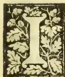

IN another column we publish a report sent in by Mr. Samaranayake, Agricultural Instructor, on a ploughing demonstration at Dedigamuwe near Hanwella. The

fact of a native cultivator voluntarily applying for the services of an instructor, and expressing his anxiety to see something of the so-called new system of cultivation by the improved plough, is a significant one. The village which was the scene of the demonstration is situated some 18 miles from Colombo, and it may be mentioned that the owner of the field which was ploughed offered to pay all the expense involved in the transport of implements, buffaloes and operatives, and the upkeep of the two latter while at work. We have never advocated the system of forcing the "Cingalee plough," which was specially designed by Howard and Sons for Ceylon, on any and every description of land in the Island. There are numerous types of ploughs which have been designed for different soils and conditions of culture, and it would be absurd to try to argue that Howard's "Cingalee Plough" can totally replace the primitive "Cultivator" of the *goyiya*: but at the same time we do maintain that there is nearly in every case in native agriculture the opportunity of conveniently and satisfactorily improving the soil by the use of a more effective implement than the so-called native plough. Where the "improved" implement comes in is in replacing the slow and tedious though efficient work of the "mamotie" (the digger or "earth-chisel") and curtailing the monotonous repetition which of

necessity occurs in the use of the native one-tined cultivator. The turning up of the soil in paddy land at such times when it is free from water, and under circumstances when no objectionable subsoil is worked up, is a most desirable operation. And even where it is not advisable to turn over, a more effective stirrer or subsoil plough is surely to be preferred to the impotent native implement, when the latter is not being used for mud stirring. Some two years ago an Agricultural Show was held at a village called Dalugama, under the auspices of the local *Gramaraksha Samagama*, where an improved plough of native make was exhibited, and elicited much curiosity and interest. The implement was subsequently sent to the School of Agriculture through the kindness of the Committee of Management. The special qualities of this "Dalugama Plough" are that it is light and simple in make. The native workman who made it evidently intended to strike a medium between the (perhaps too highly) improved "Cingalee Plough" of Howard and the real Sinhalese implement, and he has succeeded well. The "Dalugama Plough" which has been used for a considerable time at the School has proved to be well suited to the needs of the native cultivator. As applications have been made for the purchase of the implement, we have already addressed the Secretary of the *Gramaraksha Samagama*, at Kelaniya, enquiring whether the maker of the exhibit at the late Show could turn out a few ploughs for us, and at what price. We remember being told at the time of the Show that the implement cost a very moderate sum.

Another thought that has been suggested by the recent ploughing demonstration is, that in addition to the urgent necessity there is for providing an itinerating inspector for Agricultural Instructors, there is also the need for providing means by which an instructor, with (if necessary)

309------------------------------------------------

282Supplement to the "Tropical Agriculturist." [Oct. 2, 1893.

some students to help him, can be dispatched, free of cost in the first instance, to various agricultural villages, with the object of demonstrating such processes as it may seem desirable to introduce into the cultivation of the land as practised by the natives. With a properly organised system for the improvement of native agriculture, not merely by introducing new methods for the preparation of the land, but in very many other ways which we have before referred to, we are confident that much can be done for the goiyas of Ceylon, which will tend to materially ameliorate their generally-wretched lot. The first necessity in organizing such a system is a thorough acquaintance with the present practices and future needs of the people in different villages, the conditions and capabilities of the soils, the facilities obtainable in the districts, and many other circumstances. And we are convinced that without the preliminary knowledge which we have indicated as essential, any attempts at administration for agricultural improvement must be weak.

#### OCCASIONAL NOTES.

We hail with pleasure the appearance of the first volume of Dr. Trimen's new work on the "Flora of Ceylon," which, from the exhaustive manner in which he deals with the subjects, will have a wider interest than botanical works ordinarily possess, for not only will the Botanist but also the Forester and Agriculturist find a valuable handbook in the work of our Director. Without intending to give support to the doctrine of evolution in plants, we make the following quotation from Dr. Fream's work on Agriculture in support of our opinion:—"In the botanical classification of plants, the attempt is made to arrange together those plants whose structural characters most nearly resemble each other. In this way natural groups are formed, the members of which may, it is quite possible, have sprung, in some period of the remote past, from a common ancestor. Plants which are allied to each other usually require the same kind of food. They are often liable to attack by the same kinds of insects, and fall a prey by the same kinds of fungoid and other parasitical pests. Hence the use to the grower of learning the relationships of plants."

Mr. Manchanayake writes from Kuala Lumpur:—"I send a parcel containing some seeds, and two specimens of 'Ginseng' root. It is a most difficult matter to get the seed of the latter plant. There are different names for the product of different countries. For instance, there is the 1st quality Corean and 2nd quality Corean, 1st quality Japan and 2nd quality Japan, each distinguished from the other. Of the two specimens sent, the smaller and darker one, with the accompanying leaves, is the 2nd quality Corean, while the other is 3rd class Ginseng and is not very dear. The first quality of the root is not found in any of the markets here. The Chinese assert that they have never seen Ginseng seed, and they claim extraordinary properties for the substance. They say that the plant is never cultivated but grows wild in the hilly parts of the Corea, China and Japan, though a tax is levied on the collecting of it. I am told, with what truth I can't say, that about an ounce

of good Ginseng is sold for from 15 to 100 dollars, and sometimes more. I procured the specimens sent with much difficulty. A Chinese friend of mine, who has lately come from China, promises that he will make enquiries about the possibility of procuring seed, and let me know."

The curious buffalo-head-like seeds sent by Mr. Manchanayake, and which he describes as from a plant growing in water, and furnishing a food after they are boiled, are those of *Trapa Bicornis*, before referred to in the pages of the Magazine. The other seeds are of the well-known and delicious lichi fruit.

Everything has gone well with the Government Dairy since it was started. The daily output of milk has now reached about 260 bottles, that is a little over 40 gallons.

The Veterinary Surgeon's report for 1893 is an interesting production, in that it describes in a fairly exhaustive manner the two most fatal diseases which attack stock in Ceylon, namely the so-called "Murrain" and "Kandamale." The former Mr. Lye terms *Pneumo Enteritis Contagiosa Bovis* or cattle-typhoid, a specific malignant and highly-contagious fever, chiefly affecting the intestines, and also the lungs and stomach. The latter which our correspondent W. A. D. S. is inclined to set down as a form of anthrax, is described by Mr. Lye as *Pharyngo laryngitis contagiosa*, an acute malignant febrile disease characterised by elevation of temperature and dyspnoea, associated with swelling of the internal and external structures of the throat.

The following is the curative treatment recommended by the Veterinary Surgeon for "Murrain":—Either of the following mixtures to be administered at the first indication of the disease:—

<table>
<tr>
<td>(1)</td>
<td>Sulphate of Quinine ..</td>
<td>1 drachm</td>
</tr>
<tr>
<td></td>
<td>Nitrate of Potash ..</td>
<td>2 do</td>
</tr>
<tr>
<td></td>
<td>Sulphate of Magnesia ..</td>
<td>8 do</td>
</tr>
<tr>
<td></td>
<td>Powdered Aconite leaves</td>
<td>2 do</td>
</tr>
<tr>
<td></td>
<td>Water or gruel ..</td>
<td>1 pint</td>
</tr>
</table>

To be given twice daily.

<table>
<tr>
<td>(2)</td>
<td>Carbolic Acid ..</td>
<td>1 drachm</td>
</tr>
<tr>
<td></td>
<td>Chlorate of Potash ..</td>
<td>2 do</td>
</tr>
<tr>
<td></td>
<td>Sulphate of Quinine ..</td>
<td>1 do</td>
</tr>
<tr>
<td></td>
<td>Water or guel ..</td>
<td>1 pint</td>
</tr>
</table>

To be given twice daily.

The treatment recommended for "Kandamale" is:—

<table>
<tr>
<td>(1)</td>
<td>Internally.</td>
<td>Nitrate of Potash 2 drachms</td>
</tr>
<tr>
<td></td>
<td></td>
<td>Chlorate of Potash 2 do</td>
</tr>
</table>

To be well mixed and placed on the animal's tongue twice daily, or to be tied in a little muslin bag and secured in the mouth by means of a cord passed round the horns; and where possible inhalation of steam should be tried.

(2) Externally. Powerful counter-irritants, such as mustard or mustard and turpentine mixed, so as to form a thick paste, and thoroughly rubbed in; if hot water can be procured the throat should be well bathed before the irritant is applied, or the throat should be scarified with a knife or hot iron, and the juice of powdered chillies well rubbed into the excoriations thus made,

310------------------------------------------------

Oct. 2, 1893.] Supplement to the "Tropical Agriculturist."283

W. A. D. S. writes from Bombay:—Under the Civil Veterinary Department of India experiments are being carried on to show the superiority of the horse in agriculture over cattle, and a course of lectures, with suitable demonstrations were made a few weeks ago at one of their breeding farms, Babugar, in the North-Western Province. From an account of the operations described in a paper read before the Bombay Veterinary Association at its last meeting, by an officer who was delegated to attend the lectures, it appears that the work is carried out systematically, and all operations in the farm of about a thousand acres are done by horse-power. The work mainly consists of ploughing and the raising of water for irrigating the fodder crops. The promoters of the scheme are said to be convinced of the feasibility of replacing the bullock in India by the horse for agricultural purposes. No doubt the horse would do better work, and with the use of that animal there will be a possibility of more readily improving the methods of tillage &c. now in vogue. But the question is whether the ordinary ryot will be able to purchase, or to maintain horses for his farm work, when he finds it difficult to maintain himself or to keep the enduring bullock who does not entail on him much care or expenditure. Besides, what is he to do with all the cattle he possesses now? Perhaps he will be required to sell them to the butcher or continue to breed them for beef. It will, however, take a long time to convert the Hindu to the idea of meat-eating or cow-killing, and the scheme on the whole would seem to have been undertaken without taking into the least consideration the conditions of the country or its people. These attempts at innovation are no doubt undertaken with good intentions, to better the condition of the ryot and to confer on him a boon, but they appear on the other hand to stand in the way of possible and more desirable improvements.

#### A PLOUGHING DEMONSTRATION.

At the request of the Police Vidana of Dedi-gomuwe in Hewagam Korale, two students and myself were ordered to go with two iron ploughs and the pair of buffaloes belonging to the School of Agriculture to plough a field there. We started on the 11th September at 2 p.m. On our way thither many enquires were made as to the object of our journey and the information was given. A number of persons expressed their anxiety to see our process of ploughing. We reached our destination about 10 p.m., and were kindly received by the village headman, Don Saranaris. On the following morning we were taken to the field about two acres in extent, and found there a gathering of nearly two hundred people who had come to witness the ploughing.

We noticed that the soil was of good quality and free from much grass, but it had become hard and cracked by the drought that prevailed, so we found it rather difficult to plough. We nevertheless managed to plough over an acre during the two days we were there, and both the headman and the spectators expressed themselves as agreeably surprised at the work done by our ploughs.

The soil of this field and others in this locality is a clay loam but stiff and difficult to work. We noticed that several pieces of land had been ploughed with the ordinary native ploughs to no good purpose, as the furrows were little more than an inch deep.

We took advantage of the number of people present to explain the benefits of thorough ploughing and turning over of the soil in land of that description.

Some of the people to whom we spoke inquired about the price of the ploughs; and the headman, at whose instance we were sent on this occasion, handed me a letter addressed to the Superintendent of the School of Agriculture applying for an implement. I hope that one may be secured soon, so that it may reach the village while our recent visit is yet fresh in the memory of the villagers.

At the earnest request of Don Saranaris I left the two buffaloes and the ploughs in his charge for a few days, in order that he may complete his ploughing, and started back to our school on the 14th instant.

PETER SAMARANAYAKA,

Agricultural Instructor.

18th September, 1893.

#### JOTTINGS FROM A TRAVELLER'S DIARY.

##### ON THE CULTIVATION OF GINGELLY IN THE ANURADHAPURA DISTRICT.

Gingelly is one of the most important chena products in this district. Its cultivation is systematically carried on in two ways, viz., either as a separate crop in a chena cleared exclusively for the purpose; or as a second crop after the kurakkan has been gathered in. The first method is called *yalkanne*, and the second is called *mas-kanne*, signifying respectively the *yala* season and the *maha* season during which the chenas are cleared.

As regards the first method: A suitable piece of land is selected and the jungle is cut down about the beginning of February and burnt and cleared about the end of March. The seeds are sown about the beginning of April. Mamoties are sometimes used whilst sowing the seeds in order to scrape the ground and to pick up the partially burnt twigs &c. that may be found scattered about the land. By this process the seeds are sown evenly and the plants grow well; but as this method requires much labour and time, the seeds are often simply scattered about and the partially burnt twigs &c. are picked up and thrown away when the rains set in.

As regards the second method: the chenas for the cultivation of kurakkan are cleared in August and the seeds sown in September. The kurakkan crop is usually gathered in November, but as other products such as chillies, melons green gram &c. are also sown with it, the chenas are carefully fenced and guarded until about the month of March or April. In such chenas, with all the stubble of kurakkan still remaining, the gingelly seeds are sown in the month of April.

311------------------------------------------------

284Supplement to the "Tropical Agriculturist."[Oct. 2, 1893.

and the cattle let in to graze and trample the land. After the stubbles of kurakkan &c. are thus fairly trampled down, the chena, on which the gingelly seeds were sown, is set on fire, and when the rain sets in the fence around it is mended and the gingelly crop is carefully tended.

In about a month or six weeks the gingelly plants begin to flower, and in about 3 months the foliage leaves will drop off and the capsules (fruits) will also dry up and assume a yellow colour. The plants are then cut down with a scythe and heaped up in a suitable place in the chena in a vertical position with the tops pointing upwards. After a few days the capsules burst under the heat of the sun; during midday, when the sun is very powerful, the seeds are shaken off the capsules. The seeds thus separated are put in bags and carried home.

The oil is extracted in the following manner:—The seeds are first of all winnowed in order to get rid of any rubbish that they may contain and afterwards soaked in water for a day. The soaked seeds are then taken and pounded gently in order to remove their outer covering. The pounded seeds are afterwards put into a vessel containing water and squeezed with the hands until the husks are all washed off. The cleaned seeds are then dried in the sun until they assume an oily appearance. They are next taken and well pounded in a mortar until reduced to a pulpy mass. A small quantity of hot water is also sprinkled on the seeds whilst being pounded, and when thoroughly pounded the oil is easily squeezed out either with the hand or by the aid of a *peha* pressed between two poles. Large quantities of oil are extracted by the aid of chekkus.

#### MAN AND BEAST. I.

It is with domesticated animals that man has to do most, though he not unfrequently comes in contact with others of a wild nature in his daily life. In considering the subject of this paper, however, I shall confine myself to the domesticated animals, and particularly to the animals commonly found in Ceylon.

The relation which man bears to animals is manifold. First and foremost, the mainstay of the cultivator in the tropics is the animals which help him to till the land, convey his produce to the market, and supply manure to fertilize his field. Secondly, animals are a source of food supply, even among tribes who strictly adhere to so-called vegetable food. Milk is an indispensable article of diet, be it the milk of the cow, the buffaloe, or the goat. Butter, cheese, ghee and curd, as secondary products of milking animals, are also used to a great extent, while mutton and beef as well as pork are largely consumed articles of diet. Thirdly come what may be called the luxuries (though not in the strict sense of the word), viz., the wool from the sheep and the hide from the buffaloe and ox, which are made use of in the manufacture of wearing apparel. The horse and the ox convey man from place to place in more or less comfort, whilst the elephant replaces them under some circumstances. The

value of these and other animals for military purposes is admitted. Fourthly come the dog and the cat, both pets kept in the house, but the former on many occasions also as a useful servant and a guard.

The importance of these animals is so great, that they have in fact become indispensable to man. There is, however, another serious aspect which is not sufficiently considered, but is of vital importance. These animals are liable to bring much trouble, suffering and loss to man, not through their own fault, but under quite natural circumstances. They are like all other living bodies liable to disease, and some of these diseases it has been found out are communicated to man with disastrous results, and no one can deny the importance of an acquaintance with at least the more common dangers which we are liable to contract through our domesticated animals. Very often a timely knowledge of these helps to prevent much misery and loss.

Taking first the ox, let us enquire what are the diseases which it is liable to convey to us. Of the diseases of the above description in the ox may be mentioned anthrax, foot and mouth disease, tuberculosis, actinomycosis, rinderpest, pleuropneumonia, and skin-diseases.

*Anthrax* is common in India among cattle, sheep and horses, to say nothing of pigs and poultry. It is a rapidly-progressing disease, and the flesh from an animal which has suffered from anthrax could in many instances be distinguished by the dark appearance of the blood. One of the forms of this disease in Ceylon is commonly known as *Kandamala*, manifested by the rapidly swollen condition of the throat and the tongue. This disease is communicable to man, through inoculation, and if a person happens to touch the parts of an animal dead from anthrax, and be so unfortunate as to have an abrasion on the skin, he is liable to suffer from carbuncular boils. Even the hide of the animal after several months is liable to communicate the disease, and numbers of such sad fatalities are recorded among workmen in wool manufactories and tanneries. The meat from an animal dead of anthrax, when consumed, is liable to bring on typhoid fever.

*Foot and Mouth disease* is more common in Ceylon, and is easily made out, at least in its later stages. The milk from foot and mouth diseased cattle is liable to cause aphtha (sore mouth) and diarrhoea in those who consume it, especially in the case of children and those with a weak constitution. The consumption of the meat brings on various diseases of the stomach in man.

W. A. D. S.

Bombay.

(To be continued.)

#### BY HIGHWAYS AND HEDGES.

Referring to *Paspalum scrobiculatum*, "Dutch millet," the Sinhalese *amu* and Tamil *varagu*, known in India also as *koda* millet, Professor Church says:—"It is said, apparently with truth, to be at times the cause of vertigo, and is

312------------------------------------------------

Oct. 2, 1893.] Supplement to the "Tropical Agriculturist."285

not considered to be as digestible as *Setaria italica* (Tana-hal); the stems afford an inferior fodder. Koda is boiled and eaten in the same way as rice, or else is parched and ground, the meal being made into a kind of pudding. The alleged comparative indigestibility of this grain cannot be attributed to its percentage of fibre, which is usually low, but must be owing to some constituent or some condition of the grain which ordinary chemical analysis does not reveal." This grain is not uncommonly grown in Ceylon in the native chenas. Dr. Lindley, in his *Vegetable Kingdom*, speaking of injurious grasses, says, "and a variety of *Paspalum scrobiculatum*, called hureek in India, which is perhaps the ghohona grass, a reputed Indian poisonous species, said to render the milk of cows that graze upon it noxious and drastic . . . The meyna or kodro of India, a cheap grain, regarded as wholesome, is another species." Another allied species, *P. dilatatum*, is indigenous to sub-tropical parts of North and South America, and has been naturalised in Australia. It is said to be an excellent forage grass that keeps green during dry weather, being a perennial and growing tall like Dutch millet. In Ceylon we have besides amu, three other varieties: *P. Conjugatum*, *P. Filiculme*, and *P. Royleanum*.

Concerning *Eleusine Egyptica*, crowfoot or finger grass, the Sinhalese *Putu-tana*, the *Agricultural Gazette* of N. S. Wales says:—Its herbage is rich and succulent, and is much relished by all herbivora, sheep being particularly fond of it. All pastoralists agree that it is a most nutritious grass. It yields abundantly during the hot months, and is recommended for systematic cultivation. According to Dr. Watt, the seeds are eaten by the poorer classes in India, especially during times of scarcity, and it is generally considered to be a very nutritious fodder grass for cattle, being both fattening and milk-producing.

*Ægle marmelos*, the bael or beli tree, sometimes called the Bengal quince, besides yielding a wholesome and nutritious fruit, which is also much valued as a medicinal agent, produces a good gum-like arabic; a yellow dye is obtained from the rind of the fruit, the unripe rinds being used with myrabolans in calico-printing and tanning; moreover it furnishes a yellowish white, hard aromatic wood used for pestles of oil and sugar mills, naves and other parts of carts, and for agricultural implements. Almost every part of the tree is used medicinally, and the flowers yield a sweet scent.

*Panicum distachyum* (two-spiked pannick grass) is an indigenous growth in Ceylon, which Australian agricultural authorities say is worth disseminating in those parts of the country where it may not already be growing, and conserving where it already exists. The grass would seem to be more suited to moist lands; and cattle are very fond of it.

The marram grass, the seed of which was first introduced into Victoria by the Government botanist, Baron von Mueller, in 1888, and by him entrusted to the Borough Council of Port Fairy

for experiment on the barren shifting sand hummocks fronting the coast line of Port Fairy, has been proved to be the most effective sand stay ever planted. Practical evidence of its value can be seen in the miles of sandhills now reclaimed by the marram plantations, sown under the direction of Mr. S. Avery, the park ranger. So complete has been the reclamation of the lands, that where a few years ago not a sign of vegetation was to be seen, there now exists a succulent grass, eagerly devoured by cattle, and growing to a height of four feet. Marram grass is practically indestructible—burning, cutting, or eating off only makes it thrive—whilst in exposed, shifting sand it propagates as surely as in the most sheltered position. The grass for transplanting has been supplied by the Port Fairy Borough Council, not only to the Governments of Victoria and New South Wales, but to numerous municipal bodies and private individuals in all the Australian colonies, New Zealand, and Tasmania; and in no single instance has it failed to thrive.

The Botanist to the Department of Agriculture, N. S. Wales, referring to *Anthistiria avenacea* (tall oal grass) says:—It will stand a phenomenal amount of dry weather, but this may be accounted for by the fact that its strong roots penetrate the earth to a great depth. I can highly recommend the grass for systematic cultivation, either in the coastal districts of the interior. From its rich succulent herbage, if cut before the flower stems are developed, it should make capital hay. I think, if the grass were cultivated for a few consecutive years, it would yield a grain large enough to be classed amongst the cereals we at present cultivate. We have in Ceylon the closely allied *A. cymbaria* (Karavuta-mana, Sin.), *A. arguens*, *A. cilatu*, *A. tremula* (Pini-baru-tana), *A. heteroclita* and *A. prostrata*, so that the Australian species may reasonably be expected to thrive here.

#### ADVANCED AGRICULTURAL SCIENCE.

Mr. John Hunter, lecturer on Agricultural Chemistry in the Edinburgh School of Agricultural Science, and examiner in that subject at the University, read a paper on the Chemistry of the Soil before the Royal Physical Society. We were aware that Mr. Hunter, with whom was associated Mr. McAlpine, the distinguished botanist, was long and deeply engaged in researches in agricultural chemistry, but the theories and discoveries which both he and his co-worker have for many years been laying before their students, were for the first time put forward before a representative gathering of scientists a few months ago. We need make no apology for giving a summarized report of the paper as embody some new, and it will probably be thought, startling theories and discoveries, which will no doubt have their full share of criticism.

At the outset, Mr. Hunter remarked that his sole reason for bringing this communication before the Society this evening was that the recent and important advances in agricultural science—an advancement in which he presumed to think Mr. McAlpine and he had played no inconsiderable part—had been opposed by men

313------------------------------------------------

286Supplement to the "Tropical Agriculturist." [Oct. 2, 1893.

occupying conspicuous places, and he had therefore embraced this opportunity of laying his views before a learned society for discussion. He regretted that the opponents of the advancing science had not, although specially invited, put in an appearance, because it was important, in the interests of science, and of its students, that the truth be known; and if this Society should express an adverse opinion of his position, he would be only too glad to accept their verdict. Mr. Hunter then proceeded to discuss the commonly obtaining doctrine of retention of plant food by silicates and oxides, and, in passing, referred to Professor Way's doctrines of the order of absorption of oxides by silicates in the soil. The tenor of his remarks was to show that certain truths had been established by the practice and experience of the forefathers who tilled the soil, and that the many ravines had been bridged over by scientists who were unpractical and ill-fitted for the task, with the result that the foundations were now being demolished, even in the face of unbecoming opposition from quarters where only encouragement ought to have been expected. He then proceeded to show that a sterilised soil, *i.e.*, a soil in which germ life had been destroyed without in any way altering its purely chemical composition or constitution, was practically *unretentive*, while the same soil in its normal state possessed its retaining power; therefore they were entitled to assume that the retention of the essential constituents of plant food was not to any material extent due to purely chemical interchanges, but was rather due to the biological condition of soils—to germ life—that in fact, a germless soil must be an unfertile soil, unless they could grow their crops in soils under water-culture conditions, which was for the present impossible. Mr. Hunter then discussed the commonly described doctrines of capillarity in soils; this theory implied the for-ever-existing multitudinous tubes, bringing water from the subsoil. He asked the question, How was it possible for water to be rising through water-pipes by capillarity in soils whose drains—natural or artificial—were acting as exhaust pumps at the lower ends of the capillary tubes? He then referred to the opinions of physicists in regard to capillarity in organic matter, and said that physicists who had expressed opinions upon this point had yet to learn that decomposing organic matter in the soil was germ occupied, and that many of the conditions exhibited by soils, which had been ascribed to physical phenomena, were almost wholly accounted for by those biological conditions which are inseparable from decomposition of organic matters in soils. Again, he asked, How could scientists account for the occurrence of different compounds of iron existing in the subsoil as compared with the surface soil, if those much-lauded capillary water-pipes existed? It is generally conceded that in the subsoil we have ferrous salts, which are generally described as soluble; while in the surface soil of fertile land the iron is in the ferric state and insoluble. If capillary tubes exist which perform this wonderful function of bringing water from the subsoil to the surface, they must—in virtue of the well known laws of diffusion—bring ferrous salts to the surface, and that is just what even the

advocates of capillarity deny; therefore, his opponents should fight their own doctrines first before attempting to assail his.

A capillary soil Mr. Hunter described as a water-logged soil, and only serviceable for conversion into a skating rink or curling pond. He then referred to the recently-introduced theory of soil mulching or hoeing, by which the capillary tubes were broken, and evaporation from the surface or upper ends of the tubes prevented. If the water pipes were non-existing, then this theory was absurd, but even supposing this kind of capillarity were a reality, the evaporation must only be prevented by a breaking of the continuity of the mass, whereby conduction of heat would be lessened, but most certainly not because the tops of water pipes were broken, for the duration of the fracture would be measurable by seconds; moreover, soils and plants—whether the lower plants or germs, or the higher plants—required aeration, and that is incompatible with the capillary tubes described in every text-book on agricultural science which he had perused. The subject of *drainage* was then referred to, and in this connection Mr. Hunter pointed to the composition of the atmosphere, or ordinary air, as compared with that of the soil atmosphere, the former containing 0·02, or take it as 0·4 per cent., while soil atmosphere contained, it might be 30 to 60 or more per cent. of carbon dioxide. This carbon dioxide of the air was invariably claimed as the great soil solvent—the provider of foods to plants; but how could even 0·4 per cent. in the air be considered so potent, when in the soil so enormously greater a proportion existed? Soil organisms he claimed to be the providers of foods to plants, and the high proportion of carbon dioxide in soils was a product of the life's work of those germs, and that unless drains—natural or artificial—were in the soil to drain away this carbon dioxide, no ordinary plant could live, because, while these plants can be grown to perfection under water-culture conditions in water, they could not grow in an atmosphere of carbon dioxide, therefore the primary functions of drains in soils was the removal of 'carbonic acid.'

The *selective powers of plants* were next dealt with, and Mr. Hunter showed that grass seeds sown on different soils might produce a crop containing 10 per cent., or it might contain 40 per cent. of silica in the ash. How did this agree he asked, with the obtaining doctrines of selection? That fact was of itself sufficient to annihilate the present theories, but the most convincing proof of all was the leguminosæ which were employed, as the most convincing proofs of powers of selection in plants. Mr. Hunter emphasised, without any hesitation, that the composition of the leguminosæ was in no way due to selective power, but was wholly ascribable, or nearly so, to the symbiotic growths on the roots—growths which, he believed, were first described by Mr. McAlpine, and as 'wart-like excrescences,' and that long before Hellriegel, Wilfarth, or any other worker in this department had been heard of.

Mr. Hunter then dealt with soil organisms, and spoke of those which he and Mr. McAlpine had isolated; and in this connection he referred to the efforts which a number of workers had been

314------------------------------------------------

Oct. 2, 1893.] Supplement to the "Tropical Agriculturist."287

making to identify the nitrifying organism by growing them in ordinary culture media, while all the time Mr. McAlpine and he had this organism growing and working, and their observations upon this point at once suggested the necessity for certain conditions of the surface soil as regards composition, &c., which were of primary importance in rational and successful agricultural practice. He then pointedly referred to the enunciated doctrine, that 'iron was a salifiable base of service in nitrification,' and in language which was more than convincing showed that that was a huge blunder made by a more or less great authority—'principally less'—who knew nothing whatever of the subject,—the living plant was itself a living contradiction of this absurdity. In the course of the lecture Mr. Hunter referred to the experiments made by Mr. McAlpine and himself with soil organisms—some of which he characterised as the prime ministers of the soil—and referred to the power possessed by a number of those they had isolated of breaking down *silicates*, a power which had for the time being caused them to conclude that many of those changes in the soil which had been credited to purely chemical interactions were wholly due to the *life* in the soil which was inseparable from fertility.

---

#### THE DAIRY.

A Dairyman gives the following hints:—Feed up, breed up, and weed out your herd till there is no possibility of further improvements in the quality and quantity of your milk. Feed the cows at regular hours with a well-balanced ration, and never put down more at a meal than each one will eat. Exercise in moderation in a good paddock with sufficient shelter from sun, wind and rain.

Keep each cow in milk for ten months, and let her dry off for two months before calving.

Do not let the cows become poor. It pays better to keep them in good condition than get them into good condition, and fat that is lost is lost for ever.

The separator will save all the butter that is in the milk, and will pay for itself in extra butter within six months upon 100 gallons a day.

It pays well to use the best dairy appliances and methods. Milk should be cooled quickly immediately it is taken from the cow. It will keep much longer, and any bad flavours in the milk will be modified.

Lucerne should be cut some hours before feeding the cows.

A curious and repugnant form of cruelty to cows is being practised in order to "prepare" them for the show yard. A farmer in Scotland (and there were others also charged with a similar offence) was fined £5 "for placing a board underneath the udder of a cow and pulling the said board upwards by means of a rope thrown over the rafters whereby the animal was made to rest its weight on the udder, which was well stocked with milk, and was thus subjected to severe pain and suffering." This was done in order to put the milk vessel into proper shape, that is to prevent it from hanging down. It was

further elicited in the course of the trial, that the udder had moreover been blistered to raise up parts in which the udder was deficient, and this added to the cruelty of the application of the board. No one will for a moment regret that the authors of these atrocities were prosecuted and fined. Another owner is reported to have been fined £2 10s. for inserting plugs of wood into the teats of a cow in order to distend the udder with milk.

Bran is a valuable food for certain purposes. It supplies the material for making bone, and this is needed by old animals as well as young, for it is known that the bones of an old animal are replaced to some extent during the whole of its existence. It is also an excellent flesh-producing food, and it provides the elements of milk except the fat. Bran has all the needed elements of nutrition for the sustenance of life in the proportion required, but it is deficient in the fat needed for butter. Thus, alone, it is not a suitable food for the dairyman.

Coir-dust when sprinkled on the floors of cow-houses, helps to keep them clean and sweet. The dust is an excellent absorbent of liquid manure, and at the same time is a deodorizer. The only drawback in the use of coir dust is when the liquid manure is required for application to herbaceous crops, such as cultivated grasses and the like, which are liable to die out owing to the dust taking so long to decompose, and tending, in a manner, to smother the plants. In the case of perennial trees, such as the coconut, the same objection would not stand in the way, and in fact the use of coir dust for soaking up liquid manure would greatly aid the distribution of the latter over the land. Coir-dust could at one time have been got for next to nothing. A year or two ago we paid only 6 cents for a cart load, delivered, but now the price asked is 25 cts. The practice of spreading the dust over coconut land is becoming quite common among land-owners.

"The Thistle" is the latest patent in milking machines, of which there are now a great number. It is the invention of Dr. Shiels of Glasgow. The principle of the machine is the combination of pulsation with motion for closely imitating the action of the calf's lips and tongue, which produces the pleasant sensation that causes the cow in a natural state to let down her milk. The milk is moreover said to flow twice as fast as when the teats are manipulated with the hand, and is got in a perfectly clean and pure condition. Many cows can be dealt with at the same time. The great point in reference to these milking machines is their proper regulation, so that no injury follows their use from allowing their action to go on beyond the proper limit, and the greatest care has to be exercised by those who have the control of these artificial milkers.

Prof. Wright of the Glasgow Technical College, in the course of a lecture on the "Care of Farm-yard Manure," pointed out that ordinary farm-yard manure contained 75 per cent. of water and only 25 per cent. of solid matter. Of the 5 cwt. of solid matter in each ton of farm-yard manure

315------------------------------------------------

288Supplement to the "Tropical Agriculturist." [Oct. 2, 1893.

only about  $\frac{1}{4}$  cwt. was of real manurial value. In fact, all the valuable constituents in a ton of farmyard manure only amounted to about 31 lbs., viz., 12 lbs. of nitrogen, 12 lbs. of potash, and 7 lbs. of phosphoric acid. The nitrogen was, of course, the most valuable part; and as the largest proportion of it was contained in the liquid part of the manure, special pains should be taken to see that no part of the liquid manure was allowed to be wasted. The lecturer argued strongly in favour of all cattle courts and dung steads being roofed over, so that no waste of manurial substances should be incurred through washing with rain-water. He also argued that when the manure was made up into large heaps in the field, it should be covered with a coating of earth to prevent nitrogen escaping.

#### GENERAL ITEMS.

Another suggestion to preserve eggs is to pack them in salt after wiping with vaseline to which salicylic acid had been added. By this means eggs are said to keep in good quality for over 3 months.

An enterprising firm in Cairns, Australia, has recently sent a trial shipment of Banana meal to London. The following are some particulars regarding it:—"We dried by heating steam pipes, but found the process slow and expensive, 80 per cent. of fluid having to be evaporated to secure 20 per cent. of solid. The packing and drying is an exceedingly tedious and expensive item. We are convinced it would take 8 to 10 dozen bananas to produce 1 lb. of meal or flour. We have found 3 table-spoonfuls to make a vegetable dish of most agreeable porridge. We sell at 10s. 6d. per dozen lbs."

The Hon. Alfred Deakin, writing on Irrigation in Egypt, thus refers to the agriculture of the country:—

The principal products are cotton, wheat, barley, beans, maize, sugar cane, rice and clover. In the Delta, those grown in summer are cotton, rice, sugar cane, melons, cucumbers, and clover. During the floods the maize, cotton, rice, and sugar cane are cultivated. The winter crops are wheat, beans, barley, and clover. The common rotation is a first year of cotton and clover, the second year of maize, wheat, and clover, and a third year of maize, beans, and clover. Cotton is too exhausting to the soil to be grown every year. It could be grown every second year if the water supply was larger, but the present practice is to grow it every third year only, or, what is the same thing, not more than one-third of a farm is put under this crop in each year. It is by far the most profitable product in Egypt, an acre being worth from £15 to £25, as against £7 for rice, £5 for wheat, and £4 per acre for fodder, beans, maize, or lentils. In Upper Egypt, wheat, flax, and beans are chiefly sown; while, by the use of sakiyehs and shadoofs, millet, cucumbers, and melons are grown in summer. Their relative value may be

partly estimated from the exports of 1886, of which the chief are:—

<table>
<tbody>
<tr>
<td>Cotton</td>
<td>..</td>
<td>..</td>
<td>..</td>
<td>£7,706,899</td>
</tr>
<tr>
<td>Cotton seed</td>
<td>..</td>
<td>..</td>
<td>..</td>
<td>1,439,191</td>
</tr>
<tr>
<td>Beans</td>
<td>..</td>
<td>..</td>
<td>..</td>
<td>696,669</td>
</tr>
<tr>
<td>Sugar</td>
<td>..</td>
<td>..</td>
<td>..</td>
<td>579,312</td>
</tr>
<tr>
<td>Wheat</td>
<td>..</td>
<td>..</td>
<td>..</td>
<td>149,356</td>
</tr>
<tr>
<td>Rice</td>
<td>..</td>
<td>..</td>
<td>..</td>
<td>129,716</td>
</tr>
<tr>
<td>Skins</td>
<td>..</td>
<td>..</td>
<td>..</td>
<td>119,061</td>
</tr>
<tr>
<td>Gum</td>
<td>..</td>
<td>..</td>
<td>..</td>
<td>97,671</td>
</tr>
<tr>
<td>Wool</td>
<td>..</td>
<td>..</td>
<td>..</td>
<td>55,524</td>
</tr>
<tr>
<td>Lentils</td>
<td>..</td>
<td>..</td>
<td>..</td>
<td>41,054</td>
</tr>
<tr>
<td>Maize</td>
<td>..</td>
<td>..</td>
<td>..</td>
<td>27,352</td>
</tr>
</tbody>
</table>

The food of the country, which is grown by irrigation, of course does not appear in this return. Some fruit is grown, a great deal of forage, and a great variety of vegetables. Trees are comparatively rare in the Delta; but larger estates are sometimes planted with figs, mulberries, acacias, and sycamores, while the growth of other varieties, notably of the weeping willow, myrtle, elm, and cypress, are now being encouraged. Numbers of date palms are grown upon its borders. Large estates are reckoned to return a profit to their landlords, taking one year with another, of £5 per acre; those of moderate size, also with hired labor, £4 10s. per acre; while the Fellâhin, in their own plots and with their own family labor, gain as much as £6 10s. per acre; irrigation here, as in France and Spain, favoring the small proprietors.

The results of experiments by M. E. Gain with a view to ascertaining the effect of a moist soil and a moist atmosphere on the development of plants, have established the fact, viz., that dry air and a moist soil are favourable, and moist air and dry soil are very unfavourable to the production of flowers.

As a preventative against insect and fungoid pests, plants should be allowed plenty of room when being put into the ground. If, after some time, it is found that the trees have not sufficient ventilation, the branches will require judicious thinning and shortening. All wood removed from the tree should be collected and burnt at once, more especially if the tree is infested. The operation is best performed after the fruiting season is over.

Prof. Wagner, Director of the Agricultural Research Station, Darmstadt, thus concludes a lecture in which he has exhaustively answered the question, "How are Nitrogen and Phosphoric acid to be obtained in the cheapest way?"

"We have undoubtedly found a satisfactory solution of the question which we selected for discussion, which was, 'How are Nitrogen and Phosphoric acid to be obtained in the cheapest way?' And the reply is: That, at the present time, cultivation of leguminosæ, Thomas slag, and potash salts are the three most powerful levers, by the combined action of which we must endeavour to raise to the highest possible magnitude the yield of the soil, as well as the clear profit obtainable by cultivating fields or meadows."

316------------------------------------------------

In consequence of the non-arrival of the supply of portraits of No. IV. of the Planting Pioneers of this Colony, we are forced to postpone its appearance till the December Number.

317------------------------------------------------

<!-- stage4: FAINT old-images-only -->

[Faint page: no legible print of its own could be verified; text withheld (stage 4 review list)]

318------------------------------------------------

# \* The TROPICAL AGRICULTURIST \*

## ◇ MONTHLY. ◇

Vol. XIII.]

COLOMBO, NOVEMBER 1ST, 1893.

No. 5.

### CEYLON MANUAL OF CHEMICAL ANALYSES.

A HANDBOOK OF ANALYSES CONNECTED WITH THE INDUSTRIES AND PUBLIC HEALTH OF CEYLON FOR PLANTERS, COMMERCIAL MEN, AGRICULTURAL STUDENTS, AND MEMBERS OF LOCAL BOARDS.

By M. COCHRAN, M.A., F.C.S.

(Continued from page 229.)

#### CHAPTER VII.

TOBACCO, ARECANUT, ANNATTO, ERYTHROXYLON COCA, COTTON AND DATURA.

FRENCH ANALYSES OF TOBACCO—NICOTINE IN TOBACCO—MINERAL INGREDIENTS IN TOBACCO—TOBACCO LEAF ASH—TOBACCO ASHES—SOIL SUITABLE FOR TOBACCO—BEST MANURES FOR TOBACCO—NESSLER'S EXPERIMENTS—EFFECT OF DIFFERENT MANURES ON GROWTH OF TOBACCO—TABLE OF COMBUSTIBILITY—ARECANUT—CHEMICAL PRINCIPLES PRESENT IN ARECANUT—ANNATTO—BIXIN—COMPOSITION OF COMMERCIAL ANNATTO—CEYLON ANNATTO—ERYHTROXYLON COCA—COCAINE—CEYLON COCA—ASH OF COCA LEAVES—KAPOK SEEDS—CHEMISTRY OF THE COTTON PLANT—DATURA STRAMONIUM.

#### TOBACCO.

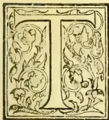

THE tobaccos of commerce are the prepared leaves of several species of nicotiana, a plant belonging to the natural order solanaceae.

The tobacco plant is cultivated in the Northern and North-Western provinces of Ceylon, also to a small extent

in the Central Province.

Many analyses of tobacco have been made in the laboratories of the French State factories. In an article in the *Encyclopædia Britannica*, the following results of these analyses are given:—

*Nicotine*, a liquid volatile alkaloid from 1.5 to 9 per cent.

*Essential Oil*.—According to Schlossing an important element in the flavour of tobacco, although its proportion is exceedingly small.

*Malic and Citric Acids* (anhydrous) 10 to 14 per cent.

*Acetic Acid*.—Very little in fresh leaves, but, after fermentation as in snuff, about 3 per cent may be found.

*Oxalic Acid* 1 to 2 per cent.

*Mucilaginous substances*, including pectic acid, pectose and pectine, 5 per cent.

*Resins, fats, and other bodies extractable by ether*, 4 to 6 per cent.

*Sugar*, little in the leaves, more in the stems; in the fermentation it disappears.

*Cellulose* 7 to 8 per cent.

*Albumenoids* calculated from the nitrogen not present as nicotine, nitrates, or ammonia, about 25 per cent.

*Mineral matter* from about 16 to 28 per cent. The following represents the average amount of nicotine in cigars, smoking tobacco and snuff:—

#### Proportion of Nicotine in Tobacco.

(Quoted from Dr. Frankland's "Agricultural Chemical Analysis.")

<table border="0">
<tr>
<td>Nicotine varies from</td>
<td>... 1.5 to 9</td>
<td>per cent.</td>
</tr>
<tr>
<td>" in cigars from</td>
<td>... 1.5 to 8</td>
<td>"</td>
</tr>
<tr>
<td>" in Havana cigars from</td>
<td>1.8 to 2.2</td>
<td>"</td>
</tr>
<tr>
<td>" in smoking tobacco</td>
<td>2.2 to 2.5</td>
<td>"</td>
</tr>
<tr>
<td>" in snuff from</td>
<td>2 to 3</td>
<td>"</td>
</tr>
</table>

#### Nicotine in Tobacco according to Pereira.

(From "All about Tobacco.")

<table border="0">
<thead>
<tr>
<th></th>
<th>Per cent.</th>
</tr>
</thead>
<tbody>
<tr>
<td>Lot (France) ...</td>
<td>7.96</td>
</tr>
<tr>
<td>Lot Et Garonne (France) ...</td>
<td>7.34</td>
</tr>
<tr>
<td>Virginia ...</td>
<td>6.87</td>
</tr>
<tr>
<td>Nord (France) ...</td>
<td>6.58</td>
</tr>
<tr>
<td>Kentucky ...</td>
<td>6.09</td>
</tr>
<tr>
<td>Pas de Calais (France) ...</td>
<td>4.94</td>
</tr>
<tr>
<td>Californian ...</td>
<td>4.04</td>
</tr>
<tr>
<td>Alsace ...</td>
<td>3.20</td>
</tr>
<tr>
<td>Maryland ...</td>
<td>2.29</td>
</tr>
<tr>
<td>Havanna ...</td>
<td>2.00</td>
</tr>
<tr>
<td>Virginian (heavily manured) ...</td>
<td>5.81</td>
</tr>
<tr>
<td>Mexican baler (heavily manured) ...</td>
<td>5.60</td>
</tr>
<tr>
<td>Clarksville ...</td>
<td>5.29</td>
</tr>
<tr>
<td>Pennsylvanian seed leaf ...</td>
<td>1.02</td>
</tr>
</tbody>
</table>

319------------------------------------------------

290THE TROPICAL AGRICULTURIST.[Nov. 1, 1893.]*Nicotine in Tobacco according to Nessler.*

(From "All about Tobacco.")

<table>
<tr>
<td>Havana leaf from</td>
<td>...</td>
<td>...</td>
<td>6 to 2</td>
<td>per cent.</td>
</tr>
<tr>
<td>German leaf</td>
<td>..</td>
<td>..</td>
<td>7 to 3.3</td>
<td>..</td>
</tr>
<tr>
<td>Syrian Tobacco</td>
<td>...</td>
<td>...</td>
<td>Nil</td>
<td></td>
</tr>
</table>

During the drying and fermentation of the leaves a certain amount of ammonia is formed, which is less in the finer, and higher in the coarser kinds of tobacco thus, according to Nessler:—

<table>
<tr>
<td>Havana smoking tobacco</td>
<td>contains</td>
<td>2</td>
<td>per cent ammonia.</td>
</tr>
<tr>
<td>Cuba</td>
<td>do</td>
<td>3</td>
<td>.. ..</td>
</tr>
<tr>
<td>Syrian</td>
<td>do</td>
<td>6</td>
<td>.. ..</td>
</tr>
<tr>
<td>German as much as</td>
<td>..</td>
<td>8</td>
<td>.. ..</td>
</tr>
</table>

On the other hand Schlossing found as much as .8 per cent of ammonia in Havana tobacco.

The mineral ingredient which seems most to affect the quality of the tobacco is potash combined with an organic acid; but which in an analysis of the ash appears as carbonate of potash. As a general rule a tobacco, the ash of which is rich in carbonate of potash burns well. Nessler illustrates this by the following table:—

<table border="1">
<thead>
<tr>
<th rowspan="2"></th>
<th>Total amount of potash.</th>
<th>Carbonate of potash.</th>
<th>Total amount of ash.</th>
<th rowspan="2">Remarks.</th>
</tr>
<tr>
<th>per ct.</th>
<th>per ct.</th>
<th>per ct.</th>
</tr>
</thead>
<tbody>
<tr>
<td>Havana</td>
<td>2.93</td>
<td>2.3</td>
<td>24.6</td>
<td>Small thin leaf, burning very well, and aromatic.</td>
</tr>
<tr>
<td>Syrian</td>
<td>2.753</td>
<td>3.42</td>
<td>20.685</td>
<td>Finely cut tobacco, burns well, and is very aromatic.</td>
</tr>
<tr>
<td>German</td>
<td>6.246</td>
<td>5.21</td>
<td>22.343</td>
<td>Large thin leaf, burns very well, and is aromatic.</td>
</tr>
<tr>
<td>German</td>
<td>1.913</td>
<td>.15</td>
<td>22.591</td>
<td>Burns very badly, goes out easily.</td>
</tr>
<tr>
<td>German</td>
<td>2.766</td>
<td>.07</td>
<td>24.219</td>
<td>Do do</td>
</tr>
<tr>
<td>German</td>
<td>3.666</td>
<td>1.06</td>
<td>25.533</td>
<td>Do do</td>
</tr>
</tbody>
</table>

The mineral ingredients of tobacco appear, according to analyses, to be greatly affected by the composition of the soil. The following analyses of tobacco ash from tobaccos, grown upon argillaceous and calcareous soils respectively, show this, which is specially remarkable in the cases of the potash and lime. The analyses are from "All about Tobacco" quoted from "Simmond's Commercial Products of the Vegetable Kingdom."

*Analysis of Five Samples of Tobacco Leaf Ash.*

<table border="1">
<thead>
<tr>
<th rowspan="2"></th>
<th colspan="2">Grown on Argillaceous Soil.</th>
<th colspan="3">Grown on Calcareous Soil.</th>
</tr>
<tr>
<th></th>
<th></th>
<th></th>
<th></th>
<th></th>
</tr>
</thead>
<tbody>
<tr>
<td>Potash</td>
<td>29.08</td>
<td>30.67</td>
<td>9.68</td>
<td>9.36</td>
<td>10.37</td>
</tr>
<tr>
<td>Soda</td>
<td>2.26</td>
<td>—</td>
<td>—</td>
<td>—</td>
<td>.36</td>
</tr>
<tr>
<td>Lime</td>
<td>27.67</td>
<td>24.79</td>
<td>49.28</td>
<td>49.44</td>
<td>39.53</td>
</tr>
<tr>
<td>Magnesia</td>
<td>7.22</td>
<td>8.57</td>
<td>14.58</td>
<td>15.59</td>
<td>15.04</td>
</tr>
<tr>
<td>Chloride of sodium</td>
<td>.91</td>
<td>5.95</td>
<td>4.61</td>
<td>3.20</td>
<td>6.39</td>
</tr>
<tr>
<td>Chloride of potassium</td>
<td>—</td>
<td>—</td>
<td>4.44</td>
<td>3.27</td>
<td>2.99</td>
</tr>
<tr>
<td>Phosphate of iron</td>
<td>8.78</td>
<td>6.03</td>
<td>5.19</td>
<td>6.72</td>
<td>7.56</td>
</tr>
<tr>
<td>Sulphate of lime</td>
<td>6.43</td>
<td>5.60</td>
<td>6.68</td>
<td>6.14</td>
<td>9.42</td>
</tr>
<tr>
<td>Silica</td>
<td>17.65</td>
<td>18.39</td>
<td>5.54</td>
<td>6.28</td>
<td>8.34</td>
</tr>
<tr>
<td></td>
<td>100.00</td>
<td>100.00</td>
<td>100.00</td>
<td>100.00</td>
<td>100.0</td>
</tr>
</tbody>
</table>

Another analysis of tobacco leaf ash and the composition of a special manure is quoted from Professor Johnston:—

*Analysis of Tobacco Leaf Ash.*

<table>
<thead>
<tr>
<th></th>
<th>per cent.</th>
</tr>
</thead>
<tbody>
<tr>
<td>Potash</td>
<td>12.14</td>
</tr>
<tr>
<td>Soda</td>
<td>.07</td>
</tr>
<tr>
<td>Lime</td>
<td>45.90</td>
</tr>
<tr>
<td>Magnesia</td>
<td>13.09</td>
</tr>
<tr>
<td>Chloride of sodium</td>
<td>3.49</td>
</tr>
<tr>
<td>Chloride of potassium</td>
<td>3.98</td>
</tr>
<tr>
<td>Phosphate of iron</td>
<td>5.48</td>
</tr>
<tr>
<td>Phosphate of lime</td>
<td>1.49</td>
</tr>
<tr>
<td>Sulphate of lime</td>
<td>6.35</td>
</tr>
<tr>
<td>Silica</td>
<td>8.01</td>
</tr>
</tbody>
</table>

100.00

*Ingredients necessary to replace 100 lbs. of the Ash of Tobacco Leaves.*

<table>
<tbody>
<tr>
<td>Bone dust, Sulphuric acid (dissolved bones?)</td>
<td>23 lbs.</td>
</tr>
<tr>
<td>Carbonate of potash (dry)</td>
<td>31 ..</td>
</tr>
<tr>
<td>Carbonate of soda (dry)</td>
<td>5 ..</td>
</tr>
<tr>
<td>Carbonate of magnesia</td>
<td>25 ..</td>
</tr>
<tr>
<td>Carbonate of lime (chalk)</td>
<td>60 ..</td>
</tr>
<tr>
<td></td>
<td>144 ..</td>
</tr>
</tbody>
</table>

The following, quoted from "All about Tobacco" are analyses of tobacco ashes from Hungarian and Nürnberg leaves:—

<table border="1">
<thead>
<tr>
<th rowspan="2"></th>
<th colspan="3">Hungarian Tobacco.</th>
<th>Nürnberg.</th>
</tr>
<tr>
<th colspan="3">Will and Fresenius.</th>
<th>Merz.</th>
</tr>
</thead>
<tbody>
<tr>
<td>Potash</td>
<td>29.1</td>
<td>18.8</td>
<td>8.2</td>
<td>26.9</td>
</tr>
<tr>
<td>Soda</td>
<td>2.2</td>
<td>—</td>
<td>—</td>
<td>2.7</td>
</tr>
<tr>
<td>Lime</td>
<td>27.7</td>
<td>27.8</td>
<td>42.8</td>
<td>39.5</td>
</tr>
<tr>
<td>Magnesia</td>
<td>7.2</td>
<td>15.7</td>
<td>13.9</td>
<td>9.6</td>
</tr>
<tr>
<td>Chloride of sodium</td>
<td>.9</td>
<td>11.4</td>
<td>2.2</td>
<td>9.6</td>
</tr>
<tr>
<td>Chloride of potassium</td>
<td>—</td>
<td>3.9</td>
<td>8.5</td>
<td>—</td>
</tr>
<tr>
<td>Phosphate of iron</td>
<td>8.8</td>
<td>6.8</td>
<td>6.1</td>
<td>4.2</td>
</tr>
<tr>
<td>Phosphate of lime</td>
<td>—</td>
<td>—</td>
<td>—</td>
<td>—</td>
</tr>
<tr>
<td>Sulphate of lime</td>
<td>6.4</td>
<td>10.1</td>
<td>8.0</td>
<td>—</td>
</tr>
<tr>
<td>Silica</td>
<td>17.6</td>
<td>6.0</td>
<td>9.3</td>
<td>4.5</td>
</tr>
<tr>
<td>Sulphuric anhydride</td>
<td>—</td>
<td>—</td>
<td>—</td>
<td>2.8</td>
</tr>
<tr>
<td></td>
<td>99.9</td>
<td>100.5</td>
<td>99.0</td>
<td>99.8</td>
</tr>
</tbody>
</table>

The above are from Haldane's "Subtropical Cultivation Climates," the author of which says "the best artificial manures will be found to be

1. (1) Carbonate of potash, or pearl ash.
2. (2) Sulphate of potash costing from £12 to £20 per ton.
3. (3) Nitrate of potash, or saltpetre. Applied at the rate of 2 cwts. per acre.

The kind of soil suitable for tobacco is evidently very varied, and practical planters are said to pay more regard to the mechanical condition than to the chemical composition of the soil. Thus there appears to be a consensus of opinion that heavy clay land is unsuitable, and that free well-drained soils are best. The conclusions that Schlossing drew from various experiments to ascertain the kind of soils best suited to produce fine tobacco were these. "He found that a bad burning tobacco was produced in a soil containing little potash, on unmanured soil, on soil manured with flesh, humus, with calcium chloride, magnesium chloride, and potassium chloride" a good burning tobacco was produced on a soil manured with potassium carbonate, with saltpetre, and with potassium sulphate."

320------------------------------------------------

Nov. 1, 1893.]

THE TROPICAL AGRICULTURIST,

291

The following is an analysis by Nessler of a soil on which he made some of his elaborate experiments in tobacco cultivation (from "All about Tobacco") :—

<table border="1">
<thead>
<tr>
<th rowspan="2">Soil,</th>
<th colspan="9">100 parts of soil dried at 212° F. contained the following constituents soluble in hot hydrochloric acid.</th>
</tr>
<tr>
<th>Organic Matter.</th>
<th>Phosphoric Acid.</th>
<th>Potash.</th>
<th>Soda.</th>
<th>Magnesia.</th>
<th>Lime.</th>
<th>Oxide of Iron.</th>
<th>Alumina.</th>
<th>Silica.</th>
</tr>
</thead>
<tbody>
<tr>
<td>Surface soil...</td>
<td>2.50</td>
<td>0.163</td>
<td>0.125</td>
<td>0.123</td>
<td>0.076</td>
<td>0.260</td>
<td>3.392</td>
<td>0.253</td>
<td>0.074</td>
</tr>
<tr>
<td>Sub-soil ...</td>
<td>2.22</td>
<td>0.159</td>
<td>0.101</td>
<td>0.070</td>
<td>0.221</td>
<td>0.229</td>
<td>*</td>
<td>4.065</td>
<td>0.023</td>
</tr>
<tr>
<th colspan="10">Insoluble Inorganic Matter.</th>
</tr>
<tr>
<td>Surface soil...</td>
<td>—</td>
<td>—</td>
<td>1.382</td>
<td>.943</td>
<td>0.252</td>
<td>0.559</td>
<td>—</td>
<td>6.652</td>
<td>83.382</td>
</tr>
<tr>
<td>Sub-soil ...</td>
<td>—</td>
<td>—</td>
<td>1.114</td>
<td>.630</td>
<td>0.108</td>
<td>.266</td>
<td>—</td>
<td>5.751</td>
<td>84.862</td>
</tr>
<tr>
<th colspan="10">Soluble in Water.</th>
</tr>
<tr>
<td>Surface soil...</td>
<td>—</td>
<td>—</td>
<td>.0034</td>
<td>.0016</td>
<td>.031</td>
<td>—</td>
<td>—</td>
<td>—</td>
<td>—</td>
</tr>
<tr>
<td>Sub-soil ...</td>
<td>—</td>
<td>—</td>
<td>.0063</td>
<td>.0013</td>
<td>.029</td>
<td>—</td>
<td>—</td>
<td>—</td>
<td>—</td>
</tr>
</tbody>
</table>

\* Not ascertained.

The next table shews the relative amount of produce and its chemical composition, obtained from the above soil, when treated with the different manures enumerated :—

Table shewing the effect of different Manures on the growth of Tobacco. (From "All about Tobacco.")

<table border="1">
<thead>
<tr>
<th rowspan="2">Number.</th>
<th rowspan="2">Nature of Manure.</th>
<th rowspan="2">lbs. per acre.</th>
<th colspan="3">Size of leaves.</th>
<th colspan="8">100 parts of dry tobacco contain</th>
</tr>
<tr>
<th>Length in inches.</th>
<th>Breadth in inches.</th>
<th>Produce per acre.</th>
<th>Ash.</th>
<th>Carbo-nate of potash.</th>
<th>Carbo-nate of lime.</th>
<th>Potash.</th>
<th>Soda.</th>
<th>Nico-tine.</th>
<th>Nitro-gen.</th>
<th>Fat.</th>
</tr>
</thead>
<tbody>
<tr>
<td>1</td>
<td>No manure ..</td>
<td>—</td>
<td>18</td>
<td>8½</td>
<td>6,320</td>
<td>—</td>
<td>—</td>
<td>—</td>
<td>—</td>
<td>—</td>
<td>—</td>
<td>—</td>
<td>—</td>
</tr>
<tr>
<td>2</td>
<td>Superphosphate ...</td>
<td>400</td>
<td>17½</td>
<td>8½</td>
<td>6,094</td>
<td>21.4</td>
<td>1.16</td>
<td>—</td>
<td>3.09</td>
<td>0.43</td>
<td>—</td>
<td>3.22</td>
<td>4.50</td>
</tr>
<tr>
<td>3</td>
<td>Chloride of potassium</td>
<td>300</td>
<td>18½</td>
<td>9</td>
<td>8,120</td>
<td>23.02</td>
<td>0.42</td>
<td>14.9</td>
<td>3.62</td>
<td>0.87</td>
<td>0.831</td>
<td>3.29</td>
<td>—</td>
</tr>
<tr>
<td>4</td>
<td>Sulphate of potash ...</td>
<td>300</td>
<td>18</td>
<td>9</td>
<td>5,540</td>
<td>21.07</td>
<td>1.40</td>
<td>15.03</td>
<td>3.39</td>
<td>0.72</td>
<td>—</td>
<td>3.11</td>
<td>3.94</td>
</tr>
<tr>
<td>5</td>
<td>Common salt ...</td>
<td>300</td>
<td>17</td>
<td>8</td>
<td>7,560</td>
<td>24.47</td>
<td>6.47</td>
<td>16.84</td>
<td>2.06</td>
<td>0.43</td>
<td>0.58</td>
<td>2.15</td>
<td>3.65</td>
</tr>
<tr>
<td>6</td>
<td>Carbonate of potash</td>
<td>150</td>
<td>18½</td>
<td>7½</td>
<td>4,620</td>
<td>21.96</td>
<td>2.51</td>
<td>—</td>
<td>3.08</td>
<td>0.44</td>
<td>0.57</td>
<td>3.21</td>
<td>3.42</td>
</tr>
<tr>
<td>7</td>
<td>Feldspar ...</td>
<td>1,000</td>
<td>18</td>
<td>8½</td>
<td>5,830</td>
<td>22.19</td>
<td>1.23</td>
<td>18.04</td>
<td>2.56</td>
<td>1.00</td>
<td>0.94</td>
<td>3.07</td>
<td>—</td>
</tr>
<tr>
<td>8</td>
<td>No manure ..</td>
<td>—</td>
<td>17½</td>
<td>8½</td>
<td>4,410</td>
<td>20.43</td>
<td>1.13</td>
<td>18.71</td>
<td>2.76</td>
<td>1.10</td>
<td>0.50</td>
<td>3.12</td>
<td>—</td>
</tr>
<tr>
<td>9</td>
<td>Carnallite ...</td>
<td>400</td>
<td>18</td>
<td>8</td>
<td>6,200</td>
<td>21.70</td>
<td>1.05</td>
<td>14.41</td>
<td>3.42</td>
<td>0.87</td>
<td>0.93</td>
<td>3.01</td>
<td>—</td>
</tr>
<tr>
<td>10</td>
<td>Sulphate of magnesia</td>
<td>400</td>
<td>16½</td>
<td>7</td>
<td>4,580</td>
<td>21.70</td>
<td>1.03</td>
<td>14.40</td>
<td>2.90</td>
<td>0.93</td>
<td>0.69</td>
<td>3.02</td>
<td>—</td>
</tr>
<tr>
<td>11</td>
<td>Gypsum ...</td>
<td>400</td>
<td>15</td>
<td>8</td>
<td>4,290</td>
<td>22.68</td>
<td>1.60</td>
<td>—</td>
<td>2.83</td>
<td>0.92</td>
<td>—</td>
<td>—</td>
<td>—</td>
</tr>
<tr>
<td>12</td>
<td>Sulphate of ammonia</td>
<td>160</td>
<td>16½</td>
<td>7½</td>
<td>4,080</td>
<td>24.79</td>
<td>0.86</td>
<td>16.68</td>
<td>2.15</td>
<td>0.71</td>
<td>.80</td>
<td>3.14</td>
<td>3.86</td>
</tr>
<tr>
<td>13</td>
<td>Sulphate of " " of potash</td>
<td>160</td>
<td rowspan="2">17</td>
<td rowspan="2">9</td>
<td rowspan="2">5,090</td>
<td rowspan="2">23.01</td>
<td rowspan="2">1.40</td>
<td rowspan="2">—</td>
<td rowspan="2">2.89</td>
<td rowspan="2">0.71</td>
<td rowspan="2">—</td>
<td rowspan="2">2.80</td>
<td rowspan="2">4.40</td>
</tr>
<tr>
<td></td>
<td>Superphosphate ..</td>
<td>300</td>
</tr>
<tr>
<td>14</td>
<td>Feldspar ...</td>
<td>1,000</td>
<td>18</td>
<td>8½</td>
<td>3,530</td>
<td>—</td>
<td>—</td>
<td>—</td>
<td>—</td>
<td>—</td>
<td>—</td>
<td>—</td>
<td>—</td>
</tr>
</tbody>
</table>

It will be seen from the preceding table that the heaviest crops were obtained from soils manured with potassium chloride and sodium chloride. Unfortunately, however, though chlorides produce quantity, the quality of the tobacco is inferior. Nessler made another series of experiments to test the combustibility of the tobaccos. Under this test tobacco from soil manured with potassium carbonate proved to be the best, and that from soil manured with potassium sulphate next in order. Nessler tried also nitrate of potassium as a manure for tobacco, and found that it increased both the growth and combustibility of the leaf.

The following is the table of combustibility :—

<table border="1">
<thead>
<tr>
<th>No.</th>
<th>Manured with</th>
<th>Kept fire in seconds.</th>
<th>Contained carbonate of potash in the ash.</th>
</tr>
</thead>
<tbody>
<tr>
<td>1</td>
<td>Carbonate of potash ...</td>
<td>17</td>
<td>2.51</td>
</tr>
<tr>
<td>2</td>
<td>Sulphate of potash ...</td>
<td>15½</td>
<td>1.40</td>
</tr>
<tr>
<td>3</td>
<td>Gypsum ...</td>
<td>13½</td>
<td>1.6</td>
</tr>
<tr>
<td>4</td>
<td>Feldspar No. 14...</td>
<td>13</td>
<td>—</td>
</tr>
<tr>
<td>5</td>
<td>Nothing ...</td>
<td>11</td>
<td>—</td>
</tr>
<tr>
<td>6</td>
<td>Feldspar No. 7 ...</td>
<td>10</td>
<td>1.23</td>
</tr>
<tr>
<td>7</td>
<td>Carnallite ...</td>
<td>10</td>
<td>1.05</td>
</tr>
<tr>
<td>8</td>
<td>Superphosphate ...</td>
<td>10</td>
<td>1.16</td>
</tr>
<tr>
<td>9</td>
<td>Chloride of potassium ...</td>
<td>10</td>
<td>.42</td>
</tr>
<tr>
<td>10</td>
<td>Nothing No. 1 ...</td>
<td>10</td>
<td>1.13</td>
</tr>
<tr>
<td>11</td>
<td>Mixture ...</td>
<td>10</td>
<td>1.40</td>
</tr>
<tr>
<td>12</td>
<td>Sulphate of ammonia ...</td>
<td>8½</td>
<td>.86</td>
</tr>
<tr>
<td>13</td>
<td>Sulphate of magnesia ...</td>
<td>7½</td>
<td>1.03</td>
</tr>
<tr>
<td>14</td>
<td>Common salt ...</td>
<td>4½</td>
<td>.47</td>
</tr>
</tbody>
</table>

321------------------------------------------------

292THE TROPICAL AGRICULTURIST.[Nov. 1, 1893.ARECANUT.

Arcanut is the fruit of the betelnut palm, *Areca catechu*. It is largely used as a masticatory in the East Indies. The following, according to the *Chemist and Druggist*, are the chemical principles present, an inferior catechu, tannic and gallic acids, ammonium acetate, fats, oils, gum, nitrogenous substances and a dye (areca red). The charcoal of the nut is used as a dentifrice and the ground nut as an anthelmintic.

Bentley and Trimen say: "According to Morin, arecanuts contain tannic and gallic acids, gluten, red insoluble matter, fixed oil, gum, oxalate of lime and lignin. Flückiger and Hanbury found them to contain 14 per cent of a crystalline fatty matter, tannic acid, nearly 15 per cent of an amorphous tannic matter, 2.26 per cent of a brown ash, containing peroxide of iron and phosphate of magnesium, and other substances. They also came to the conclusion that catechin is not a constituent of arecanuts, and that any extract made from them must be essentially different from the catechu of Acacia, or of *Nauclea*, and rather to be considered a kind of tannic matter of the nature of Ratanhia red or Cinchona red." Three alkaloids have been received obtained from arecanut, of which two have the names arecoline and arecaine respectively.

It is from the fruit and wood of the areca catechu that the article known in commerce as Bombay catechu is prepared. The other important kinds of catechu met with in commerce are Bengal catechu prepared from the twigs and unripe pods of mimosa catechu; Gambier catechu, which is extracted from the leaves of the shrub *uncaria gambier* and kino or gum kino. Good catechu on ignition does not leave more than 5 per cent of ash, and should contain not less than 88 per cent of matter soluble in boiling alcohol.

ANNATTO.

Annatto, which is variously written Arnatto, Arnotto and Annotto is the coloring matter derived from the seeds of the *Bixa orellana*, an evergreen plant common both to the East and West Indies. The two kinds best known in commerce are the Spanish, which come from Brazil, and the French, prepared in Cayenne. This substance is also exported from Ceylon. Each fruit capsule contains a large number of red seeds; from these the dye is removed in three ways. The seeds may be boiled with water till a thick paste is obtained, or the seeds may be rubbed with water and the coloring matter allowed to subside, excess of water is drawn off, and the remainder allowed to evaporate till the dye has attained a pasty consistency. A third method is to bruise the seeds, mix them with water and to allow the mixture to ferment till the coloring matter is removed from the seeds.

The coloring principle of Annatto is called bixin  $C_{16}H_{26}O_2$ , which may be separated as yellow crystals. The composition of commercial annattos varies to a great extent. In ten samples analysed by Lawson (Pharm. Jour.) that analyst found the coloring matter varied from 1 to 12 per cent. A good sample analysed by Dr. Wynter Blyth yielded

<table>
<thead>
<tr>
<th></th>
<th>per cent.</th>
</tr>
</thead>
<tbody>
<tr>
<td>Coloring resin</td>
<td>28.8</td>
</tr>
<tr>
<td>Extractive matter</td>
<td>24.5</td>
</tr>
<tr>
<td>Water</td>
<td>24.2</td>
</tr>
<tr>
<td>Ash</td>
<td>22.5</td>
</tr>
<tr>
<td></td>
<td>100.0</td>
</tr>
</tbody>
</table>

In a sample of Ceylon Annatto I found

<table>
<thead>
<tr>
<th></th>
<th>per cent.</th>
</tr>
</thead>
<tbody>
<tr>
<td>Moisture</td>
<td>46.22</td>
</tr>
<tr>
<td>Soluble in alcohol with aid of sodium carbonate</td>
<td>34.43</td>
</tr>
<tr>
<td>* Insoluble in alcohol</td>
<td>19.35</td>
</tr>
<tr>
<td></td>
<td>100.00</td>
</tr>
<tr>
<td>* Containing soluble ash</td>
<td>2.41</td>
</tr>
<tr>
<td>" insoluble ash</td>
<td>1.95</td>
</tr>
<tr>
<td></td>
<td>4.36</td>
</tr>
</tbody>
</table>

The following is an analysis of and report upon a sample of Ceylon Annatto by Wigner and Harland, public analysts, Lombard Street, London. The sample had been a much drier one than the above:—

<table>
<tbody>
<tr>
<td>Moisture</td>
<td>27.58 per cent.</td>
</tr>
<tr>
<td>Ash</td>
<td>8.16 "</td>
</tr>
</tbody>
</table>

"It yields a rich extract to alcohol."

"It yields a rich extract to a weak solution of soda."

"It gives a very deep blue colouration with concentrated sulphuric acid."

"When opened, the sample had a strong smell of ammonia."

"It is an exallent sample of annatto. The colour is very good."

ERYTHROXYLON COCA.

This plant is a native of South America. The dried leaves have long been used as a masticatory by the natives of Peru and of other parts of South America. The dried leaves are mixed with lime or wood ashes, which has the effect of liberating the alkaloidal principles contained in the leaf, the chief of which is the alkaloid cocaine. By chewing this mixture the Indians are enabled to endure abstinence from ordinary food for long intervals without experiencing the pangs of hunger or feeling of weakness. It is also said greatly to lessen the desire for sleep. The alkaloid cocaine is now largely used as a local anaesthetic, particularly for operations upon the eye.

The plant has been cultivated to a small extent in Ceylon.

A sample of Ceylon leaves sent to me was tested by the process of E. R. Squibb. One portion of the sun-dried leaves yielded .544 per cent of crude cocaine alkaloid, another smaller portion of the sample which I treated with fully one and a half times the proportion of solvent used in the first case yielded .648 per cent of crude alkaloid. The crude alkaloid obtained by this process is said to contain from 20 to 25 per cent of impurities.

The crude alkaloid which I obtained was a clear almost colourless substance, resembling varnish in appearance. After standing for some time, it crystallised, the crystals spreading out from star-shaped nuclei. The crystals, after long drying, remained viscous to the touch. A small portion when laid upon the tongue and pressed against the palate had a slightly bitter taste, and after a short interval produced a sensation of numbness. The effect, which was not very strong, but quite marked, passed completely away in a few minutes. A portion of the alkaloid obtained was dissolved in hydrochloric acid to a clear and neutral solution, and evaporated to the consistency of varnish. After standing for some time and being stirred it changed its physical condition to what looked

322------------------------------------------------

<!-- stage4: ACCEPT_CAP r2H/H_001:14+15 -->

Nov. 1, 1893.]

THE TROPICAL AGRICULTURIST.

293

like a moist, nearly white amorphous powder; but under the microscope its structure was revealed to be a mass of clear, but very minute, prismatic crystals. This is the cocaine hydrochlorate, now used as a local anæsthetic.

Another sample of sun-dried leaves yielded no less than 90 per cent of crude alkaloids; but in this case the varnish-like substance obstinately refused to crystallise.

In order to ascertain the proportions of the mineral ingredients removed from the soil by a crop of coca leaves, I made an analysis of the ash left by incinerating a portion of the first sample of leaves received.

The sun-dried leaves gave off 10.8 per cent of moisture, when dried at 212° F., and when burned yielded fully 6 per cent of ash including carbon dioxide.

*Analysis of the Ash of Coca Leaves.*

<table border="0">
<thead>
<tr>
<th></th>
<th style="text-align: right;">per cent.</th>
</tr>
</thead>
<tbody>
<tr>
<td>Silica ... ..</td>
<td style="text-align: right;">3.06</td>
</tr>
<tr>
<td>Peroxide of iron &amp;c. ... ..</td>
<td style="text-align: right;">3.38</td>
</tr>
<tr>
<td>Lime ... ..</td>
<td style="text-align: right;">27.86</td>
</tr>
<tr>
<td>Magnesia ... ..</td>
<td style="text-align: right;">8.50</td>
</tr>
<tr>
<td>Sodium chloride ... ..</td>
<td style="text-align: right;">5.74</td>
</tr>
<tr>
<td>Potassium chloride ... ..</td>
<td style="text-align: right;">1.26</td>
</tr>
<tr>
<td>Potash ... ..</td>
<td style="text-align: right;">13.94</td>
</tr>
<tr>
<td>Phosphoric acid ... ..</td>
<td style="text-align: right;">16.81</td>
</tr>
<tr>
<td>Sulphuric acid ... ..</td>
<td style="text-align: right;">4.61</td>
</tr>
<tr>
<td>Carbon dioxide ... ..</td>
<td style="text-align: right;">14.84</td>
</tr>
</tbody>
</table>

*Agricultural Analyses of the whole Cotton plant.*  
*Per cent. (MCBRYDE.)*

<table border="1">
<thead>
<tr>
<th rowspan="3">Determined.</th>
<th colspan="3">Crop 1890.</th>
<th colspan="3">Figures calculated.</th>
</tr>
<tr>
<th rowspan="2">Ash of the plant.</th>
<th colspan="2">Plant.</th>
<th rowspan="2">Ash of the plant.</th>
<th colspan="2">Plant.</th>
</tr>
<tr>
<th>Dry.</th>
<th>Air Dried.</th>
<th>Dry.</th>
<th>Air Dried.</th>
</tr>
</thead>
<tbody>
<tr>
<td>Moisture at 100°C. ...</td>
<td>—</td>
<td>—</td>
<td>7.36</td>
<td>—</td>
<td>—</td>
<td>9.188</td>
</tr>
<tr>
<td>Crude ash ... ..</td>
<td>—</td>
<td>6.270</td>
<td>5.810</td>
<td>—</td>
<td>6.777</td>
<td>6.095</td>
</tr>
<tr>
<td>Nitrogen ... ..</td>
<td>—</td>
<td>1.576</td>
<td>1.460</td>
<td>—</td>
<td>1.780</td>
<td>1.616</td>
</tr>
<tr>
<td>Phosphoric acid <math>P_2O_5</math> ...</td>
<td>7.55</td>
<td>.474</td>
<td>.439</td>
<td>6.89</td>
<td>.467</td>
<td>.428</td>
</tr>
<tr>
<td>Potash <math>K_2O</math> ... ..</td>
<td>22.79</td>
<td>1.429</td>
<td>1.324</td>
<td>22.52</td>
<td>1.526</td>
<td>1.376</td>
</tr>
<tr>
<td>Soda <math>Na_2O</math> ... ..</td>
<td>1.82</td>
<td>.114</td>
<td>.106</td>
<td>1.77</td>
<td>.118</td>
<td>.106</td>
</tr>
<tr>
<td>Lime <math>CaO</math> ... ..</td>
<td>24.38</td>
<td>1.528</td>
<td>1.416</td>
<td>25.50</td>
<td>1.727</td>
<td>1.548</td>
</tr>
<tr>
<td>Magnesia <math>MgO</math> ... ..</td>
<td>8.90</td>
<td>.558</td>
<td>.517</td>
<td>7.81</td>
<td>.529</td>
<td>.479</td>
</tr>
<tr>
<td>Sulphuric acid <math>SO_3</math> ...</td>
<td>3.43</td>
<td>.215</td>
<td>.199</td>
<td>4.18</td>
<td>.284</td>
<td>.254</td>
</tr>
<tr>
<td>Insoluble matter ...</td>
<td>7.46</td>
<td>.467</td>
<td>.433</td>
<td>5.34</td>
<td>.363</td>
<td>.324</td>
</tr>
</tbody>
</table>

From this pamphlet I extract the following instructive analyses:—

100.00COTTON.

In Ceylon there are two conspicuous kinds of cotton-bearing trees, the *Bombax malabaricum*, or katu-imbul of the Sinhalese, distinguished by its bright red blossoms; and the *Eriodendron anfractuosum*, the Quibal, or kapugaha of the Sinhalese, which latter yields the silk cotton, or kapok of commerce. The chief useful application of this fibre is for the stuffing of mattresses, cushions, pillows, &c., the fibre being unfitted for spinning. Of late it has become an article of export to Australia.

A sample of the seeds of this tree was analysed by the author to test its value as a manure, with the following results:—

Composition of Kapok Seed.

<table>
<thead>
<tr>
<th></th>
<th>per cent.</th>
</tr>
</thead>
<tbody>
<tr>
<td>Moisture ... ..</td>
<td>15.07</td>
</tr>
<tr>
<td>*Organic matter ... ..</td>
<td>75.88</td>
</tr>
<tr>
<td>Mineral matter .. ..</td>
<td>9.05</td>
</tr>
<tr>
<td></td>
<td>100.00</td>
</tr>
<tr>
<td>*Containing nitrogen ... ..</td>
<td>3.38</td>
</tr>
<tr>
<td>Equal to ammonia ... ..</td>
<td>4.10</td>
</tr>
<tr>
<td>Valuable ash soluble in water ... ..</td>
<td>1.28</td>
</tr>
<tr>
<td>" " " acid ... ..</td>
<td>3.9</td>
</tr>
<tr>
<td>Sand ... ..</td>
<td>3.87</td>
</tr>
</tbody>
</table>

In consequence of the establishment of a Cotton Spinning and Weaving Factory in Ceylon, the cultivation of different kinds of cotton suitable for spinning and weaving (various species of *gossypium*) has been undertaken on an experimental scale, but, so far as I am aware, with no very marked success. An interesting "Chemical Study of the Cotton Plant," has been published by J. Bolton McBryde, C.E., assistant chemist at the Agricultural Experiment Station of the University of Tennessee, State Agricultural and Mechanical College.

Proximate Analyses of the Cotton Plant and its Parts.  
Per cent. (MCBRYDE.)

<table>
<thead>
<tr>
<th rowspan="2">Determined.</th>
<th colspan="6">Whole Plant.</th>
<th rowspan="2">Chemical Analysis.</th>
</tr>
<tr>
<th>Lint.</th>
<th>Seed.</th>
<th>Bolls.</th>
<th>Leaves.</th>
<th>Stems.</th>
<th>Roots.</th>
<th>Calculated.</th>
</tr>
</thead>
<tbody>
<tr>
<td>Moisture at 100° C. ... ..</td>
<td>6.74</td>
<td>7.04</td>
<td>11.92</td>
<td>10.82</td>
<td>10.06</td>
<td>7.29</td>
<td>9.19</td>
<td>7.36</td>
</tr>
<tr>
<td>Dry Matter ... ..</td>
<td>93.26</td>
<td>92.96</td>
<td>88.08</td>
<td>89.18</td>
<td>89.94</td>
<td>92.71</td>
<td>90.81</td>
<td>92.64</td>
</tr>
<tr>
<td></td>
<td>100.00</td>
<td>100.00</td>
<td>100.00</td>
<td>100.00</td>
<td>100.00</td>
<td>100.00</td>
<td>100.00</td>
<td>100.00</td>
</tr>
<tr>
<td>Analysis of Dry Matter</td>
<td></td>
<td></td>
<td></td>
<td></td>
<td></td>
<td></td>
<td></td>
<td></td>
</tr>
<tr>
<td>Crude Proteins ... ..</td>
<td>1.61</td>
<td>20.61</td>
<td>7.84</td>
<td>16.89</td>
<td>5.45</td>
<td>4.39</td>
<td>11.10</td>
<td>9.85</td>
</tr>
<tr>
<td>Crude Fat ... ..</td>
<td>.65</td>
<td>23.26</td>
<td>1.57</td>
<td>7.31</td>
<td>.90</td>
<td>2.35</td>
<td>7.55</td>
<td>4.23</td>
</tr>
<tr>
<td>Nitrogen-free Extract</td>
<td>6.22</td>
<td>28.47</td>
<td>45.36</td>
<td>47.61</td>
<td>38.93</td>
<td>37.27</td>
<td>35.78</td>
<td>46.25</td>
</tr>
<tr>
<td>Crude Fibre ... ..</td>
<td>89.75</td>
<td>24.13</td>
<td>36.90</td>
<td>11.26</td>
<td>50.18</td>
<td>52.39</td>
<td>38.79</td>
<td>33.40</td>
</tr>
<tr>
<td>Crude Ash ... ..</td>
<td>1.77</td>
<td>3.53</td>
<td>8.33</td>
<td>16.93</td>
<td>4.54</td>
<td>3.60</td>
<td>6.78</td>
<td>6.27</td>
</tr>
<tr>
<td></td>
<td>100.00</td>
<td>100.00</td>
<td>100.00</td>
<td>100.00</td>
<td>100.00</td>
<td>100.00</td>
<td>100.00</td>
<td>100.00</td>
</tr>
</tbody>
</table>

NOTE.—"The difference between the calculated analysis and the actual analysis is due to the fact that in the actual analysis young plants were used in which the seed and lint were not fully developed. This also accounts for the variation in crude protein, fat, and fibre, for the seed and lint contain large percentages of these constituents."

323------------------------------------------------

294

THE TROPICAL AGRICULTURIST.

[Nov. 1, 1893.

*Agricultural Analyses of parts of the Cotton Plant. Average results. (McBRYDE.)*

<table border="1">
<thead>
<tr>
<th rowspan="3">Determined.</th>
<th colspan="12">Per cent.</th>
</tr>
<tr>
<th colspan="3">Lint.</th>
<th colspan="3">Seed.</th>
<th colspan="3">Bolls.</th>
<th colspan="3">Leaves.</th>
</tr>
<tr>
<th>Ash of the Lint.</th>
<th>Dry.</th>
<th>Air Dried.</th>
<th>Ash of Seed.</th>
<th>Dry.</th>
<th>Air Dried.</th>
<th>Ash of Bolls.</th>
<th>Dry.</th>
<th>Air Dried.</th>
<th>Ash of Leaves.</th>
<th>Dry.</th>
<th>Air Dried.</th>
</tr>
</thead>
<tbody>
<tr>
<td>Moisture at 100° C. ...</td>
<td>—</td>
<td>6.745</td>
<td>—</td>
<td>—</td>
<td>7.04</td>
<td>—</td>
<td>—</td>
<td>11.92</td>
<td>—</td>
<td>10.82</td>
<td>—</td>
<td>7.29</td>
</tr>
<tr>
<td>Crude Ash ...</td>
<td>—</td>
<td>1.65</td>
<td>—</td>
<td>—</td>
<td>3.285</td>
<td>—</td>
<td>—</td>
<td>7.34</td>
<td>—</td>
<td>14.24</td>
<td>—</td>
<td>3.335</td>
</tr>
<tr>
<td>Nitrogen ...</td>
<td>—</td>
<td>.258</td>
<td>—</td>
<td>—</td>
<td>3.07</td>
<td>—</td>
<td>—</td>
<td>1.113</td>
<td>—</td>
<td>2.409</td>
<td>—</td>
<td>.649</td>
</tr>
<tr>
<td>Phosphoric Acid P2O5 ...</td>
<td>3.67</td>
<td>.065</td>
<td>.061</td>
<td>31.01</td>
<td>1.095</td>
<td>1.019</td>
<td>3.84</td>
<td>.282</td>
<td>.500</td>
<td>.447</td>
<td>.703</td>
<td>.702</td>
</tr>
<tr>
<td>Potash K2O ...</td>
<td>44.78</td>
<td>.793</td>
<td>.739</td>
<td>35.50</td>
<td>1.253</td>
<td>1.166</td>
<td>41.15</td>
<td>3.020</td>
<td>8.03</td>
<td>1.143</td>
<td>1.270</td>
<td>.152</td>
</tr>
<tr>
<td>Soda Na2O ...</td>
<td>1.63</td>
<td>.029</td>
<td>.027</td>
<td>.57</td>
<td>.020</td>
<td>.019</td>
<td>.62</td>
<td>.052</td>
<td>1.97</td>
<td>.280</td>
<td>.314</td>
<td>.164</td>
</tr>
<tr>
<td>Lime CaO ...</td>
<td>9.33</td>
<td>.165</td>
<td>.154</td>
<td>5.08</td>
<td>.201</td>
<td>.187</td>
<td>12.66</td>
<td>.929</td>
<td>38.56</td>
<td>5.491</td>
<td>6.143</td>
<td>.185</td>
</tr>
<tr>
<td>Magnesia MgO ...</td>
<td>8.18</td>
<td>.145</td>
<td>.135</td>
<td>15.19</td>
<td>.536</td>
<td>.499</td>
<td>3.39</td>
<td>.282</td>
<td>7.00</td>
<td>.997</td>
<td>1.115</td>
<td>.153</td>
</tr>
<tr>
<td>Sulphuric Acid SO3 ...</td>
<td>5.36</td>
<td>.095</td>
<td>.088</td>
<td>3.90</td>
<td>.138</td>
<td>.128</td>
<td>5.89</td>
<td>.491</td>
<td>4.13</td>
<td>.588</td>
<td>.658</td>
<td>.319</td>
</tr>
<tr>
<td>Insoluble Matter ...</td>
<td>1.56</td>
<td>.028</td>
<td>.026</td>
<td>.09</td>
<td>.024</td>
<td>.023</td>
<td>3.85</td>
<td>.321</td>
<td>7.85</td>
<td>1.118</td>
<td>1.251</td>
<td>.113</td>
</tr>
<tr>
<td></td>
<td></td>
<td></td>
<td></td>
<td></td>
<td></td>
<td></td>
<td></td>
<td></td>
<td></td>
<td></td>
<td></td>
<td>.219</td>
</tr>
</tbody>
</table>

*Proximate Analyses of the Cotton Seed and its parts from the Report for 1882 of the North Carolina Experiment Station.*

<table border="1">
<thead>
<tr>
<th rowspan="2">Determined.</th>
<th colspan="3">Per cent.</th>
</tr>
<tr>
<th>Kernels.</th>
<th>Hulls.</th>
<th>Whole seed calculated.</th>
</tr>
</thead>
<tbody>
<tr>
<td>Moisture at 100° C ...</td>
<td>6.27</td>
<td>9.16</td>
<td>7.71</td>
</tr>
<tr>
<td>Dry matter ...</td>
<td>93.73</td>
<td>90.84</td>
<td>92.29</td>
</tr>
<tr>
<td></td>
<td>100.00</td>
<td>100.00</td>
<td>100.00</td>
</tr>
<tr>
<td>Analysis of dry matter:</td>
<td></td>
<td></td>
<td></td>
</tr>
<tr>
<td>Crude proteins ...</td>
<td>31.21</td>
<td>2.41</td>
<td>16.81</td>
</tr>
<tr>
<td>Crude fat ...</td>
<td>39.00</td>
<td>0.64</td>
<td>19.82</td>
</tr>
<tr>
<td>Nitrogen-free extract ...</td>
<td>20.82</td>
<td>42.57</td>
<td>31.70</td>
</tr>
<tr>
<td>Crude fibre ...</td>
<td>4.67</td>
<td>51.87</td>
<td>28.27</td>
</tr>
<tr>
<td>Crude ash ..</td>
<td>4.30</td>
<td>2.51</td>
<td>3.40</td>
</tr>
<tr>
<td></td>
<td>100.00</td>
<td>100.00</td>
<td>100.00</td>
</tr>
</tbody>
</table>

The above analyses represent the composition of the kernels and hulls when carefully separate by hand.

The following are proximate analyses of commercial hulls and meal, the hulls in this case being separated from the kernels at the mills. A small portion of the kernel adheres to the hulls and thus renders the commercial hulls more nutritious:—

*Proximate Analyses of Commercial Cotton Seed Meal and Cotton Seed Hulls. (McBRYDE.)*

<table border="1">
<thead>
<tr>
<th rowspan="2">Determined.</th>
<th>per ct.</th>
<th>per ct.</th>
</tr>
<tr>
<th>Meal.</th>
<th>Hulls.</th>
</tr>
</thead>
<tbody>
<tr>
<td>Moisture at 100° C. ...</td>
<td>7.47</td>
<td>11.30</td>
</tr>
<tr>
<td>Dry matter ..</td>
<td>92.53</td>
<td>88.70</td>
</tr>
<tr>
<td></td>
<td>100.00</td>
<td>100.00</td>
</tr>
<tr>
<td>Analysis of dry matter:</td>
<td></td>
<td></td>
</tr>
<tr>
<td>Crude proteins ...</td>
<td>51.12</td>
<td>5.19</td>
</tr>
<tr>
<td>Crude fat ...</td>
<td>10.01</td>
<td>2.35</td>
</tr>
<tr>
<td>Nitrogen-free extract ...</td>
<td>26.37</td>
<td>45.31</td>
</tr>
<tr>
<td>Crude fibre ...</td>
<td>4.90</td>
<td>43.85</td>
</tr>
<tr>
<td>Crude ash ...</td>
<td>7.60</td>
<td>3.30</td>
</tr>
<tr>
<td></td>
<td>100.00</td>
<td>100.00</td>
</tr>
</tbody>
</table>

*Manures for the Cotton Plant.*

Based on the foregoing analyses of the cotton plant and its parts, Mr. McBryde has calculated the proportions of a number of fertilizers which may be used as suitable mixtures for manuring the cotton plant.

Each mixture is calculated to give nitrogen twenty pounds, phosphoric acid fifty pounds, potash fifteen pounds for a crop expected to yield three hundred pounds of lint per acre.

The following are the fertilizers used to make up the mixtures with the percentages of nitrogen, phosphoric acid and potash which each is assumed to contain:—

324------------------------------------------------

Nov. 1, 1893.]THE TROPICAL AGRICULTURIST.295Table of Commercial Fertilizers for the Preparation of Manures for the Cotton Plant.

<table border="1">
<thead>
<tr>
<th>Name of Fertilizer.</th>
<th>Phosphoric Acid.</th>
<th>Potash.</th>
<th>Nitrogen.</th>
</tr>
<tr>
<td></td>
<td>per ct.</td>
<td>per ct.</td>
<td>per ct.</td>
</tr>
</thead>
<tbody>
<tr>
<td>Acid phosphate containing ..</td>
<td>12.0</td>
<td>—</td>
<td>—</td>
</tr>
<tr>
<td>Cotton seed meal ..</td>
<td>2.75</td>
<td>1.75</td>
<td>7.0</td>
</tr>
<tr>
<td>Cotton seed (whole) ..</td>
<td>1.00</td>
<td>1.20</td>
<td>2.5</td>
</tr>
<tr>
<td>Cotton seed hull ashes ..</td>
<td>10.0</td>
<td>25.0</td>
<td>—</td>
</tr>
<tr>
<td>Stable manure ..</td>
<td>0.25</td>
<td>0.40</td>
<td>0.45</td>
</tr>
<tr>
<td>Nitrate of soda ..</td>
<td>—</td>
<td>—</td>
<td>16.0</td>
</tr>
<tr>
<td>Dried blood ..</td>
<td>—</td>
<td>—</td>
<td>12.0</td>
</tr>
<tr>
<td>Kainit ..</td>
<td>—</td>
<td>12.0</td>
<td>—</td>
</tr>
<tr>
<td>Muriate of potash ..</td>
<td>—</td>
<td>50.0</td>
<td>—</td>
</tr>
</tbody>
</table>

The foregoing percentages are perhaps slightly lower than the true average in each case, but are stated as above in order to ensure the application of the full amounts of nitrogen, phosphoric acid and potash.

The following are the six mixtures prescribed by Mr. McBryde, and are based on the preceding table:—

<table>
<tbody>
<tr>
<td>Acid phosphate ..</td>
<td>420 lbs.</td>
</tr>
<tr>
<td>Nitrate of soda ..</td>
<td>125 "</td>
</tr>
<tr>
<td>Kainit ..</td>
<td>125 "</td>
</tr>
<tr>
<td>Acid phosphate ..</td>
<td>370 "</td>
</tr>
<tr>
<td>Dried blood ..</td>
<td>165 "</td>
</tr>
<tr>
<td>Cotton seed hull ash ..</td>
<td>60 "</td>
</tr>
<tr>
<td>Stable manure ..</td>
<td>2 tons.</td>
</tr>
<tr>
<td>Acid phosphate ..</td>
<td>330 lbs.</td>
</tr>
<tr>
<td>Nitrate of soda ..</td>
<td>20 "</td>
</tr>
<tr>
<td>Acid phosphate ..</td>
<td>350 "</td>
</tr>
<tr>
<td>Cotton seed meal ..</td>
<td>280 "</td>
</tr>
<tr>
<td>Muriate of potash ..</td>
<td>20 "</td>
</tr>
<tr>
<td>Acid phosphate ..</td>
<td>350 "</td>
</tr>
<tr>
<td>Cotton seed ..</td>
<td>809 "</td>
</tr>
<tr>
<td>Kainit ..</td>
<td>40 "</td>
</tr>
<tr>
<td>Stable manure ..</td>
<td>2 tons.</td>
</tr>
<tr>
<td>Acid phosphate ..</td>
<td>330 lbs.</td>
</tr>
<tr>
<td>Cotton seed meal ..</td>
<td>40 "</td>
</tr>
</tbody>
</table>

"An ammoniated acid phosphate containing ten per cent phosphoric acid (of which at least eight per cent should be available), four and two-thirds per cent ammonia, and three per cent potash applied at the rate of five hundred pounds per acre would supply these constituents in about the same proportion and amounts as the above mixtures."

#### DATURA STRAMONIUM.

*Datura stramonium* is a plant which grows freely in Ceylon. It belongs to the natural order *solanaceæ*. Both the seeds and the leaves possess sedative and narcotic properties due to the presence of an alkaloid or alkaloids called daturine. The poisonous qualities of the plant are frequently used by the natives for criminal purposes. The plant is largely grown by the Sinhalese villagers in their gardens, and by the Tamil coolies on estates for its medicinal properties. A decoction of the fruit is prized as an outward application in cases of rheumatism. The plant is conspicuous by its very large, white, trumpet-shaped flowers. Daturine has been proved not to be a single alkaloid; but is composed of hyoscyamine  $C_{17}H_{25}NO_3$ , the alkaloid of henbane, and atropine  $C_{17}H_{23}NO_3$ , an alkaloid first obtained from belladonna. It is considered by Schmidt and others that the alkaloid as it

exists in both plants is hyoscyamine, and that the isomeric atropine is only developed in the process of extracting the alkaloid. The leaves, according to Alfred Senier, Ph.D., F.C.S., contain 0.2 per cent of alkaloid, and leave 17 per cent of ash when burned. The seeds contain 1 per cent of alkaloid, and about 25 per cent of a bland fixed oil.

(To be continued.)

#### PICKINGS WITH A LOCAL APPLICATION.

It is not an uncommon experience to find, after a belief in a certain principle or practice has been tolerably well established, that an attempt is made to doubt or upset that belief. The belief in the superiority of BUDDING and GRAFTING over propagation by seed, especially in fruit culture, has for some time past been pretty firm, and text books on agriculture and horticulture never fail to impress us with the advantages of the former over the latter process. They tell us that trees are rendered much harder by being put on strong stocks, that a larger return in fruit is obtained, and that the trees can be made to fruit much earlier, while seeds do not always preserve the characteristics of the parent plant, or "bred true." These advantages it may be taken for granted, have been proved to exist by long experience, and, indeed, wherever fruit-farming is carried on, the processes of grafting and budding have always the precedence over propagation by seed. The superintendent of the GOVERNMENT BOTANICAL GARDENS at SAHARANPUR and MUSSOORIE does not seem however, to have much faith in BUDDING and GRAFTING to judge from his notes on oranges and mangoes, in his last report. "I have no hesitation," he says, "in recommending the method of raising oranges from seed to more general adoption," and again, "the quality of the latter (*i.e.*, seedling mangoes that took ten years to yield a profitable return) was quite equal to that of grafted plants;" while in the case of seedling oranges, "the fruit was even sweeter and of better flavour than that produced by grafted or budded plants." Seedlings, it is admitted, will take a longer time than worked plants in attaining to a fruit-bearing condition; "but they are always more symmetrical in shape, healthier in appearance, and will probably live to a greater age than worked plants in the forcing climate of India."

These remarks are undoubtedly valuable to the local fruit growers of the North-West Provinces of India, and the author no doubt does not intend them to have a wider application, since his experience, so far as his Report indicates, is limited to the areas of the two Botanical Gardens he writes about; and he makes no reference to the experience of other experimenters in other parts of the Empire as corroborating his own. The only point of any certainty in the preference expressed for propagation by seed, is that certain seedling oranges were found to be sweeter and better flavoured than those produced by artificial propagation. In the case of the mangoes, we are told, the fruits were equally satisfactory under both methods. The further remarks as regards greater symmetry in shape and apparent healthiness of the seedling trees will probably fail to turn the belief of those who pin their faith to "budding and grafting"; and the probability of the plants living to a greater age is, after all, only a probability. But while the opinion of an expert practical botanist, such as the Superintendent of a Botanical Garden must be, is worthy of respect, it would still be very desirable to have the reports of other experimenters in this line, in the various parts of the great Indian Empire, to corroborate or contradict the above experience as to the unsuitability of grafting and budding for a "forcing climate" such as that of India. If corroborated, the fact that in fruit culture also man cannot improve on the methods of nature will have been established! But it may yet be discovered after scrutinizing the details involved in the culture of

325------------------------------------------------

296THE TROPICAL AGRICULTURIST.[Nov. 1, 1893.]

fruits by different methods of propagation, as carried on in the above mentioned Gardens, that an explanation more favourable to artificial methods of propagation is possible, and that local causes and conditions are responsible for what is attributed to other forces.

From the success which has attended the introduction of the AMERICAN DEWBERRY (*Rubus trivialis*) into India, where it is reported to have borne most profusely, it should commend itself to the more enterprising fruit cultivators in Ceylon, through whose agency if, as is most likely, it finds a home here, it should spread through the island. Another desirable exotic would seem to be the Bismark Apple (*Pyrus malus*), described as a Tasmanian variety "which bears the name of one of the best kinds in the world for cultivation in districts which are too hot for satisfactorily fruiting the ordinary kinds of apples."

A correspondent of *Chemist and Druggist* contributes an interesting paper on the preparation, characteristic, and use of HASHISH (Bhang), which he describes as an earthy brown substance in lumps, made by taking the small leaves and female flowers from the tops of *cannabis sativa*, rubbing them down to a powder, putting through a fine sieve, and heating the dark green powder thus obtained till it becomes adhesive, and then working it into lumps with the hand. Analysis shows it to contain 1 per cent of volatile oil, 6.7 per cent of substances soluble in water, 55.5 per cent of oil and 6.5 per cent of resinous matters, 18.1 per cent of insoluble organic matter, and 13.7 of mineral matters.

Drury, in his *Useful Plants of India*, mentions that the official part of the INDIAN HEMP consists of the dried flowering tops of the female plant, and that this is called *gungah*: the resin itself which exudes from the leaves, stem and flowers, is called *Churrus*: and what is known as *Bhang* is the large leaves and capsules without the stalk.

There has been some correspondence in the local press regarding the phenomenon of LUMINOSITY IN CERTAIN PLANTS. Chambers mentions the cases of *Hepatics* and *Fungi* which possess this property of emitting light, some to such an extent as is sufficient to admit of reading ordinary print. Reference is also made to the flares of light matter by certain flowers, while the leaves and juices of some trees are known to possess luminosity. It is known that the roots of some of our common trees possess this property. Chambers is inclined to attribute luminosity to chemical action, while sparks and flames of light, he says, are probably due to electrical causes.

Sachs on his valuable work on *Bamboo* says:—"In the few cases in which up to the present time the development of light or PHOSPHORESCENCE has been observed in living plants, this phenomenon is ascribed to the respiration of oxygen. The fungus *Agaricus Olearin* emits light only so long as it is alive, and ceases to do so at once when it is deprived of oxygen; the respiration is in this case also very copious. Besides this fungus, *Agaricus ignes*, *A. noctilicens*, *A. gardneri*, and the *Rhizomorphs* are known to emit light spontaneously."

Apropos of the "KALIMADHEREA" tree of Ceylon, is the reference to the "illuminating tree" of Tuscarora in your last column of Pickings which appeared on Monday morning's (the 16th inst.) issue. Moisture, we are there told, is essential to phos-phorescence.

Further information on this subject of luminosity or phosphorescence is to be found in Hardwicke's "Science Gossip" and Dr. Phipson's work "On Phosphorescence."

## PLANTING IN BRITISH GUIANA IN THE OLDEN DAYS.

COFFEE AT 20CS PER CWT.

It is enough to make a modern planter's mouth water to read Mr. Rodway's statement (as copied into *Timber*) of the possibilities of planters' managing to jog along notwithstanding high freights,

high prices of necessaries, and all the risks and drawbacks of wartime, and the loss of one-eighth by drainage on the voyage. Sugar sold in 1797 at 63 shillings the hundredweight; in 1798 at 65 shillings, and in 1799 at 55. After this there was a drop in prices, which made the planters cry out terrible. Even those who cultivated coffee and cotton could find comfort, with the former at 20cs the hundredweight, and the latter at 1s 10d the pound. In 1811 Demerara and Essequibo produced, together, about 18,000 hogsheads (or about 13 ct) but the average price had fallen to 34s 11d the hundredweight. The labour question was now making itself felt, owing to the abolition of the slave trade, and cotton estates were soon to be thrown out of cultivation and the slaves from them to be transferred to the sugar plantations which still were the more profitable property. In 1720 Commandeur Tierens was ordered to begin the cultivation of Indigo in Berbice. In 1743 Indigo fields were "still kept up" in Essequibo. The managers did not understand the manufacture and the slaves disliked the work at the rate, so the industry did not prosper. In 1747, all the indigo fields were destroyed by caterpillars, and the cultivation was therefore given up. It was about 1746 that the cultivation of cotton was begun in Essequibo, to develop later on into a staple industry. In Berbice, directions had been given as far back as 1720, to begin the cultivation of cotton, and on the 12th of January 1791, 46 concessions for planting it were granted in Berbice. Each concession was of 500 acres of land, liable to a tax of one shilling per acre. The further liability to make a road was for the first time in Berbice, attached to these grants, all of which were on the coast. In 1800, a cotton estate of about 2200 acres would clear about £2,000 a year for its owner. Only half the number of slaves per acre required for sugar were needed for the production of cotton or coffee. Demerara and Essequibo together exported about ten million pounds of cotton in 1811; but, in 1814, the quantity fell to just over six million pounds. The late Mr. Crosby, for many years Immigration Agent-General of British Guiana, has been heard to tell us that he could remember seeing, when a boy, Berbice coffee, exposed for sale in London shops, as coffee of the choicest kind. But, part is all its frame, and British Guiana knows not Berbice coffee now-a-days. It was in 1729 that word was sent to Commandeur Tierens of Berbice to be particularly energetic in growing coffee, which had but two or three years before been introduced into Surinam. From Surinam a few plants had already been brought to Berbice. The authorities in Amsterdam, at the time they so instructed Tierens, also wrote to the Governor of Surinam, asking him to send a boat load of coffee beans, in the husk, to Berbice. Governor Coulier complied so thoroughly with the request that the Directors made him a present of a fine saddle horse. The coffee plants succeeded admirably, and Berbice became more prosperous. Mr. Rodway finds that coffee and cocoa never succeeded well in Essequibo. Governor Van Gravegaude had even to send to Berbice, on one occasion, to buy coffee for the garrison in Essequibo. In 1800, a coffee estate of 200 acres would clear between £2,500 and £3,000 a year. Coffee was cropped two or three times a year. Every tree gave one to one and a half pound at each picking, or four to six hundred-weight per acre in the course of the year. About twelve million pounds of coffee were produced by Demerara and Essequibo jointly in 1811, but, in 1814 the quantity shipped from these two places fell to eight million three hundred thousand pounds. In 1821 there were still sixty plantations in coffee in Berbice. The cocoa grown in Berbice had a very fine flavour. In 1720 there were two plantations under this cultivation. An increase of the cultivation was urged upon Commandeur Tierens by the authorities in Holland. Demerara planters who visited Berbice in 1783 reported that they had never elsewhere seen cocoa trees looking so healthy. Preference should be given, they considered, to the cultivation of cocoa in that locality: it having a rich sub-soil, and being protected from the East and North winds,

326------------------------------------------------

Nov. 1, 1893.]THE TROPICAL AGRICULTURIST.397COCOA IN ECUADOR.

The British Consul at Guayaquil makes the following report in the trade and cultivation of cocoa in Ecuador:—

The cocoa harvest, though still falling short about 10 per cent. of that for 1890, was 53 per cent. in excess of 1891, viz., 321,493 quintals (11,352 tons), as compared with 209,835 quintals (9,368 tons). Prices were well maintained throughout the year, and the Christmas crop of "Aftermath," was proportionately large.

There is no special feature of interest to record in respect to the cultivation of the cocoa tree, both the system of planting shoots and raising from seed having been continued with varying success. The extension of various plantations has added considerably to the acreage, and as such developments bid fair to continue, the production of the cocoa bean is likely to be largely increased in the near future.

It is worthy of remark that hitherto the increase in the crops has not been in proportion to the new fields laid under cultivation, but since seed-raising promises well, greater hopes are entertained of realizing a proportionate return.

The increase in 1892 proceeded principally from the Arriba (up-river) districts. Machala and Balao, though having yielded more than in 1891, nevertheless fell considerably short of the average, excessive moisture having affected the young shoots in the latter district, whilst the River Jubones, in Machala, overflowing, inundated and completely destroyed extensive plantations.

The export of cocoa direct to England is becoming smaller every year. This, to a certain extent, is doubtlessly due to competition of the colonial product, but probably more to the fact that the propaganda established in Germany, through direct sales to chocolate manufacturers in the small towns of the interior, has put a stop to the old system, under which such manufacturers drew their stocks from the large importing firms of London. The consequence is that the supplies for the Continent go now direct to their destination, and the imports of England represent only what is actually consumed there.—*Oil, Paint and Drug Reporter*.

SUGAR CANE DISEASE.

Dr. Cobb, of the Sydney Department of Agriculture, in speaking at Harwood on the sugarcane disease, which he has been lately investigating, said that he found in the field seven or eight different fungus pests which were attacking the cane, but they did not reduce the cane yield more than 2 per cent. From strict investigations he had discovered that the failure or disease in the cane was due to the presence of a gummy matter which blocked up the passages of the sap vessels in each fibre. In each stalk of cane there were upwards of 1,000 of these fibres, each containing two or more canals for the carriage of moisture up and down. He proposed to call the disorder in future "gumming." It was practically a new disease, and had never been thoroughly investigated before. In affected stalks it would be found that at the base of the arrow there existed a cavity filled with offensive matter called "pus," and the presence of which was often erroneously attributed to the borer. The gum was generally found more abundant in the plant cane and at the top of the two-year-old stalks than anywhere else. After he had fully satisfied himself that the disease was due to this gum, he then set to work to find out the cause of its existence. By putting it underneath his powerful microscope he found that it contained myriads of microbes. They were so minute that it would take 30,000 of them, laid one after the other, to make an inch in length, and one drop of gum contained upwards of 10,000,000 of them. He had no doubt that they were the cause of the disease. As a further experiment he had inoculated the healthy stalk of a cane with gum, to see if the disease would develop there. It would take time to learn the result. This gummy matter was in Queensland as well as

in New South Wales. The reason of the disease being more prevalent on the lower river, than up the river was the greater rainfall on the lower river and the less depth of soil, which prevented drainage. One remedy was better drainage. Like smut in wheat, the disease spread in the seed, because healthy stalks could be found in badly affected fields. It was possible, of course, for the disease to spread in other ways, but that mode of infection would be slow. Another remedial measure was to plant no sets, excepting those that were apparently free from gummy matter. If such a plan were followed up rigidly the disease would be gradually overcome. He also suggested the importation of new plants, and was glad to say that steps had been taken in this direction a few days since. Besides the arrival of American and Queensland plants last year, some had arrived from New Guinea. They could not pay too much attention to new kinds; this course had been found successful with wheat farmers in this colony. He also strongly recommended the rotation of crops, where at all practicable.—*Indian Agriculturist*.

CLOVES.

A recent issue of the *Kew Bulletin* publishes a most interesting letter from Sir Joseph Banks to the Earl of Liverpool, dated August, 1796. It contrasts the indifference of the British Government towards matters of practical or utilitarian botany with the wise vigour of the French. Before that date, it appears the authorities of the Isle de France had already begun to circulate a list of useful plants cultivated at the Royal Gardens which colonists might have on application. As the editor of the *Bulletin* observes, Sir Joseph suggested a hundred years ago that important function, which the establishment at Kew has but lately begun to fulfil—"the transference of useful plants from one part of the globe to another." We have not the Earl of Liverpool's reply; doubtless it was commonplace—not worth citing. But the great botanist was tempted to write by a brochure presented to him, which recounted the introduction of the clove tree to the island of Dominica, by Mr. William Urban Buee. This gentleman obtained some plants from Cayenne in 1789, and again from Martinique in 1791. They began to bear in 1795, yielding a great profit, and Mr. Buee, a true philanthropist, lost no time in publishing the facts for the instruction of his fellow-colonists. He also introduced the bread-fruit, cinnamon, black pepper, "and many sorts of fruit trees from different parts of the world." At the present time the clove and the cinnamon are wild in nearly all the West India Islands; but there are no plantations, and the export is comparatively trifling. It is sad to hear that this good man was ruined in the end, struggling vainly against a stupid Government, which imposed a higher duty on West Indian spices as soon as they began to enter the market, yielding to the jealousy of influential persons engaged in the eastern spice trade. One of the trees Mr. Buee planted is still alive and healthy.

Gold and silver alone, amongst all the products of the earth, have caused such misery as the clove with its allies, the cinnamon and nutmeg. They rank with the choicest and the rarest gifts of Heaven. The great Rumphius, who first examined the clove with the eyes of science in its native home, declares it "the most beautiful, the most elegant, and the most precious of all trees." Mankind in general are not worthy of such a blessing. "Hence the Almighty, allotting his gifts to the several regions of the world, placed cloves in the kingdom of the Moluccas, beyond which by no human industry can they be propagated"—an error. The spice trees have indeed "the fatal gifts of beauty." When a clove is decked with its clusters of scarlet buds, when the fruit of the nutmeg opens, showing its black polished seeds in their nest of vermilion mace, travellers dispute which is loveliest, but all agree that they have no rival. Both had a most limited habitat before man interfered with Nature's designs. The nutmeg is said to be indigenous in the small island of Lontar only; the clove occupied five little islands on the coast of Gilolo. It

38

327------------------------------------------------

298THE TROPICAL AGRICULTURIST.[Nov. 1, 1893.]

is difficult to believe that in such crowded seas birds and waves could not have carried them all over the archipelago in a few years. But the statements are explicit, coming from various sources, all interested in the matter. More curious still it is to learn that neither the islanders nor their neighbours ever eat the fruit in any form. "The only purpose for which the Amboynese use cloves," says Mr. Bickmor, "is to prepare neat models of their praus and bamboo huts by running a small wire through the buds before they are dried." The native word shows that this indifference always prevailed. It is *chenki* which has no analogy in the neighbouring languages, but bears a resemblance unmistakable to the Chinese *theny-ki*, "sweet-smelling nails." From this fact it would appear that the pretty ceremony described by Mr. Fraser in his famous "Golden Bough" must have been introduced quite lately—perhaps transferred from another plant. Doubtless, the Chinaman was first of civilised mortals to discover the virtue of the clove. The earliest mention in Europe occurs in a law passed by Aurelian about 175 A.D., where the term used is *carophilum*—evidently a corruption of the Arabic *calophur*. This spice, above all, tempted the nations of the West to explore the Eastern seas. At the beginning of the sixteenth century the price of cloves in England was thirty shillings a pound, and the demand unlimited. No wonder that all the people of Europe coveted such a gold mine. The first discovery is claimed by the Italian. Ludovico Bartherma of Bologna, asserts that he reached Amboyna in 1506, but his descriptions are very vague for an eye-witness. D'Abreu, a Portuguese, arrived in 1511, and Magellan followed in 1521. The misfortunes of the Spice Islands had already begun. As the clove became better known in Europe all the peoples on the trade route grew more and more active. D'Abreu tells us that on his arrival Chinamen, Arabs, Malays, Java-neses swarmed in the narrow seas. In 1512 the Sultan of Ternate observed this increasing bustle, and he sent a fleet to conquer the islanders—not only that but to convert them to Islam. Massacres and persecutions followed. Then came the Portuguese evangelising in their usual fashion, baptising people by the thousand. The Sultan himself went to Goa in 1535, and professed Christianity with grand ceremonial; but in the same year a Moslem fanatic, whom the Portuguese term "Cantalino," led his fellows to a grand massacre, which has been named "the Moluccan Vespers." Not a convert escaped, they say. In Ternate and elsewhere the slaughter was terrible. Meantime the Dutch had been creeping in, shipping, as the Portuguese declare, aboard their vessels until they had spied out all the Indies. Then Holland sent a fleet and after ten years' warfare the Spice Islands were seized. Forthwith zealous missionaries began to eradicate the errors of Popery, but not be it observed, in the papal manner. It is not surprising, however, that the poor Islanders declined to hear any more about religion. The number of Christians to this day is imperceptible.

Magellan's first cargo of cloves is said to have been 2,360,000 lbs. Think of it—at thirty shillings a pound! At this present time the whole yield averages only 350,000 lb. Such is the result of the monopoly. The English Government was persuaded in former days to suppress Irish industries by methods which seem incredible to us; but its cruelty and folly are not worth notice compared with the Dutch system in the Spice Islands. In the first place they despatched seven hundred soldiers and a great fleet to occupy the nutmeg islands. This war lasted eighteen years. One-fourth of the population perished, the remainder fled by sea, and the Dutch had to re-people the soil with slaves and convicts. The language and the type of the aborigines are matters of question now. Then the Dutch turned their attention to cloves. So soon as they felt themselves strong enough they forced a treaty on the Sultan of Ternate, which stipulated that all the clove trees in Buru should be destroyed. The people resisted, fighting desperately, and the Sultan had to ask help. An expedition was sent from Amboyna. After five years' war the Dutch triumphed, of course; all the natives surviving were settled in one spot, around Kayeli Bay, within reach of the garrison,

and the clove was actually exterminated all over that large island. It is not known to exist there to this day. But the Sultan had direct authority over the two islands of Tidore and Machian. After previous experience compulsory measures seemed inadvisable. So the Dutch East India Company offered to pay a yearly sum of 17,400 guilders for the privilege of destroying all the clove and nutmeg trees throughout his dominions which, we believe, is paid to this day. The operation was carried out ruthlessly with murders on one side and massacres on the other. Until the conquest of the islands by the English at the beginning of this century, expeditions were fitted out every year to search for trees. When the Dutch returned they gave up this practice. But the mischief was done. For many years past the revenue of the Spice Island has not covered the expenditure.—*Evening Standard*.

### PLANTING IN THE NEW HEBRIDES.

Sir,—The settlers here expected great things from your leader on the 16th of August last year, and every mail has been looked forward to with interest, as the advent of one good settler with the means to pay his way is a matter of no small importance in the New Hebrides, where we seem to suffer from our connection with the Colony of New South Wales, which is said to be insolvent. An authority on affairs here recently stated that there was not a settler in the group who was safe to be trusted to the extent of one hundred pounds sterling; so you can form a fair idea of the extent and influence of the "planting" community. The only residents are copra makers, and, as a rule, these are not the class of men to develop a new country or to set a good example to the natives. Given a copra station and a small cutter or craft more money is made by sale and exchange of "black birds," and in picking up the remains of each brought here from Queensland plantations, than actual profits on copra. What is given in exchange for that cash might surprise those framers of the law restricting the sale of arms, ammunition, and grog in the Islands. Generally speaking, a copra maker is a bird of passage leaving nothing to mark the spot where he carried on his trade. His house and smoke house is composed of leaves and bamboos, and he clears perhaps a quarter of an acre near the sea beach, living not exactly a hand-to-mouth existence, but from month to month as the stores arrive and his shipments are made.

As you have pointed out so admirably, in these times when men cannot find an opening for moderate capital, it is to be regretted that a country such as this should be left to the bats and wild pigs, as the natives are fast dying off and exterminating each other. All visitors agree that there must be a wonderful future for such a fair and fertile field, and all seem anxious to secure a few thousand acres for a nominal sum, just to have a finger in the pie, but although any Government would be bound to conserve all vested interests, it is hardly to be expected that such claims should be recognised. No doubt under annexation a man would be allowed a "fair thing" for the consideration which he paid, and (as was done in New Zealand) have the option of taking as much more as he could cultivate at a price of, say, five shillings per acre. Having no actual titles to land should not deter an enterprising man from laying out an estate here, as it would be to the interest of almost any power to keep a good settler in the group.

In the Northern Islands of Santo and Mallicolo this year we had a hurricane, which is not so much to be feared here as in the Southern Islands of the New Hebrides. The last hurricane on Santo occurred some fourteen or fifteen years ago; so we presume we shall be free now for some time. The French coffee plantations were very much knocked about; but a Ceylon man would not be surprised, as their trees run ten or twelve feet high, and are planted under the original forest, which being soft,

328------------------------------------------------

Nov. 1, 1893.]THE TROPICAL AGRICULTURIST.299

quick-growing timber, does not need more than a strong breeze to break it down.

As the French were looking forward to the crop this year to help them financially they will feel the loss, and the promoters of French settlements will be less likely than ever to interest their countrymen in the prospects here. But a planter who has had ever so small an insight into the working of similar affairs in Ceylon or elsewhere would only need to walk through the French properties in these Islands to see that hurricanes on the low elevations here are not to be placed in the same category with the monsoon winds in Ceylon.

Labour with the French here is plentiful at £8 per head recruiting money and £3 to £4 per annum; but it is reported that the labourers on their Santo plantation, who number about ninety, (90), have long ago worked their time out, and are dissatisfied, together with the management, which complains loudly of the neglect of the Directors and the want of money.

The superintendence has been changed several times in four years, each one adopting quite a different system from his predecessor, which alone would eventually end in financial ruin, to say nothing of the state of morality and conduct of the estate generally. But, of course, in the event of the French being forced to discontinue business in the Islands as a Coffee Planting Company, it would do harm to the future prospects of ever inducing the right sort of men to come out, as they would not know the reason of non-success by the French. The history of the French in Tonquin is being repeated here in a small way. There is no doubt about the rich mineral wealth of that country, which would have been developed by Englishmen whilst their army was fighting; but enthusiastic Frenchmen in Paris could not get their countrymen to leave the Cafes to prospect the hills at Tonquin, and the whole business is now merely a matter of history; but they have effectually prevented better men from opening the country.

There is a story told here of the French Administrator at Noumea having offered a high English authority every consideration short of bribery if he would "disclose" to him the "secret" of England's success in colonizing. If there is any ground for the truth of the story, it is probable it occurred about five years ago, at the time when three hundred women were about to be transported from France to populate the New Hebrides together with the Communists, who were to be freed from Noumea. The idea, of course, is that in this manner we secured our Australian colonies.

Japanese labourers can be had in any number at 10d. and one shilling per diem, their passage money being the principal expense; but, as their steamers are subsidised, no doubt an arrangement for a number could be made at an average price per head at a lower rate than the usual passage money. In Fiji the planters complain of the objectionable ways of the Indian coolies there, which is now the main topic of conversation. Nothing of this kind need be feared with Japanese, who have the reputation of being hardworking and peaceable; and there is little doubt but that these little people would make a paradise of the New Hebrides at once by annexing them if not checked by some "dog in the manger" policy of other nations; but French and English might take the map and see the benefit that must arise with a few million enlightened hardworking people placed here, with various lines of steamship communication and many Government works. Santo alone would take some 300,000 inhabitants, and the shipping, freights, and outlet for merchandize must benefit the Australian Colonies, Fiji, and even bring the whole chain of Islands together to New Guinea. But in these enlightened times we are all doomed to suffer, not so much from the microbes and influenza as from the working man and foreign alien face "liberty and equality," and "the land for the people," etc.

No better place could be found than this group as a residence for the believers in Mr. Henry

George. Here is the land for the people, and every labourer who leaves for the Queensland plantations is the owner of one or more hundred acres of the finest soil in the world. Everything is equal with them, and a returning recruit divides all his wealth of money and goods immediately on landing. Nature provides all necessary food, and there is no inducement for men to work here. The Mission Societies declare that, unless the natives are obliged to work they must die out, and all the murders amongst them are family affairs summed up in the lines of Dr. Watts—"Satan finds some mischief still for idle hands to do." All that is wanted in this part of the globe to make nature smile and to bring peace and prosperity is the importation of those down-trodden and abused men who are not required elsewhere, either in Ireland or Australia, namely, the bloated capitalist, who can invest his capital with greater safety amongst the 42,000,000 of the Japanese empire than in the bricks and mortar of a country ruled by working men candidates.—Yours, &c,

A. RUFUS POWELL.

Santo, New Hebrides (*via* Sydney, N. S. Wales). May 30th, 1893.

P.S.—Coffee is now double the price given to the estimate by the late Alex. Brown of Kandy in the "Planters' Manual," and could be brought into bearing in the New Hebrides at little over than half the cost in Ceylon provided quality is more a consideration than aroma from the elevations.

#### NOTES ON ECONOMIC PLANTS IN TAHITI.

We gather from a recent report to the Foreign Office that some progress is being made in the cultivation of useful plants in the island of Tahiti. Amongst the most important of these plants Coffee appears to have attracted much attention, and it is considered likely that the natives may take up its cultivation. A beginning on a small scale has been made in the islands of Rurutu and Rimatara, and foreign enterprise also is at work in the island of Tahiti; it will be an important step if the people follow it up. This question has been agitated in Tahiti for the past three years, but with only one exception has anything beyond futile attempts been made to establish plantations. In these latter attempts the old Tahiti system was adopted, which consists of merely clearing away the undergrowth in the bush or forest and putting plants in the untilled soil without trimming, due selection or care.

Coffee-culture on recognised principles has been adopted by an Englishman with promising success. The variety of Coffee known as Tahiti Coffee is a very luxuriant grower, becoming in its natural state a tree often upwards of 20 inches in circumference and fully 20 feet in height, but it is scraggy and overgrown, and on this account usually a poor produce. The plant was first introduced to the Society Islands as early, it is said, as 1823. Subsequently in 1860 the Mocha variety was brought to Tahiti by a Frenchman named Bonnefin, who established a plantation in the district of Faa, which proved a profitable business. For some unknown reason this plantation was afterwards abandoned and has now completely disappeared. The variety is still found, however, growing wild in the islands of Tahiti and Moorea.

Recognising that the uncared-for, uncultivated Coffee tree in Tahiti was capable of producing an excellent berry, though the crops obtained did not in quantity compare at all favourably with results in other countries, where modern methods for growing were adopted, it was decided by the gentleman above referred to, to attempt the culture of Coffee upon recognised principles.

Seven acres of level valley land were carefully cleaned of bush, weeds, roots, and stumps of trees, the soil was well prepared by means of the plough and horse. Young Coffee plants were then selected from those growing wild in the bush, and the roots and branches having been properly trimmed, they

329------------------------------------------------

300THE TROPICAL AGRICULTURIST.[Nov. 1, 1893.]

were planted out in wholes 10 feet apart, the rainy season being selected for the latter operation.

It was soon ascertained that shade was necessary, and Banana, Apple, and Orange trees were at once planted between the rows. In addition, to ensure permanent shade the Candle-nut tree was planted 40 feet apart throughout the plantation, and has proved the most suitable for the purpose, being well branched and moderately open, admitting just sufficient light and circulation of air. The question of proper protection from the sun is an important point in the cultivation of Coffee in Tahiti; dense shade, though giving good growth, has been found to prevent the tree from bearing. In the 7 acres of land 3,500 plants were put out; the Tahitian distaste for cultivation was not indulged in, but a vigorous system of care and management was instituted. The result has more than surpassed the most sanguine expectations of the owner.

Two species of insect pests had to be contended with, the mealy-bug and a green scale, both being very injurious to young plants, but not giving serious cause for alarm in the older trees. The plantation at the date of the report, namely, March last, was commencing its third year of cultivation. The trees were most healthy in appearance, and were growing with symmetrical uniformity. The terminal buds are nipped off as the trees reach 6 feet, to prevent them growing beyond that height. By obtaining thus compact and comparatively low bushes, the picking of the crops is facilitated, and the additional shade thus given will in all probability in another two years prevent the growth of weeds, and thus reduce labour to an annual hoeing of the soil around the trees. Next season the owner intends to let the trees bear for a crop. The bushes blossomed well during the past season, but the berries were picked off at once, so as not to retard the growth. The owner fully expects to realise from the crops of the third, fourth, and fifth years sufficient to repay all the outlay he has been put to for the plantation from the beginning. During the sixth, seventh, and eighth years he anticipates that his crops will average 2 kilos (4.4 lb.) per tree each season, and after the eighth year, an average of 3 kilos (6.6 lb.) yearly. It is stated that the consumption of Coffee in Tahiti is far in excess of the production. It has been sufficiently proved that the lands and climate of Tahiti are well adapted to the production of excellent coffee, and it may now be assumed that a plantation under cultivation will bring back in five years, at the most, what it has cost. The prospects offered to those who may intend to embark on this enterprise in Tahiti are therefore certainly promising. But it should be remembered that, although for small plantations not exceeding 10 acres home or district labour may be depended on, it would require, before undertaking the cultivation of extensive plantations, a very careful study of the labour question, which is fully recognised to be an extremely difficult problem.

#### ORANGES.

The Orange tree was originally introduced into the Society Islands from Brazil by the navigator Cook, and subsequently by the early missionaries from the Australian colonies. These two varieties, though still giving a slight difference, have by acclimatisation and self-propagation become merged into one variety known in the markets as the Tahiti Orange. The fruit varies from oblong to oval in shape, being rather flattened at the top. It is a medium-sized fruit, very heavy, very juicy, sweet, and highly flavoured, thin-skinned, and the rind of a light lemon-yellow colour. The trees growing on lowlands produce an inferior fruit to those found at higher elevations, and generally supply the early portion of the produce exported on account of their easier accessibility.

The Orange tree in Tahiti is not cultivated, but grows in the wild state, propagation being carried on by raiders, such as rats, &c., scattering the seed which, owing to the moist warm climate, germinates with certainty and rapidity. With few exceptions, occasionally found on clearings made for dwellings, plantations, and roadways, the Orange tree in Tahiti

grows in the bush, straggling, moss-covered, enveloped by tendrils and creepers, and surrounded by weeds, and in this naturally weakened condition is becoming an easy prey to the many species of scale and insect pest now so prevalent, and so carelessly introduced during the last few years. The more vigorous trees found in the open are better able to resist the ravages of this evil, but the consequences in course of time to the so called Orange groves of Tahiti must be evident to all; still the native, who so greatly depends on the Orange crop as a source of income does nothing whatever to save the trees. He makes no attempt to clear the chaos of jungle surrounding them, or to destroy the pest; he contents himself with living simply on the fruits of nature, so long as they are provided for him.

But this condition of inactivity, if continued, must bring disastrous results. To regain the markets of California, and to retain those of New Zealand, will necessitate attention being given to the cultivation of the Orange tree. As is seen now, the more attractive in appearance, though not superior or even equally good-flavoured fruit produced of late in California has driven the Tahiti Orange out of that market, and it may be that rival Orange growing islands of the Pacific, where attention is now being given to the culture of the fruit, will before long deprive Tahiti also of the market of New Zealand. It is perfectly possible and practicable to make the culture of the Orange in Tahiti a success, and this important matter should no longer be neglected.

#### VANILLA.

Owing to the fall in the price of Vanilla last year (1892), some of the native planters neglected their plantations to such an extent that even during the flowering season the fertilisation of the plant was not attended to. As, therefore, there are now fewer bearing plants at a time when the demand has again increased, the more thoughtful owners of plantations reap the benefit, and also gain the advantage of the rise in price that has recently taken place.—*Gardeners' Chronicle*.

#### INDIAN GUTTAPERCHA.

The natural sources of supply of guttapercha, and the possibility of their exhaustion were referred to in the Kew Reports 1876 (p. 23); 1887 (pp. 31, 31); and 1881 (pp. 38-45). A few trees, natives of the Indian peninsula, yield substances more or less similar to guttapercha. One of these is *Dichopsis elliptica*, Dalz. (= *Bassia elliptica* Isonandra acuminata).

The following note on this plant appeared in the *Report of the Royal Gardens, Kew*, 1881, p. 41:—

"This tree appears to be common on the Malabar coast, the forests of Coorg, the Wynad, Travancore, &c. It grows to a height of 80 or 90 feet. A substance similar to the guttapercha of commerce is procured by tapping, but the tree requires an interval of rest of some hours, or even of days, after frequent incision. In five or six hours upwards of 1½ lb. was collected from four or five incisions. The gum is hard and brittle at the ordinary temperature, but becomes sticky and viscid on the increase of heat. It is not found applicable to all the purposes for which guttapercha is used, but 20 or 30 per cent of it may be mixed with guttapercha without destroying its qualities."

The same tree is referred to in Watt's *Dictionary of the Economic Products of India*, Vol. III., p. 102. In this, an extract taken from Drury's *Useful Plants of India*, suggests that the gum might be usefully utilised as a sub-aqueous cement or glue; or that on account of its perfume when heated, it might possibly be rendered of some value to the pastille and incense makers. More recently this gum has been analysed by Mr. David Hooper, F.C.S., F.I.C., Quinologist to the Government of Madras, and the results are given in the Annual Report of the Cinchona Plantations of Madras for 1891, p. 18:—

"*Indian Guttapercha*.—An abundance of guttapercha milk has been yielded during the past dry weather in the Wynad by the Panchotree tree (*Dichopsis elliptica*), and some planters have been asking for information on the subject, and inquiring whether it could be made into a commercial article. The milk

330------------------------------------------------

Nov. 1, 1893.]THE TROPICAL AGRICULTURIST.301

has been known for some years to afford what was called Indian guttapercha or Pala-gum, and has been used as an adulterant of Singapore gutta. General Cullen brought it to notice 35 years ago, and Dr. Cleghorn published a memorandum on the subject at the time. It was reported upon by experts in London, who found that it was unfit for water-proofing purposes, as its solution in coal-tar and turpentine dry up to such a brittle consistence that the fabric is useless. It could be used as a birdlime or cement, and keeps well under water, as a cable insulator, especially if mixed with some genuine gutta. By boiling the milk of the Panchotree, a white mass separates, which can be kneaded by the fingers, but which becomes hard and brittle when cold. The brittle character of this substance I find is due to a large proportion of a crystalline substance found also in true gutta, and called crystallan or alban. Crystallan, according to Payen, occurs to the extent of 14 to 19 per cent. in the best kinds of guttapercha, but I have extracted as much as 69.2 per cent. of crystallan from the dried secretion obtained from Wynaad. The presence of a large quantity of crystals in this gum, of course, would interfere with its utility, but crystallan is easily removed by boiling alcohol, and the residue consists of a very good and pure guttapercha. I cannot see why this process could not be used to purify the Indian gum and so obtain an article similar to the Malayan article."

A note on a gum from a closely allied plant (*Dichopsis obovata*, C. B. Clarke) received at Kew from Burma appeared in the *Kew Bulletin*, 1892, p. 215.

#### GOLD COAST BOTANICAL STATION.

Mr. CROWTHER to the COLONIAL SECRETARY.

Botanical Station, Aburi, 1st September 1892.

Sir,—I have the honour to submit, for the information of His Excellency the Governor, the report on the progress and condition of the Botanical Station at Aburi, for the period ending 30th June 1892, and also to report upon my visit to the coffee and cacao plantations of Messrs. Miller Brothers and others on my return from leave of absence in January last.

2. I regret that there has been so much delay in sending in my reports, but I have had so much work which required my personal attention and supervision that I have experienced a difficulty in sending them in earlier.

3. I arrived at Accra in the R.M.S. "Nubia" on the 8th of January, and immediately proceeded on board the steamship "Kinsembo" to return to Cape Coast, at which place I arrived at 10 p.m. on the 11th instant.

4. On my way to Cape Coast I noticed a small quantity of the Bass fibre being shipped from Appam. This valuable fibre is obtained from the palm which is so common and plentiful in this part of the colony, namely, *Raphia vinifera*. It is a very important product, being worth from 25/ to 60/ per ton according to quality. Great interest is at present shown in England in the discovery of similar fibres to this, and there is a good market for them, but the supply is very small, owing chiefly, I think, to the difficulty experienced in extracting and cleaning the fibre. It is chiefly used for brushmaking. I will make inquiries and endeavour to obtain information respecting suitable machinery for cleaning and preparing this fibre, which information, if I am able to procure it, shall be published in my next report. [See *Kew Bulletin*, 1891, p. 1.]

5. On my arrival at Cape Coast I went to see Mr. Batty, Messrs. Miller Brothers & Co.'s agent, who kindly gave me quarters for the night, and the next day I proceeded to Elmina to visit Mr. Hutchinson's coffee plantation.

6. Mr. Hutchinson calculates that he has about 150 acres planted with Liberian coffee, and that he has planted out 60,000 plants. The trees are in a very healthy and flourishing condition, and many, which have only been planted a year and a half, are already bearing a very fine crop of coffee. The trees on this plantation are in three stages, viz., 1st, there are a number of trees which were planted in May 1889. These

trees are about five and a half feet high, and are compact, bushy plants, bearing a splendid crop of coffee, some of which was ripening at the time of my visit. 2nd. A large area was planted in May 1890; these have grown well and almost all of them are bearing a first crop of coffee. This speaks very well for the suitability of the soil and situation for coffee planting as in Liberia and other places where this variety of coffee is grown, planters never expect the trees to bear until they are three years old. 3rd. The remainder of the trees, which comprise the greater part of the plantation were planted in May of last year, and on the whole are growing satisfactorily. Owing to the excessive dryness of the last season the mortality amongst the plants has been rather excessive, but that can be easily remedied by filling up the vacancies during the coming rainy season with good robust plants.

7. The plantation is in a very creditable and flourishing condition. The work is done by a gang of 70 Krooboys and the land is kept in good order and free from weeds. Mr. Hutchinson seems to thoroughly understand the work, and has every confidence in the ultimate success of the undertaking.

8. The next morning, on my way from Elmina to Messrs. Miller Brothers' plantation at Kuby Kul, I was asked to visit a coffee plantation belonging to Mr. Ter Meulen, who accompanied me himself.

9. This plantation is about 25 acres in extent and consists of about 5,000 plants, all of which look very healthy. Many of the trees, which are about three years of age, are bearing an immense crop of coffee and others of two years growth are also bearing. Mr. Ter Meulen informed me that he had been unable personally to superintend his plantation as much as he would have liked, and consequently it had been rather neglected.

10. After spending an hour or two going over the plantation and directing Mr. Ter Meulen as to the best means of carrying on the work, I proceeded on my way to Messrs. Miller Brothers' plantation at Kuby Kul, where I arrived at 12.30 a.m.

11. Mr. Ter Meulen proposes to extend his coffee plantation very considerably, and is now raising a large quantity of young plants for that purpose. He is very energetic about the matter and very sanguine as to the results.

12. Mr. Batty met me at Kuby Kul, and after resting a short time, I commenced to go over this plantation along with him. I should calculate that the area of this plantation is between 130 and 150 acres in extent. The land is undulating and the soil a black mould and very rich, and I should say remarkably well adapted for the cultivation of coffee and cacao. The trees here are much more luxuriant in growth than those at the other plantations mentioned. This may be accounted for by the extra rainfall and humidity experienced here.

13. Mr. Batty has planted his coffee plants 14 feet apart, which, considering the growth they have already made, does not seem too much. The growth of some of the trees on this plantation is almost incredible. Many of them have grown as much as five feet in one year, and the foliage is of a great size and most luxuriant.

14. Besides coffee, Mr. Batty has also planted cacao on an extensive scale. This valuable product seems to thrive equally as well as coffee, the plants which I saw been in a healthy and flourishing condition, especially the ones supplied from the Botanical Station at Aburi during the previous year. The cacao is planted at distances of 13 feet apart and shaded with plantains and bananas, which answer the purpose admirably.

15. Tobacco was also being tried by Mr. Batty. He had about 2,500 plants each of the Havana and Sumatra varieties. They were well-grown plants, with enormous leaves of a good texture, and if the operation of curing has been successful should produce a good marketable article.

16. After my visit to the Cape Coast district I returned to Accra and proceeded to Aburi, where I arrived on the 22nd January.

17. On my arrival I commenced at once to clear

331------------------------------------------------

302THE TROPICAL AGRICULTURIST.[Nov. 1, 1893.

the land purchased by the Government from the Rev. A. W. Clerk, and succeeded in clearing the bush from the whole of the 16 acres during the months of February and March. The weather during this period was excessively dry and very suitable for this kind of work.

18. This land, which adjoins the land already possessed by the Government, was covered for the most part with dense bush and large trees, interspersed with a large number of palm trees (*Elas guineensis*). It is a valuable piece of land, consisting for the most part of a rich black vegetable mould, and free from stones and gravel, with the exception of a small tract of about an acre in extent near the Akropong road, which is rather stony.

19. I have used a part of it as a vegetable garden, and found that potatoes did splendidly, having had a good crop of excellent potatoes from seed which was got out from Messrs. Sutton & Sons, Reading. Corn, cassava, sweet potatoes, &c. have also been planted on this new land. They assist in keeping down the undergrowth and bringing the land under cultivation, and the produce comes in useful for feeding pigs, a good breed of which I brought out from England with me.

20. A small grove of palm trees has been allowed to remain. These I propose to thin out to reasonable distances apart, and clean and trim up the remainder, then run a fence round and allow the pigs to run about in. They will be well protected from the sun, and the palm nuts make very good food.

21. After I had completed the clearing of this land I made a 12 foot road round it, and planted a boundary of coconut palms at distances of 25 feet apart. These form an excellent and permanent boundary, and I am pleased to say are all growing well, not one having died through the dry season experienced since they were planted. This boundary of coconut palms has been continued around the whole estate, about 300 plants having been planted out in this way.

22. On the land formerly cleared and under cultivation a great amount of work has been done. On my return I noticed that cacao on the land extending from the west end of the house to the town of Aburi had not grown as well as it should have done, and could see that the cause was want of shade. Plants of castor oil (*Ricinus communis*) had been planted, but they had grown up spindly and did not afford sufficient protection, so I have planted bananas and plantains between the rows of cacao at distances of 12 feet. The whole of this patch, which is about 13 acres in extent, has been planted in this manner, and the plants are now growing satisfactorily.

23. The land in front of the house, and extending to the Akropong road, has been completely planted with Liberian coffee. Also a small plantation of Arabian coffee, consisting of 390 plants, has been laid down. This variety of coffee is grown rather extensively by the natives in this district and thrives extremely well. I obtained the plants from the Rev. A. W. Clerk, in exchange for cacao plants.

24. The avenue of oranges leading to Aburi and as far as the Akropong road has been completely planted with new varieties of oranges, raised from seeds obtained from the West Indies.

25. Besides the work above mentioned a large amount of road making, laying out, and planting has been done. In front of the house a small flower garden has been laid out, which improves the look of the place very much.

26. A path 4 feet wide has been cut from opposite the billiard room door at right angles to the house, and extending 600 feet to where it meets the Aburi road. A small border of flowering plants has been planted on each side. This affords a nearer approach to the house and looks very well.

27. An avenue of oranges and citron 20 feet wide has been made, which cuts the above-mentioned path near the centre, and extends from the Akropong road, below the police huts, to the road leading to Aburi. It is 700 feet long. The trees are growing well, and will form a splendid avenue in a few years.

28. An avenue of Royal Palms (*Oreodoxa regia*) has been planted at distances of 25 feet apart across

the land purchased from the Rev. A. W. Clerk. This avenue extends from the Akropong road near the new house in course of construction by Mr. Clerk, to the western boundary. It is 600 feet long, extending across a level portion of the land. The plants are growing well, and, in a short time, this will make a splendid avenue.

29. Many of these roads have been covered with rubble from the old walls surrounding the enclosure behind the house. This forms excellent material for road making, as it sets hard, and weeds, &c. will not grow in it.

30. The weather for the period under review has not been at all favourable for agricultural purposes. It has been exceptionally dry with a prevailing dry wind, which has been most injurious to plant life. The rainfall for the six months was 25.77 inches, which compared with the corresponding period for two previous years was very small.

31. The rainfall, besides being so much smaller than in previous years was not so well distributed over the period. The whole of the rainfall in June (3.34 inches) fell in a deluge on the 11th of that month, doing considerable more damage than good, and the whole period has been marked by occasional heavy rains and long intervals of hot and dry weather.

32. The benefit of the new tank which was completed in November last has been felt during the present season. I have no hesitation in saying that half the plants on the station would have succumbed had it not been for the water obtained from this source.

33. As an instance of the amount of water used I may mention that the tank is 80 feet long, 25 feet wide, and 14 feet deep. On the 12th of June, after the heavy rainfall above mentioned, the tank was at its highest, and had 8 feet 5 inches of water in it. On the 23rd of the same month, it had been lowered to 7 feet 3 inches, and on the 5th of July to 6 feet 9 inches. This means a large volume of water, and also a large amount of extra labour for the staff employed.

34. The plants previously planted out have on the whole grown well.

35. VINES.—These have not done so well as I expected. On my return I took out the old soil around the roots for a distance of 3 feet and 3 feet deep, and filled in the space thus made with good soil and compost. I then shaded the plants and watered them well. They made a good growth, and went on well for a month or two, but have again fallen off. No doubt this can be partly accounted for by the extreme dry weather, but I think also that the site and soil is not suitable, and I propose to remove them to another part of the garden, where I trust they will do better.

36. COFFEE.—The plants previously planted have grown extremely well, and have a very vigorous and healthy appearance. About 2,500 plants which were planted out this spring are also growing satisfactorily, although they have had to be continually watered on account of the dry season.

37. CACAO.—As I before remarked, this has not done so well on account of lack of shade, and also the dry weather experienced. Now that the matter of shade has been attended to, they are growing better and I hope they will continue so.

38. ANNATO (*Bixa Orellana*).—This valuable dye plant seems to have adapted itself well to the soil and situation. It is now producing an abundance of seeds, from which I propose to prepare a sample of "roll" or "flag" annato, when ripe. The colouring matter washed from the seeds, and made into rolls or paste is called "flag" or "roll" annato, and is the best mode of preparing it.

"There is a steady demand for good annato made up into this form, and as the freight and other charges would be less on paste than on seeds there is a distinct inducement to adopt the preparation of paste. While the price of seeds varies from 1½d. to 3d. per pound, the price of paste ranges from 6d. to 1s. 8d. per pound, according to quality."

39. FRUIT TREES.—The whole of the fruit trees planted are growing satisfactorily. Mangoes, shad-

332------------------------------------------------

Nov. 1, 1893.]THE TROPICAL AGRICULTURIST.303

dock oranges, sapodillas, avocado pears, star apples, &c., &c., are making fine trees, from which I hope in a short time to obtain fruits. A Loquat tree planted before my arrival has fruited during the present season, and some of the citrons and oranges are showing signs of blossom.

40. BEEFWOOD (*Casuarina equisetifolia*).—A large number of these plants are now raised at Aburi. This tree is stated to possess every property that is usually attributed to the Eucalypti family, and the extensive planting of it would undoubtedly be most beneficial to the colony.

The following plants have been sold from the Botanical Station, viz.:

<table>
<thead>
<tr>
<th></th>
<th>£</th>
<th>s.</th>
<th>d.</th>
</tr>
</thead>
<tbody>
<tr>
<td>Coffee, 12,000 at 1<i>d.</i> each</td>
<td>..</td>
<td>50</td>
<td>0</td>
</tr>
<tr>
<td>Coffee, 110 at 1½<i>d.</i></td>
<td>..</td>
<td>0</td>
<td>13 9</td>
</tr>
<tr>
<td>Oranges, 32 at 1½<i>d.</i></td>
<td>..</td>
<td>0</td>
<td>4 0</td>
</tr>
<tr>
<td>Lemons, 3 at 3<i>d.</i></td>
<td>..</td>
<td>0</td>
<td>0 9</td>
</tr>
<tr>
<td>Cocoa, 40 at 3<i>d.</i></td>
<td>..</td>
<td>0</td>
<td>10 0</td>
</tr>
</tbody>
</table>

£51 8 6

42. Cacao plants were also exchanged for 300 plants of Arabian coffee, and several plants have also been distributed free.

43. The following plants and seeds have been received during the half year. [Here follows lists, not reproduced, of 40 plants and nine lots of seeds received from the Botanical Gardens, Trinidad; of vine cuttings and numerous seeds received from the Royal Gardens, Kew; and seeds received from his Excellency the Governor.]

46. VEGETABLES.—The growing of European vegetables has not been so successful during the present season as it was last year. The weather has not been suitable, and further I find that the seeds obtained this year were not so good as formerly, many of them not germinating at all. Potatoes, peas, and French beans have grown the best. Potatoes grown from sets obtained from Messrs. Sutton & Sons, Reading, did very well indeed. The varieties grown were Magnum Bonum, Beauty of Hebron and Sutton's Abundance. The latter variety produced the finest crop of potatoes. Many new vegetables are being tried, as for instance, Globe artichokes, Asparagus, Seakale, &c., &c., and so far they are growing satisfactorily.

I have, &c.

(Signed) W. CROWTHER, Curator.

The Hon. the Colonial Secretary, Victoriaborg.

—Kew Bulletin.

### LIFE IN THE SOIL.

We now know three things at least about the soil we cultivate, viz., that it is of mineral origin, formed primarily of rock-dust, and so inorganic. Then it has added to it from time to time the organic matter afforded by the decomposition of plants and animals, such as dead and decaying vegetation, and the various animal manures. But thirdly, and in this case lastly, there is actually life in the soil, microscopic it is true, but vegetable life, active and potential, as all life is anywhere and everywhere, for where there is life there is no absolute rest, something is ever and always being done. In a word, vegetable life as we know it to-day is ever and always potential, and it is always operating on and altering the chemistry of other matter around it either living or dead. This much is especially true of the living vegetable organisms which are found more or less abundantly in all soils. These soil-organisms are really minute members of the fungus family, very low organisms it may be from a biological standpoint, even although it is part of a biologist's faith to call nothing, however low or minute, in the scale of life, "common or unclean;" and so even the low fungoid forms of life, now so familiar under the general name of bacteria, deserve the gardener's attention, seeing that they work for him unceasingly, even if, like the work of the good fairies of old, their operations be unseen.

Bacteria are then simply extremely minute representatives of the Mushroom and Toadstool family of plants, full of energetic potentialities for evil or for good, as the case may be, just as the higher fungi

may either feed us or poison us, according to natural laws, not as yet well "understande d of the people."

Someone once said to an American humorist, I think it was Mark Twain, "Yes! you see the botanists are very clever people, but they even can't say how we should distinguish Mushrooms from Toadstools." "Oh! that is easy enough," said the humorist, "you should eat the darned things right away; then if you live, it's a Mushroom, and if you die, it's a Toadstool!"

This is a strong appeal in favour of actual experience, as opposed to mere theory, and as a fact we know and learn much more of the bacteria by experience, *i.e.*, by the results of their labours than we at present can do of the organisms themselves, and so the working results of soil bacteria are evident, for it is their office to reduce the organic matter deposited in the soil to the elements of the rock dust, and of the atmospheric carbon and nitrogen whence it was originally derived.

Now, bacteria generally agree, so far, with the great fungus family of plants, that the activity of some is malignant, and that of others, is benevolent and life-giving. Bacteria, in a work, may be bacteria, but they are divisible into two distinct sections or groups. There is, in fact, a notable difference between the "bad fairies—the imps of darkness," that cause pathological disorders, such as anthrax, typhoid fever and small-pox, or hydrophobia and tetanus—and the "good little-people," that really act as the benevolent scavengers of Nature, and diffuse new life, and health, and beauty all around them, in garden and field; and to the latter group of division belong the soil-organisms, to which we desire to draw the especial attention of all interested in soil or earth-culture to-day. The bacteria of cultivated soils belong to the micrococci, rounded or egg-shaped bodies, not unlike frog-spawn when highly magnified, which carry on great chemical changes in the soil. There are presumably different species of bacteria that do this, some of which are spoken of as the "nitrous" and others as "nitric" organisms of the soil, and each organism has its own special work or function to fulfil.

The general work of both these organisms is to carry out or to cause what is called "nitrification" in the soil, a process of oxidation or decomposition by which organic and inorganic matter is rendered soluble or immediately available for growing crops. You can sow or plant a crop in the soil, but that does not mean that soil-food is at once fit to be taken up in watery solutions by the rootlets of the crop. Planting or sowing the land is, in fact, analogous to taking a horse to the water—you can "take him there, but you can't make him drink." So you can plant your fruit trees, or sow your vegetable seeds in the earth, but unless the soil organisms have rendered the plant-food soluble, *i.e.*, unless it has become "nitrified," the plants will not, because they cannot, take it up and send to their leaves for further development, and thence to be returned or attracted to flowers, fruits, or stems, for man's service and delight. We have said that there are two groups of bacteria that act in the nitrifying process continually going on in the soil, and from the latest evidence it appears that the function of the "nitrous" organism is to attack the ammonia in the soil, and form from it what are called nitrites, and after the ammonia (nitrogen) is thus changed, the "nitric" organism begins its work upon the nitrite, and reduces their composition into nitrates, *i.e.*, nitrogen in a soluble state available for the rootlets of living vegetation. Thus we here see a most beneficent kind of "symbiosis," a potent co-operation ever going on between the higher and the lower races in the vegetable world; and after this, need we wonder at the folk-lore which tells us of the "good fairies" that carried on the farmwork at night unseen and unheard? That bacteria did this in all the farmhouse operations of brewing and baking, and cheese-making, as well as on the farm itself, is a well-known fact to-day, and one with which we cannot become too familiar in the garden.

It may interest some readers to know that microscopic slides of the "nitrous" organism or bacterium, prepared by Prof. Winogradsky, can be obtained of

333------------------------------------------------

304THE TROPICAL AGRICULTURIST.[Nov. 1, 1893.]

Messrs. Newton & Co., of 3, Fleet Street, E.C., and those who would like to dive deeper into his fascinating question of life in the soil may consult with advantage the following papers &c. :—

Winogradsky, in the *Annales de l'Institut Pasteur*, 1890.

Munro, in the *Journal of the Royal Agricultural Society of England*, December, 1892.

Frankland (at Royal Institution) in *Nature*, June 9, 1892.

Warrington, R., letter in *Nature*, vol. xlv., p. 190, on "Nitrification in the Soil."

Those interested in economic bacteriology severally might with advantage refer to—

"Recent Contributions to the Chemistry and Bacteriology of the Fermentation Industries," *Cantor Lectures*, 1892, Society of Arts, London (price 1s.); or, *Our Secret Friends and Foes*, S.P.U.K., 1893, price 2s. 6d.

In conclusion, I should like to say that the whole subject of soil-organism, as also of bacteria generally is well worthy of the gardener's closest attention, seeing that these organisms seem to lie at the very base of all growth-force, as well as at the root of most, even if not of all, kinds of decomposition as it occurs in the garden.

In a future paper, I shall like to draw further attention to the bacteria peculiar to leguminous vegetables, and which are supposed to possess the unique power of "fixing" free atmospheric nitrogen. F. W. BURRIDGE.—*Gardeners' Chronicle*.

#### SALE OF KANANGAMA ESTATE.

Mr. David Fairweather has, through Mr. W. D. Gibbon of the Central Land Registry Office, Kandy, sold Kanangama estate in the Kelani Valley to the Eila Tea Company, Limited, for £9,000 sterling. The estate is over 280 acres in extent, mostly under tea.

#### A NEW TEA BREAKER.

A Terai planter is loud in his praises of a new tea breaker, invented by Mr. H. Sabow, the—in those parts—well-known Kurseong Engineer. Since using this breaker the planter found that he had made 40 per cent less Pannings and Dust than with his former machine. Mr Sabow's breaker costs £250.—*South of India Observer*.

#### CHEMISTRY OF TEA.

We have already urged upon the Tea planters of Ceylon the great advantage they would almost certainly gain by the services of a qualified chemist, and we return to the subject, because of its paramount importance, now that competition is so keen and is increasing year by year. Planters who speak of the crop of the Island in millions of pounds may look complacently on such comparatively piggish production as that of Johore, Natal, and other countries that are making their debut in the field; but, if they recall the rapid progress that Ceylon made from its first start, they would see reason to regard these small beginnings elsewhere as indicating great possibilities within a comparatively short space of time. Ceylon exports increased by leaps and bounds, and with that example before them, why should small beginnings elsewhere be despised? In short, the Ceylon planters have still to maintain the high position they have acquired, and that, too, with lands that are yielding up their fertility year by year, and with markets more and more abundantly supplied as time goes on.

Many of the planters, most of them indeed, admit, though with more or less mental reservation, that their lands become weaker with each crop they produce which means that a time is certainly coming when their fertility will be much more reduced. From that admission, which no one will deny, there is an inevitable conclusion forced upon the mind, that a period of exhaustion is assuredly coming, whether more or less distant may not be easily determined.

Ceylon tea planters are divided between those who are cultivating coffee lands, that had already been more or less exhausted before tea was planted in them, and others who are cultivating new lands that had not been so impoverished. In the former, the need of manurial aid is in many cases already pressing, and with regard to all such lands, no time should be lost in giving artificial help. Yet, where are the cultivators who are so situated who know, even approximately, what kind of aid their soils require? Even those planters who are cultivating virgin lands know not what artificial aid they require, nor how soon they may require it.—Ceylon "Independent."

#### VARIOUS AGRICULTURAL NOTES.

SEYCHELLES TURTLE OIL.—A gentleman has leased the Aldabra Islands, in the neighbourhood of the Seychelles, in the Indian Ocean, and proposes to promote a company for utilising the enormous supply of turtle which the islands provide. A large profit is, he thinks, to be made in preserving and canning the turtle oil for shipment to Europe, where its excellent medicinal properties, which are far in advance of cod-liver oil, would probably be much appreciated.—*Imports*.

MACE AND NUTMEGS IN BANDA.—The spice-growers on the island of Banda (Dutch Indies) had a very prosperous year in 1891 owing to the rise in the market value of nutmegs and mace. There are thirty-four nutmeg-plantations in the island, and the recent sale of two of these showed that the value of this kind of property has increased very largely. The total output of nutmegs and mace in the islands of the Banda group in 1891 was about 14,580 piculs. The cultivation of nutmegs is extending to many of the neighbouring islands, but the trees there are not yet in bearing.—*Ibid*.

PERFUME-YIELDING FLOWERS AT GRASSE.—It is reported that the Violet crops in the south of France this spring, have given only a mediocre result, the output being not quite sufficient to satisfy the requirements of the local manufacturers. It seems that during the present, and in many previous years, the Violet plants have suffered from a blight, which has injured the flowering. The French and Algerian Geranium growers continue to complain of the competition to which they are being subjected by the distillers in Reunion, whose output is increasing very rapidly. Almost every steamer that arrives at Marseilles brings Reunion Geranium oil, sometimes by thirty cases or more in one consignment. The Orange trees at Grasse promise a good crop of flowers. Jonquils are now being gathered, but the prices realised for these flowers are so low, that they are gradually going out of use for perfumery purposes.—*Gardeners' Chronicle*.

NEW AND CURIOUS SUBSTANCES FROM PLANTS.—Amongst a number of obscure but chemically-interesting substances which have recently been obtained from plants, we notice the following:—From the root of *Corydalis cava*, M. Freund has isolated several alkaloids, namely, corydaline, bulbocapnine, and corycavine. G. Carrara has obtained condurargin from the bark of *Gonolobus condurango*; this substance is supposed to be identical with the zinc-toxin from *Asclepias vincetoxicum*. Schimmel, the great German essence manufacturer, has found cineole in the oil of *Lavandula spica*. Gerard has shown that the cholerol derived from phanerogamous plants is identical in physical and chemical properties with the phytosterin of Hesse; whilst that obtained from cryptogams is similar to the ergosterin of Tausit. From the *Belladonna*, E. Merck has obtained another alkaloid, namely, apotropine. Altogether, this plant well deserves its other name of "Deadly Nightshade." Schmidt has found scopolamine in *Hyoscyamus niger*, *Atropa belladonna*, *Datura stramonium*, and *Duboisia myoporoides*. C. Senger finds that *Artemisia absinthium* contains large quantities of absinthin. From *Licari kanali* P. Barbier has isolated licarol.—*Ibid*.

334------------------------------------------------

Nov. 1, 1893.]THE TROPICAL AGRICULTURIST.305THE TEA PLANTING INDUSTRY IN CEYLON.

Just as we have pointed out the location of what is left to us of "Coffee," it may be well briefly to bring under review the great divisions or centres of "tea" cultivation in the island. We may well be told that tea is everywhere, or asked where it is not, within the recognised planting country of the mountain zone and much of our South-Western lowcountry; but by grouping certain districts together and showing the total area in these covered by the tea plant, we may get a much better idea of the importance of the several divisions. In doing so we may first give an approximative estimate of the area under tea from an altitude of about five thousand feet above sea-level and upwards; secondly between five thousand down to about three-thousand-five-hundred feet altitude; thirdly from the latter limit to say two-thousand feet; fourthly between two and one thousand feet; and fifthly under a thousand feet altitude and in the low-country proper. Premising that the aggregate area planted for Ceylon is taken, according to the latest Directory returns, at 273,000 acres, our estimate of approximative areas at the different altitudes works out as follows:—

<table border="1">
<thead>
<tr>
<th></th>
<th>Feet.</th>
<th>Feet.</th>
<th>Acres.</th>
</tr>
</thead>
<tbody>
<tr>
<td>Tea above (or close on)</td>
<td>5,000</td>
<td>about</td>
<td>.. 10,814</td>
</tr>
<tr>
<td>Do.</td>
<td>do.</td>
<td>3,500 and under 5,000..</td>
<td>125,851</td>
</tr>
<tr>
<td>Do.</td>
<td>do.</td>
<td>2,000 do. 3,500..</td>
<td>70,797</td>
</tr>
<tr>
<td>Do.</td>
<td>do.</td>
<td>1,000 do. 2,000..</td>
<td>81,050</td>
</tr>
<tr>
<td>Do.</td>
<td>under</td>
<td>.. .. 1,000..</td>
<td>34,693</td>
</tr>
<tr>
<td></td>
<td></td>
<td>Total</td>
<td>.. 273,205</td>
</tr>
</tbody>
</table>

Next we may attempt some grouping as respects districts. Taking first the great expanse of cultivation between Great Western and Adam's Peak and including Lower Dikoya, we get of tea planted, as follows:—

<table border="1">
<thead>
<tr>
<th></th>
<th>Acres.</th>
</tr>
</thead>
<tbody>
<tr>
<td>Dimbula—area under tea</td>
<td>.. 39,980</td>
</tr>
<tr>
<td>Dikoya do.</td>
<td>.. 25,855</td>
</tr>
<tr>
<td>Dikoya Lower do.</td>
<td>.. 7,150</td>
</tr>
<tr>
<td>Maskeliya do.</td>
<td>.. 17,760</td>
</tr>
<tr>
<td></td>
<td>Total .. 90,745</td>
</tr>
</tbody>
</table>

Or as near as possible, one-third of the total area planted in the country, and certainly by far the most valuable third. Let us by way of contrast place the Uva group of districts, going as far as Maturata on the one side and Balangoda—though this may seem rather beyond the Uva climate—on the other. We then get a return as follows:—

<table border="1">
<thead>
<tr>
<th></th>
<th>Acres.</th>
</tr>
</thead>
<tbody>
<tr>
<td>Haputale area under tea</td>
<td>.. 9,050</td>
</tr>
<tr>
<td>" West ..</td>
<td>.. 1,086</td>
</tr>
<tr>
<td>Balangoda ..</td>
<td>.. 1,890</td>
</tr>
<tr>
<td>New Galway ..</td>
<td>.. 545</td>
</tr>
<tr>
<td>Udapussellawa ..</td>
<td>.. 5,957</td>
</tr>
<tr>
<td>Maturata ..</td>
<td>.. 4,496</td>
</tr>
<tr>
<td>Badulla ..</td>
<td>.. 5,989</td>
</tr>
<tr>
<td>Passara ..</td>
<td>.. 3,606</td>
</tr>
<tr>
<td>Madulsuma and Nuwara Eliya ..</td>
<td>.. 5,620</td>
</tr>
<tr>
<td>Monaragala ..</td>
<td>.. 245</td>
</tr>
<tr>
<td></td>
<td>Total .. 38,484</td>
</tr>
</tbody>
</table>

Here, we have about one-seventh of our total area under tea; but then it must be remembered that in this division there are over 20,000 acres of coffee and an appreciable area of cinchona against only 6,000 acres of coffee and very little cinchona in the Dimbula-Dikoya group.

It may be well next to show the area under tea in the districts North and South of Kandy respectively. In the Northern, North-Western and

North-Eastern divisions, we have:—

<table border="1">
<thead>
<tr>
<th></th>
<th>Acres.</th>
</tr>
</thead>
<tbody>
<tr>
<td>Matale East &amp; Laggala—area under tea</td>
<td>6,688</td>
</tr>
<tr>
<td>Matale West ..</td>
<td>.. 2,881</td>
</tr>
<tr>
<td>" North ..</td>
<td>.. 828</td>
</tr>
<tr>
<td>Kelebokka ..</td>
<td>.. 4,227</td>
</tr>
<tr>
<td>Knuckles ..</td>
<td>.. 3,809</td>
</tr>
<tr>
<td>Nitre Ove ..</td>
<td>.. 329</td>
</tr>
<tr>
<td>Rangala ..</td>
<td>.. 4,397</td>
</tr>
<tr>
<td>Meda Mahanuwara ..</td>
<td>.. 767</td>
</tr>
<tr>
<td>Hunasgiriya ..</td>
<td>.. 3,061</td>
</tr>
<tr>
<td>Panwila and Wattegama ..</td>
<td>.. 1,716</td>
</tr>
<tr>
<td>Dumbara ..</td>
<td>.. 65</td>
</tr>
<tr>
<td>(And let us add) Kurunegala ..</td>
<td>.. 1,396</td>
</tr>
<tr>
<td></td>
<td>Total .. 30,114</td>
</tr>
</tbody>
</table>

Or less than one-ninth of the whole extent under tea and less than half the acreage included in the next group. South and West of Kandy, we place:—

<table border="1">
<thead>
<tr>
<th></th>
<th>Acres.</th>
</tr>
</thead>
<tbody>
<tr>
<td>Hantane—area under tea</td>
<td>4,349</td>
</tr>
<tr>
<td>Hewaheta Lower</td>
<td>3,065</td>
</tr>
<tr>
<td>" Upper</td>
<td>3,558</td>
</tr>
<tr>
<td>Nilambe ..</td>
<td>4,402</td>
</tr>
<tr>
<td>Pussellawa ..</td>
<td>11,358</td>
</tr>
<tr>
<td>Ramboda ..</td>
<td>3,718</td>
</tr>
<tr>
<td>Pundalnoya ..</td>
<td>3,010</td>
</tr>
<tr>
<td>Kotmale ..</td>
<td>7,662</td>
</tr>
<tr>
<td>Ambagamuwa ..</td>
<td>5,639</td>
</tr>
<tr>
<td>Yakdessa ..</td>
<td>1,933</td>
</tr>
<tr>
<td>Dolosbage ..</td>
<td>13,166</td>
</tr>
<tr>
<td>Kadugannawa ..</td>
<td>2,626</td>
</tr>
<tr>
<td>Alagala ..</td>
<td>1,887</td>
</tr>
<tr>
<td></td>
<td>Total.. 66,273</td>
</tr>
</tbody>
</table>

This takes the second place, the proportion being very nearly one-fourth of the whole.

Finally, we may give all that remain together as "Lowcountry," although the Rakwana, Kukulu and Morawak Korale districts are scarcely in that category:—

<table border="1">
<thead>
<tr>
<th></th>
<th>Acres.</th>
</tr>
</thead>
<tbody>
<tr>
<td>Kelani Valley—area under tea</td>
<td>18,679</td>
</tr>
<tr>
<td>Kegalla and Polgahawela ..</td>
<td>1,153</td>
</tr>
<tr>
<td>Kalutara ..</td>
<td>7,660</td>
</tr>
<tr>
<td>Udagama ..</td>
<td>3,293</td>
</tr>
<tr>
<td>Other Lowcountry Districts ..</td>
<td>5,843</td>
</tr>
<tr>
<td></td>
<td>36,628</td>
</tr>
<tr>
<td>Kuruwita ..</td>
<td>565</td>
</tr>
<tr>
<td>Rakwana ..</td>
<td>3,135</td>
</tr>
<tr>
<td>Morawak Korale ..</td>
<td>2,790</td>
</tr>
<tr>
<td>Kukulu Korale ..</td>
<td>1,016</td>
</tr>
<tr>
<td></td>
<td>Total... 44,134</td>
</tr>
</tbody>
</table>

In this total we have nearly one-sixth of the grand aggregate for the island; but as time rolls on, if only encouragement is offered through prices keeping up, we may expect the lowcountry to show a further considerable development. (See next page.)

THE ORIENTAL BANK ESTATES COMPANY, LIMITED.REPORT OF THE BOARD OF DIRECTORS.

The following is the report of the directors which was to be presented to the shareholders at the Seventh Annual Ordinary General Meeting, to be held at Winchester House, Old Board Street, London, E.C.

ON THURSDAY, SEPT. 28TH, 1893, AT NOON.

The directors present as follows to Shareholders their report of proceedings together with the accompanying balance sheet for the seventh year of the working of the Company.

The great Mauritius hurricane of the 29th April in last year took place during the period under review and affected the crops which began to be reaped in September last, the sale of which has lately been completed.

39

335------------------------------------------------

306THE TROPICAL AGRICULTURIST.[Nov. 1, 1893.

The damage inflicted on the Company's buildings and plant proved to be about as anticipated by the Chairman in his speech of last year; but as he stated, it was impossible then to forecast with any accuracy the damage done to the canes, and the loss then likely to accrue from the injury to them and from the deterioration in the cane juice, and the difficulty of extracting the sugar. That loss proved in the course of the year's working to be extraordinarily heavy since not much more than half the usual crop of sugar (usually sold for over two million rupees) was secured from the Estates in which the Company is interested; the expenses on the other hand, notwithstanding every effort to economize, were increased by the necessary restoration of buildings and plant, the replacing of stock, the clearing and reshaping of watercourses, the rebuilding of bridges and other matters which also consumed much time and labour.

The tea and cocoa crop in Ceylon during the period under review was also generally found to be below the estimates made and this diminution affected to some extent the Company's estates in common with others, but exchange being favourable and the value of the company's tea proving the same as in the previous season, the profits were slightly increased: 1,363,714 lb. of made tea, from about 4,000 acres in bearing, were produced on the Company's Ceylon estates, in addition to which 156,797 lb. of tea were manufactured for the estates of other persons. The cost of cultivation and manufacture to f.o.b. Colombo varied with different estates from 5 pence to 7.36 pence per pound of made tea. The gross average price of the company's tea for the year was 93d. per pound in London.

The cocoa crop amounted to 1,417 owt. from about 500 acres in bearing, and realized gross 110s per owt.

Under the above exceptional circumstances the Directors consider that the small balance which appears on the balance sheet after payment of interest on the debentures, and after making considerable provision for deterioration in Mauritius should not, however much it may be regretted, be a cause for apprehension, for they have good reason to expect that the results of the proceedings of the present year, as to which excellent reports have been received from the Company's Managers, will prove as satisfactory as the year under review was otherwise.

All damages to the Company's Mauritius Estates have been made good and occasion has been taken in rebuilding to improve the arrangement of the factories and the condition of the Company's Estates in both islands is reported excellent.

Mr. James Charles Shaw having retired from the Board, the Directors elected Mr. Henry K. Rutherford, Managing Director of the Ceylon Tea Plantations Company, Limited, to fill the vacant place.

In accordance with the Articles of Association, Mr. G. H. Tod-Heathly retires from the Board, and as he does not offer himself for re-election, Mr. Norman W. Grieve, well-known as a Ceylon Planter, is, in accordance with the Company's Articles, recommended by the Directors, and has expressed his willingness to fill the vacant seat.

The Auditors, Messrs. Welton, Jones & Co., also retire from office, and offer themselves for re-election.

The Directors append the following particulars with regard to the estates in accordance with the wish of Shareholders:—

#### ESTATES IN CEYLON AND MAURITIUS THE PROPERTY OF THE COMPANY.

##### CEYLON.

Bellwood, Craigie Lea, Dargkande, Darrawella, Delmar, Dene, Dodangalla, Donoughmore, Forest Creek, Glen Devon, Haviland, Haddington, Henegawelle, Hunugalla, Kalugalia, Kondesalle, Kuda Oya, Lindupatins, Lonmay, Loolecondera, Mahawiatene, Mahawatte, Naranghena, Newmarket, Nuloomally 3-4ths, Sinnapitiya, Stellenberg, St. Coombs, Summerhill, Waloya, Wattewella.

<table border="1">
<thead>
<tr>
<th colspan="3">Total acreage 13,091 acres.</th>
</tr>
</thead>
<tbody>
<tr>
<td>Under Tea</td>
<td>...</td>
<td>5,086 acres</td>
</tr>
<tr>
<td>" Coffee</td>
<td>...</td>
<td>658 "</td>
</tr>
<tr>
<td>" Cocoa</td>
<td>...</td>
<td>686 "</td>
</tr>
<tr>
<td>" Cinchona</td>
<td>...</td>
<td>525 "</td>
</tr>
<tr>
<td>" Cardamoms</td>
<td>...</td>
<td>113 "</td>
</tr>
<tr>
<td>" Fuels Reserves and Nurseries</td>
<td>...</td>
<td>690 "</td>
</tr>
<tr>
<td>Grass, Forest, &amp;c.</td>
<td>...</td>
<td>5,383 "</td>
</tr>
</tbody>
</table>

#### MAURITIUS.

BRITANNIA | CENT GAULETTES.

Acreage 3,845 acres.

The Company is also interested in the following estates:—

Beau Sejour Sugar Estates Company, comprising:—  
Beau Sejour estate, Mon Songe estate and the lands of Mont Piton, Australia, Mon Choix and Le Peix, Bon Air estate.

Highlands Sugar Estates Company comprising:—  
Highlands estate and Comto estate.

Acreage 9,572 acres.

By Order of the Board,

HENRY GREY, Secretary.

13th September, 1893.

#### THE CEYLON TEA PLANTING INDUSTRY : ITS PRESENT STATUS WITH ESTIMATES OF CROP ;

##### NEATU CONSUMPTION AND CULTIVATION.

More important than the analyses we have already presented to our readers is that which has to do with the distribution of our planted tea area according to age. From the records made up for the Directory, at intervals since 1867 when the return was ten acres planted, we are able to arrive at a very close approximation of the extent throughout the country in full or partial bearing and of that still under age. The figures work out on the present occasion as follows:—

##### TEA PLANTED IN CEYLON.

<table border="1">
<thead>
<tr>
<th></th>
<th style="text-align: right;">Acres.</th>
</tr>
</thead>
<tbody>
<tr>
<td>6 years old and upwards</td>
<td style="text-align: right;">.. 183,000</td>
</tr>
<tr>
<td>5 to 6 years</td>
<td style="text-align: right;">.. 22,000</td>
</tr>
<tr>
<td>4 to 5 "</td>
<td style="text-align: right;">.. 15,000</td>
</tr>
<tr>
<td>3 to 4 "</td>
<td style="text-align: right;">.. 30,000</td>
</tr>
<tr>
<td>2 to 3 "</td>
<td style="text-align: right;">.. 12,000</td>
</tr>
<tr>
<td>Not in bearing</td>
<td style="text-align: right;">.. 11,000</td>
</tr>
</tbody>
</table>

Total 273,000

This will afford a basis for the Committee of the Planters' Association in framing their Estimate of Crop for 1894. For that year we may add 7,000 acres to the extent "not in bearing" for tea planted amongst coffee, of which no account has been taken in the above figures. Our own Estimate for the coming year, as given in the Handbook, is based on an average return of 371 lb. per acre for the old tea; 320 lb. for land between 5 and 6 years as an average; 270 lb. for the next stage; 200 lb. from 3 to 4 years and 100 lb. from tea 2 to 3 years of age. This works out to a total crop for 1894 of 86,183,000 lb. and deducting 700,000 lb. for home consumption, we get for export 85,483,000 lb. It is too early, however, to put forward such an Estimate with any authority. We must first have a better idea of how the present year's crop and export are to run, and we must also consider how much depends on the weather and the kind of encouragement offered to "fine," "medium" and "coarse" plucking. Taking these elements into consideration, the course adopted by the Planters' Committee of giving a range of figures in the estimate seems a wise one, and will no doubt be followed for the coming year. If the aggregate shipments for

336------------------------------------------------

Nov. 1, 1893.]THE TROPICAL AGRICULTURIST.307

the current year do not fall short of 78 million lb., we suppose 83 to 85 millions would be a safe reckoning for 1894. But we must not speculate further.

One thing is certain: that "local consumption" must henceforward be taken into account. There is no question that a rapidly increasing proportion of our population are taking to tea drinking. In Colombo and our other large towns, the consumption must be considerable, while in the boutiques along the main thoroughfares a bowl of tea can now be far more readily got than one of coffee, the supply of which has fallen so very low as to make it almost a luxury in the planting districts. Of course, it is chiefly the inferior kinds of tea that are used by the natives so far—the red-leaf, dust and broken teas sold off from several factories to travelling tany-pedlars who are developing an extensive business in this line, and are beginning to carry their distributing trade far beyond the ordinary beaten tracks into remote districts and secluded villages. Nor do we know of any trade that more heartily deserves encouragement. The "temperance" party in our midst ought especially to rejoice in the spread of tea-drinking habits among the people as one of the best antidotes to the arrack-shop. Nor need the planter have any feeling but one of satisfaction; for unlike "coffee" and "cocoo," there is little or no chance of "tea-leaf" being stolen from the field, however much the demand for the prepared product may extend, and all he has to do is to guard his factory. Of course, it must be remembered that many of the Sinhalese themselves are becoming cultivators of tea, especially in the lowcountry and more particularly in the Southern Province. In his Administration Report for last year, Mr. Elliott remarks that "tea planting is becoming popular with the Sinhalese: their gardens are especially numerous in Wellaboda and Talpe paitus." We do not at all fear the result as regards our export trade: we consider rather that local consumption will extend *pari passu* with such native cultivation until among the 3 millions of people in Ceylon as many million lb. of tea are consumed—a very low rate of consumption as compared with that obtaining in the mother-country or the Australian colonies.

#### TEA SEED OIL.

We have lately referred more than once to samples of oil prepared from tea-seed, which were highly approved by Colombo authorities on oil. We have referred one home for report; but meantime we learn from Mr. Walter Agar, Dikoya, that some years ago he secured a report and analysis by a competent English authority, the result of which was not favourable. Mr. Agar is good enough to give us the following information:—"In May 1890, I sent a quantity home for report and analysis. Professor Atfield analyzed it and his report I cannot lay my hands on just now, hence delay in writing you. However, the valuation placed on it was too low to make a paying spec of it, by exporting it to England. I have some of what I made then still here. It has become beautifully clear like Lucas oil in the keeping and for local use might pay. It takes a large quantity of seed, however, to produce a bottle of oil; this was done in my case by a hand or cooly chekko-mill. I may be able to get a copy of Professor Atfield's analysis report from my agents who sent the oil home and had it tested."

We shall be glad to have the Professor's Analysis and Report. It is just possible that there would be a better demand and price now available than in 1890.

#### DR. VOELCKER'S REPORT ON INDIAN AGRICULTURE.

This report, which after so long a period of incubation has at last seen the light, proves to be of a far more valuable character than could have been anticipated from the brief summaries of Dr. Voelcker's ideas and conclusions which have appeared from time to time since he left India two and a half years ago. On several of these we commented at the time they appeared, and we were constrained to remark that the learned Doctor had not, it seemed to us, appreciated all the aspects of the problem before him. The delay which has been allowed to occur in the preparation of his Report has, however, enabled him to set himself right in many ways in which at first he appeared to have gone astray, and he has now produced a work which—if the powers that be will read, mark, learn, and inwardly digest the advice he sets before them, and then proceed to act thereon consistently and strenuously—should lead to very considerable results as to the improvement of Indian agriculture. It is not that Dr. Voelcker tells us much that has not been said before one or other of the various authorities who have made a study of the problems of Indian agriculture on the spot, but rather that from his position as an outside, brought in as a scientific authority on agricultural matters he has been enabled to bring such views into focus, and to put them forward with a weight and impressiveness that no one whose position has been that of a student on the spot can ever expect to exert. Thus the results of Dr. Voelcker's Report are likely to be much more far-reaching than any that could be expected from what might be said or urged by authorities on such matter whose reputation is Indian or merely provincial. Not that we would be understood to say that all the Doctor's *ex-cathedra* deliverances on such varied agricultural topics as judging at Horse-Shows to the management of fuel reserves, or from dealing with cattle disease to details of agricultural education, are to be accepted *en bloc*, but that on the greater number of the various matters that he has dealt with, and these are many and diverse, he has shown great shrewdness and discrimination in sifting the wheat from the chaff. Where he has failed, the failures are generally of minor importance and easily explained by the limitations of the qualifications of an Agricultural Chemist however able and distinguished, for dealing with a matter concerning so wide a field as agriculture in India, with only one year's experience in the country.

When, four years ago, it was announced that the Secretary of State had secured the services of Dr. Voelcker to come to India to report upon the possibility of improving Indian agriculture, and to settle once for all a long standing discussion which had been proceeding between him and Sir Edward Buck as to the advisability of furnishing the latter with a scientific adviser in agricultural matters in the form of an Agricultural Chemist, there was an uneasy feeling afloat that the Government of India understood that the mission had been entrusted to the distinguished father of the individual who was actually sent out. As we have already said, the son has fully justified the choice, and has added further to the honour in which the name of Voelcker is held in the agricultural world by the manner in which his work has been done. For the greater part of a year he travelled up and down the land, evidently making the most of his opportunities, which were great, for obtaining from everyone who had given thought to the matter information on the principal subject of his mission, and finding here, there, and everywhere items of evidence of the utility of having an Agricultural Chemist to study Indian problems. Dr. Voelcker also had placed at his disposal the mines of wealth in these respects to be found in the official literature of the Secretariate, and his Report bears repeated evidence of his industry in utilising these resources. All these sources, from which

337------------------------------------------------

308THE TROPICAL AGRICULTURIST.[Nov. 1, 1893.

he has drawn so beneficially, are gratefully acknowledged by Dr. Voelcker, when he compares the opportunities he had with those whom he terms his "predecessors" in the field.

His main conclusion regarding the Indian cultivator and his practice is that sweeping generalisations deduced from experience of one part of India may be directly contradicted by reference to the practice of another part, but that, "taking everything together, and more especially considering the conditions under which Indian crops are grown, they (practices of the ryot) are wonderfully good." This is no doubt true, but fully so only in regard to cultivation, and that is it must be remembered, only one portion of agricultural practice, and, as the Doctor himself shows in his Report, the management of his cattle and of their manure, which are two other most important items in agricultural practice, are matters to which epithets entirely controverting the above would be most justly applied. Dr. Voelcker, moreover, expressly limits his remarks to the ordinary acts of husbandry, e.g., keeping the land clean from weeds, ingenuity in device of water-raising appliances, knowledge of soils and their capabilities as well as of the exact time to sow and to reap; and this limitation must be remembered always when his remarks on the subject are being studied. It is to be regretted that Dr. Voelcker did not see more of this Presidency than he did, to enable him to specify more definitely his opinions on local practices, but his remarks, that in the "garden cultivation" of Coimbatore the *e* is little that can be bettered, and that in the general cultivation of Tanjore there is a field for improvement, are such as will commend themselves to all who have made much study of the matter, and enable them to estimate the value of his conclusions. What appears to have impressed Dr. Voelcker most in Indian agriculture is the great variations in practice in different parts of the country in one place, the practice being so good, and in another so inferior. He rightly puts this down to one or other of three causes, or of several of these causes acting together. The causes are (1) differences inherent to the people themselves, such as prejudices which prevent people of certain castes from utilising night soil as a manure, and others from engaging in indigo cultivation; (2) differences due to external surroundings, such as rainfall, or facilities for water manure, grazing, wood, etc., the former being beyond human control, except perhaps to a very limited degree, but the latter calling for direct action; (3) differences arising from want of knowledge which may and do occur frequently either because the ryots of a tract simply do not know of any better practice than their own although such may be followed in an adjoining District, or because the ryot's capacity for appreciating improvements on his own practice has not been developed to enable him to grasp the manner in which he may beneficially modify it. Under the second head we should be inclined to include many matters of economic importance which lead to differences in practice; but although he notices the existence of such causes briefly, Dr. Voelcker refrains from attempting to deal with them in his Report, and it is sufficient to allude to their importance in any consideration of the general question of improving Indian agriculture. Dr. Voelcker's chief recommendation for the removal of the differences noted is the spread of General and Agricultural Education, a matter to which we only very recently referred, but besides this, his remarks and conclusions on many other points of great importance are of such value as to demand separate notice, which we must defer to another occasion.—*M. Mail.*

#### JAVA PETROLEUM.

The Dorsethe Petroleum Company commenced operations about the middle of 1888 with a capital of 350,000 florins (about £92,000,) and is reputed to have paid last year a dividend of 80 per cent. At Wonokromo, five miles and a half from Sourabaya, it has erected a large refinery, employing some 200

men. The oil is procured at present from wells in a village called Djabokkoto, four miles from Wonokromo, being conveyed to the refinery by pipes. At Djabokkoto there are twenty-seven wells varying in depth from 100 to 800 feet. The density of the oil is 23° to 42°. At another village (Gogor) there are six wells, the deepest being 1850 feet. There is also a gas well at Gogor with a pressure of 438 lb. The gas is utilized for stoking purposes. The area of the Dorsethe Petroleum Company's concessions in different parts of Java is about 150,000 bahoes (a bahoe is an acre and three quarters.) At present there are about 90,000 tins of oil obtained every month, which will soon be increased to double that amount. The oil costs packed in tins and cases, 2-29 florins per case, and is sold in Sourabaya by agents of the company for 3 62½ to 3 65 florins. The company buys up empty tins and cases, and utilizes them for its oil. There is another concession for petroleum. The Goenoeng Sarie—granted by the Government to a Chinese family, the Twan Lok, with a registered capital of 300,000 florins; but they are reputed to have formed a Chinese company with 4,000,000 florins capital.—*New York Drug Reporter.*

#### NOTES ON PRODUCE AND FINANCE.

TEA AND THE INLAND REVENUE.—According to the report of the Commissioners of Inland Revenue, the consumption of tea is still steadily increasing. The amount used per head last year was 5 433 lb., a larger average than in any previous year; but coffee seems to be going out of favour. We consumed last year 207,055,679 lb. of tea, and only 28,224,008 lb. of coffee. As a beverage, indeed, cocoa may soon be running coffee a close race, as no less than 20,795,271 lb. of it was consumed last year, though forty years ago we used ten times more coffee than cocoa.

INDIAN TEA COMPANIES.—The statistical table of Indian tea companies, compiled by Mr. Geo. Seton, which appears on another page, is additional testimony in favour of the growth and development of the tea industry. The table now includes particulars of forty companies, as against thirty-five last year; and, if we allow for the omission of two from the list, there are seven new names added to the list of Indian tea companies in London since last year. A study of the capital cost per acre, cost of production, margin of profit, the amount of reserve fund, out-turn per acre, and the proportion of immature plant given in this table, will enable the trade to judge of the merits of the respective companies from the investing point of view, and should satisfy him that tea companies should occupy a prominent place in every well-selected list of sound investments.

LAST WEEK'S TEA MARKET.—Of last week's tea sales the *Product Market's Review* says:—"A considerable quantity of Indian tea has been placed on the market, including a somewhat better selection. The demand generally continues active, buyers evidently taking advantage of the exceptionally good values offering, especially in teas under 9d. Many of these grades probably show as good value now as they will at any time during the season, and retailers may, with confidence, hold a fair working stock of well-selected tea over 6d and up to the above price. As these kinds have now touched the lowest point at the most depressed period last season, and compare most favourably with other growths, it is not improbable that the demand will keep pace with the supply, although imports are expected to be materially in excess of last year; the effect, however, has already been discounted in the present low range of values. The good medium grades are not over plentiful, particularly whole leaf teas between 9d, and 1s, but later on the selection will no doubt improve, while broken leaves at these prices offer fair value. For the finest grades the market is more liberally supplied, and the distinctly easier tendency has been established, excepting for some of

338------------------------------------------------

Nov. 1, 1893.]THE TROPICAL AGRICULTURIST.309

the choicest Assam and Darjeeling growths which were keenly bid for and fetched extreme rates. The downward tendency noticed last week in Ceylon teas has received a check in the considerably smaller supplies brought forward, and most of the common grades ruled firm, while in many cases a rise was established. No public sales have been held since Tuesday, and the quantity at present advertised for next week again shows a falling off, so that lower prices are very improbable, even in the face of the cheap Indian teas now offering. The bulk of the sales has consisted of the medium and lower kinds, good Pekoes about 9d and upwards continuing very scarce, and all fine descriptions have met with a good demand."

**THE TEA TRADE OF CHINA.**—Mr. O'Connor, in a report to the Earl of Rosebery, on the foreign trade of China, makes the following references to tea:—"Tea has not been so profitable for the Chinese middleman. Money was made by him at Hankow on what he sold there, but the Russian demand was limited, and a later demand expected through London never came. The consequence was that some good teas brought from Hankow to Shanghai were sold at a reduction of 30 to 50 per cent of prices obtainable at Hankow early in the season, and upon these teamen suffered heavy losses. The foreign exporter of tea tore in mind the heavy losses of previous years, and displayed much caution in purchases which has borne good fruit. A shrinkage in the export of tea from India and Ceylon owing to drought helped him, as it imparted strength to the London market, and, on the whole the tea exporter to London has had the best season on record for some years. Teas to America have practically done fairly well, and exporters to that market are satisfied with their operations."

**A SURPRISE INDEED.**—Indulging in playful speculation as to the future of Indian coal, the *Globe* says:—"Although India does not yet figure among the great coal-producing countries of the world, her out-turn of black diamonds is assuming quite respectable dimensions. What an unpleasant surprise for the British miner it would be if India were literally to "send coals to Newcastle." Yet half a century ago wheat growing was unknown in the peninsula; now India is one of its chief exporters. At the same date China monopolised the English market for tea; now both India and Ceylon are a long way ahead of her. Then, too, there are the Bombay cotton mills steadily eating into Lancashire's trade with the Far East. In presence of these quite recent conquests our pitmen should not make too sure that they would have the game in their hands against consumers even if Continental competition came to an end."

**THE BANK RATE.**—At a meeting of the directors of the Bank of England yesterday the Bank rate was reduced from 5 per cent. (at which it has stood since Aug. 24th) to 4 per cent.—*H. and C. Mail*, Sep. 15.

### INDIAN TEA NOTES AND NEWS.

Our Moriani correspondent writes on 9th September:—"Rainfall up to date 72.10, total for same period last year 77.67; most gardens now doing fairly well although very little ahead of last year. There are already signs of an early close to the season, viz., the usual frost in the morning and cold nights."

Our Hulmari correspondent writes on the 6th September:—"The weather for the last week has been dry with a very high temperature. Rainfall to date 86" against 132" last year. There has been a good deal of sickness amongst the coolies, and a large percentage down with fever daily. Leaf is fairly plentiful and most gardens are ahead, but the prices realized for first invoices are not encouraging."

The weather in Chittagong during the past week has been somewhat more favourable for leaf and most of the gardens in the northern part of the district are doing well, while those in the south—namely Chandpore and Tungoo—still suffer from the effects of the late floods due to a large portion of the tea being in low-lying flats, the tap root being water-logged.—*Indian Planters' Gazette*, Sept. 16.

### CEYLON PRODUCE IN AUSTRALIA.

In a report of the Spring Show in connection with the Royal Agricultural and Horticultural Society which appears in the *South Australian Register*, of the 16th ult. it is stated:—

Among the many interesting exhibits at the Show is a fine collection of Ceylon and Indian produce, arrayed by Messrs. Drummond Brothers. On the stand are to be seen photographic views of tea and coffee plantations with the natives at work in the fields, and performing the various operations necessary before the tea is fit to be put in cases for export. It is interesting to see displayed the many varieties of tea, from the strong black pungent article to the exquisite-flavoured flowery orange Pekoe. A sample of "Golden Tips" at four guineas per pound provoked a farmer to say that if gentlemen indulged in high-priced wines the gentler sex must sometimes indulge in expensive teas.

### MADAGASCAR RUBBER.

Some people who ought to know have come to the conclusion that Para rubber will find formidable rivals in some of the Madagascar grades as soon as rational and uniform methods of procuring and coagulating the milk are adopted. From recent French reports it appears that rubber vines abound in the forest, but the product (as in other rubber districts) becomes rarer, and consequently rises in price, in consequence of the wasteful methods of the native rubber gatherers. On the East Coast the article has gone up considerably in price, in the thinly populated West it is as plentiful as ever, and can be purchased at a very low figure. But the natives must be taught not to saw down the vines for the sake of drawing them, but to tap them annually instead. They also need instruction in the preparation of the rubber. They use warm water and citrom juice, or even tea salt, with very imperfect results. Only where Europeans are in authority is sulphuric acid used, and of course, pays well for the extra expense and trouble. The future of Madagascar, commercially and financially speaking, is declared by men who have carefully considered the subject to rest largely upon the proper management of its rubber product. The authorities who may hold the destinies of the island in their hands, whether native, or French, or English, or any other, will be guilty of inexcusable folly if they neglect to take proper measures for enforcing economical and efficient methods of tapping the vines and preparing the product for commercial purposes.—*India Rubber Journal*.

### MORE ABOUT TEA IN CEYLON.

### PROSPECT OF EXTENDED NATIVE CONSUMPTION: AND IS IT TO BE ENCOURAGED?

On page 306, we referred to the rapidly extending consumption of tea among the Sinhalese and Tamils. The cups

"that cheer but not inebriate"

are fast supplying the favourite beverage at every roadside boutique, in native boarding-schools and even in the village dwellings of the people. Nor is Ceylon doing more than following the example of Northern India at least in this matter. It was not above the dignity of the Government of India some years ago to take an interest in the establishment of wayside tea-shops where the people could get this refreshing beverage supplies and this led later on to the establishment of an Association in Calcutta in the interests of the tea planters, and having for its object, the promotion of a taste for tea among the 60 millions of natives in Bengal, as well as among the vast population in the North-West and Central Provinces, the Punjab and the borders generally. These

339------------------------------------------------

316THE TROPICAL AGRICULTURIST.[Nov. 1, 1893.]

might well be expected in the course of years to consume a large proportion of the commoner teas produced in India, leaving the better kinds for export; and there is no reason why the same experience should not extend over the Bombay and Madras Provinces—though coffee is still available in the latter—and in Ceylon. We think every encouragement should be given by our tea planters and members of the public service, if not the Government, to promote the local distribution, and thereby foster a taste for tea among the native population. Official approval of the opening of tea shops can be indicated without much trouble and we know how far some notice in this way goes with natives of all degrees in our remoter districts. In this connection we cannot help repeating the passage in which the veteran Government Agent for the Northern Province relates his experience and evident approval of recent development in the habits of the people under his care. In his Administration Report for 1892, Mr. Twynam writes:—

"Tea shops have recently become quite a feature of the peninsula of Jaffna. I first noticed the hawking of tea at the pearl fishery of 1888, when two or three tea cans were carried about the camp. In 1889 the number increased, and in 1891, at Marichohukkatti, there were several tea boutiques, which were much frequented by the Muhammadan divers. There are now tea shops at Jaffna near the Kachcheri, the Courts, the Custom-house, and in almost all the bazaars of the peninsula. Tea is retailed at 1 cent the tumbler without milk, and 2 cents with milk."

So much for tea consumption among the natives of the lowcountry. We do not know how far planters would deem it wise to encourage a taste for tea drinking among their estate coolies, and to carry the same with them from time to time to Southern India. We fear they would consider the risk of appropriations from the factory too great. We remember how alarmed the late Messrs. Worms were at the thought of a taste for coffee spreading to the coolies or even in the wayside boutiques in the planting districts. According to one satirical visitor who wrote about the hill country twenty years ago, the way to horrify a planter and to create a sensation in a "resthouse," was to shout,—"Boy, bring a cup of coffee,"—the answer being "Coffee not allowed keep, Sar"! The story is a good one though apocryphal; but certainly no such prohibition or scarcity, even in resthouses, applies to tea; and while our Tea Fund Committee do well to give all possible attention to America, the Australian colonies and Russia, let them not despise tea-drinkers nearer home with "the day of small things," seeing it may develop into a consumption following after that of China and Japan where the people drink a weak decoction of tea morning, noon and night, and never touch unboiled water, thereby saving themselves to a great extent from the fevers, dysentery and other troubles so prevalent among the natives of many districts of India and Ceylon. "Nothing more dangerous to drink in India than brandy, except water runs the old saw," and certainly if the people in the country districts could, as a rule, be got to substitute a weak decoction of tea for the water they often drink, there would be less expenditure in the distribution of fever medicines and less need for multiplying dispensaries. Is this view of the case above the notice of the Tea Fund Committee, the Civil Medical Department and of Government?

——————  
 BRAZIL grows about four-fifths of all the coffee consumed in the world. Its exportation of coffee berries last year amounted to no less than 360,000 tons,—*Evening Standard*.

#### SAMPLES "OF FINE TEAS FROM THE LANE."

We have received a series of "samples" from the "Lane" authority whose letter about Ceylon tea in our columns, some time ago, attracted so much attention and was generally acknowledged to be the weightiest deliverance in respect of "quality" and alleged deterioration made in the whole course of the discussion. Our correspondent now writes:—

"By mail I am sending you specimens of the new crop Indian teas, which may perhaps interest planters who look in at your office to talk over 'tea,' and ask what like are the teas fetching high prices in London.

"The Darjeelings leave me with high aroma on dry leaf, which may probably be lost in transit: it counts much as a factor of value.

"Wishing you every success in your efforts on behalf of planting industry."

The particulars of the interesting selection of samples (which we may as well say come from 38, Mincing Lane) are as follows, with the remarks of the sender:—

16th Sept. 1893.

<table border="0">
<tbody>
<tr>
<td>1. Goomtee, Darjeeling</td>
<td>...</td>
<td>3s 3d</td>
<td>Best of the season.</td>
</tr>
<tr>
<td>2. Goomtee, Darjeeling</td>
<td>...</td>
<td>2s 9d</td>
<td>Above the average of crop valued for combination of</td>
</tr>
<tr>
<td>3. Margaret's Hope</td>
<td>sold at</td>
<td>2s 1d</td>
<td>high flavour with</td>
</tr>
<tr>
<td>4. Do</td>
<td>"</td>
<td>1s 6d</td>
<td>deep colour and</td>
</tr>
<tr>
<td>5. Lebong, Co.</td>
<td>"</td>
<td>2s 0d</td>
<td>fullness in cup:</td>
</tr>
<tr>
<td>7. Pandam</td>
<td>"</td>
<td>1s 9d</td>
<td>all in fair sized breaks.</td>
</tr>
<tr>
<td>6. Assam Company's</td>
<td>"</td>
<td>2s 2d</td>
<td>Not the finest in liquor sent from</td>
</tr>
<tr>
<td>8. Assam Frontier Company's</td>
<td>"</td>
<td>2s 1d</td>
<td>Assam, but specially good in make and colour of tip.</td>
</tr>
</tbody>
</table>

(Such teas were worth 2s 9d to 3s in the time of high prices for fine Ceylons).

9. Kangra Valley Tea sold at 1s 1d. A particularly good specimen in make and liquor: sent to show how value of tea has fallen: this used to be 2s or 2s 3d in days of high prices.

10. Sylhet Tea sold at 8d. A specimen of well made tea of fairly good quality, but quite wanting "strength" "pungency" or "flavour." This is from one of the best estates, hitherto noted for fine tea—and shows how "character" may change, without fault of the tea maker.

The selection can be seen at our office, and on Wednesday next, we shall hand them to Messrs. Somerville & Co. to show in the Colombo Tea Sales Room where they are sure to attract attention.

#### OUR CEYLON TEA INDUSTRY AGAIN: OUR BIGGER PLANTATIONS AND FACTORIES; SOME INDIAN AND CEYLON TEA COMPANIES.

With 273,000 acres planted with tea and considerable reserves in private hands, besides the amount of money sunk in factories and machinery, we cannot be above the mark in giving 6 to 7 million pounds sterling as the value represented by our tea industry at the present time. This may, indeed, be thought too moderate an estimate by many, seeing that tea plantations have sold as high as £55 an acre in the Kelani Valley and no less in the Kalutara district. Thirty pounds an acre would therefore seem a moderate average valuation, but we prefer to take £25 which when turned into rupees does not fall short of the old rate fixed for coffee of R400 per acre including stores and pulping machinery. Much more elaborate and costly, however, are Tea Factories and tea machinery than ever were Coffee Estate Stores with their few simple appliances for all the preparation of the beans done on the estates. It is of interest in this connection to name a few of

340------------------------------------------------

Nov. 1, 1893.]

THE TROPICAL AGRICULTURIST.

311

the largest Tea Factories in the country with estimates of the total quantity of tea prepared in twelve months. We adopted for our Handbook Review, 500,000 lb. as a limit, and the result of our inquiry gave us the following big Ceylon Tea Factories with approximate quantity of tea made in each per annum :-

<table border="1">
<thead>
<tr>
<th>Name.</th>
<th>District.</th>
<th>Proprietors.</th>
<th>Making about lb.</th>
</tr>
</thead>
<tbody>
<tr>
<td>New Peradeniya</td>
<td>Hantane</td>
<td>Ceylon Land &amp; Prod. Co.</td>
<td>...300,000</td>
</tr>
<tr>
<td>Mariswatte</td>
<td>Kaduganawa</td>
<td>Ceylon Tea Plantations Co.</td>
<td>.. 750,000</td>
</tr>
<tr>
<td>Do.</td>
<td>do.</td>
<td>New Factory</td>
<td>...150,000</td>
</tr>
<tr>
<td>Wallaha</td>
<td>Dimbula</td>
<td>Ceylon Tea Plantations Co.</td>
<td>...700,000</td>
</tr>
<tr>
<td>Carolina</td>
<td>L. Dikoya</td>
<td>Carolina Tea Co.</td>
<td>...650,000</td>
</tr>
<tr>
<td>Diyagama</td>
<td>Dimbula</td>
<td>New Dimbula Co., Ltd.</td>
<td>...60,000</td>
</tr>
<tr>
<td>Gallaha</td>
<td>Hantane</td>
<td>Chas. Strachan &amp; Co.</td>
<td>...500,000</td>
</tr>
</tbody>
</table>

Of the larger plantations in Ceylon, the list as now compiled taking 750 acres as the minimum limit runs as follows, only that it must be remembered the area in some cases includes coffee and cinchona as well as tea :-

<table border="1">
<thead>
<tr>
<th>NAME.</th>
<th>PROPRIETORS.</th>
<th>CULTIVATED EXTENT.</th>
</tr>
</thead>
<tbody>
<tr>
<td>Diagama</td>
<td>... New Dimbula Co., Ltd.</td>
<td>.. 2,334</td>
</tr>
<tr>
<td>Meddencumbra</td>
<td>... Eastern Produce &amp; Estates Co., Ltd.</td>
<td>.. 2,275</td>
</tr>
<tr>
<td>Dambetenne Group</td>
<td>T. J. Lipton</td>
<td>.. 1,681</td>
</tr>
<tr>
<td>Hope</td>
<td>... Eastern Produce &amp; Estates Co., Ltd.</td>
<td>.. 1,676</td>
</tr>
<tr>
<td>Spring Valley</td>
<td>... Spring Valley Co., Ltd.</td>
<td>.. 1,644</td>
</tr>
<tr>
<td>Glen Alpine</td>
<td>... Ouvah Coffee Co., Ltd.</td>
<td>.. 1,431</td>
</tr>
<tr>
<td>Pallekelly</td>
<td>... S. F. Somes</td>
<td>.. 1,326</td>
</tr>
<tr>
<td>North Matale</td>
<td>... Ceylon Land &amp; Produce Co., Ltd.</td>
<td>.. 1,192</td>
</tr>
<tr>
<td>Rothschild</td>
<td>... Eastern Produce &amp; Estates Co., Ltd.</td>
<td>.. 1,153</td>
</tr>
<tr>
<td>Westhall Group</td>
<td>... Sir G. H. D. Elphinstone, Bart.</td>
<td>.. 1,075</td>
</tr>
<tr>
<td>Great Western and Scalpa</td>
<td>... Great Western Tea Co. of Ceylon</td>
<td>.. 1,067</td>
</tr>
<tr>
<td>Gonakelle Group</td>
<td>... Heirs of Col. J. R. Dawson &amp; G. S. Duff</td>
<td>.. 1,065</td>
</tr>
<tr>
<td>Elkadua Group</td>
<td>... J. B. MacBrayne, R. King, J. M. Maitland-Kirwan, W. F. Courthope, F. G. Ambrose, A. M. Hurst</td>
<td>.. 1,042</td>
</tr>
<tr>
<td>Wanarajah and Manikwatte</td>
<td>... Wanarajah Tea Co.</td>
<td>.. 1,024</td>
</tr>
<tr>
<td>Lebanon Group</td>
<td>... T. Dickson, Sr., and Mrs. Dickson</td>
<td>.. 1,016</td>
</tr>
<tr>
<td>Dunsinae</td>
<td>... Messrs. Arbuthnot and Austruther</td>
<td>.. 949</td>
</tr>
<tr>
<td>Ragalle and Halgranaya</td>
<td>... Chas. E. Strachan</td>
<td>.. 947</td>
</tr>
<tr>
<td>Kellie Group</td>
<td>... Kellie Tea Plantation Co.</td>
<td>.. 939</td>
</tr>
<tr>
<td>L. Vellon Group</td>
<td>... Ceylon and Oriental Estates Co., Ltd.</td>
<td>.. 933</td>
</tr>
<tr>
<td>Rangboddia including Bluefields</td>
<td>... G. S. Duff</td>
<td>.. 928</td>
</tr>
<tr>
<td>Ingurugalla and Beruwala</td>
<td>... Eastern Produce &amp; Estates Co., Ltd.</td>
<td>.. 925</td>
</tr>
<tr>
<td>Uva</td>
<td>... Colombo Com. Co., Ltd.</td>
<td>.. 887</td>
</tr>
<tr>
<td>Wattegoda</td>
<td>... Consolidated Estates Co., Limited</td>
<td>.. 882</td>
</tr>
<tr>
<td>Abbotsleigh</td>
<td>... Abbotsleigh Tea Estate Co., Ltd.</td>
<td>.. 873</td>
</tr>
<tr>
<td>Kepitigulla</td>
<td>... A. J. &amp; R. J. Farquharson</td>
<td>.. 860</td>
</tr>
<tr>
<td>Rajawala Upper and Lower</td>
<td>... A. C. Prie, M. L. Hadden and M. H. Pirie</td>
<td>.. 856</td>
</tr>
<tr>
<td>Demodera Group</td>
<td>... H. O. Hearn, P. F. Hearn, J. G. Crow and G. E. Osborne</td>
<td>.. 850</td>
</tr>
<tr>
<td>Nayabedde</td>
<td>... G. S. Duff and Colonel R. Dawson</td>
<td>.. 843</td>
</tr>
</tbody>
</table>

<table border="1">
<tbody>
<tr>
<td>Hunasgeriya</td>
<td>... Hunasgeriya Tea Co., Ltd.</td>
<td>839</td>
</tr>
<tr>
<td>Gallamoodena including Monsagala</td>
<td>... United Planters of Ceylon Co., Ltd.</td>
<td>833</td>
</tr>
<tr>
<td>Norwood</td>
<td>... Eastern Produce and Estates Co., Ltd.</td>
<td>820</td>
</tr>
<tr>
<td>Tangakellie and Begelly</td>
<td>... Ceylon Tea Plantation Co., Limited</td>
<td>818</td>
</tr>
<tr>
<td>Vellai Oya</td>
<td>... Eastern Produce &amp; Estates Co., Ltd.</td>
<td>788</td>
</tr>
<tr>
<td>Mount Vernon</td>
<td>... A. C. White</td>
<td>775</td>
</tr>
<tr>
<td>Gampaha</td>
<td>... Matheson &amp; Co.</td>
<td>769</td>
</tr>
<tr>
<td>Kirkoswald</td>
<td>... C. and A. Fetherstonhaugh</td>
<td>768</td>
</tr>
<tr>
<td>Matale West including Asgeria</td>
<td>... Eastern Produce and Estates Co., Ltd.</td>
<td>767</td>
</tr>
<tr>
<td>Gammadua Group</td>
<td>... New Ceylon Plant. Co., Ltd.</td>
<td>765</td>
</tr>
<tr>
<td>Craigie Lea</td>
<td>... O. B. Estates Co., Ltd.</td>
<td>755</td>
</tr>
<tr>
<td>Kandewewera</td>
<td>... R. S., R. and Major E. L. Fraser</td>
<td>755</td>
</tr>
<tr>
<td>Meeriabedde</td>
<td>... A. Gibson</td>
<td>753</td>
</tr>
<tr>
<td>Charley Valley</td>
<td>... Lady De Soysa, executrix of C. H. De Soysa</td>
<td>750</td>
</tr>
</tbody>
</table>

[We include "groups" where worked through one factory.]

Finally we may repeat a list, representing "the business agency of plantations," which has appeared in connection with our Directory for many years and which has lately been corrected as far as was possible. This gives a list of all Estate Agents representing from about 1,000 acres upwards, although such representation in many cases may mean merely the shipping of the tea, while in others it means the financing and transaction of all business in connection with, if not the responsible management of, the plantations. In most cases again, "Colombo Agency" in this "tea" era is a very different and less important matter than was that of "coffee," the chief preparation of the latter being attended to at the stores of the Colombo Agents. With this explanatory introduction we give the following list :-

["P. p." stands for Partly Proprietary, "S. p." for Small Portion Proprietary; "O. p." for Chiefly Proprietary; "A. p." for All Proprietary; "C. S. A." Chiefly Shipping Agents.]

<table border="1">
<thead>
<tr>
<th>Name of Firm.</th>
<th>No. of Estates.</th>
<th>Total cultivated Acres.</th>
</tr>
</thead>
<tbody>
<tr>
<td>Geo. Stewart &amp; Co.*</td>
<td>128</td>
<td>39,083</td>
</tr>
<tr>
<td>Eastern Produce &amp; Estates Co.†</td>
<td>46 (O. p.)</td>
<td>20,039</td>
</tr>
<tr>
<td>J. M. Robertson &amp; Co.</td>
<td>46 (S. p.)</td>
<td>18,712</td>
</tr>
<tr>
<td>Bosanquet &amp; Co.</td>
<td>81 (P. p.)</td>
<td>17,862</td>
</tr>
<tr>
<td>Whittall &amp; Co.</td>
<td>73 (S. p.)</td>
<td>16,089</td>
</tr>
<tr>
<td>Colombo Commercial Co., Ltd.</td>
<td>43 (S. p.)</td>
<td>12,989</td>
</tr>
<tr>
<td>Buchanan, Frazer &amp; Co., Ltd.</td>
<td>38 (O.S.A.)</td>
<td>11,515</td>
</tr>
<tr>
<td>Ceylon Tea Plantation Co. (G. A. Talbot)</td>
<td>28 (P. p.)</td>
<td>9,641</td>
</tr>
<tr>
<td>Bousfield Bros.</td>
<td>31 (O. p.)</td>
<td>9,561</td>
</tr>
<tr>
<td>Charles Strachan &amp; Co.</td>
<td>30 (O. p.)</td>
<td>8,882</td>
</tr>
<tr>
<td>Cumberbatch &amp; Co.</td>
<td>35 (S. p.)</td>
<td>8,433</td>
</tr>
<tr>
<td>Oriental Bank Estates Co., Ltd.</td>
<td>18 (A. p.)</td>
<td>8,187</td>
</tr>
<tr>
<td>Baker &amp; Hall</td>
<td>23 (O.S.A.)</td>
<td>7,303</td>
</tr>
<tr>
<td>Mackwood &amp; Co.</td>
<td>38 (P. p.)</td>
<td>6,955</td>
</tr>
<tr>
<td>D. Edwards &amp; Co.</td>
<td>23 (S. p.)</td>
<td>5,500</td>
</tr>
<tr>
<td>Bois Brothers &amp; Co.</td>
<td>14</td>
<td>4,314</td>
</tr>
<tr>
<td>J. P. Green &amp; Co.</td>
<td>24 (C. p.)</td>
<td>4,399</td>
</tr>
<tr>
<td>Skrine &amp; Co.</td>
<td>16 (P. p.)</td>
<td>4,108</td>
</tr>
<tr>
<td>B. Nathan &amp; Bremner</td>
<td>17</td>
<td>4,144</td>
</tr>
<tr>
<td>Carson &amp; Co.</td>
<td>12 (O. p.)</td>
<td>3,963</td>
</tr>
</tbody>
</table>

\* Also Agents for coconut or cinnamon properties.  
 † The E. P. & E. Co own 19 properties, comprising 9,723 acres in tea. Its Agency estates number 20 including those of the Ceylon and Oriental Estates Co., Ltd. The Company are also Shipping Agents for Ceylon Tea Plantations Co. Ltd., The Scottish Ceylon Tea Co., Ltd., &c., also are Ceylon Agents of the Oriental Co., Ltd.

341------------------------------------------------

312THE TROPICAL AGRICULTURIST.[Nov. 1, 1893.]

<table border="1">
<thead>
<tr>
<th>Name of Firm.</th>
<th>No. of Estates.</th>
<th>Total cultivated acreage.</th>
</tr>
</thead>
<tbody>
<tr>
<td>Chas. Mackwood &amp; Co. ...</td>
<td>... (C. p.)</td>
<td>18 3,688</td>
</tr>
<tr>
<td>Leechman &amp; Co. ...</td>
<td>... 17</td>
<td>3,683</td>
</tr>
<tr>
<td>Aitken, Spence &amp; Co. ...</td>
<td>... 10</td>
<td>3,629</td>
</tr>
<tr>
<td>W. D. Gibbon ...</td>
<td>... (P. p.)</td>
<td>15 3,458</td>
</tr>
<tr>
<td>Lee, Hedges &amp; Co. ...</td>
<td>... (P. p.)</td>
<td>9 3,058</td>
</tr>
<tr>
<td>Alston, Scott &amp; Co. in liquidation</td>
<td>... (P. p.)</td>
<td>18 2,815</td>
</tr>
<tr>
<td>Lady de Soysa* ...</td>
<td>... (A. p.)</td>
<td>26 2,286</td>
</tr>
<tr>
<td>Freudenberg &amp; Co. ...</td>
<td>... 5</td>
<td>2,127</td>
</tr>
<tr>
<td>A. Cantlay ...</td>
<td>... (P. p.)</td>
<td>6 2,230</td>
</tr>
<tr>
<td>Lewis Brown &amp; Co. ...</td>
<td>... 14</td>
<td>2,199</td>
</tr>
<tr>
<td>T. C. Owen ...</td>
<td>... (P. p.)</td>
<td>6 1,874</td>
</tr>
<tr>
<td>Scottish Ceylon Tea Co. (D. Kerr)</td>
<td>... (A. p.)</td>
<td>8 1,781</td>
</tr>
<tr>
<td>Cargill &amp; Co. ...</td>
<td>... (P. p.)</td>
<td>5 1,739</td>
</tr>
<tr>
<td>T. N. Christie ...</td>
<td>... (P. p.)</td>
<td>12 1,605</td>
</tr>
<tr>
<td>H. Whitham ...</td>
<td>... (P. p.)</td>
<td>6 1,513</td>
</tr>
<tr>
<td>H. A. Clarke ...</td>
<td>... 10</td>
<td>1,333</td>
</tr>
<tr>
<td>Darley, Butler &amp; Co. ...</td>
<td>... (P. p.)</td>
<td>9 1,269</td>
</tr>
<tr>
<td>O. P. Hyley &amp; Co. ...</td>
<td>... (P. p.)</td>
<td>9 1,056</td>
</tr>
<tr>
<td>W. Law &amp; Co. ...</td>
<td>... 3</td>
<td>987</td>
</tr>
<tr>
<td>C. W. Horsfall ...</td>
<td>... 8</td>
<td>955</td>
</tr>
</tbody>
</table>

\* Proprietor of extensive coconut, cinnamon and other lowcountry estates.

### THE TASMANIAN EXHIBITION.

As we have already mentioned, the *Gazette* contains the prospectus of the International Exhibition of Industry Science and Art to be held at Hobart, Tasmania, in 1894-95 under Government patronage. In that document it is stated that the proposal has been taken up by the people of Tasmania and the adjacent colonies with such general approval that the necessary capital has been most readily subscribed.

The City of Hobart is most favourably situated. The Colony of Tasmania has a population of 150,000, and with the neighbouring colonies the total population numbers about 4,000,000 inhabitants. Launceston and other centres are within a few hours by rail. The Austrian Colonies are easy of access by steam, and tourists' routes to all places of interest radiate from Hobart. The objects of the Exhibition are:—To promote and foster Industry, Science, and Art, by inciting the inventive genius of our people to a further improvement in Arts, and Manufactures as well as to stimulate commercial enterprise by inviting all nations to exhibit their products, both in the raw and finished state. Samples of the products for which this and the other Australasian Colonies have become famous will be exhibited with a view to increase the development of their natural resources. Similar and more varied exhibits may be expected from Great Britain, the Continent of Europe, America, India, Canada, the Cape, and other Colonies, to which the Government of Tasmania have forwarded an official invitation to grant their substantial support to the undertaking. A Fine Art Section will form an important and attractive department of the exhibition. For the accommodation of the Art Treasures and Historical Objects a special block of the building will be reserved, and the most ample precautions will be taken for the security of valuable property lent for the purposes of the Exhibition. Two sections, viz., the Women's Industrial and the Artisan Section, will be particular features. Special arrangements will be made for the management of these.

The site which has been granted by the Government for the Exhibition Buildings covers about eleven acres. It is one of exceptional beauty and convenience, being that portion of the Queen's Domain adjoining the Battery and the Central Railway Station.

The Exhibition will be opened on the 15th day of November, 1894, and will continue open during the day and evening for a period of about six months.

No goods will be received prior to the 1st of September, 1894, without the special permission of the Directors, nor after the 1st of November, but arrangements may be made for motors, heavy

machinery, boilers, or any Exhibit requiring under-building.

The following are the headings of the classification of exhibits:—I.—Fine Arts (including Photography, Engravings, etc.); II.—Music and Musical Instruments; III.—Education and Apparatus for Physical Training; IV.—Furniture, Decoration, Fancy Goods; V.—Pottery and Glass; VI.—Jewellery, Clocks, Watches, and other Time-keepers; VII.—Paper, Printing, Bookbinding, and Stationery; VIII.—Textile Fabrics, Leather, Indianrubber Goods, Clothing; IX.—Food, including Drinks; X.—Chemistry, Apparatus and Processes, Philosophical Instruments; XI.—Electricity; XII.—Gas and Lighting, other than Electricity; XIII.—Heating and Cooking Apparatus; XIV.—Cutlery, Ironmongery, Firearms, Military Weapons; XV.—Road Carriages, Bicycles, Tricycles, Ambulance; XVI.—Machinery, Machine Tools, Hydraulic Machines, and Machines for raising heavy weights, Elements of Machines, Furnaces; XVII.—Prime Movers, and means of distributing their power, Railway plant; XVIII.—Naval Architecture and Engineering; XIX.—Civil Engineering, Construction, and Architecture, Sanitary Appliances, Aeronautics, etc.; XX.—Mining and Metallurgy, Minerals, Quarrying, and Fuel. XXI.—Agriculture, Horticulture, Arboriculture; XXII.—Fisheries; XXIII.—Women's Industries; XXIV.—Artisan Section.

Group 9 includes coffee, chocolate, tea, and the apparatus used in the process of infusion.

### RUBBER AND COFFEE PLANTING IN MEXICO.

From an American journal elsewhere we give some curious particulars of coffee planting in Mexico under the shade of rubber trees, the kind used being the Panama (*Castilloa*), which we believe Dr. Trimen does not consider so promising in Ceylon as *Hevea*, either as to growth or yield. In Mexico it is said however, that no better shade has been found for coffee than this rubber, and it looks as if cacao also was to be planted along with it. In Dumbara, we believe, the Ceara Rubber tree has not been a success as a shade tree for coffee or cacao. But what are we to say of the yield of coffee per bush in Mexico: 1 lb. a tree in Ceylon would mean 10 owl. per acre, a maximum yield seldom reached save in the early days; but the Vera Cruz writer speaks of 2 lb. and even 3 lb. per tree—only his trees (he does not specify the kind of coffee planted) are placed 7½ to 9 feet apart instead of half that distance as is usually the case with Arabian coffee, so that after all the return per acre may not exceed the half-ton. We suppose the 100,000 coffee trees and 25,000 rubber trees cover about 260 acres, and this area is supposed to be fully planted and kept up for three years exclusive of Managers' salary for 12,200 dollars—say roughly £2,000, a good deal less perhaps if cheap silver in Mexican dollars is considered. At the rate we mention, the outlay would be £8 per acre (or let us put the dollars into rupees and reckon) £100 per acre which would certainly be very moderate. The buying of plants is included, but nothing is said about cost of land? We should like to have the opinion of our correspondent, Mr. W. J. Forsythe, who is now busy coffee-planting in Western Mexico, on this Vera Cruz "coffee-and-rubber" experiment. We have heard of an interesting rubber-growing experiment on a tea plantation in the Kalutara district; but although the price of rubber keeps up fairly well and the demand is a growing one, our latest information as to the enormous extent of the Amazonian country covered with indigenous rubber trees, and of the supplies which that region as well as Africa can send forth, is not specially encouraging to cultivators.

342------------------------------------------------

Nov. 1, 1893.]THE TROPICAL AGRICULTURIST.313THE SUPPLY OF PALMYRA AND  
OTHER FIBRE.

A very material impetus to the welfare of the native inhabitants of our Northern and Eastern Provinces has of late been afforded by the demand for palmira fibre. Anyone acquainted with the districts which have specially benefited by this demand would have deemed that the supply must have proved almost more than adequate, but the teaching of experience seems to have demonstrated the insufficiency of it. For very many miles the Jaffna Peninsula presents an almost unbroken grove of these somewhat unsightly palms. Along the shores on both the east and west coasts southwards towards Manaar on the one side and Trincomalee on the other, there also exist long-stretching groves of the tree. In the neighbourhood of Batticaloa also, the palmira has long been cultivated, in large quantities, so that, as we have said, little apprehension could have been felt of the disparity which has been proved to exist between demand and supply. It becomes a question well worthy of consideration as to how the balance may be redressed. The palmira is an exceedingly slow-growing tree. It is stated, indeed, that it does not reach maturity under a hundred years. In that case there could be little prospect of any substantial addition to the number of fibre-yielding trees within the lifetime of the present generation. Anyone who might plant them must do so only in the hope of benefiting his grandchildren, and we fear this fact must tend to discourage the further extension of the cultivation. The coconut palm does not yield its full crop until 20 years have matured its growth, and we know that this has been largely the cause tending to restrict its further systematic cultivation. While tea renders its full return almost at the age of three years, the reluctance to give attention to the more slow-growing productions can be well understood. The counterbalance is, however, to be found in the fact that millions of acres exist in Ceylon unfitted for any growth except that of the palmira. It is, besides, a tree which requires little or no care or attention after the seedlings have been once planted out. It may, therefore, be hoped that many may feel inclined to plant such land with palmira or other fibre-yielding palms. If the fruits should not be gathered by them, at least land so planted must year by year become enhanced in value, and so afford a return for the slight first expense to be incurred. It seems to be a question as to whether the gathering of the fibre does not reduce the other yielding qualities of the tree. It may possibly be the case that this apprehended difficulty may be due more to the want of experience in obtaining the fibre than from any evil that must positively attend the collection. But we think it should be borne in mind that the world's demand for fibre extends with leaps and bounds, and manufacturers are every day experiencing increasing difficulty in obtaining the supplies they require. Palmira fibre has evidently been appreciated by them as a stop-gap, but as they cannot, apparently, rely upon getting all that they want of it, substitutes must be found. We should seriously recommend those who have benefited by the late run upon this special fibre to consider whether it would not be possible to cultivate other trees which yield a similar article and which come earlier to maturity than does the palmira. It has been shown to them how ample a market may be secured for fibres meeting the wants of home manufacturers, and they will prove themselves to be wanting in resource if they make no endeavour to meet it.

RUBBER AND COFFEE-PLANTING IN  
MEXICO.

Some interesting experiments have been in process for some time on the Isthmus of Tehuantepec, looking to the cultivation of coffee with the use of rubber-trees for shading, so that the two industries may go on together. This isthmus lies between the Gulf of Mexico and the Pacific Ocean, at the point where the two seas approach nearest each other. In the *India Rubber World* Mr. F. O. Harriman, C.E., Jalitpan, Vera Cruz, says:

The rubber-tree (*Castilloa elastica*) was found to give as good if not better results than any of the woods formerly used, and all new plantations are substituting this shade-tree.

On account of the continued high price of both coffee and rubber for several years past, and of the great advantages of this district in fertility, excellence of its coffee, favorable means of communication both by river and the isthmus railroad, and nearness to the markets of the United States, a great stride has been made in their production. Without doubt this district will become a most important factor in the world's production of both rubber and coffee.

In the town of Jalitpan, for instance, where ten years ago there were not more than 30,000 coffee-trees and no planted rubber, we find today hundreds of thousands of coffee-trees, with corresponding rubber shade-trees. There is a great boom in this interest all over the isthmus, natives and foreigners trying to outdo each other.

From actual experiments Mr. Harriman gives directions for the cultivation of coffee in connection with rubber, and to him we would refer all parties interested. He states that the coffee-tree will bear the third year after setting out, and the fourth year will produce an average yield of about two pounds per tree. He says:

One plantation in the district of Pena Blanca gives a yearly average of over three pounds, which is a great deal more than the average of the plantations in the high altitudes of Orodova, Orezala, Oaxaca, and Guatemala, where one pound per tree is considered a good yield. The old theory that coffee should be planted at an elevation of over 3,000 feet is entirely without foundation. It arose from the simple fact that plantations were formerly mostly made in high localities on account of life being more pleasant there, the climate being cooler and more healthful, and disagreeable insects being less plentiful. Lands on the isthmus at an elevation of 400 to 1,500 feet have the advantages (1) of producing a greater quantity per tree of coffee (2) of being much better adapted to the growth of rubber, and (3) of being adapted to cacao culture, besides having more fertile soils. Our coffee-trees spread out very much, and even when planted 2½ and 3 yards apart, will interlace after four years when the ground below becomes so shaded that little or no work is needed in cleaning.

From actual experience in planting coffee with rubber shade I find that it can be done (including cleaning ground, buying plants, setting out, resetting those that die, and the three cleanings that are needed) for 9 cents per tree. This is for one rubber-tree to four coffee-trees. The second year there will be about 10 per cent of resetting on account of loss to weaker plants, or say nine-tenths of 1 cent per tree. The three cleanings in the second year will cost 37½ cents per hundred trees including twenty-five rubbers or \$1.12½ for the three cleanings,—that is 1½ cents per tree. The third year the cost will be the same, and the total cost by the time the coffee begins to produce will be 12½ cents. For 100,000 coffee-trees and the corresponding 25,000 rubber-trees we have a total cost of plantation for three years (not including salary of manager, etc.) of \$12,200. The third year the crop will be so small that it may only pay for picking, but the fourth year it will be profitable, and, as the ground is so well shaded by this time, very little work in cleaning will be necessary.

10

343------------------------------------------------

314THE TROPICAL AGRICULTURIST.[Nov. 1, 1893.]

An extremely low average yield of coffee on the isthmus is two pounds per tree, which will give 200,000 pounds for our plantation. No coffee has been sold in the State of Vera Cruz in the past year at less than 20 cents (in Mexican silver) per pound which would give \$40,000. Allowing \$10,000 per year for maximum cost of picking and cleaning we have after the fourth year, \$30,000 profit, if coffee continues at the same price.

Coffee-trees increase in yield up to the tenth or twelfth year, remaining stationary to about the twentieth year, and then decline to about the thirtieth year when they should be removed, intervening ones having been set out to take their place.

In all old coffee plantations shade trees were used that were useless in other respects but we have substituted a shade that in seven years will in itself alone more than pay all expenses of the plantation of today—both coffee and rubber, cultivation and cost of land—and pay an interest on the capital invested.

Putting the value upon the coffee and rubber-trees that is customary on the isthmus—50 cents for coffee and \$4 for rubber—we have for the 100,000 coffee-trees \$50,000, and for the 25,000 rubber-trees \$100,000, or a total of \$150,000. This should give a net yearly income of \$50,540 gold, which may be seen, without further calculation, to be a handsome rate of profit.—*American Grocer*.

#### NOTES ON PRODUCE AND FINANCE.

**LAST WEEK'S TEA MARKET.**—The demand for Indian tea has not been quite so active as in the preceding week, which is no doubt mainly attributable to the advance in the lower grades, says the *Produce Markets' Review*. In these a rise of 1/4d has been established, and with smaller supplies and a stronger market for Ceylon growths, there does not appear to be any immediate probability of a return to the lower prices of last week. Teas between 6d and 9d, however, continue in full supply, and offer exceptionally good value, so that a large business has been transacted in them. At the current low rates for these descriptions a continuance of the present good demand may be expected, as prices have touched a level that cannot fail to bring them liberally into consumption for the retail medium and lower-priced blends. For Pekoes between 9d and 1s the market remains poorly supplied, and firm rates have been paid, while Brokens of similar grades are more plentiful and relatively better value. The quantity of Ceylon tea brought forward has again been small, and the market continues very firm at the advanced rates.

**COFFEE IN BURMAH.**—Lower Burmah promises well for coffee growing. The Tavoy district is regarded by experts as being exceptionally rich in suitable soil for coffee growing.—*H. and C. Mail*, Sept. 22.

#### CULTIVATION OF ALFALFA.

The cultivation of Alfalfa, better known in Europe as lucerne, says the British Consul at Buenos Ayres, covers an enormous area in Argentina, and is every year becoming more important. In the opinion of many persons it will probably, as an export, be second only to wheat and maize in importance. It has already been exported to England as an experimental, and been pronounced a most satisfactory forage. Alfalfa is a kind of clover, and is particularly suited to a great part of Argentina, owing to its not requiring much surface damp or rain. It throws down its roots very deep, even to the depth of five yards, and is therefore more dependent on moisture deep down than on the weather for its nourishment. Even after long drought it remains green. Alfalfa enriches the ground. Its success depends largely on the substratum of soil; if that is satisfactory, alfalfa has been known to yield good crops for twenty years. One can get four or five crops regularly a year, sometimes more. If wheat lands after six to ten years only yield poor crops, and deep ploughing or rotation of crops is not made use of, alfalfa can be sown in between the

last crop, and the following year will yield a little and the next year good crops. This alfalfa is grown for forage purposes, and largely used for feeding animals and fattening them up for market—a business that is rapidly developing. Like wheat and maize, it is a large article of consumption. Considerable quantities are exported to Brazil for feeding cattle there. The province of Cordova is often called the alfalfa region; the lands round Rio Cuarto are particularly suited to its growth, but it flourishes almost everywhere. One reason of its rapid increase of cultivation in late years is undoubtedly the facilities afforded by the railways for its transport to ports for exportation. In 1892, 39,200 tons were exported, though this is probably but a small beginning of a large branch of trade. Alfalfa, grown as a forage, adds the Consul, has a great feature, and, if properly managed, may become a most important and valuable export of the Argentine Republic. At present it is mostly consumed in the country, either fresh as pasture for cattle, or in a dried form as hay. The profits vary largely, according to the price of alfalfa, which has been sold for 50 dollars a ton (£3 6s), but the average is £2 upwards. The area of alfalfa in 1891 has been given as 1,495,000, and is now probably 3,000,000 acres.—*Commerce*, Sept. 18.

#### COFFEE IN MEXICO.

The facilities offered by this country for the growing of coffee, at present one of the most profitable of tropical crops, are attracting much attention in the United States. A short time ago we noticed the taking up by Americans for coffee culture large tracts of land on the isthmus of Tehuantepec, and since then the enterprise has taken definite shape under the name of the Mexico Land and Improvement company. Following the lead of this company several private individuals have made purchases of coffee lands in other parts of the state of Vera Cruz. Some of these investors have settled on their plantations in order personally to acquire a knowledge of the business of coffee-growing, while others have appointed agents to watch over their interests. As long as the price of coffee rules high, the investment of American capital in Mexican coffee lands is likely to continue. The unfavourable conditions of the labor market in Brazil and the unsettled state of affairs there generally, have furnished Mexico with her golden opportunity in the matter of coffee production.—*Mexican Financier*.

#### COFFEE NOTES.

The arrivals of coffee in the United States east of the rocky mountains during the year ended June 30th last aggregated 4,283,239 bags, against 4,617,019 bags in 1891-92.

The new export duty on coffee in Mexico went into effect on July 1st. It amounts to \$3.00 per 100 kilograms, and will unquestionably prove prejudicial to the development of coffee production in that country.

In an article on Jamaica, in *Scribner's* for July, the good qualities of the coffee produced in that island are referred to. "We are told, however," says the writer; "that the quintessence of all is the rat coffee, or the seeds from berries which have been gnawed by rats, for these animals are very fond of the aromatic pulp of the cherry-like fruit which incloses the seeds, and as their fastidious taste leads them to select the best, children are employed to gather among the bushes the berries which they have gnawed, and this coffee is set apart as the finest and most delicious of all."—*Rio News*.

#### RUBBER IN MEXICO.

A few years ago a Mexican company purchased from the Government half a million acres of choice lands in a certain district in western Oaxaca bordering on the Pacific, with numerous rivers, two harbors, good roads and the certainty of a railway now being rapidly extended from Mexico city into the district, together with a most valuable concession providing for the

344------------------------------------------------

Nov. 1, 1893.]THE TROPICAL AGRICULTURIST.315

planting of 15,000,000 rubber trees on these lands, the Government paying the owners of the land 3 cents cash for every tree planted, and admitting free of duty everything needed for the plantation. The subsidy amounts to \$450,000, and is payable whenever 100,000 trees have been planted. One million trees are already growing and forming the nucleus of a vast and steadily increasing fortune. This land is of easy access, two mail steamers touching twice a month at its two harbours. The title is absolute and cannot be forfeited by failure of carrying out the concession. The land can be subdivided and sold to colonists, who will enjoy all the privileges of the colonization law for fifteen years.—*Mexican Financier*.

### THE DUTCH MARKET.

AMSTERDAM, Sept. 14.—The cinchona-auctions to be held here on October 5 will consist of 4,485 bales: and 278 cases, or about 391 tons, divided as follows. From Government plantations, 332 bales (about 38 tons); from private plantations, 4,153 bales and 273 cases (about 358 tons). This quantity contains: Of druggists' bark—*Succirubra* quills, 14 bales 160 cases; broken quills and chips, 80 bales 118 cases; root, 91 bales. Of manufacturing bark: *Ledgeriana* broken quills and chips, 3,186 bales; root, 973 bales. *Hybrid* broken quills and chips, 133 bales. *Officialis* root, 8 bales.—*Chemist and Druggist*.

### THE JAVA CINCHONA PLANTATIONS.

The official report of Java Government cinchona-plantations for the second quarter of 1893 contains interesting account of the alkaloidal development in young trees of the *C. calisaya* Schubkraft variety in the Lembang plantations, showing that the increase in the quinine percentage of the trees is largest between the ages of 12 and 18 months, whereas after four years of age the alkaloids increase but little. The following table demonstrates this:—

<table border="1">
<thead>
<tr>
<th>Age of Tree. year</th>
<th>Quinine</th>
<th>Cincho-nidine</th>
<th>Quini-cine</th>
<th>Cinch.+ Amorph.</th>
<th>Total per cent of Alk.</th>
</tr>
</thead>
<tbody>
<tr>
<td>1</td>
<td>2.18</td>
<td>..</td>
<td>..</td>
<td>2.64</td>
<td>4.82</td>
</tr>
<tr>
<td>1½</td>
<td>4.49</td>
<td>..</td>
<td>..</td>
<td>1.92</td>
<td>6.41</td>
</tr>
<tr>
<td>1¾</td>
<td>5.15</td>
<td>0.04</td>
<td>..</td>
<td>2.21</td>
<td>7.40</td>
</tr>
<tr>
<td>2</td>
<td>6.90</td>
<td>0.07</td>
<td>..</td>
<td>1.82</td>
<td>8.79</td>
</tr>
<tr>
<td>3</td>
<td>9.60</td>
<td>0.21</td>
<td>..</td>
<td>1.40</td>
<td>11.21</td>
</tr>
<tr>
<td>4</td>
<td>10.43</td>
<td>0.30</td>
<td>...</td>
<td>1.10</td>
<td>11.83</td>
</tr>
<tr>
<td>5</td>
<td>10.60</td>
<td>0.30</td>
<td>...</td>
<td>1.15</td>
<td>12.05</td>
</tr>
</tbody>
</table>

Some trees showed a decline in alkaloidal content at the age of 15. In one of them the percentage of quinine fell from 10.33 to 6.06 per cent whilst that of cinchonidine increased. There are now in the open air on the Government plantations 2,874,000 cinchona trees, of which 2,177,000 are *Ledgers*, 1,900 *calisayas* and *Hassakianas*, 650,000 *succirubras* and *colopteras*, 43,900 *officialis* and 2,000 *lanceifolia*, the latter including 1,500 *C. pitayensis*. The nurseries contain 1,019,000 plants of which 802,000 are *succirubras* and the remainder *Ledgers*.—*Chemist and Druggist*.

### COFFEE IN SELANGOR.

AN OLD CEYLON PLANTER TO THE FRONT.

Mr. J. R. O. Aldworth, the District officer, Klang, in his August report, says:—On the 1st of August the grant to Mr. A. Forsyth, of Medan, Deli, of 500 acres of land near Klang for coffee planting was sanctioned. There are now about 800 acres of coffee in this district, 80 per cent. of which is owned by Asiatics; it is of all ages up to about 10 years, and the unanimous verdict of the Europeans to whom I have shewn it is that nothing like it is to be seen elsewhere in the State. Mr. Forsyth, who has been in Sumatra for 13 years and was previously well known in Ceylon, has made arrangements with Mr. C. M. Cumming (now looking after Weld's Hill Estate) to come to Klang and open up the land, as Mr. Forsyth intends to make the Province his head-quarters.—*Pinang Gazette*.

### FROM THE HILLS IN CEYLON. TIMBER TREES ON ESTATES IN DIMBULA.

Oct. 12th.

No one can now-a-days use the heading of our letter without recalling the hand and pen that made it so peculiarly their own in these columns and the flow of spirits which betokened his return to his beloved hillsides.

"When musing on companions gone,  
We doubly feel ourselves alone"—

says the poet, and during the past few days in revisiting the mountain-home, the paths and dells, the vantage-points which "our senior" loved so well it is only natural that the feeling which Wordsworth so well touches in his "Yarrow Revisited" should predominate. How much has occurred in the planting district and neighbourhood in which he above most, would feel the keenest interest. Not the least, the multiplication of first-class factories, thoroughly equipped, especially the one which he did not live to see finished on his own property—the marvellous success shown on plantations in his neighbourhood (Mr. Beck's Henfold and St. Regulus) in the production of first-class teas in quantity as well as quality. How keenly would he have shared the good hope that the time is fast approaching when a high average price should be attained and maintained for all tea over a certain limit, 4,500 or even 4,000 feet, as well as for the select portion of 10,000 acres above the 5,000 feet limited. Again, how enthusiastic would the writer of "From the Hills" have become over the wonderful change which every few months illustrates more delightfully in the landscape of the planting districts. Where not so long all was tea—tea—or a little earlier all coffee—coffee—without a break of forest for a thousand, aye over five or ten thousand acres, now there is scarcely an estate without its avenues or reserves of useful and ornamental timber trees. Dimbula and the sister districts are putting on a truly varied and interesting appearance. There is no more monotonous for the vision; for as seen from the top of Abbottsford, we doubt if there is a more attractive tropical planting district in the world than a clear day brings under the ken of the visitor between Great Western and Elbedde, Pilot Hill and Rilligala. And no one did so much to promote this great and beneficial change, to lead the way in introducing attractive as well as valuable exotic trees, as the late owner of the estate on which we stand. We suppose that even now, save in the Peradeniya and Hakgala Gardens, no greater variety or larger number of different trees are to be found than on Abbottsford. We must not say greater extent planted, because even as we write we learn from a "V. A.," who travels far and wide, of how freely this example of interspersing and surrounding the staple with trees has been followed in the middle and lower districts. To hear of one flourishing tea plantation on classic coffee ground in Matale, having as many as

SIXTY ACRES COVERED WITH GREVILLEAS

gives one a new idea of the advance in re-afforesting the Kandyan planted districts which has set in with the tea era.

The contrasts between the foliage of the Eucalypti, Acacias, Grevilleas, Cedars and Pines and elsewhere the "Toons" and Firs against the handsome indigenous Kinas and other forest trees, add a new interest of the most gratifying character to our planting districts. Henceforward, it will not simply be to see tea or coffee, or cinchona or cacao, that the visitor or traveller can be sent to "the hills;" but to inspect groves and avenues of trees which for variety and successful growth cannot be equalled by anything under the care of our Ceylon or Indian Foresters.

There is to be at least no scarcity of timber or firewood for tea estate proprietors who are thus taking time by the forelock, and as

THE TEA PLANT HAS COME TO STAY IN CEYLON,

it is well that all due provision for a long spell of tea-making, aye, into the generation to come, should be

345------------------------------------------------

316THE TROPICAL AGRICULTURIST[Nov. 1, 1893.]

made by all whose forest reserves melted away, when planting every acre with coffee and cinchona was the rage. That the tea plant has found a congenial home in at least these higher regions of Ceylon may be deduced from an experience in

HAKGALA GARDENS

—which the courteous and intelligent Superintendent, Mr. Nock, is fond of showing to those interested. The plot of China tea put in there in the early days — the Gardens were opened in the year of our arrival in the island (1861) — was some years ago condemned to be removed and superseded, and coolies with knife, axe and mamotie were set to work to clear it out — even the firestick was eventually used — but of no avail; the roots could not all be got at, and from these new shrubs have sprung up; so that Mr. Nock's experience is of tea being in this respect as great a nuisance as the despised wattle — there is no getting rid of it when you want to do so!

In how many respects is a visit to these highland Gardens delightful to the jaded toiler from the seaside? We renew acquaintance with all the old and many new favourites. We note again with ever-new delight the graceful head of fronds of the most attractive of all tree-ferns, *Alsophila crinita*. It is something to be proud of that Ceylon should have indigenous to it — common enough in our upland glens and in gardens in and around Nuwara Eliya. — the tree-fern which Colonel Beddome, the great authority on Indian ferns, pronounced the finest of all the Asiatic tree-ferns; and no less interesting to learn from Mr. Nock that none of the West Indian varieties that he had seen in Jamaica, and none even of the Australasian tree-ferns, are to be compared to it in gracefulness and beauty. In Hakgala, there is a specimen not far short of 20 feet in height with a head of fronds wonderful to see. In contrast we have the New Zealand silver-tree fern, striking and attractive in its way. The Gardens had suffered from a rather prolonged drought before our visit, but this did not affect the splendid specimens of introduced trees: — in Japan cryptomerias, cupressus, the flame tree, *pinus longifolia* and a host besides. The giant for growth, at least in girth, is an *acacia dealbata*, condemned by planters for its troublesome spreading habit from the roots, but which in this case in the course of 12 years has developed a circumference not less than 8½ to 9 feet, say 3 feet diameter at the stoutest.

NEW VEGETABLES.

Mr. Nock's great service to the community in introducing useful vegetables from the West Indies is well-known. The tree tomato is now widespread in many of the higher districts and most productive and useful is it found to be. No less so are the cho-cho and some vegetables which are admirably adapted for native cultivation, but which it is found most difficult to get the Sinhalese to take in hand. They would fain go on as their fathers did before them; and yet that persistency has its reward is shown by the way in which the people of Uva cultivate potatoes at the present day and for many years back. Of course, we have here an introduced vegetable which at the beginning of the present century was quite unknown to the Sinhalese, but which now they quite appreciate, at least in Uva. So we encouraged Mr. Nock to persevere until he sees the villagers far and near growing his "chochos" and "arracachas" and realizing that they are more useful even than the tree-tomatoes and nearly as much so as potatoes. And then in reference to the last-named vegetable, how much has been done at Hakgala by introducing fresh seed (the value of which the natives most fully appreciate) and a great number of varieties. In this respect, as in the introduction and growth of new fruits, blackberries, strawberries, cherries, pears, figs, apples, Mr. Nock has done very valuable work of late years at Hakgala, and no one could be readier, or more interested, than he in helping any native or planter who may wish to profit by his experience in experimenting with any of these new introductions. We have alluded to a recent drought at Hakgala. Here are the figures for the expired nine months

of the year compared with the same period of 1892: —

<table border="1">
<thead>
<tr>
<th colspan="2">1892.</th>
<th colspan="2">1893.</th>
</tr>
<tr>
<th>Inches.</th>
<th></th>
<th></th>
<th>Inches.</th>
</tr>
</thead>
<tbody>
<tr>
<td>8.10</td>
<td>January</td>
<td>6.26</td>
<td></td>
</tr>
<tr>
<td>3.09</td>
<td>February</td>
<td>1.19</td>
<td></td>
</tr>
<tr>
<td>3.81</td>
<td>March</td>
<td>11.55</td>
<td></td>
</tr>
<tr>
<td>7.61</td>
<td>April</td>
<td>3.15</td>
<td></td>
</tr>
<tr>
<td>9.33</td>
<td>May</td>
<td>5.49</td>
<td></td>
</tr>
<tr>
<td>7.11</td>
<td>June</td>
<td>11.46</td>
<td></td>
</tr>
<tr>
<td>6.42</td>
<td>July</td>
<td>5.82</td>
<td></td>
</tr>
<tr>
<td>4.60</td>
<td>August</td>
<td>2.81</td>
<td></td>
</tr>
<tr>
<td>5.96</td>
<td>September</td>
<td>1.27</td>
<td></td>
</tr>
<tr>
<td>56.08</td>
<td>Total</td>
<td>47.99</td>
<td></td>
</tr>
<tr>
<td>47.99</td>
<td></td>
<td></td>
<td></td>
</tr>
</tbody>
</table>

8.04 Deficiency.

The deficiency is thus over eight inches, and more particularly have August and September been short, notwithstanding very wet weather occasionally on the Dimbula side. But that is a common experience; for while Nuwara Eliya as well as the western districts have had for three or four days now abundance of rain (in this last Sou' Wester), Hakgala with all Uva and indeed — as I learn as I write — Maturata, have had no rain whatever, but are bathed in sunshine.

There is no need to allude to the delightful view from Hakgala; for we had the more novel as well as interesting outlook over Uva afforded from

MR. LIPTON FOR INSTANCE.

In purchasing the Dambattenne-Laymas Group, it is understood the coffee was reckoned as very little worth — as likely to disappear before long, and yet last year this fortunate proprietor got no less than 8,000 bushels of this valuable product. He is now the owner of nearly 1,000 acres of tea and the Dambattenne portion is among the very finest in the island. Indeed the higher you go in Haputale (as in some other quarters) the finer the tea seems to be. It will be hard to beat in India or Ceylon the St. Catherine portion of the far-famed Nayabedde belonging to another and even more extensive proprietor, whose dealings in Ceylon (from the time he was known as the most capable and successful Bank Manager the East ever saw) have been almost uniformly successful. We refer to

MR. G. S. DUFF

who has never spared his capital in doing justice to his plantation properties in so many of our more notable districts. We have it on competent impartial authority — that of a Matale proprietor and Inspector of estates, (not the ex-Haputale resident who had to do with the planting!) — that there is no finer field of tea in the island than that which runs up to over 6,000 feet altitude on the St. Catherine's division of Nayabedde. We have frequently referred to the great success of

TEA ON PATANA LAND IN UVA

—and this opens up a vista for extended cultivation in the neighbourhood of Badulla, Passara and below Narangalla, which we scarcely like to dwell on at a time when Sir John Muir and his colleagues are threatening in another quarters to inaugurate the era of over-production. One thing is certain: that the Secretary of State must relax his law about

CROWN LAND OVER 5,000 FEET

so far as the country between Dimbula and Haputale is concerned. It will never do to have a Railway running some 12, 15 or even 20 miles with scarcely any contributory traffic *en route*. We are aware, of course — no one knows better — that the terminal traffic at The Pass which practically commands Uva, was the great object in view. But as owners of the railway and trustees for the public interests, the Government are surely bound to, at least, afford the opportunity of developing industry and traffic alongside their own railway stations and sidings through one of the healthiest regions in the island. We do not so much think of the sale of forest-land for the purpose of tea planting, though there are select valleys between Nuwara Eliya and Haputale, where lots might well be cut out and sold at from £100 upwards per acre probably, with the condition that a certain

346------------------------------------------------

Nov. 1, 1893.]THE TROPICAL AGRICULTURIST.317

reserve of forest be maintained, or groves of exotic trees planted. But apart from this, there is the utilization of much of the country we speak of for live-stock and grazing purposes, under a system of leases, which could provide for none of the larger timber trees being interfered with.

As we close (on the 13th) the mist and rain of the past few days have given place to a cloudless, blue sky and delightful sunshine over the Plains, with a cool brisk breeze—

“A livelier emerald twinkles in the grass,

A purer sapphire melts into the lake,—

the day broke in fact as if the “clerk of the weather” were determined to make it all right for the cricketing visitors and their planting opponents at Radella. So may it be.

The subjoined report from Hakgala is dated the 12th and shows that yesterday’s rain extended so far although today all from the “Jaw Mountain” to Naminacooly is doubtless “bathed in sunshine”:

“The wind is pretty strong here this morning and between 5-30 and 8 a.m. 26 parts of an inch of rain fell. Since then it has been dull and drizzling, but it appears to be still fine on the Uva side. It is quite likely that there will be a break of nice weather in Nuwara Eliya before the N.-E. sets in, but I am afraid it will not be a long spell this year.” Our holiday is at an end; but we trust for others who follow and for hill residents generally that the intervening spell of fine weather may be an appreciable one.

#### TEA PLANTING IN INDIA AND CEYLON:

From time to time, Ceylon planters have been alarmed by accounts of the far-extending and rich reserves of land at the back of the Indian tea planters. “In the future development of tea planting, Ceylon is not in it” has been the assurance oft-times advanced and that not altogether by interested parties. We recall the fact that a well-known machinist and inventor, as much interested in the welfare of Ceylon as of Indian planters, after his last visit to the North, had a wonderful account to give of the thousands upon thousands of acres of rich, deep black soil in the Doors waiting to be turned into tea-gardens, and which, from the results obtained in the area already open, must yield additions to the tea supply of the world far beyond any to be experienced in Ceylon. But year after year goes by, and so far there is no special sign of a great advance in cultivation or production; while there is the significant fact that somehow neither in the Doors nor anywhere else can Indian Tea Planting Companies yield the dividends which appertain to not a few Ceylon Companies. It is no doubt this monetary result and the continued prosperity of the Ceylon tea industry, in spite of all the prophecies of our critical visitors for the past ten years, that have at length induced leading capitalists interested in North Indian tea concerns to turn their attention for investments to this colony. The mercantile houses and tea companies with which Sir John Muir and Mr. P. R. Buchanan—who are on their way to visit the island—are identified are among the most important of Anglo-Indian firms, and they control some of the largest tea plantations or gardens in Northern India. With unlimited reserves to fall back on in the Doors and other districts, the question may well be asked why the chief capitalists in large Assam and Sylhet Companies should want to invest in forestland in comparatively poor Ceylon? The answer must no doubt be that whether it be climate, reader means of transport, better or more manageable labour, or more skilled and systematic management, tea plantations in Ceylon yield larger profits as a rule than those in India. Hence we have the prospecting on the Balangoda side for suitable land

among the few large forest reserves in private hands in this island and the news that some 5,000 acres have been as good as secured on behalf of the capitalists who are nearing our shores. No doubt Sir John Muir and Mr. Buchanan are wise in their generation in arranging for a considerable planting interest in this colony, before it is too late; and besides it will be specially interesting to them to visit some of our planting districts and leading gardens and factories and then to contrast their experience with that on their own North Indian properties whether they will doubtless proceed a little later on.

We have already fully analyzed by groups of districts, the Ceylon tea industry aggregating 273,000 acres, with a possible total crop for the current year of 80 million lb. Let us sum up the figures which, after collation from official and other sources, seem to us to represent the Indian Tea Industry at the present time. We have first the enterprise in Assam, including Cachar and Sylhet; next in Bengal (Darjiling, Chittagong, Chota-Nagpur, &c.); in the North-West Provinces (Kumaon, Dehra Dun, &c.); in the Punjab (Kangra Valley); and then in Southern India, the Nilgiris—where although a beginning was made so far as 1835, it is still the day of small things—in the Wynad, Travancore, &c.; and finally in Burma and the Andamans. The result in area planted works out, approximately, as follows:—

<table border="1">
<thead>
<tr>
<th>Districts.</th>
<th>Properties.</th>
<th>Area acres.</th>
<th>Total planted acres.</th>
</tr>
</thead>
<tbody>
<tr>
<td>Assam, Sylhet, &amp;c.</td>
<td>918</td>
<td>1,050,665</td>
<td>241,586*</td>
</tr>
<tr>
<td>Darjiling, Chittagong, &amp;c.</td>
<td>—</td>
<td>—</td>
<td>75,000</td>
</tr>
<tr>
<td>Kumaon, Dehra Dun, &amp;c.</td>
<td>—</td>
<td>—</td>
<td>10,000</td>
</tr>
<tr>
<td>Kangra Valley, &amp;c.</td>
<td>—</td>
<td>—</td>
<td>10,000</td>
</tr>
<tr>
<td>Nilgiris and Wynad</td>
<td>—</td>
<td>—</td>
<td>19,000</td>
</tr>
<tr>
<td>Travancore</td>
<td>—</td>
<td>(52,000 reserve)</td>
<td>9,500</td>
</tr>
<tr>
<td>Burma &amp; the Andamans</td>
<td>—</td>
<td>—</td>
<td>1,500</td>
</tr>
</tbody>
</table>

Total acres: 366,586

Or with extensions since the official returns were sent in, we may say 379,000 acres of tea, and making allowance for the local consumption of South India as well as Northern teas, the total crop for a year at this time may be given at 130,000,000 lb. Indeed as the Calcutta Tea Association make out a crop of nearly 127 millions for North Indian gardens alone, our total must be below the mark. In the Association’s return (given below) the Nilgiris, Wynad—tea chiefly young—and the Travancore districts, are ignored:—

#### ESTIMATE OF CROP OF 1893.

<table border="1">
<thead>
<tr>
<th></th>
<th>Revised lb.</th>
</tr>
</thead>
<tbody>
<tr>
<td>Assam ...</td>
<td>53,298,839</td>
</tr>
<tr>
<td>Cachar ...</td>
<td>17,870,889</td>
</tr>
<tr>
<td>Sylhet ...</td>
<td>18,948,414</td>
</tr>
<tr>
<td>Darjeeling ...</td>
<td>7,328,314</td>
</tr>
<tr>
<td>Terai ...</td>
<td>3,587,009</td>
</tr>
<tr>
<td>Doors ...</td>
<td>15,935,066</td>
</tr>
<tr>
<td>Chittagong ...</td>
<td>879,389</td>
</tr>
<tr>
<td>Chota-Nagpore ...</td>
<td>431,862</td>
</tr>
<tr>
<td>Dehra Dun, Kumaon and Kangra</td>
<td>4,500,000</td>
</tr>
<tr>
<td>Private and Native Gardens</td>
<td>4,000,000</td>
</tr>
<tr>
<td></td>
<td>126,779,773</td>
</tr>
</tbody>
</table>

The area represented for the above crop is about 336,000 acres or about 22 per cent more than we have planted in Ceylon, while the crop is more than 50 per cent. in excess of our Ceylon estimate

\* Of this 247,249 acres all “mature” tea and 4,237 acres “young” tea.

347------------------------------------------------

318

THE TROPICAL AGRICULTURIST.

[Nov. 1., 1893.

for 1893. Either therefore the returns of planted extent are below the actual figures—not improbable—or the average yield per acre is considerably greater in India and this is no doubt the case.

Still, as respects profitable tea concerns, Ceylon can undoubtedly hold her own, and this can best be seen by a comparison between a certain number of Indian and Ceylon Tea Companies as follows:—

<table border="1">
<thead>
<tr>
<th rowspan="2">In</th>
<th colspan="13">DIVIDENDS DURING LAST 13 YEARS BY LEADING INDIAN AND CEYLON TEA COMPANIES.</th>
<th rowspan="2">Average</th>
</tr>
<tr>
<th>Assam*</th>
<th>Lebanon*</th>
<th>Libong*</th>
<th>Darjeeling*</th>
<th>Brahmapootra</th>
<th>Borelli</th>
<th>Doom Dooma</th>
<th>Scottish Assam</th>
<th>Ceylon Tea Plantations*</th>
<th>Yatiyantota</th>
<th>Scottish Ceylon</th>
<th>Kelani Valley</th>
</tr>
</thead>
<tbody>
<tr>
<td>1880</td>
<td>..</td>
<td>10</td>
<td>5</td>
<td>8</td>
<td>6½</td>
<td>13</td>
<td>10</td>
<td>24</td>
<td>..</td>
<td>..</td>
<td>..</td>
<td>..</td>
<td>..</td>
</tr>
<tr>
<td>1881</td>
<td>..</td>
<td>7</td>
<td>0</td>
<td>6</td>
<td>7½</td>
<td>7</td>
<td>4</td>
<td>44</td>
<td>0</td>
<td>..</td>
<td>..</td>
<td>..</td>
<td>..</td>
</tr>
<tr>
<td>1882</td>
<td>..</td>
<td>25</td>
<td>12½</td>
<td>7</td>
<td>8</td>
<td>11</td>
<td>10</td>
<td>104</td>
<td>5</td>
<td>..</td>
<td>..</td>
<td>..</td>
<td>..</td>
</tr>
<tr>
<td>1883</td>
<td>..</td>
<td>10</td>
<td>12½</td>
<td>8</td>
<td>6</td>
<td>9</td>
<td>8</td>
<td>5</td>
<td>2</td>
<td>..</td>
<td>..</td>
<td>..</td>
<td>..</td>
</tr>
<tr>
<td>1884</td>
<td>..</td>
<td>14</td>
<td>12½</td>
<td>9</td>
<td>7</td>
<td>12½</td>
<td>8</td>
<td>24</td>
<td>5</td>
<td>..</td>
<td>..</td>
<td>..</td>
<td>..</td>
</tr>
<tr>
<td>1885</td>
<td>..</td>
<td>14</td>
<td>15</td>
<td>9</td>
<td>7</td>
<td>15</td>
<td>6</td>
<td>64</td>
<td>5</td>
<td>..</td>
<td>..</td>
<td>..</td>
<td>..</td>
</tr>
<tr>
<td>1886</td>
<td>..</td>
<td>10</td>
<td>15</td>
<td>9</td>
<td>8</td>
<td>16</td>
<td>5</td>
<td>134</td>
<td>5</td>
<td>..</td>
<td>..</td>
<td>..</td>
<td>..</td>
</tr>
<tr>
<td>1887</td>
<td>..</td>
<td>10</td>
<td>18</td>
<td>8</td>
<td>7½</td>
<td>15</td>
<td>6</td>
<td>64</td>
<td>5</td>
<td>..</td>
<td>..</td>
<td>..</td>
<td>..</td>
</tr>
<tr>
<td>1888</td>
<td>..</td>
<td>7</td>
<td>10</td>
<td>6</td>
<td>6</td>
<td>8</td>
<td>6½</td>
<td>8</td>
<td>54</td>
<td>..</td>
<td>..</td>
<td>..</td>
<td>..</td>
</tr>
<tr>
<td>1889</td>
<td>..</td>
<td>10</td>
<td>10</td>
<td>6</td>
<td>6</td>
<td>6</td>
<td>18</td>
<td>14</td>
<td>54</td>
<td>..</td>
<td>..</td>
<td>..</td>
<td>..</td>
</tr>
<tr>
<td>1890</td>
<td>..</td>
<td>10</td>
<td>10</td>
<td>6</td>
<td>6</td>
<td>6</td>
<td>20</td>
<td>134</td>
<td>5</td>
<td>..</td>
<td>..</td>
<td>..</td>
<td>..</td>
</tr>
<tr>
<td>1891</td>
<td>..</td>
<td>6</td>
<td>10</td>
<td>6</td>
<td>5</td>
<td>17</td>
<td>6</td>
<td>104</td>
<td>4</td>
<td>..</td>
<td>..</td>
<td>..</td>
<td>..</td>
</tr>
<tr>
<td>1892</td>
<td>..</td>
<td>9</td>
<td>12½</td>
<td>9</td>
<td>6</td>
<td>18</td>
<td>134</td>
<td>134</td>
<td>5</td>
<td>..</td>
<td>..</td>
<td>..</td>
<td>..</td>
</tr>
<tr>
<td></td>
<td></td>
<td>11</td>
<td>10½</td>
<td>7½</td>
<td>6</td>
<td>18</td>
<td>7</td>
<td>81</td>
<td>4½</td>
<td>..</td>
<td>..</td>
<td>..</td>
<td>..</td>
</tr>
</tbody>
</table>

\* These Companies are quoted on the Stock Exchange.

There are some other Ceylon Companies with dividends of from 10 to 12 per cent for a few years back which might be added; but, of course, it is open to our Indian critics to say that our local experience is but limited. However, the Ceylon Tea Plantations Company with plantations in low and medium as well as high districts, is about the best and oldest representative that can be offered for local profitable concerns; and although the profits must be a good deal less in the case of Ceylon tea grown on the older coffee lands, yet the comparison must always be for comparatively virgin soil on both sides.

MINOR PRODUCTS IN THE PLANTING DISTRICTS:

CASTILLOA RUBBER FOR LOWCOUNTRY DISTRICTS AND AS SHADE FOR COFFEE.

We thoroughly endorse the opinion expressed in the following interesting communication as to the importance of adding new, even if minor, products to the cultivation of our staples, and we are pleased to learn that Castilloa rubber is doing

better than we expected. We trust the example set by our correspondent will be widely followed. The sample he sends us seems to be a very satisfactory and merchantable one. We shall try and get an expert's opinion on it:—

"I read with much interest your remarks upon the Mexican experiment of growing *Castilloa elastica* as shade amongst coffee.

"The Castilloa rubber has not been thought much of in Ceylon, but I am disposed to think it may have been under-rated. I send you a sample which has been lying on my desk some months exposed, and which ought surely to have been spoiled if not good stuff, and you can see yourself how good the substance and elasticity are.

"My opinion is that we should not overlook such valuable auxiliary cultivations as rubber in the low-country estates, and though we are certainly improving in many respects, by the introduction of various minor products, there is still room for a vast deal more to be done. There are always patches of the low-lying places that would serve for such cultivations and on which the main enterprise may not be so successful, and then there are roads and riversides, and Castilloa may prove good shade for coffee where Liberian or Coorg is being newly grown. There is no question about the *Albizia Moluccana* which you once wrote about, being one of the finest possible shade trees for coffee and tea: but Castilloa would, if it is suited for shade, be more valuable, from its produce being an annual crop, whereas the *Albizia* to be utilized for timber, has to be altogether sacrificed.

"I found my Castilloa trees grew slowly, and it is a tree that does not branch out much—and is not suggestive of being a good shade tree in that respects, nor to afford the splendid fertilizing litter of the *Albizia*—but it would be a splendid help.

"Ceara is a failure for shade—and is injurious I think to both coffee and cocoa. I remember being taken in Dumbara to a magnificent cocoa tree close to an equally fine Ceara, as a proof that Ceara did not injure cocoa, but I never believed it and put my Ceara separate, and it has fallen into complete disrepute in Dumbara. It is, of course, discouraging to hear of the vast supplies that the American and African forests must contain of rubber, but nevertheless we have some advantages here in respect of labor and transport, and really the enterprise could be gone on with steadily and without great risk of loss.—J. M."

BARK AND DRUG REPORT.

(From the Chemist and Druggist.)

London, Sept. 21st.

CINCHONA.—As already foreshadowed by us last week, the cinchona-sales which took place here on Tuesday were the smallest in extent known for many years, while the quality of the bark offered was mostly very poor, not a single parcel of rich grey or yellow barks being shown. The seven catalogues embraced of:—

<table border="1">
<thead>
<tr>
<th></th>
<th>Packages</th>
<th>Packages</th>
</tr>
</thead>
<tbody>
<tr>
<td>Ceylon cinchona</td>
<td>278 of which</td>
<td>279 were sold</td>
</tr>
<tr>
<td>East Indian cinchona</td>
<td>302 "</td>
<td>224 "</td>
</tr>
<tr>
<td>West American "</td>
<td>66 "</td>
<td>66 "</td>
</tr>
<tr>
<td></td>
<td>646</td>
<td>549</td>
</tr>
</tbody>
</table>

The total amount of bark placed on sale contained the equivalent of about 4,000 lb. sulphate of quinine, or say 2.56 per cent on the average. There was rather more animation in the competition than has been observed lately, principally because one of the German factories which abstained from buying on the last occasion now again entered the market, and also because the druggists bought a considerable quantity of bark; but no actual alteration in price can be reported, the unit remaining 3d per lb.

The following are quantities secured by the principal buyers:—

<table border="1">
<thead>
<tr>
<th></th>
<th>Lb.</th>
</tr>
</thead>
<tbody>
<tr>
<td>Agents for the Mannheim and Amsterdam works</td>
<td>40,364</td>
</tr>
<tr>
<td>Agents for Auerbach factory</td>
<td>22,746</td>
</tr>
<tr>
<td>Agents for the Frankfurt-o/Main and Stuttgart works</td>
<td>18,896</td>
</tr>
</tbody>
</table>

348------------------------------------------------

Nov. 1, 1893.]THE TROPICAL AGRICULTURIST.319

<table>
<tr>
<td>Messrs. Howard &amp; Sons</td>
<td>...</td>
<td>18,636</td>
</tr>
<tr>
<td>Agents for the Paris factory</td>
<td>...</td>
<td>6,000</td>
</tr>
<tr>
<td>Agents for the Brunswick factory</td>
<td>...</td>
<td>4,739</td>
</tr>
<tr>
<td>Sundry druggists</td>
<td>...</td>
<td>18,485</td>
</tr>
</table>

<table>
<tr>
<td>Total quantity of bark sold</td>
<td>...</td>
<td>129,867</td>
</tr>
<tr>
<td>Bought in or withdrawn</td>
<td>...</td>
<td>26,600</td>
</tr>
</table>

Total quantity of bark offered ... 156,467

The following prices were paid for sound bark:—

CEYLON CINCHONA.—Original.—Red varieties: Ordinary dusty to fair, partly quill stem and branch chips 1d to 1½d; low dark, dusty chips ¾d to ¾d; dull root 1½d per lb. Gray stem chips, poor and dull 1½d per lb. Yellow stem chips, mixed with root 3¾d to 3½d; small to fair stem and branch chips 1½d to 2¼d per lb. Hybrid dull chips 1¾d; root 1¾d per lb. Renewed: dull to good bright red chips 1¾d to 2¼d per lb. Hybrid stem chips 2¼d to 2½d per lb.

WEST AFRICAN CINCHONA.—Sixty-six bales totalling about 6,500 lb. of Succiruba bark in fair medium to thin, partly irregular and slightly damaged quill, from St. Thomas, sold at from 2¾d to 3d per lb. to the export druggists.

At the Amsterdam auctions on October 5, 4431 packages bark contains 364 tons of cinchona, will be offered, exclusive of Government-grown bark. During the month of July the exports of cinchona from Java were heavy—viz., 788,610 Amsterdam lb. against 2,9,094, 1,164,163, 365,512, and 305,397 Amsterdam lb. in the months of July of the our preceding years.

COCA.—The American market is reported to be glutted with best quality of bright green Truxillo leaves, which are offered in ton-lots at the rate of 7½d per lb. c.i.f., which is the lowest price on record for coca; bala Huancoco leaves are firm at 1s 6d per lb. c.i.f. At the Amsterdam cinchona-sales, on October 5, a case of about 47 lb. "Bolivian coca," of direct import, belonging to the Cinchona-cultivating Company, "Cinchona," will be offered.

COCAINE.—There has been a sudden reduction in price in the trans- of all makers but one. *Hydrochlorate* being now quoted by all of them at 10s 6d per oz. for 100 oz. contracts, and 15s 9d for quantities between 25 and 100 oz. It is said that this move is due to the desire of the old manufacturers to put a stop, if possible to the competition of the younger maker, who is believed to have been underselling them; that manufacturer reports that he has not followed the present reduction, and that his "official" price is still 18s 9d per oz. It is also said that the more plentiful arrivals of crude cocaine are the cause of the reduction.

QUININE.—A very considerable amount of business was done on Saturday last and in the early part of the present week. It is said that nearly the whole of the purchases have been made by a large American firm. They amount to about 200,000 oz. for which from 3d to 9d per oz. has been paid. Since then, the market has ceased off, and today is flat, at 9d per oz. for second-hand German bulk.

## THE PLANTING INDUSTRY OF CEYLON.

[It may be of some interest to reproduce the letter which appeared in the London Times with our latest planting statistics.—ED. T.A.]

TO THE EDITOR OF THE TIMES.

Sir,—It may be of interest to your readers to see the latest statistics representing the position of the Ceylon planting enterprise. These have just been compiled with much labour and pains, and analysed for the different products cultivated on the plantations chiefly owned by European colonists. The main results are as follows, and I offer a comparison with the return similarly compiled by me two years ago:—

CEYLON PLANTATIONS IN TEA, COFFEE, CACAO,

<table>
<thead>
<tr>
<th rowspan="2"></th>
<th colspan="3">Results in Results in</th>
<th rowspan="2">Differ-</th>
</tr>
<tr>
<th>July, 1891.</th>
<th>Aug. 1893.</th>
<th>ence.</th>
</tr>
<tr>
<th></th>
<th>Acres.</th>
<th>Acres.</th>
<th>Acres.</th>
<th></th>
</tr>
</thead>
<tbody>
<tr>
<td>Total area of pro-</td>
<td></td>
<td></td>
<td></td>
<td></td>
</tr>
<tr>
<td>  perties...</td>
<td>687,832</td>
<td>724,805</td>
<td>Inc. 86,973</td>
<td></td>
</tr>
<tr>
<td>  Do cultivated</td>
<td>333,953</td>
<td>353,235</td>
<td>Inc. 19,282</td>
<td></td>
</tr>
<tr>
<td>  In tea</td>
<td>249,256</td>
<td>273,015</td>
<td>Inc. 23,430</td>
<td></td>
</tr>
<tr>
<td>  Do coffee (Arabian)...</td>
<td>38,759</td>
<td>30,096</td>
<td>Dec. 8,663</td>
<td></td>
</tr>
<tr>
<td>  Do do (Liberian)...</td>
<td>1,633</td>
<td>2,438</td>
<td>Inc. 805</td>
<td></td>
</tr>
<tr>
<td>  Do cacao</td>
<td>12,900</td>
<td>16,286</td>
<td>Inc. 3,386</td>
<td></td>
</tr>
<tr>
<td>  Do minor products</td>
<td></td>
<td></td>
<td></td>
<td></td>
</tr>
<tr>
<td>  (various)...</td>
<td>18,000</td>
<td>22,000</td>
<td>Inc. 4,000</td>
<td></td>
</tr>
<tr>
<td>  Do Curamoms</td>
<td>4,955</td>
<td>4,723</td>
<td>Dec. 232</td>
<td></td>
</tr>
<tr>
<td></td>
<td>Trees.</td>
<td>Trees.</td>
<td>Trees.</td>
<td></td>
</tr>
<tr>
<td></td>
<td></td>
<td></td>
<td>Dec.</td>
<td></td>
</tr>
<tr>
<td>  Do Cinchona trees</td>
<td>9,175,000</td>
<td>6,909,000</td>
<td>2,166,000</td>
<td></td>
</tr>
</tbody>
</table>

Of the plantation products more particularly cultivated by the Ceylonese, my estimates—the best available—are briefly as follows:—

<table>
<thead>
<tr>
<th></th>
<th>1891.</th>
<th>1893.</th>
<th>Difference.</th>
</tr>
<tr>
<th></th>
<th>Acres.</th>
<th>Acres.</th>
<th>Acres.</th>
</tr>
</thead>
<tbody>
<tr>
<td>Palms—</td>
<td></td>
<td></td>
<td></td>
</tr>
<tr>
<td>Coconuts...</td>
<td>530,000</td>
<td>555,000</td>
<td>25,000</td>
</tr>
<tr>
<td>Palmyra, Kitul, and</td>
<td></td>
<td></td>
<td></td>
</tr>
<tr>
<td>Areca...</td>
<td>135,000</td>
<td>15,000</td>
<td>15,000</td>
</tr>
<tr>
<td>Bark—</td>
<td></td>
<td></td>
<td></td>
</tr>
<tr>
<td>Cinnamon</td>
<td>40,000</td>
<td>40,000</td>
<td>—</td>
</tr>
</tbody>
</table>

The coconut palms and tea-planting industries are the most flourishing at present. Coffee (Arabica) is being gradually superseded by tea; but it is hoped the Liberian variety and the chocolate plant (cacao or "cocoa") will be more widely planted now. Cinchona and cinnamon do not pay to plant at present low prices.—I am, sir, yours faithfully,

JOHN FERGUSON of the *Ceylon Observer*  
and *Tropical Agriculturist*.

Colombo, Aug. 31.

A number of the metropolitan and other home journals repeat the information, the *Westminster Gazette* and *Manchester Examiner* especially, taking over the full information.

## TEA AND SCANDAL.

Under this heading I purpose sending you from time to time, if agreeable to you and your readers, a few pickings of tea gathered from various sources, accompanied by a piece or two of chit-chat to wash them down with.

A short time ago Mr. Arthur Sinclair mentioned having received a copy of "A Practical Treatise on the Analysis of Tea, Coffee and Cocoa," by J. A. Wanklyn, in which the author makes the astounding assertion that coffee is a bean which grows in a pod. The following criticism of the book appeared in the *Brit. and For. Med. Chir. Review*, October 1875, p. 408:—"The author acknowledges in his preface that he has done little more than collected the materials which had been accumulated by the numerous chemists who have examined tea, coffee and cocoa. His own additions to our knowledge are very small, and from perfect acquaintance with the chemical literature of food analysis, he too often claims as original, methods and facts long previously known."

Of another work, "Tea its Effects, Medicinal and Moral," by G. G. Sigmund, 1839, the following crushing remarks are made in the *Brit. and For. Med. Review*, January 1839. "Dr. Sigmund's book has entirely disappointed us. Its title is attractive, its contents the reverse. We eagerly sought for information, and, except in its extracts from other works, we found scarcely any. We were prepared for good souchong or pekoes, and all that was offered us was exceedingly weak Bohea. As in duty bound we drank the Bohea, but really cannot recommend to our readers a similar draught. There was scarcely a lump of sugar in the cup."

You are in good company in your way of spelling "coconut"; for not only do I agree with you, but Charles Kingsley, in "At Last" says:—"These Coocos, be it understood, are probably not indigenous," and "about thirty to fifty feet is the average height of these, Coco-palms." (p. 327-8.) Grant Ailen also in "The Great Taboo" p. 105, says:—"Bread-fruits and coconuts lay tossed in the wildest confusion on the goround."

Is "cooly" a Chinese word? In Peter Osbeck's *China*, 1751, I find "The name we give to the Chinese servants is *Kullier* "(p. 213) and "As soon as some of the chests are packed by a number of *Kuleers*, or Chinese servants, they are pasted over with paper." (p. 253).

In "A Naturalist's Wanderings in the Eastern Archipelago," by H. O. Forbes, F.R.G.S., 1855, I find two items referring to Ceylon:—On p. 8, while at Buitenzorg, he observes: "In front of the barracks another fine park, the Waterloo plain, is ornamented by a tall column surmounted by a rampant lion with an

349------------------------------------------------

320THE TROPICAL AGRICULTURIST.[Nov. 1, 1893.]

inscription to commemorate the prowess of the Netherlands in winning the battle of Waterloo." A remark, perhaps not quite fair of a Ceylon friend on viewing the pillar and its long inscription: "The lion at the top is not more conspicuous than the lynx at the bottom." And on p. 17 about the Cocos Islands: "It is gratifying, however, to know that the islands are after all really British territory, for I myself carried down a copy of the proclamation in the Ceylon Gazette of Nov. 1878, by which the Cocos, Keeling islands, were annexed to the Government of Ceylon "to prevent any foreign power stepping in and taking possession of them for the purpose of settlement or for a coaling-station," as Russian agents it was rumoured had been examining the locality with sinister views."

## NOTES ON PRODUCE AND FINANCE.

**THE AUSTRALIAN TEA MARKET.**—The Australian tea market, which the Ceylon growers are so anxious to capture, is well worth the effort. The Australians are great tea-drinkers, and import annually some 30,000,000 lb. of the leaf the bulk of which was brought from China. This year Ceylon shipments are expected to reach 7,000,000 lb.

**A NEW TEA COMPANY.**—The Etah Tea Company, Limited, has been registered with a capital of £22,000 in 500 preference and 1,700 ordinary shares of £10 each, to acquire and take over from the respective proprietors the tea gardens, plantations, factories, lands and property situated in the district of Sylhet in British India known as the Eaten and Indlessur Tea Estates; and to carry on the business of tea planters, &c. The subscribers, who take one share each, are:—"M. Fox, 2, Catherine Place, Bath, gentleman; \*J. D. Boswell, 1, North Charlotte Street, Edinburgh, solicitor; C. D. Boswell, Sundgate, Ayr, widow; J. D. Boswell, Sundgate, Ayr, spinster; W. H. Duelop, Doonside, Ayr, gentleman; C. A. Goodricke, 110, Cannon Street, E.C. Indian tea estate agent; H. A. Aikin, 46 Queen Victoria Street, E.C., solicitor. The first directors are those gentlemen whose names are marked by an asterisk; qualification, £500; remuneration not yet fixed. Registered office, 110, Cannon Street, E.C.

**TEA AND COFFEE DRINKING.**—The Customs returns are all in favour of the consumption of tea and the decline of coffee, but notwithstanding this there are those, with whom the wish is father to the thought, who profess to detect a rival of coffee drinking habits. A writer in the *Globe*, for instance, says:—"Are we becoming a nation of coffee drinkers? In spite of the Customs returns it looks rather like it. Already the City is undermined by luxurious cellars with Oriental names where coffee is almost the exclusive drink." In the desire to prejudice the consumer against tea this writer continues:—"Coffee is a giant drink, and has played the tyrant ere now. Brilat-Savarin tells us that he saw in London—"sur la place de Leicester"—a coffee drunkard who had nearly wrecked his constitution, but had so far disciplined himself as to indulge in not more than five or six cups a day. It would be easy to pile up evidence of the ravages on health of which this eminently 'temperance' beverage is capable. Already the question is being asked in high medical quarters whether we are developing into a nation of tea drunkards. The cup that cheers is roundly declared to inebriate after all, in the strong Indian form in which it is now universally drunk, or at least to work mischief not a whit less serious in the long run than is imputed to alcohol. This is bewildering, and yet a crusade against tea drinking, with its own pledge cards and banners, might be welcomed as a *reductio ad absurdum*. It would surely convince our mis-called 'temperance' friends that they are moving in a circle, and that the enemy is not the thing abused, but the tendency to abuse it. At least let us start fair with coffee. While as regards tea we are said to be now developing 'that indifference to quality which is the crowning mark of indulgence.' We are just beginning to appreciate quality in coffee. We are learning to take it pure

and strong." "Pure and strong coffee" is a very good drink for those who can take it, but the majority find it far more potent for evil than the of late much maligned Indian and Ceylon tea.

**FORMOSAN TEA.**—In a recent issue we referred to the consular report on this subject, and gave some particulars of the cultivation. Mr. Hose in his report referring to the manufacture, says:—"The tea manufactured in Formosa is generally, but erroneously classed as a green tea: It is in reality a black tea, prepared without the usual fermentation, but it possesses a decided flavour of the green variety. The leaf is 'fried' when green, and this taken with the flavour, may account for the popular belief. But between the exposure in the open air and the firing the edges of the leaves are rendered quite soft by being thrown against bamboos in a revolving machine—a process unknown elsewhere in China. It is said that it the leaves, after being picked and exposed for a short time, were placed in the firing pans they would spit up—the tea leaf is thick and brittle and lose all semblance to the whole leaf which is so much desired." Mr. Hose describes the important process of "firing" as follows:—"On entering a firing room, one sees rows of circular holes two feet in diameter, two feet deep, and a foot apart, faced with brick, raised about 18 inches above the brick floor. These are the fireplaces wherein the live charcoal, which has been brought to a red heat outside, is placed. Before any firing can begin it is essential that all the combustible matter in the charcoal has been consumed and that no smoke remains. To attain this end men are constantly engaged in breaking up the live charcoal in the holes with long iron instruments. When it is uniformly red and smokeless a layer of the ashes of paddy husks is spread over the charcoal to temper the great heat which it emits, and the fires are ready to receive the tea. The firing basket is shaped like a dice-box with the bottom knocked out. It is woven of split bamboo, about 3 ft. high, a little over 2 ft. in diameter and narrowing from both ends towards the centre. Into one end a moveable bamboo sieve, which fits the centre, is pushed, and the other end is placed over the firing-hole. The leaves are poured in at the top and the firing begins, the fires constantly going the round of the baskets and shaking up the contents, so as to ensure uniformity in firing. When this firing is completed, the tea is spread out in flat bamboo baskets, and all pieces of twigs and leaf stalks removed by hand. This part of the work is performed by women and girls. The tea is again poured into the firing-baskets, and, after being fired until every particle of moisture has evaporated, it is removed and packed hot in lead lined baskets for exports."—*H. and C. Mail*, Sept. 29.

## COFFEE NOTES.

The Mexican Coffee Company has been incorporated at Albuquerque, New Mexico, with a capital of \$3,000,000.

A concession has been granted by the Mexican Government to Dr. A. K. Caney and E. J. Monera of San Francisco, for the purpose of colonizing Americans in the states of Vera Cruz and Hidalgo on rich coffee and agricultural lands. Mr. D. C. Weymouth has been appointed colonization agent for the company.—*N. Y. Journal of Commerce*.

Our American exchanges publish the following telegram from the city of Mexico, dated July 22:—

"In view of the export tax on coffee, imposed July 1st, planters in the states of Vera Cruz, O-jaca, and other districts of Mexico made great efforts to ship all their surplus in June. During the latter half of that month prices ruled at \$25 to \$26 per quintal of second quality. One steamer, "El Gran Antilla," sailed during the last week in June with 10,470 sacks for New Orleans. Since June 30th complete calm has reigned in the Vera Cruz market, there being no stock on hand. However, when the new crop comes in, if the high price in exchange continues the difference, will more than cover the export tax now levied upon coffee.—*Rio News*.

350------------------------------------------------

Nov. 1, 1893.]THE TROPICAL AGRICULTURIST.321

## THE ORIENTAL BANK ESTATES CO. (LD.)

### ANNUAL GENERAL MEETING.

The seventh annual ordinary general meeting of the above company was held at Winchester House, Old Broad-street, on 28th inst. to receive and consider the directors' report and statement of accounts, and to transact the ordinary business of the company. Mr. Alexander William Orichton presided. The secretary (Mr. Henry Greey) having read the notice convening the meeting, the Chairman said:—

Gentlemen: I have now to lay before this meeting our report, with the balance sheet and profit and loss account, for the seventh year of the working of the company, and, in doing so, I would observe that this is the first time since the beginning of our business in which a large balance of profit has not been shown on the account as the result of the year. The cause of the present state of things has been, of course, the great hurricane which swept over Mauritius, at an utterly unprecedented time, when the greatest possible amount of damage could be wrought. We suffered a very heavy loss there, but in estimating the value of our Mauritius estates and the benefit derived by the company from them, not one, but several years should be taken. In the preceding year the profits derived from other sources were not large compared with those from Mauritius, which, as I then told you, amounted to over three lakhs of rupees. In the next year—the year covered by this balance sheet—had it not been for the hurricane, the profits would undoubtedly have been near to five lakhs of rupees. That is the opinion of those best acquainted with the subject, and in the current year, that is, the year which will be before you at the next meeting, the profits are again estimated to be at least over three lakhs of rupees. Referring now to the year covered by this balance sheet, after all the losses we have sustained, there still remains a balance to our credit on the account. That balance, you will observe, is ascertained after the payment of all debenture interest, and after payment of all the expenses connected with the hurricane, and also after setting aside a very considerable sum to meet the loss of exchange in silver, as compared with gold, which corresponds to a certain depreciation of our assets. We have written off, for this purpose, £9,800. The report, after stating that the hurricane occurred in the year under consideration proceeds as follows:—"The damage inflicted on the Company's buildings and plant proved to be about as anticipated by the Chairman in his speech of last year; but as he stated, it was impossible then to forecast with any accuracy the damage done to the canes, and the loss then likely to accrue from the injury to them and from the deterioration in the cane juice, and the difficulty of extracting the sugar." The exact damage inflicted on the Company's buildings and plant, as measured by the cost of restoration, amounted to £6,500, but the principal loss that we sustained was not this, it arose from the destruction of our crop. After the storm the canes were laid over wide areas in all directions; many were twisted and broken, and many were otherwise spoilt. We obtained, of course, from our manager a very full report on the whole subject, but I could not go into his figures as regards all the estates unless I had much more time at my disposal than you could allow me at present. But the best proof of the diminution of the crop lies in the figures of the export of sugar from Mauritius, which was reduced from a normal crop of about 125,000 tons canes to 70,000 only. Besides that, this diminution appears in the figures of our balance sheet, for the crops unsold in hand on 31st March whereas in the previous balance sheet they were valued at £59,898 in this balance the entry is reduced to £28,971, a reduction of over £30,000, due almost entirely to the hurricane. You will see therefore that after the hurricane we were suddenly confronted with a most difficult and serious problem. Our crops were to be reduced perhaps by one-half, while the expenses, as we feared, were considerably

to be raised, not only for the repairs of the buildings and plant on our own estates but also partly on those other estates in which we were interested and which we were working. Besides this, there were the streams and watercourses, which were choked with *debris* and which had to be cleared; there was the drainage which had to be restored; and there were the roads, bridges, and communications, which had to be put in order. Everyone in Mauritius was clamouring for extra labourers for similar purposes at the same time. When the news of the disaster arrived in England, Lord Knutsford, who was then Secretary for the Colonies, himself at once perceived the gravity of the situation, and he took, I believe, a warm interest in it. Ultimately he assented to the Mauritius Government issuing a loan, the proceeds of which were to be applied partly to assist the planters. Those arrangements were made and published, with which you will more or less be familiar, and we, in common with others, received benefits from them. Indeed, the policy which dictated the making of the loan, was very beneficial, inasmuch as the property of Mauritius depends upon the prosperity of its planters, who by these means were enabled to tide over a great difficulty, and were put in a way to recover their former position. Circumstances, too, have turned in their favour, for sugar holds a good place in the markets of the world. Prices are accordingly expected to be more remunerative than usual, and the prospects of the crop are reported to be favourable, so at least we were on all hands. Having thus explained the circumstances which have affected our balance-sheet unfavourably I will, now proceed to comment on its most salient features. After the figures relating to the capital and the debentures comes the "Mauritius Government Mortgage" covering a loan which we contracted under the circumstances which I have fully detailed to you and which is charged on our estate of Britannia only, repayable by the action of the sinking fund spread over a period of twenty-five years, the interest being 5 per cent. The next item is that of "Sundry Creditors." That is the account of our floating indebtedness, and this I think will be found to be highly satisfactory, because the acceptances which in the preceding year stood at £20,000 have now been reduced to £11,000 and the accounts payable with them stood at £106,000 are now reduced to £56,000. Of course this great reduction in our indebtedness, or rather avoidance of indebtedness, was effected by means of the money which we obtained from the Government loan, and also by means of other moneys which we had previously invested on mortgage and which were called in. But I would strongly insist that this great reduction of floating liabilities is a most satisfactory feature in our present accounts. The "Cost of Estates" on the asset side shows a small increase, but that has nothing whatever to do with any expenses on account of the hurricane, or any of the repairs or supplies in that connection. All such repairs and supplies have been charged to the ordinary expenditure of the year, and the details will be found included in the £110,000 charged for the upkeep of the estates in profit and loss account. This increase of cost is for perfectly new plant and buildings, about equally divided between Ceylon and Mauritius, and which we were advised by our managers to be necessary for the conduct of our increasing business, and which therefore, after scrutiny, we had to assent to. The next item is "Sundry Accounts Receivable," which is about the same as the previous year. "Advances on Mortgage" have been reduced, owing to our having called in certain moneys in consequence of the stringency of the money market at a particular period. The "Shares in Companies" are about the same, and "Cash in Hand" amounts to £10,000. In profit and loss account you will see the "Cost of Upkeep of Estates" is raised from £104,000 in the previous year to £111,000. For that there are three reasons. In the first place, that cost includes all the hurricane expenses; in the second place, it includes the cost of a very large quantity of canes which were bought, worked into sugar,

41

351------------------------------------------------

322THE TROPICAL AGRICULTURIST.[Nov. 1, 1893.]

and the produce of which appears on the credit side of the account; and in the third place, it includes that considerable sum I mentioned of £9,800, which we have written off owing to fall of exchange, and which is to harmonise the values in our balance sheet with the low rate of exchange now had in view. It may be said that as this low exchange is not detrimental to our business, but, on the contrary, that no provision need be made for it as yet. I am quite sure however, we are taking the most honest and prudent course. As to the division of expenses between Ceylon and Mauritius, as that is a question we have been asked, I will mention it generally now, although we are quite prepared to give any figures which are required. In ordinary years the expenses of Ceylon and Mauritius are about equally divided. In this year the expenses in Mauritius are about £12,000 beyond those in Ceylon, because there is added to them that allowance for the depreciation by the fall of exchange which I have alluded to, and also there is added the amount which represents the molasses, which were utterly destroyed by the hurricane. But I would point out to you, in justification of our manager in Mauritius, if these extraordinary charges, the hurricane expenses and the loss by exchange, were removed from the Mauritius expenses, it would be found to be greatly reduced and much below the Ceylon expenses. Generally as to the profit and loss account, the key of the small balance in our favour will be found to be the reduction in the value of the produce in hand on March 31st last as compared with the preceding March 31st, attributable to the hurricane, for on March 31st last the produce was only valued at £28,900, as against £59,800 on the preceding March 31st, a difference of no less than £30,000. The account closes with a balance of £1,454, which, however little advantageous from the point of view of dividend, is, I would submit, not so very unsatisfactory if you compare it with the reports of similar companies doing business in Mauritius during that year. You will see that the most respectable and influential companies made a loss of £40,000, or £50,000, and in one case there was a loss £100,000. This concludes the consideration of the balance-sheet, but I must still detain you in order to give you the details asked for at the last meeting with regard to Ceylon. They are principally as follows:—From the tea estates, which now include about 4,000 acres in bearing, we made 1,363,714 lb. of tea, and, in addition to that, we manufactured for other persons 156,797 lb. of tea. The cost of cultivation and manufacture to f.o.b. Colombo varied with different estates from 5d to 7-3/4d per lb. of made tea. The cocoa crop amounted to 1,417 cwt. from about 500 acres in bearing, and realised gross, 110 shillings per cwt. The company's agents appear to be well satisfied with the general condition of the estates, although they recommend that the cultivation of the tea should be extended to those places which were left available by the decay of the coffee and cinchona, which is, I think, common to all estates in Ceylon. With regard to the direction of the company, Mr. Shaw, as I think you are aware, has resigned his seat at the board, and in consequence of this we elected Mr. Henry K. Rutherford, chairman of the Ceylon Tea Plantations Company. Few persons, I believe, have a better knowledge or judgment with regard to the management of tea estates in Ceylon than Mr. Rutherford, and I think the company is fortunate in obtaining the benefit of his advice and co-operation. In conclusion, we have every reason to believe, from the increase of our crops and from the good prices we are obtaining for part of it, at all events, that a prosperous year lies before us. Owing to the meeting being held later, we can speak on this point with greater confidence than usual. We sincerely trust that at our next meeting our hopes and calculations may be found to be realised and fulfilled. I have now to move that the directors' report and statement of accounts to March 31, 1893, now submitted, be and they are hereby adopted.

Mr. W. C. Rohde seconded.

Mr. Hewitt complained of the way in which the

accounts had been presented; alleging that they were characterised by a policy of non-disclosure. He thought that separate figures should be given for the charges in Ceylon, Mauritius, and London, and that they should not be lumped together as in the present profit and loss account. Unless the directors would undertake to give the information he would move the appointment of a committee of shareholders to investigate the affairs of the company.

General Massey said he would second that. He quite agreed with the previous speaker as to the lack of information contained in the accounts.

Mr. Welton, the auditor, said there would be no inconvenience in separating the upkeep of Ceylon and Mauritius and in giving more details, and he hoped the directors would adopt that course.

Mr. Laurence asked the chairman whether he would give the separate figures for Ceylon and Mauritius, so that they might know exactly where the loss occurred.

In the course of further discussion, Major Speed criticised the management of the directors in Ceylon.

The Chairman, in a general reply, said the only reason why the accounts had not been rendered in the way suggested was that the directors felt that it might be prejudicial to their business to do so. There was no desire whatever to keep any information from the shareholders. With regard to the London expenses they only amounted to £2,800 which was a comparatively small amount for such an extensive business. The produce from Ceylon was valued at £63,908 8s, and the expenditure £48,541. The value of the produce in Mauritius was reduced, owing to the hurricane, to £38,639 19s 4d, and the expenditure £48,308 9s 4d, including the hurricane expenses, leaving a deficit of £9,663 10s. The directors would circulate a printed paper amongst the shareholders, giving all the details asked for.

Mr. Hewitt expressed himself satisfied with the chairman's statement, and withdrew his amendment with regard to the appointment of a committee of shareholders.

The resolution for the adoption of the report and accounts was then put, and carried unanimously.

Mr. Norman W. Grieve was unanimously elected a director in the place of G. H. Todd-Healy, who retired, and did not offer himself for re-election.

Mr. Hewitt proposed the re-election of the auditors, Messrs. Welton, Jones & Co. General Massey seconded, and it was carried unanimously.

A vote of thanks to the chairman terminated the proceedings.—*L. and C. Express*, Sept. 29.

## CACAO PLANTING NOTES.

Matale, Oct. 14.

Although we had rain since Saturday last, sufficient to put away all further apprehensions concerning the drought, it is not exactly what may be called planting weather as yet. Two or three days of bright hot sunshine waited on us during last week, enough to have scorched out any tender plant brought out of a nursery where it had been used to regular watering. However, the steady rains are not far off and let us hope to have a good planting season, now that we have seen the last of one of the severest droughts we have had for some years past.

If it was impossible to make a certain estimate while the drought was on, then the certainty that is left us now is that the best part of the young crop has been burnt off, as may be gathered from the innumerable little pods a week or two old, withered and black, hanging on to the branches. This year's crop depends therefore chiefly on the already matured pods which when the drought came on were hardly enough to have withstood it. One might venture to guess that by the end of the year most estates will see the bulk of their present crop out.

The drought was so intense that on some estates acres upon acres of cacao had, at great cost, to be actually watered, to save them from the fire. They were not nurseries either, but venerable crop-bearers

352------------------------------------------------

Nov. 1, 1893.]THE TROPICAL AGRICULTURIST.323

The crop this year will therefore so far from showing an increase on the last year more likely approximate the returns of the previous year. The compensating advantages of a rise in the market, is all the consolation that is left now, with, of course the prospect of a bumper crop to come, which let us hope we shall all realize next year.

### CROPS IN CEYLON:

#### ABSTRACT OF OFFICIAL SEASON REPORTS FOR SEPT. 1893.

In the Western Province good yala harvest has been reaped, particularly in the Rayigam korale, Kalutara District, where it is said to have exceeded any harvest during the past ten years. Maha suffered from drought. In the Kandy District of the Central Province far crops are reported and it is said that rain is much wanted in every division. In the Matale district there is severe drought everywhere in the district. Ratamahatmaya reports scarcity of food in Kanda-palla and Wagapanaha Pallesiya pattu. Coming now to the Northern Province the report from the Jaffna District is that there was no rain during the month except slight showers on the 29th and 30th in some parts. Paddy sowing for kalapokam of 1893 commenced. Payaru reaped crop reported fair. Palmira fruit gathered; crop indifferent. In the Mannar District there is no land under crop. People are still clearing jungle and preparing lands for dry grain cultivation. No rain. Great distress. In Galle District the report is—yala over; good. In Matara the crop prospects are good all over the district. In Hambantota District the yala returns were generally excellent. Owing to irrigation works the district was not much affected by the long drought. In Batticaloa the threshing of later pinmari on 5,500 acres was nearly over; yield good. Eltota harvest on 400 acres is ripe; 1,500 acres sown a second time; crop now in ear on 1,400 acres is very good. Ploughing for munmari harvest of 1894 is retarded for want of rain. In Trincomalee the Pinmari harvest throughout the district reaped and stacked; threshing not over, weather being unsettled. More rain wanted to moisten munmari lands for ploughing and sowing; on this account progress in cultivation slow. In Kurunegala the country has suffered seriously from want of water during September; cultivation was consequently retarded. Cattle everywhere suffer from want of grass and water; beyond the Deduruoya drought most pronounced; tanks empty. Cultivation for maha wet and dry very restricted, and food supply at low ebb. Relief works in Wannu draw increasing numbers—five hundred persons now at work; drinking water very short, especially beyond Deduru-oya. In the North-Central Province paddy crops, where irrigation available, matured well, and are harvested. A few tanks contain water, but most are still dry. Scarcity of food reported in some villages. The prices of all grain are high, though not prohibitory. Sore eyes, measles, and fever reported prevalent. In province of Uva the report is—harvesting of late maha sowing; crop damaged by flies; yield consequently below the average. Yala cultivation in progress. From Ratnapura it is reported that in all the korales a good yala crop has been harvested, weather having been splendid for harvesting operations. Prospects of maha cultivation throughout the district both in dry and mud lands are unfavourable, owing to the continued drought. In Nawadun korale some of the maha plants in the fields have suffered from the growth of a weed known as "madametta" or "kirihavan."—*Gazette*.

### INDIAN TEA NOTES AND NEWS.

A South Wynad correspondent writes:—"I am very glad indeed to learn that the Perindotty Factory was fully insured. The energetic manager has done wonders and has run up sheds with the expedition of a burst-out American citizen, and hand rolling is in full swing until machinery is available. There are splendid flushes on the tea bushes now, which it would have been a thousand pities to lose."

There is a decline, says an American paper, for the demand of Formosa green tea, which is such a favourite with Americans. The Japanese seem to be making the running for green tea, though, as an English traveller says, there is no accounting for its popularity except that it is due to the big commercial intercourse between Japan and the States.

The Japanese green tea may be preferable to that from Formosa; but it is not free from adulteration. The colouring or painting is still effected by means of a spoonful of indigo and powdered soapstone put into each basin, and thus disseminated through its contents. But in Japan tea is not grown for export only, but is the chief article of home consumption, and these domestic teas as procured in the country are probably the only samples of unadulterated green tea which Europeans are likely to meet with. They produce a beverage which is refreshing, quite harmless, and which, notwithstanding the way in which it is prepared, can, after only a short residence in the country, be readily distinguished from hot water.

"W." writes:—"It is not generally known that years ago the Government issued a circular on the subject of the preparation of brick tea, and attempts to make it were started in Dehra-Dun: but unsuccessfully. The planters had not the trick of supplying the abominations which the Chinese use in fabricating this stuff, and I think they were too honest."

China brick tea, at its best, is but a confection prepared out of the refuse of tea and the decayed leaves and twigs, which is pressed into moulds, and with a little sheep or ox blood added to stiffen the mass and perhaps make it palatable. Bullocks' urine is used to give certain sorts of it a flavour acceptable to the Tibetan, and there are other vile mixtures which I would rather not mention.

Up to the half-year ending 31st August, the Dehra Dun Tea Company manufactured 500,000lb of tea, being about 10,000lb in excess of the corresponding period of last year. The estimates have been already exceeded and reports are most favourable.

A letter from Jorebaut (Upper Assam) states that the leaf is fairly plentiful, but is getting short in the shoot. It appears that on the 14th September the flats at Gusein Goun went down to the month of the Sutee, owing to a fall of the Brahmapootra, and this occasioned some inconvenience, as the Godown at Gusein Goun had been washed away and there were no boats to take the tea chests.—*Indian Planters' Gazette*.

### LONDON REPORTS ON TRAVANCORE CEYLON PRODUCE. TRAVANCORE TEA.

(From *Patry & Pasteur, Limited, Report of the Colonial Markets for the Week ending September 27th, 1893.*)

The undermentioned teas have been sold this week, prices for which show no alteration,

<table border="1">
<thead>
<tr>
<th></th>
<th>Bro. Pek.</th>
<th>Pekoe.</th>
<th>Pek. Son.</th>
<th>Sonchong.</th>
<th>Bro Tea Dust.</th>
<th>Quantity.</th>
<th>Av. about.</th>
</tr>
</thead>
<tbody>
<tr>
<td>Aneimudi</td>
<td>9½d</td>
<td>7½d</td>
<td>6½d</td>
<td>...</td>
<td>6½d</td>
<td>48 ½-cha.</td>
<td>7½d</td>
</tr>
<tr>
<td>TPC</td>
<td>8½d</td>
<td>6½d</td>
<td>5½d</td>
<td>...</td>
<td>5d</td>
<td>94 chs.</td>
<td>6½d</td>
</tr>
<tr>
<td>EG</td>
<td>..</td>
<td>..</td>
<td>..</td>
<td>...</td>
<td>5½d</td>
<td>13 do</td>
<td>5½d</td>
</tr>
<tr>
<td></td>
<td></td>
<td></td>
<td></td>
<td></td>
<td>4½d</td>
<td></td>
<td></td>
</tr>
</tbody>
</table>

Total 155 packages, averaging 6½d per lb.

353------------------------------------------------

324THE TROPICAL AGRICULTURIST.[Nov. 1, 1893.]

### THE ISLAND OF FORMOSA: ITS AGRICULTURE, BOTANY, &c.

A report by Mr. Hosie on the Island of Formosa, with special reference to its resources and trade, has been issued as a Parliamentary paper by the Foreign Office. It differs from the ordinary annual Trade Report in that it deals with the resources and trade of the whole island.

#### SOME PHYSICAL FEATURES.

With regard to vegetation, it is much more tropical than on the opposite mainland, and leads one to attribute to it a much more southern origin. But what evidence is there to support this conjecture? It may be said that the greater humidity of the island and a richer soil would account for the great tropical luxuriance; but these, powerful factors as they are, will not account for the presence of plants and trees not to be found on the mainland. Either, then, such plants and trees are indigenous, or they have found their way to Formosa from other lands. The rattan is a case in point. It grows to great perfection in the jungle-clad eastern half of the island, and is exported in considerable quantity from Tamsui. Now the home of the rattan (*Calamus rotang*, L.) is the Malay Archipelago, and the Chinese word *t'eng*, meaning rattan, is supposed to be an imitation of the Malay *rotang*. Is the rattan found elsewhere in China? In the Island of Hainan and on the adjacent mainland it grows, but Hainan lies between its Malayan home and Formosa, and this valuable creeper is probably a stranger in both islands. The Black Stream from the south, with its average velocity of thirty to forty miles a day, runs along the east coast, and throws on the island part of the floating vegetation which storms have detached further south. The betel-nut palm, too, a native of more southern climes, grows in Formosa and Hainan, but is unknown on the mainland between these islands.

In addition to these I might mention a variety of the banana (*Musa textilis*, Nees), which produces a large fruit unrivalled elsewhere in China, and only to be had in the same perfection in the Malay Archipelago and the Philippines. In Formosa it has found that volcanic soil which it loves. Many of the minor plants, too, which grow with wonderful profusion, are undoubtedly non-indigenous. While larger plants and trees would be able to bear the transit by sea, seeds would probably succumb to the action of salt water and insects would perish, so that the Black Stream will not account for the presence of the latter. But Formosa is in the direct line of typhoons from the south, and seeds and weak flyers like beetles and butterflies could easily be caught up, carried along by these aerial currents, and dropped on the island.

#### AGRICULTURE.

As the level part of Formosa is peopled by immigrants from the Fuhkien and Kwangtung provinces, agriculture is conducted on much the same principles as on the adjacent mainland, the only difference being that, whereas the opposite seaboard is stony, and in many places scarcely repays the labour spent upon it, the soil of Formosa is bursting with fatness, and yields with unparalleled profusion. As an example of this, I may mention that the tea shrubs which now dot the hillsides of the north of the island were originally introduced from An-ch'i, one of the poorest districts of the Fuhkien Province; that nowhere can a purer leaf than of Formosan tea be now obtained; and that the once considerable tea trade of Amoy, the port through which these very tea plants were imported, has, within recent years, been almost superseded by the fine teas now produced in the island. Some thirty years ago the island was known as the "Granary of China," and from it rice was largely exported to the mainland; but the great influx of labourers since that time has necessitated a shrinkage in the export, the supply nowadays being little more than sufficient to meet home requirements, except when the harvests prove exceptionally bounteous.

Mr. Hosie then goes on to tell us that after rice the sweet potato, which yields two crops a year, is most grown, whilst wheat, millet, maize, several species of taro, yams, bamboo shoots, lotus, ginger, and various vegetables are grown. "The foreign or introduced cabbage thrives wonderfully, the heads frequently weighing as much as twenty pounds a-piece." Of fruits, there are arbutus, banana, guava, jack-fruit, lung-ngan, mango, orange, peach, pines, plums, pomelo, quince, and a few inferior lichees.

#### ECONOMIC BOTANY.

China is the home of a large number of economic plants of great commercial value, and of these Formosa, small though it is, possesses a very considerable proportion. In this respect the island is indeed wealthy; but up to the present, neither the native nor the foreigner has taken full advantage of that wealth. These plants I propose to discuss under the following heads:—(A.) Textile plants. (B.) Oil-producing plants. (C.) Other commercial plants.

(A.)—**TEXTILE PLANTS**—This class includes not only such plants as yield fine fibres, like rhea, but all plants from which articles of any description can be woven, whether by loom or by hand. I do not contend that the list is complete; but, having studied the textile plants of China whenever and wherever I have had the opportunity, for the last three years, I do not think that the omissions, if any, can be of any great importance. And I may say at once that three of the most valuable textile plants cultivated in China are not grown in Formosa: They are *Gossypium herbaceum*, L., or the cotton plant, *Cannabis sativa*, L., or the true hemp plant, and *Abutilon avicennæ*, Gaertn., a plant which yields *Abutilon* hemp.

1.—*Boehmeria nivea*, Hook., and Arn., known as the grasscloth, rhea, or ramie plant. In Formosa, the soil and temperature are exactly suited to its wants; but the heavy rainfall of the island is somewhat injurious to its growth. It is propagated by rhizome cuttings, and is extensively cultivated both by Chinese and savages.

Some years ago, a foreign firm at Tamsui imported a Death machine for decorticating the stems and extracting the fibre. The firm was, however, too ambitious: it wanted to produce an article like floss-silk, and after the fibre was extracted by the machine it was boiled and otherwise chemically treated. A silk-like fibre was ultimately produced, but it was found impossible to reduce it to the necessary softness.

2. *Corchorus capsularis*, L., is the annual plant which yields true Indian jute, and should not be confounded with *Abutilon avicennæ*, Gaertn.

3. *Ananas sativus*, Baker: Grown in the south and gives a valuable fibre.

4. *Musa textilis*, Nees.—The extraction of fibres from the banana and the manufacture of a yellowish cloth therefrom are entirely confined to the savages.

5. *Chamærops excelsa*, Thunb., a palm from which cloth is manufactured; used by the peasantry and fishermen of China as rain clothes.

6. *Cyperus tegetiformis*, Roxb.: A rush, grows abundantly in salt, marshy ground on the west coast, is used for mat making.

7. *Broussonetia papyrifera*, Vent.—The paper-mulberry grows into a tree in Formosa. The inner fibrous bark of the tree made into paper and when oiled used for umbrellas.

8. *Alpinia mutica*, Roxb., grows wild in North Formosa. Its principal use is for making the uppers and soles of "straw" shoes.

9. *Pandanus odoratissimus*, L.—The screw pine grows profusely in North Formosa, and is largely used for fencing the fields. Its fibre makes the uppers of "straw" shoes.

10. *Oryza sativa*, L.—The straw of the rice plant is much used for making sleeping mattresses.

11. *Triticum vulgare*, L.—A like use is made of wheat straw.

12. *Bambusaceæ*.—To catalogue the uses to which the bamboo is put in China would be no easy task but it would be just as difficult to point to any

354------------------------------------------------

Nov. 1, 1893.]THE TROPICAL AGRICULTURIST.325

industry, and say that in it there is no place for the bamboo.

13. *Calamus rotang*, L., grows in savage territory, and the savage spear has often pierced from behind the unwary rattan collector. Like the bamboo, its uses are endless.

14. *Pueraria thunbergiana*, Benth., a trailing vine not treated for the fibres.

15. *Agave Itxi*, or *Henequen*.—In Formosa a very prominent plant. It is not treated, but there is every probability of a suitable machine being imported for extracting and cleaning the fibre.

16. *Sterculia platanifolia*, L., might, with advantage, be put to uses.

(B.)—OIL PRODUCING PLANTS.—Since the introduction of kerosene oil into China the demand for native lighting-oils has been on the decline, but for cooking purposes some of these oils are produced in large quantities. Of the seventeen oil-producing plants cultivated in China, eight grow in Formosa.

1. *Dolichos soja*, L. (?).—More oil is extracted from the bean than from any one of the other oil-yielding plants of China. The beans yield about 10 per cent. weight of oil, and the cakes, when removed from the press, weigh some 64lb., and are worth about 2s. 9d. each. They constitute a very valuable manure.

2. *Brassica Chinensis*, L.—Rape is usually a winter crop in China.

3. *Sesamum Indicum et Orientale*, D. C.—Is a summer crop. Sesame is essentially a food oil. Refuse seed-cake is much used in Formosa for adulterating opium.

4. *Arachis hypogaea*, L.—Is extensively cultivated in China, not only for food which the nuts supply, but also for the oil which they contain.

5. *Stillingia sebifera*, S. and N.—From the seeds of the vegetable tallow tree, both tallow and oil are produced. They are used for lighting purposes only.

6. *Camellia thea*, Link.—The seeds of the tea-plant not required for raising new bushes are collected and treated for oil, which is employed for both food and lighting.

7. *Cinnamomum camphora*, N. and E.—Although the camphor laurel is found in many of the provinces of China, where it is highly valued on account of its wood, yet Formosa is the only province in which camphor and oil are manufactured.

8. *Ricinus sp.*—The castor-oil plant grows wild throughout Formosa.

I have not included *Diospyros kaki*, L. f., which grows in Formosa as well as on the mainland, among oil-producing plants, for the juice of its fruits should be classed as varnish and not as oil.

(C.)—OTHER COMMERCIAL PLANTS.—In addition to textile and oil-producing plants, there are others, cultivated as well as wild, which are of considerable commercial value.

1. *Nicotiana tabacum* L.—Tobacco is grown in Formosa both by Chinese and savages.

2. *Fatsia papyrifera*, B. and H. f., in Formosa attains to the dignity of a tree, and is frequently seen over six feet in height.

3. *Polygonum Chinense et Orientale*, L.—These two varieties of the indigo plant are cultivated in Formosa for the valuable dye which their leaves yield.

4. *Circuma longa*, L.—The rhizomes of turmeric are made into a yellow dye, and are used in medicine.

5. *Dye Yam*.—I was unable to procure specimens of this wild plant. The yams are macerated in water, and the liquor is used for dyeing fishing lines and nets, a dull red colour.

#### SPECIAL INDUSTRIES.

The chief industries carried on in Formosa are the cultivation and manufacture of tea in the north and of sugar in the south. To these may be added coal-mining, sulphur making, camphor distilling, and gold washing.

#### TEA.

The cultivation of tea is not in Formosa a very old industry. The tea-plant was imported from the

Fuhkien Province and proved a great success. Since its introduction the cultivation has spread rapidly, advancing *pari passu*, with the clearing of the hillsides in Northern Formosa. In this virgin soil no manure is required, and all the cultivator has to do is to keep the ground clear of weeds and undergrowth. In three years the shrubs have obtained their maximum height of two to three feet, and the time has arrived for picking the leaves. This operation, which is carried out by women and girls for the most part, takes place in the end of April or beginning of May, in July, and in September, three crops during the season. The leaves, when picked, are placed in bamboo baskets, and afterwards spread out in the open air—usually on the threshing floor—for a short time.

The tea manufactured in Formosa is generally, but erroneously, classed by the public as a green tea. It is in reality a black tea, prepared without the usual fermentation, but possessing a decided flavour of the green variety. The leaf is fired when green, and this, taken with the flavour, may account for the popular belief. But between the exposure in the open air and the firing, the leaf has to undergo a somewhat peculiar treatment, a process which I discovered accidentally, and which was unknown to the foreign tea merchants to whom I mentioned the matter. One day I suddenly found myself close to a farmhouse, and saw a man sitting on a high stool on the threshing floor turning rapidly with his feet what appeared to be a long cylindrical drum. On nearer inspection, I found that the machine was about 8 feet long and 2 feet to 2½ feet in diameter, six-sided, each side made of brown, coarse cloth let into a wooden framework, that the axle ran right through the cylinder and rested on two wooden supports, one at each end. Between the support and the cylinder at one end were four treads fixed in the axle. Working these with his feet the man caused the cylinder to revolve rapidly, each revolution being accompanied by a swishing noise inside the cylinder. On my expressing my desire for some enlightenment the man willingly unfastened one of the sides, which was the door of the cylinder, and laid it back on its hinges. Exposed to view were six bamboos, corresponding in number to the sides of the machine, fixed at equal intervals into the ends of the cylinder midway between the axle, to which they ran parallel, and the periphery of the "ch'a-nung," or tea preparer, as the machine is called. At the bottom of the cylinder there was a heap of green tea leaves, which had been placed there after the necessary exposure on the threshing floor. As the machine revolves, these leaves are dashed against the bamboos, whereby their edges are rendered quite soft; they are then removed and put into the iron firing pans. It will be asked, "Why are the edges of the leaves softened?" The answer is easy. Were the leaves, after being picked and exposed for a short time, placed in the firing-pans, they would split up—the tea leaf is thick and brittle—and lose all semblance to the whole leaf which is so much desired. Such, at least, was the explanation given to me, and it appears to be very reasonable and natural.

Some of the leaf which has brought into Twatutia, tea market of the island, is ready for packing and shipment, but most of it is brought in after the first firing, and is finished—that is to say, again fired in bamboo basket,—in Twatutia itself, where, foreigners and Chinese alike possess firing rooms.

When firing is completed, the tea is spread out in flat bamboo baskets, and all pieces of twigs and leaf-stalks removed by hand. This part of the work is performed by women and girls. The tea is again poured into the firing-baskets, and after being fired until every particle of moisture has evaporated, it is removed and packed hot in lead-lined boxes for export.

#### SUGAR.

Two varieties of sugar-cane are grown in North Formosa—*Saccharum sinense*, Roxb., and *Saccharum violaceum*; but in South Formosa, which is the great sugar-producing region of the island, the former is

355------------------------------------------------

326THE TROPICAL AGRICULTURIST.[Nov. 1, 1893.]

the principal variety cultivated. When ripe, the canes are carried to the sugar-mill, which consists of two stone rollers, about 3 feet by 2 feet usually of granite, set up vertically side by side. The principle is the same as in the Chica Ballapura engine, except that the rollers are not themselves grooved to form screws. The canes are passed three times between the rollers, and from 100 lb. weight of the raw material an average of 50 lb. of juice is expressed. Clay or mud of the consistency of cream, and without any regard of cleanliness, is poured to the depth of an inch or two on the top of the brown drained sugar. The moisture from the clay, which soon hardens and does not contaminate the sugar, descends through the crystals, carrying with it the dirty coloured treacle enveloping the crystals, which are not affected or diminished, but simply washed white. It has been proved, by experiments conducted in the presence of the sugar growers of South Formosa, that there is a great waste of juice as at present extracted by the native mill. Two small mills from England were set to work, and from 100 lb. weight of cane each produced not 50 lb. but 68 lb. of juice, and, to prove that, there was no mistake as to the amount, the refuse of 100 lb. of cane, which had passed three times through the native was passed once through the foreign mill, and yielded 18 lb. of juice, that is, a gain of 18 per cent.

#### CAMPHOR.

The manufacture of camphor itself is a most important industry in Formosa, and the difficulties connected with it are by no means light. In the first place, the camphor laurel grows in savage territory only, and the hillmen of Hakkas, who border on that territory, have to make monetary or other arrangements with the savage Chiefs to protect, or refrain from destroying, the stoves or stills which the former set up in their country. These arrangements are, as a rule, very unsatisfactory, for, as soon as trouble arises, no matter what may have been the cause, they proceed without delay to vent their resentment on the stills, which are promptly destroyed. Several foreign firms are engaged in the trade, and their method of conducting the business is worthy of notice. Advances are made to the hillmen on condition that they set up a certain number of stoves, supply monthly a fixed amount of camphor at a price agreed upon, and repay the advances by instalments at certain stated periods. Bonds are entered into, and securities are given by the hillmen for the due performance of their contracts; but there is an agreement between the Chinese and foreign Consular authorities that Consular assistance cannot be invoked for the recovery of advances made in the camphor business. In spite, therefore, of the securities given, foreign merchants make advances at their own risk.

As soon as the hillmen have settled all their preliminaries with the savage Chiefs, and a suitable spot has been fixed among the camphor trees for the erection of a still, the former proceed to run up a shed or rough building, the size of which depends on the number of stoves it is intended to contain. If ten are to be erected, the building would be about 20 feet long by 13 feet broad. In the centre of the floor an oblong structure some 4 feet high, 10 feet long, and 6 feet broad, is built of sun-dried mud bricks, having five fire-places or holes at each side raised a foot or so above the floor of the room. The two ends of the structure are solid, and without fire-places. The latter are so built that an earthenware pot can easily be inserted above the fire in each hole. An earthenware cylinder connects the mouth of each pot with the service of the structure, or still, as it may more conveniently be called. Between the pot and the lower end of the cylinder there is a round thin piece of wood fitting both the mouth of the pot and the lower end of the cylinder, and perforated so as to allow the steam from the water in the pot to pass into the cylinder during distillation. The top of each cylinder is usually about a foot in diameter, and is level with the surface of the still.

The camphor laurel attains an enormous height and girth in Formosa. I have seen a horizontal section of a stem which was at least 6 feet in diameter, and which at one time formed the entrance to the house of a savage chief. The doorway is cut out of the section. It is now a trophy belonging to a missionary, and has to be accommodated on the verandah of his house. Much difficulty is experienced by the hillmen in felling their forest giants, and recourse is frequently had to firing so as to expedite their work. Quantities of valuable timber are thus consumed, and, as no trouble is taken to plant young trees, the day will come when such waste will be regretted. The tree once felled, the branches are removed, and the trunk sawn into planks. Branches and planks are then set upon by a number of men, each armed with a small scoop-shaped adze, every stroke of which removes a chip about an inch long. The extract remains a greyish white powder, which unlike the camphor produced in Japan, does not solidify under pressure. A ready market is found for Formosan camphor, which is an important ingredient in smokeless powder.—*London and China Express.*

#### MORE POTASH NEEDED.

1. Fodder crops, pasture grasses, corn stover and hay all remove large amounts of potash from the soil, and these crops occupy a large proportion of our improved lands.

2. The urine of our domestic animals contains about four-fifths of the total potash of their excrements.

3. When urine is allowed to waste, the manure is poor in potash.

4. When manures are exposed to rains, much of the potash being soluble, is washed away.

5. Nearly all the special fertilizers are especially rich in phosphoric acid, and do not contain enough potash.

6. Superphosphates were the first fertilizers to come into general use among our farmers.

7. When the farmer buys a fertilizer, he still, nine times out of ten, calls for a phosphate.

8. As a result of the above conditions our soils seem to be quite generally in need of more liberal applications of potash.

9. In the case of corn the need of potash appears to be particularly prominent.

10. For a good crop of corn the fertilizer used should supply 100 to 125 lb. of actual potash per acre; 200 to 250 lb. of muriate of potash or one ton (50 bu) of good wood ashes will do this.

11. With ordinary farm and stable manure it will generally pay to use some potash for corn; 125 to 150 lb. of muriate of potash has given profitable results.

12. The liberal use of the potash means more clover in our fields, more nitrogen taken from the air, more milk in the pail, a richer manure heap, and store-houses and barns full to overflowing. It means also a sod which when turned will help every other crop.

13. For the potato crop the sulphate appears to be much superior to the muriate of potash, promoting both yield and quality in much higher degree; 300 to 400 lb. of high grade sulphate of potash furnishes enough of this element.

14. For oats, rye and grass, nitrate of soda applied just as the growth begins in spring has proved very beneficial; 300 to 400 lb. per acre should be applied. Prof. W. P. Brooks, Massachusetts Agricultural College.—*Indian Agriculturist.*

INOCULATING FOREST-PESTS.—The Society of Friends of Natural Science in Danzig offers, says *Chemist and Druggist*, a prize of 500 for the most practical method of destroying the insects which ravage the forests of Western Prussia, by means of the introduction among them of an epidemical disease. Treatises on the subject must be written in German or French, and reach the Secretary of the Society in the course of the present year.

356------------------------------------------------

Nov. 1, 1893.]THE TROPICAL AGRICULTURIST.327Correspondence.To the Editor.MANGOSTEENS IN THE PLANTING DISTRICTS: PRACTICAL HINTS.

September 18.

DEAR SIR,—You were good enough to take notice of my mangosteens and therefore I am taking it upon me to send you the following notes:—

The mangosteen (*Garcinia mangostana*) is a native of the Moluccas Islands and is a very slow growing tree, but most certainly worth the small trouble of patiently watching its gradual development, and he is selfish indeed who thinks thus: 'oh what's the use, I won't get the benefit, I plant, and another reaps the fruit thereof.' Rather be the benefactor to your species in even making one mangosteen tree grow where none grew before! The plants I got from the Peradeniya Gardens in 1872, so that they are now twenty-one years old. The first crop was in 1883, so that one has to wait some ten years before they can enjoy this fruit,—a delicious blend of sweet and acid—of their own planting. Don't be discouraged, keep in mind the Auld Laird's advice to his son: "Aye be sticking in a tree's Jock, it will be growing while ye are sleeping." They are growing on very fair soil at an elevation of 1,700 feet and have received no special care or treatment. Rainfall is about 180 inches. They look very healthy with their large leathery leaves, and are free from insect pests. Height of tree which has a tapering stem and regular form is 25½ feet, and the diameter of foliage the same. The stem has a girth of 28 inches at a foot from the ground. Crop is once a year, August-September.

—Yours truly, JOHN DRUMMOND.

THE BANDARAPOLA CEYLON COMPANY, LIMITED.

London, E.C., Sept. 27th.

SIR,—We beg to inform you that the Board of Directors of this Company have declared an interim dividend at the rate of 6 per cent. per annum (free of income tax) for the half-year ending 30th June last.—Your obedient Servants,  
ANDERSON BROS., Agents and Secretaries.

THE QUALITY OF TEA IN THE LOCAL MARKET.

Sept. 30.

THE ENCOURAGEMENT GIVEN BY BUYERS.

DEAR EDITOR,—In your issue (*Observer*) of 25th, there is a letter from Mr. Street, in which he complains that there is a lack of good teas in the Colombo market. This may be so; but do planters get encouragement from the Colombo buyers to send really good teas to their market? I for one think that good teas don't get that attention in Colombo they ought to get.

I will give you an instance that came under my notice, which will bear out what I have stated.

A parcel of tea was sent to Colombo for last Wednesday's sale, but previous to despatch samples were sent to one who is deservedly thought to be the best taster and valuer in Colombo. He valued the Broken Pekoe at 88 cents. The teas were sent away to another broker for sale and he at once sent his valuation: Broken Pekoe 78 cents (seventy three cents),

I may here mention that in the interim there was a rise in the market. When this valuation was received by the parties interested, you may be sure they were put out. They at once wired "B. P. not to be sold below 90 cents." Well, the teas were put up and 76 cents was bid at the sale; but would you believe it—the tea was sold the following day at 90 cents.

Now, Mr. Editor, what do you think of the fore going. Here was tea

valued by one broker at .. .. 88 cts. per lb.

Do. by the selling broker at .. 73 do.

And afterwards bought by a well-known

Colombo man for .. .. 90 do.

You will see we planters are really at the mercy of Colombo buyers and usually we have to take whatever is offered. In the case mentioned above some of the parties interested have an idea what good tea is; otherwise this fine sample of tea would have been thrown away.—I am, H. H.

COFFEE IN DOLOSAGE: LIBERIAN AND COORG-ARABIAN PROMISING WELL: A CORRECTION.

DEAR SIR,—In a recent leading article you remarked that no coffee was grown in this district.

If you will refer to one of the returns furnished for your Directory, you will find that there are 20 acres of Liberian and 35 acres Arabian (Naalkanad-Coorg variety) growing on one estate.

The Arabian is now 18 months old and promises to be a great success. DOLOSAGE.

TALAGSWELA TEA COMPANY LIMITED.

Colombo, Oct. 16.

DEAR SIR,—We have been asked to invite your attention to the Brokers' Circulars, which are usually issued with your paper, in which the estimate of Talagaswela Tea Crop, for 1893 most persistently appears at 180,000 lb. made tea.

The estimate for 1893 was revised in June last to 140,000 lb., and information to this effect was made public, but evidently not availed of by the brokers for the benefit of the shareholders.

The following have been the crops since the manufacture of tea was commenced on the Company's property.

Year ending 31st Dec. 1891, 80,000lb. made Tea.  
do do 1892, 118,000lb. do do  
Present estimate for 1893, 135,000lb. do do  
The Crop for 1893 which so far has averaged 45 c. per lb., will shew a yield of about 200 lb. per acre, and a substantial dividend will be declared in February next.—Yours faithfully,

BAKER & HALL, Secretaries.

DIETETIC PRODUCTS.—Of the popular beverages for the breakfast table, the home consumption of cocoa keeps pretty steady at 21,000,000 lb. yearly. Coffee is stationery at about 255,000 cwt., chicory coming in largely to replace it with 93,000 cwt. Tea makes giant progress, at the advanced rate of 5,000,000 or 6,000,000 lb. yearly, Indian and Ceylon teas forming the bulk; for out of 207,000,000 lb. taken last year, only 33,000,000 lb. of Chinese tea were consumed. The average is now about 15½ lb. per head of the population. The import of refined sugar were about 700,000 cwt. less than in 1891, but those of unrefined sugar show a slight increase over the previous year. The quantity of raw sugar consumed per head of the population is now about 47½ lb., and of refined 33 lb.—*Journal of the Society of Arts*

357------------------------------------------------

328THE TROPICAL AGRICULTURIST.[Nov. 1, 1893.]REPORT FROM THE CENTRAL PROVINCE.

(Notes from Wanderer.)

October 12.

TEA PRICES are certainly more encouraging. We are now only  $\frac{1}{4}$ d below last year's average at same date and exactly the same average as India. Last year we were  $\frac{2}{4}$ d under India. Our Indian brethren are now being treated to the same style of gentle chiding from the London brokers, meted out to Ceylon planters last year. Gow, Wilson Stanton thus discourse in their circular of the 22nd Sept:—"Quality from some of the Assam gardens is better, though not equal to last year. Darjeeling continues to send some fine tea, but in other districts the crop shows no new feature." India has therefore to take a back seat in the Lane this season. Neilgherry 589 packages averaging 7d, and Travancore, 1,204 packages, 6 $\frac{1}{2}$ d, are not startling. Java, 1,711 packages averaging 6 $\frac{1}{2}$ d does not say much for the Dutchman's manufacture of the cheering leaf.

WEATHER.—Matale and Dumbara men begin to hold up their heads, for rain has at last fallen. Rain was wanted even in the Kelani Valley. Some estates there have had no rain for 20 days.

HELOPELTIS is now becoming scarce in the Kelani Valley, thanks to the catching of these troublesome pests. If they reappear, vigorous steps should at once be taken to destroy them. I fancy "mosquito blight," as they call it in India, will never be so troublesome or so destructive in Ceylon as in India, for we only lose a month's flush which can be made up later on. On the Indian Continent they have virtually only three months of heavy plucking, and if anything interferes with the flush in these months the whole season's yield is affected.

COAST ADVANCES.—Some planters are inclined to insinuate that the joint Committees of the P. A. and Chamber of Commerce have not done much to improve matters. They have on called they could and if their suggestions are loyally carried out, we shall see a more healthy state of matters in 1894.

FRUIT PRESERVING AT SINGAPORE:

The Netherland Consular report on Singapore for last year, just published in the Java Government Gazette, gives the following particulars regarding the preserved pineapple trade:—

"The preparation of preserved tropical fruits, chiefly pineapples, increased again during the year under report, the export being estimated at 1,670,000 pineapples against 1,500,000 in 1891. This increase of 70,000 units is, almost exclusively, to be ascribed to the augmented export of 30,000 units to Great Britain and 40,000 units to the Continent of Europe, mostly to France. The steady extension of this branch of industry is in consequence of the article becoming better known abroad, and of the considerable increase of pineapple cultivation in Singapore, Jobore and adjacent places, as also on neighbouring islets in the Rhio Archipelago. The pineapple crop was, moreover, very satisfactory during the past year, so that the supply was considerably greater than in 1891. The price realised, on the average, fell hence to 2 dollar cents for each pineapple against 6 cents in 1891, and this, too, in spite of an increase in preserving factories. During the year under report, at Singapore, five Europeans and five Chinese carried on the preserving business against four Europeans and three Chinese in 1891. From the above mentioned increase in the export, it need not, however, be made out that the consumption abroad has grown in proportion. A lot inconsiderable portion of the export, indeed, mostly to England, had to remain there unsold owing to a glut in the market, as also in consequence of inferior quality and less careful preparation of the product. These last mentioned consignments were largely from Chinese factories, of which during the past year, several stopped business while others were set up."

SALES OF ESTATE PROPERTY.

We heard some weeks ago from a Fort businessman that a nice little cacao property was in the market at what seemed a very low price—the explanation being that it was so surrounded by native thieves that the crops could never be secured! We do not know if this is the reason; but now learn that Kendawatte plantation of 182 acres (115 in cacao) in the Dumbura district, has been sold to a native by Messrs. Chas. Strachan & Co. for R12,500 which seems a bargain if the trees are in good condition.

Another sale is that of Nugawella tea estate in the Pussellawa district—191 acres, 180 in tea—by Mr. A. C. White to Mr. M. B. Evans for £4,000 or £4,500.

It is reported that the Ceylon and Oriental Estates Company are buying a group of Badulla estates.

A contemporary has the following:—

Mr. E. H. Stewart, of Wattagama, has purchased the property known as the Narandande lands from the Ceylon Tobacco Company, Limited, at present in liquidation, and they will, I hear, together with the surrounding lands, also purchased by the same gentleman, be known in future as "Gillbury Estate." The property in question is situated between Katugastota and Wattagama.—Kandy Cor.

PLANTING REPORT FROM UVA.

Badulla, Oct. 16th.

THE WEATHER during the latter part of September was showery and we all thought the North-East monsoon had made an early burst. Some few were adventurous enough to plant. It is now hard and dry. Wind at night from the South-West and, though clouds bank up in the East in the afternoons, no immediate prospect of rain. The weather now is particularly bright and the mornings are very charming.

TEA is still flushing well, though not quite so heavily as it was three weeks ago. The pruned fields have recovered wonderfully well, and those fields pruned in July and August are flushing very well. Clearings are being busily proceeded with and a very considerable acreage will go into tea in this district this year. With the older tea yielding as it is, proprietors have every encouragement to increase their acreages. I understand that a very large Central Factory is being built in Badulla by the Uva Company to serve the estates in that vicinity.

COFFEE is looking well, and bug, though present, does not seem spreading or doing any particular harm. The dry weather we are now having means a good deal to coffee proprietors, for higher estates will give another blossom yet, if it last a little longer. There is a good blossom in spike. There was a very nice sprinkle of blossom out last week, and every little helps at present prices. Autumn crops are coming in well, and as far as my experience goes will everywhere exceed estimates. The quality is, moreover, excellent, and there is practically no light coffee.

Your remarks re patana land for tea in Uva interested me much. I do not myself, however, think that there are the large acreages available generally supposed. There is patana land and patana land and I think a very large proportion is unsuited for tea. The patana that does grow tea grows it magnificently, but I very much doubt immense acreages of it being available. The finest patana probably lies on the spurs of the hill country. But here the rainfall is very generally doubtful, and the climate is not very desirable. Most of the Uva patanas proper are more suited to cattle grazing than tea growing, and I wonder no one has attempted an experiment of this sort on a large scale. Has manuring of grass land with lime ever been tried? [We think not in Ceylon.—Ed. T. A.]

I believe the RAILWAY is taking almost the whole of the Badulla traffic, and I fancy—and hope—few carts are working on the Ratnapura road. It would be interesting to know what produce does reach Colombo from Uva by that route. The Police registering stations would supply the information,

358------------------------------------------------

Nov. 1, 1893.]THE TROPICAL AGRICULTURIST.329

## PROSPECTS OF THE CEYLON TEA ENTERPRISE IN AMERICA.

Our London Correspondent has been endeavouring to learn the feeling existent among Ceylon men at home, with reference to Mr. Grinlinton's demand that we should do some thing to render lasting the appreciation of Ceylon tea that he states will be the outcome of his endeavours at Chicago. Up to the date of his last letter, our correspondent had only succeeded in obtaining two such opinions—those of Mr. J. L. Shand and Mr. Martin Leake. As an instalment, the views of those two well-known men of business must be valuable. The first-named is sure that, viewed from the stand-point of British trade, any attempt made directly by our Planters' Association would be unjustifiable in principle. But he does not feel certain that the same view would be taken of such a course in the United States. The customs and rules that so conservatively govern the conditions of trade in the United Kingdom are, according to Mr. Shand, of very rare application among our American cousins. He holds it to be possible, therefore, that things might be done in America that in the mother country would be regarded as wholly unjustifiable, and which would be certain to produce combined and determined mercantile opposition.

We find, however, that Mr. Shand has, on other grounds, objections to Mr. Grinlinton's proposals being followed up. These objections are based entirely upon pecuniary considerations, not involving condemnation of the principle advocated by Mr. Grinlinton. In his (Mr. Shand's) opinion, nothing should be attempted with a less capital than £100,000. He fixes this sum, it would seem, upon the results of his own experience in the endeavours made by his firm to introduce Ceylon tea into America. He fears that our tea will never be largely consumed in that country until it can be acquired at very low prices from the surplus which may overflow from the supply of European and Australian markets. He admits that the American consumers will pay high prices; but the wholesale dealers will never introduce a tea for which they have to pay correspondingly. And, as his conclusion, Mr. Shand asks:—"Where is the £100,000 going to come from?" We fear echo must answer "Where indeed?"

Mr. Leake, in reply on the case stated to him, at once said:—"Well, the golden goose has been killed. Had the American Ceylon Tea Company been maintained, Mr. Grinlinton would have found the agencies he now demands ready to his hands." This statement, of course, cannot be gainsaid. But it is little use looking back now that the steed has been stolen. Whether it would have been possible, had good relations been maintained between Mr. May and Mr. Grinlinton, to have pulled the American Ceylon Tea Company through its difficulties, it is useless at present to inquire. But, even according to Mr. Grinlinton's own showing, the work accomplished by Mr. May has, if we are to reap continued benefit from the exertions made at Chicago, to be done over again. But threads once dropped are not easily to be recovered, and perhaps Mr. Shand's estimate of £100,000 is not so extravagant as some might deem it at first sight to be. We shall be anxious to receive further home opinions upon Mr. Grinlinton's proposals. We must reserve judgment as to whether the sudden increase of London exports of Ceylon tea to America assigned by the home brokers as the cause of the late very favourable turn in price,

may be due to a demand consequent upon our representation at Chicago. It may be that it is only a "flash in the pan," consequent upon Mr. Grinlinton's own purchases for the supply of tea in the Ceylon Courts in the Great Exposition. If, however, the increase indicate a really growing appreciation of our teas by the American people, it is certainly an argument urging us to make some effort to further Mr. Grinlinton's suggestion. And there is this important fact that coffee is bound to be both scarce and dear—in view of the news from Brazil and Java—for some time to come; and it is not unlikely therefore that many of the American consumers should turn their attention to tea during the next twelve months.

## THE RAGALLA TEA ESTATE CO., LD.

A Company has been formed in London called the Ragalla Tea Estates Ltd. Capital 5,000 shares of £10 each and £20,000 in 6 per cent debentures. 3,100 shares only are to be issued at first and they as well as the debentures have all been subscribed. The Company have so far bought (from Mr. Chas. E. Strachan) the Ragalla and Halgranoya estates—covering 1,493 acres of which 513 are in teas, 420 in coffee, 11 cinchona and 3 cardamoms.

## CACAO AND RUBBER.

A Dolosbage planter writes:—"I was thinking of trying a small clearing of cocoa and 'Para' rubber, but your information has rather damped my ardour with regard to the Para or Hevea when cogitating over the vast acreage of natural rubber in S. America, &c. The Hevea would be put in as a shade-tree. It loses its leaves for a time in the dry season, but I think that would not much matter."

We think our friend should go ahead—transport and labour are difficulties not readily to be overcome in South America as was shown in the case of cinchona bark.

## CHINA VERSUS CEYLON TEA.

Having exhausted this special topic Ceylon Tea in America\* I inquired of Mr. J. H. Roberts (of Messrs. S. Rucker & Co.) if he thought that, supposing a further depreciation of the rupee—say as low as one shilling,—China teas would be enabled to supplement Ceylon and Indian in the home market. "Certainly not," he answered; "Ceylon teas have by far too firm a grip on the public taste here to ever become deposed in favour of China. It might be different, perhaps, if the old qualities of China could be obtained, but the day has passed for this. China will always send a tea far inferior to that of former days, and Ceylon, if she will only maintain her standard, need fear her rivalry under no circumstances of silver exchange rates." You will find consolation in this opinion no doubt; but your planters should bear in mind Mr. Roberts' qualification as to the maintenance of a high standard by them.

### HINTS TO PLANTERS.

Although much space in this letter has already been devoted to tea, the fact must not make me abstain from still further reference to it. It had been asked of me why there was so much variance between the quotation of averages by individual brokers as well as by Reuters' agency. A leading broker offered me the following ex-

\*See Further on.—ED. T.A.

42

359------------------------------------------------

330.THE TROPICAL AGRICULTURIST.[Nov. 1, 1893.]

planation :—“ Undoubtedly the variance exists. I could quote one firm whose valuations are almost invariably a farthing below those of others, taken all round. The fact arises from a differing system of computation. If the calculation made yields 8-18d or so, we always quote it as 8½d, or, in other terms, 8-25d. Other brokers perhaps may take it at 8½d. But you see we cannot refer to the weight notes. The Broker's Association fixes an average weight for packages, so much for the chest, so much for the half-chest, and so on. But as a fact the weight of the contents of the packages varies so greatly as to defy accurate estimating. And this leads me to mention a subject which is one of great importance, and to it is constantly due the necessity for rebulking in this country. Constantly the quality of chests in the same break is very unequal. When that is the case rebulking here must follow, and the lead lining is so spoilt in the turning out and repacking that the tea is not fit for re-export. Very lately we had a large break from Ceylon of high quality that sold for 1s 2½d. We were driven to rebulk it, and resold it at fully 2d a lb. loss. An endeavour had been made to save a few chests in the break by overtight packing. The result was an amount of dust in some chests that deteriorated general value. I can fancy that some estates of large yield might lose from £1,500 to £2,000 annually from this cause. Tea should never be stamped down in packing. The chest should be gently shaken from side to side while the tea is slowly poured in. Coolies often get into the chests and stamp the tea down with their feet. The consequence is that much of it is broken to powder. It is a foolish economy to try and save a few chests in a break by such a method. Hundreds of pounds of loss result from it, besides a great inequality in the several chests of a break. Buyers complain of this and return the tea on our hands, and we then have to rebulk it all, such a course having two results as above mentioned, reduction in price obtained and complete unfitness for export.” This piece of advice seems to me to be valuable, and worthy of the serious consideration of your planters.—*London Cor.*

#### LIBERIAN COFFEE IN JAVA.

The *Indische Mercur* states that:—“In many parts of Java, where the plantations of coffee Arabia seem to become less profitable, there will be a better future by planting Liberian coffee, because this species does not want such a rich soil and climate and does not suffer so much from the blight. Till at present, the Government has not done much in planting Liberian for their own account; but seeing the good results private planters were getting with Liberian coffee, it proposes now to give a great extension to that culture. Up to the present time only 2,800 acres are planted by the Government and the Javaans are extending, for their own account also greatly that species.”

#### BRITISH NORTH BORNEO.

SANDAKAN, Aug. 22.—In the country I am, as I have said, a believer. That in the ten years of its existence much solid and good work has been done no one can deny; that the shareholders have good value for their money they need only to consult anyone who has practical knowledge of the country to satisfy themselves; that many who, like myself, are loyal supporters of the company, would like to see some advance made in the directions I have pointed out I will not deny. Let the directors open the strings of the purse in which they keep the money realised from land sales, and give the Governor a free hand in the manner of its expenditure, and I

feel sure they will not have to grumble at the return they will get on their investment.

With regard to present prospects from the Kinabangan I hear excellent accounts of this year's crop of tobacco, both as to quality and quantity. I believe it will be the best that has yet been grown. Coffee, from all the estates is reported as all that can be desired. From the gold districts I hear that the number of Chinese engaged in the search is steadily increasing and their earnings, I now hear, average over \$2 per head per day. Tin has been reported as having been found on the Kinabangan River, and coal I have heard of in several places: Time is all that the country wants; I never yet heard of a country which, in ten years, had earned sufficient surplus revenue to pay dividends to its proprietors.—*L. and C. Express.*

#### SELF-BREEDING PEARLS.

A good many startling stories have been told regarding the origin and formation of various gems; but none has aroused more acute discussion, in certain circles; than that told about the self-breeding pearls of the Malay Archipelago. The late Frank Buckland devoted considerable space to the matter in the pages of *Land and Water*, and Dr. Darwin was sufficiently interested in the statements put forth to make them the subject of a letter to the present writer. The following details possess at least one merit—that they were collected on the spot and that the evidence of their truthfulness comes from so many quarters and is of so strong a nature that it would be considered overwhelming circumstantial evidence in a court of law.

The popular Malay belief in the existence of breeding pearls has been noticed by various writers on Eastern matters, but rather as a matter of curiosity than as one demanding assent or contradiction. No serious attempt was made to prove or disprove the allegations made until 1878, when a paper was read before the Straits Asiatic Society on the subject. A good deal of ridicule was cast upon it in certain quarters, but those responsible for the statements embodied in the paper reiterated their assurances of their truthfulness. Some of them being now in England, those curious in the matter might, without difficulty, satisfy themselves both as to the *bona fides* of the narrators and see for themselves the pearls produced under strange if not incomprehensible conditions.

Most people know that pearls are obtainable from other sources than the pearl oyster. There are, moreover, fresh-water and salt-water pearls. Apart from the fanciful legends which declare them to be found in the heads of elephants, serpents, boars and fish, in bamboos and other plants, several varieties of shell-fish undoubtedly produce them. In addition to the oyster, whether “pearl,” “edible,” or “hammer-head,” both conch shells and clams furnish them in fair abundance. Mr. E. W. Streeter, the well-known jeweller, of Bond-street in his interesting work on “Pearls and Pearling Life” (1886) describes them as chiefly produced by the *Lamellibranchiata*, which—we omit further scientific phraseology—included the “winged,” “hammer,” “wedge-shaped,” “window shell,” “edible,” and other varieties of the oyster tribe. The giant clam, or *tridacna gigas*, the shells of which measuring from 2 to 3 feet across, are to be seen in many fish-mongers' shops, and are frequently used as fonts in the churches of the far East, is, next to the oyster, the most prolific source of production; and it is from such shells that the breeding pearls under notice are principally obtained. For our present purpose it is unnecessary to notice the fresh-water shells whence the lustrous gem is also now and then procured.

The hunt for pearls in the shells of the giant clam is not devoid of danger. Should the would-be captor get his foot or hand within the margin of the shells while the animal is still alive a horrible fate awaits him. The clams being found only under water cases have occurred of natives searching a low tide who have accidentally placed a limb in the submerged trap. The victim's foot or hand is not merely

360------------------------------------------------

Nov. 1, 1893.]THE TROPICAL AGRICULTURIST.331

crushed into a shapeless mass, but he is held in a vice that knows no slackening until the rising tide puts an end to his sufferings; or, if in the less dreadful contingency he may manage, if assisted by companions to free himself, he remains a cripple for life. Such cases are naturally very rare, but the writer was told a dramatic story of such an occurrence by a Malay who had witnessed it. Assuming, however, that no such mischance occurs, and the enormous shell has been safely got to beach, the clam, like the oyster, will in a few days die from lack of water. Perhaps a single shell in six or seven may yield one or two of the much-prized pearls. As a rule, they are of nearly spherical shape. Fine specimens are from a quarter to three-eighths of an inch in length, and three-sixteenths in width, or of still more irregular outline. The fortunate finder, however, is sure of a good price for his treasure. The pearls, when present, are usually situated close to the valves of the shell, although in some cases embedded in the fish.

In order to make the mother pearls thus procured produce others, various means are adopted. They may be placed in a closed bottle of sea or fresh water, but the more common proceeding is to enclose them in a box with several grains of *Pulot* rice. And then, according to the information of breeders, curious change happens. The circular or nearly circular mother-pearls alter their form and become pear or hour-glass shaped, or mere formless lumps of pearly matter. Those seen by the writer were at least 3-8ths of an inch to  $\frac{1}{2}$  inch in length. After being left in darkness for a period varying from one to three, four, or even eight years, the bottle or box on being examined is found to contain a number of other pearls, varying in size from the merest pinhead to that used in the best class of jewellery. In one case a lady well known at Singapore possessed a box in which, as averred, had been put about twenty years previously some four or five "breeders." When examined by the writer it contained about 120 of various sizes. The social position of the owner forbade, in a general way, the supposition of fraud. But as no class is exempt from a desire to mystify other people, an isolated case like this would have done but little to strengthen scientific belief in the real existence of the "breeding pearl." Corroboration, however, came from so many independent quarters that the statement above mentioned could not be dismissed as imaginative. The head mistress of the local girls' school, a Eurasian chemist and his partner, both of reputable standing, a Chinese clerk, a lady who had disposed of a number of pearls thus bred, and who, in fact, was chiefly supported by such sales, and the wife of a Government official of high standing, whose account was corroborated by three friends, besides her husband and family, were among the numerous witnesses who declared most positively that they had actually bred pearls in the way described. In the last-mentioned case the pearls were seen and examined by the writer, nine having been produced by the three originally placed in the boxes. All were unanimous in asserting that after a certain period the mother-pearls lose their lustre and "die," the outer surface changing to a dirty flake white, and peeling off in scales. When about to "breed" a small black speck makes its appearance on some portion of the pearl, and this speck continues visible as long as the breeding process continues. It is noteworthy that although, as above mentioned, the giant clam furnishes the principal supply of breeding pearls, they are also obtained from the pearl oyster. The pearls thus bred have been submitted to eminent scientists in England who pronounce them to be indistinguishable from the ordinary gem.

On the other hand, a good many trials to obtain pearls in this way have failed. A medical friend of good standing and a solicitor resident in the Straits both met with non-success. Another curious fact must be mentioned. In the cases above cited the 15 or 20 grains of rice placed with the breeders appeared, after a lapse of a few months, to have had no end bitten into, as if by an insect, and the

writer can confirm the truth of this statement. But, oddly enough, a report appeared in the press some years ago that the Rani of Sarawak having submitted some pearls and rice (as supposed) to Professor Tyndall, the latter was found to be a small shell common in the Malayan Archipelago; and the whole story was pronounced to be a pure invention. But in addition to the fact that the grains examined by the writer were undoubtedly rice, the alleged fact that pearls will breed as described in water alone introduces a fresh consideration. The result at which the members of the Straits Asiatic Society arrived appears to have been an open one. It was held that either the allegations made were true, or that a most singular agreement to assert an absolute falsehood had been come to by people personally unknown to each other and who had held no inter-communication on the subject. The believers and disbelievers were about equal in numbers, but those who represented the latter in the debate on the paper admitted that if on a jury, they would have convicted a prisoner upon testimony as strong, and apparently independent and uninterested, as that given in support of the existence of breeding pearls. So here this curious question rests. One great reason which prevents experiment is the high price now asked for the mother-pearls. But the matter is quite worth further trouble, and if the local society were requested by any scientific body in England to make an exhaustive inquiry, a mass of curious evidence would probably be forthcoming. It may be added, in conclusion, that a lady, married within the last two months, was presented by her mother with a handsome pearl ring, the pearls of which she had herself bred. The bride's mother is the wife of a well-known resident in the Straits Settlements, and the story will bear strict examination.

There is one other form of pearl, so called, of vegetable origin—a calcareous formation, sometimes nearly as large as a marble or tit's egg, now and then found in the interior of the coconut. Mr. Streeter records their existence, but offers no opinion as to their formation. Of their being found there can be no doubt, as they are frequently offered for sale at enormous prices by the Malays, who regard them as most valuable charms. The secretion of a mineral substance by another plant is exemplified in *Tabasheer* the siliceous matter found in the interior of the stem of the large bamboo. The coconut pearl appears to resemble it in hardness, and though somewhat yellower than the ordinary pearl, it bears a curious resemblance to the latter, both as regards lustre and appearance. The "coconut" and "breeding" pearl are about equally common—or uncommon—in Malayan countries.—*Pall Mall Gazette*.

#### TEA NOTES AND NEWS.

Our Rajghur correspondent writes on 3rd October 1893:—Rainfall to 30th ultimo 69.60 against 108.55 inches to the same date last year. September closed with a large increase on all gardens near here, last year that month having been a particularly small one for yield. The prospect for October appears to be good and the season generally seems likely to be a good one for quantity, but the reports of price lately to hand are not very encouraging.

Dhan planting is now finished and very well the crops are looking, shewing every promise of a good yield.

Our Darjeeling correspondent writes on 11th October 1893:—The past ten days or so have been bright and warm, especially in the valleys, rather foggy in the mornings on the higher elevations. Rain has been promising the last two or three days, and now and then fitful showers have fallen. Leaf is fairly good for time of year, although blight has made sad havoc on some estates. A nice autumn flavour is now shewing in the teas, so invoices shortly going forward should shew some very good average.—*L. P. Gazette*.

361------------------------------------------------

332THE TROPICAL AGRICULTURIST[Nov. 1, 1893.THE AMSTERDAM BARK-SALES.

Amsterdam, October 5.

At today's auctions 3,350 bales of Java cinchona bark, representing about two-thirds of the quantity offered, sold with fair competition at an advance of 5 per cent, the unit averaging now 2.70e (or 3d per lb.) which makes the Amsterdam quotations equal to the London ones. The figures realised were:—For manufacturers' bark in chips and broken quills 4 1/2e to 28 3/4e (equal to 3d to 4 1/2d per lb.); ditto in root 7 3/4e to 19 1/4e (equal to 1 1/2d to 3 3/4d per lb.) For druggists' barks the prices were: 5 1/2e to 11 1/2e (equal to 1d to 1s 8d per lb.) for quills and chips, and 5 3/4e to 6 3/4e (equal to 1d to 1 1/2d per lb.) for root. The chief buyers were Mr. Gustav Briegleg, the Auerbach Works, the Frankfurt Works and the Brunswick Factory.—*Chemist and Druggist.*

THE PACKING OF DUSTY TEA.

In consequence of the complaints of country tea dealers about loss of weight in dusty tea, owing to insecure packing, the London Wholesale Tea Dealers' Association urged the planters about a year ago to use metal packages for dusty teas. Experience now seems to have led them to change their opinion, as the following correspondence shows. In this they suggest as we did in our issue of July 28, the use of a canvas wrapper in addition to the ordinary package:

To the Editor Home and Colonial Mail.

DEAR SIR,—Kindly give insertion to the following letter from the London Wholesale Tea Dealers' Association on the subject of packing dusty teas so as to avoid loss of weight and subsequent claims, and oblige,—Yours truly,

ERNEST TYE.

Secretary Indian Tea Districts Association.

Ernest Tye, Esq.,

Secretary, Indian Tea Districts Association.

DEAR SIR.—My Committee were pleased to note by your favour that notice has been called to the subject of more securely packing dusty teas, and they suggest the desirability of using a canvas wrapper in preference to metal cases, which do not appear to be acceptable to buyers in the country, and therefore might prejudice the sale of the tea to a certain extent.—Yours faithfully,

(Signed) R. SEDGWICK. Hon. Sec.

London Wholesale Tea Dealers' Association,  
4, Fenchurch Street, E.C., Oct. 2, 1893.

TEA SAMPLES FROM INDIA.

The following is a continuation of the correspondence which we published last week:—

General Post Office, London,

Sept. 28, 1893.

GENTLEMEN,—With reference to your further letter of yesterday's date, I beg leave to inform you that the Department has already telegraphed to the Post Office of India, directing attention to the fact that tea is not prohibited from importation into the United Kingdom by sample post.—I am, gentlemen, your obedient servant,

(Signed) W. ROCHE, for the Secretary.

Messrs. D. M. Stewart and Co.—*H. and C. Mail.*

SANDISON'S FAMOUS TEA SEED.

We are requested from Maskeliya to make a correction in our recent reference to Mr. W. G. Sandison and his tea seed. Mr. Sandison, we are reminded, had three seed gardens, Arcady, Asoka and Sana, distant three to six miles from each other, from which he gathered his seed. Although calling it all "Sana" seed, his famous "Sandison's Crossed Indigenous" (see numerous references in the *T. A.* and *Observer*) is grown on Arcady, and his "Singlo Hybrid" on Asoka and Sana. It was on Arcady, and not on Sana, that he planted the Manipuri Indigenous ("wild tea") seed obtained

by himself from the villagers on the spot in India, and gathered from seed-bearers growing wild in the jungle.

TOPICAL DITTIES.THE TEA BROKER.

In this spicy charming Isle  
I am sure 'twould you beguile,  
If I sang a little while  
Of the tea brokers.

All about the Fort they swarm  
They are not at all forlorn,  
They're as common as the worm,  
Are the tea brokers.

Do a palate they possess  
For your pekoes when they're less  
Than they ought to be? O yes,  
Do those tea brokers.

But if samples you send round,  
Not two of them I'm bound  
Will agree, this has been found  
Of the tea brokers.

"Oh! is blackish greyish brown,  
Liquors weak, and O my son  
Too much red leaf!" So says one  
Of the tea brokers.

Another vouches him your friend,  
So your pekoes him you send,  
But he swears it is a blend  
Of Indo-China!

Then you try another mau,  
Who as taster has a fame,  
Who is second unto none  
Of the tea brokers.

Here's the burden of his song,  
For he would not do you wrong,  
He can stretch his conscience long  
Like elastic.

"Oh its brownish blackish grey,  
Liquors prime, 'tis truth I say,  
Never tasted better tea."  
Writes this tea broker.

And as he thinks it's nice  
Just to say 'twill fetch a price,  
He then values it at twice  
What the others did.

But after auction sale,  
When you bitterly bewail  
That the "bids" were such a fail—  
—ure for those pekoes,

He'll condole, but cannot tell  
How your teas he could not sell  
At his valuations—well  
But—that's the tea broker.

Had the "liquor" been too strong  
That his valuation's wrong?  
Well, perhaps your coarse souchong  
May have done it!

"Still they're such a flavoury lot,  
Tho' this market's gone to pot,  
You can ship 'em, yes, why not?"  
Says that tea broker.

But withal you must agree  
Tho' they often slang your tea,  
They're as jolly as can be  
All those tea brokers.

Yes they're right as right can be,  
Tho' they never do agree  
On the merits of a tea—  
Good old tea brokers!

L. G.

362------------------------------------------------

Nov. 1, 1893.]THE TROPICAL AGRICULTURIST.333PUSHING CEYLON TEA IN AMERICA.

Our London Correspondent has now obtained and forwarded to us the opinions of some of the most prominent members of our home colony on the subject of Mr. Grinlinton's proposals. Messrs. J. L. Shand, W. M. Leake, H. K. Rutherford, and Mr. Whittall, besides Mr. J. H. Roberts—comparatively speaking, an outsider,—have all expressed their views upon the topic, and doubtless the experience of all these gentlemen has well fitted them to form a judgment on a matter which must be of as great importance to their own as it is to our island interests. In addition to the contributions made severally by them to the discussion of this question, we are further informed that the Tea Committee of the Ceylon Association in London had sat to consider it. But we find that there is no inconsiderable divergence of opinion expressed. Mr. Rutherford, seems to stand pretty well alone as an advocate for measures to be taken here. But even he deems the matter of too wide a scope to be dealt with by enterprise founded only on private capital of local subscription. Evidently, although he has not so explicitly expressed himself, he regards such a venture as being financially risky. Therefore, as the endeavour suggested is to be in the interest of the whole of our tea-planting community, he holds that every member of it should share in the risk. This end, he believes, can only be attained by the continuance of the present export cess, and the administration of the funds realized from it by our Tea Fund. He suggests that with the means to be so obtained the management of that Fund should seek the co-operation of one of the foremost of the London firms interested in the Ceylon tea trade, and that this should undertake communication with the leading retail houses of the States and make all required arrangements with them, receiving from our Tea Fund such an amount of annual subsidy as should minimize their possible losses until the trade to be done with America should develop to the self-supporting stage. Mr. Rutherford's suggestion contains much to recommend it, for he holds, as do all the other gentlemen consulted, that heavy financial failure must attend any private endeavour unsupported by public contributions. But while all the other old friends who have expressed their opinion share this latter view, they are opposed to any course whatever being taken in furtherance of Mr. Grinlinton's scheme. Mr. Whittall is especially strong in his denunciation of such a movement. He holds that unless effort previously made prove to be sufficient to secure the appreciation of our teas throughout the States, unless they may now safely be permitted to force themselves into consumption upon their own merits, nothing that we may further undertake will induce the American people to abandon their long-established proclivities in their choice of teas. "We are not philanthropists," Mr. Whittall remarked, "and who is going to find capital for an endeavour which is certain to fail in the object for which it is proposed to expend it?" He further stated that he was himself devoting attention to the manufacture of green teas for the purpose of trying to introduce the "thin end of the wedge." Mr. Shand is, perhaps, more strongly opposed to further public effort than any other of the gentlemen consulted. He holds that it would be

wholly wasted unless a very large capital—which he puts at £100,000—was available. He further thinks that if trade is to be done with America, private enterprise of the character of that pursued by Mr. Lipton will find the way to establish it. Mr. Shand, however, expresses a view with regard to restricting sales to pure Ceylon tea which we fancy will not receive general endorsement. We have hitherto relied upon *purity* as the surest basis for securing success. We should not feel disposed to counsel any departure in the case of America from that basis, and to place our interests for the future in Mr. Lipton's hands would, we fear, ensure the abandonment of that principle and the landing of ourselves we know not whither. Mr. Leake seems to share Mr. Shand's view as to the hopelessness of any endeavour to regain the ground lost by the cessation of Mr. Elwood May's enterprise, and the Tea Committee, in the absence of any directly propounded proposals, has been able to come to no resolution on the subject. Mr. John Roberts, of Messrs. S. Rucker & Co., states that he would be glad, in the interests of Ceylon tea, to see further efforts made, but at the same time he holds to his previously expressed opinion that America is a hopeless field for our teas, for reasons to which our correspondent gives currency. Any investments made for the object proposed would, he feels sure, be wholly lost, and he would counsel no friend of his to put money into any scheme having it in view. To sum up these opinions impartially is a difficult matter. We must leave final judgment upon them to those who have taken the matter in hand here, and can only express regret that the failure of the American Ceylon Tea Planters' Company should have occurred at such an inopportune juncture as it did. Meantime, we must just wait to see what result will follow on the establishment of Tea Agencies by Commissioner Grinlinton, and how far these can be extended to other large American towns besides Chicago.

CEYLON TEA IN AMERICA: FURTHER OPINIONS.

LONDON, Oct. 5.

During the week it has been possible for me to obtain further opinions from Ceylon men in London with reference to the practicability of carrying out Mr. Grinlinton's views in respect of Ceylon teas in America. Conversation has been had by me on this topic with Mr. H. K. Rutherford, Mr. J. Whittall, and Mr. J. Roberts. Before proceeding to report what those said, it may be as well to interpolate that the Tea Committee of the Ceylon Association met on Tuesday last to talk over this subject, but no real proposal was submitted to it, and the members deemed it to be fruitless to discuss the mere principle advocated by your Commissioner at Chicago. The Committee therefore separated without arriving at any resolution, or venturing on the expression of combined opinion.

Mr. RUTHERFORD was the first among the above-mentioned who was seen by me relative to this matter. He told me that the first intimation he received relative to it was by a letter from Mr. Wright of Maskeliya. This gentleman had just returned from a visit to Chicago, where he had been greatly pleased with what Mr. Grinlinton had accomplished on behalf of Ceylon. His letter reached Mr. Rutherford while in Scotland, who replied to it by another in which he stated his view that, as any effort to be made must be in the interest of all your planters equally, all

363------------------------------------------------

334THE TROPICAL AGRICULTURIST.[Nov. 1, 1893]

should be compelled to contribute towards it. He considered the enterprise to be

ENTIRELY BEYOND THE FINANCIAL POWER OF THE

CEYLON PLANTERS

as private individuals. He believed there must be a heavy first loss, and that to meet it a very large capital would be required. Neither was it the sort of business that could be conducted by the planters themselves. Men of experience in the tea-trade would be required for this throughout. His suggestion to Mr. Wright was that the export cess levied on tea to meet Mr. Grinlinton's expenditure should be continued after that had been fully met, for the purpose of making the effort desired. The money so obtained should be handed over to, and be administered by, your local Tea Fund Committee. This body should seek the co-operation of some prominent London firm connected with the tea trade to which a subsidy of annual amount should be paid as a guarantee for first expenses. The amount of this subsidy would, in Mr. Rutherford's opinion, probably be £1,200 or £1,500 a year. It should be the duty of that firm to open up and establish relations with the most influential retail traders throughout America, and to offer them every reasonable inducement to give Ceylon teas a foremost place in their dealings. Those proprietors of newspapers who had advertised Ceylon teas under Mr. Elwood May's *regime*, and who doubtless were embittered by the fruitlessness to themselves of the efforts made by them, might be conciliated so as to withdraw opposition by further advertising to be placed with them. Mr. Rutherford was informed by Mr. Wright that the plan formed in his own mind had been identical with that formulated by him and detailed above. Mr. Wright could, he said, see no other way in which the sustained help desired by Mr. Grinlinton could be given. In further conversation with Mr. Rutherford he told me that, not knowing Mr. Lipton, he could not say how far he might be relied upon to introduce Ceylon tea into America. When it was mentioned to him that Mr. Shand had said that we need not insist upon only pure Ceylon tea being sold, Mr. Rutherford remarked that he took a different view entirely. "We have always," he said, "worked in the past upon the intrinsic qualities of our teas, and have insisted upon their being sold pure and unblended. I should think it would be a great mistake to depart from this practice and to place our teas unreservedly at the discretion of a trader like Mr. Lipton, whose system of advertising it cannot be said I quite approve." Mr. Rutherford concluded by saying that he certainly thought some effort should be made to continue Mr. Grinlinton's work when the Exhibition closes, but that it would be hopeless to make it on the limited basis proposed by Mr. Kelly with his £1 shares.

The next gentleman seen by me was Mr. JAMES WHITTALL. I found him to be wholly opposed to the spending of any more money, public or private, in the endeavour to force Ceylon tea into consumption in America. "If, after all that has been done," he remarked, "the intrinsic merits of Ceylon teas will not recommend them to the Americans, it is hopeless to expect that any further exertions by Ceylon will compel it. Mr. Shand's estimate of £100,000 does not seem to me to be at all an exaggerated one, and I should say it would be all lost. Where on earth is it to come from? We are not philanthropists! We don't want to throw away our money with an illusory object! And the planters of Ceylon

want to see a certain return before them, and won't go throwing good money after bad on the advice of anybody. Besides, suppose we could stimulate an American demand up to 18 million or 20 millions lb., how could Ceylon possibly supply it? I am trying to introduce the thin end of the wedge myself by manufacturing green teas on one of my estates with which I purpose trying the American market. That may possibly suit the national taste. It is far more likely to do so than the more delicately flavoured Ceylon teas."

My next call was upon Mr. John Roberts of Messrs. S. Rucker & Co. That gentleman at first showed some indisposition to reply to my question on the subject dealt with above. On my pressing him he said:—"The fact is I do not wish to appear as in any way inclined to discourage an endeavour such as you mention. It would undoubtedly advertise Ceylon teas, and in a public sense would probably be useful. But I cannot close my eyes to what I hold to be past doubt. There is no chance, in my opinion, of those who may invest in the scheme ever seeing their money back again. For I still hold strongly to the opinion before expressed to you that

THE AMERICANS WILL NEVER TAKE TO CEYLON TEA.

Of course, I do not say that many individuals among them will not do so, but that the great mass of the people will ever care for it I am more than doubtful, Ceylon tea is utterly opposed in its character to the palate of the people, formed as that has been by climatic influences. Very recently I had a Ceylon gentleman in here to see me who discussed this very matter of further pushing of Ceylon teas in America with me. He told me he was quite prepared to invest £500 in it. I told him that if he did he would lose every penny of it. "Never mind if I do," was his reply, "the endeavour will benefit Ceylon, and by so doing will benefit myself." As he was prepared to view the matter in that light I had of course, nothing more to say, and could only admire his speculative disinterestedness. Still I should certainly not for myself care to follow his proposed lead. I adhere to my text in this matter most completely, but perhaps Mr. Whittall's green tea may take the public taste in America."

RECENT INCREASE IN EXPORTS TO AMERICA.

On my referring to the recent increase in exports to America, Mr. Roberts said:—"Yes, there has undoubtedly been a spurt, but not sufficient to affect the market to the extent shown by the late rise in price of Ceylon tea. That has been due to several conditions. Better qualities have come forward; the season is that at which more purchases are made; and hundreds who have been hanging back are now buying freely. It is very probable that Mr. Grinlinton's own demands for his tea rooms at the Exposition are responsible for the extra demand for America, but it is not likely, in my opinion, that this will be maintained."

CEYLON'S CAPACITY.

On my referring to Mr. Whittall's doubt if Ceylon could supply another 20 millions of pounds if wanted for America, Mr. Roberts replied:—"I should think that it might do so. I was terribly laughed at when I prophesied that one day the Ceylon export would reach 80 millions. Of course the area for tea growing in Ceylon may be somewhat circumscribed, but tea growing in the lowcountry is advancing, and low-grown teas from Ceylon have greatly improved in quality of late. I still expect to see that her export will one day reach the round 100 million."

364------------------------------------------------

Nov. 1, 1893.]THE TROPICAL AGRICULTURIST.335COCONUT PLANTING IN OUR EAST COAST.

WHAT COCONUTS CAN DO IN SANDY SOIL IN THE  
BATTICALOA DISTRICT.

We are indebted to a correspondent for a splendid specimen of coconut (brought to us through the good offices of Capt. Whitley of the "Lady Gordon") grown upon a young estate belonging to Mr. E. N. Atherton. It is certainly a big nut, weighing 6½ lb., and shews what Batticaloa can grow on sandy soil and from a ten-year old tree! This is one from several hundred picked of the same size. "There were larger ones"—writes our correspondent—"but this was a better shaped one, and I thought you would like to see it. It measures 31 inches round. The larger ones measuring 36! The natives have gone in very largely for coconuts, and every acre has been readily purchased for its cultivation and they seem more keen on it than ever. When Mr. E. N. Atherton opened this estate on the Trincomalee Road (12½ miles), Governor Longden inquired from Mr. Worthington, Acting G. A., what fool intends growing coconuts on such soil?! The result as you perceive is the 'fool's' nut!!"

IN THE HEART OF THE RUBBER LAND.

A Special correspondent of the *Washington Evening Star*, Fannie B. Ward, has been traversing the regions where the rubber tree flourishes, and we gladly reproduce in our columns her interesting narrative, which is as follows:—

Being in any of these Amazonian towns, where everything reeks of India-rubber—where it is the one engrossing industry of the people, the one topic of conversation, the one thing constantly seen, smelled and tasted—you are sure to be seized by the spirit of discovery sooner or later and a burning desire to turn hunter yourself and become a *habitant*, if for ever so brief a period, of a genuine rubber camp in the wilderness. And nothing is easier than to gratify that laudable ambition especially if you are "taken" with it at Manaus, a thousand miles up the mighty river, in the heart of the greatest rubber-producing section of the globe.

OFF FOR A RUBBER CAMP.

In our case it was particularly easy, for our host is a rubber merchant (as are most of the substantial citizens of the place), who keeps from 50 to 100 Indians constantly employed as collectors, under the leadership of a "captain" or head collector of their own choosing. It happens that their present main camp may be reached without difficulty by a two days' journey up the Rio Negro on one of the regular steamers, and then, disembarking at a certain point in the wilderness, near the mouth of an unnamed affluent, by a slower canoe cruise of several hours, between jungle-covered banks, where apparently human beings never came before.

At the first indication of our desire, which had evidently been expected and partially prepared for, a party was made up, headed by mine host and his family, servants were sent ahead with tents and provisions, and Indian boatmen summoned from the distant camp to meet us at the junction of the rivers. To our kind entertainers it was merely a pleasant little picnic excursion, such as New Yorkers are wont to make up the Hudson; but to us it was an event of magnitude, fraught with perils and adventures enough to keep the average Yankee of either sex in yarning material for a lifetime. Think of it; the Amazon river measures more miles straight across its mouth than the whole navigable length of the "lordly Hudson."

IN THE FOREST.

And then suppose those Indian boatmen should fail to be on hand at the appointed time and place and we be left, like the babes in the Woods, among boas and tigers and goodness knows what

other terrors? And later—when being paddled up the nameless igarape, which is hundreds of miles from anywhere, and so narrow a stream that the dense wall of vegetation towering upon both sides keeps it in perpetual twilight, and the absolute silence of the primeval solitude is mournfully oppressive—suppose the half-savage guides, who certainly look capable of any atrocity, should conclude it were better paying business to rob and murder their charges, what in the world was there to prevent them? We thought of the harrowing experiences of Madame Godin des Odonais in these same wilds (of which I must tell you anon), and of the thousands of explorers, whose hearts were fired with missionary zeal, or love of nature, or search for the fabled El Dorado, or greed of gold and conquest, who have perished miserably here—and there is none to tell their story. We remembered Capt. Mayne Reid's tree-dwelling savages who delight to puncture Amazonian travellers with poisoned arrows shot from blow guns; and the monster serpents of the same author, which lie in wait upon overhanging branches and swallow them, boats and all. But in our expedition it turned out that there was on almost disappointing dearth of perilous adventure and not a single "hairbreadth escape" to chronicle. The Indians we encountered despite their unprepossessing appearance, proved to be the most docile, gentle, and tractable of creatures, and probably the aerial savages and man-swallowing snakes, disgusted with the increasing frequency of human invasion, have retired farther into the wilderness.

THE RUBBER TRADE.

The following facts, stated briefly as possible, are a summary of the information we have picked up in Brazil from diverse sources relative to the rubber trade. Like other industries in various parts of the world, it appears to be controlled by capital on the Scriptural plan of "to him that hath shall be given," while the actual toilers are very poorly paid for their labour. Hereabouts it is customary for a wealthy man to obtain a grant of land, of greater or less extent according to his political influence and financial powers of persuasion, with the exclusive right of gathering rubber thereon for a stated number of years. The entire river trade of the Amazon is run on the credit system.

THE RUBBER HUNTERS.

who are mostly Indians, are fitted out by their employers much as American miners used to be supplied with "grub stake" in their search for precious metals. Each hunter, before he sets forth on a fresh journey, is provided with a gun, a quantity of ammunition, blanket, hammock, and enough provisions to sustain him from two to six months, all of which is charged to his account at the highest market price, and in return he stipulates to sell to this same accommodating dealer, at some fixed sum per pound, all the rubber he may collect during his trip, after paying what he owes for the outfit. But he seldom gets the debt paid up, and, according to the laws of Brazil, as long as he owes a penny, the man to whom he is indebted can claim him for work, holidays and all, in a bondage akin to slavery. They are engaged, in the first place, for a term of years, and the majority of hunters, in consequence of their debts and propensity to drink up all available cash in the form of *chicha*, are practically never released from the contract.

THE EXCHANGE.

The employers, in their turn, are bound to be in debt to the small traders in the river towns, to whom they sell the rubber. They pay absurdly high prices for inferior goods and get little for the product of the enterprise as compared to the price of rubber when it gets out of the clutches of the "middlemen," while those who do all the actual work and endure the risks and hardships get next to nothing. The small trader, likewise, is in debt to the wholesale dealer at Para, and the wholesaler

365------------------------------------------------

336THE TROPICAL AGRICULTURIST.[Nov. 1, 1893.]

is even more deeply indebted to the New York, Baltimore, or London firm which furnishes him with supplies and finally secures the rubber. Somebody makes heavy profits out of every transaction; but it is not the poor Indian, upon whose courage and powers of endurance all depends, nor yet the smaller traders.

#### THE ANNUAL EXPORTATION OF INDIA-RUBBER

from Para is said to be upward of 20,000,000 pounds, worth from 6,000,000 to 9,000,000 dollars. The rubber tree of Brazil (*stophonia elastica*, a near relative of the *ficus elastica* of the East Indies, and the *urceola elastica* of Asia) is really a giant species of milk weed. It begins to yie'd when about fifteen years old, and the Government has repeatedly suggested plans for cultivating it by planting large areas with trees and conducting the business like that of coffee and sugar plantations. But Brazilians seem to be peculiarly devoid of the power to take "a long look ahead," and, so far, nobody has been found willing to wait fifteen years for the first returns on an investment.

#### ON THE HUNT.

Hereabouts the rubber hunters are called strin-guerios, as in Central America they are known as yularoes. They usually go out in small parties, having chosen one of their own number as "captain," and as soon as the rubber swamps are reached they select a suitable spot for the base of operations and proceed to construct a rude camp, which serves as a general rendezvous. They then wander off, singly and in couples, searching all day for the new trees, and returning to headquarters at nightfall. The "camp" consists of a central hut, built upon stilt-like supports to elevate it above the malaria-haunted morass, in which rubber trees most abound, with palm-thatched roof projecting all around like that of a Swiss chalet. There are neither windows nor door to this rude home, nor any interior furnishings except hooks upon which hammocks may be suspended when rains drive their owners inside. Ordinarily "all out doors" serves well for a kitchen, and the men prefer to suspend their sleeping paraphernalia from the trees around the central fire, built for the triple purpose of frightening away prowling beasts, counteracting the effects of deadly dews and miasmas and keeping off those troublesome pests, mosquitoes, gnats, xinxins and garripotas. All around the little camp is boundless forest, so dense that it is impossible to penetrate it the distance of a rod beyond the hut, except in those paths which the hunters have partially cleared with infinite toil. But I can assure you that a visitor feels no "call" to walk abroad in the spongy marshes, where every step sinks him in above the shoe tops, and poisonous water snakes are known to lurk and jaguars prowling in search of prey.

#### A DANGEROUS LIFE.

As may be imagined, the hunter's life is little above that of the wild beasts whose prowlings make night hideous around him, and he is constantly exposed to a thousand dangers, seen and unseen. Not only do hungry pumas, wild boars and other powerful animals abound, but deadly reptiles no longer than your finger and tiny insects whose sting is fatal. There are wee lizards, the exact colour of the leaves under which they hide, and innumerable creeping and crawling things more dangerous than the dreaded rattler of our northern wilds, which at least gives some warning of his intention to strike; while even more to be feared than the monstrous crocodiles of the lagoons and serpents of hugging proclivities, are the fevers that float upon the noxious vapours of the tierra caliente.

#### MARKING THE TREES.

The hunter, as he goes his daily rounds, makes a number of fresh cuts around the trunk of each tree which he has previously marked as his own special property, *pro tem*, and sets his little clay cups to catch the valuable sap that will ooze from the incision. Later in the day he repeats the round, carrying a queer sort of bucket made from a big gourd which has a cover and handle of braided palm fibre

and into it he empties the collected contents of all the little cups. When he gets back to camp he pours the juice from the calabash pail into the mammoth shell of a torturuga or Amazon turtle. In that stage the yellowish white fluid resembles good rich Jersey cream more nearly than anything else to which I can compare it. Different ways of coagulating it into the article known to commerce, are practised in various parts of the world. Here it is held on a wooden paddle over a fire of palm nuts which has been built under a clay pot shaped like a huge lamp chimney. The dense white smoke issuing from the top of the pot hardens it into a heathery substance, and at the same time changes its colour from pale yellow to black. As fast as it hardens more sap is poured on, until the mass of rubber on the paddle is as heavy as a man can handle. When it is sliced off with a huge knife.

#### IN CENTRAL AMERICA

the fluid is coagulated with the sap of a wild vine, somewhat resembling the grape, which overgrows all those tangled forests and acts the part of rennet to cheese curd or "mother" pulque to crude maguey juice, for after its addition the milk soon hardens into hard cakes of India-rubber, all ready for transportation. In other places it is solidified by evaporation of the liquid part in the sun, and is then completely dried in kettles suspended over a wood fire. In the great warehouses of Manaos and Para, you may see enormous masses of dried caoutchouc sap, resembling cheeses, awaiting shipment. By the way the native word for India-rubber (caoutchouc) sounds much like a sneeze, and is pronounced as if spelled keechook, with the accent strong on the first syllable. The milky juice which now plays so important a part among the world's productions was first made use by the Indians of Costa Rica, and by them made known to their conquerors. Early as 1,513 the Spaniards in Mexico had learned to make it into shoes, and also to use it for waxing their cloaks in order to render them waterproof; and no doubt that was the origin of the idea of its manufacture into waterproof cloth and the modern mackintosh.—*India-rubber and Guttapercha Journal*.

#### CINCHONA BARK AND QUININE IN THE UNITED STATES.—The American Grocer has the following:—

Bearing on the general question of the present supply and position of bark we give the following imports into the United States for several fiscal years ending June 30th from which it will be perceived that the receipts, as a rule, are slowly diminishing year after year: 1887, 4,787,311 pounds; 1888, 2,801,457 pounds; 1889, 2,878,184 pounds; 1890, 2,938,306 pounds; 1891, 2,672,361 pounds; 1892, 3,434,975 pounds; and 1893, 2,379,395 pounds. During the same period was imported quinine to the following extent: 1887, 2,180,157 ounces; 1888, 1,603,936 ounces; 1889, 2,825,008 ounces; 1890, 299,233 ounces; 1891, 3,079,000 ounces; and 1892, 2,636,677 ounces. For the last fiscal year, the separate figures for quinine are not yet available, but the report on that article includes all alkaloids or salts of cinchona bark and amount to 3,443,907 ounces.

A RIVAL TO OAK.—The representative of a well-known firm of builders informs me (says the London correspondent of the *Manchester Courier*) that he believes himself to have hit upon a discovery in a Borneo wood called "bilian." It has a very close grain, and in appearance is not unlike ebony, more especially after exposure to the air. Its main virtue, however, consist in its breaking strain, which is greater even than that of English oak. Moreover, "bilian" is not a particularly heavy wood, since it only weighs 60 lb per cubic foot against the 80 lb. of boxwood. Further, it seems remarkably free from the propensity to swell in water, and so would be extremely useful for subsqueous piles, besides being most suitable for beams and uprights in domestic architecture.—*Public Opinion*.

366------------------------------------------------

Nov. 1, 1893.]THE TROPICAL AGRICULTURIST.337Correspondence.To the Editor.A CEYLON PLANTER IN VICTORIA.

Geelong, Victoria, Oct. 7.

SIR,—In view of my expected return to the "Spicy Isle" shortly, I have not been using my pen to record my observations so much lately, intending rather to defer them till I should find myself back again in Ceylon. It is a wonderfully attractive place is that same island,—there is no quitting it, and whether it be some enormous loadstone of world-wide influence, or the spell of its dusky Syreas, that accounts for it, it is quite evident that all who once come under its sway find it very hard, if not altogether impossible, to sever their connection with it. And yet its attractions for the home-sick colonists are but few, and equally so are the individuals who care to spend more than a few years of their existence, in what they deem to be at best an exile. Ask the most successful planter or merchant you may meet and you will find his prospects all time towards going home. Where are the successful "K. C. B's, who for love of occupation settle down on their family estates and spend their declining years in curbing the scamping propensities of Ramasamy and Nagalingen, and filling in their leisure by the study of Coast Advances, etc.? Oh! no. They are off home and Mr. Freshman, fresh from the scene where the battle of Waterloo was won, according to an eminent authority, takes over charge of Teatotum Wattie, and so it goes on. But this is not the end. After a few years when *Henileia* and *Helopeltis* have had their turn out comes our veteran again—couldn't stand the winter at home, estate matters requiring attention, etc.: any way out he comes. So it is with the disappointed man who goes off to Canada, Australia, Africa or Fiji, all come back like the bad shilling. What is it, Mr. Editor?

I have long come to the conclusion that Ceylon was made for Sportsmen and Missionaries, a queer assortment perhaps, but I believe about the best solution of the problem. There is a grand field for both, and it will result in the survival of the fittest.

So "Aberdonensis" is back again! Well, he will have some experience to give you, and he has got the right notion about Ceylon tea. What is going to be done? I see you are discussing what is to be done to secure the advantage gained by the Chicago Exhibition, and it is certain that unless it is followed up, the money already spent might as well have been dropped into the sea. A nine-days' wonder at the best and Ceylon and its Court forgotten altogether. I think it is a mercantile matter, but our merchants' horizon is confined to Mincing Lane, and they are great believers in ordinary trade channels, which is a mistake in this instance. Every encouragement should be given to the

CEYLON MEN ALREADY AT WORK IN THE STATES,

and if some of our Colombo houses would start agencies both in America and in these colonies they would soon do an exceedingly profitable business, and greatly benefit Ceylon. It must be pushed in these new markets by men thoroughly loyal to Ceylon; otherwise you will find the name of Ceylon getting injured by rubbishy blends being sold. Personally I have declined to handle any blended teas, although offered commissions to do so; but in sticking to pure Ceylon, I felt I knew what I was doing and could safely guarantee quality.

There is no very stirring news here. The weather is getting warmer and we shall soon be glad to get back to Ceylon to avoid the heat! I astonish people here when I tell them we used to have fires every night of the year at Nuwara Eliya. The changes of season here are very abrupt, and already a few hot days have given us a taste of what

summer weather means, while only a week or so ago we were experiencing bitterly cold weather.

The winter has been a severe one according to all accounts, but the abundant rains are a great boon to the country, and the crops are likely to turn out very well; and provided the market keeps up for all country produce, the farmers should have little to complain of.

THE WANT OF EMPLOYMENT

is still the pressing question of the day, and there is a great deal of distress in all the large towns. Beyond effecting considerable retrenchment in the public expenditure, the Government has done very little to better the condition of matters, the several labour colonies started being too filipudian in their scope to relieve the congested condition of the labour market, brought about by the protection system and the inflation of the land-boom.

One result of the depression has been the turning of attention to the development of the mining industry and the prospecting of new fields. There has been a revival of mining in some of the older fields, and deeper sinking and improved machinery are proving these to be far from worked out and capable of yielding profitable returns although it may be far below the rich revenues obtained in times gone by.

The main hope for the country is however, in my opinion, the settlement of a large rural population and the fostering of

AGRICULTURAL ENTERPRISE,

and the sooner the people recognize the fact; and one and all set to work to carry it out instead of playing at it and waiting for each other to begin, the better. The report of Mr. Wilson, the expert on dairy produce, who has been on a mission to England in connection with the trade in frozen meat and dairy produce, has been published, and is on the whole encouraging. There is evidently room for a large development of trade in these articles and public attention is more likely to be directed to it now that the brick and mortar craze has come to such a disastrous termination. I hear of over 300 houses in one suburb of Melbourne being empty and of an instance where a rent-free tenant threatened to leave unless the landlord added another room to the premises.

CAPRICORN,INDIAN AND CEYLON TEA COMPANIES.

DEAR SIR,—In your interesting article on "Tea Planting in India and Ceylon" (see page 317) you have quoted a comparative table of the profits paid by some Indian and Ceylon Tea Companies, but unfortunately you have overlooked the question of capital account per acre which makes your statistics utterly misleading.

The capital of the Indian gardens quoted is somewhat over £50 per acre, while the capital of the Ceylon gardens quoted is, I fancy, considerably under half this sum (will you be good enough to give the capital per acre of the Ceylon gardens quoted ?\*). The real test of the tea enterprise is the profit it gives per acre; and I fancy if you compare those same Indian gardens against the Ceylon ones on this basis they (the Indian gardens) will come out very much more favourably than your tables indicate; or if you write up the Ceylon Companies' capital to the same amount of the Indian Companies you will find the dividends are much more favourable to India.

Another thing is that the four Ceylon Companies you have quoted are about the most successful Companies in the island and as such do

\* Not got it; but surely it is all the more to the credit of the Ceylon gardens if their capital expenditure is so low?—Ed. T.A.

43

367------------------------------------------------

338THE TROPICAL AGRICULTURIST.[Nov. 1, 1893.]

not indicate a fair average, while the Indian Companies are about a fair average of all the Indian Tea Companies. What about the Castle-reagh Co., Haputale Co., Oriental Bank Estates Co., Madulsuma, Co., Lanka Co., Spring Valley Co., Asiatic Prduce Co. and others which might be quoted as well as those Companies we hear rumours about planting with large capital, £50 to £60 an acre? What about them I ask?—Yours faithfully, TEA PLANTER.

### INDIAN AND CEYLON TEA COMPANIES: CRITICISM THEREON.

Colombo, Oct. 23, 1893.

DEAR SIR,—Mr. George Seton's "Comparative table of Indian Tea Companies" is interesting to all in the tea swim.

The first thing that strikes one is if in 1892 the Companies, whose working is analysed, paid a dividend of  $7\frac{1}{2}$  per cent, made a profit of  $2\frac{1}{2}$  per lb. on the made tea; how much are they likely to pay in 1893 when Indian teas have averaged about  $2\frac{1}{2}$  per lb. less than they did in 1892?

The second thing that strikes one—that is the Companies with large yield, paid better than the Companies whose yield was smaller and prices higher. Thus three Companies whose yield was 628—527 and 710 lb. per acre, respectively, although they only realized 8.31d—8.11d and 8.30d, or an average of 620 lb. at 8.40d, per lb. made an average profit of £8 8s 3d an acre, against an average of £4 13s 4d for all the Companies reviewed. This indicates either that 1892 was a year of extra profit for estates producing low priced tea; or, that a larger yield pays infinitely better than a low yield and fancy prices and that 620 lb. an acre at 8.40d is much more profitable than 440 lb. at 11d a lb.; and I take the latter as being the correct deduction. Then take capital accounts, there are 15 Companies; whose capital is £50 and upwards per acre and they paid a dividend of 5 per cent on an average against an average of  $7\frac{1}{2}$  per cent for all the Companies, so high capital is a great disadvantage.

The Indian Companies which yielded under 325 lb. an acre costing 9.04d to place in London market and selling at fully 11d had an average of £45 per acre, capital, and on it yielded 5 per cent, and if we compare this with the proposed Gallah Company, which is estimated to yield 10 per cent, I confess I am a little confused. Perhaps—if it is still intended to float it as a public Company—its valuator Mr. Gibbon will give the public the benefit of his researches, and for comparison they might be put in tabular form thus:—

<table border="1">
<thead>
<tr>
<th></th>
<th>Capital per acre.</th>
<th>Lb. per acre yield about.</th>
<th>Per lb. cost of production to London.</th>
<th>Per lb. selling price.</th>
<th>Dividend.</th>
</tr>
</thead>
<tbody>
<tr>
<td>Indian Companies whose yield is 325 lb an acre and under average..</td>
<td>£45</td>
<td>300 av.</td>
<td>9.04</td>
<td>d.</td>
<td>5<math>\frac{1}{2}</math>%</td>
</tr>
<tr>
<td>Gallah Company estimated (Total capital £130,000)...</td>
<td>?</td>
<td>?</td>
<td>?</td>
<td>?</td>
<td>10<math>\frac{1}{2}</math>%</td>
</tr>
</tbody>
</table>

If the actual yield for Gallah for 12 months from July 1892 price per lb. it realized is added is would be better. The selling price of the Indian teas 11d per lb. is so very much above what any Ceylons of medium elevation are likely to fetch that it seems difficult to see where a 10 per cent dividend is likely to be got, as the yields

are approximately the same so far as I understand but (if the Company is to be floated publicly) Mr. Gibbon will no doubt afford the information for the benefit of intending shareholders, and make the matter quite plain. Please observe that the profit of these estates was £2 10s an acre only although their teas fetched 11d per lb!

Altogether the outlook of the tea enterprise is not of the brightest and for estates giving about 300 lb. an acre especially (as will be seen when we compare the first group of estates with the last group) the outlook is gloomy:—

<table border="1">
<thead>
<tr>
<th></th>
<th>Yield</th>
<th>Selling at</th>
<th>Profit per acre</th>
</tr>
</thead>
<tbody>
<tr>
<td>1st group</td>
<td>620 lb.</td>
<td>8.40</td>
<td>£8 8s 3d</td>
</tr>
<tr>
<td>2nd group</td>
<td>300 about</td>
<td>11</td>
<td>£2 10s</td>
</tr>
</tbody>
</table>

Which goes to prove that high prices are of very little avail unless they have a large yield with them and that with a large yield a moderate price leaves a fine margin for profit. The reason of this is that whether we get a yield of 200 lb. per acre or 800 lb. all standing charges have to be paid, such as weeding, pruning, upkeep of building, superintendence, Agency, &c. The strength of Ceylon today lies in the fact that a far larger proportion of the capital invested in the enterprise belongs to the proprietors than in the days of coffee when many a man borrowed half to two-thirds of the value of his estate on mortgage bonds with the result that when coffee began to fail the men had nothing to fall back on but with tea it is different. The banks have constantly refused to advance on block loans, with the result that although our acreage is smaller than it would otherwise have been, the amount borrowed on it is much less per acre and so we will be better able to stand the coming crisis in our tea enterprise.

So far as 1893 is concerned prices for the first 6 months have been at a level that would have ruined many, had they remained at it much longer; and fortunately for us owing to short yield (we are not likely to get over 78,500,000 lb. at the outside) prices are likely to keep up till December anyhow.

TEA PLANTER.

HOPE FOR THE WEST INDIES.—In concluding a very readable little new book Mr. H. J. Bell—says the *St. James's Budget*—combats the idea that the West Indies are "played out." Writing of Grenada, Mr. Froude declares that the settlers, had once been a thriving and wealthy community, but have melted away. Those that are left he says, are clearing out, having sold their estates for anything they could get. But Mr. Bell points out that:—

So far from this being the case, the truth is that ten to twenty years ago, the sugar-cane having become an unprofitable cultivation, a good many proprietors of sugar estates sold them for less than their value and left the colony. To every one of these individuals, ten, instead of giving up in despair, stirred up their energies and set to replacing the worn-out sugar industry by raising cocoa plantations on their rich cane lands. Last year Grenada exported over 80,000 cwt. of cocoa, worth about £300,000. As cocoa at present pays about 20 per cent. on the outlay, every one who can is planting up every acre he can get of suitable land, and so far from the white planters selling their estates for whatever they can get for them, it is the rarest thing for a cocoa estate to be sold willingly, and for every such estate there would be twenty buyers. A great many Englishmen have, in the last two or three years, come to Grenada with the intention of investing in cocoa plantations, but so far from obtaining estates for a song, were nearly all obliged to return home, not finding a single cocoa estate for sale. Cocoa lands sold by the Provost Marshal realize sums which would have bought five times as many acres in days gone by, and only the other day £210 were paid for two acres of land in cocoa.

368------------------------------------------------

Nov. 1, 1893.]THE TROPICAL AGRICULTURIST.339

AN INDUSTRY which has caught on—say the *Pioneer*—with remarkable rapidity in India during the last few years is paper-making. Ten years ago the total output from all the Indian paper-mills was only  $7\frac{1}{2}$  million pounds a year. Last year the nine mills now in existence had an output of  $26\frac{1}{2}$  million pounds.

TEA IN SERVIA.—In Servia, tea which, for Customs purposes, used to be classed under the head of groceries, is according to the *L. and C. Express*, placed in the Servian statistics for 1891 under that of drugs and chemicals, owing, perhaps, to the extremely high price of the commodity, and to the fact that the bulk of the people look upon it as a beverage to be used only in times of illness. The value of the total amount imported did not exceed £625.

TEA CUTTING MACHINERY.—*W. Parnall, Bristol*—The cutting rollers are provided with a groove at one end, into which is dropped a plate or other suitable stop to retain the rollers in position. In connection with these rollers is or are arranged one or more knives, constructed to move backwards, and kept against a shoulder by means of a lever weighted at the end. Working against the knives is a special form of ratchet or wheel, arranged so that the teeth are not provided with a continuous flange.—No. 16,274. 12th September, 1892.—*Industries and Iron*.

"LABOUR used to rob the soil is worse than labour thrown away," said Mr. Henry C. Carey, the American economist. The saying is quoted by Dr. Bruno Terne in connection with the fact that the sewage of a town is so much chemical wealth originally taken from the fields and not returned to it. The Chinese, he remarks, are wiser than us in carefully restoring to the soil what can be restored, and thus keeping up its fertility. Hence it is that so dense a population can be supported by it. The refuse of a city of a million inhabitants amounts, as Liebig showed, to no less than 45,000,000 lb. of fertilising matter in a year. Instead of imitating the Chinese and following the advice of Liebig, we neglect this source of supply at our doors, and import phosphates and nitrates at great expense from distant countries.

CACAO CULTIVATION IN CEYLON.—Mr. Joseph Holloway, the Wattegama pioneer of new and old products, will have to prepare to meet a rush of inquiries after "cacao investments" from the city of London! For, his letter to us showing forth the extreme profitability of his 15-acre field has been copied into the *London City Leader* in large type and the rate of profit—£22 per acre!—is sure to have such an effect on City men with spare cash, in this time of distrust, that cacao more than tea, is likely to become the subject of inquiry with would-be investors. At any rate, Mr. Holloway has made an impression in "the city" with his £22 per acre clear profit!

DESSICATED COCONUTS.—I notice by the Chamber of Commerce circular dated the 23rd inst., that the quantity of this stuff exported from 1st January to 23rd October this year was 5,305,077 lb. against same time last year of 2,562,320 lb.—or an increase of 2,742,757 lb. As three nuts on an average go to a pound the quantity of extra nuts used in this manufacture is 8,228,271. There are still two months for the year to run out, and if we take another 100,000 lb. as the average quantity that will be sent away during November and December, we shall get a grand total of 8,528,271 nuts used in the manufacture of Dessicated Coconuts this year, as compared with last year. Who will say after this that

the price of coconuts has not been affected—*Com. Cor.*, local "Examiner."

TEA STATISTICS.—The London correspondent of the morning paper brings us to task over tea statistics and inferences advanced before the completion of our "Handbook and Directory." He ought to have waited for the book itself. In it he will find the figures in detail of the estimate we ventured on for next year—figures which generally followed, so far as crops are concerned, those adopted by Mr. Rutherford some years ago. There is very little practical use in forecasting for 1896, although our critic seems to have named 90 million lb. for that year from 280,000 acres because 250,000 acres are this year producing about 80 million lb. Well, if our annual output only increases by 5 million lb.—a very moderate estimate surely—we ought to have 95 million lb. at least in 1896! It must be remembered by friends who are inclined to insist on low estimates, that quite as much harm may be done by minimising as by exaggerating estimates. Nothing will encourage the Indian tea planters to extend culture more than to tell them that Ceylon has nearly reached her maximum—not more than 10 million lb. additional to her crops being expected in the next three years!

THE SURREY LAVENDER FIELDS.—A correspondent of the *Daily Chronicle*, who has recently paid a visit to Miss Sprules, whose family for over a century has been engaged in the industry of lavender distillation at Mitcham, writes:—The process of distillation is a very interesting and somewhat primitive affair. The lavender is deftly cut by men with small saw-like scythes, then made up into sheaves, and finally rolled into "mats," into which they are secured by skewers. These mats or sacks of lavender are then brought along to the distillery, which consists of a lower floor, in which are the receiving cans for the oil and the furnaces for heating the stills above, and an upper floor, which is a raised platform of wood with a thatched roof supported by beams, in which are the stills and vats. The big iron coppers or stills are filled with the pretty, delicate-looking bloom by men naked to their waists, who press it down and stamp upon it till the still is tightly packed. Water is then added, the head of the still is firmly fixed on by means of a crane, and the whole made airtight (to prevent the escape of any steam) by layers of whitening. The men then light the fires below, and the vapour passing through a pipe technically known as the "worm" is caught in a huge vat nearly full of cold water, where it gets condensed, and flows into a receiving-cup below as oil and water. The essential oil is thus retained whilst the water, which is useless, trickles away. In the distillation of peppermint the water is collected, as it is regarded by the poorer people of the district as a potent remedy against certain minor ailments. A large portion of the lavender oil is sent up by Miss Sprules to the druggist for medicinal purposes, the remainder being retained for the preparation of her famous lavender water the details of which are her own secret. During the autumn and winter the bottling of the lavender water, lavender essence, and the aromatic lavender salts, is carried on in the farm parlour. The stranger should not leave this attractive place without a stroll through the fields where the lavender and mint grow. A huge field of lavender lies a little to the east of the town, skirted on one side by a plain of yellow waving oats and on the other by a field of mauve-tinted mint. Near by is a field camomile the white blossoms of which is dried and used in the composition of various drugs. - *Public Opinion*.

369------------------------------------------------

340THE TROPICAL AGRICULTURIST.[Nov. 1, 1893.]

**A NEW CEYLON TEA COMPANY: THE HORSEY ESTATE, COY., LTD.**—The mail just in brings us news of the starting of this Company, which is formed to take over the Horsey, Abercainney, and Ulapane estates in Dikoya, and the Ganda-nawa property near Nawalapitiya, in which Messrs. W. and H. Saunders, E. O. Bredin and E. G. Harding are severally interested. The vendors will retain a large proportion of the shares in their own hands, and there is very little likelihood of the scheme falling through. We shall doubtless have further particulars in a short time.

**RE-AFFORESTING IN THE SOUTH OF FRANCE** is certainly found to be profitable to the State, and beneficial to public wealth in a high degree. We quote as follows:—

In the report for the Department of the Landes, published towards the close of '90, particulars were given of the reclamation work carried on for thirty years on the waste land between Bordeaux and Bayonne. The 730,000 acres, distributed over 162 parishes, and worth only 4 fr. an acre, or under £120,000, had been replanted and drained, and are now worth £3,200,000. Private owners have also reclaimed and reafforested 875,000 acres. The vine has flourished on a sandy soil, where the phylloxera will not thrive, and the exports of pine timber and of turpentine have rapidly developed. The Department, from being the most unhealthy in France, is now one of the most salubrious, and the last statistical report showed that the births exceeded the deaths by 1,412.

"**INDIAN FORESTER**;" for Oct. 1893, has for its contents:—I.—Original Articles and Translations. A tour in Jaunsa, No. 4; Located Fellings, a first step towards regular Working Plans, by "Vagrant"; Wood paving from India; The Prize day at Coopers Hill; Obituary, J. Kelly. II.—Correspondence. "Tea boxes," a letter from "Viper"; Growth of Eucalyptus in Hoshiarpur, letter from W. Cold stream, O. S. III.—Official Papers and Intelligence. Allowance to Working Plan Officers; Budget Estimates of the Forest Department for 1893-94. IV.—Reviews. Forest Planting in New York State; Annual Forest Administration Reports for 1891-92 for the Central Provinces and Bombay. VI.—Extracts; Notes and Queries. New India Rubber Rules in Assam; Meeting of the Royal Scottish Agricultural Society, Eucalyptus and Malais in Italy; Douglas fir for tea boxes. VII.—Timber and Produce Trade. The Teak Trade; Churchill and Sim's Circular, September 1893; Market Rates of Produce; Cawnpore Price Current. VIII.—Extracts from Official Gazettes. Appendix Series India Rubber from Ficus Elastica.

**OPIUM AND HONEY.**—It would be interesting, says a writer in the *St. James's*, if the Commissioners now examining into the Opium Question would inquire whether honey made from the flowers of the poppy is in any way injurious to health. The cultivation of the plant in England for ornamental purposes has increased enormously of late years. Scarcely a villa or cottage but has its broad patches of the gaily coloured annual, while in gardens of any extent it may almost be said to be sown by the acre. From the tiny Iceland variety, through French, Norwegian, Danish, up to the beautiful and stately white "sleep-poppy," all the papavers are intensely beloved of bees; and if, as is alleged the honey so made is injurious, the increasing cultivation of the poppy is likely to become a serious question for bee-keepers. The anti-opiumists ought really to see to this. There is little doubt that the properties of honey are much influenced by the flowers from which the bees gather it. Xenophon's account of the effect of the Tribizoned honey on the soldiers who ate of it will be remembered. It is said that the drunkenness to which he alludes was caused owing to the bees extracting the honey from the *Azalea pontica*, which abounds in that region. Again, the excellence and harmlessness of that made from wild thyme, such as the Hybla honey from Sicily, or that Hymettus,

in Attica, also drawn from fragrant herbs; the Narbonne, the Swiss mountain honey, and the heather honey of our own moorlands, each having its own separate scent and flavour—all go to prove how much depends upon the sources from which it is derived.—*Pioneer*.

**UDAPUSSELLAWA, Oct. 22nd.**—This favourite district is coming to the fore with a vengeance and promises to hold its own against the island, not only as regards tea but that glorious old staple coffee. The recent prices realized for the "St. Leonard's" tea speak, for themselves, and as regards coffee one has only to visit the district just now during the blossom, to be struck by the magnificent and unusual show. "Delmar" in particular is a perfect picture, some fields of which near the road look like a sheet of snow so white and even with blossom and reminds me forcibly of the good old days when crops were too heavy to be all picked. If the favourable weather they are now having continues, eight cwt. per acre should be an easy yield for that estate; this probably sounds "tall" in these days of tea, but no doubt the old Indian system of shade and renovation pitting, which that estate has recently adopted accounts for a lot! Those who were fortunate in getting their tea pruning done early are now deriving the benefit; the old tea, though not probably flushing as "heavy as one could wish" is in splendid heart and promises well for the future clearings, of which there is a large acreage being energetically pushed forward and some places are only waiting for the monsoon to burst to commence planting. The Association met the other day and discussed that bitter subject of coast advances; nothing definite seems to have been arrived at further than that the heavy advance system little or in no way affects this district.

**ISLANDS OF CHILOE.**—At the meeting of the British Association, Mrs. Lilly Grove, F.R.C.S., gave an interesting description of her visit to the islands of Chiloe as follows:—

These islands lie between 41 deg. and 43 deg. S. Lat., and are only 25 miles distant from the mainland at its nearest point. The principal island, Chiloe, can be reached by steamer or by one of the native sailing vessels, which are well managed by the hardy and dexterous Chilotes. These vessels form the chief means of communication, as the postal service is irregular. The island is peaceful and prosperous, and crime is rare among its gentle and hospitable inhabitants. Education is improving, and agriculture and wood-cutting are the chief employments both of the men and women, and the ownership of land is very widely diffused. They have few wants, fish and the potato forming the staple articles of their food. Wages are generally paid in kind, often, unfortunately, in alcohol. It is interesting to know that the potato (called *patata* or *papa*) is of Chilian origin, and grows in the wildest districts, even at the top of the highest mountains. A whole region is called after it, and it is sometimes the sole food of the people. Other interesting native plants are the *latuè* (similar to belladonna), an infusion of which produces temporary madness; the *pangue*, valuable as an astringent; the *pinon*, rising to a majestic height, with a white resin, also useful medicinally; the *canelo*, whose branches are recognized as a flag of truce; and the *alcerce*, large forests of which are found near Castro and Ancud, and whose wood is most valuable for building purposes; but better means of transport are needed in order to work these forests economically. Fishing is a very important industry, both in Chiloe and the Guaitecas. Telegraphic communication between the last-named islands and the mainland would be of great service, and the Government of Chili should make fishing and shooting regulations to prevent the extermination of the seals, whose skins are prepared near Dalcahue. The chief ports are Ancud and Castro, the latter of which is very picturesque.

370------------------------------------------------

Nov. 1, 1893.]THE TROPICAL AGRICULTURIST.341

**CROP PROSPECTS COORG : VERY FAIR.**—Mr Lambert, Honorary Secretary of the Coorg Planters' Association writes:—With regard to the crop prospects and season in Coorg, the crop in N. Coorg promises to be a good one generally, the crop in S. Coorg is average, but is better on the Sidapur side than on the Polli Betta side. The season has been a good one, and coffee is looking very well all over Coorg. A little leaf disease is showing here and there, but nothing of a serious nature. Borer has been bad this year, unusually so.—*S. I. Observer*.

**"AN ACCOUNT OF TEA CULTIVATION AND MANUFACTURE IN CEYLON** by J. A. & W. E. Henderson,"—a copy of which has reached us is a neat little brochure of 38 pages which is introduced by the following.—

**Prefatory Note.**—It was at the instigation of a number of friends, who, on various grounds, are interested in the tea enterprise of Ceylon, that the following pages were written. Their contents are largely matter of compilation, and there is no pretence to originality in them. A full list of the sources from which we are conscious of having drawn will be found at the end; but we would mention here that the writings of Mr. J. Ferguson, Mr. J. Paton, Colonel Money, and Mr. H. K. Rutherford are those from which the borrowing has been largest. In general, quotation marks have been purposely omitted, it being thought that their frequent appearance would have constituted an interruption of comfort in reading. The chapters are:—Introduction (a brief historical account of tea); Part I.—Field-work on a tea estate; part II tea manufacture; and a short concluding chapter besides two or three illustrations and useful tabular statements as appendices. Altogether for the purpose of giving our Australian fellow-colonists or American cousins a proper notion of Ceylon tea, this little pamphlet is admirably adapted.

**CINCHONA IN JAVA.**—The *Chemist and Druggist* sums up the case of the Java Bark exports as follows:—

According to Mr. Van Gorkom's statements there are at present in Java no fewer than 149 companies or private proprietors who grow cinchona bark, and who, together, possess about 283 plantations. These figures are much in excess of those given by the Java Planters' Association, and even if they should turn out to be somewhat in excess of the actuality, they show that the exhaustion of Java in consequence of unremunerative prices will be but a slow process. Another factor which renders many Java planters able to bear up against low prices for a prolonged period is that on a large number of the plantations cinchona is only a culture of secondary importance, and where that is the case the planter can refrain from harvesting his bark until happier times are in prospect. Unfortunately, the conditions upon which the land of other plantations has been leased by the Government preclude the lessors from planting coffee, the alternative crop for which the soil is suited, and Mr. Van Gorkom urges that under the present distressed conditions of the cinchona industry the Government should abolish that disability. He also suggests the restriction of the output of the Government plantations, which is now sold in Amsterdam in competition with private firms. This is a suggestion that has also been made by the Amsterdam Chamber of Commerce, but to which the Government does not appear inclined to listen. The Government plantations are the richest in the island, and their produce represented in 1892 about 10 per cent in weight and about 13 per cent of the quinine sold at the Amsterdam auctions. It should not be lost sight of, however, that the main object of the Government in establishing plantations in Java was not to assist private planters in making a profit, but to insure the constant supply of cheap quinine—an object which has certainly been fully attained. Up to the present time, it appears, the Java bark at the Amsterdam sales has been much below the quinine richness that may be expected from it when the market conditions

are once more such that only mature trees will be harvested. In their hurry to grow cinchona many growers have planted their trees too closely together, thus preventing the alkaloids from attaining their natural proportions. The immature trees are now being uprooted in large numbers and their bark keeps down the general level. Altogether the prospects do not seem very favourable for the planters, and during the present year, at any rate, the continuation of a cheap quinine and bark supply seems well assured.

**ORIENTAL BANK ESTATES COMPANY.**—We call attention to the full report of the Chairman's address at the annual meeting given on page 321 as affording an interesting account of the position of the Company. We are averse to the conjunction of sugar estates in Mauritius and tea coffee or cacao plantations in Ceylon under one Company. The case of the Ceylon Company, Limited, was a warning that ought not to be forgotten, and we think it would be far better if two Companies divided the properties and interests now held by the above institution. No doubt there would be shareholders ready to back up both Companies freely; for the Mauritius properties appear to be valuable and to have been got as good bargains; but then shareholders who know about Ceylon interests—as General Massey and Mr. Lawrance—are apt to be suspicious of Mauritius, and no doubt, *vice versa*. It seems to us that a division should result in better and more economical management; but of course, this is a matter for the shareholders and Directors themselves. Our London Correspondent made a rather dubious reference to one of the Chairman's utterances which we may as well correct—it was not as regards the "management," but the details of "expenditure" that the Chairman objected to give in public full particulars and for obvious reasons. Meantime, the Company has undoubtedly to be congratulated on the accession to their Directorate of two such well-known, reliable men as Messrs. H. K. Rutherford and Norman Grieve. The Chairman (Mr. Crichton) alluded to the former as follows:—

Few persons, I believe, have a better knowledge or judgment with regard to the management of tea estates in Ceylon than Mr. Rutherford, and I think the Company is fortunate in obtaining the benefit of his advice and co-operation. Both Messrs. Rutherford and Grieve are about to visit the island, and there will no doubt be a careful inspection of the Ceylon properties with advantageous results to the shareholders.

**SULPHATE OF QUININE AND ELECTRICITY.**—Quinine has many uses, and it would be a very good thing if these could be even more extended. We see in the *Engineer* of last week that the sulphate of your production is being used to illustrate electrical action, but it may well be doubted if this use would prove one likely to raise the price of your product in the market. The fact, however, is not without its scientific interest. The object of the use of sulphate of quinine after this new fashion is to make visible lines of electric force. The sulphate is introduced into a chemical mixture which need not be here specified and on passing the electric current through this the crystal of the sulphate form beautiful curves, showing the directions in which the current is passing with more or less intensity. The *Scientific American* says that on sending a series of discharges through a mixture of quinine and oil of turpentine, "a clearance is produced at the positive pole, and the particles cluster round the negative pole, arranging themselves in streamers directed along the lines of force." We presume it is the extreme lightness of the sulphate of quinine which has led to its selection for use in these interesting experiments.

371------------------------------------------------

342THE TROPICAL AGRICULTURIST.[Nov. 1, 1893.TEA CULTURE IN ASSAM.

Since writing a recent article on Tea in India and Ceylon, we have come on the official Report on Tea Culture in Assam for 1892 by the local Government. It does not cover all the territory we had included in Assam and subsidiary districts; but it is interesting to see the details so far, although the figures are far from complete and trustworthy:—

As regards sub-divisions, Cachar sudder maintains its position at the head of the list with the largest number of gardens, and Lukhimpure sudder comes next. The former also has the largest area under tea, whereas Lukhimpure shows the largest outturn. Tezpure sudder, in the Brahmaputra Valley claims the highest average yield, viz., 598 pounds per acre; while in the Surma Valley, Habiganj, as in the previous year, heads the list with an average of 551 pounds per acre.

The total number of gardens on the district registers at the end of the year under report was 807, against 828 in 1891, showing a decrease of twenty-one gardens.

Only four gardens were newly opened during the year against twenty-one in the previous year, and thirteen were closed, against twenty-four in 1891, twelve gardens were amalgamated with other gardens; against seven in 1891.

The explanation of the apparently large increase in the area of land held by tea-planters in the Lukhimpure district is that the total area taken by planters under different kinds of tenure, whether cultivated or not, has been shown in the returns of the year under report, whereas in the previous year only the total area under tea was shown. The increases in Sylhet, and Sibsagar have not been explained by the Deputy Commissioners; the decreases in area in Gospar, Kamrup, and Nowgong are owing to the closing of gardens. The cause of the decrease in Durrung has not been explained by the Deputy Commissioners.

The Chief Commissioner regrets to find that considerable difficulty is still experienced in obtaining information from the agents and managers of gardens. During the year under report, statistics were received in respect of 671 gardens only against 752 in the previous year, and it was found necessary to frame estimates for 85 many 136 gardens compared with seventy-six in 1891. The gardens for which estimates have been framed on the returns furnished during the preceding year are distributed as follows:—Sylhet 34, Halakandi 19, South Sylhet 8, Karim-jang 3, Gowhatti 3, Tespure 33, Mangaldai 7, Sibsagar 7, Jorhat 5, Golaghat 8, Dibrugharh 8, and North Lukhimpure 1, Nowgong has the credit of being the only district which has sent in returns for all gardens. The Chief Commissioner's thanks are due to those planters and agents who have furnished the statistics which are incorporated in this report.

The increase under mature plants was 5,118 acres, and occurred mainly in the districts of Sylhet (1,856 acres), Lukhimpure (1,121 acres), Durrung (1,137 acres), and Sibsagar (1,101 acres). This would have caused a corresponding decrease in the area under immature plants, but it was more than made up by extensions as the area under immature plants increased from 33,416 acres in 1891 to 33,667 acres in 1892.

Thus, there were increases in the total area under tea in the districts of Cachar, Sylhet, Durrung, Nowgong, and Lukhimpure, the largest increases having occurred in Sylhet, Durrung, and Lukhimpure.

The total outturn of tea during the year under review is reported as 84,221,133 lb. against 90,399,362 lb., in the previous year, showing a decrease of 6,178,229 lb.

The average yield per acre for the whole province is 394, against 434, lb. in the previous year the decrease during the year under report being considerable. The decrease occurs in both valleys but that in the Surma Valley is more marked.

During the year under report tea-seed was imported from Manipore into Cachar and Kamrup, but it is old at an extremely low rate. The Deputy Commissioner of Cachar reports that planters are

disposed to buy it, as it has heretofore been adulterated with China seed. The reports from other districts do not supply any information on this point.

BARK AND DRUG REPORT.

(From the Chemist and Druggist.)

London, Oct. 5th.

CINNAMON.—A considerable business has been transacted recently for arrival at 6 9-16ths d. to 6½ per lb. c. i. f. terms, usual assortment. Sales are also (reported of 20 tons of cinnamon chips at 2½ per lb., c. i. f. terms, October-December shipment).

CINCHONA.—At Tuesday's fortnightly auctions an even more emaciated selection of bark was offered than at the preceding sales. Both from India and from Ceylon the arrivals have been very small lately, and barring the working-off of the old stock, which may occupy a considerable time, and the selling of the few consignments that still keep dribbling in, it really looks as if the London cinchona-market were already in the throes of expiration. The full descriptive memoir of the career of the deceased, when it comes to be written, will be an interesting document.

The five catalogues at yesterday's auctions (there was to have been a sixth of 49 bales of Ceylon bark, but the broker explained that he had forgotten to make his sale known in the usual way, and no one appeared to deplore the withdrawal of the parcel) included of:—

<table border="1">
<thead>
<tr>
<th></th>
<th>Packages</th>
<th>Packages</th>
</tr>
</thead>
<tbody>
<tr>
<td>Ceylon cinchona</td>
<td>37 of which</td>
<td>207 were sold</td>
</tr>
<tr>
<td>East Indian cinchona</td>
<td>397 "</td>
<td>315 "</td>
</tr>
<tr>
<td></td>
<td>694</td>
<td>622</td>
</tr>
</tbody>
</table>

Neither South American, Javan, or African barks were offered.

The auctions being seemingly too unimportant to warrant the expectation that buyers would be willing to climb four flights of stairs, they were held in the historic back-room on the ground floor 6 Minicug Lane, which ten or twelve years ago reassembled with the excited bids of buyers competing for Pitayo and Colombian barks at from 3s to 6s per lb., and thinking nothing of buying £2,000 worth of them at a single sale. The same buyers were there now, or many them, but in the prices, "Oh Hamlet, what a falling-off was there!" This week the unit scarcely exceeded ½d per lb. on any lot, and although competition was occasionally a little less inanimate than before, we appear to be as far removed from an improvement as ever. Some of the druggists, however, bought freely, apparently in the confident expectation that the long-looked-for turn in the market is in sight, and a speculator also laid in ten or eleven tons of good Ledger bark.

The following were the quantities secured by the principal buyers:—

<table border="1">
<thead>
<tr>
<th></th>
<th>Lb.</th>
</tr>
</thead>
<tbody>
<tr>
<td>Messrs. Howards &amp; Sons</td>
<td>19,292</td>
</tr>
<tr>
<td>Agents for the Mannheim and Amsterdam works</td>
<td>16,602</td>
</tr>
<tr>
<td>Agents for the Brunswick works</td>
<td>14,487</td>
</tr>
<tr>
<td>Agents for Auerbach works</td>
<td>13,632</td>
</tr>
<tr>
<td>Agents for the French works</td>
<td>2,450</td>
</tr>
<tr>
<td>Sundry druggists and speculators</td>
<td>75,064</td>
</tr>
<tr>
<td>Total quantity of bark sold ...</td>
<td>141,497</td>
</tr>
<tr>
<td>Bought in or withdrawn ...</td>
<td>17,229</td>
</tr>
</tbody>
</table>

Total quantity of bark offered ... 158,726

It will be noticed that more than half of all the bark sold was bought in by non-manufacturers, an occurrence probably unmatched in the history of the London bark sales. The following prices were paid for sound bark:—

CEYLON CINCHONA.—Original—Red varieties:—Ordinary woody to good bright stem shavings 1d to 1¼d; bright chips and shavings mixed 1¼d; bold bright chips 1½d; fair to good root 1d to 1¼d per lb. Grey varieties:—Ordinary dull to fair stem chips ¾d to 1d; stem shavings ¾d to 1d; dusty but quilly mixed chips 1¼d per lb. Yellow stem chips, fair quilly mixed 1¼d to 1½d per lb. Hybrid chips 1½d; shavings 1d to 1¾d per lb. Renewed. Red varieties, small and dull stem and branch chips 1¾d to 1¾d; stem shavings 1¾d; good bright chips 3¾d; per lb. Grey stem chips 1¼d to 1½d per lb. Hybrid shavings 1¾d to 1¾d per lb.

COCOA BUTTER.—At auction on Tuesday 400 2-cwt. cases of Cabbury's cocoa butter sold at 1s 2½d to 1s 2¾d per lb., an average decline of about ¾d per lb.

372------------------------------------------------

Nov. 1, 1893.]

THE TROPICAL AGRICULTURIST.

343

THE EARLY EUROPEAN COCONUT INDUSTRY IN THE BATICOLA DISTRICT.

BATICOLA NORTH.—An old resident in Baticalooa has sent us the following interesting notes in connection with this subject:—

The coconut planting enterprise in Baticalooa North was commenced fifty years ago by the late Dr. Sortain, a worthy Britisher who, after distinguishing himself in physical science and metaphysics at Edinburgh and Germany, came out to the East as a naval doctor, and then joined the Civil Medical Department. He eventually devoted himself exclusively and successfully in 1846 to the coconut industry at Tannamunai estate, five miles from the town of Baticalooa, at the head of the northern arm of the lagoon. Simultaneously Mr. Robert Atherton, senior, then Assistant Government Agent at Baticalooa, opened Kalmunai estate,  $\frac{1}{2}$  miles to the north of the bar, and perhaps owing to the Governor's minute as to Civil Servants holding landed property, he sold it to his cousin, Capt. (afterwards Colonel Meadows Taylor, the well-known historian and novelist of Central India.) His brothers, Messrs. Selby and Glanville Taylor, came over here, the latter to look after his brother's Hyderabad estate, and the other to open out Linsogoor for Captain (afterwards General) Balmain. Availing themselves of a series of water holes or "cobbs they made an artificial canal up to the mouth of the river for cheap and easy transport of materials and produce to and from the group of estates. But pioneer work of this kind was too much for the young men, and they both succumbed to dysentery one after another. The large herd of black cattle they had acquired were brought down to the town and sold with their other effects. But some of them seem to have broken away into the jungle and their progeny—a herd of wild black cattle known as "Taylor Durai's cattle"—are still roaming about the jungles; the young ones being occasionally trapped and trained by the wily natives. More than one of these estates now belong to Mr. Edward Atherton, retired District Judge.

Mr. Charles Dixon was the son and heir of Colonel Dixon, who introduced civilization among the Aborigines of Central India near Ajmere, and induced the Indian ruler of the place to found a new city "Nya Nugger," and for whom a permanent memorial has been lately raised there. Young Charles Dixon set to work vigorously, and opened out the Ajmere and Nya Nugger estates, founded a town residence and a country residence, became connected with the Athertons by marriage with a relatives of their, and was getting on splendidly for a time. But in an evil hour he became enchanted with the dazzling prospects of coffee, sold out his estates, one to a Tamil broker and the other to a Moorish trader, while his tiny garden was donated to his god-daughter, the child of the Rev. S. Nicholas, then of Baticalooa and who died as the Colonial Chaplain of St. Paul's, Colombo. The property was eventually bought by the late Dr. Covington, and now forms a part of that bone of contention, the new market of the Local Board, Mr. C. Dixon proceeded to the Central Province and invested his savings in coffee. He failed with the failure of coffee, sickened, and died there. His eldest daughter married young Forbes (son of the late Government Agent), who died at Matari lately. His only son, C. Dixon, junior, went out to America, but is now, we believe, in the Straits Settlements. Besides the Tannamunai estate, opened by Dr. Sortain, the pioneer planter, there was also another medico, Dr. Jaland, who opened Mylampaveli estate, but disappeared from the scene without making his mark.

Mylampaveli estate belongs to Mrs. Atherton, senior. The Haven belongs to the heirs of Mr. Treahy—a thrifty non-commissioned officer who took to coconut planting, and owned estates at Trincomalee and Baticalooa. He was a good man, and was successful for a long time and when Kuttaimunai (Fort-point) became the northern suburb of the town after the construction of the bridge, he built good houses in the most desirable nooks of jungle lands that he had had the forethought to buy, and rented them out to European residents.

Rookwood estate was opened in 1850 by Mr. Kidd; but the natural advantages possessed by lands in that quarter were not discovered until more recent times, when the classes and creeds, nor is it devoid of several queer differences of opinion and romantic tales. Rumour has it that once upon a time a public servant, who also had a hereditary penchant for planting entertained a friend of his at his town residence. While conducted through the rooms to his accustomed morning bath the friend espied on the walls the plans of all the estates in which the public servant and the members of his family were interested. Ampler details no doubt must have been freely given during the post-prandial small talk. Several inaccurate impressions were received and formed. Time passed by, months elapsed, the friendship cooled, and causes of difference arose. Matters were brought to a head, and then followed in quick succession a commission of enquiry and its train of attendant circumstance. In the meantime the coconut plants rose up, as no earthly commission could arrest their natural growth. A few changes, a mere flea-bite, the coast cleared, and the quondam public servant reigned supreme. Land-grabbing is thought by some to be a vice peculiar to the members of the Anglo-Saxon race, but when accompanied by a benign patriarchal disposition and a kindly and philanthropic disposition, it is of immense and lasting benefit to the natives around, which though real is honestly acknowledged by a few only.

Chantiveli (upper and lower), in the Northern division of the Baticalooa district was opened in 1847 by the Messrs. Munro. The place was then (and to some extent is even now) the haunt of the bear, the cheetah, and the elephant. Being keen sportsmen they were in their turn spotted by the wild beasts. They had monthly encounters during full moon time and contended for the mastery of the primeval forest that had hitherto remained untouched by civilized man. One of the brothers was hugged and severely bitten by a bear, which disabled him from active work for a long time. The other brother fell ill and eventually died. An Assistant Superintendent, a gigantic Highlander, escaped malaria and the wild beasts for a time. An elephant at last trampled him almost to death, and returning to Europe, he died there. Strange to say the "bear-bitten Durai" (Mr. Stuart Canada Munro) has returned to his first love. Half of the estate belongs to the heirs of Colonel Spencer, viz:—

(1.)—Charlotte Frances Bona, widow of George Fitzroy, Esquire; (2.)—Frances Isabella Catherine, widow of Lord Vere Cholmondeley; (3.)—Caroline Louisa Elizabeth, widow of the Hon. Charles Murra; Hay Forbes; (4.)—Georgia Melicent Julia Spencer, and (5.)—John Winaton Thomas Spencer, Major, R. A.

But the "Laird of Chantiveli," an old bachelor still, loved and honoured alike by all classes, remains the sole representative of the pioneer planters of the Eastern Province, a model of justice, equity, and liberty. A list of the estates and the present owners is as follows:—

<table border="1">
<thead>
<tr>
<th>Name of Estate.</th>
<th>Properties, in acres.</th>
<th>Extent: Acres.</th>
<th>Remarks.</th>
</tr>
</thead>
<tbody>
<tr>
<td>Kumburumulai</td>
<td>S. A. Crowther</td>
<td>135</td>
<td>125 cultivated</td>
</tr>
<tr>
<td>Chantiveli, Upper and Lower</td>
<td>S. C. Munro &amp; heirs of Colonel Spence</td>
<td>500</td>
<td>Estate, grass land &amp; jungle</td>
</tr>
<tr>
<td>Rockwood</td>
<td>E. N. Atherton</td>
<td>277</td>
<td>160 cultivated</td>
</tr>
<tr>
<td>Hyderabad</td>
<td>E. N. Atherton</td>
<td>500</td>
<td>100 do.</td>
</tr>
<tr>
<td>Linsogoor</td>
<td>E. N. Atherton</td>
<td>40</td>
<td>20 do.</td>
</tr>
<tr>
<td>Newnham</td>
<td>E. N. Atherton</td>
<td>180</td>
<td>150 do.</td>
</tr>
<tr>
<td>Kumbilymadu</td>
<td>E. N. Atherton</td>
<td>80</td>
<td>54 do.</td>
</tr>
<tr>
<td>Mylampaveli</td>
<td>Mrs. E. T. Atherton</td>
<td></td>
<td></td>
</tr>
<tr>
<td></td>
<td>ton</td>
<td>400</td>
<td>150 do.</td>
</tr>
<tr>
<td>Tannmunai</td>
<td>Mrs. Sortain</td>
<td>638</td>
<td>208 do.</td>
</tr>
<tr>
<td>Haven</td>
<td>Heirs of Treahy</td>
<td>80</td>
<td>4 do.</td>
</tr>
<tr>
<td>Ajmere</td>
<td>Vannithamp</td>
<td>105</td>
<td></td>
</tr>
<tr>
<td>Nya Nugger</td>
<td>M. Ahamatulevai &amp; Brothers</td>
<td>400</td>
<td></td>
</tr>
<tr>
<td>Navalkeni</td>
<td>Dr. Orr</td>
<td>200</td>
<td></td>
</tr>
<tr>
<td>Kalmunai</td>
<td>R. Kadramar and Mrs. J. B. A. Swaminader</td>
<td>370</td>
<td>300 cultivated</td>
</tr>
</tbody>
</table>

—"Local Times."

373------------------------------------------------

344THE TROPICAL AGRICULTURIST.[Nov. 1, 1893.]

### ORCHID TEA

One would not look to the *Kew Bulletin* for a hint upon French customs. But some who have been thinking themselves familiar with the ways of Gaul may be surprised to learn from that recondite periodical that a tea of orchid leaves has long been popular across the Channel. There is record of it fifty years ago as a beverage fairly well established and of late consumption has increased. The sagacious and enterprising people of this country are always glad to hear of something new for the tea-table and acquaintance with this boon should not be confined to the readers of the *Kew Bulletin*—a peculiarly estimable class, but limited. The mere name of orchid tea has something lordly and impressive in its sound. We fancy a millionaire consigning plants worth their weight in gold to the housekeeper's room, there to be stowed and served up for royal guests. It seems a revival of the luxury of old Rome. Vitellius should have drunk orchid tea at his feasts. Cleopatra should have dissolved her pearl therein. It is a theme for the invective of those guileless moralists who denounce the unparalleled extravagance of the Upper Classes.

Looking more closely, however, we fail to see anything really wicked in the fashion of orchid tea. The article is genuine enough. It is not compounded of some homely weed which botanists alone identify as akin to the gorgeous Cattleyas and the stately *Deudrobos* of the tropics. The orchid from which this tea is made is a member of one of the handsome and most expensive families—the *Angraecum*—and a very pretty member too. It grows in the forests of Bourbon and Mauritius, and the scientists know it as *Angraecum fragrans*. Probably the natives have been using it for ages. Incidentally we may remark that those who fear the extermination of the nobler orchids may find solace here. If a small species occupying a very narrow area, of which flowers and leaves alike are eagerly stripped, can hold its own for generations, there is not much cause to dread that the most ruthless of collectors can do worse than retard for a little while the increase of more showy species which are quite as prolific.

The commercial virtue of *angraecum fragrans* lies in the strong perfume of its leaves. The genus is allied to vanilla—also an orchid, of course—and in this instance kinship displays itself. It is enough, we read, "to touch the fresh leaves for the fingers to remain impregnated with the aroma," which remains when the leaves are dried. This process is simple as could be, apparently. No heat is applied; no colouring matter. Describing samples at Kew, the *Bulletin* observes that they are unshrivelled and as "flat as we should find them in any herbarium. And the decoction is equally simple. You just lay the leaves and stalks in cold water, about one gramme to a teacup—more or less according to taste—close the vessel tight and boil for ten minutes. It may be sweetened; milk and rum bring out the flavour of the vanilla more strongly. It is as good cold as hot, and may be warmed up without deterioration. Finally, we are told that material enough for fifty cups is sold in Paris for 2 fr. 50 c., 105 oups 5 fr. It is called *Faham*, as in Mauritius.—*Hongkong Daily Press*.

### GALAHA TEA FACTORY.

Going on the best information at our command, we entered Galaha among the big tea factories of the island as manufacturing about 500,000 lb. in a year; but we learn in correction from Mr. W. M. Hall, the Manager, that for 1893, his manufacture will not aggregate less than 1,200,000 lb. making the biggest return for any single factory in the island, we suppose. Mr. Hall writes:—"We are at present very busy fixing a new steam engine and when complete, the engine and turbine will together represent 120 H.P. At present I am taking in daily 20,000 lb. green leaf and the busy season has barely started yet."

### THE GREAT WESTERN TEA COMPANY OF CEYLON, LIMITED.

Report of the Directors for Presentation to the first Ordinary General Meeting of Shareholders, to be held on Tuesday, 7th November, 1893, at noon

In order that no disappointment may be felt through the non-payment of an interim dividend, the Directors have decided to present this short report to the Shareholders on the working of the estates during the first six months of the Company's financial year. The yield of tea in this period, viz., 145,600 lb., has been satisfactory, being 31,677 lb. in excess of that in the same months of 1891-92; so that there is every prospect of the estimate for the season, viz., 330,000 lb. tea being fully secured. The prices too realised, viz., about 56 cts. per lb. net by the Company's tea, have been satisfactory, seeing that the bulk of them came to a depressed market.

The cost of production per lb. of tea during the six months under review has necessarily been heavy since four out of the six months are those in which the smallest yields are always secured on these estates. The expenditure, moreover, has been increased by having to bear some R4,000 more than its share of such items as buildings, pruning, manuring, &c. The crop of 145,600 lb. tea has been put on board ship in Colombo at a little under 39 cts. per lb.; but the Directors estimate that the 185,000 lb. tea expected from 1st October to 31st March next will not cost more than 30 cts. per lb. About 144 acres of tea have been manured since 1st April with bulk, compost, and artificial. Notwithstanding the short yield and comparatively high expenditure, the result of the half-year's working should leave a profit equal to at least 44 per cent. on the Company's capital, a result that the Directors consider augurs very favourably for the future of the Company, having regard to the time of year it has been realised and to the considerable acreage of tea, which, being still young, is contributing as yet but little to revenue.

In not recommending the payment of an interim dividend the Directors are solely influenced by the fact that they would have to borrow money to do this, for the full share capital of the Company was paid over to the vendors of the estate, and a considerable portion of the six months' profit is therefore unavailable immediately for distribution. Outstanding advances taken over and preliminary expenses absorb a large sum, though the former are all considered good and are recoverable. Some 38,700 lb. of tea moreover are still unsold. Two of the Directors have recently visited the estates, and were much pleased with the general appearance and condition of the whole property.

### A PROFIT ON TEA.

Our esteemed Canadian contemporary, *Hardware*, is in line in advocacy of working for good profits. It says:—"In spite of small profits there are here and there lines out of which the grocer can make a little profit. Tea is one of them; and it is strange that some do not make a greater effort to cultivate it. Practically the same sugars, fruits, canned goods, etc., are sold by all dealers alike, but with tea the case is different, and the very fact of this difference prevents cutting and gives each grocer an opportunity of making money out of it. The same class of tea will not suit every locality, but a good tea will take anywhere. The peculiarities of customers in the matter of taste require a good deal of careful study. But the taste once gauged, as it were, the next thing is to push the sale of the tea for all you are worth. It would be inadvisable to do so before you know whether or not you have got a tea that suits the majority of your customers."

*American Grocer*,

374------------------------------------------------

Nov. 1, 1893.]THE TROPICAL AGRICULTURIST.345

## CROPS AND PROSPECTS IN THE PHILIPPINES.

HEMP—COFFEE—TEA—TOBACCO—SUGAR, &c.

Consul William Stigard, in forwarding the Commercial Report on Manila for 1892, states in his covering letter:—The difficulty of procuring statistics here is very considerable. He proceeds to give some account of the general characteristics of the Islands, remarking they are an extremely fertile group of islands, over 500 in number, rich both in soil and in minerals, which, together with the Carolinas, Pelew, and the Marianas, form an area of 116,256 square miles. Luzon is the largest island of the group, and has about 40,024 square miles of land area. Mindanao, the next largest island, lies quite to the south, and has something like the form of a crab, with one very long claw. It is very mountainous, and contains the highest volcano on the islands, Apo, which is still active.

The permanency of tropical temperature in the islands, however favourable for the production of sugar, hemp, tobacco, and vegetation generally, tells much even on the physique of the native inhabitants, who are mostly under sized and not too well favoured specimens of the Malay type. They are, however, when young, very docile, and make as "muchachos," or boys, very fair household servants. The natives are all called "Indios" by the Spaniards, and are, as a rule, unenterprising and indolent, unless well looked after. They are much in the hands of the priests, and are very superstitious. Their chief sports are cock-fighting and gambling, and most of the Malay men and boys have a pet "coq de bataille," whom they carry about like a baby on their arms, and whose comfort they look to before that of wife or children. Women, children and priests smoke everywhere, and especially in the streets. The people are, however, clean in their habits externally.

There are tribes in the interior in a savage or half-savage state—the Igorrotes of the mountains in the west of Luzon are one tribe of these, the Negritos of the island, of evident negro origin, are another, and the Moros of Mindanao, who appear to be descended from the Mussulman Dyaks of Borneo.

FLORA.—The flora of the islands would require a long chapter for proper treatment. There is a great absence of flowering plants, and those which do flower have, as a rule, very small flowers, and the absence of odorous blossoms is as remarkable as the absence of singing birds. Vegetables—beans and peas, for example—are grown here by covering them up from the sun with trelliswork, covered with banana and other leaves, but most of the vegetables are brought from Hongkong. There is hardly any eatable fruit but mangoes and pine-apples. The sugar-cane, coffee plant, "abaca" or hemp, tobacco, maize and rice are the plants chiefly cultivated. As for the woods of the country their nomenclature forms an immense list, and the better kind of woods are too little known. Some of these woods are excellently suited for furniture, especially the "narra" wood, which has the look of mahogany, but is not so close in grain, while having a lighter colour.

### TEA SEED OIL.

A London merchant, to whom we sent an Uva correspondent's sample of tea seed oil, reports as follows:—

"I duly received the small sample, and have had it carefully and exhaustively tested and valued. The sample was too small to enable us to ascertain accurately its commercial value, but there is little doubt: it would find a ready sale in quantity, say at £20 to £22 per ton as a safe quotation.

"You might induce 'Wallace' or some other of your enterprising correspondents upcountry to crush 5 to 10 tons of the seed, and send us the oil for sale in packages not exceeding 10 cwt. each, and let them put a brand on the packages, but avoid indicating that it is tea seed oil. With an appreciable quantity like this we could better

gauge the market, but I have no doubt, if it can be produced like the sample, that it has a commercial value, and that the price I have named as safe.

"I should like to learn whether the oil is produced by crushing or boiling? Any information as to this, and generally regarding the article would be acceptable.

"Tea seed oil is not a new product. It has been for long in use in China for cooking and lighting, but for some reason unknown to me it has never found a market here." We suspect it is too early in the history of our tea enterprise as yet to expect attention to be given to the extraction of oil from the seed on any considerable scale. But this may come a little later; and even now an experiment, such as is suggested in the above letter, might be made?

## NOTES FROM OUR LONDON LETTER.

LONDON, Oct 13.

### TEA OIL.

After more than one attempt, and after a long period of patient waiting in his office, I this week succeeded in getting hold of that much-engaged man Mr. Christie, the well-known dealer in tropical and other drugs. My object in endeavouring to obtain a few minutes of conversation with him was to try and learn from him something respecting the tea-oil to which you have lately referred on several occasions in your Overland issue. Mr. Christie could only give me on the occasion of our meeting a few very hurried words, but he has kindly promised me a fixed and more lengthy interview on some more favourable occasion. In reply to the few hurried questions I have as yet been able to put to him, he told me that this tea-oil is well-known in the market here as China oil, and has been a commercial product for a long time past. At the same time he does not think it to be possessed of much value, and it is—so far as I could judge from his rapidly made remarks—of but limited use or application. I shall hope to tell you more about this oil before long, but you may conclude from what has above been written that tea oil is not a thing likely to be in much demand, or worth the while of your planters to give much consideration to, nevertheless it occurs to me that it may be useful to follow up my inquiries into the subject, because we can imagine that there may be instances in which the leaf may become spoiled for manufacture into tea, which it might yet be available for the oil-press.

### RAGALLA ESTATES COMPANY.

It was a surprise to me, after what had been told to me by Messrs. Dunn and Evans recently as to the dropping of the scheme for a Ceylon Estate Company with which their names had been prominently connected, to see that a Company had just been registered to the deed of which their names were appended. The following extract from last Saturday's *Investors' Guardian* furnished the first information had by me with respect to this new Ceylon venture:—

### RAGALLA TEA ESTATES, LIM (89,657).

The co. was registered on the 23rd ult. with a capital of £50,000, in £10 shares, to purchase or acquire in any other manner lands and buildings in Ceylon or elsewhere and in particular the estates known as "Ragalla" and "Halgran Oya," situated in the district of Udapusselawa, Ceylon; and, among other things, to carry on the business of farmers planters, graziers, cultivators and growers of tea, coffee, and other crops, miners, and shipbrokers. The subscribers are:—

44

375------------------------------------------------

346THE TROPICAL AGRICULTURIST.[Nov. 1, 1893.]

<table border="0">
<thead>
<tr>
<th></th>
<th style="text-align: right;">Shares</th>
</tr>
</thead>
<tbody>
<tr>
<td>M.P. Evans, 1 &amp; 2, Fenchurch St. E. C., merch</td>
<td style="text-align: right;">1</td>
</tr>
<tr>
<td>W. Dunn, 1 &amp; 2, Fenchurch St. E.C., merch</td>
<td style="text-align: right;">1</td>
</tr>
<tr>
<td>W. Harwood, 31, Lombard St. E.C., solor</td>
<td style="text-align: right;">1</td>
</tr>
<tr>
<td>J.P. Evans, 1 &amp; 2, Fenchurch St. E.C., merch</td>
<td style="text-align: right;">1</td>
</tr>
<tr>
<td>S.J. Wilson, 41, Mincing Lane, E.C., colonial broker</td>
<td style="text-align: right;">1</td>
</tr>
<tr>
<td>W. Schmidt, 10, Cornhill, E.C., underwriter</td>
<td style="text-align: right;">1</td>
</tr>
<tr>
<td>T. Mercer, 21, Mincing Lane, E.C., merch</td>
<td style="text-align: right;">1</td>
</tr>
<tr>
<td>C.E. Strachan, 35a, South St. Mayfair, tea- planter</td>
<td style="text-align: right;">1</td>
</tr>
</tbody>
</table>

The first directors are:—C.E. Strachan, M. P. Evans, C. Hannen; quah, £1,000; remun, £100 per ann each. Registered office, 1 & 2, Fenchurch St. E.C.

On reading this paragraph inquiry was made by me at the registered office for a copy of the prospectus, but I was told that it could not be permitted to be given to me as also that no information of any kind respecting the company would be made public, the association having a strictly private character. We have become too much accustomed to such refusals to think them either discourteous or singular. There are doubtless good and sufficient reasons for them, but is it not somewhat strange that as regards Tea Companies enterprise in Ceylon there is often shown so much disinclination to take the public into full confidence? This disinclination is not confined to the initiatory start of Companies connected with Ceylon tea cultivation. It is constantly exhibited with regard to their published reports. Some time back, desiring to systematize my method of obtaining such reports for forwarding to you, I took much trouble in preparing a list of Ceylon Tea Companies in London and in writing to each individually requesting the favour of information as to the date of publication of their reports. It was singular how few of the replies obtained exhibited a desire that these documents should receive publicity. The excuses were many and various, and although in some instances every information, and copies of reports when published, was promised, it has unfortunately proved to be the case that with but few exceptions the promises made have not been kept. Newspaper correspondents are therefore subjected to use enormous amount of trouble to obtain these annual documents, and we cannot conceive why the Companies connected with Ceylon should shew the publicity that others of a more general character directly court. Certainly as the rule, the reports made are usually very deficient in information as to details. Very recently, as you will recollect, complaint was made as to this deficiency at the meeting of one of the most important of the Ceylon tea companies that representing the Oriental Bank Estates. The only reply given by the chairman was that it was inexpedient to give the information sought for unless in privacy and confidence. What does this mean? There may be secrets in the growth and preparation of tea, but these can hardly exist in respect to some of the information desired. There is an air of mystery about Tea Companies working in Ceylon which does not attend the proceedings of any other Companies that are known to us here in London.

#### Δ NEW DEPARTURE.

Passing through Westbourne Grove of Whiteley farm, the other day, I saw it announced in the window of a newly completed shop that it was to be opened by the Kanagalia (?) Tea Company of Ceylon as a first class floral depot, and that mild refreshments would also be served therein. This is a new departure in the history of home enterprise in Ceylon tea; but it seems to me to be one that will not improbably be a successful one. The swarms of ladies who are attracted by

Whiteley's emporium, as are flies round a sugar cask, will very possibly avail themselves in large numbers of the opportunity for drinking their afternoon cup of Ceylon tea in the midst of sweet-scented flowers.

#### PEPPER.

There is said to be probably no country in the Far East where better pepper is grown than in Cochinchina. Experts have given the palm to Cochinchina as a pepper-producing country, and yet nearly all of that condiment consumed in France is obtained from the London market, despite the fact that pepper from Cochinchina is asked to pay only half the fixed duty. The output of pepper for this year in Siam is looked upon as very encouraging, no less than 20,000 piculs having been reported to have been exported from Chantaboon.—*Straits Times*, Oct. 24.

#### INDIAN TEA EXPORTS.

The following paragraphs from the proceedings of the Committee of the Indian Tea Association, dated 29th Sept. last, only now published, are of interest to Ceylon planters:—

Read letter from Messrs. Finlay, Muir & Co, suggesting an alteration in the system on which the Association's Monthly Returns of shipments of tea from Calcutta are made up. The suggestion was to the effect that the figures should be taken daily from the Custom House list of Exports and an allowance made for all relands, instead of making up the returns from the actual clearances, as under the present system, in the case of a vessel clearing on the 1st or 2nd of the month, the cargo, although virtually shipped in the previous month, would not be included in the Returns for that month.

After a full discussion of the matter the committee were of opinion that the Association's system of making up the Returns, which was also followed by Messrs. W. Moran & Co., Messrs. J. Thomas & Co., and Messrs. Carritt & Co., was the most reliable, and it was resolved to address a letter to Messrs. Watson, Sibthorp & Co., asking them if they could not adopt the same system so as to bring all the circulars into line.

Read letter of 12th instant, from Mr. J. C. Stalkarit, stating that he understood a World's Fair was about to be held at San Francisco, and suggesting that, if this was the case, Mr. Blechynden's operations should be continued another year on America, and that he should push Indian tea in that quarter. Mr. Blechynden was to be written asking if he had heard anything about an Exhibition at San Francisco, as no information of the kind had reached the Committee.

Considered also letters of the 9th and 19th September, from Mr. H. E. Grant, Allahabad, stating that he was going to Hobart town, Tasmania, for the Exhibition which was to open early next year, and offering his services as an Agent for the Association to push Indian tea. The Committee, however, were not disposed to entertain the application, and Mr. Grant was to be informed in accordance.

#### “LIPTON” TO MAKE COLOMBO THE HEADQUARTERS OF HIS EASTERN TEA TRADE.

Mr. Lipton's Agent here has just taken a new departure in establishing a separate office and stores in view of the growth of business and not because of any withdrawal from Messrs. Buchanan, Frazer & Co., of whose management of Mr. Lipton's interests, Mr. Duplock speaks in the highest terms. The offices taken are those formerly held by Messrs. Baker & Hall in Upper Chatham Street and a portion of the Fairfield Store

376------------------------------------------------

Nov. 1, 1893.]THE TROPICAL AGRICULTURIST.347

in Union Road, Slave Island. Now that Mr. Lipton is established in India, and his business in the East generally and Australia is growing so rapidly, it has become a matter of great importance that he should have a recognised headquarters in this part of the world. Mr. Lipton's interests in Ceylon are so large and Colombo is so centrally situated, that very naturally it has been selected as the best centre from which to work both in India and Australia. The possibilities of building up a big business here and there sometimes, are very great and we understand Mr. Lipton means to do it. But our extraordinary Customs Tariff is a big drawback: the duty on imported tea (25 cents per lb) for instance is the only hindrance in the way of Mr. Lipton doing all his Australian business from here, instead of doing it partly from London and partly from Calcutta. Is it not absurd that this big tea dealer and distributor should be sending tea to Calcutta, in order that it should be blended with Indians and sent thence to Australia? A very considerable amount of occupation which might be given to the native population in Colombo is in consequence given to the Bangalis and much valuable time, and opportunities of steady shipments are lost. Freight from Calcutta to Australia is very irregular, while from here it is constant even though difficult at times to get. If Colombo is to attain to its true position as the great central trading Port between India and Australia, as well as Europe, it is quite evident that absurd and illiberal Customs restrictions will have to be abolished and the sooner the better.—Mr. Duplock expects by next Orient steamer a trained tea Assistant, Mr. Davis from London, to remain in Colombo, while Mr. Pohl, who was here for a short time last spring, takes charge under his direction in Calcutta.

In respect of the American tea market again, Mr. Lipton is determined to go ahead, and no doubt large shipments could be made direct from Colombo if antiquated restrictions were removed. The news from London is that Mr. Lipton was endeavouring to secure wholesale places at Montreal, Quebec, and New Orleans, as well as at New York and Chicago. From the last-named town the business in America will in the first place be started, and already the special blends of tea required for this new development of the business are decided on.

#### DRUG REPORT:

(From the *Chemist and Druggist*.)

London, Oct. 12.

**CROTON SEED.**—At today's auctions 45 bags from Ceylon sold at 0s to 21s for fair medium small seeds; from 13s to 17s; for apparently damaged dark seeds; and 7s per cwt. for common quality.

**CUBEB.**—The report that several parcels have been withdrawn from the market is confirmed. On the other hand, a new arrival of about 50 bags of fair commercial quality has just been landed and is held for 75s per cwt. At auction today 16 bags were shown, bold brown berries being quoted at 80s per cwt.

**CUSCUS GRASS.**—Forty bundles of this drug, of fair bright colour, but somewhat sandy, were bought in at 30s per cwt. There was no bid at 29s per cwt.

**KOLA** is in moderate supply, with which the demand more than keeps pace. Thirteen packages shown today were mostly sold at pretty full prices: good bright West Indian, 8d; mouldy ditto 6d per lb.; and African, rather dark and partly mouldy (without reserve), 3½d per lb.

**QUININE.**—At the close of last week, when the result of the Amsterdam cinchona-sales had become known, the quinine market began to show a further considerable improvement. About 25,000 oz. German bulk quinine (in second-hand) sold at 9½d to 9½d per oz.; and after these transactions the agents for the Mannheim works rejected an offer of 9½d per oz. which was made to them. This week, however, the article has been altogether quiet, and today it would be possible to buy at 9½d per oz. second-hand. It is said that there

is a large American order in the market waiting to be executed.

**VANILLA.**—At today's auctions only a moderate quantity of about 160 lbs was offered, and chiefly sold at steady prices; good to fine bright crystallised at from 8s to 14s; medium chocolate ¾ to 6 inches, at 7s 3d to 8s 9d per lb.

#### THE PERFUME-CROPS IN SOUTHERN FRANCE.

London, Oct. 12.

In the South of France the collection of jasmine is nearly finished. It will be one of the heaviest on record. The tuberose-crop which has been gathered earlier than usual, has only yielded a moderate result. Nevertheless, even the tuberose-output has been greater than the probable consumption, and the price remains low for both articles. The second week of October will witness the beginning of the cassie-manufacture. With regard to this flower, it is a noteworthy fact that the commoner quality the so-called *cassie romaine*, is scarcely saleable any more. Perfumers prefer to pay double or treble the price of this kind for other cassie varieties and the planters are therefore gradually exterminating the flowers of the "Roman" variety.—*Chemist and Druggist*.

#### LONDON REPORTS ON TRAVANCORE CEYLON PRODUCE. TRAVANCORE TEA.

(From *Patry & Pasteur, Limited*, Report of the Colonial Markets for the Week ending October 18th, 1893.)

These are only in moderate supply and of medium quality, which, in sympathy with similar classes of Indian and Ceylon, barely maintained previous prices.

<table border="1">
<thead>
<tr>
<th></th>
<th>Bro. Pek.</th>
<th>Pekoe.</th>
<th>Pek. Son.</th>
<th>Sonchong.</th>
<th>Bro. Tea Dust.</th>
<th>Quantity.</th>
<th>Av. about.</th>
</tr>
</thead>
<tbody>
<tr>
<td>Merchiston</td>
<td>10d, 7½d</td>
<td>7½d</td>
<td>...</td>
<td>...</td>
<td>6½d</td>
<td>30½-chs.</td>
<td>7½d</td>
</tr>
<tr>
<td>Invercauld</td>
<td>8½d</td>
<td>7d</td>
<td>6d</td>
<td>..</td>
<td>6d, 5½d</td>
<td>31 do</td>
<td>7½d</td>
</tr>
<tr>
<td>Islefield</td>
<td>...</td>
<td>7½d</td>
<td>6d</td>
<td>..</td>
<td>5½d, 5½d</td>
<td>41 chests</td>
<td>7d</td>
</tr>
<tr>
<td>Nagamally</td>
<td>8½d</td>
<td>6½d</td>
<td>5½d</td>
<td>...</td>
<td>5½d</td>
<td>55 do</td>
<td>6½d</td>
</tr>
<tr>
<td>Glenmary</td>
<td>...</td>
<td>6½d</td>
<td>..</td>
<td>6d</td>
<td>6½d</td>
<td>77 do</td>
<td>6½d</td>
</tr>
<tr>
<td>Carady</td>
<td>...</td>
<td>6½d, unas.</td>
<td>...</td>
<td>...</td>
<td>6d</td>
<td>27 do</td>
<td>6½d</td>
</tr>
</tbody>
</table>

Total 261 packages, averaging 6½d per lb., against 9½d for the corresponding week last year.

#### THE GREAT WESTERN TEA COMPANY.

The first ordinary general meeting of the shareholders of the Great Western Tea Company of Ceylon was held today (Nov. 7th) at noon in the registered office of the Company No. 6 Prince Street, Colombo, Mr. J. C. Dunbar presided and the others present were Messrs. W. B. Baring, V. A. Julins, D. Notle, Eric Anderson and H. G. Bois. The Chairman and Mr. Baring held proxies representing 467 shares.

The following Report by the Directors was submitted:—

In order that no disappointment may be felt through the non-payment of an interim dividend, the Directors have decided to present this short report to the Shareholders on the working of the estates during the first six months of the Company's financial year.

The yield of tea in this period, viz., 145,600 lb. has been satisfactory, being 31,677 lb. in excess of

377------------------------------------------------

348THE TROPICAL AGRICULTURIST[Nov. 1, 1893.]

that in the same months of 1891-92; so that there is every prospect of the estimate for the season, viz., 390,000 lb. tea, being fully secured.

The prices too realised, viz., about 56 cts. per lb. net by the Company's teas, have been satisfactory, seeing that the bulk of them came to a depressed market.

The cost of production per lb. of tea during the six months under review has necessarily been heavy, since four out of the six months are those in which the smallest yields are always secured on these estates. The expenditure, moreover, has been increased by having to bear some R4,000 more than its share of such items as buildings, pruning, manuring, &c. The crop of 145,600 lb. tea has been put on board ship in Colombo at a little under 89 cts. per lb.; but the Directors estimate that the 185,000 lb. tea expected from 1st October to 31st March next will not cost more than 30 cts. per lb.

Two of the Directors have recently visited the estates, and were much pleased with the general appearance and condition of the whole property.

The CHAIRMAN in moving the adoption of the report said they continued to receive most satisfactory accounts of the estate where everything was in the finest order and condition. Since this report was furnished the figures showed that the yield of tea to the end of last month was 180,500 lbs. which is 7,500 lbs. more than the official estimate up to that date. The tea was coming in very rapidly indeed. The prices realised for the half-year had been satisfactory, and if they could only maintain these prices and secure the yield originally estimated, when they met again at the end of the financial year, the statement that would be placed before them would be a very satisfactory one. In fact it did not require much calculation to see what the earnings for the season would be. Remark had been made as to the cost of production. Well, he thought it had now come to be generally recognised that tea ought to be manured. He was a very strong advocate of the use of manure, and he did not think they could spend too much money on cultivation. The estimated cost of production was 32 or 33 cents and of that 4 cts. was for the upkeep of the very large cattle establishment they had and for the purchase of artificial manure. If they deducted the cost of manure they would find that the cost of production was 29 cents per lb. for the year. For the first half year it was rather high, because, as the report showed, several things went into that which would not come into the second half year. The cost of production for September was only R26 97 cents per lb. and he thought that at the end of the year they would find that they had worked down to a fair figure while at the same time doing justice to the estate. The estate was well supplied with labour in every way and the coast advances stood at a reasonable figure about R7 or R8 per head. He did not think there was anything else he need say at present. This was only an *ad interim* meeting and he hoped that when next they met when the accounts for the year would be closed, there would be a larger number of shareholders present to hear the satisfactory report which he was sure would be submitted then.

Mr. NOBLE seconded and the report was unanimously adopted.

This was all the business and the meeting separated after according a vote of thanks to the Chairman on the motion of Mr. Julius seconded by Mr. Anderson.

#### LIPTON'S FIRE: COFFEE V. TEA.

The London correspondents of our evening contemporary and our own have made a curious lunder over the great Shoreditch fire, in suppos-

ing that the Store and Dépôt burnt contained a large quantity of tea. Our correspondent speculates on the effect on Minting Lane, while our contemporary's cut-heroic Herod by describing the sight of the tea burning! The Shoreditch store we need scarcely say was one of coffee only and of our old staple some hundreds of tons probably were burnt, besides a large quantity in packages of coffee essence, &c. To shew the extent of the business done there, we need only mention that there was a steam engine of 60 horse-power, and a gas engine of 10 to 12 to drive the essence-making and other machinery. Originally, this dépôt was Mr. Lipton's headquarters and then he had tea as well as coffee there; but the headquarters and tea store are now in Bath Street; and certainly not more than 50 to 60 chests of tea in the street retail shop can have perished in the fire. It is the price therefore of coffee—a scarce article everywhere this season—that is likely to be benefitted. It is not expected that a man of Mr. Lipton's resources and energy will lose many days in being able to continue his preparations and supply of coffee—from temporary premises and arrangements.

#### BUFFALO BILL AND BARLEY COFFEE.

The handsome hero of the plains and proprietor of the Wild West Show has gone into a new enterprise, viz.: the manufacture of an imitation coffee from barley and wheat, to which mixture a coffee flavour, the discovery of a Dr. Powell, is added. Col. Cody calls the new article "pan malt," and claims it to be a satisfying and economical substitute for coffee. None has been placed on the market to date. —*American Grocer*.

#### INDIAN PATENTS.

Calcutta, Oct. 18.

Specifications of the undermentioned inventions have been filed, under the provisions of Act V of 1888, in the Office of the Secretary appointed under the Inventions and Designs Act, 1888.

No. 819 of 1892—Augustine Cooke, Tea Planter, of Ranchi, Chota Nagpore, for improvements in appliance for the treatment of and pressing green tea leaf prior to the process known as firing. (Filed 4th September 1893.)—*Indian Engineer*.

#### SALE OF TEA IN AMERICA.

The first paragraph of the following London communication to our evening contemporary is reassuring, after the fears expressed that Mr. Grinton's use of "fine teas" might do harm. There is much truth in the following view of the case:—

Your Commissioner knows well what he is about. Get the thin end of the wedge in, interest people in your article, get them to talk about it, praise it, enlodge it as the most delicious tea grown by giving them the very best and the notoriety which leads to enquiry will be secured, and the retailers will soon push on to people your cheaper teas in their endeavour to secure a larger profit. When I commenced at the Health Exhibition in 1884 to introduce your tea to the British public, do you think my Ceylon tea-house would have become the rage it was if I had sold a common Ceylon. I chose the finest Rockwood teas I could procure, and for the first week I served everybody with cream. This set people talking and success was secured. Before a week was over all the officials were coming for their afternoon tea and their after-dinner, and they never forsook the house. When trying an article they are unaccustomed to, the Yankees must taste the best we have.

378------------------------------------------------

Nov. 1, 1893.]THE TROPICAL AGRICULTURIST.349

I have heard that a rent of £2,500 a year is being contemplated in connexion with the continuance, after the Exhibition is closed, of the sale of Ceylon tea. I should be sorry to be connected with any Company saddled with such an enormous expenditure. In these days the profit upon tea is "cut" very considerably, and it would take a very handsome sale of tea to secure the rent alone. Whatever is done, take the place only for one year. I should venture to predict that the second year would see the lessees less anxious to renew that tenancy than when they entered into possession. Where is Harry S. King & Co.'s shop in Gracechurch Street, today, which was started on a precisely similar connexion, and for a precisely similar reason, except that they had the advantage of selling Indian as well as Ceylon tea? The idea of shops at Chicago, New York, Montreal, and other places that Mr. Grinlinton mentions as the way to continue the sale of your tea reads very well on paper. But when you get it into actual practice who is going to manage these shops. Employés are all very well when they are looked after. But they want looking after daily. So do the expenses. So does the cash. You cannot compete against shopkeepers unless you have the same advantages. I should like to know what Yankee grocer would like to have the enormous distances, as contemplated by your Commissioner, between his branches. It is this sketched idea of Mr. Grinlinton that convinces me that, however good he may be at doing the talkee-talkee perfectly necessary at such an Exhibition, and however good an organiser he may be (with £30,000 to spend), he knows nothing whatever about the conditions necessary to successfully run a shop, and that he will lose his money and that of subscribers to such a scheme if he carries it out. So will the Ceylon Tea Company Limited. That Company will soon find a branch at Chicago is a veritable "white elephant," and the shareholders will rue the day when they decided, if they do decide, to launch out so far away from their base.

#### TEA PLANTING IN INDIA AND CEYLON.

AN ASSAM PLANTING VISITOR.

We have had a very experienced Assam planter in our midst in Mr. John Stewart whose experience of tea in India goes back thirty years and to the days when averages were 4s to 5s the lb.—an experience, alas! not likely to return. Mr. Stewart has had a wide and varied experience during some 27 years of almost continued work as manager and managing proprietor of large concerns in several divisions of Assam. He has been at home for the past four years and is now on his way out (with Mrs. Stewart) to inspect properties in which he is interested, and he has taken Ceylon, where he has relatives and friends among the planters, on the way. Mr. Stewart has spent some days in Dikoya, Bogawantalawa, Dimbula and on to Haputale where he has been with Mr. Morison of Dambettenne, whose large clearings of young tea at 6,000 feet altitude and over were of special interest to him. He was also pleased with the tea on Norwood and parts of Bogawantalawa: the best cover of tea he has seen was Mr. Hill's Harrington. Several things astonished Mr. Stewart after his Assam experience: among the rest to see tea growing among stones and rocks, to note the close planting even on old coffee land—(the poorer the land he would say, the wider apart!)—the style of transplanting from nursery to field without any large ball of earth round each plant such as they are careful to have in Assam notwithstanding their rich soil, the cheapness of the labour (though he takes a serious view of the "advances" liabilities) and finally the long time given to rolling the tea—1½ to 2 hours against less than an hour in Assam. The large area of young tea—some thousands of acres—he passed

through has strongly impressed Mr. Stewart and he wonders what is to become of the increased production both here and in India where planting is also extending every year. Mr. Stewart would be a strong advocate for India raising a Tea Fund—by a Customs cess after the fashion of Ceylon if possible—and the two bodies of planters (India and Ceylon) working shoulder to shoulder to drive out China tea from Russia as well as America and Australia, while exploiting fresh fields for consumption elsewhere.—Of all the enemies of tea, Mr. Stewart thinks "mosquito blight" most troublesome, the insects, very similar to mosquitoes, multiply so rapidly and are too small and numerous and too quick in their mischief to be dealt with effectively. In his experience, badly planted, weak poor jât fields have always been the first to suffer; and he thinks there is room for improved jât in Ceylon and for an improved style of planting. As for the country and life in the hills of Ceylon—in climate, scenery, means of transport, &c.—Mr. Stewart is charmed, and thinks tea planters above 4,000 feet here ought to be thankful for their lot, so long as tea continues to pay!

#### A CEYLON PLANTER IN BRAZIL.

[We have received a long communication from Mr. A. S. Blacklaw on the siege, which will appear in our next Monday morning's issue. Meantime we give the following.—*Ed. T.A.*]

Rio, 23rd Sept. 1893.

DEAR OBSERVER,—As I mentioned in my last communication, public curiosity was centred in Santos, which one may call the second city of the Republic as regards the value of Imports and Exports, being the port of export of the greater part of the coffee which leaves Brazil for Europe and the United States.

The news is confirmed that the "Republica" and one of the prizes taken in Rio harbour—these are two of the five which had forced the bar of Rio on the morning of Monday the 18th—had appeared at Santos. Their appearance there has created a panic. Telegraphic communication being stopped, the Santos newspapers (come by private means) give details. The most important to note is that the two vessels do not show any damage from the firing of the three forts as they passed out of Rio harbour.

Shots were exchanged between the "Republica"—the armed vessel—and the fort at Santos, but no damage was done, unless knocking in some old walls and wounding some two soldiers out of the 140 defending it. It seemed—on the part of the two ships—to be a look-in to let the people of Santos know that they had passed the strongly fortified harbour of Rio without damage.

A regular exodus commenced from Santos in two days. 2,700 passengers left by the English railway for the interior and others who could not get by rail fled to the outskirts of the town. This is foolish, for the insurgents do not show a disposition to attack innocent people, or places that are undefended in Rio. Yesterday afternoon one of the vessels, taking a position right under the nose of one of the fortified places, tempted the land batteries to fire which was responded to. The result as usual was killing innocent people—a poor woman who was leaving the town from fear of the firing, and an advocate who was proceeding to his home on the outskirts. The tal—it is supposed—had missed the castle hill battery, and landing far beyond it happened to land in the part of the town where these people happened to be.

The two papers, the *Paz* and the *Troupe*, are, of course, very sentimental over the affair, and it is no doubt lamentable that innocent people have to suffer for the sake of these insignificant political squabbles—for one can call the whole "negocio" nothing else.

Place-hunting and military despotism are at the bottom of it all. Until they can get rid of the latter, these outbursts of revolutions will always happen. The people have themselves to blame, for they will

379------------------------------------------------

350THE TROPICAL AGRICULTURIST.[Nov. 1, 1893.]

not use the voting power their Constitution gives them; and they are led by the nose by professional politicians who take to politics for the money they can make by it.

In Rio, yesterday up till night, even with all the firing in the bay, loading and unloading of ships continued, but launches and lighters had to be under a foreign flag.

The quays are lined with *Govardus National*; but even then, the steam launches of the Rebel ships succeed in occasionally taking some valuable prizes, right under their noses. Three fine Brazilian steamers were taken only yesterday from a wharf where they were unloading, during broad daylight.

Parliament has only two more days to sit, the President having given his veto against the bill preventing him from being re-elected. The house which prevented it has the right to over-ride his veto by a vote of three-fourths. It has been proposed again and requires to be voted only—the discussion on it being closed—but there cannot be members enough found to attend to vote (it requires a house of 110 before a vote can be taken.) These fellows do not want to vote this measure, as this would probably cost them their seats at next election, and, of course, all the emoluments and patronage which it gives them would go to others.

The most of them have already gone home, the steamer which takes this will bear away from Rio all those for north of Bahia, so this President will have it all his own way for a year longer that is to say the elections can only take place in March 1895, and as from the time of their independence some seventy years ago the party who happens to be in power always wins the election, the state of Brazil may continue the same for some years. For Floriano Peixoto is determined at all hazards to keep in power with the support the military give him. Coffee planters have all along held aloof from politics being content to gather in the extra cash which their coffee gives them by the low exchange, for the gold value of coffee has always kept up, while the cost of production has not increased. 27d is the gold value of the milreis and the forced circulation of paper money has made them currency only on an average of 12d, and when the banks begin to do business it will be about 10d or even less after this row. So the wealthy people in the interior will not offer opposition to the present Government in Rio. As might have been expected, when firing began yesterday afternoon the people made a stampede for the outside of the town; again every place where they could find shelter would be occupied—even the virgin forests in the hills round the town would be occupied.

It seems to me a storm in a teapot. I was on the top of a hill right behind where the foreign fleet are anchored yesterday, while the firing was going on; and it was ridiculous to see such child's play, the fort firing at the ships at least three miles off and *vice versa*. I could notice no hits on either side. The ships did not fire in the direction of the town. The stray ball which killed two people although said to be from the ships, could much more readily be from the Santo Cruz Fort, passing wide of the mark. Commercial interests suffer a great deal and people of nervous temperaments seem to get almost distracted during these stupid displays.

We receive European telegrams now, if written in plain language without reference to Brazilian matters; but local telegrams are entirely blocked and all channels of information, either ingoing or outgoing are entirely under police censorship. A. S. B.

#### HOW TO TEST SEEDS.

The following interesting details on the subject of testing seeds, copied from an exchange, are worthy of perusal by farmers, gardeners and settlers generally:—It is of the utmost importance to everyone to know how to buy seeds. When you want new seed peas put one from the stock into your mouth and bite it. If it is very hard it is more than one year old. If the teeth enter it with moderate ease, it is new seed.

New carrot seed always has a green shade on it. Old seed loses this, and is of a dead pale brown, and less fragrant. New parsnip seed has a shade of green, which it loses if more than one year old. Onion seed is more difficult to prove than most other seeds, but if you take a single seed at a time and carefully bite it you will find that the old seed has a tough, dry skin, with a very white and harsh kernel, while new seed has a more tender moist skin, and the kernel possesses a greater degree of moisture, and is somewhat oily. The seed may be cut with a penknife instead of bitten. Onion seed that has no vitality at all has no kernel, or one perfectly dry. Test this by pressing the seed on a piece of white writing paper. If it leaves no moisture on the paper it is of no use, and has been tampered with, and has lost its vitality by age. New cabbage and broccoli seed possess a pale green shade in the kernel when pressed out or cut, and a tinge of green in the brown skin also. But old seed loses this in proportion to its age, becoming of a dull dark brown. Cabbage, broccoli, *valsa*, etc., will retain their vitality longer than any other seed, and will grow when three years old, or even six years when well kept. Beet seed has a faint tinge of pale green if new, but is a dull brown if old, and its vitality is very doubtful if old. New celery seed has a faint tinge of green, and is very aromatic, but it loses the green and becomes less fragrant if more than one year old, and is doubtful. Lettuce seed is of a bright silvery grey if new, and the kernel has a green tinge with it, both of which it partially loses with age. Lettuce seed will grow very well two years old, but above that age it is doubtful. The black-seeded varieties can only be tested by the colour of the kernel, which is the same as in the white-seeded.

#### CACAO-GROWING IN THE WEST INDIES AND CEYLON.

(Communicated.)

The Report on the failure of the cacao crop in Dominica\* (1892-3) made by Mr. Barber to Government cannot fail to be of special interest to Ceylon cacao growers as the causes that led to the failure of crops in the West Indies may at any time overtake the growth of the same product in our island. And to be forewarned is to be forearmed. Yet there is one dreaded physical agency in operation in the West Indies, of which, we in Ceylon should be thankful to say, we are entirely free; and that is the prevalence of hurricanes, which do disastrously affect the plantations in those islands. Passing over the consideration, therefore, of this one external destructive agency, against which the planter is practically powerless, it will be of profit to the Ceylon grower to look upon the others as common causes that may lead at any time to failure either here or there, just in the same manner, under similar conditions.

Foremost among the enemies and pests affecting the cacao tree in Dominica, Mr. Barber places the root disease. In describing this it may be of importance to use his very words:—"A tree in apparently good soil and of considerable health and vigour suddenly dies off from the root. The neighbouring trees are seen shortly to be similarly affected and frequently the patch of infected trees attains considerable dimensions." He describes it further on as affecting also Liberian coffee. Yet it is possible that his examination was superficial. All the same he sold out. It is, however, quite clear now, from the light thrown on the investigation by so eminent an authority as Mr. Barber, that there is a pest or root disease which has disclosed itself among the West Indian plantations. It is noticed by the destruction of patches of trees in a plantation, and is readily traced to the mycelium of a fungus. "In all cases" he says, "I have succeeded in discovering a white fan-like net-

\* Report of the failure of the Dominica Cacao Crop (1892-93) by C. A. Barber, M.A., F.L.S.—Supplement to the *Leeward Island Gazette*.

380------------------------------------------------

Nov. 1, 1893.]

THE TROPICAL AGRICULTURIST.

351

work of hyphae between the bark and wood of the roots, (i.e. the cambium) and by this fan-like network the root-fungus may be known."

Whether this disease has nowhere manifested itself in Ceylon or if it has whether it has escaped our comparative superficial observation hitherto, remains to be seen. With the berries still clinging to the withered branches, it gives to the tree the appearance of having undergone the process of petrification.

Now this, it may be here noted, is not altogether unknown to Ceylon; as Mr. Vanderpoorten when he was here a couple of years ago complained to the writer more than once that patches of his cacao died out in a mysterious fashion. It was asked whether he manured the trees sufficiently, or whether he overdid it; if he forked up the soil; if there was slab rock at bottom in these patches; or too much moisture judging from the situation of the particular field. In short he was plied with one and all the questions that would suggest themselves to an old cacao planter. His characteristic answer came in the shape of a query—"Do you think that a proprietor enjoying good profits and years of experience, as I had, would have neglected anything even the most distant suggestion."

But one thing is certain that one is naturally in a hurry to invite the public to go and see his plantation "petrified" in patches; or so ready to run down cacao in the island as the one proprietor who insisted that cacao was doomed in Ceylon, because he lost some trees in patches in spite of all his experience and care in its cultivation and treatment.

At the present moment there are tea plantations in the lowcountry where, if you take the evidence of competent visiting agents, *Helopeltis* is doing considerable mischief, and is increasing rapidly; but you hear little discussion about it in the papers.

Yet some say the time may come, though we hope sincerely never, that a Government Commission or one from the P. A. may be appointed to sit on the prolific bug and investigate matters; as it came about in the days of the decline and fall of coffee when Morris went out on his campaign and the coffee planters resorted to this expensive treatment he suggested with sulphur. But it was too late and "The sulphur blowers an 'an 'a' found the crop did not pay the hundred piperes an 'a' to 'blaw' the sulphur over the leaves of Valambrosa, and so they diverted their attention to the discussion of the coolies wages bills that followed in the wake of the disaster.

But now before we proceed further into the subject of cacao let me throw out a suggestion to the afflicted tea planters from the visitation of *Helopeltis*.

Most insects swarm into bungalows in the night attracted by the lights in the bungalow. If it be ascertained that the *Helopeltis theovora* is partial to light and is drawn by it, how would it do to clear up portions of the plantation at certain distances at the sacrifice of a few trees and to have regular bonfires lighted in these places by night. It will be well to begin the experiment at once and so check the spread of the pest, if it can be done. There is the sacrifice but it must be faced. But to turn to the cacao root fungus and its life history as detailed in the Report:—

"The fructification is, I believe, a lateral outgrowth of mushroom-like character which is usually seen on old trunks of dead trees a few feet from the ground. But it is the insidious mycelium which creeps from tree to tree beneath the surface that we have to fear and one feels helpless against it."

UDUGAMA TEA AND TIMBER COMPANY, LIMITED,

The first ordinary meeting of this Company was held at Messrs. Mackwood & Co. Offices at 3 p.m. today (Nov. 10th).

*Present.*—Messrs. J. N. Campbell, W. H. Figg, A. P. Green, E. Benham, T. B. Campbell, R. D. Kershaw (representing T. S. Dobree), H. W. Unwin, (representing Rev. W. E. Rowlands) and Mr. A. F. Conic (Superintendent.)

DIRECTORS.

The Provisional Directors having announced their retirement, Mr. J. N. Campbell was elected to the chair and Mr. A. P. Green moved and Mr. W. H. Unwin seconded. That the following be appointed Directors:—Messrs. J. N. Campbell, W. H. Figg, T. S. Dobree, H. Cready and C. P. Hayley. This was carried unanimously.

ALTERATIONS IN PROSPECTUS.

The Chairman then stated that as the whole capital had not been taken up it had been arranged that the vendors should take a larger proportion of the purchase money in fully paid up shares and on these terms the Directors propose that the Company should go on with the lesser capital subscribed. The arrangements having been fully explained the resolution that the Company should go on the new conditions was carried unanimously and all the shareholders present signed a memorandum accepting the alterations. After one or two questions had been asked and answered, the meeting closed with a vote of thanks to the chair.

**INDIA TEA CAMPAIGN.**—We call the attention of our tea planters to an article from the *Indian Planters' Gazette* in our *Tropical Agriculturist*; it shows that at last they are fairly waking up in India to the necessity of following the advertising and exploiting example of the Ceylon Tea Industry a little more freely. We wish our Indian brethren all success

CEYLON EXPORTS AND DISTRIBUTION, 1893.

<table border="1">
<thead>
<tr>
<th colspan="3">Cocoa, C'mons.</th>
<th>Chinona.</th>
<th colspan="2">Coffee.</th>
<th>Cinnamon.</th>
<th colspan="2">Coconut.</th>
<th>Oil.</th>
<th>Passco.</th>
</tr>
<tr>
<th>lbs.</th>
<th>ebt.</th>
<th>lbs.</th>
<th>1893 lb.</th>
<th>1893 B'nch.</th>
<th>1893 b'ch.</th>
<th>Total.</th>
<th>N'yve</th>
<th>Total.</th>
<th>1892 ebt.</th>
<th>1893 ebt.</th>
</tr>
</thead>
<tbody>
<tr>
<td>141068</td>
<td>23981</td>
<td>734802</td>
<td>61604087</td>
<td>2892946</td>
<td>33482</td>
<td>33482</td>
<td>500</td>
<td>5739</td>
<td>62940</td>
<td>85651</td>
</tr>
<tr>
<td>"</td>
<td>"</td>
<td>"</td>
<td>6510</td>
<td>47004</td>
<td>5739</td>
<td>5739</td>
<td>"</td>
<td>"</td>
<td>9442</td>
<td>"</td>
</tr>
<tr>
<td>"</td>
<td>"</td>
<td>61200</td>
<td>3009</td>
<td>"</td>
<td>23</td>
<td>23</td>
<td>"</td>
<td>"</td>
<td>4731</td>
<td>6810</td>
</tr>
<tr>
<td>"</td>
<td>"</td>
<td>16800</td>
<td>26392</td>
<td>"</td>
<td>269</td>
<td>269</td>
<td>"</td>
<td>"</td>
<td>11</td>
<td>419</td>
</tr>
<tr>
<td>"</td>
<td>"</td>
<td>45400</td>
<td>90370</td>
<td>"</td>
<td>373</td>
<td>373</td>
<td>"</td>
<td>"</td>
<td>"</td>
<td>42838</td>
</tr>
<tr>
<td>"</td>
<td>"</td>
<td>17803</td>
<td>10818</td>
<td>"</td>
<td>40</td>
<td>40</td>
<td>"</td>
<td>"</td>
<td>"</td>
<td>9040</td>
</tr>
<tr>
<td>"</td>
<td>"</td>
<td>21200</td>
<td>9037</td>
<td>"</td>
<td>24</td>
<td>24</td>
<td>"</td>
<td>"</td>
<td>"</td>
<td>"</td>
</tr>
<tr>
<td>"</td>
<td>"</td>
<td>90700</td>
<td>34610</td>
<td>"</td>
<td>"</td>
<td>"</td>
<td>"</td>
<td>"</td>
<td>2122</td>
<td>"</td>
</tr>
<tr>
<td>"</td>
<td>"</td>
<td>5000</td>
<td>3653</td>
<td>"</td>
<td>"</td>
<td>"</td>
<td>"</td>
<td>"</td>
<td>"</td>
<td>"</td>
</tr>
<tr>
<td>"</td>
<td>"</td>
<td>119000</td>
<td>1280</td>
<td>"</td>
<td>"</td>
<td>"</td>
<td>"</td>
<td>"</td>
<td>"</td>
<td>"</td>
</tr>
<tr>
<td>"</td>
<td>"</td>
<td>"</td>
<td>7184</td>
<td>"</td>
<td>"</td>
<td>"</td>
<td>"</td>
<td>"</td>
<td>"</td>
<td>"</td>
</tr>
<tr>
<td>"</td>
<td>"</td>
<td>"</td>
<td>820909</td>
<td>"</td>
<td>"</td>
<td>"</td>
<td>"</td>
<td>"</td>
<td>"</td>
<td>"</td>
</tr>
<tr>
<td>"</td>
<td>"</td>
<td>25200</td>
<td>5000632</td>
<td>"</td>
<td>779</td>
<td>405</td>
<td>"</td>
<td>101</td>
<td>79693</td>
<td>2363</td>
</tr>
<tr>
<td>"</td>
<td>"</td>
<td>40000</td>
<td>101162</td>
<td>"</td>
<td>703</td>
<td>703</td>
<td>"</td>
<td>99</td>
<td>1012</td>
<td>335</td>
</tr>
<tr>
<td>"</td>
<td>"</td>
<td>"</td>
<td>10921</td>
<td>"</td>
<td>218</td>
<td>218</td>
<td>"</td>
<td>30</td>
<td>94432</td>
<td>163478</td>
</tr>
<tr>
<td>"</td>
<td>"</td>
<td>"</td>
<td>179449</td>
<td>"</td>
<td>30</td>
<td>30</td>
<td>"</td>
<td>20</td>
<td>69</td>
<td>"</td>
</tr>
<tr>
<td>"</td>
<td>"</td>
<td>"</td>
<td>18495</td>
<td>"</td>
<td>12</td>
<td>12</td>
<td>"</td>
<td>17</td>
<td>1021</td>
<td>2764</td>
</tr>
<tr>
<td>"</td>
<td>"</td>
<td>"</td>
<td>83742</td>
<td>"</td>
<td>65</td>
<td>65</td>
<td>"</td>
<td>4</td>
<td>35429</td>
<td>16023</td>
</tr>
<tr>
<td>"</td>
<td>"</td>
<td>"</td>
<td>3445</td>
<td>"</td>
<td>"</td>
<td>"</td>
<td>"</td>
<td>"</td>
<td>"</td>
<td>"</td>
</tr>
<tr>
<td>305713</td>
<td>25328</td>
<td>510700</td>
<td>69786901</td>
<td>3131982</td>
<td>1681</td>
<td>49792</td>
<td>1434</td>
<td>57926</td>
<td>302864</td>
<td>311041</td>
</tr>
<tr>
<td>363865</td>
<td>15237</td>
<td>465443</td>
<td>6107763</td>
<td>5910763</td>
<td>2201</td>
<td>23641</td>
<td>292</td>
<td>457348</td>
<td>457348</td>
<td>387185</td>
</tr>
<tr>
<td>275509</td>
<td>17364</td>
<td>1989014</td>
<td>4394357</td>
<td>4381</td>
<td>4381</td>
<td>4381</td>
<td>44</td>
<td>370006</td>
<td>370006</td>
<td>357399</td>
</tr>
<tr>
<td>284244</td>
<td>11838</td>
<td>1651584</td>
<td>7645892</td>
<td>9897881</td>
<td>2788</td>
<td>73764</td>
<td>2788</td>
<td>274118</td>
<td>274118</td>
<td>305431</td>
</tr>
<tr>
<td colspan="11" style="text-align: right;">Total Exports from 1st Jan. 1893 to 6th Nov. 1893.</td>
</tr>
</tbody>
</table>

COUNTRIES.

- To United Kingdom
- • Austria
- • Belgium
- • France
- • Germany
- • Holland
- • Italy
- • Russia
- • Spain
- • Sweden
- • Turkey
- • India
- • Australia
- • America
- • Africa
- • China
- • Singapore
- • Martinus
- • Malta

381------------------------------------------------

<!-- stage4: ACCEPT_TABLE vsplitV/V_002:85+86+87+88+89 -->

352THE TROPICAL AGRICULTURIST.[Nov. 1, 1893.]

---

**MARKET RATES FOR OLD AND NEW PRODUCTS**
*(From S. Figgis & Co.'s Fortnightly Price Current, London, October 19th, 1893.)*

---

<table border="1">
<thead>
<tr>
<th colspan="2">EAST INDIA.</th>
<th colspan="2">EAST INDIA Continued</th>
</tr>
<tr>
<th>QUALITY.</th>
<th>QUOTATIONS.</th>
<th>QUALITY.</th>
<th>QUOTATIONS.</th>
</tr>
</thead>
<tbody>
<tr>
<td>Bamboo Carden Madras</td>
<td></td>
<td>East Coast Africa, Mala-</td>
<td></td>
</tr>
<tr>
<td></td>
<td></td>
<td></td>
<td></td>
</tr>
</tbody>
</table>

Bombay, Ceylon, Madras  
Coast and Zanzibar.

<table border="1">
<tbody>
<tr>
<td>ALOES, Socotrine ... ..</td>
<td>Good and fine dry liver...</td>
<td>£4 a £5</td>
</tr>
<tr>
<td>Zanzibar &amp; Hepatic</td>
<td>Common and good ... ..</td>
<td>40s a £5 10s</td>
</tr>
<tr>
<td>BARK, CINCHONA Crown</td>
<td>Renewed ... ..</td>
<td>1½d a 4d</td>
</tr>
<tr>
<td></td>
<td>Medium to fine Quill ... ..</td>
<td>2d a 6d</td>
</tr>
<tr>
<td></td>
<td>Spoke shavings ... ..</td>
<td>1d a 2d</td>
</tr>
<tr>
<td></td>
<td>Branch ... ..</td>
<td>½d a 1d</td>
</tr>
<tr>
<td>Red...</td>
<td>Renewed ... ..</td>
<td>1½d a 4d</td>
</tr>
<tr>
<td></td>
<td>Medium to good Quill...</td>
<td>2d a 6d</td>
</tr>
<tr>
<td></td>
<td>Spoke shavings ... ..</td>
<td>1d a 2d</td>
</tr>
<tr>
<td></td>
<td>Branch ... ..</td>
<td>½d a 1d</td>
</tr>
<tr>
<td>White</td>
<td>Good to fine ... ..</td>
<td>£7 a £8 10s</td>
</tr>
<tr>
<td>Yellow ... ..</td>
<td>" " ... ..</td>
<td>£6 a £7</td>
</tr>
<tr>
<td>Mauritius &amp; Madagascar...</td>
<td>Fair to fine ... ..</td>
<td>£5 0s a £6 0s</td>
</tr>
<tr>
<td colspan="3"><b>CARDAMOMS—</b></td>
</tr>
<tr>
<td>Allepee ... ..</td>
<td>Fair to fine clipped ... ..</td>
<td>1s a 2s 6d</td>
</tr>
<tr>
<td>Mangalore ... ..</td>
<td>Bold, bright, fair to fine...</td>
<td>1s 6d a 3s</td>
</tr>
<tr>
<td>Malabar ... ..</td>
<td>Good to fine plump, clipped</td>
<td>2s a 2s 6d</td>
</tr>
<tr>
<td>Ceylon. Malabar sort</td>
<td>Fair to fine bold bleached</td>
<td>2s 3d a 3s</td>
</tr>
<tr>
<td></td>
<td>" " medium "</td>
<td>1s 6d a 1s 10d</td>
</tr>
<tr>
<td></td>
<td>" " small</td>
<td>1s a 1s 6d</td>
</tr>
<tr>
<td></td>
<td>Small to bold brown ... ..</td>
<td>1s a 1s 6d</td>
</tr>
<tr>
<td>Allepee and Mysore sort</td>
<td>Fair to fine bold ... ..</td>
<td>2s 3d a 3s 6d</td>
</tr>
<tr>
<td></td>
<td>" " medium ... ..</td>
<td>1s 6d a 2s</td>
</tr>
<tr>
<td></td>
<td>" " small ... ..</td>
<td>1s a 1s 5d</td>
</tr>
<tr>
<td>Long wild Ceylon...</td>
<td>Common to good ... ..</td>
<td>6d a 2s 2d</td>
</tr>
<tr>
<td>CASTOR OIL, 1sts</td>
<td>White ... ..</td>
<td>2½d a 3l</td>
</tr>
<tr>
<td>2nds</td>
<td>Fair and good pale ... ..</td>
<td>2½d a 2½d</td>
</tr>
<tr>
<td>CHILLIES, Zanzibar ... ..</td>
<td>Fair to fine bright ... ..</td>
<td>3s a 3s 6d</td>
</tr>
<tr>
<td></td>
<td>Ord'y. and middling ... ..</td>
<td>32s a 34s</td>
</tr>
<tr>
<td>CINNAMON, 1sts</td>
<td>Ord'y. to fine pale quill...</td>
<td>6½d a 1s 5d</td>
</tr>
<tr>
<td>2nds</td>
<td>" " " " ... ..</td>
<td>6d a 1s</td>
</tr>
<tr>
<td>3rds</td>
<td>" " " " ... ..</td>
<td>5½d a 10d</td>
</tr>
<tr>
<td>4ths</td>
<td>" " " " ... ..</td>
<td>5d a 9d</td>
</tr>
<tr>
<td>Chips</td>
<td>Fair to fine plant ... ..</td>
<td>2½d a 7d</td>
</tr>
<tr>
<td>CLOVES, Zanzibar</td>
<td>Fair to fine bright ... ..</td>
<td>2½d a 2½d</td>
</tr>
<tr>
<td>and Pemba. }</td>
<td>Common dull and mixed</td>
<td>2½d a 2½d</td>
</tr>
<tr>
<td>STEMS</td>
<td>Common to good ... ..</td>
<td>3d a 3d</td>
</tr>
<tr>
<td>COCULUS INDICUS ... ..</td>
<td>Fair sifted ... ..</td>
<td>7s a 7s 3d</td>
</tr>
<tr>
<td>COFFEE ... ..</td>
<td>Mid. Plantation Ceylon</td>
<td>105s a 107s</td>
</tr>
<tr>
<td>... ..</td>
<td>Low Middling " "</td>
<td>99s a 104s</td>
</tr>
<tr>
<td>COLOMBO ROOT... ..</td>
<td>Good to fine bright sound</td>
<td>15s a 18s</td>
</tr>
<tr>
<td></td>
<td>Ordinary &amp; middling ..</td>
<td>10s a 12s</td>
</tr>
<tr>
<td>CROTON SEEDS, sifted...</td>
<td>Fair to fine fresh ... ..</td>
<td>20s a 27s 6d</td>
</tr>
<tr>
<td>CUTCH ... ..</td>
<td>Fair to fine dry ... ..</td>
<td>20s a 32s</td>
</tr>
<tr>
<td>DRAGONS BLOOD, Zan.</td>
<td>Ordinary to good drop ... ..</td>
<td>30s a 60s</td>
</tr>
<tr>
<td>GALLS, Bussorah &amp; Turkey</td>
<td>Fair to fine dark blue ... ..</td>
<td>52s 6d a 57 6d</td>
</tr>
<tr>
<td></td>
<td>Good white and green ... ..</td>
<td>45s a 50s</td>
</tr>
<tr>
<td>GINGER, Cochin, Cut ... ..</td>
<td>Good to fine bold ... ..</td>
<td>75s a 100s</td>
</tr>
</tbody>
</table>

<table border="1">
<tbody>
<tr>
<td></td>
<td>"</td>
<td>Small and medium</td>
<td>65s a 75s</td>
</tr>
<tr>
<td></td>
<td>Rough...</td>
<td>Fair to fine bold</td>
<td>65s a 75s</td>
</tr>
<tr>
<td></td>
<td>"</td>
<td>Small and medium</td>
<td>50s a 60s</td>
</tr>
<tr>
<td></td>
<td>Bengal, Rough</td>
<td>Fair to good</td>
<td>55s</td>
</tr>
<tr>
<td>GUM</td>
<td>AMMONIACUM</td>
<td>Blocky to fine clean</td>
<td>25s a 50s</td>
</tr>
<tr>
<td></td>
<td>ANIMI, washed</td>
<td>Picked fine pale in sorts, Part yellow &amp; mixed do.</td>
<td>£11 0s a £13 0 £9 10s a £10 10</td>
</tr>
<tr>
<td></td>
<td></td>
<td>Bean &amp; Pea size ditto</td>
<td>£5 a £8 10s</td>
</tr>
<tr>
<td></td>
<td></td>
<td>Amber and red bold</td>
<td>£8 0s a £9 15s</td>
</tr>
<tr>
<td></td>
<td></td>
<td>Medium &amp; bold sorts</td>
<td>£6 0s a £9</td>
</tr>
<tr>
<td></td>
<td>scraped...</td>
<td>Good to fine pale frosted sifted</td>
<td>40s a 52s 6d 27s 6d a 35s</td>
</tr>
<tr>
<td>ARABIC</td>
<td>E.I. &amp; Adu</td>
<td>Sorts, dull red to fair</td>
<td>35s a 55s</td>
</tr>
<tr>
<td></td>
<td></td>
<td>Good to fine pale selected</td>
<td>23s a 30s</td>
</tr>
<tr>
<td></td>
<td>Ghatti</td>
<td>Sorts middling to good...</td>
<td>55s a 65s</td>
</tr>
<tr>
<td></td>
<td></td>
<td>Good and fine pale</td>
<td>25s a 50s</td>
</tr>
<tr>
<td></td>
<td>Amrad cha.</td>
<td>Reddish to pale brown</td>
<td>15s a 45s</td>
</tr>
<tr>
<td></td>
<td></td>
<td>Dark to fine pale</td>
<td></td>
</tr>
<tr>
<td></td>
<td>Madras</td>
<td>Fair to fine pinky block and drop</td>
<td>50s a 90s 20s a 45s</td>
</tr>
<tr>
<td>ASSAF</td>
<td>CETIDA</td>
<td>Ordinary stony to middling</td>
<td>£15 a £18</td>
</tr>
<tr>
<td></td>
<td></td>
<td>Fair to fine bright</td>
<td>£5 a £7</td>
</tr>
<tr>
<td>KINO</td>
<td></td>
<td>Fair to fine pale</td>
<td>75s a 90s</td>
</tr>
<tr>
<td>MYRRH,</td>
<td>picked</td>
<td>Middling to good</td>
<td>40s a 60s</td>
</tr>
<tr>
<td></td>
<td>Aden sorts</td>
<td>Fair to fine white</td>
<td>28s a 37s 6d</td>
</tr>
<tr>
<td>OLIBANUM,</td>
<td>drop...</td>
<td>Reddish to middling</td>
<td>12s a 18s</td>
</tr>
<tr>
<td></td>
<td>"</td>
<td>Middling to good pale</td>
<td>12s a 16s</td>
</tr>
<tr>
<td></td>
<td>pickings...</td>
<td>Slightly foul to fine</td>
<td>1s 11d a 2s 3d</td>
</tr>
<tr>
<td></td>
<td>siftings...</td>
<td>Red hard clean ball</td>
<td>1s 7d a 2s</td>
</tr>
<tr>
<td>INDIARUBBER</td>
<td></td>
<td>White softish ditto</td>
<td>10d a 1s 6d</td>
</tr>
<tr>
<td></td>
<td>East African Ports, Zanzi- bar and Mozambique Coast</td>
<td>Unripe root</td>
<td>1s 4d a 1s 11d</td>
</tr>
<tr>
<td></td>
<td></td>
<td>Liver</td>
<td>1s 6d a 2s</td>
</tr>
<tr>
<td></td>
<td></td>
<td>Sausage, fair to fine</td>
<td>2s a 2s 3d</td>
</tr>
<tr>
<td></td>
<td></td>
<td>" without sticks...</td>
<td>1s 7d a 2s 3d</td>
</tr>
<tr>
<td>INDIA RUBBER</td>
<td>Assam,</td>
<td>Good to fine</td>
<td>9d a 1s 6d</td>
</tr>
<tr>
<td></td>
<td></td>
<td>Common foul &amp; middling</td>
<td>1s 7d a 1s 11d</td>
</tr>
<tr>
<td></td>
<td>Rangoon</td>
<td>Fair to good clean</td>
<td>2s 1d a 2s 7d</td>
</tr>
<tr>
<td></td>
<td>Madagascar, Tamatave,</td>
<td>Good to fine pinky &amp; white</td>
<td>1s 8d a 1s 11d</td>
</tr>
<tr>
<td></td>
<td>Majunga and Nossibe</td>
<td>Fair to good black</td>
<td>1s 8d a 2s 6d</td>
</tr>
<tr>
<td></td>
<td>ISINGLASS or</td>
<td>{ good to fine pale</td>
<td>10d a 1s 6d</td>
</tr>
<tr>
<td></td>
<td>FISH MAWS</td>
<td>{ dark to fair</td>
<td>1s 6d a 3s 2d</td>
</tr>
<tr>
<td></td>
<td>Bladder Pipe</td>
<td>Clean thin to fine bold...</td>
<td>9d a 1s 4d</td>
</tr>
<tr>
<td></td>
<td>Purse</td>
<td>Dark mixed to fine pale</td>
<td>1s 4d a 2s 6d</td>
</tr>
<tr>
<td></td>
<td>Karrachee Leaf</td>
<td>Fair to good pale</td>
<td></td>
</tr>
</tbody>
</table>

bar and Madras Coast,  
Bengal.

QUOTATIONS.

<table border="1">
<tbody>
<tr>
<td rowspan="4">INDIGO, Bengal</td>
<td>Middling to fine violet ..</td>
<td>5s a 6s 6d</td>
</tr>
<tr>
<td>Ordinary to middling ..</td>
<td>5s 4d a 5s 10d</td>
</tr>
<tr>
<td>Fair to good reddish violet</td>
<td>3s 6d a 4s</td>
</tr>
<tr>
<td>Ordinary and middling...</td>
<td>2s 4d a 3s 3d</td>
</tr>
<tr>
<td rowspan="2">Madras (Dry Leaf).</td>
<td>Middling to good ..</td>
<td>2s 8d a 3s 6d</td>
</tr>
<tr>
<td>Low to ordinary ..</td>
<td>1s 3d a 2s 4d</td>
</tr>
<tr>
<td rowspan="6">IVORY--Elephants' Teeth- 60 lb. &amp; upwards ... over 30 &amp; under 60 lb. 50 a 100 lb. ... Scrivelloes ... .. " " " " " "</td>
<td>Soft sound</td>
<td>£65 a £74</td>
</tr>
<tr>
<td>" " "</td>
<td>£57 a £69</td>
</tr>
<tr>
<td>Hard " "</td>
<td>£49 a £55</td>
</tr>
<tr>
<td>Soft " "</td>
<td>£28 10s a £40</td>
</tr>
<tr>
<td>Hard " "</td>
<td>£15 a £19</td>
</tr>
<tr>
<td>Billiard Ball Pieces 2½ a 3½ in</td>
<td>Sound soft ... ..</td>
<td>£71 a £81</td>
</tr>
<tr>
<td>Bagatelle Points ...</td>
<td>Sli. def. to fine sound soft</td>
<td>£60 a £68 10s</td>
</tr>
<tr>
<td>Cut Points for Balls</td>
<td>Shaky to fine solid sd. sft</td>
<td>£53 a £76 10s</td>
</tr>
<tr>
<td>Mixed Points &amp; Tips...</td>
<td>Defective, part hard ...</td>
<td>£41 a £49</td>
</tr>
<tr>
<td>Cut Hollows ...</td>
<td>Thin to thick to sound, soft ... ..</td>
<td>£27 a £51</td>
</tr>
<tr>
<td>Sea Horse Teeth— ¾ a 1¼ lb.</td>
<td>Straight crked part close</td>
<td>1s 11d a 2s 6d</td>
</tr>
<tr>
<td rowspan="5">MYRABOLANES, Bombay</td>
<td>Bhimlies I, good &amp; fine</td>
<td></td>
</tr>
<tr>
<td>pale</td>
<td>9s 6d a 11s 3d</td>
</tr>
<tr>
<td>II, fair pickings</td>
<td>5s a 6s 9d</td>
</tr>
<tr>
<td>Jubblepore I, good &amp; fine</td>
<td></td>
</tr>
<tr>
<td>pale</td>
<td>7s 9d a 9d</td>
</tr>
<tr>
<td rowspan="5">Madras, Upper Godavery " " ... .. Coast ... .. Pickings ... ..</td>
<td>II, fair re- jections ...</td>
<td>5s a 6s 6d</td>
</tr>
<tr>
<td>Vingorlas. good and fine</td>
<td>6s a 7s</td>
</tr>
<tr>
<td>Good to fine picked ...</td>
<td>7s 3d a 7s 9d</td>
</tr>
<tr>
<td>Common to middling ...</td>
<td>4s 9d a 6s 6d</td>
</tr>
<tr>
<td>Fair ... ..</td>
<td>6s 3d a 7d</td>
</tr>
<tr>
<td rowspan="3">MACE, Bombay ...</td>
<td>Burnt and defective ...</td>
<td>4s 6d a 5s 9d</td>
</tr>
<tr>
<td>Dark to good bold pale...</td>
<td>1s 6d a 2d</td>
</tr>
<tr>
<td>W'd com. dark to fine bold</td>
<td>4d a 10d</td>
</tr>
<tr>
<td rowspan="3">NUTMEGS, "</td>
<td>65's a 81's ... ..</td>
<td>2s 2d a 3s</td>
</tr>
<tr>
<td>90's a 125's ... ..</td>
<td>1s 6d a 2s</td>
</tr>
<tr>
<td>NUX } Cochin, Madras</td>
<td>Fair to fine bold fresh</td>
<td>8s a 11s</td>
</tr>
<tr>
<td>VOMICA } and Bombay</td>
<td>Small ordinary and fair</td>
<td>6s a 8s</td>
</tr>
<tr>
<td rowspan="4">OIL, CINNAMON ... CITRONELLE ... LEMONGRASS ...</td>
<td>Fair to fine heavy ...</td>
<td>9d a 2s</td>
</tr>
<tr>
<td>Bright &amp; good flavour...</td>
<td>¾d a ¾d</td>
</tr>
<tr>
<td>" " " " ...</td>
<td>2d a 2½d</td>
</tr>
<tr>
<td>ORCHELLA } Ceylon ...</td>
<td>Mid. to fine, not woody</td>
<td>22s a 28s</td>
</tr>
<tr>
<td rowspan="2">WEED } Zanzibar ...</td>
<td>Picked clean flat leaf ...</td>
<td>14s a 23s</td>
</tr>
<tr>
<td>Mozambique " wiry ...</td>
<td>27s a 35s</td>
</tr>
</tbody>
</table>

<table border="1">
<tbody>
<tr>
<td>PEPPER—</td>
<td></td>
<td></td>
<td></td>
<td></td>
</tr>
<tr>
<td>Malabar, Black sifted ...</td>
<td>Fair to bold heavy ...</td>
<td rowspan="2">}</td>
<td>2½d</td>
<td>a 2½d</td>
</tr>
<tr>
<td>Alleppe &amp; Tellicherry</td>
<td>" good "</td>
<td></td>
<td></td>
</tr>
<tr>
<td>Tellicherry, White ...</td>
<td>" " " nom</td>
<td></td>
<td>10d</td>
<td>a 1s</td>
</tr>
<tr>
<td>PLUMBAGO, Lump ...</td>
<td>Fair to fine bright bold</td>
<td></td>
<td>15s</td>
<td>a 2s</td>
</tr>
<tr>
<td></td>
<td>Middling to good small</td>
<td></td>
<td>11s</td>
<td>a 14s</td>
</tr>
<tr>
<td>Chips ...</td>
<td>Sli'tly foul to fine bright</td>
<td></td>
<td>9s</td>
<td>a 12s</td>
</tr>
<tr>
<td>Dust ...</td>
<td>Ordinary to fine bright...</td>
<td></td>
<td>2s 9d</td>
<td>a 5s</td>
</tr>
<tr>
<td>RED WOOD ...</td>
<td>Fair and fine bold ...</td>
<td></td>
<td>£3</td>
<td>a £3 10s</td>
</tr>
<tr>
<td>SAFFLOWER, Bengal</td>
<td>Good to fine pinky nominal</td>
<td></td>
<td>80s</td>
<td>a 100s</td>
</tr>
<tr>
<td></td>
<td>Ordinary to fair ...</td>
<td></td>
<td>60s</td>
<td>a 70s</td>
</tr>
<tr>
<td></td>
<td>Inferior and pickings ...</td>
<td></td>
<td>40s</td>
<td>a 50s</td>
</tr>
<tr>
<td>SALTPETRE, Bengal ...</td>
<td>Ordinary to good ...</td>
<td></td>
<td>16s 6d</td>
<td>a 17s</td>
</tr>
<tr>
<td>SANDAL WOOD, Logs...</td>
<td>Fair to fine flavour ...</td>
<td></td>
<td>£35</td>
<td>a £55</td>
</tr>
<tr>
<td>Chips...</td>
<td>Inferior to fine ...</td>
<td></td>
<td>£9</td>
<td>a £30</td>
</tr>
<tr>
<td>SAPAN WOOD ...</td>
<td>Lean to good bold ...</td>
<td></td>
<td>£4</td>
<td>a £7</td>
</tr>
<tr>
<td>SEEDLAC ...</td>
<td>Ordinary to fine bright</td>
<td></td>
<td>40s</td>
<td>a 90s</td>
</tr>
<tr>
<td>SENNA, Tinnevelly ...</td>
<td>Good to fine bold green...</td>
<td></td>
<td>8d</td>
<td>a 10d</td>
</tr>
<tr>
<td></td>
<td>Medium to bold green...</td>
<td></td>
<td>5d</td>
<td>a 7d</td>
</tr>
<tr>
<td></td>
<td>Small and medium green</td>
<td></td>
<td>2d</td>
<td>a 4d</td>
</tr>
<tr>
<td></td>
<td>Common dark and small</td>
<td></td>
<td>1d</td>
<td>a 2d</td>
</tr>
<tr>
<td>Bombay ...</td>
<td>Ordinary to good ...</td>
<td></td>
<td>1d</td>
<td>a 2d</td>
</tr>
<tr>
<td>SHELLS, M.-o'-P. ...</td>
<td>EGYPTIAN—bold clean...</td>
<td></td>
<td>75s</td>
<td>a 85s</td>
</tr>
<tr>
<td></td>
<td>Chik. medium part stout</td>
<td></td>
<td>80s</td>
<td>a 92s 6d</td>
</tr>
<tr>
<td></td>
<td>Oysters and brokers piece</td>
<td></td>
<td>65s</td>
<td>a 75s</td>
</tr>
<tr>
<td>large ...</td>
<td>BOMBAY—good to fine</td>
<td></td>
<td>82s 6d</td>
<td>a 90s</td>
</tr>
<tr>
<td>medium part stout</td>
<td>clean part good color</td>
<td></td>
<td>92s 6d</td>
<td>a 95s</td>
</tr>
<tr>
<td>chicken part stout</td>
<td>" " "</td>
<td></td>
<td>85s</td>
<td>a 95s</td>
</tr>
<tr>
<td>oyster &amp; broken pcs</td>
<td>" " "</td>
<td></td>
<td>60s</td>
<td>a 80s</td>
</tr>
<tr>
<td>Mussel ...</td>
<td>bold sorts ...</td>
<td></td>
<td>45s</td>
<td>a 50s</td>
</tr>
<tr>
<td></td>
<td>small and medium sorts</td>
<td></td>
<td>30s</td>
<td>a 42s 6d</td>
</tr>
<tr>
<td>Lingah Ceylon ...</td>
<td>Thin and good stout sorts</td>
<td></td>
<td>4s</td>
<td>a 12s</td>
</tr>
<tr>
<td>TAMARINDS ...</td>
<td>Mid. to fine black not stony</td>
<td></td>
<td>8s</td>
<td>a 9s</td>
</tr>
<tr>
<td></td>
<td>Stony and inferior ...</td>
<td></td>
<td>4s</td>
<td>a 6s</td>
</tr>
<tr>
<td>TORTOISE SHELL ...</td>
<td>Sorts good mottle, heavy</td>
<td></td>
<td>19s</td>
<td>a 21s 6d</td>
</tr>
<tr>
<td>Zanzibar and Bombay</td>
<td>Pickings thin to heavy</td>
<td></td>
<td>5s</td>
<td>a 13s 6d</td>
</tr>
<tr>
<td>TURMERIC, Bengal ...</td>
<td>Leanish to fine plump</td>
<td></td>
<td></td>
<td></td>
</tr>
<tr>
<td></td>
<td>finger ...</td>
<td></td>
<td>17s</td>
<td>a 20s</td>
</tr>
<tr>
<td>Madras ...</td>
<td>Fin. fair to fine bold brgt</td>
<td></td>
<td>23s</td>
<td>a 26s</td>
</tr>
<tr>
<td>" ...</td>
<td>Mixed middling ...</td>
<td></td>
<td>20s</td>
<td>a 23s</td>
</tr>
<tr>
<td>" ...</td>
<td>Bulbs ...</td>
<td></td>
<td>12s</td>
<td>a 16s</td>
</tr>
<tr>
<td>Cochin ...</td>
<td>Finger ...</td>
<td></td>
<td>17s</td>
<td>a 20s</td>
</tr>
<tr>
<td>VANILLOES,</td>
<td></td>
<td></td>
<td></td>
<td></td>
</tr>
<tr>
<td>Bourbon,</td>
<td>1sts ...</td>
<td>Fine, cryst'ed 5 to 9 in.</td>
<td>10s</td>
<td>a 17s 6d</td>
</tr>
<tr>
<td>Mauritius,</td>
<td>2nds...</td>
<td>Foxy &amp; reddish 5 to 8 in.</td>
<td>7s</td>
<td>a 13s</td>
</tr>
<tr>
<td>Seychelles,</td>
<td>3rds...</td>
<td>Lean &amp; dry to mid. un-</td>
<td></td>
<td></td>
</tr>
<tr>
<td></td>
<td></td>
<td>der 6 in. ...</td>
<td>4s</td>
<td>a 7s</td>
</tr>
<tr>
<td>Madagascar,</td>
<td>4ths..</td>
<td>Low, foxy, inferior and</td>
<td></td>
<td></td>
</tr>
<tr>
<td></td>
<td></td>
<td>pickings ...</td>
<td>8s</td>
<td>a 6s</td>
</tr>
</tbody>
</table>

382------------------------------------------------

# THE MAGAZINE OF THE SCHOOL OF AGRICULTURE, COLOMBO.

*Added as a Supplement monthly to the "TROPICAL AGRICULTURIST".*

The following pages include the contents of the *Magazine of the School of Agriculture* for November :—

Vol. V.]

NOVEMBER, 1893.

[No. 5.]

## GOVERNMENT DAIRY FARMING IN INDIA.

**T**HE subject of dairy-farming has now a special interest for us since the establishment of a government dairy at Colombo. The policy of government in founding this institution, in order to secure a reliable source of milk for the medical institutions in the capital, has been much discussed, and though there are still a few who stubbornly assert that the policy is a bad one, and that there is no more virtue in a Government dairy than in a native cowshead, the opinion of those whose opinion is worth something, is that the establishment has supplied a long-felt want. It is interesting to read from time to time of the progress of the Government dairies that have been established in the neighbouring Continent. We have already referred to the Poona dairy farm, and would here make reference to an account of the Allahabad dairy, which appeared in the *Pioneer* some time ago. Says the writer of the account :—

"It may be noted as a curious fact that although the military authorities have done many things for the comfort and health of the British soldier in India, they have most unaccountably never seriously considered one of the

most fruitful sources of disease among the troops, viz., the milk and butter supply. As with grass and other supplies, the contract system has been accepted in the case of milk, and in all probability enteric fever frequently owes its origin to the milk supplied for the use of troops, resulting in many cases in the death of hundreds of young soldiers who cost the Government large sums of money to import. The outbreaks of enteric fever at Rawul Pindee, Lucknow, and some other cantonments recently have been traced by some to the milk supply, and there is a strong belief that if similar outbreaks are to be guarded against in the future, some radical changes must be made in the system of milk supply. This conclusion has been forced upon the attention of the military authorities by recent events, and one result of it is the establishment of cantonment dairy farms. The reason why such a step was not taken earlier was, I believe, that there was some fear of its interfering with private enterprise. But if private enterprise will not rise to the occasion, it cannot reasonably expect the Government to sit quietly and see hundreds of British soldiers carried off by preventable diseases without taking measures to find a remedy for the growing evil. Cantonment dairy farms have been established at a few centres, notably Allahabad, Cherat, and Aligarh, where they have been worked with such marked success, that during the short time they have been in existence a gratifying decrease in the sickness and mortality of the troops has been observed. That the Government have done well in starting the Allahabad dairy may be gathered from the fact that the working of it during six months has resulted in a profit of Rs. 1,300. But apart from this, the immense benefit the troops have derived from a pure and wholesome supply of milk and butter should outweigh other considera-

383------------------------------------------------

354Supplement to the "Tropical Agriculturist." [Nov. 1, 1893.

tions. The general public will, I have no doubt, hail with delight the extension of this pure milk and butter supply to them; and this is a point that I would strongly urge for the consideration of the responsible authorities."

The *Indian Agriculturist* thus refers to the subject of dairy farming, and makes mention of the success at Allahabad as an inducement for the establishment of dairies in Calcutta:—"In view of the results that have attended the experiments in dairy farming recently made under Government auspices at Allahabad and elsewhere in the North-West Provinces, the want of enterprise which has hitherto left the large European and Eurasian population of Calcutta at the mercy of the *goala* (milkman) for its supply of two such important articles of food as milk and butter becomes more inexplicable than ever. Hitherto the theory has been that, even with high prices prevailing in the metropolis, the industry on a large scale, or in the hands of any but natives of the country, will not pay."

\* \* \*

"The cost of keeping cattle would, no doubt, be higher in Calcutta than it is at Allahabad; but, on the other hand, the market prices of the produce are at least 75 per cent higher in Calcutta, even for the highly adulterated compounds commonly sold as milk and butter. Unless there is anything in the climate or soil which would render it impossible to keep cattle of the same quality, or to obtain the same quantity and quality of milk from them, in Calcutta, or its neighbourhood, as at Allahabad, which we do not believe, the inference is that, with the necessary care and honesty a very handsome profit might be realised from a properly conducted farm." Reference is then made to the Allahabad farm where, with a small herd, the nett profits for 6 months amounted to Rs. 1,300 (the capital invested having been less than Rs. 4,000) which is said to represent an annual percentage that "throws the result of the most flourishing of our industrial enterprises into the shade." In conclusion the *Indian Agriculturist* makes the following remarks:—

"The whole secret of success appears, in short, to lie in a proper choice of animals, combined with judicious feeding and cleanliness. Of the sanitary results of the substitution of a supply of pure milk and butter for the troops for the wretched stuff on which they previously depended, no actual statistics are given; but we are told that there has been a gratifying diminution of sickness and mortality. An attempt was, we see, made at Allahabad to introduce the Danish system of having the cattle brought in from the adjacent villages to be milked at the farm; but it was found that the *goalas*, however carefully supervised, could not be prevented from feeding their cows with unsuitable materials and watering them from impure sources."

In Ceylon, too, we have the complaint to make that the cost of upkeep of the animals is high, and the price of good milkers is about double their value in India, but again dairy produce fetches rather more here than there. Let us hope that the Ceylon Government dairy will have as good an account to give of itself as its sister institution at Allahabad.

## TO THE CREDIT OF WEEDS.

This is the title of a thoughtful article by Mr. C. C. Hill in the *American Agriculturist*. It is doubtful, says the writer, if any thing brought more grey hairs to our forefathers' heads than their perennial worry over weeds. The plants that nature so freely sows and favors with such tenacious qualities, could not fail to be a sore trial to farmers who had little more than a hoe and their fingers to work with. No wonder that the sight of a weed, even in autumn, sent a chill to the spine; and no wonder that a feeling of hatred for such offenders became a part of the common legacy bequeathed to the present generation. The result was that we dropped almost unquestioningly into the old way of regarding a "weed" as a thing of unmixed evil, a "robber of the soil;" and it became almost heresy to think otherwise. Even to-day a progressive thinker and investigator who discovers a useful quality in the condemned plants, hardly dares to mention it, lest the popular verdict place him as an advocate of slackness in farming.

A student of the weed problem must impartially consider: 1. The good weeds do. 2. The harm they do. He must also give due recognition to the fact of their existence, and cost of getting rid of them. In other words, the debtor side must show a balance equal to the cost of extirpation before such work can economically be undertaken. In the practical dealings with weeds, they may be separated into two classes; and every farmer draws the dividing line for himself, for there is a wide difference of opinion as to where it belongs. The first class includes those that can be, and should be, entirely eradicated from the farm. To it belong plants that have a strong tendency to monopolize the soil, regardless of its present occupancy, and whose hardness and tenacity render it difficult to control them when they get a foothold. This class seldom has more than a very few kinds on any one farm. For these plants there is nothing to offer but extermination. Under the other division is included the numberless common weeds, mostly annuals, which spring up so readily on vacant spots or along the intervening spaces of crops planted in rows. The harm they do depends greatly on the treatment they receive. The cultivator is however apt to forget that the stirring the soil receives in the eradication of these weeds is no more than is needed for the good of the crop, and which would be needed just the same if there were no weeds in existence. In regard to being a "robber of the soil," no plant can impoverish the soil if it decays on the spot where it grew.

Among the benefits the soil may derive from a crop of weeds are those accruing from these facts: 1. Weeds shade the soil. 2. They furnish a mulch. 3. They supply vegetation to be ploughed under. The influence of a burning sun on a naked soil is not fully understood. It is generally conceded, however, that it has a harmful effect in some way. "In not one, out of several experiments," says Mr. Hill, "have I been able to raise more than three-fourths of a crop on soil kept naked and frequently stirred during the

384------------------------------------------------

Nov. 1, 1893.] Supplement to the "Tropical Agriculturist."355

previous July and August." The value of a dead mulch is unquestioned by any. In some way both live and dead mulches favor nitrification in the soil, and the earth is made richer apart from the decay of the covering. Even a cover of boards, or stones is known to bring about enrichment of the soil. Concerning the value of a crop for ploughing under, the common verdict stands in high approval. Any crop is considered valuable for the purpose. That a crop of ordinary weeds is as valuable as one of clover, I do not claim. Yet it is not improbable that some among the miscellaneous growth may be nearly, or quite, as good a collector of nitrogen as the clover.

To place an estimate on the aggregate benefit of weeds would be a difficult task. That it is sufficient to be worthy of consideration, is a fact that can hardly be questioned. On the great Western American farms they furnish about all the fertility that is ever received. It is not improbable that they do much more in keeping up the continued richness of soil than is ever credited to them. The fall crop of weeds costs nothing. If a system of agriculture shall make profitable use of them, it saves the hard work of keeping them down. There is also a great saving of worry over conditions that are often unavoidable.

#### ZOOLOGICAL NOTES FOR AGRICULTURAL STUDENTS.

In the last instalment of these notes reference was made to the various orders of Insecta, and especially those which were most harmful to agriculture. We do not purpose taking up individual insects and referring to their physiological characteristics and habits of life in detail, for we shall then be encroaching upon the domains of the science of entomology. We would, however (to show the importance of an acquaintance with this sub-kingdom of zoology), point out that all insects may be roughly classified as biting insects (*Mandibulata*) and sucking insects (*Hausellata*): to the former class belong the Coleoptera, Hymenoptera, Orthoptera and Neuroptera; to the latter, Lepidoptera, Homoptera, Heteroptera and Diptera. The biting insects (the beetles for instance) are furnished with two pairs of jaws, the mandibles for biting, the maxillæ for chewing. In the sucking insect (such as the butterfly) the maxillæ are transformed into two long slender tubes so as to form a canal through which liquids can be sucked; this canal, which can be coiled up when not in use, is called the proboscis. From what has been said, students will to some extent be able to classify insects as biting or sucking insects, as well as, in some measure, to place them in the different orders in which they have been grouped principally according to the structure of their wings. But it is often not so easy to state the natural order to which a mature insect belongs. Beetles, moths and dipterous insects are sufficiently distinct; but as many insects (all those that pass through a complete metamorphosis) are specially destructive to vegetation in the larval stage, it is of practical importance,—especially with a view to adopt remedies—to be able to determine of what order a larva is a member.

Dr. Fream gives the following as a guide to this process of identification:—"A legless fleshy grub, with a soft, fleshy, retractile head (a "maggot") is usually one of the diptera. An active six-legged grub, with a horny head and strong jaws, is usually that of a beetle (coleoptera). The so-called caterpillars, long, soft (sometimes hairy), with prominent head and jaws, and furnished with sixteen legs, belong to the lepidoptera. When several of the intermediate legs are absent, a "looper" caterpillar results. Active leaf-eating larvae, with from 18 to 22 feet, usually belong to the hymenoptera, and are termed "false caterpillars." It will be seen from the foregoing notes that a knowledge of the zoology of insects is most important, in that it helps us, in a great measure, to find the means of dealing with them when they appear as agricultural pests. The biting insects which destroy vegetation by gnawing, can be reached by some poison (e.g., arsenical compound) thrown on the leaf itself, so that when they consume the leaf, they also take in the poison and are killed. In the case of the sucking insects, something (e.g., kerosine) must be forcibly thrown on them, which in itself is fatal by contact. It should also be borne in mind that insects breathe by means of air-tubes (tracheæ) which open at the surface of the body, so that by clogging up these pores with powders or other materials, an insect may be suffocated, and many methods of destroying insect pests are based on this fact also.

N.B.—In the August number, in enumerating the characteristics of the individuals belonging to Insecta, they were said to "breathe by means of tracheæ," (wind-pipe). This last word should have been *tracheæ* (air-tubes).

#### THE DAIRY.

Never allow your cows to be hurried to and from the pasture, and never allow a dog to worry them. In fact a dog is a useless thing around cows. He invariably barks or in other ways annoys them. Cows should be kept as quiet as possible, that the milk may be normally secreted.

It is a disappointing time when one sees the calf that has been growing thriftily while fed by its mother, begin to look rough in the hair and thin in flesh, as it comes to the changed condition of feed when once it has been weaned. It is just here that much of the trouble comes in attempting to raise calves. It is the suddenly changed condition of food that damages the small animal's digestive organs, and for a while appears to stop its growth entirely. The remedy is the making of the change from the mother's milk to the new food as little of a change as possible at first, and to make this change very gradually. The great point is to make the change so gradually as not to disturb the digestive functions, and no small part of the care required to do this is having the prepared food always of the warmth of new milk. After it has grown strong and lusty on its new diet, the calf may have some grass or hay, but not too much, as by overtaxing both the capacity and digestive

385------------------------------------------------

356Supplement to the "Tropical Agriculturist." [Nov. 1, 1893.

powers of the stomach, it will tend to become "pot-bellied" and unthrifty. If scour occurs, even when all care is taken, a drink of milk freshly drawn from the cow will prove a corrective, while constipation may be corrected by the addition of laxative food, such as boiled bran. If such a system is followed, and the little animal is kept warm and given a dry pen, the change from their dams to the pail can be made with little difficulty.

Stock of all kinds are not unlike mankind in some respects, and seek shade whenever possible during extreme heat. To gratify this desire, shade should be provided wherever practicable by means of trees; otherwise, and while trees are growing, it would be only humane to provide a temporary shelter of some kind, such as setting up a few posts and covering with poles upon which are thrown branches of evergreens or even limbs of trees in full leaf. This will afford a useful shelter.

An American paper recommends that a handful, or more, of salt thrown into the churn when the cream begins to granulate, assists in the separation of the butter, while the butter milk will draw off much more freely. We have tried this, and found it true.

A case of great interest and importance as bearing upon the adding of water to milk came before the London Police Courts. A respectable farmer was charged with sending milk to the metropolis, which in one instance was alleged to contain six and in another seven per cent of added water. It turned out, however, on Mr. Lloyd, the well-known analytical chemist, examining samples of the mixed milk of 17 cows belonging to the defendant who had the animals milked in the presence of the chemist, that they contained eight per cent more water than what is regarded as the normal standard. The explanation offered is that the water over the usual proportion was due to the exceptionally poor quality of the milk; in other words, to the very small percentage of solids, and that was to be attributed to the miserable quality of the herbage caused by the character of the season.

The *Scottish Farmer* writes as follows on the above case:—It shows that in exceptional circumstances milk may contain a large percentage of water without any being added from "the cow with the iron tail"—in other words, without any water being literally mixed with it. It is of the utmost importance that the public should be protected against paying for water when they should have milk. It is so from an ordinary commercial point of view, and it is so also from the further consideration that the people should get nourishing food when they believe they are purchasing it. But it may be asked, Is a man to be liable to be punished for adding water to milk when in reality he vends it in its strictly natural condition? Of course there is a way of feeding cows with sloppy food for the express purpose of making them produce a large quantity of poor, thin milk which, when sold by bulk or

per gallon, will yield a large return. While that should be provided against, it may be hard on a farmer, such as in this case, whose milk is watery although his cows are feeding on the natural pastures in the fields.

Mr. Francis Watt of the Government Laboratory Antigua, has wisely exposed the defects in the use of the lactometer:—The lactometer merely indicates the density of a fluid and gives no indication of its character; and if plunged into any solution having a density of about 1.030 will indicate it as "pure milk," hence any addition to the adulterated milk which will raise its density to the required point will render the lactometer inefficient to detect the addition of water.

Another and more serious defect arises in the following way:—The cream or fat of milk has a lower density or is lighter than water, (the reason why it floats on the surface) hence if the cream be removed the remaining skim milk will have a higher density than normal milk, and the density in this way may be brought up to 1.036 or 1.037 (that is 36 or 37 on the lactometer). If now water is added in proper quantity, the density may be reduced to 1.030. Here then we have the lactometer indicating as "pure milk," milk doubtly sophisticated, firstly by abstraction of cream, and then by addition of water. The lactometers commonly made are adjusted at a temperature of 60° F., being intended for use in temperate climates. Should it be necessary to use a lactometer graduated at 60°, at a temperature of 82° or 84° F., then 3° should be added to the reading. Thus a sample of milk tested with a lactometer graduated at 60° and showing a density of 27, should have 3 added, thus bringing the true density up to 30. The lactometer may be tested by floating it in pure rain water when it should float to the O mark, since the specific gravity of water is 1.000; if it is graduated at 60° and is floated in water at say 84° F., it will sink about 3 degrees below the O mark, and in this way the amount to be added to the readings to correct them for temperature may be found. It is very desirable that every instrument should be so tested before use in order that any error may be detected and allowed for in the manner described.

The lactometer is a useful instrument to the dairyman who superintends the milking of his cows, and enables him to ascertain the quality of milk of different animals so far as the percentage of water in milk is concerned; but it is of little or no value to the purchasers of milk. The evil in the use of the lactometer, however, is that few know its exact character and capabilities or how to use it correctly. Most people make no allowance for the temperature of the milk when tested, not knowing that the specific gravity of a fluid varies with its temperature. Fortunately for the dairy industry, as well as for buyers of milk, there is now more than one means of rapidly and conveniently testing milk.

Dr. Voelcker, the well-known chemist of the Royal Agricultural Society of England, regards the popular idea that morning's milk is of a better quality than that drawn in the evening as a fallacy. As far as his experience goes, he says, the result

386------------------------------------------------

Nov. 1, 1893.] Supplement to the "Tropical Agriculturist."357

depends on the quality and quantity of the food which is given to the cows four or five hours before milking. "If the supply of food given in the day time be good and plentiful, and that furnished in the evening be unnutritious and scanty, the evening's milk is of the better quality. On the other hand, when the cows get a good supply of rich food in the evening, and are stunted or fed upon very watery food during the daytime, the evening milk is the poorer."

### MAN AND BEAST.

*Tuberculosis* is another disease of cattle which is communicable to man. It is a matter of great difficulty to diagnose a case of tuberculosis in its early stages, though the characteristic manifestations in the later stages of the affection can never be mistaken. On *postmortem* examination tubercular growths varying from the size of a pin's head to a pigeon's egg are invariably found in various parts of the body, and commonly in the lungs. These nodules contain the germs of the disease, and the meat, but especially the milk, of affected animals are capable of communicating the disease to those who consume it as food, developing in the human race the common-enough-disease known as consumption.

*Actinomycosis* is a new disease only in the sense that it was formerly confounded with other perfectly distinct affections, chiefly cancer and tuberculosis. The disease is now admitted to be caused by a vegetable parasite called from its mode of growth the actinomyces or ray fungus, and by the presence of this fungus in the diseased parts we can easily distinguish between this affection and tuberculosis.

*Rinderpest* is the most common disease among cattle in India and Ceylon. It is the so-called murrain or cattle-plague of Ceylon (*Vasangata*). The suddenness of attack, the prevalence of the disease in epizootic form, the inflammation of the digestive canal followed up by constipation or diarrhea are all well-known symptoms, while the *postmortem* appearances especially in the tissues of the mouth and stomach are well marked. By introduction of the septic matter of this disease into man, serious affections of the stomach, and even typhoid fever are apt to supervene.

*Pleuropneumonia* is not of so common occurrence in India and Ceylon as in other countries. In the case of this disease, too, mistakes are apt to occur in diagnosing during the early stages, when an affected animal is often liable to appear in more than ordinary thriving condition, before the well-marked symptoms of general debility, fever and cough are developed. The appearance of the lungs which become more or less solidified, and the flabby glazed meat, on *postmortem* examination, are unmistakable signs of the disease.

In addition to the above-mentioned affection skin diseases, such as ringworm, are also liable to be contracted by man; while we should even guard against consuming the meat of animals suffering from rheumatic affections, the meat or milk of cows attacked by parturient diseases, or of animals dying suddenly from suffocation or poison.

W. A. DE S.

### TUBERCULOSIS IN CATTLE.

Tuberculosis is one of the few diseases which, it has been demonstrated time and again, cannot be accurately diagnosed in its early stages in the cow by a physical examination, even by the most expert men. Veterinary Surgeon Niles of the Experimental Station, Blacksburg, has contributed a paper on this subject, with the object of directing attention to the possibility of the detection of the disease in its early stages, so as to save the human family from a source of great danger.

"When we stop to consider," says the writer, "that one out of every seven persons dies of tuberculosis, and that perhaps the greatest source of infection is the flesh and milk of tuberculous cattle, the importance of an early diagnosis impresses itself upon us. It is also stated by various authorities that a majority of the deaths of infants in the cities are caused by tuberculosis as a result of being fed on tuberculous milk. There is probably no disease of the lower animals and human being so treacherous as tuberculosis. It may infect the individual or animal for an indefinite length of time without causing suspicion. Yet, at the same time, such individuals or animals are a constant source of danger to others."

The practically important part of the paper, however, is to follow, namely a description of the method of detecting the disease in its earliest stages; we quote the writer's own words:—"In 1890, Dr. Koch announced the fact of his discovery of a substance with which he believed he would be able to successfully treat the disease. This substance is known as Koch's lymph, or tuberculin, and consists of the taxyl-albumins produced by the growth of the germ in artificial culture-media. It has a specific action on tubercular processes, and, when properly administered, causes a hyperæmia, or congestion, around the tubercle, and an elevation of the body temperature. This action is not observed when the substance is injected into healthy animals, or those suffering from other diseases than tuberculosis. As a cure for the disease, the substance is at present a failure, but as an aid to the diagnosis or detection of tuberculosis, in all its forms and stages, it is invaluable. No matter what organ or organs of the animal economy are affected, or how slight the lesions, a re-action is sure to follow the injection of tuberculin if the animal has tuberculosis. Since 1891, numerous investigators have experimented with tuberculin on the lower animals very extensively, and reports are unanimous as to its value as a diagnostic agent. When animals do not re-act after the injection of tuberculin, it can be said, with almost absolute certainty, that they are free from tuberculosis, since not a single case has been unquestionably established in which animals affected with tuberculosis did not re-act. On the other hand, if a re-action takes place, it may be said, with almost absolute certainty, that the animal has tuberculosis. The method of using tuberculin is as follows:—A 10 per cent. solution is made in a 1 per cent. solution of carbolic acid. Of this dilution, 25 cc.

387------------------------------------------------

358Supplement to the "Tropical Agriculturist." [Nov. 1, 1893.

to 5 cc., according to size of animal, are injected beneath the disinfected skin of the scapular region by means of a hypodermic syringe. Animals to be injected should be tied in the barn two or three hours beforehand, and the injection made at about 6 p.m., at which time the temperature should be normal. The temperature of the animal is taken at the time of injection, and at intervals of three hours, for fifteen hours. The amount of re-action varies from two to six degrees, and lasts from twelve to twenty-four hours, and in some cases longer. The entire herd of cattle, on the Experiment Station Farm, has been subjected to the test of tuberculin with the result of discovering that one animal gave the characteristic re-action. This animal was apparently healthy, and showed no physical symptoms of the disease. Upon a *postmortem* examination, however, the lungs, liver, and intestines contained a number of tubercles, from the size of a pea to that of a walnut. The amount of tuberculin used varied from .25 of a grain to .5 of a grain, according to size and age of animal."

Since writing the above, the writer made, by request, another test on 38 head of cattle. Only one out of the thirty-eight tested gave the characteristic reaction. But for the use of tuberculin, the disease could not have been positively diagnosed. A *postmortem* examination confirmed the presence of the disease in that animal. Mr. Niles anticipates if the Koch test be regularly applied, and all diseased animals be destroyed, that "the continuous spread of tuberculosis or consumption would be checked, and it would be a comparatively short time before the disease would be almost unknown in the bovine species, while the number of cases would also be decreased in the human family at least 50 per cent in a short time." He further urges the necessity for legislation to compel all parties keeping cattle, especially for supplying milk and meat, to furnish a certificate to the effect that the animals have been tested and found free from the disease.

### THE MURUNGA TREE.

In the latest Journal of the Agri-Horticultural Society of India the cultivation of murunga (*Moringa Pterygosperma*) and the expressing of oil from the seed, are advised as a desirable and remunerative occupation. Dr. Watt, referring to the murunga, says:—"The seeds yield a clear, limpid, almost colourless oil (according to Cloez 36 per cent), rather thick at ordinary temperatures and easily extracted by simple pressure . . . . It is composed of oleine, margarine and stearine . . . . and is highly esteemed by perfumers, owing to its great power of absorbing and retaining the most fugitive odours." In the West Indies murunga oil is used as a salad oil. The Director of the Jamaica Botanical Gardens mentioned some time ago in a report that great interest was being shown in the extraction of the oil from the seed of the horse-radish tree, as the murunga is sometimes called. The oil has a specific gravity of .912 to .915 at 60° F., is fluid at 77° F., thick at 79° and solid at lower temperatures. It has neither colour nor smell, saponifies slowly, and does not turn rancid. It is from

this tree as well as the closely-allied *Moringa aptera* that the lubricant so much valued by watchmakers is obtained. The oil is also known as oil of Ben. The following appears in the *Chemist and Druggist* of the 20th May last:—"OIL OF BEN.—Those who think that this is the original macassar oil may be interested to know that the few authorities are endeavouring to encourage the propagation of the plant that yields it—*Moringa Pterygosperma*." The murunga grows almost wild in native gardens in Ceylon, and one often sees the trees forming live fences. The fruits—sometimes called "drumsticks"—are a favourite vegetable, the natives looking up on them as particularly wholesome articles of food. Parts of the tree are used in native medicine in Ceylon. For instance: "The bark of the tree and of the root is acrid and pungent; internally it is used for promoting the appetite and to help digestion, and externally as a rubefacient in case of collapse; the leaves for wounds from dog bites." We have often heard of the root bark being taken internally as a carminative, and the boiled leaves are used for fomenting, in all cases where fomentations are advised. The tree can hardly be said to be cultivated here, but where it is at all cared for, it is for the sake of the fruits which are commonly found in the market; the leaves also being eaten after cooking. If, however, the tree is to be cultivated for its seed, the fruits will have to be allowed to mature on the tree, and this would unfit them for eating purposes, as they become very hard and fibrous when mature, and are always collected when tender for eating. The oil, it is said, can be expressed in the ordinary native mill, the only difficulty being the clearing process. This, however, we are told, would soon be overcome, once a supply of the crude oil is obtained in large quantities, and it is expected that a demand for even the crude oil will spring up. The murunga, it may not be generally known, produces a beautiful gum, resembling tragacanth. In Jamaica the wood is used for dyeing a blue colour.

### GENERAL ITEMS.

In an account of the bread-fruit tree as found in the South Sea Islands, the writer says that the fibre of the inner bark makes good cloth but coarser than the "tapa" made from the paper mulberry tree. The wood is soft and light, of a rich yellow turning to mahogany by use, and suitable for dug-out canoes. Then the milky juice obtained by puncturing the stem is used as gum and for bird-lime, a preparation being also used for tattooing. The Polynesians, when they do not care for the baked fruit, make silo pits into which they fill about a couple of tons of the fruit so as to change them from sweet to sour, in which state it will keep for months. These Islanders bake their fruits after a curious fashion. The fruit is cut up, the core removed, and, hot stones having been placed in a hollow in the earth and covered with leaves, the fruit is laid on the top and again covered with leaves and hot stones, on which more bread-fruit is laid, and so on; a layer of earth about six inches deep covering the whole. The baking lasts

388------------------------------------------------

Nov. 1, 1893.] *Supplement to the "Tropical Agriculturist."*359

about thirty minutes, and the result is a brown piece of natural bread, white or perhaps yellow inside, and very nutritious.

The important influence which the physical or mechanical properties of the soil exert upon its fertility are pretty generally though vaguely recognised by practical farmers. These properties were among the first to be investigated, and such investigators as Sir Humphrey Davy and others did much to throw light on this department of *agronomy*, as the French call the science of the soil.

The physical properties of a soil may affect plant growth in several different ways. For one thing, a soil may be so compact or tenacious as to prevent the plant roots from freely developing. Most important, too, is the influence of the physical condition of the soil on those biological processes whereby plant food is prepared for the plants' needs. The process of nitrification, for example, is entirely controlled in its development by the mechanical properties of a soil. No matter what the composition of the soil is, unless its physical condition is favourable, it is incapable of producing large crops. These properties, which were early recognised as having an important bearing on soil fertility, have been of recent years too much neglected by agricultural scientists.

Says an Australian paper:—The reckless and wanton wood-cutting operations which have been going on in Australia without intermission for upwards of forty years, are unparalleled in any other part of the world. The proportion of trees felled, but left unused, to those made use of has been astounding. This death-like disregard of Nature's teachings through her forests has so disarranged the seasons in the north and north-west districts of Victoria as to render profitable farming almost a matter of impossibility. The wonderful climatic changes that have come over the Wimmera and other districts are painfully apparent to farmers and all observant residents. The heat of the summer has become more intense, and the cold of the winter more severe, and there is a greater liability to drought. The late Mr. Clement Hodgkinson, Assistant Commissioner of Crown Lands in Victoria, wrote on this subject:—"The destruction of forests on any tract of land lessens the rainfall thereon, arrests the springs at the sources of the water-courses, besides rendering the flow of water thereon irregular and intermittent. On the other hand, the renewal of extensive planting operations of the forest on such tract again increases the rainfall thereon, causes the springs to re-appear, and the discharge of the watercourses to be again satisfactory, as incontestably proved by the multitude of well-authenticated cases recorded by French, German and Italian scientists, in which cases the reduction and irregularity of the flow of water and the disappearance of springs on tracts of lands on which forests have been suddenly felled, have been completely overcome, and the water supply restored to its pristine state, by planting such tracts with trees."

An Australian nurseryman referring to the three common pests on fruits and flowers, viz., scale, aphid, and mildew, gives some practical hints from his own experience. In the case of the coccus or scale insect and the aphid or plant louse, he recommends kerosine emulsion as the most simple, effective and the easiest applied. The following is the recipe: Boil soft soap in just sufficient water to dissolve it (1 lb. soap to 1½ pint water), then add one pint of kerosine. When thoroughly mixed one quart will be sufficient for three gallons of water, and the mixture should be applied with a fine nozzled syringe. In the case of the plant louse one good dressing is generally effectual, but when applied to the scale the greatest care should be exercised, so that every part of the tree gets thoroughly saturated, more especially underneath the leaves, for if this is neglected all the insects so secured will remain untouched and form a new stock for further destruction. The oidium or mildew, different from the two preceding pests, is due to a fungus, and in its early stages consists of a white coating over all parts of the infested plant. The superficial position of the fungus renders direct treatment comparatively easy, and a thorough application to the diseased part of flowers of sulphur or sulphide of potassium in weak solution (which is also recommended for green fly and red spider) will be found sufficient to put an end to the fungus without injuring the plants. But it has also been found that the same remedy as has been recommended for scale and plant louse with the addition of a little flowers of sulphur, applied during the period of rest, has been found a good preventative; loose bark and the soil immediately round the plant should at the same time be removed and burnt, and every part of the plant thoroughly washed. If this treatment is adopted once a year, as a rule, it will destroy all traces of mildew.

The following is recommended in cases of roup among fowls. Preventive treatment: keep poultry houses scrupulously clean, sprinkling unsalinated lime over the floor and thoroughly limewashing walls, perches and boxes. On the appearance of the first symptoms remove the affected bird, give a small quantity of epsom salts; next morning follow with a piece of camphor about the size of a French bean, and give only soft food. Where the breathing is very heavy, syringe through the roof of the nose with a weak solution of Condy's fluid.

A writer to an Australian paper is advocating the establishment of "Advisory Boards" of agriculture consisting of agricultural authorities and scientific experts in various districts. Here in Ceylon, with no proper agricultural department, we have not yet succeeded in establishing even a Central Agricultural Board for the Colony. If there is any subject which nearly every man thinks he knows something about, it is Agriculture; and it is often folly for those who really know something about the subject to be wise.

"Evenden's butter extractor" is the name of a new patent churn. The following, in the words of the advertisers, are "a few of its many sur-

389------------------------------------------------

360Supplement to the "Tropical Agriculturist," [Nov. 1, 1893.

passing qualities." It will produce butter in less than five minutes, and it will do so whether the temperature is 32° or 81°, whether the atmosphere is clear or muggy. It removes the butter-milk automatically, and the butter can be washed for a week without injuring the grain. The butter can never be overworked. It will be admitted that if all these claims can be justified, the Evenden butter worker is bound to supersede every other churn, at any rate in the tropics.

The *Scottish Farmer* refers to a glowing account, in *Le Petit Journal*, of the new forage plant, *Polygonum Sachalinense*, which comes from a Russian Island between Siberia and Japan. "The planting," we are told, "is, so to speak, for perpetuity. All that remains to be done is to restrain its encroachments."

Among exotic fruits recently introduced into India, one of the most promising seems to be the American dewberry, which is bearing profusely in the Shaharanpur Botanic Gardens.

The Japanese finger orange tree produces fruits made up of a number of long segments joined together at the lower end, but separating towards the apex into a number of finger-like bodies. The fruit taken on the whole is said to be so unlike an ordinary orange, that it can scarcely be recognised as the fruit of a member of that family.

Professor Wally, in a paper read before the British Institute of Public Health, advocated radical forms in the method of inspecting dead meat. In regard to the first source of supply—that of meat specially fed for the butcher and finding its way to the consumer through the ordinary recognised channels—there was not much to be said, but the case was different with meat that had not been specially prepared—meat thrown on the market suddenly from a variety of causes, and reaching the consumer in unrecog-

nised and sometimes illegitimate ways. It is not difficult to follow the former, but with the latter it is otherwise. His point was that all animals should be inspected before slaughter, but in order to do this there must be, as in Berlin, one receiving house for all cattle to be slaughtered—one common slaughter-house—and an effective system of both live and dead meat examination by qualified professional men having some trained acquaintance with diagnosis of disease. The head and the chief internal organs—the heart, lungs, kidneys, and liver—should be hung up beside each carcass until the dead meat inspection was completed, and provided the animals slaughtered could be marked when examined alive, important statistics would thus be collected regarding diseases in cattle and means provided for comparing the results of live and dead meat inspection. Should such reforms be carried out, it is obvious that there would be a great accession to departments of life open to veterinary surgeons, and it is well, in view of the probability of an extension of their functions and responsibilities, that veterinary students henceforth require to be as well equipped before entering on their studies as members of the medical profession.

Professor Sachs, of Wurzburg, asserted, and the Royal Institute for fruit and vine culture at Giesedheim has tried experiments and is apparently satisfied, that sulphate of iron is a valuable stimulant to plants that are suffering from chlorosis, or absence of the proper green colour. They gave small trees 2 1-5th lb. of copperas, and large trees 4 and 2-5th lb. The results, it is said, were most gratifying. Strange to say in some cases where the trees were suffering from the attack of aphides as well as deficiency of colour in the leaves, the aphides disappeared, and frequently the leaves became healthy within a few days after the treatment. The sulphate of iron was dissolved in water, and applied near the roots. Early spring is the best time to try the experiment. Some soils do not require the addition of sulphate of iron.

390------------------------------------------------

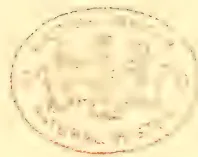A faint, circular seal or stamp impression is centered on the page. The seal appears to be a library or archival mark, featuring a central emblem surrounded by text in a circular border. The text is difficult to read due to the faintness of the impression, but it likely contains the name of an institution or a collection identifier. The overall appearance is that of an old, well-preserved document with a light beige or cream-colored paper.

391------------------------------------------------

CHRISTOPHER ELLIOT, M.D.

*Tropical Agriculturist Portrait Gallery.*  
No. IV.

392------------------------------------------------

# \* The TROPICAL AGRICULTURIST \*

◇ MONTHLY. ◇

Vol. XIII.]

COLOMBO, DECEMBER 1ST, 1893.

No. 6.

## "PIONEERS OF THE PLANTING ENTERPRISE IN CEYLON."

CHRISTOPHER ELLIOTT, M.D.,

WHO DIED AS "PRINCIPAL CIVIL MEDICAL OFFICER" OF CEYLON;

RESIDENT IN THE ISLAND 1834-1859;

PHYSICIAN, PHILANTHROPIST, PIONEER PLANTER, AND AN ALL-ROUND PUBLIC MAN.

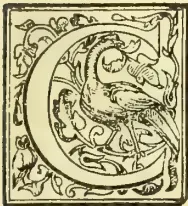

CHRISTOPHER ELLIOTT was born at Clonmore, County Kilkenny in Ireland, on the 7th July 1810, and was the youngest of a family of six brothers, all of whom took to professions, Christopher studying medicine in Dublin. He arrived in Colombo on the 30th July 1834 by the ship "Henry Wellesley." Dr. Elliott came out in the Government service as one of three "Colonial Assistant Surgeons," another being Dr. Kelly, father of the present Planting Member in the Legislative Council, who arrived in the "Louisa Campbell" on 31st July 1834. The third was Dr. Grant. The medical arrangements of the island were at the time and for many years after under the control of the Military doctors, and this was an experiment to supplement the staff.\* Dr. Elliott was first stationed at Badulla, having as his neighbour at Aliput the late Sir C. P. Layard, at that time (1834) returned from England and just married. Dr. Elliott proceeded to his station by riding via Pussellawa and Nuwara Eliya, and in after years he used to recall the dense jungle covering the former district, which was afterwards well named "Black Forest," when opened as a coffee plantation. He did not long remain in Government service; severing his connection in 1835, and

coming to Colombo to practise his profession, he early became connected as a contributor with the *Observer*, then a small weekly broadsheet. This he soon after purchased for £120 from the Syndicate of Merchants who had established it in opposition to another print, the *Colombo Chronicle*, largely conducted by Government servants, and to which the then Governor, Sir Robert Wilmot Horton, was a regular contributor.\*

Dr. Elliott was married on 18th January 1836 to Miss Jessie Selina Clark, sister of Mr. W. Clark, a well-known Scotch Colombo merchant, and who had come to the Colony very much about the

\* The period of Sir Robert Horton's rule was the era of newspapers. The Governor was fond of writing, and he had as Private Secretary his son-in-law Mr. Tuffnell, afterwards a Lord of the Admiralty, who, it is understood, wrote a good deal. Then there were Mr. George Lee, Mr. E. R. Power and others, while Turnour, Forbes, Fagan, &c., contributed notices of antiquities. The first paper ever printed in Ceylon was the *Colombo Journal*, of which two volumes were issued from the Government Press; but then the Home Authorities ordered the local Government to confine itself to publishing the Government *Gazette*, leaving newspapers to private enterprise. Accordingly the *Observer* was started by the merchants, the late Mr. E. J. Darley being for a time the Editor. Mr. George Winter also edited the paper. The title was subsequently changed to the *Colombo Observer*, and Dr. Elliott left the Colonial Medical Service to become Editor and Proprietor. The subsequent history of the *Colombo Observer*, now the *Ceylon Observer*, we need not write. Dr. Elliott and the merchants of that day going into strong opposition to the Government of Sir R. W. Horton, "a committee of gentlemen" started the *Chronicle* of which Mr. George Lee was understood to be Editor, Sir Robert Horton contributing largely to its columns. Soon after Mr. Stewart Mackenzie became Governor the *Chronicle* had its name changed to the *Herald*.

\* The three gentlemen named were appointed Assistants in the "Vaccine Department," and so appear in the "Government Almanac" of 1835 and 1836.

393------------------------------------------------

362THE TROPICAL AGRICULTURIST.[DEC. 1, 1893.]

same time as her future husband. Mr. W. Clark was the first merchant to introduce Manchester wools to Ceylon.

From 1836 to 1859 Dr. Elliott's career was widely identified with the social and material progress of the Colony. He achieved great popularity and esteem as a very capable physician and a bold as well as skilful surgeon. He was the first to cut down to the liver for abscess on that organ, and he did so in spite of serious remonstrances from other medical men of the day in Ceylon, at a time when the anaesthetics and antiseptics, now so largely used, were unknown aids in surgery. Army Surgeon Cameron was one of the remonstrants, but he confessed afterwards in the *Lancet* how he had watched and profited by the success of Dr. Elliott's operations. Dr. Elliott acquired immense influence medically with the natives at a time when European medical aid was, as a rule, scorned by them. He was trusted and beloved by the European and Native community of Colombo beyond any other European who ever lived in Ceylon, and it was through his influence that the Ceylon Government in 1858 created a Civil Medical Department, of which he was appropriately named the first Chief, although he survived at the post for less than a year.

The compiler of the present notice arrived in Ceylon two years after his death, but he found then, and for many years after, that Dr. Elliott's name was familiar as a household word in Colombo. The doctor was the kindest and most sympathetic of friends and physicians, and yet withal very practical and shrewd. One characteristic story was connected with his choice of the "Captain's Garden" peninsula as the site of his chief hospital. Asked why he fixed on that spot, the Dr. replied: "You see they are going to place the Railway terminal station close by; now they are sure to have accidents, on the Kadugannawa incline especially, and as we can have a siding from the station to the hospital, what so convenient as to be able to run the train with the wounded, right to the door of our wards, where we can speedily get the broken bones put right?" and one of the softest-hearted men living rubbed his hands at the thought of the good he and his staff might do on the occurrence of the inevitable accident! Eventually, Borella became the site of the Civil Hospital; but fortunately no such accident as Dr. Elliott feared has ever occurred on our Colombo-Kandy line since its opening, very much owing to the steadiness of the broad-gauge, and the careful way in which traffic is worked under the block system. To tell the story of Dr. Elliott's work among the poor of Colombo as Christian philanthropist, as well as physician, ever ready to help without

fee or reward, would require a volume in itself. Few better men have ever lived in the island or have done better work for their adopted land.

As Editor, Dr. Elliott was upright and outspoken and a rapid, good writer. As an Irishman born, he had a ready wit and was prompt to act, as the following anecdote shows. In the very early days of the *Observer* on one occasion a contribution intended for the *Chronicle* was left at the *Observer* office containing, it was believed, an article by the Governor. A notice appeared in that day's issue of the *Observer*:—"A parcel said to be from King's House and addressed to the *Chronicle* office, left by mistake at this office by a mounted orderly, can be had on application." Following the strong opposition to Government in Sir R. W. Horton's term came a spell of more general accord with official action in the time of that very high-minded statesman, the Right Hon. Stewart Mackenzie; but the days of Sir Emerson Tennent and especially Lord Torrington found the *Observer* again in strong opposition to the Government, and their rash, new-fangled notions of taxation and harassing legislation. The disturbance which took place in the interior—notably in the Matale and Kurunegala Districts—and which was magnified into a "Rebellion," although not a British soldier received a scratch, was very much occasioned by the fears of the people as to the new taxes. So high did the excitement reach in Colombo, and so enraged were the Governor and the Colonial Secretary with the *Observer's* writings, that it was reported on good authority, that warrants were agreed on at one time in the Executive Council for the arrest of both Editors (Mr. A. M. Ferguson had joined Dr. Elliott as Co-Editor in 1846), and were it not for the wiser counsels and sturdy resistance of both the Chief Justice (Sir Anthony, Oliphant) and the Queen's Advocate (Mr. Selby), it was believed Lord Torrington would have been foolish enough to have forswallowed Mr. Eyre's action in Jamaica by casting his two political foes into jail.\* His Lordship, however, paid off his score against the Doctor on one occasion when the latter headed a deputation of residents in the Pettah (then occupied by a large number of Dutch descendants) on the "Verandah Question." His Excellency received the deputation very coldly, with a bow, listened to their written and spoken statements, and then merely bowed, advanced a step and bowed, and so on, until he bowed them out of the room without uttering a word! The fiery as well as warm-hearted Irish leader was furious

\* Dr. Elliott too was warned by friends not to visit Kandy after "Martial law" was proclaimed (very unnecessarily) there.

394------------------------------------------------

DEC. 1, 1893.]THE TROPICAL AGRICULTURIST.363

—he rushed over to Bailie Street where friends were waiting to learn the result, and the first thing he got was a bucket of water in the backyard to dip his head and face in, to cool his passion! He then came in to his friends exclaiming:—"Were it not for my religious principles I could have — him!"

An illustration of his great influence over the natives occurred soon after, and shewed how he stood in their opinion quite as high as the "one-armed Rajah" (Mr. Anstruther), of whom it was said that had he been in Kandy or Matale during the so-called Rebellion, he would only have had to shout, "To your tents, oh! Israel" to get every Kandyan to go home at once. The news of a series of new taxes led to public meetings of protest in Kandy on 8th July, 1848, and the news of these taxes alarming the natives of the Colombo, Hanwella and Panadure districts, they assembled in many thousands one day at Cotta to march into Colombo and lay their grievances before the supreme Raj, according to usual oriental practice. The Government got intimation, and chose to regard this movement as a beginning of "Rebellion" in the lowcountry: the Fort guns were ordered to be loaded, double sentries posted at the gates, and the mass of natives were to be fired on if they dared to try and pass into the Fort! Indeed the military were ordered to march towards Borella, and they got as far as Slave Island, ready to stop the Natives' advance. (This was on 26th July 1848.) Dr. Elliott got news of all this only after the crowd of people had started from Cotta in the full belief that their great number would induce the Government to abolish the new taxes. He drove off to meet them—did so at the "Mango Tree," Darley Road, close to where the Baptist Church now stands. He called a halt, only just in time to prevent a collision, got a table from an adjacent house, mounted it and addressed the people by interpretation, explaining to them the risk they ran of giving offence and getting into trouble,—he explained the English custom of "petitioning" against grievances, and having brought paper, pen and ink with him, he caused a short Petition to be drafted in Sinhalese on the spot, read it to the crowd, got their ready approval, and then called for signatures, selecting three or four representatives to present it. All this was done, and the people at the worthy doctor's request, at once returned home, quite satisfied.

Had they gone by thousands to Slave Island and tried to force their way on, they would probably have been shot down!

Dr. Elliott was next actively engaged as an unofficial representative for the Natives and Burghers in their grievances against the Torrington

Government. He succeeded in getting a Parliamentary Inquiry by Committee into Ceylon affairs, both Messrs. Gladstone and Disraeli voting in the majority against Lord John Russell's Government, and afterwards sitting together on the Committee. A Commission of Anglo-Indian officers came to Ceylon and Dr. Elliott was examined before it. The Inquiry resulted in the recall of Lord Torrington and Sir Emerson Tennent. [Some years afterwards, Dr. Elliott, and later on Mr. A. M. Ferguson, met both Lord Torrington and Sir Emerson Tennent on friendly terms in England.]

Dr. Elliott and the *Observer* very cordially welcomed Sir Henry Ward to the Government of Ceylon, and most heartily supported his progressive administration; but when the great Governor in his ardent desire to see a railway made to Kandy in his day, entered into a rash, one-sided, and as it turned out, most unfortunate compact with a Railway Company, Dr. Elliott was one of the first to take alarm and to resist the Governor with all his influence and strength by pen and voice, although his doing so imperilled his being appointed Principal Civil Medical Officer by the Governor. His boldness and ready wit appeared in a public meeting in Kandy where admiration of the Governor personally, divided opinion with great distrust of the Railway compact. Mr. John Selby, who then edited the *Examiner*, was sent up to Kandy to support the Governor's policy and to offer certain concessions which much modified the objectionable features—and it was then that with reference to Mr. Selby and those who acted with him, that Dr. Elliott hit off the prevalent feeling exactly by an apt classical quotation:—"Timeo Danaos et dona ferentes"—"I fear the Greeks even when bringing gifts."

After the death of his wife, on 7th March 1855 (aged 48 years)—Dr. Elliott visited England in 1856, and while there he was consulted by the Secretary of State regarding the Railway, and also about the arrangements for freeing the State of any connection with Buddhism. On the 24th March, 1857, Dr. Elliott was married a second time to an Irish lady, Miss Bessie Scott, who still survives him, living with some members of her family in Texas.

Our review now draws to a close; but before winding up, we must refer to Dr. Elliott's connection with Pioneer Planting operations in different directions. He took a warm interest in the development of the great coffee planting enterprise, and at one date was a part proprietor of a coffee estate until the bad times of 1845 arrived. Still earlier he was interested in experiments in sugar cultivation; but his last love proved his best, namely the coconut palm, a large plantation of which he formed with

395------------------------------------------------

364THE TROPICAL AGRICULTURIST.[DEC. 1, 1893.]

his savings in the Negombo district, leased for many years after his death to the late Mr. David Wilson, and eventually sold to Mr. De Soysa. Dr. Elliott wrote very freely during the "forties" and "fifties" on planting and agricultural topics generally, and he was keenly alive to all improvements that could be introduced into local industries.

To shew what Sir Henry Ward thought of him—notwithstanding the opposition to his Railway Company—we need only repeat that it was he who chose Dr. Elliott to be the first holder of the office of "Principal Civil Medical Officer" for the Colony, for which also Sir Charles MacCarthy and his father-in-law Sir Benjamin Hawes (Permanent Under-Secretary) strongly recommended him. This was in 1858, and, alas! within a twelvemonth, he in whom so many hopes and so much affection (public as well as private) were centered, was no more. Dr. Elliott was struck down by dysentery and died on the 22nd May, 1869. We need say nothing of his final illness and the closing scene, nor of his activity and warm interest in another phase—that of Christian teacher as well as philanthropist—because all are so fully and well dealt with in the extracts we now append from the file of the *Observer* and from the *Examiner*, to which the late Mr. C. A. Lorenz contributed his testimony in verse. We quote as follows:—

TO THE EDITOR OF THE "COLOMBO OBSERVER."

*Kandy, Saturday Evening, May 14, 1859.*

All who know of Dr. Elliott will feel how real and genuine is the regret shared by all classes of men at his serious indisposition. Last Sunday Evening he preached in the Baptist Chapel from Hebrews 9, 27th and 28th verses. In his opening he alluded to his journey to Matale on the previous day—his having met with a poor Tamil woman on the roadside lying down ill—with two of her children one of whom was dying—and his urgent recommendation to the mother to seek shelter in the Hospital and of her refusal—and when she was told that her child was dying and will surely die—of her wild grief and agony—that when the Doctor returned from Matale how the two letters he opened brought the afflicting intelligence of the death of William Ferguson's child and of young MacGregor. He said that after the experience of the day he was at no loss for a subject. Most who heard him that night never for a moment imagined that the preacher himself would be soon stricken with the insidious disease, dysentery. I who had heard him before, felt that there was a change in his delivery—that he looked exhausted—and gasped for breath—and had not sufficient strength to continue his address. One would have naturally ascribed it to the excitement of the occasion, but it never entered into

the minds of his hearers that he was then subjected to the fearful attack of so fatal a malady.

(From the "Observer.")

"At Colombo, on the morning of Sunday, May 22nd, C. ELLIOTT, ESQ., M.D., Principal Civil Medical Officer of Ceylon, aged 40 years and 10 months."

DEATH OF DR. ELLIOTT.

(By A. M. Ferguson in 1859.)

We, in common with Dr. Elliott's family and friends, have to deplore an event which although it places him beyond the reach of suffering, and in possession of "joy unspeakable and full of glory", is to us, personally, one of the greatest of earthly calamities. The warm-hearted steadfast friend—the wise and cheerful adviser of more than twenty years' standing, has been taken from our side, and while the wound is so recent, we feel it impossible to do more than briefly notice a loss which to us, to his family, and we may safely add to a large portion of the public of Ceylon, is irremediable. Latterly Dr. Elliott has been best known and most prized as a skilful and successful Medical man, with sympathy for all who suffered and advice and comfort for the many who sought his guidance in time of sickness, trouble and perplexity. As a Christian he had been for years back becoming increasingly affectionate, earnest and laborious, and his last public act was to stand up in the pulpit and warn sinners to prepare for death and eternity. We who knew much of his inmost life, can testify that when he bore testimony to the grand verities and the comforting assurances of the Gospel, he spoke of what he sincerely believed felt and enjoyed. The turmoil of political life does not, perhaps, present the most favourable elements for maturing Christian character—is certainly not the best calculated to secure for him who takes part in it the credit of good intentions. Dr. Elliott was for about 24 years—(almost the whole period of his residence in Ceylon) connected with the *Colombo Observer*, as Editor and Proprietor. It cannot be hoped that the course he pursued—the sentiments he put forth—should always and with all command approval. But we believe there are few now in Ceylon who will not admit that his intentions were ever good and his aim to advance what he believed to be the true interests of the country of his adoption. Dr. Elliott had been always in the habit of affording gratuitous aid to the sick poor (having gained in an eminent degree the confidence of the Natives) and latterly his appointment to the post of Principal Civil Medical Officer of Ceylon, gave him increased opportunities of doing good which, we are confident, he valued as much at least as the emoluments and honors of office. It seems a

396------------------------------------------------

DEC. 1, 1893.]THE TROPICAL AGRICULTURIST.365

most mysterious providence that he should have been cut down at the very period when he had the immediate prospect of carrying out several wise and benevolent plans which were calculated to alleviate suffering and extend the benefits of medical knowledge over the Colony, and on the accomplishment of which he had set his heart. But HE "who doeth all things well," knew what was best, and death found our friend fully prepared for the last conflict and the great change:—prepared not by reference to the useful life he had led, but to the foundation on which, as he averred, he had rested for 30 years and which was the mainspring of his every holy thought and good action through life—the *atonement* of the SON OF GOD. "It is all right" was his repeated declaration as to spiritual things; and in the midst of physical suffering, which was occasionally severe, such was the composure of his mind that throughout his illness he continued to watch his own symptoms, which from the first he pronounced to be fatal. It was affecting to notice him feeling his own pulse and drawing inferences from its character almost to the moment when pulsation ceased—and when one of the warmest, noblest and most generous hearts that beat in human breast, gave its last heave and was for ever still.

All that was mortal of Dr. Elliott died at  $\frac{1}{4}$  past 9 yesterday, Sunday, 22nd May.

(From the "Ceylon Examiner.")

CHRISTOPHER ELLIOTT.

One bright career was over,  
Another scarce begun:—  
Death crossed his path of usefulness,  
And left us all one friend the less—  
The tried and valued ONE.

And though amongst the living,  
They may be others such,  
As true, as noble-hearted,  
As the good man departed:—  
Yet WHO hath done so much.

In striving for our welfare,  
In battling for the right;  
In works of love, in acts of faith,  
In turning hearts from Sin and Death  
To realms of Life and Light?

Careless of those who wished him ill,  
(The paltry few above him.)  
He left no work of good undone,  
Outlived the slanders, one by one,  
And forced his foes to love him.

And those who scorned or envied him  
For deeds which shamed their own,  
Forgot at last the Partizan,  
In the generous, frank and honest man,  
And wept that he was gone.

Such was the man we've lost—  
The good, the noble-hearted:  
Each tear that told our heart's regret  
Was a joy in heaven, when angels met  
To welcome the Departed.

C. A. L.

(From the "Ceylon Overland Observer.")  
Colombo, 26th May, 1859.

We shall be pardoned if on this occasion we refer, at the outset, to the loss the Colony has sustained in the death of Dr. C. Elliott, a gentleman who for nearly a quarter of a century took an active and useful part in the discussion of every question connected with the interests of Ceylon and its people. He arrived in 1834 in the capacity of Colonial Surgeon, and was for some six months stationed at Badulla. He then resigned the service, and settled in Colombo, where for well nigh twenty-four years he was before the public as Editor and Proprietor of the *Colombo Observer*. In June last year he obtained the appointment of Principal Civil Medical Officer of Ceylon, an office for which he was well qualified by skill and experience in his profession, while the confidence with which all classes of the Native inhabitants regarded him, opened up to him a special and extensive prospect of usefulness. But just as he had got settled in his office and was about to carry out his plans of usefulness, he was attacked by rapid and fatal dysentery, under which he sunk at Colombo, on Sunday the 22nd instant. He was not quite 50 when he died, but he was eminently a man who "lived while he lived." Naturally buoyant and conscientiously active, he crowded the exertions and the events of many ordinary life-times into his own. In the strife of politics, of course he must have sometimes erred, and often failed to command credit for the good intentions by which he was always actuated. But no earthly consideration could induce him to swerve from the avowal of his sincere convictions in politics or religion; and as years passed away and prejudices softened down, his really excellent qualities of head and heart became generally appreciated, and he was admitted to be a good as well as an able man. The immense attendance at his funeral shewed the respect in which his memory was held. A notice of his dying hours—which were cheered by unshaken Christian faith—will be found elsewhere.

(From the "Examiner," Saturday, June 4, 1859.)

#### MEMORIAL OF DR. ELLIOTT'S SERVICES.

TO THE EDITOR OF THE "EXAMINER."

DEAR SIR,—I have read with cordial feelings the excellent verses published in one of your late periodicals, on the death of Dr. Elliott. In him, indeed Ceylon lost one of her most beloved benefactors. Now, sir, shall we pass by such a lamentable event without doing something to perpetuate amongst us the memory of that great and beloved man? Surely not: the unspeakable value of Dr. Elliott as a good man, and what he

397------------------------------------------------

266THE TROPICAL AGRICULTURIST.[DEC. 1, 1893.]

did and suffered for the promotion of the interests of all classes of people in this Island are enough to rouse our feelings of gratitude, if we are susceptible to those feelings which, I think, are radical to all rational beings; and I say, those considerations demand most strongly, that something should be done by us, as a token that Ceylonese do appreciate the value of a man, and that they have sense enough to recognize the services done for them by any one, whoever he is.

If I be asked, what shall we do, I would say, let us make a special subscription in the land and get out a statue of Dr. Elliott from England, and set it up in a suitable place either in Colombo or Kandy. Dear Editor, permit me to call upon you or some other good and noble-hearted man, to propose and cause some such a thing to be done, whereby we may best represent our regard and respect to the name of Dr. Elliott.

I remain, dear Sir,

Your obedient servant,

Gampola, 31st May, 1859. C. P. R.

TESTIMONIAL TO THE LATE DR. ELLIOTT.

(From the "Colombo Observer," 8th July, 1859.)

Marandahn, June 15, 1859.

DEAR SIR,

The services which Dr. Elliott rendered to the people of Ceylon during his long residence amongst us, have already been prominently alluded to in the public papers; and expression has been given to the very general feeling entertained by the public that there should be some appropriate Memorial of their regard for him. He was not known and esteemed for political services alone. The many good works with which he was connected, as a Physician, and a Christian, have secured for him a place in the hearts of the multitude; and it will be many years before his virtues and kindnesses will be forgotten. And though there were many who differed from him in his views on particular subjects; there are, I believe, NONE who did not admire and esteem him for his sincerity and his devotion to the cause of Religion and Humanity.

Under these circumstances I applied to a few Gentlemen, who I thought would be willing to act as a Committee for the purpose of receiving subscriptions towards securing some token of our regard for the Memory of Dr. Elliott. And I trust to be able shortly to publish the names of those who have agreed to form the Committee.

Among the several suggestions which have been made on this subject, there may be some difficulty in adopting the one most likely to find favour with intending subscribers. The selection will probably be between the erection of a Tablet or Monument and the formation of a fund to provide for the education of a limited number of pupils, male or female, at some of the Schools in Colombo. This

difficulty may however be solved by taking the opinion of the majority of the subscribers, or by leaving the question to the decision of the Committee.

The Committee when formed will at once proceed to receive subscriptions through the Secretary in Colombo, and through Agents at Outstations, whose names will shortly be submitted to the public through the papers. In the meantime I have thought it expedient to address this letter to you, with the view of informing the public at once of the measures which are about to be taken.

Your obedient servant,

C. A. LORENZ.

Strange to say, notwithstanding all the talk and writing on the subject, nothing ever resulted in the shape of a Public Memorial to one who had proved so great a benefactor and friend of the Ceylonese community, and especially of the Burghers and Natives of Colombo. Over Dr. Elliott's remains in Wolvendal Church, a plain stone was placed by his representatives on which the inscription runs:—

SACRED  
to the memory of  
CHRISTOPHER ELLIOTT ESQ.,

M.D.

Principal Civil Medical Officer  
of this Island.

Who died 22nd May 1859  
aged 49.

And Jessie his wife  
who died 7th March 1855  
aged 47

Heb. ix, 27-28.

Those who were joined with him in fellowship in the Pettah Baptist Church placed a memorial tablet in the wall of the Chapel, Prince Street, on which is engraved:—

"IN MEMORY OF  
CHRISTOPHER ELLIOTT M.D.

Principal Civil Medical Officer  
a deacon of this Church  
and a Preacher

of the Gospel of our Lord Jesus Christ  
to the congregation assembling in this place.

As a servant of Christ,  
an enlightened Citizen,  
a discerning Philanthropist,  
and a skilful Physician,  
having served his day and generation well,

He died in the Lord at Colombo,  
on May 22nd 1859,  
aged 49 years.

This tablet is erected by the members of the church and congregation with whom he was wont to worship."

398------------------------------------------------

DEC. 1, 1893.]THE TROPICAL AGRICULTURIST.367

Dr. Elliott left altogether a family of five sons and three daughters: two of the sons have been closely connected with Ceylon; but the second Mr. John Clark Elliott, after good work done as planter and in the Public Works Department, settled down to farming in Ireland, and has since gone out to Texas to reside with his family. The eldest of the family entered the Ceylon Civil Service, and after a long and varied administrative and judicial career in nearly every province of the island, is now as the Hon. Edward Elliott, Acting Government Agent, Western Province, and Member of the Legislative Council.

#### CLEARING JUNGLE.

The letter relating to the extermination of jungle quoted by our London correspondent on page 368, deals with a subject that has considerable interest for allengaged in planting operations in tropical or subtropical countries. We are not aware if the special compound to which that letter makes reference is known to any member of our own planting community. If it be so, and if any trial has been made with it in Ceylon, the results, if communicated to us, would certainly be possessed of considerable interest. Both on patana and chena lands, the growth of noxious grasses or of those of a character unfitted for use creates a difficulty that, could it be removed, would probably enable many acres that now are perforce left sterile to be brought under profitable cultivation. It is commonly to be observed on the occasions when publication is made as to the number of acres composed within certain estates, that no considerable proportion of their areas is described as uncultivated. It would be a distinct gain if this proportion could by any method be reduced. Of course we know that much of this uncultivated acreage is not without its useful purpose. Belts of timber are left as wind-screens, while other areas of the same description of growth remain unfelled as a reserve for firewood or for the promotion of rainfall. Similarly, there is a distinct object in leaving portions of an estate untilled for the sake of the growth of such grasses as are useful for cattle fodder, litter, &c., for the numerous cattle that are kept either for manuring or transport purposes. But even when allowance has been made for these voluntary reserves, there yet remain on many of our estates a considerable amount of land of which it seems to be impossible to use. We believe that much of this is abandoned because of the noxious growths which it alone seems fitted to produce. The letter to which we have above referred seems to indicate the possibility of dealing with such land. It would be well worth the while, we should think, of some of our planters to experimentalize with this compound. We are not informed as to the name by which it is known in India, the correspondent writing the letter to the *West Indian and Commercial Advertiser* not having given it. But there is little doubt that this could readily be obtained from some of the agencies in India. If this mixture can accomplish what is professed for it, a great step in the direction of our requirements would be gained. Anyone who has endeavoured to reclaim lands producing only useless growths has experienced the first difficulty of completely eradicating the latter. So long as there remains the tendency to reproduce

noxious growths, efforts to cultivate must prove fruitless. If they could be thoroughly cleared off, steps might then be taken to introduce some more profitable cultivation. We hold that the constant reproduction of particular forms of useless scrub or grasses does not necessarily mean that the land is not possessed of qualities fitting it for higher forms of plant life. It is simply that the lower form has acquired such a hold upon it that its prevalence kills off any natural endeavour made by seeds of more valuable products. Therefore the steps of primary importance must be to destroy this hold. If after doing this the land to be dealt with was thoroughly ploughed over and left for a season to aerate, it might, we think, probably be found possible by the aid of enrichment by manure to grow upon it either tea or coffee, or failing that, some useful fodder grasses. At all events it strikes us that experimenting in this direction might be useful. It is asked if our Forest Department has ever made any endeavour to rescue from their condition of infertility any of the clearings so abundant throughout our forest areas that have been devoted to chena cultivation. If this has been done, it would be useful to know what results have followed. It seems to be opposed to the beneficent laws of nature that land of the kind should be for ever rendered unproductive. In the earlier stages following after their abandonment we can understand this relative sterility rendering them incapable of the higher productions. They yield, therefore, during such stages only such weak growths as they may be fitted for. But if these could be thoroughly eradicated by the use of some such compound as the letter under reference indicates, there does not seem any reason why, by careful after-treatment, they might not be restored to their pristine vigour and productiveness. We can only suggest that some such process might be usefully tried, and were it successful, a very considerable acreage now valueless might be added to the productive area of our estates.

#### PLANTAIN GROWING.

[TO THE EDITOR "SOUTH OF INDIA OBSERVER."]

SIR,—In compliance with the suggestion in your issue of the 25th ultimo that I should let you know the result of plantain growing at Kotah Hall I send the following notes.

My experiment was on a small scale, and did no last long enough to give a reliable estimate of yield per acre. Of course the experiment was interesting on account of the elevation, 6,200 feet. At Kotah Hall fruit was obtained in from 18 months to two years after a planting out of suckers; a few months after the parent stem had borne and been cut down, the largest sucker came into bearing, followed a few months later by the next in size; and so on, until the soil was exhausted or kept on by manuring. Exhaustion was shown by the fruit becoming puny and the bunches small. This kind of yield was also noticeable wherever too many stems were allowed to grow together. A space of ten feet square for each plant in the first instance was found advisable not to allow more than five stems at a time from suckers in each space. The extra suckers were either planted elsewhere or destroyed. The more numerous the suckers were allowed to grow the smaller the fruit became and also the bunches. Very good fruit was obtained, and the flavour was considered more delicate than the same yet grown at a low elevation. In poor soil, where manure had not been used, and where insufficiently used, the usual signs of weakness (puny fruit and small bunches) were noticeable. On the other hand, where manure had been liberally applied the yield was most satisfactory, and signs of exhaustion

399------------------------------------------------

368THE TROPICAL AGRICULTURIST.[DEC. 1, 1893.]

were not apparent. The experiment was commenced with two plants, which in about five years had increased to several hundred, when the estate passed out of my hands. The cultivation consisted in manuring where needed; in good forking round the plants; and in weeding and piling the weeds around the stems to turn into mould. Though plantain growing, even at this elevation, is remunerative. I would not recommend it as a speculation on a large scale, because it is still more remunerative, at low elevations. Here the cultivation is more expensive; rich soil being scarce, manure would have to make up for the deficiency. I found it necessary to fence in plantain trees to protect them from wild pigs, &c.

These reasons do not apply so strictly to the growing of Peas, Walnuts, Apricots, &c., and I believe that some of the exposed parts of these hills which are much injured by Sany cultivation could be covered by dwarf cherries. The injury done on these hills by Sany cultivation and what in my opinion should take its place would make this letter longer, probably, than you desire. W. D. REDMOND.

[At the distance noted in the above there would be about 440 stools per acre, which would mean the same number of bunches. Allowing the wholesale price to be three annas per bunch, the gross returns would only be Rs2-odd per acres, that is to say if each stool gave only one bunch per year. We would ask Mr. Redmond to correct us if we are wrong.—Ed.]—South of India Observer.

### THE COFFEE PLANTATIONS IN MONTSERRAT,

conducted as they are by a coffee planter of considerable experience in Ceylon (Mr. Hamilton) are of great importance to the Leeward Islands: and I regard their success or failure as a matter of vital interest in connection with the re-establishment of coffee in Dominica. I have carefully examined the plantations from time to time with Mr. Hamilton. On the last occasion I observed a destructive scale insect of familiar appearance which had attacked most of the trees. Mr. Hamilton however pointed out a small red ant which he credited with destroying the scale insects. And certainly most of the trees appeared well able to throw off the parasite, for after a season the scale insects became flat, surrounded by a small film, and finally died off. Unfortunately it is too well known that the ants usually live in a kind of symbiosis with scale insects. They have been observed in the case of *Lecanium hemisphericum* to carry the eggs from one tree to another, and thus literally to plant the scale insects upon the trees, afterwards feeding upon the sweet waxy secretion exuded by these insects. Knowing these facts I collected specimens and examined into the matter. My conclusions were that some other cause was at work, probably the abundant rainfall as much as anything—and I noted and carefully collected specimens of the scale which appeared to have died and become mouldy from this excess of moisture. These I sent to Professor Reilly the celebrated Entomologist of the United States Agricultural Department, with whom I had commenced a fairly constant correspondence, stating my views concerning the fungus, the ant, and the scale insect. I have received the following confirmatory letter from him. "The Montserrat coffee scale is, as you suppose, *Lecanium hemisphericum* and the small red ant is *Tetramorium auropunctatum*, Rog. Many of the scale had evidently been killed by fungus disease. This was particularly true among those said to be cleared by the red ant. The mouldy appearance is mycelium and not wax." The scale insect *Leca-*

\* These are grown in England in unfavourable situations without manure. The average yield per stool was a bunch of about 60 plantains. The retail price of the same size but inferior flavour was about eight annas per bunch. The wholesale prices were about three annas per bunch.

*nium hemisphericum* is unfortunately too well known to me as a most destructive pest in Antigua and other islands, and the discovery of its destroyer I regard of great importance. As far as my observations at present extend this scale, as well as many others of a like nature, cannot stand much rain: and after the setting in of the autumn rains in Antigua, the trees are quickly, although only temporarily, freed from it. I shall take particular notice whether the fungus is already in Antigua, and if not, shall attempt to introduce it at the first opportunity, as it will undoubtedly be a great assistance to the sprays I have hitherto advised. I have not at present met with the scale on coffee in Dominica although I hear that it is met with in Martinique. Unless, however, we can succeed in fighting it by means of this fungus, I fear that the expensive spraying operations will do much to injure the industry which I regard as one of the most likely to bring prosperity back to that once famous coffee growing island.—I have the honour to remain, your obdt. servant,  
C. A. BARBER,  
Hon. Col. Secy. Supt. of Agriculture.  
—Agri-Horticultural Society of India.

### THE EXTERMINATION OF JUNGLE.

In the *West Indian and Commercial Advertiser* of last week the following letter attracted my attention:—

#### "EXTERMINATION OF JUNGLE.

TO THE EDITOR OF THE "WEST INDIAN AND COMMERCIAL ADVERTISER."

"SIR,—Permit me to bring to your notice the following invention of an Australian gentleman for the eradication of jungle by chemical means, which has been placed upon the Indian market. It is stated that by sprinkling or spraying the compound at the rate of half an ounce to every gallon of water it will kill all kinds of scrub and noxious grasses in one to at most four applications. I obtained a hundredweight of the compound from the firm introducing it, and made careful trials with it. I found it was capable of doing all that was represented if it was applied to the scrub or noxious grasses while these were in active growth, but it was almost innocuous if applied in the winter while growth was inactive. The compound is, in my opinion, worthy of a fair trial, but as it is said to be very poisonous, great care has to be exercised in its use.

London, October 24, 1893. "INDIAN." It occurred to me that possibly a good use of the mixture referred to might be made in many localities in Ceylon. Often during my journeys through the forests of the Northern Province it has occurred to me to come across, surrounded by magnificent growths of timber trees, several acres of dwarfed and stunted vegetation, and even in such cases wherein to all outward seeming the trees were as fine and perfect as all others in their neighbourhood, it has been observable that they were partially hollow, and therefore worthless to the timber seller. It was known to me that such areas had in days gone by been subjected to the process of chenaing. I have always held the theory that, if the weakened vegetation could be thoroughly rooted out and the soil in some way reinvigorated, such patches might become as fertile as is the original forestland. It occurs to me that the employment of some such agent as that mentioned in the letter given above might be able to effect this complete eradication and pave the way for subsequent treatment. Possibly this compound, or something analogous, may be already known in Ceylon, and may have received trial there; but should it not have done so, it seems that experiments with it might result usefully in the direction pointed out.

### A NEW TEA COMPANY.

The Morawakorale Tea Co., Ltd., with a capital of £50,000, takes over Ensulwatta, Craven, Silvahande and Naragalla estates.

400------------------------------------------------

DEC. 1, 1893.]THE TROPICAL AGRICULTURIST.369

## CEYLON MANUAL OF CHEMICAL ANALYSES.

A HANDBOOK OF ANALYSES CONNECTED WITH THE INDUSTRIES AND PUBLIC HEALTH OF CEYLON FOR PLANTERS, COMMERCIAL MEN, AGRICULTURAL STUDENTS, AND MEMBERS OF LOCAL BOARDS.

BY M. COCHRAN, M.A., F.C.S.

(Continued from page 295.)

### CHAPTER VIII. OILS.

ESSENTIAL OILS—CINNAMON OIL—CITRONELLA OIL—CITRONELLA GRASS—LEMON GRASS OIL—INDIAN GRASS OILS—OIL OF PATCHOULI—TABLE OF ESSENTIAL OILS—BURNING OILS—KEROSENE OIL—LUBRICATING OILS—FIXED VEGETABLE OILS—COCONUT OIL—KING COCONUT OIL—MARGOSA OIL—CASTOR OIL—GINGELLY OIL—SOME FIXED OILS FROM PLANTS THAT ARE COMMON IN CEYLON—STANDARD ANALYSES OF OIL SEEDS AND OIL CAKES.

#### Essential Oils.

Many odour-bearing plants are found in Ceylon from the roots, bark, wood, leaves, or fruits, of which essences are extracted and exported to Europe for use in pharmacy or perfumery. Amongst the best known essential oils exported from Ceylon may be enumerated Cinnamon oil, Citronella oil, Lemon grass oil, Patchouli oil

#### Cinnamon Oil.

This very fragrant oil extracted from different parts of the cinnamon shrub—*Cinnamomum Zeylanicum*—is chiefly composed of cinnamic aldehyde and a hydrocarbon. By exposure to the air a portion of the cinnamic aldehyde  $C_9H_8O$  is converted into cinnamic acid  $C_9H_8O_2$  and a portion of the hydrocarbon into a resinoid body, the oil becoming darker in color. When freshly prepared, the best quality is of a golden yellow color; but by age the color deepens to a reddish orange.

The specific gravity of cinnamon oils varies from 1.019 to 1.053. The finest quality is distilled from quill bark only, and has a specific gravity of from 1.019 to 1.021. The quality that is more commonly met with in commerce as bark oil is distilled from cinnamon chips, root bark and broken quill. Its specific gravity may reach 1.035. A third quality is distilled from the leaves, and this has the highest specific gravity of all. It varies from 1.040 to 1.053. This oil is much darker in color and its perfume much inferior to the bark oil. Muter gives the boiling point of cinnamon oil at 428° to 446°F. Cinnamon oil ranks high as an antiseptic substance.

#### Citronella Oil.

This is one of the essential oils known as the Indian-grass oils. It is distilled from the grass *Andropogon nardus* of Linnæus, and is extensively used in perfumery, the well-known scent of honey soap being due to this essence. The grass from which the oil is distilled attains the height of 6 to 8 feet and contains much silica. The color of the oil may be pale yellow, orange yellow or light green, and the same oil may pass through these changes of color in a short time. The specific gravity of the oil varies between wide limits. As the result of testing some hundreds of samples I have found the specific gravity of genuine oils vary from .870 to .902. A show sample exhibited at the Agri-Horticultural Show in Colombo in 1891 had a much higher specific gravity than .902, but I had no opportunity of examining

it as to its purity.\* The low specific gravity oil when genuine is considered the best. The great difference in the specific gravities is no doubt due to oils from different varieties of grass being called by the same name. Conditions of age of the grass, climate, and of soil, are also said to affect the specific gravity of the oil. Formerly this oil was adulterated with coconut oil, more recently with kerosene oil. This last reduces the specific gravity of the oil; but the range of specific gravity of the genuine article being so great, this test left a large margin for adulteration. Owing, however, to the discovery of a better test, the amount of adulteration practised has been greatly lessened.

Besides its chief use of scenting fine soaps, citronella oil is also used as a preserving agent for books and natural history specimens, especially in tropical climates where these are subject to the ravages of insects. Like most of the essential oils it produces, when applied to the skin, a burning sensation; hence it is used as an external application, with rubbing, in rheumatic affections.

The grass from which the oil has been extracted is used as a feeding material; for although cattle refuse to eat the grass in its natural state, even calves will eat it after it has been mollified by the thorough steaming or boiling it gets in the process of oil extraction. It would therefore be interesting to analyse it as a feeding material. I analysed a sample of the steamed and decayed grass to ascertain for constituent its value as manure. The following were the results obtained:—

#### Analysis of Steamed and Decayed Citronella Grass

<table>
<thead>
<tr>
<th></th>
<th>per cent.</th>
</tr>
</thead>
<tbody>
<tr>
<td>Moisture expelled at 212° F.</td>
<td>82.68</td>
</tr>
<tr>
<td>Dry matter .. .. .</td>
<td>17.32</td>
</tr>
<tr>
<td></td>
<td>100.00</td>
</tr>
</tbody>
</table>

The dry matter had the following composition:

<table>
<thead>
<tr>
<th></th>
<th>per cent.</th>
</tr>
</thead>
<tbody>
<tr>
<td>*Organic matter .. .. .</td>
<td>84.09</td>
</tr>
<tr>
<td>Ash consisting of</td>
<td></td>
</tr>
<tr>
<td>  Silica .. .. .</td>
<td>12.39</td>
</tr>
<tr>
<td>  Oxide of iron and alumina ..</td>
<td>.97</td>
</tr>
<tr>
<td>†Phosphoric acid .. .. .</td>
<td>.30</td>
</tr>
<tr>
<td>  Lime .. .. .</td>
<td>.61</td>
</tr>
<tr>
<td>  Potash .. .. .</td>
<td>.09</td>
</tr>
<tr>
<td>  Other constituents .. .. .</td>
<td>.74</td>
</tr>
<tr>
<td></td>
<td>15.01</td>
</tr>
<tr>
<td></td>
<td>100.00</td>
</tr>
<tr>
<td>*Containing nitrogen .. .. .</td>
<td>2.34</td>
</tr>
<tr>
<td>  Equal to Ammonia .. .. .</td>
<td>2.71</td>
</tr>
<tr>
<td>†Equal to tribasic phosphate of lime ..</td>
<td>.65</td>
</tr>
</tbody>
</table>

It is evident that the manurial value of this substance is small. The nitrogen is the chief element of value present, of which the dry matter contains somewhat less than three-fourths of the amount in coconut poona; whereas the manure in its wet state contains only about two-thirds as much nitrogen as farmyard manure. Of the mineral ingredients, by far the most abundant is silica, which constitutes 82 per cent of the ash or 12.39 per cent of the dry matter. It is possible that as a manure for sugar cane this silica may have a distinct value as being no doubt more easily assimilated than the sand or mineral silicate of the soil.

\* Citronella oil apparently genuine, of specific gravity as high as .922 is now (Nov. 1893) finding its way into the market. It does not pass Messrs. Schimmel & Co's. modification of the alcohol test; nevertheless the sample submitted to me was not adulterated with kerosene or other mineral oil nor with coconut or other fatty oil. It behaved like the heavier portion of citronella oil that has been fractionally distilled.

47

401------------------------------------------------

370THE TROPICAL AGRICULTURIST.[DEC. 1, 1893.]*Lemon Grass Oil.*

This oil is distilled from the grass *Andropogon citratus* of De Candolle, which is cultivated on an extensive scale in Ceylon and Singapore. The oil is also known as oil of verbena from its odour resembling that of the sweet-scented verbena. Another name by which it is known is Indian melissa oil. Gladstone gives the specific gravity of this oil as .8932 at 15.5° C., that of the oil from Penang being .8766 for the same temperature. Bentley says: "It is spoken highly of in India as an external application in rheumatism and for internal use in cholera. It possesses stimulant, carminative, antispasmodic, and diaphoretic properties. The fresh leaves are sometimes used as a substitute for tea and the centre of the stems for flavoring curries."

*Other Indian Grass Oils.*

An oil is derived from *Andropogon pachnodes* known under various names, such as oil of geranium, oil of ginger grass, grass oil of Namur. In India it is known as Rusakatel or Rusa oil. It is said to be used to adulterate the true geranium oil and otto of rose. If this is the same as Dr. Gladstone refers to in the table as Indian geranium oil its specific gravity is .9043.

An oil is derived from *Andropogon muricatus*, which has also many names, such as khushkhus, cuscus or vettiver or vetiver. It is from the roots of this tall tufted perennial grass that the oil is obtained. The leaves of the grass are without perfume; but the roots are very fragrant. When dried the odour is less perceptible; but on moistening the dried roots the perfume is again given out. Hence it is used in India woven into screens, which, when moistened, both cool and perfume the atmosphere. The yield of oil from the roots has been variously stated at from 2 oz. per 100 lbs. to 10 oz. per cwt. I have also seen it given as from .8 to 1 per cent of the root. The oil is said to possess stimulant and diaphoretic properties. The specific gravity of this oil according to Gladstone is 1.007.

*Oil of Patchouli.*

This oil which is much used in perfumery

is distilled from the leaves of *Pogostemon patchouli*. The leaves of this plant are exported from Singapore to Europe. I am not aware that the leaves are exported to any extent from Ceylon; but a small parcel sent to England in 1887 was valued in Mincing Lane at 9d per lb., the leaves arriving in a slightly mouldy condition. Good Singapore leaves at that time were worth from one shilling to one shilling and a penny per lb.

The leaves are said to yield 1½ per cent of essence. The following table giving a numerical expression to certain of the physical characteristics of essential oils is extracted from the article *perfumery* in "Chemistry theoretical and practical." The author of the article remarks: "Essential oils possess great refractive and dispersive power and exhibit peculiar effects when submitted to the action of a ray of polarized light—some being dextro, others laevo rotatory in various degrees, while a few are inactive. The rotatory power is given for a tube 10 inches long; this length of a solution consisting of equal parts of cane sugar and water giving a rotation of 105°. It should be remarked that the product obtained by any one of the ordinary methods of preparation rarely consists of a simple volatile oil, but generally is a mixture of two or more oils. One of these, a hydrocarbon, is lighter and more volatile than the other which is either an oil containing oxygen or a camphor. Hence various samples of crude oils may show slight differences in the properties here given. The history of the specimens used in the determinations was generally well known, and the examination of them gave no reason to doubt their genuineness, the only sign of impurity being a little alcohol in one or two." From information furnished by Dr. Trimen I have marked with a dagger the plants cultivated in Ceylon, principally in the Botanic Gardens, which yield essential oils. The only one in the list that is from a plant native to Ceylon is vetiver from cuscus grass (*Andropogon muricatus*.)

Table of Essential Oils. (GLADSTONE.)

<table border="1">
<thead>
<tr>
<th>CRUDE OILS.</th>
<th>Source.</th>
<th>Specific Gravity @ 15.5° C.</th>
<th>Rotation of a column 10 inches long.</th>
<th>Principal Applications. (From Encyc. Brit.)</th>
</tr>
</thead>
<tbody>
<tr>
<td>Anise ... ..</td>
<td><i>Pimpinella anisum</i> ..</td>
<td>.9852</td>
<td>— 1°</td>
<td>Medicine, flavouring</td>
</tr>
<tr>
<td><i>Atherosperma moschatum</i></td>
<td>—</td>
<td>1.0425</td>
<td>+ 7°</td>
<td>do</td>
</tr>
<tr>
<td>Bay ... ..</td>
<td><i>Laurus nobilis</i> ...</td>
<td>.8808</td>
<td>— 6°</td>
<td>do</td>
</tr>
<tr>
<td>Bergamot ... ..</td>
<td><i>Citrus bergamia</i> ...</td>
<td>.8825</td>
<td>+ 23°</td>
<td>do perfumery, flavouring</td>
</tr>
<tr>
<td>" Florence ... ..</td>
<td>—</td>
<td>.8804</td>
<td>+ 40°</td>
<td>do do do</td>
</tr>
<tr>
<td>Birch bark ... ..</td>
<td><i>Betula alba</i> ...</td>
<td>.9005</td>
<td>+ 38°</td>
<td>do do do</td>
</tr>
<tr>
<td>†Cajeput ... ..</td>
<td><i>Melaleuca minor</i> ...</td>
<td>.9203</td>
<td>0°</td>
<td>Medicine</td>
</tr>
<tr>
<td>†Calamus ... ..</td>
<td><i>Acorus calamus</i> ...</td>
<td>.9388</td>
<td>+ 43° .5</td>
<td>do</td>
</tr>
<tr>
<td>" Hamburg ... ..</td>
<td>—</td>
<td>.9410</td>
<td>+ 42° ?</td>
<td>do</td>
</tr>
<tr>
<td>Caraway ... ..</td>
<td><i>Carum carui</i> ...</td>
<td>.8845</td>
<td>+ 63°</td>
<td>Medicine, flavouring</td>
</tr>
<tr>
<td>" Hamburg 1st dist. ... ..</td>
<td>—</td>
<td>.9121</td>
<td>—</td>
<td>do do</td>
</tr>
<tr>
<td>" 2nd ... ..</td>
<td>—</td>
<td>.8832</td>
<td>—</td>
<td>do do</td>
</tr>
<tr>
<td>Cascarilla ... ..</td>
<td><i>Croton eleuteria</i> ...</td>
<td>.8956</td>
<td>+ 26°</td>
<td>do do</td>
</tr>
<tr>
<td>Cassia ... ..</td>
<td><i>Cinnamomum cassia</i> ..</td>
<td>1.0297</td>
<td>0°</td>
<td>do perfumery, flavouring</td>
</tr>
<tr>
<td>Cedar ... ..</td>
<td><i>Juniperus virginiana</i> ..</td>
<td>.9622</td>
<td>+ 3°</td>
<td>Perfumery</td>
</tr>
<tr>
<td>†Cedrat... ..</td>
<td><i>Citrus medica</i> ..</td>
<td>.8584</td>
<td>+ 156°</td>
<td>do</td>
</tr>
<tr>
<td>Citron ... ..</td>
<td>—</td>
<td>.8914*</td>
<td>—</td>
<td>—</td>
</tr>
<tr>
<td>†Citronella ... ..</td>
<td><i>Andropogon nardus</i>...</td>
<td>.8908</td>
<td>— 4°</td>
<td>Perfumery</td>
</tr>
<tr>
<td>" Penang ... ..</td>
<td>[eus</td>
<td>.8847</td>
<td>— 1°</td>
<td>do [ing, arts</td>
</tr>
<tr>
<td>†Cloves .. ..</td>
<td><i>Caryophyllus aromati-</i></td>
<td>1.0475</td>
<td>— 4°</td>
<td>Medicine, perfumery, flavour-</td>
</tr>
<tr>
<td>†Coriander ... ..</td>
<td><i>Coriandrum sativum</i> ..</td>
<td>.8775</td>
<td>+ 21° ?</td>
<td>do flavouring</td>
</tr>
<tr>
<td>†Cubebs ... ..</td>
<td><i>Piper cubeba</i> ...</td>
<td>.9414</td>
<td>—</td>
<td>do</td>
</tr>
<tr>
<td>Dill ... ..</td>
<td><i>Anethum graveolens</i> ..</td>
<td>.8922</td>
<td>+ 206°</td>
<td>do do</td>
</tr>
</tbody>
</table>

\* The specific gravity of citron, lign-aloës, pimento and vetiver is given for the temperature 10°, 18°, 10°, and 19.5° respectively.

402------------------------------------------------

DEC. 1, 1893.]

THE TROPICAL AGRICULTURIST.

371

Table of Essential Oils (GLADSTONE.)—(contd.)

<table border="1">
<thead>
<tr>
<th>CRUDE OILS.</th>
<th>Source.</th>
<th>Specific Gravity @ 15.5 °C</th>
<th>Rotation of a column 10 inches long.</th>
<th>Principal Applications. (From Encyc. Brit.)</th>
</tr>
</thead>
<tbody>
<tr>
<td>Elder...</td>
<td><i>Sambucus nigra</i></td>
<td>.8584</td>
<td>+ 14° 5'</td>
<td>Medicine, flavouring</td>
</tr>
<tr>
<td>Eucalyptus amygdalina oleosa...</td>
<td>—</td>
<td>.8812</td>
<td>— 136°</td>
<td>do flavouring, arts</td>
</tr>
<tr>
<td>Indian geranium...</td>
<td>— [authus]</td>
<td>.9322</td>
<td>+ 4°</td>
<td>do</td>
</tr>
<tr>
<td>† Lavender...</td>
<td><i>Andropogon Schoen</i></td>
<td>.9043</td>
<td>— 4°</td>
<td>do perfumery</td>
</tr>
<tr>
<td>† Lemon...</td>
<td><i>Lavandula vera</i></td>
<td>.8903</td>
<td>— 20°</td>
<td>do arts</td>
</tr>
<tr>
<td>† Lemon grass...</td>
<td><i>Citrus limonum</i></td>
<td>.8498</td>
<td>+ 164°</td>
<td>do perfumery, flavouring</td>
</tr>
<tr>
<td>Penang...</td>
<td><i>Andropogon citratus</i></td>
<td>.8932</td>
<td>+ 3° ?</td>
<td>do do do</td>
</tr>
<tr>
<td>Lign aloes...</td>
<td>—</td>
<td>.8766</td>
<td>0°</td>
<td>do do do</td>
</tr>
<tr>
<td>Melaleuca ericifoliæ...</td>
<td><i>Aquilaria agallochum</i></td>
<td>.8702*</td>
<td>—</td>
<td>do</td>
</tr>
<tr>
<td>linarifolia...</td>
<td>—</td>
<td>.9030</td>
<td>+ 26°</td>
<td>do</td>
</tr>
<tr>
<td>Mint...</td>
<td>—</td>
<td>.9016</td>
<td>+ 11°</td>
<td>do</td>
</tr>
<tr>
<td>† Myrtle...</td>
<td><i>Mentha viridis</i></td>
<td>.9342</td>
<td>— 116°</td>
<td>do flavouring</td>
</tr>
<tr>
<td>Myrrh...</td>
<td>—</td>
<td>.9105</td>
<td>— 13°</td>
<td>do do</td>
</tr>
<tr>
<td>Neroli...</td>
<td><i>Myrtus communis</i> [ha]</td>
<td>.8911</td>
<td>+ 21°</td>
<td>do</td>
</tr>
<tr>
<td>† Nutmeg...</td>
<td><i>Balsamodendron myrr-</i></td>
<td>1.0189</td>
<td>— 136°</td>
<td>do</td>
</tr>
<tr>
<td>Penang...</td>
<td><i>Citrus vulgaris</i></td>
<td>.8789</td>
<td>+ 15°</td>
<td>do perfumery, flavouring</td>
</tr>
<tr>
<td>† Orange peel...</td>
<td>—</td>
<td>.8743</td>
<td>+ 28°</td>
<td>do do do</td>
</tr>
<tr>
<td>† Parsley...</td>
<td><i>Myristica moschata</i></td>
<td>.8826</td>
<td>+ 44°</td>
<td>do flavouring</td>
</tr>
<tr>
<td>† Patchouli...</td>
<td><i>Citrus vulgaris</i></td>
<td>.9069</td>
<td>+ 9°</td>
<td>do do</td>
</tr>
<tr>
<td>French...</td>
<td><i>Citrus vulgaris</i></td>
<td>.8509</td>
<td>+ 32° ?</td>
<td>do perfumery, flavouring</td>
</tr>
<tr>
<td>† Peppermint...</td>
<td>—</td>
<td>.8864</td>
<td>| 216°</td>
<td>do do do</td>
</tr>
<tr>
<td>Petit grain...</td>
<td><i>Apium petroselinum</i></td>
<td>.9926</td>
<td>— 9°</td>
<td>Flavouring</td>
</tr>
<tr>
<td>Pimento...</td>
<td><i>Pogostemon patchouli</i></td>
<td>.9554</td>
<td>—</td>
<td>Perfumery</td>
</tr>
<tr>
<td>Rose...</td>
<td>—</td>
<td>.9592</td>
<td>— 120°</td>
<td>do</td>
</tr>
<tr>
<td>Rosemary...</td>
<td>—</td>
<td>1.0119</td>
<td>—</td>
<td>do</td>
</tr>
<tr>
<td>Rosewood...</td>
<td><i>Mentha piperita</i></td>
<td>.9028</td>
<td>— 72°</td>
<td>Medicine, perfumery, flavouring</td>
</tr>
<tr>
<td>Santal wood...</td>
<td>—</td>
<td>.9116</td>
<td>— 44°</td>
<td>do do do</td>
</tr>
<tr>
<td>Thyme...</td>
<td><i>Citrus vulgaris</i></td>
<td>.8765</td>
<td>+ 26°</td>
<td>Perfumery</td>
</tr>
<tr>
<td>Turpentine...</td>
<td><i>Citrus vulgaris</i></td>
<td>1.0374*</td>
<td>—</td>
<td>Medicine, flavouring</td>
</tr>
<tr>
<td>† Verbena...</td>
<td><i>Eugenia pimenta</i></td>
<td>.8912</td>
<td>7°</td>
<td>do perfumery, flavouring</td>
</tr>
<tr>
<td>† Vetivert...</td>
<td><i>Rosa damascena</i></td>
<td>.9080</td>
<td>17°</td>
<td>do do</td>
</tr>
<tr>
<td>Wormwood...</td>
<td><i>Rosemarinus officinalis</i></td>
<td>.9064</td>
<td>— 16°</td>
<td>—</td>
</tr>
<tr>
<td></td>
<td><i>Santalum album</i></td>
<td>.9750</td>
<td>— 50°</td>
<td>Medicine, perfumery</td>
</tr>
<tr>
<td></td>
<td><i>Thymus vulgaris</i></td>
<td>.8843</td>
<td>—</td>
<td>do do</td>
</tr>
<tr>
<td></td>
<td><i>Finus</i> (several species)</td>
<td>.8727</td>
<td>— 79°</td>
<td>do arts</td>
</tr>
<tr>
<td></td>
<td><i>Aloysia citriodora</i></td>
<td>.8812</td>
<td>— 6°</td>
<td>Perfumery</td>
</tr>
<tr>
<td></td>
<td><i>Andropogon muricatus</i></td>
<td>1.0070*</td>
<td>—</td>
<td>do</td>
</tr>
<tr>
<td></td>
<td><i>Gaultheria procumbens</i></td>
<td>1.1423</td>
<td>+</td>
<td>Medicine</td>
</tr>
<tr>
<td></td>
<td><i>Artemisia absinthium</i></td>
<td>.9122</td>
<td>| 30 — +</td>
<td>do flavouring.</td>
</tr>
</tbody>
</table>

The specific gravity of citron, lignaloes, pimento and vitivert is given for the temperature 10°, 18°, 10°, and 10.5° respectively.

The following are additional Essential Oils extracted from a list given in an article on Essential Oils in the *Encyclopædia Britannica*, but the specific gravities are quoted from Squire's Companion to the British Pharmacopœia. The rotatory power of these oils does not appear to have yet been published:—  
*Supplementary List of Essential Oils.*

<table border="1">
<thead>
<tr>
<th>Name of Oil.</th>
<th>Source.</th>
<th>Specific Gravity.</th>
<th>Principal Applications.</th>
</tr>
</thead>
<tbody>
<tr>
<td>Bitter almonds...</td>
<td><i>Amygdalus communis</i> var. amara</td>
<td>1.06—1.07</td>
<td>Medicine and flavouring</td>
</tr>
<tr>
<td>Cardamoms...</td>
<td>+<i>Elettaria cardamomum</i>...</td>
<td>.900—940</td>
<td>do do</td>
</tr>
<tr>
<td>Chamomile...</td>
<td>+<i>Matricaria chamomilla</i>...</td>
<td>.905—915</td>
<td>do</td>
</tr>
<tr>
<td>Copaiba...</td>
<td>+<i>Copaifera officinalis</i>...</td>
<td>.878</td>
<td>do</td>
</tr>
<tr>
<td>Cumin...</td>
<td>+<i>Cuminum cyminum</i>...</td>
<td>..</td>
<td>do do</td>
</tr>
<tr>
<td>Ergot...</td>
<td><i>Claviceps purpurea</i>...</td>
<td>..</td>
<td>do</td>
</tr>
<tr>
<td>Fennel...</td>
<td>*<i>Foeniculum vulgare</i>...</td>
<td>.970</td>
<td>do do</td>
</tr>
<tr>
<td>Garlic...</td>
<td>*<i>Allium sativum</i>...</td>
<td>..</td>
<td>do</td>
</tr>
<tr>
<td>Ginger...</td>
<td>*<i>Zingiber officinale</i>...</td>
<td>..</td>
<td>do do</td>
</tr>
<tr>
<td>Jasmine...</td>
<td>*<i>Jasminum</i>...</td>
<td>..</td>
<td>do do</td>
</tr>
<tr>
<td>Juniper...</td>
<td><i>Juniperus communis</i>...</td>
<td>.860—880</td>
<td>do</td>
</tr>
<tr>
<td>Lime...</td>
<td>*<i>Citrus limetta</i>...</td>
<td>.85—86</td>
<td>do do</td>
</tr>
<tr>
<td>Mustard...</td>
<td>+<i>Brassica nigra</i>...</td>
<td>1.015—1.025</td>
<td>do</td>
</tr>
<tr>
<td>Pennyroyal...</td>
<td>+<i>Mentha pulegium</i>...</td>
<td>..</td>
<td>do</td>
</tr>
<tr>
<td>Rue...</td>
<td>*<i>Ruta graveolens</i>...</td>
<td>.870</td>
<td>do</td>
</tr>
<tr>
<td>Sage...</td>
<td>*<i>Salvia officinalis</i>...</td>
<td>..</td>
<td>—</td>
</tr>
<tr>
<td>Sassafras...</td>
<td><i>Sassafras officinalis</i>...</td>
<td>1.090</td>
<td>Medicine, perfumery, flavouring</td>
</tr>
<tr>
<td>Savin...</td>
<td>+<i>Juniperus sabina</i>...</td>
<td>.910</td>
<td>Medicine</td>
</tr>
<tr>
<td>Star anise...</td>
<td>+<i>Illicium anisatum</i>...</td>
<td>.980</td>
<td>do flavouring</td>
</tr>
<tr>
<td>Valerian...</td>
<td>+<i>Valeriana officinalis</i>...</td>
<td>.930—960</td>
<td>do</td>
</tr>
</tbody>
</table>

\*† While none of the plants yielding the oils in this supplementary list is native to Ceylon, those that I have marked with an asterisk (\*) are according to Dr. Trimen cultivated in Ceylon gardens, those that I have marked with a dagger cultivated in the Hakgala Botanical Gardens.

403------------------------------------------------

372

THE TROPICAL AGRICULTURIST.

[DEC. 1, 1893.

Dr. Trimen mentions one other plant which grows in Ceylon, the flowers of which are used for the preparation of an essential oil for local sale, viz., the Aegle marmelos, which furnishes the Beli-flower oil, a favourite perfume among the Burgher community; but, Dr. Trimen adds, "There are numerous neglected flowers which would be well worth using for the purpose as:—

- Sapu (Michelia champaca)
- Wana-sapu (Cananga odorata—ylang ylang)
- Petika-wel (Artabotrys odoratissimus)
- Netan and Dat-ketiya (Xylopia parvifolia and X.-Championii)
- Nâ (Mesua ferrea),

"and many others, such as all the species of citrus and the jasmines.

"I have often wondered that no one has taken up this industry."

*Burning Oils.*

The oils that are used for illuminating or heating purposes in Ceylon are chiefly two, viz., kerosene and coconut.

*Kerosene Oil.*

Kerosene is a mineral oil, being derived from petroleum, of which it forms 50 to 70 per cent. A burning oil similar in properties to kerosene is also obtained from bitumen and shale. Crude American petroleum has a specific gravity varying usually from .790 to .800, though it is found from .74 to .92 in specific gravity. The specific gravity of crude Scotch shale oil is from .860 to .890.

In his work entitled "Commercial Organic Analysis," Mr. A. H. Allen, F.I.C., F.C.S., gives the following table, which shows the character and quantities of the products obtainable from average Pennsylvanian petroleum of S.G. .807, and crude Scotch shale oil.

<table border="1">
<thead>
<tr>
<th rowspan="2">PETROLEUM PRODUCTS.</th>
<th colspan="2">SHALE OIL PRODUCTS.</th>
</tr>
<tr>
<th>Sp. Gravity.</th>
<th>Percentage.</th>
</tr>
</thead>
<tbody>
<tr>
<td></td>
<td>very small</td>
<td>1 1/2</td>
</tr>
<tr>
<td></td>
<td>10</td>
<td>5</td>
</tr>
<tr>
<td></td>
<td>4</td>
<td>15</td>
</tr>
<tr>
<td></td>
<td>55</td>
<td>40</td>
</tr>
<tr>
<td></td>
<td>17 1/2</td>
<td>10</td>
</tr>
<tr>
<td></td>
<td>2</td>
<td>8</td>
</tr>
<tr>
<td></td>
<td>10</td>
<td>22</td>
</tr>
</tbody>
</table>

  

<table border="1">
<thead>
<tr>
<th rowspan="2">PETROLEUM PRODUCTS.</th>
<th colspan="2">SHALE OIL PRODUCTS.</th>
</tr>
<tr>
<th>Sp. Gravity.</th>
<th>Percentage.</th>
</tr>
</thead>
<tbody>
<tr>
<td></td>
<td>590 to 625</td>
<td>10</td>
</tr>
<tr>
<td></td>
<td>650 to 665</td>
<td>15</td>
</tr>
<tr>
<td></td>
<td>695 to 705</td>
<td>40</td>
</tr>
<tr>
<td></td>
<td>725 to 737</td>
<td>10</td>
</tr>
<tr>
<td></td>
<td>802</td>
<td>8</td>
</tr>
<tr>
<td></td>
<td>875</td>
<td>10</td>
</tr>
<tr>
<td></td>
<td>..</td>
<td>22</td>
</tr>
</tbody>
</table>

The same author states that the density of the first 90 fractions obtained by distilling the average petroleum of the New York market, has been determined by Bourgignon; and the following table shews the density of every 10th fraction obtained, the original oil having a specific gravity of .7982 at 15° C.

<table border="1">
<thead>
<tr>
<th></th>
<th>S.G.</th>
<th></th>
<th>S.G.</th>
</tr>
</thead>
<tbody>
<tr>
<td>1st Fraction</td>
<td>.679</td>
<td>50th Fraction</td>
<td>.777</td>
</tr>
<tr>
<td>10th "</td>
<td>.705</td>
<td>60th "</td>
<td>.790</td>
</tr>
<tr>
<td>20th "</td>
<td>.728</td>
<td>70th "</td>
<td>.815</td>
</tr>
<tr>
<td>30th "</td>
<td>.750</td>
<td>80th "</td>
<td>.829</td>
</tr>
<tr>
<td>40th "</td>
<td>.765</td>
<td>90th "</td>
<td>.825</td>
</tr>
</tbody>
</table>

The composition of the crude oil furnished by the distillation was naphtha at .700 17%; benzene at .730 9%; burning oil at .783, 64%; residue and loss 10%; and the residue contained about 1/1b. of its weight of solid paraffin.

The specific gravity of kerosene varies between the limits .78 and .82.

The commercial tests for the quality of petroleum are its specific gravity, its color, odour, the sensation it produces when rubbed between the fingers, and the amount of naphtha of .700 specific gravity, which it yields on distillation. Seeing that petroleum gives off inflammable vapor at a comparatively low temperature, the storing and transport of this substance is attended with some danger. Hence in civilized countries stringent regulations are in force to prevent accident to life and property from the careless treatment of this substance. The Ordinance No. 6 of 1887 entitled "An ordinance to regulate the importation, possession, transport, and hawking of petroleum and other fluids of a like nature" is that which is at present in force in Ceylon. According to this ordinance the term petroleum includes also the liquids commonly known by the name of Rock oil, Rangoon oil, Burma oil, Kerosene, Paraffin oil, Mineral oil, Petroleum, Gasolene, Benzol, Benzoline, Benzine, and any inflammable liquid that is made from petroleum, coal, schist, shale, peat, or any other bituminous substance, or from any products of petroleum; but it does not include any oil ordinarily used for lubricating purposes, and having its flashing point at or above 270 degrees of Fahrenheit's thermometer.

The ordinance further distinguishes petroleum as dangerous petroleum when the flashing point by Abel's test is below 76°F. "If, however, the petroleum on board a ship or in the possession of a dealer, is declared by the master of the ship or the consignee of the cargo, or by the dealers, as the case may be, to be one uniform quality, the petroleum shall not be deemed to be dangerous if the samples selected from the petroleum have their flashing points, on an average at not less than 76 degrees of Fahrenheit's thermometer, and if no one sample has its flashing point below 73 degrees of that thermometer."

Much of the ordinary kerosene oil consumed in Ceylon has a flashing point only a very little higher than is required to remove it from the class of dangerous petroleum. Thus 14 samples of kerosene drawn from a cargo of 35,000 cases of Russian petroleum were tested by the author, and the average flashing point was found to be 77.9° F., while in no single sample was the flashing point below 76° F.

The flashing point of the special product known as water-white oil, is said to be considerably higher than that of ordinary kerosene. The flashing point by the open test is usually higher than 118° F, and deducting from this 27° which is the mean difference found to exist between the open the close test, this would give at least 91° as the flashing point of this oil.

As an example of mineral burning oil with a very high flashing point, I might cite an oil imported into Ceylon for use in the light-houses. This oil is known as "mineral colza." I found the flashing point of this oil to be beyond the range

404------------------------------------------------

Dec. 1 1893.]

THE TROPICAL AGRICULTURIST.

373

of the thermometer accompanying Abel's test apparatus, so that the flashing point had to be determined by the open test and was found to be 266° F. The firing point or the temperature at which the oil became permanently ignited was 311° F. The specific gravity of this oil at 82° F was .82, and its viscosity, compared with American kerosene was as 30 to 20.

The following is a comparison of the gravities and flash points of the four principal mineral oils used as illuminants in Europe:—

<table border="1">
<thead>
<tr>
<th></th>
<th>Specific gravity.</th>
<th>Flash point.</th>
</tr>
</thead>
<tbody>
<tr>
<td>Ordinary American petroleum</td>
<td>.790</td>
<td>73° F.</td>
</tr>
<tr>
<td>American "Royal daylight"</td>
<td>.810</td>
<td>76°</td>
</tr>
<tr>
<td>Russian</td>
<td>.825</td>
<td>82°</td>
</tr>
<tr>
<td>Scotch extra refined</td>
<td>.809</td>
<td>104°</td>
</tr>
</tbody>
</table>

*Lubricating Oils.*

Mineral oils of high flashing point are used in Ceylon, as elsewhere, as lubricating oils. Such oils sometimes have fanciful names, but they are prepared from petroleum or shale. According to Allen "mineral lubricating oils have densities ranging from .850 to .915, the most usual gravities falling between .880 and .905. Mineral lubricating oils boil at a very high temperature. The flashing point of the pale Scotch oils from shale range from 130° to 180° C. (266° to 356° F.), and of the darker oils and greases from 180° to 232° C. (356° to 446° F.). The viscosity at 15° C. (59° F.) is from 2 to 7 times that of water."

Most of the mineral oils exhibit the character of fluorescence, and they are not saponifiable; characteristics which are useful in enabling us to distinguish them from fat oils.

The following series of propositions give in a condensed form a description of the properties of lubricating oils. They are from Spon's "Encyclopedia of the Industrial Oils" with some verbal alterations by Allen.

(a) "A mineral oil flashing below 150° C. is unsafe.

(b) A mineral oil losing more than 5 per cent in ten hours at 15° to 20° C. is inadmissible, as the evaporation creates a viscous residue, or leaves the bearing dry.

(c) The most fluid oil that will remain in its place fulfilling other conditions is the best for all light bearings at high speeds.

(d) The best oil is that which has the greatest adhesion to metallic surfaces, and the least cohesion in its own particles; in this respect the fine mineral oils stand 1st; sperm oil, 2nd; Neat's foot oil 3rd; and laid oil, 4th; consequently, the finest mineral oils are best for light bearings and high velocities, the best animal oil to give body to fine mineral oils is sperm oil (?); and Neat's foot oils may replace sperm oil when greater tenacity is required.

(e) The best mineral oil for cylinders is one having a density of .893 and a flashing point of 360° C.

(f) The best mineral oil for heavy machinery has a density of .880 and a flashing point of 269° C.

(g) The best mineral oil for light bearings and high velocities has a density of .871, and a flashing point of 262° C.

(h) Mineral oils alone are not suited for heavy machinery, on account of their want of body; but well purified animal oils are applicable to the heaviest machinery.

(i) Olive oil stands first among vegetable oils, as it can be purified without the aid of mineral acids. The other vegetable oils which, though far inferior to olive oil, are admirable as lubricants, are, in their order of merit, sesame, earthnut, rape and colza, and cotton seed oils.

(j) No oil is admissible which has been purified by means of mineral acids."

The property of lubricating oils called viscosity, which is determined by noting the number of seconds a given measure of oil takes to run through a small orifice of definite size, is one which varies much according to temperature, but does not vary in any definite manner according to the specific gravity of the oil. In England the viscosity of the commoner animal and vegetable lubricating oils varies though a very wide range; in Ceylon the range is much less, while above 80° C. there is very little difference in this respect between them. The following table quoted by Allen from a pamphlet by Messrs. J. Veitch, Wilson & Co. gives the viscosity for the commoner animal and vegetable lubricating oils for three temperatures.

<table border="1">
<thead>
<tr>
<th rowspan="2">Kind of Oil.</th>
<th colspan="3">No. of Seconds.</th>
</tr>
<tr>
<th>at 60° F. = 15.5° C.</th>
<th>at 120° F. = 49° C.</th>
<th>at 180° F. = 82° C.</th>
</tr>
</thead>
<tbody>
<tr>
<td>Sperm oil</td>
<td>47</td>
<td>30½</td>
<td>25¾</td>
</tr>
<tr>
<td>Olive oil</td>
<td>92</td>
<td>37</td>
<td>28½</td>
</tr>
<tr>
<td>Lard oil</td>
<td>96</td>
<td>38</td>
<td>28½</td>
</tr>
<tr>
<td>Rape oil</td>
<td>108</td>
<td>41½</td>
<td>39</td>
</tr>
<tr>
<td>Neat's foot oil</td>
<td>112</td>
<td>40½</td>
<td>29½</td>
</tr>
<tr>
<td>Tallow oil</td>
<td>143</td>
<td>37</td>
<td>25</td>
</tr>
<tr>
<td>Engine Tallow</td>
<td>Solid</td>
<td>41</td>
<td>26½</td>
</tr>
</tbody>
</table>

The author has not had occasion to test lubricating oils as used in Ceylon. The following, however, are notes of a few observations made:—

*Lubricating Oils used in Ceylon.*

The following are some of the lubricating oils used for machinery in Ceylon:—

*Crane's Machinery oil* for machinery generally. This oil has a greenish yellow color when seen by transmitted light, with a blueish green fluorescence or bloom when seen by reflected light. Its specific gravity at the ordinary temperature of Colombo, compared with water at the same temperature is .933. *Crane's Patent Oil* for engine cylinders is red by transmitted light with blueish green fluorescence and specific gravity .915. *Rangoon oil* used for machinery, gearing &c, is dark red by transmitted light with dark fluorescence specific gravity .934. *Englebert's oil*, a dark-colored oil, used for engine cylinders, valves &c. *Castor oil* of lemon yellow color, specific gravity .965; and also *Coconut oil* are used as lubricants, though they are less in favour than formerly. Coconut oil contains free acids which is a disadvantage in a lubricating oil. The mineral lubricating oils of Messrs. Thompson and Bedford Company, Limited, of New York, are also used to a considerable extent in Ceylon. In specific gravity they range from .880 to .930 at standard temperature.

*Fixed Vegetable Oils.*

As examples of Ceylon fixed vegetable oils might be mentioned Coconut oil, Gingelly oil, and Margosa oil.

*Coconut Oil.*

The oil is obtained from the dried kernel of the *cocos-nucifera*, technically known as copra, either by the process of boiling in water, and skimming off the oil, which rises to the surface, or, more commonly, by pressure. Its uses are very varied. It is used for burning, either in its crude state as in warm countries, or after being converted into candles as in cold countries. It is largely used in Eastern cookery; also as a cosmetic. The manufacture of soaps also absorbs a large quantity of

405------------------------------------------------

374

THE TROPICAL AGRICULTURIST.

[Dec. 1, 1893.

coconut oil. The soap made from it is soluble to a larger extent in saline and alkaline water than most other kinds of soap; hence it is used for the manufacture of marine soaps. It does not make a good lubricant, as it contains free acids. In addition to the other uses enumerated, it has been used in considerable quantities of recent years for the manufacture of a butter substitute, known in commerce as coconut butter.

Coconut oil has a very complex constitution. The following fatty acids have been found in it, Laurie acid  $C_{12}H_{24}O_2$ ; myristic acid  $C_{14}H_{28}O_2$ ; acids having the composition  $C_{11}H_{22}O_2$  and  $C_{12}H_{26}O$ ; also palmitic acid  $C_{16}H_{32}O_2$ ; and stearic acid  $C_{18}H_{36}O_2$ .

When coconut oil has solidified, which it does at the comparatively high temperature of 78° F. it can be readily separated by pressure into a solid body, stearine, and a liquid called elaine. The former substance is used in the manufacture of candles, the latter, after being purified with sulphuric acid, is used as a burning oil.

A sample of ordinary coconut oil from the bazaar had a specific gravity .9207 at 85° F. (29.4° C.).

A sample of Hultsdorf pure king-coconut oil at the same temperature had a specific gravity of .9186.

The specific gravity of coconut oil given by European writers is for the temperature 212° F. (100° C.) .868.

*Margosa Oil.*

This is a bitter oil obtained by pressure from the seeds of the Margosa tree, *Melia Azardirachta*, also known as the nim or neem tree. The bark of this tree has long been known to possess tonic and astringent properties, and is now also used as a febrifuge. The leaves are used as an external application for ulcers, &c. The oil is highly prized for its anthelmintic properties, and is used more especially to protect the sores on horses and cattle from blow flies. It is used also as a lubricant for steel, iron, &c., but its price is too high to admit of its extended use in this direction. It is dark in color, and has a strong smell. A sample of the oil purchased in the bazaar had a specific gravity of .9223 at 80° F. (26° C.).

*Castor Oil.*

This oil is extracted from the seeds of *Ricinus communis*, a plant which is common in Ceylon. The chief applications of castor oil are in medicine, in the making of toilet soaps, and as a lubricant for heavy machinery. It is a colorless or pale yellow, viscid oil, of specific gravity .960 to .964, at 59° to 60° F. It is an oil which is subjected to a good deal of adulteration, such substances as olive oil, poppy seed oil, lard oils, coconut oil and refined resin oil being amongst the known sophistications.

*Gingelly Oil.*

This oil is expressed from the seeds of *Sesamum indicum*, and *Sesamum orientale*. It is known by different names such as Benne, Sesame, Til, Teel, Gingili. For many purposes it forms a good substitute for olive oil. In Ceylon and Egypt it is used as a cosmetic, in addition to its other applications, such as for cooking and burning.

It is used to some extent for soap making, and for adulterating olive oil. This adulteration can be detected by the shape of the cohesion figure formed when a drop is placed on the surface of water.

The color of gingelly oil is pale yellow, it has very little odour, and its taste is mild and rather agreeable.

A sample of bazaar oil had a specific gravity of .9163 at 80° F. Its specific gravity at 59 to 60° F. (15° to 15.5° C.) is .923 to .924. It becomes solid at from + 8 to 5° C. (Allen).

Table 1.—Particulars of some Fixed Oils and Fats from Plants Common in Ceylon.

<table border="1">
<thead>
<tr>
<th rowspan="2">Name of Oil.</th>
<th rowspan="2">Source of Oil.</th>
<th rowspan="2">Sp. Gravity at 15 to 15.5° C. (= 59 to 60° F.)</th>
<th rowspan="2">Solidifying Point. °C.</th>
<th colspan="2">Fluidity at</th>
<th rowspan="2">Color and other Characters.</th>
<th rowspan="2">Chief Application.</th>
</tr>
<tr>
<th>15° C.</th>
<th>7.5° C.</th>
</tr>
</thead>
<tbody>
<tr>
<td>Tobacco seed oil</td>
<td>Nicotiana tabacum</td>
<td>.923</td>
<td>-25</td>
<td>100</td>
<td>73.7</td>
<td>A drying oil of greenish yellow color; inodorous; mild taste.</td>
<td>Soap making; lubricating; frequently used to adulterate rape and olive oil.</td>
</tr>
<tr>
<td>Cotton seed oil</td>
<td>Gossypium barbadense and other species</td>
<td>.922 to .930</td>
<td>+ 2 to -3</td>
<td>—</td>
<td>—</td>
<td>Yellow or brownish to colorless; mild taste sometimes strong and disagreeable.</td>
<td>—</td>
</tr>
<tr>
<td>Sesame or Teel oil</td>
<td>Sesamum orientale and indicum</td>
<td>.923 to .924</td>
<td>+ 8 to -5</td>
<td>—</td>
<td>—</td>
<td>Pale yellow; taste mild and agreeable; almost odourless.</td>
<td>Cooking; soap making; burning; adulterating olive oil.</td>
</tr>
<tr>
<td>Seed of ...</td>
<td>Butea frondosa</td>
<td>.917</td>
<td>+ 10°</td>
<td>—</td>
<td>—</td>
<td>—</td>
<td>—</td>
</tr>
<tr>
<td>Seed of ...</td>
<td>Calophyllum inophyllum</td>
<td>.942</td>
<td>+ 5°</td>
<td>—</td>
<td>—</td>
<td>—</td>
<td>—</td>
</tr>
<tr>
<td>Castor oil</td>
<td>Ricinus communis</td>
<td>.960 to .964</td>
<td>- 18°</td>
<td>4.9</td>
<td>2.3</td>
<td>Colorless or pale yellow; viscid, taste mild, then acrid.</td>
<td>Medicine; making toilet soaps; lubricating.</td>
</tr>
<tr>
<td>Mesua seed oil</td>
<td>Mesua ferrea</td>
<td>.954</td>
<td>+ 5°</td>
<td>—</td>
<td>—</td>
<td>Colorless, chocolate like taste and smell not liable to become rancid.</td>
<td>Pharmacy; manufacture of soap and candles.</td>
</tr>
<tr>
<td>Cacao butter</td>
<td>Theobroma cacao</td>
<td>.945 to .952</td>
<td>29° to 30°</td>
<td>—</td>
<td>—</td>
<td>—</td>
<td>—</td>
</tr>
</tbody>
</table>

406------------------------------------------------

DEC. 1, 1893.]

THE TROPICAL AGRICULTURIST.

375

Comparatively few of the vegetable fixed oils of commerce, besides those already mentioned, are obtained from plants which grow in Ceylon. Many oils, however, that are not produced in Ceylon are used in Ceylon either in medicine or the arts, so that a pretty full list of the vegetable and animal oils of commerce might not be out of place in this work. Those specially interested in oils not produced in the island, however, would doubtless require more detailed information than falls within the scope of this work to furnish. The reader desirous of such information is therefore referred to such works as Watt's or Thorpe's Dictionaries of Chemistry, Allen's Commercial Organic Analysis, &c. From Allens tables I select particulars of a few oils which are obtained from plants that are common in Ceylon.—(See table 1.)

The following are some standard analyses of Oil-seeds:—

<table border="1">
<thead>
<tr>
<th rowspan="2"></th>
<th colspan="2">(T. Anderson.)</th>
<th>(C. A. Cameron.)</th>
<th colspan="2">(T. Anderson.)</th>
</tr>
<tr>
<th>Linseed.</th>
<th>Rape seed.</th>
<th>Rape seed.</th>
<th>Hemp seed.</th>
<th>Cotton seed.</th>
</tr>
<tr>
<th></th>
<th>per ct.</th>
<th>per ct.</th>
<th>per ct.</th>
<th>per ct.</th>
<th>per ct.</th>
</tr>
</thead>
<tbody>
<tr>
<td>Water ...</td>
<td>7.50</td>
<td>7.13</td>
<td>7.12</td>
<td>6.47</td>
<td>6.57</td>
</tr>
<tr>
<td>Oil ...</td>
<td>34.00</td>
<td>36.81</td>
<td>41.33</td>
<td>31.84</td>
<td>31.24</td>
</tr>
<tr>
<td>Albumenoids ...</td>
<td>24.44</td>
<td>20.50</td>
<td>18.00</td>
<td>22.60</td>
<td>31.86</td>
</tr>
<tr>
<td>Carbohydrates ...</td>
<td>30.73</td>
<td>18.73</td>
<td>23.26</td>
<td>32.72</td>
<td>14.12</td>
</tr>
<tr>
<td>Fibre ...</td>
<td></td>
<td>7.86</td>
<td>5.66</td>
<td></td>
<td>7.30</td>
</tr>
<tr>
<td>Ash ...</td>
<td>3.33</td>
<td>8.97</td>
<td>4.63</td>
<td>6.37</td>
<td>8.91</td>
</tr>
<tr>
<td></td>
<td>100.00</td>
<td>100.00</td>
<td>100.00</td>
<td>100.00</td>
<td>100.00</td>
</tr>
</tbody>
</table>

The following are analyses of various Oil-cakes used as Feeding Stuffs from Johnston and Cameron's "Elements of Agricultural Chemistry":—

<table border="1">
<thead>
<tr>
<th rowspan="2"></th>
<th rowspan="2">Linseed Cake.</th>
<th rowspan="2">Rape Cake.</th>
<th rowspan="2">Palm-nut Meal.</th>
<th colspan="2">Cotton Seed Cake.</th>
<th rowspan="2">Cocoa Cake.</th>
<th rowspan="2">Poppy Seed Cake.</th>
<th rowspan="2">Dodder Seed. Cake.</th>
<th rowspan="2">Locust Beans.</th>
</tr>
<tr>
<th>Decorticated.</th>
<th>Undecorticated.</th>
</tr>
<tr>
<th></th>
<th>per cent.</th>
<th>per cent.</th>
<th>per cent.</th>
<th>per cent.</th>
<th>per cent.</th>
<th>per cent.</th>
<th>per cent.</th>
<th>per cent.</th>
<th>per cent.</th>
</tr>
</thead>
<tbody>
<tr>
<td>Water ...</td>
<td>7 to 10</td>
<td>10</td>
<td>8</td>
<td>11</td>
<td>12</td>
<td>14</td>
<td>12</td>
<td>12</td>
<td>14</td>
</tr>
<tr>
<td>Albumenoids ...</td>
<td>22 to 30</td>
<td>30</td>
<td>16</td>
<td>35</td>
<td>22</td>
<td>20</td>
<td>32</td>
<td>30</td>
<td>7</td>
</tr>
<tr>
<td>Oil ...</td>
<td>9 to 13</td>
<td>10</td>
<td>18</td>
<td>14</td>
<td>8</td>
<td>8</td>
<td>6</td>
<td>8</td>
<td>1</td>
</tr>
<tr>
<td>Carbohydrates ...</td>
<td>30 to 36</td>
<td>32</td>
<td>37</td>
<td>24</td>
<td>32</td>
<td>31</td>
<td>38</td>
<td>42</td>
<td>68</td>
</tr>
<tr>
<td>Fibre ...</td>
<td>8 to 10</td>
<td>10</td>
<td>16</td>
<td>9</td>
<td>20</td>
<td>20</td>
<td></td>
<td></td>
<td>7</td>
</tr>
<tr>
<td>Ash ...</td>
<td>5 to 8</td>
<td>8</td>
<td>5</td>
<td>7</td>
<td>6</td>
<td>7</td>
<td>12</td>
<td>8</td>
<td>3</td>
</tr>
<tr>
<td></td>
<td></td>
<td>100</td>
<td>100</td>
<td>100</td>
<td>100</td>
<td>100</td>
<td>100</td>
<td>100</td>
<td>100</td>
</tr>
</tbody>
</table>

The following are analyses of other cakes by J. Hughes:—

<table border="1">
<thead>
<tr>
<th rowspan="2"></th>
<th rowspan="2">Dombo.</th>
<th rowspan="2">Sur-goorgie.</th>
<th rowspan="2">China Bean.</th>
<th rowspan="2">Gin-gelly.</th>
<th rowspan="2">Pun-jam.</th>
<th colspan="2">Coconut Poonac.</th>
</tr>
<tr>
<th>Chekku</th>
<th>Mill.</th>
</tr>
<tr>
<th></th>
<th>per cent.</th>
<th>per cent.</th>
<th>per cent.</th>
<th>per cent.</th>
<th>per cent.</th>
<th>per cent.</th>
<th>per cent.</th>
</tr>
</thead>
<tbody>
<tr>
<td>Water ...</td>
<td>10.16</td>
<td>10.80</td>
<td>11.60</td>
<td>9.78</td>
<td>10.34</td>
<td>13.04</td>
<td>10.14</td>
</tr>
<tr>
<td>Oil ...</td>
<td>13.20</td>
<td>1.83</td>
<td>7.63</td>
<td>7.50</td>
<td>8.74</td>
<td>10.93</td>
<td>8.67</td>
</tr>
<tr>
<td>* Albumenoids ...</td>
<td>18.87</td>
<td>33.87</td>
<td>40.87</td>
<td>30.37</td>
<td>25.75</td>
<td>18.87</td>
<td>20.94</td>
</tr>
<tr>
<td>Carbohydrates ...</td>
<td>31.67</td>
<td>19.59</td>
<td>27.19</td>
<td>27.12</td>
<td>43.75</td>
<td>43.06</td>
<td>41.21</td>
</tr>
<tr>
<td>Fibre ...</td>
<td>17.50</td>
<td>18.17</td>
<td>6.24</td>
<td>12.21</td>
<td>4.90</td>
<td>6.30</td>
<td>8.58</td>
</tr>
<tr>
<td>† Ash ...</td>
<td>8.60</td>
<td>15.74</td>
<td>6.28</td>
<td>13.02</td>
<td>6.52</td>
<td>7.80</td>
<td>10.46</td>
</tr>
<tr>
<td></td>
<td>100.00</td>
<td>100.00</td>
<td>99.81</td>
<td>100.00</td>
<td>100.00</td>
<td>100.00</td>
<td>100.00</td>
</tr>
<tr>
<td>* Containing nitrogen ...</td>
<td>3.02</td>
<td>5.42</td>
<td>6.54</td>
<td>4.86</td>
<td>4.11</td>
<td>3.02</td>
<td>3.35</td>
</tr>
<tr>
<td>† Containing sand ...</td>
<td>3.00</td>
<td>9.06</td>
<td>.38</td>
<td>4.41</td>
<td>2.50</td>
<td>2.02</td>
<td>4.32</td>
</tr>
</tbody>
</table>

(To be continued.)

THE EILA TEA COMPANY OF CEYLON LIMITED.

At an extraordinary General Meeting of Shareholders held today in the Company's registered office, No. 6 Prince Street, the following resolutions passed at the Extraordinary General Meeting held on 4th ultimo were confirmed, viz:—

1. 1st. That the Kanangama Estate be purchased by the Company.
2. 2nd. That the Capital of the Company be increased to R300,000.
3. 3rd. That the Directors be authorized to issue Debenture Bonds to the extent of R100,000—as required for the purposes of the Company, bearing interest at 7 per cent.

J. M. ROBERTSON & Co.  
Agents and Secretaries.

"RESIN-OPAL."—We owe an apology to a planting friend who sent us a short time ago a specimen of a striking-looking stone, of which he has a good deal on his property, for not informing him before now about its nature. Mr. Geo. Armitage pronounces it to be "resinous-opal," a very pleasing coloured and marked form of Quartz-resinits about which "Dana" informs us in the following paragraph:—

*Common Opal.*—In part translucent; (a) milk-opal, milk-white to greenish, yellowish, bluish; (b) *Resin-opal* (Wachsopal, Pechopal, *Germ.*), wax-honey, to ochre-yellow, with a resinous luster; (c) dull olive-green and mountain-green; (d) brick-red. Includes *Semiopal*, *Halbopal* *Bern.* Nicely polished pape r-weights or other useful articles of resin-opal would look well.

407------------------------------------------------

376THE TROPICAL AGRICULTURIST.[DEC. 1, 1893.]VARIOUS AGRICULTURAL NOTES.

**TEA PLANTING IN INDIA AND CEYLON.**—Says the *H. and C. Mail*:—If the tea industry of Ceylon should decline, a contingency so remote that we will regard it as well-nigh impossible, it will certainly not be for lack of enthusiasm on the part of those engaged in upholding it. The newspapers published in the island have made Ceylon tea their rallying cry, and have vieed with each other in singing its praises. They never tire of the operation, and if their spirits ever flag, or there is the slightest suggestion of monotony in the chant in praise of tea, a new chord is touched, and the poems are renewed with fresh vigour. The *Ceylon Observer*, we notice is for the moment especially jubilant over the idea that some Anglo-Indian firms are turning their attention to Ceylon. Then follows our note about the Dooms and about Sir John Muir and Mr. Buchanan coming to Ceylon. The *Mail* winds up:—

"The *Observer* gives figures in support of the claims it puts forward that Ceylon can hold its own as a tea-growing country, and it infers that not only are the Anglo-Indians, who are opening their eyes to the advantage of Ceylon, wise in their generation, but that in doing this "before it is too late" they are to be congratulated. Here is the material for another boom in Ceylon tea gardens and the produce thereof. Truly the zeal and push of the friends of Ceylon tea resemble the soil and resources of the island, in that they are well-nigh inexhaustible."

**A BREAKFAST WEATHER GAUGE.**—From an article in *Chambers' Journal* on "Natural Barometers" we learn that the forecasting of the weather by the bubbles in a cup of coffee has been lately attracting attention in the columns of the daily papers. A writer says:—"With my breakfast I drink coffee mixed with milk. When poured into the cup I gently drop in the lumps of loaf sugar, and shortly after the fixed air in the sugar rises to the top in small detached bubbles. Now watch these: I call them my little people, who will tell me if it is going to rain or not; and although the coffee is perfectly still, these little bubbles will be on the move, almost like life. It will be noticed that if it is going to rain very hard, they will almost rush over to the side of the cup—as much as to say, I shall get under shelter, as quickly as possible. If the rain is only to be a gentle downfall, then the bubbles all meet together, evidently to deliberate on the matter, and then quietly move over to the side; but if it is not going to rain, every bubble that comes up remains stationary in the middle of the cup." The writer adds "that during the past four or five years these little people have not deceived him a dozen times." The main condition seems to be that the observations be made in the morning, when atmospheric influences will have every chance of fair play, and if the window be open so much the better.

**COFFEE.**—Messrs. I. A. Rucker & Bencraft's weekly report for Nov. 9th, is as usual pithy and interesting:—

A comparison of the figures is interesting. World's Visible Supply 1st Sept. 193,626 tons, last year 163,417 tons. World's Visible Supply 1st Nov. 147,679 tons, last year 162,065 tons. In two months a surplus of 30,000 tons has changed into a deficiency of 15,000 tons, a marvellous transformation. Afloat to Europe from Brazil and the East 8,526 tons against 28,370 tons last year. Comment is hardly necessary, and it is not difficult to look for the real reason of present high prices. Bull speculation or manipulation has played no part in this upward movement, and the only factor has been scarcity. To prognosticate the immediate future would be dangerous, as price is a great leveller, but the Trade must bear in mind that scarcity still faces us for some time to come. That trade continues slow is perhaps explained by the fact that in some leading consuming countries, at present retail prices, there is no margin for profit to the dealer. Retail prices will, we are led to believe, be raised shortly, and this would give the small dealer again some margin and the effect would be immediately felt at the coffee centres,

where prices for mild Coffees are absurdly low in comparison with Brazil. It may be reasonably argued that raising retail prices will affect consumption, this is probable and must be so, as only decreased consumption can establish a proper balance between supply and demand. Messrs. Nossok cable from Santos:—"Reduce present crop estimate to two millions, next uncertain." Messrs. Gutz, Hayn & Co., Santos:—"Prospects less favourable, four millions."

**THE NEW "FODDER PLANT"**—referred to by our London correspondent—(see page 400) is in reality an old garden plant (*Polygonum sachalinense*) remarkable for its size, beauty, rapid growth and, according to several gentlemen who have experimented with it, for forage and even human food! From notes published by Mr. J. Wood of Kirkstall, we quote as follows:—

It is a native of the Isle of Sakhalien, in the Sea of Okhotsk, between Japan and Siberia. It was discovered by a Russian explorer, and introduced into English gardens about 26 years ago. Another name than *Polygonum sachalinense* by which it is known is *Persicaria sachalinense*. Its botanical relationship may be described as near to our common dock. Of course it has a very different aspect, and few would suspect its relationship to one of our commonest weeds. The plant grows to a stature of ten feet. This is all the more wonderful when it is considered that it is merely an herbaceous plant—that is, that it dies down every year and makes this length of stem a fresh annually. The main stems have an oblique and semi-arcting habit. They have lateral branches or twigs, all furnished with bold heart-shaped leaves, 8 in. to 10 in. across, and from the base of each leaf there springs a tuft or compound cluster of spikes of white flowers. It may therefore be imagined how noble and beautiful the plant is arching, full-folaged, and touched off with such blossom. Its rate of growth has been measured in late spring or early summer to be  $3\frac{1}{2}$  inches per shoot per day, and as one friend said, "You may almost stand and watch it grow." The vigour and diffuse habit of the root is remarkable as its rapid development. It goes without saying that such a plant has been taken advantage of by gardeners, and especially by gentlemen who seek for tropical effects in their grounds. In the vicinity of water it grows with even increased luxuriance, and is a truly stately plant. It has of late, however, been brought into more prominent notice in the National Society of Agriculture of France by experimenters. They especially commend it as a forage plant, and although it loves the vicinity of water, it proves to be a good grower in a droughty season like the present. This is a most commendable property. Experiments are said to have given results highly satisfactory. The green yield is said to have been 44lb. to 83lb. per square yard, or 95 tons to 190 tons per acre. Bees are fond of the flowers, and cattle extremely fond of its foliage. Doubtless more will be heard of this plant ere long. It does not yield seed, and therefore has to be planted by pieces of root, every short piece of which will make a plant, and grow strongly the first year. The new shoots or sprouts in spring are stouter than the thickest asparagus, and much resemble that vegetable. Indeed, the shoots have been used in a similar way to asparagus. It is similar to *Polygonum cuspidatum* in all its parts, but much less. *Cuspidatum*, I know to be cultivated in many of the thickly populated parts of Leeds, and, indeed, is one of those things that may be said to be capable of growing anywhere. This is a useful feature in a way; but in well-kept gardens it should be planted judiciously, or owners may have to speak bitterly of it, as Mr. Joshua Buckton does, who aptly describes it as "original sin." Notwithstanding the tropical appearance of the plant, it is capable of enduring our worst and coldest winters, and once it gets possession of good light soil, it grows amazingly, and, indeed, in the worst soil in which vegetation can live at all, it thrives in a degree beyond comparison with most vegetation.

Has anything been done in Ceylon with this plant?

408------------------------------------------------

DEC. 1, 1893.]THE TROPICAL AGRICULTURIST.377TEA VERSUS ALCOHOL.

To the Editor HOME AND COLONIAL MAIL.

SIR,—The following quotation from the report of Sir Evelyn Wood on the recent Aldershot manoeuvres may not be altogether without interest to tea planters:

"The experiment of giving the men *cold tea*, flavoured with lemon, was tried, and some beer, given by a landowner, was issued during one march. . . . The medical officers advise me, and I am satisfied that although the stimulus of the beer produced an apparent beneficial effect for about an hour, it was manifest later on that the men would have marched better without it."

Your readers will observe that the General refrains from making any actual comparison between the effect of tea and of beer respectively, but, inferentially, we may conclude that his opinion was in favour of the tea. Certainly, in my own experience, a mild infusion of tea—not too strong—with a slice of lemon and some sugar, is both a refreshing and stimulating drink, and the pity is that the efficacy of tea, drunk in this way, is not more widely appreciated in this country.—Yours faithfully, GEO. SETON.

126, Bishopsgate Street, E.C.

Oct. 11, 1893.—*H. and C. Mail*, Oct. 13.INDIAN TEA.

A CAMPAIGN IN AMERICA AND AUSTRALIA ADVOCATED; WANTED MORE PUSH, PLUCK AND PERFECTION.

According to an old planting "*wherza*," when coffee failed in Ceylon a sturdy and, we fear, irreverent, old planter threw his last rupees into tea with the profane alteration of the motto—*In te (thea) Domine, speravi*, which he interpreted as "*In tea, O Lord, have I put my trust*." He afterwards altered this to "*In te (thea) Domine, spes nostra*," as he thought the change more appropriate to the prospects of Ceylon. Now, though tea is not the mainstay of India, as it is of Ceylon, yet it is nevertheless one of the many hopes of this country, which might be labelled with the parodied motto of the disrespectful Ceylon planter. According to Dr. Watt, little short of 20 millions of British capital are invested in tea planting in India, while it affords employment for half a million people, including some of the finest and best specimens of British manhood. It has been the means of introducing a large amount of foreign capital into provinces, which otherwise would have been waste places, and giving lucrative employment to numbers of the native population, that erstwhile led a savage, half-starved existence. If it has not fulfilled the glowing anticipations of the early writers on Indian tea, who fondly imagined that in time the Indian people might, like the Chinese, take to this "simple healthy beverage," it has at any rate supplied the British public with a wholesome article, of British growth and manufacture, in place of a doubtful article from an alien source. It has made a wonderful progress and it would have achieved greater victories were it not for the rivalry of Ceylon. Having reached this point of prosperity, it would seem that Indian tea planters think that they can rest on their oars and pleasantly glide whither the current takes them. We say *seem*, as the lack of outward and visible signs of enterprise, such as are seen in Ceylon, denotes, at least to the casual observer, this conclusion though it may not necessarily be the correct one, or even approximately so. As we shewed in our last issue, the Ceylon planters are straining every nerve to push their teas, the most trivial devices being employed to effect this purpose. They are as alive and smart as Americans in advertising their wares, and their enterprise is really phenomenal compared with the quietness and apparent sluggishness of tea folk in India.

There is a capital field in the United States and Australia; but requires hard working, for we have not only to fight against China, which is still supreme but against Ceylon, which is pertinaciously push-

ing her teas in these parts. The *Pioneer* is not given to extremes of opinion, and in a recent article it showed that the Indian leaf has lost ground in the United States, for whereas 83,415 lb. were imported therein in 1891-92, only 59,000 lb. were imported in 1892-93, while the importations of Chinese growth have tremendously increased. Then in regard to Australia, we are told, that though there was a greater demand for Indian teas in 1891-92, there was a marked falling-off in the following year. "It will be seen," says the *Pioneer*, "that except as regards Great Britain, China and Japan still more than hold their own against India, while last year's official trade returns shew that the footing we had acquired in Persia is being lost again." America offers a fine future for Indian teas; but to take advantage of it, we must be prepared to compete with Ceylon in the matter of advertising and generally pushing the leaf. The United States consume from 80 to 100 million pounds of tea per annum, and according to latest reports a distinct favour has been shewn for Indian tea, wherever it has been introduced. It is not possible to enlarge the area of its consumption, by some enterprising methods of advertisement and then by making tea adapted to the American taste?

Our representative at the Chicago Exhibition has done good work in making known Indian teas to the American tea drinker; he has laboured quietly and, we believe, very effectively. But more is required with a busy, quick, alert people like the Americans, who take to nothing unless it is well advertised and consider that an article whose merits are not described in flaming characters and well pushed, is not worth having. The same remark applies, though perhaps with less force, to Australia. It might be worth while to prepare a systematic campaign for America as well as Australia, on the following lines. Let each garden producing 5,000 maunds of tea give five maunds, and each garden of 1,500 maunds 1½ maunds to the Tea Association or some Agency, so that it can be bulked and shipped to our representative in America and distributed by him in such a way as to have the merits of Indian tea impressed on circles whence it is likely to be spread. Distasteful though it be, we think that we should follow the example of Ceylon in this matter, and "go one better" than the planters and their agents in that island, while there must be more attention given to the quality of the tea so that it may be adapted to the taste of intending customers. The *laissez faire* system must be thrown aside altogether.

Indian tea must improve in quality if it is to continue a profitable investment, and we think there is something to be said on the point of scientific knowledge in the manufacture and a quickness in meeting popular tastes, diverse though they be. The London market is now flooded with inferior tea which some letters described in terms that we should not care to repeat and to quote one authority, this is likely to be so with the foolish competition among planters for quantity not quality results. "The practice seems to be hardening," says one correspondent, "that if B. has estimated for 5000 maunds, C., his neighbour says to himself 'I'll go for 5200 maunds, forgetting that it is better to make 3000 lb. of eight anna stuff than 5000 of very inferior.'" The deterioration in the quality of Indian teas, encouraged by this inadvisable competition, is being strongly commented on at home, the usual ending of a letter on the subject being "reform, or you will be beaten by Ceylon." Last year the home sales shewed that there was 50 per cent. medium disposed of, but this year the proportion is, following the figures of our authority, 15 per cent. good and 85 per cent. inferior medium, of which a large quantity was very inferior calling forth some of the expressions once applied to China tea of the commoner sorts. It is not well to take so pessimist a view of the situation as some dealers; but we cannot slight their opinions nor fail to see that there must be an improvement in quality, if Indian tea is to hold its place in the

48

409------------------------------------------------

378THE TROPICAL AGRICULTURIST.[DEC. 1, 1893.]

London market; and, beyond this, some notice should be taken of the warning given by Dr. Watt, that the manufacture should be pursued on scientific principles, especially in view of the probability of the superior strength of Indian teas waning through changes in the soil, when it will be necessary to invoke for nature the aid of science.—*Indian Planter's Gazette*.

#### NEWS FROM GERMAN EAST AFRICA.

We are glad to have a good report from Mr. W. H. Cowley of his health and the progress of the works under his care. He writes:—

"Latterly I have been away living some ten miles from this close to a large tract of jungle which I hope to begin felling soon to form another coffee estate; and this week I go off again to the lowcountry to finally pick out a piece for cacao and lowcountry products. I hear my assistant will turn up soon. What a blessing it will be. I shall probably meet him, if anywhere near Jangua at the time."

#### COFFEE-GROWING

is evidently going to take hold in Queensland, and there is no lack of information offered to intending planters. The latest is a pamphlet issued by the Agricultural Department entitled:—"Coffee-growing and its preparation for market by R. W. McCulloch."—From his paper we quote:—

That the Coffee plant has found a congenial home in Queensland has been amply demonstrated in almost all the Northern coast districts, and recently in the Buderim Mountain district, where the crops promise to be phenomenal. In the North the driest season seemed to affect the plant but little, judging by the luxuriance of its dark green foliage when that of most other plants was yellow, and by the unusually heavy crop of berries produced. The demand for seed and plants, as well as information, pointing to a growing interest in an industry which promises to be remunerative, and to, in the near future, assume large proportions, is sufficient inducement for the Department of Agriculture to issue this Bulletin on "Coffee-growing and its Preparation for Market," with a hope that the information contained herein, being the outcome of practical knowledge on the subject by the writer, and written to suit Queensland conditions, will be of interest to intending Coffee-growers.

The list of contents may be given:—

Historical, Botanical, Climates and Soils, Seed, Nursery, Transplanting, Cultural Operations, Pruning, Harvesting, Preparation for Market, Roasting, Yield per Acre, Will it Pay?, Diseases, Statistical. And finally we quote the two paras of most practical interest:—

WILL IT PAY?—The only serious consideration in connection with coffee-growing is the necessary labour for picking the crop when ready, and this will have to be got over somehow. The operation is no different from the picking of hops or any other fruit. Contract work having overcome this difficulty in other places will doubtless do the same here. The following calculation may elucidate this point a little:—One acre of coffee will yield 25 cwt. of ripe "cherries." An average European labourer ought easily to pick 200 lb. of ripe cherry per day; at this rate it will require fourteen men to pick one acre; wages, say, at 3s 4d per day, equal to £2 6s 8d. The 25 cwt. of "cherry" will yield 5 cwt. of marketable coffee, valued at £2 10s per cwt. at the very lowest, which is equal to £12 10s per acre. Surely such a return would warrant higher wages than £1 a week being paid for coffee-picking, and so attract labour. Coffee-picking is essentially suitable work for women and children, and opens out remunerative employment for them. Payment may well be made by results, at so much per bushel. The question of suitable labour during the picking season will settle itself. Like the shears in this colony and the hop-pickers in England, a class of coffee-pickers will spring into existence and travel

about earning good wages. Coffee-growing in big areas, like our sugar plantations, is not advocated under present labour conditions; these pages being written for small growers only. Areas of from 5 to 10 acres are quite sufficient for any one grower, and, were six or twelve such growers to co-operate and procure a good pulper, would prove highly remunerative.

The intending coffee planter will naturally ask where the market for his produce lies. The following table of imports during 1890 will clearly show the demand there is for the article. These figures do not limit the demand, for so surely as it is ascertained that genuine unadulterated coffee is procurable, so surely will the demand for this most popular beverage arise:—

<table border="1">
<thead>
<tr>
<th></th>
<th>Coffee lb.</th>
<th>Value £</th>
</tr>
</thead>
<tbody>
<tr>
<td>Victoria ..</td>
<td>1,288,996</td>
<td>58.81</td>
</tr>
<tr>
<td>New South Wales ..</td>
<td>659,241</td>
<td>32.294</td>
</tr>
<tr>
<td>Queensland ..</td>
<td>223,193</td>
<td>9.947</td>
</tr>
<tr>
<td>South Australia ..</td>
<td>397,476</td>
<td>19.912</td>
</tr>
<tr>
<td>Total...</td>
<td>2,568,903</td>
<td>120.467</td>
</tr>
</tbody>
</table>

The above figures represent imports of both raw and roasted coffee. Can anyone doubt the chances of success of coffee-growing?

#### PICKINGS WITH A LOCAL APPLICATION.

The *Rural Californian* has the following paragraph referring to Coconut cultivation in our Island:—"The coconut has made such good progress in Ceylon, that the difficulty now is to obtain first-class suitable land. Wherever there is any, Government should have no hesitation in hurrying it in to the market, for whatever may be said about tea, the planting with palms is, in every sense, better, for the Island and its people than the maintenance of the forest." Good advice in a way, but it may be pointed out at the same time that our forests do not, as things go in Ceylon, consist of tea.

Mr. Forsyth, of the School of Mines, Adelaide, ably deals with the subject of the education of Colonial boys in a lecture which the *Adelaide Observer* epitomises. The question is one of universal interest and the following quotation is worthy the consideration of parents in this country:—

The question of questions among educationists now is whether the usual studies of the ordinary lad are to be curtailed in order to make room for manual training? One class of instructors reply in the negative, and contend that every boy should have his intellect trained while his time is free for such training; busy times, occupied with other things, will come soon enough, but the intelligent boy, who has made good use of his intellectual school training is the one who has reasoning powers to give him a good start in life, and who will ultimately succeed. Hazlitt once remarked very forcibly that "a very large proportion of people confound a knowledge of useful things with useful knowledge." The most valuable training which any boy can get is not that which consists in the actual handling of useful things, but that which will in later years enable him to understand and appreciate these things when he comes to use them. If together with this sort of knowledge we can succeed in instilling into the rising generation not only a taste for useful manual work, but also a clear idea of the dignity of labour and its importance in the world's progress, we shall have done all that is usually possible, so far as schoolboys are concerned. The great want is a more decided recognition by parents of the necessity of determining what line of life their children shall follow out. If there were decision on this point the work of the teacher would be greatly simplified. Those intended for professional life could then aim at passing the University standards; those meant to take up commercial pursuits could study bookkeeping, modern languages, shorthand, and so forth; while those with

410------------------------------------------------

DEC. 1, 1893.]THE TROPICAL AGRICULTURIST.379

a bent for instrumental work would do a good course of manual training and the study of machinery. It would be a huge mistake to allow even manual training to oust from their present positions any of the really elementary subjects of education. But as soon as boys are able to pass a fair test in these they should be free to specialize for the rest of their schooldays.

In the present day there is a tendency on the part of medical men to forget the older remedies and to be carried away by an enthusiasm for new drugs. Frequently those who constantly employ the newer remedies find that they fail to produce the desired results, and are surprised, when the older medicines are resorted to, that results are got which, if produced by the newer drug, would lead to enthusiastic praise. An instance of a drug which is in danger of passing into obscurity is camphor, on the value of which the *Therapeutics Gazette* has a long dissertation, noting the various cases in which it has been found most efficacious and almost invaluable. "We believe," says the *Gazette*, "that camphor is not sufficiently used" and the object of the paper is admitted to be "to increase its general employment." Indeed the article referred to can be read with benefit by our new-drug doctors, and will delight the heart of the so-called old-fashioned physician:

The *Indian Agriculturist* has been treating exhaustively on the subject of "Hemp drugs and their uses." The narcotic products of the hemp plant are briefly stated as follows:—

1. *Churrus* the resin (named cannabin) which is either collected off the leaves from which it is found exuding, or extracted by infusion or decoction in spirits of wine or either from the flowers and twigs.

2. *Ganja* properly a preparation of the flowers, but the *ganja* of commerce consists of three varieties:—(1) the flat *ganja* said to be full of leaves; (2) round *ganja*, named from the form it takes in being rolled, and credited with stronger narcotic powers; (3) *rosa* or *choor*, broken flowers and leaves, undoubtedly the strongest in narcotic properties.

3. The leaves, which form a most important article of trade are known under the different names of "Bhahg, eidhhi, pati, and subj." The commonest preparation is as follows:—

The dried leaves are repeatedly washed to remove the green coloring matter, then pounded into a fine paste with a few grains of aniseed, diluted with water and drunk as a refreshing draught. Pounded dry rose leaves, black pepper, rose water and sugar may be added according to taste. Another favourite form is an extract of the resin from the leaves which are boiled in water with ghee. The jelly so obtained is cooked with dessicated milk and sugar into a paste which on hardening is cut into small tablets. The preparation is known as *majun* or *majun*.

*Churrus* is sold in brownish black grains or masses. It is only used for smoking mixed with tobacco and molasses, and is frequently taken to whip up the effects of *ganja*, which is also used only for intoxication in the form of a smoke.

The useful products of the hemp plant are its excellent fibre, and the seed. The latter produces a bland fixed oil, employed sometimes in the adulteration of mustard oil, but also for burning in lamps, in wax-making and in paints and varnishes; while the seeds themselves may be eaten, and are given to birds.

Q.

## THE NATURAL AND INDUSTRIAL RESOURCES OF INDIA.

Sir Juland Danvers' paper on this subject should be carefully studied by all those interested in the progress of this country. Its agriculture and its manufactures have, only since the assumption of the Government by the Crown, exhibited development, but he did not wish to depreciate, in saying so, what had been done for both, by the late East India

Company, who laboured for thirty years previously in the same direction. That more success did not attend their pioneer efforts was not due to the absence of sagacious energy or activity on their part, but rather because modern improvements in steam navigation, and cheap and speedy intercourse with Europe were wanting. These have since placed Indian natural products, her grains, her seeds, her cotton, her jute, her tea, her coffee, tobacco, silk and other things before capitalists at home, and have brought about the advancement of the last twenty-five years. The Suez Canal has played no insignificant part in this result. With that powerful factor of civilisation, he brackets the moral and intellectual progress of India and the greater security it enjoys in good government and the policy inaugurated by the East India Company. Steam, electricity, machinery, capital, science, skill, energy and wise administration have all contributed to the result, and it would not be possible to differentiate the part each of these forces has exerted in the common cause where all were so intimately associated and worked together. Speaking of the alarm which the great increase of the Indian population occasions in some quarters, he adopted the sentiments, and quoted the words of the late Census Commissioner who arrived at the following conclusions after mature deliberation and with a large and recent experience, "that relatively to its means of subsistence India is not overpeopled, that even in the favourable circumstances of the last ten years, the population has not increased in an undue proportion to those means, whilst the rates of increase in its process of production and purchase indicate a general rise in the wellbeing of the community at large."

In recent years more land has come under cultivation and irrigation has been extended over vast areas. Agriculture has been decidedly improved though there is room for greater improvement. It is the preponderating industry of the country, as no less than 83 per cent of the population are sustained by it. Compared with this enormous percentage, the 9 per cent that live on handicrafts and manufactures are an insignificant factor and equally so is the amount of exports credited to them, averaging 14,300,000 rupees compared with a total aggregating 103,500,000 rupees.

It is not desirable that a great country should depend on one source of wealth. Agriculture will, no doubt, hold its own, and continue to be the main industry, but if besides exporting her raw materials, India could turn them to account in supplying her own and foreign markets with manufactured goods an important step will be taken in promoting the prosperity of the country.

Among her agricultural products, Sir Juland Danvers noticed tea, coffee, cinchona, tobacco, fibres, bamboo, timber, opium and indigo. Tea he said is now cultivated and manufactured on the slopes of the Himalayas, and on the hill tracts of Southern India, occupying an area of no less than 1,000,000 acres and exporting as much as 120,149,467 pounds of made tea in 1891, of which 111,169,000 went to Great Britain and considerable consignments to Persia and Australia. He could remember the time when Indian tea was a curiosity at home, China, enjoying the monopoly of that product and supplying 146,687,870 pounds in 1871. In twenty years, this quantity dwindled to 67,256,263 pounds with a tendency to fall lower still year by year since. This shows what can be done by energy, intelligence, and the outlay of British capital properly directed.

Quinine is another product, he said, which had been successfully introduced and established in India. Mr. Markham in 1858 was deputed to South America to collect cinchona seeds and plants from the forests of the Andes. The attempts were unsuccessful at first, the plants were injured by travel and arrived in a dying state, but subsequently seed were gathered, and with perseverance were got to germinate on the Nilgiris, where several flourishing Government plantations now exist where the drug is produced in great purity and abundance.

411------------------------------------------------

380THE TROPICAL AGRICULTURIST.[Dec. 1, 1893.]

Another industry which has not made the same strides but is steadily increasing in bulk and value is tobacco. The climate of Southern India is admirably adapted for this cultivation, which needs careful choice of seed and better treatment to expand indefinitely. Both in the time of the Honorable the East India Company and since, efforts have been made in this direction, but no very marked degree of success attended them, perhaps because English capital has not been devoted more largely to the production of tobacco and the manufacture of cigars. According to latest statistical information 31 tobacco farms and factories exist in India, of which 29 are situated in the Madras Presidency. Exports, however, are small and show little increase. In 1881-82, these amounted in value to rupees 115,000, and ten years later to no more than 145,000 rupees, or an increase of 30,000 rupees only.

In fibres, again, there is an opening for greater commercial and industrial activity. Many grow in India, such as the rhea, jute, bice, mallows, barks of sorts and grasses and reeds in endless variety. All grow luxuriously and are worked up for domestic use into ropes, bags, clothing, mats, paper, canvas, and other things too numerous to mention. For greater development of this industry India requires suitable machinery for cleaning and preparing its different fibre. The production of that excellent material rhea, languishes from this cause. "British manufacturers would pay a profitable price, for the fibre, if it could be placed in the market, in reliable quantity and quality, for their purposes. They have asked for it during many years but cannot have the demand met, from the want of an efficient decorating machine.

Jute, which is a coarser material, shows a better history. It had its first start in the European market at the time of the Crimean War when Russian hemp was excluded from export and Scottish and Irish firms were compelled, with a short notice to find a substitute and a source of supply. Bengal in 1857, exported rupees 32,90,760 worth in 1891-92, this export rose to rupees 68,48,493 or more than double. Locally by handlooms Jute is used for manufacturing gunny cloth. There are 26 factories which have sprung up, but one only in the Madras Presidency. Statistics of the Jute industry show its importance at present. In 1890 according to Mr. O'Connor there were 8100 looms, 161,815 spindles and 61,915 operatives engaged in making gunny bags and clothes, and in 1891-92, rupees 25,13,1000 worth of these articles were exported.

The lecturer did not dwell in sufficient detail on the timbers and bamboos of India. Teak he said found its way in considerable quantities to England for shipbuilding and the manufacture of furniture, he thought however that with the facilities enjoyed in the way of cheap labor, much valuable trade might be done in sending it out ready cut up instead of in logs as is done with pine from Norway and Sweden. Bamboos so abundantly grown in warm localities, have recently found their way to Europe and America. The caues vary in size from a walking stick to a thick pole. In India bamboos are used for the frame work of buildings, for bridges of light construction, for primitive articles of furniture and for musical instruments. Art has been brought to bear in working up this raw materials in America where it is made into chicks, screens, fretwork, flower stands, baskets, fancy boxes, parasols, chairs, tables, footstools, flower pots, settees, hat racks, cabinets, buckets, bottles, easels, whatnots, and a multitude of other articles for which they are expensive and less easily manipulated woods are now used.—*Nilgiri News*.

#### COFFEE AND BANANAS IN GUATEMALA.

A former Uva resident writes to a Ceylon friend, from Guatemala, Central America, as follows:—

"I came down here from the States last July with a Chicago man for the purpose of opening up an estate for coffee and bananas, the latter is a very

profitable crop here, easily raised and you gather your first crop in 10 months and monthly after that. This is a beautiful country but not like Ceylon; I have often wished myself back in the spicy island. During July and a part of August I was planting bananas and then took sick with fever I am now better but very weak as I lost 30 lb. weight." The writer further speaks of planting tea; but we strongly advise him for his own benefit to give the preference to coffee as in better demand and for which there is at present no fear of over-production.

#### STANDARD TEA COMPANY.

The directors of the Standard Tea Company of Ceylon paid Oct. 29th an interim dividend at the rate of 5 per cent per annum for the half-year ending June 30th last. Last year the interim dividend was at the same rate, though the dividends for the whole year 1892 amounted to 10 per cent.—*O. Mail*.

#### A NEGLECTED INDUSTRY FOR EUROPEANS.

The *Asian* of the 3rd ult. devotes a column to an article by "Creighton" on coconut planting as a neglected industry for Europeans. The article begins:—

I am sure that this branch of planting does not receive half the attention it deserves from Europeans in India. Yet in Ceylon it is a very favourite form of investment, and coconut topees in bearing are eagerly sought after by both Europeans and Natives. As an investment coconut planting is considered far safer than banks and yields moreover a much greater interest. The profits are not very high compared with tea and coffee, but the initial outlay and subsequent cultivation required are of the smallest. The returns per acre are not—I am talking of Ceylon—much over R150 per acre on the average, but well-cared-for estates yield more like R200 annually. A yield of only fifty nuts per tree will in a good year—like 1892-93—bring in as much as R130 per acre, while on well-cultivated land the yield is sometimes as high as 150 nuts per tree, which in a good year mean almost R400 per acre. Of course the one great disadvantage is the length of time required before they begin to yield—from six to seven years—but this again is no longer than in the case of cacao. From time to time the *Tropical Agriculturist* has published many scattered notes on the subject, and the following notes contain the gist of papers contributed to that journal from time to time.

The notes quoted are chiefly from "W. H. W." contribution to our columns.

#### HYBRID COFFEE.

I read somewhere recently that the authorities at the Government Botanical gardens at Peradeniya, Ceylon, had succeeded in obtaining hybrid plants by cross-fertilisation between the flowers of Arabian and Liberian Coffee. This was probably accomplished artificially, as in a state of nature they can but occur very fortuitously seeing that they hardly ever bloom simultaneously, at any rate this is the case up here. I suppose it will be an easy matter to obtain hybrid seed from the above mentioned gardens. If this be the case, it would be cheaper and would save a lot of trouble and disappointment if planters who are desirous of trying the hybrid plants, obtained the seed from there. Some months ago you had an extract from the *Ceylon Observer* in which Messrs. Middleton and Brooke-Mockett of Mysore were reported to have said in an interview with a representative of that paper that some hybrid trees bearing profusely had been discovered in a Liberian field on the estate of the latter gentleman, and that he intended planting up a large area with what he believed to be hybrid seed. Now I believe hybrids planted by themselves are bound to be disappointing, as the following from

412------------------------------------------------

DEC. 1, 1893.]THE TROPICAL AGRICULTURIST.381

Hooker's Botany will make clear. He says:—"Hybrids are the result of the ovules of one species having been fertilised by the pollen of another. They are called mules, and are rare in nature but easily produced by art. Many grow rapidly and flower copiously, but do not fertilise their ovules, owing to the imperfection of these or of their pollen; hence they rarely ripen seed. On the other hand, they often produce seed abundantly when fertilised by the pollen of one of their parents." The italics in the above are mine, and I think planters would do well to take note of it. It is clear from the above that hybrids to be a success must be intermingled with either Arabian or Liberian Coffee—i. e., one of their parents—so as to facilitate their flowers being fertilised by the pollen of the latter. Furthermore their success will also be conditional on their flowering at the same time as at least one of the latter.—*Nilgiri News*.

#### MOTHER-OF-PEARL AND SHELLS.

The *Moniteur Officiel du Commerce* publishes the following account of the Javan trade in mother-of-pearl and shells taken from a recent report of the French Consul at Batavia:—Macassar appears to be the point where the products of the region intended for export are centred. The following is the result of the market of this place for the year 1892, as regards mother-of-pearl and shells:—The Aroe mother-of-pearl fishery was very satisfactory; the product placed on the Macassar market in 1892 was about 2,000 piculs (picul=about 133 1/3 lb.) The first arrivals were rapidly sold, and about 1,200 piculs were cleared at prices varying between 109 and 125 florins per picul. These prices are considered on the market as very high. Towards the end of the season the prices fell and the last mother-of-pearl shells from Aroe arriving on the market, about 800 piculs, realised an average price of 102 florins per picul. During the final months of 1892 the Aroe islands were characterised by disturbances on the part of native and Chinese coolies, and the increase in price of the mother-of-pearl shells is partly attributed to this event. There is still some agitation in the Aroe islands; the fishermen only venturing with caution into these parts, and it is anticipated in consequence that the Aroe mother-of-pearl will be scarce on the Macassar market this season; prices are therefore, expected to rule still higher. The Brgos shells have arrived on the Macassar market in sufficient quantity to satisfy all demands. Shells from this region of large or average dimensions are sold at from 24fl. to 25.50fl. per picul. For those of small dimensions the price has varied between 19fl. and 22.1d per picul. The Bangai and Ceran shells have realised an average price of 75fl. per picul. The other shells which are sold at Macassar are those which come from Floresco Banda; they are in less demand; and their value has consequently decreased from 30fl. to 19fl. per picul. The principal markets for the mother-of-pearl and the various shells employed in European industry are found in the large commercial towns of the Netherlands and Belgium. It is there that the European prices are at present fixed, but an attempt has already been made by the Americans to take this market into certain towns in the United States. The exports from Macassar go direct from that port to the port of destination, when the exporter has enough to entirely fill up a vessel, if not the goods are generally sent to Singapore so as to be re-consigned, after transhipment to the port of final destination.

#### NOTES ON PRODUCE AND FINANCE.

TEA AND THE WATER SUPPLIES.—The question of the water supply and the part it plays in the development of the flavour of tea is not lost sight of by the large tea dealers. The right sort of tea to suit the water in any particular district is carefully studied by many dealers, who have experimented with much patience in this direction. Just at present Dublin is in a very bad state as regards its water supply, and brewers, distillers, and tea dealers are

rather exercised about the threatened water famine.

CACHAR PLANTERS DINE TOGETHER.—Another gathering in London of tea planters is likely to become an annual affair. From particulars which have been communicated to us, and which appear in another column, it will be seen that a number of Cachar planters dined together on October 12th, and it is proposed to make this an annual dinner. We shall then have an Assam, a Ceylon, and a Cachar Annual Dinner taking place in London, which says something for the importance of the tea industry as well as for the festive disposition of those engaged in it.

THE COFFEE MARKET.—This market continues extremely firm, with appreciating values for nearly all varieties. Colby kinds are now scarce and in considerable request and command a high figure. The better trade demand which usually sets in at this time of the year is now showing itself, and as supplies just at present are very moderate, there is keen competition for all desirable lots. There has also been a considerable speculative business in the Term markets, the continued unsettled position in Brazil, which prevents the distribution of arrivals from the interior and the moderate daily receipts, inducing large operations for a rise. Quotations at the close show an advance of fully 2s per cwt. for all positions.—*H. and C. Mail*, Oct. 27.

#### THE PROSPECTS OF CINCHONA BARK.

We call attention to the letter of Chevalier Schmidt on page 385. We can only refer him and the Java planters generally, to the review of the present position of our cinchona industry and the prospects of bark generally given in our "Handbook and Directory" just published. Against an export last year of 6½ million lb., we do not expect to see more than 4 million shipped for 1893—if so much. Up to the 6th inst. the total is only 3,131,982 lb., and unless prices improve, there may be no additions for some weeks. For next year, we ventured to say that the total export would not exceed 3 million lb., but even that may be too high if the market keep as depressed as it is at present. Should prices on the other hand improve, 3 or even 4 million lb. of bark might be collected and shipped from Ceylon. The acreage now under cinchona in this island is quite insignificant, and South America—rather than India or Ceylon—should be considered by Java as the only rival source of supply of special importance.

#### NEWS FROM THE CENTRAL PROVINCE PLANTING AND OTHERWISE.

(Notes by Wanderer.)

9th Nov.

WEATHER exactly what is wanted, and the rains have done good to tea and cacao. We don't worry much about weather for coffee on the Kandy side of the Nuwara Eliya range.

CACAO.—It is quite wonderful to note the growth of wood. If the rains of the N.-E. monsoon don't continue too long we will have good cacao blossoms for Spring. Still the general opinion is that the Autumn crop of 1894 will pull up the crop returns for next season. 25,338 cwt. to 6th November against 15,237 cwt. to same date in 1892, means a large addition to stocks of Ceylon cocoa, and there is little doubt we shall send away 28,000 cwt. by the end of 1893. The stock of cocoa at home is 5,000 packages more than it was at same date last year. That abominable Guayaquil received 12,000 quintals in the first fortnight in October as against 8,400 in the corresponding fortnight of last year. However, a rise of a few shillings took place lately and the market was acquainted with all the foregoing facts.

TEA.—We have shipped 69,189,601 lb. to 6th November. So if we have sufficient shipping we shall

413------------------------------------------------

382THE TROPICAL AGRICULTURIST[DEC. 1, 1893.]

export two or three millions over the maximum P. A. Estimate by end of December. Tea is reported to be flushing splendidly everywhere, and planters are grudging the holidays the coolies like to keep at this time.

**CACAO STEALING.**—We are anxiously looking forward to the action which will be taken by our Planting Representative in Council to lessen this evil. The Native Representatives, more especially Mr. Panabokka, will no doubt back up Mr. Kelly, for the industrious Native Agriculturist is terribly handicapped by the cacao thief who tries his hand on other products when the cacao season is over. The receiver ought to be got at.

**RAINFALL DAILY RETURNS** are sometimes very funny reading. For instance Jaffna on the 4th November had 1.38 inches of rain in the 24 hours, but the numeral sign for weather in the 24 hours is 2 which means threatening. I once met a Brother Scot in the Kotmale Pass in the midst of a thunderstorm, and he ventured the remark that it was "*like to be showery*." Of course, he and the Jaffna weather man both hail from the North. However, the Matale observer of weather on the 7th, takes a leaf out of the book of his Brother in Jaffna, and records the figure "2" when the rainfall of the last 24 hours was 1.37. I suppose the Recording Angels in Dikoya and Nawalapitiya have broken their rain gauges, for they don't give any record of rain in inches on the 4th, and report the weather as "*I*" or *fine and clear*. The Nawalapitiya Angel in fact goes the length of recording the weather as fine or "*I*" on the 4th, 6th, 7th, and 8th instant. Every one who lives in that damp village knows that to be absurd.

## PLANTING IN THE RATNAPURA DISTRICT.

**RATNAPURA**, 23rd Oct. 1893.—I have now been nearly four months in this obscure corner of the earth between five and six miles to the north-west of the city of gems. Our climate is nearly all that can be desired for tea. I wish I could say as much for our soil. This estate is situate in a valley with high steep ridges on either side with a stream in the bottom running nearly due north. The whole valley is closely studded with boulders and the banks of the stream is broken up with old gem pits at every few yards. Such is the spot on which I have lighted on for a home till I am called to my long one. The tea field has been leased for some years and the lease is not yet lapsed. In the meantime we are endeavouring to get it equipped with necessary buildings, &c., before taking it over. Our chance of success will lie rather in the cheapness of our working than in the bulk of our crops or the fineness of quality, if we may judge by the prices obtained by the lessee.

Rainfall:—August 7.09 inches, September 7.88 inches, October to date 14.85—eleven inches of which fell in five days 8th to 12th.

The North-east opened on the 22nd with a shower of 50 cents.

## BAMBOO.

The Orient is wreathed with bamboo. A considerable proportion of the houses in the East are built of bamboo, and at one season of the year many thousands of natives are fed on bamboo. There is nothing else I should find so impossible to wipe from my memoried picture of the East as bamboo. It is the one characteristic common to all the East. Indigo, rice, opium, tea, coffee, cochinal, gems, spices—they all mean the East, but no one of them means the entire East. Bamboo is symbolic of all the East. It lifts its graceful feathery heads among the coconut trees and cinnamon groves of Ceylon, it touches with rare beauty every few yards of the Chinese landscape. It breaks up into lovely bits the fields of India. It grows at the base of the Himalayas. It softens again the soft, fair face of Japan. It thrives in

Singapore, it runs riot in Penang. And wonderfully soft are the various natives in their use of the bamboo. The Chinamen excel in its manipulation. I have come home, after a sojourn in the East of some years, with an idea that the Chinamen excel in almost everything mechanical in which they have an entirely fair chance. There are few things a Chinaman cannot make out of bamboo: houses, boxes and baskets, furniture, palanquins, rickshaws, hats, shields, carriages, scaffolding, fences, mats, porters; those are a few of the simplest uses to which Chin-Yang puts bamboo.

There is nothing else in the vegetable kingdom at once so pliable and so strong as bamboo. The fingers of Chinese children weave it. The hands of Indian women pluck it. Yet from it is made scaffolding, upon which stand a multitude of Chinese workmen. Once in Hongkong I saw the Chinese prepare for their "Soul Festival." The "Soul Festival" is a unique expression of the artistic yearning of this peculiar people. It occurs once in every four years. A temporary house is built of bamboo. It is lined with shelves of bamboo; on these shelves are placed pictures, vases of flowers—in brief, anything and everything that marks Chinese progress in the fine arts. The "Soul Festival" is the Chinese World's Fair. But a World's Fair from which all the world is rigorously excluded except China. There was a great deal about the "Soul Festival," I saw that was incomprehensible to me. And a Chinese mystery is apt to remain a Chinese mystery, to the most inquiring Europeans. They are not prone to explain themselves to us. One thing, however, was clear to me at the "Soul Festival." That one thing was the preponderance of bamboo. Not only was bamboo an important ingredient of the building, and of half the semi-useful articles displayed, but it was in evidence on the majority of the pottery, and in many of the pictures. It was the saving grace of the most hideous carvings. It gave the utmost touch of beauty to the finest ivories.

Bamboo is as light as it is strong. That makes it invaluable for receptacles that must be carried. I used often to stop in the streets of Shanghai to buy Chinese sweetmeats from a "chow-chow seller" who had a portable booth or cabinet. I wondered at the ease with which he carried it, until one day I lifted it myself. It was inexpressibly light. It was made of bamboo. The minor Chinese bridges are made of bamboo. Very quiet and effective they are.

I went to a Chinese court of justice. The judges sat upon bamboo chairs, about a bamboo table. The doors of a Chinese prison are barred with bamboo lattice-work. The shields of the Chinese soldiers are made of bamboo. Of bamboo are made the flutes of the Chinese musicians. The Chinese poulterer carries across his shoulder a straight bamboo rod, and on it he hung his feathery wares. The captive song-bird of China chirp their sad music behind the bars of bamboo cages. The Chinese woman who toddles from her window to see your strange pale European face leans over a bamboo balcony. I had some boxes made in Singapore (Singapore is full of Chinese), and in Hongkong. I used to spend hours watching their manufacture from the almost green bamboo. The Chinese are unrivalled in thoroughness and in exactness. I drew a plan of a rather intricate box for a Chinaman in Singapore. I got a tape measure and showed him the dimensions I wished. We bargained, as to the price, on our fingers. The day on which it should be completed was determined in the same way. On the day agreed upon, John arrived with my box. He had padded and lined it with silk, as I had shown him, the compartment for my wig; he had lined the little place for "make-up" with tin; my armour fitted into its place to a nicety. In brief, he had done everything exactly as I had indicated. Not from one of my many instructions had he deviated by a hair's breadth. And yet I had only shown him on a piece of paper. I had told him nothing. We were equally ignorant each of the other's language. I paid him the exact sum agreed upon, and he said "Chin-chin," and went away very contentedly. That is a characteristic of

414------------------------------------------------

DEC. 1, 1893.]THE TROPICAL AGRICULTURIST.383

the Chinese, the quality of fidelity to a bargain. In that they differ from the Japanese. If a Chinaman agrees to make you a pair of boots for three yen, and to deliver them on Monday, why then, as sure as Monday comes, come the boots, made as they were ordered. The bootmaker takes his three yen, and says "Thank you." Make an identical arrangement with a Japanese. On Monday you never see him. On Tuesday he calls to say that he will bring the boots on Wednesday. On Thursday he actually brings them. He is very polite, far plainer than the Chinese cobbler. He demands four yen, because they have taken twice the leather he thought they would. Nine to one the boots are not just what you ordered. But there will be about them that indefinable something that will stamp them works of art; and the boots the Chinaman made you, though just as you ordered, will be, at the utmost, masterpieces of mechanical workmanship.

In Bengal I have seen women carrying bundles of bamboo three times their own height and quite their own circumference. They cut it, the women of the coolie class (hard-working class) and carry it for miles on their heads. They have a little pad of rags between their skulls and their tremendous burdens. They bring the bamboo to the nearest village and sell it to some bamboo shop. The "Mohurum" is the thriving time for one branch of the bamboo trade, for at the celebration of the Mohurum festival thousands of tazias are carried about the streets before they are thrown, as sacrifices to the native gods, into the Ganges or its nearest substitute. The tazias are marvellous concoctions of paper and tintel, more or less typical of Indian religious history or myth. They are carried upon carts, or upon the shoulders of religious enthusiasts. But whether the tazias are carried on carts, or by men, they rest upon bamboo scaffoldings. And most of them are built upon bamboo framework. The Mohurum is one of the two great Mahomedan festivals. It is often provocative of riot and bloodshed and it is at such times, when native fanaticism rides its high hobby-horse, that European interests are most endangered.

Bamboo is a delightful vegetable. Only the young tender shoots can be eaten; but they are very palatable. They are dressed with a cream sauce, such as Americans serve asparagus points with. The natives use them in an insipid broth. They are a toothsome accompaniment to any game curry. They are often used in all the nicest curries. I claim to have invented bamboo salad, and I assure you it is very nice. You boil the young tender tips, but not too thoroughly. Then put them in the ice-chest. When they are thoroughly cold, serve them with a French dressing, or with a rich mayonnaise. You can serve them with or without lettuce, cucumber, &c. But serve a little celery with them, if possible; and whether you use the French dressing or the mayonnaise, season it with cayenne until it is quite piquant. The bamboo tips are also very nice served as a *confiture* with preserved ginger and candied manges. I was looking the other day over the price list of an Eastern condiment house here in London. But no Eastern *delectatess* was there. The fruits, the queer combinations that give the Eastern flavour to your food and make every mouthful more delicious and pungent than the last, they are not to be had here. But it is happiness to remember them.

But it is the picturesque aspect of the growing bamboo that I would emphasize. Except in Japan, almost all the beauties of the East are positive—aggressive in colour and in line. Bamboo is soft of hue, graceful, indefinite of outline. It softens and modifies many a mile of Indian scenery which without it would be crude. I remember with genuine gratitude one glorious clump of bamboo in Jubbulpore. It was so delicate in tint and shape that it toned to tender half-colours the rough dyes of the garments of the natives who clustered about it. I always made a point of including it in my afternoon drive, and many a start it might I have walked some considerable distance to see it outlined, like wonderful grey-green lace, against the opalescent sky, from which the sunset had not quite gone.—*Pall Mall Budget*.

## THE FUTURE OF CINCHONA BARK AND QUININE.

We call the attention of Java (and for that matter of Ceylon and Indian) cinchona planters to the letter from Messrs. Bohringer which appears on page 386. We learn from this leading bark-buying house that their principals in Mannheim consider the Statistics and Review in our latest "Handbook and Directory" as, on the whole, fairly correct. But there is one important correction to be noted which we could not possibly discover from the authority from which we quoted. The exports of "Quinine and Quinine Salts" from Germany which were returned at the large figures of 7,966,000 ounces last year really include the weight of the packages! "Tare" has to be deducted and in some cases this will make a very large difference. Then we are also informed that of late years, the manufacture of quinine in both France and Italy has fallen off even to a greater extent than we ventured to show. But the important point is that although the consumption of quinine—notwithstanding the number of substitutes introduced of late—is steadily growing every year, still the total has scarcely reached to our estimated quantity. Nevertheless it now bears a most encouraging proportion to the supply of bark, and if the Java planters—as Messrs. Bohringer recommend—will only restrict and regulate their exports henceforward, they can very speedily secure a considerable difference in the bark market. Our Java neighbours undoubtedly hold the key of the position: they can easily raise the prices by checking their output; for Ceylon and India are no longer to be counted as of importance. What has hitherto kept the prices of bark unduly down, is speculation in quinine to hold for future use, based on the extremely low quotations for the latter article. Quinine is so easily stored, that there will be always a temptation to buy to hold. But the manufacturers rather checkmated the speculators by fixing among themselves a minimum rate below which they would not sell, and so for some time, the market has been supplied a good deal from the stock held by the speculators, and the demand for bark has correspondingly fallen off. But this will soon right itself, and if the Java planters only refrain from sending out too much of their five-per-cent bark during 1894, a considerable improvement in the market may be anticipated.

## LOWER AMBAGAMUWA:

Nov. 10th.

THE WEATHER.—Quite an inch of rain a day for nine days in November is a record you would be quite proud of. Presumably we are in for another spell of the wet cycle. Decile Menatchie and dodgy Ramasamy with their time-honored "Tivallie" have had a most dashing time of it. In spite of the spirits imbibed the cooling spirit has had the ascendancy all throughout; thus Ramasamy off the balance has been a peculiarly rare feature this festive season. For such little mercy at least let us be truly thankful.

QUEEN TEA is behaving herself very encouragingly. Spring-tide, as these months are generally termed, naturally turns the scale in favour of the long suffering Ceylon planter, and with the celebrated Dr. Clark gathered unto his fathers, Ceylon and Indian tea planters are at least one short of their numerous *Holopellis*, and crape manufacturers, I am afraid, need not turn their attention to Ceylon and Indian tea planters for a fortune in crape trade. I don't think they would sell  $\frac{1}{2}$  a yard in the Tea districts of Ceylon! *De mortuis nil nisi bonum*.

415------------------------------------------------

384THE TROPICAL AGRICULTURIST.[DEC. 1, 1893.]

**POSTAL.**—What a saving of time and money it would be if our good P. M. G. would only kindly extend the privilege to even the doctor and other officials in planting districts who live within reach of the delivery peons, and permit them to be served in the usual course of town service with district letters—3c. saved is not so small with tea down to 7d. Take the number of letters directed in a day to the doctor. These might all be posted and have the tappel coolly returning after dark. May we hope the P. M. G. will see his way to grant us this favor.

#### VARIOUS AGRICULTURAL NOTES.

**TEA SEED OIL.**—We have some further inquiries respecting this product. It is a curious fact that in Balfour's "Cyclopædia of India" where a very full list of all oils known in India and China are given, "tea seed oil" does not occur, although we have mentioned such seed oils as "cacao whole seeds," "croton seeds" &c. In a long list of "Chinese oils" also tea seed oil does not occur.

**TRAVANCORE TEA AND CINCHONA BARK.**—Mr. H. M. Knight, Chairman of the Travancore Planters' Association, has been taking some interest while passing through Colombo, in the question of getting the produce of Travancore into Colombo market free of Customs duty. We think there is much to be said for the Government making such an exception and legislating if necessary. Travancore has ever been regarded as an outlying district of Ceylon and already exceptional negotiations about tobacco have taken place between the two States.

**FINE TEAS FOR AUSTRALIA.**—With reference to the recent complaint published about more fine teas being required in the Colombo market to meet a demand for Australia, a tea authority calls our attention to the following extract from the *Melbourne Journal of Commerce*, Oct. 24:—

Colombo is sending reduced shipments, the shortage of space and the unsatisfactory result of sales having its effect upon shippers. Several auction sales have been held here, but the result has not been good, the proportion of withdrawals being heavy. Fine tea is very difficult to sell at covering rates, the trade evidently not being able to sell high price tea.

**COFFEE NEAR KANDY.**—A visitor from Java, without much time to spare, was anxious to see coffee growing in Ceylon, but his Colombo agents were puzzled above all things to know where, within a day's journey of Colombo, our old staple could be seen! At length, inquiry brought to light the fact of a young field on Anniewatte near Kandy, grown from Coorg seed, and here the Java planter was able to satisfy his curiosity. The field in question only covers a few acres and was a piece of land often chenaed; but the coffee on it is looking very well, notwithstanding that the plants were covered with leaf disease in the nursery. The field is, however, carefully manured.

**A REMEDY FOR PHYLOXERA.**—A paper presented to the Paris Academy of Sciences by M. F. de Mely would lead to the conclusion that the treatment of vines with peat-moss mixed with schist is, at least to some extent, a remedy against the phylloxera. At all events, some experiments have proved so successful that the Government has taken the matter in hand, and a systematic trial on a large scale is to be made. The phylloxera is as serious an enemy to the French vineyards as the hop aphid in Kent and Sussex, or the potato disease in Ireland to the respective crops which they attack, and any suggested remedy which has appeared to be tentatively successful is worthy of extensive trial.—*English Mechanic*.

**THE IMPORT DUTY ON TEA IN HOLLAND.**—We are indebted to Mr. Schwarz of Messrs. Volkart Bros., Consul for the Netherlands, for the information conveyed in his letter given on page 386. It shows that the duty in Holland is equal to about 2 1-5thd per lb., a very moderate rate when compared with the duty in Germany (5½d) or Belgium 3½d, England 4d. France 9d to 11½d! Holland ought to become a great tea-drinking country were it not for the prevalent taste in favour of coffee, which Java, of course, supplies—in all the provinces have one or two of the borders of Germany.

**PROPOSED CULTIVATION OF TEA IN RUSSIA.**—It is stated, according to the *Overland China Mail*, that the Russians are exporting from China large quantities of tea plants and appliances with the intention of starting plantations in the mountains of South-east Russia, which is said to be very favourable for the growth of the plant. Chinese labourers are being taken over. The Chinese trading classes do not favour the project as they consider it will become another serious rival to the native industry. Reports of famine in some of the Provinces of China come in periodically, but there are reports from other Provinces of first-rate crops.—*Pioneer*.

**ANOTHER PLANTING COMPANY: THE CELTON-SELANGOR PLANTING COMPANY, LIMITED.**—We understand that a Company is about to be formed under the above title with a capital of R200,000 for the purpose of acquiring from Mr. H. W. Bailey a block of some 2,000 acres extent in Selangor. The land has a railway—that from Klang to Kuala Lumpur—running through it, and the Petalin station is on the land about 4 miles from Kuala Lumpur. It is believed to be the best land in the State, and the Company is to be formed to acquire the land and to open up 600 acres in Liberian coffee. We are glad to learn that a large number of the shares have already been subscribed for, and we hope the project will be successfully put through.

**A LESSON TO FRUITGROWERS.**—An American agriculturist raised the question a short time ago as to the necessity of insect visits to the flowers of pears and other fruits affected by blight. It was shown that the organism causing blight was disseminated by insects during their visits to the blossoms, and it was thought that if by some practical means insects could be excluded from the flowers without interfering with the fruitfulness of the trees, one form of blight at least might be prevented. A series of experiments were made at Brockport, New York, to obtain some information in regard to the effect on fruitfulness of excluding insects. These experiments were made under the direction of the United States Department of Agriculture, and the results which are certainly startling, have been published. The results seem to indicate a fact hitherto overlooked by scientific and practical men—viz. that many well-known varieties of pears will not set fruit unless their flowers receive pollen from other varieties—that is to say, the visits of insects, by means of which cross-fertilisation is effected, necessary to ensure proper setting of the fruit. Further information on the subject being required, some extended experiments were made, the work being carried on in Virginia, New York, and New Jersey. The results in every case confirmed those previously obtained. Thus it would seem that most of the common varieties of pears and apples are unable to fertilise themselves. Of course, this has been touched upon by Darwin, Knight, and others; but it would appear that no one has advanced any theory as to the common fruits. The lesson for the fruit grower is to select his varieties and plant them in such a way as to ensure cross-fertilisation.—*Pad Mall Gazette*.

416------------------------------------------------

DEC. 1, 1893.]THE TROPICAL AGRICULTURIST.385Correspondence.To the Editor.COFFEE AND TEA IN GUATEMALA.

Guatemala, Central America, Sept. 19.

Colombo, Ceylon.

DEAR SIR,—I venture to ask you for the kind information whether frost hurts the tea plant. In addition to a coffee estate, I have recently purchased a beautiful piece of land 4,800 feet high, the only disadvantage of which is that in certain seasons slight frosts occur, which fact prohibits me from planting coffee. But as the soil is very fine and over a hundred Indian families are living on the land, I should not like to leave it uncultivated, and I am convinced that tea would grow very well, if the rare and slight frosts would not interfere. I should be glad to receive your reply to the question asked and hope you will with equal frankness ask for my services when required.—Yours very truly,

E. F. DISSELDOFF.

[The tea plant as well as coffee is affected by frost though perhaps not to the same extent. Opening in small clearings with belts of forest sheltering them all round might protect both plants from frost, and if tea is to be tried the hardy China variety, though not so prolific as the Assam, might suit better. But as there is much danger of tea being overproduced, while the supply of coffee is greatly falling off, we would strongly advise Mr. Disseldorf to try coffee even at 4800 feet, in his latitude, by opening in small clearings in the way we suggest.—ED. T.A.]

CEYLON TEAS IN MONTREAL, CANADA.

Montreal, 3rd Oct. 1893.

DEAR SIR,—I send you particulars of our last tea sale amounting to about R150,000 to R200,000 which may be interesting as showing the increased esteem in which Ceylon tea is being held in the Dominion: and I have no doubt that our market here for Ceylon teas can be increased by judicious shipments of high middle class teas and fine grades:—

<table>
<tbody>
<tr>
<td>Japans</td>
<td>realized from</td>
<td>13 to</td>
<td>39 cents.</td>
</tr>
<tr>
<td>Young Hysons</td>
<td>"</td>
<td>12½ to</td>
<td>31 "</td>
</tr>
<tr>
<td>Gunpowder</td>
<td>"</td>
<td>11 to</td>
<td>35 "</td>
</tr>
<tr>
<td>Congou</td>
<td>"</td>
<td>17½ to</td>
<td>24 "</td>
</tr>
<tr>
<td>Ceylons</td>
<td>"</td>
<td>24½ to</td>
<td>37 "</td>
</tr>
</tbody>
</table>

It will be noticed that while Ceylon's did not fetch the very highest price (by 1d), yet the lowest price Ceylons brought double and over double the prices of the lower grades of other teas (with the exception of congous).

The prices equal say 1s ½d to 1s 6½d. All the teas were sold at our periodic auction sales.

I shall be happy to give any information regarding through rates of freight or other particulars at any time.—Yours truly, WILLIAM BENTHAM.

CINCHONA BARK IN JAVA.

Soerabaia, Java, Oct. 28th.

SIR,—You know the most deplorable condition of the planters of Peruvian bark and it is superfluous to expatiate upon it.

The manufacturers impute the overproduction resulting from the colossal harvests of Ceylon some years ago, and they say that, with a little increase of prices, Ceylon will be able to furnish 5 or 6 millions of pounds a year for some years.

For us Javanese planters it is of the greatest importance to know, at a rough guess, how much bark Ceylon will be able to furnish during the next years, and it is therefore that I take the liberty to ask from you as expert and editor of the *Tropical Agriculturist*, the favour, to give us some information on it, if you can do so. Your informations are destined for the Soekaboemisehe Landbomoveruniging.

With my sincerest thanks I remain, your obedient servant,  
J. H. SCHMIDT,  
Chevalier of the Dutch Lion.

CEYLON TEAS IN THE AUSTRALIAN MARKET.

Colombo, 28th Oct. 1893.

DEAR SIR,—We publish the following extract from the letter of a large tea firm in the Australian Colonies in the hopes that it may lead to better teas being offered on this market. We are distinctly of opinion that the large proportion or more or less spoilt teas seen on this market, is due to faults in plucking and manufacture.—Yours faithfully,

per pro. BATHGATE, PIM & CO.,

F. F. STREET.

Extract from Australian letter.

"There is every appearance at present of this market being overdone by imports and even now we are buying better than we could import in some kinds.

"There is also much tea here more or less out of condition, that looks as if mixed with old spoilt leaf and tastes sour. It will take very little of this sort of thing to drive three-fifths of the present Ceylon business on to Indians, which are showing better value at the present time.

"There seems to be a prevalent notion both in Colombo and Calcutta that quality will not sell at a profit here, that in fact anything is good enough for the Colonies. The sooner this notion is got rid of the better for all concerned; its operation is simply to hinder the more rapid growth in consumption of both Indian and Ceylon sorts. The consumption of fine to finest teas is now as large per head as anywhere else and would rapidly grow with very little encouragement and opportunity."

THE VALUE OF MANURE FOR TEA:  
HOW TO SECURE 100 MILLION LB. OF  
TEA IN CEYLON "NEXT YEAR."

Upcountry, Oct. 30th.

DEAR SIR,—If you wish to see your estimate of tea for 1896 secured next year, advocate manuring one-fourth of the acreage in full (?) bearing. Lipton will then have his work cut out to dispose of the tea from the acreage not yet in full bearing. Manure and medium plucking has doubled the yield in fields in this neighbourhood.—Yours truly,

AN OLD COFFEE STUMP.

[Good for individual proprietors; but in the interests of the entire tea planting community, we stand in doubt as to whether we should wish to see an outturn of 85 million lb. tea exceeded in 1894? !—ED. T.A.]

PRACTICAL CULTIVATION OF CACAO  
AND RESULTS.

Marakona, Nov. 7.

DEAR SIR,—In my letter of 17th August last I have shown the results of practical cultivation of cacao on a land which many thought not fit

49

417------------------------------------------------

386THE TROPICAL AGRICULTURIST.[DEC. 1, 1893.]

for cacao. You will no doubt remember I have proved the same on Maria estate with coffee when in November 1883 I challenged all to come and see the result. His Excellency the then Lieut.-Governor Sir John Douglas was good enough to pay us a visit; full description was given in the your paper of 20th November 1883 by a correspondent, from which I take the following extract:—"In the dining-room there was 'King Coffee' in letters made with ripe cherry and wire, 'Queen Cacao' with a fine sample cacao pod underneath, next (the pretender) 'Cinchona' covering his head for a time with cacao leaves; at the other end of the room was 'Prince Tea' who desires to become emperor (if care is used in planting and prices keep up he may be)." Now how true this prophesy made ten years ago has turned out. Planters should take a lesson from experience in Coffee which I maintain was abused not used, in many ways; bad planting, overbearing, no cultivation; in some instances too much forcing manure used, bad pruning; and now I have shown confidence in coffee when nearly every one has given it up by planting some on Nikatenna estate in Panwila and will show good results before long. You know I like to take in hand what others are frightened to touch and prove what practical cultivation can and will do. You must learn to understand by the appearance of the leaf and bark and soil what is required to be done with or added to the soil to make the plants healthy. I cannot bear to see the treatment many of our products receive; sometimes allowed to struggle on for mere existence where a little money spent in the proper time and with practical knowledge of what to do would make them good plants and profitable; remember the old saying—a stitch in time saves nine—even plants have a language, they show their wants through leaves and bark; when they get what is wanted their gratitude is shown by the new healthy leaf and sappy bark. I much enjoy the letter of Doctor Dale and agreed with it in many arguments he has used. "Theory is doubtful, practice is safe." The writer advising cocoa pods for planting should only be plucked from the stem is entirely in error; I have tested pods from stem and branches in planting as well as curing and found good and bad from stem as well as branch. I noticed a remark in the Agricultural School Magazine, referring to my letter about weeds; surely I did not put Illook among useful weeds. I must say it all depends, in some soil I look—as long as you do not let it get too thick—will actually do good by keeping soil moist, and open; the roots taken out and washed clean and given to cattle raw or boiled is much relished and cows fed on same will give much milk.—Yours truly, HOLLOWAY.

#### THE DUTY ON TEA IMPORTED INTO HOLLAND,

Netherlands Consulate, Colombo, Nov. 9th.

DEAR SIR,—With regard to your enquiry *re* duty on tea imported into Holland, I am informed by the Department for Foreign Affairs at the Hague that the duty levied is 25 florins per 100 Kilogrammes. I may mention that 12 florins = £1 and 50.75 Kilos. = 1 cwt. The communication from the Hague further states that the tare of packages is fixed in the following manner. Packages of 58 Kilos, or more 18 per cent; packages below 58 Kilos. weight 25 per cent. I remain, yours faithfully

A. SCHWARZ,  
Consul for the Netherlands.

#### THE FUTURE OF CINCHONA BARK AND QUININE—JAVA AND CEYLON BARK.

Colombo, Nov. 14th.

DEAR SIR,—With reference to an article published in your paper *re* cinchona bark, we quite agree with you as regards the future output of bark in Ceylon. There is no doubt about it that Java holds the key of the situation and it only depends on the policy of the Java cinchona planters whether prices will have to suffer a further reduction or not. The consumption of quinine has always been over-estimated and the consequence was that the cinchona bark produced and shipped during the last years has been far beyond the requirement of the demand for quinine. With the increasing production of bark and quinine, the speculation in the latter article has attained great proportions and if the manufacturers are afraid of the increasing output of bark it is quite natural because the overproduction of bark and quinine will only encourage the speculators and interfere with the consumptive demand of quinine. There is no danger of Ceylon overflowing the market as there are only small quantities left. The Java planters not only increased their shipments as regards quantity, but their shipments show an increase in the percentage as well. If they don't put a stop to the increasing export, prices are sure to go even below the present limit. The average analyses of Ceylon bark compare with that of Java like 2 to 1 or in other words 5 million pounds Java bark are equal to about 10 million pounds Ceylon bark. If Java limits its output to 5 million pounds at 5 per cent average, the situation is bound to improve as Ceylon and India are quite out of the question. The great question is to regulate the supply according to the demand for quinine, a problem which remains with the Java bark producers to be solved.—Yours faithfully,  
CH. & A. BÖHRINGER.

#### DAMMER AND SEALING WAX—AN INQUIRY.

Chilivers, Nagercoil, Travancore, Friday, Nov. 10.

DEAR SIR,—Could you kindly let me know how black dammer can be converted into good sealing wax? I have melted some with coconut oil but the sticks do not dry sufficiently and are not brittle like those one buys in the shops.—Yours sincerely,  
A CONSTANT READER.

#### SPLENDID COCOA PODS FROM WATTEGAMA.

Wattegama, Nov. 16.

DEAR SIR,—I have sent you by this morning's train eight cocoa pods gathered yesterday from Frankland Estate. There are 4 varieties, two of each:—Forestero, Condamara, Criolo and Carracas Hybrid. This will show you what this estate can do—last year's crop was 1,555 pods to the cwt.

Glad to say my son plucked fully one cwt. per acre in one plucking the last round. Crop it is true is somewhat late this year, but we have secured up to 10th inst., 30 cwt. 1 quarter 14—not bad for the little Watte. Marakona Estate Cocoa is now coming on finely—a leaf plucked measured 25 inches by 10½ inches and some pods weigh 3 lb.—Yours truly,  
HOLLOWAY.

[This is certainly the finest collection of Cocoa pods we have ever seen; the eight weigh 19 lb., and the heaviest one of all is 2½ lb. and measures 11 inches in length and 13½ in largest girth. We shall try that all interested in the Fort see them.—Ed. T.A.]

418------------------------------------------------

DEC. 1, 1893.]THE TROPICAL AGRICULTURIST.387VARIOUS AGRICULTURAL NOTES.

THE COFFEE CROP in Haputale, which at one time was expected to be short, is now reported as likely to be quite up to that of last year—and therefore a fairly good one. The prospect of prices up to 17 and 18 rupees a bushel makes everyone with a coffee crop extra cheerful.

COFFEE PROSPECTS.—MESSRS. James Cook & Co.'s on the 23rd Oct. report:—So far as accounts of the growing crops have been received, the prospects of that of Rio do not point to a large yield; as regards Santos little news is as yet to hand. The Central American crops promise to be of an average, with the exception of the Cucho district (Guatemala). The new Java crop is estimated to produce 1½ million piculs, of which fully 500,000 for private account, but the present Government crop has now been reduced to 71,000 piculs, against last month's estimate of 92,000.

THE INFLUENCE OF THE MOON ON THE RAINFALL.—Two American meteorologists have collected statistics of rainfall over a large number of years to test the popular belief that rain is influenced by the moon. The results, which are published in *Science*, show that during 1881-90 the rainfall was liable to increase about the time of the new moon; that the new moon was generally followed by a diminution in the quantity of rain that fell; and that the wettest period of the lunar month was that just preceding the new moon, while the driest was that just preceding the first quarter.

THE GERMAN EAST AFRICAN COMPANY'S new departure in the introduction of coolies has as read in the *C. M. Intelligencer* for Nov. apparently met with satisfactory results. Four hundred and sixty-two were brought to Tanga; of these, 277 Chinese and Javanese are employed at Derema and Ngouelo on the extensive coffee-plantations. The Company however, does not confine itself to the growth of coffee only; tea, cocoa, cardamom, comes within its scope. Its two stations of Bagamoyo and Quiloa have proved profitable, but the depreciation of silver has been prejudicial to its progress.

COFFEE IN THE FAR EAST.—They seem to have a "coffee plantation" at Hongkong or in the neighbourhood, to judge by the following paragraph from the Hongkong Press:—

For stabbing another Chinaman at the Coffee Plantation on June 27th last, a gardener was on Saturday sentenced to six months' imprisonment. The wounded man was very dangerously wounded in the abdomen, and remained a patient in the Hospital for a long period.

The latest news from North Borneo, under date Sandakan, 12th October, includes the following:—

Coffee everywhere is doing well, and there is a prospect of two or three more estates being opened in the near future.

The tobacco crop on all the estates in the British North Borneo, has, at the same date, reported to be safe.

THE CHINA TEA TRADE.—We have had the opportunity of discussing "the situation" and prospects in respect of China tea with a gentleman of considerable experience in the trade. He has just come from Foochow and says the season has, on the whole, been an encouraging one for the buyers, that shipments are not quite closed yet for the season and that he and others anticipate more trade and a better class of teas "next year." In fact the China tea trade is not dead yet in his estimation, even in its competition with India's and Ceylon's in the old country and Australia, while for Russia and America it will hold its own, he thinks, for a long time. There

can be no question that the difference in exchange may next reason give a serious advantage to China and the gravity of the position will have to be fully considered by Ceylon men.—As respects the present season, the latest figures show that half-a-million lb. has been added to the exports to Britain, making the total 3½ million ahead of last year; and no less than 2,360,000 lb. from China and 800,000 lb. from Japan, additional, have gone to America, which thus has got nearly 71 million lb. from China and Japan against 75 million lb. last year.

TEA PRICES AND PRUNING.—A Dimbula planter writes as follows:—"It is really wonderful to note how short a space of time a given crack estate maintains its high prices, Agarsland no longer tops the market, and where is Hoolankande? Portwood and Petro seem to be well in the front at present, though I have not heard so much about Portwood of late. Why is this? Is it not because they cannot maintain these prices long without wearing out the trees?" The above subject is of great interest to all planters, but we do not think the explanation of an undoubted fact is very difficult to account for, though some may not agree with us. Is it not a fact that very high and exceptional prices are not to be obtained without a great loss in yield even in the case of high grown tea, and that that reduction in production more than counterbalances the increased price obtained? The great aim of every planter should be to hit the happy mean and secure the largest yield compatible with the smallest sacrifice in quality. And this must necessarily differ in different districts and even with different estates. That too heavy pruning results in a loss of quality, sometimes spread over a long period seems open to little doubt, and planters are right in using the knife more sparingly than they used to do. It is worthy of note that high estates, noted for the fine flavor of their teas seldom prune so heavily as others at a lower altitude. Of course they do not require to do so, but the fact remains and must not be lost sight of.

CEYLON TEA IN AMERICA.—The Tea Fund should advertise in America in the interests of the sellers. No one cares to give something for nothing. When a grocer in the cream of the packet days was approached to take up an agency for Ceylon tea he often stipulated that a certain amount should be expended in his local paper to create the demand. His people were very well satisfied with what they were getting, and he did not see why he should push another man's goods, helping to establish his business without that other man spending something at first to help the sale. How do you suppose such firms as Henri Nestle, of Condensed Milk fame, Van Houten, and others, got their footing in this country. They went to the wholesale men and got them to include their goods in their lists, they advertised them and referred all enquiries to them. Tea may be a little different from a branded article, but the same thing applies. Doubtless many and many a wholesale firm in America issues the same sort of price list that Lazenby, Crosse and Blackwell, Moir, Travers, Hanson and hundreds of others send out weekly to their constituents. To advertise in these lists would awaken their interest in your article and impress the wholesalers of America with your business grasp of the position that would surely bear fruit, following such a true wholesalers' method of creating a sale as the spending of £30,000 at the Exhibition. But to start a retail store in Ceylon to follow this most telling and grand introduction of your article!! Take my advice and leave it severely alone. Better, far better, put one advertisement in the best Yankee daily, with "Planters' Association of Ceylon, Kandy, Ceylon," at the foot, giving a good description of Ceylon tea and the names of the firms who have already taken up the sale of Ceylon tea, and offering to add others, naming the most popular firm of wholesalers for retailers to apply to. Stick to wholesaling.—London Cur.

419------------------------------------------------

388THE TROPICAL AGRICULTURIST.[DEC. 1, 1893.]

**THE PRAIRIES OF THE CONGO.**—The King of the Belgians, as Sovereign of the Independent State of the Congo, has sent a professor from one of the Ecoles d'Agriculture, of Belgium, to the Congo, to choose the site for the prairies destined for grazing cattle in large quantities to meet the requirements of the new country.—*Gardeners' Chronicle*.

**Sisal Hemp.**—Referring to the culture of Sisal Hemp in Havana, it is stated in a recent report that limited attempts have been made to introduce this branch of industry, but up to date no profits have been derived from it for want of special attention. In and about the port of Nuevitas more than 1,800 acres have been planted close to the seashore, of the very best appearance and quality. Now that the plants have attained full growth, there seems to be no doubt but that the industry could be made a thriving one if some capital were invested in proper machinery to obtain the fibre, which is of remarkable strength, length and whiteness.—*Ibid*.

**STORY OF AN ENGLISH FARM.**—Mr. S. Skinner, a farmer, of Mount Pleasant Farm, Horncchurch, told a painful story yesterday at the Romford Petty Sessions to explain the non payment of certain rates. He said he had lost £1,100 during the past three years, and owing to the drought his early crops this year entirely failed. The landlord's agent came in for rent and sold him up, property worth about £500 bringing in only £60. His rent again became due on September 29, and on the very next day the landlord's agent came in. He declined to allow him a few days' grace to get up his potatoes, and another forced sale resulted in a serious loss on the potato crop. If time was given him he should be able to pay the rates. An order was made for payment of the rates, but it is to stand over for six weeks.—*Globe*.

**MR. DUPLOCK, Mr. Lipton's Ceylon agent, who was recently in Calcutta, has not a good word for the tea industry in this part of the world. He must evidently have been "crabbed" while here or he could never have spoken so unfavourably of what he saw while in Calcutta. "He has," says a Colombo paper, "a few interesting items to give us in reference to the Calcutta tea market which he says, has 'gone to the dogs.' Asked why this was so, he said that the quality of the tea coming down from the gardens this year would not bear comparison with the crop last year. Some of the estates in the Doora and in Cachar have been inundated with floods of a most disastrous character and the weather has been altogether against manufacturing good teas. The result is that fine teas are very scarce, and the tea gardens are having a bad time. This ought to be good news for Ceylon estates; but the number turning out fine teas now is not large."—*Indian Planters' Gazette*.**

**PALMYRA FIBRE.**—I was asked a little time back for information as to the varied uses to which Palmyra fibre is applicable, but was unable to afford the information desired. What it was possible for me to say as to the nature of the fibre itself made my questioner very doubtful as to the possibilities of its application, and it occurs to me to suggest that full information on this point would be very acceptable. Would it not be possible to find some use for the fibres of the trunk itself? They are very coarse, too much so it would seem for any textile application, but they are possessed of immense individual strength. Many years ago a series of experiments upon Palmyra wood was entrusted to me, and comparing the results obtained with those deduced from comparative experiments with other woods, it was found that the Palmyra was prominent among all the specimens for strength. The peculiarity of the trials made with this was that it did not yield to strain in the same way that all the other woods did. Teak, satin, halmilla, nadoon, and the other woods, all broke at the first shown symptom of yielding. The Palmyra gave repeated warnings before doing so, the weaker among its fibre giving way first with

loud reports at marked intervals, showing that the wood would indicate a dangerous strain being put upon it before completely giving way to it. This peculiarity might in many cases of application prove to be a most useful one, giving time to remove any undue strain to which the wood might be subjected.—*Indian Cor.*

**COFFEE PROSPECTS.**—Messrs. Rucker & Benard thus deliver themselves on future of coffee, writing on 12th Oct. :—

History repeats itself. We are again in the midst of small crops, with a tendency here and there to look for smaller supplies than the estimates pointed to three months ago, at the commencement of the current season; whilst at the same time many seem overpowered by the idea that next season the supplies may be over bountiful. The latter idea cannot at present be treated as a matter of practical politics, firstly, because it is still purely conjectural, and secondly, because the shortness of current crops, which is not conjectural, has not yet been really felt. There are houses of the first class who estimate the present Rio and Santos crops as low as 4,500,000 bags. Brazil stocks in Rio and Santos at the commencement of the season were as small as 167,000 bags, so they cannot be much drawn on. Again, when we recollect that the Cape, other countries, &c., &c., take at least 2,000,000 bags per annum, probably nearer 250,000 bags, and that last season nearly 6,000,000 bags were exported to Europe and the States, it is evident that this season we may be anything from 1,250,000 to 1,750,000 bags short as compared with a year ago. The exports from the Dutch East Indies are estimated at about 400,000 bags against 1,081,100 bags last year. The course of deliveries is generally conceded to be unusually uncertain, and few would care to commit themselves to a figure, but, on the other hand, we hear nothing about bounteous stocks upcountry, and consumers will have to draw their requirements from the entrepôt's. Under these circumstances we find it impossible to treat values such as are now current as anything but normal.

**COOLY IMMIGRATION TO THE WEST INDIES.**—The editor of *Truth* has been airing his opinions on Indian immigration to the West Indian Islands, and, as so often happens, has made a sad muddle of the whole affair. This week's *Truth* contains a letter from a Jamaica coffee planter—whom, I suspect, is none other than our old friend W. Sabonadiere. It is worth quoting as showing the difficulties under which the planter labors in the Caribbean seas. He says:—"On my coffee plantation the natives commence work at 9 a.m. (1) and leave off at 4 p.m., taking one hour for breakfast in the middle of the day. If, from rain or any other cause, they do not turn out on Monday morning, they take a holiday for the entire week. None work continuously, and nine months of this kind of labor during the year is probably the utmost they ever give. They are employed by contract, and can earn from 12s to 15s in four days. Considering that the climate does not compel them to buy clothes or fuel, that their grounds give them all they require to eat, that illegitimacy is 72 per cent, and that they do not drink and have no ambition, you will see that they are infinitely better paid than the 'gentlemen of Billingsgate.' With such insufficient labor—for it is only a few who will work even as above described, the greater portion do nothing—it is impossible to cultivate any estate. In Jamaica all coffee planters are resident proprietors. No new industries can possibly be opened up without cooly immigration. Coolies in no way injure the natives who will not work, or reduce the earning power of those who occasionally do; but by their constant labor enable produce to be raised, which is the only source of prosperity. To stop coolie immigration would be to reduce the natives to the state of the savage, for all capital must in that case leave." Labby's moralising on this plain statement of facts is a study, and I commend it to your notice. You will find it at page 746 of *Truth*, illustrating the teachings of that Cobden school whose motto is "Perish India."—I might add "and the Colonies"—*London Cor.*, *Local Times*.

420------------------------------------------------

DEC. 1, 1893.]THE TROPICAL AGRICULTURIST.389GREVILLEA ROBUSTA.

This well-known tree—the “Silky Oak” of Australia—is now so freely grown on Ceylon plantations that the following notes upon it by Mr. J. H. Maiden, Consulting Botanist, Sydney, cannot fail to be of interest to our planters. He writes in the latest *Agricultural Gazette* of New South Wales:—

The Silky Oak is an excellent plant for bees. Like most of its congeners, it abounds in nectar. When in full bloom it is a gorgeous sight, the masses of orange-coloured blossoms being well set off by the beautiful fern-like foliage. The fruit is technically known as a “follicle,” and is about three quarters of an inch long. It contains two winged seeds. The Silky Oak being in such steady demand, ripe seeds are always valuable, and they should be collected and preserved wherever practicable. Their retail price ascends to as much as 5s. per once and more, and in some seasons they can hardly be bought, so rare do they become. Besides the local demand, a quantity is exported to other colonies and foreign countries every year.

EXHIBITION.—Like a number of other plants, the Silky Oak produces at different times, or under different circumstances, two kinds of exudations, the one a true gum, and the other a gum-resin, i.e., an admixture of gum and resin. As regards the gum-resin, it was first exhibited in the New South Wales Court at the Paris Exhibition, 1867, but no notice appears to have been taken of the substance until, in the year 1885, Mons. Fleury published a chemical analysis of a sample which he had obtained from trees growing in Algeria, in which country it has been thoroughly acclimatized. His results are too technical for reproduction here but they show the gum resin to be a very interesting substance. Since then I have obtained a quantity from the Richmond River. When quite fresh and soft it is of a peculiar yellow colour, but on hardening it assumes something of a flesh or wine colour. It has an extremely disagreeable smell. The local opinion is that there is more “gum” during rainy weather than during drier seasons. The country people look upon it as a nuisance, as it sticks to the horses’ mules when they rub themselves against the trees. As regards Silky Oak gum, it has only been recorded, so far as I know, by one observer. In some notes on the Shevaroy Hills, India, for 1881, by Deputy Surgeon-General Short, the following passage occurs:—“Of the plants introduced in these hills, I have to notice a peculiarity as regards *Grevillea robusta*, one tree, which is now 11 years old, has during the rains produced spontaneously each year about 10 ounces of a translucent gum, which has no smell or particular taste, is of a pale yellow colour, and mixes readily with water, when it forms a whitish-brown coloured mucilage, and as a paste answers all the purposes of the so-called gum arabic for adhesive purposes.” A true gum is here evidently referred to.

TIMBER.—Pale-coloured, from creamy to flesh-coloured, but darkened with age. It has the pretty mottled grain which is characteristic of most of the timbers of the Natural Order (the Proteaceæ), to which it belongs, and which includes the honyuckles, geebungs, nut-trees, waratahs, Hakeas and many others. It splits readily, and is hence used largely for staves in the Northern Districts. It is elastic and durable. In some experiments on our native timbers, conducted at the Sydney Mint in the year 1860, the specific gravity of Silky Oak timber was given at .564, equivalent to a weight of 35 lb. 4 oz. per cubic foot. Another specimen, whose specific gravity was determined by the writer, gave 36 lb. 2 oz. per cubic foot, while a third corresponded to 38 lb. 14 oz. per cubic foot. Its use, besides the local ones of cabinet-work, shingles for roofs and lining boards, has hitherto been for tallow-casks. Its pale colour and absence of taste have also suggested its use for wine-casks. Following is an interesting letter from Mr. Thomas Bawden, of Grafton, well known as an authority on such subjects:—“From 1840 in this district down to the advent of galvanised iron-ware, Silky Oak timber was almost the only wood used for milk-buckets and dairy

utensils generally, for which purpose it was found admirably suited. Silky Oak has been proved here to be a durable timber. I know a house erected in 1852 floored with Silky Oak, whose floor is still perfectly sound unless where it was exposed to the weather, such as near the edge of the verandah, showing for durability and suitability for flooring its superiority to hardwood, and that it is equal to some of the imported timbers used for that purpose. During the boiling-down era this district was almost swept of Silky Oak, so that there is now very little to be found of any size. I know a selector who appears to be more wise than his fellows, who has a very fine plantation of Silky Oak trees which will in a few years be of great value. From my knowledge of the timber it is only second for many purposes to the Red Cedar so far as commercial value is concerned, and is in some respects superior to that valuable timber.

The Silky Oak shows considerable adaptability to climate. Its natural home is on the Northern Rivers, yet it flourishes in the dry western country, showing, as Baron von Mueller has pointed out, that it resists drought in a remarkable degree. It does well in the tropics, as experience in India, Ceylon, Jamaica, &c. amply proved. It is also tolerant to cold. The Secretary to the Park Trustees at Adelong Crossing reports that Silky Oak trees planted three years since are now 15 feet high, and 15 inches in circumference of trunk at 6 inches from the ground. They are growing rapidly, are not in a sheltered place, and were only 3 feet high when planted. The Silky Oaks do well at Echuca in Victoria, farther south still, and they flower even in Melbourne. *Grevillea robusta* finds a place in the list of hardy trees and shrubs of a Tasmanian nurseryman, so that brings the geographical limit of out-door culture as far south as Tasmania.

SIZE.—Up to 70 or 80 feet in height, with a trunk diameter of 2 or 3 feet.

PROPAGATION.—From seed. It prefers deep, rich, moist soil, and the protection of other trees, but it is very accommodating, making fine growth under what would be called uncongenial surroundings. It is hardly possible to name an Australian tree which promises a more profitable return than does the Silky Oak. It is being used for street planting, and the worst that can be said of it is that, being semi-lepidinous, it is apt to make a little litter in winter.

The “Silky Oak” ought to become the popular name in our hill country as it is in the Southern Colonies and, as we have said once before, it is likely to prove the most useful arboreal gift ever bestowed on Ceylon by Australia.

DRUG REPORT:

(From the *Chemist and Druggist*.)

London, Oct. 28.

ANNATTO.—Fully  $\frac{1}{2}$ d per lb. higher. Of 26 bags shown today 18 sold with good competition at  $\frac{3}{4}$ d per lb. for fine bright seed from Ceylon and Madras, and 2d per lb. for dull.

CINNAMON remains in active request for arrival, further sales being reported at 6 $\frac{1}{2}$ s per lb., c.i.f. terms for usual assortment, November-January shipment.

COCA-LEAVES are in large supply, but the market is quite neglected. For fair to good strong brownish Huancoco leaves; 1s  $\frac{1}{2}$ d to 1s 6d per lb is asked, and for broken green Truxillo 1s 2d to 1s 3d per lb. Eleven cases fair hard grey leaves from Colombo were bought in at 10 per lb.

CUBEBS.—Whatever scarcity may have existed a short time ago (when it was said that, in spite of the fairly considerable stocks in existence, holders were unwillingly to sell except at an advance) has been removed by the arrival of a consignment of 122 bags of cubcbs from Singapore. Another lot of 14 bags fair bright genuine berries, not stalky, imported via Amsterdam sold cheaply at 62s 6d per cwt.

KOLA.—Of 21 cases shown today only 5 sold at 6 $\frac{1}{2}$ d to 7 $\frac{1}{2}$ d per lb. for good, bright, partly mouldy. West Indian kolas, and at 2d per lb. for common dark quality.

QUININE.—The market keeps very firm, out quiet. The only business reported this week is a sale of 5,000 oz. second-hand German bulk at 9 $\frac{1}{2}$ s per oz. Two parcels were offered at today's sales, one of these consisting of 7,000 oz. of Whiffin's brand, in 100-oz. tins, was bought in at 10 $\frac{1}{2}$ s

421------------------------------------------------

390THE TROPICAL AGRICULTURIST.[Dec. 1, 1893.]

an offer of 10d being rejected; for the other lot of 4,500 of the Brussels quinae also in 100-oz. tins, a bid of 9½s was rejected.

**VANILLA.**—About 700 packages were offered today, and of these two-thirds sold at steady rates for the better qualities, at a decline of 61 to 1s on short beans. At first, competition was very good, but towards the end it became less lively. Good fresh chocolate sold at 8s to 10s; medium to good slightly crystallised, 3½ to 7 inches, at 8s to 9s; common foxy and rough at from 1s 3d to 4s per lb.

### THE AMSTERDAM MARKET.

Amsterdam, Oct. 19.

The cinchona auctions to be held in Amsterdam on November 9th will consist of 4,610 bales and 292 cases or about 420 tons weight of bark divided as follows:—From Government plantations 34 bales and 17 cases, about 33 tons; from private plantations 4,266 bales and 275 cases, about 337 tons. This quantity contains: Of druggists' bark—Succirubra, quills 194 cases; broken quills and chips 166 bales and 98 cases; root 107 bales. Of manufacturing bark—Ledgeriana, broken quills and chips 2,859 bales; root 847 bales. Hybrids, broken quills and chips 580 bales; root 33 bales. Officialia, broken quills and chips 15 bales; root 3 bales.—*Chemist and Druggist.*

### THE CUBE MARKET.

The *O. P. & D. Reporter*, in reviewing the position of cubes, observes:—Cubes are now approaching the level which prevailed previous to 1880. In October '77, minimum price of cubes in the New York market reached the unprecedentedly low figure of 8c per lb.; but from this time forward, with a few retrogressive steps, values appreciated until high-water mark was attained in '89, when sales were made as high at \$1.75 per lb. The causes of the high prices relate principally to speculative manipulation. It has been estimated that the average annual consumption of cubes is about 150,000 lb., and if this is reasonably accurate, the proportion of the production brought to the United States is very considerable as will be perceived by reference to the Government reports for the past ten years. These are the figures: '83, 120,618 lb.; '84, 89,745 lb.; '85, 82,526 lb.; '86, 110,065 lb.; '87, 61,481 lb.; '88, 68,031 lb.; '89, 51,021 lb.; '90, 84,729 lb.; '91, 65,404 lb.; and '92, 115,974 lb. The year of the largest importation was 1879, when 277,422 lb. arrived in this country. It is easy to understand that such immense quantities were not needed except to meet a fictitious, speculative inquiry which developed strongly about that time.—*Chemist and Druggist.*

### ESTATE MANAGEMENT (IN CEYLON.)

A very important and commendable step was taken by the directors of the Oriental Bank Estates Company, at their recent general meeting. It was no other than the appointment of two gentlemen possessed of Ceylon experience to act with them on the Board. This was a tacit admission, that the element of local experience was absent from their council of management, and that in order to command success in the working of their valuable and extensive estate property, such experts were absolutely necessary. The Board of Directors had not previously contained any shareholder who had the slightest acquaintance with Ceylon or Ceylon industries, nor had any office bearer of the company ever been in the island. It is true the London manager, Mr. Rhoda, has had some experience of coffee planting in the Neigherries, but so far as we are informed he had never seen a tea plant, unless, perhaps, in a nursery. With the best possible intentions, therefore, and with the most earnest desire to duly discharge their duty, the Board and the staff of their company could not possibly carry on the management of the numerous estates in their charge in a manner conducive to the best interests of the shareholders.

When we allude to "management" we refer especially to that one element in all such undertakings which is so essential to success

above all other considerations. We mean a cordial understanding between the governing body in London and the Company's superintendents and visiting agents in the island; if this be absent there can be no good feeling between them, and consequently no success in the working of the properties. On this subject we do not profess to have any personal knowledge, but reports coming from many sources, and of long continuance, assure us of a lamentable absence of any approach to *entente cordiale* where there should have been perfect understanding and mutual confidence.

These unfortunate facts were a common talk in the room during the meeting, and anyone having acquaintance with shareholders present could not well be ignorant of these things. If the directors of this company desire information as to what constitutes good management let them ascertain how matters stand between the Directors and the Superintendents of the Ceylon Tea Plantation Company, and they will at once learn what it is which has had so much to do with causing continuous dividends of 15 per cent. during the last 6 or 7 years. The liberal, even generous treatment accorded the working staff of the latter company, the entire confidence placed in every one of them and the business-like tone of the correspondence passing between the London office and the Company's representatives in the island, all go to constitute the secret of their success.

The long, almost wearisome address of the chairman at the late meeting, failed to restore confidence in the minds of the shareholders present, a result that was only attained by the appointment on the Board of such experts as Messrs. Rutherford and Norman Grieve. Men not words can alone restore the Company to its proper condition of security and prosperity, and now that changes have been made in the Board of Directors, no doubt others will follow in due time.—*Ceylon Advertiser.*

### NOTES AND COMMENTS FROM LONDON:

#### TEA-COFFEE-CHOCOLATE.

It is passing strange that whilst a decided improvement has taken place of late years in the quality of tea and chocolate dispensed at city buffets, the coffee vended is still execrable in flavour, and often undrinkable, and it is no doubt to this fact that we must ascribe the decline in the consumption of the berry which is dwindling year by year. The truth is, we believe, that the high price of coffee since the devastation of leaf disease has been such a great inducement to adulterate ground coffee which admits of easy manipulation, that coffee shop-keepers are unable to resist the strong temptation to make money in this way.

A month or so ago the demand in Mincing-lane ran very much on teas for price, now, however, there seems to be a decided rush for full flavoured broken pekoes and any of these possessing full flavour and point command great attention from buyers, for not only this market but for the Continent, where as we understand there is a strong enquiry for grades of various degrees. Purchases for those quarters have been considerable, though the declared exports do not as yet show any large advance. Travelling on the Continent by English tourists no doubt goes far to account for this growing increase in the demand for full flavoured Ceylon teas.

Surely the planters and merchants of Ceylon will not allow their admirable show at Chicago to be closed without some practical outcome in the form of agencies throughout some of the leading centres of American population, where the tea, which was so admired in the Ceylon Court, may be purchased at reasonable prices. This is the task which the colony has now to take in hand, and though it is true that the Government will not join in any financial support to speculative business transactions, there can be no good reason why they may not consent to allow a portion of the official Tea Fund to be devoted for a certain time to the advertising of Ceylon tea in American cities, involving no sort of risk,

422------------------------------------------------

DEC. 1, 1893.]THE TROPICAL AGRICULTURIST.391

Half a kola nut will, says Mr. O. F. Scott Elliott' in his report on the botany of Sierra Leone, enable a man to go without food and support great fatigue for 24 hours or more. It is an excellent nerve tonic, and especially good for keeping the brain clear and active at night. It prevents sleep, however, almost too thoroughly, and should not be taken less than four hours before bed. It is said to remove immediately and thoroughly the unsteadiness and stupidity due to drunkenness.—*Ibid.*

## NOTES ON PRODUCE AND FINANCE.

**TASTE IN TEA.**—Discussing the question of taste in tea and coffee, the *American Grocer* says: "The rank and coarser sorts of coffee and tea are in most favour in the newer portions of the country, while in the older established sections, especially those where wealth and culture are most marked, tea and coffee of the most delicate flavour are in highest favour. Boston, New York, and Philadelphia are the best markets for the finest Formosa and Foochow Oolong. In the leading cities of the south great attention is given to flavour. In New Orleans the best grocers use the very finest grades to be had in the American market, taking the finest Congou, English Breakfast, Foochow, Formosa, Oolong, Moyue, Gunpowder, and a little India and young Hyson and a very little Japan. In the country districts of the south, price rather than quality is the first consideration. Country jobbers will buy black teas ranging from 12½ to 30 cts. and are indifferent as to whether Amoy, Foochow or Formosa Oolong. In purchasing low-grade greens attention is given to well-made leaf, so that Pingsueys are in favour. It is said that in and about New Orleans country dealers take about two packages of green to one of black, while in the city dealers take two of black to one of green. A correspondent in Philadelphia states that Formosa Oolong has for many years been the favourite with old Philadelphia families; the custom prevailing with them tends to affect the demand of the entire community. The newer element in Philadelphia are quite partial to Formosa Oolong, which at first was mixed with Foochow Oolong until the demand gradually and steadily inclined toward straight Formosa.

**THE MAGNITUDE OF THE TEA TRADE.**—Messrs. Brooke, Bond & Co., Limited, in a letter to a Manchester paper, call attention to one or two points in connection with tea which are worth noting. They say: "It is gratifying to our national vanity that the tea produced in the British possessions in India and Ceylon are more and more taking the place of the China growths. Indeed, the time seems to be fast approaching when practically all the tea consumed in Great Britain will be the produce of British soil. This change is starting when it is remembered that only a generation ago all our teas were imported from the Celestial Empire. The causes are easy to discover, and may be summarised mainly as the underhand practices of the Chinese, their primitive methods of manufacture, their short-sighted system of taxing and hampering trade, and the steadily increasing demand in England, and especially the North, for a stronger tea than the somewhat weak and delicately-flavoured growths of the Flowsery Land. It may be mentioned, as showing the far-reaching effects of economic changes, that the recent action of our own Government in sustaining the exchange value of the Indian rupee has partially checked the long and continued decline in our imports of China tea. Perhaps the most interesting characteristic of the international trade in tea during the last twelve months has been the creation of a demand in North America for Ceylon and Indian growths. Americans unlike the English, but like the French, drink far more coffee than tea, and they have long preferred the weak and comparatively colourless liquor prepared from the Japan or Formosan leaf. Owing, however, to the enterprising efforts of the Indian Government and of the Indian and Sinhalese planters, by means of imposing and attractive dis-

plays and free samples at the Chicago Exhibition, a taste seems already to have been created across the Atlantic for the darker and stronger British-grown teas. The mischievous M'Kin'ey tariff, moreover, has done much to divert the trade of Canada from the United States to British possessions, with the economic result that our North American Dominion is now developing a taste for Ceylon tea, and is taking less from Japan. The Canadians pay more attention to the liquor than to the appearance of the dry leaf, and prefer Ceylon, whilst their neighbours in the States notice the leaf rather than the infusion, and seem to be more interested in Darjeeling and other Indian teas. Coming back to our home trade, we may add that the trying season has necessitated the highest art and skill on the part of that 'borngenius the expert tea blender' in maintaining the exceptionally high standard of quality set by last year's growths. It is a satisfactory fact from a national point of view that the millions in our manufacturing districts show year by year a steadily increasing preference for tea and other temperate drinks. Indeed, the quantity of tea consumed by the masses in the northern cities and towns is enormous and almost incredible. It is brought to them literally in tons every hour by rail and sea from the London market, which absolutely controls the tea trade of the British Empire.

**A LARGE COFFEE PLANTATION.**—A Liverpool syndicate, at the head of which is Mr. Alfred L. Jones and Mr. John Holt, of Liverpool, has procured what will probably be one of the largest, if not actually the largest coffee plantation in existence. The place is situated about 75 miles from the town of Lagos, on the West African Coast, and is about 50 square miles in extent. In order to grasp the enormous size of this plantation it is necessary to realize that it would cover quarter the distance from Liverpool to London one mile in width. The land, which is under British protection, was acquired about two years ago for the cultivation chiefly of African coffee, and already there are about 10,000 trees planted. It is intended to put at least 120,000 plants down within the next five years, and as the ground is said to be adapted for rubber growing, it is likely that this product may also be cultivated. A town is being erected close by called Jounestown, and a second one is to be named Holttown.—*H. and C. Mail*, Nov. 3.

## TECHNICAL EDUCATION: GARDENING, &c.

The following letter expresses the views of many of our readers, and deserves attentive consideration. It may be pointed out that the Royal Horticultural Society has recognised the requirements of the case, and by instituting scholarships, contingent not only on the results of didactic teaching and subsequent examination, but also on actual practice in the garden, has set an excellent example. At the Horticultural College at Swanley, the instruction is very largely practical; whilst at Kew, a practical training in various departments is always given. The lectures and examinations will serve as valuable preliminaries to such practical training. An adequate knowledge of the significance of "principles" is the great want among young gardeners:—

"The technical education movement is gradually spreading to all parts of the country. Many able men are engaged in the work, and here and there much interest is being shown, not only on the part of the lecturers, but also on that of their audiences. On the other hand, there are many capable men who think very little practical good is likely to result from this new departure. It may be of some service to look carefully into the matter, and ascertain, if possible, on which side the truth lies; and in doing so, we shall deal only with the subject of horticulture, which, in passing, we may say, seems to be one of the most popular among rural audiences, even more so than agriculture, which, *a priori*, one would have thought, would have been

423------------------------------------------------

392THE TROPICAL AGRICULTURIST.[DEC. 1, 1983.]

interesting to larger numbers. Possibly the explanation is, that those concerned in gardening are, speaking generally, a more enlightened body of men; any way, the fact is incontestable, that the interest in gardening is greater than that in farming.

"The point on which we desire to lay the largest stress is, how far mere teaching without practical experience will be of real benefit to those who attend these technical lectures. We are very much afraid that what goes in at one ear will go out at the other; and if this be so, a vast amount of the good teaching now being given will be wasted. Gardening operations must, to be permanently effective, be actually done by the students. The very best teaching may be available, but if it is not supplemented by practice, so that the teaching may be congealed in the minds of the students, we cannot believe that its effect will be permanent and enduring. If this is not so, it will be of little real value. Doubtless there is a great future for gardening in this country, and its chief hope is dependent on the proper education of the rising generation, who will be taught to do their work not by rule of thumb, but on the basis of well-ascertained principles. If we can by means of the popular technical education lectures, or in any other way within our reach train the gardeners of the future in the days of their youth, when they are most susceptible to teaching influences, so that when they come in contact with actual practice they can apply their theoretical knowledge, and bring to bear an awakened intelligence in dealing with their routine duties, very important results may be anticipated. So far as we can judge, the great want in the existing state of affairs is the absence of practical training. Country lads, however intelligent, may listen time after time to the most practical lectures about horticultural methods, but unless they have the chance of putting the instruction to the test of actual practice, much that they here will pass away from their remembrance and leave no trace behind. But if after a lecture on, say, pruning fruit trees, they are set to do the work they have been told is advisable, and especially if this work is done under the inspection of a competent instructor, there is no doubt but that some definite ideas will be fixed in their minds, and some real good will have been done; and so with all other operations which the competent lecturer will commend to their attention.

"The practical conclusion from these remarks is, that in every centre where technical instruction is given in horticulture, there should be an opportunity afforded for the students to gain practical experience, and thereby to apply and consolidate the theoretical teaching they have received. It seems to us that there should be a garden provided at every centre of technical instruction in horticulture, where the students could put in practice what the lecturer has told them they should do."—*Gardeners' Chronicle*.

#### A NEW PLANTING GENERATION.

It is interesting to note how in many cases son is succeeding father in the planting districts of Ceylon, and how the names of pioneers are carried on in a new generation. If we ran over our planting districts, we could now make out quite a considerable list of those who represent a younger generation, in possession or management or in training for the management of the property originally opened by paternal relatives. The latest addition to the list is one whom we heartily welcome to Ceylon in Mr. Forbes, younger of Kadielena, Kotmale, son of Capt. J. Arthur Forbes, R.N.; and nephew of Mr. C. W. Forbes, the original proprietor, whose name goes back to the very early days of planting out here. We wish Mr. A. G. Forbes, who has just come to the colony, every success in his training as a planter under such good guidance as that of Mr. Elder and Mr. Gray on Kadielena.

#### VARIOUS AGRICULTURAL NOTES.

A NEW CHEMICAL TREATMENT FOR STABLE MANURE.—Two Italian horticulturists have recently proposed to prevent the loss of ammonia from stable dung, &c., by means of sulphuric acid, which is employed in the form of a composition termed "arotol." This composition is obtained from organic substances, containing hydrogen and oxygen in the same proportion in which they are contained in water, such as dry straw, sawdust, &c.; 25 to 50 per cent. of such matters are mixed with 50 to 75 per cent. of sulphuric acid, allowed to stand till cold, and then reduced to powder. The charred power contains up to 75 per cent. of free sulphuric acid, and in this state may be advantageously scattered about on dung-hills, or left exposed in stables.—*Gardeners' Chronicle*.

KEW BULLETIN.—The numbers for February and March are issued under one cover, and contain an exhaustive article on the Palm-weevil in British Honduras, by Mr. Blandford. The principal, but not the only culprit, is a beetle known as *Rhynchosphorus palmarum*. Of this insect, the history and mode of life are given, and the available remedial measures discussed. Mr. Rolfe contributes a fifth decade of new Orchids. In this list, whenever a personal name is used adjectively, the word is spelt without an initial capital: thus *Epidendrum laucheanum*; but whenever the word is used as a substantive, then the initial letter is written as a capital, thus *Stanhopea Lowii*. This plan, though open to some objections, has the advantage of accentuating the fact that the termination "anum" or "ana" is used merely as a complimentary epithet, and does not imply that the person whose name is used has had any thing whatever to do with the plant. Where the capital letter is used, and the genitive from i or ii employed, the inference is that the person whose name has been used is in some way or another directly concerned with the plant.—*Ibid*.

THE SIAM TEAK TRADE.—The British Consul at Bangkok, reporting on trade of that port for 1892 says that rice and teak are the two chief industries of Siam. Concerning teak, the continued depression of the London markets offered little inducement to shippers in Bangkok to charter tonnage for direct shipment to Europe. It was found more profitable to supply the local demand which was sufficiently keen on account of extensive building in Bangkok to keep three European steam saw-mills fully employed during the season. There was also a fair market in Hongkong, to which most of the secondary wood is shipped. The quality of the teak which has been shipped to London from Bangkok, has much improved of late. Shipments are now confined to these British firms, and great care is exercised in selecting the choicest wood. Burmah wood has still the best reputation in home markets, but there is now nothing to choose between the two. The preference is certainly to be given to Siam as regards cube average and length, the former of which occasionally reaches 50 feet, and the average length is seldom below 28 feet. The shorter lengths of 15 to 20 ft. seem to be plentiful in Burmah cargoes, which is due to the fact that the forests of the Burmah side are probably more exhausted than those of Siam. When the improved quality of Bangkok shipments become more generally known to buyers in London and on the Clyde, Siam teak will doubtless be more in demand than that of Burmah. Of the British firms engaged in the teak trade, in which a large amount of capital has been invested, two have leases of forests in the north, and have been obliged to advance large sums of money to foresters for the purpose of working out the wood. With prices at 9*l.* 10*s.* per ton, and stocks in London going off rather slowly, the prospects of the teak merchants are not particularly encouraging.—*Gardeners' Chronicle*.

424------------------------------------------------

DEC. 1, 1893.]THE TROPICAL AGRICULTURIST.393

### THE VANNI DISTRICT:—PADDY (RICE) CULTIVATION THEREIN.

Rice being the chief article of food of the people of the District, it is not surprising to find that the cultivation of paddy is their chief occupation. Out of 10,315 acres under cultivation in 1889 it was estimated that 6,610 acres were cultivated with paddy. (a)

There are three harvests, of which the only considerable one is the "Kalapokam" or "rural crop" sown in September or October when the rains of the North-East Monsoon begin, and reaped in February or March. The other two are "Idaippokam" "middle crop" sown in February or March and "Chirupokam" "little crop" sown in April. The three crops are only possible where there are tanks to irrigate the fields. Where the cultivation depends entirely upon rain as in most parts of the maritime pattus there is as a rule only one crop, Kalapokam. (b)

Idaippokam and Chirupokam are of very uncertain occurrence depending entirely on the quantity of water available at the time in the particular tanks under which the fields lie.

As regards the means of irrigation as has already been hinted there are three different kinds of lands:—

1. 1. Tank lands.
2. 2. Manavari (c) lands, which depend entirely upon rain; and
3. 3. Lands irrigated by spring, (Chunaittarai).

Most of the fields in the maritime pattus are Manavari lands, but there are two villages, where lands of the third description are to be found, viz., Mullizavalai and Tanniyuttu. In the inland pattus where the soil is clayey it becomes too hard after some months' exposure to the burning sun to allow of the shovels softening it sufficiently for ploughing which is the main reason why manavari cultivation is not practised in these divisions.

Paddy cultivation in the Vanni is of two kinds. (1) "Puluti" or pulverized soil, and (2) "Chettu" or mud cultivation.

There are two methods of puluti cultivation, according as the seed is sown before or after the rains of the North-East Monsoon.

The former or Kachchuppuluti vitaippu (dry puluti sowing) is chiefly carried on in manavari lands.

The lands are ploughed as soon after harvest as there is a shower of rain which is generally in July and the soil is then kept soft by the snows until it is sown in August and the early part of September. Later than August this mode of cultivation is not customary. One advantage resulting from it is that the heat of the soil keeps the seeds dry for a time, and they consequently germinate well, and when this is followed by abundance of rain the plants root well and grow luxuriantly.

The latter or irappuluti vitaippu ("wet puluti sowing") requires sandy soil and therefore is usually practised in manavari lands though occasionally also in tank lands if the soil is light and sandy. The fields are sown after the rains of the North-East Monsoon. When the soil has been sufficiently softened by the rain or by water from the tank it is ploughed (d) and then sown, and again on the 3rd or 5th day reploughed. The sowing takes place in October and November. This is an inefficient and lazy method

a The primary object of the people in cultivating is to obtain food by the shortest road and as the direct result of their labours, and not to make a profit in money by trading with the produce. No amount of arguing therefore that they ought to cultivate other and more paying products can have any effect in altering the existing conditions which lead to the results stated above.

b In some villages such as Mulliyavalai and Tanniyuttu where there are natural springs there is also Chirupokam cultivation.

c Manavari is said to be a corruption of *vana ri* ("sky water"). It is not given by Winslow.

d It is not always sown before ploughing. A paddy will not grow; and it is necessary that it should be allowed to dry after reaping and be properly secured from rain, &c.

of cultivation and is much favoured by farmers who have extensive lands to cultivate. It fosters the growth of weeds, while the soil eventually is not sufficiently pulverized when the seed is sown to allow of the paddy plants rooting properly. If there is constant rain germinated seeds are sown.

(2) Chettu vitaippu is the mode of cultivation adopted in all lands where the soil is other than sandy.

The land is ploughed twice—as at the first ploughing it is left alone for from 3 to 7 days until the mud and water become "sour" (*pulippu*) and the weeds and grass are decayed, when it is reploughed. After this it is smoothed with a board (*palakai*) about 8 feet long drawn by a pair of buffaloes. The man who drives the buffaloes stands on the plank and holds on by a rope. This smoothing is called *palakai adippu*. Germinated seed is then sown. It has been previously kept for 5 days to germinate, being immersed for one night in water.

When sown the seeds sink into the mud and water and 12 hours afterwards the water is let out. This mode of cultivation is much superior to the other two, but requires more water, and if there is insufficient water the plants die sooner than in the other methods.

The sowing takes place at any time from October to January whenever there is enough water in the tanks.

As to the soil I take the following classification from Mr. Dyke's Diary of 2nd November 1848.

There are four kinds of soil in the Vanni, viz:—

1. 1. *Kalittarai* "clay soil." If cultivated yearly the produce will continue to be same for 50 years, the rate of produce being about 20 fold, and after the above period it would begin to decrease at the rate of  $\frac{1}{4}$  less for a space of 20 years, and of  $\frac{1}{2}$  less for 10 year and  $\frac{3}{4}$  less for another 10 years. The last rate will continue without any variation. To remedy this the ground is usually left uncultivated for 3 or 4 years and when the cultivation is resumed the produce would rise to 10 fold and not more.

1. 2. *Irupadduttarai*, i.e., "Soil of two qualities" (*padu*). This is a mixture of clay and sand. The produce continues the same for the space of 30 years, the rate of produce, 15 fold; in other respects the same as No. 1.

1. 3. *Manattarai* (sandy soil), produce the same for 20 years, rate 10 fold.

1. 4. *Uvatrarai* (soil containing salt) the produce continues the same for 10 years, the rate 5 fold.

In the Vanni Pattus very often ploughing is not commenced until the tank is full and it is thus sometimes begun too late. An udaiyar in 1864 (a) gave it as his opinion that "if preparations for paddy cultivation were commenced at the same time as the people begin to clear chenas, and in substitution of that business there would never be a failure of paddy crops. Such failures usually result from paddy cultivation not being commenced until after completion of the clearing of chenas."

Transplanting is not practised. The pupils at the Agricultural School were taught it in 1885, and I find that one of them has since practised it with advantage.

At the same time experiments were made with the "Indian Ryot" plough and those belonging to the two Kachcheris have occasionally been used since, being lent to applicants desirous of trying them. In Vavuniya, the Mudaliyar, by using the Kachcheri plough in 1884 got a return nearly double the rate of that of the rest of the field. Compaint, however, was that the buffaloes who worked it could do no more work for the rest of the season, and that it can only be used in sandy soil. It seems that buffaloes require training for its use. It would be too heavy for the bullocks generally used in ploughing sandy soil.

The ploughing moreover is often done in a perfunctory way. "In many cases they do not plough before sowing, but simply cut away the thorny weeds with which the fields are generally overgrown, burn the rubbish, sow the paddy and plough it in afterwards. The roots themselves are not removed and they grow up with the young paddy which consequently

a Of Nelpattu South.59

425------------------------------------------------

394

THE TROPICAL AGRICULTURIST.

[DEC. 1, 1893.

choke the paddy and take all the nourishment from the soil, so that the crop is  $\frac{1}{10}$ th what it ought to have been."(a) Nothing is done in the way of manuring or weeding (b) and the Mudaliyars periodically send in reports to the Kachcheri that "the crop is being much damaged by weeds," but it never occurs to the cultivator that they and their families might weed the fields. The spectacle of a number of women weeding a paddy field, which is so common a sight in the Kandyan districts, is never seen in the Vanni.(c)

Buffaloes are used for ploughing, generally in pairs, but sometimes as many as 3, 4, or 5 are used. At Chundiwalam where the soil is sandy, bullocks are used as in Jaffna instead of buffaloes. The Vanni plough is of the Jaffna pattern but larger.

The hire for a pair of buffaloes for the sowing season, i.e., from the beginning of the month of August to the middle or end of September in the case of manavari lands, and later in the case of tank lands, is 15 marakkals.(d) It is understood that the pair are to plough for this hire not more than 30 marakkals sowing extent of manavari land, if tank land, rather less. An owner can hire out his pair twice in the season—one pair of buffaloes can plough about 3 marakkals sowing extent a day.

The paddy sown for Kalapokam is one of the kinds that ripen in 5 months; for idaioppokam 5 or 4 months paddy is used, and for Chirupokam paddy that ripens in 3 months.

The different kinds of paddy sown are as follows:—  
Kalapokam paddy.

1. Kullavalai—5 months—more productive—requires much water.

- 2. Vellamellu—5 months.
- 3. Karattayilankalayan }
- 4. Vellaiyilankalayan } —4 months, sandy soil.

These are the kinds usually sown. There are besides varieties of Champa ripening in 4 months

5. Kamukampu Champa—"arekanut flower Champa." This "gives a very fine kind of rice, the grain of rice being in size nearly that of Bengal table-rice although not quite so white. This kind is not generally sown."

- 6. Chempavala Champa.
- 7. Ikku Champa  
  Chirupokam paddy.
- 8. Pachchapipervumal—3 months, small and reddish.
- 9. Chinaddi—3 months, small and black.
- 10. Vellaichchinaddi.

"There is a larger kind of paddy called Perunellu taking six months to ripen, which is sown in the beds of tanks. It is considered inferior to the smaller paddy taking from 3 to 5 months, the best paddy being that which comes to maturity in 3 months."(e)

Experiments were made by Government in 1869-70 with foreign varieties of paddy. Carolina paddy was tried as Marai-adittahulam and Kumarapuram, the red variety at Maraotodai in Odduchchuddan, Otiyamalai and Karaippadd-murippu, China paddy white and black at these places and at Marutodai, Paliyanhulam, Melpattu south and Putukkudiyiruppu.

a Diary of Mr. Price,

b Except in Kamilamunai where people from Jaffna have introduced Jaffna methods.

c I have however seen women using the mamoty at Otiyamalai, but that was unusual.

d The hire of buffaloes in 1807 was 10 marakkals for a season. For some time previous to 1842 the hire of a pair was said to have been 24 marakkals. In 1845 it had risen to 30 marakkals. See Diary of 9th October 1849.

e Other kinds of paddy are:—

<table border="0">
<tr><td>Oddaivalan</td><td>Valluppittan</td></tr>
<tr><td>Charali</td><td>Chori Kurampi</td></tr>
<tr><td>Kadaikkaluttan</td><td>Morunkan</td></tr>
<tr><td>Alakiyavan</td><td>Manalvari</td></tr>
<tr><td>Panankaliyan</td><td>Malaiyalakan</td></tr>
<tr><td>Chiruvellai</td><td>Kar Nellu</td></tr>
<tr><td>Muppankan</td><td>Mulli Ne'lu</td></tr>
<tr><td>Chavarakkuran</td><td>Adukkuvellai</td></tr>
<tr><td>Karunkuruvai</td><td></td></tr>
</table>

See Diary of 15th May 1848;

In some places transplanting which was directed was not carried out "because it is not the custom." Complaints were made that the red Carolina paddy was difficult to thrash, while the other variety was easy to thrash but gave a great deal of chaff. The China paddy, even where transplanting was carried out, was not nearly so prolific as the country paddy, of the China black paddy sown at Odduchchuddan, the ears being hard were entirely destroyed by flies before they ripened.

The practice to be followed by the cultivators with respect to extent to be cultivated in a given season, kind of paddy to be sown, rights and duties of shareholders, erections of watch huts and fencing, care of cattle, &c., is embodied in the Irrigation Rules, there being a separate set of rules for tank and manavari lands (a) respectively though many of the provisions in each set are identical. As these rules represent the customs of the country (b) with regard to paddy cultivation, no account of this subject could be complete which omitted them, and I therefore give such of the rules for Tank lands as are more particularly concerned with paddy cultivation, at the same time indicating where the rules as to manavari lands differ from them. The first 7 of these rules regarding tank lands provide for the upkeep of the tanks.

EXTENT TO BE CULTIVATED.

Rule 10.—Before the commencement of the sowing season, the proprietors of each tract of field intending to cultivate for the season shall decide on the description of paddy that shall be sown for that season, and any proprietor sowing any other description of paddy than that agreed on by the majority shall do so on his own responsibility and risk, and shall continue to watch, fence and perform all the duties as hereinafter mentioned until all the paddy in the field is reaped. For instance, if it be decided to sow five months' paddy, and a proprietor chooses to sow three months' paddy, he shall nevertheless continue to watch the fields till the whole of the five months' paddy is reaped. But whereas in some fields it is not possible to sow the same description of paddy over the whole extent, in consequence of the varieties of the soil, a majority of the proprietors intending to cultivate for the season shall decide on the description of paddy that shall be sown, and all the proprietors shall watch, keep up the fence, &c., until all the paddy is reaped.

This is identical with Rule 9 manavari, but instead of tract of field, paddy fields of each Veli is substituted, and there is a special rule (No. 1) explaining what is intended by a Veli, and providing for the separate enclosure of each Veli. This rule is as follows:—

No. 1.—"For the purpose of effectively carrying out the following rules, each tract of paddy field (Veli) in a village shall be separately enclosed by itself with the customary fence of stakes or thorns. In cases where a Veli is not easily definable, the majority of proprietors and headmen shall decide what extent of tract is to be called a Veli for these purposes."

COURSE TO BE FOLLOWED WHERE THERE IS

INSUFFICIENCY OF WATER.

Rule 11.—"Whereas in these districts the sowing season for the Kalapokam commences long before the tanks are full, and it cannot possibly be known until after the heavy rains how much water will be available, and whether there will be sufficient for the full extent of the fields sown, if, after the rains, it be found that the supply of water is insufficient for all the fields sown, a majority of the proprietors of the fields sown for the season shall decide on what fields shall be abandoned. In the event of the proprietors not coming to a decision, it shall be open

a Lands irrigated by springs are classed as manavari lands.

b There is no reason to suppose that the customs of the Vanni as regards paddy cultivation have changed in any material respect within the memory of man,

426------------------------------------------------

DEC. 1, 1893.]THE TROPICAL AGRICULTURIST.395

to the Government Agent or the Assistant Government Agent to decide what fields shall be abandoned; and in the event of a proprietor being aggrieved by the decision of the majority, it shall be open to him to appeal to the Government Agent or the Assistant Government Agent, whose decision shall be final."

This rule of course can only refer to Tank lands.

#### SHAREHOLDER NEGLECTING TO CULTIVATE.

Rule 12.—"If a proprietor absents himself at the sowing season, or neglects to cultivate his share, it may be cultivated by the other proprietors or by one of them, as the majority may decide, free of rent for that season, all the duties required of the owner being performed by the person cultivating for that season. It must be understood that such duties do not include services required of the proprietors by 2nd and 3rd clauses. In the event of the share of an absentee not being cultivated by the other shareholders, the proprietor himself shall perform all the duties required of a proprietor, whether he cultivates the land or not. The cases of proprietors unable to cultivate their shares for any year from ill-health or some unavoidable cause, will be specially considered by the Government Agent, who may, if he thinks fit so to do, remit the commutation for service due for that year under the 2nd and 3rd clauses."

A proprietor of *manavari* lands has to give due notice of his intention not to sow, to the adjacent shareholder or shareholders in the presence of the irrigation headman on or before the 1st of June. In other respects the rule is practically the same for both descriptions of land, but the adjacent shareholder has the first option of cultivating the absentee's share.

#### SUBSTITUTE FOR PROPRIETOR.

Rule 13.—"A proprietor if unable to attend personally, may provide for the cultivation of his share by substitute or '*Varakkudi*' in the performance of the duties required. No proprietor shall employ any substitute or '*Varakkudi*' who is in the service of another proprietor as '*Varakkudi*' without the consent of such other proprietor."

The same for *Manavari* lands (Rule 11).

#### WATCHING.

Rule 14.—"Each proprietor shall erect a proper watch-hut in his share and shall watch his share until all the paddy in the field is reaped, whether his own paddy has been reaped or not."

In the case of *manavari* lands the proprietor has to continue watching for 14 days after the whole of his crop has been reaped, and he has to give information of the completion of reaping of his crop without delay to the irrigation headmen.

#### FENCING.

Rule 15.—"Each proprietor shall assist in fencing the field in proportion to his share in the field; the fence shall be made sufficiently strong to keep out cattle, and all cultivators shall put up their fences before commencing to cultivate; and each proprietor shall see that his portion of the fence is kept in proper order throughout the Kalapokam season, until the crop is finally reaped, whether he cultivates his share or not, unless his share be cultivated by some other proprietor."(a)

For *manavari* lands, which consist of a large tract of fields in one enclosure, it is provided that "each proprietor whose share lies on the outside shall put up his usual share of fence in a *Veli* (Rule 13). Proprietors of inside shares therefore are not bound to do any fencing except that of enclosing the *Veli* under (Rule 1). For *manavari* lands also a date is fixed on or before which the fencing is to be completed, viz., 15th August. Non-cultivating proprietors are not bound to assist in keeping up the fence.

#### THRASHING FLOOR.

Rule 16.—"Each proprietor shall be allowed a share in one of the thrashing floors, in which to

stack his paddy till it is thrashed; and all the shareholders of each thrashing floor shall put up a strong stake fence round it, and keep up the fence till all the paddy is thrashed. Each proprietor shall watch the thrashing floor, though his own paddy shall have been thrashed, for at least fourteen days after his paddy has been thrashed."

In the case of *manavari* lands, it is a common practice for each proprietor to have a separate thrashing floor and the fencing of each separate thrashing floor, if there are such, is therefore also required by the Rule 14. The common thrashing floor has only to be watched for 7 days instead of 14 by each proprietor after thrashing of his share.

#### IDAIPPOKAM AND CHIRUPOKAM.

Rule 17.—"Whereas in these districts there is in general very little water available for *idaippokam* and *chirupokam* cultivation, when the sowing season for these crops arrives, a majority of the proprietors of each field shall decide on the extent and portion of the field to be cultivated, and all such proprietors as are desirous of sowing for the *idaippokam* or *chirupokam*, shall have a share in such extent in proportion to their shares in the field. But no shareholder shall be bound to cultivate for the *idaippokam* or *chirupokam*, and all the duties regarding the watching and fencing the *idaippokam* and *chirupokam* shall be performed by those proprietors alone who have undertaken to cultivate for these harvests; and any shareholder sowing for the *idaippokam* or *chirupokam* shall perform all such duties until the whole of the *idaippokam* or *chirupokam* is reaped, whether his own share succeed or not.

There is no corresponding rule as regards *manavari* lands. The only *manavari* lands in which there is *chirupokam* are those watered by springs as well as rain. What people cultivating under tanks call *idaippokam* would be called by *manavari* cultivators *chirupokam*. There is no rule respecting *chirupokam* in *manavari* lands.

Much damage to the growing crops is also done by cattle.(a)

The crops are also damaged by pests that no irrigation rules can control. The principal of these are:

1. A kind of fly called in Tamil by the terse but comprehensive name of *i*; *i* is a general name for fly.

2. *Koddiyari*—a sort of green and black caterpillar. This may have been the "kind of green insect resembling a worm and about an inch long" which cuts the young plant as if with a knife and almost destroyed the crop of many fields after the storm of November 25th 1884.

3. *Nveli*, a kind of beetle.

4. *Kappuppulu*; a large green caterpillar or worm.(b) In January 1883 a sort of yellowish fungus or nest began to make its appearance on the leaves of the paddy plants near Mullaitivu. This was washed away by the heavy rain that occurred in that month.

At the other end of the scale we have elephants which occasionally help themselves to the growing or the stacked paddy. Bird and beasts of all sorts do their share of pilfering and keep the occupants of the watch huts fully employed.

#### CULTIVATION OF TANK.

When there is not sufficient rain in any season to supply the tanks or when the fields require to lie fallow for a time, it is the practice to cultivate the bed of the tank. This is called *pulavu* cultivation. The ancient customs of the country give the people a kind of prescriptive right to this mode of cultivation, and these are embodied in one of the irrigation rules relating to tank lands which is as follows:—

Rule 9.—"At the commencement of the sowing season it shall be decided by a majority of the proprietors of any tank and fields, whether or not

a This rule is not adhered to in Melpattu North where it is doubtful whether it is in accordance with ancient custom. Only the proprietors of the shares on the outside of the field there put up the fence.

a See under "cattle."

b To which may be added "a species of green bug about the size of a large ant (with) a most disagreeable smell.—Diary of Mr. Price, 5th May 1863.

427------------------------------------------------

396THE TROPICAL AGRICULTURIST.[DEC. 1, 1893.]

the tank or any portion of it shall be cultivated and if it be decided to cultivate any portion of it each proprietor shall be entitled to a share of the extent it is proposed to cultivate, in proportion to his share of the fields; and no proprietor shall be allowed to cultivate any portion of the tank, if it be decided by a majority of the proprietors not to carry on any cultivation in the bed of the tank. An appeal from a decision in this case may be made to the Government Agent or Assistant Agent of the district, whose decision shall be final."

In the Vanni the thrashing of the crop is usually delayed for months, and a cultivator thrashes a small quantity only at the time of harvest; thus "out of 50 bushels sowing extent he thrashes about 51." This portion is equally divided between himself and his *Varrak' udis*, and is what is called *putir*. They have a superstitious fear that unless they make a *ponkal* with *putir* (or "first fruits" of their labour) before they finally stack their paddy crops, the devils will destroy, or to use their own words, run away with all the paddy. "This custom is religiously observed by the Wannians."(a)

Mr. Dyke remarks with respect to the custom in the Vanni of deferring the thrashing of the crops for months:—"I have been familiar with the fact ever since I knew this country, but I have never been able to understand the real reason for the great delay in thrashing the crops."

In numerous villages that we have been in they have not yet thrashed even the *Kalappokam*—and now they must expect rain to interrupt them and perhaps injure the paddy; besides there is all the enormous additional labour of watching the heaps for all this time. The explanation given by one of the Mudaliyars when he was consulted on the subject was that it was due to two principal reasons which, however, the people were disinclined to divulge.(b)

1. By keeping the crops unthrashed the share of the *Varakkudi* is detained with it, and as long as the share thus remains undecided the *Varakkudi* could not well quit his master's service or engage himself to another employer, or make any engagement with another employer. Consequently, the thrashing is generally done and the share of the *Varakkudi* is allotted to him after he has done a considerable share of the work of the next cultivation.

2. It is a prevailing custom among natives when they wish to secure their grain, money, or other articles, from being carelessly spent, to invent some means to keep these articles under some restriction, i.e., in such a way that access cannot readily be had to them. For instance, in the case of money, they would not keep it in loose coin but change it into notes or gold, and perhaps hide it under ground to prevent it from being spent without sufficient necessity. So in the case of a paddy crop, it is probable that the thrashing is deferred from similar consideration. When paddy is actually required a certain quantity is drawn out from the stack and thrashed by the cultivators themselves, treading out the corn.

Obstacles in the way of cultivation, besides the periodical droughts, are occasionally want of seed paddy, want of command of labour, and, after one of the periodical epidemics of murrain, scarcity of

a (Diary of Mr. Atherton, 16th April 1854.) It gives the renters a hold upon the cultivators, as he informs them that for partially thrashing in this way they are liable to a penalty under the ordinance to the extent of double the tithe. If his tithe is 10 parras he tells them that if they will give him 15 parras he will not prosecute them: knowing that they had no right to act as they did, they pay him the 15 parras in money or kind.

b Diary of 2nd November 1848. The reasons alleged by the people themselves were want of cattle, want of time, and carelessness but these the Mudaliyar did not believe.

buffaloes.(a) As regards labour the *Varakkudi* system followed in Jaffna generally prevails. This system is fully explained elsewhere.(b)

I take the following from Mr. Dyke's diary of 26th August 1842. "The rent of paddy land is usually 1 marakkal of paddy for each marakkal of sowing extent. The average rate of produce may be taken at 10 for 1.

The person holding the land in rent pays tithe. For 10 *marakkals* sowing extent of ground therefore he probably pays 10 *marakkals* for rent and 10 for tax—in all 20."

Except perhaps in one or two villages such as Putukkudiyiruppu it is probable that the extent of paddy land available is quite as much as the present population is able to cultivate.(c) Such being the case it is not to be expected that the extent of land cultivated with paddy will show any tendency to increase. The following tables show the extent sown at different periods:—

<table border="1">
<thead>
<tr>
<th colspan="6">PADDY.</th>
</tr>
<tr>
<th colspan="6">Quantity sown in acres.(d)</th>
</tr>
<tr>
<th>Divisions.</th>
<th>Wannian Period</th>
<th>Dutch Period</th>
<th>1807</th>
<th>1879</th>
<th>1889</th>
</tr>
</thead>
<tbody>
<tr>
<td>Karikkaddumulai</td>
<td></td>
<td></td>
<td></td>
<td></td>
<td></td>
</tr>
<tr>
<td>  North</td>
<td>256</td>
<td>769</td>
<td>1155</td>
<td>1475</td>
<td>1548</td>
</tr>
<tr>
<td>  South</td>
<td>640</td>
<td>512</td>
<td>64</td>
<td>456</td>
<td>508</td>
</tr>
<tr>
<td>Mulliyavalai</td>
<td>153</td>
<td>153</td>
<td>25</td>
<td>366</td>
<td>420</td>
</tr>
<tr>
<td>Putukkudiyiruppu</td>
<td>410</td>
<td>410</td>
<td>238</td>
<td>525</td>
<td>397</td>
</tr>
<tr>
<td>Karunavelpattu</td>
<td></td>
<td></td>
<td></td>
<td></td>
<td></td>
</tr>
<tr>
<td>  North</td>
<td>512</td>
<td>512</td>
<td>769</td>
<td>—</td>
<td>—</td>
</tr>
<tr>
<td>  South</td>
<td>1282</td>
<td>2051</td>
<td>102</td>
<td>96</td>
<td>107</td>
</tr>
<tr>
<td>Tunukkay</td>
<td>1538</td>
<td>1025</td>
<td>205</td>
<td>172</td>
<td>226</td>
</tr>
<tr>
<td>Melpattu</td>
<td>158</td>
<td>384</td>
<td>76</td>
<td>462</td>
<td>412</td>
</tr>
<tr>
<td>Total</td>
<td>4944</td>
<td>5816</td>
<td>2629</td>
<td>8552</td>
<td>3619</td>
</tr>
</tbody>
</table>

<table border="1">
<thead>
<tr>
<th colspan="6">PADDY—VAVUNIYA.</th>
</tr>
<tr>
<th colspan="6">Extent sown in acres.(d)</th>
</tr>
<tr>
<th>Divisions.</th>
<th>Wannian Period</th>
<th>Dutch Period</th>
<th>1807</th>
<th>1889</th>
<th></th>
</tr>
</thead>
<tbody>
<tr>
<td>Kilakckumulai</td>
<td>230</td>
<td>205</td>
<td>93</td>
<td>851</td>
<td></td>
</tr>
<tr>
<td>  North</td>
<td>256</td>
<td>384</td>
<td>179</td>
<td>270</td>
<td></td>
</tr>
<tr>
<td>Naduchcheddikulam</td>
<td>538</td>
<td>682</td>
<td>38</td>
<td>673</td>
<td></td>
</tr>
<tr>
<td>Sinnachcheddikulam</td>
<td>512</td>
<td>769</td>
<td>51</td>
<td>326</td>
<td></td>
</tr>
<tr>
<td>Merkumulai</td>
<td>512</td>
<td>512</td>
<td>38</td>
<td>87</td>
<td></td>
</tr>
<tr>
<td>Panankamam</td>
<td>2564</td>
<td>2051</td>
<td>128</td>
<td>172</td>
<td></td>
</tr>
<tr>
<td>Udayaur</td>
<td>761</td>
<td>380</td>
<td>51</td>
<td>88</td>
<td></td>
</tr>
<tr>
<td>Melapattu</td>
<td>384</td>
<td>410</td>
<td>51</td>
<td>160</td>
<td></td>
</tr>
<tr>
<td>  South</td>
<td>384</td>
<td>512</td>
<td>158</td>
<td>361</td>
<td></td>
</tr>
<tr>
<td>  East</td>
<td></td>
<td></td>
<td></td>
<td></td>
<td></td>
</tr>
<tr>
<td>Total</td>
<td>6141</td>
<td>5905</td>
<td>782</td>
<td>2990</td>
<td></td>
</tr>
</tbody>
</table>

<table border="1">
<thead>
<tr>
<th colspan="4">Extent sown from 1879 to 1889 (in acres).</th>
</tr>
<tr>
<th>Year</th>
<th>Vanniya</th>
<th colspan="2">Mullaitivu</th>
</tr>
</thead>
<tbody>
<tr>
<td>1879</td>
<td>—</td>
<td>..</td>
<td>3554</td>
</tr>
<tr>
<td>1880</td>
<td>—</td>
<td>..</td>
<td>3667</td>
</tr>
<tr>
<td>1881</td>
<td>2989</td>
<td>..</td>
<td>3848</td>
</tr>
<tr>
<td>1882</td>
<td>3012</td>
<td>..</td>
<td>4524</td>
</tr>
<tr>
<td>1883</td>
<td>4536</td>
<td>..</td>
<td>5898</td>
</tr>
<tr>
<td>1884</td>
<td>3501</td>
<td>..</td>
<td>4790</td>
</tr>
<tr>
<td>1885</td>
<td>4191</td>
<td>..</td>
<td>4791</td>
</tr>
<tr>
<td>1886</td>
<td>4015</td>
<td>..</td>
<td>4536</td>
</tr>
<tr>
<td>1887</td>
<td>3151</td>
<td>..</td>
<td>4480</td>
</tr>
<tr>
<td>1888</td>
<td>3015</td>
<td>..</td>
<td>3589</td>
</tr>
<tr>
<td>1889</td>
<td>2990</td>
<td>..</td>
<td>3620</td>
</tr>
</tbody>
</table>

a These obstacles have been subjects of complaint since the beginning of the century. In February 1863 the cultivators were paying 1s a day to coolies. It is customary for a proprietor of paddy land if he has no seed paddy to allow another man who has to sow his field. In that case he gets a quantity equal to the seed paddy for rent.

b See chapter on "Labour-wages."

c See Mr. Ellis' Adm. Report for 1880.

d I have reduced the figures given in Turnour's diary from marakkals of 12 and 15 seers to acres, taking  $3\frac{1}{2}$  marakkals of 15 seers as sowing one acre's extent. In all the figures, fractions are neglected. The figures in the first two columns are of course nearly conjectural, and in their original form are given in round numbers. Hence the appearance of identical numbers in the two columns, from which extreme accuracy and a series of curious coincidences must not be inferred.

428------------------------------------------------

DEC. 1, 1893.]

THE TROPICAL AGRICULTURIST.

397

This shows an average of about 3,500 acres sown annually in Vanniya and 4,250 in Mullaitivu. The extent sown in the Mullaitivu district proper in 1858 was 3,830 acres.

As has already appeared there is a great difference in the fertility of lands cultivated under tanks and of *manavari* lands. The former yield from 5 to 30 fold, the latter generally not more than 5 to 10 fold.

According to the estimate given to Mr. Turnour in 1807 the following were the rates of yield in the different divisions of the

VAVUNIYA DISTRICT.

<table border="0">
<tr>
<td>Kilakkumulai South</td>
<td rowspan="2">}</td>
<td>Tank land 15 to 20 fold.</td>
</tr>
<tr>
<td>do North</td>
<td>Average 15 25 to 30.</td>
</tr>
<tr>
<td>Naducheeddikulam</td>
<td rowspan="2">}</td>
<td>8 to 30</td>
</tr>
<tr>
<td>Sinnecheddikulam</td>
<td>Average 20.</td>
</tr>
<tr>
<td>Merkumulai ..</td>
<td rowspan="2">..</td>
<td>6 to 20</td>
</tr>
<tr>
<td>Panankamam ..</td>
<td>8 to 12</td>
</tr>
<tr>
<td>Udayaur ..</td>
<td rowspan="2">..</td>
<td>10 to 30</td>
</tr>
<tr>
<td>Melpattu South</td>
<td>15 to 25</td>
</tr>
<tr>
<td>do East</td>
<td rowspan="2">}</td>
<td>Average 20 5 to 20</td>
</tr>
</table>

MULLAITIVU DISTRICT.

<table border="0">
<tr>
<td>Karikkaddumulai North</td>
<td rowspan="2">}</td>
<td>Tank land Manavari land 5 to 8 fold</td>
</tr>
<tr>
<td>do South</td>
<td>5 to 20</td>
</tr>
<tr>
<td></td>
<td rowspan="2">}</td>
<td>Average 12</td>
</tr>
<tr>
<td>Mulliyavalai ..</td>
<td>do 6</td>
</tr>
<tr>
<td>Putukkudiyiruppu ..</td>
<td rowspan="2">..</td>
<td>10 to fold 6 to 10</td>
</tr>
<tr>
<td>Karunavalpattu North ..</td>
<td>15-10</td>
</tr>
<tr>
<td>do South ..</td>
<td rowspan="2">..</td>
<td>30</td>
</tr>
<tr>
<td>Tunukkay ..</td>
<td>5 to 15</td>
</tr>
<tr>
<td>Melpattu North</td>
<td rowspan="2">}</td>
<td>10 to 20 Average 15</td>
</tr>
</table>

Kilakkumulai North, the Cheddikulams, Udayaur and Melpattu South in the Vavuniya District and Karunavalpattu South in the Mullaitivu District would therefore seem to be the most fertile parts, and there can be no doubt as to the great fertility of the soil of the inland parts generally. Mr. Price observes it is impossible to find superior land for any cultivation than there is in the district especially at Ariyamadu."

But according to the estimate of the headmen the average rate of yield is not more than 6 $\frac{1}{5}$  fold in the Vavuniya District and 4 $\frac{3}{4}$  fold in Mullaitivu.

This is shewn by the following tables:—

VAVUNIYA.

<table border="0">
<thead>
<tr>
<th>Year</th>
<th>Extent sown Bushels</th>
<th>Produce Bushels</th>
<th>Rate</th>
</tr>
</thead>
<tbody>
<tr>
<td>1881 ..</td>
<td>6727 ..</td>
<td>43470 ..</td>
<td>6<math>\frac{2}{5}</math></td>
</tr>
<tr>
<td>1882 ..</td>
<td>6777 ..</td>
<td>35629 ..</td>
<td>5<math>\frac{1}{2}</math></td>
</tr>
<tr>
<td>1883 ..</td>
<td>10206 ..</td>
<td>55902 ..</td>
<td>5<math>\frac{2}{5}</math></td>
</tr>
<tr>
<td>1884 ..</td>
<td>7878 ..</td>
<td>47241 ..</td>
<td>5<math>\frac{2}{5}</math></td>
</tr>
<tr>
<td>1885 ..</td>
<td>9420 ..</td>
<td>73196 ..</td>
<td>7<math>\frac{1}{5}</math></td>
</tr>
<tr>
<td>1886 ..</td>
<td>9040 ..</td>
<td>66853 ..</td>
<td>7<math>\frac{3}{5}</math></td>
</tr>
<tr>
<td>1887 ..</td>
<td>7089 ..</td>
<td>21715 ..</td>
<td>3</td>
</tr>
<tr>
<td>1888 ..</td>
<td>6779 ..</td>
<td>43293 ..</td>
<td>6<math>\frac{1}{5}</math></td>
</tr>
<tr>
<td>1889 ..</td>
<td>6730 ..</td>
<td>50144 ..</td>
<td>7<math>\frac{2}{5}</math></td>
</tr>
<tr>
<td>Total</td>
<td>70646</td>
<td>437643</td>
<td>6<math>\frac{1}{5}</math></td>
</tr>
</tbody>
</table>

MULLAITIVU.

<table border="0">
<thead>
<tr>
<th>Year</th>
<th>Extent sown Bushels</th>
<th>Produce Bushels</th>
<th>Rate</th>
</tr>
</thead>
<tbody>
<tr>
<td>1879 ..</td>
<td>7996 ..</td>
<td>24744 ..</td>
<td>3</td>
</tr>
<tr>
<td>1880 ..</td>
<td>8250 ..</td>
<td>40263 ..</td>
<td>4<math>\frac{3}{4}</math></td>
</tr>
<tr>
<td>1881 ..</td>
<td>8658 ..</td>
<td>56537 ..</td>
<td>6<math>\frac{1}{2}</math></td>
</tr>
<tr>
<td>1882 ..</td>
<td>10179 ..</td>
<td>47865 ..</td>
<td>4<math>\frac{7}{5}</math></td>
</tr>
<tr>
<td>1883 ..</td>
<td>11943 ..</td>
<td>57150 ..</td>
<td>4<math>\frac{7}{5}</math></td>
</tr>
<tr>
<td>1884 ..</td>
<td>10777 ..</td>
<td>41254 ..</td>
<td>3<math>\frac{9}{10}</math></td>
</tr>
<tr>
<td>1885 ..</td>
<td>10779 ..</td>
<td>43786 ..</td>
<td>4</td>
</tr>
<tr>
<td>1886 ..</td>
<td>10206 ..</td>
<td>49510 ..</td>
<td>4<math>\frac{3}{4}</math></td>
</tr>
</tbody>
</table>

<table border="0">
<tr>
<td>1887 ..</td>
<td>10080 ..</td>
<td>36543 ..</td>
<td>3<math>\frac{3}{4}</math></td>
</tr>
<tr>
<td>1888 ..</td>
<td>8075 ..</td>
<td>13299 ..</td>
<td>1<math>\frac{3}{4}</math></td>
</tr>
<tr>
<td>1889 ..</td>
<td>8145 ..</td>
<td>35833 ..</td>
<td>4<math>\frac{3}{4}</math></td>
</tr>
<tr>
<td>Total</td>
<td>105088</td>
<td>466784</td>
<td>4<math>\frac{2}{5}</math></td>
</tr>
</table>

There is no doubt however that the headmen systematically under-estimate the crop. Mr. Fowler calculated this under-estimation to be at the rate of  $\frac{3}{4}$ , i.e., a crop of 60,000 bushels would be estimated by the headmen at 40,000 bushels(*g*). And if the estimated produce is compared with the produce as calculated from the amounts for which the rents sell, the substantial accuracy of this view will be confirmed.

With regard to the question whether the paddy produced in the district is sufficient for the want of the inhabitants, Mr. Fowler calculated and I see no reason for not accepting his calculation, that it required not less than 60,000 bushels to meet the wants of the district for a year. This would be represented in the headmen's estimate by 40,000 bushels.

Referring to the figures given above we find that there were only 4 years in the period 1879, 1889, when the crop fell short of this quantity, viz:— in 1879, 1887, 1888 (when the failure was disastrous) and 1889.

THE DROPPING OF THE BUDS OF PEACHES, &c.

This is a calamity to which the Peach tree, as raised and grown in gardens in this country, is particularly liable, and as to which the best gardeners are at variance in regard to the cause and the remedy. It will occur in trees in a forcing-house, in pots in the orchard-house, and on open walls. The mechanical conditions of the soil, apart from its special nature, may, and do seem to offer a probable cause, in so far as at one time the soil may become exhausted of its humus by the previous heavy draughts on its store of food supplies by a tree in luxuriant growth, or from an inadequate amount of water present in it, especially when the buds are nearing their full development in the autumn.

To go into the woods and forests for an illustration, we see something of this kind of effect in the sickening of, say, Oaks in a plantation that has been greatly thinned out, where previously the trees have grown healthily and well. The excessive thinning has let in the sun; there is no dense canopy of foliage to prevent rapid evaporation of moisture from the soil, and the exposure hastens the decay of the covering of leaves and leaf-mould, and other soluble plant-food on and in the soil, with the effect of hastening growth at the top. After a few years the vigorous growth of the crown and stem-growth has exhausted the stores of plant-food in the soil, the upper layer being without sufficient protecting covering, dries out quickly in the summer season; and then follows a course of starvation, with the subsequent result, if there is no undergrowth coming on to supply the shade that has been lost, that the trees die back at the top, and sometimes a whole plantation will die out.

Is there not in the case of our Peach trees something that in its initial stage resembles the unfortunate results of inordinate tree thinning? In the case of trees on a wall, or those exposed to the full blaze of the sun in a Peach-house, we have something that is analogous to the over-thinned trees with an uncovered soil, exposed to the fierce rays of the sun, evaporating its moisture, and causing a rapid decrease of the manurial portions of the same, at the same time that a large amount of growth of shoot and stem is encouraged, and an exhausting crop of fruits taken.

The gardener who considers all these points, can, and does try to mitigate the evils that are likely to arise from his special, and we may say unnatural, or at least artificial, proceedings; for he copiously waters the soil, not only during the season of growth, but afterwards, when the trees are about to enter

429------------------------------------------------

398THE TROPICAL AGRICULTURIST[DEC. 1, 1893.]

their winter's rest; and if it be a light soil, and therefore readily parts with its moisture, he mulches it with stable manure in sufficient quantity to prevent undue loss by evaporation, but not to seal it against the entrance of air.

Loss of buds may arise from a crowded state of the shoots, in which case only those shoots which are least crowded, such as those at the extremities of the longer branches, would develop good fruit and wood buds. The crowded shoots would produce buds small in size, deficient in vigour, and certain to be ill-matured at the end of the season, and this would be equally true of trees in houses and on walls. It will be obvious to anyone that crowding the shoots cannot pay, and the best growers have for many years past advocated a judicious thinning of the shoots, and an early commencement of the operation, together with its gradual performance. This year the lessening of the number of shoots on a Peach tree was begun, owing to the extreme earliness of growth, so early as the second week of April in southern parts of the country, and a finish will be made of the heavier portion of the work before the end of the present month. Of course, there is some thinning and cutting back of over-strong shoots to be performed even so late as the beginning of August.

Another cause we may advert to as affording a reason for bud-dropping, is a soil with inefficient drainage, or none at all. There, the excessive moisture present prevents the ingress of air, consequently keeps the soil cool, tends to prolong growth to a late period, and prevents its attaining to full maturity. In such soils the Peach seldom pays to grow, for unfruitfulness is sure to intervene when the roots have penetrated to any depth; and in such cases, nothing short of thoroughly draining the border and replanting the trees, perhaps renewing some of the staple, is of any use.

There is one aspect of the case which we may here say a few words about, and that is the stock on which the Peach and Nectarine should be budded when the tree is to occupy a place on a south wall on warm dry land, or in the peachery. The Peach and Nectarine differ from most other kinds of fruit in being "worked" on a plant which in many points differs greatly from themselves. In the case of the Apple, we make use of the crab, the progenitor of all Apples; or of the Doucin, the Burr Knot and seedling Apples taken from all sorts of sources, without regard to suitability, because, perhaps with the exception of the Doucin, a "dwarfing stock," it does not much matter, they being all of them Apples trees, and, therefore, nearly related. It is the same with the Plum, only Plum stocks are employed; and the Pear, with the exception of some score or two of varieties which grow on the Quince, is not happy if not united to another Pear. With the Peach this is different, for in this country it has become the mode, because found the best adapted to our climate in general culture, to work it on the Plum stock, a near relation probably some long ages since, but now widely dissimilar in fruit, foliage, root-formation, and many other points.

The usual stocks for the out-of-doors culture of Peaches, &c., are the Muscle, which comes pretty true from seed, but is best raised from stools, the St. Julien and the Damson, this last the worst. As is well known, the Plum stock tends to fruitfulness in the Peach or Nectarine, and in our moist climate is preferred to the Almond of the wild Peach stock. It is, however, not so certain that in our Peach-houses, where artificial conditions necessarily prevail, that the Plum stock is as well suited as those stocks that are found to suit the plants in countries with climatic conditions, closely resembling those we maintain in our forcing-houses. And may not this, under certain conditions of soil and treatment, account for the untimely fall of wood and fruit-buds?

In the Plum we have a plant that possesses abundance of small roots, but these naturally lie in the greater number near to the surface, and good fruit-growers endeavour to have them there, and transplant or lift the trees at intervals of three or four years with that intent. So far so good, but the bringing

up of the roots of the Plum near to the surface of the ground where any drought prolonged for only a few weeks might act injuriously on the roots, and, consequently, on the stepchild drawing its nourishment from them, seems to be a practice that is not without some element of danger. It is a question whether the Peach or Almond would not, at least for trees in forcing-houses, and very warm porous soils in the open air, be the more suitable stocks to make use of. Both of them are found to succeed better as stocks for the Peach in France, where the hard-shelled sweet Almond, *Amandier doux a coque dure*, is preferred; the warmer parts of the Peach-belt in the United States of North America, Austria, Hungary, and south-eastern Europe generally, all of them countries in which the Peach is grown as an orchard tree.

The roots of the Peach and Almond are few in comparison with the Plum, and have a natural tendency to stretch downwards in search of moisture, hence their greater adaptability for countries with warm dry summer climates. In all of these the trees are cropped to their utmost capacity whilst they are young and vigorous, and last but a few years, say, ten to twelve; in the United States of America, not so long, on account of that much-dreaded disease, the yellows. At about that age the fruit crop becomes smaller, and the trees are cleared out, young plantations taking their place. Here, there are often qualms about destroying old trees, and in spite of the obvious incurability of the weakness of old age, trees are kept alive along after they should have found a place on the rubbish-heap. In fact, the retention of old and worthless fruit trees amounts, in some gardens, to a superstition, and if any one who reads this note has doubts of its correctness, let him visit the old gardens in his neighbourhood, and judge for himself.

The roots of the Peach and Almond must not have their natural downward tendency curtailed by cutting off tap roots, as is practised with the Plum stock, or its capacity to support a tree in the comparatively dry soil and dry air of the Peach-house would be reduced below that of the surface-rooting Plum, and ill-health follows; nor should it be done when these stocks are used in dry soil and sites out-of-doors, for the same reason. At the most, the tap roots whilst at a pliable age, may be bent as much in a horizontal direction as may be without breaking them; but this will not effect much, and the points of these roots—which there are always several on a tree, will again soon take a downward direction. This fact will determine the depth of the Peach border. It should not be less than 3 feet where the trees stand; although there is no reason that it should be so deep over the whole area, and it may slope off to 18 inches at the sides or front, or the top may be nearly level, and the bottom of the border slope downwards towards the wall, or that parts where the trees stand, and be provided with a drain at that side to carry off the water. In fact, in making borders for Peaches and Vines, there are good reasons for elevating the artificially made border-bottom at the point farthest from the plants, and placing the drains where the soil is the deepest, not where it is, in most cases, shallowest. By so doing, the extending roots, instead of ever tending downwards away from warmth and air would be kept at a short distance from the top of the border, a part in which gardeners mostly like to find them.—*Gardeners' Chronicle*.

#### FIBRES : RAMIE MACHINE TRIALS AT NEW ORLEANS.

The latest information connected with the extraction of fibre from Ramie (*Boehmeria nivea*, Hk. and *Boehmeria nivea*, var. *tenacissima*, Gaud.) is contained in a Report on the recent trials of Ramie decorticating machines held under the authority of the U.S. Department of Agriculture at New Orleans. The trials took place on the 30th September last, and

430------------------------------------------------

DEC. 1, 1893.]THE TROPICAL AGRICULTURIST.399

the Report of the Board of Experts, acting as jury, has just been published.\*

The results of the New Orleans trials do not appear to carry us any nearer to the solution of the problem that has been so long under consideration in regard to the extraction of Ramie fibre. The machines presented do not appear to possess any advantages over those tried at Paris in 1888 and 1889, and fully discussed in the *Kew Bulletin*, 1888, p. 273, and 1889, p. 268,—while they are apparently inferior to the machines tried also at Paris under the auspices of the *Société des Agriculteurs de France* in September 1891.

The following extracts are taken from the United States Report:—

#### MACHINES ENTERED.

"The official trials of Ramie machines, under the auspices of the office of fibre investigations of the U.S. Department of Agriculture, set for the last week in September at Audubon Park, New Orleans, came off on the 30th of September, and included trials upon jute stalks as well as upon stalks of Ramie.

"Three machines were entered for trial as follows:—The Kauffman machine, by the Kauffman Fibre Company of New Orleans, La.; the Felix Fremerey Decorticator, by the Felix Fremerey Decorticator Company, of Galveston, Texas; the Fibre Delignating machine (known as the J. J. Green machine) of the United States Fibre Company of Versailles, Ky.

"The *Kauffman machine*.—According to the entry of this machine it requires 15-horse power; it works upon green stalks stripped of leaves and upon dried stalks. Four attendants are required to run it; floor space occupied 6 by 14 feet. The machine is termed a decorticator for ramie, jute and hemp. . . .

"The *Fremerey machine*.—In the entry of this machine about 5 horse power is stated. The machine is arranged to work upon green stalks, either stripped or with the leaves and upon dry stalks. It occupies a floor space of about 5 by 18 feet. The machine requires five attendants, three of whom may be boys. . . .

"The *J. J. Green machine*.—Ten-horse power is named as the power required to drive this machine. The entry states that it works upon dried stalks (but it is also expected to work green stalks with or without leaves.) Five attendants are required for full capacity, three of whom may be boys; it occupies a floor space of 8 by 12 feet."

#### TRIALS OF GREEN STRIPPED RAMIE.

"The first trial was with the Kauffman machine, 500 pounds of green stripped stalks having been weighed out for the test. Of this amount 332 pounds of stalks were run through the machine in 42 minutes, when the machine clogged. The result in wet ribbons was 88 pounds, and 168 pounds of stalks remained unworked, owing to the inability of the machine to proceed further.

"Mr. Fremerey declined to enter this trial after 500 pounds of green stripped ramie stalks had been weighed out, claiming that the stalks were too uneven in size, the construction of his machine requiring medium stalks."

#### CONCLUSIONS.

In a review of the results of these trials, Mr. Charles Richard Dodge, special agent in charge of fibre investigations, report as follows:—

"While the figures for a day's work, based on the results of short running, are wholly misleading, it is interesting to note that the output of the Kauffman machine, during the 42 minutes of continuous work before it clogged, represents 4,743 pounds of green stalks in 10 hours of continuous action, or a little over 2 tons, with an output of 1,257 pounds of wet ribbons, equal to about 420 pounds of dry ribbons, which weight would be con-

siderable reduced after the loose hurds and woody matter remaining in the ribbons produced by this machine had been eliminated.

"In like manner, were the J. J. Green machine to run continuously for 10 hours, turning out ribbons at the rate of speed shown when in actual operation (that is, deducting the 67 minutes spent in cleaning and re-adjustment) the output would have shown a capacity of 4,821 pounds of stalks and 1,232 pounds of wet ribbons, equal to about 410 pounds of dry ribbons. But, as shewn, both machines were unable to finish the 500 pounds of stalks weighed out to each for the trial.

"The results of the new Orleans trials are satisfactory as far as they have demonstrated the status of the machines entered, and established an American record that gives a starting point for future comparison, as the results of other trials are made known. It is to be regretted, however, that a larger number of machines was not represented. In this report comparisons cannot be made with the best foreign machines, though I shall endeavour to cover the whole ground in a special report, *Bulletin No. 5*, Fibre investigations, to be issued at an early date."

The trials with Jute stems were very similar in their results to those noted in the case of Ramie stems. There was no conclusive evidence either way. The best results with Jute stalks as far as they went, were given by the Kauffman machine. This cleaned 100 pounds of stalks in 20 minutes, yielding 32 pounds of wet ribbons. The ribbons were described "as well delignated with a very small percentage of woody waste. The fibre occasionally was somewhat broken."—*Kew Bulletin*.

#### CINCHONA.

LONDON, Nov. 3.

#### NOTES FROM OUR LONDON LETTER.

Meeting Mr. John Hamilton this week, and knowing him to be well-up in all that relates to cinchona, it occurred to me to question him as to the improved prospects reported for the bark. His reply was in substance:—"Really we seem here to have lost touch with the future of cinchona. I can really tell you nothing but what it may be believed Mr. John Ferguson is as well or better acquainted with than I can be. You could not have a better authority than that gentleman on all matters connected with planting products. Yes, it is true that a better demand has of late been developed in America for quinine. The reason for this is not known to me, but it is a fact that whereas we were exporting to that country a year or two back only three million lb. the amount now is up to about four million or so. The result of this has been to make prices here rise somewhat, and they seem to be firm and to promise a chance of expansion. You ask if quinine is locally manufactured in America. Yes, it is. There are, I think, two or three well-known manufactories in the States and they derive their bark supply through the European markets. But London is no longer the chief centre of the trade. We have to watch the sales at Amsterdam and one or two other German centres. The quotations there now wholly rule prices here. You see the larger proportion of the bark supply now comes from Java. How is it, you ask, that that island has maintained the cultivation in opposition to India and Ceylon? The answer is very ready. It is simply a case of quality. Java sends us far richer bark than the average of Ceylon and Indian growth yield, I suppose this to be due to the soil of the island, for the rich Ledger tree flourishes there, and all the bark Java sends us almost is of that valuable kind. Do I think there is a chance of Ceylon being able to compete successfully with Java in the future? Well, I hardly like to give an opinion, but as Ceylon fails, except in certain localities and under

\* The United States Department of Agriculture. Division of Statistics. New Series: Report No. 99, September, and October 1892. Washington Government Printing Office, pp. 347-354.

431------------------------------------------------

400THE TROPICAL AGRICULTURIST.[DEC. 1, 1893.]

certain conditions to grow the Ledger tree, I fear she has but little chance of competing successfully. Still, if in the course of time the demand should extend beyond the capacities of Java to supply—and the available area there is now very short—or should inferior sorts obtain a freer market, the trees now standing in Ceylon might be made profitable, but I don't suppose its planters will ever care to plant fresh trees extensively, or that it would pay them if they did. No, I think Ceylon must be content with having made a good thing of the bark in the past. It undoubtedly helped its planters well over the bridge between coffee and tea. I think the soil of Java to be throughout far better than that of Ceylon. It always seems to me that it was a mistake of the British Government to give up Java and retain Ceylon. The former is very rapidly coming to the front with many cultivations, and its Government is doing all it can to foster these. I know several young men who are now going out to Java to plant coffee on the Ceylon plan, and there seems every reason to expect success for them." It is to be feared these views of Mr. Hamilton are somewhat opposed to the anticipations recently expressed by yourselves. He told me he had read your remarks, but that he could not fully endorse them for the reasons he gave me as stated above. It occurs to myself, in addition to Mr. Hamilton's reasons, that Java must have a great advantage in any competition with Ceylon owing to the absence of fluctuation in her currency value. With her guilder always maintained at 1s 8d, while your rupee intrinsically worth 20 per cent more, shopping and changing about from 1s 3d or so, she cannot fail to come to the front.

#### TEA SEED OIL.

Another expert that afforded me an interview this week was Mr. Christy. We resumed our former conversation on the subject of tea oil, but Mr. Christy was able to give me but little additional information to this matter. He remarked however:—"I do not see that, even if the oil could be used for any special application, its manufacture could be economically or beneficially carried out in Ceylon. In the first place it does not seem to me that the cake after the oil has been expressed could be made available. It certainly would not be suited as a cattle food. The only thing that could be done with it would be to return it to the soil as manure. Now in the expressing of most other oils, such as that obtained from cotton seed, copra, &c., the residual is almost as valuable as the oil. At all events it is in no case known to me a wasted product, but I cannot suggest any purpose to which tea-cake could be applied save that of manuring, and I doubt if it would be well suited even to that purpose. If tea seed oil were to command a high price this might not be a matter of such economic consequence. But, as I before told you, it does not secure this. It could never, in my opinion, compete with cotton seed oil, which can be and is applied to such a diversity of purposes. It can be so cheaply produced, too, that no comparison could be made between the price of it and that of oil expressed from tea. In short, no oil can compete with it either for wide application or for cheapness of production, and I should not counsel your planters to trouble themselves about trying experiments with tea oil."

#### A NEW FODDER PLANT.

On my asking Mr. Christy whether he had of late come across any new products facts as to which might interest Ceylon readers, he replied:—"There is one that I believe might well recommend itself to the consideration of all dwellers in Ceylon. This is the

*Poligonum.*" (Query, if my spelling be quite correct.) "This is a most wonderful fodder plant, and I some time back promised Mr. Ferguson I would write him fully with reference to it, but time has not permitted of my fulfilling that promise. This plant is found in a natural state only in the island of Sagholian. Some nine years back I managed to obtain a few slices of the root, from which alone the plant can be propagated. These I planted in my Gardens at Sydenham, and now I have quite a fine bank of it. Every effort has been made by me to secure further plants. I sent agents throughout Germany with this object, but they could not find a single plant anywhere except solitary specimens in the different Botanic Gardens of that country and its special value seems to have been unrecognized there. The *Gardeners' Chronicle* has published several notices of this plant, and Mr. Ferguson will find full descriptions in his copies of that journal. I took an Indian tea planter down to my garden to see what I have grown of it, and he was so struck by its capabilities that he immediately ordered a Wardian case and has sent out in it a quantity of root pieces with which I supplied him from my own growth to plant along the sides of the water courses on his estate. It grows fast and freely, and seems to do well in this climate, having withstood all the severe frost we have had since it was first planted by me. It is, perhaps, one of the most valuable fodder plants known to us, and I should recommend your planters to follow the example of their brother-planters of India and grow it extensively on their estates." Perhaps you will be able to publish a full description of this plant from your numbers of the *Gardeners' Chronicle*. I do not feel sure if you have not already quoted them in the *Tropical Agriculturist*, but have had no time as yet to refer to the back numbers. You have, however, so often written as to the desirability of finding and growing new fodder plants, that we suspect this item among them has not altogether escaped your notice.

#### TEA-SEED OIL.

It appears that some of the Ceylon tea-planters are making an organised attempt to obtain a sale for their tea-seed in the London market. A parcel of seven bags of that article was offered at the drug-sales recently, but no one seemed to know what to do with it, and although the broker declared his belief that the drug was "a favourite medicine in China," the audience remained unmoved. Nevertheless, the tea-seed might have been worth purchasing for the sake of the bland oil which it contains to the extent of about 35 per cent. by weight, and which resembles olive oil in colour, and somewhat in taste. The seeds are about the size of a cherry-stone, subglobose in shape, and of a deep-brown colour. The oil would be useful for burning or lubricating.—*Chemist and Druggist*.

SODIUM AS A PLANT FOOD.—In pure chemistry the properties of sodium and potassium are very closely related, but in the practical application of compounds containing these elements great differences are observed. However, some recent researches by A. Atterberg (*Expt. Stat. Rec.*, iii., p. 554) show that in regard to the food of plants, sodium and potassium, though not capable of mutual substitution with equal advantage, possess some properties in common. In short, sodium compounds may be of considerable advantage where potassium is deficient. This observation has an important commercial consequence, since the large amount of sodium present in many of the standard manurial salts can now no longer be considered as useless.—*Gardeners' Chronicle*.

432------------------------------------------------

DEC. 1, 1893.]THE TROPICAL AGRICULTURIST.401

## PROSPECTS OF CINCHONA CULTIVATION IN CEYLON.

Reference was recently made by us to the improved demand noticeable for quinine in America. Although the cause for this is not entirely demonstrable, there is no doubt that the increase exists, and there is reason to believe that it may yet extend. Under these circumstances it seemed reasonable to hope that prices in the European markets would rise to a point at which the export of cinchona bark from Ceylon might again become profitable. To judge from what Mr. John Hamilton of Messrs. S. Rucker & Co. recently mentioned in conversation with our London correspondent, it would, however, appear to be the case that some time yet must pass before it will be possible to state whether that expectation may be well founded or not. Mr. Hamilton agrees with us that Java now holds the key of the position and everything must depend upon the future course of cinchona cultivation in that island. The soil there appears to possess qualifications for the cultivation that are absent in the cases both of Ceylon and India. The bark Java sends home is almost entirely that of the *Ledgeriana* variety, and it contains a very materially greater proportion of quinine than does the cultivated product of Ceylon and India.

Still, it is admitted that the position of cinchona bark in the London market has sensibly strengthened. But with the increase of its export from Java, the controlling power of the London trade has become largely transferred to the great auction marts of Amsterdam and other leading continental centres. Hence home dealers look more to quotations at those places than to such as are derived from the auctions in Mining Lane. Under all these conditions, Mr. Hamilton cannot express himself hopefully with regard to the future of cinchona cultivation in Ceylon. It is true he believes it to be the case that there remains but a narrow area in the great Dutch island upon which the extension of planting can proceed: but he is strongly of opinion that it must be a long time yet before the demand can rise to a point at which it will outstrip the capacity of Java to supply it. Nor does he seem to think that any proposal that our planters might again endeavor to extend their cultivation of the tree should be favourably received by them. Tea, in Mr. Hamilton's judgment, would suffer if cinchona trees encroached too much upon it, and he regards that cultivation as being too valuable to permit of any risk of injury being done to it by a revival of former efforts. And besides, while acknowledging that there is a promise of improved prices for the bark, he fears that neither Ceylon nor India are likely to reap much benefit unless their production of it can be raised to the high level of that of Java. The soil generally throughout that island is superior in most respects to that of Ceylon, and as regards the growth of cinchona it possesses very undoubted and very material advantage.

With these opinions before us, it becomes increasingly difficult to offer advice to our own planters with respect to their future dealings with the tree. Already, as we know, there has been a wide up-rooting of it over areas on which it was at one time dominant. There remain, however, a considerable number of trees scattered about our tea estates. The question now, as it appears to us, is not altogether whether the number of these should receive extension, but as to whether it may be worth

while to maintain it at its existing level. For years to come, probably, the key of the position which Mr. Hamilton asserts Java to hold must remain with it. Demand must outstrip her capacity for production before that of either India or Ceylon is likely to be largely called upon. Individual planters must decide on their future course for themselves. In certain localities it is possible cinchona may be cultivated in Ceylon of a quality that may rival in richness of extract the yield of the Javanese bark, and in such cases we should say it would be wise to plant judiciously when circumstances may admit of this being beneficially and economically done. But the future offers no prospect for this island such as was experienced when it first entered upon the cultivation. Cinchona is never again likely, we should say, to call for the attention of our planters as a possibly leading item of their business. Java has beaten us, and is likely from natural causes to always maintain the superiority now established for her.

## THE DECLINE OF SULPHATE OF CINCHONIDINE

The *Oil Paint and Drug Reporter* calls attention to the decline in the use of sulphate of cinchonidine which only about ten years ago still figured extensively in every miscellaneous order for goods was accorded a favoured place among the staple articles and of which the commercial fluctuations were eagerly watched by the trade. Since 1882, when sulphate of cinchonidine of American manufacture was worth from 90s. to \$1 per oz. in New York, the value of the drug has declined to 3½c. per oz. Concurrently with this decline in value, the consumption of cinchonidine has diminished particularly within the last five years. Apart from the domestic article, of which the production and distribution are not definitely known, the supplies drawn from Europe have fallen off to the following extent:—'84, 381,885 oz.; '85, 478,747 oz.; '86, 449,414 oz.; '87, 570,162 oz.; '88, 609,576 oz.; '89, 171,251 oz.; '90, 106,829 oz.; '91, 156,229 oz.; and '92, 11,483 oz.—*Chemist and Druggist*.

## INCREASE IN THE WEST-INDIAN ARROWROOT PRODUCTION.

The production of arrowroot in the West Indian Island of St. Vincent has lately increased at tremendous rate, the quantities exported from the island having been 15,458 barrels in '88, 16,732 in '89, 20,846 in '90, 17,540 in '91, and 23,433 barrels in '92. Of the '92 exports 17,008 barrels were shipped to the United Kingdom and 6,224 barrels to the United States. The advantage to the island of this extension of cultivation is shown by the fact that whereas the average value of the arrowroot exports for the last three years was 29,152*l.*, the shipments in 1892 alone were valued at 61,813*l.* The increase in the quantity produced was caused by a great advance in the price of the starch which had previously brought such low figures that its cultivation had almost become unprofitable. In his Official Report for 1892 Administrator Goulds-bury, with more enthusiasm than grammar, states that: "Arrowroot and cocoa are now the main chances of the colony. As the product of arrowroot is almost wholly limited to St. Vincent and Natal, and the product of Natal had almost disappeared nearly the very moment when the Jamaica Exhibition produced its effects on the exhibits of the colony of St. Vincent, it may be assumed that the St. Vincent arrowroot finds itself, all of a sudden in a position of commercial good luck, with the knowledge that arrowroot-production cannot be increased on the smallest scale inside of at least six months, and on a scale (for want of plants) likely to affect prices for a much longer time; so that there is a good early future for those who have arrowroot estates."—*Chemist and Druggist*.

51

433------------------------------------------------

402THE TROPICAL AGRICULTURIST.[DEC. 1, 1893.]

### THE COFFEE SITUATION.

The world requires an annual supply of 650,000 to 660,000 tons (11,050,000 to 11,220,000 bags) of coffee, under normal conditions. Brazil furnishes nearly 55 per cent. of the total exports. Central America, the United States of Colombia and Mexico are pushing coffee cultivation and more than offsetting the decreased yield in the East Indies.

From the above statements it will be seen that the situation is more perplexing than usual. There is no immediate danger of a lack of coffee with stocks in Europe large. The war in Brazil must be of short duration, so that exports of coffee are likely to be resumed soon. Consumption is threatened by financial troubles and unemployed labor. The prospective increase of supply from Central America and Mexico is an indefinite quantity. The safe course is conservative buying and light stocks. It is seldom that credits are as much of a factor as crops, but such is the present situation.—*American Grocer*.

### PERAK AND PLANTERS.

The "Times of Ceylon" discussing an alleged discouragement of Ceylon planters in Perak, seeks to contend that Perak is much in the rear in regard to agriculture, and that its land is not open to planters in a spirit that encourages enterprise. Further, relating what is alleged to be an account of a personal application for land, the Ceylon newspaper contends that Perak should be religiously left alone. Putting aside the question of allowing the personalities of a disappointed planter to creep in what was intended to be a just criticism of the State of Perak, we regret that the Ceylon paper should have been led to believe what has been told. The article contains the allegation that Perak in agriculture is far behindhand as compared with Selangor. That is wholly inaccurate. There is more agriculture in Perak than in Selangor. In the Kemuning Estate, Perak possesses the finest and largest Liberian coffee estate in the Peninsula. Its control is under Mr. Hill, a planter of considerable experience, most of that experience being gained in Ceylon. In the Waterloo Estate, Perak possesses the only Arabian coffee estate in the Peninsula, owned by Sir G. Elphinstone, one of Ceylon's planters. There are very many sugar estates in Perak, notably the estate owned and operated by the Shanghai Company. What is Perak doing in tea, the staple product of the "spicy isle"? Here in Singapore the tea from Perak is found on the market and is readily saleable, and has the reputation of flavour equalling that grown in Ceylon. Of padi, one district of Perak alone exported last year no less than two and a half millions of gantang. Especially for Malay cultivation, Perak is unquestionably ahead of every other Native State. The road facilities in Perak are greater also than in any other State,—a fact, no doubt due to greater resources derived from tin. It is news to learn that "the Selangor Railway is being extended to meet the wants of planters"; and also "that Selangor is putting on extra steamers to meet the requirements of planters." Perak is extending her railway, and also her road construction; but, for years, Perak has been building roads. A cart road was specially constructed to give access to the planting hill country, but it was only used by one estate. The hills there were not taken up for planting. It is absurd in the Ceylon critic to think, much more to commit to black and white, that the lessees of the Waterloo Estate can exclude any from selecting on the eastern face of the Hijau range.

The Resident of Perak has amply shown in his articles "about Perak" that he has always given and does now give his support, and all proper encouragement, to those who intended to embark upon legitimate planting enterprise. The Ceylon critic talks of delay of survey. There is an answer to that point. It is only necessary to select the land, and demarcate it, to at once proceed with the work of planting. It is not true to say that a selector must wait for the survey; and, we believe, we are correct

when we say that scarcely any planter either in Perak or Selangor has waited for survey before proceeding with the work of planting.

Before concluding it may be useful to note a little incident that goes to show what some "planters" expect. One party—and it is significant that the party came from Ceylon—openly admitted conversationally that they desired a very large block of jungle country with valuable timber which they would fell and sell. They would commit themselves to nothing more. They were informed that Perak did not urgently need woodcutters and sawyers, but that bona-fide planting the Government would do anything in reason to encourage. The land was not taken up. Perak, the foremost of the Malayan Native States, affords truly a field for agricultural development. Undoubtedly, Perak is at the present time, essentially a tin-producing country; tin has made Perak what it is. Tin-Mining has paved the way for Agriculture. Tin has built the roads and railways. Planting has been rendered possible by mining. Perak possesses a wealth of land admirably suited to agriculture; and planters who are not concession-mongers will find every help in Perak.—*Straits Times*.

### NILGIRI TEA REPORT.

Our Coonoor District correspondent writes:—  
*Out-turn* is above average, quality of all tea made after September is likely to be very satisfactory.  
*Flush* is coming out strong and healthy with fine bud. Very tippy and flavoury.  
*Weather*.—Very heavy rain lately, nicely distributed on some parts, too heavy on most.  
*Labour supply* very indifferent. Trouble with defaulting contractors on the increase.  
*Remarks*.—Everywhere increased interest in tea is shown. Openings are now carefully made with good jate. Drainage needs closer and better attention.—*South of India Observer*, Nov. 18.

### INDIAN PATENTS.

CALCUTTA, 8TH NOVEMBER, 1893.

Applications in respect of the undermentioned inventions have been filed:—

No. 313 of 1893.—William Bull, Civil Engineer, at present residing in Calcutta, for an improved method of working continuous kilns for burning bricks and tiles by means of a single moveable chimney.

No. 314 of 1893.—James Alexander Crawford, Certificated Engineer, First Class, residing at Kalighat, South Sylhet, for pressing tea into boxes, and to be called "Crawford's Patent Tea Press."

No. 197 of 1893.—James Cooke Coxe, a Sub-Engineer in the Public Works Department, at present on furlough, residing at No. 6, Comedan Bagan Lane, Kidderpore, in the suburbs of Calcutta, Bengal, for an improved self-levelling "waterstone" and mixture to keep away ants of all kinds from almirahs, tables, boxes, &c., to be called "J. C. Coxe's patent ant defter." (Filed 27th October 1893.)—*Indian Engineer*.

### TEA-PLANTING EXTENSION IN CEYLON.

We learn that Mr. E. M. Leaf of the Dikoya district (Ceylon) has taken up some 800 acres of land for tea in the Balangoda district. Part of it was under coffee in the very early days, but has for a long time now been chena. Two other planting gentlemen—Messrs. Bailey and Worship—are going to open a tea plantation, in the same district; and all this is apart from what the Muir-Buchanan Syndicate is expected to do.

HIGH-CLASS NILGIRI TEA, a Southern contemporary says that the estate of Noneuch owned by Mr. F. Gage, and situated on the Droog some nine miles from Coonoor, has yielded some splendid specimens of first class tea. A break of 99 packages fetched the fine average of 1s 3d in the London market.—*Indian Planters' Gazette*.

434------------------------------------------------

DEC. 1, 1893.]THE TROPICAL AGRICULTURIST.403CACAO ROOT DISEASE IN THE WEST INDIES.

(Continued from page 351.)

Nor does this root fungus confine itself to any one species or order of plants; but affects alike the mango, the orange, the coffee or the cacao in short almost anything from a sugarcane to a breadfruit, no diversity being apparently wide enough in the structure of the plant or root to deny to it a congenial nursery and home. "It is found," says the Report "in all its glory at the 'Latent' Estate. It has strayed into the 'Malgreout' Estate where the Liberian Coffee seems to be specially selected."

"At Currey's Rest, cacao trees have been killed, besides coffee, bananas and two fine orange trees."

Thus far we have tangible facts resting on the evidence of one's observation. But now we come to a study of the approximate causes; and in doing so, we are naturally obliged to step outside the limits of observation and patent facts; into the domain of speculation. How far the conclusions arrived at are justifiable, remains to be proved later on, that is to say, when a sufficient length of time shall have elapsed after the removal of the suspected causes, to be able to say with certainty that the disease has disappeared with the removal of these alleged causes. In the cases that came under his observation, Mr. Barber has been led to conclude that the disease is primarily and principally traceable to the presence of decaying stumps left on the ground, combined with the "slovenly planting of more trees than the ground can contain;" and the remedy he has prescribed in the cases under consideration is to "burn every stump and as much of the affected roots as possible."

In Jamaica Mr. Barber noticed a similar fungus called locally "Saltpetre" in the cacao and coffee. Mr. Fawcett, the Director of the Botanic Department, forwarded the following prescription:—

"Try Ferrous Sulphate (green vitriol) for your root mycelium. It is an excellent manure used at the rate of  $\frac{1}{2}$  cwt. to the acre and kills fungi. In wet weather it is sufficient to sprinkle it on the ground, and the rain will dissolve it and carry it down to the root."

Mr. Lockhart, who communicated with Mr. Barber, and appears to have given him valuable information, describes another fungus as attacking not fields or patches but isolated cacao trees at Mitcham. It is said to be troublesome but not fatal in all cases. It is a fungus found not in the soil or root but above ground, and so this for distinction is called a "branch fungus."

The following is a full and detailed description of the same:—

"It is peculiar and well marked; and appears to travel up the branches, making its way principally in the thick bast layers. On examining a diseased branch the following regions may be looked for, working downwards:—

(1) Healthy stem-surface, outer bark normal, thin and delicate.

(2) A delicate film of external, closely adpressed glistening hyphae resembling the track of a snail.

(3) Flesh-coloured bodies (spore bodies) principally at the angles of the lenticels; gum is frequently found exuding among these bodies from rents in the bark—also at (1) and (2).

(4) The surface becomes covered with a velvety, flesh-coloured layer with small dark lenticel-like erosions.

(5) The bark becomes brown, decayed: bast rotten—the bast is largely cracked and the decay frequently extends some way into the wood.

(6) In many cases branches seem to recover. A callus is formed by the cambium and grows around as if attempting to cover up the injured parts. A long cleft in healed branches frequently indicates the junction of the two callus-masses over a dead place; and a section of the stem at such parts shows a large dead tract underneath the callus, buried by subsequent growth."

It is recommended in this disease—which is not so fatal as the root fungus inasmuch as the trees

often recover from the attack—to paint the infected branches with some fungus-destroying compound; such as weak carbolic acid or carbolyzed tar, carrossive sublimate, and green vitriol. This disease has not yet been traced to any known cause, as even isolated trees have succumbed to it.

To turn our attention to the more fatal root disease whose presence has been traced to decaying stumps and close planting: All we in Ceylon can say is that we have both causes present in our cacao plantations. In the new forest or jungle-clearings there is always the stump left in the ground after the burn—and in the older plantations, where a superabundance of the shade growth is cut down, trunk and branch and not merely thinned out, then the stump is in many instances left in the soil especially when too large for convenient eradication, so that there is one of the factors or external agents present; and the other of the two mentioned is said to be close planting: by which we should understand that there is a crowding of roots within a limited area of soil.

It need not for a moment be supposed that the special root of the cacao is the only one likely to contribute towards the outbreak of the root disease; for it has appeared in every sort of root from the lowly sugarcane and banana to the higher orders of bread-fruit and mango. It is therefore not the slovenly planting of cacao alone that contributes to the mischief. The general crowding of roots has to be equally guarded against.

Our Ceylon planters, therefore, who are adventuring on this product so largely at present, whether they be men of limited experience or of great experience in general matters of planting, will no doubt be careful not to rest contented in the security of having put their plants out twelve or fourteen feet apart: for in every plantation in the island the tendency is, under the assurance that shade and shelter are absolutely necessary for the cacao, to plant all manner of choice shade trees as quickly as possible. And it may thus come about some day that in some admirable damp situation for the cacao where the soil is rich, the land as flat as a tennis court, with too much shade and insufficient drainage from the nature of the land, and an overcrowding of roots in general, a root fungus may be started as a pest in Ceylon. It will, therefore, be none too soon to warn the public of the danger that may be run by the cacao planter in any part of the tropics.

And the failure of the crops in Dominica in 1892 and 1893, which called for the Report under consideration may well be offered as an illustration and a warning to all.

TEA DRINKING AND MORALS IN WALES.

The *Daily Chronicle* in reviewing "Glimpses of Welsh Life and Character" by Marie Trevelyan, has the following:—

Again, as in other lands, so also in Wales, there was no great gulf fixed between the upper and lower classes a hundred years ago. There was a much freer social commingling in those good old times than in these degenerate modern days. "It was nothing unusual to see the wealthy landlord and poor tenant riding abreast to market, and sitting down at the same 'market ordinary.'" "Money makes the mare to go," said a poor Welshman to a rich neighbour. "Aye, aye, boy! but its manners make the man," was the reply. No longer do servants remain a life-time with their employers, leaving only to be buried, or, it may be, to be married; and it is only in the smaller farmhouses that they sit at the same table with the master and mistress. The analytical spirit of the newer age has established discriminations. The great cause of this notable alteration in social life Miss Trevelyan has discovered from an old diarist. It is the "exorbitant practice of tea-drinking which has corrupted the morals of people of every rank." Lamentable declension from the days of the potency of methegluin! Especially among the hill women, among the most intensely Welsh of Welshmen, the colliers and miners, is this ruinous devotion to immoderate

435------------------------------------------------

404THE TROPICAL AGRICULTURIST.[Dec. 1 1893.]

tea-drinking established. Hence is it that "their complexions fade early, and leave a sallow and muddy colour upon the skin. Tea is drunk for breakfast, for dinner, at tea-time, for supper, and again before going to bed. That alone would be five times a day; but, as the tea-pot is always on the hob, there is no end to the potations." Let the theory of the diarist stand for whatever it may be worth. The tea-drinking has not deteriorated the patriotism, industry, and pluck that the hill-men received as a heritage from their forebears. Nor is the new altogether bad.

#### CITRONELLA OIL ADULTERATION.

From the Semi-Annual (Drug) Report of Messrs. Schimmel & Co. we quote as follows:—No alteration has taken place in the value of this important article since our last Report. On the other hand adulteration is being pushed to such extremities in Ceylon that it has become impossible for the middleman to guarantee the supply of pure oil. In order to strike at the root of this evil we have thought it expedient to place ourselves in direct understanding with the producers and shippers of citronella oil in Ceylon, and have forwarded to them a circular of which the following is a re-print:—"The sophistication of citronella oil has extended in Ceylon during recent years in such a remarkable manner, that we feel compelled to call the attention of the firms engaged in the export and sale of this oil to this grave deterioration and to indicate the means of confronting this mischief which threatens to entirely spoil the reputation of the article. By long experience we have stated that the adulteration is effected by admixture of either a fatty oil (probably coconut oil) or petroleum (kerosene oil). In both cases it can easily be detected by the following test, which, by its extreme simplicity, is practicable in buying the oil from the native distillers and therefore, strongly recommended by us. One part of citronella oil should yield a clear solution when well shaken with tea parts of spirit of 80 per cent. In applying the test a graduated measure is used, which we think may be obtained from any Ceylon chemist. A certain quantity of the oil to be examined is put into the measure and 10 times as much spirit of 80 per cent (sp gr. 0.8645 at 15° C.), also procurable from any chemist, is added. Pure oil of citronella yields a clear or feebly opalescent solution not separating out after standing. If the oil should be adulterated by the addition of fatty oil or kerosene oil, the mixture is quite turbid when shaken and drops of the adulterant will separate out from the spirit after standing for about 12 hours. Fatty oils will of course sink on the bottom of the vessel, while kerosene oil will float on the surface of the solution. All oils not standing the above test are decidedly sophisticated and should be rejected as not being marketable. Our method of examination is so absolutely reliable and proved by our practical experience, that it will be unnecessary to require a certain specific gravity, the determination of which, on the spot, is often attended with difficulties. We are convinced that those Ceylon firms who will abandon the objectionable system of selling the oil in their contracts under the meaningless term: "Fair average quality of the season"; but apply in their reports, offers and contracts the words: "standing Schimmel & Co.'s test" will increase their sales and profits in the same way, as the Hongkong firms have done, since our well-known re-organisation of the trade in cassia oil, a product now entirely saved from adulteration by our energetic interference and examined all over China by the test published as the result of our investigations. We, therefore, request all firms interested in the citronella oil trade to adopt our system of examination and shall be glad to publish their names in our next semi-annual Report. Moreover we shall be pleased to supply them with the described graduated measures, in case they should not be obtainable in Ceylon." We have no doubt that the favourable effect of this step will soon begin to show itself in a practical manner. With regard to the original packages we have experienced fresh disappointments. The small drums lately introduced,

and containing about 97 lb. of oil, have proved altogether unfit for use. In the first place the oil, upon arrival, is mostly of a deep-brown colour owing to oxidation, and, secondly, the exterior coating red oil-colour often comes into contact with the contents of the drum on account of the existence of leaking places, the citronella oil being thereby contaminated. After having tried all imaginable modes of packing with negative results, we have come to the decision to give up our transit-stocks and ship citronella oil only, re-packed either in demijohns or in tins, according to the wish of the buyer and the distance of the place of consignment. Citronella oil is exhibited at Chicago by the firms of Clark, Spence & Co. and Delmege, Reid & Co., both of Galle, Ceylon.

#### TEA AND SCANDAL.

I have just come across at the British Museum a manuscript entitled "The Qualities and the Operations of the Herb called Tea or chee," by Robt. Hooker, which I thought worthy to read my letter to you this week. It has, according to the description, (being translated out of the China language) these following virtues:—1. It purifies the blood that which is grosse & heavy. 2. It vanquisheth heavy dreams. 3. It easeth the brain of heavy damps. 4. Easeth & cureth giddiness & pains in the head. 5. Prevents the dropsie. 6. Drieth moist humours in the head. 7. Consumes rawness. 8. Opens obstructions. 9. Clears the sight. 10. Cleanseth & purifieth a dust humours & a hot liver. 11. Purifieth defects of the bladder & kidneys. 12. Vanquisheth superfluous sleep. 13. Drives a way disness makes one nimble & valient. 14. Encourageth the heart & drives away scare. 15. Drives away all pains of the colick which proceed from wind. 16. Strengtheneth the inward parts & prevents consumptions. 17. Strengthens the memory. 18. Sharpens the witt and quickens the understanding. 19. Purgeth safely the gaul. 20. Strengthens the use of due due leneness.

(Transcribed from a paper of Thos. Pouey, Esq. October 20, 1856.)

Here are some more Tea Names & Items to add to the list;—Domvera, Matagala, Venoya, Lindoo Valley, Oopack, Packoo, & Oopong. "Pure Ceylon Tea," Ceylonia, imported direct from the plantations' (which). "Tea 1/10. This is not the finest tea the world produces, but it cannot be beaten at the price."

The following proverbial sayings concerning tea contain good advice:—"Another pot" try the teapot. "Less in the pewter pot, & more in the iron pot." "spend your evening at the sign of "the tea kettle."

From tea we naturally pass to taste, so I copy this from Everybody's Scrap-book of Curious Facts:—"From some experiments made at the University of Kansas, it appears that the average person can taste the better of quinine when one part is dissolved in 152,000 parts of water. Salt was detected in water when one part to 640 of the liquid was used. Sugar could be tasted in 225 parts of water, & common soda in 48. In nearly all cases women could detect a smaller quantity than men." A. M. FERGUSON.

#### JAFFA ORANGES.

The British Consul at Jerusalem has recently sent to the Foreign Office a translation of a report by an engineer of the Turkish Government on a scheme for irrigating the plains and orange gardens of Jaffa, in which, incidentally, some interesting information is given in regard to the famous Jaffa oranges. The town, it is said, owes its importance to its climate, which is extremely favourable for orange growing. In consequence, the port is surrounded on the side by orange groves, covering an area of about 1,780 acres. Jaffa oranges, on account of their excellent flavour, have of late years acquired a world-wide reputation, and while some 18 years ago they were known only at Beyrout, Alexandria and Constantinople, enormous quantities are now exported to Europe, America, and even to India, and

436------------------------------------------------

DEC. 1, 1893.]THE TROPICAL AGRICULTURIST.405

the cultivation has constantly increased to a very considerable extent. A special feature of Jaffa oranges is that they will keep from 30 to 40 days, and, if properly packed, for two and even three months. New orange groves are continually being laid out, and the total number is now about 400, against 200, 15 years ago. This, again, has affected the population of Jaffa, which now contains 42,000 inhabitants, against 15,000 inhabitants 12 years ago. The exports for the last few years have averaged 36,000 boxes per annum, and owing chiefly to this trade Jaffa ranks next to Beyrouth in importance among Syrian coast towns. Orange growing in Syria is conducted exclusively by natives. Each orange garden contains about 2,000 square feet of planted area, equal to about 1,300 trees to 2½ acres. The trees begin to bear the fourth year after planting, but it is estimated that it takes seven and sometimes eight years before an orange orchard yields a remunerative crop. During all this time, and even afterwards, the orchards have to be watered continually, and this irrigation is the most difficult and laborious part of the work, inasmuch as the water has to be drawn by means of primitive water-wheels from wells dug in the gardens 90ft. and even 100ft. deep. Pumping by horse-power has been tried and in some rare cases steam, but both have failed to give satisfaction. On the Jewish Alliance farm an artesian well has been tried, but had to be abandoned after three years spent in fruitless endeavours to strike water, although a depth of 700ft. had been reached and £2,400 had been spent in the attempt. The wells are circular, 20ft. to 26ft. in diameter, and have to be sunk in the sandy soil down to the rocky stratum before water can be found. That part of the wells which goes through the sand has to be faced with masonry during the process of sinking. This watering begins on May 1 and is carried on until November 1. The cost of irrigation alone represents from 45 to 47 per cent of the first year's outlay, and during the second year it forms from 40 to 42 per cent of the working expenses. An improved and cheaper system of irrigation is therefore of paramount importance, and the need of it has been much felt for more than 10 years past, as it would tend to the extensive and fertile plains round Jaffa becoming in a short space of time extensive orange groves, would cheapen the production, and would enable the growers and exporters to compete with the oranges of other countries in the European markets. A scheme for utilizing the waters of the river Audja, which flows into the sea a few miles to the north of Jaffa and for which a concession has been granted by the Porte, is then described in detail.—*London Times*.

## BRITISH NORTH BORNEO: LATEST NEWS.

### PLANTING AND OTHERWISE.

**GOLD MINING.**—It speaks well for the prospects that with an unsatisfactory rate of labour, the men make dollars 1½, 2½, 3 and in some cases 4 per diem. The unsatisfactory rate arises from the fact that the men at work digging are tobacco estate labourers who have completed their contracts, and have been hired in small parties by various Chinese Tawkeys in Silam and Labadan who find them in food, tobacco and opium, and in return take over the gold they manage to secure. What is wanted to properly develop and follow up the recent gold discoveries is an influx of Chinese skilled miners to the country.

**MASONRY** is taking root in Borneo, for we read of a successful "At Homes", &c., given by the Sandakan Lodge.

**SARAWAK AND BRITISH NORTH BORNEO.**—There is no truth, says the *Borneo Herald*, in the rumour that the authorities of the latter territory have been in negotiation with Rajah Brooke. If the territory ever changes hands we feel convinced that the Imperial Government and none other will be established in North Borneo.

**GROUND NUTS.**—The ground nut is little known in England, but in all other parts of the world it has in one farm or another an immense sale: in the United States there are some thirty thousand acres under cultivation with it, in Senegal 100,000, while in China it is chiefly used for cooking purposes, and the production is immense: Marseilles imports about 100,000 tons a year half of which without doubt makes its appearance as olive oil, and the residue is pressed into cake of which some 60,000 tons were made in Marseilles alone in 1886. The Peanut sale farm in the Chicago exhibition is an item of no inconsiderable importance. Ground nuts are a four months crop, so that it would in good ground, or with manure be nearly possible to get three crops a year. The price of the oil has risen in China, and as there will also be a good market in San Francisco when freights across the Pacific are cheap the cultivation promises to become of importance to North Borneo in the future. The latest quotation in Marseilles shows a return of about 3½ dollars per picul to the cultivator. The amount of land suitable for ground nuts in North Borneo is indefinite.

**SAGO.**—The cultivation of the SAGO PALM on the river of the West Coast has always been an important industry, while on the East Coast the valleys of the rivers Kinibatangan, Labuk, Segat, Segama, and others offer the greatest facilities for its growth, if only there were a sufficient population, while conversely its cultivation and manufacture hold out the promise of remunerative occupation to a numerous population. The demand for sago has steadily increased. Last year's exports from Singapore bulked over 100,000 tons. In 1887 they were under 60,000, while the price of sago flour which for the years 1884 to 1888 averaged somewhere about 2 dollars per picul, is now nearly 2.50 and as the demand for it for adulterating, starch making and other purposes increases, the price gives every promise of remaining unchanged, if not rising for years to come.

## DRUG REPORT.

(From the *Chemist and Druggist*.)

London, Nov. 2.

**CINCHONA.**—The fortnightly auctions, which fell on Tuesday last, were again very limited in extent, only five brokers offering bark, their catalogues totalling up to—

<table border="1">
<thead>
<tr>
<th></th>
<th>252 of which</th>
<th>226 were sold</th>
</tr>
</thead>
<tbody>
<tr>
<td>Ceylon cinchona</td>
<td>662 "</td>
<td>638 "</td>
</tr>
<tr>
<td>East Indian cinchona</td>
<td>133 "</td>
<td>53 "</td>
</tr>
<tr>
<td>American bark</td>
<td>1,047</td>
<td>917</td>
</tr>
</tbody>
</table>

There was a fairly steady demand throughout the auctions, one or two parcels of bark which were bought in at sale finding buyers immediately afterwards. The unit remains unaltered at ¾ per lb.

The following were the chief buyers:—

<table border="1">
<thead>
<tr>
<th></th>
<th>Lb.</th>
</tr>
</thead>
<tbody>
<tr>
<td>Agents for the Mannheim and Amsterdam works</td>
<td>59,378</td>
</tr>
<tr>
<td>Messrs. Howards &amp; Sons</td>
<td>39,450</td>
</tr>
<tr>
<td>Agents for the Auerbach works</td>
<td>21,319</td>
</tr>
<tr>
<td>Agents for the Frankfurt o/M and Stuttgart works</td>
<td>20,220</td>
</tr>
<tr>
<td>Agents for the Paris factory</td>
<td>9,145</td>
</tr>
<tr>
<td>Agents for the Brunswick works</td>
<td>8,287</td>
</tr>
<tr>
<td>Mr. Thos. Whiffen</td>
<td>7,120</td>
</tr>
<tr>
<td>Sundry druggists</td>
<td>47,954</td>
</tr>
<tr>
<td>Total quantity of bark sold</td>
<td>212,933</td>
</tr>
<tr>
<td>Bought in or withdrawn</td>
<td>20,520</td>
</tr>
<tr>
<td>Total quantity of bark offered</td>
<td>242,453</td>
</tr>
</tbody>
</table>

The following are the prices paid for sound bark:—

**CEYLON CINCHONA.**—Original—Red varieties: Ordinary dull to good bright quilly chips, 1d to 2½d per lb.; dull shavings ¼d; ordinary dull root ¼d to 1½d per lb. Grey varieties: Dull shavings ¼d per lb.; dusy yellow chips 3½d per lb. Fair hybrid chips 1d to 1¼d per lb.

**CINNAMON** continues to sell well; business being reported in Ceylon quill, usual assortment, October-November shipment at 6½d per lb. c.i.f. terms.

**VANILLA.**—It is pointed out that more than three-fourths (75 per cent of the 656 tons of new crop beans offered at last Thursday's public sales consisted of "short lengths"—i.e., pods under 6 inches in length—

437------------------------------------------------

406THE TROPICAL AGRICULTURIST.[DEC. 1, 1893.]

while 16 per cent measured from 6 to 7, and only 2½ per cent from 7 to 7½ inches. As a rule, the percentage proportion of short pods in a large sale such as that under notice is much smaller, and it is argued that, if last Thursday's assortment is fairly representative of the season's crop of Seychelles vanilla, long pods are likely to advance in price, while short ones may decline still further than they did on October 26th, when they fell from 6d to 1s 6d per lb. in value.

### THE NEW DIMBULA COMPANY, LIMITED.

The following is the report which was laid before the meeting of the shareholders of this Company on the 25th ultimo.

In presenting their eighth annual report, the directors are glad to be in a position to recommend a further reduction of the amount due on account of the cumulative dividends on the "B" shares. The estate suffered somewhat from the exceptionally cold weather of the past season, with the result that the yield of tea was less than the estimate. Some considerable profit has, however, been secured from the coffee still remaining, but the directors cannot hope for much further yield from this product. The accounts now presented show a surplus of £10,752 5s 11d after crediting Tea Extension Fund with £1,500 and writing off a portion of the "Factory and Machinery Account." The directors propose a dividend at the usual rate of 8 per cent per annum on the "A" Shares for the year ended 30th June last, one-half of which was paid in March last; the directors also propose a further payment in reduction of the cumulative dividend on the "B" Shares of 14 per cent. Very satisfactory reports have been received of the property, and of the state of the Factory and Machinery. The general management in Ceylon continues to give every satisfaction, and has been ably supplemented by the local staff, to whom the directors recognise the justice of awarding a bonus on their salaries.—By order of the Board. A. CRABBE, Secy., 52, Gracechurch Street, London, E. C.

### THE NEW DIMBULA COMPANY.—London, Oct. 27.—

The eighth annual meeting of the shareholders of the New Dimbula Company, Limited, was held at their offices in Gracechurch Street on the 25th inst., when the Director's report, which I enclose, was taken into consideration. So brief is this document that some may have considered it afforded but little opportunity for criticism; two of the shareholders, however, both formerly Ceylon men, viz., J. Anderson, once of the Oriental Bank, and J. K. Morrison, a former inspector of the same institution, did not hold this opinion and "wanted to know" on several points. They regarded the report as far too meagre and pressed for information which, in their opinion, should have been found in it.

Amongst the shareholders connected with your Island in addition to the above-mentioned were Sir A. Birch, and Messrs. H. Bois and A. Y. Adams, known for his daring night ride to Trincomalee through the Matale rabble in 1848, whither he went with orders for troops to be pushed up by forced marches.

The Secretary, Mr. A. CRABBE, having read the notice convening the meeting, and the previous minutes, the CHAIRMAN proceeded to offer some remarks on the statement of accounts and balance sheet, which he presumed would be taken as read. The season in the past year had been unfavourable for crops, hence the lessened returns shown on the credit side of the accounts; there was, however, every reason to look for better results in the current season. Sums would no longer appear against the tea extension account, as it was not deemed advisable to plant up any further extent of land of which they had still a considerable acreage. He would move that the accounts and report as laid on the table be adopted.—Sir ARTHUR BIRCH having seconded the resolution, the Chairman said that before putting it to the vote he would wish to know if any shareholders desired information on any matter connected with the Company's operations.

Mr. J. ANDERSON thought the Directors might have offered the shareholders a good deal more information than was to be found in their Report.

It was usual in such documents to enter into some little detail as to the acreage of tea in bearing, the ages of the different portions of the Company's property, estimates of tea and coffee crops for the past and present season, the cost of the tea, &c., but none of these details were forthcoming.

Mr. J. K. MORRISON wished in the first place to remark on what he regarded as unusual in reference to the Companies' balance sheets; the document submitted bore no signature whatever. It would have been satisfactory had the report stated the cost of their tea on the spot, which had not been done; it was a question also whether the local charges were not rather heavy.

The CHAIRMAN remarked in reply that they had not thought it necessary to cumber their report with more details than were absolutely necessary; at the same time he had much pleasure in affording all the information in his power on the points indicated. With regard to estimates and outturn of crop; the yield had been adversely affected by unfavourable weather, as to cost of their tea it had stood them in 4'98d. i.e., not quite 5d, whilst exchange had ruled at 15½d. In the previous year their tea had cost them 4'88d with an exchange of 16½d; the price realised for their last crop had been 3d per lb. less than in the previous year. It was not an easy matter to state the precise acreage now under tea seeing that the coffee which grew amongst it was gradually dying out, and before long would have disappeared altogether. Making a rough statement, it might be assured that they had about 1,640 acres of tea in bearing, and 290 acres containing tea and coffee. As for cinchona that was a product which was rapidly becoming a thing of the past. The directors now proposed to declare a dividend of 8 per cent. on the "A" shares, and 14 per cent. on the "B" shares, made up as follows:—4 per cent. on the balance of 1890 accounts, 8 per cent. on the balance of 1890 accounts, and 2 per cent. on the 1891 accounts.

The report was then declared adopted, the officers re-appointed, and a vote of thanks carried to the Ceylon staff, and the Directors, who, as a shareholder remarked, have had a very low scale of fees, whatever may be thought of the Ceylon charges.

### INSECTS ON FRUIT TREES.

For the benefit of those of our readers who may be unacquainted with the means of destroying insects on fruit trees at the present season, we publish the following excerpt from a recent leaflet issued by the Board of Agriculture:—

Upon examination of fruit trees, and especially Apple and Damson trees, it will be seen that many caterpillars are at work eating the forming fruit and the leaves.

The caterpillars at first are greyish, and so small as to escape notice unless attention is specially directed to them, but they can be found in alarming numbers in many orchards and fruit plantations, and it is most important that steps should be taken at once to check their progress.

In their later stages the caterpillars are light-green, and nearly three-quarters of an inch long.

*First.*—It should be noted that syringing the trees infested with caterpillars has proved advantageous in many places in previous seasons; it has been more particularly useful in respect of Plum, Damson, and small Apple trees. The large old Apple trees are beyond the reach of ordinary garden engines used for this purpose, and it is only in hop-growing districts where hop-washing machines are generally used that the systematic syringing of large standard trees has been adopted. These machines can be moved about easily enough in orchards. In plantations, with fruit bushes under the standards, it is more difficult to move them about, and to get the supplies of liquid brought through the thick undergrowth.

The mixtures to be employed for syringing fruit trees are:—

1st. The extract of 10 lb. of Quassia, obtained by boiling Quassia in water, to 100 gallons of water and 7 lb. of soft-soap.

438------------------------------------------------

DEC. 1, 1893.]THE TROPICAL AGRICULTURIST.407

2nd. The extract of 5 lb. of Quassia, to 100 gallons of water, with 6 lb. of soft-soap and 4 pints of paraffin, well stirred.

3rd. The extract of 5 lb. of Quassia, to 100 gallons of water, with 6 lb. of soft-soap and 4 pints of Calvert's carbolic acid, No. 5.

4th. 8 lb. of soft-soap and 2 lb. of finely-ground Hellebore, and a quart of paraffin, boiled and well stirred together. This is sufficient for 100 gallons of water.

The soft-soap is dissolved in a tub with hot water; the Quassia chips are boiled in water, and put into another tub. Where paraffin is used, it should be well stirred up with boiling soap and water before it is mixed with the cold water. Water-carts, ordinary barrels, or wine casks set upon frames with wheels, should be brought full of water to where the materials are being prepared, either at the farm buildings, or in an extemporised shed with a copper in it, and the requisite amount of dissolved soap and other ingredients added. The Eclair, and other similar hand machines, can be used for small Apple trees, Plum and Damson trees, and for Filbert and Cobnut trees, which are also badly infested.

It is important that syringing should be done at once, as, to be effective, it must be commenced early. Directly there are signs of infestation, the process should be begun. As the hatching out of caterpillars is not simultaneous, but is extended over some days, the syringings must be renewed.

*Secondly.*—Some fruit growers in several parts of the country have tried the arsenical insecticides used extensively in the United States and Canada. These have not been generally adopted in this country on account of their poisonous properties. The time has now arrived when they should be fully tried.

There are two special substances of this nature. The one, "Paris Green," or "Emerald Green," is strongly recommended by several American and Canadian entomologists.

The latest advice from experienced practical entomologists is to put 1 lb. of Paris Green, in the form of paste, which is far better than powder, into from 165 to 200 gallons of water. The mixture must be kept well stirred, in order that the solution may be maintained at an uniform strength.

The object is not to dislodge the caterpillars, but to poison their food with arsenical solutions, which should fall, like gentle rain, upon the leaves and blossoms. For this purpose fine "rose" jets should be used. Riley's "cyclone nozzle" is used in America. The Vermorel nozzle is also a good distributor.

The other arsenical compound is "London Purple," obtained in the manufacture of aniline dyes, and composed of lime and arsenious acid.

One pound of London Purple should be mixed with from 160 to 180 gallons of water and kept well stirred, being applied in the same manner as the Paris Green, sprayed on in the form of a heavy dew or mist, and not squirted violently upon the leaves and blossoms.

London Purple can be obtained as a powder, and in a fluid form ready for mixing with water. It is as poisonous as Paris Green.

Stock must not be put on grass in orchards where these arsenical solutions have been used on the fruit trees until a considerable period has elapsed and rains have fallen; nor must they be used where bush fruits for early picking, and vegetables are grown under the trees.

Three or four days will elapse before the effect of these solutions is apparent, and, as a rule, it will be found necessary to repeat the applications.

These solutions can be put on with mop-washing engines, ordinary garden engines, the Eclair, hydro-nettes, and other pail engines. Syringing with Paris Green, London Purple, and other solutions recommended above, will be equally detrimental to the Apple Blossom Weevil (*Anthonomus pomorum*) now present in large numbers, and to the Apple Sucker (*Psylla mali*), which is causing unprecedented harm in many localities.—*Gardeners' Chronicle*.

## CACAO IN NICARAGUA AND CENTRAL AMERICA GENERALLY.

We have received from Mr. Hart of Trinidad a copy of an interesting Report drawn up by him on "Cacao in Nicaragua" and making references to cultivation in other Central, and in a few Southern American States. He also gives some information respecting coffee and nutmegs. We had no idea before reading this Report that the growth of cacao was of so much importance in Nicaragua. For the whole of Central America our estimate of production as given in our lecture before the London Chamber of Commerce, was 65,000 cwt. or rather more than one-third the crop of Trinidad. But it is evident that these figures are considerably below the mark, although the difference does not affect the markets of the rest of the world. This is accounted for by the fact, that as Mr. Hart mentions, all the cocoa produced in Nicaragua is consumed within that State, not a single pound being exported. Cocoa is in fact the great drink of the people, chocolate in various forms being used several times a day by all classes, so that even Monsieur Menier, the great French Chocolate Manufacturer, who owns a large cacao property there, finds it to his advantage to dispose of all his product on the spot! Mr. Hart's mission was to convey a selection of the best varieties of Trinidad cacao, and although owing to "revolutions" and blockades, he could not land at one port after another and was altogether 47 days on the journey, 98 per cent of the seeds planted in Wardian cases gave good healthy plants, while plants 6 and 12 months old taken, did not fare so well. In some cases artificial irrigation is applied to Nicaraguan plantations; but the rich deep soil and great care taken in planting are sufficient to ensure success. Mr. Hart writes:—

The land of the district I visited was of a dark colour, and appeared to be composed principally of fine volcanic dust, mixed with a large proportion of organic matter. The depth of the tillable soil varied from (3) three to six (6) feet, to which depth not a single stone or rock of any kind was to be found. In the general run, the class of cacao grown in Nicaragua, when seen in the pods, differs little from that seen on a Trinidad estate, and pods can be selected to fairly represent most of the Trinidad varieties, such as Forastero, Amelonado, Calabacillo, Creolo, &c. When the pod is opened, however, it is at once seen that the bean is considerably larger and fuller than any Trinidad variety. Again, on cutting the bean it is found as a rule to be white in the inside, or in some cases slightly tinged with the purplish colour so well known in Trinidad. Again, it is found that it requires a very much shorter period for fermentation as will be described later. The plantations are laid out in squares of considerable area, and completely surrounded with hedges of mango trees planted closely together to form wind breaks in every direction. These trees grow to a height of sixty feet and are kept well trimmed so as to form a thick screen without gaps. The seeds are sown thickly together in straight lines to produce these hedges. The land is well drained by open surface channels similar to the Trinidad system. The "*bois immortel*" or *Erythrina* is known, but little used for shade. The trees in general use for this purpose is a species of *Lonchocarpus* or "*Savonette*"—there called "*Madera*." The plantation is formed and the "*Madera*" or permanent shade is first planted from seed in straight lines about five "*varas*" apart, which would be equal to about 13 English feet. After allowing the shade to grow from 18 months to 2 years, the cacao trees are planted in the same lines as the shade trees and alternating with them in the rows at about 12 or 13 feet apart or less. The "*Madera*" becomes the permanent shade of the plantation, but primary and secondary shade is also used at the same time. The primary shade is formed by a shrub be-

439------------------------------------------------

408THE TROPICAL AGRICULTURIST.[DEC. 1, 1893.]

longing to the Composite known as "Carrioso," probably a *Clibadium*. The secondary shade tree is known as the "Quelita," and is a *Jatropha* near to *Jatropha multifida*. Plantains are also used as intermediate shade, but are generally removed early. They are, however, largely used for shading nurseries, and are thickly planted along roadsides. The fruit is sold at the rate of 15 plantains for 5 cents Nicaraguan money, about equal to 3 cents—"gold." The planting of the cacao and shade trees is extremely well done, the lines are kept beautifully straight, and the trees are not an inch out of line in any direction.

We are rather puzzled to understand how mango trees which are allowed to grow to a height of "sixty" feet can be kept trimmed so as to form a thick screen without gaps? It looks as if this were a misprint for "six feet," more especially when it is added, that the seeds are sown thickly together to produce these hedges.

Harvesting or picking and breaking (not cutting) the pods are carried on after a primitive fashion in Nicaragua; but of the result Mr. Hart reports as follows:—

On 48 hours' fermentation the white-coloured bean changes into the beautiful cinnamon-brown so much prized by the chocolate manufacturers, and presents an appearance and "break" identical with the best strains of Ceylon cacao, but with beans more than double the size of the Ceylon growth. If more time for fermentation is afforded, it results in giving a darker colour to the interior, and the outside of the bean is rendered almost black and the substance of the bean itself loses flavour and aroma. Nicaraguan cacao does not contain nearly as much fat as the Trinidad samples, but from personal observation it is at the same time possessed of an aroma and flavour which is at least equal to, if not superior to the best Trinidad marks. The Nicaraguan uses a large quantity of cacao for the preparation of "teste." This is a drink made of ground roast corn or "Maïs," mixed with the chocolate into a kind of gruel or pap, which is very nourishing and wholesome food. This is a universal drink for the early morning, but it is also taken at other times during the day.

A description is given of several new varieties, and more especially of the Alligator cacao of Nicaragua, a taller and more vigorous tree and better cropper than the ordinary kinds. Attributing great importance to the interchange of seed between one country and another, Mr. Hart brought back a good supply of four different varieties to Trinidad. He shows how even in Nicaragua the yield per tree has fallen off in 30 years, and how it improved again when new seed was utilised. To this fact the Trinidad, as well as South American planters seem now fully alive, for we read further:—

Baron Eggers, the Danish Botanist is now on a mission to South American Republics, in which the cacao interest plays a most important part, and Robert Thompson, Esq., formerly of the Botanical Department Jamaica, has recently procured seed in quantity from Trinidad for the Columbian interior, personally assuring me that Trinidad cacao succeeds better there than the native varieties; which he reported as being weak, liable to disease, and gradually dying out; and Trinidad herself must not be behind if she desires to maintain her proud position in the world's markets. These statements show that the natural result to be obtained from imported seed is that as a rule plants obtained from it are decidedly more vigorous and healthy; and when the selection of the varieties is good, it is quite probable that the quality of the produce will also be improved. The cacao of Nicaragua is of a high class, rich in colour and aroma, a magnificent bean and altogether of a class likely to improve under Trinidad culture, and if it can be shown that under culture the colour and size of the bean can be maintained, there is little doubt that it will materially improve the quality of our cacao export in future years.

It is perhaps too soon in the experience of cacao planting in Ceylon to speak of a change of seed. Dr. Trimen has very clearly defined the varieties of "cacao" in his annual Reports from time to time, and we know from him that our "Old Red" scarcely varies at all; while any number of varieties of the "Forastero" can be made to fancy. These came to us indeed from Trinidad under half a dozen names obviously applied in a quite haphazard way and this is very much the experience in Trinidad itself. As a guide scientifically or even to the Agriculturist, these names are wellnigh worthless. It might be well, however, for intending planters of cacao to endeavour to get specimens of what Mr. Hart calls the "best Nicaraguan variety white seeded," and of the "Alligator" variety.

#### COFFEE, NUTMEGS, RUBBER AND SHADE PLANTING IN NICARAGUA.

In the course of his Report on Cacao, Mr. Hart incidentally refers to other products and we quote the more interesting paragraphs. The coffee industry in Nicaragua, so far as we can learn, is represented by a planted area of from 80,000 to 100,000 acres, the annual shipments being between 400,000 cwt. and 500,000 cwt. :—

Splendid coffee is grown in Nicaragua, especially in the district of Diriamba, one property alone shipping as much as 4,000 quintals of 100 lb. each per annum. This coffee is all shipped in the parchment and cleaned in London. The prices obtained for it are nearly on a par with those obtained for the celebrated Blue Mountain coffee or Jamaica.

A small consignment of nutmeg plants was carried to Nicaragua with the cacao, and stowed the voyage without the loss of a single plant, although crowded together in the original seed box to save freight. These appear to be the first nutmegs imported into the country, as little was known of the tree or its cultivation. A considerable order for seeds has since been received.

*Castilloa elastica*, Cav., is a common wayside plant in Nicaragua, but it is always found under shade of other trees. It is being planted somewhat largely for rubber-producing purposes, but always with the protecting shade of large trees, and in areas proved to be unsuited to the growth of cacao by actual experiment.

I observed that a trial was being made of planting cacao under the shade of the original forest, thinned out to a suitable density; but on enquiry I found the proprietor had not much faith in the experiment, and the look of the young plants fully justified his doubts. I was told; however, by a large and successful coffee planter that having tried the system of felling and clearing and burning all materials and also that of planting under natural shade, with simply the lesser number of trees removed; he was bound to concede the advantage to the latter, although his own inclinations led him somewhat to regret the conclusion, as he considered felling and clearing to be a much meager and cleaner method of planting, both for coffee or any other crop.

CEYLON PLANTING.—We learn that Mr. James Hill, one of the Proprietors of the well-known Kodanaad Tea Estate, has just returned from his Ceylon trip. He is staying just now with some friends at Nanduwatum, but will return to Ooty in a day or two. We hear that he is very full of what he has seen and heard of the Ceylon methods and means to try some of them up here.—*South of India Observer*, Nov. 18.

440------------------------------------------------

DEC. 1, 1893.]

THE TROPICAL AGRICULTURIST.

409

**Correspondence.**

*To the Editor.*

**INDIAN AND CEYLON TEA COMPANIES :  
A WOULD-BE CRITIC DISPOSED OF.**

[In reply to letters appearing on pages 337 and 338.—ED. T.A.]

Colombo, Oct. 25.

DEAR SIR,—With reference to the communication in your last night's edition headed "Indian and Ceylon Tea Companies: Criticism Thereon" we are not aware that there is any Galaha Co. in existence for your correspondent "Tea Planter" to criticize.

Negotiations were entered into for the purchase of certain properties from the proprietor of Galaha from which he withdrew when it appeared that he would not receive what he considered their value.

Should a Galaha Co. be brought out, "Tea Planter" may rest assured that all statements made in the Prospectus will be based on figures which will be verified by a competent accountant, and in the meanwhile the business of your anonymous correspondent would presumably appear to be tea planting.—Yours faithfully,

*per pro.* CHARLES STRACHAN & Co.,  
J. H. STRACHAN.

**EUROPEAN CUSTOMS TARIFFS ON TEA.**

Colombo, Nov. 17.

DEAR SIR,—Enclosed information may be of use to you, and I think you are collecting the particulars of the European Customs Tariffs.  
E. B. C.

TARIFF—Genoa, October 23, 1893.

- TEA—Lire 250 pr. 100 Kilos.
- TOBACCO (prohibited).
- CIGARS as Manila, Avana au Cigarettes Lire 85 pr. Kilo.
- COFFEE (natural) Lire 150 pr. 100 Kilos.
- PRECIOUS STONES (raw) free from Custom.
- PRECIOUS STONES (laborated) Lire 10 pr. 1 Kilo.

TARIFF, Marseilles, October 28, 1893.

- COFFEE .. francs 156 per 100 Kilos
- TEA .. 208 " " "
- TOBACCO: (a) Cigars and Cigarettes .. 3,600 " " "
- (b) Wrought for smoking, snuffing, masticating 1,500 " " "
- N.B.—Tobacco can only be imported for private use, exclusive of whatsoever commercial purposes and the yearly quantity granted for one person, even paying above duties, cannot exceed 10 Kilo gr.
- for GEMS or precious stones, cut or uncut .. do .. no duty
- AGATE or uncut .. do .. do .. do
- the same, cut .. francs 18 per 100 Kos.

N.B.—PRECIOUS STONES is a qualification insufficient; they must be described as GEM or AGATE precious stones.

**MILK TREES AND DYSENTERY.**

Gonavy, Nov. 21.

DEAR SIR,—I send you copy of an extract from *Chambers's Journal* of September last. Should the properties of the *Clusia Galactodendron* be what they are described, the tree it possible should be

introduced into Ceylon where dysentery is so prevalent and fatal a disease,—Yours faithfully,

W. H. WALTERS.

**MILK TREES.**

(Extract from *Chambers's Journal* Sept. 9th, 1893.)

Besides the general usefulness of the juice as milk, it possesses another property, which though far more valuable, is oftentimes overlooked. Our readers will have noticed that the milk is always viscid, and contains a little caoutchouc; this renders it a most important remedy for dysentery. Its utility in this respect has been confirmed by an English gentleman who some years back resided on the Pacific Coast. He says: "I was attacked by diarrhoea, which in two days passed into very severe dysentery. In the space of 12 hours I was reduced to a state of utter prostration, suffering the most excruciating pains. The bloody discharge was so terrible, that it seemed possible to predict death in a few hours. At daybreak the wife of one of our inspectors was called in, as a nurse, and by 9 o'clock "leche de saca" (the Spanish name for this milk,) was procured. Up to this time, I was getting rapidly worse, and was then hardly conscious. The milk was given to me, a tablespoonful in a glass of water, every half hour, till 9 o'clock, and at this hour I was perfectly free from dysentery or the slightest symptom of it. Broth and light food was given me for a few days, and I was restored to perfect health, without taking any other medicine."

The tree from which this milk was obtained was the *Clusia Galactodendron*, a native of Venezuela. It is said to contain a resinous and an astringent principle, and an aromatic and tonic substance. . . . The resin no doubt coats the intestines with a film, and allays irritation. No other medicine is used in Choco, or on the coast of New Grenada, for dysentery, where this disease is thought little or nothing of, as it is so easily cured.

**MR. A. E. WRIGHT ON THE CHICAGO**

**CEYLON TEA STORE.**

Bedford, Nov. 9th.

DEAR SIR,—Mr. J. Capper of the "Ceylon Times" has written to ask me if it is the case that I had arranged with the Ceylon Commissioner at Chicago to join in a Syndicate for running a Tea Store in that city after the close of the World's Fair, and in reply I have sent him a copy of my letter embodying my proposal to Mr. Grinlinton and think it only fair to put your readers in possession of the same information. When in Chicago in June last I was so much impressed with the necessity of something of this sort (especially after the collapse of the Ceylon Planters' American Tea Company) to back up the benefit the Exposition has been doing our tea enterprise, that on my return to London I called upon the Secretary of our London Association and several of the leading merchants, who have interests in Ceylon, to try and interest them in the formation of a big Company to push Ceylon tea in America. The matter was afterwards discussed by the Committee of the London Association who thought that the matter had better be left over for the present, as the subject was being taken up in Ceylon.

Fearing that nothing might be done, as the Tea Fund could only grant Mr. Grinlinton £1,000, out of the £2,500 asked for, I wrote him the enclosed letter, and if he accepts my proposal; I trust that this Company may be the nucleus of a large concern later on. The importance of the subject is my excuse for asking you to publish these letters in your valuable paper.—Yours faithfully,

A. E. WRIGHT,

52

441------------------------------------------------

410THE TROPICAL AGRICULTURIST.[DEC. 1, 1893.]

Bedford, Oct. 18th.

J. J. Grinlinton Esq., Chicago. DEAR SIR,—I see by the *Ceylon Observer* (cutting enclosed) that the Tea Fund have only been able to grant you £1,000 out of the £2,500 which you require to start the store in Chicago. If you will subscribe £500, I will give a like sum, and I feel sure that ——— will make up the balance of the £2,500. What I propose is that we form ourselves into a Limited Company and start work at once, as there is no time to be lost, and I think we may fairly claim an annual grant from the Tea Fund, should we have a loss on our venture; but the interests of Ceylon generally are so much at stake that we must risk something, and it is of vital importance that you should put matters in training before you leave. The Tea Planters' Company, or some other Company with a large capital could take over our Company afterwards.—Yours faithfully,

A. E. WRIGHT.

Since writing this letter I have met Mr. Edmund Walker, of Messrs. Walker & Sons, Colombo, and read him this letter and he is willing to take £100 in shares in our Company and allow you to use his name; also information of same, if necessary on the terms of this letter.

A. E. W.

#### VARIOUS AGRICULTURAL NOTES.

TO CLEAN WATER-BOTTLES.—Half fill the bottles with tea leaves and a little water, and then add a spoonful of common vinegar; shake all thoroughly, then empty, and rinse well with cold water.

A TEA PLANTER writes from the Nilgiris that something should be done to encourage settlement there as there is no better or healthier spot in India. Not a few mothers will tell you that they have had no occasion to call in a doctor once in the whole season for anyone of their 3 or 4 "dots"; while as to the chemist's bill, that has amounted to the price of a bottle of castor-oil and a dose or two of paregoric. Another enthusiast says—"Tea is king."—*Indian Planters' Gazette*.

COFFEE IN BRAZIL.—Here is a characteristic and significant advertisement from the *Rio News* :—

##### COFFEE CULTURE

in Brazil pays better than any other agricultural work. Small farms of twenty to one hundred acres each are offered in exchange for manual labor.

##### NINETY THOUSAND ACRES

of the first quality *terra roxa* coffee lands in the county of Araraquara, on the Jacaré river, are to be had for the cultivation of them in coffee, a half interest in each farm given to the farmers who will work them. Address:

THE FARMERS' COFFEE LAND AGENCY

Rua Direita No. 2 São Paulo, Brazil.

THE "INDIAN FORESTER," No. 11—for November, has the following contents:—

I. Original Articles and Translations.—A Tour in Jaunsear, No. 5, Fuel Supply Works in Naini Tal, Forest Administration in Oudh by O. C., Fire Protection in the Landes Gascony, Tour of the Coopers Hill Students in Germany by E. P. S.; II. Correspondence.—A "Bureau de Recherches", Letter from "Border", Inspection Note on Combatoire Forests, Letter from H. B. Brayant, Eucalyptus in Hoshiarpur, Letter from "T", Forest Fires in America and India, Letter from R. M., Compounding Offences in the C. P. Letter from B. Ribbentrop; III. Official Papers and Intelligence.—The new Dehra Dun Forest School Rules. IV. Reviews.—The Madras Forest Report for 1891-92, Report on Forest Administration in Jepore State for 1892; V. Shikar and Travel.—Forest School Sports at Dehra Dun. VI. Extracts, Notes and Queries.—The Resin of Conifers, Pice Packets of Quinine; VII. Timber and Produce Trade.—Statement of average selling rates in the North-Western Provinces for 30th September 1893, Churchill and Sim's Circular October 5th 1893, Market Rates of Produce, Calcutta Price Current.

THE LANKA PLANTATIONS CO., LTD.—although it has had to pass through the fire of affliction like all old Coffee Plantation Companies—is rapidly recovering ground as the report on page 414 shows and promises well for the future with its cacao and coffee as well as large extent of young tea.

PLANTERS who combine tea and coffee must now be having their work cut out, for with crops in full swing and the heavy flushes after the late rain and present sun, will have as much on their hands as they can attend to. The weather of the last few days must be a boon to coffee planters, whose barabees and tables must be fairly full after the rainy weather of the last few days.—*Nilgiri News*.

TO TELL THE AGE OF EGGS.—Dissolve two ounces of salt in a pint of water. When a fresh laid egg is placed in the solution, it will descend to the bottom of the vessel, while one that has been laid on the day previous will not quite reach the bottom. If the egg be three days old, it will swim in the liquid, and if it is more than three days old it will float on the surface and project above the latter more and more in proportion as it is older.

COORG, Nov. 17.—We have had some heavy rain here recently which has done considerable damage especially in the bamboo by way of knocking crop off the trees and causing the bursting of pulping tanks, bunds &c., which must have been very inconvenient as they are in the full swing of the crop down there. Up here the rain was not quite so heavy and besides that there was not much ripe crop, except in 3 or 4 cases, for damage to result from the dropping of crop; but I noticed that trees which had lost a considerable portion of their leaves, had dropped a lot of green berries. These are being gathered up. Most of us this side have begun fly-picking, but in the 3 or 4 cases referred to above contract picking at 3 annas per cherry box will be begun on Monday next here.

"THE PLANTER: OLD STYLE AND NEW" is the heading of an amusing sketch descriptive of the latter which we reproduce on page 414 from the *Nilgiri News*. The old conditions of planting life have disappeared from Southern India, it seems, quite as much as from Ceylon. An old planter writing to us by this mail asks that the younger knights of the tea-bush with all the conveniences of roads, railways, churches, hospitals, &c., &c., should just think now and then of the pioneers who had none of these comforts and of those who had the building of them as time rolled on. How even Sir Hercules Robinson would open his eyes were he now to see the "Wilderness of the Peak," which Major Skinner induced him to open with the first road, ever sent through it!

THE CHICAGO-CEYLON-TEA-STORE.—We call attention to the letter of our old friend, Mr. A. E. Wright, on page 409. It showed public spirit as well as enterprise in Mr. Wright to come forward as he did. We have yet to learn on what basis exactly Mr. Grinlinton has gone to work; for as Mr. Wright writes to us in a separate letter,—

"I was very much impressed with our Commissioner's work at Chicago, and do not think that our Company is at all likely to be a financial failure especially with the Tea Fund grant to help us start, but of course the capital is far too small, and if you could induce others to augment it all the better."

"It is of course possible that Mr. Grinlinton may think some other *modus operandi* will be more to the interests of Ceylon, in which case it, of course falls to the ground, but he at all events now has something to work upon."

Mr. and Mrs. Wright both enjoyed their American visit very greatly; they have now settled at Bedford which is fast representing quite a little colony of Ceylon residents.

442------------------------------------------------

DEC. 1, 1893.]THE TROPICAL AGRICULTURIST.411

**JAPAN TEA.**—There has been a spurt in the Tea trade, as buyers have been willing to pay the prices for which leaf is held, and the higher grades are now scarce and dear.—*Japan Mail*, Nov. 4.

**ENGLISH VEGETABLES IN NUWARA ELIYA.**—We were astonished by the receipt of a cumbrous and weighty parcel by rail yesterday, which on being opened proved to be an immense cabbage, the like of which we had never seen before. A letter received during the day explained matters. The cabbage had been sent us by Mr. W. H. Hawkes, P.W.D., and grown in his garden in Nuwara Eliya. It was as well grown a specimen of the genus cabbage as we remember to have seen anywhere, weighing 21½ lb., and having a splendid heart, and a stalk like the stem of a tree. No one can say after this that cabbages cannot be grown to perfection in Nuwara Eliya, given such care and attention as Mr. Hawkes bestows upon his garden. We omitted to state that the cabbage was 49 inches in circumference!—Local "Times."

**HOW PLANTS ADAPT THEMSELVES TO CIRCUMSTANCES.**—The forms of vegetable life are capable, just as animals are, of adapting themselves to a greater or less extent to altered circumstances or conditions. A curious experiment illustrative of this fact has recently been made by J. Bokorny (vide *Chemiker Centralblatt*, 1892, ii., p. 80), who has shewn that plants which have been deprived of starch, and placed in an atmosphere that contains no trace of carbonic acid gas, are capable of forming considerable quantities of starch if they are fed with the sodium hydrogen sulphite compound of formaldehyde. In order, however, that this experiment may succeed, the plants must be placed in strong light; in the dark no formation of starch takes place. A detailed account of this work is given in the *Landw. Jahrbuch*, xxi., pp. 445–465.—*Gardeners' Chronicle*.

**THE LIME JUICE INDUSTRY OF MONTSERRAT.**—It is stated that there are at the present time in the island of Montserrat about 1200 acres of land under cultivation of the Lime tree (*Citrus*), the juice from the fruits of which has become such an important article of commerce of late in this country. Three-fourths of the trees are said to be bearing fruit, the average yield of juice from an orchard in full bearing being about 500 gallons per acre. The average shipments from Montserrat during the past five years have been, of raw lime juice, 800 casks of 120 gallons each; of concentrated juice, 200 casks of 54 gallons each; and of essential oil of Limes 2500 pounds, besides large quantities of green and pickled Limes. Dominica also supplies a good deal of Lime juice, and it is anticipated that, if the roads that have been projected in Dominica should be carried out, the Lime tree cultivation will be greatly extended, the culture being one of considerable profit.—*Ibid.*

**CEYLON TEA ABROAD.**—A very pretty and effective form of advertising Ceylon Tea has been adopted by the proprietor of the Kintyre and Ruanwella Tea estates. The particular copy we have seen was headed "With the Season's Greetings" from which we infer that it is intended as a kind of Christmas card, that is being sent with every Chest of Tea shipped. The cards will thus be widely distributed. We understand that it is the intention of the proprietor to continue sending copies of the card with all future shipments sent abroad. The card is of cabinet size, and has on one side descriptive letter press of seven views on the obverse side of special features of the properties and the scenery around them. The views resemble photographs, but are produced by a new process, that renders them in an attractive style and of highly finished and excellent work. The subjects are: (1) the Kintyre factory—(2) Women plucking tea—(3) Portrait of a native girl—(4) a river landscape in the low country with an elephant in the foreground crossing it. This forms the central vignette of the group. (5) A group of Sinhalese girls—(6) The Ruanwella Tea factory in a picturesque scene, and (7) another river scene with paddy boats on the Kelani. These views form a well-arranged group covering one side of the card, and are well adapted to give a correct idea of the country and the Tea plantations.

**TO BRIGHTEN GILT FRAMES.**—Take sufficient flour of sulphur to give a golden tinge to about a pint and a half of water and boil in this four or five bruised onions. Strain off the liquor, and with it, when cold, wash with a soft brush any gilding which requires resting. When dry it will come out bright as new.

**CEMENT FOR BROKEN GLASS, PORCELAIN CROCKERY &c.**—Curdle one-third of a pint of milk by adding vinegar. The whey is taken and the white of an egg stirred into it. Finely divided quicklime is added and thoroughly mixed with a knife and applied to the surface. The mended article after drying in the air is heated in a stove.

**MAZAWATTE "TEA AND MAZA" WINE.**—The rumour has reached me that litigation is impending over the proprietors of "Mazawatte" Tea who, during the last few years, have driven so brisk a trade throughout the country. The story goes that certain parties, who have for some time past been selling a beverage under the name of "Maza" wine, on applying to register their title as a Trade Mark, were met by the most determined opposition on the part of the "Mazawatte" owners who held it to be an infraction of their own brand. The upshot of this is that the validity of "Mazawatte" itself as a Trade Mark is likely to be contested on several grounds. It has always, I believe, been held by the Ceylon Tea Plantation Company, Ltd., that the name "Mazawatte" was intended to be mistaken for "Marinawatte"; and that forms one ground of objection. Another is that there is no such estate as "Mazawatte" which word, it is stated, is only a substitution for "Maza Estate," the original brand under which the Tea was sold. There are also other general grounds under the provisions of the act which it is argued vitiate the validity of the mark. It will be a serious thing for "Mazawatte" Tea and its owners if its career be brought to an untimely end. Whether any benefit would accrue to Ceylon may well be doubted.—*London Cor.*, "Independent."

**THE ZAMBESI INDUSTRIAL MISSIONS** call attention (says the *C. M. Intelligencer*) to the unlimited possibilities which Africa suggests for Missions on a self-supporting basis. The Moravian lead is followed by other German Missions in this respect, and with great success, at least in its industrial departments, by the Mission of the Benedictine Order of Romanists. The magnificent waterways, the elevated and healthy plateau-lands, the resources of coffee, cinchona (quinine), cocaine, cotton, Indian rubber, wheat, cattle,—all these favourable conditions invite the plantation and expansion on a large scale of Industrial Missions. It must not be forgotten that the early planting of the American Colonies was due to the Industrial Companies of England. While not within the direct sphere of this Society, they indicate openings and opportunities for combined Christian and commercial enterprise which should appeal to the locked-up capital of health and wealth, which lies in such abundance at home. Evangelization on such self-supporting lines is more than a possibility on the Niger and the Congo and the Zambesi, as well as the great lakes, Victoria Nyanza, Nyassa, Tanganyika. The oppression of the Natives under the Prazo system in the Zambesi valley and Kilimani district renders them willing to accept with rejoicing a Christian administration. With the willingness of their hearts combines the readiness of the soil for the coconut, the banana and the orange, and rice, the stay of life. Nor have the weeds of Romanism entangled the soil. While the climate in this part is very trying, that of the Shire highlands is eminently favourable, and the natives are highly tractable and intelligent. There are abundant carriers available here to Maima and Mashonaland and lying thus advantageously upon the route to those countries secures much commercial advantage.

443------------------------------------------------

412THE TROPICAL AGRICULTURIST.[DEC. 1, 1893]CEYLON TEA IN LONDON.

Our advices by last mail show the market for the previous two weeks had been very disappointing. It was fully expected that the rise which set in so strongly about the middle of September would have been increasingly maintained until early in December when the attention of grocers is generally diverted from tea to special Christmas requirements; but the very heavy arrivals from India and the very large quantities said to be coming forward, checked any advance in price. Generally, the quantity of Indian tea available for the United Kingdom is estimated at the maximum figure, from which it gradually recedes 10 or 12 millions pounds; but this year it has remained steady at 118,000,000 lb. and as many of the gardens are now nearly closing and there seems no abatement of estimate, it looks as if the home market must be prepared for that quantity. The strikes in the manufacturing districts depress the market and tend to keep prices down, but so far have not checked deliveries. Hard times too may mean,—less beer and gin and more tea.

"We talk of the benefactors of the Ceylon tea enterprise, but no man"—writes a well-known London Tea-Dealer,—"has ever succeeded in getting so much work done for so little money as Elwood May; that he should never have been allowed to do so much was plain from the first and that he deceived himself or had been deceived was clear; but that all he has done should be undone and worse than undone, because disappointed friendship often becomes bitter hostility, is very lamentable. The London as well as Ceylon Association ought to have long ago recognized the fact that Ceylon could not afford to play at being one of the 'great nations of the earth' and that for the expenditure of £8,000 or at the very most £10,000, a thoroughly practical and sufficient Exhibition advertisement could have been obtained.

"The Indian Tea Districts Association have spent less than this, and before the opening of the Exhibition got in touch with a very large firm with travellers all over the States. If the result of your expenditure of £30,000 or so in Chicago, is a further subscription to establish a tea store in Chicago,—which is an investment of a dangerously doubtful character—not much has been achieved.

"Again have tea-growers realized that they are paying the refreshment contractor at the Imperial Institute a bonus of more than a shilling on every pound of tea he sells in the Institute, simply for the honour and glory of being able to say that Ceylon tea only is sold there?

"A few years ago the million or two pounds of Ceylon tea which goes into consumption from sentiment and the million or two which goes into consumption by personal push, formed so large a proportion of the whole crop, that a fictitious value was given to Ceylon tea; but that has long ago ceased and the 70,000,000 lb. sold in the Lane is sold entirely on its comparative merits with Indian tea. The two rise and fall in exact harmony, and the traders over the country no more care whether their teas are Indian or Ceylon than the bakers do whether their flour comes from Europe, Asia or America: all they want is the best value for money.

"We have all lived long enough to know that all Ceylon tea is not good tea, and that all good tea does not come from Ceylon. It matters very little whether Indian or Ceylon tea is used in the Imperial Institute. The Kandapolla planter has more in common with the Darjeeling planter than with the Kelani Valley planter; and the last more in common with Assam than with Dimbula or Dikoya. What is of great importance is that the

taste for good tea should be stimulated and encouraged.

"Why did not the Planters' Association avail itself of the experience of its London representatives in the management of Chicago affairs? The first thing the London body would have done would have been to recognise the absolute necessity for blending the energy of an Elwood-May with the genius of the Grinlinton and for establishing a *modus vivendi* between them."

We leave these reflections with our readers, merely reminding them that Mr. Grinlinton's bill may not be more than £12,000 or £13,000 after all; and that the waste of money over tea sold in the Imperial Institute, is now closed.

NEWS FROM THE CENTRAL PROVINCE: PLANTING AND OTHERWISE.

Nov. 23rd.

MR. WHITTALL'S VISIT TO THE ISLAND, though short has been a busy one. An onlooker often sees more of the game, than the players themselves; and planters do wisely in noting his shrewd observations. He notes how well tea grows everywhere in Ceylon; also that planters in all districts are planting up reserves; and he is optimistic in his ideas of the output of Ceylon tea. The *Observer* is not in it in that respect, with Mr. Whittall. He also states that there is too much English capital invested in Indian estates to allow of slowing off the exports of Indian tea. China he believes not to be in the running now, and he also believes *silver has touched its lowest point*, so cheap silver will not enable China to send cheaper teas than it does at present. He therefore believes that a continuance of paying prices rests on our getting new markets in Australia, America and Russia for Indian and Ceylon tea.

COCOA.—In Matale planting notes, which appear in the *Tropical Agriculturist* for November, the writer makes a great mistake when he states that this year, so far from showing an increase on the last year, will more likely approximate the returns of the past year. The exports up to the 13th November are 10,000 cwt. more than they were at same date last year, and 8,000 cwt. more than the total Ceylon crop 1892, and 5,000 cwt. more than the total crop 1891. The cocoa area is rapidly increasing in Ceylon, and the editor of the *Tropical Agriculturist* could not do better by his readers, than get from his Java correspondent the area of cocoa now planted in Java.

TEA PLUCKING IN INDIA—A PRACTICAL TALK—FINE VS. COARSE.

The question just now exercising many minds is that of fine or coarse plucking, and it is a very vexed one. Perhaps the greatest preventive to either course being strictly adhered to, is the suspiciousness of one planter of another, in case he scores an *anna* off him.

At the present moment the prices given for common teas are anything but paying. *For example*, a garden giving 5 maunds per acre, of 6 *anna* tea, yields precisely the same financial result as a garden giving 6 maunds of 5 *anna* tea; or a garden giving 7 maunds of 6 *anna* tea, the same as a garden giving 5 maunds of 8 *anna* tea. It will be said by some, that 6 *anna* tea is much more easily made in these times than 8 *anna*; but consider the difference in yield per acre, and we think the comparison does not come out so unevenly, and, over and above, in the case of 6 *anna* tea the extra wear and tear upon machinery has to be taken into consideration, in addition to the extra tea lead, boxes, etc. It is difficult to say how much the wear and tear would represent, but we think we may safely say a 5 per cent. deduction all round. Under ordinary circumstances, 5 per cent. is written off for deterioration of machinery, and adding the 5 per cent. mentioned above, we have an annual deterioration of 10 per cent. in machinery account; to

444------------------------------------------------

DEC. 1, 1893.]THE TROPICAL AGRICULTURIST.413

this adding 20 per cent. for extra tea lead, boxes etc., we have a considerable item, and, to meet all this we have only an advantage of £10 extra per maund, in net results of rupees, annas and pie. In the above calculation we are not taking into account at all the advantages to be reaped by the industry, should such a millennium ever occur in tea as to get planters all to agree to pluck one quality of leaf. This year we are told that common teas have declined so much on account of the quantity of poor teas being sent forward by Ceylon, and from all we can learn there is little doubt that coarse plucking has been the rule in the spicy Isle this year. In this competition for the race of premier, there is, we think, no doubt that Assam can at any time take the proverbial cake—and by Assam we mean “Assam proper,” and not the Indian tea industry. Assam proper has its drawbacks as well as other places, and were it not for these the other districts would long ere now have had to take a back seat. The soil and climate of Assam are admirably suited for tea, and were the distance from seaports not so great, and the difficulty of supplying labor removed, investments in tea in Assam would have realised more than even the most sanguine could have expected. Sylhet, Cachar, and the Dooms, exist only by being more favorably situated, less isolated, and enjoying, with the exception of the last mentioned, a more salubrious climate, enabling the North-West coolie not only to live but to flourish. To climatic influences far more is due in the quality of the season's crop than is generally credited, and this year it has been amply demonstrated as Sylhet, Cachar, and specially the Dooms, stand out for the poverty of quality in the liquors of their teas, due, doubtless, to the want of sunshine necessary for the promotion of rapid growth, so essential to good results in cup. The growth this year has been slow, and the leaf, instead of being soft as a kid glove, has shown fibrous tendencies, except on one or two occasions when the leaf came with such a burst, that it was impossible for planters, even with good margins of withering space, to do full justice to its manipulation. Many planters are opposed to very fine plucking, on the ground that China would look in again, but we do not think that this need ever be feared, as China seems to be finding outlets for its teas, in other markets, and is not likely to return to its old love again; and besides, the planter with Ceylon at his back has only to change his system of plucking, to put a stopper on that, and very quickly too. The greatest block in the way of fine plucking is the dread of what Ceylon would do, but we contend if it were possible to manage it at all, that a system of fine plucking would be to the best interests of all in tea, as the prices would remain longer at present rates, and paying a return to the investors; whereas, if the present mania for quantity at the expense of quality goes on India tea will be even a greater drug in the market than Chinese ever was, and nothing but bankruptcy can stare in the face some of the older concerns now struggling for existence.—*Indian Planters' Gazette*.

#### THE SCOTTISH TRUST AND LOAN COMPANY OF CEYLON, LIMITED.

The following is the Report by the Directors of the Scottish Trust and Loan Company of Ceylon, Limited, which was to have been laid before the Sixteenth Ordinary General Meeting of Shareholders, to be held at the Company's Office, No. 122, George Edinburgh, on Tuesday, October 31st.

The Directors present their Sixteenth Report, being for the year to 31st August, 1893. Estates in Company's Possession.—The net return from the Company's Estates and Factories is £5,722 6s 10d for 1892-93, as compared with £3,954 7s 1d for 1891-92 affording evidence that the working of the six estates has been managed in an efficient manner by the Local Superintendents, in conjunction with the Company's Advisers in Colombo, Messrs. Cumberbatch & Co. During the year under review prices have fluctuated, but the average has been not satisfactory. The

sales of produce have been carefully supervised by the Resident Director in London. The produce on hand at 31st August, 1893, has all been realised since that date, with the exception of a small parcel of cinchona, estimated at £12 value, and is entered in the Balance Sheet at the amount actually realised. The outlay on Buildings and Machinery, amounting to £855 15s 4d, has, as in former years, been debited to capital; but against this £1,595 10s 7d, one-fifth of the total of such outlay since 1888 has again been written off. The Visiting Agents of the Company report the Factories and Machinery to be in good condition. A new factory is being erected at Bookside, which the Directors are advised will enhance the value of that estate. *Mortgages held in Ceylon by the Company* :—The Loans made in Ceylon have been reduced during the year by the sum of £6,000, and the Securities for those remaining are reported by the Visiting Agents as ample. The interest has been well met, and the arrear of £186 0s 6d shewn in the Accounts appended has been received since the close of the financial year. *Debenture Debt* :—The Balance outstanding has during the year been reduced by £2,050. Of this sum £1,550 was due for repayment at maturity, and the Directors redeemed a further sum of £500, which did not mature until Martinmas, 1894. *Accounts* :—The Balance at the credit of profit and loss £ s. d.  
Account is 7,579 8 1

<table>
<tr>
<td>and the Directors purpose—</td>
<td>£ s. d.</td>
</tr>
<tr>
<td>To pay a Dividend of 5 per cent. per annum free of Income Tax</td>
<td>2,250 0 0*</td>
</tr>
<tr>
<td>To pay a Bonus of 5 per cent.,</td>
<td>2,250 0 0</td>
</tr>
<tr>
<td></td>
<td>4,500 0 0</td>
</tr>
<tr>
<td>To write down “Real Estate Account” by</td>
<td>1,250 0 0</td>
</tr>
<tr>
<td></td>
<td>5,600 0 0</td>
</tr>
<tr>
<td>Thus leaving</td>
<td>1,829 8 1</td>
</tr>
</table>

to be carried forward to next account.

The Dividend and Bonus will be payable on 11th November next. Under the rotation fixed by the Directors, Mr. James Haldane retires from office at this Meeting; but he is eligible for re-election in terms of Section 14 of the Articles of Association. The Auditor for the current year falls to be appointed,—By Order of the Board, FRANCIS A. BRINGLOE, Secretary.

#### NOTES ON PRODUCE AND FINANCE.

TEA SALES AND TEA SAMPLES.—The question of heavy supplies of tea and the difficulty of tasting the numerous samples on which we have commented so often is referred to in the last issue of the *Produce Market Review*. With the large quantity of 47,000 packages of Indian tea, necessitating the tasting and valuing of something like 1,400 samples, says the authority we have mentioned, it is not surprising that prices were irregular. To add to the difficulty of grappling satisfactorily with such a number of samples it often occurs that the teas are not ready on application at the warehouses which is either due to the want of consideration shown to the trade by the importers or inability on the part of the warehouse-keepers to deal with such a weight of tea. However the remedy rests with the owners, and this can only be met by not issuing the catalogues until the teas are absolutely ready for sampling, and by giving instructions that samples must be ready on the first application, which would save a considerable amount of time and expense. The largely increasing imports no doubt severely tax the ability of the warehouses in the matter of bulking, as the room at their disposal for this purpose, which in the past, when supplies were small, was sufficient to ensure prompt execution in this

\* Note.—Two and a half per cent. of this was paid as an interim Dividend at Whitsunday, 1893.

445------------------------------------------------

414THE TROPICAL AGRICULTURIST[DEC. 1, 1893.]

respect, is probably now quite inadequate. At any rate, these are matters that mostly concern the owners of the tea, and by them the remedy should be promptly attended to; otherwise the difficulties will increase, and their interests further suffer.

**BOARD OF TRADE RETURNS.**—The Board of Trade Returns for October show an increase in the imports; while the decrease in the Exports is, as was to be expected, somewhat large. The imports for the month are 34,356,469 lb., an increase over the same month last year of 629,611 lb. This is chiefly produced by the large increase in the import of wheat, of which we have received 1,321,704 cwt. more than in the previous October. There has been an increase in the importation of rice of 312,077 cwt. and £88,810 in value. Under the head of sugar the increase in refined is 340,096 cwt., valued at £376,116 and of unrefined and molasses of 207,283 cwt. and in value £215,835. Of dutiable articles there is an increase of 3,175,537 lb. and £73,291 in value in tea. China is now sending more tea to this market, the receipts thence being nearly 2,000,000 lb. more than in October, 1892.—*H. and C. Mail.*

## THE PLANTER: OLD STYLE AND NEW.

### THE NEW.

We approach them with awe. "By Jove what will Mrs. — say. I have left my cards behind, and I say old chap those breeches of yours are hardly up to calling style." This is the conversation between the two old ones as they find themselves within reasonable distance of Mrs. — (with a big *M.*) bungalow. However after a certain amount of chaff between ourselves in which the absence of a razor from my chin does not lose the critical glance of my companion, we gird ourselves, and at the garden (I am not alluding to tea or coffee,) but an admirably kept, Madras malee kind of compound with beds and borders and stiffness adorning every available point, meet Ramaswamy with an electro plated card tray and deposit our past board.

My companion and I are a little disconcerted and he says "sotto voce," "I hope they are in I'm awful thirsty," and this immaculate Ramaswamy, (so different to the old style) tells us to walk in.

We feel ourselves out of it. Such a cosy little house, we are eventually met, by a lovely thing in diaphanous material, who fairly takes our breath away.

He cannot speak for some time and then vaguely remarks on the weather, and how the seasons have changed, and somehow, though the surroundings are against him is eventually drawn out. She thaws, and he entertains her with an account of the olden times which is only interrupted by the entrance of the New Style immaculate in gaiters, boots, coat and creaseless shirt; we wonder how garden work is carried on, or is it for our edification that the delay has occurred, and he is only just out of his dressing room?

Somehow the conventionalities subdue us, the old hospitality is there, the true old planting spirit, but it is newly fashioned.

The old "peg" is varied into "Would you care to have any refreshment." Instead of the old method of going to the sideboard, and satisfy one's craving, the crest-betrained butler hands round the whisky in a silver salver, with peg measure, and silver mounted cut glass bottle.

It's the same thing but the way is different.

After accepting an invitation to lunch, we take a stroll round the "tote" and are learnedly instructed on the advantages of different chemical manures, the exact analysis of the constituents absorbed by coffee and tea bushes respectively from the soil, and the necessary amount of nitrogen, potash and phosphorus that mother nature requires for the due recuperation of the land.

My old friend squirms visibly and says little. In former years he thought little and cared less about "humus," and other combinations and constituents of manure, cattle or chemical, and at last merely asks a few pertinent remarks as to acreage and crop.

The reply evidently makes him chuckle, and he talks of the old days, when with his cattle shed only he considered anything under 5 cwt. an acre a bad crop. Poor fellow! He forgets Borer, bug, and leaf disease—He is far behind the times—but he won't admit it.

He hates these new fangled ideas and for the moment forgets that just now he is bordering on pauperism for the simple reason, that he cannot move out of the old groove.—No he will go back to his quarters and smoke his pipe—regret the past, but unable to reconcile himself to the present. Returning towards the bungalow a set of chimes wafts its melodious sound over the atmosphere which our host informs us in the half hour bell.

An excellent tiffin admirably cooked and served, so different from the old "coli" "spatch cook," curry and rice and week-old bread—a most pleasant afternoon with music, which puts the old man in a slightly better humour and we wend our way home to the old bungalow which on entering, though homely comfortable and hospitable, we at once realize from the contrast, has not been "progressive."

That evening we discuss our visit, discuss ourselves and them and we cannot help thinking (we may be wrong) we were happier in the olden days. We know little about Act. XIII. and kitcherries, in fact a case in court was a matter for serious thought and reflection. Bangalore conferences were unthought of, unnecessary, and a Coffee Stealing Act was undreamt of.—We sometimes but rarely lost our advances, I daresay we did lose coffee, but without being encyclopaedias of law, our "totes" paid, our coolies remained with us for years and though perhaps we were a trifle rough and ready we enjoyed life, and were willing to jog along its path without the many innovations and exorcences of civilization so necessary to the planter of the new style.

But he had to come. Assistant Collectors, globe trotters, the improvement of communications were bound to kill the old style. Nature with her lap full of diseases that coffee life is heir to, completed the extinction of the old school who was able to take things easily, pick his crop, bank his profit and eventually look forward to passing the evening of his life comfortably in the "auld country."

Whatever the cause, he has nearly become extinct, but we are sorry to lose him and should we live, hope to accommodate ourselves to the ways of his successor.—*Nilgiri News.*

## "MILK TREE AND DYSENTERY."

With reference to an extract from *Chambers's Journal*, on page 409, Dr. Trimen writes:—"I never heard of any plant named '*Clusia Galactodendron*' and do not believe it exists. There is of course *Brosimum Galactodendron* the well-known 'Cow-tree' of Venezuela; of this, young plants may be seen at Peradeniya and Heneratgoda. It is allied to the jack and breadfruit."

## THE LANKA PLANTATIONS COMPANY, LTD.

### DIRECTORS :

Sir R. P. Harding,  
George Allen, Esq.

Edward Pettit, Esq.  
Henry Bois, Esq.

AGENTS IN COLOMBO—Messrs. J. M. Robertson & Co.  
SECRETARY—Mr. Charles M. Robertson.

### REPORT

To be presented at the Thirteenth Ordinary General Meeting of the Lanka Plantations Company, Limited, to be held at the office of the Company, on Wednesday, the 15th November 1893, at 12 o'clock noon.

1. The Directors submit their report for the twelve months ending 30th June last, together with the balance sheet and Accounts of the Company made up to that date, and duly audited.

446------------------------------------------------

DEC. 1, 1893.]THE TROPICAL AGRICULTURIST.415

2. The coffee crop shipped to London was 837 cwts., against 914 cwts. 3 qr. 4 lb. last year, and realised £4,170 16s 3d net. The acreage under coffee alone was 347 acres on the 30th June last, all on the Ouvah side of Ceylon. Every effort will be made, consistent with economy, to preserve as much coffee as possible, but the old causes of decay are still in operation and some of the coffee above referred to is already being replaced by tea.

3. The total crop of Cocoa gathered on Yattawatte, from the 341 acres in bearing, amounted to 1,457 cwt. 1 qr. 4 lb., of which 1,399 cwt. 3 qr. 26 lb. were sold in London, against 707 cwt. 0 qr. 26 lb. sold here last year, and realised £6,451 16s 7d net. The autumn crop was of very fine quality, and, arriving to a strong market, sold at extreme prices. The spring crop was gathered in less favourable weather and, owing to the market being depressed by the heavy arrivals (shipments from Ceylon being 10,000 cwt. in excess of the previous year), and to the cessation of the American demand, had to be parted with at much reduced rates. The Superintendent reports that the trees carried their crop extremely well, and that they are in good heart and condition. The Directors desire to extend the cultivation of Cocoa to the full extent of the suitable land; 85 acres have been planted during the late financial year, and arrangements are in progress for increasing the acreage to 600 acres by the end of 1894.

4. The Tea received from the Company's estates amounted to 415,833 lb., being at the rate of about 300 lb. per acre from fields in full and partial bearing, and has been sold at an average of 8½d per lb., realising £14,048 10s, against 377,327 lb., averaging 8¼d, and realising £13,028 0s 3d last year. Flushes were much checked and the recovery of the pruned bushes retarded by the unfavourable weather which prevailed in the early part of the season. The total acreage under Tea now stands at 2,009 acres, against 1,599 acres last year. The leaf from the Rappahannock and Rillamulle estates was manufactured in adjacent factories, and that from Thotulagalla sold to a neighbouring estate. As the acreage and yield of Tea on these properties increase, it may be necessary to erect our own factories.

5. The following Statement shows the acreage and state of cultivation of the Company's Estates on the 30th June last:—

<table border="1">
<thead>
<tr>
<th>Estate.</th>
<th>Coffee.</th>
<th>Tea.</th>
<th>Cocoa.</th>
<th>Grass.</th>
<th>Pattina.</th>
<th>Forest and timber trees.</th>
<th>Total.</th>
</tr>
</thead>
<tbody>
<tr>
<td>Am pittiakande</td>
<td>110</td>
<td>178</td>
<td>..</td>
<td>5</td>
<td>..</td>
<td>39</td>
<td>332</td>
</tr>
<tr>
<td>Arnhall</td>
<td>30</td>
<td>141</td>
<td>..</td>
<td>..</td>
<td>182</td>
<td>20</td>
<td>373</td>
</tr>
<tr>
<td>Fruit Hill</td>
<td>..</td>
<td>225</td>
<td>..</td>
<td>..</td>
<td>12</td>
<td>..</td>
<td>237</td>
</tr>
<tr>
<td>Fordyce, Garbawn, Gonagalla and Paramatta</td>
<td>..</td>
<td>762*</td>
<td>..</td>
<td>39</td>
<td>..</td>
<td>135</td>
<td>936</td>
</tr>
<tr>
<td>Rappahannock</td>
<td>35</td>
<td>290*</td>
<td>..</td>
<td>25</td>
<td>43½</td>
<td>80</td>
<td>473½</td>
</tr>
<tr>
<td>Rillamulle</td>
<td>..</td>
<td>230</td>
<td>..</td>
<td>2</td>
<td>6</td>
<td>20</td>
<td>258</td>
</tr>
<tr>
<td>Totulagalla</td>
<td>172</td>
<td>183*</td>
<td>..</td>
<td>7</td>
<td>114</td>
<td>79</td>
<td>555</td>
</tr>
<tr>
<td>Yattawatte</td>
<td>..</td>
<td>..</td>
<td>497</td>
<td>95</td>
<td>145</td>
<td>210</td>
<td>947</td>
</tr>
<tr>
<td></td>
<td>347</td>
<td>2009</td>
<td>497</td>
<td>173</td>
<td>502½</td>
<td>583</td>
<td>4111½</td>
</tr>
</tbody>
</table>

\* Partly in coffee.

6. The Directors who retire on this occasion are Mr. George Allen and Mr. Pettit, who being eligible, offer themselves for re-election.

7. Mr. John Smith, the Auditor, also retires, and being a shareholder, offers himself for re-election.

8. The profits for the past year amounted to £8,401 2s 8d, out of which the customary 10 per cent. has been written off the suspense account, viz., £1,669, and £500 has been written off the tools and machinery account, reducing the same to £832 12s 10d. Having already paid a half-year's interim dividend on the 6 per cent. Preference shares to the 31st Dec. 1892, the Directors recommend the payment of a smaller dividend on those Shares to the 30th June last, and a dividend of 6/- per Share, free of Income Tax

(being 3 per cent per annum), on the Ordinary Shares, carrying forward a balance of £968 4s 7s to the next account. It will be remembered that the dividend for the year ending the 30th June, 1892, was at 1½ per cent.—By order, C. M. ROBERTSON, Secy. 12, Fenchurch Street, London, E.C., 4th Nov. 1893.

## A COMPARISON OF TEAS.

TO THE EDITORS OF THE LEEDS MERCURY.

Gentlemen,—The letter of your correspondent, J. Latchmore, in yesterday's "Mercury" should be widely read and considered by householders from a domestic point of view. The statements therein contained I substantially endorse, having been a professional tea-taster in Mincing-lane, London, for more than thirty years. Therefore I do not write theoretically or from a sentimental standpoint. I have uniformly upheld and advocated the greater purity of China tea, compared with the astringent Indian teas. For invalids and weakly persons I consider such teas (Indian) prejudicial to health, and should be avoided or taken in a modified quantity. To those who may desire to draw a contrast between the two classes I would suggest, in passing, that a cup of each kind (Indian and China), without cream or sugar, should be allowed to stand until quite cold; when it would be found that the infusion of the Indian tea would resemble yellow clay-water, while the China tea would retain its bright and transparent liquor—thus demonstrating its greater purity.

I append a verbatim extract from a lecture delivered to the students of the London Hospital by Sir Andrew Clark, Physician to the Queen.—Yours, &c., Harrogate, Oct. 26th, JOSHUA WHITWORTH.

## SIR ANDREW CLARK ON TEA DRINKING.

Let the patient at the close of his meal sip a cup of milk and water, or a cup of tea. Tea to be useful should be, first of all, China black tea. The Indian tea which is being cultivated has become so powerful in its effect upon the nervous system that a cup of tea taken early in the morning, as many people do, so disorders the nervous system, that those who take it actually get into a state of tea intoxication, and produces a nerve disturbance which is painful to witness. If you want to have, either for yourselves or for your patients, tea which will not injure and which will refresh, get China black tea."

Gentlemen,—The interesting letter from Mr. Latchmore in your issue of today reopens the debate which filled so many columns of the daily and weekly Press throughout the kingdom some two years ago. We will refrain, therefore, from wearying your lay readers with the highly technical facts and figures which would be necessary to enable scientists to arrive at a conclusion. Let it suffice to say that Mr. Latchmore will find, even by referring to his own figures, that Indian tea possesses also more theine than China tea, as well as more tannin. Now theine is not only "the refreshing quality," as he rightly calls it, but it is indeed the essential characteristic of the tea-leaf, and mainly constitutes the dietetic value of the infusion. He and we therefore agree that Indian tea has the larger percentages of theine and tannin. But boiling water extracts the theine very much more quickly and readily than it extracts the tannin, and in a knowledge of this generally ignored but simple little fact lies most of the art and mystery of "making tea." If tea were always made for the good people of the North by analytical chemist's intent on extracting the utmost decimal of everything out of tea, or if it were made and kindly kept warm for them from ten a.m. to ten p.m. by the accommodating young lady of the refreshment (!) bar at Slowburn-on-le-Moor railway station, we should strongly advise the good northerners to use only China tea, for they would then have less tannin to digest. But luckily every northern lady-of-the-house—whether in the Bishop's palace or the pitman's cottage—prefers to make her own tea, and curiously enough she knows which suits her best—better

447------------------------------------------------

416THE TROPICAL AGRICULTURIST.[Dec. 1, 1893.]

even than all the male scientists in the world can tell her. Now, the vast majority of these very wide-awake housewives prefer Indian tea. We supply tea for more than a million every day, so we ought to know which they like best, and we know, too. In short, the drinker of China tea is like the farmer who tried claret, he "gets no forrarder on't!" The shrewd Yorkshire dame, "wants to get there," as the New Yorkers say. She loves a good, strong, mouth-filling, tasty, tickling, thirst-quenching, rich, really refreshing, fragrant, body-satisfying, brain-contenting tea! And she gets it. And any observant, unprejudiced doctor would say her tongue was healthier and stronger than that of the most learned China tea-fed professor! You should leave out the old-fashioned "spoonful for the pot" with Indian tea, for one ounce of it will make as much good, strong liquor as an ounce and a half of China tea will make. Never let tea stew, for that's what doctors disagree with. Make the tea only six minutes before it is drunk, and give away that tannin-producing "tea-cos" to the nearest and naughtiest little tyke, as a foolscape, or in the hope that you may thereby be giving him the tannin, he so richly deserves! Yours, &c.,

BROOKE, BOND, AND CO, LIMITED.

11, Boar-lane, Leeds, October 25th.

### TEA CULTIVATION ON THE SLOPES OF THE CAUCASUS.

An interesting experiment is about to be made in Russia with regard to the cultivation of the tea plant. His Imperial Majesty the Czar, acting upon the advice of experts, has consented to the proposed cultivation of the shrub on the western slopes of the Caucasus, which are warm and approximate closely to the temperature in which the plant flourishes in China. At the present movement six hundred thriving shrubs are in Port Said awaiting suitable transport to some port in the Black Sea, from whence they will be conveyed to some convenient building where they will be able to withstand the rigorous winter. A staff of about a dozen Chinese is engaged—men thoroughly conversant with the peculiarities of the plant—and they are at present lodged in the Hotel Continental at Port Said under the direction of a Russian officer who has been deputed to carry out the initial steps of the experiment.—*Egyptian Gazette*.

### A FURTHER "NEW DEPARTURE" IN THE TEA TRADE.

A most extraordinary move is now on the tapis as regards the trade in Indian tea. Several of the largest importers have banded themselves together with the apparent object of engineering the whole trade. From what we can gather, the idea is to limit auctions to 30,000 packages per week, and to hold these sales in a private room which no one can enter unless he has pledged himself in no way to deal outside these auctions. There are to be all sorts of pains and penalties for anyone breaking these autocratic rules after he has once signed away his freedom. On the face of it, the arrangement looks very onesided. Most of the buyers would rather have a press of tea now than a driblet every week throughout the summer, which has always been the recognised lazy time in the tea trade.

To put up just so many packages a week would also tend to stop at certain seasons anything like bold buying and would certainly be a check on individual enterprise. A glance at the names of the promoters shows that this latest cabal is a very powerful one; but when they set themselves up as dictators and endeavour, in order to strengthen their own hands, to completely upset the existing order of things, we foresee nothing but inglorious defeat, tempered with very little mercy from the great body of the trade. In our correspondence column will be found a letter on this subject, in which the writer, under a veil of facetiousness, deals some effective thrusts at this 'newest departure,'—*Grocers' Gazette*, Nov. 7.

### BURMA RUBY MINES.

LONDON, W., Nov. 6.—The last return of rubies8 found shows, for the fortnight ending October 4th, 680 carats, value £2,500, and for the fortnight ending October 17th, 570 carats, value £11,000. The last report is the first issued since the piercing of the rock, and now I think the shareholders may look forward to good times, if the natives do not rob too much. What with £5,000 per quarter coming in as rent from the native miners, and the increased quantity of rubies which will now be found, as the byon now reached is of superior quality, we certainly ought to be within reach of a dividend. I have never lost faith in this undertaking, and you will permit me to say, sir, that my interest is a very large one.—EDWIN W. STEETER.—*London Times*.

### NATAL TEA: ESTIMATED YIELD— 700,000 lb.

Mr. G. W. Drummond, Kearsney, reports:—The past month was most unusually damp and cold, and the tea suffered in consequence. The rainfall was distributed all through the month, and the warm days were very few and far between. Under these circumstances, leaf cannot be expected to be good and sappy, and it makes the first process in manufacture—withering (a most important one) very slow and troublesome. The succeeding manipulation of the tea is also rendered difficult and laborious. Some people appear to imagine the manufacture of tea is a simple go-head process, with one object only, the saving of fuel, and we are accordingly much amused sometimes by the remarks of the uninitiated. That even a sudden change in the atmosphere requires a change in the manufacture and timing can hardly be expected to enter into the heads of those who are not "in the know," but it is a fact all the same. During the past month we expected to make a rather larger outturn than we did make, but still we are well ahead of last season up to date, and the tea liquors well. The estimate for the total out-turn of the colony this season is 700,000 lb. or 140,000 lb. more than last season. Taking into consideration the increased area under full bearing, and approaching to full bearing, we shall not be surprised next June to find that we had rather under than over estimated the whole out-turn.—*Natal Mercury*, Nov. 1.

CINCHONA BARK AND QUININE.—In the latest report to hand of Messrs. C. M. and C. Wodehouse, we read:—

The shipments of Bark from Java during September were 540,000  $\frac{1}{2}$ -kilos, against 605,600  $\frac{1}{2}$ -kilos last year, and from 1st January to 30th September 6,500,000  $\frac{1}{2}$ -kilos, against 4,480,000  $\frac{1}{2}$ -kilos. The Imports into Holland from 1st January to 31st August were 3,057,000 kilos, against 2,322,000 kilos last year. In an article in the *Ceylon Observer* of 18th September on the prospect of Cinchona, the writer states that the principal manufactures of Quinine are as follows: \* \* \* and estimates that for these 21,200,000 lb. of Bark are required annually—but it is not so much the number of lb. of bark as the number of units of Quinine contained in the Bark that is required. Several of the factories taken into account do not appear to be working at present. The Public Sales held in London during the past month have been extremely small, and the chief point of interest in them has been the large proportion of Druggist's Bark. A good demand prevailed at the last auctions, and the value of the unit was fully  $\frac{3}{4}$  per lb. The last Dutch sale was held in Amsterdam on 5th inst. at which 4,700 packages Java were offered, of these 3,350 sold at an advance of 5 per cent, the average value of the unit being 2.70 cents (=  $\frac{1}{2}$ d per lb.). As Manufacturers of Quinine still hold out for 10 $\frac{1}{2}$ d per oz., the orders which have come into the market for shipment to the United States have been executed out of second-hand stocks, and prices have advanced  $\frac{1}{2}$ d per oz., the latest prices paid being 9 $\frac{1}{2}$ d per oz. for German (best marks) on the spot.

448------------------------------------------------

DEC. 1, 1893.]THE TROPICAL AGRICULTURIST.417CHINA VERSUS ASSAM TEA.

A valued correspondent writes:—"There is no doubt that equally good tea can be made from China and Assam plants, and often in appearance the China product could give points to Assam. Well-plucked China tea, carefully manufactured, should be as brokers term it 'full of tip'—and gains in appearance what it loses in strength as compared with Assam; but for this reason I would not recommend planting out very inferior tea. Taken all round, China will not yield equally with Assam, and as a rule the manufactured article is not equal. 'Goomtee' years ago known as the 'Sink of Kurseong,' is an exception, and has surprised everyone under its present proprietor, but 'Margaret's Hope' and 'Turzun' are not entirely composed of low jat plants. The enterprising manager of 'Nonsuch' in his note in your issue of the 8th instant, does not prove anything, as he only tells us a mixture of Hybrid and China fetched the same price as Assam indigenous.

His garden is all of superior jat, and he has few bushes that could be ranked as low China, and besides he gives no details of outturn per acre from the plots plucked.

My experience is that a really good Hybrid is far superior for hill cultivation to indigenous Assam. It is harder, stands the frost, yields well, and with careful cultivation the manufacturer makes a tea second to none.—*South of India Observer.*

"The Droog" writes with regard to some former notes of his which appeared under this heading in our issue of the 8th instant, as follows:—

"The two experiments on *Nonsuch* tea were on the one hand China and Hybrid mixed in the proportion of 1-6th of the former to 5-6ths of the latter, and on the other hand pure Assam Indigenous. In the case of the sample's sent home to be valued to which you referred in the same issue, you do not state whether the cultivation and general treatment of the bushes, previous to plucking, was identically the same in both cases. But there is however no doubt that much depends upon manufacture, as you very correctly remark."

[We confess that as regards this last case, the cultivation was not identical, but again we would point out that the *Nonsuch* experiments prove very little. The only conclusion to be drawn from them is that Hybrid (what class is not stated) mixed with a little China makes as high-priced a tea as pure Assam.—*Ed.*]

Writing on the same subject a Kotagiri planter says that he agrees with us that one cannot turn out a good class of tea from a low-class China Hybrid. The tea is always weak in the cup. At the same time, however, our correspondent thinks that a good class Hybrid will turn out as good a tea as from a high-class Assam bush. In fact he says that he prefers the former kinds for these Hills.—*Ibid.*

TEA AND COFFEE IN CEYLON.

The London correspondent of our morning contemporary indulges in a little dream based on an "if" as follows:—

Thinking of the vicissitudes of Ceylon agriculture one is led to speculate what would have been the course of events if Tea had been the first love of the Ceylon Planter and it had been left for Coffee in these later days to rehabilitate the prosperity of the Colony. Imagine Ceylon, under the conditions of to-day, a prosperous Coffee producing country with estates bearing crops from 5 cwt. to 15 cwt. per acre as was the case thirty years ago. With prices over R100 per cwt., with exchange at 1s 3d. per rupee with transport by rail, with freights at 25s. and London charges reduced to competition level the demands of avarice could hardly fashion a greater potentiality of wealth than a good coffee totum. Coffee put on boardship at Colombo at R15 to R20 per cwt. would in such case bring a return of R75 per cwt., a clear profit of R250 to R900 per acre, full value for "the free" hold of land under

tea. Fortunately perhaps for Ceylon and her planters the temptations of cent per cent profits have not fallen to their lot; and it has been reserved for them in these singularly favourable times to devote themselves to the more certain, if less lucrative, cultivation of Tea, with respect to which it may well be doubted whether under the more trying conditions of the old coffee days it could have been made to pay at all. On the whole then we may well rest content with the prosperity that at present prevails.

TEA EXTENSION IN CEYLON AND MESSRS. FINLAY, MUIR & CO.

Large shipments of tea seed are arriving here from Calcutta, for opening up the extensive tracts of land that have been purchased by this influential firm on behalf of the Syhet Co. In addition to Warwick estate purchased for £8,650 sterling and New Cornwall for R40,000 and blocks of forest lands in Bambarabotuwa, it is rumoured in business circles that two blocks of forest in Yakkessa have also been purchased, altogether an extensive area to start with. The firm, we understand, will start business in the Fort in its own offices on the arrival of Sir John Muir and we wish it all the success its high reputation entitles it to.

THE AMSTERDAM CINCHONA AUCTIONS.

Amsterdam, Nov. 9th.

At the auctions held here to-day 4534 bales, or nearly the whole of the Java bark offered, sold at an advance of about 20 per cent at an average unit of 33s per lb. (equal to 3-5ths d. per lb.) The following prices were paid:—Manufacturing barks in quills, whole and broken, and in chips 63s to 34s (equal 1½d to 6¼d per lb.); ditto root 10s to 24s per lb. (equal to 1¾d to 4¾d per lb.); druggists' bark in whole and broken quill and in chips 8s to 6s (equal to 1½d to 1s per lb.); ditto root 7s to 7s (equal to 1¾d to 1¾d per lb.). The chief buyers in the order of their quinine purchases, were the Frankfurt factory, Mr. Gustav Briegleb, the Brunswick, Auerbach and Mannheim quinine factories. The manufacturing bark offered contained 16 tons sulphate of quinine, or 4-43 per cent on the average. About 1 one ton contained 1-2 per cent; 44 tons 2-3 per cent; 113 tons 3-4 per cent; 95 tons 4-5 per cent; 94 tons 5-6 per cent; 17 tons 6-7 per cent; 9 tons 7-8 per cent; 1 ton 8-9 per cent; and 2 tons 9-10 per cent sulphate of quinine.—*Chemist and Druggist.*

TEA AND SCANDAL.

As proving how appropriate the combination of me title is, I find that one of the cant words for "tea" is "scandal broth," and as your readers might like to know what the other slang terms connected with our staple are, I herewith give as many as I have as yet come across.

TEA IS CALLED:—Scandal broth, chatter broth, prattle broth, cat lap, slip slops, split pea, and slop (as in the sentence—"How the blowens lush the slop, how the wenches drink the tea.")

QUEER CAT LAP.—Bad tea.

DISH OF LAP.—Dish of tea.

TO LAP CONGO.—To drink tea.

BITCH.—Among the students of the University of Cambridge a common name for tea.

TO BITCH.—To take or drink a cup of tea.

TWIST.—A mixture of half tea and half coffee, like wise brandy, beer, and eggs.

SMOUCH.—Dried leaves of the ash tree used by the smugglers for adulterating the black or bohea tea.

BOX-HAARY.—Tea and dinner at one meal.

NEWMAN'S TEA GARDEN.—Newgate.

TEA BOARDY (STUDIO TEEN)—An epithet applied to an inferior picture, which reminds one of the old-fashioned lacquered tea-trays with landscape on them.

TEA-CHOP (NAUTICAL).—Small craft used to bring a cargo of tea alongside the ocean-going vessel.

53

449------------------------------------------------

418THE TROPICAL AGRICULTURIST.[DEC. 1, 1893.]

**TEA WAGGON (NAUTICAL).**—A name given to the old East India Company's ships on account of their cargo.

**TEA FIGHT (SOCIETY).**—An evening party.

**TEA-KETTLE (POPULAR).**—Tea-kettle grooms or coachman are those who do general work. Tea-kettle purgers are scullery maids. "A decent allowance made to seedy swells, tea-kettle purgers, head robbers and flunkies out of collar." A tailor's advertisement.

**TEA-POT (AMERICAN).**—A mispronunciation of *dépôt*, i.e. a railway station.

"Then outspoke a man unnoted  
Hitherto I heard the fellow  
Say just now to the conductor  
Ere we reached the second tea-pot  
That he reckoned he must hook it  
This here time a little sooner  
If he hope to get his portion."—In Nevada.

**TEA-POT (CRICKETERS).**—A tea-pot stroke, hit up in the air, giving an easy catch the results of spooning.

**TEA-POT (PRISON).**—Smashing the tea-pot, losing the privilege of tea from bad behaviour, and returning to the third-class. Having one's tea-pot mended, being restored to the higher class and its privileges also called "getting it down the spout."

**TEA-POT SNEAKING (THIEVES).**—Stealing plate, tea-pots.

"Tea-pot sneaking your mark?"

"Something better."—*Sporting Times*.

**TEA-POT SOAK (THIEVES).**—A thief who steals plate, tea-pots, &c.

"Tea-pot soaks will have the twitters,  
Garrotters oft will suffer pain."—*Fun Almanack*.

**TEA-SPON (SPORT).**—£5,000.

**THE DE LA MERE GIBOU (FRENCH).**—Mélange innocent de choses et de mots; discours incohérent; pièce invraisemblable. Argot des coulières.

**(MOTHER GRIBON'S TEA.)**—A senseless jumble of things and words; incoherent speech: improbable piece. Slang of the Green-room.)

Here is one of the most awful instances of calling 'cacao' cocoa that I ever met with. It appears at p. 187 of a "Treatise on the Falsifications of Food," by John Mitchell, 1848.—"Dr. Ure states that coconut shells are also used in the adulteration of chocolate, and remarks that 'of coconut shells 612,122 lb. were consumed in Ireland, and less than 4,000 lb. of cocoa. How scurvily are the people of Ireland treated by their own grocers. Upwards of 60,000 lb. of worthless cocoa-husks served out to them along with only 4,000 lb. of cocoa-beans." You will notice that there is a cipher wrong somewhere, but the point is that 'coconut shells' ought in all cases to be 'cacao husks.'

In 'Cups and their Customs' (p. 47) I came across a drink called 'REGENTS PUNCH' which I copy for you as tea is one of the ingredients, and as a warning how not to do it:—"To a pint of strongly made green tea add the rinds and juice of two lemons, one Seville orange, and one sweet orange with half a pound of loaf sugar, and a small stick of cinnamon. After standing for half an hour strain the mixture, add a bottle of champagne, half a bottle of sherry, three wine-glasses of brandy, rum, Curacao and Noyau, of each a wine glass, and a pint of pine-apple syrup. Ice the compound well, and immediately before drinking add a bottle of soda-water." A. M. F.

#### PICE PACKETS OF QUININE FOR SALE AT INDIAN POST OFFICES:

AN EXAMPLE TO THE CEYLON GOVERNMENT.

We have received a copy of the last Cinchona Report of the Government of Bengal with samples of the pice packets of quinine which are now for sale at all Post Offices throughout the Lower Provinces. The following extract from Dr. G. King's Report shews what has been done:—Sale of Quinine at Post Offices.—The chief event of the year has

been the organization of the system by which quinine, made up in doses of five grains, is offered for sale at most of the Post Offices within the Province of Bengal. Each dose is made up in a neat closed paper envelope, and is sold for one pice. Each packet carries the royal arms as a guarantee of genuineness, together with brief instructions in the vernacular. To encourage the Post Office officials to push the sale of these packets a small commission is allowed, and considerable facility is offered for replenishing of stocks by post-masters. The quinine is made over from the factory to the Jail Department in bulk, and by prison labour it is subdivided into pice packets, 1,400 of which go to each avoirdupois pound. The Jail Department distributes these packets to the post-masters and collects the proceeds of the sales at the various Post Offices. A dose of pure quinine is by this means put within the reach of any person within the province who has a pice to buy it with. Thus at last, after thirty years of effort, has the end been attained which the Government set before itself when the growth of the medical cinchonias was begun in British India. That end was thus expressed in an early Government resolution on the subject:—"To put the only medicine that is of any use in the cure of the commonest and most fatal of Indian diseases within the reach of the poorest." Of the provinces usually supplied with quinine from the Mungpoo Factory, Bengal is the only one into which this pice packet system has as yet been introduced. It is believed that, should the various provinces under the Government of India adopt the system, large demands will be made on the cinchona plantation, and extended planting operations may have to be undertaken. To meet such, Government have, in addition to the land reserved in the neighbourhood of Mungpoo, a reserve on the Bhootan frontier in Engo Valley, in which ground has not yet been broken. The Bengal Government express great satisfaction with the arrangement and note that 475 lb of quinine were thus made up into packets for sale during the year. The paper packets are small envelopes of strong paper about  $2\frac{1}{2}$  by  $\frac{1}{4}$  inches and each contains 5 grains of sulphate or quinine. The price is so calculated as only just to leave to Government a very small profit on its plantation. This is shewn by the fact that while the gross revenue of the year was Rs. 1,17,768 the net revenue was only Rs. 3,171.—*Indian Forester*.

#### NOTES ABOUT THE MANUFACTURE OF TEA.

"RED SPIDER" kindly sends us the following notes of a recent correspondence with a neighbouring planter. They will be of interest to others:—

Q. As the thermometer of the Drier is affected by the radiation [conduction] of the heat from the iron through which it passes [with which it is in contact?] have you ever tried putting a thermometer in the drawers of the Drier to ascertain the actual heat of the air in the drawers? Just now I found with the sirocco, that when the therm. recorded 240°, a therm. kept a quarter of an hour in a drawer (with no wet leaf to affect it) recorded only 125° actual heat. Will you kindly let me know how you find it with your Kimond?

Ans. Therm. in tea tray gauges same as on air chamber door but must be read *in situ*.

Did you read your therm. *in situ*?

Removal from tray causes instant drop of 20 degrees. We need to know heat of iron plate alone, if we go by this standard and if heat of air be less than the iron it heats so much the better, as it makes the ground safer. The difference you record is extraordinary.

HEAVY YIELDS AND HIGH-PRICED NILGIRI TEA.

Our correspondent "Red Spider" kindly writes as follows:—"I am plucking 3 leaf tea which will turn out at the rate of 500 lb. made tea per acre. This is of course on manured field only, the average yield being only about 300 lb., which is not at all bad for these Hills. A recent consignment to the

450------------------------------------------------

DEC. 1 1893.]THE TROPICAL AGRICULTURIST.419

London market of the above pickings was valued as follows:—

19  $\frac{1}{2}$  chests Orange Pekoe 1s 2d.

5  $\frac{1}{2}$  chests Broken Pekoe 1s 6d to 1s 8d.

I usually sell 2d higher than valuations.

The value of the above figures chiefly hangs on an experiment I have been making with regard to the final firing. I pack them in the chests straight from the driers and do not 'bin' them as is usual. These valuations show a distinct advance on former prices. I hope to send you shortly some further details about the 'final firing' question.

[We must congratulate "Red Spider" both on his yield and his prices and shall await with great interest the further details in re the "final firing" experiment he has promised us.—ED.]—*South of India Observer*.

### REGULATING THE SUPPLIES OF INDIAN TEA.

The following communications explain themselves and may be read in the light of a sequel to the meeting held last week:—

Indian Tea Districts Association, 14, St. Mary Axe, E.C.  
November 13th, 1893.

Referring to the accompanying letter, which I am asked to circulate, my committee will be glad if you will do all you can to assist the brokers in giving effect to the resolution.—ERNEST TYE, Secretary.

The Tea Brokers' Association of London,  
118, Dunster House, Mining Lane, E.C.

Nov. 10th, 1893.

Dear Sir,—I am desired to acquaint you that at a meeting of Indian tea brokers, held this day, the following resolution was adopted:—

"That whilst feeling it altogether impracticable to lay down any hard-and-fast rule in the matter of regulating supplies of Indian Tea at auction, this meeting is of opinion that about 45,000 packages per week to the end of the year would be a fair average supply, and will endeavour, so far as individually able, to keep within this limit, meeting again in January to consider the quantities for the spring months.

I am also to ask you to be good enough to communicate this resolution to the members of your association, and am, dear sir, yours faithfully, W. G. PRICE, Secretary.—*H. and C. Mail*, Nov. 17.

### "TANOCCA": TEA-TONING TABLETS.

A week scarcely passes by without we hear of a new occupation evolved out of her inner consciousness by some enterprising and ingenious woman. Today a letter reaches me from the country, containing a packet of rather strange-looking little lozenges of a mauve colour, neither smelling nor tasting of anything particular under heaven or earth, so I read the letter for an explanation. Tea we know does not suit our digestions. Every doctor, even the least of faddists, tells us this. We shut our eyes to the fact—I know I do—and boldly declare that our four or five cups a day are rather good for us than otherwise. If so, why then that obscure beating of the heart when starting for a walk after the last cup at 5 o'clock? Why that tight little feeling across the chest? But to continue about the mauve lozenges—by name "tanocca," or tea-toning tablets. A doctor, after some years' careful investigation, has discovered exactly the right ingredient to neutralise the harmful properties of tannin, not by any means a patent medicine, but merely some simple thing in daily use in our kitchens (I am dying to tell you what it is, but at present am bound to secrecy). Three ladies living in the country, sisters of the doctor who has made the discovery, now

spend their time in making up the tea-toning tablets, of which they send me a sample. You add one or two of the tablets with every teaspoonful of tea in your pot. The flavour of the tea is improved, and besides this, the tannin is so completely neutralised that you may drink several cupsfuls without feeling any of the unpleasant after-effects, to which I have been so treacherous to womankind as just to allude. Tea treated in this way may stand as long as you please without becoming bitter.—*Englishwoman*.

### CEYLON COFFEE AND TEA.

Within the last few years, as many of our readers are doubtless aware, tea planting has largely taken the place of coffee planting in Ceylon. We gather from "The Ceylon Handbook and Directory," 1893-4, compiled and edited by Mr. J. Ferguson, of the *Ceylon Observer*, and published in England by Messrs. J. Haddon & Co. and Messrs. Kagan, Paul & Co. that in many large districts once flourishing with coffee not a single acre under that shrub now remains. The island has many staple products, but chief among them for many years was coffee. There has been a good deal of controversy as to who was the first coffee planter, but the late George Bird is spoken of as "the father of Ceylon planter," and to him, apparently, belonged the honour of forming the first coffee plantation in the island. Mr. Bird accompanied his brother (Colonel Bird) to Ceylon in 1823, and Sir James Campbell, then lieutenant-governor, promised a grant of land for the purpose of coffee planting. Mr. Bird opened the first coffee estate in 1824. The first ardent adventurers pioneered their way through pathless jungle; the tracks they made were in course of time converted into highways, and comfortable bungalows took the place of rude huts. In 1845 the "coffee mania" may be said to have been at its height. Aristocratic immigrants poured into the island hoping to add to their riches by engaging in the profitable industry, but they were inexperienced. Their expenditure was prodigal, and the inevitable crash came. It is said that five millions sterling were sunk in as many years. Estates were forced into the market, and were sold off for a twentieth part of the outlay incurred in forming them. Others that could not find purchasers were deserted, and allowed to return to jungle. For nearly three years the industry was almost paralysed, but those planters who combined judgment with capital succeeded in restoring energy to the enterprise. In 1874-5 the coffee exports amounted to 988,328 cwt., but since 1883-4 there has been a gradual decline, the lowest reached being those of 1891-2, which were only 42,256 cwt. Those of 1892-93 were 55,000. Thus in the last two years the exports of coffee averaged less than 50,000 cwt.—or only about equal in quantity to the exports at the beginning of the enterprise. This decline is chiefly due to the supersession of coffee by tea. Last August there were 273,000 acres planted with tea. The exports last year amounted to 72,279,985 lb., valued at 32,527,136 rupees. It is estimated that this year's exports will be about 80,000,000 lb. The imports of tea (chiefly from India and China) have been reduced to a very small quantity, the native product being used almost universally by tea-drinkers on the island. Buyers and consumers in the United Kingdom have taken readily to Ceylon tea, and there is a large demand for it in the Australian Colonies and also in Russia, and a considerable trade with America is expected in consequence of the exhibits of the tea planters at the Chicago Exhibition. The average price obtained by the planters is about 9d. per lb., which yields them a profit of 2d. or 3d. In 1885 the price was 1s. 3d. per lb., but there has been a gradual decline since then, owing, no doubt, to the greatly increased supplies.—*Manchester Examiner*.

SERVICE IN EAST AFRICA.—Three experienced conductors are wanted for East Africa.

451------------------------------------------------

420THE TROPICAL AGRICULTURIST.[DEC. 1, 1893.]THE RUBBER PLANTS OF INDIA.

BY CONSUL-GENERAL MERRITT, OF CALCUTTA.

Caoutchouc.—Caoutchouc, or India-Rubber, is the thickened milky sap obtained from at least six genera of plants belonging to three widely different natural orders, *Lindophia* and *Willoughbeia*, to *Apocynaceæ*; *Castilloa* and *Ficus*, to *Urticaceæ*; *Hevea* and *Manihot*, to *Euphorbiaceæ*. When the bark of plants containing this substance is cut, the milk exudes and in time hardens on exposure to the air. In the plant tissue caoutchouc is found to circulate in certain vein-like vessels distributed throughout the middle, or more rarely the inner layer of bark. It is highly elastic, lighter than water, has neither taste nor smell; and that derived from the *Ficus elastica*, the principal rubber producing tree of India, consists of 87.2 parts of carbon and 12.8 of hydr. gen.

RUBBER PLANTS OF INDIA.—There are a great variety of caoutchouc-yielding plants indigenous to India, and both time and money have been spent in experimenting with worthless milky shrubs and climbers. Much has been written advocating the cultivation of rubber-producing vines, yet no lasting interest has been created in these troublesome creepers, and little has been done in the way of procuring caoutchouc from them either in a wild or a cultivated state. Experiments have been made in many parts of this country with exotic plants. Grossly exaggerated statements were given out at first in regard to the facility of production and resulting profits, causing for a short time great activity, followed, however by a widespread disappointment. People who never think of a permanent home in a country cannot be expected to make investments on which they must wait fifty years for a realisation. The effort to profitably introduce foreign rubber plants in Northern India has been a complete failure, and the product from the private plantations of the South is not likely to have any appreciable effect on exports for many years.

The present report, therefore, will be confined to indigenous plants, and as but little rubber is derived from Southern India, and that principally from neglected vines, and as the article of Indian commerce is procured from Northern India, and almost exclusively from the *Ficus elastica*, a few lines containing information acquired by conversation with intelligent practical men in regard to this tree, ought to be worth pages of suppositions obtained from contradictory authors about plants that up to this time have proved of little value.

THE FICUS ELASTICA.

HABITAT.—The *Ficus elastica* is found in the damp forests at the base of the *Sikkim Himalaya*, in Assam, Chittagong, and Burma, and probably eastward in the unexplored region beyond. It is a large evergreen tree, usually epiphytic in its young stage, but finally or originally rooting in the ground, and sending down banyan-like aerial stems to take hold and find nourishment in the soil. It requires an exceedingly damp atmosphere to do well, and, therefore, thrives best at the foot of the mountains or on the mountains themselves up to an elevation of 2,000 feet. Among forest trees it is easily first, for no other approaches it in dimension and grandeur.

GROWTH.—The seed germinating often on the summit of a lofty tree, whither it has been carried by a bird, sends down its far-reaching roots, and from the top of these grow horizontal branches and a dark green dome of leafy boughs. In time, the foster-stem having been overshadowed and destroyed, a hundred pillar-like trunks hold possession.

RUBBER GATHERING.—The trees when not under the immediate supervision of the forest conservators are tapped in the most careless manner. In the lower portions, and in the long aerial roots, diagonal cuts penetrating to the wood are made from 6 to 18 inches long, and in an elliptical form, so as to be about 3 inches across the centre, and the sap allowed to run into funnel shaped leaves or holes in the ground. It is only necessary to see the tree to appreciate the fearful risk encountered by the gum gatherers, who by no means confine their operations

to the base, but climb as high as the roots extend, and higher still along the horizontal branches, chopping with their daws at intervals of every few inches, making at the same time a foothold and a place from which the sap exudes. There must be two ascents, the first to tap the tree, and the second, a day or two after, to collect the gum that has formed. The tears which gather below the wounds, when pulled off, bring with them all the exuded gum, and form when moulded together, a sticky ball.

DESTRUCTIVE GATHERING.—The quantity collected at one cutting seldom exceeds 8 to 10 pounds. Of course winter and spring are the only seasons in which the gathering is practicable, for the summer rains would wash away the tears before they had time to solidify. It is stated however, that the sap flows most freely during the rainy season. This damaging way of tapping soon makes itself apparent in large cankers and rotted off buttresses. The wonderfully deep green foliage loses its luxuriance, and dead roots and blasted branches testify to the fearful wrongs inflicted on the tree. However, it is when the wild tribes, with the customary improvidence of savages, attack the valuable rubber forests, cutting and slashing in the most outrageous manner, that the wholesale destruction begins. They slash all parts of the trees within reach, often felling them so as to render the operation of tapping more convenient. Scarcely anything can be more disheartening than the sight of hundreds of magnificent trees lying bleeding on the ground, their roots, trunks, and topmost branches covered with sickening gashes. Not infrequently these roving Vandals set fire to forests, so that tender shrubs may spring up on which their flocks may feed. More often, along the banks of rivers and their swollen tributaries, they cut away the timber, so valuable while living, and float it down to be sold for the commonest of purposes.

PRESERVATION.—It is a pleasure, however to be able to say, that the statement one frequently meets, that no effort is being made for the preservation of rubber trees is incorrect. Nothing is more interesting to observe than the untiring efforts of the British Government for the conservation of the forests and for the care of *Ficus elastica* plantations.

The immediate effect of the extension of English rule of course, is the widespread devastation of forests, since the people just beyond the limit of restraint collect for the new market the caoutchouc in their destructive way; but once under the will of the new ruler their wasteful natures are curbed, and their ruinous practices, to a great extent, stopped. The protection of areas with naturally grown rubber trees on them is exceedingly difficult, on account of the well-nigh inaccessible localities where these trees grow, and because of the unequal way in which they are scattered over vast regions. Rubber is so very portable, its removal not being confined to roads or rivers, as with timber, that depredations on the forest preserves are of frequent occurrence. Vigilance never ceases, however, and new districts are constantly added to be watched over by the officials of the forest department.

In the single province of Bengal, 11,468 square miles are under the control of these officers. One district in Assam, 8 by 30 miles, is said to contain 43,000 rubber trees, many of them more than 100 feet high.

LEGITIMATE GATHERING.—The legitimate collection of rubber in the timber reserves is conducted under rigid restrictions. Fresh cuts are made only in February, March, and April, and the trees are allowed to rest for two years between each tapping. The cuts begin about 4 feet from the ground on the main stem alone, and are not less than 2 feet apart, and penetrate the bark only.

A European house adopted the plan of running the milk into wooden bins 6 feet square, partially filled with water, on which the rubber floats after a time. While the caoutchouc is still a liquid it is removed and boiled over a slow fire in iron pans 4 by 6 feet and 2 feet deep, two parts of water are added, and the whole is stirred constantly. When coagulated the rubber is removed with iron

452------------------------------------------------

DEC. 1, 1893.]THE TROPICAL AGRICULTURIST.421

forks, pressed, again boiled and pressed, sun dried, and washed over with lime.

**QUALITY OF RUBBER.**—The rubber brought in from the region bordering on China is wretched-looking stuff, consisting of chunks resembling dark tufa or balls, 30 per cent. of which is sand, bark, and clay. Many of the dirty stringy globes the natives have to sell remind one of a ball made by a thrifty mother of different sizes of twine that has been played with in the muddy streets by her scampish sons. Th se unscrupulous collectors always conceal a lump of mud in the centre of the glutinous mass, imagining since it is sold nominally by weight, that their cheating has not been foreknown and provided for. The jungle people also mix with the produce of the *Ficus elastica* rubbers derived from two large creepers, the botanical names of which are *Chonemorpha macrophylla* and *Rhyncodia walickii*.

**PLANTING THE FICUS.**—Recently the authorities have been spending large amounts of money, and wisely directed effort in planting and raising the *Ficus elastica*. The British Government has come with purpose of staying, and it can afford to wait for the large returns that are certain to be derived from its investments in plantations and forest reservations. It is a difficult thing to arrive at the truth in an investigation in regard to future productions, for those who know most differ widely in their judgments. Dr. George King, the superintendent of the Royal Botanic Garden, tells me that he "expects a decided increase in the rubber product within a reasonable period, as the effect of the protection of rubber trees within British territory," while Mr. Gustav Mann, conservator of forests, informs me "that there is sure to be a decrease of natural supply from this country." No practical scientists stand higher than these two gentlemen.

Be the results of forest protection and forest destruction what they may, the Government is using great precaution against the absolute ruin of the rubber industry, by starting *Ficus elastica* plantations in different parts of the country.

#### PLANTING AND CULTIVATING THE FICUS.

**SOWING THE FICUS SEED.**—The seed of this tree ripens from January to March, when it is collected as it falls, and dried in the sun. It is, properly speaking, the fruit, and consists of small figs the size of a pea. These, at the time of sowing, are broken between the hands, and the seed thus mixed with the particles of fruit is sown without any attempt to clean or separate the seed. About 75 seed are in one fig. Germination takes place sometimes only three months after the seed has been sown, and as it is very small, it is scattered on the surface of the soil only. It requires as much light as possible from above; side shade is an advantage. The seed is sown on beds, or in boxes or flowerpots, and it is most essential that the drainage of the soil be perfect and that the earth never becomes soaking wet; whilst on the other hand it is never allowed to become thoroughly dry, but is kept always moist.

**TRANSPLANTING.**—As the seedlings are very small at first, they are treated with great care, and drip from trees above the seed bed is guarded against. The soil is kept loose and open. Vegetable mould is the best soil. When seedlings are 2 or 3 inches high, they have formed already a little thickened root, something like a small carrot, and are then transplanted very safely. This is done on a properly dug nursery bed, well drained, and the seedlings are placed about 1 foot apart, in lines also a foot from each other. After the seedlings have become 1 to 2 feet in height, they are very hardy, and can be transplanted at any time of the year; but to protect them from the deer, who are extremely fond of the leaves, and to avoid the great expense of fencing in a plantation, it is deemed advisable to transplant the young trees a second time in nurseries, giving them more room, say 3 to 4 feet square to each plant, and to let them grow until 10 to 12 feet high, when they can be

put out into the plantation without fear that the deer will destroy them. They require, however, a strong stake each, as the deer will bend the young trees down with their horns if not staked.

Seedlings of *Ficus elastica* planted in the forks of trees in the forest are very difficult to attend to, and they in consequence often become dry about their roots, which retards their growth if it does not kill them. For these reasons rubber trees planted on the ground grow much better in Assam plantations, and the latter mode of planting has therefore been adopted almost exclusively. They are not planted, however, on the ground in the common way, but on small mounds 3 to 4 feet high of earth, and the cut wood and rubbish close at hand, which suits the epiphytal habit of growth of this tree.

**CUTTINGS.**—This rubber tree can also readily be propagated from cuttings, if only perfectly ripe young branches or shoots are used, but young trees so raised are not so hardy as the seedlings, and do not make equally good growth in the first five to ten years.

**SITUATION.**—To insure the greatest possible amount of moisture in the atmosphere, the plantations of *Ficus elastica* in Assam have been made in the moist evergreen forests, near the foot of the hills, through which lines 40 feet in width were cleared 100 feet apart from centre to centre of the lines, thus leaving 60 feet of forest standing between the lines. On these cleared lines the mounds for the planting of seedlings or saplings are thrown up at a distance of 25 feet apart. Care has to be taken afterwards to prevent the forest trees left standing closing in above, over the lines and the rubber trees planted on them, which they have always a tendency to do, and which, if not guarded against, is very detrimental to the growth of the young rubber trees. This is easily effected by lopping the branches of the forest trees left standing. The undergrowth which springs up on these lines and as a rule grows most vigorously, has also to be cleared two or three times in the year for the first four or five years to admit air for the young rubber trees; but beyond this, and the putting occasionally some more earth on to the mounds on which the trees were planted, nothing is necessary. The lines for planting are cut in an east and west direction, so as to protect the young rubber trees against the strong sun in the middle of the day; the atmosphere also keeps moister in this case than if the lines were cut south and north. High ground is always best, and swampy ground where water lodges is avoided; but the tree grows very well on alluvial flats, on the banks of rivers, even though the land be inundated for few days once or twice in the year.

**DURRANY PLANTATION.**—The only successful plantation of any size in India is in the Durrany district of the province of Assam. Its area is now 1,588 acres and the trees are growing luxuriantly. Since it is not thought to be wise to tap the trees before they are twenty-five years old, no estimate can as yet be made as to what the product will be. As it is said that an amount varying from 40 to 80 pounds of rubber has been taken from a forest tree yearly without injury, there is an opportunity for everyone to make his own calculation as to the outcome of the governmental experiments.

**THE NATURAL SUPPLY.**—When men who knew most in regard to the rubber business are asked whether they fear a decrease of the natural supply of rubber, the reply is almost always in the affirmative; but they are careful to add the lack of knowledge, which, perhaps, is unattainable, and the rapid increase of manufactures are the causes of the commercial fright.

It was my pleasure to have a long conversation with Maj. J. A. Betts, who to scientific acquirements has added that practical knowledge that comes to a business man with opportunities of travel; while an officer in the Chinese army he explored the large

453------------------------------------------------

422THE TROPICAL AGRICULTURIST.[DEC. 1, 1893.]

lands of Formosa and Hainan, and found the forests filled with untouched *Ficus elastica*.

It is natural to reason that in all the semi-explored regions from Burmah to the Pacific these trees are to be found, and that with the subjugation of the wild tribes an amount of rubber will come from India and the country eastward, to supplement that derived from South America and Africa, sufficient to supply the world's demand.—*India-Rubber Journal*.

#### THE ACME TEA CHEST.

We have received from the local agents—as per letter given below—an Acme Tea Chest with the latest improvements, which has been subjected to a severe test in respect of packing, with most satisfactory results. We learned from Mr. Rutherford when in Colombo that he was present when an Acme chest (with wooden end as now supplied) was tried after a very unusual fashion; it was packed with tea, then hoisted to a considerable height and dropped on the hard floor; and yet without any of the tea being spilt or the chest damaged to any appreciable extent. The chest packed with sawdust and sand in Glasgow and sent out here, can be seen at the *Observer* Office and its condition ought to encourage planters to use what is bound to become, we think, the favourite tea-chest of the early future.

#### THE ACME TEA CHEST.

Colombo, Dec. 5th.

DEAR SIR,—By request of the A. T. C. Syndicate, Ltd., we are forwarding you a specimen of the Acme Tea Chest, which has been packed with about 100 lb. saw-dust and sand, and shipped from Glasgow to Colombo to prove its stability and to enable shippers in Ceylon to judge of the packages after a voyage.—Yours faithfully,

WHITTALL & Co.,  
P. pro. A. J. SAWER.

#### CEYLON TEA IN AMERICA.

We are indebted to Mr. J. L. Shand for the following very practical and instructive deliverance on the subject of the introduction of our tea into America. It will be read with interest by the planting community:—

"Your London Correspondent reports with fair accuracy the conversation I had with him about Ceylon Tea in America though of course I said £30,000 would mean an expenditure of nearly £30 for each estate and not £30 for every ten\* estates. I have never looked upon the expenditure over the Chicago Exhibition as in any way likely to raise the price of Ceylon tea to the producer, but as a judicious hedged in a case they should come when the markets of Europe were glutted with black teas from India and Ceylon and no effort should be spared to encourage the taste for black teas in the United States. So long as the London market is relieved it does not to my mind in the least matter whether Indian or Ceylon tea goes to the States: they rise and fall in perfect harmony. With all the American bunkum and bluster about using the best of everything, you have only to look at the 'Price Currents' of the large towns to see how finely trade is cut. I would undertake to sell half next year's crop of Ceylon tea in the United States; but I should have to do it at from 10 per cent. to 20 per cent. less than I could sell it at in London.

"I have seen something of the Yankee trader by whom many interested in Ceylon tea have had their wings singed. He comes in a mysterious way intro-  
\* "Ten," we fear must have been a misprint for "tea," estates.—*Ed. T.A.*

duced by somebody you never quite know by whom and tells you that he wants to do business with you—no ordinary business measured by pounds or breaks, but by tons or cargoes. You assure him you can supply his every want and after terms have been satisfactorily discussed and a special proviso at his request conceded, that he it tea or coffee or cocoa or plumbo, he should have your sole agency for the whole of the United States. He then grasps your hand warmly, takes a friendly and what generally proves to be an eternal farewell and passes from your sight and ken for ever!

"I did not mean to say that no good could be done in the United States with a smaller sum than £100,000. I believe this sum would require to be spent if Ceylon tea were to be adequately placed before the 70,000,000 of the States and if the London market is to be sensibly relieved; but I believe that £10,000 or £25,000 might be profitably expended in subsidizing existing Agencies. What those responsible for the expenditure must beware of is the great danger of dribbling away money and becoming at the same time poorer and wiser as many who have tried to push Indian and Ceylon teas in the States have already found. J. L. S.

[Mr. Forbes Laurie's letter given elsewhere, reached us at too late an hour to enable comment to be made.—*Ed. T.A.*]

#### DRUG REPORT.

(From the *Chemist and Druggist*.)

London, Nov. 9.

CINCHONA.—The October exports from Java as announced by cable, show a very heavy decline compared with those of October 1892, the figures being:—

Oct. 1892. Oct. 1893.

About 800,000 Amat. lb. About 300,000 Amat. lb.  
The excess of the Java shipments during the current year compared with 1892, which was about 2,000,000 lb. on September 30th, has now been reduced to about 1,500,000 lb. The London cinchona auctions of Tuesday next, which at first seemed likely to be very small, will be somewhat larger after all than was anticipated, some 700 bales of ten or twelve-year old Cuprea bark having just been declared for sale. A parcel of thi-bark, which was bought in at the last auction, has since been sold privately at 3/4 per lb., which is equal to about 9s per ceron. The hide-covering of each package alone is worth about 6s. The total quantity of other bark now catalogued is 4-3 bales Ceylon and East Indian, 66 Java, and 180 cultivated Calisaya quills.

CINNAMON.—The demand still continues, at 100 300 bales Ceylon cinnamon, November-December shipment, usual assortment, having sold this week at 3/4 per lb. c.i.f. terms.

COCAINE.—There has been another big drop in cocaine, the manufacturers having suddenly put the price down another shilling per oz. 14s to 14s 3d per oz. being the present figure for hydrochlorate in bulk. The cause of the drop lies partly in the heavy imports of crude cocaine from Peru, and partly in the determination of the older manufacturers to crush a German competitor who has lately begun to under-sell them.

COCO-BUTTER.—At the usual monthly sales hold on Tuesday, 550 2-cwt. cases of Cadbury's coco-butter sold at from 12 1/2 to 13 1/2 per lb., marking an average decline of 1d per lb. upon the preceding sales.

#### NOTES ON PRODUCE AND FINANCE.

"COFFEE."—In view of the fact that the *Lancet* recently referred to the "restorative" and "refreshing" properties of coffee-tea, the following letter from Messrs. Pulbrook and Co. of Idol Lane, is not without much interest: Last June a small quantity of 'coffee-Ra,' from Ceylon, was sold in the Commercial Sale Rooms and now there is another small parcel in the market. So far as we can learn these are the first importations although we find that it has been prepared and used by the natives of Sumatra for many years. Though the product of the coffee plant (*Coffea Arabica*), the leaves before infusion closely resemble true tea (*Camellia thea*), but when infused they are easily distinguished, the former lacking the serrated edges which are characteristic of all varieties to the *Camellia*. The liquor is pungent with a spicy

454------------------------------------------------

DEC. 1, 1893.]

THE TROPICAL AGRICULTURIST.

423

flavour, for which a taste might be quickly acquired; but at present we cannot express any opinion as to whether this would be so or not. The Customs officials are no doubt convinced that, technically this product is not tea, as they have passed it free of duty. This being so, its name is misleading, and should, we think, be changed. The importation of a few half-chests may seem an insignificant matter; but nevertheless it may prove to be of considerable importance, as there is no reason why large quantities should not be produced, and it is quite possible that it may become an important tea substitute, used alone, or blended as chicory is blended with coffee. If on analysis and practical experience 'coffee-tea' proves a wholesome beverage (it may have valuable medicinal properties,) we see no objection to its use; but it should have a distinctive name—'coffee,' for instance—and pay its contribution to the revenue as other beverages have to do."

THE LAW ABOUT ADULTERATED COFFEE.—The anomalous state of the law about the sale of chicory and coffee, to which we have frequently called attention, is referred to by the public analyst for Paddington. Says this official: "You are invited to 'Try our celebrated one shilling coffee.' If you do so, you probably find, on reading through the printing on the package, that it is described as a 'mixture of chicory and coffee.' Analysis shows the chicory to form usually from 50 to 90 per cent. of the weight. Should you prosecute the vendor, you will find that half the magistrates on the bench hold that you, having asked for "coffee," have a right to have that and nothing else. The other half hold that you may be served with anything containing some coffee, if only it is labelled 'a mixture,' whatever you might have asked for or the vendor have advertised to sell."

THE DEVELOPMENT OF CINCHONA CULTIVATION IN INDIA.—Cinchona cultivation in India has had a chequerly history, but it now bids fair to achieve its philanthropic end simultaneously with a due regard for the exigencies of finance. "Since January last," we quote from *The Times*, "any individual of the 71,000,000 who form the population of Bengal can obtain a dose of quinine at the nearest post-office for exactly one farthing." And the extent to which the native population has availed itself of this boon may be gauged by the fact that in September 120,000 of these grain packets were served out in Bengal. The experiment has proved so successful that if the supply can keep pace with the demand, a similar system will be organised throughout the other provinces. In view of the prevalence of the influenza epidemic in this country, it were much to be desired that the poorer classes among us should be similarly provided with the means of obtaining some trustworthy specific at an equally reasonable rate. As matters stand, they prefer in a great many cases to give absurdly high prices for the concoctions of charlatans.—*H. and C. Mail*, Nov. 17.

YATIYANTOTA TEA COMPANY

At an extraordinary general meeting of the Company held on Dec. 2nd, in the office of Messrs. Whittall & Co., a special resolution was confirmed inserting "R100,000" for "R30,000" in the articles of Association, and sanctioning the issue from time to time of debenture bonds for such amounts as the directors think proper, the whole not to exceed R75,000.

VARIOUS AGRICULTURAL NOTES.

DEVELOPING THE COFFEE BERRY.—A few weeks ago I referred to the never-failing energy and enterprise of Mr. Alfred L. Jones, a well-known Liverpool shipowner, who is closely connected with the African trade, and to whom is mostly due the development of Grand Canary. It is now reported

that Mr. Jones intends to organise a large coffee plantation somewhere near Lagos, acquiring for that purpose an area of some fifty or sixty thousand acres. Mr. Jones is, I believe, an excellent judge of coffee, and, unless my memory fails me, or my calculating powers are not what they ought to be, I have myself seen him dispose of no less than six cups of the finest black at a snug little lunching-club not many miles away from Cook Street, Liverpool. Mr. Jones's intention to develop the coffee-berry may in some way account for the rumour that he is shortly to be made C. B.—*Messenger*.

TEA-MAKING.—The *London Spectator*, which strains painfully after effect, has this on making tea:—"Most sensible people brew for five minutes. The large majority of foolish persons brew either a draught as bitter as Lethe, or a wash that is no better than the yellow contents of the kitchen boiler." Judging by the amount of fairly good tea one gets to drink, even at railway refreshment rooms, this estimate puts the number of fools in the world much lower than Carlyle set it."—*The Planter*.

CEYLON EXPORTS AND DISTRIBUTION, 1893.

<table border="1">
<thead>
<tr>
<th>COUNTRIES.</th>
<th>Plan- tation</th>
<th>Coffee cwt.</th>
<th>Chickona. 1893 Bunch &amp; Trunk lb.</th>
<th>Tea. 1893 lb</th>
<th>Cocos, Cinnamon, Chips</th>
<th>Coconut Oil</th>
<th>Phago.</th>
</tr>
</thead>
<tbody>
<tr>
<td>To United Kingdom</td>
<td>34861</td>
<td>34861</td>
<td>3219947</td>
<td>6890342</td>
<td>26009</td>
<td>17729</td>
<td>357654</td>
</tr>
<tr>
<td>" Austria</td>
<td>9240</td>
<td>900</td>
<td>47004</td>
<td>7110</td>
<td>80</td>
<td>2300</td>
<td>65700</td>
</tr>
<tr>
<td>" Belgium</td>
<td>239</td>
<td>53</td>
<td>2509</td>
<td>2509</td>
<td>59</td>
<td>504</td>
<td>48300</td>
</tr>
<tr>
<td>" France</td>
<td>259</td>
<td>259</td>
<td>20932</td>
<td>9739</td>
<td>22620</td>
<td>11200</td>
<td>432403</td>
</tr>
<tr>
<td>" Germany</td>
<td>336</td>
<td>336</td>
<td>26299</td>
<td>10318</td>
<td>200</td>
<td>10387</td>
<td>85120</td>
</tr>
<tr>
<td>" Holland</td>
<td>40</td>
<td>40</td>
<td>24</td>
<td>53752</td>
<td>347</td>
<td>1531</td>
<td>90700</td>
</tr>
<tr>
<td>" Italy</td>
<td>24</td>
<td>24</td>
<td>1</td>
<td>37512</td>
<td>196</td>
<td>696</td>
<td>5000</td>
</tr>
<tr>
<td>" Russia</td>
<td>1</td>
<td>1</td>
<td>1</td>
<td>1250</td>
<td>384</td>
<td>69</td>
<td>128000</td>
</tr>
<tr>
<td>" Spain</td>
<td>757</td>
<td>757</td>
<td>1171</td>
<td>7184</td>
<td>184678</td>
<td>90478</td>
<td>25200</td>
</tr>
<tr>
<td>" Sweden</td>
<td>7113</td>
<td>842</td>
<td>8555</td>
<td>634421</td>
<td>200</td>
<td>1012</td>
<td>4500</td>
</tr>
<tr>
<td>" Turkey</td>
<td>102</td>
<td>218</td>
<td>320</td>
<td>157393</td>
<td>736</td>
<td>94822</td>
<td>41008</td>
</tr>
<tr>
<td>" India</td>
<td>30</td>
<td>30</td>
<td>111520</td>
<td>111520</td>
<td>384</td>
<td>69</td>
<td>45000</td>
</tr>
<tr>
<td>" Africa</td>
<td>199</td>
<td>12</td>
<td>211</td>
<td>182540</td>
<td>196</td>
<td>1105</td>
<td>5634</td>
</tr>
<tr>
<td>" China</td>
<td>4</td>
<td>65</td>
<td>175</td>
<td>21025</td>
<td>507</td>
<td>35429</td>
<td>25390</td>
</tr>
<tr>
<td>" Singapore</td>
<td>110</td>
<td>65</td>
<td>175</td>
<td>89762</td>
<td>...</td>
<td>...</td>
<td>...</td>
</tr>
<tr>
<td>" Mauritius</td>
<td>...</td>
<td>...</td>
<td>...</td>
<td>34155</td>
<td>...</td>
<td>...</td>
<td>...</td>
</tr>
<tr>
<td>" Malta</td>
<td>...</td>
<td>...</td>
<td>...</td>
<td>...</td>
<td>...</td>
<td>...</td>
<td>...</td>
</tr>
<tr>
<td>Total Exports from Dec. 1st to 11th Dec.</td>
<td>49732</td>
<td>2451</td>
<td>3459583</td>
<td>77065344</td>
<td>27570</td>
<td>386517</td>
<td>1523417</td>
</tr>
<tr>
<td>Do</td>
<td>1838</td>
<td>2350</td>
<td>6519945</td>
<td>58075315</td>
<td>18706</td>
<td>349866</td>
<td>553858</td>
</tr>
<tr>
<td>Do</td>
<td>1862</td>
<td>4897</td>
<td>5328323</td>
<td>64460734</td>
<td>17576</td>
<td>364429</td>
<td>2158634</td>
</tr>
<tr>
<td>Do</td>
<td>1881</td>
<td>78006</td>
<td>8627452</td>
<td>44813918</td>
<td>14828</td>
<td>346216</td>
<td>1617814</td>
</tr>
<tr>
<td>Do</td>
<td>1890</td>
<td>78224</td>
<td>2927</td>
<td>81151</td>
<td>...</td>
<td>...</td>
<td>...</td>
</tr>
</tbody>
</table>

455------------------------------------------------

<!-- stage4: ACCEPT_TABLE vsplitV/V_002:90+91+92+93+94 -->

424THE TROPICAL AGRICULTURIST.[DEC. 1, 1893.]

---

**MARKET RATES FOR OLD AND NEW PRODUCTS**

(From S. Figgis & Co.'s Fortnightly Price Current, London, November 16th, 1893.)

---

<table border="1">
<thead>
<tr>
<th colspan="2">EAST INDIA.</th>
<th colspan="2">EAST INDIA <i>Continued</i></th>
</tr>
<tr>
<th>Bombay, Ceylon, Madras Coast and Zanzibar</th>
<th>QUALITY.</th>
<th>East Coast Africa. Mala- bar and Madras Coast,</th>
<th>QUALITY.</th>
</tr>
</thead>
<tbody>
<tr>
<td></td>
<td>QUOTATIONS</td>
<td></td>
<td>QUOTATIONS.</td>
</tr>
</tbody>
</table>

Coast and Zanzibar.

<table border="1">
<tbody>
<tr>
<td><b>ALOES, Socotrine</b> ... ..</td>
<td>Good and fine dry liver...</td>
<td>£4 a £5</td>
</tr>
<tr>
<td>Zanzibar &amp; Hepatic</td>
<td>Common and good ...</td>
<td>40s a £5 10s</td>
</tr>
<tr>
<td><b>BARK, CINCHONA Crown</b></td>
<td>Renewed ... ..</td>
<td>1½d a 4d</td>
</tr>
<tr>
<td></td>
<td>Chips and shavings ...</td>
<td>1d a 4d</td>
</tr>
<tr>
<td>Red ... ..</td>
<td>Renewed ... ..</td>
<td>1½d a 4d</td>
</tr>
<tr>
<td></td>
<td>Chips and shavings ...</td>
<td>1d a 4d</td>
</tr>
<tr>
<td><b>Bees' Wax, E.</b> White...</td>
<td>Good to fine ... ..</td>
<td>£7 a £8 10s</td>
</tr>
<tr>
<td>Yellow ... ..</td>
<td>" " ... ..</td>
<td>£6 a £7</td>
</tr>
<tr>
<td><b>Mauritius &amp; Madagascar...</b></td>
<td>Fair to fine ... ..</td>
<td>£5 0s a £6 0s</td>
</tr>
<tr>
<td><b>CARDAMOMS—</b></td>
<td></td>
<td></td>
</tr>
<tr>
<td>Allepee ... ..</td>
<td>Fair to fine clipped ...</td>
<td>1s a 2s 6d</td>
</tr>
<tr>
<td>Mangalore ... ..</td>
<td>Bold, bright, fair to fine...</td>
<td>1s 6d a 3s</td>
</tr>
<tr>
<td>Malabar ... ..</td>
<td>Good to fine plump, clipped</td>
<td>2s a 2s 6d</td>
</tr>
<tr>
<td>Ceylon, Malabar sort</td>
<td>Fair to fine bold bleached</td>
<td>2s 3d a 3s</td>
</tr>
<tr>
<td></td>
<td>" " medium "</td>
<td>1s 6d a 1s 10d</td>
</tr>
<tr>
<td></td>
<td>" " small</td>
<td>1s a 1s 6d</td>
</tr>
<tr>
<td></td>
<td>Small to bold brown ...</td>
<td>1s a 1s 6d</td>
</tr>
<tr>
<td>Allepee and Mysore sort</td>
<td>Fair to fine bold ...</td>
<td>2s 3d a 3s 6d</td>
</tr>
<tr>
<td></td>
<td>" " medium ...</td>
<td>1s 6d a 2s</td>
</tr>
<tr>
<td></td>
<td>" " small ...</td>
<td>1s a 1s 5d</td>
</tr>
<tr>
<td>Long wild Ceylon...</td>
<td>Common to good ...</td>
<td>5d a 2s 2d</td>
</tr>
<tr>
<td><b>CASTOR OIL,</b> 1sts</td>
<td>White ... ..</td>
<td>2½d a 3d</td>
</tr>
<tr>
<td>2nds</td>
<td>Fair and good pale ...</td>
<td>2½d a 2½d</td>
</tr>
<tr>
<td><b>CHILLIES, Zanzibar</b> ...</td>
<td>Fair to fine bright ...</td>
<td>3s a 3s 6d</td>
</tr>
<tr>
<td></td>
<td>Ord'y. and middling ...</td>
<td>32s a 34s</td>
</tr>
<tr>
<td><b>CINNAMON,</b> 1sts</td>
<td>Ord'y. to fine pale quill...</td>
<td>6½d a 1s 5d</td>
</tr>
<tr>
<td>2nds</td>
<td>" " " " ...</td>
<td>6d a 1s</td>
</tr>
<tr>
<td>3rs</td>
<td>" " " " ...</td>
<td>5½d a 10d</td>
</tr>
<tr>
<td>4ths</td>
<td>" " " " ...</td>
<td>5d a 9d</td>
</tr>
<tr>
<td>Chips</td>
<td>Fair to fine plant ...</td>
<td>2½d a 7d</td>
</tr>
<tr>
<td><b>CLOVES, Zanzibar</b> {</td>
<td>Fair to fine bright ...</td>
<td>2½d a 2½d</td>
</tr>
<tr>
<td>and Pemba. {</td>
<td>Common dull and mixed</td>
<td>2½d a 2½d</td>
</tr>
<tr>
<td>STEMS</td>
<td>Common to good ...</td>
<td>¾d a 1d</td>
</tr>
<tr>
<td><b>COCULUS INDICUS</b> ...</td>
<td>Fair sifted ... ..</td>
<td>7s a 7s 3d</td>
</tr>
<tr>
<td><b>COFFEE</b> ... ..</td>
<td>Mid. Plantation Ceylon</td>
<td>10s a 107s</td>
</tr>
</tbody>
</table>

<table border="1">
<tbody>
<tr>
<td>COLONBO ROOT...</td>
<td>Low Middling</td>
<td>89s a 101s</td>
</tr>
<tr>
<td></td>
<td>Good to fine bright sound</td>
<td>14s a 18s</td>
</tr>
<tr>
<td></td>
<td>Ordinary &amp; middling</td>
<td>11s a 12s</td>
</tr>
<tr>
<td>CROTON SEEDS, sifted...</td>
<td>Fair to fine fresh</td>
<td>20s a 27s 6d</td>
</tr>
<tr>
<td>CUTCH ...</td>
<td>Fair to fine dry</td>
<td>20s a 32s</td>
</tr>
<tr>
<td>DRAGONS BLOOD, Zan.</td>
<td>Ordinary to good drop</td>
<td>30s a 60s</td>
</tr>
<tr>
<td>GALLS, Bussorah &amp; Turkey</td>
<td>Fair to fine dark blue</td>
<td>52s 6d a 57 6d</td>
</tr>
<tr>
<td></td>
<td>Good white and green</td>
<td>45s a 50s</td>
</tr>
<tr>
<td>GINGER, Cochin, Cut ...</td>
<td>Good to fine bold</td>
<td>75s a 100s</td>
</tr>
<tr>
<td></td>
<td>Small and medium</td>
<td>65s a 75s</td>
</tr>
<tr>
<td></td>
<td>Rough ... Fair to fine bold</td>
<td>65s a 75s</td>
</tr>
<tr>
<td></td>
<td>Small and medium</td>
<td>50s a 60s</td>
</tr>
<tr>
<td></td>
<td>Bengal, Rough Fair to good nom...</td>
<td>55s</td>
</tr>
<tr>
<td>GUM AMMONIACUM ...</td>
<td>Blocky to fine clean</td>
<td>25s a 50s</td>
</tr>
<tr>
<td>ANIMI, washed ...</td>
<td>Picked fine pale in sorts,</td>
<td>£11 0s a £13 0s</td>
</tr>
<tr>
<td></td>
<td>Part yellow &amp; mixed do.</td>
<td>£9 10s a £10 10s</td>
</tr>
<tr>
<td></td>
<td>Bean &amp; Pea size ditto</td>
<td>£5 a £8 10s</td>
</tr>
<tr>
<td></td>
<td>Amber and red bold</td>
<td>£8 0s a £9 15s</td>
</tr>
<tr>
<td></td>
<td>scraped... Medium &amp; bold sorts</td>
<td>£6 0s a £9</td>
</tr>
<tr>
<td>ARABIC E.I. &amp; Aden ..</td>
<td>Good to fine pale frosted sifted</td>
<td>40s a 52s 6d</td>
</tr>
<tr>
<td></td>
<td>Sorts, dull red to fair</td>
<td>27s 6d a 35s</td>
</tr>
<tr>
<td></td>
<td>Ghatti ... Good to fine pale selected</td>
<td>5s a 55s</td>
</tr>
<tr>
<td></td>
<td>Sorts middling to good...</td>
<td>23s a 30s</td>
</tr>
<tr>
<td></td>
<td>Amrad cha. Good and fine pale</td>
<td>50s a 60s</td>
</tr>
<tr>
<td></td>
<td>Reddish to pale brown</td>
<td>25s a 45s</td>
</tr>
<tr>
<td></td>
<td>Madras ... Dark to fine pale</td>
<td>15s a 45s</td>
</tr>
<tr>
<td>ASSAFETIDA</td>
<td>Fair to fine pinky block and drop</td>
<td>50s a 95s</td>
</tr>
<tr>
<td></td>
<td>Ordinary stony to middling</td>
<td>20s a 45s</td>
</tr>
<tr>
<td>KINO ...</td>
<td>Fair to fine bright</td>
<td>£15 a £18</td>
</tr>
<tr>
<td>MYRRH, picked</td>
<td>Fair to fine pale</td>
<td>£5 a £7</td>
</tr>
<tr>
<td></td>
<td>Aden sorts Middling to good</td>
<td>75s a 90s</td>
</tr>
<tr>
<td>OLIBANUM, drop...</td>
<td>Fair to fine white</td>
<td>40s a 60s</td>
</tr>
<tr>
<td></td>
<td>Reddish to middling</td>
<td>23s a 37s 6d</td>
</tr>
<tr>
<td></td>
<td>pickings... Middling to good pale</td>
<td>12s a 18s</td>
</tr>
<tr>
<td></td>
<td>siftings ... Slightly foul to fine</td>
<td>12s a 16s</td>
</tr>
<tr>
<td>INDIARUBBER ...</td>
<td>Red hard clean ball</td>
<td>1s 11d a 2s 3d</td>
</tr>
<tr>
<td>East African Ports, Zanzibar and Mozambique Coast</td>
<td>White softish ditto</td>
<td>1s 7d a 2s</td>
</tr>
<tr>
<td></td>
<td>Unripe root</td>
<td>10d a 1s 6d</td>
</tr>
<tr>
<td></td>
<td>Liver ...</td>
<td>1s 4d a 1s 11d</td>
</tr>
<tr>
<td></td>
<td>Sausage, fair to fine</td>
<td>1s 6d a 2s</td>
</tr>
<tr>
<td></td>
<td>" without sticks...</td>
<td>2s a 2s 3d</td>
</tr>
<tr>
<td>Assam, ...</td>
<td>Good to fine</td>
<td>1s 7d a 2s 3d</td>
</tr>
<tr>
<td></td>
<td>Common foul &amp; middling</td>
<td>9d a 1s 6d</td>
</tr>
<tr>
<td>Rangoon ...</td>
<td>Fair to good clean</td>
<td>9 7d a 1s 11d</td>
</tr>
<tr>
<td>Madagascar, Tamatave, Majunga and Nosibe</td>
<td>Good to fine pinky &amp; white</td>
<td>2s 1d a 2s 7d</td>
</tr>
<tr>
<td>ISINGLASS or } Tongue.</td>
<td>Fair to good black</td>
<td>1s 8d a 1s 11d</td>
</tr>
<tr>
<td>FISH MAWS }</td>
<td>good to fine pale</td>
<td>1s 8d a 2s 6d</td>
</tr>
<tr>
<td></td>
<td>dark to fair</td>
<td>10d a 1s 6d</td>
</tr>
<tr>
<td>Bladder Pipe</td>
<td>Clean thin to fine bold...</td>
<td>1s 6d a 3s 2d</td>
</tr>
<tr>
<td>Purse ...</td>
<td>Dark mixed to fine pale</td>
<td>9d a 1s 4d</td>
</tr>
<tr>
<td>Karrachee Leaf ...</td>
<td>Good to fine pale</td>
<td>1s 9d a 2s 6d</td>
</tr>
<tr>
<td>IGO, Bengal ...</td>
<td>Middling to fine violet...</td>
<td>6s a 6s 6d</td>
</tr>
</tbody>
</table>

Bengal.

<table border="1">
<tbody>
<tr>
<td>Kurpah</td>
<td>... ..</td>
<td>Ordinary to middling ...</td>
<td>5s 4d a 5s 10s</td>
</tr>
<tr>
<td></td>
<td></td>
<td>Fair to good reddish violet</td>
<td>3s 6d a 4s</td>
</tr>
<tr>
<td>Madras (Dry Leaf)</td>
<td></td>
<td>Ordinary and middling ..</td>
<td>2s 4d a 3s 3d</td>
</tr>
<tr>
<td></td>
<td></td>
<td>Middling to good ...</td>
<td>2s 8d a 3s 6d</td>
</tr>
<tr>
<td></td>
<td></td>
<td>Low to ordinary ...</td>
<td>1s 3d a 2s 4d</td>
</tr>
<tr>
<td>IVORY--Elephants' Teeth</td>
<td></td>
<td></td>
<td></td>
</tr>
<tr>
<td>60 lb. &amp; upwards ...</td>
<td></td>
<td>Soft sound</td>
<td>£61 a £68 10s</td>
</tr>
<tr>
<td>over 30 &amp; under 60 lb. ...</td>
<td></td>
<td></td>
<td>£53 a £63</td>
</tr>
<tr>
<td>50 a 100 lb. ...</td>
<td></td>
<td>Hard " "</td>
<td>£33 a £49 10s</td>
</tr>
<tr>
<td>Scrivelloes ... ..</td>
<td></td>
<td>Soft " "</td>
<td>£24 10s a £39</td>
</tr>
<tr>
<td>" ... ..</td>
<td></td>
<td>Hard " "</td>
<td>£13 a £18</td>
</tr>
<tr>
<td>Billiard Ball Pieces 2½ a 3½ in</td>
<td></td>
<td>Sound soft ... ..</td>
<td>£67 a £75 10s</td>
</tr>
<tr>
<td>Bagatelle Points ...</td>
<td></td>
<td>Sli. def. to fine sound soft</td>
<td>£0 a £21</td>
</tr>
<tr>
<td>Cut Points for Balls ...</td>
<td></td>
<td>Shaky to fine solid sd. sft</td>
<td>£48 a £60</td>
</tr>
<tr>
<td>Mixed Points &amp; Tips ...</td>
<td></td>
<td>Defective, part hard ...</td>
<td>£8 a £16</td>
</tr>
<tr>
<td>Cut Hollows ... ..</td>
<td></td>
<td>Thin to thick to sd. sft</td>
<td>£21 a £49 10s</td>
</tr>
<tr>
<td>Sea Horse Teeth--</td>
<td></td>
<td></td>
<td></td>
</tr>
<tr>
<td>¾ a 1¼ lb.</td>
<td></td>
<td>Straight crked part close</td>
<td>1s 4d a 2s 6d</td>
</tr>
<tr>
<td>MYRABOLANES, Bombay</td>
<td></td>
<td>Chimnies I, good &amp; fine</td>
<td>9s 6d a 11s 3d</td>
</tr>
<tr>
<td></td>
<td></td>
<td>pale</td>
<td>5s a 6s 9d</td>
</tr>
<tr>
<td></td>
<td></td>
<td>" II, fair pickings</td>
<td></td>
</tr>
<tr>
<td></td>
<td></td>
<td>Jubbeypore I, good &amp; fine</td>
<td>7s 9d a 9s</td>
</tr>
<tr>
<td></td>
<td></td>
<td>pale</td>
<td>5s a 6s 6d</td>
</tr>
<tr>
<td></td>
<td></td>
<td>" II, fair rejections</td>
<td>6s a 7s</td>
</tr>
<tr>
<td>Madras, Upper Godavery</td>
<td></td>
<td>Vingorlas, good and fine</td>
<td>7s 3d a 7s 9d</td>
</tr>
<tr>
<td></td>
<td></td>
<td>Good to fine picked ...</td>
<td>4s 9d a 6s 6d</td>
</tr>
<tr>
<td></td>
<td></td>
<td>Common to middling ...</td>
<td>6s 3d a 7d</td>
</tr>
<tr>
<td>Coast " ... ..</td>
<td></td>
<td>Fair ... ..</td>
<td>4s 6d a 5s 9d</td>
</tr>
<tr>
<td>Pickings ... ..</td>
<td></td>
<td>Burnt and defective ...</td>
<td>1s 6d a 2s</td>
</tr>
<tr>
<td>MACE, Bombay ...</td>
<td></td>
<td>Dark to good bold pale...</td>
<td>41 a 10d</td>
</tr>
<tr>
<td></td>
<td></td>
<td>W'd com. dark to fine bold</td>
<td>2s 2d a 3s</td>
</tr>
<tr>
<td>NUTMEGS, " ... ..</td>
<td></td>
<td>65's a 81's ... ..</td>
<td>8 6d a 2s</td>
</tr>
<tr>
<td></td>
<td></td>
<td>90's a 125's ... ..</td>
<td>8s a 11s</td>
</tr>
<tr>
<td>NUX } Cochin, Madras</td>
<td></td>
<td>Fair to fine bold fresh</td>
<td>6s a 8s</td>
</tr>
<tr>
<td>VOMICA } and Bombay</td>
<td></td>
<td>Small ordinary and fair</td>
<td>9d a 2s</td>
</tr>
<tr>
<td>OIL, CINNAMON ...</td>
<td></td>
<td>Fair to fine heavy ...</td>
<td>3d a 3½d</td>
</tr>
<tr>
<td>CITRONELLE ...</td>
<td></td>
<td>Bright &amp; good flavour ..</td>
<td>2d a 2½d</td>
</tr>
<tr>
<td>LEMONGRASS ..</td>
<td></td>
<td></td>
<td>22s a 28s</td>
</tr>
<tr>
<td>ORCHELLA } Ceylon ...</td>
<td></td>
<td>Mid. to fine, not woody</td>
<td>14s a 23s</td>
</tr>
<tr>
<td>WEED } Zanzibar ..</td>
<td></td>
<td>Picked clean flat leaf ...</td>
<td>27s a 35s</td>
</tr>
<tr>
<td> } Mozambique ..</td>
<td></td>
<td>" wiry ... ..</td>
<td></td>
</tr>
<tr>
<td>PEPPER--</td>
<td></td>
<td></td>
<td></td>
</tr>
<tr>
<td>Malabar, Black sifted</td>
<td></td>
<td>Fair to bold heavy .. }</td>
<td>2½d a 2¾</td>
</tr>
<tr>
<td>Alleppe &amp; Tellicherry</td>
<td></td>
<td>" good " .. }</td>
<td></td>
</tr>
<tr>
<td>Tellicherry, White ...</td>
<td></td>
<td>" " " " nom</td>
<td>10d a 1s</td>
</tr>
<tr>
<td>PLUMBAGO, Lump ...</td>
<td></td>
<td>Fair to fine bright bold</td>
<td>15s a 25s</td>
</tr>
<tr>
<td></td>
<td></td>
<td>Middling to good small</td>
<td>11s a 14s</td>
</tr>
<tr>
<td>Chips ... ..</td>
<td></td>
<td>Slightly foul to fine bright</td>
<td>9s a 12s</td>
</tr>
<tr>
<td>Dust ... ..</td>
<td></td>
<td>Ordinary to fine bright...</td>
<td>2s 9d a 6s</td>
</tr>
<tr>
<td>RED WOOD ... ..</td>
<td></td>
<td>Fair and fine bold ...</td>
<td>£3 a £3 10s</td>
</tr>
<tr>
<td>SAFFLOWER, Bengal</td>
<td></td>
<td>Good to fine pinky nominal</td>
<td>80s a 100s</td>
</tr>
<tr>
<td></td>
<td></td>
<td>Ordinary to fair ...</td>
<td>60s a 70s</td>
</tr>
<tr>
<td></td>
<td></td>
<td>Inferior and pickings ...</td>
<td>40s a 50s</td>
</tr>
<tr>
<td>SALTPETRE, Bengal ...</td>
<td></td>
<td>Ordinary to good ...</td>
<td>16 61 a 17s</td>
</tr>
<tr>
<td>SANDAL WOOD, Logs ..</td>
<td></td>
<td>Fair to fine flavour ...</td>
<td>£35 a £55</td>
</tr>
<tr>
<td>" " Chips ..</td>
<td></td>
<td>Inferior to fine ...</td>
<td>£9 a £30</td>
</tr>
<tr>
<td>SAPAN WOOD ... ..</td>
<td></td>
<td>Lean to good bold ...</td>
<td>£4 a £7</td>
</tr>
<tr>
<td>SEEDLAC ... ..</td>
<td></td>
<td>Ordinary to fine bright</td>
<td>40s a 90s</td>
</tr>
<tr>
<td>TENNA, Tinnevelly ...</td>
<td></td>
<td>Medium to bold green ..</td>
<td>51 a 10d</td>
</tr>
<tr>
<td></td>
<td></td>
<td>Small and medium green</td>
<td>2d a 4d</td>
</tr>
</tbody>
</table>

<table border="1">
<tbody>
<tr>
<td></td>
<td>Bombay</td>
<td>...</td>
<td>Common dark and small</td>
<td>ld a 2d</td>
</tr>
<tr>
<td></td>
<td></td>
<td>...</td>
<td>Ordinar to good</td>
<td>ld a 2d</td>
</tr>
<tr>
<td>SHELLS, M.-o'-P.</td>
<td></td>
<td>...</td>
<td>EGYPTIAN—bold clean</td>
<td>75s a 85s</td>
</tr>
<tr>
<td></td>
<td></td>
<td></td>
<td>Chik. medium part stout</td>
<td>80s a 90s 6d</td>
</tr>
<tr>
<td></td>
<td></td>
<td></td>
<td>Oysters and brokers piece</td>
<td>5s a 75s</td>
</tr>
<tr>
<td></td>
<td>large</td>
<td>...</td>
<td>BOMBAY—good to fine</td>
<td>8s 6d a 90s</td>
</tr>
<tr>
<td></td>
<td>medium part stout</td>
<td></td>
<td>clean part good color</td>
<td>92s 6d a 95s</td>
</tr>
<tr>
<td></td>
<td>chicken part stout</td>
<td></td>
<td>" " "</td>
<td>85s a 95s</td>
</tr>
<tr>
<td></td>
<td>oyster &amp; broken pcs</td>
<td></td>
<td>" " "</td>
<td>60s a 80s</td>
</tr>
<tr>
<td></td>
<td>Mussel</td>
<td>...</td>
<td>bold sorts</td>
<td>45s a 50s</td>
</tr>
<tr>
<td></td>
<td></td>
<td></td>
<td>small and medium sorts</td>
<td>30s a 42s 6d</td>
</tr>
<tr>
<td></td>
<td>Lingah Ceylon</td>
<td>...</td>
<td>Thin and good stout sorts</td>
<td>4s a 12s</td>
</tr>
<tr>
<td>TAMARINDS</td>
<td></td>
<td>...</td>
<td>Mid. to fine black knot stony</td>
<td>8s a 9s</td>
</tr>
<tr>
<td></td>
<td></td>
<td></td>
<td>Stony and inferior</td>
<td>4s a 6s</td>
</tr>
<tr>
<td>TORTOISE SHELL</td>
<td></td>
<td>...</td>
<td>Sorts good more, heavy</td>
<td>19s a 21s 6d</td>
</tr>
<tr>
<td></td>
<td>Zanzibar and Bombay</td>
<td></td>
<td>Pickings thin to heavy...</td>
<td>5s a 13s 6d</td>
</tr>
<tr>
<td>TURMERIC, Bengal</td>
<td></td>
<td>...</td>
<td>Leanish to fine plump</td>
<td></td>
</tr>
<tr>
<td></td>
<td></td>
<td></td>
<td>finger</td>
<td>17s a 20s</td>
</tr>
<tr>
<td></td>
<td>Madras</td>
<td>..</td>
<td>Fin. fair to fine bold brgt</td>
<td>23s a 26s</td>
</tr>
<tr>
<td></td>
<td>"</td>
<td>..</td>
<td>Mixed middling</td>
<td>20s a 23s</td>
</tr>
<tr>
<td></td>
<td>"</td>
<td>..</td>
<td>vulbs</td>
<td>12s a 16s</td>
</tr>
<tr>
<td></td>
<td>Cochin</td>
<td>..</td>
<td>inger</td>
<td>17s a 20s</td>
</tr>
<tr>
<td>VANILLOES,</td>
<td></td>
<td></td>
<td></td>
<td></td>
</tr>
<tr>
<td></td>
<td>Bourbon,</td>
<td>1sts..</td>
<td>fine, cryst'ed 5 to 9 in.</td>
<td>10s a 17s 6d</td>
</tr>
<tr>
<td></td>
<td>Mauritius,</td>
<td>2nds..</td>
<td>oxy &amp; reddish 5 to 8 in.</td>
<td>7s a 13s</td>
</tr>
<tr>
<td></td>
<td>Seychelles,</td>
<td>3rds..</td>
<td>lean &amp; dry to mid. un-</td>
<td></td>
</tr>
<tr>
<td></td>
<td></td>
<td></td>
<td>der 6 in.</td>
<td>4s a 7s</td>
</tr>
<tr>
<td></td>
<td>Madagascar,</td>
<td>4ths..</td>
<td>Low, foxy, inferior and</td>
<td></td>
</tr>
<tr>
<td></td>
<td></td>
<td></td>
<td>pickings</td>
<td>3s a 6s</td>
</tr>
</tbody>
</table>

456------------------------------------------------

# THE MAGAZINE

OF

# THE SCHOOL OF AGRICULTURE,

## COLOMBO.

Added as a Supplement monthly to the "TROPICAL AGRICULTURIST."

The following pages include the contents of the *Magazine of the School of Agriculture* for December:—

Vol. V.]

DECEMBER, 1893.

[No. 6.

### TREATMENT OF MILCH COWS.

**T**HE treatment of milch cows in this country is a subject about which very little is known by the ordinary owner of these animals, and it is only those who have given special attention to their management, so as to get the maximum yield of milk, that have, by care and perseverance, made any progress towards discovering the best methods to be followed. The native Sinhalese cowkeeper, it will be admitted, has a very superficial knowledge of the cow, to judge by the results of his treatment of that animal, but even the well-to-do householder, who keeps a few cows for supplying his family with milk, is generally blissfully ignorant of their management. It is often mentioned as inexplicable, that a cow does not give regular quantities of milk, or that it goes off milk in a few months, or that the animal ceases giving milk owing to the death of the calf, and so on. The fact, however, is that all these circumstances are easily explainable as the result of the bad treatment that the cow has received at the hands of the cattle-keeper. We will not touch upon such questions as the selection and purchase of the milch cow, the age of the cow, the age of the calf, and other points which are all of the utmost importance to the owner of a cow, and will take it for granted that the milking animals whose treatment we are about to refer to, are already in the possession of the cow-keeper. First, as regards food. How many people are confident that they are feeding their animals on the most approved system? Whether cotton seed, gingelly

cake, cotton cake, horse gram, bran, rice, black gram or other concentrated food should form part of the diet, is generally a question thought to be immaterial, and what mixtures of these, or proportion of the ingredients, should be given, are also never seriously considered. Again, the mode of preparation of the food and the time for feeding, receive little or no attention. Even such minor matters as bathing, rubbing down or grooming and general attendance to the comfort of the animals, which have a wonderful effect on the general health, temper and even on the milk supply of the animal, are thought to be of no moment. As to milking, there are perhaps not two per cent of the so-called "cattlekeepers" (that is the cooly who looks after the cow) that can be said to be good or even fairly good milkers. Much of the secret of the milk supply is found in the milking of the cow. The gradual weaning of the calf is again a very important matter, and if not studied will produce disastrous results: either the calf is allowed to suck up a quarter of the milk, so that the cow may be humoured to give the other three-fourths, or it is kept starving while all the milk is being drawn, with the not unfrequent result that the calf dies and the milk supply is stopped. Any attempt at "weaning," in the proper sense of the term, is never dreamt of by the owner of the cow, nor is made by the man in charge. Under this system it is no matter for surprise that about 25 per cent of the calves are lost, while the majority of those left, survive through a miserable existence to become ugly, mis-shapen and unthrifty animals. The native cow-keeper does not know nor care to know much about the treatment of his animals, because, no doubt, while he has no inclination to incur any extra expenditure, which is inevitable so far as he is concerned, he is content with what he gets from the produce of the animal according to his own method of treatment; for under

457------------------------------------------------

426Supplement to the "Tropical Agriculturist." [Dec. 1, 1893.

present conditions of milk-supply in the island, the native milkman is never at a loss to dispose of his milk, and the returns he gets are good enough for him. But the case of the householder-owner is very different, for by learning more about the management and treatment of milch cattle, he or she will not only be able to secure a more satisfactory (in every sense) supply of milk, but also gain in another way, by owning a few good cows that will regularly come into milk, and may be depended on to milk through a certain period. We may here refer to the prejudice that there exists in Ceylon against getting the cow into calf before she is almost dry, a prejudice which if generally prevalent, will upset all systems of dairying throughout the world, and make dairying a most unprofitable concern. If householders knew that a continual supply of milk can for many years be obtained by keeping three cows and bringing them into milk in rotation, they may possibly be inclined to drop the expensive system of buying a cow for R80 and selling her after 6 months for R25, and repeating this every 6 months, with all the trouble, worry and disappointment, and often loss, involved in purchasing milch cattle at such short intervals. The serious point, however, about all this is that the present ignorance as regards cattle management, some of the results of which (so far as the inconveniences and expense they entail are considered) we have indicated above, is tending towards the deterioration even of the animals imported into the island. A better knowledge of cattle we say, will obviate this tendency, and, moreover, be the means of saving a deal of trouble and expense (not to say that it will be a source of pleasure) to all who keep them. The masters of households cannot perhaps be expected to find time to give attention to household duties, of which the management of milch cows forms a part; but it is without doubt a duty of the lady or daughters of the house to acquire a better knowledge of this subject. Much time that is spent in a desire for something to do or wasted in an unprofitable manner, can in this way be turned to useful account, in the practice of true domestic economy. It is only a false pride that will look upon such an occupation as looking after a domestic animal (of more account than a lap dog) as a disgrace. We need not cite instances of ladies, copied as examples in other respects, who find an interest in and give a good deal of attention to dairying in all its branches. In England and Scotland a movement has been set on foot by which lectures and practical classes with reference to dairying have been inaugurated specially for ladies. In these days of progress, with lady doctors and lady signallers, it would not perhaps be too much to expect our ladies to attend a course of technical lectures on dairying and the management of milch cattle in Ceylon.

#### OCCASIONAL NOTES.

We acknowledge with thanks the receipt of a small parcel of seeds of the American dewberry (*Rubus strigosus*) which has been successfully introduced into North India. It is doubtful whether the dewberry will thrive in the climate of Ceylon, though it is possible that some parts of the island will be found suitable.

We have also to thank Mr. W. A. de Silva at present in Bombay for parcels of seeds of the opium poppy (*Papaver somniferum*) and of *Guizotia oleifera* (known in India as ramie) as well as seeds of some garden shrubs.

The Colonial Veterinary Surgeon left for India on the 18th of last month on a brief holiday. While away Mr. Lye will arrange for the importation of a second batch of cows for the Government Dairy, since the first lot that came from the Bombay Presidency turned out so satisfactory and profitable.

A pure bred Aden bull sent from the Poona Dairy farm was added to the stud at present kept at the School of Agriculture.

The annual examinations at the School came off during the latter part of last month, and the School closed at the end of the month for the December holidays.

An unexpected enemy to lucerne has appeared in the field mouse. Hitherto trouble was given by this pest (which sometimes does a good deal of injury to paddy crops) owing to its partiality for seeds planted in nurseries, but it has only of late found an agreeable food in the fleshy roots of the older lucerne plants.

#### FRUIT CULTURE.

The climate of Ceylon is peculiarly adapted to the growth of a large variety of delicious and wholesome fruits. Many foreign fruits, such as peaches, plums, apples, pears, figs, &c., that will not grow in the lowcountry thrive well in the hilly districts. The grafted apples and plums grown by Mr. Nock at Hakgala and the nice pears and peaches at Roehampton and Happy Valley in Haputale are worthy of special notice. It is not, however, about the fruits that are grown upcountry, but of those that are grown in the lowlying districts, that I wish to make a few remarks.

The South-West of the Island with its rich soil and moist and warm climate is well suited for the growth of tropical fruits; and excellent varieties not only of oranges, mangoes, pineapples, pomegranates, &c., but also of the rarer kinds such as mangosteen and sapodilla are grown here.

Fruit culture, however, is in a very backward condition in the lowcountry. No doubt, much has been done by Dr. Trimen and his assistants to extend the cultivation of fruit by giving out plants from the Botanic Gardens at Peradeniya, Henaratgoda, &c. But considering the capabilities of the soil and climate of the South and West of our Island, it is evident that much more remains to be done in this direction. I have heard that an energetic Government Agent of one of our newly-opened Provinces, in order to encourage fruit culture, exempts poor villagers from the payment of poll tax if they were to grow some good and rare fruit trees, such as mangosteen, in their gardens. It is highly desirable that the Government Agents and their assistants should encourage fruit culture as much as they can.

When I was in the Southern Province some years ago, at the request of Mr. H. P. Baumgartner, the

458------------------------------------------------

Dec. 1, 1893.] Supplement to the "Tropical Agriculturist."427

then A. G. A. of Matara, I made a nursery of mangosteen seedlings in his model garden next to the Matara Police Station, as he was anxious to extend mangosteen cultivation in that town. Reference has already been made in the columns of your Magazine to the efforts made by the Jaffna Government Agent to extend the cultivation of grafted mangoes.

Occasionally we also find private individuals who take a special interest in the extension of fruit culture. Only the other day, I visited the nurseries of Mr. J. P. Abraham, at Grandpass, and found that he has a good stock of mangosteen and sapodilla seedlings.

Of course much remains to be done by way of extending the cultivation of the rarer and more valuable foreign fruits, and such of these as thrive in one part of the Island might be introduced into other parts where the climate and soil are similar. For instance, Hambantota is every much like Jaffna in these respects, and we have heard of palmyrah culture being introduced there from the North and proving a success. But why should not grape culture, which is so successful in Jaffna, be tried in Hambantota as well?

What is, however, more important is that the numerous sorts of good fruits which are already so commonly grown should be cultivated in a systematic method. A few methods by which native fruit culture might be improved may be noticed here:—

(1.) *The careful selection of superior varieties.*—It is of no use growing any miserable kind of orange, mango, or other fruit which comes first to hand. Good seeds from superior varieties of fruits should be selected for planting. But as seedlings are so slow in coming into bearing, and do not always preserve the quality of the fruit, it will be far more advantageous to have recourse to grafting and budding. The great object of grafting is to preserve and multiply varieties and sub-varieties of fruit trees, the qualities of which cannot be transferred with certainty to their offspring by seeds, and which would be multiplied too slowly or ineffectually by any other mode of propagation, as well as to accelerate and improve the fruiting of the trees.

(2.) *Suitable preparation of the land.*—For any kind of fruit culture, it goes without saying that the land must be well drained either naturally or by artificial means. A damp or wet soil is the least suited for the purpose. The land should also be broken up to a depth of at least 18 inches, before planting out the young fruit trees. It is very seldom that our native gardeners pay any regard to the drainage and cultivation of their orchards, if indeed they have any which are worthy of the name.

(3.) *Systematic planting out.*—At Bandaramagama and other parts of the Rayigam Korale, I have noticed fruit trees allowed to grow in clumps and groups while there is plenty of waste land in which they might have been planted out at regular distances. It is not uncommon that seeds thrown into the compound along with the sweepings from the house get self-sown in a group; and it is not until the seedlings from them have grown several feet high and have come to a fair size, that they receive any notice worth mentioning. But even then, either

through a mistaken notion that the plants might be injured or through laziness, the landowner does not separate them but allows them to grow *in situ*, with the result that, when they grow up into big trees, they get crowded and smothered.

Again, I have seen different sorts of fruit trees promiscuously planted together. I should think that, as a general rule, it would be advisable to plant each kind of fruit trees in separate plots. At any rate the more delicate varieties should be planted by themselves. When they are mixed up with the hardier trees, the stronger will, as it were, try to oust the weaker on the principle "might is right." For who does not know that a tender plant by the side of a rank feeder is deprived of its proper share of plant food by the latter? Besides, when the more delicate varieties of fruit trees are planted separately, the gardener will find it easier to give them the extra care and tending that they need.

It might be useful to remark in this connection that in the case of bananas or plantains, special care must be taken to plant them in a separate plot, not because they are themselves tender or delicate, but because they are such rank feeders that they will not allow any delicate fruit trees or vegetables to thrive in their vicinity. The native gardeners have some idea of this, but their explanation is that the shade of the plantain tree is detrimental to other plants. The fact however is that the plantain being a very gross feeder, sends its fleshy rootlets several yards around and greedily absorbs every particle of manure it could get, regardless of the wants of its weaker neighbours. I have found by experience that when plantains are allowed to grow on the border of a kitchen garden, the vegetables near them do not succeed well at all, and large enclosures are commonly seen set apart entirely for them in the Kandy districts.

Some idea might be formed from what I have already said, of the irregular and haphazard manner in which fruit culture is generally carried on in the South-West of the Island, and the need there is for systematic cultivation of orchards. I may here quote the following passage from Mr. H. W. Green's "Primer of Agriculture." He says:—"I should like to see orchards of fruit trees planted over acres and acres of land in the Kalutara districts and elsewhere, instead of occasional fruit trees here and there, with no method or regularity. Apart from all other questions, there should be a good market for good fruit properly grown, with Colombo so near, a town which, since it has become the port of call for so many steamers, should certainly be able to provide better fruit than is ordinarily to be procured in the bazaars."

The Editor of the *Tropical Agriculturist* says in the last (October) number of that valuable journal:—"An orchard of mangosteens or even of oranges in these 'steamer' days would be a little fortune in itself."

The village landowner is, however, not quick enough to perceive what a paying concern a good orchard will be, and the necessity there is for extensive and systematic horticulture. There is no example which he might emulate or copy, and advice is simply lost on him. What is most needed now is a model fruit garden. Some months back it was intended to open one at

459------------------------------------------------

428Supplement to the "Tropical Agriculturist." [Dec. 1, 1893.

Bandaragama in a piece of land adjoining the site marked out for the future resthouse; but as yet this idea has not taken shape. I hope, however, that the present Government Agent who always takes an active interest in native agriculture will soon start a model orchard at Bandaragama, which is the station of an Agricultural Instructor. The Instructors can make themselves more useful, when they work in connexion with fruit gardens in suitable localities in addition to what they do at present, and what is more, it will give them a new interest in their work.

E. T. HOOLE.

### RINDERPEST—CATTLE PLAGUE.

The first of a series of brochures which are likely to prove of much value, appears under the aegis of the newly-formed Civil Veterinary Department of India on this most important disease, which is, in fact, the greatest bane to the Indian stock-owner. The report is compiled by the assistant to the Inspector-General of the C.V.D., Lieut. H. A. Pease, a Veterinary Surgeon, who has had considerable experience in India. In addition to his own practical knowledge, he draws largely on all published literature and reports on the subject in a short preface to the work. Rinderpest, cattle plague or Typhus Bovis Contagiosa (Williams), or as it is commonly known in Ceylon 'murrain', and more recently named Pneumo Enteritis Contagiosa Bovis, is decidedly different in its character, and especially in its virulence in the East than it is in Europe. The latest researches have proved that this disease is, as many others now are, caused by a bacterium of the micrococcus type. As regards the development of the disease there are no two opinions among those who have investigated the subject. In Mr. Pease's words "Rinderpest is a malady which always develops by contagion; this is pretty well established at the present day; it is absolutely false to say that it may develop spontaneously." The treatment adopted for the extenuation of this disease in England is unsuited to the conditions of India. At the outset it may be stated that the disease is more amenable to treatment in a hot climate, and the percentage of recoveries is very large. From the statistics gathered from various reports during an extended period, it appears that often 60 to 70 cwt. of cases have recovered under treatment, but under ordinary circumstances about fifty per cent, and the limit laid down as a certainty is twenty per cent, taking everything into consideration. This is no mean figure when the large number attacked in the country is borne in mind, and especially when it is noted, that an animal which once recovers from an attack of this malady secures immunity from it for ever afterwards. Any system of slaughter of effected animals for exterminating the disease, as advocated by some, and more than once advocated in Ceylon, would cause unnecessary waste of life, leaving aside its utter impracticability on account not so much of the prejudices of the people, which should decidedly be respected, but also on account of the disease not being confined to one particular class of animals.

In this connection some definite information is given in the report under review of the cases

treated by Veterinary Surgeon Thacker in the Madras Presidency. He treated in all 2,541 cases, carefully watching the progress of the disease; and of these 1,763 recovered.

Preventive treatment is undoubtedly most essential, and the measures that should be adopted have, I believe, been reported over and over again in scores of publications. In Rinderpest the application of the provisions of the Cattle Disease Ordinance of Ceylon would no doubt be of great use, but certain characteristics of the disease itself will have to be borne in mind in having recourse to preventive measures. It is essential to know, for instance, that the period of incubation extends from three to twenty-one days, that all parts of an effected animal's body and the egesta are liable to convey the disease; that even after recovery the animal is liable to convey contagion for from ten to fifteen days; that the litter, bedding, stables &c. retain the contagion for not more than fifteen days if the weather be warm and if the articles be properly aërated. All this is valuable information.

As regards curative treatment it is a well-known fact that all specific fevers should be allowed to run their course. Rinderpest affects the animal for about ten days. In the meantime the treatment should be mainly confined to the supply of proper diet and the alleviation of any untoward symptoms. In this respect it has also to be borne in mind that the cost of the food and medicines used should be such as not to exceed the value of the animals which are likely to recover, and above all, these substances should be within easy reach of the villages. The experience of Indian Veterinary Surgeons have not been in vain. They have been able to recognize the value of native drugs, and how such drugs could be substituted for more expensive stuff. They know the nature, quantity and quality of the food stuffs available in the different districts and villages.

For instance, it has been found that only liquid and easily assimilable nutritious food should be given to animals effected with this disease, and that rice conjee is the most easily obtainable, whereas if milk and eggs are easily procurable, these should be added to the conjee, and that the addition of some papaw fruit in the preparation of this food would make it a most suitable diet.

As regards treatment: when constipation exists an ounce of sulphur administered twice daily has proved to be of use, and when diarrhoea supervenes the following is the remedy which Veterinary Surgeon Thacker and many others have successfully prescribed, viz:—

<table>
<tr>
<td>Camphor</td>
<td>..</td>
<td>2 drams</td>
</tr>
<tr>
<td>Datura (Sing. Attana)</td>
<td>..</td>
<td>2 "</td>
</tr>
<tr>
<td>Chiretta ( " Binkohomba)</td>
<td>..</td>
<td>1 "</td>
</tr>
<tr>
<td>Arrack</td>
<td>..</td>
<td>4 oz.</td>
</tr>
</table>

Instead of Chiretta either Margosa bark, Cinchona bark, Tinospora (S. Rasakinda), Coscinium fenestratum (S. Weniwel), or for the matter of that Quinine may, I think, be substituted with equal benefit. The preparation of a recipe of the above description should be within the means of any villager.

When the diarrhoea and dysentery progress, another simple remedy is a decoction of bael fruit (Sing. Beli). This decoction may be best prepared by boiling 8 lbs. bael fruit broken up into pieces

460------------------------------------------------

Dec. 1, 1893.] Supplement to the "Tropical Agriculturist."429

in 12 seers of water. A seer of the strained decoction after it is cooled should be administered every three hours.

As was mentioned before, medicines are not so important in disease of this nature, but experience has shown us that with proper treatment 20% and more of the cases recover, and hence the cheap and easily obtainable medicines cannot but be of some use.

W. A. D. S.

Bombay, 2nd November, 1893.

[The real Chiretta is got from *Swertia* (*Ophelia*) Chirata, found, but rarely, in Ceylon. The Sin. Bin-kohomba (*Muronia pumila*) is, however, a good substitute for Chiretta.—Ed.]

#### GROUND NUTS AS A FEEDING MATERIAL.

The plant which produces the ground nut (also known as earthnut and peanut) is botanically known as *Arachis hypogaea*, and is a common crop in South India, where about 30,000 acres are annually sown with it. The plant is grown both under irrigation and as a dry crop, and the leaves are also useful as fodder. Frequently the whole pods, with their contents are crushed in the oil mill, but the superior varieties of cake are made from the so-called nuts only. Prof. Church, in his *Food Grains of India*, gives the following analysis of ground nuts:—

<table>
<tbody>
<tr>
<td>Water</td>
<td>..</td>
<td>75 per cent.</td>
</tr>
<tr>
<td>Albuminoids</td>
<td>..</td>
<td>24.5 "</td>
</tr>
<tr>
<td>Starch</td>
<td>..</td>
<td>11.7 "</td>
</tr>
<tr>
<td>Oil</td>
<td>..</td>
<td>50.0 "</td>
</tr>
<tr>
<td>Fibre</td>
<td>..</td>
<td>4.5 "</td>
</tr>
<tr>
<td>Ash</td>
<td>..</td>
<td>1.8 "</td>
</tr>
</tbody>
</table>

The cake is the residue left after the extraction of the oil by means of the common oil mill used in Eastern countries.

An allowance of 6 lbs. of cake a day is sufficient to keep a horse in good working condition; for horses the cake has to be broken up and steeped for 24 hours in cold water. An allowance of 4 lb. per head for working cattle, with forage, keeps the animal in perfect health and condition. As a food for dairy cows it is admirable, both in increasing the yield of milk and in improving its quality. The butter of cows so fed is firmer and keeps much better than that of cows fed on any of the ordinary oil cakes. A daily allowance of 4 to 6 lbs. of oil cake given in the form of a paste, after soaking, and mixed with 2 or 3 lbs. of bran constitutes a perfect food for milch cows.

#### INDIAN JOTTINGS.

We are accustomed to see in Ceylon only the palmyrah and the coconut palm utilized for toddy drawing, but here in the Bombay Presidency the chief palm from which this sap is obtained is the date. The manner in which the sap is extracted from the date differs altogether from that adopted in the case of the coconut. After clearing away the dry leaves and petioles from the stem of the date tree, the leaves from one quarter of the tree are cut off, exposing a portion of the tender stem. The exposed stem is next punctured and a pot hung up at the place, as is done on the flower of the coconut. The

toddy drawer daily chips off a small portion of the tender stem and fresh sap is gathered every day.

The scene presented to a traveller in Central India is quite different from any thing we see in Ceylon. Here there is no stately coconut, and the jak which gives a wooded appearance to every village is absent; neither are there any green rice-fields to relieve the eye. All through the ground is flat except where there are hills, and the hillsides are nowhere utilized in these districts for the purpose of cultivation as is done in Ceylon. The cultivated lowlands extend for hundreds and hundreds of miles. The soil is a rich loam but very shallow, and hence, perhaps, the scarcity of larger trees or bushes.

The crops found growing in these places are almost all annuals, and even where perennials are grown they are treated as annuals.

Another noteworthy thing I observed was the variety of crops grown. Nowhere have I seen such a variety of plants grown in the same tract of land and sometimes in the same plot. It is not uncommon to find a plot of ground covered with alternate lines of cotton (*G. Herbaceum*) dhall (*cajanus indicus*), sorghums, cholums, millets, Indian corn and hemp (*cannabis*). There are also closely-sown tracts of crotolaria (sun hemp) and ramle (*Guizotia oleifera*), with its sparkling yellow flowers appearing as if the whole plant was covered with a sheet of burnished gold.

Ramle (*Guizotia oleifera*) was quite a new plant to me, and I was a little surprised that a plant so easily and almost carelessly grown has never been introduced into Ceylon, where our goiyas would be too willing to grow a crop which did not require much care or trouble. The plant was growing well even in the poorest soil; and excepting the necessity for preparing the land before sowing no further care is taken of it.

The ramle belongs to the composite order, and grows to the height of two to three feet. The stem is thin and branched towards the top. The ovate leaves remind one of the sunflower on a small scale. The flowers are borne on the top as well as from the axils of the upper leaves, and have a bright yellow set of outer petals; in fact the whole plant resembles the sunflower on a small scale. The seeds are small and are of a shining dark color. They yield an excellent oil much resembling the Gingelly (*sesamum*) and it is largely used for culinary purposes. Baron Von Mueller, in his work on sub-tropical plant, says that "*Guizotia oleifera* is found in India and probably Abyssinia. The ramtil oil is pressed from the seeds of this annual herb which yields its crop in three months. The oil is much used like sesamum oil as well for culinary as technic purposes."

I could not obtain any definite information as to the yield per acre.

#### POINTS ON BUTTER-MAKING IN INDIA.

(By Mr. T. W. MOLLISON, M.R.A.C., Superintendent of Farms, Bombay Presidency.)

A cool, well ventilated dairy kept scrupulously clean and free from any taint and unsanitary odour is necessary.

461------------------------------------------------

430Supplement to the "Tropical Agriculturist." [Dec. 1, 1893.

A knowledge how to clean and keep clean all milk vessels &c. is equally important.

*After use*, all vessels should *immediately* be washed *first* with cold water and afterwards thoroughly scrubbed and scalded with *hot water*, and set in the sun to *erate*. Hot water coagulates the albumen of milk. Albumen in this curdy form adheres closely to any vessels, particularly one of wood. It is for this reason that cold water is used first. Washing soda should only be used, when through neglect, milk vessels have become foul. Butter sticks to dry wood but not to wet cold wood. Therefore steep "Scotch hands," print moulds, and other implements required for *handling* butter in pure cold water *before use*.

Cream, after it has been "separated" from the milk, is allowed to "ripen" in an earthenware jar covered with muslin, not with an airtight lid. During this process the cream should be frequently stirred, at least once every two hours. The time required to ripen cream depends upon the temperature.

Cream will be sufficiently ripe in 12 hours if the temperature of the dairy is from 60° to 75° F. In less time if the temperature is higher, a greater period must elapse if the temperature is lower. During the monsoon rains, milk will sour more quickly, and cream will ripen faster than in the hot weather. It is important that the cream should be "ripe," otherwise a less quantity of butter will be churned from a given quantity of cream. To hasten ripening, a ferment may be added to the cream. Sour milk will do, but it must be clean and free from any foreign taint or flavour. The cream is sufficiently ripe when it gets thick and mucous.

If too much milk has been left in the cream, and if this milk has soured during the "ripening" process, a quality of butter *which will not keep long* may be produced. A little curd or casein, a highly fermentable substance may have become incorporated with the butter during churning. Butter should be made in India in the early morning when the dairy is cool.

Ripe cream before it is churned should be cooled. 55° to 60° F. is the proper temperature. The temperature of cream is lowered by adding ice, or by setting the cream *in its vessels* in cold water. The cooler the cream is churned the firmer the butter will be. The churn should revolve about 55 times per minute. The best results are got when the butter "comes" in about half an hour. The cream from buffaloe's milk can be churned at a higher temperature than that from cows, and the butter be equally firm. Again, if buffaloes are fed with a good deal of cotton seed their milk will yield cream, which can be churned into good firm butter at 70° F. Cream should only half fill the churn. If it is so thick that it sticks to the churn add some pure cold water. Colouring matter if desired should be added before churning. It is made from 3 oz. anatto seed digested for an hour in 8 oz. of pure olive oil and then strained through fine muslin. One tea spoonful is sufficient for the cream from 2½ gallons of milk. The lid of the churn is now fixed and the churn turned at the rate I have indicated. The cream will froth up and swell after the first few revolutions. The air that was incorporated with it is driven out and ought

to escape through a valve placed on the lid of the churn for that purpose. This must be repeated two or three times as the churning proceeds. A pane of glass is inserted in the lid of the churn. By careful observation the dairyman can see from time to time what is going on inside and can determine when the butter begins to form. So soon as this takes place cold water (about 1/10 of the cream quantity,) should be added. The object is to lower the temperature when the butter is forming in order to get it firm; also to dilute the butter-milk, so that it may be the easier to be separated from the butter globules.

The churning is again continued until specks of butter on the glass are plainly distinguishable and distinctly separate from the butter milk. Experience and judgment are necessary to decide the right moment when to stop churning. If stopped too soon, butter is lost in the butter-milk because the granules are very small. If carried on too long the butter globules aggregate and the butter becomes greasy. Moreover, it is difficult to separate the butter-milk completely by subsequent washing or working.

When churning is sufficiently advanced the butter-milk is drawn off through the taphole and strained through a hair sieve. Any butter caught is returned to the churn. The churn is half filled with pure cold water and given a few more revolutions. This water as it is drawn off is also strained through a sieve and the contents of the sieve again return to the churn. The butter is now comparatively free of butter-milk, but in order that it be washed as far as possible, while still in a granular condition, brine is now added, the solution consisting of 1 lb. of salt to a gallon of water. The churn is again half filled and revolved slowly a few times. The brine is drawn off, strained as before through a sieve. The butter is now sufficiently washed to be removed from the churn to the butter worker by means of two wooden scoops. The butter worker is a simple arrangement, whereby in a wooden trough a grooved roller kneads the butter, completely free of butter-milk. The butter milk escapes down the inclined plane which forms the floor of this trough.

The butter is now in a condition to be made up into marketable form. By the use of "Scotch hands" and a wooden print mould it can be made up at once, into "pats." Improved dairy apparatus is designed obviously with the object of making it unnecessary for the dairy man to touch with his hands either milk, cream, or butter, which is an advantage of significant importance in India.

Butter to which 3 or 4 per cent of salt was added while it was being worked on the butter worker, will keep a considerable period if carefully packed tight in an earthenware "crock" having a tight-fitting lid. Butter preserved in this way should be kept in a cool place.

#### THE MANURING OF THE ORANGE.

Queries on the subject of manuring the orange have reached us on more than one occasion, and it is with a view to giving our readers an idea of how this operation is carried out in a country where fruit culture has reached such a pitch of per-

462------------------------------------------------

Dec. 1, 1893.] *Supplement to the "Tropical Agriculturist."*431

fection, that we quote the following passages on *Mulching and Manuring* from an exhaustive paper on orange culture, written by Mr. Benson, Fruit Expert, for the September number of the *Agricultural Gazette of New South Wales* :—

*Mulching* is another operation of great importance, as when properly carried out and attended to there is probably no better treatment to keep the trees healthy and vigorous. Mulching tends to keep the roots cool and to retain moisture in the soil for the use of the tree, as by the addition of organic matter the absorbent properties of the soil are much increased, thus rendering the soil better able to withstand dry weather. Mulching also tends to keep down weeds and prevents the soil from rapidly dying out. The best material for mulching is bush rakings which consists mainly of semi-decomposed leaves and small branches with a greater or less proportion of the top soil added, and when there is plenty available there is no better material either as a mulch or as a manure for orange and lemon culture. If, however, bush raking cannot be obtained a good substitute is found in old stable-manure, rotting straw, or partially decomposed weeds or other rubbish, or by growing such green crops as the cow-pea or other strong-growing leguminous plants and cutting them when coming into pod and placing them round the trees. Hot stable-manure should never be used as a mulch by itself as it is apt to injure the trees, but if it is desirable to use it fresh as a manure and mulch combined, it should always be mixed with bush rakings or some other similar substance.

*Manuring*.—In order to keep up the fertility of the soil it is necessary to replace the materials extracted from it by the crop that has been taken off the trees, and to do this it is necessary to have recourse to manuring. This may either be done by the addition of new soil to the orchard or by the application of farmyard or stable-manure or one or more of the various artificial manures sold for the purpose. Manuring with fresh soil is only applicable where there is a quantity of new land adjacent to the orchard from which the surface soil can be taken, but in any case it is a very costly method of renovating an orchard, as the expense of carting and spreading is very great in proportion to the good accomplished, and also it is simply a case of robbing Peter to pay Paul, as the laud from which the soil is taken is impoverished to as great an extent as the orchard is benefited, and also the constant use of fresh soil tends to bury the roots of the trees too deeply unless the surface is continually being washed away. Of course in the case of wash-outs where the soil is removed from around the roots of the trees it is always necessary to cart new soil and spread it round the trees; but, except in this case, the use of stable-manure or artificial manure combined with proper mulching is preferable to the addition of fresh soil. Stable-manure acts as an all round fertiliser and supplies all the necessary plant foods, and in the case of stiff soils it has also a beneficial effect by improving the mechanical condition of the soil, thus rendering it more easily cultivated. The great drawback to the use of stable-manure is that the cost of its application, owing to the bulk it occupies as compared with its manurial value, is much greater than is the case with artificial manures, and also by its means large quantities of

weeds are introduced into the soil, thus causing extra expense in cultivation to keep them in check. Artificial manures on the other hand are in a concentrated and easily-handled form, the fertilising ingredients they contain being in a more or less soluble form, and thus readily available for assimilation by the plant or tree. The principal ingredients required by the orange for its proper development are lime, phosphorus, potash, and nitrogen, and if the soil is deficient in any of these materials the deficiency must be supplied before it can be made to produce the best returns. Lime should always be applied by itself, as, if used in conjunction with manures containing nitrogen, it will free the nitrogen contained in them, causing it to pass off in the form of ammonia vapour, and so be lost. Lime is best applied in the autumn or winter by being spread evenly over the surface of the ground, and then lightly ploughed in. Previous to spreading, it should be allowed to stand in heaps in the orchard for a short time, so as to become partly air-slacked, when it can be easier and more evenly distributed, but if the soil is sour and stiff the lime is best applied hot. Lime, in addition to its manurial qualities, has also a chemical effect on the soil, as it neutralises the free vegetable acids that sour the land and also tends to break up the clayey matter of the soil, thereby liberating the potash it contains and rendering the land more friable and therefore more easily worked. Lime should never be ploughed in too deeply, it will sink fast enough by itself. Phosphorus is obtained mainly from bones, coprolites, and phosphatic guanos, but a new and cheap source is basic slag. Phosphates are usually applied to the soil either in the form of ground bones, or bone-meal when they are in an insoluble condition and not available for plant food till they have been rendered soluble by the carbonic acid gas dissolved in the water contained in the soil, so that their action is slower and more lasting than in the case of the other class—"superphosphates," where the insoluble phosphates have been rendered soluble by being treated with sulphuric acid. Thus, if a quick result is desired, you use the soluble phosphates, and if a slower and more lasting result is wished for use the insoluble or slowly-soluble phosphates. Generally speaking, the best results are derived from an admixture of the two kinds, as the soluble phosphates stimulate a rapid growth and the slowly-soluble phosphates maintain the growth when started.

Potash is usually applied either in the form of kainit or of sulphate of potash, and, as a rule, except in soils very deficient in potash, it is better to apply it in conjunction with a mixture of phosphates rather than alone, so as to obtain the best results. Nitrogen is applied in the form of dried blood, and in the refuse from meat works and boiling-down establishments, when it is always combined with more or less organic matter and phosphates. In such circumstances it is often in not a very readily available form, and its action is in consequence much slower than in the case of the other forms in which it is applied to the soil, the principal of which are sulphate of ammonia, nitrate of soda, and nitrate of potash (saltpetre). Of these latter the one almost exclusively used in this Colony is the sulphate of ammonia, which is obtained as a by-product in the manufacture of coal gas. Sulphate of am-

463------------------------------------------------

432Supplement to the "Tropical Agriculturist," [Dec. 1, 1893.

monia acts very rapidly and causes the trees to throw out a vigorous growth, thereby making an increased call on the roots, so that its use must always be followed by that of other manures. In order to produce the best effects sulphate of ammonia should always be used in conjunction with other manures, so that when its stimulating affects on the tree are over, the tree has the necessary plant food at hand to maintain a vigorous and healthy growth. Strictly stimulating manures such as sulphate of ammonia and soluble phosphates should never be applied except when the tree is making growth, and they should always be followed by slower-acting manures so as to get the best permanent results, as it is no use to induce a strong growth by means of quickly acting soluble manures, if after they have become exhausted there is no plant food available for the tree to maintain the increased vigour of growth imparted to it by the stimulating manures. Nitrate of soda and nitrate of potash are somewhat similar in their action to sulphate of ammonia, and what I have said about the use of the latter applies equally to them. Old and apparently worn-out orange trees can be often entirely renovated, provided the roots are sound, by following out such a treatment as I have described, and the results in any case will prove much more satisfactory than the common plan of using nothing but bone-meal. Manuring a tree continually with bone-meal and expecting to get the best results by so doing is like feeding a man on nothing but bread, and expecting to get as much work out of him as if he were fed on a properly arranged diet, for trees, as men, require an admixture of different foods to produce the best results.

#### THE SCHOOL OF AGRICULTURE.

##### DISTRIBUTION OF PRIZES.

The distribution of prizes at the School of Agriculture took place on 1st December, Sir E. N. Walker presiding, when the following Report was submitted by the Principal:—

The School of Agriculture has now had an existence of 10 years, and the policy of the Government in providing the means of an Agricultural Education for the natives of the country is at one with that of most of the British colonies. So that the importance of a preparatory course of study for such of our youth as have an interest in agricultural pursuits, is admitted by the majority of our colonial rulers. In a paper on "Technical and Agricultural Education in the colonies," read before the Royal Colonial Institute, the writer observes that "he would be a bold man who in the last decade of the nineteenth century would in the slightest degree undervalue what science can and does so largely give to agriculture; or who would argue that because yonder farmer has been a successful man, and yet could neither read nor write, he owes that success to the absence of education. In these days also education (not only in the principles which underlie his art but in the workings of the markets of the world) is so largely used against the farmer, that for the latter to neglect it would be the height of foolishness." He then goes on to show that as with the lawyer or medical man, soldier or sailor, a knowledge of the principles of his art is necessary to the Agriculturist. John Chalmers Morton, one of the

leaders in the agricultural world, said when speaking before the Society of Arts:—"The sound preliminary education for which I am to argue, is not only the foundation-stone of a future building—it is the seed of a future life, with influence and guidance in it, as well as mere security and strength. And the agriculturist, whatever the distinctive features of his occupation may be, will, I believe, quite as much as any other busy man, benefit by an education which may open his eyes a little wider than they are at present to matters which really concern himself, though they may seem outside the limits of his day's work. Such are the opinions of those who have made a study of this subject; and such opinions are the securities for the benefits of agricultural education: I do not give them by way of apology for the instruction imparted here.

In this critical age it would seem to be expected as a matter of course, (and the expectation is not uncommonly realised) that individuals and bodies (whether educational or other) should defend their position against the attack of critics; but if those who have their work to do, and are endeavouring to do it to the best of their abilities, stay to notice and consider how best to meet criticism, there will, I think, be little work done either by the private individual or the Government official.

The object of the report I am expected to put before you today, sir, is to sketch the progress of the work done in connection with this school, particularly during the past year, and this I shall proceed to do without wearying you with details, which, however interesting they may be to some, would be out of place in a public gathering such as this.

In the school proper many changes have taken place within the past year. Mr. Jayawardene, whose connection with the school dated from its very foundation, left us at the end of last year. It is only right I should mention that he rendered valuable services, particularly in the early days of the school's history, and it must be said to his credit that he was the first to attempt to carry on improved dairying in connection with the school.

Mr. W. A. de Silva has also left us for a term, having been sent by the Government to prosecute his studies at the Bombay Veterinary College, where he is doing credit to himself and to this institution where he received his education. Mr. Rodrigo has been transferred to the dairy, and he is working zealously there.

The several vacancies created by these changes have been filled to the utmost satisfaction by Mr. D. A. Perera, acting headmaster, Mr. Hoole, 2nd assistant, and Mr. Samaranayake, native instructor.

Another change of importance as regards the curriculum is the addition of a course of veterinary lectures. Mr. Lye holds a class three times a week for the seniors and once a week for the junior students. There is little doubt that his instruction will prove of value to the boys after they leave the school, though it would appear desirable that some arrangements should be made by which the students will have an opportunity of acquiring a more practical knowledge of their subject. How this is to be done—if possible—will be for the Veterinary Surgeon himself to decide.

464------------------------------------------------

Dec. 1, 1893.] *Supplement to the "Tropical Agriculturist."*433

The examinations this year were conducted by the Inspectors of the Director's Department, and some of the teachers of other Colleges.

Mr. SENEVIRATNE, Inspector of Schools, Southern Circuit, who examined the boys on Botany wrote: "The fault, generally speaking, of the candidates, was a tendency to diffusiveness. I consider the work sent in by the first six candidates as very satisfactory."

Mr. MENDIS, of the Royal College, wrote regarding the Chemistry: "I think the work is very satisfactory. The other examiners have not made any special remarks of their own, but an inspection of the marks gained, whether in the general or technical subjects, will show that the teaching at the school has been carefully carried on.

The accommodation available in these extensive buildings is now being fully utilized. A central training school for the training of Vernacular teachers has been located here. By this plan the students of the training school are given an opportunity of acquiring a knowledge of Agriculture and Botany, while the agricultural students have the option of taking instruction in Sinhalese, school management and teaching. To complete the arrangements for the training of schoolmasters there is also provided a practising school, a day school attended by about 60 boys in the teaching of whom the training students under the direction of their headmaster, participate.

The students of the School of Agriculture in addition to their class work, which occupies 4 or 5 hours a day, have 3 hours of out-door work on week days, with drill on Saturday.

The time allotted for field work is occupied in the preparation of the land for planting and in the cultivation of indigenous and introduced plants, useful either as food or fodder crops. When possible new varieties of seeds are distributed among the Agricultural Instructors. I would strongly recommend that some provision should be made for a system of regular communication with foreign, but especially Indian and Colonial Agricultural departments and societies. The benefits will be mutual. I found as the results of such communication carried on on my own account, that while Lucerne, for instance, failed to grow from English seed sent by Sutton & Sons, it thrives well when raised from seed procured in India. It was, again, a remark of mine contained in a letter to a gentleman in India that led to his getting from me some Mauritius grass (which he had never before heard of) and introducing this important fodder crop to the district.

The Dairy, to which I shall refer later, owes its present success to the satisfactory breed of cows, that were imported from Sind, and there suitable cattle were discovered after much correspondence, and later after personal interview with authorities on cattle. I mention these facts to indicate how much benefit may be expected to arise from not a mere casual correspondence but a regular system of communication between ourselves and other Agricultural Institutions in India and the Colonies.

There has been no increase in the number of Agricultural instructors within the past year, though there are doubtless many places, perhaps more remote than the present stations, which might advisedly be made centres of Agricultural

work. I venture to think that more direct communication and consultation with this central institution will be beneficial to the instructors in their comparatively isolated and helpless condition, and if arrangements were sanctioned by which one of the officers of this school should periodically visit the Agricultural Instructors with the object of advising them and inspecting and reporting upon their work, I consider that these men could be made more useful than they are at present, and will go about their duties in a manner more satisfactory to themselves, the people of the district and the department. I doubt not if it be proved to his satisfaction that better results will be ensured by such a course, that our Director will, with his solicitude for the successful working of every branch of his department, see fit to recommend it. The idea of establishing a dairy in connection with the School of Agriculture arose more than two years ago, when His Excellency the Governor, who favoured the idea, desired the question of the practicability of starting and successfully maintaining such an institution, to be well threshed out. As the result of much deliberation the project was finally launched last July, when Your Excellency was administering the affairs of the colony. At that time there was a good deal of adverse criticism, of the policy of Government in deciding upon such a step, in some quarters, and one prominent Journalist delivered himself thus on the subject:—

"We should not be surprised if, after a term, the Dairy, after it has taught its lesson of cleanliness, health, &c., comes to be closed as the Model (impiously called Muddle) Farm, as a too expensive luxury."

Without commenting on this to say the least of it, unkind opinion, I shall now *very shortly* trace the progress of the Dairy.

During the month of June last, a herd of cows that were imported from India had to be maintained, the majority of them without giving any return in the form of milk. As a consequence, it was found at the end of that month that there was a balance on the wrong side of R148.40, the receipts from sales of Dairy produce having amounted only to R257.70, while the cost of maintaining the Dairy was R406.50.

During July the supply of milk to the General Hospital was taken up, and at the end of that month the receipts had risen to R750.24, the expenses (which still included the cost of keeping a number of in-calf cows) stood at R664.30, and the profits were R86.94.

In August the supply of milk to the following institutions was also undertaken, viz., the Lunatic Asylum, Leper Asylum, Police Hospital, De Soysa Lying-in-Home, Branch Hospital, Infectious Diseases Hospital.

At the end of August the receipts were represented by R1,248.52, the expenses stood at R737.55, and the profits were R511.47.

In September the receipts aggregated R1,245.06, the cost of working the Dairy was R751.19, and the profits realized were R493.89.

Last month the results were as follows:—

<table>
<tr>
<td>Receipts from sales of milk</td>
<td>R1,379.80</td>
</tr>
<tr>
<td>Cost of working the Dairy</td>
<td>798.67</td>
</tr>
<tr>
<td>Profits</td>
<td>581.13</td>
</tr>
</table>

During the present month I do not expect the profits will be below R500.

465------------------------------------------------

434Supplement to the "Tropical Agriculturist," [Dec. 1, 1893.

I may mention that the total outlay on cattle, buildings, appliances, &c., did not exceed R10,000. Up to the present, therefore you will I believe, agree with me in thinking that the Dairy has been a success; and as Superintendent of the institution I must acknowledge that a good deal of the credit of that success is due to Mr. Lye who has been most assiduous in his attention to the health and well being of the stock, and to the manager, Mr. Rodrigo, who has gone about his duties with an admirable spirit of heartiness.

While a dairy is a desirable adjunct from an educational point of view, to a School of Agriculture, where the students are given an opportunity of acquiring (and it is to be hoped of disseminating) a knowledge of the management of cattle according to the most approved methods, I venture to think that the P.C.M.O. will endorse my sentiments when I say that the milk from the dairy comes as "a boon and a blessing" to the inmates of the various hospitals and asylums. Moreover, the profits that arise from this enterprise, are not so trifling as not to be appreciated by the Government; while still further importance should, I think, be attached to the dairy as an instrument for good, in view of the fact that the breeding of improved stock is being carried on in connection with it.

Nine of our present lot of students will be leaving us at the end of this session, after a two years' course of training. Of these 6 are entitled to 1st class certificates and 3 to 2nd class certificates. Of those who left us in previous years and are engaged in Agricultural pursuits, 10 are employed as instructors, 3 on tea plantations, and 9 engaged in private cultivation. Three others are in the Forest Department, 5 are engaged as vernacular teachers, and of 3 who have migrated to the Straits, one is employed in the Botanic Garden.

Many will miss in this gathering the presence of Mr. H. W. Green, to whose liberal educational policy this school owes its existence.

I must not omit to acknowledge my thanks to the liberal donors of special prizes in addition to those offered by the Department.

I have now only to thank Your Excellency for having so kindly come here today, with so little time at your disposal for other than purely official duties, to give away the prizes and certificates to the successful candidates, and by so doing to encourage us in our work.

THE DIRECTOR OF PUBLIC INSTRUCTION then addressed the audience. He assured those present that the work during the past year had been very successfully carried on under the superintendence of Mr. Drieberg. It had been very interesting owing to the introduction of a Veterinary class and the establishment of the Dairy. He wished to assure them that much of the success of the Dairy was due to the exertions of Dr. Lye, the Veterinary Surgeon, who took a great deal of interest in it. It also owed its success, he said, to the Superintendent of the Dairy Farm at Poona who took much interest in securing suitable cattle. The thanks of the Colony were due to these gentlemen. The Manager of the Dairy Farm, Mr. Rodrigo, had also taken a great interest in it. He was a graduate of the school, and deserved thanks for his work. The other point he wished to speak upon was the suggestion made by the

Conservator of Forests for utilising this school for the training of men for the Ceylon Forest Department instead of obliging them to go to the Indian Government for men for this Department.

The prizes, consisting of books and certificates for nine students—six first-class and three second-class—were then distributed by H. E. the Lieut.-Governor, Mr. Drieberg reading the names.

The prize winners were:—

SENIORS.—Agriculture, A. M. Fernando; Science, D. K. William; Veterinary, S. A. De Alwis; English, G. Rajapakse; Mathematics, M. C. Cooray; Sinhalese, G. Rajapakse; Practical Agriculture, D. A. de Silva; Practical Chemistry, M. C. Cooray and S. A. de Alwis; Theoretical Chemistry, H. D. Louis.

JUNIORS.—Agriculture, G. E. H. Fonseca; Science, G. E. H. Fonseca; Veterinary, D. A. Chinniah; Mathematics, D. A. Chinniah; English, A. Jansz; Sinhalese, G. E. H. Fonseca; Field Surveying, D. A. Chinniah; Practical Agriculture, H. D. Martin; Dairy Works, G. E. H. Fonseca.

CERTIFICATES.—P. V. Fernando, A. M. Fernando, G. Rajapakse, H. D. Louis, M. A. Fernando, S. A. De Alwis, M. C. Cooray, D. A. De Silva, D. K. William.

A special prize by Mr. Rodrigo for Practical Dairy was presented to A. De Alwis.

H. E. the LIEUT.-GOVERNOR addressed the audience. He said he had great pleasure in coming there that evening and meeting the masters and students of the school. He congratulated them on the good account of their stewardship given in the report read by Mr. Drieberg, and he also congratulated those students who were fortunate enough to carry away the prizes. With those who did not receive prizes he sympathised very much, and he asked them to rest assured that although they did not obtain prizes, the instruction and the training they received there would bring their own reward in time. The Superintendent, he said, referred in his report to one of the old boys of the school who was now prosecuting his studies in the Agricultural College at Bombay, and that he was doing good work there. He could confirm that remark, and he could say more of that student—Mr. Silva he believed—as he had seen a report which he believed Mr. Drieberg had not seen, received from the Bombay authorities, and which was couched in even more eulogistic terms than the remarks of Mr. Drieberg. The receipt of that report was a great encouragement to the Government who had been able to send up this student to Bombay to prosecute his studies there, in a college which possessed several advantages, which were not to be found here. He was also glad to inform them that the Conservator of Forests had reported to him that in filling up vacancies in the Forest Department he always gave preference to those candidates who had undergone a successful course of study in the School of Agriculture, and he thought this would be another encouragement for the students of this school. His Excellency then said that Mr. Rodrigo and others connected with the Dairy were certainly to be congratulated on the very successful work they had done. With reference to some outside

466------------------------------------------------

Dec. 1, 1893.] *Supplement to the "Tropical Agriculturist."*435

criticism he said that as soon as the general community could take up such matters, and competition sprang up, the Government would readily give up the undertaking, if it was deemed necessary, but until such time came the Dairy would provide a good supply of milk. When such a time comes the Government would not regret the impetus given to the general community to take the matter up. It remained for him on behalf of Government to thank all those connected with the Dairy for carrying it to a successful issue. He was very much pleased to hear of the hearty co-operation of the Veterinary Surgeon Dr. Lye, in the work of this establishment, and this was what he expected from Dr. Lye and what H. E. had observed from several opportunities he had had of forming an opinion, but it was none the less pleasing to him and the Government to hear the public acknowledgement of it by the Superintendent. As there were other speakers to follow he would only add one word more, and that was, that he would wish those students who were now leaving the School should be successful in the world, and he hoped that they would not regret the time they had spent in this school. He also hoped that they would during their whole course of life greatly profit by the instruction received.

The Hon. E. ELLIOTT congratulated the Principal on his report, and especially as to the new departure in regard to the Dairy. He was glad to hear the financial prospects were encouraging, but he warned the Superintendent against desiring to show a profit at too early a stage; the work was experimental and pioneers generally worked at a loss. They had heard of what was doing within these walls, but he could give some account of what former students had done elsewhere, especially in the Eastern Province. He had had their co-operation of several in agricultural experiments, and was happy to be able to testify that they were all a credit to the school in which they were trained. They were capable agriculturists and intelligent workmen, who understood their work and knew how and when to plough, to sow, to water and to reap. They were, however, handicapped in their work, and rather expected like the Hebrew of old to make bricks without straw. They had no money, no seed paddy, no implements given them, but were generally attached to an ordinary village school and expected to cultivate paddy in an improved style. Progress under such circumstances was difficult, and their motto must be taken from the tortoise rather than the hare—"Slow but sure." In the Eastern Province he had been able to find funds for working on a somewhat larger scale, and attention had been paid to the improved cultivation of vegetables, arrowroot, cassava and other products which would increase the food supply in the drier zones. Cotton, too, had received attention, but the principal cultivation had been of paddy, and doubtless his hearers would like to know the result. Well, they had cultivated 221 acres in three different localities in three years, of which one was a very unfavourable one, at a cost of R3,596 paying for everything, and the crops raised had realised R4,688, leaving a profit of R1,092, which was equivalent to a

return of 14 per cent on the capital value of the land. There was a good case for paddy cultivation and irrigation. He desired in speaking on this subject, not to say anything in depreciation of other branches of agriculture. He wished them God speed, but all did not do so, and paddy cultivation was run down in several quarters, and it had been actually suggested that the production of paddy in this island was falling off. It was easy to start a hare of this sort but hard to run it down, and a simple denial would have had no effect. He had therefore compiled the tables he held in his hands, from the most reliable sources available, viz., the published Blue Book returns, showing the area cultivated in each district for the past 25 years and the estimated crops yielded. The first fact he had elicited was that the area cultivated with paddy during 1892, (613,176 acres) was the highest for the period specified, and the estimated crop was 8,363,000, say 83 millions of bushels. But as only under one-sixth of the area was profited by irrigation works, and the rest depended on the direct rainfall, the cultivation was still liable to great fluctuations, and it was not safe or fair to draw inferences from the results of a single year. It would be better to take the average of a series of years, and comparing on this basis the result of the first five of the past 25 years with the last five, the figures worked out as follows:—The average area cultivated had advanced from 511,367 acres to 574,521 acres, or an advance of  $12\frac{1}{2}$  per cent, and the outturn of crops had increased from 6,268,000 (say 6 $\frac{1}{2}$  millions) to 9,476,000 (say 9 $\frac{1}{2}$  millions) of bushels of paddy, or over 50 per cent. His hearers would doubtless enquire how it was that the area cultivated had increased only one-eighth when the crops had increased one-half. The reply was simple and might be tersely put that where there was water there was no more land available, and where there was land there was no water. In the Western Province (except in the Muturajawela swamps) which were now being improved and cultivated, he was informed by a credible authority there was no great extent of waste land suitable for paddy, not already under cultivation. He could answer there was but little in Galle and none in Matara. Further east there was lots of land, but the water stored only sufficed for the land already under cultivation, but there were heaps of land only waiting until further waterworks were provided for storing the floods which now at times rolled down useless to the sea. Only a vigorous generous expenditure on irrigation was required to materially extend the cultivation of paddy, which our native friends of all classes were ready to undertake. Not only the individual called the ignorant "goyiya," but the Moratuwa capitalist, was equally willing, and as soon as ready access was provided, and when the railway to Bentota was completed, went down and competed for the lots of the land available in the Bentota Korale. Such men know what paid and what did not, just as well as any European capitalist, and though they and others had now embarked largely on the cultivation of coconuts and even tea, he did not know if a single acre of paddy land which had been in consequence abandoned.

467------------------------------------------------

436Supplement to the "Tropical Agriculturist." [Dec. 1, 1893.

In conclusion, Mr. Elliott apologised for the length of his remarks, but he had thought they would be of interest to the students and their friends and others interested in native agriculture, and would furnish them with information not generally available for justifying the attention and time devoted to what must always remain the chief food supply of the people.

The Rev. A. PATON who was the next speaker, said he trusted that he was discharging his sacred duties here, but outside of these he was trying to find an interest in all the life and natural products of this lovely Island, and he could conceive of no sphere for thoughtful and practical minds more full of interest and general public benefit than that of practical agriculture, in relation to the sciences. In thinking of Agriculture here we were not to think merely or mainly of the ordinary farm products of the old country, but under this we were to think of nearly all the products of the soil in this luxuriant climate and what a field was thus opened up. In their agricultural products most countries found their wealth, and this was essentially so in regard to Ceylon. Tropical agricultural products must be her strength. And everything that would contribute to the greater quantity and better quality of them was so much gain to the individual and general welfare of the community. Now very many of the sciences could lend their aid here. Chemistry, Botany, Geology, Zoology were all helping handmaids in this mighty industry. In the old land practical agriculturists had a somewhat poor opinion of mere theoretical farmers; and practical knowledge was an absolute essential. Don't let students here imagine that with a mere smattering of these sciences they are equipped; but with practical knowledge the intelligent mind that knew the laws and the general principles of these sciences as they bore upon practical agriculture was much better fitted to improve and develop the products of the soil and adapt them to its varying character. There was a curious tendency in agriculture to be conservative, and slow to adopt new systems. It is specially so with Eastern nations. Competition and the very struggle for existence had forced agriculture to advance with leaps and bounds in the old home lands, and but for machinery, and improved culture and selection in herds and flocks, farming there would practically be driven out of existence. And no one could be in this land as he had been with open eyes, without realizing that something, that very much could be done and must be done in time of an improved nature in this industry. This was not, of course, to be done by merely importing our Western modes and conceptions, but by the application of rational scientific principles to the growth and culture of the natural products, the introduction and judicious fostering of new products suited to the island, and the improvement of native breeds or the prudent selection of their breeds of live stock. In all these departments there was room for wise men doing great service. He could not help admiring the wonderful way in which our industrious and thoughtful planting community had in such a short time adapted new growths as dire necessity demanded and done wonders in improving the culture. Yet even the most

thoughtful of them admitted that scientific knowledge might be more and more demanded if their growths and quality were to be long maintained on the same soils. Something might thus have yet to be learned by all of us by the aid of science combined with practical experiment. Again, although the natural products of the island were the wonder and the charm of all who visited it, yet it was fully conceded that much might be accomplished from the commercial value point of view, by the more carefully selected seeds that were sown, and the more improved varieties of young plants that were grown. All this was the outcome of knowledge which was science. In many instances also something might be accomplished by a more varied rotation of cropping than was practised, for science told us that different crops extracted different elements from the soil, and where one would fail another would succeed. No one could observe without positive pain, the want of care and selection of the cattle in Colombo; it was little else than a public crime to see mongrel herds allowed to mix and reproduce weeds and rags, just as they chanced to mate, when the least care in the selection of the breeding stock might at least perpetuate and improve such good qualities as they possessed. Even although we might not import and cross, which might be a doubtful experiment, a little scientific knowledge of the laws of breeding and propagating might make the native breed of a much higher and better general quality to the benefit of the country. As to mutton he had to confess that he scarcely yet could distinguish between the goat and the sheep; and although we could not expect to find here the Leicester or the South-down, yet a little scientific breeding might enable us without much effort to decide whether it were lamb or kid that was being served on the table, and without aiming at a reproduction of the Berkshire pig, we might get something better than the degenerate specimens of their wild ancestors of the forest. It might indeed with some justice be urged that flesh food might not be so much required in this warm climate, but milk was of the very essence of necessity, and this he believed to be one of the most clamant wants in Colombo, and in their dairy they were doing one of the highest services to the community; and he rather thought one of the greatest pecuniary benefits to themselves. With milk at 3s. a gallon and butter at 2s. 6d. or 3s. a lb. the wonder to him was that it had been left to the Government to institute such a dairy, and that private enterprise had not taken it up. When he went home to Scotland and told some of his folks of this, they would think little of their 1s. a lb. for butter and their 10d. a gallon for milk, and there might be a rush of dairy-men to Colombo. There was great room here for scientific selection and propagation of the best class of milk producers. To the students he said, that when they left the school let them not think that their Agricultural education was complete. It was only begun, so let them walk humbly, observe minutely, experiment cautiously, and when they were old men they would only then feel how little even they know of the great principles of scientific and practical Agriculture. He knew no land that gave such

468------------------------------------------------

Dec. 1, 1893] *Supplement to the "Tropical Agriculturist."*437

opportunities for the study of natural sciences as this, where Dame Nature seemed to spread her luxurious covering over all, and clothed everything in robes of beauty, unless it be these tiny dusky urchins, who fortunately required little of garb, except the string and charm around their loins.

The Hon. A. De A. SENEVIRATNA said he was thankful for the successful work carried on there, and the public ought to be very thankful to the Government for enabling a student of this College to prosecute his studies in India, and for the encouragement thus given to the youths of Ceylon. He was glad to hear of the success of the student at Bombay. He next referred to the valuable services of the Veterinary Surgeon in the Dairy, but said with a view to rendering such services more valuable he thought the establishment of a hospital for animals was necessary. People then would bring up animals

for treatment, and the students under the Surgeon would be able to gain a practical knowledge in addition to the theoretical knowledge they received now. He was very glad to hear that some of the past students of the school were cultivating their own lands, and by such work they could teach their neighbours a better mode of agriculture. He would be glad to hear of the increase of such students from this school. The encouragement given to students to enter the Forest Department was also a pleasing matter, and he thought a training in Forestry would also be of great advantage to those students who might wish to improve their own lands.

THE DIRECTOR OF PUBLIC INSTRUCTION then thanked His Excellency for presiding and distributing the prizes, and the gathering dispersed after cheers for H. E. and the Director. Refreshments were then served to those assembled.

A decorative horizontal line with a central swirl or scrollwork design, likely used as a section separator or page ornament.

469------------------------------------------------

<!-- stage4: FAINT old-images-only -->

[Faint page: no legible print of its own could be verified; text withheld (stage 4 review list)]

470------------------------------------------------

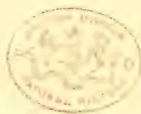A circular seal, likely a library or archival stamp, centered on the page. The seal features a central emblem depicting a stylized bird or mythical creature. The text "NATIONAL ARCHIVES" is visible along the bottom inner edge of the circle, and "INDIA" is visible along the top inner edge.

471------------------------------------------------

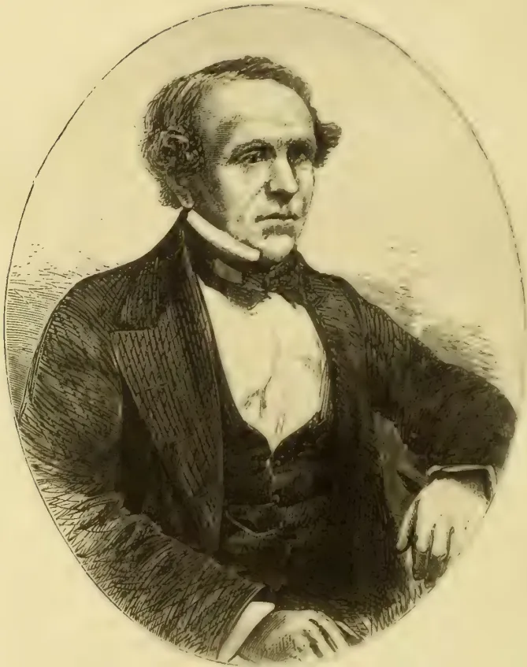An oval-framed engraving of a middle-aged man with receding hair, wearing a dark suit jacket, a white shirt, and a dark bow tie. He is seated and looking slightly to his right. The engraving uses fine lines and cross-hatching for shading.

**MAJOR SKINNER, C.M.G.**

*Tropical Agriculturist Portrait Gallery.*

*No. V.*

472------------------------------------------------

# \* The TROPICAL AGRICULTURIST \*

◁ MONTHLY. ▷

Vol. XIII.]

COLOMBO, JANUARY 1ST, 1894.

No. 7.

## “PIONEERS OF THE PLANTING ENTERPRISE IN CEYLON.”

MAJOR THOMAS SKINNER, C.M.G.,\*

THE GREAT “ROADMAKER” OF CEYLON; ALSO A PIONEER IN “COFFEE PLANTING.”

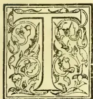

TO write a biographical notice of Ceylon's great “Roadmaker” within the compass of a few pages, is no easy task. Even the autobiographical volume published by W. H. Allen & Co., “Fifty Years in Ceylon” gives but a very inadequate account of the career of an administrative officer whose life's work was so closely identified with the material progress of the Colony, and especially with the development of the Planting Enterprise in its Mountain Zone. We shall endeavour after very briefly noticing the main events of Major Skinner's life, to point out that portion of his work which bore more especially on the Planting Industry in Ceylon.

The subject of our sketch was born in St. John's, Newfoundland, on the 22nd May 1804, his father an officer in the Royal Artillery being then stationed there, and he seems to have been the only son of his mother who died while he was still an infant. Coming to England when 7 years of age, he was placed for six years in the charge of an easy-going Dorsetshire clergyman, and then, in 1818, left to join his father at Trincomalee, being intended for the Royal Navy. On the advice of naval officers of position, his father agreed to try him in the Army instead, and Governor Sir Robert Brownrigg early in 1819 gazetted Mr. Thomas Skinner, aged between 14 and 15, to a vacancy a second Lieutenant in the Ceylon Regiment. In this capacity, the lad in his schoolboy

jacket, had to march from Trincomalee, on his first military duty in charge of detachments of the 73rd, 83rd and Ceylon Rifle Regiments, across the whole breadth of the island—anything like a proper road being then unknown—via Kandy to Colombo, and that, too, while the country was still in an unsettled state after the Rebellion of 1818. No wonder though the appearance of, we suppose, the youngest officer in the British Army, created astonishment on parade in Kandy, and afterwards in Colombo, as he marched beside six-foot Grenadiers at the head of his detachment in “Eton jacket”; for Colombo at the time was garrisoned by a “little army” of several regiments besides Artillery, Engineer Corps and even a Troop of Dragoons. Of the youthful Lieutenant's experiences at Colombo, Kandy, Maturata—(where he shot his first elephant, a splendid tusker under circumstances that excited the admiration of the Malays for their “tuan kitchel” “little gentleman” or officer,)—and Kurunegala, much might be said. But although Lieut. Skinner, had he continued in the regular service, was bound to rise to a very high position, especially if active service in India or Europe had brought into play his strong, resourceful as well as determined character; yet his career could not have been more useful or honorable than that which followed his acceptance from Lieut. Governor Sir Edward Barnes, in 1820, of an appointment on the great military road which His Excellency, had just commenced between Colombo and Kandy. Lieut. or rather Ensign Skinner, with two years' service, was still only in his

\* We regret that the engraving of Major Skinner is blurred and otherwise that it does his clear, manly features so much less than justice.—ED. T.A.

473------------------------------------------------

440THE TROPICAL AGRICULTURIST.[JAN. 1, 1894.]

17th year when he was placed in charge of some eleven miles of the more difficult portion of the road between Ambanpitiya through the Ballapany Valley to Waracopoly, at the head of a considerable force of unskilled labourers, the major portion being Kandy villagers who had been in open rebellion only two years before. We wish we could wait to shew in detail, how he gained their confidence, as also complete rule over them, so that Sir Edward Barnes's frequent endorsement on the Progress Reports was "this lad is doing well with his Kandyans;" he opened his 11 miles within the year; never touched "stimulants" (although heavy drinking was the general rule among the other officers) and earned the high opinion of the Major-General Lt.-Governor. He was next moved to the unhealthiest section at Allowe on the Mahaoya, where a large force under Col. Brown, R.E., was concentrated; but jungle fever having broken out, very soon Lieut. Skinner was the only effective European officer left—testimony to his temperance and good constitution which had previously carried him through severe attacks of dysentery. He could not, however, expect to escape fever altogether, and at last got so bad an attack that he was invalided to England. In 1822 he revisited his old Dorset school-master as a lad of 18, but an officer of three years' standing, who had already bagged his half-dozen elephants! So small and active was he, that in 1823 when weighed (in England) he was only 7½ stone. After visiting his father's family in Newfoundland, the young Lieutenant returning to England, embarked for Ceylon again on the 15th April 1825, the vessel carrying the headquarters of the 97th regiment and a number of distinguished officers. Chess seemed to be the chief object of attention on board, and Mr. Skinner, who scarcely knew the game, when he embarked became the best player of the ship's "club" before the voyage ended. A curious coincidence, attended both his outward voyages to Ceylon thus:—

15th April 1818, embarked off the "Falcon Hotel," at Gravesend.

10th August 1818, anchored in Back Bay, Trincomalee.

15th April 1825, embarked off the "Falcon Hotel," at Gravesend.

10th August 1825, anchored on same spot in Back Bay Trincomalee.

The distance run in 1825 was 13,581 miles.

On arriving in Colombo, Lieut. Skinner (who was only just of age) got the choice from Sir Edward Barnes, now full Governor and Lieut.-General, of becoming one of his As.D.C. or Staff Officer of Colombo. He chose the latter, laborious post without considering what it involved; for as we read the garrison of Colombo in 1825 consisted of,—

▲ Troop of Dragoons.

▲ Detachment of Royal Artillery.

▲ Detachment of Royal Engineers.

▲ Company of the Royal Staff Corps.

16th Regiment. A portion of this regiment detached.

75th Regiment.

83rd Regiment.

97th Regiment.

Ceylon Rifles.

Gun Lascars.

Armed Lascoryns.

Several detachments were drafted from these regiments, but still the garrison was large, and its duties were conducted on the most strict and rigid principles. A field officer and two subalterns were on garrison duty every day; guard-mounting was done with the utmost formality; guards were "trooped" every morning, and not the slightest deviation from established forms was permitted without the field officer of the day being called upon to give his reasons in writing. The commandant was present at guard mounting about three days in each week. I do not believe that the garrison at Gibraltar could have been under stricter discipline than that of Colombo at this time.

The Governor insisted on the young Staff Officer taking up his residence in King's House, and hence forward until Sir Edward Barnes' departure for India at the end of 1831, he lived on terms of closest intimacy with that most distinguished officer and administrator whom he admired and served with the utmost enthusiasm. Of Lieut. Skinner's unequalled activity at this time, two illustrations may be briefly mentioned: he was ordered to proceed to Negombo, 23 miles north of Colombo, make a plan of barracks there and prepare an estimate for their repair. He left King's House at 2 p.m. on his grey Arab, arrived at Negombo within 2 hours, made his measurements in an hour and galloped back in time to bathe, dress and attend a dinner party where the Governor and Lady Barnes were present. On seeing him, His Excellency, never dreaming the inspection had been made, was most indignant at the apparent dereliction of duty until he learned the facts, which pleased him immensely. Shortly after, the young Lieutenant was forced into a ride in the dark by the Governor's Military Secretary, Col. Churchill, on a wager of £50: riding to Veyangoda 25 miles and back between midnight and the hour of guard-mounting 6 a.m. He did it with half-an-hour to spare. But no officer had ever less to do with betting or gambling, equally with drinking, than the subject of our notice, and Lieut. Skinner had also an intense dread of getting into debt even for a purpose, such as buying a regimental step, which might well have justified the loan. He allowed himself be purchased over more than once; declined a purse got up by brother officers who thought it a disgrace he should be so long without his "Company;" and specially prevented Governor Barnes from giving him the preference for a Captaincy over Lieut. Rogers—afterwards Major Rogers of Uva. Rogers was the great hunter, 1,500 elephants have fallen to him altogether, and was Major Skinner's closest friend until he was killed by lightning at the Haputale Pass on 8th June 1845. In this way it happened that Mr. Skinner served no fewer than 17 years as subaltern, before he got his Company in 1835, when in his 31st year.

474------------------------------------------------

JAN. 1 1894.]THE TROPICAL AGRICULTURIST.441

But to go back, the years 1827-8-9 proved a busy time with military duty in Colombo; but there were frequent opportunities for sport, especially with elephants, herds of which in those days were frequently seen near Hanwella or Negombo, 20 miles from Colombo. The death on 28th March 1829 of Capt. Dawson, R.E., whose monument stands at the head of the Kaduganawa Pass was a severe blow to Lieut. Skinner, and the death of another officer (Lieut. W. Moore, Royal Staff Corps) led to his being appointed Deputy-Assistant Quartermaster-General on the 25th Nov. 1829. All public works in the island were at that time placed under this military department, so that Lieut. Skinner had charge of the roads and bridges made or making "in the interior," and this gave him plenty of riding and work all over the Kandyan Provinces. In Aug. 1830, Sir Edward Barnes sent his favourite young officer on a special mission to the Eastern Archipelago and Java, connected with the recruiting of Malays. A Government barque with guns, ammunition, and marine artillery and some infantry was placed at his disposal. He was absent seven months and discharged his mission to the entire satisfaction of the Governor. On his return, he resumed charge of the roads in the Kandyan Provinces. Some years before he had traced the Colombo-Puttalam road, and again in 1828 that from Gampola to Ramboda. In 1832, he was detached to open a road between Arippu, on the North-West Coast, the headquarters of the Pearl Fisheries, and Anuradhapura, the ancient capital of the island. Lieut. Skinner may be said to have been the first to discover the wonderful resources of the Nuwarakalawiya district, and in a memorable State paper in 1833, addressed to His Excellency Sir Robert Wilmot-Horton (who was a great friend of his), he strongly urged that Governor to become the "Regenerator of Nuwarakalawiya," a task which would have been readily undertaken had the revenue (only R3,700,000 per annum! then) permitted; but this regeneration had to be deferred for forty years till the time of Sir Wm. Gregory and afterwards of Sir Arthur Gordon. In 1833 when "Compulsory Service" (semi-slavery) was abolished in Ceylon, Lieut. Skinner propounded the scheme afterwards (in 1849) matured on a modified scale by Sir Philip Wodehouse, and passed as the Road Ordinance and Tax which have done so much to cover the island with a network of subsidiary principal and minor roads. Peradeniya satinwood bridge designed by his chief, General Fraser, was erected under Lieut. Skinner's care in 1833, as many as 1,200 men being employed in laying and filling up the approaches, &c.

After this a Civil Engineer and Surveyor-General was appointed for Ceylon, and all roads

and works were handed over to him, while the Quartermaster-General's Department undertook a military reconnoisance and survey of the Mountain Zone. On this survey, Lieut. and latterly Capt. Skinner was engaged with few intermissions, from Sept. 1833 to 1840, the total payments to his staff of Caffres—(South Africans, whom he describes as by far the best native soldiers and hardest men ever brought to Ceylon)—and coolies, being only R4,372 in the seven years!; while the one-inch Plan of the Kandyan Provinces and the General Map of Ceylon were the result of these labours. Capt. Skinner all through his career took a pride in the economy attending his work, and indeed he often suffered great privations during his survey operations. He was the first officer to explore 500 square miles of forest included in the "Wilderness of the Peak," and here are extracts from his autobiography, we cannot deny ourselves the pleasure of making:—

Although it was most interesting, it was precious hard work, delightful to think of in the retrospect. For six or seven months in every year I never knew the shelter of a roof from between four or five o'clock in the morning till seven in the evening, and occasionally much later. My fare, too, was often humble enough. On one occasion, going into the Wilderness of the Peak—which comprises about 500 square miles of splendid forest within its extreme boundaries—to make my reconnoisance sketch of it, my time being limited before the rains might be expected, I could not wait for the supplies which I had sent a corporal and another man down to Saffragan to purchase. I had expected some dozens of fowls for my six weeks' or two months' supply, but the men returned, after rather a lengthened absence, with only five miserable chickens, three of which had died from the rain and cold on their way up to the Peak, the other two had sentence of death passed on them immediately on their arrival; they all found their way into curries, the only dish they were fit for; those that had died on their way up the Peak did not die a natural death, having been killed by the cold instead of with a knife. This was all the animal food I had during nearly two months; I had a little salt fish, which was served out to me most sparingly, about a square inch for each meal, to give a relish to a little plain boiled rice. My people had a very knowing dodge of getting at my small stock of wine, under the plea that the bottles were broken by the men falling on the rugged rocky ground over which they had to travel. It appeared to me that though the bottles were broken, little of their contents were spilt.

These two months proved the hardest work I ever had, as hard, under the circumstances, as I believe any man could have endured. My wigwam consisted of five sheets of the talipot leaf, stitched together with shreds of the same material. Each leaf was about six by four feet; three of these formed two sides and one end, with two others for the roof; along the top was a little ridge cap of the same material; the end which formed the door was always open. This tent of leaves contained my little camp bed, a small camp table, and chair. I think the talipot leaves used to cost me 13½d., and generally lasted me the working season, which was six months; my lodgings, therefore, were not expensive!

I used often to see the most wonderful effects when thus camping out. On one occasion my sojourn on Adam's Peak lasted for a fortnight on the top of the cone, where I was waiting for clear weather, which I did not get, to adm't of my competing my observations. One morning as the sun was rising, the shadow of the mountain was thrown across the whole land and

475------------------------------------------------

442THE TROPICAL AGRICULTURIST.[JAN. 1, 1894.]

sea to the horizon, and for a few minutes the apex was doubled, and so clearly marked that the little shed over the impression of Buddha's Foot was perfectly distinct in the shadow. Another most curious effect was when the mist had lain deep in the valley below, between the great Peak range and the opposite range of Rackwanie, it was an exact representation of the sea; the clouds rolling against the base of the mountains resembling the surf beating against the cliffs which seemed to project into the sea, the points of the hills peeping through the mist appeared like beautiful little islands.

At another time, looking down from the cone, a small white cloud, the size of a man's hand, might be seen floating upwards, about midway between the mass of vapour sea below and the top of the peak. Sometimes, under certain conditions of the atmosphere, this little bit of fleecy vapour would suddenly expand into a huge dark cloud, and come rolling up the cone, apparently lashing it as if with its utmost fury; and then suddenly envelope it with a dark mantle—a strange contrast to the clear blue atmosphere through which but a few minutes before objects might have been seen sixty or seventy miles distant.

Many were his adventures during this survey work which carried him from Adam's Peak to the top of Pidurutalagala, and thence to Namanakulikande above Badulla. His interest in the "Wilderness of the Peak" continued very great, and if Capt. Skinner had had his way, it would have been thoroughly opened up by roads in Governor Stewart Mackenzie's day when the "rush" into planting, and especially Ambegamuwa, first commenced. What will the planting residents in Dimbula, Dikoya and Maskeliya say of the following letter addressed to the Governor of Ceylon over 53 years ago, as well indeed, of the above account of the first survey of their districts, by this true Pioneer of Planting and Civilisation? —

Ambagamuwa, 11th August, 1840.

My Dear Sir,—I am very sorry that your Excellency's letter of the 1st instant has remained so long unanswered. I received it on the eve of my departure from Colombo, and being destined for this place, as there are points in it that I could only reply to by information which I expected to receive here, I ventured to defer the acknowledgment of it till now. On my arrival here on the 7th, I found that both the Surveyors, Mr. Bagenall and Mr. Sargent, from whom I made inquiries as to the lands which had already been appropriated in this vicinity, had gone down to Palampettia with Captain Lillie, and it was only last evening that I met them. He gave me such a sweeping list of lots applied for, that I feel it would be quite hopeless my attempting to describe them to you. I will therefore request Mr. Norris to send your Excellency a copy of the general sketch of the whole, which I understand he has, and by which you will perceive that the margin of the Great Wilderness of the Peak (in this particular direction) is tolerably well allotted.

I am sorry that Anstruther and Wodehouse are so late in the field, for I should have preferred seeing them in this neighbourhood, instead of either of the two, for which the latter has such a predilection, viz. Ballangoddi and on the ascent to the Peak from Ratnapura. I fear they will both (and all the south-western falls of the great mountain zone) be too much exposed to the violence of the south-west monsoon winds, and at the elevation they would require for coffee would be subject to continued fogs for seven or eight months out of the twelve.

Ballangoddi has the additional disadvantage that it is thirty miles from water carriage by a most impracticable native path along which a loaded bullock could not travel, and the lands they might select may possibly be ten or twelve miles off this road. This is a

grave matter, selecting a site for an estate on which parties seem determined to go ahead, at the pace A. and W. seem bent on. Mr. Turnour's land here is that piece which your Excellency went over after a five o'clock breakfast on the banks of the Attella Oya, where you may remember was a pretty little waterfall. It is described by all who have seen it as the finest piece of land in all this neighbourhood. I suspect we saw the worst portions of it on that occasion. Mr. Carr's and my land is the sloping forest on the right bank (within the elbow) of the Mahavilla Ganga, the villages of Ambegamo being our northern boundary; but as regards relative positions of this and other estates (!!!) Mr. Norris's surveying sketch will explain them better than I can. I have asked him to send you a copy of it.

With all these purchases and applications, the demand for land appears to be just as insatiable as ever, while the general cry is "Where shall we go to look for land?" In vain I proclaim that there is a choice of between 200,000 and 300,000 acres of the finest forest land in Ceylon within the Wilderness of the Peak, possessing in the most eminent degree every requisite of soil and climate, far above anything to be found on these outskirts of it.

"How are we to get at it?" is the not unnatural sequence, for although I have spent many dreary months in it, and there is not a valley I have not traversed, nor a feature, from the highest point of which, and from the top of the highest tree to be found on it, I have not attempted to sketch in my reconnaissance, I know that many a man might dive into the depth of 500 square miles of unbroken pathless forest, who would never find his way out of it again.

Will you Sir, just open your map and look at the distance between Kotmalie Valley and Ballangoddi, and consider that by opening a bridle path, and building two small temporary Rest Houses between those places, you would open out a country such as has not yet been presented to the capitalist; a large area of land with a climate more like that of Southern Europe than a region within 7° or 8° of the equator, and in which I believe may be produced most European vegetation.

I respectfully urge upon your Excellency that the object is well worthy of the trifling outlay it will cost. I leave out of the question the great advantage which would result from establishing a direct communication between the central and southern provinces of the island. Instead of, as is now the case, a traveller being compelled to go round the base of the mountains, descending from Kandy to Pallapany, thence by Ruwanwella and Ballangoddi, or if by the eastward, then over the highest mountains of the country Nuwara Eliya, and thence by one of the three following passes, viz. Gallagamwa, Idulgashenia, or between that and Allipot.

I feel pretty confident that I might offer to open a 5-feet path, build and furnish the two Rest Houses, from the proceeds of the sale of land along the line during the first six months after it was opened. I trust your Excellency will excuse me if I am permitting myself to address you too freely on this subject: I feel intensely interested in it. Who can view this exquisite scenery, enjoy this perfect climate (at present the thermometer is between 67° and 68°) without feeling that it would be conferring a blessing upon humanity to be the means of removing some 20,000 of the panting, half-famished creatures from the burning, sandy plains of Southern India to such (comparative) paradise; benefiting not only them, the colony, the individual by means of whose capital they would be brought here, but also our own native Sinhalese people inhabiting the margin of this wilderness, living as they now are like monkeys, for safety compelled to hide in places scarcely accessible to man, to render their dwelling inaccessible to elephants. Many totally unable to cultivate a grain of paddy, or to procure a morsel of salt, would find themselves attracted to a new centre within this, at present, trackless wilderness, which (although I have often been jeered at for stating it), I advisedly repeat, is destined ere long to become the garden of Ceylon, such a garden as has not

476------------------------------------------------

JAN. 1, 1894.]THE TROPICAL AGRICULTURIST.443

entered into the mind of us Pioneers to conceive—a garden of European as well as of tropical productions, peopled with European as with Asiatic faces. To facilitate this desirable end, I plead for a bridle-path as the first requisite.

Hard work and privation have endeared the Wilderness of the Peak to me. I have often had rough work in it, crossing flooded rivers, and living on edible roots and plants, which the Sinhalese, familiar with forests, alone could have selected; but my last two months and a half work in it were the most trying, from continued insufficiency of food. I reached Adam's Peak as light of baggage as could be, hoping to be able to get some fowls up from Ratnapura. My messengers returned with only five; three died on their journey up, from cold and wet, the remaining two had to be killed on arrival to "save" their lives. They all in due course found their way into curries, and I could not discover which had yielded to the sharpness of cold, or which to that of steel. They constituted the only animal food I had during the ten weeks when, working every hour against time, I accomplished my task, having worked up to the top of Pedrotallagalle before the monsoon burst, and I have thought well of the sustaining properties of boiled rice ever since.

I remain your Excellency's faithful servant,

(Signed) T. SKINNER.

Of Capt. Skinner's experience as a Coffee Planter\* we have the following:—

In 1840 the officers of the public service ran wild in *re* coffee-planting. As pioneers they were encouraged, to the ruin of many; for though one or two had been very successful, others lost heavily by embarking in an enterprise of which they were perfectly ignorant. Sir W. O. Carr, the chief justice, and myself went into partnership. Our estate had only just come into bearing when the protective duties in Ceylon were removed, and the price our produce realised fell from upwards of 100s. the cwt. to 45s., the latter sum being the cost of production on the estate.

We ought to have mentioned that the Civil Department for Roads &c. got into such confusion, that in 1837 Capt. Skinner was asked to take up the duties of "Civil Engineer and Surveyor-General," and he continued in the office till 1840. How he discharged the duty can be judged by the following:—

*Extract from the Address of His Excellency the Governor the Right Hon. Stewart Mackenzie, to the Legislative Council, in January 1840.*

His presence† alone prevents me from bearing testimony to the unwearied activity of the Acting Surveyor-General, to the entire inadequacy of his means to overtake all that under the names of Surveyor-General and Civil Engineer would be expected from him. That he has performed a most ungracious, and a very unsatisfactory work, during his tenure of these combined offices, most zealously, I can bear most ample testimony were it necessary.

So that so far back as 1840, Capt. Skinner was

\* Mr. T. E. B. Skinner favours us with the following note in answer to our inquiry as to the fate of the Major's coffee venture:—"My father owned a large tract of land in Ambagamuwa, and once cultivated jointly with Sir W. Carr, the Chief Justice, a coffee estate which proved a failure, and eventually cost him many thousand pounds sterling. Captain Evatt purchased a portion of the land and opened an estate called Koladeniya, which was also unsuccessful as a coffee estate, and subsequently Mr. H. Saunders bought the remainder of the block of several hundreds of acres which are now, I believe, in tea."

† NOTE.—Captain Skinner being a Member of the Council,

a member of the Legislative Council, though to the disgrace of both local and home authorities, one so pre-eminently fitted to be a most valuable legislator was never confirmed in his Council seat, notwithstanding several "acting" appointments. On the 19th Dec. 1838, Capt. Skinner was married to Georgina, daughter of Col. Burrell, C.B., Commanding the 18th Royal Irish at Trincomalee, and afterwards Lieut.-General Burrell. In 1841, the unfortunate Civil Engineer and Surveyor-General's Department again became disorganised, and the Government resolved to divide it into two, giving Capt. Skinner charge of all the Roads on a salary of R8,000 per annum, afterwards increased in 1846 to R10,000. In April 1847, his regiment, the Ceylon Rifles being ordered to Hongkong, he finally retired from the Army as Major Skinner, selling his Commission after 28 years' service. In 1848 Major Skinner went on leave to England, his first absence after 23 years' continuous service including much hard work and privation; this was made the occasion for a very flattering address from the Maha and subordinate Mudaliyars (native chiefs). Major Skinner was absent in England when the so-called Rebellion of 1848 broke out; he had prophesied trouble in the Kurunegala and Matale districts from the misgovernment he had witnessed during the "forties," but his warnings were disregarded. At home, the Secretary of State for the Colonies, Lord Grey consulted him, and he drew up a very able State paper in July 1849 for the benefit of the Select Parliamentary Committee on Ceylon affairs, dealing with the social and material condition of the island and its people, among whom he had lived so long. In this, he recommended as one check on native litigation which was filling the British Courts, the revival of "Gansaibs" or "Gansabawa," another reform which it fell to Sir Hercules Robinson many years after to carry out. Major Skinner resumed his duties in Ceylon at the end of 1849. In 1850, the "Civil Engineer's" Department was separated from the Survey, and Major Skinner was ordered to incorporate it with his own, thus becoming "Civil Engineer and Commissioner of Roads," and so continuing in charge of the entire Public Works of the Colony until his retirement in 1867. In August 1854, another departure home on leave was made the occasion of a flattering but well-deserved encomium in the *Ceylon Observer*, on the man who had given the best years of his life—from the 14th to the 50th year—to the service of the Colony, and whose name was closely connected with every line of communication opened from 1819 onwards, as well as with the great survey of the island. "Nothing but an iron frame and the most temperate habits, could"—wrote the Editor—"have enabled Major Skinner

477------------------------------------------------

444THE TROPICAL AGRICULTURIST.[JAN. 1, 1894.]

to survive his exertions in and on behalf of the Colony. Believing, that there is not a man in Ceylon to whom the island owes so much in the way of material improvement, on which moral advancement so closely depends, we feel bound to yield him this parting tribute of gratitude which he has so well earned." On his return, Major Skinner took an active part in carrying out the public works which Sir Henry Ward so warmly promoted; but he had to oppose that able Governor in respect of his rash Railway contract, and this opposition cost him dearly—(the office of Auditor-General and a seat in the Executive and Legislative Councils)—though it saved the Colony a great deal. The first day he waited on Sir Henry Ward he laid before the Governor plans of iron bridges and urged that a dozen should be ordered out at once!

In October 1860, Sir Charles MacCarthy assumed the Government, and notwithstanding strenuous opposition in a narrowminded Executive Council, Major Skinner carried his way with the Governor, so far as to get a vote to provide for the extension of the Uva Road from Pelmadulla to Balangoda which he constructed so economically—R91,630 for 15 miles—as to have enough over to prolong the same road well on to Haputale. What the Major thought of this important line of communication may be judged from the following extract from his writings:—

The enterprise of coffee-planters could not be checked and the demand for roads was excessively urgent in order to prevent the loss of much of the capital they had invested. During Sir Henry Ward's Government he exercised a will of his own, and it required no great persuasion to convince him of these wants; but now the expenditure was not considered with reference to the increased facilities given to the planters, but to the additional charge likely to be entailed upon the revenue for additional annual expenses. The Hapootella district, a group of probably the finest estates in the Colony, furnished a painfully striking example of the need of roads. I had long foreseen the strait to which the proprietors were inevitably drifting. Their rice and other provisions could be carried to the estates by manual labour, but directly the coffee tree was old enough to yield a crop the consequences were palpable. I had long been struggling to open a road for wheel traffic from the highest navigable port of the Caltura River to the Port of Colombo, at Ratnapora through Saffragam to Ouvah, and had got as far as Pallamadula, twelve miles above Ratnapora. There still remained at least thirty-eight miles of the most execrable native mountain path, ever traversed and intercepted by rapid torrents, only fordable in dry weather. Over this path the planters sent down their maiden crops, which were always small and light, on men's shoulders.

How the planters of Haputale in the "sixties" regarded Major Skinner's work on their behalf and his services generally, may be judged from the following address, drawn up at their request by the present writer in 1865:—

MAJOR SKINNER AND THE PLANTERS  
OF HAPPOOTELLA, BADULLA, AND  
SAFFRAGAM.

The following address and reply have been forwarded to us, and it is with no ordinary feelings

of pleasure that we accede to the request to give them a place in our columns. By a singular coincidence; this unqualified expression of the feelings entertained towards Major Skinner by so large a section of the Planting community must have reached his hands almost simultaneously with the intelligence of his supersession in the post of Auditor-General. The present is certainly a time when in expressing their sense of the services rendered by Major Skinner, the public of this island would be simply doing a very meagre act of justice. We hope to find our suggestion acted upon by the leading members of the Planting community, in reference to petitioning the Secretary of State on the position of the Commissioner of Roads. In whatever way our Legislative Council may be constituted, the presence of the officer at the head of the Public Works Department will henceforward become of essential importance to the Government and the public.

The gentleman who sent the address to Major Skinner accompanied it with the following explanation:—

"In forwarding to you the enclosed paper on behalf of the gentlemen whose names are attached to it, I have to offer some explanation. The wish to make known their feelings of gratitude to you had been expressed among the Hapootella Planters about nine months ago, and shortly after, this Address was drawn up and circulated, which accounts for its alluding to you as Commissioner of Roads, &c., instead of your present official position. We preferred however sending you the original paper, with the names as written by the Planters themselves, some of them widely separated, to drafting another;—and to prevent any further delay it is thought best for me to send you the enclosure in this private manner, rather than wait for a convenient opportunity of meeting you publicly. It is the wish of us, Planters, however, that the Address and any few words of acknowledgment from you should be published."

TO MAJOR THOS. SKINNER,

Chief Commissioner of Roads, and

Civil Engineer, CEYLON.

SIR,—We, the undersigned Planters and other Residents in the district of Hapootella, Saffragam and Badulla proper, cannot permit the occasion of the completion of the Hapootella Road to pass without making known to you the feelings of gratitude and esteem with which we have watched your exertions for the successful execution of this great work. We need scarcely allude to the personal interest we each and all, feel in a Trunk Road opening up the districts which we represent, inaugurating a new era for a large extent of country, both in regard to European and Native Industry. We cannot but realize that after our late Governor, Sir Charles MacCarthy, who first granted a vote to commence the road, there is no one connected with the Colony to whom we are more indebted than yourself for this boon, both from the intelligent and warm interest taken, and the activity manifested in its projection and execution. Of the manner in which this has been carried out, we need say nothing here: the general expression of opinion through public channels at different times bears unqualified testimony to the substantiality of the construction and formation of the Road. Neither is it for us—comparative strangers as we are, and the great majority at least, but Colonists of a few years' standing—to touch on the great services rendered by you to the Island during a life-time so well and laboriously spent here. Commencing in 1820 we understand, as a subaltern in charge of a section of the great Kandy Road, your name has ever since for nearly half-a-century, been closely connected with the material improvements in this Colony, particularly with communications from which its prosperity has mainly resulted. Now that the period has arrived when the Colombo and Kandy Road is about to be superseded by the Railway,

478------------------------------------------------

JAN. 1, 1894.]THE TROPICAL AGRICULTURIST.445

it must be a source of great gratification that you have been permitted, as Head of the Public Works Department, to complete the second great line of communication between the Maritime Capital and the Mountain Zone. We hope that its completion through to Badulla may also take place under your auspices, unless well-deserved promotion should necessitate your removal from the Roads Department. But in any case your name must long be remembered in connection with the Happootella and numerous other Roads, in the Island.

We feel some delicacy in presenting an address to you; but we do so in the hope that our motives may not be misconstrued, springing as they do from pure regard for the unblemished public and private character of a zealous and able public officer who has so long and faithfully served this Colony.

Trusting this may prove our excuse for intruding.

We remain with sincere respect, Sir,

Your Obedient Servants,

<table border="0">
<tbody>
<tr>
<td>HENRY DON</td>
<td>J. MORRICE</td>
</tr>
<tr>
<td>R. GRIGSON</td>
<td>J. RUDD</td>
</tr>
<tr>
<td>J. MITCHELL</td>
<td>JAMES BADENOCH</td>
</tr>
<tr>
<td>JAMES ALLEN</td>
<td>WILLIAM WEBSTER</td>
</tr>
<tr>
<td>A. MACPHAIL</td>
<td>ARTHUR SINCLAIR</td>
</tr>
<tr>
<td>G. W. MURRAY</td>
<td>A. C. MILNE</td>
</tr>
<tr>
<td>THOS. OGLIVIE KIELLOR</td>
<td>W. MURRAY</td>
</tr>
<tr>
<td>H. O. TIESENIS</td>
<td>JOHN STUART</td>
</tr>
<tr>
<td>F. F. B. CHILDERS</td>
<td>JOHN BAGRA</td>
</tr>
<tr>
<td>R. MACENNER</td>
<td>JOHN FENN</td>
</tr>
<tr>
<td>JAMES IMLAH</td>
<td>D. J. MACGREGOR</td>
</tr>
<tr>
<td>JAMES BREMNER</td>
<td>D. MACGREGOR</td>
</tr>
<tr>
<td>CHAS. BROWN</td>
<td>FRANCIS P. MURRAY</td>
</tr>
<tr>
<td>R. SIKES</td>
<td>EDWARD J. ASTLEY</td>
</tr>
<tr>
<td>FRANK SIKES</td>
<td>J. BENNISON</td>
</tr>
<tr>
<td>N. ORCHARD</td>
<td>G. WHARTON BROWN</td>
</tr>
<tr>
<td>T. N. ORCHARD</td>
<td>GEORGE BARRON</td>
</tr>
<tr>
<td>JNO. ATWELL</td>
<td>JOHN FRASER</td>
</tr>
<tr>
<td>WILLIAM HENDERSON</td>
<td>EDWIN KNOWLES</td>
</tr>
<tr>
<td>WILLIAM IMLAH</td>
<td>A. S. BURNEIT</td>
</tr>
<tr>
<td>D. C. CARSON</td>
<td>J. OLIVER</td>
</tr>
<tr>
<td>GEORGE P. DRUMMOND</td>
<td>J. HARPER</td>
</tr>
<tr>
<td>J. W. WRIGHT</td>
<td>D. L. SOUTTER</td>
</tr>
<tr>
<td>G. VANDERSTRAATEN</td>
<td>GEO: SMITH</td>
</tr>
<tr>
<td>E. JOSEPH</td>
<td></td>
</tr>
</tbody>
</table>

In his reply, Major Skinner wrote:—

Hambantotte, 29th January, 1866.

Dear Sir,—I had yesterday the pleasure of receiving your letter of the 26th instant, enclosing me on behalf of the gentlemen who signed it, a letter from Planters and other Residents in the districts, of Happootella, Saffragam, and Badoola proper, and in which you were kind enough to explain why it had not been transmitted to me at an earlier date.

May I beg the favour of you, to convey to the gentlemen who have subscribed to the kind and flattering terms expressed towards me in their letter, my grateful thanks for their, I fear, too high appreciation of the services I have been enabled to render to their districts. The expression of such kindness of feeling, and of approbation of my public conduct would have been most gratifying to me at any time;—but circumstances render such sympathy specially acceptable at the present moment.

In my opinion it would be difficult to over-rate the importance (as well to the interests of the native population of Saffragam, as to European enterprise) of the Happootella Trunk Road; and it is a subject of great congratulation to me, that I have been permitted to carry it out so far as it has at present reached with, I trust, some prospect of its progressive improvement being unchecked until it is completed to Badulla.

There are several circumstances of interest, and, I think, of instruction connected with the construction of the Happootella Road. The estimate for that portion from Pallonadula to Ballangodde (15 miles) was £18,644—it was the lowest of several framed by able officers, about the time the cost of work was being

warmly discussed with reference to the Estimates of the late Ceylon Railway Company—which I ventured to denounce as extravagant. In the inquiry which was instituted by a Sub Committee of the Legislative Council, my testimony as to the previous cost of work in the Colony was questioned—not that I was supposed to intend willfully to mislead the public, but that I laboured under self-delusion on the subject. In adopting the lowest estimate I informed the officer who framed it, that I should take the work under my own direction, and make it practically test the accuracy, or the fallacy of my views as to the actual cost at which its various departments could be executed. At the beginning of 1863 I drove the late Sir Charles MacCarthy to Ballangodde, and had the satisfaction of shewing him that instead of the estimated amount of £18,644 having been expended on the road he had so much admired, its cost was only £9,163—when he was good enough to yield to my importunities to be permitted to carry it on for 13½ miles further, with the balance of £9,481 saved on the estimate. This is a striking instance of the value and importance of economy—but for it, in this case, I believe your carriage road would not, at the present moment, have been extended a yard beyond the Ballangodde Bridge; and it should satisfy the Government and the public, that it does not necessarily follow, that because liberal means are granted for the execution of works, the Department should lavishly and wastefully expend them. It also shows how much may be done by means of Native talent and energy—there has not been an European employed upon the Happootella road from its commencement to the present time.

My early association with the Kandy Road has been kindly alluded to. This reminds me that it was said by no mean authority at the time, that the far-seeing statesman by whom it was designed and executed, deserved to be impeached for his extravagance in making it. When Sir Edward Barnes heard of this speech, he simply replied, “Ceylon’s future will determine that point”—the “future” of Saffragam, Happootella, and Badoola will, I trust, in a proportionate degree, prove the wisdom of that expenditure which has given to those districts an outlet without which success or improvement would have at least remained most problematical.

It must, I think, be clear to all—but those who are wilfully blind—that without good means of communication, it is *impossible* for any Coffee district in the present day, to struggle long with the difficulties which are inevitable in new localities—and as the success of districts is of as much importance to the general prosperity of the Colony, as the individual undertaking can be to each person concerned in it,—I trust that the policy of giving the utmost practicable aid to new districts, may not again be questioned.

It has been my best reward for the labours I have gone through,—frequently under great discouragements—to have observed, that the progress and prosperity of this Colony has followed with unvarying certainty upon the opening up of its communications, on which the greater part of my life has been engaged. It is by their preservation in a state of efficiency, and by their extension alone, that that prosperity can be maintained, or its resources further developed; and it ought to be a source of great congratulation to all interested in Ceylon’s welfare, to feel that so far as the most painstaking, untiring energy, and sound judgment now brought to bear upon the subject, can ensure the judicious appropriation of means to works of improvement—there is little left to wish for. This auspicious state of things makes me wish I were capable of a few more years of good active work, that I might have the privilege of conducting the useful works which are now being initiated.

While repeating the assurance of my high appreciation of the kind feeling which has been expressed towards myself, I beg to be allowed to avail myself of this opportunity of recording my sincere thanks for the kind manner in which, I am aware, the Happootella district has shown its estimate of the value of the services of native officers, Wellapole, Commanding the 5th, and Sherman commanding the 8th Division

479------------------------------------------------

446THE TROPICAL AGRICULTURIST.[JAN. 1, 1894.

of Pioneers—for, after all, it is to them and to their invaluable men, that we are indebted for results so creditable to them, and so important to the public interests.

I remain, Dear Sir;

Yours faithfully,

T. SKINNER.

J. Mitchell, Esq.,

of Kelburne Estate.—Happootella.

The death at Ramboda of his old chief General Fraser in May 1862 was a great grief to Major Skinner, especially as he was too late to be with the General at the end, as the latter earnestly desired. In March 1865, Sir Hercules Robinson arrived, and no Governor more fully appreciated Major Skinner's unequalled experience and good work. The Governor began at once to travel a great deal over the island, generally on horseback, and taking the head of the Public Works Department with him, he thoroughly profited by all he learned in this way.

In September 1865, on the death of Mr. Pennefather, Auditor-General, Sir Hercules Robinson requested Major Skinner to take up the acting appointment in order that he might preside over the Royal Commission to determine the Military Force and Expenditure requisite for the Colony. The evidence and Report of this important Commission were published in December 1865. Owing to his wife's serious illness (and subsequent death) in 1866, Major Skinner had to run hurriedly to England, and while there he was specially consulted by Lord Carnarvon, Secretary of State for the Colonies, who invited him to High Clerc. He returned to Ceylon only to prepare for retirement in June 1867, an event which was made the occasion for a universal expression of esteem and good-will, and of a series of farewell Addresses, one being from Colonists, Merchants, Planters, &c., praying the Secretary of State to make Major Skinner's a full-pay pension of £1,000 per annum. From the long farewell notice in the *Observer* we quote but one passage:—

With the formation of nearly every mile of road and the erection of every bridge in the country, Major Skinner has been more or less intimately connected either as subordinate or Chief of the Public Works Department; while we cannot forget that simultaneously he laboured, amidst exposure and privation of which present explorers of the Kandian Provinces can have but the faintest idea, in surveying and fixing the topographical features of the country he was opening up; the result being seen in the beautiful and useful Map of the Colony, and especially that of the Mountain Zone, with which his name, in conjunction with those of Fraser and Gallwey, will be ever honourably associated.

A harder worked or better Public Servant than Major Skinner never lived in any Colony: as he wrote himself, from the age of 16 when he was first employed away from his regiment, scarcely any labourer could have worked much

harder or gone through greater exposure, than he was subjected to during his 49 years' service in tropical Ceylon. We have hinted more than once at the high moral character of the subject of our notice: Major Skinner was the friend of Christian Missionaries in Ceylon and of all good work in every direction. After his retirement in 1869, the Duke of Buckingham as Secretary of State, on Sir Hercules Robinson's recommendation, wished to submit his name to Her Majesty for the "K.C.M.G.;" but the veteran public servant while expressing his gratitude, declared he was too poor to covet the knighthood and begged that the honor might be "C.M.G." instead, and this was agreed to. He was consulted about the visits of the Duke of Edinburgh and Prince of Wales to Ceylon, and he kept up his taste for Natural History—Conchology especially—and his love for fishing in Cumberland, Ireland, or Scotland, till the end of his life. His daughter (Miss Annie Skinner, afterwards Mrs. MacDonnell) who edited the autobiography, thus fittingly closed the volume and the life-history of her father:—

It was my privilege to be with him during the last few years of his life, which he spent principally in visiting old friends and travelling, the latter being always a special pleasure to him. He felt his work was done, and he was just waiting for his call Home. It is not for me to add to the record he has left of what that work was; I can only speak of the brightness of the eventide, which seemed to shine more brilliantly as the end drew near. One day, looking up, he said, "My child, all, all is bright; there is not a single cloud anywhere."

On the 24th July 1877 he passed peacefully away to the Home he was so longing for, and I felt the promise was fulfilled that

"At evening time it shall be light."

So passed away in his 74th year, Ceylon's great Roadmaker, Pioneer of Progress, and most devoted Public Servant. His family originally consisted of two daughters and five sons, namely, Miss Skinner who became Mrs. M. H. Thomas, wife of Mr. M. H. Thomas, a well-known mercantile and planting Colonist still in our midst; Miss Annie Skinner, editor of the above Biography, now Mrs. MacDonnell; while of the sons, G. Skinner (the second) died as Capt. in the 15th Regiment; M. Skinner died as Commander R.N.; W. Skinner was in the Oriental Bank and was killed in Bombay by a fall from his horse. Of the two surviving, one is now (1894) Major Monier Skinner, R.E., and the other and eldest son of the family, T. E. B. Skinner, Esq., is well-known for his thirty-three years' official work in the Civil Service of this Colony, and is now Postmaster-General and Director of Telegraphs in Ceylon, one of the most important administrative posts connected with the Island.

480------------------------------------------------

JAN. 1, 1894.]THE TROPICAL AGRICULTURIST.447

## CEYLON MANUAL OF CHEMICAL ANALYSES.

A HANDBOOK OF ANALYSES CONNECTED WITH THE INDUSTRIES AND PUBLIC HEALTH OF CEYLON FOR PLANTERS, COMMERCIAL MEN, AGRICULTURAL STUDENTS, AND MEMBERS OF LOCAL BOARDS.

BY M. COCHRAN, M.A., F.C.S.

(Continued from page 375.)

### CHAPTER. IX.

#### MANURES.

PRINCIPLES OF MANURING—NITROGEN AND RAINFALL.—PHOSPHORIC ACID.—POTASH.—LIME.—CLASSIFICATION OF MANURES.—CEYLON CATTLE MANURE—CEYLON CATTLE DUNG—FARMYARD MANURE—COMPOST MANURES—MANURES OF COMMERCE—NITROGENOUS MANURES—AMMONIUM SULPHATE—SODIUM NITRATE—SOOT—DRIED FLESH—DRIED BLOOD—WOOLLEN REFUSE AND HAIR—CRUSHED OILCAKES—FRESH AND OLD CASTOR-CAKES—POTASH IN CASTOR-CAKES—ANALYSES OF VARIOUS SAMPLES OF CASTOR-CAKES—COCONUT POONAC—CRUSHED TALLOW OIL CAKE—PHOSPHORIC ACID MANURES—BONE-ASH—ANIMAL CHARCOAL—MINERAL PHOSPHATES—PHOSPHATIC GUANOS—SUPERPHOSPHATES—PRECIPITATED PHOSPHATES—BASIC SLAG—POTASH MANURES—GERMAN POTASH SALTS—KAINIT—CARNALLITE—PLANT-ASHES—WOOD-ASHES OF THE KUMBUK TREE—ASHES OF MARINE PLANTS—MIXED SEaweeds—COMMERCIAL SULPHATE OF POTASH—VOLCANIC ASHES—NITROGENOUS AND PHOSPHATIC MANURES—CRUSHED BONES—BONE DUST AS USED IN CEYLON—REFUSE BONE DUST—DEGELATINIZED BONE MEAL—FISH MANURE—GUANOS—PERUVIAN—EQUALISED PERUVIAN—ICHABOE—MEAT GUANO—NITROGENOUS SUPERPHOSPHATES—VITRIOLATED AND DISSOLVED BONES—NITROGENOUS AND POTASSIC MANURES—NITRATE OF POTASH—PHOSPHORIC ACID AND POTASH MANURES—MIXTURE OF WHITE CASTOR CAKE BONE-MEAL AND NITRE—MOUNTAIN LIMESTONE—GROUND CORAL—MAGNESIAN LIMESTONE OR DOLOMITE—ESTATE MADE LIME—GAS LIME—COLOMBO GAS LIME—COMMON SALT—COMPOSITION OF SEA-SALT—EUROPEAN ROCK SALTS—SULPHATE OF IRON—COMMERCIAL FERTILISERS FOR COFFEE, TEA, AND TOBACCO—VALUATION OF MANURES—TABLE OF VALUES IN COLOMBO.

#### Manures.

Manures are substances which are added to the soil to increase or to maintain its fertility. Manures may accomplish this in two ways; first, by the direct addition of plant food to the soil; second, by rendering available the elements of plant food already in the soil.

In the art of manuring the agriculturist has to take special account of these four constituents of plant food, viz:—nitrogen, phosphoric acid, potash, and lime; as these, but more especially the first three, are the constituents of plants in which the soil is likely to be deficient.

#### Nitrogen.

Nitrogen is an element of the greatest importance to the fertility of the soil. There is, of course, an abundant supply of nitrogen in our atmosphere, in the uncombined state; but this is directly available as the food of plants to a very limited extent. The question how far it is available is one which has, of late, much

occupied the minds of scientists, and has been the subject of many practical experiments. At present the opinion is that most plants are unable to assimilate to any appreciable degree the free nitrogen of the atmosphere; but that plants of the natural order leguminosae possess to a marked extent the power through the intervention of microbes, of assimilating the free nitrogen of the atmosphere. The assimilation takes place in microbe-bearing nodules, or tubercles, which are developed on the roots of the leguminosae.

Although the free nitrogen of the atmosphere cannot be counted upon as a direct source of plant food for other than leguminous plants, the atmosphere contains a small proportion of nitrogen in the forms of ammonia and nitric acid which is brought down to the earth by the rains, and which constitutes an important part of the food of plants.

By the systematic analysis of rain water throughout the year, in various parts of the world, calculations have been made of the amount of nitrogen carried into the soil in the forms of ammonia and nitric acid. Mr. R. Warrington, F.R.S., determined the amount of nitrogen in a year's rainfall at Rothamstead,\* St. Albans, from May 1888 to 1889. He found that the amount of nitrogen present as ammonia varied from .238 parts per million in the month of February, to 1.025 parts per million in the month of September, and the proportion for the whole year was .426 parts per million equal to 2.823 lbs. per acre. The nitrogen as nitrates and nitrites varied from .095 parts per million in February to .253 in September, the average for the whole year being .139 parts per million equal to .917 lbs. per acre. The total nitrogen present as ammonia and as nitric and nitrous acids is thus 3.74 lbs. per acre.

Much higher figures than these have been obtained in Germany, and in Italy the average at 7 agricultural stations representing the rainfall of thirteen years, being 1.26 parts per million of nitrogen as ammonia and .47 parts per million of nitrogen as nitric acid, or a total of 10.18 lbs. of nitrogen per acre per annum.

At the Observatory of Mont Souris, Paris, the average of ten years showed 1.82 parts per million of nitrogen as ammonia, and .70 of nitrogen as nitric acid equal to 12.36 lbs. of nitrogen per acre per annum.

On the other hand, results obtained from Lincoln, New Zealand, and from Tokio, Japan, are below the Rothamstead figures. Professor Gray found in the former country, in an average of three years' rainfall .096 parts per million of ammoniacal nitrogen and .15 of nitric nitrogen equal to a total of 1.6 lbs. of nitrogen per acre per annum.

At Tokio, Kellner found in one year's rainfall .126 parts per million of ammoniacal nitrogen equal to 1.78 lbs. per acre, and in another year's rainfall .085 parts per million of nitric nitrogen equal to 1.02 lbs. per acre, showing thus a total of 2.8 lbs. of nitrogen per acre per annum.

We are not yet in a position to make similar calculations for any part of Ceylon, as no such systematic analyses of rain water have been made throughout the year, and isolated analyses

\* Messrs. Lawes and Gilbert found that the amount of nitrogen furnished annually in the rainfall to an acre of land at Rothamstead amounted to 7.21 lbs., of which 6.46 lbs. occurred as ammonia and .75 lbs. in the form of nitric acid.—*Encyc. Brit. tannica*.

57

481------------------------------------------------

448THE TROPICAL AGRICULTURIST.[JAN. 1, 1894.]

cannot give even an approximation to the average amount of nitrogen in the rainfall of a country. At the close of a period of heavy rainfall in Colombo, in October 1891, after nearly 28 inches of rain had fallen, the author estimated the amount of nitrogen present in a sample of rain water as ammoniacal and organic nitrogen, and found the same to be .0903 parts per million. The nitrogen present as nitric acid was .0346. The author also determined the amount of nitrogen present as ammonia in the rain of the 14th of March 1892 (a moderate rainfall) and found it to be .11 parts per million. Two determinations are of course far too few upon which to base anything like an accurate estimate, but taking the ammoniacal nitrogen at .1 parts per million, and the Colombo rainfall at 88 inches per annum, we get about 2 lbs. per acre per annum of nitrogen in the form of ammonia; or with a rainfall of 119 inches as in the year 1891, 2.7 lbs. of ammoniacal nitrogen. The amount of nitric nitrogen would be from .7 to .9 lbs. per acre per annum. The total nitrogen would thus be from 2.7 to 3.6 lbs. per acre per annum. It is probable, however, that an extended series of rain-water analyses might show this estimate to be much too low. The proportion of nitrogen in rain water is greatest in the first portion of a shower, and especially in that which falls after drought, so that reliable data cannot be obtained unless analyses are made representing the entire year's rainfall.

The power of soil and of vegetation to detain the ammonia which falls as rain may be gathered from the fact that at the time when the nitrogen, in the form of ammonia in Colombo rain water near to the sea was at least .1 parts per million, that in the town water from Labugama Reservoir was under .01 parts per million.

We have seen that a crop of tea, on a moderate estimate removes from the soil 19½ lbs. of nitrogen per acre per annum; that a rather heavy crop of coffee, including seed, pulp, and leaves, according to Mr. Hughes' estimate removes about 21 lbs. But the supply of available nitrogen in rain water, taking even the highest estimate before us, viz., that at the Mont Souris Observatory at Paris, is only 12.36 lbs. of nitrogen per acre per annum. It is evident then that the atmospheric supply of nitrogen is insufficient to meet the demands of growing crops, which have therefore to draw upon the store of nitrogen existing in the soil, in combination with organic matters. This store must get gradually reduced beyond the point necessary to sustain an abundant crop. It therefore becomes necessary to replenish the supply of nitrogen by the application to the soil of nitrogenous manures.

#### Phosphoric Acid.

The next most important constituent of plant food is phosphoric acid. The original source of this substance is the igneous rocks in which it is found, in small proportion, usually less than a half per cent, and often much less, in combination with lime. As the proportion in soils is usually small, it is readily reduced beyond the point necessary for fertility, and it has therefore to be supplied to the soil in the form of phosphatic manures. Seed crops, as a rule, make a great demand on the phosphoric acid of the soil, as this substance is specially assimilated by the seeds of plants; but a leaf crop, as in the case of tea, may also make a heavy demand on the phosphoric acid of the soil.

#### Potash.

Most soils contain sufficient potash for the food of plants, but if the demand made by a crop on this constituent is large, the potash in the natural felspathic ingredients of the soil may become too slowly available, hence potash has either to be supplied in manure for certain crops, or it must be liberated from its combinations in the soil by the application of lime.

#### Lime.

Soils generally contain sufficient lime to meet the demand of plants for this ingredient. Phosphoric acid in manure is generally combined with, or accompanied by lime, so that, when phosphoric acid is added, lime is also added. When lime by itself is directly added to the soil, it is not added with the view of supplying this element of plant food, but of decomposing the mineral and organic ingredients of the soil, and thus indirectly supplying the other forms of plant food. Lime is also added to improve the mechanical condition and to correct the acidity of the soil.

To restore fertility to soil, some land requires the addition of nitrogenous manure only; other only phosphatic manures; and, in some cases, only potash manure is sufficient. In many instances, however, crops are benefited by all three constituents.

Figures are not available for illustrating the degrees of advantage obtained by the more common Ceylon products from the three important elements of plant food in manure; although, no doubt, Ceylon planters could supply information on the subject in general terms. The following table of agricultural experiments in the manuring of the cotton plant, at the South Carolina Experiment Station, carried on at the Darlington and Spartanburg Farms, the lands of which are of different character, answers the question—does the cotton plant benefit by the presence in the manure of the three constituents: nitrogen, potash, and phosphoric acid? "The figures given in the table represent the yield per acre of lint cotton in lbs., and are the averages of three years' duplicate tests on each farm. The third column gives the average of the two farms." The figure "1" in the table indicates a full dose of each ingredient as calculated from the analysis of the cotton plant for a crop of 300 lbs. of lint per acre.

*Does Cotton require Nitrogen, Potash, and Phosphoric Acid?*

<table border="1">
<thead>
<tr>
<th rowspan="2">Fertilizer—Doses.</th>
<th colspan="3">Average Crops for 1888, 1889, &amp; 1890.</th>
</tr>
<tr>
<th>Spartanburg Farm.</th>
<th>Darlington Farm.</th>
<th>Average for two Farms.</th>
</tr>
</thead>
<tbody>
<tr>
<td>Unfertilized ... ..</td>
<td>74</td>
<td>96</td>
<td>85</td>
</tr>
<tr>
<td>1 Nitrogen ... ..</td>
<td>117</td>
<td>80</td>
<td>98</td>
</tr>
<tr>
<td>1 Potash ... ..</td>
<td>71</td>
<td>125</td>
<td>98</td>
</tr>
<tr>
<td>1 Phosphoric Acid ... ..</td>
<td>148</td>
<td>171</td>
<td>159</td>
</tr>
<tr>
<td>1 Nitrogen, 1 Potash ... ..</td>
<td>143</td>
<td>197</td>
<td>170</td>
</tr>
<tr>
<td>1 Potash, 1 Phosphoric Acid ... ..</td>
<td>162</td>
<td>208</td>
<td>185</td>
</tr>
<tr>
<td>1 Nitrogen, 1 Phosphoric Acid ... ..</td>
<td>203</td>
<td>230</td>
<td>216</td>
</tr>
<tr>
<td>1 Phosphoric Acid, 1 Nitrogen, 1 Potash ... ..</td>
<td>298</td>
<td>338</td>
<td>318</td>
</tr>
</tbody>
</table>

\* From the Bulletin of the Agricultural Experiment Station of the University of Tennessee State Agricultural and Mechanical College.

482------------------------------------------------

JAN. 1, 1894.]THE TROPICAL AGRICULTURIST.449*Classification of Manures.*

Manures may be divided into two groups: 1st, those in which the valuable ingredients are accompanied by so much water, organic matter or earthy substances that they can only be economically applied on land situated near to the place where the manure is produced. Farm-yard manure, town refuse and compost manure furnish examples of this group; secondly, there are the manures of commerce, in which the elements of plant food are in a concentrated form, and which may be economically carried long distances to the place of application.

*Cattle Manure.*

Two samples of Ceylon-made cattle manure sent to the author in 1881 gave upon analysis the following results:—No. 1 is the analysis of cattle manure from cattle fed upon coconut poonac and guinea grass, the bedding being mana grass; No. 2 is the analysis of manure from cattle fed upon guinea grass only, the bedding being mana grass.

*Analysis of Ceylon Cattle Manure.*

<table border="1">
<thead>
<tr>
<th></th>
<th>No. 1 per cent</th>
<th>No. 2 per cent.</th>
</tr>
</thead>
<tbody>
<tr>
<td>Moisture expelled at 212° F. ...</td>
<td>80.487</td>
<td>74.674</td>
</tr>
<tr>
<td>Organic matter and combined water ...</td>
<td>14.442</td>
<td>19.877</td>
</tr>
<tr>
<td>Ash ...</td>
<td>(5.071)</td>
<td>(6.149)</td>
</tr>
<tr>
<td>Insoluble Silica ...</td>
<td>1.805</td>
<td>1.664</td>
</tr>
<tr>
<td>Soluble Silica ...</td>
<td>.209</td>
<td>.193</td>
</tr>
<tr>
<td>Oxide of Iron, Alumina and Phosphates ...</td>
<td>.569</td>
<td>.430</td>
</tr>
<tr>
<td>Lime ...</td>
<td>.497</td>
<td>.717</td>
</tr>
<tr>
<td>Magnesia ...</td>
<td>.067</td>
<td>.171</td>
</tr>
<tr>
<td>*Potash ...</td>
<td>.951</td>
<td>1.068</td>
</tr>
<tr>
<td>Chloride of Sodium and Soda ...</td>
<td>.575</td>
<td>.827</td>
</tr>
<tr>
<td>Sulphuric Acid ...</td>
<td>.159</td>
<td>.217</td>
</tr>
<tr>
<td>Carbonic Acid and loss ...</td>
<td>.239</td>
<td>.862</td>
</tr>
<tr>
<td></td>
<td>100.000</td>
<td>100.000</td>
</tr>
<tr>
<td>Nitrogen ...</td>
<td>.446</td>
<td>.644</td>
</tr>
<tr>
<td>Phosphoric Acid ...</td>
<td>.250</td>
<td>.092</td>
</tr>
</tbody>
</table>

The most striking feature in these analyses is the fact that, of the four chief manurial ingredients, viz., nitrogen, phosphoric acid, lime, and potash, the most abundant is potash, which averages fully 18 per cent of the manure ash. The proportion of potash is much higher than in Wolff's often-quoted analyses of farmyard manure given further on; indeed, it is twice as great. Analyses of the ashes of mana grass, guinea grass, and coconut poonac, separately, would be desirable to ascertain the proportion of potash and other ingredients derived from each of these sources. The percentage of potash in the manure from cattle fed on guinea grass only is slightly higher than in the other, when calculated upon the weight of the manure as it stands, but if calculated upon the weight of the ash of the manure, it is slightly higher in that from cattle fed upon both poonac and guinea grass, the latter, i.e., No. 1, has a very decided advantage in respect of phosphoric acid. I should scarcely have expected to find No. 2 richer in nitrogen than No. 1, yet such was the fact, and although, in the case of a substance so difficult to sample, from its want of homogeneity, as cattle manure is, it would be desirable to confirm this result by other analyses, the superiority in respect of nitrogen of No. 2 was borne out by analyses I made of dung

sent to me from cattle fed on coconut poonac and guinea grass (No. 3), and of dung from cattle fed on guinea grass only, in which the latter proved richer in nitrogen (No. 4).

*Analyses of Cattle Dung.*

<table border="1">
<thead>
<tr>
<th></th>
<th>No. 3 per cent.</th>
<th>No. 4 per cent.</th>
</tr>
</thead>
<tbody>
<tr>
<td>Moisture expelled at 212° F. ..</td>
<td>75.186</td>
<td>73.500</td>
</tr>
<tr>
<td>Organic matter and combined water ...</td>
<td>21.195</td>
<td>20.253</td>
</tr>
<tr>
<td>Ash ...</td>
<td>(3.619)</td>
<td>(6.247)</td>
</tr>
<tr>
<td>Insoluble Silica ...</td>
<td>2.221</td>
<td>3.667</td>
</tr>
<tr>
<td>Soluble Silica ...</td>
<td>.159</td>
<td>.328</td>
</tr>
<tr>
<td>Oxide of Iron, Alumina and Phosphates ...</td>
<td>.438</td>
<td>.499</td>
</tr>
<tr>
<td>Lime ...</td>
<td>.464</td>
<td>1.037</td>
</tr>
<tr>
<td>Magnesia ...</td>
<td>.086</td>
<td>.078</td>
</tr>
<tr>
<td>Potash ...</td>
<td>.091</td>
<td>.213</td>
</tr>
<tr>
<td>Chloride of Sodium and Soda ...</td>
<td>.043</td>
<td>.076</td>
</tr>
<tr>
<td>Sulphuric Acid ...</td>
<td>.078</td>
<td>.112</td>
</tr>
<tr>
<td>Carbonic Acid and loss ...</td>
<td>.039</td>
<td>.237</td>
</tr>
<tr>
<td></td>
<td>100.000</td>
<td>100.000</td>
</tr>
<tr>
<td>Nitrogen ...</td>
<td>.392</td>
<td>.529</td>
</tr>
<tr>
<td>Phosphoric Acid ...</td>
<td>.174</td>
<td>.139</td>
</tr>
</tbody>
</table>

Then again we notice that in the dung from cattle fed both upon poonac and guinea grass, although the percentage of ash is much lower yet the phosphoric acid is higher than in the dung from cattle fed on guinea grass only.

The composition of Cattle Manures Nos. 1 and 2 may be compared with the following analyses by Professor Wolff of farmyard manure fresh and well-rotted:—

*Analyses of Farmyard Manure. (WOLF.)*

<table border="1">
<tbody>
<tr>
<td>Water ..</td>
<td>71.</td>
<td>79.0</td>
</tr>
<tr>
<td>*Organic matter ...</td>
<td>24.6</td>
<td>14.5</td>
</tr>
<tr>
<td>† Ash ...</td>
<td>4.4</td>
<td>6.5</td>
</tr>
<tr>
<td></td>
<td>100.0</td>
<td>100.00</td>
</tr>
<tr>
<td>† Containing</td>
<td></td>
<td></td>
</tr>
<tr>
<td>Potash ...</td>
<td>.52</td>
<td>.50</td>
</tr>
<tr>
<td>Soda ...</td>
<td>.15</td>
<td>.13</td>
</tr>
<tr>
<td>Lime ...</td>
<td>.57</td>
<td>.88</td>
</tr>
<tr>
<td>Magnesia ...</td>
<td>.14</td>
<td>.18</td>
</tr>
<tr>
<td>Phosphoric Acid ...</td>
<td>.21</td>
<td>.30</td>
</tr>
<tr>
<td>Sulphuric Acid ...</td>
<td>.12</td>
<td>.13</td>
</tr>
<tr>
<td>Chlorine ...</td>
<td>.15</td>
<td>.16</td>
</tr>
<tr>
<td>Silica ...</td>
<td>1.25</td>
<td>1.70</td>
</tr>
<tr>
<td>* Containing Nitrogen</td>
<td>.45</td>
<td>.58</td>
</tr>
<tr>
<td>Equal to Ammonia</td>
<td>.54</td>
<td>.70</td>
</tr>
</tbody>
</table>

An analysis of Ceylon Citronella grass viewed as a manure will be found at page 369.

The following are some examples of Ceylon compost manures sent to the author for analysis:—

*Analysis of Compost Manures.*

<table border="1">
<thead>
<tr>
<th></th>
<th>No. 1 per cent</th>
<th>No. 2 per cent.</th>
</tr>
</thead>
<tbody>
<tr>
<td>Moisture ...</td>
<td>17.04</td>
<td>15.46</td>
</tr>
<tr>
<td>* Organic matter ...</td>
<td>24.01</td>
<td>28.12</td>
</tr>
<tr>
<td>† Mineral matter ...</td>
<td>58.95</td>
<td>56.42</td>
</tr>
<tr>
<td></td>
<td>100.00</td>
<td>100.00</td>
</tr>
<tr>
<td>* Nitrogen ...</td>
<td>1.01</td>
<td>.99</td>
</tr>
<tr>
<td>Equal to Ammonia ...</td>
<td>1.23</td>
<td>1.20</td>
</tr>
<tr>
<td>† Containing</td>
<td></td>
<td></td>
</tr>
<tr>
<td>Sand ...</td>
<td>40.40</td>
<td>36.54</td>
</tr>
<tr>
<td>Oxide of Iron and Alumina ...</td>
<td>5.65</td>
<td>7.65</td>
</tr>
<tr>
<td>Salts of Lime, Magnesia and Alkalies ...</td>
<td>12.90</td>
<td>12.23</td>
</tr>
</tbody>
</table>

\* Seenote on Potash in Cattle Manure in Appendix.

483------------------------------------------------

450

THE TROPICAL AGRICULTURIST.

[JAN. 1, 1894.

<table border="1">
<thead>
<tr>
<th></th>
<th>No. 3 per cent.</th>
</tr>
</thead>
<tbody>
<tr>
<td>Moisture</td>
<td>15.42</td>
</tr>
<tr>
<td>* Organic and Volatile matter</td>
<td>42.24</td>
</tr>
<tr>
<td>Biphosphate of Lime</td>
<td>2.12</td>
</tr>
<tr>
<td>Equal to Bonesphosphate rendered soluble</td>
<td>(3.32)</td>
</tr>
<tr>
<td>Insoluble Phosphate of Lime</td>
<td>5.92</td>
</tr>
<tr>
<td>Calcium Sulphate</td>
<td>14.20</td>
</tr>
<tr>
<td>Potassium Sulphate</td>
<td>3.92</td>
</tr>
<tr>
<td>Potassium Chloride</td>
<td>9.14</td>
</tr>
<tr>
<td>Magnesium Chloride</td>
<td>1.26</td>
</tr>
<tr>
<td>Sodium Chloride</td>
<td>1.52</td>
</tr>
<tr>
<td>Oxide of Iron and Alumina</td>
<td>.43</td>
</tr>
<tr>
<td>Insoluble Siliceous matter</td>
<td>3.83</td>
</tr>
<tr>
<td></td>
<td>100.00</td>
</tr>
<tr>
<td>* Containing</td>
<td></td>
</tr>
<tr>
<td>    Nitrogen</td>
<td>1.87</td>
</tr>
<tr>
<td>    Equal to Ammonia</td>
<td>2.27</td>
</tr>
<tr>
<td>Phosphoric acid-Tribasic Phosphate of Lime</td>
<td>9.24</td>
</tr>
<tr>
<td>Total Potash</td>
<td>7.89</td>
</tr>
</tbody>
</table>

<table border="1">
<thead>
<tr>
<th></th>
<th>No. 4 per cent.</th>
</tr>
</thead>
<tbody>
<tr>
<td>Moisture</td>
<td>7.80</td>
</tr>
<tr>
<td>* Organic matter</td>
<td>24.20</td>
</tr>
<tr>
<td>Oxide of Iron and Alumina</td>
<td>6.70</td>
</tr>
<tr>
<td>Lime</td>
<td>4.96</td>
</tr>
<tr>
<td>Magnesia</td>
<td>1.65</td>
</tr>
<tr>
<td>Potash</td>
<td>1.80</td>
</tr>
<tr>
<td>Soda</td>
<td>.93</td>
</tr>
<tr>
<td>Sodium Chloride</td>
<td>.62</td>
</tr>
<tr>
<td>† Phosphoric Acid</td>
<td>2.64</td>
</tr>
<tr>
<td>    Carbonic Acid and Sulphuric Acid</td>
<td>2.60</td>
</tr>
<tr>
<td>Insoluble Siliceous matter</td>
<td>46.10</td>
</tr>
<tr>
<td></td>
<td>100.00</td>
</tr>
<tr>
<td>* Containing</td>
<td></td>
</tr>
<tr>
<td>    Nitrogen</td>
<td>1.05</td>
</tr>
<tr>
<td>    Equal to Ammonia</td>
<td>1.25</td>
</tr>
<tr>
<td>† Equal to Tribasic Phosphate of Lime</td>
<td>5.76</td>
</tr>
</tbody>
</table>

<table border="1">
<thead>
<tr>
<th></th>
<th>No. 5 per cent.</th>
<th>No. 6 per cent.</th>
<th>No. 7. per cent.</th>
</tr>
</thead>
<tbody>
<tr>
<td>Moisture</td>
<td>66.89</td>
<td>15.00</td>
<td>6.6</td>
</tr>
<tr>
<td>* Organic Matter</td>
<td>22.559</td>
<td>8.50</td>
<td>12.6</td>
</tr>
<tr>
<td>Oxide of Iron and Alumina</td>
<td>1.007</td>
<td>7.03</td>
<td>8.61</td>
</tr>
<tr>
<td>Lime</td>
<td>.056</td>
<td>4.61</td>
<td>6.57</td>
</tr>
<tr>
<td>Magnesia</td>
<td>.067</td>
<td>.88</td>
<td>1.72</td>
</tr>
<tr>
<td>Potash</td>
<td>.057</td>
<td>.60</td>
<td></td>
</tr>
<tr>
<td>Sodium Chloride</td>
<td>.006</td>
<td></td>
<td></td>
</tr>
<tr>
<td>Sulphuric Acid, Carbonic Acid, &amp;c.</td>
<td>.045</td>
<td>1.41</td>
<td>5.00</td>
</tr>
<tr>
<td>† Phosphoric Acid</td>
<td>.169</td>
<td>2.57</td>
<td>1.71</td>
</tr>
<tr>
<td>Insoluble matter</td>
<td>9.144</td>
<td>59.40</td>
<td>57.19</td>
</tr>
<tr>
<td></td>
<td>100.000</td>
<td>100.00</td>
<td>100.00</td>
</tr>
<tr>
<td>* Containing Nitrogen</td>
<td>1.54</td>
<td>.48</td>
<td>.169</td>
</tr>
<tr>
<td>    Equal to Ammonia</td>
<td>1.87</td>
<td>.58</td>
<td>.206</td>
</tr>
<tr>
<td>† Equal to Tribasic Phosphate of Lime</td>
<td>.369</td>
<td>5.61</td>
<td>3.733</td>
</tr>
</tbody>
</table>

The following is the analysis of Colombo

latrine refuse after being incinerated with coconut fibre waste, wood and leaves :—

<table border="1">
<thead>
<tr>
<th></th>
<th>per cent.</th>
</tr>
</thead>
<tbody>
<tr>
<td>Moisture</td>
<td>38.30</td>
</tr>
<tr>
<td>Carbon, organic matter and combined water</td>
<td>14.50</td>
</tr>
<tr>
<td>Oxide of Iron and Alumina</td>
<td>6.96</td>
</tr>
<tr>
<td>Lime</td>
<td>2.63</td>
</tr>
<tr>
<td>Magnesia</td>
<td>.50</td>
</tr>
<tr>
<td>Potash</td>
<td>.98</td>
</tr>
<tr>
<td>Sodium Chloride</td>
<td>.44</td>
</tr>
<tr>
<td>* Phosphoric Acid</td>
<td>1.02</td>
</tr>
<tr>
<td>Sulphuric Acid</td>
<td>.48</td>
</tr>
<tr>
<td>Carbonic Acid</td>
<td>1.65</td>
</tr>
<tr>
<td>Siliceous matter</td>
<td>32.54</td>
</tr>
<tr>
<td></td>
<td>100.00</td>
</tr>
<tr>
<td>* Equal to Tribasic Phosphate of Lime</td>
<td>2.23</td>
</tr>
</tbody>
</table>

All of these compost manures might be applied with advantage to land in the vicinity of the places where the manure was produced; but none of them unless perhaps No. 3 contains the elements of plant food in a sufficiently concentrated form to repay the cultivator for the cost of their transit to a distant estate.

The manures of commerce may be divided into the following classes :—1st, nitrogenous manures; 2nd, phosphoric acid manures; 3rd, potash manures; 4th, nitrogen, and phosphoric acid manures; 5th, nitrogen and potassic manures; 6th, phosphoric acid and potash manures; 7th, what might be called general or concentrated compost manures; 8th, indirect manures.

1st. Nitrogenous Manures.

Nitrogenous manures as the name indicates, are those which are valued mainly for the nitrogen they contain. Some of these contain the nitrogen in a form readily soluble in water. Such are the salts ammonium sulphate and sodium nitrate. In others the nitrogen exists in a more or less insoluble form. We have examples in dried flesh, dried blood, the various oil cakes, woollen waste and rags, hair, horn and leather waste.

Ammonium Sulphate.

The commercial salt contains 20 per cent of nitrogen. It is usually guaranteed to contain 24 per cent of ammonia or to consist of 93.18 per cent of real ammonium sulphate. The following is the analysis of a good sample imported into Ceylon :—

<table border="1">
<tbody>
<tr>
<td>Water expelled at 212° F.</td>
<td>1.50</td>
</tr>
<tr>
<td>* Ammonium Sulphate</td>
<td>95.50</td>
</tr>
<tr>
<td>Volatile impurities</td>
<td>2.74</td>
</tr>
<tr>
<td>Fixed do</td>
<td>.26</td>
</tr>
<tr>
<td></td>
<td>100.00</td>
</tr>
<tr>
<td>* Containing ammonia</td>
<td>24.60</td>
</tr>
</tbody>
</table>

Ammonium sulphate is liable to contain small quantities of ammonium sulphocyanate, which, although a more nitrogenous substance than the pure sulphate of ammonium, is poisonous to plants.

Sodium Nitrate.

When of standard purity this salt contains 95 per cent real nitrate of sodium; the remaining 5 per cent is chiefly made up of water and common salt. It is obtained from the Pampas of Peru, where it occurs in the form of a crude nitrate, containing from 35 to 75 per cent real nitrate, and called caliche. It is in the purified form that it is exported. The amount of nitrogen present in nitrate of sodium of standard quality is 15.65 per cent, which is the equivalent of 19 per cent of ammonia.

484------------------------------------------------

JAN. 1, 1894.]THE TROPICAL AGRICULTURIST.451*Soot.*

Soot is used to a small extent in England as a nitrogenous manure. It contains nitrogen both in the soluble and insoluble forms. In there samples analysed by Mr. John Hughes he found from .23 to 2.85 per cent of ammonia existing as chloride and sulphate and therefore soluble, also nitrogen in the insoluble state equal to from 1.24 to 1.66 per cent of ammonia. The nitrogen in both forms reckoned as ammonia being from 1.74 to 4.88 per cent.

Of nitrogenous manures, containing nitrogen in the insoluble form, there is a considerable variety.

*Dried Flesh.*

Dried flesh has been used as a manure, but not extensively. It is rich in nitrogen. There samples analysed by Voelcker imported from Australia, New Orleans, and South America, contained from 11 to 12 per cent of nitrogen, and 3 to 8 per cent of ash. Since the development of the tinned meat and meat extract industries, by-products from these manufactures are utilized as manures and sold under such names as meat guanos, meat meal, Freybentos guanos, mixed scrap, &c.

Meat meal is sold according to the percentage of nitrogen present, of which there should be the equivalent of from 8 to 13 per cent ammonia. Liebig's meat meal is guaranteed to contain nitrogen equal to 13 per cent of ammonia.

*Dried Blood.*

When blood is thoroughly dried it contains about 15 per cent of nitrogen. Being difficult to dry, however, there is generally a considerable quantity of water in the commercial article. A sample from a quantity imported into Ceylon was analysed with the following results:—

<table>
<thead>
<tr>
<th></th>
<th>per cent.</th>
</tr>
</thead>
<tbody>
<tr>
<td>Moisture ... ..</td>
<td>13.40</td>
</tr>
<tr>
<td>* Organic matter ... ..</td>
<td>80.57</td>
</tr>
<tr>
<td>† Ash ... ..</td>
<td>6.03</td>
</tr>
<tr>
<td></td>
<td>100.00</td>
</tr>
<tr>
<td>* Containing Nitrogen ... ..</td>
<td>12.36</td>
</tr>
<tr>
<td>Equal to Ammonia ... ..</td>
<td>15.00</td>
</tr>
<tr>
<td>† Containing ... ..</td>
<td>..</td>
</tr>
<tr>
<td>Lime ... ..</td>
<td>.424</td>
</tr>
<tr>
<td>Phosphoric Acid ... ..</td>
<td>.16</td>
</tr>
<tr>
<td>Potash ... ..</td>
<td>.33</td>
</tr>
</tbody>
</table>

As good commercial dried blood should contain from 10 to 13 per cent of nitrogen, the above analysis may be regarded as representing a good average sample.

*Woollen Refuse and Hair.*

Woollen refuse and hair are used as manure on account of the nitrogen they contain. The amount of nitrogen in pure wool and in hair is about the same, and amounts to about 17 per cent. The mineral matters are small in amount about 2 per cent. Refuse wool, such as old woollen fabrics, and shoddy, are considerably poorer in nitrogen than pure wool. The nitrogen in woollen refuse, as it finds its way to the manure market, may vary from 2 per cent to nearly 12.

The mineral value of woollen refuse is lessened by the presence of water, oil, or mineral impurities: also by the presence of cotton or other non-nitrogenous fibres.

The following are Mr. Hughes' analyses of good commercial shoddy:—

<table>
<thead>
<tr>
<th></th>
<th>No. 1 per cent.</th>
<th>No. 2 per cent.</th>
</tr>
</thead>
<tbody>
<tr>
<td>Water ... ..</td>
<td>19.93</td>
<td>9.86</td>
</tr>
<tr>
<td>Organic matter ... ..</td>
<td>63.40</td>
<td>76.08</td>
</tr>
<tr>
<td>Ash ... ..</td>
<td>16.67</td>
<td>14.06</td>
</tr>
<tr>
<td></td>
<td>100.00</td>
<td>100.00</td>
</tr>
<tr>
<td>Nitrogen ... ..</td>
<td>6.83</td>
<td>7.92</td>
</tr>
</tbody>
</table>

*Crushed Oil Cakes.*

The nitrogenous manures that are most in request, or most easily obtained in Ceylon, are oil cakes; of which the favorite is

*Crushed Castor Cake.*

This is the crushed residue of the seeds of the castor oil plant, *Ricinus communis*, after the oil has been expressed. The white castor cake is more valuable than the brown or black as a manure. The two latter contain a considerable proportion of the husks of the seeds, which are of little value, and impart the dark appearance to the substance.

The following two analyses made for a local firm exhibit the composition of good qualities:—

*Analyses of Crushed Castor Cake*

<table>
<thead>
<tr>
<th></th>
<th>Per cent.</th>
<th>Per cent.</th>
</tr>
</thead>
<tbody>
<tr>
<td>Moisture ... ..</td>
<td>8.20</td>
<td>8.95</td>
</tr>
<tr>
<td>Oil ... ..</td>
<td>12.84</td>
<td>12.66</td>
</tr>
<tr>
<td>* Albuminoids ... ..</td>
<td>43.81</td>
<td>48.13</td>
</tr>
<tr>
<td>Mucilage, digestible Fibre, &amp;c. } ... ..</td>
<td>7.51</td>
<td>10.09</td>
</tr>
<tr>
<td>Cellulose ... ..</td>
<td>16.45</td>
<td>11.34</td>
</tr>
<tr>
<td>Soluble Ash ... ..</td>
<td>6.58</td>
<td>5.77</td>
</tr>
<tr>
<td>Sand ... ..</td>
<td>4.61</td>
<td>3.06</td>
</tr>
<tr>
<td></td>
<td>100.00</td>
<td>100.00</td>
</tr>
<tr>
<td>* Containing Nitrogen..</td>
<td>7.01</td>
<td>7.70</td>
</tr>
</tbody>
</table>

For manurial purposes much less elaborate analyses suffice. The following give all the details necessary to enable buyers to judge of the quality of castor cake, which, as a manure, is usually valued altogether on the basis of its nitrogen:—

*Analysis of Fresh and Old Castor Cake.*

<table>
<thead>
<tr>
<th></th>
<th>Fresh. per cent.</th>
<th>Old. per cent.</th>
</tr>
</thead>
<tbody>
<tr>
<td>Moisture ... ..</td>
<td>8.88</td>
<td>8.74</td>
</tr>
<tr>
<td>Organic matter ... ..</td>
<td>80.58</td>
<td>80.62</td>
</tr>
<tr>
<td>Ash ... ..</td>
<td>10.54</td>
<td>10.64</td>
</tr>
<tr>
<td></td>
<td>100.00</td>
<td>100.00</td>
</tr>
<tr>
<td>Sand ... ..</td>
<td>3.08</td>
<td>2.70</td>
</tr>
<tr>
<td>Valuable Ash ... ..</td>
<td>7.46</td>
<td>7.94</td>
</tr>
<tr>
<td>Nitrogen ... ..</td>
<td>7.25</td>
<td>6.70</td>
</tr>
</tbody>
</table>

485------------------------------------------------

452

THE TROPICAL AGRICULTURIST.

[JAN. 1, 1894.

*Potash in Castor Cake.*

The amount of potash in castor cake appears to have been very seldom determined. The late Mr. Pringle found nearly 2 per cent. in a sample of secondary quality, while the author in a similar quality found only .91 per cent. In drawing out the tables for manuring of tea the author found it necessary to take account of the potash in second-class castor cake, and having only determined it once himself, he gave weight to Mr. Pringle's analysis, taking the figure at 1.5 a little above the mean of the two analyses. Three subsequent determinations by Mr. W. R. Burnett, F.C.S., however, have confirmed the author's figures, the results obtained being .92, .94, 1.15, so that 1 per cent. may be taken as quite high enough to represent the potash in second-class castor as cake imported into Ceylon. The following details of Mr. Pringle's analysis and of the author's. It would appear as if the potash were replaceable to some extent by lime, Mr. Pringle having found only a trace of lime, while the author found .78 per cent. If the class of castor cake represented by Mr. Pringle's analysis can be freely obtained, it would be worth to the Ceylon planter R2 per tons for its potash more than that represented by the author's analysis. The following are details of the two analyses:—

*Analyses of two samples of Castor Cake.*

*Secondary quality.*

<table border="1">
<thead>
<tr>
<th></th>
<th>Pringle.</th>
<th>Author.</th>
</tr>
</thead>
<tbody>
<tr>
<td>Moisture ...</td>
<td>6.71</td>
<td>9.06</td>
</tr>
<tr>
<td>Organic matter ...</td>
<td>87.30</td>
<td>83.19</td>
</tr>
<tr>
<td>Ash ...</td>
<td>5.99</td>
<td>7.21</td>
</tr>
<tr>
<td></td>
<td>100.00</td>
<td>100.00</td>
</tr>
<tr>
<td>Nitrogen ...</td>
<td>5.05</td>
<td>4.89</td>
</tr>
<tr>
<td>Sand ...</td>
<td>.83</td>
<td>2.82</td>
</tr>
<tr>
<td>Soluble Ash ...</td>
<td>5.16</td>
<td>4.39</td>
</tr>
<tr>
<td>Potash ...</td>
<td>1.98</td>
<td>.91</td>
</tr>
<tr>
<td>Lime ...</td>
<td>.09</td>
<td>.78</td>
</tr>
<tr>
<td>Phosphoric Acid ...</td>
<td>1.21</td>
<td>1.24</td>
</tr>
</tbody>
</table>

For the determination of potash and other mineral constituents in castor cake of the first quality, I submitted a sample of what is sold in Colombo as best quality to Mr. Tatlock, Glasgow, who for quarter of a century has been regarded as an authority on the determination of potash, and whose modification of the general process is the one generally adopted in agricultural laboratories. The following were the results obtained in his laboratory.

*Mineral Constituents of Castor Cake. Best quality.*

<table border="1">
<thead>
<tr>
<th></th>
<th>Per cent.</th>
</tr>
</thead>
<tbody>
<tr>
<td>Lime ...</td>
<td>.87</td>
</tr>
<tr>
<td>Phosphoric Acid ...</td>
<td>2.94</td>
</tr>
<tr>
<td>Potash ...</td>
<td>1.25</td>
</tr>
<tr>
<td>Ash ...</td>
<td>9.42</td>
</tr>
<tr>
<td>Water ...</td>
<td>8.40</td>
</tr>
</tbody>
</table>

Of the samples submitted to me the richest white castor cake contained nitrogen equal to 9.35 per cent. of ammonia; but according to Mr. Pringle it can be produced with nitrogen equal to 10 per cent. of ammonia. Of those samples analysed in 1891 the nitrogen in no case quite reached the equivalent of 8 per cent of ammonia. The following are some examples of the castor cake of commerce in Ceylon:—

*Analyses of samples of Crushed Castor Cake.*

<table border="1">
<thead>
<tr>
<th></th>
<th>per cent.</th>
<th>per cent.</th>
<th>per cent.</th>
<th>per cent.</th>
<th>per cent.</th>
<th>per cent.</th>
<th>per cent.</th>
</tr>
</thead>
<tbody>
<tr>
<td>Moisture ...</td>
<td>8.7</td>
<td>8.9</td>
<td>8.55</td>
<td>10.0</td>
<td>8.45</td>
<td>7.85</td>
<td>8.7</td>
</tr>
<tr>
<td>Organic matter ...</td>
<td>80.55</td>
<td>80.09</td>
<td>80.31</td>
<td>80.70</td>
<td>80.95</td>
<td>82.78</td>
<td>80.55</td>
</tr>
<tr>
<td>Ash ...</td>
<td>10.75</td>
<td>11.01</td>
<td>10.94</td>
<td>9.30</td>
<td>10.00</td>
<td>9.37</td>
<td>10.75</td>
</tr>
<tr>
<td></td>
<td>100.00</td>
<td>100.00</td>
<td>100.00</td>
<td>100.00</td>
<td>100.00</td>
<td>100.00</td>
<td>100.00</td>
</tr>
<tr>
<td>Nitrogen ...</td>
<td>6.32</td>
<td>5.82</td>
<td>5.95</td>
<td>6.02</td>
<td>6.27</td>
<td>6.43</td>
<td>6.32</td>
</tr>
<tr>
<td>Equal to Ammonia ...</td>
<td>7.67</td>
<td>7.07</td>
<td>7.93</td>
<td>7.31</td>
<td>7.61</td>
<td>7.81</td>
<td>7.67</td>
</tr>
<tr>
<td>Soluble Ash ...</td>
<td>6.80</td>
<td>7.52</td>
<td>6.60</td>
<td>6.09</td>
<td>6.68</td>
<td>6.50</td>
<td>6.80</td>
</tr>
<tr>
<td>Sand ...</td>
<td>3.95</td>
<td>3.49</td>
<td>4.34</td>
<td>3.21</td>
<td>3.92</td>
<td>2.87</td>
<td>3.95</td>
</tr>
</tbody>
</table>

The following is an inferior sample:—

<table border="1">
<thead>
<tr>
<th></th>
<th>per cent.</th>
</tr>
</thead>
<tbody>
<tr>
<td>Moisture ...</td>
<td>9.10</td>
</tr>
<tr>
<td>Organic matter ...</td>
<td>80.14</td>
</tr>
<tr>
<td>Ash ...</td>
<td>10.76</td>
</tr>
<tr>
<td></td>
<td>100.00</td>
</tr>
<tr>
<td>Nitrogen ...</td>
<td>3.86</td>
</tr>
<tr>
<td>Equal to Ammonia ...</td>
<td>4.69</td>
</tr>
<tr>
<td>Soluble Ash ...</td>
<td>6.48</td>
</tr>
<tr>
<td>Sand ...</td>
<td>4.28</td>
</tr>
</tbody>
</table>

Analysis shows this sample to be of only half the commercial value in Colombo of the second example in previous page, and of considerably less than half the value to the planter on a distant estate.

The abnormal composition of the following samples was due to the presence of bone dust:—

*Analysis of Castor Cake containing Bone Dust.*

<table border="1">
<thead>
<tr>
<th></th>
<th>per cent.</th>
</tr>
</thead>
<tbody>
<tr>
<td>Moisture ...</td>
<td>7.75</td>
</tr>
<tr>
<td>Organic matter ...</td>
<td>73.65</td>
</tr>
<tr>
<td>Ash ...</td>
<td>18.60</td>
</tr>
<tr>
<td></td>
<td>100.00</td>
</tr>
<tr>
<td>Nitrogen ...</td>
<td>5.75</td>
</tr>
<tr>
<td>Equal to Ammonia ...</td>
<td>6.98</td>
</tr>
<tr>
<td>Soluble Ash ...</td>
<td>13.71</td>
</tr>
<tr>
<td>Phosphoric Acid ...</td>
<td>4.87</td>
</tr>
<tr>
<td>Equal to Tribasic Phosphate of Lime ...</td>
<td>10.64</td>
</tr>
</tbody>
</table>

(To be continued.)

486------------------------------------------------

JAN. 1, 1894.]THE TROPICAL AGRICULTURIST.453EXTENSION OF TEA CULTIVATION.

With Mr. P. R. Buchanan now in our midst and Sir John Muir nearly due, it is natural that we should think of the large additional extent of tea these gentlemen are likely to become responsible for. The purchase of plantations here may not disturb the planted total, though we may anticipate that all available reserves on these will be speedily utilised so far as advisable, by such enterprising capitalists. But they are also likely to open a good deal of new land in certain districts. And yet after all, probably the operations in Ceylon of the powerful Firms and Companies represented by our visitors will count for little in comparison with the extensive new gardens being opened under their auspices in India. We were warned some years ago to look out for "the Dooars" as the coming great Indian Tea District for crops; but we had no idea that Messrs. Finlay, Muir & Co. and friends had such extensive interests there as to warrant the construction of a special Railway (through a Company) to serve this district. Such is however the case, and the tea crops that will henceforward be harvested in the Dooars are bound to make a very considerable addition to the total outturn for India. We have now in Ceylon on a very brief visit, Mr. C. Anderson (brother of Mr. T. C. Anderson of Maskeliya), a tea planter of over thirty years' standing in Northern India and who, for several years back, has been doing pioneering work on an extensive scale in the Dooars, on behalf of Messrs. Gillanders, Arbuthnott & Co. Mr. Anderson says that quantity not quality is the characteristic of Dooars' crops. It is impossible to make fine teas, the trees and leaves are so sappy, but 10 to 15 maunds (800 lb. to 1,200 lb.) per acre can be made at an established rate of outturn over wide areas of tea gardens there; and yet strange to say the crop is all gathered in four months, October being the great plucking month. The rich soil and steamy climate are equal to the heaviest crops of leaf; but the district is distinguished for malaria—very trying to the European planters. It is, however, very well off so far for labour supply and altogether, "China" cannot be considered in the running for cheap teas with the "Dooars" and we may add with some parts of the lowcountry of Ceylon where we hear of tea being turned out as low as 20 to 21 cents per lb.

In this connection we may mention that last mail has brought us a copy of the *North British Mail* of Glasgow with over five columns in small type devoted to an extraordinary and decidedly acrimonious Correspondence between Sir Archibald Orr-Ewing, Bart., and Sir John Muir, Bart., in regard to the management and financial arrangements of the Sylhet Tea Companies in which the former holds stock to the extent of £20,000, while he complains that the shareholders are entirely at the mercy of the chairman (Sir John Muir) and Directors and Managers who are chiefly his partners. We cannot give even an idea of the rather personal and bitter character of many of the letters given—some of them very long—but there are certain references to the proposed extension of operations in North India and Ceylon which are very *apropos* of our present subject. Before however turning to that part we may give the introduction to the Correspondence in the *N. B. Mail* of November 7th as follows:—

"Today an extraordinary general meeting of the shareholders of the North and South Sylhet Tea

Company (Limited) will be held within the offices of the Company, 22 West Nile Street, at which the following resolution will be proposed:—'That the shareholders of the North Sylhet Tea Company, Limited, (or the South Tea Company Limited, as the case may be), regret the publication by Sir Archibald Orr Ewing of his recent correspondence on the constitution and management of the company as tending to injure the company and depreciate the value of the shareholders' property. That they hereby express their complete confidence in the directors, secretaries, agents, and managers of the company, and their high satisfaction with the management which has resulted in handsome dividends to the shareholders; and they instruct the directors to abide by and maintain the conditions on which Sir Archibald Orr Ewing applied for and took his shares. And that a copy of the resolution be sent by the directors to each shareholder of the company.'"

As the *London Mail* did not leave till the 10th, the result of the meeting should have come, but we have no paper or advice on the subject beyond the paper of the 7th; although we infer that Sir John Muir and his friends were likely to carry the above vote of confidence and indeed much of Sir A. Orr-Ewing's criticism had been discredited. In the Correspondence we find that on 23rd September last, Sir John Muir reported he was endeavouring in London, to arrange that "suitable land in Ceylon and Assam should be placed under offer, so that it may be carefully inspected by our experts in order to make certain that it has all the requisites essential for the formation of new estates economically and successfully." On 15th October, Messrs. James Finlay & Co. report that "several important negotiations are being conducted for the acquisition of desirable land in Ceylon and Assam," and Sir John Muir two days later deprecated the publication of controversial circulars at a time when the balance of £400,000 stock was being placed and indeed until the return of Mr. P. R. Buchanan from Ceylon. The Companies under notice, it seems, have paid 12 per cent per annum to their ordinary shareholders for the past four years,—far more than most Indian Companies;—but one complaint of Sir A. Orr-Ewing was that no balance-sheets were published, "as is done by every 'Company I am connected with except Sir Donald 'Currie's miserable Steamship Company.' On 21st September, we ought to have mentioned, the same critic had written that he wished "to show the shareholders of the North and South Sylhet Tea Companies the grounds on which I opposed the extension of those Companies in Ceylon and Assam." We have only one more quotation to make today and that is from a very full explanatory letter of Messrs. James Finlay & Co., under date of Glasgow, 7th October:

Full replies have been drafted to your remarks, but, in the absence of Mr. P. R. Buchanan, it has been thought better not to submit these to the shareholders till he has had an opportunity to consider your statements and the proposed replies. We feel satisfied the shareholders will consider this to be the only proper and respectful course to adopt towards one who has done so much for these Companies. Mr. Buchanan took a very large interest in their formation. At the request of the late Mr. Thomas Coats, in 1881, he accompanied the chairman, and two of the partners of Finlay Muir & Co., on their visit to North and South Sylhet, and assisted materially in the search for suitable land, which resulted in the purchase of the properties at Lullecherra in North Sylhet, and the Balisera Valley in South Sylhet. On their return to Glasgow, in April, 1882, the chairman and Mr. Buchanan reported to Mr. Thomas Coats what had been done in India, and,

487------------------------------------------------

454THE TROPICAL AGRICULTURIST.[JAN. 1, 1894.]

after lengthened negotiations, the North and South Sylhet Tea Companies were formed in September, 1882. The memorandum of Association, and all the clauses of the Articles of Association were carefully considered and approved by Mr. Thomas Coats, Mr. Buchanan, the chairman, and others. Mr. Buchanan left some time ago, on a visit to the United States and Canada, to push the sale of the teas of the North and South Sylhet Companies in these markets. He is now on his way from Vancouver to Ceylon, to assist Fidalg Mur & Co. in finding suitable land for our new estates. One of our most experienced Tea Estate managers from the Balisera Valley, and one of our principal assistants from the Calcutta office have also been sent to Ceylon, and the chairman sails early in November to join them—so that everything may be done to secure the best possible selection of land, and economy in the arrangements for the formation of the new plantations.

We give these full explanations as you have intimated your intention to "publish our correspondence" to the shareholders. We are sure our shareholders will join with us in thinking that Mr. Buchanan should be consulted as to the replies to be given to your letter complaining of 15 clauses in the Articles of Association, for which he is so largely responsible.

Before Mr. Buchanan left for the United States, the Directors unanimously agreed to his suggestion that, in future, the Balance Sheets and Profit and Loss Accounts should be printed, and copies sent to the shareholders. This was not done because you had spoken so offensively on that and other subjects at the two meetings of shareholders which you attended but out of deference to the expressed wish of some of the original shareholders, who thought the time had now come when we might print and circulate our accounts with safety and with advantage to the shareholders.

We do not suppose for one moment that the opposition of Sir Archibald Orr-Ewing will be allowed to interfere with, or delay, the proposed extension of planting operations in Ceylon and Assam; and so all interested in tea have to lay it to their account that a large addition to the outturn both in India and here, must be taken into estimates, in looking to the future of our staple.

#### PLANTING IN NORTH TRAVANCORE:

Mr. F. B. Watson, proprietor of Glen Mary, in the Peermaad division of Travancore, has a favourable account to give of the progress of tea planting in that district. The outturn this year will be about a million lb. of tea; but a great deal planted is not yet in full bearing. All the forest land is in private hands; but there are large reserves to go on, on most of the estates. Experiments have begun on patena land—the soil of which is very good—and Mr. Imray, who will be remembered as a Ceylon planter, has two-year old tea on grass-land which looks very promising. The yield on the older estates is up to 600 lb. per acre; but on some of the lower and flatter portions of the southern districts, a yield of from 800 to 1,200 lb. of made tea per acre has been obtained. Travancore is evidently bound as a whole to become no inconsiderable tea district, and as soon as factories can be conveniently arranged and fully equipped, improvement in the quality of the tea may be looked for. So far, 25 to 27 cents per lb. is spoken off as the rate at which tea is placed f.o.b. at Cochin or Allepey. At the latter port, Mr. Geo. Anderson, a well-known Ceylon planter in days of old, does the mercantile business,

But although tea is making such a stir over the way, coffee is by no means ignored, and there are still fields and estates that yield paying crops, while some of the proprietors speak of opening isolated clearings with plants from Mysore seed. The latest project of railway is one to run through the State to Tuticorin, and there is a talk of improving one of the ports; but it would be far better for Travancore to be counted and treated as an outlying district of Ceylon and we can see no reason why (under a special arrangement with the native Administration) Travancore produce in tea and cinchona, should not be as free to the Colombo market as the produce of any outlying district within the island.

One ominous piece of news is hinted at. Through the completion of the great Periyar Irrigation Works and their beneficial influence on the Madura and Tinnevelly districts, it is anticipated that a large number of coolies will find so much work at home as to render them less inclined to emigrate to Ceylon. But increased food in India means increased population, and any difficulty of the kind would, we feel sure, be temporary.

#### AMERICA FOR INDIAN TEAS.

The *Indian Planters' Gazette*, we notice, is strongly necessary for combined action and voluntary taxation in order to push and popularise tea in America. It says:—

Admitting that the Americans are not such a tea-drinking people as their English brethren, it must be remembered that this is largely due to the rubbish which they get from Japan and China, and it is certain that once they are brought to the knowledge of good, wholesome Indian tea, they will take to it as they have done to coffee. This is no hap-hazard assertion; but the deliberate conviction of many Americans whose opinions are worth studying.

It then proceeds:—

Something must be done to find a new market to relieve the enormous out-put of the present and the progressive increase of the future, and North America is the Land of Promise for the Indian tea producer.

Discussing how this happy land is to be exploited it says:—

To do this effectually, there must be a liberal, far-reaching system of advertising and agency, and this will entail a large regular expenditure. We would suggest that a fund for this purpose should be raised by a voluntary cess on every tea garden. Now there are, roughly speaking, 340,425 acres of tea under cultivation in India. Suppose that an assessment of 4 annas an acre were made, this would yield the sum of Rs5106, which would form a capital basis for working up and pushing Indian tea in the United States and Canada, as well as in other places offering a favourable market. Union is strength, and unless combined action is taken there can be no serious campaign in North America. We would suggest that a Committee should be formed, in conjunction with the Indian Tea Association, for the purpose of formulating a scheme for this voluntary taxation in which, of course, it is absolutely necessary that every garden should take part. The best way to commence would be to call a meeting of all interested in tea to consider the scheme. If nothing else comes of such a meeting, it would certainly produce discussion on the subject, which will lead up to some combined action similar to what Ceylon planters are taking to force their teas on the American taste. We must adopt a policy different from that of Ceylon, so as to enlist the grocers on our side, making it worth their while to give our teas the preference. We feel so strongly on the point that we fear we should be wanting in our duty if we do not provoke in India that enterprise and energy which Ceylon is manifesting, to our detriment, in cutting a place for her teas in American and other markets.

488------------------------------------------------

JAN. 1 1894.]THE TROPICAL AGRICULTURIST.455NEW PRODUCTS IN CEYLON :RUBBER AND LIBERIAN COFFEE.

When, practically, the whole planting and mercantile world of Ceylon are devoted to tea and seem to have little thought or care to give to anything else, the colonist who will stand up for other products can be called no less than a *public benefactor*. As such we class our friend "J.M." who gives us a further encouraging letter elsewhere on what Castillon and Para rubbers are likely to do, and still more what he himself has done, and is doing, with Liberian coffee. We have never ceased regretting during the past five years, the premature condemnation under which "Liberian" passed at the time "the rush into tea" began as a full tide carrying everything else before it. Now, that it is very evident, tea is to be planted both in India and Ceylon to the very outside limit of public requirements, we sincerely trust that not a few will begin to follow "J.M.'s example and to give special attention to Rubber and Liberian Coffee as well as Cacao. In a private note, our correspondent says:—"Both Para and Castillon rubber will appear in our export returns some day to the advantage of the Colony I hope and believe." And most heartily do we re-echo both the hope and the belief.

OUR TEA SOILS : ANALYSES.

Mr. John Hughes, writing by a recent mail, says:—"I am very disappointed that the Planters' Association cannot see their way to take up my modest suggestion to expend £50 in extending the analyses of genuine Ceylon soils representing old and new estates, high and low altitudes and different methods of manufacture according to the time of year and the varying humidity of the season. I cannot spare any more time for gratuitous analytical work as my own work in London is fully established and requires constant attention."

Surely for the sake of £50, our Planters' Association will not hesitate to have this useful work done. Even if the time has not come for "manuring" tea generally; yet surely it is well to know what chemical analysts have to say, if only with reference to future action. We trust that the Committee may see their way to recommend the necessary vote at the next General Meeting.

TEA CULTIVATION : CROPS AND PRICES.

We direct attention to the letter of "Twenty-five Years a Planter" and to certain extracts from the *South of India Observer* given further on. It would be extremely interesting to learn from Mr. Rutherford, at the end of his visit, the result of his observations in our Tea Districts. For, we know that Mr. Rutherford believes that there is a great deal yet to be learned in respect of Tea Cultivation and Preparation and that there are reasons not yet made clear in explanation of the wide differences between the prices realized for teas from neighbouring estates, while the jât, the cultivation and preparation on them do not materially differ. Our correspondent today is firm in the belief that good soil, good jât of tea and a certain altitude for the plantation are indispensable in Ceylon to the production of first-class teas; and we suppose, the vast majority of our thinking and observing planters will agree in the view thus put forward. Perhaps, if there is a discrepancy at all, it will be with reference

to the "good jât." In the first place, our correspondent should define what he means by this term. He is not likely to include any China tea, or a hybrid approaching to China; and yet we had the proprietor of one high estate whose teas are regularly "galleried," declaring to us a week or two ago that he attributed part of his success in the home market to the judicious admixture in his teas of a certain proportion of the product of leaf gathered from a field he has of pure China tea; and here we have "a valued correspondent" of our South of India namesake, insisting that well-plucked China tea carefully manufactured should beat Assam, in appearance and as 'full of tip,' though not of course in strength. Still this same writer gives his voice for a really good hybrid as best for hill cultivation—superior both to China and Indigenous Assam. We know that on a plantation approaching to 5,000 feet on the Eastern slopes sharing somewhat in an Uva climate, Indigenous tea has not done nearly so well as Hybrid. What many people would like to know is the exact class of hybrid with which certain plantations—in Dimbula for instance—distinguished for heavy crops as well as high prices,—have been planted. We suspect it will be found, as Mr. Beck has indicated, in his own case, to be a Hybrid only one step off Indigenous. But higher up still and especially in the Nuwara Eliya and adjacent districts, which are liable to touches of frost, a more decided Hybrid is probably the most suitable plant to use. It would no doubt be very instructive to learn the experience of managers who have had to do with fields of "China"—there are two or three in the districts we refer to;—but we shall be surprised if we are told that the leaf is mixed with that of good Hybrid tea. We should suppose that separate preparation is indispensable to success; and we suspect the proprietor we referred to above, meant that a judicious mixture of the fully prepared tea from his China field, with its abundance of tip, added to the value of the rest of his tea? In any case we should be glad to have the opinions of planting authorities on the question now raised, and its discussion might be one way of informing Mr. Rutherford and others interested, of the varying opinions held throughout the country.

"CREEPERS" GALORE:NO MORE TEA ASSISTANTS WANTED IN CEYLON.

An experienced planting authority feels constrained to deliver himself of the following Protest against the wholesale importation of "paying pupils"—otherwise known as "creepers"—in some of our planting districts:—

"I hear eleven new creepers are expected at once—all to pay premiums to, and butcher bills for, their importers—and all to live in a small corner of the Dikoya district. It is really time our Press, and the London Press too, exposed this trading in young men. I think I may safely say that no father knowing how little chance there is of his son's getting profitable employment here or of buying an estate where no one will sell at a reasonable figure, would pay a premium to have his son taken to Ceylon as a 'Creepers.' But touts and agents are employed, and glowing accounts given, with the result of the golden harvests of a hundred guineas! Seeing that proprietors do not multiply, while creepers arrive in scores, if not hundreds, the chances of employment or purchase are poor indeed. The trade was until recently in the hands of a very few, and a rich living it brought them. But their example is now being followed by many. I pity the poor deluded young men who are the victims."

58

489------------------------------------------------

456THE TROPICAL AGRICULTURIST.[JAN. 1, 1894.]THE VANNI—DRY GRAIN CULTIVATION.

Dry Grain cultivation generally means, chenaing, and on the evils of chenaing (a) all who are most entitled to speak on the subject are agreed. It is demoralizing to the cultivators, because as long as they can obtain large returns of grain, even though of inferior kind, with the minimum of trouble, they will engage in no other kind of cultivation, and it is also most wasteful, destroying good forest and causing an enormous waste of good material, and, at the same time, ruining the soil. It may be said that where dry grain cultivation is much practised the cultivation of paddy diminishes in a corresponding degree.

But where there is a failure of the paddy crop or no paddy can be cultivated for want of water, or where, as at Putukkudiyiruppu in 1875-1879, some time elapses before land can be brought into a fit state for paddy cultivation and the people have no means of support in the meanwhile, chena cultivation under proper restrictions (b) has to be tolerated (c), but it should be confined to lands that

a An udayar (Melpattu south and east) says "if permission to clear chenas were restricted much advantage would result of the increase in the cultivation of paddy lands which would ensue." Diary of 19th September, 1864.

Another udayar (Putukkudiyiruppu) stated to Mr. Dyke that the system of chena cultivation was "very pernicious in destroying young valuable trees and preventing the owners of paddy fields getting labour for cultivation." 9th September, 1859.

Mr. Fowler says, "The more I see of this district the more firmly I am convinced that chena cultivation has been the main cause of the poverty and disease which have prevented the district from even partially regaining its former prosperity." (Adm. Report 1887.) And again, "The Varakkudi system seems to me to have grown out of the attempts of the paddy land owners to protect themselves against the evils of chena cultivation. Unless some such an agreement is made the labourer will whenever he gets the chance, cultivate a chena for himself and the paddy land is left uncultivated and the tank neglected with the results to be seen in every direction. I believe that chenas should be entirely forbidden whenever an acre of available paddy land remains uncultivated. It is true that when a failure of crop occurs some of the land owners are among the first to cry out for chenas but that is in order to escape the burden of supporting their Varakkudis till the next harvest, overlooking the fact that they will get no harvest without labourers." (Adm. Report 1886.) See also Mr. Ellis' Adm. Report 1880; Vincent's Forest Report, Sess. Papers 1882, page 379. For an account of the Varakkudi system see the chapter on "Labour."

b The rules as to chenas in force in the Northern Province under the Forests Ordinance will be found at the end of the chapter.

c The Mudaliyars state that "the cultivation of dry grain is very important to the people. There are many who have no paddy land and no means of cultivating the paddy lands of others, no cattle, &c., and who cannot procure employment under those who have paddy lands." Diary of Mr. Dyke 26th August, 1842.

Other reasons given to Mr. Dyke why dry grain cultivation could not be altogether prevented were that in the wet season, with the fields sown and the tank full there was, as regards many villages, no place free of jungle to which the village cattle, buffaloes and black cattle could be driven to pasture but the old chenas, and (2) the want of a supply of elu (gingelly) would be much felt. (15th September 1859.) This was before the day of village clearings.

At the beginning of the British administration the evils of chenaing do not seem to have been realized. The collector reports in 1808 as if it were a subject for regret that the rain during the summer months of that year caused a diminution in the cultivation of natcherry by preventing the burning of the woods.—Diary of December 20th, 1847.

have already been subjected to the process within recent years.

The dry grains cultivated are, kurakkan, varaku and gingelly. The jungle is cleared in April, May, or June; in July or August when high winds are prevalent it is burnt.

The land is not ploughed, it is not always turned up with the mamotty even. Sometimes it is merely scored or scratched with a sort of pointed stick.

For varaku cultivation a very small mamotty (illuppan) about 2 inches wide by 3 long, is used to cover the grain when sown.

Another kind of mamotty larger than this, about 4 inches by 6 is used in kurakkan and gingelly cultivation for hoeing. It is known as the *manth kottukkura manveddi*.

There are two kinds of kurakkan known as *pancha* or *ilam*, i.e., "soft," and *kal* or *van*, i.e., "hard" kurakkan.

The former is sown between September and November and ripens in 3 months and the latter is sown in October or November and reaped in February or March.

Varaku *panicum miliaceum* is sown in August and September in new chenas and in October in old chenas. It is reaped in February or March. Most of the varaku produced in the district is grown at Putukkudiyiruppu where it forms the chief food of the people. Ellu or gingelly (*sesamum indicum*) is sown in March or April and ripens in June or July. There is a great demand for gingelly principally for oil.

Chena paddy (*ila nellu*) which is sown in August or September before the rains, and ripens in two or three months, is sometimes grown at Tanynuttu and in Melpattu North.

For the cultivation of this chena paddy the jungle is cut in April and burnt about June. It is generally sown in low ground and therefore the jungle must be burnt when there is no rain to make this low ground damp.

*Sami* (*panicum miliare*; Sin., *mineri*) is sometimes cultivated in small quantities in *pulavus* like gingelly.

*Payaru* or green gram (*phaseolus mungo*; Sin., *min eta*) is sometimes sown with kurakkan and varaku in small plots of ground on ant hills and along the fences. *Kollu* or gram (*dolichos biflorus*) is also sown at the same time with kurakkan and varaku.

Varaku lands are cultivated for three successive years and are called by different names according to the year. Thus the first year they are called

1. 1. Putukkadu (new jungle).
2. 2. Pulakkadu or pulavu (tilled land).
3. 3. Kurupuddi.

Kurakkan is cultivated for two years successively. The land has the same names.

It is said that thirty years must elapse before the jungle can be cultivated for a second period.

As to the comparative fertility of putukkadu and pulakkadu Mr. Flanderka remarks "it is stated that pulavu cultivation yields a better crop than putukkadu. This is contrary to my impressions but that there are some grounds for the assertion appears from a statement subsequently made by the udayar of Karunavalpattu that "putukkadu under favourable circumstances yields a better crop than pulavu cultivation, but insects more generally infest the former and consequently the crop frequently suffers much damage." (a)

In the Wanny (meaning the Vavuniya District and the inland pattus of the Mullaitivu District) putukkadu is stated to yield a better produce than pulavu and more grain has to be sown in the latter than in the former. The proportion was said to be putukkadu 6 seers, pulavu 7 seers, but

a 18th May, 1848.

490------------------------------------------------

JAN. 1, 1894.]THE TROPICAL AGRICULTURIST.457

at Putukkudiyappu it was said that the ground being very hard the reverse was the case.

Gingelly is cultivated in *putukkadu* immediately after the *kurakkan* or *varaku* is reaped, and seldom or never in *pulavus*. People sometimes sow gingelly on lands cleared for *kurakkan* or *varaku* which may not have been cultivated. It yields if there are good rains 90 to 100 fold, but generally from 10 to 30 fold.

I find the following statements in Mr. Flanderka's diary.

1. 1 seer of gingelly, 6 of *kurakkan*, 8 or 9 *varaku*, 10 or 12 of paddy, require the same extent of ground. (a)

2. One man can sow an extent of ground in a day which requires 10 to 15 marakkals of paddy (b) 12 seers of *varaku*, 8 of *kurakkan* and 2 of gingelly.

3. The hire of an acre for jungle cultivation for one season is for *pulavu* cultivation 3 marakkals grain; for *putukkadu* cultivation 4 marakkals grain (c)

To which may be added an extract from Mr. Dyke's Diary (d) as to the capacities of paddy and dry grain as food, and the reason why the latter is so popular. The following statement was given to me but I do not feel confident of its correctness.

Paddy, 90 parrahs; paddy and dry grain—paddy, 45; dry grain, 32.23.

The dry grain therefore is shewn to go much farther than paddy. Persons of the lower orders do not like to live exclusively on either. Dry grain is considered a stronger, more stimulating food, and as such in certain proportions desired by the labouring man. Above that proportion, however, it is heating and unwholesome.

As to the yield of the principal dry grains it was stated to Mr. Turnour in 1807 that *kurakkan* gave 25 fold in Mulliyavai, from 30 to 40 fold in Tunukkay, and from 150 to 200 fold in Kavikkadumalai south, and that *varaku* yielded 60 to 70 fold (Mulliyavai).

As the extent of land cultivated with dry grain is fluctuating and, as it were, accidental, it affords no criterion of the prosperity of the inhabitants, and it is therefore unnecessary to give any comparative statement showing how it has varied at different periods. (e)

## FARMING IN THE SCOTTISH HIGHLANDS.

An ex-Ceylon Planter, now a farmer, writes from Aberdeenshire under date 14th Nov.—“Surely this has been the record year for Scotland in the way of weather, for here we are in the middle of November, half our ploughing done, half our turnips stored, and lovely mild calm weather overhead. I hope this sort of weather has come to stay with us!”

## SALE OF A TEA ESTATE TO THE SYLHET COMPANY.

The price paid by the Sylhet Company to Mr. Hannam for Warwick estate, New Galway District, is £8,250. The extent planted is 214 acres with 10 acres reserve. A large bungalow built by Mr. Dingwall was included in the sale. Mr. A. F. White continues in charge of the estate. The Company have also purchased New Cornwall estate and there was a rumour that they might try to go in for the whole valley or district.

a 29th August 1848.

b This is rather a high estimate, it is not usually more than 8.

c 9th October 1849.

d Diary of 2nd November 1848, a parrah may be taken to be  $\frac{2}{3}$  of a bushel.

e A sufficient idea may be formed of this by referring to the table of dry grain tithe appended to the chapter on the Grain Revenue.

## THE CALIFORNIAN EXHIBITION OF 1894: “A CEYLON TEA COURT” PRIVATELY ARRANGED FOR.

### WHAT ARE THE GOVERNMENT AND PLANTERS TO DO?

We have already alluded to the Californian Exposition to be opened at San Francisco in January 1894, and the splendid opportunity it will afford for making our tea and other produce known in perhaps the richest State in the whole of the great North American Republic. Most fortunately for Ceylon, a representative Court and more especially of our teas, has already been arranged for by private enterprise without, so far, costing a rupee to the Colony! On the contrary, the Commissioner to Chicago has made money out of the Californian Exhibition by selling or leasing one of his Courts and insisting on cash payments from the intending exhibitors of a Ceylon representation. This seems rather hard treatment of gentlemen who, running considerable risk, must benefit the tea industry of Ceylon, however little profit, even if none at all, they make for themselves. The mainstay of this enterprise in providing a Ceylon Court and special Show of Ceylon Teas at San Francisco is a Mr. Foster (long engaged in the Japanese Tea Trade in California) and his colleague and co-adjutor—who very much prompted Mr. Foster to this movement—is Mr. T. A. Cockburn (the “T. A. C.” Correspondent of the *Observer*), who has had much experience as planter in this island and who is esteemed by all who know him. Messrs. Foster and Cockburn are to show and sell none but pure Ceylon teas; they have incurred a heavy initial expense and they risk a great deal more. We, therefore, consider that they deserve the cordial good wishes and the support as far as possible, of every tea planter in the island. Mr. R. V. Webster in the letter we published the other day, thought it a “monstrous” thing that Messrs. Foster and Cockburn should have to pay R480 a month for the use of one of the Ceylon Court structures lent by Mr. Grinlinton and he suggests that the Court should be lent to them free for the six months of the Californian Exhibition. This would seem certainly a very moderate concession and if the entire cost of the Ceylon-Chicago Show turns out to be well within the funds collected up to the end of this year, we think the Planters' Association might well move the Government to remit this rent on a satisfactory assurance being obtained that the Ceylon Court in the Californian Exhibition had been properly started and that none but pure Ceylon teas were shown therein.

But we go further, and so strong is our opinion of the splendid field for our teas opened up in California that we should press on the Planters', and Tea Fund, Committee to do everything in their power to countenance and promote this attempt to make the Ceylon Court a distinctive feature of the Californian Exhibition. Mr. Cockburn deserves exceedingly well of his brother-planters for the good work he has already done at Chicago, and

491------------------------------------------------

458THE TROPICAL AGRICULTURIST.[JAN. 1, 1894.]

this we have no doubt will be testified to by the Commissioner. He ought surely to have a grant of tea from the "Tea Fund Committee" to use in his Court; and why not also have both him and Mr. Foster nominated Honorary or Deputy Commissioners to represent Ceylon at San Francisco? If the Government could be moved on the recommendation of the Planters' Association to give a nomination-letter of this kind, it would cost nothing; but it could not fail to be much appreciated by the recipients and to strengthen their position amazingly among the Californian officials. It would serve too, to bind Mr. Foster with his extensive tea interests, to the Ceylon product and to a personal permanent interest in the Colony. Failing such a letter of appointment from Government, we think the Planters' Committee might ask their Chairman and Secretary to issue (under the broad seal of the Association!) a letter recognising the position of Messrs. Foster and Cockburn as representing the tea interests of the Colony in the "Ceylon Court" of the Californian Exhibition. After reporting to us what they had done in ordering some hundred pounds' worth of useful and curious Ceylon exhibits to show off the Court, and in arranging for supplies of Ceylon tea of superior quality, Mr. Cockburn adds that "recognition by the planters would be some reward for a great deal of hard work in their interests, while an appointment as Honorary Commissioner at San Francisco would undoubtedly give one a better status" and would, in our opinion, enable more to be done for the products of the Colony, more especially tea.

#### THE NORTH AND SOUTH SYLHET TEA COMPANIES (LD.).

It is on behalf of the above Companies that Sir John Muir, Bart., of Deanston, and Mr. P. R. Buchanan of Leadenhall Street are now in our midst. Each Company has a capital of a million sterling with £600,000 paid up, and to this £200,000, in each case, is to be added for the purpose of acquiring new land in Ceylon and Assam and opening out tea estates thereon. It is proposed ere long that both Companies shall be amalgamated into one large Public Company with a quotation on the London, Glasgow and other leading Stock Exchanges.

The present estates of the Companies are mainly situated in Sylhet and the Dooars and they comprise an area of 64,323 acres of land of which 20,376 acres are planted with best jât from 1 to 10 years old. These estates are most fully and permanently equipped in every way, the block cost on 30th November 1892 being £1,037,821, or nearly £50 per acre—so that it is no wonder they are deemed among the finest tea estates in the world. Their crop in 1888 was 5,678,379 lb. But in 1892 it increased to 8,359,972 lb.—the cost, including all charges in India and at home, being slightly under 6d per lb., which must be considered very moderate. When in full bearing the area now planted should yield 12 million lb. and at a lower cost for production. From 1882 to 1887, no profits were made; but in 1887 and 1888 the profits

yielded to shareholders compound interest at a per cent per annum for the six years. For the last four years, an average dividend of 12 per cent per annum has been paid. Last year, the net profits after paying all interest on Loans and Deposits was £95,882 and after paying 12 per cent, £22,847 was carried forward in addition to £20,000 previously at credit of Reserve Account. It will thus be seen that the Company is a very successful and a very strong one. And now they want to extend their operations into two more of the best tea fields in the world—Assam, with its finer quality of tea; and Ceylon—"where tea can be produced from first-class estates at a lower cost even than in Sylhet and the Dooars."

The Directors (who include besides the gentlemen already named, two Messrs. Coats of Paisley, Sir Robert Drummond Moncreiffe, Bart., of Moncreiffe and Messrs. Murray and Brown, Merchants, Glasgow) "have fully considered the question of oversupply and they are of opinion that this danger does not exist seeing that the annual consumption of tea in the world, exclusive of tea-producing countries is 450 million lb., and of this quantity India and Ceylon, which produce the finest teas in the world, only contribute 170 million lb."

This is very reassuring and we cannot complain of the Estimate, for we believe its original source is our own compilation for "The Ceylon Handbook and Directory." Still, India and Ceylon now produce fully 200 million lb. between them, and it will be a hard fight before they drive China out of Russia and North America. No doubt it has to be done and will be done and we should hail any movement which draws the Indian and Ceylon planters closer together so that they may fight "shoulder to shoulder" in the struggle against China and Japan teas.

What Sir John Muir himself thinks of the prospect may be judged from the fact that he holds £100,000 stock in each Company and that he intends to increase his holding by £50,000 in each—making £300,000 in all, or nearly one-fifth of the whole capital subscribed.

We cannot but wish sub to Companies with which the future prosperity of Ceylon is likely to be so closely identified.

In this connection we may formally welcome the establishment of the Colombo branch of Messrs. Finlay, Muir & Co. of Calcutta, which will commence business on Monday, the 11th, inst., in temporary offices in Messrs. Bessanquet & Co.'s block of buildings, Messrs. Wm. Walker, C. G. Balingall and A. Fairlie—members of the Calcutta House—are to be in the meantime resident in Colombo and to sign the Firm. Mr. Walker has had altogether fifteen years' residence in Calcutta and will probably be going home from Colombo after the business here is fully started. Three such notable additions to our mercantile community are not often made all at once and we give Messrs. Walker, Balingall and Fairlie a hearty welcome. Sir John Muir and Mr. P. R. Buchanan have started upcountry on a visit to the planting districts and propose returning via Ratnapura and the Kaluganga to Kalutara.

#### A BOOM IN TRAVANCORE.

A tea-planting correspondent writes to the *Madras Times*:—A small boom in Travancore places a going on, and the cheaper ores are being picked up rapidly. If the railway goes to Quilon a very large acreage will be turned into tea and cocoa.

492------------------------------------------------

JAN. 1, 1894.]THE TROPICAL AGRICULTURIST.459

A CEYLON PLANTER AT CHICAGO  
EXHIBITION:  
HIS LAST LETTER FROM CHICAGO.  
BOUND FOR CALIFORNIA.

Chicago, Nov. 5.

"The Editor, Ceylon Observer."

DEAR MR. EDITOR,—This is probably the last letter I will trouble you and your numerous readers with from Chicago. The Fair is

A THING OF THE PAST

and its glory is departed.

We have had a very busy month, and as you would learn from telegrams and papers, the crowds have been enormous during the month of October.

CEYLON AND CEYLON TEA

were ever in the front, and we did a large business, although the purchasing powers of the vast crowds were not so great in proportion to numbers, as in some previous months.

The number of cups served during October was 125,000, and packets of tea sold numbered 31,000, which is a very large thing indeed. Ceylon shut down serving tea on Saturday afternoon at 2.30 p.m., the 4th Nov. (being the last to go), in

THE WOMEN'S BUILDING PAVILION

the last cup being poured out by the writer and handed to a charming young lady by Mr. Bierach, the fair recipient being on this occasion the guest of the Ceylon Commissioner.

THE THREE REMAINING CEYLON COURTS

are to be sold by auction on Saturday, the 11th inst., at 11 o'clock, Mr. Foster and self having already bought one for San Francisco. This looks like the beginning of the end.

I fear my letter will be tinged by sorrow and sadness; for, to one who has seen the bustle, animation, life, grandeur, and surpassing beauty of the Wonderful White City, to one whose romantic mind, sensitive nature and poetic ideas are not quite rubbed out by this matter-of-fact end-of-the-century, it is

A RATHER SAD AND DEPRESSING SIGHT,

though in its stillness, quiet and deserted appearance, there is an indescribable grandeur yet, which peoples it in the imagination with the vast multitudes, from amongst whom a few, let us hope, constant, good and true, life-long friends have been made.

CEYLON TEA TO THE FRONT.

To the end, Ceylon maintained her position in the forefront. At a largely attended reception given in the New York State building, on New York Day, the famous Ceylon tea was served at one end of the room, while Indian tea was dispensed at the other end. Arrangements being as usual in the efficient hands of our Mr. Bierach, who was an honoured guest on the occasion.

There were ten of our natives there from 8 till 11 p.m., 8 men and 2 women, all nicely dressed, and not until the last of the Indian attendants had gone, did the Ceylon people begin to think of going home. There have been some other receptions of a similar nature, but I need not describe them; they were always a success, the tea being highly praised, and all arrangements being efficiently carried out by Mr. Bierach.

VISITORS TO THE FAIR.

We have had several visitors from your island, Mr. Handcock, who enquired after many old Balangoda friends, including Stuart A. Rolland & Brother of Coorg. He was delighted with what little Ceylon had done here. Mr. Valentine of Travancore again visited us, after having had some good shooting on his way home. We have had some pleasant chats with Mr. R. V. Webster, the genial manager of the Ceylon Co-operative Tea Gardens Co., whose teas have been awarded a gold medal here. He was accompanied by a large party of friends from Halifax, N.S., who thoroughly enjoyed themselves and our famous Ceylon tea.

Mr. Webster has done a large amount of business since his arrival in Canada and the United States, and I hope to meet him later, in San Francisco.

Our latest visitor was the well-known and esteemed Mr. Kerr of Ambagamuwa, who, though a little too late, saw a great deal during the short time he had at his disposal here.

THE EARL AND COUNTESS OF ABERDEEN

were entertained by our Commissioner one afternoon, and were loud in their praises of our beautiful building and all the wonders it contained.

THE MURDER OF THE CHICAGO MAYOR.

The terrible murder of the esteemed Mayor of Chicago, Carter Harrison, within a few hours, one may say, of the official closing of the Great Fair, and to whose great personal interest, the success of the Fair is largely due, seemed to cast a shadow of sadness and sorrow over the closing days, and deepens the depression one feels while out there now. He was within a few days of his marriage to a lovely young lady, which makes the occurrence all the more sad.

PECCANT NATIVES.

I regret to say that some of the natives, towards the end of things, did not continue to maintain that high character they have earned during the continuance of the Fair, but misbehaved rather badly. They are being sent back to Ceylon in disgrace, by an early steamer.

THE PERMANENT WOMEN'S BUILDING.

I had great pleasure in presenting to Mrs. Potter Palmer, on behalf of the Hon. J. J. Grinlinton and with the compliments of the Ceylon Commission, a few very pretty Kalutara baskets. These were much prized, and are to have a place in the permanent Women's Building which is to be built here soon, and towards the erection of which Mrs. Potter Palmer has munificently donated the sum of \$200,000 and promised as much more as may be found necessary.

PACKING UP.

We are now all very busy helping with the packing up, and the store in State Street, which is being put in order, requires a great deal of the time and attention of our Commissioner. I think most of us are glad the Fair is over, for it has been very hard tiring work, and a great strain on most of us. The weather is now very cold, and we are beginning to feel it; though doubtless we will not get so fagged as during the very warm weather. We are all fairly well, with the exception of colds and neuralgia now and then.

I will be through with the Commissioner about the 15th, and must then pack up for San Francisco, where I will have plenty of the same kind of hard work to do.

MY NEXT LETTER,

Mr. Editor, will probably be dated from Detroit Michigan, whither I go about the 20th for a short rest, and to look up the Tea Trade there, as everything must now be done to keep up the interest excited in our teas by the World's Fair here.

CALIFORNIA MIDWINTER EXHIBITION.

I hope to leave with my Ceylon Court and natives for San Francisco towards the last of November. I trust I shall receive some encouragement from the Planters' Association and the Planters and Proprietors in the way of exhibits, &c., &c. These should be addressed to Messrs. Foster and Cockburn, Ceylon Pavilion, Manufacturers Hall, Midwinter Exhibition, San Francisco California.

ON THE WAY HOME.

I believe the Assistant Commissioner and natives leave early in December for Vancouver, on their way home. Mr. Grinlinton goes to New York on business and returns to finally see that our store has been working well during his absence in charge of Mr. Bierach. Our popular Commissioner goes back via

493------------------------------------------------

460THE TROPICAL AGRICULTURIST.[JAN. 1, 1894.]

London, and no doubt will meet with a deservedly hearty and cordial welcome from all classes of the community he has served so well; for our great success here it must always be remembered is very greatly due to him, and his pleasant and agreeable manner invariably enabled him to get what he required for Ceylon.

Mr. Bierach goes to New York or Toronto to Manage some Exhibitions there, or at both of these places, and probably have the valuable assistance of Mr. Wallace who has been a most energetic salesman at the Main Court having himself, I believe half of all that has been sold there. I believe Captain Hansard, our kindly good-natured friend returns to Canada, and thus we, who have worked together, and worked hard for Ceylon, are to be scattered once more all over the world. May we meet again! Of Mr. George Marr's plans I cannot speak just at present, but he has also worked very hard for some time now on behalf of Ceylon and the Commissioner:

MANY PECULIAR QUESTIONS

were asked me latterly by the country people, but most of them I have forgotten. One party asked me "if I could tell them when the Lagoons were going to be fed." I told them they were not fed till midnight, and I believe these people wait! until then, or till they were put out. Another party asked me "when the wooded Island was to be burned," while another learned professor from the country inquired "if there were any Lagoons in the Women's Building."

PRAISE FOR THE COMMISSIONER.

Now I must say goodbye Mr. Editor, and let my last words be those of thanks, heartfelt thanks to the Hon. J. J. Grindlinton for many kind words of appreciation and thoughtful acts that made life worth living during the turmoil of the Fair. Sic Transit Gloria Mundi's Fair, T. A. C.

P.S.—I notice

AN EXTREMELY CHILDISH LETTER

in your latest Overland signed "A Tea Planter"; but I think he is sufficiently answered by "Another Tea Planter": the letter in question is beneath contempt.—T. A. C.

NEWS FROM THE CENTRAL PROVINCE:  
PLANTING AND OTHERWISE:

(Notes by Wanderer.)

Dec. 8th.

CONDITIONS FOR GOOD TEA PRICES AND GOOD CROPS.—Given tea bushes of good jât, fair soil, no coarse plucking, plenty of factory room, so that no process in the manufacture has to wait for the other, and there you are! I feel sure the excellent Chairman of the Ceylon Tea Plantations Co. and new Director of the Oriental Bank Estates Co will admit that the foregoing will ensure a steady market for the producer.

CEYLON TEA IN AMERICA.—Mr. J. L. Shand's experience of would-be American dealers in Ceylon tea is very amusing. Mr. Shand does not much believe in the Americans taking anything but cheap tea from us. Mr. Forbes Laurie writes sensibly, except when he writes of a Company he evidently knows nothing about, the Ceylon Tea Co., Limited, which, he writes, is "a concern without sufficient individual responsibility or control, or without satisfactory results." What do Messrs. Whittall & Co. say to Mr. Laurie's further remarks? "It only benefits, so far as I learn those who obtain commissions on the operations translated," which I presume means "transacted."

The *North British Daily Mail* issues of the 7th and 10th November treat their readers to a "little washing of dirty linen" on the part of BARONETS SIR JOHN MUIR and SIR ARCHIBALD ORR EWING. It arose in the first place from a desire that they should see "eye to eye" in the matter of "good commissions"

and "extra dividends." A letter from Messrs. James Finlay & Co. to the latter Baronet contains the following tit bit:—"We have referred to risks run in connection with the management of the Sylhet Tea Companies' business in India. They are of course pecuniary risks, but we had, and have especially before us the great risks to health attendant on the supervising and inspecting estates, when the jungle is being cleared, and the land being turned up after lying dormant for hundreds of years, poisonous gases are thus let loose and permeate the whole atmosphere." The above reason is given why the Calcutta Agents should get 3½ p. c. commissions. However, the other Baronet knocks that argument on the head by curtly remarking "I have never suggested that the salaries of the managers of the tea gardens should be reduced. I would treat them most liberally. It is they who run the risk of fever, not Messrs. Finlay, Muir & Co. and Messrs. James Finlay & Co."

EXPORTS OF TEA.—November 1893 shows a total export of 9,800,000 lb. in the eleven months of 1893 over that of 1892. The total Ceylon Exports will run to about 83,000,000 this season. We shall be anxious to see how this abundant supply will be taken off. Messrs. Gow, Wilson & Stanton are pretty chirpy in their Circular of the 17th, November. They say "with continuance of steady buying from the country, dealers have found constant replenishing of stock a necessity." Also they add: "It is too early yet to estimate the probable result of the Commissioners' labours, but the market of North America certainly appears to be taking a gradual liking for Indian and Ceylon Teas. It seems probable that the development of the trade may soon be rapid and encouraging."

COCOA.—It is pleasant to note in Messrs. Wilson, Smithett & Co.'s circular, by last mail, that the stock of Cocoa has been somewhat reduced. The copious rains we are now having checks setting of blossom for Spring, but there is still plenty of time, and the weather must soon harden.

YOUR SCOTCH PADRE in Colombo spoke splendidly at the Prizegiving at the Agricultural School. His remarks were eminently sensible, and worth listening to. When the Presbyterian Churches of Scotland commence Missionary work in Ceylon, which they ought to have initiated long ago, they could not do better than start Agricultural Schools in the villages, and appoint as president of the Mission, Mr. Paton.

INDIAN TEA SALES.

(From Watson, Sibthorpe & Co.'s Tea Report.)

CALCUTTA, Nov. 29th, 1893.

There was a good general demand for all grades in the sales held on the 23rd inst. Teas under eight annas were rather dearer, the finer sorts sold very irregularly but without quotable change in the general value, 16,185 packages changed hands.

The average price of the 16,185 packages sold is As. 6-11 or about 8½d per lb. as compared with 15,873 packages sold on the 24th November 1892 at As. 8-5 or about 10d per lb. and 14,188 packages sold on the 26th November 1891 at As. 6-9 or about 9d per lb.

The Exports from 1st May to 27th November from here to Great Britain are 88,783,569 lb. as compared with 81,764,277 lb. at the corresponding period last season and 82,265,748 lb. in 1891.

Note.—Last sale's average was As 6-10 or about 8½d per lb.

Reuter telegraphs from London on the 21st inst,—"Type 6 7-16d," on the 22nd—"Pekoes ¾d to 1d lower. Broken pekoes, 1d lower. Pekoe souchongs, ¾d lower" and on the 23rd—"Offered 39,000, sold 32,000 packages. Common qualities firm. Good to fine unchanged."

Exchange.—Document Bills, 6 months' sight, 1½ 3 9-16d.

Freight.—Steamer £2-0-0 per ton of 50 c. ft.

494------------------------------------------------

JAN. 1, 1894.]

THE TROPICAL AGRICULTURIST.

461

TEA.

(From William Moran & Co.'s Market Report.)

CALCUTTA, Nov. 29th, 1893.

On Thursday, 23rd inst., 16,500 chests were sold. For the better grades, and good broken pekoes especially, the market was somewhat irregular; but prices on the whole tended downwards. For Bombay, there was a strong demand for suitable breaks of pekoe and pekoe souchongs. All common kinds were very firm.

Tomorrow 15,000 chests will be offered.

CEYLON TEA IN AUSTRALIA.

TEA IN MELBOURNE.—The principal events in the tea market have been the auction sales on Tuesday and Thursday. Considerable catalogues of China tea ex "Taiyuan." Of low common 705 half-chests were sold at 7½d. Sales of common at 5d to 5¾d amounted to 2,693 half-chests, and 4,200 boxes common at 6d to 6¾d showed relatively full value to buyers. Catalogues comprising 340 chests and 112 half-chests Ceylon were sold as follows:—Broken pekoe, 32 chests at 7½d to 1s; pekoe, 47 chests at 7d to 9¾d; and pekoe souchong, 171 chests at 6¾d. Since the auction close upon 2,000 half-chests con-gou, then withdrawn, have been placed privately at prices a shade firmer. Sales have also been made privately of 700 quarter-chests S. O. pekoe at up to 9d. The Custom-house statement of receipts and deliveries of tea at the bonds for the week ended the 11th inst., together with the stocks in bond at the close of the week, is as follows:—

<table border="1">
<thead>
<tr>
<th rowspan="3"></th>
<th colspan="3">Deliveries.</th>
<th rowspan="3">Stocks on Nov. 11.</th>
</tr>
<tr>
<th colspan="2">For Home</th>
<th rowspan="2">For Export.</th>
</tr>
<tr>
<th>Receipts into Bond.</th>
<th>Consump-tion.</th>
</tr>
<tr>
<th></th>
<th>lb.</th>
<th>lb.</th>
<th>lb.</th>
<th>lb.</th>
</tr>
</thead>
<tbody>
<tr>
<td>China ...</td>
<td>412,080</td>
<td>46,804</td>
<td>47,022</td>
<td>3,162,910*</td>
</tr>
<tr>
<td>India ..</td>
<td>123,183</td>
<td>23,421</td>
<td>24,350</td>
<td>991,305</td>
</tr>
<tr>
<td>Ceylon ...</td>
<td>10,284</td>
<td>5,834</td>
<td>6,466</td>
<td>209,741†</td>
</tr>
<tr>
<td>Totals..</td>
<td>546,550</td>
<td>76,059</td>
<td>77,838</td>
<td>4,363,956</td>
</tr>
</tbody>
</table>

\* Exclusive of a portion of shipments ex "Taiyuan."  
 † Exclusive of shipments ex "Australia" and "Orizaba."

At the corresponding date last year bonded stocks consisted of 3,147,387 lb. China, 779,539 lb. Indian, and 317,569 lb. Ceylon; total, 4,244,495 lb.

TEA AT SYDNEY has been rather slow of sale. Several large buyers are away, and importers of Indians have not cared to go on at the low prices which were accepted at auction last week. Supplies of Indians and Ceylons have been more than sufficient for immediate requirements, and the market consequently is weak. The position as regards China teas is unchanged. The demand has been principally for descriptions ranging from 6½d to 7¾d. There has been no important auction sale this week, but the market will again be tested on Wednesday next.

ADELAIDE.—The tea market is well supplied, and while small lines of Ceylon and China sorts are selling no big business has matured during the week. Markets in Melbourne are easier, and local cellers are not so firm as a week or two ago. Coffee business is small; value of prime high-grown samples 1s 3½d; low-grown inferior, 1s 2¾d to 1s 8d per lb. d. p.

NEW ZEALAND, Nov. 11.—The trade in cocoa and coffee is lessening under the change of season, and candles are quiet. There has been a trade sale of Indian and Ceylon teas during the week. Bidding was spiritless, and although several parcels were placed the tone of the market was dull, and prices in favour of buyers.

TEA CULTIVATION: HOW TO GET GOOD CROPS AND GOOD PRICES."

We have been looking over the letters of our correspondents (see further on) signing:—"A Planter since '59," "Kalutara," "Altitude," "D.," "M. H. T.," "M.," "F. G. A. L.," "An Old Planter," "18 Years," "W. M.," "Planter," "F. C. G.," "Manager," "30 Years" a Planter," "Geo. Beck," "M." and "W. J. A."—representing altogether a great variety of practical experience. The discussion on this subject was commenced by a planter who laid down three conditions:—good soil, good jât and a good or high elevation above sea-level. To these a well-known Dimbula planter ("W. X. B.") added a good, commodious, well-fitted and clean Factory (including a good teamaker) as not the least of the indispensable to the turning out of good tea: indeed he would consider the factory more important than jât, above a certain altitude especially. In the view that Indigenous or closely allied jâts were not so desirable as a Hybrid at a high elevation, or even than a good China in the highest fields, a number of planters concur. But there is another point on which all seem to agree and it is one to which perhaps a sufficient amount of attention has not been given hitherto in Ceylon. It is the great drawback attending a mixture of jâts and the attempted manufacture of leaf of varying size and quality at the same time. Now in how many places in Ceylon—planted in the years when not so much was known about jâts or when men were too poor to be particular about their seed—do we see bushes and fields showing a great variety of jât from a really good desirable Hybrid down to something worse than any ordinary China tea bush. How impossible it must be to manufacture even, nice-looking or good teas under such circumstances? And therefore, evenness of jât as well as quality, might well be classed among the conditions already named. We remember hearing from an Assam planter, a good many years ago, how careful they were to get rid of plants from their nurseries and even from the fields, that indicated an inferior jât and how each manager prided himself on the evenness of his show of tea-bushes. We do not know of the practice of pulling out inferior bushes is still in vogue; but as a Ceylon proprietor (now on a visit to the island,) with much pioneering experience in our industry, confessed to us the other day, there is no question of the superiority of Assam teas for make and appearance over "Ceylon's" as a whole. We have little doubt that much of the success of Henfold is due to evenness of jât and besides good crops. Mr. Beck, we learn, is not to be content till he brings his average up to 1s 6d! All success go with him in the attempt.

There can be no question as to the influence of fine and careful plucking on good prices; but there is still a difference of opinion as to the advantage of only taking off 200 lb. an acre and getting a price among the highest averages, instead of 500 or even 600 lb. with much lower prices. There is nothing like the actual test of experience and one proprietor we know whose teas are regularly "galleried" is fully content with the profits which a limited gathering and high prices give him. On the other hand, some who have tried both systems insist that very fine plucking,—taking off the immature bud, &c,—is far more trying in the end to the bushes than ordinary medium plucking. It was found to be so at least in the early days in the Kelani Valley, where fine plucking was tried on one plantation for a long time. But we are not clear that the same experience will hold good at a higher elevation,

495------------------------------------------------

462THE TROPICAL AGRICULTURIST.[JAN. 1. 1894.

There is no question of the superiority of indigenous tea for the lowcountry. It gives "double the profit" yielded by ordinary Hybrid, is the way one enthusiast puts it, and the tea seems less liable to insect attacks. Then one or two of our correspondents thoroughly believe in the good results from manuring, not only as to yield, but as to quality of tea; but this latter must depend a good deal, we should say on the kind of manure applied. In one case, at least, we remember an experienced planter attributing a fall in price to the ranker leaf produced by certain manures. We are glad to find not a few writers urging the analyses and aid which Mr. Hughes has been so long advocating, and we trust to see the Planters' Association vote the needful £50 at an early date. The discussion is by no means at an end,—we have several letters to follow,—and we trust, among the rest, "Old Planter" will continue his useful practical hints for the benefit of the younger generation of his brethren. We shall probably reprint the whole of the letters in a small pamphlet as a useful means of reference to very varied and valuable experience at this stage in the history of THE TEA PLANTING ENTERPRISE IN CEYLON.

#### TEA SHORT LANDED?

Considerable dissatisfaction has been manifested for some time past in the tea sales owing to breaks of attractive tea being given out from the chair as two packages short, or one package short, as the case might be, the inference desired being that the said packages were not to be found. For a time no suspicion of anything to the contrary was aroused; but it is no secret now that some gentlemen in brokers' offices are in the habit of supplying their friends with tea, and the presumption gained ground that instead of buying single packages of the wholesale dealers they were quietly getting behind the backs of both the wholesale and retail trade and abstracting as many chests from the sale as they required, and paying the importer the same price as the break sold at under the hammer. When the practice was first commenced a more straightforward policy was pursued, and the auctioneer used to announce "We take back three at a penny per pound profit," and immediately a brisk competition ensued, the profit being humorously termed a "gratuity." But the days of gratuities have passed away, and for a considerable time the sellers have helped themselves to whatever they wanted at cost price. But in these days of publicity it is not easy to keep anything private, and the practice has at last got "blown upon," and, as we think, very much to the importers' interest. It is well known that many of the largest buyers feel very strong upon the subject, and simply refuse to bid for any break of which the quantity is diminished by one or two packages; and if the seller knocks the break down in sale, and then states that it is one package or two packages short, they decline to take delivery, and throw it back on the sellers' hands. We confess we are not surprised that buyers should feel strongly upon this matter, and importers will do well to insist on their brokers entirely discontinuing the practice. Whatever annoys the buyer damages the price, and, on the contrary, whatever pleases the buyer, even to a very limited extent, makes him bid up to his valuation, and thereby benefits the seller. The immense quantities of tea that have now to be dealt with in Mincing Lane make the seller more or less the servant of the buyer, and it is an admitted fact that in every instance in which the buyers have maintained any proposition it has been found judicious to meet them. The case at present under consideration is one in which immediate concession is the only wise course, and it is to be hoped that the importer will see the justice of it.—*H. and C. Mail*, Nov. 24.

#### NOTES ON PRODUCE AND FINANCE.

INDIAN COFFEE.—The effect of the revolution in Brazil on the Coffee Market has not been great at present. Owing no doubt to the fact that ra'ces of Rio and Santos coffee are too high alrea'y, or that no importance whatever is attached to these communications, the market has remained exceedingly flat. However bitter the war may rage between the two contesting parties, one thing is certain—neither the arrival of supplies nor the export of coffee seems to be affected by it in any way, for both continue to arrive in the usual manner. Business in these coffees has practically come to a standstill, holders' ideas having become quite prohibitive. The proportion in value between Brazilian and fine-coloured coffee, such as East Indian and Ceylon sorts, has now become so exceedingly small that the trade has given up buying the former, and has directed its attention more to the latter, and prices which a short time ago were unobtainable for these fine sorts are now offered in several quarters. We hear, says the *London Commercial Record*, of the Neigherry crop, "Ferudale," having realised the full value of 100s c.f. Trieste, and of the Mysore estate, "Murgaddy," having been disposed of at 100s c.f. for the same port. Further bids are made for various other estates on the basis of the above prices; but business so far has not resulted, owing to the firmness with which planters adhere to their high prices. Particularly the owners of coffee estates in the southern districts of East India, such as Wynad, Neigherry, Shevaroye, N'ianpathie, Palneya, &c., &c., are exceedingly obstinate, as their crops, owing to an unsatisfactory south western monsoon, are small, and will hardly come up to the yield of those in 1892-93, whereas the more favourable prospect in Coorgh and Mysore, where crops of about 25 per cent. over those of last year are expected, make planters less extravagant in their ideas. It is estimated that the total yield in all the coffee-growing districts in East India will reach about the same figure as that of last year, and under most favourable circumstances may even exceed this total by about 10 to 15 per cent. If a better spot demand here would set in to clear our somewhat heavy stocks of fine colory coffee, a good business on arrival terms in these sorts wou'd doubtless result.—*H. and C. Mail*, Nov. 24.

BLENDING TEA IN BOND.—We understand that, at the next meeting of the committee of the Planters' Association, the subject of blending imported tea in bond will be brought up for discussion. The local agent of Mr. Lipton has, we learn, addressed the Planters' Association Committee with a view of obtaining its assistance in securing from Government the privilege of blending tea in bond in Colombo under proper restrictions. As already pointed out by us, Mr. Lipton has decided to take up the work of pushing Ceylon and Indian tea in Australia, but, owing to the import duty on tea imported into the island, he is unable to carry on the business in Colombo. Instead of that, all the Ceylon tea intended for the blend has actually to be shipped from here to Calcutta before it can be sent to Australia. In this way Ceylon is losing all the business, and, in the course of conversation with Mr. Duplock we were told that, if Mr. Lipton be compelled to work his Australian business to a great extent from London he will be compelled to make use of the same blends as are now in use there, and this means, in the case of the cheapest blend (sold for 1s per lb.), that a certain proportion of it would be China tea. On the other hand, if facilities are given for blending in bond, the whole of the tea would be either Ceylon or Indian. There ought to be no difficulty in arranging this with the local Customs provided Government will acquiesce, and we do not suppose that the Planters' Association will raise any objections. Mr. Duplock will go to Kandy on Friday (8th Dec.) so as to be ready to answer any questions required by the Planters' Association.

496------------------------------------------------

JAN. 1, 1894.]THE TROPICAL AGRICULTURIST.463

### THE SUPPLY OF, AND DEMAND FOR FIBRE : PALMYRA AND COIR FIBRE AND MANA GRASS.

The Fibre trade is one with which many of the Colonies of the British Empire are largely concerned. Ceylon itself has an important interest in it, for not only do we at present export a very considerable quantity of the article, but we indulge the hope that the future may see that export largely extended. The information conveyed by our London Correspondent on this subject—see *Tropical Agriculturist*—will be read with interest by many throughout the limits of this island. It would seem to be the case that, until there occurs that general revival of trade for which we have so long been waiting, there is but little chance of the demand extending. Indeed, at the present time, it is only the common descriptions of fibre that are much sought after in the London market. Our correspondent surmises that the present stagnation is largely—indeed mainly—due to the depressed condition of the shipping trade. Until there is once again inducement for building new ships, the demand for rope, into the manufacture of which coir fibre enters more especially, must, he considers, remain dull. Then again, there can be no doubt that the substitution of wire rope for all the standing rigging of vessels, an application which seems to be daily widening and to be likely to still further develop, has much to do with the present slackness of demand rope made from fibre. We are told that even for that known as Sisal, which enters largely into the composition of the more valuable qualities of rope, the demand is at the present time rather slack. Coir fibre, however, of which our exports mainly consist, has such a variety of applications in mat-making and other kindred employments that probably the requirement for it will remain steady, while higher-priced sorts of fibre find but a slack market. That produced by the Palmyra palm, we are told, is mainly used for brush and broom making. Now there is a certainty that the requirements of home households will always use up a large amount of this description; but the export trade in these articles has experienced a severe reduction in amount, and so long as this continues it does not seem likely that the present rate of consumption of this article is likely to extend. This particular description of fibre has, we are told, received of late the attention of the brush-making trade because the supply, hitherto abundant, of Piassava,—a stiff fibre until now largely exported from the Brazils,—has recently undergone diminution. Whether the growth of the plant producing this last is likely once more to receive extension we are not told; but palmyra fibre has been found to be so efficient and so cheap a substitute for it, that, perhaps the conservatism of trade will maintain the present position of our local production. In view of the money brought to among the inhabitants of our Northern and Eastern Provinces by the late demand for palmyra fibres, it is to be hoped this anticipation may be realised. At all events we should say that the prospects of a maintenance of the existing demand are sufficiently good to induce those possessed of palmyra trees to extend its cultivation as recommended in a recent article in our columns.

It is to be feared that the hope at one time entertained that wild product of many of our waste lands, mana grass, would find adaptability in many descriptions of home manufacture must now be given up. The experiments conducted with it, although their results appeared

at first to promise well, have not brought about this desirable result. They may be said, indeed, to have terminated in failure. It has been tried for all sorts of purposes, among others for the manufacture of gunpowder; but for this as for all the other branches experimented with, it has been finally declared to be unsuitable. Sisal fibre, we are somewhat surprised to learn, varies so greatly in quality that the price in the London market varies from £19 up to £45 per ton; but for the higher-priced qualities there seems to be but little present demand, doubtless on account of the restricted quantity of the better description of roping now required, for the reasons before stated. Perhaps Mr. Joseph Chamberlain, M.P., who has just returned from his visit to the Bahamas, undertaken mainly with the view of inquiring into the cultivation of the plant yielding this fibre, may be able to give information likely to revive the hopes once held as to the commercial value of the product. The hequen of Mexico, again we are told, is not keenly sought after just at the present time, though but a short time ago it was booming among the London manufacturers. In the United States, it is still much in request. We had formed bright anticipations, that the proposal to use coir fibre as a protection against water entry in men-of-war would have caused a stimulated demand for it, but our correspondent tells us that inquiries have resulted in his learning that as yet no disposition has been shown to make any considerable use of it for that purpose. Altogether we must conclude that, we shall have to await a revival of trade before we can write hopefully as to the prospects of our various fibre industries.

### THE REV. A. PATON ON CEYLON TEA.

A series of very interesting letters by the Rev. A. Paton on Ceylon—its life, products, and varied attractions have been appearing weekly in some of the Scotch papers. Some 20 in all have been written, and while they are characterized by a pleasing literary touch, they are not mere surface sketches, but are full of close minute observation and accurate information. While not neglecting his church work he seems to have seen intelligently much in the island and represented it faithfully. This is what Ceylon requires. One of his recent articles we observe is on Coffee and a Coffee Estate, with a short review of the reign of King Coffee. Two others have been upon the growth and manufacture of the tea very accurately and clearly described. They wind up with the sensible advice to all to ask for Ceylon tea, and see that they get it fine. Among the hundreds of families who read these, those on tea at least seem to have attracted the attention of the Duchess of Buccleuch, who in autumn with the Duke and their family reside at the beautifully situated Castle of Drumlanrig, close to Mr. Paton's home in Scotland. We had it on independent information that inquiries from the Castle soon were made for Ceylon Tea. The chances would be that it would be some blend and not pure Ceylon tea that would be got. It is a pity that some of our choicest tea could not thus be tried by Her Grace, who is a lady of the finest taste, and intimately associated with the highest Court circles. Although Mr. Paton has to leave us in a few days, the tea planters must feel he has done them good service, and that he has earned some claim to be supplied with Ceylon tea for the rest of his life.

### TEA AND SCANDAL.

The only NEW TEA-NAME I have to add to my list is that of "Kingella," egotistically so called by Robert King of Paddington.

59

497------------------------------------------------

464THE TROPICAL AGRICULTURIST.[JAN. 1., 1894.

This is what J. Albert de Mandelslo said in 1662 at p. 195 of his "Voyages and Travels" concerning our NEW PRODUCT. "As for *Tsa* it is a kind of *Tea* or *Tea* but the plant is much more delicate and more highly esteemed than that of *Thé*. Persons of quality keep it very carefully in earthen pots well stopped and luted that it may not take wind, but the *Japponeses* prepare it quite otherwise than is done in Europe, for instead of infusing it into warm water, they beat it as small as powder and take the tea as much as will lie on the point of a knife and put it into a dish of Porcelain or earth full of seething water, in which they stir it till the water be all green, and then drink it as hot as they can endure it. It is excellent good after a debauch, it being certain there is not anything that allays the vapours and still's the stomach better than this herb doth. The pots they make use of about this kind of drink are the most precious of any of their household stuff inasmuch as it is known that there have been *Tsa* pots which had cost between six and seven thousand pounds sterling."

While I was at Aberystwyth in North Wales lately I made the following notes on the names of some WELL-KNOWN ESTATES IN CEYLON:—

**Pennyydd.** The name signifies "mountain-top," and was given to the village from respect to the mansion of the same name which is famous for being the place where Owain Tudor was born in 1384.

**Penrhos.** The name of this village signifies the "top of a meadow or plain." From *pen*, heard, end, and *rhos*, meadow, moor.

**Penrhyn.** *Rhyn*, means a promontory. *Rhe*, run, rain, and *rhyn* are derivatives of the Sanskrit *ri*. *Rhedeg*, running; *reindeer*, the running deer, *rhe*, swift. *Penrhyn*, a point of land that runs into the Sea. *Rhine*, a rapid river. The *Rhyns* are numerous in our island *Ringow* point near Ziqton: *Penrhyn* in Coruwall: *Rhyn* in Perth: the *Rhyns* of Galway, &c.

**Abergele.** This pleasant market town is so called from its situation near the mouth of the river *Gele*. The river according to some, derives its name from *gele*, leech. A considerable number of leeches were seen at the estuary in olden times, but we are inclined to think the word is a contraction of *gelen*, ooze, so called from the very nature of the water.

**Bugely** (? Begele). *Ben*, an ox: and *gely*, a corruption of *gelly*, grove, signifying "the buffalo of the forest."

The above show the use of philology: I add one to show its abuse:—

**Wrexham.** Somebody, more wittily than correctly said that *Gurecsam* means *Guraig Sam*, Sam's wife!

**STRANGE FACTS ABOUT TEA AND COFFEE.**—On account of the vast difference existing in the chemical constituents of water in various districts up and down the country, many of the great wholesale tea and coffee merchants have had to have analyses of the different waters in every town and district in Great Britain made, and this at enormous expense.

The reason of this is that a tea or coffee which comes out full of fine flavour and body in one town becomes a very poor decoction indeed in another, this being on account of the difference in the effect produced by the two qualities of water, just as the waters of Burton or Dublin particularly favour the brewing of ale or stout respectively. It, therefore, becomes necessary, in order to preserve the reputation of any well-known tea, that a somewhat different blend of tea or quality of coffee, though with the same label shall be sent to different districts according to the peculiarity of the water.

One great tea-firm is declared to have expended upwards of ten thousand pounds in chemical processes during the past five years. (*Answers* Nov. 18th, 1893.)

#### A CEYLON PLANTER IN BRAZIL:

Rio, Oct. 31st, 1893.

##### COFFEE.

Coffee continues to come down country; it finds a ready sale at well sustained prices from twenty

to twenty-four milreis an arroba (15 kilos). This gladdens the heart of the coffee planter, for the cost of production has not increased in anything like the same proportion.

Crops for the coming season 1894-95 are expected to be large, for old coffee has given small crops during the current season. These six months have been all that could be desired for forming young wood and frosts have kept away.

##### LABOUR SUPPLY.

Chinese labour supply has not as yet come within practicable attainment, and the cholera keeps hanging about the Mediterranean ports, which has put a stop to Italian Immigration. A. S. B.

P.S.—By this steamer a small box of coffee seed goes to Mr. Cowley, East Africa, as a trial. This news is for Mr. Percy Braine. A. S. B.

#### PLANTING ODDS AND ENDS.

(From an ex-Ceylon Planter.)

**CINCHONA.**—Some of my late planting neighbours may be glad to read the following cutting from a paper, which seems to hint at there being a good time coming for those who have saved some of their cinchona trees and not cut them all down when quinine was a drug in the market in more senses than one:—

"At intervals of a few years cinchona cultivation is sure to crop up, the demand for quinine being well sustained, especially in the United States, and in other countries in which fevers and ague prevail. Cinchona has been rushed on several occasions, one of the most noteworthy having taken place in Ceylon after the failure of coffee in consequence of the disease which destroyed so many plantations. From these and other causes the quinine market has been glutted, but indications are not wanting of a rise in the value of that all-important medicine. The magnitude of the demand will be better understood from a statement recently published by a New York house that the imports of quinine (as sulphate and in the bark) into the United States in 1892 amounted to at least 4,500,000oz., or half the estimated output of all the factories in the world. Stocks in the States having become much lighter, it is argued that the consumption of quinine in America must be on the increase; also that generally all over the world the consumption is ahead of the production, and that the surplus stocks of former years are being used up. Cinchona culture was commenced on a small scale in Queensland some years ago; it would be interesting to know how the industry has fared. In 1881, the *Cinchona Planter's Manual* was published by Messrs. A. M. and J. Ferguson, Colombo, Ceylon. It is a comprehensive work, and fully up to the times—in matters of culture and marketing."

"**TEA AND BRANDY.**—The superiority of tea over brandy in many cases is beyond question. The idea still lingers that alcohol keeps out the cold. As a matter of fact mountaineers have found by repeated experience that the opposite of this holds true. *Home paper.*"

The truthfulness of the foregoing I can testify to from personal experience and no one has better opportunities for testing than the residents among the cold, high hills of New Zealand, where I dwelt so long.

#### HOW TO GERMINATE TEA SEED.

A Kotagiri planter of much experience kindly sends us the following valuable notes:

"Unless you are perfectly sure of a long break of fine weather do not sow your seed in open nurseries; but germinate them under cover. Heavy rain rots the seed so this is an important point. Dig a hole about 3 feet deep or less, fill in with well stamped fern till half full. Then cover with a layer of soil. The seed may now be put in, slightly covered with about an inch or less of light sifted soil or sand. Keep it damp by watering about twice a week. I

498------------------------------------------------

JAN. 1, 1894.]THE TROPICAL AGRICULTURIST.465

have had splendid results by adopting the above plan. This of course is with sunk seed, floatage taken out," — *South of India Observer*.

## LONDON REPORTS ON TRAVANCORE PRODUCE.

### TRAVANCORE TEA.

(From *Patry & Pasteur, Limited*. Report of the Colonial Markets for the week ending Nov. 22, 1893.)

Enquiry having improved for low-priced kinds, prices show a slight advance on last week's rates.

<table border="1">
<thead>
<tr>
<th></th>
<th>Bro.</th>
<th>Pek.</th>
<th>Pekoe.</th>
<th>Pek. Sou.</th>
<th>Souchong.</th>
<th>B. T. Dust.</th>
<th>Quantity.</th>
<th>Av. About</th>
</tr>
</thead>
<tbody>
<tr>
<td>Penshurst</td>
<td>9½d</td>
<td>6¾d</td>
<td>5¾d</td>
<td>...</td>
<td>7d</td>
<td>6½d</td>
<td>153 ches.</td>
<td>7¼d</td>
</tr>
<tr>
<td></td>
<td>8¾d</td>
<td>6¾d</td>
<td>6d</td>
<td></td>
<td></td>
<td></td>
<td></td>
<td></td>
</tr>
<tr>
<td>Poonmudi</td>
<td>9½d</td>
<td>6¾d</td>
<td>5¾d</td>
<td>...</td>
<td>7½d</td>
<td>5d</td>
<td>31 "</td>
<td>7¼d</td>
</tr>
<tr>
<td>Glenbrittle</td>
<td>9¾d</td>
<td>6¾d</td>
<td>5¾d</td>
<td>...</td>
<td>5½d</td>
<td>...</td>
<td>47 ½ch</td>
<td>7¼d</td>
</tr>
<tr>
<td>Braemore</td>
<td>9d</td>
<td>6d</td>
<td>...</td>
<td>...</td>
<td>7d</td>
<td>5d</td>
<td>71 "</td>
<td>7d</td>
</tr>
<tr>
<td>Isfield</td>
<td>..</td>
<td>7¾d</td>
<td>6¾d</td>
<td>...</td>
<td>..</td>
<td>..</td>
<td>43 chs.</td>
<td>7d</td>
</tr>
<tr>
<td>T. P. C.</td>
<td>7¾d</td>
<td>6¾d</td>
<td>5¾d</td>
<td>...</td>
<td>..</td>
<td>..</td>
<td>53 "</td>
<td>6¾d</td>
</tr>
<tr>
<td></td>
<td>(bid)</td>
<td></td>
<td></td>
<td></td>
<td></td>
<td></td>
<td></td>
<td></td>
</tr>
<tr>
<td>E. G.</td>
<td>..</td>
<td>..</td>
<td>..</td>
<td>5¾d</td>
<td>5d</td>
<td>15 "</td>
<td></td>
<td>5¾d</td>
</tr>
<tr>
<td>Total</td>
<td>413 packages</td>
<td colspan="4">averaging 7d per lb.</td>
<td></td>
<td></td>
<td></td>
</tr>
</tbody>
</table>

## UVA PLANTING REPORT.

Badulla, Dec. 9.

The MONSOON has so far been a very seasonable one. Rain has fallen almost every day since its burst, and while there has been plenty of moisture there have been very few severe rainstorms and there has been much less damage than usual done by the monsoon burst.

TEA.—A great deal of land is going into tea this season, and though there is still lots more planting to be done, many clearings are finished. As far as I know, the tea extensions are chiefly confined to planting up or extending existing estates, formerly in coffee. I have not heard of any new estates being opened this year. The weather has been a little against tea this month, unpruned fields showing a tendency to Cangy. But our estates have done so extraordinarily well this season that we must expect a slight check. Many fields and many estates here. I am told, have averaged over fifty pounds made tea per acre per month since the commencement of the season, and these months are our worst months. I fully anticipate phenomenal yields this year with ordinary weather in April and May.

PRICES too leave nothing to be desired and I am surprised that no one has suggested "The Ouvah Climate" as a factor in stand-out prices. Bogawantalawa, the Agras, and Kandapola are all more or less "Ouvah"—and the Ouvah Factories proper, whatever their elevation are certainly supporting the theory. I consider prices in the district wonderful, when the quantity of bought leaf is considered and the elevations of the estates on which so much of it is grown.

COFFEE is looking fairly well, and Spring crops are much better than was at one time anticipated. Bug has done us great harm this year in the district; and Autumn crops, though short, have come up to estimates and have been of exceptionally good quality.

I see the EASTERN PRODUCE AND ESTATES COMPANY have commenced operations in the lowcountry by purchasing forest presumably for cacao. I believe that this is the commencement of great extensions in that district, and I shall be greatly surprised if in ten years time, Kumbakkan is not the centre of a large and populous district. Not only cacao but Liberian coffee, cocoonuts, etc., will all grow there and long dispised Monregala, now, one of the most thriving cacao districts, is proof that the climate is all that is required to this cultivation, and there is no finer or better cropping cacao in the island.

The PASSARA ASSOCIATION BREAKFAST to Mr. Fisher was a wonderful success. The thoroughly cordial friendly feeling existing amongst the members was most marked, and (as Mr. Fisher said) the existence of such a body was the best proof possible of the change which had been brought about in the past few years by tea. Everything showed progress and pointed to better times.

## CEYLON AND JAMAICA AT CHICAGO EXHIBITION.

The Ceylon Commission were to contribute specimens of graphite, or plumbago, from the well-known veins in the mountain ranges in the southern part of the island; and Jamaica, the only other British possession represented, was to present a small collection of clays and pottery sand, ochre, salt from Turk's Island, and grey copper ore. Jamaica is not yet a mineral-producing country; but it is believed to be rich in metalliferous minerals. At the time of the writer's visit to the Fair, neither the Ceylon nor the Jamaica collections had been received at the Mining Building.—*Home Paper*.

## TEA IN MINCING LANE.

A circular was recently issued, with the names of several large tea dealers and importers attached, suggesting that the offerings of Indian tea should be restricted to 30,000 packages per week. It was also proposed that only those who joined an association and paid a subscription should be allowed to bid at the Mincing Lane auctions. A meeting of the principal dealers has been held to consider the matter, but no one came forward to support the resolution. It was apparently felt that the scheme would never work. In the first place, it would have only led to a combination amongst the buyers not to oppose each other at the auctions; and, secondly, if teas are to be sold by public auction, it would be impossible to put restrictions on would-be buyers.—*Manchester Guardian*, Nov. 13.

## BARK AND DRUG REPORT.

(From the *Chemist and Druggist*.)

London, Nov. 16th.

CINCHONA.—Tuesday's auctions comprised a somewhat larger quantity of bark than has been offered for some time, but the greater part of it consisted of old Cuprea which scarcely counts from a quinine-maker's point of view. Of Ceylon cinchona only two small parcels were shown. The five catalogues aggregated:—

<table border="1">
<thead>
<tr>
<th></th>
<th>Packages</th>
<th>Packages</th>
</tr>
</thead>
<tbody>
<tr>
<td>Ceylon cinchona</td>
<td>151 of which</td>
<td>128 were sold</td>
</tr>
<tr>
<td>East Indian cinchona</td>
<td>336 "</td>
<td>244 "</td>
</tr>
<tr>
<td>Java</td>
<td>56 "</td>
<td>35 "</td>
</tr>
<tr>
<td>S. American (Calisaya)</td>
<td>77 "</td>
<td>40 "</td>
</tr>
<tr>
<td></td>
<td>623</td>
<td>447</td>
</tr>
<tr>
<td>Cuprea bark ...</td>
<td>619</td>
<td>289</td>
</tr>
<tr>
<td></td>
<td>1,272</td>
<td>736</td>
</tr>
</tbody>
</table>

The quantity of Bolivian calisaya-bark originally advertised was 190 packages (all ½-cwt bales imported via Hamburg), but the greater part of it had been sold privately before the auctions commenced.

The Ceylon and East Indian cinchonas contained a good deal of "druggists'" bark, and as a matter of fact a considerable proportion of these varieties was bought by drug-firms. Competition was fairly active throughout the sales, but many of the largest parcels were limited above the current market-price. Holders apparently feeling more confidence in the future of the drug. The unit may be placed at fully ¾d per lb., or a shade above that of the last London auctions and slightly above the Amsterdam parity.

The following are the quantities purchased by the principal buyers:—

<table border="1">
<thead>
<tr>
<th></th>
<th>Lb.</th>
</tr>
</thead>
<tbody>
<tr>
<td>Agents for the American quinine-works</td>
<td>43,627</td>
</tr>
<tr>
<td>Messrs. Howards &amp; Sons</td>
<td>37,501</td>
</tr>
<tr>
<td>Agents for the Mannheim and Amsterdam works</td>
<td>27,880</td>
</tr>
<tr>
<td>Agents for the Paris factory</td>
<td>14,920</td>
</tr>
<tr>
<td>Agents for Auerbach factory</td>
<td>14,180</td>
</tr>
<tr>
<td>Agents for the Brunswick factory</td>
<td>2,000</td>
</tr>
<tr>
<td>Various druggists</td>
<td>27,270</td>
</tr>
</tbody>
</table>

<table border="1">
<tbody>
<tr>
<td>Total quantity of bark sold ...</td>
<td>154,720</td>
</tr>
<tr>
<td>Bought in ...</td>
<td>8,000</td>
</tr>
<tr>
<td>Total quantity of bark offered ...</td>
<td>238,640</td>
</tr>
</tbody>
</table>

499------------------------------------------------

466THE TROPICAL AGRICULTURIST.[JAN. 1, 1894.]

It should be taken into account that the quantity of bark offered affords no indication of the amount of alkaloids secured by the purchaser.

The following prices were paid for undamaged bark:—

**CEYLON CINCHONA.**—Original—Red stem and branch chips, fair bright quilly  $\frac{1}{2}$ d to  $\frac{1}{4}$ d; fair grey stem chips  $\frac{1}{4}$ d per lb. Rather dull Renewed red stem chips  $\frac{1}{4}$ d per lb.

**EAST INDIAN CINCHONA.**—Original—Ordinary to good bright quilly red stem and branch chips  $\frac{1}{2}$ d to  $\frac{1}{4}$ d; fair to good bright shavings  $\frac{2}{3}$ d to  $\frac{2}{4}$ d per lb. Fair grey chips  $\frac{2}{3}$ d per lb. Good quilly yellow stem and branch chips  $\frac{3}{4}$ d to  $\frac{4}{3}$ d per lb. For a rather better parcel, a bid of  $\frac{4}{3}$ d per lb. will be submitted. Stem and root  $\frac{2}{3}$ d; bold mixed but damaged ditto  $\frac{4}{3}$ d per lb. Mixed bright quilly chips  $\frac{3}{4}$ d per lb. Renewed—Red chips, ordinary to fair  $\frac{1}{4}$ d to  $\frac{2}{3}$ d per lb.

**JAVA CINCHONA.**—Fair small yellow chips realised from  $\frac{1}{2}$ d to  $\frac{3}{4}$ d per lb.

**SOUTH AMERICAN CINCHONA.**—Of 77  $\frac{1}{2}$ -cwt. bales fair bright but rather irregular cultivated callisaya quills 40 sold at  $\frac{2}{3}$ d to  $\frac{3}{4}$ d per lb.

**VUPREA BARK.**—The sales comprised 649 bales (of about 120 lb. each) of this bark, imported between 1881 and 1880. The owners declared that they could not afford to have the bark re-weighed (the last samples were drawn in 1887 and 1888), but they offered to make an allowance  $\frac{3}{4}$  of 1 lb. per bale for loss in weight, a compromise which appeared acceptable to the buyers. With some difficulty 269 bales were disposed of at  $\frac{1}{2}$ d to  $\frac{1}{4}$ d per lb. for ordinary dusty quality, the bulk of it being purchased by an American firm. The remainder was limited at prices running from 50 to 80 per cent above the bids made.

There has been an import of 142 bales West African bark from Lisbon this week. The total quantity of sulphate of quinine represented by the bark offered on Wednesday was about 2,500 kilos, the East Indian bark alone containing about 1,900 kilos. Since the auction over 200 bales Cuprea and a parcel of East Indian bark have been sold privately.

London, Nov. 23.

**CINCHONA.**—Among the South American bark offered today were 81 bales old Pitayo of 1880-2 import, of which 54 were sold. Common woody and dusty brought  $\frac{1}{2}$ d to  $\frac{1}{4}$ d, badly damaged at  $\frac{3}{4}$ d per lb. Nine bales fine bold sound, of Callisaya character, smoky flavour, were well competed for, and realised  $\frac{6}{4}$ d per lb. Genuine flat Callisaya bark is exceedingly scarce, and would probably realise 2s per lb. for fine quality. Two bales broken bright grey East Indian quill sold at 6d per lb., a very high price. Only a few lots of South American Guayaquil bark were offered, but these did not find buyers.

**COCA-LEAVES.**—Very neglected. For 5 bales good bright green Truxillo offered at auction only  $\frac{2}{3}$ d per lb. was bid. Another lot of 11 chests, dark bold leaves, of Huancoco character, milky flavour from Ceylon, were bought in.

**CUBES.**—A parcel of 15 bags, offered "without reserve," and consisting of small partly shrivelled dusty and stalky berries, sold at 54s to 55s per cwt., which marks a decline of about 7s 6d per cwt. Another lot of four bags very stalky small dark berries, however, which realised 6s per cwt., showed much better value. For bold brown berries without stalk 65s per cwt. is asked. A considerable quantity is to be offered tomorrow morning. The general aspect of the article seems to favour lower prices.

**KOLA-NUTS.**—West Indian kolas, of which several parcels were offered today, were very strongly competed for, and sold at an advance of about 2d per lb., fair to bright brown quality realising from 7d to  $\frac{8}{3}$ d per lb., and fine bright 10d per lb. About 10 packages were offered and sold.

**QUININE.**—Scarcely any business has been done this week. The nominal quotation remains  $\frac{9}{2}$ d per oz. for second-hand German bark.

**VANILLA.**—About 20 packages were offered, for which there was a good demand at steady prices for short, and rather better rates for fine pods. Fine 8 to 8½ inches brought 14s; good chocolate 6 to 7½ inches, 8s to 9s; ditto, short lengths, from 4s to 7s 6d; and fancy to common, from 3s 9d down to 1s 3d per lb.

#### CONGO RUBBER,

The report of the Belgian Upper Congo Trading Company, presented at the General meeting of the shareholders in Brussels the other day, shows a gross profit on the African undertakings for the financial year 1892, of £54,116. After writing off against real property and river vessels in Africa, a sum of £8,000, £4,000 for insurance, and providing for various expenses, there remained a net profit of £29,153, out of which dividends of 6 per cent. on the preference shares, and 4 per cent. on the ordinary shares have been declared. The report states that the business of the

company has greatly expanded. The number of trading stations has increased from nine in 1889, fifteen in 1890, and seventeen in 1891, to thirty-four last year, and new ones are still being established, the total in May this year being forty-one. Last year 90 tons of ivory and 126 tons of rubber were secured, as against 47 tons ivory and 26 tons rubber in 1891. The present year also promises satisfactory results, 42 tons of ivory and 90 tons of rubber having been already collected at the end of May.—*India Rubber Journal*.

#### FLOWERS AND PERFUMES.

While ordinary perfumes are obtained by soaking the flowers in melted fat, the more delicate and subtle ones, such as those of jasmine, jonquil, and tuberose are extracted by laying the flowers on thin layers of wax spread over glass frames. In process of time the grease sucks up the delicate scent, and fresh flowers are supplied until a sufficient strength of perfume is attained. A pound of this delicate scented wax represents the essence of from six to eight pounds of flowers. 'In the pure deths of a little bottle of perfume,' says *Black and White*, in an illustrated article describing the process of manufacture, 'lies the hoarded sweetness of perhaps a thousand blossoms.'

#### TEA AND TRADE IN GERMANY.

British traders have long been flattered in a dubious manner by German imitators of their wares. From imitation to misrepresentation is an easy process, and the genius of the Teuton has been quite equal to the occasion. Aided and abetted by the Fourth Estate, his latest development, as shown in a letter from a correspondent in another column, is the circulation of misstatements about the London tea trade, the magnitude of which has attracted envious attention in Germany. It seems that the consumption of tea in the Fatherland is increasing largely, and a determined effort is being made to stop importations from England and to obtain the business direct. Apparently the first step towards this is to discount the quality of the English article, which is alleged to be adulterated in a manner that is not only impossible, but simply preposterous under the surveillance which the Customs and Inland Revenue authorities are bound to exercise over anything which is subject to duty. So large is the production of tea, and so small the profit, that, ethics apart, the game of adulteration is not worth the candle. The Germans are such careful students of English newspapers, that we hope our contemporaries will take up the matter and expose the absurd misrepresentations to which our correspondent draws attention. There is nothing like carrying the war in to the enemies' camp.—*Commerce*, Nov. 8.

#### PICKINGS WITH A LOCAL APPLICATION.

The *Kow Bulletin* mentions that the seeds of *Entada scandens* (the Sinhalese *Pus-wel*) have been known to have been picked up at Swansea Bay, in the Orkneys, the Norwegian coast and the Azores. "There is little doubt," says the *Bulletin*, "that in all these instances the seeds had come from tropical America obliquely across the Atlantic; but the most interesting point is that after floating for weeks, and may be months, in sea water they retain their germinating power. "The hard polished pericarp of *Entada scandens* would seem to be well adapted to keeping the endocarp water tight. It is quite common at some seasons of the year to find the seeds of *Pus-wel* and the more or less decayed fruits of "Kadurn" cast upon our shores with other detritus. Under the title of "An Industry for Europeans" the *Indian Agriculturist* has an article (Nov. 11th) on COCONUT PLANTING, with the following introduction:—

"I am sure that this branch of planting does not receive half the attention it deserves from Europeans in India. Yet in Ceylon it is a very favourite form of investment, and coconut topes in bearing are eagerly sought after by both Europeans and Natives. As an

500------------------------------------------------

JAN. 1, 1894.]THE TROPICAL AGRICULTURIST.467

investment coconut-planting is considered far safer than barks, and yields, moreover a much greater interest. The profits are not very high compared with tea and coffee, but the initial outlay and subsequent cultivation required are of the smallest. The returns per acre are not—I am talking of Ceylon—much over R1.50 per acre on the average, but well-cared-for estates yield more, like R200 annually. A yield of only fifty nuts per tree will in a good year—like 1892-93—bring in as much as R130 per acre, while on well-cultivated land the yield is sometimes as high as 150 nuts per tree, which in a good year mean almost R400 per acre. Of course the one great disadvantage is the length of time required before they begin to yield—from six to seven years—but this again is no longer than in the case of cacao.”

Then follows a series of notes on coconut cultivation, culled from various numbers of the *Tropical Agriculturist*, and embodying the views of your well known correspondents W. J. and W. H. W.

“The new fodder plant, *POLYGONUM SACHALINENSIS*, which your London correspondent refers to, is already known to Bengal as knot grass or *Machute*. The *Indian Agriculturist* thus describes it: “The roots branch on all sides, and pass horizontally from the rhizomes, penetrating the hardest soils and developing new shoots, which further increase the size of the clump. The stems are numerous and closely set; they vegetate early, and are not long in attaining a height of nearly ten feet. The experiments as yet made are sufficiently conclusive as to the value of the plant as fodder. A young plant put into the ground is not slow in covering a surface 3 feet square with its leafy branches. The first cutting is made when the stems are from 3 to 4½ feet high; if the second growth is strong enough a second crop is gathered, but in the following year three or four cuttings can be made. The total quantity of the green yield is said to be about from 44 to 88 lb per square yard or about from 95 to 190 tons per acre. Cattle are extremely partial to this grass.”

#### RAMBLING NOTES BY A TEA PLANTER, TEA PLANTERS' BLIGHTS.

##### RED SPIDER—GREEN FLY—MOSQUITO.

As a planter long resident in Assam the Red Spider has been to me a matter of absorbing interest for many years. Who is he? Where does he come from? Where does he go to; and if he has any place to go to, above all things, why the deuce does not he go there? We are told that everything exists for good. What good is the Red Spider? I take Gladstone's test. I spread out the map of my garden, and I challenge the red spider to put his finger, if he has one on any spot and say “there I did good.” Certainly in one sense of the word he's here for good, because the confounded thing won't go away, but what moral benefit does the world in general or the tea planter in particular derive from the Red Spider? What is his purpose in life? What is the object of his existence? There is certainly one quality he possesses: he's a splendid example of perseverance and pluck. I've seen him squirted at with all sorts of chemical mixtures, I've seen him choked with *gobur* and *watty*. I've seen him apparently buried alive in lime. But he only moves quietly on and comes up smiling on a neighbouring bush. His persistence in the face of all efforts to effect his removal gives one the idea that he thinks he serves some moral purpose; but if so he's awfully mistaken. If that's his purpose in life, he's a most hopeless failure. The Red Spider, far from a beneficial influence, exercises a demoralising effect on both planters and garden.

There is another pest we've got, called Green Fly. I often wonder who gave him that name

He may be fly, but he's certainly not green. Did you ever try to catch a Green Fly? As for being green if you look at him you'll see he's perfectly white. Did you ever hear of a Green Fly being caught by a Red Spider? I trow not. There is nothing green about a Green Fly except his name. Did you ever hear of a planter doing anything to a Green Fly? A Red Spider he'll go for, but a Green Fly never. He's the only blight that war is not declared against. I can't say a Green Fly is welcomed, but he's tolerated. Planters seem agreed that the only thing is to grin and bear—planters may not all succeed with the grin, but they all have to bear it. It isn't that he does no harm: he does a very considerable amount.

The Mosquito is the greatest enemy the Tea Bush has. There is no moderation about a mosquito. The same skill and determination the other branch of the family displays in working through the net which surrounds a sleeping victim is displayed by the fiend in mosquito form that attacks our bushes. The Red Spider dries up and discolours the leaves; the Green Fly stunts the flushes, but the mosquito goes for the sap of the bush—just as the domesticated mosquito goes for the life blood of his victim, so does the garden mosquito go for the life blood or sap of the tea plant. The planter has declared unceasing war against the mosquito. Early in the morning and late at night the planter endeavours to catch him, and in the day assaults him by every means in his power. Science has been brought to bear on him; all the conceptions that chemistry can think of have been forced on him by means of hideous and fantastic-shaped syringe pumps. Inventors have been encouraged to rack their brains for means to destroy him. But to no avail. He has been tempted by torches and treacle, he has been smoked and burnt; but no planter can yet claim to have utterly vanquished him. The mosquito displays a curious fancy in selecting the portions of a garden he means to settle on: sometimes low pruned tea, sometimes high, sometimes low land, sometimes at the edge of the tea near the jungle, sometimes in the centre of the garden. Now he settles on an undrained plot, and again he takes up his abode in a well-drained piece. No planter has yet discovered with certainty the reasons which guide his selection, but every planter knows that once selected nothing will induce him to leave it. The planter may ticket him, docket him, and make notes about him in his diary; he may prune the piece down and burn it; he may hoe it or let it run to jungle; he may drain it, manure it or leave it severely alone: but there the mosquito remains and there he makes his first appearance each season.

The mosquito maketh the face of the planter to grow long, it maketh his heart to grow sad, it killeth his tea bushes, it diminisheth his outturn, it maketh his profits to disappear, yea it causeth him to lose билет, and now there are these three blights Red Spider, Green Fly, and Mosquito, but the most awful of these is Mosquito.—*Nilgiri News*.

COMPRESSED TEA.—With reference to a paragraph about some compressed tea which, when used after being left open for a year, proved very good indeed, a correspondent who knows about tea says that it always improves by keeping, so long as it is compressed or shut up in an airtight box or enclosed in lead. Some doctors say that tea should never be drunk till it is a year old at least; and quite new tea, as every planter is aware, is medicinal in its properties.—*M. Mail*.

501------------------------------------------------

468THE TROPICAL AGRICULTURIST.[JAN. 1, 1894.

PLANTING PROSPECTS IN EAST AFRICA:  
THE FUTURE EL DORADO FOR YOUNG  
CEYLON PLANTERS.

There has been strong criticism lately on the continued influx of young Englishmen as Tea Planting Assistants—in vulgar parlance "creepers"—into Ceylon, in view of the fact that there is not likely to be any prospect before them in the island after they have qualified as planters. This is very true, and more especially in respect of teaplanting, whatever may be said of other products which are now, we are glad to think, receiving renewed and increasing attention. But are we not apt in extending such criticism to forget that Ceylon is the best School in the world for the future Tropical Planter to attend? And who dare say when regard is had to COFFEE, cacao, palms, rubber, &c., that the work of tropical planting is overdone, so that there is no scope for the young man with enterprise and energy, who has learned how to manage native labour and to open a plantation on the most approved principles? We venture to aver that in different parts of the world there is room for a large addition to the lists of planters, and we go further and urge that the drawbacks to pioneering and planting work in North Borneo, the Straits Settlements, New Guinea and East Africa are not greater than—if so great as—those presented to planters in Ceylon forty or even thirty years ago. We would ask our "creepers" then to go at their profession with a will—to look beyond Ceylon, if need be for their future scene of work; but to cultivate habits of hard work and even privation, so far as compatible with health, in anticipation of taking up the labour and responsibilities of pioneers in new planting territories. One further piece of advice we would give to newcomers, namely, try to learn about coffee and cacao cultivation and curing, even more than about tea, while in Ceylon. From this, it may be deduced that the men who should take on "creepers" are, pre-eminently, our friends in Uva and Matale: Managers with appreciable areas of our old staple or of cacao under their charge.

But now to turn to the future Eldorado of young planters—men, we mean of the right stamp who will not be afraid of hard, rough work and perhaps oft-repeated disappointment to begin with,—we think it should be found in Imperial British East Africa, or Ibea it is called from the initial letters by which the territory was first described—provided the British Government as it is urged, take a share in developing colonization and settlement by the construction of a road, if not railway. There is every encouragement to do so; for in part of the territory to be developed, rubber-yielding trees are said to grow in abundance, while in another division coffee is said to be indigenous. Abyssinia has always been spoken of as the habitat of coffee and the mountain ranges and country we speak of may be said to be a continuation of Abyssinian territory. The lower or coast region is described as the land for cotton, rubber, oil-seeds and sugar, and Persian and Indian immigration is to be promoted to take up these industries. The European coffee planters are expected to occupy the highlands. The risks attending the employment of capital in coffee planting in Eastern Ibea, even now, we are told, are very small. Forestland with rich soil is freely available; the climate is suitable; and above all, suitable labourers are said

not to be wanting, of varied temperament:—"men like those of the Watere on the north bank of the Sabaki river and said to be capable field hands, while they and the Wakerali and Girimas are peaceful and agricultural people." We need say nothing on the point that coffee is as a product now at a high premium, that there is the greatest possible encouragement to cultivate it especially in British territory. German East Africa has, however, been first in the race; or has followed closely on the Blantyre plantations farther South. Ceylon is represented by Mr. Cowley in the one and by Mr. Brown in the other. But more promising than either of these territories we should judge is Eastern Ibea for men with some capital, a proper training, pluck, and habits of hard work and self-denial. We feel sure that men of the type of the Tytlers, Nicols, Martins, Haddens, Rudds, Moirs of the "forties" in Ceylon would speedily carve a splendid tropical plantation Colony out of Eastern Ibea—between Mombasa and the country 400 miles inland. Here are a few extracts from official reports:—

"Singwaia to Arbagowandi.—The road strikes inland through forest soil, very rich, heavy, black loam. In about half an hour the forest ceases, and we come upon an extensive area of open very flat country; the path greatly overgrown, now passes through what was originally forest and is now a succession of extensive 'shambas' and the richest and most fertile country imaginable. Soil exceedingly rich and, where no cultivation exists, the country is overgrown with a high rich grass fully six to seven feet high. In the month of September, 1891 Captain Dundas partly explored the lower lands of the Kenia mountain slopes, and he describes the Wathaka country as "a beautiful, fertile, highland district, a land of numerous villages, fine pastures, and well-tended plantations." The Mbé tribe, not far distant, "possess cattle, sheep and goats." Food was cheap and abundant, the country being almost entirely given over to cultivation, for which it is better adapted than for cattle-grazing. To the south was the great mountain range of Mumoni (with the darkly-wooded river flowing along its base,—the rolling fertile country of Mbé) which intersected the country with numerous beautifully clear streams, coursing down the valleys between the slopes. The Kikuyi country is equally attractive. According to the same explorer, it is "a densely populated district, the villages lying on the slopes of the hills, which were a mass of luxuriant crops, beautiful trees, and sparkling streams flowing southward."

It is evident from this there is in British territory more than one highland region of special fertility only waiting to be developed into prosperous coffee districts. All that is wanted to cause an influx of capitalists is a railway or even improved road communication. But 400 miles are too many for cart transport to cover. Only a railway can meet the necessities of the case and once it is carried inland for an appreciable distance, we may expect land to be freely taken up by individual capitalists and Syndicates—and to what country can these turn, save Ceylon, for the trained enterprising pioneer planters with whom will rest the development of a coffee region which eventually may extend to an area that will make it a rival to Brazil itself? In South America, the coffee plant is an introduction: in North-East Africa it is in its native home. That the future of coffee is greatly with East Africa is our firm belief. We have written to a representative Ceylon planter near to the region we speak of, for his account of the present condition of affairs and the prospects, and so soon as his answer arrives, we shall lay the same, along with a good deal more information from official reports, before our readers.

502------------------------------------------------

JAN. 1, 1894.]THE TROPICAL AGRICULTURIST.469ECHOES OF SCIENCE.

DIAMONDS have been manufactured by the French chemist, M. Gustave Rousseau, by simply heating coal gas under atmospheric pressure to a temperature between 2,000 and 3,000 degrees Cent. The gas was saturated with vapour of benzine and passed into a hollow block of quicklime, in which a voltaic arc was kept up. Unfortunately, the gas leaked, but still, after two hours, he found both graphite and black diamonds or carbado. Acetylene has given the same products by the same treatment, and he intends to try condensed carburets derived from coal tar or petroleum residuum. The diamonds are very small.

TURQUOISE has been found in the Iarilla mountains of Doña Anna county, New Mexico, as well as in the Burro mountains, Grant county, where the well-known prehistoric mines are situated. In the Iarilla, too, there are signs of old workings among the cacti and palmas of the arid soil. The matrix or mother rock is trachyte as at Burros, and the gems are found in a shaft which has been sunk in a crevice of the rock. It appears that the turquoise has been formed from kaolin by alteration. It occurs in nodular masses nearly an inch thick, and is green as well as blue in colour. When first found the tint is of magnificent ethereal blue, which dims on exposure. A piece of an indigo colour will fade to the tint of a thrush's egg. That near the surface is apt to become white and friable. If after drying, the stone adheres to the tongue it is of little value. The Mexicans of the district believe that the "Old Pueblos" and Aztecs worked these mines, and it is certain that the Pueblos still prize the gem, which they call "Shoo-ar-mé," even more than the Navajo Indians do. The Apatex Indians call it "Steh," and care little for it. The Mex can name it "char-chu-á-tay," which is like the Aztec "Chal-chi-bni-tl" of several authors.

The fire in a house which was recently traced to a burning-glass or lens exposed to sunlight in one of the rooms is parallel by one occasioned in a New York warehouse by sparks coming from the friction of the hind wheels of a van against the curb-stone. Another curious case of fire is also reported from America. A jet of gas from a small leak in the fittings was ignited by the induced electricity of a thunderstorm, which created a tiny spark in some electric wires near the gas fittings. Obviously, had the electric wires not been run near the gas pipes there would not have been any danger of this fire. Sparks in underground wires have been known to explode the mixture of gas and air in cavities near the gas-mains of our London streets.

The grape harvest of France this year has not been equalled during the last hundred years, notwithstanding the attacks of three enemies, the oidium in April, mildew and the phylloxera. The extraordinary crop is due to the favourable climatic conditions of the summer. The flowering took place in dry weather, and the light rains of April followed by the drought of July and August were just what the vines wanted. We may add that we have seen both white and red grapes ripen this year on the walls and roofs of houses in the open air near London.

There has been a plague of wasps in France as well as in England during the past summer and the occasion was seized by more than one naturalist to observe and experiment on the insects. M. Milne-Edwards found that their ordinary food having failed at Pas-de-Calais the wasps fed on the sap of young elms; and M. Marchal succeeded in transforming a working wasp into one capable of producing eggs by giving it the proper nourishment.—*Globe*.

THE QUEENSLAND STATE NURSERIES.

[Extract from the annual report of the Overseers at Mackay and Cairns.]

MACKAY.

Mangoes.—A very important matter will, as soon as the irrigation work is complete, be got on with—viz., the propagation of the Indian mangoes. The stocks for marching these upon are all contained in tins and boxes so that they can be placed round the growing

trees; these tins and boxes which have to be watered every day to keep up the flow of sap necessary to the success of the inarch, to carry the amount required, would have entailed more labor than could have been given, but the water can then be run close to where required. The imported plants have grown well, most of them being now good-sized trees, and will, I expect, fruit this season.

Sugar-cane.—Considering the want of rain, the five varieties from Mauritius have grown well, and about 18 tons of plants have been sent out, the reports of which show that they have done remarkably well; the greatest demand being for the Rose Bamboo, Striped Bamboo and Louzier. There are a large amount of Louzier, Bronchen Royee and Bronchen Blanche left.—*Sugar Journal*.

BANANAS IN QUEENSLAND.

For some years past the farmers who live in district on the seaboard in the North of the colony have been shipping this fruit to the southern markets, and after many reverses for some time, established a fairly remunerative trade there. This led to further extension of the area planted with consequently great increase in production, the quantity of bananas grown being on an average fully three times greater than in 1889. This large increase in production, combined with the quantity imported from other countries into Sydney and Melbourne, which was more than could be properly consumed in those cities, has operated adversely towards the banana-planter in Queensland, so reducing the price of the fruit as to render it almost unsaleable. The difficulties in connection with the freighting a fruit so easily damaged, and requiring so much space as the banana, have always been a difficulty in the way of export, and would operate still more adversely in a prolonged transit. The recent shipment of this fruit to Vancouver has shown that under present conditions the banana is not available for distant consumers. I am not aware that much success has attended the endeavors made to convert this fruit into a more exportable form, either by preserving, drying or grinding it into flour.

There were 3,059 acres planted under this crop in 1892, being 838 less than in the year previous, but the average yield 4,667.43 dozen per acre in 1892, was so great in improvement on the result for 1891, that the lesser area in the year first mentioned returned 2,632,894 dozen more fruit to the grower than were obtained from the larger average in 1891.—*Sugar Journal*.

VARIOUS AGRICULTURAL NOTES.

BRAZIL COFFEE SEED FOR EAST AFRICA.—Mr. Scott Blackaw, in a letter which will appear further on, reports that a small box of coffee seed is being sent from Brazil to Mr. W. H. Cowley in German East Africa, as a trial.

COFFEE.—Messrs. I. A. Rucker & Bencraft report on Nov. 16th as follows:—

Some five weeks ago we remarked, after reviewing the position, that we found it impossible to treat values such as were then current as other than normal. Since then mild coffees have advanced, say 6d to 1s, and Brazil coffees several shillings. It is roughly computed that about 75 per cent of the consuming trade is now done in roasted blends of coffee, and of course as long as the retail prices remain unaltered in an advancing market, the tendency is to use more of the inferior, less of the superior descriptions. At all events the fact remains that for some time the values of the lower grades have been getting nearer and nearer to the range of prices current for mild coffees. If, however, retail prices are presently advanced, there may then be a better demand for mild coffees. For the last few days markets have ruled quiet, with an easier tendency, today things are steady but in the long run probably the market is rather strengthened than otherwise by such reactions.

503------------------------------------------------

476THE TROPICAL AGRICULTURIST.[JAN. 1, 1894.]

**"WEEDS : THEIR USE AND ABUSE"**—might well be the heading of the critical dissertation to which our correspondent "Holloway" treats us today. There is nothing however, like practical experience and we understand that the experience gained by the writer under notice, has been so convincing that some five or six planters in the neighbourhood have adopted his practice, so that it would certainly appear to be an illustration of "no rule without an exception." It will be observed however that the critic carefully limits the cases in which he would advise weeds to be cultivated and then dug down.

**THE TRADE OF ZANZIBAR.**—From a report on the trade of Zanzibar, prepared by Mr. Rodd, the British Consul there, we learn that the increase in foreign trade there is due chiefly to ivory. Owing to the large quantities of grain shipped from Bombay and Calcutta, the principal share of the import trade falls to British India, but among European countries Great Britain holds her own against Germany, which stands second on the list. The exports show a falling off. Mr. Strickland, however, proves that this decrease is less real than it appears, inasmuch as the high figures attained in 1891 were due to an unusual export of accumulated ivory to Europe by the German East Africa Company prior to the removal of their headquarters from Zanzibar to Darassalam. There was also a decrease in the export of cloves and hides.—*British Trade Journal*.

**GERANIUM OIL.**—Regarding this oil, we read as follows in Schimmel & Co's Report:—"Towards the end of May such a catastrophe befell the Island of Réunion that it will probably suffer for many years from the after-effects. The Banque de Crédit Agricole et Commerciale failed, and two other banking houses were so much affected by this stoppage that they could only continue to trade upon a limited scale. The loss to the public is at least ten millions of francs and the cultivation of many of the estates of the colony, depreciated by bad finance and management, is about to be abandoned altogether, as all spirit of enterprise has been effectually paralysed. From Algeria strong and general complaints reach us of the damage which has been caused to the geranium-plantations by several months of drought. But this damage can only have taken place in quite a small part of the geranium fields, as artificial irrigation, which enables the grower to obtain three crops in a season instead of one, is now the general rule. The assertion that the oil obtained from naturally-watered plants is of finer quality than that of the others has also proved a fiction. The chief requisite is, that distilling takes place while the leaves are fresh. No information is yet to hand concerning the result of the distillation in Spain. As regards quality the geranium oil from that country continues to occupy the leading place. The so-called Indian geranium or palmarosa oil has maintained its elevated price-level and is scarcely likely to become cheaper again, as the consumption in India itself has increased considerably of late years."

**TEA PRODUCTION AND CONSUMPTION.**—It may have taken many people by surprise in view of all that has been written about "over-production" to learn that the North and South Sylhet Tea Companies' Directors could speak of a tea consumption of 450 million lb. in non-producing countries against only 170 millions lb. exported from India and Ceylon. That estimate was framed early in the present year when it was quite correct. Now the exports must be put at nearer 210 than 200 million for both countries, and looking ahead a little we suppose we must face the time when India will be exporting .. 150 million lb. and Ceylon .. 100 .. "

Total..250 .. "

Now against this, how does the consumption in Europe, America and Australasia stand, not to speak of minor countries. Here is the aggregate of our latest revision of estimates:—

<table>
<thead>
<tr>
<th></th>
<th>In million lb.</th>
</tr>
</thead>
<tbody>
<tr>
<td>United Kingdom .. ..</td>
<td>210</td>
</tr>
<tr>
<td>Russia .. ..</td>
<td>75</td>
</tr>
<tr>
<td>Rest of Europe .. ..</td>
<td>22</td>
</tr>
<tr>
<td>Australasia .. ..</td>
<td>28</td>
</tr>
<tr>
<td>United States and Canada .. ..</td>
<td>106</td>
</tr>
</tbody>
</table>

Total.. 441

This is from the latest review in our "Handbook" and if we add some 4 million for North and South Africa and 40 to 50 million lb. for Asiatic countries outside of China, India, Ceylon and Java, it must be seen that the Sylhet figures are more than justified. The great matter now for Indian and Ceylon planters is to win over (first) North America; (secondly) Russia and next the rest of Europe and all Australasia to their tea, and to get them to give up the use of the China article. There is certainly vast room for expansion in the demand for teas in the countries just named.

**CACAO COFFEE AND TOBACCO IN NORTH BORNEO.**—We call attention to the encouraging letter of Mr. Henry Walker in another column. If North Borneo is going to do so well in "cacao," there ought to be somewhat of a "rush" of young men with some capital thither; for cacao is one of the most valuable products to cultivate. But North Borneo is also doing well in coffee—both Arabian and Liberian—and the planter who prefers this Colony to East Africa has the assurance of easier transport, more available experience and companionship. The cheap dollar, too, tells in North Borneo's favour.

**THE EXTENSIVE AND INCREASING DEMAND FOR INDIA-RUBBER** renders it possible—says *Nature*—that the supply will eventually become exhausted, so attempts at artificial cultivation of rubber trees are being made in various rubber producing countries. Mr. Hart remarks, in the June *Bulletin* of the Royal Botanic Gardens, Trinidad, that rubber has been procured in the Gardens from *Castilloa elastica*, and that trees of a mature size will produce it in paying quantities. It has also been proved that *Heveas* of several species will thrive well in Trinidad. In this connection a paper by Dr. Ernst, on the cacutchoe of the Orinoco, published in the first number of the *Revista Nacional de Agricultura*, and included in the *Bulletin*, is of interest. Dr. Ernst says that the rubber of the Orinoco is extracted from the juice of the *Hevea brasiliensis*. Mull, a tree belonging to the family *Euphorbiaceæ*, and not to that of the *Hevea Guayanensis*. The milky juice obtained from the trees, through incisions made in the bark, has the consistency of cream, and the rubber existing in it in minute globules constitutes from thirty to thirty-three per cent. of the weight. The rubber collectors of the Amazons employ the slow, primitive, and contaminating process of evaporating the juice in the dense smoke of a wood fire, in order to separate the rubber from it. A far better method of obtaining coagulation is to add a six per cent. solution of alum to the juice, and then submit the coagulated rubber to pressure in order to extract the water it contains. Dr. Ernst thinks that every effort should be made to extend and conserve the forests, thickets, or groves of rubber trees, suggesting, among other things, that when the collectors work a grove they should be made to plant a certain number of trees. Only by such means, and by adopting a chemical mode of coagulation, can the rubber production of the Amazon territory be increased in quantity and improved in quality.

504------------------------------------------------

JAN. 1, 1894.]THE TROPICAL AGRICULTURIST.4/1Correspondence.To the Editor.CEYLON RUBBER: A FINE SAMPLE AND GOOD REPORT ON MATALE RUBBER.

London, E. C., Nov. 9.

DEAR SIR,—We are in receipt of your favour of 18th ult. with sample of Ceylon rubber for which we thank you. The quality of this rubber is very good and should any quantity arrive in good condition it would sell here at about 2s 3d per lb. probably. As you know most of the rubber from your market is of much inferior quality to this, in fact we may say this is the finest sample we have seen of Ceylon rubber.

If you could establish it in the market here, it would in our opinion come into competition with Fine Para, say about 4d to 5d per lb. less money. In small quantities it would hardly realize its full value as large consumers want a regular and fairly large supply of clean rubber and this should sell readily (as fine Columbian does at 2s 3d—2s 7d per lb.) when fine Para is 4d to 5d more.—We are dear sir, yours faithfully,  
S. FIGGIS & CO.

[The above refers to the sample of rubber produced in the Matale district, and sent us by our correspondent "J. M." about the middle of Oct.—Ed. T.A.]

THE CULTIVATION OF CACAO WITH LIBERIAN COFFEE.

North Borneo, Nov. 18.

DEAR SIR,—It would confer a great favour on me if someone of your many correspondents would kindly inform me if cacao requires shade when planted with Liberian coffee.—Yours faithfully,  
HENRY WALKER.

We believe cacao is found to be all the better of shade trees in Ceylon even when planted with Liberian coffee, though of course the shade need not be so continuous or dense. The best illustration we can think of is Udapolla estate, Polgahawela, where cacao, Liberian coffee and shade trees are intermingled. In one or two cases, cacao has been planted with coconuts—in the Kurunegala district—and we believe the experiment is considered a success—though there has scarcely been sufficient time to judge of crop results. We have just been hearing from Mr. Vanderpoorten of a flourishing cacao estate in the island of Fernando Po, West Coast of Africa, without any shade.—Ed. T.A.]

CEYLON RUBBER. THE MATALE SAMPLE.

Kandy, Dec. 2.

DEAR SIR,—I feel indebted to you for the excellent report you have obtained from London and published in your issue of 29th November, and which shows that the quality of rubber obtained here from the *Castilloa elastica* is first rate, and ranks not little below the value of Para. Indeed the prices quoted, say 2s 3d to 2s 7d, when Para might be 4d to 5d more, are extremely encouraging.

I was first led to address you on the subject on perusal of your very interesting reports upon coffee and rubber planting in Mexico in which it appeared that shade trees for coffee were being discarded in favor of *Castilloa elastica* which had given good results with the two enterprises coffee and rubber, going on together.

This seemed to me very important, for now-a-days shade is so largely used in some of the lowcountry products that to find one which shall be a source of profit in itself without injuring the superior product it is sheltering and protecting would be invaluable. Cacao rubber has no merits as a shade tree; it is greedy, it does not like being tapped too young; it has nasty ways of falling to pieces before a gust of wind, and in some strange fatality always falls on its richest neighbour, and then while almost too soft for any use whatever, yet lingers unrotted on the ground to the disgrace of any tidy clearing. It is the attraction and delight of wild pigs, who work in disorderly fashion in quest of its tubers. If, therefore, *Castilloa* prove good shade for coffee in Mexico, why should it not for similar purposes in Ceylon render us aid also? What value, for instance, it might have given to old coffee fields before abandonment? The lapse of cultivated fields of stricken coffee into useless chena and rubbish has always been a regretful remembrance to me. There were hundreds of acres all over the lowcountry that might have been filled with products of some kind, if in those days we had had the knowledge, the seed and the stimulus of encouragement.

I think I saw in your paper that the authorities at Peradeniya had not entertained a high opinion of the *Castilloa* rubber, as to growth or yield. The question of value, however, is quite set at rest by your London valuation. We do not seem to have statistics available as to yield; but I am sorry that there should seem to be discouragement as regards growth from so authoritative a quarter, and I hope that despite this there will be somebody with sufficient faith to try the experiment.

It does not do to yield to temporary discouragement; for I remember some years ago, when prices were poor, Liberian coffee fell into discredit and I was advised to root out mine. Yet I have got in some R20,000 in value of that product since then, though my small area has been crowded out by other trees, and succumbing sometimes to the various ailments and diseases coffee is heir to, and suffering from its overcrowding also, it still forms a valuable portion of my property and yields me a welcome addition to my annual returns that might have been wanting if the early discouragements had not been faced and repulsed.—Yours faithfully,  
J. M.

WEEDS ON PLANTATIONS AND HOW TO DEAL WITH THEM.

Marakona, Dec. 2.

DEAR SIR,—The editor of the local "Independent," in his issue of 20th November, has given us in a leader his experience as to allowing "Weeds" to grow on estates, and winds up by advising not to try the effect of weeds. Let us now analyse his objections, taking each paragraph separately and my reply to each following on the same:—

"It was the lot of the writer, during many of the earlier years of his sojourn of nearly half a century in Ceylon, to wage a war *à l'outrance* against the deadliest enemy of the coffee bush, weeds. There was but one estate, when this warfare commenced, that had been kept free of weeds for more than two, or at most three years, and there were not a dozen that had even been kept clean during their first year. There were two principal reasons for this state of affairs. One was deficiency and irregularity in the labour force. The other was the inexperience of the planters as to the practical means of exterminating weeds. So far as we can recollect there was

60

505------------------------------------------------

472THE TROPICAL AGRICULTURIST.[JAN. 1, 1894.

no one at that time who doubted the mischievous effect of weeds on the coffee. The weeds had no friends till long after clean weeding had been universally practised, and then there were only one or two who pleaded for their being tolerated or encouraged. One persistent advocate of weeds was allowed to use the columns of a leading paper for some time, but he made few if any converts, and at last the editor refused to publish his letters any longer. The subject was exhausted."

The editor does not mention here the greater enemy superintendents had to contend with, the black bug; and the then proprietors the financial crisis. If it was the weeds, then how is it the leaf disease and green bug killed our coffee outright though our estates were kept clean. The advocate for weeds later on was Mr. Halliley, who signed his name to his letters, so it is no secret.

"An attempt was made, when planters were seeking advice about the cultivation of Tea, by experts from India, to let weeds grow on the Tea fields, as they said was the practice in Assam. Happily, this part of their advice was not followed by the Pioneer Tea planters of Ceylon; and we have not heard of any more of the praises of weeds for many years, until the *Magazine of the School of Agriculture* published, in its latest number, a plea on their behalf. The author who is quoted by the editor of the *Magazine* divides the whole obtrusive family of uninvited guests of the farm and field into two classes; and while making friends with one of these classes, he extirpates the other as relentlessly as experienced Ceylon planters do the entire family."

I for one have proved that weeds at times and in some land, are of the greatest assistance to make earth into soil and soil into mould and latter strengthened my trees and gave me good crops (see my letters to *Observer*, 17th August, Sept. 17th, Oct. 19th, 1892; see also "*Magazine of the School of Agriculture of January*" 1893.) I maintain in some lands weeds are necessary to make the upper earth into soil, to give vigour to young plants and enable them to get a firm hold in the sub-soil.

"Our readers must not suppose that we deny, or ever denied the good that some weeds, under certain circumstances, are capable of doing in agriculture. We have not been actuated in our intolerance of weeds, either by ignorance or blind prejudice. Nor do we dispute that the plea and the practice of the author, who is quoted in the article under review, may both be sound under certain conditions. If, for example his beneficent class of weeds are not so intermingled with his enemies that, in ordinary farm practice, the latter may be extirpated without destroying the others; or better still, if the welcome guests come unaccompanied by the enemy,—and if the land is not so steep that in stirring the soil to remove the weeds a large portion of the best of the surface mould is not sacrificed in the operation of weeding,—and if there is a winter season to give the farmer a fair chance,—and if the fields are left unnumbered after each crop, as is the case generally with the crops cultivated in temperate climates,—then, under these conditions, weeds are not the same thing at all, as when good, bad and indifferent kinds come all together,—and when the fields are on steep land, where, even with a good system of surface drainage, loss of soil cannot be avoided if it be disturbed,—and when a forcing climate encourages the growth, especially of indigenous weeds, without intermission all the year round,—and when the plough and other mechanical means of weeding are entirely unavailable and even light-hand tools are rather objectionable: under these conditions, we repeat weeds are an unmitigated evil."

I say weeds of most kinds are useful under certain conditions; same as fire or water. You must remember that when you have a rich loamy virgin soil you require no weeds. Then by all means keep your estate clean; but when you have to plant up old lands that were in coffee once or have been cleared repeatedly and kurukan grown on it, or

your soil is very griddy, then weeds are of great help, but you must learn what weeds to encourage, how large to let them grow, when and how to work them in the soil, &c., how far to keep free of weeds around the plant—on steep land they can be made to save soil from washing away.

"Circumstances alter cases. In Ceylon, experience has proved that it is not possible to obtain the little benefit weeds are capable of affording without incurring infinitely greater loss and disadvantage. We can never forget the sickly yellow tinge that a crop of growing weeds imparted to the coffee bushes, even on the finest estates! When the coffee was maturing, and the beans were filling out the foliage of the bushes, under the double strain, turned nearly white, and there was often a considerable fall of leaf. The sudden transition from this sickly, semi-moribund state of the coffee bushes to the rich dark colour natural to them when in health and vigour, that occurred after weeding, was conclusive evidence against the weeds. It put all argument as regards the injury they inflicted beyond dispute."

In Ceylon it is possible to grow weeds for benefit of coffee, tea or cacao, I have done so with marked success in land where I found soil griddy, poor or steep. I have seen splendid coffee in heavy weeds from 1858 onwards; some did suffer from the weeds, where the weeds were properly used soon after crop when labour was available, the coffee did not suffer, in fact soon recovered from effects of crop and gave good crop afterwards. Cacao requires a great deal of vegetable matter and lime.

"The writer had the good fortune to engage the services of the late Captain Blackmore in 1848 to manage the Eikacua estate, on which there was one particular hill round three sides of which a cart-road ran. Here weeds were rampant, the land was steep, weeds were very vigorous, and the bushes, which were wide apart, suffered severely. The plot consisted of but a few acres, and seemed to be the very place for an experiment. The side round which the road did not run was bounded by forest, that completed the separation of this plot from the surrounding coffee fields. The new manager was instructed to cut surface drains through the plot, so as to stop, as effectually as possible, all loss of soil from wash. He was a man of experience, a strict disciplinarian, and carried out his instructions, to the letter. The next step was to extirpate the weeds, which were of the worst kind and thoroughly established in the soil. Each portion of the plot, as soon as it was cleared of the old roots and of everything but the coffee bushes, was kept clean by monthly weeding. The effect of this treatment was magical. The plot which, previously, had always been an object, in four or five months' time, put all the fine coffee to shame. The rich colour and luxuriance of the foliage formed a striking contrast with all the fields adjoining and conclusively proved the injurious effects of weeds and also the practicability of extirpating them."

No wonder coffee, far apart, land steep, weeds allowed free growth, and giving crop did suffer; had those weeds been kept low so as only to cover ground a few inches and some of the weeds cut down and used as manure the coffee would have kept in good heart. Now what will the editor say to the other picture: a land where no plants even no weeds would grow on was forked and limed, then weeds carried to and planted on the land. Weeds then did grow; when six inches high they were dug under, again allowed to grow, again dug under and limed, then planted with cacao (part of a flourishing estate) — now cacao trees are giving good crops.

"Notwithstanding the conspicuous success of the experiment above mentioned, it was many years before surface draining and monthly weeding were generally carried out. In the interval, the effect of a dead mulch of mana grass was tried with such marked success on the Yacassa estate, that a live mulch was tried on Hal Oya in Hantane district. The estate

506------------------------------------------------

JAN. 1, 1894.]THE TROPICAL AGRICULTURIST.473

was clean, and had been remarkable, when in its weedy state, for a kind of crotolaria of extremely rapid growth, and very easy to manipulate. A plot of land was selected for the experiment of growing this plant as a live mulch on the ground amongst the coffee. Seed was easily procured, and the land was sown with it. The field was soon covered with the crotolaria, which grew luxuriantly, and was taken up at maturity, just before it seeded and was spread on the ground as a mulch; but the experiment failed. The mulch was not nearly so effective there as on the stiff soil of Yakkessa, and was not good enough to compensate for the injury, slight as it appeared to be, that was done to the coffee while the mulch plant was growing. Other indigenous plants have been similarly tried, experimentally, but the result of a long, patient, and exhaustive experience of weeds in Ceylon plantations is so conclusive that notwithstanding the virtues set forth in the Magazine under review, our advice to anyone about to try the effect of weeds on his estate would be like Punch's advice to people about to marry—*DONT.*"

I have used mana on Woodstock estate as a mulch and on other estates as a manure, when cut fresh with good results. Some parts of estates I keep clean, some in weeds, turf, &c., as I find it necessary for the good of the plants.

My advice to planters: study the wants of your plants, treat them well, preserve what soil you have, in good soil keep estate clean, grow weeds and turf where plants requires it; and marry—or you go to the wall.—Yours faithfully, HOLLOWAY.

QUESTION: WHY SHOULD THE GOVERNMENT PUT A BOUNTY ON CHINA TEA TO THE INJURY OF INDIAN AND CEYLON TEA PLANTERS, AND OF THE BRITISH CONSUMERS?

SIR,—I think it is high time that this question should be honestly put to the British public.

Firstly, because it is a fact.

Secondly, because it is unjust.

Thirdly, because it cannot be to the interest of consumers, that they should be forced to drink China rubbish simply because it pays the grocer, through a slip of the Government to give it them.

Firstly, as regards the fact, Sir David Barbour and the Governor-General of India have both publicly stated that the stability of the rupee at 1s 4d. is assured, and the opinion of such high authorities is conclusive. It means, as far as the tea planter in Ceylon and India is concerned, that a permanent premium is to be placed on the import into England of China teas, for, if the rupee in India and Ceylon continues to represent 1s. 4d. when the same weight of silver of the China currency has become worth only 1s., the China grower will be able to put as much tea into London, of a given quantity for 1s. as his Indian rival can, of the same quality, for 1s. 4d.

With regard to my second point, that this is unjust, this goes, I think, without saying, but there are always people who can put up with any injustice practised on others, and by such I have been told that, after all, we, tea planters are not the only class that has suffered by bounties. That sugar producers have suffered exactly in the same way by the bounties put on beet sugar by France and Germany. In reply I say, that, if the two cases were parallel two wrongs don't make one right. But there is this important difference. In the case of sugar it was the foreign Government that gave the bounty, and Great Britain, the victim of free trade, could do nothing to protect its sugar planter. But, in the case of tea, we find the British Government rushing to the opposite extreme and itself subsidising the foreigner to take the bread out of the mouth of British producers. If this is not out-heroding Herod I don't know what is.

My third point, that this bounty on China tea is against the interest of the masses may be best served by an illustration. The grocer will now buy a small

quantity of Ceylon tea, which pays him least and mix with it a larger quantity of China tea, which pays him most, and will call this in large letters, *Pure Ceylon Tea*. On the back of his packet will be a microscopic label:—

Shifter Shuffle and Fudge,  
Importers and Blenders of Indian,  
Ceylon and China Tea.

The trick of palming of other teas under my own estate's name has been played freely on myself, so I ought to know.

HARCOURT SKRINE.  
Osborne estate, Dikoya, Ceylon, Nov. 28th, 1893.

II.

SIR,—In my preceding letter I have endeavoured to represent to the public the injustice being done to Indian tea growers as well as to consumers by the currency legislation of the Imperial Government, and I use, the word Imperial advisedly, because the mischief has been effected by the Indian Government under instructions from England.

Let us now consider three possible remedies, presuming that the object of each proposition is merely to place us, Indian tea planters, as we were as regards China and to ensure the consumers at home getting a good article.

The first and most obvious remedy is simply that of putting a fresh 3d. a lb. duty on China teas, during such time, at any rate, as the Government continues to maintain the rupee at a dishonest value. The Chinese Government could not justly complain because there would be no injustice in the matter. The British consumer would not complain because it would be the means of protecting him from a spurious article.

A second remedy is the abolition of the duty on Indian and Ceylon teas alone. This would have the same result for the Indian planter, the Chinaman and the British consumer as the former proposition and it should especially command itself to Mr. Gladstone as a means of fulfilling one of his forgotten pledges of a "Free breakfast table."

A third solution of the difficulty is that the Indian Government should be ordered to stop tinkering with the rupee, and to allow it to revert to its real value.

Although Sir David Barbour has said with perfect truth that it is in the power of the Government to fix the rupee at 1s. 4d., it is perfectly easy to show from his own mouth that the maintenance of it at this rate can only be effected by enormous loss to the Government itself to be followed ultimately by a financial crisis more appalling than that which, for the time being, he has staved off.

Sir David Barbour himself stated with equal publicity in 1892 this axiom:—That any enhanced value placed on the rupee by closing the mints would be lost by a corresponding influx into circulation of false coins. Already we see letters in the Indian newspapers showing that this is going on on a grand scale in the Native States, and this is confirmed by the enormous purchasers of bar silver since the Government mints were closed.

This is a nice nut for Lord Elgin and the Imperial Government to crack, and we may leave them to crack it, since it is only the business of these letters to offer solutions the difficulty which is affecting tea and British consumers of tea.—I am, &c.,

HARCOURT SKRINE,  
Osborne, Dikoya, Ceylon, Nov. 28th, 1893.

NEW PRODUCTS: MAGUEY OR ALOE AND HENEQUEN.

SIR,—In a recently published book called "Tropical America" I find the following concerning the "maguey or ixtle, a kind of aloe or cactus which will grow freely on the most barren land. It says (p. 325) that the most remunerative agricultural

\* Tropical America. Edward Stanford, 26 Cockspur Street, Charing Cross, 1893.

507------------------------------------------------

474THE TROPICAL AGRICULTURIST.[JAN. 1, 1894.]

export" (from Mexico), "is the fibre of the maguey,—it is one of the most useful fibres known in textile industry. In this motley throng, the maguey armed with its bristling sheaf of sword blades forms the rank and file. All the way from Tehuantepec to the Rio Grande it is seen; now massed in cultivated fields of hundreds of acres, and again straggling in neglected wilderness by the roadside or on the rocky crests of inaccessible hills. So sluggish is its vital action that it grows and thrives where other forms of vegetation perish from sheer inanition.—As a valuable fibre plant the maguey is the basis of an industry which is steadily increasing in importance." Again on p. 336:—"The shipments of irtle (maguey) and other fibres have quadrupled in volume;" and p. 327:—"The maguey grows without cultivation in every hollow and on every hillside."

Of another fibre called "henequen," it says that in 1890 over 5,000,000 dollars worth was carried to the American market.—"The henequen farmers live at Merida in great comfort and spend money freely" (p. 294).

If you have not already quoted the above, it may interest or even eventually prove profitable to such of your subscribers as are possessed of patana land or abandoned coffee.—Yours truly, X.

[A great deal of information about these and other fibres is given in past numbers of the *Tropical Agriculturist*.—Ed. T.A.]

#### TEA CULTIVATION: IN CEYLON—No. 1

WHAT ARE THE CONDITIONS NECESSARY TO SECURE GOOD CROPS AND GOOD PRICES?

DEAR SIR,—Seeing that our shrewd old friend Mr. Rutherford is again in our midst with the purpose of making a regular tour round our planting districts, would it not be advisable to ask him to be good enough to keep his eyes skinned whenever he comes across an estate which gets "stand-out" prices for its teas, and before taking his departure from our flavor island oblige us by giving his ideas as to why these favoured few get such fine prices and such large returns per acre.

My idea is that good jât, good soil and a good high elevation are all absolutely necessary to obtain this enviable position. With any two of the above, you may get a fairly decent average; but you will never be "galleried" in the London lists nor will your returns as to quantity be anything beyond the general run.

With all these bad, it is a very blue look-out unless you have such a stimulating climate that it compensates for the lack of soil if nothing else.—Yours truly,

25 YEARS A PLANTER.

No. II.

DEAR SIR,—You cannot make a "silk purse out of a sow's ear" is a true saying. Neither can you manufacture really first-class tea from poor jât soil, and at a low elevation.

I do not believe in a mixture of Indigenous, Hybrid and China jât. The same process for withering leaf, etc., does not suit them, and the consequence is an out-turn, "uneven," etc., etc.

See Colombo broker's reports, and in *how many instances* you will note "uneven," etc., etc., mentioned. This proves how many estates in Ceylon have a mixed jât, hence the great difficulty in manufacturing a uniform high standard tea.

To enable the planter to turn out a high-classed tea, uniform jât is one of the essentials.

I do not agree with your correspondent of "25

Years," that good jât is necessary at a high elevation; by good jât I mean "Indigenous."

I am inclined to think that at an elevation of 4,000 at 6,000 feet above sea level, a China jât or Hybrid will give the best quality tea.

Analysis of soil is highly desirable. It will enable the planter to supply the necessary components for propagating "flush" that can be worked into well flavoured high class tea.

A PLANTER SINCE '59.

No. III.

DEAR SIR,—"25 Years a Planter" says, "with any two of the above" i. e. (good jât, good soil and a good high elevation) you may get a decent average but you will never be "galleried" in the London lists nor will your returns be anything beyond the general run."

If by the above "25 Years a Planter" means that estates in the lowcountry do not make such good profits per acre, as estates at high elevation, I believe he is quite wrong, and till he gives figures to prove his assertion, will continue to think he is wrong.

If he will look at Messrs. G. White & Co.'s last month's sale list he will see,—putting the question of elevation on one side altogether—Kalutara holds a most respectable position amongst the Ceylon averages, while taking its heavy yield and cheap production into account I question, if as a district, it is beaten in the island in profit per acre.

Mr. Rutherford's advice is always valuable and I hope he will give it to the public before he goes.

As a matter of fact, China tea is more tippy and flavorly than high jât tea, but the finest indigenous will not flush at very high elevations.

The great advantage of high jât tea in the lowcountry is its immunity from blight and insect pests, its large stepping qualities and the deep thick liquor it gives.

I am convinced that acre per acre on an average soil, "Indigenous" gives double the profit of hybrid tea, in the lowcountry; and three times that of low jât, hybrid, and China.—Yours faithfully,

KALUTARA.

No. IV.

DEAR SIR,—As regards yield and quality of tea at high elevations, I have had soil, elevation and a fair jât to work upon. My best teas were characterized by both flavor and strength, and from individual fields I have obtained yields of 400 lb. to 500 lb. per acre. My own theory regarding flavor is that it is very much dependent upon climatic influences. The best teas are undoubtedly made when the flush is not of too vigorous a growth, and I think the sap undergoes a ripening or mellowing process. This, of course, is more the case at high elevations than at lower elevations where the growth is always forced.

Jât affects yield more than quality. A good Hybrid is the best for high elevations. ALTITUDE.

No. V.

Central Province, Dec. 1st.

DEAR SIR,—Flavour in tea is chiefly in my opinion a matter of elevation combined with a more or less dry climate; but yield and strength are mostly, I should say, a question of soil and jât.

At the highest elevations I am doubtful if jât is so all-important either in the matter of yield or strength; further experience it seems to me is wanted on this point.

508------------------------------------------------

JAN. 1, 1894.]THE TROPICAL AGRICULTURIST.475

Cultivation will help us largely so far as yield and strength are concerned, but I doubt if there is any artificial process as yet available to help us in this matter of developing flavour. Plenty of power, with a good system and plenty of withering accommodation, will no doubt give the best result from the leaf available, but before you have a chance of being "galleried" the natural conditions must be in your favour unless very fine plucking is adopted and the yield sacrificed.

I see no reason, however, why we should stand still and do nothing, and it seems decidedly a pity that the P. A. have vetoed the proposals of Mr. Hughes. Definite and reliable experiment is chiefly what is wanted. D.

No. VI.A GOOD WORD FOR GOOD FACTORIES AND THE ENGINEERS.

Palmerston, Dec. 1st.

DEAR SIR,—With reference to letter of "25 Years a Planter," he misses out one very responsible factor, which to my mind is quite equal to any of the other three reasons, viz. jât, soil and elevation he brings forward; why some estates get "stand out" prices from the others, I mean a thoroughly good Factory with first-class machinery, ample withering room, plenty of ventilation and cleanliness pervading the whole building and surroundings.

With a good Factory, I have seen splendid teas made, from indifferent tea bushes as regards jât and soil. With the three first advantages, viz. good jât, good soil and high elevation, fine teas can be made, and generally are in good weather, but it requires a first-class Factory to turn out good tea in all weathers, and in quantity all the year round. A bold, well-marked leaf-flushing jât of Hybrid Assam seems to be the best kind of tea bush upon the hills (4,000 feet and upwards.) It flushes better than Indigenous and more steadily, and gives as good a sample of made tea.

We tea planters are indebted to Mr. Jackson and other Engineers more than we admit for the good teas we turn out.—Yours faithfully, W. O. B.

No. VII.A GOOD WORD FOR "CHINA"—AND STILL MORE FOR A GOOD HYBRID.

DEAR SIR,—I agree with the correspondent of your Indian contemporary, that well plucked China tea, carefully manufactured, should have a good appearance, be "full of tip" and, I would add, should possess as good a flavour as Assam though lacking the strength. As far as my experience goes there is no question that as good tea can be made from low jât, as from high—provided that no bad leaf is taken. The great advantage of high jât over low lies in the larger yield per acre, in cheaper plucking; by less frequent necessity for pruning. China tea here never runs over 15 months, whilst high jât flushes for 21 months to two years, and I have fields of indigenous Manipuri pruned two years and a half ago still flushing vigorously.

Fine quality and flavour depend, I should say, more on elevation soil and climate than on jât. Good manufacture will keep and make the most of "flavour," when it is there, but can never put flavour into a tea where it does not naturally exist. I do not consider that the large leaf of "Indigenous," either Assam or Manipuri, makes good tea. Our average price here has sensibly fallen since some 90 acres of the latter have come into bearing. The tea made from it is coarse and common. At this elevation 3,500ft. to 4,300 feet I prefer a good Hybrid.—Yours faithfully, M. H. T.

No. VIII.

Nov. 30th.

DEAR SIR,—To obtain high prices and large yield no doubt good soil, jât and high elevation are all necessary; but I believe fine teas in smaller quantities

can also be made from inferior jât, given the other two conditions. To obtain really high prices, in my opinion, requires not only very fine plucking but very careful plucking (and manufacture), no hard leaves and as little stalk as possible; but this, of course, makes the yield per acre comparatively small. Nearly all the samples of teas I have tasted from very high elevations have plenty of flavour but lack strength.—Yours truly, M.

No. IX.

Blair Athol, Dikoya, Dec. 1

DEAR SIR,—I hasten to comply with the request contained in your letter of 29th ult.:

1. TEA CULTIVATION IN CEYLON.—With regard to your correspondent's remark as to a large yield, I quite concur with him in thinking that good jât and good soil are indispensable, and there is no doubt that good elevation is necessary for very flavoury and "stand out" teas; and if Mr. Rutherford, after his tour of inspection, is able to give any hints how to secure both big yields and high prices, he will be conferring a boon on his brother planters, and enable Ceylon to cut out all competitors in the tea markets of the world.

2. With regard to CHINA v. ASSAM TEAS, I believe, that with the same efficiency in the factory, equally good teas may be turned out, as regard "make" and "appearance;" but there will be no comparison in strength, the China being weaker in "cup," but more "tippy" in appearance. I have not had sufficient opportunity of comparing flavour; so cannot answer this point. I would not recommend anybody to plant China teas in Ceylon, though I would much prefer to have a field of pure China, rather than an indifferent Assam Hybrid.

I quite think with your correspondent that a really good Assam Hybrid is superior for our hill cultivation than pure Indigenous Assam.—Yours faithfully,

F. G. A. LANE.

No. X.

DEAR SIR,—In reply to yours on Tea Cultivation in Ceylon, I do not know that my opinions can be of much value to your readers as I do not get the fine prices or the large crops your correspondent refers to; but I have often thought that fine prices and large yields seldom go together. I have been led to this conclusion from the fact that many estates which at one time topped the list for price, have of late years been satisfied with medium prices; no doubt they found it paid them better to produce more to sell at fairly good figures than persist in their struggle for top rates.

Your correspondent speaks of the favoured few getting these fine prices, as it is not everyone who has the necessary requisites favourable to the production of high priced teas, yet there can be no doubt that more good teas could be produced if the buyers gave more for them. What is the good of competing for a top place when 11d is only paid for a tea thus reported on?—Rather pretty small wiry black leaf with some fairly bright tips. Infused leaf fairly bright and even. Full pure flavoury liquor. It would be a waste of good leaf for growers of low-grown tea to attempt to compete for top prices as their climate is against the production of these teas, but all in favor of producing good average quality with large yields per acre which is what they look for, and believed to pay best.

A few of the conditions which occur to me as being necessary to secure good crops are 1st good soil, virgin forest (if it can be got). Elevation must depend on choice of district. Average temperature and well distributed rainfall, of say from 120 to 180 inches annually, and if in a windy district, a mild visit of the one monsoon is quite enough to rid the bushes of spider, rust or other pests that tea is more or less liable to suffer from.

2nd. The suitable land secured, comes the question of seed, and as there are many well-known proper

509------------------------------------------------

476THE TROPICAL AGRICULTURIST.[JAN. 1, 1894.]

ties in Ceylon famed for their good seed there need be no difficulty in getting the genuine article from many reliable sources if early application is made for it:

3rd. To open forestland for tea planting in the N. E. monsoon, commence the felling early in the year, if at a high elevation to give plenty of time for the timber to dry; otherwise a bad burn may be the result and costly and unsatisfactory clearing up may hinder your other works.

4th: The land felled and well cleared, either by a good burn, or the removal of the timber for fuel; the roading and draining should next have attention and be well done from the first.

5th. Lining and holing is next and of much importance. First the distance apart the tea is to be planted, and more I think have erred in planting too far apart than too near, 3½ ft. or 3 ft. or 3 ft. is more likely to give satisfactory returns than the former. As the bushes shelter each other better from the wind when closely planted and when a death occurs the vacancy is not so apparent and the necessity for supplying is not so great.

Having decided the distance apart and lined your field accordingly cut good holes say 18" x 12" one on lower side of each peg; don't move the pegs.

6th.—Filling these holes with the best top soil requires careful supervision as coolies are apt to do the work slovenly, and only half fill them; although, they may have the appearance of being heaped at the bottom they are empty and become reservoirs for the rain water to rot the plants.

7th.—The next work and most important is the planting. This can be done with seed plants, or stumps.

If the former two germinated seeds about three inches apart and shade them, if the plants (to be planted) are small also shade to protect them from sun and wind, plants, if both grow one to be pulled out when it becomes a good-sized plant, if stump they require no shade when planted early in the monsoon.

8th.—Now go on, keeping your planted land free from weeds in the most approved system, i.e., by carefully weeding once a fortnight or three times in two months, carrying off in bags any weeds collected.

9th.—By two years or thereby your tea will probably be fit to centre or cut down at nine or ten inches from the ground. In doing so cut only the strong centre stems, allowing all the others to grow. In another 6 or 8 months if the old and new wood has grown well, apply your knife again, by cutting right across at a foot from the ground or some may recommend cutting at 20 or 22 inches, the former (at a foot) is preferable, if the tea is likely to suffer any from wind.

10th.—Keep your coolies from the bushes until the young shoots are well grown and you are able to leave three leaves above the fish leaf, having taken off the flush and all above the third leaf, shoots under the plucked ones don't touch for several rounds.

11th.—Keep a watchful eye on your bushes and as the flush gets into good plucking order gather it.

The foregoing I consider a few of the conditions necessary to secure good crops, but as I have already taken up too much of your space, and your readers' time at present, I may have something more to add after I get my November accounts off.—Yours truly,  
AN OLD PLANTER.

No. XI.

Dec. 1st.

DEAR SIR.—In reply to your questions my opinion is that *China Tea* if of good jât, i.e. pure China and not a low class hybrid (which is often mistakenly called "China") will make magnificent tea and give a fair yield of say 350 lb. per acre, vide Labookell estate and Tomagong estate both of which have considerable fields of China jât tea.

A really good hybrid I consider the best for hill cultivation 3,000 feet and over. But for the low-country there is nothing like indigenous Assam.

I agree with "25 Years a Planter" as to good jât, good soil and good elevation being requisite for large

yields above 3,000 ft., but good prices can be got from poor jât tea, if fine plucking is resorted to, even if the soil is comparatively poor as was proved in the case of Luccombe estate in Lower Mackeliya which, if my memory serves me right, at one time topped the market when fine plucking was resorted to.

In the lowcountry my experience is small, but as far as it goes "good soil" is not necessary for large yields but good jât is a *sine qua non*. Really fine quality, does not seem obtainable in the lowcountry, but the quantity makes up for this.

*Green Teas*, curiously enough, seem to be better in quality and liquor when made from lowcountry teas and Messrs. Whittall & Co.'s experiments in this direction will be watched with interest.—Yours truly,  
18 YEARS A PLANTER.

No. XII.

DEAR SIR.—"25 Years a Planter" asks you to get Mr. Rutherford to give his ideas as to why some estates, get fine prices and large yields. The question is a large order even for Mr. Rutherford, and "25 Years a Planter" goes on to say that his idea is that "good jât, good soil, and a good high elevation are all" absolutely necessary to obtain this enviable position, &c. &c. High elevation no doubt gives fine flavour, and this commands a "stand out" price, but I have yet to learn that high elevation also means "large return per acre." I fancy were it known what yield per acre some of the "stand out" places give "25 Years a Planter" would rub his eyes, although I do not mean to say that a very small yield and top prices are to be sneered at; far from it. It must pay as I do not think the Ceylon Planter is one to sacrifice £.—s.—d.—for the honor and glory of showing highest averages in London list, or be as "25 Years a Planter" says "gallered." Stand-out prices however sometimes come to these not blessed by being at a "high elevation" of jât and soil are half the battle, be the elevation high or low, the other half is worse to fight, as it means constant care in the field and factory, and unless this constant care is given no "stand-out" price will come.

Surely "25 Years a Planter"'s last para requires no answer, as he would be a "blarned" fool who planted a bad jât in a bad soil at a bad elevation whatever the last may mean.

*CHINA versus ASSAM TEA.*—This heading in *South of India Observer* does not I think touch us in Ceylon, as the "situation" is so different. In the Tea Gardens of North of India frost and a cold season (a winter) have to be contended with, and the hardier the plant is the better; but while allowing that a hybrid of China and Indigenous Assam may be the plant "par excellence" as to flushing, etc., how is it that the Assam planters will tell you that given a good Indigenous he has no fear of Helopeltis or Mosquito. Trees and shrubs in different countries and even localities grow very differently. I have seen China tea in the Foochow districts growing and flourishing, bushes 90 years old such as you cannot see in any other place, but these bushes were not treated as China tea is in Ceylon; each bush was a giant in size. Here China tea is cut down to six inches "as a pruning," this in a short time making a cover more like a grass field than a field of tea. Nature intended the plant to grow a bush or tree; the Ceylon planter makes China tea a creeper, (creepers seem to be a paying idea in Ceylon). Nearly all pruning is too severe in Ceylon, a trip to the tea districts of China and Japan would show what size a tea bush can attain. Still as long as the best Indigenous resists Helopeltis, etc., better than Hybrid or China, then Indigenous is the tea and let us pray that John Chinaman may never take to machinery for tea, or he will still be a thorn in our side; his conservatism is our safety.  
W. M.

No. XIII.

Dec. 2.

DEAR SIR.—I quite agree with you in thinking that Mr. Rutherford's opinion on the conditions necessary

510------------------------------------------------

JAN. 1, 1894.]THE TROPICAL AGRICULTURIST.477

to secure both yield and prices, would be very valuable and should be obtained.

Possibly too, he may discover why certain estates with good soil, jât and elevation, the three requisites you quote, and presumably, able management, have deteriorated in the last few years and command a much lower price in the market than formerly, whilst others in the same neighbourhood and apparently subject to the same conditions are prospering.

Many questions will arise on this subject; climate, the times and extent of pruning, the methods of plucking, treatment of young tea, manuring and of course manufacture.

It would be difficult, nay impossible, to lay down fixed laws for the culture of tea in different districts and at various elevations and probably in most cases the success of individual gardens is due to the ability and discrimination of the Superintendent in seizing upon the special characteristics of climate, soil and jât.

Very likely Mr. Rutherford, with his previous long experience and a fresh tour through the planting districts may have much valuable advice to offer on these points.—I am, sir, yours faithfully, **PLANTER.**

No. XIV.

Kandapola, Dec. 2.

SIR,—In compliance with your request that I should give you my opinion with regard to tea cultivation, as to what are the conditions necessary to secure good crops and good prices; while good jât, good soil and a high elevation are invaluable, I think given a medium elevation (say 2,500 feet and over) that fine prices and fairly large returns can be secured by judicious cultivation and the application of manure. I believe that manure not only increases the yield but also improves the quality of the leaf. Careful plucking (inclining to fine rather than coarse plucking) and taking the young flush just when it is ready, combined with close attention to details in manufacture (which must include a "hard wither") will in my opinion result in the outturn of tea, the prices obtained for which will be well above the market average.—Yours faithfully, **F. C. G.**

No. XV.

DEAR SIR,—I have had China, Hybrid and Indigenous Assam tea to deal with, and in my opinion jât has little to do with turning out good tea compared to elevation and soil, and given both these latter, then, to make really stand out teas, that would attract individual attention in Mining Lane, yield must be more or less sacrificed for finer pluckings at closer intervals, except during the months when the season causes the flush to be so delayed in coming forward as to effect the same result?

**MANAGER IN A LARGE WAY.**

No. XVI.

DEAR SIR,—"Twenty-five Years a Planter" wishes Mr. Rutherford to tell us his ideas as to why a favoured few estates get such fine prices and such large returns per acre and proceeds to state that his idea is that "good jât, good soil and a good high elevation are all absolutely necessary."

The fine prices are, as a rule, undeniable, but the large returns compared to lowcountry estates I doubt; elevation and soil alone appear to be insufficient to produce "gallery" prices without good jât—look at the prices obtained from some of the highest estates in the island. My idea is that the continuous fine prices from high estates are due, besides the adjuncts named by your correspondent, to the fact that the bushes will continue to flush for three years without pruning and the leaf is produced from brown matured wood instead of being the outcome from comparatively newly-pruned bushes.

**30 YEARS A PLANTER.**

No. XVII.

Henfold, Lindula, Dec. 2nd.

MY DEAR SIR,—I have an average soil for the *Agras* a very good jât, a mean elevation of 4,500 ft. and an average yield of 550 lb. per acre. I prune every eighteen months. All my tea but sweepings goes into the London market, and I shall have an average this year, possibly, of 1s 2d.—the average to date of last sale wired 1s 1½d. I have an actual acreage in tea of 508 acres; my total acreage is 572 acres. I got my best tea seed through Messrs. Mac Neil & Co. of Calcutta. It is Keline "magenta," one remove from Manipur indigenous, dark in the leaf which is very corrugated and with a long tip; the flush is much more yellow than that of a lower jât; the yield is very large. About one-fifth of my acreage is of this jât.—I am, yours faithfully, **GEO. BECK.**

No. XVIII.

DEAR S.R.—Given a sweet, rich soil,—jât, so long as it be even of its kind, does not materially affect prices. At any elevation a high-class dark-leaved Hybrid once removed from Indigenous, yields heavily, whilst best withstanding severe weather and insect pests I find the estates that regularly get the best prices for all-round breaks are at an elevation of 4,500 feet and upwards, and are yielding from 450 to 500 lb tea per acre as a result of rich soil and not of forcing climate.

An all-important factor in the production of flavor and quality generally is unlimited and well ventilated withering accommodation. Were this more generally provided, Ceylon might ship treble the quantity of "finest" teas that it does at present.

**M.**

No. XIX.—CHINA VS. ASSAM TEA.

DEAR SIR,—A good hybrid at all elevations over 2,000 feet is decidedly desirable, both for yield and quality, so far as my experience goes. I have not had enough to do with the lowcountry, but even then I should say a first-class Hybrid, such as I have seen produced by Mr. Sandison, from some of his seed bearers near Ratnapura, would be better than pure Indigenous, certainly as good.

To procure good prices one must have good soil, good jât all over, elevation and fine plucking; and above all by careful manufacture with ample space or natural withering. A dry climate is not absolutely a desideratum, witness Ormidale in Upper Maskeliya, with say a rainfall of about 120 inches. One great draw-back to Ceylon planting is the unevenness of jât over almost every estate. This was animadverted strongly on by Mr. Berrywhite on his visit to Ceylon.

**W. J. A.**

No. XX.

DEAR SIR,—I am in receipt of your letter with enclosures.

I quite agree with your correspondent "25 Years a Planter" that it would be most beneficial to Ceylon if such an undoubted authority as Mr. Rutherford would keep his "eyes skinned" as he travels about and would let planters know before he leaves the island if he can assign any cause for certain gardens getting big yields and tall prices. Some of his own Company's gardens always get fine prices for their teas—1s 1d to 1s 2d average year in and year out. Why? Can he let us know whether it is due to elevation and superior jât and soil solely or is it due to a superior way of manufacturing. One garden—Wallaha—makes its own tea and the tea of other gardens too and Waverley also I believe. Can Mr. Rutherford tell us why they get such fine price for their own teas and the gardens whose teas they make? He would confer a benefit on Ceylon generally if he could and would.

I believe years ago a Committee of Planters met and formulated a series of questions re manufacturing and distributed copies among shrewd

511------------------------------------------------

478THE TROPICAL AGRICULTURIST.[JAN. 1, 1894.

planters who gave their ideas as to rolling, firing, fermenting, &c. Now things have greatly changed since then—we have new machinery entirely, far more rapid driers and rollers that work off leaf quicker than formerly. I suggest that the Planters' Association hold an Inquiry into Tea Manufacture and appoint a Committee who shall formulate a new series of questions to be submitted to planters who get crack prices. Some may object to give their *modus operandi*, but many having Ceylon's interest at heart, ought to be able to shed a flood of new light on the subject. Their answers should be published and we all would be the gainers I doubt not. If crack price men will step forward, some valuable hints will be the result and the less clever planters will very likely have the pleasure of seeing their diminishing prices again rising to stay there and poor China teas will be still further oasted.

I certainly think fine jât makes better and stronger tea than poor jât. It has more strength and finer bigger tips; though whether it has better flavor may be doubted, seeing the fine prices some Darjeeling gardens get, where, I believe, they have a lot of inferior and China jât.—I am, yours truly,

FINE TEA.

No. XXI.

Talawakele, Dec. 4th, 1893.

DEAR SIR,—You ask my opinion on the "South of India Observer" correspondent *re* China *versus* Assam variety of tea bush and the letter of "25 Years a Planter" in your paper.

There can, I think, be no question that equally good tea can be made from the one as the other, but I can go no further in agreeing with the correspondent of the Indian paper. No doubt the China variety could often give points so far as appearance goes (if that is worth anything nowadays), but only when the yield of the former is less than half that of the other. If, say, 250 lb. to 300 lb. per acre (I suppose the average China yield) is taken off both varieties, not only will Assam jât beat in cup, but in appearance as well. It is when you take the normal yields of both, viz, in the case of China jât 350 lb. and that of Assam 600 lb. to 800 lb. that the appearance may sometimes be in favour of the former. But if the yields are kept at about the ratio I name, so far as quality goes, good jât has no advantage over inferior.

I do not think there is anything very mysterious for our "shrewd" friends to unearth regarding the reason for two estates at the same elevation and neighbourhood differing so much in quality as they sometimes do. Given gardens at the same elevation and aspect with the bushes and the leaf receiving the same treatment, soil alone can be the cause; neither jât nor anything else can be responsible. Were it not invidious in such a discussion to name estates, I could point to several instances of the kind where too the ones producing the poorest teas have the advantage in elevation and yet the prices far below the others. A mere glance at the soil in one or two instances in my mind at the moment, is enough to account for it.

No doubt the eyes cannot always be relied upon to say which is the most suitable for tea, for we see places with apparently as good soil as that on the neighbouring one producing inferior tea. Where the treatment all through is the same and the production kept to the same weight per acre, everything points to soil alone being responsible. Nor do I think that any series of chemical analyses would help us to supply what the soil might be deficient in, for the reason that on a 200-acre estate as many different soils can be found.—Yours faithfully, J. S.

No. XXII.

Dec. 4.

DEAR SIR,—"*Tea Cultivation in Ceylon and China versus Assam Tea*,"—with regard to the former, the principal conditions necessary to secure good yields and good prices are fair jât of tea, good soil, well

cultivated, and careful manipulation of the leaf. I have not the slightest doubt myself, but that manuring with good tillage gives increased quantity and better quality. As to China *versus* Assam Tea I have had no experience with the former.—Yours truly,  
A BELIEVER IN GOOD TILLAGE.

No. XXIII.

Wans Rajah, Dec. 4.

DEAR SIR,—As for the discussion on the different qualities of China, Hybrid and Indigenous tea, I have not much experience in the former; but I consider it is a nice, agreeable and flavouring liquor, although not very strong and pungent. As for Hybrid and Indigenous the nearer you get to the latter the better in every way for quantity, quality and cheap plucking and I have never seen any reason to suppose this did not apply to all elevations. With fine jât and high elevation, no one would think of pruning oftener than once in two years and many would not do it so often as that.—Yours truly, W. T.

No. XXIV.

DEAR SIR,—I am of opinion that a good Hybrid, good soil and high elevation with careful plucking and manufacture will give good returns and fine prices. I do not think Indigenous Assam will do well at this elevation, 5,500 to 6,200 feet. I have fairly good jât on this estate, some fields giving as much as 840 lb. to 870 lb. of made tea per acre—average for the year being 600 lb. per acre. I would recommend Indigenous at a lower elevation 3,000 to 4,000 feet. China or any medium jât seem to stand the frost better than high class jât but we seldom have frost in this district. W. N.

No. XXV.

DEAR SIR,—When I planted up the estate I purposely put in a very mixed jât in order to get what I thought would be a good natural blend: but it is impossible to get an even wither from leaves of so many different textures, all coming in together, and that materially interferes with the result I had in view.—Yours truly,

AN OLD PLANTER.

No. XXVI.

DEAR SIR,—With regard to China or Assam Tea, my opinion is that pure China is almost preferable to a low-class "Hybrids." The former will give satisfactory results if pruned low and plucked hard, but the low Hybrid is generally of an obstinate nature and yields very mixed sort of leaf whatever treatment it receives. But for Ceylon nothing comes up to a good Hybrid both for quantity and quality.

We have much to learn yet as to why neighbouring estates vary so much in prices. Of course, good leaf and careful manufacture always tends to a certain extent, and my own experience is that so long as I had young fields coming on and plucking leaf from high running shoots before the knife had been regularly applied to them, my teas were occasionally "galleried," and although I still get steady prices it would appear that there is something about the quality of tea made from young high bushes which is lost after regular pruning has been carried out.

With regard to the difference in yield, other circumstances being the same, the estates that have been successfully planted always do best, and will be in full bearing about six years old; whereas the places that have a large percentage of supplies and seedy bushes will still be backward at that age, will be nine or ten years old before the maximum yield is attained, and even then will probably be disappointing compared to the other. And of course a different system of pruning or cultivation generally would also show very different results.

I have tried fine plucking, but find the medium course pays best, and what I study more than the teas that are "galleried" are my

PROFITS PER ACRE.

512------------------------------------------------

JAN. 1, 1894.]THE TROPICAL AGRICULTURIST.479No. XXVII.

DEAR SIR,—I agree with the *South of India Observer's* correspondent that tea of pure China jât if in good soil, highly cultivated, carefully pruned and plucked and the leaf carefully manufactured can be made to produce a tea equal in appearance to Assam Hybrid, but not equal in strength or flavour or likely to realise as high prices.

I further agree with him that a good hybrid is the most suitable and most profitable for hill cultivation at least in Ceylon. China or any poor jât may give fair returns when young and if in good soil, but the roots spread so rapidly, and throw up so many shoots that yield and flavour must fall off and the cost of cultivation increase especially with regard to pruning to keep the bushes in bearing and out of blossom and seed. I do not think that Assam Indigenous is suitable for hill cultivation in Ceylon. It grows long shoots resulting in slow and poor flushes and a poor tea.

The valuable information on tea that Mr. Rutherford has supplied us with must make every one interested in this product, welcome him back to the country, not only for what he has already done but for fresh advice he is likely to be able to give us.

He may see or think of changes in the style of cultivation, plucking and manufacture and any opinions of his would be of very great interest and value, especially on the point of how to get the most profitable return from estates, good, bad and indifferent.

The question of whether high prices with a smaller yield or lower prices with a larger yield pays best, still seems rather uncertain.

Could Mr. Rutherford be induced to add to our obligations to him by giving us any fresh opinions he may form from his visit before he leaves for the old country again. J. S. T.

No. XXVIII.

DEAR SIR,—“25 Years a Planter” is right in his ideas. Given an estate, with good jât, good soil, and high elevation, its teas are bound to fetch a good price with very ordinary manipulation.

With constant care in the field and factory its teas will always give a stand-out price.

By sacrificing quantity such an estate might almost at any time be *galleried* in the London market.

These are conditions, however, with which only a few estates here and there have to deal.

Ordinary jât, moderate soil, and medium elevation represent the bulk of Ceylon estates.

Jât undoubtedly gives strength, and is of much importance.

Good soil gives quantity; but I don't think it has anything to do with flavor, or so little that it may be dismissed from our calculations.

To get strength and flavor combined which will give fine prices, we need an exposure and elevation that prevents the tea flushing too quickly; the longer a shoot is in coming to maturity without getting hard, the better will be the quality of the tea made from it.

This I think is the reason why so many of the high estates get a uniformly better price than the low-country and medium elevation places, whose teas flush so rapidly that they are (so to speak) in the tea pot, while the leaf on the higher estates (it may be in equally large quantities, because there are a greater number of buds and shoots on the bushes) is developing into that delicate pleasant flavour, which will always command a high figure.

The best tea I have tasted was on a Kandapola estate; its exquisite quality I attributed entirely to the length of time the shoots had been in maturing on the bush.

Medium elevation estates can get large returns per acre and good prices, but can only be *galleried* at the expense of quantity, and that to an extent that will never pay.

OLD HAND.

61No. XXIX.

DEAR SIR,—“25 Years a Planter” says the three desiderata—good tea, good prices and good yield—are only obtainable under the three conditions of: good jât, good soil and elevation, and that the absence of any one of these conditions will certainly prevent their combined realization? It is an open question whether there do not exist many known exceptions to this rule. But, as a rule, the said three conditions are good and desirable things; though in the nature of things they are not, and cannot be, possessed by nine-tenths of the Ceylon estates. We must strive to secure the good prices and good yield, without at least one of them—elevation.

1. Soil should give quantity everywhere.

2. Elevation do quality.

3. Soil and elevation do quantity and quality.

This almost irrespective of jât, though good jât improves the yield if not the quality.

The question then seems to merge into one of *jât*.

Quantity.—I do not think “only China,” or mixed China and Assam will ever yield anywhere such large pluckings as *only* good Assam.

Quality.—I think “only China” fields will give as good quality as *only* good Assam yields. But mixed China and Assam can scarcely give such good quality as *only* the one or the other, because of the fundamental difficulty of obtaining a good and even wither from leaf of many textures, and good tea depends very much upon an even wither.

“30 YEARS A PLANTER.”

No. XXX.

Dec. 5.

DEAR SIR,—I agree with “25 Years a Planter,” but would add *good shelter* as an essential to secure the best prices with best returns per acre. Poor soil with poor jât will never pay, no matter what the elevation. A good jât in poor soil will change its character and very indifferent results: at a high elevation. A medium classed hybrid flushes best; at a low elevation the higher the jât the finer will be the returns.

A. F. S.—

No. XXXI.

Dec. 5.

DEAR SIR,—With regard to the letter from “25 Years a Planter” there is no doubt that high elevation, good soil and good jât are the most important factors in obtaining both large yields and good prices. But I think also that climate has much to do with it and is it not a fact that as a rule June, July, August and September are our best months for good teas, both in Dimbula and Udapussellawa, although in Dimbula it is wet and in Udapussellawa it is dry during those months?

Is it possible that the south-west monsoon carries tea flavour? Why do teas from the same estate vary considerably during the twelve months?

For good prices also it is essential that a *quick* good wither should be obtained, and I have rather a strong belief that the *situation* of a factory (and at all events of its withering rooms) is of more importance than is generally supposed. The wither I look upon as the chief point in the factory work though every stage is of importance. My ideas may be all wrong, but such as they are I give them.—Yours truly

IGNORAMUS.

No. XXXII.

DEAR SIR,—From what I see of tea at a medium elevation and in fairly good soil, really good jât pays much better than Hybrid or China; but what I stand in need of here is a good Factory to be able to always turn out good tea. This is only a matter of money, but these trifles are not always easily overcome.—Your truly, MEDIUM ELEVATION.

513------------------------------------------------

480

THE TROPICAL AGRICULTURIST.

[JAN. 1, 1894.

No. XXXIII.

Upcountry, Dec. 7.

DEAR SIR,—Mr. Shelton Agar could give you some valuable information re "Tea cultivation in Ceylon: good crops and good prices." Agar's Land, I think, took the cake for sometime in price and I fancy without any great outlay on either factory or machinery. Now I fancy both have been improved, but where are the prices?—Yours truly,

AN OLD COFFEE STUMP.

[The same question may be asked of a good many estates besides Agar's Land; for instance Rookwood, Blackstone, Hoolankande and even Portwood. May we not understand hope that the proprietors found coarser plucking, more erop and lower prices, pay better?—Ed. T.A.]

No. XXXIV.

Dec. 8.

DEAR SIR,—With reference to the letter of "25 Years a Planter", I should say speaking from experience, that given good jât, and good soil, good tea can be made at a low elevation say 400 ft. to 600 ft.

Tea made at that elevation has not what is known as "hill flavour" so marked as tea grown at a high elevation; but if properly manufactured it has a malty flavour which secures a good price; and what is wanting in flavour is made up in strength and thickness of liquor. To find out and carefully carry out the style of manufacture suitable to the estate has a great deal to do with making good tea. That means attention to the various details of manufacture, withering, rolling, etc. From poor soil, good tea cannot be made in any profitable quantity. The yield per acre is greatly affected by shelter and aspect. Flavour is purely a constituent of the soil. It can be preserved or lost in the manufacture, but cannot be produced. Without scientific knowledge such as suggested by Mr. John Hughes, I do not think we will be able to account for the different results from apparently similar soils on adjoining estates. This very question has been put to me by Mr. Rutherford since his arrival in the island.—Yours faithfully,

A TEA PLANTER SINCE 1879.

No. XXXV.

Elevation, 4,200 to 4,600 feet, Dec. 8.

DEAR SIR,—"25 Years a Planter" is right as to elevation, soil and good jât being required to give high price teas with large yields; but should have included climate and cultivation and not have ignored advantages in manufacture. All these must be favourable in order to get the highest prices with the largest yields. There are good profits and fair teas made under less favourable conditions; but the above results are not obtainable without them.

Given natural advantages, there is, as a matter of fact, considerable difference in results which can only be accounted for by extra care in cultivation or manufacture—in detail.

I have known whole fields on some estates, badly planted at first, utter failures, and after several years the trees were uprooted, and the same ground re-planted under proper treatment and up to the present moment they are one and all giving fine yields of leaf; and so with manufacture, much depends on the Factory accommodation and machinery, and how to use all to best advantage and make the most of the leaf from the field.

I have found at this elevation a good Assam Hybrid give best results, but I have never been able to get the same results all the year round without changing the plucking. If highest prices are to be maintained, it is absolutely necessary to pluck finer at certain seasons than at others and of course this means less quantity for the time; and so it is entirely a question of which pays the best; and the demand of the home market easily settles that. W.

CACAO, COFFEE AND TOBACCO IN NORTH BORNEO.

BY AN EX-CEYLON PLANTER.

Sandakan, Nov. 29.

My DEAR "OBSERVER,"—I think your T.A. is more interesting than ever with its Biographical Notes and handsome Portraits. Your notes on R. B. Tytler's career are particularly so and I specially note his reliance, so well justified, on cacao, to which I am giving a good deal of attention. I think we have an ideal climate for cacao, hot and moist with no prolonged drought, as you will see by the adjoined table and notes:—

<table border="1">
<thead>
<tr>
<th rowspan="2">Average.</th>
<th rowspan="2">Rainfall inches.</th>
<th rowspan="2">Wet-days.</th>
<th rowspan="2">Harshest fall in one day.</th>
<th rowspan="2">Wet-days per month.</th>
<th rowspan="2">Mean temp. of the air in the shade.</th>
<th colspan="2">Absol. Humidity.</th>
<th colspan="2">Mean.</th>
<th colspan="2">Relative humidity.</th>
</tr>
<tr>
<th>Min.</th>
<th>Max.</th>
<th>Min.</th>
<th>Max.</th>
<th>Min.</th>
<th>Max.</th>
</tr>
</thead>
<tbody>
<tr>
<td>Celombo, Sea Level</td>
<td>86.82</td>
<td>152</td>
<td>11.90</td>
<td>4 to 19</td>
<td>80.9</td>
<td>68.9</td>
<td>90.9</td>
<td>76.85</td>
<td>85.70</td>
<td>85.64</td>
<td>80.80</td>
</tr>
<tr>
<td>Ceylon 23 years.</td>
<td>...</td>
<td>...</td>
<td>...</td>
<td>...</td>
<td>...</td>
<td>...</td>
<td>...</td>
<td>...</td>
<td>...</td>
<td>...</td>
<td>...</td>
</tr>
<tr>
<td>Sandakan, Sea Level</td>
<td>129.59</td>
<td>181</td>
<td>8.12</td>
<td>3 to 26</td>
<td>86.6</td>
<td>70.95</td>
<td>90.9</td>
<td>74.86</td>
<td>86.70</td>
<td>85.70</td>
<td>85.85</td>
</tr>
<tr>
<td>Borneo 4 years.</td>
<td>...</td>
<td>...</td>
<td>...</td>
<td>...</td>
<td>...</td>
<td>...</td>
<td>...</td>
<td>...</td>
<td>...</td>
<td>...</td>
<td>...</td>
</tr>
<tr>
<td>Kudat, Sea Level</td>
<td>99.35</td>
<td>162</td>
<td>10.30</td>
<td>7 to 26</td>
<td>81.4</td>
<td>62.96</td>
<td>75.87</td>
<td>75.87</td>
<td>75.87</td>
<td>75.87</td>
<td>75.87</td>
</tr>
<tr>
<td>Borneo 4 years</td>
<td>...</td>
<td>...</td>
<td>...</td>
<td>...</td>
<td>...</td>
<td>...</td>
<td>...</td>
<td>...</td>
<td>...</td>
<td>...</td>
<td>...</td>
</tr>
<tr>
<td>Kandy, 1,650 feet</td>
<td>82.67</td>
<td>200</td>
<td>8.86</td>
<td>5 to 23</td>
<td>76.58</td>
<td>84.58</td>
<td>84.79</td>
<td>79.79</td>
<td>79.79</td>
<td>79.79</td>
<td>79.79</td>
</tr>
<tr>
<td>Ceylon.</td>
<td>...</td>
<td>...</td>
<td>...</td>
<td>...</td>
<td>...</td>
<td>...</td>
<td>...</td>
<td>...</td>
<td>...</td>
<td>...</td>
<td>...</td>
</tr>
<tr>
<td>Dambura, 1,500 feet</td>
<td>55.78</td>
<td>122</td>
<td>4.00</td>
<td>3 to 17</td>
<td>76.58</td>
<td>84.79</td>
<td>84.79</td>
<td>79.79</td>
<td>79.79</td>
<td>79.79</td>
<td>79.79</td>
</tr>
<tr>
<td>Ceylon.</td>
<td>...</td>
<td>...</td>
<td>...</td>
<td>...</td>
<td>...</td>
<td>...</td>
<td>...</td>
<td>...</td>
<td>...</td>
<td>...</td>
<td>...</td>
</tr>
<tr>
<td>Taritipan, Sea Level</td>
<td>114.38</td>
<td>148</td>
<td>8.87</td>
<td>7 to 21</td>
<td>...</td>
<td>...</td>
<td>...</td>
<td>...</td>
<td>...</td>
<td>...</td>
<td>...</td>
</tr>
<tr>
<td>Borneo 1 year.</td>
<td>...</td>
<td>...</td>
<td>...</td>
<td>...</td>
<td>...</td>
<td>...</td>
<td>...</td>
<td>...</td>
<td>...</td>
<td>...</td>
<td>...</td>
</tr>
</tbody>
</table>

The lowest temperature recorded at Kudat in the four years was 62 deg. which coupled with the great heat in the daytime and the saturated state of the air affords some conception of the dew fall which is notably heavy in North Borneo. Kudat in April 1891 had no rainfall—a rare occurrence in North Borneo. Taritipan has been opened two years and the longest recorded dry interval in 14 days. It is this equable distribution of rain that enables Tobacco to be grown in North Borneo.

Taritipan is the name of the coffee estate I opened after my return in 1891 where there are now 105 acres in Liberian coffee and 32 being planted. As an experiment we put in an acre or two of Arabian coffee which has grown very fast and one year old plants have blossomed freely and the blossoms are setting. This is probably due to our cold nights, and the low temperature is probably due to our hill system of which you Ceylonites have little conception. We began about a mile and a half from the sea and at sea level, but we are working up and I think the top elevation within our own land must be 2,000 feet; we have a splendid water supply and splendid soil. I wish some of your fellows would come and see the Liberian, the first planting of which are being topped at 5 feet 6 inches, and there is a little crop and I can show some very satisfactory cacao, the planting of which is receiving from me and the manager, Mr. Thos. Johnston, a great deal of care. Of course, we have

514------------------------------------------------

JAN. 1, 1894.]THE TROPICAL AGRICULTURIST.481

our troubles, but land and local transport are cheap and silver is in our favour. Eight dollars to the pound is now the exchange and with Liberian coffee at 37 to 40 dollars per picul, we have a fair prospect before us of doing well. I hope to plant 80 to 100 acres each year and to get Arabian coffee on the higher land. But I would like to see some Ceylon men invest a little money here, and invest it in person. The Government is willing to sell land at very low prices to immediate planters (to which end some free grants have lately been made) and that is a good set off to the difficulties in planting in a newly-opened country. There is plenty of sport to be had in the way of sambur and wild cattle and also rhino; elephants are barred, as we have not many and they may be useful some day.

You will be glad to hear our tobacco estates are thriving and more fields are to be opened on all the estates next year, 1894.

Wishing Ceylon a prosperous New Year.—I am yours sincerely,

HENRY WALKER

#### OTTERS IN CEYLON

Hanwells, Dec. 12.

DEAR SIR,—With reference to your note re "Otters in Ceylon" they are often seen in Ihekada Barawa forest swamp at Hanwells. This forest is one extensive swamp of about 1,500 acres, almost all being submerged even during very ordinary floods in the Kelaniganga. In dry weather when there is no water over the place, these amphibious carnivorous animals flock into the stream which runs through the forest. These and "Kabaragoyas" very freely interfere with the increase of our fresh water fish which abounds in Barawa.

Once I came across a dam and two cubs and managed to get hold of the latter. I had them with me for sometime and then presented them to a friend in Colombo to be sent to Australia. I know that dogs and jackals hunt otters at low water in lagoons and streams—hence their increase is somewhat checked.

G.E.A.

#### HIGH AVERAGE PRICES FOR TEA: MR. BECK IN CORRECTION.

Henfold, Linduls, Dec. 15.

DEAR SIR,—It has been stated that I have said that I shall not be content until I have raised Henfold prices to an average of 1s 6d. I have never said this; but I should have no objection to the average named with my present large yield per acre, and I should be still more glad if many others shared my good fortune. I do not think, however, such an average can be obtained except by fine plucking, and what we are trying for is the happy medium between the highest obtainable price and the largest obtainable yield.—Yours faithfully,

GEO. BECK.

#### MOSQUITO BLIGHT IN TEA.

Dec. 15.

DEAR SIR,—I write in the hope that the planting member will put a question in Council with regard to the Government forcing people whose gardens are attacked by mosquito blight to send an official notice to the nearest Kaohcheri and take reasonable means to exterminate the pest.

The alarming increase of *Helopeltis* during the last 18 months shows that unless active measures are taken to stamp it out as recommended by the Director of the Botanical Gardens, it will do for tea (or certain jats of tea) what leaf disease has

done for coffee, and not only this but it will spread to cacao gardens all over the island with ruinous consequences to our most promising product.

The difference between *Hemileia vastatrix* on coffee and *Helopeltis* in tea and cacao is that while the former was beyond human control the latter by prompt and concerted action can be kept in perfect check; if not eradicated. When we find in countries where locusts are common, laws forcing all the inhabitants to join in their general destruction,—when we find in Britain and other countries laws relating to cattle diseases by which the owners of herds in which disease appears and who fail to notify such outbreak to the authorities at once, are liable to criminal prosecution and the animals are slaughtered in every case and farms proclaimed publicly as infected and when we find (in Trinidad I think) a coconut beetle law whereby the owner of any coconut tree attacked by beetles is bound to notify such attack and destroy the tree and larvae at once,—I do not think it is too much to ask Government to pass a law which shall prevent the further spread of *helopeltis* as it has disastrously attacked thousands of acres of tea in Ceylon already. I was told of one estate of small area where it has practically been eradicated lately and on which no fewer than 150,000 mosquitoes were destroyed, and the estate a very fine one is flushing as well as ever. But what induces me more than anything to address you now is another phase in the question that has just come to my notice.

I refer to gardens owned by high caste Buddhists who believe it is a sin to take life and who will not willingly permit its being done.

Such gardens are scattered all over the low country and in Dolosbage and some of the other up-country districts, and if no steps are taken and taken promptly they will be simple breeding grounds for *Helopeltis* which will attack and destroy flush in all directions on estates in the vicinity of the gardens.

The matter was brought to my notice by a superintendent who started catching mosquitoes with his pluckers and paid them by the number they caught. The first day some of the high caste Sinhalese women refused to catch them on the ground that it would be taking life and one of them (whose husband owns a plot of tea) said she would not destroy life even if she got R10 a head for the work.

This was discouraging, but next day matters were worse, when the whole of the Sinhalese refused to catch the insects, leaving the Tamils alone to do the work. They had apparently been talked to after work and the sin they were committing pointed out to them.

I went over myself and tried all I could do to point out the stupidity of their action, especially as some of them have plots of tea of their own, but nothing would induce them to listen to (what I thought was) reason.

I even went as far as to point out that on sundry occasions I had seen them busily employed hunting for insect life in each other's heads, but it was wasted breath as they said they always let them go which accounts for their numbers in Ceylon perhaps!—Yours faithfully,

L.D.

#### OTTERS IN CEYLON; TRAPPED BY THE SCORE: STALKING AND SHOOTING CARP FOR OTTER!

Nuwara Eliya, Dec. 16.

DEAR SIR,—I notice in one of your recent issues you ask for some information about Otters in Ceylon,

515------------------------------------------------

482THE TROPICAL AGRICULTURIST.[JAN. 1, 1894.]

Since Trout acclimatising has been tried her I have taken rather an interest in Otters and their habits, and I have trapped over 20 of them in the lake and river.

No doubt they play great havoc among fish, as one can see the remains of carp almost any day along the edges of the lake, and I have known them kill 40 or 50 carp in one night in the small breeding pond at the Kachcheri bungalow, and the slaughter seemed to have been for mere sport, as most of the fish were left in a heap on the bank. However it was master otter's last hunt, as he was trapped the next night. They have also taken some of the trout from this pond; still somehow I don't think that they kill many of the trout, for when the river has been very low, I have marked trout left left unharmed for weeks in pools from which they could scarcely escape, and in which otters must have been swimming about night after night, as I could see their fresh tracks on the shore next morning.

The chief food of the otter out here is evidently land crabs which are to be found everywhere. Otters I believe to be about the commonest wild animal in Ceylon as I see numerous marks of them wherever I go, low-country as well as high, and they are great travellers as I often find their tracks a long distance from water but numerous as they undoubtedly are they are rarely seen owing to their nocturnal habits; I have only seen one myself at liberty and that was many years ago in a stream in the Knuckles. I have heard of residents here, just at dusk or early morning seeing some, and no doubt they are occasionally seen, but I expect in some cases as the saying goes, "it is not all gold that glitters," for just after the 5 otters were seen in the lake the other morning a brave sportsman appeared with his gun and started to stalk them; he soon saw what he took to be the otters popping their noses above water for breath and after a careful aim he blazed away and killed three, but on landing his game they were found to be carp. These fish go about in dense shoals, and on a fine sunny morning they love to bask close to the surface of the water.

I think that otters live chiefly in close rocky jungle, as I notice most of their runs lead into the thick jungle, but they evidently move about a great deal, as after catching one or two I often won't notice a track for months, when suddenly a lot will appear again.

I have heard of a nest of young otters being found under the wooden boards of a cistern in an old pulping-house in Dimbula; the nest was found when the building was being pulled down; but I am surprised, considering their numbers, that more otters are not caught. I have never seen a native with one, and though I hunted a pack of beagles for many years, they never got on an otter and I have rarely heard of other sportsmen who have come on them in hunting, but no doubt a properly trained otter pack would afford grand sport in any of our hill districts.

The otters that I have caught are generally about 40 inches long. I have seen the skins of a much larger variety in Kandy, and I am rather inclined to think that there is another and smaller kind than the one that frequents Nuwara Eliya, but of this I am not sure.—Yours faithfully,

CHAS. YOUNG.

#### CACAO CULTIVATION IN CEYLON.

DEAR SIR,—I shall feel obliged if you or any of your correspondents will kindly inform me as to what is the highest elevation at which cacao is

grown in the island, its variety and whether shade is as essential to its successful growth at the higher elevations as it is in the low country. Any other information on the subject will be much esteemed by—Yours faithfully, M. M.

[The highest altitude for a single tree growing of which we have heard is on Keenakelle estate Badulla—4,000 feet above sea-level, in a sheltered, nook however, and with exceptionally good soil; but it took a long time to come into bearing we believe. In Uva and Pundaloya, there is cacao regularly planted up to 3,000 feet, but we do not know if shaded?—ED. T. A.]

#### JUNGLE EXTERMINATOR.

DEAR SIR,—I see you had a paper on the "Jungle Exterminator," the prospectus of which I saw some time ago, and I think if you look into it you will see that a chemical that destroys the existing plant life is bound to have a very bad effect on the soil in which the particles of the plants get scattered.

If it were clearing work for the site of a building, of course, it would be all right; but where reproduction of forest trees or cultivation was wanted, the very particles which would otherwise in themselves help to fertilize the soil, would in this case be the means of checking vegetation completely. Of course I may be wrong in my view of it as I don't know what the chemicals used are; but as far as I can remember the mixture was guaranteed to kill even the roots when put into them.—Yours truly, OUR FORESTS.

THE NATIVE STATES (says the *Singapore Free Press*) ought to take a leaf out of the Ceylon book. We have touched on the matter before and it will do no harm to mention it again. The Native States do not nearly advertise themselves enough in one sense. Through Singapore there streams a never-ending succession of globe-trotters, often people of large means. While in Singapore they do the *garjers*, the waterworks, and have a day at Johore; and the tale of our attractions is over. If they are as enterprising as the late Mr. Harrison of Chicago they might charter a steamer and go and look for the equator, or at least for some place where the equator may be conceived to be. But as to the Hinterland of the Malay Peninsula they knew nothing; Selangor, Perak, and Pahang are probably not even geographical expression to them. Yet it is to be confessed that there is much in the Native States to interest the traveller, and there is not a little that might attract the investor. Most of all, apart from mining which might or might not recommend itself as a region of enterprise, there is the possibility of investment in planting. To a Yankee capitalist who might think of taking of coffee land in the Peninsula as merely one out of his hundred irons in the fire, it would be of interest to see coffee estates in bearing, to chat with the managers, to hear of prospects. It would be nothing out of the way for him to acquire a tract of land and give an active young planter a billet on it as manager. That sort of thing would occur, and not seldom; if it were encouraged to occur, and it would be for the good of the State, especially a State where the Chinese practically monopolize the tin mining, and the fostering of planting is left to the European.

\* Of course some chemicals although poisonous in large quantities would become fertilizers in small quantities; but it would take time for the soil to comminute them.

516------------------------------------------------

JAN. 1, 1894.]THE TROPICAL AGRICULTURIST.483

THE LANKA PLANTATIONS COMPANY,  
LIMITED.

ENCOURAGING REPORT: UNANIMOUS  
MEETING.

An ordinary general meeting of the shareholders in the above company was held on Wednesday at the offices, 12, Fenchurch Street, E.C. Mr. GEO. ALLEN presided.

Mr. C. M. ROBERTSON (the secretary) read the notice convening the meeting, and also the minutes of the last meeting.

The CHAIRMAN said: Gentlemen, I think those who have read the report carefully will be fairly satisfied with the progress we have made during the year. We seem to have emerged from a time of great difficulty and trouble into something like prosperity, and it appears to me that our misfortunes are now at an end. (Hear, hear.) We have had to change our front three times, and now, finally, we have the Estates planted with tea, which has this advantage: that it is of a

MORE PERMANENT CHARACTER

and is not affected in the same way as coffee. For instance, the coffee crop depends almost entirely upon the weather, at a particular season so that, should the season be unpropitious, the crop is destroyed, whereas with tea we have it growing the whole year round, and it is able to be picked at all seasons. Therefore, taking one thing with the other, we have every reason to believe that tea is the more profitable. As far as I can make out there seems to be

NO LIMIT TO THE AGE

of the tea-plant; I understand that in China the tea plant continues to yield well for upwards of fifty years. Another interesting fact is with reference to its root, which goes down to a considerable depth into the ground, and gets all the benefit of the moisture which ought to be there. I heard the other day—hut it is almost incredible—that the root is sometimes known to extend as far as forty feet. On the other hand, the coffee plant has a surface root. You will see in the report a short *résumé* of our year's operations, and I think I can safely say that with the exception of the Spring Valley and Ouvah Companies, we are the only Company that has

SUCCESSFULLY TIDED OVER

the coffee crisis. I think that is a tribute to our perseverance and patience. If you refer to the balance-sheet you will notice that during the whole of this period we have only increased our capital account by £6,900, and that has been in developing the Rillamulle and the Yattawatte estates. These estates are likely to be two of the best on our books, and may turn out to be our very best possessions. All the other alterations that have been made have been charged to the suspense account, the creation of which was authorised in 1885, and since that time we have

PUT TO THAT ACCOUNT £17,478,

and have written off £6,946. At the end of 10 years the earliest items in the account will be knocked off, and so far reduced, and I suppose the ultimate result will be that this money will be used to liquidate the only debt we have, and that is the two sums lent by Sir R. P. Harding and myself some years ago. In the account there is an item for machinery, etc.; I do not know why that was put to any other account than the suspense account; but, at all events, we have written off about 60 per cent of that amount, and now we propose to add the balance of £832 to the suspense account. As far as the Yattawatte estate is concerned the reports we have of it are of an

EXTREMELY SATISFACTORY CHARACTER.

You will see from the accounts that during the year we have received £4,170 from coffee, £6,451 from cocoa, and £14,048 from tea. I should like to read you an extract from the superintendent of my own estate. He is referring to the coffee crop, and says: "I went yesterday through Thotulagalia, and was very pleased to see how well the coffee looked, and what a good crop, was on the trees." We are keeping in cultivation all the coffee plants as far as possible, but when they fall out we plant tea in their

place. As far as cocoa is concerned that promises to be

THE MOST PROFITABLE ESTATE

we have. The amount of cocoa produced for the year, as I have before stated, represents £6,451 which can be only called a tremendously large profit, and, though we cannot always expect such good results from this product, the further development of this estate ought to bring us in a very handsome return. As far as our tea plantations are concerned I have pointed out the advantages they have over coffee and cinchona, and we are extending, as far as opportunity serves and the means allow, the cultivation of tea. You will see from the report that our average pluckings of tea is about 300 lb. an acre, and we are expecting, before very long, to get 350 lb. an acre. If you calculate that out, that will make a difference of a sixth in the income derived from tea, which, of course, will mean

A DESIRABLE ADDITION

to our dividend. Some people say, how is it you do not pay the enormous dividends that some of those new Companies pay? The answer is plain. When we bought our estates we thought coffee was at the lowest point: but we were mistaken. These new Companies, however, have come in at the lowest point, with the result that they have made a great profit—and that is the short and long of it why we cannot pay such high dividends. Of course the great thing is, or will be, to extend the markets for tea. Some Ceylon people started a small company to send tea over to America, to the Chicago Exhibition, and it is to be hoped that they will by this means help to cure the Americans of their partiality for Japan tea, and teach them to patronise the Ceylon instead. I am glad to find in a circular issued by Wilson, Smithett & Co., that the exports of Japan teas are falling off, and that the

EXPORTS OF CEYLON TEAS

are on the increase. The circular states that "for the nine months the imports show an increase of 4,000,000 lb., whilst home consumption has only expanded to a very moderate extent; it is satisfactory, however, to note that, with a total decrease in the export, Ceylons mark a very satisfactory increase." That is very gratifying, as it shows that Ceylon teas are being more appreciated. The next thing I should like to refer to is the question of the price of tea. This

DEPENDS UPON THE MAKE,

and it is to that that we specially call the attention of our superintendents and firm on the other side. If you calculate you will find that an increase of one penny a pound in the price of tea is equal to a one per cent dividend upon our stock. It is, therefore, of the utmost importance that the tea should not only be well made, but that the demand should increase to raise the price. I do not know that there is anything else that I can add. I have been through all the salient points of the report; but if any shareholder desires further information I shall be happy, as far as I am able, to give it him. Our books, I may tell you, and our correspondence, and everything else are always

OPEN TO THE SHAREHOLDERS

for their inspection, and I think I can take credit to myself and the other directors that we have done the utmost we could for the company. (Hear, hear.) I will now conclude by moving the adoption of the report and statement of accounts.

A SHAREHOLDER:—Do the company contemplate increasing the cocoa plantations?

The CHAIRMAN:—Yes; you are informed of that in the report. It says, "The directors desire to extend the cultivation of cocoa to the full extent of the suitable land; eighty-five acres have been planted during the late financial year, and arrangements are in progress for increasing the acreage to 600 acres by the end of 1894." To do this we have permission to raise some further preference stock. But I do not think it will be necessary, because, as the suspense account becomes available, I think we should develop our estate cut of that.

Mr. EDWARD PETTIT seconded the motion for the

517------------------------------------------------

484THE TROPICAL AGRICULTURIST.[JAN. 1, 1894.]

adoption of the report, and the resolution was carried unanimously.

The CHAIRMAN, in moving the resolution for the declaration of a dividend of 3 per cent. on the ordinary shares, said it was very gratifying to find that they could pay a dividend of 3 per cent. That was more than they had paid for a long time. They must take into account, however, that the sales of cocoa had realised rather exorbitant prices; but, taking the average, he did not see why they should not always do as well as this year—in fact, he hoped they would very soon be able to pay a great deal

MORE AWAY IN DIVIDENDS

than this year. Another thing to take into account was the amount they had carried forward, and the sums they had written off, for if they had not written off these sums they would have been able to pay 4½ per cent.

The dividend was unanimously agreed to.

The retiring directors (Mr. George Allen and Mr. Pettit) were unanimously re-elected, together with the auditor, Mr. John Smith.

Mr. COLLINGE proposed a vote of thanks to the chairman and the directors, and thanked them for the attention they had paid to the affairs of the company. It was gratifying to feel that the company was emerging from that slough which had blackened their interests for so long a time.

Mr. SMITH said he had much pleasure in seconding the vote of thanks.

The resolution was put to the meeting, and unanimously accorded.

The CHAIRMAN: Gentlemen, on behalf of myself and the board of directors, we thank you for the recognition of our services. The directors are all very large shareholders, and, apart from doing our duties as your directors, we have a very large share in the company ourselves, and it is a matter of very great consequence that we should make the company a success.

The proceedings then terminated.—*Investors' Guardian.*

NOTES FROM HAPUTALE.

Dec. 14.

Dense fog and mist with rain characterises our weather at present and we would like to see the sun again, to cheer us during the festive season. To give you some idea of our late weather, I send you the rainfall on an estate at the west end of the district, which you may rely on as correct, for the friend who sent it to me is well-known as a very correct enumerator and good reliable planter:—

<table border="1">
<thead>
<tr>
<th>Jan.</th>
<th>10.78 inches</th>
<th>Avg.</th>
<th>0.22 inches</th>
</tr>
</thead>
<tbody>
<tr>
<td>Feb.</td>
<td>7.07 "</td>
<td>Sept.</td>
<td>0.29 "</td>
</tr>
<tr>
<td>March</td>
<td>16.60 "</td>
<td>Oct.</td>
<td>8.00 "</td>
</tr>
<tr>
<td>April</td>
<td>10.57 "</td>
<td>Nov.</td>
<td>40.69 "</td>
</tr>
<tr>
<td>May</td>
<td>3.06 "</td>
<td>Dec. to date 10th</td>
<td>5.66 inches.</td>
</tr>
<tr>
<td>June</td>
<td>3.83 "</td>
<td></td>
<td></td>
</tr>
</tbody>
</table>

ANTI-PEST FOR PADDY &c.

The *Gazette* of 15th Dec. contains an amusing Correspondence, published by direction of, "His Excellency the Governor," respecting the virtues of a certain "Anti-pest" brought out by Strawson's, Limited, about which Messrs. LeMesurier and Starey (the two gentlemen who did most to knock over the Paddy tax in Ceylon: where are their gold medals by the way?) are naturally of one mind. Our surprise is that the Ceylon Government did not order a hundred dozen (thirteen to the dozen, remember) of the "Anti-pest" right off on the spot. Certain we are that the money would be as well spent as through some, at least, of the irrigation votes, and on the principle now established, to be consistent, the Government ought to see that the land-owners and other gentlemen who have been relieved of their one special tax (if not rent) are supplied out of the general revenue, with improved implements such as ploughs, winnowing and threshing machines, and freely with anti-pest, as well as with improved means of irrigating their fields. Possibly the publication of the Correspondence is a preliminary to the step in this same right (?) direction, A fresh trial might be made

among the Tissammaharama rice-growers whom Mr. Lushington reported to be rapidly "amassing wealth," and the result could then be watched in the improved local rice which—as the Government Agent for the Western Province said in his Administration Report, —rel's alongside of imported rice in every village bazaar in his province. This does not, of course, mean that more rice is grown in Ceylon than the cultivators can consume, and as for Protection and Bounties given (in irrigation) out of the rice-tax paid by the townspeople, the thing is not possible.—The *Gazette* correspondence is as follows:—

In continuation of the *Gazette* notice of August 17th, 1893, His Excellency the Governor has been pleased to direct the publication, for general information, of the following letters on the same subject.—By His Excellency's command, E. NOEL WALKER, Colonial Secretary.—Colonial Secretary's Office, Colombo, December 12th, 1893.

Copy referred to.

The Assistant Government Agent, Matara, to the Government Agent, Galle.—Matara Kachcheri, November 24th, No. 1,009/D 2. SIR,—In returning the annexed letter from the Manager of the Eastern Produce and Estates Company, Limited, I have the honour to state that I believe the Sprayers will be found very useful. 2. They appear to be of exactly the same pattern as the one I obtained at first, and are about half the price.—I am, &c.,  
O. J. R. LEMESURIER, Asst. Govt. Agent.

The Eastern Produce and Estates Company, Limited, to the Government Agent, Galle, Colombo, November 16th, 1893. SIR,—I have the honour to invite your attention to the paper sent herewith describing the "Antipest" brought out by Strawson's Limited, for whom we have been appointed Agents in Ceylon. It is a Sprayer, improved in design, and cheapened in price, to be used either with powders or liquids for removing or preventing blights, fly, insects, and fungus on growing plants economically, and without injury to the plant. Believing that it would be particularly serviceable for use in paddy fields, we introduced a machine (not improved, and costing nearly double the present price) to the notice of the Assistant Government Agent at Matara, where it attained such marked success that six more were ordered. The official report of the experiments there was published in the *Government Gazette* of 25th August last, page 1,871. Experiments are now being tried up on paddy by the Assistant Government Agent at Kegalla. The price here is Rs5, each Antipest; renewal parts are kept in stock at moderate prices. If you think proper to bring the machine to the notice of the larger paddy growers and influential men in your district, I believe it will be of great benefit to them. We shall endeavour to sell the machine as cheaply as possible (receiving our commission from our principals), and for the first 12 machines which you order we will supply 13, at the cost of 12. I believe we have a really valuable invention for treatment of insect pests that may become of great importance to Ceylon, which is my apology for inviting your attention to this matter.—I am, &c., JOHN H. STAREY.

DAVIDSON'S "SIROCCO" TEA DRIER.

LONDON, Nov. 24.

During the course of this week, I met at the Ceylon Association Rooms, in company with Mr. Leake, Mr. McGuire, the agent in Ceylon for

DAVIDSON'S "SIROCCO" TEA DRIER.

He had, he told us, been anxious to tell us the most recent developments in the manufacture of tea. After visiting an immense number of factories on estates in Ceylon, in Assam, Sylhet and other planting districts in India and elsewhere, he had arrived at the opinion that there existed fundamental errors in the present system of manufacture, attention as to which must greatly improve the character of the output produced. Although the factories in Ceylon were not perfect, they were very superior in many respects, Mr. McGuire observed, to those he had visited in India. They were better arranged, more neatly kept, and altogether gave evidence of more careful attention bestowed upon the several processes connected with tea preparation. The prime objection taken by our interviewer to present arrangements is that the exhaust air from the fans working tea driers of different patterns is evolved into the room in which those machines are placed,

518------------------------------------------------

JAN. 1, 1894.]THE TROPICAL AGRICULTURIST.485

This air is, of course, laden with moisture derived from the leaf over which it has been passed. In that condition it again re-enters the heating furnace to be once more passed over the tea. The humidity contained in this air is by the fire converted into steamy vapour, certain to prove deleterious to the tea to be dried by it. In fact, as Mr. McGuire remarked, the machines are made to use air charged with that very quality of the outside atmosphere which it is the special object of the planter to avoid. Hygometrical tests made by him had yielded as high a measure of damp in this air as 100 per cent. It was obviously desirable that the exhaust from the fan should not be permitted to re-enter the furnace. It should be led to the outside of the room in which the driers were placed, fresh air, in as dry a state as possible, alone being permitted to enter the furnace. Mr. McGuire said that this rule,—under his advice,—had already been adopted on one or two Ceylon estates, and with the most marked beneficial result in the quality of the tea manufactured. He cited one instance of such an estate, the product of which, when manufactured during the warm, dry season, always fetched at the home auctions 1s to 1s 1d per lb. But such tea as it produced during the more humid seasons always fell off so in quality that the average for it did not exceed 7d to 8d. The result of the adoption of the new method had been to equalize the quality of the outturn throughout the year, and the higher average of price was now maintained for all shipments made from this particular estate. Although quite unacquainted with the details of tea manufacture myself, it seemed to me that the argument upon which Mr. McGuire based his proposal in this respect must be a sound and commonsense one. I examined the brokers' sale lists to test the correction of the statement made as to the averages now obtained by the teas of the estate referred to, and found therefrom no reason to doubt that the figures had been correctly quoted.

The second point to which our attention was next drawn had reference to the present system pursued for withering tea. Mr. McGuire remarked:—"Before eating upon this I should like to give you a homely example in illustration of the matter. If a laundress hangs her washing out to dry on a warm, still day, it dries soft and pliable. If, on the contrary, she exposes it when a wind is blowing freely, it dries it is true, but it dries hard and harsch. Now it is the latter result, I contend, which is produced by passing a blast of air over tea leaf to assist withering. Not only does it harden the leaf, but it induces a certain amount of premature fermentation which is distinctly detrimental. It is the essence of my plan that the withering floors should be so arranged above that containing the driers that the air discharged by the fans of the latter shall ascend through pipes into the withering rooms, these being divided into several compartments to enable tea in separate stages to be kept distinct for exposure to the warm, moist air ascending from the drier fans. The humidity of that air, while its heat assists the withering, will preserve the pliability of the leaf, a point of essential importance." Mr. McGuire then exhibited to us plans for a model factory in which his new system could be given the fullest effect to. Some new machinery, he said, would be required to introduce the new method recommended, but it would not be costly. One planter, he told us, had just left for Ceylon taking with him the machinery required for making the change on his estate, and he predicted that before long such a change would be very generally adopted. He pointed out as an

essential feature of his proposal as regards the withering rooms, that both the inlet and outlet for the air should be on the floor level. This would ensure that the colder air would sink and pass out, while the warmer incoming air would rise evenly throughout the room to take its place. Other details were referred to in our conversation, but these were of minor importance, and no space can be spared for their mention. Mr. McGuire told me that he was returning to Ceylon shortly after Christmas to take charge of the factory being erected for the proprietors of Davidson's Sirocco Patents in Colombo, so you will very soon be able to obtain full information from himself on all points of his proposals. These, he believes, will effect a new departure in the manufacture of tea, and one he feels confident that will prove of great value to all tea planters.

#### CINCHONA ALKALOIDS V. OPIUM.

The question asked by Mr. Caine in the House of Commons on Monday night, relative to the sale of cinchona and cinchona alkaloids by the Indian Government, has probably some connection with the well-known views of the member for Bradford on the opium question. The advantages of quinine over opium as a malarial remedy have often been pointed out, and since the cinchona planters in India and the East have fallen upon lean years they have repeatedly tried to devise means for a successful propaganda in the interests of quinine among the Chinese and the natives of Indo-China. Whether these natives will appreciate the promptings of the commercial-philanthropic movement, and forsake the soothing opium in favour of the, at best, tasteless quinine, is another matter. Mr. Caine paid a flying visit to British India a couple of years ago, and has since then zealously thrown the mantle of his protection over the toiling millions of India. But whatever Mr. Caine's motives or the result of his action may be, it will be interesting to have a detailed account of the turnover of the Indian quinine-factories. Much has lately been done to cheapen and popularise the locally-made febrifuge, and of the latest efforts in this direction full particulars were given in this journal a few months ago. It is noteworthy perhaps, that Mr. Caine's question follows closely upon an article in the *Times*, giving particulars of the system of retailing quinine in India. Particulars of the manufacture of quinine in India, and its distribution, have repeatedly been given in this journal, but it is interesting to notice that, according to the *Times*, month by month the applications for quinine at the Indian post-offices (where the drug is retailed in farthing packets) have steadily increased, and that in September no fewer than 120,000 doses were served out through this channel in the single Lieut-Governorship of Bengal. The quinine is made up in little airtight packets, each containing 5 grains, with the Royal arms as a guarantee of its purity, and the price and quantity clearly printed in the vernacular language. The 120,000 packets thus sold in Lower Bengal during the month of September were independent of the crowds of fever patients at the village and district dispensaries. The quinine is made over in bulk from the Government factory to the Gaol Department, and is subdivided by prison labour into farthing packets, 1,400 of which go to each pound avoirdupois. A certain number of the 5-grain packets is sent to every postmaster in the Lower Provinces of Bengal, and a small commission is allowed on the sale.—*Chemist and Druggist*.

#### THE CINCHONA TRADE.

Sir,—It is some time since I have troubled you with observations on the position of cinchona. My present excuse for doing so is that you yourself have adopted the cloak of Cassandra, and have done so at a time when it is most threadbare. I see that in your reports on the cinchona sales you have for some time spoken of them as "unimportant," "most unimportant," and "the least im-

519------------------------------------------------

486THE TROPICAL AGRICULTURIST.[JAN. 1, 1894.]

portant held." Pardon me, sir, if I say that they are the most important ever held. The small amounts catalogued show the unwillingness of holders to sell, the inability of producers to harvest, at present prices. They show that the lowest declivity of the wave has been reached, and that it will rise, whatever manufacturers say. I have pointed out before that manufacturers are pursuing a somewhat dangerous course in forcing down the unit below production and fair return level, instead of working, to a certain extent, hand in hand with the producer. I would now, without any antagonism to the manufacturer, emphasize this. If he looked sufficiently into the classification of the bark he has for some time purchased, he would understand my argument. He would see that he has forced the cottier to sell his goose, instead of the golden eggs it lays. They are hardly "golden" now, but that does not affect the argument. Let us start with the time when it paid the producer to shave, to strip, or to coppice in rotation. That was a time of legitimate harvesting, and did not reduce the world's visible supply of bark. But the time came when such legitimate harvesting increased the supply beyond the apparent demand, and this was largely aided by the fact that Ceylon uprooted large areas of cinchona, either because it was dying out in an unsuitable soil and climate, or to make room for tea. By this the unit was forced down, and I do not deny the planters' self-guilty responsibility in this first act of the tragedy. In this act I myself have several times assumed the part of monitor. Then comes the second act. In this the manufacturers forced down the unit beyond justifiable limits, while still making large profits on their sales of quinine. The result is that the producer has to abandon legitimate cropping, and has to increase his amount of bark put into the market by thousands of pounds, obtained from wholesale coppicing or uprooting. His profits per pound were reduced to a minimum; hence he had to increase his output.

Third act. The manufacturers join hands and say the unit is to go lower yet. They are encouraged in this by the large and forced exports of bark from the producing countries. Naturally, they succeed in forcing down the unit, but they have forgotten to gather statistics as to the proportion of root-bark and of stripped chips they are purchasing—i.e., how many geese instead of golden eggs. For it stands to reason that root-bark means uprooted trees, that stripped chips mean bark from either uprooted or coppiced trees. Uprooted trees mean in actual diminution of the world's visible supply of bark; coppiced trees mean a diminution of such supply for from five to six years. To illustrate this statement let me quote the Amsterdam sales held on October 5. Out of 4,485 bales 1,072 were root-bark. That is to say, the whole of the bark sold was from uprooted trees, or their equivalent. I would go further than this and state, "That as a larger amount of the bark was *Ledgeriana*, of which the roots are small, the amount of rootbark is in over-proportion to the rest of the bark by a large amount." This seemingly strange fact I would account for by the further fact that the *Ledgeriana*, is a most tender tree, the bark of which is apt to die back under any circumstances, but especially after shaving; that hence a large amount of trees were uprooted which had not their bark, or next to none. You may go back through late Amsterdam sales, and with my statement for a guidance you will find the same moral in every one of them. With regard to Indian and Ceylon barks, it is needless for me to insist that during the last year or so, if not before, by far the larger amount of bark has been cropped by coppicing or uprooting. I would go so far as to say almost the whole, and if you go into the statistics of stem-chips and root you will see that I am right. (N. B. Off *Succirubra* roots about  $\frac{3}{8}$  b. of bark can be realised per tree; off *Hybrids* and *Condaminia* about  $\frac{3}{8}$  b.; off *Ledger* about  $\frac{1}{2}$  b.) Let me turn now to another phase of the question that the sale price still pays the producer. However

he gets his bark; whether by shaving, uprooting, or coppicing, the producer cannot put his bark into the market under  $1\frac{1}{2}$  per lb., though I fancy that in uprooting or shaving it costs him more. And the without up-keep of his estate, his managing-expenditure, or his interest on capital. The average percentage at London auctions is, say, 2 $\frac{1}{2}$  per cent.—i.e. at a halfpenny unit the bark realises  $1\frac{1}{2}$  per lb.; hence the planter loses a farthing or more per lb. on the mere cost of harvesting and putting in the market. The same planter's average is 4 $\frac{1}{2}$  per cent. hence he recovers 2 $\frac{1}{2}$  average price, which would, apparently, show him to be a gainer of  $\frac{1}{2}$  per lb. even at present prices. But, in his case, greater difficulties of labour and the question of exchange on silver again reduce this apparent surplus to a deficit. Nor must it be forgotten that in both cases the average yield is taken. Half of the bark from India is a little over 1 per cent. half the bark from Java a little over 2 per cent. and, therefore, 50 per cent. of all the bark shipped is incurring even greater losses than are estimated as above. The other half is, no doubt, making some profit, but will this make up for the world's dwindling supply?

The fuss that has been made about the Java planters agreeing to place only 75 per cent of their estimate in the market is incredible. They cannot help themselves, and if the present unit continues they cannot even put 50 per cent of their estimate in. The fourth act is very plain: there will be a slight improvement in prices, and the market will again be flooded with bark, thus enabling manufacturers to force down the price once more. Whether, in their own interests, they will be justified in doing so remains to be seen. There is a fifth act to come, in which next to no bark will be obtainable from Ceylon or India, and when even Java will have largely reduced her output. It is then that Nemesis will wait on the manufacturers. The smaller amount of bark will necessitate competition among them, and will force up the prices again. Will they then be able to force up quinine in the same ratio? Whether I am right or wrong the future will prove. Whether the manufacturers should ascertain the actual facts of the case, as shown by me, it is for them to decide. For them, also, it is to decide whether to act on these facts. Nor should they forget that the gulf they are clearing for planters will, later on, yawn for themselves. Slight concessions on their part and co-operation with the planters will help both sides. For myself, I am content to sit still and wait, as I am certain of the issue. I am taking no bark off my trees, and I notice that my neighbours are reducing their output.—Yours faithfully,  
J. V. ROSENBERG.

Devikulam, Br. India, Oct. 12th

P. S.—Might I suggest that, in common fairness, you should give, not only the large export from Java, but also the small export from India and Ceylon, in our notes on the bark-market!—*Chemist and Druggist*.

## TEA IN AUSTRALIA.

MELBOURNE, Dec. 2.—In Ceylons, over 600 packages have changed hands at prices ranging up to 10 $\frac{1}{2}$ d. A little business has been done privately in Indian. Of Ceylon 205 chests and 126 half-chests, including some lower grades than have lately been on the market, were offered; sales amounted to 205 chests and 101 half-chests at 5 $\frac{1}{2}$ d to 6 $\frac{1}{2}$ d; for pekoe souchong, which showed weakness, and 10 $\frac{1}{2}$ d for broken orange pekoe.

SYDNEY, Dec. 1.—In tea rather more business has been done during the week, the impression being pretty general that prices have now touched bottom. Stocks at the moment are ample; but, as the Calcutta and Foochow markets are now about closing for the season, some improvement may be looked for shortly. A small catalogue of Ceylon was submitted at auction without reserve on Wednesday last, 29th ultimo, and sold as follows:—24 chests flowery pekoe, 11 $\frac{1}{2}$ d; 9 half-chests broken pekoe, 8 $\frac{1}{2}$ d; 20 chests pekoe, 7 $\frac{1}{2}$ d; 18 chests pekoe, 6 $\frac{1}{2}$ d; 13 half-chests pekoe Souchong, 6 $\frac{1}{2}$ d; 8 half-chests pekoe Souchong, 6 $\frac{1}{2}$ d. In China teas clean common congou in original weights is offering at 5d per lb., and between this price and 6d excellent value is obtainable.

520------------------------------------------------

JAN. 1, 1894.]THE TROPICAL AGRICULTURIST.487IMPROVING THE MANUFACTURE OF TEA.

Finality is a term which can never, it would seem, be correctly applied to any particular process or to anything else. It may be said, however, that one special process, the one in which we in this Colony are especially concerned, that of the manufacture of tea, seemed in some of our recently-equipped Factories, to have been brought to as a high a pitch of perfection as was likely to be reached. But the statements made to our London Correspondent by Mr. McGuire, (see page 484) a gentleman well-known here through his connection with Davidson's Siroccos, would seem to indicate that we have not yet attained to the desired point. Indeed, the mistake he has referred to, would seem to attack the very A B C of our method, and we fancy there are few who will not recognise it as an error, or who would not wish to be able to correct it. It should be satisfactory to us all to receive the assurance given by that gentleman that, although there are conditions that need amendment in the Ceylon practice, our system is yet much in advance of that of our Indian fellow-tea planters. Now Mr. McGuire has professionally visited a large number of the estates in Assam, Sylhet and other districts of Northern India wherein tea planting is carried on. It is evident, therefore, that his knowledge of the subject of tea curing has been obtained from a varied experience of the methods pursued here and in India. Mr. McGuire has cited as evidence of the correctness of the alterations he recommends, that on a certain well-known Ceylon tea estate, the introduction of his new method has had the effect of levelling up to the maximum prices obtained for the produce of that estate the production of all the year round. It has been well-known hitherto that the quality—and consequent price—of tea sometimes varies according to the season in which it is made. In the special case quoted, tea made during fine and warm weather always fetched an average of from 1s to 1s 1d per lb. But tea made while dampness prevailed in the atmosphere sank to an average of about 7d only. The result to the improved method introduced by Mr. McGuire has been to equalize the price of tea leaf all the year round to the top level. Our London Correspondent tells us that he has verified the assertion by reference to the brokers' list of tea sales. There is no doubt that to achieve such a result as this it would be worth the while of tea estate proprietors, especially in wet districts, to incur some extra outlay upon the remodelling of their factories. This, we are assured, is not likely to be very large in most cases. At all events, if the fact be as above stated, it is not likely that the proprietors of large gardens would cavil at the necessary outlay. Some time back, we discussed in these columns, the desirability of taking steps to remove humidity from the air used in the several processes of manufacture, for all seemed to agree that this exercised a very material and injurious effect. As we understand the suggestions made, the main conclusion is that the air drawn through the driers by the fan should not be permitted, as at present, to escape into the room in which the drying process goes on. It is discharged from the fans laden with the humidity it has extracted from the leaf, and at present it is again drawn into the heating furnaces and re-discharged upon the leaf, bearing with it that humidity converted into steamy vapour certain to be injurious as likely to promote quick fermentation. Mr. McGuire's contention is that *fresh air* alone should enter the

furnace, while the air once used should be discharged outside of the drying room. There seems to be commonsense in this suggestion. It can be of no use trying to obviate the effects of dampness in the outside atmosphere, if we deliberately draw air into the furnace largely charged with this quality by previous use. The next objection taken with regard to existing practice relates to withering. It is sought to assist this process at certain periods by a blast of heated air. The effect of using this, we are told, is to harden the leaf. The illustration of clothes dried in warm and still weather and of those dried on a windy day is an apt and pertinent one. The suggestion now made is that the air discharged by the fan from the driers should be conveyed by pipes to the withering floor, where its warm, soft influence would, it is said, be of special value in producing that gradual withering which it is most desirable to obtain: We leave practical planters to discuss the two points chiefly raised in the above, only remarking that every advance or alteration of process calculated to improve the quality of our teas is to be welcomed from whatever quarter it comes. It seems to us, too, that a great deal still has to be learned about tea leaf and its manipulation in the factory, before tea planters can feel that they have fully mastered their profession.

---

 THE PACKAGES USED BY CEYLON  
TEA PLANTERS

not being strong enough to bear transhipment to the Continent. They complain that when sent there the boxes arrive broken and show considerable loss of tea, and this, it appears, cannot be recovered from the shipowners. They add:—"In the mutual interest of shippers and consignees we shall be glad if you will ventilate this grievance in the Ceylon press." This is undoubtedly a matter which should receive the greatest possible amount of attention from your planters. It is probably the case that a great deal of the tea purchased here and forwarded to the Continent has had to be rebulked in this country. We know that some persons regard the practice of rebulking here with favour. They hold that it enforces a levelness in the quality and measurement of the contents of the chests that cannot be obtained by any other methods. But my letters recently conveyed to you a complaint made to me by a leading firm of brokers as to the tendency among your planters to pack the chests too tightly, and its result in producing a large amount of broken and dust tea. This tendency the firm in question declared to be the main cause for the necessity for rebulking. They pointed out the loss arising from it, and furthermore stated that the chests so dealt with could never be efficiently closed again so as to bear re-export without injury to their contents. Anyone who has visited one of our tea warehouses and seen the patched-up condition of a large proportion of the tea chests, from Ceylon would readily endorse this complaint. An attempt to redress the cause for this would probably go far towards meeting the grievance stated by Messrs. Malcolm, Kearton & Co., but it seems to be likely that, apart from this particular feature, the chests themselves are inherently too weak to bear more than just the journey home to London. As so much of the tea destined for the continent is purchased here in the open market, your planters cannot disordinate so as to pack teas for the re-export service in specially strong cases. So it seems to be the only resource, if the evil stated is to be avoided in the future, that endeavour should be made to

62

521------------------------------------------------

488THE TROPICAL AGRICULTURIST.[JAN. 1, 1894.]

generally increase the strength of your tea boxes all round. How this may best be done it is impossible for me to suggest. There would be objections, we presume, to increase the thickness of the boards used as this must add somewhat to the freight charges. Still it must be most important, at a time when every effort is being made to open to your teas the Continental and other foreign markets, that all cause for probable complaint should as far as possible be removed. No doubt, independently of the loss in quantity complained of, the quality of the contents of weak boxes must be deteriorated, and this may result in giving Ceylon teas a bad name among Continental users. Messrs. Malcolm, Kearton & Co. are the purchasers and exporters here of the teas required by Mr. Rogive for his Russian trade, and it is more than probable that that gentleman has been one of the foremost sufferers from the defects they complain of. It is to be hoped your planters will find some means to add strength to their boxes. First and foremost they should try in the direction formerly pointed out to obviate the necessity for rebulking here. That as I have written seems to be the most prominent matter to take precaution against. Then, if the extra thickness of boards suggested should entail some increase in the cost of freight, it may be the better economy in the end to incur it rather than to run the risk of your teas getting a bad name among Continental buyers. I feel convinced that sufficient attention is not given in Ceylon to this matter of packing tea. You attempt to cut the cost of this too fine, and my visit to tea brokers and others rarely pass without my having to listen to grumbling of some sort or another with respect to this special point. The evil is general and striking and no effort should be spared for its future avoidance.—*London Cor.*

#### THE ACME TEA CHEST.

We learn that Mr. Andrew Polson, who was recently in Ceylon, has now arranged with the Acme Tea Chest Syndicate Ltd. to come to Colombo and establish a depôt for the sale of their patent chests. Mr. Polson hopes to arrive in Colombo by the s.s. "Austral" on or about 7th January 1894, and before this date a large stock of the boxes will arrive. The following letter speaks for itself and is of so much interest to planters that we do not hesitate to give it a place:—

Copy.

16, Philpot Lane, London, 7th Oct.

To the Acme Tea Chest Syndicate, Limited, Glasgow. Dear Sirs,—In reply to your enquiry regarding the last parcel of tea consigned to us in Acme packages, we beg to inform you that the tea arrived in good condition, and on comparing this parcel with a similar shipment in wooden packages, the following results were shown.

<table border="1">
<thead>
<tr>
<th>ACME PACKAGES.</th>
<th>WOODEN PACKAGES.</th>
</tr>
</thead>
<tbody>
<tr>
<td>Freight per 100 lb. 26s 4d</td>
<td>Freight per 100 lb. 30s 3d</td>
</tr>
<tr>
<td>Dock &amp; Land- ing charges do 43s 7d</td>
<td>Dock &amp; Land- ing do 51s 4d</td>
</tr>
<tr>
<td>70s 1d</td>
<td>81s 7d</td>
</tr>
<tr>
<td>Loss in weight <math>\frac{1}{2}</math> per cent.</td>
<td>Loss in weight 1 per cent.</td>
</tr>
</tbody>
</table>

—We are dear sirs, yours faithfully,

(Signed) ANDERSON BROS.

NOTE.—Showing in favour of Acme  $1\frac{1}{2}$  on freight and landing dues and  $\frac{1}{2}$  lb. of tea at 10d, in all 1s 4 $\frac{1}{2}$ d per 100 lb. of tea.

[What is said in our London Letter about defective tea chests, ought to be carefully weighed by planters.—Ed. T.A.]

#### THE CEYLON LAND AND PRODUCE COMPANY, LIMITED.

Report of the Directors, to be submitted to meeting of Shareholders, 11th day of December 1893.

The amount at credit of Profit and Loss Account, after reducing the mortgage over North Matale estate by £1,500, is £11,191 9s 4d which, with the sum of £1,341 11s 7d brought forward from last year, leaves £12,533 0s 11d to be dealt with.

On the 1st July last an Interim Dividend of 7 $\frac{1}{2}$  per cent on the Ordinary Shares, and 3 per cent on the Preference Shares was paid, and your Directors now propose to pay, on the 23rd day of December, 1893, the balance of the fixed cumulative Dividend on the Preference Shares (3 per cent), making 6 per cent for the year, 7 $\frac{1}{2}$  per cent on the Ordinary Shares, making 15 per cent for the year, and in addition a bonus of 5 per cent on the Ordinary Shares,—all free of Income Tax. It is also proposed to take from the Profit and Loss Account a sum of £4,000 for the further reduction of the North Matale mortgage. This will leave a balance of £2,646 0s 11d to be carried forward subject to the Directors' remuneration for the year under review, to be fixed at the General Meeting and to the payment of Income Tax, &c.

The result of the operations during the past season has been satisfactory, and is owing, in a great measure, to the large crop of cocoa, and to the high prices secured therefor.

TEA.—The year 1893 opened fairly well, so far as prices were concerned, but after January the Market fell away until June, when the lowest point was reached, and rates began to rise gradually. These fluctuations, caused to some extent by the state of trade, were however chiefly due to the quality of arrivals, which in the spring and early summer was disappointing. When, however, more favourable weather for manufacture was experienced in the island, and better teas came forward, the weekly average again tended upwards. On the whole, this year's crop is considered by the trade to be inferior to that of 1892, but no doubt prices have been adversely influenced by the larger supply of Indian tea, which although not of fine quality, was of useful character and very moderate in price. During the ten months from January to October, 725,100 packages were disposed of at public auction, the average price being 9d. per lb., against 705,640 packages during the same period in 1892, with an average of 9 $\frac{1}{2}$ d per lb.

COFFEE.—This article has sold at a high range of values throughout the year, and it is gratifying to your Directors to report that the output from the Company's estates has again realised very satisfactory prices, 95s. per cwt., the highest price paid during the year being obtained for Liberian from North Matale Estate.

COCOA.—Your Directors have again a satisfactory report of this article to put before you. The demand during the early part of the year was good, but subsequently subsided, partly in sympathy with that for other kinds. It is encouraging to have to report that the prices obtained for the Company's produce again compare very favourably with the figures of other estates, and the highest price ever obtained for this growth was for a parcel of North Matale, which realised an average price of 130s 9d. per cwt.

At the request of the Board and some of the largest Shareholders, your Chairman visited Ceylon in the early months of the current year. He made himself thoroughly acquainted with the work being carried on at each Estate by frequent inspections, and on the whole found the operations thereon being conducted satisfactorily. He reports that the Company's Cocoa Estates were looking remarkably well, and gave instructions to plant up all available and suitable land belonging to the Company with this product, to be interspersed with Coffee where thought desirable. Instructions were also given by him to fell the greater portion of the jungle on Feteresso, and plant it up with the best kind of Tea. About 35 acres—mostly in grass which had nearly all died out—on Dickeria is also being planted with Tea. This area adjoins the fine fields of Tea on Nikakota, and it is hoped that the Dickeria clearing will be equally successful.

522------------------------------------------------

JAN. 1, 1894.]THE TROPICAL AGRICULTURIST.489

Special attention was also given to the two Estates—Owella and Strathisla—which had almost entirely gone out of cultivation, the result being that about 40 acres of the former are in process of being planted, the principal product being Coconuts; whilst about 90 acres of the latter property will be planted with Cocoa and Coffee. The Directors express a hope that the efforts made in this direction will meet with success.

The Directors are pleased to note that your Chairman also reports that the Company's Tea Estates look remarkably well.

The following Statement shows the acreage of the Company's Properties at date:—

<table border="1">
<thead>
<tr>
<th>Name of Estate.</th>
<th>Tea.</th>
<th>Coffee and Cocoa.</th>
<th>Forest, Grass, Cheni, abandoned, &amp;c.</th>
<th>New Clearings.</th>
<th>Total Acreage.</th>
</tr>
</thead>
<tbody>
<tr>
<td>Alloowiharie and Dickeria...</td>
<td>15</td>
<td>373</td>
<td>247</td>
<td>35</td>
<td>670</td>
</tr>
<tr>
<td>Andangodde...</td>
<td>130</td>
<td>—</td>
<td>—</td>
<td>1</td>
<td>130</td>
</tr>
<tr>
<td>Fetteresso ...</td>
<td>325</td>
<td>—</td>
<td>43</td>
<td>70</td>
<td>438</td>
</tr>
<tr>
<td>New Peradeniya</td>
<td>371½</td>
<td>17½</td>
<td>57½</td>
<td>—</td>
<td>446</td>
</tr>
<tr>
<td>North Matale</td>
<td>280</td>
<td>764</td>
<td>471</td>
<td>—</td>
<td>1515</td>
</tr>
<tr>
<td>Owella ...</td>
<td>—</td>
<td>—</td>
<td>125</td>
<td>40</td>
<td>165</td>
</tr>
<tr>
<td>Rickarton ...</td>
<td>500</td>
<td>—</td>
<td>96</td>
<td>—</td>
<td>596</td>
</tr>
<tr>
<td>Strathisla ..</td>
<td>—</td>
<td>4</td>
<td>70</td>
<td>90</td>
<td>164</td>
</tr>
<tr>
<td>Forest Land ...</td>
<td>—</td>
<td>—</td>
<td>430</td>
<td>—</td>
<td>430</td>
</tr>
<tr>
<td></td>
<td>1621½</td>
<td>1158½</td>
<td>1539½</td>
<td>235</td>
<td>4554½</td>
</tr>
</tbody>
</table>

The Mortgage Account, which originally stood at £15,000, has now been reduced to £6,000, and on the 8th inst. it will be further reduced to £5,000.

#### INDIAN TEA INTERESTS AND THE CHICAGO EXHIBITION.

Mr. Blechynden may not be a combination of Barnum, Jay Gould, and Artemus Ward's showman; but judging from what he was done at the exhibition, his most determined antagonists at Darjeeling must recognise that he has not been a failure. That he might have done better would have been possible, had the Indian Tea Association had a larger grant at its disposal,—for the Government grant of R40,000 was ridiculously small—and had the Government of India taken a real interest in the representation, which unfortunately they did not. Whatever the reason, Mr. Blechynden was snubbed at the outset by Sir Henry Trueman Wood, the Secretary of the Royal Commission, and treated as a bagman or *bic. rivoallah*. He had to meet a continued contemptuous opposition from this official and the Royal Commission clique, as well as a hundred silent influences, which were exerted from head-quarters at home. And it was certainly not advertised that he received the same hearty support from his constituents in India that Mr. Griulinton obtained from Ceylon. And here we are asked to pause at the cunning arrangement whereby Mr. Blechynden got the better of his Ceylon rival. The teas were given a poetic name. One was the "Light of Asia," another the "Star of India," and the third "Lalla Rookh," and, served by the gaudily-dressed Khitmagar, each must have tasted like nectar to the sentimental American demoiselle. Having "mashed" the American public through the Khitmagar, Mr. Blechynden next proceeded to get Indian tea planted on the trade. He has acted on quite a different system to Mr. Griulinton of Ceylon who believes in advertising and running against the trade. Mr. Blechynden is working in with some wholesale houses, thereby, says the correspondent from whom we have already quoted, being enabled "to work with a very small outlay, spending nothing whatever for advertisements." We do not believe in cheese-paring or doing the mean in pushing any business and as advertising is the soul of success we cannot commend any cheap and nasty method, such as that conveyed in the expression "spending nothing whatever for advertisements." We trust that Mr. Blechynden has been successful in choosing his tea-mediums, for according to the

system he has been permitted to adopt, a deal depends on them; but so shrewd a man is not likely to fall into any error on this head, at least we hope not. There is so little publicity given the doings of those officially interested in pushing Indian tea in America, that the outsider cannot pronounce an opinion as to the scheme which it is thought advisable to adopt for pushing our teas in the States. If Mr. Blechynden has justified the confidence reposed in him, he should be undoubtedly supported by the whole tea confraternity of India, and considering the interests at stake, we must confess we are rather surprised that no movement has been made *pro* or *con* in this respect, while the whole of Ceylon has been in a state of excitement for the last month or two as to how to follow up the success of the Ceylon Court in pushing the Colony's teas. Fussy, flashy work is not required and perhaps is to be deprecated; but we should like to see some outward and visible signs of enterprise in the matter of backing up the position that has been attained in America by Indian teas. Honour to him who takes the initiative for this end.—*Indian Planters' Gazette*.

#### ASSAM RUBBER.

The extension and development of any of the sources of rubber supply are matters of vast importance. All persons connected with the rubber industry are directly concerned in the question, and cannot but take a warm interest in anything that relates to it. We learn with great satisfaction that Assam Rubber is going ahead. The new rules introduced during the year, with the sanction of the Government of India, by which the old system of farming the collection of rubber was abandoned, and replaced by the imposition of a duty of R12 per maund, on all rubber imported from beyond the border, or collected from trees growing on Government forest land, have worked very successfully from a financial point of view. The receipts from the duty collected during the past season have amounted to over R50,000, as compared with R25,585 received from the contractors in the previous year, 1891-92. These rules only came into force on November 1st 1892, and there was naturally some little delay in getting them understood by merchants and others interested in the rubber trade. But when this was accomplished, the new arrangements seemed to have worked fairly well, and to have given no cause of complaint to either bill-man or trader. And, although the exports of rubber were 1,800 maunds less than usual up to 31st of last March, the returns of the following three months, ending June 30th, 1893, prove that the trade has pulled up its leeway, and even exceeded figures of recent years. Continuously increasing augmentations may confidently be expected.—*India Rubber Journal*.

#### NOTES ON PRODUCE AND FINANCE.

THE SALE OF INDIAN TEA.—There is a letter signed "F. Peek" in last week's *Grocer*, in which the writer points out that a great deal of misapprehension seems to exist in regard to the proposal recently made to, and considered by, the Indian Tea Districts Association, to regulate the quantities of Indian tea to be put up weekly for sale by public auction. The writer says the facts of the case are simply these:—The whole trade of the country, and chiefly the importers, have from time to time suffered from excessive quantities of tea being suddenly forced upon the market by public sale, producing a feeling of panic amongst buyers, who were not only unable to understand the reason for such urgency, but also unable to value properly such excessive quantities in the short time allowed. The proposal made to the Indian Tea Growers' Association was that at the end of each month the quantities to be put up for sale during the month following should be regulated and published, the quantities each week being as nearly equal as possible. The effect of this would have been to give confidence to the buyers, to enable

523------------------------------------------------

460THE TROPICAL AGRICULTURIST.[JAN. 1, 1894.]

them properly to value the teas, and also to give time to the warehouse-keepers properly to prepare the parcels for sale. As there are always some ill-conditioned members of every trade who will accept every benefit, but seek only their own interest by holding aloof from any arrangement, the scheme included the formation of an association to prevent such persons from sacrificing the interest of the whole trade for their own individual benefit, by binding buyers to abstain from purchasing at any irregular sales held by such individuals. The scheme, which appears to have unnecessarily frightened the Association, was in the interest of all connected with the trade, but chiefly of the growers and importers. Buyers of tea will, no doubt, protect themselves by ceasing as much as possible to hold stocks, which may at any time be seriously depreciated by excessive quantities suddenly being thrown upon the market. It is rather difficult to understand this treatment of the question by the importers.

**A TRADE VIEW OF LAST WEEK'S TEA MARKET.**—Indian tea has not been so liberally offered, says the *Produce Markets Review*, and in the earlier part of the week prices ruled steady to firm, but at the later sales there was an easier tendency. Exceptionally good value is now offered in the medium grades, a large business having been transacted, and it is doubtful if these teas will be obtainable at the present low quotations later on. At any rate, buyers appear convinced that the present is a favourable opportunity for holding stocks of fair dimensions, and in this it would seem that they are quite justified, as it is doubtful if teas of similar quality will be forthcoming in the later imports at the current low quotations. The commoner descriptions, although showing no appreciable change in value, will, from all accounts, be plentiful, and prices may not be maintained, as the future supplies bid fair to be quite equal to the demand. Pekoes and broken Pekoes between 1s and 1s 6d are now being freely brought forward, and can be bought considerably under the prices ruling a few weeks ago, while as they have probably touched about the lowest point the trade is purchasing more freely. The market continues to be only moderately supplied with Ceylons, and prices show no alteration, the improvement in the value of all good descriptions being well maintained. Of the quantity offered at auction a large proportion was of very indifferent quality, and there is still a dearth of broken Pekoes possessing both point and strength under about 1s per lb. There has been more demand for Common Pekoe Souchongs.

**CINCHONA CULTIVATION.**—The cultivation of cinchona bark in Ceylon has rapidly given way before the more profitable cultivation of tea. Java, on the other hand, is going ahead with great strides with cinchona. Java cinchona proves too strong a rival for the Ceylon bark, as its richness, being to a great extent *Ledgeriana*, naturally commands the demand. It is obviously more remunerative for a consumer to purchase at a little higher price a bark yielding 4 to 5 per cent, instead of 2 to 3 per cent., as is the average yield now of the Ceylon cultivation. Almost in the same measure as the exports from Ceylon have decreased those of Java have increased, as is shown by the following figures:—

<table border="1">
<thead>
<tr>
<th colspan="3">Export from Ceylon. From Java.</th>
</tr>
</thead>
<tbody>
<tr>
<td>1890 .....</td>
<td>lbs. 7,195,713 .....</td>
<td>7,291,169</td>
</tr>
<tr>
<td>1893 .....</td>
<td>3,098,277 .....</td>
<td>9,000,000</td>
</tr>
</tbody>
</table>

Java has not been able to make up for the reduced supplies from Ceylon, hence a yearly decline in the total figure of imports and a steady reduction of stocks.—*H. and C. Mail*, Dec. 1.

## THE DUTCH MARKET.

Amsterdam, Nov. 23.

The cinchona auctions to be held in Amsterdam on December 14th will consist of 6,047 bales and 195 cases, weighing about 544 tons gross, divided as follows:—From the Government plantations 343 bales, about 33 tons; from private plantations 5,704 bales, and 195 cases, about 511 tons. This quantity contains:

Of druggists' bark—*Succirubra*, quills 128 cases; broken quills and chips 69 bales and 67 cases; root 58 bales. Of manufacturing bark—*Ledgeriana*, broken quills and chips 4,587 bales; root 880 bales. Hybriden, broken quills and chips 448 bales; root 4 bales. *Officinalis*, broken quills and chips 11 bales.—*Chemist and Druggist*.

## THE LAST CINNAMON SALES.

We quote as follows from Messrs. Wm. Jas. and Hy. Thompson's Circular, to hand by last night's mail:—

London, 27th Nov. 1893.

Monday Afternoon.

The quarterly sales today comprised the following assortment:—

<table border="1">
<tbody>
<tr>
<td>478 bales,</td>
<td>against 435 bales 1st sort</td>
<td>Ceylon last year.</td>
</tr>
<tr>
<td>570 do</td>
<td>do 753 do 2nd do</td>
<td>do</td>
</tr>
<tr>
<td>370 do</td>
<td>do 435 do 3rd do</td>
<td>do</td>
</tr>
<tr>
<td>227 do</td>
<td>do 185 do</td>
<td>4th and unsorted unworked.</td>
</tr>
<tr>
<td>690 do unworked</td>
<td>687 do unworked.</td>
<td></td>
</tr>
</tbody>
</table>

2337 bales Ceylon, against 2495 bales Ceylon.

<table border="1">
<tbody>
<tr>
<td>— bales Tellicherry do</td>
<td>do</td>
</tr>
<tr>
<td>431 bags chips do</td>
<td>938 bags Chips</td>
</tr>
</tbody>
</table>

Since the last sales there has not been much business done on the spot, but several parcels again sold to arrive latterly at 6½ per lb., c.f. & i. terms.

Today there was very little demand throughout, and only about half the above quantity sold at ¾d to 1d decline upon current qualities. Good and fine went slowly at 1d to 1¼ per lb. reduction.

Quotations as follows:—

<table border="1">
<thead>
<tr>
<th></th>
<th></th>
<th>Per lb.</th>
</tr>
<tr>
<th></th>
<th>s</th>
<th>d</th>
</tr>
</thead>
<tbody>
<tr>
<td>Ceylon 1st sort, fine and superior</td>
<td>0 9 @</td>
<td>1 4</td>
</tr>
<tr>
<td>do do do fair to good</td>
<td>0 7½</td>
<td>0 8</td>
</tr>
<tr>
<td>do 2nd do good to fine</td>
<td>0 7½</td>
<td>0 1</td>
</tr>
<tr>
<td>do do do low to fair</td>
<td>0 6½</td>
<td>0 7½</td>
</tr>
<tr>
<td>do 3rd do do fine</td>
<td>0 5½</td>
<td>0 10</td>
</tr>
<tr>
<td>do 4th do</td>
<td>0 5</td>
<td>0 6½</td>
</tr>
<tr>
<td>do Unworked</td>
<td>0 4½</td>
<td>0 6½</td>
</tr>
</tbody>
</table>

Chips went at 2½d to 2¾d. Cutting and Quillings 4¾d to 6¾d per lb.

The next sales are to be held on the 26th Feb. 1894.—Local "Examiner."

## THE VISIT OF SIR JOHN MUIR, BART.

### HIS IMPRESSIONS OF CEYLON.

The "P. & O. ss. " *Chusan*" which left on the 21st Dec. for Calcutta took away Sir John Muir who had been in our midst for over a fortnight on business connected with the Sylhet Tea Companies of which he is the distinguished head. Lady and Miss Muir came out from home by the "*Chusan*" and along with Sir John were the guests during the day of His Excellency the Governor and Lady Havelock at Queen's House. In the course of the afternoon Sir John, accompanied by Lady and Miss Muir, visited the offices of Messrs. Finlay, Muir & Co., who are the local agents for the Sylhet Companies, and there a representative of the *Observer* had the privilege of a few minutes' conversation with the doughty, shrewd, and genial Baronet, and Mr. Buchanan with whom Sir John visited our tea districts, spending altogether ten days upcountry. Sir John expressed himself as extremely delighted with his stay in the "spicy isle" and spoke in most grateful terms of the kind and cordial welcome that had been extended to him on all hands. Speaking of his trip upcountry he said that he had visited Dikoya and Bogawantalawa, where he saw very fine tea indeed and had the pleasure of meeting the Hon. L. H. Kelly and Mr. Clements; Dimbula where he met a very good specimen of a Scotchman in Mr. Sinclair of Bearwell; Nuwara Eliya and the Warwick

524------------------------------------------------

JAN. 1 1894.]THE TROPICAL AGRICULTURIST.491

group of estates, "in which," he added with a smile "we are interested"; Haputale where he was cordially received by Mr. Lloyd; and Badulla where Mr. Fisher, the Government Agent, extended his hospitality. From Badulla he returned to Nuwara Eliya via Wilson's Bungalow, and on Monday came down to Colombo. He was unfortunate in having wet weather at the Sanatorium, but generally his impressions of his visit to the planting districts is of the most favourable character, and he seems determined, so far as he can, to still further strengthen the connection which his Companies have so far established in Ceylon. "We have had plenty of properties offered to us but"—and there was a twinkle in his eye as he spoke the qualifying sentence—"we don't want to pay too dear for our whistle. The whiskers are very good but they are asking too much for them, and we can afford to wait a while. We are not in a great hurry." Sir John seemed to be particularly well impressed with our high grown teas, and he concurred in Mr. Buchanan's remark that while one could not really compare Indian and Ceylon estates—the good in both would last—our teas growing at a high elevation were better than some they had seen in Darjeeling. "We have shown our confidence in Ceylon by our investments," he continued, and we wish to strengthen the planting industry here as much as we can, and to work in harmony with everybody engaged in the enterprise with which we have identified ourselves here. In all matters connected with tea planting we should like to see Ceylon and India working together. We have been working together, but we might have done far more, and I am hopeful that in the immediate future Ceylon and India will go hand-in-hand in endeavouring to conquer America." The reference to America at once suggested Chicago and Mr. Buchanan remarked that he had had the pleasure of inspecting our court at the Exhibition and he added "most certainly tea planting had justice done to it there. Speaking of Belgravia Mr. Buchanan mentioned that the real acreage was 297. With regard to his future movements, Sir John said that of course he would visit the Companies' estates in India and endeavour to conclude negotiations which were on foot for investments in Assam. He hoped to be back in England by April next returning via Colombo. We wish our distinguished visitor and his good lady and daughter *bon voyage*.

## NEWS FROM THE CENTRAL PROVINCE: PLANTING AND OTHERWISE.

(Notes by Wanderer.)

Dec. 21.

TEA has been flushing well up to end of last week, but the cold N.-E. winds have set in, and have in a measure checked the intake. However, there is enough tea in the *Factories* and in *transit* to swell the total exports from Ceylon in 1893 to over 33,000,000 lb. if there is sufficient shipping to take it away by 31st of December. I notice the total export to 18th inst. is 79,100,000 lb. or about 10,000,000 lb. more than at same date of 1892. Some planters are of opinion that in the first few months of 1894, we should repeat the experience of 1892, and frighten the tea dealers. However, we have the probability of a very dry ending to the N.-E. monsoon, which means rust in the high estates and helpoeltis in the lowcountry. This will no doubt prevent our flooding the markets with our fragrant leaf.

THE PLANTERS' ASSOCIATION will have their big guess of tea exports for 1894 out by the end of January. The Committee of last year is rather blamed for cutting down District Estimates too severely.

PUSHING TEA in America and Russia as recorded in the minutes of last Tea Fund Committee afford the thinking planter some arithmetical puzzles. If Mr. Rogivue with the aid of, say, £800 from the Tea Fund in money and tea can push Ceylon tea to the extent of 125,000 lb. in Russia, what quantity ought Commissioner Grinlinton to put on the American market for £20,000? I think he ought to wait for his C.M.G., and K.C.M.G. or even higher honours till the end of 1894. The Australian Commissioner waited till the results of his labours were seen. So brass bands playing the "Conquering Hero," Royal barges, &c., may safely be postponed till we see Ceylon tea in America imports raised to 3,000,000 lb.

MR. WHITTALL'S death is a loss to Ceylon. He arrived in Ceylon at a very critical time in the history of the colony. His outspoken criticism of the state of matters, though not relished, did good. He was forcible, and what he said and did put us all on our mettle. No one admitted the pluck of the planter more than he did. Last time I saw him he said, "There is no need for my remaining here or even coming out again. The country is now in full swing with a product which it can grow to any extent. I can work in England better than here to push Ceylon tea in the world's markets." Little did either of us think that within five weeks he would be taken.

CACAO.—I am glad to note America is increasing its imports of cacao. Wilson, Smithett & Co. still report an excess of stock over last year. I doubt the wisdom of our Planting Member in postponing action in the Council till the Government can find out what the Police Magistrates in the lower districts are doing! The Police Magistrates in these districts are as good men as can be found and anxious to reduce cocoa stealing in the interest of the native as much as the European grower. The man that ought to be caught and lashed is the receiver.

The "Sir John Muir" Cos. could not better initiate the work they have before them, as their leader told your representative, "of strengthening the connection it has with Ceylon," than by making the village of Belgravia a pattern to the other villages of the planting districts.

STEADY MARKET.—Messrs. Rucker & Bencraft's idea of this article seems to be rather a funny one. In their circular of the 30th November under "Rum" they say market steady. No sales reported. I don't think I should like such a steady market for tea.

TEA PLANTING IN INDIA.—The planters in Chittagong, Dooars, Konyon Valley, Neilgherry and Terai will not smile when they read their averages in Messrs. Gow, Wilson & Stanton's circular of 1st December quoted 6½d, 7d, 6¼d, 7d and 6½d respectively. Travancore is pretty fair at 8½d.

## MARKET FOR TEA SHARES.

(FROM OUR SPECIAL CORRESPONDENT.)

Thursday evening, Dec. 7.—Rather more business in shares has again characterised this week, and with further interim dividends in prospect, the tone is "a shade" steadier.

"Mincing Lane" has again steadied slightly owing to rather more limited sales, but the tone is still not very bright, and heavy supplies of medium-class Teas seem rather frightening buyers.

News from the producing districts confirms previous anticipations of a somewhat early closing up of the season but under more favourable conditions for manufacture and consequent improved quality.

Interim Dividends.—The following further interim distributions are now announced:—

<table>
<tr>
<td>Jokai</td>
<td>5 per cent</td>
</tr>
<tr>
<td>Chubwa Pref.</td>
<td>3½ "</td>
</tr>
<tr>
<td>Chubwa Ordinary</td>
<td>3½ "</td>
</tr>
</table>

Ceylon Shares.—Ceylon Plantations Company. The only business reported is a retail transaction in the Ordinary shares at 15½, but without any more shares altered under 15½ or thereabouts.—H. and C. Mail,

525------------------------------------------------

492THE TROPICAL AGRICULTURIST.[JAN. 1, 1894.]NOTES FROM OUR LONDON LETTER.

LONDON, Dec. 8.

AN OBJECTIONABLE PRACTICE—PUTTING LEAD IN TEA.

Messrs. Tetley & Co., of 31 Fenchurch Street, wholesale tea dealers, have addressed the Secretary of the Ceylon Association in London making complaint of a practice which it would seem is not an uncommon one on the part of your tea planters. It is that of endeavour being made to equalize the tare of different packages by putting in pieces of lead among the tea to make up the weight deficient in the tare of particular chests. This practice Messrs. Tetley assert to give rise to much inconvenience. Grocers into whose hands chests so weighted may ultimately come, form the impression that they have been defrauded of tea to the quantity represented by the weight of the inserted lead. This of course is not the case. The full amount of tea is contained in the chests, the lead only balancing the inequality in the weight of the chest and lining itself. But Messrs. Tetley write:—"It will save considerable friction and often loss of money to the wholesale dealer, if this could be avoided in future." It must surely be objectionable to introduce lead among the tea? We often hear it contended that even the lead lining is not a thoroughly wholesome method of packing; but to introduce cut lead, must, it seems to me, considering that it is absolutely enveloped by the tea, be a practice distinctly injurious. It was thought that the complaint made by Messrs. Tetley must refer to only a few isolated cases, but enquiry made convince us that other instances are not unknown. Thus Mr. Shand, we hear, has had several occasions of similar complaint under his notice which have caused him to refer the subject to Ceylon. Doubtless those among your planters who have hitherto pursued the course complained of will, when the dislike to it entertained here is made known to them, avoid a repetition of it. For it is not as if the amount of lead inserted is always trifling. It has been mentioned to me that in one of the instances brought to Mr. Shand's notice as much as 2 lb. of lead was found in a single chest.

THE GEMMING AND MINING COMPANY.

I am sorry not to be able to send you with this a copy of the report of the Gemming and Mining Company of Ceylon, though it may reach me after I have been compelled to close this letter. From the copy seen by me it would seem that during the year reviewed by it the Company merely succeeded in making their receipts and expenditure balance, but only by the sacrifice by the director of the fees they were entitled to for the year. This is not a very promising result, and it would not surprise me to hear that the directors may ere long consider it necessary to take steps to bring their operation to a close.

CEYLON MICA IN ADELAIDE.

MICA.—At auction on the 9th inst. 234 cases mica were offered, but only the large and medium sizes found buyers, consisting of about 60 cases at very firm prices. Small sizes were not in demand, and were all bought in. The bulk consisted of Calcutta, but a parcel of Ceylon amber of sizes varying from small to medium was offered, and an offer of 1s 6d per lb. recorded. A small lot of green black Ceylon of uneven surface was offered, but only 3d per lb. bid.—*Adelaide Observer*.

CEYLON TEA IN AUSTRALIA.

Tea has shown rather more activity, having been assisted to some extent by the cabled information of the virtual closing of the Foochow market with a total export for the Australian colonies of only 124 million lb. In view of the great increase in the imports of Ceylon and Indian teas, the quantity named should, however, be ample for requirements.—*S. M. Herald*.

DRUG REPORT.(From the *Chemist and Druggist*.)

London, Nov. 20.

CINCHONA.—Tuesday's cinchona Auctions were moderately extensive in quantity. Nine brokers offered bark, and their catalogues totalled up to—

<table border="1">
<thead>
<tr>
<th></th>
<th>Pkgs.</th>
<th>Pkgs.</th>
<th></th>
</tr>
</thead>
<tbody>
<tr>
<td>Ceylon cinchona</td>
<td>341</td>
<td>of which 258</td>
<td>were sold</td>
</tr>
<tr>
<td>East Indian cinchona</td>
<td>1,211</td>
<td>do</td>
<td>1,087 do</td>
</tr>
<tr>
<td>Javan cinchona</td>
<td>72</td>
<td>do</td>
<td>72 do</td>
</tr>
<tr>
<td>African</td>
<td>63</td>
<td>do</td>
<td>63 do</td>
</tr>
<tr>
<td>South American</td>
<td>395</td>
<td>do</td>
<td>114 do</td>
</tr>
<tr>
<td>Cuprea bark</td>
<td>518</td>
<td>do</td>
<td>32 do</td>
</tr>
<tr>
<td></td>
<td>2,600</td>
<td></td>
<td>1,836</td>
</tr>
</tbody>
</table>

The quality of the bulk of bark offered at auction was exceedingly poor. There was but little competition among the quinine-makers, and no alteration can be reported in the unit value which remains as nearly as possible 4d per lb.

The following are the approximate quantities of bark purchased by the principal buyers:—

<table border="1">
<thead>
<tr>
<th></th>
<th>Lb.</th>
</tr>
</thead>
<tbody>
<tr>
<td>Agents for the Auerbach factory</td>
<td>85,866</td>
</tr>
<tr>
<td>Agents for the Paris factory</td>
<td>69,300</td>
</tr>
<tr>
<td>Messrs. Howards &amp; Sons</td>
<td>61,643</td>
</tr>
<tr>
<td>Agents for the Brunswick factory</td>
<td>60,658</td>
</tr>
<tr>
<td>Agents for the American and Italian works</td>
<td>25,828</td>
</tr>
<tr>
<td>Mr. Thos. Whiffen</td>
<td>16,386</td>
</tr>
<tr>
<td>Agents for the Frankfurt o/M and Stuttgart works</td>
<td>13,668</td>
</tr>
<tr>
<td>Agents for the Mannheim and Amsterdam works</td>
<td>8,600</td>
</tr>
<tr>
<td>Sundry druggists</td>
<td>60,684</td>
</tr>
<tr>
<td>Total quantity of bark sold</td>
<td>366,703</td>
</tr>
<tr>
<td>Bought in or withdrawn</td>
<td>124,822</td>
</tr>
<tr>
<td>Total quantity of bark offered</td>
<td>506,526</td>
</tr>
</tbody>
</table>

The comparative amounts of bark purchased by individual firms are no guide to the quantity of quinine acquired by the buyers.

CEYLON CINCHONA.—Original: Red varieties, ordinary dull to fair bright quilly branch and stem chips 1d to 2½d; grey chips 2d to 2¾d; yellow ditto 3½d to 4½d; hybrid ditto 2½d per lb. Renewed: Red stem and branch chips, ordinary to good bright 3½d to 4½d per lb.

JAVA CINCHONA.—Seventy-two bags were offered, and all sold, fair yellow chips at 2½d to 4d, root at 4½d per lb.

SOUTH AMERICAN BARK.—Of 518 bales Cuprea, all of 1882-83 import, only 32 bales of ordinary dusty quality sold at auction at 1½d per lb., offers of from 4d to 1½d per lb. being refused for other lots. Since the auctions, however, quite 150 bales more have been disposed of. Of 385 ½-cwt. packages cultivated Bolivian Calisaya quills 114 bales sold at 4d to 4½d per lb. fair quill, analysing 5.49 per cent su phate of quinine.

COCA LEAVES.—It is said that the New York market has been cleared of the common kinds of Truxillo coca, everything below 7d per lb. having been acquired by manufacturers. Huanoco is firm at 1s 3d per lb. c.i.f.

ROSEHAUGH TEA CO., LD.

Further particulars have been brought by the mail of the construction of this Company. The capital we understand is £52,000 divided into 390 ordinary and 130 preference shares of £100 each. Present issue £39,000 in ordinary and £13,000 in 5 per cent preference shares. The Company's office is at 130 Fenchurch Street, and the London agents are Messrs. Nevett, Oswald & Co., while the Ceylon agents are Messrs. George Stewart & Co. The properties which have already been purchased by the Company are:—Heatherley in Kalutara for £10,000, Culoden in the same district for £20,000, Meereacotta in Maskeliya for £12,000 and Sangubar in Pussellawa for £10,000.

526------------------------------------------------

JAN. 1, 1894.]THE TROPICAL AGRICULTURIST.493VARIOUS AGRICULTURAL NOTES.

**THE MORAWA KORLE TEA Co.**—This Company is the latest addition to the list of our sterling Tea Companies, and has been formed out of the Ensulwatte and Silvakande estates, including a fair extent of new land which is about to be opened in tea. The company is to a great extent a private one, large interest in it being held by Mr. J. Boustead, senior. We are glad to hear that all the newly-opened land is doing well, and that the tea is realising good prices. Messrs. Boustead Brothers are the local agents.

**SALE OF HANIPHA ESTATE, PASSERA** :—Dec. 17th.—At the instance of Mr. Mackay John Sobie, of the United Service Club, Edinburgh, the above property was put up for sale by public auction yesterday, at 12 o'clock noon, by the Fiscal of the Uva Province, for the recovery of the sum of R45,000, with interest thereon of 8 per cent. per annum from 1st January, 1885. The estate was bought by Mr. W. Stewart Taylor for the plaintiff for R3,512. There were present at the sale Messrs. G. K. Deaker and Charles Henry. The latter represented Mr. Davidson of Kalutara.—*Badulla Cor.*

**AN INTERESTING REPORT ON COFFEE CULTIVATION** in the South American Republics and the West Indies has just been published in the United States. Venezuela, says the report, ranks next to Brazil as a coffee producer, containing large districts "admirably suited for the growth of coffee." In Ecuador "there are undoubtedly large bodies of land suitable for coffee culture," but the berry is not as extensively cultivated there as in the countries last-named, coffee being third in value among Ecuador's exports. The Guianas and most of the larger West India islands produce coffee, Jamaica exporting it to the value of \$1,381,114 in 1890-91, Puerto Rico to the value of 3,000,000 pesos, and Guadeloupe 181,000f. worth in 1888. The coffee of Jamaica, like that of Hayti, is of fair quality, a little stronger than Java and milder than Rio.—*Colonies and India.*

**THE BLANTYRE PLATEAU, E. AFRICA.**—A. Werner writes to *The Speaker* :—We started about sunrise, and as the day went on, the clear air and unclear air became brighter, and the sky more intensely blue. The Angoni moved at a short of slow jog-trot, which was far from unpleasant, and encouraged one another somewhat after this fashion :—

The Man in Front: Tu-tu-tu-tu-tu (crescendo, ending in a yell).

The Man Behind: Ho-ho-ho-ho-ho (dying off to a grunt).

All, (not exactly in unison, but in a sort of dropping fire, so to speak): Tieni msanga! tieni msanga! (Let us go quickly!) Fired by which laudable resolution they run a little way. Then the man in front begins again (in a series of quick gasps) :—

To-to-to-to-to!

The Man Behind (like the fiend who so worried Dante): Arri, arri, arri!

Somebody Else (in the rear, with reminiscences of the war-path): Whu-yu!—(a sharp, shrill whistle, in two notes.) Etc., etc., etc.

Then, when the road begins to ascend a little—a chorus of mutual entreaties and exhortations: "Mbolembole! (Softly!) Don't run!" etc., which I couldn't help thinking superfluous advice.

The road (twenty-eight miles from Katunga's to Blantyre) was made by the African Lakes Company, I believe in 1876. It is not very well adapted for wheeled traffic, but as the wheeled conveyances in the country could almost be counted on one's fingers, this is no great loss, and it is a very creditable piece of engineering. It rained as we wound up and up the slopes, ceasing for a little, and then once more settling into a steady, even downpour, till at

last the grey granite boulders on Sochi came in sight, and by-and-bye the white verandah of Mandala House—already a historic building—and then we crossed a stream and ascended a hill, and turned into the avenue of tall blue-gums, at the end of which the white dome and red-brick walls of Blantyre church burst on one's view. And so the *ulendo* ended up with a kindly Scottish welcome, a blazing wood-fire—and tea!

**COFFEE.**—How is it that the price of our old staple has not advanced beyond R16-50 a bushel? This price was obtainable at this time last year; but with the troubles and stoppage of trade in Brazil, we should have expected the rate to be nearer R20 per bushel by this time.

**CONVICT CULTIVATORS.**—In discussing the subject of agricultural education some time ago, we suggested that it was practical to utilise the jails as a sort of primary school for instruction in agriculture. Our remarks were followed by a letter from a correspondent who signed himself "Not a Jail Superintendent," and who said that in Assam it had been proved that prisoners can be utilised, and at any rate made to grow their own food.—*Pioneer.*

**THE CEYLON LAND AND PRODUCE Co.**—We may certainly congratulate the shareholders in this Company on having one of the best securities for continued prosperity that we know of, namely, a large and flourishing acreage of cacao and Liberian coffee to back up their tea. We are glad to see that some coffee as well as cacao are being planted and that a start is also made in coconuts. Vetily this Company is going to justify its name as an all-round Ceylon Produce Company. The ordinary dividend for the year seems to have been 15 per cent with 5 per cent bonus—or 20 per cent in all? Few Companies can equal this.

**CEYLON TEA IN AMERICA.**—In another column will be found a letter by Mr. A. E. Wright giving an extract from a letter from the Commissioner on this subject, and advising the formation of a Company in London to carry on the work in America. For ourselves we are inclined to the opinion that with Lipton and other Ceylon merchants already in the field the work of establishing and carrying on stores must be left to private enterprise. There might be no harm in the Tea Fund giving assistance in opening new centres, and the Committee ought to begin by advertising as largely as possible taking care to make contracts in the first place with those newspapers that may have suffered by the collapse of Mr. Elwood May's Company.

**TEA CULTIVATION IN CEYLON: THE CONDITIONS FOR GOOD PRICES AND GOOD CROPS.**—We have received quite a number of suggestive letters from planters of experience on this subject, which we shall lay before our readers, day by day, as space will permit; and we cannot help thinking that a good many besides Mr. Rutherford and other London residents connected with tea, will be interested in the discussion and the information adduced. One fact given to us separately by one of the writers is of so much importance in its bearing on "jâts" that we give it prominence at once, Our friend writes :—

"The China jât tea at Loolecondeers always brought 2d to 3d per lb. less than the Assam hybrid of very moderate jât."

That ought to settle the question as regards China jât at the elevation of Loole Condera; but it does better in proportion, we believe, at an altitude of 6,000 feet and over in the island.

527------------------------------------------------

494THE TROPICAL AGRICULTURIST.[JAN. 1, 1894.]THE ANONAS.

The Anonas are deciduous, of compact habit of growth, from ten to twenty-five feet high, and experience shows that the Cherimolia is the hardiest as well as the finest flavored variety grown. It is a native of Peru, whence it has been introduced into Mexico and many other warm countries. The flavor of the Cherimolia has been compared to a blending of pineapple, banana, strawberries and cream, and various other "good things;" yet others are not so enthusiastic in its praise. Another South American species, *Anona squamosa* (Sweet Sop, or Sugar Sop), has been successfully fruited in San Bernardino county, California; in its native habitat it commences to bear fruit in the second or third year of its growth. It is indigenous to Tropical America, and was carried to Asia soon after the discovery of America, and is now cultivated in nearly all tropical countries; this is one of the species which readily sprout from the roots when cut down by frost. In some of the West Indies this fruit, in its season, forms almost the sole sustenance of the poorer class of inhabitants. While not equal to *Anona Cherimolia*, it is considered one of the finest of fruits; it is too soft for transportation when in its best condition for eating; the unripe fruit is sometimes cooked with ginger, to counteract its astringent qualities.

*Anona reticulata*, "Bullock's Heart," so called from the form of the fruit (this common name is, however, misleading, as it would apply to several species), is indigenous to Brazil and has been in cultivation about 200 years. It is considered as next best to *Anona squamosa* in quality and is the true "Custard Apple."

*Anona glabra*, the "Wild Custard Apple" of South Florida, is said to be indigenous to Florida and the West Indies, has fragrant fruit of the size of a pippin apple and ripens in August. It is also called Pond Apple, and by the Spanish-speaking people Mamon.

*Anona pyriformis* and *Anona glabra* are said to have fruited in San Bernardino county, California, but I have not been able to find any description of *A. pyriformis*.

*Anona muricata*, "Sour Sop," is a native of the West Indies, where it is a favorite. It is a large, green fruit containing a soft, white, juicy pulp, from which a cooling drink is made; it is one of the most beautiful of the genus but is not so hardy as the other species. I have received seeds of this species from the Botanic Gardens of Trinidad, West Indies, but they sprouted and grew in transit, and this, with other accidents which befell them after their arrival, destroyed the whole consignment.

*Anona longifolia*, the long-leaved Anona, is a native of Guiana, South America, the pulp of the fruit is flesh colored.

*Anona palustris*, "Alligator Apple," or "Cork Wood," from South America, has smooth, leathery leaves, large heart-shaped, sweet scented fruit. In Brazil the wood of this tree is used as a substitute for cork.

*Anona paludosa* is found in swamps in the West Indies.

The *Beriba*, a species of Anona found in Brazil, is a quick growing tree, with large fruit, the flavor of which resembles that of the Cherimolia.

*Anona montana*. Among other species of Anonas, for which I am indebted to the director of the Botanic Gardens of Jamaica, I received specimens of the foliage of *Anona montana*, which grows wild in the Island of Jamaica.

There are several species mentioned in various publications, some of which are doubtless local varieties, or synonyms of well known species. Among them are, *A. africana*, *A. cenerea* (West Indies), *A.*

*mexicana*, *A. trilobata* and *A. senegalensis*. The last mentioned has bluish-green leaves and small fruits with dark-red pulp, the flavor resembling the *A. Cherimolia*.—American Agriculturist.

PROSPECTS IN CALIFORNIA.

In your impression of last week a correspondent desires some information as to the prospect of employment in Denver. I cannot furnish this, but I enclose a letter from a friend—one of two young men who left Edinburgh a few years ago in search of a home in California. Their experiences may be interesting to some of your readers. W. S.

Orange County, California, U. S.

Now about California as a field for a young man to invest £300 or £400 in a fruit ranche, I would advise no person to buy land for fruit-raising at present prices (from 100 dols. to 300 dols. unimproved), as our orange growers have had a severe lesson this year. For the best orange growers have in past years been getting fancy prices, say from 3-50 dols to 4-50 dols. and even 6 dols. in many cases for a box of oranges containing 128. Now this year growers have had to come down from their "high nail" and be thankful to take what they could get. The reason for oranges being so low is that there has not been sufficient demand at the prices asked for the supply. Next year the supply will be double what it is this year, and will go on increasing for many years to come. The question that confronts our growers is, "How and where are we to market our crops in future?" People here who should know what they are talking about say there is no fear of over-production. I am not quite so sanguine as they are, and would therefore advise great caution in buying fruit land at present, at last until we know how we are going to market our crops in future. My partner and I have 20 acres, 10 of which are in oranges, walnuts, lemons, and prunes. The other 10 acres we utilise in growing potatoes, cabbage, and Indian corn. These 10 acres should really be planted with some kind of fruit trees, but we will not plant out any more trees until we know how things are going. We, of course, are two bachelors, and do everything ourselves. We have a cow, a pig, about 120 hens, 2 horses, &c. We do our own cooking, washing, milking, churning, baking, &c. The eggs and butter which we sell pays for our monthly grocery bill; this is the best way to make a small ranche pay for the first three or four years until the trees begin to bear a sufficient crop of fruit to pay expenses. You will see from what I have said that a young man coming out here must make up his mind to rough it, as there are no home comforts to be had on a bachelor's ranche here, and he will have to do things that he never would have dreamed of doing in the old country. £300 would buy ten acres of unimproved land at present prices, that is 150 dollars per acre. To improve that land by planting trees and putting up a small shanty and a barn for hay, implements, &c; also, to buy two horses and a few hens, and furnishing the shanty, would take between £150 and £200 more—in all, say, £500. A young man could live and feed his horses, &c., for £40 a year, and with care in looking after his hens he could live, I believe, for £30. The climate here is the most glorious a man could possibly wish. It is almost eternal summer. There is a rainy season, but we don't see much of it. It is supposed to begin about November and last until March, during which time we get a heavy shower of rain now and again until we have had about from 7 to 12 inches. Then we see no more rain until next winter. I have never seen the thermometer at freezing point yet, and in summer it seldom goes over 95 degs., which is nothing as compared with 75 degs. at home. The air here is quite dry. I have once seen the thermometer at 120 degs., and next day at 112 degs., but that was very exceptional, being almost unknown in this part of California.—Scotsman.

528------------------------------------------------

JAN. 1, 1894.]THE TROPICAL AGRICULTURIST.495Correspondence.

To the Editor.

CEYLON TEA IN AMERICA.

Bedford, Nov. 30.

DEAR SIR,—In reference to my letter of the 9th inst. I have had a long letter from our Commissioner at Chicago telling me of the good work he has been doing there for Ceylon in reply to mine of the 18th Oct., and I quote a few passages which are of vital interest to Ceylon, and will interest your readers. He says:—"Government have telegraphed authorizing me to open a tea store at Chicago notwithstanding my position as Commissioner; the difficulty I had was removed, and I have intimated that I had placed R10,000 towards stocks and wages which, with the promised £1,000 from the Tea Fund, must do till I obtain further information as to the intentions of the Tea Company at Kandy which wired me that the Tea Fund having voted £1,000, Company do Ceylon work. This means I believe that they will meet my requisitions for supplying of tea, but as I must have the store fully stocked with some 20,000 lb. of tea (to do any good) before I leave this, I have of course had to send large indents to London which are now arriving day after day and I must meet the bills."

"I have stated officially that I would with the aid of the £1,000 do what was needed until the Planters' Association and the Tea Company had decided what they would do, and I have given them to the 30th June 1894 (to which period only I engage the staff of employees) and make the needful arrangements. The only responsibility beyond that time being the rent \$4,800 per an. (or about £1,000 a year) of a store and basement, the latter for wholesale goods, in the principal street of the city, I simply lend my money without interest till 30th June 1894. Had I waited until money came from Ceylon, the time would have gone and there would have been no store at all; as it is we are two months late in starting it."

You will see from the foregoing that Mr. Grinlinton has done more than could have been expected from him in the interests of Ceylon, and I trust that the results that his Chicago store will show, by June 1894, will encourage the formation of a large Company in London, of say not less than £100,000 to properly work America, as in that country they respect concerns with a large capital  
—Yours faithfully, A. E. WRIGHT.

HOW TO INTRODUCE CEYLON TEAS INTO AMERICA.

SIR,—I have read with interest the many letters in Ceylon papers upon the best methods of extending the sale of our teas throughout America. Varied has been the correspondence, and many opinions have been expressed, most writers being inclined to think that we should not submit our teas to the hands of Lipton or any dealers beyond our control. Upon that I hold quite different views, the objection is all very well as far as it goes, but what adequate means have we for disposal of teas in any quantity except through the legitimate methods of trade? With all their mixing I fancy any of the large dealers could pass more of our teas mixed with others into America in a year than we are likely to sell in ten by our limited methods. Now what is the history of the past or what has been the natural mode whereby China teas have been, and are being, grafted from Europe.

To answer the last question I remember the time when I first took some "Looandura" tea home with me to the parental abodes, how it was duly admired and approved, and then how, upon my return home after a month's absence, I found "the dear old China" stuff had assumed its old position, and upon my asking the reason I was told it was preferred to Ceylon teas; how I then recommended mixing it with the "beloved China," and how this mixture was doubly approved and used until in due time the taste was acquired for pure Ceylon. This was a domestic record of what has transpired in thousands of households in Great Britain, Australasia, and possibly, hundreds in Russia in and out of this has grown the special taste and desire for our teas.

Through the legitimate trader, bound to us by certain conditions and in a Catholic spirit, is the course I should advocate; for whenever we have departed from the line of individual responsibility, *i.e.*, the man himself—I mean with his own money in contra-distinction to the American speculator and his kind—we have spent our rupees with no adequate or abiding result. Take for instance the Ceylon Planters' American Tea Company, for all the money expended what have we got? It would be interesting to ascertain the actual quantity of Ceylon tea sold through the Agency of that Company, and then to calculate the cost per lb., for I am convinced the result would not justify the outlay.\* Then followed the local Ceylon Company, a concern without sufficient individual responsibility or control and without satisfactory results; that is, it has been nobody's business, nobody in particular has done anything. It only materially benefits, as far as I can learn, those who obtain commissions on the operations translated. I do not wish to be hard upon anyone, but in the preceding two instances have we had the material for any world-wide pushing and extension of our tea sales, or far away abiding good!

Now I need hardly say that our sole object is to make the great American people take our teas; by hook or by crook we must force them—all such business comes to this now-a-days—"on account of our importunity;" at least such is the cause of our success so far, there must be an individuality in it, and what has been done upon a small scale can usually be also undertaken upon lines of larger magnitude.

The Tea-Fund has done immense good, but it was proved that its assessments were only paid by 35 per cent of those who directly benefited by its operations. About two years ago, I was, I believe, the first to suggest to the Planters' Association Committee at Nuwara Eliya that the best plan would be to collect the necessary funds for the Chicago expenses by means of an export duty upon tea, which, I think, has proved fair and just to all. Let us adhere steadily to the export duty and use the result as a means of pushing Ceylon teas. Say for instance the future five years' exports should aggregate 80,000,000 lb. yearly, one-eighth cent per lb. export duty per annum will yield R100,000, or, say, £6,000 sterling. Let £1,000 of this be used for general purposes for the Tea Fund as hitherto, and let £5,000 be devoted yearly entirely to the introduction of our teas into America; and that through the hands of those who thoroughly understand how to do it—not by means of companies of our own formation, but of individuals who have established themselves and so indicated their

\* Nonsense, the fruit of the advertising will be gathered far and wide.—Ed. T.A.

52

529------------------------------------------------

496THE TROPICAL AGRICULTURIST.[JAN. 1, 1894.]

suitability—let them try their effect upon that immense and still increasing nation.

Simply speaking, my plan would be for the Planters' Association of Ceylon to offer 4 per cent *ad valorem premium* for all *bona fide* shipments of Ceylon tea to America from either London or Ceylon; or what would be about the same thing and more simple, pay the shippers at the rate of £1 sterling per 1,000 lb. of tea on all manifests of tea so shipped. This would provide for introducing 5,000,000 lb. into America yearly, and when that quantity was exceeded the shippers would be satisfied with a lower rate upon larger transactions.

I only bring this forward in its crude form, and I do not think there would be any great difficulty in putting it into practice. Its great feature is that the demand for our support can only be made when the tea is shipped and afloat, and at so small a premium as 4 per cent, it would not pay to re-ship it again from an American port elsewhere. The cautious and over-careful, as they always do, will see many difficulties, but all I can say is that, even if we are "got at" by someone it will not be worse than we have already experienced with practically little or no result; and I am convinced that some measure of this sort through the legitimate channels of trade will be better than large sums spent in schemes without very distinct and responsible heads.

We have at great expense sent our best man to Chicago to publish the merits of our teas. We must not stop now, but go on, and all I desire to urge is that we should throw up our failures and extend only upon some business principles. If 4 per cent does nothing else it can be beneficially used for advertising by those into whose hands we place it; far better than we could do so ourselves, and, as far as we are concerned *no shipments no payments by us*. The introduction of 5,000,000 lb. of Ceylon tea to begin with annually into America will be cheaply purchased by so small a sacrifice, if we can only arrange with men like Lipton to open the campaign; and what is  $\frac{1}{2}$  cent per lb. on 80,000 lb. of tea (the average yield of an ordinary estate) but R100, about £6.10 sterling annually.

It is quite true and natural that Lipton and his kind will seek their own interests; yet if they put in 96 per cent. of the risks we can surely add the 4 per cent., and although not much of itself, it may be just what is wanted, and will always be 4 per cent more than unhelped dealing will produce, so will always be some inducement. There would have to be certain facile guarantees; such, for instance, in London, as bonded warehouse and dock warrants; also any quantity under 1,000 lb. could hardly be recognized, at least unless it was so evident that no little concurrent proof was needed—but these are matters of detail. In further explanation I certainly do not mean Lipton to the exclusion of others, but anyone or any number who will undertake to put our teas on the American market. From all I can learn America is not as other countries; it requires greater push and commotion to bring a new article into use there than elsewhere; and we must not forget that our teas are practically unknown among the masses. Again, two other points must be gained, a general acceptance of our teas to some large extent, and the result must be a permanent and abiding hold upon the country.

In conclusion, I make no pretensions that my scheme is fully worked out; merely that it is practicable and meets the position in what I consider to be a universally applicable spirit. If there should be no shipments there would be no expense,

and it is quite on the system of modern business which, from a political point of view, should be free-trade; and from a business point of view should be published and supported by every legitimate means.—I am, &c.,

WM. FORBES LAURIE.

#### BEST TEA SEED.

Dec. 10.

DEAR SIR,—With reference to the discussion now being carried on re *jat*, yield and prices of tea, do any of the purchasers in Ceylon of "Manipuri" or "Single" Indigenous Seed imagine they get the genuine article delivered in Colombo for from R80 to R100 for maund? If they do, they are very much mistaken. As to *Assam Indigenous*, (vide M. H. T.'s letter No. VI in your issue of the 5th inst.) there can be no such seed, as Tea is not indigenous in "*Assam*"—Yours faithfully,

ASSAM.

[Is this not a little hypercritical: the habitat of tea being between Assam and China?—Ed. T.A.]

#### THE "JUNGLE EXTERMINATOR."

Dec. 15.

DEAR SIR,—There was a Mr. Sherwell here sometime ago, agent for the "*Jungle Exterminator*," but he left the Island shortly after his arrival, and Messrs Cargill & Co. took up the agency, I think. I offered Mr. Sherwell 20 acres coconuts to experiment on and to pay him the same rate as it cost to uproot the weeds and defray his personal expenses during the experiment, but he refused the offer which seemed to me a very good one and asked R50 a day as payment during the work without any guarantee as to results and all the cost was to be borne by me (except the powder itself) so I naturally declined. If the "*jungle exterminator*" is anything like what we are told it is in efficiency there would be a large field for its sale in Ceylon and it would be an immense boon to the public.—Yours faithfully, L. D.

#### A WORD FOR THE DESPISED CREEPER.

Dec. 17.

DEAR SIR,—So much has been said of late, in no very complimentary terms about the much despised "*Creeper*," that it is time some of them said a little in their own behalf. I am inclined to imagine that the planter who refers to the "*trading*" in that commodity and the paying of "*butcher's bills*" thereby, would not only be content with that disbursement, but in addition would make the "*creeper*" pay the dresses of his "*lady faire*." All pity extends to the "*creeper*" who goes into his "*pariah*." "*Honi soit qui mal y pense!*" I fear he must have advertised for a "*creeper*" offering "*home comforts and a father's care*" and been unsuccessful and so the hen that was to lay the golden eggs, became a thing maligned. I wonder if he ever heard of the "*fox and the sour grapes*" or of its unfortunate brother without a tail. If not, perhaps, Mr. Editor, you will kindly tell him these stories.

According to him Ceylon is played out, forgetting the fact that she makes a good nursery of supply for Africa in the future, for instance. That she is not quite done up, however, the following facts will help to prove:—

Ten months ago I came to Colombo and arranged to "*creep*" with a "*gentleman*." After 6 weeks, I was offered a crib as an S. D. and not only was allowed to take it, but after I was settled down to work I was the recipient of a cheque for the balance of a quarter's board of which I had not partaken. When I had been an S. D. for about 4 months I was recommended by the gentleman who pays his "*butcher's bills*"

530------------------------------------------------

JAN. 1, 1894.]THE TROPICAL AGRICULTURIST.497

off "creepers" for another place with a rise of salary and my P. D. not only allowed me to apply, but assisted me with a good testimonial. The result was that I was appointed to take over at R100 a month, with the understanding that if I showed capability I would get an addition of R50 at the end of six months. If I am not fit at the end of my time, the blame must rest with myself. It was a "creeper" who was invited to fill the place which I vacated and as far as I know gives perfect satisfaction. Another friend of my own after a six months' "creep" began at R100 a month and is now doing well. I wonder what the old planter has to say to these items? Is it not possible that he runs down the "creeper," because, forsooth, he reminds him a little of another "creeper" that makes the tree it grows on finally die. I would not be surprised if these are his thoughts, and if so I would suggest that in the meantime he study how to die gracefully, *i.e.*, that he contrive how best to return to "the old country" after imparting to a younger generation, all the knowledge he possesses. With such planters as he, I would advise "creepers" on landing in Colombo to "burn their ship":—I am, dear sir, Yours truly, "CREEPER."

#### AN ENEMY OF CACAO.

DEAR SIR,—I enclose two specimens of a small beetle which, since two years, has killed a fair percentage of the cacao trees, not only in the Kurunegala district but, I am told, in other cacao growing parts of the island. It attacks in preference the best trees in the lower parts of valleys, and although I have cut down and burnt the victims, the pest is on the increase. Just as with the coconut beetle, the damage is accomplished when the sign of it appears. Can any of my brother planters suggest a remedy?—Yours truly, CACAO PLANTER.

[Would our correspondent send us two or three specimens in a match-box or phial: those received in paper were crushed out of all recognition.—Ed. T.A.]

#### JAT AND MANUFACTURE.

Ambagamuwa, Dec. 19.

DEAR SIR,—Now that this momentous question seems to be occupying the minds of all tea planters kindly permit me to ventilate my humble ideas regarding the cause and effect of low priced tea. Jat in my opinion is decidedly not the ruinous factor by a long, long way. In support of this bold assertion I will lay before your readers my personal experience and leave you and them to draw your own deductions. In the "eighties" I was manager of some estates in Dolosbage. One property in particular had an entire field of the rankest low jat tea (China) and of a no mean acreage for that time of the tea enterprise. I regularly plucked over this field simultaneously with the Hybrid fields bordering on Indigenous and as a natural consequence my leaf was daily well mixed up. My genial friend on the adjoining estate who had the manufacturing of this leaf along with his own, was always able to produce a tea which commanded tall prices and to the time I left in '89 he still held high rank in the sale of firm pricer, not to say that he is not holding his own at date. As another instance, take "Blackstone" in Mr. Barber's time. Is there an estate with a more mixed jat than Blackstone? How stood Mr. Barber? Some say, "Oh! he went in for extremely fine plucking." This is only talk: he always plucked the bud and two leaves—perhaps not quite medium. But what was the secret? His withering. I often saw his leaf spread out to wither—the leaf was not so very fine as you

would fancy, but withering was resorted to, to a satin softness. Never did I see leaf spread out more evenly and such a wither I never clapped eyes on. Be it remembered he was only getting his yield off about  $\frac{1}{2}$  or a little more of the present acreage then in full bearing and consequently his factory and withering space was then ample for his requirements. Take "Blackwater." Look at the jump it has recently made. How account you for this? Has Blackwater an even jat? A more mixed one scarcely exists, from the "Simon Pure" down to the lowest China, and yet the estate ranks now almost first for Ambagamuwa. You have not far to look for the reason of this sudden upward spring. The magnificent new roomy factory giving loads of withering space, the Manager will tell you is the only secret.

The above suffices to maintain my theory of "not jat but manufacture." To further strengthen my views, I will quote one of Ceylon's best authorities, alas! now no more.—I allude to the late Mr. William Cameron. What was his advise to me?—"Always carefully supervise your pluckers; tea making must begin in the field; do not graze over your bushes; keep to an even plucking, say bud and  $2\frac{1}{2}$  leaves; wither your leaf to a silken softness, which you can only acquire by having heaps of withering space; spread out your leaf one deep, evenly and sparsely; roll till you think you have the leaf cells were broken and then you need entertain no qualms of conscience as to the future of your tea when in the market." Speaking of jat, he only said "What is good at one elevation may not pay in another, that is for each man to find out for himself, at no doubt some cost"!

Will those advocates of jat tell me of their personal experience, whether or not leaf from a low jat and leaf from the "Simon Pure" bud and 2 leaf or bud and  $2\frac{1}{2}$  leaf plucking, withers simultaneously and if not, why not! The constitution of these leaves all will admit will differ in no way in an 8 or 9 day system of plucking. All that can be adduced is that there would be a difference in size of leaf. Does it therefore necessarily affect the withering process if the leaf is carefully spread out and not jammed. I cannot for the life of me see how such a coincidence is possible with carefully laid out leaf. In 50 per cent of our factories we are far from having the required withering space at our command; I am not an exception. Under these circumstances leaf is spread out indiscriminately, the chances being that the smaller leaf gets smothered over by his bigger and more formidable brother and has therefore not the ghost of a chance of withering air, with the result that the leaf is only partially withered. Plenty of withering space therefore can alone rectify this primary evil. Remember I am only writing on medium plucking. Again, sir, there are not a few amongst us who are so situated that a given estimate must *volens volens* be seckred. To give this ridiculous mandate due effect on some estates, anything but a medium plucking can be expected. On one property I actually saw whole twigs with 4 and 5 leaves attached brought into the factory. I certainly believe in a good jat and have planted nothing but the finest hybrid and some indigenous; yet I say and maintain that jat does not and will not interfere with good results, if you are plucking carefully and withering well, soil or elevation a *sine qua non*. If you have not the former, make it with liberal cultivation.—Yours truly, C. T.

#### LEAD IN TEA-BOXES.

Kandy, Dec. 27th.

SIR,—I enclose copy of a letter received from the Secretary, Ceylon Association in London.—I am, Sir, yours faithfully, A. PHILIP.

Secretary to the Planters' Association of Ceylon.

4, Mincing Lane, London, E.C., Dec. 8th.  
A. PHILIP, Esq., Secretary, Ceylon Planters' Association.

DEAR SIR,—I have the pleasure to enclose copy of

531------------------------------------------------

498THE TROPICAL AGRICULTURIST.[JAN. 7, 1894.]

letter received from Messrs. Joseph Tetley & Co., the well-known wholesale Tea dealers. I have heard from other sources similar complaints and it may be well that Messrs. J. Tetley's letter should be published in Ceylon for the information of all concerned.—I am, dear sir, yours faithfully.

(Signed) Wm. MARTIN LEAKE, Secretary.

31, Fenchurch Street, London, Dec 5th  
W. MARTIN LEAKE, Esq., Secretary to the Ceylon Association in London, 4, Mincing Lane, E.C.

DEAR SIR,—We wish to call your attention to the practice which obtains in Ceylon of putting loose pieces of leaf (often of considerable size) in the packages of tea to equalize the taxes.

This leaf gets mixed up with the tea and when the Grocer opens the packages and finds it there, he immediately concludes that the tea has been abstracted and this put in to make up the weight, and it is almost impossible to convince him that he has not been robbed.

It would save considerable friction and often loss of money to the wholesale-dealer, if this could be avoided in future, and we trust that you will bring the matter before your Association with a view to having the practice stopped.—We are, dear sir, yours very truly,  
(Signed) JOSEPH TETLEY & Co.

#### TEA CULTIVATION IN CEYLON: GOOD CROPS AND GOOD PRICES—No. XXXVI.

DEAR SIR,—There is no gainsaying what your correspondent, "25 Years a Planter," says as to good jât, good soil and high elevation being necessary to secure stand-out prices and large returns combined, and not even Mr. Rutherford can arrive at any other conclusion. At the same time I think the personal equation is one which must not be omitted from the calculation. Given all the advantages named an estate may fail to obtain all the benefit of its position through the incapacity of the manager or his inability to grasp all the necessary factors which go to make the complete whole. In the first place the *Tea is made in the field*, that is to say the quality of leaf is the first, and most important consideration as upon this depends the simplicity or complication of the subsequent manufacturing operations. Without good leaf you cannot obtain the most important condition necessary to first-rate manufacture, viz. a good even wither and that is where so many Factories fail; with good leaf evenly withered all the subsequent operation fall into their natural place; when the reverse obtains you have all the complications of hard and unwithered leaf to deal with which gets broken and finds its way into the grades to which it does not properly belong. Everyone who had the privilege of seeing the late James Taylor make tea, will remember with what care he picked his leaf over and how he insisted upon regular plucking at unvarying intervals. I speak of the days when Mr. Taylor was allowed to be the first authority on Tea in the island, and before he received his instructions from the London Office of his later employers. I think, therefore, that what I have called the personal equation is a material consideration. To make stand-out teas you certainly require ample withering accommodation and good machinery and unwearying supervision and for large yield combined a high class jât and strong soil in a favorable climate. I do not myself object to pure China Tea at high elevations; it is extremely hardy and yields fully as much leaf on the best jât and it has first-rate flavour, but a low-class hybrid is ruination whatever soil it is in and only pays in the most forcing climates. As the prices fall lower, and the margin for profit smaller, I believe the estates with low jât will gradually go out of cultivation.—Yours faithfully,  
W. D. B.

#### No. XXXVII.

DEAR SIR,—I do not think anything like a hard-and-fast rule can be laid down for Tea growing or Tea making. What suits one district may not suit

another generally speaking. Flavour is not got from tea grown at a low elevation and it is better to go in for strength, hard rolling and more ferment. Medium elevations 3,000 ft. to 4,500 ft. get as a rule both flavour and strength, and the planter has to choose which is best with the soil at his disposal and the climate in which he works. At high elevations the matter is simple enough; with ordinary care, both flavour and strength can be got, and these are got to perfection in districts like the Agra and Kandapola.

Quality *vs* Quantity.—This depends entirely on the plucking. Fine plucking gives quality at the expense in extreme cases of 50% of quantity. Whilst the principal item of Estate Expenditure "Plucking" costs very nearly double when fine is resorted to. The relative advantages of Fine *vs* Coarse all depends on the market. When India is sending fine teas it behoves Ceylon to lay low, and send quantity as she did last year. Now Indians have fallen in quality, Ceylon is called upon for fine tea.

I am very partial to jât. I don't think it can be too good, up to 5,000 ft. It goes without saying that you get more leaf, and a flush from high makes a far better tea than the same size leaf from low jât, both in strength and flavour. The few enemies (*Helopeltis* for one) are much worse, the lower the jât. SUPDT.

#### No. XXXVIII.

DEAR SIR,—Referring to the letters you have received from correspondents about the flavour and quality of Ceylon teas, no doubt you will have been struck with the fact that hardly one of the writers has arrived at any definite conclusions on the subject.

One "thinks" this, another is "of opinion" that, and there are those who "believe" and "assume" that certain conditions are necessary to bring about given results; but it is hardly creditable to us that our knowledge of tea cultivation and the manufacture should not have advanced a little further by this time! A series of carefully conducted experiments in the different tea districts, directed with a view to ascertaining what ARE the characteristics necessary to produce flavour and good quality teas would be very interesting and instructive, and the results, I am sure would be startling to those who assume that *flavory* teas can only be made at extreme elevations. I have often felt that in a country like Ceylon, where people have exceptional means of comparing and imparting to each other the results of observations and experiments, we should not be so much in the dark as we are on many matters relating to the great industry to which we are engaged.

It is not only on subjects connected with manufacture, &c., that further and more reliable data is required, but the vexed question of Fine *versus* Coarse and Medium. Plucking has never yet been handled in a manner calculated to carry conviction to the soul of a doubter. *Manuring* in its varied phases and aspects is another matter presenting features of special interest to the producer and it may be hoped that on this subject at all events we shall soon be benefiting by the accumulated experiences of many in our midst.—Yours faithfully

"YOU KNOW WHO."

#### No. XXXIX.

DEAR SIR,—Tea cultivation in Ceylon and China *vs*. Assam Tea.

I think good soil, not exhausted by long coffee or other cropping, will, combined with a high elevation, give a finely flavoured and a strong tea, and consequently a high-priced one, even though the jât is not very good; but to get at the same time a large yield an indigenous or a high class hybrid jât is necessary. China tea or a low class Hybrid will not run long without pruning, and will not, therefore, give large returns anywhere. The dark-leaved Manipuri indigenous or the hybrid once removed from it is a hardy, good finishing jât at any elevation, while the light-leaved indigenous is more delicate and is only suitable for certain localities.

532------------------------------------------------

JAN. 1 1894.]THE TROPICAL AGRICULTURIST.499

When estates at a high elevation find it necessary to manure to keep up their yield, it is thought by many that there will be a loss of flavour in their teas; but this I should think, would only be true to a certain extent as there is no doubt that climate alone has a good deal to do with the superior flavour of upcountry teas.—Yours faithfully, J.

No. XL.

Elevation, 4,200 to 4,600 feet, Dec. 13.

Dear Sir,—I mentioned in my reply to the first part of your inquiry that a good Assam hybrid of Kelvin jât, had been found by me to give really good results both in price and yield, but it may be quite possible that a near remove from Indigenous—judging from Mr. Beck's experience on Henfold and that of some others—gives even higher quality and more strength. It is not claimed for this tea that I know of, that it gives larger yields than a good Assam Hybrid and perhaps it may not give quite so large a yield per acre; but after all, experience with us is young yet and time alone will teach us which last the longest and is most successful.

China jât well cultivated gives good flavour and fine tea, but is wanting in strength and as far as I have seen cannot compare in yield to the other teas. W.

No. XLI.

CHINA JAT AT A HIGH ELEVATION.

Saumarez Estate, Udugama, Dec. 15.

DEAR SIR,—In reply to your enquiry of 4th inst. the bulk of my experience as a tea planter was gained at 5,000 feet elevation on ——— estate where we had some 130 acres of China jât tea. At the time of my leaving the estate last year we were getting some 300 lb. per acre from this area and I am able to say as a fact that I was never able to produce such a fine class of tea from the Assam hybrid plant as from the China. On several occasions I had sold the China tea, unmixed with Hybrid, in the London market and never failed to obtain a higher value for it than for the Hybrid tea, kept separate though manufactured at the same time and in every way subjected to the same treatment. The liquor obtained from the China jât could not compare with that resulting from the Hybrid in the matter of "strength" but for "flavor" it was unmistakably superior, and whenever I was asked to produce a nice sample of self-drinking tea I invariably manufactured it from the China variety. I cannot say how far this difference in favor of the smaller jât would obtain at lower elevations, but I certainly am of opinion that for places at 5,000 feet and upwards, it would pay to have 30 per cent and the estate planted with it, for putting price on to the teas and giving them a delicacy of flavor not obtainable from the Hybrid plant. As to the question of one place giving better prices than another, I see nothing wonderful in it. With the varying soils and climates of Ceylon it would be wonderful indeed were it otherwise and when all is said and done and given a uniformly proper system of manufacture, such as consists in a good even wither, say 100 lb green leaf down to 60 lb, and a slow firing carried on at low temperatures, there will always be the fortunate proportion who will maintain a leading position. Many places, however, at present which might do better suffer from defective manufacture, firing their teas too quickly at too high temperatures, with the result that their teas will not keep and the flavor is burnt out of them.—I am, dear sir, yours faithfully,  
EX-SUPERINTENDENT.

No. XLII.

Dec. 17th.

DEAR SIR,—To obtain good crops from good tea where the soil, climate and everything else are favourable, are only reasonable expectations fulfilled, but it is

quite another affair looking for and expecting similar results from poor wornout coffee lands without cultivation. By cultivation I mean more than weeding, pruning and plucking—all very important in their way, but are we in many instances not too apt to fall into the idea that with our climate and soil the tea bush will do all right without going to the expense of manuring. How often do we hear tea will grow on any soil and "at any elevation," and on the strength of this knowledge it is allowed to grow, and to get all out of we can, we worry the very life of the bush by hard plucking and pruning. Take an unmanured field that has been hard plucked from one leaf or even one and a half above the fish leaf, and pluck that steadily for a year or fifteen months and when you come to prune it you find the wood weak and wiry and unsuitable to carry your wood for next year's crop. Result, cut lower still or you get less crop next year. Now low pruning is all very well, but to go on pruning lower and lower every year does not improve the size of your bush and it will end in having to give the field a two years' rest from plucking. Had this field been manured, hard plucking would not have had so disastrous an effect; the bushes would probably have gone on flushing from 18 months to two years and the wood to be pruned be a very different looking material.

It may be asked why isn't more manuring done? For the reason probably that it is doubtful whether it will pay. There can be no doubt of the good effects of cutting large holes between every four trees and burying prunings and of cattle manure applied in, say a basket or two to each hole, but then cattle manure cannot always be had and the application is expensive, but that burying and prunings and the right sort of artificial manure with them, is a success is beyond a doubt, a good investment for the proprietor and is a certain means of making the tea on old land give good crops, has been proved. Manuring may be likened to judicious advertising, the more you spend on it having gained a knowledge of what your soils require the better the results.

The comparison between the unmanured and the systematically manured fields of an estate is such that there is nothing more evident than a reference to the books that it pays to manure well, and that manure has rightly the credit of making tea give good crops.

The subject "good prices" is too large an order for my entering upon. Our teas don't get the prices they deserve and probably won't, until America begins to indent more largely for the Elephant Brand, if by that is meant the finest of our teas. Then let us hope our B. P.'s now 11d, will be fetching 1s 1d to 1s 2d.

To make good tea one must have first good leaf, ample withering accommodation, good machinery, abundance of power, a scrupulously clean well kept factory, and coolies well drilled in their work, and one who knows the work and can work the coolies in charge.—Yours truly,  
AN OLD PLANTER.

LIGHTNING AND TEA.

SIR,—I have read with interest and regret Mr. Crabbe's communication from Passara regarding the death through lightning of his cattle. It is seldom one hears of animal life being destroyed in this manner; but I have lost quite recently several small patches of tea through this action. Generally an isolated cinchona tree appears to have been struck, and the surrounding tea bushes for a few yards round have been killed.

Can you or any of your readers inform me if tea acts more particularly as a conductor to lightning than coffee and cinchona, and if the soil on the spot is detrimentally affected for replanting? For many years coffee and cinchona grew luxuriantly on the exact spots where lightning has destroyed the tea, and I am at a loss to know why hardy tea should be so afflicted.—I am, &c.,  
—Local "Times." UYΔ.

533------------------------------------------------

500THE TROPICAL AGRICULTURIST.[JAN. 1, 1894.]MEDICINAL PLANTS IN INDIA.

It is much to be regretted that India possesses no experimental agriculturist of the stamp of Sir John Lawes of Rochampton, whose letters to the London *Field* render our contemporary so popular among the more enlightened class of British farmers. True we have the usual reports from the Government farms, but they convey little of interest, and are altogether useless to the ryot, while the matters dealt with do not concern Europeans. What we really require, scattered throughout the Empire, are plantations devoted to the raising of exotics and such indigenous roots, plants, etc., that would prove of sensible value to the community at large. The work on the present Government farms should be confined merely to the raising of food grains and edible roots, that would prove of service in times of scarcity or actual famine, and, in conjunction therewith, a system of irrigation that the native could afford to resort to in order to save his crop when the rainfall fails.

What we would, in our present remarks, specially direct attention to is the importation of drugs and utilisation of our indigenous ones, so as to bring remedies for sickness within the reach of the poorest. What the introduction of cinchona has done in the way of combating fever and other malarious maladies should be energetically followed up in other lines, for it is not going too far to assert that there is not one single drug, mineral or vegetable, in the British pharmacopoeia that either has not its prototype in this country, or could be grown successfully in one or other of the various climatic localities India furnishes; yet in many cases we send the raw material home re-importing it at such heavy cost that the prepared drug is sold at, frequently, 300 per cent higher than if it were manufactured in the country. It is gratifying therefore to notice that this matter is being brought to the front, and we only wish we could say being taken in hand. *Podophyllum peltatum*, the various descriptions of dandelion, *taraxacum*, and their allies grow so prolifically at an elevation of from 4,000 to 6,000 feet along the 26th and 28th parallels of latitude, that every household in India should possess their valuable extracts, and though natives, as a rule, suffer but little from hepatic diseases, the drugs above mentioned would prove an incalculable boon in European barracks and private houses, while the process of extracting the drug from the plants is so simple and inexpensive that the cost would be too trifling for consideration. If any one will take the trouble to run his eye over a list of the remedies usually employed in Indian diseases he will not fail to notice how easily they are procurable and at what a small outlay. We affect, or at least the old school of medical practitioners affect to despise the drugs employed by the *hakims* in remote villages little reflecting that the initial knowledge of all medicines employed in Europe was obtained from the far East, and that they are employed down to this day, though clarified and, perhaps, rendered more attractive by the bestowal on them of euphonious names. Even many of the old women's "simples" of a bygone age figure in the present list of remedies, faintly disguised by Latinised names.

The Government of India has lavished large sums of money in the introduction of exotics, and though such a proceeding may be considered commendable, a good deal of this expenditure might have been saved had a thorough exploration of the botanical

resources of the country been undertaken by men who would have first considered whether taking the diversity of climate into consideration, the exotics they were about to import did not already exist within our borders. It has been asserted that *Cinchona criopa* grows wild in the eastern mountain ranges and, certainly, the plant brought in bears a strong resemblance to it; while we do not believe that the bark of the Mishmi *tecta*, or the shrub from which it is derived, have ever been thoroughly analysed. With the large areas now under cinchona it would, of course, be of no great commercial importance were the two febrifuges above alluded to turn out a variety of the Central American one, though identification might induce the authorities to pause ere committing themselves to incur the cost of introducing some lauded plant. Had we known anything of the botany of Assam, for instance, or taken the trouble to sift out the threadbare bazaar story of the Buddhist pilgrim the costly expedition of Mr. Fortune to China would not have been undertaken. The more jungly classes of our fellow-subjects may be said to possess a pharmacopoeia of their own, and one, apparently, quite as effectual as ours; doubtless, were these remedies examined, many would be found to be known to us, under different names, but at the same time the probabilities are that a considerable amount would turn out novelties, none the less valuable though on that account. "Simples" some of these may be considered, but, as we have shewn, similar herbs and roots, erstwhile collected in England, have been deemed of sufficient importance to be incorporated in the list of European medicines. It may be objected to by some that we possess no suitable spot where *all* drugs could be manipulated and prepared for consumption, but if this objection be admissible (an assumption in which we by no means concur) those drugs requiring particular climates could, without any undue expense, readily have suitable sites found for the purpose; but we know of no drug derived from the vegetable kingdom that would need anything different than the climate of the metropolis in the cold weather.

Our tea planters, unfortunately, are hardly just now in a position to take this matter in hand, and we must fall back upon settlers and, perhaps, the hill jails; but what is chiefly required is an interchange of views and relations of experiences, similar to the letters and communications that used to appear in the "Journal of the Agri-Horticultural Society" some few years since. It may be argued that this matter is solely one for the Government to take up, but we cannot see this as, though the cultivation of medicinal plants would bring down the price of drugs fully two-thirds, there would still, for many years to come, be a steady demand at remunerative prices; hence the cultivator would realise a good income. All Government need be asked to do would be, that it should deal with the local instead of the foreign producer, provided, of course, that the standard of quality were maintained. Government would, of course, merely take the raw material, working it up in its own laboratories and perhaps, it would be better if all drugs were treated under authoritative supervision, for it is not so very many years ago since an official of the Educational Department, in his own estimation a qualified chemist—was placed in charge of the quinine factory at Darjeeling, making such a muddle of matters that somehow or other a highly deleterious compound was turned out. The rearing of exotics or utilisation of indigenous herbs need by no means be confined to purely medicinal plants, but might be extended to those which come under the denomination of medical comforts, for though a considerable quantity of farina is obtainable for European consumption, the fictitious price at which it is retailed places it far beyond the means of even the middle classes of the native community, and this surely should not be the case in a country like Bengal, at any rate where arrowroot and tapioca may be considered weeds. The preparation of these two is so very simple that the establishment of centres for their manufacture might well engage the attention of those rich, well-intentioned philan-

534------------------------------------------------

JAN. 1, 1894.]

THE TROPICAL AGRICULTURIST.

501

thropists, whose only idea of helping the less fortunate countrymen in times of distress is the digging or filling up of tanks.

Our remarks would be incomplete without referring to some recent correspondence as to the feasibility of cultivating *Salap misree*. That it can be raised much the same as other tubers was demonstrated by General Mather at Mussoorie, whose stock was derived from the Nilgiris where it is known to the Badaghurs as "little man's bread," and though of undoubtedly the same genus is far inferior to that obtained from Kabul, being but half the size and, apparently, when grated and boiled with milk deficient in mucilage. Whether, even, the true *Salap* possesses all the qualities ascribed to it we are not here prepared to argue, but its popularity is so great in Persia that there must be some foundation for belief in its powers. The fresh tubers might be obtained either through the European employes of the Amir at Kabul or, perhaps, from Quetta, but if not the Consuls in Central Persia might be able to supply it, and probably the hills north of Dehra would be the most suitable localities in which to essay its propagation. The exact locality where that exported to Persia and the small quantity that finds its way into British India is not known, the itinerant traders who purchase their requirements at Khandahar and Kabul being unable to give any reliable information; but as its prototype grows in the Nilgiris there should be no difficulty in selecting a suitable site. We have devoted, it may seem, rather too much space to this latter vegetable, but if all is true that is said of it, is fully deserved prolonged notice. We should imagine some of our tea planters might endeavour to retrieve their position in attempting the raising of medicinal plants instead of throwing their properties on the market as the daily papers show us they are doing.—*Asian Sporting Newspaper*.

TALGASWELA TEA ESTATE CO., LD.

The dividend on the preference shares at the rate of 7 per cent per annum for the year ending 31st Dec. 1893 was paid in full to the shareholders on the 2nd Jan. Mr. T. C. Owen having left for England and resigned his seat at the board, the visiting of the Company's estates has been taken over entirely by Mr. E. S. Grigson. The meeting of shareholders will be held about the 10th of February when it is expected a substantial dividend will be declared for the past year.

FIBRE AND COFFEE CULTIVATION.

There appears to be hardly any department of the vegetable world—using the term in its widest sense, to include both greater and lesser vegetable growths—that does not directly or indirectly bring gists to the mill of the British manufacturer of implements and machinery. It is exceedingly encouraging to know that Mr. Chamberlain is recently reported to have said, with reference to his well-known interest in the Bahamas, that he met Sir Ambrose Shea in Canada, and that he was so thoroughly convinced by the eloquent arguments of the Governor of the policy of expending money in the fibre producing industry, that he decided to embark a considerable amount of capital in its expansion. And he has had no reason to regret that he has taken that step. He states he felt that in doing so he would not only receive a fair return for his investment, but do something towards benefiting the people of the Bahamas. Mr. Chamberlain might have added that he felt also that he was benefiting the implement and machinery trades of England, for undoubtedly foreign fibre culture assuredly has this satisfactory tendency. Increased demand for machinery which treats cocoonut fibre is at the present time resulting from what is taking place in New Guinea. The natives of British New Guinea have adopted the serious task of raising cocoanuts for export. During 1890, acting under

the direction of the Government officers, they planted 1,500 coconut trees, and last year the number planted on Fanko Island alone reached 12,000. About 2,000 coconuts were also set on the mainland. In all 15,000 coconuts have been rooted, and it is intended to extend the work, because, if successful, the cultivation will be a great source of revenue in about ten years' time. Makers of implements and machinery applicable to coffee growing will be commercially interested to learn that a Liverpool syndicate, at the head of which are Mr. Alfred L. Jones and Mr. John Holt, of Liverpool, has procured what will probably be one of the largest, if not actually the largest, coffee plantation in existence. The place is situated about 75 miles from the town of Lagos, on the West African Coast, and is about 50 square miles in extent. In order to grasp the enormous size of the venture it is necessary to realise that it would cover a quarter of the distance from Liverpool to London, one mile in width. The land, which is under English protection, was acquired about two years ago, for the raising chiefly of African coffee, and already there are about 10,000 trees rooted. It is proposed to put at least 120,000 plants down within the next five years, and as the ground is said to be adapted for rubber growing it is likely that this product may also be cultivated. A town is being erected close by, called Jonestown, and a second one is to be named Holttown.—*Implement Review*

CEYLON EXPORTS AND DISTRIBUTION, 1893.

<table border="1">
<thead>
<tr>
<th rowspan="2">COUNTRIES.</th>
<th rowspan="2">Cocoon.</th>
<th rowspan="2">Cotton.</th>
<th rowspan="2">Tea.</th>
<th colspan="2">Cinnamon.</th>
<th colspan="2">Chips.</th>
<th colspan="2">Cocoa.</th>
<th colspan="2">Chestnuts.</th>
<th colspan="2">Coffee.</th>
<th rowspan="2">Plan- tation</th>
<th rowspan="2">Total</th>
</tr>
<tr>
<th>Bales lb.</th>
<th>lb.</th>
<th>lb.</th>
<th>lb.</th>
<th>lb.</th>
<th>lb.</th>
<th>lb.</th>
<th>lb.</th>
<th>lb.</th>
<th>lb.</th>
<th>lb.</th>
</tr>
</thead>
<tbody>
<tr>
<td>To United Kingdom</td>
<td></td>
<td>19257</td>
<td>28707</td>
<td>95284</td>
<td>281579</td>
<td>91552123033</td>
<td>101186</td>
<td></td>
<td></td>
<td>3931030</td>
<td>36650</td>
<td>36600</td>
<td>36600</td>
<td>36600</td>
<td>36600</td>
</tr>
<tr>
<td>Austria</td>
<td></td>
<td></td>
<td></td>
<td></td>
<td></td>
<td>13903 19481</td>
<td>10000</td>
<td></td>
<td></td>
<td>47004</td>
<td>83</td>
<td>900</td>
<td>33</td>
<td>5622</td>
<td>5622</td>
</tr>
<tr>
<td>Belgium</td>
<td></td>
<td></td>
<td></td>
<td></td>
<td></td>
<td>7846 3551</td>
<td>10000</td>
<td></td>
<td></td>
<td>659</td>
<td>359</td>
<td>100</td>
<td>259</td>
<td>33</td>
<td>362</td>
</tr>
<tr>
<td>France</td>
<td></td>
<td></td>
<td></td>
<td></td>
<td></td>
<td>13909 24249</td>
<td>47088</td>
<td></td>
<td></td>
<td>25239</td>
<td>63</td>
<td>24</td>
<td>68</td>
<td>388</td>
<td>388</td>
</tr>
<tr>
<td>Germany</td>
<td></td>
<td></td>
<td></td>
<td></td>
<td></td>
<td>13909 24249</td>
<td>47088</td>
<td></td>
<td></td>
<td>25239</td>
<td>63</td>
<td>24</td>
<td>68</td>
<td>388</td>
<td>388</td>
</tr>
<tr>
<td>Holland</td>
<td></td>
<td></td>
<td></td>
<td></td>
<td></td>
<td>2138 3406</td>
<td>10764</td>
<td></td>
<td></td>
<td></td>
<td>1</td>
<td></td>
<td>24</td>
<td>1</td>
<td>24</td>
</tr>
<tr>
<td>Italy</td>
<td></td>
<td></td>
<td></td>
<td></td>
<td></td>
<td>11257 2000</td>
<td>1</td>
<td></td>
<td></td>
<td></td>
<td></td>
<td></td>
<td>1</td>
<td></td>
<td>1</td>
</tr>
<tr>
<td>Russia</td>
<td></td>
<td></td>
<td></td>
<td></td>
<td></td>
<td></td>
<td></td>
<td></td>
<td></td>
<td></td>
<td></td>
<td></td>
<td></td>
<td></td>
<td></td>
</tr>
<tr>
<td>Spain</td>
<td></td>
<td></td>
<td></td>
<td></td>
<td></td>
<td></td>
<td></td>
<td></td>
<td></td>
<td></td>
<td></td>
<td></td>
<td></td>
<td></td>
<td></td>
</tr>
<tr>
<td>Sweden</td>
<td></td>
<td></td>
<td></td>
<td></td>
<td></td>
<td></td>
<td></td>
<td></td>
<td></td>
<td></td>
<td></td>
<td></td>
<td></td>
<td></td>
<td></td>
</tr>
<tr>
<td>Turkey</td>
<td></td>
<td></td>
<td></td>
<td></td>
<td></td>
<td></td>
<td></td>
<td></td>
<td></td>
<td></td>
<td></td>
<td></td>
<td></td>
<td></td>
<td></td>
</tr>
<tr>
<td>India</td>
<td></td>
<td>205571</td>
<td>350</td>
<td>25200</td>
<td></td>
<td>105838 114437</td>
<td>2363</td>
<td></td>
<td></td>
<td>955534</td>
<td>1190</td>
<td>99</td>
<td>763</td>
<td></td>
<td>99</td>
</tr>
<tr>
<td>Australia</td>
<td></td>
<td>240</td>
<td>350</td>
<td>12350</td>
<td></td>
<td>2007 1546</td>
<td>812</td>
<td></td>
<td></td>
<td>6868858</td>
<td>9224</td>
<td>320</td>
<td>8372</td>
<td></td>
<td>320</td>
</tr>
<tr>
<td>Africa</td>
<td></td>
<td>736</td>
<td>350</td>
<td>56000</td>
<td></td>
<td>94482 191425</td>
<td>163854</td>
<td></td>
<td></td>
<td>112440</td>
<td>320</td>
<td>218</td>
<td>102</td>
<td></td>
<td>218</td>
</tr>
<tr>
<td>China</td>
<td></td>
<td>384</td>
<td>350</td>
<td>45000</td>
<td></td>
<td>79</td>
<td></td>
<td></td>
<td></td>
<td>114857</td>
<td>30</td>
<td>17</td>
<td>90</td>
<td></td>
<td>30</td>
</tr>
<tr>
<td>Singapore</td>
<td></td>
<td>200</td>
<td>350</td>
<td>45000</td>
<td></td>
<td>1551 6782</td>
<td></td>
<td></td>
<td></td>
<td>158009</td>
<td>234</td>
<td>234</td>
<td>27</td>
<td></td>
<td>234</td>
</tr>
<tr>
<td>Madagascar</td>
<td></td>
<td>196</td>
<td>350</td>
<td>45000</td>
<td></td>
<td>36433 25390</td>
<td></td>
<td></td>
<td></td>
<td>219098</td>
<td>248</td>
<td>248</td>
<td>4</td>
<td></td>
<td>248</td>
</tr>
<tr>
<td>Malta</td>
<td></td>
<td></td>
<td></td>
<td></td>
<td></td>
<td></td>
<td></td>
<td></td>
<td></td>
<td>38435</td>
<td></td>
<td></td>
<td></td>
<td></td>
<td></td>
</tr>
<tr>
<td>Total Exports from 1st Jan. to 31 Dec.</td>
<td></td>
<td>426710</td>
<td>30658</td>
<td>1995257</td>
<td>687115</td>
<td>380660</td>
<td>337605</td>
<td></td>
<td></td>
<td>3571195</td>
<td>53110</td>
<td>26132</td>
<td>52498</td>
<td>1893</td>
<td>52498</td>
</tr>
<tr>
<td>Do</td>
<td></td>
<td>379510</td>
<td>17324</td>
<td>1947538</td>
<td>615158</td>
<td>556977</td>
<td>426761</td>
<td></td>
<td></td>
<td>6748326</td>
<td>43148</td>
<td>2538</td>
<td>49694</td>
<td>1892</td>
<td>49694</td>
</tr>
<tr>
<td>Do</td>
<td></td>
<td>429108</td>
<td>27032</td>
<td>2369774</td>
<td>589269</td>
<td>409521</td>
<td>409268</td>
<td></td>
<td></td>
<td>5678538</td>
<td>36672</td>
<td>36672</td>
<td>1891</td>
<td>36672</td>
<td>36672</td>
</tr>
<tr>
<td>Do</td>
<td></td>
<td>387940</td>
<td>16981</td>
<td>1894814</td>
<td>441447</td>
<td>372680</td>
<td>386764</td>
<td></td>
<td></td>
<td>8726586</td>
<td>50073</td>
<td>404</td>
<td>1890</td>
<td>50073</td>
<td>50073</td>
</tr>
</tbody>
</table>

535------------------------------------------------

502

THE TROPICAL AGRICULTURIST.

[JAN. 1, 1894.]

MARKET RATES FOR OLD AND NEW PRODUCTS.  
(From S. Figgis & Co.'s Fortnightly Price Current, London, December 14th, 1893.)

<table border="1">
<thead>
<tr>
<th colspan="3">EAST INDIA.</th>
<th colspan="3">EAST INDIA Continued</th>
</tr>
<tr>
<th>Bombay, Ceylon, Madras, Coast and Zanzibar.</th>
<th>QUALITY.</th>
<th>QUOTATIONS</th>
<th>East Coast Africa, Malabar and Madras Coast, Bengal.</th>
<th>QUALITY.</th>
<th>QUOTATIONS.</th>
</tr>
</thead>
<tbody>
<tr>
<td><b>ALCOES, Socotrine</b> ...</td>
<td>Good and fine dry liver...</td>
<td>£4 a £5</td>
<td><b>Kurpah</b> ...</td>
<td>Ordinary to middling ...</td>
<td>5s 6d a 5s 10d</td>
</tr>
<tr>
<td>Zanzibar &amp; Hepatic</td>
<td>Common and good</td>
<td>40s a £5 10s</td>
<td></td>
<td>Fair to good reddish violet</td>
<td>3s 6d a 4s</td>
</tr>
<tr>
<td><b>BARK, CINCHONA Crown</b></td>
<td>Renewed ...</td>
<td>1½d a 4d</td>
<td></td>
<td>Ordinary and middling...</td>
<td>2s 6d a 3s 3d</td>
</tr>
<tr>
<td>Red ...</td>
<td>Chips and shavings</td>
<td>1d a 4d</td>
<td></td>
<td>Middling to good</td>
<td>2s 6d a 3s 6d</td>
</tr>
<tr>
<td></td>
<td>Renewed ...</td>
<td>1½d a 4d</td>
<td></td>
<td>Low to ordinary</td>
<td>1s 3d a 2s 4d</td>
</tr>
<tr>
<td><b>Bees' Wax, E.</b> White...</td>
<td>Chips and shavings</td>
<td>11 a 41</td>
<td><b>IVORY—Elephants' Teeth</b></td>
<td></td>
<td></td>
</tr>
<tr>
<td>Yellow...</td>
<td>Good to fine</td>
<td>£7 a £8 10s</td>
<td>60 lb. &amp; upwards ...</td>
<td>Soft sound</td>
<td>£61 a £68 10s</td>
</tr>
<tr>
<td><b>Mauritius &amp; Madagascar...</b></td>
<td>"</td>
<td>£6 a £7</td>
<td>over 30 &amp; under 60 lb.</td>
<td>"</td>
<td>£53 a £63</td>
</tr>
<tr>
<td><b>CARDAMOMS—</b></td>
<td>Fair to fine</td>
<td>£5 0s a £6 0s</td>
<td>60 a 100 lb.</td>
<td>Hard</td>
<td>£33 a £49 10s</td>
</tr>
<tr>
<td>Allepo ...</td>
<td>Fair to fine clipped</td>
<td>1s a 2s 6d</td>
<td>Scrivellies ...</td>
<td>Soft</td>
<td>£36 10s a £39</td>
</tr>
<tr>
<td>Mangalore ...</td>
<td>Bold, bright, fair to fine...</td>
<td>1s 6d a 3s</td>
<td></td>
<td>Hard</td>
<td>£13 a £18</td>
</tr>
<tr>
<td>Malabar ...</td>
<td>Good to fine plump, clipped</td>
<td>2s a 2s 6d</td>
<td><b>Billiard Ball Pieces</b> 2½ x 3½ in</td>
<td>Sound soft</td>
<td>£67 a £75 10s</td>
</tr>
<tr>
<td>Ceylon, Malabar sort</td>
<td>Fair to fine bold bleached</td>
<td>2s 31 a 3s</td>
<td>Bagstelle Points</td>
<td>Stt. def. to fine sound soft</td>
<td>£50 a £61</td>
</tr>
<tr>
<td></td>
<td>" " medium</td>
<td>1s 6d a 1s 10d</td>
<td>Cut Points for Balls</td>
<td>Shaky to fine solid stt. aft</td>
<td>£45 a £65</td>
</tr>
<tr>
<td></td>
<td>" " small</td>
<td>1s a 1s 6d</td>
<td>Mixed Points &amp; Tips...</td>
<td>Defective, part hard</td>
<td>£35 a £45</td>
</tr>
<tr>
<td></td>
<td>Small to bold brown</td>
<td>1s a 1s 6d</td>
<td>Cut Hollows</td>
<td>Thin to thick to sd. aft</td>
<td>£27 a £49 10s</td>
</tr>
<tr>
<td>Alleppe and Mysore sort</td>
<td>Fair to fine bold</td>
<td>2s 31 a 3s 6d</td>
<td>Sea Horse Teeth— ½ a 1½ lb.</td>
<td>Straight crked part close</td>
<td>1s 4d a 2s 6d</td>
</tr>
<tr>
<td></td>
<td>" " medium</td>
<td>1s 6d a 2s</td>
<td><b>MYRABOLANES, Bombay</b></td>
<td>Bhimlies I, good &amp; fine</td>
<td>3s 6d a 11s 3d</td>
</tr>
<tr>
<td>Long wild Ceylon...</td>
<td>" " small</td>
<td>1s a 1s 5d</td>
<td></td>
<td>" II, fair pickings</td>
<td>6s a 6s 9d</td>
</tr>
<tr>
<td><b>CASTOR OIL,</b> 1st...</td>
<td>Common to good</td>
<td>3d a 2s 2d</td>
<td></td>
<td>Jubbepore I, good &amp; fine</td>
<td>7s 9d a 9s</td>
</tr>
<tr>
<td>2nd...</td>
<td>White</td>
<td>2½d a 31</td>
<td><b>Madras, Upper Godavary</b></td>
<td>" II, fair rejections</td>
<td>5s a 6s 6d</td>
</tr>
<tr>
<td><b>CHILLIES, Zanzibar</b> ...</td>
<td>Fair to fine bright</td>
<td>3½ a 35s</td>
<td></td>
<td>Vingorias, good and fine</td>
<td>6s a 7s</td>
</tr>
<tr>
<td></td>
<td>Ord'y. and middling</td>
<td>25s a 30s</td>
<td><b>Coast</b> ...</td>
<td>Good to fine pickled</td>
<td>7s 3d a 7s 9d</td>
</tr>
<tr>
<td><b>CINNAMON,</b> 1st...</td>
<td>Ord'y. to fine pale quill...</td>
<td>6d a 1s 5d</td>
<td>Pickings</td>
<td>Common to middling</td>
<td>4s 6d a 6s 6d</td>
</tr>
<tr>
<td>2nd...</td>
<td>" " " "</td>
<td>3½d a 10d</td>
<td><b>MACE, Bombay</b> ...</td>
<td>Fair ...</td>
<td>4s 6d a 7d</td>
</tr>
<tr>
<td>3rd...</td>
<td>" " " "</td>
<td>5d a 9d</td>
<td></td>
<td>Burnt and defective</td>
<td>4s 6d a 6s 9d</td>
</tr>
<tr>
<td>4th...</td>
<td>" " " "</td>
<td>2½d a 7d</td>
<td><b>MACE, Bombay</b> ...</td>
<td>Dark to good bold p.le...</td>
<td>1s 6d a 2s</td>
</tr>
<tr>
<td><b>CLOVES, Zanzibar and Pemba.</b></td>
<td>Fair to fine p.lant</td>
<td>2½d a 31</td>
<td></td>
<td>W'dcom. dark tonne bold</td>
<td>11 a 12d</td>
</tr>
<tr>
<td><b>STEMS</b></td>
<td>Fair to fine bright</td>
<td>2½d a 31</td>
<td><b>NUMEGS,</b> ...</td>
<td>65's a 81's ...</td>
<td>4s 2d a 3s</td>
</tr>
<tr>
<td><b>COCULUS INDICUS</b> ...</td>
<td>Common dull and mixed</td>
<td>1d a 2½d</td>
<td></td>
<td>30's a 125's ...</td>
<td>61 a 2s</td>
</tr>
<tr>
<td><b>COFFEE</b> ...</td>
<td>Common to good</td>
<td>1d a 2½d</td>
<td><b>NUX</b> { Cochin, Madras</td>
<td>Fair to fine bold fresh</td>
<td>3s a 11s</td>
</tr>
<tr>
<td><b>COLUMBO ROOT...</b> ...</td>
<td>Fair sifted...</td>
<td>7s a 7s 31</td>
<td>VOMICA { and Bombay</td>
<td>Small ordinary and fair</td>
<td>5s a 5s</td>
</tr>
<tr>
<td></td>
<td>Mid. Plantation Ceylon</td>
<td>10s a 10½s</td>
<td><b>OIL, CINNAMON</b> ...</td>
<td>Fair to fine heavy</td>
<td>3d a 2s</td>
</tr>
<tr>
<td></td>
<td>Low Middling "</td>
<td>3s a 10½s</td>
<td><b>CITRONELLE</b> ...</td>
<td>Bright &amp; good flavour...</td>
<td>6d a 3d</td>
</tr>
<tr>
<td></td>
<td>Good to fine bright sound</td>
<td>1½ a 18s</td>
<td><b>LEMONGRASS</b> ...</td>
<td>" " " "</td>
<td>11 a 3½</td>
</tr>
<tr>
<td></td>
<td>Ordinary &amp; middling</td>
<td>10s a 12s</td>
<td><b>ORCHELLA</b> { Ceylon</td>
<td>Mid. to fine, not woody</td>
<td>2s a 2½s</td>
</tr>
<tr>
<td><b>CROTON SEEDS, sifted...</b></td>
<td>Fair to fine fresh</td>
<td>20s a 27s 6d</td>
<td><b>WEED</b> { Zanzibar</td>
<td>Picked clean flat leaf</td>
<td>14s a 2½s</td>
</tr>
<tr>
<td><b>CUTCH</b> ...</td>
<td>Fair to fine dry</td>
<td>20s a 32s</td>
<td><b>PEPPER—</b></td>
<td>" wiry ...</td>
<td>27s a 28s</td>
</tr>
<tr>
<td><b>DRAGONS BLOOD, Zan.</b></td>
<td>Ordinary to good drop</td>
<td>30s a 60s</td>
<td>Malabar, Black sifted ...</td>
<td>Fair to bold heavy ...</td>
<td>2½d a 2½</td>
</tr>
<tr>
<td><b>GALLS, Bussorah &amp; Turkey</b></td>
<td>Fair to fine dark blue</td>
<td>52s 61 a 57 6d</td>
<td>Alleppe &amp; Tellicherry</td>
<td>" good ...</td>
<td>10 a 1s</td>
</tr>
<tr>
<td><b>GINGER, Cochin, Cut</b> ...</td>
<td>Good white and green</td>
<td>45s a 50s</td>
<td>Tellicherry, White</td>
<td>" nom</td>
<td>15s a 25s</td>
</tr>
<tr>
<td></td>
<td>Good to fine bold</td>
<td>75s a 100s</td>
<td><b>PLUMBAGO, Lump</b></td>
<td>Fair to fine bright bold</td>
<td>11s a 14s</td>
</tr>
<tr>
<td></td>
<td>Small and medium</td>
<td>55s a 75s</td>
<td></td>
<td>Middling to good small</td>
<td>9s a 13s</td>
</tr>
<tr>
<td></td>
<td>Fair to fine bold</td>
<td>65s a 75s</td>
<td><b>RED WOOD</b> ...</td>
<td>Slightly foul to fine bright...</td>
<td>2s 9d a 5s</td>
</tr>
<tr>
<td></td>
<td>Small and medium</td>
<td>50s a 60s</td>
<td><b>SAFFLOWER, Bengal</b> ...</td>
<td>Ordinary to fine bold</td>
<td>£3 a £3 10s</td>
</tr>
<tr>
<td><b>GUM</b></td>
<td>Fair to good nom...</td>
<td>50s</td>
<td></td>
<td>Good to fine pinky nominal</td>
<td>60s a 100s</td>
</tr>
<tr>
<td><b>AMMONIACUM</b> ...</td>
<td>Blocked to fine clean</td>
<td>25s a 50s</td>
<td><b>SALT PETRE, Bengal</b> ...</td>
<td>Ordinary to fair</td>
<td>40s a 70s</td>
</tr>
<tr>
<td><b>ANIMI, washed</b> ...</td>
<td>Picked fine pale in sorts,</td>
<td>£11 0s a £13 0s</td>
<td><b>SANDAL WOOD, Logs</b> ...</td>
<td>Inferior and pickings</td>
<td>16s 6d a 17s</td>
</tr>
<tr>
<td></td>
<td>Part yellow &amp; mixed do.</td>
<td>£9 10s a £10 10s</td>
<td><b>SAPAN WOOD</b> ...</td>
<td>Ordinary to good</td>
<td>£3 a £5</td>
</tr>
<tr>
<td></td>
<td>Bean &amp; Pea size ditto</td>
<td>£5 a £8 10s</td>
<td><b>SEEDLAC</b> ...</td>
<td>Fair to fine flavour</td>
<td>£9 a £30</td>
</tr>
<tr>
<td></td>
<td>Amber and red bold</td>
<td>£8 0s a £9 15s</td>
<td><b>SENNA, Tinnevelly</b> ...</td>
<td>Inferior to fine</td>
<td>£4 a £7</td>
</tr>
<tr>
<td></td>
<td>Medium &amp; bold sorts</td>
<td>£6 0s a £9</td>
<td></td>
<td>Lean to good bold</td>
<td>40s a 90s</td>
</tr>
<tr>
<td><b>ARABIC E.I. &amp; Adeu</b> ...</td>
<td>scraped...</td>
<td></td>
<td><b>Bombay</b> ...</td>
<td>Ordinary to good</td>
<td>51 a 10d</td>
</tr>
<tr>
<td></td>
<td>Good to fine pale frosted sifted</td>
<td>40s a 52s 6d</td>
<td></td>
<td>Small and medium green</td>
<td>2d a 4d</td>
</tr>
<tr>
<td><b>Ghatti</b> ...</td>
<td>Sorts, dull red to fair</td>
<td>27s 6d a 35s</td>
<td><b>SHELLS, M.-o'-P.</b></td>
<td>Common dark and small</td>
<td>1d a 2d</td>
</tr>
<tr>
<td></td>
<td>Good to fine pale selected</td>
<td>35s a 55s</td>
<td></td>
<td>Ordinary to good</td>
<td>1d a 2d</td>
</tr>
<tr>
<td><b>Amrad cha</b> ...</td>
<td>Sorts middling to good...</td>
<td>28s a 30s</td>
<td></td>
<td><b>EGYPTIAN—bold clean...</b></td>
<td>70s</td>
</tr>
<tr>
<td></td>
<td>Good and fine pale</td>
<td>50s a 63s</td>
<td></td>
<td>medium thin and stout</td>
<td>80s</td>
</tr>
<tr>
<td><b>Madras</b> ...</td>
<td>Reddish to pale brown</td>
<td>25s a 45s</td>
<td></td>
<td>Oysters and broken pieces</td>
<td>55s a 65s</td>
</tr>
<tr>
<td><b>ASSAFETIDA</b> ...</td>
<td>Dark to fine pinky block and drop</td>
<td>50s a 95s</td>
<td></td>
<td><b>BOMBAY—good to fine</b></td>
<td>77s 61 a 80s</td>
</tr>
<tr>
<td><b>KINO</b> ...</td>
<td>Ordinary stony to middling</td>
<td>20s a 45s</td>
<td></td>
<td>clean part good color</td>
<td>90s a 97s 61</td>
</tr>
<tr>
<td><b>MYRRH, picked</b> ...</td>
<td>Fair to fine bright</td>
<td>£15 a £18</td>
<td></td>
<td>" " " "</td>
<td>37s 6d</td>
</tr>
<tr>
<td><b>Aden sorts</b> ...</td>
<td>Fair to fine pale</td>
<td>£5 a £7</td>
<td></td>
<td>bold sorts</td>
<td>52s 6d a 72s 6d</td>
</tr>
<tr>
<td><b>OLIBANUM, drop...</b></td>
<td>Middling to good</td>
<td>75s a 90s</td>
<td></td>
<td>thin and good stout sorts</td>
<td>40s a 57s 6d</td>
</tr>
<tr>
<td></td>
<td>Fair to fine white</td>
<td>40s a 60s</td>
<td></td>
<td>Mid. to fine black not stony</td>
<td>28s 61 a 37s 6d</td>
</tr>
<tr>
<td></td>
<td>Reddish to middling</td>
<td>28s a 37s 6d</td>
<td></td>
<td>Stony and inferior</td>
<td>4s a 12s</td>
</tr>
<tr>
<td></td>
<td>Middling to good pale</td>
<td>12s a 18s</td>
<td><b>Lingah Ceylon</b> ...</td>
<td>Pickings thin to heavy...</td>
<td>3s a 9s</td>
</tr>
<tr>
<td></td>
<td>Slightly foul to fine</td>
<td>12s a 16s</td>
<td><b>TAMARINDS</b> ...</td>
<td>Leanish to fine plump</td>
<td>4s a 6s</td>
</tr>
<tr>
<td><b>INDIARUBBER</b> ...</td>
<td>Red hard clean ball</td>
<td>1s 11d a 2s 31</td>
<td></td>
<td>finger ...</td>
<td>21s a 2½s</td>
</tr>
<tr>
<td><b>East African Ports, Zanzibar and Mozambique Coast</b></td>
<td>White softish ditto</td>
<td>1s 7d a 2s 31</td>
<td><b>TORTOISE SHELL</b> ...</td>
<td>Fin. fair to fine bold brgt</td>
<td>5s a 15s</td>
</tr>
<tr>
<td></td>
<td>Unripe root</td>
<td>10d a 1s 6d</td>
<td></td>
<td>Mixed middling ...</td>
<td>23s a 25s</td>
</tr>
<tr>
<td></td>
<td>Liver</td>
<td>1s 4d a 1s 11d</td>
<td><b>TURMERIC, Bengal</b> ...</td>
<td>Bulbs ...</td>
<td>12s a 16s</td>
</tr>
<tr>
<td></td>
<td>Sausage, fair to fine</td>
<td>1s 6d a 2s</td>
<td></td>
<td>Finger ...</td>
<td>17s a 20s</td>
</tr>
<tr>
<td></td>
<td>without sticks...</td>
<td>2s a 2s 3d</td>
<td><b>VANILLOES,</b></td>
<td></td>
<td></td>
</tr>
<tr>
<td><b>sam,</b> ...</td>
<td>Good to fine</td>
<td>1s 7d a 2s 31</td>
<td>Bourbon, 1sts</td>
<td>Fine, cryst'ed 5 to 9 in.</td>
<td>10s a 18s</td>
</tr>
<tr>
<td><b>Rangoon</b> ...</td>
<td>Common foul &amp; middling</td>
<td>9d a 1s 6d</td>
<td>Mauritius, 2nds</td>
<td>Foxy &amp; reddish 5 to 8 in.</td>
<td>7s a 14s</td>
</tr>
<tr>
<td><b>Madagascar, Tamatave, Majunga and Nossibe</b></td>
<td>Fair to good clean</td>
<td>1s 7d a 1s 11d</td>
<td>Seychelles, 3rds</td>
<td>Lean &amp; dry to mid. under 6 in.</td>
<td>4s a 7s</td>
</tr>
<tr>
<td><b>ISINGLASS or Tongue.</b></td>
<td>Good to fine pinky &amp; white</td>
<td>2s 1d a 2s 6d</td>
<td><b>Madagascar, 4ths</b> ...</td>
<td>Low, foxy, inferior and pickings</td>
<td>8s a 6s</td>
</tr>
<tr>
<td><b>BFISH MAWS</b></td>
<td>Fair to good black</td>
<td>1s 8d a 1s 11d</td>
<td></td>
<td></td>
<td></td>
</tr>
<tr>
<td><b>Bladder Pipe</b></td>
<td>Good to fine pale</td>
<td>1s 8d a 2s 3d</td>
<td></td>
<td></td>
<td></td>
</tr>
<tr>
<td><b>Purse</b> ...</td>
<td>dark to fair</td>
<td>10d a 1s 6d</td>
<td></td>
<td></td>
<td></td>
</tr>
<tr>
<td><b>Karrachee Leaf</b></td>
<td>Clean thin to fine bold...</td>
<td>1s 6d a 3s 2d</td>
<td></td>
<td></td>
<td></td>
</tr>
<tr>
<td><b>INDIGO</b> Bengal</td>
<td>Dark mixed to fine pale</td>
<td>9d a 1s 4d</td>
<td></td>
<td></td>
<td></td>
</tr>
<tr>
<td></td>
<td>Good to fine pale</td>
<td>1s 91 a 2s 6d</td>
<td></td>
<td></td>
<td></td>
</tr>
<tr>
<td></td>
<td>Middling to fine violet...</td>
<td>3s a 6½d</td>
<td></td>
<td></td>
<td></td>
</tr>
</tbody>
</table>

536------------------------------------------------

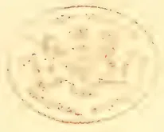A faint, circular seal or stamp impression is centered on the page. The seal appears to have a decorative border and contains some internal text or a crest, but the details are too faded to be clearly discerned. It is likely a library or institutional mark.

537------------------------------------------------

ANDREW NICOL, Esq.

*Tropical Agriculturist Portrait Gallery.*

No. VI.

538------------------------------------------------

# \* The TROPICAL AGRICULTURIST \*

## ◇ MONTHLY. ◇

Vol. XIII.]

COLOMBO, FEBRUARY 1ST, 1894.

No. 8.

## "PIONEERS OF THE PLANTING ENTERPRISE IN CEYLON."

ANDREW NICOL, M.L.C.,

MERCHANT; AND PIONEER IN COFFEE, COCONUT AND TEA PLANTING.

[The following account is mainly from the pen of our esteemed correspondent "Old Colonist" who originally came to Ceylon to begin work as a Planter on one of Mr. Nicol's estates, and who therefore knew the subject of this memoir and his relative, Mr. Sangster Martin, very intimately. We have personally, added a few dates and incidents, more especially in reference to Mr. Nicol's mercantile career' and also the "Appendix."—Ed. T.A.]

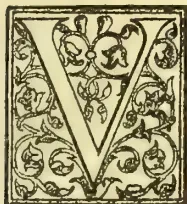

VISITORS to the beautifully situated, though rather quaint and decaying little county-town of Banff, may see by the Lowshore, the antique churchyard, and on entering in, can read from

a plain head-stone the following inscription:—

"Sacred to the memory of James Nicol, Collector of Customs at Banff, who died 24th April 1849, aged 82. Also, of his spouse Margaret Stephenson, who died 23rd December 1864, aged 82."

These were the parents of Andrew Nicol who was born in Banff in 1819. William Nicol, the successful ship-owner, merchant, banker of Bombay and Liverpool, M.P. for Dover, &c., was an elder brother by a previous marriage.

Banff was a "braver" burgh in those olden days than it is now, and the Collector of Customs was a man of no mean importance. Many yet alive have a pleasing recollection of James Nicol, whose keen intelligence and kindly social qualities won him a distinctive position even amongst the dignified denizens of the proud capital of Banffshire.

Young Andrew, too, is well remembered, as a clever but rather impetuous and 'royt' rogue of a red-haired loon. He was educated at the old Grammar School, the present handsome and well-equipped Academy not being yet in existence. Andrew was an apt scholar, could hold his own with the best budding intellect in Banff, and as he was destined for a mercantile life, the time soon arrived when it was deemed desirable that he should be sent to some business centre where he would have better opportunities of acquiring the necessary experience.

To Hamburg he went, early in his teens, and from thence to Malta while yet a young man. After some years in Malta he proceeded to Bombay, where he entered the office of the already famous house of William Nicol & Co., of which his half-brother was head. Leaving Bombay in the early "forties," the subject of our brief memoir now made his début in Ceylon, soon turning his attention to Coffee, the favourite and most promising product of the day. We first hear of him in distant Uva, where he foregathered with a few congenial spirits to discuss planting matters and much else besides. T. L. R. Shand, for instance, could give many racy reminiscences of this meeting;

539------------------------------------------------

504THE TROPICAL AGRICULTURIST.[FEB. 1, 1894]

but to planters the most curious and interesting sequel was, that neither was much enamoured with Badulla, or had little inclination to tackle the difficulties of transport then apparently regarded as insurmountable.

Be that as it may, it is passing strange to think of the Messrs. Shand with much more practical knowledge, wandering away to invest in the wilds of Sabaragamuwa, while the rather happy-go-lucky subject of our notice, drifted in an opposite direction, and within five-and-twenty miles of Kandy selected one of the very finest blocks of coffee land ever found in Ceylon.

The district of RANGALA, as selected by Mr. Nicol, had indeed few if any equals in its day. At a suitable altitude, well sheltered, abundantly watered and with a fine free subsoil, it soon reached the top of the list for heavy bearing. While other hill districts in the Central Province had to be content with from 3½ to 5 cwt. per acre, and even Badulla could only average 7 cwt., Rangala produced year after year 8 cwt. per acre all round,—some states, such as *Battegalla*, more than doubling this quantity. This latter magnificent property of about 300 acres in bearing gave, for a long time, about 4,000 cwt. annually—and some years, much more if it could have been gathered! A short labour supply was at that time, the general experience.

The block of land selected by Mr. Nicol included what was afterwards formed into *Rangala* (proper), *Battegalla*, *Ranwella*, *Galbodde* and *Ilagolla*. All the rest such as Lovegrove, Loonagalla, &c., were subsequent purchases. To T. Pride he sold Rangala; Battegalla to W. N. Duckworth; and Ranwella to Dr. Duncan; reserving only Galbodde and Ilagolla, by no means the best of the bargain for himself.

It must be confessed that as a practical planter Mr. Andrew Nicol was a doubtful success. It has been said with some degree of truth that brains are rather an encumbrance to a planter than otherwise, being apt to lead him away into side-issues incompatible with the steady, plodding perseverance necessary in a good manager of estates. A. N.'s planting operations were rather of a spasmodic character; but being of a sanguine temperament and well supported with capital, he went boldly in, and often succeeded where better but more timid planters failed.

The difficulty was to keep him on the estates. The life was then much lonelier than it is now, and was of course a great change to one accustomed to the bustle of office work. Nevertheless Mr. Nicol was of a roving disposition, and would disappear for weeks, no one knew whither, except the few coolies who accompanied him into the Bintenne country.

It was on one of these excursions that he penetrated through the Veddah country and reached Batticaloa to find coconut planting progressing under the fostering care of O'Grady, Carey, Munro and Cumming, all plucky sportsmen and most congenial spirits. Ever ready to invest and throw in his lot with such friends, Mr. Nicol lost no time in applying for a block of land. The land was soon surveyed and in due course purchased, so that next year when he returned to Batticaloa on a shooting trip, he found himself proprietor of some 500 acres of finely-situated land by the sea-side including a pretty little bay; the surveyor having for convenience run the chain right across its neck,—so including the water in the acreage. At first Mr. N. was rather pleased with this arrangement; but on second thoughts he saw such an excellent opportunity of giving the Government Agent a rap over the knuckles, that he could not resist the chance. Few men could write more caustically,—especially to officials,—and we can readily imagine with what delight he dropped down upon the Government with a formal complaint, the gist of which was that he “decidedly objected to have to purchase from them any portion of the *Bay of Bengal*!”

There was no replying to such a letter save by sending a Surveyor at once to cut off the disputed water, or rather to deduct the extent from the acreage. But the day came when A. N. repented him of his rashness! In after years when the coco-palms began to yield their increase, the little bay proved very convenient for the natives to stealthily approach the beach in their canoes and help themselves. Exasperated by this, Mr. Nicol bethought himself of putting up a strong fence across the mouth of the bay, and hoping his previous letter had been long ago forgotten, wrote offering to pay for this privilege. But in this case the bitter was bit; the Government Agent replying that “the Government of Ceylon decidedly objected to sell to him or to any one else any portion of the *Bay of Bengal*!”

By this time the subject of our memoir was in his 31st year; the palms were progressing satisfactorily at Batticaloa; the coffee clearings at Rangala making rapid strides.

T. Pride—a model planter—was doing admirable work on Rangala estate, while the courtly W. N. Duckworth on beautiful Battegalla was sadly puzzled what the deuce to do with it. Dr. Duncan toiled away with tolerable success on his rigged brae-face; while that great gamester, R. Gerard was supposed to act as planting adviser and Visiting Agent for Galbodde and Ilagolla. Gerard was by no means a pukka planter, but a so-called lucky man: everything he had hitherto touched having turned into

540------------------------------------------------

FEB. 1, 1894.]THE TROPICAL AGRICULTURIST.505

gold. When *his* career, however, comes to be written, it will be found to contain a shocking bad example and dreadful sequel. His style of visiting may be inferred from the fact that some years after this, when asked if he would take a walk down and see Galbodde, he replied : "No faith ye, my boy, I had charge of the estate for two years and never yet put a foot upon it."

In short, the management of Galbodde and Illagolla was up to this time not quite a success. Money was liberally spent, but the work was only done by fits and starts, without any method and with very little profit.

Fortunately for himself and fortunately for Rangalla, Mr. Nicol at this time hit upon the idea of indenting on home for a thoroughly competent manager, and in 1851 Mr. *James Sangster Martin* appeared upon the scene. Martin took in the situation almost at a glance, and in a marvellously short time blossomed forth into one of the best and most careful estate managers Ceylon ever saw, though strange enough, up to the last he never could utter an intelligible sentence in Tamil! Seeing his success, Mr. Nicol soon sent for another of the same ilk. The result was Mr. *John Martin* in 1854, and a very fit addition to the staff he proved to be, as his career, in Dimbula chiefly, ever since—for he is still with us—was amply shown. With such assistance, the Rangalla pioneer was now a made man, and could devote his leisure to business, pleasure or politics as the spirit might move him.

It is curious by the way, to compare here the two rising young Scotchmen of that day :—both coming M. L. C.'s, both born in the same year, in neighbouring townships. But here the similarity ceases. The seer of Dumbara (R.B.T.) with his self-acquired capital and education gradually developing into a John Bright amongst planters; while our friend of Rangala with his almost classical learning and unlimited credit, was rapidly ripening into the Roebuck of Ceylon.

A comparison might also be made with another Colonist already referred to, Mr. Charles Shand, who became merchant as well as planter like Mr. Nicol. For, in 1854, the subject of our notice became the head of a mercantile house in Colombo, which had previously been in existence for a good many years as "Messrs. Dowdall, Cargill & Co." It now became "Messrs. Nicol, Cargill & Co," Mr. Nicol's partner and manager being Mr. S. T. Richmond (who still survives in Colombo as our oldest mercantile resident). Mr. Richmond arrived in Bombay in 1842, and came down to Colombo in April 1848, settling here with Messrs. Dowdall, Cargill & Co. in the

following year.—Another partner in the new firm was Mr. Alexander Campbell White, also an old Bombay merchant, and who has lived to become one of our most extensive proprietors of plantations.

About this time (1854) Mr. Nicol took his first trip home, becoming tenant of Auchintoul House, Marnoch, Banffshire, where he was joined by his friends, W. N. Duckworth and R. Gerard. "Three lively blades" they were, as many in the neighbourhood could testify.

In 1856, however, the redoubtable Andrew Nicol was fairly captured by the then reigning belle of Banffshire, Miss Stronach, who, amidst all the troubles of life that were yet to be faced, proved a most devoted, charming and in every way suitable helpmeet for him.

Two years later, viz., in 1858, we find Mr. Nicol once more *en route* for Ceylon, accompanied by Mrs. Nicol and several relatives. He had now to return to work in earnest; for, during his absence, the notorious Frank Hudson\* had made sad inroads upon the capital of his firm (Nicol, Cargill & Co.), having received heavy advances without giving adequate security; the consequence of which was that Mr. Nicol had reluctantly to take over several of what appeared at the time to be rather undesirable properties in Dimbula and elsewhere, and to endeavour to work out the loss as best he could.

Other estates more or less desirable, Ballacadua, Cabroosa, &c., of which he had been part owner, now fell entirely into his hands. It was a brave and hard struggle, all the harder that the unlimited banking support gave way when most needed. Albeit, right pluckily did Mr. Nicol put his shoulder to the wheel, ever to be found rushing in red haste from Colombo to Dimbula, and from Dimbula to Rangala or Matale, always off at a tangent, and always with a certain kind of erratic love for planting and gardening. Give Mr. Nicol a couple of good peaches in Colombo at tiffin, and next morning he would rush up to Lunugalla to plant the stones, returning in time to dictate few drastic letters. No man ever enjoyed his own letters more; and no man who knew him, ever felt any the worse for them. As a rule he was a liberal employer, but subject to fits of economy; as when he wrote in red ink across the Ballacadua Estate subscription to a Kirk:—"Save your soul at your own expense, Sir," and returned the note to the manager.

It was about this time (in the year 1869) that he first dubbed himself "*The poor but industrious*

\* Supposed to be a natural son of Sir Hudson Lowe and the founder in Colombo of the short-lived firm of Hudson, Chandler & Co.—F. Hudson's after career has been an extraordinary one as Hotel Manager, Billiard Markr, &c., and it is not finished yet we believe.

541------------------------------------------------

506THE TROPICAL AGRICULTURIST.[FEB. 1, 1894.]

*Planter*," a cognomen which stuck to Mr. Nicol through the remainder of his life. The description occurred in this wise:—he had freely and generously given to Government a building at Teldeniya to be used as a Post Office; but after a time the Government Agent probably forgetting the circumstance, and only remembering him as proprietor, wrote officially requesting him to have the premises whitewashed without delay. This called forth a characteristic letter in which A. N. deplored the meanness of the Ceylon Government, who not content with sitting *rent free* had the effrontery to ask him, "A poor but industrious *planter*," to whitewash their Post Office for them!

To see Andrew Nicol at his best, however was to meet him casually at an out-of-the-way rest-house. To hear him tackle the appu, see him tuck up his shirt-sleeves, beat the steak, or teach the astonished cook how to fry sardines in paper. Then after dinner to hear him *chaff* Charles Shand about his "enterprising spirits in Sabaragamuwa," or Alexander Gibson as to his investments in the wilds of Haputale,—contrasting these with his own profitable places and capable men in Rangala, generally winding up the evening with a few yarns illustrating his prowess as a sportsman. Here is a sample taken down *verbatim et literatim* 33 years ago:—

"We were bothered with a brute of an elephant at Batticaloa. Jock Cumming had been after him for days, but could not get near him. I was living in a small talipot hut, and at night my servant lay at my feet. One night I was awakened by the shrieks of my appu, and a strange, rattling, thumping noise in the roof. With my dim floating light I could just see the huge trunk of an elephant swinging backwards and forwards right above me; his head filled the doorway, and he had evidently made up his mind to have a lark with us at his leisure. I mounted to my elbow, slipped my hand below my camp-bed, where my rifle lay, always ready loaded; steadily and deliberately I took my aim, and fired. There was a terrific snort, a trumpet and something like an earthquake, I replaced my rifle, turned on my side and was asleep again in 5 minutes, but in the morning a large rogue elephant lay dead in front of our hut!"

It was about this time—1861—that he became Planting M.L.C., and on the whole a very good and useful member he made. "The Council have no longer all their wits about them" said the senior Editor of the *Observer*, when Mr. Nicol retired, on account of another visit home in 1862. On this voyage, Mr. Nicol's experience and fertility of resource as a pioneer and jungle resident came well to the front; for the P. & O.,

Steamer "Colombo," Capt. Farquhar, in which he left Galle in November of that year, ran ashore on the North end of Minicoy island, and although passengers and crew were all saved, they had rather a dreary time of it ashore, until they were able to communicate with the Coast of India and Colombo. Mr. Nicol excelled himself as hut-builder and caterer on this occasion, and ladies and children felt much indebted to him.—In 1863, Mr. Nicol retired from mercantile business, his Firm being merged in that of Messrs Fowlie, Richmond & Co., and to this house there came to Ceylon, three members of the community, still in our midst.—Messrs. W. Law, R. L. M. Brown, and William Somerville.

In 1864 Mr. Nicol once more returned to his native town, and took up his residence at St. Ann's Hill—a villa in the suburbs. But Banff had greatly changed, *bona-fide* friends were fewer, the many who claimed acquaintance were poorer, while he himself was not richer. He was pestered with begging letters, and particularly deplored the growing want of independence amongst the rising generation. The boys he said "could no longer play at marbles or kick a foot-ball without electing a Secretary to beg, while women forsook their sacred household duties, to meet where the maximum of talk and minimum of work, qualified a Committee to beg." Now Mr. Nicol was by no means an illiberal man; but like all gentlemen of experience preferred to dispense his own charities. The climax seemed to come in the formation of a "Bathing Club," a few dirty boys having resolved upon an occasional dip, and elected a Committee, whose Secretary—James Watt—was instructed to write to the retired Ceylon Planter for a subscription. This tickled A. N.'s sense of the ludicrous, and called forth one of his inimitable letters, in which "although deprecating anything that would tend to destroy the fine spirit of independence amongst Scottish youth," he continued,— "there was something so commendable in the Banff young men voluntarily undertaking to wash themselves, that he had much pleasure in sending a subscription of £2 2s, and would be glad to continue this annually, provided that the money was spent on soap. The Secretary quietly pocketed the sarcasm with the cheque, and took care never to omit year after year while they both lived to apply for the "soap money."

But although Mr. Nicol had a natural horror of appearing on subscription lists, few men, perhaps, gave more liberally or unostentatiously, and to many who had the very reverse of any claim upon him, Frank Hudson, for instance, who had done more to injure and ruin him

542------------------------------------------------

FEB. 1, 1894.]

THE TROPICAL AGRICULTURIST.

507

than any living man, appealed to him in his direst necessity, and was not sent empty away.

For ten years, Mr. Nicol continued in Banffshire, chiefly occupying himself with fishing and shooting. Then, after 1874, Mr. and Mrs Nicol spent four or five years on the Continent of Europe for the education of their children. Then during a few years more Mr. and Mrs. Nicol, with their interesting and accomplished family of daughters, moved about from place to place; now at Elgin; now at Glassaugh or Grantown; now holiday-making in Jersey, or travelling in Germany. Mr. Nicol himself, however, made two trips to Ceylon during the "seventies." Then about 1880, he with his family, settled down in London for residence.

In 1885 he again found it necessary to return to Ceylon through the exigencies of that fell leveller, the coffee leaf-fungus, a crisis, however, which brought out many of the best qualities of Ceylon's leading pioneers.

Although no longer young, and no longer supported by unlimited credit, with his own native shrewdness and latent energy alone Mr. Nicol met the disaster. Right manfully did he set to work and right honourably did he meet all his engagements. During the critical days of transition from coffee to cinchona and cinchona to tea, Mr. Nicol lived closely on his Dimbula estates, working with a will and cheerfulness that put to shame many a younger man, so that at the end of four years, viz. in 1889, his estates were once more in a fairly flourishing condition. But by this time his own health was far from satisfactory, and when he returned home, as he did in the spring of this year (leaving Ceylon in February 1889),—his friends saw with concern that the end was drawing near. It was hoped that in the genial climate of Elgin, life might peradventure be prolonged yet a few years. But it was not to be; and on Sunday 23rd June, 1889, at the residence of a son-in-law, Andrew Nicol passed peacefully away at the age of threescore and ten. Altogether, it is said that Mr. Nicol had made the voyage between England and the East no less than twenty-three times, an evidence of his energy and activity.

APPENDIX.

It may be of interest here to shew what was said of Rangalla—the district above all others, identified with Mr. Andrew Nicol,—in our "Directory and Gazetteer" for 1859, the first published at the *Observer* Press. We also give a list of all the Coffee and Coconut properties owned by Mr. Nicol or his firm, in that year

in the Rangalla and Dimbula Districts, and in the Eastern Province:—

RANGALLA.

This fine District was separated from "the Knuckles" by the Committee of the Planters' Association in 1856. They defined it as bounded North by the Cottaganga; East by the Knuckles and Medamahaneura ridge; South by the Bambragamma Oya; and West by the Hoolooganga. The Statistics referred to 8 Estates, the names of which were furnished to us as follows:—Cotaganga; Girinde Elle; Lovegrove; Gallebodde; Rangwella; Battagalla; Rangalla No. 1; Rangalla No. 2. The acres in bearing were returned at 1,200; not bearing 500; total 1,700. The average cultivation on Estates was, therefore, 239 acres, and the crop being returned at 9,000 cwt.; the average yield per acre was so high as 8 cwts. The labour requirements of the District in crop time cannot be less than about 3,500 coolies. The Girinde ella Estate lies to the North of the Cottaganga River, and is therefore not strictly within the limits fixed by the Planters' Committee; but it belongs to the District and must be included. It will be observed that our list now embraces 12 Estates, the cultivation on which is as follows:—Acres in bearing or partially so 1,800; young 700; total 2,500; and more land is being opened this season. From this acreage the estimated crop of 1853-59 is set down at 13,500 cwts. or 7½ cwt. per acre. Cultivation was commenced in this District in 1843-45, and none of the land opened has been abandoned. The elevation is from 2,500 to 4,500; the general altitude being 3,000 feet. It would be difficult to say which aspect is best—altoth' the field which has borne, for a series of years, the largest crops happens to have an Eastern exposure. It cannot be denied, however, that the climate is, at times, too wet to be pleasant. The average temperature is from 60 to 68°. The District is not injuriously affected by wind, but Bug occasionally appears.

<table border="1">
<thead>
<tr>
<th rowspan="2">ESTATES,</th>
<th rowspan="2">PROPRIETORS.</th>
<th colspan="2">RESIDENT MANAGERS AND ASST. SUPERINTENDENTS.</th>
</tr>
<tr>
<th>PROPRIETORS.</th>
<th>RESIDENT MANAGERS AND ASST. SUPERINTENDENTS.</th>
</tr>
</thead>
<tbody>
<tr>
<td><i>Rangalla District:</i></td>
<td></td>
<td></td>
<td></td>
</tr>
<tr>
<td>Lovegrove</td>
<td>Andrew Nicol</td>
<td>...</td>
<td>James S. Martin and</td>
</tr>
<tr>
<td>Gallebodde</td>
<td>Do</td>
<td>...</td>
<td>Channing Esdaile</td>
</tr>
<tr>
<td>Ilagolla</td>
<td>Do</td>
<td>...</td>
<td>James Findlater</td>
</tr>
<tr>
<td>Loonoogalla</td>
<td>Do and William N. Duckworth</td>
<td>...</td>
<td>Alex. Sangster</td>
</tr>
<tr>
<td></td>
<td></td>
<td>...</td>
<td>James S. Martin</td>
</tr>
<tr>
<td><i>Dimbula District:</i></td>
<td></td>
<td></td>
<td></td>
</tr>
<tr>
<td>Niagara</td>
<td>Nicol Cargill &amp; Co.</td>
<td>...</td>
<td>John Martin—Assistant: John Clark</td>
</tr>
<tr>
<td>Union</td>
<td>Do</td>
<td>...</td>
<td>Do Asst. Alex. Telfer Geddes</td>
</tr>
<tr>
<td>Hudon</td>
<td>Do</td>
<td>...</td>
<td>Do Asst. Frederick Wernham</td>
</tr>
<tr>
<td>Manchester</td>
<td>Do</td>
<td>...</td>
<td>Do</td>
</tr>
<tr>
<td>Pallaradella</td>
<td>Do</td>
<td>...</td>
<td>Do</td>
</tr>
<tr>
<td><i>Eastern Province:</i></td>
<td></td>
<td></td>
<td></td>
</tr>
<tr>
<td>Caratooe</td>
<td>A. Nicol and others</td>
<td>...</td>
<td>W. H. O'Grady</td>
</tr>
<tr>
<td>Nindoor</td>
<td>Do</td>
<td>...</td>
<td>Do</td>
</tr>
<tr>
<td>Oolavilla</td>
<td>Do</td>
<td>...</td>
<td>Do</td>
</tr>
</tbody>
</table>

543------------------------------------------------

508THE TROPICAL AGRICULTURIST.[FEB. 1, 1894.]Correspondence.To the Editor.A COMPLAINT ABOUT CEYLON TEA PACKAGES.

DEAR SIR,—For the information of planters and in the interest of the trade, we send you for publication the enclosed correspondence. Please omit all names.—Yours faithfully,  
pp. BATHGATE, PIM & Co., F. F. STREET,  
Colombo, January 5th, 1894.

To—  
Dear Sirs,—We purchased in sale 30th of August last a parcel of pekoe from the above estate. The constituent to whom we shipped this tea complains that it "was badly tainted with the smell of the wood—a strong smelling pine most unsuitable for tea." We have no record in our books as to whether these were local or imported packages; but from the description given them by our correspondent, we think they must have been Japanese Cedar. If this is the case we think planters' attention should be drawn to the matter through the medium of the press, that their use may be discontinued in future.

We have always contended that Japanese cedar packages ought not to be used for tea, but that Japanese *Momi* packages are the best in use.—We are, dear sir, yours faithfully,

pp. BATHGATE, PIM & Co.,  
(Signed) F. F. STREET.

Colombo, December 18th, 1893.

Messrs. Bathgate, Pim & Co.

Dear Sirs,—We much regret the complaint to which you refer in your letter of the 18th instant. The tea in question was not made at ———, but we passed your remarks on to the superintendent of the estate, and he informs us that the packages were not made of Japan Cedar but of Pine wood obtained from English packing cases.—We are, dear sir, yours faithfully,

Colombo, December 29th, 1893.

GERMAN EAST AFRICA: INFORMATION WANTED.

SIR,—Will you or any of your numerous readers please furnish, through the medium of your invaluable journal, the following information for the benefit of the Young Ceylon Creeper?

A certain metropolitan firm, I see is advertising for Ceylonese, understanding planting, and wishing to go abroad, to proceed to German East Africa to join the planting line thither, on a term of engagement for three years. The salary held out by them is 5, 6 and 7 sovereigns\* for the first, second and third year respectively.

Do you think this is a sufficient inducement for "Young Ceylon" to proceed to distant Africa and will this suffice to keep them going comfortably there and enable them to bring a "renny" on their return?—Yours truly, "CREEPER."

A HINT TO DIRECTORS OF TEA AND PRODUCE COMPANIES.

SIR,—Now that the Directors of the various Tea and Produce Companies in the island will soon be issuing their Reports for the past year, there

\* Per mensem? equal to R80 to R112. It depends entirely on the cost of living in German East Africa:—For many years at the beginning of the Planting Enterprise in Ceylon, the allowance to young European Planting Assistants was £8 3s 4d (under R82) per mensem—and for a few saved money, in those very cheap days for food and servants.—ED. T.A.]

is a suggestion that I should like to make, and which I am sure will recommend itself to all shareholders and to others looking out for investments, and that is, that each report should contain a detailed account of the acreage of the Company i.e. so many acres of tea (or other produce) planted such and such a year, and so many acres of forest, &c., &c.

The only Company that gives this information in detail in its report at present, so far as I am aware, is the Yataderia Tea Company, and I should like to recommend to other Directors, the embodiment of this useful information in their reports.  
SHAREHOLDER.

CHINA V. CEYLON TEA.

Kandy, Jan. 11.

SIR,—The ever-increasing area cultivated with tea seems certain in the near future to produce a lower range of prices than now prevails. In view of this and of a probable struggle of the survival of the fittest it seems strange that so much apathy is displayed by planters and exporters on the great experiment now being tried in India to make the rupee artificially dearer, and so to force and unnaturally high exchange that tells directly against the exporter of tea from India and Ceylon and offers a premium to his competitor in China.

Sir John Lubbock and other strong monometalists are now said to be urgent for the imposition of an import duty on silver entering India; should their counsels prevail China will be the only great market left for the metal. Certainly there is no danger of the Chinese imposing a duty; they want all they can get, and are not at all particular whether it is coined or in bars. It looks as if at no distant date the Mongolian will get for a shilling as much silver as is contained in a rupee, and if simultaneously with this the Government of India succeeds in establishing the artificial value of sixteen pence for the same coin (which is what they profess to be aiming at). It needs but a small arithmetical calculation to show that the tea exporter from India and Ceylon will be handicapped to the extent of 33½ per cent as against the merchant exporting from China.

Surely this cannot be fully understood by those interested in the great tea industry or they would speedily make their voices heard in condemnation of this great financial experiment which has already increased the debt of India by many millions sterling and is rapidly leading the Government into unknown financial depths.

I am not at all interested in tea, but beg to subscribe myself  
A STUDENT OF THE  
GREAT SILVER QUESTION.

CARNIVOROUS PLANTS.

DEAR SIR,—I should like to know if your readers have found in Ceylon those pretty little plants the Sundews, or Droseras. I do not find mention of them in Trimen's Flora of Ceylon, in the first vol. where I should think they ought to appear if at all. Two species, the *rotundifolia* and *longifolia* are found on the Pulney Hills, S. India, at an elevation of 5,000 to 7,000 feet. A few days since I found the *filiformis* at the sea level. London puts its native country as New Jersey. I have seen it near there, but had no idea it would grow here. The little plants with their purple flowers almost covered the ground for some distance with their dewy fly traps. Numerous flies had been caught. Some of them of ordinary size. The

544------------------------------------------------

FEB. 1, 1894.]THE TROPICAL AGRICULTURIST.509

leaves about two inches in length are mere stalks covered with reddish hairs. In some cases the fly was rolled up in the tip. In others where it stuck near the middle of the leaf the stalk or leaf was bent into a semicircle around it to bring more of the glutinous hairs to bear on the prey and dissolved it. One leaf I noticed had two of these curves in its length around two little flies. These plants could hardly have been introduced, for they were six miles from any mission house, and if they were at all abundant in the peninsula I think I would have seen them before—Yours truly

"OBSERVER."

[Dr. Trimen is good enough to give us the following note on the above:—"We find three kinds of Sundew in Ceylon, *Drosera Burmanni*, *D. indica* and *D. peltata*. The first is generally distributed in wet places throughout the island, the second rather rare and confined to the low-country and the last is found only in the hill-country and is common about Nuwara Eliya. All three also inhabit Peninsular India, and the first two are no doubt the *D. rotundifolia* and *D. longifolia* of your correspondent (being very like those English species at first sight). As to *D. filiformis*, it is only known as a N. American plant, and I should be glad to see specimens of the species considered to be the same found by your correspondent, if he will kindly send a few. In the sequence of natural orders followed in my Flora the *Droseraceae* come in the second part, soon to be published.—HENRY TRIMEN, Peradeniya, Jan. 9th.—Ed. T.A.]

#### THE TEA CHESTS OF THE FUTURE.

DEAR SIR,—A fine to-do about Acme boxes. There are strong doubts as to their ultimate success. I should say the *rumour* of the disease in the Momi trees was *rot*, pure and simple. My Jap friend's agent was here three months ago and he says the supply is practically inexhaustible. There are two quarters where the interest in the near future may be to run down and run out Momi boxes if possible in view of the Udugama Company and the Acme boxes, but they won't succeed! There is nothing to touch Momi at present.

#### MOMI FOR EVER.

[To which we reply that the "rot, pure and simple" was contained as we stated in advices sent from Japan to a mercantile house, whose interests are by no means adverse to the trade in Japan tea chests.—Ed. T.A.]

#### STOWING TEA AND BOXES' SUPPLY.

DEAR SIR,—In re the remarks the other day re Tea boxes, &c., the idea of screw-jacks in stowing tea boxes is ABSURD. With cotton bales and similar elastic goods you can understand it. Besides they would not have time to work them here. I have myself stowed cotton and know all about it. A man came to me to know what truth about Momi running short? By and by I'll send you the Jap reply. It is all *rot* that *rumour*.—Yours, &c. TEA BOX.

#### THE TEA QUESTION:—XLIV.

DEAR SIR,—The essential conditions for the "production of good tea"—which ought, but does not always, mean also good prices—have been pretty well threshed out in the forty-three letters from practical men published by you. Such a collection of views does good if it only sets men thinking and comparing; but I don't think anything very novel has been elucidated, or anything which a practical man with an estate already planted up and factory already built and

fitted, can seize upon to enable him to do better than he always has done. As, for the majority of estates, such questions as "elevation, jât and soil" are fixed and settled quantities, it seems to me almost superfluous to discuss them in public\*. But "How to produce the best made tea under these fixed conditions?" is for each planter a problem for his own solution. My own opinion is that good tea of the various sorts can be made anywhere and everywhere, with care in plucking, withering and firing, and sorting. But as regards "stand out" teas of exceptional values, how can they be of any interest to any but a few? What is the practical use of discussing this question by planters at large? The Ceylon planters already turn out good teas in immense quantities for which they do not receive approximate fair value from the trade. It is not so much that the several estates which used to get high prices produce worse tea than they did, as the fact that we others have caught them up with a general rush, neither doing themselves nor ourselves any good. Our great enemies are the buyers and the trade who, by competing and cooperating with each other to pay as little as possible, nearly destroy the tea-producing industry. The real question for discussion is "How to get value for good tea?", The tea we make is good enough.

#### A TEA MAKER.

#### GRIEVANCES OF CACAO PLANTERS.

Wattegama, Jan. 20.

DEAR SIR,—Is Government not going to protect us cacao planters? Here is some experience as reported to me:—A boy caught redhanded with pods in his possession gets off scot-free, because no other offence was proved against him.

A boy caught with pods in his possession was let off because he was too young for punishment (8 to 10 years old).

A boutiquekeeper was found in possession of some 10 pods of green cocoa in his house. He accounted for them that a relation had sent them to him at his request for planting the seed in his garden—voluntary statement; now all the pods were green and unfit to plant as the man knew well when he made that statement. Some pods had been robbed from a native close by his boutique, yet the latter would not go to Court as he would not spend the same amount of money as the other man could. The peace officer took the man to the Magistrate and there being no complainant (who lost crop) the man was let off.

A boutique man was found in possession of half-cured cocoa. He first said he got it from his brother's garden. Then, when that garden was visited and no signs on the trees of pods having been plucked, he said he bought it from a native. On going to the native's garden it was found he had only Caraccas whereas at least half of the cocoa taken was Forastero. He further said he bought the whole for 4d from that man whereas that man said he only sold him and got paid for 2d. No theft could be proved by planters, so no case was allowed to be taken. We want a law to enable us to get hold of the receiver; either he must prove where he got the produce from in a proper set of books or stand the consequence for having produce in his possession for which he cannot account for.

Several cases for cocoa theft have been proved in our Court and proper punishments given to those convicted, which certainly ought to deter others from thieving.

\*Our correspondent forgets that there are still young planters and "seeking" capitalists in the land!—Ed. T.A.

545------------------------------------------------

510THE TROPICAL AGRICULTURIST.[FEB. 1, 1894.]

On looking over the list of cases for trial in the Supreme Court, I find burglary with theft and murder are on the increase.

The question is why is this? Are our ordinances defective or are they not properly administered? It is now said the Supreme Court is against Magistrate granting search warrants unless the applicant can swear that he is positive the stolen property is in the man's house which he wishes to search.

This is no doubt right when application is made to search the house of a man of good repute; but when it is made to search a man's house, who was before convicted, or is a well-known suspected thief, receiver or gambler though never convicted before; then a search warrant should be granted at once; and as private as possible for there is always a lot of hangers-on in our Courts who on hearing of a search warrant being applied for at once; send the man word (knowing criminals pay well for such information) and the man can protect himself for the search warrant. We have the born thief who cannot allow a chance to rob escape him. It is these thieves we must watch and when caught give them a severe punishment; yet some of these men can be made good citizens if properly managed. Look at our Australian Convict Colony and even in Ceylon we have some, after serving out their sentences have become good citizens. Unfortunately there is many false cases brought to our Courts and very great responsibility rest with our Magistrates to sift the evidence. Often the false evidence is given fearlessly by hired witnesses who have been well trained what to say. On the other hand there is some truthful witnesses who hesitate in giving their evidence which Magistrates often think or say to make up false evidence, whereas in point of fact they are most anxious to speak the truth and hesitate as they do not wish to tell an untruth. I have been in Courts and heard some cases tried in which the side that brought forward the false evidence gained the day for the very reason above quoted. I knew the whole facts from both sides, but could say nothing as I was not a witness. Yet I could not b'ame the Magistrate as I should have given a similar decision on the evidence. I being behind the scene with proof that the evidence on the side that gained the case was as false as it could be, was unable to give the help to the innocent party as the Magistrate told me when I got up to speak—as I was not on the witness list to sit down. This refers to a case decided some years ago at Panwila. If conviction is obtained by false evidence, that brings hatred and a man wrongly convicted very often when he returns from jail becomes desperate and looks to have revenge on his false accusers and so eventually becomes a criminal himself, whereas there are others who suffer in preference to take revenge and return again to jail; in these cases the Salvation Army has done a great deal of good in recovering criminals from their bad ways.

#### HOLLOWAY.

#### TEA-BOXES.

A Paper in the *Planter's Gazette* contains a report of an interview with Mr. F. Boulbee, of the firm of Messrs. A. Yates & Co., of Luddenden via Manchester, upon the subject of tea-boxes. Messrs. Yates are said to be "practically famous the world over" as saw-mill Engineers and wood-working machinists; and Mr. Boulbee is referred to as having had very wide experience as a saw-mill Engineer in the Far East. He has given special attention to the subject

of producing good tea-boxes at low prices. Seeing that the main cause of the present expense is to be found in the distance the "shooks" have to be carried, the remedy that naturally suggested itself was to produce them on the spot. Experiments have been tried and the outcome of them is that Messrs. Yates have patented an invention for machinery and plant for tea-box making, which they are now supplying at a figure that is within the reach of all planters, and the adoption of which should lead to a very considerable saving in their annual outlay, while at the same time rendering them independent of any outside supply. Many tea gardens have ample power for driving the box-making plant during the months when the power is not required for manufacturing tea. And even where this is not the case a central box-making factory might be established. Hitherto the great expense has been in the cost of bringing the log to the factory to be "broken down" and prepared for sawing up, and when sawn up, shipping to the various gardens. In the ordinary way the "breaking down" would have to be done by a Rack Bench, Timber Frame, or Band-Shaw, which are not only most expensive in themselves, but require heavy and expensive foundations on which to work with great power to drive them. Messrs. Yates & Co. claim that the machinery which they have patented as the result of Mr. Boulbee's researches, entirely obviates all these obstacles. They maintain that all that is required is that the tree in the jungle should be cross cut into short suitable lengths which can be easily split up by a simple and effective machine into any size that may be required for cutting the "shooks." This machine can be worked either by hand or power, requiring "only one horse nominal" to drive it. When not required for splitting logs for "shooks" it can, by a simple and inexpensive attachment, be converted to the purpose of splitting up firewood for heating the boilers or even utilised in preparing the tea. Some of our planting readers may be interested in reading the following description of the plan:—

The Patent Log Splitter and Breaking Down Machine is capable of dealing with logs up to 3ft. in diameter and 3ft. 6in. in length, and is reckoned to prepare sufficient stuff for 350 tea chests per day or if not employed on this, to split up from 3,000 to 5,000 billets of firewood, according to size in the same time. The stuff having been "broken down" into convenient sizes, is then handed over to the "shook cutting bench," which is known in this country [England] as Yates and Boulbee's Patent Self-Feeding Safety Saw Bench. This unique machine is perfectly automatic in its action, absolutely safe, and will accurately saw up a sufficient number of "shooks" or strips for 250 to 300 boxes (according to size) per diem of eight hours. This bench is also arranged for cross-cutting ends and for jobbing purposes generally. In addition to the above machines it is recommended that an improved Box Maker's Planing and Thinning Machine, fitted with tongueing and grooving attachment for jointing the "shooks," and a checking machine for sides and ends be added, which complete little plant would turn out first class tea chests accurately made, giving equal tares, and saving "bulking," which is a most important consideration. Messrs. Yates supply a complete plant as described above for £300.—*M. Times*.

#### COFFEE MACHINERY.

French makers of decorticators, pulpers, and winnowers specially suited for treating coffee, should send their price-lists and models of machines. It would also be well if some coffee-producing countries could be mentioned where any maker has placed his machinery. All price-lists, prospectuses, and catalogues in Spanish should state the exact amount of work done by each machine. The "hacendados," or landed proprietors of the Yungas, would prove very profitable clients for such apparatus capable of being actuated by men, horses, mules, or oxen.—*French Chargé d'Affaires à La Paz*.

546------------------------------------------------

FEB. 1, 1894.]THE TROPICAL AGRICULTURIST.511

## CEYLON MANUAL OF CHEMICAL ANALYSES.

A HANDBOOK OF ANALYSES CONNECTED WITH THE INDUSTRIES AND PUBLIC HEALTH OF CEYLON FOR PLANTERS, COMMERCIAL MEN, AGRICULTURAL STUDENTS, AND MEMBERS OF LOCAL BOARDS.

BY M. COCHRAN, M.A., F.C.S.

(Continued from page 452.)

### Coconut Poonac.

Coconut poonac is the residue of the kernel of the fruit of the coconut palm, (*cocos nucifera*) after the greater part of the oil has been expressed from it. As a manure it is much inferior to castor cake. The following two analyses exhibit its composition:—

#### Analyses of Coconut Poonac.

<table border="1">
<thead>
<tr>
<th></th>
<th>per cent.</th>
<th>per cent.</th>
</tr>
</thead>
<tbody>
<tr>
<td>Moisture</td>
<td>13.00</td>
<td>11.20</td>
</tr>
<tr>
<td>Organic matter</td>
<td>80.79</td>
<td>79.70</td>
</tr>
<tr>
<td>Soluble ash</td>
<td>5.09</td>
<td>6.47</td>
</tr>
<tr>
<td>Sand</td>
<td>1.12</td>
<td>2.63</td>
</tr>
<tr>
<td></td>
<td>100.00</td>
<td>100.00</td>
</tr>
<tr>
<td>Nitrogen</td>
<td>3.</td>
<td>3.33</td>
</tr>
<tr>
<td>Equal to ammonia</td>
<td>3.64</td>
<td>4.04</td>
</tr>
</tbody>
</table>

#### Crushed Tallow Oil Cake.

This substance is made from the seeds of one of the Tallow trees. An analysis to test its value as a manure yielded the following results.

#### Analysis of Crushed Tallow Oil Cake.

<table border="1">
<thead>
<tr>
<th></th>
<th>per cent.</th>
</tr>
</thead>
<tbody>
<tr>
<td>Moisture</td>
<td>10.</td>
</tr>
<tr>
<td>* Organic matter</td>
<td>86.30</td>
</tr>
<tr>
<td>Ash</td>
<td>3.70</td>
</tr>
<tr>
<td></td>
<td>100.00</td>
</tr>
<tr>
<td>* Containing nitrogen</td>
<td>2.31</td>
</tr>
<tr>
<td>Valuable ash</td>
<td>2.51</td>
</tr>
<tr>
<td>Sand</td>
<td>1.19</td>
</tr>
</tbody>
</table>

The sample was in a fine state of mechanical division, 92.6 per cent. passing through a sieve of 10 meshes to the lineal inch and 82.4 through a sieve of 28 meshes to the lineal inch.

Judging from the chemical analysis it is not equal to coconut poonac as a manure.

### PHOSPHORIC ACID MANURES.

The following are the manures which are purchased for their phosphatic ingredients only:—Bone ash, animal charcoal, mineral phosphates, such as phosphorite and coprolite, superphosphates from mineral phosphates, superphosphates from bone ash, animal charcoal, precipitated phosphates and basic slag.

#### Bone Ash.

The two following analyses quoted from "Chemistry: Theoretical, Practical and Analytical" shew respectively the composition of pure bone ash from the mixed carcase bones of an entire ox, and also the composition of a commercial sample of bone ash:—

#### Analyses of Bone Ash.

<table border="1">
<thead>
<tr>
<th></th>
<th>Pure.</th>
<th>Commercial.</th>
</tr>
</thead>
<tbody>
<tr>
<td>Water and carbon</td>
<td>1.86</td>
<td>6.70</td>
</tr>
<tr>
<td>* Phosphoric acid</td>
<td>39.55</td>
<td>33.68</td>
</tr>
<tr>
<td>Lime</td>
<td>52.46</td>
<td>43.37</td>
</tr>
<tr>
<td>Magnesia</td>
<td>1.02</td>
<td>1.14</td>
</tr>
<tr>
<td>Oxide of iron</td>
<td>.17</td>
<td>.58</td>
</tr>
<tr>
<td>Carbonic acid, alkalies and substances not determined</td>
<td>4.43</td>
<td>4.84</td>
</tr>
<tr>
<td>Siliceous matter</td>
<td>.51</td>
<td>9.69</td>
</tr>
<tr>
<td></td>
<td>100.00</td>
<td>100.00</td>
</tr>
<tr>
<td>* Equal to tricalcie phosphate</td>
<td>86.34</td>
<td>73.52</td>
</tr>
</tbody>
</table>

From 70 to 75 per cent. tricalcie phosphate represents the commercial standard of purity for this article.

#### Animal Charcoal.

The following according to Krocker is the average composition of animal charcoal:—

<table border="1">
<thead>
<tr>
<th></th>
<th>per cent.</th>
</tr>
</thead>
<tbody>
<tr>
<td>Moisture</td>
<td>2.350</td>
</tr>
<tr>
<td>Carbon and volatile matters</td>
<td>12.388</td>
</tr>
<tr>
<td>Lime</td>
<td>38.416</td>
</tr>
<tr>
<td>* Phosphoric acid</td>
<td>29.690</td>
</tr>
<tr>
<td>Carbonic acid</td>
<td>2.400</td>
</tr>
<tr>
<td>Sand</td>
<td>13.300</td>
</tr>
<tr>
<td>Other matters</td>
<td>1.456</td>
</tr>
<tr>
<td></td>
<td>100.000</td>
</tr>
<tr>
<td>* Equal to tricalcie phosphate</td>
<td>64.105</td>
</tr>
</tbody>
</table>

The composition of waste animal charcoal varies between wide limits, depending on the use to which it has been put. It is only when its power of decolorising liquids for which it is chiefly used in the arts has become spent, that it is sold to the manure manufacturer, to be converted into superphosphate. The following, according to R. Weber, represent the limits between which the ingredients of animal charcoal vary.

#### Composition of Spent Animal Charcoal. (WEBER.)

<table border="1">
<tbody>
<tr>
<td>Phosphates</td>
<td>from 50 to 82 per cent.</td>
</tr>
<tr>
<td>Calcium carbonate</td>
<td>5 to 10 "</td>
</tr>
<tr>
<td>Free lime</td>
<td>1 to 6 "</td>
</tr>
<tr>
<td>Sand</td>
<td>2 to 28 "</td>
</tr>
<tr>
<td>Water and carbon</td>
<td>9 to 26 "</td>
</tr>
</tbody>
</table>

#### Mineral Phosphates.

These are mostly used for the manufacture of superphosphate; but when finely ground may be applied to the soil direct. The following from

65

547------------------------------------------------

512THE TROPICAL AGRICULTURIST.[FEB. 1, 1894.

"Chemistry: Theoretical, Practical and Analytical" represents the percentage composition of some of them:

*Analyses of Mineral Phosphates.*

<table border="1">
<thead>
<tr>
<th rowspan="2"></th>
<th rowspan="2">Norwegian Apatite.</th>
<th rowspan="2">Canadian Apatite.</th>
<th colspan="2">Spanish Phosphorite.</th>
<th rowspan="2">Cambridge coprolite.</th>
</tr>
<tr>
<th>Superior.</th>
<th>Ordinary.</th>
</tr>
</thead>
<tbody>
<tr>
<td>Water</td>
<td>90</td>
<td>91</td>
<td>3.59</td>
<td>1.00</td>
<td>4.04</td>
</tr>
<tr>
<td>Loss on ignition</td>
<td>35.69</td>
<td>33.27</td>
<td>33.38</td>
<td>28.67</td>
<td>26.62</td>
</tr>
<tr>
<td>Phosphoric acid</td>
<td>46.39</td>
<td>45.56</td>
<td>47.16</td>
<td>40.60</td>
<td>43.30</td>
</tr>
<tr>
<td>Lime</td>
<td>74</td>
<td>—</td>
<td>trace</td>
<td>1.48</td>
<td>.95</td>
</tr>
<tr>
<td>Magnesia</td>
<td>36</td>
<td>—</td>
<td>—</td>
<td>—</td>
<td>.58</td>
</tr>
<tr>
<td>Potash</td>
<td>—</td>
<td>—</td>
<td>—</td>
<td>—</td>
<td>.64</td>
</tr>
<tr>
<td>Soda</td>
<td>—</td>
<td>—</td>
<td>—</td>
<td>—</td>
<td>—</td>
</tr>
<tr>
<td>Ferric oxide</td>
<td>1.29</td>
<td>—</td>
<td>2.59</td>
<td>.63</td>
<td>2.18</td>
</tr>
<tr>
<td>Alumina</td>
<td>1.53</td>
<td>—</td>
<td>.89</td>
<td>.50</td>
<td>2.05</td>
</tr>
<tr>
<td>Carbonic acid</td>
<td>none</td>
<td>—</td>
<td>4.10</td>
<td>4.67</td>
<td>6.82</td>
</tr>
<tr>
<td>Sulphuric acid</td>
<td>.29</td>
<td>—</td>
<td>.57</td>
<td>.90</td>
<td>.91</td>
</tr>
<tr>
<td>Chlorine</td>
<td>1.62</td>
<td>—</td>
<td>—</td>
<td>—</td>
<td>—</td>
</tr>
<tr>
<td>Fluorine</td>
<td>—</td>
<td>—</td>
<td>—</td>
<td>.67</td>
<td>—</td>
</tr>
<tr>
<td>Siliceous matter</td>
<td>11.62</td>
<td>10.38</td>
<td>3.71</td>
<td>20.92</td>
<td>8.19</td>
</tr>
<tr>
<td>Phosphoric acid reckoned as tricalcic phosphate</td>
<td>77.90</td>
<td>72.62</td>
<td>72.87</td>
<td>62.59</td>
<td>58.11</td>
</tr>
<tr>
<td>Carbonate of calcium</td>
<td>none</td>
<td>—</td>
<td>9.31</td>
<td>10.62</td>
<td>15.50</td>
</tr>
<tr>
<td>Lime for 100 phos. acid</td>
<td>130</td>
<td>137</td>
<td>141</td>
<td>142</td>
<td>163</td>
</tr>
</tbody>
</table>

According to Mr. Pringle (*Tropical Agriculturist* 1891) both bone ash and mineral phosphates, which are to be applied directly to the soil as manures, should be in a state of division, such that 90 per cent. passes through a sieve of 80 meshes to the linear inch. The same agricultural chemist says: "Of mineral phosphates high class Spanish called Estramadurite, has from 75 to 82 per cent. phosphates; inferior qualities are often in the market with only 50 per cent. or so in them. Canadian and Norwegian apatites and Aruba phosphate are generally very rich, having sometimes as much as 90 per cent. tricalcic phosphate. There are a great number of others; but these are the most suitable, and I prefer Aruba, as it is as soft and as easily decomposed as bone ash, and is generally cheaper."

Deposits of guano are met with which have parted with nearly all their nitrogen, and are valued on the basis of their phosphoric acid. Some of these guanos contain phosphoric acid equivalent to upwards of 70 per cent. tricalcic phosphate. These, as well as bone ash and mineral phosphates, are used in the manufacture of superphosphates. From phosphatic guanos, by treatment with sulphuric acid, are prepared the superphosphates that are richest in soluble phosphates. As these guanos are free from excess of lime, and contain almost no iron and alumina, practically the whole of the phosphate can be rendered soluble, and they yield a superphosphate, containing from 40 to 45 per cent. of soluble phosphate, i.e., tricalcic phosphate rendered soluble. Bone ash contains a little lime not combined with phosphoric acid, which is converted into gypsum, thus adding to the non-

phosphatic ingredients; hence bone ash superphosphates are not quite so rich in soluble phosphates as those made from high class phosphatic guanos, still the superphosphates made from bone ash are of excellent quality, and may be reckoned to yield from 35 to 40 per cent. of soluble phosphates. Mineral phosphates yield superphosphates rich in soluble phosphates, in proportion to the richness of the mineral phosphate, to the fineness of the grinding of the mineral and to its freedom from iron, aluminum, and calcium carbonate. A range of from 20 to over 40 per cent. of soluble phosphate may be looked for in this class of superphosphate. From Carolina river phosphate 30 per cent. and from Cambridge coprolite 25 per cent. soluble phosphates are said to be fair yields.

The following is Krocker's analyses of a superphosphate made from Baker guano:—

*Analysis of Superphosphate.*

<table border="1">
<thead>
<tr>
<th></th>
<th>per cent.</th>
</tr>
</thead>
<tbody>
<tr>
<td>Moisture</td>
<td>...</td>
</tr>
<tr>
<td>Chemically combined water</td>
<td>...</td>
</tr>
<tr>
<td>Combustible matter</td>
<td>27.00</td>
</tr>
<tr>
<td>* Soluble phosphoric acid</td>
<td>21.31</td>
</tr>
<tr>
<td>† Insoluble do</td>
<td>1.05</td>
</tr>
<tr>
<td>Sulphuric acid</td>
<td>24.65</td>
</tr>
<tr>
<td>Lime</td>
<td>23.20</td>
</tr>
<tr>
<td>Magnesia</td>
<td>1.30</td>
</tr>
<tr>
<td>Alkalies</td>
<td>.49</td>
</tr>
<tr>
<td>Insoluble matter</td>
<td>1.00</td>
</tr>
<tr>
<td></td>
<td>100.00</td>
</tr>
</tbody>
</table>

\* Equal to tricalcic phosphate rendered soluble ...

46.32

† Equal to tricalcic phosphate ... 2.29

The following are the analyses of two samples of superphosphate imported to Ceylon:—

*Analyses of Superphosphates imported to Ceylon.*

<table border="1">
<thead>
<tr>
<th></th>
<th>per cent.</th>
</tr>
</thead>
<tbody>
<tr>
<td>Moisture</td>
<td>...</td>
</tr>
<tr>
<td>Chemically combined water and</td>
<td>...</td>
</tr>
<tr>
<td>Combustible matter</td>
<td>21.78</td>
</tr>
<tr>
<td>* Soluble phosphoric acid</td>
<td>15.66</td>
</tr>
<tr>
<td>† Insoluble phosphoric acid</td>
<td>1.50</td>
</tr>
<tr>
<td>Sulphuric acid</td>
<td>29.06</td>
</tr>
<tr>
<td>Lime</td>
<td>23.35</td>
</tr>
<tr>
<td>Magnesia, alkaline salts and oxide of iron</td>
<td>2.35</td>
</tr>
<tr>
<td>Insoluble matter</td>
<td>6.30</td>
</tr>
<tr>
<td></td>
<td>100.00</td>
</tr>
<tr>
<td>* Equal to tricalcic phosphate rendered soluble</td>
<td>...</td>
</tr>
<tr>
<td>34.21</td>
<td>...</td>
</tr>
<tr>
<td>† Equal to tricalcic phosphate</td>
<td>3.27</td>
</tr>
</tbody>
</table>

The following is a better sample of superphosphate, the results being also reported in a different form from the above:—

<table border="1">
<thead>
<tr>
<th></th>
<th>per cent.</th>
</tr>
</thead>
<tbody>
<tr>
<td>Moisture and other volatile matter</td>
<td>24.10</td>
</tr>
<tr>
<td>* Monocalcic phosphate (biphosphate)</td>
<td>26.84</td>
</tr>
<tr>
<td>Insoluble phosphate of lime</td>
<td>1.24</td>
</tr>
<tr>
<td>Calcium sulphate (hydrated)</td>
<td>46.39</td>
</tr>
<tr>
<td>Alkaline salts</td>
<td>1.08</td>
</tr>
<tr>
<td>Insoluble matter</td>
<td>.35</td>
</tr>
<tr>
<td></td>
<td>100.00</td>
</tr>
<tr>
<td>* Equal to tricalcic phosphate</td>
<td>42.02</td>
</tr>
</tbody>
</table>

The following analyses by Tatlock represent superphosphates in the most concentrated form which has come under the author's notice. They were manufactured in the year 1892:—

548------------------------------------------------

FEB. 1, 1894.]

THE TROPICAL AGRICULTURIST.

513

*Analyses of highly-concentrated Superphosphates*

<table border="0">
<thead>
<tr>
<th></th>
<th>No. 1.</th>
<th>per cent</th>
</tr>
</thead>
<tbody>
<tr>
<td>Phosphoric acid soluble in water</td>
<td>...</td>
<td>32.81</td>
</tr>
<tr>
<td>Equal to tribasic phosphate of lime</td>
<td>...</td>
<td>71.62</td>
</tr>
<tr>
<td>or</td>
<td></td>
<td></td>
</tr>
<tr>
<td>Phosphoric acid soluble in citrate of ammonia</td>
<td>...</td>
<td>37.10</td>
</tr>
<tr>
<td>Equal to tribasic phosphate of lime</td>
<td>...</td>
<td>80.99</td>
</tr>
</tbody>
</table>

<table border="0">
<thead>
<tr>
<th></th>
<th>No. 2.</th>
<th>per cent.</th>
</tr>
</thead>
<tbody>
<tr>
<td>Biphosphate of lime</td>
<td>...</td>
<td>56.10</td>
</tr>
<tr>
<td>Equal to soluble phosphates of lime</td>
<td>...</td>
<td>87.83</td>
</tr>
<tr>
<td>Insoluble phosphates</td>
<td>...</td>
<td>12.17</td>
</tr>
</tbody>
</table>

If the price per unit of phosphoric acid in the above does not greatly exceed that in ordinary superphosphates, it is evident there would be a very material saving in freight, by the importation of such highly concentrated superphosphates as compared with those of ordinary quality.

*Precipitated Phosphates.*

Another highly-concentrated form of phosphate of lime is sold as a manure under the name of precipitated phosphate. It is manufactured by passing ammonia gas into superphosphate of lime, the result being a mixture chiefly of tribasic phosphate of lime and sulphate of ammonia. The sulphate of ammonia is removed by washing, and the dried residue contains from 70 to 80 per cent. of tribasic phosphate of lime.

Another method of manufacture is by the addition of lime to a solution of superphosphate, which throws down tribasic phosphate of lime along with bi-phosphate. The tribasic phosphate of lime obtained in this manner is much more soluble in water (and therefore much more readily assimilated by plants) than is tribasic phosphate of lime as it exists in mineral phosphates.

This form of phosphate appears to be better suited for soils deficient in lime (like those of Ceylon) than acid manures, and as a further recommendation it does not injure the bags in which it is packed like superphosphate. Its employment on Ceylon estates would altogether depend on its effectiveness and cost when compared with bone dust.

*Basic Slag.*

Another form of phosphate is deserving of notice which goes by the name of Thomas Basic Slag, the reputation of which has gone on steadily rising. It is a slag produced in the manufacture of steel from pig iron by the Thomas and Gilchrist process. The slag consists chiefly of phosphate of lime, with excess of lime, the percentage of phosphate of lime varies from 30 to 42 per cent, but it can be purchased under the guarantee of containing phosphoric acid equal to 37 per cent. tribasic phosphate. It is sometimes sold in such a fine state of division, that 75 per cent of the powdered substance passes through a sieve of 168 meshes\* to the square inch, in this fine state Thomas phosphate of 40 per cent. tribasic phosphate is said to be four times more soluble and effective than steamed bone meal (Griffiths). The unit of phosphoric acid in this substance is also, as yet, cheaper than in nearly all other phosphatic materials in England, but in Ceylon it could only compete with bone dust in the event of its being found to be more effective as the cost per unit of phosphate of lime would be R1.80 as against R0.70. It might be expected to give especially good results on land deficient in lime as it contains some free lime. The fact that it is comparatively soluble and therefore readily assimilated by plants is due to the phosphoric acid

\* It is most effective when ground much finer than this. It may with advantage be reduced to an impalpable powder.

existing not as tribasic phosphate, the most insoluble form which phosphoric acid assumes, but combined with four molecules\* of lime instead of three as in tribasic phosphate which renders it basic and more unstable. It is worthy of remark that this manure contains oxide of manganese, which is not usually regarded as a necessary constituent of manures; but it is nevertheless a substance which is always present in tea leaves, while it is not an abundant constituent of the soil. Dr. Griffiths in his work on manures, mentions that samples of good quality analysed by Dr. Voelcker and Mr. Bernard Dyer, show percentages of 19.12 and 19.94 respectively of phosphoric acid, which are equivalent to 41.74 and 43.33 per cent. tribasic phosphate of lime.

The following is a full analysis of basic slag of a more ordinary quality by Mr. Tatlock:—

*Analysis of Basic Slag.*

<table border="0">
<thead>
<tr>
<th></th>
<th>per cent.</th>
</tr>
</thead>
<tbody>
<tr>
<td>Lime</td>
<td>47.65</td>
</tr>
<tr>
<td>Magnesia</td>
<td>4.74</td>
</tr>
<tr>
<td>Oxide of Iron</td>
<td>12.56</td>
</tr>
<tr>
<td>Oxide of Manganese</td>
<td>2.69</td>
</tr>
<tr>
<td>Alumina</td>
<td>4.58</td>
</tr>
<tr>
<td>Silica</td>
<td>12.02</td>
</tr>
<tr>
<td>* Phosphoric Acid</td>
<td>15.09</td>
</tr>
<tr>
<td>Sulphuric Acid</td>
<td>.27</td>
</tr>
<tr>
<td>Sulphur as Sulphide</td>
<td>.15</td>
</tr>
<tr>
<td>Carbonaceous Matter</td>
<td>.25</td>
</tr>
<tr>
<td></td>
<td>100.00</td>
</tr>
<tr>
<td>* Tribasic phosphate of lime</td>
<td>32.94</td>
</tr>
</tbody>
</table>

*POTASH MANURES.*

The greater part of these manures that are valued on the basis of their potash only, come from the German mines, prominent amongst which are those of Stassfurth. The following analyses by F. Fursky (Bied. Centr. 1882) exhibit the composition of the Stassfurth manure salts.

<table border="1">
<thead>
<tr>
<th rowspan="2"></th>
<th rowspan="2">Concen- trated potash man- ures</th>
<th rowspan="2">Thrice concen- trated potash man- ures.</th>
<th rowspan="2">Four times concen- trated.</th>
<th colspan="2">Purified</th>
</tr>
<tr>
<th>Purified potas- sium sul- phate.</th>
<th>Purified potas- sium magne- sio- sul- phate.</th>
</tr>
</thead>
<tbody>
<tr>
<td>Calcium sulphate</td>
<td>.69</td>
<td>1.38</td>
<td>.25</td>
<td>.62</td>
<td>.58</td>
</tr>
<tr>
<td>Magnesium sulphate</td>
<td>12.35</td>
<td>8.02</td>
<td>.20</td>
<td>.38</td>
<td>36.28</td>
</tr>
<tr>
<td>Potash sulphate</td>
<td>23.15</td>
<td>—</td>
<td>—</td>
<td>97.20</td>
<td>53.17</td>
</tr>
<tr>
<td>Magnesium chloride</td>
<td>1.15</td>
<td>2.40</td>
<td>.25</td>
<td>—</td>
<td>—</td>
</tr>
<tr>
<td>Potassium chloride</td>
<td>22.95</td>
<td>52.38</td>
<td>82.57</td>
<td>.35</td>
<td>.23</td>
</tr>
<tr>
<td>Sodium chloride</td>
<td>32.34</td>
<td>26.30</td>
<td>14.23</td>
<td>—</td>
<td>3.52</td>
</tr>
</tbody>
</table>

\* The name tetracalcium phosphate has been given to this combination to distinguish it from ordinary tricalcium phosphate.

549------------------------------------------------

514

THE TROPICAL AGRICULTURIST.

[FEB. 1, 1894.

The following are older analyses by Professor E. Wolff shewing the average percentage composition of German salts, and the amount of potash guaranteed:—

<table border="1">
<thead>
<tr>
<th colspan="2"></th>
<th>Potash guaranteed.</th>
<th>Potassium sulphate.</th>
<th>Potassium chloride.</th>
<th>Magnesium sulphate.</th>
<th>Magnesium chloride and magnesia.</th>
<th>Sodium chloride.</th>
</tr>
</thead>
<tbody>
<tr>
<td rowspan="4">Potash manure</td>
<td>Do</td>
<td>10-12</td>
<td>18-25</td>
<td>19-22</td>
<td>15-25</td>
<td>3-6</td>
<td>35-55</td>
</tr>
<tr>
<td>Do</td>
<td>25-26</td>
<td>22-26</td>
<td>48-55</td>
<td>15-20</td>
<td>3-6</td>
<td>20-35</td>
</tr>
<tr>
<td>Do</td>
<td>30-34</td>
<td>—</td>
<td>60-67</td>
<td>5-10</td>
<td>3-6</td>
<td>30-50</td>
</tr>
<tr>
<td>Do</td>
<td>38-42</td>
<td>—</td>
<td>80-85</td>
<td>—</td>
<td>3-6</td>
<td>30-40</td>
</tr>
<tr>
<td rowspan="2">Crude potassium magnesium sulphate</td>
<td>Do</td>
<td>50-55</td>
<td>27-30</td>
<td>—</td>
<td>25-30</td>
<td>3-6</td>
<td>10-20</td>
</tr>
<tr>
<td>Do</td>
<td>15-17</td>
<td>23-25</td>
<td>—</td>
<td>25-30</td>
<td>3-6</td>
<td>25-40</td>
</tr>
<tr>
<td>Leopoldshall (Anhalt) Kainit</td>
<td>...</td>
<td>13-14</td>
<td>—</td>
<td>—</td>
<td>—</td>
<td>—</td>
<td>30-45</td>
</tr>
</tbody>
</table>

The following shews the composition of a sample of kainit, imported to Ceylon, submitted to me for analysis. For the sake of comparison I give also Voelcker's analysis of kainit:—

*Analyses of Kainit.*

<table border="1">
<thead>
<tr>
<th></th>
<th>per cent.</th>
<th>Voelcker. per cent.</th>
</tr>
</thead>
<tbody>
<tr>
<td>Moisture</td>
<td>6-24</td>
<td>3-36</td>
</tr>
<tr>
<td>Water of combination</td>
<td>12-81</td>
<td>10-88</td>
</tr>
<tr>
<td>Potassium sulphate</td>
<td>22-51</td>
<td>24-43</td>
</tr>
<tr>
<td>Calcium sulphate</td>
<td>1-38</td>
<td>2-72</td>
</tr>
<tr>
<td>Magnesium sulphate</td>
<td>14-23</td>
<td>13-22</td>
</tr>
<tr>
<td>Magnesium chloride</td>
<td>13-16</td>
<td>14-33</td>
</tr>
<tr>
<td>Sodium chloride</td>
<td>20-01</td>
<td>30-35</td>
</tr>
<tr>
<td>Insoluble siliceous matter</td>
<td>36</td>
<td rowspan="2">71</td>
</tr>
<tr>
<td>Alumina</td>
<td>30</td>
</tr>
<tr>
<td></td>
<td>100-00</td>
<td>100-00</td>
</tr>
</tbody>
</table>

Another of the Stassfurth salts called carnallite has the following composition, quoted from Richardson and Watt's Chemical Technology.

*Analysis of Carnallite.* per cent.

<table border="1">
<tbody>
<tr>
<td>Chloride of potassium</td>
<td>24-27</td>
</tr>
<tr>
<td>Chloride of sodium</td>
<td>4-82</td>
</tr>
<tr>
<td>Chloride of calcium</td>
<td>2-82</td>
</tr>
<tr>
<td>Chloride of magnesium</td>
<td>30-98</td>
</tr>
<tr>
<td>Sulphate of lime</td>
<td>1-05</td>
</tr>
<tr>
<td>Oxide of iron</td>
<td>14</td>
</tr>
<tr>
<td>Water, &amp;c.</td>
<td>35-92</td>
</tr>
<tr>
<td></td>
<td>100-00</td>
</tr>
</tbody>
</table>

The above is a crude muriate of potash. Commercial muriate of potash contains 88 per cent. pure muriate.

*PLANT ASHES.*

The value of plant ash as a manure depends chiefly in the amount of potash contained in it. Besides potash, plant ash frequently contains appreciable quantities of phosphoric acid, and sometimes large quantities of lime. The amount of potash and lime vary between wide limits. The following exhibits the composition of several samples of wood ashes submitted to the author for analyses:—

*Analyses of Wood Ashes.*

<table border="1">
<thead>
<tr>
<th></th>
<th>per cent.</th>
<th>per cent.</th>
<th>per cent.</th>
</tr>
</thead>
<tbody>
<tr>
<td>Moisture</td>
<td>3-5</td>
<td>2-46</td>
<td>7-7</td>
</tr>
<tr>
<td>Carbonaceous matter and combined water</td>
<td>3-24</td>
<td>6-70</td>
<td>23-96</td>
</tr>
<tr>
<td>Oxides of iron and alumina</td>
<td>15-06</td>
<td>16-54</td>
<td>13-73</td>
</tr>
<tr>
<td>Calcium carbonate</td>
<td>24-22</td>
<td>25-73</td>
<td>17-60</td>
</tr>
<tr>
<td>Calcium sulphate</td>
<td>trace</td>
<td>2-07</td>
<td>78</td>
</tr>
<tr>
<td>Magnesia</td>
<td>71</td>
<td>3-06</td>
<td>1-13</td>
</tr>
<tr>
<td>Potassium carbonate</td>
<td>21-05</td>
<td>6-41</td>
<td>1-25</td>
</tr>
<tr>
<td>Sodium carbonate</td>
<td>1-33</td>
<td>90</td>
<td>23</td>
</tr>
<tr>
<td>Phosphoric acid</td>
<td>1-45</td>
<td>1-03</td>
<td>trace</td>
</tr>
<tr>
<td>Chlorine</td>
<td>1-92</td>
<td>42</td>
<td>17</td>
</tr>
<tr>
<td>Insoluble siliceous matter</td>
<td>28-02</td>
<td>34-68</td>
<td>33-45</td>
</tr>
<tr>
<td></td>
<td>99-50</td>
<td>100-00</td>
<td>100-00</td>
</tr>
</tbody>
</table>

The following is the analysis of another sample of plant ashes which differs considerably from the foregoing in composition:—

550------------------------------------------------

FEB. 1. 1894.]

THE TROPICAL AGRICULTURIST.

515

*Analysis of Plant Ashes.*

<table border="0">
<thead>
<tr>
<th></th>
<th style="text-align: right;">per cent.</th>
</tr>
</thead>
<tbody>
<tr>
<td>Moisture</td>
<td style="text-align: right;">6.10</td>
</tr>
<tr>
<td>Carbonaceous matter</td>
<td style="text-align: right;">.52</td>
</tr>
<tr>
<td>Oxides of iron and alumina</td>
<td style="text-align: right;">4.03</td>
</tr>
<tr>
<td>* Lime</td>
<td style="text-align: right;">24.50</td>
</tr>
<tr>
<td>Magnesia</td>
<td style="text-align: right;">4.18</td>
</tr>
<tr>
<td>† Potash</td>
<td style="text-align: right;">18.70</td>
</tr>
<tr>
<td>Soda</td>
<td style="text-align: right;">.35</td>
</tr>
<tr>
<td>Phosphoric acid</td>
<td style="text-align: right;">trace</td>
</tr>
<tr>
<td>Sulphuric acid</td>
<td style="text-align: right;">2.42</td>
</tr>
<tr>
<td>Chlorine</td>
<td style="text-align: right;">3.40</td>
</tr>
<tr>
<td>Carbonic acid &amp;c.</td>
<td style="text-align: right;">32.76</td>
</tr>
<tr>
<td>Insoluble siliceous matter</td>
<td style="text-align: right;">3.04</td>
</tr>
<tr>
<td></td>
<td style="text-align: right; border-top: 1px solid black;">100.00</td>
</tr>
<tr>
<td>* Equal to calcium carbonate</td>
<td style="text-align: right;">43.75</td>
</tr>
<tr>
<td>† Equal to potassium carbonate</td>
<td style="text-align: right;">29.01</td>
</tr>
</tbody>
</table>

The following is the analysis of a remarkable sample of wood ashes, which exhibits potash at about its minimum, and lime at its maximum. It is the ash of the tree known by the Sinhalese as the kumbuk, which is one of the genus Terminalia. On sifting the sample through a sieve having 900 meshes to the square inch, 1.17 per cent. of quartz sand was separated. The ash, freed from the small quantity of quartz, had the following composition:—

*Analysis of Wood Ashes of the Kumbuk Tree.*

<table border="0">
<thead>
<tr>
<th></th>
<th style="text-align: right;">per cent.</th>
</tr>
</thead>
<tbody>
<tr>
<td>Moisture</td>
<td style="text-align: right;">.38</td>
</tr>
<tr>
<td>Insoluble siliceous matter</td>
<td style="text-align: right;">2.35</td>
</tr>
<tr>
<td>Silica soluble in acid</td>
<td style="text-align: right;">.26</td>
</tr>
<tr>
<td>Oxide of iron and alumina</td>
<td style="text-align: right;">.75</td>
</tr>
<tr>
<td>* Lime</td>
<td style="text-align: right;">56.00</td>
</tr>
<tr>
<td>Magnesia</td>
<td style="text-align: right;">.37</td>
</tr>
<tr>
<td>Potash</td>
<td style="text-align: right;">.54</td>
</tr>
<tr>
<td>Phosphoric acid</td>
<td style="text-align: right;">trace</td>
</tr>
<tr>
<td>Carbonic acid and other constituents.</td>
<td style="text-align: right;">39.35</td>
</tr>
<tr>
<td></td>
<td style="text-align: right; border-top: 1px solid black;">100.00</td>
</tr>
<tr>
<td>* Equal to calcium carbonate</td>
<td style="text-align: right;">... 100.00</td>
</tr>
</tbody>
</table>

A portion of the lime was in the caustic state, which accounts for the fact that it contains as much lime as is present in chemically pure carbonate of lime.

A venerable specimen of this tree grows at Mutwal, Colombo, which the late Mr. W. Ferguson measured in the year 1850, and found the girth close to the earth to be 45 feet, and 21 feet at 12 feet above the ground. Mr. Ferguson states that he had his first view of the tree from the sea near Negombo, about twenty miles distant. The calcareous nature of the ashes of the kumbuk tree is well-known to the natives of Ceylon.

*Ashes of Marine Plants.*

On sea coasts, where sea weed abounds, it has been largely used for manuring the land bordering on the sea; but the large percentage of moisture in marine plants prevents its use on land, at any great distance from the sea. I am unable to quote the analyses of any cut or drift weeds found on the Ceylon coasts; but very elaborate analyses

of sea weeds, and especially of the *ash* of sea weeds, known as kelp in Scotland and Ireland, and vared in France, have been made in connection with the iodine industry. These may be found in Richardson and Watts' Chemical Technology. Viewed as a potash manure, it will be sufficient to quote the analyses of the late Professor Anderson of Glasgow, of the mixed cut and drift weeds in the state in which they are actually used, i.e., with small shells and marine animals adhering to the plants, which increase the amount of phosphoric acid and nitrogen.

*Average Composition of Mixed Sea Weed.*

(ANDERSON.)

<table border="0">
<thead>
<tr>
<th></th>
<th style="text-align: right;">per cent.</th>
</tr>
</thead>
<tbody>
<tr>
<td>Water</td>
<td style="text-align: right;">80.44</td>
</tr>
<tr>
<td>* Albuminous compounds...</td>
<td style="text-align: right;">2.85</td>
</tr>
<tr>
<td>Fibre &amp;c.</td>
<td style="text-align: right;">6.40</td>
</tr>
<tr>
<td>† Ash</td>
<td style="text-align: right;">10.31</td>
</tr>
<tr>
<td></td>
<td style="text-align: right; border-top: 1px solid black;">100.00</td>
</tr>
<tr>
<td>* Containing nitrogen</td>
<td style="text-align: right;">.45</td>
</tr>
<tr>
<td>† Containing potash</td>
<td style="text-align: right;">1.95</td>
</tr>
<tr>
<td>Phosphoric acid</td>
<td style="text-align: right;">.47</td>
</tr>
</tbody>
</table>

*Full Analysis of the Ash.*

<table border="0">
<tbody>
<tr>
<td>Peroxide of iron</td>
<td style="text-align: right;">2.35</td>
</tr>
<tr>
<td>Lime</td>
<td style="text-align: right;">18.15</td>
</tr>
<tr>
<td>Magnesia</td>
<td style="text-align: right;">6.48</td>
</tr>
<tr>
<td>Potash</td>
<td style="text-align: right;">12.77</td>
</tr>
<tr>
<td>Potassium chloride</td>
<td style="text-align: right;">9.10</td>
</tr>
<tr>
<td>Potassium iodide</td>
<td style="text-align: right;">1.68</td>
</tr>
<tr>
<td>Sodium chloride</td>
<td style="text-align: right;">22.08</td>
</tr>
<tr>
<td>Phosphoric acid</td>
<td style="text-align: right;">4.59</td>
</tr>
<tr>
<td>Sulphuric acid</td>
<td style="text-align: right;">6.22</td>
</tr>
<tr>
<td>Carbonic acid</td>
<td style="text-align: right;">13.58</td>
</tr>
<tr>
<td>Silicic acid</td>
<td style="text-align: right;">3.00</td>
</tr>
<tr>
<td></td>
<td style="text-align: right; border-top: 1px solid black;">100.00</td>
</tr>
</tbody>
</table>

The following are Richardson's analyses of the sulphates of potash of commerce, prepared from solutions of kelp:—

*Analyses of Commercial Sulphate of Potash.*

(RICHARDSON.)

<table border="1">
<thead>
<tr>
<th></th>
<th style="text-align: center;">Irish.</th>
<th style="text-align: center;">Scotch</th>
</tr>
</thead>
<tbody>
<tr>
<td>Sulphate of potash</td>
<td style="text-align: center;">77.43</td>
<td style="text-align: center;">75.28</td>
</tr>
<tr>
<td>Sulphate of soda</td>
<td style="text-align: center;">21.31</td>
<td style="text-align: center;">20.89</td>
</tr>
<tr>
<td>Sulphate of lime</td>
<td style="text-align: center;">—</td>
<td style="text-align: center;">.80</td>
</tr>
<tr>
<td>Sulphate of iron</td>
<td style="text-align: center;">trace</td>
<td style="text-align: center;">—</td>
</tr>
<tr>
<td>Chloride of sodium</td>
<td style="text-align: center;">.76</td>
<td style="text-align: center;">.54</td>
</tr>
<tr>
<td>Insoluble matter</td>
<td style="text-align: center;">trace</td>
<td style="text-align: center;">1.04</td>
</tr>
<tr>
<td>Moisture</td>
<td style="text-align: center;">.59</td>
<td style="text-align: center;">1.55</td>
</tr>
<tr>
<td></td>
<td style="text-align: center; border-top: 1px solid black;">100.00</td>
<td style="text-align: center; border-top: 1px solid black;">100.00</td>
</tr>
</tbody>
</table>

I might here give the analysis of a sample of volcanic ashes or deposit brought to me from Mount Vesuvius. For a natural product it is remarkably rich in potash, and if it could be

551------------------------------------------------

516

THE TROPICAL AGRICULTURIST.

[FEB. 1, 1894.

obtained in quantity, would be a suitable material to add to a phosphatic manure:—

*Analysis of Volcanic Ashes or Sublimates from Mount Vesuvius.*

<table border="1">
<thead>
<tr>
<th></th>
<th>per cent.</th>
</tr>
</thead>
<tbody>
<tr>
<td>Potassium sulphate</td>
<td>40.76</td>
</tr>
<tr>
<td>Sodium sulphate</td>
<td>22.87</td>
</tr>
<tr>
<td>Sodium chloride</td>
<td>7.55</td>
</tr>
<tr>
<td>Peroxide of iron</td>
<td>15.43</td>
</tr>
<tr>
<td>Aluminum sulphate</td>
<td>4.34</td>
</tr>
<tr>
<td>Manganese sulphate</td>
<td>.14</td>
</tr>
<tr>
<td>Copper sulphate</td>
<td>1.59</td>
</tr>
<tr>
<td>Calcium sulphate</td>
<td>.68</td>
</tr>
<tr>
<td>Magnesium sulphate</td>
<td>.96</td>
</tr>
<tr>
<td>Silica</td>
<td>.42</td>
</tr>
<tr>
<td>Water</td>
<td>4.41</td>
</tr>
<tr>
<td>Less</td>
<td>.85</td>
</tr>
<tr>
<td></td>
<td>100.00</td>
</tr>
</tbody>
</table>

**NITROGENOUS AND PHOSPHATIC MANURES.**

Amongst the more important manures that are valued both for their nitrogen and phosphoric acid, may be enumerated crushed bones, fish manures, guano and nitrogenous superphosphates.

*Crushed Bones.*

The value of crushed bones for agricultural purposes depends both upon their chemical composition, and also upon the state of division to which they have been reduced. The finer, the state of division, the more rapidly does bone become decomposed in the soil, and the greater is its value. Differences in the state of division are distinguished by the names bone dust, bone meal, bone flour.

In making a mechanical analysis of crushed bones, Krocker uses three sieves. What passes through No. 1 sieve with 4,000 meshes to the square inch is termed *very fine*.

What passes through sieve No. 2 with 2,000 meshes to the square inch is termed *fine*.

What passes through sieve No. 3 with 1,000 meshes to the square inch is termed *tolerably fine*.

Krocker gives the following as the average of a large number of analyses of bone dust. I quote from Dr. Frankland's work on "Agricultural Analyses":—

*A. Chemical Composition. (KROCKER.)*

<table border="1">
<thead>
<tr>
<th></th>
<th>Steamed. per cent.</th>
<th>Unsteamed. per cent.</th>
</tr>
</thead>
<tbody>
<tr>
<td>Moisture</td>
<td>5.30</td>
<td>7.50</td>
</tr>
<tr>
<td>Organic matter</td>
<td>33.40</td>
<td>38.00</td>
</tr>
<tr>
<td>Phosphoric acid</td>
<td>22.80</td>
<td>19.50</td>
</tr>
<tr>
<td>Lime</td>
<td>27.70</td>
<td>24.20</td>
</tr>
<tr>
<td>Carbonic acid</td>
<td>3.80</td>
<td>4.10</td>
</tr>
<tr>
<td>Ferri oxide</td>
<td>.90</td>
<td>1.20</td>
</tr>
<tr>
<td>Magnesia alkalies</td>
<td rowspan="2">2.50</td>
<td rowspan="2">2.00</td>
</tr>
<tr>
<td>Sulphuric acid &amp;c.</td>
</tr>
<tr>
<td>Insoluble matters</td>
<td>3.60</td>
<td>3.50</td>
</tr>
<tr>
<td></td>
<td>100.00</td>
<td>100.00</td>
</tr>
<tr>
<td>Nitrogen</td>
<td>3.80</td>
<td>4.05</td>
</tr>
</tbody>
</table>

*B. Mechanical Composition.*

<table border="1">
<tbody>
<tr>
<td>I. Very fine</td>
<td>45</td>
<td>56</td>
<td>65</td>
<td>75</td>
<td>20</td>
<td>31</td>
<td>35</td>
</tr>
<tr>
<td>II. Fine</td>
<td>12</td>
<td>20</td>
<td>15</td>
<td>12</td>
<td>8</td>
<td>9</td>
<td>15</td>
</tr>
<tr>
<td>III. Tolerably fine</td>
<td>16</td>
<td>18</td>
<td>12</td>
<td>9</td>
<td>14</td>
<td>18</td>
<td>14</td>
</tr>
<tr>
<td>IV. Coarse</td>
<td>27</td>
<td>6</td>
<td>8</td>
<td>4</td>
<td>58</td>
<td>42</td>
<td>36</td>
</tr>
<tr>
<td></td>
<td>100</td>
<td>100</td>
<td>100</td>
<td>100</td>
<td>100</td>
<td>100</td>
<td>100</td>
</tr>
</tbody>
</table>

The following represents the composition of a number of samples of bone dust submitted to me for analysis:—

<table border="1">
<thead>
<tr>
<th rowspan="2"></th>
<th colspan="6">Unsteamed.</th>
<th colspan="6">Steamed.</th>
</tr>
<tr>
<th>5.92</th>
<th>8.36</th>
<th>7.73</th>
<th>6.62</th>
<th>4.32</th>
<th>8.10</th>
<th>16.00</th>
<th>15.60</th>
<th>17.64</th>
<th>100.00</th>
<th>100.00</th>
<th>100.00</th>
</tr>
</thead>
<tbody>
<tr>
<td>Moisture</td>
<td>27.57</td>
<td>25.90</td>
<td>29.44</td>
<td>24.02</td>
<td>96.72</td>
<td>29.30</td>
<td>22.45</td>
<td>21.53</td>
<td>25.12</td>
<td></td>
<td></td>
<td></td>
</tr>
<tr>
<td>* Organic matter</td>
<td>21.12</td>
<td>24.13</td>
<td>22.87</td>
<td>21.50</td>
<td>23.13</td>
<td>24.31</td>
<td>23.13</td>
<td>23.13</td>
<td>20.45</td>
<td></td>
<td></td>
<td></td>
</tr>
<tr>
<td>† Phosphoric acid</td>
<td>33.84</td>
<td>32.26</td>
<td>31.22</td>
<td>29.12</td>
<td>32.65</td>
<td>31.58</td>
<td>31.47</td>
<td>31.32</td>
<td>29.53</td>
<td></td>
<td></td>
<td></td>
</tr>
<tr>
<td>Lime</td>
<td>8.28</td>
<td>7.47</td>
<td>6.04</td>
<td>5.78</td>
<td>6.22</td>
<td>3.71</td>
<td>4.43</td>
<td>6.58</td>
<td>5.00</td>
<td></td>
<td></td>
<td></td>
</tr>
<tr>
<td>Magnesia alkalies</td>
<td>3.27</td>
<td>1.88</td>
<td>2.70</td>
<td>12.96</td>
<td>4.96</td>
<td>8.00</td>
<td>1.63</td>
<td>1.84</td>
<td>2.16</td>
<td></td>
<td></td>
<td></td>
</tr>
<tr>
<td>Carbonic acid fluorine, &amp;c.</td>
<td></td>
<td></td>
<td></td>
<td></td>
<td></td>
<td></td>
<td></td>
<td></td>
<td></td>
<td></td>
<td></td>
<td></td>
</tr>
<tr>
<td>Insoluble matters</td>
<td>100.00</td>
<td>100.00</td>
<td>100.00</td>
<td>100.00</td>
<td>100.00</td>
<td>100.00</td>
<td>100.00</td>
<td>100.00</td>
<td>100.00</td>
<td></td>
<td></td>
<td></td>
</tr>
<tr>
<td>* Containing Nitrogen</td>
<td>3.29</td>
<td>3.52</td>
<td>3.71</td>
<td>3.20</td>
<td>3.13</td>
<td>3.77</td>
<td>2.53</td>
<td>2.52</td>
<td>2.64</td>
<td></td>
<td></td>
<td></td>
</tr>
<tr>
<td>Equal to Ammonia</td>
<td>4.00</td>
<td>4.27</td>
<td>4.51</td>
<td>3.89</td>
<td>8.80</td>
<td>4.57</td>
<td>3.07</td>
<td>3.06</td>
<td>3.21</td>
<td></td>
<td></td>
<td></td>
</tr>
<tr>
<td>† Equal to tricalcic phosphate</td>
<td>46.11</td>
<td>52.67</td>
<td>49.92</td>
<td>46.94</td>
<td>54.86</td>
<td>52.37</td>
<td>52.39</td>
<td>50.50</td>
<td>44.64</td>
<td></td>
<td></td>
<td></td>
</tr>
</tbody>
</table>

The average amount of nitrogen in the unsteamed bones was 3.5 per cent and in the steamed 2.56 per cent. The average amount of phosphoric acid in the unsteamed bones was 23 per cent and in the steamed 22.5 per cent.

The following is the analysis of a sample of bone meal prepared in Colombo:—

*Analysis of Bone Meal.*

<table border="1">
<thead>
<tr>
<th></th>
<th>per cent.</th>
</tr>
</thead>
<tbody>
<tr>
<td>Moisture</td>
<td>7.70</td>
</tr>
<tr>
<td>* Organic matter</td>
<td>29.50</td>
</tr>
<tr>
<td>† Phosphoric acid</td>
<td>22.63</td>
</tr>
<tr>
<td>Lime</td>
<td>29.40</td>
</tr>
<tr>
<td>Magnesia alkalies, carbonic acid &amp;c.</td>
<td>6.27</td>
</tr>
<tr>
<td>Insoluble matter</td>
<td>4.50</td>
</tr>
<tr>
<td></td>
<td>100.00</td>
</tr>
<tr>
<td>* Containing nitrogen</td>
<td>3.50</td>
</tr>
<tr>
<td>Equal to ammonia</td>
<td>4.25</td>
</tr>
<tr>
<td>† Equal to tricalcic phosphate</td>
<td>49.54</td>
</tr>
</tbody>
</table>

The mechanical condition of this sample of bone meal was such that 96 per cent passed through a sieve having 17 meshes to the lineal inch, and fully 70 per cent passed through a sieve having 30 meshes to the lineal inch.

No sample of the finest form of crushed bones, viz., bone-flour has as yet been submitted to me for analysis. According to the late Mr. Pringle, bone flour should be in such a state of division that 90 per cent should pass through a sieve having 80 meshes to the lineal inches.

552------------------------------------------------

FEB. 1, 1894.]THE TROPICAL AGRICULTURIST.517

The following shew the composition of two amplexes of refuse bone dust :—

*Analyses of Refuse Bone Dust.*

<table border="1">
<thead>
<tr>
<th></th>
<th>per cent.</th>
<th>per cent.</th>
</tr>
</thead>
<tbody>
<tr>
<td>Moisture ...</td>
<td>5.42</td>
<td>10.98</td>
</tr>
<tr>
<td>* Organic matter ...</td>
<td>8.42</td>
<td>9.84</td>
</tr>
<tr>
<td>† Phosphoric acid ...</td>
<td>8.48</td>
<td>14.89</td>
</tr>
<tr>
<td>Lime ...</td>
<td>14.32</td>
<td>20.32</td>
</tr>
<tr>
<td>Oxide of iron and alumina</td>
<td>2.52</td>
<td rowspan="2">12.27</td>
</tr>
<tr>
<td>Magnesia alkalies, carbonic acid, &amp;c. ...</td>
<td>5.05</td>
</tr>
<tr>
<td>Sand ...</td>
<td>55.79</td>
<td>31.70</td>
</tr>
<tr>
<td>* Containing nitrogen equal to ammonia ...</td>
<td>100.00</td>
<td>100.00</td>
</tr>
<tr>
<td>† Equal to tricalcic phosphate ...</td>
<td>.86</td>
<td>1.01</td>
</tr>
<tr>
<td>...</td>
<td>20.63</td>
<td>32.51</td>
</tr>
</tbody>
</table>

Besides raw bones and steamed bones, another bone manure called degelatinized bones is used as manure. This consists of bones from which the greater part of the gelatine has been extracted by boiling. The residue, after drying, is friable and can be easily reduced to a fine state of division, and is sold as degelatinised bone meal. The following three analyses of this material are given by Mr. W. Ivison Macadam :—

*Analyses of Degelatinized Bone Meal.*  
(W. J. MACADAM.)

<table border="1">
<thead>
<tr>
<th></th>
<th>per cent.</th>
<th>per cent.</th>
<th>per cent.</th>
</tr>
</thead>
<tbody>
<tr>
<td>Moisture ...</td>
<td>6.52</td>
<td>9.12</td>
<td>12.24</td>
</tr>
<tr>
<td>* Organic matter ...</td>
<td>15.08</td>
<td>11.27</td>
<td>16.18</td>
</tr>
<tr>
<td>Alkaline salts ...</td>
<td>1.27</td>
<td>1.06</td>
<td>.73</td>
</tr>
<tr>
<td>Phosphates ...</td>
<td>64.24</td>
<td>63.82</td>
<td>65.36</td>
</tr>
<tr>
<td>Carbonate of lime ...</td>
<td>10.65</td>
<td>6.87</td>
<td>4.62</td>
</tr>
<tr>
<td>Silica ...</td>
<td>2.24</td>
<td>7.86</td>
<td>.87</td>
</tr>
<tr>
<td></td>
<td>100.00</td>
<td>100.00</td>
<td>100.00</td>
</tr>
<tr>
<td>* Containing nitrogen equal to ammonia ...</td>
<td>1.67</td>
<td>1.82</td>
<td>1.92</td>
</tr>
</tbody>
</table>

In this material the phosphates are considerably higher, and the nitrogen considerably lower, than in other forms of bone dust.

So long as the supply of bones keeps pace with the demand as it has done hitherto, bones are likely to remain the chief and most economical source of phosphates for Ceylon agriculturists.

(To be continued.)

### ARBORICULTURE.

There are some things that the past generation of Anglo-Indians understood better than the present, and one of these was arboriculture. It is not necessary to adduce many arguments in proof of this assertion. Those who may entertain any doubts on the subject have only to take a glance around to convince themselves that what I state is correct. Let any one take a long drive or ride along the now neglected grand trunk road, and say whether any finer specimens of trees are to be found along our modern roads than are to be met with along the grand trunk road. The early pioneers of Western civilisation in this land of sun and heat thoroughly understood the value of trees to man and beast. In this they were simply following in the footsteps of the Mogul conquerors, who in their turn were following the Eastern proverb, which says: "Plant a tree, dig a well, and go to heaven."

It is not, however, so much the planting of trees that I take objection to in these days, as the selection of them for arboricultural purposes. In the old days our forefathers very wisely chose such trees as the Mongo, the "Bargad" (*Ficus Indica*), a few other varieties of the great fig family, such as the "Peepul," the "Gooler" and others; the "Khirnee" (*Mimusops Kaki*); the "Maulseri" (*Mimusops Elengi*); the "Mowha" (*Bassia latifolia*); the well known Tamarind (*Tamarindus Indica*), and such like. It will be seen that every one of these affords magnificent shade; and, with the exception of the "Mowha," are evergreen. In addition to their shade-yielding quality, every one of them has an economic value, and yields a fruit. The natives eat the fruit of the Peepul, Bargad and Gooler, while birds of all kinds are fond of it. Most of these trees are alive with birds of sorts on a hot summer's day. The fruit of the Khirnee is not at all bad, and is held in great favour by the natives; while that of the Maulseri is also much valued by them. Moreover, this tree yields a powerfully-scented flower, which is in great demand by the natives for *pojah* and for making into garlands. I need not enlarge on the Mango and Tamarind, nor about the Mowha, as the fruit of these is well known. In addition to these, I would add the Jack Fruit tree (*Artocarpus integrifolius*), which is not at all used for arboricultural purposes. It is easily grown, germinates freely, and affords a fine shade, being evergreen, and bears a fruit which commands a good price. The "Sheeshum" (*Dalbergia Sisso*), is a good timber tree, but is not evergreen, nor does it give a good shade; but it is now very largely used for avenues.

Turning now to the trees mostly used for arboricultural purposes, I note the following :—The "Sirris" (*Albizia Lebbeck*). This is a most unsatisfactory tree. It is not evergreen, and yields a poor shade. Moreover, the wood is spongy, and a strong breeze will knock off large branches, while a storm will uproot scores of them. Always after a storm our public roads are strewn with Sirris branches torn off, and numberless trees uprooted. Yet there seems to be a *penchant* for planting this tree along our roads, to the exclusion of most others. Its only advantage is its quick growth, and the deliciously-scented flowers it yields in March and April. Next is the *Millingtonia Hortensis*, known to natives under the name of "Per Chameli" which freely translated means "Giant Jessamine." This also is not suited for avenues. It is tall, of pyramidal growth; yields scarcely any shade, and has brittle wood. A strong wind even will uproot the oldest tree, as its roots do not descend beyond a few feet below the surface of the ground. Why it is planted along our roads I have failed to find. Like the Sirris it is of quick growth, and bears highly-scented flowers in November. It has a very spongy bark, which would, perhaps, be useful for corks; hence its old name of *Bignonia Suberosa*. Then we have the Neem tree (*Melia Azadirachta*). This is a very useful tree, but it is not evergreen, and is not suitable for avenues, yet it is largely used for such. At the present time these trees are shedding their leaves, and look very unsightly. The Teak (*Tectona grandis*), is also much used for avenues in some parts. In Upper India they are deciduous, and present an unsightly appearance when shedding their leaves. As a timber-yielding tree it has no equal in the world, but as an avenue tree it is useless. The "Papri" (*Pongamia Glabra*), is another tree I frequently see planted along roads. It is also deciduous, and altogether ugly and quite unsuited for arboricultural purposes. The "Lassora," (*Salvadora myxa*), I class in the same category with the last named. The Sheeshum I have already referred to, and I do not recommend it for avenues, except in places where nothing else will grow. The different species of *acacia* are quite unsuited for arboriculture also. They answer very well for clumping and forest purposes.

I would, therefore, make the following suggestions for the improvement of arboriculture :—Nurseries should be established at certain centres, where the

553------------------------------------------------

518THE TROPICAL AGRICULTURIST.[FEB. 1, 1894.]

Species of trees I have recommended above should be raised. All of them can be easily propagated by seed. When they are one year old they will be fit for transplanting. It would, however, not do to cut down existing trees of undesirable species at once; but the seedlings of the desirable varieties should be planted in the spaces between the existing trees, and well looked after. They should be protected from the ravages of cattle and goats, as at present, until they are big enough to need no further protection; and when they have attained sufficient height to afford shade the old and useless trees should be cut down to make room for the new ones. Those species which bear good fruit, such as Mangoes, Tamarinds, Jack-fruits, Kharnees, Maulseris, &c., should, when about to bear fruit, be farmed out to contractors, and the sale proceeds utilised for the maintenance of nurseries, and other requirements of the arboricultural department. An additional advantage of this system would be that the trees would be well looked after by the contractors for the sake of the fruits, and arboricultural operations would be self-supporting to a large extent: at present Government lays out money without any return whatever.

It will, however, be useless to expect anything like satisfactory results if arboricultural operations are to be carried on under existing rules, when the responsibility for success or failure rests with an ill-paid native, who has not the least notion as to what is really necessary. The work should be entrusted to a European or Eurasian possessing some technical knowledge about trees in general, who should receive a decent salary, and be made responsible for everything within certain areas. This would not only ensure good value for money laid out, but would open up an avenue of employment for the sons of Anglo-Indians who do not look for very high wages.

The importance of trees in the economy of nature is well understood by most people. Tracts of country which never before received rain, and were practicably desert wastes, are now smiling with the verdure of trees, and receive a fair rainfall. One such place is Mooltan in the Punjab; Aden is another. I could name several such places which have benefited vastly by the systematic planting of suitable trees. Vegetation gives rise to evaporation of moisture which in its turn attracts the moisture always suspended in the atmosphere, and thus produces rain. Therefore, arboricultural operations carried out systematically have an important bearing on the economy of nature. J.

—Pioneer.

## FACTS ABOUT BANANA MEAL.

### A COMING INDUSTRY.

A Mr. Hartog, who went in the beginning of last year to Surinam (West Indies), is in possession of a method of preparing fine dry meal from bananas and plantations. The chemical analysis of both sorts of meal have proved that the chemical composition of different banana and plantain kinds is almost identical. The principal stuff the meal contains consists of 80 to 85 degs. of starch. This composition induced him to seek the adoption of the meal for purposes where other stuffs containing starch are employed, and he chose, in the first place, the fabrication of alcohol and glucose (grape sugar). As he did not dispose of very large quantities, he was forced to apply to laboratory experiments that were made at the Government Institute of Alcohols in Switzerland, fixed at Berne. The gentlemen there made alcohol of the meal, and wrote as follows:—

"Il résulte de ce qui précède, qu'il vaut tout à fait la peine d'utiliser ces sirups pour la fabrication d'alcool. La qualité de l'alcool de farine de bananes peut aussi être envisagée comme bonne." In the conversation about the object with those gentlemen, they gave their opinion that the value of the meal would at least be that of maize, the starch

quantity of the meal being greater, the same opinion was given by some manufacturers of alcohol in Switzerland and in Holland. As proof of how many stuffs can be employed for alcohol manufacturing, it may be said that one not very large manufacturer in Holland employs in average 25,000 tons of maize a year. The same gentlemen, in Berne, made experiments with glucose making, and said:—"Il est évident que la farine de bananes traitée de cette manière pourrait être encore utilisée pour la fabrication de glucose." The value of the meal for glucose would be more than one and a half times that of maize, for maize is not employed for that fabrication, but only dearer sorts of stuffs, as potato and sago meal. A certificate for the employment of the meal for glucose manufacturing can only be given by employing at least a ton of the stuff, but there is very great probability it will also do for that purpose. In the following calculations he estimates the value of the meal on the basis of maize, that is, at this time being delivered by ship in Europe at £5 to £5 10s. For manufacturing 1,000 tons per year of meal there would be needed an installation that would cost, delivered and fixed in the estate, £2,000 to £2,500. For a second 1,000 tons a similar installation would be needed, for it would be difficult to make larger installations. For this reason it would also be profitable to make the manufacture on the estate itself, for using the bananas and plantains. The fabrication of 1,000 tons will be taken as a basis. Cost of reaping the fruit, preparing it and making the meal, delivered on ship if there is water in the neighbourhood, can be put at 18s. to 30s. per ton; for freight to Europe, 18s. to 25s. per ton. Thus the average cost for the meal delivered in Europe would be £2 per ton. He said the value would be at least that of maize, or £5 to £5 10s., so that there would rest per ton of meal £3 to £3 10s. So that for 1,000 tons an installation of £2,000 to £2,500 is wanted, and a quantity of bananas or plantains of about the double or the triple of the meal in average 2,500 tons, whilst the revenue would be £3,000 to £3,500. In the above given cyphers all exaggerations are avoided. So it is probable that the quantity of 1,000 tons can be surpassed, and the cost of manufacturing can be reduced, whilst the price of the meal would increase if it will do for glucose manufacturing.

L. E. ANSER, C.E.

[We have examined specimens and samples—both of the banana spirit and banana flour—and are satisfied that there is a great future before this industry.—EDITOR.]—*Horticultural Times.*

"WHAT TO DO WITH OUR GIRLS?"—A suggestion which we originally put forward in a letter to the *Pall Mall Gazette* in 1884—that brother and sister, where there were large families, should be prepared to begin a colonial life together,—has been taken up by the Lady Lecturer Miss Shaw in her paper on the "Australian Outlook" before the Royal Colonial Institute. We quote as follows an editorial note in the *Daily Chronicle*:—

Miss Shaw's practical suggestion towards the solution of the problem, "What shall we do with our Girls?" that every boy who is sent out to Australia to try his fortune should take a sister with him, is opportunely supplemented by a bitter cry for "more girls" from Canada. The *Canadian Gazette* is responsible for the statement that the parting pathetic message of a young Irishman to one of last year's delegates was, "For heaven's sake send us some girls!" The lament, it seems arises from the absence of good "lady helps." This is the harder to understand, because servant-girls in the north-west receive £60 a year, with board and lodging. That they get married is only the natural result of these circumstances; so that, whether a woman wishes to lead a life of single blessedness or become the better half of a farmer, North-West Canada would seem to be an admirable place for her,

554------------------------------------------------

FEB. 1, 1894.]THE TROPICAL AGRICULTURIST.519CEYLON TEA IN AMERICA AND AUSTRALASIA.

We call attention to a very interesting and suggestive letter from Mr. Wm. Watson—formerly so well-known in Ceylon in connection with the Oriental Bank Corporation and now occupying an important position in the banking world of New Zealand. Mr. Watson has taken a great deal of interest in the introduction of Ceylon tea into that Colony and in the letter before us he gives us the results of his experience, rightly judging that it affords valuable lessons with reference to the important question now before Ceylon planters as to what is best to be done in America. Our correspondent shows that now the only part of New Zealand where “pure Ceylon tea” does not seem to be sold is in the province of Auckland. This it is satisfactory to remember, is just the part that is about to be exploited by Mr. A. Thom who is on his way to settle there and to whom the Tea Fund Committee have extended special aid. We trust Mr. Thom will very speedily supply the want pointed out by Mr. Watson. As to present consumption, it is made clear to us by Mr. Watson that considerably more than one-half the tea consumed in New Zealand is from India and Ceylon and he thinks that if the same course is followed in America, there ought very soon to be a demand for 45 million lb. of Ceylon and the same quantity of Indian tea in the United States and Canada. The latter dependency is already, we know, a fairly good customer for British-grown teas and there can be no doubt that following on the Ceylon Court at the Chicago Exhibition, the efforts made in New York, Chicago, St. Louis, Philadelphia, &c., ought to lead to a large increase in the consumption of our teas. Mr. Lipton is committed to their wholesale distribution and a number of British merchants are sending in teas through their agents apart from what the Commissioner's Chicago store may do. Meantime, we attach much importance to the effect on California and the Pacific Coast States of the Ceylon Tea Court of Messrs. Foster and Cockburn at the San Francisco Exhibition and we expect to see this followed by the establishment of regular stores after the fashion described by Mr. Watson in New Zealand.

Since writing the above, we have received an interesting letter from a well-known Ceylon planter dated “San Francisco, 16th Nov.” We leave “D. K.” to tell his own story of his experiences in the States, but it is very satisfactory to see that he speaks so highly of the venture of Messrs. Foster and Cockburn in California, as well as of the Ceylon Courts in the Chicago Exhibition.

CEYLON TEA IN AMERICA.

Dunedin, New Zealand, Nov. 27, 1893.

DEAR SIR,—I was much interested in reading in the Overland *Ceylon Observer* of 26th October your London correspondent's accounts in his letters of 29th September and 5th October of his interviews with Messrs. H. K. Rutherford, J. L. Shand, W. M. Leake, J. Whittall, and J. Roberts.

Perhaps, as one who had the experience of popularizing Ceylon tea in this Colony, I may be allowed to say that I agree with the views expressed by Mr. Rutherford and Mr. Leake as against the others, but I should be in favour of

establishing stores in the principal Northern Cities for the sale of “Pure Ceylon Tea” rather than attempting to work at first through established traders. That all tea traders in America would ultimately sell pure Ceylon tea I believe as firmly as I do that they would oppose it at first, and to shew my reasons for this belief I will recount, as briefly as possible, my experiences here. I assume, of course, that the observations of the Americans who tasted the Ceylon teas at the Chicago Exhibition were correct, viz:—that the Ceylon tea was much superior to what could be procured in ordinary stores in America.

When I came here in 1886 there was no pure Ceylon tea exhibited for sale in Otago, and very little, if any, sold by the pound in New Zealand. I got a few hundred pounds of it sent by a Colombo firm to a wholesale grocery firm in Dunedin, which took a year to work off, the wholesale firm reporting that it was unsuitable to the trade.

I next tried the family grocer; he first tried the sample I gave him by chewing it, and finally decided it was too dear to make a profit out of, for, said he, “we get nothing on sugar, soap, candles, &c. and have to take it out of tea.” By these and other experiences it was soon made plain that it was not to the interests of the trade to substitute strong Ceylon tea at 10d to 1s C. F. I. for weak China tea which they purchased at 6d and sold at 2s 3d, 2s 6d, and 2s 9d according to the customer. Persuasion was of no use; force had to be applied and it was.

In 1889 the Kiosk of the Planters' Association at the Dunedin Exhibition was, as a show, very successful. But we were not permitted to sell tea by the packet there, and had nothing else been done than what was done in the Kiosk. The prospects of introducing Ceylon tea into popular consumption would not have been encouraging—so a small local Company was formed, and a shop was opened in our principal street, where we sold wholesale and retail pure Ceylon tea. For a short time the opposition of tea dealers was very strong. Their advertisements (of which I sent you copies at the time) depicted Ceylon tea as injurious, and sickly to the taste, and even pictorial cartoons were resorted to in the hope of bluffing us out of the market.

But when they found we had come to stay, they swiftly changed their tactics, and our shop did not sell the quantity some shareholders expected, because every shopkeeper took to selling pure Ceylon tea.

What the Kiosk at the Exhibition began the shop carried to perfection in Otago. In Canterbury and Wellington private stores were opened for the sale of pure Ceylon and Indian teas only, and like results followed. My business takes me over all New Zealand and the only place I get China tea to drink now is in the Auckland province, where, so far as I know, there is no shop for the sale of Ceylon and Indian teas only, although every respectable shop sells some of these teas.

It may be said that the circumstances in America are different from those in New Zealand. No doubt to some extent they are, but is there not in the vast population of the States, especially in the cooler climates, millions who would drink good tea? It is by the working farmer and the artisan that the bulk of the stimulating and refreshing Ceylon and Indian teas are consumed in Australasia, and these are the customers whom we should very soon reach in the States. Then what about Canada with its population equalling that of all Australasia? And what of the increasing sobriety of the English-speaking people whereby consumption of tea per head is sure to increase?

66

555------------------------------------------------

540THE TROPICAL AGRICULTURIST.[FEB. 1, 1894.]

The imports of tea into New Zealand during the year 1892 were as follows:—

<table border="1">
<thead>
<tr>
<th>From</th>
<th>lb.</th>
</tr>
</thead>
<tbody>
<tr>
<td>United Kingdom</td>
<td>7,837</td>
</tr>
<tr>
<td>Victoria...</td>
<td>1,750,527</td>
</tr>
<tr>
<td>New South Wales</td>
<td>273,606</td>
</tr>
<tr>
<td>Tasmania</td>
<td>20</td>
</tr>
<tr>
<td>Fiji...</td>
<td>658</td>
</tr>
<tr>
<td>Hongkong</td>
<td>2,7807</td>
</tr>
<tr>
<td>Bengal...</td>
<td>576,621</td>
</tr>
<tr>
<td>Bombay</td>
<td>2,400</td>
</tr>
<tr>
<td>Ceylon</td>
<td>597,065</td>
</tr>
<tr>
<td>Singapore</td>
<td>222</td>
</tr>
<tr>
<td>West Coast America</td>
<td>13</td>
</tr>
<tr>
<td>China</td>
<td>466,934</td>
</tr>
<tr>
<td>South Sea Islands</td>
<td>6</td>
</tr>
<tr>
<td><b>Total..</b></td>
<td><b>3,703,716</b></td>
</tr>
</tbody>
</table>

valued at £139,876 or 9.06 pence per lb. in Bond. The total amount of tea entered for Home consumption in New Zealand in 1892 was 4,088,349 lb. The population of the Colony including Maoris on 31st December 1892 was 692,426, thus the average consumption was 5.90 lb. per head of the whole population.

Now the average price of the tea imported being 9.06 pence we may safely assume that at least two-thirds of the imports from the United Kingdom, Victoria, and New South Wales were Ceylon and Indian teas, which would make the total of these teas as follows:—

<table border="1">
<thead>
<tr>
<th>From—</th>
<th>lb.</th>
</tr>
</thead>
<tbody>
<tr>
<td>Ceylon</td>
<td>597,065</td>
</tr>
<tr>
<td>Bengal and Bombay</td>
<td>579,021</td>
</tr>
<tr>
<td>United Kingdom</td>
<td>224</td>
</tr>
<tr>
<td>Victoria</td>
<td>1,167,018</td>
</tr>
<tr>
<td>New South Wales</td>
<td>182,404</td>
</tr>
</tbody>
</table>

**Total ... 2,530,732**

or 3.65 lb. per head of the population.

Surely it may be estimated that one-third of the population of the United States and Canada might be induced, as were the people of New Zealand to consume per head an equal quantity, viz.:—3.65 lb. of Ceylon and Indian Tea. Taking these populations at 75 millions would give a consumption in the future of over 90 millions lb., probably half of which would be Ceylon tea. And who is bold enough to say that the lowcountry of Ceylon will not contribute in the future another 45 millions lb. per annum to swell your present export?

At all events having spent £30,000 at the Chicago Exhibition in my opinion Ceylon would do well now to supplement that outlay in the manner I have indicated.—Yours very truly,  
W. WATSON.

## NOTES ON PRODUCE AND FINANCE.

COFFEE-TEA.—This new product under analysis compares with ordinary Ceylon tea as follows:—

<table border="1">
<thead>
<tr>
<th></th>
<th>Coffee-Tea.</th>
<th>Ceylon-Tea.</th>
</tr>
<tr>
<th></th>
<th>Per cent.</th>
<th>Per cent.</th>
</tr>
</thead>
<tbody>
<tr>
<td>Theine</td>
<td>1.56</td>
<td>3.96</td>
</tr>
<tr>
<td>Tannin</td>
<td>11.75</td>
<td>13.08</td>
</tr>
<tr>
<td>Mineral matters—Soluble</td>
<td>3.75</td>
<td>3.17</td>
</tr>
<tr>
<td>Mineral matters—Insoluble</td>
<td>1.75</td>
<td>1.45</td>
</tr>
<tr>
<td>Moi-ture</td>
<td>8.05</td>
<td>7.05</td>
</tr>
<tr>
<td>Total matters extracted by boiling</td>
<td>40.50</td>
<td>39.10</td>
</tr>
</tbody>
</table>

Though it might possibly serve some purpose in the hands of adulterators, coffee-tea is not of much account when taken as a proposed rival to tea or coffee. It has no flavour worth mentioning, nor a sufficiency of the important principles of tea.

“PRODIGIOUS STRIDES” OF CEYLON TEA.—In the last issue of the *Grocer* there is an article in which praise of Ceylon tea from the trade point of view, is tempered with a few mild hints about deterioration. The writer says:—“That this description of tea re-

tains its hold upon public consumers no one can deny, and, from the nature of the statistics now to hand, there is no indication that the limits of importation and consumption have yet been reached. The lancings of Ceylon tea in the United Kingdom during the month of November, as shown by the Board of Trade returns just issued, were 6,300,330 lb. against 4,538,374 lb. in 1892, and 8,607,831 lb. in 1891; and for the eleven months the total was also heavy comprising 68,160,971 lb. in comparison with 61,391,307 lb. last year, and 57,307,971 lb. in 1891 for the same period. This is strong evidence of the productiveness of the island of Ceylon in growing such an immense weight of tea for shipment to this country, and forms a striking contrast to the 50,000,000 lb. which were imported in 1890-91, the modest 27,900,000 lb. sent forward in 1888-89, the scanty supply of 15,614,000 lb. in the year previous to that, and the pretty amount of 1,533,000 lb. shipped hither during the season 1882-83. Before that time Ceylon tea was comparatively unknown as an article of commerce, and its introduction here in 1876 marked quite a new era in the history of the trade. Every year since then the consumption has advanced with prodigious strides, from mere nothing to an almost fabulous quantity, and the duty-paid entries for home use, as officially stated, for the past eleven months embrace 59,630,270 lb. against 59,139,997 lb. in 1892, and 47,208,025 lb. in the corresponding period of the former year. It is likewise worth while to mention that not only in the United Kingdom, but on the continent and elsewhere, the habit of drinking Ceylon tea is being rapidly extended, and partly through the agency of the Chicago World's Fair, this year, when British-grown tea was exhibited to all comers, the demand for the great speciality is likely to go on increasing as one season succeeds another, and consignments augment in proportion.”

THERE HAS BEEN DETERIORATION.—It is a characteristic of Ceylon tea that it gains in popularity the more widely it is known, and this partly accounts for the relatively firm prices which it realises at nearly all times of the year. That description and Indian share a kind of monopoly in supplying the demand for tea generally, and although connoisseurs in China growths maintain that their favourite teas are the best and cheapest, whether regard be had to quality or value, the broad fact remains that the Ceylon leaf sells the most readily and fetches the longest prices. This was particularly the case with Ceylon tea earlier in the year, when all ordinary grades were rather scarce, and really desirable sorts enjoyed a preference above all others. Since then, however, there has been a distinct deterioration in the quality of the imports from Ceylon, and, concurrently with this inferiority of the teas themselves, a gradual decline in quotations has been observable. Still, in spite of these disadvantages and drawbacks (which may be only temporary), and notwithstanding that the current rates are a penny to threepence per pound below those in December last, Ceylon tea is at present dearer than any other sort, especially for the commoner qualities.

ENTHUSIASTS THINK IT UNRIVALLED.—Statements such as these furnish additional proof of the high, if not somewhat exaggerated esteem, continues our contemporary, in which tea coming from Ceylon is held by the trade at large, no less than by an ever-widening section of the consuming public, who like a class of tea which is a compromise between the excessive stringency of the rough Assam descriptions and the thinness and insipidity of certain blends of China teas. A fresh stimulus to the home consumption of the article has no doubt been imparted by the reduced prices which have been established of late, and further heavy clearances may now be expected. At the same time, the production in the island seems to go on unhindered for the area under cultivation now covers about 200,000 acres and gives employment to fully 1,000 European planters and 250,000 Indian and Sinhalese labourers. By some enthusiasts Ceylon tea is considered unrivalled for its twofold virtues of strength

556------------------------------------------------

FEB. 1, 1894.]THE TROPICAL AGRICULTURIST.521

and flavour, and its supply being spread pretty equally over the whole year, the market is not so apt to change from one extreme to another or suddenly rise and fall as that for China and India teas which have more well-defined intervals for a glut of supplies or periods of comparative scarcity than are experienced for Ceylon when arrivals of the latter are evenly distributed throughout the season.

**BONDED GOODS.**—According to the monthly particulars supplied by the B Bill of Entry relating to the quantities of bonded goods remaining in the Customs and Excise warehouses of the United Kingdom, the stock of tea at the end of November was 100,080,968 lb., against 92,967,191 lb. a year ago and 100,685,155 lb. in 1891, that of coffee, 12,347,411 lb against 10,248,220 lb and 11,625,889 lb. coffee 200,443 cwt. against 122,613 cwt. and 104,247 cwt. respectively, the bonded stock of currants being 433,978 cwt. against 519,780 cwt. and 522,042 cwt. and of raisins 125,765 cwt. as compared with 224,707 cwt. and 169,695 cwt.

**TEA AND COFFEE PROSPECTS IN UGANDA.**—In his paper read before the Royal Colonial Institute on Tuesday night, Captain W. H. Williams said, referring to the cultivation of coffee and tea:—"Coffee now grows almost wild in Uganda, and on the islands it is generally eaten by the natives as a sort of sweetmeat, if one may so call an article which is merely plunged in warm water and dried. Properly roasted and ground it makes most excellent coffee, and there is little doubt that the climate and altitude of Uganda are suitable for the growth of coffee of a superior description. Tea also, though here I am speculating should grow, as the rainfall is good."

**THE COFFEE CROP OF GUATEMALA.**—According to a telegram from Washington the coffee crop of Guatemala will not be so abundant as was anticipated. There has been an extraordinary rainfall in Guatemala since the early part of last April, and in some districts the coffee berry shows signs of shrivelling as the result of excessive moisture and insufficient sunshine. It is estimated, however, that the crop will reach 55,000,000 lb., a slight excess over last year's production. The want of sufficient labour has interfered materially with the development of the coffee industry in Guatemala. A trial of Japanese labourers is about to be made. The Gilbert Islanders, imported last year, have not proved a success.—*H. and C. Mail*, Dec. 15.

**CO-OPERATION IN THE TEA INDUSTRY.**—We understand that a meeting of the general committee of the Indian Tea Districts Association, held this week, the question of closer co-operation between the Association in Calcutta and that in London was again the subject of discussion. A prominent member of the general committee of the Association in London was requested, on the occasion of his forthcoming visit to India to broach the subject with the leaders of the industry in Calcutta, with a view to arriving at a scheme which might tend to considerably strengthen the position of the industry. A proposal, it may be mentioned, was made some time ago to the Calcutta Association for linking the two association together, and providing resources for the expenses of both out of one single fund, levied pro rata on all the tea properties, an amplification merely of the system already in vogue for the raising of funds in India for the purposes of the association having its headquarters there. The proposal is one which appears well worthy of full consideration, and we welcome any such attempt to give greater strength to the efforts of those who work for the common benefit of tea planters and tea proprietors.

**THE DECAY OF THE CHINA TEA TRADE.**—A Lancashire correspondent, *apropos* of the decay of the Chinese tea trade, asks:—Does the immense diminution in the China tea trade to Great Britain curtail our cloth exports to that market? It may not be generally known how great that diminution is. What China has lost the East Indies and Ceylon have more than gained. It would hardly appear

that Ceylon requires a protective bonus of 3d per lb. Tea imports into Great Britain:—

<table border="1">
<thead>
<tr>
<th rowspan="2"></th>
<th colspan="2">East Indies and Ceylon.</th>
<th colspan="2">China.</th>
</tr>
<tr>
<th>lb. Millions.</th>
<th>£ Millions.</th>
<th>lb. Millions.</th>
<th>£ Millions.</th>
</tr>
</thead>
<tbody>
<tr>
<td>1881</td>
<td>46.1</td>
<td>3.12</td>
<td>164.5</td>
<td>8.13</td>
</tr>
<tr>
<td>1882</td>
<td>53.9</td>
<td>3.57</td>
<td>154.1</td>
<td>7.63</td>
</tr>
<tr>
<td>1883</td>
<td>61</td>
<td>3.88</td>
<td>156.2</td>
<td>7.64</td>
</tr>
<tr>
<td>1884</td>
<td>66.1</td>
<td>3.93</td>
<td>144.4</td>
<td>6.40</td>
</tr>
<tr>
<td>1885</td>
<td>68.6</td>
<td>4.05</td>
<td>139.8</td>
<td>6.47</td>
</tr>
<tr>
<td>1886</td>
<td>81</td>
<td>4.66</td>
<td>145.1</td>
<td>6.42</td>
</tr>
<tr>
<td>1887</td>
<td>97.8</td>
<td>5.01</td>
<td>119.7</td>
<td>4.67</td>
</tr>
<tr>
<td>1888</td>
<td>113</td>
<td>5.63</td>
<td>105.4</td>
<td>4.34</td>
</tr>
<tr>
<td>1889</td>
<td>127.2</td>
<td>6.17</td>
<td>88.8</td>
<td>3.62</td>
</tr>
<tr>
<td>1890</td>
<td>146.3</td>
<td>6.98</td>
<td>73.6</td>
<td>2.82</td>
</tr>
<tr>
<td>1891</td>
<td>172</td>
<td>8.1</td>
<td>61.9</td>
<td>2.41</td>
</tr>
<tr>
<td>1892</td>
<td>178.1</td>
<td>7.85</td>
<td>56.9</td>
<td>2.06</td>
</tr>
</tbody>
</table>

In 1881 the total imports of tea into Great Britain amounted to 210 millions, of pounds, and in 1892 they amounted to 237 millions, being an increase of about 13 per cent. In 1881 China exported 189 per cent more than last year. In 1892 India and China exported, say, 286 per cent more than in 1881. In value the East Indian tea exports have increased by 4 millions sterling; those of China have diminished by more than six millions. China, therefore, has now six millions sterling less to pay for her imports, and to keep the balance of trade in her favour. Now, singularly, it happens that the declared yearly value of cloth and yarn exported to China from Great Britain during the years 1877-1892 averaged £5,920,000, a trifle under the six millions which China has lost. The Chinese Government might think it a just *quid pro quo* to shut out English cloth. Having lost such a huge slice of her tea trade, how can China find the means to pay year after year for an equivalent in imports? May she not have been compelled to reduce her imports to some extent, to do without them, or to fall back upon home production?

**LAST WEEK'S TEA SALES.**—There has again been a large quantity of Indian Tea brought forward at public auction, aggregating upwards of 48,000 packages. On Monday, says the *Produce Markets Review*, about 22,000 were catalogued, and a reasonable time elapsed prior to the sales for dealing satisfactorily with this quantity, but not so with a similar weight offered on Wednesday. Consequently, many of the Teas received but little attention, as it was practically impossible to taste and value upwards of 500 breaks in the limited time at disposal. The principal feature, however, is the comparative steadiness of the market, and, although prices were certainly irregular on Wednesday, and in some cases lower, the depreciation was in no case important, which to a great extent supports the opinion that values are more likely to harden than otherwise later on. The unprecedentedly low prices for some grades are producing an effect on the consumption. With a continuance of the heavy deliveries of the past.

**THE INDIAN CURRENCY.**—A great portion of the silver imported into India before and after the closing of the Mints came from Austria-Hungary in the form of Maria Theresa thalers. Of these, according to the official returns, five thousand one hundred and ten kilograms went to India, *via* Trieste, in August, eleven thousand and seven hundred and fifty kilograms in September, and even greater quantities in October and the first half of November. The Vienna correspondent of the *Standard* says that the trade must have been very profitable, for, chiefly on account of the Trieste merchants, the Mints of Austria and Hungary turned out, during the first three-quarters of the current year, three million Maria Theresa thalers, the same as in 1892, as against only one hundred and sixty-six thousand two hundred during the whole of 1891. Last August alone about six thousand kilograms went to Turkey and one thousand kilograms to Egypt, nearly all the rest going to India. The Ministers of Finance of Austria and Hungary have refused to allow more thalers to be coined during the present financial year, on the ground that the Mints cannot be further used for coins in which Austria has no interest.

557------------------------------------------------

522THE TROPICAL AGRICULTURIST.[FEB. 1, 1894.]

Consequently, three million thalers are likely to represent the maximum annual output.—*H. and C. Mail*, Dec. 22.

### LONDON REPORTS ON TRAVANCORE PRODUCE.

#### TRAVANCORE TEA.

(From *Patry & Pasteur, Limited, Report of the Colonial Markets for the Week ending December 6th, 1893.*)

There has been a better selection of these in sale, and prices paid today were generally higher for estates showing good quality, amongst which are Belford, Great Valley, Bonaccord and Vembenard.

<table border="1">
<thead>
<tr>
<th></th>
<th>Bro. Pek.</th>
<th>Pekoe.</th>
<th>Pek. Son.</th>
<th>Souchong.</th>
<th>B. T. Dust.</th>
<th>Quantity.</th>
<th>Av. About.</th>
</tr>
</thead>
<tbody>
<tr>
<td>Belford</td>
<td>8 1/2d</td>
<td>(unas.)</td>
<td>..</td>
<td>5 1/2d</td>
<td>6 1/2d</td>
<td>47 1/2 chs.</td>
<td>8 1/2d</td>
</tr>
<tr>
<td>Bonaccord</td>
<td>10 1/2d</td>
<td>7 1/2d</td>
<td>6d</td>
<td>..</td>
<td>6d</td>
<td>108</td>
<td>do 7 1/2d</td>
</tr>
<tr>
<td>Great Valley</td>
<td>..</td>
<td>7 1/2d</td>
<td>..</td>
<td>5 1/2d</td>
<td>6d</td>
<td>32</td>
<td>do 7 1/2d</td>
</tr>
<tr>
<td>Vembenard</td>
<td>8 1/2d</td>
<td>8 1/2d</td>
<td>6 1/2d</td>
<td>..</td>
<td>..</td>
<td>58 chs.</td>
<td>7 1/2d</td>
</tr>
<tr>
<td>Poonmudi</td>
<td>10d</td>
<td>6 1/2d</td>
<td>5 1/2d</td>
<td>..</td>
<td>7 1/2d</td>
<td>5d</td>
<td>60 pkgs. 7 1/2d</td>
</tr>
<tr>
<td>Carady Goo- dy</td>
<td>..</td>
<td>7 1/2d</td>
<td>..</td>
<td>..</td>
<td>5 1/2d</td>
<td>25</td>
<td>do 7 1/2d</td>
</tr>
<tr>
<td>Brigton</td>
<td>9 1/2d</td>
<td>5 1/2d</td>
<td>..</td>
<td>..</td>
<td>5d</td>
<td>87</td>
<td>do 7 1/2d</td>
</tr>
<tr>
<td>Braemore</td>
<td>8 1/2d</td>
<td>6 1/2d</td>
<td>..</td>
<td>..</td>
<td>7d</td>
<td>27 1/2 chs.</td>
<td>7d</td>
</tr>
<tr>
<td>Goatfell</td>
<td>8 1/2d</td>
<td>6 1/2d</td>
<td>5 1/2d</td>
<td>..</td>
<td>..</td>
<td>49 chs.</td>
<td>6 1/2d</td>
</tr>
<tr>
<td>C M R</td>
<td>6 1/2d</td>
<td>..</td>
<td>..</td>
<td>5 1/2d</td>
<td>5 1/2d</td>
<td>40</td>
<td>do 6 1/2d</td>
</tr>
<tr>
<td>Seenikali</td>
<td>8d</td>
<td>6d</td>
<td>..</td>
<td>5 1/2d</td>
<td>6d</td>
<td>23 1/2 chs.</td>
<td>6 1/2d</td>
</tr>
<tr>
<td>Granby</td>
<td>6 1/2d</td>
<td>..</td>
<td>..</td>
<td>5 1/2d</td>
<td>5 1/2d</td>
<td>18</td>
<td>do 6 1/2d</td>
</tr>
<tr>
<td colspan="8" style="text-align: center;">(unas.)</td>
</tr>
<tr>
<td colspan="8" style="text-align: center;">Total 575 packages, averaging 7 1/2d per lb.</td>
</tr>
</tbody>
</table>

December 20th, 1893.)

<table border="1">
<thead>
<tr>
<th></th>
<th>Bro. Pek.</th>
<th>Pekoe.</th>
<th>Bro. Tea.</th>
<th>Dust.</th>
<th>Total.</th>
<th>Av. about.</th>
</tr>
</thead>
<tbody>
<tr>
<td>Venture</td>
<td>9 1/2d-10d</td>
<td>6d-6 1/2d</td>
<td>5 1/2d</td>
<td>4 1/2d</td>
<td>68 chs.</td>
<td>7 1/2d</td>
</tr>
</tbody>
</table>

### CEYLON AT CHICAGO.

#### AMENDED LIST OF AWARDS.

#### OUR COMMISSIONER IN LONDON.

The Hon. W. W. Mitchell in forwarding to me the following copy of a letter from our Chicago Commissioner and amended list of awards states:—

"A telegram from London dated yesterday intimates that Mr. Grinlinton has arrived."

The Ceylon Commissioner's Tea House, 72, State Street, Chicago, U.S. America, Nov. 27.

The Hon. W. W. Mitchell, M.L.C., Colombo, Ceylon.

Dear Sir,—With reference to my letter of last week enclosing you a list of Awards, I beg to call your attention to the fact that the names of some of the tea estates are misspelt, the original list made for the Committee of the Awards have these errors in it, and they were typed without noticing anything wrong, till this morning when I discovered the errors myself. I trust this letter will be in time to stop the names from being published wrongly. But if not, attention might be drawn to the fact at my request and the matter set right. You will oblige me by taking immediate action so as to save the Proprietors and Superintendents of the estates annoyance.—Yours very truly,

J. J. GRINLINTON,

Special Commissioner for Ceylon World's Columbian Exposition.

#### LIST OF AWARDS.—Group VIII. TEA.

Black Tea:—Brunswick Estate, Holmwood, Pedro, Dorkeld, West Hall, Dunnotter, Dambullagalla, Bookwood, Blair Athol, Ardlaw and Wishford, Buryan, Aberdeen, Henfold, Portwood, Ovora, Garimore Court Lodge, Hetherett, Kintyre, Glendevou, Claremont, St. Clair, Dambetenne, Poopracie, Moussa Kande, Laymantotte, Vellai Oya, Broad Oya, Korandu Oya, Yapame, Charley Valley, Invery, Uda Radelle, Gigren Ella, Mincing Lane, Tillyrie, Lynsted, Columbia, Oonoonagalla, Anocombra, Eschatungoda, Gleu Taaffe.

Green Tea:—Claremont, Kintyre, Brunswick, Portwood.

Group VIII.—Hon. J. J. Grinlinton (Ceylon Commission): Edible and medicinal seeds.

Group IX.—Orient Company, Ltd.: Coir yarn and fibre. D to, palmyra fibre.

Group VIII.—Messrs. Mackwood & Co.: cinnamon.

Group XIV.—Hon. J. J. Grinlinton (Ceylon Commission): Large model showing cultivation of Tea, Rice and Coconut.

Group XVI.—Hon. J. J. Grinlinton: Agricultural implements.

#### LIBERAL ARTS DEPARTMENT.

Group 149.—Vannappuwa Boarding School (Convent of the Holy Family): Embroidery faces, cushions, &c.  
J. J. GRINLINTON.

### FLUSH WORM IN TEA.

The name of this troublesome little insect has not yet been fixed. Some call it caterpillar which is right in a way, but is too broad in its meaning to at once indicate, what is meant. I prefer the term Flush Worm or Leaf Roller (as it used to be called.)

I put three of these little creatures under a shade with a few tea leaves for them to feed on (they make a powerful lot of manure please note) and in a few days like Pharaoh's knee, one had devoured the other two and had become a tremendous size. A few days later the worm became a chrysalis, from which emerged a pretty moth with 2 grass-hopper like legs set behind, with which it moved smartly away. (The Chloroform with which I used to settle the creature nearly settled me.)

I gave the moth and one caterpillar to some Agricultural students to procure for me a scientific report, giving a full array of technical terms, but they, alas! did not keep their promise to do so and so for the time being my labour has been lost and the world of Planters deprived of much useful information.

The practice on some estates of picking off Flush-Worm leaf and throwing it down, is useless as a preventative, as the worms crawl out and get on to the tree again. I had a basket of leaves left in my verandah to see what would happen, and in the morning I found the roof of the verandah covered with the worm.

I now have the leaf separately brought in and the whole (50 lb. out of 1,000) buried or burnt; but if my neighbours rear fine broods of moths that come flying in, of what use is my work?

I think it would be as well to offer rewards for the moths and to regularly bring in and burn all poochie leaf. The women can easily bring in the leaf separately in their cloths daily, and the extra cost is say 3 pies a lb or 8 annas a day on a large estate picking 1,000 lb. daily.

I am going to offer rewards today for the moths at 1 pie per moth for a start and will report result. I do not think many moths will be found in these cold months. September is the month of active insect life and it is then we must look out.—*S. I. Observer*.  
RED-SPIDER.

### DON'TS FOR TEA FACTORIES.

A contemporary gives the following concise bits of advice to those having charge of steam boilers: Don't expect too much of a steam boiler.

Don't overwork it, for overwork has a bad effect on a boiler.

558------------------------------------------------

FEB. 1, 1894.]THE TROPICAL AGRICULTURIST.523

Don't neglect it, for a boiler can't be expected to keep itself in good condition.

Don't overheat it, for a boiler is very sensitive to extreme heat.

Don't cool it suddenly, for a boiler has a way of resenting such treatment that is apt to be expensive to you.

Don't let it leak, for leaks and explosions are sometimes spoken of in the same breath.

Don't work it when out of order, for a partly disabled boiler is likely to become permanently so if kept under steam.

Don't neglect making necessary repairs to your boiler, for delay means danger in such cases.

Don't let an inexperienced man fire it, for a boiler will show by the way it performs its duty that it knows the difference.

Don't open the furnace doors unless it is necessary, for every time you do it the cold air rushes in and lowers the temperature, and retards the work of steam-making.—*Planters' Monthly*.

### TEA AS AN INVESTMENT.

At the present moment the mania in Tea Companies is rife, and on every side we hear of attempts, if not actual success, in amalgamations. What the idea of those pulling the ropes is, is another thing. It may be that the Director advocating amalgamation views with distrust the outcome of his own individual property in the near future, and views with envy some new garden being opened out, and likely to come to the relief of the falling fabric of an old garden, or it may be that our Director has some near and intimate friend whom he wants to let in for a soft thing. At any rate, we will not enquire too closely for what concerneth it; the rage is for big Companies, and the answer one receives, if an attempt is made to float a Company with, say £12,000 to £16,000 is—"not big enough" why didn't you make it £50,000? From one point of view the promoter is right; that there is quite as much, if not more, trouble in floating a small thing, as there is a big one. The organisation of the huge Companies now being launched is simply reverting to the old days of "promotion." Let us hope that the same dire results will not be the outcome, and that history will not repeat itself. There are risks in every line of business; and in tea the risk is very much less than it used to be. The means of communication are so much improved, the quality and description of land to be operated upon are all well ascertained beforehand, and the periodical visits of approved supervisors are so altered from old days, that failure is now the exception, and not the rule as in old times. When one of the largest ventures in tea, in existence, was first started, only a couple or so of tea factories were considered necessary, but after a time it was found that double the quantity not only entailed little or no more expense, but that the smaller quantity in each factory far more than compensated any extra expenditure by the superior quality turned out, and thus substantial facts establish the truth of our remarks above, that smaller ventures give better results than gigantic ones.—*Indian Planters' Gazette*.

### THE AMSTERDAM CINCHONA AUCTIONS.

Amsterdam, Dec. 14.

At today's auctions of Java cinchona bark, consisting of 6,242 packages, 4,609 bales sold (and 1,308 were disposed of privately immediately after the close of the auctions) at an improvement in price, compared to the November sales, of about 15 per cent. The average unit today was 3 86s per half-kilo, against 3 88s in November. The prices realised were:—  
Manufacturing barks in quills, chips and ground from 84s to 42s (equal to about 1½ to 7½ per lb), ditto root from 9½ to 31s (equal to about 1¾ to 5¾ per lb.) Druggists' barks, in quills and chips from 10s to 60s (equal to 1¾ to 1s 2½ per lb.); ditto in root from 8½ to 11s (equal to 1¾ to 2s per lb.)

The principal buyers were Mr. Gustav Briegleb of Amsterdam, the Brunswick, the Auerbach, the Frankfurt o/M, and the Amsterdam Quinine Works.—*Chemist and Druggist*.

### AVENUE TREES ON THE NILGIRIS.

Avenue trees on the Nilgiris serve a twofold purpose, they afford shelter during the hot season from the heat of the sun, which is intensified by the rarified atmosphere, and they protect against bleak winds that prevail during the monsoon. Those who have journeyed between Coonoor and Ootacamund, in the height of the south-west, can testify to the relief they experience from the wayside trees against the drifting rain and piercing cold that work through the thickest of over-coa's. These trees are of the two varieties of the *Acacia*, forming rather a dense fence than an avenue, and are valued by the Public Works Department as much for the service they render in consolidating the roadways as for their utility to the travelling public as a shelter-belt. Some eight or nine years ago, it was suggested that this avenue should be continued to Pykara and Neddicutum to perform the same efficient functions on that blown thoroughfare, but the advice so far as we are aware, remains unappreciated. There are gaps in the 22 miles of distance between Ootacamund and Neddicutum where the force of the wind is great enough to unseat a horseman, and accidents have sometimes occurred of this nature, at a spot named the "Devil's Gap." Even the hardy *Acacia*, here, has a struggle for existence, and it was several years before any planting succeeded even on a limited scale. Long stretches of mileage, to this day, have to be traversed, without the friendly shelter of a single tree, against the fiercest blasts. Coolies are known to have succumbed to the inclemency of the weather on this road, and scarcely a monsoon passes without one or two casualties. The village monygar buries the corpse at the public expense, and nothing more is heard. Some years ago, an avenue was started on this road and continued for a distance of two miles from Ootacamund but it was in the main of the blue gum, which is ill-adapted for a shelter-belt when planted in single file as these have been. The trees, however, have attained a splendid growth, so unlike the drawn branchless specimens we are accustomed to see in plantations. The umbrageous crown affords a partial shade on a hot day, but the trunk three feet and more in diameter in some instances, is no protection against wind and rain. Similar planting was done on the road to Kulhutti and is equally objectionable, though this road is not so exposed to the south-west as the one to Neddicutum. It is only recently that attention has been given to utilising the Forest trees of the Nilgiris. Many of them like the *Itezes*, the *Eleocarp*, the *Eugenias*, and the *Meliosmas* are of fine umbrageous habit and long lived and would do admirably for Avenues, yielding a cool and perfect shade, and, if planted in rows of three or four deep, be equally effective as protection against wind and rain. Big trunks bare to a height of twenty or thirty feet and giving a checkered shade are not the trees for an avenue. The two partial efforts at avenue planting in this District, which we have noticed, are all that the Local Fund Board have done, not counting the insignificant and unsuccessful planting of such new lines as the Connemara Road where the fencing is more prominent than what is inside. With an inexhaustible supply of acclimatised exotics available in the Public Gardens, and skilled agency in the person of the Director at hand,

559------------------------------------------------

524THE TROPICAL AGRICULTURIST.[FEB. 1, 1894]

the neglect of this important branch of Arboriculture is most deplorable, nor does our Sanitarium present us with ornamental planting of this class. It possesses the advantage of climate and soil in addition to those other two noticed above; and yet we look in vain for a specimen avenue in Ootacamund. Cast your eye up or down the Church-bill road, where something has been attempted by way of road side planting, and what do you observe? An heterogeneous collection of Cypress, Silver oaks, Blue gums, Oaks, Acacias, Chestnuts, &c., mostly stunted and deformed, of all ages and sizes and presenting the appearance of past neglect. The Cypress is of a habit of growth that disqualifies it for a road side tree, and yet it was universally adopted, some twenty years ago, with the result that after frequent mutilation, it had to be rooted out. The ornamentation of our thoroughfares with avenue trees is an undertaking not yet systematically attempted. It demands an eye to landscape effect, a thorough knowledge of vegetable growth, and an intimate acquaintance with the species that will thrive and make an ascertained rate of growth in our climate and soil. We trust Government will take this matter in hand and have it carried out, either by the Garden or Forest authorities which are the only ones that can be relied upon for executing a set plan over a term of years.

Again let us try to imagine the appearance of this town arborically, if the Municipality succeeds in adopting a policy of extermination against the ubiquitous blue gum. It appears that nothing in the way of tree growth will be left and our hill sides will be completely denuded. With an indefinite number of handsome trees established in the gardens, how few are to be found in the grounds of private residences? The Americans have among them what is styled an "Arbor Day." It is observed as a public holiday, and on that day it is incumbent on a very patriotic citizen to plant one tree at least with his own hand. If we were to introduce a similar holiday in Ootacamund, if not throughout the district, we should have from 12 to 15,000 ornamental trees annually, and the whole area would be speedily covered. To reduce promiscuous tree growth to order and ornament is an easy matter the rules and regulations for which may be left for consideration to a future day.—*Nilgiri News*.

#### TEA AND SCANDAL

In "The Closet of the Eminent Learned Sir Kenelm Digbie Opened," (1669), I find at p. 155. "Tea and Eggs." The Jesuite that came from China Anno 1664, told Mister Waller that there they use sometimes in this manner. To near a pint of the infusion take two yolks of new laid eggs and beat them very well with as much fine sugar as is sufficient for this quantity of liquor. When they are very well incorporated, pour your tea upon the eggs and sugar, and stir them well together. So drink it hot. This is when you come home from attending business abroad and are very hungry and yet have not convenience to eat presently a competent meal. This presently discusseth and satisfieth all rawness and indigestion of the stomach, flieth suddenly over the whole body, and into the veins and strengtheneth exceedingly, and preserves one a good while from necessity of eating. Mister Waller findeth all those effects of tea thus with eggs. In these parts he saith, we let the hot water remain too long soaking upon the tea, which makes it extract into itself the earthy parts of the herb. The water is to remain upon it no longer than whiles you can say the *Miserer*, Psalm very leisurely. Then pour it upon the sugar or sugar and eggs; thus you have only the spiritual

parts of the tea, which is much more active, penetrative and friendly to nature. You may for this regard take a little more of the herb, about one dram of tea will serve for a pint of water, which makes three ordinary draughts."

In John Ash's curious Dictionary published in 1795, the following definitions are given:—Coco (an incorrect spelling). The cacao or cocoa tree. Cocoa (in botany). A species of the palm tree. And John Peehey, in "The Complete Herbal of Physical Plants" (1634), mixes them up in a horrible manner. He says:—"Coconut Tree, in Latin *Palma Cocifera*. A liquor is drawn from this tree called Suri, which intoxicates like wine. It hath a pleasant sweet taste. An hot water or spirit is drawn from it by distillation. Sugar also and vinegar is made of it. Fine polished cups, tipped with silver, are made of the bark of it. The liquor, or wine, is very good for consumptions. A milk is drawn from the kernels best and pressed without the help of fire, which is very good for killing worms, eight ounces of it being taken in the morning with a little salt. The liquor contained in the kernel extinguishes thirst, cures fevers, cleanses the eyes and the skin, purifies the blood, purges the stomach, relieves the breast, tastes pleasantly and yields a great nourishment. It is said of it that it is meat, drink and cloth. Chocolate is made of it. It grows in the Spanish West Indies and lasts an hundred years."

I thought Cacao was only a comparatively recent introduction into Ceylon! But W. M. Harward, in "A Narrative of the Establishment and Progress of the (Wesleyan) Mission to Ceylon and India" (1823), says, at p. xiv. "Among the trees of Ceylon may be reckoned the Chocolate and Coffee trees. When mature in growth they are about the size of the English filbert tree."

Daniel Defoe, at p. 154 of his "Political History of the Devil" (1754), makes a very curious mistake in Scripture relationship. He says:—"He (the Devil) planted envy in the hearts of Miriam and Aaron against the authority of Moses to pretend God had spoken by them as well as by him, till he humbled the father and made a leper of the daughter."

I am enjoying a leisurely read of Percival's Ceylon; but I am puzzled to know what he means by saying (p. 239) that "When they (the Mahondrews) go abroad, their rank and wealth entitles them to be carried in coolies or palankeens." Does he mean "doolies?" He also (p. 206) speaks of "the talipot books or files, called by the natives olices"; and his spelling of coir is curious: "Coarse cloths and calicoes were the chief articles thus imported by the Dutch, and in return they carried back areca and cocoa-nuts,—and coya or cordage made from the cocoa-tree." (p. 78.) A. M. FERGUSON.

#### COFFEE INVESTMENTS IN MYSORE.

A young gentleman, Mr. Lucas, who has been learning his work under Mr. John Logan, our popular Volunteer-Major, has I believe bought Mr. Sanderson's—he of elephant catching fame—coffee estate in the Chamrajnugur Taluk Mysore. He leaves in a few days to take it over. Mr. McClaren has also bought land somewhere in the Mysore Province and will also be leaving shortly. Mr. Meenatchee Iyer's success at coffee planting at Bangalore is already attracting the investment of English capital in land thereabouts. I hear that a Mr. Strickland of Munzerabad has bought up about 200 acres under a tank somewhere near Bangalore, and probably we will be soon hearing of others following this example. In such good repute are coffee investments just now! and long may they continue so!—*Nilgiri News*.

#### DARJEELING DISTRICT NOTES.

(From a Correspondent.)

The destroying hailstorm also made itself very unpleasant on one or two occasions. See you garden was deprived of most of its first flush by a severe

560------------------------------------------------

FEB. 1, 1894.]THE TROPICAL AGRICULTURIST.525

storm, which occurred early in the season; and another garden lower down the hill was the recipient of equally bad luck.—*Indian Planters' Gazette*, Dec. 23.

### A BIG AUSTRALIAN TEA FIRM: THE PLAIN STORY OF HOW A GREAT BUSINESS GREW.

It is not so many years ago since the founder of the firm of James Inglis & Co., arrived in Sydney, after a long and honorable career in India as a planter. He was then quite an unknown man here, shattered in health, and possessed of little more than a good education, a hopeful heart, and a fair amount of energy and pluck. For over a year he managed and edited what was then one of the only two morning daily newspapers in New South Wales—namely, *The Newcastle Morning Herald* and *Miners' Advocate*. The other was *The Sydney Morning Herald*.

During the famous Exhibition in the Garden Palace, Mr. Inglis was the chief exhibitor in the Indian Court. His brother, the Hon. A. B. Inglis, President of the Calcutta Chamber of Commerce, and a Member of the Viceroy's Council, had been one of the leading spirits in forming what was then known as the "Calcutta Tea Syndicate," and our Mr. Inglis was appointed their agent here. At that time Packed Teas and Blended Teas were for all practical purposes unknown, and Indian and Ceylon teas had only been heard of as a sort of museum curiosity. Mr. Inglis, with the aid of one or two friends, blended and made up small packages of Indian teas, which were displayed for sale at his stall in "The Garden Palace," and this may be said to have been the beginning of a revolution in the tea trade of Australia, which, in its far-reaching results, is one of the most interesting chapters in the history of commerce ever recorded.

In 1880, Mr. Inglis was chosen by the Indian Government to represent it as Executive Commissioner at the great Melbourne Exhibition of 1880-81, and here Mr. Inglis again came to the front as a good administrator and a practical common sense man of business.

Knowing the excellence of the Indian product, and seeing how the tea trade was suffering from many abuses, Mr. Inglis started a tea-room, in which the pure strong flavoring teas of Assam, Darjeeling and other Indian districts were dispensed to visitors free of charge; and as the beverage was handed round by Indian servants picturesque attire, and its merits were judiciously advertised, the Indian Tea Rooms presently came to be looked upon as one of the chief attractions of the great Exhibition.

In this way, and by lecturing, Press writing, and an energetic, enthusiastic advocacy on all occasions, Mr. Inglis speedily came to be looked on as a veritable apostle of the gospel of pure tea, and after a generous and substantial recognition of his services by the Indian Government, he began in a quiet humble way to build up a business of his own as a tea merchant.

The first start was in a small office in Bridge Street with six half-chests of Darjeeling pekoe. That was only twelve years ago.

The firm now employs, in all, no less than nine constant travellers. The office staff numbers eleven. The packing department alone, with the blending floors, give employment to over 40. The firm rent and occupy four large commodious warehouses in Dean's Place, off George Street. They have their own stables in Phillip Street, and have founded a branch house in Darragh's Buildings, Queen Street, Brisbane. They are well represented by special Agents in New Zealand, Messrs. Hall and Son, Auckland; in Tasmania, H. K. Fysh and Co., Hobart; West Australia, Sandover and Co., Albany, and their brands are known in every colony of Australia, although at present no business is done in Victoria.

Indeed, the rise and progress of the firm reads like a romance, but is a standing challenge

to the mendacious and cynical detractions of of hostile critics who are prone to say that there is no enterprise in Australia, and that the commercial life of Sydney is paralysed and played out.

Mr. Inglis, with instinctive intuition, discerned the splendid future that lay before this magnificent colony. He could not fail as a travelled, observant man to see the magnificent possibilities of Sydney as the future mistress of the commerce of the Southern Pacific, and he did wisely in choosing Sydney as the theatre of his life's supreme struggle.

For some time the outlook was anything but inspiring; but Mr. Inglis comes of a race that is not easily daunted. He was fortunate in securing the services of a good judge of tea as a buyer and salesman, and after a short time he admitted that gentleman to a partnership, which continued for five years. After that time a harmonious severance took place. Mr. Inglis took a fresh warehouse in his present premises in Dean's Place, and was again fortunate in securing the services, as Partner of one of the best tea men that Australia has ever seen—Mr. John Parker. Mr. Parker had graduated in a good school, and under his able management the business still continued to expand. A happy inspiration led Mr. Inglis to hit on the name, "Billy Tea," as the designation for their leading brand of blended teas and this has now become a household word, synonymous with purity, fragrance and every pleasant-gastronomic association, throughout the length and breadth of Australasia.

The output of "Billy Tea" alone now reaches the enormous total of 600,000 lb. per annum.

With other blends, and with the large bulk trade and sales of teas imported direct from the countries where they are grown, the firm are now doing one-sixteenth of the total tea trade of Australia.

Mr. Parker enjoys the rare qualification of having been a personal buyer on the Foochow market. He is, therefore, intimately acquainted with every device of the astute Mongolian on his own ground; and his life-long practical knowledge of the trade, both in the old country and in Australia, makes his experience as a bleader, buyer and caterer for the taste of the public simply unique, and second to none. The firm have now their own expert (trained under Mr. Parker in their own sale rooms) attending the Annual Sales in Calcutta, so that they are in receipt of just exactly what suits the requirements of their trade purchased by their own buyer, and sent down direct, without the intervention of any agent or middle man.

In Ceylon they have standing contracts for the whole of the choicest growths of three of the most famous gardens in the Island of Spices. These are sent down here, subject to the firm's approval, and, if not up to their high standard for their well-known Ceylon blends in guany packets, they have the option of sending them in to public auction at the growers' risk.

The travellers of the firm are among the most reliable, experienced, and respected of the genial fraternity of the Road, and some of them have been connected with Mr. Inglis since the early struggling days.

Surely the builders of such a business may be pardoned for a little honest pride in the plain unadorned recital of such a growth as this. They started with a belief in the supremacy of Sydney as a Commercial Centre; in the marvelous resources and progress of Australia as a whole. They believed in the generous recognition of quality and honest dealing, which is a characteristic feature of the Australian people. The Australian hates a sham. The story of the Billy Tea Enterprise proves that he knows and appreciates a genuine good article when it is submitted to his approval. The firm, too, unlike many of its competitors, have been loyal to the storekeeping connection all through their career.

They are wholesale merchants only. The best store-keepers throughout all the Colonies (except Victoria, which has not yet been touched) keep the goods of this firm, and trust to their well-established reputation for giving the best value and the purest quality that can be got for money.

561------------------------------------------------

526THE TROPICAL AGRICULTURIST.[FEB. 1, 1894.]

They claim to have made myriads of friends by being straightforward, frank, honest, and attentive to the requirements of the trade. The reputation of their blends is highest in the market.

Of course, such a success could not wholly escape from the sneer of envy, and the crooked devices of jealousy. As Mr. Inglis has said, "our methods of advertising, our labels, get up, and, our very phraseology have been slavishly copied or blushingly pirated; but we still prosper. Billy Tea still keeps the lead. The sale of all our recognised blends still keeps increasing. Our aim is simply to maintain our group position as the leading tea merchants of Australia by merit alone; and, if our friends and patrons will only continue their confidence in us, we think we can point to our past career as a guardian of good faith for the future, and may look forward with confidence to a renewed period of active growth and prosperity, in which we hope every interest in these great Colonies may equally participate, and so bring about speedily a glorious fulfilment of the prayer and prophecy combined, which is included in the national aspiration, ADVANCE AUSTRALIA."—"The Famous Billy Tea Budget."

### A SOUTH OF INDIA PLANTING RETROSPECT 1893.

The past year will be a memorable one to Southern Indian Planters both tea and coffee—as having shewn greater activity than many of its predecessors, a greater inclination for discussion of their interests in the public Press, and last but not least, the "fait accompli" of a Planters' Conference at Bangalore. Coffee crops.—1892 was far from satisfactory and 1893 seems to have been a year that on the whole is satisfactory; lower elevation gardens promised well, but blights of kinds did their duty, and the early rains during blossom disappointed many a hope. Prices have continued remunerative and a casual fluctuation of a shilling has hardly affected returns. Taking the district generally we believe that planters would admit a good general average year. We have visited the district, and as tho' in tea, nature has bestowed her favors unequally, there is little to complain about.

Parchment as a rule is heavy, which is a grand consideration. Early rains destroyed blossom, and late rains caused a certain amount of "rot"—but with a steady market, and a fairly steady exchanged gardens generally will vary from large profits to paying their way. Coffee generally has suffered from blights, and black bug seems on the increase, but the damage it does to crops seem to be a disputed point amongst practical planters. "Hemeleia vestatrix" or the familiar leaf disease is favorably reported on, and should this dread disease gradually pass off, a more hopeful future is in the dim vista. Scientists say it is carried on an atmospheric wave—and we believe all fungoid diseases are of more or less of this character. Borer which has played such havoc is local—and requires more local investigation. Individual action is hopeless with a caterpillar and moth pest such as this. When as we hear gardens have faced the loss of 10 per cent of their plants by uprooting and burning, it is time Government stepped in, and Mr. Lawson should apply, by the direction of Government, his keen acumen like Dr. Trimen in Ceylon, to fight the disease and prevent the decay of a valuable and thriving industry.

The fall in the price of Cinchona bark, has naturally closed this industry with the exception of Government Gardens. The value of the unit having reached such a figure as to scarcely pay the cost of barking, packing and shipping of any except bark extraordinarily rich in alkaloids.

To tea planters the year has not been entirely satisfactory. Prices have receded from the opening of the market, and though the statistical position is strong, and China exports continue to decrease, prices except for teas with point and character have been unsatisfactory. Tea at the present time is becoming

such an important factor in Southern India that to secure the attention of Mining Lane, planters cannot be too particular in what they place on the market. It has been proved to demonstrate that with an average outturn such as Hill gardens generally produce, 6d to 7d can hardly pay. Wynne with its forcing climate and higher outturn can afford to take liberties, but Hill planters on looking over the past season's averages must realize that if the local market failed them and they were dependent on London—the teas at present produced would be distinctly unremunerative.

The slow progress of the Nilgiri Railway has been a source of regret to all interested in the expansion of the planting industry on these hills—and we hope to see more activity during the ensuing year. The railway as at present projected will only be of use to a small portion of the planting community, and we hope before long to hear of an announcement of its extension to Ooty, and on to Gudalur, thence connecting us with the main arterial system of railways in India via Mysore—and then should the West Coast Railway become an accomplished fact, the position of planters of Southern India with regard to transport would be second to none in any other part of India.

Altogether notwithstanding blights and an abnormal season the past year must be looked upon as satisfactory, and with capital, energy, and intelligent interest in cultivation, a renewal of former years of prosperity may be anticipated down South.—*Nilgiri News*, Dec. 23.

### COFFEE PROSPECTS IN BRAZIL, JAVA AND GUATEMALA.

(From *James Cook & Co.'s Monthly Despatch*,  
December 22nd.)

On the 1st December there was a further reduction of 12,000 tons in the stocks in Europe and of 4,000 tons in the United States compared with the previous month. The arrivals, owing to the smallness of the present Brazil crops, mark now some important falling off being for the first eleven months, in Europe and the States together, 646,160 tons, against 679,660 in 1892. Deliveries in the States for the same period shew a decrease of over 20,000 tons.

Throughout this month business generally has been extremely dull, and very poor deliveries for the current month must be expected. The Revolution in Brazil not only continues, but has assumed serious proportions, and it has now become dangerous to make shipments, if not almost impossible. The quality of the coffee now coming into Rio and Santos consists to a great extent of Café das Aguas. Advises from various authorities state that the present Brazil crops have been overestimated, and the general figures of the new crops are reduced to about 7 to 7½ millions of bags. The Commissarios give 3 millions as the next probable yield of Rio. The latest accounts from Java still give hopes of a crop of about 1,250,000 piculs, of which a large proportion for private account, and it is thought that the first arrivals may be received in Holland as early as April.

From last advices to hand regarding the Guatemala crop, it is stated that it will not be so abundant as was anticipated. There was an extraordinary rainfall in some districts since the early part of April, and the bean, in consequence, shews signs of shrivelling as the result of excessive moisture and insufficient sunshine. It is estimated, however, that the crop will reach about 420,000 bags, which will shew a slight excess over last year's production, and it is stated that the want of sufficient labour has interfered materially with the development of the coffee industry in Guatemala.

**KAURI SHIPMENTS.**—The Kauri Gum export from New Zealand last year amounted to 8,705 tons valued at 517,678. Most of this goes to America.—*Chemist and Druggist*.

562------------------------------------------------

FEB. 1, 1894.]THE TROPICAL AGRICULTURIST.527TEA PROSPECTS:

HAS HIGHWATER MARK BEEN ATTAINED IN CEYLON?  
SHORT SHIPMENTS IN JANUARY.

BALANGODA TO BE A GREAT TEA DISTRICT.

There is a feeling abroad in some quarters, that, whatever may be the case—for exceptional properties, taking the tea industry as a whole, the top of the tide of prosperity has been attained in Ceylon. Whether this be the case or not, it cannot be said that the present year opens very favourably for our staple product. A recent Special Telegram to us records a fall of a half-penny in the weekly average, and we have just had one of the heaviest monthly returns of shipments, namely about eight million lb. in December, while the Colombo sale has also seen one of the largest offerings on record. All this may not be considered very encouraging for the planter, and there are those amongst us—business men—who prophesy an even lower range of prices, for common teas especially, during the current year. No doubt this reckoning is to some extent based on the expectation that China exports to the United Kingdom are to increase as well as on an increased production in India and Ceylon. But all this, it may be said, is looking too far ahead. Short views are safer from a business point of view, and it is well to remember that the fact of the range of prices being lower now than prevailed at the opening of 1893, is regarded as placing Ceylon teas on a sounder basis; while as regards quantity, the immediate prospect is by no means of heavy shipments. Indeed, as against eight million lb. in December, the total shipments for January are not expected to exceed six million lb. Our observation upcountry goes to shew that the colder and drier weather has given a decided check to flushing, and unless there is improvement, despatches to Colombo may be so short as to affect even the above estimate for shipments during January.

On the other hand, we can see little abatement in the inclination to plant up reserves and extend cultivation; and while the total additional acreage in most districts with no new land available, may not be very great, yet the aggregate for the island will be considerable—quite enough we should say to justify us in asking British investors who may be intending to place capital in opening up new tea gardens in India, to pause, and ask themselves. Is it safe to count on America and Russia coming to the rescue of British-grown teas as the Directors of the North and South Sylhet Tea Companies anticipate? What these Companies are going to do in Ceylon alone will mean no inconsiderable addition to our crops after a few years. There is not much room for them to develop in Dimbula; but in New Galway, the fine Glenshee block of forest is bound to be turned to account; while in Balangoda we learn of very active operations being undertaken to extend the planted area. Balangoda is indeed fast rising into importance and promises a few years hence to become quite a leading tea district. There is as fine tea for growth to be seen within its bounds—notably on Mr. Bastard's property of Keenagaha Ella, on Agar's Land and Chetnole—as in almost any district in the island; and Mr. E. M. Leaf is at present opening considerable clearings on the land he has leased from native owners, some of which is described as very suitable for tea, in lay, quality of soil, &c. The purchases of Messrs. Finlay, Muir & Co for the Sylhet Companies in this district, have not yet been publicly reported; but it seems they have

obtained large blocks of land in the Hopewell and some other properties, aggregating perhaps 1,500 acres, and are ready to open up to the full capacity of the available labour supply and other conveniences. Work has already commenced, and there is at least no lack of capital or enterprise to get all pushed on. The benefit to the district of the incoming of influential capitalists as proprietors is undoubted. It will put Balangoda on a new footing of importance and already road improvements are in hand, or under consideration. Indeed, for the first time in the history of one of the oldest tea plantations in the district a horse was seen upon it the other day, to the astonishment of some of the native residents who had never seen such an animal before! The advent of the horse and rider was rendered possible through the opening of a bridle-road on behalf of the Sylhet Companies' new properties. Further improvements are sure to follow; and in all future estimates of the maximum export to which tea production in Ceylon is to attain, due allowance must be made for the once despised coffee, but now popular and rapidly expanding tea, district of Balangoda. This expansion, however, has not to be allowed for in the current year's tea crop estimates nor in those of 1895; and public interest upcountry for the time, is chiefly concentrated on the District returns now being compiled by the various Associations for the Crops of 1894. It is evident that the Planters' Association Committee in making up the total will do well to arrange for a revision about the middle of the year after the pattern set them by the Indian Tea Districts Association in Calcutta. The considerable discrepancy between the Ceylon official estimate and the actual result, in the present year, shows the necessity for this revision, and it is quite evident that for a crop dependent so greatly all the year through, on the weather, it is useless to adhere to estimates framed in the first two or three months without subjecting the same to revision, six months later on.

COFFEE PLANTING AND PROGRESS  
IN EAST AFRICA:A RAILWAY PROJECTED IN THE SHIRE DISTRICT.

We are glad to learn from our Blantyre Correspondent by a recent mail that coffee planting prospects continue so good. He writes:—

"An excellent crop has been gathered this year, it did my heart good to see the young estates about Blantyre in June last quite red with cherry—far too heavy a crop for three years' old coffee. The lower Shire (our river) is nearly dry again and nothing to be had in the stores."

He includes the following notice which is of special interest as showing the rapid development likely to take place in this part of Africa. The case of the Blantyre planters would seem to be parallel after a fashion to that of their brethren in the Kelani Valley—uncertain water communication necessitating a railway. The notice is as follows:—

A MEETING OF LANDED PROPRIETORS, MERCHANTS AND OTHERS

Will be held in H. M. Vice Consulate, Blantyre, on Friday Evening the 13th inst. at 8 o'clock, to obtain an expression of opinion with a view to supporting a proposed scheme of railway communication between the Lower and Upper Shire (Lake Nyasa).

As the absolute necessity of railway communication is daily becoming more apparent, the whole future of the country depending upon cheap and speedy communication with the outside world it is hoped all

67

563------------------------------------------------

528THE TROPICAL AGRICULTURIST.[FEB. 1, 1894.]

interested in the development of the country will find it convenient to attend.

A. Sharpe, Esq., H. M. Vice Consul, has kindly granted the use of his large room for the occasion.

JOHN BUCHANAN, Michirn, Oct. 16th, 1893.

The mail also brings us from his relative in East Africa a copy of a photograph of the late "Mr. Alexander Brown," so long identified with the Ceylon Planters' Association, and a true Planting Pioneer of the early days. It is sent to be included in the Portrait Gallery of the *Tropical Agriculturist*.

In this connection, we have to acknowledge the receipt from Mr. Wm. Smith of Belgravia of a copy of Buchanan's "Shire Highlands," and he is good enough to write as follows:—

"Among your many services for the public good contemplated articles on Africa as a field for planters cannot fail to be valuable. East Africa has long had a great charm for me. I am sending you today Buchanan's, Shire Highlands in case you have not got it as it contains a deal of information on the country, and coffee &c. I gave—a reading of the same book, which decided his going to Africa. That much roughing (and possibly a sacrifice of some lives), may be required, to develop this next great British coffee growing country, is quite likely; but as sure as all the other elements of success are there, the men are to be found and Ceylon should supply a large contingent. I wish I could turn the dial back 30 years and I would gladly lend a hand." We shall be glad to refer once again to this book for all that bears on the planting enterprise in connection with the latest published and personal information that may be available to us. It is something for young men of the right stamp to have the encouragement of veteran coffee planters like the patriarchs of Dimbula, in looking to East Africa as a field for their enterprise.

## OF CACAO.

(Communicated by a Cacao Planter.)

The great increase which the railway shows of cacao carried in 1893 as compared with 1892 is apt to mislead. It is very much brought about by the fact that the 1892 crop was late and the 1893 early, so that both went to swell the total.

The 1893 crop is about winding up now, and it has not been a bad one on the whole. The drought however did, I think, affect the size of the pods, and we would all have done better but for the dry season. What we mourn now are the low prices. Even the Mcorman is choked off, and rubbish which last year he was prepared to risk the loss of his soul for, today he won't look at, and if he does offer for it; there is a sad absence of the speculative spirit, which he has all along manifested when dealing with this product. The truth is he wants it for nothing.

We are all looking to the new year to put some vitality into prices. The report from home by last mail is that cocoa valued at 105s to 106s was withheld as, so queer was the market, it was doubtful if even 98s could be got for it. Samples had been sent to the United States and South America without resulting in a single order. The demand for the States is dead for the present, and no orders are expected from that quarter till the tariff question is settled one way or another. We may look for a revival soon; anyhow those who ship are I think better placed than those who sell locally.

## DAYS OF OLD: A LEAF FROM THE FAR EAST.

Through the good offices of Mr. Wm. Watson of Dunedin, we have received the following interesting criticism on an editorial note on "George Bird," which appeared in the *Observer* of 9th September last. The writer, Mr. J. C. White of Darling Downs, Queensland, it will be observed,

goes back wellnigh sixty years in his recollections of Ceylon. It is a pity that no portrait of the first of Ceylon Coffee planters (Mr. Geo. Bird) is available for our *Tropical Agriculturist* Portrait Gallery. Mr. White's paper is as follows:—

GEORGE BIRD—COFFEE PLANTER AT GAMPOLA, CEYLON.

I was for a considerable period on Colonel Bird's plantation with his brother George, and I left the service after George Bird was married. There were only two coffee plantations in Ceylon at that time—Bird's at Gampola and one belonging to General Berr, the Governor, at Peradeniya. We had elephants at work, but each animal was driven by a man sitting on his neck armed with a goad called a *Pingoe*, I believe. I never heard of an elephant mad to work by word of mouth. This goad is like a boat-hook with sharp steel points—the straight one to urge them on and the others to restrain or pull them up. George Bird was a fine specimen of humanity, standing about 6 ft. 2 in., very powerful, but the story of his counteracting the force of an elephant and pulling him back with the handles of the plough is evidently a fictitious one got up by the Kandyan, to show the invincible power of the English Invaders who captured the Kingdom of Kandy after the British had been conquerors of the Dutch Possessions on the Coast of Ceylon.

The plantation was cleared and stumped, then ploughed, and planted with young trees grown in boxes from the berry. Along the rows of coffee trees, bananas were grown as a shade, but found not to answer. The trees near the bananas bore a yellow tinge of leaf gradually assuming a greener tinge as they stood away from the banana which impoverished the soil. The cost of an elephant in those days was 100 Rix-dollars—£7 10s.—The capture of Kandy was a very tame affair. J. C. WHITE.

Darling Downs, Queensland, 8th November 1893.

## DR. TRIMEN'S "FLORA OF CEYLON."

From the "Journal of Botany" for December, we append a general and appreciative notice of Dr. Trimen's "Flora." The Editor seems to have failed to get any Indian specialist to criticize the book, which is no doubt what Dr. Trimen would best like.—We learn that Dr. Trimen is now at work on Part 3 of the "Flora." We quote as follows:—

### NOTICES OF BOOKS.

*Handbook to the Flora of Ceylon*: containing descriptions of all the species of flowering plants indigenous to the Island, and notes on their history, distribution, and uses. By Henry Trimen, M.B. (Lond.), F.R.S., Director of the Royal Botanic Gardens, Ceylon. With an Atlas of Plates, illustrating some of the more interesting species. Part I. *Banunculaceæ*—*Anacardiaceæ*: with plates i—xxv. Published under the authority of the Government of Ceylon. London: Dulau & Co. [8vo, pp. xvi, 327: plates, 4to, i—xxv.]

It is to be regretted that a notice of this important work has not been undertaken by some one who, from his acquaintance with the flora to which it relates, would be able to discuss it from a botanical standpoint. But as our attempts to secure such a reviewer have been unsuccessful, and as the book presents noteworthy features apart from its technical value, it seems desirable to call attention to these, leaving for some future occasion and abler critic a more detailed notice.

Dr. Trimen's name, since he left this country for Ceylon in 1879, has ceased to be familiar to British botanists. It may well be that later generations are unaware how completely the *Flora of Middlesex*, published in 1769, revolutionized the method on which local floras were constructed. It is not too much to say that that book has influenced every subsequent local flora worthy of the name; and it has always been understood that its execution was mainly due to Dr. Trimen, although another name

564------------------------------------------------

FEB. 1, 1894.]THE TROPICAL AGRICULTURIST.529

also appears on the title-page. The same note of originality is struck by the Handbook now under notice.

Glancing through the various Colonial Floras which have been published or executed in this country, it is manifest that they have for the most part been undertaken by botanists whose knowledge of the plants described was derived mainly, and in most cases entirely, from herbarium specimens. The author of the *Flora Australiensis* was never in Australia and, although working in close proximity to the Royal Gardens at Kew, very seldom examined living plants for his descriptions; the monographers of the incomplete *Flora of Tropical Africa* were never in that country; Mr. Baker's knowledge of the *Flora of Mauritius* is entirely derived from the herbarium; and so we might continue. The result in all these cases is the production of handbooks extremely useful for herbarium work, but by no means so suitable for use in the field. Moreover, the condensation necessary renders it impossible to give notes on local uses and names, even when information as to these is forthcoming.

Dr. Trimen's aim is not so much the convenience of the herbarium botanist as "to enable observers in Ceylon to ascertain the name of any plant they may find growing wild." He would do for Ceylon what the Hookers and Babington have done for England, the good effect of which, in these days of minute investigation into structural details, is somewhat apt to be overlooked. He has given analytic keys, and his descriptions are, he says, "as little technical as I can make them, consistent with accuracy." These descriptions have "been made, whenever possible, from fresh living specimens"; such apparently trivial, but useful, particulars as the time of flowering and colour of flowers are given with brief notes "on the history and nomenclature [both scientific and vernacular] of the species, on any special peculiarity in its structure, and on its properties, products, and uses." Some of these things are of small moment to us at home, but every one who has worked in the field knows their practical value.

It is in this way that the method of the *Flora of Ceylon* is distinct from all its predecessors, and Dr. Trimen is to be congratulated on the success with which he has carried out his plan. While, however, complimenting him on his work, we are inclined to think that the practical convenience of those who will use the book in the field might have been further consulted by a diminution of its bulk. The work is announced as forming two volumes of two parts each, with a hundred quarto plates. These latter can of course be left at home, but somewhat less substantial paper, and a certain economy in printing which might have been adopted without in any way interfering with the appearance of the book, would have rendered it much easier for use in the field. On the present scale, two parts will make a somewhat unwieldy volume, while four separate instalments are inconvenient to carry about. Perhaps a thin-paper issue may be contemplated for this purpose; if not, we beg to tender the suggestion.

The handsome coloured plates "are a small selection only from the extensive series illustrating the Ceylon flora which is preserved in the Library of the Botanic Gardens at Peradeniya. This was commenced more than fifty years ago, and has been steadily continued under successive Directors. It now numbers several thousand drawings, and has been wholly the work of three members of one Sinhalese family, employed successively as draftsmen on the Garden staff—Haramainis de Alwis, and George and William de Alwis, his sons."

We understand that the second part of the *Flora* is well advanced towards completion, and we trust that the blight which so frequently falls upon works of this kind will in no way impede its progress.

#### PLANTING NOTES FROM HAPUTALE.

A Planter writes:—"Holloway's" letter on page 471 amused me greatly. There can be little doubt that green and succulent plants applied as

a fertilizer are of the greatest service to lands that require humus and are wanting in vegetable constituents. This is the reason that friend Holloway found in olden days: that the old coffee trees responded to masses of goat-weed grown under the trees—no contract weeding then—the weeds were pulled up before seeding and carefully buried in close to the feeding roots of the trees. Some estates that I know well in the "sixties" greatly increased their crops where the goat-weed was thus utilized. Green crops are grown on the Continent, I am informed, and used as manures. I think a kind of lupin is used, but you will be able to give your readers full information on this very interesting subject. [The *Tropical Agriculturist* has given much information on the subject.—ED. T.A.] Most of the estates I have had to cultivate in Ceylon are very deficient in lime and most of them wanting humus.

There has been a great deal of fever prevalent in some parts of this district these last 3 or 4 months, and I would advise that in future when new clearings are to be opened out in low-lying districts, where malaria must be expected, that before felling the jungle, a temporary hospital be put up, so that fever coolies might be quickly and systematically attended to, and medicines and suitable cunjes given them. Many coolies' lives might be saved if a hospital, a temporary one, were used on new lowlying estates. A high caste middle aged nurse and a male attendant would suffice. The hospital could be made of jungle sticks and thatched, and have a division in the centre, one half for the men and the other half for women and the children and the Doctor would know at once when he visited where to find his patients.

#### TEA DRINKING BY NATIVES IN INDIA— [AND WHY NOT SIMILAR ARRANGEMENTS IN CEYLON?]

With reference to your note regarding tea drinking amongst natives in your issue of the 16th inst., the cup that cheers, but not inebriates is becoming universally popular, more especially amongst Mahomedans. The trade at our doors should on no account be despised.

For native consumption 1 lb. or even  $\frac{1}{2}$  lb. packets, are out of the question, as the proportion of the population who either could or would afford to pay for such an amount is infinitesimal. To attract consumers we would suggest the opening of agencies in Ooty, Madras, Bangalore, and S. Cunderabad for the sale of 2 oz. packets, say at an anna or 1½ annas each. The tea should not be Red leaf or Congou, which the native is quite 'cute' enough to detect as inferior, but a good "Pekoe Souchong" put through a breaker, which would be attractive, and at the same time have a flavoring liquor. We are convinced that if a few gardens combined and gave this suggestion a trial, a big trade would eventually result. It has succeeded elsewhere and why not here?

We would also suggest that planters should make up 1 oz. and 2 oz. packets to be kept at the factory to be sold to Badges and other coolies, at the lowest remunerative rate—being able to obtain their pauni-kin of tea at next door to cost price, now that tea drinking is a habit, would go a long way to stop the petty theft of tea from the factory, and with tact and a little supervision, might become an important factor in factory accounts.—P.—*South of India Observer*, Dec. 30.

#### HAPUTALE REVISITED.

(By an Old Uva Pioneer.)

In the year 1860 a young planter dismounted at the "Haputale Pass" from his pony (a screw of sullen and uncertain temper), and for sometime stood entranced with the scene that stretched itself before

565------------------------------------------------

530THE TROPICAL AGRICULTURIST.[FEB. 1, 1894.]

his eyes so suddenly and unexpectedly, over sixty miles of lowcountry to the sea-bordered horizon, and the salt-pans of Hambantota. This scene became familiar enough to him in after years, for he was now at the end of his journey, and was about to take up his abode not many yards from the spot where he then stood, though the only buildings anywhere visible were the Government resthouse, a short distance back along the road, and the store and bungalow of the Superintendent of the estate far down below. No one who has contemplated this view from the Haputale Pass can ever forget it, particularly if the conditions of the season, and the time-of-day prove favorable, affording a clear atmosphere and right illumination of the scene. But, compared to the busy and untidy foreground of today, it was infinitely more impressive when seen through the framework of Nature's own providing of grass, and tree, and fern, as may still be enjoyed by the traveller on the "railway line" today, from the Idulgashena Pass.

When seen for the first time, under these favourable conditions, the effect upon the mind and imagination is most powerful and lasting, both upon man and beast and bird, as witness the following instance. A pair of geese, reared at some distance, once wandered to the verge of the Haputale "Pass," on such a bright and clear day as just indicated, and seeing apparently the whole world far below them, they spread their wings and soared away and were never again seen by their owner! Down the "Pass" the forest had been cleared only for a few hundred yards, and then the road (a riding one only) entered and ran for miles through a magnificent jungle—nearly all the huge trees, whose branches met overhead [the high-road of Wanderer monkeys] having their tall trunks covered with a sturdy creeper, destined if time allowed to kill its support, and to grow proud and strong in its place, serving the noble forest tree as some "Colombo Agents," in those days, served their unfortunate clients the planters, and so the creeper got to be named after them "the Colombo Agent."

That veteran planter, "Archibald MacPhail, J.P.," still hale and stalwart, whose hospitality we have just enjoyed, was already there—and for some years had been opening estates "down the Pass," and he still lingers on the scene, a model and an example to the present generation of younger planters and a proof that a temperate life and constancy to work and duty, are conducive to strength, health and a vigorous middle age. He has seen king coffee reigning in all his glory, (both making and marrying his own, and the fortunes of many other men) succumbing to the attacks of his many enemies, retiring to end his days in what was always his stronghold and fortress "Old Haputale." On Roehampton, and on some parts of the Haputale and Kahagalla estates—but especially on Roehampton—may still be seen fields of coffee as healthy-looking, as vigorous, and in as "good heart" as any ever seen in the best days-of-old, hiding all the ground with a noble screen of leafy branches from root to top. So we saw them in this month of December 1893, from thirty to fifty years old; and with a good show of green berries for spring crops—a crop scarcely known on the Kandy side. But, doubtless, the fine old clusters and bunches, at every eye, are things of the past—single or double berries only being seen in their place, which makes all the difference between 10 cwt. an acre and 2 and 3 cwt. an acre. In proportion as coffee is slow to retire, so is tea slow, in this part of old Haputale, to advance—not in growing when once planted, but in the reluctance of the old planters to change their allegiance from the one to the other. And so it comes about that this the chief aspect of the scene near the "Pass," from a planter's point of view, is not much changed to the scrutiny of the young planter's eyes, who, we have seen, first looked upon it 33 years ago, and as Mr. MacPhail has known it all along. Time did not admit of a visit to such places as "Kelburne," "Pitaratmalie," and the hundred and one estates beyond, to Leangawella on

on the one hand, and to Kalupahani on the other, where doubtless a different story might be told. But nature no longer reigns undisturbed at the Pass itself. Here, how changed the scene! No prophet could have convinced the planters of those old days that a line of Railway, equal to anything in the world, would come to that spot, and that it would be surveyed and cleared, and levelled for the erection of a busy railway station, engineers' works and stores and a native population large enough to entitle it to be called a "town"! But so it is! And the planters, visitors and holiday-makers do not now depend for existence upon supplies carried on coolies' heads from Nuwara Eliya, when rotten beef and mouldy bread was always their fare in rainy weather. To obviate this the writer built the first shanty ever erected on this now busy spot. A speculative Moorman volunteered, in consideration of certain "advances," to buy and kill a bullock every week, and in order to make this sure, our own kitchen became the first butcher's shop. So, too, stubborn and shuck ponies are no longer the planters' sole means of travelling up to Nuwara Eliya, often having to run the list of many a paddy-field well-stocked with only half-tamed charging buffaloes,—which often put our lives in danger, but for the prowess of a well-trained dog sent to their heels, after whom they would wheel and go in hot pursuit to our own salvation many a time! But fiery deeds of this kind are not yet quite died out, for such a one met us and bore us triumphantly to our destination on the first day. This destination was the "Happy Valley Industrial and Reformatory School," or rather to their founder and governor, the Rev. S. Langdon, whose humanity and love for these human wails and strays are only equalled by his business capacity and tact of management. He has secured for his schools a tract of land midway between Haputale and Bandarawella, and the Railway Extension not only runs through it, but a Railway station (to be called "Talawa") is in course of formation quite close to his house and schools; and I fancy now "all the King's horses and all the King's men" could not move him from his coign of vantage. But whether the "peace of the Valley" will be fled when he has for his neighbours a good many companies of soldiers, if not whole regiments from India, remains to be seen. What sort of scene these wide-rolling, far-extending patana plains will present 33 years hence is as difficult to foretell as it has to foresee the present changes 33 years ago.

We should add a good deal—if space and time permitted—to the above reminiscences and happy references to the Haputale of the present day. The railway journey has already been fully described in our columns—with the wonderful first view of Uva which, on a clear day, opens to the traveller when he emerges from the tunnel—dividing the South-west from the North-east monsoon. All round the Oheeya Valley and Horse Shoe Gorge, the railway ride is both unique and most enjoyable under the same condition of fine weather; but the panorama to watch for, is undoubtedly that obtainable for a few seconds only on approaching Idalgashena, when the lowcountry becomes visible all the way to the hills of Kataram and the salt-pans of Hambantota. The delight over this journey in bright sunlight and clear weather between May and September will be enhanced by the fact that rolling cloud masses if not heavy rainstorms are then the distinguishing features on the Western or Dimbule side of the range. When the Resthouse or Hotel is finished at Haputale Pass, it will certainly be freely patronised by visitors as will no doubt that at Bandarawella six miles farther on. But the Pass must always hold its own with sight-seers for the grand panorama of the lowcountry it affords.

\* Who would persist in standing stock-still when especially urged to fly!

566------------------------------------------------

FEB. 1 1894.]THE TROPICAL AGRICULTURIST.531

A telegram to the *Observer* showed what we thought of the progress of the farther Extension: the heavy slips on the road and railway near the Pass must cause a good deal of trouble; but otherwise a great deal of the section is ready for ballasting—if not ballasted. Platelaying, however, cannot commence it seems until the Kurunegala line is disposed of, as the same workmen are to be utilised. The Talawa (Happy Valley) Station will be a very prettily situated one. Our companion has written too hurriedly to do justice to all we saw of the most useful and commendable work promoted in the Orphanage and Reformatory—the former under the immediate direction of Mr. Tomlinson, and the latter under Mr. and Mrs. Cotton whose agricultural, planting, and dairy operations are deserving of all praise. About 120 Reformatory lads are thus kept hard at work in most useful occupations (carpentry, shoemaking and tailoring besides) and their contented, bright as well as sturdy appearance speaks volumes for the goodness of the climate and the influence of regular work and meals. As by far the greater number of these lads are from the Western Province, as well as of the 50 Orphans, Mr. Langdon's "Happy Valley Mission" has indeed a special claim on Colombo as well as Uva residents, and we should be very glad to be made the medium of donations to clear away debt and support the work. Not the least interesting feature was the dairy—which may be extended to meet the requirements of 200 military men when they come into their tented Camp in the neighbourhood—and the promising tea-clearing; and the little, homely but comfortable chapel—midway between Orphanage and reformatory—with its mica window panes and thatched roof. A visit to "Happy Valley" will be one of the interesting sights for railway travellers when the Talawa station is open and a fee (if not donation) might well be made conditional, as a means of aiding the work.—Our companion well describes what we saw on Kahagalia under the auspices of one of the most sterling colonists—and pioneers—of the old school, Mr. Macphail whose kind heart and other sterling qualities are so fully appreciated by a wise circle of planting as well as other friends. Would that Dame Fortune in his case, had dealt in some proportion to merit. How many tales of bygone days of the "Fifties and Sixties" had we to listen to or share in! Of Davison, Macfarlane (who fell a victim to smallpox). Thomas Wood, Yankee Bayley, Pineo, clever Henry Don, Byere, Erdaile Hope Baillie and all the rest. We wished, we had time to go and see Gouamotava where we found Kieller in 1865 putting in his first coffee clearing, and which is still in such fine heart, and down the Pass, to see the change in many old properties—but better luck next time. It was rather exciting to have the exact spot on Haputale pointed out where the murdered tapper-man in 1861 was picked up, and the search carried on for the murderer, resulting in the arrest of one of the leaders in the search,—the estate carpenter and of his subsequent conviction and hanging!

#### DO PLANTS DREAM?

"Chapters in Modern Botany." By Professor Patrick Geddes. University Extension Manuals. (London: John Murray).—

In spite of Professor Geddes' disinterested advice to the student (on p. 145) not to read text books, we have read through this one with the greatest delight. Even had Mr. Geddes prefaced his book with the remark to which we had just referred instead of discreetly planning it well towards the end, curiosity alone would have led us to look through anything

written by him. The present work is a most charmingly written account of some of the more striking phenomena of plant-life; it is indeed splendid of its kind, but it is hardly botany. We come across next to nothing of "parenchyma," "sclerenchyma" and all the other "enchymas"; "archegonia" and "antherida" are let severely alone; there is no discussion as to the morphology of "lanciferous vessels," &c. In fact, it is a little too much upon the "University Extension" model which tends to present the student with the plums before he has fairly earned them by resolutely digesting the crust. We do not of course apply this criticism to the volume, but to the system which it represents. Professor Geddes frankly carries out the system which we deplore in its present form as tending to puff out the student before he has been well seasoned with a good dose of the elements.

The book plunges at once into an extremely interesting but outlying department of botany, the nature and habits of insectivorous plants. In this country there are at least three types of insectivorous plants. There is the sundew, its leaves glistening with innumerable droplets in which minicky flies are limed; the butterwort with unctuous buttery leaves; and the *Utricularia* provided with little bladders, into which inquisitive insects—also minute fish, which Mr. Geddes does not mention—poke their noses, and are caught straightway and eaten. In the tropics are stranger forms still, with huge "pitchers" serving a like purpose. It has been shown that from these leaves and pitchers is exuded a juice strictly comparable to the gastric juice of our stomachs, and that the plants are in every sense of the word carnivorous. Thus one of the barriers between animals and plants was broken down completely by the researches of Darwin, who first systematically investigated the matter. These insectivorous plants show curious though necessary resemblances in related matters to the animals whose nature they have adopted; they both can and do suffer from indigestion; they are apt to starve (though this has been denied) if animal food be persistently withheld from them. The plants referred to catch their prey in a passive fashion; Venus' fly trap is an insectivorous plant which shows more activity; the leaf is extended like an open hand. When an insect touches it the two blades at once close upon each other, and there the fly remains until death and dissolution are accomplished. The plants too, can hardly be hoaxed; we can telco out a spider again and again from his lair by gently tickling the web with a twig, but a drop of rain or a puff of wind does not cause the diocese; the impact must be from some substance which is digestible, and therefore useful to the plant; the minute droplet of ammonia will cause a contraction of the leaf as surely as the largest wasp that can be accommodated within the closed trap. The diocese is even an epulture, though not a teetotaler: it will take milk and wine but not sugar or tea. So surprising are these facts that it is remarkable to hear of people who are not content with them, but must endeavour to improve upon them by the addition of monstrous and pointless legends. A traveller has related how a dog was captured by the intricate network of a shrub; the fibres writhed round it severed the muscular bands, and sucked at and "packered up" the skin. When the intrepid traveller attempted the release of his dog the plant turned its attention to him, and "the twigs curled like living sinuous fingers" round his head! Far more reasonable, as well as more political—in that it expresses a profound truth—is the legend of the Dryad and the tree. The phenomena of life and the "physical basis" of life—protoplasm—are identical in the animal and in the plant. This indeed is one of the important generalisations that Mr. Geddes keeps continually before the reader. Insectivorous plants not only digest and absorb their food like Christians, but they sleep afterwards; and some vegetables even appear to dream, for a sensitive plant was once seen to twitch its leaves without any stimulus having been first applied.

Another botanical by-way along which Mr. Geddes so pleasantly escorts us, leads to the curious inter-

567------------------------------------------------

532THE TROPICAL AGRICULTURIST.[FEB. 1, 1894.]

relationship between animals and plants exhibited by the "bul's horn thorn" and ants. This shrub has hollow thorns, in the interior of which ants of a particular kind take up their lodging. They excavate and devour some of the soft tissues of the plant; and in return for the hospitality thus generously given, the insects protect their host from the intruders of the leaf-eating ants; the latter if unchecked would divest the thorn of its leaves, and so cause its death. The book, indeed, abounds in interesting matter, often solid in character, but always well told; the only fault we have to find with it is its shortness; it would be very easy to put up with a longer work from the same pen.—*Daily Chronicle*.

#### TROUT FOR MYSORE AND COIMBATORE.

The speckled beauties which give one such delightful sport with a light fly rod on a pleasant summer's day at home are now to be introduced to the clear cold streams of the Biligiri Rangan Hills. A batch of 15,000 trout ova for Mr. Randolph Morris are on their way to Madras in the "Golconda," and should arrive by the middle of January. A portion of the consignment is intended for presentation to H. H. the Maharajah of Mysore. The young fry, when six months old, are to be put into the stream which runs down the gorge to the Chamara-nagar Kheddah. The rest of the trout (if sufficient batch out) will be divided between the rocky little river which runs for over a mile through the Attikan Estate, and another mountain stream that runs though the Kollegal taluk to the Cavery.—*M. Mail*.

#### VICTORIAN PRODUCTS FOR THE EAST.

Mr. D. Wilson, the Victorian Government dairy expert, is to make a tour through the East with a view to finding new markets there for Victorian products, such as wines, canned fruits, butter, cheese and tinned meats, &c. The *Melbourne Argus* prints a copy of the letter of instructions issued to Mr. Wilson by the Minister of Agriculture in Melbourne as follows:—"1. You will visit first Ceylon a country of 3,000,000 inhabitants, the European portion of which entirely live upon supplies imported from Europe, the greater portion of which we can supply. 2. From Colombo you will proceed to Bombay, strike inland from there, visiting the principal distributing centres of inland India, visit Calcutta, thence to Bombay by rail. I wish you to thoroughly test India, especially the military centres, because I have good reason to believe that in tinned meats, fruits, wines and especially tinned butter, there is a large trade to be done. 3. You will then visit Rangoon, the capital of British Burma, which has a population of 7,000,000, (Rangoon has a population of 180,000, and is the port of supply for millions living inland). 4. You will then proceed to the Straits Settlements, of which Singapore is the capital. This country is largely peopled by Europeans and belongs to the British. It has a large population of nearly a million and with Batavia, capital of Java, supplies nearly all the archipelago with imports supplied by English and United States merchants. 5. Batavia, the port of Java, will be your next port of call. Java is one of the oldest-established European settlements in Eastern Asia. It has a population of 23,000,000. The import dues are very moderate, and the Queensland Royal Mail line from Australia to London calls there on the outward and homeward voyages. There is steamer communication amongst nearly all the islands from Java. 6. From Java you may find it necessary to go to British North Borneo and some of the islands, returning to Singapore, thence to Hongkong. The bulk of China trade with other countries passes through Hongkong, which is a free port. To give an idea of the extent of trade carried on through this port, there were 17,000 vessels entered and cleared in 1890, the imports mostly coming from the United States, which country, having a climate opposite to ours, will scarcely affect our trade. As is of course well known, Hongkong is a British port. You will then go to Nagasaki, Kobe and Yokohama,

and will probably call at Macao, Canton, and Shanghai. It is most important you should call at Yokohama, Kobe, Nagasaki, the chief ports of Japan, as their imports from the United States amount to over 4,000,000. per year, and the import duty is extremely moderate. From Mr. Marke, the Japanese Consul, I learn (and whom you should interview before leaving) that Japan is most anxious to cultivate a trade with the British Colonies, and is well worth a special visit. The present shipping service would serve us for a time." No doubt Mr. Wilson's mission will be productive of much practical good to the Colony.—*Colonies and India*.

#### QUININE RIGGING.

Whenever a little speculative movement occurs in quinine, paragraphs "writing up" the drug mysteriously appear in journals that in ordinary times take no interest whatever in the chemical market. Hitherto the anonymous correspondents who precipitate these messages have shown a particular liking for the *Financial News* and have generally whispered their confidences into the furry depths of that noble journal's aural organ. Last week, however, the Friend of Man who is so anxious to put his fellow-mortals' savings into a good thing, got hold of the City Editor of the *Daily News*, with the result that a queer little paragraph appeared in Monday's issue of that journal, under the heading of "An Influenza Market."

"Since influenza has become an institution with us, and now regularly pays an annual visit, speculation in quinine," says this Solomon, "has become both sound and profitable. Anyone buying it during the autumn months of the year is usually able to turn over his purchases at a profit of fully 20 per cent. during the winter. One of these little sprouts is just now in full swing, each day witnessing a fractional rise, and from 83d., at which sellers were offering a few months ago, quinine has advanced to 104d. per oz. The general position of this article, however, is much sounder than in former years, the number of second-hand parcels having been so much reduced that now the business may be said to be almost wholly, in the hands of true fabricants (sic!) A further shaking out occurred last week, when the London agent for the large German factories, after an immense offering, became a buyer. Another point is the steady hardening in the value of cinchona bark, from which quinine is manufactured."

After this the paragraph proceeds with the familiar tale of the "grabbing up" of the Ceylon cinchona plantations and the rest. It is truly moving to think that, in spite of low profits and bad trades, there should be so many nameless philanthropists in Mining Lane always ready to tender disinterested advice about the investment of savings. The person who "influenced" this paragraph is commonly thought to be the agent for one of the German quinine-makers, but it is only fair to say that that gentleman denies the sort impeachment. But, whoever he be, he is no doubt, investing all his own spare cash in the drug. It may be well, perhaps, to remind the good people who take the *Daily News* investment-ups that hitherto outsiders speculating in quinine have generally, as the Americans say, come out at the little end of the horse. There is a lady as well-known in the quinine market as is the distressed widow with the silver spoons or the German gentleman with the walnut sideboard to readers of the *Telegraph* advertisements. This lady once bought quinine at 10s 6d an ounce, because she read in her daily paper that it was cheap at the price. Periodically she tries to "realise," and writes a circumstantial letter to some wholesale drug-firm or another asking what they can get her for her investment. The reply is, say, a shilling, or tenpence, whereupon the indignant female swoops down upon the drug-firm, and, waving a Stores catalogue into the face of the principal, demands to know what he means by offering her tenpence when the Stores catalogue gives the price at 3s 6d? It is paragraphs such as that in the *Daily News* that are responsible for the existence of this type of investor.—*Chemist and Druggist*.

568------------------------------------------------

FEB. 1. 1894.]THE TROPICAL AGRICULTURIST.533THE CENTRAL PRICE OF QUININE.

The natural price is, at it were, the central price to which the prices of all commodities are continually gravitating. Different accidents may sometimes keep them suspended a good deal above it, and sometimes force them down even somewhat below it. But whatever may be the obstacles which hinder them from settling in this centre of repose and continuance, they are constantly tending towards it.—ADAM SMITH.—“Wealth of Nations,” Book I., ch. 7.

In the excellent letter from Baron von Rosenberg, the Indian cinchona planter, which we published a few weeks ago, many weighty reasons were given why cinchona bark ought to rise considerably in price within the near future. And the reports which have since been received from Java, now the key of the bark-position, go a long way to confirm the belief that during the coming year there may be a considerable decline in the cinchona exports from that island. Other factors which will make for higher prices of the chief cinchona product are the admittedly large decrease in the London bark-stocks, which have fallen from 49,502 bales of all kinds on Dec. 1st, 1892, to 39,654 bales on the 1st of this month, and the supposed, but unascertainable reduction in the supply of second-hand quinine existing in this metropolis and other centres of the trade. We have often been reproached with manifesting in this journal an undue partiality for what are called “bark” arguments, and with laying too much weight upon indications of approaching falls in price. Supposing—what we do not altogether deny—that such a tendency has really found expression in these columns, the cavilers might be answered with the words that if they wish for facts in justification of these alleged views, they only need to look around them and compare the prices of the leading drugs now and, say, ten years ago. So far as quinine is concerned, our often-expressed disbelief in any prolonged improvement in the market so long as the notoriously existing causes of over-supply were not removed has certainly been justified by events, but we fully recognise that in the course of the year which is now closing the conditions favouring lower prices have undergone considerable modifications. We will go further, and express our belief that if the information upon which we must base our views can be depended upon (and unless systematic speculation should depress prices unduly) the era of quinine at 9d per oz. and 1s. may be regarded as closed, and we shall probably shortly arrive at a time when 1s. or thereabouts will be the normal axis round which, with a short radius, prices will revolve.

We base these views upon indications revealed by a general and careful survey of the cinchona and quinine markets, and not, we hasten to add, upon the speculative movement which in the course of the last fortnight, has caused quinine to advance from 9½d to about 10¾d per oz. These sudden eruptive of booby speculation threaten to become chronic about Christmas-time, and they really deserve no encouragement from dealers who are anxious to see a steady constant improvement in the market, such as the present state of bark production and quinine consumption appears to warrant. The circumstance that some firm or another ostentatiously buys one or two hundred thousand ounces of quinine, not because it is actually required by consumers, but simply because it is thought advisable to give a flip to the market, cannot improve the commercial position of the drug in the long run, inasmuch as it simply transfers to speculator B. what was previously held by speculator A. The mere speculator, it is well to remember, is equally the enemy of the manufacturer and of the consumer. Like the “menial servant” upon whom Adam Smith is so severe, his services to the community, such as they are, perish in the very instant of their performance, and seldom leave any trace or value behind them.

Looking simply at what happened during the closing months of the last four years, we shall find that on each occasion the quinine-market began to show a sudden revival shortly before the Christmas holidays, and that the excitement generally lasted until the New

Year’s business had fairly commenced, only to evaporate like the oft-quoted baseless fabric of a vision, about the middle of the first month. Thus:—

In Dec., 1889, quinine rose rapidly from 13½d to 14¾d per oz., and to 15¾d per oz., in Jan., 1890, after which it began to decline.

In Dec., 1890, quinine closed firmly at 12d. Early in Jan., 1891, it rose to 12¾d per oz., after which it began to decline.

In Dec. 1891, quinine rose from 8¾d to 9d, and in Jan., 1892, to 9¾d, after which it began to decline.

In Dec., 1892, quinine rose from 9¾d to 9¾½d per oz., and in Jan., 1893, to 9 9-16th d per oz., after which it began to decline.

On none of these occasions, it is well to observe, was there any backbone in the article. Combination-rumours, influenza, sometimes the mere idea that the drug was cheap, were the guiding motives of the speculators, and in each case the movement ended in leaving consumers generally more distrustful of the drug than ever. It is only fair to state, however, that a not inconsiderable proportion of the sales which have been made this month are said to have been made to wholesale druggists and other bona-fide consumers.—*Chemist and Druggist*.

A RETROSPECT AT QUININE.

In the preceding article we have pointed out that quinine and, for the matter of that, cinchona-bark, are in an economic position which justifies a rise in their prices apart from all merely speculative marketing. We are, in fact, firmly of opinion that at the present time there exists a strong undercurrent in the quinine market making for higher prices, and that, as soon as the frothy surface-wash of speculation has subsided, that undercurrent will begin to make itself distinctly felt. We have already roughly enumerated some of the causes that lead us to expect a gradual improvement in the drug and we may perhaps add another, which may possibly count for a good deal. It is the tacit, if not actually written, understanding to refrain from cutting which has for some time existed among the German quinine manufacturers. Since it has been concluded the market has been singularly devoid of excitement, and it is questionable whether the “understanding” would bear the strain of any sudden manifestation of rash speculation, such as may very conceivably await us next year. But if the quinine-makers abstain from playing at cross purposes they can do very much to increase the stability of the market and in the present disorganised condition of the cinchona growing industry they can make their weapon cut both ways by keeping quinine prices up and the bark-unit down. Appearances certainly favour the expectation that 1894 may be the most interesting year in the quinine-market since 1884.

The great majority of wholesale druggists, brokers, and shippers will certainly be only too glad to turn their backs for ever upon cheap quinine. There is scarcely a man among them who has not had cause to regret having touched the drug in the way of business for the last ten years. It is to be hoped that those who after waiting with a patience worthy of a better cause, have ere now ridded themselves of their stock at a sacrifice will have learned wisdom by experience, while those who have clung to their costly holdings throughout the evil time may now love them the more for the dangers they have passed, and rejoice in the possible advent of a time when they shall be able to sell them with a better prospect of a fair return. We are of aid that these speculators will hardly be able to find cause for loving us that we did pity them, for had they taken this journal’s advice to heart earlier they, would not now be holders of expensive stock at all.

The bark-growers too, or such of them as have weathered the storm, and who have tasted the bitterness of all sorrows of remembering earlier happy times during later years of misery, will again feel hope rise high within them when within the near future they hear, as possibly they may, of steadily-

569------------------------------------------------

534

THE TROPICAL AGRICULTURIST.

[FEB. 1, 1894.

rising units and contemplate the increasing store of wealth accumulating in the dermis of their *Ledger-ians* and *Officialins*.

How far removed does not the time appear when all the drug-world wondered whether quinine could possibly fall as low as 5s per oz. And yet it is on ten short years ago since that drenched cataclysm befell the drug-trade. On January 24, 1884, after the breakdown of the short-lived notorious "combination" 10,000 oz. of Zimmer's quinine were sold "without reserve" by public sale in Mincing Lane at 5s to 5s 3d per oz., a decline of 2s per oz. from the quotation of December, 1883. A twelvemonth later, at the end of 1883, second-hand German bulk quinine, which had then already become the bogey of the market, might be bought at 3s 8d per oz. and since then, with scarcely a rally the quinine-prices have sunk lower and lower. Until 1883 and 1884, those comet-years of the quinine-trade, an occasional drop or rise of a shilling per oz. or so was regarded with comparative equanimity. It is true that it was on record that once—in 1864, we believe—quinine had sold at as low a figure as 4s per oz., but it was hardly expected that so low a price would ever return. When in 1886 half-crown quinine became a horrible reality, and still more so, when afterwards, in the same year, 1s 10d per oz. was momentarily quoted, the trade generally began to think that rock-bottom had been touched, and it is a curious and instructive pastime to re-read some of the circulars issued at that period by firms which demonstrated with the utmost vigour, and staked their reputation upon the correctness of their opinion, that the process of depression could no further go. Nevertheless, in November, 1887, 1s 3d per oz. was accepted in the wholesale market, and in the drug-auctions of May 16th 1889, "shilling quinine" became an historic fact. Nay, the descent into Averons continued until this spring, when a parcel offered at auction in London only realised 8s 1/2 per oz. Those who "assisted" at that sale may perhaps carry about with them for the rest of their lives, or at any rate until the advent of artificial quinine, the proud remembrance that they witnessed the lowest quotations on record in the history of the article.—*Ibid.*

**BARK AND DRUG (VANILLA) REPORT.**

(From the *Chemist and Druggist*.)

London, Dec. 21.

**COCAINE.**—Last week we announced that an advance was imminent. Since then it has been actually declared. All the makers (excepting one or two whose quotations are not competitive) now ask 14s 6d per oz. for hydrochlorate (in the s) in 100-oz. lots, 14s 9d for 25-100-oz lots, and 15s for less than 25 oz. Delivery may be taken within three months at these prices. The quantities of "crude cocaine" exported from Peru during 1892 were as follows:—London, 2,72 lb.; Hamburg 932 lb. New York 221 lb. The total weight of 3,825 lb was valued at £23,422 10s.

**QUININE.**—Last week the market closed firmly, with some little business in second-hand foreign bulk quinine at 10s 3d per oz. and on Friday about 9 0/0 oz. changed a hands at from 10s 3d to 10s 4d per oz. Early in the week a further stage in the advance was reached by a sale, on Monday, of some 25,000 oz. at 10s 4d per oz. Since then market has become quiet again, and no further business has been reported. Today the position is:—Sellers at 10s 3d, buyers 10s 4d per oz. Nothing doing. The German makers have progressively raised their quotations to 11d per oz. for bulk quinine in quantities and 1s per oz. for smaller lots. The richest parcel of cinchona offered at last Thursday's Amsterdam auction was one of 28 bales crushed Ledger from a private plantation, containing the equivalent of 12 1/4 per cent of sulphate of quinine. This lot sold at the rate 4 1/4s per half-kilo; or say 7 1/2d per lb. Amsterdam terms. The average unit was 3 8/6; 1,004 kilos selling at 4 1/2s, 44 kilos at 40 7/8s 1/2s at 3 3/4s and 2,004 kilos at 3 1/2s the unit. The chief buyers were:—

<table border="1">
<thead>
<tr>
<th></th>
<th>Kilos.</th>
</tr>
</thead>
<tbody>
<tr>
<td>Mr. Gust Briegleb who bought about</td>
<td>6677</td>
</tr>
<tr>
<td>Mr. J J Louët Fisser</td>
<td>3743</td>
</tr>
<tr>
<td>Messrs. W. Choffier &amp; Co.</td>
<td>563</td>
</tr>
<tr>
<td>The Pharmac. Hand. Vereen</td>
<td>540</td>
</tr>
<tr>
<td>The Amst. Quinine-works</td>
<td>2033</td>
</tr>
<tr>
<td>Mr. J de Lieg</td>
<td>88</td>
</tr>
<tr>
<td>Various buyers</td>
<td>431</td>
</tr>
<tr>
<td>Bought in or withdrawn</td>
<td>6005</td>
</tr>
</tbody>
</table>

The general tendency was firm with a good demand. A few parcels of unusually fine drugists' bark in heavy mossed silvery quill, about 10 inches in length were offered

and realised the equivalent of 1s 3d per lb (80s per half-kilo.) The tendency in this class of bark was irregular, but very firm for fine quality. The following table shows the quantitative equivalents of sulphate of quinine in the bark offered at the Amsterdam cinchona auctions this year, together with the quantities sold and the average units. It should be borne in mind that in many cases considerable proportion of the bark withdrawn at auction was immediately sold privately after the sales:—

<table border="1">
<thead>
<tr>
<th>Date.</th>
<th>Offered, Kilos.</th>
<th>Sold, Kilos.</th>
<th>Unit, cents</th>
</tr>
</thead>
<tbody>
<tr>
<td>January 12th.....</td>
<td>23,300</td>
<td>13,240</td>
<td>8 1/2</td>
</tr>
<tr>
<td>February 16th.....</td>
<td>14,250</td>
<td>10,250</td>
<td>8 1/2</td>
</tr>
<tr>
<td>March 23rd.....</td>
<td>23,000</td>
<td>15,600</td>
<td>8 1/2</td>
</tr>
<tr>
<td>April 27th.....</td>
<td>14,500</td>
<td>12,500</td>
<td>8 1/2</td>
</tr>
<tr>
<td>June 1st.....</td>
<td>22,600</td>
<td>12,900</td>
<td>8 1/2</td>
</tr>
<tr>
<td>July 6th.....</td>
<td>25,250</td>
<td>13,550</td>
<td>8 1/2</td>
</tr>
<tr>
<td>August 31st.....</td>
<td>25,200</td>
<td>7,000</td>
<td>8 1/2</td>
</tr>
<tr>
<td>October 5th.....</td>
<td>18,000</td>
<td>13,000</td>
<td>8 1/2</td>
</tr>
<tr>
<td>November 9th.....</td>
<td>17,250</td>
<td>16,500</td>
<td>8 1/2</td>
</tr>
<tr>
<td>December 14th.....</td>
<td>26,500</td>
<td>20,000</td>
<td>8 1/2</td>
</tr>
<tr>
<td></td>
<td>209,650</td>
<td>132,550</td>
<td></td>
</tr>
</tbody>
</table>

**VANILLA.**—The following figures are given as representing the annual crop of Vanilla in the island of Bourbon during the last twenty years:—

<table border="1">
<thead>
<tr>
<th>Year</th>
<th>lb.</th>
<th>Year</th>
<th>lb.</th>
<th>Year</th>
<th>lb.</th>
</tr>
</thead>
<tbody>
<tr>
<td>1873-74..</td>
<td>21,568</td>
<td>1880-81..</td>
<td>50,968</td>
<td>1887-88..</td>
<td>145,075</td>
</tr>
<tr>
<td>74-75..</td>
<td>45,903</td>
<td>81-82..</td>
<td>61,081</td>
<td>88-89..</td>
<td>114,677</td>
</tr>
<tr>
<td>75-76..</td>
<td>60,340</td>
<td>82-83..</td>
<td>46,409</td>
<td>89-90..</td>
<td>103,707</td>
</tr>
<tr>
<td>76-77..</td>
<td>63,390</td>
<td>83-84..</td>
<td>61,707</td>
<td>90-91..</td>
<td>168,413</td>
</tr>
<tr>
<td>77-78..</td>
<td>70,509</td>
<td>84-85..</td>
<td>107,025</td>
<td>91-92..</td>
<td>199,568</td>
</tr>
<tr>
<td>78-79..</td>
<td>65,846</td>
<td>85-86..</td>
<td>145,550</td>
<td>92-93..</td>
<td>207,320</td>
</tr>
<tr>
<td>79-80..</td>
<td>98,316</td>
<td>86-87..</td>
<td>108,507</td>
<td></td>
<td></td>
</tr>
</tbody>
</table>

**MARKET FOR TEA SHARES.**

[FROM OUR SPECIAL CORRESPONDENT.]  
THE YEAR 1893.

Dealing in Tea Companies' shares have again been on an increasing scale. This is largely due to the greater publicity which is now given to them in the press as well as to the greater interest which has been aroused in the public mind by the fact that these securities have not suffered so much as other classes of similar investment securities from the shock which has affected the stock market generally.

The rupee exchange, which it was anticipated at one time would exercise an unfavourable influence on Tea Companies' results, has so far been harmless, and we are informed that the 1893 rate for Tea Companies' remittances will likely prove to be something like one penny per rupee more favourable to them than in 1892.

The tendency towards amalgamation among Companies has again this year been remarkable. We have to chronicle the registration, under the Joint Stock Companies' Acts of more than one group of estates; the Luckimpoore Company has been absorbed by the M-juli Company; the Chubwa Company has swallowed up the Nenoj Company; the Mosbund Company absorbs the Gotoonga estate; and the Shumalennugger Company has acquired the neighbouring Kanyahatti estate. The coming year will probably witness further similar conversions.

To give our readers some idea of the range of share values during the year, we quote beneath some of the best known shares, with their variations in price:—

**MARKET STOCKS, 1893.**

<table border="1">
<thead>
<tr>
<th>Company.</th>
<th>Opening.</th>
<th>Highest.</th>
<th>Lowest.</th>
<th>Closing</th>
</tr>
</thead>
<tbody>
<tr>
<td>Assam</td>
<td>30</td>
<td>30 1/2</td>
<td>26 1/2</td>
<td>28</td>
</tr>
<tr>
<td>Brit Indian</td>
<td>1 1/2</td>
<td>2</td>
<td>1 1/2</td>
<td>1 1/2</td>
</tr>
<tr>
<td>Doors, Ord.....</td>
<td>13 1/2</td>
<td>15 1/2</td>
<td>13</td>
<td>13 1/2</td>
</tr>
<tr>
<td>Doors, Pref.....</td>
<td>13 1/2</td>
<td>14 1/2</td>
<td>13 1/2</td>
<td>14 1/2</td>
</tr>
<tr>
<td>East Assam.....</td>
<td>3 1/2</td>
<td>3 1/2</td>
<td>2 1/2</td>
<td>2 1/2</td>
</tr>
<tr>
<td>Jokai</td>
<td>15</td>
<td>15 1/2</td>
<td>14</td>
<td>14 1/2</td>
</tr>
<tr>
<td>Jorehaut</td>
<td>33 1/2</td>
<td>34 1/2</td>
<td>31 1/2</td>
<td>32 1/2</td>
</tr>
<tr>
<td>Lebong (old).....</td>
<td>10 1/2</td>
<td>11 1/2</td>
<td>10 1/2</td>
<td>—</td>
</tr>
<tr>
<td>Lebong (reduced)....</td>
<td>—</td>
<td>10</td>
<td>9 1/2</td>
<td>9 1/2</td>
</tr>
</tbody>
</table>

**UNQUOTED SHARES, 1893.**

<table border="1">
<thead>
<tr>
<th>Company.</th>
<th>Opening.</th>
<th>Highest.</th>
<th>Lowest.</th>
<th>Closing</th>
</tr>
</thead>
<tbody>
<tr>
<td>Ceylon Plant Ord....</td>
<td>15</td>
<td>16</td>
<td>14 1/2</td>
<td>15 1/2</td>
</tr>
<tr>
<td>Ceylon Plant Pref...</td>
<td>12</td>
<td>13 1/2</td>
<td>11 1/2</td>
<td>13</td>
</tr>
</tbody>
</table>

—H. and C. Mail.

**THE CULTIVATION OF LIBERIAN COFFEE** in Java (say Messrs. James Cook & Co.) is largely on the increase, as is also the case on the Malabar Coast.

570------------------------------------------------

FEB. 1, 1894.]THE TROPICAL AGRICULTURIST.535PLANTS AND SEEDS FOR EAST AFRICA.

Mr. F. Missmahl, a German visitor who has an Agricultural Diploma and who has been agriculturally engaged in Roumania, is going to East Africa to grow seeds and plants for distribution, and intends visiting Heneratgod, Peradeniya and some plantations to learn all he can. We bespeak for him due attention. We have been telling Mr. Missmahl that we suspect he will find coffee-planting on his own account more profitable than the starting of a garden with diversified plants, at this early stage in the development of German East Africa. But he assures us that there are more plantation Companies and a larger number of individual planters engaged, than we are aware of. There can be no doubt that "coffee" is at present *par excellence*, the plant to cultivate for "profit" and quick returns in East Africa; but it will be very interesting to watch how Mr. Missmahl succeeds with his Nursery and Experimental Garden. He should be subsidized by the Imperial German authorities. We are anxious to see the relations between Ceylon and all the Settlements in East Africa drawn closer and closer, and we hope the day is not far distant when we may have direct steamer communication between Zanzibar and Colombo.

ROYAL BOTANIC GARDENS, PERADENIYA.

We have to acknowledge the receipt of a copy of the "Fourth Edition" just published of Dr. Trimen's "Hand-Guide to the Royal Botanic Gardens, Peradeniya, with a Plan"—printed in very neat style at the Government Press. The pamphlet covers 40 pages including Regulations, Preface, Introductory, Itinerary and Guide, Price List of Seeds, &c., and Selected Index. We quote the preface as follows:—

PREFACE.

This short Descriptive Itinerary does not attempt to give a full account of the Gardens, but has been drawn up in order to assist visitors—with the aid of the Plan—in finding for themselves the principal objects of interest in these extensive grounds. The route given can be followed almost throughout by carriages. It is of course not intended that it or any other particular course, should be necessarily taken; but in a single visit of limited duration it is probably the best that can be followed. But to really see the Garden, enjoy its beauty and variety, and investigate its treasures the visitor should leave his carriage at the gate and explore the narrower roads and paths on foot. A Catalogue, containing considerably more than 3,000 species, being the ascertained contents of the Gardens at the end of 1886 was published in 1888, and can be obtained at the Lodge, price One Rupee. January 1, 1894.

THE TEA CHESTS OF THE FUTURE; TARING AND BULKING: AND SHIP STOWAGE OF TEA CHESTS.

If the report which has just arrived from Japan to the effect that some disease of a serious nature has attacked the trees which supply the timber for tea boxes, prove to be correct, a new interest will be given to the question of the tea box of the future. We learn that one mercantile importing house, at least, has had such an advice from Japan, and that the supply of tea boxes thence is expected to be affected. In that case, as well as in view of recent complaints of certain timber tainting the tea, we may expect increased attention

to be given to steel substitutes for which at present "Acmè tea chest" holds the field. We cannot help believing that here we have the "tea chest of the future": more particularly when we learn from the Syndicate's agent, Mr. Polson, who has just returned to Ceylon (en route, after a short interval, to Calcutta) that his principals are sparing no expense in experiments towards further improvements in rendering the steel plates more flexible and in otherwise meeting the requirements of practical planters. When we mention that Sir Wm. Arroll has helped largely with his advice in respect of the special treatment of the steel sheets, we may feel sure that everything that technical ingenuity can devise on the Clyde will be tried to carry this Acmè tea chest manufacture to a great and lasting success. The latest departure is the laying down of plant to turn out 20-lb. boxes, for which we learn large orders have already been booked and these are expected to be exceptionally popular. Mr. Polson will be able to show samples before the end of the month, and we would suggest to him then, to have a gathering of mercantile and planting gentlemen interested, and apply tests to the different boxes so as, if possible, to overcome prejudices still entertained as to these being sufficiently safe (in respect of collisions) and tight to warrant their use for Ceylon tea in large quantities. The time is fast approaching when Ceylon planters will have to look into the present taring and bulking charges at home and it is very fairly anticipated that the use of steel chests should remove the necessity for anything more than nominal charges. Mr. Polson is prepared to send upcountry a chest, filled with sand and saw-dust, as received from Glasgow, so that planters may see for themselves how these chests stand transport, and a sample can also be seen at this office as previously intimated. We have no interest to serve in thus discussing "the tea chest of the future" than the good of the tea planting community and we are ready to publish any experience adverse to, as well as in favour of, the use of the "Acmè" tea chests.

Complaints have of late reached us as to the damaged condition in which no inconsiderable proportion of the timber chests in which tea is shipped from Ceylon reach the mother country. We have before referred to these complaints, and have raised the question as to how far it would be possible to increase the strength of these chests without adding unduly to their weight and bulk. It has been suggested to us, however, that it is not improbable that the damage that has been complained of, may, in a great degree, be due to the means employed by shipmasters to obtain a close stowage of their cargoes. It is well-known how essential it is that this should be as effective as possible. Any chance of the "working" of the different items of which such cargoes are composed is an element of danger. If the least movement be permitted, there is always the chance of a gradual settling down and of an ultimate shifting, such as has led in numerous instances to the total loss of vessels. It is not to be wondered at, therefore, that those charged with the responsibility of preparing ships for sea should resort to very powerful agencies for the compression of their loading. Chief among such agencies is the employment of the screw-jack, an instrument of almost unlimited power. The precaution, we believe, is always taken, when working with this, to place boards so as to ensure that the pressure of the screw is applied over considerable areas and not upon individual

69

571------------------------------------------------

536THE TROPICAL AGRICULTURIST.[FEB. 1, 1894.]

packages. If equalization of the pressure could be ensured by such means, probably we should not have to suggest that much of the damage experienced to tea chests may result from force so applied. But is it not be impossible to guarantee this? Must it not be likely that some chests, however carefully stowed, may so far project beyond the others as to receive an undue proportion of the strain applied by the screws? Were the cargo entirely of a compressible character, such as bales of cotton or wool, it would not be likely that damages would follow such inequality of pressure. But a tea chest has no such property, and the protrusion of a single angle of the box beyond the face of the others must ensure its destruction. We cannot of course, profess to say if this view of what may take place on board ship may be accepted as accounting for the complaints to which we have referred. There are those among our readers who are better acquainted than we can be with the methods used for ensuring tight stowage of the tea chests loaded in our harbour. But if the practice, as has been suggested, no one can deny that it is likely to be responsible for the damage stated. We should ourselves think that it must be possible to tightly stow packages so regular in shape as our tea chests without resorting to such forcible measures as that to which we have referred. There is, however, a further possible cause of injury that suggests itself. It is a common practice, we believe, for ships to use as dunnage—in packing up material—coconuts in large numbers. These, of course, have a commercial value on arrival, and we can, therefore, understand a preference being shown to their use for this purpose. But coconuts often have sharp points about them. They are, moreover, exceedingly hard, and if husked before being used as dunnage they must be very unpleasant neighbours for the soft wood of which our tea chests are mainly composed. The points mentioned seem to be worth the attention both of shippers and stevedores, and possibly some inquiry might be attended with beneficial results.

#### HAPUTALE REVISITED.

Our planting contributor and ourselves omitted to refer specially to what is, next to the Railway, the most prominent sign of progress at the Haputale Pass, namely, the first-class Iron and Machine Works and Store of Messrs. Walker & Greig, where Mr. Stewart and his Assistants are ready on the spot to serve the planters from the repair of a coffee pulper up to the erection of a first-class Tea Factory. What would not the pioneers of the "Forties" and "Fifties" give to have had a busy Factory of this kind within their reach. No employers are doing more to promote habits of industry, observation and intelligence among the natives of the island than the heads of our various Iron Works and other Manufactures throughout the planting districts as well as in Colombo, and Messrs. Walker & Greig, with their several branches, are not the least important on the roll.

#### THE TROUT EXPERIMENT AT NUWARA ELIYA.

##### THE PRESENT STATEMENT OF AFFAIRS.

A correspondent writes to us:—

Mr. Fowler has got everything in order to receive the ova expected by the "Golconda" about the 11th inst. Mr. Tringham, the Local Board Secretary, goes down to bring them up. This batch consists

20,000 ova from Burgess, of the Midland Counties, Fish culture establishment, Malvern Wells. The cost including freight is over £20 sterling. The Committee has ordered altogether 60,000, as you will see by the minutes of the meeting held on November 8th and Burgess has sent 5,000 in excess of order. The committee ordered 20,000 from Andrews of Guildford, 20,000 from Burgess of Malvern Wells, and 20,000 from Armistead, of the Solway Fishery, Dumfries.

##### THE COMMITTEE.

It may be well to publish the names of the Committee (who have power to add to their number). The funds all pass through the Local Board accounts, but are expended in accordance with the resolutions of the committee. The members are as follows:—

Mr. O. H. Bagot, Capt. Beyley, Messrs. G. Beck, A. F. Brown, A. L. Cross, J. E. A. Dick-Launer, A. H. Duemure, T. Farr, Gordon C. Fowler, E. Jedries, G. Taibot, A. Tatham, A. K. Wilson-Wood, and the members of the Local Board:—Messrs. G. M. Fowler, Dr. Craib, J. Wickwar, C. Leesching, W. H. Hawkes, and J. H. Starcy.

##### AN EXPERT WANTED.

Mr. Fowler has been trying to secure some of the large fish for the breeding ponds, but so far has only caught one, a female fish of 2½ lb., which he caught at Sita Eliya, and which is now in the pond. One of the committee men went out today, and in two hours caught eight trout in the Nuwara Eliya stream, all of which were too small for the breeding ponds, and were returned unhurt to the water. This is very satisfactory as shewing that the trout turned in last April by Mr. Fowler have thriven. (I am afraid that it is only too certain that these are the fish turned in and not locally-bred fish.) The large fish must be taken out before this year's fry are put in, and Mr. Fowler hopes to secure a good stock for the ponds. No one has yet responded to Mr. Fowler's appeal for assistance from some one who has had practical experience at home of spawning fish artificially; but it is hoped that before next cold season we shall hear of an "expert." For this season there are ample supplies of ova from England; but we look forward to the day when we shall be independent of imported ova. The following is a list of subscriptions:—

<table>
<tbody>
<tr>
<td>Received up to 29th November...</td>
<td>R1,460</td>
</tr>
<tr>
<td>C. Murland .. ..</td>
<td>30</td>
</tr>
<tr>
<td>G. Beck .. ..</td>
<td>30</td>
</tr>
<tr>
<td>A. W. Jackson .. ..</td>
<td>30</td>
</tr>
<tr>
<td>J. Root .. ..</td>
<td>30</td>
</tr>
<tr>
<td>A. O. Rolt .. ..</td>
<td>30</td>
</tr>
<tr>
<td>J. Ferguson .. ..</td>
<td>30</td>
</tr>
<tr>
<td>Hawtrey Thwaites .. ..</td>
<td>30</td>
</tr>
</tbody>
</table>

Total up to date R1,670

In view of the liberal response to Mr. Fowler's appeal for funds, the Committee largely increased his estimate for ova, and instead of only 20,000 ordered 60,000; and other expenses will of course be higher also.

##### MORE FUNDS REQUIRED.

A great deal still remains to be done, however, and more funds are required to make the hatchery complete. It ought to be entirely rebuilt and enlarged, and the water supply should be made far safer than it is at present. This will be necessary even if, as I confidently hope, we succeed in obtaining ova from Ceylon-bred fish, and it is to be hoped that those interested in the matter will not withhold subscriptions on the ground that others have already subscribed so much. Watchers to protect the fish are absolutely necessary and this will form a serious item of expenditure if a sufficient number be employed. Of course the Local Board cannot be expected to do more than to protect the fish within the limits of the Board, but it will be advisable to keep watchers for other streams also, as under the new Ordinance, the trout are legally protected in all waters.

572------------------------------------------------

FEB. 1, 1894.]THE TROPICAL AGRICULTURIST.537THE SCHOOL OF AGRICULTURE IN 1893.

During the past year the work at the Colombo School of Agriculture has considerably extended its scope. The original object of the School was to train young men who would either as private land-owners cultivate their own lands according to the enlightened principles taught at the School, or as agricultural instructors inculcate these principles in the Schools to which they are attached and also practically illustrate their teaching by means of Experimental Gardens. An Elementary Work on agriculture has for some years been used as a text book in all rural Government schools. With a view to still further enforcing Agricultural Education, the Director of Public Instruction has centralized the various schools for training vernacular teachers in the School of Agriculture, so that the future teacher may enter upon his duties of educating the village youth, with a theoretical and practical knowledge of Agriculture. To follow up this good work and to aid not only in the improvement of native agricultural methods as at present practised, but also to extend the scope of native enterprise in the direction of fruit and vegetable culture and the raising of fodder crops, and generally of products, whether indigenous or introduced, suited to the conditions of the people, a more regular system of itinerary inspection on the part of the Agricultural School authorities is desirable, so that their efforts might be more far-reaching and effectual in results. The curriculum of the School has been added to by a course of Veterinary Instruction imparted by the Colonial Veterinary Surgeon who has also given his attention to the subject of Cattle Disease in Ceylon. A Government Dairy was started in June last under the auspices of the School of Agriculture, with the object of carrying on dairying and demonstrating the feeding and management of stock generally on a proper basis, of securing a supply of pure milk for medical institutions in the capital, and at the same time of carrying on breeding operations with imported stock of good quality. This venture has so far proved a successful and remunerative one. It is in contemplation to increase the usefulness of the School by introducing into the curriculum additional classes with a view to utilizing it as a preparatory School for those seeking employment in the Forest Department.

THE PLANTING DISTRICTS OF CEYLON REVISED.

(By a *Haputale Planter*.)

To the traveller, cast by chance or some more specific agency, upon the shores of our little tropical island, a cup of TEA is perhaps a cup of tea, just as to some quite moral people a promise is a promise, or to some physical souls a primrose is a primrose. But let the stranger tarry a little among our palm trees until prickly heat or some other factor determinative of human conduct pushes him along the lines of greater traffic, and behold a revolution of proportions in his mind. Tea will presently subtend one of the biggest angles in his consciousness. It will be magically raised from the dead monotonous level of particular things to the height and dignity of a large generalisation. It will no longer be thought of cup by cup nor will the issue merely lie between sugar or no sugar, cream or no cream. By some sudden genius of transformation it will be conceived of in districts at one moment and in millions of pounds avoirdupois at another. A hundred heterogeneous phenomena, such as limited liability companies, railways, coolies, missionaries, hopes, bank balances, prayers—all these and many more are seen to fall into relations with tea, as with something absolute. Here, a few degrees from the equator, the wondering stranger finds himself in the midst of a development which has perhaps burst its bonds in the constitution of things as suddenly and exuberantly as anything of its kind which history records. But enough of this stranger.

To myself, returning to Ceylon after an absence of four years, the proportions and activities of our great TEA INDUSTRY are as pleasing as they are surprising. Living on the other side of the world, it

is very well to hear that the tea area is extending by thousands of acres. It is very well to hear of yields of 500, 600, and 700 pounds to the acre. It is mighty well to hear of golden streams setting from our great Western Babylon to our Eastern Port of Colombo. It is very well, even if not quite so well, to hear of Indian interlopers coming down like fallow deer to slake their thirst at our drinking pools. It is all very well to hear that the planters throng the ranks of shareholders in tea companies, that they are heard chanting *Magnificats*, *Te Deums*, and songs of placebo, to tunes of ten, twenty, and thirty per centum. All these things I say are good to be heard, they are things gracious and of good report; but it is another thing to come and know them in the concrete. Mere cognitions of your headpiece, by means of testimony, are in one category of knowledge and sensuous intuitions are in another.

Being under a necessity to return to England as quickly as may be, I have not been able to see a great deal of the TEA DISTRICTS, but for most part I have been over the same ground as when I was last here; and the comparisons I am able to make between things now and things four years ago are very satisfactory. It seems to me that in old tea fields the bushes spread thicker and wider, and cover the ground better than ever with their rich shades of green. Young fields of tea seem to me of a lighter green than young fields used to wear, and if this really is so, it no doubt indicates more care in the matter of seed. The railway journey from Peradeniya to Nannuoya gives a traveller some idea of the scale on which tea planting is being carried on. Looking out upon the great ranges of tea, I was disappointed to see that more has not been done in the way of timber clearings. Having regard to the enormous consumption of fuel, and upon a general consideration of agricultural economy in relation to insect pests, I cannot but think that on many places more plantations should be made.

There is a point beyond which it were unwise to press the much enduring Ceylon public; so I shall spare your readers a recitation of feelings proper to a first journey over the HAPUTALE EXTENSION. And indeed there are some emotions too sacred for words. However, I pay the extension my passing tribute and record my satisfaction in travelling for once like a white man to Haputale. This extension is truly a tremendous device, and in proportion to its mileage has been probably more expensive of human hopes and tears, of rupee currency and *Quadruple Dominions*, than any line on the face of the earth.

With TEA IN HAPUTALE I was very pleased. In this district time is on our side. At the higher elevations there are most luxuriant fields of tea producing heavily and yet annually improving. At lower elevations plants are more difficult to establish and the importance of good jatt there is great, but with careful selection, good work, and perseverance, I confidently look forward to fine fields of tea in heavy bearing. Those who remember the tyranny of coffee leaf at those lower elevations can scarcely doubt but that tea will flush heavily when the trees get well down into the good soil.

Taking a rickshaw I went down a good way into Udapussallawa. I went 18½ miles down the cart road, with two Sinhalese, in 3½ hours. I heard the other day of a reverend theologian whose bowels of compassion were greatly moved when he travelled in a rickshaw. I certainly cannot think it a proper means of locomotion for parsons, and I fear lest it may be imputed to them for unrighteousness. To myself, however, to be taken along by black men in the shafts, is a curious study in social physics. It helps me to realise man's connexion with lower animal forms, and I am such that I have more joy over one good induction *a posteriori*, than over ninety and nine transcendental speculations *a priori*. Go on faster, thou immortal bullock, else thy umbrella shall sound on thy headpiece and mend thy sluggard pace. Art thou reminded of Amos? They drink wine from their cups and anoint themselves with the best oil and concern themselves not at all for the sorrows of Joseph? Who or what am I that I should put thee to

573------------------------------------------------

538THE TROPICAL AGRICULTURIST.[FEB. 1, 1894.]

much inferior uses? My answer to thee is in the language of the artificer in Isaiah. My answer to thee is Aha! Thou art a man and my brother—hereafter, it may be, to be preferred before me? Thou shalt go the faster now.

There is beautiful tea to be seen in Udapusselawa, and Ragalla particularly is a place which promises great things. I saw the Galaha factory four years ago and it seemed a very big place there. It is now doubled in size. The Turbine develops 40 or 50 H.P. and works so well and so quietly that a Yankee would call it a high-toned power. A large engine has just been erected which will work up to 100 H.P. I saw eight Rollers of the largest size, three Victoria A Driers and a Victoria B withal. At this factory they sometimes take in 25,000 lb and even more in one day. If any one wants to have the reality of our tea industry borne in upon his mind, if he would realise it as a big going concern, he can scarcely do better than obtain permission to visit this magnificent Factory.

The heat and mosquitoes of COLOMBO are not favourable to a new-comer who attempts to scribble, and these must be my excuses for the rough way in which these notes are put together. What I have set down may be of some little interest to my old friends and acquaintances in Ceylon. The number of them unhappily gets fewer and fewer.

#### THE FIRE AT NEW PERADENIYA FACTORY: DAMAGE R30,000.

PERADENIYA, Jan. 10.

The damage to the New Peradeniya factory was surveyed today by Messrs. Lamont, Gibbon, Edwards and Anderson. The loss will exceed R30,000 including the tea destroyed. The machinery will mostly repair. The rollers and dryers are little worse and the engine and water wheel are untouched. Expected to resume work next week, and in two months the factory should be straight. The fire must have occurred through a spark getting in at the top floor. Things were dry, and a high wind blowing the whole went in forty minutes. The loss is fully covered through the Economic Office and will be settled shortly.

#### CEYLON TEA IN NEW SOUTH WALES.

A tea dealer writing under date 23rd December, reports that "Sydney market is glutted with ordinary Ceylon teas. I have over 6,000 lb. of—and other teas in store waiting a better market. Just now my customers can buy fair Broken Pekoes (lowcountry) cheaper in Sydney than I can buy the same in Colombo! Some in Ceylon must be losing heavily by the present state of our tea market. For high class teas there is a fairly good market still."

#### TROUT OVA FOR NUWARA ELIYA.

The B.I. ss. "Goleonda" has duly brought the consignment of trout ova for Nuwara Eliya and Mr. Tringham took delivery this morning and is off with the same by afternoon train. But there are some doubts as to success, because Burgess has sent this consignment in a closed case, while Andrews always left the top open so that ice could be dropped into it. Two other consignments for Madras were on board made up after the old fashion. It is only when Burgess's case is opened that the result can be known. We hope all may turn out well.

#### BALANGODA DISTRICT.

A correspondent writes:—"I believe the Sylhet Tea Company has only as yet acquired the one block (Hopewell), 540 acres or so, from the trustees

of Mrs. Geo. Armitage; but they are understood to be negotiating some more of the big blocks—of which there are a good many in the district—of forest-land with the native and European proprietors. We wish them all success; for so influential and go-ahead a proprietary is likely to put a new face altogether on the hitherto despised Balangoda district."

#### NEWS FROM THE CENTRAL PROVINCE: PLANTING AND OTHERWISE.

(Notes by Wanderer.)

CEYLON TEA.—The circulars of the Mincing Lane Br. kers, which came to hand by last mail, clearly show that the trade is willing to take our tea freely so long as they get it cheap. Fortunately the low rates of exchange made it possible for us to do so, but I fear the circulars, published in the first week of January, will not be pleasant reading, for both Reuter and Messrs. Forbes & Walker's late telegrams report an easy market. No wonder with a total export of over 84,000,000 lb. in 1893! The cold hard dry weather is now stopping flushing, and by the end of January our home friends will see that there is no cause for alarm that we are to overdo our production in 1894. Russia seems to be now really alive to the virtues of Ceylon tea, thanks to Rogivue. It will be a neck and neck race for a Knighthood between our American and our Russian Commissioners. The tea stock (Ceylon) in end of December is lower than it was on November 30th.

GOVERNMENT RESERVES.—Ceylon planters deprecate these being sold to the Indian Companies that have recently commenced business here. By all means let them buy opened land, or reserves, if there are any, in private hand. They ought not to be encouraged by the Government to earn dividends at the expense of old Colonists, who turned unproductive coffee and tea estates into paying tea gardens, that have enabled the Government to abolish the paddy tax, and to carry out expensive Irrigation Works, and extensions of railway, that will in a short time bring in handsome revenue to the Colony. [There is no truth whatever in the statement that Indian Companies or their representatives have applied to Government for "concessions," or large blocks of Crown land; we have this on best authority. What the Companies in question are doing is bringing capital in for the benefit of the planters, who sell to them, and of the Colony—ED. T.A.]

RAILWAY TO THE KELANI VALLEY. I am glad to see, being energetically pressed on the attention of Government. A deputation will soon wait on the Governor who will doubtless give the matter the consideration it deserves. Very little has been done for the lowcountry planter, and it is time he got a share in the benefit of railway travelling. There have been more accidents to travellers on the Awisawella and Ratnapura coaches than on the whole of the railways of the island in the last three years.

BREAKFAST RAIN WEATHER GAUGES.—It is reported that a lazy S. D. on being taken to task by his more active P. D., for not following his tea pluckers sharp to the field, gave the excuse that he had been endeavouring to find out for himself the truth of the extract from *Chamber's Journal* you published in the *Tropical Agriculturist*. After watching carefully the bubbles in his cup of coffee for an hour, he came to the conclusion that it would soon rain, and he thought that a little delay might save him the trouble of visiting the pluckers whom the expected rain would drive to the lines. Has any P. D. stopped the T. A. lately?

MR. HOLLOWAY has made the discovery that plants have a language of their own, and they speak through their "bark." Probably it is in Dog Latin. This discovery of Mr. Holloway's appears to be the missing link between the "Animal" and the "Vegetable" world. We have often heard of dogs having a hard harsh

574------------------------------------------------

FEB. 1, 1894.]THE TROPICAL AGRICULTURIST.539

bark, but it appears the plant has a sappy bark. The bad looks of a dog may be the sudden death of him, but the "Illook" plant will, according to Mr. Holloway, on page 386 of the December number of the *Tropical Agriculturist*, actually do good to his fellow plant, cacao.

### CURIOSITIES ABOUT ORANGES.

The name "orange" is from the Latin *aurantum*, meaning gold or of golden colour. The fruit was originally a small bitter berry about the size of a common early Richmond cherry, and very seedy. It has been cultivated in Hindustan from a very remote period and was taken from that country to Arabia and Persia in the eighth or ninth centuries. It is said to have received little or no attention from cultivators of fruits in either of the countries last mentioned above prior to the beginning of the tenth century, there being a tradition that it was a "curse" fruit sent by Mohammed to destroy the unfaithful. This reminds us that our common tomato was formerly supposed to be poisonous, it being now less than fifty years since it was only grown as a garden curiosity. But to the orange: In the tenth and eleventh centuries the horticulturists of Oman and Syria began the cultivation of the tree in earnest, the fruit going under the name of "bigarade." By the end of the twelfth centuries of the Levant, the returning soldiers of the cross (crusaders) bringing it with them on their return from Jerusalem. It was well known, but not extensively cultivated in either Italy, Spain or France before the middle of the sixteenth century, 400 years after its introduction into the first named country, the hinderance being a survival and an addition to the old anti-Mohammedan tradition, viz.: That the use of the fruit would cause the partaker to enroll himself with the legions of Islam whether he desired to or no.

The Spaniards finally attempted and succeeded in cultivating in their West Indian colonies, and from there it found its way into Florida, Central America, Mexico and California, always improving in size and flavor until it became what is today, one of the most perfect of fruits.—*Florida Journal*.

### TEA AND SCANDAL.

William Salmon was evidently a queer fish, for he did not think much of TEA. In his *Family Dictionary* (1,710) he says under the heading TEA:—"It grows in China, Japan, and other East Indian countries. It has a pretty fragrant smell and is of two sorts viz:—The Green and the Bohca, both of them growing on a Thorney shrub in those countries. They cool, refresh and are vehemently diuretic, whereby it is said to be good against dropsies, gout, and stone because it clears the reins of all the mucilaginous and tartarous matter which breeds it. Our English Tea, which is only sloe leaves gathered in May whilst they are young, answer all the ends of the Indian Tea, having the same colour, taste and smell: nor can the wisest man distinguish between the form of the leaves, when both are scalded, so as to know the East Indian Tea from our English, the shape magnitude, edging and colour of each leaf being exactly the same. And therefore I commend our English sloe leaves in the place of the Indian Tea, since the wisest of mortals cannot distinguish them when scalded, nor yet discern any difference in the liquors, either in colour, taste, or smell. But if any is to be preferred it is the English, because it is a perfect cure for the colic, which the other is not, but is said rather to cause it in many constitutions or habits of body."

But we must not allow tea to have all the speaking. Poor old COFFEE must have its *spoke* in the wheel too; so I interviewed a curious little book at the Museum last week, intitled "The nature of the drink Kanhi, or coffee, and the Berry of which it is made. Described by an Arabian Physician. Dr. Pocock, translator, Oxford. Printed by Henry Hale in the years of our Lord 1659." It is in English and Arabic. I send you the English only:—"Bun is a

plant in *Yaman*, which is planted in *Adar*, and groweth up and is gathered in *Ab*. It is about a cubit high, on a stalk about the thickness of one's thumb. It flowers white, leaving a berry like a small nut, but that sometimes it is bread like a bean, and when it is peeled parteth in two. The best of it is that which is weighty and yellow: the worst that which is black. It is hot in the first degree, dry in the second. It is usually reported to be cold and dry, but it is not so, for it is bitter, and whatever is bitter is hot. It may be that the scorce is hot and the *Bun* itself either of equal temperature, or cold in the first degree. That which makes for its coldness is its sphericity. In Summe it is by experience found to conduce to the drying of rheums and flegmatic coughs and distillations and the opening of obstructions. It is now known by the name of Kohwah. When it is dried and thoroughly boyled it allays the ebullition of the blood, is good against the smallpox and measles and bloody pimples: yet causeth vertiginous headache and maketh lean much, occasioneth waking and the emrods and assevereth lust, and sometimes breedeth melancholic. He that would drink it for liveliness sake and to dismiss sloathfulness and the other properties that we have mentioned let him use much sweetmeats with it and oil of pistacios and butter. Some drink it with milk, but it is an error, and such as may be in danger of the leprosie." A. M. FERGUSON.

### INDIAN PATENTS.

Calcutta, the 14th December 1893.

Applications in respect of the undermentioned inventions have been filed during the week ending 9th December 1893, under the provisions of Act V. of 1888, in the Office of the Secretary appointed under the Inventions and Designs Act, 1888:—

No. 343 of 1893.—Edward Robinson, of 4, Castelnau Gardens, Barnes, S.W., in the County of Surrey, England, Merchant, for apparatus for drying tea, grain and other substances.

No. 346 of 1893.—William Jackson, of Thorn Grove, Mansfield, Aberdeen, Scotland, Engr., for improvements in tubular heating stoves, more especially intended for heating air for use in drying tea or other produce.

No. 347 of 1893.—William Jackson, of Thorn Grove, Mansfield, Aberdeen, Scotland, Engr., for improvements in apparatus for subjecting materials to the erection of hot air or for analogous operations, more especially intended for use in drying tea leaves, coffee, and other produce.

No. 352 of 1893.—Henry Thompson, of Trinity St, Gainsborough, Lincolnshire, England, Engr, but at present residing in Calcutta, India, for a new or improved process for rolling tea, and improvements in tea rolling and curling machines applicable thereto.

No. 293 of 1893.—Walter Charles Church, of No. 6, Trinity Square, Brixton, in the County of Surrey, England, Engr., for improvements in or connected with steam and other motive fluid engines. (Filed 25th Nov. 1893.)

No. 294 of 1893.—Walter Charles Church, of No. 6, Trinity Square, Brixton, in the County of Surrey, England, Engr., for improvements in compound steam-engines. (Filed 25th Nov. 1893.)—*Indian Engineer*.

### GUATEMALA COFFEE.

The coffee crop of Guatemala, according to information received by the Bureau of the American Republics, will not be so abundant as was anticipated. There has been an extraordinary rainfall in Guatemala since the early part of last April, and in some districts, the coffee berry shows signs of shriveling as the result of excessive moisture and insufficient sunshine. It is estimated, however, that the crop will reach 55,000,000 pounds, a slight excess over last year's production. The want of sufficient labour has interfered materially with the development of the coffee industry in Guatemala. A trial of Japanese laborers is about to be made. The Gilbert Islanders imported last year have not proved a success.—*American Grocer*.

575------------------------------------------------

540THE TROPICAL AGRICULTURIST.[FEB. 1, 1894.

STAPLE EXPORTS FROM CEYLON FOR TEN YEARS 1884-93 AND DISTRIBUTION FOR TWO YEARS.

Through the courtesy of the Secretary of the Chamber of Commerce in sending us copies of the annual tables compiled in his office, we are enabled to offer some remarks on the results. Of course it will be remembered that in the Chamber's return, only Exports for the two ports of Colombo and Galle are taken into account; but as a matter of fact from these alone are our principal products sent across the seas. At the same time there will always be a difference between the Customs' and the Chamber's returns for the calendar years, for this reason. The Customs enters in its Export return every shipment as it passes on board vessels in the harbour and on 31st December may have in its total a good deal of produce that has not left our harbour; while the Chamber of Commerce makes no entry in its Export return until the vessel has cleared and left our shores. We published the total of our chief Exports for 1893 according to the Customs' figures on the 9th inst. and it will be interesting here to compare the same with the Exports as given by the Chamber of Commerce, thus:—

*Staple Exports from Ceylon during 1893.*

<table border="1">
<thead>
<tr>
<th></th>
<th>Chamber of Commerce.</th>
<th>Customs.</th>
<th>Difference.</th>
</tr>
</thead>
<tbody>
<tr>
<td>TEA lb....</td>
<td>84,406,064</td>
<td>81,319,035</td>
<td>3,087,029</td>
</tr>
<tr>
<td>COFFEE cwt. 55,190</td>
<td></td>
<td>55,417</td>
<td>227</td>
</tr>
<tr>
<td>COCOA cwt. 30,658</td>
<td></td>
<td>29,741</td>
<td>917</td>
</tr>
<tr>
<td>CINCHONA BARK lb. 3,571,325</td>
<td></td>
<td>3,440,715</td>
<td>130,610</td>
</tr>
</tbody>
</table>

It will thus be seen that in each case the Customs' returns are below those compiled by the Chamber, save in respect of coffee. The previous year's comparisons were altogether the other way; and no doubt the Customs credited to 1892 shipments which the Chamber brings into 1893. The difference is but trifling in respect of coffee and cinchona, nor in cocoa is it very appreciable. But a difference of 3,087,029 lb. in respect of tea is more serious.

We have now to note especially that while between the extremes of the decade, tea has risen from 2,403,095 to 84,406,064 lb., we would have a pretty equal rate of great annual progress save for the small increase in 1892 over 1891 of less than three millions lb. But if the return of 68,274,420 lb. for 1891 be treated as quite exceptional—as, in fact, ten million lb. above what it ought to have been,—then we get a fairly regular outturn rising since 1888 by 10 to 12 million lb. annually until between 1891 and 1893 we have a rise of 16 million lb. or 8 millions per annum. We must, of course, await the estimate of the Planters' Association before referring to the probable outturn for 1894; but we believe the general current of opinion points to a figure approximating to 89 or 90 million lb. (with not more we trust than 76 or 77 million lb. to go to the United Kingdom) as the anticipated official estimate for the present year.

THE United Kingdom has taken nearly 11, out of the 13 million lb. of increased shipments of our tea last year; Australasia (not "Australia" as the Chamber's table has it, for the latter term does not properly include New Zealand) is our next best customer taking very nearly all the balance (about 2 million lb.) of the increase; and India—whose tea Ceylon shuts out by an import duty—stands third in order of our customers. Then comes a great interval before we get to Germany; "China" (what does this mean?—C. ylon tea sent to C. ylon?); Africa (which beats America!); America and Mauritius. The rest of our customers taking much below 100,000 lb. are insigni-

fiant. But we may class all our tea customers together more fully as follows:—

<table border="1">
<thead>
<tr>
<th></th>
<th>1892.</th>
<th>1893.</th>
<th>Increase. lb.</th>
</tr>
</thead>
<tbody>
<tr>
<td>UNITED KINGDOM</td>
<td>64,815,075</td>
<td>75,500,077</td>
<td>10,685,002</td>
</tr>
<tr>
<td>AUSTRALASIA</td>
<td>5,166,154</td>
<td>6,968,956</td>
<td>1,802,802</td>
</tr>
<tr>
<td>INDIA</td>
<td>528,037</td>
<td>964,104</td>
<td>436,067</td>
</tr>
<tr>
<td>CONTINENT OF EUROPE</td>
<td>255,458</td>
<td>387,111</td>
<td>131,653</td>
</tr>
<tr>
<td>CHINA</td>
<td>103,988</td>
<td>188,999</td>
<td>84,111</td>
</tr>
<tr>
<td>CEFRICA</td>
<td>64,728</td>
<td>114,857</td>
<td>50,129</td>
</tr>
<tr>
<td>AMERICA</td>
<td>110,079</td>
<td>112,440</td>
<td>2,361</td>
</tr>
<tr>
<td>MAURITIUS</td>
<td>89,617</td>
<td>110,079</td>
<td>20,462</td>
</tr>
<tr>
<td>MALTA</td>
<td>18,326</td>
<td>38,435</td>
<td>20,109</td>
</tr>
<tr>
<td>SINGAPORE</td>
<td>11,381</td>
<td>21,906</td>
<td>10,525</td>
</tr>
<tr>
<td>Total</td>
<td>71,153,657</td>
<td>84,406,064</td>
<td>13,252,407</td>
</tr>
</tbody>
</table>

We trust that this is the last annual return in which "America," even for direct shipments, will make so poor a show.

The large increase in the export of "cocoa"; the immense tumble-down in cinchona bark; and the slight increases in respect of both coffee and cardamoms are notable features of the returns for 1893. Cinnamon, too, shows up well; but not so coconut oil in which there is a very marked decrease as also in copra and poona, compensated to some extent perhaps by the immense development of the local manufacture of "desiccated coconut," the shipments of which last year totalled nearly 6½ million lb. and the increase in the number of coconuts shipped. Our only mineral of commercial importance, plumbego, compares but poorly with 1892, and the main products generally do not show any special improvement save "Palmyra Fibre" which has shot up in a wonderful way to 35,004 cwt.

We reserve a more detailed consideration of our leading exports for an early issue.

TEA, WOMAN'S RIGHTS, AND LOSS OF TEETH.

What is the connection between these three oddly assorted subjects? Dr. J. Murray Gibbes, of Australia, affirms that tea excites the nerves, and that as women drink more tea than men, consequently their nerves get more excited. Nerve excitement causes a feverish rush for openings and professions for women; these entail mental labor. Increase of mental development in women can only take place at the expense of their physique. "Therefore," Dr. Gibbes concludes, "in two generations or so both men and women will be toothless!"

Not where they stick to coffee or beer. We know maidens of three score and ten, inveterate tea drinkers, whose teeth are sound and whose nerves are of iron. The abuse of tea, however, as of other stimulants, carries with it a train of disorders.—*American Grocer.*

TEA PLANTING AND WILD TRIBES IN NORTH INDIA.

Ceylon planters may have their worries and troubles, but their lot is a happy one compared with that of their brethren in North India bordering as wild tribes, where the authorities are obliged to issue warning notices like the following:—

DEAR SIR,—As I received information that it is likely that Bhutials from the portion of Bhutan bordering on British territory may visit tea gardens on the frontier during the cold season with the object of stealing guns and ammunition, it would be as well to take precaution for the safe custody of any guns or rifles you may possess and to direct your registered chowkidars to keep a watch over any Bhutial who may come to the Gardens and report their movements to the Police. The correspondent who has sent us the above mentions that his neighbour's tungalow was looted and his guns and ammunition and his assistant's gun stolen.

576------------------------------------------------

FEB. 1, 1894.]

THE TROPICAL AGRICULTURIST.

541

EXPERIMENTS IN TEA-GROWING.

Experiments in the cultivation of tea are being made at Chakva, a few miles distant from Batoum, the climatic conditions of which place are specially suited for growing tea trees. Several thousand trees, says the British Consul, have recently been planted by a wealthy Moscow tea merchant, who, the Consul understands, is about to engage the services of experienced Chinese tea planters to look after his plantations.

There is an unlimited area of pasture land during the summer months on the highlands of the Trans-Caucasus, and the lowlands afford abundant pasture during the winter months. Cattle-rearing is, therefore, much resorted to by the population, but the scarcity of fodder last winter, owing to cold and snow, cattle plague, foot and mouth disease, pleuro-pneumonia, and other disorders which have been prevalent during the year, caused the mortality among livestock throughout the country to be enormous.—*Commerce.*

LIBERIAN COFFEE IN JAVA.

The *Indische Mercur* states that:—"In many parts of Java, where the plantations of coffee Arabica seems to become less profitable, there will be a better future by planting Liberian coffee, because this species does not want such a rich soil and climate, and does not suffer so much from the blight. Till at present, the Government has not done so much in planting Liberian for their own account; but seeing the good results private planters were getting with Liberian coffee, it proposes now to give a great extension to that culture. Up to the present time only 2,800 acres are planted by the Government, and the Javanese are extending for their own account also greatly that species."

TEA PROSPECTS.

With the Ceylon teas' average in Mincing Lane again touching its lowest point at 8d and the probability of a large increase of stocks when the "Cheshire's" and other large cargoes get home, the prospect is certainly not a cheerful one. But on the other hand we may recall the fact that of Indian teas there have been unusually large offerings of late, and that there is no appearance of specially heavy stocks. Again shipments from Ceylon are likely to be light not only for January, but probably also for February. There are those who anticipate that 6 million lb. may cover the total shipments to the United Kingdom not only this month but also in February. This would merely mean the same quantity for the two months as in the same period of 1893, as may be seen from the following return of monthly shipments for three seasons according to the Chamber's figures:—

SHIPPED TO THE UNITED KINGDOM.

<table border="1">
<thead>
<tr>
<th></th>
<th>1891.</th>
<th>1892.</th>
<th>1893.</th>
</tr>
<tr>
<th></th>
<th>lb.</th>
<th>lb.</th>
<th>lb.</th>
</tr>
</thead>
<tbody>
<tr>
<td>January...</td>
<td>5,162,518</td>
<td>4,920,806</td>
<td>5,766,144</td>
</tr>
<tr>
<td>February...</td>
<td>4,503,200</td>
<td>4,980,654</td>
<td>6,143,530</td>
</tr>
<tr>
<td>March...</td>
<td>5,984,937</td>
<td>6,584,128</td>
<td>5,900,523</td>
</tr>
<tr>
<td>April...</td>
<td>6,239,883</td>
<td>6,065,984</td>
<td>6,779,085</td>
</tr>
<tr>
<td>May...</td>
<td>6,414,344</td>
<td>6,996,055</td>
<td>8,421,822</td>
</tr>
<tr>
<td>June...</td>
<td>5,338,347</td>
<td>7,010,726</td>
<td>7,287,070</td>
</tr>
<tr>
<td>July...</td>
<td>6,603,721</td>
<td>6,271,218</td>
<td>6,422,693</td>
</tr>
<tr>
<td>August...</td>
<td>4,396,311</td>
<td>4,128,969</td>
<td>4,979,900</td>
</tr>
<tr>
<td>September...</td>
<td>4,027,303</td>
<td>3,800,113</td>
<td>4,516,787</td>
</tr>
<tr>
<td>October...</td>
<td>4,547,608</td>
<td>4,028,060</td>
<td>5,502,672</td>
</tr>
<tr>
<td>November...</td>
<td>4,420,764</td>
<td>5,226,234</td>
<td>5,701,316</td>
</tr>
<tr>
<td>December...</td>
<td>6,105,947</td>
<td>4,804,246</td>
<td>8,078,532</td>
</tr>
</tbody>
</table>

Total ... 63,788,838 64,817,193 75,500,077

We may add the course of Mincing Lane Sales and Prices for 1893, according to our Special Telegrams from Messrs. Gow, Wilson & Co.:—

<table border="1">
<thead>
<tr>
<th>Date.</th>
<th>Packages offered.</th>
<th>Packages sold.</th>
<th>Renter's average.</th>
<th>G.W.&amp;S.'s average.</th>
<th>Monthly average.</th>
</tr>
</thead>
<tbody>
<tr>
<td>Jan. 6</td>
<td>9000</td>
<td>9000</td>
<td>10<math>\frac{3}{4}</math></td>
<td>10<math>\frac{3}{4}</math></td>
<td rowspan="3">10<math>\frac{1}{2}</math></td>
</tr>
<tr>
<td>" 13</td>
<td>21000</td>
<td>20000</td>
<td>10<math>\frac{3}{4}</math></td>
<td>10<math>\frac{3}{4}</math></td>
</tr>
<tr>
<td>" 19</td>
<td>20000</td>
<td>19000</td>
<td>10<math>\frac{3}{4}</math></td>
<td>10<math>\frac{3}{4}</math></td>
</tr>
<tr>
<td>" 26</td>
<td>13000</td>
<td>12000</td>
<td>10<math>\frac{3}{4}</math></td>
<td>10<math>\frac{3}{4}</math></td>
<td rowspan="3">10</td>
</tr>
<tr>
<td>Feb. 3</td>
<td>13000</td>
<td>12000</td>
<td>10<math>\frac{3}{4}</math></td>
<td>10<math>\frac{3}{4}</math></td>
</tr>
<tr>
<td>" 10</td>
<td>13000</td>
<td>1200</td>
<td>9<math>\frac{3}{4}</math></td>
<td>10<math>\frac{3}{4}</math></td>
</tr>
<tr>
<td>" 17</td>
<td>15000</td>
<td>13000</td>
<td>10</td>
<td>9<math>\frac{3}{4}</math></td>
<td rowspan="3">9<math>\frac{1}{2}</math></td>
</tr>
<tr>
<td>" 24</td>
<td>13000</td>
<td>11000</td>
<td>9<math>\frac{3}{4}</math></td>
<td>9<math>\frac{3}{4}</math></td>
</tr>
<tr>
<td>Mar. 3</td>
<td>11000</td>
<td>10000</td>
<td>9<math>\frac{3}{4}</math></td>
<td>9<math>\frac{3}{4}</math></td>
</tr>
<tr>
<td>" 10</td>
<td>21000</td>
<td>18000</td>
<td>9<math>\frac{3}{4}</math></td>
<td>9<math>\frac{3}{4}</math></td>
<td rowspan="3">9<math>\frac{1}{2}</math></td>
</tr>
<tr>
<td>" 17</td>
<td>24000</td>
<td>20000</td>
<td>9<math>\frac{3}{4}</math></td>
<td>9</td>
</tr>
<tr>
<td>" 24</td>
<td>21000</td>
<td>19000</td>
<td>9</td>
<td>9</td>
</tr>
<tr>
<td>" 31</td>
<td>11640</td>
<td>10000</td>
<td>9</td>
<td>9</td>
<td></td>
</tr>
<tr>
<td>April 7</td>
<td>—</td>
<td>—</td>
<td>—</td>
<td>—</td>
<td></td>
</tr>
<tr>
<td>" 14</td>
<td>21000</td>
<td>20000</td>
<td>9<math>\frac{3}{4}</math></td>
<td>9</td>
<td rowspan="3">9<math>\frac{1}{2}</math></td>
</tr>
<tr>
<td>" 21</td>
<td>18000</td>
<td>17000</td>
<td>9<math>\frac{3}{4}</math></td>
<td>9</td>
</tr>
<tr>
<td>" 28</td>
<td>18000</td>
<td>16000</td>
<td>9<math>\frac{3}{4}</math></td>
<td>9<math>\frac{3}{4}</math></td>
</tr>
<tr>
<td>May 5</td>
<td>20000</td>
<td>19000</td>
<td>9<math>\frac{3}{4}</math></td>
<td>9<math>\frac{3}{4}</math></td>
<td rowspan="3">8<math>\frac{3}{4}</math></td>
</tr>
<tr>
<td>" 12</td>
<td>17000</td>
<td>15000</td>
<td>9</td>
<td>8<math>\frac{3}{4}</math></td>
</tr>
<tr>
<td>" 19</td>
<td>15000</td>
<td>14000</td>
<td>8<math>\frac{3}{4}</math></td>
<td>8<math>\frac{3}{4}</math></td>
</tr>
<tr>
<td>" 26</td>
<td>9000</td>
<td>9000</td>
<td>8<math>\frac{3}{4}</math></td>
<td>8<math>\frac{3}{4}</math></td>
<td rowspan="3">8</td>
</tr>
<tr>
<td>June 2</td>
<td>23000</td>
<td>21000</td>
<td>8</td>
<td>8</td>
</tr>
<tr>
<td>" 9</td>
<td>26000</td>
<td>20000</td>
<td>8</td>
<td>8</td>
</tr>
<tr>
<td>" 16</td>
<td>19000</td>
<td>16000</td>
<td>8</td>
<td>7<math>\frac{3}{4}</math></td>
<td rowspan="3">8</td>
</tr>
<tr>
<td>" 23</td>
<td>9000</td>
<td>7000</td>
<td>8</td>
<td>7<math>\frac{3}{4}</math></td>
</tr>
<tr>
<td>" 30</td>
<td>23000</td>
<td>21000</td>
<td>8</td>
<td>8</td>
</tr>
<tr>
<td>July 7</td>
<td>22000</td>
<td>21000</td>
<td>8</td>
<td>—</td>
<td rowspan="3">8<math>\frac{1}{2}</math></td>
</tr>
<tr>
<td>" 14</td>
<td>13000</td>
<td>12000</td>
<td>8</td>
<td>8</td>
</tr>
<tr>
<td>" 21</td>
<td>19000</td>
<td>18000</td>
<td>8</td>
<td>8<math>\frac{1}{2}</math></td>
</tr>
<tr>
<td>" 28</td>
<td>26000</td>
<td>24000</td>
<td>8<math>\frac{3}{4}</math></td>
<td>8<math>\frac{3}{4}</math></td>
<td rowspan="3">8<math>\frac{1}{2}</math></td>
</tr>
<tr>
<td>Aug. 4</td>
<td>26000</td>
<td>24000</td>
<td>8<math>\frac{3}{4}</math></td>
<td>8<math>\frac{3}{4}</math></td>
</tr>
<tr>
<td>" 11</td>
<td>7000</td>
<td>7000</td>
<td>8<math>\frac{3}{4}</math></td>
<td>8<math>\frac{3}{4}</math></td>
</tr>
<tr>
<td>" 18</td>
<td>19000</td>
<td>17000</td>
<td>8<math>\frac{3}{4}</math></td>
<td>8<math>\frac{3}{4}</math></td>
<td rowspan="3">8<math>\frac{1}{2}</math></td>
</tr>
<tr>
<td>" 25</td>
<td>19000</td>
<td>16000</td>
<td>8<math>\frac{3}{4}</math></td>
<td>8<math>\frac{1}{2}</math></td>
</tr>
<tr>
<td>Sept. 1</td>
<td>26000</td>
<td>23000</td>
<td>8</td>
<td>8</td>
</tr>
<tr>
<td>" 8</td>
<td>14000</td>
<td>13000</td>
<td>8<math>\frac{1}{2}</math></td>
<td>8</td>
<td rowspan="3">8<math>\frac{1}{2}</math></td>
</tr>
<tr>
<td>" 15</td>
<td>12000</td>
<td>11000</td>
<td>8<math>\frac{1}{2}</math></td>
<td>8<math>\frac{1}{2}</math></td>
</tr>
<tr>
<td>" 22</td>
<td>11000</td>
<td>11000</td>
<td>9<math>\frac{3}{4}</math></td>
<td>9<math>\frac{3}{4}</math></td>
</tr>
<tr>
<td>" 29</td>
<td>20000</td>
<td>19000</td>
<td>9<math>\frac{3}{4}</math></td>
<td>9<math>\frac{3}{4}</math></td>
<td rowspan="3">9<math>\frac{1}{2}</math></td>
</tr>
<tr>
<td>Oct. 6</td>
<td>15000</td>
<td>14000</td>
<td>9<math>\frac{3}{4}</math></td>
<td>9<math>\frac{3}{4}</math></td>
</tr>
<tr>
<td>" 13</td>
<td>17000</td>
<td>15000</td>
<td>9<math>\frac{3}{4}</math></td>
<td>9<math>\frac{3}{4}</math></td>
</tr>
<tr>
<td>" 20</td>
<td>12000</td>
<td>11000</td>
<td>9<math>\frac{3}{4}</math></td>
<td>9<math>\frac{3}{4}</math></td>
<td rowspan="3">9</td>
</tr>
<tr>
<td>" 27</td>
<td>13000</td>
<td>12000</td>
<td>9<math>\frac{3}{4}</math></td>
<td>9</td>
</tr>
<tr>
<td>Nov. 3</td>
<td>11000</td>
<td>10000</td>
<td>9<math>\frac{3}{4}</math></td>
<td>9<math>\frac{3}{4}</math></td>
</tr>
<tr>
<td>" 10</td>
<td>11000</td>
<td>10000</td>
<td>9<math>\frac{3}{4}</math></td>
<td>9<math>\frac{3}{4}</math></td>
<td rowspan="3">9<math>\frac{1}{2}</math></td>
</tr>
<tr>
<td>" 17</td>
<td>17000</td>
<td>15000</td>
<td>9<math>\frac{3}{4}</math></td>
<td>9<math>\frac{3}{4}</math></td>
</tr>
<tr>
<td>" 24</td>
<td>14000</td>
<td>12000</td>
<td>9<math>\frac{3}{4}</math></td>
<td>9<math>\frac{3}{4}</math></td>
</tr>
<tr>
<td>" 31</td>
<td>10000</td>
<td>9000</td>
<td>9<math>\frac{3}{4}</math></td>
<td>9<math>\frac{3}{4}</math></td>
<td rowspan="3">9</td>
</tr>
<tr>
<td>Dec. 7</td>
<td>23000</td>
<td>21000</td>
<td>9<math>\frac{3}{4}</math></td>
<td>9</td>
</tr>
<tr>
<td>" 14</td>
<td>20000</td>
<td>18000</td>
<td>9<math>\frac{3}{4}</math></td>
<td>9</td>
</tr>
<tr>
<td>" 21</td>
<td>17000</td>
<td>14000</td>
<td>9</td>
<td>9</td>
<td></td>
</tr>
</tbody>
</table>

Total... 837,640 757,000  
[Private Sales account for the difference.]

VARIOUS AGRICULTURAL NOTES.

THE UPPER AMAZONIAN BASIN.—We learn that following in the footsteps of Messrs. Sinclair and Ross, an Aberdonian Mr. Robb is now in charge of a "Colony" of settlers in the interior of Peru on the headwaters of the Amazon's tributaries. We suppose coffee and cacao will be chiefly cultivated.

DESICCATED COCONUTS.—A correspondent writes:—Work in almost all the desiccated coconut mills in Colombo, are at a stand still since the middle of last month, and the poor labourers—no fewer than two to three hundred in each mill—are thrown out of employment just now. It is said that there is hardly any demand for desiccated coconut during this season of the year in the English market, and hence this sudden stoppage of work. It is to be hoped, however, that ere long work will be resumed in these mills for the benefit of all concerned.

577------------------------------------------------

542THE TROPICAL AGRICULTURIST.[FEB. 1, 1894.]

**TEA CULTIVATION**—is now being tried by the farmers of the Lydenberg district in the Transvaal!—no doubt prompted thereto by the success which has attended certain tea gardens in Natal.

**THE RATNA PURA PLANTING DISTRICT.**—We hear very encouraging accounts of the progress of tea estates in this neighbourhood: the growth and appearance of young clearings are described as very good.

**CHEMICAL INDUSTRY IN JAMAICA.**—The West Indies Chemical Works (Limited) is the title of a new enterprise about to be established at Spanish Town, Jamaica—says *Chemist and Druggist*—the object being the extraction of dye from logwood, cashaw, and other vegetable substances.

**MESSERS. DAVIDSON'S SIRCOO WORKS.**—Several weeks ago our London correspondent reported an interview he had had with Mr. Maquire of Messrs. Davidson & Co. regarding a new system of tea drying to be introduced and now we see that the steps which he indicated are being taken to enlarge the premises of the firm in Colombo for the exhibition of the new machinery. This extension of business occurs very opportunely in view of the state of the local labour market as it will no doubt provide employment for a number at all events of those who had been employed at the Government Factory.

**THE "AGRICULTURAL GAZETTE" OF NEW SOUTH WALES.** published by the Department of Agriculture, Vol. IV. Part 10 from October, 1893, has reached us. It has for contents:—

Useful Australian Plants by J. H. Maiden, Ironbarks; Botanical Not \* J. H. Maiden *Acrotriche serrulata*; *Lomatia silaifolia* (The Pars'ey Fern); *Owenia acidula* (Co.aur.); Pruning, A. H. Benson; Plant Diseases and their remedies, N. A. Cobb, Diseases of the Sugarcane. Practical Vegetable Growing Directions for the Month of November; Orchard Operations for Nov. General Notes. Experimental Tobacco-growing; A Market for Prunes, Coombs' Sugar tables; Fruit Store at Palmdale, Oquirbah; The introduction of the Honey Bee; Marketing Oranges; Pigs and Fowls as Insect and Weed Destroyers; Protection of Plants against the Louse.—Agricultural Shows, 1893.

Mr. Maiden shows that there are five kinds of iron-bark in New South Wales. We shall quote largely from his paper into the *Tropical Agriculturist*.

**THE STOPPAGE OF BRAZILIAN TRADE.**—The London Times correspondent writes strongly about the evils wrought by the present state of affairs in Brazil. His figures for exports are of special interest. We quote as follows:—

A complete reorganization of administrative and financial methods is an absolute necessity if Brazil is to be saved from bankruptcy. He adds:—That Brazil has very great resources capable of rapid development under good Government nobody disputes, but such development and progress need encouragement of a kind non-existent in the country under the present régime. As a rough estimate of the value of produce exported by the entire country the following figures may be taken as approximately correct:—

<table>
<tbody>
<tr>
<td>Coffee, say, 6,500,000 bags of 60 kilos (130 lb.) each</td>
<td>..</td>
<td>£29,000,000</td>
</tr>
<tr>
<td>Rubber, sugar, and tobacco</td>
<td>..</td>
<td>6,000,000</td>
</tr>
<tr>
<td>Cotton</td>
<td>..</td>
<td>500,000</td>
</tr>
<tr>
<td>Hides and skins</td>
<td>..</td>
<td>350,000</td>
</tr>
<tr>
<td>Other products</td>
<td>..</td>
<td>1,200,000</td>
</tr>
<tr>
<td></td>
<td></td>
<td>£36,050,000</td>
</tr>
</tbody>
</table>

Coffee and rubber have been the two mainstays up till now, but cereals and many other products for which Brazil is dependent on the outside world could be grown in the southern States, not only for home consumption, but also for export.

**FINE YIELD OF TEA.**—A crop of 700 lb. an acre all over is expected from some of the tea fields in Upper Haputale this year! It will be difficult to beat this for any considerable acreage elsewhere in the island.

**CHINA TEA.**—The writer on this subject in reference to the cheapness of silver, should know that the question is one which has been exercising the local planting and mercantile public a great deal and that there is a Commission at this moment sitting upon it, or upon what is very much the same thing, our Currency problem. At the same time he should also know that London tea experts and dealers do not think that the British public could go back to the use of China tea to any serious extent even if it were still further cheapened; but this opinion is by no means infallible and it remains to be seen what this season may shew to us.

**TABLOID TEA.**—We have circulated the packet of tea tabloids round the Fort, so that merchants and others interested can see for themselves what they are like. Mr. John Roger, the patentee, is full of faith in his invention, and hopes to be in Ceylon shortly for the purpose of obtaining some information with regard to the system of manufacture now carried out, as some tea is found very difficult to compress into tabloids. For our own part the tabloids seem to have lost much of the flavour that the tea must have originally contained, but it is possible that this may be overcome by some change in the process. At all events it would be a great thing if this drawback could be overcome, as the cheapness of the tabloids would recommend them to thousands.

**THE PACKING OF EGGS.**—It is well known, says a continental contemporary, that eggs by being packed in chopped straw, hay, or sawdust acquire an after-taste. This inconvenience may be overcome by a new and original method of packing, which has recently been patented by F. Seyferth, of Hamburg. In accordance with this new method the eggs are put into watertight vessels which can be closed on all sides, the lid is put on, and then through an opening the interstices between the eggs are filled with water or a solution of salt. Through this method, the effect of which seems incredible at first, the breakage of eggs is rendered absolutely impossible, provided the vessels used for packing are absolutely full of the liquid; while the eggs cannot acquire the slightest after-taste. Moreover, the frequent drying-up of the contents of the eggs is rendered impossible.—*Commerce*.

**COFFEE AND COCOA IN JAMAICA.**—The *Jamaica Post* urges greater attention to the preparation of these products. In its issue of December 2nd we read:—"The cocoa crop is now in full swing, and from all accounts is a satisfactory one. In some districts an unusually good yield is reported. Unfortunately our strictures on cocoa apply equally to coffee. Bad curing or rather no curing at all, is the rule. As we recently pointed out, there is more care now devoted to this crop than hitherto, among the large growers. The fermenting is better understood and also more extensively practised, and a number of drying machines are now in use. We have not heard of Ceylon prices being reached yet, but no doubt with increased experience, better results are in store. A great deal of the land now lying waste might be profitably planted in cocoa. Requiring as it does, so little expenditure in its preparation for market, it is very suitable for the man of small means. Careful planting, provision of shade, pruning and manuring at the right time are all it needs. In the curing of the bean, there is as we have already stated, much room for improvement."

578------------------------------------------------

FEB. 1, 1894.]THE TROPICAL AGRICULTURIST.543

### EAST AFRICA FOR PLANTERS: UGANDA—FROM THE COAST UPWARDS.

Just as we are realising up about East Africa and its resources and capabilities as a great plantation country, there comes to us the report of a lecture before the Royal Colonial Institute by Capt. Williams, the companion of Capt. Lugard in Uganda. There are so many sections of this paper of so much practical interest that we must at once lay them before our readers. After discussing very favourably the prospects of a railway from the Coast to Lake Victoria, we have a description of the country from the maritime district up to plateaux of an elevation of 8,000 feet or superior to our Nuwara Eliya and Horton Plains:—

Leaving out the coast belt, which is extremely fertile, and from which the exports of coconut palms, indiarubber, grain, &c., must become yearly more important as the country settles down, and labour and capital become more plentiful, we have at intervals along the line little "cases" in the desert which now have no market for their crops beyond the passing caravan, but whose people only require encouragement and protection to very largely increase their output. And, again, it must be remembered that you must not consider the number of people now settled in a certain spot. Conditions of life in Central Africa are so hard that you have only to establish yourself in a suitable place, and plenty of people with their families are only too glad to come and live under your protection. Such places are Teita and Kibwizi. Further on, within a short distance of the point beyond which the rail should not go for the present, you have the best portion of the Wakamba tribe, who are industrious and friendly. They are now being used as porters between their country and stations nearer the coast, while when I came down myself I met another number of them going to or returning from the coast, taking down cattle, goats, sheep, ivory, and glue and bringing up clothes, seals, and wire. I was much struck with the very remarkable change and improvement in these people. They have ever been friendly, with a few local exceptions; but now they seem quite to consider themselves as coast people, and think nothing of a couple of hundred miles' march to the sea.

**KIKUYU.**—Still further on you come to the Kikuyu country—a perfect Garden of Eden. Imagine a rolling plain with abundant water and such soil as is only found on the site of a virgin forest, the whole surrounded by most beautiful forests which descend to plains teeming with game of all kinds. Being at an elevation of 6,000 feet, the climate is most delightful, while English vegetables grow in the most luxuriant manner and of most excellent flavour.

**KIKUYU FOR PLANTERS.**—You can, as far as I could see, grow anything at any time; peas, for instance, are fit to eat in six weeks after they are planted. The natives used to be very troublesome; but I think those little difficulties are about over, and I prophesy a great future for this district when transport arrangements make it possible for planters to dispose of their produce. Leaving Kikuyu we come to Lake Naivasha and the Masai plains, where you see large herds of cattle and donkeys in splendid condition, showing how good the grass is. And here, coming in contact with the Masai, we must consider how they are likely to interfere with our schemes. There is little doubt that the Masai have been through very hard times. The cattle disease swept off their herds in thousands, and their young warriors were reduced to begging for food. So far we have been good friends with those who live in the kraals round the lake, and I think most of us have a sort of smacking regard for the Masai. The great trouble with them is that they are most incorrigible marauders, going long distances for cattle. But they only do rather better what all their neighbours do if they are strong enough. It will not be an easy business to stop these raids. But still I think it may be done without destroying a brave and warlike people, for their organisation in small

kraals situated in open country makes them peculiarly vulnerable, while they have not the organisation and discipline so conspicuous in the Zulu and Ma'abele warriors. They acknowledge no paramount chief, so that you may have trouble with one lot without your relations with the others being affected. On the whole, I do not think that the Masai question need be looked upon as very serious.

**MAU AND THE ANGATA NYUKI PLAIN.**—Soon after leaving Lake Nakuru, on the road to Uganda, you rise gradually through a charming country, with plenty of grass and water and full of game, up to the elevated plateau to the west of what is called in the maps the Mau escarpment. Here, again, you have a fine country. At an elevation of about 8,000 feet there are belts of forest, plenty of water, and most excellent pasture. The soil is not so rich as Kikuyu, but the country is quite as salubrious. Whether anywhere in Equatorial Africa English children can grow up healthy and strong I am unable to say; but this district, which is of considerable extent, is certainly as healthy as the Indian hill stations in the Himalayas, and it has the great advantage—that its occupation by a white population does not involve the gradual but none the less sure dispossession of the natives, as the whole district is practically uninhabited owing to fears of raids from the Wanandi and Masai. But let me not be misunderstood; it is not as a colony that I think these colonies will be valuable. Except in isolated spots, colonization is quite impossible. If we are to rule these countries we must have spots in the interior where the administrative work can be carried out under more satisfactory conditions than usually obtain at lower altitudes. No one who has not had experience can conceive how much your work and difficulties are increased by the enervating effects of the climate, which weakens and debilitates even the strongest.

**KAVIRONDO.**—Leaving this elevated country we gradually descended into the valley of Kavirondo, and from there to the lake pass through an extremely rich and fertile country, which, however, owing principally to the recent ravages of smallpox, is not so thickly peopled as it was when I first arrived there. Here the ordinary native grains grow with hardly any labour—it suffices to scratch the ground and throw in a little seed to ensure a splendid crop. I do not think that this country, which affords typical example of grain cultivation in Equatorial Africa, will ever become a wheat-growing district, for the simple reason that wheat is not tall enough and strong enough to kill the weeds without a great deal of labour, which is dispensed with in the case of maize and other native grains whose stalks grow to a great height. But it will, and even now does, produce a large quantity of food, and is a capital base for expeditions proceeding north towards Lake Rudolf in search of the ivory which exists in these countries in great abundance, sufficient for many years to come. People say that the elephant is the curse of Africa, and if there were no elephants there would be no slaves. I cannot see that this is true. Undoubtedly the ivory trade has been made still more profitable because the typical trader, so well described by Sir Samuel Baker, played a very simple and pretty game. He looted cattle and exchanged them for ivory; and then, when he wanted porters, he captured what he required and sold them together with the ivory, when he got to his journey's end. But these ideas are, thanks to the way the European nations have in the last few years pushed right into the heart of Africa, getting quite out of date. The risk of being caught is too great for most of these scoundrels, through or course cases do occur at intervals, but nothing like what one has read of. Then comes the important question of labour supply, and this will certainly be a difficulty at the first, although under the example and kind treatment of planters trained in such a school as Ceylon affords, we should expect it to be overcome. We do not think Capt. Williams if he knew

59

579------------------------------------------------

544THE TROPICAL AGRICULTURIST.[FEB. 1, 1894.

our planting country and men, would consider that they could not develop plantations of their own, as well as act as buyers of native produce:—

**LABOUR.**—But there is one difficulty which at once occurs. Where is your labour coming from? And this is one of the greatest questions in Central Africa. No man will do any work unless he is absolutely obliged. He will, as a rule, work hard enough building houses or fences for himself or his chief, but the actual work of cultivation he leaves to his women-kind—and wonderfully good they are. The soil of Uganda, except in patches, is nothing extraordinary. The extreme fertility is due to a good rainfall and an African sun, added to a very laborious but most excellent method of cultivation. There is no scratching the ground in Uganda and getting a crop. With their hoes set like axes they cut a sort of trench and then chip away at the edge, heaping the earth up so that they have a seedbed twelve or fourteen inches deep, in which you can grow anything. Of course such labour could never be used to grow great breadths of grain. Fortunately, the staple and favourite food of most of the lake tribes is the plantain or green bananas, which, when once established, provides a large quantity of food per acre, while cobs and attarion, more than severe labour, are required to keep them in order. In a really good banana plantation you will hardly see a weed. The stalk which has once produced fruit is cut down with it, and is split up and laid most carefully over the ground. A banana plantation, therefore, appears to be carpeted with dried leaves and fibres, which exclude the light from the ground, and so prevent weeds growing. As a food the green banana is most excellent and nutritious, not sweet as many of us might suppose, but when steamed (and no black man would dream of boiling them) very like our own potatoes.

Cultivation which produces such excellent results in a soil mostly of different quality will produce anything for which the climate is suitable; but such labour is difficult to supervise and I think we shall find that in Uganda the European planter will not be common, but that a paternal and enlightened Government will put these people in the way of growing whatever may be found afar experiment to pay best, while the Europeans will merely concern themselves with buying the crops, and with superintending the more important processes at some central point—amounting, in fact, to a sort of co-operative arrangement, in which the people have the maximum of independence, seeing that they need not work unless they wanted money. Fortunately, as a compensation to their idleness, their vanity will make them work by fits and starts sufficiently to obtain clothes in which to display themselves.

In the discussion which follow Capt. Lugard generally approved of Capt. Williams' paper, but he put the first section of railway required at 2.8 miles. Mr. W. Fitzgerald with experience of the Coast region of East Africa gave useful information:—

The whole sphere of the portion of African territory under present discussion lies well within the tropics, and is subject to the influence of the S. W. and N. E. monsoons. The mean temperature may be given throughout as 80°, and the lowest temperature experienced by me was 64°. The average annual rainfall I should be inclined to put down to between thirty-five and forty inches; and though I am aware that other records give an average of nearly fifty, I should be inclined to accept the lower record as the most accurate. Dry seasons occur here as elsewhere; but any one with Indian experience who has visited Africa will agree with me that, in point of fertility of soil and general agriculture capabilities, the advantage is immeasurably in favour of Africa. The country, as a rule, along the coast lands is very flat and low, generally fringed with mangroves in the middle and southern portion, behind which extends dense bush, and behind this again forest. The cultivated area is comparatively small, and slave being the only labour employed, this area is certainly decreasing yearly in extent. The soil I would describe,

without entering into technical details, as everywhere extremely fertile, and certainly, in my opinion, eminently adapted for the cultivation of all the more important tropical products as well as grain and oil crops. Let me in-tance the following. The coconut, especially, grows exceedingly well, and there are great future possibilities connected with its cultivation which could be extended to an enormous extent; and I would here quote an interesting a broker's report on a trial shipment of copra sent home from the L B E A. Company's plantations at Melindi. "Your small shipment created great interest in this market, and, excepting Cochinchina, we have rarely seen finer copra; the nut is of great beauty and thickness and well matured, and the quality is fine. It is also well sun-dried and fairly clean, and suitable in every way." This lot (about ten tons) eventually sold for the very excellent figure of £14 6s. per ton, being £1 higher than the then ruling prices. This fine copra is used on the Continent, not for oil but for the manufacture of margarine, or goes to the best mills. It was further stated to yield the following very satisfactory crushing results: 64 per cent of oil. Equal, or greater, in importance ranks cotton; and the fact of its adaptability for cultivation is evidenced by the mild varieties of this, found growing all over the country. Apart from the very encouraging valuations of his small quoted by Captain Lugard, let me give also the following later broker's reports:—

<table border="0">
<tr>
<td>S a Island cotton grown at Mombasa in very light soil, and much previous cultivation.</td>
<td rowspan="2">} 4d average price.</td>
</tr>
<tr>
<td>Do Grown on Company's plantation near Melindi.</td>
</tr>
<tr>
<td colspan="2">If a Sea Island spinner could use it, 8d to 9d; otherwise 6d to 7d.</td>
</tr>
<tr>
<td>Do from Uru district.</td>
<td rowspan="2">} Is per lb and described in report as a decided success, the staple of good length and strength.</td>
</tr>
</table>

It is not yet definitely settled which variety of cotton is the most specially adapted for cultivation, and experiments are still being carried on in the Company's plantations for the purpose; but that the sea-ur is well suited for its cultivation, and has a great future before it, there can be no doubt. I may further mention that a native cotton is at present actually cultivated on the coast land north of Lamu. I do not wish to enter here into fuller details on the coast lands, but let me repeat that nearly all of the more remunerative products could be cultivated with profit with skilled Indian labour to guide and stimulate the large native tribal population inhabiting the coast zone. I am led to take a very sanguine view of the prospects of this portion of the country. The great advantages also that the coast lands offer as an outlet for the surplus population of the teeming millions of India struck me from the first, and has also, I understand, attracted the serious attention of the Company; and the benefits of an Indian immigration with the Hindoos, love of thrift, and careful habits need not be emphasised by me. Great possibilities exist for more extensive cultivation; and when one reads of the vast expenditure incurred by the Indian Government for large irrigation schemes, one realises the great future that must exist for the coast lands of East Africa in this respect, and which the ever-flowing waters of the three great rivers of the Sabaki, the Tana, and the Yuba place within their easy reach. One word more, and I then take leave of the coast lands. The richness of the soil is further proved by the luxuriant growth of the *Guinea grass* an excellent and most nourishing fodder for cattle and horses, and which is here found growing wild everywhere, and also by the dwarf palm, the *Chamaops humilis*, a noted characteristic of good soil which is found growing in dense thick clumps along the greater portion of the coast land from the leaves of which the natives make mats and grain bags, and which is so useful for other articles of European necessity and the supply of which it

580------------------------------------------------

FEB. 1, 1894.]THE TROPICAL AGRICULTURIST.545

practically unlimited. Lastly, the forests behind supply gum *copal* or *rubber*. This last is derived from the indiarubber vines or *Landolphia*; the discovery of the most valuable variety of which, the *Landolphia Kirkii*, yielding the pink rubber, we owe to Sir John Kirk, our late Consul-General at Zanzibar. So much for the *coast lands*; and, charmed as one is by the encouraging outlook here, turning our attention now to the interior we learn, from the interesting Paper we have just listened to, that Africa, even here, has more bright promises to hold before us, and Captain Williams's testimony, conclusive as it is in itself, is further strengthened by the strong and weighty evidence that Captain Lugard has placed at our disposal. Even in the comparatively poor and barren country that has to be traversed before reaching the higher levels nature is still bountiful. Speaking of this part, Captain Pringle of the Railway Survey says that two species of *Celacon alre*, which is one of the commonest plants in the first 300 miles from the coast, produce a fibre worth of £30 a ton when cleaned. Capt. Lugard, speaking of the same aloe, describes it "as growing in absolutely illimitable quantities over hundreds of square miles." And, personally, I was much struck, in the small portion of this area visited by me, by its great similarity to the description given by Mr. Orss of the home of the *Cara* rubber tree in South America. And when we came to the highlands of Kikuyu and the still higher plateau of Mau, it is difficult for us to realize that we are actually speaking of Africa and its once supposed deadly climate when we read of the wonderful country to be found here with its bracing climate, fertile soil, abundant rainfall, numerous streams, fine timber forest, and rich grazing; and the wonderful possibilities of future settlement and extended cultivation that this description opens up. And when we approach at last the shores of the Nya za it-elf we find ourselves in a country whose uniform richness has won for it in the name just quoted, by Captain Williams, of the "Pearl of Africa." Describing the valley of Kairondo, Captain Pringle speaks of it "as a veritable land of milk and honey," with the finest millet he had ever seen, evidencing the wonderful fertility of the rich alluvial soil. Coming to Uganda itself, Captain Lugard has presented us with a vivid picture of the country, with its undulating low hills rich fertile valleys, and the extensive marshy swamps with their rank growth of elephant grass and papyrus. Here again the growth is all tropical, the rainfall abundant; cotton, coffee, tea, tobacco, rubber are all indigenous, whilst we further learn that vanilla grows wild and that the date-palm is simply found everywhere. Bananas and plantains are extensively cultivated, forming the staple food of the people and being suggestive to our minds of a future profitable fibre industry. Finally, the description given of the climate, temperature, soil, and rainfall of Uganda certainly beats out the anticipations and hopes that have been raised of a great agricultural future in store for this country; and, personally, I have been struck with the apparently great adaptability it possesses for the successful cultivation of, amongst others, the following special products: Cotton, rubber, jute and coffee. The following very favourable leading broker's report on a sample of Uganda coffee brought home by the Railway Survey, I have particularly noticed, viz.: "The present value is about 75s to 76s per cwt. We have shown this sample to other experts, who agree with us that under careful cultivation and proper curing on the same system that coffee is cured in India, the value could be considerably increased, probably to 97s or 98s per cwt." I know how great a difference amongst planters in India is to possess some of the African indigenous coffee-seed to replace the local seed so weakened and deteriorated by that destructive fungus, *Hemileia vastatrix*. The eyes of planters and business men have long been turned to Africa, and I may quote here an extract from a letter to me of one of the leading Mysore planters: "For many years I have thought of Africa for coffee, and now that there is a prospect of the railway being made to Victoria Nyanza, I hope yet to

accomplish my desires." May we not hope so too; may we not confidently believe that the British nation, realizing at last not only the responsibility placed upon it by the recent march of events in Africa, but also the wonderful fertility and undoubted possibilities for agriculture, trade, and commerce of the country lying within the British sphere will afford the necessary and only means for its profitable and successful development by means of a railway? not Uganda, which is unnecessary, nor to Kibwezi, for here I venture to differ from Captain Williams, but to Kikuyu, which should be the terminus—a distance of only about 300 miles from the coast. When, as I have remarked before, we glance at India and observe the wonderful development brought about there by British occupation and enterprise, can we have a shadow of a doubt as to the wonderful commercial and agricultural prosperity which the establishing of railway communication must surely bring to Africa—a country which, taken as a whole, certainly possesses many greater possibilities? There can be no doubt after this that the portion of East Africa referred to in the lecture, is destined at no distant date to be a great produce and exporter of coffee, cocoa, rubber, cotton, fibre, &c. We trust it may be all kept under British auspices and we anticipate that both native emigrants from India and young planters from Ceylon will be required and utilized in developing the regular and properly cultivated plantations which are bound to be established.

#### NOTES ON PRODUCE AND FINANCE.

TEA CULTIVATION IN THE CAUCASUS.—The Russian authorities, who have not hitherto done much with their tea planting experiments in the Caucasus, seem determined to give the enterprise a fair chance. They allude that up to now the absence of expert who understand Chinese methods has been the stumbling-block, the conditions and the nature of the soil in certain regions of the Caucasus being favourable to tea culture. A large consignment of young plants, with the soil still attached to the roots, and carefully packed in wooden cases, has just been landed at Batoum, direct from Hankow. This shipment is accompanied by fifteen Chinese planters and an Englishman, who has had a long experience on Chinese plantations.—*H. and C. Mail*, Dec. 29.

#### ENEMIES OF TEA.

Red Spider is very bad in the Nilgiris and deep trenching and forking do not seem to help tea to throw off the disease. The sulphur treatment is recommended: but there appears to be some doubt on the subject among some planters. A writer to a Southern contemporary on the flush worm says the pest is so serious that an organized agreement amongst planters to burn the whole flush for a fixed period from first observation, is the only method of practically exterminating the insect. Is not this like soaking a dog with kerosine and setting fire to him to kill the fleas?—*Indian Planters' Gazette*.

#### CEYLON TEA "THE FUTURE TEA FOR AMERICA."

The *Commercial Enquirer* of New York gives prominence to the following:—

A private letter from Mr. S. Bierach, on the staff of the Special Commissioner for Ceylon, assures us that Ceylon teas are on top and "were the talk of the Columbian Exposition." "In less than four and one-half months 459,649 cups were served and 106,623 packets sold, and no end of medals awarded to the various estates of the island." "Ceylon tea is the future tea of America."

[So may it prove.—*Ed. T.A.*]

581------------------------------------------------

546THE TROPICAL AGRICULTURIST.[FEB. 1, 1894.]

## HOW TO WIN NORTH AMERICA FOR BRITISH GROWN TEAS.

### THE NEED OF HEARTY CO-OPERATION BETWEEN INDIAN AND CEYLON PLANTERS.

"America for honest, pure teas—and away with faced, deleterious Japan and China trash," may well be the cry heretofore of every Indian and Ceylon tea planter! We are face to face with the most important, practical problem afflicting the future of British-grown teas. There is a stiff contest before us, and if British tea planters are only true to themselves, and to each other, it is one in which they must conquer and that right speedily. They have a good, pure article to offer,—they challenge inspection and scrutiny and testing in every shape,—and they especially demand that the truth should be known about the absolute trash which so many Americans are now drinking as tea. There is not a lb. of the 50 million lb. of Japanese tea sent to the States, which is not artificially treated with substances more or less deleterious. We had the fact acknowledged by the largest American tea buyer in Japan, when we crossed the Pacific with him in 1884. His term of service was nearly over then and he was indifferent as to a change in the tastes of his fellow-countrymen. Thirty years ago Japan teas were probably unknown in America; but they were taken in hand and very speedily ousted those from China to a large extent. Now, of both Japan and China, it is estimated that from 80 to 90 million lb. are consumed in North America; and it would be a real service to the consumers themselves—not to speak of the planters,—if they could be induced to transfer their taste and custom to Indian and Ceylon tea instead. The Americans are the least conservative people on the face of the globe. They have no deep-rooted prejudices against a new article. The experience of the Ceylon and Indian Tea Courts at the Chicago Exhibition show that they are quite prepared to appreciate our pure, wholesome teas and the time is fully ripe for that advertising crusade right through the country from North to South and East and West, which would bring home to every intelligent man in the country, the deleterious nature of the tea now mainly consumed, and the benefit in every way from using a pure article. It is not simply that we want to supersede 80 million lb. of the China and Japan product in the United States and Canada; but we want to see the mass of the people realising what a wholesome infusion of tea really means,—

"The cups that cheer but not inebriate."

For, it is quite certain that the reason why vast numbers of Englishmen, Scotchmen and Irishmen, who always drank tea in the old country, have taken to coffee in their new homes across the Atlantic, is found in the impossibility of their being able to get good tea such as they had been accustomed to. Here again, the opportunity for an advertising campaign is a golden one; for coffee is now both scarce and dear beyond all recent precedent, while good, pure tea is uncommonly cheap.

We hope our planting readers have given attention to the information we were yesterday enabled to lay before them respecting the condition of the American tea market through the courtesy of Mr. P. R. Buchanan. The conditions of the case having been laid down and the grand opening created by the Exhibition advertising fully realized, it remains to point out how the planters should follow this up, and initiate an

advertising campaign in support of the wholesale dealers who have already taken, or who are willing to take, up Ceylon and Indian teas. We think it will be generally acknowledged that Mr. Buchanan is right that the time for anything like an "Official" or Planters' Store is now past. It is not simply that such houses as Mr. Buchanan's own have established Tea Agencies in America, but there is Mr. Lipton—another Ceylon tea estate proprietor—who has begun work in earnest as a wholesale tea distributor; and there are other mercantile firms in London—as the late Mr. Whittall assured us a few months back—and in Colombo who are beginning to do an increasing tea business with America. If the Chicago Store opened by Mr. Grunlinton be continued by our Commissioner and certain individual Ceylon planters on their own account, good and well. But it is quite clear that the planters of Ceylon as a body—the Association or the Tea Fund—should have no more official connection with it. We have the authority of Mr. Buchanan for stating that the two very largest and oldest wholesale tea houses in Chicago have begun to take an active interest in India and Ceylon teas and that if encouraged—and not annoyed—by the producers or by so-called "official" rival agencies, they will speedily take up our teas very freely and heartily. Mr. Buchanan most fully approves of what Mr. Lipton is doing as a wholesale merchant of acknowledged standing in Chicago and New York. None of the regular American houses will feel jealous of him, or of any other individual wholesale or even retail effort. Their country is "the biggest in creation," it may be repeated; there is room enough for all, and the population is increasing by leaps and starts. All that India and Ceylon planters require to do in order to attract trade and conquer, with their teas, is to pursue an open, straightforward, businesslike course, in mutual confidence and co-operation, making known the goodness of their product and loyally backing up all the dealers who are prepared to take it up.

We have said that the time has come for India and Ceylon planters to co-operate—to fight shoulder to shoulder—at any rate so far as the American market is concerned. We are most fully convinced of this, and we think no time should be lost by the Planters or Tea Fund Committee in inviting such co-operation from the Calcutta Association. We regret very much that our evening contemporary should have been led into writing as he did a few evenings ago; but we hope he will, on reflection, see the wisdom of a change of attitude. It is a great pity that the part we italicize in the following otherwise sensible passage should have been written:—

That the limit of expansion in the consumption of tea at home has now nearly been reached can no longer be concealed, and it behoves all who have the interest of the enterprise at heart to bring this point forcibly home to those who contemplate extending the area under tea. It is well they should have the fact brought home to them that the market bids fair to be overstocked with tea in the near future; and we are glad that Messrs. Gow, Wilson and Stanton have not hesitated to set this point clearly forth. New markets are sadly wanted, and it cannot be said that Ceylon planters have not done their best to open them up. *The only pity is that our efforts are so poorly supported by India; but we have long ceased to look for hearty co-operation in that direction.* Whatever is done must be done by ourselves unaided, and we hope that the Tea Fund Committee will take a large and comprehensive survey of their duties during the coming season.

We are at a loss to know to what our contem-

582------------------------------------------------

FEB. 1, 1894.]THE TROPICAL AGRICULTURIST.547

porary refers. Is he not aware that the foundation of the present splendid trade in Indian and Ceylon teas in Australasia was laid at the Melbourne Exhibition in 1881 when the Indian and Ceylon Commissioners worked together like brothers in mutual co-operation and in a long and stern fight against China teas which were analyzed and exposed in the public press again and again. Sir Edward Buck and the Hon. James Inglis now of Sydney—who represented India and its tea respectively—will testify how cordially they were supported by the late Mr. A. M. Ferguson (as Ceylon Commissioner) in this matter, while they as readily backed his efforts on behalf of Ceylon. We have yet to learn that the Indian planters have since refused to join in a joint proposal, or that the course pursued at Chicago was owing to any coolness on their part. In any case, whatever cause of dispute or rivalry there may have been in the past should surely, hence-forward, be buried. The occasion now presented is one eminently demanding union and co-operation between the representatives of British-grown teas. They will have quite enough to do in facing and ousting the common enemy, namely the inferior, deleterious China and Japan teas.

What is wanted is the formation of an Advertising Fund for Tea in America, to which both countries or rather the planters in each, should contribute, and in proportion to the estimates of production framed in Calcutta and Kandy. This fund should, first, be devoted to the paying of a standing advertisement of an attractive as well as instructive character in the leading newspapers in America. Moreover, it should cover the cost of sending a well selected and guided corps of Indian as well as Ceylon native servants to traverse the country from one end to the other; and thirdly to provide a series of lectures throughout the United States and Canada such as attracted so much attention at the Exhibition. We may explain what is meant by sending native servants. We all know the great attraction the Sinhalese and Tamil servants proved at the Exhibition Tea Courts, and how much their services were in request. The same is true to a great extent of Mr. Blechynden's native staff at the Indian Court. Mr. Buchanan took the trouble to inquire of the managing partner in one of the largest wholesale Tea Houses in Chicago in what way he and other tea producers in India and Ceylon could best help the dealers in bringing their teas into use. "Lend us your native servants," was the reply, "not for our warehouse use, but to send on a round of service to our customers—a week's service in each town will do—when well-advertised as ready to supply and serve tea at certain retail stores, such places will be crammed all the week through and a certain taste and demand for your teas will very likely be established as the result." This, if backed up by steady advertising, was in the opinion of practical men in Chicago and New York, the best way to go to work, and with this assurance that the results could not fail to be seen, almost at once, in special orders for British-grown teas.

We have only now to point out to the planting community and especially to the Chairman and Committee of the Planters' Association and Tea Fund, the importance of losing no time in taking action towards securing the co-operation of the Indian Tea Association in Calcutta, in the formation of a special Advertising Fund for America. We venture to be urgent, because not only are we sure that the Commissioner when he renders his report very shortly, will agree that the field in the United States is ready to be occupied; but, because

the present time affords a most favourable opportunity for securing the co-operation of our Indian brethren in the way we speak of. So good an opportunity, indeed, may not recur. We refer to the presence in North India for the next six weeks or so of Sir John Muir and Mr. Buchanan, and to their exceptional position as both interested in Indian and Ceylon teas. We feel quite sure that both these gentlemen are ready to promote co-operation between Indian and Ceylon planters in a campaign to win America for British-grown teas and from their influence in Assam and other districts, there can be no doubt of success attending such efforts in India. Messrs. Finlay, Muir & Co., of Calcutta—as the figures we recently published of tea shipments indicated—influence a very large proportion of the tea property in Northern India. Indeed, we cannot be far wrong in putting their interest and influence as approximating to one-fifth of the entire tea production of India. Not only so, but combination in Assam and other Northern tea districts is further rendered comparatively easy, as more than half the industry is represented by three Calcutta Firms and nearly the whole is in the hands of, comparatively, a few large Companies. Under these circumstances, it is evident that if the Ceylon Planters' Association seek the co-operation of the Indian Tea Association, while Sir John Muir and Mr. Buchanan are on the spot, a ready and hearty response is likely to be forthcoming. The best method of securing the American tea trade, not at this or that point, but as a whole, all over the continent, is undoubtedly the question of the moment for all tea planters. A big and united effort is specially required. The way is now made plain for such an effort: surely the opportunity will not be neglected or ignored? Let it be remembered that half efforts never accomplish anything. No one can say that in fighting Japan and China teas in America, the interests of Ceylon and Indian planters are not identical; or that with a common, a powerful and entrenched enemy to face, attack and drive out, it will be well to continue to cherish petty jealousies (if such do exist), to magnify minor even if diverse interests, and to refuse to work shoulder to shoulder with one great and all-important object in view? If, however, our advice is not taken,—if nothing is done to promote united action in a determined persistent campaign—all we can say is that Ceylon as well as India planters will deserve to see their teas remain at the present low level, or even to drop to a lower level, of average price. But we are persuaded better things of the great tea representatives of both countries; for we think they must see with us that the occasion now presented is preeminently one so far as their industry is concerned, which may be illustrated in the words of the immortal bard:—

"There is a tide in the affairs of men,  
Which, taken at the flood, leads on to fortune,  
Omitted, all the voyage of their life  
Is bound in shallows and in miseries."

#### A NEW MEXICAN COFFEE DISTRICT.

Land in the districts of Culcatlan and Teotilan del Camino, State of Oaxaca, Mexico, suitable to the cultivation of coffee and other export articles, has been greatly developed. It is predicted that the extensive zone comprising these districts will shortly attain great agricultural prosperity, as the persons at the head of the principal undertakings are thought to be energetic and capable.—*American Grocer*.

583------------------------------------------------

548THE TROPICAL AGRICULTURIST.[FEB. 1, 1894.]

### THE VISIT OF MR. P. B. BUCHANAN TO CEYLON—AND BRITISH GROWN TEAS IN AMERICA.

MR. P. B. Buchanan left Colombo for Calcutta by the s.s. "Pekin" on Jan. 18th, last. Mr. Buchanan has seen a good deal of Ceylon during his present visit, and he takes an interest—as might be expected from his antecedents—in a great deal beyond the tea and planting enterprise with which his firm and partners are so closely identified. Mr. Buchanan is well-known in metropolitan circles for his philanthropy, as well as for his extensive tea connection through his Leadenhall Street Firm. He is second only to Sir John Muir in the great enterprise just started for extending the interests of the North and South Sylhet Tea Companies in Ceylon as well as India, and he is now proceeding to join Sir John in Calcutta, preparatory to a joint visit of some four weeks' duration to Assam and the Dooms. Returning thence, both gentlemen will revisit Ceylon on the way home, Mr. Buchanan probably coming first, as he leaves Mrs. and Miss Buchanan at Nuwara Eliya for the present.

It is not generally known how great an interest Mr. Buchanan has taken for some time back in developing a demand for British-grown teas in America. With this object in view, he has paid no less than three visits to the United States and Canada during the past eighteen months. Mr. Buchanan soon found out that there was no hope of developing any considerable trade in Indian or Ceylon tea save by working through the large wholesale firms. Anything like the establishment of rival retail stores in the principal towns, he would regard as a means rather of retarding than of promoting the object in view. Such stores may attract a local paying trade for the particular proprietors, but the whole of the demand they will create will be as a drop in the bucket of the wholesale and steadily increasing trade which it should be the object of British planters to establish. Indeed, anything like an "official" Planters' Store—a Store bearing the authority of the planters in Ceylon or India—he would regard as the worst enemy of the true interests of the planters at large, which Mr. Buchanan considers to be, the gradual winning over of the large tea distributing houses which have got a more complete hold in the United States, than perhaps in any other country, of the retail trade. Mr. Buchanan accordingly set himself from the first to show that he and his partners—and he very large present and prospective tea interests they represent—did not wish at all to meddle with retailers, or to do otherwise than supply the distributing houses and the trade wholesale. It must be confessed, however, that on his first visit early in 1892, Mr. Buchanan experienced but scant encouragement. The big tea firms in New York and Chicago poohpoohed the idea of Indian or Ceylon tea coming in to disturb their established trade in Japan's and China's—chiefly the former. They did not care for any such intrusion or rival; nor did they fear that the comparatively limited number of tea drinkers among the people of America would sire to make a change. The business offers which Mr. Buchanan could make to them were not sufficiently attractive, and he came at last to see that if he wished British-grown teas to gain a footing in the country, he must establish his own Agencies and Depôts for the supply wholesale of the trade. With this object in view, he looked out for Agents of experience in the American tea trade, and having found suitable men with a full knowledge of the market in the States and Canada,

and the necessary go-headness to push a new enterprise, he established three Agencies in New York, Chicago and Toronto. His Agents went to work among the established tea firms, but they also found it uphill work, and when Mr. Buchanan returned on his second visit in the winter of 1892, although some impression had been made and the big houses were more willing to receive and test samples of Indian and Ceylon teas, yet the immediate prospects were by no means brilliant. When, however, Mr. Buchanan paid a third visit in August last year, he found a marked change for the better in the situation. A demand had set in, and some of the very largest and longest established distributing houses had begun to placard their warehouse walls with 'stocks of Indian and Ceylon teas on hand' or words to that effect; and in the price-currents and pamphlets set out to retailers, some of them more effective advertisements referred to the new (and previously despised) teas. Indeed, Mr. Buchanan found leading men in the tea trade ready, last year, both in New York and Chicago, to discuss the possibility of ousting Japan tea altogether; for, they admitted—some of them—that the 90 million lb. of teas at present sent to North America from Japan and China included a very large proportion of adulterated stuff and trash. They mentioned indeed that the deterioration in Japan teas was increasing, and that just as the United States had turned from China to Japan tea not many years back, it would not require a very long campaign, if properly directed, to create another revolution and win the greater part of the 90 million lb. consumed, for India and Ceylon teas with a steady developing consumption. This, we may be sure, was welcome news to the representative of large British tea interests. Mr. Buchanan has no doubt, that the Exhibition and its display of both Ceylon and Indian teas distributed by natives in the cup to all visitors, had a good deal to do with the change of feeling. He gives the highest credit to the Ceylon Commissioner whom Mr. Buchanan emphatically thinks was the right man in the right place to push Ceylon teas in the Exhibition. The representative of the Indian teas also did well. But the Exhibition is all over; and the practical question now is, how best can the Ceylon and Indian planters follow up the preliminary work and win the United States and Canada for British-grown teas, ousting out some 90 million lb. of adulterated and inferior Japan and China teas. On this subject, we shall treat tomorrow.

### EAST AFRICA FOR PLANTERS.

A communication to the Royal Geographical Society states that Mr. Crawshay, a Government official in British Central Africa, has recently visited the Angoni country near Lake Nyasa. He found the Nyika Plateau, which was traversed on the way, a magnificent country, inhabited by a scattered population of Anyika, living in huts built on narrow terraces on the mountain-side or in caves, and cultivating peas as an almost exclusive crop. In this district there are some fine mountains, exceeding 8,000 feet in height, the principal town of the Anyika on the slope of Kantorongondo, being nearly 6,000 feet above the sea.—*Nature*, Dec. 28.

### OUR TEA EXPORT TRADE.

84,387,056 LB. SHIPPED IN 1893.

The Chamber of Commerce is not yet in a position to issue their annual table showing the total Exports from Colombo and Galle for 1893,

584------------------------------------------------

FEB. 1 1894.]THE TROPICAL AGRICULTURIST.549

in contrast with the previous nine years. But we suppose the figures summing up the Export table in the weekly Price Current this time may be taken to represent the results for the past year. There is nothing so startling as our contemporary made out the other day through a mistake of his in addition of only 10 million additional pounds of tea! The actual total export is given at 84,387,656 lb.—an advance of no less than 13 million lb. on the return for 1892! The estimate of the Planters' Association was far below the result; and it looks rather as if henceforward with tea we may have something like alternate crops, an experience which, if established, would lead us to expect in 1894, but a limited increase on last year's figures. Thus for 1890 we got close on 47 million lb.; for 1891 over 68½ million lb.; for 1892 only a fraction over 71 million lb. Judging by analogy, we might expect the export for 1894 to be under 90 million lb. The figures for the past ten years may be given as follows:—

<table border="1">
<thead>
<tr>
<th colspan="2"></th>
<th>TEA, lb.</th>
</tr>
</thead>
<tbody>
<tr>
<td colspan="2">Total Exports from 1st Jan. to</td>
<td></td>
</tr>
<tr>
<td></td>
<td>Dec. 31st 1893...</td>
<td>84,387,656</td>
</tr>
<tr>
<td>Do</td>
<td>do do 1892..</td>
<td>71,153,657</td>
</tr>
<tr>
<td>Do</td>
<td>do do 1891..</td>
<td>68,274,420</td>
</tr>
<tr>
<td>Do</td>
<td>do do 1890..</td>
<td>46,901,544</td>
</tr>
<tr>
<td>Do</td>
<td>do do 1889..</td>
<td>34,948,85</td>
</tr>
<tr>
<td>Do</td>
<td>do do 1888..</td>
<td>24,381,296</td>
</tr>
<tr>
<td>Do</td>
<td>do do 1887..</td>
<td>13,800,545</td>
</tr>
<tr>
<td>Do</td>
<td>do do 1886..</td>
<td>5,111,137</td>
</tr>
<tr>
<td>Do</td>
<td>do do 1885..</td>
<td>4,411,578</td>
</tr>
<tr>
<td>Do</td>
<td>do do 1884..</td>
<td>2,403,095</td>
</tr>
<tr>
<td>Do</td>
<td>do do 1883..</td>
<td>1,641,810</td>
</tr>
</tbody>
</table>

### TREE PLANTING.

*To the Editor Indian Engineer.*

Sir,—In hard soil mixed with friable rock it is found that the growth of the tamarind tree is retarded when pits of the ordinary dimension of 3' by 3' by 3' are used.

I wish to produce a sort of inverted crater by the explosion of gunpowder—how is this feasible? A star shaped trench round the charge hole would give points of least resistance—and intermediate pillars would be left. The roots would readily find their way through the galleries of loosened soil, and water chasses or earthenware vessels buried round the trench would tend to draw out the roots. I should be glad to receive any hints or be informed of any practical book on the subject.

ROAD AVENUE.

### COCONUT AND CINNAMON CULTIVATION DURING 1893: ALSO CACAO, PEPPER, RUBBER, &c., IN THE NEGOMBO DISTRICT.

*(By a Practical Planter.)*

A few notes on the weather and the progress of cinnamon and coconut cultivation in Kadirane in particular, as well as other industries in the Negombo district generally, during 1893:—

WEATHER.—During the first half of the year the weather was favourable, the rainfall having been above the average and well distributed over the period. From July to October it was very dry: the latter month was exceptionally so, with only 3.52 inches of rain as against an average for 8 years of 13.66 inches. November was wetter than usual but in December the weather was normal. At the monsoon burst in April severe thunderstorms were experienced which did considerable damage to coconut trees. On one plantation alone as many as 31 of the palms were lost that month from the effects of lightning. April was also noteworthy for a heavy fall of rain on

the 21st–22nd, which gauged 6.65 inches: this was the greatest quantity registered in any 24 hours in the period under review. Appended are the figures of rainfall for the twelvemonths with the means for the corresponding periods during the last 8 years contrasted:—

<table border="1">
<thead>
<tr>
<th colspan="2">Rainfall in 1893: Inches</th>
<th>Months</th>
<th>Means during 8 years</th>
</tr>
<tr>
<th>Number of Days</th>
<th></th>
<th></th>
<th></th>
</tr>
</thead>
<tbody>
<tr>
<td>5</td>
<td>2.17</td>
<td>January</td>
<td>2.10</td>
</tr>
<tr>
<td>7</td>
<td>3.53</td>
<td>February</td>
<td>2.80</td>
</tr>
<tr>
<td>11</td>
<td>7.43</td>
<td>March</td>
<td>3.27</td>
</tr>
<tr>
<td>12</td>
<td>13.44</td>
<td>April</td>
<td>12.16</td>
</tr>
<tr>
<td>19</td>
<td>8.22</td>
<td>May</td>
<td>11.71</td>
</tr>
<tr>
<td>12</td>
<td>6.95</td>
<td>June</td>
<td>6.77</td>
</tr>
<tr>
<td>4</td>
<td>1.70</td>
<td>July</td>
<td>3.18</td>
</tr>
<tr>
<td>6</td>
<td>1.21</td>
<td>August</td>
<td>1.65</td>
</tr>
<tr>
<td>4</td>
<td>1.21</td>
<td>September</td>
<td>4.70</td>
</tr>
<tr>
<td>12</td>
<td>3.52</td>
<td>October</td>
<td>13.66</td>
</tr>
<tr>
<td>21</td>
<td>17.42</td>
<td>November</td>
<td>11.27</td>
</tr>
<tr>
<td>5</td>
<td>3.10</td>
<td>December</td>
<td>4.56</td>
</tr>
<tr>
<td>118</td>
<td>69.90</td>
<td></td>
<td>77.83</td>
</tr>
</tbody>
</table>

### CINNAMON.

The deficient rainfall in 1892, which resulted last season (May '92–April '93) in one of the smallest crops on record, has also had a disastrous effect on the outturn for the current season, the growth of the bushes having been seriously affected. Crop prospects have been rendered still more unfavourable owing to harvesting operations having been hindered by insufficient rain in the latter part (July–Oct.) of the *Maha Mosama* (May–Oct.) It is therefore likely that the crop of 1893–94 also will be below the average. The Colombo market price for the spice averaged about 39 cents per lb. as compared with about 35 cents in the previous year. Owing to the persistent low price of the bark, which not very long ago sold locally for a rupee and more per lb., cinnamon has lost favour with the villagers and in those coconut gardens, which in the days of high prices were planted up with the fragrant laurel to the detriment of the existing palms, the work of uprooting it had gradually gone on for years till it received an impetus in the extraordinary advance in the price of coconuts at the latter end of last year. Scarcely any cinnamon is now to be seen in the villages where it had been planted in every available spot, up to the very threshold of the dwellings. In the Negombo district generally, even on some of the larger high class estates whose spice has a reputation in the London market—cinnamon has been, and is being superseded by coconuts wherever the soil is considered suitable for the latter, and the acreage under the former has decreased year by year. Despite this fact there has been an enormous increase, within the last dozen years, in the quantity of bark exported as shown by the following figures taken from the Table of Exports of Ceylon Produce, compiled by the Chamber of Commerce.

### QUANTITY OF CINNAMON EXPORTED FROM COLOMBO AND GALLE.

<table border="1">
<thead>
<tr>
<th></th>
<th>Quill lb.</th>
<th>Chips lb.</th>
</tr>
</thead>
<tbody>
<tr>
<td>In 1882</td>
<td>1,587,016</td>
<td>422,915</td>
</tr>
<tr>
<td>" 1892</td>
<td>1,947,538</td>
<td>615,155</td>
</tr>
<tr>
<td>" 1893</td>
<td>1,995,257</td>
<td>667,155</td>
</tr>
</tbody>
</table>

The increase is due, of course, to extension of the cultivation in other places, especially in the Southern Province where the annual return in virgin soil is said to be as large as 250 to 300 lb. per acre, while the yield in the wellnigh exhausted sandy soils of Kadirane and Ekel is only about 75 to 100 lb.

The export of cinnamon is now more freely distributed than it was some years back; the direct shipments to the Continent of Europe (Germany especially) in 1893 having been as large as 1,265,949 lb. while there were appreciable quantities shipped to America, the Far East, India, and Australia.

### COCONUTS.

The year under notice was favourable. The crop was generally satisfactory and the price exceptionally good.

The industry of preparing desiccated coconuts for consumption, which first began in Colombo under European auspices, rapidly caught on and extended to other points, the development in two years being

585------------------------------------------------

550THE TROPICAL AGRICULTURIST.[FEB. 1, 1894.]

wonderful. In 1891 the quantity of desiccated coconuts exported was 1,416,330 lb., in 1892 3,849,724 lb. and in 1893 the export reached nearly 6½ million lb. equivalent to about 19½ million nuts! The increased demand for nuts resulted in keen competition especially in the districts from which the several factories drew their supply, and in the latter part of 1892 the price in the Negombo district rose from Rs1 to Rs11 per thousand. At the beginning of 1893 the best nuts were selling for the unprecedentedly high rate of Rs50 per mule, but by the end of June the price had gradually declined to Rs36. There was a slight advance since the year closing with the quotation at Rs37. The average price for the year was Rs40.50 as compared with 38.25 in 1892. It is feared, however, that the high average of 1893 will not be maintained as the trade in desiccated coconuts would appear to have been already overdone. The smaller factories have now ceased work, while the larger ones are restricting their output.

As stated before, under the heading of Cinnamon, the cultivation of coconuts is being extended on all sides and every available piece of land is being planted up with it, while neglected gardens are being taken in hand and improved under the stimulus of high prices. The several industries in the products of the palm have developed in a remarkable way. There are now in the district at least two oil mills with hydraulic machinery, driven by steam power, besides a number of chekoos worked by cattle and hand, 2 desiccating factories, and 6 or 7 coir fibre mills.

#### CACAO.

Experiments in this district have proved that cacao of the harder variety known as Forastero could be profitably grown with coconuts wherever the soil is suitable, provided the trees are given sufficient space, but the advisability of cultivating valuable new plants, either separately or intermixed with the older products, does not seem to be recognized by even the more intelligent of our wealthy native land owners.

#### PEPPER

grows well in several parts of the district and its cultivation is eminently suited to the village from whom, however, it does not generally receive the attention which it deserves. Except in poor light sand and low marshy land, pepper will grow in nearly every description of soil and almost every jack, mango and areka tree, and probably forest tree, in the several villages might be made to support each a profitable vine.

#### INDIARUBBER

of the Ceara kind has also been tried here, but it has proved a failure. It is a hardy tree and flourishes in comparatively poor soil justifying all that has been said of its quick habit of growth, but its exanthematic-yielding capabilities have been much exaggerated. The yield of milk is too small to make its cultivation profitable at the existing price of rubber.

#### CATTLE.

Except from about August to October, when the natural pasturage was scanty and somewhat parched up, owing to want of rain, the cattle were generally well off for fodder. There was no epizootic disease of any kind during the year. The last epidemic was an outbreak of foot and mouth disease in May-June 1892.

#### VARIOUS AGRICULTURAL NOTES.

Mr. Lloyd is building a fine factory on the Western Darjeeling Tea Estate, which will soon be ready to contain the new electrical apparatus, which is to take the place of the old fashioned steam machinery usually in vogue on most gardens. Managers will await with interest news of its working capabilities. If it is satisfactory, it is not unlikely that electrical machinery will be employed on other new gardens, as the necessity for a factory arises. Certainly, there is no reason why electricity should not be employed in tea factories; as well as in other factories however, time will show the success of the Western Darjeeling Tea estate venture.—*Indian Planters' Gazette*, Dec. 23.

SUGAR FREE OF CUSTOMS DUTY in the United States is good news for tropical planters, because cheap sugar is always a help to a larger consumption of tea, coffee, and cocoa.

THE FIRE AT NEW PERADENIYA FACTORY.—We had hoped to hear that the rumour which reached us on January 5th as to the factory being burnt down was exaggerated, but it has unfortunately turned out to be too true. It is some satisfaction to know that the place was insured—we trust fully—and if we might be allowed to point "the moral which arises the tale" of this occurrence we would urge upon all proprietors the advisability of seriously considering whether they should not at once take steps to similarly safe-guard themselves. This we think they might easily do with the co-operation of traders by forming a Mutual Fire and Marine Insurance Company for the island. They would thus not only be providing against a contingency which may happen at any moment, but doing a public benefit by encouraging the retention of money within the colony which otherwise finds its way elsewhere.

THE "INDIAN FORESTER" has the following contents: No. 12—December, 1893.—I.—Original Articles and Translations: A Tour in Jaunpur, No. 6. *Sclerotia* in a White Ant's Nest, The Camphor industry in Formosa (translation from the German). II.—Correspondence: Tea-box woods, letter from W. H. L. quoted into *Tropical Agriculturist*, *Local* duty of Assistance and Information, letter from B. H. B. P., A Tour in Jaunpur, letter from E. E. Fernandez. III.—Official Papers and Intelligence: The new draft Rules regarding Settlement and the positions of Revenue and Forest Officers. IV.—Review: The beginnings of the Royal Botanic Garden at Calcutta, Report on Canal Plantations, N.-W. P. for the year ending 31st March 1892. V.—Shikar and Travel: 'A man-eater' by G. B. T. with an introduction by A. W. Peet. VI.—Extracts Notes and Queries: The Adirondack Park, World's Fair Notes, Japanese Camphor. VII.—Timber and Produce Trade: Churchill; and Sim's Circular, November 5th, 1893, Market Rates of Produce. VIII.—Extracts from Official Gazettes.

CHINA AND CEYLON TEAS.—We call attention to an interesting letter given on page 554 from the *Shanghai Daily News*, which contains a good deal of plain speaking about the quality of China tea and the local burdens on the same. The information is of special value to us with reference to the possibility of a revival of the China trade to the United Kingdom should exchange continue favourable. We are told how "large consignments" of China tea have been shut out of New York as unfit for human food. This is news to us, and exact particulars of this experience to be obtained, no doubt, in New York, should form a splendid advertisement for the cleanly-prepared, pure Ceylon teas. In fact much use might be made of "K.S."s letter altogether and its frank admissions, in this connection. Of course, the object of "K.S." is to get part of the 30 per cent of Chinese official exactions on tea remitted: we suppose this levy may be considered as equal to at least 21 a lb., a rate which may be considered equivalent to the exchange advantage recently, if not at present, held by China over Ceylon teas.—It is not likely that there will be any reduction of the official levies this year at any rate. The news of Russian buyers leaving Foochow in disgust is hopeful for Ceylon if true: we only wish they would come to Colombo instead. Russia is only second in importance, as a new country for our teas, to America.

586------------------------------------------------

FEB. 1, 1894.]THE TROPICAL AGRICULTURIST.551ODDS AND ENDS.GIFTS FROM CEYLON.

Some months ago, in the columns of *Sala's Journal*, I saw that Mrs. Sala had received a present of a chest of tea from some unknown donor in Ceylon, and she apparently was anxious to write personally and thank the very kind sender; but, as no letter reached her with the gift, the only thing she could do was to say "Thank you" in the columns of the journal, and to add that both G. A. S. and herself deeply appreciated the kindness. She adds:—"The Ceylon Tea is now being daily appreciated and, as we are 'whales' at tea, you may depend upon it that the big case from Ceylon received a very warm welcome." The donor may not have seen the journal in which the above acknowledgment appeared, and so I insert the information here.

DRYING TEA LEAVES BY ELECTRICITY.

I quote from a weekly paper:—

"Another use has been found for electricity. In Ceylon experiments have shown that it is more economical to dry tea leaves by its agency than by the old method, and extensive plants have been erected for that purpose."

On which estates have these extensive plants been erected? You make no mention of them in the *bs rer*, and that is a very unusual thing when a piece of news of so highly interesting a nature is at your disposal.

MAZAWATTER.

The name of this highly advertised blend of tea is becoming more popular every day, and as I write, I have before me a paper entitled "Hearth and Home" in which appears a picture of a lady dressed apparently in a coat of chain mail, with a wide piece of Cannanore stuff thrown gracefully over the left shoulder and falling in draperies around her, after the style of the clothing in which one is arrayed on coming out of a Turkish bath. The title of the picture is "Tea-gown for Mazawatee."

INDIAN TEA FREE OF DUTY.

One of the cries raised by the Ceylon planters against the admission of Travancore tea to Ceylon, free of duty, is that they fear the indifferent quality of the tea, and that it might be reshipped from Colombo under the name of Ceylon tea to the detriment of your colony. As touching on this subject I may mention that, for some time back, I have been drinking tea, shipped by a Colombo firm, the brand of which is "Highfield"—factory bulked. Now, according to the "Ceylon Directory," there is no estate in the island rejoicing in that name, but there is a "Highfield Estate" in Coorg, and I presume therefore that I have been drinking Indian tea of late, and, if such is the case, and it is a fair sample of the tea that the Travancore planters wish to get into Ceylon duty free, I can only say that there is no fear of any injury arising to the good name of your chief product, as the "Highfield" tea is a good deal better than a great many samples of *pucka* Ceylon tea that I have tasted.

PROVINCIAL SEASON REPORTS FOR CEYLON.

From the abstract of season reports for December mail, published in the "Government Gazette," we gather that at the Western Province paddy crops are progressing while jack and breadfruit are plentiful, and there is no scarcity of other vegetables, though in Hapitigam, Korale plantains are scarce and dear owing to drought. The crops in the Central, Northern and Southern Provinces too are reported to be fair; but in the

North-Western Province, though the prospects are good, rain has been short in the Kurunegala district and the paddy crops are suffering somewhat. In the North-Central Province there was slight rainfall during the month, though most of the tanks are full and scarcity of food in some villages still continues. In the Province of Uva kurakkan and Indian corn are promising well, except in Butala where kurakkan plants are reported to be diseased. In the Eastern Province, paddy plants in some pattus of the Trincomalee district are reported damaged by rain and flood. Lastly in the Province of Sabaragamuwa crops are favourable and the Kegalla district is free from cattle disease and the general outlook satisfactory.

WEEKLY SALES OF PRODUCE IN COLOMBO.

A new idea so far as Ceylon is concerned and one which we believe has met with the general approval of the merchants and brokers of Colombo is that weekly or fortnightly sales should be held of such produce as coffee, cocoa, cardamoms, cinchona bark, &c. The idea originated with Messrs. De'mege, Forsyth & Co. who wrote to the Chamber of Commerce about it and in compliance with their suggestion a circular was issued resulting, as we have said, in a favourable opinion being generally expressed. It is considered that these public sales would be much more satisfactory both to the buyers and sellers, than the present way of disposing of such produce, as buyers would know exactly how the market stands, and sellers would be sure to get the best value for their produce. It is said that a broker can hardly be expected to spend days in negotiating the sale of a small lot of cocoa or cardamoms, and unless he does so he cannot be sure that he has found the best buyer for it. On the other hand offerers for such lots do not know to what extent their offers may have been inadequate.

Discussing the matter with one of our representatives, a prominent mercantile gentleman said brokers were far too busy attending to matters of freight and exchange as well as tea sales to continue to spend the great amount of time that they now did in going round the merchants and endeavouring to sell a small parcel of 50 or 60 cwt. of cocoa or 1000 lb. of cardamoms. If a broker did not wait upon all the firms how was he to know that he had secured the best buyer for the produce? There might be several merchants, any one of whom might give more for the parcel than he had been offered by those to whom he had shown it. Under the present system a purchaser did not know whether he had given more for his purchase than he ought, and an offerer whose price was not accepted did not know how much too low his offer was. At a public sale a buyer knew exactly how the market stood, but when he bought privately he did not know whether he had paid too much or offered too little. In the same way unless a broker sold these things publicly he did not know whether he had got the best value for the seller or not. If anybody had any objection to these public sales, if he was a seller it was because he imagined that by private sale he occasionally got more than he ought from the buyer because the latter did not know the real state of the market, and if he was a buyer it was because he thought he occasionally got produce cheaper than he would if it were sold publicly. It had been suggested that sellers of such produce would put limits upon their lots which there was no chance of buyers paying at these public sales and that therefore they would have to be bought in by

70

587------------------------------------------------

552THE TROPICAL AGRICULTURIST.[FEB. 1, 1894.]

the brokers, and that the brokers would afterwards have to take them round for private sale as if there had been no public sale; but this would remedy itself by the force of circumstances and the brokers would have the remedy in their own hands by simply refusing to take the parcel round and cutting it up again at the next sale.

## CEYLON PLANTING NEWS.

(Notes by Wanderer.)

TEA PRICES are getting worse and worse. Exchange falling is the only comfort we have. It is time the Planters' Association published their estimate of Tea for 1894. A jump of 11,000,000 lb. in 1893 will probably be followed by a jump of only half that amount in 1894. Then we shall struggle on to reach the 100,000,000 lb., perhaps repeating the struggle in coffee days to reach the 1,000,000 cwt., and after that—No! I don't like to even dream what may then follow. A cheap tea market now may prevent the China tea buyer going out with great expectations and large Bank credits.

ROADS.—The road from Galagedara to Kurnnegala, I think, takes the cake for bad order. I was told that it had been lately repaired. If so, so much the worse for the officer in charge.

WEATHER AND COCONUT CROPS IN KURUNEGALA.—Weather is very dry in the Kurunegala district and if rain does not fall soon, the coconut crop will be light, and the blossoms for 1894 crop will also be harmed. The dealers in this product may have to pay through the nose in two or three months' time.

FACTORY FIRE INSURANCE.—The Canny planter, backed up by a portion of the Ceylon press, often sighs for an Island Office willing to take lower terms than those granted by the respectable offices that are already at work. A friend and I the other day made a calculation and we came to the conclusion that the prospects of such a Company making much of a dividend to their shareholders were not radiant. Let us presume there are 500 estates in the tea districts of Ceylon that insure their factories up to £30,000 each paying a premium of 7.8 h. per cent per annum, which will give the proposed local Company a gross income of .. .. £131,500

Say the Company put aside a reserve of 33 per cent to meet losses .. .. 43,833  
And to have one factory a year totally destroyed. The above reserve would not help them much. That there are factories burnt we have manifold proofs. Heatherley, Campden Hill, Agra and New Peradeniya factories have been total losses in the last three or four years. [But there is other business besides Factories?—ED. T.A.]

1893 has been a bad year for insurance factories at home. They have had to face a dry season and labour troubles. Regarding the latter, a fire insurance paper makes the assertion that there was an unprecedented number of incendiary fires, many of whom, respectable assessors assert, were deliberately planned for the purpose of getting the few shillings for labour expended on extinguishing the flames.

EXCHANGE below is 3d for six months' bills is a good thing for the tropical agriculturist. As the Indian Government Chancellor of the Exchequer has thrown up the sponge, and ceased to bolster up the rupee, the China tea man will not have an undue advantage over his Indian and Ceylon brother.

HELOPELTIS IN TEA.—What was likely to be another bad attack of helopeltis in the Kelani Valley has been nipped in the bud by vigorous catching of the mosquitoes. When any puncturing of leaves appears even on individual trees, planters should at once offer suitable inducements to make the coolies catch the insect. It is the only way we know of at present to keep down the pest.

## TEA IN FRANCE.

A strong effort is being made to introduce tea drinking into France. We notice that a Chinese tea-agent is making a small fortune in the south-west provinces of France by selling Chinese tea got up in packets covered with Chinese characters and designs. The majority of the country folk take the tea out of curiosity, and the general opinion is that it is a capital medicine, especially for old people! The *Palais Indien Tea House* Company will make another campaign in Paris, if the necessary funds are forthcoming.—*Indian Planters' Gazette*.

## PLANTING AFFAIRS IN NORTH BORNEO.

The crop from the Kina Butangan estates, the district from which the better class of wrap tobacco has been obtained as yet, averages about six and a half peculs a field. This is a good deal better than last year, but does not, of course, compare with Deli, where 10 peculs are sometimes obtained; but if prices of this year's crops are the same as those obtained this year for last year's crop, the result will be very profitable. The Arendenburg Company, the largest of the large Deli Companies, obtained the best results—74 peculs on their estate on the Temengang, a tributary of the Kina Butangan. They had but 50 fields, but are so encouraged with the result that they are now opening up double that number for next year's operations.

In Malluda Bay, up to 104 peculs have been taken this season, but the value of the tobacco from that district has not hitherto been equal to that from the Kina Butangan.

The effect of the small spurt has been that two or three Europeans who were about the place hoping for something to turn up have obtained billets, and that no coolies are now to be had locally, all having been picked up.

In various quarters remarks have been made as to the little attention yet bestowed upon other products than tobacco, and there are many people who put their faith to coffee, Manila hemp, and sugar in preference. These views seem to be justified by the manner in which these various things thrive when tried. On the 9th inst., the Governor paid a visit to the Development Corporation's estates on the Byle and Weston Jarvis rivers, where he was shown a considerable acreage under coffee, hemp, and padi, and two small cattle-power sugar mills. The coffee plants were very strong and vigorous and large for their age, those planted in April, 1892, having their branches covered with ropes of fruit. A flush of bloom had taken place the day before, and on all the trees of over 14 months of age berries were forming. The sugar mills were on quite a small scale, but the various operations were carried on without hitch or difficulty, and sugar produced at a profit, with every promise that on however large a scale matters were undertaken the result would be the same; while the Manila hemp up to 16 months of age was showing large and handsome stems, the first of which were ripening and being converted. When the padi crop is harvested a lot of men will be freed for this industry. The padi was of unusual size, shoulder high, and with very large heads. Health on the various estates was simply perfect, there being no one ill at all.

Coffee is now at a price—\$40 per pecul—in Singapore which it has never reached before. Sugar is in increasing demand in Hongkong for refining, from whence it is shipped to Japan and America, composing a large portion of the cargo of the increasing number of steamers which cross the Pacific. Manila hemp is in constant and steady demand. All three products are giving very good results to the growers at present, and as they are all grown only in gold-currency countries at present, it is felt that North Borneo, a silver currency country, will have a very important advantage in competing with them—an advantage so great that it must perforce draw attention ere long, with the white metal so low as it is at present.

588------------------------------------------------

FEB. 1, 1894.]THE TROPICAL AGRICULTURIST.553

The Borneo Coffee Company's plantations at Territepan are just as good as those nearer Sandakan, and are also heavy with fruit.

The timber trade progresses steadily. One ship is in port at present loading for China, and another one is expected soon. The "Memnon," the steamer which runs between this and Hongkong, takes up as much as she can carry every time, and most of the Singapore-bound steamers take some, which is used by the coal company at Labuan.—*Colonies and India.*

### ACME CHESTS AND EVEN TARES.

The local Agent writing to an estate proprietor makes some remarks which are worthy of note:—

"What I want to get at is to see if I can get the charges for taring done away with. Once get this recognised and the bulking is bound to follow. The even tares of these packages kills the loss of tea, as the  $\frac{1}{2}$  chests are all just under 14 lb. so that this is a big advantage in itself as against uneven tares, where you may lose almost  $\frac{3}{4}$  of a lb. of tea, in addition to the 1 lb. draft allowance. With chests of even tares, not an ounce of tea ought to be lost to the grower and it will come to this before very long. I am not advocating the safety of our package or its liability to carry tea in good condition to the markets of the world. (We who have been watching this for the last 18 months are quite satisfied as to this.) It is to get practical tests to save the planter losing his tea unnecessarily and to save unnecessary charges in London that I am determined to work out chests of even tares and unvarying tares, through all difficulties, whether the chests are wood, or lead, or steel, is what will bring this about."

### DRUG-TRADE OF 1893:—QUININE, &c.

Commercially and industrially, 1893 has been a thoroughly bad year. Instead of the generally expected trade revival, business has been duller and commercial distrust greater than at any time within the last twenty years, and it is no exaggeration to say that, so far as the drug trade is concerned, there have never been so many complaints of *malaise* as during the year now drawing to a close.

#### QUININE AND CINCHONA.

Although it appears impossible to obtain any official confirmation of the facts, it seems certain that in the spring a sort of understanding was arrived at between the quinine-manufacturers, who had been in the habit of making speculative sales on the competitive system, to cease from cutting prices, and to put some limit upon the making of contracts for future delivery. These measures have served to impart a little more confidence in the quinine-market, and this has been accentuated by the belief that there will shortly be a considerable reduction in the supply of cinchona-bark. Quinine has risen from 9/9-16d per oz. for second-hand German in January to 10/3d per oz. in December. It is, perhaps, as yet somewhat too early to say that the prediction made by the Java Planters' Association in a report issued in March last, that the 1893-94 crop of Java cinchona bark would show an increase of 17 per cent by weight, and about 23 per cent by quinine-value, over the crop of the previous year, and be far and away the biggest crop on record, has been quite incorrect. But at any rate, there has been a very considerable decline in the Java exports during the last three or four months, and it is thought that the early months of the coming year will show a further diminution in the supply. Ceylon, it seems, will, soon cease to count as a bark-producing country, and the Indian supply is also falling off. The quinine unit in Amsterdam fell from 53c. in January to 24c. in October, but advanced again to 34c. at the December auctions.

Another noteworthy feature in connection with the cinchona trade has been the clearing out of considerable portion of the old stocks of Pitaja, soft Colom-

bian, and Cuprea barks held in London since 1880 to 1883. At auction after auction these barks have been offered for sale, and very frequently business was concluded at from 1d to 2d per lb. for bark which, when imported, was worth from 1s to 3s per lb.

Camphor has followed a declining tendency, and the same applies to Soudan gum acacia, Zanzibar cloves, rhubarb, China soy, buchu leaves (now only a little more than one-third of their January price), and musk. Gum tragacanth, and Tinnevelly seeds have ruled high in price, and Canadian castorum has brought figures never thought of before—viz., 140s per lb. Lastly, otto of rose has advanced nearly 30 per cent as a result of successful speculation, while menthol is nearly 80 per cent higher in price than it was a twelvemonth ago.—*Chemist and Druggist.*

### A TRIPLEX TEA DRIER.

LONDON, Jan. 5.

Allusion has been made above to the severity of the weather here yesterday. To that severity must, I imagine, be attributed a disappointment experienced by myself. Mr. Hector had written to me some days previously asking me to be present—at of course on your behalf—at a public exhibition at Chingford, Essex, of a new Triplex Tea Drier stated to be an improvement upon the Gibbs-Barry machine. As it was known to me that but one of these machines was in work in Ceylon—on Mr. Channing Esdaile's estate—it had seemed to me that it might be of interest to your readers did I record of it my personal observation. Accepting therefore the invitation, I made arrangements, at great personal inconvenience, to be present at the trial, and with many a shiver in the fearful blasts of easterly wind which attacked me, put in an appearance at Liverpool Street terminus at the appointed early hour. But seemingly, I was the only one of all those invited who had dared to brave the inclemency of the day, for waiting to see the fixed train take its departure, not a sign could be seen of the numerous company that had been expected. Probably notice of the altered intention had been circulated and sent in error to my Club address instead of to my private one. Candidly, one could hardly be sorry, in such bitter weather, that my experiences in reaching Liverpool Street had not to be extended further. At that terminus I met a lady, formerly resident in Ceylon, who had just arrived from the country to see a relative attacked by illness. She was literally blue with cold and shaking from head to foot as we stood for a minute or two conversing. I never recollect a more bitter day.—*London Cor.*

### THE ACME CHESTS.

We have now received from Mr. Polson a sample of the very neat 20lb. Acme tea chests—tare 5lb. They are exceedingly neat and the local Agent may well write:—

"These are the boxes for fine teas and not one of them need even be opened at the Customs."

BARK AND QUININE.—We are tired of hearing of old stocks of cinchona bark and quinine being cleared out; but the story is repeated in the annual review of the drug trade (see above) and yet prices do not rise! However, we see that our contemporary (*of Chemist and Druggist*) only speaks of "a considerable portion" of the old stocks of South American barks held in London since 1880-3 (!) as being cleared out. Let us hope that the remaining part will shortly disappear and so leave a fair field and no favour for bark planters in supplying current demands.

589------------------------------------------------

554THE TROPICAL AGRICULTURIST.[FEB. 1, 1894.]INDIAN TEA IN AMERICA.

The Chairman (Indian Tea Association) stated that the Chicago Exhibition had now been closed, and Mr. Blechynden had, with the approval of the Sub-Committee, transferred his exhibits to a winter exhibition which was being held in New York and which would be open for about two months. The cost of this new enterprise would be about 2,000 dollars, and a remittance of £400 had been sent to Mr. Blechynden to meet the expenses, the Committee having still a balance in hand on this side of about £18,000.

It is proposed that Mr. Blechynden should remain in America for a further period of six months; or, so long as funds permitted, in order to travel through the States and Canada, endeavouring to push the interests of Indian tea, and follow up the advantage gained at Chicago, and the Committee of the Indian Tea Districts Association, London, had been requested to arrange with him as to his plan of operations after the exhibition at New York was over, when he would be able to return to London and consult with them.

Read letter of 30th October, from Messrs. G. Musson & Co., Commission Merchants, Toronto, Canada, stating that they were open to receive consignments of India tea, the demand for which was growing very fast in Canada, consumption increasing every year, and that a good trade could now be done. It was decided to acknowledge the letter, stating that attention would be drawn to it in the published proceedings of the General Committee.—*Indian Planters' Gazette*.

TEA FREIGHTS.

The *Indian Planters' Gazette* of the 13th inst. has an article on the subject of tea freights in view of the dispute between the Conference Liners and the Indian Mutual Line just started. In the first place it points out a number of objections to a radical disturbance of the existing arrangements. It states that the class of vessels has been objected to. The insurance item is one of importance in a transaction of this kind—for if the vessels engaged are such as are employed in ordinary tramp work and not of the first class, the insurance will be considerably higher than that for tea shipped by Conference Liners. This is a circumstance which requires to be carefully considered. The present Conference has a difficulty at times, when running from twelve to sixteen steamers a month, in avoiding what are known as "shuts out" of tea during the busy months. Again it is but a matter of rule-of-thumb calculation to find out whether it is possible for steamers which cannot sail oftener than once in three weeks to carry a minimum of 8 million lb., or say 12,000 tons measurement a month. If they cannot meet the demands made on them—it stands to reason that shippers will put to a great loss, for they will have to warehouse their teas on arrival, if no ships of the India Mutual Line happened to be handy. We have been shown the seriousness of this disability, and the loss that must accrue to shippers not being able to send their chests to the jetty at once, while the freight penalties incurred in such a case are no light matters. It is also important to remember that supporters of the Conference have a guarantee that their teas will be laid down in London £5 a ton for freight cheaper than the shippers by the India Mutual Line. The largest shippers, such as the gardens owned by Messrs. Finlay, Muir & Co., Messrs. Mackinnon, Mackenzie & Co., Messrs. Macneil & Co., and the great Companies such as the "Assam," "Jorehaut" and others we could mention, are committed to the Conference and to speak plainly, if they can lay down their teas, some 80 million lb., at a lower rate than small shippers, they can materially under-sell the latter in the London Market. This, too, is a consideration which has not been sufficiently weighed by those who have attached themselves to the new combination, and there has evidently been a tendency to swell out the small concessions and advantages which the new line

will give, forgetting the main thing in regard to the regular despatch of tea and laying it on the market at a cheaper rate than might possibly be done by any other organisation.

THE IMPORTS ON CHINA TEA: CHINA, CEYLON AND INDIAN TEA COMPARED.

To the Editor of the *North-China Daily News*.

SIR,—We are so accustomed to accuracy in statement and to sound argument from the pen of Mr. R. E. Bredon, that we read with regret his remarks on the Tea Trade in the Decennial Report on the Trade of Shanghai, 1882-91, and his pleadings in defence of maintaining a burdensome duty, which is sapping the life of the trade.

We thought the time had gone past when the chosen beverage of millions of Europeans should be stigmatised as "acrid decoction," and this reference to India and Ceylon Tea is particularly unfortunate, appearing as it does at a moment when very large consignments of China Tea are being "shut out" of New York as unfit for human food. One would think from Mr. Bredon's eulogy on China Tea that it was all "well-flavoured and wholesome." If it were so there would be no difficulty in winning back the favour of the British Public. Anyone who has ever had the misfortune to go through the London stock of China teas in the spring of a year knows the difficulty there is in finding a single parcel which is not stale, smoky, or vile beyond description, so different from the bright fresh teas which are pouring in from Ceylon especially, and which attract simply by the purity of their quality. The special mode of curing used in Ceylon and India may not be suitable to China, but it goes without saying that prompt curing and beyond everything cleanliness in all the processes are absolutely necessary to make good tea. These three conditions are as conspicuous by their presence in the India and Ceylon industry as they are by their absence in the China tea trade. One of our Consuls once called China tea as now prepared "perpiration-saturated" stuff, and we fear he was not far wrong. There is no point about the ordinary China tea which is sold in London that an energetic dealer or grocer can brag about to increase its use, and this is more to be regretted as the Chinese have undoubtedly the finest raw material in the world to work upon. China Congou is the dearest tea, quality considered, in the London market.

As to the more rational system of buying we fear this was only a temporary hopeless apathy consequent on previous heavy losses and fear of incurring further risk. Human nature has not changed in the past ten years, and buyers are just as prone as ever to rush headlong after any imagined chance of profit; witness the mad rush of buyers for Russia in Hankow in 1891.

When we come to the next point in Mr. Bredon's report, viz.—the inland taxation, owing to the transit pass system, can never exceed 50 per cent of the maritime duty, we confess we are staggered at the assertion. Either the native tea-men exaggerate most profoundly or Mr. Bredon shows a want of exact knowledge which we do not expect in one who has held a high position in the I. M. Customs for so long. The following are some of the charges which tea-men state are paid as inland taxes:—

<table border="0">
<tbody>
<tr>
<td>Province of Anhui, (Moyune, Fychows, etc.)—</td>
<td>H. Tls.</td>
</tr>
<tr>
<td>Likin—Haikuan Tls. 2.08 per 120 catties...</td>
<td>1.66 a pcl.</td>
</tr>
<tr>
<td>Kootong barrier tax, 4 mace a picul</td>
<td>40 "</td>
</tr>
<tr>
<td>Anhui School tax, 4 cand. a picul</td>
<td>04 "</td>
</tr>
<tr>
<td>Haikuan Tls. 2.10 a pcl.</td>
<td></td>
</tr>
<tr>
<td>Ningchow District—</td>
<td></td>
</tr>
<tr>
<td>Likin...</td>
<td>1.40 a pcl.</td>
</tr>
<tr>
<td>Kootong barrier tax</td>
<td>50 "</td>
</tr>
<tr>
<td>Haikuan Tls. 1.90 a pcl.</td>
<td></td>
</tr>
<tr>
<td>Hohow districts—</td>
<td></td>
</tr>
<tr>
<td>Likin...</td>
<td>1.25 a pcl.</td>
</tr>
<tr>
<td>Kootong barrier tax</td>
<td>50 "</td>
</tr>
<tr>
<td>Haikuan Tls. 1.75 a pcl.</td>
<td></td>
</tr>
</tbody>
</table>

590------------------------------------------------

FEB. 1, 1894.]THE TROPICAL AGRICULTURIST.555Oman Province—

Likin... .. 1.25 a pel.  
 Tax on half-dried leaf 3 per cent.  
 Tea hong tax, 100 cash per package.

Oopack Province—

Likin... .. 1.25 a pel.  
 Tax on half-dried leaf 3 to 4 per cent.  
 Tea hong tax 30/40 cash a package.  
 Tax for maintaining river walls 4 candareens for every half-chest.

The maritime duty is Haikuan Tls. 2.50 a picul in each case.

The transit pass system has been discouraged by our Consuls, and it is within the memory of all that applications for passes were refused by H. B. M.'s Consulate in Hankow unless the foreign applicants could allege an interest in the tea to be brought down. Native tea-men have hitherto been unable to obtain transit passes in their own names, we do not know whether Mr. Bredon's remarks point to a change in this particular.

The point we should like to urge on every one who has any influence in China is that the duties and inland taxes are crushing the life out of the trade. On the average price of tea these amount to fully 30 per cent., and they are so onerous that they leave only a bare pittance to the grower of the leaf. The profit on producing is so small that there is no encouragement to improve the culture or to adopt any means of improved curing. The teas are packed for foreign use in filthy hovels instead of in clean well-ventilated factories. So little care is taken, especially in the Foochow districts, that much of the leaf actually perishes before it is cured, as the presence of black unsightly leaf in the infusions testifies. Nothing is done to preserve the beautiful flower flavour of the original leaf. Most Russian buyers have left Foochow because of the deterioration in manufacture, and unless something is done to improve Hankow teas the trade there will likewise suffer.

Any true friend of China who has the ear of her rulers will not lull her to sleep by such advice as Mr. Bredon's, but will point out the weakness, and show the way to that improvement which shall again put her trade in tea in a satisfactory and remunerative position. The possibility of great competitors such as India and Ceylon rising in spite of their produce being "aerid decoction," and taking away a vast portion of an established trade, shows there is something to be corrected in China. Without duty more money would be expended on improved culture, on proper factories, and on increased plantations, all of which would tend to bring back buyers to the "well-flavoured and wholesome teas" of China growth.

"The aim of the ruler should be the welfare of the governed."—I am, etc., K. S.  
 3rd January.

POTATOES.

Mr. E. S. Beaven writes to the English *Mail* of November the 15th:—

"A square field of very uniform soil was planted with 31 different varieties of potatoes. With the exception of a strip of 24 perches extending through the field and taking in a portion of the ranks of each variety, the whole was sprayed twice with "bouillie Bordelaise." The composition of the mixture was 20lb sulphate of copper and 10lb quicklime in 100 gallons of water. The area sprayed was one acre, and the following table gives the results (calculated for each variety in tons per acre)—viz. (1) total crop raised, and (2) rate of gain or loss per acre on the sprayed area compared with the area not sprayed."

We omit the table but out of the 31 varieties experimented with, we may mention that the best six were, in order of merit, *Imperator*, *Serius*, *Fidler's Colossal*, *Reading Giant*, *Webbs' Stourbridge Glory* and *Blane Reisen* which gave yields of from 19 to 22 tons 16 cwt per acre. The earlier varieties gave smaller crops, about 14 tons cut were

ripe some 2½ months before the others. The average of the whole was 15 tons 8 cwt, the average gain due to the application of the *bouillie* was 1 ton 1½ cwt. "For the most part, the earlier and the main crop varieties of potatoes did not suffer appreciably from disease, and on some of the less hardy sorts the effect of spraying this year was to cause a very perceptible check to the growth of the foliage, more than counterbalancing any small gain which would otherwise have been made. In the case of the latest varieties, however, the effects of the spraying are most marked. Many of these remained green and continued their growth for an additional month where they sprayed.

The gains, where they have been made, are almost entirely due to prolonged growth rather than to a reduction in the proportion of diseased tubers, which throughout the plots did not amount to ½ per cent of the crop, and on the undressed sections were less than 2 per cent.

It will be noticed that the crops are very heavy. The land was in good condition and received a uniform dressing of 10 cwt to the acre of the complete chemical manure recommended to the committee last year by Dr. Muero, containing equal parts of sulphate of ammonia, superphosphate, and kainit (an impure form of potash.—Ed.)

We must call the attention of our readers to the fact that sprayed applications of *Bouillie Bordelaise* is only effectual for the English variety of potatoe disease, the Indian ring-disease must be treated in a different and more expensive manner. In this latter case the soil itself must be saturated with the *bouillie*, as the ring-disease attacks the plant under-ground, and not by means of the leaves. We have found ourselves that the ring-disease attacks both English and country varieties. We shall be glad to give any further information on this matter if required.—*South India Observer*.

TEA—INDIA AND CEYLON IN 1893.REVIEW OF CROPS FROM THE DIFFERENT INDIAN DISTRICTS.

The advent of the new year enables us to form a retrospect of tea for 1893, and in doing so the only possible conclusion to arrive at is that it compares unfavourably with its predecessor as to quality, and some of the tea districts have also to face a serious deficiency in quantity. This is notably the case with Darjeeling, where, without fear of contradiction, it can safely be stated that 1893 has been one of the worst seasons experienced in the hills. The weather was abnormally cold, and after a record of rain in July, mosquito blight set in with a severity utterly unknown hitherto, affecting both quality and quantity, and to quote a planter of great experience, "there was hardly a really busy week throughout the season." There have been some fine invoices sold in this market, chiefly from the higher elevations, but the deficiency in outturn all round has been so serious that prices have not been compensated. It is pleasing, however, to see daily advertisements of ad-interim dividends, proving that even with a bad season the average of Darjeeling teas, with a modicum of outturn, distinctly proves in their case that quality pays, whereas quantity spells failure.

The Darjeeling Terai on the contrary has done better as far as regards quantity, blight having been less and only made its appearance later in the season. Prices, however, have shown no improvement, and the average for the season is again terribly low and only in a few cases can shareholders hope for any return. On the other hand we fear that many concerns have been worked at a loss, and further large areas will be abandoned in 1894; when it is considered that every acre of old plant in the Terai represents Rs 400 to Rs 500, the aggregate abandoned during the last three years will represent many lakhs of rupees.

The Dooars, owing to extensions, will show an increase, but the old gardens have not responded to the estimate formed as to their capability, and the

591------------------------------------------------

556THE TROPICAL AGRICULTURIST.[FEB. 1, 1894.]

tea has been poor throughout the season. There will not be the flourish of trumpets that dwarfed all other districts at the end of 1892. Scarcity of labour and the struggle for it is a very serious factor in the Dooars, and a disagreeable incident connected with it during the past year surely should prove to all connected with the industry that it should be a case of "Live and let live."

The outturn in this district has grown to such dimensions and the average yield is so extraordinary, that it is a matter for serious reflection, as new extensions come into bearing what is to become of all that class of tea that is manufactured. Quality in the Dooars seems to be cut of the question, the amount of leaf at times to be dealt with seems to be beyond the power of even the most energetic manager to cope with; that and the want of labour can be the only excuse for the teas that have been offered during 1893. That it is not the fault of the plant must be admitted, or we should not hear of sales of tea seed from the Dooars, which is now becoming a remunerative part of some of the better known gardens. Whether the amount of withering accommodation is inadequate, which strikes us as most probable, or whether it is the machinery, must be left to those most interested to determine, but the fact remains the same. Dooars tea taken as a crop by itself has been most disappointing during 1893.

Cachar and Sylhet grouped together have had an average yield, whether due to new extensions or heavier plucking is not easy to determine. In some cases in Sylhet old gardens have done badly; the weather has been indifferent and unseasonably cold during the busy months from June to September, and the quality poor as compared with 1892. The appearance of the tea, as usual with Cachar, shows great care in manipulation, but there has been no body-light in the cup is the characteristic of this district. Great hopes were entertained that with the new Bheel gardens and their fine plants, there would be a distinct improvement in the quality, but it cannot honestly be said that so far these hopes have been realised. We hear in some instances of a serious falling-off in the yield of some of the older Bheel gardens, attributed to the heavy drainage that was requisite and the consequent loss of soil after any heavy downpour. In grouping these districts together it is only fair to add that with respect to some of the new gardens in South Sylhet the average yield equals the best part of the Dooars, and both this District and Cachar are fortunate as to their labour, as even with imported labour, owing to a far healthier climate, there never is the terrible death roll that hampers Assam; there is an amount of indigenous labour that renders many parts of the districts quite independent of foreign labour; the final result is that 1893 has not equalled its predecessor. The fall in the market, coupled with an inferior crop, must tell heavily on the results.

Assam has the same tale to tell; the teas have been indifferent, not attributable to want of care but unreasonably cold weather in the best months of the year. The estimates have been in most cases exceeded, and as far as quantity is concerned 1893 must be considered a good year, but the fall in value has been considerable, and two annas a lb., equal to R10 a maund, may be without exaggeration placed as the loss compared with 1892. This spread over the heavy yield from Assam, as will easily be seen, is a terrible total, and shareholders cannot expect much in the way of result. There has been in Assam, as elsewhere, exceptions to the rule, but taken as a whole Assam has not done well. Those gardens that have maintained their quality have done fairly well and have incontestably proved that Assam can produce a quality of tea that defies competition from other districts, and if it were not for the terrible labour difficulty, and consequent struggle for it, that handicaps Assam so seriously, there can be but one conclusion that as a tea producing district Assam has no rival, and we would preach and impress on all concerned quality *versus* quantity, feeling convinced that a yield of six maunds

per acre in Assam will give better results than ten maunds from any other districts, of course, provided, and as stated above, that quality is made the first consideration. As compared with 1892, when the prices paid for the good quality of that year unfortunately induced the heavier plucking in 1893, the latter year cannot show, even with its larger outturn, anything like the results of its predecessor.

We cannot conclude this epitome on the past tea season without drawing attention to the steady increase from Ceylon and that of a class of tea that directly comes into contract with the lower grades from India, and also at a time of year when India, as regards production, is dormant. Before the advent of Ceylon as a big tea-producer the months of April, May and June in London enabled that market to dispose of the balance of the Indian crop, but with an export from Ceylon in December 1893 of eight millions as compared with five millions in 1892, it is very evident there will be no period of rest, and that new teas from India will no longer command, as in the past, fancy prices; that of itself should be another and stronger inducement to seek quality and not quantity. As stated in the earlier part of this article Darjeeling, which seldom exceeds three to four maunds per acre, can, owing to its better value, show returns that compare more than favourably with other districts that yield double and treble the quantity. Quality, therefore, not quantity, is our motto and advice for 1894.—*Capital*.

#### KOLA NUT.

We are indebted to Mr. W. T. Robson—whom we welcome back after much wandering in out of the way lands, to settle for some time on his Matala properties—for a sample of "Pure prepared Kola" by our old friend Mr. T. Christy. When we saw him last in London, Mr. Christy was full of the bright prospects before this food-product. It is deemed an excellent substitute for chocolate, but, it is evidently, difficult to get into use; for we notice that in the very latest market report it is still classed as a "drug" and the information given indicates an over-supply and weak demand. There is not much chance of a large supply from Ceylon; for we know of no planter who has so many Kola trees (*Cola acuminata*) as Mr. Robson himself—some 400—of which, however, only a few are in full bearing. The plant is described by Mr. Aymer as developing into much the same appearance as a mangosteen and to be handsome and attractive. Fortunately, to counterbalance the slack demand in England, there is a market for the fruit, even in its green state in Calcutta, for what purpose is not very clear, though one suggestion is that it is used by toppers, and possibly by Opium-eaters who want to conquer the habit? In any case, as an undoubtedly valuable food-product, Kola deserves more attention than it has received and we hope Mr. Robson will yet reap substantial benefit from his trees and from such extension of the cultivation as he may undertake.

#### BARK AND DRUG REPORT. (From the Chemist and Druggist.)

London, Jan. 4.

**ARECA-NUTS.**—The market is much over-stocked with this drug, for which the use is comparatively limited; several parcels were shown at auction today, and bought in at from 15s to 20s per cwt. according to quality; the highest bid obtained for rather ordinary arecas was 5s 6d per cwt.

**BALSAM OF PERU.**—Very scarce and high in price. Seven shillings a pound is the lowest figure for good quality. One or two parcels are landing, but were too late for today's auctions.

**CINCHONA.**—Several recent arrivals of South American Huancó bark, which has not been imported for many months, were placed on sale today; they numbered altogether 96 serons, the whole of which sold with good competition at somewhat irregular and generally very high

592------------------------------------------------

FEB. 1, 1894.]THE TROPICAL AGRICULTURIST.557

prices, fair bright grey quill at 11d to 1s 1d, small an more or less damaged at from 10d down to 6d, very small and common down to 2d per lb. Of genuine Lox bark 13 packages were offered and sold at 1s 10d per lb. for fair bright quill, and is 3d to 1s 4d for small ditto. Of a new parcel of 21 bales flat Bolivian Calisaya imported via Hamburg 5 sold, fine pale orange quality at 1s 8d per lb. A bale of bright Cartagena offered without reserve, realised only 3½d per lb.

**COCOA.**—Prices remain very low, but a fair proportion of the leaves offered today found buyers. Twelve cases from Colombo found purchasers at 6d per lb. for medium to bold green, partly dark mixed leaves of good flavour, and from 3d down to 1d per lb. for dull brown to common damaged ditto. Of a parcel of 25 bales South American leaves, five sold at 10d per lb. for fair but broken Truxillo, damages bringing 6½d per lb. Fine broken green ditto realised 1s 2d, and strong brown Huanoco leaves 1s 4d to 1s 6d per lb.

**COCAINE.**—The market is firm, at 14s 6d per oz. hydrochlorate. The outside maker who recently underold his colleagues now quotes 4d per cz. more than they do.

**KOLA.**—In slow demand at somewhat easier rates, rather dull West Indian seen bought 7½d per lb.

**QUININE** has been quiet this week. Since a sale of 5,000 oz second-hand German bulk at 10½d last Friday, no business has been reported at all until at today's auctions, when 5,000 oz. of B. & S. quinine in 100 oz tins sold at 10½d per oz., showing the market to be very firm. It is reported that there are sellers of Whiffen's quinine in second-hand at 11d. The maker's quotations are unaltered.

**TONQUIN-BEANS.**—In plentiful supply, but there is very little demand. Fair black to good bright frosted Para were bought in at from 2s 3d to 3s per lb., and ordinary, very fexey at 1s 4d per lb.

**VANILLA.**—A very large supply, numbering over 500 packages, sold with good competition at an advance of 6d to 1s on short and 1s to 2s on long beans; fine bold 15s 6d to 17s 6d; good 6½ to 8 in. hes, 10s 6d to 14s; fair to good, 4 to 6½ inches, 6s 9d to 10s; ordinary fexey and brown from 4s 6d down to 2s per lb.

## LONDON REPORTS ON TRAVANCORE PRODUCE.

### TRAVANCORE TEA.

(From *Patry & Pasteur, Limited*. Report of the Colonial Markets for the week ending January 3rd, 1894.)

Owing to the crush of tea coming in from India and Ceylon, and the low prices current for medium, these have not sold as readily as they deserved, although prices compare well against other sales.

The quality shows slight falling off on previous sales, the chief feature being the lightness in the liquor.

<table border="1">
<thead>
<tr>
<th></th>
<th>Bro. Pek.</th>
<th>Pekoe.</th>
<th>Pek. Son.</th>
<th>Souchong.</th>
<th>B. T. Dust</th>
<th>Quantity.</th>
<th>Av. About</th>
</tr>
</thead>
<tbody>
<tr>
<td>Brigton</td>
<td>10½d</td>
<td>6d</td>
<td>...</td>
<td>...</td>
<td>...</td>
<td>40 pkgs</td>
<td>7½d</td>
</tr>
<tr>
<td>Ancimudi</td>
<td>9d</td>
<td>7½d</td>
<td>6½d</td>
<td>...</td>
<td>5½d</td>
<td>53 ½-chs.</td>
<td>7½d</td>
</tr>
<tr>
<td>Poonmudi</td>
<td>8½d</td>
<td>6½d</td>
<td>5½d</td>
<td>..</td>
<td>7d</td>
<td>33 chs.</td>
<td>7d</td>
</tr>
<tr>
<td>Braemore</td>
<td>7½d</td>
<td>6½d</td>
<td>...</td>
<td>...</td>
<td>5½d</td>
<td>37 ½-chs.</td>
<td>6½d</td>
</tr>
<tr>
<td>Bonaccord</td>
<td>8½d</td>
<td>6½d</td>
<td>5½d</td>
<td>..</td>
<td>5½d</td>
<td>75 do</td>
<td>6½d</td>
</tr>
<tr>
<td>Hereford</td>
<td>8½d</td>
<td>5½d</td>
<td>...</td>
<td>...</td>
<td>5d</td>
<td>3 chs.</td>
<td>6½d</td>
</tr>
<tr>
<td>Isfield</td>
<td>8½d</td>
<td>6½d</td>
<td>5½d</td>
<td>..</td>
<td>5½d</td>
<td>8 do</td>
<td>6½d</td>
</tr>
<tr>
<td>Stagbrook</td>
<td>8d</td>
<td>6½d</td>
<td>5½d</td>
<td>5½d</td>
<td>4½d</td>
<td>93 do</td>
<td>6½d</td>
</tr>
<tr>
<td>Nagamally</td>
<td>8½d</td>
<td>6½d</td>
<td>5½d</td>
<td>..</td>
<td>6½d</td>
<td>101 do</td>
<td>6½d</td>
</tr>
<tr>
<td>Kinnylies</td>
<td>...</td>
<td>6½d</td>
<td>...</td>
<td>5d</td>
<td>6½d</td>
<td>90 ½-chs.</td>
<td>6½d</td>
</tr>
<tr>
<td>unas.</td>
<td>bid</td>
<td>bid</td>
<td>...</td>
<td>...</td>
<td>...</td>
<td>...</td>
<td>...</td>
</tr>
</tbody>
</table>

Home (unass.) 7½d. Churchill (unass.) 5½ (bid.)  
Total 861 packages, averaging 6½d per lb.

## CEYLON TEA IN AUSTRALIA.

(From *Alfred Harvey & Co.'s. Monthly Tea Report*.)

SYDNEY, Jan. 9th, 1894.

**GENERAL.**—The usual cessation of public sales preceding and immediately following the Christmas

and New year holidays has this year been more marked than usual, no tea being printed between the 7th December and 9th January. Consequently, there is little to report of general interest. There is no doubt, however, that importers of Chinas are most decidedly firm, and also that the few sales that have been effected have shown that full prices were obtained. Rates paid gave an advance of ¼d to ¾d per lb. upon last auction's lowest prices.

Indians having had large sales, with still a fair quantity available, there is no change in values to be noted, but it is generally conceded that higher prices than those now ruling must be expected, because present results must check purchases upon colonial accounts at the closing sales in Calcutta. At first glance the quantity already shipped shows a large increase, but when it is considered how short of stock we all were at the commencement of the season, and also the large increase in consumption throughout the colonies, it will be apparent that the probabilities favour higher rates through a shortage of leaf alone. Ceylon have probably had a quieter month that an any time for the past eighteen months. Arrivals have been a little heavier, but sales were almost confined to the dealers. The recent falling-off in the demand for Ceylons was in a measure due to the poorness of quality submitted—a fault doubtless due to the demand for low price kinds; but still the cost in Colombo of all grades has been so much above present colonial rates that the shippers, in their endeavours, to suit us for price, have failed in quality, and so the sale of Ceylons has been seriously checked.

**CEYLON.**—There have been no public sales during the month, but 700 packages are printed for today's sales. Private sales have been few, and prices are without change. A few fannings and broken leaf sold from 5½d to 5¾d; whole leaf souchongs, 5¾d to 6d; fair pekoe souchongs, 6½d to 6¾d; decent pekoes, 7d to 8d; and fine quality, 8½d to 10d. Nothing choice offering. Stocks in bond on 30th December were 243,611 lb.

## NOTES ON PRODUCE AND FINANCE.

**CEMENTING THE UNION.**—The visit of Mr. J. Berry White to India, with *inter alia* a friendly mission to approach the Calcutta Tea Association, with a view to bringing it in closer touch with the Indian Tea Districts Association in London, will be extremely useful. No one knows better than Mr. White the necessities of the tea industry at home and in India, and the happy effect of combined effort. A judicious blending of tea interests to use a familiar term, is of the greatest importance for mutual protection and the commercial welfare of tea enterprise.

**GLIMPSE OF THE PAST.**—The great China tearace that once caused such a flutter of excitement in Mincing Lane is now but a memory. Only the other day, as it seems, the name of the first vessel to arrive with the new season tea was in everybody's mouth, and now we have men of twenty years' experience in the tea trade regarding the race between fast vessels as a piece of antiquity. In an account of the tea trade past and present, combined with a plea put forward on behalf of the professional tea blender, contributed in a letter to the *Grocer*, the editor, Mr. C. S. Hicks, says, by way of preface: "After having had several years' experience in general merchants' business (import and export), I entered Messrs. Harriisons and Grosfield's sale-room some 20 years ago to learn the tea trade. Even then everyone was looking back on the 'good old times,' just as people do now. Indian tea was of course, known, but the bulk of trade, say two thirds, was done in China tea, and the event of the year was the great China tea race; for instance, that between the *Tasping* and *Ariel*, which vessels passed the *Woosung* lightship together lost sight of each other all the way till they came together in the chops of the Channel, and raced side by side up to the mouth of the Thames, arriving in dock within thirty minutes of each other. The 'finest tea the world produces' had not been discovered at that time.

593------------------------------------------------

358THE TROPICAL AGRICULTURIST.[FEB. 1, 1894.]

at 1s 7d per lb but people were foolish enough to pay as much as 3s 6d per lb to ordinary retailers for tea worth the money. There was, however, plenty of packet tea about, which was largely composed of Saryones, with a little puogent Indian-red dusty stuff that no self-respecting retailer would sell today. The trade had been done in the past by the large London and Liverpool houses selling to the big provincial firms, who in their turn supplied the ordinary retailer: but when I entered it the smallest orders were being eagerly looked after by the largest dealers. The blended tea trade was, however, in its infancy. The use of Indias and Ceylons to the exclusion of China tea, and the increase of the blended trade, have practically gone on together, and the reason is obvious. In the old days everyone lived more slowly. There was more time to do things, and tea-tasting was interesting. Even if it did take up time, it didn't matter so much to the retailer; but as imports became larger, the large dealers had to divide the buying more and more, until now there are not only Indian and Ceylon and China departments, but the former are again split up into broken and leaf departments, so as in some way to deal with the vast masses of tea under which the market is almost at times submerged. The retail buyer got in his turn a larger assortment, a kind of *embarras de richesses*, and at the same time the other branches of his trade extended in every direction, until he now has a hundred things to sell where his grandfather had one."

A TRADITION OF MINCING LANE.—The writer of these experiences, by the way, enlivens them by an expression in which he shows that the "good old" feeling in favour of China teas will come out occasionally in the tea dealer of twenty years' standing. He says:—"I think if the retailer will look at the question fairly, he will see that the whole system of trade has altered and is still altering. In the old days some of the China teas did improve and thicken by keeping. The machine-made and rapidly prepared Indian and Ceylon teas deteriorate even in a month or two, and are not to be recognised as the same tea in three months." If there is any tea trade a century hence, and tea-tasting is not a lost art, the tradition of the "good old days" when China supplied the entire market, and very frequently abused the privilege, will linger as one of the splendid traditions of Mincing Lane. Meantime, the "machine-made teas of India and Ceylon" sell remarkably well. Notwithstanding the sneers of the unbeliever in their keeping qualities, as pointed out elsewhere, however, it will be a really unfortunate thing for tea and tea-drinkers if the fact be lost sight of that flavour is necessary as well as strength.

THE TEA BREWING QUESTION.—It is proved by statistics that the British people, at least, when they are on their native soil, are the greatest tea drinkers in Europe, and it is time that they understood a little more about the brewing of it. If anything is calculated to cause a reaction against tea drinking it is the objectionable way in which it is made and served not only in the majority of public places, but by the average housewife. The prevailing idea is to draw all the strength out, without regard to any other consideration. It is against this that medical men rail, and because they see how difficult it is to induce the tea drinker or the domestic teabrewer to understand the matter aright. This neglect of a proper method of brewing tea may be good for the tea trade for the time being, but it will ultimately tell against it. Instructions as to the brewing or infusing of tea should be issued on every possible occasion. Just as instructions are issued regarding the proper use of other domestic articles, the uses of which are not generally understood. This tea-soup item is a serious factor in the question of our tea consumption and how best to promote it. Cups of say—infused Java leaf of a certain kind—and this rough tea finds its way into a great many tea shops where strength and very little else is required—taken at frequent intervals would make the owner of a cast-iron stomach quail. If people could be made to

understand that delicacy of flavour is not to be brought about by making "hash" of the tea leaf, it would be infinitely better in the long run for all concerned in the supply of tea. The use of tea and not its abuse is the point to which attention should be directed.

TEA IN CENTRAL ASIA.—The Earl of Dunmore, in his recently-published book on the Pamirs, writes as follows: "Before leaving Kashgar, I bought, amongst other things, some fresh eggs and honey. . . . The honey has come in very useful, as Ramzan (*his servant*) forgot to buy any sugar, and Kashgar tea without sugar or milk is a trifle bitter, and so last night I tried putting a spoonful of honey in my tea, and it proved a gigantic success; in fact, I prefer it to sugar, as it not only takes away the bitter taste, but gives the tea a delicious flavour."

TEA PEDDLERS IN AMERICA.—"Peddling" tea is an increasing business in the United States. Perhaps the introduction of Indian and Ceylon growth have given an impetus to the business, but it is to be feared that the tea peddled is for the most part Chinese or Japanese. According to a New York paper: "As there are retail dealers who confine themselves to selling teas and coffees, so there is a class of peddlers that go from door to door in the residential parts of the large cities for the purpose of making sales of teas. Some of these itinerant purveyors of the profitable staple carry their stock in a neat valise, and as they are usually careful regarding their personal appearance, they are more successful in obtaining a hearing from housekeepers than the unkempt, rough-looking, bawling individual who paddles fruit and vegetables, severe as the competition is which the city grocers experience at his hands. The class of tea peddlers which use waggons to travel about in and to carry the daily supply, is much better known to the grocery trade than are the men who depend on Shank's mare to reach the public, and its inroads on the tea trade of the grocers are the cause of bitter complaints from some of the latter, but we question if the waggon peddlers are as dangerous as the pedestrian vendors, so far as the tea trade of the grocers is concerned. The waggon men no doubt sell more tea individually than a single food peddler can sell, but it is the greater numbers of the latter that makes their competition a serious matter. Only a very small cash capital is required in starting as a tea peddler on foot, and as the number of unemployed men, especially book-keepers and others not used to manual labour is always considerable, while the common notion that grocers' tea profits are exorbitant probably induces a good many of the unemployed to try their luck at selling tea, it is likely that a much greater quantity of tea passes into consumption through this channel than the average grocer suspects."

COFFEE GROWING IN JAMAICA.—A bulletin has recently been issued by the Bureau of American Republics, showing the methods of production and facilities for successful cultivation of coffee in various countries. In regard to Jamaica, it is stated that the island exports annually from 800,000 to 900,000 lb. of coffee. The value of the exports of this article in 1891 was about one-sixth of the total export. More than half the coffee exported is taken by the United States, but consists chiefly of the lower grades, the better and higher-priced qualities going to England. Jan. 5.

THE PROSPECTS OF QUININE (and therefore of Cinchona Bark) are decidedly good, according to the *Chemist and Druggist*—a journal usually regarded for some years back as inclined to take a gloomy view of the market. Now, it will be seen by articles in our *Tropical Agriculturist* that our contemporary insists that prices must rise during the present year: stocks are low and the bark supply is to be short. An amusing deliverance on quinine speculations in the past also appears elsewhere.

594------------------------------------------------

FEB. 1, 1894.]THE TROPICAL AGRICULTURIST.559THE CEYLON TECHNICAL SCHOOL.

Pressure on our space prevents our, editorially, doing much more than congratulate the Director of Public Instruction and the Principal of the new School on the very successful inauguration which Jan. 19th witnessed. Mr. Human has, simply, done wonders in the short time available to him. We had no conception of what we were to see and were quite astonished at the varied, most suitable and complete arrangements in the different class-rooms—from the carpenter's benches through the engine-room and the machinery onwards to the lecture hall itself and all adapted out of the old St. Sebastian coffee store, with the very minimum of structural alterations. Verily Mr. Human—considering the men and material and means at his command—has proved himself "a genius" in his "infinite capacity for taking pains about the little things" which go to make up the Ceylon Technical School as it stands, a credit to the Colony and to all connected with it. If we are supposed to exaggerate, we can only say to the sceptical,—Go and see for yourselves: Mr. Human will be glad to welcome interested visitors and to give them the opportunity for seeing his pupils at work. But it is not simply in outward matters that the Principal has worked wonders: he has already wrought a great change in the spirit of the young lads who have come under his influence, and an *esprit-de-corps* is established which promises well that the first year's class, at least, will result in a series of handicraftsmen of which any colony might be proud. Mr. Human is evidently a man after St. Paul's own heart in his love of good, honest work; for what has the great Apostle written in his letter to Titus:—"Let ours also learn to maintain good works ('profess honest trades,' as one old version has it) for necessary uses that they be not unfaithful", and again "If a man would not work, neither should he eat." It would have delighted Mr. Ruskin had he seen the rows of bright-faced intelligent-looking lads who faced their Technical Instructor yesterday, evidently with full faith in him and his mission in this Far Eastern land; and many of them, we feel sure, will show the truth of Hugh Miller's saying—the result of much experience—that young men who work as skilled handicraftsmen are far more likely—if they do justice to their opportunities for observation and reflection,—to develop mental power and ability all round, than those engaged in the mechanical and too often monotonous, deadening routine of office clerical work. All success then, we most heartily wish for the CEYLON TECHNICAL SCHOOL and its Principal and his first year's list of pupils.

OPENING OF THE TECHNICAL SCHOOL.

The first session of this Institute was opened on the 19th January by His Excellency the Lieut. Governor Sir E. Noel Walker, in the presence of a large gathering of ladies and gentlemen—including Dr. Copleston, the Hons. W. W. Mitchell and R. K. MacBride, Messrs. D. Mantell, Surveyor-

General, P. D. Warren, P. Arunachalam, John Ferguson, G. J. A. Skeen, H. Cottle, J. S. Drieberg, W. H. Wrightson, C. A. Lye, Rev. C. Koch, J. W. O. De Soysa, P. Ramanathan, C. Drieberg, A. E. Brown, W. Cantrell, H. Ewart, J. B. Cull, J. Harvard, H. F. Tomalin, James Peris, C. M. Fernando, W. H. Davies, Dr. J. Loos, T. E. de Sampayo, Tudor Rajakakse, W. C. De Silva, Jayawardene, Rev. De Winton, Mr. Beven, the Hon. Abdul Rahiman, Revd. Fathers C. Collin and Davy, Mrs. Copleston, Mrs. W. W. Mitchell, Mrs. Human, Mrs. Cull, Mrs. Warren, Mrs. H. L. Crawford, Miss Kendal Watson, Miss Vandort, Miss Loos and several others.

The proceedings began by His Excellency the Lieut.-Governor calling upon the Superintendent to submit a short report.

The Superintendent's Report.

Mr. HUMAN, who was received with applause, said he had only a very brief statement to make as the institution had been in existence such a very short time and he had no record to produce as to results. The first practical operations connected with the installation of the school were commenced in the first week in July, last year. The machinery was received from England then. The first thing they had to think of was to erect the machines and engine, and that work was done by Sinhalese almost entirely, more particularly by the foreman G. Silva and by Romulas Pieris, foreman carpenter of the establishment, and he wished to say that great praise was due to these men who worked under the supervision of Mr. Van Dort and worked extremely well under many disadvantages for they were short of appliances, and had no proper tackle. They had not had even a jack or pulley block to lift the weights with, and yet the machinery erected would, if examined and tested, be found to be truly and properly fixed. That work which extended over about four months had to be supplemented by the construction of other appliances, and in that very good help was rendered by a few volunteers who were going to be students of the school; and such progress was made that the school was opened on the 10th November. They had 53 applications for admission into the school. Fourteen of those had been admitted without examination, as they possessed certificates from the Cambridge University Board; of the remaining 39, 23 gave evidence of sufficient knowledge to admit them to the full course of instruction and 11 were allowed to join in the 2nd division, so that they might have an opportunity of qualifying as soon as they could to begin the higher work. Forty-eight students, it would be seen, were thus on the roll when work was begun in November for the short course of six weeks. Of those 48, 46 had sent in declarations to the effect that they intended continuing their studies during the current year. Twenty-three applications had been made for admission this year, nineteen of which had been accepted, 16 being admitted into the first and three into the 2nd division. They thus began the session of 1894 with a total of 65 on the register, 53 being in division 1 and 12 in division 2. (Applause). Applications had come in within the last few minutes, and also since the examination had been held. Besides, provision was being made for a few students from the Royal College attending the classes there so as to add to the course of the instruction they received at the College, workshop practice and drawing. Arrangements were also being made for students of the Institute to attend workshops, mills and factories in the city. Messrs. Walker, Sons & Co. had expressed their willing-

71

595------------------------------------------------

560THE TROPICAL AGRICULTURIST.[FEB. 1, 1894.]

ness to allow the students to visit their steamships and workshops, and no doubt the students would be very pleased to have the opportunity of seeing the actual engine and boiler rooms of the steamers and the work in the foundry; and among other places they would be able to visit and learn something at the Spinning and Weaving Company, the Government Printing Works, the Government Factory and the Railway Workshop. He had pleasure in announcing also that a series of lectures would be given during the ensuing year. He was sorry to say that one of those who had promised to lecture, was unable to do so, namely Mr. George Wall, whose state of health, unhappily did not permit him to come down to Colombo. Mr. Drieberg of the Agricultural School had promised to lecture on Practical Chemistry and Mr. Skeen on Printing, and there were others who were thinking over the matter; and he hoped he would be able to arrange interesting lectures. He might say, in closing that the Technical School showed signs of more or less vigorous infancy, and it only required to be nourished a little bit, and he thought it would grow up to a strong and healthy man. (Loud applause).

*The Director of Public Instruction.*

Mr. J. B. CULL said that the school represented a new feature entirely as regarded education in the colony and he hoped it would receive the support of those concerned with the prosperity of the community. He noticed, with regret, that Mr. Wall was not among those present. Mr. Wall was one who was pre-eminently prominent in ensuring the establishment of the school, and his absence was all the more to be regretted as it was due to ill-health. The existence of the school owed more to the constant energy and interest of Mr. Wall than almost to anyone else, and everybody present would join with him in regretting Mr. Wall's absence. Mr. Grinlinton was another gentleman who had also interested himself in establishing the school, and he, though away at present, would soon be able to see for himself the working of the school. Next he proceeded to say that he wished to recognize the able work done by the Superintendent of the school and his co-operator in fitting up the school (applause). Mr. Human and his Assistant had laboured assiduously and right practically with regard to the work of the school and in erecting the machinery, and he did not think anybody could carry away the impression that the work was not well done. He had invited to be present representatives of the scientific departments of the Government and he was glad to notice the Director of Public Works, the Surveyor-General, the Government Printer, and representatives of the Railway Department, and he hoped that they would be able to promise help. He might also say that His Excellency the Governor was entirely in accord with the hope of such promises being forthcoming so that the Technical School might be able to supply some of the public departments with trained and efficient hands. Apart from that he urged the offering of prizes by the influential and wealthier native gentlemen of the island, for he had no doubt that many of them were interested in the new development of educational progress in the island. The Technical School represented an entirely new departure and it had been long clamoured for and he thought they might well ask that the representatives of the various communities should come forward with encouragement. He was not speaking in an eleemosynary sense—he was not asking for charity but for prizes to encourage the students. He thought they might also receive a great deal of

co-operation from the Managers of other Schools in Ceylon. He was glad to recognize the able work that many Mission Schools were doing towards industrial and educational progress, and Father Collins being present he mentioned those with which he was connected. Evening classes for technical instruction, he might say in conclusion, was another important point and it was proposed that such classes should be established in the course of a short time—in addition to the classes during the day—for the benefit of those—chiefly mechanics—who were busily engaged during the day in their own legitimate work. In conclusion he said there had been a cry about the overstocking of the clerical market, and this Institute he hoped would be the means of relieving that. (Applause.)

*The Bishop of Colombo.*

DR. COFLESTON, who was next called upon, said he spoke as one of the general public, who were seeing for the first time what had been so well begun, upon so good a scale and with such evident thoroughness. It pleased one very much to pass through the rooms and see the provision which had been made for this important branch of education. From whatever point of view he looked upon it they must regard it as a matter of congratulation that that great step, which was so necessary as an element in modern civilization, had now been taken in the colony. Modern civilization had made technical learning a matter of necessity. No doubt, in past times, in Ceylon as elsewhere, a great deal of skill and love for art, even in the humbler branches of handicraft, had been handed down from father to son and at first sight what might strike one was "why should I come to a school to learn the principles of that which men have been in the habit of learning by assisting their fathers, and succeeding to the places in which their fathers worked or managed their work?" But as it had been found in Europe, so it would certainly be found here. The old guilds of craftsmen had to pass away though they cherished a very noble spirit and produced very splendid results in their time and the system of apprenticeship which succeeded them had also in its turn to give way to this larger system of scientific teaching; for, after all, with the advance of knowledge and rapid specialization and immense competition in every branch of trade and manufacture it was only by having access not to what one's father happen to know or to what was known to have been in practice in one's neighbourhood, but to the very best knowledge and the best collected result of study upon the subject, that any manufacturer or producer could expect to hold his own. Those who had been a few weeks in that school had probably already learnt that. At first they might have wondered what was the good of coming there to be taught a matter so simple as the handling of tools, the use of the various materials and their different strengths and capacities which they thought could be better learnt by practice or which perhaps they thought were known by every one; but he was sure they could not be six weeks in that school without finding out that it was essential, if they were to make the best use of the materials which God had placed under their control, that they should have science in the best form in which they could have it at the back of their handicraft. He rejoiced for another reason apart from these, which were of an economical nature, in seeing that school so handsomely started, because he thought it was a witness to

THE DIGNITY OF MANUAL WORK

—a principle which all people had been from time

596------------------------------------------------

FEB. 1, 1894.]THE TROPICAL AGRICULTURIST.561

to time too slow to recognize and which he supposed had been terribly overlooked in the circumstances in which the people of this country had for some centuries been. In England people had learned, of late, mainly he thought, far beyond what they had learned from any other man from the teaching of Mr. Ruskin, what was meant by the dignity of labour. They had learned that those arts which were called humble gave, as he said, occupation to the noblest human intelligence and that there was not any longer to be any hard and fast line of distinction between the thinker and the worker; that the worker should be sometimes a thinker and the thinker sometimes a worker with his hands and both in the highest sense gentlemen. He felt that in this country in particular whatever put the seal of authority and intelligence upon this principle that handicraft and manufacture were capable of being both ennobled and ennobling was to be desired in even higher regions than the economical one; and he rejoiced to see the tables covered with the materials for drawing, for surveying and for experimenting upon the various forces of nature and the methods at which the different materials with which we are supplied by nature behaved. He rejoiced to see them because he thought they would lead everyone who had to deal with trades and manufactures and even the humblest handicraft to feel that he was in contact with that which was great and ennobling, and divine. He had had some opportunities of seeing the want of this kind and scientific appreciation of the things with which a man dealt. He was acquainted with a considerable number of gentlemen who are owners of plumbago mines, and he had not often found that one knew what plumbago was composed of or what its characteristics were, and he could not help thinking that they would individually make much larger profits and also have much greater enjoyment in their occupation if they knew and understood these things; they would work their mines not only with greater safety and greater pleasure if they knew beforehand what strength of timber and kind of timber should be used and what positions of it best secure the object they had in view. As he said at the beginning he spoke as one of the general public and he would add his word in support of what fell last from the D.P.I. He thought they could not but see that the Government was acting very liberally in this matter and had done its part, and those who were capitalists and owners of property and manufacturers could show their appreciation of that liberality and that spirit on the part of Government by founding prizes and scholarships and such things as the Director had suggested. (Applause)

*The Mercantile Member.*

The Hon. W. W. MITCHELL thought the occasion of their meeting that day was essentially one for congratulation. Technical education had been adopted or was being introduced into most countries and the reason of that was that it was an called for and had become.

ABSOLUTELY NECESSARY.

The course of education in Ceylon he might almost say had hitherto been of such a nature, perhaps in the absence of knowledge of anything better, that the youth of the country had been accustomed to fall into the groove of studying more especially for the medical, legal or clerical professions. They were met that day to inaugurate or initiate

A NEW DEPARTURE.

The prospectus or syllabus which was in their

hands showed that something had altogether or at all events in a different direction was to be entered upon. The objects of the school and the teaching were that harmonious development might be obtained of the faculties by a systematic training in applied science. There was no doubt that the daily use of tools, and knowledge of the processes and materials must be of great value to a man in any walk of life but particularly to a man who intends to follow out a career in applied science, and in the use of them he would undoubtedly acquire

HABITS OF PRECISION

and method and painstaking effort. That school had undoubtedly begun under most favourable auspices. He thought they would all admit that they had been fortunate in securing the services of a most able Principal (Applause) and he likewise thought that under his guidance they might safely augur that the school would attain success. (Applause). He would however warn the pupils that the success of the institution would also very largely depend upon them. (Hear, hear). He would therefore ask them in the coming session to do all they could to gain as much credit for the school as lay in their power. They should not only be regular in their attendance there and diligent in the performance of their duties but careful in the home preparation of their studies for a great deal depended upon that. A great deal of the advantage they would get there would depend upon the preparation they made outside these walls. Reference had been made by the D.P.I. to the prizes that might be offered and he thought that the suggestion that to nominations to some of the Government departments was a very excellent one. He would at the same time hope that the pupils would not look entirely to that, but would rather try to strike out new ground for themselves—would try to improve the existing industries of the country or direct their knowledge to the introduction of new ones' (Applause). In this connection he might perhaps refer to the fact at least what he hoped to be a fact before very long that there was a disposition on the part of the Government to

REMOVE THE IMPORT DUTY UPON RAW MATERIALS.

Now, if that were carried into effect there was no doubt it would give a great impetus to institutions of this kind which directed their efforts to the manipulation of raw material, applying science to it in order to produce the manufactured article. (Hear, hear). He would not detain them longer as there were other speakers. He had great pleasure in being present, but he felt regret at the absence of those whose names had been mentioned. To these names he would add that of the late Sir Samuel Grenier who manifested a great deal of interest in the initiation of the scheme of technical education and not only in the country but when he was at home he worked along with him (Mr. Mitchell) in endeavouring to further the interests of the Institute. How far their labours had been successful that gathering showed (Applause.) He trusted that when the term was over there would be a very excellent record of good work done (Applause). He had not

THE GIFT OF PROPHECY.

but if he did possess it he would be inclined to exercise it that day and say that that school would be a success (Applause). The D.P.I. had asked that promises might be given of prizes; he had thrown out a sort of challenge. Well, he accepted that challenge (Applause) and he would

597------------------------------------------------

562THE TROPICAL AGRICULTURIST.[FEB. 1, 1894.]

be very happy to take the first two subjects in the list, drawing and workshop practice, and offer a prize for proficiency in them. (Applause).

#### The Surveyor-General.

Mr. MANTELL, who was the next speaker, said he had very much pleasure in being present at what was practically the opening of that long talked-of institute. It dealt with a very important branch of education which as it were completed what was begun in the elementary schools, and gave the students a good practical grounding in Science. With his friend Mr. Mitchell he thought the Government had been peculiarly fortunate in having secured the services of Mr. Human, being eminently qualified for the position of Superintendent of that school. One only required to make a round of the rooms to see how careful were the preparations he had made for putting before the student in a practical manner the principles of dynamics and other things. This kind of school had been a great success in the great centres in England—in London, Manchester, Glasgow, Stockport and other places—and he hoped it would be a success in this country. (Applause.) There could be no doubt that the Bishop struck the key-note of this institution when he said that it showed the dignity of labour, (Applause.) In this country every description of

#### HANDICRAFT WAS VERY POOR AND INFERIOR.

Those who knew European countries and were able to compare the work that was done there with the work that was done here could not but be struck with the inferiority of mechanical work of every kind in this country; and they would join with him in hoping that this institution would result in an improvement in that respect. Trades would not be taught the boys there, but they would be taught the principles and the details of work, and that was a great advantage. Reference had been made to nominations being given to students of that Institute for some of the Government Departments such as the Survey and Public Works Departments, and he should say that a good certificate from the Principal of that school showing that the student had been good in his conduct, had attended the whole course, and been a good student, would have great weight with the heads of these Departments and with the Government in considering any applications for situations by these boys. (Applause.) The D.P.I. had spoken about promises being made, and he might say that he intended to propose to Government that all the theodolites, levels, barometers and other instruments of a scientific nature might be sent there to be cleaned and repaired. This he had no doubt Government would consent to, and it would be a benefit to the school and to the students. Those of them who intended to become land surveyors would have the opportunity of seeing a theodolite taken to pieces and understanding the mechanism and construction of the instrument. Another promise which he might hold out was that he thought he would be able to induce some of his officers to gratuitously give lectures to the students on the use of the instruments he had mentioned and on the art of surveying and levelling. (Applause.) For himself he might make another promise and that was that he would gladly give a prize for one of the subjects taught and which he would arrange with Mr. Human afterwards. (Applause.)

#### The Director of Public Works.

The Hon. Mr. MacBRIDE began by saying that he was afraid there was hardly anything left for him to promise as most of the promises that were

wanted had already been made. He had been asked by the D.P.I. to say a few words to the students who had been admitted to participate in the advantages which, by means of this institution, H. E. the Governor had placed within their reach. In the first place he expressed the hope that they would attend the classes with

#### PUNCTUALITY AND REGULARITY.

and work with diligence, obey the orders of the master, conduct themselves in an orderly manner, conform to the rules of the institution, and not fail to embrace the opportunities they now had of gaining technical knowledge under Mr. Human who, he believed, was competent to instruct them. (Applause.) When the necessity of a Technical School in Ceylon was first alleged it appeared to him that the want, to begin with, could be met, temporarily at least, by schools of Drawing and Design attached to the Government Factory and Railway Workshops; but perhaps it was better, and he had now no doubt it was better that Government should have taken up the scheme in the present systematic manner. He read not long ago that the lack of technical instruction in England was responsible for

#### THE FAILURE OF THE ENGLISH ARTIZANS

in competition with continental workmen. That was to be deplored, but as technical schools were now to be found in every city and large town in Great Britain the reproach was not likely to be of much longer duration. For his own part he had not that faith in a technical institute that he had in

#### THE APPRENTICE SYSTEM.

and the aim of this institution he thought should be to supplement that system and not to supplant it. (Hear, hear.) Government having considered that there was sufficient proof of the need of technical instruction of some sort in Ceylon, had provided for it and the syllabus of the course was now before them. Judging from that syllabus he had no doubt that very great benefit could be derived by the Government Factory Apprentices from that institution and it was his intention to report accordingly to Government. (Applause.) He would venture to suggest and emphasize that the first step to be taken is teaching of

#### ELEMENTARY DRAWING.

A man who could express his ideas in drawing as well as in writing was very much more competent than a man who could not do so and for a superintendent of workmen or a workman himself facility in drawing was almost an indispensable qualification. Once the students learnt to draw his position was so advanced as to almost completely remove his preliminary difficulties; but they must remember that a certain standard of general proficiency was indispensable so that they might understand the principles of the subjects which they were being taught. He would advise that many hours in each week should be devoted to elementary drawing, and that afterwards the more advanced drawing and freehand drawing should form the second course to be pursued; and he would direct their attention to building-construction, to plumbers' work, decorators' work, modelling and to applied mechanics. Any attempt to

#### TURN ARTIZANS INTO BACHELORS OF ARTS

was, he thought, to be deprecated, and he was of opinion that there was great danger in filling their minds with ideas beyond those of artisans. In Ceylon they had skilful workers in gold and silver, lapidaries, wood-carvers, stone cutters, jewelers

598------------------------------------------------

FEB. 1, 1894.]THE TROPICAL AGRICULTURIST.563

and other art craftsmen, and he thought that what he was now recommending to them was the course they should adopt in the studies which they should take up there. Mr. R. F. Chisholm, Fellow of the Royal Institute of British Architects, lately a high official under the Indian Government, wrote some time ago admirable notes on technical instruction in India addressed to the Gaekwar of Baroda, an enterprising native potentate whose prosecution of public works had been marked with immense liberality. He would recommend that a copy of this pamphlet should be procured. Mr. Chisholm's view was that some as teachers skilled workmen should be obtained from Europe every year for six months and he placed them in the following order:—(1) carpenter and joiner, (2) painter and glazier, (3) decorator, (4) stone carver, and (5) plumber, and he advised that they should be followed by the higher artisans, (6) potting foreman, (7) superior house decorator, (8) glass-blower. He commended that view to everyone who was interested in the success of this institution. The hon. gentleman then proceeded to say that this was the first occasion he had known of any educational function passing off without mention of the advantages of what was known as the physical education of the Ceylon youth and he hoped it augured well for their future and for their requirements of technical knowledge. He referred to

CRICKET, FOOTBALL AND TENNIS.

He had no desire to speak disparagingly of any of these games, far from it, but this he did not hesitate to state, that the Ceylon youth was too much given to these games, and one had only to pass by any of the open public squares or public spaces in Colombo to see cricket engaging the attention of the Ceylon Youth from seven o'clock in the morning till sunset. (Laughter and a voice: "What about Golf?"). He had been asked "what about Golf?" and he could do himself there. He admitted that he was an enthusiastic golfer. Golf, however, was not a game; it was a scientific pastime (Great laughter).

He remembered well that fine soldier Col. Boyes who commanded that magnificent regiment, the Gordon Highlanders, in Ceylon, and who was an enthusiastic golfer, reprimanding a friend who was rather a scoffing at the Royal and Ancient Art of Golf, telling him that Golf was

NOT A GAME BUT AN ART,

and as much an art as painting a picture or composing a poem. (Laughter). He could say to the students that any one of them at the end of six months' practice would find it easier to take the engine there to pieces and put it together again than make a good round of Golf after three years' practice. He would not detain them any longer—he thought he had taken up too much of their time already—but he would give the students one piece of advice and that was to be accurate.

ACCURACY

was the first principle of technical knowledge. It was wise to distrust that which seemed most probable to take nothing for granted. In the matters of detail the whole secret of the world really lay. Let them look to the details and the larger matters would generally take care of themselves. Let them be diligent and obedient to the Principal of the Institution, and endeavour to be wise and active. The wise and the active conquer difficulties by daring to attempt them; folly and sloth survive and shrink at the sight of toil and trouble and make the impossibilities they fear. (Loud applause)

Mr. Ferguson Editor "Ceylon Observer."

Mr. J. Ferguson said that while it gave him much pleasure to be present at so interesting a function, still he felt he had been specially invited as a witness to the compact or understanding that day entered into between the Heads of Departments and other official and unofficial leaders on the one side and the Principal of the Technical Institute on the other. The Director of Public Instruction knew how careful they were to record facts and figures in Baillie Street, and so he and his lieutenant, Mr. Human, shrewdly felt that it would be well to have a referee in future years to testify to the covenant that day entered into. But while he (Mr. F.) was ready to make this record, he could not but feel a personal interest in the inauguration of Technical Instruction in Ceylon: indeed in one department he claimed to be a worker in the field; for since Ceylon supplied the world with the finest cinnamon, coconut oil, cocoa, tea, and in its day, coffee, it had rightly got the highest reputation as a plantation colony, and recognizing this fact he, thirteen years ago, had started what might be called a monthly Technical Instructor or Compilation in Tropical Agriculture, now represented by a dozen goodly volumes. Five years ago, the Technical School of Agriculture came into existence, and its Magazine followed, and was incorporated with its predecessor, so that the work of Mr. Driberg and himself went circling round the sub-tropical world, month by month. This carried the name and reputation of Ceylon far and near, as was shown when the head of the Agricultural Department in Washington told him in 1884, without knowing that he was interested, how the Ceylon periodical was valued in his reference library and carefully filed month by month. Now he had mentioned this simply to indicate a possible prospect before Mr. Human and his School: after a time, possibly a "Technical Instructor" Magazine would appear and if it dealt with the very interesting indigenous handicrafts mentioned by the Director of Public Works, in their present or original mode of working and then after the application of Western Science, that alone would make the magazine of interest far beyond the bounds of Ceylon. But whether such a publication appeared or not, of one thing he was quite sure: that Mr. Human's pupils, after supplying pressing local requirements at first, would very soon begin to look beyond the island for a field for advancement. Already young Ceylonese were doing good work in the countries all round them, some getting as far as South Africa and America; and most certainly young men trained to a handicraft, as Mr. Human would have lads of the right stamp trained, could look the whole world in the face and go anywhere. With so many of the island's sons going out in this and other ways, a favourite toast in Ceylon would soon be the old Jacobite one of "Over the water." Of course, there were drawbacks to young men in beginning technical work here; one had been referred to in the tradition of indolence which appertained to the people and island. But other countries had their adverse traditions, for instance on the Borders of Scotland, the ancestors possibly of His Excellency the Lieutenant-Governor, certainly of himself (the speaker), were thieves and robbers:

"They stole the beehives that made their broth,

From Englaad and from Scotland both."

(Laughter). Fortunately in his own case, his forbears had moved a long time ago to the Highlands where there was little or nothing to steal and so they had to go to work. What he

599------------------------------------------------

564THE TROPICAL AGRICULTURIST.[FEB. 1, 1894.]

would like to see revived to some extent in the present day was the old proverb on which the Jews acted that parents who did not train their sons to a handicraft tempted them to become thieves. Fortunately Mr. Ruskin's teaching was beginning to take deep root and attached to nearly all Public Schools now in the old country were carpenters' if not engineering shops. They had all been taught to admire self-made men, but trained skilled hands were better as might be seen from that master of humour, O. W. Holmes' description in the "Autoerat of the Breakfast Table" of the self-made-Irish-Carpenter's house built by himself from drain to chimney top.—Now he would wish to press on the 63 pupils enrolled that day, that in a very special degree the reputation of the new school would depend on how the first year's class did credit to their Principal and his Assistants. Let them remember, too, that they were part of a large band of Technical students at work in the world, although so far as England was concerned, only 20 years had elapsed since the movement began, 10 since the Central Institute at South Kensington was formed and only 5 years since the English Act for the promotion of Technical Instruction was passed. In conclusion he would urge the pupils to remember that half efforts never accomplished anything, and while taking advantage of the instruction, the apparatus and opportunities presented them in the School, to realize that for their advancement they must rely mainly upon themselves. The plodding industrious lad who was temperate in all things and careful about the little habits which went to build up a solid character—the most valuable thing in the world,—never failed to get on. A capacity for taking pains about little things was among the most valuable of the talents; and he would wish them to enter into the meaning of a good old Scotch saying with its modern application,—"there's nae luck like pluck." When they were faced by difficult, long or laborious tasks, let them recall the favourite proverb of Sir Walter Scott—himself one of the hardest of workers—"Time and I, gentlemen, against any two!" (Applause.)

*The Solicitor-General.*

Mr. P. RAMANATHAN afterwards made a few remarks urging the students to consider well what had fallen from the other speakers. When they assembled next year about this time he fancied they would not have to listen to speeches, but to listen to the results that the students had achieved under the instruction of Mr. Human and his assistants. As a native of Ceylon he would be most pleased to hear that they had utilized to the full all the advantages which they had. (Applause)

*The Lieut.-Governor.*

HIS EXCELLENCY then said it must be very gratifying to the Director of Public Instruction and to the Superintendent of the Institute, as it had certainly been to him as the principal officer of the Government to find that so many leading members of the community were in a position to take and express a practical interest in the institution and to promise encouragement and co-operation. It was a disappointment to them all that His Excellency the Governor had not been able to be present. His Excellency, as those who had worked with them in bringing the institution to the present point knew, had taken a great interest in the starting of the Technical School, and it was only from the unavoidably short notice in fixing this meeting and from the Governor having made other engagements, that he was prevented from being

there. This might be looked upon as the formal opening of the school, but from what the Superintendent had stated it would have been gathered that the institution had already been opened and been at work for some six or seven months, and he thought the Director of Public Instruction and the Superintendent had done wisely in waiting to ask them to come there until the workshops had been completed and fitted. Although Mr. Human had been in their midst for nearly twelve months, and they were only now having the first formal meeting in connection with the Institute, he had been by no means idle. When Mr. Human came first among them he found them, as he would not tell them but as he (H.E.) was prepared to confess, utterly ignorant as to the mode in which they should arrive at the objects and which they seemed to be becoming so near now, and he had converted the place as they had seen that day into a scene of very very practical industry. (Applause.) Some of the speakers had been good enough to make complimentary remarks regarding what Government had done in promoting this institution. It was always very agreeable to give and to do a good thing, and he was very glad of the opportunity of expressing the obligations which he as a member of the Government, and he was sure the Governor himself felt to the gentlemen who had given their counsel and kind assistance in the work. Mr. Mitchell had taken the warmest interest in it, and Mr. Geo. Wall, whose absence he joined with the others in regretting. He was sure that it would have been most gratifying to the venerable gentlemen who had taken such a special interest in the institution—and he believed from associations of his youth had special reasons for being interested in such work—to have been present and to see the excellent start which the Institution had made under Mr. Human. He joined too in the remarks which had been made as to the absence of another gentleman, Mr. Grinlinton, but he would soon be among them. He had been absent nearly thirteen months doing most useful work and they hoped to be able to cordially welcome him back again in a few days. He had their work most thoroughly at heart and in his usual business life and practical manner furthered its objects. His two colleagues in the Government service had anticipated some remarks he had intended to make in the direction of the hope that might be held out of appointments in their respective departments of Survey and Public Works to boys who passed through that College, for he was sure that the education which candidates from that College had would relieve these officers of a considerable amount of trouble in technical education, but he wished the boys not to look to the Government Departments for their best employment or as their chief goal. He hoped they would go out and get employment on their own account and do much better than they could in the public service. (Applause.) He would be glad if one of the effects of the instruction imparted in that College was to divest into other employments a great number of those who now flocked into the clerical service not only of the Government but of the colony generally where they received far less pay than they would receive as practical mechanics. He thought he was right when he said that in the Railway Department and possibly the Public Works Department there were natives who had worked up from boys and now earned Rs 3 or Rs 4 a day which they never would get in the clerical service except under the most fortunate and exceptional circumstances. His hon. friend

600------------------------------------------------

FEB. 1, 1894.]THE TROPICAL AGRICULTURIST.565

on his right (Mr. Mitchell) had referred to a subject which certainly had a connection with the object of that institution, and that was the duty on raw material. He was not aware whether his hon. friend was trying to draw him, but this much he would say, that the abolition was one which he thought had the sympathy of every officer of the Government, certainly within the last six years, but the difficulty was whether that would be the only point in the tariff that would be touched. If his hon. friend would undertake that that would be so a very great difficulty would be removed from the way of the Government. (Hear. hear.) Before sitting down he would like to say that Mr. de Soysa, for himself and Lady de Soysa, had been good enough to say that he and Lady de Soysa would each give a prize to the Technical Institute. (Loud applause). He was also authorized to make another gratifying announcement and that was that Messrs. Walker Sons & Co. had been good enough to offer for competition among the students a free apprenticeship in their large and important workshop, and that the "Times" Printing Office had made the same offer. His Excellency concluded by congratulating Mr. Human on the success which he had so far attained and offering best wishes for continued success in the responsible work he had undertaken. It had been very gratifying to him to be present and he hoped they might have many more as successful—he was sure they would be more successful—meetings in the future. (Loud applause).

The proceedings terminated with cheers by the students for His Excellency, the Bishop and other speakers and the ladies.

A letter we understand was received from Mr. Pearce, General Manager of the Railway expressing his regret at being unable to be present owing to his having to go upcountry and promising all the support in his power to the Institute.

We take the following from the local "Times":—

#### DESCRIPTION OF THE BUILDING.

The entrance is exactly opposite the Colombo railway terminus. Entering the gates one crosses a barbecue, flanked on one side by a long building, some 300 feet in length, and at the top by a more compact block about half the length. The former building is utilised as the workshop in the metal-work and wood work branches; the upper building being devoted to physics, mechanics, drawing, and mathematics, while the reading-room, the lecture hall, and the secretariat offices are also here. The centre of the barbecue is broken up, and one soon learns that this is the result of the principal of the school being firmly imbued with the doctrine of *mens sana in corpore sano*, the demolition of the barbecue having been started to make room there for a tennis court. Entering the school by the ordinary door, one finds oneself in a hall which is in every way suitable. There is an office near the doorway in charge of Mr. Hoole, the clerk and registrar, and opposite on the notice-board are several announcements not the least interesting, being a list of the pupils who have enrolled themselves, and who number in all 63. Near the entrance hall is a small reading room—at present without reading material, but in which it is hoped to eventually establish a small library for the use of the pupils. Above the entrance to the school is the office for Mr. Human, the Superintendent, and Mr. VanDort, the assistant Superintendent, while, making one's way through this, one reaches the mechanics and physics laboratory.

#### THE LABORATORY.

The latter is already fitted with appliances for laying a foundation of technical knowledge. For instance, at one side of the hall there is a rather elaborate cistern for measuring the flow of water,

which, of course, depends upon the head, or pressure brought to bear on it, and the size of the orifice through which it passes. There are many ways of regulating the pressure provided, and, further, there are many sizes of orifices to be used in the measurements. There are also several apparatus for finding out the laws of friction; others for demonstrating the principles of the beltings used in shaftings; others again for finding out the energy stored in revolving bodies; others for finding out the resistance of beams, &c., &c., &c., &c. The stock of appliances is not large, but it is nearly enough for present purposes and, furthermore, there is this to be said of it—it was all made here.

#### THE LECTURE HALL.

Adjoining the mechanics room is the Lecture Hall, where today's gathering took place. This is a light and airy building with seats rising one above another from the Lecture platform, which is provided with the familiar blackboard and instructors' table, 70 or 80 can be seated comfortably in the hall, and at a pinch a hundred could be accommodated. Going on through the building, one comes to the drawing school a big hall exceedingly well-lighted. This is fixed up with 25 separate tables and chairs, each pupil having a separate chair, table, drawing-board and J. square. All the necessaries here are made of Ceylon wood, and they were all made at the school; and it is noteworthy that this is the first time Ceylon timber has been successfully used for drawing boards. They are all made of *Unnamadilla*, and are very suitable, all the boards having kept their shape well, a thing that has not been attained before. For the present only mechanical drawing will be attempted; but later on the pupils will be set to plan drawing and survey-drawing.

#### THE WORKSHOPS.

Adjoining the drawing-room is a class room to be used chiefly for mathematics. Here again provision has been made for 25 scholars, and it may be remarked that 25 has been taken as the unit in the arrangements. Mr. Human himself fixed it at 25. Government never expected to get more than 10, and then thought that the scholars would have to be paid to come, whereas all the 60 odd students who have enrolled themselves are paying as much as R70 a year. Passing from the top block to the long building, one comes first on the fitting shop and the metal-working shop, which is fitted with 12 vices and well supplied with tools, many of which, we may mention, were made on the premises. In the centre of the metal-working shop there is a 5-horse-power vertical engine, supplied by Marshall, Sons & Co. and to this is attached a shafting which already drives machines for turning, drilling, and planing metals, but will eventually drive the machinery used in wood work. The place is excellently fitted up, and this fact the more impresses itself on one when one hears that in raising it the authorities had no such aids as pulley-blocks and screw-jacks, there having been a difficulty in getting them. In this strait Mr. Gabriel de Silva, a clever Sinhalese, formerly with the Commercial Company, was very serviceable, and great praise is due to him for the result accomplished, all the machines having been set dead true. The wood-turning lathes are being made at the school itself, and are already well under way. There will be five of them all. These will be fixed in the wood work-shop which is a continuation of the smithy (a shop-fitted with forge, anvil, and tools, and continuing from the metal-working shop.) There are ten carpenters' benches with additional appliances, such as straight edges, shooting boards, &c., and there are other tools of excellent designs in an almirah.

#### ATHLETICS.

Passing through the carpenters' shop one comes out again on the barbecue with its embryo tennis court, and learns that already an athletic club has been started, and that the scholars are now doing all they can to get a cricket ground of their own and to establish a T. S. C. C. as soon as possible.

601------------------------------------------------

566THE TROPICAL AGRICULTURIST.[FEB. 1, 1894.]

Such was the building in which the meeting took place today (Jan. 18th), and where the scholars will begin work in earnest on Monday next. Much has been accomplished and Mr. Human and his assistants deserve great credit for what has been done. More, of course, remains, and it will be some time before everything is complete; while eventually the question of securing another building will have to be gone in to, as the present buildings are only intended to be temporary. For the present, however, they will do very well. It is time, though, to get on to.

#### VARIOUS AGRICULTURAL NOTES.

**TEA AND ITS ENEMIES.**—We call attention to the planter's letter on "Mosquito Blight"—the very troublesome pest sometimes affecting Ceylon tea, as it so often does that of India. The call for united action and even special legislation, is by no means unwarranted.

**WELL WORKED TEA** would give an easy average of 1,000 lb per acre in S. Wynad, writes Mr. A. C. Griffin to the *Nilgiri News*. "It is *par excellence*, the district for tea, if the labour question can be satisfactorily arranged—and, this being so, I would most certainly recommend tea capitalists to give the district their attention."

**PLANTING IN NORTH BORNEO**—in coffee and tobacco especially—is beginning to attract a great deal of attention in the home press, and we should not be surprised to see a good deal more of British capital flow in that direction. There is a settled Government, fair amount of labour and easy transport; and coffee is going to be a scarce product.

**THE PRESERVATION OF WOOD.**—In a communication to the Paris Academy of Sciences on the preservation of wood from larvae, M. E. Mer says that the sapwood is attacked because it contains starch, and the hard wood is presumably free from attack because it has ceased to contain starch. He proposes to ring the trunk of the tree at the upper part, in spring, and suppress all buds, the idea being that the albumen will thus be cleared of starch by the autumn, and the trees may be felled as soon as the leaves begin to fall. It is suggested that carpenters and joiners will be able, if this practice is pursued, to use a portion, or nearly all, of the sapwood. There are, however, other reasons why sapwood should not be used except for the very commonest purposes; but the experiment is worth trying, if one knew the best age of the tree.—*Public Opinion*.

**TEA PROSPECTS** are improving and it looks as if the bottom price were reached recently when the local markets average was only 34 cents. Reuter now reports a firm market at home and we trust the improvement will continue. As regards the current year's exports, if Australasia takes 10 million lb., and all other countries outside the United Kingdom 5 million,—which it is not unreasonable to anticipate,—we might reckon on the total exports to the mother country from Ceylon in 1894 exceeding those for 1893 by only a very few, perhaps 2 or 3 million lb.—Since writing the above, we find corroboration of our estimates in this month's Report from Messrs. Forbes & Walker who estimate as, we did, about 90 million lb. as the total for Ceylon exports in 1894, of which 78 may go to the United Kingdom—that is about 2½ million lb. more than in 1893.

**BONDING TEA FOR BLENDS AND DIFFERENTIAL DUTIES.**—The Planters' Association and Mr. Harcourt Skrine's letters elsewhere raise some most difficult questions; our last suggestion—and one that should meet the immediate difficulty—is to enter into a separate arrangement with the Travancore Native State for its teas to be admitted

freely to the Colombo markets. Treat Travancore in fact in every respect as an outlying district of Ceylon which it virtually is. But this, after all, can only be a temporary expedient; for the interests of the part of Colombo—as a great Central Trade Depot for the East and South—cannot for long be subordinated to the maintenance of these import duties on tea and bark. When Ceylon tea has been twice rejected on its own merits by the Melbourne Customs and sent back to Colombo, we are scarcely in a position to boast of the name of "pure Ceylon tea." Is it not a fact that our tea is all sold now whether in the London, Australian or American market, entirely on its merits?—In respect of Mr. Skrine's letters, there is no question that a very important debate can be raised in the House of Commons as to the effect on Indian and Ceylon teas *versus* China, of the official interference with the rupee; and we see no reason why this discussion should not be raised on a United British Planters' Petition? It would be most interesting to hear what Mr. Gladstone would say on the question of the Indian Government establishing a differential position in favour of China and Java teas!

**PLANTING IN THE NEGOMBO DISTRICT.**—We call attention to the interesting notes on last year's experience placed at our service by a planter in the Negombo district (see page 549). Poor old cinnamon—once the Queen of Ceylon Products and almost the only one whose original habitat is with us—has fallen so low that even the villagers have given up cultivating it, or rather have rooted it out,—"why cumbereth it the ground,"—and its production is now almost entirely confined to the regular plantations. What has been lost in cinnamon, has, however, been more than gained in the popular and prosperous coconut palm; while it is of special interest to learn of successful experiments with cacao in the Negombo district and of the growth of pepper. This last is a product which every Assistant Agent ought to try to push among his headmen and villagers. In the time of the Dutch, Ceylon was considered of more importance as a producer of pepper, than even of coffee; and in the Kegalla district with both sides of the Kelani river to the coast were the best pepper growers. Why should they not be revived?

**CURIOUS BOTANICAL FACTS (?)** in "FOUL PLAY."—A correspondent writes:—"I have been reading 'Foul Play,' by Charles Reade and Dion Boucicault; and have been greatly amused with the botanical absurdities committed by the writers in their description of the resources of 'Godsend Island' in the Pacific. The narrative altogether reminds one forcibly of that old friend of our youth, 'The Swiss Family Robinson,' but surpasses the latter in some respects. Fancy a mattress made of plantain leaves, sewn together with thread from the same tree! (The plantains, by the way, are described as 'long yellow pods, with red specks, something like a very large banana!') Plantain leaves are also used for walls to a house! Then we are told that the hero 'gathered a few cocoa-nuts [sic] that had burst out of their ripe pods and fallen to the ground'! Again we read of 'cocoa pods' each as big as a large pumpkin' (coconuts are evidently meant). The heroine is naturally 'very proud of some pods she had found with nutmegs inside them'; and this same young lady, after a severe illness, when too weak to walk, makes a rope of coconut fibre (how she got the latter is not said) forty yards long; and this rope the hero takes in his teeth, climbs a coconut palm eighty feet high, and hauls up a heavy spar, all by himself! It is altogether too funny."

602------------------------------------------------

FEB. 1, 1894.]

THE TROPICAL AGRICULTURIST.

557

DR. VOELCKER ON INDIAN AGRICULTURE.

In previous articles we have dealt more especially with Dr. Voelcker's remarks and conclusions regarding the principal details of agricultural practice in India, and we shall now proceed to discuss his recommendations for its improvement. It may be well to note in passing that he is of opinion that the ryot is very ignorant in regard to the selection and change of seed, as well as most provident in this respect. He accordingly recommends that the Government should undertake seed-growing on an extensive scale. "There ought to be not only experimental farms," he says, "but seed-growing farms, where the ryot could buy pure and good seed at a moderate cost"; and "not only must the seed itself be available, but encouragement and facilities must be given for the purchase of good seed." To this end he recommends that the system of making loans for the purchase of seed should be extended and developed in ordinary times, as well as in times of drought. This of itself is an extensive programme for our Agricultural Departments to undertake, and it is to be hoped we shall see some genuine effort put forth to secure the benefits that should result from the adoption of a really good system of seed supply. In connection with this subject it is worth while to quote another statement of the learned Doctor, to the effect that an impetus can, in some cases, be given to the extended cultivation of remunerative crops "by the adoption of better modes of cultivation or of manufacture"; and again: "I believe that good may be done, also, in increasing the variety of crops grown, and in obviating thereby the placing of so much dependence on one crop alone." "Improvement," he states in another place, "both in crops and in their cultivation, may be effected by a transference of the methods of one county or locality to another, and he mentions numerous instances where local Indian practices might be advantageously transferred from one district to another, observing that "the practice of other countries, as seen in the case of the many imported crops now common in India, as also in the planting of sugarcane, may often be usefully adopted."

Dr. Voelcker's main conclusion, however, is that though in some parts of the country the agricultural practice is so good as to leave little room for improvement, in others there is considerable scope for it; whilst we have demonstrated, by a detailed examination of his remarks on certain specific items of practice, that the scope for improvement is on his own showing much wider, and that the subject imperatively demands attention. Still, he is probably correct in saying that the first effort at improvement in the more backward districts should take the form of instruction in the better practices of the most advanced Indian agriculture, except in those most important matters with which we have already dealt, viz., the management of livestock, the supply of manure, the tillage of land, and the supply of moisture for the sustenance of the crops. The main difficulties in the way of improvement doubtless are the prevailing ignorance of possibilities, and the want of power to appreciate those possibilities. Dr. Voelcker tells us that our Agricultural Departments themselves have not at present this knowledge, nor are they so organised and equipped as to be able to properly study the possibilities of improvement, which it should be their duty to demonstrate to the people. Another difficulty is that education has not yet reached the masses, while the tendency of education in the past has been in too purely literary a direction that draws the rising generation away from the land. Again, "the condition of the cultivating classes, the peculiar circumstances under which husbandry is carried on, the relations of the State to the people, and many other factors, have to be taken into consideration" before suggestions for the improvement of Indian agriculture can have a reasonable chance of being carried out. Agricultural education and organised agricultural enquiry are named as the means of overcoming these difficulties; and we propose to say

a few words regarding each. We shall first of all deal with the latter agency, reserving our remarks on education. In the matter of agricultural enquiry, then, Dr. Voelcker subdivides the subject into practical enquiry, scientific enquiry, and enquiry by means of experimental farms. The former must, he says, precede both the latter, and he defines it as to the obtaining of knowledge respecting agricultural practice "as it now is, of the practical issues involved, of the conditions under which it is carried on, and of the *rationale* of existing practice. "Before any improvement in the agriculture of a country can be effected," he writes, "the first preliminary is that a knowledge of the country, its conditions, and its needs, be obtained. I may also say that, as regards India, comparatively little is known of its agricultural methods, and they have only been, so far, the subject of casual and isolated inquiry by individuals. —Indian Agriculturist.

LOCAL TEA-PLANTERS (says the *S. of I. Observer*) do not seem to be yet aware of the fact that their monopoly in the South India markets will shortly become a thing of the past. Mr. Lipson is a strong man, and men who go in for the grocery pound-packet line will shortly we fancy, be inclined to be abusive when this gentleman's name is mentioned. The flavour of his tea may perhaps rival its cheapness, but a combination of the two is formidable.

CEYLON EXPORTS AND DISTRIBUTION, 1894.

<table border="1">
<thead>
<tr>
<th rowspan="2">COUNTRIES.</th>
<th rowspan="2">Plan- tation</th>
<th rowspan="2">Coffee cwt.</th>
<th colspan="2">Cinchona.</th>
<th colspan="2">Tea.</th>
<th colspan="2">Cocoa, C'mon.</th>
<th colspan="2">Cinnamon.</th>
<th colspan="2">Coconut</th>
<th colspan="2">Oil. Ppago.</th>
</tr>
<tr>
<th>1894</th>
<th>1894 B'inch &amp; Trunk lb.</th>
<th>1894</th>
<th>lb.</th>
<th>lb.</th>
<th>lb.</th>
<th>Chips lb.</th>
<th>1894 cwt</th>
<th>1893 cwt</th>
<th>1894 cwt</th>
<th>1893 cwt</th>
</tr>
</thead>
<tbody>
<tr>
<td>To United Kingdom</td>
<td>1525</td>
<td>1925</td>
<td>311885</td>
<td>6355140</td>
<td>2536</td>
<td>25357</td>
<td>70862</td>
<td>23347</td>
<td>14166</td>
<td>14166</td>
<td>6691</td>
<td>9154</td>
<td></td>
<td></td>
</tr>
<tr>
<td>Austria</td>
<td>517</td>
<td>517</td>
<td>..</td>
<td>210</td>
<td>..</td>
<td>..</td>
<td>..</td>
<td>..</td>
<td>1729</td>
<td>1729</td>
<td>1712</td>
<td>2060</td>
<td></td>
<td></td>
</tr>
<tr>
<td>Belgium</td>
<td>..</td>
<td>..</td>
<td>..</td>
<td>800</td>
<td>34</td>
<td>..</td>
<td>7000</td>
<td>11200</td>
<td>1593</td>
<td>1593</td>
<td>600</td>
<td>7743</td>
<td></td>
<td></td>
</tr>
<tr>
<td>France</td>
<td>100</td>
<td>100</td>
<td>..</td>
<td>3800</td>
<td>..</td>
<td>2575</td>
<td>10000</td>
<td>..</td>
<td>483</td>
<td>1602</td>
<td>504</td>
<td>..</td>
<td></td>
<td></td>
</tr>
<tr>
<td>Germany</td>
<td>..</td>
<td>..</td>
<td>..</td>
<td>21859</td>
<td>..</td>
<td>..</td>
<td>5000</td>
<td>..</td>
<td>..</td>
<td>..</td>
<td>101</td>
<td>..</td>
<td></td>
<td></td>
</tr>
<tr>
<td>Holland</td>
<td>1</td>
<td>1</td>
<td>..</td>
<td>..</td>
<td>..</td>
<td>..</td>
<td>..</td>
<td>..</td>
<td>..</td>
<td>..</td>
<td>1921</td>
<td>..</td>
<td></td>
<td></td>
</tr>
<tr>
<td>Italy</td>
<td>..</td>
<td>..</td>
<td>..</td>
<td>88</td>
<td>..</td>
<td>..</td>
<td>..</td>
<td>..</td>
<td>..</td>
<td>..</td>
<td>..</td>
<td>..</td>
<td></td>
<td></td>
</tr>
<tr>
<td>Kussia</td>
<td>..</td>
<td>..</td>
<td>..</td>
<td>2750</td>
<td>..</td>
<td>..</td>
<td>15000</td>
<td>..</td>
<td>..</td>
<td>..</td>
<td>..</td>
<td>..</td>
<td></td>
<td></td>
</tr>
<tr>
<td>Spain</td>
<td>..</td>
<td>..</td>
<td>..</td>
<td>6450</td>
<td>..</td>
<td>..</td>
<td>..</td>
<td>..</td>
<td>..</td>
<td>..</td>
<td>..</td>
<td>..</td>
<td></td>
<td></td>
</tr>
<tr>
<td>Sweden</td>
<td>..</td>
<td>..</td>
<td>..</td>
<td>..</td>
<td>..</td>
<td>..</td>
<td>..</td>
<td>..</td>
<td>..</td>
<td>..</td>
<td>..</td>
<td>..</td>
<td></td>
<td></td>
</tr>
<tr>
<td>Turkey</td>
<td>..</td>
<td>..</td>
<td>..</td>
<td>..</td>
<td>..</td>
<td>..</td>
<td>..</td>
<td>..</td>
<td>..</td>
<td>..</td>
<td>..</td>
<td>..</td>
<td></td>
<td></td>
</tr>
<tr>
<td>India</td>
<td>19</td>
<td>19</td>
<td>..</td>
<td>97496</td>
<td>..</td>
<td>2383</td>
<td>..</td>
<td>1120</td>
<td>2121</td>
<td>2239</td>
<td>..</td>
<td>..</td>
<td></td>
<td></td>
</tr>
<tr>
<td>Australia</td>
<td>445</td>
<td>445</td>
<td>..</td>
<td>642768</td>
<td>1</td>
<td>..</td>
<td>..</td>
<td>..</td>
<td>..</td>
<td>..</td>
<td>..</td>
<td>..</td>
<td></td>
<td></td>
</tr>
<tr>
<td>America</td>
<td>..</td>
<td>..</td>
<td>..</td>
<td>18003</td>
<td>..</td>
<td>..</td>
<td>17300</td>
<td>22400</td>
<td>..</td>
<td>1501</td>
<td>..</td>
<td>..</td>
<td></td>
<td></td>
</tr>
<tr>
<td>Africa</td>
<td>2</td>
<td>2</td>
<td>..</td>
<td>3153</td>
<td>..</td>
<td>438</td>
<td>..</td>
<td>..</td>
<td>..</td>
<td>..</td>
<td>..</td>
<td>..</td>
<td></td>
<td></td>
</tr>
<tr>
<td>China</td>
<td>22</td>
<td>22</td>
<td>..</td>
<td>11994</td>
<td>..</td>
<td>..</td>
<td>..</td>
<td>..</td>
<td>1378</td>
<td>1378</td>
<td>3880</td>
<td>..</td>
<td></td>
<td></td>
</tr>
<tr>
<td>Englapore</td>
<td>..</td>
<td>..</td>
<td>..</td>
<td>722</td>
<td>..</td>
<td>..</td>
<td>..</td>
<td>..</td>
<td>..</td>
<td>..</td>
<td>..</td>
<td>..</td>
<td></td>
<td></td>
</tr>
<tr>
<td>Madagascar</td>
<td>..</td>
<td>..</td>
<td>..</td>
<td>..</td>
<td>..</td>
<td>..</td>
<td>..</td>
<td>..</td>
<td>..</td>
<td>..</td>
<td>..</td>
<td>..</td>
<td></td>
<td></td>
</tr>
<tr>
<td>Malta</td>
<td>..</td>
<td>..</td>
<td>..</td>
<td>3600</td>
<td>..</td>
<td>..</td>
<td>..</td>
<td>..</td>
<td>..</td>
<td>..</td>
<td>..</td>
<td>..</td>
<td></td>
<td></td>
</tr>
<tr>
<td>Total Exports from 1st Jan. to 5th Feb.</td>
<td>2631</td>
<td>2631</td>
<td>311885</td>
<td>7067723</td>
<td>2563</td>
<td>30758</td>
<td>125162</td>
<td>58067</td>
<td>24930</td>
<td>24930</td>
<td>19449</td>
<td>19404</td>
<td></td>
<td></td>
</tr>
<tr>
<td>Do</td>
<td>52</td>
<td>52</td>
<td>..</td>
<td>469309</td>
<td>1847</td>
<td>59221</td>
<td>59221</td>
<td>69340</td>
<td>17750</td>
<td>17750</td>
<td>..</td>
<td>18378</td>
<td></td>
<td></td>
</tr>
<tr>
<td>Do</td>
<td>417</td>
<td>417</td>
<td>..</td>
<td>497680</td>
<td>643828</td>
<td>37412</td>
<td>115926</td>
<td>..</td>
<td>..</td>
<td>..</td>
<td>..</td>
<td>40751</td>
<td></td>
<td></td>
</tr>
<tr>
<td>Do</td>
<td>315</td>
<td>315</td>
<td>..</td>
<td>465331</td>
<td>606839</td>
<td>24047</td>
<td>192485</td>
<td>14871</td>
<td>..</td>
<td>..</td>
<td>..</td>
<td>32561</td>
<td></td>
<td></td>
</tr>
</tbody>
</table>

603------------------------------------------------

<!-- stage4: ACCEPT_TABLE vsplitV/V_002:95+96+97+98+99 -->

568THE TROPICAL AGRICULTURIST.[FEB. 1, 1894.]

---

MARKET RATES FOR OLD AND NEW PRODUCTS.

(From S. Figgis & Co.'s Fortnightly Price Current, London, 11th, January 1894.)

**EAST INDIA.**  
**Bombay, Ceylon, Madras**  
**Coast and Zanzibar.**

**QUALITY.**

**QUOTATIONS**

<table border="1">
<tbody>
<tr>
<td><b>ALOES, Socotrine</b> ... ..</td>
<td>Good and fine dry liver...</td>
<td>£4 a £5</td>
</tr>
<tr>
<td>Zanzibar &amp; Hepatic</td>
<td>Common and good</td>
<td>40s a £5 10s</td>
</tr>
<tr>
<td><b>BARK, CINCHONA Crown</b></td>
<td>Renewed ... ..</td>
<td>1½d a 4d</td>
</tr>
<tr>
<td>Red ... ..</td>
<td>Chips and shavings</td>
<td>1d a 4d</td>
</tr>
<tr>
<td></td>
<td>Renewed ... ..</td>
<td>1½d a 4d</td>
</tr>
<tr>
<td></td>
<td>Chips and shavings</td>
<td>1 1/4 a 4 1/4</td>
</tr>
<tr>
<td><b>Bees' Wax, E.</b> White...</td>
<td>Good to fine ... ..</td>
<td>£7 a £8 10s</td>
</tr>
<tr>
<td>Yellow ... ..</td>
<td>" " ... ..</td>
<td>£6 a £7</td>
</tr>
<tr>
<td><b>Mauritius &amp; Madagascar</b>...</td>
<td>Fair to fine ... ..</td>
<td>£5 15s a £6 15s</td>
</tr>
<tr>
<td><b>CARDAMOMS—</b></td>
<td></td>
<td></td>
</tr>
<tr>
<td>Allepee ... ..</td>
<td>Fair to fine clipped ... ..</td>
<td>1s a 2s 6d</td>
</tr>
<tr>
<td>Mangalore ... ..</td>
<td>Bold, bright, fair to fine...</td>
<td>1s 6d a 3s</td>
</tr>
<tr>
<td>Malabar ... ..</td>
<td>Good to fine plump, clipped</td>
<td>2s a 2s 6d</td>
</tr>
<tr>
<td>Ceylon, Malabar sort</td>
<td>Fair to fine bold bleached</td>
<td>2s 3 1/4 a 3s</td>
</tr>
<tr>
<td></td>
<td>" " medium "</td>
<td>1s 6d a 1s 10 1/4</td>
</tr>
<tr>
<td></td>
<td>" " small</td>
<td>1s a 1s 6d</td>
</tr>
<tr>
<td></td>
<td>Small to bold brown ... ..</td>
<td>1s a 1s 6d</td>
</tr>
<tr>
<td>Allepee and Mysore sort</td>
<td>Fair to fine bold ... ..</td>
<td>2s 3 1/4 a 3s 6 1/4</td>
</tr>
<tr>
<td></td>
<td>" " medium ... ..</td>
<td>1s 6d a 2s</td>
</tr>
<tr>
<td></td>
<td>" " small ... ..</td>
<td>1s a 1s 5d</td>
</tr>
<tr>
<td>Long wild Ceylon...</td>
<td>Common to good ... ..</td>
<td>6d a 2s 2d</td>
</tr>
<tr>
<td><b>CASTOR OIL,</b> 1sts</td>
<td>White ... ..</td>
<td>2½d a 3 1/4</td>
</tr>
<tr>
<td>2nds</td>
<td>Fair and good pale ... ..</td>
<td>2 1/4 a 2 1/2</td>
</tr>
<tr>
<td><b>CHILLIES, Zanzibar</b> ...</td>
<td>Fair to fine bright ... ..</td>
<td>30s a 35s</td>
</tr>
<tr>
<td></td>
<td>Ord'y. and middling ... ..</td>
<td>25s a 30s</td>
</tr>
<tr>
<td><b>CINNAMON,</b> 1sts</td>
<td>Ord'y. to fine pale quill...</td>
<td>6½d a 1s 5d</td>
</tr>
<tr>
<td>2nds</td>
<td>" " " " ... ..</td>
<td>6 1/4 a 1s</td>
</tr>
<tr>
<td>3rds</td>
<td>" " " " ... ..</td>
<td>5½d a 10 1/4</td>
</tr>
<tr>
<td>4ths</td>
<td>" " " " ... ..</td>
<td>5d a 9 1/4</td>
</tr>
<tr>
<td>Chips</td>
<td>Fair to fine plant ... ..</td>
<td>2½d a 7d</td>
</tr>
<tr>
<td><b>CLOVES, Zanzibar</b> } Fair to fine bright ..</td>
<td>2 1/4 a 2 1/2</td>
</tr>
<tr>
<td>and Pemba. } Common dull and mixed</td>
<td>2 1/4 a 2 1/4</td>
</tr>
<tr>
<td>" STEMS } Common to good ... ..</td>
<td>1/4d a 1/4d</td>
</tr>
<tr>
<td><b>COCULUS INDICUS</b> ...</td>
<td>Fair sifted ... ..</td>
<td>7s a 7s 3 1/4</td>
</tr>
<tr>
<td><b>COFFEE</b> ... ..</td>
<td>Mid. Plantation Ceylon</td>
<td>102s a 104s</td>
</tr>
<tr>
<td>" ... ..</td>
<td>Low Middling " "</td>
<td>97s a 101s</td>
</tr>
<tr>
<td><b>COLOMBO ROOT</b>...</td>
<td>Good to fine bright sound</td>
<td>14s a 18s</td>
</tr>
<tr>
<td></td>
<td>Ordinary &amp; middling ..</td>
<td>10s a 12s</td>
</tr>
<tr>
<td><b>CROTON SEEDS, sifted</b>...</td>
<td>Fair to fine fresh ... ..</td>
<td>20s a 27s 6d</td>
</tr>
<tr>
<td><b>CUTCH</b> ... ..</td>
<td>Fair to fine dry ... ..</td>
<td>20s a 32s</td>
</tr>
<tr>
<td><b>DRAGONS BLOOD, Zan.</b></td>
<td>Ordinary to good drop ... ..</td>
<td>30s a 60s</td>
</tr>
<tr>
<td><b>GALLS, Bussorah &amp; Turkey</b></td>
<td>Fair to fine dark blue ... ..</td>
<td>52s 6 1/4 a 57 6d</td>
</tr>
<tr>
<td></td>
<td>Good white and green ... ..</td>
<td>45s a 50s</td>
</tr>
<tr>
<td><b>GINGER, Cochin, Cut</b> ...</td>
<td>Good to fine bold ... ..</td>
<td>75s a 100s</td>
</tr>
<tr>
<td>" ... ..</td>
<td>Small and medium ... ..</td>
<td>65s a 75s</td>
</tr>
<tr>
<td>Rough...</td>
<td>Fair to fine bold ... ..</td>
<td>47s a 65s</td>
</tr>
<tr>
<td>" ... ..</td>
<td>Small and medium ... ..</td>
<td>35s a 47s</td>
</tr>
<tr>
<td>Bengal, Rough</td>
<td>Fair to good nom...</td>
<td>59s</td>
</tr>
<tr>
<td><b>GUM AMMONIACUM</b> ...</td>
<td>Blocky to fine clean ... ..</td>
<td>25s a 50s</td>
</tr>
<tr>
<td><b>ANIMI, washed</b> ...</td>
<td>Picked fine pale in sorts</td>
<td>£11 0s a £13 0s</td>
</tr>
<tr>
<td></td>
<td>Part yellow &amp; mixed d.</td>
<td>£9 10s a £10 10s</td>
</tr>
<tr>
<td></td>
<td>Bean &amp; Pea size ditto ... ..</td>
<td>£5 a £3 10s</td>
</tr>
<tr>
<td></td>
<td>Amber and red bold ... ..</td>
<td>£8 0s a £9 15s</td>
</tr>
</tbody>
</table>

<table border="1">
<tbody>
<tr>
<td></td>
<td>scraped...</td>
<td>Medium &amp; bold sorts ...</td>
<td>£6 0s a £9</td>
</tr>
<tr>
<td><b>ARABIC E.I. &amp; Aden ..</b></td>
<td></td>
<td>Good to fine pale frosted sifted ... ..</td>
<td>40s a 52s 6d</td>
</tr>
<tr>
<td></td>
<td></td>
<td>Sorts, dull red to fair ...</td>
<td>27s 6d a 35s</td>
</tr>
<tr>
<td></td>
<td><b>Ghatti ...</b></td>
<td>Good to fine pale selected ...</td>
<td>35s a 55s</td>
</tr>
<tr>
<td></td>
<td></td>
<td>Sorts middling to good...</td>
<td>23s a 30s</td>
</tr>
<tr>
<td></td>
<td><b>Amrad cha.</b></td>
<td>Good and fine pale ...</td>
<td>50s a 60s</td>
</tr>
<tr>
<td></td>
<td></td>
<td>Reddish to pale brown ...</td>
<td>25s a 45s</td>
</tr>
<tr>
<td></td>
<td></td>
<td>Dark to fine pale ...</td>
<td>15s a 45s</td>
</tr>
<tr>
<td></td>
<td><b>Madras ...</b></td>
<td>Fair to fine pinky block and drop ... ..</td>
<td>50s a 115s</td>
</tr>
<tr>
<td><b>ASSAFCETIDA</b></td>
<td></td>
<td>Ordinary stony to midlin...</td>
<td>25s a 45s</td>
</tr>
<tr>
<td><b>KINO ... ..</b></td>
<td></td>
<td>Fair to fine bright ...</td>
<td>£15 a £18</td>
</tr>
<tr>
<td><b>MYRRH, picked</b></td>
<td></td>
<td>Fair to fine pale ...</td>
<td>£5 a £7</td>
</tr>
<tr>
<td></td>
<td><b>Aden sorts</b></td>
<td>Middling to good ...</td>
<td>75s a 90s</td>
</tr>
<tr>
<td><b>OLIBANUM, drop...</b></td>
<td></td>
<td>Fair to fine white ...</td>
<td>10s a 60s</td>
</tr>
<tr>
<td></td>
<td>"</td>
<td>Reddish to middling ...</td>
<td>23s a 37s 6d</td>
</tr>
<tr>
<td></td>
<td>pickings...</td>
<td>Middling to good pale ...</td>
<td>12s a 18s</td>
</tr>
<tr>
<td></td>
<td>siftings ...</td>
<td>Slightly foul to fine ...</td>
<td>12s a 16s</td>
</tr>
<tr>
<td><b>INDIARUBBER ... ..</b></td>
<td></td>
<td>Red hard clean ball ...</td>
<td>2s a 2s 4d</td>
</tr>
<tr>
<td><b>East African Ports, Zanzi-</b></td>
<td></td>
<td>White softish ditto ...</td>
<td>1s 7d a 2s</td>
</tr>
<tr>
<td><b>bar and Mozambique Coast</b></td>
<td></td>
<td>Unripe root ... ..</td>
<td>10d a 1s 6d</td>
</tr>
<tr>
<td></td>
<td></td>
<td>Liver ... ..</td>
<td>1s 4d a 1s 11d</td>
</tr>
<tr>
<td></td>
<td></td>
<td>Sausage, fair to fine ...</td>
<td>1s 6d a 2s</td>
</tr>
<tr>
<td></td>
<td></td>
<td>" without sticks...</td>
<td>2s a 2s 3d</td>
</tr>
<tr>
<td><b>Assam, ... ..</b></td>
<td></td>
<td>Good to fine ...</td>
<td>1s 7d a 2s 3d</td>
</tr>
<tr>
<td></td>
<td></td>
<td>Common foul &amp; middling</td>
<td>9d a 1s 6d</td>
</tr>
<tr>
<td><b>Rangoon ... ..</b></td>
<td></td>
<td>Fair to good clean ...</td>
<td>1s 7d a 1s 11d</td>
</tr>
<tr>
<td><b>Madagascar, Tamatave, }</b></td>
<td></td>
<td>Good to fine pinky &amp; white</td>
<td>2s 1d a 2s 6d</td>
</tr>
<tr>
<td><b>Majunga and Nosibe }</b></td>
<td></td>
<td>Fair to good black ...</td>
<td>1s 8d a 1s 11d</td>
</tr>
<tr>
<td><b>ISINGLASS or } Tongue.</b></td>
<td></td>
<td>{ good to fine pale ...</td>
<td>1s 6d a 2s 1d</td>
</tr>
<tr>
<td><b>BFISH MAWS }</b></td>
<td></td>
<td>{ dark to fair ...</td>
<td>10d a 1s 4d</td>
</tr>
<tr>
<td></td>
<td><b>Bladder Pipe</b></td>
<td>Clean thin to fine bold...</td>
<td>1s 6d a 3s</td>
</tr>
<tr>
<td></td>
<td><b>Purse ...</b></td>
<td>Dark mixed to fine pale</td>
<td>9d a 1s 5d</td>
</tr>
<tr>
<td></td>
<td><b>Karrachee Leaf ...</b></td>
<td>Good to fine pale</td>
<td>1s 9d a 2s 6d</td>
</tr>
<tr>
<td><b>INDIGO Bengal</b></td>
<td></td>
<td>Middling to fine violet...</td>
<td>6s a 6s 6d</td>
</tr>
</tbody>
</table>

**EAST INDIA Continued**  
**East Coast Africa, Mala-**  
**bar and Madras Coast,**  
**Bengal.**

**QUALITY.**

**QUOTATIONS.**

<table border="1">
<tbody>
<tr>
<td rowspan="4">Kurpah ... ..</td>
<td>Ordinary to middling ...</td>
<td>5s 4d a 5s 10d</td>
</tr>
<tr>
<td>Fair to good reddish violet</td>
<td>3s 6d a 4s</td>
</tr>
<tr>
<td>Ordinary and middling...</td>
<td>2s 4d a 3s 3d</td>
</tr>
<tr>
<td>Middling to good ...</td>
<td>3s 8d a 3s 6d</td>
</tr>
<tr>
<td>Madras (Dry Leaf).</td>
<td>Low to ordinary ...</td>
<td>1s 3d a 2s 4d</td>
</tr>
<tr>
<td rowspan="6">IVORY--Elephants' Teeth- 60 lb. &amp; upwards ... over 30 &amp; under 60 lb. 50 a 100 lb. ... Scrivelloes ... .. " ... ..</td>
<td>Soft sound</td>
<td>£61 a £68 10s</td>
</tr>
<tr>
<td>" " "</td>
<td>£53 a £63</td>
</tr>
<tr>
<td>Hard " " "</td>
<td>£33 a £49 10s</td>
</tr>
<tr>
<td>Soft " " "</td>
<td>£23 10s a £39</td>
</tr>
<tr>
<td>Hard " " "</td>
<td>£13 a £18</td>
</tr>
<tr>
<td>Sound soft ... ..</td>
<td>£67 a £75 10s</td>
</tr>
<tr>
<td>Billiard Ball Pieces 2½ a 3½ in</td>
<td>Sli. def. to fine sound soft</td>
<td>£50 a £61</td>
</tr>
<tr>
<td>Bagatelle Points ...</td>
<td>Shaky to fine solid sd. sft</td>
<td>£48 a £69</td>
</tr>
<tr>
<td>Cut Points for Balls</td>
<td>Defective, part hard ...</td>
<td>£38 a £16</td>
</tr>
<tr>
<td>Mixed Points &amp; Tips...</td>
<td>Thin to thick to sd. sft</td>
<td>£27 a £19 10s</td>
</tr>
<tr>
<td>Cut Hollows ...</td>
<td></td>
<td></td>
</tr>
<tr>
<td>Sea Horse Teeth— ¾ a 1¼ lb.</td>
<td>Straight crked part close</td>
<td>1s 4d a 2s 6d</td>
</tr>
<tr>
<td rowspan="4">MYRABOLANES, Bombay</td>
<td>Bhimlies I, good &amp; fine</td>
<td></td>
</tr>
<tr>
<td>pale</td>
<td>9s a 11s</td>
</tr>
<tr>
<td>" II, fair pickings</td>
<td>4s a 4s 9d</td>
</tr>
<tr>
<td>Jubblepore I, good &amp; fine</td>
<td></td>
</tr>
<tr>
<td></td>
<td>pale</td>
<td>7s 3d a 8s 3d</td>
</tr>
<tr>
<td></td>
<td>" II, fair rejections</td>
<td>4s 6d a 5s 6d</td>
</tr>
<tr>
<td></td>
<td>Vingorlas. good and fine</td>
<td>5s 6d a 6s 9d</td>
</tr>
<tr>
<td>Madras, Upper Godavery</td>
<td>Good to fine picked ...</td>
<td>7s a 7s 6d</td>
</tr>
<tr>
<td>" " ... ..</td>
<td>Common to middling ...</td>
<td>4s 6d a 5s 9d</td>
</tr>
<tr>
<td>Coast ... ..</td>
<td>Fair ... ..</td>
<td>5s 9d a 6s 3d</td>
</tr>
<tr>
<td>Pickings ... ..</td>
<td>Burnt and defective ...</td>
<td>3s 6d a 4s 6d</td>
</tr>
<tr>
<td rowspan="2">MACE, Bombay ...</td>
<td>Dark to good bold pale...</td>
<td>1s 6d a 2s</td>
</tr>
<tr>
<td>W'd com. dark to fine bold</td>
<td>4d a 10d</td>
</tr>
<tr>
<td rowspan="2">NUTMEGS, "</td>
<td>65's a 81's ... ..</td>
<td>2s a 3s</td>
</tr>
<tr>
<td>90's a 125's ... ..</td>
<td>1s 4d a 2s</td>
</tr>
<tr>
<td>NUX } Cochin, Madras { Fair to fine bold fresh</td>
<td></td>
<td>8s a 11s</td>
</tr>
<tr>
<td>VOMICA } and Bombay { Small ordinary and fair</td>
<td></td>
<td>6s a 8s</td>
</tr>
<tr>
<td>JIL, CINNAMON ...</td>
<td>Fair to fine heavy ...</td>
<td>9d a 2s</td>
</tr>
<tr>
<td>CITRONELLE ...</td>
<td>Bright &amp; good flavour...</td>
<td>¾d a ¾d</td>
</tr>
<tr>
<td>LEMONGRASS ...</td>
<td>" " " " "</td>
<td>4d a 2½d</td>
</tr>
<tr>
<td rowspan="3">ORCHELLA { Ceylon ...</td>
<td>Mid. " to fine, not woody</td>
<td>22s a 23s</td>
</tr>
<tr>
<td>Picked clean flat leaf ...</td>
<td>14s a 23s</td>
</tr>
<tr>
<td>WEED } Mozambique</td>
<td>" wiry ... ..</td>
<td>27s a 35s</td>
</tr>
<tr>
<td rowspan="4">PEPPER— Malabar, Black sifted ... Alleppe &amp; Tellicherry Tellicherry, White ...</td>
<td>Fair to bold heavy ...</td>
<td>2½d a 2¾d</td>
</tr>
<tr>
<td>" good " ...</td>
<td></td>
</tr>
<tr>
<td>" " " nom</td>
<td>10d a 1s</td>
</tr>
<tr>
<td>PLUMBAGO, Lump ...</td>
<td>Fair to fine bright bold</td>
<td>15s a 25s</td>
</tr>
<tr>
<td></td>
<td>Middling to good small</td>
<td>11s a 14s</td>
</tr>
<tr>
<td></td>
<td>Sli'tly foul to fine bright</td>
<td>9s a 12s</td>
</tr>
<tr>
<td></td>
<td>Ordinary to fine bright...</td>
<td>2s 9d a 5s</td>
</tr>
<tr>
<td>RED WOOD ... ..</td>
<td>Fair and fine bold ...</td>
<td>£3 a £3 10s</td>
</tr>
<tr>
<td rowspan="4">SAFFLOWER, Bengal</td>
<td>Good to fine pinky nominal</td>
<td>80s a 100s</td>
</tr>
<tr>
<td>Ordinary to fair ...</td>
<td>60s a 70s</td>
</tr>
<tr>
<td>Inferior and pickings ...</td>
<td>40s a 50s</td>
</tr>
<tr>
<td>Ordinary to good ...</td>
<td>16s 6d a 17s</td>
</tr>
<tr>
<td>SALTPETRE, Bengal ...</td>
<td>Fair to fine flavour ...</td>
<td>£35 a £55</td>
</tr>
<tr>
<td>SANDAL WOOD, Logs...</td>
<td>Inferior to fine</td>
<td>£9 a £30</td>
</tr>
<tr>
<td>" " Chips..</td>
<td>Lean to good bold ...</td>
<td>£1 a £7</td>
</tr>
<tr>
<td>JAPÁN WOOD ... ..</td>
<td>Ordinary to fine bright</td>
<td>40s a 90s</td>
</tr>
<tr>
<td>SEEDLAC ... ..</td>
<td>Medium to bold green...</td>
<td>5d a 10d</td>
</tr>
<tr>
<td>SEENNA, Tinnevelly ...</td>
<td>Small and medium green</td>
<td>2d a 4d</td>
</tr>
</tbody>
</table>

<table border="1">
<tbody>
<tr>
<td rowspan="10">SHELLS, M.-o'-P.</td>
<td>Bombay</td>
<td>...</td>
<td>Common dark and small</td>
<td>1d a 2d</td>
</tr>
<tr>
<td></td>
<td>...</td>
<td>Ordinary to good</td>
<td>1d a 2d</td>
</tr>
<tr>
<td></td>
<td>...</td>
<td>EGYPTIAN—bold clean...</td>
<td>70s</td>
</tr>
<tr>
<td></td>
<td></td>
<td>medium thin and stout</td>
<td>80s</td>
</tr>
<tr>
<td></td>
<td></td>
<td>Oysters and broken pieces</td>
<td>55s a 65s</td>
</tr>
<tr>
<td>large</td>
<td>...</td>
<td>BOMBAY—good to finethic</td>
<td>77s 61 a 80s</td>
</tr>
<tr>
<td>medium part stout</td>
<td></td>
<td>clean part good color</td>
<td>90s a 97s 61</td>
</tr>
<tr>
<td>chicken part stout</td>
<td></td>
<td>" " "</td>
<td>87s 6d</td>
</tr>
<tr>
<td>oyster &amp; broken pcs</td>
<td></td>
<td>" " "</td>
<td>52s 6d a 72s 6d</td>
</tr>
<tr>
<td>Mussel</td>
<td>...</td>
<td>bold sorts</td>
<td>40s a 57s 6d</td>
</tr>
<tr>
<td></td>
<td></td>
<td>small and medium sorts</td>
<td>28s 61 a 37s 61</td>
</tr>
<tr>
<td></td>
<td>Linzah Ceylon</td>
<td>...</td>
<td>Thin and good stout sorts</td>
<td>4s a 12s</td>
</tr>
<tr>
<td rowspan="2">TAMARINDS</td>
<td></td>
<td>...</td>
<td>Mid. to fine black not stony</td>
<td>3s a 9s</td>
</tr>
<tr>
<td></td>
<td>...</td>
<td>Stony and inferior</td>
<td>4s a 6s</td>
</tr>
<tr>
<td>TORTOISE SHELL</td>
<td></td>
<td>...</td>
<td>Sorts good mottle, heavy</td>
<td>21s a 23s</td>
</tr>
<tr>
<td></td>
<td>Zanzibar and Bombay</td>
<td></td>
<td>Pickings thin to heavy...</td>
<td>5s a 15s</td>
</tr>
<tr>
<td rowspan="6">TURMERIC, Bengal</td>
<td></td>
<td>...</td>
<td>Leanish to fine plump</td>
<td></td>
</tr>
<tr>
<td></td>
<td></td>
<td>finger</td>
<td>17s a 20s</td>
</tr>
<tr>
<td>Madras</td>
<td>...</td>
<td>Fin. fair to fine bold brgt</td>
<td>23s a 26s</td>
</tr>
<tr>
<td>"</td>
<td>...</td>
<td>Mixed middling</td>
<td>20s a 23s</td>
</tr>
<tr>
<td>"</td>
<td>...</td>
<td>Bulbs</td>
<td>12s a 16s</td>
</tr>
<tr>
<td>Cochin</td>
<td>...</td>
<td>Finger</td>
<td>17s a 20s</td>
</tr>
<tr>
<td colspan="5">VANILLOES,</td>
</tr>
<tr>
<td></td>
<td>Bourbon,</td>
<td>1sts ...</td>
<td>Fine, cryst'ed 5 to 9 in.</td>
<td>10s a 18s</td>
</tr>
<tr>
<td></td>
<td>Mauritius,</td>
<td>2nds...</td>
<td>Foxy &amp; reddish 5 to 8 in.</td>
<td>7s a 14s</td>
</tr>
<tr>
<td></td>
<td>Seychelles,</td>
<td>3rds...</td>
<td>Lean &amp; dry to mid. un-</td>
<td></td>
</tr>
<tr>
<td></td>
<td></td>
<td></td>
<td>der 6 in.</td>
<td>4s a 7s</td>
</tr>
<tr>
<td></td>
<td>Madagascar,</td>
<td>4ths...</td>
<td>Low, foxy, inferior and</td>
<td></td>
</tr>
<tr>
<td></td>
<td></td>
<td></td>
<td>pickings</td>
<td>3s a 6s</td>
</tr>
</tbody>
</table>

604------------------------------------------------

# THE MAGAZINE OF THE SCHOOL OF AGRICULTURE, COLOMBO.

Added as a Supplement monthly to the "TROPICAL AGRICULTURIST."

The following pages include the contents of the *Magazine of the School of Agriculture for February*:—

Vol. V.]

FEBRUARY, 1894.

[No. 8.

## A FOREST SCHOOL.

**T**HE idea of starting a School of Forestry in connection with the School of Agriculture has as yet merely been mentioned, and some little time must no doubt elapse

before it takes a practical form. There is no question that the suggestion is an excellent one, and the fact (mentioned on last prize-day at the School of Agriculture) that the Conservator of Forests is in favour of it, augers well for the project, for with Mr. Broun's experience as a professor at the Imperial Forest School, Dehra Doon, and as the present head of the Forest Department in Ceylon, his co-operation in formulating a scheme for the study of forestry will be invaluable. The proposed new departure of specially training all young men who will in future be employed in the Forest Department, in whatever capacity, should, moreover, meet with the highest approval of advocates of technical education.

We often hear and read of the neglected raw products of our native forests which might be turned to useful account. With the employment of intelligently trained forest guards, surveyors and overseers, a preliminary step will have been taken towards a better study of the natural resources of this country.

The proposal to affiliate the Forest School to the School of Agriculture is also a happy thought, since the two institutions will manifestly have many common subjects for study, and be mutually helpful to each other, while the cost of carrying out the new project will no doubt be lessened by the proposed affiliation.

## OCCASIONAL NOTES.

Professor Hendrick, lecturing lately on the subject of "Farmyard Manure and Sea-weed,"

advised farmers to take care of the soluble portions of both kinds of manures.

How many hundreds of pounds have been lost by farmers through the escape of the soluble portions of the manure heap? This is a question not easily answered, and scientific lecturers on farming can render no greater service to the agricultural community than by insisting on the fact, and suggesting methods for preventing the waste. 100 lb. of cows' dung contains  $\frac{1}{2}$  lb. of ammonia and  $\frac{1}{2}$  lb. of phosphates, while an equal quantity of the urine of the cow contains thrice these amounts of both constituents. Potash, on the other hand, is about equally divided between the dung and the urine. The quantities of these constituents appear small when compared with what of them can be obtained in much less bulk of artificial manure. But farmyard manure performs other functions, and the urine being so much richer in these principal constituents, it is of the utmost importance that it be absorbed by materials which give the best possible results as general manures. Therefore it is of value to know that, as an absorbent, peat-moss litter stands first; then comes straw, and last of all sawdust. The last is the best absorbent, but in fertilising properties of its own it is very deficient. The most serious loss to the farmer, however, does not arise from the use of defective absorbents, but from the leaking away of a valuable liquid manure, which is thrown off in fermentation. All this should be saved in tanks rendered impervious by clay-lining, and all manure beds should be similarly dealt with.

Soluble, when freely interpreted, means being easily washed away with water, and seeing that sea-weed was taken out of the water, this at first sight appears a somewhat foolish observation. But sea-weed when in the water is alive, and deriving sustenance from its natural element; when placed on the land it died, and its cells being broken, what became soluble could not be replaced. The lesson obviously is to apply sea-weed to the land directly, and let the soil to

605------------------------------------------------

570Supplement to the "Tropical Agriculturist." [Feb. 1, 1894.

be fertilised secure all the benefit possible from the escape of the fertilising agencies. Bulk for bulk, sea-weed and farmyard manure contain about equal amounts of water, carbonaceous matter, and fertilising properties. The proportions of ammonia in both are about equal; but in sea-weed there is more potash and less phosphates. Consequently, it is a highly useful ingredient in promoting the growth of clover, and when supplemented with phosphates it is one of the best land manures for turnips or other crops. Farmers who have a strip of beach on which is cast up the wreckage of the waves, are thus well off, and do well to husband all their resources.

The older and commonly accepted belief is that cellulose is a definite chemical substance which constitutes the cell wall or framework of the plant's tissue; that in young plants this material is softer and more soluble than in older plants; that, in short, as the plant matures the cellulose gradually becomes converted into—or, to put it more correctly, the cell wall becomes encrusted with—a substance called *lignin* or *lignose*. This lignin abounds in "woody" vegetable matter, and is the substance to which its woody character is owing. This is the commonly-accepted belief; but recent researches in this interesting but extremely difficult department of agricultural chemistry tend to show that the real nature of cellular tissue is by no means so simple, and that cellulose, instead of being one substance, is made up of a number of different substances, and that, further, its nature differs with its source. Thus we have the celluloses, got from different sources, distinguished from one another according as they are associated with bodies such as lignin, pectin, pentosan, and fat. Thus the cellulose of flax is known as pecto-cellulose, because it is associated with pectin bodies. Similarly straw cellulose is known as pentoso-cellulose, ligno-cellulose (jute), and adipo-cellulose (the cuticle of potato or apple). These different kinds of cellulose differ considerably in the percentage of carbon they contain, and are also distinguished by other chemical properties which we need not enumerate here. The important practical point to be noticed here is that cellular tissue is a substance which differs in different kinds of plants, and that even in the same plant it differs in different parts and at different stages of its growth. Imperfect, therefore, as our knowledge of the nature of cellular tissue—revealed by recent research—is, it serves to increase our mistrust in the present method of estimating "soluble carbo-hydrates."

#### GROUND NUTS.

The cultivation of ground nuts and the extraction of ground-nut oil, have been more than once recommended by us as a suitable industry for the natives of Ceylon, and it would now appear (from the following notice in the *Indian Agriculturist*), that the prospect for those adopting it, should be a bright one.

It may be remarked that the exportation of

ground-nut oil from Pondicherry to Rangoon, Singapore, Mauritius, and Calcutta is assuming a very important aspect. According to the report of the Pondicherry Chamber of Commerce for the first nine months of the present year, just published, it appears that a total of 15,177 barrels of this oil has been exported up to 31st October last as compared with 11,845 barrels in a similar period last year; and that during three months ending 31st October 2,257 barrels have been exported to Mauritius as against 350 barrels exported during a similar period of last year. This shows a very rapid growth of this trade, especially with Mauritius, and by the end of the year it will show still more favourably as there are one or two sailing vessels, that are expected, that are already chartered to take full cargoes of ground-nut oil to Mauritius. The despatch of this oil to Calcutta in any large quantity has only been of recent occurrence, but it seems to be increasing, as 550 barrels are being shipped in the S.S. *Palitana* for Calcutta. It is a remarkable thing that this industry is entirely in the hands of the natives. The north end of Pondicherry is covered with small oil mills, and they are at work all day long. The village of Valavanour in British territory, about 6 miles from Villapuram on the Pondicherry branch line, also supplies a large quantity of the oil for exportation. There are no less than 300 mills that work in this village. There is no doubt that it is difficult to compete with the native method, as the plant of an oil mill of native construction will probably not cost more than R20, and the labour is carried out by bullocks, which alternately till the ground on which the nut is cultivated, haul the produce to the mills, turn the mills themselves, and, when the oil is made and put in barrels, drag the barrels to the station, and finally are fed entirely on the leaves and stalks of the *arachis* and the oil-cake that remains after expression of the oil. It is here that European methods might find an outlet, as the rude oil machines of the native only express from 25 to 30 per cent of oil from the nuts that contain over 50 per cent, and recently efforts were directed towards attempting to heat and re-crush the oil-cake; however, it is evident that the second and third crushings which take place under steam or hydraulic power are more expensive than the first, and further both together do not give more than 20 per cent additional oil, and that of inferior quality. It has, therefore, been proposed, and put in practice, at Marseilles, where most of the ground-nuts are treated, to extract the second oil chemically, by the aid of sulphate of carbon. This is found to extract nearly all the remaining oil at a very much lower cost than re-crushing, and the oil thus produced is not inferior to the second and third oils extracted by the old process. There is, therefore, but little doubt that a steam mill that combines the two processes, viz., extraction of the first oil by pressure, and of the second and third by chemical process would be much more economical and likely to succeed. As it is a success in Marseilles, there is no reason why it should not be so in India also.

We read that the cultivation of the plant is about to be introduced into Borneo.

606------------------------------------------------

Feb. 1, 1894.] Supplement to the "Tropical Agriculturist."571INDIAN JOTTINGS.

All land here is ploughed with the native plough, an implement not much superior to the Sinhalese one. It prepares a nice seed bed and one cannot see the reason why the plough is not more generally used in Ceylon in dry land cultivation. After the first ploughing the cultivator uses a leveller to pulverize and level the soil. This leveller is made similar to the Ceylon one but with one exception, in that it has a concave sharp metal surface where it touches the ground, whereas the Sinhalese implement is simply a plank of wood. I am inclined to think that this plough and leveller are not capable of being improved to any great extent, far less of being replaced by any European ones, for the soil is often so shallow that a deep furrow would be most undesirable, and it is no wonder that such eminent agriculturists as Dr. Voelcker and Professor Wallace have agreed that the native implements cannot be replaced on most Indian soils.

With the exception of one or two plants, such as the Ramle and Crotalaria, which are sown very thick, most of the crops are grown in systematic lines. It was not an uncommon sight to see even twenty to thirty acres of land planted with Indian corn, cholum or dhall in regular lines equidistant from one another; and even in the case of such small grain as the varieties of millet (*Setaria*, *Panicum*, *Paspalum*, &c.), the seed are sown in shallow furrows made about a foot apart. This system of growing plants has many advantages over the careless system of throwing seed broadcast.

I must not omit to mention the manner in which the seed is sown in lines. Stretching a rope and making furrows with the mamoty would consume so much time as to make regular planting a tedious and almost an impossible task. All the furrows are made with a plough, and just at the time the furrow is being made the seed is dropped in by another contrivance attached to the plough. This latter is nothing but a long funnel ending at the share. The wide mouth of this funnel lies alongside the handle of the plough and the tube runs as far as the ground. The ploughman guides the plough in quite a straight line, making a furrow of the required depth, and a woman, or a boy, with the bag of seed attached to her or his neck, keeps holding the funnel with one hand and dropping in the seeds,—at the same time covering the furrow slightly with soil.

The system of growing several crops in the same land in different lines has many advantages. It is said that the Japanese and the Chinese always follow this method. But in China and Japan the cultivator pays a deal of attention to manuring, whereas in India, manuring is a much neglected item in agriculture. The fertility of the lands are kept up to a great extent by this system of growing a variety of crops. For instance, in a plot of land we meet with four crops, a line of cotton, one of corn, another of dhall, and the last of a fibre plant, day hemp. The four plants being distinct types,

do not exhaust the same elements of plant food,

while the leguminous crop serves as the nitrogen supplier to the rest.

The average rainfall of the districts I was just speaking of was said to be only 35 inches, but at the time I saw the place, the soil all through had a fine moist appearance. The natural rainfall being so small, the cultivators are accustomed to adapt themselves to the surrounding conditions, and they have become adepts in the art of irrigation, without which instead of smiling fertile fields we will very probably see a tract of waste land.

Bombay, 28th Oct. 1893.

W. A. D. S.

ZOOLOGICAL NOTES FOR AGRICULTURAL STUDENTS.

SUB-KINGDOM V. MOLLUSCA.—The Mollusca derive their name from the fact that they are usually soft-bodies (Lat. mollis) though they generally possess a hard outer covering or "shell," and hence the term "shell-fish" applied to the members of this sub-kingdom.

The following are the characteristics: animal soft bodied, usually with a hard covering or shell; not exhibiting any distinct segmentation; nervous system consisting of a single ganglion or of scattered pairs of ganglia; a distinct heart and breathing organ may or may not be present.

The sub-kingdom mollusca may be conveniently divided into two divisions: molluscoida and mollusca proper.

Under molluscoida come (1) the Polyzoa, animals forming compound growths or colonies both in the sea and in fresh waters. They possess no heart, and the mouth of each member of the colony is circled by ciliated tentacles. The sea-mats and sea-mosses belong to this class. (2) The Tunicata, animals either simple or compound, enclosed in a leathery or gristly case, and possessing an imperfect heart. The leathery integument referred to is remarkable for the fact that it contains what appears to be nearly if not quite identical with "cellulose," the starchy body which forms the woody parts of plants. The Tunicata are commonly known as "sea squirts" owing to the power they possess of ejecting a stream of water when touched or otherwise irritated. The Tunicata are all marine animals. (3) Brachiopoda, animals simple, enclosed in a bivalve shell, having the mouth furnished with two long fringed processes or "arms." To this class belongs the so-called "lamp shells" so commonly found on the seashore. All the Brachiopoda are natives of the sea.

The Mollusca proper may be also placed in four classes: (1) Lamellibranchiata, animals having no distinct head or teeth, with the body enclosed in a bivalve shell, and one or two leaf-like gills on each side of the body. To this class belong the oyster, muscle and cockle. (2) Gasteropoda, animals possessing a distinct head and toothed tongue, a univalved or multivalved (never bivalved) shell, and moving about either by creeping on the flattened undersurface of the body ("foot") or (when swimming) by finlike modifications of the same. To this class belong the whelk, periwinkle and snail. (3) Pteropoda

607------------------------------------------------

572Supplement to the "Tropical Agriculturist," [Feb. 1, 1894]

minute oceanic animals swimming by means of two leaf-like appendages on each side of the head. They are found in all seas and sometimes occur in such numbers as to discolour the water for miles. They constitute the chief article of food of the whale and are themselves carnivorous. (4) Chephelapoda, the last and highest class of the mollusca, animals with eight or more processes or "arms" placed round the mouth, which is furnished with jaws and a toothed tongue; they also possess two or four plume-like gills, a muscular tube or funnel placed in front of the body, through which is expelled the water used in respiration, and either an external shell or an internal skeleton. To this class belong the cuttle fish and their allies, the ammonites, the paper and pearly nautilus. The pearly nautilus is well known by its beautiful shell, which is coiled into a spiral, and is composed of many chambers walled off from one another by curved shelly partitions, perforated centrally by apertures, which transmit a membranous tube or "siphuncle." The separate chambers of the shell are filled with gas, and appear to act as a kind of float, reducing the specific gravity of the shell to near that of the surrounding water. The animal inhabits only the last and largest chamber of the shell.

#### ANTHRAX.

*Re anthrax and anthracoid diseases in Ceylon:* there is cause for suspicion that they prevail in many places, but remain undetected, and are often communicated to man also. The following cutting which I preserved from the *Ceylon Independent* some months ago, is very suggestive of anthrax. However, the affection may however quite possibly be something else altogether:—

A NEW DISEASE?—A correspondent writes to a contemporary:—"For some considerable time past a disease named by the native 'Beebula Ledda' has been travelling through the villages of Pittagalla, Omattee, etc., in the Bentota Korale, and has now made its appearance at Elpitiya. The disease begins with fever, and then one small watery bubble (Beebulla) becomes visible and the patient dies. It is said the disease is highly contagious, and the native vederalas have no treatment."

In this connection there was a long correspondence in the vernacular papers and one correspondent had mentioned the fact, that the disease was first prevailing among cattle and subsequently effected men.

Anthrax is caused by the presence of a *Bacillus* which multiplies rapidly in the animal body and destroys the vitality of the blood, and the *Bacillus Anthracis* is one of the most easily detected under the microscope. So it would be well if a Veterinary Surgeon, or for the matter of that a medical man were to examine the blood of *Kandamale* cattle or *Bibulaleda* man and determine whether any anthrax *Bacilli* are present, and if so the connection between cattle *Kandamale* (or as it is now termed *Laryngitis Contagiosa*) and *Beebulaleda*.

W. A. D. S.

#### FROM THE NORTH.

The paddy crops now growing in Jaffna have been injured by an insect called *arakkoddiiyan* which is the larva of a butterfly common in the North. Although some attempts were made by the cultivators to get rid of the larvae by collecting and destroying them, yet they had come in large swarms and had done their worst in several parts before their ravages were checked. These caterpillars had also eaten up the grass which grew along the ridges of the fields, and some cows which were fed with the worm-eaten grass happening to die almost immediately after, their death was attributed by the villagers to some peculiar effect of these larvae. A study of entomology would be very serviceable in combating the attacks of such insect pests.

2. The young paddy plants that were eaten by the insects revived and grew up when the welcome showers of rain fell about X'mastide, and if a few showers fall again this month (January) they would make the paddy recover considerably from the havoc caused by the pest and bear fairly good crops.

3. While the paddy-fields in the North frequently suffer from want of water, it must be remembered that there are lands in the centre and south of the Island which are injured by too much water. For an excessive and injudicious use of water is quite possible even in the irrigation of a semi-aquatic plant such as the paddy. Moderate flooding and drying in alternation at suitable stages seems to be best for paddy; and this, I believe, has been proved by the Hon. Mr. Elliott, (who always takes an active interest in paddy cultivation,) in a series of experiments he carried on at Matara.

4. The scientific explanation of the desirability of alternate flooding and drying is not far to seek. As the result of this alternation of condition, a soil contracts as it dries and expands when it once more becomes wet. Anyone who has observed the cracks that appear in land in dry weather will understand how helpful the contraction is to the aeration of the soil. Not only will there be large cracks formed, but small ones running like a network over the field, and the entire mass will be fissured in every direction. As a consequence, the soil becomes pulverized and aerated to a considerable depth, and both soil and subsoil are benefited.

5. The soil in most parts of Jaffna is more or less sandy, and underlying it is a stratum of lime stone rock of coral origin. The formation of this coral statum has been accounted for in the following way by the late Mr. A. M. Ferguson and others. The sea water off the Northern coast is impregnated with carbonate of lime, and the coral insects have been, for countless ages, incessantly at work, elaborating this substance into coral stones of beautiful shapes. From the violence of the waves and by the process of natural decomposition, the coral thus formed has been broken up into very small particles and again agglutinated together by the super-abundant carbonate of lime into lime stone rocks called breccia into which dead and broken shells also entered. Blocks of this limestone breccia make excellent building material, and we are familiar with it in that form.

608------------------------------------------------

Feb. 1, 1894.] Supplement to the "Tropical Agriculturist."573

6. The formation of this calcareous stratum beneath the soil is very interesting from an agricultural point of view; for much of the good effect of the numerous irrigation wells by means of which the Jaffna peninsula is cultivated like a garden, is due to the fertilizing influence of lime dissolved in the water. It will be useful in this connection to mention that although water containing lime in solution is good for irrigation it is not so for cooking purposes, especially for cooking pulses such as dhall and gram, as limewater forms an insoluble compound with the nutritious principle called legumin, and thus tends to harden the pulses and makes them difficult of digestion. Hard-water (*i.e.*, water containing lime) is also said to cause urinary disorders; and it is not improbable that diabetes which is a too common complaint in Jaffna may be in some measure due to the lime dissolved in the water used for drinking and culinary purposes.

7. The sand which covers a vast extent of the peninsula, and in which the coconut and palmyra palm grow freely is, according to Sir Emerson Tennent, a transported soil, and has been carried hitherto by currents from the coast of Southern India sweeping down across the Palk's Strait and striking on to our coasts. To currents such as these is also attributed the red soil called *chempadu* which extends over some considerable area, and which, unlike the soil in most part of Jaffna, is very fertile. Its deep red colour is owing to the admixture of iron, and being largely composed of lime from the comminuted coral underlying it, it is susceptible of the highest cultivation and produces crops of great luxuriance.

8. The freedom with which solanaceous plants such as tobacco, brinjal and chillies, and leguminous plants such as pulses and beans grow in Jaffna may be chiefly accounted for by the richness of the soil in lime obtained from the underlying calcareous stratum, and the lime contained in the irrigation water which has already been mentioned. For it is a well-known fact that these two classes of plants require a comparatively large proportion of lime. The predominance of sand in the *chempadu* and other fertile soils imparts a looseness of texture to them and makes them specially suited for the free growth and development of the various kinds of yams and roots ranging from the purple "king yam" downwards.

9. The formation of the soil of Jaffna makes it highly suited for fruit culture. Its dry porous substratum of coral formation affords a natural under drainage; and it may be that the secret of the success of the grape vine in Jaffna may lie in this peculiarity of the soil. Almost all Jaffna fruits in general have been spoken of in high terms, the grafted mangoes, the delicious oranges, pomegranates, grapes, &c. coming in for praise from strangers who have tasted them. But here too as in other parts of the Island, fruit culture is capable of much development, and such a paying concern as grape culture, which is at present more or less confined to the town, may well be extended to other suitable parts of the Peninsula.

E. T. HOOLE.

(To be continued.)

## THE SOIL-INVERTING PLOUGH.

No. 11 of the Agricultural Ledger Series edited by Mr. Edgar Thurston, reporter on Economic Products to the Government of India, gives some evidence in favour of the soil-inverting or mould-board plough over the native implement of India, which is not very different from that used also in Ceylon. Of the improved ploughs we are told that they are generally made wholly of iron, and fitted with a broad curved piece called a mould board, which inverts the furrow slice, that is, turns it upside down. The beam is of wood like that of the country plough, and is connected with the yoke in the usual manner. The idea that the soil-inverting ploughs are too heavy of draught for country bullocks is said to be unfounded, as they have been drawn by cattle with the same ease as the country plough.

In order to compare the soil-inverting plough with the native implement, two plots on the Dumraon Farm, each 800 square yard, were ploughed up and both cropped with wheat, and treated exactly alike in all other respects. The cost of cultivation was the same in both plots. The increase in outturn obtained by means of the inverting plough over the outturn obtained with the country plough is shown below:—

<table border="1">
<thead>
<tr>
<th rowspan="3">YEAR.</th>
<th colspan="2">GRAIN PER ACRE.</th>
<th colspan="2">STRAW PER ACRE.</th>
</tr>
<tr>
<th>In-crease.</th>
<th>De-crease.</th>
<th>In-crease.</th>
<th>De-crease.</th>
</tr>
<tr>
<th>Mds. s.</th>
<th>Mds. s.</th>
<th>Mds. s.</th>
<th>Mds. s.</th>
</tr>
</thead>
<tbody>
<tr>
<td>1885-86</td>
<td>2 16</td>
<td>...</td>
<td>3 21</td>
<td>...</td>
</tr>
<tr>
<td>1886-87</td>
<td>1 14</td>
<td>...</td>
<td>1 8</td>
<td>...</td>
</tr>
<tr>
<td>1887-88</td>
<td>1 35</td>
<td>...</td>
<td>...</td>
<td>0 14</td>
</tr>
<tr>
<td>1888-89</td>
<td>1 4</td>
<td>...</td>
<td>1 35</td>
<td>...</td>
</tr>
<tr>
<td>1889-90</td>
<td>2 4</td>
<td>...</td>
<td>4 16</td>
<td>...</td>
</tr>
<tr>
<td>1890-91</td>
<td>0 30</td>
<td>...</td>
<td>0 19</td>
<td>...</td>
</tr>
<tr>
<td>Average</td>
<td>1 24</td>
<td>...</td>
<td>2 12</td>
<td>0 14</td>
</tr>
</tbody>
</table>

Both the plots having been continually under wheat for several years and received no manure, their outturn was gradually decreasing. In 1891-92 it was, therefore, thought desirable to change the crop; and the experiment was accordingly discontinued on the two plots, which had been hitherto reserved for the trial. It was, however, made in two other plots, with the result that the use of the inverting plough gave 1 maund 26 seers of grain and 3 maunds 1 seer of straw more per acre than that of the country plough. The result leaves no doubt that the outturn of wheat can be increased to a certain extent by the use of the soil-inverting plough.

The effect of soil inversion was equally conspicuous on paddy. The trial with this crop was carried out in exactly the same way as with wheat. The results are shown in the following statement:—

<table border="1">
<thead>
<tr>
<th rowspan="2"></th>
<th colspan="2">Increase of grain per acre.</th>
<th colspan="2">Increase of straw per acre.</th>
</tr>
<tr>
<th>Mds. s.</th>
<th>Mds. s.</th>
<th>Mds. s.</th>
<th>Mds. s.</th>
</tr>
</thead>
<tbody>
<tr>
<td>1886</td>
<td>1 6</td>
<td>...</td>
<td>9 16</td>
<td>...</td>
</tr>
<tr>
<td>1887</td>
<td>0 35</td>
<td>...</td>
<td>2 38</td>
<td>...</td>
</tr>
<tr>
<td>1888</td>
<td>1 8</td>
<td>...</td>
<td>2 8</td>
<td>...</td>
</tr>
<tr>
<td>1889</td>
<td>3 1</td>
<td>...</td>
<td>6 2</td>
<td>...</td>
</tr>
<tr>
<td>1890</td>
<td>0 24</td>
<td>...</td>
<td>3 20</td>
<td>...</td>
</tr>
<tr>
<td>Average</td>
<td>1 15</td>
<td>...</td>
<td>4 33</td>
<td>...</td>
</tr>
</tbody>
</table>

609------------------------------------------------

574Supplement to the "Tropical Agriculturist." [Feb. 1, 1894.

The experiments are specially instructive, and may dispel the generally accepted idea as to the unsuitability of soil-inverting plough in India.

Dr. J. W. Leather, Agricultural Chemist to the Government of India, informs the Editor that "at Cawnpore an improved plough having an iron share, and ploughing 5" deep, has been tested against the country plough since 1881. Six years' experiments, during four of which they were made in duplicate, showed, with one exception, a distinct increase in the cotton crop, and eight years' experiments, of which seven were made in duplicate, and in which wheat was the crop, showed, with one exception, an increase apparently due to the improved plough. Leaving out of consideration the actual increase obtained, which varied considerably, it must be remarked that, assuming no effect on the crop, there is still a saving of half the labour. The improved plough is drawn perfectly well by even a "small" pair of bullocks, and the number of ploughings necessary is reduced to half." This testimony on behalf of the improved plough is valuable considering the source whence it springs, and goes to corroborate the evidence of agricultural instructors in Ceylon. In speaking of the improved plough, however, we do not insist that the implement is *always* suitable to the conditions under which the native implement is used.

#### GENERAL ITEMS.

The seeds of the plant known as ramle (*Guizotia oleifera*) sent us by Mr. W. A. de Silva from Bombay have put forth a most healthy growth, and the plants are now producing a showy golden yellow blossom. The plant as its name implies produces oil-bearing seeds, and we hope to complete our experimental cultivation of ramle, by extracting some of the oil in order to find out what percentage of oil is yielded by the seed.

The difficulty of keeping coconut oil, when cold-drawn by hydraulic pressure, has apparently been solved in Jamaica. There the ripe coconuts are kept with the outer husk on in a hot, dark room until the kernel is found to rattle. The nuts are then cut by a circular saw, when the kernel drops out. The oil prepared from these kernels, though kept in an uncorked bottle, was found to be perfectly sweet after the lapse of fifteen months.

**OIL FROM EGGS.**—Extraordinary stories are told of the healing properties of a new oil which is easily made from the yolk of hens' eggs. The eggs are first boiled hard and the yolks are then removed, crushed, and then placed over a fire where they are carefully stirred until the substance is on the point of catching fire, when the oil separates and may be poured off. One yolk will yield nearly two teaspoonfuls of oil. It is in general use among the colonists of South Russia as a means for curing cuts, bruises, etc.—*Albany Argus*.

*Reana Luxurians*, a native of South America, has been described as surpassing all other plants in the amount of forage produced per acre, over fifty tons per acre of green fodder being got in some places. It is like Indian corn in having

separate pistillate and staminate flowers on the same stalk, bearing its grain on a spike, one seed above the other diminishing in size upwards,—the grains being nearly triangular and the ears numerous at each top joint. It produces numerous suckers, one grain planted on each mound 2 feet apart have been known to produce as many as 26 stalks. The plants can be cut several times during season, and ratoons like canes. The stalks contain from 8 to 10 per cent. of sugar. At the Poona Farm, *Reana Luxurians* was grown experimentally and gave a yield of 80,778 lbs. per acre; but a note about its cultivation there is not very favourable. The permanency of the crop is said to be doubtful. The young shoots were found to spring slowly from the root stumps, and appeared less vigorous each time a cutting is taken. In the Deccan at any rate the plant cannot be rated as a perennial.

Professor Sachs, of Wurzburg, asserted, and the Royal Institute for fruit and vine culture at Giesedheim has tried experiments, and is apparently satisfied, that sulphate of iron is a valuable stimulant to plants that are suffering from chlorosis, absence of the proper green colour. They gave small trees 2 1-5th lb. of copperas, and large trees 4 and 2-5th lb. The results, it is said, were most gratifying. Strange to say in some cases where the trees were suffering from the attack of aphides as well as deficiency of colour in the leaves, the aphides disappeared, and frequently the leaves became healthy within a few days after the treatment. The sulphate of iron was dissolved in water, and applied near the roots. Early spring is the best time to try the experiment. Some soils do not require the addition of sulphate of iron.

Madras is said to be favoured by nature as regards the raw material required for tanning goat and sheep skins: the raw skins possessing special properties which fit them for preparation into "morocco leather." The principal tanning bark used is that of *casia auriculata* (the Sinhalese Ranawara), and the process adopted in the preparation of the skins would seem to be almost exactly the same as the method followed by our tanners in Ceylon.

A correspondent is desirous of further information on this point and quotes the following extract from a newspaper—"The skins of Sondeli or musk-rat are imported into Suakin for the purpose of manufacturing from them a perfume (!) much used by the Soudanese. The imports of these skins into Suakin amounted to 375 lbs. last year; they came from India, and to a small extent from Massowah. The total value of the skins was £319." Dr. Watts, in his Dictionary of Indian Products, Vol. v. page 307, says "amongst the chief Indian musk-scented animal, is the so-called musk-rat, in reality it is a shrew, but its odorous secretion is not utilized." Further in Vol. vi, Part I, p. 397, of the above work, Piessé, of perfumery fame, says: "The ducts of the musk-rat are not used in perfumery" (among civilised people). Trade in musk-rat skins appears to be of some importance with the Soudanese; as one pound in weight realises almost a sovereign.

610------------------------------------------------

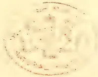A faint, circular red stamp or seal is centered on the page. The stamp appears to be a library or archival mark, possibly from the British Library, as it features a central crest or emblem surrounded by text in a circular arrangement. The text is difficult to read due to the faintness of the ink and the low resolution of the scan. The overall appearance is that of a small, circular red mark on a light-colored, slightly textured background.

611------------------------------------------------

A black and white engraving of a man with a full beard and mustache, wearing a suit and tie. The portrait is set against a plain, light-colored background.

**JOHN WALKER, Esq.**

*Tropical Agriculturist Portrait Gallery.*

*No. VII.*

612------------------------------------------------

With January number of *Tropical Agriculturist* no "Magazine of Agriculture" was included.

---

### BACK NOS. WANTED.

---

The Publishers of the *Tropical Agriculturist* want copies of the January, February and March issues of 1893. Subscribers who will kindly send any of these Nos. will be credited with the full value and postage.

A. M. & J. FERGUSON,  
Baillie St., Colombo. Ceylon.

613------------------------------------------------

<!-- stage4: FAINT old-images-only -->

[Faint page: no legible print of its own could be verified; text withheld (stage 4 review list)]

614------------------------------------------------

# \* The TROPICAL AGRICULTURIST \*

◇ MONTHLY. ◇

Vol. XIII.]

COLOMBO, MARCH 1st, 1894.

No. 9.

## "PIONEERS OF THE PLANTING ENTERPRISE IN CEYLON."

JOHN WALKER,

PIONEER ENGINEER, INVENTOR AND PLANTER IN CEYLON.

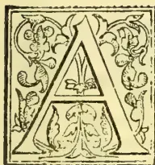

AFTER John Walker had retired from business, and made a home for himself in Stirling, it was always a great pleasure for him to meet an old Ceylon man. Stirling, as one of the show places of Scotland, has for the stranger much to attract. Not to speak of its great natural beauties—the view from the Castle and the Back Walk; the Carse, the Links of the Forth; the Abbey Craig and the grand amphitheatre of hills around—the whole neighbourhood is simply redolent of Scottish history, and saturated with the best traditions of Scotland. To John Walker it was a high day when he had a Ceylon man fresh to the ground, bent on sight seeing; and if the visitor had time to spare, the ordinary tourist's circle was widened, and the village of Donne would claim part of a day. That was, John Walker's birthplace; 26th August, 1819, being the date when he was born.

He was one of a large family, and in due time he attended the school in Deanston, a

mile distant from Donne village, and picked up his education there. That he was an apt scholar is evidenced from the fact, that for two years he was engaged as pupil teacher; and when he elected to throw up the scholastic profession into which he was drifting, and apprentice himself as an engineer, the Deanston dominie, was by no means sure that the choice was a good one, and argued strongly against it.

Deanston in those days had a large cotton mill, and besides the spinning and weaving department, Messrs. James Finlay and Co., the proprietors, had also attached an engineering shop, and were large agricultural machine-makers. The then manager, the late Mr. James Smith, was rather a distinguished man, highly esteemed, and of considerable inventive ability. He was said to have assisted Sir Richard Arkwright in inventing his spinning frame, which perfected Hargrave's spinning jenny; he was also the inventor of the system of Agricultural draining yet in vogue and the immense water-wheels which still drive the Deanston

615------------------------------------------------

576THE TROPICAL AGRICULTURIST.[MARCH 1, 1894]

Works,—the largest wheels in Scotland save one—were his design. There is yet to be seen at Deanston another of Smith's machines, an ingenious contrivance by means of which the sluice at the river Teith, from whence the water is drawn to provide the power to work the mills, automatically rises and falls with the state of the river.

The present proprietors of the Deanston works are Messrs. Finlay Muir & Co., who are also represented in Ceylon in these days.

Some years ago I accompanied John Walker to Doune, and the Deanston works were also visited. Pointing up to one of the windows in the factory, he said: "It was opposite that window where my bench was, and where I served my apprenticeship." Across that stretch of years, which lay between the beginning of his active life, and the then near end of it, there had been woven in a very varied experience. But the nature of the boy apprentice was not very different from the nature of the elderly man. In his early days, he was much thought of in his native village, and the old women of the place used to look to him to have their clocks regularly seen to, and kept in order. When he had retired from Ceylon and had more money to spare, his visits to Doune were frequent, always in the interests of somebody; for, in his quiet way, he was ever a ready helper and a sympathising friend to the needy and those who were ready to perish.

During the years of John Walker's apprenticeship he had his wits sharpened, and his mental horizon enlarged; for his fellow-workmen were rather above the ordinary stamp. Picked men, who were intelligent and argumentative, with the Radical element as well as the Tory among them. The Corn Laws had not then been repealed, but the Chartist were abroad; and the anti-Corn Law agitation was stirring the land. From time to time the Deanston workmen were visited by fervid speakers, whose addresses threw a bone of contention among them, over which, during meal hours and on the way to and from the village of Doune, the rival politicians worried and debated. Travelling preachers too, of sects known and unknown, would come in the long summer evenings, and in open air addresses handle the mysteries of faith with a freedom, which although common enough in these days, was not so frequent in those, and pass on leaving behind them topics for discussion which would last for many days, and give much food for thought.

Some time after John Walker had completed his apprenticeship, there was a change in the policy of the Deanston works. The machine-making part of it was given up, and the majority of the men had to go elsewhere for work. He got an opening in Manchester erecting cotton spinning machinery, but it was only temporary employment, and after some little time he returned to his home at Doune.

His next venture, was made under his old manager, Mr. James Smith, who engaged him to attend at the various Agricultural Shows throughout Scotland and England, for the purpose of fitting up and exhibiting the improved agricultural implements which Mr. Smith had designed.

Thus he saw about him a good deal, and when later on he was offered the post of engineer to Messrs. Wilson, Ritchie & Co., Colombo, it seemed but a continuation of the wandering life he had before been having. It was however not without mature consideration that he accepted the post; the name of Ceylon was not so well known then among the people of Scotland as it is today, and that it was considered rather a hazardous affair was evidenced by the fact, that when the engagement was signed, in the Glasgow office of Messrs. James Finlay & Co., the cashier who had the transacting of the business made a mental calculation, named a very modest sum, and looking in a wistful way at the young engineer said, "At the end o' the term, ye may ha that saved, if ye wather it oot."

This did not sound very encouraging, but the die was cast, and he sailed from Glasgow in November 1842. The voyage was a stormy and protracted one, and it was not till the May of the following year that the ship sighted Ceylon, and dropped her anchor in the Colombo roads.

The Ceylon engagement did not prove a success, and before it was out John Walker rebelled. He was employed in the mills of Messrs. Wilson, Ritchie & Co., and the treatment which that firm gave their engineers was rather harsh. Things came to a head when some oil tanks had to be rivetted in the open yard, and the cost of erecting a temporary shed of eadjans, to screen the engineers from the fierce sun, was made the cause of offence. Mr. David Wilson made it hot all round regarding what he considered this luxurious way of working, and when John Walker, as mouthpiece of the others, protested against the treatment, and insisted that without the shed they would not work, the small band of rebels were told that they might leave if they liked, and at once, provided that their passage money was returned.

616------------------------------------------------

MARCH 1, 1894.]THE TROPICAL AGRICULTURIST.577

Mr. Ritchie was rather taken aback when his offer was accepted by John Walker; he was the only one of the delinquents,—there were two others, I think—who had saved enough to do this, and he then and there went to the bank, drew the money, paid it, and took his discharge. He was however refused a character! It was not a very bright outlook for the young engineer, in a limited circle like the Colombo of those days, without a character and in search of employment; but providence in the shape of the minister of St. Andrew's, the late Dr. Macvicar, came to his help. John Walker had gone one day into the Fort, to try once more if he could hear of any chance of work, when he met Dr. Macvicar. He was a member of Dr. Macvicar's congregation, and the doctor stopped, inquired what he was about, and how he was getting on. Learning how matters stood, he kindly gave John Walker letters of introduction to several of the Colombo firms. When David Wilson heard of this, he was very angry and wrote indignantly to the Padre for interfering with his employees! A warm correspondence was the result, but the minister claimed to have as much if not more interest in his parishoner's welfare than the merchant had, and that in trying to help him into employment he was but simply doing his duty.

John Walker never forgot the kindly help which Dr. Macvicar had given him, and when he visited Scotland, he always found time to call at the Moffat Manse, where Dr. Macvicar had his home, to renew the acquaintance that had stood him in such good stead in the day of his need, and as an expression of the gratitude which still filled his heart.

Through the minister's introductions he was soon employed, being engaged as engineer for the "Perth" estate in the Kalutara district, where sugar cultivation was being gone in for on an extensive scale. This was in the year 1845. "Perth" estate was expected to be an El Dorado, and every thing in regard to the management was in keeping with the golden prospects, which were hoped to be realized in the near future. The staff was numerous, and highly paid; the outlay on buildings and machinery was of the most liberal nature; the cultivation was costly, and the end was—a collapse. During the time, however, when all was hopeful, the "Perth" estate was the scene of many a revel; and the "high jinks" at the manager's bungalow were on the same magnificent style as the estate was worked. Money was no object, and troops of revellers came from Colombo to assist in the spending of it. In time, however, the purse strings tightened. Sugar grew well enough, but there was a difficulty about the crystallizing.

What seemed all right when packed into casks one day, was found if kept for but a short time to have become moist again. So the work had to be done over. Besides this, there were yearly deficits. Proprietors, however wealthy, can't live always upon hope, and thus it came about, that in course of time one after another of that highly-paid staff were dispensed with, and John Walker alone remained to guide the broken fortunes of the "Perth" estate.

It was rather a lonely life he led when all the Europeans were gone but himself, and the most exciting element in these quiet years was an occasional visit to Kalutara, to serve as juror. Beef, not to speak of mutton, was then hard to obtain in the lowcountry; the village fowl was the stand-by, and so often and in so many forms did it appear on his table, that he felt after a time, almost ashamed to look a living one in the face! To supplement his scanty larder, he went in for breeding the guinea fowl, doing so with great success, and in after days had much to tell of the bird's habits. He had no love for sport, but he assisted the "Perth" coolies on one occasion to dig a leopard out of a hole in which it was sheltering and saw it dispatched with the labourers' mamooties. John Walker was nine years on "Perth," and although the life was a placid and not unpleasant one, there was little prospect ahead, so he too at last resigned. He was getting a little tired perhaps of Ceylon, besides he could afford a trip home.

Before sailing for Scotland, which he did in 1854, he paid his first visit to Kandy, and was offered employment by the late Mr. William Turner, an engineer, who supplied the planters with their machinery, and whose place was in Trincomalee Street. The prospects held out were not however sufficient to induce him to postpone his trip, so he returned to Scotland.

After having spent some time among his friends, the need by-and-by arose to look out again for something to do, and as there was at that time a great demand in Melbourne for sawn timber to be used for building purposes, John Walker and his brother-in-law the late Mr. George Clarke,—years after a partner in Messrs. John Walker & Co.,—arranged to buy the requisite plant, and go out together and start a saw mill in the colony. The matter was well thought out, and the prospects of success were fair, but the ship in which they sailed went ashore on a bright moonlight night on the coast of Ireland, and became a total wreck. Although no lives were lost, the whole of the ship's cargo was, and the saw-mill machinery with it.

After the wreck, John Walker returned to Glasgow, and while there accidentally met Mr. William Turner of Kandy, who had come home

617------------------------------------------------

578THE TROPICAL AGRICULTURIST.[MARCH 1, 1894.]

in rather poor health. Mr. Turner renewed the offer he had made to John Walker some months before, but not until it was modified into a partnership did he accept and abandon all idea of trying his fortune in Victoria.

Before starting again for Ceylon he married a Miss Fortay, a connection of his own, and shortly after the wedding he sailed for the East. The voyage was a very unfortunate one, for the ship met heavy weather in the South Atlantic, and became so leaky that she had to put into Bahia to refit. While waiting there his young wife died of yellow fever. Anxious to get on, and especially to get away from a place which must have been rendered hateful to him, he left the leaky ship, and finding another bound for Colombo, and about to sail, he elected to come on in her. He was the only passenger and had rather a rough time of it. The captain was somewhat of a bully, and the sailors were not very well used. Before Ceylon was reached, the growing discontent among the crew was apparent to all, and one fine Sunday morning they struck and refused to work. Jack had turned Sabbatarian; he did not like every day to be esteemed alike, and was not going to have it. When the captain learned how matters stood, he mustered the crew on the quarter-deck and addressed them in forcible language. But neither that nor his pistols could induce them to do unnecessary work on the Sabbath, and after much bluster, the skipper yielded the point, although with rather a bad grace. Later in the day it became evident that "Satan finds some mischief still, for idle hands to do!" for the captain's Sunday pudding mysteriously disappeared from the galley, and just when about to be served up. This was past bearing, and again the crew were mustered, and individually questioned regarding the daring act. Nothing however was elicited; a more innocent set of men never sailed under the British flag; they did not even know that there had been a pudding prepared for dinner; certainly not for theirs; and one who had been the ringleader of the morning's revolt, and a sea-lawyer to boot, emphatically protested against the captain even *looking* at him as if he had taken the "puddin". A sad falling away here!

After arrival in Colombo, John Walker proceeded to Kandy, and began there his work in connection with coffee machinery which was in time to carry his name into every tropical country where the plant was grown, and raise his firm into the premier position of pulper-makers. His partner, Mr. William Turner, returned home in a few years, in ill-health, and left him free to carry out his own plans.

About this time the business and premises of Messrs. Affleck, Engineers, Kandy, were through the death of the uncle and nephew for sale. Bogambra mill where their works were situated, were better in every way than the shop at Trincomalee Street. John Walker arranged to buy them, and in due time vacated the old premises where he had been for several years. In taking over the Affleck's business, the book debts were included in the bargain, and an allowance of 50/0 was deducted to meet any losses which might arise. A home actuary, whose duty it was to look into the terms of the arrangement, was very emphatic on the inadequacy of the provision made for bad debts, and declared that from 250/0 to 330/0 would at home have certainly been allowed. He did not see how 50/0 could possibly cover it. John Walker used however to tell—to the credit of the Ceylon planters—that although he had to wait for a very long time for some of the accounts, yet eventually—with but one insignificant exception—the whole of them were duly paid.

Besides being an engineer, John Walker was also a planter, having from time to time been possessed of "Meetota," in Medamahanuwara, "Mahaoya" in Dumbara; and "Roseneath," "Hermitage" and "Anniewatte" in Hantane districts. On his visits to estates on professional duties he got well acquainted with the planting districts, heard of and saw all that was going on, and was ever ready to try on his own properties, the newest methods of cultivation. Where he could advance the planting interests he did it, and it was through observing the rude and inefficient style of tracing drains, by means of a plank which had to be dragged all about the place, that made him think of the Road Tracer which goes by his name to this day. What a relief this simple instrument was to the planter with a large clearing to road and drain, as compared to the lumbering old style, goes without saying. It was a success from the first, won its way wherever it was tried, and it was a great satisfaction to the inventor, when he learned that the Survey Department had found out its worth, and used it on one of the then proposed routes of new railway, in taking the flying trace. Today there is hardly an estate in the island which has not got one of "Walker's Road Tracers," and in many other lands where the inventor has never been heard of, this handy little instrument is extensively used and thoroughly appreciated.

His Patent Disc Pulper too has carried his name to the far ends of the earth. I shall not attempt to adjudicate as to which one among the different patent pulpers, that in the old days competed for place; deserved the highest position;

618------------------------------------------------

MARCH 1, 1894.]THE TROPICAL AGRICULTURIST.579

but it may safely be affirmed that John Walker's Patent Disc Pulper ranked second to none. It took him years to perfect. The perseverance, watchfulness and patient study which he expended on his machine are known only to a few. It was long before he was satisfied—if he ever was satisfied—albeit the machine was one to be proud of, and did its work expeditiously and well.

John Walker's relations with the planters were always pleasant; and many of the older generation who had dealings with him, tell even yet of the kindly consideration, meaning often money and risk, which he was ever ready to extend to those on whom circumstances were hardly pressing. Being an eminently honest man himself, he regarded all with whom he came in contact as possessed of the same sterling quality, and although on the whole his estimate of his fellows was a true one, yet several times he was sadly deceived, and had subsequently to regret that he had not been more distrustful. When he was retiring from active service, it was a satisfaction for him to look back on his career, and be able to say, that although much tried at times in the matter of estate accounts, he had never once in the course of his business life got a superintendent into trouble with the estate agents. The Sinhalese who passed through his hands, benefited much by the thorough training he gave them, becoming really reliable workmen, and the esteem in which they held him, merged in many cases almost into the warmth of affection.

When John Walker retired from Ceylon he made the town of Stirling his home, and was soon as actively employed there as he had been when living in the East. The Stirling Royal Infirmary, and the Industrial School, were special hobbies of his, and he spent much of his time seeing to the interests of those deserving institutions. He was not in any way a pushing or forward man, but the very reverse. To do his work quietly and without ostentation were truly characteristic of him, and when his fellow-townsmen would have advanced him into higher honour, and more prominent place, he would have none of it.

After he had settled in Stirling he made several trips to Ceylon, to inspect his estates and see to his business. These trips he thoroughly enjoyed, and it was very instructive and amusing to notice how quickly the impecunious learned of his advent, and how ready they were to be helped by him. To meet an old planter was an especial pleasure, for in the conversation the past lived again. Although not much of a joker himself, he had still a keen sense of humour, and would enjoy a story with the best, even although the flavour was an ancient one.

He had a fine constitution. For many years both in the lowcountry and on the hills he had worked

hard, but in appearance and vigour he always compared well with those who had never been in the tropics. He was temperate in all things. On his last visit to Ceylon, he did not display his usual activity, and although no hint came from him that he was not as he had been, he steadily declined any outings which demanded hill climbing or short cuts. He would sit at times when unobserved with his watch in his hand, counting his pulse beats. Heart disease was hereditary with him, and admonitory symptoms, which he kept to himself, were doubtless the reason for his so doing. But he would have no fuss about this any more than he would about anything else.

He died in Stirling on the 1st Oct. 1889. The end was sudden, and amid the brightness of preparation for a daughter's marriage. *Angina pectoris* was the cause, and between the spasms of that painful malady, and with clear evidence that the end was near, he summed up in his quiet way God's dealings with him; "Goodness and mercy" he said "have followed me all the days of my life." That was his testimony. That he did not conclude the extract from the Psalmist: "I will dwell in the House of the Lord for ever," was thoroughly characteristic of him: but that he had this hope bright within his heart cannot for a moment be doubted.

His loss was much deplored. At the annual meeting of the Directors of the Stirling Infirmary held shortly after his death, H. D. Erskine, Esq., of Cardross, said:—"He was sorry to say that during the last year the Directors had sustained a very grievous loss in the death of the Chairman of their House Committee, Mr. Walker. Many good men had given their services to the institution since it was opened, but no one was more able than Mr. Walker both by circumstances and inclination to devote himself more exclusively to the services of the Infirmary than he did. They might almost say he died in the service of the Infirmary, for he went home from one of the meetings which he came to at great risk and inconvenience to himself, to die. He was sure he was expressing the feeling of that meeting when he said they all felt the deepest gratitude that they had been given the loan, even for such a short time, of the services of such a good man."

John Walker was married a second time in 1860 to the eldest daughter of the late Mr. William Dewar, West Indian Merchant. He had a family of five sons and six daughters. One boy died in infancy, and his eldest son is today following his father's profession in Ceylon. In 1884 he retired from Messrs. John Walker & Co., but retained his interests in the firm of Walker & Greig, of which firm at his death he was sole partner.

PEPPERCORN.

619------------------------------------------------

580THE TROPICAL AGRICULTURIST.[MARCH 1, 1894.]CINCHONA IN CEYLON.

We notice that our contemporary, the *Observer*, has taken up the subject of Cinchona cultivation in Ceylon. From information derived from a dealer in London, from the command of the market that Java has obtained, and also from alleged unsuitability of Ceylon soils, the editor of that journal infers that, for the present at least, Cinchona in Ceylon would not pay. We do not dispute that the present price of bark in the London market would be unremerunerative for Cinchona grown on lands in this Island, if expressly opened for its cultivation, and having no other resource. Nor do we question the command which Java presently possesses of the Cinchona markets. But we venture to give our opinion that the fault of the Ceylon Cinchona enterprise was not in the soil, which we believe to be well suited to the cultivation of the bark, though probably less rich than that of the Java plantations.

Since Tea began to engross the attention of Ceylon planters and has led to the neglect, in a greater or less degree, of Cinchona, we have several times addressed remonstrances against the discontinuance of that enterprise, on the following grounds, (1st) that the success of Java and the comparative failure of Ceylon in that enterprise was not a matter of *soil*, but of *system*. Secondly: that the evidence of the results obtained in Ceylon, in the few cases in which a sound system was adopted, was decidedly favourable. Thirdly: that in the present state of the Tea enterprise, other collateral advantages that might be secured by Cinchona cultivation on the Tea plantations and on adjoining lands would compensate for the comparatively low price of bark.

Before adducing our reasons in support of the views implied in the foregoing conclusions, we cannot resist a feeling of humiliation in the confession that is practically involved in the giving up of Cinchona as a "bad job", after the success Ceylon planters have achieved in every other agricultural enterprise in which they have embarked in earnest. The energy, intelligence and skill which made Ceylon *Coffee* the consort of that great trade by virtue of its manifest superiority,—that caused Ceylon *Tea* to take a leading place in a market that was already fully and satisfactorily supplied, by actually superseding and displacing the old established supplies,—that has produced *Cacao* that commands a far higher price in the open market than the boasted produce of the West,—and in short, that has succeeded in every other enterprise except Cinchona, ought to be able to give substantial reasons for so remarkable an exception. Seeing that Ceylon planters have proved, by their latest success in *Tea*, that they have not lost their cunning—that, in short, neither their capabilities nor those of their soils are at fault, there is no reason why they should not equal or even surpass their rivals in Java, if they adopted the same system.

The system of Cinchona cultivation that was almost universally adopted in Ceylon was radically wrong. The most valuable varieties of the tree were hybrids. The seed of hybrid plants, as all botanists and gardeners know, can never be relied upon. Plants so raised from the seed of the richest hybrids usually come up in great variety, and not one in twenty is at all true to type. Like the seed of apples which may produce crabs, or of oranges, which may produce limes, citrons, or lemons, valuable hybrid cinchona seed may produce varieties which are very rarely true to type. The propagation of valuable varieties of Cinchona should, therefore, be affected as are apples, oranges and other special varieties, by grafts or cuttings. In Ceylon, the mode of propagation that was almost universally adopted was by seed, and therefore the two species of pure breed, the seed of which was true to type, were almost the only kinds that were cultivated, namely: *officinalis*, for which the climate was not suitable, and *succirubra*, which was poor in alkaloids. Propagation by grafts or cuttings was far too slow to suit the emergency of the time, when cinchona was introduced into the Island and was therefore practised only in rare cases, and then only

from stocks that were not of high class. Such, however, as they were they remained true to type.

Nearly all the first nurseries at Hakgalla were of cuttings from the original stocks sent from home. These plants were sold or distributed, and found their homes chiefly in Haputale and Hewaheta. A few were planted elsewhere. The writer's experience of the trees produced from the Hakgalla plants convinced him, but unfortunately too late, that they were far superior to any of those produced from seed. They were not attacked by the fatal pest, canker. After 20 years' growth, a small plantation of ten acres of these plants had to be abandoned in consequence of the failure of the coffee estate to which it belonged. An attempt was made to uproot the trees for the sake of the bark, but they defied the mamoty, and would have needed dynamite.

The first experience of the Java planters was, like ours, of plants raised from seed; but fortunately, for them, the species they showed were utterly worthless namely: *Josephiana*, *Palmiana* and the like. They had no inducement whatever to persevere with the cultivation of such species, and they were therefore taught a lesson, of which the partial success of the Ceylon planters with *officinalis* and *succirubra* prevented their learning the force. Java plantations were in consequence, gradually stocked with plants propagated on true principles from approved varieties. Once on the right track, they naturally chose select stocks from which to propagate, and hence their success. Ceylon planters, on the other hand, persevered in their reliance on a faulty system whence came their comparative failure.

In dealing with the erroneous system on which the enterprise was pursued in Ceylon, we have also shown, in the second place, that the plants that were produced from cuttings were more durable, more successful, and less liable to canker than trees raised from seed. Trees raised from seed nearly all suffered, and a large proportion of them died from that disease prematurely.

With regard to the third point above mentioned, we maintain that it is inexpedient for large tracts of tea to be practically continuous, as such a condition would facilitate the rapid progress of any pest, that it is advisable, for that reason, to plant belts of trees to intercept the continuity of large areas of Tea and to segregate them,—that cinchona trees, while serving that purpose effectually, would also yield bark of a value equal to that of Java, and which, even in the present state of the market, would yield a considerable return. If peeled while standing, for the sake of procuring "renewed" bark, the trees would nevertheless eventually be copiced, a d the stems would be useful for firewood.

The Ceylon planter, if he raised his plants from prime stocks, would be on equal terms with his Java rival as regards the quality of his bark, and would beside have collateral advantages such as we have specified, which would make him less dependent on the state of the market for bark than his rival.—Ceylon "Independent."

THE COCONUT INDUSTRY AND THE PALM OIL TREE.

A correspondent, in a private letter, asks us to state the nature, communicability and extent of the diseases to which the coconut tree is liable, and where information can be got on these points, and on the cultivation and yield of the palm oil tree. The most formidable disease—if disease it can be rightly called—of the coconut tree in Burma and the West Indies appears to be the red weevil, and information on that insect and the mischief done by it in Honduras is to be found in the *Kew Bulletin* for last February and March. Here this weevil commonly destroys coconut trees when they are just going to begin bearing, and cases of bearing trees being destroyed by it, though not quite unknown are very uncommon in this country; but in Burma and the West Indies even trees in bearing appear to be not infrequently destroyed from this cause. Coconut planters in this country are

620------------------------------------------------

MARCH 1, 1894.]THE TROPICAL AGRICULTURIST.581

careful to destroy all the weevils and weevil grubs that they can find, but our comparative immunity from this pest is probably due chiefly to most of the weevils being devoured by insectivorous animals before they have time to breed; and as cultivation is extended, we must expect the number of insectivorous animals to decrease, because of the clearing of the jungles in which they find cover. Tea planters do not seem to be injured by chafer grubs, but latterly much damage was done by these insects on some coffee estates, and the most probable cause of their increase was the banishment, by the extensive clearing of jungle, of wild cats and other natural enemies of the chafer beetles. Without our wishing to raise any needless alarm, it therefore behoves coconut planters in this country not to be over-confident that they will always have the comparative immunity from the red weevil as the same have had in the past. The coconut weevil, as they said in our last issue, is not to be confounded with the rhinoceros beetle, which, although it does do some injury to coconut trees, is nevertheless a comparatively harmless enemy and one comparatively easily combated. The weevils (*Ryncephora*) are one of the most numerous families of the *Coleoptera*; they are all phytophagous, and they are very destructive to vegetation, not so much because of their appearing in vast numbers, as caterpillars, apides and locusts do, as by reason of their attacking plants in a vital part, so as to kill them, or in the seed, and thereby preventing their propagation. One very minute weevil feeds in its larval state in the seed of the kitul palm, and although the ground under a kitul tree may be thickly strewn with seeds, yet it is difficult sometimes to find one without a weevil or weevil grub in it, and many of the seeds contain several of the insects.

Besides the coconut weevil, coconut trees in some of the islands of the West Indies appear, from statements which we have read from time to time in the newspapers, to be affected by a fatal fungoid blight, but we cannot name any publication in which information in this point can be found. In this country trees in apparent health are sometimes broken off by the wind, and when the broken part of the stem is examined, nearly all the wood at that place is found to be decayed. This is not an infectious disease, and it is generally believed to be caused by the roots of the tree getting down to an unhealthy subsoil. There does not seem to be any known remedy for this disease, not would a remedy for it be of much practical use if one were known, because the first intimation of the disease is usually the fall of the tree.

There is not apparent any present indication of the coconut plantations of this island being likely to be affected by any serious blight, but in view of what has happened in other coconut-growing countries, it is not wise to be over-confident of a similar calamity never being possible here. The tea planters are continually being warned regarding the imprudence of depending too exclusively on a single product, but nobody seems to think it necessary to give a similar caution to the coconut planters; and yet, supposing the chances of disaster to be equal in both cases, the warning is more needed in the case of coconuts than in that of tea, because the coconut plantations cover a larger extent of ground than the tea plantations, and a failure of the former would be a much greater calamity to the permanent population of this island than a failure of the latter would be. The late Mr. George Stuart, the founder of the firm of Messrs. George Stuart & Co., used to say, "I always hang an anchor out to windward," meaning that he never trusted entirely to a single investment, and the result of his following that policy proved its prudence.

As regards the yield and cultivation of the palm oil tree (*Elais guineensis*), there is not likely to be any reliable information available, for although about a million hundredweights of palm oil are annually imported into the United Kingdom (chiefly from Lagos, which is the centre of palm oil trade)

yet it seems to be all the produce of trees growing wild in the African jungles, and the tree, though not unfrequently planted here for ornament does not seem to be anywhere cultivated as a commercial product. The circumstance of the tree growing wild in the African jungles need not, however, prevent its being profitably cultivated here, for cinchona grows wild in the jungles of South America, and that did not prevent its being a profitable product here until the price of it became unremunerative by reason of over-production. The following statistics of the vegetable oils imported into the United Kingdom and exported from it in 1882 are taken from a table in the *Encyclopedia Britannica*, Vol. XVII, p. 745, and they show the importance of palm oil in British commerce in comparison with other vegetable oils:—

<table border="1">
<thead>
<tr>
<th></th>
<th colspan="2">IMPORTS.</th>
<th></th>
<th></th>
</tr>
<tr>
<th></th>
<th colspan="2">Quantities.</th>
<th></th>
<th>Value.</th>
</tr>
</thead>
<tbody>
<tr>
<td>Castor</td>
<td>163,970</td>
<td>cwts</td>
<td>..</td>
<td>£264,551</td>
</tr>
<tr>
<td>Coconut</td>
<td>133,782</td>
<td>cwts</td>
<td>..</td>
<td>210,054</td>
</tr>
<tr>
<td>Olive</td>
<td>23,450</td>
<td>tuns</td>
<td>..</td>
<td>974,154</td>
</tr>
<tr>
<td>Palm</td>
<td>813,870</td>
<td>cwts</td>
<td>..</td>
<td>1,240,866</td>
</tr>
<tr>
<td>Seed</td>
<td>14,507</td>
<td>tuns</td>
<td>..</td>
<td>406,807</td>
</tr>
<tr>
<th></th>
<th colspan="2">EXPORTS.</th>
<th></th>
<th></th>
</tr>
<tr>
<th></th>
<th colspan="2">Quantities.</th>
<th></th>
<th>Value.</th>
</tr>
<tr>
<td>Castor</td>
<td>24,288</td>
<td>cwts</td>
<td>..</td>
<td>£ 40,057</td>
</tr>
<tr>
<td>Coconut</td>
<td>134,368</td>
<td>cwts</td>
<td>..</td>
<td>205,788</td>
</tr>
<tr>
<td>Olive</td>
<td>3,668</td>
<td>tuns</td>
<td>..</td>
<td>166,693</td>
</tr>
<tr>
<td>Palm</td>
<td>428,162</td>
<td>cwts</td>
<td>..</td>
<td>642,204</td>
</tr>
<tr>
<td>Seed</td>
<td>1,162</td>
<td>tuns</td>
<td>..</td>
<td>37,279</td>
</tr>
</tbody>
</table>

In the beer and wine trades a tun is a measure of capacity, but a tun of oil seems to be 20 hundredweights; and of the five kinds of oil enumerated in the foregoing table of *Imports*, it will be seen that the quantity of palm oil is the greatest and that of coconut oil the least. But besides the palm oil, which is obtained from the fibrous husk of the fruit, there is also a large importation into the United Kingdom of palm kernels, which are ground and made into palm nut oil and palm nut oilcake, and the oilcake is said to be superior to any other for feeding cattle. For the reason already mentioned, the average annual yield of a palm oil tree is probably not yet known, but the fruits are said to yield a larger percentage of oil than can be obtained from olives. From these facts it will be seen that *Elais guineensis* is not the useless tree that many here suppose it is, and it would undoubtedly have given in this country a much more profitable result than has been obtained from the other West African product, Liberian coffee, had it received the same attention with which Liberian coffee was at one time favoured.—*Catholic Messenger*.

## TEA NOTES FROM LONDON.

LONDON, Feb. 2.

### THE FINEST TEA EVER IMPORTED FROM CEYLON.

A letter from Messrs. Anderson Brothers informed me that they had at their office temporarily what Messrs. Gow, Wilson, & Stanton had pronounced to be the finest tea they had ever seen imported from Ceylon. On my calling in response to that letter this tea was obligingly shown to me. It certainly was the most astonishing tea, both in appearance and fragrance. There were two lots of one pound each only. One of these was identical in quality and appearance with the "Golden Tip" not long back sold for £35 the lb at the public auction to the Mazawate Tea proprietors. But the second, as to which such experts as Messrs. Gow, Wilson, & Stanton had passed such eulogy, far surpassed the first in all characteristics. It was almost as fine as

621------------------------------------------------

582THE TROPICAL AGRICULTURISTMARCH 1, 1894

snuff, and was a mass of tiny gold specks, without any of the admixture of black particles observable in the first sample and in that of previous public notice. Messrs. Anderson had kindly kept the tea for me until it was possible for me to call, and then at once despatched it to the brokers for sale. Messrs. Gow, Wilson & Stanton had declined to value either sample, feeling it to be impossible to assign a price. Probably the tea will be bought as on former occasions of a similar kind offering, for the purpose of advertisement; but we suspect the day for this has long gone by, at least so far as to encourage any expectation that prices of a rate known in the past can now be realised for it. The veteran Mr. A. C. White, the well-known "Kneckles Brick" of the forties, is the owner of this tiny but choice break of Ceylon tea. It was grown on his Mount Vernon estate, and that garden will now possess the reputation of having sent home what the most experienced firm of brokers in London has declared to be the finest tea they have ever seen imported from Ceylon. Messrs. Anderson have kindly promised to let me know what prices are obtained for the two small samples, information that will at once be passed on by me to yourselves.

"MAZAWATTE TEA" AND THE CEYLON ASSOCIATION  
IN LONDON.

During the week I had conversation with a member of the Tea Committee of the Ceylon Association in London, and my view was expressed to him as regards the course taken by that Committee in refusing to permit Mr. Leake to make the affidavit with respect to the title of "Mazawatte" as a trade mark. His reply to me was:—"You will know that when that trade mark was first adopted I objected to it as strongly as anyone else, and would then have gone for a prosecution. Of course, it is a misleading name to have assumed. But in spite of that I think the Committee did rightly to refuse to appear as active supporters of any steps taken against Messrs. Denham's interests. By very extensive advertising of Mazawatte tea, which everyone believes to be a Ceylon tea, they have well served Ceylon by making it a household word. Then they have at the same time worked up an enormous trade, and are among the largest purchasers of Ceylon teas in this market. It would scarcely serve us, we think, to now break down this gigantic business. No, I have never my elf tasted Mazawatte tea and probably never shall. It may be that it would not suit my palate. But you see, if the Ceylon Association were to actively offend Messrs. Denham, they might change their present tactics by abandoning Ceylon teas, and we might drive them altogether into the arms of Assam, Siam, Japan, and other tea-growing countries and districts. I tell you the condition of the home tea trade is such that we cannot be too careful. We are forced now to sell all our teas under our own names. Lipton, you know, is a grower as well as a buyer, and he is also a seller at the auctions, as well as a retailer all the world over. He sends to the auctions all such of his Ceylon teas as he does not care, for some reason or other, to retain himself. I don't say anything against the qualities of such teas, but what I do know is that the dealers won't buy any tea that they suspect to be Lipton's, because he is his own retailer. If we don't give our name with the lots they immediately think they may be some of Lipton's, and then unanimously refuse to make a bid. For this and the foregoing reasons given you, I am strongly disinclined to any attempt to disturb the present channels through which Ceylon teas reach the public. The

fact seems to be that the Messrs. Denham are much personally liked, and we suspect that that fact has had as much weight in inducing the action by the Committee as any consideration for the existing sources of distribution to the public."

The question of

SMALL BREAKS OF TEA

is again engaging attention by both the brokers and the dealers. You will recollect that this matter was mooted some time back, and it was then hoped that your planters would find it to be possible to avoid the sending home of such parcels. This hope has not, however, been realised. The brokers complain that they are as numerous as ever. The definition of what constitutes a small break is ten whole or twenty half-chests. It is the practice of the brokers when lots coming under that definition appear in the lists, to omit putting them up to auction in their regular turn, and to postpone doing so until the whole of the larger breaks have been disposed of. The result to this practice has been that when they are offered there remain but few bidders in the room, and the consequence follows that biddings become slack and that such teas are sold below their real value. The brokers suggested to the Ceylon Association in London that to obviate this it would be as well only to include such breaks in the lists of Thursday, a day when these last are not so full as on Tuesdays. But the Tea Committee of that body object to this proposal, as it must still continue the difficulties following on a limited attendance. They prefer, and have suggested, that they should still find a place in the Tuesday lists, and that they should be sold at the same time as the larger breaks but in a separate room. The two proposals mentioned are to be—or may by this time have been—submitted to the Tea Dealers' Association. As the last mentioned body represents the purchasing element, its decision upon the two propositions must be valuable and will probably decide the future course of practice. We expect to learn as to this very shortly. It has been mentioned to me by an expert that these small breaks are usually of the finer sorts of tea, this necessarily arriving from each estate in smaller quantity than the less valuable varieties. It must therefore be of much importance to secure the best competition for them, and this it seems certain is not to be got at the Thursday's sales. Although the alteration in procedure now proposed may do somewhat to improve the prices now obtained for these small breaks, it yet behoves your planters in their own interests to avoid shipping them as far as possible. The brokers have added to their proposition mentioned above the further one that the limitation of classification shall be extended; but instead of the number of chests and half-chests now determining the term, this shall be for the future 12 and 24 respectively. If this be done, the proportion of tea to be offered in a separate room will be increased so as to attract a larger attendance of bidders. This is a matter that will no doubt be decided when the main question has been considered, but it is perhaps open to doubt whether the acceptance of the proposal would have the result anticipated. The real panacea would be to abolish the small breaks as much as possible, not to add to them. So long, however, as your planters find it to be imperative to make such small shipments, difficulty must always be experienced in disposing of, and your growers must make up their minds to receive relatively unsatisfactory prices for them whatever be the efforts to meet the case made by the brokers and others on this side.

622------------------------------------------------

MARCH 1, 1894.]THE TROPICAL AGRICULTURIST.583

## CEYLON MANUAL OF CHEMICAL ANALYSES.

A HANDBOOK OF ANALYSES CONNECTED WITH THE INDUSTRIES AND PUBLIC HEALTH OF CEYLON FOR PLANTERS, COMMERCIAL MEN, AGRICULTURAL STUDENTS, AND MEMBERS OF LOCAL BOARDS.

BY M. COCHRAN, M.A., F.C.S.

(Continued from page 517.)

### Fish Manure.

Waste fish, dried and ground, when prepared with care, supplies a manure that is very rich in nitrogen, and contains also a considerable proportion of phosphates. It is a substance, however, of exceedingly variable composition, and none of the samples prepared in India which have come under my notice approaches in richness the higher qualities of fish manure known in commerce as Polar fish guano and American fish manure.

The following analyses of these two high-class fish manures are quoted from an article by Mr. W. Ivison Macadam, F.L.S.C., in the *Indian Agriculturist*:—

<table border="1">
<thead>
<tr>
<th></th>
<th>per cent.</th>
<th>per cent.</th>
<th>per cent.</th>
<th>per cent.</th>
<th>per cent.</th>
</tr>
</thead>
<tbody>
<tr>
<td>Moisture ...</td>
<td>10.54</td>
<td>9.98</td>
<td>8.48</td>
<td>5.72</td>
<td>10.18</td>
</tr>
<tr>
<td>Nitrogenous Organic matter ...</td>
<td>56.48</td>
<td>56.04</td>
<td>57.24</td>
<td>64.04</td>
<td>53.64</td>
</tr>
<tr>
<td>Alkaline Salts ...</td>
<td>2.56</td>
<td>1.23</td>
<td>1.18</td>
<td>1.32</td>
<td>1.24</td>
</tr>
<tr>
<td>Phosphates ...</td>
<td>26.48</td>
<td>28.43</td>
<td>29.04</td>
<td>23.36</td>
<td>29.84</td>
</tr>
<tr>
<td>Carbonate of Lime ...</td>
<td>3.06</td>
<td>3.48</td>
<td>3.63</td>
<td>4.54</td>
<td>4.12</td>
</tr>
<tr>
<td>Silica ...</td>
<td>.88</td>
<td>.84</td>
<td>.43</td>
<td>1.02</td>
<td>.98</td>
</tr>
<tr>
<td></td>
<td>100.00</td>
<td>100.00</td>
<td>100.00</td>
<td>100.00</td>
<td>100.00</td>
</tr>
<tr>
<td>Containing Nitrogen equal to Ammonia...</td>
<td>11.15</td>
<td>9.81</td>
<td>9.96</td>
<td>10.21</td>
<td>10.12</td>
</tr>
</tbody>
</table>

### Analyses of American Fish Manure.

<table border="1">
<thead>
<tr>
<th></th>
<th>per cent.</th>
<th>per cent.</th>
</tr>
</thead>
<tbody>
<tr>
<td>Moisture ...</td>
<td>20.52</td>
<td>22.64</td>
</tr>
<tr>
<td>* Nitrogenous Organic matter ...</td>
<td>57.16</td>
<td>49.68</td>
</tr>
<tr>
<td>Alkaline Salts ...</td>
<td>1.98</td>
<td>1.36</td>
</tr>
<tr>
<td>Phosphates ...</td>
<td>13.52</td>
<td>15.44</td>
</tr>
<tr>
<td>Carbonate of Lime ...</td>
<td>5.78</td>
<td>9.92</td>
</tr>
<tr>
<td>Silica ...</td>
<td>1.04</td>
<td>.96</td>
</tr>
<tr>
<td></td>
<td>100.00</td>
<td>100.00</td>
</tr>
<tr>
<td>Containing Nitrogen equal to Ammonia ...</td>
<td>9.03</td>
<td>7.96</td>
</tr>
</tbody>
</table>

The following are analyses of samples of fish manure sold in Ceylon:—

<table border="1">
<thead>
<tr>
<th></th>
<th>per cent.</th>
<th>per cent.</th>
<th colspan="2">(Hughes').</th>
</tr>
<tr>
<th></th>
<th>per cent.</th>
<th>per cent.</th>
<th>per cent.</th>
<th>per cent.</th>
</tr>
</thead>
<tbody>
<tr>
<td>Moisture ...</td>
<td>10.75</td>
<td>14.75</td>
<td>5.24</td>
<td>23.60</td>
</tr>
<tr>
<td>* Organic matter ...</td>
<td>36.80</td>
<td>39.45</td>
<td>31.18</td>
<td>13.32</td>
</tr>
<tr>
<td>† Phosphoric acid ...</td>
<td>5.14</td>
<td>4.52</td>
<td>5.24</td>
<td>5.71</td>
</tr>
<tr>
<td>Lime ...</td>
<td>11.00</td>
<td>10.96</td>
<td>6.20</td>
<td>9.42</td>
</tr>
<tr>
<td>Carbonic acid, Magnesia alkaline Salt, Oxide of iron &amp;c.</td>
<td>9.51</td>
<td>9.17</td>
<td>3.37</td>
<td>3.27</td>
</tr>
<tr>
<td>Sand ...</td>
<td>26.80</td>
<td>21.15</td>
<td>48.77</td>
<td>44.68</td>
</tr>
<tr>
<td></td>
<td>100.00</td>
<td>100.00</td>
<td>100.00</td>
<td>100.00</td>
</tr>
<tr>
<td>* Containing nitrogen Equal to Ammonia</td>
<td>4.32</td>
<td>4.55</td>
<td>4.01</td>
<td>4.25</td>
</tr>
<tr>
<td>† Equal to tricalcic Phosphate ...</td>
<td>5.25</td>
<td>5.52</td>
<td>4.87</td>
<td>5.16</td>
</tr>
<tr>
<td></td>
<td>11.22</td>
<td>9.87</td>
<td>11.44</td>
<td>12.48</td>
</tr>
</tbody>
</table>

### Guano.

Amongst manures which supply both nitrogen and phosphates, guanos are conspicuous, especially those from countries with a dry climate. They consist of the excrement and bodies of sea birds which have accumulated on islands or lonely sea boards. When the climate is dry, these deposits retain most of their nitrogen. They also contain phosphoric acid in both a soluble and an insoluble form. Peruvian and Ichaboe guanos are of this class. The other class of guanos, in which the nitrogenous substances and that portion of the phosphoric acid united to the alkalies, and therefore soluble, have been washed out, has already been noticed. They are the phosphatic guanos, valuable for their large percentage of tricalcic phosphate.

As examples of Peruvian and Ichaboe guanos, I again quote from Mr. W. Ivison Macadam, in the *Indian Agriculturist*:—

74

623------------------------------------------------

384

THE TROPICAL AGRICULTURIST.

[MARCH 1, 1894.

*Peruvian Guanos.*

<table border="1">
<thead>
<tr>
<th></th>
<th>per cent.</th>
<th>per cent.</th>
<th>per cent.</th>
<th>per cent.</th>
<th>per cent.</th>
<th>per cent.</th>
</tr>
</thead>
<tbody>
<tr>
<td>Moisture ...</td>
<td>16.82</td>
<td>11.68</td>
<td>17.68</td>
<td>16.72</td>
<td>11.64</td>
<td>11.48</td>
</tr>
<tr>
<td>* Organic matter and Ammonia...</td>
<td>33.56</td>
<td>39.56</td>
<td>37.46</td>
<td>31.32</td>
<td>35.52</td>
<td>34.56</td>
</tr>
<tr>
<td>+ Alkaline Salts ...</td>
<td>17.16</td>
<td>16.64</td>
<td>15.52</td>
<td>17.24</td>
<td>17.28</td>
<td>18.42</td>
</tr>
<tr>
<td>Ordinary Guano Phosphates ...</td>
<td>27.52</td>
<td>21.88</td>
<td>24.38</td>
<td>26.96</td>
<td>23.48</td>
<td>28.82</td>
</tr>
<tr>
<td>Silica ...</td>
<td>4.94</td>
<td>10.24</td>
<td>4.96</td>
<td>7.76</td>
<td>12.08</td>
<td>6.72</td>
</tr>
<tr>
<td></td>
<td>100.00</td>
<td>100.00</td>
<td>100.00</td>
<td>100.00</td>
<td>100.00</td>
<td>100.00</td>
</tr>
<tr>
<td>* Containing Nitrogen equal to Ammonia ...</td>
<td>9.14</td>
<td>11.32</td>
<td>10.72</td>
<td>8.32</td>
<td>10.24</td>
<td>8.47</td>
</tr>
<tr>
<td>+ Containing phosphoric acid equal to Bone Phosphate rendered soluble ...</td>
<td>11.16</td>
<td>10.21</td>
<td>10.14</td>
<td>11.42</td>
<td>8.68</td>
<td>10.76</td>
</tr>
<tr>
<td>Total Phosphoric acid as Tricalcic Phosphate ...</td>
<td>38.68</td>
<td>32.09</td>
<td>34.52</td>
<td>38.38</td>
<td>32.16</td>
<td>39.58</td>
</tr>
</tbody>
</table>

*Equalized Peruvian Guano.*

This term refers to Guanos which originally contained less ammonia than those of the Peruvian type, but which have had the ammonia made up to the standard of good Peruvian guano, by the addition of sulphate of ammonia. It should contain not less than 8 per cent of ammonia. The following is an analysis by Tatlock :—

*Analysis of Equalized Peruvian Guano.*

(TATLOCK.)

<table border="1">
<thead>
<tr>
<th></th>
<th>per cent.</th>
</tr>
</thead>
<tbody>
<tr>
<td>* Phosphoric acid ...</td>
<td>14.20</td>
</tr>
<tr>
<td>Lime and Alkaline Salts ...</td>
<td>15.49</td>
</tr>
<tr>
<td>Organic matter ...</td>
<td>50.51</td>
</tr>
<tr>
<td>Sand ...</td>
<td>7.87</td>
</tr>
<tr>
<td>Water ...</td>
<td>11.93</td>
</tr>
<tr>
<td></td>
<td>100.00</td>
</tr>
<tr>
<td>* Equal to Tribasic Phosphate of Lime</td>
<td>31.00</td>
</tr>
<tr>
<td>Nitrogen ...</td>
<td>7.29</td>
</tr>
<tr>
<td>Equal to Ammonia ...</td>
<td>8.85</td>
</tr>
</tbody>
</table>

Since writing the above I have analysed a sample of whole fish manure containing nitrogen 6.72 per cent equal to ammonia 8.16 per cent phosphates 11.76 per cent and sand only 2.3 per cent.

*Ichaboe Guano.*

<table border="1">
<thead>
<tr>
<th></th>
<th>per cent.</th>
<th>per cent.</th>
<th>per cent.</th>
<th>per cent.</th>
<th>per cent.</th>
<th>per cent.</th>
</tr>
</thead>
<tbody>
<tr>
<td>Moisture ...</td>
<td>19.52</td>
<td>20.54</td>
<td>19.47</td>
<td>19.68</td>
<td>19.78</td>
<td>20.99</td>
</tr>
<tr>
<td>* Organic matter and Ammonia ...</td>
<td>38.94</td>
<td>47.36</td>
<td>39.82</td>
<td>40.26</td>
<td>41.83</td>
<td>47.34</td>
</tr>
<tr>
<td>+ Alkaline Salts ...</td>
<td>8.92</td>
<td>9.28</td>
<td>11.46</td>
<td>11.27</td>
<td>8.17</td>
<td>10.38</td>
</tr>
<tr>
<td>Ordinary Guano Phosphates ...</td>
<td>13.21</td>
<td>17.16</td>
<td>14.41</td>
<td>14.13</td>
<td>14.38</td>
<td>12.07</td>
</tr>
<tr>
<td>Carbonate of Lime ...</td>
<td>3.87</td>
<td>5.12</td>
<td>5.12</td>
<td>4.98</td>
<td>5.17</td>
<td>2.38</td>
</tr>
<tr>
<td>Silica ...</td>
<td>15.54</td>
<td>5.54</td>
<td>9.72</td>
<td>9.68</td>
<td>10.67</td>
<td>6.87</td>
</tr>
<tr>
<td></td>
<td>100.00</td>
<td>100.00</td>
<td>100.00</td>
<td>100.00</td>
<td>100.00</td>
<td>100.00</td>
</tr>
<tr>
<td>* Containing Nitrogen equal to Ammonia ...</td>
<td>12.62</td>
<td>14.21</td>
<td>12.42</td>
<td>12.83</td>
<td>11.34</td>
<td>15.76</td>
</tr>
<tr>
<td>+ Containing phosphoric acid equal to Bone Phosphate rendered soluble ...</td>
<td>7.12</td>
<td>7.52</td>
<td>6.17</td>
<td>5.54</td>
<td>6.27</td>
<td>7.16</td>
</tr>
<tr>
<td>Total Phosphoric acid as Tricalcic Phosphate ...</td>
<td>20.33</td>
<td>24.68</td>
<td>20.53</td>
<td>19.97</td>
<td>20.65</td>
<td>19.23</td>
</tr>
</tbody>
</table>

*Meat Guano.*

I have already referred to the form of Meat Guano or Meat Meal valued only for its nitrogenous contents. Another form of this Substance is sold, which includes a variable proportion of bones, under the name of mixed scrap. It ought to contain from 7 to 8 per cent of ammonia and from 30 to 40 per cent of phosphates. Both the phosphates and the ammonia, however, are often much lower than this. In the following example the phosphates are particularly deficient :—

*Analysis of Meat Guano. (TATLOCK.)*

<table border="1">
<thead>
<tr>
<th></th>
<th>per cent.</th>
</tr>
</thead>
<tbody>
<tr>
<td>* Phosphoric acid ...</td>
<td>6.04</td>
</tr>
<tr>
<td>Lime and Alkaline Salts ...</td>
<td>11.64</td>
</tr>
<tr>
<td>Organic matter ...</td>
<td>58.85</td>
</tr>
<tr>
<td>Sand ...</td>
<td>16.11</td>
</tr>
<tr>
<td>Water ...</td>
<td>7.36</td>
</tr>
<tr>
<td></td>
<td>100.00</td>
</tr>
<tr>
<td>* Equal to Tricalcic Phosphate of Lime</td>
<td>13.20</td>
</tr>
<tr>
<td>Nitrogen ...</td>
<td>5.04</td>
</tr>
<tr>
<td>Equal to Ammonia ...</td>
<td>6.12</td>
</tr>
</tbody>
</table>

American animal Guano, from tinned meat establishments, according to Griffiths, contains from 3 to 5 per cent of Ammonia and from 35 to 45 per cent of Phosphates.

*Nitrogenous Superphosphates.*

This class of manures is prepared by heating either nitrogenous phosphatic materials such as

624------------------------------------------------

MARCH 1, 1894.THE TROPICAL AGRICULTURIST.585

bones or Peruvian guano and sulphuric acid, or by heating mineral phosphates in the same way, and adding some nitrogenous material, such as sulphate of ammonia, to the mixture. In the case of superphosphate made from bones, two kinds are distinguished. When about one-third or less of the bone phosphate has been rendered soluble by treatment with sulphuric acid, the resulting manure is termed vitriolated bones, when more than a third of the bone phosphate is rendered soluble, the resulting manure is called dissolved bones. The following are examples of vitriolated and dissolved bones:—

<table border="1">
<thead>
<tr>
<th></th>
<th colspan="2">Vitriolated bones. (MACADAM.)</th>
<th colspan="2">Dissolved bones. (MACADAM.)</th>
</tr>
</thead>
<tbody>
<tr>
<td>Soluble Phosphate (Equal to Bone Phosphate rendered soluble)</td>
<td>6.87</td>
<td>8.31</td>
<td>11.74</td>
<td>14.92</td>
</tr>
<tr>
<td>Insoluble phosphate</td>
<td>(10.72)</td>
<td>(12.96)</td>
<td>(18.32)</td>
<td>(23.28)</td>
</tr>
<tr>
<td>Hydrated sulphate of Lime</td>
<td>27.72</td>
<td>25.34</td>
<td>9.86</td>
<td>16.14</td>
</tr>
<tr>
<td>Alkaline Salts</td>
<td>26.28</td>
<td>26.28</td>
<td>36.24</td>
<td>32.16</td>
</tr>
<tr>
<td>Silica</td>
<td>2.64</td>
<td>2.17</td>
<td>2.18</td>
<td>2.56</td>
</tr>
<tr>
<td>* Organic matter and Ammonia</td>
<td>3.43</td>
<td>5.13</td>
<td>3.62</td>
<td>3.12</td>
</tr>
<tr>
<td>Moisture</td>
<td>20.82</td>
<td>19.65</td>
<td>20.52</td>
<td>17.64</td>
</tr>
<tr>
<td></td>
<td>12.24</td>
<td>13.12</td>
<td>15.84</td>
<td>13.46</td>
</tr>
<tr>
<td></td>
<td>100.00</td>
<td>100.00</td>
<td>100.00</td>
<td>100.00</td>
</tr>
<tr>
<td>* Ammonia</td>
<td>2.46</td>
<td>2.46</td>
<td>2.16</td>
<td>2.83</td>
</tr>
</tbody>
</table>

The following is the composition of a sample of dissolved bones imported to Ceylon:—

<table border="1">
<thead>
<tr>
<th></th>
<th>per cent.</th>
</tr>
</thead>
<tbody>
<tr>
<td>Soluble Phosphate</td>
<td>12.53</td>
</tr>
<tr>
<td>Equal to Bone Phosphate rendered soluble</td>
<td>(19.62)</td>
</tr>
<tr>
<td>Insoluble Phosphate</td>
<td>17.06</td>
</tr>
<tr>
<td>Hydrated Calcium Sulphate</td>
<td>31.68</td>
</tr>
<tr>
<td>Alkaline Salts, Magnesia, &amp;c.</td>
<td>2.90</td>
</tr>
<tr>
<td>* Organic matter, Ammonia, &amp;c.</td>
<td>19.89</td>
</tr>
<tr>
<td>Moisture</td>
<td>10.10</td>
</tr>
<tr>
<td>Siliceous matter</td>
<td>5.84</td>
</tr>
<tr>
<td></td>
<td>100.00</td>
</tr>
<tr>
<td>* Containing Nitrogen equal to Ammonia</td>
<td>2.78</td>
</tr>
</tbody>
</table>

#### NITROGENOUS AND POTASSIC MANURES.

The best example of this kind of manure is the substance met with in commerce under the names nitrate of potash, nitre, or saltpetre. What is met with in commerce, varies in composition, to a very great extent, according as it is crude or refined nitre. It is a substance, therefore, which should be purchased under some guarantee as to the percentage of real nitre present. I have had samples submitted to me for analysis under the name of nitre which contained from 3.22 to 93.25 per cent of real nitrate. The following are examples:—

#### Analyses of Nitrate of Potash.

<table border="1">
<thead>
<tr>
<th></th>
<th>per cent.</th>
<th>per cent.</th>
<th>per cent.</th>
<th>per cent.</th>
<th>per cent.</th>
</tr>
</thead>
<tbody>
<tr>
<td>Moisture</td>
<td>9.34</td>
<td>6.10</td>
<td>3.91</td>
<td>2.72</td>
<td>3.60</td>
</tr>
<tr>
<td>Organic matter</td>
<td>1.64</td>
<td>...</td>
<td>...</td>
<td>...</td>
<td>...</td>
</tr>
<tr>
<td>Calcium Sulphate</td>
<td>1.31</td>
<td>...</td>
<td>...</td>
<td>...</td>
<td>...</td>
</tr>
<tr>
<td>Calcium Nitrate</td>
<td>...</td>
<td>47</td>
<td>1.70</td>
<td>12</td>
<td>21</td>
</tr>
<tr>
<td>Magnesium Sulphate</td>
<td>1.04</td>
<td>...</td>
<td>46</td>
<td>...</td>
<td>26</td>
</tr>
<tr>
<td>Iodium sulphate</td>
<td>...</td>
<td>...</td>
<td>...</td>
<td>...</td>
<td>36</td>
</tr>
<tr>
<td>Do chloride</td>
<td>29.12</td>
<td>38.00</td>
<td>5.47</td>
<td>5.72</td>
<td>2.23</td>
</tr>
<tr>
<td>Potassium sulphate</td>
<td>...</td>
<td>33</td>
<td>...</td>
<td>...</td>
<td>...</td>
</tr>
<tr>
<td>Potassium chloride</td>
<td>52.64</td>
<td>6.31</td>
<td>8.38</td>
<td>...</td>
<td>...</td>
</tr>
<tr>
<td>Potassium nitrate</td>
<td>3.22</td>
<td>47.83</td>
<td>79.08</td>
<td>91.40</td>
<td>93.25</td>
</tr>
<tr>
<td>Insoluble matter</td>
<td>1.69</td>
<td>.96</td>
<td>...</td>
<td>.04</td>
<td>.09</td>
</tr>
<tr>
<td></td>
<td>100.00</td>
<td>100.00</td>
<td>100.00</td>
<td>100.00</td>
<td>100.00</td>
</tr>
<tr>
<td>Nitrogen</td>
<td>.45</td>
<td>6.70</td>
<td>11.03</td>
<td>12.65</td>
<td>12.91</td>
</tr>
<tr>
<td>Potash</td>
<td>34.74</td>
<td>27.05</td>
<td>42.14</td>
<td>42.58</td>
<td>53.45</td>
</tr>
</tbody>
</table>

#### PHOSPHORIC ACID AND POTASH MANURE.

There are no very concentrated manures of this class met with in commerce; but certain plant ashes, turf ashes and coal ashes may be taken as examples.

#### GENERAL OR CONCENTRATED COMPOST MANURES.

The compost manures previously noticed had their valuable constituents mixed with so much comparatively worthless material that they scarcely come under the class of commercial manures at all, but may be profitably prepared on the estate, or near to the place where they are to be applied. We have, however, examples of commercial manures, which supply all the essential ingredients of plant food in a concentrated form, such for example is the superphosphate manure called Sombreorum, formerly well known in Ceylon, an analysis of which will be found at page 499, vol. 1892-93. The following mixture of white castor cake, bone meal and nitre affords another example of this class of manure:—

#### Analysis of a mixture of White Castor Cake, Bone Meal, and Nitre.

<table border="1">
<thead>
<tr>
<th></th>
<th>per cent.</th>
</tr>
</thead>
<tbody>
<tr>
<td>Moisture</td>
<td>7.52</td>
</tr>
<tr>
<td>Organic matter</td>
<td>46.96</td>
</tr>
<tr>
<td>* Phosphoric acid</td>
<td>9.04</td>
</tr>
<tr>
<td>Lime</td>
<td>11.54</td>
</tr>
<tr>
<td>Salts of Potassium</td>
<td>18.52</td>
</tr>
<tr>
<td>Carbonic acid, Magnesia Alkaline Salts, &amp;c.</td>
<td>3.68</td>
</tr>
<tr>
<td>Insoluble Siliceous matter</td>
<td>2.74</td>
</tr>
<tr>
<td></td>
<td>100.00</td>
</tr>
<tr>
<td>Nitrogen</td>
<td>6.88</td>
</tr>
<tr>
<td>Equal to Ammonia</td>
<td>8.35</td>
</tr>
<tr>
<td>* Equal to Tricalcie Phosphate</td>
<td>19.73</td>
</tr>
</tbody>
</table>

We have additional examples of concentrated compost, or complete manures in the fertilizers known as Odami's special fertilizers for coffee, tea, and tobacco. The following are examples of these, the analyses being by well-known chemists:—

625------------------------------------------------

586

THE TROPICAL AGRICULTURIST.

[MARCH 1, 1894.

*Analyses of Coffee, Tea and Tobacco Fertilizers.*

<table border="1">
<thead>
<tr>
<th></th>
<th>Coffee fertilizer. Dr. Voelcker.</th>
<th>Tea fertilizer. Dr. S. Macadam.</th>
<th>Tobacco fertilizer, Mr. J. Gripps.</th>
</tr>
<tr>
<th></th>
<th>per cent.</th>
<th>per cent.</th>
<th>per cent.</th>
</tr>
</thead>
<tbody>
<tr>
<td>Moisture</td>
<td>13.55</td>
<td>13.64</td>
<td>13.41</td>
</tr>
<tr>
<td>Water of combination and organic matter, including Salts of Ammonia</td>
<td>22.74</td>
<td>23.26</td>
<td>26.35</td>
</tr>
<tr>
<td>Monobasic Phosphate of Lime (equal to Tribasic Phosphate of Lime rendered soluble by acid)</td>
<td>15.53</td>
<td>16.82</td>
<td>15.77</td>
</tr>
<tr>
<td>Insoluble Phosphates</td>
<td>(24.32)</td>
<td>(26.24)</td>
<td>(24.69)</td>
</tr>
<tr>
<td>Sulphate of Lime</td>
<td>5.89</td>
<td>2.81</td>
<td>1.47</td>
</tr>
<tr>
<td>Alkaline Salts and Magnesia</td>
<td>24.95</td>
<td>28.42</td>
<td>29.20</td>
</tr>
<tr>
<td>Insoluble Siliceous matter</td>
<td>14.35</td>
<td>12.92</td>
<td>11.08</td>
</tr>
<tr>
<td></td>
<td>2.99</td>
<td>2.73</td>
<td>2.72</td>
</tr>
<tr>
<td></td>
<td>100.00</td>
<td>100.00</td>
<td>100.00</td>
</tr>
<tr>
<td>Containing Nitrogen</td>
<td>3.43</td>
<td>3.81</td>
<td>3.87</td>
</tr>
<tr>
<td>Equal to Ammonia</td>
<td>4.17</td>
<td>4.63</td>
<td>4.69</td>
</tr>
<tr>
<td>Containing Potash</td>
<td>4.88</td>
<td>5.17</td>
<td>3.88</td>
</tr>
<tr>
<td>Equal to Sulphate of Potash</td>
<td>9.03</td>
<td>9.57</td>
<td>7.18</td>
</tr>
</tbody>
</table>

**INDIRECT MANURES.**

Besides manures which directly supply the three chief elements of plant food,—nitrogen, potash and phosphoric acid,—other fertilizers are used on account of their properties of liberating the plant food in the soil, or of destroying excess of vegetable matter, correcting acidity of the soil, fixing ammonia and getting rid of various pests. Such substances are lime in various forms other than phosphate, common salt and sulphate of iron. It is also claimed for the last that it acts as a direct manure in increasing the production of chlorophyll.

In Ceylon, mountain limestone occurs of very pure quality; dolomite also is found.

The following shews the composition of the purer forms of Ceylon crystalline limestone:—

*Analyses of Ceylon Limestone.*

<table border="1">
<thead>
<tr>
<th></th>
<th>per cent.</th>
<th>per cent.</th>
</tr>
</thead>
<tbody>
<tr>
<td>Calcium Carbonate</td>
<td>93.79</td>
<td>97.00</td>
</tr>
<tr>
<td>Magnesium Carbonate</td>
<td>2.51</td>
<td>1.77</td>
</tr>
<tr>
<td>Carbonate of Iron</td>
<td>.68</td>
<td rowspan="3">.23</td>
</tr>
<tr>
<td>Phosphate of Lime</td>
<td>.15</td>
</tr>
<tr>
<td>Alkalies</td>
<td>.20</td>
</tr>
<tr>
<td>Organic matter and moisture</td>
<td>.47</td>
<td></td>
</tr>
<tr>
<td>Silica</td>
<td>2.20</td>
<td>1.00</td>
</tr>
<tr>
<td></td>
<td>100.00</td>
<td>100.00</td>
</tr>
</tbody>
</table>

Both of these are richer in calcium carbonate than the coral sold in Colombo, which has the following composition:—

*Analysis of Ground Coral. (HUGHES.)*

<table border="1">
<thead>
<tr>
<th></th>
<th>per cent.</th>
</tr>
</thead>
<tbody>
<tr>
<td>Moisture</td>
<td>.52</td>
</tr>
<tr>
<td>Organic matter</td>
<td>1.94</td>
</tr>
<tr>
<td>Carbonate of Lime</td>
<td>92.49</td>
</tr>
<tr>
<td>Carbonate of Magnesia</td>
<td>trace</td>
</tr>
<tr>
<td>Oxide of Iron and Alumina</td>
<td>.76</td>
</tr>
<tr>
<td>Quartz and insoluble Silicates</td>
<td>2.01</td>
</tr>
<tr>
<td>Sulphate of Lime</td>
<td>.68</td>
</tr>
<tr>
<td>Alkalies, Chlorine, &amp;c.</td>
<td>1.70</td>
</tr>
</tbody>
</table>

100.00

The following shews the composition of Ceylon magnesian lime stone or dolomite:—

*Analyses of Dolomite.*

<table border="1">
<thead>
<tr>
<th></th>
<th>per cent.</th>
<th>per cent.</th>
</tr>
</thead>
<tbody>
<tr>
<td>Calcium Carbonate</td>
<td>50.16</td>
<td>74.52</td>
</tr>
<tr>
<td>Magnesium Carbonate</td>
<td>26.00</td>
<td>19.33</td>
</tr>
<tr>
<td>Oxide of iron and Alumina</td>
<td>3.66</td>
<td>.35</td>
</tr>
<tr>
<td>Alkalies and traces of Phosphoric acid</td>
<td>.18</td>
<td>.20</td>
</tr>
<tr>
<td>Insoluble Siliceous matter</td>
<td>19.88</td>
<td>5.35</td>
</tr>
<tr>
<td>Moisture</td>
<td>.12</td>
<td>.25</td>
</tr>
<tr>
<td></td>
<td>100.00</td>
<td>100.00</td>
</tr>
</tbody>
</table>

Coral and limestone are generally burned in a kiln to render the lime caustic before it is applied to the land. This burning, especially as performed on estates, frequently leaves a considerable proportion of the alkaline earths in the mild form of carbonate. The following shews the composition of a sample of estate made lime submitted to the author for analysis:—

<table border="1">
<thead>
<tr>
<th></th>
<th>per cent.</th>
</tr>
</thead>
<tbody>
<tr>
<td>Moisture</td>
<td>6.56</td>
</tr>
<tr>
<td>Lime</td>
<td>37.57 = Calcium carbonate 67.09</td>
</tr>
<tr>
<td>Magnesia</td>
<td>21.22 = Magnesium carbonate 46.65</td>
</tr>
<tr>
<td></td>
<td>113.77</td>
</tr>
<tr>
<td>Oxide of iron and Alumina</td>
<td>1.70</td>
</tr>
<tr>
<td>Alkalies</td>
<td>.90</td>
</tr>
<tr>
<td>* Carbonic acid</td>
<td>24.31</td>
</tr>
<tr>
<td>Insoluble matter</td>
<td>7.74</td>
</tr>
<tr>
<td></td>
<td>100.00</td>
</tr>
</tbody>
</table>

\* Equal to lime 30.94 = (Calcium carbonate ... 55.25)  
 Or to { Lime 19.76 = Calcium carbonate ... 35.29  
 Magnesia 7.99 = Magnesium carbonate ... 16.77  
 52.06

In this sample of caustic lime and magnesia which has evidently been prepared by calcining dolomite, not more than about 54 of the original 113 parts of carbonates has been changed to the caustic state.

For the purpose of destroying plants characteristic of peaty land, lime from the purifier of gas works is sometimes applied to land. This substance is said to destroy the coarser grasses, and to bring

626------------------------------------------------

MARCH 1, 1894.]THE TROPICAL AGRICULTURIST.587

the soil into a state more favorable to the growth of a sweeter and more nutritious herbage. It is usually exposed to the air for a considerable time before it is applied with a view to change the sulphuret of calcium into gypsum. This substance is sometimes applied to land in England, in the proportion of 2 tons per acre, both on account of its chemical qualities, and of its effect upon the mechanical condition of the land, rendering stiff heavy soils more porous. I give below Professor Voelcker's analysis of gas lime, and, for comparison with it, Mr. Hughes' analysis of a sample of gas lime from the Colombo Gas Works.

*Composition of Gas Lime dried at 212° F.  
(VOELCKER.)*

<table border="1">
<thead>
<tr>
<th></th>
<th>per cent.</th>
</tr>
</thead>
<tbody>
<tr>
<td>Water of combination and a little organic matter...</td>
<td>7.27</td>
</tr>
<tr>
<td>Oxide of Iron and Alumina with traces of Phosphoric acid...</td>
<td>2.49</td>
</tr>
<tr>
<td>Sulphate of Lime (gypsum)...</td>
<td>4.64</td>
</tr>
<tr>
<td>Sulphite of Lime...</td>
<td>15.19</td>
</tr>
<tr>
<td>Carborate of Lime...</td>
<td>49.40</td>
</tr>
<tr>
<td>Caustic Lime...</td>
<td>18.23</td>
</tr>
<tr>
<td>Magnesia and Alkalies...</td>
<td>2.53</td>
</tr>
<tr>
<td>Insoluble Siliceous matter...</td>
<td>.28</td>
</tr>
<tr>
<td></td>
<td>100.00</td>
</tr>
</tbody>
</table>

In fresh gas lime the proportion of water varies usually from 30 to 40 per cent.

*Analysis of Gas Lime from Colombo Gas Works. (HUGHES.)*

<table border="1">
<tbody>
<tr>
<td>Moisture ...</td>
<td>16.96</td>
</tr>
<tr>
<td>* Organic matters ...</td>
<td>2.92</td>
</tr>
<tr>
<td>Carbonate of Lime ...</td>
<td>61.70</td>
</tr>
<tr>
<td>Caustic Lime ...</td>
<td>7.01</td>
</tr>
<tr>
<td>Sulphide of Lime ...</td>
<td>1.71</td>
</tr>
<tr>
<td>Sulphide and Cyanide of Iron ...</td>
<td>2.40</td>
</tr>
<tr>
<td>Magnesia, Alkalies, &amp;c....</td>
<td>4.40</td>
</tr>
<tr>
<td>Insoluble Siliceous matters ...</td>
<td>2.90</td>
</tr>
<tr>
<td></td>
<td>100.00</td>
</tr>
<tr>
<td>* Containing Nitrogen ...</td>
<td>.30</td>
</tr>
<tr>
<td>Equal to Ammonia ...</td>
<td>.36</td>
</tr>
</tbody>
</table>

*Common Salt.*

Some writers to the Ceylon press state that common salt has been applied with advantage to coconut land situated in inland districts.

The composition of common salt from sea water in Europe is found to vary between the following limits:—

<table border="1">
<thead>
<tr>
<th></th>
<th>per cent.</th>
<th>per cent.</th>
</tr>
</thead>
<tbody>
<tr>
<td>Sodium chloride from</td>
<td>89</td>
<td>to 96.5</td>
</tr>
<tr>
<td>Magnesium Chloride "</td>
<td>.2</td>
<td>to 1.58</td>
</tr>
<tr>
<td>Magnesium Sulphate "</td>
<td>.4</td>
<td>to 6.20</td>
</tr>
<tr>
<td>Calcium Sulphate "</td>
<td>.33</td>
<td>to 2.35</td>
</tr>
<tr>
<td>Water "</td>
<td>—</td>
<td>to 6.30</td>
</tr>
<tr>
<td>Insoluble matter "</td>
<td>.07</td>
<td>to 3.60</td>
</tr>
</tbody>
</table>

The following in like manner exhibits the composition of European Rock Salts:—

*Composition of Rock Salt.*

<table border="1">
<thead>
<tr>
<th></th>
<th>per cent.</th>
<th>per cent.</th>
</tr>
</thead>
<tbody>
<tr>
<td>Sodium Chloride from</td>
<td>96.7</td>
<td>to 100</td>
</tr>
<tr>
<td>Calcium Chloride "</td>
<td>—</td>
<td>to .68</td>
</tr>
<tr>
<td>Magnesium Chloride "</td>
<td>—</td>
<td>to .97</td>
</tr>
<tr>
<td>Potassium Chloride "</td>
<td>—</td>
<td>to trace</td>
</tr>
<tr>
<td>Calcium Sulphate "</td>
<td>—</td>
<td>to 1.65</td>
</tr>
<tr>
<td>Magnesium Sulphate "</td>
<td>—</td>
<td>to 2.30</td>
</tr>
<tr>
<td>Magnesium Carbonate "</td>
<td>—</td>
<td>to .15</td>
</tr>
</tbody>
</table>

<table border="1">
<tbody>
<tr>
<td>Calcium Carbonate "</td>
<td>—</td>
<td>to .16</td>
</tr>
<tr>
<td>Ferrie Chloride "</td>
<td>—</td>
<td>to .05</td>
</tr>
<tr>
<td>Insoluble matter "</td>
<td>—</td>
<td>to 3.35</td>
</tr>
<tr>
<td>Water "</td>
<td>—</td>
<td>to .63</td>
</tr>
</tbody>
</table>

*Sulphate of Iron.*

It was formerly considered that most soils contained sufficient iron for the use of plants, and that iron in any form except peroxide exercised rather a hurtful effect on plant life. As the result of many experiments, however, Dr. Griffiths, author of, ("A Treatise on Manures") already quoted appears to prove the efficacy of applying iron in a soluble form even to land already containing a considerable proportion of iron in an insoluble form. Dr. Griffiths says, that his original proposition, "that a fairly large proportion of soluble iron in a soil is favorable to the growth of plants developing a large amount of chlorophyll has been confirmed by all his subsequent investigations. He strongly recommends sulphate of iron both as a manure and as an antiseptic substance for application to other manures. Amongst the many plants that are benefited by it he mentions several that are cultivated in Ceylon, viz., Tobacco, Indiarrubber, Palm trees and Rose trees. Thus from experiments on tobacco grown in England he has formed the opinion that the best manure for the tobacco plant is a mixture of 4 parts sulphate of potash, 1 part iron sulphate, 1 part ammonium sulphate. He quotes also Sibson's analysis of a favorite horticultural manure called Zotikos, which in addition to a fair proportion of all the other manurial constituents contains also 2.40 per cent of iron sulphate. The following is the:—

*Analysis of Zotikos. (SIBSON.)*

<table border="1">
<tbody>
<tr>
<td>Iron sulphate (Fe2SO4) ...</td>
<td>2.40</td>
</tr>
<tr>
<td>Organic matter and Ammonia Salts ...</td>
<td>34.28</td>
</tr>
<tr>
<td>(Containing Nitrogen 4.4 = 5.34 of Ammonia)</td>
<td></td>
</tr>
<tr>
<td>Sulphate of Lime ...</td>
<td>16.04</td>
</tr>
<tr>
<td>Monocalcium Phosphate ...</td>
<td>7.48</td>
</tr>
<tr>
<td>(Equal to Bone Phosphate made soluble 11.67)</td>
<td></td>
</tr>
<tr>
<td>Insoluble Phosphates ...</td>
<td>8.13</td>
</tr>
<tr>
<td>Nitrate of Potash and Alkaline Salts ...</td>
<td>15.20</td>
</tr>
<tr>
<td>(Containing Potash 4.62)</td>
<td></td>
</tr>
<tr>
<td>(Containing Nitrogen 1.5 = 1.8 of Ammonia)</td>
<td></td>
</tr>
<tr>
<td>Insoluble matter ...</td>
<td>2.13</td>
</tr>
<tr>
<td>Moisture ...</td>
<td>14.34</td>
</tr>
<tr>
<td></td>
<td>100.00</td>
</tr>
</tbody>
</table>

This manure is much used by florists in England.

In nearly all his experiments with iron sulphate Dr. Griffiths applied it in the proportion of  $\frac{1}{2}$  an cwt. per acre, and he states that the limit of one cwt. per acre should not be exceeded, as sulphate of iron in excess is poisonous to plants.

To destroy fungal spores in farmyard manure, he waters the same with a solution of sulphate of iron containing  $\frac{1}{2}$  lb. to a gallon of water, and to prevent the escape of ammonia from farmyard manure, as well as to destroy injurious germs, he recommends it to be watered with a solution containing 1 lb. of the salt to a gallon of water. Commercial sulphate of iron contains, besides ferrous sulphate, a small proportion of alum, ferric sulphate, and other ingredients.

627------------------------------------------------

588

THE TROPICAL AGRICULTURIST.

[MARCH 1, 1894.

*Valuation of Manures.*

Wherever the manures of commerce are used to a considerable extent, the price is based on the chemical composition as determined by analysis. The manure is either sold at so much per ton with a guaranteed analysis, or it may be sold at so much per unit of one or more of the three important constituents : nitrogen (or ammonia), phosphoric acid (or phosphate of lime) and potash, found by analysis to be actually present.

By the unit of any ingredient is meant the one-hundredth part of a ton of that ingredient. The unit has a commercial value affixed to it based on the price of the ingredient in manures at port. The price of a unit is therefore not a fixed quantity; but fluctuates according to the law of supply and demand. It has to be adjusted from time to time as the market varies when commercial transactions are conducted on the basis of analysis. It will, however, be of considerable use if I give here a list of values of units of manurial ingredients, even although, by the time it is in the hands of the public, its accuracy will be only approximate.

The following is the rule for finding the commercial value of a manure at port from its analysis. Multiply the percentage of the valuable ingredient in the analysis by the price of the units, the product or where there is more than one valuable ingredient, the sum of the products will give the commercial value of the manure :—

*Table showing the commercial value in Colombo of one-hundredth part of a ton of the important constituents of manure :—*

<table border="0">
<thead>
<tr>
<th></th>
<th>R.</th>
<th>c.</th>
</tr>
</thead>
<tbody>
<tr>
<td>* Ammonia in sulphate of ammonia containing 24 per cent of ammonia ...</td>
<td>12</td>
<td>15</td>
</tr>
<tr>
<td>Ammonia—equivalent in nitrate of potash containing nitrogen equal to 14 per cent of ammonia ...</td>
<td>12</td>
<td>15</td>
</tr>
<tr>
<td>Ammonia—equivalent in nitrate of soda containing nitrogen equal to 19 per cent of ammonia ...</td>
<td>9</td>
<td>25</td>
</tr>
<tr>
<td>Ammonia—equivalent in steamed bones ...</td>
<td>9</td>
<td>00</td>
</tr>
<tr>
<td>Ammonia—equivalent in dried blood, oil cakes and fish manure ...</td>
<td>7</td>
<td>00</td>
</tr>
<tr>
<td>Ammonia—equivalent in bone dust ...</td>
<td>6</td>
<td>75</td>
</tr>
<tr>
<td>Phosphate of lime soluble as in 40 to 50 per cent superphosphate ...</td>
<td>3</td>
<td>25</td>
</tr>
<tr>
<td>Phosphate of lime insoluble as in fish manure and steamed bones ...</td>
<td>0</td>
<td>90</td>
</tr>
<tr>
<td>Phosphate of lime insoluble as in bone dust ...</td>
<td>0</td>
<td>75</td>
</tr>
<tr>
<td>Phosphate of lime reckoned as tribasic in basic slag ...</td>
<td>1</td>
<td>92</td>
</tr>
<tr>
<td>Phosphate of lime insoluble in finely-ground mineral phosphates ...</td>
<td>1</td>
<td>78</td>
</tr>
<tr>
<td>Phosphates in oil cakes ...</td>
<td>0</td>
<td>80</td>
</tr>
<tr>
<td>* Potash in nitrate of potash ...</td>
<td>2</td>
<td>50</td>
</tr>
<tr>
<td>* Potash in nitrate of potash imported from Europe ...</td>
<td>3</td>
<td>90</td>
</tr>
<tr>
<td>Potash in sulphate of potash 27 %</td>
<td>4</td>
<td>89</td>
</tr>
<tr>
<td>Do in kainit 12 % ...</td>
<td>6</td>
<td>27</td>
</tr>
<tr>
<td>Do in muriate of potash 50 % ...</td>
<td>3</td>
<td>64</td>
</tr>
<tr>
<td>Do in oil cakes ...</td>
<td>2</td>
<td>00</td>
</tr>
<tr>
<td>Soluble ash in oil cakes ...</td>
<td>0</td>
<td>75</td>
</tr>
</tbody>
</table>

\* Liable to considerable fluctuation.

A few examples of the method of using the units for the valuation of manures will make the matter clear : thus, suppose we have a good sample of nitre containing 12.45 per cent of nitrogen which is equivalent to 15.11 per cent of ammonia and 41.92 per cent of potash.

<table border="0">
<tr>
<td>Ammonia</td>
<td>15.11</td>
<td>×</td>
<td>R12.15</td>
<td>=</td>
<td>R183</td>
<td>59</td>
</tr>
<tr>
<td>Potash</td>
<td>41.92</td>
<td>×</td>
<td>2.50</td>
<td>=</td>
<td>104</td>
<td>80</td>
</tr>
</table>

Value per ton in Colombo ... R288 39

Take an example of steamed bones containing 2.52 per cent of nitrogen equivalent to 3.06 per cent of ammonia and 50.5 per cent of phosphate of lime.

<table border="0">
<tr>
<td>Ammonia</td>
<td>3.06</td>
<td>×</td>
<td>R9</td>
<td>=</td>
<td>R27</td>
<td>54</td>
</tr>
<tr>
<td>Phosphate of lime</td>
<td>50.50</td>
<td>×</td>
<td>R00.90</td>
<td>=</td>
<td>45</td>
<td>45</td>
</tr>
</table>

Value per ton in Colombo ... R72 99

Take an example of good bone dust containing nitrogen equal to 4.5 per cent of ammonia and 50 per cent of phosphate of lime.

<table border="0">
<tr>
<td>Ammonia</td>
<td>4.5</td>
<td>×</td>
<td>R6.75</td>
<td>=</td>
<td>R30</td>
<td>38</td>
</tr>
<tr>
<td>Phosphate of lime</td>
<td>50</td>
<td>×</td>
<td>R0.75</td>
<td>=</td>
<td>5</td>
<td>25</td>
</tr>
</table>

Value per ton in Colombo ... 67 88

Take an example of good castor cake containing 7 per cent nitrogen equal to 8.5 per cent of ammonia and 7 per cent of soluble ash.

<table border="0">
<tr>
<td>Ammonia</td>
<td>8.5</td>
<td>×</td>
<td>R7</td>
<td>=</td>
<td>R59</td>
<td>50</td>
</tr>
<tr>
<td>Soluble ash</td>
<td>7</td>
<td>×</td>
<td>R0.75</td>
<td>=</td>
<td>5</td>
<td>25</td>
</tr>
</table>

Value per ton in Colombo ... 64 75

Lastly, take an example of inferior castor cake containing nitrogen equal to ammonia 4.69 per cent and soluble ash 6.48 per cent.

<table border="0">
<tr>
<td>Ammonia</td>
<td>4.69</td>
<td>×</td>
<td>R7</td>
<td>=</td>
<td>R32</td>
<td>83</td>
</tr>
<tr>
<td>Soluble ash</td>
<td>6.48</td>
<td>×</td>
<td>0.75</td>
<td>=</td>
<td>4</td>
<td>86</td>
</tr>
</table>

Value per ton in Colombo ... R37 69

It will be abundantly evident from the last two examples, that, from a commercial point of view, when a manure is purchased on the basis of its analysis, for application at no great distance from the place of purchase, it does not greatly matter whether it is rich or comparatively poor in fertilising ingredients; but the economy of purchasing a manure rich in fertilising ingredients is apparent when the manure has to be carried a considerable distance. Thus, in the two examples of castor cake just referred to, one ton of the better quality has a manurial value equal to 1.72 tons of the inferior quality. Let us suppose each manure has to be carried a hundred miles at 12½ cents per mile per ton, the cost on the estate of equal quantities of the valuable constituents of the manures may be calculated thus :

<table border="0">
<tr>
<td>Cost of 1 ton castor cake good quality at port ...</td>
<td>=</td>
<td>R64</td>
<td>75</td>
</tr>
<tr>
<td>carriage on same for 100 miles at 12½ cents</td>
<td>=</td>
<td>12</td>
<td>50</td>
</tr>
</table>

Cost on the estate ... R77 25

<table border="0">
<tr>
<td>Cost of 1.72 tons inferior castor cake at port ...</td>
<td>=</td>
<td>R64</td>
<td>75</td>
</tr>
<tr>
<td>Carriage on same for 100 miles at 12½ cts.</td>
<td>=</td>
<td>21</td>
<td>50</td>
</tr>
</table>

Cost on the Estate R86 25

By purchasing one ton of the manure of good quality the planter would thus save R9 in carriage compared to what he would have to pay for the same manurial ingredients in the inferior manure.

628------------------------------------------------

MARCH 1, 1894.]THE TROPICAL AGRICULTURIST.589TEA LEAVES AND INSECT ENEMIES.

Tea leaves on a Nuwara Eliya garden attacked by a "poochie" pronounced by a planter to be helopeltis, although the flush was not affected, were thus noticed by Dr. Trimen a few weeks ago:—"The tea-leaves you sent me a few days since are damaged by some sucking insect probably a bug. The marks look like those caused by helopeltis, but I do not think that insect extends to so high an elevation as Nuwara Eliya, nor does it often attack old leaves, much preferring (unfortunately) the young flush."

In another letter Dr. Trimen remarked:—

"I think I see pretty well all the so-called 'diseases' of the crops here and should be sorry to do anything to further encourage the planters in sending every insect or fungus they may chance to find on their plants to know if it be 'serious.' The practice already amounts to an absurdity. Everybody knows that plants are the natural food of insects and the home of innumerable fungi, and must be aware that only in a few obvious cases, as when extremely abundant, any damage is done worth mentioning."

"I have no time to do more than roughly examine the betel leaves. The malady is a well-known one, and I will see if anything has been published about it in India or elsewhere. But to attempt to work at it myself is out of the question, at all events for the present; as I am quite overwhelmed with a multitude of subjects, besides the steady grind of the 'Flora' which occupies all leisure time." This shows the need of an Entomologist to attend to insect pests which are really troublesome.

PLANTING AND EXPORT TRADE INFORMATION.

(From Annual Report of the Planters' Association of Ceylon.)

TEA.—The season has been a favourable one, and the Tea Crop exceeded your estimate, while quality has been quite maintained. The Home average price for the year was 9d against 9½d last year, the decrease is, however, attributable not to overproduction or the falling-off in favour of your staple, but to the general dullness of trade, owing to strikes and other causes. By comparing the Chamber of Commerce returns as appended, you will find cause for congratulation in the steady increase of consumption in all markets, notwithstanding the very satisfactory increase last year. Especially satisfactory is the large increase in France—nearly double,—in Germany, in Holland, in Russia where Exports direct are 53,272 lb. as against 400 lb. last year; in addition to which it is understood that exports from London have largely increased in Spain, in India 964,104 lb. as against 528,037 lb. last year, in Australia, in Africa, in China. The Home consumption is also highly satisfactory. Taking the proportion of the various growths of teas, Messrs. Gow, Wilson & Stanton's table gives the following figures or comparison between 1889 and 1893:—

<table border="1">
<thead>
<tr>
<th></th>
<th>India.</th>
<th>Ceylon</th>
<th>China.</th>
</tr>
<tr>
<th></th>
<th>per cent.</th>
<th>per cent.</th>
<th>per cent.</th>
</tr>
</thead>
<tbody>
<tr>
<td>1889</td>
<td>52</td>
<td>15</td>
<td>33</td>
</tr>
<tr>
<td>1890</td>
<td>52</td>
<td>18</td>
<td>30</td>
</tr>
<tr>
<td>1891</td>
<td>49</td>
<td>25</td>
<td>26</td>
</tr>
<tr>
<td>1892</td>
<td>53</td>
<td>30</td>
<td>17</td>
</tr>
<tr>
<td>1893</td>
<td>51</td>
<td>31</td>
<td>16*</td>
</tr>
</tbody>
</table>

Your local Tea Company show as satisfactory earnings as formerly and the various properties changing hands during the year have done so at full prices. There has not been any appreciable increase to the acreage planted with Tea during the year, although you may expect a fair increase during 1894.

The Chamber of Commerce returns alluded to above are as follows:—

\* Other countries for 1893—2 per cent.

<table border="1">
<thead>
<tr>
<th>Countries. To</th>
<th>TEA</th>
<th>1893</th>
<th>1892</th>
</tr>
</thead>
<tbody>
<tr>
<td>United Kingdom</td>
<td>lb.</td>
<td>75,500,077</td>
<td>64,815,075</td>
</tr>
<tr>
<td>Austria</td>
<td>..</td>
<td>7,190</td>
<td>93,793</td>
</tr>
<tr>
<td>Belgium</td>
<td>..</td>
<td>3,509</td>
<td>605</td>
</tr>
<tr>
<td>France</td>
<td>..</td>
<td>27,992</td>
<td>15,374</td>
</tr>
<tr>
<td>Germany</td>
<td>..</td>
<td>225,636</td>
<td>123,077</td>
</tr>
<tr>
<td>Holland</td>
<td>..</td>
<td>10,818</td>
<td>970</td>
</tr>
<tr>
<td>Italy</td>
<td>..</td>
<td>9,097</td>
<td>4,279</td>
</tr>
<tr>
<td>Russia</td>
<td>..</td>
<td>53,272</td>
<td>400</td>
</tr>
<tr>
<td>Spain</td>
<td>..</td>
<td>37,513</td>
<td>13,830</td>
</tr>
<tr>
<td>Sweden</td>
<td>..</td>
<td>3,650</td>
<td>—</td>
</tr>
<tr>
<td>Turkey</td>
<td>..</td>
<td>8,434</td>
<td>3,130</td>
</tr>
<tr>
<td>India</td>
<td>..</td>
<td>964,104</td>
<td>528,037</td>
</tr>
<tr>
<td>Australia</td>
<td>..</td>
<td>6,968,956</td>
<td>5,166,154</td>
</tr>
<tr>
<td>America</td>
<td>..</td>
<td>112,440</td>
<td>110,079</td>
</tr>
<tr>
<td>Africa</td>
<td>..</td>
<td>114,857</td>
<td>64,728</td>
</tr>
<tr>
<td>China</td>
<td>..</td>
<td>188,099</td>
<td>103,988</td>
</tr>
<tr>
<td>Singapore</td>
<td>..</td>
<td>21,906</td>
<td>11,381</td>
</tr>
<tr>
<td>Mauritius</td>
<td>..</td>
<td>110,079</td>
<td>89,617</td>
</tr>
<tr>
<td>Malta</td>
<td>..</td>
<td>38,435</td>
<td>18,326</td>
</tr>
</tbody>
</table>

Total lb. 84,406,064 71,153,657  
Cocoa.

In the paragraph devoted to this product in the Report for 1892, it was conjectured that the Spring crop, then about to be picked, would make up for any deficiency in the crop of that year, as compared to that of 1891. This anticipation was more than realized; the majority of the crop of 1893 was Spring crop and the amount shipped for the year 29,775 cwt. is some 10,000 cwt. in excess of that shipped in any previous year. Prices which ruled high in Spring dropped heavily in Autumn, and have not yet recovered. This is due, partly to the unusually large crop, partly to a long hot Summer in Europe, but chiefly to the cessation of the American demand. Why this market has been inactive is difficult to say, but probably the reason is not unconnected with the financial crisis in that country. If American purchases are resumed, prices will at once rise considerably. In the meantime it is satisfactory to note under the above mentioned adverse circumstances, Ceylon cocoa was not quoted lower than 92s.

COFFEE.

Owing to a favourable season, the coffee still remaining under cultivation is looking well and there are prospects of a better crop during the coming year.

CARDAMOMS.

During the year no great extension has taken place in the acreage under this product; and a corresponding acreage, having ceased to yield remunerative crops in the natural course, has been planted up with tea and other products. The volume of exports is still fairly maintained as compared with last year and the prices throughout the year have been satisfactory and fairly steady.

TOTAL EXPORTS.

By the courtesy of the Hon. the Principal Collector of the Customs, your Committee has again pleasure in inviting your attention to the statements appended to this Report showing the total Exports from Ceylon during the year ended 31st Dec. 1893, and of the distribution of the Tea Crop to the United Kingdom and to other markets. For the purposes of comparison similar statements for the years 1891 and 1892 are also annexed.

OFFICIAL ESTIMATE OF THE TEA CROP FOR 1894.

The returns from the various districts having been received, your Committee has now to announce that the total Estimate of the Tea Crop for 1894 is 88,000,000 lb.

STATEMENT SHOWING THE TOTAL EXPORTS OF THE FOLLOWING PRODUCTS FROM 1ST JANUARY TO 31ST DECEMBER, 1891.

<table border="1">
<thead>
<tr>
<th>Articles.</th>
<th>Quantity.</th>
</tr>
</thead>
<tbody>
<tr>
<td>Arecanuts</td>
<td>cwt. 97,879-0-10</td>
</tr>
<tr>
<td>Coffee, Liberian</td>
<td>" 892-2-11</td>
</tr>
<tr>
<td>" Native</td>
<td>" 6,456-1-5</td>
</tr>
<tr>
<td>" Plantation</td>
<td>" 82,324-3-11</td>
</tr>
<tr>
<td>Cinchona</td>
<td>lb. 5,589-550</td>
</tr>
<tr>
<td>Cocoa</td>
<td>cwt. 20,015-2-12</td>
</tr>
<tr>
<td>Cardamoms</td>
<td>lb. 408,866</td>
</tr>
<tr>
<td>Coconuts</td>
<td>Nos. 7,030,195</td>
</tr>
</tbody>
</table>

(Continued.)

629------------------------------------------------

590

THE TROPICAL AGRICULTURIST.

[MARCH 1. : 894.

<table border="1">
<thead>
<tr>
<th></th>
<th>Quantity.</th>
</tr>
</thead>
<tbody>
<tr>
<td>Cotton Wool</td>
<td>cwt. 1,805-0-5</td>
</tr>
<tr>
<td>Pepper</td>
<td>" 16-1-10 pkgs. 6</td>
</tr>
<tr>
<td>Tea</td>
<td>lb. 67,020,776</td>
</tr>
<tr>
<td>Tobacco</td>
<td>cwt. 566-1-18</td>
</tr>
</tbody>
</table>

EXPORTS OF TEA FROM THE PORT OF COLOMBO TO THE UNITED KINGDOM AND OTHER MARKETS.

United Kingdom lb. 62,693,676 $\frac{1}{2}$

<table border="1">
<thead>
<tr>
<th colspan="4">BRITISH COLONIES.</th>
</tr>
</thead>
<tbody>
<tr>
<td>Aden—</td>
<td>lb. 3,360</td>
<td>Gibraltar</td>
<td>lb. 24,215</td>
</tr>
<tr>
<td>Australia</td>
<td>3,085,962<math>\frac{1}{2}</math></td>
<td>Hongkong</td>
<td>123,627</td>
</tr>
<tr>
<td>British India</td>
<td>573,241</td>
<td>Malta</td>
<td>16,920</td>
</tr>
<tr>
<td>Cape of Good Hope</td>
<td>33,251</td>
<td>Mauritius</td>
<td>49,572</td>
</tr>
<tr>
<td>Cyprus</td>
<td>2,800</td>
<td>Straits Settlements</td>
<td>12,069</td>
</tr>
</tbody>
</table>

FOREIGN COUNTRIES.

<table border="1">
<tbody>
<tr>
<td>Arabia</td>
<td>3,669</td>
<td>Jeddah</td>
<td>167</td>
</tr>
<tr>
<td>Austria</td>
<td>5,366</td>
<td>Maldivé Islands</td>
<td>78</td>
</tr>
<tr>
<td>Belgium</td>
<td>20</td>
<td>Manilla</td>
<td>250<math>\frac{1}{2}</math></td>
</tr>
<tr>
<td>Buenos Ayers</td>
<td>3,125</td>
<td>Mombassa</td>
<td>725</td>
</tr>
<tr>
<td>Bushire</td>
<td>3,784</td>
<td>Portuguese Possessions in India</td>
<td>200</td>
</tr>
<tr>
<td>China</td>
<td>30,455</td>
<td>Russia</td>
<td>11,240</td>
</tr>
<tr>
<td>Dutch Possessions in India</td>
<td>40</td>
<td>Samoa</td>
<td>400</td>
</tr>
<tr>
<td>Egypt</td>
<td>48,861</td>
<td>Seychelles</td>
<td>56</td>
</tr>
<tr>
<td>France</td>
<td>5,482</td>
<td>Spain</td>
<td>600</td>
</tr>
<tr>
<td>French India</td>
<td>40</td>
<td>Sweden</td>
<td>2,580</td>
</tr>
<tr>
<td>Germany</td>
<td>100,658</td>
<td>Turkey</td>
<td>5,769</td>
</tr>
<tr>
<td>Greece</td>
<td>44</td>
<td>United States of America</td>
<td>154,219</td>
</tr>
<tr>
<td>Italy</td>
<td>12,568</td>
<td>Zanzibar</td>
<td>9,848</td>
</tr>
<tr>
<td>Jamaica</td>
<td>1,480</td>
<td></td>
<td></td>
</tr>
<tr>
<td>Japan</td>
<td>262</td>
<td></td>
<td></td>
</tr>
</tbody>
</table>

Total...lb. 67,020,776

(Signed) G. S. WILLIAMS,  
Principal Collector.

Customs, Colombo, Jan. 8th, 1892.

STATEMENT showing the total Export from the Island of Ceylon of the following products from 1st January to 31st December 1892 :—

<table border="1">
<thead>
<tr>
<th>Articles.</th>
<th>Quantity.</th>
</tr>
</thead>
</table>

<table border="1">
<tbody>
<tr>
<td>Arecanuts cwt.</td>
<td>100,714-2-06 pkgs. 140</td>
</tr>
<tr>
<td>Coffee Liberian "</td>
<td>1,080-3-16</td>
</tr>
<tr>
<td>" Native "</td>
<td>3,243-2-13</td>
</tr>
<tr>
<td>" Plantation "</td>
<td>39,013-3-19</td>
</tr>
<tr>
<td>Cinchona lb.</td>
<td>6,846,741</td>
</tr>
<tr>
<td>Cocoa cwt.</td>
<td>19,176-3-02</td>
</tr>
<tr>
<td>Cardamoms lb.</td>
<td>418,523<math>\frac{1}{2}</math></td>
</tr>
<tr>
<td>Coconuts Nos.</td>
<td>11,195,955 pkgs. 496</td>
</tr>
<tr>
<td>Cotton cwt.</td>
<td>1,656-3-04 "</td>
</tr>
<tr>
<td>Pepper "</td>
<td>112-2-03 "</td>
</tr>
<tr>
<td>Tea lb.</td>
<td>72,282,524<math>\frac{1}{2}</math></td>
</tr>
<tr>
<td>Tobacco cwt.</td>
<td>52,643-0-06 "</td>
</tr>
</tbody>
</table>

R. REID, Principal Collector.

Customs, Colombo, 26th Jan. 1893.

EXPORT OF TEA from the Island of Ceylon to the United Kingdom and to the other markets.

<table border="1">
<thead>
<tr>
<th>Countries.</th>
<th>Quantity.</th>
</tr>
</thead>
<tbody>
<tr>
<td>United Kingdom</td>
<td>lb. 65,824,822<math>\frac{1}{2}</math></td>
</tr>
<tr>
<th colspan="2">BRITISH COLONIES.</th>
</tr>
<tr>
<td>Aden</td>
<td>5,640</td>
</tr>
<tr>
<td>Australia</td>
<td>5,042,648<math>\frac{1}{2}</math></td>
</tr>
<tr>
<td>British India</td>
<td>810,788</td>
</tr>
<tr>
<td>Cape of Good Hope</td>
<td>8,030</td>
</tr>
<tr>
<td>Cyprus</td>
<td>5,400</td>
</tr>
<tr>
<td>Gibraltar</td>
<td>41,355</td>
</tr>
<tr>
<td>Hongkong</td>
<td>79,329</td>
</tr>
<tr>
<td>Malta</td>
<td>21,745</td>
</tr>
<tr>
<td>Mauritius</td>
<td>81,202</td>
</tr>
<tr>
<td>Straits Settlements</td>
<td>12,568</td>
</tr>
<tr>
<th colspan="2">FOREIGN COUNTRIES.</th>
</tr>
<tr>
<td>Arabia</td>
<td>2,870</td>
</tr>
<tr>
<td>Austria</td>
<td>3,444</td>
</tr>
<tr>
<td>Belgium</td>
<td>450</td>
</tr>
<tr>
<td>Bushire</td>
<td>420</td>
</tr>
<tr>
<td>Brazil</td>
<td>10</td>
</tr>
<tr>
<td>China</td>
<td>21,480</td>
</tr>
<tr>
<td>Dutch Possessions in India</td>
<td>20</td>
</tr>
<tr>
<td>Egypt</td>
<td>88,006</td>
</tr>
<tr>
<td>France</td>
<td>8,694</td>
</tr>
<tr>
<td>Germany</td>
<td>109,752<math>\frac{1}{2}</math></td>
</tr>
<tr>
<td>Greece</td>
<td>954</td>
</tr>
</tbody>
</table>

<table border="1">
<tbody>
<tr>
<td>Holland</td>
<td>lb. 783</td>
</tr>
<tr>
<td>Italy</td>
<td>9,508<math>\frac{1}{2}</math></td>
</tr>
<tr>
<td>Japan</td>
<td>1,520</td>
</tr>
<tr>
<td>Maldivé Islands</td>
<td>179</td>
</tr>
<tr>
<td>Manila</td>
<td>150</td>
</tr>
<tr>
<td>Portuguese Possessions in India</td>
<td>200</td>
</tr>
<tr>
<td>Russia</td>
<td>305</td>
</tr>
<tr>
<td>Russian Possessions in China</td>
<td>150</td>
</tr>
<tr>
<td>Spain</td>
<td>35</td>
</tr>
<tr>
<td>Sweden</td>
<td>770</td>
</tr>
<tr>
<td>Turkey</td>
<td>1,950</td>
</tr>
<tr>
<td>United States of America</td>
<td>65,120</td>
</tr>
<tr>
<td>West India Islands</td>
<td>600</td>
</tr>
<tr>
<td>Zanzibar</td>
<td>11,631</td>
</tr>
</tbody>
</table>

Total lb. 72,282,524 $\frac{1}{2}$

STATEMENT showing the total Export from the Island of Ceylon during the year ended 31st December 1893, of the following, viz :—

<table border="1">
<thead>
<tr>
<th>Articles.</th>
<th>Quantity.</th>
</tr>
</thead>
<tbody>
<tr>
<td>Arecanuts</td>
<td>cwt. 107,366-3-15</td>
</tr>
<tr>
<td>Coffee Liberian</td>
<td>" 749-2-21</td>
</tr>
<tr>
<td>Do Native</td>
<td>" 8,518-3-09<math>\frac{1}{2}</math></td>
</tr>
<tr>
<td>Do Plantation</td>
<td>" 51,154-2-19<math>\frac{1}{2}</math></td>
</tr>
<tr>
<td>Cinchona</td>
<td>lb. 8,446-71-6</td>
</tr>
<tr>
<td>Cocoa</td>
<td>cwt. 29,775-3-08</td>
</tr>
<tr>
<td>Cardamoms</td>
<td>lb. 411,988<math>\frac{1}{2}</math></td>
</tr>
<tr>
<td>Coconuts</td>
<td>No. 10,660,187</td>
</tr>
<tr>
<td>Cotton</td>
<td>cwt. 1,385-3-02</td>
</tr>
<tr>
<td>Pepper</td>
<td>" 101-1-07</td>
</tr>
<tr>
<td>Tea</td>
<td>lb. 82,269,3-53</td>
</tr>
<tr>
<td>Tobacco</td>
<td>cwt.</td>
</tr>
</tbody>
</table>

Cigars 215 lb. 08 $\frac{1}{2}$  oz.

Articles exported from the Northern Ports are not included in the above.

(Signed) R. REID, Principal Collector.

Customs, Colombo, 29th Jan. 1894.

TEA exported from the Island of Ceylon to the United Kingdom and to the other markets :—

<table border="1">
<tbody>
<tr>
<td>United Kingdom</td>
<td>73,355,840<math>\frac{1}{2}</math></td>
</tr>
</tbody>
</table>

BRITISH COLONIES.

<table border="1">
<tbody>
<tr>
<td>Aden</td>
<td>4,455</td>
</tr>
<tr>
<td>Australia</td>
<td>6,816,410</td>
</tr>
<tr>
<td>British India</td>
<td>1,036,365</td>
</tr>
<tr>
<td>Cape of Good Hope</td>
<td>20,482</td>
</tr>
<tr>
<td>Cyprus</td>
<td>4,450</td>
</tr>
<tr>
<td>Gibraltar</td>
<td>34,025</td>
</tr>
<tr>
<td>Hongkong</td>
<td>149,176</td>
</tr>
<tr>
<td>Malta</td>
<td>33,795</td>
</tr>
<tr>
<td>Mauritius</td>
<td>86,126<math>\frac{1}{2}</math></td>
</tr>
<tr>
<td>New Zealand</td>
<td>150,137</td>
</tr>
<tr>
<td>Straits Settlements</td>
<td>29,301</td>
</tr>
</tbody>
</table>

FOREIGN COUNTRIES.

<table border="1">
<tbody>
<tr>
<td>Africa</td>
<td>14,850</td>
</tr>
<tr>
<td>Arabia</td>
<td>4,641</td>
</tr>
<tr>
<td>Argentine Republic</td>
<td>1,580</td>
</tr>
<tr>
<td>Austria</td>
<td>8,972</td>
</tr>
<tr>
<td>Belgium</td>
<td>4,234</td>
</tr>
<tr>
<td>China</td>
<td>18,471</td>
</tr>
<tr>
<td>Denmark</td>
<td>1,250</td>
</tr>
<tr>
<td>Dutch Possessions in India</td>
<td>70</td>
</tr>
<tr>
<td>Egypt</td>
<td>17,723</td>
</tr>
<tr>
<td>France</td>
<td>25,004</td>
</tr>
<tr>
<td>French Possessions in India</td>
<td>150</td>
</tr>
<tr>
<td>Germany</td>
<td>215,465</td>
</tr>
<tr>
<td>Greece</td>
<td>1,935</td>
</tr>
<tr>
<td>Holland</td>
<td>5,353</td>
</tr>
<tr>
<td>Italy</td>
<td>5,986</td>
</tr>
<tr>
<td>Japan</td>
<td>1,055</td>
</tr>
<tr>
<td>Maldivé Islands</td>
<td>201</td>
</tr>
<tr>
<td>Norway</td>
<td>100</td>
</tr>
<tr>
<td>Persia</td>
<td>1,092</td>
</tr>
<tr>
<td>Philippine Islands</td>
<td>240</td>
</tr>
<tr>
<td>Russia</td>
<td>43,092</td>
</tr>
<tr>
<td>Russian Possessions in China</td>
<td>60</td>
</tr>
<tr>
<td>Spain</td>
<td>20</td>
</tr>
<tr>
<td>Sweden</td>
<td>4,790</td>
</tr>
<tr>
<td>Turkey in Europe</td>
<td>2,915</td>
</tr>
<tr>
<td>Do in Asia</td>
<td>1,480</td>
</tr>
<tr>
<td>United States of America</td>
<td>167,691</td>
</tr>
<tr>
<td>Syria</td>
<td>269<math>\frac{1}{2}</math></td>
</tr>
</tbody>
</table>

Total... lb. 82,269,353

630------------------------------------------------

MARCH 1, 1894.]THE TROPICAL AGRICULTURIST.591CEYLON TEA AT CHICAGO:LETTER FROM MR. BIERACH.

By a recent mail we have a letter from Mr S. Bierach, late of the Ceylon Commissioner's staff and now carrying on a "pure Ceylon tea business at 132, East 23rd Street, New York." We have also received specimens of the advertising leaflet he has issued calling upon the citizens to send their orders for attention without extra charge for delivery to him until their grocers can supply them with Ceylon tea which "ranks as the purest and choicest tea in the American market" and had carried off the highest award at the Exhibition. The labels which are put on the packets contain directions "how to make a good cup of tea."—Mr. Bierach in his letter says:—

After the labors of the Exhibition, it is with much pleasure that I look back upon the work that has been accomplished. Without a question, the spicy little island of the eastern sea, your beautiful Ceylon, held a place foremost among the nations represented at the Great Columbian Exhibition. Your Queen, your Governor, your people have every reason to feel proud of the achievements on behalf of your industries. Your exhibit was unique, original, interesting, beautiful and pleasing to the artistic eye.

Ceylon did well in selecting one of its foremost citizens, the Hon. J. J. Grinlinton, to represent its interest at the World's Fair and he was ably assisted by W. Pole Fletcher, Esq. The most energetic and popular of the Foreign Commissioners, was your own Special Commissioner, who made hosts of friends by his genial disposition and good-fellowship; with an eye ever open on all occasions to the best interest of Ceylon.

Ceylon Tea, well! It was just on top without a question and as we say in America—don't you forget it. The commendations were numerous and well deserved. Delicious, delicate, very good, why this is like chocolate, the best at the Fair—were common expressions and it was a common thing to hear at the woman's court "That cup of tea has just saved my life." I don't wonder, as many of the ladies visiting the court seemed fagged out, ready to drop; and I can assure you that it was very gratifying to see the good effect of a cup of tea. At the same time some very amusing remarks came to my ears as our teas seemed strange to a number of the visitors. One stout old lady called for a cup of tea, adjusted her classes carefully, turned to one corner in her mind to enjoy her cup of tea quietly. With the first sip she looked deep into the cup. "Funny Tea" came from her lips; with the next sip the same expression and so on with each sip and I noticed when she returned the cup it was dry, not a drop left, it was funny but good. Perhaps the same old lady may drink Ceylon tea now and when other than Ceylon be presented her she may say "Funny Tea"! "Funny Tea"!

In the Woman's Building, on account of the smallness of our Court, it was impossible to supply the great demand for cups of our delicious and cheering tea. On account of this great pressure I am sorry to say we were obliged to turn hundreds of people away almost daily. It was a most happy arrangement when the Hon. J. J. Grinlinton secured the space in the favorite Woman's Building, for without a question, this was our pet court and added largely to our success at the Columbian Exhibition. Another happy arrangement was the building of the new tea house adjoining our main court; without this it would have been impossible to get on; people would have Ceylon tea and a place they must have and a place was provided. It was so novel and oriental that it was a pleasure to see the enjoyment of our patrons under the talipot roof quietly sipping the fragrant tea of Ceylon; going away well pleased and refreshed. This was a great satisfaction and a very great satisfaction when at the midday collection our good and genial friend Captain Hansard would hand me six to eight pounds sterling resulting from sales of tea in the cup in this new addition. Was

it a success? Well I should smile; yet another happy event that I am pleased to bring to your notice was the arrival of our good and much valued friend T. A. Cockburn at Chicago. We had to have him he was too valuable to let go, he was on his way to San Francisco, we just nailed on to him, chained him fast and it was well we did, I don't know what the women's buildings and the ladies would have done without him. It is needless for me to say he was a success. The best evidence was the great success of the women's court and it's my sincere prayer that the same success will follow our good friend to Frisco. He was a long time getting to Frisco but he finally got there and to continue the good work in the interest of Ceylon.

On June 20th, my son, S. Bierach, (junior) came out for a ten days' vacation: he arrived at a good time, proved himself quite a valuable assistant to our good friend Cockburn for twenty-five days at the Women's Court. It was voluntary on his part and a pleasure to lend his assistance to further the interest of Ceylon which he has done more or less in assisting me at local exhibitions without cost.

The many questions asked in many ways were most amusing: "Where is Ceylon? what kind of people are they? is that a man or a woman?" "No, madam, that woman is a man, the man with the large turban is a Tamil, the one with the comb is a Sinhalese." "This man," pointing to "T.A.O." is a single man? is he married? "No madam he is a single man." "Oh! does he speak English?" "Yes, madam." Then the single man would answer for himself. With all our hard work, the little amusing events from time to time were quite a relief and made life worth living at the exhibition.

It was my pleasure to assist at many receptions in the Commissioner's tea room in the upper octagon, outside of the Administration and Woman's Buildings. I do not know of another room, where so many people from all parts of our common country, Europe, India, and other countries, were entertained. One of the last affairs that I attended, as a guest, was the Colonial reception and ball at the New York state building, one of the best adapted buildings on the ground for the purpose: pure in style of architecture and containing a magnificent ball room. On this occasion, a suite of three rooms on the main floor were put at our disposal and ten of our native servants brewed and served tea to good satisfaction. I felt as proud as a Ceylon man of them, they looked so nice and clean: in fact the reputation of our native staff stood second to none at the exhibition: always well behaved and polite. I sincerely trust that the Chicago venture will prove a very great success; that the store will be blessed with good business and become self-supporting. But I do regret very much that nothing has been done as to New York, the most important city in the states. Had I the means, I would not worry myself much about it, but would sail in on my own account, to do that which is being left undone. A tea Kiosk, in a proper location, properly started, I am sure would be a success almost from the word go; in a short time become self-supporting and later, from the profits, would be the means of starting similar establishments in other cities; but the thing is to start right and in the right place.

My plans for conducting such a tea kiosk would not conflict with the retail grocer, as my purpose would be to make it self-supporting and, at the same time, have the favour and help of the dealer, in the sales of the Ceylon Tea so that the establishment would be a mutual benefit, approved by the dealer and the planters made happy with increased sales.

In closing, I wish to express my gratitude to the Hon. J. J. Grinlinton, for his kind consideration at the Great Columbian Exposition; I also wish to express my sincere thanks to W. Pole Fletcher, Esq., and Captain A. Hansard and the staff generally for the kindness shown me. Our relations have been most pleasant and I shall ever cherish my association with Ceylon at the World's Fair.

75

631------------------------------------------------

592THE TROPICAL AGRICULTURIST.[MARCH 1, 1894.]TEA IN AMERICA.

(Madras Times.)

Our Ceylon contemporaries are "booming" away about Ceylon tea; framing plans for the conquest of North America by Queen Tea, and so on. But one of them kindly includes Indian tea planters as allies, and writes on "The need of hearty co-operation between Indian and Ceylon planters?" Will not some one suggest a Planting DINNER, to come off once a year?

An "Old Planter" writes that the recent fall in the price of tea, both in Ceylon and at home, ought to lead to fresh exertions on the part of everyone interested in the welfare of Ceylon to make known the merits of Ceylon tea. "Not an opportunity should be lost of spreading the name of Ceylon and its famous tea in every paper throughout the world." Already there are remarks that Ceylon is the chief exponent of the great art of advertisement, and yet her planters are not happy!

The *Ceylon Observer* has the unselfishness to announce that what is wanted is the formation of an Advertising Fund for Tea in America to which the planters in both India and Ceylon should contribute, and in proportion to the estimates of production framed in Calcutta and Kandy. "This fund should, first, be devoted to the paying of a standing advertisement of an attractive as well as instructive character, in the leading newspapers in America." This sudden anxiety for an alliance with India may be regarded as suggestive. [The "sudden anxiety" it may interest our contemporary to know, was prompted by the suggestion of proprietors who have large interests in both India and Ceylon.—ED. T. A.]

Ceylon people are still discussing the question of duty or no duty as regards foreign tea, and opinions are still pretty evenly divided. The one section objects to the possibility of any tea leaving the island which is not pure native produce, and upholds the import; while the other sees in a free port visitors of Colombo becoming the port of Southern India, and talks glibly of "blends." One thing mentioned during the discussion is interesting. Travancore tea is acknowledged to be as good as lowcountry Ceylon. Travancore will now take heart!

## THE VICTORIAN COMMISSIONERS IN CEYLON.

Some weeks ago we mentioned that the Victorian Government had appointed a Commission to visit various countries in the East for the purpose of ascertaining what prospects there are of opening up a trade in the produce of Victoria with these places. Originally it was intended that the Commission should consist of Mr. David Wilson, agricultural expert, and Mr. Sydney Rowe of the Customs Department, but it was found afterwards that it would be inadvisable for Mr. Wilson to leave at present, and accordingly Mr. J. Kelly also of the Customs Department was appointed to accompany Mr. Rowe. These gentlemen arrived in Colombo last evening by the mail steamer "Arcadia" and are at present staying at the Grand Oriental Hotel where one of our representatives had a short conversation with them this morning.

We had previously learned that the reason which induced the Victorian Government to depart from the original intention to send Mr. Wilson on the mission was that the Premier was inundated with letters from those engaged in the butter trade chiefly pointing out that the export season was only half over and that it was absolutely necessary that the services of the expert should be retained to supervise the export. All the butter which leaves the colony is inspected and branded with

the Government stamp, the London buyers accepting the butter so branded as of first quality, and the people are therefore anxious that there should be no laxity in carrying out this system of branding so that the reputation of their produce should be maintained. It was also pointed out, we were informed, that there were still a number of factories to be inspected by Mr. Wilson under the bonus system which has now ceased however. The Premier accordingly called a meeting of the Cabinet at which it was decided to adhere to the idea of sending the Commission and so keep faith with those who had already forwarded samples, and after consultation with Dr. Walleston the Secretary of the Customs they appointed Mr. Kelly to go along with Mr. Rowe who had been previously chosen to accompany Mr. Wilson, on this important mission. Without going into the details of the matter, Mr. Rowe said that it was considered very essential that Mr. Wilson on account of his expert knowledge in the management and shipment of butter and cheese should be on the spot during the export season and hence the change that had been made in the personnel of the Commission.

Mr. Rowe stated that his colleague and he had credentials from the Earl of Hopetoun which they intend to take the earliest possible opportunity of presenting to His Excellency the Governor. It is also their intention to wait upon His Excellency the Major-General with the view of ascertaining whether there is any prospect of the military authorities favouring a contract for the supply of frozen meat for the army. It is part of their instructions that they should investigate the practicability of establishing freezing chambers for frozen meat in Colombo, this port forming a central depot for India and the East. In some parts of India it is said a strong desire has been expressed to have a supply of such meat, and it is thought that not merely the army but the Anglo-Indian community generally would become good customers. The Commissioners have also brought letters of introduction to some of the leading merchants here and these they will present with the least possible delay; and as soon as they can get the samples of produce cleared and secure central premises in which to display them they will issue invitations to all interested to come and inspect them. They have about 122 packages of samples and these include preserved meat, ales, jams, preserves, biscuits, hams, flour, sauces, brandy, soap, compressed fodder, butter, condensed milk, vegetable and native seeds, Eucalyptus oil and extract, leather, quinine wine, tallow and red gum syrup. Arrangements have been made with Mildura for dried fruits of this season's crop to be sent on later. It is also thought that something might be done in potatoes. "With regard to the rest," said Mr. Rowe, "this extract from the *Age* will explain."

The extract is as follows:—

"The embassy is not strictly confined to the lines of produce above mentioned. The officers will make all possible inquiries with regard to other products sent to these places by other countries, these being also produced in this colony, and the results will be reported to the Government with the general record of the trip. The officers will receive written applications intimating an intention to open up trade, and will transmit the same to Government, through whom vendor and purchaser may be placed in communication. The officers selected are regarded as eminently well adapted for the purposes of the tour, and it is expected that they will make the best of their opportunities."

632------------------------------------------------

MARCH 1, 1894.]THE TROPICAL AGRICULTURIST.593

We also quote another extract as follows :—

“ Mr. Rowe has gone to considerable trouble to ascertain the freight charged by the different steamship companies trading with the various ports in the tour, so that when he is on the spot he will be able to formulate a comparative statement from which he may ascertain accurately the position of Australia with regard to other countries likely to be competitors. There is, of course the possibility that the prospect of developing trade may encourage shipping Companies to make rates which would be greatly to the advantage of the Colony.”

The first thing claiming the attention of the Commissioners was the clearing of their samples and they were setting out at once for the purpose of seeing Capt. Bayley of the P. & O. Company and the Principal Collector of Customs with regard to this, next endeavouring to secure some cool place in which to store them. The samples have all been specially selected for the Eastern trade.

The appointing of the Commission, Mr. Rowe explained, might be regarded as a following up of the policy of the Government in promoting the development of the natural resources of the country by means of village settlements under which scheme grants are made of about 20 acres of land repayment being made in easy installments. In pursuance of this policy promises were also given for the manufacture of butter and cheese. The bonuses for the former has now ceased, but notwithstanding that fact the export in eleven months of last year exceeded that of the previous twelve months by 2½ million lb. During the last few years there has been a considerable falling off both of the imports and exports of the colony, but particularly of the former, owing to the depression, but it was hoped that the efforts now being made would result in trade being greatly stimulated. Asked if efforts were being made in other directions than the East Mr. Rowe said that the Hon. Mr. Reid who had recently passed through Colombo, had taken samples of produce with him to exhibit in Canada which he would visit after he had transacted his business in London which was connected with the condition of affairs in the Agent-General's Office.

After completing their investigations in Ceylon the Commissioners will visit Malacca, Bombay, Calcutta, Rangoon, Singapore and go on to Japan from whence they will return, their tour extending probably over six months.

#### PICKINGS WITH A LOCAL APPLICATION.

*Cassia auriculata* (Sin. Ranawara) is coming to be recognized as a most important tan-producing tree. The *Indian Agriculturist* quotes as follows from a Madras contemporary which recommends its cultivation as a remunerative investment:—“ Under favourable circumstances it attains a fair growth in five years, when it is fit to be cut for its bark. It thrives very well on poor soil lying on high ground. It needs no irrigation and no care. It fears neither borer nor leaf disease.” Even cattle and goats are said not to touch it.

Again we are told that “*Cassia auriculata* of five years’ growth will yield fairly stout bark of the best quality. The plants that are cut sprout again and again indefinitely. From five to ten pounds of bark may be taken from one shrub; and at least five hundred shrubs can be grown on an acre. The yield per acre may in consequence be estimated at five to ten canteen worth, in Madras from R100 to 200. The cost of gathering the bark is about R5 per canteen; and the cost of cultivation being all but nil, the reader may calculate that a large margin there is for a venture in planting *Cassia auriculata*. If the cul-

tivation of the shrub is taken up by enterprising planters, who would provide suitable drying sheds with hot air ventilators, in case of rain, and a press to pack the bark tight when it is thoroughly dry, they could turn out bark of far better quality than any now available. The bark so compressed would keep much longer without losing its colour, and it would then be fit for shipment to Europe where the demand for it would be practically unlimited. Those who possess land may thus not unprofitably plant the Ranawara as shade or shelter trees and in boundary fences, and allow it to occupy the “bad-pieces” on estates.

Tanning is said to be better done in Madras than anywhere in India. Now the materials, &c., available in Ceylon are the same as in Madras, and it is also well known that the few tanners in Colombo are making a very good thing out of their business. Their only complaint is that there are not sufficient hides available and it is with much difficulty that even these are obtained. I should imagine there would be a good opening for, say, for a technical student who knows how to prepare tanning materials for export, and the extraction of animal glue from skins.

I do not know whether you noticed a quotation in the *Review of Reviews* from a paper on the suet monopoly in India, in which the writer says that the question is a more serious one than either ganja and opium, inasmuch as a great deal of the mortality among human beings from cholera and of cattle from rinderpest and other diseases are due to the fact that suet is not within easy reach of the poorer population. There are no two opinions as regards the efficacy of such in keeping both man and beast in a healthy condition, and one would almost wish that another commission might be appointed to enquire into the suet monopoly question.

#### TEA AND SCANDAL.

I begin my communication to you with an extract (which you may have already seen) from Hebe’s *Indian Journal* vol. II. p. 237. 1828:—“THE TEA PLANT grows wild all through Kemaon, but cannot be made use of from an emetic quality which it possesses. This might, perhaps, be removed by cultivation, but the experiment has never been tried. For the cultivation of tea I should apprehend both the soil, hills, surface, and climate of Kemaon, in all which it resembles the Provinces of China, extremely favourable.”

At p. 23 of *The Moral Reformer* published at Boston, Mass., in 1835, I find a paragraph on “LIBERTY TEA”:—“During the revolutionary war the inhabitants of New England sometimes substituted what they denominated *Liberty Tea* for that of China. It was made, according to Felt in his *History of Ipswich*, of the leaves of the plant called four-leaved loose-strife, and prepared in the following manner. The plant was first pulled up, like flax: the stalks were then stripped of their leaves and boiled, and the leaves put into an iron kettle and basted with the liquor of the stalks. After this process the leaves were removed into platters and placed in an oven to dry. A pound of this tea would go as far, so it is said, as a pound of Suchong. It sold quickly in barter at 61 sterling a pound, which in those early days was a considerable sum. Perhaps our ancestors were acquainted with the fact that the leaves of the whortle-berry when about half-grown, if dried slowly in the shade, make a beverage almost as pleasant, and quite as wholesome, as the best tea from China.” *The Moral Reformer* was not an advocate for tea as will be shown in further extracts to be sent you hereafter.]

From substitutes for tea we pass easily to ADULTERATIONS, and while hunting up books on the latter I came across the annexed amusing description in Joseph T. Pope’s Lecture on “Health: its friends and foes. I. Domestic Dangers.” p. 24:—“Some of the eccentricities of modern trade are delicately disclosed by a German scientist in the following little fable. There were once four flies and they were hungry. The first settled upon a sausage of singularly ap-

633------------------------------------------------

594THE TROPICAL AGRICULTURIST.[MARCH 1, 1894.

petising appearance and made a hearty meal; but he speedily died of intestinal inflammation, for the sausage was adulterated with aniline. The second fly breakfasted upon flour, and forthwith succumbed to the inordinate quantity of alum with which the flour had been adulterated. The third fly was saking his thirst with the contents of the milk-jug, when violent cramps soon convulsed his frame and he gave up the ghost, a victim to chalk and impure water. The 4th fly, muttering to himself: "The sooner it is over the sooner to sleep," alighted on a poisoned sheet of paper exhibiting on its surface the figure of a death's head and the ominous words "fly-poison." Applying the tip of its proboscis to the paper the fourth fly drank to its heart's content, growing more vigorous and cheerful at every mouthful. He did not die: he threw and waxed fat. The fly-poison was adulterated."

This is not a joke, though you may think so. As I was searching the catalogues of the British Museum Reading Room lately for a book on Tea under the name of "Toledo, Arouch de," I found not what I wanted, but instead the following AWFUL NAME:—Toledo Salm Salm Hurtado de Mendoza y Orozco Pimental Silva Gomez de Sandoval O-orio Luna Aragon la Ceda Enriquez Haro y Guzman, Pedro Alcantara de, Duke del Infantado; and the book he wrote was "Manifiesto del Duque del Infantado en Enero de 1821 [giving his reasons for declining to serve his country in the present state of affairs, &c.] Madrid." I should think so! A. M. F.

#### TEA BOXES.

During recent years considerable attention has been paid to the mechanical making of tea-boxes, or, more properly speaking, tea-chests. The gigantic number of these chests sent over from the growing and exporting countries is little imagined by those who are not connected with the great wholesale tea centre. The average consumption of tea in Great Britain and Ireland alone is about 30,000,000 pounds (over one-half pound per annum per head of the entire population). Every tea-chest holds about 100 lb. The yearly tea consumption, therefore, entails the use of upwards of 300,000 chests; although the absolute number of boxes made is far greater, some of them holding 50 lb. and less. The consumption of China teas have of late years fallen off in this country to a minimum, the great majority of tea sent to this market being from Assam and Ceylon, where chests of strong make only are used. The figures we have given only represent our own country's importation of tea chests and in addition there must be added that the vast importation of other tea drinking countries. The millions of boxes required may thus easily be estimated. A vast number of hands are required in the making of these boxes; the cutting of the hardwood "shoots," the dovetailing, etc. Saw mill engineers of Eastern experience have of late been paying marked attention to the making of these chests by machinery. In our last issue we gave an illustration of a "corner locking" machine (dovetailing) for tea chest purposes, made by a well-known London firm, who regularly export machinery for various trades. Messrs. A Yates & Co. of Luddenden, Manchester, have since drawn our attention to a plant which they have just erected in Ceylon for the rapid conversion of balk timber into shoots. They state that by this machinery, per hour, a sufficient number of "sides" can be turned out for 250—300 boxes, and that, for cost, it compares most favourably with other plants:—*Timber Market.*

#### INDIAN TEA SALES.

(From William Moran & Co.'s Market Report.)

CALCUTTA, Jan. 24th, 1894.

TEA.—On Thursday 18th instant, 8,478 chests were offered and 7,529 sold. London telegrams advising a steadier market, our prices hardened somewhat showing some recovery from the previous sales' rates.

Tomorrow about 10,000 chests will be offered, including some fine invoices from Assam.

The Committee of the Indian Tea Association have favoured us with the following interesting particulars regarding the tea crop of 1893:—

Original estimate of crop of 1893:—125,548,346 lb.  
Revised estimate of crop of 1893:—129,779,773 lb.

#### ACTUAL OUTPUT OF CROP 1893.

<table border="1">
<thead>
<tr>
<th></th>
<th>lb.</th>
</tr>
</thead>
<tbody>
<tr>
<td>Assam .....</td>
<td>52,104,160</td>
</tr>
<tr>
<td>Cachar .....</td>
<td>19,437,644</td>
</tr>
<tr>
<td>Dylhet .....</td>
<td>19,864,305</td>
</tr>
<tr>
<td>Darjeeling .....</td>
<td>6,941,410</td>
</tr>
<tr>
<td>Tersi .....</td>
<td>3,483,341</td>
</tr>
<tr>
<td>Decars .....</td>
<td>15,381,639</td>
</tr>
<tr>
<td>Chittagong .....</td>
<td>957,853</td>
</tr>
<tr>
<td>Chota-Nagpore .....</td>
<td>266,374</td>
</tr>
<tr>
<td>Dehra Dun, Kumaon and Kangra .....</td>
<td>4,000,000</td>
</tr>
<tr>
<td>Private and Native Gardens .....</td>
<td>4,000,000</td>
</tr>
</tbody>
</table>

125,381,474

The total shipments to all places from 1st April to 31st December 1893 are 108,805,410 lb. The exports to the Colonies and other ports together with local consumption are estimated at 1½ millions, which will leave all 11 million lb. for export to the United Kingdom.

#### TOTAL QUANTITY OF TEA PASSED THROUGH CALCUTTA FROM 1ST APRIL 1893 TO 23RD JANUARY 1894.

<table border="1">
<thead>
<tr>
<th></th>
<th>1893.</th>
<th>1892.</th>
</tr>
</thead>
<tbody>
<tr>
<td>Great Britain .....</td>
<td>108,540,094</td>
<td>101,484,470</td>
</tr>
<tr>
<td>Australia &amp; New Zealand .....</td>
<td>6,228,303</td>
<td>3,196,651</td>
</tr>
<tr>
<td>America .....</td>
<td>295,185</td>
<td>92,000</td>
</tr>
<tr>
<td>Bombay &amp; Persian Gulf .....</td>
<td>2,542,518</td>
<td>812,272</td>
</tr>
<tr>
<td>Sundry Ports .....</td>
<td>304,919</td>
<td>549,243</td>
</tr>
<tr>
<td></td>
<td>117,229,007</td>
<td>105,995,02</td>
</tr>
</tbody>
</table>

#### NOTES ON PRODUCE AND FINANCE.

THE INDIAN TEA MARKET LAST YEAR.—In a review of the tea market last year from the dealers' point of view, the *Grocer* says of Indian Tea: "Taking the year through, this branch of the trade has not been a profitable one for the dealers; in fact, the spring and summer months ended with heavy loss owing to the bulk of supplies consisting of medium grades—they looked cheap against the high rates ruling for common tea, but buyers could find no market for them, consequently they had to resell at heavy discounts. It will be remembered that the 1892-93 crop was a very fine one, and consequently the supply of common tea was very short. Prices opened high in January, and continued so until the end of the season, with one or two reactions on account of the strong buying powers of several large blenders and packet people; in fact, the retailers of low-priced packets, &c., could have made nothing out of their turnover for the first half of the year. The crop of 1892-93 turned out exactly as we put it in our last annual reports, viz., 108,000,000 against 111,000,000 in 1891-92, while this season is expected to weigh out 115 or 116 million lb., including Travancore Teas, which are not included in the Calcutta figures. The present crop is a fair and useful one for trade purposes, being strong, but does not, of course, bear comparison with that in 1892. We have already had five million lb., more of the new crop than in the year before to same date, so that we only ought to have two million lb. extra to deal with to the end of the season. Such a state of things ought to induce confidence, considering that it is likely that present very low rates will materially increase the consumption. Deliveries for the first five months of the year fell off 4 million lb., but now we are picking up lost ground, and the total deliveries for the past year are about 109½ million lb., or, say, 1½ millions less than in 1892, which is very good, considering that 1892 showed a gain of 10 million lb. over 1891. Supplies of common and medium teas have been heavy this season. Nevertheless the run on low-priced teas has been so strong that prices have kept fairly steady. Medium teas, however, have suffered, and in the autumn good pekoes ruling about 10d dropped to 8d, and finer teas were quoted in many cases 4d and 6d per lb. easier, the value offering in pekoes between 6½d to 1s 2d being wonderful. 'Spotty' &c., and finest teas, however, realise full rates, and are eagerly competed for. Broken pekoes

634------------------------------------------------

MARCH 1, 1894.]THE TROPICAL AGRICULTURIST.595

with style and fair plain liquor have ruled at a low range of prices throughout the year, viz., 7d and 10d per lb., and we close the year at 1d to 2d per lb. lower average on pekoe touchings and pekoes between 6d and 8d than 1892. The exports from Calcutta to Australia and Bombay are much heavier this season, and if prices keep low there, direct exports are likely to increase and so curtail supplies to this market. Everything points to a healthy market in the new year. Dealers do not hold heavy stocks, and prices are in a low level."

**THE CEYLON TEA MARKET LAST YEAR.**—Referring to Ceylon Tea in 1893, the *Grocer* says: "This favourite class of tea with the public seems to have almost reached a point at which consumption cannot get beyond for the present. Every year delivery has shown enormous increases, but 1893 is likely to be about the same as 1892, viz., 66½ million lb. The imports for the first five months were only 1 million lb. in excess of 1892, but since then the increase amounts to 5¼ million lb., or say 69 millions for the year, so that we shall commence the new year with over 2 millions more stock. Of course, the high prices of common tea for the first five months of the year brought down consumption by 1½ millions lb., but the great drawback to Ceylon Tea now is the continued poorness of the crops. Even as they are, it is almost impossible to displace them in favour as far as the large blenders and packet people are concerned, and they are used up as fast as they come in. Since June 1st we have imported 4½ million lb. more than in the same period last year, while the deliveries have been 1 million lb. more than the imports, by which China suffered very heavily this November."

**THE CONSUMPTION OF FOOD AND SPIRITS.**—Within the last forty years there has been an enormous increase in the consumption of articles of food and drink in Great Britain, and it has been estimated that the 35,000,000 of British people annually consume upwards of 300,000,000 quarters leaves, 93,000,000 cwt. of potatoes, 17,000,000 cwt. of vegetables, 30,000,000 cwt. of meat, 700,000,000 lb. of fish, 5,000,000 cwt. of butter, 1,000,000,000 lb. of sugar, 170,000,000 lb. of tea, 2,000,000,000 gals. of beer, 37,000,000 gals. of spirits, and 14,000,000 gals. of wine, the total cost to the consumers being about £500,000,000, or if we take the net or national expenditure, about £349,000,000.—*H. and C. Mail*, Jan. 12.

## PROSPECTS OF TEA PLANTING IN CEYLON.

THE MANAGING DIRECTOR OF THE CEYLON TEA PLANTATIONS CO., LD., MR. H. K. RUTHERFORD'S VISIT TO CEYLON.

There are certainly few more sagacious or abler men connected with the Ceylon Planting Enterprise—and withal none more modest and retiring—than our recent visitor Mr H. K. Rutherford, Managing Director of the premier Tea Company of the island. It is always as pleasant as it is profitable to have a chat with Mr. Rutherford and this last occasion when he kindly looked in upon us, on the eve of his departure, was no exception to the rule. We have already referred to the general impression of satisfaction left on Mr. Rutherford's mind by his inspection of tea plantations during his recent visit. The 7,200 acres of tea owned by his Company comprise estates from an altitude of a few hundred feet, in the Kelani Valley up, to a considerable area in our very highest district, Nuwara Eliya. Mr. Rutherford's experience is therefore as widely representative as it is valuable. Broadly speaking, he would divide the tea planting region of Ceylon into three great divisions—lowcountry, medium-elevation, and high districts—with very distinct character-

istics as to average quality and quantity of crop. Mr. Rutherford has taken a special interest in the recent discussion in our columns—begun very much, owing to his presence in the island—and he has promised to send us back his opinion on the little pamphlet containing all the letters, copies of which we were able to give him. Mr. Rutherford is not a believer in very fine plucking (leading to exceptionally high prices) as an example to be followed; nor does he believe that any estate in the higher districts can—with ordinary plucking and treatment—keep for very long, much ahead of its neighbours, although for a few years until pruning begins to tell, exceptional results may be noted. Still, as shown in the Company's own experience there are certain plantations and factories which afford some puzzling questions as to why their averages should be so much better than those of others under, apparently, the same conditions. Mr. Rutherford thinks a good or bad climate for "preparation" occasionally explains discrepancies, and certain very high (and wet) places are, obviously, at a disadvantage on this account. In judging of the Ceylon Tea Plantation Co. with its 7,200 acres of tea yielding (last year) an average of 418 lb. per acre and securing an average of about 8½d per lb., it must be remembered that little or no old—or at any rate, worn-out—coffee land is included in this extent; but on the other hand, it has to be recorded that very little manuring has taken place, save on Mariawatte which has benefited by cattle manure and the scavenging of Gampola. Otherwise, Mr. Rutherford is chary of applying manure to Ceylon tea as yet—and especially of an artificial character. He thinks there is risk of introducing some disease, or doing some mischief to the tea, through experiments in the latter direction. At any rate he has seen no sign as yet on his unmanured fields of the need of strengthening the trees. On the contrary, nothing has surprised him more than the distinct improvement which has taken place in certain fields which, five years ago, he considered doubtfully poor and weak. The additional age, cropping and tillage have vastly improved the tea bushes, no doubt owing to the roots spreading and going deeper; and altogether Mr. Rutherford leaves us with a greater belief in the permanency of tea than he held after his previous visit.

Part of Mr. Rutherford's mission to Ceylon was to visit the plantations of the Oriental Bank Estates Company. He considers they own some very fine properties, and that if a responsible system of local estate management is set up without interference from home, improved results should speedily follow.

Mr. Rutherford—like Mr. Wm. Mackenzie, the Hon. W. W. Mitchell and some other local proprietors—is by no means keen about Railway Extension to the Kelani Valley. He will not at all oppose it, of course, and the tea of the Company's plantations will all be sent by the line to Colombo; but he does not expect to effect the slightest economy thereby; while he has a wholesome dread

635------------------------------------------------

596THE TROPICAL AGRICULTURIST.[MARCH 1, 1894.

that one effect of Railway Extension might be to encourage the selling of more Crown Land for tea cultivation, leading to that "Overproduction" in which lies, in his estimation, the great risk of the future to the Ceylon Tea-planting Industry.

Mr. Rutherford takes a great interest in the opening of new countries to our teas, and he expressed approval of our proposition for an Advertising Campaign in America as the best means now of promoting the introduction of British-grown teas. He is very strong too that the present Customs cess on tea should be maintained for this and other cognate purposes; but he shares the view of a great many more that the day for a voluntary cess for the Tea Fund is over, since so many proprietors do not, and cannot be made to, contribute at all. He would only have us continue the Customs' cess in the future. If the Indian Tea Association proposed to work with Ceylon in advertising Pure Teas in America, we gathered, that Mr. Rutherford would favourably consider such joint action and enterprise. As Deputy-Chairman of the Ceylon Association in London, of course Mr. Rutherford fills a very important representative post in the interests of the Colony and we were glad to hear him express a lively interest in the future of the port, trade and local business of Colombo, and no less in the prospect of an Indo-Ceylon Railway. We trust, therefore, that Mr. Rutherford's connection with the Colony will long continue and that he may be able to pay more frequent visits in the future to inspect, observe and advise and to cheer us all with his own hopeful, but at the same time well-considered deductions and anticipations.

#### INDIAN TEA SALES.

(From Watson Sibthorp, & Co.'s Tea Report.)

CALCUTTA, Jan. 24th, 1894.

There was a little more life in the sales held on the 18th instant. Undesirable kinds were in full supply and sold slowly at about previous rates; the few good liquoring teas offered were badly wanted and sold at full prices. 7,420 packages changed hands.

We are indebted to the Committee of the Tea Association for the actual outturn of the Indian tea crop of 1893, the total is 125,321,474 lb. as compared with the revised estimate published on the 31st August of 126,779,773 lb. The exports to the Colonies and other ports together with local consumption are estimated by the Committee at 11½ millions which will leave 114 million lb. for export to the United Kingdom as compared with 117½ millions, which it was thought would be available when the revised estimates were published.

The average price of the 7,420 packages sold is As. 6-0 or about 7½d per lb. as compared with 10,618 packages sold on the 19th January 1893 at As. 8-10 or nearly 10d per lb. and 7,867 packages sold on the 22nd January 1892 at As. 6-7 or about 8½d per lb.

The Exports from 1st May to 22nd January from here to Great Britain are 108,222,726 lb. as compared with 101,702,288 lb. at the corresponding period last season and 101,316,923 lb. in 1891.

NOTE.—Last sale's average was As. 6-0 or nearly 7½d per lb.

Telegrams.—Reuter telegraphs from London on

the 16th instant.—"Type 6 8-16," on the 17th—"Tea stronger. Fine rather dearer," on the 18th.—"Offered 87,000, sold 33,000 packages. Prices unchanged," and on the 19th—"The exports to the U. K. from all China ports from commencement of season to date show a decrease of 2,300,000 lb."

Exchange.—Document Bills 6 month's sight, 1s 3½d. Freight.—Steamer £1-17-6 per ton of 50 c. ft.

#### THE DUTCH MARKET.

AMSTERDAM, Jan. 6.—The cinchona bark auctions to be held here on January 25th will consist of 5,743 bales and 385 cases (about 505 tons), divided as follows:—From Government plantations, 214 bales and 15 cases (about 24 tons); from private plantations, 5,529 bales and 370 cases (about 461 tons). This quantity contains: Of druggists' bark—*Succirubra* quills, 271 cases; broken quills and chips, 90 bales 110 cases; root, 18 bales. *Officinalis* quills, 1 case; broken quills and chips, 3 cases. Of manufacturing bark *Ledgeriana* broken quills and chips, 4,479 bales; root 736 bales. *Hybrids* broken quills and chips, 343 bales root, 47 bales. *Officinalis* broken quills and chips 30 bales.—Chemist and Druggist.

#### THE "TROPICAL AGRICULTURIST" AND RUBBER.

Our enterprising contemporary, the *Tropical Agriculturist* (hailing from Colombo, Ceylon) a journal which I read monthly with great interest, presents its readers with a capital portrait of Robert Boyd Tytler, Esq., one of the pioneers of planting enterprise in Ceylon. From the same journal I learn that Dr. Trimen, the erudite and accomplished curator of the Ceylon Botanic Gardens, is publishing a work in parts on the Flora of Ceylon. It appears that 265 acres of land in Ceylon are planted with rubber trees only, but a large amount of rubber is also cultivated in between the rows of other crops. This method has been found very effectual elsewhere. In the Isthmus of Tehuantepec, in Central America, coffee and rubber are produced on the same land with great advantage.—*India Rubber Journal*.

#### CEYLON TEA FOR 1893.

(From Stenning, Inskip & Co.'s Tea Market Review for 1894.)

THE COURSE OF THE MARKET.—The year opened with an active demand for whole leaf teas, but broken pekoes went lower. Early in February all grades gave way, but by the middle of the month a little better demand sprang up for teas up to 8½d. The quality was not attractive in March, and the demand was for teas for price, and for the few useful invoices. During April common grades hardened, and fine sold well; medium continued cheap, especially those with thin liquors. Quality in May was disappointing, and values for all but really fine fell until the middle of June, when a better enquiry took place at rather firmer prices. Common descriptions were largely offered in July, and were in good request at higher prices; medium teas also improved, and finest sold dearer. In August the quality was better, and the demand strengthened until late in the month, when, with large supplies and a decline in Indian kinds, values gave way for all but fine flavoury teas. The smaller auctions and improved quality in September caused more enquiry at higher prices. In October common and medium teas showed weakness, but finest sold well. November auctions met a better demand, at a slight advance for all makes. This position was maintained until the middle of December, when prices became irregular for all teas over 6½d, and sales closed for the year with a decline which was heaviest on broken pekoes.

636------------------------------------------------

MARCH 1, 1894.]

THE TROPICAL AGRICULTURIST.

597

**QUALITY.**—Planters have evidently been most careful in the manufacture of their teas, which except during periods of adverse weather, have invariably been as good as the individual gardens could be expected to produce. It is satisfactory that the demand has been maintained both for Home Consumption and for export, and that the deliveries shew a slight increase: the average price, however, was barely up to that of 1892.

**MANUFACTURE.**—We would direct attention to the remarks on this head on the first page of the Indian portion of this circular.

**AVARAGE PRICE :**

<table border="1">
<thead>
<tr>
<th></th>
<th></th>
<th></th>
<th></th>
<th>per lb.</th>
</tr>
</thead>
<tbody>
<tr>
<td>1893</td>
<td>846,762</td>
<td>packages, average</td>
<td></td>
<td>9½d</td>
</tr>
<tr>
<td>1892</td>
<td>789,231</td>
<td>do do</td>
<td></td>
<td>9¾d</td>
</tr>
<tr>
<td>1891</td>
<td>755,562</td>
<td>do do</td>
<td></td>
<td>9¾d</td>
</tr>
<tr>
<td>1890</td>
<td>535,611</td>
<td>do do</td>
<td></td>
<td>10¾d</td>
</tr>
<tr>
<td>1889</td>
<td>431,043</td>
<td>do do</td>
<td></td>
<td>11d</td>
</tr>
<tr>
<td>1888</td>
<td>303,234</td>
<td>do do</td>
<td></td>
<td>11¼d</td>
</tr>
<tr>
<td>1887</td>
<td>182,955</td>
<td>do do</td>
<td>1s</td>
<td>0¾d</td>
</tr>
</tbody>
</table>

**TRAVANCORE TEA.**

(From *Patry & Pasteur, Limited*, Report of the Colonial Markets for the Week ending January 10th, 1894.)

Prices shew little or no improvement for all classes of leaf tea, and light liquoring pekoes, especially, were difficult of sale. For broken pekoes demand was brisk, and these sold readily at full rates.

<table border="1">
<thead>
<tr>
<th></th>
<th>Bro. Pek.</th>
<th>Pekoe.</th>
<th>Pek. Sou.</th>
<th>Souchong.</th>
<th>Bro Tea Dust.</th>
<th>Quantity.</th>
<th>Av. about.</th>
</tr>
</thead>
<tbody>
<tr>
<td>Glenmary</td>
<td>...</td>
<td>7¾d</td>
<td>...</td>
<td>5¼d</td>
<td>4¾d</td>
<td>94 chs.</td>
<td>7¾d</td>
</tr>
<tr>
<td>Glenbrittle</td>
<td>10¼d</td>
<td>6d, bid</td>
<td>...</td>
<td>5d, bid</td>
<td>5¾d</td>
<td>36 ½-chs.</td>
<td>7d</td>
</tr>
<tr>
<td>Poonmudi</td>
<td>9d</td>
<td>6d</td>
<td>5¼d</td>
<td>...</td>
<td>6¾d</td>
<td>110 chs.</td>
<td>6¾d</td>
</tr>
<tr>
<td>Braemore</td>
<td>8½d</td>
<td>5¾d, bid</td>
<td>...</td>
<td>...</td>
<td>5¼d</td>
<td>61 ½-chs.</td>
<td>6¾d</td>
</tr>
<tr>
<td>Bonaccord</td>
<td>9d</td>
<td>6¼d</td>
<td>...</td>
<td>5d</td>
<td>5¾d</td>
<td>125 do</td>
<td>6¾d</td>
</tr>
<tr>
<td>CMR</td>
<td>...</td>
<td>6¾d, un.</td>
<td>...</td>
<td>4¾d</td>
<td>...</td>
<td>48 chs.</td>
<td>6¾d</td>
</tr>
<tr>
<td>Secnikali</td>
<td>7¾d</td>
<td>5¾d</td>
<td>...</td>
<td>5d</td>
<td>5½</td>
<td>35 ½-chs.</td>
<td>6¾d</td>
</tr>
<tr>
<td>Rockwood</td>
<td>6¾d</td>
<td>5¾d</td>
<td>...</td>
<td>4¾d</td>
<td>5d</td>
<td>129 chs.</td>
<td>6¾d</td>
</tr>
<tr>
<td>Mount</td>
<td>9¼d</td>
<td>6d, 5¾d</td>
<td>...</td>
<td>5d</td>
<td>6¼d</td>
<td>53 do</td>
<td>6¾d</td>
</tr>
<tr>
<td>Granby</td>
<td>...</td>
<td>6d</td>
<td>...</td>
<td>5¾d</td>
<td>...</td>
<td>20 ½-chs.</td>
<td>6d</td>
</tr>
<tr>
<td colspan="8">Total 711 packages, averaging 6¾d per lb., against same rate last week.</td>
</tr>
</tbody>
</table>

**DRUG REPORT.**

(From *Chemist and Druggist*.)

London, Jan. 11th.

**CINCHONA.**—The first auctions of the year were held on Tuesday, when a moderate quantity of bark was offered by six brokers. Their catalogues aggregated as follows:

<table border="1">
<thead>
<tr>
<th></th>
<th>Packages</th>
<th>Packages</th>
</tr>
</thead>
<tbody>
<tr>
<td>Ceylon cinchona</td>
<td>329 of which 329 were sold</td>
<td></td>
</tr>
<tr>
<td>East Indian cinchona</td>
<td>506 do</td>
<td>397 do</td>
</tr>
<tr>
<td>West African</td>
<td>283 do</td>
<td>283 do</td>
</tr>
<tr>
<td>Cuprea bark</td>
<td>377 do</td>
<td>— do</td>
</tr>
<tr>
<td></td>
<td>1785</td>
<td>1009 do</td>
</tr>
</tbody>
</table>

Succirubra barks were in poor supply, and of Ledger's also very few parcels of any significance were offered. The bulk of the Ceylon and Indian barks consisted of original and renewed Officialials, containing from 4 to about 6½ per cent of quinine. These were very well competed for, and occasionally a lot would be run up to quite double the starting price. The sales were undoubtedly very firm throughout, and in some cases higher prices were paid, the unit being generally quite up to that of last Amsterdam sale. It may be put at barely ¼ per lb as a general quotation.

The following were the quantities of bark purchased by the chief competitors:—

<table border="1">
<thead>
<tr>
<th></th>
<th>Kilos.</th>
</tr>
</thead>
<tbody>
<tr>
<td>Messrs. Howards &amp; Sons</td>
<td>69,051</td>
</tr>
<tr>
<td>Agents for the Auerbach works</td>
<td>47,210</td>
</tr>
<tr>
<td>Agents for the Mannheim and Amsterdam works</td>
<td>34,203</td>
</tr>
<tr>
<td>Agents for the American and Italian works</td>
<td>27,440</td>
</tr>
</tbody>
</table>

<table border="1">
<tbody>
<tr>
<td>Agents for the Brunswick works</td>
<td>14,672</td>
</tr>
<tr>
<td>Agents for the Paris works</td>
<td>12,400</td>
</tr>
<tr>
<td>Agents for the Frankfurt-on-the-Main and Stuttgart works</td>
<td>3,076</td>
</tr>
<tr>
<td>Sundry druggists</td>
<td>21,475</td>
</tr>
<tr>
<td>Total quantity sold</td>
<td>228,057</td>
</tr>
<tr>
<td>Bought in or withdrawn</td>
<td>73,919</td>
</tr>
<tr>
<td>Total quantity of bark offered</td>
<td>301,976</td>
</tr>
</tbody>
</table>

It should be understood that, owing to the wide range of alkaloidal value, the quantities of bark purchased by the buyers give no indication of the weight of sulphate of quinine secured by them. The following prices were paid for sound bark:—

**CEYLON CINCHONA.**—Original, red varieties, dust 1¾d; ordinary weak shavings 1¾d; dull woody, to fair bright quilly stem and branch chips 1¾d to 2d per lb. Grey varieties:—Ordinary dull to fair bright quilly branch and stem chips 2d to 3¾d; low weak stem chips ¼ per lb.; good strong root ¾d per lb. Yellow varieties:—Good bright quilly chips 2¾d to 5¾d; root ¾d per lb.; hybrid chips 1¾d per lb. Renewed, red stem chips 1¾d; hybrid shavings 2¾d to 3d per lb.

**EAST INDIAN CINCHONA.**—Original—Common red chips 1d; grey varieties, ordinary dull dusty to good bright quilly stem and branch chips, 1¾d to 3¾d per lb.; yellow stem and branch chips, fair to good bright quilly 2¾d to 4¾d per lb.; common branch chips ¾d per lb. Renewed—Grey varieties:—ordinary to good quilly branch and stem chips 3¾d to 4¾d; fine bright rich ditto 4¾d to 5¾d per lb. partly broken quill 5¾d to 6¾d per lb.; fair yellow chips 3d per lb.

**AFRICAN CINCHONA.**—A parcel of 283 bales imported via Lisbon, sold at 3¾d to 3¾d per lb. for good, partly irregular quill of Succirubra character; and at 2¾d to 2¾d per lb. for chips of the same kind. The bark was much better packed than usual, only a few packages being country-damaged.

**CUPREA-BARK.**—Three hundred and seventy-seven bales of old stock were shown, but all bought in. Bids ran from ¾d to 1¼d per lb., while the owners asked from 1¼d to 2¾d per lb. according to quality. Having held the bark so long, they probably think that they may as well keep it for another while, until there is a better prospect of a rise.

The increasing alkaloidal richness of the Java cinchona is shown by the following figures, showing the quantities of bark, of various quinine percentages, offered at the Amsterdam auctions during the last three years:—

<table border="1">
<thead>
<tr>
<th></th>
<th>1893</th>
<th>1892</th>
<th>1891</th>
</tr>
<tr>
<th>Per cent</th>
<th>Kilos.</th>
<th>Kilos.</th>
<th>Kilos.</th>
</tr>
</thead>
<tbody>
<tr>
<td>1 to 2</td>
<td>167,754</td>
<td>148,446</td>
<td>366,302</td>
</tr>
<tr>
<td>2 to 3</td>
<td>764,057</td>
<td>546,093</td>
<td>708,601</td>
</tr>
<tr>
<td>3 to 4</td>
<td>1,180,913</td>
<td>1,051,436</td>
<td>977,495</td>
</tr>
<tr>
<td>4 to 5</td>
<td>1,151,774</td>
<td>1,008,610</td>
<td>731,203</td>
</tr>
<tr>
<td>5 to 6</td>
<td>842,346</td>
<td>889,492</td>
<td>455,580</td>
</tr>
<tr>
<td>6 to 7</td>
<td>455,755</td>
<td>240,967</td>
<td>202,185</td>
</tr>
<tr>
<td>7 to 8</td>
<td>226,901</td>
<td>163,281</td>
<td>103,127</td>
</tr>
<tr>
<td>8 to 9</td>
<td>70,833</td>
<td>55,565</td>
<td>36,041</td>
</tr>
<tr>
<td>9 to 10</td>
<td>20,780</td>
<td>18,015</td>
<td>6,060</td>
</tr>
<tr>
<td>Above 10</td>
<td>10,551</td>
<td>43,585</td>
<td>4,820</td>
</tr>
</tbody>
</table>

The proportion of root to stem and branch bark offered at the Amsterdam sales in 1893 shows a considerable decrease upon the previous year—a fact which contradicts the assertion frequently made, that large quantities of trees are still being uprooted in the island. Here are the figures:—

<table border="1">
<thead>
<tr>
<th>Sales in</th>
<th>Root-bark Kilos.</th>
<th>Stem and Branch Bark Kilos.</th>
<th>Per Cent. Of Root-bark Kilos.</th>
</tr>
</thead>
<tbody>
<tr>
<td>1893</td>
<td>757,670</td>
<td>4,151,667</td>
<td>about 15½</td>
</tr>
<tr>
<td>1892</td>
<td>3,167,065</td>
<td>707,936</td>
<td>about 17½</td>
</tr>
<tr>
<td>1891</td>
<td>2,833,608</td>
<td>774,785</td>
<td>about 21½</td>
</tr>
</tbody>
</table>

The sales of quinine (in the bark), both at auction and privately, in Amsterdam are estimated as follows:—

<table border="1">
<thead>
<tr>
<th></th>
<th>1893</th>
<th>1892</th>
<th>1891</th>
</tr>
</thead>
<tbody>
<tr>
<td>Kilos</td>
<td>149,663</td>
<td>131,620</td>
<td>135,395</td>
</tr>
<tr>
<td colspan="4">The first-hand stock of cinchona-bark in Amsterdam on January 1st was:—</td>
</tr>
<tr>
<td></td>
<td>1893</td>
<td>1892</td>
<td>1891</td>
</tr>
<tr>
<td>Packages</td>
<td>14,184</td>
<td>11,268</td>
<td>5,279</td>
</tr>
<tr>
<td colspan="4">The average quinine-content of the bark offered at auction has been:—</td>
</tr>
<tr>
<td></td>
<td>1892</td>
<td>1891</td>
<td>1890</td>
<td>1889</td>
<td>1888</td>
</tr>
<tr>
<td>Per cent</td>
<td>4.60</td>
<td>4.50</td>
<td>4.03</td>
<td>4.00</td>
<td>4.12</td>
</tr>
</tbody>
</table>

The quantity of quinine in the bark offered for sale on Tuesday was about 11,000 lb. It is announced by cable from Java that the shipments of cinchona during December have been small—namely, only 420,000 half-kilos as compared with about 1,000,000 in December 1892. The entire shipments from January to December, however, exceeded those of 1892 by about one million half-kilos.

Another shipment of 18 bales Loxabark is on the way from Ecuador. The stocks of bark in London, on January 1st were 37,387 bales, composed as follows:—East Indian, Ceylon and Java 15,242; Soft Columbian, New Grandian,

637------------------------------------------------

598THE TROPICAL AGRICULTURIST.[MARCH 1, 1894.]

Pitayo, and Cuprea 14,314; Cartagena 920; South American red bark 61; ditto Orowa and grey bark 1,106; Callisaya flat and in quills 5,702 bales.

COCAINE is gradually creeping up. The manufacturers have again raised their prices by 1s 6d per oz. this week, 10/-oz. lots being now quoted at 16s, 25-100-oz. lots at 15s 3d, and smaller quantities at 10s 6d per oz. The rise is attributed to the advance of the price of crude material.

### "MAZAWATTIE TEA."

It will be within the recollection of most of our readers that when Messrs. Densham commenced their extensive system of advertising tea under the above designation, objections were raised on account of its similarity to the name of one of our most famous tea estates "Mazawattie." Messrs. Densham declared the similarity to be purely accidental. They asserted that "Maza" was an Indian word meaning "luscious" and that "wattie" was simply generic for any place of tea growth. Nevertheless, in spite of this disclaimer, the Ceylon Association in London for some time contemplated proceedings against Messrs. Densham with the object of compelling them to refrain from the use of the word. It was felt to be entirely misleading. The employment of the Sinhalese word "wattie" is confined entirely to this island, and the fact is probably well-known to the majority of tea purchasers throughout Great Britain. It is therefore possibly the case that nearly all who purchase Mazawattie tea, do so under the impression that they are served with the produce of a Ceylon estate bearing that name. Now Messrs. Densham do not profess to limit their sales to the teas of Ceylon. They sell under the title they have assumed, Indian, China, and any other tea that is offering upon the London market, as also blends of all those kinds. It is certain that the cheaper packets sold by them contain very little of the Ceylon tea to which they give prominence in their many advertisements. They have themselves, we are told, admitted this to be a fact; only asserting that their higher-priced packages are mainly composed of our teas, and that too in an almost unblended condition. However, at the time that proceedings were threatened against them by the Ceylon Association in London, Messrs. Densham pleaded in reply that they were doing an immense deal of work in advertising and pushing Ceylon teas. The Planters' Association deprecated the continuance of the system of prosecution for fear of "harassing" the trade, and this induced the London Association to allow the use of the term "Mazawattie" to continue unchallenged. Nevertheless, most people connected with Ceylon felt that the term was misleading, and we cannot help thinking that the enormous sale achieved for this Mazawattie tea has been partly due to the supposed designation.

But we now learn from our London correspondent's last letter that the sword of Damocles is hanging over the heads of the Messrs. Densham. Emboldened by long impunity, and regardless of the very apposite proverb that "those who live in glass houses should not throw stones," they contested at law the claim by a firm selling a medicated wine to use the first syllable, "Maza," of their adopted title. Their contention was defeated, and, as it appears to us, on very reasonable grounds. The defendants to that case, naturally felt aggrieved at the annoyance and expense that had been forced upon them by the Messrs. Densham. They in their turn are therefore availing themselves of a privilege allowed them by the law ruling Trade Marks, to move for a removal from the list of such of this name "Maza-

wattie" as misleading, not properly descriptive and as being based upon an intention to deceive the public. We need not go into the details of the evidence it is contemplated to adduce in support of this motion. That was stated pretty fully in our London Letter. Nor shall we attempt to prejudice the probable result to the motion to be made. At the same time, it must be said that there appears to be some chance of its resulting successfully, and holding the view we do as to the conditions and intentions which induced the adoption of the title, we shall not pretend to feel anything like dissatisfaction if the title "Mazawattie" has to be discontinued for the future

### COLOMBO TEA SALES.

We are very pleased to see the following circular letter which has just been issued by our leading Firm of Tea Brokers. The discussion started in our columns recently has thus borne fruit which we trust will afford permanent satisfaction. That can only be done, however, by all the Brokers following the lead of Messrs. Forbes & Walker and declining to enter teas in their catalogues for the following Wednesday's sales, that do not arrive in Colombo by Saturday evening. Such a rule would correspond exactly with the Calcutta one which is that no teas arriving after Sunday evening should be placed for the succeeding Thursday's sale.—The suggestion of a change of sale-day to Friday arose simply out of the difficulty of attending to samples sent out late with a mail-day (as in this week) intervening. On sounding leading buyers and brokers one day in the week before last, we found, however, that the majority were quite against a change of day and that it was very undesirable on account of shipments to Australia taking place at the end of the week. We quite agreed, for this and other reasons, and in our issue of the 31st ult., we announced that what was required was a rule about not cataloguing teas or issuing samples after a certain day. This is what we find in the circular letter of Messrs. Forbes & Walker, of which we most fully approve and which we commend to the careful attention of all planters sending tea to the Colombo market:—

#### TEA FOR PUBLIC SALE IN COLOMBO.

Colombo, 1st Feb., 1894.

DEAR SIR,—In order that samples of teas offered for sale should receive fair and proper attention from buyers, it is very necessary that samples should reach them in good time before the day of sale, and not later than Monday afternoon for the following Wednesday's auction.

To ensure this, teas for Wednesday's sale should be in Colombo not later than the previous Saturday; and we should be greatly obliged if you would assist us in the matter by arranging that any teas you have for sale from time to time may be delivered in Colombo by that day, and we are confident that by your carrying out this suggestion we shall be mutually benefited.

SMALL BREAKS.—We take this opportunity of reminding you that non-sampling breaks of tea (i.e., lots of less than 12 chests or 18 half-chests) seldom receive the same careful attention from buyers that sampling breaks do, and consequently do not realize their full value. If, therefore, you are able to hold back small lots until a sampling break can be despatched, it would be to the sellers' advantage as regards price, and to that of buyers and brokers by reducing the number of lots to taste and value.

We are, dear sir, yours faithfully,

FORBES & WALKER.

638------------------------------------------------

MARCH 1, 1894.]THE TROPICAL AGRICULTURIST.599COCOA STEALING AND THE PLANTERS OF THE NORTHERN DISTRICTS.

The planters of the Northern districts are determined to leave the Government without excuse for not granting them relief as the License and Registration Scheme appended will show. It was passed at the General Meeting of the District Association on 3rd February last. It is not a lawyer's document we need scarcely say, and is perhaps in a somewhat crude state; but it embodies the views of practical men, and is believed by them to be worthy of the consideration of Government. They do not think the scheme would be hard on anyone. There may be some objection raised to including "Colombo" in the first paragraph, but that will be for the planters to consider at the annual meeting in Kandy on the 17th February, and we hope all members interested in cocoa will attend that meeting and show by their presence there, that the subject is deemed by them to be an important one.

REGISTRATION SCHEME FOR THE PREVENTION OF COCOA STEALING.

1. 1. That all traders in cocoa be compelled to take out a yearly license from Government.
2. 2. That such licensed traders have their abode and place of business registered at the nearest Kachcheri.
3. 3. That they be compelled to keep a record of all the cacao they buy and sell, giving name and nationality of seller, name of his garden and village and number of cocoa pods or quantity in lb. of cocoa purchased from each vendor.
4. 4. That the Government Agent, his Assistant or some authorized person inspect these records as occasion may require and make notes therefrom.
5. 5. That licensed traders in cacao found with false records and knowing the same to be false should have their license withdrawn and be liable to be prosecuted for receiving stolen produce.
6. 6. That owners of gardens in which cacao is grown be compelled to register the same at the nearest Kachcheri, either in person or through the Arachchi of the district, giving name of the owner, name of the garden, and village, and when the extent of the garden is under 5 acres of cacao, the number of trees in bearing should be registered, where the extent is over 5 acres the acreage in bearing should be stated.
7. 7. That district lists of licensed traders and registered cacao growers, be annually published in the *Government Gazette*, and that a copy of the list be supplied to each licensed trader and copies be procurable for payment at the respective Kachcheries, and that a copy of the list be put and kept at the Police stations open to inspection by everybody.
8. 8. For the purpose of defraying the cost of this Registration scheme, a fee of (10) ten cent per acre should be annually charged for Registering all cacao gardens over 5 acres whether the property of European or Native and that such registration be compulsory.
9. 9. That any one who is not a licensed trader or registered grower, found with cacao in his possession and who cannot satisfactorily account for same should be held guilty of theft of the said produce.
10. 10. That cacao growers who are not licensed traders may purchase cacao pods from other registered cacao growers for the purpose of extending their cultivation, but each transaction should be accompanied by letter from vendor stating number of pods sold and name and address of purchaser and said letter to be produced for inspection if asked.
11. 11. That it is the opinion of this Association that if the scheme be properly carried out it will afford a certain amount of check on the miraculous production of trees belonging to dishonest growers, and practically close the market for stolen produce.—JAMES WESTLAND Chairman, Northern Districts Planters' Association.

INSECT PESTS AND ENTOMOLOGIST.

We cordially approve of the suggestion of our morning contemporary that the offer of the post of "Entomologist" to the Government should, in the first instance, be made to Mr. E. E. Green. No better appointment could be made we feel sure and it might be possible for Mr. Green to do a great deal of work, under a system of fees (?), without giving up his present duties altogether. On the other hand Dr. Trimen recommends that the Entomologist be attached to the Colombo Museum rather than to Peradeniya. As to the Board of Reference our idea was to bring some special authority to bear on planters who neglected their duty, in reference to the destruction of *Helopeltis* for instance. Mr. Talbot offered a warning of this kind last year.

We would certainly further press that the aid of the Analytical Chemist in respect of Tea Culture and Preparation be no longer delayed. Mr. Cochran and his assistant Mr. Burnett, we feel sure, are ready to do good and most useful work for our planters, if so commissioned.

COMPARATIVE CEYLON TEA PRICES: AVERAGES.

(From a Tea Planter.)

<table border="1">
<thead>
<tr>
<th></th>
<th>1889.</th>
<th>1890.</th>
<th>1891.</th>
<th>1892.</th>
<th>1893.</th>
</tr>
</thead>
<tbody>
<tr>
<td>London</td>
<td>11</td>
<td>10½</td>
<td>10</td>
<td>9½</td>
<td>9d</td>
</tr>
<tr>
<td>Colombo (in cents)</td>
<td>46</td>
<td>43½</td>
<td>41</td>
<td>41</td>
<td>43</td>
</tr>
<tr>
<td>Colombo (in pence)*</td>
<td>8</td>
<td>8½</td>
<td>7½</td>
<td>6½</td>
<td>6½</td>
</tr>
<tr>
<td>Exchange</td>
<td>1/5</td>
<td>1/6½</td>
<td>1/5½</td>
<td>1/3½</td>
<td>1/3½</td>
</tr>
<tr>
<td>In favor of</td>
<td></td>
<td></td>
<td></td>
<td></td>
<td></td>
</tr>
<tr>
<td>London</td>
<td>1½d</td>
<td>1d</td>
<td>¾d</td>
<td>1¼d</td>
<td>2d</td>
</tr>
<tr>
<td>Freight</td>
<td>35s to 55s</td>
<td>30s to 40s</td>
<td>30s to 45s</td>
<td>15s to 35s</td>
<td>15s to 30s</td>
</tr>
</tbody>
</table>

This little table will probably prove to be an eye-opener, and afford a lesson to those planters who, by keeping the local market supplied, do more harm than good. Look at the support and encouragement the local buyers give to the Colombo market, and yet have the assurance, every now and then, to ask for more, and of our better kinds too. While the London "AVERAGE" is 8d, the local "average" ought to be at least 6d, or (reduced to cents at 1s 3d exchange) 40 cents, not 34! What is the mystery? Can the planters endure this much longer?

ONE OF THEM."

We must explain that the Colombo equivalents in pence for the 1889-92 are worked from the average rate of exchange for the year in our Directory—a rather rough and ready method. For 1893, the average for the sales for the fortnightly market reports, at the exchange of the day was added together, and so the average result obtained. We cannot, however, attribute so much importance to a comparison between London and Colombo as our correspondent does; because it is well-known that, taking the sales as a whole, the teas offered at Colombo are decidedly inferior to those presented in the London market. It is

\* The figures for 1889-92 are worked out by the annual average exchange rates given in our Directory.

76

639------------------------------------------------

600

THE TROPICAL AGRICULTURIST.

[MARCH 1, 1894.

impossible for this, among other reasons, to offer a comparison between the results of the Sales as a whole. The only way in which reliable comparisons can be made is by taking the experience of an individual proprietor selling of same tea in Colombo and London, and it would really require him to divide his crop into two parts sending one-half from time to time to Colombo, and the other to London, and to continue this for a year, before a final and indubitable comparison could be offered. Has any tea estate owner in Ceylon done this?—There are no doubt two sides to the experience in this as in many other matters: for instance one upcountry man says. "I know sellers who could tell stories of the sacrifice of their valuable teas"; while on the other hand a big Colombo buyer is prepared to give us dozens of instances during the past year where teas bought in Colombo have sold at a heavy loss in London, and from his acquaintance with both markets he is certain that the planter who will fairly divide his crop, as we propose, will, at the end of the year, find that he has done better by local than by home sales, if he allows for interest on money, &c.

Our morning contemporary has put forth the following statement which may be given here for purposes of comparison:—

<table border="1">
<thead>
<tr>
<th>Year.</th>
<th>Total crop exported in lb.</th>
<th>Percentage of increase.</th>
<th>Average price realised per lb. pence.</th>
<th>Total proceeds in sterling.</th>
<th>Percentage of increase or decrease.</th>
</tr>
</thead>
<tbody>
<tr>
<td>1890...</td>
<td>46,901,554</td>
<td>—</td>
<td>11</td>
<td>£2,149,654</td>
<td>—</td>
</tr>
<tr>
<td>1891...</td>
<td>68,274,420</td>
<td>45.5</td>
<td>10</td>
<td>2,844,767</td>
<td>x 32.3</td>
</tr>
<tr>
<td>1892...</td>
<td>71,153,657</td>
<td>4.2</td>
<td>9½</td>
<td>2,816,498</td>
<td>1.</td>
</tr>
<tr>
<td>1893...</td>
<td>84,406,064</td>
<td>18.6</td>
<td>9</td>
<td>3,165,227</td>
<td>x 12.4</td>
</tr>
</tbody>
</table>

The figures in the first three lines of the second column are taken from the annual reports of the Planters' Association. Those in column 4 are from various sources and the rest are computed from these data.

The result of the unfortunate decline in the value of our staple is, that whereas in 1891 there was an increase in the production of 45.5 per cent, the crop of that year realised only 32.3 per cent more than that of 1890. In other words, there was a reduction, (exclusive of exchange) of 13.2 per cent in the planters' profits. In 1892 there was an increase in the production of 4.2 per cent, but a decrease in the amount realised of one per cent. The planters produced 4.2 per cent more tea and got 1 per cent less for it! In 1893 the crop exported was larger by 18.6 per cent than in 1892, but the proceeds were only 12.4 per cent increased showing a reduction of profit (exclusive of exchange) of 62 per cent. In any reckoning of profit such as the above, the cost of production has to be taken into account, and we suspect on the majority of tea estates in Ceylon, this has fallen considerably even between 1890 and 1893.

Since the above was put in type there has come to hand by the mail, the following interesting statement of the position of Ceylon tea for five years, worked out by Messrs. Shand, Haldane & Co. This is done in a monthly form and it gives a clearer idea of the position than if made out as a weekly return. "It is curious," says our tea authority, remarking on this table,—"how one price of tea seems to fluctuate with exchange: can the mysterious person who invents fashions, also control the prices of tea and silver!"

APPROXIMATE AVERAGE VALUE OF CEYLON TEA SOLD IN LONDON FROM 1889 TO 1893.

<table border="1">
<thead>
<tr>
<th rowspan="2">Month.</th>
<th rowspan="2">No. of Pkgs. Sold.</th>
<th colspan="2">1889.</th>
<th colspan="2">1890.</th>
<th colspan="2">1891.</th>
<th colspan="2">1892.</th>
<th colspan="2">1893.</th>
</tr>
<tr>
<th>s. d.</th>
<th>Av. Price for Month.</th>
<th>Av. Value of Rupees.</th>
<th>No. of Pkgs. Sold.</th>
<th>s. d.</th>
<th>Av. Price for Month.</th>
<th>Av. Value of Rupees.</th>
<th>No. of Pkgs. Sold.</th>
<th>s. d.</th>
<th>Av. Price for Month.</th>
</tr>
</thead>
<tbody>
<tr>
<td>Jan.</td>
<td>42,422</td>
<td>10½</td>
<td>10½</td>
<td>64</td>
<td>48,971</td>
<td>11½</td>
<td>11½</td>
<td>67</td>
<td>50,053</td>
<td>11½</td>
<td>11½</td>
</tr>
<tr>
<td>Feb.</td>
<td>30,987</td>
<td>10½</td>
<td>10½</td>
<td>63</td>
<td>97,030</td>
<td>10½</td>
<td>10½</td>
<td>62</td>
<td>54,717</td>
<td>11</td>
<td>11</td>
</tr>
<tr>
<td>March</td>
<td>81,080</td>
<td>10½</td>
<td>10½</td>
<td>63</td>
<td>41,539</td>
<td>10</td>
<td>10</td>
<td>59</td>
<td>53,744</td>
<td>11</td>
<td>11</td>
</tr>
<tr>
<td>April</td>
<td>26,154</td>
<td>10</td>
<td>10</td>
<td>61</td>
<td>37,022</td>
<td>10½</td>
<td>10½</td>
<td>60</td>
<td>82,949</td>
<td>11</td>
<td>11</td>
</tr>
<tr>
<td>May</td>
<td>63,970</td>
<td>9½</td>
<td>9½</td>
<td>58</td>
<td>53,098</td>
<td>10</td>
<td>10</td>
<td>56</td>
<td>79,545</td>
<td>10</td>
<td>10</td>
</tr>
<tr>
<td>June</td>
<td>43,728</td>
<td>9</td>
<td>9</td>
<td>55</td>
<td>66,623</td>
<td>10½</td>
<td>10½</td>
<td>59</td>
<td>69,830</td>
<td>9½</td>
<td>9½</td>
</tr>
<tr>
<td>July</td>
<td>41,559</td>
<td>9</td>
<td>9</td>
<td>61</td>
<td>46,286</td>
<td>10½</td>
<td>10½</td>
<td>57</td>
<td>73,782</td>
<td>9</td>
<td>9</td>
</tr>
<tr>
<td>August</td>
<td>40,220</td>
<td>11½</td>
<td>11½</td>
<td>70</td>
<td>65,089</td>
<td>10½</td>
<td>10½</td>
<td>50</td>
<td>68,830</td>
<td>9</td>
<td>9</td>
</tr>
<tr>
<td>Sept.</td>
<td>26,606</td>
<td>11</td>
<td>11</td>
<td>79</td>
<td>49,360</td>
<td>11½</td>
<td>11½</td>
<td>56</td>
<td>62,445</td>
<td>9½</td>
<td>9½</td>
</tr>
<tr>
<td>Oct.</td>
<td>32,510</td>
<td>11½</td>
<td>11½</td>
<td>82</td>
<td>47,885</td>
<td>11½</td>
<td>11½</td>
<td>60</td>
<td>73,039</td>
<td>9½</td>
<td>9½</td>
</tr>
<tr>
<td>Nov.</td>
<td>32,596</td>
<td>10½</td>
<td>10½</td>
<td>74</td>
<td>29,651</td>
<td>11½</td>
<td>11½</td>
<td>63</td>
<td>55,763</td>
<td>9½</td>
<td>9½</td>
</tr>
<tr>
<td>Dec.</td>
<td>27,079</td>
<td>11½</td>
<td>11½</td>
<td>69</td>
<td>28,696</td>
<td>11</td>
<td>11</td>
<td>59</td>
<td>48,586</td>
<td>9½</td>
<td>9½</td>
</tr>
<tr>
<td></td>
<td>440,161</td>
<td>11</td>
<td>11</td>
<td>66.5</td>
<td>550,250</td>
<td>10½</td>
<td>10½</td>
<td>59</td>
<td>738,377</td>
<td>10</td>
<td>10</td>
</tr>
<tr>
<td></td>
<td></td>
<td></td>
<td></td>
<td></td>
<td></td>
<td></td>
<td></td>
<td></td>
<td></td>
<td></td>
<td></td>
</tr>
</tbody>
</table>

SHAND, HALDANE & CO., 24, Rood Lane, London, E. C.

THE BULGARIAN OTTO-OF-ROSE INDUSTRY.—Mr. Ilia Stokow, Deputy for Kazanlik in the Bulgarian Sobranje, has brought in a Bill providing for strict Government control over the manufacture of otto of rose.—Chemist and Drugist.

640------------------------------------------------

MARCH 1, 1894.]THE TROPICAL AGRICULTURIST.601

### THE FROZEN MEAT TRADE: AUSTRALIA AND CEYLON.

The following is an extract from an Australian journal for which we are indebted to a local correspondent. We are much pleased to find Major-General Justice taking so practical an interest in the important matter of getting a supply of meat from Australia. Every merchant and tea planter in the island ought to feel a special concern in the starting and promotion of such a trade; for assuredly our tea exports to the Southern Colonies would increase by leaps and bounds if we were able to take an appreciable quantity of frozen meat and other produce from Melbourne, Sydney and Adelaide. Meantime we give the South Australian extract as follows:—

The Government have received the following despatch from the Major-General commanding the troops in Ceylon:—"Head-quarters, Ceylon, Colombo, October 16th 1893.—Sir,—As I am most desirous to supply the troops under my command with refrigerated instead of the very inferior class of meat afforded by this colony, I have the honour to request you that you will give me assistance to this end by furnishing me with the names of such firms in the trade as might be willing to undertake the supply. [The quantities required would be 1,300 lb. daily for Colombo and Kandy. Certain initial expenses would be necessary, such as the erection of a refrigerating store and the appointment of a local agent to superintend the receipt and issue of the meat, and it would be necessary also that any firm tendering should deposit the value of one month's supply at the time of tendering to remain at interest in the Bank named by the War Department as security for the due fulfilment of the contract if accepted. If I can obtain any advantageous tender I would recommend that it should be accepted by the War Department for three years. The only local offer received is at too high a price, viz., at 5½d. per lb., the local price of country beef being only 2½d. per lb. The commencement of the supply of refrigerated meat to the troops might prove the thin end of the wedge as regards the supply of the entire European population of Colombo, as the local meat, though cheap is very bad, and a considerable trade might result to the successful tenderer."

The Chief Secretary's Department will be glad to assist any South Australian exporters who desire to take advantage of the opportunity offered, and will obtain such further information as may be desired or assist by the transmission of any tender for the supply.

### CEYLON PLANTING NEWS.

(Notes from Wanderer.)

Feb. 3.

COCOA.—Prices for this product are by no means encouraging. Messrs. Wilson, Smithett & Co. in their Circular of 12th January pronounce the sales of West Indian cocoa to be satisfactory, considering the quantity offered. I wonder if the West Indian planters had the same opinion as that eminent Firm of Brokers. The output of Guayaquil cocoa has, I fear, a great deal to do with the want of orders for Ceylon cocoa from America:—

<table>
<tr>
<td>Guayaquil has exported</td>
<td>401,450 quintals in 1893</td>
</tr>
<tr>
<td>against</td>
<td>334,870 " 1892</td>
</tr>
<tr>
<td></td>
<td>210,000 " 1891</td>
</tr>
</table>

<table>
<tr>
<td>The cocoa import into England in 1893 is</td>
<td>14,702 tons</td>
</tr>
<tr>
<td>Do</td>
<td>1892 13,727 "</td>
</tr>
</table>

One thousand tons or 20,000 cwt. cocoa increase means two-thirds of the Ceylon export in 1893. The consumption in England, alas! in 1893 is only 40 tons over that of 1892.

Under this heading, I may note the discussion of COCAO STEALING in the Legislative Council. Sir E. Noel Walker wants relief for the village headmen who have lost their commissions for recovery of paddy

tax, at the expense of the cacao planter. If he likes to call it by another name, I will call it "Blackmail." I remember a Government Agent of Kandy, the late Sir J. F. Dickson, having nearly an apoplectic fit, when he heard that a well-known planter in Nilambe had stopped coffee stealing on his estate by paying blackmail to the village headmen. Sir John raved and rightly so when; he thought of the terrible censure such blackmailing practically conveyed on the Government's not safeguarding the tax-payers' property. Sir E. Noel Walker has no qualms of this sort. However, Sir E. Noel Walker and all Government servants had better beware lest their weakness in the protection of agriculturists, European and native, lead to their dismissal and being replaced by officials who have a higher sense of their responsibilities than recommending "blackmailing." Fancy the English or Scotch farmers having to provide from £20 to £30 a year to private watchers to protect their farmyards!

### CONCERNING COFFEE.

Mocha coffee is a term in commerce which is a survival of a condition of things that no longer exists. The port of Moka has dwindled to a mere village, and the fine quality of coffee from Yemen and the opposite coast of Abyssinia never sees it. The greater facilities and better organisation and security of Aden have absorbed the traffic. The Porte has, seemingly, just awakened to this fact, and has requested—which means, in this case, commanded—the Yemen merchants to send their merchandise through Moka instead of Aden. The chief products of the Sana district are coffee and cereals. Consignments have already arrived at Moka, including twenty-nine loads of coffee. The traders of Southern Arabia have no love for Turkish rule and its ways, and if they find that they are subject to loss, delay, and extortion by shipping their goods through Moka, they will not hesitate to return to the British port, so that unless they are fairly treated, the heroic measure devised at Stamboul is likely to prove futile.—*Echo*, Jan. 16.

### RUBBER IN CEYLON.

Mr. Ferguson in his recent important work on "Ceylon in 1893," gives some interesting facts as to the rubber industry in the island:—

"Where every prospect pleases,  
And only man is vile."

The Cauoutchouc, or India rubber trees of commerce, from South America and Eastern Africa, are of recent introduction, but their cultivation and growth in the planting districts of Ceylon have so far not given very satisfactory results. The growth of some of the trees has been excellent, indeed wonderful, equaling in certain cases forty-eight feet in height, and forty-five inches in circumference in five years, and when more is known about the mode of harvesting the rubber, the industry may prove profitable.

There is a great demand for rubber in arts and manufactures in the United States as in Europe and encouragement therefore to give attention to the product; but Dr. Trinen [Trimen—Ed. T.A.] does not think well of rubber or guttapercha for private cultivation in Ceylon. The Government have been planting rubber through their Forest Department.—*Paper Makers' Circular*.

### TEA MANURING IN ASSAM.

We manure with cattle manure and bheal soil which is nothing but vegetable mould and is dug out of the bheal and the garden next puts on a little poomoo, but I have seen no manuring to speak of, as the soil is so rich it hardly, except on very old gardens, requires it. You see labour is not what it is in Malaya and each

641------------------------------------------------

602THE TROPICAL AGRICULTURIST.| MARCH 1, 1894.

coolly up here costs about R60, 80 and 90 per head this for three years—so that men work a piece of tea to the death and then abandon it, whereas with labour to apply manure every year to bad parts, it might be made to hold on, though perhaps, hardly at any great profit.

Here however, I find some information in a letter and answer which appeared in some tea paper, the pith of which I will now give. Given good soil and site it is beneficial, useless or harmful to apply manure.

- (a) When planting out.
- (b) After first year of planting.
- (c) Any time before plucking commences.
- (d) Any time before the deterioration of the bushes commences.

2 If you have once commenced manuring at any of the above periods is it necessary to keep up the treatment or may you drop it at any of the stages.

3 What is the best time of the year to manure.

4 How close to the bushes without being injurious.

5 How far away without being useless.

6 How deep.

7 Is there any benefit in putting it very deep.

<table border="0">
<thead>
<tr>
<th>Reply</th>
<th>Seriesum</th>
</tr>
</thead>
<tbody>
<tr>
<td>(a) ...</td>
<td>Useless</td>
</tr>
<tr>
<td>(b) ...</td>
<td>do</td>
</tr>
<tr>
<td>(c) ...</td>
<td>do</td>
</tr>
</tbody>
</table>

(d) Beneficial, nay more necessary—some may differ, but remember he says given good soil and site.

2 You may drop it but you'll drop the benefit as well.

3 From the 1st of January to the 31st December, as you have the manure and labour available.

4 As close as the majority of the springle's.

This will take the best part of two days with a largish bush—A coloured man might do it in less time by himself but not Thakoor Dass Kaniya, Kujat or any of the other coolies.

5 This is answered in the 4th.

6 Just so that when the earth is filled over it, all will be as level as things were before.

7 I should say not, because the rain will take it down in time and to feed both upper and lower circles or rootless distinctly is not, at present part of our plan though it might be a good plan.

To conclude, the flower of my experience is that to make the tea bush flush and flourish most effectually to nourish it there is nothing that can come up to a good basketful of farmyard manure i.e. cow dung, ashes and decayed straw. 10 or 12 teers for an ordinary bush this is used on every garden more or less, not the whole but parts.

A cheap manure is 60 lb. sulphate of ammonia 40 lb. nitrate of soda, 250 lb. bone dust 250 lb. plaster and  $\frac{1}{2}$  bushel salt.

Lime is a good strengthening manure—as you know.—*South of India Observer*.

#### TEA-SEED OIL.

Referring to our note on the offering of Ceylon tea-seed at the recent drug-auctions, a writer in the *Indische Mercur* points out that *Camellia oleifera*; Abel, a plant closely allied to the tea-shrub yielding the leaves of commerce, is largely cultivated in China for the sake of the pale bland oil prepared from its seeds. These seeds contain a considerable proportion (10 to 44 per cent.) of oil of saponine, a toxic element, and their oil, unless refined, is, therefore, unsuited for eating. The pressed cakes, containing the bulk of the saponine, are used as a hair-wash, a fish-poison and an insecticide. The seeds of the Japanese camellia (*C. japonica*) yield an oil which excels as a lubricant. Of tea oil proper (i.e., oil from the seeds of *Camellia theifera*, Griff.) two varieties are recognised—viz., the Chinese and the Assam oil. Chinese tea-seed oil is of the consistency of olive oil, pale yellow and inodorous. The oil has a sp. gr. of 0.917 to 0.927 at 51° C., is insoluble in alcohol, and congeals at -5° C. (?). It is edible, very suitable for soap-manufacture, and forms a useful lubricant. Oil of Assam tea-seed grown in Java has been investigated recently by Mr. L. van Itallie, city pharmacist, of Rotterdam. The oil is present in the husked seeds to the extent of about 20 per cent, and

can be extracted by petroloum and ether. It has an acrid taste, a pale yellow colour, very thin consistency, a sp. gr. of 0.920 at 15°, and congeals at -12°. Its iodine number (Hübl) is 88, and its saponification number 194. It contains 91.5 per cent of fatty acids soluble in water. The chief constituents of the oil were palmitic acid (about 19 per cent), liquefiable fatty acids (oleic and linoleic acids, about 72 per cent.), glycerine (about 8 per cent.), with traces of volatile fatty acids, lecithin, and phytosterin.

It is not at all unlikely that there may be a future for tea-seed oil in the European markets, but in that case it will be necessary to supply a better class of seed than that which was shown at the auctions. It is doubtful whether it would not be the better plan to send over the oil pressed in Ceylon or India. It appears that some of the merchants to whom samples of the tea-seed have been sent are of opinion that the oil obtained from it would find a ready sale in quantity, in London, at 20*l.* to 22*l.* per ton as a safe quotation. Planters are advised to crush 5 or 10 tons of seed and send the oil over to London, on trial, in package not exceeding 10 cwt. each. "Let them," remarks one adviser, "put a brand on the packages but avoid indicating that it is tea-seed oil" (sic!)—*Chemist and Druggist*.

#### CINCHONA PIONEERS.

DR. SPRUCE (MARKHAM, CROSS & LEDGER.)

On another page of this issue we record the death of a modest but accomplished scientist, whose name will ever remain linked with those of the other pioneers of the greatest achievement of this century in the domain of practical economic culture of medicinal plants. Dr. Spruce, with his fellow-workers, Markham, Ledger and Cross, belonged to that band of men of various nationalities, embracing, as representatives of Britain, Dr. Royle and John Elliot Howard, of Holland, Mr. Teysmann and Dr. de Vry; of France; Dr. Weddell; and of Germany, Dr. Franz Jungbuhn and Mr. Hasskari, whose efforts laid the foundation of the cinchona industry of India, Ceylon, and Java, which has been a boon to the health of millions and a source of prosperity to hundreds. The fact that the *Succirubra* seeds, of which Dr. Spruce was the successful collector have produced the trees which, from a practical manufacturing point of view, have since been proved the least valuable of the principal varieties of cinchona does not in the least detract from the merit of his services. At the time when the South American cinchonas were introduced into the East our knowledge of the commercial value and the botanical divisions of the plants was extremely limited, and it was the purest chance that caused the task of collecting the red variety to fall to Dr. Spruce. It is now, after a quarter of a century of experience, an admitted fact that the climate of Ceylon is not really so well suited for cinchona propagation as that of Java, or even of certain parts of India, and there are probably few candid planters in the British dominions who will not acknowledge that as a class, their colleagues in Java have conducted the industry upon more scientific lines and with a clearer preception of its future development. Dr. Spruce has lived to know that the majority of the red bark trees raised from the seeds which he collected with so much toil in the moisture-reeking forests of Ecuador and Andes have met with the inevitable fate of weaker species—extermination. Still, if he had any practical acquaintance with the cinchona trade, he must also have known that for nearly 25 years these trees lined their owners' pockets with gold, while he, without whose services their culture would probably have been much less easily accomplished, was vegetating in a Yorkshire village upon a paity hundred a year as his share of the spoil. The familiar line about obtaining "great pensions and great praise," which was true enough of the general to whom it was addressed, would certainly be quite misapplied to the cinchona-pioneers, at any rate to those who happened to work for the British Government. Yet these men, whose work was of an essentially civilising and peace-

642------------------------------------------------

MARCH 1, 1894.]THE TROPICAL AGRICULTURIST.603

ful nature, carried their lives in their hands quite as much as others of their class, say the "pioneers" whose adventurous march into Mashonaland was rewarded with farms and gold-claimes. But the cinchona collectors only brought wealth to others, not to themselves. Many of them returned in shattered health; all had braved danger, fatigue and hunger, uncomplainingly. In our obituary notice of Dr. Spruce we refer to the manner in which his services were requited. Mr. Cross, who collected seeds of red as well as of yellow bark, and who afterwards procured seeds from the barks of Colombia and valuable india-rubber-yielding plants, received two sums of 300*l* each for his entire services. Mr. John Weir, who served in the expeditions in a more subordinate position, has had nothing at all, and lives, also crippled for life, on the interest of a sum of 600*l* subscribed by members of the Horticultural Society. Mr. Charles Ledger, to whom we owe the introduction into the East of the most valuable of all cinchonas, has seen his name immortalised in that species, but of money he received none whatever. He died some years ago, poor and old, at Tucuman, in Argentina.

These facts are not new to those few persons who are acquainted with the history of the drug in a wider sense than that of mere growing and selling in the market. They are all set forth in Mr. Clements Markham's "Cinchona." But they will probably come as a surprise to most of those whose interest in the drug has been purely commercial, and into whose pockets the millions profit of the enterprise have gone.

Of the "pioneers" who laid the foundation of the cinchona industry in Java, Dr. Haaskar, who alone was concerned in the actual procurement of the plant in South America, still lives, we believe, in a small German town. Mr. Teysmann, under whose care the first plants were grown in Java, and Dr. Junghuhn who afterwards superintended the cultivation, have died long since. The evergreen Dr. de Vry, who was also prominently associated with the earliest Java cinchona industry as a chemist, still lives, a hale octogenarian, at the Hague, and reads his *Chemist and Druggist* regularly. Whether Holland has treated the men who did the earliest rough work for her more liberally than Britain treated her servants we do not know.

Now that so many of those who played prominent parts in the cinchona industry 35 years ago are dead, it would be of little practical use to go further into the question of the injustice that has been done them. As for Dr. Spruce, his demands were always modest, and he probably thought himself not too ill-used when, after much dunning by influential friends, the Government at last raised his pound-a-week pension to the "living wage" of two pounds. A tithe of such sums as many commercial men made out of the enterprise of himself and his colleagues would probably have overwhelmed him. The French pilot in Browning's poem, who saved his country's fleet from destruction by the Britishers and then, when asked by the King to name his own reward, applied for one day's leave, and was granted all he asked and nothing more, is the type of men of Dr. Spruce's calibre. They, like Cromwell's "russet-coated captains," are the sturdy workers upon whom ever the brunt of battle falls, while those who stop quietly in their countingshousers or on their estates rake in the shekels. Fortunately for this country she has never wanted men of the type of Richard Spruce. Had he never become connected with the cinchona enterprise he might have continued botanising on the American rivers, and returned to rank with Wallace and Bates as a naturalist. As it is he has lived forgotten for twenty years, and a little paragraph in the daily papers is all that has reminded the world of his death.

**SPRUCe.**—Dr. Richard Spruce, a botanist and explorer who rendered eminent services to his country as a scientist, and as one of the chief members of the South American expedition which resulted in the successful establishment of the Cinchona industry in the eastern hemisphere, died on Thursday last, Dec. 28, at Gantrythorpe, near Malton, Yorkshire, aged 76

years. Richard Spruce was born at Gantrythorpe, in Yorkshire, and from his youth devoted himself with a passionate ardour to the science of botany. In 1837, when 20 years of age, he made his first attempt at literary scientific work in a "List of the Flora of the Malton District," and in the course of the next nine years he published a number of botanical papers dealing with the Muscology of Great Britain, the Killarney district of Ireland, and the Pyrenees. His work attracted the attention of Alexander von Humboldt, who at that time had only recently returned from South America, of Sir John Hooker, and of the late Earl of Carlisle. Their appreciation of Dr. Spruce's services assisted him in obtaining an appointment from the authorities of Kew Gardens as a botanical collector and investigator in tropical South America. On June 7th, 1849, Dr. Spruce left Liverpool for Pará in Brazil, which was to be the starting-point of his expedition, as it had been that of Alfred Russell Wallace and H. W. Bates only a year earlier. In September 1849, Dr. Spruce, still following in the wake of the first-named of his fellow-scientists, began to work his way up the river Amazon, and some of its principal tributaries. This journey carried him right into the heart of Northern Brazil and to the confines of British Guiana, and was productive of most valuable botanical and geographical results. The years 1850 and 1851 were spent in botanical exploration on the Rio Negro, another tributary of the Amazon, and in November 1851 Dr. Spruce, in a boat measuring about nine tons, fitted up by him expressly for that expedition, started for the head waters of the Rio Negro river, leading to that unknown no-man's-land between Venezuela, Ecuador and Brazil, where, three centuries earlier, the Spanish *conquistadores* of Peru placed the mythical cinnamon country, in the vain search of which so many brave Castilians lost their lives. From 1852 to the end of 1854 Dr. Spruce explored these regions, never visited by white men before, or forgotten since the days of the Pizarros. From the Brazilian rivers he penetrated into Venezuela, where he explored the Orinoco and some of its principal tributaries, re-emerging into comparative civilisation in Brazil in 1854. His next voyage was by one of the newly-started Amazonian steamers through Brazil into Peru, and thence by foot through the forests into Ecuador. As an instance of the enormous richness of the flora which Dr. Spruce had set himself to investigate, it may be mentioned that on one of the Peruvian rivers he collected no fewer than 250 species of ferns within an area measuring only fifty miles in diameter. On his Ecuadorian journey Dr. Spruce was forced to abandon all his collections and baggage in the forest to escape death by starvation or by drowning, the rivers having swollen suddenly by torrential rains. January, 1858, found the scientist at Ambato, in Ecuador, and it was in that place that he first became associated with Mr. Clements Markham's cinchona enterprise. Mr. Markham, having assigned to himself the task of procuring seeds and specimens of the calisaya trees of Bolivia, representing the "yellow" bark variety, had obtained the services of Mr. Pritchett for similar work with regard to the "grey" barks of Huanoco, and was looking round for another coadjutor to perform the function of collecting the "red" or succirabra barks of Ecuador, which his attention was called to the extraordinary coincidence that the very man whom one would pick out of a nation for such a mission—Dr. Spruce—already happened to be on the spot at Ambato. The Indian Government agreed to the doctor's employment, and Dr. Spruce, always modest in his requirements, characteristically wrote:—"My present occupation yields me about 20*l* a month, and as the one proposed to me is of uncertain duration, I think 30*l* a month is as low as I could rate my services, besides the expenses incurred in collecting and transmitting the plants to Guayaquil." Singularly enough, the Indian Government did not attempt to beat down the bargain, and Dr. Spruce was engaged.

It is almost needless to say that the Republic of Ecuador at that period was in its normal condition of revolutionary convulsion, and the fact did not tend

643------------------------------------------------

604THE TROPICAL AGRICULTURIST.[MARCH 1, 1894.

to facilitate Dr. Spruce's work. With indomitable energy, and in spite of continued rheumatic and nervous attacks caused by the fogs and damp of the forests, the trackless condition of the country, and the biting cold of the mountain region, Dr. Spruce brought his expedition to a successful issue, and by the end of 1860 he returned to the port of Guayaquil with a supply of over 100,000 well dried and ripened seeds of various kinds of the *Chinchona succirubra* species. Packed in 637 Wardian cases these seeds left South America on January 2nd 1861, to become the progenitors of the million of red-cinchona trees in India, Ceylon and Java, of which the bark has placed thousands and thousands of pounds in the pockets of planters, middlemen, quinine-manufactures, and pharmacists.

Dr. Spruce's total receipts for these services were 857*l.* in salary. He returned to England in 1861, and had the satisfaction of hearing his scientific work publicly acknowledged by the President of the Linnean Society, Mr. Bentham, in a speech in which it was stated that "Dr. Spruce's researches into the vegetation of the interior of South America have been the most important since the days of Humboldt; not merely for the number of species which he has collected (amounting to upwards of 7,000), but also for the number of new generic forms with which he has enriched science; for his investigation into the economic uses of the plants of the countries he visited; for several doubtful questions of origin as to interesting genera and species which his discoveries have cleared up; and for the number and scientific value of his observations made on the spot and attached to the specimens preserved; all which specimens have been transmitted to this country, and complete sets deposited in the National Herbarium at Kew." Among the natural products which Dr. Spruce has made known to science and commerce are numerous trees whose timber and other products have since proved to be of the greatest value. Among them is one entirely new species of trees producing the finest kind of india-rubber, which Dr. Spruce found on the Rio Negro. His MSS. contained, besides notes on all the plants collected, vocabularies of 21 native languages of the Amazon Valley, meteorological observations, barometric levellings, &c., of all the regions visited, and other facts of the utmost importance to science. When Dr. Spruce's mission was at an end, the Government also considered its obligation to the invalided explorer closed, and in spite of Mr. Clements Markham's efforts on behalf of his colleague, the suggestion to reward Dr. Spruce's service with a small pension was rejected without consideration. In 1865, however, mainly through the influence of the Carlisle family, Lord Palmerston granted him 50*l.* a year for life, and in 1877 the Indian Government added another 50*l.* a year, but with characteristic parsimony refused to date that recognition from the time of Dr. Spruce's return from South America, though earnestly entreated to do so by Mr. Markham.

From the time of his return until his death, Dr. Spruce lived in retirement in the neighbourhood of his native village, respected by all who knew him, no less for his scientific eminence than for his modest and keenly disposition. He was buried on New Year's Eve at Terrington churchyard, in the grave where his father and mother are also laid at rest.—*Chemist and Druggist*, Jan. 6.

#### MESSRS. HAWES & CO. ON CEYLON TEAS.

A London Merchant sends us cuttings from the *Morning Post* with recent market reports of the redoubtable Mr. Hawes or his Firm on Ceylon Teas. There is no abatement of the tone of hostility towards our product which marked the long correspondence we had with Mr. Hawes when in London, in the *Financial News*. It is, however, desirable that planters should know what is said of their product in hostile

quarters, and there is always "a grain of truth" mixed with exaggerations in such cases, that it may be profitable to ponder over. We give the reports as they have reached us, as follows:—

TEA.—Messrs. Hawes & Co. report:—"The unfortunate decline in the quality of the Ceylon now, and in those which have been arriving the past six weeks, is further marked again in today's offerings, and the trade fully realise the fact of this inferiority by knocking quotations down on teas from some gardens that sold last Tuesday another 3*d* to 2*d* per lb and in some instances even more. This applies only to the thin and undesirable invoices. Wherever the teas have represented quality very good prices have been realised. Common pekoes and pekoe sonetongs ruled from 5*½d* to 5*¾d* per lb., the lowest quotations we have had for this class of tea for many months. Fine teas however were very scarce, and finest only represented by one estate, viz., the Ormidale, and although this invoice was up in quality to the last, they fetched the splendid prices of 1*ls* 3*¾d* for pekoe and 1*ls* 7*½d* per lb for broken pekoe. All fine and finest grades of tea are growing daily more and more scarce and dearer, and there seems little chance of any quantity arriving at present. Ceylon planters boast that they can produce it if they like, but it is strange, with such strong inquiries and extreme prices obtainable for it when it does come, they do not send more. The say, 'quantity pays better than quality,' but present quotations of 5*d* to 6*d* per lb for their common and good common leaf teas, and 7*d* to 8*d*. per lb for common broken pekoes, cannot be very remunerative. China tea has been nearly wiped out of appreciation and consumption by this course, and as we have predicted for the last three years, so we do again, that unless Ceylon restricts her output and improves the quality of it, the preference hitherto given to her teas will soon cease, and she will leave the field entirely to her competitor, India whose teas, though generally not so flavoury, are stronger, better cured, and therefore better to hold, and more profitable to the general dealer. Total offered today, 17,781 packages, the bulk of which were sold. 331 packages of Javas of very common quality passed at low quotations."

TEA.—Messrs. Hawes & Co. report:—"The week opens with a heavy auction of Indian tea, viz., 20,646 packages. The bulk consisted of common to medium grades, which passed decidedly with more spirit than was apparent last week in the biddings, and all fine medium to fine sorts marked very strong to advancing prices. The market privately is quiet. Tomorrow about 18,000 packages Ceylon will be offered; unfortunately the average quality of the teas shows no improvement." London Produce Clearing House quotations for good common China congou:—January-February, 5 3-16*d*; March to December, 5 4-16*d*. per lb. Fair whole-leaf Indian—January-February, 6 3-16*d*; March, 6 4-16*d*; April-May, 6 5-16*d*; June to December, 6 6-16*d* per lb. No contracts have been registered.

Messrs. Hawes & Co. report:—"Today's Ceylon offering comprised 17,264 packages. The general quality was again very disappointing, but the low quotations of last week produced increased inquiries, and all around today's sale passed with a rather better tone. All teas with any approach to thick good quality fetched full prices, but these sorts continue extremely scarce—almost always where quality is found the liquors are too thin to be useful to the trade. The 773 chests Java teas of common to useful qualities sold steadily, a fine invoice from Perbawatte making the average of 9*¾d* per lb. Of China greens 2,485 packages were sold; undesirable Ping Sueys sold flatly but good quality was well paid up for." London Produce Clearing House quotations for good common China congou:—January to December delivery, 5 3-16*d* per lb. Fair wholeleaf Indian—January, 1 2-16*d*; February, 6 3 16*d*; March, 6 4-16*d*; April, 6 5-16*d*; May to December delivery, 6 6-16*d* per lb. Contracts registered 1,000 chests Indian.

644------------------------------------------------

MARCH 1, 1894.]THE TROPICAL AGRICULTURIST.605THE REUNION VANILLA CROP.

The exports of vanilla from Réunion, according to official figures which have only just been published, were 70 tons (value 67,760*l.*) in 1891, and 96 tons (value 115,200*l.*) in 1892. Réunion is the largest vanilla-producing country. The fruit is exported mainly by the Messageries Maritimes steamers to Marseilles and Havre at a freight of nearly 10*l.* a ton. It is mostly bound for the French Market: Paris, Bordeaux, and Nantes; but a considerable quantity goes to Hamburg for German, Austrian, Danish, and Norwegian use. The London market is supplied mainly from the Seychelles and Mauritius, and receives very little vanilla from Réunion, even *via* France. The vanilla pod loses about three-quarters of its weight in preparation. It is either plunged in boiling water or heated in ovens. It is then placed in the sun, carefully covered over to prevent undue heating, after which it is dried under cover and closely watched for the slightest trace of moisture. The whole treatment takes about three months.—*Chemist and Druggist.*

THE GIBBS AND WINSLAND TEA DRYER.

A number of gentlemen interested in Ceylon tea planting, including Messrs, R. B. Hector, Norman Grieve, J. L. Shaud, W. Herbert Anderson, C. Anderson, Powell Jones, &c. paid a visit to Gillwell Park, Chingford, on the 3rd inst. (Jan.) to inspect the Gibbs and Winsland tea dryer and to see it at work. The fuel question was one of the chief points of interest in connection with this visit, as in view of the threatened scarcity of wood in the tea districts of Ceylon, the inventors of the Gibbs Dryer wished to prove to those present that the smokeless furnace, by utilising all the heat that either wood coal or coke contains, would be of especial value at the present time. In the trial referred to the action of the furnace was shown chiefly with wood as fuel. A quantity of coarse, wet tea was dried on the Gibbs and Winsland cylinder by means of the wood fire. The quality of the hot air used was then carefully tested and the improved condition of the tea thus dried acknowledged. For the information of those who are not acquainted with the Gibbs and Winsland Dryer the following particulars will be of interest:—

The Gibbs and Winsland Cylinder for the first few feet of its length is provided with lipped shelves, so that when the lumps of wet tea from the rollers are fed in, these shelves lift them up and let them fall lightly through the streams of hot air issuing from the end of the air duct. This action effectually separates the lumps, and at once arrests fermentation. The temperature and volume of air in this end of the machine is perfectly under control and easily regulated. When the tea has thus been freed from its first moisture and thoroughly separated, it passes into the partitions with which the remaining length of the dryer is provided, and in these it slides slowly round, and is gently turned over at each revolution of the cylinder, thus constantly exposing fresh surfaces of the tea to the drying action. These partitions represent, in fact, a series of trays with lateral shelves in their centres, which assist in the uniform distribution and separation of the leaf. The air duct consists of a series of circular tubes, each tube being slightly tapered, so that annular spaces are left at the joints, through which the heated air issues, and assists in carrying the tea gently forward towards the discharge end.

Before reaching that end, however, it passes over three graduated wire screens, so that three different grades of the finer leaf are delivered from the machine, thereby avoiding over-drying, whilst the coarser tea is retained for final delivery at the end of the cylinder. The inclination of the cylinder is easily adjustable, and as the rate of progress of the tea through the dryer depends upon the inclination given to the machine, it will be obvious that the exact degree of dryness required is readily obtainable. A further means of

control over the firing can be obtained by varying the speed of rotation of the cylinder, and for this purpose when desired taper cone pulleys are supplied with the machine at a small additional cost. It will be obvious that the gentle movement of the rotating trays avoids any breaking or "greying" of the tea, and that by this movement every leaf gets its fair and equal share of the hot air as well as of the transmitted heat. The process, being entirely automatic, involves no skilled labour. One man or boy is required to feed in the tea, and it is delivered into chests or trays at the screens, and at the discharge end. The hot air is supplied through a powerful compound fan from the now well-known smokeless furnace, which has been for many years in wide and successful use, with an acknowledged economy of from £50 to £70 per annum on each dryer. This furnace has neither bars nor doors; the fuel is simply fed in at the top of a brick box, and all the products of combustion are drawn down through the red-hot fuel, and being mingled with fresh air in proper proportion, are freed from all injurious taint, in proof of which it may be mentioned that the teas dried by this system have realised top prices in the London market for the past three seasons. On estates where there is a frequent need of lime for building, repairs, or composts, it is expensive to purchase, and in wet seasons, soon becomes worthless, whereas limestone can be kept in store for any length of time without deterioration, and can be converted as required into excellent lime if utilised as a filter or foundation in the fuel chamber of the furnace and this, besides the economy, assists in promoting perfect combustion.—*H. and C. Mail.*

INDIAN TEA.  
A POLICY FOR PRODUCERS.

To the Editor of the *Home and Colonial Mail.*

SIR,—A good opportunity has come for those who believe that it is good policy to regulate supplies to put theory into practice.

Some 75,000,000 of the crop have been sold, leaving about 40,000,000 to sell, or at the rate of 2,250,000 per week for the 18 working weeks available, if it is planned to close sales by end of May. This would allow for 27,000 or 28,000 chests per week instead of the 50,000 chests hurried forward this week on a market standing at nearly the lowest point on record.

All the arguments that held good when the scheme was broached have extra weight now, and at this time of the year it is possible to regulate the sales with reasonable chance of benefit, for it is no secret that the "free sellers" who will not hold are coming to the end of their crops; while it is clear to any one conversant with the inner working of the trade that a few weeks of sales moderate in size would put the market in a much better position.

The trade held 30,000,000 of stock, as against 20,000,000 in merchants' hands. It is to their interest to see a rising instead of a falling market, and they would be the first to help lift prices a little, if they saw importers showing a little more confidence and stability.

Some of those who backed Mr. Peek's scheme are acting up to their belief, but they need the more general co-operation of the large holders. The chance of a 10 per cent or 15 per cent advance from the ruinous price now current is surely worth going for.—Yours, &c.

Jan. 16th, 1894.  
—*H. and C. Mail.*

SIGMA.

MAURITIUS.

Port Louis, Jan. 11

THE WEATHER AND THE CROP.—We have partially been watered during the last few days, but showers we have had are not sufficient for the young plantations. The crop can be considered to be now completed on all the estates which are, however, still engaged in turbinating works.

645------------------------------------------------

606THE TROPICAL AGRICULTURIST.[MARCH 1, 1894.]

**VANILLA.**—The market is dull. We have to quote the sale of a few lots good quality at R18 to R19 per kilo. As we mentioned in our last, the total outturn of the crop will not exceed 5,000 kilos. We quote nominally:

<table>
<tr>
<td>1st quality</td>
<td>R20 to R21 per kilos</td>
</tr>
<tr>
<td>2nd "</td>
<td>18 " 19 "</td>
</tr>
<tr>
<td>Good to Middling</td>
<td>14 " 15 "</td>
</tr>
<tr>
<td>Vanillons</td>
<td>8 to " 9 "</td>
</tr>
</table>

**COFFEE:** 224 bags from Bombay, 47 from Colombo and 22 from Seychelles.—*Commercial Gazette*, Jan. 11.

### INDIAN TEA NOTES AND NEWS.

Our Morianie correspondent writes on 20th January 1894:—Pruning now finished in most gardens and deep hoeing and building the order of the day.

Our Dehra Dun correspondent writes on 22nd January 1894:—The last three days we have had 2.58 inches of rain, which has done good to both tea and the Rabi crops. We may now hope for a good spring crop, and as soon as it clears we intend increasing our hoeing "direks"

Our Dam Dim correspondent writes on 23rd January 1894:—Pruning is now in full swing and most gardens will have this work finished about the middle of February. On old estates extensions are not so general this year though several new gardens are being opened out, nearly all to the east of the district; the weather still remains very dry, coldish and hazy.—*Indian Planters' Gazette*.

### THE AMSTERDAM CINCHONA MARKET.

Amsterdam, Jan. 11.

All the analyses for the cinchona-bark sales to be held here on January 25th have been completed. The manufacturing bark contains 22 tons sulphate of quinine, or 4.61 per cent on the average. About 3 tons contain 1.2 per cent, 58 tons 2.3 per cent, 114 tons 3.4 per cent, 144 tons 4.5 per cent, 77 tons 5.6 per cent, 43 tons 6.7 per cent, 22 tons 7.8 per cent, 9 tons 8.9 per cent, 1 ton 9.10 per cent, and 2 tons 11.12 per cent sulphate of quinine.—*Chemist and Druggist*.

### NATAL TEA SEASON.

Mr. G. W. Drummond, of Kearsney, sends the following report:—As regards the tea industry in this district, December came in like a lion but went out like a lamb, and the lamb-likeness still continues, owing to the very changeableness of the weather this season. The young rising flushes have been repeatedly checked by sudden cold winds, accompanied sometimes by heavy rain from the south-east. By the end of January, half the tea season may be considered over, and if it turns out to be a poor month estimates will not be reached, and the 650,000 lb. (or 700,000 lb. if weather favourable) for Natal will become a vanishing quantity. In five or six weeks' time, however, I shall be better able to inform you what the outlook for the whole season is likely to be. We are ahead up to date, but nothing to boast of, except a distinct improvement in quality of tea.—*Natal Mercury*, Jan. 15.

### LONDON REPORTS ON TRAVANCORE PRODUCE.

#### TRAVANCORE TEA.

(From *Party & Pasteur, Limited*. Report of the Colonial Markets for the week ending Jan. 11, 1894.)

Bon Ami was the best Tea offered this week, the broken pekoe being remarkably thick in liquor. Brighton broken pekoe, also, was coloury and thick, but did not possess the strength of the former. For the rest prices remain unchanged, except that occasionally a slight improvement was noticeable for the better styles of pekoe.

<table>
<tr>
<td>Bon Ami</td>
<td>1s 1½d</td>
<td>6½d</td>
<td>5½d</td>
<td>...</td>
<td>4½d 100 chs.</td>
<td>9½d</td>
</tr>
<tr>
<td></td>
<td>8½d</td>
<td></td>
<td></td>
<td></td>
<td></td>
<td></td>
</tr>
<tr>
<td>Arnakal</td>
<td>11d</td>
<td>8½d</td>
<td>6½d</td>
<td>..</td>
<td>4½d, 165 do</td>
<td>8d</td>
</tr>
<tr>
<td></td>
<td>9½d</td>
<td></td>
<td></td>
<td></td>
<td>4½d</td>
<td></td>
</tr>
<tr>
<td>Brighton</td>
<td>11½d</td>
<td>5½d</td>
<td>...</td>
<td>..</td>
<td>6d 27 ¼-chs.</td>
<td>7½d</td>
</tr>
<tr>
<td>Kuduwa Kar-num</td>
<td>9½d</td>
<td>6d</td>
<td>..</td>
<td>..</td>
<td>6d, 5½d 178 chs.</td>
<td>7½</td>
</tr>
<tr>
<td></td>
<td>6½d</td>
<td></td>
<td></td>
<td></td>
<td></td>
<td></td>
</tr>
<tr>
<td>Venbenard</td>
<td>8½d</td>
<td>6½d</td>
<td>..</td>
<td>..</td>
<td>5d 52 do</td>
<td>7d</td>
</tr>
<tr>
<td></td>
<td>7½d</td>
<td>6d</td>
<td></td>
<td></td>
<td></td>
<td></td>
</tr>
<tr>
<td>Stagbrook</td>
<td>7½d</td>
<td>7d</td>
<td>5½d</td>
<td>5½d</td>
<td>..</td>
<td>61 do 6½d</td>
</tr>
<tr>
<td>Fairfield</td>
<td>9½d</td>
<td>6½d</td>
<td>5½d</td>
<td>..</td>
<td>4½d 50 do</td>
<td>6½d</td>
</tr>
<tr>
<td>Parvithi</td>
<td>9d</td>
<td>61</td>
<td>5½d</td>
<td>..</td>
<td>..</td>
<td>90 ¼-chs. 6½d</td>
</tr>
<tr>
<td>Ponshurst</td>
<td>7½d</td>
<td>6½d</td>
<td>5d</td>
<td>..</td>
<td>6½d 130 chs.</td>
<td>6½d</td>
</tr>
<tr>
<td></td>
<td></td>
<td>5½d</td>
<td></td>
<td></td>
<td></td>
<td></td>
</tr>
<tr>
<td>Nagamally</td>
<td>8½d</td>
<td>6d</td>
<td>5½d</td>
<td>..</td>
<td>5½d 93 do</td>
<td>6½d</td>
</tr>
<tr>
<td></td>
<td></td>
<td></td>
<td></td>
<td></td>
<td>4½d</td>
<td></td>
</tr>
<tr>
<td>Carady Goody</td>
<td>6½d</td>
<td>...</td>
<td>...</td>
<td>..</td>
<td>5½d 35 do</td>
<td>6½d</td>
</tr>
<tr>
<td></td>
<td>unas</td>
<td></td>
<td></td>
<td></td>
<td>4½d</td>
<td></td>
</tr>
<tr>
<td colspan="7">Muschiston and Invercauld, pekoe 6d.</td>
</tr>
<tr>
<td colspan="7">South Wynaad Tea.—Perrindotty, bro. mixed 5d.</td>
</tr>
</table>

Total 1,121 packages, averaging 7d per lb.

### INDIAN TEA SALES.

(From Watson, Sibthorpe & Co.'s Tea Report.)

CALCUTTA, Jan. 31st, 1894.

There was a good general demand in the sales held on the 25th instant: allowing for the difference in the rate of exchange there was no material change in values except that good liquoring teas of all grades, specially pekoes, were again in strong request and realised rather higher prices. 10,665 packages changed hands.

The average price of the 10,665 packages sold is As. 6-0 or about 7d per lb. as compared with 11,502 packages sold on the 2nd February 1893 at As. 8-6 or nearly 9½d per lb. and 14,328 packages sold on the 2nd February 1892 at As. 6-0 or about 8d per lb.

The Exports from 1st May to 29th January from here to Great Britain are 109,732,406 lb. as compared with 102,618,410 lb. at the corresponding period last season and 103,243,186 lb. in 1891.

NOTE.—Last sale's average was As. 6-0 or about 7½d per lb.

Exchange.—Document Bills 6 months' sight, 1s 2½d.

Freight.—Steamer £1-17-6 per ton of 50 c. ft.

(From William Moran & Co.'s Market Report.)

CALCUTTA, Jan. 31st, 1894.

On the 25th instant 11,323 chests were offered and 10,906 chests sold. There was rather more spirit in the biddings and prices showed some slight improvement. There will be no sale this week.

### LIBERIAN COFFEE IN SELANGOR.

Some of the Liberian coffee gardens look in very fairly good condition but there is room for the exercise of the personal influence of the District Officer, in counselling the native planters to keep their gardens free of weeds, to prune their trees not to plant too closely and not to expect crops of sugar-cane, plantains, tapioca, Indian corn and sirih from one and the same bit of land. As to the topping of coffee, there is the authority of Mr. T. H. Hill to the effect that it is better not to top. Throughout the District of Ulu Selangor a considerable quantity of land is being taken up by foreign Malays for coffee and garden produce and for padi planting and it will repay the District Officer and Assistant District Officers to encourage and advise them so far as they can. These foreigners say that they prefer to come inland to taking up padi land in the Coast Districts for the reason that they find a ready local market in a mining district which is not to be found in the Coast Districts where there is no mining population.—*Official Report*.

646------------------------------------------------

MARCH 1, 1894.]THE TROPICAL AGRICULTURIST.607

TEA AND ITS ENEMIES:  
SHOULD WE HAVE AN ENTOMOLOGIST  
AND BOARD OF REFERENCE  
IN CEYLON?

Travelling a few weeks ago with two residents having a keen interest in the prosperity of the Colony (albeit neither planters nor estate proprietors), the question was started of how best to deal with the acknowledged enemies of the tea plant and more especially the one that is most prevalent and troublesome, known under the different names of tea-bug, mosquito blight or *helopeltis antoni*. Both our interlocutors had thought a good deal on the subject and one of them shadowed forth a scheme which, after thinking it over and consulting several leaders of the planting community, we deem it well to lay before our readers and especially those interested in plantation property and the permanence of the Tea Industry of the Colony.

In doing so at present we are choosing a time when we believe there is not much trouble with any enemy. Plantations are reported to be comparatively free of *helopeltis*; but that is no reason why steps should not be taken for ensuring the systematic destruction of the insect when it appears again and perhaps in great numbers. There is, let us premise, not the least reason for anxiety as to this particular pest. It has nothing in common with the fungus which wrought destruction in our coffee, and moreover it has been known on tea in India for the past thirty to forty years probably. There is no plant living which has not its enemy, and we are quite aware that Ceylon planters are apt (after the trouble they have passed through with coffee) to be rather too sensitive about little "poochies" or other intruders on their tea, cacao, rubber, timber or fruit trees. The Director of the Royal Botanic Gardens, Peradeniya, tells us that, very naturally, he is getting a little tired of having reference made to him as to what caterpillar this is, or what moth or fly the other may be. Why, caterpillars and insects of all degrees must have some food to live on! And it is too bad to pursue, phial or match-box in hand, individual caterpillars or moths, to label them enemies and to despatch them forthwith to either Editor or Director! If the caterpillar so dealt with were able to advance a motto to the planter, it would be "Live and Let Live."

But while this hint may be necessary in the case of a few who are too keenly alive to the presence of insect enemies on their products, there are, on the other hand, some planters with a tendency to neglect an undoubted pest, *Helopeltis* for instance, when it gives evidence of its presence in such numbers as to demand immediate attention, and when an early start on the part of the coolies under master's instructions, would probably save a worse outburst later on, on the manager's own and perhaps his neighbour's tea. There is no use denying the fact that in certain districts at certain periods of the year, this *helopeltis* mosquito can be exceedingly troublesome; but it is just as certain that if taken in hand at once and systematically, it can be very readily caught and destroyed. There is a belief abroad that its attacks are confined as a rule to lowcountry districts. But this is a mistake. The case indeed, that started one of our fellow-travellers in his consideration of the subject, occurred in reference to a high district. He had been residing with a planter who was busy catching and destroying the insect, and yet he had encountered other planters belonging to the same district who utterly denied that

*helopeltis* had been seen within its bounds! Now with such a fact and its denial coming under his own notice, our friend argued that much might be going elsewhere unreported, if not denied and that there was at least a danger of some men neglecting their plain duty to the detriment of their neighbours and of the industry at large. He saw, in fact, a state of things, which called for a remedy, and he pointed out to us the direction in which he thought that remedy might be applied.

Before we go further, we may, however, afford some additional evidence of lowcountry districts such as the Kelani Valley not being the only sufferers from the attacks of mosquito or *helopeltis*. Here for instance is an answer to our inquiry from an experienced manager of a plantation at a medium elevation:—

"*Helopeltis* did a great deal of damage here last year from July to October, when it disappeared; it began again to attack the bushes in one field in the beginning of this month, but at present there is very little of it.

"Most of the Sinhalese coolies refuse to catch the insects, but I am glad to say the Tamils have no such scruples, and soon get very expert at catching them. I think Mr. Clark of the Peradeniya Gardens was mistaken about the plant (dog's tail) on which the *helopeltis* is said to breed; for I have examined hundreds of the plants and have never seen a sign of the insect on them. There is a good deal more information wanted about it than is available. It is difficult to realise the amount of mischief a few of the insects can do to a flush, until one goes with the pluckers through a field infested by them."

It is clear then that while *helopeltis* may be most troublesome on lowcountry gardens, it is found to be present at 2,000, 3,000, 4,000 and even close to 5,000 feet if not on our very highest gardens. We are aware that it has been seen on some of the last-named; but we have never heard of any special attack.

And here we may stop to say that, as one contemporary urges, there is good reason for saying that Ceylon planters are in danger of losing their prestige for being in the forefront of intelligence as practical workers in reference to our latest staple, tea. There has been a squeamishness abroad about the very name of science and scientist in connection with the tea industry. Writings in our own and in other columns during the past year, and especially letters of so competent an authority as Mr. John Hughes and other contributors to the *Tropical Agriculturist*, about the need of bringing science to the aid of the tea planter, have been ignored and neglected. No one has even taken up Mr. Hughes' suggestion that, at least, £50 might be voted by the Planters' Association for chemical analyses. We do not mean to say that scientific cultivation has been neglected. We are aware of planters who are quietly doing very good and most profitable work in the application of manures, and who are keenly alive to everything directly bearing on their work, so far as their individual influence may extend. But little or nothing has been done by the representative body within this era of tea, in reference to the chemical analysis of tea soils, or towards invoking the aid of the Analytical Chemist in respect of the several operations for tea preparation in the factory. Here Indian planters have gone ahead, and we expect shortly, to lay printed results before our readers that will show how much has to be learned in regard to the processes that are now dealt with, more or less haphazard, by native tea-makers. This is, however, by the

77

647------------------------------------------------

608THE TROPICAL AGRICULTURIST.[MARCH 1, 1894.]

way, and only to show that there is some need for Ceylon planters pulling themselves together, and not ignoring each fresh suggestion for a united effort towards improvement.

Now, in respect of Insect Enemies on Tea or other plantation products, the suggestions made to us have taken this form:—(1) that a Board of Reference should be officially established consisting of the Director of the Botanic Gardens, the Chairman of the Planters' Association and a skilled Entomologist to be appointed from home (Dr. Trimen has given so much good advice in his day in reference to insect pests, that many forget, as he himself complains to us, that he is not an Entomologist); (2) that legislation should be provided directing, under penalty, Superintendents of estates when any insect or other trouble is seen attacking his product or products to any extent, to report the same (confidentially of course) to the Board (this would ensure attention in the early stages of any attack); (3) that the Entomologist should then visit the estate and advise what ought to be done and see that precautions and steps for the destruction of insects, &c. were at once commenced. The great advantage such a systematic arrangement in coping with *helopeltis* would be found in the security for prompt and simultaneous destruction. At present, one planter may be doing his best to get rid of the insects, but, through his neighbour's do-nothingness his tea will be favoured with fresh visitations; for again, at present, there may be denial of the existence of anything to be killed in a district although certain owners more watchful than the generality are busy at the work of extermination. Of course, the Entomologist when not specially engaged, could make the round of the planting districts and investigate as to several puzzling facts connected with insect visitors, noted by planters; why some fields or plantations escape altogether, while adjacent ones are troubled; why some have only short, and others prolonged, attacks; and, aided by Dr. Trimen, he could no doubt carry on useful investigations in other desirable directions in reference to the life history of *helopeltis*, red-spider and any other similar pest.

One indirect advantage to the Ceylon Tea Industry from the establishment of such a Board as he suggested, our friend pointed out, would be the increased degree of security which absentee proprietors and mortgagees would feel in reference to tea property in Ceylon. It would, in this respect, be like an Insurance Board. Absentees would feel that a new and most important check on the neglect of property had been devised, officially sanctioned and legislated for. This would give them special confidence in their Ceylon estate securities and make tea and other planting investments out here all the more popular.

We do not know how far this may be; but we have done our duty in laying these several suggestions before our planting community at this time. There is no denying the great service which an Entomologist attached to the staff at Peradeniya could render to the Colony. It is not alone on tea and cacao, that insect pests appear. Only the other day we had specimens of betel leaves eaten by an old and somewhat persistent enemy, and coconut beetles of different species, would of themselves afford an important subject of investigation to an expert of the right stamp. We do not want an unpractical recuse of the type satirized by Wendell Holmes—the man who refused to be called a Scientist or even an Entomologist, nor would he be thought to have mastered the *Coleoptera*—all he could pretend to be by way of title was a *Scarabeist*! What is required is a shrewd observant

and generally interested man of science, with the needful training in Entomology, but with the wide and practical views to which Dr. Trimen himself has so long accustomed our Planting Community.

### THE SUPPLY OF QUININE.

The quinine market was very lively last week, due mainly to the fact that visible stocks at the warehouses and docks of London were very low. Instead of about 7,000,000 oz., the whole stock, excepting those in private warehouses, were believed to be less than half this total. There has been a sharp rise, and the situation is intensified by rumours of a decline in the cultivation of cinchona in Ceylon, and a falling-off in the export from Java. It is said that £25,000 or £30,000 would buy the entire visible stock in London.—*H. and C. Mail*, Feb. 9.

### THE PRICE OF STANDARD SILVER.

The following important table, giving the average yearly price paid per ounce for silver bullion purchased in the market for coinage purposes, was inadvertently omitted from our almanack. Mr. Buchanan, manager of the National Bank, has kindly supplied us with the monthly averages for last year, and it is interesting to notice the almost continuous sinking gradation in the fluctuation of prices since 1883, and this year has experienced so far an additional decline to 29d. per ounce. The price of silver is doomed, apparently to continue to decline and if in the same ratio as it has done within the last ten years, it is only a matter of calculation—not a very cheering one!—when we shall be able to purchase our silver or rupees almost at the price of old iron!!

<table border="1">
<thead>
<tr>
<th colspan="2">pd</th>
</tr>
</thead>
<tbody>
<tr>
<td>1883... 50 3</td>
<td>1887... 4 1/2</td>
</tr>
<tr>
<td>1884... 50 1</td>
<td>1888... 42 15-16ths</td>
</tr>
<tr>
<td>1885... 48 9-10ths</td>
<td>1889... 42 13-16ths</td>
</tr>
<tr>
<td>1886... 46 9-10ths</td>
<td>1890... 43 11-16ths</td>
</tr>
</tbody>
</table>

SILVER AVERAGES 1893.

<table border="1">
<thead>
<tr>
<th>d</th>
<th>d</th>
</tr>
</thead>
<tbody>
<tr>
<td>January..... 38 31</td>
<td>July..... 33 9</td>
</tr>
<tr>
<td>February..... 38 36</td>
<td>August..... 33 6 1/2</td>
</tr>
<tr>
<td>March..... 38 11</td>
<td>September..... 34 14</td>
</tr>
<tr>
<td>April..... 38 01</td>
<td>October..... 33 7 1/2</td>
</tr>
<tr>
<td>May..... 38 09</td>
<td>November..... 32 22</td>
</tr>
<tr>
<td>June..... 37 11</td>
<td>December... 32 04</td>
</tr>
<tr>
<td colspan="2" style="text-align: center;">Average... 35 60</td>
</tr>
</tbody>
</table>

### TEA IN AMERICA.

A planting correspondent writes:—"I don't think Ceylon will gain by joining India in advertising in America; it would only be giving India the benefit of the Ceylon energy without any compensating advantages. Ceylon has worked successfully hitherto in pushing her teas independently, and I think the same policy should be continued in getting a footing in America and Russia."

In fighting against 90 million lb. of Japan and China "trash," it would be well that the producers of pure teas should present a united front and not seem to be rivals against each other. At present, many American dealers use Indian tea to oppose Ceylon, and vice versa and do harm to both. Whatever tells in favour of Ceylon (or India) should tell also in favour of all British-grown teas. In Melbourne, it was by the Indian and Ceylon tea representatives filling the press with scientific analyses and showing the great superiority

648------------------------------------------------

MARCH 1, 1894.]THE TROPICAL AGRICULTURIST.609

of Indian and Ceylon teas to China, that the first hold on the Colonial market was got.

Many Ceylon planters seem to forget that it is much the same whether Indian or Ceylon tea is sold in America so long as China and Japan are bused: for, every ton of Indian tea sent to America is so much withdrawn from competition with Ceylon in London!

#### MR. H. K. RUTHERFORD COMPLETES HIS INSPECTION AND LEAVES FOR ENGLAND.

MARIAWATTE TEA PLANTATION AVERAGING OVER 1,100 LB. FOR TEN YEARS ON THE ORIGINAL 104-ACRE FIELD.

Mr. Rutherford has not been idle since he landed in Colombo on 18th November last; and it is very satisfactory to learn that his inspection of tea plantations both of his own Company, (the Ceylon Tea Plantations Co.) and of other Companies with which he is connected, has been thoroughly satisfactory and that he carries back with him to London, on the whole, most favourable impressions of the present condition of our Tea Industry, so far as it has come under his notice. The C. T. P. Co.'s 7,200 acres we may mention averaged about 418 lb. per acre last year, while the net average price per lb. will be above 8d —Mr. Rutherford leaves (Feb. 1st) for London by the ss. "Arcadia."

Respecting Mariawatte—the most famous perhaps of the premier Ceylon Tea Company's Gardens, we have been favoured by the Manager in answer to our inquiry with the following interesting particulars:—

"Mariawatte crop for 1893 was 374,949 lb. tea—808 lb. per acre all over. The old 104 acres gave 1,110 lb. per acre, so you see it is not falling off. The whole estate, with the exception of about 30 acres, was pruned during the year. The rainfall for the year was 86.22 inches, which is 12.86 inches less than the previous year's. The outturn of tea from the Factory was 734,760 lb."

It is of special interest with the close of the decade of full bearing to give the crop year by year for the original 104-acres field planted in 1879:—

##### Average crop per acre:

<table>
<tbody>
<tr>
<td>1884 ..</td>
<td>1,050 lb.</td>
<td>1890 ..</td>
<td>1,347 lb.</td>
</tr>
<tr>
<td>1885 ..</td>
<td>1,133 "</td>
<td>1891 ..</td>
<td>1,114 "</td>
</tr>
<tr>
<td>1886 ..</td>
<td>1,018 "</td>
<td>1892 ..</td>
<td>1,114 "</td>
</tr>
<tr>
<td>1887 ..</td>
<td>1,115 "</td>
<td>1893 ..</td>
<td>1,110 "</td>
</tr>
<tr>
<td>1888 ..</td>
<td>1,018 "</td>
<td></td>
<td></td>
</tr>
<tr>
<td>1889 ..</td>
<td>1,094 "</td>
<td>Total ..</td>
<td>11,113 "</td>
</tr>
</tbody>
</table>

Average .. 1,111 "

#### BADULLA PLANTING PRODUCTS.

TEA.—This product may now be said to be our chief staple, and your Committee are glad to report that during 1893 considerable progress has been made in its construction and extension. The crops during the year have been good, the yield per acre has been large, and estimates in most cases have been exceeded. Prices generally have been above average. Estimates of the probable out-put of tea from the districts during 1894 have been framed by your Committee. Your Committee are further pleased to note the introduction of fresh capital to the district, and they feel that the Badulla and Madulima districts under tea cultivation have a great future before them.

COFFEE.—The cultivation generally of this product is on the decline, crops as a rule have been poor but in a few instances moderately good crops have been secured,

COCOA.—The season for cocoa has been a fairly good one, but your Committee regret to notice the fall in price of this product.

#### THE EXHIBITION OF VICTORIAN PRODUCTS.

Messrs. Rowe and Kelly, the Victorian Commissioners, went up to Kandy for the purpose, we understand, of having an interview with His Excellency the Governor, to whom they bear a letter of introduction from the Earl of Hopetown, and also with His Excellency the Major-General, with regard to their mission to enquire and report upon the prospects of a trade being established with Ceylon in the products of the colony they represent. In a previous article we enumerated the samples of produce they have brought with them and which they intend to exhibit in the Wharf & Warehouse Company's store beneath the offices of the P. & O. Company; and in our advertising columns the list is repeated with brief notes on the various items. The wines have been specially selected for use in Eastern countries and comprise clarets, sherry, port, burgundy, riesling, hock, chablis, frontignac, muscat, shiraz, chasselas, etc., and the brandy has been distilled from wine chosen for its excellent quality and flavour. In the brewing of the ales which are to be exhibited the best malt and hops have been used and they are said to be very well suited for hot climates. Of preserved meats there is a very large assortment including sheep tongues and trotters, beef, roast meat, corned beef, luncheon beef, chicken, ox-cheek and vegetables, mutton, roast mutton, corned mutton and boiled rabbit. The butter for which there is an ever increasing demand in England and the cheese are made up in tins and jars of various weights. Condensed milk is another specialty. It is pure milk from the cow reduced to one-fourth its original bulk by condensation and without the addition of sugar, and when distributed keeps, according to the sanitary condition of the store, from one to three weeks, and in some cases two months exposed to the atmosphere. Hermetically sealed and kept in frozen storage it should keep sweet and miscible indefinitely, and kept a few weeks unbroken out of the frozen storage should be good several days after opening. In order to bring it to ordinary milk three parts of water evaporated from it in manufacture require to be restored. Another specialty and quite a modern discovery is compressed forages consisting of chaff, bran, corn cake, (composed of crushed oats and crushed maize); and forages for horses, cattle and sheep (composed of chaff, oats, maize and bran in varying proportion). These feeds, we are assured, contain only what we have specified, no foreign element whatever being used in the process of compression which adds very largely to the keeping properties of the fodders which are highly nutritious, distributed easily and find their normal in bulk, in mastication so that animals cannot bolt their food. They will not spontaneously ignite and if placed in fire will not flame but smoulder away. For storage, shipment, or road transit they are well adapted, the saving in freight alone, it is said, being a handsome profit. It will be noted also that in the advertisement the Commissioners give prominence to Eucalyptus extracts and oils which they say are very efficacious in colds and affections of the chest and throat as well as a disinfectant in sick rooms. Of their quinine wine likewise they have very high testimonials. As already stated all in-

649------------------------------------------------

610THE TROPICAL AGRICULTURIST.[MARCH 1, 1894.]

terested will shortly have an opportunity of testing for themselves the quality of the produce and as the exhibition will last only one day which has yet to be fixed, it is hoped that as many as possible will avail themselves of it. The Commissioners have a vast extent of territory to get over yet and they are anxious to push on as rapidly as possible. In a conversation which one of our representatives had with them they expressed themselves very much gratified with the manner in which they had been received by the Government officials they had waited upon, as well as others particularly mentioning the Hon. Mr. Reid, Principal Collector of Customs, and Mr. Mason from whom they had received every facility for the removal of their samples. Mr. Riden of the Grand Oriental Hotel, where the Commissioners are staying, has kindly undertaken to supervise the arrangements in connection with the luncheon which is to be served on the occasion of the Exhibition. Questioned with regard to the proposal to establish freezing chambers for meat at Colombo the Commissioners said they had reason to believe that if the contract for supplying the Army could be secured—and they thought the general European community would also give their support—private enterprise would be ready to take up the matter. As a centre for supplying other places Colombo possessed immense advantages, and if only the thing were started they believed that a very extensive and paying business could be done. As showing the vastness of the frozen meat trade in Australia, Mr. Kelly mentioned that one firm alone had storage for 35,000 carcasses and could turn out 1,200 a day. We notice from an article in the *Asian* that the Government of India has concluded an arrangement with one of the Colonial meat preserving companies for the supply of a certain quantity of tinned meat and mutton for the use of the European troops in such cantonments where the local supply during the hot weather and rains is either insufficient or too inferior a quality to put before the men.

## THE LARGEST TEA FACTORY IN CEYLON.

### A VISIT TO GALAHA TEA FACTORY.

(By our own "Inspector.")

"Tea" is a small word, but it has much greater interest to us than the size of the word would suggest. We in this island are, however, not the only inhabitants of the world interested in the word: high and low, rich and poor alike of almost all the civilized nations feel the power of the simply expressed monosyllable. Its influence may be silent, like all great forces, but it is undeniable. Not many generations ago, against great odds of prejudice and ignorance, we find tea introduced to our homes. Our maternal ancestry while mentioning the word under their breath found means somehow to get acquainted with its properties and to enjoy its spell, for, as has been said, in cannily arranged nooks and corners of the fireside, where no prying eye could reach, they set the dreaded pot, which brewed the pernicious liquid! The suggestion that a person was a victim to the habit of tea-drinking lowered at once all respect. This is now all changed, step by step the qualities and

BENEFITS OF TEA-DRINKING MADE THEMSELVES felt, if not apparent. World-wide reputation and worship has followed, and today the edict has gone forth that all nations must bow down before this charmer of our feelings. We have long ago acknowledged its power, and our interest at present centres in the means of preparation and despatch of tea from what is undoubtedly the best equipped and largest manufacture of tea in Ceylon.

It was on a beautiful day, not uncomfortably hot that we alighted at Peradeniya station. Here,

we took the opportunity of seeing the effects of

THE RECENT FIRE AT THE NEW PERADENIYA FACTORY.

Rebuilding operations had commenced, and almost under the open heavens a few of the machines which had only been partially destroyed and had been repaired were at work busily making tea. It will be seen that no time has been lost, in seeking to put new life into what became the dry bones of a factory. The terrible effects of fire were here quite apparent. Heavy beams and pillars of iron were twisted and turned like wire into innumerable fantastic shapes and forms.

From Peradeniya we drove to Galaha factory, some twelve miles along a most tortuous although otherwise good road, and arrived in time to see the finishing touches and final trial given to a beautiful

NEW ENGINE AND ENORMOUS BOILER

recently added to the factory, before the engineers Messrs. Walker, Sons & Co., Kandy, handed it over as ready for use.

The boiler, one weighing over nine tons, had been dragged over this tortuous road by five elephants, and in driving along we could not help remarking of the careful and persistent efforts that must have been exercised to have safely housed such a huge boiler. The time taken to haul the boiler along these 12 miles could not be considered slow work although it took a fortnight, and Mr. Hall, the manager, expressed the opinion, in which we concurred that it was most creditable and satisfactory to have accomplished the journey at all. The road is very narrow, and sharply winds out and in along the side of the valley of the Mahaweliganga with often a most precipitous front. To follow some of the twists in the road, jacks had to be used to cant the boiler round, and the bridges on the route had to be most substantially supported.

However, the boiler was safely in its place when we arrived, with steam indicating between 60 and 70 lb. of pressure, ready to fulfil the purpose for which all the labour, and, we may add, expense, was incurred. The cost, we understand, for both boiler and engine will be from R14,000 to R15,000,—rather a heavy item, like the boiler itself! The engine and boiler have been brought out from England, and were manufactured by Marshall, Sons & Co. of Gainesborough and London.

THE BOILER IS OF THE MULTI TUBULAR TYPE,

giving a large heating surface, as all tubular boilers do. Consequently the quick and easy raising of steam as well as maintaining the pressure, is no difficulty. When we were present the difficulty was to keep down steam, an unusual occurrence, we thought, with the pump forcing water into the boiler, and the damper on. Perhaps the size of the boiler—equal to developing 100 horse power—explains the matter. The length of the boiler is 19 feet and 7 feet in diameter. It is placed in a separate compartment, about 25 feet from the engine, in an outhouse built against the lower end of the factory, which is built in the form of a "T." The boiler is substantially built round with brick-work, and looks very comfortable in its position. The furnace would naturally be expected to be spacious, and occupies almost half the boiler space, although not the full breadth, and its "drawing" power is all that could be wished. The smoke from the furnace besides passing through the tubes goes back beneath the boiler, and then branching into two, goes along on each side, then through the main flue and up the chimney. The main flue from boiler to chimney is about 15 feet long, the chimney itself being about 60 feet high, standing on a neat base of masonry, 10 feet high. The length of flue, therefore, is so great that there is

NO POSSIBILITY OF SPARKS PASSING THROUGH THE CHIMNEY,

and this certainly is in every respect an important advantage for safety from fire. The chimney is made of wrought iron and rivetted, and built in three sections. These sections had been joined together, and the whole raised in one piece by the aid of a crab-winch, without any hitch, by Mr. White, the engineer in charge. Access to the

650------------------------------------------------

MARCH 1, 1894.]THE TROPICAL AGRICULTURIST.611

flues for cleaning purposes is well provided for, and may be had from either of three sides—a door being placed at the ends and on one side. A door is also placed at the base of the chimney for cleaning the main flue. The other particulars of the boiler are a double set of water gauges, and a double set of safety valves—a dead weight safety valve and a lever safety valve. This is an arrangement for safety, for should any one of these from any cause cease to act the others would be quite equal to all emergencies, and work might proceed as if nothing had happened.

One of the neatest as well as

PRETTIEST PIECES OF MECHANICAL WORKMANSHIP

in connection with the installation and placed in the engine room, is a self-acting duplex pump, made by the famous pump-makers, J. H. Carruthers & Co. of Glasgow. In appearance it is a mere toy, but so effective that, Mr. White informed us, it is quite capable of supplying a boiler double the size of the Galaha one. The pump is worked independently of the engine, and may be started in the morning and set at a slower or faster speed to suit the requirement of the boiler, and then there is no need for more attention during the whole day. Is a country where no reliance can be placed on native labour the advantage of this pump is obvious. A neat arrangement in connection with the pump in the feed tank. A pipe conducts water from the turbine which also may be regulated to supply the pump according to need. The tank is in two compartments one receiving the water, and overflowing into the other from which the pump draws it. The tank is simply of concrete sunk in the floor, with connected drains below for cleaning purposes, and running into a drain, also used when emptying or cleaning the boiler. The pump works beautifully, forces the water through a vertical heater, and then the feed pipe from the heater to the boiler is carried along the main steam pipe thus helping to keep up or increase the temperature of the water before it passes into the boiler. The pipe connections between the boiler and the engine have been ingeniously arranged by Mr. White to relieve the strain by expansion and contraction, upon the joints, and a main cause of trouble from leaky connections will thereby be prevented. The exhaust steam is used for this heater which means a saving of fuel. It stands about 8 feet in height, is circular, and about two feet six inches in diameter. Passing on to the engine and its other connections, the first object that strikes a visitor is the

ENORMOUS FLY WHEEL, WEIGHING OVER THREE TONS, and above eleven feet in diameter. This fly wheel also acts as driving wheel, being wide enough to take on two belts, to run on a double ground faced pulley, six feet in diameter, and twenty inches wide. The engine is of 80 horse power, lies on the basement of the building, and works the belting at the easy angle of about 45 degrees, on the pulley connected with the main shafting on the second floor. In the same room is the turbine, of 40 horse power, and fitted with Lord Kelvin's patent suction pipes. Its connected shaft runs parallel with the main one, so that either the turbine or the engine may work singly or work in harmony according to necessity, but either will drive the machinery. This duplicating of the driving power is absolutely necessary in view of the contingency of possible accident to either engine or turbine. It would indeed be a serious matter to have the factory cease work for even a day, when it is understood that in the busy season as much as between

25,000 AND 30,000 LB. TEA LEAF

are brought into the factory! The new boiler and engine is, therefore, simply a paid up policy of insurance against the loss that would result from want of water in the dry season, or the breakdown of the turbine, an example which smaller factories have wisely not overlooked.

The end of the shafting protrudes through a most substantially built stone wall separating the factory from the engine and boiler house, taking on the

pulley which is strongly supported by two massive wrought iron brackets, one of them lying at an angle similar to the belt, thus being in the line of the greatest strain. There will be a platform round these brackets to give free access to the bearings for oiling purposes. The crank shaft of the engine is supported on one side in a recess in the masonry and to the shaft is attached double linked leather belts for driving the governor. While looking on, various tests were made by taking off and putting on machinery to ascertain the effect on the speed of the engine, but the

SENSITIVENESS OF THE GOVERNOR

at once checked and regulated the steam so well that no perceptible difference in the speed of the engine showed whether the machinery was being driven or not. Another feature of the engine is the length of the piston-rod, which is extended back beyond the cylinder, in a brass covering. This arrangement besides supporting the piston block in the cylinder, makes it possible, were it necessary, by taking away the cover, to attach a condenser to the engine. A self-oiling arrangement, worked by steam, is also attached to the cylinder. In almost every respect means have been devised whereby the engine may do mechanically everything necessary for the most effective and easy running, with only the attention of the manager or his assistant given to it, to see that all is right, say when starting in the morning. The relief from anxiety to those in charge of the factory by means of these machine contrivances may be understood, which will undoubtedly re-act most beneficially on the other work of the factory.

The engine has a solid concrete bed, five feet deep in the ground, and three feet above. Consequently the vibration was *nil*, and as to the smoothness of the working of the engine, as we remarked to Mr. White, the engineer in charge, less sound was made than that occasioned by the tick of a common clock!! This not only speaks for the manufacturers, but also for the fitting engineers, who carried out the installation—Mr. H. R. Porter, the representative at Kandy of Mesers. Walker, Sons & Co., and his assistant, Mr. Jas. White. Both hail from the "Land o' Cakes," the latter from the Clyde, and along with the hearty, albeit canny, manager, Mr Hall, and "oorsel's," we had a real Scotch gathering. The excellence and handiness of all the arrangements, not only of the motive powers, but of all in connection with the factory were almost apparent on entering on an inspection of the place.

No one but those who have seen the present-day process of the manufacture of Tea in Ceylon can have any idea as to what a high state of efficiency the art of tea-making has attained. In younger days our only conception of tea-making was a bland Chinaman with a long pigtail hanging down his back, rolling the leaf between his hands, as he sat in the sun—we were not sure whether for his own comfort or the drying of the tea, but it appeared a jolly process. The halo about these Chinese pictures had perhaps more effect in disseminating a thirst for knowledge regarding the taste of tea than perhaps we practical people of the present time would credit. The oldest of us are just grown-up children, and a picture, however crude, if striking and peculiar, has a power of attracting attention and impressing its feature upon the mind, especially when often met, that cannot but convey sensations which will operate through our life. And we believe that such was the case with China tea. The impressions caused by means of Chinese characters and pictures, even continued to these matter of fact days, will not easily be eradicated from the mind with all the hard logic of the superiority of Ceylon and Indian tea. One of our first impressions on seeing a chest of the

HIGHLY PRAISED CEYLON TEA

was that there was something about the bare wooden boxes, that betokened a dubious origin, and a lack of Oriental romance that almost crushed every prepossession in its favour. No doubt the aim of the Ceylon planter is practical honest trade

651------------------------------------------------

612THE TROPICAL AGRICULTURIST.[MARCH 1, 1894.]

but sight should not be lost of the ideas that Western peoples have of the East and that add a glamour of enchantment to its products. No doubt if the Ceylon planter could spare a few cents of profit on their chests to adorn them slightly on the outside, the inside contents would have a higher flavour, and the packages a greater attraction, even to Mr. Worldly-Wiseman of Mincing Lane!

However, I have digressed from the primitive mode of Chinese tea making, with which Ceylon tea manufacture shows an extreme contrast. We do not know how long, or how many hands would be required to make, in China, say the

130,000 LB. OF TEA,

which the Galaha factory sends out in a day! But the Galaha factory is equipped with the highest productive machine power for all the processes of tea making, whereas the Chinese, with his usual conservatism has still his delights in "the good old times." This has been in Ceylon's favour, and long may Mr. John Chinaman enjoy them!

As we have said, Galaha Tea Factory is built in the form of the letter "T." The cross wings at the top are an addition to the original factory. The former is about 150 feet long by 40 feet wide, the latter 200 feet long by over 60 feet wide. It is built on an island in the Deltota-oya river, picturesquely surrounded by beautiful hills. Looking down upon its glistening white walls, and innumerable windows, with its neatly kept green sward, more like an English lawn for fresh greenness, the quiet content of the outside appearance betokened nothing of the steady, quick motions of machinery inside. We felt charmed. The immediately surrounding estates belong to the proprietors of the factory, the Messrs. Strachan, but beyond lay numerous well-known estates, such as Mr. Lipton's Pooprasie estate, Le Vallon, &c. There is a tale in connection with the contour of one of the surrounding hills, which has a very striking likeness, in profile, to a certain Colombo V.A. It is a terror to Mr. Hall: as its shadow is always beside him! Should he at any time feel inclined to shirk his duty, one look at the "sleeping warrior," is enough to check and prove corrective! It keeps him wide awake—as no doubt the V.A. knows!

#### THE WATER POWER

comes from the river named, which was comparatively low at the time of our visit; but in time of flood we understand, it rises to five and six feet higher. To reach the factory from Mr. Hall the Manager's bungalow, which is built on the rise of a neighbouring hill, we descend to cross over a footbridge, suspended on wires. We shouldn't have liked our friends, who believe us to be feetottallers, to see us pass over this bridge, or they might believe that the Galaha manufacture was rather more exhilarating than the usual run of tea! But we managed by steady efforts to get over. One gentleman, however, it was reported, who tried something stronger than the Galaha brew, disagreed so much with the bridge, or the bridge with him, that he spitefully waded through the river! Mr. Hall thought him foolish, and so did we.

We entered the factory where the leaf is weighed. This is on the second floor, and the ground on this side of the factory makes it possible to pass into the building, over a wooden bridge way from the road which runs round the factory. We were at once in the

#### WITHERING LOFTS,

and felt the warm air upon our face. Both the second and third floors are used for withering. Mr. Hall pointed out that at present they were busily renewing the withering tats, which has to be done every 5½ years or so. The renewing of these clouds of tats would be an expensive item of itself, we thought, but Mr. Hall, it was quite evident, had made them well serve their day and generation, if such a term may be allowed, before he bestowed them probably as good conduct badges to the soolies to wear round their loins! These two storeys have tiers of these tats from floor to ceiling in unbroken continuity, except where a passage is needed to pass from one part of the building to the other. And in the newer part

of the factory an ingenious way of building these tats enables them to be very easily and quickly removed and narrow passages formed anywhere for the convenience of the work. This arrangement greatly facilitates operations in connection with the withering of the leaf.

The hot air supplied to these large withering lofts comes from five firing driers on the first floor. The floors, right above the fans of these driers have been cut away, and No. 4 galvanised mesh fixed in. A continuous stream of hot air rises, through these openings, and permeates the whole place. These openings, however, are in the older part of the building, and Mr. Hall, always having an eye to needful improvements, has under consideration a scheme whereby the heated air from the older building may be by a

#### SYSTEM OF FANS,

drawn more rapidly throughout the newer part, and the heavily laden, moist air expelled from the building. He is first to try the effect of two 48-inch fans, to be driven by belts from the main shafting on the first floor. The floor of the newer part of the building is of English pine, specially imported, and we noticed that the heat of the place had little or no effect upon this wood whereas in the older building, where native wood is used, the heat has contracted it, and left small openings between the boarding. Eight shoots from the second and third floors, for sending the withered leaf down, are placed directly over the rollers, for feeding the machines direct from the lofts. These are the principal features of the withering lofts, but there is one matter, which Mr. Hall has not overlooked to which we may refer. The openings in the floors for allowing the heated air from the driers to ascend to the lofts are almost fatal to the successful extinguishing of fire, should there be such an unfortunate occurrence. One course would be to have means for closing them, and Mr. Hall has likely provided for this, but what he aims at is the extinguishing of fire at the outset. He is arranging to have hose pipes, connected with a force-pump attached to the turbine, on each floor of the building. This will be as good as a fire brigade, and is only another instance of the general adaptation of means to meet the demands for efficiency and security from loss.

Passing down to the first floor, where all the

#### OPERATING MACHINERY

is placed we see the green leaf in process of manufacture into black tea, in all stages. At one end of the factory the leaf is placed in the rollers, and from one machine to another it progresses, till it is, at the other end, weighed, soldered up, and mailed in chests, ready for delivery. This beautifully lighted and airy floor is about 200 feet long, and in the centre and along the entire length shaiting runs, supported by brackets attached to the second floor. This shifting from 4½ inches at one end, tapers down to 2½ inches, and drives the whole of the machinery direct without the intervention of counter shaiting, except in the case of the sorting machines, which work in one of the cross sections formed by the "T" shape of the building. As we have said either the engine or turbine, or both together, may drive the shaiting, but whereas the engine will have to be started in the engine-house the turbine may be started from the first floor, by an operator at one of the

#### LEAF ROLLING MACHINES.

These rolling machines are eight in number—six "Excelsiors" and two "Rajahs"—and are placed four on each side of the shaft, at the end of the building nearest the engine and turbine. On our visit they were rolling about 10,000 lb. of leaf per day, but in the busy season, say from the middle of March to the middle of June, from 25,000 to 30,000 lb. of leaf is rolled easily. Below each of these rollers, the floor, which is of concrete, slopes downwards, so as to receive a barrow for holding the rolled leaf. These barrows carry the leaf to the nearest machines—roll sifters. But it may also be mentioned that beneath each of the rollers, the slope for the barrows is continued in a small drain, and when cleaning these machines, a hose has simply

652------------------------------------------------

MARCH 1, 1894.]THE TROPICAL AGRICULTURIST.613

to be attached to the turbine pipe and allowed to do its work, the water running into the drains and passing out through the main into the river.

There are

TWO OF MICHIE'S ROLL-SIETERS, which although old-fashioned, do their work very well, and Mr. Hall seemed quite attached to them. After separating the rolled leaf from the insufficiently rolled, the latter going through the rollers again, it is put on fermenting tables, each about 50 feet long, made of No. 4 galvanized weaving. This plan allows the air to circulate about the leaf which tends to keep it cool.

From the fermenting tables the next step brings us to the

#### FIRING DRIERS.

There are five of these machines, all Jackson's "Victoria"—four of A. size and one B. size. Two of A. size were working on the occasion of our visit. There was nothing worthy of special note about these machines. They were ranged in line on one side of the building.

We next moved on to the sifting room which is partitioned off from the rest of the machinery. The partition is well filled with glass so that standing at the top end of the building, one has a complete view of the tea-making machinery of the factory almost at a glance. In the sifting room, two of

#### JACKSON'S "EUREKA" SIETERS

were working and an "Invincible" tea-cutter by the same inventor. These machines are worked, as we have said, from counter-shafting, along with two fans for drawing the bloom coming off the sifting tea out of the room. There are half-a-dozen grades or more of tea, sorted by each of these machines, which have simply to be carried in chests to the weighing machine, placed a short distance from the door of the sifting room, and then soldered in sheet lead and the chest lid nailed on, and bound with the usual wire binding.

The coolie in charge of the soldering has a small forge for heating his irons, and the usual shapes for forming the lead-lining of the chests, half-chests, quarter-chests, down even to one or two pound packets. Two other coolies were busily nailing the boxes, and preparing them for transport to Colombo by train. About a dozen carpenters altogether are kept employed making the tea chests, &c., for the factory.

After finishing the factory inspection, the next interesting matter was the formation of the

#### WEIR FOR CARRYING THE WATER TO THE TURBINE.

A great part of the weir which is nearly 250 yards long, is built of solid concrete, six or seven feet high. The entrance runs right across the river, trapping all the water in the dry season, but in time of flood it, of course, is over-flowed. This would have been a most expensive work, and an engineering triumph into the bargain.

Our inspection of Galaha Tea Factory has revealed perfect arrangement in every detail, and we cannot pass a higher or weightier opinion than that expressed by Mr. Rutherford of Mariauwatte, when he said that any other factory he new of was not to be compared with it. Both Mr. Hall, the manager, and Messrs. Strachan, the proprietors, are to be congratulated on their model factory, and the designer, Mr. H. R. Porter, of Messrs. Walker, Sons & Co., Kandy, shares the honour.

Mr. Hall informed us that last season—July to June—1893-94, he made 1,200,000 lb. tea. The most green leaf taken into the factory in a day was 27,000 lb. and he expects in the coming season that the greatest intake will exceed 30,000 lb. The capacity of the machinery now in the factory is about 1,500,000, but by working a few extra hours Mr. Hall thinks he could overtake the manufacture of 2,000,000 lb. of made tea per annum. The factory is independent and not run in connection with any single estate, tea being made for a dozen neighbouring estates, and purchased for manufacture from 25 to 30 different native growers.

In connection with the Gourakellie Group of estates, belonging to the Messrs. Strachan, the tea of which is manufactured at the Galaha Factory, a new tramway line for carrying the plucked leaf from the estate

to the roadway has just been decided upon. This tramway will be about a mile or more in length, and will cost about £15,000. This will be of great advantage and saving for coolies have had to bring leaf for the factory across a most precipitous valley to the roadway. Messrs. Strachan are to be complimented on this further evidence of their enterprise.

Messrs. Walker, Sons & Co., Kandy, are also the successful contractors for this work. This branch of the firm, we understand, is extremely busy at present, and have work on hand for over a dozen different estates, entailing work of installing new engines and boilers to erecting entirely new factories. A factory based on the latest or most modern arrangements equal in size to Galaha factory has been secured in India. We were kindly taken over their commodious workshops at Kandy by their energetic and hospitable assistant Mr. White, and everything there betokened good management, and the determination to keep up with the most recent requirements and improvements of every branch of their varied business. Mr. Porter, their kindly, but practical manager, was literally "up to his eyes" in work, but amidst it all we had a hearty welcome from him.

#### THE NEW BOOK ON TEA.

We have to acknowledge the receipt from the Secretary to the Indian Tea Association of a first copy, for review, of what is to be widely known as Bamber's Text-book on the Chemistry and Agriculture of Tea. It is published under the auspices of the Indian Tea Association and there can be no doubt of the immense service which that body has thereby rendered to the important industry they represent. The Planters' Association of Ceylon, we consider, should lose no time in utilising the services of Messrs. E. E. Green, M. Cochran and other scientists available locally, for investigation and compilation towards the publication under their auspices of a Text-book for Ceylon in respect of departments in which there is evident deficiency. Meantime, pending our full notice of the Indian volume, we cannot help at once quoting the full "title" and "contents" of the same:—

A Text Book on the Chemistry and Agriculture of Tea including the Growth and Manufacture, by M. Kelway Bamber, M.R.A.C., M.R.A.S., Eng., F.C.S. Member of the Society of Arts, London, late Chemist to the Indian Tea Association, Calcutta.

CHAPTER I.—History of the Tea Plant, Origin of Tea Culture in India, Discovery of Tea in India, Physiological Botany, the Tea plant and its varieties, Origin of Hybrids.

CHAPTER II.—The Formation of Soils and their Chemical and Physical Properties, Tea soils of China and Japan, Tea soils of Assam, &c.

CHAPTER III.—Manures and Manuring, Experiments in Chittagong, Experiments in Assam, Object of Manuring, Composition of the Ash of Tea Wood and Leaves, Composition of Manures, Oil-cakes, &c., Wheel soil, Cattle Manure, Bone Manures, Guanos, Mineral Manures.

CHAPTER IV.—Plant Constituents, Mineral and Organic Nutrition of Plants, Germination, Proximate Constituents of Tea, Chemistry of Tea.

CHAPTER V.—Cultivation, Light (*sandy*) soils Heavy (*clayey*) soils, Drainage, Clearing, Nurseries, Filling in vacancies, Seed Garden.

CHAPTER VI.—Pruning, Plucking in China, Plucking in Japan, Plucking in Assam (India).

CHAPTER VII.—Manufacture in China, Manufacture in India, Withering, Rolling, Oxidation, Firing or Drying, Re-firing and Packing.

CHAPTER VIII.—Insect Blights, Coleoptera Beetles, Heterocera Moths, Mosquito Blight, Green Fly, Red Spider, White Ants, Fungoids, &c., Appendices. The Appendices are as follows:—

1.—Analysis of Ceylon Tea, 1880, by Mr. Dunn, and 15 samples of Indian Teas by J. O. Newbery.  
2.—Extract of Dr. Diver's paper on the Chemistry

653------------------------------------------------

614THE TROPICAL AGRICULTURIST.[MARCH 1, 1894.]

and Composition of Japan and other Tea. 3.—Extract from the Journal of the Chemical Society, 1887, on the Composition of Tea Leaves, with Tables. 4.—Extract of letter from the Sub-Divisional Officer, Sunamganj, to the Deputy Commissioner of Sylhet re Cost of Lime for Manurial or other Purpose. 5.—Analysis of Tropical rain for Nitrogen and Chlorine. 6.—Extracts, &c., from letters received from Managers and Agents, re Manurial Experiments. 7.—Tables, &c., showing the Results of the Silcoorie Manurial Experiments, Cachar. 8.—Table showing Results of Experiments at Larsingah, Cachar. 9.—Table of Manurial Experiments at Amluckie, Assam. 10.—Tables of Manurial Experiments in Nowgong, Assam. 11.—Tables of Manurial Experiments at Doloo, Cachar. 12.—Tables showing the Value per unit of Manures in 1888.

And, finally, from the Preface we quote a few passages:—

In this work on the Chemistry and Agriculture of Tea, an endeavour has been made, without entering into the minute details of cultivation, &c., to lay before the planter the main chemical and physical facts affecting all the processes included in the cultivation and manufacture, and to point out, where necessary, the means that may be adopted to increase or modify the natural influences at work.

A brief account is given of the original introduction of the plant from China as collated from Ball's "Cultivation and Manufacture of Tea," and Fortune's "Wanderings in China," and the discovery of the Indigenous Variety in Assam; also of the soils on which it is grown in the former country, in order to contrast them with those which have been selected for its growth in India.

The functions of the various parts of plants and their importance in the vegetable economy are fully dealt with to point out the effects of plucking, pruning and root cutting, and to show the necessity of performing these operations on scientific principles as well as in a practical manner.

As this book is chiefly the outcome of the investigations on tea soils and manures in 1891 and manufacture in 1892, it will probably be expected that certain manures will be recommended for application to particular soils, and as far as possible this has been done; but the experiments, which have been made, have not been sufficiently satisfactory, or conducted over a period long enough to warrant any more definite statements on this subject. The composition and relative value of different kinds of manure (chiefly those procurable in India) have been given to assist the planter in selecting those, which, if employed, would yield the most satisfactory results, and to prevent the useless expenditure of money on unsuitable material.

In dealing with the manufacture, I have necessarily been somewhat brief, as the experience that can be gained in only one season, and in a single district, is not sufficiently large to enable me to speak confidently on every phase of this subject in regard to all the districts where tea is grown, especially as climate influences so largely affect the various processes employed; the chemical changes however induced in the manufacture have been explained, which should enable the planter to modify the latter according to his surroundings, and as his own experience may suggest.

#### NOTES FROM RUSSIA: TEA GROWING

Odessa, Dec. 20.

Besides grain, Russia is going to grow other produce—to cover her own wants—and to export, if the production grows large enough. They are trying now with tea. In the district of Tcharakin, near Batum, in Caucasus (Russian Armenia) tea plantations are being laid out, and the English steamer "Myrmidon" has brought 1,200 cases containing tea trees from Hankow to Port Said, where they were shipped on board the "Azoff," an Odessa China trading steamer,

which brought them here. Along with these trees fifteen Chinese arrived to teach the method of growing and handling the tea. During the last few months also the "China Trading Company, Leon Rabinovich, Limited," here has been registered by the Government and has commenced operations. As to another important article of the future, I may quote another. Of this already 700,000 poods (36 lb English each) were grown this year in the district of Erivan only (Russian Armenia), which makes 15 per cent more than in 1892.—*British Trade Journal*.

#### YATADERIA TEA COMPANY.

At the annual meeting of the shareholders at 13 Queen Street, Mr. Starry in the chair, the report was adopted and dividend declared as per Report:—

The balance of profit (including R11,217.25 brought forward from last year, after writing off for depreciation of buildings and machinery, and also a further 15 per cent on the amount in the New Oriental Bank Corporation, as shown by the accounts) is R73,454.46. Of this sum 23,750 has been absorbed in paying an interim dividend at the rate of 12½ per cent; and the Directors propose that a further dividend of 12½ per cent, and a bonus of 5 per cent, absorbing R33,250, be declared and made payable on the 23rd February and that the remainder of R15,454.46 after paying R1,000 special fee voted to the Directors at the last General Meeting) be carried forward. It will be seen that the property representing capital stands in the Balance Sheet at approximately R286 per acre cultivated, as compared with about R279 in the previous year's accounts. The additional Roller and Drier referred to in the last report have been erected, new troughing and silt boxes of iron have been supplied for the water-course, and a dam for storing water is in process of construction. The permanent bungalow for the Superintendent has not yet been built.

The total tea crop was 485,448 lb., or 2,748 lb. more than estimated in the last report; and but for unfavourable finishing weather in December, the excess might have been larger. The plucking area was 579 acres, 28,224 lb. leaf, producing 7,092 lb. tea was purchased at a cost of R2,056.01.

The total quantity of tea for disposal was 492,540 lb., of which 275,940 lb. were sold locally averaging 34.72 cents per lb., and 216,600 lb. were shipped to London averaging 36.23 cents per lb. The cost of the tea delivered to buyers, including all charges and depreciation of buildings and machinery, was 22.66 per lb. (being 1.43 cents less than in 1892). The net value realised from sales was 35.38 cents per lb. 2.46 cents less than for the previous crop). The sum written off for depreciation represents 2.65 cents per lb. of the cost.

The Company's property (including 51 acres purchased during the year) consisted on the 31st December, 1893, of:—

<table border="1">
<thead>
<tr>
<th colspan="2">700 acres Tea—viz.:</th>
<th>Average yield from 579 acres = 838 lb. lb per acre</th>
</tr>
</thead>
<tbody>
<tr>
<td colspan="2">Acres Tea</td>
<td>yield in 1893 907</td>
</tr>
<tr>
<td>172</td>
<td>planted in 1885;</td>
<td>" " 884</td>
</tr>
<tr>
<td>208</td>
<td>" 1887;</td>
<td>" " 885</td>
</tr>
<tr>
<td>100</td>
<td>" 1888;</td>
<td>" " 822</td>
</tr>
<tr>
<td>41</td>
<td>" 1889;</td>
<td>" " 552</td>
</tr>
<tr>
<td>6</td>
<td>" 1890;</td>
<td>" " 381</td>
</tr>
<tr>
<td>52</td>
<td>" 1891;</td>
<td></td>
</tr>
<tr>
<td>121</td>
<td>" 1892;</td>
<td>not in bearing:</td>
</tr>
<tr>
<td>253</td>
<td>" Forest, &amp;c.</td>
<td></td>
</tr>
</tbody>
</table>

953 acres as per last report.

51 acres purchased from natives in 1893 (a further 40 to 50 acres is being arranged for.)

1,004 acres.

The Directors propose an extension of about 70 to 80 acres in 1894. There were no extensions in 1893 but the whole area was supplied as thoroughly as possible. The estimated crop for 1894 is 525,475 lb., tea.

654------------------------------------------------

MARCH 1, 1894.]THE TROPICAL AGRICULTURIST.615THE TEA ENTERPRISE AND SCIENTIFIC EXPERTS.

"TENTACLE" 's letter will do good in rousing attention to all sides of the question, albeit it rubs some of us the wrong way. He will see that we by no means mean that "fresh blood" should be imported in order to give the planters the needful scientific help and to carry out important investigations, although our language in hurriedly desecrating on our need, may have implied as much. We quite favour the utilisation of scientific knowledge and training in the persons of both Messrs. Cochran and Green, and we would once again urge that if the appointments were "official," it is not alone "tea" or "planting" generally, that would benefit. "Tentacle" asks us what good Scientists of the most varied attainments could have done for us in the face of the coffee fungus calamity which first appeared in 1869. Now if there be one lesson more than another taught us by the experience of 1869-81 ("the twelve years' conflict" as we may call the period) it is, "how much the planters lost by not attending to the teachings of science"! We take a full share of blame ourselves; for we, equally with the whole body of planters, failed in 1869-70, to give due attention and weight to the opinion of the late Dr. Thwaites, one of the greatest Fungologists the world ever knew, and even when many years after, Dr. Marshall Ward worked out the life history of the fungus and fully confirmed Dr. Thwaites' opinion as to the great difficulty, if not impossibility of getting rid of it, there were not a few in the community inclined to doubt. Had we all accepted the scientific view ten years earlier than most people did, how much useless expenditure might have been saved; and had planters in most of the old coffee districts begun to set their houses in order, and prepared for the "inevitable" in respect of their coffee, so might they have turned their attention, time and money to other products many years before the actual crash came. Our experience of coffee leaf disease, is therefore, to our mind, all in favour of Science and Scientists and against trusting alone to the practical man going by the rule of thumb or by his own experience only. On the other hand, we entirely sympathise with the wise words with which "Tentacle" winds up his letter and commend them to the attention of the leaders of the Planters' Association. The prudent course would be to refer the subject to the consideration of a Sub-Committee which after consulting with Dr. Trimen, Messrs. Cochran, Green and others, might report to the next General Meeting.

BURNING OF BLOOMFIELD TEA FACTORY, MASKELIYA.

We regret to learn that a telegram has been received in Colombo, announcing the total destruction by fire of the Tea Factory on Bloomfield estate, belonging to the Upper Maskeliya Tea Company. No particulars have yet come to hand as to how this has happened. The buildings and contents were fully insured—in the Hongkong office, we believe. The Company is very fortunate in having a factory on the adjoining estate of New Brunswick, in which they can carry on the preparing of their teas.

It is strange how, after a long interval with no casualty, two such fires as those of Peradeniya and Bloomfield should have occurred so close together. The present time of drought upcountry is one

when special precautions should be taken in connection with tea factories; but we trust this is the last fatality of the kind for the present year.

GRAIN CROPS IN CEYLON.

The Season Reports for the Quarter ended December 31st, 1893, as well as an abstract of same for January last, are published in Friday's "Government Gazette"—the former giving the average rainfall in inches during the quarter, and to end of quarter from beginning of year as well as the average to end of corresponding quarter of previous of three years, besides price per bushel of paddy and dry grain respectively in the quarter and the previous one, as also in the corresponding quarter of 1892. On the whole the Crops and Prospects during the quarter have been favourable, except in some parts of the North-Western Province owing to want of rain. There also had been a scarcity of food in the Nuwarakalawiya district of the North-Central Province.

The reports of Crops for January last cannot be said to be cheerful in the Western, Northern, North-Western and Sabaragamuwa Provinces, and in the Trincomalee district of the Eastern Province. In the Western Province the yield has been small in Siyane, Salwiti and Hapitigam Korales and while there has been a plentiful supply of jak fruit in the Colombo though plantains are rather scarce and dear. Jak is reported to be scarce in the Kulutara district and the prospects of the Coconut crop for 1894 appear also to be not very favourable in the Colombo district. In the Northern Province rain is badly wanted in some divisions of the Jaffna District, while in the Manuar District, excepting a few villages, "unless good rain, which is most unlikely fall within the next fortnight," the paddy crops will fail. On the contrary, the dry grain crops are very good throughout the whole district and are being reaped. In the Kurunegala District of the North-Western Province the harvest will undoubtedly be short everywhere, except perhaps in Wenda; Dambadeniya expecting only one-fourth, Dewawedi and Katugampola one-half of the average outturn, but it is said large areas in Kiniyala are chenaed and will probably supply deficiencies in paddy. Prospects in Wanni on the whole, but the health of the people and cattle are reported to be tolerably good. In the Province of Sabaragamuwa the present dry weather is unfavourable to the second maha; paddy plants in Nawadun Korale in the Ratnapura District, while the late maha crops in Galboda and Kinigoda Korales and Beligal Korale in the Kegalla district were damaged owing to drought. In the Trincomalee district except under tanks crops in blossom and in ear are withering for want of moisture. For the rest of the island fair prospects are reported.

TEA AND SCANDAL.

I am sorry I cannot send you the music (by Henri Pontet), as well as the words (by Knight Summers) of the following piece on TEA; but no doubt those who wish will set it to a tune of their own. It adapts itself admirably to my title, and is called "Five o'clock Tea":—

One summer's day, at a Five o'clock Tea,  
There sat a bevy of belles;  
Of this and that they freely discoursed,  
Those dames and demoiselles.

Said a stately dame: "Have you heard the news?  
They quickly responded "No."

"I'm told Miss F. is engaged at last,"  
"No, truly, you don't say so."

"Do you take sugar? Do you take cream?"  
Delightful Five o'clock Tea.

"Now quickly draw near, and you all shall hear;  
But it's strictly between you and me."

"Now who is it to?" they cagerly asked.  
"I fancy the name is Brown."

The effect was like an electrical shock,  
That name was met with a frown,

78

655------------------------------------------------

616THE TROPICAL AGRICULTURIST.[MARCH 1, 1894.]

"I must warn Miss F." one lady cried;  
 Said another; "He's jilted me;  
 This monster from breaking another heart,  
 Must surely prevented be."  
 They take no sugar, they take no cream,  
 'Twas a bitter Five o'clock Tea;  
 They were ready to weep, and vowed vengeance  
 On the head of that fickle B. [deep  
 So off they hastened to tell Miss F.,  
 Who fainted without dismay;  
 Then wrote in a passion, with many a dash,  
 To break off the match that day.  
 Now all the while 'twas a different "Brown,"  
 As was proved by the injured youth;  
 And gaily they laughed on their wedding-day  
 At the gossip's lack of truth.  
 The news of the day, I venture to say,  
 You'll hear at Five o'clock Tea;  
 But take it with salt, lest you be at fault,  
 This advice pray accept from me.

Gideon Nye wrote a capital book on '*Tea and the Tea-trade*,' in the American language in 1850, and from p. 40 I quote a facetious account (taken from *Punch*), of an "Interview of the Tea Deputation with Lord John Russell":—

"On Wednesday, the 16th January, a deputation from Liverpool, headed by its members, waited on Lord John Russell and the Chancellor of the Exchequer with the laudable desire of obtaining their consent to a reduction in the Tea duty. The business commenced by a few words from Sir Thomas Birch, who was very appropriately selected on this occasion, for, as the premier (must have mentally) remarked "Birch has always been looked upon as one of the principal representatives of Tea in this country. Mr. Cardwell went into the arithmetic of Tea, and proved that while in the United Kingdom the consumption amounted to only a pound and three-quarters per head, it was nine pounds per head per annum in the Australian colonies. This, at a spoonful each and one for the pot, gave several million cups of Tea to the colonists, while at the same strength of brewing, there would be little more than a dish (of Tea) per diem for the inhabitants of Great Britain. Mr. Ed. Brodribb enlarged on the subtle merits of Tea, and insisted that although mere spoons had sometimes made a stir in Tea, there was now a small but determined Tea-party springing up in the Kingdom, and with all respect he would say that the Government would eventually be teased out of the duty. Another member of the deputation took a view of the matter in reference to the agricultural interests, urging that so long as the genuine tea was kept out of the country by the heavy duty, the hedges of the farmer would never be safe from those depredators who plucked a spurious sort of Twankay from the sloe, and stole for the tea market that which was neither Hyson nor His'n. After a few further remarks from other members of the deputation, Lord John Russell courteously acknowledged himself a friend of tea, and though some called tea mere slop sent over by our foes, the Chinese, he was not one of those who regarded it as a "weak invention of the enemy." After intimating his willingness to take a tea-leaf, if practicable, out of the book of Free Trade, he assured the deputation that he and his friend the Chancellor of the Exchequer would, some day, after dinner, take tea into their best consideration.

A visit to the Manuscript Room of the British Museum is always full of interest. Here are some verses by a Henry Power, that I found there, but at what date written I cannot tell.

VERSES ON THE INDIAN SERPENT GECCO.  
 Such deadly poison lyes within  
 This sea-green lizard's speckled skin,  
 That with more revengeful spite  
 It kills beyond our Acconite;  
 The divellish Indian knows its force,  
 And by it kills without remorse.  
 Against their darts dipt in this juice  
 There are no antidotes in use.

The cursed Basilisk, which kills  
 By looks, to this in venom yields.

(Note.—The RATTLE SNAKE is also frequent in Virginia; the proper antidote for it is Radix Polyrhiza.)

ON THE SENSITIVE PLANT.

Why fleest thou, (pretty plant,) my touch,  
 And shrivels in thy leaves so much  
 Hath Daphne left Apollo's tree,  
 And is she fitted into thee?  
 Then welcome, nymph, thou need'st not fear  
 Thy old pursuing ravisher.  
 Apollo sticks still to his bays,  
 And haunts not such like plants as these.  
 The sea and air, though both abound  
 With horned creatures; and the ground  
 Puts forth her horns also, and wears  
 In this plant his Brow-Antlers;  
 Into the rocks and stones it shoots  
 Its fibrillous holdfast roots.

OF THE PLANT CALLED BILLING-BING.

Though acid Citron juice our teeth doth sting,  
 The edge is taken off by Billing-Bing;  
 As greater paines always assuage the leese,  
 So doth all others this plant acidnesse.

OF THE PINE-APPLE.

Do not your palates much provoke  
 With this sweet Indian artichoke,  
 Nor with their luscious strawberries,  
 For in them all their venom lies,  
 By which lethiferous fatal juice  
 They will a bloody flux produce:

A. M. FERGUSON.

MR. M. K. BAMBER'S TEA BOOK:

With regard to rolling, he alludes to the too common practice of over-filling the machine and in accordance with the whole of his system of manufacture, advocates the keeping of leaf "cool"—and recommends the "Rapid," with its latest improvements, as the most effective machine extant. The next chapter is on 'oxidation,' which is described with truth as the most important process in the whole manufacture. Mr. Bamber prefers the term "oxidation" to "fermentation," and referring to the old process of allowing the leaf to lay in heaps for many hours, he says the temperature would rapidly rise to 90 to 100 degrees, and a kind of fermentation would set in accompanied by decomposition.

In fact the old-fashioned process is entirely condemned as further on the author says a separate room apart from the machinery and protected from the sun by a double roof is necessary, as it is impossible to oxidise the leaf properly or obtain a good color if the room is too hot. This will come as a blow to old fashioned manipulators, who ball their leaf and smother it in blankets for hours in the loft above the fires!

A temperature of 85 degrees Fahrenheit, is the highest for the roll to generate, but in following the method advocated we have found on these hills that a good color is obtainable at 75 degrees and lower. Thin layers of roll moistened with a spray of water and covered with damp cloths, are the means employed to keep the leaf cool and to obtain color by oxidation. Over-withered leaf will turn out dull or dark in color, but Mr. Barber says this is partially curable by the application of clean water during the rolling process, or better when the leaf is put out to oxidise, as by this means the sap is more diffused over the leaf.

To prove that the process required is oxidation, not fermentation, a series of experiments was undertaken, the result of which are given, all going to prove that the change in the leaf in the so-called fermentation is due to oxidation.

According to this authority in the old process of a long ferment, the acidity of the sap is increased unduly and the leaf becomes sour and rancid, which can be only corrected by rapid and high firing (which is also

656------------------------------------------------

MARCH 1, 1894.]THE TROPICAL AGRICULTURIST.617

objectionable) and then only at the expense of losing the essential volatile oil, which is dissipated during the process. The whole chapter requires careful reading and practical experiment will convince the sceptical of the advantage of the system.

A carefully written and thought-out chapter on "Firing" follows in which much practical information is given; and with the exception of a sharp heat several degrees over 212 degrees F. at first, to stop oxidation at once and evenly a low firing is advocated and all later experiments have confirmed the opinion that slow-fired teas are more flavor and pungent than those worked off under high temperature. The necessity of dry air is properly insisted on, otherwise the leaf becomes stewed before it is dried and further the output of the machines is greatly reduced per hour. Contrary to the system adopted by old fashioned planters, Mr. Bamber says that *final high firing* is the cause of loss of flavor, as this time the leaf has or should have little moisture in it, and that little is rapidly converted into steam and this mechanically carries off with it the essential oil, which is exceedingly volatile, and which, when present in the fully prepared tea, is *flavour*.

Dry fuel is properly insisted on, also regular scientific stoking; reasons are given and these paras should be translated in the vernacular, for posting up in a conspicuous part of the factory, for owing to carelessness in stoking and wet fuel, irreparable injury is annually done to enormous quantities of tea.

Mr. Bamber says, "A low temperature for this final firing has been employed on many estates for some time, and it has most invariably been found to produce a flavor and valuable tea, so that the analyses merely confirm and explain the benefit of such a process."

A treatise on different machines and the regulation of draught in those worked with a fan concludes this chapter, but not before further caution is given against the evils of high firing. An initial temperature of 260 to 280 degree until 50 per cent of the moisture is expelled; a second and third firing, at 220 and 180 degree respectively are recommended, but this, though undoubtedly correct and likely to retain the essential oil, in the leaf, and thus flavor, would be too prolonged a process and beyond the firing resources of most factories. Final firing and packing are instructive and it will be news to most planters that tea should *not* be packed hot—but the reasons for arriving at that conclusion must convince the reader of its correctness.

## THE INTRODUCER OF THE CINCHONA PLANT INTO JAVA.

Hasskarl.—On January 5th within eight days of his British fellow-scientist and worker, Spruce, Dr. Justus Karl Hasskarl, the introducer of the cinchona-plant into Java, died at Cleve, in Germany at the age of 82. Hasskarl was born on December 6th 1811, at Cassel, where his father, who traced his descent to a Swedish family which had settled in Germany at the time of Gustavus Adolphus, during the Thirty Years' War, held an official position. During Hasskarl's childhood his father was transferred to Bonn, and there the subject of this note visited the Gymnasium. Botany was his favorite subject, and in 1827, when his school-days closed, he obtained a small appointment at the Botanical Gardens at Poppelsdorf, near Bonn. His drafting into the military service in 1830 intercepted his botanical studies for a couple of years, but as soon as he could free himself he returned to the profession to which his inclination drew him, and found a place as manager of Mr. Weyhe's horticultural gardens in Düsseldorf. Hasskarl conducted a botanical class in connection with the establishment, but it would seem that his employer refused to allow him to teach any but the most elementary principles of the science and that, as a result of differences on this point, Hasskarl was dismissed in 1834. In the meantime a paper of his on *Cunninghamia sinensis* had attracted some attention in scientific circles, and means were found to enable the young man to return to Bonn and finish

his training at the University, where, in addition to botany, he studied medicine. During the time he contributed several papers to the *Regensburger Flora*, and received the high distinction of being appointed a member to the Regensburg Botanical Society. In the following year Hasskarl was thrown into contact with Professor Goldfuss, the geologist who made him his temporary assistant at the Natural History Museum. A wealthy Rotterdam ship-owner who visited the museum, and appears to have had a certain ambition of figuring as a *Mæcenas* in a cheap way, offered to provide Hasskarl, who longing for a chance of botanical-work in the Tropics, with a free passage to Java in one of his ships. The offer was eagerly accepted, and in 1836 Hasskarl sailed (via Baltimore) for Java. The journey took 210 days and the young man arrived at his destination practically penniless. Fortunately he attracted the attention of a compatriot, Dr. Fritz, chief of the Dutch-Indian Medical Service, who found him a berth at the Buitenzorg Botanical Gardens, not so famous then as they have since become. For nine years Hasskarl held that appointment. In 1846 he threw it up in anger owing to a misunderstanding with Teymann, director, about a certain improvement in position which Hasskarl claimed to have had promised to him, and returned to Europe, leaving the introduction of a systematic arrangement of the collections at Buitenzorg and the first catalogue of the gardens as mementoes of his work. Hasskarl, now a married man, established himself in Düsseldorf, earning his living by casual journalistic work, translation of scientific books into German, land, original work—among the latter a book: "*Pantæa Javanicae rariores, adjectis nonnullis exoticis in Javae hortis cultis descriptæ*," which appeared in 1848. About that time the Dutch Government decided to send an expedition to South America for the purpose of collecting cinchona-seeds and plants. The command was offered to Dr. Junghuhn, also a German botanist, who had done excellent work in the Dutch Indies, where he appears to have made Hasskarl's acquaintance. Junghuhn, after long consideration, declined the post, and recommended Hasskarl, who accepted immediately, and left Holland in 1852.

Hasskarl was instructed by M. Pahud, the Dutch Minister of the Colonies, not to confine himself to the collection of *Calisaya* (then looked upon as the most valuable species), but to gather plants and seeds of as many varieties as possible. Early in 1853 the doctor set foot in Peru, and immediately proceeded, via Lima, to the Andes, which he crossed in May, by the Tarma road. Unfortunately he happened upon a track where the richer varieties of the cinchona were absent, and the only kinds he discovered were: one of which he gave the name of *C. ovata*, but which has since been re-named *C. Pahudiana*, *C. pubescens* and *C. amygdalifolia*, of which he collected the seeds, and *C. lanceolata* of which he secured plants. Hasskarl continued his journey to Cuzco, and thence to Saucia, in the Province of Carabaya, on the Bolivian frontier, the home of the best *Calisaya* tree. Arrived too late in the season to gather any seed, he was forced to return without this prized variety to Lima, whence he forwarded the collected seeds by post to Holland. The plants were sent on via Panama in Wardian cases; but through some misunderstanding they were returned to Lima a few months later, and had all died when they arrived there. In the spring of 1854 Hasskarl again set out for Bolivia. War had broken out meanwhile between that country and Peru, and the Bolivian frontier was closed to all persons from the sister-republic. Hasskarl, under the assumed name of José Carlos Müller, therefore established his headquarters at Saucia, as near the Bolivian frontier as he could get, and thence sent out expeditions to collect *Calisaya* plants. In this he was fairly successful, and in June, 1854, he returned to the coast with 400 *Calisaya* plants (seeds he could not obtain), only to find, when Arequipa was reached, that the Dutch man-of-war which was to carry the collection to Java had left a few days previously. He caught up the ship at Callao and reached Batavia on December 13, 1854.

657------------------------------------------------

618THE TROPICAL AGRICULTURIST.[MARCH 1, 1894.

A few months after Dr. Hasskarl's return to Java, the ship in which his family were sailing from Holland to rejoin him foundered off the Dutch coast. The Doctor's wife and his four daughters were among the eighty passengers who perished in the waves. Shortly after this domestic calamity, Hasskarl had the misfortune to differ from Dr. Junghuhn, who had meanwhile returned to Java, and among whose duties was that of supervising the new cinchona-culture, on many vital principles of the system of cultivation. The breach between the two men became too wide to admit of satisfactory co-operation. Hasskarl therefore resigned, leaving Java in 1856 with all the honours of war, in the shape of many orders and crosses, and a life-pension of about 85*l.* a year. Since that time the Doctor has lived in retirement in Germany, the recipient of many official honours and much beloved by his neighbours in the little German frontier-town where he spent the last thirty years of his life. Dr. Hasskarl is survived by his second wife, a Dutch lady. During the last few years his memory almost entirely failed him, and he had long been quite incapacitated for work. It is a singular fact that the most valuable of all cinchonas, the *Ledgeriana* variety, was not introduced into the Indies by any of the collectors especially appointed by the British or Dutch Governments, but by a private trader in South America, the late Mr. Ledger, who collected the seeds with the assistance of an Indian carrier, one Manuel Inca Maemani. When the Bolivian authorities discovered the part played by this Indian *cascarillero*, they threw him into prison for assisting the foreigner in robbing the country of one of its chief riches, and there he perished miserably. Not a single one of the various species introduced by Hasskarl is nowadays planted in the East for commercial purposes. Notwithstanding the fact that Hasskarl's South American mission produced no permanently successful results, time has amply shown that the methods of cinchona-culture advocated by him, and (to some extent) also by Teysman, were scientifically correct.—*Chemist and Druggist*.

#### TEA CURING MACHINERY.

In our issue of May 6th, 1892, we made reference to the important character of the machinery that the competition of India and certain British Colonies with the long-established tea trade of China had brought into use. We then wrote under the impression that the machinery was of so highly effective a character that little or nothing could be added to it to improve the quality of the finished tea turned out by it. But it has become known to us that in that impression we were mistaken. It is true, perhaps, that as regards the machines themselves improvement was scarcely possible, but even this approach to finality did not overcome a tendency to inequality of production, which was especially noticeable at varying seasons of the year, humidity in the external atmosphere being responsible for a variation in this that often reduced the price obtained for the tea made by more than 50 per cent. While, therefore, it appeared to be almost impossible to devise improvements in the machines themselves, it at length became manifest that some alteration of procedure was necessary if a level of quality was to be maintained. An intelligent observer that the drying apparatus was being worked on a wrong *ab initio* principle. The air discharged from the fan drawing it through the furnace and over the tea was suffered to escape into the room containing the drying machines. This air was necessarily charged with the moisture extracted from the leaf during its treatment. And yet the same air is, under existing methods, suffered to re-enter the furnace and again pass over the tea trays. Hygrometrical tests made have shown that this air is charged up to 100 per cent with humidity. On entering the furnace this becomes developed, into a steamy vapour most injurious to the drying tea. Manifestly, therefore, the remedy must be to prevent air so charged from re-entry into the drying chamber. One estate which has made the change has, we are

informed, found as the result that its teas maintain an almost level quality throughout the year. A further improvement, it is said, will result from permitting the air so discharged from the fans to play upon the tea leaf during the preliminary process of withering. At present this process is assisted during damp weather by passing over it a strong blast of dry heated air. The result of this is unsatisfactory, as it produces a hardness and dryness not desirable in this first stage of treatment, and it besides induces a premature fermentation highly detrimental. The system now proposed is to lead the warm humid air discharged from the fans in the drying-room to the withering chambers, these being made as air-tight as possible, and having their only vents on the floor level, so as to insure the escape of the colder air only. While, therefore, the machinery used will remain as at present, the method of working it and the adaptation of its issuing products will alone be changed; and this, it is confidently expected, with most profitable results.—*Engineer*.

#### REVIEWS.

##### CEYLON HANDBOOK AND DIRECTORY, 1893-94.

"Ferguson's Ceylon Handbook and Directory" is one of the most complete works of its kind, and its value is proved by the fact that it has been issued regularly since 1855. Not only does it give complete lists of the principal Europeans and natives in the island, but it also affords much statistical information as to the progress of this important dependency, recording the chief events of historical interest from year to year, and detailing the public works that have been undertaken or accomplished. It is from such materials alone that the history of Ceylon can be accurately traced. Mr. J. Ferguson, who edits the Handbook, has had long experience in the country, and has drawn together a vast array of statistics bearing upon every branch of Government, of industry, and of commerce. Under the heading of Public Works he has detailed the progress of railway extension, the building of a new harbour at Colombo, the water supply works there, and the important department of irrigation works; and he explains with great fulness the financial condition of the island, especially with reference to the undertakings for the public benefit. Proposals of great practical importance which are yet under consideration are fully described, amongst these being the schemes of railway extension which will ultimately unite Ceylon with the South Indian railway system; the introduction of tramways at Colombo, and the reclamation of the foreshore in the neighbourhood of the capital. In criticising recent legislation on the subject of taxation, Mr. Ferguson expresses himself as decidedly against the abolition of the Paddy Tax, a reform which was introduced at the instigation of the Cobden Club, but which the writer anticipates will have most disastrous results. He maintains that the removal of this tax has been misrepresented to financial reformers in this country, and points out that it has already brought about a protective policy whereby middlemen are enriched at the expense of the poorer classes in a manner totally opposed to the fundamental tenets of the Cobden Club. From the figures given by Mr. Ferguson it appears that while about £400,000 are spent on intoxicating drink in Ceylon the cost of education only amounts to £230,000; but he looks hopefully forward to the time when these figures will be reversed. According to the last census the total population was 3,007,789, but of these only 599,554 of all ages could read or write. The industries of Ceylon have been recently undergoing much alteration. Tea-planting has now become a most important occupation, and the cultivation of coffee, cocoa, cinchona, and spices forms a very valuable addition to the rice-growing which was once almost the only agricultural industry. Comparative tables of exports and imports show that Ceylon is recovering rapidly from the depression from

658------------------------------------------------

MARCH 1, 1894.]THE TROPICAL AGRICULTURIST.619

which it suffered severely a few years ago. The Handbook for the current year is a bulky volume of about 1,500 pages, and this shows in a very palpable manner the progress of Ceylon during the last half century. (Colombo, Ceylon: Messrs A. M. & J. Ferguson.)—*Dundee Advertiser*, Jan. 18.

### TEA GROWING IN AZORES:—WHERE NEXT?

The British public has of late years been well informed regarding the teas imported from the great producing districts in India, Ceylon, China, Java, Japan, etc., each of which puts forward the superior merits of its leaves to such an extent as to create confusion as to which cup really cheers the most. We were not prepared, however, to hear from Mr. William Jackson of Thorngrove\* that this leafy crop is now being grown, harvested, and manipulated so near our own doors as at St. Michael in the Azores, but that this is so certified by Mr. Jackson's having received a chest of tea prepared by a complete set of machinery sent by him to a planter there some time ago. We learn that the tea has reached Thorngrove in the most perfect condition, having all the fine bristly "nose" it would have had when discharged from the drying machine, and this is no doubt due to the fact that it would take little more than a week to bring it from the factory in which it was made. The leaf might have been growing on the bushes not over a fortnight ago. We learn, however, that it must have been plucked from young bushes, and although beautifully made tea, it does not possess the strength and pungency of our colonial teas, but Mr. Jackson is of opinion that when the bushes mature, and a little more experience is gained in the tea-house, the teas will be very similar to the Ceylon growths. During a fortnight's holiday one might run down to the Azores, and, after a saunter through the tea gardens, pluck some nice oranges from the trees, and enjoy them as well as the "cup" in the shades of the sunny groves. —*Aberdeen Free Press*, Jan. 15.

### BARK AND DRUG REPORT.

(From the *Chemist and Druggist*.)

London, Jan. 18.

ANNATTO appears to be very scarce in good quality, and bright seed sold at an advance of about 40 per cent at today's auctions, three packages good Madras seed out of a parcel of 22 realising 6d per lb.

ARECA-NUTS.—The market is considerably over-supplied, and although the holders of most of the lots shown today bought in their supplies at 20s per cwt. nominally, one firm sold 20 bags "without reserve" at a heavy decline, 1 parcel realising only 8s 6d to 8s 9d per cwt.

CINCHONA.—Next Tuesday's London cinchona auctions will be very small in extent, only 1,100 bales Ceylon, East Indian, and Java, and 35 bales African bark having been declared. At today's auctions very little South American bark was offered. Sixteen bales bold, flat orange Calisaya bark, imported via Hamburg, are held at the rate of 1s 8d per lb. for sound quality; and two bales short stout mossy Guayaquil were withdrawn. The exports of cinchona from Guayaquil (Ecuador) in 1892 were 21,828 kilos, valued at 7,290 sueres. From Tacna-Arica (Peru) they were in the same year, 12,978 kilos, valued at 22,905 pesos.

COCA LEAVES.—A parcel of 13 bales recently imported from Pacasmayo (Peru), and showing a good green, rather thin and broken leaf, or Truxillo character, but deeper in colour, was bought in at 1s per lb.; only 7½d per lb. was bid for it. Tenpence is wanted. One bale not quite so good sold at 9d per lb. Another lot of 21 bales small green, but broken, Truxillo leaves could not find a buyer.

CUBERS.—There was a pretty heavy supply today, and the market is tending distinctly lower, although no actual sales were made at auction. For fair sifted, slightly stalky, brown berries (out of a parcel of 70 bags) 45s per cwt. was offered, but the broker would not sell below 37s 6d per cwt. Other lots, aggregating about 70 bags, were bought in at figures ranging from 52s to 70s per cwt.;

\* Mr. Jackson of Tea Roller fame, of course.—*Ed. T.A.*

50s per cwt. would be taken for fair brown berries, slightly stalky, from Singapore.

KOLA.—Firmly held at 1s to 1s 2d per lb. for good bright West Indian. Only one bag from Grenada sold today at 1s per lb.

### BLOOMFIELD FACTORY, MASKELIYA.

We learn now that Bloomfield main factory building caught fire in the roof about 2 p.m. on Thursday (Feb. 8th) and all woodwork of building and machinery was almost completely consumed. There was not much tea in the factory fortunately, as a dispatch had just been made, and the Brunswick factory is the one principally used by the Company. It is not expected that the loss is likely to be over £8,000 and this is fully covered in the Hongkong office.

### PLANTING LAND IN THE UPPER VALLEYS OF THE AMAZON:

PERU AND PLANTATION COLONIES.

The magnificent lands in the upper valleys of Amazon, selected by Commissioners from Ceylon, have not as yet been turned to much account—judging from the last report of Mr. Robb, the planter in charge of the incipient colony, which had been kindly placed at our disposal and which we append. There are various reasons for this backwardness. In the first place the Peruvian Corporation has to get its mind disabused of the idea that Europeans can successfully colonise and labour on these purely tropical lands. This experience is now in course of being gradually, if somewhat painfully, acquired at no small cost to the shareholders, and in another year we may expect to hear of the suggestions of the Commissioners as regards the importing of Chinese labour being fully adopted. These recommendations were, we have reason to believe, so decided and strongly enforced, that this portion of the original Report had to be modified to suit the palates of the Board. As in a good many more countries, there is an ignorant, selfish antipathy to the frugal, industrious Chinaman in South America.

Some time ago we read in the Government organ of Peru that:—"The Chinese would be absolutely useless, quite unadapted for field labour (!)—their work would never give to our failing agriculture the help it really required. Our populations in the course of time would gradually assimilate itself to the repugnant Asiatic without our agriculture obtaining any benefit. We would fill up the country with a multitude of corrupt men who would mix with our lower orders and produce a degraded progeny. Lima would soon be desolated by plagues introduced by these filthy creatures. They might ultimately swamp us, our Government and institutions, &c." Precious institutions indeed, which at present only afford scope for the development of political cheap-jacks, representing the acme of all ineptitude; and precious self-government, under which they only breathe freely who have nothing to lose! A country in which every honest man is in danger, and where the privileged jobbers themselves tremble for their dignity and their life, is the description of Peru as it is, which has reached us.

This brings us to the most serious desideratum in Peru, which must be overcome before it can ever prove a paradise for the planter. Here, there is no question of lack of energy in the Corporation, or lack of money, much less lack of faith in soil or climate; but a too well-founded

659------------------------------------------------

620THE TROPICAL AGRICULTURIST.[MARCH 1, 1894.]

distrust of the *bona fides* of the wretched Government in Lima. Already they have broken faith over and over again with the Corporation, who only three years ago saved the country from absolute bankruptcy, repudiating engagements deliberately entered upon and declining to give up securities legally mortgaged. There is in short, no security for property or life in such a country and, as the Incas long ago found out, but little inducement for industry where the Spaniard reigns supreme. The land may be more inexhaustible than anything we can point to in Ceylon,—the vegetation more luxuriant than on the richest deltas of India—and we may send over trained experts and introduce supplies of the most competent tropical labourers in the world; but until something like righteousness rule over this long-benighted land, all agricultural enterprises must prove futile. Nevertheless, the experiment is useful, and Mr. Robbs' Report very interesting, though the confirmation of previous reports as to the capabilities of the land, is nothing more than we would have expected.

Doubtless, the day will yet come, when this, the largest reserve of tropical forest on the globe will be seriously encroached upon; and, when pushed to it, the resources of civilization will be sufficient to solve the difficulty; but meanwhile, the utmost we expect from the present effort, is only the production of a few encouraging samples, which may be necessary in order to convince the sceptical investor, and prepare the way for future operations. Mr. Robbs' Report as follows, is addressed to Mr. Mackenzie whom he has since succeeded as chief of the new Colony:—

COLONIZATION DEPARTMENT.

The Peruvian Corporation, Limited, 27th July, 1898.  
R. F. Mackenzie, Esq., Perené.

Dear Sir,—I herewith beg to hand you my Report on the Colonization, Lands, Prospects, etc., for the year ending 30th June.

"COLONIZATION."—I very much regret to say that during the past year not so much progress has been made by the Colonists as we could have wished. Some have done fairly well, and have now got a good footing on their lands, with nice crops of maize, quacca, beans, vegetables, etc., and with a little ground cleared for planting coffee at the end of the year, and I think it about fair to especially mention the Colonists around Metrarro and Denville, as being the most industrious. Others have not done well, and have been the cause of much trouble and expense. A few have abandoned their chacras and left this part of the country, and some who remain will, I am afraid, never be successful. The cause of this can without doubt be attributed to the most undesirable class of Colonists introduced, such as runaway sailors and adventurers of every description, who arrived in the colony absolutely destitute, and without responsibility of any kind. It cannot be expected that such men will ever make successful Colonists. Their wandering habits never allow them to remain long in a place, and work of any description is distasteful to them. A single man without means, let him be ever so good and anxious to do well, can never make any real progress or be a successful Colonist. In the first place, he has to cook his food and attend to his house, which occupies a good part of his time, and, on the other hand, he cannot cultivate with any chance of success, more than about three acres of land, the produce of which would barely keep him alive, far less enable him to repay his debts.

If successful Colonists are to be established on the lands, they will have to be selected from a very different class than heretofore, and as a rule families only, with a little means of their own. With the kind assistance given by the Corporation they would, in a few years, form a home and reap the benefit of

their labours. I am very sorry to say that French and Italian Colonists appear to lack that steady perseverance shown by the more Northern races, and it is from the latter class I would recommend the trial of a few families. It would be far more satisfactory to have, say a dozen good families with means of doing well, than a host of greedy avaricious adventurers, whose whole aim is to get what they can out of the Corporation without doing anything in return.

The injudicious selection of lands has been the cause of much trouble and Colonists leaving; and it is a matter of regret that more care was not taken by the representatives of the Corporation, who settled them. A number located at Punissa, above San Luis, had no possible means of getting out their crops, and in consequence have lost heart and left. Others have been settled on sand-beds swarming with ants and other destructive insects, and cannot be expected to remain contented. These people have since been removed to better lands, and no doubt they will now do well. It would be to the interest of the Corporation to seriously consider the introduction of colonists with means, as they would not only be the backbone of the Colony, but would act as a stimulus to others. There are undoubtedly good men at home, who would be only too glad to know of this territory, and its capabilities, and with such Colonists, a very different result would be obtained.

LANES.—The lands around Perené are not of a desirable nature, and are unfit for anything further than light crops, such as maize, rice, etc., but a few miles down the River I have found excellent lands, suitable for tropical cultivation of any kind. In most instances I found the lay of the hills so steep that cultivation was out of the question, but, on the other hand, I also found valleys and slopes that would be hard to surpass in any part of the world, and it is in such localities that we can look for success. There is a great variety of soil, and for the most part extremely rich. In many places I find a rich dark loam with a rocky, gravelly bottom, and in other places it inclines to a sandy clay. I would especially mention the valley of the Yurauaki, as an exceptionally good site, both as regards lay of land and suitability of soil, but undoubtedly there will be other parts equally good when opened up. Along the banks of the River several valuable claims are to be found, extending for hundreds of acres, and for sugar-cane or rice culture would be very profitable.

CULTIVATION.—It has never been my lot to live in a country where the necessities of life can be so easily grown, and a Colonist with a little foresight can soon furnish nearly all he requires for his table from his own estate. Maize, rice, vegetables, fruits, etc., all grow freely and with little or no trouble. Oranges, lemons, and citrons, also grow in abundance, and with a little trouble orchards could be laid out and any quantity of fruit grown for canning purposes. European fruits could in many places be planted and grown with success, and I hope the day is not far off when I may be able to introduce them. Coffee, cocoa, coca and rice will, I believe, form the principal products of the Colony, and with judicious management rich harvests should be reaped. The climate here is especially adapted to the cultivation of coffee, which bears enormous crops without any trouble and very little expense. Tea would, I believe, grow luxuriantly on the slopes, and is well worthy of a trial, although on account of the scarcity of labour it would never become a general industry, as it requires too much manipulation. There are numerous other products found which are of immense value in the European markets, and when things are a little advanced I shall have time to look into the matter and report to you more fully on the subject. As in every country we have pests, and here ants are our greatest. To certain crops they do considerable damage, but

\* This refers to a few Colonists settled by advice of Senor Delgado, the Peruvian Minister of Agriculture,

660------------------------------------------------

MARCH 1, 1894.]THE TROPICAL AGRICULTURIST.621

if the land is well selected they can, with a little trouble and care, be so kept down that the damage done is trifling.

**TIMBER.**—With an outlet towards the Atlantic, the timber on the territory would become a source of great income. On walking through the forest I encountered immense trees of cedar, mahogany walnut, and rosewood, some walnut trees near Metrarro would give boards of about 15 to 18 inches wide, but with the present means of conveyance could not be exported. There must be a sufficient number of valuable trees growing within reasonable distance of the Perene, and its tributaries, to make lumbering an industry of great importance. Numerous other kinds of various qualities are found very suitable for boarding and general building purposes.

**"NURSERIES."**—I have now got about 10 acres of land cleared and ground will soon be got ready for seeds of all kinds. At present I have coffee seeds sown, which should give about 80,000 plants, and with the extra seeds to be sown shortly will enable me to supply all demands for this season. A small bed of Huanaco coffee seeds sown last autumn have done exceptionally well, and I hope to be able to have the seedlings planted out for seeding purposes as soon as the rains commence. The introduction of blue mountain coffee seeds would be of the greatest benefit, and could be set apart and grown to supply seeds for Colonists. A little later on I may be able to collect plants and seeds and make an exchange with the authorities of the Botanic Gardens, Jamaica.

**DENTVILLE.**—Not much can be said about this little town in the meantime, but I have every confidence in saying that it will rise to be a very important place, as well as a very pretty one. Although it lies rather low and is enclosed by an amphitheatre of hills, a strong breeze blows up the valley of the Perene, and makes the temperature nice and bracing. During the rainy season, a little trouble was caused by malaria, due no doubt to the dampness and thick forest around, but I am of opinion that this will disappear as it is opened out. Besides the Indians' houses, I have erected two new ones which will suffice for the housing of the present population. The Plaza, or Square, is now marked off, cleared and ready for buildings, and in due time the ground will be laid out with the necessary walks and beds. Along the river bank, for about 2 miles, a splendid drive or walk can be laid down with very little expense, as the place abounds with palms and other ornamental trees, and I hope in due time to take this in hand.

**ROADS AND BRIDGES.**—In spite of the great difficulties to be contended with, I have great pleasure in saying that this important work is being carried on quickly. It is of the utmost importance to the rapid development of the Colony that special time and money be devoted to this great task, as without means of conveyance into the interior we can never expect to make any market headway. The road that is being constructed between Perene and Dentville is an excellent one, and when completed will be of the greatest importance to the Colony. Not only will it be a great highway into the interior, but vast tracts of valuable lands on both sides of it can be colonized. The river communication is only open for a few months in the year, and no dependence can be put on the Indians for supplies or taking away produce. They dislike hard work of any kind, and having their own little affairs to attend to no reliance can be placed on their services: also I may add, that the navigation of the river to Dentville is so dangerous that balsas with cargo run a great risk of getting upset on the journey down. The bridges are also being pushed on, and in about two months I expect to see the bridge over the Paucartambo completed.

**"PROSPECTS."**—From an agricultural point of view the prospects of the Colony are very encouraging, and the Colonist, notwithstanding the difficulties of establishing himself, will find his labours amply rewarded. The man who is afraid of hard work need never come here, as an idler cannot get on in this country. To men with a little capital this territory

presents a field unsurpassed in any part of the world, and with roads a little more advanced hundreds of colonists can be settled within easy reach of the markets. Every kind of produce sells readily, as the demand far exceeds the supply. In concluding I would add that all that is required to make this a great Colony is the emigration of Colonists with a little means to give them an interest in their estates.

I remain, dear sir, yours faithfully,  
(Signed) JAS. ROBB.

P.S.—I omitted to say under the heading of "Nurseries" that one crop of rice and two crops of maize were raised at Dentville, as an experiment, with complete success. In my next report I shall be able to deal more fully with these matters.—J.R.

#### "WHAT THE ANALYTICAL CHEMIST CAN DO FOR THE TEA PLANTERS."

In the hope that the Planters' Association at their approaching meeting may refer the whole subject of Scientific aid for the Planter to a Sub-Committee for Report, we would call attention to another Department in which good service could be rendered. The ANALYTICAL CHEMIST can always furnish useful and valuable information by the examination of a Soil, and that without having recourse to very elaborate and expensive analyses. The more valuable, as well as the less valuable constituents of a soil are drawn from two sources, viz. the atmosphere, and the purely mineral part of the earth. The virgin forest has for ages been assimilating and accumulating in the soil the wealth derivable from the atmosphere. By a simple determination of the amount of nitrogen in a sample of unmanured soil, the analyst can reckon up this accumulated capital. In like manner, by a determination of the phosphoric acid in a soil, the analyst obtains an excellent index of the mineral resources of the land from an agri-horticultural point of view. No one should purchase land from which the forest has been cleared, without getting a report on the contents of the land, so far as the nitrogen and phosphoric acid are concerned; but even a nitrogen determination only, is a valuable test of the fertility of a soil. A high percentage of nitrogen is the record left by long existing luxuriant forest, and such forest could not have existed without a sufficiency of mineral plant food as well.

To illustrate further the value of a nitrogen determination in samples of soil—suppose we have two soils equally favoured in other respect but one containing only 1 per cent of nitrogen, while the other contains 2 per cent, the latter has additional capital in the form of nitrogen, which may be understood by the consideration that nitrogenous matter equal to about 17 tons per acre of castor-cake of 6 per cent nitrogen would require to be incorporated with the soil of the former land to bring the nitrogen up to the amount in the latter.

The services of an Analyst are also useful in determining the value of the Rainfall, and in all agricultural experiments in which it is necessary to record the character of the soil and composition of the manures employed. In connection with the purchase of Manures, the services of an analyst sooner or later become indispensable, wherever the manures of commerce come to be largely used.

We may illustrate, e.g., the use of analysis in the purchase of such an excellent manure as castor-cake. The best quality contains about 7.7 per cent of nitrogen; but most of what is sold contains less; a great deal of it only contains 6 per cent and under. If these two quali-

661------------------------------------------------

622THE TROPICAL AGRICULTURIST.[MARCH 1, 1894.]

ties are bought and sold at the same price, either the merchant or the planter throws away money, as the difference in their agricultural value, when expressed in money, is fully R15 per ton. If such a manure is bought on analysis at so much per unit, this is at once evident. Suppose the value of the unit of nitrogen to be R9.20 we get as the value of the better quality 7.7 M 9.20 = R70.84 per ton and of the other quality 6 M 9.20 = R55.20 per ton.

Supposing these to be the respective values per ton in Colombo, many planters might prefer to purchase the cheaper article; but it would be really more economical to purchase the dearer when carriage to the estate has to be taken into account. In buying castor cake the planters' main object is to get a supply of nitrogen delivered\* at the estate at the cheapest rate. Now a ton of the best quality of castor cake referred to contains fully as much nitrogen as a ton and a quarter of the other, and it has to be carried, say a hundred miles, at 12½ cents per ton per mile. The following shews the price of the same amount of nitrogen on the estate in the two cases:—

<table>
<tr>
<td>Cost of 1 ton best castor cake</td>
<td>...</td>
<td>R70.84</td>
</tr>
<tr>
<td>Carriage for a hundred miles</td>
<td>..</td>
<td>12.50</td>
</tr>
<tr>
<td>Total cost</td>
<td>...</td>
<td>R83.34</td>
</tr>
<tr>
<td>Cost of 1¼ tons castor cake</td>
<td>..</td>
<td>R70.84</td>
</tr>
<tr>
<td>Carriage for a hundred miles</td>
<td>..</td>
<td>15.63</td>
</tr>
<tr>
<td>Total cost</td>
<td>..</td>
<td>R86.47</td>
</tr>
</table>

It is manifest, then, that the effect of analysis is both to keep up the quality of manures offered for sale, and to adjust price to agricultural value.

After all that has been said about the need of watching and determining the proper degree of fermentation and watching other stages in the process of manufacture, we are surprised to have a good authority write to us:—"I do not see at present that the Chemist can be of any great use in the factory. All the processes at the factory are conducted with a view to bring out the best flavour of the tea, and in this the palate seems to be a better guide than chemical analysis. The tea manufacturer tastes the teas made daily, and he knows how the taste is affected by modifications in withering, fermenting and drying. Should it become an important question at any time to try to increase or to diminish any of the natural constituents of the tea, then tea analyses would become indispensable." This may, however, be the very point of importance even now, and, therefore, there is surely room for a series of chemical experiments in the Tea Factory which might yield results of considerable importance to the practical teamaker. In this, we believe, Mr. Rutherford quite agreed.

#### OUT OF EMPLOYMENT.

SLACKNESS IN PLUMBAGO AND DESICCATED COCONUT INDUSTRIES; HOW CRIME IS INCREASED.

(From a Correspondent.)

A large number of men have been thrown out of employment in consequence of the stoppage in most localities of plumbago digging and the closing of some desiccating mills. The price of plumbago has gone down fearfully and the smaller proprietors

\* Castor cake which is richest in nitrogen is also richest in phosphoric acid and potash. Castor cake containing 7.7 per cent of nitrogen was found to contain also no less than 4 per cent of phosphoric acid.

who work their pits on "advances," have decided to stop work waiting for better prices. A few of the larger proprietors, however, are working their pits and have a large quantity of plumbago in their stores. It is amusing to hear these men speak of the "coming war" which is destined to send up the price of plumbago to a height never before reached. Whether the "corners" created in consequence will in the end benefit them or otherwise, it is difficult to see. Corners certainly are the most dangerous of things and may make havoc in quarters least expected. In the case of desiccated coconuts overproduction is certainly the cause of the stoppage of demand. There was an unheard-of rush for this manufacture and the supply has exceeded the demand. The fibre industry is also being rushed. Mr. Harrison, late of the Police, opened a manufacture at Wattala, about four miles from Colombo, and now one sees mills put up in every direction. Mr. Harrison's experience has to be noted. Wattala and the villages about were infested by the most dangerous characters. The Ragama gang after the murder of the famous Ragama Mudaliyar were broken up and scattered themselves in the villages. There they carried on cattle stealing, gambling, high-way robbery and all sorts of crimes. The headmen were powerless to act. Mr. Harrison employed all these thieves in his mills, giving them a good day's pay for a good day's work. He had some difficulty at first but eventually succeeded and at the present moment cattle-stealing is a thing unheard of thereabouts. Unfortunately the closing of the plumbago pits has let loose in the villages a lot of desperate characters. It is no secret that many a man "wanted" is in some one of the pits and prefers the rough work and comparative freedom there to the penal diet in Welikada. These men thrown out of employment have gone back to the villages and are doing a deal of mischief. There is no doubt that the boutique looting at Mirigama was planned and carried out by these men.

#### CACAO CULTIVATION.

WATTEGAMA, Feb. 15.—Thanks for the very useful Almanac. One is struck with its monopoly of space by the tea enterprise. Some day let us hope cacao will be a more prominent feature than at present! Too much of this very unpleasant wind prevailing here. 0.85 in. rain is all we have had, on one day, since 22nd ult., when we had 5 in. on the evening of 21st and morning of 22nd—a record for 24 hours in this district for past 8 years!

Can you get us particulars from various countries of total imports of cocoa into England in 1893 and the world's production! "Financial Reform Almanac for 1893" gives:—1891—total 192,813 cwt. retained for home consumption and 279 08 cwt. total imports. [When our "F.R. Almanac" for 1894 arrives, we can give later information, and the figures for 1893 perhaps from the *Economist* about the end of March. The nearest approximation to the World's Production and Consumption we give in our "Handbook," page 176j; but we find a big slip here as regards the United Kingdom in estimating 100,000 cwt. in place of 200,000 cwt., for consumption, although on page 607 we gave the detailed table our correspondent refers to. We shall be on the lookout for later information.—Ed. T.A.]

A NEW BOOK ON COFFEE.—We shortly hope to have the pleasure of reviewing Mr. Robert Elliot's new book on "Gold, Sport and Coffee Planting," which will, we understand, be for sale at Messrs. Higginbotham's. Among other subjects of general interest to planters, Mr. Elliot has gone to the pains of collecting a mass of practical information dealing on the manuring of coffee in Mysore.—*South of India Observer*.

662------------------------------------------------

MARCH 1, 1894.]THE TROPICAL AGRICULTURIST.623Correspondence.

To the Editor.

"MILK TREES" AND A RECENT ARTICLE.

London, Jan. 19.

SIR,—With reference to Dr. Trimen's letter in your issue of Dec. 1st., I would point out that he will find a description of *Clusia galactodendron* on page 301 of the "Treasury of Botany" (1876 edition). The plant belongs to the Order *Guttiferae* and does not appear to be identical with *Brosimum galactodendron* which is described on p. 171 of the same work, and which as he says belongs to the jak tree family. *Brosimum galactodendron* or at least the juice of same contains a large proportion of resinous matter, and possibly in cases of dysentery it would prove as equally efficacious as that of *Clusia galactodendron*.—Yours truly,

THE WRITER OF THE ARTICLE ON "MILK TREES" IN "CHAMBER'S JOURNAL."

[We thought it best at once to refer the above to the learned Director of our Botanical Gardens and here is his reply:—

*Clusia Galactodendron*, Desv.—I am obliged to your correspondent for pointing out that this name is given in that useful and generally accurate book, the "Treasury of Botany." But it is not maintained by botanists; and Plombon and Frisana, the monographers of the Order *Guttiferae*, say that, judging from Desvaux's description and figure published in 1840 (which is absolutely all that is known about it) the plant probably does not belong to that family at all. This was written in 1860, and unless there have been some further independent observations elucidating the plant, that is the state of things with regard to it. Desvaux's plant was not a *Clusia*, and there is not evidence to show what it was.—HENRY TRIMEN.—ED. T.A.

LIBERIAN COFFEE, &c.

Upcountry, Jan. 27.

SIR,—Since the failure of the Coffee Enterprise, Ceylon has certainly recovered from its ill effects, but only yet partially, and it is still after all a poor place. Tea cultivation has done its best for her. Extended cultivation of this product cannot do very much more. In fact, it may do less good and possibly harm, unless the so-called minor products meets with more support. Cacao has at last now been properly recognised as an assured product, and its successful cultivation on land, other than those "level as a table," is daily being proved, and there is very much more land suited than people imagine. As a by-product it ought to be grown on many a tea estate where the soil and climate, etc., is suitable. The product, however, now drawing increased attention in a quiet way, is Liberian coffee and that notwithstanding its liability to attacks of leaf-disease.

When this variety was introduced into the Island, the disease had already done its work for the Arabian variety. Financial failures, especially of banks dealing with constituents in this Island, the fall in the price of Arabian coffee and the continuation of low prices of coffee for several years tended to make speculators very loth to venture in the cultivation of Liberian coffee. The first and early cultivation of this product was certainly not encouraging. An average local price then of R4 to R4.50 per bushel at most only covered expenses. The present prices, still rising,

leaves a considerable margin as profit. The Indian and local market readily take up all now procurable at these rates, and certainly a million bushels will not meet the demand even at the enhanced rates and when the cultivation expands with very much less effect and expense, the product will find its way to America (United States) where it is in much demand. There is much land now being planted with cacao and interplanted with tea. Much better if Liberian coffee is interplanted in most of these. Of course, the mistake of distant planting, &c., &c., should be avoided. As much crop per acre can be got from this coffee as from coffee Arabica if properly attended to. As to the cleaning difficulty, there is really none if the fruit is picked when thoroughly ripe, and before it begins to dry. Tea-pickers are taught to pick the right leaf, and with a little care this coffee can be picked at the right stage. For a special pulper Messrs. Walker & Sons will readily turn out one. The habit of this plant is to throw up several suckers, almost a month or two after planting. Do not pick off all. One or two at least should be allowed to grow, and all topping must be at 5 $\frac{1}{2}$  to 6 feet. The Liberian is a "slower" plant than the Arabian. Give it time. Manure if the soil is poor. Handle fairly. Pruning is rarely needed. In picking leave the fruit stems. Pick clean. Exceptional trees have given a bushel and half of cherry, that is to say, seven to thirteen measures of parchment, but a measure per tree is enough and pays well. If you see the fungus, whistle, and if you can spare the labour remove badly diseased leaves, and don't lose heart. In 1878 I wrote that Arabian coffee will in ten years be so affected by the disease, that the yield will be brought down to a one sixth. The yield by that time was even less. Liberian coffee will last its twenty years and more, and the price is unlikely to fall, much less than R8 per bushel, in the Island. Borneo, the Straits Settlements, Madagascar and other places are finding their way to make this product pay. Let old Ceylon do its best, with its cheap labor, good roads, and many, many other facilities, and I defy any of the other young colonies to compete with her. When 100,000 acres are opened there will be a marvellous change in the financial prospect of the Island—a change that would have occurred earlier if "wait-a-bit-Jim" did not rule the Island. The natives will not plant tea largely, and will not be trained to benefit by it; but Liberian coffee as with cacao now they will plant if the Government takes and adopt proper measures.

Cotton cultivation would never suit them. If the natives and European planters only grow coffee enough to bring into the Island R2,500,000 only, a large bulk of it would remain for circulation here, and the Island will substantially benefit by it as it did when Arabian coffee throve. By this I mean civil servants, merchants and their employees (countless), petty traders, bankers, shopkeepers and Government railway too, and not non-resident European capitalists. Then Ceylon will be what it was, and not what it is now, still straggling, and no capital of its own worth mentioning, having really for its stay at home capital as much as an ordinary American millionaire can boast of. WAKE UP.

GRASS FOR MILCH COWS; FOOD FOR PIGS; CRYSTALLIZING FRUIT.

DEAR SIR,—Will you kindly inform me in your columns what kind of grass is best to grow in dry places for Milch Cows. Mauritius only thrives in

79

663------------------------------------------------

624THE TROPICAL AGRICULTURIST.[MARCH 1, 1894.]

ravines or where there is plenty of rain; in the hot dry months experienced in Uva, this kind does not thrive except in ravines. I have heard of some Australian grass, but forget the name. Guinea grass is not thought to be good for milch cows. Any hints as to the best mode of keeping cattle in good condition and securing good rich milk, will much oblige.

Also about Pigs; what is the best food for them, both green and dry? What is the most hardy breed? As a constant reader of the *Tropical Agriculturist*, I have already received much valuable information from it.

As regards Fruit, has anyone ever tried crystallizing it in Ceylon; would the climate at 5,000 feet even be against it? What is the process of crystallizing?

—Yours faithfully, AGRICULTURIST.

[We have been favoured with the following opinions from a good authority on some of the questions asked:—

"In my opinion there is no better grass than *Paspalum conjugatum* for the elevation and locality of your correspondence. It is a native of Brazil and West Indies but has become naturalized in many places in Ceylon. It grows well on even poor patana and cattle eat it greedily. It stands drought well and spreads rapidly.

"*Bromus Schraderi*.—Prairie grass is another excellent grass for an elevation of 5,000 ft, but it requires good land and good cultivation under which conditions it stands drought well. Seeds of this can be obtained of any nurseryman either in Australia or England. See if of the *Paspalum* I believe can be obtained from the Royal Gardens, Peradeniya or no doubt roots could be got from any upcountry planter who has established it, or in limited quantities from the Hakgalla Gardens. I know of one planter who got 2,000 roots about three years ago who has now enough to plant 10 or 12, or even more acres.

"I am surprised to learn that Guinea grass is not considered good for milch cows. My experience of it in the West Indies is that it is excellent, but 5,000 ft. elevation in Ceylon is rather too high for it to thrive except on very good land.

"With regard to pigs I don't think there is any better than the Berkshire for this climate and there is nothing better than boiled Indian corn and rice for fattening them. For store pigs any garden refuse, such as cabbage leaves, potato peelings, turnip top to be chopped up and boiled and mixed with a little coconut poonac will be found to suit them and keep them in good condition."

Who can tell us about the "crystallizing of fruit" in Ceylon? There is no reason why an industry should not be established.—Ed. T.A.]

#### LOW PRICES AND INCREASED SUPPLY.

Upcountry, Jan. 29.

DEAR SIR,—If you have not seen the following extract from the "Scramble for Gold" in the *Nineteenth Century* for Jan., it may be of interest to me, it appears, to represent our position, exactly, with regard to tea:—

"The tendency of lower prices in many if not in most cases is to increase supply rather than to diminish it, because of the efforts producers made to cheapen production by going into it on a larger scale."

AN OLD COFFEE STUMP.

#### BLENDING TEA IN BOND.

DEAR SIR,—In the *Ceylon Observer* of December 7th I read with interest an article on the above subject, and very much hope the Planters' Association will not be led away with what sounds a very tempting offer on the part of Mr. Lipton's agent—that Mr. Lipton has decided to push Ceylon tea in Australia. Knowing the blends Mr. Lipton sells in England and Ireland I hope the day will never come when Mr. Lipton can print on these packets—Packed in Ceylon."

In the event of not being allowed to blend in bond. Mr. Lipton threatens to send out from London to Australia some of his Blends, some of which are said to contain a certain portion of China. (Yes—I am very certain some of them do contain a certain portion.) By the time Mr. Lipton pays freight from China to London and back to Australia. I am afraid he won't find himself in a good position to compete with firm on the spot who import direct from China and Ceylon and put up Ceylon tea with a certain portion of China in packets, and strange to say some of the firms in Australia sell this mixture as a Ceylon Blend; others even go so far as to sell it as pure Ceylon tea. It is a great mistake to think London firms are the only firms who know how to take the public in.

R. V. WEBSTER.

[Mr. Webster can scarcely be said to be a disinterested party, and he is ignorant of the fact that the choice of a depot for Mr. Lipton's blending business for Australia and the East, lies between Colombo and Calcutta.—Ed. T.A.]

#### THE TEA ENTERPRISE IN CEYLON—ITS DIFFICULTIES AND DANGERS—AND SCIENTIFIC EXPERTS.

Peradeniya, Feb. 1.

DEAR SIR,—Your leader of yesterday on the subject of Tea and its Enemies is a most cheering sign of the shrewd eye some at least of the many engaged "in Tea" have to possibilities of improvement. It is because I believe the planters are men of enterprise that I write to heartily endorse your suggestion of bringing expert opinion to bear on the many difficulties and dangers which beset "Tea."

In England this principle has been steadily ignored, except by brewers and perhaps a few others, with the result that Continental nations, especially Germany, can now vie or more than vie with England in many manufactures.

The ignorant may imagine that the "trade mark" "made in Germany" is only indicative of highly coloured prints or loosely-jointed tin British soldiers; but to all workers and students in Chemical or Physical Laboratories—in short to all whose task it is to conduct exact and careful experiments—the error of that belief is only too well known. England has produced many brilliant chemists: Priestley, Davy, Faraday; yet it cannot make their tools, neither apparatus nor pure chemicals. It has reared Botanists and Zoologists of first rank: Darwin, Owen, Huxley, yet it must send to Germany for their microscopes. Instance might be piled on instance; but enough has been said to show that in those operations requiring particular skill Germany is gradually forging ahead. The reasons are doubtless many, and first in the opinion of one who has lived among the Germans and likes them, is the national character of steady application to the matter in hand; but by no means least among the many reasons is the attention to details, both in their own and as those who have worked in their research laboratories sometimes find, their neighbour's method and subject of work. As a result of this in the Fatherland every modern manufacture has for its analyst a very well-trained and often brilliant scientist—in England little boys of 12 or 14 are often employed in large factories because "they only have to aid one liquid to another till 2 colours—those of the resulting liquid and of a standard solution—are identical." No wonder aniline dyes are now all but entirely made in Germany!

England is to be pitied rather than blamed—she became involved in the ransacking of science 80 years ago and to her own surprise—and often incredulity—produced scientists of world-wide and world-long reputation; but her rank and file had

664------------------------------------------------

MARCH 1, 1894.]THE TROPICAL AGRICULTURIST.629

not even the merit of being well drilled. The "Science fever" was upon the land and youngsters, the human debris of the professions, declared themselves scientists and too often obtained responsible posts. The 'confidence trick' cannot be played often on the same person, least on that of an English Company. Their corporate argument was "this man is a failure. So is science applied to arts." "Let us stick to our fetish empiricism." They did so; but Germany's fetish in the meantime was, 'technical schools.' So that now Goldsmith might reconstruct, could he live again, his famous lines to "trade's unfeeling train give up the land and repossess the swain."

The moral is obvious and one hopes more likely of adoption in Ceylon than at home. Science sharpens your trade tools—it is like Touchstone, the whet-stone of the wits. Use this whet-stone or shall we say use it more. That this letter is written by one who has only been in the Colony a few months will not cause its rejection, that the mentor is what is usually called a man of science, will not discount the advice given, the writer having experienced Ceylon hospitality is emboldened to believe.—Yours, &c. K. W. T.

#### THE TEA ENTERPRISE AND SCIENTIFIC EXPERTS.

DEAR SIR,—There's a good deal of good sense in much that "F. W. K." urges in his letter to you; but his remarks are too general to do much good in such an absolutely non-scientific community as we find in Ceylon. He must say out more clearly and definitely what he would have us do? You, Mr. Editor, make some effort to do this in your separate paragraph, for there you enumerate Chemical, Entomological, and Botanical experts as necessary advisers for planters, presumably as residents in our midst; and to give you your due, Sir, you have done all you can towards helping the planters in these matters, as witness the valuable contributions of Mr. M. Cochran in the *Tropical Agriculturist*, and your persistent advocacy of employing the services of him and Mr. Hughes.

Now, being mentally troubled with a scientific twist myself, I am not likely to argue against the wisdom of bringing science to bear upon all our trades and occupations. I think this is done far more extensively in England than "F. W. K." would make out, or is perhaps aware of; still it is quite possible that Germany is forging ahead in advance of our manufacturers in such matters; but it would be interesting to hear what leading and experienced English manufacturers themselves have to say in the matter, and quite necessary to do so before being alarmed by such irresponsible wailings as those uttered by "F. W. K." We may let that pass, however. Let England look after herself. Germany is a poor country, and only by doing her best can she pay her way, and it will take her all her time and all she knows to keep pace with France and America. Of course, we feel her competition most in our Colonies, and it is perfectly sickening to see so many articles marked "made in Germany." It will take a good many years to convince Englishmen that this is not the "Hall-mark" of rubbish, compared to what his own country produces; but let our manufacturers and our striking, domineering workmen look to it, and let us know why this is thus. Look, too, at the vile mud from the Seine and the Po forced upon us in the name of "butter," not a particle of which ever saw the cow, while Ireland wastes her energies in senseless and worse than

useless patriotism, and New Zealand and Australia look calmly on—either of which countries could keep us supplied, at less cost, with the wholesome product of the cow. I wonder if this tinned clarified mud is also imported into Australia itself? I remember years ago, before such preparations were known being always able to buy the most delicious Irish salt butter in kegs: where is it now? Importers greedy of gain have forced this vile substitute upon us.

But to the point: suppose every District Association had possessed its own Chemist, Entomologist and Botanist in 1867, would that have stayed the ravages of *Hemileia Vastatrix*, or delayed the fate of coffee for one single day? Well, Sir, leaving this question for you to answer also, let us imagine these three experts already appointed, established and at work in our midst, what would they find to do? Take the Chemist:—is not Mr. Cochran at hand to analyse any soil or manure, any planter might desire to have? Of course he would have to pay a good fee, but would the official chemist work for us all for nothing? His life would be pretty burthensome in that case, and who would decide whose turn should come first? Or setting Mr. Cochran aside, is England now so far off and the "Sample Post" so expensive, that any planter who likes, or the Planters' Association compulsorily on their behalf, cannot get their analyses done far cheaper and better at home? But, perhaps, the official Chemist would go about the country preaching and teaching. What?—Now, take the Entomologist. Does not Dr. Trimen in his communication to the *Observer* of 2nd Feb. (see page 589) to which I have already referred, give the best answer to like questions concerning this expert? "Everybody knows that plants are the natural food of insects," he says, "and the home of innumerable fungi, and must be aware that only in a few obvious cases, as when extremely abundant, any damage is done worth mentioning." And he also remarks:—"Sending every insect or fungus they may chance to find already amounts to an absurdity." What would the poor official Entomologist's life be worth if he were compelled (and if not compelled I see no use for him) to examine and report upon every mortal insect sent to him? Else how would he work? Then as regards the Botanist, what would his hands find to do that Dr. Trimen does not do, or is not ready to do for us?

Well, all this reads very much like cold water and discouragement; but I mean that only in depreciation of too hasty action. Let our political "Planters' Association" turn their attention for once to Scientific Agriculture. Perhaps some of us outsiders, who now hold aloof would then join them. Let this Association of planters as such—not as sucking politicians striving to qualify themselves for the Legislative Council—assisted by the advice of the scientists already named: (Trimen, Cochran, Green, Armitage, &c.) first formulate a scheme, definitely setting forth what it is we want, and what we expect each of the experts named to do; for if these experts be appointed—however they may be paid, before this essential first step is taken and is well considered and defined, only a ridiculous *hasco* would result. As you know, Sir, Science is almost my religion, and it is to keep it from being made absurd that I thus seek to restrain action that is aimless and chaotic, until formulated and made clear. It is those men who know least about Science (amongst whom in these three departments I am one of the most ignorant) who expect most and demand that "experts" should be infallible, TENTACLE.

665------------------------------------------------

626THE TROPICAL AGRICULTURIST.[MARCH 1, 1894.]

AN ENEMY OF THE GREVILLEA OR  
SILKY OAK OF AUSTRALIA.

DEAR SIR,—By this post I am sending a tin box containing caterpillars with nests and eggs which I have found feeding on (*Grevillea*) silky oak leaves growing on an old nursery. I suppose they are somewhat akin to our old acquaintance the cinchona caterpillar, at least they work in the same fashion. Perhaps when Mr. Cinchona Poochie retired from want of employment, these took over the working rights and goodwill of the business. I should be glad to hear if they are common as they seem to be pretty destructive. Thanking you in anticipation.—Yours faithfully,  
M.

[Mr. A. P. Green thinks the caterpillar is of a common moth, but he is waiting for development in order to identify it properly.—Ed. T.A.]

NORTH BORNEO NEWS.

Kandy, Feb. 3.

DEAR SIR,—The *British North Borneo Herald* for January is interesting reading, and the following extracts will show your readers that Tropical Agriculture is looking up in "New Ceylon":—

TOBACCO: A COMPARISON.

It may be interesting to our readers to note the annexed comparative statement of the first seven years of the tobacco industry in Sumatra, and British North Borneo. A perusal will show that so far Borneo has no cause for self depreciation at her elder rival's expense.

Comparative statement of imports of fine leaf tobacco into Holland from Sumatra and Borneo for 7 years. The totals are:—

Sumatra crop:—1864 to 1870: crop 9,770 bales equal 1,764,000 guilders.

Borneo crop 1886 to 1893: 35,796 bales equal 4,514,500 guilders.

The prospects for 1894 on all the estates are better than they have ever yet been, and are so not only as to quality but in some instances as to quantity also.

COFFEE.—A great advance has been made during the year just past in the cultivation of Liberian coffee. Mr. W. B. Pryer, the energetic Manager of the various estates of the Borneo Development Corporation, has now about 280 acres in an advanced state showing great promise of big crops by the end of the year. It is barely two years since the jungle was felled for this planting, and the condition of the trees bear eloquent testimony to the grand capabilities of the soil of North Borneo for this product. In Marudu Bay the Tertipan estate, under the management of Mr. T. Johnstone, late of the Segalind river, Sandakan Bay, goes hand in hand with the successful results achieved on the Byte Estate. Mr. W. E. Roberts of the Trading and Planting Company has also a nice compact and flourishing area laid out in Liberian coffee on the Segalind river.

A South American Chinaman came on to the Byte the other day. He would not believe that the slashing plants up to 7 feet high with their large glossy dark green leaves were coffee at all, and would not be convinced until he had picked a cherry and seen the beans in it! "Why" he said "coffee with us never grows half this size and has little yellowish leaves" and he took up ten acres of forest and ordered 5,000 seedlings on the spot.

—Yours truly, W. D. GIBBON, Agent.

TEA PLANTATION NEAR COLOMBO: AN ENTERPRISING DUBASH.

Colombo, Feb. 19.

DEAR SIR,—We have the pleasure to inform you that some 7 months ago, our partner Mr.

C. C. Mathew, opened a tea estate in the village called Mampey—a place lying at a distance of 10 miles from Colombo and 5 miles from Moratuwa. We send you herewith a sample of 5 tea leaves plucked from the young plants about 5 months old and request very kindly to give your opinion of it in your valuable paper and oblige.—We are, dear sir, yours faithfully, For C. MATHEW & Co.

THOMAS PAUL.

P.S.—The name of the estate is "St. Mathew's estate."

[Nothing could be healthier or more promising for size than the tea leaves before us, and if they are taken from a clearing only five (?) months old, their growth is simply astonishing.—Ed. T.A.]

INSECT PESTS AND OUR ENTOMOLOGIST.

Feb. 22.

DEAR SIR,—Now that the planters in Ceylon are asking for an entomologist the following extract from a memoir of the late Mr. J. Wood-Mason, who was Professor of Comparative Anatomy in the Medical College of Bengal, Fellow of the University, College of Calcutta, President of the Microscopical Society of Calcutta, Vice President of the Asiatic Society of Bengal, Superintendent of the Indian Museum, etc., taken from the last report (1893) of the Trustees just received will be read with some interest. I send it to you in case you care to publish it.

If it has not already been published, it will I am sure, prove of service to planters if you reprint the late Mr. Mason's report in the *Tropical Agriculturist*. The report contains some references to Ceylon. The tea bug in Assam, according to Mr. Mason, "is so closely allied to a Ceylonese insect which was described and figured a quarter of a century ago by the French entomologist Sigoret, under the name of *Helopeltis Antonii*, as to have been considered by no less an authority than Professor Westwood to be only a variety of it."

"The tea-bug", says Mr. Mason, "belongs to the Indian-Malayan fauna, and extends in its distribution from North-Eastern and Southern India including Ceylon through the Philippines to Waigion and New Guinea."—Yours truly,

INTERESTED.

(Extract from memoir of Mr. Wood-Mason's Scientific Career printed in the Annual Report of the Trustees of the Indian Museum for 1893.)

In 1881 this study\* had to be put aside for the time being, as the Government required a scientific officer to investigate the insect pests affecting the tea plant in Assam. Mr. Wood-Mason was not anxious to undertake this deputation, for he had no taste for the practical or economic side of the question, and he, no doubt, correctly anticipated that nothing short of a panacea capable of remedying all the ills from which the tea plant suffers would satisfy the expectations of those connected with the tea interests, while he must have foreseen that an investigation that had to deal with the subject *ab initio* was not likely to prove either final or conclusive, and that any measures he might suggest must, from the circumstances of the case, be in the nature of experiments. However, he was induced to undertake the deputation and his report of the results contains a very full and interesting description of the "Tea-mite and Tea-bug of Assam of Assam," with a synopsis of the opinions of the planters themselves on the various remedies that had been tried or suggested.

\* Invertebrate fauna.† A pamphlet of twenty pages!

666------------------------------------------------

MARCH 1, 1894.]THE TROPICAL AGRICULTURIST.627VARIOUS AGRICULTURAL NOTES.

THE FLORIDA LEMON-CROP this year is estimated at between 25,000 and 50,000 boxes; and as the United States uses a million boxes of Sicily lemons annually it will be a long time before Florida has any lemons to spare for making essence of lemon. The freight on a box of lemons from Sicily to New York is 32s, and from Florida to New York 50s. Florida has produced about five million boxes of oranges this year.—*Chemist and Druggist*.

ORCHILA WEED.—This is a kind of weed called in Tamil *Marappasi*. It grows on trees. It has now become an article of trade. At present the trade in it is very brisk. It is sold in the markets in the different parts of the Peninsula. The price of the article ranges from four to six cents. It is being bought in large quantities from the villages and sent to Colombo whence it is transported to Europe where they extract a kind of dye used in colouring cloth.—*Cor. "Jaffna Catholic Guardian."*

TEA MANUFACTURE.—We call attention to an extract showing how Mr. Bamber treats the subject of manufacture in his new book. He gives several valuable hints, and advocates a low temperature for final firing, while he insists that sufficient attention is not given by teamakers and their coolies to the importance of having dry fuel for the drying machines. There is much in the book that ought to be read and duly weighed by all tea planters.

NORTH BORNEO ADVANCING.—Mr. Gibbon has later advices from British North Borneo to the effect, that all their revenue farms have been disposed of at much higher rates for 1894 than 1893, and that a representative of the Arensberg Co., one of the largest growers of tobacco in Sumatra, has visited North Borneo, and is so well satisfied with the crop of tobacco in 1893 that he has decided to open on a large scale a concession they own in the Kinabatangan in the Sandakan Province.

THE JADE INDUSTRY of Burma, owing to the increasing demand for the stone in China, has room for great expansion; at present it is monopolised by a Burman Chinaman, and the mines are worked in the most primitive method by Kachins. The country (Mogoung) is covered with dense jungle and very rough, and renders prospecting difficult. It only requires European experience and appliances to develop this industry, which the *Mandalay Herald* considers one of the most remunerative undertakings in Upper Burma.—*Pioneer*.

NEW PRODUCTS.—We regret to learn that Cocoa is in dull demand in the local market: R55 to R58 per cwt. for a product that has been as high as R90, is not encouraging; but we should think the depression is sure to be temporary. Cardamoms, on the other hand, are occasionally in brisk demand for the Indian market, Bombay especially; but R1.50 to R2—a good price locally at present—compares but poorly with the R10 per lb., which Ceylon cardamom growers got when they only sent a small quantity into the market.

SUCCESSFUL TEA COMPANIES.—The Yatederia Tea Company is certainly one of the most prosperous in Ceylon with its wonderful crop of 838 lb of tea per acre as an average yield for last year over 579 acres! No wonder though the fortunate shareholders were able to get dividends aggregating 30 per cent.—The Castlereagh Company just shows the contrast which must often be presented between tea on old coffee land and on virgin forestland: but still the modest dividend of this Dikoya Company (6 per cent.) is not to be sneered at and the shareholders may hope there is better time coming.

THE ENTOMOLOGIST.—There is no use in further forestalling what may be said at the meeting on the 17th Feb.; but we cannot help mentioning that Mr. E. Green is precisely the very man Dr. Trimen would like to see as Assistant Director of the Colombo Museum with special charge of the Insect Collection. It would be part of the duty of such an officer to examine into, and report upon, insects injurious to crops. But neither Dr. Trimen nor ourselves, of course, have any idea whether Mr. Green would be inclined, or be able, to take such a post, if Government were induced to offer it. Much would no doubt depend on the salary attached to it.

TEA SALES IN MINCING LANE.—Two alterations are said to be on the *tapis* in connection with these sales of importance to planters. First, it is proposed to increase the recognized size of "breaks" of tea. But we hope due notice of any approved change will be given to planters; because it must be rather hard to start a new rule at short notice to planters—a rule moreover which might take effect in London before it was at all convenient to arrange for the change out here. The next proposed alteration is one certain to benefit planters, namely, permission to make bids by  $\frac{1}{4}$ d of a penny in place of  $\frac{1}{8}$ d as a minimum. Very often, buyers would give 6 $\frac{1}{2}$ d for tea when they could not afford 6 $\frac{1}{4}$ d. The only drawback to the change is the increased time that it might take to get through a sale by multiplying bids. We shall see how "Mincing Lane" deals with each of these propositions.

TEA IN AMERICA.—So far as we have been able to gauge planting opinion on our recent call for united action in America, there is a disincarnation here to make any move towards asking Indian planters to co-operate—a feeling that Ceylon may do its own advertising work and a determination to hear what the Commissioner has to say and to study his Report before making any new departure. At the same time, there is an equally decided feeling abroad, we believe, against any more individual or retail store subsidizing, so far as America is concerned, and the belief is growing fast that whatever is done with the general cess should be for the benefit of all present dealers in our teas and all who may take it in hand, through the general, widespread advertising of its qualities. Mr. Lipton is now regarded as a true benefactor, so far as his American campaign is concerned, and the fact that he—one of the largest retailers in provisions—has confined himself entirely to wholesale business in tea, is regarded as very significant. Mr. Lipton is now on his way to Calcutta; he, like Sir John Muir and Mr. P. R. Buchanan has large interests in Ceylon and is very probable that if his opinion was also on the side of a joint advertising campaign, and a proposal came here from the Indian Tea Association, it would be favourably considered. We see a plea urged once more for Ceylon manufacturing green teas (of course like the best of Formosa) for America; but in view of the inferior and "faced" (as well as the pure) green teas sent to the United States from the Far East, is it not wise policy to avoid such and to call the Americans to turn to new and absolutely pure teas? The time is ripe, we think, to get them to leave off the Japan and China product altogether and to turn to pure British-grown teas; and our belief is that a joint campaign and an advertisement in every American newspaper repeating the information which confounded the Australians in 1881 would very speedily give India and Ceylon a large proportion of the 80 million lb. now consumed in North America.

667------------------------------------------------

628THE TROPICAL AGRICULTURIST.[MARCH 1, 1894.]

**ROYAL GARDENS, KEW.**—Bulletin of Miscellaneous Information, October and November, Contents:—Botanical Exploration of Sikkim-Tibet Frontier. Poling in Agave Plants. Coffee Cultivation in the New World. Resources of British Honduras. (D.) The Prieto Fibre Extracting Machine. Arrowroot. New Orchids: Decade 7. Jarrah Timber. Miscellaneous Notes.

**EAST AFRICA.**—Inquiries have been made lately for Ceylonese to take up subordinate posts on the estates of the German East Africa Company. The starting salary is said to be £5 per month, with an annual increment of £12 until the expiration of the engagement. We should have thought that Southern India would have been a better recruiting ground, and we note that there is a Tamil man among the three persons who have been actually engaged in Ceylon.—*M. Times*.

THE "AGRICULTURAL GAZETTE" of New South Wales, Vol. IV. Part 12. Dec. 1893 has for contents:—Hemp (*Cannabis sativa*, Linn.) by J. H. Maiden. Notes on Experiments with hemp by G. Valder. Native Bread or Native Truffle (*Polyporus Mylitta*, C. et M. Syn. *Mylitta australis*, Berk.) by J. H. Maiden. Experiments with Pulses by G. Valder. Heridity in Bees by W. Abram. Report on the Manufacture of Condensed Milk by E. O. Wood. Orchard Manures by A. H. Benson. Poultry by S. Gray. Seasonable Notes. Practical Vegetable Growing, Directions for the Month of January. Orchard Notes for January. General Notes. Trade with Canada; Analyses of Manurial Matter; Distribution of Tobacco Seeds; Hawkesbury College.—Agricultural Societies' Shows, 1894.

**AGRICULTURAL EXPERIMENTS IN BURMA.**—While Government undertakings in this direction always end in a loss, private ventures in agricultural pursuits appear to be remunerative. This fact is very clearly pointed out in the last Report of the Land Records and Agricultural Department of Burma. We should like to see fuller details given in the report, treating on the different agricultural implements used in the various experiments, without which information we fail to see if any improvement can be made. We may remark that the Agricultural Reports of Burma, published within recent years, are gradually losing their interest and are certainly wanting in this respect to those published in bygone years.—*Indian Engineering*.

**AN ENTOMOLOGIST FOR THE TEA DISTRICTS.**—A proprietor who approves of the appointment of an Entomologist to help Dr. Trimen, writes:—"If the Government refuse to make the appointment, I would suggest that the planters engage a competent man to be paid out of the Customs cess on tea, in which case, of course, his whole time and services should be given to the tea plantations. As a scientific Inspector attached to the staff of the Association such an appointment could not fail to be beneficial."—It would be preferable, however, to have an official appointment made and the services of the Entomologist available for pests affecting native agriculture as well as tea, we think.

**ENTERPRISING MALAYS:** Progress in Taiping.—In Mr. Duberly's Administration Report for December in this part of the Straits Settlements, we read:—

I regret that Mr. Ward, who has been surveying much of the sugarland lately given out, left at the end of the month, to take up his appointment in Ipoh. During the four months he was here he surveyed nearly 3,000 acres, averaging about 300 a block. Much of this land taken up is useless for cultivation without expensive bunds, which hitherto only Chinese capitalists or the Government could afford to make. It is, however, significant of the progress that is being made and of what can be done by a little co-

operation amongst the Malays, that the Banjar immigrants have now decided to construct a bund for themselves, on the coast, near Kuala Kurau, on it being distinctly explained to them that they must help themselves in these matters, and it is worthy of remark that this same land was formerly occupied by Malays introduced by the late Mr. Denison, but was subsequently abandoned for want of a bund.

THE DESTRUCTION OF THE PERADENIYA FACTORY.—We learn that Messrs. Walker Son & Co. have taken a contract to repair the Peradeniya factory lately destroyed by fire for R34,000. We suppose, therefore, that this represents the total extent of the damage done to the building.—[Adding R12,000 for the tea destroyed that will make R46,000.—Ed. T.A.]

A LEADING FOOSHOW TEA BUYER passed through Colombo homeward this week and he declared to a Colombo merchant that his experience in tea buying in China during the past two years was extremely favourable in respect of profits. But, he added, "if you Colombo people are going to send 78 to 80 million lb. and the Indian planters 120 million lb. to the London market in 1894, I shall very likely run down to the Australian Colonies and endeavour to start a local tea business of my own." This, certainly, does not indicate much confidence that even with the advantage exchange gives, the China tea buyers expect to do better business this coming season.

OUR TEA PLANTERS have need, not only of that "common sense" and rare sagacity for which they are distinguished, but also of the light of science to guide them in the intricate processes of tea manufacture where common sense, far as it goes, does not go far enough! This is all the more necessary, seeing that our neighbours in India have already made great advances in this respect, having employed a scientist for some time past to investigate the chemical results of each stage of the processes now in use, with a view to such modifications as may conduce to a superior-quality of tea. We are convinced that by means of patient research and strict analysis the conditions that conduce to excellence of flavour and permanent retention of the aroma of the product will be eventually discovered.—Local "Independent."

**COFFEE CROP PROSPECTS**—we regret to say—are not so good in the Dimbula district as they were at the same date last year. Of course very little of the old staple remains, Tilli-coutry having the largest acreage perhaps, with certain fields on Devon, on some estates in the Agras, notably Balmoral with 100 acres and the St. George Group with about 60 acres. On Diyagama the coffee is about all cut out. So far, on Tilli-coutry and the Agras places, there is not the promise of blossom one would like to see, although it is perhaps too early to speak definitely of what the season is to be.—March blossoms in days of old were chiefly depended on. Every bushel of coffee in a year like this is a matter of importance.

**VICTORIAN PRODUCE.**—We have already welcomed Messrs. Rowe and Kelly and tendered our best wishes (by no means unselfish ones) for the success of their mission to this Colony. We now beg heartily to congratulate the great southern Colony on the selection made for their agents, gentlemen who, while true sons of Victoria (never having left its shores before) are so thoroughly equal to the duty devolved upon them. We feel sure that Messrs. Rowe and Kelly will make friends and secure the attention of businesses men wherever they go, and we are hopeful that in the case of Ceylon, the result of their visit may be found in a large development of our intercolonial trade. Colombo merchants and others were invited to examine the samples of produce recently in the offices, of the Wharf and Warehouse Company.

668------------------------------------------------

MARCH 1, 1894.]THE TROPICAL AGRICULTURIST.629

## BRITISH-GROWN TEA FOR NORTH AMERICA.

We have so often urged Indian tea growers to look to North America and Australia for a market for their teas, as the limit of consumption is being rapidly reached in the United Kingdom, that we feared we were at times wearying some of our readers. We have sometimes felt that we were as ore crying in the wilderness, and that our voice was spent on the desert air, so little response had our utterances awakened. The justice of our remarks has been duly acknowledged: but those from whom we expected some show of energy have like sleeping men turned, as it were, on the other side and slept, apparently annoyed at having been disturbed. It is a most disheartening task to din into the ears of sluggish listeners the eternal words "awake and advertise, and look for other markets for your teas, or else you will be left in the procession" as the Americans style it. We are, however, determined to continue the ding dong and we have received no small measure of encouragement from a Ceylon contemporary who has joined us in the cry and from several magnates in the tea industry, who have resolved to aid us in the work. The *Ceylon Observer* says in plain direct terms that North America must be won over to British-grown teas, and whatever the jealousies between India and Ceylon, both countries must remember they are brothers and must join forces to fight what an old planter used to call the heathen-grown tea of China and Japan. These are words of wisdom, and before going further let us remark that if Ceylon is twitted with lack of energy, what must be the charge laid against India, which is 50 per cent. behind the little island in push and go in popularising its teas? We have held up Ceylon as an exemplar of enterprise and regarded it as leaving no means untried to extend the sale of its teas, and we confess to an admiration for its promptness and boldness. If, however, it is held Ceylon is not up to the mark in enterprise, what, we ask, must be said of India? It is really astounding to see the apathy of tea planters and dealers in this country, and the small encouragement given by Government to promote the spread of Indian teas, when we consider the enormous interests at stake, which in a few years might from sheer negligence be grievously imperilled.

We agree with the *Ceylon Observer* that we are at present face to face with the most important practical problem affecting the future of British-grown tea. It is simply this, to conquer North America for them, driving out the Japan and Chinese leaf, and, comprehensively speaking, persuade Anglo-Saxons to drink none other but British-grown tea. In the United States we have a population of 67,000,000 who consume from 80 to 90 million lb. of Japan and China tea, the greater part being of the former denomination. As our Colombo contemporary observes, there is not a pound of this tea which is not artificially treated with substances more or less deleterious, and the Americans have no idea of the pure unadulterated article. We do not hazard it as an opinion, but as a conjecture, that the reason our American cousins have taken so largely to coffee is because they have been sickened with the Chinese rubbish foisted on them as tea. Thirty years ago, we are told, Japan teas were unknown in America, but as soon as it was seen that they were purer and suited the American taste better than the Chinese, they at once took hold of the public. The China tea was almost ousted from the country so that now we find Japan supplying the United States almost exclusively with the leaf. Now what has happened in the case of Japan running China from America might be repeated in regard to British Indian grown tea pushing Japanese out of the market.

The Americans are not wedded to Japanese tea; but took it because they could get no better, and if British-grown tea were properly

placed before them, they would undoubtedly throw over Japan and drink none but the infusion of the pure Indian and Ceylon leaf. Having acquired a taste for green teas, it is not natural to expect the Americans to abandon them for black teas and to suit themselves to our likes and dislikes. On the contrary, we must, following the general trade rule, adapt our manufacture to the predilections and wants of our customers, and supply them with an unadulterated green tea in place of the artificially faced and glazed and otherwise adulterated leaf which comes from Japan. A writer in our Colombo contemporary puts the case very clearly when he says that seeing the Americans prefer green tea to black, especially the faced teas of Japan, the proper course to pursue would be to supply the article the consumers require, particularly as British planters are turning out more black tea than can be conveniently consumed without a serious fall in the price occurring. "What we ought to do," continues this writer, who of course is addressing himself solely to Ceylon planters, "is to get down some men from Japan who could show us how to make tea exactly similar to that shipped from Japan, and also how to face it according to the taste of the American market, and how to pack it attractively. Then we might be able to find a market in America for some 20,000,000 lb. of our tea, and so relieve the London market. But until we do that we shall not ship much tea there." In this matter of manufacturing green tea, there are a number of commercial considerations which cannot be altogether disregarded. Bombay took from China last year a little over four millions and a half pounds of green tea; but the article is at a discount in Russian Asia where we are urged to introduce Indian-grown tea. The quantity of green tea imported there was ridiculously small. Planters would therefore have to ponder the question whether the green tea campaign in the United States would not affect the opening for black tea in Central Asia, and even Russia proper. It must not be forgotten that out of the hundred millions of the Czar's subjects nearly two thirds are inveterate tea-drinkers. With the Russian the samovar is as sacred an institution as the British tea pot, and while the higher classes drink none but the best of teas for which they pay top prices, the lower orders are noted for their interminable power of imbibing the "fragrant decoction" made from the commoner sorts such as those that are now flooding the London market.

How to prosecute a campaign in America for ejecting foreign for British grown tea is a somewhat difficult problem under circumstances stamped with the fatal words *laissez faire*. India is slothful or indifferent, and appears blind to the advantages of modern advertising of the type that has made Lipton a power in the tea drinking and provision world, while the Government are seemingly as uninterested in the matter as they are in the development of Nova Zembla. Yet it is to their interest that the planting resources of India should develop, and it is their first duty to see that they are encouraged and strengthened in every possible way. With one exception, all the Australian Colonies have State-aided agencies for pushing colonial products, and the several Governments identify themselves in every movement which can advance the agricultural or pastoral interests of their Colonies. The result is that we find Government agents scouring the continent for securing markets for Australian frozen meat, and the article has been placed on what to the ordinary observer appear to be impossible markets, while an enormous impetus has been given to the producing powers of the Colonies. If the Indian Government would take example by Australia then we should find quite a revolution in the tea industry, especially in respect to finding new fields of consumption for what in a very short time will be a surplus that must perilously affect all Indian tea enterprise. We have not a Government sympathetic towards planters like that of Ceylon, and we are afraid that it is useless attempting to create one. So that Indian planters must simply look after themselves, and trust to their energy and acting

669------------------------------------------------

630THE TROPICAL AGRICULTURIST.[MARCH 1, 1894]

up to the principle that unity is strength, and combined effort and skilful advertising the surest way to success. But how is this tea campaign in the United States to be prosecuted; how must the millions of our American cousins be converted to the gospel of drinking pure healthy British-grown tea? We have proof on all sides that Indian and Ceylon tea have obtained a footing in the States. Mr. Buchanan, who is now in our midst, states—and his word is authoritative—that the two very largest and old at wholesale tea houses in Chicago have begun to take an active interest in Indian and Ceylon teas, and that if encouraged—and not annoyed—by the producers or by so-called "official" rival agencies, they will speedily take up our teas very freely and heartily. Mr. Buchanan most fully approves of what Mr. Lipton is doing as a wholesale merchant of acknowledged standing in Chicago and New York. None of the regular American houses will feel jealous of him, or of any other individual wholesale or even retail effort. The *Ceylon Observer* believes, with Mr. Buchanan, that it would be unwise in the extreme to start an official planters' store in the United States for distributing tea either by sale or otherwise, for this would at once excite the hostility of the principal tea dealers and retail sellers. What India and Ceylon should do is to avoid cutting into the regular trade; but as our Colombo contemporary says "pursue an open, straightforward business-like course, in mutual confidence and co-operation, making known the goodness of their product and loyally backing up all the dealers who are prepared to take it up."

A Colombo paper asserts that Ceylon must play her own hand, as it is useless expecting loyal support from India, and there is an insinuation that we are too jealous of that Colony to join hands in a campaign in America. For obvious reasons we shall say nothing on this topic at present, but we observe that the *Ceylon Observer* takes a much more generous view of the situation and repudiates the charge of want of co-operation on the part of Indian planters or even petty jealousy. "Is he (the carping contemporary) not aware—says the *Observer*—that the foundation of the present splendid trade in India and Ceylon teas in Australasia was laid at the Melbourne Exhibition in 1881 when the Indian and Ceylon Commissioners worked together like brothers in mutual co-operation and in a long and stern fight against China teas which were analyzed and exposed in the public press again and again."

[Then follow a further extract from us.—Ed. T.A.]

The *Observer* earnestly counsels laying aside all petty jealousies, if such exist, and Ceylon and India joining their forces to invade America, and conquer it for British-grown tea. The first thing is to form a special advertising agency for America and this is what our contemporary recommends:—"We have only now to point out to the planting community and especially to the Chairman and Committee of the Planters' Association and Tea Fund, the importance of losing no time in taking action towards securing the co-operation of the Indian Tea Association in Calcutta, in the formation of a special Advertising Fund for America."

We cannot too strongly commend these remarks to the consideration of the Indian Tea Association and Indian planters in general. Now is the time to follow up the success which has attended our efforts at the Chicago Exhibition, and it would almost amount to criminal negligence to keep quiet and not stir a hand to seize the market which the United States opens for our teas. If we do not adopt a forward policy, assuredly Ceylon will, and in that case will reap all the advantages that must flow from opening out a new market. Whatever policy is adopted—whether we play for our own hand or unite with Ceylon—the extensive forces of our planters must be up and doing, and quickly too, for there is not a moment to be lost, as China is on the alert as well as Japan the latter being no mean adversary in point of quick, keen, and bright competition.—*Indian Planters' Gazette*.

DRUG REPORT.

(From Chemist and Druggist.)

London, January 24.

CINCHONA.—As already foreshadowed in our last issue, the cinchona-auctions this week were very small in extent, the seven catalogues totaling up as follows:—

<table border="1">
<thead>
<tr>
<th></th>
<th>Packages</th>
<th>Packages</th>
</tr>
</thead>
<tbody>
<tr>
<td>Ceylon cinchona ..</td>
<td>324 of which 296 were sold</td>
<td></td>
</tr>
<tr>
<td>East Indian cinchona ..</td>
<td>821 ..</td>
<td>826 ..</td>
</tr>
<tr>
<td>Java cinchona ..</td>
<td>63 ..</td>
<td>61 ..</td>
</tr>
<tr>
<td>West African cinchona ..</td>
<td>85 ..</td>
<td>85 ..</td>
</tr>
<tr>
<td></td>
<td>1392</td>
<td>1269</td>
</tr>
</tbody>
</table>

The cinchona offered included a very large proportion of fairly good East Indian Officialis and Ledger bark, Succirubra being comparatively scarce. The demand was fairly well maintained throughout the auctions, and prices generally ranged firm at an average unit of fully  $\frac{3}{4}$  per lb.

The following were the principal buyers:—

<table border="1">
<thead>
<tr>
<th></th>
<th>lb.</th>
</tr>
</thead>
<tbody>
<tr>
<td>Messrs. Howards &amp; Sons ..</td>
<td>85,470</td>
</tr>
<tr>
<td>Agents for the Brunswick factory ..</td>
<td>78,618</td>
</tr>
<tr>
<td>Agents for the Auerbach factory ..</td>
<td>61,883</td>
</tr>
<tr>
<td>Agents for the American and Italian works ..</td>
<td>29,865</td>
</tr>
<tr>
<td>Agents for the Mannheim and Amsterdam works ..</td>
<td>24,348</td>
</tr>
<tr>
<td>Agents for the Paris factory ..</td>
<td>7,774</td>
</tr>
<tr>
<td>Agents for the Frankfurt-on-the-Main and Stuttgart works ..</td>
<td>6,780</td>
</tr>
<tr>
<td>Various druggists ..</td>
<td>17,455</td>
</tr>
<tr>
<td>Total quantity sold ..</td>
<td>313,323</td>
</tr>
<tr>
<td>Bought in or withdrawn ..</td>
<td>20,545</td>
</tr>
<tr>
<td>Total quantity offered ..</td>
<td>333,868</td>
</tr>
</tbody>
</table>

It should be understood that the quantity of quinine purchased affords no guide to the percentage of quinine in that bark. The following prices were realized for sound bark:—

CYLON CINCHONA.—Original. Red varieties: Dull and woody to fair bright quilly stem and branch chips  $1\frac{1}{2}$  to  $1\frac{3}{4}$ ; broken and dust  $\frac{3}{4}$  to  $\frac{1}{2}$  per lb. Ordinary to dull root 1d to  $1\frac{1}{2}$ d per lb. Yellow, small to good bright chips  $1\frac{1}{2}$  to  $3\frac{1}{2}$ d per lb. Renewed. Dull red chips 1d to  $1\frac{1}{2}$ d per lb.

QUININE.—There has been a decline of some importance in the market this week, and yesterday 10,000 ounces second-hand German in bulk changed hands at  $1\frac{1}{2}$  per ounce; today, however, the market is much firmer, and at least three sales have been made at rising prices, namely 10,000 ounces at 10 $\frac{1}{2}$ d, 8,000 at 10 $\frac{1}{4}$ d, and 5,000 (late this afternoon) at 10 $\frac{3}{4}$ d per ounce. Holders generally now ask 11d per ounce. The makers' quotations are unaltered. The demand in the United States is said to be larger than usual.

THE INTERNAL TEMPERATURE OF TREES has formed the subject of some investigations by M. W. Prinz, (*La Nature*). The results show that the mean annual internal temperature of a tree is practically the same as that of the surrounding air, but the monthly means differ by two or three degrees. In general it takes a day for a thermal variation to be transmitted to the heart of a tree. On some days the internal temperature differs by as much as 10° C. from the air outside, but generally the difference is only a few degrees. When the air-temperature falls below the freezing point, the internal temperature of a tree descends to a point near that at which the sap freezes, and appears to remain there. The maximum temperature of the interior of the trunk of a tree may occur some time before the maximum is reached by the surrounding air, owing to the action of the spring sun upon the tree while devoid of foliage. During the high temperatures of summer, the internal temperature was proved by the investigations to be about 15° C. with a variation of 2° C. at the most. Speaking generally, a large tree is warmer than the air in cold months, and a little colder than the air during the summer months.—*Nature*, Jan. 18.

670------------------------------------------------

MARCH 1, 1894.]THE TROPICAL AGRICULTURIST.631

### THE CHEMISTRY AND AGRICULTURE OF TEA.

Our local Analytical Chemist, Mr. M. Cochran, makes the following remarks on Mr. Bambers, volume after glancing over it:—"The portion which treats of the composition of soil and the manuring experiments is very interesting. A feature of the book is the determination of the proximate constituents of tea after the method of Dragenderff. This analysis could not have taken Mr. Bamber less than three weeks. I notice, however, the analyst has had to adopt for the determination of the volatile oil, a process which I think would only yield an approximation to the truth. Indeed I know of no process for this determination which I would call satisfactory. Mr. Bamber has furnished us with a record of excellent work, but there are not altogether wanting signs of haste in the preparation of the book. His examination of tea prunings is very incomplete without a nitrogen determination. The results of his analysis of the ash of tea prunings, especially in the matter of phosphoric acid, seem to me inconsistent with the very reliable analysis of J. Cripps of ash of tea *i.e.* young leaves which he quotes, also inconsistent with Kellner's analysis of young and old leaves and with my own analysis of prunings. Too few analyses of prunings however, under all conditions of season, latitude, climate, &c., have been made for me to venture to say that Mr. Bamber is wrong. I think, however, that the phosphoric acid in the ash of tea prunings, viz. 23 per cent., is much higher than is likely to be found in the ash of any Ceylon tea prunings. It is only fair to add that the prunings dealt with by Mr. Bamber appear not to have included old leaves; but only wood and the leaves used for manufacture. As a basis for calculation one would have wished that the analyst had supplemented the ash analysis with the percentage of ash in the prunings and the weight of prunings per tree or per acre,"

### COFFEE LEAF DISEASE AND THE LATE DR. THWAITES, F.R.S.

Our morning contemporary does a grave injustice—no doubt unwittingly—to the skill and reputation of the man to whom even Darwin looked up in Fungology, when he writes of the late Dr. Thwaites as follows:—

If the services of an expert mycologist had been available when leaf disease first made its appearance, it would have saved the grave misconception into which the Director of the Botanic Gardens fell in regard to that fungus. His belief that it had come to stay, although it proved in the end to be correct, was founded upon an erroneous supposition. He believed that the fungus permeated the whole internal structure of the plant, as in the potato disease, but such was not the case. The spores attacked the bushes from *without*, entered it through the pores, or stomata of the cuticle of the leaves, germinated there, and sent its mycelium through the tissues of the leaves, eventually bearing their fruit *outside* the leaves in the shape of the familiar orange powder which often covered nearly the whole under surface of the leaves. Now what do we find in Dr. Thwaites' Administration Report for 1871, long before Mr. Marshall Ward came to the island:—

During several of the past months my attention has been a good deal directed to a peculiar kind of disease with which the coffee plant has been affected, and I have had much correspondence with p'anters on the subject. This disease was first brought to my notice by some specimens of coffee leaves infected with it, which were sent to me from an estate in Madelma. These leaves were more or less discoloured in spots or blotches, and on the under side

of them was a powdery substance, easily rubbed off, of a pale orange colour. It was at once evident to me that the disease was a species of fungus which was growing within the tissue of the leaves, and that the powdery matter on their under sides consisted of the spores or reproductive bodies of this fungus. I immediately sent specimens of the diseased leaves to my friend, the Rev. M. J. Berkeley, our greatest authority on these matters, for his inspection. He pronounced the fungus to be a species of great interest, quite new to science, and shortly afterwards sent a description of it to the *Gardeners' Chronicle*, in which it was published in the number of November 6th, 1869, under the name of *Hemileia vestatrix* of Berkeley and Broome. The rapidity with which this coffee leaf disease has spread throughout the coffee districts of the island, has been perfectly marvellous and it is probable that not a single estate has quite escaped, though it has appeared in a very slight degree on some. The most striking effect of the disease was the premature fall of the leaves; in the worst cases the death of many of the branchlets followed, with the drying up of the young fruit upon them. In poor soils the trees themselves suffered very much, but in richer soils a new flush of healthy young leaves soon appeared, and if these leaves had time to come to maturity before the period of flowering, a good crop of fruit usually followed. I have not succeeded, after most diligent search, in finding this peculiar form of fungus, which is easily identified by the help of a good microscope, upon the leaves of any other species of plant but the coffee, except on the closely allied *Coffea Travancorensis*, one of our indigenous plants, and upon this only very recently. That, we think ought to settle the matter of Dr. Thwaites' understanding and appreciation of the coffee leaf fungus from the outset of its appearance in Ceylon.

### COLOMBO MERCHANTS ON THE TEA BOUNTY-ADVERTISING SCHEME FOR AMERICA.

A leading Colombo merchant thus expresses himself in answer to our inquiry:—

"I can't say I am altogether in favor of the bounty scheme, I think it is wrong in principle to seek Government aid to enforce such a thing, and there are so many cross questions; for instance, who would pay the 'cess' on teas sold locally, the estate or the local buyer? In buying, one can't advance less than 1 cent at a time so that it seems to me that the buyers would pay. Now the buying is to a large extent for Australia and the effect will be to handicap the Australian trade in order to foster the American trade. Same with the trade opening up with India and Persian Gulf. This however might be got over by the export duty being levied only on exports to United Kingdom. How would home Companies and proprietors like this?

"But supposing all such cross issues could be overcome, would the 'bounty' act as an inducement to the American people to give up green teas and take to black? I think the proposed bounty is one farthing per pound. What is that on the cost of a pound of tea to the consumer? Nothing; and it will be very little inducement to the retailer and importer who together form the 'trade.' I don't so far oppose the scheme, but at the same time I can't see where any real benefit from it is to come in."

The managing partner of another leading firm, one largely interested in the American tea trade, also writes that he has not made up his mind finally on the bounty scheme. Still another leading merchant says:—

"I hardly know what to think about Mr. Laurie paying the subsidy in London. Of course there could not be a better man, but I am rather inclined to limit it to shipments made from Colombo and certified by the consul here as for America. This, however, is a matter I have no fixed opinion about as yet."

99

671------------------------------------------------

632THE TROPICAL AGRICULTURIST.[MARCH 1, 1894.

From another business man we had a strong and spontaneous expression of opinion in favour of spending the £5,000 in direct advertising, rather than in a bounty distribution.—Still another merchant who favours the bounty system has expressed the opinion that its distribution should be confined to shippers of tea from Colombo, the American Consulate certificate being sufficient; but that would leave out all tea for the Canadian Dominion, &c. In this way, the "cess" might make up for all that passed under Mr. Morey's notice, perhaps 50 cent per lb. in place of the  $\frac{1}{2}$  cent. Mr. Laurie estimated!—It will be judged from the above that the Mercantile community are by no means clear as to the best course to follow. The subject is likely to be discussed at the Annual Meeting of the Chamber of Commerce on the 2nd proximo.

#### EXPORTS OF CEYLON TEA TO AMERICA &c.

A Colombo merchant deprecates our criticism of the Distribution Returns of Exports published by the Chamber of Commerce, as follows:—

"I don't see why you should be down on the returns from the Customs and Chamber of Commerce. They are made up from the Customs entries and steamer manifests, which are the only available sources of information. We know well enough that a large proportion of the tea, which goes to the U. K. never goes near the London market, but if you tell a planter that, he smiles sweetly, and has no idea of believing you in the least. I suppose every firm in the Fort ships some tea to America."

We expressly guarded ourselves by writing in conclusion that "neither the Chamber nor Customs can know the real destination of large quantities of tea shipped." Nevertheless, we must hold that some degree of censure is attributable, unless we are to believe that no member of the Committee of the Chamber in passing the Annual Distribution Return for publication could take upon himself to add a note in the case of "China" for instance, to the effect that "most if not all the tea so entered went really to America"; and opposite "America," that the figures given by no means represented all the tea sent from Ceylon to the North American Continent. This might be breaking through precedent; but it would have saved not only planters, but even several members of the Colombo mercantile community from a great misconception as to last year's tea exports from Colombo to America. Indeed, as our correspondent knows, he himself was the first to enlighten a prominent Dimbula planter who came to us full of the discovery, as he felt sure not a single planter in the country had any idea of the true state of the case. By all means let us have an explanatory note to the Distribution table in future, to prevent grave misconceptions: a very few words will do.

A merchant whose opinion we asked as to whether all tea which escaped record for "America" in Colombo, was likely to be included in the British Customs returns of re-exports westward, replies:—

"Your question is a most difficult one to answer. Where we have through Bills of Lading transhipment Liverpool or London, I should say the teas did not reappear as exports from Great Britain; but where the Bill of Lading is only to the United Kingdom I should say that the teas did appear as

exports from the United Kingdom although not entered for duty."

It will be remembered that the figures given by Messrs. Gow, Wilson & Stanton for Ceylon tea exported from the United Kingdom to America are:—

To United States in 1893, equal to .. 707,567 lb.  
To Canada do. do. .. 731,760 lb.

Now from Colombo, Mr. Morey reports as passed for the

United States in 1893, equal to .. 250,945 lb.

While for the Canadian Dominion including British Columbia, Nova Scotia, &c., besides Newfoundland, Bermuda, &c., the total cannot have been less than .. 200,000 lb.

Total 1,890,272 lb.

This would give us 1,890,270 lb. as the approximate total of Ceylon tea for America last year in place of 1,549,767 lb. May we speedily see these figures increased manifold.

#### YATADERIA TEA COMPANY OF CEYLON, LIMITED.

##### ANNUAL GENERAL MEETING.

The sixth annual ordinary general meeting of this Company was held at the offices of the Company, 13 Queen Street, Fort, on February 21st, pursuant to notice. Mr. H. V. Masefield was in the chair, and the following shareholders were present:—Messrs. D. Fairweather, J. H. Starey (Managing Director), B. G. L. Bremner (Secretary), J. R. Fairweather, A. Orchard, C. M. Gwatkin, J. A. Martin, and by proxy A. H. Diogwall, and W. W. Church.

The SECRETARY read the notice convening the meeting.

The minutes of the annual general meeting held on February 28th, 1893, and of the extraordinary general meeting held on August 4th, 1893, were read and confirmed.

The report of the Directors having been taken as read, Mr. Masefield moved that the report of the Directors and the accounts for the year 1893 be received and adopted.

The MANAGING DIRECTOR, in seconding the adoption of the report, commented upon the accounts and the general progress of the company. It was satisfactory that while the market for Ceylon teas had fallen more than a penny in the year, the difference between the cost and the selling price of the company's teas had fallen only about one cent; and though the revised crop estimate had not been obtained it was encouraging to know that the crop from the 527 acres under leaf in 1892 had in 1893 exceeded the previous year's returns by 15,000 lb. tea. The leaf area in 1893 was 52 acres more than in 1892. December had been a disappointing month for crop in consequence of the early close of the N.-E. monsoon. Between cost of the teas and sale price there appeared a balance of gain of 12 7/2 cents per lb. The actual profit for the year, after liberal provisions for depreciation, was over 32 per cent., and after dividing 30 per cent there remained, with some 6 per cent brought forward, more than 8 1/2 per cent to carry forward. The reserve fund which had been approved of at the previous meeting after some discussion had been found most necessary, and it would be seen on reference to the balance-sheet that it was not only fully employed in the business of the company, but that in view of the purchase of land and the extensions in prospect, the directors had decided to place the further sum of £5,000 to the fund, and the speaker regretted that it had not been determined upon in

672------------------------------------------------

MARCH 1, 1894.]THE TROPICAL AGRICULTURIST.633

time to be mentioned in the report. It would appear in the current year's accounts and while he was aware the shareholders present concurred in this policy, the Company would have the opportunity of confirming this decision at the next meeting. The balance carried forward thus curtailed would exceed R10,000. The reason for declaring a dividend of 25 per cent and a bonus of 5 per cent instead of a dividend of 30 per cent was that the directors hoped to see dividends of 25 per cent maintained, but not more, and if there should be more available it was deemed better to regard it as extraneous to the dividend, otherwise there might be disappointment when in an unfavorable year the returns fell short. The bonus therefore should be regarded as exceptional. He was glad to be able to say that the labor force was ample, and that coast advances had been reduced to R8 per head, which was a moderate capitation for the district. There had been virulent fever throughout Kegalé last season, and though it was likely to cost the company rather more the directors and superintendent were arranging for a resident dispenser (for whom a house was being built). A neighbouring estate sharing in the expense. The average of leaf plucked per coolie had improved on the year by nearly  $\frac{1}{2}$  lb. leaf. The factory output was  $\frac{3}{4}$  lb. per coolie less than in 1892. Besides the additions to the machinery reported there had been iron troughing and silt boxes supplied for water course, and a dam is under construction to collect water at night, which is now wasted, though badly wanted. Further 15 per cent had been written off the New Oriental Bank Corporation debt, in the expectancy of receiving ultimately R6 per R10. The capital account per acre had increased by R7 per acre to R286, due to more machinery. Ample provision is made for depreciation on the sum of R12,849, and this provision is R2,500 less than in 1892. The estate had been supplied throughout with basket plants, and no more of this would be attempted in the old tea. In regard to 1894, the estimated crop is 765 lb per acre off the increased area of 700 acres 70 to 80 acres new clearings are contemplated, of which 30 acres cleared. 51 acres had been purchased, and the purchase of 50 acres more was arranged; so that the total acreage would be about 1,050 acres. The rates for rice and transport this year have been reduced. The estimated outlay on capital amount for the year is nearly R15,000, which justifies the reserve fund. The number of shareholders is 41, and the last price paid for the shares is R287.50, which may be regarded as equivalent to R778 per acre cultivated. The Directors had considered the advisability of planting cocoa, and it had now been decided to acquire, if possible, a small reservation for experimental planting, and it was hoped that nearly 25 acres might be set out, which would be sufficient to test the question, and hereafter it might be determined to invest the reserve fund in such cultivation.

Mr. J. A. MARTIN proposed that a dividend of R12.50 per share for the half-year ended December 31st, 1893; (making with the interim dividend of R12.50 per share paid on August 1893) 25 per cent for the year 1893, and a bonus of R5 per share, or 5 per cent for the year 1893, be declared and made payable on February 23rd, 1894. Mr. A. ORCHARD seconded, and it was carried.

Mr. J. A. MARTIN proposed that Mr. John Helps Starley, who retired by rotation, be re-elected. Mr. J. R. FAIRWEATHER seconded, and it was carried.

Mr. C. M. GWATKIN proposed that Mr. John Guthrie be re-elected auditor at a fee of R100 per annum. Mr. J. A. MARTIN seconded, and it was carried.

Mr. A. ORCHARD proposed a vote of thanks to the Board and officers, and especially to the superintendent of estates, Mr. J. R. FAIRWEATHER. Seconded by Mr. J. A. MARTIN and carried.

The usual vote of thanks to the Chairman was then tendered.

## PASSARA PLANTING PRODUCTS.

Tea is becoming more and more the staple of the district. The cultivation steadily increases and promises to give good and regular returns. The yield per acre is excellent, quite equal to that from any other up-country district, while prices have been quite satisfactory. There is a large acreage available for tea still untouched, and if the market remains fairly firm and silver steady, tea cultivation in the district will rapidly develop. Statistics were collected of the estimated yield for 1894 and the total yield was 1,700,000 lb. from 7,400 acres of all ages.

COFFEE on the contrary is fast disappearing, though 3,366 acres are still shown as under that product. Your Committee can hold out no reasonable hopes of any revival: green bug has firm hold of the few remaining fields and even high cultivation is found powerless to combat this pest successfully.

CINCHONA is almost a thing of the past; no healthy fields remain and the few estates that have any left growing in tea or coffee are rapidly removing it to make rooms for a more paying product.

CACAO however, is rapidly coming to the front about 1,000 acres being under that cultivation. Monaragala especially having proved itself admirably suited to that product. The fields are regular and well grown, and compare favorably both in appearance and yield with any in the country. Crops for the past year have been most satisfactory and have realized very full rates. Considerable clearings have just been completed and there are prospects of very large extensions during 1894. Your Committee are of opinion that there is a very great future before the lower parts of this district, both in this product and also in Liberian coffee:

## EXHIBITION OF VICTORIAN PRODUCTS.

The exhibition of these products took place at the premises of the Wharf & Warehouse Company at Leyden Bastion on the 16th Feb. The products were neatly arranged upon four lengthy tables, one being devoted to wines from a number of leading vineyards in the colony, another brandy, ales, and seasoned timber. On the other two tables preserved meats, jams, sweet biscuits, forage, corn cake, soaps, &c. were attractively arranged. All the various products were shown in their original packages, and were without exception neatly designed and labelled, while for handiness, for transport purposes quite equal to what is used with European or American similar foods. Besides being exhibited under their original coverings, opportunity was afforded to visitors to practically test or sample the goods. For this purpose Mr. Raden of the G. O. H., arranged to serve a luncheon on a table placed at the head of the others, and a large number of the official, mercantile and the general community availed themselves of the opportunity thus afforded.

The Exhibition was opened by His Excellency Sir Arthur Havelock, Governor of the Colony, who was accompanied by Mr. Ogilvy, P. S. Besides His Excellency the following gentlemen were present:—

Hon. O. P. Layard, Attorney-General; Hon. R. Reid, Principal Collector of Customs; Hon. R. K. MacBride, Director of Public Works; Hon. J. J. Grinlinton, Chicago Commissioner; Hon. W. W. Mitchell, Mercantile Representative; Hon. L. H. Kelly, Planting Representative; Messrs. W. T. Pearce, General Manager, G. G. R.; W. L. Crawford, Principal Assistant Colonial Secretary; Lieut.-Col. Surgeon Maturin, and Mrs. Maturin; Messrs. Pole Fletcher, Assistant Chicago Commissioner; Geo. Wall, Editor, "Independent"; F. Booth, Manager, Wharf and Warehouse Company; S. Bowley, P. & O. Company; V. A. Julius; Majors Forbes and Rigg; Mr. and Mrs. O. E. Symons; H. VanCuylenberg; Mr. C. Drieberg, Principal, School

673------------------------------------------------

634THE TROPICAL AGRICULTURIST.[MARCH 1, 1894.]

of Agriculture, and Mrs. Drieberg; T. Smith, &c. His Excellency was received by Messrs. Rowe and Kelly, the Victorian commissioners, who conducted him round the exhibition, and gave particulars of the exhibits. On completing his inspection His Excellency was conducted to the table where luncheon was served, and Mr. Rowe on behalf of himself and Mr. Kelly as representing the Government of Victoria thanked His Excellency for his kind patronage and presence on that occasion, and stated that they expected soon to have a large intercourse of business between Victoria and the British Colonies of the East. He desired that His Excellency and others present, would test their produce at the lunch set before them.

His Excellency in reply thanked the Commissioners very much for their kind welcome, and hoped that both the colonies would be much benefitted by an interchange of their products. Ceylon was one of the most charming countries in the world, and was stated by some to be the site of the Garden of Eden. Good beef or mutton, had not likely been a necessity in the Garden of Eden, but it was one of the deficiencies of that beautiful island, and if Victoria could help them in this way His Excellency and others would be greatly obliged. He expected the present exhibition to be the inauguration of an extensive trade between the two colonies.

His Excellency on leaving, again expressed himself to the Commissioners as much gratified with the display of Victorian products, and that the hams, wines, fruits and butter were excellent. He wished every success to the Colony of Victoria in trading with the island of Ceylon.

The following were the list of exhibits:—

**WINES.**—Claret; Hermitage; Carbinet; Chasselas; Sherry; Port; Red (1890); White (1891); Hermitage and Riesling 3 year's old; Claret; Burgundy; Chablis; Hook; Chablis; Claret (1); Claret (2); Shiraz, dry; Shiraz fruity; Riesling; Claret (1890); Burgundy (1890); Chablis (1891); Riesling (1890); Port; Chablis; Claret; Burgundy; Riesling; Frontignac; (White); Hermitage (Red); Muscat; Burgundy; Hook; Claret Med. body; Claret Light; Champagne, Dry Special; Port; Claret (Reserve); Claret (Black Label); Frontignac; Sherry; Chablis.

**BRANDY.**

**ALES.**—Ale—Bitter; and Lager.

**QUINNE WINE.**

**PRESERVED MEAT.**—Beef—specially for ship's rations; Sheep's Tongues; Sheep's Trotters; Beef, Fresh; Beef, Roast; Beef Cored; Beef Luncheon; Chicken; Ox Cheek and Vegetables; Mutton; Mutton Roast; Mutton Cored; Rabbits—boiled; Hams; Mince Meat; Rabbits, assorted.

**CONDENSED MILK.**—Pure cow's milk without the addition of sugar.

**BUTTER.**—In tins and glass jars; Butter in tins; Butter in glass jars; Butter in tins, sterilised; Butter. **CHEESE.**—In tins.

**JAMS.**—Greengage, Golden drop, Plum, Diamond plum, Orlean plum, Damson, Purple gage, Yellow gage, Raspberry, Black currant, Apricot, Gooseberry, Marmalade, Quince jelly, Magnum Bonum plum, Marmalade.

**PRESERVED FRUITS.**—Plums, Greengages, Golden props, Apricots, Peaches, Quinces, Pineapples, Tomatoes, Tomato.

**SAUCES.**—Tomato.

**BISCUITS.**—Combination, Combination, Gem, Marie, Jubilee, Milk, Cabin, Trader's Cabin, Pilot, Plantation, Plum pudding.

**FLOUR.**—Patent roller, Superfine Stone, Roller.

**COMPRESSED FORAGES.**—Marks, V. P. 27 and 41 Obaff, Bran, Corn cake, composed of 20 lb. crushed oats and 8 lb. crushed maize; Forage for horses, cattle and sheep, composed of 16 lb. chaff, 8 lb. oats, 2 lb. maize, and 2 lb. bran.

**TALLOW.**—Mutton, Mixed.

**EUCALYPTUS.**—Extract of.

**FRANKOLINE.**—For healing wounds.

**SEEDS.**—Vegetable and Native.

**LEATHER.**—Sole, in sides.

**SOAPS.**—Toilet.

**PRESERVATIVES.**—A preserver of milk, cream, butter, &c.

**RED GUM SYRUP.**—Syrupus Eucalypti, Rostrati, Bosisto's). A safe and efficient remedy for chronic dysentery diarrhoea, &c. Also recommended as a gargle for sore throat.

One of the principal exhibits is by the Fresh Food and Frozen Storage Company which is said to have the largest butter factory in the world. In their factory 15 tons of butter are made in a day, and a 1,000 tons of this butter are sent to the London market every year. The uniform quality of the butter has won for it great reputation in England and up to 10s per cwt. is given over the price offered for other butters in the market. Another large exhibit is by Mr. G. F. Morris of the Fairfield Vineyard. Their vineyard has about 700 acres alone of vines in full bearing. The wine made by this firm has already established a reputation in Europe. Forty gold medals have been awarded to this firm for wines. Another vineyard sending wines is the "Excelsior," which calls itself the champion of the Goulburn Valley. It has secured no less than 106 prizes at exhibitions. Goulburn Valley, Charter-house, Tooronga, Coblenz and Castleburg, Mount Prior, Irvine's Great, All Saints, Bendigo Vineyards and others send wines which is a large and varied exhibition of itself. The wines were said to be full bodied or fruity and very palatable.

Another large exhibit is by the Flemington Meat Preserving Company, who sends tinned sheep's tongues, trotters, beef, roast beef, corned beef, luncheon beef, chicken, ox cheek and vegetables, mutton, roast mutton, and corned mutton. Other smaller exhibits by other companies or firms were also select.

Madura raisins and dried apricots, numerous preserved fruits and vegetables, hams, cheese, &c. and an exhibit of a large assortment of soaps for household and toilet purposes, did not exhaust the variety of products offered to export from Victoria.

All showed that a great future lies before this Colony.

#### VARIOUS AGRICULTURAL NOTES.

"HELOPELTIS" is, certainly, says a tea inspector, one of the most puzzling of pests that planters have to deal with, for, as you say, certain gardens are never touched by the insect, while others all round may be regularly infested. The loss in the Kelani Valley alone in one season from this cause would surprise a good many people if summed up.—We have heard that the loss on one group of estates was considered equal to 30,000 lb. of made tea, one season. That would pay for an Entomologist for some time. Very amusing are some of the contrivances adopted to catch the "wee soon'rels" (as the Jamaica Scot termed the mosquito): we heard of one planter who hung out brilliantly lighted lanterns in his tea field, smearing the sides of the glass with the juice of the jack fruit, expecting a great haul of the helopeltis attracted to the light. But, alas the haul was of every imaginable insect under the moon, say, save the helopeltis! That particular "creetur" cares nothing for light—he is a lover of darkness as might be expected from his bad reputation and destructive work.

674------------------------------------------------

MARCH 1, 1894.]THE TROPICAL AGRICULTURIST.635

**A CEYLON PLANTER IN SELANGOR.**—Mr. T. Gibson has come here to take over the management of Messrs. Huttenbach's coffee estates. A considerable extension of the area now under cultivation will be made. The firm intends to purchase and cure coffee at Klang. The machinery for the purpose has just arrived, and Mr. Gibson will also manage that part of the business.—*Straits Budget*.

**RUBBER IN INDIA.**—The only successful plantation of any size in India, says Consul-General Morrell of Calcutta, is in the Durrany district of the Province of Assam. Its area is now 1,538 acres and the trees are growing luxuriantly. Since it is not thought to be wise to tap the trees before they are twenty-five years old, no estimate can as yet be made as to what the product will be. As it is said that an amount varying from 40 to 80 pounds of rubber has been taken from a forest tree yearly without injury, there is an opportunity for everyone to make his own calculation as to the outcome of the government experiments.

**RUBBER TREES AS SHADE FOR CACAO.**—Our friends of the *Indiarubber Journal* and others interested in extending the cultivation of rubber-yielding trees will not be pleased at the latest news from our planting districts where ceara rubber trees have been growing along with cacao and have been utilised as shade for the latter. Both in the Dumbara and Matale districts, we learn, it has been decided that the ceara does harm rather than good to the cacao, and the command has gone forth to cut down the former. This is especially the case in Dumbara. However, there are satisfactory reports as to the progress of Para and Castillo rubbers in our Sabaragamuwa and Western Provinces, and we hope the cultivation of these will yet prove remunerative.

**TEA TABLOIDS.**—We cannot in honesty say that the cup of tea infused from samples of the tabloids (manufactured by Messrs. Burroughs, Welcome & Co. at the instance of Mr. John Rogers formerly of the Kelani Valley) can be said to compensate for the cup made from the article as turned out by the estate factory. The delicate aroma and refreshing taste were absent at any rate in anything like the same degree as that to which we are accustomed. Nevertheless, we were assuredly drinking tea and tea that would be considered by no means bad in the olden days when all Ceylon tea-drinkers had to depend on the 5-catty tea boxes imported from Hongkong and sold for R10 each—or 2 rupees (4s) per lb.! There can be no doubt too of the convenience of these tabloids for many purposes—for travellers for instance—and the great chemists who have taken their preparation in hand, are quite capable of making them of all degrees of strength, including a quality guaranteed to contain as little of tannin as the mildest (weakest) of China teas. This would suit the old women (male and female) who may have been frightened by certain medical dicta about the danger of drinking strong tea, or tea at all in fact. Even the late Sir Andrew Clarke, in a moment of weakness was guilty of some such heresy, or at any rate of exalting China at the expense of Ceylon and Indian tea. We showed him when in London how wrong he was, at least in not distinguishing between delicate and strong Ceylon teas and was able indeed to remind him of his first cup of Ceylon tea which was drunk at the house of Major Forbes (of the Scottish Ceylon Tea Co.) which he, Sir Andrew at the time, declared to be the most wholesome refreshing cup of tea he had ever drunk.

**THE COMING COCONUT CROP** is expected to be short owing to the unusually dry weather for some time past. We hear that Mr. J. D. Vanderstraaten's enterprise in leasing and then improving the cultivation of and manuring Coconut gardens, is having a great influence on the natives in the Negombo district who are following his example very reely, in utilising ashes and poonao for their palms.

**THE OUTLOOK FOR COFFEE.**—The American Grocer takes a sanguine view (see *Tropical Agriculturist*) of the crop prospects, anticipating 13½ million bags for 1894-95 against actual requirements for the world of only 11 million bags! We do not believe in such estimates. True, coffee culture has been greatly extended in Mexico and Central America; but when we find "New Zealand" and "Transvaal" dragged in as prospective coffee producers, we are not inclined to think much of the anticipations put before us.

**THE JAMAICA PLUM.**—The Jamaica plum or tree tomato (*Cyphomandea betacea*) is said to be an excellent fruit, having a beneficial influence on the liver, it can be eaten as a dessert fruit cut into two, or it may be cooked like an ordinary tomato. It is exceedingly well adapted for export, as the skin is tough, and will keep perfectly for a month after picking. The cultivation of this fruit may be taken up in the higher elevations, as it is likely to grow well at from 2,000 to 5,000 feet. The plant is an erect shrub. Seedlings will bear fruit in from one or two years; cuttings in less than a year. It is reported that the seed has been distributed by the Jamaica Botanic Gardens to the hills of India.—*Madras Mail*.

**THE GROWTH AND GIFTS OF THE BANANA (A TROPICAL LILY).**—"Banana cultivation in Jamaica" is instructively sketched by Mr. Allen Eric in the *Canadian Magazine* for November. The banana is described as "perhaps the most popular and most widely consumed fruit grown on the face of the earth." The extent of the banana trade is suggested by the fact that in 1892 the United States imported 13,000,000 bunches. The banana, it appears, belongs to the lily family, and is a developed, tropical lily, from which, after ages of development and growth, the seeds have been eliminated and the fruit greatly expanded. The banana plant being seedless, is propagated by suckers requiring about eleven months for the tree to get its growth and the fruit to mature. It is very prolific—that is, the yellow variety—forty plants can be grown in a thousand square feet, which will bear 5,000 pounds of fruit annually and it is possible to grow as much as 175,000 pounds of bananas annually on a single acre of ground. The banana plant has a 3-ft stalk, is from 10 to 18 feet in height. Each plant bears only one bunch of fruit which hangs with the "hands" curving upward. The description of the starting of a new plantation may be thus condensed:—The dense tropical growths of bush, trees and creepers are first cut down and when these have sufficiently dried, fire is set in several places on the windward side. A few hours of crackling flame, and the field is covered with a pall of gray ashes, and with black tree trunks. The ground is ploughed. The banana sprouts or suckers, are then set in the rich black soil. The suckers look like clumsy clubs from one foot to four feet long and from two to five inches in diameter. In eight or nine months after the planting, the plants will have their plumes, 18 feet high, sheltering bunches of full fruit which is ready to cut in two or three months thereafter. Each three or four months a new set is allowed to come on to take the place of the older ones as they mature their fruit and are cut down. By this plan three or four crops of 190 to 225 bunches each, or 570 to 900 bunches per acre per annum can be obtained; and by planting fields one succeeding months, the fruit is ready for export the year around. A plantation requires to be re-planted with new shoots about once in every five years in order to maintain the highest quality of the fruit.

675------------------------------------------------

636THE TROPICAL AGRICULTURIST.[MARCH 1, 1894.]TEA CURING MACHINERY.

We would call the attention of those of our readers who are engaged in the manufacture of tea to the extract from the *London Engineer*, which we give in another column in reference to this subject. It is curious to notice the views which sometimes find expression in the home papers regarding Indian matters. The process of tea manufacture, and the machinery in use in modern factories, has been so often and so fully described that we are somewhat surprised to see our contemporary describing, as if it were something new, the idea of utilizing the hot air from the driers, in the withering lofts. As is well known this has been tried for a very long time, and experience has shewn that when properly applied it gives good results under certain circumstances, on cold days for instance. So far as we are aware, however, far from having the withering lofts closed against the admission of any but the hot air, it has been found that the latter can only be admitted very sparingly as an auxiliary to the cold air. Again, it is not quite correct to say that in ordinary circumstances in firing the tea, the same air is used over and over again. As a rule the drier furnaces are low down, near, or below, the floor level, so that the air issuing from the machine at a temperature of say, 200° would not be likely to find its way back again, provided it could find any outlet at a higher level, as it generally can. To supply the furnace and the heating stove—the drying air does not of course pass through the furnace at all in modern machines—a current of cold air find its way in through an open window, or perhaps more usually through the door which is generally found opposite the machine for convenience of getting in fuel, etc. We hope before very long to be able to begin a series of articles fully illustrating tea machinery, from the time of its first introduction, and we shall be glad to receive from any of our readers items which may have an historical interest regarding the subject. We cannot quite agree with our contemporary in thinking that anything like perfection has been arrived at. New patents are continually being taken out, and we look forward to seeing many more important improvement introduced.—*Indian Engineer*.

TEA CURING MACHINERY.(From *London Engineer*.)

In our issue of May 6th, 1892, we made reference to the important character of the machinery that the competition of India and certain British Colonies with the long-established tea trade of China had brought into use. We then wrote under the impression that the machinery was of so highly effective a character that little or nothing could be added to it to improve the quality of the finished tea turned out by it. But it has become known to us that in that impression we were mistaken. It is true, perhaps, that as regards the machines themselves improvement was scarcely possible, but even this approach to finality did not overcome a tendency to inequality of production, which was especially noticeable at varying seasons of the year, humidity in the external atmosphere being responsible for a variation in this that often reduced the price obtained for the tea made by more than 50 per cent. While, therefore, it appeared to be almost impossible to devise improvements in the machines themselves, it at length became manifest that some alteration of procedure was necessary if a level of quality was to be maintained. It struck an intelligent observer that the drying apparatus was being worked on a wrong *ab initio* principle. The air discharged from the fan drawing it through the furnace and over the tea was suffered to escape into the room containing the drying machines. This air was necessarily charged with the moisture extracted from the leaf during its treatment. And yet the same air is, under existing methods, suffered to re-enter the furnace and again pass over the tea trays. Hygrometrical tests made have shown that this air is charged up to 100 per cent with

humidity. On entering the furnace this becomes developed into a steamy vapour most injurious to the drying tea. Manifestly, therefore, the remedy must be to prevent air so charged from re-entry into the drying chamber. One estate which has made the change has, we are informed, found as the result that its tea maintains an almost level quality throughout the year. A further improvement, it is said, will result from permitting the air so discharged from the fans to play upon the tea leaf during the preliminary process of withering. At present this process is assisted during damp weather by passing over it a strong blast of dry heated air. The result of this is unsatisfactory, as it produces a hardness and dryness not desirable in this first stage of treatment, and it besides induces a premature fermentation highly detrimental. The system now proposed is to lead the warm humid air discharged from the fans in the drying-room to the withering chambers, these being made as air-tight as possible, and having their only vents on the floor level, so as to insure the escape of the colder air only. While, therefore, the machinery used will remain as at present, the method of working it and the adaptation of its issuing products will alone be changed; and this, it is confidently expected, with most profitable results.

BARK AND DRUG REPORT.(From the *Chemist and Druggist*.)

London, Feb. 8.

CINCHONA.—Tuesday's bark-auction, following so closely upon the recent excitement in the quinine-market, was looked forward to with some expectancy and in the confident hope of showing firm quotations. The quantity of good bark offered was small, the seven catalogues including of:—

<table border="1">
<thead>
<tr>
<th></th>
<th>Packages</th>
<th>Packages</th>
</tr>
</thead>
<tbody>
<tr>
<td>Ceylon cinchona ..</td>
<td>390 of which</td>
<td>149 were sold</td>
</tr>
<tr>
<td>East Indian cinchona ..</td>
<td>869 do</td>
<td>353 do</td>
</tr>
<tr>
<td>West African ..</td>
<td>228 do</td>
<td>210 do</td>
</tr>
<tr>
<td>Bolivian cinchona ..</td>
<td>489 do</td>
<td>434 do</td>
</tr>
<tr>
<td>Cuprea bark ..</td>
<td>520 do</td>
<td>16 do</td>
</tr>
<tr>
<td></td>
<td>1918</td>
<td>1162 do</td>
</tr>
</tbody>
</table>

Although the supply of East Indian barks offered was comparatively small, the assortment was much finer than usual; it included several piles of excellent Leiger and Officialis, original as well as renewed. At first competition was a little slow, but in the course of the auctions, and especially when high-class barks were reached, it became very lively. Good lots sold at some increase upon the last auction-rates, the unit for such kinds occasionally reaching 1d per lb., while upon an average it may be quoted at  $\frac{2}{3}$  to  $\frac{3}{4}$  per lb. Some parcels were bought in because they were too highly limited. It may be remarked that the agents for the Philadelphia factory who have lately bought very little, were today the largest purchasers.

The following are the approximate quantities of bark bought by the principal buyers:—

<table border="1">
<thead>
<tr>
<th></th>
<th>Kilos.</th>
</tr>
</thead>
<tbody>
<tr>
<td>Agents for the American and Italian works..</td>
<td>62,650</td>
</tr>
<tr>
<td>Messrs. Howards &amp; Sons ..</td>
<td>49,500</td>
</tr>
<tr>
<td>Agents for the Mannheim and Amsterdam works</td>
<td>21,325</td>
</tr>
<tr>
<td>Agents for the Brunswick factory ..</td>
<td>16,601</td>
</tr>
<tr>
<td>Agents for the Paris factory ..</td>
<td>15,506</td>
</tr>
<tr>
<td>Agents for the Auerbach factory ..</td>
<td>4,120</td>
</tr>
<tr>
<td>Agents for the Frankfurt-on-the-Main and Stuttgart works .....</td>
<td>3,000</td>
</tr>
<tr>
<td>Sundry druggists .....</td>
<td>22,234</td>
</tr>
<tr>
<td>Total quantity of bark sold..</td>
<td>194,933</td>
</tr>
<tr>
<td>Bought in or withdrawn ..</td>
<td>115,658</td>
</tr>
<tr>
<td>Total quantity of bark offered ..</td>
<td>310,594</td>
</tr>
</tbody>
</table>

WEST AFRICAN CINCHONA.—This variety of bark was represented at the auctions in considerable quantities 228 bales of it being shown, of which 210 sold with fair competition at  $\frac{2}{3}$  to  $\frac{3}{4}$  per lb. for fair medium-sized silvery quill, and  $\frac{2}{3}$  to  $\frac{3}{4}$  per lb. for small and bold ships (and broken quill mixed. Nearly the whole of the parcel which was recently imported via Lisbon) was in sound condition.

SOUTH AMERICAN CINCHONA.—The sales included 489 packages cultivated Bolivian Calisaya bark, of which 434 (all ballots of  $\frac{1}{2}$  cwt. weight) sold with good competition

676------------------------------------------------

MARCH 1, 1894.]

THE TROPICAL AGRICULTURIST.

637

at steady prices—viz 3½d to 4½d per lb. for dull irregular to fair quill. The whole of these parcels was sea-camaged. For a lot of 55 larger bales of better quality, partly sound, a bid of 44 per lb. was refused.

**CUPREA BARK.**—Five hundred and twenty bales of old cuprea bark (1882 and 1883 import) were again offered. Various bids, ranging from 3½d to 1½d per lb were refused for them, but at last 16 bales of common damaged bark found a buyer at 3½ to 4½d per lb.

There has been a very considerable diminution in the stock of bark in Amsterdam during the month of Jan., the supplies in first hand having been reduced from about 12,000 to about 8,000 bales. On the other hand, the exports from Java during the month of January were heavy, nearly 974,000 half-kilos, against about 980,000 half-kilos in January 1893. The total weight of quinine in the bark at Tuesday's auctions was about 4,700 kilos.

**COCAINE.**—The most interesting article of the week in the chemical trade has been cocaine, which has undergone another sudden and important modification in price. The manufacture of this important drug, so far as our market is concerned, is in the hands of two British and five German manufacturers. One of the latter quotes a price which places him outside active competition; another of them has recently started business, and has given much annoyance to his colleagues by underselling them, and thereby occasionally disturbing the market. The three remaining German makers and the two Britishers have a kind of understanding, by virtue of which they quote the same rates, and make simultaneous alterations. For some weeks the price has gradually been advancing, and on January 10th the figure of 16s for bulk was reached. The new manufacturer on Monday last, apparently quite unexpectedly, sent out a circular quoting 3d below this price, but he does not seem to have effected any sales, and is questionable whether his price has ever been an effective one; at any rate, it was withdrawn almost immediately after it had been published, but not until a good many second-hand holders, more or less scared by the apparent drop, had parted with greater or smaller quantities at from 15s 6d to 15s 6d per oz. This remained the state of the market until yesterday, when suddenly the combined manufacturers announced an advance of 2s per oz. all round, bringing up their quotations for 100 oz. lots to 18s between 25 and 100 oz. to 19s 3d, and smaller quantities 18s 6d per oz. The outsider, if we may so call him, did not put in an appearance on Change yesterday, where there were many anxious inquiries for him, but today he announced that he had withdrawn his quotation and expects a new one tomorrow. The cause of the advance is generally attributed to the smallness of the supply of crude cocaine, but it is questionable whether some arrangement has not been arrived at whereby the outside firm has been admitted into the combination. During the last two years the alterations in the quotations have been as follows:—

<table border="1">
<thead>
<tr>
<th>1892:—</th>
<th>Jan.</th>
<th>March</th>
<th>April</th>
<th>May</th>
<th>Aug.</th>
<th>Nov.</th>
</tr>
</thead>
<tbody>
<tr>
<td>Per oz...</td>
<td>22s 6d</td>
<td>22s</td>
<td>21s</td>
<td>19s 6d</td>
<td>18s 6d</td>
<td>19s</td>
</tr>
<tr>
<th>1893:—</th>
<th>Jan.</th>
<th>May</th>
<th>July</th>
<th>Sept.</th>
<th>Sept. 18</th>
<th>Oct.</th>
</tr>
<tr>
<td>Per oz...</td>
<td>18s</td>
<td>18s</td>
<td>18s 6d</td>
<td>17s 9d</td>
<td>15s 6d</td>
<td>15s</td>
</tr>
<tr>
<td></td>
<td></td>
<td></td>
<td></td>
<td></td>
<td>Nov.</td>
<td>Dec.</td>
</tr>
<tr>
<td></td>
<td></td>
<td></td>
<td></td>
<td></td>
<td>Per oz...</td>
<td>14s 6d</td>
</tr>
<tr>
<th>1894:—</th>
<th>Jan.</th>
<th>Feb.</th>
<td colspan="4"></td>
</tr>
<tr>
<td>Per oz...</td>
<td>16s</td>
<td>19s</td>
<td colspan="4"></td>
</tr>
</tbody>
</table>

**QUININE.**—The excitement caused by the publication last week of the quinine stock in the London warehouses abated considerably on Friday last. On that day 15,000 oz. second-hand German bulk quinine sold for spot delivery at from 11½d down to 11¼d per oz. From then until the middle of this week the market remained completely stagnant, and prices were tending slightly weaker, but on Wednesday buyers came forward once more, and 20,000 oz. second-hand sold on the spot at 11½d per oz. There are now no sellers below 11¼d per oz. The following are the manufacturers' quotations: Howard & Sons, bulk 1s 2½ to 1s 3d; vials 1s 3d to 1s 4d per oz; Pell-tier, vials 1s 5d to 1s 6½d per oz. B & S, Auerbach, Zimmer, Jobst, and Brunswick, bulk 1s 1d per oz. Fabbrica Lombarda, bulk 1s 1d; vials 1s 3d per oz.

**VARIETIES OF EUCALYPTUS FOR OIL.**—The distillation of the oil—says the Journal of the American Medical Association—was first initiated by Baron von Mueller. *E. amygdalina* yields more oil than any of the other varieties and is therefore almost solely employed for the purposes of distillation. It is also one of the best for subduing malarious effluvia in fever regions, although it does not grow abroad quite so well or quickly as *E. globulus*. The respective hygienic value of the various trees may to some extent be judged by

the percentage of oil in their leaves, as stated below:—

<table border="1">
<thead>
<tr>
<th></th>
<th>Per cent of Oil.</th>
</tr>
</thead>
<tbody>
<tr>
<td><i>E. Amygdalina</i></td>
<td>3.313</td>
</tr>
<tr>
<td><i>E. Oleosa</i></td>
<td>1.250</td>
</tr>
<tr>
<td><i>E. Leucoxylon</i></td>
<td>1.060</td>
</tr>
<tr>
<td><i>E. Goniocalyx</i></td>
<td>0.914</td>
</tr>
<tr>
<td><i>E. Globulus</i></td>
<td>0.719</td>
</tr>
</tbody>
</table>

The lesser quantity of oil in *E. globulus* is compensated for by the vigor of its rapid growth and early copiousness of its foliage. It readily adapts itself to other climates and hence abroad nearly all of the varieties of the oil are known as *globulus*. During the last twenty years the blue gum has come into high repute as a sanitary tree. A high authority states that the sewage systems of large towns in warm climes would be simplified if each house had the evergreen gum tree in the backyard. The disinfecting and deodorizing virtues of the tree are unquestionable. Flesh of any kind is as well preserved by eucalyptus as by creosote while beef sprinkled with eucalyptus will dry hard without putrefaction. It is fatal to bacteria and other micro-organisms. It may be injected into the veins and arteries of cadavers for purposes of preservation. It is also a good admixture in dressing gangrene.

CEYLON EXPORTS AND DISTRIBUTION, 1894

<table border="1">
<thead>
<tr>
<th rowspan="2">COUNTRIES.</th>
<th rowspan="2">Plan- tation</th>
<th rowspan="2">Coffee cwt.</th>
<th rowspan="2">Tea.</th>
<th rowspan="2">Cocoa cwt.</th>
<th rowspan="2">Cinnamon.</th>
<th rowspan="2">Coconut Oil.</th>
<th rowspan="2">Pebago.</th>
<th colspan="2">1894</th>
<th colspan="2">1893</th>
</tr>
<tr>
<th>1894</th>
<th>1893</th>
<th>1894</th>
<th>1893</th>
</tr>
</thead>
<tbody>
<tr>
<td>United Kingdom</td>
<td>2821</td>
<td>2321</td>
<td>1104537</td>
<td>3459</td>
<td>80362</td>
<td>29056</td>
<td>21146</td>
<td>10683</td>
<td>17594</td>
<td>10083</td>
<td>17594</td>
</tr>
<tr>
<td>Austria</td>
<td>607</td>
<td>607</td>
<td>1076</td>
<td>34</td>
<td>19500</td>
<td>11200</td>
<td>3712</td>
<td>1714</td>
<td>2060</td>
<td>1714</td>
<td>2060</td>
</tr>
<tr>
<td>Belgium</td>
<td>100</td>
<td>100</td>
<td>5800</td>
<td>2575</td>
<td>42000</td>
<td>42000</td>
<td>2504</td>
<td>600</td>
<td>9920</td>
<td>600</td>
<td>9920</td>
</tr>
<tr>
<td>France</td>
<td>1</td>
<td>1</td>
<td>26577</td>
<td>104</td>
<td>15000</td>
<td>15000</td>
<td>4442</td>
<td>504</td>
<td>1</td>
<td>504</td>
<td>1</td>
</tr>
<tr>
<td>Germany</td>
<td>39</td>
<td>39</td>
<td>88</td>
<td>182</td>
<td>300</td>
<td>300</td>
<td>1002</td>
<td>101</td>
<td>230</td>
<td>101</td>
<td>230</td>
</tr>
<tr>
<td>Holland</td>
<td>117</td>
<td>117</td>
<td>2750</td>
<td>7</td>
<td>27000</td>
<td>27000</td>
<td>10877</td>
<td>3844</td>
<td>40</td>
<td>3844</td>
<td>40</td>
</tr>
<tr>
<td>Italy</td>
<td>1369</td>
<td>1369</td>
<td>5450</td>
<td>9281</td>
<td>22400</td>
<td>22400</td>
<td>10683</td>
<td>214</td>
<td>349</td>
<td>10683</td>
<td>349</td>
</tr>
<tr>
<td>Russia</td>
<td>2</td>
<td>2</td>
<td>132094</td>
<td>438</td>
<td>3360</td>
<td>3360</td>
<td>1375</td>
<td>3840</td>
<td>1</td>
<td>3840</td>
<td>1</td>
</tr>
<tr>
<td>Spain</td>
<td>28</td>
<td>28</td>
<td>18979</td>
<td>340</td>
<td>1539</td>
<td>1539</td>
<td>1539</td>
<td>3880</td>
<td>1</td>
<td>3880</td>
<td>1</td>
</tr>
<tr>
<td>Sweden</td>
<td>65</td>
<td>65</td>
<td>8872</td>
<td>610</td>
<td>66048</td>
<td>66048</td>
<td>49783</td>
<td>39294</td>
<td>1</td>
<td>39294</td>
<td>1</td>
</tr>
<tr>
<td>Turkey</td>
<td>948</td>
<td>948</td>
<td>117586</td>
<td>799</td>
<td>344661</td>
<td>344661</td>
<td>44785</td>
<td>46352</td>
<td>1</td>
<td>46352</td>
<td>1</td>
</tr>
<tr>
<td>Australia</td>
<td>17386</td>
<td>17386</td>
<td>1034838</td>
<td>3768</td>
<td>250462</td>
<td>250462</td>
<td>66048</td>
<td>32943</td>
<td>1</td>
<td>32943</td>
<td>1</td>
</tr>
<tr>
<td>America</td>
<td>92</td>
<td>92</td>
<td>1260768</td>
<td>7970</td>
<td>184721</td>
<td>184721</td>
<td>129446</td>
<td>76643</td>
<td>1</td>
<td>76643</td>
<td>1</td>
</tr>
<tr>
<td>Africa</td>
<td>2</td>
<td>2</td>
<td>1126081</td>
<td>7970</td>
<td>29324</td>
<td>29324</td>
<td>104314</td>
<td>46352</td>
<td>1</td>
<td>46352</td>
<td>1</td>
</tr>
<tr>
<td>China</td>
<td>84</td>
<td>84</td>
<td>1034838</td>
<td>799</td>
<td>344661</td>
<td>344661</td>
<td>3111</td>
<td>1275</td>
<td>1</td>
<td>1275</td>
<td>1</td>
</tr>
<tr>
<td>Singapore</td>
<td>1</td>
<td>1</td>
<td></td>
<td></td>
<td></td>
<td></td>
<td></td>
<td></td>
<td></td>
<td></td>
<td></td>
</tr>
<tr>
<td>Mauritius</td>
<td>1</td>
<td>1</td>
<td></td>
<td></td>
<td></td>
<td></td>
<td></td>
<td></td>
<td></td>
<td></td>
<td></td>
</tr>
<tr>
<td>Malta</td>
<td>1</td>
<td>1</td>
<td></td>
<td></td>
<td></td>
<td></td>
<td></td>
<td></td>
<td></td>
<td></td>
<td></td>
</tr>
<tr>
<td>Total Exports from 1st Jan. to 31st Mar.</td>
<td>5168</td>
<td>5253</td>
<td>237443</td>
<td>3768</td>
<td>250462</td>
<td>250462</td>
<td>66048</td>
<td>32943</td>
<td>1</td>
<td>32943</td>
<td>1</td>
</tr>
<tr>
<td>Do</td>
<td>13210</td>
<td>13202</td>
<td>108999</td>
<td>7970</td>
<td>184721</td>
<td>184721</td>
<td>129446</td>
<td>76643</td>
<td>1</td>
<td>76643</td>
<td>1</td>
</tr>
<tr>
<td>Do</td>
<td>13210</td>
<td>13202</td>
<td>966327</td>
<td>7970</td>
<td>29324</td>
<td>29324</td>
<td>104314</td>
<td>46352</td>
<td>1</td>
<td>46352</td>
<td>1</td>
</tr>
<tr>
<td>Do</td>
<td>1892</td>
<td>1834</td>
<td>117586</td>
<td>799</td>
<td>344661</td>
<td>344661</td>
<td>3111</td>
<td>1275</td>
<td>1</td>
<td>1275</td>
<td>1</td>
</tr>
</tbody>
</table>

677------------------------------------------------

638

THE TROPICAL AGRICULTURIST.

[MARCH 1, 1894.]

MARKET RATES FOR OLD AND NEW PRODUCTS.

(From S. Figgis & Co.'s Fortnightly Price Current, London, 8th, February 1894.)

<table border="1">
<thead>
<tr>
<th colspan="2">EAST INDIA.</th>
<th rowspan="2">QUALITY.</th>
<th rowspan="2">QUOTATIONS.</th>
<th colspan="2">EAST INDIA Continued.</th>
<th rowspan="2">QUALITY.</th>
<th rowspan="2">QUOTATIONS.</th>
</tr>
<tr>
<th colspan="2">Bombay, Ceylon, Madras Coast and Zanzibar.</th>
<th colspan="2">East Coast Africa, Malabar and Madras Coast, Bengal.</th>
</tr>
</thead>
<tbody>
<tr>
<td colspan="2"><b>ALOE, Socotrine ...</b></td>
<td>Good and fine dry liver...</td>
<td>£4 a £5</td>
<td colspan="2"><b>Kurpah ...</b></td>
<td>Ordinary to middling ...</td>
<td>5s a 5s 8d</td>
</tr>
<tr>
<td colspan="2">Zanzibar &amp; Hepatic</td>
<td>Common and good ...</td>
<td>40s a £5 10s</td>
<td colspan="2"></td>
<td>Fair to good reddish violet ...</td>
<td>2s 6d a 4s</td>
</tr>
<tr>
<td colspan="2"><b>BARK, CINCHONA Crown</b></td>
<td>Renewed ...</td>
<td>1½d a 4d</td>
<td colspan="2"></td>
<td>Ordinary and middling...</td>
<td>2s 3d a 3s 2d</td>
</tr>
<tr>
<td colspan="2">Red ...</td>
<td>Chips and shavings ...</td>
<td>1d a 4d</td>
<td colspan="2"><b>Madras (Dry Leaf)</b></td>
<td>Middling to good ...</td>
<td>2s 2d a 3s 6d</td>
</tr>
<tr>
<td colspan="2">Bees' Wax, E. White...</td>
<td>Renewed ...</td>
<td>1½d a 4d</td>
<td colspan="2"></td>
<td>Low to ordinary ...</td>
<td>10d a 2s</td>
</tr>
<tr>
<td colspan="2">Yellow...</td>
<td>Chips and shavings ...</td>
<td>1 a 4s</td>
<td colspan="2"><b>IVORY--Elephants' Teeth</b></td>
<td></td>
<td></td>
</tr>
<tr>
<td colspan="2">Mauritius &amp; Madagascar...</td>
<td>Good to fine ...</td>
<td>£7 a £8 10s</td>
<td colspan="2">60 lb. &amp; upwards ...</td>
<td>Soft sound ...</td>
<td>£59 a £65 10s</td>
</tr>
<tr>
<td colspan="2"><b>CARDAMOMS--</b></td>
<td>Fair to fine ...</td>
<td>£6 a £7</td>
<td colspan="2">60 a 100 lb. ...</td>
<td>Hard ...</td>
<td>£53 a £61 10s</td>
</tr>
<tr>
<td colspan="2">Allepec ...</td>
<td>Fair to fine clipped ...</td>
<td>£5 15s a £6 15s</td>
<td colspan="2">Scrivelloes ...</td>
<td>Soft ...</td>
<td>£43 a £50</td>
</tr>
<tr>
<td colspan="2">Mangalore ...</td>
<td>Bold, bright, fair to fine...</td>
<td>1s a 2s 6d</td>
<td colspan="2">Billiard Ball Pieces 2½ a 3½ in</td>
<td>Hard ...</td>
<td>£23 10s a £36 10s</td>
</tr>
<tr>
<td colspan="2">Malabar ...</td>
<td>Good to fine plump, clipped</td>
<td>2s 3½ a 3s</td>
<td colspan="2">Bagatelle Points ...</td>
<td>Hard ...</td>
<td>£15 a £18</td>
</tr>
<tr>
<td colspan="2">Ceylon, Malabar sort</td>
<td>Fair to fine bold bleached</td>
<td>1s 6d a 1s 10d</td>
<td colspan="2">Cut Points for Balls ...</td>
<td>Sound soft ...</td>
<td>£70 a £77 10s</td>
</tr>
<tr>
<td colspan="2">Allepec and Mysore sort</td>
<td>Fair to fine bold</td>
<td>1s a 1s 6d</td>
<td colspan="2">Mixed Points &amp; Tips...</td>
<td>Shaky to fine solid soft</td>
<td>£54 a £63</td>
</tr>
<tr>
<td colspan="2">Long wild Ceylon...</td>
<td>Common to good ...</td>
<td>3d a 2s 2d</td>
<td colspan="2">Cut Hollows ...</td>
<td>Defective, part hard ...</td>
<td>£60 a £71</td>
</tr>
<tr>
<td colspan="2">CASTOR OIL, 1sts</td>
<td>White ...</td>
<td>10s a 10s 6d</td>
<td colspan="2">Sea Horse Teeth--</td>
<td>Thin to thick to soft soft</td>
<td>£26 a £50</td>
</tr>
<tr>
<td colspan="2">2nds</td>
<td>Fair and good pale ...</td>
<td>2½ a 2½</td>
<td colspan="2">¼ a 1½ lb.</td>
<td>Straight crked part close</td>
<td>1s 4d a 4s 6d</td>
</tr>
<tr>
<td colspan="2">CHILLIES, Zanzibar</td>
<td>Fair to fine bright</td>
<td>30s a 35s</td>
<td colspan="2"><b>MYRABOLANES, Bombay</b></td>
<td>Bhimlies I, good &amp; fine</td>
<td>9s 6d a 10s 6d</td>
</tr>
<tr>
<td colspan="2">CINNAMON, 1sts</td>
<td>Ord'y. to fine pale quill...</td>
<td>6½d a 1s 5d</td>
<td colspan="2"></td>
<td>II, fair pickings</td>
<td>4s a 4s 6d</td>
</tr>
<tr>
<td colspan="2">2nds</td>
<td>" " " " " "</td>
<td>6½d a 1s</td>
<td colspan="2"><b>Madras, Upper Godavery</b></td>
<td>Jubbepore I, good &amp; fine</td>
<td>7s a 8d</td>
</tr>
<tr>
<td colspan="2">3rds</td>
<td>" " " " " "</td>
<td>6½d a 10d</td>
<td colspan="2">Coast ...</td>
<td>II, fair rejections</td>
<td>4s a 5s</td>
</tr>
<tr>
<td colspan="2">4ths</td>
<td>" " " " " "</td>
<td>3d a 9d</td>
<td colspan="2">Pickings ...</td>
<td>Vingorlas, good and fine</td>
<td>5s 6d a 6s 6d</td>
</tr>
<tr>
<td colspan="2">Chips</td>
<td>Fair to fine plant ...</td>
<td>2½d a 7d</td>
<td colspan="2">MACE, Bombay</td>
<td>Good to fine picked ...</td>
<td>6½d a 7s</td>
</tr>
<tr>
<td colspan="2">CLOVES, Zanzibar and Pemba.</td>
<td>Fair to fine bright</td>
<td>2½d a 7½d</td>
<td colspan="2">Pickings ...</td>
<td>Common to middling ...</td>
<td>4s 6d a 5s 6d</td>
</tr>
<tr>
<td colspan="2">STEMS</td>
<td>Common dull and mixed</td>
<td>4d a 2½d</td>
<td colspan="2">Wick to good bold pale...</td>
<td>Fair ...</td>
<td>5s 6d a 6s</td>
</tr>
<tr>
<td colspan="2">COCCULUS INDICUS</td>
<td>Common to good ...</td>
<td>7s a 7s 3d</td>
<td colspan="2">D'com. dark to fine bold</td>
<td>Burnt and defective ...</td>
<td>4s 6d a 4s 3d</td>
</tr>
<tr>
<td colspan="2">COFFEE ...</td>
<td>Mid. plantation Ceylon</td>
<td>10s a 10s 6d</td>
<td colspan="2">65's a 81's ...</td>
<td>W'd com. dark to fine bold</td>
<td>1s 6d a 2s</td>
</tr>
<tr>
<td colspan="2">COLOMBO ROOT...</td>
<td>Low Middling ...</td>
<td>38s a 40s</td>
<td colspan="2">90's a 125's ...</td>
<td>65's a 81's ...</td>
<td>4s a 10d</td>
</tr>
<tr>
<td colspan="2">CROTON SEEDS, sifted...</td>
<td>Ordinary &amp; middling ...</td>
<td>10s a 12s</td>
<td colspan="2"><b>NUX</b> { Cochinchina, Madras</td>
<td>90's a 125's ...</td>
<td>1s 4d a 2s</td>
</tr>
<tr>
<td colspan="2">CUTCH ...</td>
<td>Fair to fine dry ...</td>
<td>20s a 32s</td>
<td colspan="2">VOMICA { and Bombay</td>
<td>Fair to fine bold fresh</td>
<td>8s a 11s</td>
</tr>
<tr>
<td colspan="2">DRAGONS BLOOD, Zanzibar</td>
<td>Ordinary to good drop ...</td>
<td>30s a 60s</td>
<td colspan="2">CIL, CINNAMON</td>
<td>Fair to fine ordinary and fair</td>
<td>6s a 8s</td>
</tr>
<tr>
<td colspan="2">GALLS, Bussorah &amp; Turkey</td>
<td>Fair to fine dark blue ...</td>
<td>5½d a 5½d</td>
<td colspan="2">CITRONELLE</td>
<td>Bright &amp; good flavour...</td>
<td>9d a 2s</td>
</tr>
<tr>
<td colspan="2">GINGER, Cochin, Cut</td>
<td>Good to fine bold ...</td>
<td>35s a 3s 8d</td>
<td colspan="2">LEMONGRASS</td>
<td>Mid. to fine, not woody</td>
<td>2d a 3d</td>
</tr>
<tr>
<td colspan="2">Rough...</td>
<td>Small and medium ...</td>
<td>40s a 60s</td>
<td colspan="2">ORCHELLA { Ceylon</td>
<td>Picked clean flat leaf ...</td>
<td>12s a 2s 6d</td>
</tr>
<tr>
<td colspan="2">Bengal, Rough</td>
<td>Fair to good nom...</td>
<td>50s</td>
<td colspan="2">WEED { Mozambique</td>
<td>Wiry ...</td>
<td>27s a 35s</td>
</tr>
<tr>
<td colspan="2">GUM AMMONIACUM</td>
<td>Blocky to fine clean ...</td>
<td>25s a 50s</td>
<td colspan="2"><b>PEPPER--</b></td>
<td></td>
<td></td>
</tr>
<tr>
<td colspan="2">ANIMI, washed ...</td>
<td>Picked fine pale in sorts</td>
<td>£11 0s a £13 0s</td>
<td colspan="2">Malabar, Black sifted ...</td>
<td>Fair to bold heavy ...</td>
<td>3d a 2d</td>
</tr>
<tr>
<td colspan="2">scraped...</td>
<td>Part yellow &amp; mixed d.</td>
<td>£9 10s a £10 10</td>
<td colspan="2">Allepec &amp; Tellicherry</td>
<td>" good ...</td>
<td>10d a 1s</td>
</tr>
<tr>
<td colspan="2">ARABIC E.I. &amp; Aden</td>
<td>Bean &amp; Pea size ditto ...</td>
<td>£5 a £8 10s</td>
<td colspan="2">Tellicherry, White</td>
<td>" " nom ...</td>
<td>5s a 2s</td>
</tr>
<tr>
<td colspan="2">Ghatti</td>
<td>Amber and red bold ...</td>
<td>£8 0s a £9 15s</td>
<td colspan="2">PLUMBAGO, Lump</td>
<td>Fair to fine bright bold</td>
<td>11s a 14</td>
</tr>
<tr>
<td colspan="2">Amrad cha.</td>
<td>Medium &amp; bold sorts ...</td>
<td>£6 0s a £9</td>
<td colspan="2">Chips</td>
<td>Sli'tly foul to fine bright...</td>
<td>9s a 12s</td>
</tr>
<tr>
<td colspan="2">Madras</td>
<td>Good to fine pale frosted</td>
<td>40s a 52s 6d</td>
<td colspan="2">Dust</td>
<td>Ordinary to fine bright...</td>
<td>2s 9d a 5s</td>
</tr>
<tr>
<td colspan="2">ASSAFGETIDA</td>
<td>Sorts, dull red to fair ...</td>
<td>27s 6d a 35s</td>
<td colspan="2"><b>RED WOOD</b></td>
<td>Fair and fine bold ...</td>
<td>10s a 23 10s</td>
</tr>
<tr>
<td colspan="2">KINO ...</td>
<td>Good to fine pale selected</td>
<td>5s a 55s</td>
<td colspan="2">SAFFLOWER, Bengal</td>
<td>Good to fine pinky nominal</td>
<td>90s a 10s</td>
</tr>
<tr>
<td colspan="2">MIXRRH, picked</td>
<td>Sorts middling to good...</td>
<td>23s a 30s</td>
<td colspan="2">SALTPEKKE, Bengal</td>
<td>Ordinary to fair ...</td>
<td>90s a 70s</td>
</tr>
<tr>
<td colspan="2">Aden sorts</td>
<td>Good and fine pale ...</td>
<td>30s a 60s</td>
<td colspan="2">SANDAL WOOD, Logs...</td>
<td>Inferior and pickings ...</td>
<td>40s a 50s</td>
</tr>
<tr>
<td colspan="2">OLIBANUM, drop...</td>
<td>Reddish to pale brown ...</td>
<td>35s a 45s</td>
<td colspan="2">SAPAN WOOD ...</td>
<td>Ordinary to good ...</td>
<td>16s 6d a 17s</td>
</tr>
<tr>
<td colspan="2">pickings...</td>
<td>Dark to fine pale ...</td>
<td>15s a 45s</td>
<td colspan="2">SEEDLAC ...</td>
<td>Lean to good bold ...</td>
<td>35s a 45s</td>
</tr>
<tr>
<td colspan="2">sifttings ...</td>
<td>Fair to fine pinky block and drop ...</td>
<td>50s a 115s</td>
<td colspan="2">SENNA, Tinnevelly ...</td>
<td>Ordinary to fine bright</td>
<td>54 a £30</td>
</tr>
<tr>
<td colspan="2">INDIARUBBER ...</td>
<td>Ordinary stony to midling...</td>
<td>20s a 45s</td>
<td colspan="2">Bombay</td>
<td>Medium to bold green...</td>
<td>51 a 101</td>
</tr>
<tr>
<td colspan="2">East African Ports, Zanzibar and Mozambique Coast</td>
<td>Fair to fine bright ...</td>
<td>£15 a £18</td>
<td colspan="2">SHELLS, M.-o'-P.</td>
<td>Small and medium green</td>
<td>21 a 4d</td>
</tr>
<tr>
<td colspan="2">Rangoon ...</td>
<td>Fair to fine pale ...</td>
<td>£5 a £7</td>
<td colspan="2">large</td>
<td>Common dark and small</td>
<td>1d a 2d</td>
</tr>
<tr>
<td colspan="2">Madagascar, Tamatave, Majunga and Nossibe</td>
<td>Middling to good ...</td>
<td>75s a 90s</td>
<td colspan="2">medium part stout</td>
<td>Ordinary to good ...</td>
<td>10s a 75s</td>
</tr>
<tr>
<td colspan="2">ISINGLASS or Tongue.</td>
<td>Fair to fine white ...</td>
<td>35s a 55s</td>
<td colspan="2">chicken part stout</td>
<td>Medium thin and stout</td>
<td>58 a 90s</td>
</tr>
<tr>
<td colspan="2">BFISH MAWS</td>
<td>Reddish to middling ...</td>
<td>25s a 32s 6d</td>
<td colspan="2">oyster &amp; broken pcs</td>
<td>chi ken, tain and stout</td>
<td>75s a 80s</td>
</tr>
<tr>
<td colspan="2">Bladder Pipe</td>
<td>Middling to good pale ...</td>
<td>12s a 18s</td>
<td colspan="2">Mussel ...</td>
<td>BOMBAY--good to fine and clean part good color</td>
<td>17s 6d a 87s 6d</td>
</tr>
<tr>
<td colspan="2">Purse ...</td>
<td>Slightly foul to fine ...</td>
<td>12s a 16s</td>
<td colspan="2">Linzah Ceylon</td>
<td>" " " " " "</td>
<td>78 a 90s</td>
</tr>
<tr>
<td colspan="2">Karrachee Lea</td>
<td>Red hard clean ball ...</td>
<td>2s a 2s 4d</td>
<td colspan="2">TAMARINDS ...</td>
<td>bold sorts ...</td>
<td>17s 6d a 87s 6d</td>
</tr>
<tr>
<td colspan="2">Bengal</td>
<td>White softish ditto ...</td>
<td>1s 7d a 2s</td>
<td colspan="2">TORTOISESHELL</td>
<td>small and medium sorts</td>
<td>33s a 43s</td>
</tr>
<tr>
<td colspan="2">Assam, ...</td>
<td>Unripe root ...</td>
<td>10d a 1s 6d</td>
<td colspan="2">Zanzibar and Bombay</td>
<td>Thin and good stout sorts</td>
<td>45s a 35s</td>
</tr>
<tr>
<td colspan="2">Rangoon ...</td>
<td>Liver ...</td>
<td>1s 4d a 1s 11d</td>
<td colspan="2">TURMERIC, Bengal</td>
<td>Mid. to fine black not stony</td>
<td>1s a 12s</td>
</tr>
<tr>
<td colspan="2">Madagascar, Tamatave, Majunga and Nossibe</td>
<td>Sausage, fair to fine ...</td>
<td>1s 6d a 2s</td>
<td colspan="2">Madras</td>
<td>Stony and inferior ...</td>
<td>1s a 9s</td>
</tr>
<tr>
<td colspan="2">Rangoon ...</td>
<td>Good to fine ...</td>
<td>1s 7d a 2s 3d</td>
<td colspan="2">" "</td>
<td>Sorts good mottle, heavy</td>
<td>20s 6d a 23s</td>
</tr>
<tr>
<td colspan="2">Madagascar, Tamatave, Majunga and Nossibe</td>
<td>Common foul &amp; middling ...</td>
<td>9d a 1s 6d</td>
<td colspan="2">" "</td>
<td>Pickings thin to heavy...</td>
<td>5s a 15s</td>
</tr>
<tr>
<td colspan="2">ISINGLASS or Tongue.</td>
<td>Fair to good clean ...</td>
<td>1s 7d a 1s 11d</td>
<td colspan="2">" "</td>
<td>Leanish to fine plump</td>
<td>17s a 20s</td>
</tr>
<tr>
<td colspan="2">BFISH MAWS</td>
<td>Good to fine pinky &amp; white</td>
<td>1s 7d a 1s 3d</td>
<td colspan="2">" "</td>
<td>Fine, fair to fine bold brgt</td>
<td>23s a 26s</td>
</tr>
<tr>
<td colspan="2">Bladder Pipe</td>
<td>Fair to good black ...</td>
<td>1s 7d a 1s 3d</td>
<td colspan="2">" "</td>
<td>Mixed middling ...</td>
<td>20s a 23s</td>
</tr>
<tr>
<td colspan="2">Purse ...</td>
<td>Good to fine pale ...</td>
<td>1s 6d a 3s</td>
<td colspan="2">" "</td>
<td>Bulbs ...</td>
<td>12s a 16s</td>
</tr>
<tr>
<td colspan="2">Karrachee Lea</td>
<td>Dark mixed to fine pale...</td>
<td>9d a 1s 3d</td>
<td colspan="2">" "</td>
<td>Finger ...</td>
<td>17s a 20s</td>
</tr>
<tr>
<td colspan="2">Bengal</td>
<td>Good to fine pale ...</td>
<td>1s 9d a 2s 6d</td>
<td colspan="2">VANILLOES, Bourbon, Mauritius, Seychelles, Madagascar, 1sts, 2nds, 3rds, 4ths...</td>
<td>Fine, crysted 5 to 9 in. foxy &amp; read sh 5 to 8 in. Lean &amp; dry to mid, under 8 in.</td>
<td>10s a 18s 7s a 14s 4s a 7s</td>
</tr>
<tr>
<td colspan="2">BENGAL</td>
<td>Middling to fine violet ...</td>
<td>5s 9d a 6s 2d</td>
<td colspan="2"></td>
<td>Low, foxy, inferior and pickings ...</td>
<td>3s a 6s</td>
</tr>
</tbody>
</table>

678------------------------------------------------

# THE MAGAZINE OF THE SCHOOL OF AGRICULTURE, COLOMBO.

Added as a Supplement monthly to the "TROPICAL AGRICULTURIST."

The following pages include the contents of the *Magazine of the School of Agriculture* for March:—

Vol. V.]

MARCH, 1894.

[No. 9.

## SYSTEMS OF CULTIVATION.

**T**O MAINTAIN the fertility of land is the ultimate object of every practical agriculturist. In a sense every measure that the intelligent cultivator adopts in his agricultural practice is calculated not to exhaust his soil, but, to maintain the fertility of the land. For instance, the ordinary process of "working the soil" by whatever means, aims at making the soil fertile, in the real sense of the term, namely, capable of bearing fruit—of producing crops. There may, however, be said to be a number of so-called "systems of cultivation," adopted to varying conditions and circumstances, and intended to maintain the fertility of the land under cultivation.

Not long ago Jethro Tull, the father of modern husbandry, believed in the possibility of growing the same crop on the same land year after year without manure, provided deep and thorough cultivation was practised. On virgin soil it may be possible to continue to grow the same crop year after year, or to cultivate a perennial plant without the addition of manure to the soil, but no intelligent cultivator expects land treated according to this system, to yield a remunerative return for any length of time. Tull, however, did great service to the cause of agriculture. He was the inventor of the drill, and the result of his three great principles, drilling, reduction of seed and absence of weeds helped to bring about a complete reformation in the agriculture of his time: and by his attempt to cultivate without manure, he at any rate showed the agriculturist that thorough working and pulverization of the soil render a much smaller application of fertilizers necessary. It was of Tull that Dr.

Johnson remarked: "His deeds, his triumphs were of the peaceful kind, with which the world in general is little enamoured; but their results were momentous to his native land." His drill is said to have saved to the world in seeds alone the food of millions.

Our correspondent W. A. D. S. in his last instalment of notes which appeared in the January number of the Magazine, describes the method adopted by the Indian cultivation, and shows that the principles of Tull, viz., drilling, saving of seed, and absence of weeds have been recognised by the ryot. The question of weeds has been a vexed one amongst us, that is in connection with the cultivation of perennials. In the case of annual or biennial herbs and shrubs, however, there is no doubt but that every means which secures freedom from weeds to the growing crop should be availed of. Another system where the use of manure is theoretically tabooed is that known as Smith's *Lois Weedon* system. This would seem to be a modification of Jethro Tull's idea. According to it three rows of seed are sown at suitable distance apart, and a breadth of land equal to that occupied by the seed is left unsown between each set of rows. The fallow of this year is in crop next year, and the crop of this year in fallow the next, and so on. With deep and thorough frequent tillage this has been proved to be a successful system.

In his book on India, Professor Wallace mentions that Mr. Ozanne, of the Bombay Agricultural Department, had a series of most useful experiments going on at the time of his (the professor's visit) and says:—"I was particularly struck with his *Lois Weedon* plots growing wheat year after year on the same area, though not exactly in the identical part of the soil. The crop was sown in groups of three rows, twelve inches apart, with intervening spaces of fallow land. The land which is under crop the first year is fallow next year, and *vice versa*. The advantages are that the crop has the benefit of the whole air space, while the land has a rest every alternate year. I believe it is possible that this system may have a great future in India."

679------------------------------------------------

640Supplement to the "Tropical Agriculturist." [March 1, 1894.OCCASIONAL NOTES.

The Government dairy has just passed through troublous times, which came upon it with special severity after its unbroken period of prosperity since its establishment. The epizooty commonly known as murrain appeared among the stock early in January and carried away a number of the stock belonging to the dairy. There is reason to hope that the plague has now been stayed, and it is a source of satisfaction that the majority of good milkers have escaped its ravages.

A new class of students, consisting of 16 boys, were admitted into the School of Agriculture on January 15th, when the school re-opened after the Christmas holidays.

A new school, which is intended to be a centre of agricultural work, has been opened at Dipitigala in the Sabaragamuwa Province, and Mr. Alwis who completed his course at the School of Agriculture last year has been appointed the teacher. This is the fourth appointment of an Agricultural Instructor in the Province, and shows the solicitude of the Government Agent for the welfare of the inhabitants of his dominions in which so much remains to be done in an agricultural way.

It will no doubt delight the hearts of the members of the anti-opium league to learn that a quantity of the seeds of *Papaver Somniferum* sent to us from India for trial, totally failed to germinate.

WORKING UP THE SOIL.

The subject of ploughing is treated of in the following practical manner by Mr. G. H. Turner in the "Southern Cultivator." In answer to the question why do we plough? he replies:—  
1. To bury a surface growth of sod under the soil, where, by its decay, it will add its elements of fertility to the general stock of plant food already in the soil.  
2. To kill weeds, thereby obtaining a clean surface, so that crops may enjoy undisputed and sole possession of the soil.  
3. To thoroughly pulverise the soil, so as to make a perfect seed bed for the young and growing plant.  
4. To break the crust after each rain, so that the land shall imbibe its full share of heat, air, and moisture. In preparing the land for the reception of the seed it is highly important that the husbandman should know just exactly how to plough, but after the ground is all prepared and the crops are planted it becomes doubly necessary to know not only how to plough and when to plough, but also why it is necessary to plough at all, and what we expect to accomplish by it. In whatever manner the ground may have been prepared for the crop, whether by ploughing deep or shallow, surface cultivation, oft repeated, should be the order of the day for any and all crops that have to be cultivated by ploughing and hoeing. This "surface cultivation" not only kills all grass and weeds, but, breaking the crusts after

each rain, opens up the soil to the air, allowing it to enter, to be absorbed by the soil, and to pass out from the soil freely. This loose surface soil is, in short, the lungs that enable both the soil and the roots of plants to breathe. This "breathing process" is not only of prime necessity to the healthfulness of the growing plant, but it is also essential to that important process termed "nitrification," by which organic nitrogen in the soil is changed into nitrates, the form in which nitrogen is appropriated by plants almost exclusively. Nitrification requires a pretty high temperature, but in soils that contain a liberal supply of humus, and are stirred frequently with the plough cultivator or harrow, will go on rapidly in warm weather. Large quantities of land are so close in texture, so tenacious and air-excluding as to be almost barren (this is the case with a great many of our pastures), yet these same semi-barren soils contain, in their natural state, inexhaustible quantities of plant food, often proving to be the strongest soils we have. This state of semi-barrenness is sometimes due to too much water, but still oftener to a lack of aeration of the soil, or, to make the matter as plain as possible, a lack of lungs to breathe with. This "breathing process" can be brought about by drainage where the lands are too wet; by deep ploughing on all soils that will stand deep ploughing, and thorough ploughing on any and all soils. Thorough cultivation, including sub-soil ploughing, harrowing, rolling, etc., unlocks the stores of plant food the soil contains. Where the ground is lumpy and cloddy it is in too coarse a form to be utilized by the roots of plants; no matter how rich in plant food these coarse particles may be, they must be thoroughly pulverised by frequent and thorough cultivation before they can be made available as plant food. The more frequent the cultivation and the more complete the pulverisation of the soil the greater the quantity of plant food that is made available, and the more rapid and luxuriant will be the growth of the plants. One fact should always be borne in mind—namely, that plants do not eat; they drink; consequently no matter how voracious a feeder a plant may be it cannot eat clod, nor appropriate it to its uses in any manner. A clod is dead property; worthless, unprofitable, good for nothing. Most men are inclined to complain when forced to pay tax on a horse that is dead and buried, or a horse that has been consumed by the flames. A clod is equally dead.

We come now to what we consider to be the most important reason of why we plough—namely, conservation of soil moisture. To conserve the moisture that is deposited in the earth by rains and melting snows, and even by dews, necessitates deep preparation of the soil previous to planting, so that the rains may be readily absorbed. When absorbed it must not be allowed to escape by evaporation; but if the full benefit of the winter and spring rains are to be realised the moisture must be carried quickly down beyond the immediate reach of the evaporating influences of the sun. Stored deep in the earth, a perpetual reservoir, it is ready to be brought to the surface for the use of the growing plants when needed by the "capillary action" of the earth.

680------------------------------------------------

March 1, 1894.] Supplement to the "Tropical Agriculturist."641

In order to make this matter plain to the average reader we would say that after every rain the soil is settled down, the particles of earth are packed nearer together, and the spaces between them are small. A number of these small spaces joined together make little tubes, called "capillary tubes," and in these water will rise from below. If the soil has not been disturbed after a rain these tubes come to the surface, and so does the water in them. The water coming to the surface evaporates and escapes, consequently is lost as far as that individual crop is concerned. When the soil has been ploughed the spaces or tubes are made larger, and water will not rise in large tubes. Hence it comes up as far as the small tubes are undisturbed and stops there, and the loose soil above prevents its rapid evaporation. In this way and by these means the natural pores of the earth are closed; the loose dirt serves as a "mulch," and the soil moisture is conserved in time of drought and retained in the soil (exactly where it is needed) from one rain to the next. This mulch not only prevents the escape of soil moisture, but it also tends to check the intense heat of the sun in its downward progress to the roots of plants. Both of these are very important matters during spells of long continued hot, dry weather.

#### ZOOLOGICAL NOTES FOR AGRICULTURAL STUDENTS.

The five sub-kingdoms which have now been considered, viz., *Protozoa*, *Cœlenterata*, *Echinodermata*, *Annulosa* and *Molusca*, are commonly grouped together under the name of *invertebrata* or invertebrate animals. There now only remains the sixth and last as well as the highest sub-kingdom, that of the *vertebrata* or vertebrate animals.

**SUB-KINGDOM VI. VERTEBRATA.**—The name of this sub-kingdom is derived from the general, though not universal, presence of the bony stem known as the vertebral column, spine or backbone. In its most complete form the vertebral column consists of a number of separate bony segments or vertebrae, arranged so as to form a bony axis upon which the part of the nervous system called the spinal cord is supported. In some cases the vertebral column is partially bony or permanently cartilaginous, or again is replaced by a notochord "a peculiar gristly or gelatinous rodlike structure, consisting of cells enclosed in a fibrous sheath."

**Characteristics.**—Body composed of a number of definite segments placed one behind the other in a longitudinal series. The main masses of the nervous system are placed upon the dorsal aspect of the body and one cut off from the general body cavity. The limbs, when present, are turned away from that part of the body on which the main masses of the nervous system are placed, and are never more than four in number. In most cases a backbone or vertebral column is present in fully-grown animals.

**Class I. Pisces.** comprise the fishes which form the lowest class of vertebrata. Respiration in them is carried on by means of gills placed on either side of the neck of the fish. Water is admitted by the mouth by means of a series of

fissures in the throat, and after passing over the gills, it makes its escape by a single opening on the side of the neck called the gill-slit, which is covered over by a kind of folding door called the gill-cover. The heart usually consists of one auricle and one ventricle. The blood is cold, and the limbs when present are in the form of fins. As members of this class we may mention the shark, herring and eel. Under it are included all salt-water, fresh-water, and mud fish.

**Class II. Amphibia.** Among the amphibians (animals living both in land and in water) respiration is carried on at first exclusively by means of gills, afterwards by lungs, alone or associated with gills. The skull has two condyles; the limbs never occur as fins, and the heart of the adult consists of two auricles and one ventricle. The common amphibians are the frogs, toads and newts. In the true frog the upper jaw always carries teeth, and there is a tongue, like that of the toad, fixed to the front of the mouth and free behind, which it can protrude at will. The typical frog has enormously-developed hind legs, the toes of which are united by membrane or are webbed; they swim very powerfully and can take extensive leaps. The tree frog is adapted for climbing trees, which it does by the help of suckers developed on the ends of all the toes. The fishes and amphibians are classed together as *Ichthyopsida*.

#### INDIAN JOTTINGS.

An interesting correspondence was recently published in the Bombay papers in the form of a report to the Bombay Municipality from its Health Officer, Dr. Weir, regarding the connection between epizootics and epidemics. Rinderpest and foot and mouth disease broke out in Bombay early this year. The Health Officer points out that these animal plagues are generally followed by human plagues, inasmuch as the air is infected with diseased germs. This, it appears, is not the first time Dr. Weir drew attention to the subject, for it is said that years ago even when Veterinary experts were doubtful regarding the true nature of rinderpest, he fought single-handed and took steps to prevent the spread of animal plagues solely with a view to preventing the outbreaks of human maladies. Besides, from that time, that is since 1874, he has carefully studied the subject and collected all available evidence on it and hence now speaks authoritatively. This throws a new light on the question of animal diseases. They are bad in themselves in causing material loss to the people, depriving them of their supply of meat and milk and the labour of the animals in the cultivation of the soil and the carting away of the produce. The agricultural labourer is the first to suffer from these causes, and oftentimes it happens that the wealthier classes, who are capable of devising measures for the prevention or suppression of these diseases are seldom affected, and hence rarely take a lively interest in the subject, particularly as they are unaware of the suffering and loss the poorer classes undergo on this account. But when it is now known that

681------------------------------------------------

642Supplement to the "Tropical Agriculturist." [March 1. 1894.

animal plagues are followed by human diseases, it becomes a general question, and as everyone values his own health, he will no doubt take an interest in preventing a fruitful cause of disease.

In my last notes I had occasion to say something about the system of native agriculture in the remote districts of India. One thing which strikes a traveller most when passing through an agricultural district is the absence of any formidable weeds even in neglected lands. This no doubt is not a very promising sign, for whatever weeds may be accused of, they at least tend to show that the land is capable of supporting some growth upon it; besides, a weed is a natural renovator of neglected land. The weeds here are comparatively small, and nothing like our *lantana*. It cannot be said that *lantana* has never been introduced to these districts, and hence it had no opportunity of showing its power of propagation, for many a stray plant here and there is met with. Perhaps this shows that we have better soils in Ceylon.

The worry and trouble which the ryot in India has to undergo in raising a crop are more than an outsider could think of. For instance, in addition to an indifferent soil and the scanty rainfall, he has to wage a perpetual war against beast and birds at the time his crop ripens. Various devises are adopted to drive away the birds which flock in thousands to pick the grain from the ripening ears. There are scarecrows set up which take the form of men and beasts, rattles of various descriptions worked by strings, and lastly, the posting of men and boys in convenient places, among the crops to act as living scarecrows, and, when birds alight on the plants to give vent to such unearthly sound as would frighten even bolder robbers.

The powers of the buffalo in many parts of Ceylon are, so to speak, "wasted," for the only work he is expected to do is ploughing or puddling and threshing. One cannot quite understand why he is not made use of more. He is a strong animal capable of carrying much weight. It may be thought that as the buffalo is so fond of water that it would not be possible to drive him about on a road in a cart or with a load on his back. But this love of water in the buffalo could very easily be "cured." No one ever thinks of condemning the ox or the horse as incapable of doing work in an open country, because they originally lived in woods and plains away from man. In many parts of India the buffalo is not excused on account of his love for water, and he has to take his share of work. In Bombay are kept hundreds of milch buffaloes, which do not get any marshy place to wallow in, but are housed as cows are. There are again hundreds of working buffaloes which are used in mixing mortar for building purposes. These animals work in the hot sun without any apparent inconvenience, and drag the beam of the mortar mill round and round. In the hill-country it is a common sight to see buffaloes drawing heavy carts here and there about the streets, and they do it with greater ease than the ox. It is not unusual to see a buffalo and an ox forming the pair in a cart and

working together quite contentedly and disproving the truth of a common Sinhalese proverb. The great use to which the buffalo is put is as a water carrier. In many old towns the streets are all watered with water carried on the back of buffaloes in leathern bags. The *bishtee*, or the water carrier, in addition has to supply the house with water, and he does this with the aid of the enduring buffalo. I may mention, what would seem curious to the owners of buffaloes in Ceylon, that the working animals are shod as bullocks are.

The donkey is another animal which is much in evidence in some of the Indian villages. Its use is limited to only one class of people. The other castes believe that the animal is not meant for them. These poor animals, though they do much work, seem (unfortunately) to receive very little food and less kind treatment in return. They are generally small creatures, with dirty coats and slit noses and are made to carry heavy loads. In fact, the load sometimes put on their backs is heavier than what a man could carry. However heavy the load, the donkey seems to carry it about patiently. The greatest use to which the donkey is put is to drag the scavenger's cart. Every old Indian town has a special gang of scavengers of its own. These men are born scavengers, their fathers before them were, and their sons after them will be the same; in fact, the scavengers form a distinct caste of their own, and an important class they are, for the public cannot do without them and their companions the donkeys. The city of Bombay, with one of the richest Municipalities, the best-organized Health Departments, and with a supply of the latest sanitary appliances, felt its dependence on its horde of scavenging men, women and children during the late Mohammedan riots, when owing to their not attending to their work for a few days, the insanitary condition of the city made its guardians fear that the results of a plague may be more disastrous than those of the riots.

W. A. D. S.

BOMBAY.

---

## PRESERVATIVES FOR CREAM AND MILK.

This subject has been treated of in the Journal of the Royal Agricultural Society, England; and it would be interesting to many, in a climate such as ours, in which milk and cream and butter are liable to turn bad in a very short time, to note the means which have been adopted to keep these products of the dairy in a state of preservation. One method of gaining this end (which however would seem to be an imperfect one) is sterilizing, which is effected by raising the temperature to 150° or 160° F. and then reducing it below 40° F., thus killing the lactic acid organism. This is said to be suitable for factories or large producers, but on the whole it is by no means a convenient method.

The other means, and that commonly in vogue, is the use of preservatives; and as regards this means the question arises, to what extent is

682------------------------------------------------

March 1, 1894.] Supplement to the "Tropical Agriculturist."643

the use of preservatives desirable or permissible? Many different preservatives are in use, but most of them have a common foundation—boracic acid or a mixture of borax (biboate of soda) and boracic acid. Although one may very rightly object to anything of the nature of a drug in food, it has not been shewn that boracic acid when used in such proportion as is necessary to keep cream and milk sweet for a reasonable time has any harmful effect. Salicylic acid was formerly in much use, but it cannot be too widely known that its use is distinctly dangerous, that it has been condemned by medical authorities, and its sale not allowed under the English Food and Drugs Act, and that it should on no account be used in connection with food. Boracic acid, or a mixture of borax and boracic acid is therefore the safer substance to use; but great caution must be exercised especially in dealing with milk, on account of the greater quantity that is consumed. It may, indeed, be well supposed that in the case of infants, whose diet is so largely composed of milk, the consumption by them of milk to which preservatives have been added may be harmful. The amount of preservatives necessary for keeping cream or milk for a short time is very small. The following recipe is that of a mixture which will keep cream quite sweet for 4 or 5 days in England, even in hot weather, it is said:—1 oz. boracic acid, or  $\frac{1}{4}$  oz. borax and  $\frac{3}{4}$  oz. boracic acid dissolved in a quart of hot water. This will suffice for 20 gallons of milk or a table spoon of the solution to a quart (1 to 3,200 parts). Much stronger solutions are in constant use, as large a quantity as 1 oz. boracic acid being sometimes put to 2 gallons. But when strong solutions are used, some other substance must be added; for water will hold but a small quantity of borax or boracic acid in solution, and only a limited quantity can be put in without weakening the cream or milk, besides which the acid would give a bitter taste. Hence glycerine and gelatine are sometimes used as preservative mixtures. Both will hold a large quantity of borax and boracic acid in solution, and take away, to a certain extent, the bitter taste, though gelatine does so more effectually than glycerine:  $2\frac{1}{2}$  oz. of gelatine steeped in 2 or 3 oz. of water, and dissolved in a solution of 1 oz. of mixed borax and boracic acid in a pint of hot water will, when cool, form a jelly which will keep any length of time. A tea spoon of the jelly will, it is said, preserve a pint of cream from 7 to 9 days in England. If these mixtures are used they should be added very sparingly, as a large quantity would artificially thicken the cream.

Sterilization and the use of preservatives, it must be remembered, only destroy or arrest the lactic acid ferments, and do not affect the numerous other bacteria which go on multiplying with the age of milk. It is, therefore, reasonable to suppose that milk and cream may not be wholesome even though they may not have turned sour. And to keep milk or cream for any length of time would appear undesirable. We should bear in mind that milk and cream are eventually perishable articles, and are intended for immediate consumption, though

by the careful and limited use of preservatives they may be kept for a short time without any deleterious effects.

#### NOTES FROM THE NORTH.

(Continued from page 59 of No. 8.)

10. The tillage done by the Jaffna cultivator is more thorough in its nature than that practised by cultivators in other parts of Ceylon. He ploughs and reploughs the land over and over again, so that the ridges which are invariably left after the first ploughing with the ordinary native plough may be entirely broken up, and he does not restrict his ploughing to the paddy land, but he ploughs the garden land, and in fact he is said to plough all land that can by any possibility be ploughed—a practice unknown in the Sinhalese districts. In the case of tobacco lands, instead of the first ploughing, the soil is in most cases turned over with the mamotty, and in the last ploughing the soil gets so loose and pulverized that the plough works without any pressure on the handle.

11. The Jaffnese make up for the poverty of the soil by careful manuring, making use of every available scrap of manure. But the mistake they make in common with the Sinhalese goiyas is to leave the heaps of cattle manure in the open, exposed to sun and rain—a mistake that can be very easily rectified.

The sheep is the animal largely used for penning on garden lands for manure so as to utilize both the droppings and the urine. The Jaffnese generally prefer goat mutton, and they have some prejudice against eating the mutton of the sheep connecting certain skin diseases and impurities of the blood with it; and the wool found on them is next to nothing. But they are highly appreciated for the manure they yield, and rich gardeners own them by hundreds.

12. The practice of applying green leaves to the soil is a very good one, and cannot be too highly recommended for the Jaffna soil which is naturally poor in humus. During the month of January we find gardeners eagerly buying up leaves that grow on the hedges, trees and undergrowth of the compounds and taking them by cartloads to their tobacco lands. There are many kinds of leaves which are very much sought after by gardeners for this purpose, and there is no doubt that experience forms a safe guide to them as to which to select and which to reject. But there is one species of plant very commonly used as green manure which is deserving of special mention. I mean the common shrub called *Tephrosia Tinctoria* by botanists, and known as *kavilai* in Tamil and *pila* in Sinhalese. This plant stores up valuable nitrogenous matter which it probably takes from the air. Being a leguminous crop it is also rich in lime, so that it must be a very suitable manure for tobacco.

13. The algæ or sea weeds washed adrift to the shore are very commonly used in Jaffna as a manure for garden lands and paddy-fields, provided they are not brackish. Sea weed is peculiarly rich in the alkalies potash and soda, and is used as

683------------------------------------------------

644Supplement to the "Tropical Agriculturist." [March 1, 1894]

a top dressing or is buried composted with cattle manure. Being fairly quick in decomposition it before long yields its manurial properties to the crops.

14. Bone dust is used all over the south and west of the island by the Sinhalese goiyas for manuring their paddy lands. But the Jaffna cultivators being mostly Sivites seem to have some antipathy or prejudice against the application of bone dust to paddy. But one who knows how plant food is, so to speak, purified before it is taken in by the rootlets of plants should not have any objection to the use of bones on the score of uncleanliness. Even the most offensive manure is transformed into useful vegetable matter after it is taken up by plants.

Every animal that we rear represents a certain amount of bone-forming material taken from the soil; for all the phosphate of lime that goes to build up the bony framework of animals can be ultimately traced back to the soil. If therefore this substance is not returned to it in some form or other, it will gradually become poor in bone-forming materials until at last the supply is entirely exhausted. Hence arises the importance of bone dust as a manure. But, of course, in the case of Jaffna lands, as cattle manure is very freely used, small quantities of bone dust applied with the former so as to supplement it will be quite sufficient.

E. T. HOOLE.

(To be continued.)

#### GENERAL ITEMS.

A most interesting paper is published in the *Allgemeine Forst und Jagd, Zeitung* of November, 1892, by Dr. Seiroko Honda of Tokio on his enquiries regarding the influence of the height above the sea-level on the growth of forest trees, and their reducing factor.

The enquiries and valuation surveys have been very searching and extended over areas of elevation ranging from 900 to 1,050 metres, from 1,050 to 1,200 metres, from 1,200 to 1,350, and from 1,350 to 1,500 metres.

The result of the experiments are shortly summarized showing that with increase of absolute elevation of the locality, the following changes take place in the growth:—

#### A.—THE INDIVIDUAL TREE.

1. The increase in height lessens regularly and distinctly.

2. The basal increase also decreases, but less so than the growth-height.

3. Increase in volume lessens gradually.

4. The stage of immaturity in all these directions is prolonged.

5. The form of the bole becomes less and less cylindrical and approaches more and more the neiloid.

6. The proportion of the increase of the several parts of the tree decreases from the bottom towards the top of the stem.

7. The reducing factor becomes smaller.

8. The crown formation gets lower in proportion to the bole.

9. The proportion of small branch wood increases.

#### B.—OF THE FOREST.

10. The actual number of stems per area increases, whilst however—

11. The number of stouter and dominant trees decreases.

12. The mean height of the forest decreases.

13. The total basal area decreases, not very apparently, but belongs to a great extent to trees of inferior growth.

14. The outturn in timber, scantling and first-class wood decreases distinctly.

15. The outturn in small branch wood increases to some extent.

16. Trees of the same age are more inclined to form groups.

Says the *Indian Agriculturist*:—Years ago it was thought that none but a skilful person could grow grapes. Now the person who has not intelligence enough to grow grapes for his family should be pitied. Grape-growing is the simplest of all things. And think what the yield may be of one grape vine; consider that it will bear grapes as long as you live, though it be a hundred years. Bear in mind this, that the old wood that has borne grapes once never bears grapes again; but that the wood that is formed each season is the bearing wood for the next season; also note that if all the new wood is left on, the vine will bear a hundred times more clusters than it should; thus all the clusters will be small and imperfect. But if nine-tenths of the new wood is cut away, leaving only two or three buds of the new wood on each stalk, the yield will be increased ten-fold—and the size of the clusters be much larger. The United States is rapidly taking the lead in grape culture.

The following is the first forecast of the Madras paddy crop of 1893-94:—The latest reports, giving the area figures up to the end of November for Government villages, show that there have been 128,800 acres more sown with this crop than is usual. This represents an increase of 2·6 per cent on the normal area. The increase is common to all districts, except Madura and Tinnevelly, where the area sown is slightly below the normal. Compared with last year, the area sown is about 3 per cent less, the decrease occurring in the Deccan and Carnatic districts, where the sowings in 1892 were exceptionally large and early. The reported estimated average outturn works out to between 11 and 12 annas for the whole presidency—16 annas being taken to represent a full average crop. In parts of the four northern districts, the crops have been injured to some extent by the exceptionally heavy rainfall of November, or doubtless the probable outturn in these districts would have been greater. In the Deccan and Carnatic districts, the usual rainfall of the north-east monsoon was rather late, and, especially in the latter group of districts, the young crops suffered a good deal in consequence during October. Similar reasons have retarded cultivation, and to some extent lowered the probable outturn in the extreme south. On the West Coast the season has not been quite so favourable as in 1892. On the whole, however, the crops are good, and the probable average outturn may be estimated at rather above the rate specified in the table above, which is obtained from the tahsildar's reports.

684------------------------------------------------

March 1, 1894.] Supplement to the "Tropical Agriculturist."645

**RUBBER FROM COTTON SEED.**—Artificial India-rubber from cotton seed oil is one of the latest industrial products. It is claimed to possess commercial adaptations of peculiar practical value. The manufacture involves a process not yet given out to the public by the discoverer, who states that while experimenting with cotton seed oil to produce a varnish for paintings he obtained a substance entirely foreign in its make up and properties to what was sought—not a varnish, but rubber. So simple is the process, as alleged, that it is not within the protection of a patent, the only safeguard being, therefore, in the secrecy of the process, by the use of which, it is asserted, only 15 per cent is required of the genuine rubber to produce an article which can in no way be distinguished from the ordinary crude indiarubber, it is said, even by experts in the handling of the latter article. Arrangements have been made for its extensive manufacture and its application to the various purposes so long peculiar to the natural material.

The tree producing Chaulmugra oil, which has been found to some extent efficacious, in the treatment of leprosy, is *Gynocardia odorata* a moderately-sized glabrous evergreen, readily known by the hard round fruits which grow

on the stem and branches, and resemble a Brazil nut without the hard shell. The fruit is so unctuous that the oil can be expressed by the hand. The seed yields under hydraulic pressure from 25 to 30 per cent of oil. Chaulmugra seeds generally sell in Calcutta at R5 to R7 per maund (82 lbs.), the oil at R60 to R70 per maund wholesale, and its retail price is R2½ to R3 per pound.

"Preservitas," a Victorian product lately exhibited with other Victorian produce in Ceylon is thus referred to by the *Queenslander*:—A new use has been found for preservitas, a compound of boracic acid which is employed very largely in Victoria for preserving butter in good condition. Ham and bacon are protected from the ravages of the maggot fly by dipping them in a solution of "preservitas" in water. In solution, at the rate of one or two handfuls to each gallon of water, it cannot possibly be hurtful to meat or hams that may be immersed in it. The flies seem to frequent the bacon after being dipped the same as before, but the important point is that none of their eggs ever hatch. It is thought that the same good results would be obtained by immersing cheese for a moment in this solution.

685------------------------------------------------

<!-- stage4: SHOWTHROUGH tess-mirror:30/5/rot0 -->

686------------------------------------------------

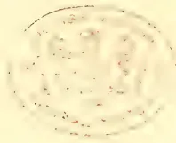A faint, circular seal or stamp impression is centered on the page. The seal appears to be a library or archival mark, featuring a central emblem surrounded by a circular border with illegible text. The impression is light and slightly blurred, suggesting it may be a watermark or a faded stamp.

687------------------------------------------------

JOHN GAVIN, Esq.

*Tropical Agriculturist Portrait Gallery.*  
No. VIII.

688------------------------------------------------

## BACK NOS. WANTED.

---

The Publishers of the *Tropical Agriculturist* want copies of the January, February and March issues of 1893. Subscribers who will kindly send any of these Nos. will be credited with the full value and postage.

A. M. & J. FERGUSON,  
Baillie St., Colombo, Ceylon.

689------------------------------------------------

<!-- stage4: FAINT old-images-only -->

[Faint page: no legible print of its own could be verified; text withheld (stage 4 review list)]

This image is a scan of a blank page. The background is a uniform light beige or tan color. There are a few very small, dark specks scattered across the surface, which appear to be scanning artifacts or dust particles. No text, lines, or other graphical elements are present.

690------------------------------------------------

# \* The TROPICAL AGRICULTURIST \*

## ◇ MONTHLY. ◇

Vol. XIII.]

COLOMBO, APRIL 2ND, 1894.

No. 10.

### "PIONEERS OF THE PLANTING ENTERPRISE IN CEYLON."

JOHN GAVIN,

PLANTER AND MERCHANT.

#### INTRODUCTORY.

**E**OR one who did his full share of work as a Pioneer Planter in "the forties," and who rose to be the head of the most important Planting Agency House in Ceylon, John Gavin left

singularly few references to himself in our local annals. He was reserved and retiring in disposition; averse to taking any part in public life, although keenly alive to all that concerned the development of the Planting Enterprise in road and railway construction. During his later years in Kandy, when, as the leading man of business and perhaps the wealthiest citizen, he might have been expected to share largely in the responsibilities of the Planters' Association and Legislative Council, his deafness operated against his moving out of his own immediate sphere of business. He gave his influence, however, to the resuscitation of the Planters' Association in 1862, and even occupied the chair for a few months in that year before his retirement from the Colony. But it was as a practical planter and a strictly honorable merchant and estate agent that Mr.

Gavin was best known and will be longest remembered in Ceylon. He rose to be the head of the leading Agency House of Messrs. Keir, Dundas & Co., Kandy, who, at the time he handed the business over to Messrs. G. D. B. Harrison and W. M. Leake, were known to have on their books over a hundred of the most prosperous plantations in the island, for which as agents and business managers—generally for absentee proprietors—they received in fees and commissions at the rate of £100 each plantation per annum, making an income from this source alone of £10,000 a year. In few men has so much confidence been shown by his brother colonists as in the subject of our notice, and the sobriquet of "Honest John," by which he was most widely known, shews that to him might be applied the description which John Ruskin placed on the grave of his father,—"an entirely honest merchant." We must now proceed, however, to give an account in consecutive form of the life and career of Mr. Gavin, although the writer having only met him once, soon after his own arrival in the Colony in 1861, finds himself rather in the position of one who has to make "bricks without straw." To one or two relatives and friends of Mr. Gavin he is indebted for the memoranda which have enabled him to present the following brief and imperfect memoir.

691------------------------------------------------

648THE TROPICAL AGRICULTURIST.[APRIL 2, 1894.]AN HARD-HEADED ABERDONIAN.

In speaking of the early Planting Pioneers of Ceylon, one is inevitably reminded of the "granite city" and the district of which it forms the capital. "Tak' awa' Aberdeen and twal miles roun' an' faur (where) are ye?" is specially applicable to the beginnings of the Planting Industry in Ceylon. John Gavin was pre-eminently a large as well as a hard-headed 'Aberdonian.' His portrait, it will be noted, does not belie the description. He was born in September, 1819, at Strichen, Aberdeenshire, where his father, Dr. Gavin,—after retiring from the Navy—acquired a very large practice to which his son—a brother of John—succeeded. The sisters of our Mr. Gavin again married well-known men, one of these, Dr. Anderson of the Gymnasium, Aberdeen, whose sons as Anderson, Anderson & Co. became the founders of the Orient Steam Navigation Company; and another sister was married to Dr. Anderson of Morpeth, the father of John and Geo. Anderson of Philpot Lane, both of whom like their uncle, became closely connected with Ceylon. Mr. Gavin was educated in the Parish School of Strichen—at a time when the parochial system of Scotland afforded the most admirable groundwork for a youth's education of any school-system in the world. He afterwards passed to a Grammar School or College in Aberdeen. Intended for mercantile life, we next find him as a mere stripling, (17 or 18 years at most) in a merchant's office in Manchester; but this did not suit his health; for after no long interval he had to return home and the old Doctor set him to farming on a farm tenanted by himself. John Gavin continued here for several years—perhaps five—until the farm was given up on his father's death; and then John went into the Agency Office of the Union Bank in Peterhead as an Assistant Accountant. Passing from thence to the same Bank's office in Aberdeen, he, very soon after, followed in the track of a good many of his countymen to the Far East of Ceylon. He was now in his 24th year, and it must be confessed had had an admirable training as farmer, banker and businessman to qualify him for his future career of coffee planter and merchant.

IN CEYLON AS PLANTER.

Mr. Gavin landed in Ceylon on the 4th July, 1843, and very soon got employment under what was then the leading planting house, Messrs. Acland, Boyd & Co. By them, one account says, he was sent to Galoya estate above Peradeniya, where he was in charge in September of that year. Another report, however, is that Mr. Gavin was first sent as assistant to Windsor Forest and Kelvin estates, Doldsbage district, and thence he was removed to Mooleyaya estate, Upper Hewaheta, which he

opened and continued to manage for some years. After this, he had another move to Kondealle in the Dumbara Valley. Here he was manager when the dark days of 1847-8 overtook Ceylon—wild speculation being followed by depression and stagnation intensified by the low price to which coffee had fallen after the abolition of the differential duty which protected British-grown from the competition of Java and Brazil coffee. So low did the price fall, that in 1849 it was only 3s. per bushel in Kandy, and the natives did not take the trouble to pick their crops! Two crops of Badulla coffee were sold at the estates' stores for 3s. a bushel; and a dealer elsewhere has related to us that he bought a bushel of rice and a cwt. of native coffee for the same price 9s. ! One-tenth of the plantations originally opened were at this time abandoned; while others were sacrificed for "a mere song." An estate that sold in 1843 for £15,000 was in 1847 knocked down at auction for £440 only! Hindugalla plantation, Badulla, which had cost £10,000 realized at sale but £500; and these are specimens of many more similar transactions.

MERCHANT: "HONEST JOHN."

Messrs. Acland, Boyd & Co. succumbed, and in 1848 Mr. Gavin joined another of the firm's employees, Mr. Pitts, in establishing the Kandy Agency firm of Messrs. Pitts & Gavin. It was a time when it required no ordinary courage, perseverance and hard work to make a profitable business, and Mr. Gavin had undoubtedly all these elements; but after a few years, the death of his partner broke up the firm, and (in 1856) Mr. Gavin saw his way to do better by placing his services as managing partner at the disposal of his countrymen, Messrs. Keir and Dundas, who had established the firm still known by their name in the Central capital, and which was destined to rise to its highest pitch of prosperity under Mr. Gavin's guidance. It was before this time that Mr. Gavin's plain, straightforward speech and just dealings had earned for him the title of *Honest John* among the planters.

EARLY EXPERIENCES AS PIONEER.

Before, however, approaching the prosperous days of the "fifties," we may refer back to some of Mr. Gavin's early experiences as a Planter, to shew how well he deserved the good fortune which afterwards overtook him, mainly, however, as the result of his own industry, shrewdness and integrity. The proverbial £8-6-8d. per month did not even come to John Gavin at the outset of his career as planter: he started rather on a salary of £5-10s. or 55 rupees a month, and he has been heard to describe

692------------------------------------------------

APRIL 2, 1894.]THE TROPICAL AGRICULTURIST.649

his bedstead in his earliest bungalow or shanty as a plank laid on two boxes and his only seat another box. A young Scot not afraid to "rough" it after this fashion, of course, managed "to live on his pay" of £70 per annum, and in the following year he was drawing £120. His employers had discovered the value of his services, and indeed if John Gavin did not feel bound in honour to the firm that had first taken him up, he could have commanded in the outside market £200 to £250 very early after learning his work and showing of what stuff he was made. Many young men of that time felt no scruple about throwing up engagements on the plea of being underpaid; but John Gavin was not one of them; and in his case as in that of others we know, who regarded their word as their bond, even though they were sometimes called "softies" by their companions,—there was no loss but great gain eventually from holding to their posts on limited pay and building up for themselves, the most valuable thing in the world, namely, *character*. Of his interest in his work as planter we have evidence in an extract from a letter placed at our disposal, which Mr. Gavin wrote to his brother-in-law, Mr. Thomson, so far back as November, 1844, some fourteen months after his arrival in the island. He writes:—

"The grand item of expenditure on a coffee estate is *weeding*. This the beginners did not think of very material importance, and when they found out the mistake committed, why the ground was thoroughly filled with seed, and from the rapid manner in which vegetation goes on, it is next to an impossibility now to have them extirpated. Now had this been attended to from the commencement, a very great annual saving would have been effected on this one item. And further, is it not natural to suppose that by judicious management in this respect the trees would have yielded a better crop, and a better sample. The present *generation of planters* enjoy the advantages of the well-bought experience of those who have gone before them, and I have no hesitation in saying that under ordinary circumstances an estate may be formed and brought into bearing for little more than one-half what many of the old ones have cost.

"The cultivation of sugar is at present occupying a considerable share of popular attention, but many seem doubtful whether it will succeed so well as anticipated. It is not cultivated to any extent in the interior, I am well acquainted with one estate which is certainly very promising. \* \* \* \* I hear that the half of it was sold the other day for £23,000—one hundred tons is the estimated produce for this season."

#### VISIT HOME AND RETURN.

Mr. Gavin paid his first visit to the mother-country after eight years in Ceylon, in 1851—the year of the first Great Exhibition in Hyde Park. After his return he had some six years of assiduous work in Kandy, building up and extending his influence as a businessman and latterly greatly strengthening the position of his firm, "Keir, Dundas & Co." One who knew him in those days, reports to us that "the small talk of the great Kandy Agency House was in the department of Mr. Dundas, while the practical business was attended to by Gavin. He was a very shrewd man of business—a capital judge of men, and as a hard worker himself, he fully appreciated the habit among his subordinates and superintendents." Mr. Gavin was a great admirer of Sir Henry Ward, and a great believer in, and advocate of, the Colombo and Kandy Railway. He had seen so much of the difficulties attending the transport of crop in his early planting days, that he went beyond his fellow-colonists and quite as far as the Governor himself in his determination to support a locomotive line at any cost. We find that in a letter to his brother-in-law, Mr. Thomson, under date so far back as March, 1847, he writes of the difficulty of transit of produce to Colombo, and speaks of a line of rail, but was not then very sanguine of it ever being made. Here is an extract:—"Much of last year's crop has still to find its way to Colombo owing to a deficiency in the means of transit, and to remedy this evil a *Conveyance Company* is being energetically organised for the purpose of establishing a regular and safe mode of conveying produce to the shipping port until the line of rail is carried out, which will not be, I fear, for some years to come, and I doubt if it will ever be completed, at all events for the sum estimated. Many unforeseen difficulties will, I am confident, encounter the Engineer on approaching the mountainous region, and sundry gorges and ravines will meet him which he little dreams of. These obstacles may, however, be got over, but it is impossible that any engineer from home can estimate Asiatic labour at its proper value."

#### "THE LAST ROSE OF SUMMER."

It was perhaps not to be wondered at, therefore, that when the majority of the public in Colombo and Kandy got alarmed at the unconditional way in which Sir Henry Ward pledged the Colonial revenue and credit to the Railway Company formed to construct the Colombo and Kandy line, Mr. Gavin stood out as one of the two or three Colonists who alone supported the Governor in this crisis. At a public meeting in Kandy called to discuss the situation, Mr.

693------------------------------------------------

650THE TROPICAL AGRICULTURIST.[APRIL 2, 1894.]

Gavin was in a minority of one in standing up for Sir Henry Ward and the Railway, under those conditions, and it was then he got dubbed "the last Rose of Summer" of the planting community. Our senior who, along with his colleague, Dr. Elliott, led the opposition to the Governor and carried the day at the time, often told us in the "sixties" and "seventies," that he believed Sir Henry Ward and Mr. Gavin were after all right, and that the Railway would have paid the Colony even at double its eventual cost, had it only come into existence ten or even seven years earlier than it did, and so saved the frightful expenditure of cooly and bullock power, and the absolute depreciation and loss of crop experienced during the interval.

#### MARRIAGE.

At the end of 1858, Mr. Gavin paid a long visit home remaining nearly two years only returning at the end of 1860. During this time he got married, his bride being Miss MacAndrew of the Knoll, Elgin.

From the columns of the *Colombo Observer* of June 1860, we take the following notice:—

#### MARRIAGE OF MR. GAVIN OF CEYLON.

We copy the following paragraph from the *Banffshire Journal*:—

ABERCHIRDER.—Since the arrival of John Gavin, Esq., at Auchintoul House, he has, by his numerous acts of generosity, endeared himself to all classes of the community, and Thursday last being the day fixed for his marriage with the beautiful and accomplished Miss MacAndrew, of the Knoll, Elgin, the inhabitants of Aberchirder, to testify their respect for Mr. Gavin, resolved to get up a demonstration in honour of the occasion. From an early hour on Thursday, numerous flags were displayed in the most conspicuous parts of the village, and a large bonfire was kindled in the Square, materials for which, were largely contributed by those who had experienced the benefit of Mr. Gavin's bounty on this, as well as many other occasions. The health of the happy bride and bridegroom were also pledged in copious libations of porter and ale, which were distributed among the lieges. The old women, especially, bestowed their best blessing on Mr. Gavin, who so seasonably relieved their wants during the late severe season. The day's proceedings were wound up by a ball at Auchintoul, where a large number of the youth and beauty of the place assembled. Refreshments were abundantly supplied, and the healths of the happy couple were proposed and drunk with Highland honours. The dancing was kept up with great spirit till an early hour next morning.

#### A FAMOUS LAWSUIT.

Mr. and Mrs. Gavin did not remain more than two years in Ceylon after they came out at the end of 1860. In December 1862, Mr. Gavin retired, disposing of the good-will of his firm to Messrs. Harrison and Leake, and Mr. and Mrs. Gavin finally left the island in January, 1863, taking up their residence at West Park, Elgin, and continuing there from 1863 to 1866. Mr. Gavin had, however, one visit to pay to the island in the interval (in the winter of 1864-5) in connection with his fine Dodangalla coffee property in the Medamaha-

nuwara district. This had become the subject of a lawsuit, on all fours it was supposed with the great Rajawella case which the Lindsay family had won over the Oriental Bank. The Dodangalla case was in the names of "Lindsay vs. Clerihew"; but the defendant was really Mr. Gavin, for he had purchased the place as forest-land from Mr. Clerihew and had turned it into a coffee plantation. He was told at the time there might be trouble, and after the Rajawella result, no one had the slightest faith in his defence of the case leading to anything but additional costs. Nevertheless, Mr. Gavin fought the battle right to the bitter end and eventually illustrated "the glorious uncertainties of the law" by winning against the plaintiff Lindsay in the Privy Council, thereby adding to his reputation for native shrewdness and doggedness. Dodangalla estate is still held by Mr. Gavin's family, though no longer cultivated.

#### IN CONCLUSION.

We have two testimonies to add from old residents who knew Mr. Gavin. Mr. Edward J. Young of Rangalla who served under Messrs. Keir, Dundas & Co., in the time of Mr. Gavin, writes:—"John Gavin was a very fine specimen of our countrymen, sturdy, shrewd, truthful and strictly honest: at the same time he was a very retiring man and hardly ever intruded in public matters, and was indeed little known in Ceylon except to a few personal friends." Mr. W. D. Gibbon—himself a countyman of Mr. Gavin, writes:—"After he had joined the great Kandy Agency House, I knew Mr. Gavin well. My first recollection of him was when I recovered consciousness from delirium caused by rheumatic fever—soon after I came to the island in 1855,—and found him seated by my bedside. I exclaimed:—'Oh Dr. Gavin, how did you come here.' He was so like his medical brother! He often came to see me in my illness and talked Buchan and its folk, of whom we never tired speaking. His houses at Katukelle and Harramby were ever open to me. He was a shrewd man, a good judge of men and appreciated hard work."

There is not much more to add. In 1866 Mr. and Mrs. Gavin removed from West Park to Wester Elchies, on Speyside, Morayshire, and here the subject of our notice died on the 12th February, 1876, at the comparatively early age of 56½ years. Mrs. Gavin still survives, having removed from Elchies to Earlcross, Elie, Fifeshire, in January 1878. Their family consisted of three sons and five daughters, one of the former being Mr. H. J. Gavin now on Mahousa Estate, Madulkele, while another, Mr. Norman Gavin, is the head of an Engineering firm in Johannesburg, South Africa. One of the daughters again was a distinguished student at Girton, and is now Principal of the G. P. D. School at Shrewsbury,

694------------------------------------------------

APRIL 2, 1894.]THE TROPICAL AGRICULTURIST.651

## THE EARLY EUROPEAN COCONUT INDUSTRY IN THE BATTICALOA DISTRICT.

(By an Old Resident.)

In connection with the early history of coconut planting in Ceylon is associated a name that is imperishably bound up with the history of the struggles of the Anglo-Saxon race in establishing British supremacy in the East—David Ouchterlony—an adventurous young soldier, who found a congenial sphere for the display of individual bravery in the Indian border warfare of the tens and the twenties of this century. At one time, against the short-statured but brave and hardy mountaineers, the Ghontees of the Himalayas, at another time in Central India storming the hitherto impregnable clay for trees of the Maharaja of Bhurtpore, had he lived in modern times he would have won the Victoria Cross a dozen times over. A beautiful monument, eighty feet high, on the Calcutta maidan in memory of Sir David Ouchterlony, the thousands of acres in the Ouchterlony valley in South India, the one thousand five hundred acres of the Easter Seatown coconut land in Batticaloa, and other tangible acquisitions, perpetuate the daring deeds of the once obscure young soldier.

### EUROPEAN PIONEERS.

Captain Holderness was sent out to open the land in the forties. He was a big swell, had many attendants about him, and kept an ever-open town house in a way befitting his gallant master, but, as is usual with such young men, he succumbed to disease early in life. This unforeseen event brought to the fore his assistant, Mr. John Carey. Quiet, unassuming, frugal almost to a fault, he seized "the tide in the affairs of men" and thanked Providence for it from his usual corner seat in the Wesleyan Meeting House. Retrenchment and a wonderfully economic management formed the order of the day, and his grateful master gladly allowed the blooming *sinne durai* all the legitimate fruit of his exertions in appreciation of the changed situation. Invergne, 200 acres, belonged to Mr. S. Keir, and Kirankulam, 200 acres, belonged to Messrs. MacKilligan and Maxwell, while Springfield, 200 acres, belonged to Messrs. J. Thomson and others. They were absent proprietors, and their estates were managed by Messrs. Drummond and Shand.

### SOBER ISLAND.

There was also another little bit of property opened by a doctor (probably Dr. Jallond) and peculiarly known as the "Gallipot." But it has come into an honorable use. The doctor's "Gallipot" was the only health resort and seaside bungalow for Europeans and respectable natives for a long time, besides Dr. Sortain (reserved), Kochchi Kativvu and Bone's Island, open to all, and so called after a Collector and Judge of seventy years ago who owned it, but which subsequently became *par excellence* the "Sober Island" of the Burgher community, and is now subjected to all the vicissitudes of a varying tidal erosion as at Crow's Island at the mouth of the Kelani river.

### BURGHER AND NATIVE PLANTERS.

One by one many of the original owners of estates in Batticaloa, not realizing any profitable returns from the tenth year, as they fondly expected, while they had to meet heavy bills on account of their superintendence, gladly parted with their properties, often for much less than what they would have become worth had they allowed a growth of another decade to their trees. Among those that scrambled for prizes was a Burgher gentleman of Russo-Polish origin, who threw up a good Government berth and turned coconut planter. But for any one to play the part of a *peria durai* on a young estate, unless backed by ancestral wealth or other sources of income, is rather risky, and in eight years he was ruined for life, lost everything, and he and his wife died within four months of

each other. Another Burgher gentleman was more fortunate. He was at first content to become a kangani under an European, then overseer, and then a conductor; the surplus of his salary he invested in the adjoining jungle, and eventually became a successful "creeper." He left very few blood relatives here; the nearer ones were supposed to be in "Potviter Land," South Africa. He had several idiosyncracies, one of them being a hatred of European medicines, and he died a martyr to his opinion. Another successful speculator in land was Dr. M. Covington.—Local "Times."

## CEYLON AND INDIAN TEA IN AMERICA.

Mr. P. R. Buchanan writing from Nuwara Eliya on the 15th ult., favours us with the following explanation of his views and of the working of the "Scheme" suggested by Sir John Muir and himself:—

"It is quite true I should prefer to see the commission go direct to the distributor, but it would be almost impossible to check claims. If however our representative clearly pointed out to the dealers that this allowance was made, I am satisfied it would find its way to them ultimately. I do not know why the payment should not be made to the importer into America as easily as to the exporter and I should certainly prefer this, but it seems to me Mr. Grinlinton's opinion on such a point ought to be decisive.

"If our representative is to carry samples, endless questions of whose samples, what sample, would arise. All large houses in Canada and most large dealers in the States get samples of Ceylons and Indians themselves and our tea representative could always put a dealer in the way of getting them if necessary. We should avoid his being mistaken for a regular 'drummer' and we should certainly see that we do not place him in a position in which his actions might be misinterpreted, such as pushing any particular tea &c. He must be, like Caesar's wife 'irreproachable.'

We see the force of the objection taken to the distribution of samples. Granted also that the commission be paid to exporters, we see that Mr. Grinlinton gives as one reason, the simplicity and accuracy ensured through the Consul's certificates for shipments. Are then shipments to the Canadian Dominion (including British Columbia) to be excluded from the bounty? Surely not, for there is a splendid field for the extension of the demand for British grown teas in Canada, and its towns were specially mentioned in the Scheme as coming under the direct cognizance of the Agent in his travels. Then, again, if Mr. Grinlinton would consent to accept the post of Agent, on the terms specified, as a contemporary hopes, he would surely much prefer to represent all British-grown teas—India as well as Ceylon—than to have another Agent—like Mr. Blechynen probably—following his heels, or preceding him to the different towns? It is very amusing to see how petty feeling develops! At the time we started the proposal that Ceylon and Indian tea-planters should co-operate, we were told that as Ceylon should certainly not approach India, it would be time enough to discuss the matter when a proposal was made on behalf of the Indian planters. Now that the proposal has come and been formulated, the very fact that it was unsolicited, is used in some quarters, to tell against it! We sincerely hope, however, that the majority interested in Ceylon tea will rise to a broad and business-like view of the case now presented to them. In a nutshell, it is—Are there to be two separate, and possibly, rival Agents to represent British-grown teas in America, or only one? Division and Opposition; or Union against the common foe, represented by China and Japan teas?

695------------------------------------------------

652THE TROPICAL AGRICULTURIST.[APRIL 2, 1894]

### THE TONACOMBE ESTATES COMPANY OF CEYLON, LIMITED.

Application has been made by Messrs. de Saram for the registration of this Company which is being formed for the purpose of purchasing the Tonacombe, Dewature and Lifton estates in the district of Badu'la for £18,000 sterling. The nominal capital of the Company is to be £600,000 divided into 1,200 shares at £500 each. The subscribers to the memo and articles of association are Messrs. Edward Christian, F. J. de Saram, W. H. Figg, J. Buchan, F. W. Bois, and C. A. Leechman.

We find from our Directory that the acreage of Dewature is 366,—163 being cultivated (141 in tea and 22 in coffee); of Lifton 415,—178 being cultivated (68 in tea and 110 coffee); and of Tonacombe 770,—320 being cultivated (215 in tea, 42 in coffee, and 63 in cardamoms). The total acreage of the three estates is 1,551, the area under cultivation being 661 acres.

### AMERICA FOR BRITISH-GROWN TEAS:

THE CAMPAIGN AGAINST CHINA'S AND JAPAN'S:  
 SHOULD THE HON J. J. GRINLINTON NOT REPRESENT  
 INDIAN AND CEYLON TEAS WITH £12,500 PER ANNUM  
 AT HIS COMMAND—RATHER THAN CEYLON ALONE  
 WITH ONLY £5,000; WHILE A RIVAL  
 AGENT FOR INDIA WOULD HAVE THE  
 DISPOSAL OF £7,500?

In commencing the discussion well-nigh two months ago, which we hoped would lead to a joint effort to capture America, for Indian and Ceylon teas, we were quite aware that the proposal would not be a popular one with the majority of Ceylon planters. The men of the present day have forgotten how their representative at the Melbourne Exhibition fought shoulder to shoulder with the Indian Commissioner and Tea Agent in exposing the inferiority of China teas. Of late years, a local feeling of rivalry with India has sprung up, and in respect of America especially, this has been fostered by the more prominent part taken at the Exhibition by Ceylon, although a contemporary in taking credit for all the expenditure at Chicago, forgets that it includes the whole of our products and representation, as opposed to the Indian outlay which was for tea alone. We can, however, get no good reason from the planting districts why Ceylon should not, henceforward, work with India in America in promoting the introduction of British-grown teas in supersession of inferior China's and Japan's. The average Ceylon planter who wishes "the right little, tight little island" to work on its own account, will have nothing to do with his brother-planter in India, and can give us no better reason than the Dean of Christ Church got from his witty pupil over 20 years ago:—

I do not like thee, Dr. Fell—  
 The reason why I cannot tell  
 But this I know, and know full well,  
 I do not like thee, Dr. Fell.

In saying no reasons are given, we err. Two have lately appeared in print, but they are both based we think on an entire misapprehension. One is that Ceylon having spent so much at Chicago and elsewhere to get her teas introduced, Indian planters—who have done so much less—want now to profit by our work by holding on to our tail or skirts. Now there are two misapprehensions here: (1) that Indian tea proprietors have not spent as much as Ceylon in making a market for their teas in North America. We are assured that they have spent fully as much if not more—though not in the Chicago Exhibition—and the proof is (2) found in the actual exports of Indian

as compared with Ceylon tea for last year to America. We cannot offer a fair comparison between the exports from Calcutta direct with those from Colombo, because the former would require to be checked by the Consular return. In the case of Ceylon, the Chamber of Commerce only showed Exports to America for 1893 equal to 112,240 lb. We have been able with the help of Mr. Morey and mercantile exporters to raise this to 351,000 lb. The Calcutta figures show 295,185 which if corrected in the same way would probably grow in proportion. At any rate, the exports of Indian and Ceylon tea to America in 1893 from the United Kingdom compare as follows:—

#### To N. America.

<table>
<tr>
<td>Ceylon tea in 1893</td>
<td>1,437,327 lb.</td>
</tr>
<tr>
<td>Indian "</td>
<td>1,499,763 "</td>
</tr>
</table>

It is evident therefore that India is not behind in the start towards capturing the American market, and it is equally clear from the proceedings we recently gave of the Indian Tea Association in London—which, by the way, none of our local contemporaries has published,—as well as from what has occurred in Calcutta, that Indian tea planters are determined, whether their Ceylon brethren join them or not, to take further active steps towards capturing America. But it is suggested by Mr. D. Kerr of the Scottish-Ceylon Tea Company—who gives some excellent advice based on his personal visit to America which we shall take over—as an objection to association with India, that it is "too loose-jointed." This must refer to the difficulty of the collection or of the management of the fund allotted to America. But when it is known that certain Calcutta firms who command by far the greater portion of the Indian crops are prepared to guarantee the £7,000—or whatever sum be fixed for India—and to hand the same over to a joint representative Committee, this difficulty should vanish. Then let it be remembered, India is prepared at once to begin with her £7,000. Ceylon so far as we can understand, will not have any cents available before 1895. One objection offered is that if Ceylon raises £5,000 for her 90 million lb. tea, India giving £7,000 is not in proportion. Well, it represents 126 million lb. at the same rate; but we feel sure it will readily be made £7,500 to represent 135 million if that will satisfy Ceylon.

The way is now clear. We think, to see exactly where the two countries or rather the two industries stand. India, as we understand it, is quite prepared to start a campaign on her own account conducted by an agent and staff with £7,500 behind them. This could be put in operation we suppose by July next. Then according to the objectors, Mr. Grinlinton would be asked to follow suit early next year for Ceylon, with a backing of £5,000 in all. How much better, under these circumstances, we say, to take up Mr. Grinlinton's services on behalf of both countries and industries—for British-grown teas in fact—and so give him a backing of £12,500?

In this connection we direct attention to the really admirable letter of Mr. Westland, Chairman of the Northern Districts Association, called forth by an inquiry from our contemporary. We think Mr. Westland has solved the problem better than any one as yet. Sink the bounty, he says, and get Mr. Grinlinton to represent the British-grown teas of both countries and put at the disposal of himself and the joint Committee the whole £12,500 to spend (after providing salaries and allowances) as they think wise. Once on the spot

696------------------------------------------------

APRIL 2, 1894.]THE TROPICAL AGRICULTURIST.653

and in consultation with all the large wholesale houses on behalf of Indian as well as Ceylon teas, Mr. Grinlinton would speedily learn what would suit the case best, whether to spend a few thousands in advertising, or to commend back to his joint Committee the starting of a bounty commission. The great matter now is to vote for the selection of Mr. Grinlinton as sole responsible Representative for the teas of Ceylon and India to open a Campaign throughout the length and breadth of North America with a view to ousting China and Japan teas. With a joint fund equal to £12,500 per annum to begin with, and yearly increasing, this could not fail to become a very important mission and one which would draw the attention of the whole Tea Industry to the work of our Commissioner. We feel sure that Mr. Grinlinton will rise to the occasion and if he is given a free hand, we may expect a speedy impression to be made on the American markets; and then the great fact to be remembered, is that every ton whether of Indian or Ceylon tea diverted across the Atlantic is so much less pressure on Mining Lane—an all-important consideration for both India and Ceylon.

### DEATH OF AN OLD COLONIST.

MR. JOHN BROWN DIES ON HIS WAY TO CAIRO.

It is with much regret that we receive the above sad intelligence. Mr. Brown, who had been out on one of his usual winter trips to Ceylon, began to feel poorly in February and his departure was hastened by medical advice, while for the same reason his son, Mr. Alfred Brown, accompanied him in the ss. "Oceanian" on the 4th ult. from Colombo, intending to go as far as Aden. Mr. Brown, senr., had not then, however, improved in health, as was anticipated, and fortunately it was decided his son should go on to Egypt, so that he was with his father to the end. The sad news reached Mr. Wardrop by telegraph from Alexandria, intimating Mr. Brown's death yesterday while *en route* to Cairo. For several years back, Mr. Brown has been known to have a weak heart, accompanied by a tendency to bronchial affection, and it is for this reason he, of late years, avoided the English winter and early spring. But the end had to come and the sad part is that the invalid's strength did not keep up until he reached his family who were awaiting him on the Continent.

So has passed away a Colonist whose engineering skill, activity and enterprise had a good deal to do with the development of Ceylon from the "fifties" onwards. Few individuals, indeed, have left their mark so clearly on the progress of the colony. Mr. John Brown came out originally as the Engineer in charge of the Waterworks for Mr. Tytler's Rajawella, which included what were then one of the largest turbines and most powerful pumps anywhere in the world. When this work was completed—at a cost we believe of £20,000—Mr. Brown, like so many practical engineers before and after his time, turned his attention to planting, and he became part-proprietor with Messrs. Norman Stewart and Macintyre of a fine block of land near the famous Spring Valley estate in Uva, which they developed into the Glen Alpine estate. How after his partners had retired home, Mr. Brown—at a time when Ceylon Limited Companies were few and far between—arranged for the establishment of the Uva Coffee Co., Ltd., with Glen Alpine as the nucleus, and the Spring Valley and afterwards Hunasigitiya

Companies is matter of local history and no less his founding of the Colombo Commercial Company, now representing—under the able management of his son-in-law Mr. Wardrop,—so important a section of local mercantile, agency, engineering and building business. Mr. Brown's Coffee Companies stood out long after most investments in our old staple; but at last the time came when they also had to go in for "tea" and the activity and interest which the old veteran manifested in the transformation would have done credit to a much younger man. Of Mr. Brown's inventive genius in respect of coffee pulper, wire shoots and other estate-labour-saving contrivances, as also in respect of tea-rolling (the roller being the cause of litigation still in force), and tea-drying,—his desiccator being a great success—we need say nothing beyond the mention. One who well deserves to be enrolled among the Pioneers of this Planting Colony—both as Engineer, Planter and Merchant—has passed away, and our special sympathy is due to members of his family, both here and in England. Mr. Brown was twice married: his second wife, who survives, being a daughter of the late Mr. James Abernethy, head of the well-known Aberdeen Engineering Firm.

### COFFEE IN JAVA.

Amsterdam, Feb. 21.—From a reliable source it is reported that the newly-appointed inspector, Dr. Burek, who has made an investigation about the compulsory coffee cultivation in Java, does not consider the condition so gloomy as was generally presumed. In Central Java the prospects are not encouraging, and in many districts there the Government will have to give up the cultivation, like has been done already in the districts of Bantam and Japara. However, in Eastern Java, and especially in Probolinggo and Bezoekie, there is an abundance of magnificent grounds suitable for the cultivation of coffee, and also in the Presanger districts the soil is certainly not exhausted. Dr. Burek seems to be a strong promoter of the system of granting an extra payment for the construction and maintenance of coffee lands, besides the price paid for produce delivered.—*L. and C. Express*.

### INDIAN PATENTS.

Calcutta, Feb. 22.

The inventor of the under-mentioned invention having respectively failed to pay within the time limited in that behalf the prescribed fee, it is hereby notified that the exclusive privilege of making, selling, and using the said invention in British India and of authorising others so to do had ceased:—

TEA-SIFTING.—No. 60 of 1889.—H. Sabow's invention for a cylindrical vibration tea sifting machine. (Specification filed 14th November 1889.)

The fees prescribed in Schedule 4 of Act V of 1878 have been paid for the continuance of exclusive privilege in respect of the undermentioned invention for the periods shown against each:—

DRYING APPARATUS.—No. 90 of 1888.—Samuel Celand Davidson, Merchant of Sirocco Works, Belfast, Ireland, for improvements in apparatus for employing heated air in drying or baking vegetable or other substances. (From 6th March 1894 to 5th March 1895.)

TEA DRIERS.—No. 80 of 1888.—Henry Thompson, Engineer of Trinity St., Gainesborough, Lincoln, England for improvements in the method of, and apparatus for, drying tea leaf. (From 17th April 1894 to 16th April 1895.)

TEA ROLLERS.—No. 142 of 1888.—Henry Thompson, Engineer of Trinity St., Gainesborough, Lincoln, England, for improvements in machinery or apparatus for rolling or curling tea leaf. (From 17th April 1894 to 16th April 1895.)—*Indian Engineer*.

697------------------------------------------------

654THE TROPICAL AGRICULTURIST.[APRIL 2, 1894.]

## ROYAL BOTANIC GARDENS ADMINISTRATION REPORT FOR 1893.

DR. TRIMEN is usually first in the field with his Administration Report which is always one of the most generally interesting. This year forms no exception to the rule, and through the courtesy of the Government Printer, we are enabled to issue all the more important portions of the Report as a Supplement, and to be bound up with our *Tropical Agriculturist*. This being the case, there is less necessity for us to run over the contents; but a very few remarks may be permitted. The erection of the new large Conservatory in the Peradeniya Gardens is noteworthy, as well as the improvement of the Herbaceous Ground. In reference to the removal of old trees, one would have liked to learn the dimensions of the *Grevillea Robusta* originally planted in 1856, and so 17 years old on removal. This must have been one of the oldest "silky oaks" in the country and a comparison with some of the *Dimbula* giants might be instructive. That 2,046 travellers from other countries should have visited the Peradeniya Gardens last year, is certainly worthy of record. Twenty years ago, the number per annum could scarcely exceed the odd 46! Several improvements to the Hakgala Gardens are also noted, and Mr. Nock supplies a great deal of interesting as well as useful details. His cure for a "black grub" will be noted by horticulturists; the damage done by the small moose-deer is annoying; the "rose garden" must now indeed be a sight when in flower, with an addition of 96 varieties last year from Worcester. Heueratgo4a Gardens have certainly fulfilled their main function when we learn that no less than 75,000 seeds of *Hevea* rubber have been sold to planters last year; besides 10,000 plants Liberian Coffee, 2,700 pods of Cacao, &c. Anuradhapura Gardens are doing fairly well and Badulla Gardens have become quite an ornament to the town.

Coming now to the part most generally looked for, the "Notes on Economic Plants," Dr. Trimen has not much of novelty to relate this year; but he emphasises his fear about the over-production of tea—the only danger he foresees to the industry—and would have the acquisition of new land for planting made as difficult as possible! He must remember, however, that in many cases land is wanted by existing holders as reserves for firewood. As regards considerable blocks, it is evident the Government are acting in accordance with Dr. Trimen's advice. Very useful information is repeated in reference to *Helopeltis*—"mosquito blight" being a most unfortunate name, for it is not a mosquito at all—and all tea planters especially in the lowcountry will carefully note what is said. Dr. Trimen is as eager as ever for the extension of Liberian Coffee and Cacao, and he has also a good deal to say for the cultivation of certain kinds of rubber. He recommends the Brazilian *Hevea* when the cultivators can wait 12 years for profitable returns; the *Castilloa* does not give promising results so far; but the *Ceara* might do in fields where the trees could be cut down every 10 to 12 years, each tree giving  $1\frac{1}{4}$  lb. dry rubber or 1,500 lb. at 1,000 trees(?) to the acre. If such a harvest were worth £150 or even £100 every acre, it might certainly be profitable to plant and wait a decade, seeing that so little cultivation is required in the interval. Of other minor products, Dr. Trimen has a good deal to tell us, the most interesting reference being perhaps to *Nu'megs*, of which, it is certainly strange an appreciable quantity does not appear in our exports. We

suspect the produce of the many trees scattered up and down the country is all used up locally, finding a market in the town bazaars? Sir John Wilson had a number of fine teas on his Nilambe plantation; and Mr. Chas. Shand planted those which have delighted so many travellers in the Ratnapura resthouse grounds; while Dr. Trimen tells us, he has supplied 118,000 seeds during the past 10 years to intending cultivators. We ought, therefore, soon to see, a steadily increasing record of exports. Mr. Nock's success in potato culture at Hakgala is noteworthy and ought to encourage fresh efforts in Uva generally, with railway transport available to so good a market as Colombo. Mr. T. Christy's new fodder plant is to have a fair trial. Finally, we are pleased to learn of the progress made with the second and third parts of the "Handbook to the Flora of Ceylon," which when completed, will give this island (as Dr. Trimen believes) "an account of its native vegetation more detailed and complete than that of any other Colony."

## CINCHONA BARK PROSPECTS.

In their latest market report Messrs. Wodehouse & Co., Miucing Lane, give some interesting statistics respecting Bark exports from Java and India and the imports of bark and quinine into the United States. We quote as follows:—

### EXPORTS FROM JAVA.

<table border="1">
<thead>
<tr>
<th>Jan./June.</th>
<th>July/Dec.</th>
<th>Total:</th>
</tr>
<tr>
<th>Eng. lb.</th>
<th>Eng. lb.</th>
<th>Eng. lb.</th>
</tr>
</thead>
<tbody>
<tr>
<td>1893..... 4,455,900</td>
<td>3,732,000</td>
<td>8,187,900</td>
</tr>
<tr>
<td>1892..... 2,896,600</td>
<td>4,291,700</td>
<td>7,191,300</td>
</tr>
<tr>
<td>1891..... 3,030,600</td>
<td>5,668,900</td>
<td>8,699,500</td>
</tr>
<tr>
<td>1890..... 2,757,300</td>
<td>4,533,900</td>
<td>7,291,200</td>
</tr>
</tbody>
</table>

The shipments from Java during January were 974,000 Amsterdam lb. against 980,000 lb. last year, but we understand that about one-fourth of this is coming forward by sailing vessels.

### EXPORT FROM BRITISH INDIA 1ST JANUARY TO 30TH NOVEMBER.

<table border="1">
<tbody>
<tr>
<td>1893.... 2,709,673 lb.</td>
<td>1891.... 2,627,440 lb.</td>
</tr>
<tr>
<td>1892.... 2,254,786 "</td>
<td>1890.... 1,931,837 "</td>
</tr>
</tbody>
</table>

### IMPORTS OF BARK AND QUININE INTO UNITED STATES 1ST JANUARY TO 31ST DECEMBER.

<table border="1">
<thead>
<tr>
<th></th>
<th>1893.</th>
<th>1892.</th>
<th>1891.</th>
</tr>
<tr>
<th></th>
<th>lb.</th>
<th>lb.</th>
<th>lb.</th>
</tr>
</thead>
<tbody>
<tr>
<td>Cinchona Bark..</td>
<td>2,138,128</td>
<td>3,144,284</td>
<td>2,861,000</td>
</tr>
<tr>
<td></td>
<td>oz.</td>
<td>oz.</td>
<td>oz.</td>
</tr>
<tr>
<td>Quinine .....</td>
<td>2,777,567</td>
<td>3,486,922</td>
<td>2,527,000</td>
</tr>
</tbody>
</table>

It will be observed that the total from Java last year in 8,187,900 lb. really affords a larger supply of quinine than the maximum export (15,364,912 lb. in 1885-6) from Ceylon; for the latter barely averaged 2 per cent of quinine, while the Java bark last year gave the high average, according to Mr. Bohringer, of  $4\frac{1}{2}$  per cent. The comparison then would be—reducing both exports to one per cent—as 38,892,52 lb. for Java against 30,729,824 for Ceylon,—apart from the greater ease in working off  $4\frac{1}{2}$  as compared to 2 per cent bark and only half the cost in freight. Java has, therefore, in every way beaten the cinchona bark record, and the future of the bark market, so far as we can see, lies altogether under the control of its planters.

We are surprised to see that the consumption of quinine and bark has by no means made progress in the United States during the past three years. In India, thanks to the enterprise and liberality of the Government in distributing a million and a half of packets through the post office for the benefit of people in fever-stricken districts, the consumption is increasing steadily. There is an enormous field for the sale and use of quinine in Southern China, Northern Burma, Siam and Tonquin which has yet to be exploited.

698------------------------------------------------

APRIL 2, 1894.]THE TROPICAL AGRICULTURIST.655

## CEYLON MANUAL OF CHEMICAL ANALYSES.

A HANDBOOK OF ANALYSES CONNECTED WITH THE INDUSTRIES AND PUBLIC HEALTH OF CEYLON FOR PLANTERS, COMMERCIAL MEN, AGRICULTURAL STUDENTS, AND MEMBERS OF LOCAL BOARDS.

By M. COCHRAN, M.A., F.C.S.

(Continued from page 588.)

### CHAPTER X.

#### WATER.

CLASSIFICATION OF WATERS—STANDARDS OF PURITY FOR POTABLE WATER—CEYLON SPRING WATERS—HOT MINERAL SPRING WATERS FROM STRAITS SETTLEMENTS—RAIN WATER—WATERS FROM STREAMS—COLOMBO TOWN WATER FILTERED AND UNFILTERED—AVERAGE COMPOSITION OF COLOMBO WATER SUPPLY—WATER FROM VARIOUS DEPTHS OF LABUGAMA RESERVOIR—KANDY PUBLIC WATER SUPPLY—COMPARISON OF COLOMBO, KANDY AND ENGLISH WATER SUPPLIES—COLOMBO DRAINAGE WATER—STANDARD ANALYSIS OF SEWAGE.

The Royal Commission on water supply of 1869 classed unpolluted natural waters in respect of their freedom from the most objectionable impurity in potable water, viz., organic matter, in the following order:—

1. 1st. Spring water.
2. 2nd. Deep well water.
3. 3rd. Rain water.
4. 4th. Upland surface water.

In respect of wholesomeness, palatability, and general fitness for drinking, the following, according to Dr. Frankland, was the classification of waters in order of excellence that was adopted:—

<table border="0">
<tr>
<td rowspan="3">Wholesome.</td>
<td rowspan="3">{</td>
<td>1. Spring water.</td>
</tr>
<tr>
<td>2. Deep well water.</td>
</tr>
<tr>
<td>3. Upland surface water.</td>
</tr>
<tr>
<td rowspan="3">Suspicious.</td>
<td rowspan="3">{</td>
<td>4. Stored rain water.</td>
</tr>
<tr>
<td>5. Surface water from cultivated land.</td>
</tr>
<tr>
<td>6. River water to which sewage gains success.</td>
</tr>
<tr>
<td>Dangerous.</td>
<td>{</td>
<td>7. Shallow well water.</td>
</tr>
</table>

When analysing waters with a view to pronounce upon their fitness for drinking or cooking purposes, it is necessary to have some standard of purity, by which to interpret the analytical results obtained. Many such standards have been proposed from time to time, and, though none of them will apply in every case, so as to dispense with the necessity on the part of the analyst for the exercise of his own judgment after taking local circumstances into account, the value of a good general standard of purity is unquestionable. Of the different standards proposed, none will be found more useful for the guidance of the analyst or of sanitary authorities, than the four-fold classification given in the seventh edition of Parkes' Practical Hygiene, the more important features of which I here reproduce.

### 1. Pure and Wholesome Water.

<table border="1">
<thead>
<tr>
<th>Character or Constituents.</th>
<th></th>
</tr>
</thead>
<tbody>
<tr>
<td>Physical characters</td>
<td>Colourless, or bluish tint, transparent, sparkling and well aerated, no sediment visible to the naked eye, no smell, taste palatable.</td>
</tr>
<tr>
<td>Chemical Constituents.</td>
<td>Grains per gallon.</td>
</tr>
<tr>
<td>1 Chlorine in chlorides under</td>
<td>1.0000a</td>
</tr>
<tr>
<td>2 Solids in solution</td>
<td>5.0000b</td>
</tr>
<tr>
<td>    " volatile "</td>
<td>1.0000b</td>
</tr>
<tr>
<td>N.B.—The solids on incineration should scarcely blacken</td>
<td></td>
</tr>
<tr>
<td>3 Ammonia, free or saline under</td>
<td>0.0014</td>
</tr>
<tr>
<td>Ammonia, albuminoid under</td>
<td>0.0035</td>
</tr>
<tr>
<td>4 Nitric Acid <math>\text{No}_3</math> in nitrates</td>
<td rowspan="2">} 0.0226</td>
</tr>
<tr>
<td>Nitrous acid <math>\text{No}_2</math> in nitrites</td>
</tr>
<tr>
<td>5 Oxygen absorbed by organic matter in 15 mins. by permanganate and acid @ <math>80^\circ \text{F}</math>. (<math>27^\circ \text{C}</math>.) under</td>
<td>0.0100c</td>
</tr>
<tr>
<td>    Do in 4 hours at <math>80^\circ \text{F}</math>. (<math>27^\circ \text{C}</math>.) under</td>
<td>0.0350c</td>
</tr>
<tr>
<td>6 Hardness, total " fixed "</td>
<td>6 = 0 2 = 0</td>
</tr>
<tr>
<td>7 Phosphoric acid in phosphates</td>
<td>traces</td>
</tr>
<tr>
<td>Sulphuric acid in sulphates</td>
<td>traces</td>
</tr>
<tr>
<td>8 Heavy metals</td>
<td>nil</td>
</tr>
<tr>
<td>9 Hydrogen sulphide, Alkaline sulphide ....</td>
<td>nil</td>
</tr>
<tr>
<td>Microscopic characters</td>
<td>Mineral matter; vegetable forms with endochrome; large animal forms; no organic debris.</td>
</tr>
</tbody>
</table>

REMARKS.—Turbidity, due to very fine mineral matter, is sometimes associated with pure waters: thus, minutely divided, calcium sulphate will not subside in distilled water.

a This may be exceeded if from a purely mineral source.

b The solids may be exceeded in chalk waters where they are mostly calcium carbonate.

c The oxygen absorbed may be exceeded in peat or upland surface waters.

A water such as the above may generally be used with confidence, in the absence of any history of possible pollution, or of any recent and appreciable change in the amount of the organic constituents.

83

699------------------------------------------------

656THE TROPICAL AGRICULTURIST.[APRIL 2, 1894.]2. Usable Water.

<table border="1">
<thead>
<tr>
<th>Character or Constituents.</th>
<th></th>
</tr>
</thead>
<tbody>
<tr>
<td>Physical characters</td>
<td>Colourless or slightly greenish tint; transparent, sparkling and well aerated, no suspended matter, or else easily separated by coarse filtration or subsidence; no smell, taste palatable.</td>
</tr>
<tr>
<td>Chemical Constituents.</td>
<td>Grains per gallon.</td>
</tr>
<tr>
<td>1 Chlorine in chlorides under</td>
<td>3.0000<i>a</i></td>
</tr>
<tr>
<td>2 Solids in solution total</td>
<td>30.0000<i>b</i></td>
</tr>
<tr>
<td>" volatile</td>
<td>3.0000<i>b</i></td>
</tr>
<tr>
<td>3 Ammonia, free or saline</td>
<td>0.0035<i>c</i></td>
</tr>
<tr>
<td>" albuminoid</td>
<td>0.0070<i>d</i></td>
</tr>
<tr>
<td>4 Nitric acid <math>\text{No}_3</math> in nitrates</td>
<td>0.3500<i>e</i></td>
</tr>
<tr>
<td>Nitrous acid <math>\text{No}_2</math> in nitrites</td>
<td>nil</td>
</tr>
<tr>
<td>5 Oxygen absorbed by organic matter in 15 min. by permanganate and acid @ 80° F. (27° C.) under</td>
<td>0.0210<i>f</i></td>
</tr>
<tr>
<td>Do in 4 hours at 80° F. (27° C.) under</td>
<td>0.1050</td>
</tr>
<tr>
<td>6 Hardness, total</td>
<td>12.00</td>
</tr>
<tr>
<td>" fixed</td>
<td>4.00</td>
</tr>
<tr>
<td>7 Phosphoric acid in phosphates</td>
<td>traces</td>
</tr>
<tr>
<td>Sulphuric acid in sulphates</td>
<td>2.0000<i>g</i></td>
</tr>
<tr>
<td>8 Heavy metals, iron</td>
<td>traces</td>
</tr>
<tr>
<td>9 Hydrogen sulphide, alkaline sulphides</td>
<td>nil</td>
</tr>
<tr>
<td>Microscopic characters</td>
<td>Same as No. 1.</td>
</tr>
</tbody>
</table>

REMARKS.—In some usable waters such as peat waters, the colour may be yellow or even brownish. In some also the taste may be flat, or only moderately palatable.

*a* This may be much larger in waters near the sea, deep well waters or waters from saline strata.

*b* The solids may blacken but no nitrous fumes should be given off.

*c* This may be greater in deep well waters.

*d* This may be larger in upland surface waters, peat waters, &c., when the source is chiefly vegetable.

*e* The amount of nitrates varies greatly so that an average is of doubtful value.

*f* The oxygen absorbed may be greater (about double) in upland surface waters, peat waters, &c.

*g* In some waters the amount may be larger.

A water such as the above will in most cases be usable, but it will be improved by filtration through a good medium.

3. Suspicious Water.

<table border="1">
<thead>
<tr>
<th>Character or Constituents.</th>
<th></th>
</tr>
</thead>
<tbody>
<tr>
<td>Physical characters</td>
<td>Yellow or strong green colour, turbid; suspended matter considerable; no smell, but any marked taste.</td>
</tr>
<tr>
<td>Chemical Constituents.</td>
<td>Grains per gallon.</td>
</tr>
<tr>
<td>1 Chlorine in chlorides</td>
<td>3 to 5<i>a</i></td>
</tr>
<tr>
<td>2 Solids in solution total</td>
<td>30 to 50</td>
</tr>
<tr>
<td>" volatile</td>
<td>3 to 5</td>
</tr>
<tr>
<td>3 Ammonia, free or saline</td>
<td>0.0035 to 0.0070</td>
</tr>
<tr>
<td>" albuminoid</td>
<td>0.0070 to 0.0087</td>
</tr>
<tr>
<td>4 Nitric acid <math>\text{No}_3</math> in nitrates</td>
<td>0.35 to 0.70</td>
</tr>
<tr>
<td>Nitrous acid <math>\text{No}_2</math> in nitrites</td>
<td>0.0350</td>
</tr>
<tr>
<td>5 Oxygen absorbed by organic matter in 15 min. by permanganate and acid @ 80° F. (27° C.)...</td>
<td>0.0350 to 0.0700</td>
</tr>
<tr>
<td>Do in 4 hours at 80° F. (27° C.)</td>
<td>0.1500 to 0.2807</td>
</tr>
<tr>
<td>6 Hardness, total above</td>
<td>12.00</td>
</tr>
<tr>
<td>" fixed</td>
<td>4.00</td>
</tr>
<tr>
<td>7 Phosphoric acid in phosphates</td>
<td>heavy traces</td>
</tr>
<tr>
<td>Sulphuric acid in sulphates...</td>
<td>2.0000<i>b</i></td>
</tr>
<tr>
<td>8 Heavy metals—iron</td>
<td>traces</td>
</tr>
<tr>
<td>9 Hydrogen sulphide, alkaline sulphides</td>
<td>nil</td>
</tr>
<tr>
<td>Microscopic characters</td>
<td>Vegetable and animal forms more or less pale and colourless; organic debris; fibres of clothing, or other evidence of house refuse.</td>
</tr>
</tbody>
</table>

REMARKS.—When the impurity is mostly vegetable, the colour may be very marked in usable water.

*a* In some cases the chlorine may be greater.

*b* This may sometimes be larger.

A water such as the above ought to excite suspicion; its use ought to be suspended until enquiries about it can be made; if it must be used, it ought to be boiled and filtered.

700------------------------------------------------

APRIL 2, 1894.]

THE TROPICAL AGRICULTURIST.

657

4. Impure Water.

<table border="1">
<thead>
<tr>
<th>Character or Constituents.</th>
<th></th>
</tr>
</thead>
<tbody>
<tr>
<td>Physical characters ...</td>
<td>Colour yellow or brown, turbid, and not easily purified by coarse filtration; large amount of suspended matter; any marked smell or taste.</td>
</tr>
<tr>
<td>Chemical Constituents.</td>
<td>Grains per gallon.</td>
</tr>
<tr>
<td>1 Chlorine in chlorides above</td>
<td>5.0000a</td>
</tr>
<tr>
<td>2 Solids in solution, total "</td>
<td>50.0000b</td>
</tr>
<tr>
<td>" volatile "</td>
<td>5.0000b</td>
</tr>
<tr>
<td>3 Ammonia, free or saline "</td>
<td>0.0070</td>
</tr>
<tr>
<td>" albuminoid "</td>
<td>0.0087</td>
</tr>
<tr>
<td>4 Nitric acid No3 in nitrates</td>
<td>0.7000</td>
</tr>
<tr>
<td>Nitrous acid No2 in nitrates</td>
<td>0.0350</td>
</tr>
<tr>
<td>5 Oxygen absorbed by organic matter in 15 mins. by per manganate and acid at 80° F. (27° C.) above</td>
<td>0.0700c</td>
</tr>
<tr>
<td>Do in 4 hours at 80° F. (27° C.) above</td>
<td>0.2800</td>
</tr>
<tr>
<td>6 Hardness, total "</td>
<td>20.000</td>
</tr>
<tr>
<td>" fixed "</td>
<td>6.000</td>
</tr>
<tr>
<td>7 Phosphoric acid in phosphates</td>
<td>very heavy traces</td>
</tr>
<tr>
<td>Sulphuric acid in sulphates above ...</td>
<td>3.0000</td>
</tr>
<tr>
<td>8 Heavy metals ...</td>
<td>any except iron</td>
</tr>
<tr>
<td>9 Hydrogen sulphide, alkaline sulphides ...</td>
<td>present</td>
</tr>
<tr>
<td>Microscopic characters ...</td>
<td>Bacteria of any kind; fungi; numerous vegetable and animal forms of low types; epithelia or other animal structures; evidences of sewage; ova of parasites, &amp;c.</td>
</tr>
</tbody>
</table>

REMARKS.—Dark-coloured waters may be usable, when the impurity is vegetable.

a Chlorides *per se* are not hurtful unless they are magnesian or in some quantity.

b Some waters which are organically pure contain a great excess of solids.

c In absence of free ammonia, or much chlorine, this may be due to vegetable matters.

N.B.—The inferences to be drawn from biological examination (cultivation of minute organisms in nutrient media) are still too uncertain to enable any definite rules to be laid down. Generally speaking the fewer organisms the better, especially when they liquefy the gelatine or other medium in which they are grown.

A water such as the above ought to be absolutely condemned; should stress of circumstances compel its use, it ought to be well boiled and filtered, or, better still, distilled.

Ceylon Spring Waters.

As an example of the freedom from organic matter of Ceylon spring water of the best quality, I might instance a spring water which flows into the scouring culvert of the Labugama reservoir. This water when tested was found to be as nearly as possible quite free from organic matter, the number obtained expressing albuminoid ammonia, being only .0001 grains per gallon.

Springs fed by river waters may show a very much higher proportion of albuminoid matter.

The following are examples of Ceylon spring waters of a much lower degree of purity than the spring at Labugama.

No. 1 represents water from overflowing spring near spill of the Maha Eliya at Ambala.

No. 2 represents the same after being filtered through sand only.

No. 3 represents water from Ambala main springs.

No. 4 represents filtered water from Ambala main springs.

Analyses of Spring Waters.

<table border="1">
<thead>
<tr>
<th></th>
<th>1 Grains per gallon.</th>
<th>2 Grains per gallon.</th>
<th>3 Grains per gallon.</th>
<th>4 Grains per gallon.</th>
</tr>
</thead>
<tbody>
<tr>
<td>Free and saline ammonia</td>
<td>.0062</td>
<td>.0004</td>
<td>.0385</td>
<td>.0011</td>
</tr>
<tr>
<td>Albuminoid ammonia ...</td>
<td>.0021</td>
<td>.0063</td>
<td>.0090</td>
<td>.0103</td>
</tr>
<tr>
<td>Total dissolved solids and solids in suspension</td>
<td>31.0000</td>
<td>40.0000</td>
<td>29.0000</td>
<td>32.5000</td>
</tr>
<tr>
<td>Solids volatile on ignition</td>
<td>7.5000</td>
<td>8.0000</td>
<td>8.0000</td>
<td>6.5000</td>
</tr>
<tr>
<td>Fixed mineral matter ...</td>
<td>23.5000</td>
<td>32.0000</td>
<td>21.0000</td>
<td>26.5000</td>
</tr>
<tr>
<td>Chlorine</td>
<td>3.1390</td>
<td>5.0413</td>
<td>2.1400</td>
<td>4.1900</td>
</tr>
<tr>
<td>Nitrates</td>
<td>absent</td>
<td>absent</td>
<td>absent</td>
<td>Paint trace</td>
</tr>
<tr>
<td>Nitric acid</td>
<td>do</td>
<td>1995</td>
<td>do</td>
<td>.2888</td>
</tr>
<tr>
<td>Total hardness</td>
<td>17.1000</td>
<td>15.3800</td>
<td>.0236</td>
<td>.0872</td>
</tr>
<tr>
<td>Oxygen absorbed in four hours</td>
<td>.0888</td>
<td>.0888</td>
<td></td>
<td></td>
</tr>
</tbody>
</table>

• Not determined.

Neither of these two waters, either in the filtered or unfiltered state, is of first-class quality. The filtering medium has added to instead of subtracting from the solid ingredients.

701------------------------------------------------

658

THE TROPICAL AGRICULTURIST.

[APRIL 2, 1894]

*Hot Mineral Spring Water.*

The following analyses of hot mineral spring waters received from the Straits Government, through the Medical Department, are interesting from the large percentage of alkaline silicates present. On boiling down these waters silica separated from solution and the water become very alkaline.

These waters are evidently of somewhat the same character as the Geysers of Iceland. They were clear colourless without smell or marked taste. The amount of sediment in the samples as received was very small, that in the sample marked 'Komong' being however several times as great as in any of the others. In the samples marked "Ayer Panas" and "Pulan Tebang" there was just sufficient lime to saturate the sulphuric acid present. In the other two there was a balance of lime which was calculated into and reported as carbonate. These two latter were harder waters than the others as the soap test showed.

*Analyses of four Samples of Water from Hot Mineral Springs from the Straits Settlements.*

<table border="1">
<thead>
<tr>
<th rowspan="2">Name of Spring.</th>
<th colspan="2">Ayer Panas.</th>
<th colspan="2">Chirana Petel.</th>
<th colspan="2">Komong.</th>
<th colspan="2">Pulan Tebang.</th>
</tr>
<tr>
<th>Grains per gallon.</th>
<th>Grains per gallon.</th>
<th>Grains per gallon.</th>
<th>Grains per gallon.</th>
<th>Grains per gallon.</th>
<th>Grains per gallon.</th>
<th>Grains per gallon.</th>
<th>Grains per gallon.</th>
</tr>
</thead>
<tbody>
<tr>
<td>Free and saline ammonia</td>
<td>.000</td>
<td>.000</td>
<td>.000</td>
<td>.000</td>
<td>.000</td>
<td>.000</td>
<td>.000</td>
<td>.000</td>
</tr>
<tr>
<td>Albuminoid ammonia</td>
<td>.002</td>
<td>.005</td>
<td>.005</td>
<td>.004</td>
<td>.004</td>
<td>.002</td>
<td>.002</td>
<td>.002</td>
</tr>
<tr>
<td>Nitrates</td>
<td>traces</td>
<td>traces</td>
<td>traces</td>
<td>traces</td>
<td>traces</td>
<td>traces</td>
<td>traces</td>
<td>traces</td>
</tr>
<tr>
<td>Alkaline Silica</td>
<td>7.280</td>
<td>6.440</td>
<td>7.000</td>
<td>4.993</td>
<td>7.000</td>
<td>4.993</td>
<td>7.000</td>
<td>4.993</td>
</tr>
<tr>
<td>Soda</td>
<td>6.546</td>
<td>5.998</td>
<td>4.902</td>
<td>5.599</td>
<td>4.902</td>
<td>5.599</td>
<td>4.902</td>
<td>5.599</td>
</tr>
<tr>
<td>Silicates</td>
<td>.243</td>
<td>.283</td>
<td>.351</td>
<td>.270</td>
<td>.351</td>
<td>.270</td>
<td>.351</td>
<td>.270</td>
</tr>
<tr>
<td>Potash</td>
<td>1.615</td>
<td>1.009</td>
<td>1.513</td>
<td>1.298</td>
<td>1.513</td>
<td>1.298</td>
<td>1.513</td>
<td>1.298</td>
</tr>
<tr>
<td>Sodium chloride</td>
<td>.976</td>
<td>.980</td>
<td>1.639</td>
<td>.976</td>
<td>1.639</td>
<td>.976</td>
<td>1.639</td>
<td>.976</td>
</tr>
<tr>
<td>Calcium carbonate</td>
<td>.001</td>
<td>.001</td>
<td>.001</td>
<td>.001</td>
<td>.001</td>
<td>.001</td>
<td>.001</td>
<td>.001</td>
</tr>
<tr>
<td>Calcium sulphate</td>
<td>.001</td>
<td>.001</td>
<td>.001</td>
<td>.001</td>
<td>.001</td>
<td>.001</td>
<td>.001</td>
<td>.001</td>
</tr>
<tr>
<td>Magnesium carbonate</td>
<td>.001</td>
<td>.001</td>
<td>.001</td>
<td>.001</td>
<td>.001</td>
<td>.001</td>
<td>.001</td>
<td>.001</td>
</tr>
<tr>
<td>Alumina and iron oxide</td>
<td>.001</td>
<td>.001</td>
<td>.001</td>
<td>.001</td>
<td>.001</td>
<td>.001</td>
<td>.001</td>
<td>.001</td>
</tr>
<tr>
<td>Total dissolved solids</td>
<td>16.663</td>
<td>15.997</td>
<td>17.009</td>
<td>13.135</td>
<td>17.009</td>
<td>13.135</td>
<td>17.009</td>
<td>13.135</td>
</tr>
<tr>
<td>Hardness by soap test expressed as carbonate of lime</td>
<td>.850</td>
<td>2.00</td>
<td>3.09</td>
<td>.85</td>
<td>3.09</td>
<td>.85</td>
<td>3.09</td>
<td>.85</td>
</tr>
<tr>
<td>Microscopic character of sediment</td>
<td>Mineral siliceous</td>
<td>Mineral siliceous</td>
<td>Mineral siliceous</td>
<td>Mineral siliceous</td>
<td>Mineral siliceous</td>
<td>Mineral siliceous</td>
<td>Mineral siliceous</td>
<td>Mineral siliceous</td>
</tr>
</tbody>
</table>

The following are analyses of Ceylon well waters.

<table border="1">
<thead>
<tr>
<th rowspan="2"></th>
<th colspan="4">Analyses of Ceylon Well Waters expressed in Grains per Gallon.</th>
<th rowspan="2">Proposed water supply for Negombo, May 1890</th>
<th rowspan="2">Hatton.</th>
<th rowspan="2">Maskeliya.</th>
</tr>
<tr>
<th>No. 1.</th>
<th>Colombo. No. 2.</th>
<th>No. 3.</th>
<th>Kandy.</th>
</tr>
</thead>
<tbody>
<tr>
<td>Free and saline ammonia</td>
<td>.0020</td>
<td>.0080</td>
<td>.0034</td>
<td>.0024</td>
<td>.0006</td>
<td>.0006</td>
<td>.0017</td>
</tr>
<tr>
<td>Albuminoid ammonia</td>
<td>.0021</td>
<td>.0046</td>
<td>.0071</td>
<td>.0008</td>
<td>.0050</td>
<td>.0033</td>
<td>.0039</td>
</tr>
<tr>
<td>Total solid residue</td>
<td>4.5000</td>
<td>14.7000</td>
<td>86.5600</td>
<td>15.4000</td>
<td>2.6600</td>
<td>2.6200</td>
<td>3.0320</td>
</tr>
<tr>
<td>Solids volatile on ignition</td>
<td>.7500</td>
<td>4.4800</td>
<td>15.8660</td>
<td>2.8800</td>
<td>.5600</td>
<td>1.4000</td>
<td>1.6310</td>
</tr>
<tr>
<td>Fixed mineral matter</td>
<td>3.7500</td>
<td>9.2000</td>
<td>70.6940</td>
<td>12.5200</td>
<td>1.1000</td>
<td>1.2200</td>
<td>1.4020</td>
</tr>
<tr>
<td>Chlorine</td>
<td>1.2992</td>
<td>3.6620</td>
<td>19.7450</td>
<td>1.2200</td>
<td>.6333</td>
<td>.1642</td>
<td>.2000</td>
</tr>
<tr>
<td>Nitric acid</td>
<td>absent</td>
<td>1.8000</td>
<td>15.0000</td>
<td>absent</td>
<td>absent</td>
<td>absent</td>
<td>present</td>
</tr>
<tr>
<td>Nitric acid</td>
<td>.4626</td>
<td></td>
<td></td>
<td>.4002</td>
<td>.1238</td>
<td>.2661</td>
<td>σ</td>
</tr>
<tr>
<td>Oxygen absorbed from potassium permanganate, in presence of acid, in 4 hours, at the ordinary temperature</td>
<td>.0170</td>
<td>.0728</td>
<td>.0316</td>
<td>.0080</td>
<td>.0449</td>
<td>.0355</td>
<td>.0720</td>
</tr>
<tr>
<td>Total hardness</td>
<td>σ</td>
<td>σ</td>
<td>31.3600</td>
<td>8.8600</td>
<td>.2500</td>
<td>.8100</td>
<td>σ</td>
</tr>
<tr>
<td>Temporary hardness</td>
<td>σ</td>
<td>σ</td>
<td>σ</td>
<td>6.7000</td>
<td>σ</td>
<td>σ</td>
<td>σ</td>
</tr>
<tr>
<td>Permanent hardness</td>
<td>σ</td>
<td>σ</td>
<td>σ</td>
<td>2.1600</td>
<td>σ</td>
<td>σ</td>
<td>σ</td>
</tr>
</tbody>
</table>

σ Not determined.

No 3, Colombo well water is not to be regarded as typical of Colombo well water as the surroundings of this well were of an exceptional character.

*Rain Water.*

It is a point of agricultural interest to ascertain the composition of the rain which falls throughout the year; but no systematic analyses showing the composition of a year's rainfall have been made for any part of Ceylon. Some remarks on this subject will be found at page 447.

The following are analyses of waters from running streams on Raxawa Estate:

<table border="1">
<thead>
<tr>
<th></th>
<th>1. Grs. per gal.</th>
<th>2. Grs. per gal.</th>
</tr>
</thead>
<tbody>
<tr>
<td>Free and saline ammonia</td>
<td>.0033</td>
<td>.0018</td>
</tr>
</tbody>
</table>

702------------------------------------------------

APRIL 2, 1894.]

THE TROPICAL AGRICULTURIST.

659

<table border="1">
<tr>
<td>Albuminoid ammonia ...</td>
<td>.0021</td>
<td>.0024</td>
</tr>
<tr>
<td>Total solids ...</td>
<td>2.5200</td>
<td>2.2400</td>
</tr>
<tr>
<td>Solids volatile on ignition</td>
<td>.9100</td>
<td>.8400</td>
</tr>
<tr>
<td>Fixed mineral matter ...</td>
<td>1.6100</td>
<td>1.3000</td>
</tr>
<tr>
<td>Chlorine ...</td>
<td>.0670</td>
<td>.0670</td>
</tr>
<tr>
<td>Nitrites ...</td>
<td>absent</td>
<td>absent</td>
</tr>
<tr>
<td>Oxygen absorbed ...</td>
<td>.0314</td>
<td>.0714</td>
</tr>
</table>

When added to sterilised agar agar, No. 1 water produced no micro-organisms at the end of 4 days, No. 2 water produced several colonies.

The following are analyses of Labugama water as it is delivered in Colombo, and the same after it had been passed through an animal charcoal filter, which had been five and a half months in use:—

*Analysis of Colombo Water Supply.*

<table border="1">
<thead>
<tr>
<th></th>
<th>Unfiltered. Grains per gal.</th>
<th>Filtered. Grains per gal.</th>
</tr>
</thead>
<tbody>
<tr>
<td>Free and saline ammonia...</td>
<td>.0010</td>
<td>.0008</td>
</tr>
<tr>
<td>Albuminoid ammonia ...</td>
<td>.0035</td>
<td>.0014</td>
</tr>
<tr>
<td>Total solids ...</td>
<td>1.6100</td>
<td>1.8200</td>
</tr>
<tr>
<td>Solids volatile on ignition...</td>
<td>.8400</td>
<td>.5600</td>
</tr>
<tr>
<td>Fixed mineral matter ...</td>
<td>.7700</td>
<td>1.2600</td>
</tr>
<tr>
<td>Chlorine ...</td>
<td>.1665</td>
<td>.1800</td>
</tr>
<tr>
<td>Iron ...</td>
<td>.0260</td>
<td>.0120</td>
</tr>
<tr>
<td>Nitrites ...</td>
<td>absent</td>
<td>absent</td>
</tr>
<tr>
<td>Phosphates ...</td>
<td><i>a</i></td>
<td><i>b</i></td>
</tr>
<tr>
<td>Oxygen absorbed from potassium permanganate, in presence of acid, in four hours, at the ordinary temperature ...</td>
<td>.0231</td>
<td>.0170</td>
</tr>
</tbody>
</table>

*a* Inappreciable. *b* Presence marked.

From a chemical point of view the filtered water was the purer, but, from a biological point of view, the unfiltered water was much the purer. When tested with sterilised agar agar, the unfiltered water was found to be practically sterile, while the filtered water had a high zymotic power.\* Water which passed through a filter which had only been three days in use was practically sterile, but when the filter had been 28 days in use, it has found to have conferred considerable zymotic power upon the water.

The following is the average of the monthly analyses of Colombo Town water, during the year 1891, a year of exceptionally high rainfall, also the average for the previous sixteen months:—

<table border="1">
<thead>
<tr>
<th></th>
<th>1891. Grains per gallon.</th>
<th>Sept. 1889 to Dec. 1890. Grains per gal.</th>
</tr>
</thead>
<tbody>
<tr>
<td>Free and saline ammonia...</td>
<td>.0010</td>
<td>.0009</td>
</tr>
<tr>
<td>Albuminoid ammonia ...</td>
<td>.0050</td>
<td>.0055</td>
</tr>
<tr>
<td>Total solids ...</td>
<td>1.8700</td>
<td>2.0225</td>
</tr>
<tr>
<td>Solids volatile on ignition...</td>
<td>.9380</td>
<td>.9836</td>
</tr>
<tr>
<td>Fixed mineral matter ...</td>
<td>.9320</td>
<td>1.0389</td>
</tr>
<tr>
<td>Chlorine ...</td>
<td>.1561</td>
<td>.1627</td>
</tr>
<tr>
<td>Iron ...</td>
<td>.0340</td>
<td>.0551</td>
</tr>
<tr>
<td>Nitrites ...</td>
<td>absent</td>
<td>absent</td>
</tr>
<tr>
<td>Oxygen absorbed in 4 hours</td>
<td>.0263</td>
<td>.0308</td>
</tr>
</tbody>
</table>

The average colour of the water from August to December 1891, when a two feet stratum was viewed through a Lovibond's tintometer, was matched by 2.2 degrees of yellow and .5 degrees of red.

The zymotic power of the water from July to December 1891 was very low, not averaging more than a half colony per cubic centimeter of water. It was observed that a low degree of colour was associated with a low zymotic power, the latter property increasing with the colour.

\* By "zymotic power" is simply meant power of developing minute organisms in sterilised culture medium without indicating that the organisms so developed are either of a hurtful or harmless character.

The following table of analyses exhibits the constituents, the physical and microscopical characteristics of the water of the Labugama Reservoir at various depths, viz., 12, 24, 36, 48 and 59 feet from the surface, also some of the more important determinations in the examination of water from the Wakoya stream which flows into the reservoir, and of water from a spring which flows into the scouring culvert of the reservoir:—

<table border="1">
<thead>
<tr>
<th rowspan="2">Physical characteristics</th>
<th>12 feet below surface of reservoir.</th>
<th>24 feet below surface of reservoir.</th>
<th>36 feet below surface of reservoir.</th>
<th>48 feet below surface of reservoir.</th>
<th>Scouring Sluice 59 ft. below surface of reservoir.</th>
<th>Wakoya stream.</th>
<th>Natural spring.</th>
</tr>
<tr>
<th>Nearly colourless, except in deep stratum, slight smell.</th>
<th>Yellow colour, marked smell, ferruginous sediment.</th>
<th>Yellow colour, marked smell, ferruginous sediment.</th>
<th>Colour smell and sediment more marked than in foregoing.</th>
<th>Colour smell and sediment as in last.</th>
<th>Clear almost colourless, odorless.</th>
<th>Clear, colourless, odorless.</th>
</tr>
</thead>
<tbody>
<tr>
<td>Organism visible to naked eye</td>
<td>Cyclops quadricornis</td>
<td>none</td>
<td>none.</td>
<td>none</td>
<td>none</td>
<td>Cyclops quadricornis</td>
<td>none</td>
</tr>
<tr>
<td>Free and saline ammonia</td>
<td>.0001</td>
<td>.0064</td>
<td>.0252</td>
<td>.0491</td>
<td>.0532</td>
<td>.0017</td>
<td>.0028</td>
</tr>
<tr>
<td>Albuminoid ammonia</td>
<td>.0088</td>
<td>.0094</td>
<td>.0094</td>
<td>.0094</td>
<td>.0106</td>
<td>.0046</td>
<td>.0001</td>
</tr>
<tr>
<td>Total solids</td>
<td>2.8000</td>
<td>1.9600</td>
<td>2.7050</td>
<td>2.2400</td>
<td>2.6900</td>
<td></td>
<td></td>
</tr>
<tr>
<td>Solids volatile on ignition</td>
<td>1.6800</td>
<td>.7000</td>
<td>1.2740</td>
<td>.7000</td>
<td>.9800</td>
<td></td>
<td></td>
</tr>
<tr>
<td>Fixed mineral matter</td>
<td>1.1200</td>
<td>1.2600</td>
<td>1.4310</td>
<td>1.5400</td>
<td>1.6800</td>
<td></td>
<td></td>
</tr>
<tr>
<td>Chlorine</td>
<td>.0000</td>
<td>.2150</td>
<td>.2320</td>
<td>.2150</td>
<td>.2150</td>
<td></td>
<td></td>
</tr>
<tr>
<td>Nitrous acid</td>
<td>.0486</td>
<td>.0582</td>
<td>.0634</td>
<td>.0662</td>
<td>.0694</td>
<td></td>
<td></td>
</tr>
<tr>
<td>Oxygen absorbed in 4 hours...</td>
<td>.0805</td>
<td>.2450</td>
<td>.2710</td>
<td>.4820</td>
<td>.3640</td>
<td></td>
<td>.0184</td>
</tr>
<tr>
<td>From ... (sediment.)</td>
<td></td>
<td></td>
<td></td>
<td></td>
<td></td>
<td>.1064</td>
<td></td>
</tr>
<tr>
<td>Microscopic characteristic of</td>
<td><i>a</i></td>
<td><i>b</i></td>
<td><i>c</i></td>
<td><i>d</i></td>
<td><i>e</i></td>
<td></td>
<td></td>
</tr>
</tbody>
</table>

*a* Total sediment very small, but to a great extent organic. Many brown globular-shaped monads with oral orifice, both resting and in motion, a few diatoms, and very small unicellular algae, single or in pairs. *b* Ferruginous sediment considerable, very few brown monads, but some small colourless infusorial forms, algae beaded in form with endochrome. *c* Ferruginous sediment considerable, no brown monads, very few infusorial forms, scales of insects, algae beaded in form. *d* Ferruginous sediment in more than in the preceding, some amoeboid forms and exceedingly minute quickly-moving bodies. *e* Like the preceding but with more of the exceedingly minute quickly-moving bodies.

703------------------------------------------------

660THE TROPICAL AGRICULTURIST.[APRIL 2, 1894.]

When the sample bottles were opened in Colombo the water from 12 feet depth had a slight smell, but was almost quite free from colour. The other four samples from the reservoir had a marked smell. Their colour seemed to have deepened considerably during the twenty-four hours after they were drawn, and a quantity of ferruginous sediment had been precipitated from solution. The samples from the Wakoya stream and natural spring were clear, colourless, free from smell, and remained so till they were analysed.

The analyses shew that the amount of free and saline ammonia increases to a very marked degree with the depth. At the depth of 12 feet there was the merest trace, (no doubt due to the fact that the samples were drawn in time of drought). At 24 feet the amount of this ingredient had risen to the proportion that is present in suspicious waters, while at 36 feet and all below this it had risen to the amount found in highly impure waters. The amount of albuminoid ammonia did not vary to any marked extent with the depth. As the albuminoid matter decomposed, its nitrogen would be partly liberated in the form of ammonia, which would therefore increase the item which appears in the analysis as free and saline ammonia. The amount of organic matter as inferred from the loss by ignition of the total solid residue did not vary in a definite manner with the depth; but the amount of oxidisable matter increased with the depth, as represented by the amount of oxygen absorbed from potassium permanganate.

The amount of mineral matter increased with the depth.

Nitrous acid was only detected in the sample from the depth of 48 feet.

The microscopic examination shewed that the more highly-organised living forms, such as cyclops quadricornis, were only to be found in the upper stratum of water. In a deposit collected from the wire gauze strainers, through which the water passes before entering the main leading to Colombo, the prevailing organic forms were the same as found in the water of the upper stratum of the reservoir, viz., numerous cyclopes, and other members of the entomostraca, thousands of brown globular-shaped monads with very slightly protruding oral orifices. After keeping the deposit for some time, living forms of low type, such as were found in the lower depths of the water, made their appearance. It is worthy of note that the sample of water brought from the Wakoya stream, the main feeder of the reservoir, absorbed more oxygen from potassium permanganate than any of the five samples drawn from the reservoir. The sample brought was too small to investigate the cause of this; but it

was probably due to the iron being originally present in the state of a protosalt, and passing by absorption of oxygen to the state of a persalt, whereas the iron in the water of the reservoir had already been exposed for a much longer time to the oxidising influences of the atmosphere. It was quite otherwise with the small sample of water brought from the natural spring in the scouring culvert. This contained a minimum of albuminoid matter, and also absorbed the least amount of oxygen of any of the samples. If we may assume that this is the same water as that in the reservoir after having been subjected to a process of natural filtration, which has removed the organic matter and the iron, it gives a fair idea of what Labugama water would be like after passing through filtering beds.

During the day time the temperature of the water is highest at the surface, and decreases towards the bottom of the reservoir; there cannot therefore be any convection currents tending to bring the impure water from below to the surface. During the night any convection currents caused by the cooling of the surface would only extend to a short depth, but these, together with the wind, must ensure the aëration of a certain stratum of water. I am of opinion that the inferiority of the lower to the surface water is not due to impurity rising from the bottom, but to the want of aëration of the deeper water and decomposition of the organic matter in the water itself. The increase in the amount of free or saline ammonia must be due to the descent of dead and decaying organic remains continually going on, the ammonia set free by the process of decay passing into solution. The deepest water having been longest exposed to this process necessarily contains most ammonia.

The following is the analysis of a sample of water from the Kandy public water supply (December, 1891), and, in a parallel column for comparison, I put the analysis of the Colombo public water supply for 1891:—

*Analysis of Kandy and Colombo Water Supplies.*

<table border="1">
<thead>
<tr>
<th></th>
<th>Kandy. Grains per gallon.</th>
<th>Colombo. Grains per gallon</th>
</tr>
</thead>
<tbody>
<tr>
<td>Free and saline ammonia...</td>
<td>.0014</td>
<td>.0010</td>
</tr>
<tr>
<td>Albuminoid ammonia...</td>
<td>.0035</td>
<td>.0050</td>
</tr>
<tr>
<td>Total solids ...</td>
<td>3.6400</td>
<td>1.8700</td>
</tr>
<tr>
<td>Solids volatile on ignition ...</td>
<td>.8400</td>
<td>.9380</td>
</tr>
<tr>
<td>Fixed mineral matter ...</td>
<td>2.8000</td>
<td>.9320</td>
</tr>
<tr>
<td>Chlorine... ..</td>
<td>.3685</td>
<td>.1561</td>
</tr>
<tr>
<td>Nitrous acid ... ..</td>
<td>absent</td>
<td>absent</td>
</tr>
<tr>
<td>Nitric acid ... ..</td>
<td>.1777</td>
<td>.0114</td>
</tr>
<tr>
<td>Iron ... ..</td>
<td>trace</td>
<td>.0340</td>
</tr>
<tr>
<td>Oxygen absorbed from potassium permanganate, in presence of acid, in four hours, at the ordinary temperature ... ..</td>
<td>.0080</td>
<td>.0263</td>
</tr>
<tr>
<td>Total hardness ... ..</td>
<td>1.7000</td>
<td>.5000</td>
</tr>
<tr>
<td>Color ... ..</td>
<td>Less than Labugama water</td>
<td>2.2° yellow 5° red</td>
</tr>
</tbody>
</table>

This sample of the Kandy water supply contained less albuminoid matter and less iron; it also absorbed less oxygen than the Colombo water supply; on the other hand the lower proportion of chlorine and nitric acid in the Colombo water indicates a gathering ground freer from animal impurities.

704------------------------------------------------

APRIL 2, 1894.]THE TROPICAL AGRICULTURIST.661

The following is a comparison of Colombo and Kandy water supplies, with English water supplies, in the matter of free or saline and albuminoid ammonia:—

<table border="1">
<thead>
<tr>
<th></th>
<th>Free and saline ammonia. Grains per gallon.</th>
<th>Albuminoid ammonia. Grains per gallon.</th>
</tr>
</thead>
<tbody>
<tr>
<td>Average for 34 English towns, together with Edinburgh, Dublin, and Swansea ...</td>
<td>·0007</td>
<td>·0042</td>
</tr>
<tr>
<td>Average for the eight London water supplies ...</td>
<td>·0007</td>
<td>·0039</td>
</tr>
<tr>
<td>Average for the Colombo water during 1891. ...</td>
<td>·0010</td>
<td>·0050</td>
</tr>
<tr>
<td>Kandy water supply, a single sample, 1891 ...</td>
<td>·0014</td>
<td>·0035</td>
</tr>
<tr>
<td>Labugama reservoir in time of drought 8th March 1888: From 12 feet below surface</td>
<td>·0001</td>
<td>·0088</td>
</tr>
<tr>
<td>" 24 " "</td>
<td>·0064</td>
<td>·0094</td>
</tr>
<tr>
<td>" 36 " "</td>
<td>·0252</td>
<td>·0094</td>
</tr>
<tr>
<td>" 48 " "</td>
<td>·0491</td>
<td>·0094</td>
</tr>
<tr>
<td>" scouring sluice 59 feet below surface ...</td>
<td>·0532</td>
<td>·0106</td>
</tr>
</tbody>
</table>

#### Colombo Drainage Water.

The following is the analysis of a sample of drainage water from a canal in Colombo, after it has received the waste water, from a coir fibre and desiccated coconut works. The water had a black appearance and a disagreeable smell.

Waste water from coconut product works contains both an organic principle of the nature of tannin, and also sulphur compounds. The former meeting with the iron in the canal water, natural to Colombo surface waters, produces a dark fluid of the nature of diluted ink. The following are the analytical results:—

<table border="1">
<thead>
<tr>
<th></th>
<th>Grains per gallon.</th>
</tr>
</thead>
<tbody>
<tr>
<td>Total solids ...</td>
<td>88·2</td>
</tr>
<tr>
<td>Organic matters ...</td>
<td>28·7</td>
</tr>
<tr>
<td>Mineral matters ...</td>
<td>59·5</td>
</tr>
<tr>
<td>Chlorine = common salt ...</td>
<td>44·16</td>
</tr>
<tr>
<td>Sulphur ...</td>
<td>·410</td>
</tr>
<tr>
<td>Iron ...</td>
<td>·560</td>
</tr>
<tr>
<td>Free and saline ammonia ...</td>
<td>·011</td>
</tr>
<tr>
<td>Albuminoid ammonia ...</td>
<td>·339</td>
</tr>
<tr>
<td>Equal to albuminoid matter ...</td>
<td>1·743</td>
</tr>
<tr>
<td>Oxygen absorbed from potassium permanganate in fifteen minutes at ordinary temperature ...</td>
<td>8·590</td>
</tr>
</tbody>
</table>

This water differs in several respects from ordinary town sewage, and notably in the comparatively small amount of free ammonia it contains. The large amount of oxygen absorbed shows that the water contains a large amount of decomposing organic matter.

Water in which coconut husks have been steeped has usually a very offensive smell owing to the presence of sulphuretted hydrogen or of sulphocarbon compounds; but this disagreeable smell arises from the fact that the water in which husks are steeped is usually of a brackish character, such operations being usually carried on on backwaters that communicate with the sea. It is owing to the sulphates in such waters being reduced by the organic matter of the husk that the disagreeable smell of sulphur compounds is due. The same result is produced when well waters containing sulphates are used.

Distilled water in which a husk had been steeped for several days had a brown colour but no unpleasant smell, and when husks were treated with Labugama water, which is almost free from sulphates, the resulting liquid had a smell which could scarcely be called disagreeable. This water differs much in character from that of the sewage water of a large European town.

The following determinations by Mr. R. S. Thomson, F.I.C., exhibit the important characteristics from a sanitary point of view of the composition of an average sample of sewage deduced from numerous analyses of sewage, principally that of Glasgow; but including also that of Leeds, Tottenham, Sheffield, Aylesburg and Bradford.

#### Standard Analysis of Sewage. (THOMSON.)

<table border="1">
<thead>
<tr>
<th></th>
<th>Grains per Gal.</th>
</tr>
</thead>
<tbody>
<tr>
<td>Free and saline ammonia ...</td>
<td>5·0</td>
</tr>
<tr>
<td>Albuminoid ammonia ...</td>
<td>·3</td>
</tr>
<tr>
<td>Nitrates and Nitrites ...</td>
<td>none</td>
</tr>
<tr>
<td>Oxygen absorbed in one hour ...</td>
<td>1·5</td>
</tr>
<tr>
<td>Chlorine ...</td>
<td>5·0</td>
</tr>
</tbody>
</table>

Mr. Thomson uses the figure 5 in the above analysis representing the amount of free ammonia in fresh sewage as an index to the proportion of sewage in water proved to be polluted. The nitric and nitrous acids in polluted water are due to the oxidation of ammonia. Hence he calculates the amount of ammonia equivalent to the nitric and nitrous acids present, and this added to the free ammonia found he calls "free ammonia originally present." With these data the following sum in simple proportion gives approximately the percentage of sewage that has gained access to the polluted water. For illustration, let us suppose the polluted water on analysis was shown to have had 5 per cent of "free ammonia originally present."

<table border="1">
<thead>
<tr>
<th>Grains per gallon of free ammonia in sewage.</th>
<th>Grains per gallon of free ammonia originally present.</th>
<th>100 per cent of sewage.</th>
</tr>
</thead>
<tbody>
<tr>
<td>5</td>
<td>5</td>
<td>100 : 10</td>
</tr>
</tbody>
</table>

This water therefore contains 10 per cent of sewage.

When the sewage contamination of Colombo well waters, No. 1 and No. 2 (page 658) is calculated in this way from the analyses, No. 1 is shown to have been contaminated with 2·9 per cent, and No. 2 with no less than 11·5 per cent of sewage, a most undesirable state of matters.

The Labugama water supply has happily delivered the inhabitants of Colombo from the necessity of drinking such contaminated water.

#### THE WOOD OF THE AMERICAN TURPENTINE TREE.

The value of the American long-leaved Pine (*Pinus australis*) depends chiefly on its turpentine and timber, but the value of the latter, as set forth in a report to the Foreign Office, by the Consul at Penascola, would seem to be so far in excess of any other timber, that it is worth recording. In textile strength it is stated to approach and perhaps surpass cast iron. In cross-breaking strength it rivals the Oak, requiring it is believed 10,000 lb. pressure per square inch to break it. In stiffness it is superior to Oak wood by 50 to 100 per cent. It is best adapted and much used for the construction of heavy work in ship-building; the inside and outside planking of vessels, taking the decks and planks of the best quality. For house-building it is used almost entirely in these parts, and in buildings for railroads, railroad cross-ties, viaducts, and trestles, this wood is foremost. The finer grades and the curly wood are very much used for the nicer and unpainted wood in the best dwellings. The hardness of this wood especially fits it for planks and flooring. The finer

705------------------------------------------------

66THE TROPICAL AGRICULTURIST.[APRIL 2, 1894.]

grades of curly Pine are used for the manufacture of furniture; and it is said that for bedsteads it is admirably adapted, as the resinous wood is a preventive to invasions of insects and such pests. The resinous products of Pine wood supply many parts of the world with pitch, resin, and turpentine, and contrary to opinions formerly held in this respect, it is said that the tapping of the Pine tree for turpentine strengthens instead of weakens the wood.—*Gardeners' Chronicle*.

### COFFEE PROSPECTS FOR THE CURRENT YEAR.

Unfortunately there are not many estates in Ceylon which are interested in the prospects of coffee, for only on a few high-lying places is any appreciable acreage left of our old friend. Last year many thousands of acres were finally got rid of after being deprived of their primaries and allowed to throw up suckers for a time. On some few estates outside of Uva, and on many in Uva, however, there is a certain acreage which so far has escaped the destroyer, and, if a favourable season can put a crop on the trees that are left, then they ought this year to justify their retention or make way for a product which gives better returns. We suppose the old coffee trees will have to do this in any case before long; but we hope that the excellent prospects before those who have been bold enough to keep their best coffee going so long will be rewarded with a comparatively good crop this year. It is many years since so favorable a season for coffee has been experienced. Indeed, one of the oldest and most experienced planters this side of Nuwara Eriya tells us that he never remembers a more favorable season. The amount of sunshine so essential to harden the wood and bring on spike has this year been abundant, and yet the drought has not been so prolonged as to weaken the trees and prevent the blossom from setting. Fairly good showers fell all over the hill districts a week or so ago, sufficient to set one blossom and bring on another which is now in small spike. Not only so, but the trees appear to be unusually free from disease—both leaf disease and green bug—and promise with a little help from manure to carry their crop well. But we imagine that they will require this assistance in almost every case. Nor is this likely to be omitted, so that there is every prospect that those estates with any acreage of coffee left will secure an unexpectedly large return from a source from which little has been obtained for some time past. We hear that Wannarajah, for instance, has a magnificent blossom set, and as the Company has a very considerable acreage under coffee still—and very good coffee, too—it ought to do exceptionally well this coming year. All coffee in Dikoya ought to do well, for wherever there is coffee there is blossom, and this holds good of all districts without exception. That it will set and mature well is earnestly to be hoped, for all very weak and diseased coffee has long since been cut out, and only the best has been retained; so that, with care and "backing," a fairly good crop ought to be secured. It must not be forgotten that all estates in the island have long since made themselves independent of coffee; so that what they secure from that source is more or less in the nature of a windfall—and a very welcome one. We wish we could think that it presages a new era for coffee in Ceylon; but in all probability this crop will be the last much of it will bear, for the trees in all probability will be weakened, and this will tend to hasten their removal to give air and light to the tea, which in most cases has long since been planted beneath. It is, however, in Uva that the largest area of coffee remains, and it is there where the present reason will have the best effects. All that is required to allow the trees to carry their crop in that quarter is an absence of green bug for a few months, though, of course, the high-lying coffee will not blossom so freely at this time of year as that at a longer altitude. In any case there is every pros-

pect that a good return will be obtained from all coffee that has been kept up at all, and, coming at a time when prices for tea are anything but good, it will be a very welcome windfall.—*Local "Times."*

### VARIOUS AGRICULTURAL NOTES.

THE ARAUCARIA AT KEW.—From the *Kew Bulletin* we learn that sections of the trunk of this famous tree have been placed in the Museum. The trunk measures about 30 feet in height, and is 1 foot 4 inches in diameter at the base. Nothing is said about the transverse section, but a careful study of the rate of growth in different years would have exceptional value from the known history of the tree from infancy, till its premature decay a year or two ago.—*Gardeners' Chronicle*.

THISTLES.—Baron Sir Ferdinand Von Mueller has prepared for the Agricultural Department of Victoria an illustrated account of the commoner Thistles. None of these is indigenous in Australia, but having been introduced, they have thriven to such an extent, that a special law has been passed to facilitate their eradication. The first thing to do is obviously to be able to recognise the offender—and this is facilitated by the pamphlet before us—and to know his mode of life, which requires observation on the part of the cultivator. Meanwhile, it shows some remissness on the part of chemists and cultivators that they have not ere this been able to utilise these plants in some way. Has any analysis of a Thistle been made?—*Ibid*.

BRANCHES CASTING THEIR TIPS.—This habit is especially affected by trees that are accustomed to cold climates. A. F. Focoste has recognised it in certain American and other trees, viz., *Catalpa speciosa*, *Staphylea trifolia*, *Alantbus glandulosus*, *Asclepias hippocastanum*, *Tilia americana* and *platyphyllus*, which shed the tips of their branches at the end of the period of vegetation. He considers that this habit has been acquired in order to secure a determinate growth of the branches, and to obviate the useless expenditure of energy when the branches are killed back by winter frosts, as is always the case with many trees.—*Ibid*.

TROPICAL GARDENING IN BRITISH GUIANA.—We are frequently asked to mention a book on gardening within the tropics, and do not always find it easy to do so in a way suitable to our correspondent's requirements. The present little book is well suited for its purpose. It is the work of Mr. J. F. Waby, who has had long experience as a gardener in the West Indies and in Guiana, and is published in Demerara at the Argosy Press. It deals with the general preparations, such as formation of drains, walks, hedges, shelters, &c., the construction and maintenance of the flower garden, the kitchen garden, and the orchard; and the last section is devoted to the several methods of propagation. All this is included within little more than 150 pages, so that it is evident the writer does not waste his words.—*Ibid*.

CALIFORNIAN FRUIT.—A Californian correspondent sends us the following from a San Francisco paper:—Sixty-six carloads of fruit were hauled over the summit of the Sierra Nevada yesterday on their way east, while the daily average for some weeks has been between 50 and 60 cars. Six 12-wheel compound locomotives are doing little else but hauling these fruit shipments. It generally requires two of these big locomotives to pull 20 loaded cars up the steep grades and through the snowsheds. Each car contains 24,000 lb. of fruit and 6 tons of ice, while the weight of each car is about 22 tons. Recently, 1,550 carloads of fruit were sent east from Sacramento. For the same period last year the cars numbered 1,100, or an increase for this year of 450 carloads. This large increase is attributed to the fact that the fruitmen, being unable to sell much fruit to the canners this year, are selling as much as they can in the eastern markets. The increased shipments have made it necessary for the railroad to haul hundreds of cars back from the east empty to fill the demand for more cars here.—*Ibid*.

706------------------------------------------------

APRIL 2, 1894.]THE TROPICAL AGRICULTURIST.663

## PLANTING AND COLONISING IN UPPER PERU.

With reference to Mr. Robbs' recent Report, and our review of the same, we find the latest official information in respect of Immigration, Colonising and Lands in Peru to be contained in the following letter from the Consul-General in London addressed to the Editor of *Commerce* :—

### EMIGRATION TO PERU.

*To the Editor of Commerce.*

Sir,—The President of Peru has sanctioned a new law with respect to immigration, and as I consider that this should be generally known, I now beg to give you a translation of the principal clauses, which I trust may be deemed worthy of publication in your esteemed and valuable journal.

The Congress of the Republic Peru considering that the natural resources of the Republic will be largely developed by a system of immigration which shall bring labour and capital to its territory, has enacted the following law :—

ARTICLE 1.—The State protects and encourages immigration.

ARTICLE 2.—The following are considered as immigrants :—1. All foreigners belonging to the white race, of less than sixty years of age, who shall come to the Republic to establish themselves therein and abide by the provisions of this law, after duly presenting to the authorities appointed by the Government a certificate from the Peruvian Consul or agent abroad in which the profession, trade, or calling of the immigrant is specified, and also a statement as to his moral character. 2. The colonists especially contracted to work in determined places in the Republic, provided they come under the provision of the last paragraph.

ARTICLE 3.—All immigrants are entitled—1. To be lodged and maintained by the nation during the seven days following that of their arrival. 2. To introduce, free of all fiscal duty, their personal effects, domestic furniture, a sporting gun, agricultural implements, and the tools appertaining to their craft or trade, in such quantities as may be fixed by the Government.

ARTICLE 4.—Besides the concessions referred to in the preceding article, all colonists will also be entitled to the following :—1. A third-class passage on board the vessels which shall carry them to the Republic. 2. To the number of hectares of land that the Government shall designate in the "colonies." 3. To be taken from the port of landing or from the place where they are lodged to the colony at the expense of the Government. 4. To be maintained by the Government during three months at the colony. 5. To be exempted from payment of any direct tax during five years. 6. To receive the agricultural tools and implements that the Government shall designate.

ARTICLE 5.—The supreme Government shall have a right to contract in Europe for the colonisation of such places as it may deem convenient.

ARTICLE 6.—The Public Works Department will have under its care the encouragement of immigration and colonisation.

ARTICLES 7 to 14 (inclusive) refer to the organisation of a central Board of Immigration and Colonisation at Lima, with branches in the different provinces, and to the duties of the members and of all consular employees with respect to immigration generally.

ARTICLE 15.—Pending the establishment of a proper locale for the reception of colonists the Executive is authorised to assist with sixty centavos and thirty centavos daily the adult colonists and the children under twelve years of age respectively.

ARTICLE 16.—All immigrants brought into Peruvian territory by virtue of the law of November 23rd 1889, in respect of the extension of the Oroya Railway and the colonisation in connection therewith, are not included under the present law.

I may add that the whole eastern slopes of the Andes in Peru afford an ample field for colonising

enterprise, and that the soil is especially adapted for the cultivation of cocoa, coffee, tobacco, coca, maize, and other tropical and inter-tropical productions, while the rubber and many medicinal plants and herbs, and also valuable timber, including mahogany, rosewood, oak, walnut, &c., are abundant in the extreme. I may add that any information on Peru will be readily given by me at any time to intending immigrants.

Please accept my best thanks for the publication of this information, and excuse me for taking so much of your valuable space.—Yours faithfully,

FEDERICO ALEONSO PEZET, Consul-General.  
London, January 15, 1894.

## REPORT OF THE AGRICULTURIST DEPARTMENT OF MADRAS.

We acknowledge with thanks the Report on the operations of the Department of Land, Records and Agriculture, Madras Presidency, for the official year 1892-93. We note that the advances made during the year under the Land Improvement and Agriculturist's Loans Acts amounted to Rs. 2,275,007 against Rs. 1,685,665 disbursed in the previous year. Nearly the whole of the sum was disbursed in the first six months of the year, as on account of financial considerations, it was found necessary to discontinue temporarily the grant of loans after the 30th Sept. 1893. But for this restriction it is expected that the advances would undoubtedly have been much larger. The large demand for loans is said to be due to the great impetus to well-sinking consequent on the recent drought in several districts. Over twenty-five lakhs of rupees have been expended on the extension of irrigation works and the repair of minor tanks. In a drought-stricken Presidency like Madras, such expenditure must be a source of the greatest gratification to the Indian cultivator.

The result of the inquiry into the subject of Brush-making Fibres is given at some length. Kitui fibre has been found to be unsuitable for horse brushes, and the price asked for fibre of good quality in South India viz., 1 to 2 rupees a pound is considered prohibitive.

The Report mentions that specimens of palmyra fibre imported from Paumban to Colombo for the manufacture of brushes for rough use, rough hats, mats and baskets, and valued at Paumban at Rs. 10 per cw., was considered by the Inspector-General of Ordnance as unsuitable for making gun-brushes though it might do for making other brushes, but that a specimen of the fibre prepared in South Arcot, at a cost of about 3 annas a pound was deemed a good substitute for Picava in making gun-brushes. It is thus evident that by careful selection and treatment, an abundant supply of palmyra fibre equal to Picava could be procured. It is stated that a large trade in the fibre has sprung up recently on the coast of Madura and Tinnevelly, the product being imported by private agency.

Reference is made to Dr. Warth's discovery of a large deposit of phosphatic nodules in the Trichinopoly district. The nodules are said to contain about 57 per cent of phosphate of lime though the large proportion of calcium phosphate and other mineral ingredients makes it doubtful whether they could be economically imported for conversion into superphosphate. It is suggested that the nodules might be locally utilized for tea and coffee, that is, after being finely ground, the phosphatic nodules, it may be mentioned, are explained by geologists to be concretions that have been formed round bones, &c.

During the year the total loss of cattle from disease is put down at 112,342 deaths of which 10,104 are attributed to rinderpest or cattle plague.

## MESSRS. DAVIDSON & CO.'S SIROCCO WORKS.

Now that Mr. Macguire has arrived, active steps are to be taken for the erection and completion of the Colombo Factory which the well-known

707------------------------------------------------

664THE TROPICAL AGRICULTURIST.[APRIL 2, 1894.

Belfast Tea Machinist and Inventor is to devote to the manufacture or storage of everything needful to the Tea Planter. The arrangements are to be fully adequate and with a staff of four European Engineers devoted entirely to Tea Factories and Machinery—no work being taken in General Engineering or Building—Mr. Davidson hopes to be of special service to the Ceylon Planters. He has already devised a "model factory" and that the new Colombo Staff are not likely to be idle, is evident from the fact that orders sufficient to keep them busy for a year have already been booked.

### THE TEA TRADE

has undergone a complete change, and the mixing is now done for them in the central warehouses of London by specially-trained "blenders," with the obvious advantage that grocers can draw their weekly supplies made to suit any taste, and need not hold large stocks, liable to depreciate day by day. With any resumption of demand, however, from provincial dealers—which is by no means impossible in the more hopeful outlook for trade generally—the effect would be quickly noticed in Mincing-lane. For nearly twelve months the value of tea has been declining, until recently it touched the lowest price on record. Now, it seems probable that the pendulum will swing the other way, for a time at all events, and, if it do so, even consumers of the cup that cheers will not grudge a turn of fortune to those who are engaged in its production and distribution.—*Financial News*.

### THE VALUE OF MICA AS A MANURE.

A Pulney correspondent, in writing to this paper a short time ago, mentioned that mica was to be found in very great quantities in his district. He further expressed his opinion that, as mica contained a large amount of potash, it would be a great thing for coffee planters if a method of extracting the potash could ever be discovered. Our correspondent further said that, as potassic mica cannot be formed without potash, the presence of mica on the surface argued a large reserve of potash in the soil. His two arguments are obviously contradictory as, if a large reserve of potash is in the soil, the extraction of this element from the surface mica, is on the face of it, needless. Moreover, on referring the question to Mr. D. Hooper, Chemical Analyst to the Madras Government, we find that mica by no means invariably contains potash, the percentage varying from nothing to only 11 per cent. As regards the extracting process, the potash contained in the mica is so intimately combined with silica, that, with the present prices of potassic salts, it would never pay. So that our Pulney correspondent's theories are inconclusive, to say the least.—*South of India Observer*, March 3rd.

### COCO CULTIVATION: CROPS AND RAINFALL.

The pressure caused by the many meetings and much "speechifying" has delayed the publication of the letter and useful returns on this subject sent to us by Mr. Chas. Gibbon and given further on. The cacao shrub undoubtedly loves, moisture in its own congenial climate, and where favoured with a good soil and protection from wind. An old planter with much experience in manuring, has never met with a plant that responds more readily and certainly to liberal cultivation. At Wattegama, Mr. Gibbon's

annual rainfall has ranged for seven years between 69 and 90 inches, the average being about 77 inches. November and December are the two great crop gathering months, as much as 67½ per cent of the total being credited to these two months of one year, and that the rainfall has a decided effect on the crops can be readily inferred from Mr. Gibbon's table.

### TEA AND SCANDAL.

The earliest notice of TEA by a European writer is said to be the following:—"They also (the Chinese) have also an herbe, out of which they press a delicate juice, which serves them for drinks instead of wine. It also preserves their health, and frees them from all those evils that the immoderate use of wine doth breed unto us." (p. 75, A Treatise concerning the causes of the Magnificence and Greatness of Cities, Divided into 3 Books, by Sig. Giovanni Botero, in the Italian tongue, now done into English by Robt. Peterson, Lincoln's Inne Gent. London. 1606.)

Sir Thomas Herbert, in 'Some Year's Travels' (p. 376.) says:—"Their (the Chinese) drink is commonly hot, and by its taste and colour appears to be coffee. They drink oft and little." And I find in the 'Atlas Japanensis' by Arnoldus Montanus, translated by John Ogilby, (p. 64.) 1670, this account of tea amongst the Japanese:—"The Blood of the Grape is altogether unknown to them, but instead thereof they make their wine of rice, but most of all they are delighted with water heated and mixed with the powder of Chia. In nothing they are more curious and diligent than in making this compound, which the Grandes themselves pride to prepare when they entertain their friends; for which purpose, to make this their special liquor, they have particular places in their houses, where in a kind of furnace over a gentle fire it stands infusing, from whence, when they are visited by strangers, lifting up the lid, they take it up in dishes and present it hot, trowling the cup around one to another.

"Their several vessels which they use in this preparation are a kind of Limbeck or Furnace, Tunnel, Stone, Crusses, Spoons and Pots, in which they keep both the Herb and Powder of Chia. Their last compliment, which they are most proud of, is to show them their wealth, boasting their accumulated treasure. But their forementioned drink the Japanese esteem and value more than we our precious stones and inestimable Jewels."

In 1774 the American papers teemed with attacks upon Tea, some in poetry, a specimen of which I send you, taken from the *New Hampshire Gazette* of July 22nd of that year. It is rather revolting in its references to the mummies that used then to be shipped along with the fragrant Chinese herb:

1  
Rouse, every generous, thoughtful mind,  
The rising danger flee;  
If you would lasting freedom find  
Now then abandon Tea.

2  
Scorn to be bound with golden chains  
Though they allure the sight;  
Bid them defiance if they claim  
Our freedom and birthright.

3  
Shall we our freedom give away,  
And all our comfort place  
In drinking the outlandish Tea  
Only to please our taste?

4  
Forbid it Heaven, let us be wise,  
And seek our country's good,  
Nor ever let a thought arise  
That Tea should be our food.

5  
Since we so great a plenty have,  
And all that's for our health,  
Shall we that baleful herb receive  
Impoverishing our wealth?

6  
When we survey the bloodless corpse  
With putrid matter filled,  
For crawling worms a sweet resort  
By us 'reputed ill;

708------------------------------------------------

APRIL 2, 1894.]THE TROPICAL AGRICULTURIST.665

7  
Noxious effluvia sending out  
From its pernicious store,  
Not only from the foaming mouth,  
But every lifeless pore.

8  
To view the same enrolled in Tea,  
Besmeared with such perfumes,  
And then the herb sent o'er the sea  
To us it tainted comes;

9  
Some of it tinctured with the filth  
Of carcasses embalmed;  
Taste of this herb then, if thou wilt,  
Sure, me it cannot charm.

10  
Adieu, away, O Tea begone!  
Salute our taste no more,  
Thou thou art coveted by some  
Who're destined to be poor.

A.M.F.

PICKINGS WITH A LOCAL APPLICATION.

The question of cattle-branding may be looked on from two aspects, that of the humanitarian and that of the farmer. There is no doubt that the practice of branding artistic designs on the body of a bull in this country is a cruel one, and as such, should be prohibited. In Australia it is suggested that a small distinctive brand should be set on the cheek instead of a large one on the ribs or rump where the hide is of the most value. Other plans suggested, and some of which have been carried out, are branding in the region of the foot, or making distinctive marks on the tail or ears. The subject of branding, especially in Ceylon, is certainly deserving of consideration, so that some opinions may be arrived at, as to the best method of securing the object it seeks without spoiling hides or causing cruelty to animals.

"Paper," says the *Indian Agriculturist*, "can be manufactured out of almost anything that can be pounded into pulp. Over fifty kinds of bark are said to be used, and banana skins, bean stalks, pea vines, coconut fibre, clover and timothy hay, straw, sea and fresh water weeds and many kinds of grass are all applicable. It has also been made from hair, fur and wool, from asbestos which furnishes an article indestructible by fire; from hop plants, from husks of any and every kind of grain. Leaves make a good strong paper, while the husks and stems of Indian corn have also been tried, and almost every kind of moss can be made into paper. There are patents for making paper from sawdust and shavings, from thistles and thistle-down, from tobacco stalks and tanbark. It is said that there are over 2,000 patents in America covering the manufacture of paper."

The man who sets himself up as an expert at forecasting the weather by means of signs, is a proverbially false prophet. The following indications given by a "certain old farmer of Niigata (Japan)—as the result of many years of practical experience," will no doubt be welcome to our local weather prophets: at any rate it will be interesting to know how these portends compare with local experiences of weather signals:—

1. Signs of clear weather:—When the charred soot which forms on the wick of the old-fashioned Japanese lamp is red; when the rising sun is redder than usual; when a dog comes out of shelter to sleep in a more exposed place; when the western sky is red at the retiring of the sun; when an echo is heard to the pigeon's coo; when the kite cries in the evening; when a rainbow spans the East.

2. Signs of rain:—When the eastern wind blows; when a rainbow appears in the morning; when the morning is dewy; when the earthworm crawls out of the earth; when the crow washes himself in the water (rain next day) when the morning mist goes Westward; when the cock goes to roost later than usual; when the sun is surrounded by a corona; when the dog goes to sleep under the floor of the house (rain next day); when the kite flies towards evening; when the moon looks low.

3. Signs of wind:—When the stars seem to waver in their places; when the clouds fly rapidly in

detached fragments; when the smoke does not escape from the house in the morning; when the sun appears unusually red in rising; when the clear sky is felt oppressive; when the ravens croak in unusual groups; when the murmur of the river is heard louder than ordinary. The south-wind is a sign of a stronger wind to come.

In the *Mayflower*, an American monthly, mainly devoted to Horticulture, a correspondent (James Stinson, M.D.) writing about the confusion of the words *cocoa*, *cacao* and *coco*, attempts to clear it up thus:—

Kindly permit me to call your attention to an inaccuracy in Mr. Rand's article, "COFFEE and COCOA."

The spelling and pronunciation of four very different articles I now give you, viz:

CACAO (*Kah Kow*). Theobroma Cacao; the Chocolate berry tree.

Coca (*Ko-Kah*). Erythroxylon Coca; the Coca leaf bush of Peru and Bolivia.

COCO (*Ko-Ko*). Caladium esculentum; the Coco roots.

COCOA (*Ko-Kwah*). Cocos nucifera; the Coconut Palm.

Cacao (*Kah-Kow*) is derived from the Portuguese "*cacau*," which was derived from the Mexican "*cacauitl*." So it is an error (let me say a very general error) to write it "Cocoa"; also to pronounce it "Ko-Ko."

Cacao (*Kah-Kow*), Portuguese "*cacau*," Mexican "*cacauitl*," is the correct spelling and pronunciation of the article mentioned by Mr. Rand.

[But Mr. Rand is quite wrong in his pronunciation of the name of palm and in his not seeing that the English form of *Cocos nucifera* should be "Coco"-nut. We never heard of the "*Caladium esculentum*," being called "Coco."—Ed. T.A.]

PRICE'S PATENT CANDLE COMPANY, LTD.

*Commerce* devotes 14 pages to an account of this Company (fully illustrated) with its capital of £600,000 and 2,000 employees. We quote a few passages as follows:—

The history of Price's Company is, to a large extent, the history of candle-making in Great Britain. It was, as a private concern, among the first to apply in commercial enterprise the discoveries of Chevreul one of the greatest of all chemists; and as a joint-stock corporation, has continued to hold the first place among the candle manufacturers of the world. In 1829, the plan of separating coconut oil into its solid and liquid components by pressure was patented by Mr. James Soames, of London. This patent was purchased by Mr. William Wilson and his partner, who, trading upon it under the title of "E. Price & Co.," perfected it as to manufacturing details, and brought it into good use for the production of coconut candles and lamp oil. Mr. William Wilson, the founder of this business, became a candle manufacturer more by accident than design. He was a member of an old Lanarkshire family, the Wilsons of Cleuch, and had followed what had been the custom of the family for many generations, the eldest son inheriting the property, the younger ones going out into the world to store off their own bats. He made his way to Gothenburg in Sweden, where he was taken in hand by a wealthy Swedish mine-owner. Here he made a large fortune, and returning to England, he bought Cleuch from his brother. As a result of finding ironstone on his estate, he was tempted to build the "Wilsontown Iron Works," where he lost all his money. This only served to put him on his mettle, for he came to London and made a fresh start as a broker in Russian merchandise, and became very successful. Not liking the business, he availed himself of the opportunity for leaving it that the patent I have mentioned provided. His first partner was Mr. Lancaster. Afterwards, when more capital was required, some members of the then great India house Messrs. Cockerell & Co., became partners. The name

709------------------------------------------------

666THE TROPICAL AGRICULTURIST.[APRIL 2, 1894.]

of the firm was first "E. Price & Co.," taken from an aunt of Mr. Lancaster (Mrs. Elizabeth Price). On Mr. Lancaster retiring from the partnership, it was changed to "Edward Price & Co.," being a trade name only; so that it may well be described as a Price-less business. The coconut candles, though much superior to tallow, were insufficient for a great business, so the French process of making "stearine" candles was adopted in the works. The first great move forward was made by Mr. J. P. Wilson, a son of the founder, who on the sudden great demand for good cheap candles for illumination on the Queen's marriage, combined the pressed coconut with the tallow "stearine," and thus made the "composite" candles, the first really good cheap candles in existence. This was a most important invention, but circumstances preventing its being patented, competitors, were, after a time, able to proffer it the sincere of all forms of flattery. The next move was the introduction of more advanced chemical processes. For this Mr. George F. Wilson, F. R. S., another son of the founder, and one of the present directors of the Company, was mainly responsible. Inventions were made and many patents taken out. The place became known as a scientific factory, and as the head of its industry throughout the world. A very early improvement introduced by E. Price & Co., consisted in the substitution of mats made of coconut fibre for the canvas which had been, up to that time used in the pressing of fats. This application of coconut fibre was made previously to its employment in the manufacture of floor-cloth. It may seem to some only a trifling improvement, but no material has been found, up to the present time, to supersede this fibre for many kinds of work with the hydraulic or screw press. In 1831 the candle manufacture in England was set free from the Excise supervision to which it had previously been subjected. From that date, then, its progress became possible. After a time E. Price & Co., found it necessary to establish steam mills in Ceylon for crushing coconuts, to extract the oil as the raw material for the London factory; and the business then requiring, for this and for other purposes, more capital for its proper development than they had at their command, Mr. Wilson's partner sold his share, in the beginning of 1835, to the capitalists referred to. With these gentlemen as sleeping partners, and with the aid of two of his sons, Mr. Wilson continued (under the name of "Edward Price & Co.") to carry on the concern, until it passed in 1847 into the hands of "Price's Patent Candle Company." Of this Company Mr. William Wilson became the first Chairman, and his sons, Mr. James P. Wilson and Mr. George F. Wilson, the two Managing Directors. Palm oil, treated by Chevreul's process of lime saponification, was brought into a limited use for candle-making by Messrs. Blundell & Spence in 1836, but the dark colour of the candles produced prevented their general use. There is another and more general application of palm oil, the ways of which are better understood "on the other side," where in so many things they have given us the straight tip. But on this it is not necessary that I should enlarge.

#### COCONUT PLANTING IN THE PUTTALAM DISTRICT.

It should cheer Mr. Lushington to learn of the great progress made of late years in the direction which he so strongly urged when Assistant Agent for the Puttalam district. It is clear now that the country between Chilaw and Puttalam is destined very soon to be the scene of as continuous coconut cultivation as that between Negombo and Chilaw, or even the country on this side of Negombo. And the sooner the better for the health as well as the prosperity of the people. The traffic along the West Coast route from Colombo northwards to Puttalam is simply enormous and is bound to

go on growing. If a railway is justified between Colombo and Galle, much more we should say is it a necessity between Colombo and Puttalam and if made as part of the connecting line between Ceylon and India, so much the more important would it become with its through, as well as local, traffic.

Meantime, the planting of coconuts on every acre of land that the Government choose to sell in the Puttalam district is a matter of special importance. Already as much as 8110 an acre have been paid for some of the lots, and it is evident that the natives are keenly alive to the value of forestland suited for the palm. It is not generally known that there are gardens and plantations of coconuts in the immediate neighbourhood of the town of Puttalam from 30 to 40 years old and that steady average crops of from 1,600 to 2,000 nuts per acre per annum are gathered from these estates, the trees coming into bearing at a comparatively early date. From the letter of an intelligent native gentleman, Mr. J. A. Wijesinha, we quote as follows:—

"Europeans are beginning to go in freely for coconut planting and a few gentlemen have purchased some large blocks of land. The block near Santiakalli is to be opened up under European supervision, Mr. Daniel, an upcountry planter, having come to take charge. Puttalam district is well adapted for coconut cultivation and trees come into bearing as soon as in Madampe, Marawila, &c.

"People from many parts of the island now come here either to buy land or lease coconut estates, and good competition may be expected for all Crown lands which may be sold in the future."

#### SALE OF ESTATES.

The price paid by Mr. Gaddum of Gampola for Bukande and Ambalawa estates, the sale of which by Mr. A. C. White's Attorney has been referred to by a contemporary is, we believe, over £5,000. These well-known Kaduganawa estates contain about 1,250 acres of land, of which about 350 are in tea.

#### HOW THE LONDON TEA SALES ARE MANAGED.

In a recent letter to the *Home and Colonial Mail* on the regulation of auction tea sales, one signing himself "Sigma" directs attention of sellers to the unwisdom of crowding so much into the catalogues for one day, and leaving the other days of the week with but little selling.\*\*\*

It would be wiser at once to limit sales to two days in the week, and divide the quantity equally between Monday and Wednesday.

If this were done, probably the Ceylon importers would manage their sales more cleverly than they do at present, and divide their offerings between Tuesday and Thursday, instead of printing (as they have done) 23,000 packages for next Tuesday's sale, and (so far) none at all for their second day, Thursday! It is impossible for the buyers to value 23,000 packages of Ceylon tea, containing from 700 to 800 separate samples, carefully; and it is a matter capable of scientific demonstration that buyers who have been sitting in the heated and exhausted atmosphere of a stuffy sale room for three or four hours are so jaded that they have lost the spirit to bid properly.\*\*\*

#### CEYLON PLANTERS IN PERU.

We have on previous occasions called attention to the explorations carried out by one or two ex-planters of cinchona and coffee in Ceylon, and by a trained botanist formerly connected with the Ceylon Botanic Gardens in Central Peru, on the Eastern side of the Andes. The explorers in question were commissioned

710------------------------------------------------

APRIL 2, 1894.]THE TROPICAL AGRICULTURIST.667

by the Peruvian Corporation, Limited, who have acquired an extensive grant of land along the Perene river in the so-called Montana or forest region of Central Peru. From a note in a recent issue of the "Kew Bulletin" it appears that the work of clearing and planting the land in question is being pursued with great energy. Coca will form one of the staple products of cultivation, and there is little doubt that in course of time the corporation will become a regular importer of the leaf, if not of cocaine itself. As the company's land is in one of the classic cinchona districts (although most trees have probably been destroyed by this time), it is not too much to expect that in time the cultivation of that now somewhat discredited tree will be taken in hand. The chief place of the new colony is called Dentville after the chairman of the corporation.—*Chemist and Druggist*.

#### A SUCCESSFUL COLONIAL INDUSTRY.

The Natal Tanning Company, having expended £6,800 on site, buildings, and plant, and produced manufactured leather to the value of £5,000 within 18 months, have just received the Government reward of £1,700. The Company is now supplying machine belting, which is used with every satisfaction on the N.G.R., the N.H.B. coal mines and sugar estates.—*Natal Mercury*.

#### DELI PLANTING RETROSPECT.

Last year, owing to favourable weather a less prevalence of seedling disease, the tobacco crops turned out good both in quality and quantity; the yield being estimated at 165,000 piculs. The planters are highly satisfied with the quality, as the leaf generally happens to be light in colour. They also have another reason for satisfaction in that the cost of production has been very low owing to the fall in the dollar, and hence they look with confidence to the results of last year's crop which, by last advice, was rapidly being got ready for shipment. The crop of 1892 brought to market in 1893 fetched fairly satisfactory prices which might have ranged higher had not the currency crisis in the United States interfered with purchases there. The state of health on the estates continued good throughout the year and the death rate among the coolies kept at normal figures.—*Straits Budget*, Feb. 6.

#### THE TEA OUTPUT IN NATAL.

Mr. Drummond's report on the prospects of the output of tea for the season shows that the estimate will in all probability be exceeded. Experience has shown that the industry is one that has a future before it, and with improved methods of production and manufacture, which we note with satisfaction are being contemplated by growers, we hope the day is not far distant when Natal teas will be able to hold their own in foreign and colonial markets with the teas of other countries:—

Mr. G. W. Drummond, of Kearsney, favours us with the following gratifying report:—We have just concluded a very satisfactory month, taking it all round. As regards quantity, January has the record up to date, we having turned out over 73,000 lb. at this factory during the past month. With the quality, too, we have every reason to be satisfied, as it undoubtedly shows a great improvement. This is due to a more rapid and better style of picking. Favoured, too, with good weather, we have been able to wither well and manufacture rapidly. A little more rain is now wanted. One wet day a week would suit us exactly. As we now stand, with the season half finished, we have no doubt that our estimate will be reached, unless something unlucky happens between this and April. This also applies

to the estimate for the whole Colony, which was originally put down at 650,000 lb., or 700,000 lb., if weather favourable. On dit, a new tea factory will be started next season in this district perhaps two new factories.—*Natal Mercury*, Feb. 9.

#### THE NEW BOOK ON TEA.

We are disappointed in the non-arrival of a supply of Mr. Bamber's book, despatched on 8th Feb. from Calcutta and still (after 21 days) somewhere in a B.I. steamer! Meantime Mr. Cochran has been looking over what is, we believe, the only copy of the book in the island and he writes of one part:—

"I was disappointed with the table of rainwater analyses. There were so many mistakes in the calculations of parts per 100,000 into lb. per acre which one could check, that I felt distrustful of the figures which I could not check. So I have sent to the Director of the Alipore Observatory for copy of the original or of determination for some other year. It looks as if Bamber had simply taken the table on trust. Even the title of the table does not correspond with the table itself. The former says 'parts per 100,000 and grains per gallon,' the latter gives parts per 100,000 and pounds per acre."

#### PLANTING PIONEERS IN CEYLON.

One who prizes the *Tropical Agriculturist* and its varied contents, writes as follows:—

I was much interested in the chatty and clever sketch of old Andrew Nicol which I have just been reading. I remember his visit to the island in the seventies when I was in Kandy, and his manner of greeting old Fredk. Solomons which caused intense amusement to the onlookers. He peeped into the Central Town Library—evidently in search of some Proctor, and espied his old friend reading some paper:—"Good gracious Solomons," was his exclamation, "is that you? I thought you had gone to heaven, long ago!" The bystanders, I fancy, took in the humour of the greeting more readily than the octogenarian who had been addressed!

I had intended supplementing the sketch of R.B.T. with a few reminiscences of my own; for I carried a letter of introduction to the Patriarch from Lorenz when I went up to Kandy in "the sixties" to report my first P.A. meeting. My amusement at his topee and his environment was only equalled by my appreciation of his geniality and kindness when he asked me to be his guest at the P.A. dinner, then an annual function. I had however accepted the honour of attending as the guest of the Chairman, G. W.

#### THE DRYING OF COCOA.

With reference to the letter of "Cocoa in West Districts," Mr. Macguire of Messrs Davidson & Co of "Sirocco" fame sends us the following which is of interest to planters:—

##### COCOA PRODUCTION.

CONSUL WYNDHAM, in his report to Lord Salisbury on the trade of Paramaribo for the past year, gave some details on the production of cocoa. He says that the production of cocoa advanced from £108,470 in 1890 to £112,354 in 1891, or an increase of £3,884. This is in spite of a rainy season. It is to be expected that yearly more cocoa will be exported as the young plantations begin bearing, but the past two years have been very wet, and the crops have been largely damaged. The value of the exports in 1891 to America, France, Great Britain, Demerara, and the Netherlands amounted to nearly £8,000 more than in 1890. These are the chief experts. The balance was used in the colony or was held over the year awaiting shipment. Four different systems of cocoa drying are in use or have been tried.

First:—Sun-drying on large trays or frames run out from under sheds when the weather is favourable, and brought under cover in rainy weather

711------------------------------------------------

668THE TROPICAL AGRICULTURIST.[APRIL 2, 1894.]

**SECOND:—**Drying on brick floors under which furnaces are placed.

**THIRD:—**Fruit-drying machines of various sizes.

**FOURTH:—**A system of drying by steam outside and enclosed cylinder has been tried, and another of drying by hot air in a revolving cylinder is about to be tried.

Of the first, it may be said that it is unsatisfactory as it is dependent on the season, and a wet season may cause much loss of good cocoa by its becoming sour before it is properly dried. Of the second, that it is apt to shrivel up the beans and to discolour them: of the third, that fruit driers, even the best and most expensive as yet introduced, have only served to partially dry the bean, and save it until it can be sun-dried ready for sacking: of the fourth, that the machine requires some alterations: as it stands it appears rather to 'cook than to dry the bean: and lastly, the revolving cylinder has not yet had a fair trial.

An English firm has patented a cocoa drier, called, I believe, the "Sirocco," which was lately tried at Trinidad before the Governor of the colony and several officials and planters with satisfactory results. Details of the trial, however, are not yet to hand, but if on receipt they prove the machine to be a success, I think the member of the firm who visited this colony, and invited the planters and the Government to send some one to represent the colony at the public trial of the "Sirocco" at Trinidad, even offering to pay all the expenses, will have no cause to regret his trip, and that orders for the Drier will reach him from Surinam. Coffee can as yet scarcely be regarded as an article of export, the total import of 1891 amounting to only £59, but for the last four or five years coffee planting has been on the increase, and in two or three years more Surinam coffee will again be on the market. Mr. Macquire tells us that the results of the experiments made with the Sirocco were very favourable; but it was found that cocoa had to be very slowly dried and at a low temperature to prevent discoloration and internal fermentation. The best results were got with a maximum heat of from 180° to 200° Fahrenheit. In Java too Messrs. Davidson have been making important experiments in the drying of cocoa and coffee as well as tea. A specially capacious Sirocco for the slow drying of "Cocoa" has been designed and one has just arrived at Colombo which will be tried ere long on a cacao plantation and the results published.

#### LIBERIAN COFFEE IN SAIGON.

The following inquiry reaches us from a mercantile house in the Far East:—

"We should feel very much obliged to you if you could tell us whether in coffee growing countries, which have a rainy and a dry season, the ripening of the fruit takes place during the wet or the dry season. The plants on our plantation began to blossom in the middle of March 1893 and, according to our last report of December, nearly all the fruit were still green with the exception of a very few which showed a reddish shade, not cherry-red as they ought to be when ripe. When this report was written, the dry season had set in for about 3 weeks, and our Manager expressed grave doubts whether the fruits would ripen at all after having been so long on the tree and still showing a green appearance."

The complaint about the great delay in Liberian coffee cherry ripening up, is one of long-standing in Ceylon. To ripen properly, coffee wants occasional light showers of rain as well as sunshine. The coffee referred to, we should say, was suffering from the three weeks' drought: a shower or two would benefit the trees and crop.

#### A TRULY WET DISTRICT.

**LAGGALA DISTRICT, March 1.**—Lovely weather here at last, after what has been a rather wet season. Up to 16th February (as you will see by the accompanying figures, when the weather cleared up; and since then simply perfect, with thermometer all day between 60° and 75° Fahr. Heaviest rainfall in 1894 in 24 hours was between 21st and 22nd Jan. when 15.50 in. was registered, and on 9th Feb. 1894 while a large portion of the country was being burned up 5.90 in. was registered. I believe the heaviest rainfall yet recorded in this district fell in January 1892 when 153.30 in. was registered for the month. But what seems almost incredible the little appearance of surface wash after these heavy rains are over. On the light soils of Ambagemuwa I have seen a far greater destruction from a north-east shower of 3 in. to 4 in than you do here after a day's rain of four times that quantity. Tea has now commenced to flush in earnest, so anticipate a busy time for the next few months. Hoping my less fortunate neighbours may soon have a share of the good things so plentifully showered on these parts.

[In these times of drought throughout the country. The accompanying figures may come in as a refresher to your readers.]

Memo. of (B. G. Laggala) rainfall from 1st January 1891 to February 1894:—

<table border="1">
<thead>
<tr>
<th></th>
<th>Rainfall. 1891.</th>
<th>Rainfall. 1892.</th>
<th>Rainfall. 1893.</th>
<th>Rainfall. 1894.</th>
</tr>
<tr>
<th></th>
<th>inches.</th>
<th>inches.</th>
<th>inches.</th>
<th>inches.</th>
</tr>
</thead>
<tbody>
<tr>
<td>January</td>
<td>16.10</td>
<td>159.30</td>
<td>24.96</td>
<td>37.98</td>
</tr>
<tr>
<td>February</td>
<td>16.29</td>
<td>34.99</td>
<td>6.49</td>
<td>10.38</td>
</tr>
<tr>
<td>March</td>
<td>18.76</td>
<td>1.76</td>
<td>21.63</td>
<td>...</td>
</tr>
<tr>
<td>April</td>
<td>3.38</td>
<td>8.90</td>
<td>12.51</td>
<td>...</td>
</tr>
<tr>
<td>May</td>
<td>31.21</td>
<td>5.60</td>
<td>18.82</td>
<td>...</td>
</tr>
<tr>
<td>June</td>
<td>20.18</td>
<td>6.16</td>
<td>11.76</td>
<td>...</td>
</tr>
<tr>
<td>July</td>
<td>9.03</td>
<td>19.31</td>
<td>7.43</td>
<td>...</td>
</tr>
<tr>
<td>August</td>
<td>7.81</td>
<td>19.20</td>
<td>2.90</td>
<td>...</td>
</tr>
<tr>
<td>September</td>
<td>6.85</td>
<td>3.43</td>
<td>3.50</td>
<td>...</td>
</tr>
<tr>
<td>October</td>
<td>50.34</td>
<td>25.68</td>
<td>21.85</td>
<td>...</td>
</tr>
<tr>
<td>November</td>
<td>13.39</td>
<td>42.97</td>
<td>44.82</td>
<td>...</td>
</tr>
<tr>
<td>December</td>
<td>73.66</td>
<td>76.44</td>
<td>41.71</td>
<td>...</td>
</tr>
<tr>
<td>Totals</td>
<td>268.50</td>
<td>391.74</td>
<td>217.88</td>
<td>...</td>
</tr>
</tbody>
</table>

#### THE LONDON STOCK OF QUININE.

"We will go further, and express our belief that .... the era of quinine at 9d per oz. and less may be regarded as closed, and (that) we shall probably shortly arrive at a time when 1s or thereabouts will be the normal axis round which, with a short radius, prices will revolve."—(C and D., December 23rd 1893, p. 895.)

The quantity of sulphate of quinine stocked in the public warehouses in London has always been a dubious factor in estimates of the prospects of the drug. It will no longer be so in future. A few weeks ago representations were made to the Docks Committee and the other warehouses known to hold stocks of quinine, asking them to publish, from the beginning of the New Year, monthly returns of the stocks, imports and deliveries of quinine, as is done in the case of many of the principal drugs and with nearly all the staple articles of colonial produce. The memorial was backed by many influential persons connected with the quinine business, and as the principal holders of the stock were either on the side of these demanding publicity or remained neutral, the Docks and other warehouse companies assented to the proposal. The official returns have not yet been published at the moment of writing, but they were known to a small number of interested parties as early as midday on January 31st and on the afternoon of that day the London drug trade generally were acquainted with the figures, which proved to be smaller than was generally anticipated, the total being about 3,227,000 ounces net, of which 2,465,000 are held at the Crutched Friars warehouse of the Dock companies, 665,000 at Smith's warehouse, 62,000 at Bull Wharf, and 35,000 at Red Lion Wharf.

712------------------------------------------------

APRIL 2, 1894.]THE TROPICAL AGRICULTURIST.669

It is to be hoped that the warehouses will add to the figures of the present stock those of the supplies in their charge on the corresponding dates of the five years immediately preceding, as well as statistics of the receipts and deliveries during that period. Such figures would be of great value as showing the ratio of decrease of our stocks, for it is generally believed that the supply here has dwindled rapidly, at any rate since 1890.

The 3,227,000 oz. now in the London warehouses form the bulk of what is known as the "second-hand stocks" of quinine in the central markets. A certain quantity is held in small lots by private holders all over the world, but this is probably not a very large one. What supply there may be on hand at the factories is a matter for conjecture, but it will not have an appreciable effect upon the market. It is also impossible to state what relation the stock in London bears to the average requirements of the world, but judging roughly by the total imports of quinine salts into the United States (by far the largest consumer of the drug), it is estimated that the warehouse-stock in London would satisfy those wants for about four months.

The knowledge of the imminent publication of the "quinine-returns" caused a good deal of excitement in Mincing Lane this week, and at the Commercial Sale-rooms "guessing-competitions" were entered into freely by brokers, dealers and jobbers. It would be unpleasant to some of the gentlemen who took part in this amusement to reveal their individual estimates, and as no purpose of general utility could be achieved by doing so we refrain. It may be stated, however, that the estimates varied from 1,000,000 to 5,000,000 oz., and that some of those who were believed to have the best opportunities for judging came nearest to the extremes of under and over estimation. But what of the *Chemist and Druggist's* estimates? readers will ask. Well, we have no reason to hesitate in reprinting what appeared in the issue of this journal of August 27, 1892 (page 345), under the heading of "What is our stock of quinine?" It will there be found stated that when the drugs stored at the old Fenchurch Street warehouse were removed to Crutched Friars in January 1890, the total quantity of quinine transported was 2,829 cases weighing 125 tons 16 cwt. 1 qr., but that, owing to the steady diminution of the supply, the stock at the time of writing might be assumed to be little over 3,500,000 oz. In this note we only referred to the stock at the Dock warehouses, but when our estimate was challenged by the agent for one of the German factories, who believed even 3,000,000 oz. to be an excessive figure for the whole of London, we explained that we did not believe that the stocks at the other warehouses were large enough appreciably to affect the total, which we then placed at slightly above 3,000,000 oz. Allowing for the shrinkage of the stock which has since taken place, our estimate was clearly correct. We claim no credit for this, inasmuch as our figures were based upon official statistics supplied to us, but we are justified in pointing to the moral that it is easier to trust to the unbiased opinion of an independent organ than to the reports of interested private persons.

As will be seen upon a reference to our Trade Report, there has been a strong and active speculative movement in quinine this week. It is to be hoped that this will not increase when the stock-statistics become generally known, but that the drug will be allowed to settle down quietly at the figure justified by the evident smallness of its supply.—*Chemist and Druggist*.

#### BENTOTA: PLANTING AND NEWS REPORT.

March 1.

The weather is the general topic of conversation just now: "extraordinary drought," "scarcity of water," &c., is what you hear all around. No doubt the weather is very trying but I do not think the drought is anything worse than usual at this time of the year—7.09 inch of rain to end of February compared with 7.91 last year. There is a good deal

of fever prevailing about the villages just now, but of a very mild type, mostly forerunners of colds; but I hear dysentery has broken out in an epidemic form in some villages near the sea coast, notably at Alutgama and Kalavilla. The air is very still this morning and clouds are banking up. The paddy crop is now being reaped and the outturn very poor. Appuhami however gives his fields no rest, for no sooner is one crop off than operations are commenced for another. Poor fellow, he needs all he can get to keep up with the times. An out-of-the-way villager told me the other day he spent Rs 75 per month on opium, and brought me 12 baskets at a very cheap rate, as he was hard-up. I must have the drug at any price. Our roads are in good order, but if the powers that-be will take a hint and put that piece of road from the Railway Goods Shed to the Roman Catholic Church in shape before the rains set in, it would be to every one's advantage. It is very much out up and will be nothing but a bog in wet weather.

#### DIVERSIFIED CROPS IN BRAZIL.

The *Rio News* urges Brazilian planters to give more attention to the production of food stuffs. It advocates this upon patriotic grounds, rather than from the standpoint of profit; frankly acknowledging that diversified crops may not be of great advantage to the rich planters. Since the abolition of slavery the home production of food products for home consumption has almost disappeared. This is a great disadvantage, for foreign importations must be paid for in gold, a very expensive medium in Brazil. The *News* says:—"In the present emergency, the difficulty is further increased by the risks encountered in foreign trade, and these risks may still be largely augmented. The government and the large land-holders could not render a greater and more patriotic service to Brazil, at this juncture, than to give the fullest encouragement to the production of food. Cattle-raising in the interior cannot fail to result profitably, while the production of maize, rice, beans, maniocas, potatoes and all kinds of vegetables and fruits would at once give employment to the thousands of poor people who have nothing to do, and who could thus easily earn a comfortable living. It would be sound policy to give away small farms to those who will undertake to cultivate them, and special rates could easily be granted by the railways as an inducement for them to send their products to market. The permanent prosperity of the country depends more upon these small industries than upon the great coffee and sugar plantations and the Government should use its best efforts to encourage them."

Thirty years ago in the United States the South was dependent upon the Northern States for a large proportion of its food supply. Cotton, sugar and rice were grown to the exclusion of other products. Since the war a great advance has been made in the cultivation of cereals, garden truck of all sorts of fruits. No section of the country has leaped forward with such strides as the Southern States during the past twenty years. We have no doubt that diversified industries could be proportionately as advantageous to the Empire of Brazil. Coffee planting will not always be as profitable as now. High cost has placed a premium on coffee growing in all coffee-producing countries. In the course of a few years we will enter a period of low-priced coffee, simply because production will forge ahead faster than consumption increases.—*American Grocer*.

#### LIBERIAN COFFEE.

The Resident of Selangor notes with satisfaction that he has sanctioned two grants for blocks of land of 500 acres each for Liberian Coffee at Kajang, the first bona fide applications for land out of the home districts of Kuala Lumpur and Klang.—*S. F. Press*.

713------------------------------------------------

670THE TROPICAL AGRICULTURIST.[APRIL 2, 1894.]MR. BAMBER'S NEW "TEXT BOOK ON TEA."

[We are indebted to Mr. Cochran for the following epitome from the new book on tea, in reference to withering and rolling.]

I had no idea that I had been favoured with possibly the only copy of this book as yet in Ceylon; otherwise I should have hesitated to draw your attention to one or two of its defects before the undoubted merits of the book had been referred to in some detail. The following gives an epitome of the result of Mr. Bamber's observations and experiments on the first of the manufacturing processes, viz., the Withering, the truth of which experienced manufacturers will be able to appreciate:—

WITHERING.

In the process of withering there is little chemical change beyond the loss of moisture, unless the leaf gets bruised. Leaf plucked in wet weather "should be rather overwithered to concentrate the sap" and should be subjected to more prolonged rolling, while leaf gathered in dry weather requires less withering the sap being more concentrated, and it also requires less rolling.

As a general rule the best withering is carried on till 33 per cent of moisture is driven off. Properly withered leaf should give out a fresh pleasant aroma quite different from the ordinary vegetable smell of badly withered leaf. Artificial withering by drawing dry or heated air over the wet leaf is recommended especially for damp climates. Unless the leaf is very wet or only at the beginning of the process Mr. Bamber would not allow the temperature of the air that is drawn over the leaf to be at a higher temperature than 90° Fahr. In any case after the excess of extraneous moisture has been driven off at say 106° Fahr., the temperature should be reduced to or under 90° Fahr.

In India withering in the sun is little practised as the tea so treated is considered to be inferior. In Java however it is said that the sun is necessary to bring out the flavour. The great objection to overwithering, is that it concentrates the sap too much which should be avoided for the following reasons:—1, "The contents of the cells of the leaf will have contracted so that the cell walls will tend to collapse instead of burst when the leaf is rolled."

2, "A portion of the contents of the sap will have been deposited from solution owing to the concentration."

3, "There will not be sufficient sap to be exuded over the whole surface of the rolled leaf, and the color obtained during the oxidation process will be uneven."

The liquor from tea that has been overwithered is liable to be deficient in pungency and strength.

The objection to underwithered leaf is that it breaks in the process of rolling. "A large amount of sap is expressed from the coarser leaf discolouring tip, and giving the finer teas when sorted a dull appearance and coarse pungent flavour and taste."

It might be unfair to the author to epitomise further. Practical men will find that the other subjects of the chapter which deals with the manufacture viz; the rolling, oxidation or fermentation and the drying or firing will repay their study. They will be specially interested to note how the firing should be conducted to conserve the volatile oil. Here science has been anticipated by experience, as Mr. Bamber says that the method "has been employed on many estates for some time, and it has almost invariably been found to produce a flavour and valuable tea so that the analyses merely confirm and explain the benefit of such a process."

I have only today referred to one chapter of the book; but the whole book will be found replete with interest both to the scientific and to the practical reader.

M. O.

SELANGOR PLANTERS' ASSOCIATION.

Statistics of Acreage under Cultivation and Labour employed on the European Estates in Selangor:—

<table border="1">
<thead>
<tr>
<th rowspan="2">Name of Estates.</th>
<th rowspan="2">Representatives.</th>
<th rowspan="2">Acreage under cultivation.</th>
<th colspan="4">Number of Coolies Employed.</th>
</tr>
<tr>
<th>Total Tannils</th>
<th>Chinese.</th>
<th>Javanese.</th>
<th>Total coolies Employed.</th>
</tr>
</thead>
<tbody>
<tr>
<td>The Mount</td>
<td>Mr. C Gordon, Glassford and " C M Cum- ming</td>
<td>60</td>
<td>30</td>
<td>—</td>
<td>—</td>
<td>30</td>
</tr>
<tr>
<td>Tremelbye</td>
<td>" T H Melbye</td>
<td>110</td>
<td>61</td>
<td>—</td>
<td>—</td>
<td>61</td>
</tr>
<tr>
<td>New Amherst</td>
<td>" E V Carey</td>
<td>251</td>
<td>152</td>
<td>—</td>
<td>35</td>
<td>187</td>
</tr>
<tr>
<td>Glen Marie</td>
<td>" B Nissen</td>
<td>110</td>
<td>52</td>
<td>—</td>
<td>—</td>
<td>52</td>
</tr>
<tr>
<td>Setapakdale</td>
<td>" C Meikle</td>
<td>—</td>
<td>27</td>
<td>—</td>
<td>—</td>
<td>27</td>
</tr>
<tr>
<td>Wardiburn</td>
<td>" "</td>
<td>145</td>
<td>80</td>
<td>—</td>
<td>—</td>
<td>80</td>
</tr>
<tr>
<td>Enterprise</td>
<td>" E A Hurth</td>
<td>70</td>
<td>—</td>
<td>5</td>
<td>25</td>
<td>30</td>
</tr>
<tr>
<td>Ebor</td>
<td>" P Stevenson</td>
<td>25</td>
<td>—</td>
<td>15</td>
<td>—</td>
<td>15</td>
</tr>
<tr>
<td>Beverlac</td>
<td>" "</td>
<td>35</td>
<td>—</td>
<td>25</td>
<td>—</td>
<td>25</td>
</tr>
<tr>
<td>Aberscross</td>
<td>" J O Gordon, Glassford</td>
<td>113</td>
<td>39</td>
<td>—</td>
<td>—</td>
<td>39</td>
</tr>
<tr>
<td>Selangor</td>
<td>" H Hutten- bach</td>
<td>59</td>
<td>10</td>
<td>—</td>
<td>12</td>
<td>22</td>
</tr>
<tr>
<td>Batu</td>
<td>" E Schwinnin- ger</td>
<td>100</td>
<td>14</td>
<td>—</td>
<td>16</td>
<td>30</td>
</tr>
<tr>
<td>Klang Gates</td>
<td>" M A Stoner</td>
<td></td>
<td></td>
<td></td>
<td></td>
<td></td>
</tr>
<tr>
<td>Kent</td>
<td>" A B Lake</td>
<td></td>
<td></td>
<td></td>
<td></td>
<td></td>
</tr>
<tr>
<td>Weld's Hill</td>
<td>" T H Hill</td>
<td></td>
<td></td>
<td></td>
<td></td>
<td></td>
</tr>
<tr>
<td>Batu Caves</td>
<td>" E B Skinner</td>
<td></td>
<td></td>
<td></td>
<td></td>
<td></td>
</tr>
<tr>
<td>Lincoln</td>
<td></td>
<td></td>
<td></td>
<td></td>
<td></td>
<td></td>
</tr>
<tr>
<td>Hawthornden</td>
<td></td>
<td></td>
<td></td>
<td></td>
<td></td>
<td></td>
</tr>
<tr>
<td colspan="7" style="text-align: center;">The owners do not belong to the Association and have therefore declined to give the information asked for</td>
</tr>
<tr>
<td colspan="2">Total</td>
<td>1089</td>
<td>465</td>
<td>48</td>
<td>83</td>
<td>601</td>
</tr>
</tbody>
</table>

—Straits Budget.

ECHOES OF SCIENCE.

It is a well-known fact that lightning strikes some kinds of trees more than others. Tans in our country oaks, ashes, white poplars, and elms are often struck, while beeches and walnuts very seldom suffer. Vines, cotton plants, and palms are peculiarly susceptible to lightning. There is also evidence to show that varieties of the same tree growing in different countries and climates differ in their immunity, probably owing to the quality of the wood and sap; so that statistics for one region may not be reliable for another.

M. Dimitre has continued his experiments on this subject by subjecting specimens of living wood of equal dimensions in the direction of their fibres to the spark from a Holtz electrical machine, and finds that oak is easily penetrated by it, while black poplar, willow, and especially beech, are much more resisting. In all these cases the heartwood is the least conductive, and behaves like laburnum. In fact, the starchy trees poor in oil, such as oak, poplar, willow, maple, elm, and aspen offer much less resistance to the spark than beeches, walnuts, birches, and limes, which are "fat" trees. Pines, which contain a good deal of oil in winter, but have little oil in summer, are much more resisting in one season than the other. In summer time the wood is as easily pierced by the spark as oakwood, and in winter as difficult to penetrate as beechwood. When the oil of beech and walnut wood is extracted by ether, the spark easily goes through. The dead wood of starchy trees is more easily pierced than the living wood, a fact which militates against the common idea that sap conducts the discharge. The bark and foliage of trees are, according to M. Dimitre, bad conductors. The above observations agree in a general way with statistics of lightning strokes in Europe. Thus, in the forests of Lippie, from 1879 to 1885, and in 1890, there were 159 oaks, 59 pines, 21 beeches, and 21 other kinds of trees struck.—Globe.

714------------------------------------------------

APRIL 2, 1894.]THE TROPICAL AGRICULTURIST.671OPENINGS IN EAST AND SOUTH AFRICA.

On the occasion of the delivery of a lecture before the members of the Royal Colonial Institute we devoted some considerable space to the consideration of the openings there might be in South-Eastern Africa for men trained in the highly efficient school afforded by this colony. Since then, there has been a good deal of further discussion in this journal on the subject, as well as on the prospects this island affords for the large number of young men resorting here for training, and generally known by the *soubriquet* of "creepers." For some time, it seemed as if we were to be overrun by such importations, and it is easy to understand why this should provoke much adverse criticism. There is, however, several openings, we may hope, through which the future may be brightened for these young and numerous aspirants to planting success, and South-Eastern Africa seems to be one of them.

Ceylon has always been, and probably will continue to be, the finest training school for those who desire to fit themselves for planting pursuits elsewhere. Through the experienced teaching that may be obtained here, pupils can be qualified in the best and most practical way for promising enterprises in other fields. Among such fields, we believe few are likely to be found equalling in their promised advantages the newly opened-up territories in East and South Africa. To those young men whose deficiency of capital must prevent their embarking for themselves in our own more settled industry, the territory we speak of, must offer great attractions. What thousands of pounds could not accomplish here, we estimate that hundreds may secure in these new lands. We read not again dilate upon the many advantages of soil and climate on which we dwelt in our previous articles. Our London Letter just received, however, narrates the result of a conversation held with our old fellow-colonist, Sir G. W. B. Campbell, who has prominently allied himself with some of the many Companies or Syndicates now being formed with the object of aiding settlement in these newly-obtained regions. Sir George has expressed himself as fully sharing our view that within them, exist opportunities of a most promising character for the overplus of our own planting community. He has described to our correspondent how it comes about that lands of high capacities for production will be obtainable at exceedingly low rates. It would be of little avail, we imagine, for men wholly untrained in the pursuits of agriculture to occupy these lands. They are especially suited, Sir George Campbell thinks, to the production of sub-tropical growths, among which may be prominently classed both cacao and coffee. Land that in Ceylon would cost some R200 to R250 an acre—supposing that suitable land really remains anywhere in the island, in any quantity—could now be obtained in Matabeleland for a few shillings. We are not all disposed to regard Sir George Campbell in the light of a prejudiced advocate. He has, of course, personal interests to serve; but we know his sense of honor and his feeling of attachment to the island in which he served so long, both to be too great, to permit of any suspicion that he would tell us that which he did not sincerely believe to be true. It may be said that Sir George has no personal knowledge or experience of the countries with which his advice deals. But, on the other hand, the connection he has formed relative to them, and the information he must have acquired from those who have visited the localities, must fit him in no inconsiderable degree to offer counsel

on this subject. It is his opinion that the South African lands now about to be opened to British enterprise must afford a most promising field to young planters who have acquired in this colony a knowledge for the exercise of which there remains but little scope here. Even presuming that there are many of the latter, whose means scarcely admit of their commencing undertakings on their own account, their possession of diplomas of competency obtained in Ceylon must induce the ready acceptance of their services by those possessed of the means for such undertakings. As was pointed out to our correspondent, the lands handed over to those who fought against Lobengula are now to be acquired on the most favourable terms, and we do not doubt that the Buluwayo Syndicate of which Sir George Campbell is chairman, would not only be ready with advice to intending purchasers, but might be willing to aid with cash advances such thoroughly-qualified men as Ceylon might send to the new fields of planting enterprise.

THE CHINA TEA TRADE.

(From "*Hongkong Weekly Press*," Jan. 18.)

Attention is once more directed to the threadbare subject of the decline of the China tea trade by the recently issued decennial reports of the Imperial Maritime Customs. The trade is no doubt capable of revival but the probability of the necessary measures being taken to bring a revival about is as remote as ever. What are wanted are improved methods of preparation, lighter taxation, and increased facilities for bringing the leaf from the producing districts to the port of shipment. According to Mr. Hughes's Amoy report, the high rate of taxation and heavy cost of transportation over a difficult and imperfectly developed route from the interior amount to something like 34 per cent. on the original value. Yet nothing is done, either in the way of reducing taxation or increasing the transport facilities, towards improving the chances of China tea in competition with the production of other countries. The competition of India and Ceylon has not reduced the export from Japan, and there is no reason why China tea also should not have held its own except the want of adaptation to new conditions on the part of the Government, the growers, and the manufacturers. The loss of the trade seems in fact to be regarded with comparative indifference. One reason for this is no doubt the smallness of the export trade as compared with the home trade in the article, so that the falling off in the former represents but a small percentage on the grand total. The Chinese are a nation of tea drinkers. The home consumption has been estimated at 800,000,000 lb. per annum, which is probably under rather than over the mark. This large home consumption must be the explanation of the fact noted in the Amoy report, that notwithstanding the falling off in the export trade in tea not a symptom is discernible to show that any serious difference in the welfare of the people has taken place. Mr. HUGHES says:—"No doubt a great many of those formerly engaged in the Amoy Tea districts have transferred their labours to North Formosa, many also have gone to swell the rising tide of emigration to Java or the Straits: but the bulk, it may be assumed, remain on the old ground, exercising their native ingenuity and industry in extracting from their fertile soil a crop of some farm produce sufficient to meet their simple daily wants, stoically indifferent to the loss of an occupation in which they had been once supreme, and which, under proper guidance and encouragement, they might still conduct with advantage to themselves and with substantial benefit to their country." Foreigners have tried in vain to induce the Chinese to adopt foreign supervision and improved methods of preparation, by which the cost could be materially reduced and the taste of the consuming markets be better catered

85

715------------------------------------------------

672THE TROPICAL AGRICULTURIST.[APRIL 2, 1894.]

for. The chief handicap on China tea is, however, the heavy lekin charges to which it is subjected and the expensive transport; but the Government is apathetic in the matter, making no effort to save the trade, and even Sir Robert Hart some years ago pronounced against any reduction in the duty. Foreigners therefore can only look on helplessly while the trade dwindles away. To them the matter is a serious one, however insignificant it may appear to the Chinese. Fortunes are no longer to be made in the China tea trade, a bare living being almost all that those still engaged in it can hope to earn. There is a diminished trade, with smaller profits, and more mouths to share them. As Mr. Farago says in the Foochow report, "Owing to the diminished profits on tea several of the large mercantile houses keeping a number of employees were compelled to close their doors. In many cases, however, the withdrawal of large firms led to the establishment of one or two minor houses doing similar business, but on a more modest scale. Although, therefore, the extent of business now done by foreigners is fully fifty per cent. less than at the beginning of the decade, the numerical strength of firms is greater at present than it was ten years ago." At Foochow, at all events, whatever may have been the case at some ports, there has been no development of any other branch of commerce to make up for the tea trade, so far as foreigners are concerned. No new article of export has made its appearance, while as to the import trade Mr. Farago tells us that "the effort to oust foreigners from every branch of trade has, in the case of cotton and woollen goods, been successful; the last representative of a foreign house engaged in the piece goods trade was withdrawn prior to 1882, and the business now remains entirely in native hands." "Old Foochow," whose boast it used to be that it was "the most aristocratic port in China," seems indeed to be in a very bad way.

#### THE DECLINE IN THE TEA TRADE OF FOOCOW AND AMOY.

Mr. E. Farago, Commissioner of Customs at Foochow, in his decennial report gives the follow-gloomy account of the tea trade:—

In regard to the pursuits of the people, so far as can be gathered from the only information available, it is to be feared that, instead of material progress there has been a steady decline, and that in point of resources and commercial activity the outlook is not so promising as it was 10 years ago. The tea industry, for instance, which ranked for many years as the most important in the province has during the decade commenced a receding course. This is the more to be regretted as the cultivation of tea did not involve an unusual expenditure of labour though it required, during the season of picking the exercise of patient care and experienced judgment. It left also a large part of the year free for other occupations; and, best of all, was tolerably certain to be remunerative. It was so attractive and profitable that families would follow the same pursuit from generation to generation. Once in possession of a suitable plot of land, the only necessary step was to set out the young plants and leave them to grow. No expense for fertilisers was incurred, but, as a sort of substitute, in the spring of each year the soil around the roots was loosened. At the end of three years from the time of setting out, the leaves were fit to be picked and prepared for market. For years past, however, the business has been in a declining state, and to illustrate its present condition it is only necessary to call attention to the figures showing the export of black tea to foreign countries, namely, 1882, 649,755 piculs; 1891, 335,651 piculs.

The history and cause of the decline have been reviewed at length in each of the annual Trade Reports for the past 10 years, and need not be referred to here, except to record the fact that the marked falling off in the quantity of tea exported from Foochow, consequent upon its deterioration in quality and the inability to lay it down in the home markets at a cost

that would enable it to compete successfully with the products of other tea-growing countries constitutes the most important change that has occurred in the province during the last 10 years, in so far as its far-reaching effects on both the material prosperity of the people and the resources of the Government are concerned.

Although the amount of capital now employed in the tea trade is much less than formerly, it cannot be ascertained that it has been directed to the promotion of other branches of industry whose home is in this province. There are various local enterprises, such as the growth and curing of tobacco, the manufacture of paper, and the importation of sugar, oil, cotton, and woolen piece goods etc., which have been in existence for many years, but which have not met with sufficient appreciation, either here or at other places in the province, to indicate a growing demand and to warrant the employment of increased capital.

Not less discouraging is the report given by Mr. T. F. Hughes, the Commissioner at Amoy, who writes:—

The decay in our local tea trade is certainly the most notable circumstance in connexion with the recent mercantile history of this port; its beginning dates from a period anterior to 1882, but the downward progress has been more marked during the past 10 years. A feeble improvement took place in 1885, when it was thought that the French operations in North Formosa would interfere with the Tamsui export, and when there was, in consequence, an extra demand for the Amoy product. But the improvement was found to be merely transient; it was only like the spasmodic flicker of an expiring lamp, making things look bright for a fleeting period, but giving no earnest of a vitality likely to stave off the final extinction that is bound to come. The totals for the last five years will best explain the melancholy decadence:—

<table>
<thead>
<tr>
<th>1887</th>
<th>1888</th>
<th>1889</th>
<th>1890</th>
<th>1891</th>
</tr>
<tr>
<th>Piculs</th>
<th>Piculs</th>
<th>Piculs</th>
<th>Piculs</th>
<th>Piculs</th>
</tr>
</thead>
<tbody>
<tr>
<td>41,820</td>
<td>39,227</td>
<td>25,002</td>
<td>24,396</td>
<td>23,910</td>
</tr>
</tbody>
</table>

When we consider that in 1877 the export of Amoy Teas amounted to upwards of 90,000 piculs, it will be seen what a serious change has come over this branch of our trade. The reasons for this rapid wiping out of an import- and local industry are not far to seek; they have been often dwelt upon and are well known to all. In the Report for 1881 it was stated that the quality of Amoy Tea was bad, and was yearly deteriorating; by that time careless cultivation and dishonest packing had already killed the Amoy Congou trade, and though local Oolongs were then still in almost as great demand as ever, a combination of causes were at work which soon began to prejudicially affect Oolongs as well. When the cultivation of the same class of Tea was developed in North Formosa, Amoy Oolongs lost their hold on the American market. The new plantations turned out leaf of finer flavour and of better finish than the old ground, exhausted and badly tended as it was; and whilst, on the one hand, the original poverty of the Amoy cultivators prevented them from spending extra labour on the necessary improvement of plant and soil so as to produce a better paying article, their dwindling profits year by year compelled them, on the other hand, to retrench in the very directions that still further diminished the quality and value of their product. So the vicious circle went on, vanishing profits making improved cultivation less and less possible, and increased faultiness, in the cultivation making the leaf less and less valuable, until now Amoy Oolongs are said to be hardly worth the cost of shipment. Badly handicapped as they also are with a high rate of taxation and a heavy cost of transportation over a difficult and imperfectly developed route from the interior—a combination of expenses amounting to something like 34 per cent on the original value,—the wonder is that, with yearly increasing quantities of better and cheaper produce from other countries to compete against, their existence as an article of export has been so long maintained. There will probably always be a demand for

716------------------------------------------------

APRIL 2, 1894.]THE TROPICAL AGRICULTURIST.673

low priced Teas, and under present conditions this is the only chance for the continuance of trade in Amoy Oolong; but other countries are now creating for that demand, and unless some radical change quickly takes place, the forerunning shadow of which is not yet apparent, the Amoy Oolong trade will soon become as extinct as the Amoy Oongou trade. There is no question here of any rivalry with what Sir Andrew Clark describes as the nerve disturbing, tea-intoxicating Indian and Oeylon varieties. Amoy Oolong, like those from Tamsui, find their market in America, where they come into competition only with the Japan product and there is, unfortunately, no doubt as to which kind is likely to gain the complete control of that market, in many respects—with its yearly increasing population and its extending affluence—the most promising market in the world. In the last 10 years the export of Japan Teas to the United States is said to have nearly doubled; in the same time the Amoy export thither has fallen more than 50 per cent. The tea duties in Japan are said to be less than half of those ruling in China; but it is more than probable that extra care in cultivating and a willingness to adopt the latest and best contrivances for preparing the leaf have done more for the development of the Japan tea trade than even light taxation. As an instance of the different spirit which pervades the rival producing countries, it may be mentioned, on the authority of a Yokohama journal, that at least one enterprising Japanese has already invented a tea-preparing machine on modern principles, which is said to be excellent of its kind. It need hardly be said that either any machine nor any improvement on time-worn methods has been as yet adopted by the Amoy cultivators, and no local effort worthy of the name has been made here to improve upon the ancient order of things.

And yet it might be thought that the recovery for this district of such a large circulation of capitals as the tea business of former days brought was an object worthy of an energetic struggle. Even 10 years ago the annual export of Amoy teas represented over a million of dollars more than it does today, and such a heavy yearly loss to a district which, after all, is not very expensive, would, it might well be supposed, urge the losers to make every effort to regain the position thus forfeited. But, so far as ordinary observers can detect, no such effort has been thought of; no outcry such as would have been heard in any other country has been raised; not a symptom is discernible to show that any serious difference in the welfare of the people has taken place. No doubt a great many of those formerly engaged in the Amoy Tea districts have transferred their labours to North Formosa, many also have gone to swell the rising tide of emigration to Java or the Straits, but the bulk, it may be assumed, remain on the old ground, exercising their native ingenuity and industry in extracting from their fertile soil a crop of some farm produce sufficient to meet their simple daily wants, stoically indifferent to the loss of an occupation in which they had been once supreme and which under proper guidance and encouragement, they might still conduct with advantage to themselves and with substantial benefit of their country.

#### EARLY PLANTING TIMES BY AN ANCIENT K.C.B.

The town of Kandy, charmingly situated amid encircling hills, cannot be said to possess a balmy or exhilarating climate. In constant sympathy with weeping skies above, Kandy may be called the "town of tears." Towards the month of November 1858 (the year of the Mutiny in India) I found myself a visitor at the old Club House, now the Queen's Hotel, waiting for the Sexton's flea-bitten Arab mare, well known in those early days, as by far the best nag for hire in Kandy. I had a long ride before me which brooded no delay and the prospect was not a very pleasant one, as the rain was falling steadily if not heavily. I was bound for the Elephant Plains estate, in a northern coffee district,

At last after waiting a long time all things have an end. Beeswing, Muttu and self started in the early morn for a spot among the Kandyan mountains, called Otta Karen, or in English "one bazaar," which I was informed also boasted of a private resthouse. Our journey was not altogether too pleasant, for we had to do battle with rain, heat and wind, as we ascended the Kandyan hills, and it was high noon day ere we reached the "one bazaar" and pulled up in front by a very tiny cot, or cottage, called by courtesy a resthouse. After shouting for some time a very small specimen of humanity appeared and said "I am the resthouse-keeper." "Glad to see you." I replied, "for we *i.e.* the mare, Muttu and self are hungry and tired." "Come in Durai, I will give breakfast." "Well, what have you got, appu?" "Got, got, sir, sardines and boiled eggs." "Well, appu, those victuals are for folks with weak digestion, is it not so? but look you here, appu, I am fainting from hunger, and must have a real good breakfast, do you hear me?" "Master please wait a couple of hours and I give master grilled chicken and curry and rice." I was tired and did not care to dispute the arrangement, only stipulating that Beeswing should have a couple of measures of clean paddy without delay. Somehow, I forgot to include Muttu in the feeding arrangements; and my sable guide made me aware of my cruelty, later on, and before we reached the E. P. estates. The appu took his time to give the grill and curry and rice; Muttu took his time before he brought Beeswing round to the front-door; and it was late and cloudy and dreary and 3 o'clock of the day ere we started again for the K.'s district and for the E. P. estates. Muttu led the way, and suddenly turned off the Queen's highway and leading me first of all, down a very slopy hillside, then through a rapid stream and on to a native hamlet, where Beeswing and self narrowly escaped being chucked into a sweet-potatoe garden by the horns of a venerable and surly Sinhalese buffalo who made a determined charge at horse and rider, and missed his mark, through the *ability* of Beeswing and the *ability* of her rider. My sable friend enjoyed the occasion greatly and said good, "Good," the only English word he seemed to know. Having escaped destruction from the venerable buffalo, I inwardly rejoiced; but Muttu had another penalty in store; for before we reached the tavalam road and right in the centre of a patch of jungle, some one, to prevent right of roadway from being disputed, had hewed down a giant of the forest and let it fall across the road. I could see Muttu's face beaming with joy—no *chorry* for Muttu, eh! doubtless he inwardly exclaimed, "Now, master—what do?" But Beeswing and master were equal to the task, and over went, planter and mare, to the astonishment and delight of the cunning horsekeeper, who again and again exclaimed "Good, good." Soon we reached the wretched tavalam road, along which we travelled for some miles, when a swift-flowing stream confronted us, and over which old Charon ferried us in a boat made from two hollowed trees fastened together with coir-robe. Then we entered the Stygian regions, gloomy and dreary, till at last emerging from the primeval forest, we arrived at what—for all the world seemed to me to be an Irish village, it consisted of a couple of dozen of mud huts of all shapes and sizes, enlivened by the grunt of half-a-dozen long-snouted swine, and here Muttu pulled up and exclaimed "Totum, dorrie, listate dorrie."

#### THE RESOURCES OF BRITISH EAST AFRICA.

At the Imperial Institute on Jan. 29 a lecture was given by Mr. W. A. Fitzgerald on the "Agricultural Resources of the Coast-Lands of British East Africa." The Marquess of Lorne presided, and there was a crowded attendance.

Mr. Fitzgerald explained that he was not an official of the British East Africa Company, but went there to inspect the country and to report

717------------------------------------------------

674THE TROPICAL AGRICULTURIST.[APRIL 2, 1894.]

upon the facilities it afforded for tropical agriculture. The sphere of country under British influence extended from Wanga on the Umba River northwards to the Juba River, a total coast line of over 400 miles, within which were to be found safe and commodious harbours, large navigable rivers, flourishing towns, and a rich and fertile territory. The portion he visited included the tract between Mombasa and Port Durford, and extending inland at one point to over 100 miles. The district was in the very centre of the tropical zone, and was subject to the influence of the S. W. and N. E. monsoons. The average rainfall along the coast was from 35 inches to 40 inches, the greater part falling during the S. W. rains, while the temperature averaged about 80 degs., and at Mombasa did not exceed 78 degs. The coast was flat and low, its leading characteristics being coral rocks, winding inland creeks, and dense thickets of mangroves. A large portion of the country abounded in vegetation, among which would be found the baobab, the dome palm, and forest trees, while beyond in the waterless and barren district were many varieties and aloes and fibre-yielding plants. There were three navigable rivers—the Tana, Ozi, and Juba. The greater portion of the coast land was composed of rich and fertile soil, and the only available labour was afforded by slaves; but the British East Africa Company had inaugurated the gradual emancipation of the slaves by introducing free labour. No doubt, owing to the extreme fertility of the soil, agriculture had heretofore been carried on by means of the rudest and most primitive implements. Slaves were purchased for about 7*l.*, and became the property of their owners for life. Their life was not so intolerable as was generally imagined. They were not overworked; they had one or two holidays every week, and opportunities of earning money for themselves. The various tribes inhabiting the district were described and illustrated by limelight views. A good deal of the produce was cultivated in open fields, but palms, fruits, bananas, sugarcane, and the more valuable products were grown within carefully fenced plantations. A large number of palms were cultivated from the coconut downwards, and there were indications that in point of yield and time of bearing the coconut palm of East Africa would soon compare favourably with those of India and Ceylon. Among grain, rice, maize, and millet were largely grown, and there were a number of indigenous oil yielding plants. Tobacco and cotton also promised well, and there were several varieties of rubber-bearing plants. There was a great demand for labour, and Mr. Fitzgerald suggested that India would provide an inexhaustible recruiting ground. In conclusion the lecturer showed a number of views of the coast scenery and the natives, with explanatory comments.—*O. Mail.*

#### JAPANESE TEA.

There appears to be some reality in the much-talked-of movement for the improvement of Japanese tea. Mr. Otani Kehei, President of the Japan Tea Manufacturing Company, has been giving some information on the subject to a representative of the *Kokumin* newspaper. According to this information, Japanese tea merchants have at length awoke to the fact that if their industry is to be developed, nay, even preserved, they must abandon the detective methods which have hitherto impaired the reputation of the product. In the Prefecture of Miye, the chief tea-producing district of Japan, the Local Assembly has voted a sum of 1,500 yen annually for three years commencing from the current year to be applied to the improvement of tea culture and preparation. It is not a large sum, but the fact that the assembly has voted it is significant. The formation of the *Kwanto Seicha-kai* on behalf of which Mr. Mayede, ex-Vice-Minister of Agriculture and Commerce has shown so much solicitude, must be mentioned in the same context. This Association is to commence operations on the 12th of next month, and is expected to exercise a very beneficial influence on the tea industry throughout the districts eastward

of Hakone. Then we have the Japan Tea Manufacturing Joint Stock Company which aims at the direct export of the staple. The Company has not yet actually commenced operations, but its bye-laws being framed, and its preliminary arrangements completed, it will doubtless get to work at an early date. Direct export is an old fancy of the Japanese. It has always proved disastrous to those attempting it, and the tea business presents probably the most difficult field of all for such essays. Mr. Otani, however, declares that the Directors of the new Company are thoroughly alive to the difficulties of the task they have set themselves, and have made preparations of a complete character. It is to be hoped that he has reason for his words. The processes of re-firing and re-packing to which Japanese tea is subjected at the open ports constitute a tax with which it ought to be possible to dispense. But we have grave doubts whether the Japanese can effect this reform without foreign cooperation.—*Japan Weekly Mail.*

#### FINE COFFEE: A TRADEWINNER IN AMERICA—WHY NOT TEA.

Next to fine butter and the best flour, no one article exerts such an influence for good or bad upon consumers as coffee. It is the one thing which Americans are fond of and for which they are willing to pay a good price. There cannot be too high an estimate placed upon grade and having the coffee fresh roasted. Coffee rivals beer in being a national beverage. If the quantity of coffee used is reduced to gallons of infusion the result shows a consumption of one to two gallons per capita greater than of beer.

Consumers may find fault about price, but they will have that which pleases the palate. Good coffee goes far to make the reputation of a store. It causes people to talk about and to advertise the place where it can be had.—*American Grocer.*

[But why not, properly-made tea of fine quality?—*Ed. T. A.*]

#### DO COFFEE AND TEA FACILITATE DIGESTION?

This question is treated by C. Falkenhorst in a short paper in the *Gartenlaube*, Leipzig, December, which he devotes to a review of the recent experiments of Schulz-Schulzenstein, published in the *Zeitschrift für Physiologische Chemie*, and designed to throw light on this much-disputed question. This paper is reproduced by the *Literary Digest*.

This celebrated chemist prepared from the fresh mucous membrane of a pig an extract which approached very nearly in character to the gastric juice, and first tested it with the albumen of a boiled egg. The operation was completed in eight hours, and 94 per cent. of the substance converted into digested albumen. He then submitted a decoction of tea and coffee, severally, to the action of the same preparation. In the case of the coffee 61 per cent, and in the case of tea 66 per cent of the albuminous contents was digested, thus confirming the observation frequently made by physicians that boiling materially prejudices the digestibility of albuminous substances.

Treating more particularly of coffee, he observes that it contains several active principles, each of which exercises an influence on the system. The most important of these are: First—Caffein, which raises the activity of the heart, operating, in small quantities as a wholesome stimulus, but as a poison when taken in excess. Second—an aromatic substance, which operates principally on the nerves, acting in moderate quantity, as an agreeable stimulus; to this is attributable the phantasies so frequently experienced as a result of coffee drinking. Third—The coffee bean containing tannin, to which it owes its bitter taste, and this,

718------------------------------------------------

APRIL 2, 1894.]THE TROPICAL AGRICULTURIST.675

as is well-known, enters into combinations with albumen which materially prejudices its digestibility. These three principal substances vary very much with the method of preparation. If the coffee is simply infused in water at the boiling point, and allowed to cool at once, we get little caffeine, a great deal of the aroma, and scarcely a trace of tannin. If we allow the coffee to boil for a time, the aroma is dissipated, passing off with the steam; we get more caffeine, and the longer it is boiled, the more tannin is dissolved out.

These experiments confirm the view generally expressed by physicians, that coffee long boiled prejudices digestion, while a simple infusion facilitates it; but its beneficial action in the latter case is now shown to be due, not to direct chemical action on the albumen present, but indirectly to its action on the nerves of the stomach promoting the secretion of gastric juice. In other words, its action is physiological, not chemical.

Turning now to tea, he finds its constituents very nearly similar. The tea leaves also contain caffeine (called, also, theine), aromatic substances and tannin. Consequently in tea, as in coffee, the properties of the beverage depend very much on whether it is an infusion or a decoction.

The problem is very simple. The traveller on the march will find himself benefited most by the caffeine, and to secure this the coffee must be brought to, and maintained for a few minutes at the boiling point. But to take boiled coffee after a full meal impedes digestion and heightens the heart's action unduly. On the other hand, an infusion of tea or coffee, taken at such times, facilitates digestion and exerts a whole some and exhilarating action on the nervous system. Long boiling, or stewing near the boil, of either tea or coffee, brings out all the tannin, which is always prejudicial to digestion. As a consequence, the practice of keeping tea or coffee hot upon the stove is a pernicious one.—*American Grocer*.

#### THE OPENING FOR PLANTERS IN SOUTH AND EAST AFRICA:

LONDON, Feb. 16.

You were told in my last letter that it was probable that

SIR GEORGE CAMPBELL

might be seen by me before next writing on the subject respecting which you have lately shown so great an interest—the future of South-Eastern Africa in its possible relation to Ceylon. During the week Sir George has kindly granted me the opportunity of a long conversation upon this matter. He told me he strongly endorsed the view put forward by yourselves, that in the first-mentioned country there might be found the latter's opportunity in respect to the openings it may hereafter afford to many young men trained among you in tea and coffee and other cultivation. He acknowledged that nothing could better fit a man for embarking in planting operations in the newly-opened-up regions of South Africa than a preliminary training in such a school of teaching as Ceylon affords. According to all accounts that we receive from you, there is likely, ere many months pass, to be a large number of young men who have become so qualified for whom it will be impossible to find fitting employment in Ceylon. It is well-known that such a surplusage is ever a source of social discontent and of social danger. Sir George Campbell believes that a field is opening

IN SOUTH AFRICA

that might successfully receive as many of the

above class as you will be able to spare to it. He remarked to me:—"Of course, I am not able to speak to you on this subject from knowledge locally acquired. All I may say, therefore, must be subject to discount from this cause. Still, as you know, I have taken a very considerable and widely distributed interest in the Companies now formed for developing the agricultural and mining industries in Matabeleland, and I have necessarily been brought into personal contact with many men who from their local knowledge may be regarded as authorities. It has been necessary for me to closely examine and sift the information gained from these, and as the result to my having done so I have honestly adopted the conclusion that South Africa is to be the future El Dorado of our British youth. Of course, I am not alluding to such settled lands as those of Natal and the Cape Colony. Those who seek to try their fortune in Matabeleland must make up their minds to a rougher life and to possibly greater vicissitudes than are now experienced by those who have passed through the fire in the two more advanced colonies. But I can imagine no better opening for a young man who has acquired planting knowledge in Ceylon than the magnificent table-lands of the Matabele region affords. The climate, from all accounts, is perfect, and the soil of the utmost fruitfulness, and in many parts entirely virgin. What we of the Buluwayo Syndicate, of which I am Chairman, are doing, is securing at very nominal prices the concessions of lands and mining claims made to those who volunteered for the campaign against Lobengula. Each of these are to be allowed to select 5,000 acres and 120 claims (I must state these figures under reserve, not feeling sure that my memory accurately retains those given me by Sir George.—Correspondent.) There are, of course, very few of the recipients of these concessions who have the capital to develop them for themselves. They will, therefore, part with a portion of them in order to secure sufficient capital to attempt the development of the balance. This necessity it is of which the Buluwayo Syndicate is taking advantage. Our first step has been to secure as large a proportion of these concessions as we can obtain. And you must recollect that each *concessionaire* has the privilege of selecting his own lands and claim, a privilege, of course, that will extend to those purchasing his rights from him. So it is not to be doubted that before very long we shall have acquired a very large amount of very valuable land most suited to sub-tropical agriculture, as well as a very considerable number of mining claims. There will certainly soon be a rush to secure these lands and claims. It has been so in other parts of the new South African territories, and it will find a parallel in Matabeleland. Naturally we, who are putting our money into this speculation, look for a good return from it. When I tell you that one such Company I am connected with has already been able to pay us a dividend of 125 per cent, you will admit the possibilities which we believe to lie before our venture. You will have seen that the Buluwayo Syndicate has already quadrupled its original capital. That increase, when proposed by me, was at once subscribed for among the shareholders present in the room, and any further amount we may require can be got without difficulty. I do hope those in Ceylon who do not find their prospects bright will give consideration to the possible field opening for them in South Africa. I fully think it would be to their advantage to do so. The climate seems to be most suitable, and railways already have come within the reach of a few days' travel,

719------------------------------------------------

676THE TROPICAL AGRICULTURIST.[APRIL 2, 1894.

and of course this facility will soon be extended."

I asked Sir George how the

BRITISH COLUMBIA SCHEME

about which I lately wrote to you as one in which he had an interest was progressing, and he tells me he fears it must be for the present abandoned, owing to the difficulty of raising capital. He said that the best offer received for underwriting the capital of £250,000 for this was £50,000, a tax that the promoters did not feel justified in assenting to. He further told me that inquiry made as to the Highland Crofters whom it had been proposed to establish on the new lands had revealed their unfitness for emigration. As I had before learned of these people, the inquiry demonstrated that they are thrifty and lazy in a most exceptional degree, and that they are unwilling at all times to do anything to improve their position, preferring any form of loafing to steady industry to earn a livelihood. Any ideas of transferring them to British Columbia had therefore been wholly abandoned.

THE FINEST TEA EVER GROWN.

A small consignment of tea from the Mount Vernon Estate, Ceylon, was sold on 13th inst, by public auction at the Commercial Sale Rooms, Mincing Lane at £8 10s per lb. It was pronounced to be the finest ever grown.—*L. and C. Express*, Feb. 16.

TEA AT £8-10s. PER lb.

"Actually the very finest tea ever grown" must needs be a costly article. The proportion of living mortals who can detect shades of superiority among wines of the first class is very small. It is sad to think, perhaps, how many of our fellow-creatures who boast a cellar have never tasted a really great wine; though they have paid for one often enough. As for cigars, there are so many princes and millionaires about that undistinguished persons can never hope to enjoy the experience necessary for cultivating a finished taste. But tea is everybody's drink—that is, almost. A hundred thousand inhabitants of this island are connoisseurs, probably. And, besides, there is a market for the best in Russia, America and Australia, to name only the principal tea-drinking countries. Therefore, "actually the very finest ever grown" must be subject to world-wide competition. But when all allowances are made eight pounds ten shillings per pound sounds impossible. Do the Emperor of China pay so much? Perhaps he does, but his Majesty is not supplied direct from the auction room. Such, however, was the price which business men paid for a lot of Ceylon tea on Tuesday at the Commercial Sale Rooms, Mincing-lane. It must be presumed that they were not less sane than other people. They expected to make a profit too, no doubt. It would be really interesting to know who buys and who drinks that superlative decoction.—*Evening Standard*.

THE OUTLOOK FOR COFFEE.

A prominent firm in the coffee trade has issued as its habit, a lengthy circular reviewing the position of coffee.

Evidently the authors of this circular believe in big crops in 1894-95 and afterwards, for they estimate the crops of the world at 13,500,000 bags, of which Rio, Santos, Victoria, Bahia and Cerea are to furnish 8,500,000 bags.

Who will carry the surplus coffee? is the question asked, and answered only suggestively, but with the intimation that prices must yield, as capital will not invest for itself at extreme figures,

being content to "carry surplus supplies for account of others." It is claimed that the United States does not need to carry as large stocks as formerly, owing to the custom of large dealers buying in primary markets. In conclusion the circular says:

The continuance of high prices has not only stimulated increased production in all regular coffee-growing countries, but has been the means of opening up other lands to the cultivation of the bean, where planters have been attracted by the lucrative returns elsewhere to make the venture, even to the extent of abandoning other lines. In this respect we may mention the Sandwich Islands, New Zealand\* and the Transvaal\*, and in a short time we shall not be surprised to learn that these places will raise sufficient coffee to admit of exports. We consequently incline to the opinion that the period of high values for coffee—say from 1887 to 1894—will be followed by a season of a lower range, in the same way that the high prices from 1878 to 1879 were followed by a range of very low values, and if present prices should undergo a reduction of 50 per cent they would then be considerably higher than those which existed from 1882 to 1886. In the foregoing we present our ideas based upon the question of probable supplies, without considering other elements, like speculation and sentiment.

Let us first note the statistical position of coffee, based upon the official report of the New York coffee exchange. From that we compile the following statement:—

<table>
<tbody>
<tr>
<td>Visible supply of { Jan. 1, 1893.....</td>
<td>8,103,271</td>
</tr>
<tr>
<td>the world, { Jan. 1, 1894.....</td>
<td>2,433,248</td>
</tr>
<tr>
<td>Stocks in Europe, Jan. 1893...</td>
<td>1,208,030</td>
</tr>
<tr>
<td>Stocks in United States, Jan. 1 1893.....</td>
<td>419,241</td>
</tr>
<tr>
<td>Receipts in Europe, 1893 ..</td>
<td>6,478,601</td>
</tr>
<tr>
<td>Receipts in United States, 1893 ..</td>
<td>4,057,516</td>
</tr>
<tr>
<td>Total supply, Europe and U. S., 1893...</td>
<td>12,153,588</td>
</tr>
<tr>
<td>Less stocks, Jan. 1, 1894 ..</td>
<td>1,540,248</td>
</tr>
<tr>
<td>Deliveries { 1893... ..</td>
<td>10,618,340</td>
</tr>
<tr>
<td>for { 1892.. ..</td>
<td>10,967,162</td>
</tr>
</tbody>
</table>

The above shows decreased receipts and a reduction in the world's visible supply of 673,023 bags, indicating light crops in 1893-4, and consumption below the previous year, but not as marked as the decrease in receipts.

It is apparent that 11,000,000 bags measure the world's requirements, with coffee at high prices. The question as to the future is one of supply and demand. If the former reaches, as is estimated, 13,500,000 bags, then prices must recede if the consumption is to increase. Low prices stimulate consumption, and large crops means lower prices.

The opinion expressed in the quotation given above from the trade circular is well taken. For several years there has been a large extension of the area devoted to coffee in Brazil, Mexico, Central America, United States of Colombia, Venezuela, Liberia, on the Malabar coast, and other points. It is about time that the product of new plantations should have a direct influence upon supply.

The Java crop of 1894-95 is now estimated at 1,250,000 piculs. The 1893-94 crop in the East Indies was unusually light, some districts in Java not yielding one-tenth of the previous season's crop, or about 71,000 piculs, against an estimated out-turn of government coffee in 1894-95 of 750,000 piculs, besides 500,000 for private account. Brazil has furnished for the past few years about 55 per

\* Quite new to us to hear of New Zealand and Transvaal as coffee producers: we do not think the statement is correct.—*Ed. T.A.*

720------------------------------------------------

APRIL 2, 1894.]THE TROPICAL AGRICULTURIST.677

cent of the world's requirements, or say, 6,000,000 bags. The 1894-95 Brazil crop is variously estimated, but none figure less than 7,000,000 bags. Guatemala, in spite of crop injury, will have a crop ahead of last year.

The outlook at this time is highly encouraging for large supplies and lower prices. A bull speculation under the circumstances would be the maddest sort of folly. Cheap coffee is a boon to the dealer as well as the consumer. It affords opportunity to push a profitable branch of the retail grocery business and is a splendid advertising factor. Coffee is a trade winner, and it is the popular national beverage.—*American Grocer*.

### A COLOMBO COMPANY TO MAKE TEA LEAD.

We call attention to the advertisement on this subject. When once the Customs duty on pig-lead is taken off, no doubt such a project will be desirable in planting interests, and planters ought to support it.

We may state the intention of the Company to be formed, is, to make tea lead on the spot, from the raw material imported, and it is expected this can be done at a good profit, independent of the difference between imported tea lead cases, and cases made in the country. Machinery will be imported with all the latest improvements with an expert in charge. The Company will take over the Mattakuliya Mills belonging to Messrs. Stevenson & Co. at valuation. The capital required will be considerable owing to heavy stocks being required. Planters taking an interest in the Company will certainly benefit by it. The capital will be R200,000 with power to increase; R100 shares. Mr. Alexander Stevenson, senior, will be Managing Director after the formation of the Company.

The letter from Government on the subject of the duty is as follows:—

Colonial Secretary's Office, Colombo, Jan. 22.

GENTLEMEN,—In acknowledging the receipt of your letter of the 30th November 1893, suggesting that pig-lead imported for manufacture in the island, should be passed through the Customs Free of Duty. I am directed to inform you that a decision cannot be given immediately, but that the subject is under consideration.—I am, gentlemen, your obedient servant,

(Signed) H. L. CRAWFORD,

for Colonial Secretary.

Messrs. Stevenson & Sons.

### WYNAAD PLANTERS' ASSOCIATION.

We have received a copy of the proceedings of the annual general meeting held at Poothacoolie bungalow, on Wednesday, 14th February, when a report was submitted of the proceedings of the Association since 1st October 1892. The report stated that the past year had been made memorable by the fact that a conference of representatives of all planting Associations had been held and that the foundation-stone had been laid of a United Planters' Association of Southern India; also that their political status in the country had been so far recognised that H. E. the Governor of Madras had promised that, if nothing unforeseen should occur, he would nominate a member of their community to the next vacancy on his Legislative Council. They complained that they could not get coolies owing to the impunity with which a class of dishonest contractors was able to rob these men who took advances without meaning to bring in coolies and they were told in reply that when they did get coolies, they should

pay them and treat them better. Since a confidential letter from the Government of Madras to the Government of India was published the *Madras Mail* had advocated their cause in a leading article which had elicited from the Private Secretary to the Governor a disclaimer on the part of Government of ever having intended to impute to them ill-treatment of their coolies. The correspondence had resulted in a promise from His Excellency to receive a deputation of planters to further discuss the matter with him. The Government of Madras had responded favorably to their memorials representing their grievances caused by the recent Revenue Settlement of the District and had promised redress to those who had suffered hardship.

With regard to minor matters, they had this year been given a Telegraph Station at Meppadi and a grant had been made of R37,400 for the improvement of the Myore-Chundale road, which though inadequate in itself is a step in the right direction. Though, as far as the secretary was aware, no receivers of stolen coffee had been convicted during the year, yet there had been increased activity among the police; constables who were also coffee planters had been removed from the district and the composition of the force had been generally improved.

As regards their prospects Arabian coffee was still doing well in places, and where it had failed Liberian and tea were rapidly taking its place. There was a scare at one time that Liberian coffee seed taken from trees of the second and third generation from the originally imported ones, had deteriorated, but on a reference to Mr Thistlethwaite Dyer, Director of Kew Gardens, they were assured that this was not likely to be the case. Young tea clearings were growing luxuriantly and the reports and valuations already made on samples of the leaf, held out promise that they should be able to hold their own with the best estates in Assam. So it was to be hoped that Wynaad had at last passed through the lowest side in its fortunes and would soon recover the position that it used to hold among planting district.

### INDIAN TEA DISTRICTS' ASSOCIATION CHICAGO EXHIBITION.

A circular to the following effect is about to be issued to the members:—

"The Chicago Committee have considered a preliminary report by Mr. Blechynden, the Special Commissioner at this Exhibition, of the operations he had conducted during the past year. They are of opinion that the results obtained so far are satisfactory, but that immediate steps should be taken to keep Indian tea before the American public for another year or two, as otherwise the Committee think that the expenditure already incurred will have been wasted, and that the knowledge of Indian tea gained by the work done at the Exhibition will soon die out.

Under the circumstances, the Committee desire me to recommend to your earnest attention the necessity of the firms and Companies in London interested in Indian tea advising their Calcutta agents to support the resolution a copy of which is subjoined."

Resolution of Chicago Committee, passed at a meeting held on February 13th, 1894:—

"That Messrs. Reid, Murdoch, and Co.'s proposals for the continuance of the efforts to push the sale of Indian tea in America by advertising, giving away samples, &c., are generally approved of by the Committee, and that the Calcutta Association be requested to arrange for the supply of funds by a levy on the members on the same scale as last year, the funds subscribed to be remitted to this Association for disposal.

"That a copy of this resolution be sent to all members with a circular explaining the advantages of a continuance of the work already done in America, and a request that instructions be sent to their Calcutta agents to meet the proposed levy on members to supply funds."

ERNEST TRE, Secretary.

London, February 14th 1894.—Local "Times."

721------------------------------------------------

678THE TROPICAL AGRICULTURIST.[APRIL 2, 1894.]VARIOUS AGRICULTURAL NOTES.

**TEA CROPS.**—We continually hear vague statements as to the outturn of tea estates and districts—both in India and Ceylon—but when we see that the N. and S. Sylhet tea companies with their 20,000 acres only turn out some 8,000,000 lb. or an average of about 5 mds. an acre, we imagine the figures are from favored plots, for the N. and S. Sylhet Companies are situate in the Dooars and Sylhet, the highest yielding districts in India.—*Nilgiri News*.

**PROCEEDINGS OF THE AGRICULTURAL SOCIETY OF MADRAS** for October-December 1893 has the following contents:—Euryale ferox, Andaman plants, Plants from Calcutta, Wire trellis, Beetles, Water channels for Nursery, Seeds to Chepauk, Nicholson's Dictionary, Ficus Tsiela, Proceedings for November 1893, Tagassate (*Cytius proliferus*), Cyclone, Rain Gauge, Rain-tree growth, Bambusa siamensis, Gardner engaged, Proceedings for December 1893, Peperoli Seed, Tree Seeds, Chrysanthemums, Committee Member, Special Prize, and Financial Statement.

**"AGRICULTURAL GAZETTE"** of New South Wales for January has the following contents:—Useful Australian Plants, J H Maiden, the Black Bean or the Moreton Bay Chestnut, (*Castanospermum australe*), A Conn. Two Fodder Plants interesting to the Woolgrower (*Medicago orbicularis* and *Medicago scutellata*), J H Maiden. Cape Cotton (*Gomphocarpus fruticosus*), R. Br.) J H Maiden. Botanical Notes, J H Maiden; a Native Seena, the Corn Gromwell, *Gnaphalium japonicum*, Thunb. Experiments with Pulses, G Valder. Notes on Ringbarking and Sapping—Based on Foresters' Reports—compiled and annotated by J H Maiden. Poultry, S Gray, the Orpington, Practical Vegetable Growing, directions for the month of February. Orchard Notes for February. General Notes, the Export of Wines, Planter's Friend, Rust-resisting Wheats, a new calf-feeder. Agricultural Societies' Show 1894.

**A SCHOOL OF FORESTRY TO BE ATTACHED TO THE SCHOOL OF AGRICULTURE.**—We hear that a proposal has been made by Government for the establishment of a School of Forestry to be attached to the School of Agriculture and that negotiations on the subject are going on. This is a very good idea indeed; and we believe was first suggested by Mr. Seneviratne at the last Prize Distribution at the Agricultural School. But it is to be hoped that the school will not be entirely dependent on the School of Agriculture, and that fresh students will be advertised for, instead of the admissions being confined to those already in the School of Agriculture, whose range of education does not go high enough for the work. A separate institution like the Technical School will be more satisfactory in more ways than one.—*Cor., local "Examiner."*

**EXPORT OF TEA TO RUSSIA.**—There are not wanting those interested in the progress of British-grown tea in new directions who declare that the future race will be not so much as to Ceylon and Indians against Chinas, as between America and Russia in the matter of consumption. I was asking an exporter the other day in what light he regarded the remarkable expansion of exports of Ceylon tea to Germany, seeing that all attempts hitherto to find a market for a Ceylon trade in that part of the continent have completely failed. I was assured that it was so; Germans are more disinclined to the use of the fragrant leaf than the French, and that is saying a good deal, but it is the fact that German ladies have never taken to the social institution of "afternoon tea" as have the leaders of society in Paris. By far the larger portion of the so-called shipments of Ceylon tea to Germany, say nine-tenths in reality, are in transit to Russia; so that we must add the exports to the latter country to the figures for Germany, less one-tenth of the latter, in order to obtain the correct results of our tea trade with the country of the Czar. If this be done, it will be seen how largely this portion of your trade has expanded within the last few years, thanks to Mr. Rogivue.—*London Cor., local "Times."*

**ON CUTTING THROUGH A TEAK LOG** in the saw mill at Her Majesty's Dockyard at Sheerness, a hollow place was discovered in the centre, in which was a bird's nest, containing four eggs. The log formed part of a consignment of timber delivered at the dockyard some months since from India.—*M. Mail*.

**PROGRESS IN THE WEST INDIES.**—Says a correspondent of *Commerce* as a proof of progress in small West Indian islands:—

There are clubs, and pleasant society, and we have telephonic communication with nearly every estate in Antigua and St. Kitts. Every planter can speak from his estate to the town, and also to every other planter. There are still a few conservative persons who will not accept the innovation, but they will not hold out long. We have 296 miles of wires in Antigua, and about half that in St. Kitts, and the rent is only £4 10s per annum.

**THE PRIVATE COFFEE CROP IN JAVA** for 1894 is estimated at 523,940 piculs, against 159,408 piculs in 1893, and 402,495 piculs in 1892. The Government crop is estimated at 311,140 piculs, which was expected to be larger, but generally the outturn is under the estimate. The first estimate of the 1893 crop was for the Government 144,496 piculs, and the outturn 69,093 piculs. The above figures show that the Government coffee cultivation is constantly decreasing in importance, and is exceeded by the private cultivation. The crop promises to be early this year, and the first arrivals may be expected in April next.—*L. and C. Express*, Feb. 16.

**A GIANT TREE.**—The Southern Hemisphere, as well as our own, appears to have had an extraordinary fruit season, if the following item, which we glean from a Cape journal devoted to agriculture, can be taken as a criterion. At a farm two hours from Oudtshoorn, called Vergelegen, there is an Orange-tree 38 feet high, the circumference of the lower branches being about 100 feet. After a great many had been taken off, the remaining Oranges were picked, and upon being counted were found to number 9,000. A few years ago the same tree yielded 11,600. The largest Orange trees are supposed to be those in Asia Minor, near the site of ancient Tralles, at Aidin Guzel Hisar; but they do not approach this Cape prodigy.—*Gardeners' Chronicle*.

**THE TEA SEED SEASON.**—says *The Planter*—is now in full swing in Cachar, and managers are taking delivery from the various seed-growing concerns. Up to date the seed has turned out very well, the percentage of bad seed being very low. The seed from the well-known Cossipur estate has been very good indeed; also that from Alyne. The Manipur and Tamnu seed is expected down shortly, and should turn out well. Intending purchasers had better be sharp in registering their orders. The Tamnu seed is about the best on the market for all flat and wheel gardens. In buying seed from Tamnu or Manipur purchasers should take into account the long distance it has to travel, and the consequent loss in weight. One maund of seed from these districts is about equal to one and a half maunds of seed freshly plucked and locally. Last year, I saw some of this seed from Tamnu which turned out 90 per cent. good on arrival in Cachar. This seed should be immersed in slightly tepid water for two hours, immediately it reaches its destination, and then put in germinating beds. With all the new extensions and new gardens, there is likely to be a great scarcity of good seed this season.

722------------------------------------------------

APRIL 2, 1894.]THE TROPICAL AGRICULTURIST.679COMPRESSED FODDER FOR STOCK.

Those who visited the exhibition of Victorian products in the Wharf & Warehouse buildings last month will remember the exhibits of compressed fodder, of which there were four specimens, viz. chaff, bran, corn cake composed of 20 lb. crushed oats and 8 lb. crushed maize; and lastly the forage for horses, cattle and sheep, described as being composed of 16 lb. chaff, 8 lb. oats, 2 lb. maize, and 2 lb. bran. The following from the *Melbourne Argus* gives some information on the subject of compressed fodder:—

Reference was made in the Victorian Parliament to a new form of compressed fodder, about which more is likely to be heard, as it seems to offer special facilities for an export trade in this particular product. Westcott's Patent Compressed Fodder, as it is termed, is being prepared at the Austral Otis Works, South Melbourne, for purposes of experiment, and results show that the reduction is carried to a remarkable extent without, as far as can be seen in any way, injuring the fodder. For many years past methods towards this end have been patented, but the failure in all has been that something had to be added to or taken from the fodder. Some glutinous medium, such as treacle, was largely applied in nearly all of them, and this the inventors state was one of the methods which Sir Frederick Sargood states he saw applied in Germany. The main principle used is hydraulic pressure, and samples of oats, bran, chaff, and all three mixed, with maize added, may be seen at the works by those interested. A bran block after being compressed can be cut into blocks with a circular saw, and resembles more than anything else a block of kauri pine, yet pressure upon the ends break it up easily. Some idea of the pressure used is gained from the fact that a ton of chaff can be put into 40 cubic, while 120 cubic feet is the smallest bulk obtainable in any other way, and a reduction to 40 ft. to the ton brings it to the bulk at which lowest freights are charged for shipping. So far as the experiments made show the possibilities, the cost of preparing it in this way, inclusive of chaffing, will be 25s per ton. Mr. Connor, M.L.C., who made the experiment of sending home chaff lately, paid 15s per ton for preparing it in a bulk of 120st. to the ton, and 35s per ton for freight. With the chaff condensed, as in this case—his three tons into one—he would have made a good profit. The charge of 25s per ton quoted by the inventors includes chaffing, compressing, and placing in a jute wrap and binding with iron hoops ready for shipment or carriage any where. The plant proposed for working it on a large scale would make, it is considered, 100 blocks an hour, and for convenience in handling it is proposed to make them up in blocks of 281 lb. each, these blocks measuring 16in. x 9in. and 6in. thick. Four of these blocks, or 1 cwt. of fodder, would have a bulk of two cubic feet. The firm have given the compressed fodder to their own horses, which show a preference for it as against the feed as ordinarily mixed, and the fact of the fibre in all cases being thoroughly crushed will, it is thought, make it a more economical food to use. This may be admitted, since the expense of crushing oats for feed is considered by most people to be fully covered by the extra gain in its quality as fodder. The fodder in its compressed form has been examined by representatives of the leading shipping firms, who state that it has none of the disadvantages of chaff, when shipped in its ordinary form, such, for instance, as risk from fire. Samples of the fodder have already been sent to the West Australian gold-fields for use by carriers, and to India with one of the last shipments of horses, and reports will be obtained in due course as to its suitability for the Indian trade, but more especially to the prospect of sending

fodder in such a form to India. Many gentlemen interested in stock have inspected the fodder so prepared, and the general opinion is that the process is likely to be of great value even if limited to Australia, but that it offers altogether new possibilities in an export trade.

TEA PROSPECTS IN "THE DUN."

A correspondent writes:—"Last year was the best year as far as tea is concerned that the Dun gardens have had for a long time, but so far this year the prospects are even more promising. Steady rain fell without intermission the whole of yesterday, the 28th February, and before that fall over 6½ inches of rain had been registered. Yesterday's fall cannot have been less than 2 inches, and as the rain was steady, the greater portion of this must have sunk into the soil, and become available for the bushes. In some of the gardens the bushes have already begun to flush, and plucking should be in another fortnight, provided the weather does not turn cold. The spring crop, which is an important one in the Dun, will consequently be an unusually large one."—*Pioneer*.

LONDON REPORTS ON TRAVANCORE PRODUCE.

(From *Patry & Pasteur, Limited*, Report of the Colonial Markets for the Week ending February 14th, 1894.)

TRAVANCORE TEA.

Bon Ami showed the best quality of the teas offered this week, although all the four estates in sale proved useful quality. Broken pekoes attracted most attention.

<table border="1">
<thead>
<tr>
<th></th>
<th>Bro. Pek.</th>
<th>Pekoe.</th>
<th>Pek. Sou.</th>
<th>Souchong.</th>
<th>Bro Tea Dust.</th>
<th>Quantity.</th>
<th>Av. about.</th>
</tr>
</thead>
<tbody>
<tr>
<td>Bon Ami</td>
<td>10½d</td>
<td>8¾d</td>
<td>5¾d</td>
<td>—</td>
<td>6½d, 5d</td>
<td>213 chs.</td>
<td>7¾d</td>
</tr>
<tr>
<td>Aneimudi</td>
<td>9½d</td>
<td>7d</td>
<td>6d</td>
<td>—</td>
<td>7½d, 6d</td>
<td>166 ½-ch</td>
<td>7¾d</td>
</tr>
<tr>
<td>Wallardi</td>
<td>8¾d</td>
<td>6¾d</td>
<td>5¾d</td>
<td>—</td>
<td>5¾d, 4d</td>
<td>87 chs.</td>
<td>7¾d</td>
</tr>
<tr>
<td>Parvithi</td>
<td>9½d</td>
<td>6¾d</td>
<td>6d</td>
<td>—</td>
<td>—</td>
<td>84 ½-ch</td>
<td>7d</td>
</tr>
<tr>
<td>Total</td>
<td colspan="7">550 packages, averaging 7¾d per lb.</td>
</tr>
</tbody>
</table>

DRUG REPORT.

(From *Chemist and Druggist*.)

Londou, February 15.

ANNATTO.—The recent strong advance in the price of annatto seed has bought forward several lots which were shown at today's auctions. None of them, however, were of very desirable quality, and of the 82 packages shown, only 11 boxes of very dull colour sold at 1½d per lb.; fair quality was bought in at from 4½d to 5d. The market is tending easier.

CASSIA FISTULA.—There is now a fair supply, 45 bales of Java pods lean to medium fair bright being bought in at 35s although when a bid of 18s was made it was ear-marked by the broker; for better class pods 25s is asked. Another lot of 21 bales lean wormy dry pods was bought in at 20s per cwt.

CUBEBS.—It is reported that there has been a fairly good demand for cubeb lately, and one broker reports private sales of good blue berries at 60s per cwt. A general survey of the market, however, indicates a lower tendency for the article. At auction 70 bags were shown and bought in at from 55s to 57s per cwt., for fair small brown berries somewhat mixed with stink f from Singapore.

QUININE.—There has been an almost total absence of business this week, and the market is less strong upon the surface, although the position of the drug remains sound. Today we hear a bid of 1½d per oz.

66

723------------------------------------------------

680THE TROPICAL AGRICULTURIST.[APRIL 2, 1894.]

was refused for German bulk quinine in the open market; but at auction 1,000 oz. Fabrice Lombarda quinine, in tins (year of import not stated), sold very cheaply at 11½ per oz. In addition to this lot there were 7,500 oz. of B & S and Brunswick quinine in sale. These were bought in at from 11½ to 12 per oz. The demand in the States during the last two months of 1893 is said to have been unprecedentedly large. The total annual consumption of quinine in that country is now estimated at from 4,000,000 to 5,000,000 oz.

#### PICKINGS WITH A LOCAL APPLICATION.

The **BEEFWOOD TREE** (*Casuarina Equisitifolia*) has been recommended by the "Kew Bulletin" for planting on sandy shores in tropical countries. The tree is being extensively planted in West Africa, and a report by Dr. Rowland on the sanitary condition of Lagos refers to the *Casuarina* as of very rapid growth, and preferring a sandy and saltish soil. It is suggested that the tree might be advantageously cultivated on the borders of swamps where the *Eucalyptus* will not succeed.

An Australian paper is serious in its recommendation that a **NOXIOUS INSECT BILL** should be passed, "prohibiting diseased plants of any kind being introduced, whether infected with fungoid diseases or infested with insects." It is suggested that every imported plant or tree of whatever kind should be quarantined and be either fumigated, or disinfecting by other means: further that every person sending fruits across the country should be compelled to have his fruit cases dipped in boiling water and that fruit shops should be subjected to thorough examination and supervision. "The machinery of such an act," concludes the Australian paper, "need not be difficult to form."

**WOOD FOR PIANOS** is kept as rule for 40 years before it is considered sufficiently in condition to be used: wood for tennis racquets are said to require at least 5 years' seasoning.

#### COFFEE LEAF DISEASE IN CEYLON.

Ceylon would seem to be earning a bad name as an infected area of coffee leaf disease. The *Kew Bulletin* for December mentions that Mr. Thistleton Dyer (who was consulted by the Foreign Office as to the advisability of enforcing certain regulations for prohibiting the importation into Central Africa of any seed or plant likely to introduce the coffee leaf fungus) gives it as his opinion that it was without doubt from Ceylon that the disease was conveyed to South India, Sumatra, Java and Mauritius: and he again repeats "it is clear that starting from Ceylon a wide area has been progressively infected, extending, at the present time, from Natal in one direction to Fiji in the other." Dr. MacGregor, who was charged with the duty of stamping it out in the latter country reported that the probability was pretty strong that the disease was introduced in, and spread from the charcoal packing of imported seed, and that it was by no means impossible that the disease was introduced in the clothing or personal effects of some person or persons arriving from Fiji in Ceylon.—*Com.*

#### A NEW FODDER PLANT.

An interesting account of a new fodder plant that has been turned to good purpose in the Australian colonies is supplied by a correspondent of the *Field*. He says: "There are few people who suffer so much from the constant want of a sufficient rainfall as our far-off cousins who dwell beneath the Southern Cross. Many expedients have been had recourse to by Oceanian stockmen to tide their flocks over perilous times, with various results. Perhaps one of the most successful fodder plants introduced into the Antipodean colonies is that known as the *tagasasti* (*Cytisus proliferus*), the seed of which in 1876 was

imported by the late Dr. R. Schomburgh, of Adelaide from Madeira to South Australia. The plant, which is now receiving the undivided attention of the colonists, belongs to the genus *Leguminoze* or *laburnum*. It, however, differs from the beautiful English tree, inasmuch as it is not poisonous, the yellow *laburnum* blossoms having proved fatal in several instances to stock. The *tagasasti*, on the other hand, is the principal green forage for cattle and horses, not only in Madeira, but also in the other Canary Isles, and the Azores. When first introduced by Dr. Schomburgh, it met with only a lukewarm reception by Australian farmers. During a severe dearth of supplies, however, in 1886, the merits of the immigrant plant were tested. The shrub gave every satisfaction, and flourishing in the genial climate of South Australia, has increased in favour with the colonists ever since. In regard to its propagation, the seed can be sown broadcast in the ordinary way, it being first soaked in warm water for a few hours so as to soften it, and allow it to germinate more quickly. When the plants come too quickly, they should be thinned, and those taken up planted elsewhere, about 8 feet apart. For the first couple of years the crop does not obtain its full development, but in the third year the full yield of forage is obtained, and continues annually. If permitted, the plants will grow to a height of from 8 feet to 10 feet, but the usual plan adopted is, about twice a year, according to their growth, to cut them down to within two or three feet of the ground, so that they may become bushy. *Tagasasti* fodder has the advantage of containing a large quantity of nitrogenous matter, the estimated proportion being 1,136 of nitrogen, against 1,028 yielded by the finest clover hay. Every 100 lb. of fodder is calculated to produce 2.60 lb. of meat, and animals fed on it come into condition more rapidly than with any other kind of food, except corn. The forage is usually prepared by mixing 85 lb. of green *tagasasti* with 20 lb. of chopped straw. This amount is considered sufficient for the daily nourishment of either a horse or a cow. The theory propounded, that *tagasasti* fodder will fatten stock more rapidly than hay, is due to the presence in the shrub of an essential oil, which is supposed to retard waste of tissue and thus cause fattening; on this account *tagasasti* is recommended for feeding those animals not used for working purposes. The plant, though rather intolerant to frost readily adapts itself to climate. Excessive rain or drought has no detrimental effect on it; it luxuriates in light, sandy soil, and with but slight attention soon stocks land where it is sown with a profitable supply of fodder. Both cattle and sheep delight in the green forage derived from the *tagasasti* shrub, and the colorists of South Australia have been left a lasting memorial of the enterprising Dr. Schomburgh.—*Farmer and Stockbreeder.*

#### MYSORE A PARADISE.

"Gold, Sport, and Coffee in Mysore." By Robert H. Elliot. With a Map, in colours. (Westminster: Archibald Constable and Co.)

Those who, like ourselves, have a pleasing, if not exactly lively, recollection of a book published in 1871, under the title "The Experiences of a Planter in the Jungles of Mysore" will be glad to see Mr. Elliot in print again. According to him there is no place on earth that is better than Mysore for those who have their own way to make in the world. There is sport galore, from bear and tiger to snipe. There is gold in abundance if you are content to dig deep for it, and we are told that the chairman of one company, whose shares were a little while ago worth next to nothing, has recently apologised to his meeting of shareholders for paying no more than a fifty per cent. dividend. But coffee planting is almost a gold-mine in Mysore. So to the problem, "What shall I do with my son?" the answer now presented is "Send him to Mysore." And the State—for it is one of the native States once administered by ourselves but now handed

724------------------------------------------------

APRIL 2, 1894.]THE TROPICAL AGRICULTURIST.681

back to a native ruler—is governed on the most modern and enlightened principles. It has a representative assembly. It has a Dewan, or Prime Minister, who seems to have the knack of satisfying everybody, European or native. Yet still it is not happy. It has always the fear of famine before its eyes. And the only way in which famine can be surely averted is by digging very deep wells, so as to store the water which at certain times comes down with something more than plentifulness, but runs off or gets absorbed, and is not always at hand when the thirsty grain or coffee plant wants it. Of old, moreover, the natives used to hoard grain, after the mode of Joseph in Egypt. They hoard money today, and unhappily money does not always buy grain when grain is scarce. Yet they have more money than ever, and there are plenty of railways, and more are being made, and there are more in projection, so that where money is, grain need not be far off. The reason there is more money is the amount of wages that are distributed continually, either by the mining companies or by the coffee planters, without any corresponding increase in the expenditure of the people, whose caste system binds them very generally to vegetarianism and teetotalism. With a wise and economical administration, there ought to be no difficulty in finding funds, under all the circumstances, for the desired deep wells. But the Government cannot do all at once, and, according to Mr. Elliot, the reason private persons will not do it is because Mysore is prevented by the Indian Government from putting the land revenue on a fixed basis, for it is liable to a revision every thirty years.

Indeed, there is a very great deal of food for thought in Mr. Elliot's pages. He thinks things out for himself. He cannot do away with the Indian Congress, but he evidently loves the people he has so long lived amongst. He cries out not so much against missionary work as against missionary work on the lines laid down by Bishop Wilson, which involve the renunciation of caste, and caste he regards, with Bishop Heber and others, as a social arrangement with which Christianity need not come into conflict. So long as converts have to give up caste they will always be the dregs of the population, or hypocrites making a change of religion for the hope of worldly advantage.

To all sorts and conditions of men this book appeals. But probably the greater number of readers will relish best its sporting pages. Mr. Elliot is a mighty hunter, and was Nimrod. His tales of great game and how to encompass its death are stirring indeed. We must borrow from him at least one story, premising that very much better, though longer, ones remain behind. He bears willing witness to the pluck, readiness and endurance of the natives who took to the jungle with him, many a time and oft, occasionally, alas, to meet the fate that, according to Hindu belief, is written on the forehead of every man that is born into the world, though we cannot read the invisible characters—compare the passage in Revelations about the elect. Of the nerve of some natives let this passage speak:—

I have alluded to my second gun-carrier on this occasion as being a man who had the greatest power of remaining still under all circumstances, out shooting, when it was necessary to do so, and I may also mention that he was a man who combined the greatest coolness with the greatest daring. He was of a Hindoo peasant family, entered my service as a workman, rose to be a duffadar or overseer, and for many years has been head overseer on my coffee estates, and he is as good as a planter as he is as a shikari. I could give many instances of his cool daring. On one occasion

a wounded tigress—it was the cold weather season when everything was still green about the edges of the jungle—went into a ravine which was flanked by a great bed of ferns about five feet high. The natives looked at this bed into which the tigress had disappeared with considerable doubt, and one of them said, "How is anyone to go in here?" "I will show you," said Rama Gouda quietly, and he picked up several large stones, threw them into the ferns, and then plunged into them. I afterwards killed the tigress on foot in the ravine, but of course he ran the risk of coming upon it in the ferns. But the coolest thing I ever knew him to do was when a manager of mine wanted to fire at a tiger as it was approaching him. It was in the days of the mozzle-loaders, and as Rama Gouda knew that to speak, would be fatal, he quietly but firmly put both his fingers on the caps when my manager represented the gun at the tiger, and kept them there till the tiger had reached the proper point for action. Then he withdrew them, and my manager killed the tiger. It is contrary to all rule, on account of the beaters, to fire at a tiger till he has passed you, and as the manager and Rama Gouda were seated on the ground, if the tiger had been fired at face to face an accident might have occurred. On only one occasion did I ever see him disturbed, and that was when he took up a position at a beat for big game. Presently he heard a hiss, and on looking round found a reared-up cobra about to strike at his naked thigh. He saved himself by a jump on one side, but he showed by his eye when he mentioned the circumstance that he had been somewhat commoved.

Altogether Mr. Elliot is in this part of his work a very charming companion. The chapter on gold abounds with practical hints, although the author assures the reader he has no gold interests whatever. Naturally the chapters on coffee planting are the most minute in their details, and the latter part of the work is just a little tiresome in its dogmatism on questions which it does not need a long residence in India to apprehend in many bearings that do not come home to the often isolated Briton, with his next neighbour a dozen miles distant. However, there is no need for anybody to read Mr. Elliott's lucubrations further than he cares to do, and we can declare there is enough and to spare without wading through the currency theories of the author, who, being a Scot, is, of course, born with a mission for putting everybody right on financial subjects. There is one passage, however, in this section that we must quote:—

The Government proposes to impose, and will impose if it can force up the exchange, an export tax (or what is practically an export tax) of 7 per cent which is to be ultimately raised to 21 per cent. And we have now to follow out the effects of this on the producers, the people generally and the financial prospects of the State. The producers in India of articles for foreign exports either, as the planters generally do, send their products for sale to London or as the main body of producers do, sell them to merchants who export the goods. Both these classes of producers are of course much benefited by a low rate of exchange—the former when they sell in gold and remit money to India to pay for the upkeep of their estates, and the latter when they find that the merchant can afford to pay more rupees than they could when exchange was higher. If then, to put the case in a more precise way, the Government succeeds in forcing up the gold value of the rupee, and the merchant is thereby compelled to turn his sovereign into fifteen rupees instead of sixteen rupees, it is obvious that to make the same profit as before he must give the seller of produce one rupee less. Now let me take the business with which, as a planter, I am most familiar. I have roughly estimated the total value of the coffee annually produced in Mysore to £570,000, and if for the sake of even numbers, we knock off £70,000 a 7 per cent export duty on this will amount to £56,000, and if the Government could raise as it proposes the rupee to 15.61, £168,000 a year

725------------------------------------------------

682THE TROPICAL AGRICULTURIST.[APRIL 2, 1894.]

would be the price that the measure would entail on a portion of the inhabitants of the native State of Mysore on this single article of export.—*Daily Chronicle*.

### PERUVIAN COLONISATION.

The Peruvian Corporation, Limited, has undertaken an interesting experiment in planting enterprise. It has obtained possession, for the purpose, of a tract of country in Central Peru, east of the Andes. It extends for a distance of about 40 miles along the course of the Perene river, a tributary of the Amazons, from the River Eneno (1,700 feet) to the Cascades (1,050 feet), and to a distance of 30 miles on either side of the Perene. The land was reported on to the Corporation by Mr. P. D. G. Clark, a member of the Gardening staff of the Royal Botanic Gardens, Ceylon, in 1891. West of the area is the Chanchamayo Valley, traversed by the River Chanchamayo, which runs into the Perene. An account of its products will be found in the "Reports from the Consuls of the United States" for June 1893. The railway from Callao and Lima has been now completed to Oroya, 136 miles from Callao. Mr. Daugherty, the United States Consul reports: "From Oroya to the head of the valley of Chanchamayo, one of the most fertile districts of Peru is a distance of about 40 miles and the products of this valley that find their way to the coast now come on the backs of mules, donkeys and llamas to Oroya over rough mountain roads, which for most of the distance are mere paths." The enterprise is still in its infancy. The following papers are published for general information. They have the merit of avoiding too roseate a picture of recognising difficulties, and of fairly indicating the conditions which will alone command success.

THE PERUVIAN CORPORATION, LIMITED, TO ROYAL GARDENS, K.E.W.

66, Old Broad Street, London, E.C., 4th Oct. 1893.

Dear Mr. Thistlethwaite-Dyer,—I think you know that we are doing a little planting in the Andes in Peru near the Perene river. Our man there says he has got 80,000 seedlings of coffee obtained no doubt from his own district. He expresses a desire now to have a quantity say five bushels of Blue mountain seed. Can you kindly tell me the best person to write to in Jamaica. The idea of having two classes of coffee growing is, I believe, that by this means he hopes to avoid the diseases which did so much harm in Ceylon and elsewhere, from propagating too closely from one jât. I enclose you copy of a letter from Mr. Robb, dated 27th July last giving a general report for the year ending 30th June, which may interest you, and perhaps you may think fit to incorporate some of it in your *Kew Bulletin*. Mr. Mackenzie is in charge of the Colony up there, and Mr. Robb, the writer of the letter, is the man who has been in special charge of the nurseries—Yours, &c. (Signed) ALFRED DENT.

W. T. Thistlethwaite-Dyer, Esq., C.M.G., Royal Gardens Kew.—*Kew Bulletin*

[Mr. Robb's letter, we have already published.—*Ed. T.A.*]

### IMPROVED BEE-KEEPING.

(a) The methods adopted by our peasantry with regard to the management of bees, and the production of honey, are of so crude and unscientific a nature and are indeed based rather more upon superstition than on a knowledge of the habits of the bees; that unless such bee-keepers can be persuaded to adopt a more modern and scientific system the industry of bee-keeping in Jamaica will still in general remain stagnant, and all but unremunerative, as it has been for years past.

(b) The common plan for removing the honey from the hive is quite barbarous; the bees are made to leave the hive by the use of smoke. Many of them get signed and burnt by the careless way in which the smoke is applied, and the flavour of the honey is spoiled; the combs are then scooped out without regard to the different grades of honey which a hive always contains. These combs are then placed

upon a sieve and chopped up; the product being caught in a receptacle below.

(c) The honey thus obtained is a mixture of bee bread, or pollen—the juices of young bees (or larvae) and exuviae and ocreots,—which if known of by the general public, they would be more careful to ascertain from what source they get their honey. Indeed, I have been informed from good authority, that a shipment of honey of this kind was once made from here, and on arrival at its destination it was found to be of such bad quality that it was sold to a firm of blacking manufacturers at the rate of 6d per gallon. The bees thus deprived of all their honeycombs are again returned to the empty hive to get on as best they may.

(d) A much better plan would be to make several holes in the top of the hive and place upon it another box of somewhat smaller dimensions, in the roof of which there has been previously fixed a piece of comb as an attraction for the bees to ascend. As the hive increases in wealth and population and the honey season advances, the bees will soon turn their attention to the upper box or "super" and as their instincts always lead them to store their honey in the upper part of the hive it will be speedily filled with dainty white combs which will contain the most beautiful honey. It will be seen that by this arrangement not alone is the store-house kept separate from the nursery, or lower box, with its pollen, brood-foods, and larvae and exuviae which are always associated with the honey when the nursery and latter are not separate; but on the improved plan the honey can be removed without disturbing the hive proper, and if the "super" be again prepared as mentioned above and replaced, the operation may be performed two or three times during the honey season, and perhaps at each removal as much as a gallon of good honey will be obtained, making, say three gallons in all, worth 2s. 6d. or 3s. per gallon. One stock will therefore yield between 7s. 6d. and 9s.

(e) If this be compared with the usual method, the fable about the goose and the golden eggs may be applied, for by the old plan we get, say, half as much honey, and that of a very inferior quality, and at the same time stand a chance of losing our bees by depriving them of all their honey at one time.

(f) Of course the results obtained by the above improved method are not to be compared with those of a still more complicated and indeed highly scientific plan known as the movable comb hive system, where as much as 1 cwt. of honey per hive is not at all infrequently obtained. But as this plan would require a rather more lengthy explanation than space at command will permit, and as at the same time the method and apparatus would be somewhat beyond the means of the general Jamaican peasant Beekeeper,—it may as well be left out of view—for the present at least.

(g) Not alone is the present system of management open to vast improvement; but the type of bee itself may also be improved. For instance, suppose we have six hives of bees, the results from each may be very different; at the beginning of the honey season we place upon each a "super," two of our six stocks start ahead with a will and fill their "supers" as fast as they are replaced, the other four perhaps refuse to enter, or after all only partially fill their "super," then they may each swarm two or three times thus furnishing us with an increase from which we hope to have great results in the future; but our apiary has not been increased with a type; of bee whose instincts lead them to amass honey far in excess of needs, but with a type who e nature impels them to start new colonies, and has this type will be strongly impressed upon the best life of the future in our apiary. The peculiarity will be reversed with the two good stocks which on account of constantly being deprived of their storage honey, have had no encouragement to swarm, and as the object of bee-keeping is to get honey and not swarms, the Bee-keeper should endeavour to restrict the multiplication of undesirable and

726------------------------------------------------

APRIL 2, 1894.]THE TROPICAL AGRICULTURIST.683

small strains, and seek the slower increase of those which give the best honey results.

(h) This may be perhaps one cause of the unremunerativeness of our native Jamaican bees as compared with the imported strain which I and other more advanced bee-keepers have obtained from other countries (America, England and Italy) where bees have been carefully kept for generations.

(i) It may be well to mention that bees play a great part in the production of crops. Nature seems to have placed honey in the flowers not so much for supplying food for bees and other insects, but that fertilisation of plants may be accomplished.

The bee in flying from flower to flower gets dusted with pollen from the anthers or male organs of blossoms, and in this way it is conveyed to the stigmas or female organs. It is interesting to note that when a bee starts on a foraging tour she confines herself to one description of flowers, for perhaps if this were not so the mixture of different pollens might interfere with their proper actions of fertilisation.

(j) It will therefore be seen from this action of bees on plant that the agriculturist owes as much to the "little busy-bee" as does to his own skill and experience in tilling the soil and in choosing his seeds.—*Indian Agriculturist*.

## THE AMERICAN MARKET AND INDIAN TEA.

TO EDITOR "HOME AND COLONIAL MAIL."

DEAR SIR,—With reference to the somewhat desultory discussion that took place after Mr. Blechynden's interesting account of what he had done for the representation of Indian Tea at the "World's Fair," I should rather like to emphasise my remarks as to the importance of continuing our efforts to push the sale of Indian tea in America by pointing out that Mr. Blechynden in a preliminary report to the Chicago Committee of the Indian Tea Districts Association, distinctly gives it as his opinion: 1. That if nothing more is done now, the money spent by tea proprietors will practically be wasted; and 2. That he equally clearly brought out yesterday that he believes that if we continue to push our teas in America, we can eventually secure a large market for them there.

If Mr. Blechynden is correct in the above assumptions, surely it behoves all Indian growers to support the movement, recommended by the Chicago Committee, to make a further levy for this object, which, as I stated yesterday, was only what was originally proposed and largely approved of.

Whether Ceylon teas are more suitable than Indian for the American market does not appear to me to be a matter of much importance; we may be sure that our Ceylon friends won't be behind us in pushing their wares, and it must be clear to all thinking persons that, unless we, or they, or both find other markets for our teas, we shall soon have prices here even lower than they are at present, owing to the ever-increasing production. So long as Pekoes and Orange Pekoes sell at from 6½d to 8½d per lb. we certainly can supply leaf suitable to the American trade; which will doubtless be soon educated to appreciate the value of the liquors of our larger-leafed grades, if not for consumption alone, certainly for blending with the inferior China and Japan teas at present in use.

History repeats itself, and I confidently expect to see the tea history of this country repeated in America if we only make use of our opportunities to facilitate it.—Yours faithfully,

ARTHUR BRYANS.

45, Leadenhall Street, E.C., Feb. 21st, 1894.  
—*H. & C. Mail*.

## INDIAN TEA IN AMERICA.

HOW NOT TO DO IT.—The meeting of the Indian Tea Districts' Association, held for the purpose of hearing an account from Mr. Blechynden of the work done at Chicago on behalf of Indian tea, was

not characterised by any show of enthusiasm. This quality is one of which Ceylon tea proprietors have the monopoly apparently. Whether it is that the owners of many Indian tea gardens can afford to conserve their energy while Ceylon planters feel that now is the time to go ahead, or whether the former are less sanguine by nature, the fact remains that Indian tea proprietors in London, with a few notable exceptions, are much more difficult to "enthusiase" and slower to act than their Ceylon contemporaries. The United States market for tea has not hitherto offered excessive encouragement to either the Indian or Ceylon tea grower. A market where the demand has, up to a recent date, been exclusively for China and Japan teas is not to be captured for the mere asking. It requires a long and patient siege, and the expenditure of a considerable store of ammunition in the form of energy and the sinews of war, before the taste of a nation can be changed. Mr. Blechynden is hopeful of the future, but the majority of the members of the Indian Tea Districts' Association seem to agree with the principle expressed in the proverb about "hope deferred," moreover they are cautious and wary, and of the "don't seem to see it" order. The fact is that the interests of Indian tea planters are not as concentrated as those of Ceylon. Their gardens are in various parts of India, and their interests, at least, so it may be inferred, are scattered as their tea estates. Subsidy or a general "whip round" is a pastime that is apt to grow wearisome to them unless the result looks immediate. No doubt these were the causes which led to the tame result of Tuesday's meeting. The meeting was not sympathetic, so far as a united effort was concerned. Practically it heard Mr. Blechynden, and resolved to do nothing trusting, we presume, to the chapter of accidents or private enterprise to develop the business of pushing Indian tea on the American market. This masterly policy of inactivity may be commendable from the point of view of extreme caution, but it does not solve problems. As our correspondent Mr. Bryans points out, re-echoing Mr. Blechynden's opinion and emphasising his own endorsement of it, if nothing more is done the money already spent is wasted for nought, and at the same time a genuine opportunity is neglected of following up a trade already initiated.—*H. and C. Mail*.

HANDBOOK OF THE FLORA OF CEYLON.—The rich flora of the island of Ceylon found an early historian in Hermann (1717), followed by Linnaeus, who worked out Hermann's materials afresh in his "*Flora Zeylanica*," 1747. This was before the publication of his binominal system of nomenclature; and it was not until 1824 that there was another substantial addition to the botanical literature of the island, when Moon's Catalogue appeared, "for the use of the Sinhalese." Then came Thwaites' *Enumeratio Plantarum Zeylanicae*, containing descriptions of a large number of previously undescribed species. This was completed in 1864. Dr. H. Trimen succeeded Dr. Thwaites as Director of the Royal Botanic Gardens, Ceylon, in 1880, and he is now issuing at the cost of the Ceylon Government, under the above title, the results of his unremitting studies of the flora since his appointment. This is called a "Handbook," but it is really a very elaborate work; the first volume including only the natural orders *Ranunculaceae* to *Anacardiaceae*. At this rate the vascular plants will occupy five volumes, to say nothing of the plates, of which twenty-five of quarto size accompany the first volume. Dr. Trimen's work is of a most thorough character, written wholly in English, and on a most excellent plan. It embodies a complete re-elaboration of Hermann's original Herbarium, the foundation of Ceylonese botany. Dr. Trimen has further cleared up, with all the critical insight of a skilled and practised botanist, a number of species which were either imperfectly understood or badly described, or even, perhaps, erroneously included in the Flora. And he has added many new species, the result of his prolonged explorations of every part of the island.—*Kew Bulletin*.

727------------------------------------------------

684THE TROPICAL AGRICULTURIST.[APRIL 2, 1894.]

### CARRYING TEA-LEAD LONG DISTANCES: APPLICATION OF THE SILO SYSTEM.

We direct the special attention of practical tea planters to the interesting letter which the Manager of a large group of Indian tea plantations sends us under the *nom-de-plume* of "Press" and which will be found given elsewhere. We should like to have the opinion of some of our experienced Ceylon Managers on this application of the "Silo" system to the transport of tea leaf. Our correspondent alleges that he has proved his system by actual trials and has received good valuations for teas made from his "unwithered" leaf, and he is so confident of success that he has taken out a patent for the "spring-chest" described in his letter. It will be apparent, he adds in his private communication, to any one who has studied the "Silo" system that heating or rapid fermentation is impossible in leaf subjected to sufficient pressure. Why not then apply this to the transport and preserving of tea leaf for a short time?

We fully recognise the importance of the proposal and the idea of being able to dispense with "withering" altogether, is an entirely novel one and one well worthy of experiment. Our preconceived notions go quite against the experience of our correspondent in reference to making good tea from leaf pressed down and carried a long distance. In Kelway-Bamber's new book on tea, we find one passage which may be quoted as bearing to some extent on the point at issue. He writes:—

It is almost an impossibility to obtain a satisfactory wither from leaf that has been allowed to turn red, either through being pressed in the baskets, or from being carried in bulk for long distances. Such leaf always becomes more or less black on withering, and portions of the leaves become crisp and brittle, which are broken in the rolling process. It also rarely develops the aroma common to well-withered sound leaf, and must result in the production of a poorer class of tea. There is apparently no remedy when once the damage is done, so that prevention must be adopted as far as possible, by not allowing the leaf to be pressed down, or retained in the baskets for too long a period, and by hastening the means of transit, when the leaf has to be carried in bulk from out-gardens to a central factory.

But distrusting our own judgment in a matter which belongs so much to the actual work of tea planters, we sent a first copy of "Press"'s letter to an experienced Ceylon Manager who has had a good deal to do with manufacturing tea from leaf carried a considerable distance, by rail and otherwise to the factory. Here is how he writes in reply:—

"It is difficult to give an opinion on the 'Silo' system for tea leaf advocated by 'Press,' without seeing his experiments carried out; but I would be inclined to doubt if the results would be so satisfactory as he says. I do not think it is possible to get 240 lb. of green tea leaf into a box 22" by 20" by 19" (the size of an ordinary tea chest) without expressing most of the juices of the leaf, which would then make a very poor quality of tea. Heating and fermentation would surely take place where there is moisture, and it would take considerably less than 17 hours to make the whole mass red and sour. I have seen leaf turn greenish yellow after it has been 45 minutes in a withering machine, and leaf treated in this way gave a stewy tea, not at all desirable,

"If 'Press' put pressure on the leaf sufficient to insure that 'no fresh air could get into it and to express any gases formed,' he must have expressed (and lost) the juices as well. I do not think his system is one that will 'replace the present extensive and expensive appliances necessary for withering.'

"I do not know about the carriage of withered leaf for long distances; it has to be carried green generally, owing to want of withering and making appliances, and for this I am afraid the system would not answer, as the leaf would probably get heated and red, and in any case it would be so bruised that it would blacken when placed on the withering tats. The only successful way of transporting leaf long distances is to spread it thinly on trays where the air can get to it freely, and that plan is too expensive to be of any practical use. I have had leaf hard pressed (from carelessness) into baskets, and in the centre, where the pressure would be greatest, I have generally found it a mass of caked, red, vile-smelling stuff, and I fear the 'Silo' system would give similar results. Fodder preserved by the 'Silo' system is always supposed to ferment and get slightly acid."

It will be seen that the experienced Ceylon Manager is inclined to criticise and to be sceptical; but we trust that he and other Superintendents with the needful opportunities will make some experiments in the line indicated by "Press" and will report on the same to us for the *Tropical Agriculturist*. It must be remembered that this monthly periodical forms an admirable medium for recording the experience of both Indian and Ceylon tea planters, and the time has now fully come when there ought to be an interchange of ideas, opinions and results gained by experiments,—perhaps, however, under very varying circumstances,—between residents in the tea-growing districts of North and South India and those of Ceylon.

### CEYLON TEA IN AMERICA.

We have been going a little further into the figures for tea export to America, both from Ceylon, and the United Kingdom, the American Consul (Mr. Morey) kindly giving us the benefit by his returns for the past four years so far as shipments to the United States are concerned. To these we have to make a separate addition for the shipments from Colombo direct to the Canadian Dominion (including British Columbia) and Newfoundland. Then the shipments direct from the United Kingdom we take from the reports of Messrs. Gow, Wilson & Stanton. Here is the total result for the past four years:—

#### Export of Ceylon Tea to North America.

<table border="1">
<thead>
<tr>
<th></th>
<th>1890</th>
<th>1891</th>
<th>1892</th>
<th>1893</th>
</tr>
</thead>
<tbody>
<tr>
<td>U. K. to</td>
<td>lb.</td>
<td>lb.</td>
<td>lb.</td>
<td>lb.</td>
</tr>
<tr>
<td>United States</td>
<td>322,539</td>
<td>417,982</td>
<td>710,305</td>
<td>705,567</td>
</tr>
<tr>
<td>Canada, &amp;c.</td>
<td>201,979</td>
<td>410,958</td>
<td>613,817</td>
<td>731,760</td>
</tr>
<tr>
<td>Ceylon to</td>
<td></td>
<td></td>
<td></td>
<td></td>
</tr>
<tr>
<td>United States*</td>
<td>245,809</td>
<td>268,954</td>
<td>195,779</td>
<td>250,945</td>
</tr>
<tr>
<td>Canada, &amp;c.†</td>
<td>40,000</td>
<td>50,000</td>
<td>60,000</td>
<td>100,000</td>
</tr>
<tr>
<td>Total</td>
<td>810,327</td>
<td>1,147,894</td>
<td>1,579,901</td>
<td>1,688,272</td>
</tr>
</tbody>
</table>

These figures show a slow but steady advance: the export having more than doubled in four years; but curiously enough 1893 showed less progress than any other year.

\* Figures got from American Consul.

† Estimates only: pretty safe for 1893, but mere guesses for the other three years.

728------------------------------------------------

APRIL 2, 1894.]THE TROPICAL AGRICULTURIST.685

### SELANGOR: ADMINISTRATIVE AND MATERIAL PROGRESS.

We have had lying by us for some time Mr. E. W. Birch's Administrative Report as Acting British Resident of Selangor. It is an able and interesting document and we regret that so much delay has occurred in making our readers acquainted with some of its salient points. One does not find it easy to follow all the divisions and subdivisions of the Straits Settlements, and we do not profess, in the absence of a map from the Report, to comprehend the bearings of Kuala Selangor, Ulu Langat, Ulu Selangor, &c.; but of the first-named, we are at once interested to read—

Kuala Selangor is essentially the agricultural and fishing district of Selangor. It is watered by two fine rivers, and throughout it there is to be found land suitable for the cultivation of rice. It has been predicted that, when the railway to Ulu Selangor from Kuala Lumpur is completed, the district will decay. The prediction is quite groundless, and I take this opportunity of earnestly recommending that a colonization scheme be taken in hand. Kuala Selangor wants nothing but people, and the State has in the head of the Public Works Department an officer who, from his experience in Ceylon, could carry out a scheme for irrigating and draining a large tract of country in this district, which would induce settlers to flock in. It would be costly, but remunerative; and, though Selangor has set before itself the duty of railway extension, it should be borne in mind that there are other interests to be considered than the carriage by rail, from the interior to the coast, of the tin raised from the mines, and from the coast to the interior, of the rice to feed the miners. It might be possible for the Straits Government to interest the Indian authorities in encouraging emigration from one or other of the overcrowded, but uncertain rice-growing districts of Southern India—where a good many of the people are often on the verge of scarcity if not actual famine—to a district which "wants nothing but people" and these, a people who will take readily to cultivation. Under "Ulu Langat" we have on the other hand, a paragraph of interest to European colonists:—

At Dusun Tua, the chief of the Government Bungalow, there is fine river-lathing and some very hot sulphur springs, the water from which has been led through iron piping into a comfortable bath-house; the bungalow is beautifully situated, and being only 16½ miles from Kuala Lumpur is a very accessible and popular resort. Mr. Lawder has taken great pains in improving the place. The land beyond this is well adapted for coffee, and I should much like to see that kind of cultivation tried by Europeans in this direction when the road is more advanced.

The extraordinary way in which the export of tin ore from Selangor has developed is only paralleled by the rise of our own tea exports: the rise being from 6,948 piculs of tin ore in 1887 to 81,862 piculs in 1892, and this is said to be mainly through the influence and good management of the Straits Trading Co. The following is the most important part of Mr. Birch's Report, so far as the planting enterprise is concerned and it shows good progress and a good promise for the future:—

Coffee planting in Selangor continues to be popular, the area of land granted for that purpose in 1892 being nearly 2,000 acres. The European owned estates are now 17 in number with a total acreage of 91,464 acres, of which about 1,600 have been planted. It has been said, and with much reason, that as coffee planting is now established in Selangor the same arguments do not exist, as formerly, for extending to the planters Government assistance in the way of loans. While the steady increase in the number of estates argues well for the future of Selangor as a coffee-producing country, it should be

remembered that it is still to the interest of the State to attract planters, and that no inducement will prove so attractive as the success of those who first ventured. To this end it will always be advantageous to the Government to assist, whenever it is necessary to do so, the men who have put all their available ready money into the opening of estates in the country, and who by extending their operations will be enabled to work more economically while waiting for their returns. I may add that the State is peculiarly fortunate in possessing in its coffee planters an estimable body of gentlemen. The export of coffee from Klang for the year is returned at 1,121 pikuls, of the value of \$25,534. \* \* \* There are seven European owned estates in the Klang district of which five are cultivated. The export of tapioca was 5,386 pikuls, of a value of about \$20,000. \* \* \* The Spong concession (Kuala Langat) of 10,111 acres is largely cultivated with gambier and pepper and the export of those two products in 1892 was of the value of over \$100,000. H.H. the Sultan took the greatest interest in the extension of padi cultivation, and advanced, out of his private purse, a sum of about \$3,000 to cultivators of small holdings. The Raja Muda's property at Bandar Langat was rescued from the appearance of neglect into which it had fallen. The small coffee plantation on Jugra Hill changed hands and promises to be remunerative to its new owner. The Javanese holdings at Klanang are well cared for, and the road to Klang is being rapidly occupied as the soil is said to be very fertile.

That there has been progress may be judged from the "budget" allotted to the P.W.D. under Mr. C. E. Spooner formerly of Ceylon. The total was 808,000 dollars, namely 380,000 for works and buildings, and 428,000 for roads, streets and bridges. Only about 600,000 dollars were, however, actually expended. It is interesting to see several familiar Ceylon names referred to:—

Mr. C. E. Spooner was in charge of the Public Works Department, and by his untiring energy and great capacity for hard work he has made a considerable improvement in the manner in which public works have been carried out. He reports that he has received every assistance from the members of his staff. They were as follows:—

Mr. H. F. Bellamy, Deputy State Engineer; Mr. Spearing, District Engineer, Coast Districts; Mr. Stokoe, District Engineer at Ulu Selangor; Mr. Paxton, in charge of the Waterworks; Mr. Norman, Architect; Mr. Van Rooyen, Clerk of Works at Ulu Langat; and Mr. MacGregor, Office Assistant.

Also in the following:—

Mr. A. R. Venning's praiseworthy care of Sydney Lake and of the Gardens is rewarded by the pride with which all residents of Kuala Lumpur regard them, and by the expressions of admiration which fall from all visitors.

Of the Ceylon system of road upkeep, we are told,—

To commence with, the system did not work as economically as was anticipated, but it was pushed forward with great energy and the roads on which the metal was spread were much improved. The system cannot, however, be criticised in fairness until it has been tried for three years, as the essence of it is the gradual addition year by year of metal laid evenly along the whole surface from end to end of each road. Mr. H. F. Bellamy, whose loyal co-operation and willing work were much appreciated by the State Engineer, writes of it as follows:—"There can be no question that the system introduced is undoubtedly the best one, and the condition of the majority of the roads in the Kuala Lumpur district proved it." Mr. Bellamy is an officer of much road-making experience and was for some years head of the Public Works Department in Selangor. His opinion is endorsed by the three other officers in charge of districts.

Selangor is very fortunate in its opened Railways:—

The total sums spent on railways in Selangor amounted at the end of the year to \$2,092,574, and the net profit on that outlay for the year was

729------------------------------------------------

686THE TROPICAL AGRICULTURIST.[APRIL 2, 1894.

11.04 per cent, while the profit on the capital account of the Klang to Kuala Lumpur line alone was approximately 19 per cent.

**As to Extensions,—**

The first of the three sections of the Ulu Selangor Extension—viz., that from Kuala Lumpur to Rewang, 20 miles—was completed, and was opened by H. E. the Governor, accompanied by H. H. the Sultan, on the 7th of November, and one train each way was run over it to the end of the year. It was almost 17 months overdue, and was not fully ballasted when taken over. Shortly after the section was opened two of the embankments slipped, but not so seriously as to interfere with traffic. The traffic showed signs of a steady increase, and there can be no doubt that the line will prove a financial success. The Contractors, Messrs. Campbell & Co., came to the conclusion that it would not be possible for them to carry out their contracts with the expedition required by the Government, and as the loss occasioned by the delay was great, I deemed it my duty to urge that the contracts be taken out of their hands. This was approved of by His Excellency, and liberal terms were arranged in Singapore with Messrs. Campbell & Co. The Serendah Section of 4½ miles, the completion of which was 12 months overdue at the end of the year, and the Kuala Kubu Section, 13½ miles, which was to have been completed in April, 1893, are now being pushed on departmentally. On their completion depends largely the laying out of the two towns of Serendah and Kuala Kubu, as building operations there are retarded by the difficulties of transport.

Mr. Watkins reports as follows:—"Survey work during the year has been principally confined to exploration work on the main range of the Peninsula, with a view to the extension of the Selangor Government Railway into Pahang. Considerable progress has been made with the survey over the Ginting Peras gap, the results of which have been made the subject of several special reports to Government. This route, which is assumed to be about 87 miles long, follows the line now under construction to Pudah thence through the rich mining district of Sungai Besi to Cheras, then following the valley of the River Langat in a northerly and north-easterly direction it passes the village of Ulu Langat, and follows the River Langat past Lui to its source at Ginting Peras, which is crossed at an elevation of about 1,500 feet. Descending into Jelebu the route runs past Glami, Titi and Rawit, through the concession of the Jelebu Mining Company to the River Triang, thence it follows the River Triang to Pelangi, a point about 40 miles from Ginting Peras and from this point it follows a north-easterly direction to Temerlo at the mouth of the River Semantan on the Pahang River, which it is proposed to make the terminus of the Selangor Government Railway in Pahang."

On the subject of Education, Mr. Birch has some sensible remarks:—

Vernacular education is in my opinion useful in so far as it makes the Malay regular and cleanly in his habits; but, where it exalts boys, as it often does, above the level of the calling of their fathers, who for the most part will always remain small agriculturists or fishermen, it does more harm than good. It is of course necessary to create a class of interpreters, schoolmasters, clerks and policemen; but the education now afforded only effects that object to a limited extent, and it would be preferable to establish a thoroughly good boarding-school in Kuala Lumpur where a higher education could be given to the highest scholars of the vernacular schools than to scatter broadcast over the country, schools for which it is difficult to find efficient masters.

And finally the closing paragraph of the Acting Resident shows how well he has identified himself with the fortunes of Selangor:—

The year was one of great prosperity. Selangor was not affected by the wave of commercial depression that disturbed the Colony. It was able to shew, like the sister State of Perak, that it could lend substantial help to its poorer neighbours; it carried on, without assistance from outside and at a cost of half a million of dollars, its policy of railway

and telegraph extension: its revenues produced a far larger sum than had ever been previously collected and I am glad to be able to add that the sanguine estimates of its probable revenue in 1893, which I framed and of which H. E. Governor readily approved, are being more than realised.

We cannot help taking a close interest in the development of the Malayan Peninsula more particularly in its plantation settlements: the recent trip of two Ceylon men—Messrs. W. Forsyth and J. G. Fort—has given us later information, the practical portion of which, as related to a contemporary, we are embodying in the *Tropical Agriculturist*. Very soon we shall no doubt have fresh Administrative Reports from both Perak and Selangor, and it will be interesting to see what changes and progress another year has brought forth.

**NOTES ON TROPICAL PRODUCTS.**

Certain tropical products, their management and prospects—are usefully discussed and in considerable variety by our well-known friend Mr. Thomas Christy, in a series of chatty notes which will be found in our *Tropical Agriculturist*. He has even some advice to give about the introduction of Ceylon tea into America and very good advice it is, so far as it goes. Of a certain tea trade in Germany, we have some repulsive details, and we trust with Mr. Christy, that an effectual stop may be very speedily put to this trade. What is said about rubber, might induce Ceylon growers with any appreciable supply (but, alas, there are none such)—to put themselves into communication with rubber manufacturers for their mutual benefit. Mr. Christy's report on Fibres bears out what we have learnt elsewhere and is very discouraging. "Snakes alive" seems to be the moral of his lively paragraph on snakes and mosquitoes—one way to get rid of the latter we have always understood is to have no water-pond or pool near the bungalow, so as to give them no means of multiplying! What is said about packages and lead in the tea will attract the attention of our tea planters.

**THE AMALGAMATION OF TEA COMPANIES**

in Assam goes on apace. The Luckimpore Company is absorbed in the Majuli, the Chubwa has swallowed up the Nonoi, and the celebrated Gotoonga Estate has become a part of the more famous Moabund Company.—*Nilgiri News*.

**TABLET TEA**

which, unlike brick tea, is made from the finest quality of dust, shows a marked increase. Two Russian firms are the only makers of brick tea in Kienkiang. One of them has at present the monopoly here of the manufacture of the tablet tea, which is finding a market even outside Russia, in Germany and France. Last year's report spoke of it as "the best and most convenient form of tea that one can possibly imagine for travellers, backwoodsmen, or armies in the field." There would seem to be no reason, however, why whole leaf tea should not be compressed into nearly the same compass by suitable machinery, much as some kinds of tobacco are treated and in that case, the leaf being unbroken, one would expect the aroma to be better retained. By an arrangement of the mould the cake could possibly be divided into rations, and thus economy of space in the traveller's box, the army commissariat, and the man-of-war's storeroom would be combined with simplicity in use. Samples of brick and of tablet tea are forwarded with this report for the inspection of anyone interested in the subject. The manufacture is only carried on here in August, September, and October.—*Kientang Consul's Report*.

730------------------------------------------------

APRIL 25, 1894.]THE TROPICAL AGRICULTURIST.687

CEYLON AND INDIAN TEA IN AMERICA :  
OUTLINE OF A SCHEME FOR JOINT  
ACTION.

There is one correction we have to make in reference to the American operations of Messrs. Finlay, Muir & Co. and allied firms. We spoke of their large expenditure in promoting the sale of Indian teas; but that expenditure covers Ceylon teas as well. For, their Agencies in America are supplied with Ceylon as well as Indian tea. Sir John Muir's firm, indeed, now forms a connecting link between the two countries, and it is fitting that the proposal recently placed before the Calcutta meeting should have come from its representatives. Following up that proposal (cordially adopted by the Indian Agents) that there should be a combination between the planters of India and Ceylon in pushing the sale of their teas in America, Sir John Muir and Mr. P. R. Buchanan have now drafted the rough outline of a scheme for the consideration of those engaged in the tea enterprise here. They have sent this suggested scheme to the Chairman of the Planters' Association and a copy has courteously been placed at our disposal. It is by no means intended as a "cut-and-dried" affair to be forced on the Ceylon planters and merchants; but is rather the contribution of gentlemen very largely interested in the question, to the discussion which is now under special consideration both here and in India. With this needful prefatory explanation we give the Scheme as follows:—

"That a first-class man not interested as a planter or proprietor in tea growing, but if possible, with a knowledge of the American tea trade, be engaged to act as a resident representative for Ceylon and Indian tea in America, for a period of not less than three years on a salary, to include travelling expenses of £1,500 per annum, and an allowance for entertaining not to exceed a further £500 per annum.

"The duty of such representative would be to cultivate the acquaintance and periodically visit the principal wholesale distributors in the United States and Canada to urge and encourage them in every possible way to extend their dealings in Ceylon and Indian teas, and to send weekly reports of such visits to his employers, making any suggestions which might from time to time occur to him for the furtherance of the trade.

"If he considers it desirable a troupe of native servants should be placed at his disposal, whom he could lend for short periods, to the various distributors, for the purpose of advertising.

"He should on no account sell any tea himself, or carry any samples, but should simply advise the dealers (if required) as to the methods of procuring the teas they might require, placing at their disposal a printed list of the names and addresses of the various merchants, brokers and others, dealing first hand, in Indian and Ceylon teas.

"It would be advisable, though not essential, that he should be able to give instructions in blending, if asked to do so.

"In order to assist in advertising the article, a commission as proposed by the Hon. J. J. Grinlinton of say £1 on every 1,000 lb. of tea should be allowed on all exports of Ceylon or Indian tea from any part in India, Ceylon, or Great Britain to America, and this payment should be made with all possible promptitude. With a view to making the most of the funds available, and also to prevent useless opposition, and confusion, it is desirable, that Ceylon and India should carry out the scheme in combination each country paying

a share of the representatives' salary, and general expenses, in proportion to the crop it produces, and each country contributing to the Commission Fund in proportion to the quantity of its tea exported to America."

We may say at once that the proposal in the first clause to appoint a special travelling representative for a period of three years with a handsome salary, travelling expenses and entertaining allowance, seems, to us, a very good one, both feasible and likely to yield adequate results. A Ceylon gentleman interested as tea proprietor and agent to whom we mentioned the matter today, thinks the net salary of such joint representative of Ceylon and Indian teas, ought not to be less than £1,500 and that a separate allowance of £2 per day ought to be made for travelling expenses, since the special duty of the Agent ought to be to travel as much as possible and not to confine himself to any limited circle, however comfortable. The instructions given in the second paragraph seem very much to the point, though no doubt, they form but the nucleus of the Special Letter of Instructions which would have to be drawn up by a joint Committee representative of the Indian and Ceylon planters, to guide the Agent in his operations and these instructions could be extended or modified from time to time, as seemed wise from the experience gained. From all we have read and heard of the great interest taken in native servants in America, we think it very politic to adopt the suggestion in the third paragraph; but that could be left for the Agent to decide. We are surprised to see that it is considered desirable that the representative should distribute no samples, although it may be advisable that he should give instructions in "blending." If one of the recent experiences in America be that a great deal of the tea sold as "Ceylon" or "Indian" in the stores, has no claim to either designation, it would certainly seem to us that our special Agent should be in a position to shew any householder applying to him, what genuine British-grown teas were like. Small sample packets distributed in this way ought to be a splendid advertisement.

Finally, it would seem that Sir John Muir and Mr. Buchanan tack on—as a compromise?—the bounty scheme to that of the appointment of a special representative and propose the payment of £1 for every 1,000 lb. exported, in all the boldness of the original scheme. We are surprised at this, and further that nothing is said about the payment being made (as Mr. Buchanan hinted had his preference) to the wholesale American importing houses, rather than to the exporters. To pay the latter—as one authority has shrewdly said—will be to place a bounty on the export to America of cheap, inferior, rather than of good teas! But this part of the scheme can be left for the report of the Sub-Committee of the Chamber of Commerce. No doubt the special Agent would have more discretion as to any advertising which he considered desirable, and as to giving Newspaper editors sample boxes of tea as suggested long ago by Dr. Duke. The last question of all will be how are the funds to be provided? Suppose we take 7 million lb. as the aggregate export of Indian and Ceylon tea for the year beginning July next 1894-95, the commission proposed would equal £7,000; the cost of the Special Agent £2,600; for native servants, advertising, &c. say £2,400 and we get a total of £12,000 or about £200,000. In the proportion of £80,000 for Ceylon to £180,000 for India, the sum of £260,000 ought

731------------------------------------------------

688THE TROPICAL AGRICULTURIST.[APRIL 2, 1894.]

to be a feasible collection at the rate of the small cess now imposed on the Ceylon Customs. But whether that cess can be continued and the money handed over to the Planters' Association or a Special Committee, it is for the Government to say. In the case of Indian tea, the necessary collection, we understand, would be guaranteed by a Committee of Calcutta Tea Agents. There are no doubt difficulties in the way of working out a joint Scheme; but we see nothing insuperable, while it is certainly very desirable to have neither the opposition nor the confusion sure to result if separate agencies and schemes are established in America for India and Ceylon teas, instead of one joint representation on behalf of British-grown teas.

Since writing the above, a merchant addresses us:—"I send you the *Shipping and Commercial List, New York*, see the article in Ceylon Tea":—

THE TRAFFIC IN CEYLON TEA.

Davenport. Iowa, Feb. 9, 1894.

Editor Shipping and Commercial List.

You would oblige me very much, if you could give me the amount of Ceylon teas brought to the United States in the year 1893. Thanking you in advance for the trouble.

Very respectfully yours,

CHARLES BEIDERBECKE.

[The importations of Ceylon tea are so light and irregular compared with other grades, that no record is kept of receipts. It is estimated that the arrivals of India, Ceylon and Java teas during 1893 aggregated about one million and a quarter lb., which is a small increase over previous years. The insignificance of this amount can be better appreciated when it is stated that the total annual consumption of tea in the United States is between 80 and 90 million pounds. Great efforts were made by the planters of Ceylon to introduce and popularize their teas in the United States by establishing a branch house in this city, which was conducted at considerable expense; although the new enterprise was well advertised and pushed energetically it failed to accomplish the desired object. Consumers of teas in this country held on to the unfermented, tannin teas of China and Japan, because they had not cultivated a taste for the other and because of the difference in price, probably. The promoters of the Ceylon Tea Company made a mistake, no doubt, in ignoring the regular importers and jobbers. The latter could have been of considerable assistance in advancing the interests of Ceylon tea. To create a demand for any new article, it is necessary to advertise liberally, meet competition in price, and prevent opposition by having the article pass through the regular trade channels.—Ed.]

Very important we deem the above counsel.

INDIAN TEA DISTRICTS ASSOCIATION:  
CHICAGO EXHIBITION.

A meeting of the Indian Tea Districts' Association was held at the offices, 14, St. Mary Axe, E.C., on Tuesday, for the purpose of hearing an address from Mr. Blechynden on the work done at Chicago in the interests of Indian Tea and its future prospects in the United States.

The chair was occupied by George Williamson, Esq., Vice-President of the Association, and amongst those present were Messrs. R. G. Shaw, A. Bryans, R. B. Magor, W. Roberts, C. W. Wallace, R. Lyell, G. W. Christison, G. Seton, T. Carrick, F. Bullock, G. White, H. Earnshaw, A. G. Stauton, W. H. Verner, D. M. Stewart, D. F. Seton, G. Henderson, A. Thompson, C. M. Jack, Keith, and G. Cummock.

Mr. Blechynden, who was warmly received, commenced his address by giving particulars of the difficulties he had had to contend with in securing a suitable space at the Exhibition. When he

arrived in Chicago he found that only 500 feet had been allotted, and having explained that this was quite insufficient—as in addition to the Indian Tea Industry, he, with Mr. Tellery, represented the Indian Art Ware—he was, after some difficulty, enabled to secure 3,000 feet in the Manufactures Building. Owing to difficulties raised by the Secretary of the Royal Commissioners, this space was reduced to 1,500 ft., an allotment so insufficient for the purpose that it was rescinded, and after negotiating for two months, a site for a pavilion was finally decided upon. The building, which was erected at the north end of the grounds, where all the State and foreign buildings were, cost 15,000 dollars. The Exhibition was managed by several committees, and concessions were most imperfectly dealt with by them. Owing to this difficulty three months elapsed before they were able to sell tea. After innumerable rebuffs and delays permission to do so was given on August 29. Mr. Blechynden then read a descriptive account from the Official Directory of the World's Fair of the building which was erected at the exhibition. The site he considered was a very good one, being at the junction of four roads and in the midst of a great thoroughfare. Large pyramids of samples of tea were placed on either side of the entrance to the building. Ten natives and six girls were employed and after permission was given to sell tea two cashiers were engaged. It was difficult to calculate the number of cups of tea that were given away free of charge before obtaining permission to sell, but roughly it might be said that the number was about 1,000 a day—in all 100,000. The grand total of the number of cups of tea given away and sold was 220,000. The tea was found to be agreeable to the tastes of the public and the grocers who visited the exhibition were always taken amongst those who were partaking it in order that they might hear other people's opinions about it. It had been said that the American water was unsuitable for making tea, but he (Mr. Blechynden) found no difficulty in making tea of the most excellent quality in America, and he thought this erroneous theory might be at once exploded. Two qualities of tea were sold at the exhibition, one called "The Light of Asia," was sold at 1 dol. per lb and the other called "The Star of India," was sold at 80c. per lb., and as a proof of the estimation in which the tea was held Mr. Blechynden stated that orders had been received from practically every State in the Union. 1,500 grocers in different parts of the United States were handling the tea before he left. His earnest wish was that visitors to the Exhibition might be induced to purchase the tea after they arrived home, and it was with this object in view that sample packets of tea were given away, and he regarded the object attained in this respect as of more value than the tea that had been sold. Good work had been done in securing the assistance of Messrs. Reid, Murdoch, & Co. This firm does an immense business, and employs 64 travellers, who go through all the towns and villages in the Western States. Had the plan been adopted of setting up a store for the sale of Indian tea, as was at one time contemplated, it would have been impossible to have employed such a large number of travellers. The arrangements made with Messrs. Reid, Murdoch, & Co. were that they were to be supplied with teas of two standard qualities at market prices, four months' credit being allowed, this being the usual trade custom in America. The firm undertook to put the teas in packets. The difference between Indian and Ceylon tea was not yet recognised, Indian tea being often sold as Ceylon. Mr. Blechynden then referred to future operations and read the following letter on the subject which he had addressed to the Chamber of Commerce at Calcutta: "When I left Calcutta it was the intention of your Committee to continue pushing teas in this market for a period of two years. This was also approved by the London Committee, and has the warm support of all who are in any way interested in Indian teas with whom I have discussed the subject. All agree that the one method of in-

732------------------------------------------------

APRIL 2, 1894.]THE TROPICAL AGRICULTURIST.639

roducing Indian teas into this market is to influence and interest the consumer. The plan I have suggested and which appears to be favourably received by everyone, is to follow the lines upon which we are already working. These lines are familiar to all in this country who have tried to introduce or are interested in any special food product. The system of holding food shows periodically in different parts of the country is an organised one, and the State Fairs held annually offer the best means of reaching the consumer. Adopting the common system, I would propose employing, say, half a dozen of native servants, and travelling about the country from one show to another during the season which extends through the winter and spring. For the rest of the year, still following the usual methods, the servants could be kept for a month or more at a time in grocery stores. With six men at least three stores could be worked at the same time in different parts of a city. At the expiration of a month the men would be transferred to other stores, or in the case of smaller cities to other cities. In connection with the grocery stores, I propose little changes. My idea is to have a series of three or more carefully prepared lectures, illustrated by slides of tea gardens, &c., and to make such a series interesting, other matter of a descriptive character, regarding historical spots in India, dresses of the people, caste, and kindred subjects, might be introduced. The lectures might be given independently of the stores in the regular manner, selling tickets of admission, giving the grocer a certain number, proportionate to the number of pounds of tea he purchases, for distribution to his customers for the tea. Such lectures should include the distribution of tea in the cup at their close. The arrangements we have made with Reid, Murdoch, and Co., in the West, and with Leggett in the East, would be utilised by having their travellers in different parts of the country to arrange for the stores and put one into communication with the right people.

The expenses attendant on this scheme will be pretty heavy as they include not only salaries, but travelling expenses, cost of tea and also cost of cream and sugar, transport of crockery and other items.

In addition to this in attending shows there would be the cost of the space and of erecting the booths.

It is true that some portion of the expenses during the show season would be covered by sale of tea in the cup; but as is shown by our receipts at New York, this will not be very much.

The whole of the time spent in grocery stores would be non-productive directly, yet this is considered the best means of getting at consumers as well as grocers. Such a plan as I have sketched out would cost about £1,000 per month, apart from my salary, should you wish me to carry on the business, and I would not be prepared to accept less than £1000 per month and expenses.

Work on this line has been done in this country by several houses interested in cocoa, for instance, and by such great firms as Armour, who will contract to supply a whole army with food, by Swifts, one of the largest pork packers in Chicago, and others of a similar calibre. I repeat that all whom I have consulted agree that in doing this you reach the consumer, and create a demand quicker and more directly than by any other known method.

I have spoken of using Reid, Murdoch, and Leggett and am aware that there may exist some feeling in the minds of the members of the committee that we are advertising only certain brands of Indian teas by connecting ourselves with these firms. My own opinion is that it is inadvisable to advertise Indian teas generally to the consumer, for I think that we should have certain standards of what we recognise as good Indian teas, and that it is impossible to erect and sustain such standards without giving them defined names, under which those who desire to purchase can buy them. In doing this it is, I submit, not very material to us that we are giving direct advantages to certain firms. But if the committee think that this feature of the

scheme is undesirable it can be met in two ways. One is to advertise the tea used simply as Indian tea. The alternative is a suggestion which recommends itself to me strongly but which the Association may hesitate to add for other reasons besides the obvious one that will interfere in a measure with private enterprise. The plan I refer to is to adopt four or more standards, give them specific names, and retain these names as the property of the Association. By this means, in addition to the indirect benefit to the industry at large, the Association would, in the end of its operations be in possession of a distinctly valuable asset which it could deal with either by selling to a company, transferring it to the agency firms, or in other ways. There is no doubt that, by advertising certain blends under distinctive names, these names acquire a fictitious value, and the Association may therefore be prepared to consider whether it cannot retain for itself some portion of this advantage. In any case, I maintain that it is essential to the interest of Indian teas to employ at all times certain standard blends. As soon as a taste and demand is created for any given blends, of Indian teas, the substitution of other blends, either in the legitimate course of business, by enterprise and advertisement, as well as by fraudulent substitution will inevitably follow.

Were such a thing possible the Association might consider the amalgamation of its funds with those of Ceylon, the object being a common one to relieve the London market. In doing this it might be a feasible thing, but it would be the work of time, to interest such firms as Lipton's, Tetley's, and others who are trying to do a packet trade in this country and who use both Indian and Ceylon teas. Such a scheme while ensuring larger funds, would detract in some measure from the present neutral attitude of the Association, acting in the interest of the industry wholly.

I have in the foregoing suggested three distinct bases for the same scheme. The method to be pursued would in each case be the same. On my return to India I would be prepared to go further into details than is possible by correspondence."

Mr. Blechynden concluded his address by suggesting that it might be possible to have an Indian tea room in the large towns similar to that in the Exhibition, also that firms which are trying to push Indian tea on its merits might be encouraged either directly or indirectly.

A long and somewhat desultory discussion was then carried on by Messrs. Bryans, Carrit, Thompson, Stanton, Seton, Shaw, and Venner as to the general position, but no proposition was put before the meeting. One or two members expressed the opinion that Indian could only be introduced slowly, and that it was useless to attempt to force the market, as people in America had been accustomed to drink a light kind of tea, the place of which could only be taken by thin flavourless Indian tea selling about 6d per pound. It was pointed out, however, that India and Ceylon produced a large quantity of this sort of tea, and that the markets here would be much benefited if fresh outlets could be found for tea of that kind, and that difficulties of some kind or other were always experienced in opening up new markets. The general opinion was that the quality of tea purchased for America ordinarily was of the most inferior quality, the appearance of the leaf being more considered than the quality of the liquor, and cheapness being the one consideration. The question as to the consumption of tea in America having been raised, Mr. Stanton gave the following particulars: In 24 years the consumption had increased from 40 millions to 88 millions. In 1869 the consumption was 1.08 per head of the population. At the present time it was 1.33.

The proceedings closed with a cordial vote of thanks to Mr. Blechynden for his address.—*H. and C. Mail.*

#### PUN ON PITTS TAXATION AND TEA.

"With his tax upon powder and tax upon tea,  
Not a bean will be left—not so much as bo heat!"

733------------------------------------------------

690THE TROPICAL AGRICULTURIST.[APRIL 2, 1894.]THE COMMERCE OF EAST AFRICA.

Yesterday, before the London Chamber of Commerce, Sir A. K. Rollit, M.P., in the chair. Mr. George S. Mackenzie (director of the Imperial British East Africa Company) read a paper on "The Commerce of East Africa and its Prospects of Future Development." Mr. Mackenzie, premising that he spoke only as a member of the Chamber, remarked that he was desirous of advocating measures for the protection of the common interests of Great Britain and Ireland. At a time when they were suffering from serious commercial stagnation, it was desirable that Chambers of Commerce throughout the country should consider, not only how we could best maintain our hold on the markets we already occupied, but how we were to ensure elbow room for their future expansion. (Cheers.) The development of British East Africa would not only affect our trading community, but would afford a new and much needed outlet for the energies of the young men of this country in commercial and administrative offices, just as India and our other dependencies had done in the past. When they considered the rapid progress that had been already made in the face of great difficulties, they might rely upon development of the country in the near future if only the task were undertaken with intelligence and persistency under the new conditions of a British Protectorate. (Cheers.) Whether chartered companies under the now altered conditions were any longer a necessity or not, it was an indisputable fact that it was largely owing to their intervention that this country enjoyed the commanding position it now occupied. (Cheers.) The activity of the German, Belgian, and Italian Governments in developing their commercial interests was calculated seriously to injure British trade in African territory if some corresponding steps were not adopted by our own Government. As a London merchant, and as one who had resided for two years at Mombasa, he had no hesitation in saying that East Africa justified far more sanguine hopes than Persia, for example, ever did or had done. All that he believed to be necessary in order to open up this vast undeveloped and important field to the commerce of this country was a strong, just, and liberal Government, which would maintain law and order and improve the means of communication and transport by the construction of telegraphs and a trunk road, or better still, a railway. (Cheers.) The only obstacle to the immediate construction of a line from the coast to the Great Lake Victoria was the hesitation of Parliament to guarantee the interest on the required capital. The presence of the British East Africa Company did not now and never had impeded the action of her Majesty's Government. The company was ready to continue to carry on the administration of the territory under fair conditions; on the other hand it was equally prepared to stand aside if her Majesty's Government considered, in coming to a settlement, that such an arrangement would best further the public interest. (Cheers.) Mr. Mackenzie then exhibited and described specimens of the native products of British East Africa.—*O. Mail*, Feb. 23.

CEYLON PLANTING NEWS.

(Notes by Wanderer.)

March 10.

SUCH RAIN as has fallen has been most tantalising. Certain districts have been favoured, others have had only a few drops. If we have not soon a general fall

of 3 or 4 inches, there will be a loud and bitter cry.

TEA COMPANIES.—With the exception of Yateredia these so far have not declared dividends equal to last year.

COCOA.—The grower of this product is at present not so pleased with himself as his tea brother. R55 as against R80 per cwt. locally makes a great difference. Stocks reveal the cause of the fall. Wilson, Smithett & Co. in their last circular quote:—

Guayaquil shipments, 1893 403,707 1892 315,285

Grenada .. — 23,556 — 18,460

Messrs. Rucker & Bencraft in their last circular give the stocks thus:—

1894 84,840—1893 72,599

Till these stocks and surplus shipments have been righted, cacao planters will have to lie low.

CINCHONA PLANTERS will likely soon have a fair time of it. The stocks of cinchona and quinine in bottles are much reduced, and the unit stands close on the penny. Let it go up to 2d and the Ceylon press will have a good time in advertising cinchona seed, seedlings and plants. We shall also have experts giving us the relative virtues of hybrid Nos. 1, 2 and 3. How the wheels go round?

TEA PRICES.—The Tea Clearing House returns show that the gamblers there believe more in a rise, by last mail, than they did in the beginning of January. The future rate for December 1894 is now quoted for fair whole Indian leaf 62-16d. In January it was only quoted for that period 65-16d, a rise of 7-16d.

ANOTHER TEA ESTATE FACTORY BURNT.

We learn with regret that Alton Estate Factory (Maskeliya) has been burnt down. It belongs to the Ceylon Tea Plantations Company, and besides their own teas, they make the teas from Beaconsfield estate (United Planters of Ceylon Co.) adjoining, and of these there were about 15,000 lb. in store at the time. No doubt the place was insured; but will the insurance cover liability for outside teas in store? The estate is no doubt liable.

An Upper Maskeliya correspondent writes:—

"You will be surprised to hear the Alton Factory was burnt down completely on Friday night at about 10 o'clock; nothing saved but the books. Everything was burnt within an hour, and I was told a lot of tea packed and ready for despatch belonging to Beaconsfield estate, all destroyed by the fire."

Another report runs:—"It is the most complete wreck imaginable; the rollers, frames, the Siroccos and desiccators, and wheel, also turbine spouting and pillars are to be seen, but the rest is flat, a charred heap; tea, everything gone, the sheets of roofing twisted in all directions and utterly useless. It was caused by the chimney of the No. 1 which went bang through two floors; it happened about 1 hour after they stopped work. Mr. Weldon on getting news of it started out and saw the factory that Mr. Liesching built a sheet of flame and before he reached the dam the other was in a blaze. The only thing left is the receiving house; everything below is gone for ever. Of course a factory is most inflammable, but the gums, bamboos and even tea over the stream are bad y scorched; they got out the hose, but the great heat prevented them using it. Blairavon tea only went out of the place a few hours before it was burnt."

A Maskeliya correspondent of the local "Times" writes as follows:—You will be sorry to hear that the factory on "Alton" estate has been totally destroyed by fire. It occurred on Friday afternoon, and, from what I can gather, everything has been destroyed. All the the machinery

734------------------------------------------------

APRIL 2, 1894.]THE TROPICAL AGRICULTURIST.691

and iron work is twisted out of shape and useless. The whole thing did not occupy much time, I am told, and was over in about an hour. The estate belongs to the Ceylon Tea Plantations Company, and the factory was, of course, insured. How the fire originated I have not heard; but I am told it is supposed that a spark from the engine falling on the tats set the whole building in a blaze."

### INDIAN AND CEYLON TEA IN AMERICA:

#### SIR JOHN MUIR'S VIEW.

At the Grand Oriental Hotel on the afternoon of 12th March, one of our representatives had the privilege of a conversation with Sir John Muir. During the day Sir John was busily engaged with the gentlemen who attend to the interests here of Messrs. Finlay, Muir, & Co., but notwithstanding the pressure of engagements and the demand which these made upon his time, Sir John readily accorded our representative an interview and received him most courteously. The chief topic of conversation was the proposed combination between the Indian and Ceylon planters for the introduction of their teas into America. This was a subject which Sir John said he had discussed with the members of the Indian Tea Association at a very representative meeting at Calcutta, and the unanimity of opinion in favour of the scheme was most cordial, the planters also expressing their readiness to assess themselves to the extent of two annas per acre of tea opened out and one half-anna per maund of tea produced in order to provide a fund to accomplish the desired object. This assessment, it was calculated, would realize about R100,000, and there was no doubt (added Mr. Buchanan who was present during the interview, as was also Mr. Fairlie) that the Indian people would contribute their full proportion to any fund that was organized. The Indian planters, continued Sir John, considered that their interests were identical with those of their brethren in Ceylon, and what they felt was that if they could manage to sell five or ten million lb. of tea in the American market, it did not matter whether it was Ceylon or Indian tea so long as it was British-grown, and the London market would be materially helped thereby. "I am satisfied," said Sir John, "that co-operation between Ceylon and India is the right thing—that instead of each working independently and probably pulling different ways they should work in harmony for their common benefit. That is what I said to the people in India, that is what I say to the people in Ceylon, and that is what I will say to the people in London. I promised to the Indian planters that if our Ceylon friends would be good enough to give me the opportunity, I would fully explain to them what had passed at the meeting and endeavour to convince them that that is the proper course to pursue."

Asked about his Company's tea property in India, Sir John said that in two districts of Assam they had greatly extended it, but it would take a considerable time to open out. With regard to Ceylon he said he was still willing to consider reasonable offers, but there was no occasion for rushing and he could afford to wait till a favourable opportunity occurred for extending his Company's holding here.

Sir John leaves for upcountry on 14th March, and resumes his voyage to Europe in the "Clan Macarthur" a fortnight hence. Sir John goes to Warwick estate, and after that to pass a few days

with Sir A. Hayelock; then back to Dimbula and Kandy by the 21st and to Colombo to leave for home about the 24th March.

### THE INDIAN AND CEYLON TEA INVESTORS' EXCHANGE (LIMITED),

to which we referred the other day, mentions in its prospectus:—

The Company is formed to supply a much-felt want:—A centre where buyers and sellers of Tea Shares and Properties may be brought into ready contact; and where reliable information for Investors in Tea Securities may be obtained, and advances on sound security negotiated. Ceylon, more particularly, from the enterprise of its Planters, should command the confidence of Investors. Since the collapse of Coffee, Tea from a shipment in 1882 of 500,000 lb., reached in 1893 an export of nearly 83 million lb. The large profits yielded by good management give the greatest encouragement for the future prosperity of the Island. The Tea Properties that changed hands in 1893 alone represented over £500,000, clearly showing the increasing attraction this Island has for Investors. Ceylon offers one of the best fields for Young Men with Capital; and apart from its interest as a field for enterprise, it has comforts and social amenities that few of the Colonies possess. The Company represents, in London, the established Agencies in Ceylon of—The Ceylon Investment Registry, Nuwara Eliya. The Ceylon Lands Registry Office, Kandy.

And invite attention to the Annexed List of valuable Properties now offered for Sale, besides many other smaller Properties, which are on the Register.

From the increase in the number of Public Tea Companies formed, a ready market now become necessary where Ceylon residents at home may have the medium for dealing in those shares, and the Company for this purpose will represent—Messrs. George Armitage & Co., Sharebrokers, Colombo; with whom they will be in telegraphic communication as to the state of the local Share Market, &c. Mr. Douglas Durnford will manage the Share Department.

Mr. Russell Grant is Manager and it is rumoured that Mr. Forbes Laurie is interested in the Company. The list of properties for sale include a good many districts.

### TEA MAKING AND HIGH PRICES.

We take the following from the London Letter of the local "Times":—

#### AGRA PATANA TEA.

In my last letter I directed attention to the stand-out averages realised by Mr. Wickham's Agra Patana tea, not merely on account of its advanced value, seeing that not long since higher figures have been realised by parcels from other estates, but because the tea of this estate has been steadily advancing to its present position gradually during the last few years, and because the value is not to be attributed to very fine plucking. Last year, in the corresponding period of the season, the marked average for Ceylon tea, as reported in the Brokers' circular, was 9½d; the average then realised for the tea from this property was 11½d, which shows a gain of 1¾d per lb. This year, the market average being 8d, the produce from this estate realised an average of 1s 4½d, or 8½d above the general average, a gain of sufficient amount to justify an inquiry on my part as to the reason. I have selected this period, for the purpose of comparison because I learn that during the past twelve months a departure from the ordinary system adopted in the initial and important process of "withering" has adopted, which I consider calls for some remarks from me. Although I have had no personal experience in the manufacture of tea, I have had very many conversations with some of the most experienced tea-makers from your Island, and have

735------------------------------------------------

692THE TROPICAL AGRICULTURIST.[APRIL 2, 1894.]

always been impressed by what I learnt from them as to the need for some improvement in the commonly adopted style of "wither," more, in short, in keeping with the original method of the Chinese. Tea making is agreed to comprise chemical and mechanical process, and though no one suspects the Chinese of much chemical knowledge, there is no doubt that in blindly following the methods handed down to him by his predecessors, he was to a large extent carrying out a system of chemical processes. It is true that your Island planters have advanced a long way ahead of the Chinese makers of tea, whilst the Celestials have ceased to turn out the finely-flavoured teas of thirty or forty years ago save in certain districts, and so they have lost their old repute. But in considering how often Ceylon tea-makers are charged with turning out leaf inferior to that which they placed on the market of a few years ago, it may be as well if we ask why this is, and whether they have gone too far in their mechanical modification of the old Chinese methods.

THE DAVIDSON SYSTEM OF WITHERING AND ITS RESULTS.

Explorers declare that, unless the "withering" be properly conducted, unless tea be subjected to precisely the right degree of "curing" in the withering, it is in vain to expect to turn out a first-class tea with the true aroma and strength. It is precisely in this respect that Mr. Wickham's tea has during the last twelve months proved such a decided success that he has left all competitors behind in the advanced quality of his tea—not as regards any one particular grade, but in respect of all. The withering has been conducted under the advice of Mr. Davidson of tea-dryer fame, who has been the means of introducing boards instead of Hessian sacking or other material, and at the same time paying the closest attention to the gradual drying of the leaf by means of a current of warm, but not hot, air passing through and over it. Care has to be taken that the withering is not pushed to excess, for by so doing the leaf will run a chance of dessication, in which case it will not give a full-bodied liquor. The due proportion of leaf freshly gathered to be spread on the withering boards or shelves is about a pound and a half to every nine square feet of surface, where it should remain until the middle of the following day. Its proper degree of wither is known by the pleasant aroma arising from it, when it may be passed on to the roller. Beyond this system the Davidson Dryer is calculated to perform the work of tea-curing by a slow rather than by a rapid, dessication; for reflection will shew that a high temperature, no matter for how short a period, will seriously affect the character of the leaf, dissipating the fine elements which go to impart the quality of "point" so much sought for by tea buyers.

Assuming, as I do, that this system of tea manufacture explains the superior quality and value of this particular make of tea, it will be highly interesting to watch the results of future sales of the produce of this estate. It is possible that any falling-off in the quality of particular estates, instead of being due to deterioration of soil, may be owing to errors or defects in manipulation caused by a desire to work off increasing flushes of leaf, a point which it will be well to have determined. In writing as I am doing, I am merely conveying a lesson given me by another, and must not be supposed to be taking up the role of amateur tea maker. At the same time, I would like to suggest whether, as a non-absorbent material is suggested for a withering surface along which the dry, but not hot, air may circulate, a common cheap description of *papier-mache* might not serve the purpose, glazed on one side. I throw out the suggestion for what may be worth.

PLANTING IN JAMAICA.

SUGAR, COFFEE, CACAO, COCONUTS, &c.

The Returns in the Collector-General's Report showing the areas of crop and pasture lands under cultivation compiled from the ingivings made by taxpayers

are for the year 1891-92 and do not therefore come under a series of papers treating of the island in 1892-93. The figures show the acreage vested in individuals or trusts as 1,958,678—a decrease when compared with previous years. While this is so the acreage in wood and ruinate has also decreased, a circumstance which cannot be explained by the fact that the lands have found a place under the different heads of cultivable areas as many collecting officers are inclined to do. The Collector-General in commenting on the decrease states that the greater portion of the falling off is to be ascribed to the reason that the property tax had not been paid. Of tilled lands canes cover an area of 82,466 acres, this being a decrease on the preceding year's figures but only to the extent of 20 acres. Notwithstanding this slight falling off the Collector General gives it as his opinion that there is no reason to believe in a permanent arrest of the hitherto steadily diminishing cultivation of this product. It is, however, not always safe to deduce conclusions as to the economic condition of the future from a series of statistical returns; disturbing factors are not unlikely to occur to change the course of agricultural activity and even in the ordinary progress of events, by the utilization of cheap and efficient machinery, the introduction of central factories, &c. we may see the industry obtain a new lease of prosperous life. At present the cultivation is practically confined to large estates, 90 per cent. of the total area representing the proportion paid on by the proprietors or representatives of estates on which the manufacture of rum is combined with that of sugar. In districts where the soil is suitable for bananas, the cane is gradually being ousted by its more remunerative rival.

Despite increase in value the coffee industry has not made such strides as might have been expected. The acreage under cultivation in this shrub was 21,450; in 1893 it was given as 42,518, and there was an apparent decrease of 1,026 acres when compared with the preceding year. The reasons given for the difference are three—smaller acreage returned by large planters; settlers preferring to return their land in provisions when under more crops than one; and taxes outstanding. Still, in view of the good prospects for this industry this cannot be taken as satisfactory. Ginger shows a restricted cultivation—only 142 acres as compared with 228 in the previous year. There were only 6 acres arrowroot. The growing of Indian corn is mainly confined to the savannah land of St. Elizabeth and the acreage is diminishing year by year, owing, it is said, to the severe droughts experienced in the districts where it is cultivated. Tobacco is to be seen mostly in St. Andrew and St. Catherine but in the aggregate it shows a decrease. The area under coconuts and bananas show increases by 1,165 acres and 4,000 acres respectively. On these produce the Collector-General says: "Although much of the increase in the case of bananas is due to extended cultivation, a considerable portion, and in the case of coconuts which take many years for the trees to reach maturity, nearly the whole of the increase is due to better classification, taxpayers taking some time to get accustomed to alterations in their form of ingiving, and especially so where they have, as is the case in very many instances, the choice of some three or four headings, any one of which could with propriety be used. In connection with the cultivation in bananas, the area in cocoa must be considered because, as pointed out, in last year's report the placing of bananas on the schedule has caused lands planted through with both cocoa and bananas to be returned as under the latter head: however in such cases cocoa will ultimately claim precedence, being the more enduring plant." The area under ground provisions was 87,975 as against 8,584 in the preceding year.

The land returned as in guinea grass was 123,060 acres, a smaller acreage than the year before but above the average and the difference must be attributed to ordinary fluctuation. Common pasture shows an increase of 3,649 acres. Pimento lands are however, included under this heading. As we have already said the area in wood and ruinate has fallen off.—*Gleaner Packet*;

736------------------------------------------------

APRIL 2, 1894.]THE TROPICAL AGRICULTURIST.693PLANTING IN THE STRAITS SETTLEMENTS:AN INTERESTING TOUR BY CEYLON MEN.CEYLON MEN AND THEIR ENTERPRISE IN THE STRAITS.

Mr. Forsythe and Mr. Fort left here on January 15th; arrived at Singapore, the pair spent two days there, after which they went by steamer to the extreme eastern point of the Johore Peninsula where they inspected a very fine coffee estate called Penerang, managed by Mr. W. W. Bailey, formerly of Ceylon. The estate consisted of about 400 acres of Liberian coffee, and Mr. Forsythe says, was excellently worked. It was opened about ten years ago with sago, which was followed up by cocoa, and eventually by coffee. The younger clearings promised very well indeed. Returning to Singapore, they proceeded to Pinang, and thence to Port Weld, leaving which they went up eight miles to Taiping, the capital of Perak. During their stay here they visited Waterloo estate, which lies about 16 miles from Taiping, and here they saw Arabian coffee growing on the hills. The estate is the property of Sir Graeme Elphinstone. Leaving Waterloo, they went about three miles to a spot known as Lady Weld's bungalow, near which they visited an estate now being opened by Mr. Lutyens, brother of the Mr. Lutyens Ceylon men are familiar with. It is being opened in Liberian Coffee and coconuts for Sir Graeme Elphinstone and Mr. Donald Mackay, who is at present in Colombo. Work there had only just begun. The pair stayed the night with Mr. Lutyens and pushed on the next morning to Kwala Kaugsa, the native capital of Perak, Kwala Kaugsa being the place where the Sultan's palace is.

TRANSPORT DIFFICULTIES.

At this point Mr. Forsythe broke off to mention that the difficulties in regard to transport were very great. The transport of passengers and their luggage is all done in that part of the world by means of vehicles resembling exaggerated rickshaws, drawn by country-ponies, and the harness put on these quadrupeds is by no means reliable; so much so that Mr. Forsythe says he had occasion often to regret that his rope was not made in the country, long days for patching up the harness following the frequent breakdowns. When they reached Kwala Kaugsa they found it difficult to get any vehicles for the day. Prior to their arrival, the Sultan had started off to Ipoh to open the section of the railway from Ipoh to Batu Gajah, and His Highness had engaged 70 carriages for his wives and families, and neither the money nor the influence of the Resident himself could procure the two visitors a vehicle. They managed to get on by slow stages to Kemuning estate, owned by Mr. Heslop-Hill, late of Ceylon, and there they saw some 250 acres of Liberian coffee of all ages up to 8 or 10 years, the trees being laden with crop.

GAETIES IN PERAK.

Next they reached Ipoh, which is an important mining centre, and having breakfasted there they went on with the Resident to Batu Gajah to see the demonstration over the railway opening.

COFFEE IN SELANGOR.

Returning to Ipoh, the visitors proceeded to Membang-di-aiwan, an important mining centre that has sprung up so recently that it is not marked in the maps issued in 1892. It contains, however, a population of 8,000 to 10,000 people, principally Chinese. From that they went on to Tapa, where they stayed with Mr. Wise, the magistrate, who took them to a Liberian coffee estate of fifty acres belonging to Mr. Baldwin, and also to a gold mine where there was a 5-head stamp at work. "They had not got very much gold," added Mr. Forsythe, laughing, "but they were expecting it." From Tapa they drove six miles to Tapa Road Station, where they caught the train to Telok Anson, and then took steamer to Klang, which is a port near Kwala Lampa, the capital of Selangor. From here they visited five or six coffee estates (all Liberian), the

oldest coffee being upon Weld's Hill, belonging to Mr. Heslop-Hill and lying about a mile and a half from Kwala Lampa. It is a small property, but with very fine highly cultivated coffee. The other estates were all in young coffee, and were promising very well indeed. After spending a few days there, the two travellers returned to Klang, and on the way they were much pleased with the native coffee they saw growing on the flat lands. They next took steamer for Port Dickson, the Port for Seremban, the capital of Sungei Ujong, and, half way between Port Dickson and Seremban, they came on a very fine estate indeed, called Linsum, the residence of Mr. Heslop-Hill. It consisted of 300 acres of coffee, the younger fields being particularly fine and here their investigations into coffee practically ended.

THE LABOUR TROUBLE: A COOLY-CRIMPING GOVERNMENT.

And here it will be well to give Mr. Forsythe's opinions as he expressed them. "That coffee grows and crops well there cannot be a shadow of doubt" was his first judgment. "But one of the first things that strikes a Ceylon man is the great difficulty in connection with labour, not only because the labourers demand very high wages; but because there are so many restrictions in the way of recruiting, and because the Government, which is engaged in different public works, never by any chance gets any labour on its own account, but, by paying a higher rate than the planter can afford to pay, indirectly crimps the planters' labourers.

TAMIL COOLIES' PAY.

"A Tamil cooly gets from the planter 30 to 35 cents of a dollar a day, just double the rate given the Ceylon labourer. He knocks off work at 2.30 in the afternoon, and, if he works for six days in a week, gets a Sunday name thrown in, free, gratis, and for nothing. The average cooly receives 9 to 10 dollars a month, and grumbles at that. A carter driving a mail-cart, complained to me most bitterly that he had got to take his cart and pair of bulis six miles along the road and six miles back and feed them every day, and he only got 12 dollars a month. Of course, on the other hand, food-stuffs and clothes and cooly requirements are double what they are here; but still at the end of the month the cooly comes out with a handsome balance than he makes in Ceylon.

THE LAND OF THE CELESTIAL.

"Practically the Chinaman, from Pinang to Singapore, is the master of the situation. He bosses everyone, whether European or otherwise. He is in every occupation and every calling, from that of rickshaw-cooly—the lowest of the low—running a rickshaw in Singapore streets, to that of the *touki*, or gentleman, who owns half a dozen carriages and runs a magnificent house, and lives at the rate of many thousand dollars a month. The hardest worked Chinese are the rickshaw-men and the miners. Chinese estate laborers get more money a day than Tamils. They get half a dollar a day. They are willing to work at task work or contract work; but their chief attention is devoted to mines and mining. A Chinaman is a born gambler at heart, and his employer at a mine always gives him a share of the find, though he really profits little by this, as every Chinese headman or employer at a mine, when he gets a grant for mining and obtains perhaps a hundred *sinikes* (indentured coolies from China), secures in connection with the grant a license to run a gambling farm, and an opium farm, and when the Chinaman gets his pay (say about once a quarter or less often) he goes and gambles with it on the gambling farm, or spends it on the opium farm, and so it goes back to the employer. Indeed, instances are known where mines do not pay from the tin got from them, but only pay through the profits derived from this system.

A WEALTHY COUNTRY.

"It is impossible to calculate the enormous wealth of the country. I heard of an individual instance where a Chinaman, who had taken up a mining grant of two acres, got 170,000 dollars' worth of tin out

737------------------------------------------------

694THE TROPICAL AGRICULTURIST.[APRIL 2, 1894]

of it in nine months, The Government of Perak obtains its revenue from the 10 per cent. export duty it derives from tin, and in 1875 that revenue was 226,000 dollars, whereas in 1893 it had jumped to 2,535,000. There is no export duty on coffee yet, though Government reserves to itself the right to exact 2½ per cent later on. Another peculiarity about tin is that even the most expert miners are not able to tell by the nature of the land or the appearance of the soil, until they have thoroughly overhauled it, whether it will turn out a very rich tin country or an absolutely barren one. It cannot be prospected like gold-land can, and this makes the gamble all the greater, and it is that gamble that the Chinaman revels in."

JOHN CHINAMAN.

"A Chinaman combines all the virtues and all the vices of humanity, and the European is at the disadvantage of never getting to the bottom of him. I have seen them working as carpenters and boot-makers in Singapore and Pinang, and I believe, outside the miners, the bulk of these artisans work 18 hours out of the 24 hours in a day; and it is no wonder they are objected to in America and Australia. To a traveller like myself, passing through the country, it appeared as if the States were governed by the Europeans, and that the Chinaman romped in and made all the dollars. In return for this kindly British protection, the Chinaman heartily despises the 'foreign devils' and especially amused at their honesty." "Tamils don't mine," he continued, "they only work on estates or else are employed in making roads."

MALAYS AS LABOURERS.

"The Malay is a study in himself. He seems to observe with perfect equanimity the Chinaman and the Javanese, and the Boyanese, and the Tamil, coming into his country and working and making money. He does not care to work himself, and his idea of perfect happiness seems to be to live upon the large rivers and spend his time in fishing. He works sometimes, if he feels inclined. He assists the Chinaman in finding out suitable tin country; and he assists the European in felling jungle; but only when he likes. He looks upon himself as superior to all foreigners in the country, Europeans included. His wants are exceedingly small, and he is utterly devoid of ambition, either for wealth or position. He is a Mussulman and true fatalist. Go where one will, one is struck with the fact that the native is much more on a footing of equality with Europeans than he is here. Whether that is good or bad it is not for me to say. The prevailing language is Malay. Tamils speak it well, though Chinaman don't. They adhere to their own dialects, and a man from Swatow cannot understand a man from Canton. This is another difficulty for the employer of labour. It seems to me that, if a planter is to be a success in the Straits, after mastering Malay he must make it his business to study the characters and natures of the very many different classes of labourers he is brought in contact with. He will have to put aside all Ceylon preconceived notions as to how labour should be worked. Mr. Lutyens was the only planter in Pinang who told me he could work Chinese labour in quantity, and that he felt confident he could work a gang of 500. Chinamen and Javanese work steadily and well at earth work and are very useful in opening up new clearings. Indeed, some of the planters are of opinion that the Tamil is not required upon the estate till it comes into bearing; but then he becomes essential."

THE LAND.

Mr. Forsythe says that, taking it all over, Perak is the finest State, and that it contains thousands of acres suitable for growing coconuts. The patches he saw, when travelling through the State, and the amount of nuts on the trees, beat anything he had ever seen before; but all the coconuts grown (and the cultivation is confined to Province Wellesley, Luang, and Malacca) are used for food consumption,

tion, he opines, for he saw no signs of copperah or coconut oil.

GOVERNMENT REGULATIONS.

"I do not think the land regulations in either State (Perak or Selangor) are favourable to the planter. By land regulations I mean the regulations as to the sale and leasing of lands. There are far too many provisos and restrictions, and I think much more land would have been opened up if Government would grant it on easier terms to bona fide planters who are willing to take up the land and plant it and not to hold it. Government charge 25 cents of a dollar per acre per annum. That seems light; but it is not when you see the restrictions and regulations. One quarter has to be planted in such and such a time, failing which Government can walk in and take over the unopened land. Of course it may not do so, but it legally can, and a planter may not have been able, through unforeseen contingencies, to have complied with what was demanded of him. I cannot help thinking, that in both States Government put too high a prospective value on their land. And it must be remembered, too, that timber there is a Government monopoly. A man cannot sell timber even from his own land. Undoubtedly it is a fine country and grandly timbered; but Government is too chary of disposing of land outright at a nominal sum. Still, the value of the land is what you can get from it, and planters are not going to open up the country in Selangor with such regulations as are in force at present. There are only about 1,600 acres planted in Selangor, and about 600 in Perak, so far."

ROADS AND RIVERS.

Perak, Mr. Forsythe added, is splendidly roaded, and the main trunk-road through the State compares favourably with our old Kandy road, which is about the best in Ceylon. The rivers are grand, particularly the Klang and Perak Rivers, on which there are crowds of small steamers plying up and down. Steps are being taken to bring the railway facilities right up to those points of the rivers where steamers can get deep draught, so as to make as many ports as possible, and he regards the prospect for the future of the States as very good. One other thing may be mentioned, and that is that the travellers heard and believe that Arabian coffee grows well in the hills on the Pahang side, but Pahang is a vast unexplored tract known so far only to Mr. Edmund Watson, who was down in Kwala Lampa and saw Mr. Forsythe and Mr. Fort; and to Mr. Wise, who is away in distant Pekan.—Local "Times."

HYBRIDISATION OF THE ACACIA.

The difficulty of distinguishing one from another the four hundred species of Acacia is often very great, as in many cases the difference is slight.

After seeing how freely they cross-fertilise when growing together in the Riviera gardens, I do not hesitate to express my opinion that many of them are natural hybrids. When growing together in variety, as they do here, it is natural that they would hybridise one with the other.

Around the plants that have produced seed, hundreds of young seedlings spring up in a very short time, and amongst these are often to be found some which deviate from the parent plant. I have recently had the opportunity of noting a very distinct hybrid of this kind. The gardener sowed some seed of *Acacia cultriformis*, which he took direct from the plant which was growing beneath another species called *A. petiolaris*.

Amongst the batch of seedlings several very distinct varieties appeared, showing in varied degrees the character of the two species. It is also remarkable that the seedlings assumed the character of the pollen plant as to the foliage, and in most instances were more or less variegated, as the one species has a silvery foliage and the other dark green.—RIVIERA;

—Gardener's Chronicle.

738------------------------------------------------

APRIL 2, 1894.]THE TROPICAL AGRICULTURIST.695Correspondence.To the Editor.LIBERIAN COFFEE; HOW TO INTRODUCE TEA INTO UNITED STATES; TEA IN GERMANY; FODDER; RUBBER; FIBRES; MOSQUITO BLIGHT; TEA PACKAGES AND LEAD.

London, E.C. 16th Feb. 1894.

SIR,—On looking over No. 7, Vol. XIII, January 1894, I would like with your permission to remark upon a few of the topics discussed therein, many of which are extremely interesting:—

On page 455, LIBERIAN COFFEE is referred to. It was found in Java that the Liberian Coffee carefully prepared, yielded a better product than the Coffee Arabica, known as the Java variety. This coffee should be planted very wide apart so as to make every allowance for it growing into a large tree, and the land between the rows of coffee plants can be most easily cultivated with beans, wheat or Indian corn, and crops regularly gathered. After a time, as the plants grow up into large trees, this same land can be utilized by cutting off the lower branches of the Liberian Coffee tree to 4th or 5th from the ground.

Page 459. Your Chicago correspondent fails to understand how they are to get TEA INTRODUCED INTO THE U.S.A. I would advise the authorities who interest themselves in such matters, in Ceylon to instruct their agent in America to get a list of the public institutions, at which ladies reside temporarily, either for education or for work, and send a small quantity of tea to each of these establishments; should there be "no tea-pot," as is often the case, then he should send one with the tea, to save them brewing it in the coffee pot.

Once the ladies take tea from Ceylon they are sure to continue it. I have many times been informed by American families visiting England, of the difficulty they have experienced in getting good Ceylon tea at a reasonable price.

Page 466, "TEA-TRADE IN GERMANY."—There is a certain class of tea sold in Hamburg, made from willow leaves, coloured and fired. It is frequently sold in London, but as the Customs authorities know that it is not tea, they will not allow it to come into this country, but the sale being made here, is forwarded to Hamburg and owing to there being steamship lines in all directions this so-called tea is regularly shipped to our Colonies and at present I do not see how this trade can be stopped. Further the tea sweepings from the warehouses in London, are now, as your readers are aware, turned into caffeine and before the Customs part with it, the whole is denatured so that it is quite impossible to be used for a beverage. The Germans, however, who wish to get over the fair traders, purchase the sweepings from one of the warehouses here, ship it in bond and they sift out the dirt and nails and mix the dust with low-class tea in Germany. By this means they escape paying the duty on the tea into Germany and of course buy it at an extremely low price compared with any tea which is sold in the English market. The whole details are known here and probably some means will shortly be found for stopping this small trade in very few hands which is not only discreditably but very injurious to the legitimate traders.

Page 467 "POLYGONUM SACHALINENSE."—I feel confident in asserting that when this plant be-

comes more known and can be obtained in Bengal, it will be widely planted, not only as a fodder plant, but also for guiding the streams in their course and also for preventing overflowing and loss of soil.

Page 471 "RUBBER."—There is no article that comes to the London market which is so slaughtered as this. It will surprise many to know what a trifle exists between a profit and a loss and I will endeavour to describe the position to those interested. Indian rubber and guttapercha come to the London market to the merchant who hands it over to the broker, and he has to exist upon his commission, he puts it up to auction and shows the samples for a day or so with the usual sale condition viz payment in 14 days; consequently the trade is in the hands of a few large dealers who purchase the rubber and pay for it in 14 days. In the large majority of cases the manufacturer has to go to these dealers and pay a large profit to them whereas if the manufacturer had time to examine the rubber and prepare his tests for each parcel, he could buy at a much higher price and the merchant would receive, as a result, a much larger share of profit, which now goes to the dealers. In Liverpool a rather better system prevails; because some of the manufacturers go to the auctions, examine the goods and arrange convenient terms of payment with the brokers.

Page 473, "FIBRE PLANTS":—I believe that any one putting their money in these, with the view of treating the fibre and sending it to Europe will drop it. The mass of fibre now being offered here, has so crushed down the price that it is only a question of getting rid of the stocks on hand to save expenses. If there is any means of using the fibre locally, it is well to consider it.

While on this subject, it might be advantageous to Ceylon to grow the plant yielding the pulque that comes from Agave Americana which according to all accounts makes a very valuable beverage, and that Ceylon is especially suited to the growth of this cactus.

Page 481,—"MOSQUITO BLIGHT ON TEA":—There are many insects which affect plants and others which affect the human being. For instance to keep the mosquito down you must go to the water and if you take care that your ponds are well stocked with fish, they will devour the whole of the larvae, and an estate may soon be free from these insects, if this is carefully attended to.

On some estates experiments of a very singular nature are being tried. Snakes were at one time plentiful; they were destroyed without regard to species, whether they were poisonous or non-poisonous; consequently the insects multiplied rapidly. I read a report sent to England a few weeks since, that said that while cutting weeds between one row of coffee plants they found 36 snakes; now all these snakes had to depend upon animal food which they found, and perhaps this hint can be turned to account by some of your readers.

Page 487,—"PACKAGES FOR FINE TEA especially fannings," if when the cases are made ready for the lead lining, some China paper with plenty of fibre in it, or what is known in this country as Manila paper, is cut into strips of about 4in. wide and stuck into the corner of the tea chest, with some carefully prepared paste, it will form not only a very strong joint but will prevent the tea leaking out; some of the houses are copying this Chinese plan and they are also pasting some sort of paper outside the chests at the angle. By this plan a lot of tea will be saved and at the same time no great change made in the arrangement for packing.

88

739------------------------------------------------

696

THE TROPICAL AGRICULTURIST.

[APRIL 2, 1894.

Page 492.—“LEAD IN THE TEA”: I am investigating this subject because I think the conclusions drawn by Teitley & Co. are not quite correct; but I will refer again to this matter later on.—Yours truly,  
THOS. CHRISTY.

TEA LEAD IN TEA PACKAGES.

LONDON, E.C. Feb. 22.

SIR,—I informed you that I would make inquiries respecting the lead being found in the tea chests.

I find that it is not thought that any fraud has been committed in the bonded tea warehouses in London, but it is explained that pieces of lead are tacked into the inner linings of the boxes in Ceylon, with the object of equalizing tares, the boxes themselves not being uniform as to the thickness and description of the wood used in their construction.

If you can call attention to any further particulars I shall be glad to look into the matter. Naturally the packers of tea in Ceylon will be able to furnish information in reply to this charge.—Yours truly,  
THOS. CHRISTY.

CACAO CULTIVATION AND RAINFALL.

Wattegama, Feb. 14.

DEAR SIR,—I enclose a table showing the rainfall at half a mile from the Wattegama station for the last eight years, and other two tables of the percentages of cacao crops on two estates, gathered in each month for the corresponding period. The rainfall tables run from January 1st to December 31st; the crop percentages from July 1st to June 30th; August to January being considered the autumn, and February to July the spring, crops.

October, January and June are the most variable months, and one may reckon 5 to 5½ months from blossom to harvest.

1892-93 was the latest, and one of the shortest, crops. As in the old coffee days, the early crop is usually a bumper one.

Many useful deductions may be drawn from these facts and figures, and I hope they may prove of service to some of my fellow cacao planters.—I am, &c.,  
CHAS. GIBBON.

RAINFALL FOR EIGHT YEARS, WATTEGAMA (ELEVATION, 1,650 TO 2,500 FEET.)

<table border="1">
<thead>
<tr>
<th></th>
<th>Jan.</th>
<th>Feb.</th>
<th>Mar.</th>
<th>April</th>
<th>May</th>
<th>June</th>
<th>July</th>
</tr>
</thead>
<tbody>
<tr>
<td>1886</td>
<td>†</td>
<td>†</td>
<td>†</td>
<td>5.51</td>
<td>7.87</td>
<td>5.93</td>
<td>5.00</td>
</tr>
<tr>
<td>1887</td>
<td>2.96</td>
<td>8.98</td>
<td>.84</td>
<td>6.90</td>
<td>2.00</td>
<td>5.76</td>
<td>3.76</td>
</tr>
<tr>
<td>1888</td>
<td></td>
<td></td>
<td>2.25</td>
<td>3.31</td>
<td>8.91</td>
<td>14.38</td>
<td>2.42</td>
</tr>
<tr>
<td>1889</td>
<td>2.53</td>
<td>.20</td>
<td>4.22</td>
<td>9.26</td>
<td>11.63</td>
<td>3.45</td>
<td>8.86</td>
</tr>
<tr>
<td>1890</td>
<td>5.41</td>
<td>3.46</td>
<td>1.33</td>
<td>10.72</td>
<td>5.28</td>
<td>8.02</td>
<td>5.41</td>
</tr>
<tr>
<td>1891</td>
<td>3.59</td>
<td>1.55</td>
<td>5.34</td>
<td>4.87</td>
<td>15.50</td>
<td>7.40</td>
<td>4.95</td>
</tr>
<tr>
<td>1892</td>
<td>16.14</td>
<td>9.20</td>
<td>2.39</td>
<td>3.38</td>
<td>2.80</td>
<td>6.30</td>
<td>7.36</td>
</tr>
<tr>
<td>1893</td>
<td>2.94</td>
<td>2.16</td>
<td>10.27</td>
<td>8.57</td>
<td>2.30</td>
<td>7.98</td>
<td>5.02</td>
</tr>
<tr>
<th></th>
<th>Aug.</th>
<th>Sept.</th>
<th>Oct.</th>
<th>Nov.</th>
<th>Dec.</th>
<th>tl.</th>
<th></th>
</tr>
<tr>
<td>1886</td>
<td>11.36</td>
<td>10.51</td>
<td>10.27</td>
<td>7.20</td>
<td>4.22</td>
<td></td>
<td></td>
</tr>
<tr>
<td>1887</td>
<td>3.09</td>
<td>4.68</td>
<td>13.94</td>
<td>13.81</td>
<td>23.67</td>
<td>90.39</td>
<td></td>
</tr>
<tr>
<td>1888</td>
<td>2.98</td>
<td>2.78</td>
<td>15.82</td>
<td>7.18</td>
<td>15.88</td>
<td>75.91</td>
<td></td>
</tr>
<tr>
<td>1889</td>
<td>6.98</td>
<td>7.09</td>
<td>7.77</td>
<td>6.05</td>
<td>4.06</td>
<td>72.10</td>
<td></td>
</tr>
<tr>
<td>1890</td>
<td>3.70</td>
<td>7.03</td>
<td>5.54</td>
<td>7.48</td>
<td>5.33</td>
<td>69.21</td>
<td></td>
</tr>
<tr>
<td>1891</td>
<td>3.21</td>
<td>1.95</td>
<td>15.86</td>
<td>4.76</td>
<td>6.37</td>
<td>76.15</td>
<td></td>
</tr>
<tr>
<td>1892</td>
<td>6.26</td>
<td>2.80</td>
<td>15.57</td>
<td>10.22</td>
<td>3.30</td>
<td>86.54</td>
<td></td>
</tr>
<tr>
<td>1893</td>
<td>3.58</td>
<td>2.10</td>
<td>10.06</td>
<td>14.28</td>
<td>4.48</td>
<td>74.20</td>
<td></td>
</tr>
</tbody>
</table>

† No records.

MONTHLY PERCENTAGES OF CACAO CROPS HARVESTED FROM TWO ESTATES IN WATTEGAMA AT AN ELEVATION OF 1,650 TO 2,500 FEET.

<table border="1">
<thead>
<tr>
<th>Months.</th>
<th>1886-87.</th>
<th>1887-88.</th>
<th>1888-89.</th>
<th>1889-90.</th>
<th>1890-91.</th>
<th>1891-92.</th>
<th>1892-93.</th>
<th>1893-94.</th>
</tr>
</thead>
<tbody>
<tr>
<td>Aug. and Sept.</td>
<td>—</td>
<td>3.60</td>
<td>—</td>
<td>—</td>
<td>4.51</td>
<td>8.75</td>
<td>—</td>
<td>2.94</td>
</tr>
<tr>
<td>Oct.</td>
<td>4.30</td>
<td>10.80</td>
<td>—</td>
<td>7.20</td>
<td>9.37</td>
<td>26.60</td>
<td>4.45</td>
<td>10.78</td>
</tr>
<tr>
<td>Nov.</td>
<td>12.90</td>
<td>30.65</td>
<td>27.35</td>
<td>35.95</td>
<td>29.16</td>
<td>34.25</td>
<td>24.15</td>
<td>41.56</td>
</tr>
<tr>
<td>Dec.</td>
<td>46.30</td>
<td>27.05</td>
<td>34.78</td>
<td>23.95</td>
<td>27.10</td>
<td>13.70</td>
<td>21.38</td>
<td>26.09</td>
</tr>
<tr>
<td>Jan.</td>
<td>19.50</td>
<td>10.80</td>
<td>18.00</td>
<td>15.55</td>
<td>16.66</td>
<td>2.70</td>
<td>16.95</td>
<td>11.17</td>
</tr>
<tr>
<td>Feb.</td>
<td>2.15</td>
<td>5.40</td>
<td>1.86</td>
<td>1.20</td>
<td>5.55</td>
<td>.40</td>
<td>10.85</td>
<td></td>
</tr>
<tr>
<td>Mar.</td>
<td>—</td>
<td>6.30</td>
<td>—</td>
<td>1.80</td>
<td>2.10</td>
<td>—</td>
<td>9.72</td>
<td></td>
</tr>
<tr>
<td>April</td>
<td>—</td>
<td>1.80</td>
<td>1.86</td>
<td>1.80</td>
<td>.70</td>
<td>5.85</td>
<td>3.60</td>
<td>7.46</td>
</tr>
<tr>
<td>May</td>
<td>4.30</td>
<td>1.80</td>
<td>4.35</td>
<td>3.00</td>
<td>2.10</td>
<td>—</td>
<td>3.60</td>
<td></td>
</tr>
<tr>
<td>June</td>
<td>10.55</td>
<td>1.80</td>
<td>11.80</td>
<td>9.55</td>
<td>2.75</td>
<td>7.75</td>
<td>5.30</td>
<td></td>
</tr>
</tbody>
</table>

<table border="1">
<thead>
<tr>
<th>Months.</th>
<th>1886-87.</th>
<th>1887-88.</th>
<th>1888-89.</th>
<th>1889-90.</th>
<th>1890-91.</th>
<th>1891-92.</th>
<th>1892-93.</th>
<th>1893-94.</th>
</tr>
</thead>
<tbody>
<tr>
<td>Aug. and Sept.</td>
<td>1.86</td>
<td>1.35</td>
<td>—</td>
<td>—</td>
<td>.82</td>
<td>—</td>
<td>—</td>
<td>3.07</td>
</tr>
<tr>
<td>Oct.</td>
<td>—</td>
<td>7.43</td>
<td>1.44</td>
<td>4.23</td>
<td>17.90</td>
<td>9.23</td>
<td>4.98</td>
<td>11.93</td>
</tr>
<tr>
<td>Nov.</td>
<td>24.29</td>
<td>38.50</td>
<td>21.15</td>
<td>46.50</td>
<td>37.56</td>
<td>19.55</td>
<td>33.50</td>
<td>45.38</td>
</tr>
<tr>
<td>Dec.</td>
<td>47.66</td>
<td>27.40</td>
<td>33.65</td>
<td>27.29</td>
<td>27.04</td>
<td>33.17</td>
<td>21.40</td>
<td>21.29</td>
</tr>
<tr>
<td>Jan.</td>
<td>19.62</td>
<td>11.48</td>
<td>25.96</td>
<td>9.32</td>
<td>7.71</td>
<td>19.25</td>
<td>11.40</td>
<td>10.37</td>
</tr>
<tr>
<td>Feb.</td>
<td>—</td>
<td>—</td>
<td>4.85</td>
<td>—</td>
<td>2.20</td>
<td>2.30</td>
<td>3.82</td>
<td></td>
</tr>
<tr>
<td>Mch.</td>
<td>1.86</td>
<td>8.78</td>
<td>1.92</td>
<td>2.10</td>
<td>1.37</td>
<td>1.14</td>
<td>10.25</td>
<td></td>
</tr>
<tr>
<td>Apr.</td>
<td>—</td>
<td>1.35</td>
<td>1.92</td>
<td>.84</td>
<td>1.10</td>
<td>4.21</td>
<td>3.80</td>
<td>7.34</td>
</tr>
<tr>
<td>May</td>
<td>1.86</td>
<td>1.35</td>
<td>2.86</td>
<td>2.10</td>
<td>1.92</td>
<td>3.45</td>
<td>2.05</td>
<td></td>
</tr>
<tr>
<td>June</td>
<td>2.85</td>
<td>2.36</td>
<td>6.25</td>
<td>7.62</td>
<td>2.38</td>
<td>7.70</td>
<td>3.80</td>
<td></td>
</tr>
</tbody>
</table>

100 00 100 00 100 00 100 00 100 00 100 00 100 00 100 00

“WHAT SCIENCE CAN DO FOR US IN THE TEA FACTORY.”

DEAR SIR,—When your contemporary, the editor of the “Independent,” writes on science we all accord him a respectful hearing, for he is an accepted authority on matters scientific, and his long experience has taught him the danger of hasty conclusions. He has supported you, sir, throughout in your insistence on the necessity for professional assistance and advice to planters in the field and in the factory. I did not write the sentence which that editor has taken for his text, but as it is much after my own way of thinking, I should like to criticise the critic who says your correspondent, presumably “an authority, appears to miss the object of analysis entirely.”

Your correspondent argues that, “as all the processes of the factory are conducted with a view to bring out the best flavour of the tea, the palate seems to be a better guide than chemical analysis.” Your contemporary contests this, and, following the expression of opinion just given, asserts: “the palate tests the result, but cannot discern at what stage of the process the flavor is gained or lost, or to what particular chemical change that essential quality is attributable,” “for,” he adds, “the whole process of manufacture from end to end is one continuous series of chemical changes &c., &c.” Now, before going further, let us suppose, for a moment, that all the leaf manufactured in Ceylon into tea, was grown and made under identically the same conditions as regards soil, climate, plucking, withering, rolling, oxidizing and firing &c. Given, then, the facilities for the due performance of all these functions everywhere alike, the study of the manufacture of tea would

740------------------------------------------------

APRIL 2, 1894.]THE TROPICAL AGRICULTURIST.697

be reduced to its simplest conditions and rules. Granted that from the moment the leaf is plucked "chemical changes" commence, no one would dream of troubling the chemist to interfere in the progress of the first "stage in the series of changes" until the leaf had lost a certain percentage of its weight, say, or had assumed a certain color and feel! Whether to go beyond that point, or to stop short of it, the experienced planter ought to know by this time, nor do I see what difference an analytical examination could detect in the composition of the leaf beyond the varying percentage of moisture. The chemist is not yet born with skill enough to say that within the margin the practical planter allows for this operation, his analyses would enable him to say "this result is better than that," or who could beat the palate if applied to test a dozen samples of tea made from as many heaps of leaf as variously withered, other conditions being the same. But is this first stage not very well understood already? or could science provide the necessary conditions to practise it to perfection where climate differs, room is insufficient and the one thing necessary to make all easy, "working capital," is nowhere? The next stage in the series is more complicated, *i.e.*, rolling.

Admitted that the planter knows when his leaf is "withered" (for though this "chemical change" is "progressive," it is only one change in the series) how should he roll? Is not the price realized in competition with a thousand teas all differently treated the final test? or should it not be? (though we all know, unfortunately, it is not); but we are imagining all tea made under identical conditions. After the tea, evenly withered, has lost a certain amount of weight representing loss of moisture and a given chemical change, it is rolled for so long and subject to a certain amount of pressure. Here another "chemical change" sets in; but let us suppose that no chemist could with existing machinery and appliances obviate the necessity for thus rolling and pressing the leaf until it sweats freely and shows a good commercial twist. Of all the many thousands of "rolls" done daily in Ceylon, probably no two are rolled identically alike, *nor ever could be*, and that's the point. Great approximation is of course effected, within the walls of the same factory only. We *must* gently break up the cells of the leaf and give it a twist, and as it is, we do not stop short or go beyond that, keeping the roll cool during the operation. Are we at fault here? If so, the very simplest laws of tea-making are not understood yet by anybody. The chemical change set up by the rolling is continued on the "fermenting" table, progressive from the time the roller begins to turn up to the point where the practiced eye and nose tell us when to check it by firing; but it is only one change, the second, in the series, and if its progress is even and continuous, like that of a growing child, all we have to do is with its accomplishment. Unless we are each and all prepared to employ professional chemists as tea makers we must have some margin and some outward and visible sign as our guide, and this I think we have and if we are in doubt a few trial heaps will enable the palate to decide upon the best. Besides this, science has already taught us, though common-sense would have done that, that to under-roll and under-ferment gives a coarse flavor, while over-rolling and over-fermenting gives a mawkish flavor, and sets up decomposition of the leaf. But we are told that the chemist, here, can render us the greatest assistance:—"Mr. Bamber, after some months' trying, has made important discoveries, by analysing the tea at different stages of the same

operation." Well, Mr. Bamber must indeed be a magician! It would take him, or any other chemist—not "some months" only—but a very long time indeed, to first find what to look for in his analyses, and what a few slight changes in the resulting formula really indicate; whereas the practiced tea-maker—(to which complexion even the chemist must come at last, to prove and demonstrate his discoveries, for it is the final test and determinator) would in less than "a few months," arrive at a satisfactory solution of the problem by merely *tasting* selections of the tea "made at different stages of the same operation."

This the editor of the "Independent" admits is carefully done by tea-makers, but he would have them also "know the difference in the chemical composition effected in the tea by the various processes." But this is quite a hopeless aspiration and let us hope as unnecessary as it is hopeless. Given a few broad rules and principles and care taking in the work, and that is all we can hope for, or reasonably expect "*in the factory*"; but if the chemist can discover new laws and new rules in his laboratory let him do so, but before he can be sure of their efficacy, he *must* submit them to the practical tea-maker and to the market for "proof."

But all tea is not made under identical conditions, but under innumerable, varying conditions too well-known to mention, though each factory may, for practical purposes, consider all others in the same case as itself. It must attend to its own peculiar circumstances without regard to others. Finally, though modern Chemistry is undoubtedly a marvellous and a magical science, it is not quite so magical as we are asked to believe. Before the chemist can be sure of his deductions he *must prove them*, and he can only do that by the palate of the tea-taster. TENTACLE.

#### CARRYING TEA LEAF LONG DISTANCES:—SILO SYSTEM.

Feb. 22nd.

DEAR SIR,—Some time ago I took up the subject of preserving fodder for cattle in the Silo. At the same time I was trying to find some good method of carrying tea leaf without injury, for long distances, and it occurred to me to try the Silo system for this purpose. I would define the principle of the Silo to be—"The expressing of air in the first place from the product to be preserved, and subsequently the exclusion of air." To insure the expressing of the air to a great extent, I compressed 3 maunds of tea leaf into a box measuring 22 × 20 × 19—the density of the leaf may be stated as 1 lb. of leaf to 34.8 cubic inches. The means adopted for compressing the leaf was that of the weight of two men who pressed down the leaf with their feet as it was thinly sprinkled into the box, and the box took two hours to fill. If the filling had been done hurriedly, it is probable that the leaf would have turned red.

Having compressed the leaf and by this compression having expressed the air, I placed a *false lid* on the leaf—*i.e.* a lid which would fit the inside of the box, and be able to sink into the box. On this lid I placed about 6 cwt. of lead. This pressure on the leaf was sufficient to insure that no fresh air could get into the leaf, and to express any gases formed. The result of this experiment was surprising. I left the leaf under pressure for seventeen hours, and it had contracted three inches. I opened the box and turned out

741------------------------------------------------

698THE TROPICAL AGRICULTURIST.[APRIL 2, 1894.]

the leaf; the colour had changed to greenish yellow as if the leaf had been slightly steamed. *The stalks were flexible.* Seeing this I determined to roll the leaf at once, and put it straight into the rapid roller—I took care not to lose any juice—and dried off the moisture after colouring, and when the leaf was as dry as is usual with withered leaf, I rolled it again, and dried in a sirocco as usual. This tea was valued and reported as good as my ordinary tea. It will be seen that these 3 maunds of leaf only occupied a space of 22 × 19 × 20 from the time it was weighed till the time of rolling. And I am hopeful that my system may replace the present extensive and expensive appliances necessary for “withering.”

For the carriage of “withered” leaf the above system will also insure success. The leaf cannot get heated or red;—the chest of 22 × 19 × 20 inches will hold about 240 to 280 pounds of “withered” leaf, and the leaf will stay uninjured for several hours.

To make the system practicable I have constructed a screw press, which will compress 3 maunds or so of leaf into the chest in a few minutes, the power exerted by one man; and to keep constant pressure on the leaf, I have a chest which is fitted internally with coiled springs aggregating a pressure of six hundredweights. I shall be very interested to hear whether the above experiments have ever been tried, and to know whether any of your readers will give the system a fair trial.

“PRESS.”

#### PROGRESS IN NORTH BORNEO.

Kandy, March 12.

DEAR SIR,—The following particulars just received from Mr. Henry Walker of British North Borneo may interest you and your readers:—

The Coffee Co. in which Messrs J. L. Shand and Herbert Anderson are interested is going ahead as they are satisfied with the progress made. They have a little difficulty in getting cocoa seed but that will soon be obviated as they are now having seed bearers of their own.

There can be no doubt for the future of coconut planting, for they have trees bearing 100 nuts. Mr. Walker believes there is a great opening for coconut planters in Borneo, and very fine land is available.

Mr. Walker will be very pleased to see Ceylon men with capital and promises to show them every attention.

The labour question is getting clearer and the value of the dollar is helping; being only worth 2.3d.

Tobacco reports are all good, and some crop is already in Sandakan for shipment.—Yours truly,

W. D. GIBBON,

Agent, British North Borneo Government.

#### A SILO FOR TEA LEAF; IMPROVED WITHERING ARRANGEMENTS.

DEAR SIR,—“Press”’s experience is very different from anything I have heard of, and if it be found that leaf brought into the factory wet, and packed into boxes as he suggests will produce as good tea as does the leaf properly withered, it will certainly be a valuable discovery.

He may be right, and his suggestion is worthy of a fair trial, but my experience is that when the leaf is *hard* packed into the sacks (all my leaf is transported to the factory in sacks) and has been carried from 3 to 5 miles, it feels hot and I have even known it changed to a bronze

or copper colour, whereas if lightly pressed into the sacks it is found in excellent order after 5 miles of a carriage on a cooly’s head.

Any suggestion that will lessen the difficulties arising from insufficient withering accommodation, should receive encouragement. A correspondent of yours has recently been adding to his withering space by running his withering tats three inches apart instead of six inches, with the best results, and when compared with the advantages he has gained by the arrangement, at very little cost. Those who are pressed for withering accommodation should give the system a trial.—Yours truly,

INVENTION.

#### CEYLON TEA IN AMERICA AND CONFERENCES.

Hiralouvah, Haldummulla, March 13th.

DEAR “OBSERVER,”—I notice in your paper of 12th a most interesting statement, viz. that “In the afternoon Mr. Lipton and Mr. Duplock had a conference with Sir J. Muir and Mr. P. R. Buchanan.” But you do not give us any details of this most important conference. But I fancy after settling the fate of nations, the conversation must have drifted round to tea; and I do hope that Messrs. Lipton and Duplock (as Ceylon planters) thoroughly explained to Messrs. Muir and Buchanan that the idea of Ceylon forming an alliance with India to push tea in America would not work. Let each country do its own work in friendly rivalry. It is very good of Mr. P. R. Buchanan to hold little informal meetings at Calcutta, and would no doubt help Calcutta. But I cannot help thinking that our own Planters’ Association, with its many able members, is the body to discuss and arrange their matters, almost better than informal meetings of Calcutta agents and others.—Yours faithfully, H. H. KIRBY.

#### ACME TEA CHESTS.

DEAR SIR,—For the information of tea planters and exporters we annex copy of a letter we have received from London regarding the above.—Yours truly,

MERCHANT.

We do not see that these packages should be any more successful than their predecessors which have proved failures. There is a strong prejudice against these packages in the trade. The small local dealers who are the ultimate recipients of tea, prefer the old lead-lined wood packages, because they are easy to open, and when emptied they can sell the old tea lead linings. These iron chests are very difficult to open as they nearly invariably get jammed in transit, and they are useless when emptied. It is all very well for the makers to say that they will allow so much each for the packages when emptied, but they cost so much to send them to either Glasgow or London that they are not worth the carriage. Again, the saving in the cost, and the advantages which are supposed to exist, are largely mythical, and we are also informed that there is a galvanic action set up between the iron and tin if the package gets at all damp with sea water, which not only causes the rust to come through, but imparts a strange odour to the contents, and renders same almost useless.

#### ACME TEA CHESTS.

March 17.

DEAR SIR,—With reference to a letter appearing in last night’s *Observer* signed “Merchant, I think it but fair to the Syndicate to say that we have tried close on 5,000 of these chests during the last 15 months and find that there is a

742------------------------------------------------

APRIL 2, 1894.]THE TROPICAL AGRICULTURIST.699

decided saving in favour of Aome tea chests and we have no complaint of any kind from the trade or any where else.

MERCHANT NO. 2

[We thought in reading the report appended to "Merchant"'s letter that every possible and impossible drawback to the Aome chests was brought together. We have seen a testimonial today from an agent in a big way speaking on the Aome chests in very high terms:—

"The tea packed in the Aome chests has arrived in first-class condition and I am of opinion that tea so packed is received by the London dealers as readily as if the product were packed in wooden chests."

An advertisement for the benefit of "Merchant" appears in another column.—Ed. T.A.]

VARIOUS AGRICULTURAL NOTES.

COFFEE IN JAVA.—Messrs. James Cook & Co. learn from Java that the weather is less favourable; recent figures to hand estimate the Government crop at 310,650 piculs, and the Private at rather over 500,000 piculs.

THE CULTIVATION AND MANUFACTURE OF GANJA IN MADRAS by C. BENSON, Esq., M.R.A.C., Deputy Director, Agricultural Branch is the latest pamphlet to reach us from the Department of Land Records and Agriculture, Madras, Agricultural Branch.

PRICES OF HOME-GROWN TIMBER IN BEDFORDSHIRE.—Mr. A. D. Webster reports that the following prices were realised for home-grown timber of fair quality at the recent auction sale on the Woburn estate:—Oak, 1s. 6d per foot; Ash, 1s. 6½d.; Elm, 8¾d.; Spanish Chestnut, 11d.; Poplar, 10¾d.; Willow, 11d.; Maple, 11¾d.; Larch, 1s. 1d.; Beech, 9d.; Lime, 10d.; Sundry poles and tops, 1s.—*Gardeners' Chronicle*.

COCONUT CULTIVATION AT VEDDUKADU.—The soil of Veddukadu seems to be well adapted for the cultivation of the coconut palm. Already hundreds of acres have been planted. In some parts the trees have already begun to bear. The nuts are larger than those of the Pachchilapaly estates. Applications have already been made to the G. A. for fresh Crown land. He has given directions to the local Surveyor to survey the land in allotments of 22 acres each. Cor., "Jaffna Catholic Guardian."

COCOA-STEALING.—There is not the slightest doubt that in the Matale and Panwila districts at least, the native cultivators are deterred to a considerable extent from planting cacao, by the special liability of the fruit to be stolen by thieves as mentioned by Mr. Westland at the Annual Meeting of the Planters' Association. In a letter Mr. Westland further endorses his statement; but in this respect as in regard to the employment of more watchers, we do not think there has been any flaw shown in the planters' case by any of their critics.

A NEW GREEN PIGMENT IN PLANTS.—Mr. D. Hooper, of the Laboratory, Ootacamund, writes as follows:—"In the issue of the *Gardeners' Chronicle* for July 22, notice is made of a discovery by professor Tschirch of a new green colouring matter in *Trichosanthes pubera*, which he has named trichosanthin. I should like to point out that the green colouring matter of the pulp of some of these plants was isolated by me in 1889, and the colouring principle of *Trichosanthes palmata* was especially investigated as spectroscopically by Mr. Michie Smith, of Madras, who read a paper on the subject before the Royal Society of Edinburgh in 1890. An account of these plants, their chemical composition, and a comparison of the spectrum of the colouring matter with that of chlorophyll, may be found in *Pharmacographia Indica*, vol. ii., pp. 70-74. It will be seen that the term 'trichosanthin' was applied by me, not to the pigment, but to the bitter glucoside, the active principle of the plant."—*Gardeners' Chronicle*.

A HANDSOME NEW SPECIES OF BAMBOO has been discovered in Burma, and has been botanically named after its discoverer, Mr. J. W. Oliver, Conservator of Forests. Large quantities of the seed are being planted in Northern India.—*Western Star*.

REVIVAL OF CACAO CULTIVATION IN COLOMBIA SOUTH AMERICA.—Mr. Robert Thomson—whose name is familiar in connection with the Cinchona Enterprise in its early days in the East and also as a contributor to our *Tropical Agriculturist*—has been addressing (in Spanish!) the President of the Republic of Colombia, S. America, on the need of reviving and encouraging the cultivation of cacao within his State. Mr. Thomson gives a good deal of useful information, and having got a translation of the paper, we shall republish it in full in our T.A.—Meantime it remains to be seen if the Colombian authorities will lay to heart, and take action on, the advice tendered by Mr. Thomson.

JAMAICA'S NEW INDUSTRY: CEYLON BEATEN.—A great deal of interest and ceremony has attached to the inauguration of the West Indies Chemical Works, Limited, at Spanish Town, Jamaica. Never, perhaps—says the local *Glaner*—has a new Jamaica industry been inaugurated under more auspicious circumstances. The foundation stone (or rather stake) was formally laid by Mrs. T. L. Harvey, wife of the Hon. T. L. Harvey, to whose energy and enterprize the Company owes its existence. Prior to the ceremony, Dr. Emile Bucher, founder and managing Director of the Company, gave a conversation at the Hotel Rio Cobre, to which a large number of guests were invited. Dr. Bucher said: In future years when they saw all this waste land cleared, the noise of the factory and the smoking chimneys they would remember that day. There was one gentleman in that gathering who through his unflagging perseverance, his energy and his intellect, had brought that undertaking to a successful close. They all knew that he spoke of the Hon. Thomas Lloyd Harvey. Hon. T. L. Harvey said:—This is I believe, a personal undertaking; it must be considered the private enterprise of the gentleman I call Dr. Bucher and his friend Mr. Schweich. You know Dr. Bucher, you have seen him, but I am sorry Mr. Schweich is not here today. Mr. Schweich is a cultured gentleman, is a man of refined taste, is a man whose presence in Jamaica would add immensely to our society and to our business talent, but unfortunately for this community and unfortunately for this company, Mr. Schweich is absent from ill-health. Mr. Schweich will, however, act for the Company in the markets of Europe and will convince the sellers of the world that good extract can be made from Jamaica roots only, Dr. Bucher is not a financier; Dr. Bucher is a man who has taken up chemistry as a study. With Mr. Schweich, he carried on this business in the City of Manchester. He has come to this island not once, but three times, and I hope it we have not conquered him that he has conquered us. They examined the water, analyzed the air and burned red lights. I thought they were Obeahmen (laughter). Dr. Bucher satisfied himself that Spanish Town was central for the trade, satisfied himself that Europeans could live in it and thrive, and satisfied himself—best of all—that such an enterprise could be run by local labor and by Jamaicans. Mr. S. L. Sharp said that standing there and speaking in the name of many logwood growers and agriculturists he wished the new company a hearty success. It would not injure the trade, but would on the contrary increase it. This industry was one like many other good results of the late exhibition.

743------------------------------------------------

700THE TROPICAL AGRICULTURIST.[APRIL 2, 1894.]

"ROOKETENNE ESTATE," near to Oodoowerre, comprising 812 acres, the property of Messrs. H. O. Hoseason and G. E. Osborne has been purchased by Mr. W. H. Hannan of Medacombr, Watagoda for R7,000. As regards this property I know it beyond the shadow of a doubt that clearing of land—a part of it—is to be commenced forthwith and that the area under Tea is to be extended, Mr. and Mrs. Hannan have already booked their passage home, and till the return of the former from England and until further arrangements are made Mr. Hoseason will have the management of the estate and its extension. This place is between the 5th and 6th mile post on the road to Haputale and 12 miles from Bandarawella. There is also ample water power, hundreds of acres of land available and any amount of fuel. The Badulla Oya is on the Eastern side of the property.—Cor., local "Independent."

INDIAN AND CEYLON TEAS.—We do not at all approve of the tone of our friend Mr. Kirby's letter (page 698), although we know that his views are shared by a large number of his brother planters. We cannot at all see the wisdom of Ceylon refusing to co-operate with India, or rather to allow India to co-operate with Ceylon. Would Mr. Kirby have a special Ceylon Agent and native servants go round the States, followed, or preceded by a similar special Agent for Indian teas? The average American householders and dealers would certainly regard the visitors as rivals and would have their attention given to the difference between them and their teas, until they probably declared,—

"A plague o'both your houses ;

"We can't decide between you and will just go on with our old teas."—Whereas what both countries have to do is to force the Americans to realize the inferiority of the China's and Japan's they are drinking as compared with British-grown, honestly prepared teas whether from India or Ceylon. Does Mr. Kirby not realize that whatever benefits one country in America, is sure to benefit the other, because it lessens the pressure on the London tea market.

TEA PLANTING COMPANIES.—We call attention to the Reports of no less than four Plantation Companies, the annual meetings of which have been held. First we have the Yatiyantota Company, hitherto the premier Ceylon Company so far as dividends went, but which this year gives place to the Yataderiya with its 30 per cent dividend to shareholders. Still Yatiyantota is well to the front and save for the mischief caused by *helopeltis* and losses though Coast Advances, would have kept up its previous year's record. The return for this Company hitherto are as follows:—1888 dividend 22 p. c.; 1889=25; 1890=25; 1891

40; 1892=30; 1893=25. The We-oya Company comes next as another Kelani Valley Company and the return for the past year is equal to 12 per cent dividend. Then we have the Glasgow Company with the fine soil and climate of the Agratanas, and the Dunkeld Company representing favourable conditions in Dikoya.—The one declares 12 and the other 10 per cent, but both Reports speak of young tea land yet to come into bearing. The Directors and Managers connected with these several Companies well deserve the thanks of the shareholders.

CEYLON TEA FOR AMERICA.—The paper on "Ceylon at the World's Columbian Exposition," in *Halligan's Illustrated World's Fair*, to which we alluded the other day, winds up with the following paragraph which we hope will be widely read and studied by Americans:—

The result of this careful attention to manufacture is an article that for purity and cleanliness and for a combination of strength with delicacy of flavor cannot be equalled. No deleterious substances are

fused into it to give it color like the teas of China and Japan, nor any extraneous essences to give it flavor; it is directly treated on scientific principles by methods which conserve and retain in the leaf the maximum quantity of those virtuous properties which make it so wholesome a beverage. Space will not permit a dissertation on the good qualities of Ceylon tea which elaborate chemical analyses have indicated, but it may be observed here that it possesses the essential principle on which the dietetic value of all teas depend—namely, theine—in a greater proportion than any other tea. It is, weight for weight, more economical than those of Japan and China which for the bulk of the tea imported into this country, and we have every hope from the ready manner in which it has been received by the public already, that it will prove to be the tea of the near future in this vast continent. If this hope is realized as it should be, and as the merit of the article deserves, the object of our visit here shall have been met and an unquestionably wholesome food product introduced into this country.

MR. E. V. CAREY IN CEYLON.—Mr. E. V. Carey, who returned here yesterday (13th) on a brief visit, speaks hopefully of the coffee enterprise in Selangor, where he now is, but says that it is a case of sheer hard work, and that he cannot leave his estate for any length of time. He has come up to Ceylon to meet Mrs. Carey, who is coming out in the P. & O. s.s. "Victoria," due in a fortnight's time, and he will return to the Straits by the P. & O. China boat that connects with the "Victoria." He says that his estate, New Amherst, Selangor, is a block of land of 1,000 acres in extent, of which 430 acres has been felled, while he has 250 acres opened in coffee, the oldest of which is 18 months. Mr. Gatehouse worked with him for a time time; but left Selangor some time ago, and he has another European assistant now and a conductor. His labour is chiefly Tamil, but Javanese are occasionally employed. Unlike Mr. Forsythe, who visited the Straits the other day, and on his return asserted that the Selangor Government "crimped" the planters' labourers by offering them higher pay, Mr. Carey speaks in the highest terms of the local Government. Mr. Carey has given up cricket, though Selangor possesses a club which stands second in importance in the Straits, and which alone, he says, could easily beat United Ceylon. He will stay with Mr. Talbot at the Scrubs, Nuwara Eliaya, until the "Victoria" arrives, and with that object went upcountry this morning (14th.)

THE CINCHONA MARKET.—In this morning's *Observer* (Mar. 19) we quoted figures from the *Chemist and Druggist* giving the export of cinchona from Java for the past five half years, July to December. The export for the period in 1893, is less than for the same six months of the previous year, but the news that has come of Java having shipped 900,000 lb. in Jan. this year alone shows the enormous reserves they must have, and it would simply be madness for any Ceylon planter to begin planting cinchona until more is learned from that colony. We are glad to be able to say that we have been promised a full report of the position in Java at an early date. One correction that we have to make on the paragraph which we took over from a contemporary on Saturday is with regard to the Java planters having brought the price down from 8s to 1s 3d per oz. This was done by the Ceylon planters; at least the fall to 3s if not 2s was caused by the Ceylon exports. The Java planters have now the control of the market in their own hands, and with bark averaging 4½ per cent, neither India nor Ceylon can for a moment compete even if they had appreciable reserves which they have not. We must however wait for the full report which we have been promised before dealing further with the subject.

744------------------------------------------------

APRIL 2, 1894.]THE TROPICAL AGRICULTURIST.701

**THE NEW PERADENIYA ESTATE FACTORY.**—The tea factory on this well-known estate, which was burnt down very recently, the machinery being all damaged, has been got ready for work again. The work was given to Messrs. Walker, Sons & Co., who have completed the re-fitting of the machinery in the very short time of fifty days. Messrs. Walker, Sons & Co. are to be congratulated on having such a competent staff of engineers and workmen. On the day of completion Mr. Bernard Stave, who is in charge of the fitters, hoisted a flag and gave the workmen a treat for the manner in which they had enabled him to complete the work so rapidly.—*Cor.*

**THE COFFEE UPCOUNTRY.**—Bogawantalawa, March 16:—Excellent blossoms all over Dikoya where there is any decent-looking coffee. Morar, Therasia, Killarney and Bogawanne are a sight to see, and the coffee looks so strong and well it reminds one of the old days. The weather for setting the blossom has been all that could be desired, and the lucky proprietors of coffee will certainly score decidedly this year; while the railway returns from Hatton to Colombo for coffee will in this coming season, October, 1894, to February, 1895, show, I should say, nearly ten times the amount of coffee carried to February 28th, 1894.—*Cor.*

**ROYAL GARDENS, KEW.** Bulletin of Miscellaneous Information for December 1893 has the following contents:—Root Disease of Sugar-cane, Peruvian Colonisation, Horticultural in Cornwall, Botanical Station Dominica, St. Vincent Arrowroot, Coffee-leaf Disease in Central Africa (Preventive Measures), West African Botanic Stations, and Miscellaneous Notes. Bulletin of Miscellaneous Information Appendix III.—1893. Contents:—List of Staffs in Botanical Departments at Home, and in India and the Colonies. Bulletin of Miscellaneous Information for January has contents:—Gumming of the Sugar-cane; Decades Keweases, VII; West African Mahogany; Tubercular Labiatae; Veitch Collection; Diagnoses Africanæ, I; Miscellaneous Notes.

**THE ALTON ESTATE FACTORY FIRE: FURTHER PARTICULARS.**—Alton estate tea factory was seen by the tea maker to be in flames shortly after 9 p.m. on March 9th, and before the coolies arrived the whole of the two upper floors were in flames. All that could be saved were the estate check-rolls and books out of the office, as by that time the two upper floors of the old factory were blazing, and the smoke and heat prevented anyone's approaching. By midnight there was not a stick standing, the store and all its surroundings being completely destroyed. The tool store, which caught fire, was saved by the coolies with buckets. The hose being inside the factory it was impossible to get at it. Firing and all work had finished at 8 p.m., and no sign of fire was visible then. It is impossible to say how the fire commenced, but somehow fire got from the No. 1 sirocco chimney into the withering loft. The factory, machinery, and tea in the store was fully insured, but the inconvenience and loss during the next nine months will be very great.—*Cor.*

**THE CINCHONA MARKET AND CEYLON.**—In an interview with the representative of a contemporary Mr. C. Bohringer is reported to have said that in Java so much cinchona had been planted at the start that they could go on uprooting for a long time to come. The analysis was increasing, and, if they went on increasing the quantity as well, of course it would make a terrible difference from what things formerly were when Ceylon only supplied the market. The Java planting had had the effect of reducing the price of quinine from 8s to 1s 3d per oz., which was the price now; while it had been as low as 8½d. Of course the price would go higher if Java found out the way of not overstocking the market; but, speaking as a manufacturer, he personally didn't believe she had yet found out that way. It would suit him personally if Ceylon grew Cinchona again but he would not recommend it.

## PATENTS: TEA MIXTURE.

16,267, September 10, 1892. Tea. H. Carns-Wilson, 22, Fenchurch Street, London. Consists in impregnating tea, after or during the ordinary processes of manufacture, with 1 to 2½ per cent its weight of a mixture of two parts of bicarbonate of soda and one part of phosphate of soda. A solution of this mixture is raised to boiling heat and sprayed upon the tea, which is then heated in a chamber to 130° F. for about half-an-hour, and afterwards dried in a tea-kiln at 120°-130° F., or in a rotary drying machine at 20°-30° lower. As an alternative process the dry leaf may be sprinkled with the mixed salts in the form of a powder, and then subjected to a hot-water spray.—*Patent Journal*, Jan. 17.

## FIJI VANILLA.

Vanilla appears for the first time as an article of export from Fiji in the official statistics of that colony for 1892. In that year 112 lb. of a declared value of 12*l* left the island. The quality seems to have been excellent, and the fruit realised from 21s 6d to 22s 6d per lb in London. In the small island of Rodriguez, near Mauritius, vanilla growing is also tried. The plantations, it is said, are prospering.—*Chemist and Druggist*.

## COFFEE CROPS IN SOUTHERN INDIA

promise well for next season, and all that is wanted now is timely rain to ensure success. On the whole, gardens have pruned out well; but on some estates there was less developed wood than was anticipated. We hear that large quantities of poudrette from Ootaamund are being carted to the Ouchterlony Valley. Some of this is from very old pits and should be of rich manurial value.—*Nilgiri News*.

## THE AMSTERDAM CINCHONA MARKET.

Amsterdam, Feb. 17.—The analyses of the Java cinchona bark to be offered at our sales on March 1st have been completed. The manufacturing bark contains 16 tons sulphate of quinine or 5.06 per cent on the average. About 1 ton contains about 1.2 per cent sulphate quinine; 15 tons, 2.3 per cent; 56 tons, 3.4 per cent; 79 tons, 4.5 per cent; 73 tons, 5.6 per cent; 61 tons, 6.7 per cent; 19 tons, 7.8 per cent; 5 tons, 8.9 per cent.—*Chemist and Druggist*.

## BARK AND DRUG REPORT.

(From the *Chemist and Druggist*.)

London, Feb. 2.

**CINCHONA.**—A moderate quantity of Eastern and African barks was offered for sale on February 20th. There were seven catalogues, mostly small ones, totalling up as follows:—

<table border="1">
<thead>
<tr>
<th></th>
<th>Packages</th>
<th>Packages</th>
</tr>
</thead>
<tbody>
<tr>
<td>Ceylon cinchona ..</td>
<td>386 of which</td>
<td>247 were sold</td>
</tr>
<tr>
<td>East Indian cinchona ..</td>
<td>821 do</td>
<td>531 do</td>
</tr>
<tr>
<td>Java cinchona ..</td>
<td>98 do</td>
<td>96 do</td>
</tr>
<tr>
<td>African cinchona ..</td>
<td>182 do</td>
<td>182 do</td>
</tr>
<tr>
<td>South American ..</td>
<td>453 do</td>
<td>— do</td>
</tr>
<tr>
<td></td>
<td>1918</td>
<td>1057 do</td>
</tr>
</tbody>
</table>

The Eastern barks were mostly of very high average quality; those from India were almost exclusively made up of good bright yellow and grey chips and shavings. A steady tone prevailed throughout the sales, but as some of the holders appear to be sanguine of obtaining more money by adopting a waiting policy, and therefore did not press their supplies for sale, a considerable proportion was bought in. The unit keeps firm at 3*l* to 4*l* per lb. for fair qualities.

A somewhat interesting feature of the sales was the offering of 335 bales of "soft Colombian" bark of 1893

745------------------------------------------------

702

THE TROPICAL AGRICULTURIST.

[APRIL 2, 1894.

import. This variety has not been shown at our auctions for some considerable time, and on this occasion all of it was bought in. It is said that, at the time of its importation, over 6s per lb. was refused for it.

Here follow the approximate quantities of bark purchased by the principal buyers:—

<table border="1">
<thead>
<tr>
<th></th>
<th>Kilos.</th>
</tr>
</thead>
<tbody>
<tr>
<td>Agents for the Mannheim and Amsterdam works</td>
<td>61,982</td>
</tr>
<tr>
<td>Messrs. Howards &amp; Sons .. .. .</td>
<td>48,289</td>
</tr>
<tr>
<td>Agents for the Brunswick works .. .. .</td>
<td>37,747</td>
</tr>
<tr>
<td>Agents for the American and Italian works ..</td>
<td>80,885</td>
</tr>
<tr>
<td>Agents for the Paris works .. .. .</td>
<td>22,190</td>
</tr>
<tr>
<td>Agents for the Auerbach works .. .. .</td>
<td>16,150</td>
</tr>
<tr>
<td>Agents for the Frankfurt-on-the-Main and Stuttgart works .. .. .</td>
<td>4,480</td>
</tr>
<tr>
<td>Sundry druggists .. .. .</td>
<td>15,075</td>
</tr>
<tr>
<td>Total quantity of bark sold .. .. .</td>
<td>257,178</td>
</tr>
<tr>
<td>Bought in or withdrawn .. .. .</td>
<td>165,378</td>
</tr>
<tr>
<td>Total quantity of bark offered .. .. .</td>
<td>422,556</td>
</tr>
</tbody>
</table>

It should be well understood that the quantity of the bark purchased gives no indication of the amount of quinine in the bark actually secured by the buyer.

The prices secured for sound bark were:—

**CYLON CINCHONA.**—Original. Red varieties: Dull to fair dusty stem and branch chips 1½d to 1½d; fair shavings 1½d to 1½d; dusty root 1½d to 1½d per lb. Grey varieties, dull small stem chips 1½d per lb. Yellow varieties: medium to fair bright quilly stem and branch chips 2½d to 3½d; root 2½d per lb. Hybrid: ordinary, dull and weak stem and branch chips 1½d to 1½d; good shavings 3d to 3½d per lb. Renewed. Red varieties:—Ordinary quill shavings 1d; fair stem chips 2½d per lb. Good grey quilly stem chips 3½d per lb. Yellow fair to good bright stem and branch chips 3½d to 4½d per lb. Hybrid dull chips 1½d; fair to good shavings 2½d to 3½d per lb.

**EAST INDIAN CINCHONA.**—Original. Red varieties:—Fair to good bright stem and branch chips 1½d to 2½d; root 2½d per lb. Grey varieties:—Sweepings 1d; small thin branch chips to good bright quilly chips 1½d to 4½d; good bright shavings 1½d per lb. Yellow varieties:—Small and dull branch chips 1½d to 2d; good bright ditto 2½d to 3d; thin twigs 1½d to 2½d; fair to good bright quilly chips 3½d to 4d; small to good bright sp°shavings 2d to 3½d; root 3½d to 3½d per lb. Renewed. Red varieties:—Dull to good bright stem and branch chips 1½d to 2½d; grey varieties:—ordinary small to good bright quilly shavings and chips 2½d to 3½d per lb. Yellow varieties:—good bright shavings 4½d; medium to fine quilly chips 3½d to 5½d per lb.

**JAVA CINCHONA.**—Ninety-six packages Javanese Ledger bark realised 3½d to 4d per lb for crushed chips 2½d per lb for branch chips and 3½d per lb for root.

**WEST AFRICAN CINCHONA.**—One hundred and eighty-two bales from San Thomé (succiruba character) brought 2d to 2½d per lb for fair to good bold quilly chips, and 3d per lb for fair rather thin quill.

**SOUTH AMERICAN CINCHONA.**—Several lots of old soft Colombian bark (355 bales) were all bought in at from 2d to 3d per lb. Besides ranged from 1½d to 1½d per lb. For a parcel of 118 cases (½ cwt each) cultivated Bolivian Calisaya quill from Mollendo, fair quality, partly irregular a bid of 4½d per lb was refused.

The exports of cinchona from Java during the second half of the year (July 1 to December 31) have been:—

<table border="1">
<thead>
<tr>
<th></th>
<th>1893</th>
<th>1892</th>
<th>1891</th>
<th>1890</th>
<th>1889</th>
</tr>
</thead>
<tbody>
<tr>
<td>Amster-</td>
<td></td>
<td></td>
<td></td>
<td></td>
<td></td>
</tr>
<tr>
<td>dam lb.</td>
<td></td>
<td></td>
<td></td>
<td></td>
<td></td>
</tr>
<tr>
<td>Amster-</td>
<td></td>
<td></td>
<td></td>
<td></td>
<td></td>
</tr>
<tr>
<td>dam lb.</td>
<td></td>
<td></td>
<td></td>
<td></td>
<td></td>
</tr>
<tr>
<td>Amster-</td>
<td></td>
<td></td>
<td></td>
<td></td>
<td></td>
</tr>
<tr>
<td>dam lb.</td>
<td></td>
<td></td>
<td></td>
<td></td>
<td></td>
</tr>
<tr>
<td>Amster-</td>
<td></td>
<td></td>
<td></td>
<td></td>
<td></td>
</tr>
<tr>
<td>dam lb.</td>
<td></td>
<td></td>
<td></td>
<td></td>
<td></td>
</tr>
<tr>
<td>Govt. plan-</td>
<td></td>
<td></td>
<td></td>
<td></td>
<td></td>
</tr>
<tr>
<td>tation....</td>
<td>297,091</td>
<td>422,837</td>
<td>459,823</td>
<td>270,338</td>
<td>292,915</td>
</tr>
<tr>
<td>Private plan-</td>
<td></td>
<td></td>
<td></td>
<td></td>
<td></td>
</tr>
<tr>
<td>tations..</td>
<td>3,085,007</td>
<td>3,481,417</td>
<td>4,693,747</td>
<td>3,851,381</td>
<td>2,321,745</td>
</tr>
<tr>
<td>Totals..</td>
<td>3,382,098</td>
<td>3,904,281</td>
<td>5,153,570</td>
<td>4,121,693</td>
<td>2,514,660</td>
</tr>
</tbody>
</table>

**CINNAMON.**—A sale of 100 bales (50 thirds and 50 fourths) at 3½d per lb., c.i.f. terms, February-April shipment took place last week.

**COCAINE.**—The convention price remains undisturbed, but there are rather more sellers in the second hand, and it is possible to purchase Hydrochlorate from such holders at 18s per oz., which is 1s below the Convention price.

**QUININE.**—No business was reported until Wednesday, when 10,000 oz were said to have changed hands at 1½d per oz, showing a decline of fully ¼d per oz. The market closes dull. The imports of cinchona bark and its alkaloids into the United States during the last two years were as follows:—

<table border="1">
<thead>
<tr>
<th></th>
<th>1893</th>
<th>1892</th>
</tr>
</thead>
<tbody>
<tr>
<td>Cinchona bark.....lb.</td>
<td>2,138,128</td>
<td>3,144,284</td>
</tr>
<tr>
<td>Quinine sulphate and other cinchona salts.....oz.</td>
<td>2,777,567</td>
<td>3,486,922</td>
</tr>
</tbody>
</table>

The following are the manufacturers' quotations.—Howards, bulk is 2d to 1s 3d; viols is 3d to 1s 4d. Whiffen, bulk is 1d; viols is 2d. Pelletier, viols is 6d to 1s 6d. Fabrica Lombarda, bulk is 1d; viols is 3d. All German brands in bulk is 1d per oz

(From Chemist and Druggist.)

London, March 1st.

**CINCHONA.**—Of South American barks only a few lots were offered today. Thirteen bales so-called flat calisaya, bold bright pieces were bought in at 1s 3d per lb. (the owner asks 1s 7d per lb.), and 2 bales very damaged old Maracaibo were bought in at 8d per lb. For a parcel of 6 bales bold flat damaged very dark Calisaya from Hamburg, the high price of from 1s 5d to 1s 10d per lb was paid.

**COCA-LEAVES.**—Fair but broken and thin green Truxillo leaves were bought in at 1s to 1s 1d per lb.; but 2 bales rather ordinary sold at 9½d today.

**CUBEBB.**—Cultivated berries are arrived freely in Amsterdam and are being offered there at the equivalent of about 75s per cwt.; but no buyers can be found willing to pay this price. The demand here remains very slack, and at the public sale today 70 bags were all bought in, a bid of 45s for a lot of small dusty and slightly stalky berries, which are held at 50s, being rejected. Privately sales of good quality have been made at 50s.

**VANILLA.**—A rather heavy supply was disposed of today with good competition at from 6d to 1s 6d per lb. advance, the bold pods experiencing the greatest rise. Fine chocolate 7 to 8½ in. brought 16s to 18s, good ditto 5 to 7½ in. 8s 6d to 13s 6d, small crystallised chocolate 3 to 6 in. 5s 9d to 8s 3d; common brown and rosy down to 2s 9d per lb. A Seychelles report states the vanilla crop of last year was much above the average, but that it is feared, from the scanty flowering of the vines during the season of 1893, that the 1894 crop will not be worth consideration.

LONDON REPORTS ON TRAVANCORE PRODUCE.

(From Patry & Pasteur, Limited, Report of the Colonial Markets for the Week ending February 21st, 1894.)

TRAVANCORE TEA.

In sale this week, with the exception of Arnakal, Aneimudi and Kuduwa Karnum estates, which were good, the other estates were only of medium quality. Prices realised were low, in sympathy with sales of Indian and Ceylon.

<table border="1">
<thead>
<tr>
<th></th>
<th>Bro. Pek.</th>
<th>Pekoe.</th>
<th>Pek. Son.</th>
<th>Sonchong.</th>
<th>Bro. Tea Dust.</th>
<th>Quantity.</th>
<th>Av. about.</th>
</tr>
</thead>
<tbody>
<tr>
<td>Arnakal</td>
<td>1s 0½d</td>
<td>9½d, 7½d</td>
<td>6½d</td>
<td>6d, unas.</td>
<td>...</td>
<td>77 chs.</td>
<td>8½d</td>
</tr>
<tr>
<td>Aneimudi</td>
<td>9½d</td>
<td>7½d</td>
<td>6½d</td>
<td>...</td>
<td>...</td>
<td>84 ½-ch.</td>
<td>7½d</td>
</tr>
<tr>
<td>Kuduwa Karnum</td>
<td>9d</td>
<td>7d, 6½d</td>
<td>...</td>
<td>...</td>
<td>5½d, 4½d</td>
<td>228 chs.</td>
<td>7½d</td>
</tr>
<tr>
<td>Fairfield</td>
<td>10d</td>
<td>6½d</td>
<td>5½d</td>
<td>...</td>
<td>4½d</td>
<td>80 do</td>
<td>6½d</td>
</tr>
<tr>
<td>Ashley</td>
<td>8½d</td>
<td>5½d</td>
<td>...</td>
<td>4½d</td>
<td>4½d</td>
<td>40 do</td>
<td>6½d</td>
</tr>
<tr>
<td>Isfield</td>
<td>9½d</td>
<td>6½d, 5½d, 4½d</td>
<td>bid</td>
<td>...</td>
<td>5d, 4½d</td>
<td>106 do</td>
<td>6½d</td>
</tr>
<tr>
<td>Glenmary</td>
<td>...</td>
<td>6d</td>
<td>...</td>
<td>5½d</td>
<td>5½d</td>
<td>99 do</td>
<td>6d</td>
</tr>
<tr>
<td>Atchencoil</td>
<td>7½d</td>
<td>...</td>
<td>5½d, unas.</td>
<td>...</td>
<td>5½d, 4½d</td>
<td>23 pkgs.</td>
<td>5½d</td>
</tr>
<tr>
<td>Linwood</td>
<td>...</td>
<td>...</td>
<td>4½d, unas.</td>
<td>...</td>
<td>4½d</td>
<td>57 ½-ch.</td>
<td>½d</td>
</tr>
</tbody>
</table>

Total 794 packages, averaging 6½d. per lb.

746------------------------------------------------

APRIL 2, 1894.]THE TROPICAL AGRICULTURIST.703

### THE TEA DEALERS ASSOCIATION ON SMALL BREAKS OF TEA.

It would seem as if the several bodies interested at home in the Tea Trade were hopelessly divided on the important matter of the best means of disposing of small breaks of tea. The Brokers submitted the method most favoured by them to the Ceylon Association, which declared against it; the Tea Committee of that body formulated its own propositions and sent them on to the Wholesale Tea Dealers' Association; and now we learn from our London Letter just received, that the Committee of the last-mentioned body wholly rejects the proposals both of the Ceylon Association and of the brokers! Nor has it when doing so, suggested even the shadow of an alternative course. Its letter says in effect, though not in actual words, that such things as small breaks of tea should be entirely unknown. It may be admitted that these stumbling-blocks in the way of facile disposal of our teas are very undesirable. We have, indeed, done all in our power to induce our planters to avoid them. We have pointed out to them how much against their interest it must be to send home small breaks, and yet even this powerful argument has failed to produce the required result. Such breaks continue week after week to make their appearance in the auction lists, and it must therefore be concluded, we fear, that our producers find them to be a necessary evil, one that the ordinary course of their operations forces upon them in spite of the conviction they must entertain that it is opposed to their financial interests to make shipments of the kind. We shall esteem it to be very unfortunate if, after all the efforts that have been made, no satisfactory course for the disposal of these breaks can be arranged between the three bodies to which we have above referred. It is true that the Wholesale Tea Dealers' Association Committee, when writing to our own representative Committee in London, intimates an intention to circulate among its subscribers, the several suggestions it had received. But if the Committee selected by the members to specially deal with such matters fail even to suggest a remedy, while condemning both of those laid before it, we fear this appeal must prove fruitless of result. From what this Committee has written it would seem that there must exist among buyers objections to the sales of these breaks being conducted in a separate room, though the nature of these objections has not been stated. The omission to do this must, we should say, prevent further present action by either the Ceylon Association in London or by the Brokers. Had the character of the objection taken to the two courses proposed been stated, it might have been possible, one would think, to have considered a further proposition tending to overcome them. The question is eminently one demanding discussion by the Planters' Association. It may well be asked whether the whole of our estate managers are unanimous in the belief that the practice giving rise to the difficulty is one that cannot be avoided? Does every estate, or every group of estates, feel bound to have small breaks sometimes? Are there no exceptions to be found to the rule? If the last question can be affirmatively answered, then it is certain that there may exist a remedy which has only to be known to be more widely followed. It may, of course, be that such a remedy has been found to be financially worse than the disease. We should, however, be glad

to know if this be the case. That lower prices are obtained for small, than for large breaks is so well-known that we need not again state facts to prove this. A certain amount of loss must therefore be foreseen by the manager of each estate forwarding parcels of the kind. It may be assumed then as a deduction therefrom, that the loss would not be incurred were it avoidable. To hold back until a sufficiency of tea had accumulated to form a break of ordinary size must, it would follow, also entail a loss. In which of these two cases is the loss the greater as a rule? Upon this hinges the action of our planters, and without fuller knowledge we cannot pretend to reply to the question we have put. But if the difference be not seriously against the holding-back principle, we would ask tea-planters to weigh in the balance the manifest difficulty created for the home trade by the present practice, and to change it whenever possible.

### TEA AND SCANDAL.

Washington Irving evidently would have approved of my heading, for in his poem entitled 'Tea,' which is "earnestly recommended to the attention of all maidens of a certain age" there is this introduction of the time out of mind scandal associated with that beverage:—

In harmless chit chat an acquaintance they roast,  
And serve up a friend as they serve up a toast;  
Some gentle *faux-pas*, or some female mistake  
Is like sweetmeats delicious, or relish as cake.  
A bit of broad scandal is like a dry crust  
It would stick in the throat so they butter it first  
With a little effect'd good nature and cry—  
"Nobody regrets the thing deeper than I."  
Or young ladies nibble a good name in play,  
As for past time they nibble a biscuit away;  
While with shrugs and surmises the toothless old  
dame  
As she mumbles a crust she will mumble a name;  
And as the fell sisters astonished the Scot  
In predicting of Banquo's descendants the lot,  
Making shadows of kings amid flashes of light  
To appear in array, and to frown in his sight,  
So they conjure up spectres all hideous in hue,  
Which as shades of their neighbours are pass'd in  
review.

The wild statement of Percival, in his 'Account of Ceylon,' that Tea had been discovered native in the forests of the Island, is too well known for me to quote, but he also states at p. 366 that "Tea, coffee, tobacco, and the sugar-cane had already been cultivated to great advantage." He wrote in 1805, but at p. 117 of "The life and adventures of John Christopher Woolf in Ceylon," 1785, I find the following contrary statement:—"Tea and some other sorts of elegant aromatics are not to be found here. Some trials have been made to rear them, but without success."

Tea is called an aromatic because of its inherent aroma, but that the scent of Chinese Tea is not always that of CHA or *Thea Sinensis* is well known. The Leisure Hour for 1879 (p. 353) has a paragraph on Flowers for perfuming Tea. "In a Chinese Materia Medica some information is given respecting the flowers used in perfuming Tea. "The principal of these would appear to be those of *Gardenia radicans* (Cape Jasmine,) *Jasminum Sambac* (the Arabian Jasmine,) *Aglaia odorata* (an interesting Chinese plant named in honour of Aglaia, one of the Graces,) *Ternstroemia japonica*, *Camellia Sasanqua* (Lady Banks' Camellia,) and *Olea fragrans* (the fragrant olive.) The flowers of the last named shrub are most highly esteemed for the purpose by the Chinese. Sometimes in this country an agreeable flavour is given to tea by putting a leaf of the sweet bay into the tea-pot before infusing the tea or a few leaves of the lemon-scented verbena."

Alas! alas! how are the mighty fallen. Viscount Hinchingsbrook (E. G. H. Montagu) wrote a 'Diary in India and Ceylon 1878-79.' He is in Dimbula, and on 18th November 1878, he says:—"I am initiated

89

747------------------------------------------------

704THE TROPICAL AGRICULTURIST.[APRIL 2, 1894.]

into the mysteries of a coffee plantation \* \* \* the crop is very good this year; an acre yields a ton of coffee; the expenses £15; the profit £100 \*\*\* I met two men owning an estate in this valley who had made £12,000 one year." A. M. FERGUSON.

## CEYLON AND INDIAN TEAS IN AMERICA.

We call attention to the official report (see below) of the Calcutta "Tea" meeting, which has reached us. It includes a hurriedly-written letter of our own, addressed to Mr. P. B. Buchanan so far back as 26th January—before the return of the Ceylon Commissioner—and at a time when we were discussing the advantage of joint action in the *Observer*. It was not written with the expectation of being read on so important an occasion, though, of course, it conveyed to Mr. Buchanan, the impression left on our mind by the remarks made by planters on our editorials at the time. We have corrected some obvious misprints. On the whole, it will be seen the Calcutta meeting fully recognized the difficulties and jealousies attending joint action and therefore—it contrary to our anticipation in January—the Ceylon Planters' Association decide against the proposal recently formulated, we suppose we shall see (a thousand pities it should be so!) two Agents in place of one perambulating America,—Mr. Blechynden for Indian and Mr. Grinlinton for Ceylon teas. We feel sure that there will be cause, eventually, to regret such a course if it be adopted.

## INDIAN TEA ASSOCIATION.

Proceedings of a Joint Meeting of the General Committee and of the Chicago Sub-Committee held on Friday, the 2nd March 1894.

PRESENT:—The Hon'ble J. N. Stuart, *Chairman*, H. S. Ashton Esq., H. C. Begg Esq., A. F. Bruce Esq., F. G. Stewart Esq., T. Traill Esq.—Members of the General Committee.

J. Davenport Esq., A. G. Watson Esq.—Members of the Chicago Sub-Committee.

Sir John Muir, Bart., P. R. Buchanan, Esq., Allan Arthur Esq.—Present by invitation.

The CHAIRMAN said the meeting had been called to discuss with Sir John Muir and Mr. Buchanan the best means of carrying on future operations in America in the interests of Indian Tea. Mr. Blechynden after he had finished his work in connection with the Chicago Exhibition had been to New York and shown his exhibits at an Exhibition in that city, the expense connected with which had been rather more than was anticipated, and the results not altogether satisfactory. Mr. Blechynden was now on his way back to India in consequence of a suggestion made by the Indian Tea Districts' Association, London, who thought it was better that he should return and consult with the committee here before carrying on any further operations in America. The General Committee here had suggested that the London Committee should control and supervise any further efforts made in America as they were so much nearer to the scene of operations.

The Chairman then read an extract from a letter dated the 22nd December 1893 which had been received from Mr. Blechynden detailing his proposals for the further pushing of Indian Tea in the United States. The Chairman said that Messrs. Reid Murdoch & Co. had been appointed agents for the Western States and Messrs. Leggett & Co., agents for New York. Mr. Lipton with whom he had had an interview a few days previously, though he spoke of what Mr. Blechynden had done in terms of the highest praise, was inclined to deprecate the appointment of special agents for the sale of Indian tea, as he thought it kept other large traders away from

the article and he considered that dealers generally ought to be attracted to it. The following is the extract from Mr. Blechynden's letter referred to above:—[See page 688.—Ed. T.A.]

The CHAIRMAN then asked Mr. Buchanan if he would kindly give the meeting his views on what had been done in America in connection with Indian tea as he had had an opportunity of personally becoming acquainted with the efforts made.

Mr. BUCHANAN said that when he went to America in 1892 and talked to people about Indian tea the replies were very discouraging. Six months later, however, before the Chicago Exhibition was open the feeling was distinctly different and gradually more interest was shown. In August after the Exhibition had been opened it was freely admitted on all sides that it would be only a question of time as to when a general demand for Indian and Ceylon Tea began to set in. The American dealers were not keen about pushing the trade, but they were quite sure the demand would come, sooner or later, and the feeling generally had changed from one of opposition to one of friendliness. He was much pleased with the Pavilion and Exhibit of the Indian Tea Association. He thought Mr. Blechynden had done extremely well and deserved every credit for his work, as he had had to surmount very great difficulties. He was also very much pleased with the Ceylon Exhibit although he thought the Indian one was perhaps the better of the two. Mr. Grinlinton's methods were in some respects more suitable to the country and more appreciated by the Americans than Mr. Blechynden's. Before leaving Chicago he had seen Messrs. Reid Murdoch & Co., and they were of opinion that a good trade was sure to follow the Exhibition, but it must be pushed by assisting them to advertise and also by having natives of India to travel and attend at the different stores up and down the country. He thought this would be the best and cheapest method. He was strongly of opinion, however, that the Association should work with all the present distributors of tea and not give the preference to any particular firm. It would be a mistake to oppose the principal dealers in the States and a very serious competition to enter upon. He would suggest a concession in the shape of a commission to all large dealers in the States on all new business in Tea they were able to transact.

The CHAIRMAN referred to a proposal which had been mooted by the Editor of the *Indian Planters' Gazette* of holding tea auctions at different places in the States, but with regard to this he might say that it had been previously tried with the result that the tea was bought up cheaply and re-shipped to London.

SIR JOHN MUIR stated that Mr. Lipton had called upon his firm and he would ask Mr. Arthur to state what had passed.

Mr. ARTHUR said that Mr. Lipton described himself to them as the greatest advertiser of tea in America and he had no less than 400 wagons with his advertisements upon them, moving about through the States. One suggestion Mr. Lipton had made was that he should get a commission on every pound of tea he sold for India and Ceylon. The principal tea consuming States were New York, Ohio, and Pennsylvania. The Eastern States would be better supplied from India than from China and he would leave the Western States alone. Mr. Lipton thought that Mr. Blechynden had done excellent work but had made a mistake in placing himself in the hands of one large firm in Chicago and leaving nine others equally good, alone. Messrs. Reid Murdoch & Co., were, however, good dealers, but he thought inducements should be offered to all. The main question to consider was whether India should go hand in hand with Ceylon or work separately.

SIR JOHN MUIR said it was hardly worth while to discuss at the moment whether Indian or Ceylon tea should be pushed, he himself would rather push Indian tea, but the question should be considered as a whole as to which was the best way of raising prices in London, and pushing Indian and Ceylon Tea as against China and Japan. He agreed with Mr

748------------------------------------------------

APRIL 2, 1894.]THE TROPICAL AGRICULTURIST.705

Buchanan as to conciliating all the big distributors and he would be inclined to ask them to render statements of the business they had done during the last three years and then offer an allowance for every 1,000 lb. of Indian and Ceylon Tea sold in excess of the average, the commission only to be, of course, on the increased business.

Mr. ARTHUR said Mr. Lipton agreed with this plan.

Mr. BRUCE asked whether any good would result from having travelling lecturers on the merits of Indian and Ceylon Tea.

Mr. BUCHANAN said he thought not, but he approved of the idea of having natives of India to travel.

Sir JOHN MUIR said America was an enormous market and Canada was a fair one, and he thought they might look for a sale of twenty million lb. by energy and perseverance, and probably this would increase, and this would be a tremendous relief to the London market. The tea of course must be good tea.

Mr. WATSON asked where the funds were to come from for the enterprise proposed. He agreed that both Indian and Ceylon tea should be pushed but there were many proprietors and planters who would not subscribe to push Ceylon tea.

Mr. BUCHANAN thought an arrangement might be made by which both India and Ceylon might pay their respective commissions.

The CHAIRMAN agreed with Mr. Watson as to the jealousy existing between India and Ceylon and there were many planters who would not agree to work jointly.

Mr. ARTHUR thought one advantage of a joint organization would be that it would work cheaply.

Sir JOHN MUIR said that if it were possible to get a meeting of all interested in the trade the reasonableness of the proposals would soon carry conviction to their minds but as this was not practicable he would suggest a detailed report of the proceedings of the present meeting being circulated.

Mr. WATSON thought that the use of a term such as "British grown Tea" without referring to either Indian or Ceylon might solve the difficulty.

Mr. ARTHUR said that Mr. Lipton only wanted a special commission until the trade had been firmly established.

Sir JOHN MUIR suggested two years for the trial of the scheme.

The CHAIRMAN said the principal Companies were in London, and of course, they must be consulted. A reference had already been made to them in connection with further operations by Mr. Blechynden and the collection of new subscriptions.

Mr. ARTHUR suggested a strong recommendation in favor of the scheme going from this meeting to London.

Sir JOHN MUIR was so satisfied that the scheme was a good one that he was prepared to subscribe two annas per acre and half an anna per muund for all the gardens connected with his firm. The disposition in Ceylon generally was to work with India.

Mr. BUCHANAN read the following letter which he had received from the Editor of the *Ceylon Observer*:—

"Ceylon Observer" Office, Colombo, 26th Jan. 1894.

My Dear Mr. Buchanan,—I find that there is no chance of our Planters' Association taking the lead in asking co-operation from India, though there is a general acknowledgment and a strong under-current of feeling that the starting of a Ceylon Retail Store in Chicago was a blunder, and a determination, I think, to subsidise no new individual efforts for America, but rather to do general advertising.

I believe, however, that if a proposal came from Calcutta on the basis you mentioned, it would be accepted by the Ceylon Planters' Association. There is too, approval of Lipton as a tea advertiser and dealer in America, and, if he approved of joint action, I think it would carry weight. (He is on his way to Calcutta, I learn.)

I think if you saw your way with Sir John Muir to sound the leaders in the Indian Tea Trade and Association, and get them to agree to on big Advertising Fund for America, and suggest or invite Ceylon to join with contributions in proportion to export, the

fund to be administered by a Joint Committee, that success would follow.

The danger is of India and Ceylon going on separately in a peddling way and creating suspicions of each other, in place of uniting forces on behalf of pure clean teas against the "face," inferior Japan and China 80 millions. In the former case, it means a slow advance over many years; in the latter, a big and rapidly progressive gain.—Yours faithfully,

J. FERGUSON.

Sir JOHN MUIR saw no reason why, with a Joint Committee, India should not pay her own share of the Commission and Ceylon hers.

Mr. ARTHUR said that £50,000 would pay 1 per cent on ten million lb. of Tea.

Mr. DAVENPORT thought that when the consumption reached ten million lb. the subsidy might be stopped.

The CHAIRMAN thought that before any scheme of the kind could be taken up the opinions of Planters and Proprietors should be taken.

Sir JOHN MUIR said he was leaving India on the 5th and he would take an opportunity of meeting Proprietors in London and discussing the matter with them.

The CHAIRMAN said he thought the present meeting was agreed as to the advantages of union.

Mr. BEGG asked in the case of individual companies sending tea direct to large dealers in America whether the commission would have to be paid by the Companies or from the funds which it was proposed to raise.

The CHAIRMAN thought it certainly should be paid from the Special Fund.

Mr. WATSON thought that it should be borne in mind that funds would be required for other expenses besides commissions such as advertising, etc.

Sir JOHN MUIR, however, considered that Mr. Lipton and other agents should advertise themselves.

Mr. WATSON thought that a sum should be guaranteed for advertising purposes in case the sales did not reach a remunerative figure.

Mr. BUCHANAN also thought there ought to be a guarantee.

The CHAIRMAN said that, before the Association could be committed to any thing, they must find out what fun is they would be likely to obtain and he would propose to issue a circular to Agents and Planters soon after Mr. Blechynden's return. He thought they were all agreed as to the advisability of an effort of some kind and would do their best to collect funds.

Mr. WATSON thought that the management of the whole scheme should be vested in a Joint Committee in London representing both India and Ceylon.

Mr. BUCHANAN asked if he might inform the planters in Ceylon of the views expressed at the present meeting and this was agreed to.

Sir JOHN MUIR then thanked the Chairman for the manner in which he and Mr. Buchanan had been met and they would do their best when they arrived in London, to promote the object all had in view.

J. N. STUART, Chairman.

## PLANTING NOTES FROM UVA.

Badulla, March 21.

We are having very extraordinary weather for March. The North-East monsoon has returned with renewed vigor and we have been having exceedingly heavy rain storms for the past week. 3.91 being the heaviest fall I have myself gauged. The rains have done a great deal of good to everything, but we have had enough now and I hope we may have a good spell of fine weather before the burst of the little monsoon.

Tea around Badulla is flushing extraordinarily well and the flushes have been very heavy. But around Passara it is hardly so far advanced. The bushes are full of bud and April will be the busiest month in factories Uva has seen yet.

749------------------------------------------------

706THE TROPICAL AGRICULTURIST.[APRIL 2, 1894.]

Old coffee is still to the front too. The rains have brought out a very fine blossom indeed on a good coffee, at low and medium elevations. I have seen several fields lately really white, in the good old fashioned way. The present will be the best year coffee planters have had for some time. There is a great deal of spike still to come out.

Capital is at last coming into the district, witness the sale of the Toncombe group to a Company. The wonder is it has not rushed in long ago. The capabilities of Uva in tea are at last being understood and I prophesy the Toncombe Company will be by no means the last one floated in these districts. There are several rumours of other sales, but nothing definite is known yet.

The death of Mr. John Brown is very sad. There is no one who has been so intimately connected with Uva planting interests during the past twenty years as he has. He will be greatly missed and his place will be very hard to fill.

#### THE CALEDONIA (CEYLON) TEA PLANTATION, LTD.

We have further news by mail of this Company which has been formed in London with the object of acquiring two tea estates in Ceylon, viz:—Venture in Bogawantalawa and Sellegama in Matale West. These properties have been purchased by the Company for £16,900, the former comprising 427 acres of which 390 are cultivated with tea and the latter 1,030 acres of which 200 odd are in tea; both estates being fully equipped with bungalows, factories, machinery, &c. The capital of the Company is £30,000, divided into 30,000 shares of £1 each. The entire capital, we understand, has been issued—10,000 shares as fully paid up and the balance 20,000 with five shillings paid up thereon, thus leaving £15,000, uncalled liability; 150 debentures of £100 each have also been issued for £15,000, of which 130 are at six per cent for three or five years. Subscriptions at par have been invited.

The Directors of the Company are Sir Græme Elphinstone and Messrs. H. P. Haussen, James Ross and Alexander Ross.

The Company's offices are at Old Broad Street, London.

#### TEEN-WO-CHANG TEA:

We have received from the importers a very fine specimen of this product of the Ceylon tea-fields. It consists of fannings or fine siftings from the best known gardens, and, so far as our experience of it enables us to judge, is not only delicious in flavour, soft to the palate, and of most remarkable strength, but exhibits all the qualities characteristic of the finest teas. The one point which needs to be impressed upon the purchaser is that this tea requires a strainer, as otherwise, the small size of the particles renders them liable to escape from the teapot. We notice that in the parcel submitted to us the importers supply the necessary apparatus for this purpose, free of charge, and, if we are not mistaken, the same arrangement is a fairly accurate measure of the quantity of tea needed to charge the domestic teapot.—*Family Doctor*.

#### THE SEYCHELLES AND THEIR RESOURCES.

[Mrs. Edwards with her husband will be remembered as a Madulshima resident when she was a contributor to our columns.—*Ed. T.A.*]

Edwards, Mrs., E. H.—Seychelles Archipelago. Pp. 20. Seychelles. 1893.

The Seychelles Archipelago consists of about thirty-three islands, one half of them uninhabited, the remainder being sandy, rocky excrescences, with little or no vegetation thereon, Mahe being the largest and most important of the group, being described

as between twenty and thirty miles in length and about seven miles across in the widest part. Although it is stated to possess a singularly steep and precipitous appearance as viewed from the harbour, Mrs. Edwards states that the luxuriant tropical vegetation, which descends to the water's edge, and its dark, forest-clad heights can but evoke an admiration little short of fascination in the minds of all true lovers of nature. Mrs. Edwards having resided in the islands for a considerable time, is enabled to contribute a considerable amount of information about this little known Colony. Regarding its trade Mrs. Edwards upholds that almost every tropical product would grow if cultivated, but vanilla planting has been the main industry of recent years. Cacao and coffee are grown in small quantities, and cloves are also an article of commerce. Mrs. Edwards has not become impressed with the energy of the Seychelles planters, for she states that, although cinnamon grows wild in profusion, and pepper and nutmegs might be produced to advantage, the average planter is not sufficiently enterprising to embark in new industries or to in any way deviate from the stereotyped paths of his forefathers. Fruits grow abundantly throughout the islands, but carriage and freight are so expensive that it does not pay to export them. The islands are stated to be English but in name, the language, manners, and customs being French; in fact, Mrs. Edwards says, English is taught in the Government-aided schools only as a subject. The various Government and private buildings are described, and the system of Government criticised. Although the work contains a good deal of controversial matter, which it is needless to refer to, it nevertheless gives a graphic description of those islands which were described by the late General Gordon as the "Garden of Eden."—*Journal R. C. Institute*.

#### JAMAICA COFFEE INDUSTRY.

In reference to this the "West Indian and Commercial Advertiser" has the following admirable remarks:—"Jamaica is an old coffee-producing country and some of its produce from the Blue Mountains ranks as nearly the best in the world. Of late years however, there has been little or no increase in the exports of Jamaica coffee."

Why is this so? We have been assured by a Blue Mountain planter that the difficulties in the way are roads and labour. There are yearly fluctuations in crops depending upon seasons and prices, but the general tendency lately, in spite of good prices, has been towards a smaller production of Jamaica coffee. At a first glance this may have been attributable to a gradual exhaustion of the present estates and to a want of suitable land for opening up new lands. It is true that some of the old estates are becoming less productive than formerly but there are still excellent tracts of land suitable for coffee cultivation in Jamaica, and these only require to be rendered accessible by railways and roads to support a considerable industry. It appears that not only are no new coffee plantations opened in suitable lands in Jamaica, but the labour that might be employed upon them is being attracted from the island for service on the coffee plantations of Guatemala.

Whatever may be said of the quality and fertility of the land suitable for coffee on the south side of the Blue Mountain range, it appears that there are far better prospects on the north side. We are informed by Mr. D. Morris, of the Royal Gardens, Kew, that in a lecture delivered before the Institute of Jamaica, on the 17th May, 1881, with the late Hon. Alan Kerr, Senior Puisne Judge, in the chair, he stated:—"With regard to amount of land still available in the island for coffee cultivation, reports from Manchester and St. Ann show that there are thousands of acres of good coffee lands at elevations between 2,000 and 2,500 feet in the Mile Gully Mountains, and on through Clarendon and St. Ann, which might be very advantageously brought under cultivation. In the Blue Mountain districts and on the southern slopes there

750------------------------------------------------

APRIL 2, 1894.]THE TROPICAL AGRICULTURIST.707

are not many tracts unopened, but on the northern slopes there are extensive areas finer and richer than any now cultivated lying in the upper portions of the valleys of the Rio Grande, Swift and Spanish Rivers. These tracts are estimated at from 60,000 to 100,000 acres, and consist almost entirely of untouched virgin forest."

Whilst the coffee production in Jamaica is on the decline, we read that, in spite of the great difficulties experienced in Guatemala with regard to labour, it is noticed that the production of coffee has risen from 49 million pounds in 1888 to 75 million pounds in 1892. Of the latter quantity more than 8 million pounds, of the value of £322,000, have been received in the United Kingdom. These facts are of considerable importance to Jamaica, and Mr. Thistlethwaite Dyer is of opinion that the Government of that island would do well at the present time to encourage in every possible way the development of so important an industry. Surely some of the spare capital of this country would be better employed in coffee growing in our Western colonies than in loans to South American Republics! —*Jamaica Post*.

#### CEYLON AND INDIAN TEA IN AMERICA.

The *Pioneer*—the leading Indian Journal—has an editorial on this subject from which we quote as follows:—

The Indian planter seem willing to bear their share and also to work in harmony with their Ceylon brethren, the great aim of both being to relieve the London market, which is at times girted with tea causing a serious fall in prices. In opening out a new country there are always difficulties to be overcome in the matter of the local agencies to be employed in the sale and distribution of the goods introduced, and these have occurred in the case of America. To give one or even two firms a monopoly is to invite opposition from all the rest, and yet at the outset some particular house must be employed to ensure the trade being pushed. It is for the Indian and Ceylon Associations to decide by the light of experience how this difficulty can be best overcome, and we have no doubt they will find a way out of it. They also have to guard against inferior or spurious blends being sold, as the high reputation of Indian tea or purity and strength must be maintained at all costs. One plan which was put forward to secure large sales proved a complete failure. This was the institution of tea-auctions in various parts of the States. The cute traders of America soon saw a way to making large profits: they bought up the tea cheaply, and reshipped it to the London market where it could be sold at a higher price. There seems no reason why Indian tea should not supplant the growth of China and Japan at least in the Eastern States; and the action now being taken, namely, co-operation between Indian, Ceylon and London proprietors, with a view to forming a Joint Committee to control future operations, should soon bear fruit. It may be noted that the exports of tea from India to America for the 11 months ending on February 25th were over 266,000lb. as compared with only 83,000 in the similar period of 1893 and 183,000lb in 1892. These figures are very small considering that Australia and New Zealand take over six million pounds a year.

#### SELANGOR AND IRELAND AND COFFEE.

It is proposed to plant Liberian coffee on a considerable scale at Klang in Selangor. But the planters who propose to begin work in the low-lying grounds fear that persons who may afterwards plant above them may so drain the upper land on to the lower land as to flood it. It is therefore urged that the Government shall adopt a drainage policy in that district similar to the drainage policy that exists in various agricultural counties in Ireland. That is to say, the Government is asked to undertake the drainage at the cost of the planters, dividing the cost fairly among all the persons who may plant

there, and seeing that the one planter does not suffer by the drainage from the land above him. It is understood that the Selangor Government would be favourable to such a proposal but that it is not approved at the Colonial Secretariat in Singapore. It is therefore intended that the matter shall be placed before H. E. Sir Charles Mitchell, with the intention of obtaining his decision as to whether such a land and drainage policy should be entered upon. It is said that various persons have proposed to embark considerable sums of money in Liberian coffee cultivation at Klang if the Government will adopt the proposed drainage scheme. It may be added that the gentleman who propounds the scheme is at once a planter and a Celt. As a pioneer and now successful planter, he brings a ripe Malayan experience. As a son of Ireland, he adds the true Milesian belief that the Government must help and that the land laws must be reformed.—*Straits Times*.

#### JOHN GAVIN, PLANTER AND MERCHANT.

Referring to the extracts which were published in the *Ceylon Observer* from the Memoir given in this number, a correspondent writes:—

If John Gavin landed in Ceylon on July 4th, 1843, then his earliest coffee planting experience must have been gained on Galoya. When Mr. William Rudd gave over charge of the Galoya estate to "Bob Swan" (the brother of James Swan the proprietor) on August 8th, 1843, John Gavin went with the new Superintendent as his Sinne Durai, and drew a salary of £7 a month. He worked as Swan's assistant till September 1844, by which time his salary had risen to £8 6s 8d. He then left Galoya for Moorootie in Dolosbag, but he certainly did not have charge of Galoya any time in 1843 or 1844. Mr. Ellis succeeded him as assistant on Galoya, but did not remain long.

#### JOHORE.

On the 8th, the first of the Muhammadan Fast month, a copious fall of rain occurred after a long tack of dry weather such as we have not had for the past 17 years. Gambier and pepper, being the staple cultivated, were beginning to suffer.—*Cor.*

COFFEE DRINKING IN ENGLAND IN THE EIGHTEENTH CENTURY.—*Temple Bar* for March contains a paper on William Stulkeley, a Lincolnshire antiquary, in which we are told that among fifty other things he loved to illustrate the changes in social life:—

His notes on coffee-drinking would furnish some material for a new edition of Mr. Robinson's little volume on coffee-houses. Sir Christopher Wren and Robert Hooke, the professor of geometry, were "great drinkers of coffee. Dr. Gale drank 2 dishes twice a day. Mrs. Behen drank it much." These were great testimonies in its favour, but more conclusive still was the anecdote of the "Clergyman in Kent" who confessed to have taken it for forty years, without ill effects—an instance of the slowness of its application as a poison, which might rank with the still more celebrated case of Fontenelle. Dr. Barrow introduced this seductive drink to the notice of the dons at Cambridge. Stulkeley's own grandfather was "the encourager of the first coffee-house in Stamford." About 1698 "my mor. had her first set of the equipage. Chocolate drank before then." The introduction of snuff he attributes to Charles II., whom he also credits with the paternity of wigs. To take this titillating dust "they first used a cocoa shell with a brass nozzle to drop a pinch out upon their hand from whence they snuffed it." Wigs were the curse to his existence. At last, in January 1725, he resolved to leave them off and wear his own hair. He carried out his resolve, but it "ended in my leaving the town."

751------------------------------------------------

708THE TROPICAL AGRICULTURIST.[APRIL 2, 1894.Correspondence.To the Editor.MR. GRINLINTON AS AGENT FOR CEYLON AND INDIAN TEA IN AMERICA.

Gammadau, Rattoti, March 17th.

DEAR SIR,—In replying to an enquiry from the Editor of the "Times of Ceylon" my opinion on "how to capture the American market with our teas," the following is a copy of a letter addressed to the Editor, which you may have something to say regarding:—

I think the Indian planters show their good sense by coming forward and asking to be allowed to join us in this American Campaign. Had they not done so I don't think the Ceylon planters would have asked their help. Now they have come forward through their representative Sir John Muir the suggestion deserves the serious consideration of the Ceylon planters at their meeting next month in Nuwara Eliya. Hitherto I have held the opinion that Ceylon should try and capture this market without the aid of India, but with the export duty producing only £5,000, so little can be done, with that amount in the way of advertising, unless in the hands of one like Lipton, that Sir John Muir's proposal has in a way captured my vote on certain conditions. These are:—

1st. That Mr. Grilinton's Bounty scheme be abandoned.

2nd. That Mr. Grilinton be appointed if he will accept the post of Commissioner representing the Ceylon and Indian planters for spreading a knowledge of British-grown teas throughout America.

3rd. To enable him to do this he receive a salary of £2,500 a year for 3 years with £500 extra for a private secretary.

4th. That Mr. Grilinton have full control of the expenditure of the balance of the money collected by the Ceylon Government from the Tea Export duty, and of the £7,000 per annum contributed by the Indian Associations. This amount being guaranteed by \* \* \* gentlemen in India.

5th. That a Sub-Committee be appointed consisting of Ceylon and Indian planters or representatives of the latter resident in Ceylon, for receiving from the Ceylon Government and Indian Planters the funds to be forwarded to and in such sums as may be required by Mr. Grilinton.

6th. That Mr. Grilinton furnish the Sub-Committee with a monthly statement of the work accomplished.

7th. That these reports be laid before the Ceylon and Indian Planters' Associations.

If India and Ceylon planters agree to blending their interests in this way (and I see no reason why they should not) Mr. Grilinton is the man if he will agree to act in the interest of British-grown teas.—Yours, &c., J. W.

CEYLON TEA IN AMERICA.

Dimbula, March 21.

DEAR SIR,—In your leader of the 19th inst., (see page 652) you state that the average Ceylon planter will have nothing to do with his brother planter in India, and can give no reason like Dr. Fell's proverbial pupil; this in reference to "tea pushing." Now answering for myself and those of my way of thinking, there is a good and sufficient reason for not joining our planting friends of India. Our

teas are quite distinct and differ from the Indian,—so experts have always held,—and it stands to reason that this is, and always will be so, from the difference of soil and climate between the tea growers of India and Ceylon.

This being so, the necessity of keeping our name, and teas *separate*—in "pushing" in new fields is obvious.

Much has been written on how to capture "America as a customer for our tea," but little has come of a really practical nature, and not a few absurd ideas are about:—yes, I would not go so far as one of your correspondents who propounded the idea that the gods were likely maddening us—preparatory to our destruction!

The "Bounty" Scheme is wrong on the face of it, unworkable. So of some others. The "Chicago Show" has been a great success as a Show, thanks to our Commissioner's great exertions, and the lumps of money spent. At the same time it would not be surprising, if the results may be all but—*barren* for want of being followed up.

It was but a show, and will soon be forgotten. Of the multitude who tasted our tea, probably few were in the tea trade, and the mass would but take a thirsty interest in the article, at the moment. With so many distracting surroundings, could it be otherwise?

It was lately laid before us by one of your best correspondents that the American trader has strict ideas on business, that part of his creed is, that "there is no *d*—*d* sentiment in business," so our unparalleled show of Sinhalese and other products may have had but small effect on his obdurate soul?

The idea of asking our Commissioner to go back to America again, even for Ceylon alone, is absurd. The next move should be *hard business*—without a show. Lime-lighted lectures and that sort of things won't catch the Yankee; he is a *past master* in the arts of "blarney" and "bunkum."

No our Commissioner has done his level best: let him be rewarded with a title for his great exertions, trouble him no more, but let him rest in peace with well-won honours.

What is to be done? Advertise—say some; yes, but it is of no use, till you have stocks of the article on hand, or it would not be unlike a Coter-monger bawling over an empty barrow.

I believe, with many others from what I have heard and experienced of America that our tea cannot be placed there but by means of the legitimate tea trader there. The trade must be induced to take us up. This would be best done by one of themselves in our employ. He should be an expert in teas of all sorts. A man with a good business connexion—just a good "drummer"—well supplied with samples of trial shipments of good serviceable teas—(not stuff unfit for human food, as was said to be the case with Ceylon tea condemned at Melbourne lately (?)). This should have been traced and the wrongdoer publicly denounced)—not too fine teas but fair samples of what this country can supply.

Who is to furnish these trial shipments? Just yourselves, planters!

All paying estates can afford the trifling risk. I have been engaged in sending tea to America for my employers, made and sorted to order. The results were fairly good for a beginning, and as things have gone it was a mistake not to have followed the opening up and continued the business. I refer to some years back. When a start is being made, then advertise and keep it up. Flood the places where you start with all the tea literature issued from the *Ceylon Observer* press. If you don't try this plan, "waken snakes," and expel "cru-

752------------------------------------------------

APRIL 2, 1894.]

THE TROPICAL AGRICULTURIST.

709

lean demons"—Let Brother Jonathan stick to his Japanese "green muck, bad rotten coffee, "40 rod pumpkin whiskey," and other abominations!

There are thousands on thousands of people of British birth in America, who have tasted and used black tea, and who will find our teas an improvement on the dirty China stuff. A Committee of select business men here and another in London—a *sine-qua-non*—would deftly and well arrange the matter, were tea forthcoming.

Much might be done by individual effort, but UNION IS STRENGTH.

All traders of the "Cheap John" style ought to be avoided like "pisin." "They fecht only for their sin han"—"an' are at best but doofu' tae deal wi."

Nothing may be of an original nature in the above remarks, but at least I re-echo the idea of the average planter. Eh?—Yours faithfully,

SENEX.

VARIOUS AGRICULTURAL NOTES.

THE INDIAN GOVERNMENT QUININE-SALES.—Last year the Indian Government disposed of nearly a million and a half doses of quinine at the post-offices of the country.—*Chemist and Druggist*.

A WYNNAAD CORRESPONDENT of the *I. P. G.*, says leaf disease is very prevalent in the district. The cinchona are being cut down on every estate, as all the disease of the coffee trees has been attributed to the cinchona.—*Nilgiri News*.

COFFEE.—The *Sourabaya Courant* gives particulars of a trade in coffee between Java and Japan. A couple of months ago, a firm at that port sent a few cwts. of the article as a trial shipment to Yokohama. In Japan, the coffee won high praise and fetched good prices. The result is that a demand has sprung up there for Java coffee.—*Madras Mail*.

ROYAL GARDENS, KEW: BULLETIN of Miscellaneous Information for March. Contents.—Sugar-Cane Diseases in Old World. S minal Variation in the Sugar-Cane. Improvement of Sugar-Cane by Chemical Selection of Seed-Canes. Guzzert Raps. Agriculture in British Honduras. Decades Kewenses. VIII. Artificial Production of Citric Acid. Miscellaneous Notes.

NICARAGUA RUBBER METHODS.—One method used by the rubber hunters is to scrape off the outer bark of the trees with a "machete," commencing 8 or 10 feet above and extending down to within 1 or 2 feet of the ground. Clay, aloa, or a vine and clay, is placed around the tree, inclined, so as to form a ridge about 2 inches high on the lower edge of the scraped or bark-removed part of the tree. The inclination of this guard is made sufficient to direct the rapidly-flowing milk or emulsion into the receivers at the foot of the tree.—*Trades Journal*.

ROAST COFFEE, as suggested by Mr. Elliot in a Madras contemporary, would, we think, be an excellent branch for a clever planter or enterprising firm to take up. Of course the bottling idea would have to be given up on the score of expense but doing the ground coffee up in half or one pound lead packets would surely be feasible and would, we are certain, command a huge success. How extrem-ly difficult it is to secure a good cup of coffee anywhere in India or elsewhere, everyone knows. Indeed it is such a feat to roast the coffee one self, that even here in Ooty, in the heart of the coffee districts, abominable preparations of chicory and ground beans secure a great and increasing sale. Surely pure ground coffee selling at 11-4 per lb. would command as great a success in the open market as the packet teas do now.—*South of India Observer*.

TEA IN RUSSIA.—The Czar is said to be much interested in the proposal to cultivate tea in Russia. His Majesty has cordially seconded the attempt to cultivate the plant in the western limits of the Caucasus, where the temperature is stated to be much the same as that under which the plant grows in China. More than one consignment of shrubs has already arrived from China.—*L. and C. Express*.

WRITING OF NILGIRI TEA the Ooty correspondent of the *Planter* gives the following as the opinion of an old Assam man as the principal reasons which led to the gain and final loss of the old Nilgiri tea flavour, "At first Nilgiri tea was decidedly common, much as it is now, then early in 1871, Assam methods were introduced with great success, then after a few years, the old ignorant way was again resumed, with the present miserable low average that rules for Nilgiri teas. Now again Assam manufacture is being taken up, and generally speaking, with very great success. In a few years we shall probably see the Nilgiris once more famed for their unique bouquet. May it not be quite so evanescent as it was formerly! All the Blue Mountains can now boast of in the way of a distinctive flavour is 'burnt.'"—*Nilgiri News*.

CEYLON EXPORTS AND DISTRIBUTION, 1894.

<table border="1">
<thead>
<tr>
<th rowspan="2">COUNTRIES.</th>
<th rowspan="2">Plan-tation</th>
<th rowspan="2">Coffee cwt.</th>
<th rowspan="2">Cinchona 1894 Puch &amp; Trunk lb.</th>
<th rowspan="2">Tea 1894 lb.</th>
<th rowspan="2">Cocoa cwt.</th>
<th rowspan="2">Chips lb.</th>
<th rowspan="2">Coconut cwt.</th>
<th rowspan="2">Plage cwt.</th>
</tr>
<tr>
<th>Total.</th>
</tr>
</thead>
<tbody>
<tr>
<td>To United Kingdom</td>
<td>8669</td>
<td>3889</td>
<td>597207</td>
<td>169525</td>
<td>6113</td>
<td>140037</td>
<td>2446</td>
<td>23937</td>
</tr>
<tr>
<td>" Andria</td>
<td>607</td>
<td>607</td>
<td>15173</td>
<td>940</td>
<td>34</td>
<td>19500</td>
<td>3712</td>
<td>1714</td>
</tr>
<tr>
<td>" Belgium</td>
<td>102</td>
<td>102</td>
<td>1323</td>
<td>575</td>
<td>151</td>
<td>4500</td>
<td>2204</td>
<td>704</td>
</tr>
<tr>
<td>" France</td>
<td>1</td>
<td>1</td>
<td>...</td>
<td>29128</td>
<td>104</td>
<td>15000</td>
<td>483</td>
<td>15576</td>
</tr>
<tr>
<td>" Germany</td>
<td>39</td>
<td>39</td>
<td>...</td>
<td>88</td>
<td>...</td>
<td>60000</td>
<td>6899</td>
<td>...</td>
</tr>
<tr>
<td>" Holland</td>
<td>...</td>
<td>...</td>
<td>...</td>
<td>9074</td>
<td>...</td>
<td>...</td>
<td>1002</td>
<td>...</td>
</tr>
<tr>
<td>" Italy</td>
<td>...</td>
<td>...</td>
<td>...</td>
<td>...</td>
<td>...</td>
<td>...</td>
<td>...</td>
<td>...</td>
</tr>
<tr>
<td>" Russia</td>
<td>...</td>
<td>...</td>
<td>...</td>
<td>...</td>
<td>...</td>
<td>...</td>
<td>...</td>
<td>...</td>
</tr>
<tr>
<td>" Spain</td>
<td>...</td>
<td>...</td>
<td>...</td>
<td>...</td>
<td>...</td>
<td>...</td>
<td>...</td>
<td>...</td>
</tr>
<tr>
<td>" Sweden</td>
<td>...</td>
<td>...</td>
<td>...</td>
<td>...</td>
<td>...</td>
<td>...</td>
<td>...</td>
<td>...</td>
</tr>
<tr>
<td>" Turkey</td>
<td>117</td>
<td>117</td>
<td>...</td>
<td>140349</td>
<td>162</td>
<td>5235</td>
<td>12380</td>
<td>5747</td>
</tr>
<tr>
<td>" India</td>
<td>2105</td>
<td>2105</td>
<td>...</td>
<td>1580740</td>
<td>7</td>
<td>900</td>
<td>541</td>
<td>438</td>
</tr>
<tr>
<td>" Australia</td>
<td>...</td>
<td>...</td>
<td>...</td>
<td>38124</td>
<td>...</td>
<td>35000</td>
<td>14127</td>
<td>30499</td>
</tr>
<tr>
<td>" America</td>
<td>2</td>
<td>2</td>
<td>...</td>
<td>9492</td>
<td>...</td>
<td>...</td>
<td>...</td>
<td>...</td>
</tr>
<tr>
<td>" Africa</td>
<td>45</td>
<td>45</td>
<td>...</td>
<td>27229</td>
<td>...</td>
<td>...</td>
<td>1373</td>
<td>...</td>
</tr>
<tr>
<td>" China</td>
<td>84</td>
<td>84</td>
<td>...</td>
<td>9784</td>
<td>...</td>
<td>...</td>
<td>2502</td>
<td>3900</td>
</tr>
<tr>
<td>" Singapore</td>
<td>...</td>
<td>...</td>
<td>...</td>
<td>8672</td>
<td>...</td>
<td>...</td>
<td>...</td>
<td>...</td>
</tr>
<tr>
<td>" Mauritius</td>
<td>...</td>
<td>...</td>
<td>...</td>
<td>5100</td>
<td>...</td>
<td>...</td>
<td>...</td>
<td>...</td>
</tr>
<tr>
<td>" Malta</td>
<td>...</td>
<td>...</td>
<td>...</td>
<td>...</td>
<td>...</td>
<td>...</td>
<td>...</td>
<td>...</td>
</tr>
<tr>
<td>Total Exports from 1st Jan. to 20 April</td>
<td>6869</td>
<td>55</td>
<td>613703</td>
<td>1907724</td>
<td>6571</td>
<td>312387</td>
<td>68874</td>
<td>64583</td>
</tr>
<tr>
<td>Do</td>
<td>17499</td>
<td>661</td>
<td>1162933</td>
<td>1755300</td>
<td>11495</td>
<td>261489</td>
<td>39505</td>
<td>125825</td>
</tr>
<tr>
<td>Do</td>
<td>1892</td>
<td>16422</td>
<td>1018</td>
<td>19140</td>
<td>8144</td>
<td>258134</td>
<td>69878</td>
<td>67570</td>
</tr>
<tr>
<td>Do</td>
<td>20446</td>
<td>1611</td>
<td>1324956</td>
<td>1252744</td>
<td>6987</td>
<td>395204</td>
<td>64733</td>
<td>67555</td>
</tr>
</tbody>
</table>

753------------------------------------------------

710

THE TROPICAL AGRICULTURIST.

[APRIL 2, 1894.

MARKET RATES FOR OLD AND NEW PRODUCTS.

(From S. Figgis & Co.'s Fortnightly Price Current, London, 8th, March 1894.)

<table border="1">
<thead>
<tr>
<th colspan="2">EAST INDIA. Bombay, Ceylon, Madras Coast and Zanzibar.</th>
<th>QUALITY.</th>
<th>QUOTATIONS.</th>
<th colspan="2">EAST INDIA Continued East Coast Africa, Mala- bar and Madras Coast, Bengal.</th>
<th>QUALITY.</th>
<th>QUOTATIONS.</th>
</tr>
</thead>
<tbody>
<tr>
<td colspan="2"><b>ALOES, Socotrine ...</b></td>
<td>Good and fine dry liver...</td>
<td>£4 a £5</td>
<td colspan="2"><b>Karrache Leaf</b></td>
<td>Good to fine pale</td>
<td>1s 9d a 2s 6d</td>
</tr>
<tr>
<td colspan="2">Zanzibar &amp; Hepatic</td>
<td>Common and good</td>
<td>40s a £5 10s</td>
<td colspan="2"><b>INDIGO Pengal</b></td>
<td>Middling to fine violet</td>
<td>5s 6d a 6s</td>
</tr>
<tr>
<td colspan="2"><b>BARK, CINCHONA Crown</b></td>
<td>Renewed ...</td>
<td>1½d a 4d</td>
<td colspan="2"></td>
<td>Ordinary to middling ...</td>
<td>410s a 5s 4d</td>
</tr>
<tr>
<td colspan="2">Red ...</td>
<td>Chips and shavings ...</td>
<td>1d a 4d</td>
<td colspan="2"><b>Kurpah</b></td>
<td>Fair to good reddish, violet</td>
<td>3s a 4s</td>
</tr>
<tr>
<td colspan="2"></td>
<td>Renewed ...</td>
<td>1½d a 4d</td>
<td colspan="2"></td>
<td>Ordinary and middling...</td>
<td>2s a 3s</td>
</tr>
<tr>
<td colspan="2"><b>Bees' Wax, E. I. White...</b></td>
<td>Chips and shavings ...</td>
<td>1s a 4s</td>
<td colspan="2"><b>Madras (Dry Leaf)</b></td>
<td>Middling to good</td>
<td>2s 2d a 3s 6d</td>
</tr>
<tr>
<td colspan="2">Yellow ...</td>
<td>Good to fine ...</td>
<td>£7 a £8 10s</td>
<td colspan="2"></td>
<td>Low to ordinary</td>
<td>10d a 2s</td>
</tr>
<tr>
<td colspan="2"><b>Mauritius &amp; Madagascar...</b></td>
<td>" " ...</td>
<td>£6 a £7</td>
<td colspan="2"><b>IVORY--Elephants' Teeth:</b></td>
<td></td>
<td></td>
</tr>
<tr>
<td colspan="2"><b>CARDAMOMS--</b></td>
<td>Fair to fine ...</td>
<td>£5 18s a £8 15s</td>
<td colspan="2">60 lb. &amp; upwards ...</td>
<td>Soft sound</td>
<td>£59 a £65 10s</td>
</tr>
<tr>
<td colspan="2">Alleppe ...</td>
<td>Fair to fine clipped ...</td>
<td>1s a 2s 6d</td>
<td colspan="2">over 30 &amp; under 60 lb.</td>
<td>Hard "</td>
<td>£53 a £61 10s</td>
</tr>
<tr>
<td colspan="2">Mangalore ...</td>
<td>Bold, bright, fair to fine...</td>
<td>1s 6d a 3s</td>
<td colspan="2">60 a 100 lb.</td>
<td>Hard "</td>
<td>£43 a £50</td>
</tr>
<tr>
<td colspan="2">Malabar ...</td>
<td>Good to fine plump, clipped</td>
<td>2s a 2s 6d</td>
<td colspan="2">Servelloes ...</td>
<td>Soft "</td>
<td>£22 10s a £26 10s</td>
</tr>
<tr>
<td colspan="2">Ceylon, Malabar sort</td>
<td>Fair to fine bold bleached</td>
<td>2s 3d a 3s</td>
<td colspan="2"></td>
<td>Hard "</td>
<td>£16 a £18</td>
</tr>
<tr>
<td colspan="2"></td>
<td>" " medium "</td>
<td>1s 6d a 1s 10d</td>
<td colspan="2"><b>Billiard Ball Pieces 2½ a 3½ in</b></td>
<td>Sound soft ...</td>
<td>£79 a £77 10s</td>
</tr>
<tr>
<td colspan="2"></td>
<td>" " small</td>
<td>1s a 1s 6d</td>
<td colspan="2">Bagatelle Points ...</td>
<td></td>
<td></td>
</tr>
<tr>
<td colspan="2"></td>
<td>Small to bold brown ...</td>
<td>1s a 1s 6d</td>
<td colspan="2">Cut Points for Balls</td>
<td></td>
<td></td>
</tr>
<tr>
<td colspan="2">Alleppe and Mysore sort</td>
<td>Fair to fine bold</td>
<td>2s 3d a 3s 6d</td>
<td colspan="2">Mixed Points &amp; Tips...</td>
<td></td>
<td></td>
</tr>
<tr>
<td colspan="2"></td>
<td>" " medium</td>
<td>1s 6d a 2s</td>
<td colspan="2">Cut Hollows</td>
<td></td>
<td></td>
</tr>
<tr>
<td colspan="2"></td>
<td>" " small</td>
<td>1s a 1s 5d</td>
<td colspan="2">Sea Horse Teeth— ½ a 1½ lb.</td>
<td></td>
<td></td>
</tr>
<tr>
<td colspan="2">Long wild Ceylon...</td>
<td>Common to good</td>
<td>6d a 2s 2d</td>
<td colspan="2"><b>MYRABOLANES, Bombay</b></td>
<td>Straight erked part close</td>
<td>1s 4d a 4s 6d</td>
</tr>
<tr>
<td colspan="2"><b>CASTOR OIL,</b></td>
<td>White ...</td>
<td>2½d a 3d</td>
<td colspan="2"></td>
<td>Shinities I, good &amp; fine</td>
<td>6s 6d a 10s 6d</td>
</tr>
<tr>
<td colspan="2">2nds</td>
<td>Fair and good pale</td>
<td>2½d a 2½d</td>
<td colspan="2"></td>
<td>" II, fair pickings</td>
<td>1s a 4s 9d</td>
</tr>
<tr>
<td colspan="2"><b>CHILLIES, Zanzibar</b></td>
<td>Fair to fine bright</td>
<td>20s a 35s</td>
<td colspan="2"></td>
<td>Jubbepore I, good &amp; fine</td>
<td>7s a 8d</td>
</tr>
<tr>
<td colspan="2"></td>
<td>Ord'y. and middling ...</td>
<td>20s a 26s</td>
<td colspan="2"><b>Madras, Upper Godavery</b></td>
<td>" II, fair rejections</td>
<td>4s a 5s</td>
</tr>
<tr>
<td colspan="2"><b>CINNAMON,</b></td>
<td>Ord'y. to fine pale quill...</td>
<td>6½d a 1s 5d</td>
<td colspan="2">Coast ...</td>
<td>Vingorlas, good and fine</td>
<td>5s 6d a 6s 6d</td>
</tr>
<tr>
<td colspan="2">1sts</td>
<td>" " " "</td>
<td>6½d a 1s</td>
<td colspan="2">Pickings ...</td>
<td>Good to fine picked ...</td>
<td>6s 2d a 7s</td>
</tr>
<tr>
<td colspan="2">2nds</td>
<td>" " " "</td>
<td>5½d a 10d</td>
<td colspan="2">MACE, Bombay ...</td>
<td>Common to middling ...</td>
<td>4s 6d a 5s 3d</td>
</tr>
<tr>
<td colspan="2">3rds</td>
<td>" " " "</td>
<td>5d a 9d</td>
<td colspan="2"></td>
<td>Fair ...</td>
<td>5s a 5s 6d</td>
</tr>
<tr>
<td colspan="2">4ths</td>
<td>" " " "</td>
<td>2½d a 7d</td>
<td colspan="2"><b>NUTMEGS,</b></td>
<td>Burnt and defective ...</td>
<td>3s 6d a 4s 3d</td>
</tr>
<tr>
<td colspan="2">Chips</td>
<td>Fair to fine plant ...</td>
<td>2½d a 7d</td>
<td colspan="2"></td>
<td>Dark to good bold pale...</td>
<td>1s 6d a 2s</td>
</tr>
<tr>
<td colspan="2"><b>CLOVES, Zanzibar and Pemba.</b></td>
<td>Fair to fine bright ...</td>
<td>2½d a 7d</td>
<td colspan="2"><b>WEDDINGTON, Madras</b></td>
<td>W'd com. dark tone bold...</td>
<td>4d a 10d</td>
</tr>
<tr>
<td colspan="2"></td>
<td>Common dull and mixed</td>
<td>4d a 2½-16d</td>
<td colspan="2">Oil, CINNAMON</td>
<td>85's a 81's ...</td>
<td>2s a 2s 10d</td>
</tr>
<tr>
<td colspan="2"><b>STEMS</b></td>
<td>Common to good ...</td>
<td>½d a 3d</td>
<td colspan="2">LITRONELLE</td>
<td>90's a 125's ...</td>
<td>1s 4d a 2s</td>
</tr>
<tr>
<td colspan="2"><b>COCULUS INDICUS</b></td>
<td>Fair sifted...</td>
<td>5s 9d a 6s 6d</td>
<td colspan="2">CELESTINE</td>
<td>Small to fine bold fresh</td>
<td>9s a 11s</td>
</tr>
<tr>
<td colspan="2"><b>COFFEE</b></td>
<td>Mid. Plantation Ceylon</td>
<td>104s a 107s 6d</td>
<td colspan="2">LIMONGRASS</td>
<td>Fair to fine heavy</td>
<td>9d a 2s</td>
</tr>
<tr>
<td colspan="2"></td>
<td>Low Middling " "</td>
<td>98s a 103s 6d</td>
<td colspan="2">ORCHELLA</td>
<td>Bright &amp; good flavour...</td>
<td>1s a 3d</td>
</tr>
<tr>
<td colspan="2"><b>COLOMBO ROOT...</b></td>
<td>Good to fine bright sound</td>
<td>14s a 20s</td>
<td colspan="2">WEED</td>
<td>" " " "</td>
<td>2d</td>
</tr>
<tr>
<td colspan="2"></td>
<td>Ordinary &amp; middling ...</td>
<td>9s 6d a 12s</td>
<td colspan="2">Muzambique</td>
<td>Mid. to fine, not wood...</td>
<td>1s a 2s</td>
</tr>
<tr>
<td colspan="2"><b>CROTON SEEDS, sifted...</b></td>
<td>Fair to fine fresh ...</td>
<td>2s a 2½-6d</td>
<td colspan="2">PEPPER--</td>
<td>Picked clean flat leaf ...</td>
<td>12s a 18s</td>
</tr>
<tr>
<td colspan="2"><b>CUTCH</b></td>
<td>Fair to fine dry ...</td>
<td>20s a 32s</td>
<td colspan="2">Malabar, Black sifted ...</td>
<td>" wiry ...</td>
<td>22s a 32s</td>
</tr>
<tr>
<td colspan="2"><b>DRAGONS BLOOD, Zanzibar</b></td>
<td>Ordinary to good drop ...</td>
<td>30s a 60s</td>
<td colspan="2">Alleppe &amp; Tellicherry</td>
<td></td>
<td></td>
</tr>
<tr>
<td colspan="2"><b>GALLS, Bussorah &amp; Turkey</b></td>
<td>Fair to fine dark blue ...</td>
<td>5s a 5½-6d</td>
<td colspan="2">Tellicherry, White ...</td>
<td>Fair to bold heavy ...</td>
<td>2½d a 2½d</td>
</tr>
<tr>
<td colspan="2"></td>
<td>Good white and green ...</td>
<td>40s a 50s</td>
<td colspan="2">PLUMBAGO, Lump ...</td>
<td>" good " " ...</td>
<td>10d a 1s</td>
</tr>
<tr>
<td colspan="2"><b>GINGER, Cochin, Cut ...</b></td>
<td>Good to fine bold ...</td>
<td>5½s a 70s</td>
<td colspan="2"></td>
<td>Fair to fine bright bold ...</td>
<td>12s a 2½s</td>
</tr>
<tr>
<td colspan="2">Rough...</td>
<td>Small and medium ...</td>
<td>40s a 60s</td>
<td colspan="2"><b>RED WOOD</b></td>
<td>Middling to good small ...</td>
<td>10s a 12s</td>
</tr>
<tr>
<td colspan="2">" "</td>
<td>Fair to fine bold ...</td>
<td>42s a 5½s</td>
<td colspan="2">SANDAL WOOD, Logs...</td>
<td>Slightly foul to fine bright...</td>
<td>7s a 10s</td>
</tr>
<tr>
<td colspan="2">Bengal ...</td>
<td>Small and medium ...</td>
<td>3s a 4½s</td>
<td colspan="2">" " Chips...</td>
<td>Ordinary to fine bright...</td>
<td>2s 9d a 6s</td>
</tr>
<tr>
<td colspan="2"><b>GUM AMMONIACUM</b></td>
<td>Fair to good nom...</td>
<td>50s</td>
<td colspan="2">SEEDLAC</td>
<td>Fair and fine bold ...</td>
<td>£3 a £3 10s</td>
</tr>
<tr>
<td colspan="2"><b>ANIMI, washed ...</b></td>
<td>Blocky to fine clean ...</td>
<td>25s a 75s</td>
<td colspan="2">" " Chips...</td>
<td>Good to fine pink nominal</td>
<td>95s a 10½s</td>
</tr>
<tr>
<td colspan="2"></td>
<td>Picked fine pale in sorts...</td>
<td>£10 10s a £13 0s</td>
<td colspan="2">SERRA, Tinnevelly ...</td>
<td>Ordinary to fair ...</td>
<td>70s a 80s</td>
</tr>
<tr>
<td colspan="2"></td>
<td>Part yellow &amp; mixed do...</td>
<td>£9 9s a £10 0s</td>
<td colspan="2"><b>Bombay</b></td>
<td>Inferior and pickings ...</td>
<td>50s a 60s</td>
</tr>
<tr>
<td colspan="2"></td>
<td>Bean &amp; Pea size ditto ...</td>
<td>£5 a £8 10s</td>
<td colspan="2">SHELLS, M.-o'-P.</td>
<td>Fair to fine flavour ...</td>
<td>£35 a £55</td>
</tr>
<tr>
<td colspan="2">scraped...</td>
<td>Amber and red bold ...</td>
<td>£7 0s a £9 0s</td>
<td colspan="2">large ...</td>
<td>Inferior to fine ...</td>
<td>£9 a £20</td>
</tr>
<tr>
<td colspan="2">ARABIC E.I. &amp; Aden...</td>
<td>Medium &amp; bold sorts ...</td>
<td>£5 0s a £8</td>
<td colspan="2">medium part stout</td>
<td>Ordinary to fine bright...</td>
<td>30s a 95s</td>
</tr>
<tr>
<td colspan="2"></td>
<td>Good to fine pale frosted</td>
<td>sifted</td>
<td colspan="2">chicken part stout</td>
<td>Medium to bold green...</td>
<td>5½ a 10d</td>
</tr>
<tr>
<td colspan="2">Ghatu ...</td>
<td>Sorts, dull red to fair ...</td>
<td>27s 6d a 3½s</td>
<td colspan="2">oyster &amp; broken pcs</td>
<td>Small and medium green...</td>
<td>2d a 4d</td>
</tr>
<tr>
<td colspan="2"></td>
<td>Good to fine pale selected</td>
<td>30s a 45s</td>
<td colspan="2">Mussel ...</td>
<td>Common dark and small...</td>
<td>1d a 2d</td>
</tr>
<tr>
<td colspan="2">Amrad cha.</td>
<td>Sorts middling to good...</td>
<td>20s a 2½s</td>
<td colspan="2">Lingah Ceylon ...</td>
<td>Ordinary to good ...</td>
<td>1d a 2d</td>
</tr>
<tr>
<td colspan="2">Madras ...</td>
<td>Good and fine pale ...</td>
<td>40s a 50s</td>
<td colspan="2">TAMARINDS ...</td>
<td>EGYPTIAN—bold clean...</td>
<td>70s a 80s</td>
</tr>
<tr>
<td colspan="2">Assafetida ...</td>
<td>Reddish to pale brown...</td>
<td>25s a 35s</td>
<td colspan="2">TORTOISESHELL</td>
<td>medium thin and stout</td>
<td>8s a 90s</td>
</tr>
<tr>
<td colspan="2"></td>
<td>Dark to fine pale ...</td>
<td>15s a 3½s</td>
<td colspan="2">Zanzibar and Bombay</td>
<td>chicken, thin and stout</td>
<td>75s a 80s</td>
</tr>
<tr>
<td colspan="2"></td>
<td>Fair to fine pinky block</td>
<td>and d p ...</td>
<td colspan="2">PURMERIC, Bengal ...</td>
<td>BOMBAY—good to fine</td>
<td>57s 6d a 62s 6d</td>
</tr>
<tr>
<td colspan="2">KINO ...</td>
<td>Ordinary stone to midling</td>
<td>20s a 60s</td>
<td colspan="2">Madras ...</td>
<td>clean part good color</td>
<td>80s a 90s</td>
</tr>
<tr>
<td colspan="2">MYRRH, picked</td>
<td>Fair to fine bright ...</td>
<td>£15 a £18</td>
<td colspan="2"></td>
<td>" " " " "</td>
<td>77s 6d a 67s 6d</td>
</tr>
<tr>
<td colspan="2">Aden sorts</td>
<td>Fair to fine pale ...</td>
<td>15s a 2½s</td>
<td colspan="2">Cochin ...</td>
<td>" " " " "</td>
<td>60s a 7½s</td>
</tr>
<tr>
<td colspan="2">OLIBANUM, drop...</td>
<td>Middling to good ...</td>
<td>65s a 80s</td>
<td colspan="2">Vanilloes, Bourbon, Mauritius, Seychelles, Madagascar, 4ths...</td>
<td>" " " " "</td>
<td>33s a 49s</td>
</tr>
<tr>
<td colspan="2"></td>
<td>Fair to fine white ...</td>
<td>35s a 55s</td>
<td colspan="2">1sts ... Fine, cryst'ed 5 to 9 in.</td>
<td>" " " " "</td>
<td>25s a 35s</td>
</tr>
<tr>
<td colspan="2"></td>
<td>Reddish to middling ...</td>
<td>25s a 32s 6d</td>
<td colspan="2">2nds... Foxy &amp; reddish 5 to 8 in.</td>
<td>" " " " "</td>
<td>4s a 12s</td>
</tr>
<tr>
<td colspan="2"></td>
<td>Middling to good pale ...</td>
<td>12s a 18s</td>
<td colspan="2">3rds... Lean &amp; dry to mid, under 6 in.</td>
<td>" " " " "</td>
<td>3s a 9s</td>
</tr>
<tr>
<td colspan="2">INDIARUBBER ...</td>
<td>Slightly foul to fine ...</td>
<td>12s a 14s</td>
<td colspan="2">4ths... Low, foxy, inferior and pickings</td>
<td>" " " " "</td>
<td>4s a 6s</td>
</tr>
<tr>
<td colspan="2">East African Perts. Zanzibar and Mozambique Coast</td>
<td>Red hard clean ball ...</td>
<td>2s a 2s 3½d</td>
<td colspan="2"></td>
<td>" " " " "</td>
<td>20s 6d a 23s</td>
</tr>
<tr>
<td colspan="2"></td>
<td>White softish ditto ...</td>
<td>1s 7d a 2s</td>
<td colspan="2"></td>
<td>" " " " "</td>
<td>5s a 15s</td>
</tr>
<tr>
<td colspan="2"></td>
<td>Curp root ...</td>
<td>10d a 1s 6d</td>
<td colspan="2"></td>
<td>" " " " "</td>
<td>17s a 20s</td>
</tr>
<tr>
<td colspan="2"></td>
<td>Liver ...</td>
<td>1s 4d a 1s 10d</td>
<td colspan="2"></td>
<td>" " " " "</td>
<td>21s a 26s</td>
</tr>
<tr>
<td colspan="2"></td>
<td>Sausage, ordinary to fine</td>
<td>1s 3d a 2s 1d</td>
<td colspan="2"></td>
<td>" " " " "</td>
<td>20s a 23s</td>
</tr>
<tr>
<td colspan="2"></td>
<td>without sticks...</td>
<td>2s a 2s 3d</td>
<td colspan="2"></td>
<td>" " " " "</td>
<td>12s a 16s</td>
</tr>
<tr>
<td colspan="2">Asam, ...</td>
<td>Good to fine ...</td>
<td>1s 7d a 2s 3d</td>
<td colspan="2"></td>
<td>" " " " "</td>
<td>17s a 20s</td>
</tr>
<tr>
<td colspan="2">Rangoon ...</td>
<td>Common foul &amp; middling</td>
<td>9d a 1s 6d</td>
<td colspan="2"></td>
<td>" " " " "</td>
<td>10s a 18s</td>
</tr>
<tr>
<td colspan="2">Madagascar, Tamatave, Majunga and Nossibe</td>
<td>Fair to good clean ...</td>
<td>1s 7d a 1s 1½d</td>
<td colspan="2"></td>
<td>" " " " "</td>
<td>7s a 14s</td>
</tr>
<tr>
<td colspan="2">Isinglass or Tongue</td>
<td>Good to fine pinky &amp; white</td>
<td>2s 1d a 2s 6d</td>
<td colspan="2"></td>
<td>" " " " "</td>
<td>4s a 7s</td>
</tr>
<tr>
<td colspan="2">FISH MAWS</td>
<td>Fair to good black ...</td>
<td>1s 6d a 1s 9d</td>
<td colspan="2"></td>
<td>" " " " "</td>
<td>3s a 6s</td>
</tr>
<tr>
<td colspan="2">Bladder Pipe</td>
<td>Good to fine pale ...</td>
<td>1s 9d a 3s 4d</td>
<td colspan="2"></td>
<td>" " " " "</td>
<td>20s 6d a 23s</td>
</tr>
<tr>
<td colspan="2">Purse ...</td>
<td>Fair to fine bold ...</td>
<td>10d a 1s 6d</td>
<td colspan="2"></td>
<td>" " " " "</td>
<td>5s a 15s</td>
</tr>
<tr>
<td colspan="2"></td>
<td>Clean thin to fine bold...</td>
<td>1s 6d a 3s</td>
<td colspan="2"></td>
<td>" " " " "</td>
<td>17s a 20s</td>
</tr>
<tr>
<td colspan="2"></td>
<td>Dark mixed to fine pale</td>
<td>9d a 1s 6d</td>
<td colspan="2"></td>
<td>" " " " "</td>
<td>21s a 26s</td>
</tr>
</tbody>
</table>

754------------------------------------------------

# THE MAGAZINE OF THE SCHOOL OF AGRICULTURE, COLOMBO.

Added as a Supplement monthly to the "TROPICAL AGRICULTURIST."

The following pages include the Contents of the *Magazine of the School of Agriculture* for April:—

Vol. V.]

APRIL, 1894.

[No. 10.

## SOURCES OF GAIN AND LOSS TO THE SOIL.

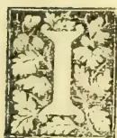

T is of paramount importance to the cultivator of the soil that he should have a clear idea in his mind of the sources of gain and loss to the soil he cultivates, and

what ingredients of plant food are derived or lost through those sources, so that he may thereby be in a position to devise and adopt measures which may as far as possible enable him to help the soil to gain and not to lose the elements of fertility.

The sources of gain may be classified under various heads:—

1. There is the land itself which yields available plant food under the action of the natural weathering agents. These agents—the atmospheric, thermometric, chemical and animal agents—aid in the decomposition of rocks and minerals, and enable them to yield soluble plant food. Again the land itself is made to supply valuable substances under the influence of various artificial mechanical means generally spoken of as "tillage," as well as from the result of such operations as draining, lining, irrigation and the like.

2. The atmosphere is a source of plant food which mainly reaches the soil in conjunction with rain. By means of it moisture as rain and dew is also supplied to crops.

The atmosphere primarily consists of two gases, but intermixed with them are various other substances, such as carbonic acid gas, ammonia, the chlorides, sulphates and nitrates

of sodium, calcium, and ammonium, and certain solid impurities as dust and soot. The most important derivatives from the atmosphere are the compounds of nitrogen, the origin of which, however, cannot be conveniently considered here.

3. Another source of gain is the residue of plants and crops which finally yield nitrogen, potash and phosphoric acid.

4. There is a special source of nitrogen which has only of late years been recognised. This is the elaboration of nitrogen compounds from the free nitrogen of the atmosphere, by means of the bacterioids contained in the root tubercles of certain leguminous and other plants.

5. The application of manures (natural and artificial fertilizers) such as cattle manure, guano, chemical compounds, waste products and green manures, directly increase the fertility of the soil.

The sources of loss, on the other hand, are as far as can be ascertained:—

1. Evaporation of water from the soil, and transpiration of water vapour by the leaves of plants and trees.

2. Wash and drainage cause the loss of water and other ingredients which are carried away in suspension and solution. The chief and most serious loss by these means is, however, that of the nitrates, which owing to their solubility are easily carried off in solution. Ordinary soils, with a fair admixture of clay (which has a retentive power for these substances) do not suffer any appreciable loss of phosphoric acid and potash by means of drainage.

2. The removal in various ways of what is produced in the land is manifestly a source of loss to the soil, which has to be made good by the cultivator.

3. Lastly, neglect on the part of the cultivator to aid the action of the natural forces, or to employ artificial agencies which have an ameliorating influence will of course tend to impoverish the soil by withholding the means by which it may be enriched.

755------------------------------------------------

712Supplement to the "Tropical Agriculturist."[April 2, 1894.OCCASIONAL NOTES.

A maund of Jute seed, received from Calcutta, has been distributed among the agricultural instructors for experimental cultivation in their gardens.

The seeds of Ramle (*guizotia oleifera*) from the crop raised at the School is being kept for a second sowing. It is intended at the next seeding to supply instructors with small quantities for trial.

Ground-nuts suitable for planting are not easy to get in the Colombo markets. Locally procured seeds have been lately sown at the School, but their germination is unsatisfactory; it has therefore been decided to export fresh seed from India. Some years ago Mr. A. W. Jayawardene, late headmaster of the School, planted out a fairly large piece of land with the nut, and with excellent results. Of late we have had enquiries as to where seed nuts could be obtained.

The Government dairy was declared a free area (from the infection of cattle disease) on the 17th March, on which date it recommenced to supply milk.

Mr. W. A. de Silva, who has been studying Veterinary Science at the Bombay College, goes up for his final examination this month. Mr. de Silva has had a successful career at Bombay, and provided he satisfies his examiners, he will be back at the School in May next.

We heartily welcome back to the Island Mr. H. W. Green, through whose instrumentality the School of Agriculture was founded. Mr. Green is reported to have greatly benefited by his visit to England which his poor state of health necessitated.

ORIGINAL SOURCES OF COMBINED NITROGEN.

It is now generally accepted that plants are unable to utilize by means of their leaves the pure nitrogen gas which constitutes about 79 per cent of the atmosphere. At one time it was thought that plants were able to do so, and it was even said that certain Continental experiments went to prove this to be a fact; but later investigations have shown that plants cannot assimilate the free nitrogen of the atmosphere. The two main sources of nitrogen to the plant are the organic nitrogen in the soil, and the nitrogenous compounds that are washed into it from the atmosphere by rain (no account is here taken of the small quantities absorbed directly by plant or soil, chiefly as ammonia). The combined nitrogen from the two abovementioned sources are taken into plants by means of their roots, after having undergone nitrification,—that is, converted into nitrates—by the nitrifying germs present in the soil. The organic nitrogen in soils is of course traceable to the organic matter contained in them—from whatever source derived. The combined nitrogen in the atmosphere is on the other

hand traceable to two sources:—(1) To organic (vegetable or animal) matter, which liberates ammonia during decay and combustion (the ammonia which is given off being eventually oxidised in the atmosphere, into nitric acid); (2) to an original source of combined nitrogen, whereby the combined nitrogen is formed from its elements in the atmosphere. Warrington thus refers to this latter source: "The nitrogen, and oxygen of the atmosphere combine under the influence of electric discharges, nitrous acid being formed; this is converted into nitric acid by the action of ozone or peroxide of hydrogen. This formation of nitric acid in the atmosphere is the only original source of combined nitrogen on our globe, the existence of which has been placed beyond dispute." The extent to which combined nitrogen would be formed by this means is thus evidently dependent on the degree of electric disturbance in the atmosphere; and the recognition of this fact may account for the supplies of nitrogen which are secured by crops in tropical countries where electric disturbance is so common an experience. The statement made by Warrington that the formation of nitrogen compounds from their elements under the influence of electric discharges is the *only* original source of combined nitrogen would now have to be modified; for within the last few years, a new original source of combined nitrogen has been discovered, viz., that resulting from the action of the bacterioids in the root-tubercles of certain leguminous and other plants. There are thus two original sources of combined nitrogen. The first-mentioned depends on natural causes which are practically beyond human control; for though it may be possible to artificially create electric disturbance in the atmosphere, it is hardly practicable to adopt this means with a view to benefit crops on a prescribed area. But the formation of nitrogen compounds in the soil itself, through the agency of certain plants, is a possibility which it behoves the cultivator to take good note of and to endeavour to realize in his agricultural practice.

NOTES FROM THE NORTH.

15. The Jaffna cultivators do not believe in having all their eggs in one basket. The failure of the paddy crops cannot be an uncommon occurrence in a place where they have to depend for the water solely on pluvial irrigation which so often provides only a very scanty supply; and the people are too well aware of this fact to be remiss in growing a good stock of other food crops by way of providing against such a contingency. The fine grains such as "kurakkan" (*Eleusine corocana*), "Varagu" (*Panicum miliaceum*), "Thinai" (*Panicum italicum*), Shami (*Panicum miliare*) and various kinds of yams, roots, beans and pulses are freely grown; and a valuable addition to the food supply is afforded by the groves of plantain and banana trees which are grown in separate enclosures with perhaps one or two pumpkin creepers here and there.

16. The poorer classes of the rustic population of the North are a hard-working, healthy, robust and contented set. "Man wants but

756------------------------------------------------

April 2, 1894.] Supplement to the "Tropical Agriculturist."713

little" seems to be their motto, and their paternal acres supply them with almost all they require in the shape of food. They relish the coarser kinds of field and garden products which their more-refined fellow countrymen in the town would look down upon as unfit for human consumption or would only take by way of variety.

17. Dead fences are very rarely, if ever, used in Jaffna. The advantages of live fences which are so common there are by no means to be undervalued. They are useful in different ways. Not only are the leaves sometimes used as manure, but they yield browse for feeding cattle and afford a certain amount of shade and shelter which come as a boon in a dry climate such as that of Jaffna. Again, the cost of effecting constant repairs which has invariably to be incurred in the case of dead fences is to a great extent dispensed with when the gardens are enclosed with live fences; and much annoyance, not to say loss, that would otherwise be caused by trespasses of cattle &c. is, moreover, saved.

18. The arboriculture of Jaffna deserves a word in these notes. There is, indeed, little or no spare land in the Peninsula where any attempt at afforestation can be made even on a small scale. The trees grown along the road side and in the public places are, however, worthy of notice; and the memory of Mr. Dyke, the first Government Agent of Jaffna, has been immortalized by the numerous trees he has planted, and his example has been followed up by his worthy successors. Besides the ordinary shade and ornamental trees, *Inga saman* and *Poinciana regia* (flamboyant), there are the valuable timber trees teak (*Tectona grandis*) and mahogany (*Swietenia mahogany*) which thrive luxuriantly in the market enclosures at Nellore, Chavakachcheri, Chunnakam, &c. Some satinwood trees (*Chloroxylon swietenia*) near the Kachcheri also seem to be doing well. The "sooriya" tree (*Thespesia populnea*) which yields a tough useful wood thrives well along the sea beach where few other trees would grow.

The margosa (*Azadirachta indica*) and the "illupe" or "meegaha" (*Bassia longifolia*) which are so common all over the North are very useful not merely on account of their timber, but more for the seeds from which valuable oil is obtained. It is interesting to watch the little urchins get up at daybreak and gather the margosa fruit, which has dropped on the ground over night. The fruit thus collected is washed, pulped, and the seed dried and stowed away for extracting the oil which is only used for the lamp and in medicine, its strong bitter taste precluding its use for culinary purposes. Unlike the margosa oil, however, that obtained from the illupe seed is greatly in request for the preparation of food, &c., besides being used for burning purposes.

19. As one travels along the central road through the Peninsula, he can see palmyrah trees mercilessly stripped of the sheath-ends of the ola stalks. Many of the young palms have been done to death by this system of obtaining the fibre, the trunk being laid bare almost to the very summit of the crown. While the fibre trade is likely to be always a very profitable concern when discreetly carried on, there is

cause for serious apprehension that it will prove destructive to the useful palms and therefore suicidal to the industry when the gathering of fibre is done in this reckless manner, almost amounting to spoliation. The crown of a palm contains, so to speak, the very life blood of the tree, and the death of so many palmyrah palms of late has only too clearly shown how risky it is to divest it of its natural protection.

20. I must not bring these notes to a close without saying a word about paddy cultivation as I saw it at Anuradhapura when I made a short stay there some time back during a journey by the central road. I was agreeably surprised to see seedlings being planted out in the tract of field adjoining the Isuru-muni temple and under the tank called Tissa Wewa. Women chiefly took part in this work, their supple bodies enabling them to do it much more easily than the men who were employed in digging out the seedlings from the nursery by means of mamoties, and in doing other work deemed more congenial to them.

The Wanni with its vast acreages under large tanks affords immense scope for enterprising capitalists for paddy cultivation. I have heard that a large ancient tank at Kanukkeni in the Mullaitivu district will be soon restored by Government, and that when the restoration is completed there is every prospect of Mullaitivu becoming the granary of the North. What might not a good irrigation system coupled with improved cultivation effect in the raising of paddy!

E. T. HOOLE.

#### THE POONA FARM.

In the Poona Farm last year various fodder crops were grown with the object of showing their comparative outturn, cost of cultivation, and value of produce. This year the further steps have been taken (1) of practically testing their feeding value, and (2) of studying various leguminous crops to be grown in rotation with cereal fodder crops. To the fodder crop tested last year were added maize, oats, two local varieties of jowari (*sorghum vulgare*), viz., *nilva* and *shalu*, and a foreign variety, *imphi* (*S. saccharatum*). Oats and *imphi* were damaged by excessive rain. In point of merit, as adjudged by the amount of wastage in feeding, the crops are placed as follows:—1, guinea grass; 2, sundhia jowari; 3, shalu jowari; 4, nilva jowari. There was much wastage in Reana luxurians owing to its coarse fibrous stalks, and still more in maize. Lucerne showed its already marked liability to disease; even when grown on the ridge and furrow system, it was not safeguarded. Sulphate of copper in solution with lime, had no effect in checking the disease. It has been again proved that the partiality shown by local cultivators to this crop is due to its high price and large yield in favourable seasons. Incidentally a result which may prove itself important was secured. A badly-diseased patch of lucerne was interplanted with guinea grass. The lucerne recovered and grew well. This mixed crop corresponds somewhat to the rye grass and clover crop of England—a mixture, that is, of a cereal and leguminous fodder.

757------------------------------------------------

714Supplement to the "Tropical Agriculturist."[April 2, 1894.]

No fodder crop of the cereal order, except guinea grass, can be grown, in rotation, and general experience points to the necessity of growing leguminous crops in rotation. On a dairy farm it is, further, an object to secure for the rotation a crop which gives good fodder. The leguminous crops tried were, besides lucerne, already mentioned, *kulthi* (*Dolichos uniflorus*), *vul* (*D. lablab*), *chavli* (*D. catiang*), vetches, and sainfoin. Little need be said as regards the last two, both failed; and less need be said as regards *Lathyrus sylvestris*, which was worse than a total failure, for it took up ground which might otherwise have been profitably utilized. The common peas of the locality were also tried unsuccessfully. The other pulses did well. *Val* and *chavli* in good deep soil thrived excellently, and though clearly better fodder than *kulthi*, the coarse stems of which are rejected by milch cattle, they will not grow on light soil as well as *kulthi*. *Kadwal* (or hot-weather irrigated *jowari* of several varieties) was not tried again, the trial of last year proving it inferior to *sundhia*. *Sundhia* is a variety of *jowari* unknown in the Deccan. It is a rain crop, but also thrives well as an irrigated hot weather crop, and though it will not out the local *kadwal*, it seems likely to prove a profitable introduction from Gujarat. Rye was tried in the hope of proving its utility as a source of charcoal for gunpowder, for which the straw is largely used in England. It grew fairly, but instead of sending up straight shoots tillered freely, forming a thick sward. This trial is sufficient to show that, in Poona at all events, it cannot be made useful for the manufacture of gunpowder.

In spite of famine rates for fodder in the early part of the year, the dairy herd on the Poona Farm yielded a very good profit, which would have been much larger had the farm been provided with a grazing area for dry cows and young stock in a locality where they could be fed with greater economy. A suitable area has been selected about six miles off, the possession of which is very desirable. An addition to the herd was made by the purchase of some well-selected Sind cows. They have proved to be docile and very good milkers, with a characteristic type and a breedly appearance. Last year it was noticed that the percentage of butter fat milk was greater in the hot weather than in other seasons. By giving green fodder throughout the year this difference has been greatly decreased. The new industry of dairying has continued to develop. The Bombay agent of the Dairy Supply Company has sold 47 more separators. A large dairy has been started at Hyderabad (Deccan). Some competition with the Dairy Supply Company by other similar companies has arisen. Separated milk now finds a ready demand. Cream separated from milk in Nadiad in Gujarat is largely taken by rail to Bombay to be made into butter, while the separated milk goes by rail in large quantities to Baroda and Ahmedabad. Butter made from Nadiad cream is sent from Bombay as far as Hyderabad. Incidentally an important success in keeping butter for a long period quite sound and fresh was secured. In April last a considerable quantity of butter

was salted with about 4 per cent of good table salt and was packed in earthen-ware jars fitted with close-fitting lids. The intention was to sell this butter to District Officers in the fair season, but in July a sudden demand arose for fresh butter. The salted butter, carefully washed to reduce the percentage of salt with the help of the butter-worker, was found to be perfectly good, and equal to butter freshly made. The number of private dairies has increased, and the Government dairy at Poona, far from acting as a hindrance to private enterprise, has taught a new industry which has already reached dimensions which were unanticipated.

#### THE AVAILABLE MINERAL PLANT FOOD IN SOILS.

Dr. Dyer's important paper on his researches into this subject, read before the Chemical Society, is being reviewed by Dr. Aikman in the *Scottish Farmer*. The following is the first notice:—

Dr. Dyer begins his paper by pointing out that, while the fact that a soil contains much less phosphoric acid, for example, than is contained in average soils, it is a probable indication that such a soil is in need of phosphatic manure; yet such an indication is not always to be relied on. In many cases the difference in the amount of phosphates contained by two soils is very slight, and yet the one is found by experience to benefit very much by the addition of phosphatic manure, while on the other application of such manure is fraught with little results. The inference, therefore, to be drawn from a consideration of the total amount of phosphoric acid or potash in a soil is seen to be too often practically valueless. Where the analysis of a soil is often found to be of great value, is in determining whether it is likely to be benefited by an application of lime, or whether it is in need of organic matter, &c.

As was pointed out last week, the need of some more discriminating analysis than that in which merely total amounts of ingredients are stated is obvious, if soil analysis is to be of any great service to the farmer. What is wanted is some process for estimating the relative proportions of the fertilising ingredients in a soil immediately available for the plant. It may be said frankly, at once, that an exact estimate of the amount of available mineral food in a soil will in all probability never be attained by chemical analytical processes. Nor does Dr. Dyer claim that his suggested test is an accurate estimate. Its merit consists in its giving a very fair though only a very approximate indication of the amount of available mineral food. Treatment of a soil by dilute acid solutions of the kind Dr. Dyer has experimented with can only, even at best, indicate the amount available at the time of testing; but as the present writer has pointed out in a work recently published [*See "Manures and Manuring,"* by C. M. Aikman (Wm. Blackwood & Sons), p. 90], thanks to the numberless complicated reactions going on in the soil, this amount of available plant food, it is to be presumed, is constantly being added to.

758------------------------------------------------

April 2, 1894.] *Supplement to the "Tropical Agriculturist."*715

One method of coming to some conclusion with regard to the soluble plant food in a soil is by analysing the drainage water. To give some idea of the very slight amount of matter in solution in drainage water, it may be mentioned that not more than from .04 to .05 per cent. is usually found in drainage water. Of this amount the most is organic matter. It is obvious that the amount of mineral food in drainage water falls far short of the actual available mineral food. We know well that when either soluble phosphoric acid or potash is added to the soil, they are retained in a very firm way by the soil particles, as is illustrated by the fact that when such soil is treated with water the phosphoric acid or potash is not washed out, as we should expect it to be. Considerations such as these point to the fact that probably much of the available mineral food in a soil is neither very soluble, nor, on the other hand, very insoluble. The point, therefore, to be aimed at, is to use some solvent which will dissolve this available mineral food, and not dissolve anything more than what is available. A weak acid solution is what is wanted, the only difficulty being its strength. This Dr. Dyer ascertained, as we mentioned last week, by carrying out an examination on the acidity of plant-roots. By transplanting this into an equivalent of citric acid, he found that this amounted to a 1 per cent. solution of citric acid.

#### ZOOLOGICAL NOTES FOR AGRICULTURAL STUDENTS.

**Class III. REPTILIA.** Among the reptilians respiration is aerial, never by gills; the pulmonary and systemic circulations are always connected together, either within the heart itself, or in its immediate neighbourhood; the blood is cold; the skull has one condyle; the integumentary covering is in the form of scales or plates and never in the form of feathers.

The class includes four living orders and five extinct orders. The living orders are

1. 1. Chelonia (Tortoises and turtles).
2. 2. Ophidia (Snakes).
3. 3. Lacertilia (Lizards).
4. 4. Crocodilia (Crocodiles and alligators).

The Chelonians are conveniently divided into groups according as the limbs are adopted for swimming, for progression, or for an amphibious life. The aquatic forms are well known as turtles, distinguished by having the carapace depressed, and the limbs converted into oar-like flippers with which the animal swims. The two most important of the turtles are the edible turtle and the hawk's bill turtle. The former is much used as a delicacy, and the latter is of commercial value for the horny scales which cover the carapace, and which are largely employed for ornamental purposes under the name of "tortoise-shell." The land tortoises have a rounded and convex carapace with distinct toes furnished with short claws. The best known species is the *testudo graeca* which is sometimes kept as a domestic pet.

The pond and river tortoises are furnished with webbed feet, and lead a semi-aquatic life.

The latter have the carapace covered with a leathery skin, without horny scales, and are often called "soft tortoises."

The order Ophidia includes most of the animals which would commonly be called snakes or serpents. They are generally distinguished as poisonous and non-poisonous. In the harmless snakes the teeth are solid and are arranged in rows in both jaws and on the palate. In the poisonous snakes, on the other hand, the upper jaws are usually destitute of the ordinary solid teeth, but carry a pair of long curved "poison-fangs." These fangs are pointed backwards when not in use, but they can be erected at will, by muscular action, the moment the animal wishes to bite. Each fang is hollow, and is perforated by a fine tube or canal opening by a distinct aperture at the point of the fang. The canal communicates with a gland placed under and behind the eye, which secretes the poison.

Of the members of the class Lacertilia, the house and garden lizards and the iguanas are very familiar. The lizards are distinguished from the crocodiles in not having their teeth implanted in distinct sockets, and by the fact that the skin develops horny scales, but never bony plates. The crocodilia include the crocodiles and alligators or kaimans. They are the largest of existing reptiles, and are dangerous and voracious creatures.

**Class IV. AVES.** In birds, respiration is aerial; the lungs are connected with air sacs scattered through various parts of the body, serving alike to reduce the specific gravity of the body and to assist in the aeration of the blood; the blood is warm; the integumentary covering is in the form of feathers; the forelimbs are converted into wings; the females are oviparous; and the skull has one condyle. The skeleton of the bird exhibits some points of peculiar interest. The breast bone in all birds which fly is furnished with a prominent ridge or keel to which are attached the muscles which move the wings: in birds which do not fly there is no keel upon the breast bone. The furculum, or "merry thought," is a V-shaped bone which keeps the wings at the proper distance from each other, and which is really composed of the united collar-bones or clavicles. The digits in the bird are reduced to a rudimentary thumb and two fingers. There are no teeth in birds and the jaws are sheathed in bone constituting the beak. The tongue is usually horny but sometimes fleshy as in parrots. The gullet is usually dilated in the lower part of the neck into a pouch called the "crop." From the crop the food passes into the "proventriculus" or true digesting stomach, which opens into a muscular cavity called the "gizzard" which finally leads to the intestines. The grinding action of the gizzard is assisted by the gravel and small pebbles which many birds are in the habit of swallowing. The form of the eyes is maintained by a circle of bony plates; in addition to the ordinary eyelids there is a third membranous lid (the membrana nictitans) placed on the inner side of the eye and which can be drawn over the front of the eye like a curtain.

759------------------------------------------------

716Supplement to the "Tropical Agriculturist."[April 2, 1894.]

The class aves is divided into the following seven living orders:—

1. 1. *Natatores* or swimming birds.
2. 2. *Grallatores* or wading "
3. 3. *Cursores* or running "
4. 4. *Rasores* or scratching "
5. 5. *Scansores* or climbing "
6. 6. *Insessores* or perching "
7. 7. *Raptores* or birds of prey.

### THE JUTE PLANT.

No less than six species of the genus (order Tiliaceæ) to which the plants that yield jute belong are found occurring in Ceylon, viz., *Corchorus capsularis*, *C. olitorius*, *C. uticaefolius*, *C. fascicularis*, *C. tridens*, and *C. acutangulus*. *C. capsularis* and *C. corchoru* are the two species of this genus which are systematically cultivated for the production of jute fibre.

**Soil.**—Jute seems to be capable of cultivation on almost any kind of soil. It is least successful and least profitable, however, upon laterite and open gravelly soils, and most productive upon a loamy soil or rich clay and sand.

**Climate.**—A hot climate in which there is not too much actual rain, especially in the early part of the season, is the most advantageous; but exceptionally dry seasons are unfavourable.

**Preparation of the Land.**—Frequent ploughings or thorough digging up of the soil is necessary; all clods are then broken and pulverized, and finally the weeds are collected, dried and burnt.

**Seed.**—Under ordinary circumstances of cultivation a few plants from the growing crop are set apart for seed in a corner of the field, and the seeds from these are sown broadcast for the next crop. The sowing season, according to the nature and position of the soil, extends from the middle of March to the end of June.

**Harvest.**—The harvest of course depends upon the date of sowing, and commencing with earliest crop about the end of June extends to the beginning of October. The crop is considered to be in season whenever flowers appear and past season with fruits. The fibre of the plants that have not flowered is weaker and that from fruited plants is stronger than the fibre from flowering plants; but the stronger fibre of the fruited plants is coarse and without gloss.

The average crop per acre of fibre is a little over 15 maunds, but the field varies considerably, being as high as 30 to 36 and as low as 3, 6 or 9 maunds—depending on district and season. When the plants are fit, being then from 3 to 12 feet high, they are cut down close to the roots, when the tops are clipped off, and fifty or a hundred are tied together. Several of these bundles are placed in water with pressure above to cause them to sink. Sometimes the bundles are stacked for 2 or 3 days before immersion in water to give time for the decay of the leaves, but this is said to discolour the fibre. The period of immersion varies according to the kind of fibre, nature of water and condition of atmosphere from 2 to 25 days, but generally lasts from 8 to 10 days. It is most important that the immersion should not be overdone, and for this reason the jute bundles

must be examined daily and tried with the nail to see if the bark has begun to separate from the stem. If the proper time for removal be exceeded there is danger of the fibre rotting and becoming almost useless. When the proper time for removing the bundles arrives, the "retting" is completed generally by removing small portions of bark from the root end and stripping off the entire fibre. Washing is done by dashing the fibre on the water and drawing it forwards. Finally, the fibre is spread on the surface of the water and any blackened patches picked out by hand. Besides the gunny bags made from the fibrous part or bark, the stem of the plant is used for charcoal, for gunpowder, for fences, basket work and fuel.

*C. olitorius* requires longer steeping, generally a fortnight or three weeks for maceration. The fibre is used for bags, coarse cloth, cordage for agricultural purposes and for boats, and even for paper. The leaves and tender shoots of the plant are eaten.

### GENERAL ITEMS.

The Director, Gardens and Forest Department, Straits Settlements, impresses on planters the importance of "turning down" in pepper cultivation. He recommends that when the pepper gets to the top of the post it should be bent down to the bottom and allowed to start again. Three times, he says, must this be done before the pepper is expected to yield heavily, otherwise it is skinny and wretched.

The better qualities of pepper were being sold in Mincing Lane last January for 2½d. and 2¾d. This, it is said, is an extremely low price for black pepper of good quality, free from dust, but the market is reported as "depressed beyond former precedent by the very large stocks held in Europe, and by what appears to be an unlimited production in the Straits Settlements." In thus reporting Messrs. W. and D. Harvest remark that it is not very long since that pepper of this quality would have readily fetched in public sales from 5d. to 5½d. per lb.

The properties of ground-nut oil were discovered by a kind of accident in Europe. A large cargo of nuts had arrived at Bremen, and found no purchasers in their natural state, as good for luncheon or dessert; so the importers expressed the oil, and then found market enough. Our table oil is a good deal adulterated with the oil from the ground-nut.

More than thirty years ago the Governor of Gambia, West Africa, writing on the culture of the ground-nut in that Colony, urged the importance of the natives not confining their cultivation to this product alone. "The reflection," (that the nut may become a drug in the market) he says "is a very serious one to one who studies the interests of the colony, and difficult to remedy unless Providence in its mercy supplies some hitherto unknown or unappreciated article of commerce to supply the place of this little oleaginous nut, which has for the last twenty years brought all the blessings

760------------------------------------------------

April 2, 1894.] Supplement to the "Tropical Agriculturist."717

of comfort, healthful occupation, industrious habits and civilization, in the place of wars, famine and slave trade of the interior.

Simmonds places *Penicillaria spicata* (kambu) at the head of the list of millets, being considerably more nutritious as compared with rice. Next in order of importance comes *sorghum vulgare* (Jowari), and at the bottom of the list comes *eleusine coracana* (kurakkan or ragee).

The following figures show how variable is the butter ratio in cows' milk:—

<table border="1">
<thead>
<tr>
<th>Cow. No.</th>
<th>Milk. lbs. oz.</th>
<th>Butter. lbs. oz.</th>
<th>Butter in oz. per lb.</th>
</tr>
</thead>
<tbody>
<tr>
<td>1</td>
<td>49.13</td>
<td>1.11</td>
<td>.54</td>
</tr>
<tr>
<td>2</td>
<td>40.00</td>
<td>2.00</td>
<td>.80</td>
</tr>
<tr>
<td>3</td>
<td>32.80</td>
<td>2.40</td>
<td>1.10</td>
</tr>
<tr>
<td>4</td>
<td>32.30</td>
<td>2.80</td>
<td>1.17</td>
</tr>
<tr>
<td>5</td>
<td>28.40</td>
<td>3.20</td>
<td>1.17</td>
</tr>
<tr>
<td>6</td>
<td>36.14</td>
<td>1.10</td>
<td>.70</td>
</tr>
</tbody>
</table>

**WATER-SOAKED WOOD.**—The problem has puzzled many why two pieces of wood sawn from the same section of tree should possess very varied characteristics when used in different positions. For example, a gate post will be found to decay much faster if the butt end of the tree is uppermost than would be the case if the top were placed in this position. The reason is that the moisture of the atmosphere will permeate the pores of the wood much more rapidly the way the tree grows than it would if in the opposite direction. Microscopical examination proves that the pores invite the ascent of moisture, while they repel its descent. Take the familiar case of a wooden bucket. Many may have noticed that some of the staves appear to be entirely saturated, while others are apparently quite dry. This arises from the same cause; the dry staves are in the same position in which they grew, while the saturated ones are reversed.

The more a cultivator produces from a given area, the more prosperous will he be. The expenses will not (need not) increase in proportion to the yield. The added expense comes when you increase the area for a given yield. This is entirely true, but not realized by many. As the productiveness of their land has diminished, some have sought a remedy by buying more acres. An increased profit will not come that way. You may add acre to acre as long as you please, and get crops which fetch the

current price, but you will never join the moneyed class. Instead, concentrate labour and manure and get larger yields and grow other crops, and you should be on the road to success. There must be profit with good management if the latter system is adopted. Income and profit are two very different things, and you must make a good profit to join the moneyed class.

The discovery of a new fodder plant is evidently becoming quite the fashion. We have already had the *Lathyrus sylvestris*, tagasaste or tree lucerne, and quite lately the *polygonum sachalinense*. Here is another:—“Mr. J. F. Duthie, F.L.S., the Director of the Botanical Department, Northern India, is of opinion that during periods of drought in India when there is difficulty of providing fodder for cattle, the sea-side wormwood (*Artemisia maritima*, L.) which he says is to be found plentifully in the Western Himalayas, might be turned to account if introduced in various parts of the Indian Peninsula. Mr. Duthie finds that ponies feed upon this plant in the Himalayas “with relish,” and he adds that “other species of *Artemisia* are mentioned as affording good fodder for sheep on the Punjab Himalayas.” In localities where hardly any other vegetation exists, the wormwood will thrive and will thus prove invaluable as a fodder plant during periods of great drought and famine. The *Artemisia maritima* is described as a much-branched decumbent, or nearly-erect undershrub belonging to the *Compositæ*, more or less covered with close white cotton. It is found in sandy and muddy wastes, generally near the sea, and occupies large tracts of country bordering on the Caspian and Black Seas. It extends round the Mediterranean to Western Europe. It is also found in Western Tibet in salt plains at elevations of about 9,000 to 14,000 feet. Professor A. H. Church, F.R.S., undertook an analysis of a bundle of dry leafy branches of the *Artemisia maritima* that was sent to the Kew Gardens by Mr. Duthie, and he says that although the herbage of wormwood is not so valuable a food for cattle as the ordinary mixed grasses, yet it is thrice as rich in albuminoids as the straw of European cereals, and to any animals not deterred from eating the plant by its somewhat sickly odour, it might prove, under special circumstances, such as those which obtain in barren tracts, of considerable value.” [We have *Artemisia vulgaris*, the Sinhalese Wal-kolondu.]

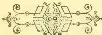

761------------------------------------------------

<!-- stage4: FAINT old-images-only -->

[Faint page: no legible print of its own could be verified; text withheld (stage 4 review list)]

762------------------------------------------------

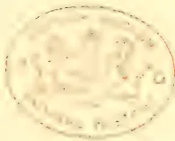A faint, circular seal or stamp impression is centered on the page. The seal features a central emblem, possibly a crest or coat of arms, surrounded by a circular border containing text. The text is difficult to read due to the faintness of the impression, but it appears to be in a serif font. The overall appearance is that of a library or institutional mark, such as a library stamp or a university seal.

763------------------------------------------------

A sepia-toned portrait of an older man with white hair, wearing a dark suit and a white shirt with a high collar. He is looking slightly to the left of the viewer.

*Gabriel B.  
Norris*

A sepia-toned portrait of a man with dark hair, wearing a dark suit and a white shirt with a high collar. He is looking directly at the viewer.

*Maurice B.  
Norris*

Tropical Agriculturist Portrait Gallery.

764------------------------------------------------

# \* The TROPICAL AGRICULTURIST \*

## ◇ MONTHLY. ◇

Vol. XIII.]

COLOMBO, MAY 1ST, 1894.

No. 11.

## "PIONEERS OF THE PLANTING ENTERPRISE IN CEYLON."

### GABRIEL AND MAURICE WORMS:

CAPITALISTS, PIONEER COFFEE (AND TEA) PLANTERS AND MERCHANTS IN CEYLON—1840-1865.

[For the following concinct and interesting biographical notice we are indebted to a relative of the Messrs. Worms who has also favoured us with the photographs from which the collotypes were printed. We have made considerable additions of our own, chiefly in notes, and an appendix, to this brief biography of two most enterprising pioneer colonists and good men whose departure from Ceylon left blanks, that, in some respect, have never been filled up.—ED. *Tropical Agriculturist*.]

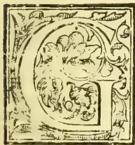

**G**ABRIEL Worms and Maurice Worms were the second and third sons of Benedict Worms of Frankfort-on-Maine, and Janette his wife, eldest sister of the Baron de Rothschild. Gabriel was born on the 2nd of April 1802, and Maurice on 20th July 1805. Their elder brother was the first Baron de Worms who died on 25th October 1882, and was the father of the present Baron de Worms of Milton Park, Surrey, and of Baron Henry de Worms, M.P., Parliamentary Secretary to the Board of Trade 1885-6, and Under-Secretary of State for the Colonies from 1886 to 1892. Maurice Worms was educated in Frankfort and came to England about 1827 and became a member of the London Stock Exchange, where he was very successful; but being extremely fond of travelling, life in London did not suit him. So in 1838 he made a long tour in the United States, Canada, Newfoundland, &c., returning in 1840. In February 1841 he set out for the East, and after visiting India, China, Singapore, Manila, &c., he finally decided on settling in Ceylon and taking up coffee planting as an occupation. He accordingly bought a considerable

extent of forest land in Pussellawa\* and other districts, and gradually established the celebrated Rothschild coffee estate, so well-known throughout the Island. It has been thought that this name was given to the property because the Rothschilds themselves were interested in it. This

\* The story current in Ceylon planting circles was that Mr. M. Worms on visiting the Central Province took a great fancy to the forest-clad Pussellawa valley forming part of the "Black Forest" of that district. Learning that it had been allotted for a nominal sum (perhaps 5s. an acre) to Major Murray who was then in England, he wrote to his brother (Mr. Gabriel Worms) instructing him to call on the Major and, if possible, purchase the whole property of 1,200 acres. Mr. Gabriel Worms found Major Murray at his hotel, and at once asked him if he would sell Black Forest, Ceylon, and at what price? "For £5 an acre, paid down" was said to be the immediate reply of the Major who, to his astonishment, found his price at once accepted—so that, as the story runs, he always regretted he had not with equal boldness asked £10 per acre! Whether strictly correct or not, the story has its use in showing the reputation for promptitude in business which characterised the Messrs. Worms. Their names, of course, stood at the highest in the banking, mercantile and planting world in Ceylon, and everybody in Colombo knew the merchant as 'everybody upcountry did the planter; but, on one occasion, a young mercantile assistant fresh to the Colony, asked the name of the gentleman who was giving a large order for corrugated iron roofing, &c.—"My name, sir, my name is cash," was the immediate reply!

765------------------------------------------------

720THE TROPICAL AGRICULTURIST.[MAY 1, 1894.]

is totally erroneous ; it belonged solely to Maurice Worms and his brother Gabriel who came out and joined him in 1842. The name of " Rothschild " was given to the property at the express request of Messrs. Worms' uncles, the Baron Anselm von Rothschild of Frankfurt, and Baron James de Rothschild of Paris.

Gabriel Worms was also educated in Frankfurt and established himself in Paris in about 1825 as a partner of the celebrated Agents de Charge de la Ville, de Proulx & Co. The events of the Revolution of July 1830 having made a great impression upon him, he decided on coming to England and became a member of the London Stock Exchange about 1832, where he remained until 1842, when he joined his brother and became his partner in his coffee planting enterprise, and the two brothers established themselves as G. & M. B. Worms. Maurice resided at Pussellawa, managing the extensive plantations of coffee, etc. ; while Gabriel had the Grandpass Mill where the coffee was prepared for shipment under his direction, and he also attended to the shipping and banking business of the Firm in Colombo. Gabriel was elected a member of the Legislative Council of Ceylon in 1847, but was unable to take his seat as the Jewish Disabilities had not been removed. The brothers were renowned for their hospitality, and had as their guests at various times all the European celebrities who visited Ceylon, amongst others the Duke of Brabant now king of the Belgians, the Crown Prince of Prussia, Earl Grosvenor now Duke of Westminster, the late Lord Derby, then Lord Stanley, and many others. It was Maurice Worms who first introduced the China tea plant into Ceylon; he brought cuttings from China and formed a small garden at Pussellawa in September 1841 (*vide* Sir J. Emerson Tennent's Ceylon, Vol. 2nd, Chap. 7). Messrs. G. & M. B. Worms had about 2,000 acres of coffee in cultivation and

their mark was for more than a

quarter of a century a household word in Mining Lane. The enterprise was extremely successful ; but old age creeping on, Messrs. G. & M. B. Worms decided on returning to Europe after a residence of four-and-twenty years in Ceylon. They disposed of their estates and returned home in August 1865 (*vide* "Ceylon Observer," 25th August 1865). Maurice unfortunately did not long survive his well-earned rest, as he died April 23rd, 1867, from liver complaint contracted in the Island. His brother Gabriel attained however a ripe old age and died in London 17th October 1881.

[We had the privilege of intimate acquaintance with Mr. Gabriel Worms from the date of our arrival

in the island, November 1861, until his departure in the latter part of 1865. His residence and office were opposite the *Observer* office, No 19, Baillie Street, and taking a great interest always in the current events of the day—especially in any mail or telegraphic news;—in the state of the roads up-country (often a serious matter for coffee transport in those days) and in railway progress, he generally paid us a visit in passing two or three times a day—or one of us ran across with the latest telegram or other special bit of news as received. We had the very highest esteem for the character of Mr. Worms—a thorough gentleman of the old school—and during the occasional visits of Mr. Maurice Worms from Pussellawa, it was very evident that a close attachment existed between the brothers. There was every day, a very early visit to pay to the Grandpass mills where some hundreds of native men, women and children found employment on very liberal terms, in the picking, drying and other careful preparation and packing of the coffee for shipment. Then, there was a daily walk round the Fort on business in respect of freight, insurance or banking, the private room of his friend, the Manager of the Oriental Bank (Mr. G. S. Duff), often seeing Mr. Worms. He did not care to push himself forward publicly, but Mr. Worms was ever ready to take his share in public movements. He was prominent in the Deputation to Sir Henry Ward about the need of Railway communication with the hill-country, and Mr. Worms pithily summed up their business in words that became famous throughout the colony,—"*We have come, sir, to be taxed.*" After Sir Henry Ward left, Mr. Worms had frequent occasion—as had most colonists—to find fault with Sir Charles MacCarthy's government, and especially with the cheeseparthy policy of the Colonial Secretary, Mr. Wm. Charles Gibson, which led to some of the main roads in the planting districts getting shamefully neglected. Mr. Worms frequently supplied material to us for writing editorials on the subject—his closing remark after an interview frequently being:—"Put it in the paper, sir,—put it in the paper;—don't mention my name, sir." Mr. Worms took a keen interest in the construction of the Railway to Kandy; but during his last year in the island, he (under an influence which need not be referred to here) lost faith in the successful working of the second section, the incline from the foot of the hill to Kandy—in other words he began to think a locomotive train would never pass round the top of Kadugannawa Pass. This led to a curious discussion in Baillie Street one day between Mr. Worms and Mr. (now Sir) Guildford Molesworth, the Chief Engineer,—Mr. Worms arguing that as the first section in the lowcountry of 34 miles from Colombo to Ambepusse was about to be opened, it should be so arranged that the bullock carts with coffee from the hills should be run on to specially-constructed trucks and so carried to Colombo, where the cartmen had to replenish and see their friends, before returning to the interior! The Engineer did not see this, and so he was plainly told—he was only an Engineer and knew nothing about coffee! No one could speak in plain language

766------------------------------------------------

MAY 1, 1894.]THE TROPICAL AGRICULTURIST.721

when roused than our good friend.\* But his kindness of heart and liberality towards all charitable, philanthropic and even missionary agencies were proverbial. The Messrs. Worms were generous supporters of our Friend-in-Need Societies, and every agency in the country calculated to do the people good, while the widow and orphan were never turned empty away from their doors. Being conscientious Jews, Mr. Worms could not profess a direct interest in Christian Missions; but he never refused his £5 or £10 to a mission collector, giving as his ground openly and fairly: "Make honest men of them, sir"—referring to the need of Christian teaching among the natives. Both brothers took a great interest in the controversy which arose out of Bishop Colenso's attack on the Pentateuch, and we (of the *Observer* office) had to get out for them every answer published in England to the Bishop's work. Mr. G. Worms had a special question to put to us one day, as to Christians being as much affected as Jews, by the Bishop's attack; for "if the Pentateuch is discredited, it will affect your New Book (Testament) as much as the Old, will it not?" He was pleased with our prompt, "Certainly—we take the Bible as a whole."

No more liberal managers of property existed in Ceylon, and Rothschild was certainly the finest-looking and most liberally cultivated coffee plantation in the island, well set off too by its border of rose bushes round the boundaries and many of the principal paths. Both brothers were anxious that their other properties should be opened and planted with equal care: Condegalla on the Ramboda Pass was opened first for tea, a field planted from seed specially imported from China. It grew well; but the Chinaman, who was also imported to prepare the produce, proved so incompetent, each lb. of tea prepared costing some £5, that Mr. M. Worms gave up the idea of tea planting, especially as coffee was proving so congenial and profitable. The field of tea-plantations was, however, allowed to continue and afforded evidence that the Messrs. Worms were pioneers in this industry. They owned a large block of forest in Dimbula which was not opened until handed over to the Ceylon Company, Limited, when it became the extensive Meddecombra plantation. In Dikoya, again, they bought the 1,000 acres that became "Norwood" eventually, and here Mr. Worms finding that the land was actually in the Western Province (which had no repute for coffee),—to Sabaragamuwa boundary going so far round—got the Government of the day to alter the boundaries.

"Nothing put Mr. Gabriel Worms more readily out of temper than any display of meanness, or oppression of the poor. We well remember one occasion on which a reputedly well-to-do Sinhalese Chaplain—with a great craving for the amassing of money—approached Mr. Worms with the view of getting him to become landlord of a miserable set of huts in which Grandpass workpeople found refuge. 'It would be so easy for Mr. Worms, as a large employer, to collect rents and even to increase them, which he (Mr. ———) found it difficult to do.' The reverend "Christian clergyman" got a lesson from the Jewish layman that day which was a splendid exposition of "doing to one's neighbour as he would be done by" and which he can scarcely have forgotten for the rest of his life.

In this way the planters of both the Dikoya and Maskeliya Districts have to thank the Messrs. Worms that they are included in the Central and not in the Sabaragamuwa Province.

The plantation Messrs. Worms took most interest in opening after Rothschild was what they called "Worms-Badulla" (afterwards Keenakelle plantation) on the Narangalla range. They employed an old Uva planter—George Morice—to do the preliminary work, paying him a liberal salary and grudging no expense to get good work done. On their first visit, however, both brothers were greatly disturbed at the miserly character of their Superintendent who lived on a tenth of his allowances and had besides no command of labour. Scarcity of coolies was the great want of the day, and Messrs. Worms began to think that for an out-of-the-way district, a "man of the country" who spoke the language thoroughly and understood the coolies, would be better as their Superintendent than a European. Accordingly on his return to Colombo, Mr. Worms came to our office with an advertisement which ran somewhat as follows:—

#### "WANTED

For an extensive young Coffee Plantation in the Badulla District, a first-class experienced Superintendent with good testimonials and thorough knowledge of Tamil. Handsome salary allowed. *No European need apply.* Address W. care of *Observer Office.*"

This intimation created quite a sensation throughout the Planting Districts; but the labour difficulty was given as the explanation, and Messrs. Worms soon got their man, in a Eurasian to whom they gave a salary certainly four times more than he had ever drawn. But this only served to turn the man's hand and make him greedy for more after a dishonest fashion. Working so far from Colombo or Pussellawa—before the days of Visiting Agents—with no fear of inspection, and knowing that his repute depended on the number of coolies on the place, the "Superintendent" began entering a number of fictitious names in the Checkroll. This went on for some months, but at length suspicions were roused, a surprise visit by one of their trusted men arranged for, and the result was that within six months of the previous advertisement, Mr. Gabriel Worms one day appeared in our office storming about "dishonest black men—200 coolies in the checkroll 100 in the field—rogues; sir, put in an advertisement," and its terms were as follows:—

#### "WANTED

For an extensive Coffee Plantation in Badulla, a first-class Superintendent of experience; highest testimonials required. Handsome salary provided. *None but Europeans need apply to W. care of Observer.*

So, this soon brought the right man to do justice to young Keenakelle which was handed over to the Company as a magnificent young coffee plantation just coming into bearing. The whole of the properties held by Messrs. Worms may be seen from the following list taken from our "Estates Directory"

767------------------------------------------------

722THE TROPICAL AGRICULTURIST.[MAY 1, 1894.]

of thirty years ago:—

<table border="1">
<thead>
<tr>
<th>ESTATES.</th>
<th>PROPRIETORS.</th>
<th>TOTAL EXTENT OF PROPERTY IN ACRES.</th>
<th>POST TOWNS OR STATIONS.</th>
</tr>
</thead>
<tbody>
<tr>
<td>Worms-Badulla (Kee-bakelle)</td>
<td>G. &amp; M. B. Worms</td>
<td>994</td>
<td>Badulla</td>
</tr>
<tr>
<td>Hopewell &amp; Hunnagalla (Medecombera)</td>
<td>Do</td>
<td>2087</td>
<td>Dimb a</td>
</tr>
<tr>
<td>Thotulagalla</td>
<td>Do</td>
<td>534</td>
<td>Hunl'e</td>
</tr>
<tr>
<td>Pattirianna</td>
<td>Do</td>
<td>121</td>
<td>Pussel'awa</td>
</tr>
<tr>
<td>Rothschild, Old &amp; New Sogamma</td>
<td>Do</td>
<td>997</td>
<td>do</td>
</tr>
<tr>
<td>Sogamma New or Ludwig's Hohe</td>
<td>Do</td>
<td>460</td>
<td>do</td>
</tr>
<tr>
<td>Wormsthal</td>
<td>Do</td>
<td>116</td>
<td>do</td>
</tr>
<tr>
<td>Condegalla</td>
<td>Do</td>
<td>160</td>
<td>do</td>
</tr>
<tr>
<td>Labookelle</td>
<td>Do</td>
<td>935</td>
<td>Ramboda</td>
</tr>
<tr>
<td>Forest Land (Norwood)</td>
<td>Do</td>
<td>148</td>
<td>do</td>
</tr>
<tr>
<td>Total 12 properties</td>
<td></td>
<td>766</td>
<td>Dikoya</td>
</tr>
<tr>
<td></td>
<td></td>
<td>7,318 acres in</td>
<td>6 Districts.</td>
</tr>
</tbody>
</table>

The "planted acreage" was not given at that period (this being compiled by us for the first time in 1869); but we may mention that the sale of these estates (some planted and others on y forest) together with certain town property, constituted probably the largest transfer of property ever effected in Ceylon at one time, the total amount which passed being no less than £157,000. Both brothers had in fact begun to feel after 24 years' residence in Ceylon that it would be better for them to return to Europe. Mr. Gabriel was still hale and hearty; but Maurice frequently suffered for want of change. Accordingly, their special financial adviser, Mr. Geo. Smytan Duff, arranged with the Directors of his Bank, the Oriental, for the formation of a Plantation Company to take over this grand series of Ceylon properties, and most properly it was dubbed "The Ceylon Company, Limited." Ceylon had a high reputation at the time as a plantation colony and the judicious Directors of the Bank very cleverly arranged to get rid at the same time, of a number of Sugar Estates in Mauritius, taking care, however not to call the Company, "The Ceylon and Mauritius Coy., Ltd." The consequence was that in certain circles, Ceylon bore the censure for losses due to Mauritius. For many long years, their Ceylon properties paid the Company very handsomely, while the reverse was the case with those in the Sugar Island;—but all this is apart from the Messrs. Worms. They were well satisfied with the sale of all their Ceylon properties for £157,000; "We have led useful contented lives"—said Mr. Gabriel, to us before leaving—"and our Ceylon investments have given 10 per cent interest and the capital back."

Very great regret was felt at the departure of the Messrs. Worms from Ceylon. How large a place they filled in the colony both in Colo ba and the planting districts may be judged from what was written in Sir Emerson Tennent's "Ceylon" (already referred to) as follows:—

"At Pussilawa our home on many occasions was the hospitable bungalow of Mr. Worms and his brother, the proprietors of one of the finest plantations in the island. Their estate, which now (in the "fifties") consists, besides unfelled forest, of upwards of one thousand acres of coffee trees in full bearing, was commenced by themselves in 1841, when the new enterprise was still in its infancy. Their practical knowledge of planting was therefore acquired during its experimental stages; and no capitalists in the colony have contributed more to its advancement by judgment and moderation in times of excitement, and by firmness and perseverance in periods of difficulty. Hereafter, when the great project to which they have devoted their lives, shall have attained its full development, Ceylon, in the plenitude of commercial success, will remember with gratitude the names of men like these, who were the earliest pioneers of its prosperity.

"It is difficult to imagine a scene of greater natural grandeur than that in the midst of which their estates have been formed. The valley of Pussilawa\* is overhung on its south-eastern side by a chain of wooded hills, the last of which, known as Moonera-galla, or the 'Peacock rock,' rises upwards of 4,000 feet above the level of the sea, and commands a prospect of indescribable beauty and magnificence; extending far and wide and embracing mountains, forests, rivers, waterfalls, and plains. The plantations of the Messrs. Worms extend to the very crown of Moonera-galla, and the undulating sides of the hills, which fifteen years ago were concealed by the trees of the Black Forest, are now fenced with roses and covered in all directions with luxuriant coffee bushes.

"A plantation of coffee is at every season an object of beauty and interest. The leaves are bright and polished like those of a laurel, but of a much darker green; the flowers, of the purest white, grow in tufts along the top of the branches, and bloom so suddenly, that at morning the trees look as if snow had fallen on them in wreaths during the night. Their jasmine-like perfume is powerful enough to be oppressive, but they last only for a day, and the bunches of crimson berries which succeed, resemble cherries in their brilliancy and size. Within the pulp, concealed in a parchment-like sheath, lies the double seed, which by a variety of processes is freed from its integuments, and converted into coffee.

"On this fine estate an attempt has been made to grow tea: the plants thrive surprisingly, and when I saw them they were covered with bloom. But

\* *Pussilawa* is said to mean the "valley of flowers." Another conjecture is, that the name is derived from the great climbing plant, the *pus-vuel* (*Entada Pursetha*), whose gigantic pods attain the astonishing length of five feet and upwards.

768------------------------------------------------

May 1, 1894.]THE TROPICAL AGRICULTURIST.723

the experiment has hitherto been defeated by the impossibility of finding skilled labour to dry and manipulate the leaves. Should it ever be thought expedient to cultivate tea in addition to coffee in Ceylon, the adaptation of the soil and climate has thus been established, and it only remains to introduce artisans from China to conduct the subsequent processes.

"It will readily be inferred that if the life of a successful planter in these mountains be fraught with anxieties, it has also a share of compensating enjoyments. One can imagine the satisfaction with which he must contemplate the rich prospects that his own energies have created, peopling the solitudes with industry, and teaching the desert to blossom like the rose.

"Pusilawa and the surrounding valleys and forests have furnished large collections of objects, illustrative of the zoology of the island; but this is a source of enjoyment of which the successors of the present generation will be deprived by the felling of the forests and the destruction of the jungle, which now afford protection to multitudes of animals, birds, reptiles and insects. Their numbers are already declining in this particular spot; but still, such is their profusion in the forests and throughout the region surrounding the coffee estates, that opportunities exist for observing their instincts under most inviting circumstances, and even the apathetic become interested in watching their habits. These are so striking that they impress themselves on every sense, and stand out clear and illustrative in our recollections of the day and its progress. It is not alone that their crowded associations almost overpower the memory, it is not that they form at all times the incidents and life of the landscape—imparting vivacity to the foliage, and rendering the air harmonious with their motion and their music; but there is a degree of order in their arrangements, and almost of system in their times of appearing and retiring, that serves, when experience has rendered them familiar, to identify each period of the day with its accustomed visitors, and assigns to morning, noon, and twilight their peculiar symbols."

By attached estate and store employees, domestic servants, &c.—all of whom were handsomely remembered—the return home of the Messrs. Worms was much regretted. Here is a record of gifts made by them, and the farewell notice which appeared in the *Observer* of August 1865:—

"MESSRS. G. & M. B. WORMS.

We understand that Messrs Worms favoured the Colombo Friend-in-Need Society with the generous farewell contribution of £20 in aid of its funds; and a similar amount to the Colombo Ragged Schools under the care of the Rev. S. Nicholas."

"Speedily we shall have to say farewell to two men whose names, and the name of their great property, have been as household words in Ceylon for the past quarter of a century, wherever and whenever the coffee enterprise was discussed. We allude to the Messrs. Worms, owners of Rothschild Estate—

owners now no longer, for their interest in this splendid Estate and some 8,000 acres of land, cultivated and uncultivated, has now been transferred to the Ceylon Company (Limited). Cousins of the London Rothschilds, the Messrs. Worms were never stinted in means—their own ideas of Estate management were of the most liberal nature—and the thousand or so of acres of unbroken coffee which constitute the Estate of Rothschild, have always been models of high cultivation. To keep weeds out and put fertilizing manure, in, neither labour nor expense was ever spared; and amongst the coffee bushes which lately passed from the care of Mr. Worms to that of Mr. Corbet were many which at the age of twenty-five years are as vigorous and as fruitful, as they were in their hey-day youth of eight. The Black Forest which General Hodgson, and far younger men can remember an unbroken jungle, has long been felled, and the plantation and residence which occupy its place, have long been famed, the one for its beauty; and the other for its liberal hospitalities. Mr. Maurice Worms will be as much missed from Pussellawa, as Mr. Gabriel Worms will be from Colombo, where besides attending to his own large business, he always took an active, a shrewd and a useful part in the discussion of public affairs. He once occupied a seat in our Legislative Council, and we well recollect him as a Jew taking the oaths (with his head covered, as is the custom of his people,) and a seat in our Council, before the British Parliament had admitted his cousin Baron Rothschild or any other Jew to its ranks. The Home Government did not disallow the appointment on the ground of religion, but because only British-born subjects are eligible to seats in our Legislature. The Naturalization Bills which enabled the Messrs. Worms to hold land in the Colony, it was then found, did not give them the full status of British-born subjects. The Messrs. Worms, though Jews by race and religion, made no distinctions of religion or race in their large and generous charities. Besides hosts of necessitous individuals, the Friend-in-Need Society, the Ragged Schools, the Bible and Tract Societies, and the various Christian Missionary Societies will miss their contributions. To parties who have been long in their service, the Messrs. Worms have extended most generous treatment; and both in the circle of their more immediate acquaintances and amongst the general community, there will be a common feeling of loss and regret when the first steamer of September carries the well-known G. & M. B. Worms from the shores of Ceylon. Our personal regret is the greater from the feeling that, as one and another of the older residents quit the scene, we are fast qualifying for the position of 'the oldest inhabitant' or 'last man.' All honour and all enjoyment to those who, having done their work and done it well, seek well-earned repose, while we and others must still

"Learn to labour and to wait."

It only remains now to refer very briefly to the English life of the Messrs. Worms:—Mr. Maur-

769------------------------------------------------

724THE TROPICAL AGRICULTURIST.[MAY 1, 1894.]

Worms accustomed to an active, out-of-door life, felt he could not live in town, and he took a farm from Lord Leigh in Warwickshire; but he did not long survive in the treacherous English climate, dying in about 18 months after his arrival from Ceylon, aged 62 years. Mr. Gabriel Worms took up his residence in New Bond Street and there we visited him in 1869, and again in 1878, to find his interest as keen as ever in everything connected with Ceylon. But he had also established new interests and among other things he showed us a cabinet with the reports and papers of nearly every Charitable and Philanthropic Institution in the Metropolis, and of which he was a liberal but judicious supporter. Many widows and orphans connected with Ceylon had also occasion to bless the generous heart of Mr. Gabriel Worms during the sixteen years that he survived his return to England. He passed away in his 80th year on the 17th October, 1881, widely regretted both in this island and in the Metropolis:

Peace to the memory of men of worth!

CEYLON TEAS IN 1893:  
ANNUAL REPORTS OF MESSRS. WILSON  
SMITHETT & CO. AND MESSRS. GEO.  
WHITE & CO.\*

We now fulfil our promise to republish both the above valuable Reports and great care has been taken to guard against any errors creeping in, in the reprinting. There is little occasion to draw attention to the salient features of the Reports, because both are admirably arranged and divided according to distinctive headings.

It will be observed that Messrs. Wilson, Smithett & Co. treat of the sales altogether last year of some 69 million lb. of tea against 65 million in 1892. It will be seen also that there is still the complaint about small breaks, Ceylon tea sales comparing unfavourably in this respect with those of India. It is surely time this was rectified, more especially as it is so clearly to the interests of the producers themselves not to send breaks of a size not likely to tempt full attention from buyers. Turning to the Sales, at the head of the list for quantities we have the great Diagama, Galaha, K. A. W. and Mariawatte Factories which sent altogether for the four no less than 2,638,500 lb.—of which Diagama gave as much as 624,000 lb. at the really splendid average of 1.3d per lb. Of individual properties in Ceylon, it appears to us that the laird of Henfold is most to be envied with sales of 229,500 lb. of tea at an average of 1s 1d—one of the very few averages that show an improvement on 1892. The highest averages of all recorded for last year are those of St. Leonards with 1s 5½d for 40,500 lb., and Ormidale with 1s 4½d for 47,500 lb. We may extract here all the averages recorded from one shilling upwards:—

<table border="1">
<thead>
<tr>
<th rowspan="2"></th>
<th colspan="2">Averaging.</th>
</tr>
<tr>
<th>lb.</th>
<th>s. d.</th>
</tr>
</thead>
<tbody>
<tr>
<td>St. Leonards</td>
<td>40,500</td>
<td>1 5½</td>
</tr>
<tr>
<td>Ormidale</td>
<td>47,500</td>
<td>1 4½</td>
</tr>
<tr>
<td>Dessford</td>
<td>143,500</td>
<td>1 1¼</td>
</tr>
<tr>
<td>Henfold</td>
<td>229,500</td>
<td>1 1</td>
</tr>
</tbody>
</table>

Averaging.

<table border="1">
<thead>
<tr>
<th></th>
<th>lb.</th>
<th>s. d.</th>
</tr>
</thead>
<tbody>
<tr>
<td>Tomrogong</td>
<td>63,500</td>
<td>1 0¾</td>
</tr>
<tr>
<td>Guatfeli</td>
<td>182,500</td>
<td>1 0¾</td>
</tr>
<tr>
<td>Norwood</td>
<td>166,500</td>
<td>1 0¾</td>
</tr>
<tr>
<td>Pedro</td>
<td>42,500</td>
<td>1 0¾</td>
</tr>
<tr>
<td>Kellebedde</td>
<td>20,500</td>
<td>1 0¾</td>
</tr>
<tr>
<td>Waverley</td>
<td>415,500</td>
<td>1 0</td>
</tr>
<tr>
<td>Portwood</td>
<td>77,500</td>
<td>1 0</td>
</tr>
<tr>
<td>Cariaheck</td>
<td>66,000</td>
<td>1 0</td>
</tr>
<tr>
<td>Hapootella</td>
<td>40,000</td>
<td>1 0</td>
</tr>
</tbody>
</table>

We next come to the Districts—ranging from Dimbula with 12 million lb. of tea and an average of 10¼d—thus taking the premier place over the Nuwara Eliya group and Bogawantalawa this year—down to Galle district with 827,000 lb. of tea and an average of 7½d or ¾d better than in 1892. The average for the island last year being 9d, the following are the districts above that rate in order of merit:—Dimbula, Nuwara-Eliya-Maturata-Udapussellawa, Bogawantalawa, Dikoya, Uva and Maskeliya while Hewaheta just reaches the average.

How the Home Consumption of our teas has risen is seen from figures which give

115 million lb. of China in 1883 against  
only 80 do do do 1893; while  
59 do India and Ceylon 1883 contrast  
with 172 do do do 1893.

Adding 50 per cent to the last-mentioned figures to reduce them to the "China" standard, we get a total consumption equal to 294 million lb. "China" in 1893 against only 203 million in 1883! An increase in consumption of 91 million lb. in ten years in the United Kingdom is, surely, satisfactory evidence of the effect of lower prices.

Meantime, that we have a great deal to do yet in fighting against "China" in foreign markets is shown by the re-exports of Ceylon and Indian teas being under 7½ million, while of "China, Java, &c.," no less than 36 million were sent out from the United Kingdom in 1893. This proves very clearly that we have much work to do for us on the Continent of Europe as well as on the American Continent.

Turning now to the Annual Report of Messrs. Geo. White & Co., we are met at the outset with the information that "a marked variation in quality" was noticeable in teas from the same estates in 1893, from Assam and Darjiling as well as from high estates in Ceylon. The fact that the long-established plantations in Assam, as well as those so noted for fine teas in Darjiling, show variation in quality quite as much as high teas from Ceylon, is consolatory; because it shows that the chief factor must be the weather. It is striking, too, how the deliveries fell off in the Spring of 1893 in correspondence with the rise in price of the lower teas, while the demand recovered later on when prices fell. Java teas are spoken of as of a "very useful description" and as being shipped direct to Bombay. Ceylon common teas ought surely to oust Java from the Indian market, especially with the help of "Travancorees."

The very full comparative table showing Imports and Consumption per head in the United Kingdom, given by Messrs. Geo. White & Co., is to our mind a very satisfactory one. It shows an increase from 4.56 lb. per head in 1875-6 to 5.45 lb. per head in 1892-3; and considering that in the first season of China 149 million lb. were imported against 25½ the total of British-grown; while in the last the proportions were 172½ million lb. of the stronger teas to 54½ China, the rise in the consumption of tea per head is really very remarkable and no doubt entirely due to the lower prices. The careful estimate prepared

\* See Special Supplement given with *Daily Observer* and *Tropical Agriculturist*,—we much regret the delay in issuing both Reports: the alterations in the building of office are to blame.—Ed. T.A.

770------------------------------------------------

MAY 1, 1894.]THE TROPICAL AGRICULTURIST.725

by Messrs. Geo. White & Co. for 1894-5, of the tea to reach the United Kingdom, will attract attention;—

<table>
<tr>
<td>India...</td>
<td>...</td>
<td>120</td>
<td>million lb.</td>
</tr>
<tr>
<td>Ceylon</td>
<td>...</td>
<td>80</td>
<td>do</td>
</tr>
<tr>
<td>Java...</td>
<td>...</td>
<td>4</td>
<td>do</td>
</tr>
<tr>
<td>China</td>
<td>...</td>
<td>41</td>
<td>do</td>
</tr>
</table>

245 million lb.

—against a consumption as we trust of not less than 210 million leaving 35 million lb. for export. In such a prospect, there is a good deal of encouragement, but we are all in the dark as to what China may do in the coming season. Meantime, there is no question that it would be well if India and Ceylon could take away some more of the re-export business from China. At present the quantity of China tea exported from London to the Continent of Europe, &c., is considerably in excess of that of British-grown teas.

As usual Messrs. Geo. White & Co., have excellent advice to give to planters in respect of "Manufacture," "Size of Breaks and Assortment," "Style of Packages," "Bulking," "Warehouse Charges," "Weighing," &c.—all of which, we have no doubt, will be duly taken into consideration.

### COCONUT PALMS AND WEEVILS.

Puttalam, April 24.—The weather has been unbearably hot for some time, with little or no rain. Coconut plantations, new ones particularly, are suffering badly. The drought and the red weevil will convince planters before long that this District is not after all the best for coconuts. It is time that those who take an interest in coconut planting set themselves to devise a means of repelling the weevil. At a rough calculation forty out of a hundred trees die between the ages of three and twelve. This means an average loss of R120 for each acre before the trees planted come fairly into bearing.\* I have heard of several remedies suggested for the beetle, but none appears to have proved effectual so far. I am informed that Mr. Wijeyesingha bores into the tree where it is attacked, scoops out the pith, beetle larvae and all, and then fills up the gap with mud mixed with coal tar and kerosine oil. This mode of treatment must necessarily make a wreck of the tree, but it is followed by the Moorish planters. It remains to be seen what treatment Mr. Gane will adopt to save the trees he is planting at Ambalam.

It appears that there will be no salt manufacture this year, as the quantity collected during last year has filled up all the Government stores and is not likely to be disposed of just yet. Mr. Haughton is out on circuit.

### A NEW FIBRE INDUSTRY.

[BY TELEGRAM FROM OUR CORRESPONDENT.]

MACKAY, March 30.—About eighty residents and others assembled in Morthansen's aerated water factory today to witness the process of the extraction of fibre from the leaves of the Fourcroya gigantea, the plant from which the Mauritins hemp of commerce is produced. A small Death and Elwood machine was sent for the purpose, and being connected with steam power was set in motion and the large leaves of the Fourcroya fed to it, the result being the almost instantaneous removal of the vegetable matter, leaving beautiful bright hanks of white fibre, thus clearly demonstrating the ease with which this fibre can be separated without any process of steaming or the use of chemical agents. The exhibition was regarded as highly satisfactory, especially, as the leaves treated were just fresh cut from a plant growing wild in a paddock belonging to Mr. H. B. Black.

It is stated that a company is in course of formation to work the industry locally, and that 150 shares have already been applied—*Queensland*, April 7.

\* Surely an exaggerated estimate.—*Ev. T.A.*

### TEA CULTIVATION IN SOUTH CAROLINA.

The British Consul at Charleston, in a recent report to the Foreign Office, describes an interesting experiment in the cultivation of tea at a plantation near the town.

It seems that many attempts have been made to create a tea industry in the United States, and that repeated failure has not checked the ardour of those engaged in these experiments. The little patches, and in some instances, large gardens, which have resulted, have produced tea of fine flavour, although very generally devoid of that strength of infusion which appears to constitute a most desirable quality for many tea-drinkers. This failure in pungency is probably largely due to defective curing, and especially to inadequate rolling of the leaf, in consequence of which the qualities are not fully developed. The National Department of Agriculture began, about ten years ago, the first serious attempt to produce American tea on a scale sufficiently large to arrive at a decisive result; but a number of causes combined to lead to the total abandonment of the gardens, which had been established at great expense. The present experiment owes its existence to the belief that more careful cultivation and preparation, which might be the result of lengthened local observation, and the subsequent production of a higher class of teas might reverse the general opinion that, as an industry, the cultivation of tea in America must always prove a failure. During the summer of 1893 some of the plants were sufficiently advanced to warrant picking the leaf. The great majority had been raised from seed in 1889 and planted out that autumn; a limited number were a few months older. They belong to the Assam hybrid variety—i.e., the cross between the Assamese and Chinese sorts, and come from stock that had been thoroughly acclimatised by probably thirty years growth in America. The reports from experts as to the quality of the leaf have been of a very favourable character. The average production for the season was about 37½ lb. of cured tea per acre of the earlier "flushes," as the successive crops of young and tender leaves are called. "The results at Pinehurst are all the more gratifying as they were obtained on plants exhibiting great difference in form and luxuriance of growth and flushing; the seed from which they sprang had been brought from India long before the inauguration of the recent successful attempt to raise the grades of those teas by a judicious selection of seed and most careful cultivation. From the gardens now being established at Pinehurst, and in consequence of the great care bestowed on their composition, it is hoped to obtain much finer teas in the future."—*O. Mail.*

### INDIAN TEA COMPANIES.

EASTERN CACHAR TEA COMPANY.—Outturn was 5,363 maunds, and average realised 6-10 per lb. Total area under plant is 1,253 acres. The estimate for this year is 5,600 maunds for a total outlay of R1,69,148.

KHOBONY TEA COMPANY.—Outturn was 4,763 maunds, the bulk of which was shipped to London for sale. Estimate for this year is 5,000 maunds for an outlay of R1,76,000.

SHAKOMATO TEA COMPANY.—The crop of 2,873 was shipped to London and sales to date give an equivalent of 10-7½ net in Calcutta. The profit of the season is R56,841, and in adjustment in profit and loss account and deducting commissions, &c., a net R49,427 is seen. Two interims each of 5 have been paid, and a final of 5, in all 15 per cent, is to be given. To reserve R10,000 is to be transferred, making that account R30,000. It is intended this year to spend R94,344 and obtain 2,700 maunds.

LEISH RIVER TEA COMPANY.—Outturn was 4,190 maunds and average realised 5-7 per lb. After providing for dividend on season 1892 and the transfer of £2,000 to revenue fund, revenue account shows a credit balance of £1,356. A dividend of 7 per cent is proposed which will leave £306 to carry forward.

JETINGA VALLEY TEA COMPANY.—Outturn was 2,034 maunds of Tea and 609 maunds of seed. The former

771------------------------------------------------

726THE TROPICAL AGRICULTURIST.[MAY 1, 1894.]

fetches 7 per lb. Estimate for this year is 2,205 pounds tea and 600 pounds seed, at a total outlay of £73,235 including upkeep of certain unyielding tea and cost of extension. The As-sam-Bengal Railway will run through the property but the line of route is not definitely settled—roughly 47 acres will be required.—*Pioneer*.

### BANANA DISEASE.

For some two or three years past a disease has appeared among the various kinds of *Musas* (Bananas) cultivated in Trinidad. The disease is characterised by a diseased condition of the leaves, and by the fruit rotting before coming to maturity.

The kinds most affected are those known as the "Moko," or "Jumbi Plantain," and the "Jamaica Banana," otherwise known in Trinidad as the "Gros Michel," which is the kind most generally exported to the United States. I have several times examined diseased plants at various seasons, but so far am unable to point to any special cause for the appearance of disease, with certainty. In the specimens examined, it has been found that when first affected the plant shows signs of disease by the decay or shrivelling up of its leaves, and a general anemic or weak appearance and the base of the petiole of the leaf rots away and passes into a state of fermentation. The watery particles of the plant teem with amoeboid organisms and nematoid worms are present in large numbers, while a variety of forms of Bacteria are present in the fluids of both stem and leaf. These organisms also appear in the soil surrounding the roots, and also in the fruit when it decays. I have, however, been unable to show that the plant is attacked by parasitic fungi of any kind. So far as my observation goes the disease first attacks the growing parts of the plant and then induces decay downwards to the roots, the whole stem eventually rotting from the top downwards. I am careful not to assume that the presence of Bacteria, Amœba, or the Nematoid worms are the cause of the disease, although it is almost certain that, together with the extreme climatic conditions which have existed for the past two years, they have no little influence in promoting its spread and may be the original cause, but of this we have not as yet seen sufficient proof. As a tentative measure I would suggest the complete destruction of infected plants, and the removal of all that are healthy to well drained and fertile soil, as a means of inducing growth sufficiently strong to overcome parasitic attack. It is observed that the "Figs-sucré," or small fruited Banana, enjoys the greatest immunity from attack; possibly on account of the harder character of the epidermis in this variety.

January, 1894.

J. H. H.

### BLACK-PEPPER—(*PIPER NIGRUM*) IN TRINIDAD.

Consignments of "Black-pepper" plants, *Piper nigrum*, have been received at various times at this Establishment from the Royal Gardens, Kew, and have been grown and distributed to various applicants, amongst whom was Mr. W. C. Meaden of the Convict Depot, Chaguanas, who has paid much attention to the cultivation of economic plants. With Black-pepper, Mr. Meaden has been very successful, and he has now harvested probably the largest crop ever produced in the West Indies.\* The sample is an excellent one, and, as prepared by him, leaves nothing to be desired, and is probably equal to the best kinds put upon the market. A portion has been sent to the Economic Museum of the Royal Gardens, Kew, from whence a report is shortly expected.

The propagation of Black-pepper is extremely simple, and plants can be obtained at the rate of one cent (half-penny) per plant. The cultivation

necessary to keep the plants in condition is performed with very little expenditure of labour, it being necessary only to place the plants at the base of such trees as the "*Bois Immortel*" (*Erythrina velutina* and *Erythrina umbrosa*) in well prepared holes, and train the young shoots for the first season to the tree. The after cultivation consists mainly in keeping the plants from getting out of reach of the short ladder, by means of which the crop is collected. The habit of the plant makes it a very suitable one for planting against the base of the trees used as shade on a Cacao plantation, which fact points to the probability of its being extensively utilized in such positions by Trinidad planters in the near future, especially now that it has been proved that it can be so successfully grown. Among our plants at the Gardens can be seen one which has produced a crop of 2 lb., harvested on January 16th, 1894, which is a similar position as it would be on a shade tree in a "Cacao" plantation.

The season for gathering in the crop in the East is from mid-December to mid-February, and it appears that the plant ripens its fruit at the same time of year in the West Indies. The fruit is picked when "full" but still green; when, however, "White-pepper" is required to be made, it has to be allowed to ripen on the vine. After a slight fermentation, the pericarp should be removed by washing, and the interior portion of the fruit then assumes the appearance which causes it to be known as "White-pepper." The present price of "Black-pepper" in the London market ranges from 2½d. to 4½d. per lb. The drying of the green berries should be performed as quickly as possible after picking or sorting, on mats or trays exposed to the sun, or where artificial dryers are available, these can be made use of with great economy. When systematic cultivation is adopted, (i.e.) if the pepper vine is made the sole object of cultivation, and not planted intermingled with other crops, much more attention can be paid to the cultivation than when it is planted with other things, and probably more profit would be realized than by mixed planting. The cost of planting and cultivating an acre in the East, up to the first bearing, is only £4, but it is probable that this cost would be far exceeded in Trinidad. The vines there are planted at five feet apart, and come into bearing about the third year from planting, the best crops being reaped at sixth or seventh year. In Malabar it is said that each vine gives an average of two pounds per year up to the fifteenth or twentieth year, but each supporting tree sustains some eight or twelve vines. It having been proved that Pepper, good in quantity and quality, can be grown in Trinidad, we have now to express the hope that our planters will be induced to take up the cultivation, even in a small way at first, especially as there is shown to be so little difficulty in initiating and maintaining it. Seeds of the tree\* used in the East for support can be obtained, in their season, at the Gardens, and anyone requiring plants can, provided the order is sent in early, be supplied as before-mentioned, at the low rate of \$1 00 per one hundred, or one cent per plant. I may add that samples harvested by Mr. Meaden, may be seen at the Gardens.

9th January, 1894.

J. H. H.

PEERMAD PLANTERS are growling about the hailstorms which have done a good deal of damage to the open coffee blossom, Tea-men on the contrary are rejoicing, and the fine showery weather is bringing on the flush in grand style. A Wynad correspondent writes:—"The season here has been most favourable for coffee and so, I fancy, very unfavourable for human beings, as I have seldom known so much sickness about. We are going in for a grand crop here, both of tea and coffee. Things are looking cheerful enough at last."—*South of India Observer*.

\* 200 lb.

\* *Erythrina Indica*.

772------------------------------------------------

MAY 1, 1894.]

THE TROPICAL AGRICULTURIST.

727

CEYLON MANUAL OF CHEMICAL ANALYSES.

A HANDBOOK OF ANALYSES CONNECTED WITH THE INDUSTRIES AND PUBLIC HEALTH OF CEYLON FOR PLANTERS, COMMERCIAL MEN, AGRICULTURAL STUDENTS, AND MEMBERS OF LOCAL BOARDS.

BY M. COCHRAN, M.A., F.C.S.

(Continued from page 661.)  
CHAPTER XI.  
MILK.

COLOMBO MILK SUPPLY—COMPOSITION OF GENUINE COW'S MILK—EXAMPLES OF MILK SUPPLIED BY COLOMBO MILK-VENDORS—CONDENSED MILKS—COCONUT "MILK"—BUFFALO MILK—MILK OF THE GAMOOSE OR EGYPTIAN BUFFALO, AND OF THE HUNGARIAN BUFFALO—ELEPHANT'S MILK—MILK OF VARIOUS ANIMALS—BUTTER AND GHEE.

In Colombo cow milk is so generally adulterated with water by the vendors that it is only by the exercise of increasing vigilance that the householder can obtain a pure supply from day to day. Besides being adulterated with water, cow milk is also mixed with buffalo milk, and at times with coconut milk. The usual remedy for this state of things, viz., causing inspectors to take samples of the milk supply and forward them to the City Analyst for analysis as a basis on which to prosecute offenders has not been resorted to in Colombo. Government has, in consequence, been obliged to become its own provider of milk for its hospitals and asylums, while the interests of the general public still remain without safeguard.

The following is the composition of eight samples of Colombo cow milk believed to be genuine:—

*Analyses of Colombo Genuine Cow Milk.*

<table border="1">
<thead>
<tr>
<th></th>
<th>No. 1.</th>
<th>No. 2.</th>
<th>No. 3.</th>
<th>No. 4.</th>
<th>No. 5.</th>
<th>No. 6.</th>
<th>No. 7.</th>
<th>No. 8.</th>
<th>Average</th>
</tr>
<tr>
<th>Temperature ...</th>
<td>30° C.</td>
<td>29° C.</td>
<td>29° C.</td>
<td>29° C.</td>
<td>29° C.</td>
<td>28° C.</td>
<td>28.5° C.</td>
<td>29° C.</td>
<td>29° C.</td>
</tr>
</thead>
<tbody>
<tr>
<td>*Specific gravity...</td>
<td>1.029</td>
<td>1.030</td>
<td>1.032</td>
<td>1.033</td>
<td>1.036</td>
<td>1.032</td>
<td>1.030</td>
<td>1.028</td>
<td>1.031</td>
</tr>
<tr>
<td></td>
<td>per cent</td>
<td>per cent</td>
<td>per cent</td>
<td>per cent</td>
<td>per cent</td>
<td>per cent</td>
<td>per ct.</td>
<td>per ct.</td>
<td>per cent.</td>
</tr>
<tr>
<td>Fat ...</td>
<td>2.97</td>
<td>2.11</td>
<td>5.57</td>
<td>3.62</td>
<td>1.51</td>
<td>4.55</td>
<td>4.36</td>
<td>5.09</td>
<td>3.723</td>
</tr>
<tr>
<td>Sugar and Casein</td>
<td>7.49</td>
<td>7.73</td>
<td>8.66</td>
<td>8.66</td>
<td>8.66</td>
<td>8.95</td>
<td>8.15</td>
<td>9.04</td>
<td>8.417</td>
</tr>
<tr>
<td>Salts ...</td>
<td>.60</td>
<td>.76</td>
<td>.77</td>
<td>.80</td>
<td>.80</td>
<td>.73</td>
<td>.71</td>
<td>.67</td>
<td>.730</td>
</tr>
<tr>
<td>Total Solids ...</td>
<td>11.06</td>
<td>10.60</td>
<td>15.00</td>
<td>13.08</td>
<td>10.97</td>
<td>14.23</td>
<td>13.22</td>
<td>14.80</td>
<td>12.87</td>
</tr>
<tr>
<td>Water ...</td>
<td>88.94</td>
<td>89.4</td>
<td>85.00</td>
<td>86.92</td>
<td>89.03</td>
<td>85.77</td>
<td>86.78</td>
<td>85.20</td>
<td>87.13</td>
</tr>
<tr>
<td>Solids not fat ..</td>
<td>8.09</td>
<td>8.49</td>
<td>9.43</td>
<td>9.46</td>
<td>9.46</td>
<td>9.68</td>
<td>8.86</td>
<td>9.71</td>
<td>9.147</td>
</tr>
<tr>
<td>Age of Calf ..</td>
<td>4 months</td>
<td>7 months</td>
<td>1 month</td>
<td>4 months</td>
<td>2 months</td>
<td>4 months</td>
<td>..</td>
<td>..</td>
<td>..</td>
</tr>
<tr>
<td>Food of Cow ...</td>
<td>grass, cotton seed, poonac.</td>
<td>grass, cotton seed, boiled rice.</td>
<td>grass and poonac.</td>
<td>grass, cotton seed, poonac &amp; rice.</td>
<td>grass, cotton seed, poonac.</td>
<td>grass only</td>
<td>..</td>
<td>..</td>
<td>..</td>
</tr>
</tbody>
</table>

\* See note on specific gravity in Appendix.

In parallel columns I give the average analyses of cow milk according to Dr. Hassall, based, he says, on all the reliable analyses he had met with (1876); also the average analyses according to Dr. Vieth of 11,389 samples of the milk examined in the laboratory of the Aylesbury Dairy Company during 1885; also the average of 13,196 samples examined in the laboratory of the same dairy in 1892 under Dr. Vieth's successor Mr. H. Droop Richmond; also the average analysis according to Dr. Bell, Principal of the Somerset House Laboratory of about 240 samples of milk from cows, in each case milked in the presence of a responsible person.

*Average Composition of Cow Milk in England, and in Ceylon.*

<table border="1">
<thead>
<tr>
<th></th>
<th>General average according to Hassall.</th>
<th>Average of 11,389 samples. Vieth.</th>
<th>Average of 13,196 samples. H. D. Richmond.</th>
<th>Average of 240 samples. J. Bell.</th>
<th>Average of 8 samples. Colombo genuine cow milk.</th>
</tr>
</thead>
<tbody>
<tr>
<td>Specific gravity</td>
<td>..</td>
<td>1.0322</td>
<td>1.0326</td>
<td>1.0297</td>
<td>1.0312</td>
</tr>
<tr>
<td></td>
<td>per ct.</td>
<td>per cent</td>
<td>per cent</td>
<td>per cent</td>
<td>per cent</td>
</tr>
<tr>
<td>Fat ..</td>
<td>3.93</td>
<td>3.93</td>
<td>3.91</td>
<td>4.12</td>
<td>3.72</td>
</tr>
<tr>
<td>Sugar and Casein</td>
<td>8.66</td>
<td>..</td>
<td>..</td>
<td>..</td>
<td>8.42</td>
</tr>
<tr>
<td>Salts ..</td>
<td>.67</td>
<td>..</td>
<td>..</td>
<td>.72</td>
<td>.73</td>
</tr>
<tr>
<td>Total Solids ..</td>
<td>13.17</td>
<td>13.06</td>
<td>12.71</td>
<td>13.32</td>
<td>12.87</td>
</tr>
<tr>
<td>Water ..</td>
<td>86.83</td>
<td>86.94</td>
<td>87.29</td>
<td>86.78</td>
<td>87.13</td>
</tr>
<tr>
<td>Solids not fat ..</td>
<td>9.33</td>
<td>9.13</td>
<td>8.80</td>
<td>9.01</td>
<td>9.15</td>
</tr>
</tbody>
</table>

\* Not determined.

The average analysis of these eight samples of Colombo milk does not differ materially from the average composition of milk in England, more especially in the matter of total solids, non-fatty solids, and salts, which are the most important ingredients to take account of when judging of

92

773------------------------------------------------

728

THE TROPICAL AGRICULTURIST.

MAY 1, 1894.

the genuineness of a sample of milk. These average figures are important as giving the analyst a standard which enables him to certify that a given sample of milk is of average or good quality; but it is also important to know how far a milk may be below average quality, and yet be genuine, and therefore saleable.

In the State of New York it is required by law that milk offered for sale shall not contain more than 88 per cent of water, nor less than 12 per cent of milk solids, and 3 per cent of fat.

In Massachusetts the legal standards for milk are such that "in all cases of prosecution, if the milk shall be shown upon analysis to contain more than 87 per cent of water, or to contain less than 13 per cent of milk solids, it shall be deemed, for the purposes of this Act, to be adulterated."

In Paris milk is condemned, if on analysis, it is found to contain less than 2.70 per cent of fat 4.50 per cent milk-sugar; 4.30 per cent caseine; albumen and ash; and 11.50 per cent of total solids.

In England the standards recognised by the Society of Public Analysts for pure milk have been :

<table border="0">
<tr>
<td>Specific gravity</td>
<td>1.030</td>
</tr>
<tr>
<td></td>
<td>per cent.</td>
</tr>
<tr>
<td>Ash ...</td>
<td>70</td>
</tr>
<tr>
<td>Solids not fat ...</td>
<td>9.00</td>
</tr>
<tr>
<td>Fat ...</td>
<td>2.50</td>
</tr>
<tr>
<td>Total Solids ...</td>
<td>11.50</td>
</tr>
<tr>
<td>Water ...</td>
<td>88.50</td>
</tr>
</table>

The non-fatty solids in the above is now generally regarded as too high for a minimum figure, and milk is passed if it shows 8.5 per cent of non-fatty solids, provided other indications of added water are absent. This figure would probably not be too high for dairy milk in Colombo; but to meet the case of milk from individual cows it would probably be necessary to come as low as 8 per cent for non-fatty solids. All cow milk containing less than 9 per cent but not less than 8 per cent of non-fatty solids might be classed as milk of fair quality, and all cow milk containing 9 per cent and upwards of non-fatty milk solids might be classed as milk of good quality.

As a preliminary, however, to prudent legislation on the subject, a large number of samples of cow and of buffalo milk, which have been milked in presence of a responsible person, should be subjected to analysis.

The following are examples of what is supplied by Colombo milk vendors to their customers:—

<table border="1">
<thead>
<tr>
<th></th>
<th>No. 1.</th>
<th>No. 2.</th>
<th>No. 3.</th>
<th>No. 4.</th>
</tr>
</thead>
<tbody>
<tr>
<td>Specific gravity (Temp. 28 to 29° C.)</td>
<td>1.025</td>
<td>1.014</td>
<td>1.019</td>
<td>1.014</td>
</tr>
<tr>
<td>Fat ...</td>
<td>2.650</td>
<td>1.950</td>
<td>3.46</td>
<td>2.96</td>
</tr>
<tr>
<td>Sugar and Casein ...</td>
<td>6.58</td>
<td>4.130</td>
<td>5.83</td>
<td>3.17</td>
</tr>
<tr>
<td>Salts ...</td>
<td>.50</td>
<td>.39</td>
<td>.33</td>
<td>.33</td>
</tr>
<tr>
<td>Total Solids ...</td>
<td>9.73</td>
<td>6.47</td>
<td>9.62</td>
<td>6.46</td>
</tr>
<tr>
<td>Water ...</td>
<td>90.27</td>
<td>93.53</td>
<td>90.38</td>
<td>93.54</td>
</tr>
<tr>
<td>Solids not fat ...</td>
<td>100.00</td>
<td>100.00</td>
<td>100.00</td>
<td>100.00</td>
</tr>
<tr>
<td></td>
<td>7.08</td>
<td>4.52</td>
<td>6.16</td>
<td>3.50</td>
</tr>
</tbody>
</table>

The following shows approximately the amount of adulteration indicated by the above analyses:—

No. 1 contains less than 80 per cent cow milk and more than 20 per cent added water.

No. 2 contains about 50 per cent cow milk and about 50 per cent added water.

No. 3 contains less than 70 per cent of a mixture of cow and buffalo milk and more than 30 per cent of water.

No. 4 contains less than 40 per cent of mixed cow and buffalo milk and fully 60 per cent of water.

The following are a few more analyses of Colombo milks:—

*Sample of Milk supplied to the General Hospital in 1888.*

<table border="0">
<tr>
<td>Specific gravity</td>
<td>1.0205</td>
</tr>
<tr>
<td>Temp. 28.5° C. }</td>
<td></td>
</tr>
<tr>
<td></td>
<td>per cent.</td>
</tr>
<tr>
<td>Fat ...</td>
<td>3.49</td>
</tr>
<tr>
<td>Sugar and Casein ...</td>
<td>5.41</td>
</tr>
<tr>
<td>Salts ...</td>
<td>.37</td>
</tr>
<tr>
<td>Water ...</td>
<td>90.73</td>
</tr>
<tr>
<td></td>
<td>100.00</td>
</tr>
<tr>
<td>Solids not fat ...</td>
<td>5.68</td>
</tr>
</table>

From its composition the milk was evidently mainly buffalo milk, watered to a considerable extent.

*Sample of Milk from Barracks.*

<table border="0">
<tr>
<td>Specific gravity</td>
<td>1.0188</td>
</tr>
<tr>
<td>Temp. 29° C. }</td>
<td></td>
</tr>
<tr>
<td></td>
<td>per cent.</td>
</tr>
<tr>
<td>Fat ...</td>
<td>4.02</td>
</tr>
<tr>
<td>Sugar and Casein ...</td>
<td>5.52</td>
</tr>
<tr>
<td>Salts ...</td>
<td>.38</td>
</tr>
<tr>
<td>Water ...</td>
<td>90.08</td>
</tr>
<tr>
<td></td>
<td>100.00</td>
</tr>
<tr>
<td>Solids not fat ...</td>
<td>5.9</td>
</tr>
</table>

This was also evidently buffalo milk with fully 30 per cent of added water.

The following was a sample of milk supplied to a Colombo hotel:—

<table border="0">
<tr>
<td>Specific gravity</td>
<td>1.0213</td>
</tr>
<tr>
<td></td>
<td>per cent.</td>
</tr>
<tr>
<td>Fat ...</td>
<td>5.59</td>
</tr>
<tr>
<td>Sugar and Casein ...</td>
<td>8.53</td>
</tr>
<tr>
<td>Salts ...</td>
<td>.47</td>
</tr>
<tr>
<td>Water ...</td>
<td>85.41</td>
</tr>
<tr>
<td></td>
<td>100.00</td>
</tr>
<tr>
<td>Solids not fat ...</td>
<td>9.00</td>
</tr>
</table>

Buffalo milk mainly if not wholly.

The following is the analysis of a sample of unsweetened condensed milk sold in Colombo. It is genuine:—

<table border="0">
<tr>
<td>Total Solids</td>
<td>per cent.</td>
</tr>
<tr>
<td>Fat ...</td>
<td>(31.54)</td>
</tr>
<tr>
<td>Sugar ...</td>
<td>7.03</td>
</tr>
<tr>
<td>Ash ...</td>
<td>13.84</td>
</tr>
<tr>
<td>Albuminoids ...</td>
<td>1.87</td>
</tr>
<tr>
<td>Water ...</td>
<td>8.80</td>
</tr>
<tr>
<td></td>
<td>68.46</td>
</tr>
<tr>
<td></td>
<td>100.00</td>
</tr>
</table>

774------------------------------------------------

MAY 1, 1894.]

THE TROPICAL AGRICULTURIST.

729

The following are additional analyses of condensed milks from *The Chemistry of Foods* by James Bell, Ph. D.

<table border="1">
<thead>
<tr>
<th rowspan="2">Description.</th>
<th colspan="4">Percentage of</th>
<th rowspan="2">Ash.</th>
</tr>
<tr>
<th>Water.</th>
<th>Fat.</th>
<th>Cane and milk sugar</th>
<th>Casein.</th>
</tr>
</thead>
<tbody>
<tr>
<td>Swiss ...</td>
<td>26.70</td>
<td>9.76</td>
<td>51.02</td>
<td>10.20</td>
<td>2.32</td>
</tr>
<tr>
<td>English Pure Swiss milk, condensed ...</td>
<td>27.07</td>
<td>8.30</td>
<td>50.79</td>
<td>11.84</td>
<td>2.00</td>
</tr>
<tr>
<td>Pure condensed Alpine milk ...</td>
<td>61.40</td>
<td>11.37</td>
<td>13.37</td>
<td>11.48</td>
<td>2.38</td>
</tr>
<tr>
<td></td>
<td>62.35</td>
<td>11.15</td>
<td>13.14</td>
<td>11.29</td>
<td>2.07</td>
</tr>
</tbody>
</table>

*Analysis of Coconut Milk.*

The following is an analysis of Coconut Milk, that is, milk made from the kernel of the coconut :—  
 Specific gravity at 84°F. 9944 Same after being much diluted

<table border="1">
<tbody>
<tr>
<td>Oil or fat ...</td>
<td>36.78</td>
<td>8.94</td>
</tr>
<tr>
<td>Sugar and other constituents ...</td>
<td>7.60</td>
<td>1.85</td>
</tr>
<tr>
<td>Salts ...</td>
<td>.87</td>
<td>.21</td>
</tr>
<tr>
<td>Total solids ...</td>
<td>45.25</td>
<td>11.00</td>
</tr>
<tr>
<td>Water ..</td>
<td>54.78</td>
<td>89.00</td>
</tr>
<tr>
<td></td>
<td>100.00</td>
<td>100.00</td>
</tr>
<tr>
<td>Solids not fat ...</td>
<td>8.47</td>
<td>2.06</td>
</tr>
</tbody>
</table>

*Buffalo Milk.*

The author despatched a servant to bring samples of pure buffalo milk with instructions to pay whatever price was asked; but to see the animals milked, and to make sure the samples were pure. Even under these circumstances the milkman's prejudice against beginning to milk into an empty vessel had evidently prevailed. Two of the samples had undoubtedly been watered to a large extent, and the purity of the third was at least doubtful.

The following were the analytical results :—  
*Analyses of Buffalo Milk sold as pure in Colombo.*

<table border="1">
<thead>
<tr>
<th></th>
<th>No. 1.</th>
<th>No. 2.</th>
<th>No. 3.</th>
</tr>
</thead>
<tbody>
<tr>
<td>Specific gravity Temp. 28° C.</td>
<td>1.0163</td>
<td>1.0174</td>
<td>1.0278</td>
</tr>
<tr>
<td></td>
<td>percent</td>
<td>per cent</td>
<td>per cent</td>
</tr>
<tr>
<td>Fat ...</td>
<td>5.41</td>
<td>4.77</td>
<td>5.57</td>
</tr>
<tr>
<td>Sugar and Casein ...</td>
<td>3.45</td>
<td>5.09</td>
<td>7.14</td>
</tr>
<tr>
<td>Salts ...</td>
<td>.57</td>
<td>.27</td>
<td>.73</td>
</tr>
<tr>
<td>Total Solids ...</td>
<td>9.43</td>
<td>10.13</td>
<td>13.44</td>
</tr>
<tr>
<td>Water ...</td>
<td>90.57</td>
<td>89.87</td>
<td>86.56</td>
</tr>
<tr>
<td></td>
<td>100.00</td>
<td>100.00</td>
<td>100.00</td>
</tr>
<tr>
<td>Solids not fat ...</td>
<td>4.02</td>
<td>5.36</td>
<td>7.87</td>
</tr>
</tbody>
</table>

No. 3 milk contains as large an amount of total solids in 100 parts as No. 1 milk does in 143 parts, and it would require 182 parts of No. 1 to equal in value No. 4, which last is undoubtedly a pure sample of Colombo buffalo milk. In a parallel column I give the analysis of Indian Buffalo milk by Dr. Barry, Government Analyst at Bombay.

*Analyses of Genuine Buffalo Milk.*

<table border="1">
<thead>
<tr>
<th></th>
<th>No. 4. Colombo. (Single Sample.)</th>
<th>Indian. (Dr. BARRY.)</th>
</tr>
</thead>
<tbody>
<tr>
<td>Temperature ...</td>
<td>26° C.</td>
<td>28.8° C.</td>
</tr>
<tr>
<td>Specific gravity ...</td>
<td>1.0275</td>
<td>1.031</td>
</tr>
<tr>
<td></td>
<td>per cent</td>
<td>per cent</td>
</tr>
<tr>
<td>Fat ...</td>
<td>7.86</td>
<td>7.78</td>
</tr>
<tr>
<td>Sugar, Casein, &amp;c. ...</td>
<td>8.50</td>
<td>...</td>
</tr>
<tr>
<td>Salts ...</td>
<td>.82</td>
<td>...</td>
</tr>
<tr>
<td>Total Solids ...</td>
<td>17.18</td>
<td>18.67</td>
</tr>
<tr>
<td></td>
<td>82.82</td>
<td>81.33</td>
</tr>
<tr>
<td></td>
<td>100.00</td>
<td>100.00</td>
</tr>
<tr>
<td>Solids not fat ...</td>
<td>9.32</td>
<td>10.89</td>
</tr>
</tbody>
</table>

With the above may be compared the composition of the milk of the Egyptian gamoose or buffalo (*Bos bubalus*) determined in the Khedivial laboratory at Cairo by A. Pappel and H. Droop Richmond, and also the composition of the milk of the Hungarian buffalo determined by F. Strohmmer.

*Analyses of Egyptian and Hungarian Buffalo Milk.*

<table border="1">
<thead>
<tr>
<th></th>
<th>Egyptian. (PAPPEL &amp; RICHMOND.)</th>
<th>Hungarian. (STROHMER.)</th>
</tr>
</thead>
<tbody>
<tr>
<td>Specific gravity at 15.5° C.</td>
<td>1.0354</td>
<td>at 15° C 1.0319</td>
</tr>
<tr>
<td></td>
<td>per cent</td>
<td>per cent.</td>
</tr>
<tr>
<td>Fat ...</td>
<td>5.56</td>
<td>9.02</td>
</tr>
<tr>
<td>Sugar ...</td>
<td>5.41</td>
<td>4.50</td>
</tr>
<tr>
<td>Casein ...</td>
<td>3.26</td>
<td>3.99</td>
</tr>
<tr>
<td>Albumen ...</td>
<td>.60</td>
<td>...</td>
</tr>
<tr>
<td>Nitrogenous bases ...</td>
<td>.09</td>
<td>...</td>
</tr>
<tr>
<td>Salts ...</td>
<td>1.03</td>
<td>.77</td>
</tr>
<tr>
<td>Total Solids ...</td>
<td>15.95</td>
<td>18.28</td>
</tr>
<tr>
<td>Water ...</td>
<td>84.05</td>
<td>81.72</td>
</tr>
<tr>
<td></td>
<td>100.00</td>
<td>100.00</td>
</tr>
<tr>
<td>Solids not fat ...</td>
<td>10.39</td>
<td>9.26</td>
</tr>
</tbody>
</table>

Referring to the analysis of Hungarian buffalo milk J. Strohmmer says :—" The points in which buffalo milk differs from cow milk are the high percentage of fat and the musk-like smell." The higher percentage of fat and the whiter color are features which distinguish the milk of the Indian and Ceylon buffalo from the cow.

*Elephant's Milk.*

The following are interesting analyses of elephant's milk (by C. A. Doremus quoted by *Journal of Chemical Society*) :—

775------------------------------------------------

730

THE TROPICAL AGRICULTURIST.

[May 1, 1894.

Analyses of Elephant's Milk. (DOREMUS.)

<table border="1">
<thead>
<tr>
<th></th>
<th>April 5th morning.</th>
<th>April 9th midday.</th>
<th>April 10th morning.</th>
</tr>
<tr>
<th></th>
<th>per cent.</th>
<th>per cent.</th>
<th>per cent.</th>
</tr>
</thead>
<tbody>
<tr>
<td>Fat</td>
<td>17.546</td>
<td>19.095</td>
<td>22.070</td>
</tr>
<tr>
<td>Sugar</td>
<td>14.236</td>
<td>7.267</td>
<td>7.392</td>
</tr>
<tr>
<td>Casein</td>
<td>651</td>
<td>3.694</td>
<td>3.212</td>
</tr>
<tr>
<td>Mineral matter</td>
<td></td>
<td>.658</td>
<td>.629</td>
</tr>
<tr>
<td>Total solids</td>
<td>32.433</td>
<td>30.714</td>
<td>33.303</td>
</tr>
<tr>
<td>Water</td>
<td>67.567</td>
<td>69.286</td>
<td>67.687</td>
</tr>
<tr>
<td></td>
<td>100.000</td>
<td>100.000</td>
<td>100.000</td>
</tr>
<tr>
<td>Solids not fat</td>
<td>14.887</td>
<td>11.619</td>
<td>10.233</td>
</tr>
</tbody>
</table>

The milk of the elephant is remarkable for the very high percentage of fat it contains; the milk of no other land animal appears even to approach it in this respect. The percentage of fat in the milk of the porpoise however is fully double as high as in that of the elephant, viz., 45.8 per cent. The casein in the milk of the porpoise also exceeds that in the milk of land animals. Elephant milk is richer in sugar than that of other animals.

The following table, exhibiting the composition of the milks of various animals, is from Dr. Battershall's work on Food Adulteration already referred to. The third on the list however is quoted from the Analyst, the analysis being by Mr. Droop Richmond.

<table border="1">
<thead>
<tr>
<th></th>
<th>White woman</th>
<th>Colored do</th>
<th>Arab do</th>
<th>Mare</th>
<th>Goat</th>
<th>Elephant</th>
<th>Sow</th>
<th>Canine Ass.</th>
<th>Camel</th>
<th>Hippopotamus</th>
<th>Elephant</th>
<th>Porpoise</th>
<th>Cat</th>
<th>Llama</th>
</tr>
<tr>
<th></th>
<th>Specific gravity</th>
<th></th>
<th></th>
<th></th>
<th></th>
<th></th>
<th></th>
<th></th>
<th></th>
<th></th>
<th></th>
<th></th>
<th></th>
<th></th>
</tr>
<tr>
<th></th>
<th>Water.</th>
<th>Total Solids.</th>
<th>Fat.</th>
<th>Casein.</th>
<th>Sugar.</th>
<th>Mineral matter.</th>
<th></th>
<th></th>
<th></th>
<th></th>
<th></th>
<th></th>
<th></th>
<th></th>
</tr>
</thead>
<tbody>
<tr>
<td></td>
<td>87.806</td>
<td>12.194</td>
<td>4.021</td>
<td>3.523</td>
<td>4.265</td>
<td>0.28</td>
<td></td>
<td></td>
<td></td>
<td>0.11</td>
<td></td>
<td></td>
<td></td>
<td></td>
</tr>
<tr>
<td></td>
<td>86.34</td>
<td>13.66</td>
<td>4.03</td>
<td>3.32</td>
<td>5.71</td>
<td>0.61</td>
<td></td>
<td></td>
<td></td>
<td>0.629</td>
<td></td>
<td></td>
<td></td>
<td></td>
</tr>
<tr>
<td></td>
<td>85.92</td>
<td>14.08</td>
<td>5.31</td>
<td>2.16</td>
<td>6.41</td>
<td>0.20</td>
<td></td>
<td></td>
<td></td>
<td>0.57</td>
<td></td>
<td></td>
<td></td>
<td></td>
</tr>
<tr>
<td></td>
<td>91.31</td>
<td>9.69</td>
<td>1.055</td>
<td>1.953</td>
<td>6.285</td>
<td>0.997</td>
<td></td>
<td></td>
<td></td>
<td>0.58</td>
<td></td>
<td></td>
<td></td>
<td></td>
</tr>
<tr>
<td></td>
<td>86.36</td>
<td>13.64</td>
<td>4.36</td>
<td>4.70</td>
<td>4.00</td>
<td>0.362</td>
<td></td>
<td></td>
<td></td>
<td>0.80</td>
<td></td>
<td></td>
<td></td>
<td></td>
</tr>
<tr>
<td></td>
<td>82.94</td>
<td>17.00</td>
<td>6.97</td>
<td>5.40</td>
<td>3.63</td>
<td>0.97</td>
<td></td>
<td></td>
<td></td>
<td></td>
<td></td>
<td></td>
<td></td>
<td></td>
</tr>
<tr>
<td></td>
<td>82.94</td>
<td>18.20</td>
<td>6.00</td>
<td>5.30</td>
<td>6.07</td>
<td>0.83</td>
<td></td>
<td></td>
<td></td>
<td></td>
<td></td>
<td></td>
<td></td>
<td></td>
</tr>
<tr>
<td></td>
<td>81.11</td>
<td>22.74</td>
<td>10.64</td>
<td>9.21</td>
<td>2.49</td>
<td>0.44</td>
<td></td>
<td></td>
<td></td>
<td></td>
<td></td>
<td></td>
<td></td>
<td></td>
</tr>
<tr>
<td></td>
<td>91.95</td>
<td>8.05</td>
<td>9.11</td>
<td>1.82</td>
<td>6.08</td>
<td>0.34</td>
<td></td>
<td></td>
<td></td>
<td></td>
<td></td>
<td></td>
<td></td>
<td></td>
</tr>
<tr>
<td></td>
<td>86.94</td>
<td>13.06</td>
<td>2.90</td>
<td>3.67</td>
<td>5.78</td>
<td>0.66</td>
<td></td>
<td></td>
<td></td>
<td></td>
<td></td>
<td></td>
<td></td>
<td></td>
</tr>
<tr>
<td></td>
<td>90.43</td>
<td>9.57</td>
<td>4.61</td>
<td>4.40</td>
<td></td>
<td></td>
<td></td>
<td></td>
<td></td>
<td></td>
<td></td>
<td></td>
<td></td>
<td></td>
</tr>
<tr>
<td></td>
<td>66.697</td>
<td>33.303</td>
<td>22.07</td>
<td>3.212</td>
<td>7.392</td>
<td>0.629</td>
<td></td>
<td></td>
<td></td>
<td></td>
<td></td>
<td></td>
<td></td>
<td></td>
</tr>
<tr>
<td></td>
<td>41.11</td>
<td>58.89</td>
<td>45.80</td>
<td>11.19</td>
<td>1.33</td>
<td>0.57</td>
<td></td>
<td></td>
<td></td>
<td></td>
<td></td>
<td></td>
<td></td>
<td></td>
</tr>
<tr>
<td></td>
<td>81.62</td>
<td>18.38</td>
<td>3.33</td>
<td>9.55</td>
<td>4.91</td>
<td>0.58</td>
<td></td>
<td></td>
<td></td>
<td></td>
<td></td>
<td></td>
<td></td>
<td></td>
</tr>
<tr>
<td></td>
<td>89.53</td>
<td>10.45</td>
<td>3.15</td>
<td>.90</td>
<td>5.60</td>
<td>0.80</td>
<td></td>
<td></td>
<td></td>
<td></td>
<td></td>
<td></td>
<td></td>
<td></td>
</tr>
</tbody>
</table>

Butter and Ghee.

Milk is the only form of Ceylon dairy produce which the author has been called upon officially to examine. Many of the European householders, who, in order to ensure a supply of pure milk, keep cows, have a daily supply of butter prepared at their bungalows. There is also a limited market for fresh butter, supplied from dairies on tea estates.

Adulteration of this locally-made butter is unknown. Butter is also imported in tins. This is of the usual mixed character; some qualities being pure, and others largely adulterated with foreign fats. The following shows the composition of English butter. The results are an average calculated from the analyses of good commercial butter, given in Thorpe's Dictionary of Applied Chemistry:—

Analyses of Butter.

<table border="1">
<thead>
<tr>
<th>Water.</th>
<th>Salt.</th>
<th>Curd.</th>
<th>Butter Fat.</th>
<th>Sp. gr. of Butter Fat.</th>
</tr>
</thead>
<tbody>
<tr>
<td>per cent</td>
<td>12.94</td>
<td>2.50</td>
<td>1.39</td>
<td>83.17</td>
</tr>
<tr>
<td></td>
<td></td>
<td></td>
<td></td>
<td>911.62</td>
</tr>
</tbody>
</table>

The specific gravity of butter fat is an important consideration in determining its purity. According to the authority already quoted it varies between the limits of 910.7 and 913.89 at 100° F. The specific gravity of ordinary animal fats, on the other hand, at 100° F. (37.7° C.) is considerably lower, varying from 902.83 to 903.07.

In India and Ceylon the natives do not make use of butter in its natural state, but of ghee or clarified butter. This is prepared by melting the butter in a vessel over a fire. The water and curd in this process sink to the bottom, while the butter fat remains on the top. The upper portion constitutes ghee of good quality. In India, according to the *Encyclopædia Britannica*, the lower portion is mixed with ground-nut oil, and sold as an inferior quality of ghee. Ghee or clarified butter is also prepared by heating butter for some time until the moisture is all evaporated. The melted butter is then strained through a cloth. Ghee is prepared either from the butter of the cow or of the buffalo, but that of the cow is preferred. Ghee, when properly prepared, can be kept for a long time without becoming rancid, which is without doubt one reason of its extensive use in tropical countries.

FODDER GRASSES FOR CATTLE.

A Bogawantalawa planter inquires:—

"Re fodder for cattle. Will you kindly let me know where I can obtain roots of *Bromus Schraderi* or *Paspalum* and whether the grass is likely to thrive at an elevation of 5,000 ft.?"

A competent authority replies:—

"I daresay Mr. A. J. Kellow of New Gateway would be glad to supply a few thousand plants of *Paspalum conjugatum*, or perhaps your correspondent could get seeds from Peradeniya. The only persons I know at all likely to have seeds of the *Bromus Schraderi* is Messrs. William Bros. of Hemaratgoda, but I should recommend him to write to Messrs. Law, Somaer & Co., Seedsmen, Melbourne, for seeds direct. This will insure them being fresh and good. Both will thrive at 5,000 feet elevation."

LEAVES DEVELOPED IN THE SUN AND IN THE SHADE.—Considerable differences are produced when leaves are developed in the shade instead of in the sun, other conditions, such as soil, moisture, &c., being the same. All the vital functions are carried on more energetically in those leaves which are produced in the sunlight. They transpire more abundantly than those produced in the shade, and contain relatively less water; but the circulation is more rapid, and they receive a larger quantity of nutritive substances. Besides these differences, leaves that are grown in the sun are thicker, and carry on a more active respiration, and since they contain a larger quantity of chlorophyll, their assimilation is also more active, and they fix a larger quantity of carbonaceous matter.—*Rev. Gen. de Bot.*, iv., p. 481.—Gardeners' Chronicle.

776------------------------------------------------

MAY 1, 1894.]THE TROPICAL AGRICULTURIST.731THE JAVA CINCHONA HARVEST FOR 1894.

5,600,000 LB. OF BARK AVERAGING 5.28 PER CENT  
QUININE TO BE EXPORTED IN 1894!

EQUAL TO OVER 12 MILLION LB. AVERAGE CEYLON  
BARK!

The annual statistical statement of the output of cinchona-bark in the island of Java, compiled under the auspices of the local Planters' Association, has just reached us (*Chemist and Druggist*) and is of even more than usual interest. As in former years, the present is the sixth annual issue of the statement; data are given both of the crop actually exported in the past, and of the estimated shipments during the present year. The information previously published by the Association has been, broadly speaking, so reliable that we are justified in placing reliance upon the approximate correctness of the forecast for the present year, which, we may say at once, is not altogether reassuring to holders of cinchona-bark and quinine. The figures given by the Association deal only with "manufacturing" barks, the "pharmaceutical" or druggists' cinchonas being left out of account altogether as of no influence upon the quinine-market. According to the Association, the ninety-two plantations now in active operation in Java exported in 1893 3,066,525 kilos of bark, representing an aggregate of 148,910 kilos of sulphate of quinine, or an average of 4.85 per cent. In 1894, should the unit remain near the lowest point it has touched and not average more than 3c. per half-kilo., or, say  $\frac{3}{4}$ d. per lb., it is estimated that 2,574,600 kilos., averaging 5.28 per cent., or a total of 135,951 kilos., sulphate of quinine will be exported. These figures represent therefore, the irreducible minimum of what we have to expect as the Javan contribution to the world's quinine market. It would be nearly 10 per cent. less than that of 1893—that is to say, an insufficiently large reduction to cause any well-founded considerable upward movement in quinine. As the high average percentage of 5.28 against 4.85 in 1893 indicates, only the richest barks will be shipped from the island under such unfavourable market conditions. But since the statistics were compiled there has been a decided improvement in the cinchona position in Europe, and the unit is now nearer a penny than a half-penny per lb., and appears likely to remain so for some time to come. It is therefore probable that the Java shipments will be made upon another basis than that of a 3 cent unit. The compilers of the statistics, foreseeing this, have taken the precaution to give an estimate of the shipments in the event of a 5-cent per half-kilo., or say,  $\frac{3}{4}$ d. per lb. unit prevailing in the European market. In such a case, they think, 3,535,100 kilos. of bark, testing 4.88 per cent. on an average, and representing 170,721 kilos. sulphate of quinine, or 16 per cent. more than in 1893, may be expected. If any statement can contribute to depress the market once more to the seemingly hopeless despondency of last autumn, it must be the confession by the leading cinchona-planters' Association in the world, that the days of a reduced Javan output have not yet arrived. What is more, the Association, in the explanatory memorandum which accompanies their statistics, commit themselves to a remarkable statement, which, translated into English from its native Dutch, runs as follows:—

"Our figures show that the area under cinchona-cultivation in Java at the present moment is about 17,105 bouws (11,842 acres), of which about 1,022 are planted with *succubra*, or bark for pharmaceutical purposes. Since 1890 about 2,492 bouws have been uprooted, but the new plantations laid out during the same period cover 3,512 bouws. Considering that the quality of the young plantations is so much better than that of the uprooted ones (which certainly were not among the richest), it may be predicted with certainty that for the next few years to come the Java crops will not decrease."

This is, indeed, a candid admission to make from the planters' side, and we do not wonder that, under the circumstances, there should have been considerable yearnings of heart before the Association de-

cided upon giving its statistics to the world. Several planters, in fact, refused to give information concerning their estates, on the ground that by doing so they would be playing into the hands of their opponents, the European quinine-makers. But the feeling that it would be better to face the situation boldly prevailed at the meeting of the Association on January 23, where the question was finally threshed out, and hence we are in a position to give the figures quoted above. That some of the largest and, to judge by the alkaloidal richness of their bark, most progressive Javan planters are not disposed to regard the situation as hopeless seems to be indicated by the fact that a few of them have increased the area of their plantations during the last three years by 50 to 100 per cent. It is the weaker ones that have gone to the wall, or are at present in process of extinction.

The gradual elimination of these weak elements from the competitive arena, the decline of Indian and South American competition, and the fact that Ceylon has finally thrown up the sponge, leave from seventy to ninety Javan planters in the position of potential dictators of the cinchona market. Can it be doubted that if there had been among them an organising genius of the stamp of a Rhodes, or of one of the bosses of the great American Trusts, we should long ago have seen a combination before which the quinine makers and consumers would have been powerless? The hour struck two years ago, but where is the man? We are no advocates of commercial combine, and we should be as sorry to see a ring of planters take their squeeze out of the consumer as to witness the same operation performed by a syndicate of quinine-manufacturers. We only record our surprise that such a splendid business-opportunity should have passed neglected.

CEYLON TEA IN AMERICA.

In *The American Grocer* of the 14th ult. a lengthy and illustrated article is devoted to Ceylon tea, and when the organ of the grocers gives so much space to the subject, we think that may be regarded as a very hopeful sign indeed. The illustrations consist of a geographical—astronomical sort of diagram showing the comparative consumption of tea in the U. S. and the United Kingdom, sketches of a Ceylon tea planters' bungalow (exterior and interior), coolies rolling the leaf by hand and the tea being examined. At the outset of the article statistics are given to show that the total supply of Ceylon tea in 1893, for the United States and Canada was 1,549,767 pounds. Fifteen years ago Ceylon exported 81,595 pounds or less than one-tenth the exports in 1893. Small as had been the imports into the United States, there has been more stir, talk and noise about Ceylon tea, than was ever made about Japan or China tea in the history of the plant in that country, waiving the instance of the Boston tea party. It was strange that in a country which in 1893 consumed 83,131,088 pounds, only about one per cent. came from Ceylon. It is added that the attempt to stimulate the use of Ceylon tea by discrediting China and Japan tea had failed. There was something in that method which antagonized the American's idea of fair play. Consumers there were wedded to coffee and beer, and although the importations of tea had doubled since 1870, the per capita consumption was less than it was in 1880 and subsequent years and only one-quarter pound more than in 1870. The use of coffee, however, had increased over 3 pounds per capita while beer had gone up from little over 5 gallons to over 16 gallons per capita. Undoubtedly one cause of the non-increase in the use of tea as a beverage was due to the poor average quality of the importations. Another cause is climatic. The American people did not take kindly to the tea leaf. The body and flavor

777------------------------------------------------

732THE TROPICAL AGRICULTURIST.[MAY 1, 1894.

of Ceylon tea was radically different from that of China and Japan. It was, however, growing in favor for blending purposes and were consumers as certain of getting such tea as was served at the Ceylon pavilion in Chicago, at various food exhibitions in the large cities, and at the California Mid-Winter Exposition, they believed the consumption of straight Ceylon tea would rapidly increase.

#### COCONUT PALM AND BEETLES.

A practical planter writes:—"I am making an experiment with a view of saving some of my palms attacked by the weevil by taking the trees in hand early, before the grub has had time to do irreparable harm, digging out the larva and stopping the cavity with clay after applying a mixture of coal tar and kerosine oil. Results will be reported in due time."

#### THE TRADE OF FIJI IN 1893.

The import trade of Fiji for the year set against totals was as follows:—1885 £301,033, 1886 £230,629, 1887 £188,071, 1888 £183,222, 1889 £189,393, 1890 £206,757, 1891 £251,049, 1892 £253,536, 1893 £275,034. Its exports represented in 1885 £326,750, 1886 £283,496, 1887 £281,080, 1888 £376,978, 1889 £364,282, 1890 £364,533, 1891 £474,334, 1892 £434,791, 1893 £354,972.

It will thus be noticed that, although the business of last year was lower in amount to that of each of the two annual periods by which it was immediately preceded, it yet shows a material advance on all others with the exception of 1885 where the difference is comparatively immaterial.—*Fiji Times*.

#### SOUTH MYSORE PLANTERS' ASSOCIATION.

At the annual general meeting held in Belur on 22nd March 1894, there were present Messrs. Graham Anderson (President), H. F. Anderson, E. S. Broughton, B. Cayley, H. D. Chaldecott, H. P. Cobb, J. G. H. Crawford (Honorary Secretary), G. H. Eicke, W. Galiffe, J. G. Hamilton, J. A. Harris, P. Hunt, S. Hunt, L. Lake, Brooke Mockett, E. P. Playford, H. E. Townsend, and M. J. Woodbridge. Mr. Graham Anderson, in opening proceedings, congratulated the meeting on so satisfactory an attendance, and, having read a paper of introductory remarks, called upon the Honorary Secretary to read the Annual Report 1893-1894. This Report deals with:—Planters Conference, Registration improvements, Coffee Stealing, Postal, Cattle Trespass, Cardamom Lands, Weights and Measures, Medical, Telegraph, Arrack Shops, Game Law, Railway Extension, Roads, Statistics, Accounts.

#### JAMAICA GINGER.

Hidden away in a little official Journal issued by the Jamaican Government, which is probably seen by few but botanists, there is some interesting information about one of the chief export articles of the island—ginger. The Jamaican Government has been somewhat troubled about the irregularity of the prices realised by this drug, and has set its tax-collectors to inquire why the average price of the rhizome from the Manchester parish is only 16s. 8d, and that of the Westmoreland parish 60s. per cwt. The answers are generally that the want of care in the curing of the root is responsible for the low rates realised by much of the product. The green ginger, after scraping, should be kept from moisture, and daily exposed to the sun until it is perfectly hard; but these precautions are often neglected, the drug being dried while still immature, and put away damp into bags. Ratoon ginger is generally mildewed because it is harvested early in the season, when there is not yet enough constant sunshine available to enable the rhizome to be cured properly. The sharp, thin, narrow-bladed knives

used for scraping—or, rather, paring—and peeling the ginger are specially imported for that purpose, and are known as ginger-knives. When the rhizome has been scraped and peeled it is washed once or twice, and then dried on mats. In the Manchester district two varieties of ginger are grown—viz., yellow and blue—the former being the better grade. The name of "Rantoon" ginger, which often puzzle dealers in this country, is applied to the root produced from the same piece of the land after the first year's harvest has been garnered. These pieces of ginger (ratoons) left in the ground after the harvest, are again dug up, season after season, until their market value falls below 10s. per cwt. locally, when they are no longer remunerative. The use of lime-juice in washing ginger is condemned, as it is said invariably to cause mildew. An expert in ginger-culture describes the industry as a curse to the island, which should be abandoned—the sooner the better. Virgin soil is in constant demand for ginger-growing, but the exhausting effects of the crop on the soil, and the wholesale destruction of valuable timber in forest land (fire being the only agent for cleaning up), can only be realised by visiting growing districts and observing the dried-up streams, the clearance by fire of thousands of pounds' worth of timber, and the impoverished soil, which will only grow ferns afterwards. A howling wilderness marks the progress of ginger-culture in every direction, and 200. worth of ginger is the outcome of ten times the value of other material destroyed.—*Chemist and Druggist*.

#### PLUMBAGO IN THE UNITED STATES.

From a pamphlet published by the Department of the Interior United States Geological Survey, on Gypsum, Fluorspar, and Grapate in 1892 by E. W. Parker, placed at our disposal by Mr. de Mell, jr., we quote as follows:—

##### GRAPHITE.

The production in 1892 was 1,398,363 pounds of refined graphite, valued at \$87,902, against 1,559,674 pounds, worth \$10,000, in 1891. Of the product in 1892, 1,298,363 pounds were from Ticonderoga, N. Y. The other 100,000 pounds was mined in Berks County, Pa.

USES.—The higher grades of graphite are used in the manufacture of lead pencils and lubricants. The poorer qualities are used for crucibles, stove polish, foundry facing, and in the manufacture of paint for metallic surfaces.

SOURCES OF SUPPLY.—The graphite produced in the United States is by no means commensurate with the demand, and manufacturers are obliged to secure supplies elsewhere. The island of Ceylon furnishes the bulk of the world's supply of the mineral, and graphite mining is one of the most important industries of the island. Only the most primitive methods are employed in mining, but, nevertheless, the industry is a very profitable one. Germany also produces a considerable amount of graphite, the output of the empire in 1890 being 4,355 metric tons.

The production in the United States since 1880 has been as follows:

##### PRODUCTION OF GRAPHITE SINCE 1880.

<table border="1">
<thead>
<tr>
<th>Years.</th>
<th>Quantity. Pounds.</th>
<th>Value. $</th>
</tr>
</thead>
<tbody>
<tr>
<td>1880 .. .. .</td>
<td>...</td>
<td>49,800</td>
</tr>
<tr>
<td>1881 .. .. .</td>
<td>400,000</td>
<td>30,000</td>
</tr>
<tr>
<td>1882 .. .. .</td>
<td>425,000</td>
<td>34,000</td>
</tr>
<tr>
<td>1883 .. .. .</td>
<td>575,000</td>
<td>46,000</td>
</tr>
<tr>
<td>1884 .. .. .</td>
<td>...</td>
<td>...</td>
</tr>
<tr>
<td>1885 .. .. .</td>
<td>327,863</td>
<td>26,231</td>
</tr>
<tr>
<td>1886 .. .. .</td>
<td>415,525</td>
<td>33,212</td>
</tr>
<tr>
<td>1887 .. .. .</td>
<td>416,000</td>
<td>34,000</td>
</tr>
<tr>
<td>1888 .. .. .</td>
<td>400,000</td>
<td>33,000</td>
</tr>
<tr>
<td>1889 .. .. .</td>
<td>...</td>
<td>72,662</td>
</tr>
<tr>
<td>1890 .. .. .</td>
<td>...</td>
<td>77,500</td>
</tr>
<tr>
<td>1891 .. .. .</td>
<td>1,559,674</td>
<td>110,000</td>
</tr>
<tr>
<td>1892 .. .. .</td>
<td>1,398,363</td>
<td>87,902</td>
</tr>
</tbody>
</table>

IMPORTS.—The amount of graphite imported and entered for consumption including withdrawals from warehouses, in 1892, was 11,677 short tons, or

778------------------------------------------------

MAY 1, 1894.]THE TROPICAL AGRICULTURIST.733

usually weighed) 233,540 hundredweight valued at \$667,775. In amount this did not equal the imports in 1890 when 255,955 hundred weight was imported but the value exceeded by more than \$70,000 the imports of any previous year. The following table shows the annual imports since 1867:

GRAPHITE IMPORTED INTO THE UNITED STATES  
from 1867 to 1892.

<table border="1">
<thead>
<tr>
<th rowspan="2"></th>
<th rowspan="2">Quantity. cwt.</th>
<th colspan="2">Unmanufactured</th>
<th colspan="2">Manufactured.</th>
<th rowspan="2">Total</th>
</tr>
<tr>
<th>Value. $</th>
<th>Value. $</th>
<th>Value. $</th>
<th>Value. $</th>
</tr>
</thead>
<tbody>
<tr>
<td>June 30, 1867</td>
<td>27,113</td>
<td>54,131</td>
<td>...</td>
<td>...</td>
<td>54,131</td>
<td>...</td>
</tr>
<tr>
<td>68</td>
<td>68,520</td>
<td>149,083</td>
<td>...</td>
<td>...</td>
<td>149,083</td>
<td>...</td>
</tr>
<tr>
<td>69</td>
<td>74,846</td>
<td>351,004</td>
<td>...</td>
<td>...</td>
<td>351,004</td>
<td>...</td>
</tr>
<tr>
<td>70</td>
<td>80,795</td>
<td>269,291</td>
<td>833</td>
<td>...</td>
<td>270,124</td>
<td>...</td>
</tr>
<tr>
<td>71</td>
<td>51,628</td>
<td>136,200</td>
<td>3,754</td>
<td>...</td>
<td>139,954</td>
<td>...</td>
</tr>
<tr>
<td>72</td>
<td>9,351</td>
<td>3,9,030</td>
<td>...</td>
<td>...</td>
<td>329,030</td>
<td>...</td>
</tr>
<tr>
<td>73</td>
<td>157,539</td>
<td>545,613</td>
<td>...</td>
<td>...</td>
<td>518,613</td>
<td>...</td>
</tr>
<tr>
<td>74</td>
<td>111,992</td>
<td>382,591</td>
<td>...</td>
<td>...</td>
<td>382,591</td>
<td>...</td>
</tr>
<tr>
<td>75</td>
<td>46,492</td>
<td>122,050</td>
<td>...</td>
<td>...</td>
<td>122,050</td>
<td>...</td>
</tr>
<tr>
<td>76</td>
<td>56,569</td>
<td>150,709</td>
<td>17,605</td>
<td>...</td>
<td>168,314</td>
<td>...</td>
</tr>
<tr>
<td>77</td>
<td>75,361</td>
<td>201,630</td>
<td>18,091</td>
<td>...</td>
<td>222,721</td>
<td>...</td>
</tr>
<tr>
<td>78</td>
<td>60,244</td>
<td>154,773</td>
<td>16,909</td>
<td>...</td>
<td>171,685</td>
<td>...</td>
</tr>
<tr>
<td>79</td>
<td>65,662</td>
<td>164,053</td>
<td>24,637</td>
<td>...</td>
<td>188,690</td>
<td>...</td>
</tr>
<tr>
<td>80</td>
<td>109,908</td>
<td>278,022</td>
<td>22,941</td>
<td>...</td>
<td>300,963</td>
<td>...</td>
</tr>
<tr>
<td>81</td>
<td>150,927</td>
<td>381,966</td>
<td>31,674</td>
<td>...</td>
<td>413,640</td>
<td>...</td>
</tr>
<tr>
<td>82</td>
<td>150,421</td>
<td>363,335</td>
<td>25,536</td>
<td>...</td>
<td>388,871</td>
<td>...</td>
</tr>
<tr>
<td>83</td>
<td>154,893</td>
<td>361,949</td>
<td>21,721</td>
<td>...</td>
<td>383,670</td>
<td>...</td>
</tr>
<tr>
<td>84</td>
<td>144,086</td>
<td>266,293</td>
<td>1,863</td>
<td>...</td>
<td>268,156</td>
<td>...</td>
</tr>
<tr>
<td>85</td>
<td>110,432</td>
<td>207,228</td>
<td>...</td>
<td>...</td>
<td>207,228</td>
<td>...</td>
</tr>
<tr>
<td>86</td>
<td>83,368</td>
<td>164,111</td>
<td>...</td>
<td>...</td>
<td>164,111</td>
<td>...</td>
</tr>
<tr>
<td>87</td>
<td>168,841</td>
<td>331,641</td>
<td>...</td>
<td>...</td>
<td>331,641</td>
<td>...</td>
</tr>
<tr>
<td>Dec. 31,</td>
<td>88,184,013</td>
<td>353,990</td>
<td>...</td>
<td>...</td>
<td>353,990</td>
<td>...</td>
</tr>
<tr>
<td>89</td>
<td>177,781</td>
<td>378,057</td>
<td>...</td>
<td>...</td>
<td>378,057</td>
<td>...</td>
</tr>
<tr>
<td>90</td>
<td>255,955</td>
<td>594,746</td>
<td>...</td>
<td>...</td>
<td>594,746</td>
<td>...</td>
</tr>
<tr>
<td>91</td>
<td>212,360</td>
<td>555,080</td>
<td>...</td>
<td>...</td>
<td>555,080</td>
<td>...</td>
</tr>
<tr>
<td>92</td>
<td>233,540</td>
<td>667,775</td>
<td>...</td>
<td>...</td>
<td>667,775</td>
<td>...</td>
</tr>
</tbody>
</table>

SUPPLEMENTARY OR AUXILIARY CULTIVATION FOR INDIGO, TEA AND COFFEE PLANTERS.

Owing to a variety of reasons, the production of shellac and cognate preparations has fallen off in recent years and it is a commodity of considerable value, for which there is a steady demand. The reason of the reduced production of Shellac is that the yield of Stick Lac, from which article it is manufactured has been very greatly curtailed of late years in the chief producing districts of this country, viz. the Central and Eastern Provinces, the Chhattisgarh plateau and the Chutia Nagore territories. The result is a considerable and in all probability, a permanent enhancement in the price of Shellac, especially of the finer marks; and in this connection we would urge upon all our planting friends that a very profitable opening for a supplementary income is a their disposal. It is not our province to elaborate in detail on the reason for the short yield of Stick Lac, further than to say that the opening up of the Bengal-Nagore Railway and the enormous clearings of jungle lands consequent thereon, coupled with the great tide of emigration of coolies from these jungly tracts to the tea districts for many years, are the chief causes of the reduced outturn of Stick Lac; for these jungles yielded it and these jungly coolies used to attend to the propagation and collection of the insect product.

What we would point out for the benefit of our planting friends—whether in Indigo, tea or coffee—is, that there is now a most beneficial and easily-worked undertaking available for them all, without any appreciable outlay of capital, an operation easily conducted, and one which from start to finish can be carried out without detriment to their ordinary operations. All work required for the propagation and collection of Stick Lac comes on at the planters' slack times, and the labour they would have to detach from their current work is microscopic as compared with the results to be obtained, for the Lac insect is the great worker and the real producer of that commodity. In these days good Stick Lac is worth from R40 to R50 per maund, according to quality, and there is always a ready market for it and one good sized Koozum tree has been known to give 15 to 25 acres of Stick Lac annually.

As the plant which produces Urhur Dhal is a favourite with the Lac insect, Indigo planters might turn their attention to its production with advantage, for the period of growth of the Urhur plant is of quite sufficient duration to enable them to get off to get off a crop of Stick Lac each year, and the deposit of the insect and its operations do not in any way reduce the yield of Dhal from the plant. A small portion of each year's yield of Stick Lac would have to be retained for the propagation purposes of the following year's crop of Lac. There are waste lands in several Pergunnahs where the Babool tree and the Peas exist in considerable numbers and over a considerable area, and on these the Lac insect thrives; and it would well repay Indigo planters to arrange for the production of Stick Lac upon all such as are in their respective neighbourhoods and in their control. For in these days of progress in chemical science and the attention that is being given to the production of a mordant that will supplant Indigo in the markets of the world, it is an advantage to look ahead a little and prepare for any great alteration that may take place, and Indigo planters are the most likely to be affected by any great changes or discoveries in chemistry.

Most tea and coffee plantations require a certain amount of shade, besides which, generally speaking, they have a substantial area of surplus lands and we wish to shew them how, by making an intelligent use of their shade requirements and their surplus lands, they are in a position to inaugurate a most profitable supplementary or auxiliary industry, and one which entails the detachment of very little labour from their ordinary occupations. There are certain wild trees such as the Koozum, the Blair, the bastard Teak, the Babool, and the Peas, on which the Lac insect thrives, and with the exception of the first mentioned they are all found in abundance in most jungle or waste tracts. The first mentioned description of tree is not so common, nor so generally found in jungle tracts, but the Stick Lac produced from it is the finest quality and goes to make the finest marks of orange Shellac. The Koozum is a large and very clean tree which gives a fair amount of shade. It is something like the Sisoo in size and appearance, is easily grown, is of rapid growth, and requires but little care when once planted, and the annual yield of Stick Lac from it is a moist one such as the tea and coffee plant loves, and where it is not indigenous and does not at present exist it would be a most profitable undertaking to plant it out for shade purposes, and in all waste or jungle lands. For the benefit of those of our planting friends who are not conversant with the subject, we may mention that Stick Lac and its resultant product is not a gum as it is usually or commercially called. It is the product of a minute insect, the *Coccus ficus* and is composed of a material which the said insect builds up round its young for protection. The *Coccus ficus* deposits its eggs on the finer twigs and leaves of the tree it affects, and an orange colored substance exudes from the insect with which it proceeds to cover its eggs—this incrustation is Stick Lac of commerce. This peculiar exudation is evidently intended as a protector of the eggs and the small maggot hatched therefrom; it probably also serves as food for the maggot in its first stage. The Lac is arranged neatly in cells slightly differing in form from honeycomb. The insect does all the work and the small branches and twigs encrusted with this substance are broken off by the collector when mature, or about twice a year; a small portion must be left in each tree from which the insect will escape and propagate and build up further supplies. Once introduced the only labour required for the production of Stick Lac is for the purposes of collection. To propagate on fresh or unused trees or shrubs, all that is needed is to take a few twigs bearing the eggs or maggots of the insect at a period before it escapes from the cells of Lac built round it, and tie these on the unused or unpropagated tree, and when the maggot escapes it will crawl along the fine twigs and commence its operations without

779------------------------------------------------

734THE TROPICAL AGRICULTURIST.[MAY 1, 1894.]

any further assistance. There are four kinds of Lao known to commerce—Stick Lao, Seed Lao, Shellac, and Button Lao—and it is optional with the producer to supply it in either form. Stick Lao is Lao in its natural state, the small twigs encrusted with this commodity being broken off twice a year. Seed Lao is the purer commodity when crushed and separated from the stick; this is done to lessen the expense of transport, as the wood to which the Lao is attached is useless and valueless. When fire is brought to bear on Seed Lao, this liquifies it, and it is then roughly made into small cakes, these are called Button Lao, and are exported to Europe and America in that form. Any planter could successfully prepare Button Lao with most profitable results. For the preparation and manufacture of fine Shellac much more elaborate arrangements are necessary. Roughly speaking, Seed Lao is placed in cloth bags and held over charcoal fires, pressure is brought to bear on it and the Lao melts and strains through the cloth bags in a very pure state, whilst in that state it is manipulated into sheets resembling panes of glass and that is the Shellac of commerce—only those planters who produced Lao on a large scale, or in combination, could profitably turn out Shellac. Formerly a dye was made from the insect, but this is valueless now—but the refuse at a Button Lao or Shellac factory is a very valuable manure and as a fertiliser it would benefit the planter. There is an everlasting market for Button Lao and Shellac. It is used by hatmakers for stiffening hats; it enters largely into the composition of sealing wax, it is a necessity in the preparation of submarine cables for telegraphic purposes, and whenever a new cable is laid down prices advance considerably. Varnish makers cannot prepare their various preparations without Lao, for it is one of the chief ingredients in all really good varnishes and it is used in all lacquer work. There is no other natural production which can enter into competition with it for the above purposes. Native manufacturers of Button Lao, as is their custom, tried the effects of adulteration with resin, but this was found to nullify the valuable properties contained in Lao and the result was very disastrous to the adulterators.—*Indian Planters' Gazette*.

#### TABLET TEA.

TABLET TEA, which, unlike brick tea, writes British Consul Brown, of Kiukiang, is made from the finest quality of dust, shows a marked increase in the 1892 movement. Two Russian firms are the only makers of brick tea in Kiukiang. One of them has at present the monopoly of the manufacture of the tablet tea, which is finding a market even outside Russia, in Germany and France. Last year's report spoke of it as "the best and most convenient form of tea that one can possibly imagine for travellers, backwoodsmen, or armies in the field." There would seem to be no reason, however, why whole-leaf tea should not be compressed into nearly the same compass by suitable machinery, much as some kinds of tobacco are treated; and in that case, the leaf being unbroken, one would expect the aroma to be better retained. By an arrangement of the mould the cake could possibly be divided into rations, and thus economy of space in the traveller's box, the army commissariat, and the man-of-war's store-room would be combined with simplicity in use. Samples of brick and of tablet tea are forwarded with the Consul's report for the inspection of anyone interested in the subject, and these are to be seen at the India Office. The manufacture is only carried on at Kiukiang during August, September, and October.—*Commerce*, March 21.

#### VARIOUS AGRICULTURAL NOTES.

HORB'S ANTITANNIC TEA INFUSER is a most useful patent. It consists of a little porcelain perforated bowl and a saucer to fit on its top. This bowl fits either breakfast or tea cup. The tea is put into this, and after three minutes infusion in boiling water is removed, and the result is a cup of tea free from tannic acid.—*British Weekly*.

THE INDIAN TEA ASSOCIATION AND THE AMERICAN CAMPAIGN.—In another column we give part of the proceedings at a meeting of the Indian Tea Association showing the steps which that body are taking for the purpose of continuing the campaign in America. They have appointed a Tea Fund Committee to collect subscriptions and organize arrangements for the further introduction of Indian tea into the American and Canadian markets, and, following up what took place at the special meeting attended by Sir John Muir and Mr P. R. Buchanan, have passed a resolution in favour of combination with Ceylon.

DR. GEORGE BENNETT.—We learn from *Nature*, of the death of our old correspondent, Dr. George Bennett, of Sydney. Dr. Bennett was, we believe, the brother of the late J. J. Bennett, of the Botanical Department of the British Museum, and the contemporary and friend of the late Sir Richard Owen, and of the most distinguished men of the science of his time. He travelled in New South Wales and Ceylon, and a few years since revisited his old home, when his vigour of mind and body excited the attention of all who knew him. Dr. Bennett was ninety years of age.—*Gardeners' Chronicle*.

LIGHT AND FLOWERS.—The action of light on flowers has always been a fascinating study, and many experiments have been made by which plants have been grown under glass of various colours. Amongst the latest researches in this direction are those of M. C. de Candolle. He exposed specimens of *Tropaeolum majus* and *Isobelia effusa* to the action of light, which had previously passed through a solution of cinchonine sulphate, and had thus been deprived of all rays except the ultra-violet rays. He found that these ultra-violet rays have the effect of greatly stimulating the formation of flowers, but that they are not essential to their development. Further particulars of these experiments may be found in the *Arch. Sci. Phys. et Nat.*, xxviii., p. 265.—*Ibid*.

WOOD PAVING.—Since the previous note on this subject was penned, the writer has observed a paragraph in the daily press, in which it was stated that sundry streets in Paris are being paved with Mahogany blocks! This is not the case, as the same woods are being used there as in London—Jarrah, the produce of *Eucalyptus rostrata*; and Karri, another member of the great genus *Eucalyptus*. The Jarrah has been most used with us, probably, but the Red Gum is coming to the front. Western Australia is the source whence the supplies are drawn, and the area now being extensively tapped exceeds, or at any rate equals that of Great Britain. The forests are not far distant from seaports, and the trade is being largely developed by our merchants and contractors. The results obtained in Australian towns are very satisfactory—doubtless the same record will be given here of the Australian hard-wood pavements.—*Ibid*.

GRAFTING.—Mr. J. T. Wright publishes in the *Botanical Gazette* for August, an account of his researches on the mode of union of cells in herbaceous grafting. It is his finding that takes place in two ways, either by the compression of the cells of the scion and those of the stock, by which the two cells become welded together, or by the formation of meristematic tissue (callus) on the cut surfaces of one or both plants. The broken walls of the injured cells are pushed in to line by the growing tissue, and form a brown layer which everyone recognises on examining grafts by the microscope. The paper is of special interest, as showing the causes of failure or of success, and why graft hybridisation may probably occur in some cases, whilst the arrangement of the tissues would probably prevent it in others. In his experiments, Mr. Wright succeeded in obtaining union between such unlikely subjects as *Tradescantia zebrina* on Potato, and *Geranium* on Potato. He does not tell us, however, how long the graft survived.—*Ibid*.

780------------------------------------------------

MAY 1, 1894.]THE TROPICAL AGRICULTURIST.735THE LATEST BOOK ON TEA.\*

We now revert, as promised, to a fuller notice of this valuable addition to the literature of tea. Mr. Bamber's "Text Book" indeed covers the whole ground, as our readers may see from the full "title and contents" appended. Everyone, therefore, who wishes to know all about the tea plant from the earliest times should read this book. They will find within its pages much that is interesting, which cannot even be mentioned here, since in a necessarily short notice, it is impossible to do more than glance at what we may consider a few of the more salient lessons bearing upon our own circumstances and requirements in Ceylon. Of course, much of Mr. Bamber's experience in India would have to be greatly modified in Ceylon; for, while the scientific data and chemical facts accumulated will be found to hold good under all circumstances, yet in our island so many degrees nearer to the equator, climatic influences must compel many modifications in practice, as Mr. Bamber himself admits in the Preface already quoted by us. A great part of the contents, therefore, we shall pass over merely remarking that the lessons and experiments in Agricultural Chemistry recorded in the book as specially applicable to the cultivation of tea, though most valuable and interesting, are, after all, only such as must be repeated in Ceylon for local application; and that in Mr. M. Cochran, the Ceylon planters have the medium, whenever they choose to employ him, for ascertaining the nature of the soils in which their tea grows, the most suitable manures to apply, and the chemical value of such manures by analyses before purchase.

Before proceeding to that part of the Text Book, which, we think, will have most attraction for the Ceylon planter, we may notice one or two passages giving specially interesting facts concerning tea. On page 150, Mr. Bamber gives a list of the organic constituents of which the tea-leaf is composed. They consist of no less a number than fifteen; but of these, Mr. Bamber says, "the most important as affecting the quality and strength of tea are the essential oil, theine and tannin, the other constituents affecting it only according to their solubility in water." Concerning the essential oil Mr. Bamber says:—"Notwithstanding the small quantity usually present it is of great importance, owing to its powerful ethereal odour to which the flavour and aroma of tea is largely due. Tea loses its delicate aroma when not protected in air-tight cases, showing the necessity of immediate packing after manufacture." We make no comment upon this, leaving our readers to draw their own conclusions from their own experience. But Mr. Bamber does not fail to point that, "under the system of high firing so frequently adopted, a considerable loss of the chief flavouring constituent, the essential oil, results." That little of this "aroma" can ever reach the consumer in Europe must, however, be evident when we consider other facts we find scattered through the pages of this book. If the flavour and the aroma, due to the essential oil, can only be preserved by the tea being kept packed in air-tight cases, their retention becomes hopeless in face of the fact that once arrived at the Custom-house in London the contents of such cases are turned out and afterwards seldom properly repacked. The natural result is that absorption of moisture immediately commences, till we are told by Dr. Diver,

\* A Text Book on the "Chemistry and Agriculture of Tea including the Growth and Manufacture," by M. Kelway Bamber, M.R.A.C., M.B.A.C., Eng., F.C.S., Member of the Society of Arts, London; Late Chemist to the Indian Tea Association, Calcutta.

in Appendix II., that "when tea comes hot from the firing operation it is without any water, but analysis of tea in Europe have been published giving as much as 16-17 per cent. of water, and 10 per cent is regarded there as the normal proportion! Thus it will be seen that every nine pounds of tea put up in Japan or China (of which tea he was writing in 1879) will on retailing in the United States or Europe, run to ten pounds, the tea containing the water, remaining dry to the touch." Tea passing direct from producer (or packer) to consumer ought therefore, to be superior in aroma; while another inference would seem to be that the moist climate of Colombo is but the ill-adapted for repacking or blending purposes?

That the essential oil is present in the green leaf, Mr. Bamber asserts against the opinion of some other chemists, "but," he says, "the quantity is considerably increased during the process of manufacture, provided the temperature employed at the different stages of firing be carefully regulated." This increase does not, he thinks, arise from any further chemical development; but is due rather to the "bursting of the interior cells of the leaf by the sudden expansion of the sap, during the first process of firing and its consequent liberation. Of the next chief constituent of the tea leaf, theine, we learn a good deal, much of which will doubtless surprise the Ceylon planter, as for instance when he is told (by Dr. Diver) that "the quantities of the theine have not been found to be at all in any direct relation to the recognized value or appreciation of tea." A table is given showing the quantity per cent of theine in 28 samples of Ceylon and Indian teas, varying in price from 7d to 3s a pound, the inference drawn being that "it is evident from data given, as compared with the prices mentioned, that the marketable value of tea is not to any great extent dependent on, or proportional to, the amount of theine it may contain, however important that constituent may be in other respects; neither can the 'strength' of tea, as that term is generally understood, be taken as proportionate to the amount of theine, which is evident from the results 26 ("weak tea 4.35 per cent."), and 27 ("strong tea 4.43 per cent.") in which the difference is very slight!"

Further we learn from Mr. Bamber himself that "the theine undergoes no change during the process of manufacture, there being the same amount when calculated on the dry matter of the leaf, both before and after manufacture." The discussion of this subject in the book is very interesting as it brings us into touch with the system under which tea is finally tested and valued. We are of those who believe that science can and will yet do much to help the planter both in the factory and the field; yet we cannot overlook the fact that tea experts, upon whose final judgment and report all tea stands or falls in the home market, depend solely upon the palate and the appearance of the liquor and infused leaf to the eye. Probably the most expert tea-taster and valuer has as little scientific knowledge as the ordinary planter, and would be equally at a loss to explain why one tea is more valuable than another in the terms of chemical science. In this connection Mr. Bamber admits that "the presence of slightly varying quantities of theine would not add to the strength or color of the liquor, and would not affect its commercial value to an appreciable extent." But he adds: "At the same time the tea with the higher percentage of theine would have a greater beneficial effect on the human system, only this fact is not regarded." When tea is infused for five minutes we are told that only "about 50

781------------------------------------------------

736THE TROPICAL AGRICULTURIST.[MAY 1, 1894.]

per cent of the total alkaloid present in the leaf is extracted, the other half remaining in the leaf together with the greater part of the tannin." Regarding tannin itself we learn that "a solution of tea when allowed to stand for some days, gradually loses its astringency owing to a portion of the tannic acid undergoing a chemical change from the absorption of oxygen. This change would go on in imperfectly dried leaf, and the mellowing of tea when kept for a long period is probably due to this, especially as is seen from analyses of Indian teas made in England, that the average percentage of tannic acid present is less than that found in freshly-made tea in this country." We, therefore, see that whereas the flavour and aroma due to the "essential oil suffer by exposure, tea is in other respects improved by the hygroscopic moisture it absorbs." Further on Mr. Bamber remarks:—"The tannin in tea is the chief cause of strength and pungency," but it is probable that the *fulness* of the tea apart from pungency is due to the mucilaginous constituents dissolved by the boiling water as well as to the tannin and other soluble matter." We notice here, as in many other places, that often where we long for more definite information, the scientist speaks in terms of doubt and uncertainty showing that much has yet to be learned by our teachers. This "other soluble matter" is chiefly "mucilage," to the presence of which we are told "the creaming of tea is apparently partly due." Finally, as regards the "theine," Mr. Bamber repeats in summing up the results of his analyses that "the total quantity present in the leaf and tea was 4.25 per cent showing that no loss of this constituent takes place during the various processes of manufacture"; but as regards "tannin," he says, on the contrary, "a large proportion is altered and its astringency destroyed during the oxidation and firing processes, without, however, reducing the total amount of soluble matter in the leaf. The quantity of soluble matter varies considerably throughout the season, depending largely on the kind of weather previous to, and at the time of, plucking."

We now come to the more practical part of the subject in the Seventh Chapter in which Mr. Bamber very wisely sums up the lessons suggested by his researches without re-introducing those scientific details to be found in the earlier Chapters.

The average planter recoils from the mere technicalities and tables of a dry, unfamiliar science, with whose symbols and terminology he is unacquainted. The scientific expert should endeavour to keep these for his own convenience, and to communicate the results he arrives at in the simplest language at his command. This, we apprehend, is what a community of practical men want, and must have, in order to arrest their attention; and this, it seems to us, Mr. Bamber has well kept in view in the chapter on "manufacture." In our notice of this part of Mr. Bamber's work we shall pass over the historical references and refer only to the useful hints and suggestions that may seem to be novel and of value to our planters, reminding our readers, at the same time, that there is scarcely a line without its interest and importance. Of course, "withering" occupies the first place, and we are not surprised to learn inasmuch as the chief object of withering is to "obtain the leaf in a suitable condition for rolling—this condition being attained when the leaf will take a good twist without being fractured—good tea can be made from almost any system, artificial or otherwise, provided the temperature employed is not too high,

or the process not too much prolonged." As there "is little chemical change in the leaf during the process of withering," it becomes more or less a mechanical process, already well understood and practised in our Ceylon factories. "The amount of moisture which should be allowed to evaporate varies considerably according to the fat of leaf, the time of year, and the weather, but about 33 per cent apparently yields the best results." "Rolling" comes next, and we are told that "certain chemical changes take place during this process being more pronounced when the temperature of the leaves is allowed to rise and the rolling long maintained."

Mechanically what takes place is "the breaking up of the cellular matter of the leaf in order to liberate the juices, and to give a twist or roll to the leaf, the tougher epidermis being merely bruised and twisted." The changes that take place during rolling, Mr. Bamber insists, "should be minimized as much as possible by keeping the leaf cool." These changes should take place during the "oxidation process" or, as commonly called, "fermenting." This process, Mr. Bamber says, "is perhaps the most important in the whole manufacture, as both the good quality and appearance of tea depend largely on the process being properly carried out." He advocates a special room for this process, kept damp by sprinkling cold water over the floor, and the leaf itself, when too dry, should also be dampened with clean cold water, and be protected from draughts by means of wet cloths placed over the heaps. Firing or drying, we are told, "should not be delayed for even a few minutes after the leaf has attained its proper colour, as it rapidly becomes darkened and the liquor and infused leaf will not be so satisfactory. The temperature of the drying machine should be about 280°, and in that it should remain only until it is half dry, when it can be allowed to cool and remain untouched for some time without harm. The air of the drier should itself be as dry as possible. For the second firing the temperature should not be quite so high as that of boiling water, or from 180° to 200°, so as not to drive off the essential oil usually lost at this time. But finally, in order to drive off *all* the moisture, the tea should be subjected to a temperature of about 212°, and the whole process of second firing should be slow, often occupying two hours to accomplish, in order to retain all the essential oil, and it is generally believed that exposing the leaf to a prolonged gentle heat develops more fully the peculiar aroma of good tea." The "final" firing takes place after sorting, during which process it has absorbed a considerable amount of moisture from the atmosphere. This, in the final firing at about 212°, is driven off, and the tea is then—after being allowed to cool down to a temperature a little above that of the surrounding atmosphere under dry clothes, and in the driest portion of the factory—packed in the usual air-tight, lead-lined boxes."

Thus far we have followed Mr. Bamber in the various processes involved in the manufacture of tea; and (although some interesting facts have been disclosed) we cannot conscientiously say that anything very strikingly new has been evolved in the proceeding. Nor has much been explained that was not well understood before. Still it is something gained to be assured on scientific authority that the various processes followed in our factories are right. Keeping the leaf cool during rolling has long been practised by our planters, and patentees of rollers have always made this a chief recommendation of their machines. To get an even "withering" vast sums have been spent on

782------------------------------------------------

MAY 1, 1894.]THE TROPICAL AGRICULTURIST.737

spacious lofts and fans, and when our planters do not succeed in obtaining this it is more their misfortune than their fault.

In the matter of firing, perhaps, a good deal of improvement is possible. It is just possible that our planters habitually put their tea through this process too hurriedly and at too high a temperature; and the warning Mr. Bamber gives is well worth their best consideration. Another point we gather from a study of the book is that the Factory, instead of being one large open continuous house, should be divided off into several parts, only connected by doors with each other. Thus, the withering, rolling, fermenting, firing, sorting and packing should all be done in their own special rooms. For the rest it must be remembered that Mr. Bamber's experience and investigations into the various processes of manufacture extended only over "one season and in a single district," which, as he admits himself, "is not sufficiently large to enable him to speak confidently on every phase," and in our opinion it is quite inadequate to the requirements of the case. The book, however, is a valuable one, and should be a standard authority improving with each edition. But it is evident the scientific experts' work, especially for Ceylon—is still an open field waiting for the coming man.

## A "FLORAL SPLENDOUR" AT PERADENIYA.

### A RARE WEST AFRICAN CLIMBER.

**CAMOENSIA MAXIMA.**—Ever since Angolan Dr. Welwitsch made known this leguminous climber, with its "splendid bunches of peadulous milk-white flowers tinged with gold on the edge of the petals," botanists have been eager to witness this floral splendour. But they have had to wait in patience. Now we learn that the shy beauty has flowered in the Royal Botanic Garden, Ceylon, and no one will grudge Dr. Trimen his good luck in being the first to set eyes upon it. Here is Dr. Trimen's letter:—

"*Camoensia maxima*.—I do not remember to have seen any notice of the flowering of this tropical African climber in cultivation, and it may therefore be worth putting on record that two plants are now in blossom in these gardens. Both were received here in 1883, one from the Royal Gardens, Kew, the other from Mr. Bull's establishment. They were planted out against old trees, and have made fair growth, but showed no tendency toward flowering till this year. The flowers are fully as large as those shown in the plate accompanying the original description in *Trans. Linn. Soc.*, vol. xv., only the petals in the fully-opened flowers are not erect, as there figured but (except the standard) wide-spreading and drooping. The drawing—which is a good example of the late Mr. Fitch's wonderful skill in vivifying a dried specimen—is otherwise very accurate, and correctly shows the erect flowers (erroneously described as "drooping") and the monadelphous bases of the staminal filaments (said to be "free" in the text) The stamens are always eleven in number, and about 6 inches long. When freshly expanded the petals are very beautiful, the standard over 7 inches long, the others over 6 inches, all of a delicate pure white thin tissue-like texture, with a narrow yellow fringe like gold lace, but their beauty does not last long, and they become flaccid and black ultimately, without falling off, which spoils the general effect of the inflorescence. Still it is a wonderful flower, and a rival to *Amherstia nobilis*, which is always in flower here. Henry Trimen, Royal Botanic Gardens, Peradeniya, Ceylon, January 24, 1894."

(From the "Gardeners' Chronicle," Feb. 24, 1894, p. 236.)

I send you the above cutting from the *Gardeners' Chronicle*. The beautiful plant referred to has many points of interest. It was discovered in 1855 by my old friend the late Dr. F. Welwitsch (who died in 1872 in London) during his very fruitful botanical explorations through Portuguese W. Tropical Africa extending from 1853 to 1860; the dense forests of the district of Golumgo-alto being the locality. It was not however fully described till 1865 by the late Mr. Benthams in the Linnean Society's "Transactions" from Dr. Welwitsch's notes and specimens.

To many inhabitants of Ceylon it will have a special interest from its discoverer (who was in the employ of the Government of Portugal) having dedicated it to the celebrated Portuguese poet, Luis Camoens, author of the great national epic, "Os Lusíadas," in which is described the voyage of Vasco de Gama (which indeed he himself accompanied as a soldier) at the end of the 15th century to these African coasts and southward to the Cape.

H. T.

Peradeniya, March 26th, 1894.

## CEYLON PLANTING NEWS.

(Notes by Wanderer.)

March 27.

WEATHER again hot and dry. The good done by the late rains will not be of lasting effect, and our exports will not frighten dealers for some time to come. Some of our weather-wise men say that this long-continued dry weather will be followed by long-continued wet weather at end of N.-E. and commencement of S.-W. monsoons. In that case tea prices should look up.

EXCHANGE is certainly satisfactory. It may be the case that China's exchange is still 20 p.o. lower than ours, but I think Ceylon tea can stand that great handicap, at least its best teas can.

CEYLON TEA KIOSK.—What are the Directors about? Have they let Lipton away without having a try to deal with him? Is the concern doing so well under Whittall & Co.'s management that the Directors can smile at Lipton's little flirtation and his "two canoes"! The Sphinx of King Street, Kandy, will, I hope, be persuaded to give the shareholders a paragraph in his bold Roman hand.

The Hon. the PLANTING MEMBER is said to have taken his passage home. His constituents hope he will resign his appointment, and give them a chance of having Mr. Giles Walker to represent them. Mr. Kelly has attended to his duties, and represented the planters to the best of his ability, and they thank him; but they do not wish to be unrepresented in Council when so many important matters will be considered by our Legislative Councillors.

TEA COMMISSIONER TO AMERICA.—This question is being threshed out in your paper and the columns of your contemporaries. The general opinion seems to be that if Mr. Grinlinton is chosen by both India and Ceylon to represent both countries Ceylon men need not hesitate to share the expenses, if an Indian man is to be the representative, there is a pretty general opinion that there will be "wigs on the green."

THE PLANTERS' MEETING at Nuwara Eliya on the 14th proximo is likely to be well attended. There will be a lot of important matters to discuss, and there must be considerable divergency of opinion. The new Chairman will have his work cut out for him, and will, I have no doubt, show the stuff he is made of.

THE CACAO PLANTERS' DEPUTATION and the District Road Sub-Committee have also their work cut out for them. They will have to mind theirs and be ready to answer the questions of the Governor in no undecided manner. The Governor is a No. 1 man at plying a Deputation with his desires for

\* See my memoir (with a portrait) in "Journal of Botany" for 1893.

783------------------------------------------------

738THE TROPICAL AGRICULTURIST.[MAY 1, 1894.]

information, and the interviewers often go out, feeling that they have been interviewed.

**Cocoa.**—The news that the Guayaquil crop estimates are reduced will be somewhat comforting to the Ceylon grower, for really the present position of prices is too awful. If the cocoa land, lately, planted, is worth anything, we will have a large increase in our Ceylon exports in two or three years.

**DR. TRIMEN'S REPORT FOR 1893** is interesting reading. He gives the Borneo planter a leg-up in the matter of gambier, and he says a word of encouragement to the Liberian coffee planter in the New Ceylon.

**FIRE INSURANCE OFFICES.**—So the "Economic" is in liquidation or amalgamation, which does not offer much encouragement to the non-tariff style of doing business. In looking over some of the Tea Companies' accounts, one is rather struck with the small bonuses, the bonus-paying offices give to their clients.

#### COFFEE CULTIVATION IN JAVA.

From a reliable source it is reported that the newly-appointed inspector, Dr. Burck, who has made an investigation about the compulsory coffee cultivation in Java, does not consider the condition so gloomy as was generally presumed. In Central Java the prospects are not encouraging, and in many districts there the Government will have to give up the cultivation, as has been done already in the districts of Bantam and Japara. However, in Eastern Java, and especially in Probolinggo and Bezoekie, there is an abundance of magnificent ground suitable for the cultivation of coffee, and also in the Preanger districts the soil is certainly not exhausted. Dr. Burck seems to be a strong promoter of the system of granting an extra payment for the opening and maintenance of coffee lands, besides the price paid for produce delivered.—*Straits Budget*, March 20.

#### THE KWANTO TEA ASSOCIATION.

The Kwantō Tea Association—our readers will remember that the Kwantō, Kwansei, and Kiushu Associations have combined to form one great guild—is to have its central office in Yokohama, and will send agents abroad for the purpose of "extending the market for Japanese tea." From this we infer that the members of the Association have undertaken the pursuit of that *ignis fatuus*, direct export. We recommend them to pause. Every Japanese who has hitherto essayed that experiment did but serve to illustrate the familiar fable of the man that went out for wool and came home shorn. The tea trade, too, of all business, is least capable of being successfully exploited by amateurs. There is not the slightest chance for Japanese in such work unless they act in cooperation with foreigners. The time may come, probably will come, when they will be able to dispense with all extraneous aid, but for the present nothing of the kind is possible without heavy loss.—*Japan Weekly Mail*.

#### EAST AFRICAN COFFEE PLANTATIONS.

Favorable reports, says a London contemporary, have been received during the past year from all the plantations in German East Africa. The coffee plantations on the highlands in Usambara have been especially successful. The German East African Company report, with regard to their plantations at Derema and Nguelo, in the Hinterland of Tanga, that they now have 160,000 coffee trees in good condition, and soon hope to send samples to Europe. Experiments have also been made with tea, cocoa, and cardamoms. At Muoa, the most northerly inlet of the German coast, the East African Company have established a coconut palm plantation. On June 7th last a new Company, the Usambara Coffee Plantation Company, was formed in Berlin, and has already begun operations on suitable land beyond Tanga. Another undertak-

ing proposes to grow sugar in the Pangani valley, and establish factories for its manipulation, with a view to exporting it to Zanzibar and India. A former planter in Sumatra, Mr. John Schroder, has been taken into Government service as an expert to instruct the natives in the cultivation of profitable colonial products.—*American Grocer*.

#### MICA AND RUBBER.

The importance of the Mica industry is something that few people appreciate, especially to the extent to which it touches the rubber trade. Some twelve years ago it was almost wholly utilised by stove manufacturers for panelling the doors of stoves and furnaces. Of late years, however, the chief factor in its increasing demand has been its insulating properties. For armatures it is said to be superior to any substance known. The reasons for this are: its great hardness, which prevents its wearing away under the action of the brushes; the ease with which its structure may be divided into very fine layers of uniform thickness, and its faculty for standing high temperatures without being affected at all. For insulating purposes a cement is made of finely pulverised Mica, compounded with rubber, and cut with benzine, or it may be simply a dry dough of rubber and Mica which is moulded and vulcanised. Aside from this it is used for roofing purposes, and for waterproof and fireproof coverings, in which rubber, tar, canvas, and other materials are used in connection with it. The best Mica comes from Canada, in the vicinity of Quebec. In 1892, \$55,000 worth was imported to the United States, and it is said for 1893 over \$100,000 worth came this way. Considerable is mined in the United States, but the Canadian is rapidly driving it out of the field. It is said that a hot water valve, made of rubber and Mica, forms one of the most lasting compounds known.—*India Rubber Journal*.

#### COCONUT CRACKING OR SPLITTING MACHINE.

The splitting of coconuts has hitherto been done in the most primitive manner, the husk being burst open by short steel rods thrust into it, and the shell being afterwards cracked by a heavy hammer or weight. This old-fashioned and tedious method is now completely superseded by a new machine which is being manufactured and introduced by the Ceres Iron Works, Limited, of Kingston-on-Thames. By the use of this machine the nut with husk, as gathered from the tree, is simply dropped into the hopper, fixed above the revolving discs, which are kept continually in motion, and by their peculiar design draw down the nut, at the same time splitting it into three parts; the husk is then in a convenient form passed to the fibre mills, and the kernel is ready for removal for oil making. The machine will, it is claimed do its work as quick as the hopper can be fed, so that a great saving of time is effected, removing the risk of the oil turning rancid from long exposure to the sun during the tedious operation of hand-splitting. These machines are made in two forms, one being arranged for fixing to the floor of factory, fitted with fast and loose pulleys for and driven, by steam, water, or cattle power, and the other being provided with travelling wheels and draw-handle for moving from place to place on the estate and working by hand power. The machines have been found by actual experience on coconut estates, to work most efficiently, one machine being sufficient for a factory accustomed to work up 8,000 to 10,000 nuts per day.—*Fiji Times*.

#### TEA IMPOSTURES.

Over in England, the land where the tea cup rivals the beer glass, it seems that tea has been discovered contaminated with lead; undoubtedly from

784------------------------------------------------

MAY 1, 1894.]THE TROPICAL AGRICULTURIST.739

being wrapped in packets containing the metal: *Food and Sanitation, London, says:—*

"In the light of recent discoveries at Southampton that tea is adulterated with lead, it seems desirable that some attention should once more be given to this article. The Custom's examination, it was believed, had squelched tea adulteration, but such finds as those at Southampton may well cause grave uneasiness, and leads the public to ask if tea adulteration be really a thing of the past. Our inquiries go to prove that tea sophistication is very largely practised, despite the vigilance of those concerned with suppressing it. At least, two great proprietary packet tea firms, to our own knowledge, have no use in the patent tea restoring machine, which gives to damaged or "gone off" tea the appearance of first-class new tea. Whether the use of this recent invention explains the discovery of lead in tea at Southampton, or the process of "faking" is harmless, is a matter that ought to be inquired into, inasmuch as lead is a very dangerous poison, and its presence in so many samples may well cause grave public alarm. Popular as is "the cup that cheers, but does not inebriate," tea-drinking will quickly be shrunk from in horror if its devotees have to risk lead poisoning in their favorite beverage. Enough sins are alleged against tea without this of lead contamination."—*American Grocer*.

### RUBBER IN THE CONGO FREE STATE.

According to the Brussels *Independence Belge*, the rubber industry of the Congo Free State has during the last few years grown to a marked extent. The development has been remarkable. The rubber is obtained in the usual way, by making incisions in the *Landolphia florida* vines, which are found in every part of the country, but which flourish most in the districts of Ubanga, Oulle, Mangalla and Kassai. The following table will show the quantities of rubber which the Congo Free State has produced and exported in the period between July 1st 1886, and July 1st 1893:—

<table border="1">
<thead>
<tr>
<th></th>
<th>Kilograms.</th>
<th>Value. $</th>
</tr>
</thead>
<tbody>
<tr>
<td>In 1886 (July-December) ..</td>
<td>18,069</td>
<td>15,000</td>
</tr>
<tr>
<td>In 1887 .. ..</td>
<td>30,500</td>
<td>20,600</td>
</tr>
<tr>
<td>In 1888 .. ..</td>
<td>74,294</td>
<td>50,000</td>
</tr>
<tr>
<td>In 1889 .. ..</td>
<td>131,113</td>
<td>90,000</td>
</tr>
<tr>
<td>In 1890 .. ..</td>
<td>123,666</td>
<td>110,000</td>
</tr>
<tr>
<td>In 1891 .. ..</td>
<td>81,680</td>
<td>65,000</td>
</tr>
<tr>
<td>In 1892 .. ..</td>
<td>156,339</td>
<td>125,000</td>
</tr>
<tr>
<td>In 1893 (January-June) ..</td>
<td>116,301</td>
<td>90,000</td>
</tr>
</tbody>
</table>

—*Brodstreet's*.

### TEA CURING BY ELECTRIC LIGHT.

Considering the extent to which the electric light has already replaced the old system of illumination by gas in manufactures and factories in England, on the Continent and in the great Western World generally, there can be little doubt that its adoption in India on a similarly large scale must only be a matter of time. It depends on the pushing energies of Electrical Engineers in the West, and the intelligent reciprocity of capitalists and speculators in the East, whether that time will be sooner or later, and that it will be rather sooner than later there are already evidences to show. In clubs, private mansions and some public places, in all of which it may be considered to a certain extent a luxury, the electric light has already found a very cordial welcome, notwithstanding that in such cases the whole cost of the machinery used in its production falls upon light alone. This being so, it is a matter of some surprise that in large factories, where some of the most expensive appliances required for an installation are all ready to hand without further cost, the electric light is not more largely used than it is at present. One of the first places where one would expect to see it in full possession would be the Tea Factory, yet here it is only just beginning to make

its manifold advantages over the dangerous kerosine known. In Southern India, at any rate, it may be said to have all its history before it; but not so in go-a-head little Ceylon. There Mr. Harcourt Skrine, of Osborne, Hatton, has fitted up his Factory with an installation of fifty lamps, on the advice of Mr. Robins, the electrical expert who is now putting up the plant for the Tramways in Madras, and news has just been received here of the complete success that has attended the innovation. The Factory is now illuminated with a steady and brilliant light such as was unknown when dependence had to be placed on kerosine oil, while the danger attendant on the use of oil lamps during the spreading of leaf on the Withering Tats has been completely removed. At Hatton it has been found, too, that with an adequate water-supply handy, accumulators are quite unnecessary, the light being taken direct from the Motor. In a properly equipped Tea Factory, it is explained, all the "rolling" of tea, the only process likely to make the speed of the shafting uneven, ought to be finished in the afternoon, leaving the firing of the Tea, for which light is required, and sometimes the spreading of the leaf on the Withering Tats to be completed between say 5 to 9 a.m. But even when "rolling" is going there is no reason why the light should be materially affected, as the speed of the main shaft could only vary from carelessness on the part of the coolies working the rollers. We have mentioned these details, which are the practical results of the introduction of the system into a large and well-managed Tea Factory, in the hope that they may be of service to some of our readers similarly situated, who may be contemplating the admirable step in which Ceylon has now set the fashion.—*M. Times*.

### THE INDIAN ART OF ADULTERATION.

Much attention has been drawn of late years to the question of the adulteration of raw produce exported from this country. The state of affairs was exemplified not long ago in the case of the so-called "silk cotton," the product of the tree known to botanists as *Bombax Malabaricus*. A sudden demand for this article sprang up in Australia and Tasmania, and for a year the exports from this country were very considerable. The following season, however, the whole trade was diverted to the Straits, Java and Sumatra, and thus what looked like a promising new industry for India came to an untimely and regrettable end. The explanation offered at the time was that the second season's shipments were so heavily adulterated, that buyers would not look at them. In the Indian wheat trade the charge of adulteration has long been familiar. Dr. Voelcker has dealt with the question in regard to wheat at considerable length. One conclusion at which he arrives, on seemingly indisputable evidence, is that the primitive method of threshing which obtains in this country is not answerable for the heavy percentage of "dirt" in Indian wheat. On the other hand Dr. Voelcker lays the blame at the door of the European, or rather English buyers, who for various trade reasons insist on having "dirty" wheat. Dr. Voelcker asserts that by far the largest proportion of the "dirt" which is found mixed with Indian wheat is intentionally introduced by the various traders and middlemen between the cultivator and exporter. He quotes a case where he himself saw adulteration in process of being carried out.

It is certain that there is much intentional adulteration of all grain and raw produce. Dr. Voelcker mentions the habit of mixing the finer exotic growths of cotton which are grown in some parts of Bombay, with the short and less valuable indigenous cotton. We have recently heard complaints of the heavy adulteration of Godavery castor seed, before it reaches the hands of the exporter at Coconada, adulteration which has almost killed the trade though it has also resulted in for

785------------------------------------------------

740THE TROPICAL AGRICULTURIST.[MAY 1, 1894]

tering a local oil manufacturing industry. Indeed the conditions under which agricultural products find their way to market offer every opportunity for adulteration, and in such a case opportunity is not lightly forgone. Railways are generally supposed to offer a fair guarantee against adulteration, though it was at a railway station that Dr. Voelcker witnessed the deliberate mixing of wheat with earth and foreign seeds. But railways are still few and far between. The grain consigned by the petty village merchant to the exporter has generally to spend days and nights in a country cart before ever it is put in the goods wagon. The cart man is always impecunious; in every village there is a "receiver," ready to buy and ask no questions. What wonder if the percentage of dirt increases fivefold in its passage from the threshing-floor to the ship's hold? In this Presidency we are fortunate in possessing some fine inland waterways. The Kistna and Godavery Canals have been an enormous boon to the trade of the Districts they serve. It is the more unfortunate therefore that the feeling is gaining ground that in goods transit over them are not safe. These canals are the property of Government and managed entirely by Government officials. It is worthy of consideration whether steps cannot be devised to keep the traffic on them free from such damaging imputations.

We noticed above how Dr. Voelcker absolves the ryot's method of threshing from blame in the matter of adulteration. In regard to wheat his experiments showed an average of only 1.32 per cent of impurity contracted on the threshing floor. Dismissing this therefore as the chief factor in adulteration he fell back on the hypothesis of intentional admixture effected by the various middlemen. He does not seem to have considered the various accidental dangers to which agricultural produce is subjected before it reaches the exporter's hands. We have very briefly indicated some dangers that occur on the road and the canal. There is another most fruitful source of contamination in the granary. It is remarkable that Dr. Voelcker's attention does not seem to have been drawn to the native methods of storing agricultural produce. All the damage that the grain suffers on the threshing floor is but a bagatelle to the perils of the granary. An instructive little bulletin was issued in 1890 by the Madras Agricultural Department on "The Storage of Seed Grain in the Ouddaph and Karnool Districts." The cultivating classes, or at least the Reddies of those districts, are well known to be among the best husbandmen in this Presidency; and naturally they take more care of their seed grain than of that intended for home consumption or for sale. Seed grain in these districts, we are told in the bulletin, is kept either in bamboo baskets coated inside and out with cowdung; or in gunny bags or earthen pots; or in baskets lined with paddy straw. Whatever method of storage is used the grain is liable to damage, either by insects or damp. But the bulk of the grain harvested, which is that intended to be used as food stuff, or for export, is nowhere treated with the care bestowed on the seed grain. "A rule," says the bulletin above referred to, "the grain which has been stored in underground pits or in *garisalu* (overground bins) is not used for seed, as it is found to (*muggiponnu*) have become heated and been rendered unfit for that purpose. Grain is generally stored in these pits when it is desired to preserve it as a food stuff only."

The granaries used for storing the bulk of the ryot's grain are in general of the following descriptions. First there is the large room, or godown of mud walls and floor, or brick and mud walls and mud floor. Generally the floor is plastered with cowdung, and the roof is an open tiled or thatched one. In a godown of this description the grain is either heaped loosely on the floor, or is kept in bags. Another variety of the godown is the isolated granary built apart from the house, raised on stones or bricks or logs of wood above the ground level, with walls of mud, and conical thatched roof. A

very common receptacle, met within in most districts in the Presidency is a large bamboo basket, coated inside and out with cowdung. In this the grain is kept loose. The last form of granary which we need mention here is the grain pit so common in some of the Northern Districts. This is a mere hole dug in the ground, usually on an elevated site, the sides and bottom of which are lined with paddy straw and the grain then poured in, in bulk. It would be hard to say which of these receptacles is the least suited to preserve the grain from deterioration. Each of them is liable to damp, whether of air or actual water, and it is only the thriftiest of ryots that will go to the trouble of taking his grain out and airing it periodically. To each of these granaries rats and insects obtain easy access. It is melancholy to see the dreadful havoc that has been wrought after the godown or grain pit has been closed for a couple of months. Mildew and weevils are the greatest devastators, and none of the precautions known to the ordinary cultivator—such as margosa leaves, gram pods, cowdung—suffice to keep these enemies out. And so, during the weeks or months the grain may be lying in the ryot's garner, to the medicum of dirt brought with it from the threshing floor there is now added a score of other impurities—dead insects; dust; scraps of household refuse; fragments of sticks, straw, bricks, chatties; mould; animal and insect excreta; the empty husks left by the weevils; and the miscellaneous dirt introduced by rats and squirrels.

We do not wish to be understood as implying that all this dirt accompanies the grain that is offered to buyers for foreign markets. The carrier and more obvious impurities are winnowed or cleaned out. Nor do we consider the mere adulteration of the grain the most serious consideration. The worst feature in this primitive method of storing grain is the very serious loss of food stuffs involved by it. Paddy and raggi enjoy a comparative immunity, but the loss of cholum and of all the different pulses is enormous. We have seen samples of cholum and horsegram taken from a grain godown wherein scarcely one grain in fifty had escaped the attacks of weevils. This implies an enormous annual loss of wealth. The Agricultural Departments of the different Provinces have for some years devoted a more or less spasmodic attention to the insect pests that attack the standing crops. We would commend to their notice the desirability of devising means to protect the gathered crops also.—*M. Mail.*

## FACTS ABOUT BANANA MEAL.

### A COMING INDUSTRY.

A Mr. Hartog, who went in the beginning of last year to Surinam (West Indies), is in possession of a method of preparing fine dry meal from bananas and plantains. The chemical analysis of both sorts of meal have proved that the chemical composition of different banana and plantain kinds is almost identical. The principal stuff the meal contains consists of 80 to 85 degs. of starch. This composition induced him to seek the adoption of the meal for purposes where other stuffs containing starch are employed, and he chose, in the first place, the fabrication of alcohol and glucose (grape sugar). As he did not dispose of very large quantities, he was forced to apply to laboratory experiments that were made at the Government Institute of Alcohols in Switzerland fixed at Berne. The gentlemen there made alcohol of the meal, and wrote as follows:—

"Il résulte de ce qui précède, qu'il vaut tout à fait la peine d'utiliser ces sérines pour la fabrication d'alcool. La qualité de l'alcool de farine de bananes peut aussi être envisagée comme bonne." In the conversation about the object with those gentlemen, they gave their opinion that the value of the meal would at least be that of maize, the starch quantity of the meal being greater. The same opinion was given by some manufacturers of alcohol in Switzerland and Holland. As proof of how many stuffs

786------------------------------------------------

MAY 1, 1894.]THE TROPICAL AGRICULTURIST.741

can be employed for alcohol manufacturing, it may be said that one not very large manufactory in Holland employs on an average 25,000 tons of maize a year. The same pen lemen, in Berne, made experiments with glucose making, and said:—"Il est evident que la farine de bananas traitée de cette maniere pourrait etre encore utilisée pour la fabrication de glucose." The value of the meal for glucose would be more than one and-a-half times that of maize, for maize is not employed for that fabrication, but only dearer sorts of stuffs, as potato and sago meal. A certitude for the employment of the meal for glucose manufacturing can only be given by employing at least a ton of the stuff, but there is very great probability it will also do for that purpose. In the following calculations he estimates the value of the meal on the basis of maize, that is at this time being delivered by ship in Europe at £5 to £5 10s. For manufacturing 1,000 tons per year of meal there would be needed an installation that would cost, delivered and fixed in the estate, £2,000 to £2,500. For a second 1,000 tons a similar installation would be needed, for it would be difficult to make large installations. For this reason it would also be profitable to make the manufactory on the estate itself, for using the bananas and plantains. The fabrication of 1,000 tons will be taken as a basis. Cost of reaping the fruit, preparing it, and making the meal delivered on ship if there is water in the neighbourhood, can be put at 18s to 20s per ton; for freight to Europe, 18s to 25s per ton. Thus the average cost for the meal delivered in Europe would be £2 per ton. He said the value would be at least that of maize, or £5 10s. So that there would rest per ton of meal £3 to £3 10s. So that for 1,000 tons an installation of £2,000 to £2,500 is wanted, and a quantity of bananas or plantains of about the double or the triple of the meal in average 2,500 tons, whilst the revenue would be £3,000 to £3,500. In the above given cyphers all exaggerations are avoided. So it is probable that the quantity of 1,000 tons can be surpassed, and cost of manufacturing can be reduced, whilst the price of the meal would increase if it will do for glucose manufacturing.

L. E. ASSER, C. E.

[We have examined specimens and samples—both of the banana spirit and banana flour—and are satisfied that there is a great future before this industry.—EDITOR.]—*Horticultural Times*.

### CLOSE PLANTING OF TEA.

A matter that is well deserving the attention of tea planters of the present day is, whether or not the orthodox 4 by 4 is not too close for bushes, whose roots after a few years become interlaced, and whose branches, when the pruning has been recovered from, approach so closely as to impede the free circulation of air, also confining the effective use of the hoe to the narrow strip of ground left between the rows, while the soil near the stem of the plant, the most important of all, is left undisturbed, or is simply scraped, for appearance sake. Overcrowding, it is well known, is at the bottom of most of the ills that human beings are subject to, by giving an impetus to the development of disease germs, and the same is equally true in agriculture. Those who are inclined to contend that wider planting, say 8 by 8, would diminish the yield, may be reminded that an experiment was carried out some years since in the Punjab with mustard, which instead of being sown broadcast was drilled in at two feet apart, receiving, when the plants were about the same height, a light hoeing, much the same as field turnips do in Europe. The result was highly gratifying, as the yield, over that of a field adjacent sown in the usual manner exceeded the latter by 50 per cent, and there is no doubt that the same method of treating tea would be as successful. Wide planting, moreover, would enable the pruner to lay the plants more open to the influence of light and air, thus going far towards exposing the insects, that now infest our gar-

dens, to the attacks of the numerous birds which prey upon them, but which the dense foliage that the present system engenders renders almost impossible—and anyone who has studied the subject must be well aware of the importance of encouraging our feathered allies. The exposure would also tend to the greater development of vegetation and permit of more opening out of the centre of the plant. Surely the setting aside of a couple of acres for determining this matter would not be too much for some large concern to undertake. One acre might remain as at present, while the other might have the intermediate plants removed and, though rather late in the season, the widened acre could still be subjected to the freer use of the knife. Of course the yield of each would have to be carefully weighed and, though from the lateness of the year, the first two months' flushes would no doubt preponderate in favor of the land planted as at present, no hasty decision shon'd be jumped to, but the result of the whole season left to settle the question.—*Indian Planters' Gazette*.

### TEA AND SCANDAL.

In 1665, Robert Lovell wrote a book, which he called "Pambotanologia, or A Compleat Herbal," and your readers may be interested to hear what he says concerning TEA, COCOA and COFFEE.

"*Thee*." PLACE.—It groweth in China, Japonia and Chia. TEMPERATURE. The time is not observed. NAME. *Herba Thee Chinensis. Tchia*, Japon. *Thee*, Tulpius. Tea is moderately hot and binding. VIRTUE. The herb is most wholesome, preserving in perfect health until very old age; it makes the body active and lusty; it helpeth the stone, headache and heaviness thereof, lippitude, distillations and difficulty of breathing, weakness of the ventricles, pains of the bowels, lassitude, and prevents sleepiness, a draught of the decoction being taken, and causeth that, without trouble, whole nights may be spent in study without hurt to the body, by reason that it moderately heateth and bindeth the mouth of the stomach, and restraineth those vapours which otherwise ascending would cause sleep. That of Japonia is the best, which the natives powder upon a marble stone and mix it with warm water, but those of China boil the plant with a little salt and sugar in some convenient liquor, which afterwards they drink warm."

"Cacao tree. *Cacao*. PLACE.—In the West Indies, in hot and shady places. TEMPERATURE. As soon as it is touched by the sun it withereth. NAME. *Cacavate*; the confection thereof *Chocolate*. KIND. As the common and broader. TEMPERATURE. The kernels of the fruit are of different parts: first they are very cold and dry, so should be restringent and obstructive: yet they so far participate of heat and moisture, that if they be well ground and mixed their restringency and obstructiveness will be corrected. VIRTUE. The confection of *chocolateto* being taken alone or relented in milk preserves health and impinguates; it helpeth digestion, consumption, and cough of the lungs, plague of the guts and other fluxes, the green sickness, jaundice, and all manner of inflammations and opillations: it helpeth the morpew, cleanseth the teeth, and sweeteneth the breath; cures the stone and strangury, expels poisons and preserves from all infectious diseases. The Indians use it with pepper for drink, but it is better for hogs than men."

"Coffee. *Cophy*. PLACE.—It groweth upon little trees only in the deserts of Arabia. NAME. As for the variety of names authors have as yet wrote little. TEMPERATURE. Is of an exsiccant quality. VIRTUE. It drieth up the crudities of the Stomach, comforteth the brain; it helpeth consumptions, lethargies, rickets, swoonings of women; it fortifieth the sight with its steam, and prevents dropsies, gouts, and the scurvy, together with the spleen and hypochondriacal winds: all which it doth without any destruction. Hereof may be made an electuary thus: Take of butter and sallet oil *p. aeq. m.*, and melt them with thrice so much

787------------------------------------------------

742THE TROPICAL AGRICULTURIST.[May 1, 1894.]

honey and powder of Turkish Coffee *q. s. Rums*: the quarter of a nutmeg taken, opens the body, and helps the stone and gout. The grains and berries called coffee are brought from Arabia and drunk generally throughout all the grand seigneur's dominions, and about half a pint is to be drunk fasting an hour before, and not eating an hour before, and not eating an hour after, as hot as may be endured, it not fetching the skin off the mouth or raising blisters by its heat. The Turks drink it to help their crudities, drinking water and eating much fruit, which cause it. This drink is cold and dry, and when hot neither heats nor inflames more than hot posset. It closeth the mouth of the stomach and helpeth digestion, and so may be taken at three of the clock in the afternoon, or four, as well as in the morning. It quickens the spirits and makes the heart lighsome. The steam helpeth sore eyes. It is good against a cough and cold, suppresseth fumes, and so helpeth the headache, stops defluxions, and prevents the cough of the lungs. It is better than any other drying drinks for old people and children having running humour, as the king's evil, &c. It prevents drowsiness, hindering sleep for three or four hours, taken after supper. It helps the stone, whitens the skin, and is not laxative or binding."

The *Revue des Sciences Naturelles Appliquées* for January containing an extract upon "The Agriculture of Diego Suarez (Madagascar)." The following bits may concern Ceylon:—"The French Colony of Diego Suarez enjoys a marvellous fertility of soil. . . . There is found wild in Mr. Ambro:—coffee: six different sorts, one of which seems exactly similar to the coffee of Harrar or Moka. The castor oil abounds also in the forests. . . . Cacao appears to prosper in the western vallies in the shade. Several planters from Mauritius, who came over to Diego Suarez to study the possibility of forming plantations of tea, have declared that the lay of the land is perfectly suited to this cultivation, and that it seemed to them that Madagascar ought to rival Ceylon in ousting China tea."

An American, named Edward Francis Turner, has written two amusing books for public readings called 'T Leaves' and 'More T Leaves.' I extract three verses from an absurd song in the latter book:—

I will sing to you a most peculiar song,  
Not particularly short, nor very long,  
Of a place I've heard about,  
Where they turn things inside out:  
It's all true without a doubt.  
Pom—pom—pom,

They mix cocoa with champagne and olive oil,  
They put cherry in the kettle for to boil;  
And for salad they use coke,  
Interpersed with (planks) of oak,  
Which are put in tea to soak.  
Pom—pom—pom.

If you'd like yourself this country for to see,  
Stop up late, and drink some extra strong Bohee:  
Then eat Beef-steak underdone,  
With cucumber and Bath-bun,  
And proceed to bed at one.  
Pom—pom—pom.

In the Chinook Jargon of California, Coffee is *Kau-pa*: eat, *muck-a-muck*: drink, *muck-a-muck chuck* (i.e. eat water): egg, *le-sep* (French, *les œufs*): finger, *le doo* (Fr. *les doigts*): foot, *la-pea* (Fr. *l'empied*): fin, *fish le-mah* (i.e. fish *la main*, hand of fish). But that word *le-mah*, for hand, puzzles me, as it looks suspiciously like the Malay word for 5, and the almost universal Oceanic word for hand, viz. *lima*. I don't doubt that *le-mah* came from *la main*, but did *lima* come from it too through *e-mah*? And what's the connection between *lima*, 5, and *lima*, a lemon or lime? I asked this before, but got no answer. Can Mr. Bell tell—I mean tell?

A. M. FERGUSON.

## NEW CALEDONIA COFFEE.

Since the time (1870-75) when the exports of coffee from Ceylon averaged over 900,000 cwts. per annum—the bulk of which came to the United Kingdom, to be re-exported after a sufficient quantity had been retained for home use—numerous attempts, more less successful, have been made to fill up the gap occasioned in the general supply through the failure of the crop in the above-mentioned place of production; and coffee grown in countries hitherto unknown to the trade has been imported into London on a rather extensive scale. Still, it has not always been of the most desirable quality, and the dealers have often been seriously inconvenienced for want of a suitable selection of the article, especially during the latter part of the year, when the consumption is largest, and stocks usually consist of poor and indifferent qualities. To meet the ordinary requirements of consumers, great strides in the cultivation of coffee have been visible in Guatemala and other South and Central American States, and as supplies at their best have been inadequate to the needs of buyers, prices have generally ruled high. The stimulus thus given to the development of the resources of the coffee planter within the last twenty years has consequently been very powerful, with the result that entirely new descriptions have been raised in various parts of the world, making up in some measure for the deficiencies experienced in other quarters. Besides the importations from the Spanish West Indies which we have noticed in our market reports from time to time, there have also been shipments of coffee from Abyssinia; and only on the 3rd of the present month we drew attention in these columns to the satisfactory progress of the plantations in German East Africa, started by a Company bearing that name.

The latest and most interesting information concerning the cultivation of coffee, however, reaches us from New Caledonia, a small narrow island among the Hebrides in the South Pacific, lying to the east of Queensland and far to the north of New Zealand, where the soil and climate no doubt are admirably adapted for the raising of the plant. From what we learn in the matter, it appears that the late Mr. C. P. Laurie, who was a coffee planter in Ceylon thirty years ago, left that island in 1878, and settled in New Caledonia, where he commenced planting coffee as a private hobby; but it turned out to be so successful that, on his death, the son, Mr. A. A. Laurie, carried on the same pursuit as his father had done, only in a more resolute style. What had been a mere "hobby" soon grew into an important business, the number of trees increased considerably, and the bearing strength from 250,000 trees on the two estates, viz., "Thio" and "Canada," in 1893 was equal to 1,300 cwt. coffee. For 1894 (this year) the estimated yield from 300,000 trees is 1,600 cwt., and coffee of good quality only is grown there. We have been favoured with specimens and samples of this kind of coffee, which is not unlike Tellicherry, of East India plantation growth, of a palish, greenish hue, and in Mincing-lane it would probably be worth about 90s per cwt. in bond. When roasted and ground it gives off a pleasant and agreeable aroma, and is well suited to the every-day wants of the trade. Of the quantity already produced, the greater portion has hitherto been sold in the Sydney and Adelaide markets, and it has likewise been supplied to the French Government in the execution of contracts in New Caledonia. None of this coffee has yet appeared on the London market, but there are proposals to introduce it here, and judging from the scarcity that exists, and the steady demand that prevails for useful qualities at most seasons of the year, it is pretty certain that the article as imported from New Caledonia would find a ready sale. Its introduction into this country may therefore be looked forward to with confidence by both importers and wholesale dealers: because of the remunerative prices that are likely to be obtained, and for the reason that clean, wholesale sorts of coffee, are the very grades that have for years past been most difficult to procure. It is on this account to be hoped that the new venture will become a great success.—*Grocer*, Feb. 24.

788------------------------------------------------

MAY 1, 1894.]THE TROPICAL AGRICULTURIST.743CARRYING TEA LEAF LONG DISTANCES.

We call attention to another letter (see page 759) from the Indian Tea Manager who has taken out a patent for something like the application of the "Silo" system to tea leaf, or as he prefers to call it, a "Leaf-press" Patent. Nothing in the criticism advanced by our several correspondents shakes his faith in his system—indeed seeing is believing with him, whereas he maintains no Ceylon planter has experimented under the actual conditions laid down in his first letter. The deductions of our local planting correspondents from their experience, in reference to hard-pressed baskets or bags of leaf, are not admitted for a moment as correct: because in none of them could the air be excluded. We trust, therefore, that one or other of our most experienced Managers who bring leaf from any distance will give a fair trial to the "Silo" system as once more sketched by "Press" in the letter we give. Mr. Jamieson on Mariawatte or Mr. Westland in North-East Matale may, perhaps, be in a position to make the necessary experiment with a tea-box in the way pointed out and to give their brother-planters and our readers the benefit of the result.

PROFESSOR POTTER ON CEYLON VEGETATION:LECTURE AT THE NEWCASTLE MUSEUM.

On Saturday evening, the third of a series of six lectures under the auspices of the Natural History Society of Northumberland, Durham, and Newcastle-upon-Tyne, was delivered by Professor Potter, whose subject was "Tropical Vegetation in Ceylon."

The lecturer prefaced his address by remarking that one of the signs of the latest development of biological science was the establishment of laboratories in various parts of the world; and referring especially to Botany, he instanced the Dutch Laboratory at Buitenzorg in Java, so celebrated for the important research work accomplished there. The need of an English tropical laboratory had been long felt by botanists in this country, and when in 1888 he was fortunate in being elected to a travelling scholarship at Cambridge to visit Ceylon for the purpose of botanical research, he was trusted with the selection and conveyance of the apparatus to found the first British Association laboratory in the Government Botanical Gardens, at Peradeniya. Professor Potter had thus an opportunity of studying to advantage the marvels of a tropical flora, and proposed to give that evening a brief account of some of the characteristic features of Singalese vegetation. Before proceeding further, he gave some description of the geographical situation and physical conditions of Ceylon, for it was these points which so largely influenced the character of a flora, and he referred to diagrams of the isothermals, and the distribution of rain on the earth's surface for the purpose of comparison with our own climate. From its situation the island enjoyed a continuous tropical climate. In shape it was somewhat like a pear, and might be described as a flat plane, a little above sea level, from the centre of which rose a group of hills, the highest (Pidurottallagalla) being 8,004 feet and the next (Adam's Peak) only a hundred feet less in height. Adam's Peak was a lofty, conical pinnacle tapering to a sharp point, the actual summit being a flat space of only a few square feet, upon which there was an impression about 6 ft. 3 in. long, which a fanciful imagination has ascribed to the impress of a human foot, it, according to tradition, being the spot where Buddha planted one foot when he stepped over from India. Not only the Buddhists, but

also the Mohammedans, regard the mountain as sacred, and pay frequent pilgrimages to its summit. The climatic conditions of the plain and the hills was next explained, and it was shown how there were all gradations of climate from the sea-coast to the summit of the hills, and suitable regions could thus be found for almost all species of cultivation. The rainfall was excessive, but not uniform throughout the year. There was a well-marked dry season (January, February, March) and a wet season, the greater part of the rain falling during the months of May, June, and July. The amount of rain, twice as much as in this country, coupled with the tropical heat produced in the wet season, a very damp, steamy atmosphere, such as one must experience to appreciate. Everything was damp, furniture, clothes, bedding, books, &c., even matches refused to strike unless specially dried, and the frequent attempts to get a light rubbed all the phosphorus off the box. The contrast with a climate like ours was very great. Not only was the period of active vegetation much longer (nine months), but the conditions of heat and moisture were much more favourable. The short period when vegetation suffered a temporary check was only three months, and this not from cold but from excessive heat. Several trees, it was interesting to note, shed their leaves as a protection against the heat and dryness, and not, as here, from cold. As soon as the short dry season was over the rain commenced and vegetation again burst forth with renewed vigour. Under conditions like this we could imagine the vegetation would be of the most luxuriant description, but it was almost impossible for anyone who had not visited a tropical forest to conceive of the wonderful prodigality of nature in such a region. The jungle presented a strange mixture of plants and large trees growing quite close together, with their stems embraced by numerous climbers, all so thickly matted that one had literally to hew a path through them. In many places the only footways were the tracks of elephants, who protected by their thick hide, could force a road through the thick walls of stems and lianas. Overhead was a dense mass of foliage, so thick that little light could penetrate, but even this enabled many shade-loving plants to live, some on the ground, others finding suitable localities in the tree stems and in the crevices of the bark. While, however, the general conditions were so favourable, plants had many adverse conditions to contend against and amidst such multiplicity of life the struggle for existence became fierce in its intensity. All plants were very dependent upon their surroundings, and the various forms, structures, and habits of plants were all modifications and adaptations to special external conditions. The absolute requirements upon which all plant life depended were heat, moisture and light and the unfavourable conditions in the Tropics were to be found in the excess of sunlight and rain, and also in the very high winds. The lecturer then went on to consider how the conditions of the Tropics influenced and reacted upon the tropical flora, moulding its character and principal features. He described the different members of the plants and the special functions each had to perform, giving numerous examples of the manner in which their development in any direction was an adaptation to the necessities of their existence. Illustrations were given of the huge buttress roots required to anchor the trees firmly to the ground, and prevent them being torn up during the violent storms of wind, and of the stalks of leaves tied in by an elaborate meshwork of interlacing fibres. Various means of protection of leaves from the sun and rain were shown, and many varieties of climbers with the hooks and tendrils they develop to assist them in reaching the light. Many beautiful forms of palms, coconut, cabbage, wine-palm, &c., were displayed on the screen as well as some interesting views of the rice fields and tea and coffee plantations. The lecture throughout was profusely illustrated by lantern views, prepared by Mr. Potter himself.

A hearty vote of thanks was accorded to the lecturer.—*New York Journal.*

94

789------------------------------------------------

744THE TROPICAL AGRICULTURIST.[MAY 1, 1894.

## THE AMERICAN MARKET FOR BRITISH GROWN TEAS.

That Indian tea will obtain eventually a firm footing both in Canada and the States, we feel confident, but as it will be some years before present consumers will consent to give up an acquired taste, our teas for the American markets may chiefly be used for mixing, as for nigh twenty years they were so in the United Kingdom. Indian tea of the present day has, any unprejudiced and middle-aged planter or broker will admit, not the same flavour that it had between the eras of the famous sand tables and the sirocco. True, to deal with the produce of our present gardens by the old fashioned system of bamboo or even *pukka* dholes—how many are there left who recollect them?—would be a retrogression not to be thought of, but we see no reason why scented teas should not be turned out by the present drying apparatus, though such might entail the purchase of an extra contrivance to be devoted wholly and solely to the “*pukka* battering” of scented teas for blending with that part of the bulk destined for those who have been accustomed to them. Whether our planters will feel themselves justified in entering upon this innovation, must be left to their consideration, but if they wish to secure a market that has hitherto been supplied with a certain class of tea, they must “pander to the public taste” existing therein, or be content to undergo the same difficulties that were for many years encountered, ere Indian tea, pure and simple, established itself in the position it now holds in the United Kingdom. From the prices current published in the *American Grocer*, under date 17th January last, we find Indian quoted at 15 to 30 cents per pound, but presume the latter is fine kinds for mixing, and the low quotation for household purposes. If our surmise is correct, the lower price is exceeded in almost every instance by China scented varieties, the favourite apparently being Amoy gunpowder and capers; it therefore seems tolerably certain that these have as firm hold at present, and it is unlikely that any great impression will be made unless some such concession, as we allude to above, is vouchsafed.

It must be confessed that with the planting extension, now being made, the dislocation of all trade, and general depression with the reverse of a promising market in Europe, we run considerable risk of over-production, similar to the crisis in the cinchona industry in Ceylon, that led to the destruction of large quantities of bark by the planters there a few years back, and it is time that a conference should be held to consider the important subject as to whether we are not preparing goods are we have established a certain market for their disposal. Certainly tea improves by keeping, but how long can it be held? Or will financiers consent to hold it until better times arrive? From private sources we learn that Mr. Hayter is doing well in Australia, in regard to pushing the Indian article, but the adverse trade conditions the colonies are passing through, are against too sanguine expectations of disposing of any very large quantity at present. Even there China has almost as firm a footing as in America. We have firm faith in the eventual prosperity of our tea industry, but write as we do in hope of awakening those engaged in it to pay more attention to the vital matter of supply and demand. Tea is just as subject to overproduction as any other public requirement, and the planter, like most of the rest of large employers of labour, cannot run his business on short time, as his people must be paid whether their labour be remunerative or not.—*Indian Planters' Gazette*.

## TEA SHARES.

Some interesting changes have taken place in the market for tea shares since we last considered the position. The season of 1892 produced such good results that in May of last year the prices of many shares rose to an abnormally high level and we

then pointed out that some reaction was probable. This proved to be the case, and in the latter part of 1893 tea shares withered and contracted, developments which were rather aided by the general situation of the market inducing sales. Tea itself commanded lower prices for a time which had the inevitable effect of stimulating the trade demand. As the greater part of the companies still have about one-third of the 1893 crops yet unrealised, and as prices are tending upwards—though as yet to an almost imperceptible degree—it seems to be not improbable that, when the whole results of 1893 come to be reckoned with, it may be found that they will pan out better than was anticipated although it cannot be expected that they will compare favourably with those of 1892.

A certain number of the better known shares have already benefited in price by the improvement in the prospect, notably Assams, which have risen from 24 to 29, Jorehants from about 30 to 35, Lebongs from about 8½ to 10, while most of the preference shares have also increased their quotations. Others have not yet responded to the brighter prospects, and to these expectant eyes are being turned. For instance, Dooms ordinary shares now stand at about 13, against 15 of six months ago; Doom Dooms are 13 against 14½; Jokai shares, perhaps the best known of all, stand at 14½ instead of 15½. We are mentioning only the quoted shares, but many of the non-quoted shares are in much the same condition. It appears that there is a much less difficult market in tea shares than was formerly the case, partly owing to the publicity given to the subject, and partly owing to the growing interest with which investors are searching out suitable securities for their fattening money-bags. Dealings have been recently reported in such cut-of-the-way things as Assam Frontier debentures, Brahmapootra shares, Doom Dooms A and B, Jhangies, and Scottish Assams.

It is worth noting that, while in 1892 certain districts yielded large crops and other districts but small crops, during the past season this has been almost reversed, the better yields in 1893 coming from those districts which returned the poorer results in 1892. Although it cannot be doubted that the silver and exchange questions have had a certain bearing upon the tea industry, there is now a growing belief in well-informed quarters that whichever way exchange may go in the near future, it will not seriously affect the position of the planting companies; even though it cannot be contended that a lower exchange, in the main, would not act for the benefit of the tea industry.—*Vanity Fair*.

## PATIAGAMA CINCHONA COMPANY, LTD.

The twelfth annual report of this Company is as follows:—

Directors:—O. E. Symons, Esq. and W. Cross Buchanan, Esq. Agents and Shareholders:—Messrs. Bois, Brothers and Company.

The Directors herewith beg to submit their Twelfth Annual Report, and they regret that it is not so favourable as was hoped might be the case at the commencement of the season.

The estimate of tea for the past year was 70,000 lb.; but the actual crop has fallen short of this quantity being only 58,870 lb. which was sold in Colombo at an average rate of over 44 cents per lb.

On a reference to the annexed account it will be seen that the actual working of the year shows a small margin of £1,263.26. The Directors recommend that the total balance now at credit of Profit and Loss account, say £9,123.15, should be appropriated in reduction of suspense account, which represents the loss incurred in working the Estate previous to 1890 whilst the tea was coming into bearing; and they trust the Shareholders will approve of this recommendation.

The Shareholders have to appoint a Director in place of Mr. W. Cross Buchanan, whose term of office has expired; and it will also be necessary to appoint an Auditor for 1894.—By order,

Bois, Brothers & Co., Agents and Secretaries.

790------------------------------------------------

MAY 1, 1894.]THE TROPICAL AGRICULTURIST.745

### "IBEA"—OR BRITISH EAST AFRICA.

We have been favoured with a copy of the Handbook prepared in the Intelligence Division, War Office, 1893, of "British East Africa including Zanzibar, Uganda and the territory of the Imperial British East Africa Company." This seems a very comprehensive statement of territory; but the first thing to remember is that the region discussed in this Handbook, situated on each side of the equator and east of the Congo State including the great Lake country (Lakes Victoria, Albert and Albert Edward) has nothing to do with the region known as "British Central Africa" or that of "British South Africa." The former of these two lies to the South of German East Africa in the neighbourhood of Lakes Nyassa and Tanganyika; while British South Africa is definitely marked off by the great river Zambezi, all territory South of it being properly "South Africa." It is, of course, the ambition of Mr. Cecil Rhodes not only to extend British Government and civilisation right up to the Zambezi, but gradually to establish a bond of union between all the British African States, and as the first connecting link to run the telegraph wire (now in process of construction) right up the country until Capetown is able to communicate direct with Cairo as well as all intermediate stations. Again, while allowing the Germans a very large block of territory, South of Lake Victoria and Eastward of Tanganyika, the British have been careful to maintain their rights to a future line of waterway which by means of lakes and rivers may extend with very little interruption from South Africa to Egypt.

But leaving out of view all these grand projects and the vast development as well as latest resources appertaining to "South" and "Central" Africa, we would direct our readers' attention solely to "British East Africa" or "Ibea" as it has been happily termed, as treated of in the Handbook now before us. This work is accompanied by two valuable maps, in one of which we have the Southern—or explored—portion of the territory on a pretty considerable scale from the Coast up to the Lakes and the borders of the Congo State, while subsidiary sections are devoted to the islands of "Zanzibar and Pemba," to "Mombasa" island and ports with the routes starting inland, and a third to a skeleton map of North-east Africa showing the relation of this vast British territory with its estimated area of 700,000 square miles (equal to thirty "Ceylons") to the rest of the Continent northward to the Gulf of Aden and Red Sea. Most of this—the country of the Gallas and Somali—is marked as within the "Italian Sphere"; but on the coast immediately opposite Aden lies "a British Protectorate" covering the Somalis bordering the Gulf of Aden. North of this and of the region one day to be civilized and governed by Italians, comes Abyssinia—the habitat of the coffee plant, *Coffea Arabica*, a great deal of which is said to grow wild in the Gallas country and right up to the borders, if not within the territory of Ibea. On further reference to the outside regions, the "British Sphere" from "Ibea" proper is entered as running along the Nile—West of the Gallas and Abyssinia—for an indefinite distance; while to the West comes the great Congo State which, though nominally independent under the Belgian King, is practically under British influence.

The second Map accompanying the Handbook is one showing the projected route of the "Mombasa-Victoria Lake Railway" with the different "Surveyed Routes," as surveyed in 1892 by Capt. J. E. Macdonald, R.E., Capt. J. W. Pringle, R.E.,

Lieut. P. G. Twining, R.E., Lieut. H. A. Austin, R.E. and Sergt. F. H. Thomas, M.W.D., India. A long list of proposed stations with distances from Mombasa is shown, with the nature of the country adjacent to the railway, heights of mountains, situation of lakes, &c. The total length of the line is given at 657 miles, the distance from Mombasa of Victoria Station on the right bank of the river Nzira where it debouches into Berkeley Bay on the North-east coast of Lake Victoria Nyanza, in reality an inland sea situated 3,820 feet above sea-level. When, and how, this truly imperial line of railway will be made, it is at present impossible to say; but there is little reason to doubt that the next decade will witness its completion whether through a subsidy granted to the Chartered Company, or as a State line, the administration of "Ibea" being taken over by Lord Rosebery's Government.

There is a vast portion of "Ibea" which has yet to be explored, especially towards the North; but the great peculiarity of the country is the rapid rise from the East Coast until plateaux at an altitude of 3,000, and eventually 6,000 feet are reached in which the climate on each side of the equator approximates very much, by all accounts, to what we are accustomed in Ceylon, although the rainfall seems to be considerably less. Rising out of the plateaux, we find enormous detached mountain masses—notably Mount Kilimanjara (on the German borders) and 200 miles North, Mount Kenia, each over 18,000 feet. Farther North, there are mountain ranges running from 10,000 to 14,000 feet, while West of the Lake there are two or three detached mountains rising to a height almost equal to these already named. It would occupy too much space to enumerate the many rivers and minor lakes or to sketch other interesting physical features of the country. What will be more profitable for our readers—or for those of them who desire to become acquainted with "Ibea"—will be to run over the several districts or divisions of the country beginning with the islands of Zanzibar and Pemba next taking the coast of mainland; the explored region from the coast as far as Lake Victoria—with its several districts, some suitable for planting operations—Kittara or the region between the Great Lakes; and finally, the little known Northern region. We need not linger long over Zanzibar with its area of 640 square miles, population of 250,000, undulating hills rising to 440 feet, annual rainfall of about 60 inches and temperature very similar to that of Colombo ranging from 77° to 90° with a mean of 80 degrees, the hottest time being from January to March. Zanzibar has crops of its own in cloves (Pemba being a great clove garden), coconuts and vegetables; but its chief importance is as an entrepot for the products of "Ibea" brought down by caravans and across the strait in dhows. These include ivory, ebony, hides, rubber and minor articles, the total value being given at £1,300,000 in 1892. Of course, the import trade is correspondingly important, in Manchester goods, hardware, &c. We are enlightened in learning that a dozen steamers clear each week besides the visits of British and German men-of-war. The island of Pemba is 40 miles North of Zanzibar and covers 380 square miles, being surrounded by coral reefs. The clove tree is the most important product, the export being valued at £120,000 a year.

#### COAST DISTRICT—AND CENTRAL DISTRICTS

##### UP TO LAKE VICTORIA NYANZA.

The seaboard of "Ibea" extends for 400 miles facing the Indian Ocean from the mouth of the river

791------------------------------------------------

746THE TROPICAL AGRICULTURIST.[MAY 1, 1894.]

Umha, dividing British from German territory to that of the Juba, north of which comes the "Italian sphere." The Juba is navigable for 200 miles inland, running in a northerly direction parallel with the coast, but this country has not been much explored, nor indeed as far South as the river Tana, another navigable stream into the interior. South of the Tana on the coast and within easy reach of Zanzibar are three important ports—Mombasa, Lamu and Kasmaya—which possess good harbours capable of taking in ocean steamers, and on these ports converge the trade of the interior. Unlike nearly all the rest of tropical Africa, there is here no low malarial belt to be passed at great risk to health and life before reaching the highlands of the interior. In "Ibea," immediately behind the sandstone or coral beaches, rise fertile lands, undulating hills and valleys watered by numerous streams and green with cultivation or open jungle. The products grown or collected include cloves, india-rubber, gum opal, orchella, oil seeds, Indian corn, millet, rice and various kinds of timber. Mombasa is the headquarters of trade and administration, a leading representative of the Company here being an ex-Ceylon planter in Mr. J. R. W. Pigott, formerly of the Matala district. The population of the town of Mombasa is estimated at from 15,000 to 20,000, chiefly Swahili, descendants of Arabs and African negroid races, Muhammadans and very much Arabs in physique, but speaking an African tongue, great traders and in fact the regular "tambys" or pedlars of the country to its most remote villages. Mombasa is an exceedingly healthy town, and is in telegraphic communication with the rest of the world, the cable being landed here. A number of Bombay native merchants chiefly control the trade and hold the wealth of the place. There is a small railway at Mombasa, through the island-town—and a few miles on the mainland as if to form a start for the interior. There is no need to refer to the other coast towns, save to mention that several of them as well as Mombasa were trading stations of the Portuguese 300 years ago, and that coconut groves are frequent at different points on the coast.

Before passing into the interior, we may refer to the great number and variety of the native tribes inhabiting "Ibea" between the sea and the Lake region. There may be said to be two great divisions or stocks represented by the negroid tribes of the *Bantu* family in the Southern division broken up into a dozen different tribes perhaps speaking as many dialects; and then North of these but often raiding and robbing them, the *Masai* belonging more to the negroid people of the Nile. Farther North and East are the *Galla* race supposed to be of Abyssinian descent and beyond them and very hostile to them are the *Somalis*, very different in appearance and religion, but closely allied in blood and speech. With the *Gallas* and *Somalis*, however, we shall have nothing to do in crossing from Mombasa to the Lakes. The first division must be from Mombasa to Tsavo which is about 1,500 feet above sea level, and a distance of 146 miles by one route (which rises to 3,500 feet at one point) and 207 miles by another. The railway engineers surveyed three routes to Tsavo; but their adopted line reaches it in about 125 miles, the highest point being 1,700 feet. The country as far as Tsavo is generally uninteresting and unprofitable, except so far as cultivated by the Wa-Teita tribe with beans, Indian corn, sugar-cane, &c. and they have fowls and goats. There is, however, one exception in what is called the "forest paradise" of Taveta, some 80 miles east of the great mountain Kiliman-

jaro, a great centre of trade routes, having abundance of supplies—it is described as follows:—

Taveta consists of a rectangular patch of forest some 7 miles long, lying at a height of 2,400 feet, and situated on the River Lumi, which is a narrow, deep stream flowing from the mountain southward into Lake Jipe. It contains some 10 square miles of cleared ground, surrounded by an outer fringe of impenetrable jungle, only traversed by four narrow tortuous approaches, which can be easily blocked and defended. The soil is highly fertile and produces every sort of grain and vegetable, so that Taveta is a most prosperous place, secure against attack from marauding neighbours, and rejoicing in an ample supply of food. Bananas, maize, beans, millet, yams, sweet potatoes, sugar-cane and tobacco grow luxuriantly, and there are herds of small cattle, sheep and goats. It has, therefore, always been a great centre of caravan routes, which wait here to procure a stock of food for further journeys.

Taveta is inhabited by two distinct people, the *Wataveta*, a mixed race of *Bantu* negroids, akin to the *Wateita* and the *Wakwafi*, a *Masai* people who have settled and taken to agriculture, and who speak a *Masai* dialect. The *Wataveta* are friendly and peaceable, extraordinarily honest, and mealy and pleasant in manners. They generally speak *Swahili*, owing to the constant presence of coast traders, but their own tongue is a *Bantu* dialect akin to that of their neighbours. In *Teita* and *Ukambani* they cultivate bananas, vegetables, maize, and sweet-potatoes, and exchange them with traders for cloth and coast goods. The population is 6,000, scattered in beehive huts among the clearings in the forest. The government is that of the *Wazee* or Elders, supported by all the male population.

The next great division or stage for the traveller may be put down as from Tsavo to Machakos, a distance of 157 miles by the caravan route and between 140 and 150 by the projected railway. The country along the roadway rises rapidly and steadily until at 62 miles on from Tsavo it is 3,000 feet; at 124 miles it is 4,000 feet and at Machakos's 5,400 feet above sea-level. Several rivers are crossed and mountain peaks skirted, rising to 6,500 feet. Immediately after crossing the Tsavo river, the district of *Ukambani* is entered, a mountainous well-watered region surrounded by great uninhabited plains and stretching along the river Alki for 150 miles. Respecting *Ukambani* and the country on to Machakos's we may quote from the Handbook as follows:—

It is through *Ukambani* that the route of all travellers to the interior lies, whether the start be made by *Teita* across the desert, or north from *Mombasa* and up the *Sabaki* valley, for both these routes meet at *Tsavo* on the threshold of the country. The stations in *Ukambani* are the following:—*Tsavo*, at a height of 1,600 feet on the river of that name near its junction with the *Athi*; *Kibwezi*, in the centre of *Kikumbulu*, 3,000 feet above the sea, the site of a flourishing Scotch mission; *Nzoi*, in *Ulu*, in the midst of a populated and cultivated district, under a noticeable peak of 6,100 feet high, falling precipitously to the west; *Machakos's*, a fortified and important depot situated at a height of 5,400 feet, at the north-western extremity of *Ukambani* on an elevated plateau surrounded by hills with well-cultivated slopes. Beyond *Machakos* are the treeless uninhabited grass plains of the upper *Athi*, at a height of 5,000 or 6,000 feet, reaching up to the boundary forest of *Kikuyu*, and affording little fuel, but furnished with water from the tributaries of the *Athi*. Like the plains to the south and west of *Ukambani* they are full of big game, and lions are always to be found.

*Ukambani* possesses a bracing and healthy climate, suitable for Europeans to work in at all seasons, the mean average temperature being 68°. The rains occur twice a year, the lesser in November and December, the greater in February and March. The soil is well watered and fertile, and about half the country is under cultivation. Sugar cane, tobacco, haricot,

792------------------------------------------------

MAY 1, 1894.]THE TROPICAL AGRICULTURIST.747

simsim, cassava, sweet potatoes, millet and maize are grown, and cattle, sheep, and goats, are kept. All European cereals and fruits would probably thrive.

The country is divided into clans, each under a chief: of these the *Kilungu* are unfriendly both to Europeans and to their neighbours, the others are keen traders, alive to the benefits of European intercourse.

The Wakamba are a negroid people skin in race to their northern neighbours in Kikuyu, and, like them, speaking a Bantu dialect. They are a quiet industrious folk, well fitted to be workmen and porters for caravans, and in appearance are medium sized and muscular, with filed teeth, wearing no clothes but decorating their persons with brass wire and beads. The country is thickly populated, and the people live in beehive huts surrounded by thorn fences, and grouped in secluded clusters among the *shambas* or cultivated fields which cover the hillsides.

The government is in the hands of the Wazee or elders, who are at the head of each group of huts, and certain of these Wazee are head men of larger districts. One of the privileges of old age with men is a perfect right to be continually drunk. Nearly all the men and many of the old women are inveterate snuff-takers, tobacco being largely grown here for the purpose of making snuff, as is sugar cane for the purpose of making pombe, an intoxicating drink.

The Masai, who inhabit the plains lying south and west of Wakambani, are in the habit of raiding that country during the dry season, causing the Wakamba to retaliate by raids into Masailand.

We would draw particular attention to the fact of a flourishing Sootch Mission being established at Kiburzi, in the centre of Dikumbulia, 3,000 feet above sea-level. We do not learn much of this Mission station save that the natives here are friendly, the stream of water beautifully clear, sport plentiful in giraffe zebra and hartbeest. Nothing is said of the missionaries establishing gardens or plantations of coffee after the fashion of their brethren of the Blantyre Mission; but apart from the probability of such being the case, Kiburzi  $2\frac{1}{2}$  degrees from the equator, 3,000 feet above sea-level, if the soil is at all good, ought to be a paradise for coffee gardens. We read of the road for 12 miles on each side of Kiburzi (which will be 180 miles from the Coast by railway) being alternately through open country and dense forest or jungle and then of fields of Indian corn which must mean rich soil as also the heavy timber trees.

#### THE GLASGOW ESTATES CO., LTD.

An extraordinary general meeting of the shareholders of this Company has been called for Wednesday, April 25, for the purpose of considering, and if thought fit, of passing, the following special resolution, namely:—"That the capital of the Glasgow Estate Company, Limited, be increased from £200,000 to £325,000 by the creation of 250 new shares of £500 each." The object of the proposed increase is, we understand, to enable the Company to acquire Nithedale estate, Agrapatana, adjoining Glasgow estate and consisting of 242 acres, of which 209 are in tea.

#### QUALITY VS QUANTITY.

With reference to our frequent remarks regarding the necessity of making high-class teas, we read in the report of the Bismarck Company that the manager has been ordered on no account to sacrifice quality for quantity. As these gardens turn out early 1,000,000 lb. annually, it is evident that large concerns recognise that the output of inferior teas must be restricted.—*Nilgiri News*.

#### GRANT OF LAND FOR COFFEE CULTIVATION.

The Government have sanctioned the grant of certain land in the Chamrajnagar Taluk, Mysore District, to Mr. R. H. Morris, for coffee cultivation, subject to certain conditions regarding the removal of the timber trees standing on the land.—*South of India Observer*.

#### FUEL FOR SIROCCOS.

Considering the difficulty experienced in many of our hill tea gardens in procuring fuel for tea-drying, we put it to the community, especially in places where coal is not available, (unless at almost prohibitive prices) whether it would not be advisable to institute systematic explorations to ascertain the amount of peat and suitable turf procurable from the ravines and gullies of the mountains where these are mostly to be found. We believe the only place where peat is made use of by Europeans is Ootacamund, but in certain parts of North Cachar, Sylhet and the Southern side of the Assam Valley, the structure of the country indicates the probability of these deposits being likely to be found. There are several places in Jaintia (in the plains) between the Harri and the Loobah where lignite crops out, where a find may reasonably be looked for, and though beyond the western stream there is an alteration in the geological contour, the ravines are well worth examining.—*Indian Planters' Gazette*.

#### TOBACCO CULTIVATION.

Though the showers of rain we had some time ago was not favourable for the growth up plants yet on the whole the crop, this year, is a good one. The cultivators are busily engaged in cutting and curing tobacco plants. The attracting of Jaffine merchants and traders and the high prices they offered for Trincomalee tobacco has given an inducement for an extensive cultivation of tobacco. At Nelaveli, in Kaddukulamattu Crown lands were purchased and turned into tobacco gardens. Some of the money-lenders here lay out their capital on tobacco cultivation finding that it pays better than other investments.—*Trincomalee Cor.*

#### CEYLON'S ROYAL BOTANIC GARDENS.

There are no Botanic Gardens all the world over better known than the Peradeniya Gardens; and Dr. Trimen's Annual Report invariably contains something or other of interest to those who know little of either botany or Ceylon. His remarks on the subject of cattle trespass will appeal to almost every sojourner in the East who takes any delight in horticulture or any form of cultivation. He writes that it is the immemorial custom of the country (he might have said of the East,) for every one to possess himself of a few miserable half wild and useless bullocks, regardless of whether or not he be able to afford to keep them. If he cannot do so he turns them out on the road or elsewhere and trusts to their picking up a living for themselves, which is probably at his neighbour's expense. These active little creatures wander widely and cannot easily be caught; they do damage not only in what they eat, but by breaking down and trampling. "I have fought against this nuisance for years, but without much effect, as the existing laws and public opinion appear to be against any really efficacious measures. I am advised that I must fence the grounds, but I find that in this community no ordinary live fence is any protection; anything that is not actually impenetrable is useless; as an indication of private property it possesses no force or significance." How very similar is Dr. Trimen's

793------------------------------------------------

748THE TROPICAL AGRICULTURIST.[MAY 1, 1894.]

experience to the experience of hundreds of others in the land of Ind. "Three acres and a cow" would not serve for a party cry amongst Oriental peasantry; a cow is all they require to whom the acres may belong is immaterial. "With the exception of *Helopeltis* the tea-plant is remarkably free from serious enemies." So writes Dr. Trimen and planters should rejoice to hear it. He advocates the use of the name *Helopeltis* in preference to "tca-bug" which though correct is apt to mislead or "mosquito" which is absolutely incorrect. Like the blessed word Mesopotamia, there is something soothing in the term *Helopeltis* to the planter who sees his tea-bushes shrivelling up beneath the scourge. Dr. Trimen is of opinion that if a universal slaughter were undertaken, Ceylon could cope with the pest. As regards catching the insect there is little difficulty; the immature ones are wingless, and the mature ones fly only a short distance at a time. A good suggestion is the use of a small stick tipped with jak-milk or other glutinous substance, by which any insects may be picked quickly up a broad band of similar substance might be smeared round the base of the stems to catch any of the young ones that may have fallen to the ground and attempt to again crawl up to the leaves. The eggs are found not only on tea bushes but on cinchona and cacao and it is stated on some kinds of weeds, *Helopeltis* is said to be by no means restricted to low elevations, but as a pest on tea, states Dr. Trimen, there is no doubt that it is chiefly to be found below 3,000 ft. "At higher elevations it is more of a straggler; I have assurance of an attack at about 4,000 ft., but it was slight. There appears to be some good evidence that it is the inferior 'jats' of tea especially that suffer and that high-class plants, even when grown alongside the inferior, to a large extent escape." This has been observed also in Assam. Another experiment of interest undertaken at these gardens is with *Indiarubber* (*Hevea brasiliensis*). There was a large crop of seed last year which was distributed among planters, but Dr. Trimen is of opinion that the cultivation of this tree is more suited for Government than for private individuals. It is twelve years before a profitable return can be expected, but once in full bearing the trees are said in Brazil to continue to yield for a period of 75 to 100 years. The cultivation of nutmegs is, we learn from this Report, being extended greatly on the low-lying estates of Ceylon.—*M. Mail.*

### COFFEE CULTURE IN BRAZIL.

The final and premature abolition of slavery in 1888, without any compensation to slave owners, caused less disturbance economically and socially than in any other country, perhaps, in the history of slave emancipation, and this fact speaks volumes for the natural resources of Brazil. It is true that this event has been, to some extent, discounted by the importation of free labour before that date, and though the "fazendeiros" received no compensation, they may be said to have received a certain equivalent in the shape of a State-said immigration on a large scale, and of loans in aid of agriculture, while the coffee planter, from his preponderating influence in the Legislature, has proved the spoiled child of successive Ministers Finance, and has not been hampered by the onerous taxation of land customary in most old countries. At present, says Mr. Harford, the labour question is said to be approaching a solution in the State of S. Paulo, though there is ample room for genuine colonisation. However, the loss caused by the scarcity of hands to pick the coffee berry in the Rio de Janeiro coffee zone alone was calculated at no less than 800,000 bags in 1892.—*Commerce.*

### INDIAN TEA COMPANIES.

Shareholders in Indian Tea Companies will be glad to learn that the efforts made to popularise Indian tea in the United States are meeting with some measure of success. The export of Indian tea from Great Britain to the States amounted in 1892 to 600,216 lb. but last year the total rose to 818,356 lb. The consumption of tea generally has been steadily increasing in America of late years. In 1868, the total consumption was only 35,625,000 lb. but in 1892 it exceeded 89 million lb. A very small percentage of the last-named total consisted, as it appears, of Indian tea. But the taste is evidently developing, and we know from the experience of this country how rapidly the liking for Ceylon and India tea spreads when once it becomes familiar to the tea-drinking community. The United States offer a splendid and almost inexhaustible market to the Indian Tea Companies, and no effort should be spared in cultivating it.—*Financial Times.*

### INDIA AND CEYLON TEA.

The forecast of the future of the tea market which we made on February 6th has been justified by events. The consumption of Indian and Ceylon tea since January 1st is 5,500,000 lb. heavier than last year, while the crop from India has closed 6,000,000 lb or 7,000,000 lb. short of the estimate. In consequence, an advance of 2d to 3d has occurred in the finer teas, and the quotation for "type" on the terminal market has risen 3d. Much interest is felt in the forthcoming Budget, owing to the rumours of a free breakfast table; and it is generally admitted that it would be a good thing for the trade if the duty were taken off, as the restrictions and expense of working in the bonded warehouses would be avoided. The first effect of such a measure would probably be shown in a large increase of Indian and Ceylon tea exported from London through the medium of the blender.—*Financial News.*

### PICKINGS WITH AN APPLICATION.

In an exhaustive paper on the classification and distribution of Eartworms by Frank E. Beddard, M.A., F.R.S.E., F.Z.S. Prosector and Davis lecturer to the Zoological Society of London, and lecturer on Biology at Grey's Hospital. (published in the "Journal of the Royal Physical Society of Edinburgh") the following are given, under the "Oriental region," as occurring in Ceylon: *Pericheta cerulea*, *P. Houlieti*, *P. Ceylonica*, *Deodrius Jacksoni*. The following insufficiently known species are also given as from Ceylon: *Pericheta leuocycla*, *P. Viridis*, *P. bryacbycyla*, and *P. Cingulata*.

The name orange is derived from the latin *urum*, gold, owing to the gold colour of the ordinary ripe fruits. The orange is said to have originally been a small bitter berry not larger than a cherry, and very seedy. In Hindustan it has been cultivated from a very remote period, and was taken from that country to Arabia and Persia in the eighth or ninth centuries. It is said to have received little or no attention from cultivators of fruits in any of the countries last named prior to the tenth century, there being a tradition that it was a cursed fruit sent by Mahomet to destroy the unfaithful. In the 10th and 11th centuries the cultivators of Oman and Syria began the cultivation of the tree in earnest, the fruit going under the name of "bigarada." By the end of the 12th century the crusaders brought it with them on their return from Jerusalem. It was well-known but not extensively cultivated in Italy, Spain, and France before the middle of the 16th century, 400 years after its introduction into the first named country, the

794------------------------------------------------

MAY 1, 1894.]THE TROPICAL AGRICULTURIST.749

reason being a survival with an addition, of the old Mohomedan tradition, viz., that the use of the fruit would cause the partaker to enroll himself with the legions of Islam whether he desired or no. The Spaniard finally attempted and succeeded in cultivating it in their West Indian colonies, and from there it found its way to Florida, Central America, Mexico, and California, always improving in size and flavour until it became one of the most perfect of fruit.

The Australian Commercial Commissioners, in an interview with H. E. the Governor of Madras, are reported to have mentioned "the success which their mission had met with in Ceylon, and said that they had come to Madras hoping to meet with the same success." Mr. Rowe is reported to have given the experience he had gained in Colombo, as regards frozen meats thus:—"The meat supply for the army there is admittedly very inferior, and the military authorities were prepared to give Australian frozen meat a trial if it could be obtained at the same price which the same meat realized in England, namely, from 4d to 4½d per lb. These prices, however, at the present freights would scarcely pay the Australian exporter. If the Government of Ceylon were prepared to advance a ½d on the lb. more, one at least of the large exporters of frozen meat was prepared to undertake a contract, and to commence supplying meat within two months of the date of signing the contract."

In Madras, however, the Commissioners do not seem to have much success. With regard to the frozen meat business, Lord Wenlock stated that he had gone fully into this subject in conjunction with his Military Secretary and had come to the conclusion that the supply of frozen meat in India on anything like a satisfactory scale, remunerative to the consumer and exporter alike, was impracticable. With regard to compressed fodders, the Assistant Adjutant-General stated that the military authorities were very well satisfied with their present fodder supply. His Excellency the Governor remarked with regard to the wines that he did not see what market there would be in a country where the chief beverage was whisky and soda. He said that the general opinion was that there was much less wine drinking in India among Europeans now than was formerly the case. The only consolation the Commissioners seem to have received is the assurance that the Governor would be glad to receive some samples of their products and test them and give his private opinion on their merits, but beyond that he could do nothing further as matters of this kind were best left to private enterprise.

Says the *Rural Californian*, referring to dried fruit:—The trade in dried figs, prunes and raisins is nearly altogether in the hands of France, Italy, Spain, and the Orient. The annual consumption of these is enormous; as staple articles they are found in the most humble village store. But with these and dried apples the acquaintance ends. Peaches and apricots are almost unknown; what has come in has been mainly from the River Murray Colonies in Australia. A recent shipment of these dried apricots sold in the London markets freely at 98 shillings per 100 lb. that is, over 20 per cent per lb. wholesale.

Mr. Chardonnet is credited with having invented a process of manufacturing artificial silk from wood-pulp. This process is as follows: The pulp is dried and is then treated for transformation in the ordinary way into collodion. That done, the viscous fluid is placed in a vessel of peculiar construction, fitted at the bottom with a filter. Compressed air is forced into it by means of an air-pump, which drives the collodion through the filter into a horizontal tube fitted with a very large number of cocks. Each of these cocks has a spout made of glass, which is pierced with a minute hole, no larger than the diameter of a silkworm's thread. Through these holes the fluid is forced in long fine fibres, six of which are twisted together to make one thread for

weaving. Before it is wound off, the thread is steeped in water and hardened (the water taking out all the ether and alcohol which were in the collodion), after which it has all the strength and glossy brilliance of the best natural silk. Mr. Chardonnet has opened a manufactory at Besancon, to prepare silk and carry on the business.

## TEA AND SCANDAL.

In 1746, John Andree in a book entitled "Cases of Epilepsy, &c." describes one of palsy and convulsions from eating of tea. He tells how "a girl of about twelve years of age was taken last year with loss of appetite, grew pale and languid, and soon after the left side of her face became paralytic, and her speech began to falter, her arms and legs not at all affected. She had no colic pains, which I first inquired after, thinking it might be owing to the effluvia from lead (which exert their pernicious effects chiefly at first in that manner), she being a Glacier's daughter; but found that she had made free with her mother's canisters, and privately eat tea, for about 6 or 7 weeks last past. As she was pale and languid, I ordered no bleeding, but a blister to her neck, &c. .... As this case partakes of the nature of the *Chorea Sancti Viti* it belongs properly enough to this collection, though my chief view of inserting it, is to show the pernicious effects of the intemperate use of tea. Schroder, who is very sanguine in his commendation of this vegetable, praises its virtues for all manner of rheums, catharrhs, indigestion, weakness of the reins, joints, and gout. And sums up all with saying that it is an augment of human strength, and preserves from all infections of the air, to which purpose divers Ambassadors residing in China used it in his time in the morning.

"As a dilute and detergent it may properly enough be used in some cases he mentions, but we know from longer experience that as it rarifies and dissipates the finer juices which should serve to actuate the nerves, it brings on Tremors, Vertigos, Watchings and all manner of hypochondriac, hysterical, and paralytic disorders, and therefore is by no means to be looked upon as a preserver of human strength. And I am persuaded that the frequent use of this plant is the chief cause, next to private dram drinking, which I am afraid is too much practised, of the various nervous complaints, that are so common among the fair sex.

"Before this child took to eating the tea, she was healthy, brisk and active: her paralytic disorder can therefore be attributed to no other cause. And as the smaller branches of nerves were already affected, it is reasonable to suppose that by the continued excess in tea, the Origin, which on account of its stronger texture remained hitherto unmolested, would in process of time have also suffered, the consequence of which must have been a total relaxation, and destruction of the animal frame. On the contrary it appears that when this abuse was laid aside, and proper medicines applied, she was soon restored to her former state of health."

Do you know what *Amblyopia* means? It comes from the Greek *amblos*, dim, and *ops*, eye: so means "dim sight." The *Lancet* of 1887 describes a case of "Tea Amblyopia" thus:—"We read in a contemporary that M. Molchanoff, a Russian, who is reported to be the wealthiest tea merchant in the world, has arrived at Paris from Hankow, with the intention of placing himself under the treatment of Doctor Charcot and an experienced French ophthalmic surgeon. The great tea magnate is suffering from *amblyopia*, which it is said is the result of the prolonged practise of tea-tasting. It is not unlikely that tea taken in excess might produce *amblyopia* similar in character to those toxic amauroses which result from the abuse of alcohol, tobacco, opium and quinine. But we are not aware that this form of *amblyopia* has been particularly described. Wecker does not mention it in the last volume of his large work just completed, and it is not mentioned in the *Real Encyclopaedia*, or in

795------------------------------------------------

750THE TROPICAL AGRICULTURIST.May 1, 1894.

the *Große Saemisch Handbuch*. Tea is hardly indulged in this country to a sufficient extent to produce any marked effects upon the nervous system. But it is undoubtedly a sedative, and acts powerfully upon the heart."

Do you feel bad after that? Then take the following, prescribed by F. W. Pavy in 'Food and Dietetics';—"Lemon Peel Tea. Pare the rind thinly from a lemon, which has been previously rubbed with half an ounce of lump sugar. Put the peelings and the sugar into a jug, and pour over them a quart of boiling water. When cold, decant the liquid, and add one tablespoonful of lemon juice." [Then drink till finished! A. M. F.]

Alas! a Scotchman, and of the name of Robert Ferguson, (the double *s* accounts for it), wrote some poems: among them one on 'Tea'; and although he begins well he ends miserably—for he more than yawns with faint praise over 'Celestial Tea.' I leave you to judge for yourselves from the following quotation:—

Ye maidens modest! On whose sullen brows  
Hath weaning chastity her wrinkles cul'd.  
Who constant labour o'er consumptive oil,  
At midnight knell, to wash sleep's nightly balm  
From closing eyelids, with the grateful drops  
Of tea's bless'd juices: list the obsequious lays,  
That come not, with Parnassian honours crown'd,  
To dwell in murmurs o'er your sleepy sense:  
But, fresh from Orient blown, to chase far off  
Your lethargy. \* \* \*  
For many a dame, in chamber sadly pent,  
Hath this reviving liquor call'd to life. \* \* \*

But Venus, goddess of the eternal smile,  
Knowing that stormy brows but ill become  
Fair patterns of her beauty, hath ordain'd  
Celestial tea; a fountain that can cure  
The ills of passion, and can free from frowns,  
And sobs and sighs, the disappointed fair.

To her ye fair! in adoration bow,  
Whether at blushing morn, or dewy eve,  
Her smoking cordials greet your fragrant board,  
With Hyson, or Bohea, or Congo crown'd. \* \* \*

Mark well the fair! Observe their modest eye,  
With all the innocence of beauty bless'd.  
Could slander o'er that tongue its power retain,  
Whose breath is music?—Ah, fallacious thought!  
The surface is ambrosias' mingled sweets;  
But all below is death. At tea-board met  
Attend their prattling tongues: they scoff, they rail  
Unbounded. \* \* \* \* \*

O Gold! thy luring lustre first prevail'd  
On man to tempt the fretful winds and waves,  
And hunt new fancies. Still thy glaring form  
Bids commerce thrive, and o'er the Indian waves,  
O'er stemming danger draw the laboring keel  
From China's coast to Britain's colder clime,  
Fraught with the fruits and herbage of her vales.  
In them whatever vegetable springs,  
How loathsome and corrupted, triumphs here,  
The bane of life, of health the sure decay:  
Yet, yet we swallow and extol the draught,  
Though nervous ails should spring, and vaporish  
Our senses and our appetites destroy. [qualms]

Look round, ye sippers of the poison'd cup  
From foreign plant distill'd! No more repine,  
That nature, sparing of her sacred sweets,  
Hath doom'd you in a wilderness to dwell;  
While round Britannia's streams she kindly rears  
Green sage and wild thyme.—These were, sure,  
As plants of Britain, to regale her sons [decreed],  
With native moisture, more refreshing sweet,  
And more profuse of health and vigor's balm,  
Than all the stems that India can boast."

Beginning to feel somewhat discouraged myself by the above dismal effects of tea, I took up "The Golden Butterfly," by Besant and Rice, to restore cheerfulness: but at the very outset I am again crashed. Phyllis, the heroine, takes an unearthly early walk in London, and wanders by mistake into

a tavern. The pot boy asks her to give "it" a name, and she says "Thank you very much. I should like to have a cup of tea, if I could take it outside." He shook his head, a gesture of disappointment. "It can't be had here. Tea!" as if he had thought better things of so much beauty—"Tea! Swipes! After all, miss, it's your way, and no doubt you don't know no better. There's a early canffy-ouse a little way up the street. You must find it for yourself, because the dawg he don't know it: knows nothink about tea, that dwag. You go out, miss, and Oësar he'll go too."

And it's time I went too, or I shall hear something from the Editor about "Aut Cësar, aut Nihli." A. M. FERGUSON.

## COFFEE IN SOUTH INDIA.

The *Peermad Coffee Spike* was just saved by the heavy showers of the last week. A few more days of drought, which had been very severe indeed, and the fine spike would have been ruined.

The *Shevaroy* blossom is rejoicing the hearts of coffee planters. The coming crop, as your *Yeroual* correspondent remarks elsewhere, will be a very good one on most estates, especially out at Nagalore where proprietors are going ahead in hopes of a bumper crop.

The *Spike in Coorg* is coming on gradually from latest advices, evidently it is to be a bumper crop all round. Yet the rain—in some places they have had over 3 inches—is just a *leette* too plentiful for unmixed joy. Forward estates are a bit fanky as to the next move, in fact here and there the "black spot" shows up ominously.—*South India Observer*.

## VARIOUS AGRICULTURAL NOTES.

The cacao crop of Ecuador for 1893 is said to be the best on record, aggregating 401,654 quintals as against 334,625 quintals in 1892. The heaviest previous crop was in 1886, which was 17,000 quintals less than last year's yield. The quality in 1893 has also been good.—*American Grocer*.

COFFEE IN S. INDIA.—From all sides we hear Coffee planters are in high spirits, and the promise of 1894 being a bumper season seems general. Not only coffee, but the whole agricultural interest throughout India seems to have the prospect of a good year which should naturally relieve the burden of a diminishing rupee.—*Nilgiri News*.

ROYAL GARDENS, KEW, BULLETIN OF MISCELLANEOUS INFORMATION for March has the following contents:—Sugar-cane Disease in Old World, Seminal Variation in the Sugar-Cane. Improvement of Sugar-Cane by Chemical Selection of Seed Cane. Guzerat Raps. Agriculture in British Honduras. Decides Kewense. VIII. Artificial Production of Citric Acid. Miscellaneous Notes.

AUSTRALIAN COMPRESSED FORAGE IN CEYLON.—Compressed forage is a line which is perfectly new to Ceylon and the East, writes our special correspondent with the Victorian Trade Commissioners at Colombo, and has attracted as much attention as all the other products together. The line has "caught on" firmly as the order forwarded this week can testify. But these first orders are only trial ones, as prejudice is difficult to overcome in the horse world as well as amongst mankind. There is no Customs duty upon this compressed forage; therefore, if the Australian patentees include their royalty in a moderate charge for pressing, if none but the best material is used in the manufacture, and if shipping and other charges are reduced so as to allow the commodity to obtain a firm foothold in foreign markets, there is an absolute certainty of an excellent trade being done not only in this Island, but throughout the East.—*Australasian*.

796------------------------------------------------

MAY 1, 1894.]THE TROPICAL AGRICULTURIST.75

CEYLON AND INDIAN TEA IN AMERICA.  
THE CAMPAIGN TO OUST "CHINA'S"  
AND "JAPAN'S."

HOW THE CASE STANDS NOW?

Travelling up and down country and during an absence of nearly a fortnight from Colombo, we have heard a great deal about the proposed "Tea Campaign in America," and we had the advantage of being present with two gentlemen who know a good deal about business in America, Mr. P. R. Buchanan and Mr. J. G. Wardrop, Manager of the Colombo Commercial Co., Ltd., and a prominent member of the Chamber of Commerce, when the whole subject was very fully threshed out. We have also had the advantage of listening to the opinions of a considerable number of planters, though, in view of the approaching meeting and the uncertainty attending the result, it will be best to mention no names nor indeed to particularize as to the views expressed.

We should, indeed, be very much astonished if a "do-nothing" policy were adopted by the Planters' Association. We cannot, for a moment, believe that a vote can be carried to put a stop at this time to the "Tea Customs' Cess" as well as to the voluntary "Tea Fund." Maintain the former and wind up the latter is, so far as we know, the prevailing opinion and we trust Saturday's meeting will yield a corresponding result. Last mail brought to Ceylon an Estimate from a well-informed quarter, showing that 245 million lb. of Indian, Ceylon, China and Java teas are expected to be imported into the United Kingdom during the current year; and the question is very properly asked, how is this to be taken off? Without help from outside countries—and especially America—the result would certainly be very serious for Ceylon and Indian planters and increasingly so year by year to follow. There is another point: we are all aware that, however much we may preach the danger of "over-production," a large number of proprietors both here and in India, are still adding clearings, large or small as the case may be, to their tea plantations. Now, in the face of the statistical facts of Tea Production and Consumption, this policy of the gradual extension of cultivation would be quite unjustifiable, unless the proprietors are prepared to support the campaign to get our teas introduced into new countries. It is only by both Ceylon and India entering heartily (whether unitedly or separately) on this American Tea Campaign to drive out "China's and Japan's" that their increasing cultivation and crops can at all be justified, and we can conceive of no clearer or more imperative duty before producers at this time than to do all in their power to capture America for Ceylon and Indian teas.

In this light we are glad to understand that the Chamber of Commerce is by no means to be taken as opposing an American Campaign through the agency of the Tea Cess, provided a really sound, business-like

proposal can be formulated. This is Mr. Wardrop's opinion and notwithstanding the utterances of the Chairman, he is borne out by the motion actually carried in favour of a joint Committee of the Association and Chamber to consider such proposal. One important fact in this connection seems to have been overlooked, namely, that it is much more the place of the Planters', than of the Mercantile, representative body, to take action towards securing the continuance of the Tea Cess. It was at the instance of the planters that the Cess was originally imposed and it is certainly for the Association (rather than the Chamber) now to ask the Government to be good enough to continue to collect the Cess after the Chicago expenditure is fully met, and to hand the proceeds over, monthly or quarterly, to the Committee of the Planters' Association as the natural trustees for the tea producers of the country—the same to be expended in introducing our tea into America (jointly with the Indian Fund?) or generally into new countries. That, we take it, is the first duty imposed upon Saturday's meeting. It is, indeed, embodied in a motion carried at the Dikoya Planters' Association, and we cannot see any possible opening for objection on the part of Government, or of the merchants, if the Planters' Association resolve on such a course of procedure.

We have next to consider the much more difficult and controverted question of how to go to work in America, in order to get our teas far more rapidly into demand than would be the case if everything at this crisis were left to private enterprise. First of all, anything like interference with retailers, or the opening of special Ceylon or Indian Tea Stores is now generally condemned. We have not the slightest doubt—notwithstanding the sneers of "Old Colonist" among others—that the pioneering work of Messrs. MacCombie Murray, Pineo, Arthur, Elwood May and others, is bearing much good fruit in the present day and that there is a steady demand for a certain quantity of our teas in the Eastern States which is almost solely due to the labours and advertisements of these gentlemen. Not one rupee of Ceylon money spent over them has, in our opinion, been wasted. [A curious, interesting and important fact brought out by Mr. P. R. Buchanan is that British-grown teas (whether Indian or Ceylon) are almost universally spoken of as "Ceylons" by dealers throughout the States. One scarcely ever hears of the term "Indians."] Still, the stage at which we have now arrived is emphatically one for dealing with, and through, the Wholesale Dealer.

There is then another point which has gradually been brought out and which we believe has influenced the members of the Chamber, as it has a number of thinking men upcountry, and that is, that the work now to be done in America must be through the agency of experts. Following on the group of pioneer tea store-keepers and advertisers, came the greatest retail-shop and advertiser,

95

797------------------------------------------------

752THE TROPICAL AGRICULTURIST.[MAY 1, 1894.]

ment of all, namely the Chicago Exhibition and to what Ceylon and India have done there, we need not particularly refer beyond repeating that in this island, there is but one opinion of the admirable way in which the Hon. J. J. Grinlinton discharged to the full, the function and commission entrusted to him. He deserves every word of praise allotted, both officially and unofficially: for the latter he has won the high opinion of his fellow-colonists and of the intelligent natives and this he will deem a great reward. Officially, the acknowledgment of his meritorious work has yet to come and we have said it ought to be "*K.C.M.G.*" to correspond with that of the New South Wales Commissioner; while others hold it will be "*C.M.G.*" But be that as it may, what has now to be said is that Mr. Grinlinton's duty and function closed with the Exhibition, and that it ought not to be re-opened. We have all along felt that those who were pushing Mr. Grinlinton's name to the front, as the man to go back to America as the *business* agent of the planters were doing him no kindness, but a distinct disservice. For one thing, it would be a clear coming down for the Exhibition Commissioner; he would have no official appointment or status; he would be expected to work in a way which no Colonist of his years or standing, let alone his training, should be expected to do; he would have to convince wholesale dealers and American tea experts of the advantages of Ceylon (and Indian) teas over "*China's*" and "*Japan's*" as if he had been all his life in the trade; and the work is one which should engage the close, unremitting attention of whomsoever is appointed for at least three, if not five, years to produce adequate results. We feel sure if these and other facts are taken into consideration, it will be understood that to call on our Commissioner to risk the high reputation he has secured, by a work, *finished* and complete in itself, would be the reverse of what is fitting and right, and opposed to the conditions under which the new Campaign must be undertaken.

These conditions point to the engagement of a first-class London Tea Broker—an expert who can be thoroughly trusted to enter *con amore* on his work among American wholesale dealers and tea experts,—as the right man now to carry on the Campaign throughout North America against China and Japan, and in favour of Ceylon and Indian teas. Such a man can no doubt be selected (by advertisement or a Committee) from Mincing Lane. As a Broker, he will have been all his life trained to consider the interests of producers on the one side and of the wholesale dealers on the other. He will have his instructions and will be expected to follow them; but his one great mission and object will be to demonstrate the inferiority of "*China's*" and "*Japan's*" and the good reasons for each dealer taking up with the better teas, lest his rivals in the trade cut in before him. The representative will have an "*entertainment*" allowance and will doubtless, know how to work this branch. Moreover, he must *as a high-class, highly-paid agent be fully*

trusted, and will therefore be empowered to advise and draw on the Committee in charge of the Indian-Ceylon Fund, in order to *advertise* or to pay commission or bounty, as he may deem advisable after testing the market, sounding the wholesale dealers, and otherwise deciding on the best course to pursue. The Broker-Agent will know well that his mission will be judged by results and his training must lead him to prefer the building up of a good solid, rather than a flashy business. As to his impartiality between India and Ceylon, we cannot conceive of any Agent who could be more so. In London he has been accustomed to deal with both teas: he is intimately acquainted with their qualities: his province is not to think of where a tea grows, but of the kind of tea to suit his customer. He will spread before the wholesale dealer and his expert, a fairly representative assortment of Indian and Ceylon teas and will call on him to test and select what suits him best. But we may say that here Ceylon, while profiting by the larger "*fund*" which united action would ensure, is likely to score very decidedly in the selection of suitable teas, and for the same reason as brought Ceylon so rapidly to the front in the United Kingdom and Australasia as the superseder of China tea, namely that it is milder and comes nearer the superseded tea, than average "*Indian's*." Indian planters would eventually benefit by "*Ceylons*" forming stepping-stones to their stronger teas, suitable for blends—and, at once, the benefit would be in the slackening of competition in Mincing Lane, by so much "*Ceylons*" as were added to the existing American consumption. It has been said that if Ceylon has a Broker or other Tea Expert or representative all to herself, to push her own tea only, and ignore India, there may come a special demand for "*Ceylon's*" in America with a distinct advantage in price, apart from the lessening competition in London. In other words, Ceylon would do better to act alone. But against this, is to be put the more limited fund available to the Agent, and the very real risk of rivalry and competition with two men pushing "*Indians*" and "*Ceylons*" and the dealers playing the one off against the other and in some cases, saying "*Don't bother us—a plague o' both your houses.*" This result, we say, is more likely to arise from India and Ceylon working separately through two independent Agents, each intent on making the better show for his principals. A middle course is for both countries to unite with one Fund and a Joint Committee to select two representatives—a tea selling expert and a tea producer—to work together, so that the one could tell the dealers all about how the tea is grown and made, and the other how it compares in the cup, &c. with China's and Japan's. In our opinion, Ceylon has everything to gain from joint action. We should be most foolish to refuse such an "*ally*" as the Indian Tea Fund for America, promises to be, and still more to court rivalry, or competing agents, where

798------------------------------------------------

MAY 1, 1894.]THE TROPICAL AGRICULTURIST.753

joint action is practicable. It has been said,—"Why should not the representatives of India and Ceylon work amicably, even if paid and appointed separately?" Well, is it in correspondence with trade instincts or human nature? One Agent is appointed to push "Ceylon" teas by hook or by crook; the other to do the same for "Indians." Would the one not be jealous of the other making a greater show? Would he not be in a very different position to a Broker-representative whose one object would be to give the wholesale dealers the very largest choice of samples of pure teas—from the weakest Ceylon to the strongest Assam—for them to choose from? We have looked at the matter from every point of view, and we still adhere most strongly to the wisdom of joint action, and to the balance of advantage from following such a course being distinctly on the side of Ceylon. Nevertheless, if the planters decide otherwise—or rather if the Joint-Committee to be appointed to consider the course of procedure, so decide—we are free to confess that the Campaign can be fought and with the prospect of successful results—though not, in our opinion, such speedy and satisfactory results.

For, if a joint campaign is started having for its one object to supersede China and Japan teas in America,—if there is "a long pull, a strong pull, and a pull all together,"—we believe that a great and important change might be expected in a very short time. We are not afraid to say that if a start were made this year, 1896 might see the 20 to 30 million lb. of Ceylon and Indian tea taken off in America, with the prospect of an increase year by year in leaps and bounds. Let the despondent among our planters and merchants know that such a revolution in the American tea trade has already taken place. Talking with one of the largest dealers in America, who had been won over to take a favourable view of the new teas, Mr. "Buchanan said:—"I suppose in any case, the "increased demand for Ceylon and Indian teas in "America must be very gradual over a long series "of years."—"Not so"—was the reply—"if once they begin to be dealt with by the trade generally; and for these reasons, (1) you have a good article, and (2) Japan teas have been steadily deteriorating for years. Now I (said the speaker) have been long enough (over thirty years) in the tea trade, to remember when America drunk no Japan's; but within two years of the taste being approved, Japan's became all the rage in the United States." Clearly this dealer implied that if the Advertising Campaign of Ceylon and Indian teas—for whether it be by Agent or Bounty or anything else, still it means advertising—is pursued vigorously, even he might see in a very few years, another big revolution in the American taste, and the good, sound, superior Ceylon and Indian teas become all the fashion. So note it be.

It is impossible to think of the special intelligence of the American people and not to feel sure that when they know that the experts of their own and every other country admit the great superiority of Ceylon and Indian teas, they should not begin to discard the inferior article.

We had written so far, when the letter of the Chairman of the Association enclosing the succinct business-like and feasible scheme of Mr. P. R. Buchanan, reached us. We need not comment

upon it: where it differs from what is urged above, it will be for those concerned to say, where the advantage lies. Meantime, so soon as the Government consent to continue the Cess, and a joint-Committee is appointed, the latter might well call on all and sundry to follow Mr. Buchanan's example, and send in schemes in an equally brief clear form to be taken into consideration before a final decision is arrived at.

## THE POSITION OF INDIAN, CEYLON, AND JAVA TEA.

Messrs. Geo. White & Co., in their annual Indian, Ceylon, and Java tea report of March 19, 1894 say: Notwithstanding that the total yield from all quarters will probably be less than at one time anticipated, supplies generally appear likely to be sufficient for ordinary requirements.

One of the chief features noticeable, both in some of the teas from India, especially from Assam and Darjeeling, and also in most from the high districts of Ceylon, was the marked variation in the quality received from the same estates. In many instances a fine invoice was followed by one much inferior, and again succeeded by another good one, and so on throughout, causing prices to fluctuate considerably. Consequently regular buyers of well-known marks often experienced much difficulty in determining their course of action as regards purchasing. From this it would seem that the weather in many of the tea districts was more changeable than ordinary.

Although the home consumption shows an increase of nearly 1,000,000 lb. this is disappointing, but may be accounted for by the high prices current for common descriptions during the first half of the year. Exports of China from London exhibit a marked decrease, probably due to larger direct shipments to the Continent. It is therefore necessary in estimating our wants for the coming season that this gradual changing of the situation should be kept in view. At present crop estimates from India have not been received, and must when they do arrive be considered only approximate, as nearly everything depends, both in India and Ceylon, upon the weather during manufacture. The following, however, appear to be the quantities that will most likely be sent from the different countries to meet our requirements, viz.:-

<table>
<thead>
<tr>
<th></th>
<th></th>
<th>lb.</th>
</tr>
</thead>
<tbody>
<tr>
<td>India may be expected to furnish</td>
<td></td>
<td>120,000,000</td>
</tr>
<tr>
<td>Ceylon do do</td>
<td>...</td>
<td>80,000,000</td>
</tr>
<tr>
<td>Java do do</td>
<td>...</td>
<td>4,000,000</td>
</tr>
<tr>
<td>China do do</td>
<td>...</td>
<td>41,000,000</td>
</tr>
</tbody>
</table>

lb. 245,000,000

### PROSPECTS.

Should these figures prove correct, it is evident there will be a larger quantity of British-grown tea to deal with than last season. Young bushes from the areas planted out three or four years since will now come into bearing, and it is a question whether the outlook for some time is sufficiently good to induce estate owners to make further extensions. The present rate of home consumption appears hardly enough to absorb these increasing supplies, as owing to their superior strength they go further in domestic use than a similar weight of China Congou. Consequently the importance of continuing to push them in other countries claims the attention of everyone interested in the development of the industry. Trade with the Continent is steadily growing, while the efforts made at the Chicago Exhibition will probably have a far-reaching influence in the United States. Considering that the world's consumption of tea, not including the amount used locally in China, is from 450 to 470 million lbs., of which India and Ceylon do not at present furnish one-half, there must be ample room for expansion if the produce of China and Japan can be still further displaced in the countries where they are at present chiefly taken. This

799------------------------------------------------

754THE TROPICAL AGRICULTURIST.[MAY 1, 1894.

has already occurred in some quarters, as seen by the shipments to the Australian Colonies and the Persian Gulf.

#### MANUFACTURE.

As regards the make of the leaf in Ceylon, it would appear that this process has on the whole received considerable attention, though when flushes were heavy in November and December, from some districts the appearance was brown and mixed, which might be partly attributable to want of withering space at the factories. Similar causes no doubt contributed to the difficulty of turning out fine descriptions; hence the large proportion with thin, pointless infusions. It is to be hoped that the weather will enable planters to send teas with more strength and flavour, so that these growths may not fall in the estimation of the public. With the larger out-put looked for, it should be worth while to secure quality, even though by so doing the quantity of common is lessened.

**BULKING, &c.**—More factory-bulked tea has been received, especially from Ceylon, and as a rule the appearance has been found sufficiently regular to obviate the need of incurring extra expense in bulking here.

#### ANALYSIS OF CROP.

**CEYLON.**—Arrivals since July 1 have not shown so much fluctuation in quality as in the previous year, though circumstances evidently only admitted of the manufacture of an ordinary crop. Low-lying districts will probably give a fairly good result, but those at a higher level appear to have had unusual obstacles to contend with, and so have been unable to send the choice full-flavoured kinds looked for from those quarters.

From July 1 last about 74,000 packages have been disposed of here in excess of the same period of 1892-93.—*H. and C. Mail.*

#### ALUTKELLE GOLDEN TIPS.

The box of Alutkelle estate Golden tips which was offered R1 at the last tea sale was again put up by Messrs. Somerville & Co. and was bought by them at the rate of R2 per lb. The box weighs 7 lb.

#### NOTES ON PRODUCE AND FINANCE.

**TEA AND SILVER.**—This is perhaps the quietest season of the year with those interested in the tea industry at home, as the feeling is one of expectation rather than activity. In about a month the tea companies will begin to issue their reports, and until these important documents are made public there is little to occasion much interest. The great currency question which agitates other commercial circles trading in the East is felt much less acutely by tea proprietors, who for the most part are not adversely affected, or at least do not feel the effect of the depreciated rupee in the same degree as Indian and Ceylon traders generally. Indeed, the uniform steadiness of tea shares and the prospects of tea companies generally are in marked contrast to the general disturbance and depression to be found elsewhere. The outlook generally for the tea industry is anything but unsatisfactory, although, owing to exceptional circumstances, there may be a few cases where the silver question is prejudicial to uniform prosperity. There may be apprehension as to the future if the decline in silver continues, but on the whole that which has troubled the mind of the exporter is accepted up to now by the importer of produce with a certain degree of equanimity.

**LAST WEEK'S TEA MARKET.**—The market for all grades of Indian tea, says the *Produce Market Review*, is stronger, but the advance is most marked in the finest kinds, which continue in comparative limited supply. The commoner descriptions have risen from 1d to 3d

with every appearance of increased firmness later on. In medium kinds the advance has been greater, and the demands show distinct improvement, notwithstanding the near approach of Easter. With an increasing consumption, and a strong statistical position, it will not be surprising if a further general advance in the prices of Indian tea is established during the next few weeks. The public sales of Ceylon teas have again been small and a brisk business has been done in all descriptions, the tendency generally being distinctly firmer while in many cases advanced rates were paid. With small supplies coming forward during the next few weeks and the strong statistical position of Indian teas, this improvement is likely to last, and as prices are still very moderate, an increase in the demand from the retail trade may be expected. The proportion of fine growths continues very small and any teas of good quality realised full prices.—*H. and C. Mail*, March 23.

#### INDIAN TEA DISTRICTS.

Darjeeling, Terai, and the Doons are suffering from want of rain, and what with wells running dry and no water in the streams, matters are becoming serious. There have been heavy hailstorms in Sylhet and some gardens have been so severely cut up, that the damage has had to be specially reported on.—*Nilgiri News*.

#### INJURIOUS INSECTS.

For the seventeenth year in succession Miss Ormerod has issued her report, on this occasion showing the nature of the principal insect-attacks during the year 1893. The prolonged drought was in many cases unfavourable to plant-growth, whilst it was propitious to some insects, such as the Gout fly (*Chlorops taeniosus*). For eel-worms an application of 6,000 lb. per acre of carbolic acid mixed with twenty times its bulk of water, is recommended, but for greenhouses no hope is entertained of getting rid of all the pests.—*Gardeners' Chronicle*.

#### BRITISH GUIANA.

British Guiana is justly entitled to plume itself upon its exceptional prosperity. When Trolope visited it he was struck with the evidences of its well being, at a time when most of the West Indian Islands were depressed; and since then the sugar-planters have continued to do well and the gold mines, first worked in 1886, are already producing at the rate of half a million a year. This does not quite justify an official surmise that "the goldfields of British Guiana will equal, if not surpass, those of California and Australia"; but it accounts for labour on the plantations being scarce. Still it is hardly fair of local patriots to invite Europeans to emigrate to this prosperous settlement. The Blue Book we have just quoted honestly describes British Guiana as a "great lone land, whose forests are as pathless and gloomy as those of darkest Africa, whose soil teems with gold and natural riches but where the climate is treacherous to the stranger and where the seeker after wealth is as likely to find a grave as a fortune."—*Westminster Budget*.

**TEA IN THE WYNNAAD** is decidedly looking up. Mr. Romilly's 130 acres which he planted up last June on his estate at Maypadi is looking remarkably well, and up to date he has only sustained about 4 per cent of failures. He intends planting up another 170 acres of tea this year: the elevation of his estate is, we may mention some 2,000 to 3,000 feet, this means huge yields.—*Indian Planters' Gazette*.

800------------------------------------------------

MAY 1, 1894.]THE TROPICAL AGRICULTURIST.755BRITISH CENTRAL AFRICA:AN OFFICIAL NEWSPAPER STARTED: NEWS OF  
OLD FRIENDS.

Just as we are in the midst of writing about "British East Africa" from Mombasa up to Uganda, there arrives very interesting intelligence from the other great British-African sub-tropical division in the shape of a letter from Mr. Alex. Whyte, formerly of Kandy and Nuwara Eliya, and copies of "The British Central Africa Gazette"—the first newspaper, we suppose, published in Africa between Natal—or say The Transvaal—and Egypt. Mr. Whyte writes from Zomba under date 8th Feb.—so that his letter has taken nearly two months *en route*—as follows:—

"I send you copy of our new paper; *The British Central Africa Gazette* and copies of it will be posted to you regularly in future. In return, Commissioner Johnston will feel much obliged if you will post us the weekly *Observer*.

"I should have written to you long ere this and repeatedly if I had had time, but my duties here, as you may imagine, in a new country have been very numerous and absolutely no time has been left for outside correspondence. I think, however, that I can guarantee that the new paper will keep you well posted up on what goes on here. We have had trying times of it here lately with the slave raiders and traders, but as you will see by the papers they got a thorough thrashing on the lake from Mr. Johnston and his handful of Sikhs the other day.

"You will see the Central African Telegraph is going ahead, and there is now a scheme on hand to connect the Zambezi with Lake Nyasa by means of a railway, and which I have no doubt will be carried out ere long. I have now been out here three years and I go home on leave soon. I have kept my health well on these uplands of the Shire Highlands, but even they cannot be called healthy for Europeans. However as the ground is cleared and estates opened up, I have no doubt that it will improve and that there is a bright prospect for the country in the not very distant future. I felt much the news of the death of my nephew, Jas. Brodie of Colombo, by last mail. We were all very fond of James and I always looked on him as an exceptionally fine character."

The number of the new "Gazette" before us is a very interesting one indeed, giving us 8 pages of about the size of the *Overland Observer* of closely printed matter. It opens with an official notice from Commissioner Johnston that the paper is to be the official *Gazette* for "British Central Africa," but is to be conducted independently of the Administration. Next we have a report on the Telegraph Road between Tshikwawa and Tete, a distance of 90 miles, giving a full description of route and signed by Messrs. J. O. Bowhill, S. Argyle Gillmore and G. C. L. Ray. On the 2nd page we have Mr. Thistleton-Dyer's information about coffee disease already noticed by us and published in full detail in the *Tropical Agriculturist*, and further on, come the Queen's Regulations for preventing the introduction of coffee disease into Central Africa, as drawn up by the Commissioner and very stringent they are about permission being required to introduce seeds, living or dried plants from Asia or dependencies, Natal, Mauritius or Zanzibar. Certainly all the coffee planted in Central or East Africa should be from the indigenous plants—coffee grows wild in the Uganda forests and no doubt in other accessible parts as well as in

Abyssinia. We have also a further great variety of Queen's Regulations dealing with the Registration of Titles to Land after a very simple and economical fashion; giving a list of Import Duties (generally 5 per cent *ad valorem*, but a good deal free, machinery, &c.; 10 per cent on guns, gunpowder, &c.; alcohol under special restrictions.—In respect of Export Duties, we have 6d per lb. on ivory up to tusks weighing 15 lb., 9d per lb. above that; 1d per lb. on rhinoceros horns and hippopotamus teeth; 1s an oz. on gold. A list of 15 Customs houses and ports of Entry and Exit representing the different districts is given. Then we have Licenses to carry firearms £1; to kill big game £25; to trade £10—all per annum; besides licenses in respect of importing and selling alcohol. A Postal Notice and Report of "E. E. Harry," P.M.G. is very interesting. Nothing can show us better how civilisation is advancing in Central Africa than the following table and extract:—

POSTAL SERVICE IN BRITISH CENTRAL AFRICA  
FOR ONE MONTH.

(October 20th to November 20th, 1893.)

<table border="1">
<thead>
<tr>
<th></th>
<th>LETTERS.</th>
<th>PACKETS.</th>
<th>PAPERS.</th>
<th>PARCELS.</th>
</tr>
</thead>
<tbody>
<tr>
<td>Tshiromo</td>
<td>2269</td>
<td>18</td>
<td>2592</td>
<td>33</td>
</tr>
<tr>
<td>Zomba</td>
<td>501</td>
<td>25</td>
<td>160</td>
<td>3</td>
</tr>
<tr>
<td>Port Herald</td>
<td>122</td>
<td>—</td>
<td>2</td>
<td>1</td>
</tr>
<tr>
<td>Fort Johnston</td>
<td>660</td>
<td>76</td>
<td>901</td>
<td>8</td>
</tr>
<tr>
<td>Blantyre</td>
<td>1989</td>
<td>253</td>
<td>718</td>
<td>23</td>
</tr>
<tr>
<td>Fort Anderson</td>
<td>79</td>
<td>3</td>
<td>12</td>
<td>1</td>
</tr>
<tr>
<td>Pangomani</td>
<td>188</td>
<td>—</td>
<td>20</td>
<td>—</td>
</tr>
<tr>
<td>Fort Lister</td>
<td>32</td>
<td>1</td>
<td>5</td>
<td>—</td>
</tr>
<tr>
<td></td>
<td>5840</td>
<td>376</td>
<td>3310</td>
<td>74</td>
</tr>
<tr>
<td></td>
<td colspan="4">INWARDS.</td>
</tr>
<tr>
<td>Tshiromo</td>
<td>2346</td>
<td>20</td>
<td>2108</td>
<td>39</td>
</tr>
<tr>
<td>Zomba</td>
<td>385</td>
<td>8</td>
<td>55</td>
<td>2</td>
</tr>
<tr>
<td>Port Herald</td>
<td>26</td>
<td>1</td>
<td>2</td>
<td>1</td>
</tr>
<tr>
<td>Fort Johnston</td>
<td>713</td>
<td>87</td>
<td>983</td>
<td>8</td>
</tr>
<tr>
<td>Blantyre</td>
<td>1388</td>
<td>11</td>
<td>1089</td>
<td>25</td>
</tr>
<tr>
<td>Fort Anderson</td>
<td>57</td>
<td>2</td>
<td>13</td>
<td>2</td>
</tr>
<tr>
<td>Pangomani</td>
<td>218</td>
<td>19</td>
<td>70</td>
<td>2</td>
</tr>
<tr>
<td>Fort Lister</td>
<td>103</td>
<td>—</td>
<td>—</td>
<td>—</td>
</tr>
<tr>
<td></td>
<td>5236</td>
<td>148</td>
<td>4320</td>
<td>79</td>
</tr>
</tbody>
</table>

From a "ways and means" point of view the position of the British South Africa Company's British Central Africa Postal Service is a unique and difficult one. Incoming mails are only conveyed so far as the Tshinde mouth of the Zambezie at the expense of the country of origin, and the cost of carrying them up river to the nearest point of British Central Africa territory—some two hundred and forty miles distant—has to be borne by the British Central Africa Post Office. This, taken in conjunction with the fact that the English newspaper mails for Nyasa and Tanganyika alone are, as a rule, three times as heavy as the whole of the homeward newspaper despatches made up at Tshinde, will tend to prove that, for at least a few years to come, very little profit can be made out of the Department which I have the honour to represent.

A Revenue Abstract for the Ruvo Division shows that the revenue has increased from £144 in 1891 and £1,780 in 1892 to £4,703 in 1893! The native population in the several divisions is also rapidly increasing through immigration and settlement—the result of good Government, of course. Who can estimate the benefit conferred on the many poor native tribes that hitherto could

801------------------------------------------------

756THE TROPICAL AGRICULTURIST.[May 1, 1894.]

never call property or lives their own from one month to another. In Ruo the increase has been from 8,000 at beginning of 1892 to 13,000 by end of 1893; in Lower Shire from 3,000 in August 1892 to 8,660 in December 1893 which population paid £427 during 1893 for hut taxes at 3s a hut on 2,890 huts. Further we read:—

In the Blantyre, Zomba, West Shire, Upper Shire, and South Nyasa districts the resident native population has largely increased during the year 1893. In the Mlanje district the population has slightly diminished owing to the expulsion of Mkanda and his Yaos, but has increased locally round Fort Lister and on the western face of the mountain. Next we have an eulogistic notice of the late Mr. A. L. Bruce, an Edinburgh merchant, son-in-law of Livingstone, who subscribed largely to every scheme for benefitting East and Central Africa. Then follows an affecting obituary notice for the young settlement:—

Another death, equally sudden and unexpected has saddened our scattered community. Mr. Alfred E. Peile, the Collector of the Lower Shire District, died at Ntumbi, near Port Herald, on January 19th from a gun accident. He was standing on the gunwale of his boat, waiting to get a shot at a bird. He held his loaded shot gun pointing upwards and the stock resting on the gunwale. The boat gave a sudden lurch Mr. Peile fell backwards, the gun went off, and both charges entered his abdomen. The unfortunate man did not at first believe himself very severely wounded, and sent a message to the African Lakes Company's agent to the effect that he was going down to Tshinde in a boat to see a surgeon. He died, however, ten minutes after the wound was inflicted.

Mr. Peile was one of the most valued servants of the Administration. He was appointed assistant collector in the Lower Shire District in August, 1892, and in the spring of 1893 was promoted to be Collector. During his occupancy of this post the native population has increased by immigration from three thousand souls to nearly nine thousand. Port Herald has been laid out as a township, and Europeans and Banians have settled there. Mr. Peile was engaged up to the time of his death on an elaborate survey of the Lower Shire District. He will be missed not only by his many English friends, but by the natives with whom he was a great favourite. At the time of his death his age was twenty-eight. And further:—

We also announce with much regret the death of M. Jacques Bianchi, a French subject, and a well-known trader and transport agent in British Central Africa. Mr. Bianchi was sailing up the Zambezi in a large boat, when a puff of wind capsized her, and Mr. Bianchi was unfortunately drowned, becoming entangled, in some way, with the gear of the capsized boat.

We have next interesting extracts from Reports by Mr. Richard Crawshay (Magistrate and Collector for the North Nyasa district) on the interesting Nyika country, which is the lofty plateau lying between the N.-W. coast of Lake Nyasa and the Great Luangwa River.

We must make a few quotations:—

Our route into Angoniland lay through some of the finest country I have seen in Africa; indeed, I cannot recollect having seen anything like it; either it the Shire Highlands or on the Nyasa-Tanganika Plateau. Leaving Lake Nyasa at Tshombe (Mount Waller), where I secured some specimens of coal, we clumbed the Nyika Plateau in a westerly direction, and travelled through Nyika, Henga, (depopulated some 16 years ago by the Angoni), and Tumbuka in part; skirting the eastern limit of another depopulated district Nkamanga, and following up the Linyina, Kasitu, and Luuanywa rivers for about two and a half days' journey. The Linyina and Kasitu

are curious rivers, of fair width, but very shallow with beds of pure soft sand, as a rule, very high banks. The Nyika plateau is magnificent country, and is sparsely peopled by Anyika (otherwise called Apoka) who live on tiny ledges out into the slopes of the mountains, and occasionally in caves, and who cultivate almost exclusively peas of fine size, which grow vigorously through the entire dry season.

The climate on these Nyika Mountains is almost European, and quite Natalian. On Kantorongondo, below Tshidiyu's, the temperature at sunrise registered less than 36° (the lowest my Capetown purchased thermometer would register), and, at noon in the shade, with the sun shining brightly, 71°. The soil is generally bright red loam and very moist. There are any number of streams, large and small, in the beds of which are Tree Ferns, wild bananas, and monster trees with their limbs hoary with long grey lichen. The more I see of Nyika the more I am charmed by its high healthy country, and bracing air. It is in the mean higher than I had expected. For a day we rarely descended below six thousand five hundred feet, often going for miles well over seven thousand feet. The highest point registered on our route was seven thousand seven hundred and ninety feet, and at that altitude there was a perfect travelling over level ground covered by short, crisp grass, no more than ankle-high.

It is impossible to ignore paths altogether on the tops and sides of the mountains, so level is the land and so short the grass; but not so in the valleys intervening, where there are vast and dense forests and tangled undergrowth of extraordinary luxuriance, and where often the ground resembles what is termed in Ireland "Red Bag."

Water I found everywhere abundant and good and so cold that a prolonged draught gave one a pain between the eyes—after the manner of ice if eaten quickly. This last time I made a small but unique collection of butterflies, taken almost without exception at altitudes well over seven thousand feet.

Flowers I again collected in a small and unscientific way; and I have, too, a branch of a kind of dwarf *Lavsonia*, [the "henna" of the East.—Ed.] which I found growing plentifully on the exposed peaks from six thousand five hundred feet upwards. This tree the Anyika know by the name of "Msata;" it does not grow, apparently, higher than some ten or twelve feet, and has a most pleasing smell.

Game, both feathered and furred, is woefully conspicuous by its absence, in Eastern Nyika at any rate. Altogether I only saw three antelopes, all small, and one very similar to the Natal *Oribi*. Hares are plentiful, but, strange to say, there are no guinea-fowl, though there are numbers of *Fraucolin* (three species), and Quail. These latter are often caught by the natives in "running noose," traps with which the paths are plentifully beset.

We have next Regulations dealing with the Engagement of Native Labour within the 12 districts into which the "B. C. African Protectorate is divided." These Regulations seem very wise and moderate, engagements as a rule being for a year. We then come on the 7th page to perhaps the most interesting part of this unique newspaper, namely "Notes on Natural History by Mr. Alex. Whyte and others." Mr. Whyte is the head of the "Science and Forestry Departments" and among those who assist him is at least one other old Ceylon resident in Mr. T. H. Lloyd. We can only make short extracts from Mr. Whyte's paragraphs:—

A remarkable monkey has recently arrived at Zomba from Tanganyika. There is some probability of this creature turning out to be a new species, or even genus. It has a remarkable superficial resemblance to the Black Ape of the Island of Celebes. It may, after all, be only a variety of the *Cercopithecus platyrrhinus*, though as a matter of fact, it seems to combine in itself characteristics of the baboons, the mangabeys,

802------------------------------------------------

MAY 1, 1894.]THE TROPICAL AGRICULTURIST.757

the *Colobi*, and the curious Guereza monkey of Abyssinia. Its colour is coal black, except on the shoulders, where the mane of long hair of a reddish black colour; still at a first glance it strikes one as being an absolutely black monkey.

A curious and interesting discovery was made on the Upper Shire some while ago by Mr. F. J. Whicker. He found that in a small patch of country (a piece of "bush" near Liwonde's) there was a colony of love birds (*Agapornis*). These tiny little parrots would seem to be a different species to that found in West Africa. They are chiefly characterised when mature by a greater extent of bright flame colour over the whole face and upper part of the breast, while the end of the mandible is a deep crimson. The most curious point about these birds is the fact that, in spite of all our researches, they have been met with in no other part of British Central Africa. Their distribution seems to be confined to a small patch of woodland on the west bank of the Upper shire.

A few weeks ago the handsome new aviaries at Zomba were completed. This building consists of eight large compartments, two of which are made specially strong to hold beasts of prey. Two separate streams of water from the Mlungusi river course through the aviaries, and in places widen out into shallow pools for the water birds. Among the more interesting creatures at present in the collection may be mentioned, in addition to the black monkey and the love birds, a remarkably handsome crested eagle, presented by Mr. T. M. Hastings, and obtained from Tshiradzulu. This bird is rather strikingly coloured with glossy, brownish black and white, the long legs from the thigh to the foot being snowy white, and heavily plumed. There are also some gandy plantain-eaters (*Gallirex*) who are quite as amusing as, and much more lively, than parrots. Two young birds of this species were recently purchased from a native. They had been brought straight from the nest. [According to the natives, the *Gallirex* or plantain-eater only hatches two young at a time.]

Mr. F. J. Whicker, on the 20th January, shot a large male leopard on Liwonde Island, close to the "boma" of the fort. He had swum the small strait of sluggish river which separates the island from the west bank of the Shire, and was discovered in a field of maize. He was surrounded by native beaters, two of whom he severely scratched before Mr. Whicker gave him his *coup de grace*.

And here comes a paragraph which reminds us of how elephants in olden days used to delay the tappal in Ceylon:—

There has been another incursion of lions on to the slopes of Zomba mountain. Their presence has been reported from several villages not far from the Residency, and in the middle of January they actually interrupted the passage of Her Majesty's mails on their way up from Mpimbi to Zomba, so scaring the two mail carriers that they climbed up with the mail bags into trees and remained there for some hours until the lions decided to walk in another direction.

Further, here is very practical information for future planters:—

Mr. Whyte desires to draw attention to the facility with which bush buck, when caught young, can be tamed. There are at present a couple, male and female, at Zomba which are a good deal tamer than the domestic goats. They roam about freely over the grounds during the day time, and are shut up at night for fear of leopard. There are also one or two charming little antelopes of the *Cephalophus* genus. The meat of the bush buck is the best meat to be obtained in Tropical Africa. It is superior in taste, juiciness and tenderness to any beef but the best English, and is preferable to mutton and goat.

It is gratifying to note how many have been our discoveries in both the fauna and flora of British Central Africa. Mr. Richard Crawshay recently sent to the British Museum, through the Commissioner, a collection of fresh water mollusca from Lake Mweru. It has since been announced by Mr. Edgar Smith, of

the Zoological Society, that almost the whole of these shells are new to science.

It is interesting to observe the effect which transplantation into the Shire Highlands has on plants introduced from other parts of the world. Some trees and flowers which would seem most suited to this soil and climate do not answer at all. Others, again, find in the Shire Highlands a new home where they thrive to a marked extent. The potato family (*Solanaceae*) is an instance of plants which thoroughly appreciates the climate of the Highlands of Central Africa. Tomatoes and tree tomatoes, all forms of tobacco, the Cape gooseberry and the potato flourish amazingly. The potatoes introduced into the Zomba gardens from England seeded, and the seed thereof has produced a remarkably fine tuber, which Mr. Whyte intends to style the "Zomba Wonder," and which he hopes may become a permanent variety. The Petunia (which is a member of the Solanaceous family) seeds rarely and with difficulty in England. At Zomba it produces seed in abundance, and may be considered to have definitely established itself in consequence.

Mr. T. H. Lloyd has been endeavouring to introduce the cultivation of the Deli tobacco of Sumatra. Unfortunately much of the seed which reached him from the Malay Archipelago had been spoilt on the voyage, and none of it came up in the Residency gardens, but Mr. Buchanan, on the neighbouring Mlungusi estate, has been more lucky and has succeeded in rearing a few plants.

Roses take to this climate very kindly, and bloom nearly all through the year. The strawberry again is a great success. Strawberries planted at Zomba in 1892 commenced to fruit in June 1893, and continued supplying fruit until the middle of December. Apples, however, are almost a failure; the vine appears to be a disappointment, and peaches, apricots, and all stone fruit also. The young orange trees at Zomba have borne for the first time this present rainy season, and appear to be thriving. A fig tree also which had languished during several years has suddenly taken heart of grace and produced an extraordinary crop of figs. Nearly all European vegetables, except celery, give excellent results. The climate is a little too damp for melons, although cucumbers are very successful. In many respects the grounds of the Residency at Zomba afford a curious spectacle as a meeting place of tropical, sub-tropical, and temperate products. Here at one time were to be seen fields of oats growing alongside banana plantations, wheat next to brakes of pine apples, and gorse trailing at the foot of India-rubber trees coming from the most tropical parts of Asia.

A useful lawn grass known as the Dub grass in Ceylon was accidentally introduced some years ago, by Messrs. Buchanan Brothers. It began to take a firm hold of the cleared land round houses at Mlungusi. Mr. Whyte introduced into the Residency grounds, where it has become quite a feature. It rapidly covers large tracts of land, and excludes the never-to-be-sufficiently-exercrated coarse rank grass of the country. This season these lawns have produced a large crop of seed, and Mr. Whyte will be happy to dispense the seed in small packets, as far as he is able, to those who wish to introduce this grass on to their estates.

Next, we have under the head of "Local News" on the last page, paragraphs about the good work being done by Capt. Edwards and Lieut. Manning and his Sikhs, as well as by Collectors and Magistrates, in putting a stop to the Slave Trade and its untold miseries. In this they are cordially supported by Baron von Eltz, acting Imperial German Commissioner for Nyassaland. The Baron had indeed seized one caravan and released 211 captives taken by the Arab raiders. No words can describe the benefit to the country and people of peaceful settled Government and it is touching to read how chiefs and

803------------------------------------------------

758THE TROPICAL AGRICULTURIST.[MAY 1, 1894.]

people in some cases help to build the Forts intended to command certain routes taken by the Arab slave-dealers whom they detest. But the works done by the British in putting down tribal and intertribal wars among the natives of Africa is beyond praise—one of the most valuable ever undertaken in the name of civilisation and progress. For planters, we have useful information in returns of rainfall for two districts in the Shire Highlands as follows:—

Mr. Hyde Wyatt of Namitembo has supplied us with the following record of the rainfall for the years 1892 and 1893 on the south western part of Zomba Mountain.

Rainfall, Somba South West, for 1893.

<table border="1">
<thead>
<tr>
<th rowspan="2">Month.</th>
<th rowspan="2">Inches.</th>
<th colspan="2">Number of Days Rain.</th>
</tr>
<tr>
<th>1893.</th>
<th>1892.</th>
</tr>
</thead>
<tbody>
<tr>
<td>January</td>
<td>9.55</td>
<td>23</td>
<td>no record</td>
</tr>
<tr>
<td>February</td>
<td>8.22</td>
<td>19</td>
<td>8</td>
</tr>
<tr>
<td>March</td>
<td>5.16</td>
<td>11</td>
<td>15</td>
</tr>
<tr>
<td>April</td>
<td>1.96</td>
<td>11</td>
<td>11</td>
</tr>
<tr>
<td>May</td>
<td>.05</td>
<td>1</td>
<td>3</td>
</tr>
<tr>
<td>June</td>
<td>.15</td>
<td>1</td>
<td>2</td>
</tr>
<tr>
<td>July</td>
<td>1.17</td>
<td>6</td>
<td>4</td>
</tr>
<tr>
<td>August</td>
<td>.00</td>
<td>0</td>
<td>0</td>
</tr>
<tr>
<td>September</td>
<td>.32</td>
<td>1</td>
<td>1</td>
</tr>
<tr>
<td>October</td>
<td>.80</td>
<td>2</td>
<td>3</td>
</tr>
<tr>
<td>November</td>
<td>2.30</td>
<td>1</td>
<td>10</td>
</tr>
<tr>
<td>December</td>
<td>11.38</td>
<td>13</td>
<td>15</td>
</tr>
<tr>
<td></td>
<td>41.06</td>
<td>91</td>
<td>72</td>
</tr>
</tbody>
</table>

Supposing we take 23 days' rain for January 1893 we have 95 days' rain against 91 days in 1893. It is curious to note only a difference of 1 day's fall in the two years during the months of July-October inclusive but 44 of an inch more rain was registered in 1893 than in 1892. The heaviest falls were February 10th 4.50 and December 24th 3.00 in 1892. November 10th 2.30, and Dec. 11th 2.75 in 1893. The planting season commenced in 1892 on November 19th and in 1893 on December 23rd.

Mr. Bell, the Collector for the Mlanje District, has measured the rainfall on the western flank of Mlanje mountain during the year 1893. He finds that there was a total rainfall of 64.25 inches that rain fell on 134 days of the 365, and was distributed as follows through the 12 months.

<table border="1">
<thead>
<tr>
<th colspan="3">Rain fell on</th>
<th colspan="3">Rain fell on</th>
</tr>
<tr>
<th>1893.</th>
<th>Days.</th>
<th>Rainfall</th>
<th>1893.</th>
<th>Days.</th>
<th>Rainfall</th>
</tr>
<tr>
<th></th>
<th></th>
<th>Inches.</th>
<th></th>
<th></th>
<th>Inches.</th>
</tr>
</thead>
<tbody>
<tr>
<td>Jan.</td>
<td>22</td>
<td>13.75</td>
<td>July</td>
<td>11</td>
<td>5.51</td>
</tr>
<tr>
<td>Feb.</td>
<td>23</td>
<td>10.44</td>
<td>Aug.</td>
<td>1</td>
<td>.02</td>
</tr>
<tr>
<td>March</td>
<td>24</td>
<td>10.65</td>
<td>Sept.</td>
<td>2</td>
<td>.48</td>
</tr>
<tr>
<td>April</td>
<td>14</td>
<td>8.66</td>
<td>Oct.</td>
<td>6</td>
<td>1.66</td>
</tr>
<tr>
<td>May</td>
<td>12</td>
<td>3.80</td>
<td>Nov.</td>
<td>5</td>
<td>2.19</td>
</tr>
<tr>
<td>June</td>
<td>5</td>
<td>1.77</td>
<td>Dec.</td>
<td>9</td>
<td>5.29</td>
</tr>
<tr>
<td></td>
<td></td>
<td></td>
<td></td>
<td></td>
<td>164</td>
</tr>
<tr>
<td></td>
<td></td>
<td></td>
<td></td>
<td></td>
<td>64.25</td>
</tr>
</tbody>
</table>

Finally to show that Commissioner and Consul-General Johnston, C.A., is at the head of an important service, we need merely quote the "Official Gazette":—

Commissioner's Office, Zomba, Jan. 1st, 1894.

BRISH CENTRAL AFRICA ADMINISTRATION.

H. Croad has been appointed to be Assistant Collector in the Mlanje District.

H. Crawford Angus has been appointed to be an Assistant Collector in the West Shire District.

Feb. 1st.

De Symons M. G. Honey has been promoted to be Assistant Collector in the Blantyre District.

Mr George Galt, Assistant Collector at Blantyre has been transferred to the Lower Shire District to act as Collector.

Mr. Chalmers Duff has been appointed to be an Assistant Collector in the Upper Shire District.

## PLANTS ON THE PHILIPPINE ISLANDS.

We extract the following notes on the flora and products of the Philippine Islands from a report recently furnished to the Foreign Office by Mr. Consul Stigand, dated Manila, July 24, 1893:—"The flora of the Islands would require a long chapter for proper treatment. There is a great absence of flowering plants, and those which do flower have, as a rule, very small flowers, and the absence of odorous blossoms is as remarkable as the absence of singing-birds. Flowering Orchids are abundant, both in variety and quantity in the forests, but in the towns a fair-sized plant of an ordinary species cannot be procured under 1 dollar, or about 3s. By the roadsides near Manila the principal trees to be seen are the tall and graceful Betel-nut Palm, Bamboo, Bananas, and other tropical trees and plan-ta. Vegetables—Beans and Pea, for example—are grown here by covering them up from the sun with trellis-work covered with Bananas and other leaves; but most of the vegetables are brought from Hongkong. There is hardly any eatable fruit but Mangoes and Pine-apples, the latter growing as commonly as weeds. The Sugar-cane, Coffee-plant, Ataca or Hemp (*Musa textilis*), Tobacco, Maize, and Rice, are the plants chiefly cultivated. As for the woods of the country, their nomenclature forms an immense list; and the better kinds of woods are too little known. Some of these woods are excellently suited for furniture, especially the "Narru" wood, which has the look of Mahogany, but is not so close in grain, while having a lighter colour."

The only outside market for Philippine woods is China, where large quantities are shipped annually, and the hard woods of good length find great acceptance in that market for the building of temples. A wood known as "Camagon," a sort of ebony, is a good wood for ornamental work, but it is defective, owing to the white streaks that run through it. A sort of Boxwood, or *Lignum-vitæ*, grows in the country, but not in sufficient quantity to be of marketable value. None of the Philippine woods have had a fair trial in the home market.

Referring to gutta-percha, a good business, it is said, was done in this article for a few years, but owing to a system of adulteration carried on by the Chinese, the trade has been entirely killed, and scarcely any business has been done for two years.—*Gardeners' Chronicle*.

## TEA IN TRAVANCORE.

Baron Rosenberg of Travancore, despite his great belief in cinchona, has come back from Ceylon full of tea and means to go in largely for the fragrant herb on his Travancore estates.—*South of India Observer*.

## INDIAN PATENTS.

Applications in respect of the undermentioned inventions have been filed during week ending 17th March 1894:—

DECORATING MACHINES.—No. 88 of 1894.—Alfred Deudonne Estienne, Chief Engineer of the Messageries Maritimes for improvements in machines for decorating ramie and other plants.

COCONUT-SCRAPER.—No. 339 of 1893.—David Isaac, Assistant in the firm of Messrs. W. Whelan, Coen & Co. of Hubli, Southern Mahratta Country, British India, for a new or improved coconut-scraper. (Filed 8th March 1894.)

Week ending 24th March.

PLANTING MACHINE.—No. 92 of 1894.—K. Kasaram, Michiniet to H. H. the Maharaja of Mysore, Nazzarabad, Mysore, for planting purposes, by name "Rapana."

INDIA-POST REPLY COVER.—No. 93 of 1894.—Thomas Stephenson Weir, Health Officer, Bombay, and George Walshe, Retired Warrant Officer, Grand Road, Bombay for an India-Post Reply cover.

TEA-SIFTING, &c.—No. 94 of 1894.—George Murray Collom, Engineer and Tea Planter, care of W. G. Forbes Mint Buildings, Calcutta, for an improved sifting and sorting machine for tea or grains, &c.—*Indian Engineer*.

804------------------------------------------------

MAY 1, 1894.]THE TROPICAL AGRICULTURIST.759Correspondence.To the Editor.CARRYING TEA LEAF LONG DISTANCES.

Northern India, March.

SIR,—The above forms a better heading than that adopted by me in my first letter. I used the term "Silo System," &c., in order to attract instant attention to the essential principle of my system, which is that the exclusion of air by the application of pressure prevents fermentation. Your quotation from Mr. Bamber's new book does not apply to my system, because the leaf under pressure does not become red, if it has been compressed sufficiently and if air is excluded.

I have to thank the "experienced Ceylon manager" for his reply to my letter, but I think that he has not quite realized the principle on which I propose to work. Of course, the simplest way of testing my assertions would have been to try them practically as detailed in your issue of March 16th. All that is required is a well-fitted tea-chest (of well-seasoned wood which will not give any woody smell) of any dimensions, and the labour of two men to trample in the leaf slowly and evenly—so slowly that the two men will be employed for two hours before the 3 maunds of leaf well be pressed into the box. Note carefully the required density 34.8 cubic inches to 1 pound of leaf from this it will be easy to determine the amount of leaf; to be put into the box the dimensions of which are known.

The weight of (lead, stones) pressure to be put in the false lid should be from  $1\frac{1}{2}$  to 1 $\frac{1}{4}$  pounds per square inch of surface of the false lid. With these simple appliances the "Silo" system can be tried: a box, two coolies a few heavy weights. Care must be taken that the weights do not get supported by the sides of the box. I can assure your correspondent that it is possible to compress 240 lb. of fresh tea leaf into "an ordinary tea chest" without expressing any juice, and that heating and fermentation will not take place. He has quoted instances where leaf "hard pressed into a basket has been spoilt but he must see that this is the most favourable condition for active fermentation, i.e., conditions of moderate pressure to start the heating and the admission of fresh air to carry on the combustion. I propose to pack the leaf so tightly that the air is expressed and no rapid heating can take place, and after that to prevent fresh air from getting at the leaf. Mr. Bamber in one of his circulars states that rolled tea leaf deprived of air remained absolutely unchanged in colour after 24 hours; also that it remained almost unchanged with a limited supply of air. To begin with I only want your readers to allow that there is some possibility of success in the system I have brought to notice. PRESS.

P. S.—The bruised condition of the leaf after being compressed is not to be taken into consideration because whether fresh or withered leaf, has been pressed, it must be put into the rolling machine as soon as it is taken out of the pressure chest. There must not be a delay of even half an hour, as if there is any delay, the exposure to the air will turn the leaf red, and of fresh leaf the stalks will again become brittle. Once in the chest the leaf will remain there under constant pressure until it is put into the rolling machine. Withered leaf can be manufactured as usual, but unwithered leaf will require different treatment because the moisture has to be got rid of after instead of before rolling. PRESS.

A PLANTING QUERY: TEA ROOTS AND SOILS.

DEAR SIR,—It will be interesting to read what answer your "Scientific Referee" will give to "An Old Coffee Stamp's" question: "Do the deep roots in very dry weather abnormally draw upon reserves of mineral salts?" This question presupposes the probability that in ordinary rainy weather such roots are inactive in consequence of the sufficiency of the supply of "mineral salts" nearer the surface. The roots of plants can absorb or feed on nothing that is not soluble and in a state of solution, and when all moisture is absent from near the surface, it is only reasonable to suppose that greater activity is induced in the deeper regions. It is possible that the principal function of deep roots is that of searching for water, while they gratefully accept any changes of mineral food that may come in their way in the course of such explorations. If the long whippy feelers that are thus sent out are examined they will be found to be of very varying length, going round and smooth through barren regions, but developing bunches of tender rootlets wherever they come across bits of good feeding, and these bunches are large, or small in proportion to the richness of the finds thus made. Now this is what "An Old Coffee Stamp" supposes our tea-roots have been doing lately, during the dry weather, resulting in improved "flavor" rather than "strength" and that he shall suffer for it when the rains set in and the surface roots again become the sole feeders. I think much of this is pure fancy, beyond the very possible supposition that greater activity is developed in the functions of the deep roots during very dry weather. But according to the reports from nearly every district (except a few places in very low districts) the flush everywhere has been very abundant through all the drought. This could scarcely be in consequence of the deep roots suddenly and almost universally finding new pastures. If it were so, it would by no means be a bad sign, but go far to prove that vast reserves of plant food exist where he had expected to find it. So long as plants get "enough," I suppose the plethora of a supply near the stem would render unnecessary, and mechanically choke out, later-arriving supplies from a distance, which supplies, however, are always there to be drawn upon when wanted,—if, indeed, the dry weather flushes go to prove their existence at all? Soil that seems perfectly dry and burnt up, still contains the water of crystallization, and the roots of plants have the mysterious power of extracting this. Dry as the weather has been, I do not think it has been so dry as to justify either your correspondent's inferences, or his fears.

Then, why should "mineral salts" give "flavour" rather than "strength"? Purely "flavour" is due to the "organic"—not the inorganic (mineral)—constituents, as you, sir, recently showed in your Review of Bamber's New Text Book on tea.

The aroma of tea is due to the volatile essential oil, which when obtained pure, and exposed—gradually diffuses into the atmosphere. Beyond this science is still at fault as to what it is which gives body and strength to tea. "Tannin imparts to it pungency and strength," says Bamber, and it is probable that the fulness of tea, apart from pungency, is due to the Mucilaginous Constituents dissolved by the boiling water, as well as to the tannin and other soluble matter. And that's all science seems to know about it. But all this has reference to such constituents only as are obtained by the plant either from the atmosphere or the surface soil. The "mineral salts," phosphate of lime, potash, sulphur, iron, &c., &c.

99

805------------------------------------------------

760THE TROPICAL AGRICULTURIST.[May 1, 1894.]

chiefly to form the tissue of plants, and are quite as essential to plants as the organic constituents but they have little to do with either "flavor" or "strength," except, perhaps, indirectly, by inducing a vigorous growth necessitating equally abundant concomitants." Without a sufficient supply of potash and phosphoric-acid tea will not yield leaf, and, Bamber says, "it is to the replacing of these constituents that the attention of the grower should be directed, unless stores are developed from the sub-soil." But "sub-soil" in Upper Assam and in Ceylon are two very different things. Here we speak of "surface soil" for very good and sufficient reasons, but there, we are told "the soil is alluvial without a pebble to the depth of some 30 feet." Such soil has no need for manure for centuries, for the tap-roots develop abundant supplies twelve to fifteen feet down. But it is possible, and, indeed, very probable, that in Ceylon our tap-roots do forage after and very often find new supplies, which explains "Why old coffee plantations make admirable tea gardens."

The above deductions may be upset by your "Scientific Referee," but being fond of speculations like your correspondent whose query I am noticing, they go for what they are worth.

A YOUNG TEA PLANT.

#### GUM TREE TIMBER AND TEA FIRING.

Colombo, April 8.

DEAR SIR,—Could you kindly inform me if you have found the wood of any of the Eucalypti species, in any way detrimental to tea, when used for firing. My own experience is that it gives the tea a minty disagreeable flavour, which is certainly not conducive to its quality and that one day's make like this, is enough to spoil a month's break.  
—Yours faithfully,  
QUONDAM AGRICOLA.

#### No. II.

[On the above, we have the following opinion from a planter of experience:—]

DEAR SIR,—I have for some time used blue gum (Eucalyptus Globulus) solely for tea firing in Jackson's Britannia and Venetian dryers and have never found the teas tainted in the slightest degree.

E. Globulus is more likely, I should say, to cause a disagreeable flavour than any of the other gums. So my opinion is "Given a good dryer you may use this or powdung, or anything else, more, or less odoriferous, as you like."—Yours

SEPTIC.

#### THE AMERICAN CAMPAIGN.

Dimbula, April 10.

SIR,—I have read most carefully what has been written upon this subject, and as practically no public scheme has been brought forward to meet the situation, and although many may be upon the 14th, yet I shall be obliged if you will republish my letter of November 16th, 1893, to your paper as so few to whom I have spoken appear to understand it. I would urge its main principle is that if no tea is taken there will be no expense and the benefit to us and to those who assist us will be relative and proportionate to the cost, and that whereas we now import only 1,688,673 lb into America, my scheme provides for five millions; and when this is attained, halve the subsidy per 1,000 lb. and we can introduce ten millions.

The Chamber of Commerce has passed its opinion upon our Commissioner's scheme which is simply condemnatory, yet has substituted nothing

in its stead. The figures this institution has given us of Ceylon tea introduced to America (I have removed those relating to Canada) are:—

<table>
<tr>
<td>1891</td>
<td>..</td>
<td>lbs.</td>
<td>1,097,894</td>
</tr>
<tr>
<td>1892</td>
<td>..</td>
<td>"</td>
<td>1,519,967</td>
</tr>
<tr>
<td>1893</td>
<td>..</td>
<td>"</td>
<td>1,688,673</td>
</tr>
</table>

We have spent upwards of £20,000 on the Exhibition, and yet the Chamber indicates no great desire to derive the full benefit of this by a continuation of our most strenuous efforts! Are these figures so encouraging that we should now stop? Should we leave it to private enterprises? Have we progressed enough to rest content?

A writer over the signature "E. S. G." would have us do nothing; activity, energy and push have brought upon us all our misfortunes, he tells us. Surely there is something wrong here; to me such is a new doctrine—

"That the earth should stand and gaze like Joshua's moon in Ajalon!"

If America is to be won, I would say for once leave Canada alone for the present, as far as special effort goes; concentrate upon America; let that be the "gold" of our target, believing as I do that the United States means ultimately the whole of that Continent. Neither will any attempt, at all likely to succeed, bear much division of means. Let us do as all great generals have done, concentrate our forces, remembering that the old and established means of aggression, even if assured, are more worthy of support than the new. So, if we have to pay those who already import our teas, we are supporting a far more certain course of development than in supporting these we hope some day will begin. All systems independent of the existing trade so far have failed. If we want to carry America we must vigorously assist those who have found out how to do it; any other course would make them our opponents.

WM. FORBES LAURIE.

[The pith of Mr. Laurie's letter referred to above, is contained in the following extracts:—]

"Let us adhere steadily to the export duty and use the result as a means of pushing Ceylon teas." Simply speaking, my plan would be for the Planters' Association of Ceylon to offer 4 per cent *ad valorem* premium on all bona fide shipments of Ceylon tea to America from either London or Ceylon; or what would be about the same thing and more simply, pay the shippers at the rate of £1 sterling per 1,000 lb. of tea on all manifests of tea so shipped. This would provide for introducing 5,000,000 lb. into America yearly, and when that quantity was exceeded the shippers would be satisfied with a lower rate upon larger transactions.\*\*

"If 4 per cent does nothing else it can be beneficially used for advertising by those into whose hands we place it; far better than we could do to ourselves, and, as far as we are concerned no shipments no payments by us. The introduction of 5,000,000 lb. of Ceylon tea to begin with annually into America will be cheaply purchased by so small a sacrifice, if we can only arrange with men like Lipton to open the campaign; and what is  $\frac{1}{2}$  cent per lb. on 80,000 lb. of tea (the average yield of an ordinary estate) but £100, about £3.10 sterling annually."  
—ED. T. A.]

#### THE TEA CAMPAIGN IN AMERICA: CO-OPERATION BETWEEN INDIA AND CEYLON.

Relugas, Madulkele, April 10th.

SIR,—I enclose for publication a letter received by me from Mr. P. B. Buchanan this morning. I have not asked Mr. Buchanan's leave to publish the letter, but take the responsibility on myself, in

806------------------------------------------------

MAY 1, 1894.]THE TROPICAL AGRICULTURIST.761

view of the fact that it seems very desirable that members of the Association should be made aware of Mr. Buchanan's views before they come to the meeting at Nuwara Eliya.

I have only to add that Mr. Buchanan does not profess to exhibit to us a perfect scheme, in full detail, but merely a rough draft.—I am, &c.,

A MELVILLE WHITE.

MY DEAR MELVILLE WHITE,—I thank you for your note of 4th instant, and I am very much obliged to you for asking me to attend the meeting of the Planters' Association on 14th instant.

I assure you I appreciate the compliment you have paid me most heartily, and in other circumstances I would have gladly availed myself of the opportunity of hearing the views of the Association in regard to questions of much importance and of great interest to us all. As you are aware, I have arranged to sail on the 12th, and I have a great deal of business awaiting me in England, business of such a nature that I would not feel justified in putting off unless it was clear I could accomplish some real practical good by doing so. I cannot gather from your note that this is likely to be the case, so I am compelled to decline an invitation which, personally, I should have had pleasure in accepting.

I enclose a rough draft of suggestions as to the working of a joint scheme. This, I think I promised to do. You will see by it that I incline to give full power to our representatives as to the method and detail of working. It is generally best, is it not to trust the men on the spot? I would empower them to give a bounty or commission to wholesale distributors if they thought it would help them to attain our object.

As to co-operation with India, I have seen no reason, as yet for declining allies, though I have read a good many letters objecting to the proposal. For my part I feel bound to say, whether I feel strong or weak, I am always glad of an honourable ally. In the face of the difficulties we have to encounter in America, the union of the tea-growers of India and Ceylon seems to me a wiser course than that they should work separately.

With these who advocate a policy of "do nothing" I have no sympathy. Its adoption would seem to me to stultify all past action.

Whatever decision you come to, I feel confident the planters of Ceylon will not relax their efforts to gain new markets.

May I venture an opinion that it would be suicidal on the part of either India or Ceylon to take any course in the States or Canada which would be in the slightest degree antagonistic to the large wholesale distributors. They are the men who can help us if they see we are willing to help them.

I can only thank you again for your invitation, and I can assure you that if there is anything I can do to promote the interests of Ceylon tea for the Planters' Association at any time I shall only be too happy to do so.—I am, &c., PAT. R. BUCHANAN.

Warwick, Ambawala, April 8th, 1894.

1. That the tea planters of India and Ceylon, through the Indian Tea Association and the Planters' Association of Ceylon, establish a joint fund for the purpose of assisting the Wholesale Tea Dealers in the United States of America and in the Dominion of Canada in advertising and otherwise encouraging the use of Indian and Ceylon teas in those countries.

2. That the respective contributions to the fund for 1894 be regulated by the total exports of tea from India and Ceylon during 1893; the amount payable by each country being proportional to the quantity of tea exported from it.

3. That a representative be appointed by each country to work together in the United States and Canada for the purpose specified in clause 1 and in carrying this out they shall not favor the produce of one

country or one district over another but they shall recommend Indian and Ceylon teas generally as superior to China and Japan, leaving the dealers to make their own particular selections.

4. That the representatives shall have power to jointly administer the funds from time to time entrusted to them by the Indian and Ceylon Associations in paying the regular expenses connected with their work, and in the payment of commission to distributors, or in any other manner that may appear to them most likely to attain the object of the two Associations, always provided that such expenditure shall in no wise clash with the interests, but shall be directly to the benefit of the wholesale tea traders of America and Canada. The representatives shall in no case favor one distributor over another, but shall be ready to extend the same facilities and advantages to all engaged in the wholesale trade.

5. A troop of native servants shall be placed at the disposal of the representatives to be lent to the various distributors or their constituents for the purpose of advertisement.

6. That each representative shall be paid out of the fund a salary of £1,200 sterling per annum, to include travelling expenses, and in addition they shall have a joint allowance for entertaining, not exceeding £600 per annum.

7. That taking into consideration the difficulty of direct personal communication between the Committees of the Indian and Ceylon Associations, and likewise remembering the length of time occupied in communicating on matters of detail between America and the East, the two Associations shall elect a Committee of six (each Association nominating three members) to act as their agents in London, such Committee to meet in London and to be called the "Joint Committee of the agency for the tea planters of India and Ceylon."

8. The duties of such Joint Committee shall be to correspond with, and give effect to, the views of the Indian and Ceylon Associations, and to advise the representatives on all matters the latter may place before them, also to settle any differences that may arise between the representatives as to the methods to be adopted by them. All decisions of the Joint Committee shall be final on all subjects referred to them by the representatives, provided such decision is unanimous, and that the question does not involve extra or special expenditure not previously contemplated by the Associations.

9. The representatives shall send joint weekly reports of their work, and quarterly accounts of their expenditure to the Secretaries of the Indian Tea Association and the Planters' Association of Ceylon, and copies of such reports and accounts shall also be sent to the Joint Committee in London.

10. The Indian Tea Association and the Planters' Association of Ceylon shall jointly sanction all general expenditure, and funds to meet the same shall be paid by them proportionately to the Joint Committee in London, on whom, as money is required, the representatives shall jointly draw.

In the event of any difference of opinion arising between the Indian and Ceylon Associations, the question shall be referred to the Joint Committee in London, and should the Joint Committee fail to come to a decision, the point shall be referred to an umpire to be nominated by the Joint Committee beforehand, whose decision shall be binding on both parties.

N.B.—For some reasons one representative might be better than two, but it might be difficult for both parties to agree as to the most suitable man. If two representatives are agreed upon it might perhaps be best that one should be interested in tea-growing and the other a London Broker.

807------------------------------------------------

762THE TROPICAL AGRICULTURIST[MAY 1, 1894.]TEA IN AMERICA: MR. GRINLINTON'S SCHEME.

SIR,—I enclose a letter received this morning from the Hon. Mr. Grinlinton in reply to a request of mine that he would be good enough to clear up a point of detail in his scheme, which had apparently been overlooked. It seems desirable that this should be published, so that those attending the P. A. Meeting may have the information beforehand.—I am, &c,

A MELVILLE WHITE.

Refugee, Madulkele, April 11th, 1894.

Colombo, April 10th, 1894

A Melville White, Esq., Chairman Planters' Association, Kandy.

Dear Sir,—With reference to the fourth paragraph of my letter of the 2nd inst. to the Secretary of the Chamber of Commerce, and to your request of April 9th, I have the honor to state that the system which I propose, to enable the "bounty" to be traced to the importers of tea in America is a simple one and easy to work. This I have had the pleasure of hearing from one of the most practical business men I have met with.

It is, that each exporter who earns and receives a bounty under the scheme I have ventured to propound—vide my letters to the Chamber of Commerce of February 27th and April 2nd, and my explanatory memorandum to the same body dated March 15th—should be required to produce a certificate from the importer or storekeeper to whom the tea has been delivered in the United States or in Canada that he has received a given sum being the bounty paid by the Planters' Association in Ceylon for such and such shipments of tea, in aid of advertising and placing the tea in a prominent manner before the public in the localities where the teas are sold.

A form of certificate (approved by the Planters' Association and printed) should be issued to each exporter who desired to claim the bounty, with blanks to be filled in, showing the

Date

Port of shipment and destination

Ship by which the shipment was made

The marks of grades of tea

The nett quantity of each grade

And the total.

The certificate referred to above being at the end of the return.

Thus, at all times, the certificate should be easily identified with the bill of lading and invoice, so that the teas shipped under the bounty system may be easily traced to their destinations in the United States and in Canada. Such certificates will go far to prevent the importation of inferior or bad teas.

Any person representing the Planters' Association in America could more easily trace teas imported under such safe guards than under existing arrangements.

I am not aware of any essential leading points having been omitted in the papers I have submitted, and which are enumerated above; but if there should be anything except mere details which must always be liable to change as circumstances occur and experience is gained, I shall be happy to reply to any question that may be put to me.—I am, sir, your obedient servant,

J. J. GRINLINTON,

Special Commissioner for Ceylon World's Columbian Exposition.

P. S.—Herewith a cutting from a local paper in which will be found the letters and memorandum to the Chamber of Commerce referred to herein, as also a report of the Chamber of Commerce meeting.

COMPARATIVE TEA PRICES—WITH REFLECTIONS ON THE COURSE OF MARKETS AND OF TEA MAKING.

(By an Indian Tea Planter.)

(Page 599 of Tropical Agriculturist, March 1894.)

DEAR SIR,—“One of them” gives a list of comparative averages. I have an idea that a more

complete analysis would still further “open eyes.” I am interested in the production of low-class teas; many of my brethren are in the same boat. I want to find a good market for my low-class teas; I admit that they are shabby but they are “mine own” and I want to do well for them. So I want to see (without the trouble of working it all out myself) the comparative result of selling low teas in London and in our local markets. I did see a report this year that at a certain sale “very little was sold below 6d.” I think we could say of our local markets (Colombo and Calcutta), very little goes for more than 6d. I am convinced that low teas sold better in London than locally, because I got the same prices locally as in 1892 but dust, savings, and various got about 1d to 2d more (in London) than in 1892.

You will remember “Bitter Cry” and the 30 or 40 letters about him. Has it yet occurred to him that in 1893 the planters made superb low class tea? It was as much as 2d better at times, but their good tea was very poor, 2d or so poorer. And perhaps we could tell him that the humidity of 1893 was favourable to the low-class bushes, but it simply ruined the pekoe bushes, and that we all contemplate putting glass shades over these next time a wet year comes, and then we will let him have tons of 2-shilling tea and he shall be happy.

On page 636 of the same number of the *Tropical Agriculturist*, I see that the Indian Engineer goes for “Humidity” which villainously cut off “50 per cent of the prices of the tea.” In 1892 “Humidity” (even in the rains) was not “up to” such vile tricks; it behaved itself admirably. I wish we had a “Market Expert,” one who would honestly tell us why prices rise and fall. Would it be beyond his power to find out how much tea will be taken at 2s and upwards, at 1s and upwards, at 6d and over. Now supposing that 1,000 tons of tea are wanted at a price over 1 shilling and the planters produce 1,500 tons of that tea, then the surplus 500 tons goes into class “6d and upwards” and it goes on shoving until my low tea which might have got 6d falls down to the “5d line” or even lower.

The local markets (now including Bombay for Persia) have to be fed. I wish they would feed on shilling teas and let my stuff alone. Can anyone tell us whether there will be a limited demand for teas costing 5d in London? Is it likely that any big break of tea will go begging and asking to be taken at 3d or 4d as they did in local markets in 1893? “One of them” scents a mystery: he suspects an enemy. If there is an enemy he has a camp—let us find out and engage an expert out of that camp. Could we find out how many more million people would buy tea if they could get it at 10d. Then start a Planters' Protection Society which would give 5d exactly for any tea for which that price had been refused in any market. Could we get an expert to tell us of the tendency of the “market” towards certain styles of tea? I remember (I think correctly) that about 1875, of the Indian Districts, Cachar and Sylhet led the market; then came Darjiling; then other small districts and last of all Assam. Since then all has been changed. Assam leads the world; Cachar and Sylhet are very low; small districts nowhere. Any planter can change his style of manufacture if he only knew what is wanted. The market wants a strong thick tea for mixing with low poor China: let them say so, they shall get it; but suppose they want a thin flavoury tea and take it wherever they can get it and keep quiet, then the planter who makes thick strong tea is told that it is coarse and

808------------------------------------------------

MAY 1, 1894.]THE TROPICAL AGRICULTURIST.763

paid poorly. Tea is like society: at first it was "a party," few and select. Brokers called it all sorts of sweet names, Miss Pekce was mild, full and flavoury—even Congou was admitted as having "body" &c., &c. Later on it became a crowd, and strong language had to be hunted up to keep it in bounds. Nowadays it has become a mob and the police have to be called in to suppress it; and the Brokers fly round and will soon have to appeal to foreign languages for terms to induce producers to give up their pounds for tup-pence.

Once upon a time red leaf (real good honest scarlet) used to fetch only 8 annas. It was made from only the 6th to 10th leaf of the flush, and the planters in my country "thought" and one of them got an iron pan in which he boiled still older tea leaves, and he thus made a sort of tea-ink (Tannin and Iron) and he sopped up this ink into his red leaf, and he got 10 annas for it. Now Mr. "Bitter Cry" will tell you that we never see the "teas of old." I would like to send him a hundred chests of that good, old, ink-faced, double-dried, red leaf and ask him 10 annas a pound for it.

Just one thing more. Can you find out that man who bought tea in the local market and got sacrificed over it? Let us find out how much he lost and pay the amount to him in rupees (so as to keep him in India) and then ask him to say no more about it. He is always shovet at "Any one of them" who wants to know, you know? And I want to know how much he lost on the tea for which he paid 2 annas 6 pie.

1874.

P.S.—Could anyone make up a table showing in pence at a penny rise, from lowest to biggest, prices obtained in London in 1893, the number of pounds sold at each price; and do the same for 1893, and for 1876. Perhaps we shall see that a greater weight of tea sold at 2s 6d. in 1893 than in 1876 and I believe that we shall see that the higher prices are paid for a steady weight of tea and consequently that if too much of that quality of tea is sent, it has to go into the "penny" below. And it will be discovered that the lowest price of all includes a great part of the increased output year by year.—1874.

#### VARIOUS AGRICULTURAL NOTES.

**LIBERIAN COFFEE** cultivated with cacao and coconut palms is doing well in the Kurunegala district: on Arampolla estate of Messrs. Harper and Davidson a crop equal to between 2 and 3 cwt. per acre has set, though the coffee is not above 3 to 4 years old.

**EXTENSION OF TEA PLANTING IN ASSAM.**—The demand for tea land is, we notice, increasing, and those prospecting for grants are abandoning the old system of delving deep among the backwoods being satisfied with poorer soil but greater proximity to communications and supply centres. The Habigune subdivision in S. W. Sylhet is attracting attention, and, as the Chittagong-Assam Railway line will run through it the advantages are obvious, while, at the same time high cultivation by means of manures that can be brought by rail almost direct to the gardens at small cost should secure as luxuriant a growth as would be attained upon the virgin soil in remotely situated forests. So long as the sites selected are confined to localities near the hills so as to secure the rainfall success should be pretty well assured, but we trust intending planters will not be tempted to venture too far out into the more arid plains proper, however promising drainable wheel lands may be, for, though surface irrigation will stimulate growth by capillary attraction, the leaf, unless itself well dreched, will not prove fleshy enough to ensure good culture.—*Indian Planters' Gazette.*

**PAPAW MILK.**—The "Ophir" which left recently for London took away one case containing 50 lb papaw milk.—Local "Examiner."

**TEA IN AMERICA.**—Our morning contemporary writes of the "bounty" scheme as essentially an American idea. Now he is surely aware of what we announced in January last that Mr. P. R. Buchanan made three special visits to the United States to learn how best to introduce British-grown teas there, and that it was only on the third occasion that he got listened to by the wholesale dealers, and that they then—the largest importers in New York and Chicago—deliberately told him,—"what you have to do is to advertise your teas to create a demand and send over a batch of native servants to be utilised in different outlying towns as we direct." This, it will be seen, is the policy just adopted by the Indian Tea Association.

**THE PALLEGAMA LAND GRANT ASSOCIATION.**—We hear that this Company has already made a commencement with the work of opening up a portion of the large block of land it has acquired. This year no less than 200 acres are to be opened and planted with coconuts, cocoa being planted between the rows at the same time. The land is believed to be well suited for both these products, coconut trees growing in the adjacent villages very well. Liberian coffee is also to be tried on a fairly large scale, and, should experiments in this direction prove successful, no doubt many others will apply for land, of which there is a great abundance in the vicinity. At present Mr. Gordon Reeves is looking after the work; but a resident superintendent is being secured, when the work will be vigorously taken in hand. A force of about 150 Sinhalese coolies is already at work, and they are certain to benefit more rapidly than anyone else from the employment of English capital and energy in proximity to their homes.

**BEIRA RUBBER.**—The India-rubber tree (*Ficus elastica*), says Mr. J. D. Ellis (recently returned from a trip up the East Coast of Africa), grows luxuriantly in these parts and is well-known to the natives who tap it and as the sap exudes or bleeds (very similar to the milk of the *Euphorbia* in these parts) they by the aid of a little piece of stick roll it round and round until about as thick as one's finger when they repeat the process with another piece of stick until the tree is exhausted. In this form they sell the India-rubber to the traders, who eagerly purchase it; in fact it is one of the few articles of export from Beira. A very fine tree, bearing a leaf very like the walnut, provides excellent shade and is very attractive; it also produces a bean, but the seeds are very small. I secured a number of these also.—*India Rubber Journal.*

**THE COMPULSORY CULTIVATION OF COFFEE IN JAVA.**—From a reliable source it is reported that the newly-appointed inspector, Dr. Burch, who has made an investigation about the compulsory coffee cultivation in Java, does not consider the condition so gloomy as was generally presumed. In Central Java the prospects are not encouraging, and in many districts there the Government will have to give up the cultivation, as has been done already in the districts of Bantam and Japara. However, in Eastern Java, and especially in Probolinggo and Bezoeke, there is an abundance of magnificent ground suitable for the cultivation of coffee, and also in the Presanger districts the soil is certainly not exhausted. Dr. Burch seems to be a strong promoter of the system of granting an extra payment for the opening and maintenance of coffee lands, besides the price paid for produce delivered.—*Madras Mail.*

809------------------------------------------------

764THE TROPICAL AGRICULTURIST.[MAY 1, 1894.INDIAN TEA IN AMERICA.

If the following telegram, which we find this afternoon in the *Times of India*, prove correct, it will show that the Indian Tea Association have forestalled the decision of the Ceylon Planters' Association on the point of united action in America. Our neighbours have resolved, apparently, to act independently. We suppose that the Calcutta Committee finding no response to their proposals before Sir John Muir left Ceylon, nor any favourable advice from Mr. Buchanan, decided to go ahead on their own account. Here at any rate is the announcement:—

THE INDIAN TEA TRADE.—Calcutta, April 9.—The *Englishman* states that the Indian Tea Association has decided to send Mr. Blechryden to America for two years to represent the interests of the Indian tea trade. He will work in conjunction with the local trading firms and through the ordinary trade channels. Unlike Ceylon, the Indian tea trade does not purpose to push the trade independently, but will offer certain encouragement in the shape of advertising charges to Mr. Lipton, Messrs. Reid, Murdoch and Co., and other firms, which have practical control of American sales.

The Canadian tariff reform is viewed as distinctly favourable to the Indian trade. The new import is intended to check the import into Canada of teas rejected at American ports as unfit for food. The rejections at New York last month were on such a scale as to attract public attention.

The telegram is otherwise interesting as showing the belief of the Indian Tea Association in advertising through the large American wholesale houses. It is also worthy of note what is said about the new Canadian Tariff and the rejection of teas at New York. We should have telegraphed the substance of the *Englishman's* information to the Chairman, Planters' Association, Nuwara Eliya, as soon as it came into our hands, save for some doubt as to its authority and full authenticity. At present the information seems to be published by the *Englishman* on its own authority or that of Mr. Blechryden?

CEYLONS IN AMERICA.

Mr. Buchanan writes under date (April 14):—"A gentleman I met this morning seems to think that because I told you that 'as often as not the generic term of 'Ceylons' was given to Indian and Ceylon teas in the States indiscriminately,' therefore dealers there do not know the difference between the produce of the two countries. This, of course, is absurd: dealers know perfectly well the qualities of both and which to ask for to suit their requirements.

"In old days the London trade spoke of all 'Indians' as 'Assams'; but all the same they knew the difference in value and quality between the produce of Cachar, Sylhet or Assam, though in common trade parlance they used the term 'Assams' for them all.

"I hope you will urge people who criticise the suggestions of others to make some suggestions themselves. In this way we shall arrive at a sound conclusion?"

As we said the Joint-Committee, if appointed, ought to call for suggestions up to a certain date, which could be taken into consideration along with the published schemes.

INDIAN TEA ASSOCIATION:  
THE AMERICAN CAMPAIGN.

We have received a copy of the proceedings of a Special General Meeting of Members of the Association held on Tuesday, the 20th March, at the rooms of the Bengal Chamber of Commerce, to receive Mr.

R. Blechryden on his return from Chicago. The Hon. J. N. Stuart, Chairman, presided.

Mr. Blechryden read extracts from his report, which stated amongst other things.

Purchasers of tea were always invited to book their orders through their own grocers; and such orders, with information as to where the tea could be procured and their prices, were sent direct to the grocer. This was the means of distributing the tea directly into the regular trade channels, and thus creating an immediate supply to meet any demand that was created. A list of the grocers stocking the tea was then prepared and this was not only hung in conspicuous places in the Pavilion, but thousands of copies were distributed in the sample boxes of tea given away.

The terms made with Messrs. Reid, Murdoch & Co., of Chicago, are described in the report. Briefly, they are that the trade marks advertised, became the property of that firm, and they paid for the due copy-righting of them. The firm was supplied with a certain quantity of tea, and it was agreed that their further requirements for teas of the two standard only should be met on the basis of four month's credit at market rates. The firm for their part were to push the tea through their numerous travellers, and in other ways. The net result has been that up to the close of the Exhibition over 1,500 grocers had stocked Indian Teas through Messrs. Reid, Murdoch & Co., the total expenditure advised to the Association being the interest on the price of the tea supplied, apart from the expenses of the Chicago Exhibition. There is no further risk, involved.

AN AGENCY IN NEW YORK.

At the close of the Chicago Exhibition, Mr. Blechryden attended a small Exhibition at New York, retaining for the purpose four khimutgares. The object in attending this "show" was attained, as one of the most influential New York wholesale grocers agreed to accept the agency of the Association, though they, as well as others, had steadfastly refused to do this before. The terms made with this firm are even more simple than those with Messrs. Reid, Murdoch & Co., and are that on the Association advertising a given brand of Indian Teas, the firm will undertake to put up packets in a suitable manner, and to supply any grocer at a given price. The Association undertake no responsibility and are at no separate charge beyond that of advertising in the matter.

The CHAIRMAN said they were indebted to Mr. Blechryden for the remarks which he had made regarding his operations. He moved that—The Indian Tea Association places on record its cordial appreciation of the services rendered to the Indian Tea Industry by Mr. Blechryden, the delegate of the Association at the Exhibition at Chicago, and desires to convey to him their thanks for the manner in which he has brought Indian Tea before the American public, and for the tact and skill displayed by him in surmounting the many difficulties attendant upon his important task.

The resolution was seconded by Mr. A. G. Watson and carried unanimously.

CONTINUING THE CAMPAIGN.

The Chairman then said there were two resolutions which he would like to put to them while they were on the subject. It was very evident that having once started the campaign with America it would be a waste of money if they did not take advantage of the position gained. He then proposed:—

That a Sub-Committee of the Indian Tea Association be formed to be called the "Indian Tea Fund Committee," to collect subscriptions and organise arrangements for the further introduction of Indian Tea into the American and Canadian markets, and that the following gentlemen be asked to form the Committee:—

Hon'ble J. N. Stuart, Chairman; Mr. C. Lawrie, Johnstone, Mr. D. A. Sibthorpe, Mr. G. G. Anderson, Mr. A. K. Muir, Mr. A. F. Bruce, Mr. D. A. Campbell, and Mr. W. T. Carter.

It was not proposed to fetter them, but to give them full powers to do the best they could to work out the scheme and to do their best for the Indian Tea Industry.

810------------------------------------------------

MAY 1, 1894.]THE TROPICAL AGRICULTURIST.765

Mr. H. C. Begg seconded this resolution.

The Chairman asked whether any of the gentlemen present had any remarks to offer. There being no response the resolution was put to the meeting and passed.

#### COMBINING WITH CEYLON.

The Chairman then said that a special meeting had been held at which Sir J. Muir and Mr. Buchanan were present. Copies of the proceedings had been printed and circulated and the object of the meeting was to consider a proposal of Sir John Muir to combine with Ceylon for the purpose of more effectually securing the American and Canadian markets. Though no definite resolution was put to that meeting it was agreed that Mr. Buchanan, who was going to Ceylon, should inform the planters there of the views expressed at the meeting, and he believed that that gentleman and Sir John Muir, who was also visiting Ceylon, were doing so. It was necessary, however, that some definite steps should be taken, and though he did not wish that they should commit themselves to any positive scheme in connection with this proposal, he thought it would be as well if they expressed an opinion in the form of a resolution in general terms. He would therefore propose:—

"That this meeting of the Indian Tea Association is of opinion that it is in the interests of both Indian and Ceylon planters that those interested in the Tea Trade of both countries should combine in endeavouring to introduce the British-grown tea into America and Canada and invite the co-operation of all connected with the Tea Industry in promoting such a combination."

How far the scheme would be worked remained to be seen. Practically it was a question of British-grown teas against China and Japan. Where Ceylon gets a footing we shall get a footing and the opinion seemed to be that it did not matter whether Ceylon or India was first.

The resolution was seconded by Mr. C. LAWRIE JOHNSTONE.

The Chairman asked whether any gentleman had anything to say on the subject.

There being no response, on a show of hands the resolution was declared to be carried unanimously.

With a vote of thanks to the Chair, proposed by Mr. A. G. WATSON, the meeting separated.

#### TEA IN TRAVANCORE.

We (*Madras Mail*) are glad to learn from figures that have been kindly placed at our disposal by Mr. H. M. Knight, President of the Travancore Planters' Association, that the tea industry in those districts is making steady progress. The total yield of Travancore tea for 1893 was 2,386,800 lb., divided as follows; Peermad 1,033,000 lb.; Central District 1,020,000 lb.; Ashamboo 237,000 lb.; Kannan Dvan 96,800 lb. Travancore has not yet reached here three millions lb. of tea, but she is rapidly advancing that way. No mention is made of the favourableness or otherwise of last season for the cultivation of tea so we may take it that 1893 was on the whole a fair average year, and estates gave neither an exceptionally large nor an exceptionally small yield. In another column we publish a summary of Travancore tea sold at public auction in London during 1893. It will be noticed that the total shows a discrepancy of, say, 400,000 lb., as compared with the total yield, which is due to the fact that the tea from some estates is disposed of otherwise than by public auction in the Mincing Lane Sales-room. The average price of Travancore tea, it will be seen, varied from 6d to over 8½ per lb; Seafield Estate with 59,860 lb. obtained the highest average, over 8½d, though Venture Estate with a yield of 138,200 lb. and an average price of 8d appears to be the most satisfactory. No very definite conclusions can be drawn from these figures since

the acreage in bearing is not given,\* but they bear on the face of them evidence that the tea industry in Travancore is flourishing. During the year 1893 and previous to it Travancore planters endeavoured to come to some arrangement with Ceylon for their tea to be imported free from duty, but without success. As we mentioned the other day Ceylon levies an import duty of four annas per lb. on tea which means, in the case of tea realising 8d, a duty of over 65 per cent. And what are Travancore's 2½ millions compared with Ceylon's 80 millions? Hardly a drop in the ocean in so far as the world's consumption is concerned. We still hope that Ceylon may see her way to allow Travancore teas to be imported into Colombo free of duty. It cannot possibly do the Island any harm but rather should help to stimulate its trade.

#### PLANTING IN BRITISH CENTRAL AFRICA:

(By an ex-Ceylon-Planter.)

It did my heart good when in Blantyre in July last to see the

##### COFFEE CROPS

cherry ripe (gladdening the heart of an old planter) without the withering and drying-up of half the crop at the end of the branches as of days of old, the result of coffee leaf-disease in Ceylon. Coffee three years old has this year given 5 cwt. per acre and looks none the worse. Our blossoming season just ended has been very favourable—two good large blossoms—and some sprinklings which always help have set well. We have Orange coffee here which I never remember seeing in Ceylon and which looks as if it will stand leaf-disease. It is dark brown in flower and leaf, but the berries are the same as Arabica.

##### OUR RAINY SEASON

has begun and the order of the day on estates is supplying and planting—an awful lot of vacancies occur (owing to having to plant three to six months' seedlings instead of nine to 12 months' plants) from grub, crickets, locusts and other enemies. I have seen as much as 50 to 60 per cent on some fields. One cause of failures is bad seed obtained from diseased trees, black beans, black rot, as it is commonly called which is very prevalent in Blantyre, due, I presume, to the stiff clayey subsoil they have; for none has appeared here amongst our maiden crop coffee although from diseased seed, the only obtainable in Nyassaland. No one can import coffee seed as it is prohibited. It strikes me we shall get an equally bad disease if we go on extending from the mother tree brought from Kew some 13 years ago although soil and climate, which varies a great deal in this part of Africa, have much to do with quality and quantity of Coffee Arabica, the same as your wet and dry high and low districts.

I was really sorry to see the way

##### COFFEE IS CURED

by African planters, half of their crop being chawed up, bruised, chipped and passing through with the pulp. Wasting of labour in stores (if those buildings can be called stores) is distressing to a Ceylon trained planter, to look at 20 to 40 boxes per day of cherry requiring as many hands to cure, where 4 or 6 good men would suffice. I jumped into a cistern and washed out a lot of coffee for a planter in a few minutes which would probably, as he said, take all day to clean.

\* The latest figures for acreage are those given in the "Ceylon Handbook and Directory" up to 1892 and they show tea of two years and over to equal 6,895 acres in the four divisions of Travancore. This would give an average of a little over 300 lb. per acre; but Peermade division with 2,600 acres over two years gives an average of 400 lb. which is very good. The Central and other divisions do not give so good a result.—Ed. T.A.

811------------------------------------------------

766THE TROPICAL AGRICULTURIST.[MAY 1, 1894.ROADS

are being opened out throughout the country Blantyre has already been connected with Zomba and Mlangi right to the frontier, Fort Anderson on the Ruw, comprising about 100 miles. There is also in course of construction a road to connect Zomba and Mlangi. Also Tshiliono, the steamer Shire River, Ruw terminus and Mlangi, which will be carried through in course of time to Lake Nyassa so that anybody landing from the river steamers, if they bring a horse and trap with them, can drive right up to the Shire Highlands and visit all the important European Settlements where civilization has advanced with amazing rapidity during the past eight years. English vegetables thrive. Wheat, oats, horses and cattle do about as well as they do at home. I measured a turnip 23 inches in circumference, and grew a crop of wheat (planted in August and reaped in November) well filled, equal to 40-fold, which speak volumes for our climate. Men with pluck and energy are wanted to open up the country—men who are not afraid of a touch of hill country fever and prepared for pioneering work with some capital and any amount of pluck.

LABOUR

is cheap I may say, the cheapest in the world, a few shillings per month per man, and abundant to the bargain. If distant fields are tapped natives come over 100 miles to seek work. Now they are sure they won't be kidnapped by slavers on the way as in days of yore. Land is abundant: one can travel 20 to 40 miles through forest and grass country without a single village—the home of the lion, rhinoceros, hippopotamus and any number of buck. I hope at no very distant date to see

STRETCHES OF COFFEE

like Dimbula and Dikoya in the days when coffee was king. I well remember in April 1873 how impressed I was with the undulating green fields, some 20 miles from the Gap to the Agras, of coffee with hardly a spot where I could see the ground and not a stick of forest to be seen except on the sides of the Great Western and other surrounding hill ranges. My S. D. days in Dimbula will always be looked back to with pleasure.

Although I had a stout P.D. as far as work went, in Ryan, who has gone over to the majority, he always allowed his S.D. to take part in any amusement, such as a game at cricket at Radella, the levee on the patana, and ball at Middleton store, breakfast at McLeod at Talawakele. Sir William Gregory did get a hearty welcome and no mistake on his first visit to Dimbula. Leaf-disease was known then, but laughed at by our P.D.'s. who were in great glee at coffee making 100s per cwt. Stoddart and Fyers

SURVEYING A RAILWAY

although only a preliminary trace through the Walaha Valley, and bones and castor cake at R8 per ton. Such a change in 1888, when creeping along the Great Western by train, hardly able to depict the different estates, some partly in tea, and some abandoned altogether. Now, however, going to beat the world with tea both in quality and yield.

VIRGIN FOREST

such as Stanley describes in the Congo Free State is very rarely to be met with in this part of the country, for it has evidently at one time or another supported a teeming population, bearing traces of villages (with broken earthenware pots in heaps), terraces raised for cultivating Indian corn, long irregular beds for sweet potatoes and the best and most indisputable evidence of all is the patch of forest graveyards in some places an acre or two in extent, with a heap of pots of very ancient pattern, rude in the extreme, not a bit like the present design, over each hollow in the ground indicating the resting place of some villager of bygone days. The inhabitants of the country at present keep their burying-places sacred, bury the deceased's belongings with the body, dig a hole like a bullet hole in the bottom of his chatties and place them over the grave, build a small four feet circular thatched beehive-like hut over the head, which is kept in repair by parents

and relations. None of those are to be seen, however, in the old graveyards as they have not been used within the memory of the present generation. I am curious to know the age of those graveyards, but would not like to disinter any grave as the people are very superstitious. At all events, there are trees 150 feet high and 20 feet in circumference of hard timber, slow growers doubtless, over 2,000 years old.

The country isONE HUGE GRASS FIELD,

but looks like broken forest from a distance. There is no undergrowth like virgin forest. The grass is burned off once a year and until it grows again after the rainy season sets in, one can walk under shade of the trees regardless of paths almost from one end of Nyassaland to the other. Cattle seem to eat all our grasses (about 10 varieties). They grow in about 6 months to 6 to 8 feet high, die down and dry up during the winter month. The country reminds me a good deal of some park-like forests I have seen about Polonnaruwa in Tanakadunna, North Central Province, Ceylon; the only difference is long grass instead of sport. What a magnificent grazing ground but no cattle within a hundred miles of us the lake shores of Nyassa, except a few kept by one or two planters.

I hearTHE TELEGRAPH LINE

is being rapidly laid down from the Tita on the Zambezi to Zomba, our site of Government, and the section south of the Zambezi to Fort Salisbury is also progressing rapidly, so we shall soon be in touch with the old country. It takes a letter from two to three months to reach here. There is room for improvement in our postal service, the delay is principally between here and the coast rivers drying up and one thing or another. We have had wars and rumours of wars of late, but as there are as many rumours as to the true cause of them, the least said about them the better. All is quiet again now; however, a lasting peace promises to exist.

THE BALATA INDUSTRY AT PARAMARIBO.—Under the name of balata, a substance similar in many respects to gutta-percha, but furnished by *Mimusops globosa*, has been from time to time brought to notice in this country in the course of the last thirty-four years, for it was in 1859 that it made its first appearance in London. In 1862, however, during the International Exhibition, some samples of the raw product were shown from British Guiana, and attempts were made to utilise it either as a substitute for, or in combination with, gutta-percha. The result was that a demand sprung up for it, and some 20,000 lb. were imported in 1865. During the next ten years the demand continued to decrease, reviving again in 1877, and after that fluctuating considerably till about three years ago, when but a very small quantity found its way to the British market. The advantages claimed at first for balata was its greater ductility and tenacity than gutta-percha. But time has proved that, like gutta-percha, balata becomes brittle and cracks when exposed to the air, and that it has no advantages over the longer-known substance. As an illustration of the continued fluctuation of this product, we quote the following extract from a Report by the British Consul on the Trade and Commerce of Paramaribo for 1892:—"Although," says the Consul, "the balata exploitation has made a steady progress, the general results are not favourable, owing to the price of the article having gone down remarkably in the course of the year. Unless an improvement in the price of the article takes place, very little will be done during the next year in the exportation of it, which will be a terrible blow to the district in general. It is expected that an ordinance will soon come into force regulating this industry, and by which ordinance it shall be enacted that the grant-holder has to pay yearly a certain sum per acre of land."—*Gardeners' Chronicle*.

812------------------------------------------------

MAY 1, 1894.]THE TROPICAL AGRICULTURIST.767MR. ERNEST HART ON TEA.

There are few more striking or influential personalities in the Medical and Editorial world of London, than Mr. Ernest Hart. As Editor of the *British Medical Journal* he yields an immense influence, and as a lecturer on Sanitary, Dietetic and even Social subjects he and Mrs. Hart are very frequently before the intellectual and philanthropic world of the metropolis. The Warden of Toynbee Hall and ex-Whitechapel Vicar, the Rev. S. A. Barnett and Mr. Hart are brothers-in-law, and both were in Colombo, it will be remembered, three years ago, Mr. Barnett spending some time in the island, while Mr. Hart merely called in on his way to Japan. Still, the opportunity was not lost for interesting him in Ceylon and British-grown teas as well as in his favourite "Japan's"; and afterwards during our trip to England, we paid a special visit to the very busy *Medical Journal* office in the Strand and afforded information and left papers calculated to correct the erroneous notions promulgated by so great an authority as Sir Andrew Clarke in reference to the tannin in Indian and Ceylon teas. We do not know how far Mr. Hart may have been influenced by such information; but we have been much interested in an Address he lately gave in his capacity as Chairman of the Council of the National Health Society, on Tea, Coffee, Cocoa and allied beverages. We reproduce this address in full on page 772 from the *British Medical Journal*, and think it will repay a careful perusal. There are a few rather puzzling statements and others with which we cannot quite agree; and English reviewers of the lecture are as much perplexed as we are at some of Mr. Hart's authoritative utterances. "It has long been the profound conviction of the human race," says our reviewer, "that when tea has been allowed to draw for more than three or four minutes, it becomes full of tannin and so plays havoc with the coats of the stomach and the nerves. And now comes Mr. Ernest Hart telling us that there is just as much tannin in three minutes' tea as there is in twenty minutes' tea, and that, in any case the tannin is not particularly injurious. It is, however, within the experience of most people that if you drink twenty minutes' tea just before dinner, your appetite becomes a figment of the imagination; and that if you drink the same beverage just before going to bed sleep recedes before you as the shores of Italy before Æneas. To the average drinker of tea it matters little whether its particular poison is called tannin or theine. By any name it is equally noxious, and it can only be avoided by a fresh brew." In this, it is impossible not to agree; anything in excess of a five-minutes' infusion in the case of average Ceylon tea makes a great difference in the quality and taste of the brew. The "warm compliment" which Mr. Hart pays to the Ceylon teas is of much practical value, and will, we have no doubt, entirely counteract any effects left by Sir Andrew Clarke's blundering depreciation. We do not, however, quite understand how Mr. Hart can speak so favourably of Japan teas, as a whole. He says:—"The only true natural green tea produced in quantity by any country now, is the green tea of Japan as drunk by the natives and consumed in America." Now in travelling through Japan and thence to San Francisco in 1884, we had the assurance of large American buyers that scarcely a lb. of "green tea" sent from Japan to America escaped artificial facing with Prussian blue and other deleterious substances; while on the other hand we have always heard the natural green teas, the

Oolongs of Formosa spoken of as the very finest used in America. In denouncing the European taste for "strong, bitter, fermented" teas, Mr. Hart almost takes away from the compliment paid a little before to Indian and Ceylon teas. However, he specially alludes to the "Ceylons" as containing less tannin, than the "Indians" though quite as much theine. Then again, the comparison Mr. Hart institutes between coffee as ordinarily sold and tea is to the immense advantage of the latter. Mr. Hart's lecture—or the popular parts of it—should be placarded all over America; and also (after translation) over the Continent of Europe. The Editor of the *British Medical Journal* has a reputation from Moscow or St. Petersburg to San Francisco or Japan. We only wish he could spare a few months of his busy life to pay a winter's visit to Ceylon and see, among other things, everything connected with the preparation of our teas grown at various altitudes in the island. Meantime, the Committee of the Ceylon Tea Fund should make a point of sending Mr. Hart—as "Chairman of the Council of the National Health Society" as well as Editor of the *British Medical Journal*—a special case of the very finest Ceylon Orange or rather "Broken Pekoe," to show him, among other things that he can safely recommend Ceylon "Broken Pekoes" and even some of our finer "Pekoes," as cordially as the "Orange Pekoes," to such of his friends or readers as require a delicate-flavoured, mild and yet satisfying tea. We feel sure the compliment would be appreciated and we think it has been earned by all that is said for Ceylon teas in the important and valuable address under notice.

INDIAN TEA FOR THE UNITED STATES.

The *Englishman* announces that the Indian tea Association has decided upon a plan of action for the American campaign. Mr. Blechynden will be intrusted with the further operations in the United States. His engagement will be for a period of two years, with the prospect of an indefinite extension in the event of the success of the scheme being realised. According to our contemporary, India's plan is totally different from Ceylon's. Mr. Blechynden will work hand in hand with "the trade" in America, and all his efforts will be directed to the advertising of Indian tea in the widest sense of the term. Not only will Indian tea be advertised extensively in the American press, but full advantage will be taken of the local Exhibitions and "State Fairs" which are so frequently held in America. The local Exhibition of "Food Shows," organised by the grocers, are valuable means of bringing trade products to the notice of those whom it is most desirable to reach. Mr. Blechynden will take with him four smart khim-tatgars, whose services will be valuable in connection with what are known in the States as "Demonstrations." The object of these Demonstrations is to bring any article of trade directly and forcibly to the notice of the public. In connection with tea, a particular city will be selected, and the four Natives, attractively dressed, will be placed in one of the principal shops or stores. They will remain there until the interest of the public is roused, when they will be removed to another store in a different part of the city. Store after store will thus be visited, and when one city has been "worked" a move will be made to some other centre. Mr. Blechynden's aim is, in fact, to work through the "middleman," while Ceylon favours the idea of

97

813------------------------------------------------

768THE TROPICAL AGRICULTURIST.[May 1. 1894.

cultivating direct trade as far as possible. The comparative merits of the two schemes can only be properly understood after both have been fully tried. There can, we think, be no doubt that the Indian plan should yield quicker results, but it is far from certain that Ceylon will not get ahead in the long run, if she has the necessary "staying" power as well as continued energy and "push." The scheme adopted by the Indian Association practically amounts to the establishment in the United States of an unpaid agency wholly devoted to the furtherance of Indian interests. An appeal is now being made for funds to enable the Association to carry out its project; and it is expected that Mr. Blechynden will leave Calcutta for New York by the end of this month.

### "UNION FOR ADVANCING THE SUCCESS OF QUININE CULTIVATION."

Such is the name of a Society recently founded in Amsterdam. In return for a yearly contribution of 10 florins, it undertakes to issue quarterly papers with recent information that shall be helpful not only to the planters, but also to the European purchasers or consumers of cinchona bark and quinine.

The prime object of the Society is to further the Quinine (Bark) Cultivation in Netherlands East-India.

### VALUE OF TEA PLANTATIONS.

It is a curious fact that notwithstanding the fall in prices of Ceylon tea and the drop in exchange which the last ten years have shown, the sterling value of tea plantations seems to be as high as, if not higher than ever before. A Dimbula planting correspondent to a contemporary offers the following comparison:—

<table>
<tr>
<td>Supp s: that in 1885 "A" being anxious to invest in tea property had an estate valued, and bought, say, 200 acres yielding 400 lb. per acre; London average 1. 3 3 d per lb.</td>
<td>£</td>
<td>s</td>
<td>d</td>
</tr>
<tr>
<td>Value of crop, 80,000 lb. Tea</td>
<td>5166</td>
<td>13</td>
<td>4</td>
</tr>
<tr>
<td>Cost of producing 60,000 lb. Tea at 5 6 d equal of 30c. at Ex. of 1s 6 3 d</td>
<td>£1873</td>
<td>6</td>
<td>8</td>
</tr>
<tr>
<td>The freight and London charges 10 per cent on sale value</td>
<td>516</td>
<td>13</td>
<td>4</td>
</tr>
<tr>
<td></td>
<td>2390</td>
<td>0</td>
<td>0</td>
</tr>
<tr>
<td></td>
<td>Profit..£2776</td>
<td>13</td>
<td>4</td>
</tr>
</table>

at 7 years' purchase £19,436 13 4, at exchange of 1s 6 3 d equal to R248,719.

In 1893 "A" being desirous of selling, the property would be valued, 200 acres yielding 400 lb. per acre. London average 9d.

<table>
<tr>
<td>Value of produce 80,000 lb.</td>
<td>£</td>
<td>s</td>
<td>d</td>
</tr>
<tr>
<td>Cost of producing 60,000 lb. at 4 5 d equal of 30 c. at exchange of 1s 3 d equal to</td>
<td>£1500</td>
<td>0</td>
<td>0</td>
</tr>
<tr>
<td>Freight and London charges 10 per cent on sale value</td>
<td>300</td>
<td>0</td>
<td>0</td>
</tr>
<tr>
<td></td>
<td>1800</td>
<td>0</td>
<td>0</td>
</tr>
<tr>
<td></td>
<td>Profit £1200</td>
<td>0</td>
<td>0</td>
</tr>
</table>

Seven years' purchase £8400 0 0 at exchange of 1s 3d R134,400.

For how long can this go on? Talk about the shrinkage of bank capital employed in the East, it surely cannot beat the above! Companies and individuals with "reserve funds" laid by are to be congratulated.

But, we suppose it is a fact that neither Nithedale nor Holbrook estate would have sold for £9,000 sterling or over, in 1885, as they did the other day? This is due no doubt, in a great extent, to

the increased confidence felt in tea cultivation especially in the higher districts of Ceylon and to the prospect of still more economical as well as improved means of working plantations and making tea.

### TEA AND SCANDAL.

I have picked up a curious little book called "A Natural History: containing Many not Common Observations: Extracted out of the Best Modern Writers," by Sir Thomas Pope Blount, Baronet, 1693: and I purpose, with your approval, giving you some extracts from it. I begin with his "Observations concerning Thee, or Tea."

Thee is a shrub growing in most parts of China and Japan: it arises generally to the height and bigness of our Garden-Rose and Currant-Trees; the Roots are Fibrous, and spread into many little Filaments, near the surface of the Earth; the Flowers are like those of *Rosa Sylvestris*: the seeds round, and black: which being sow'd come to perfection in three years time, and then yield yearly a crop; but these are little valued; the great and only Virtue of this Plant being supposed to consist only in the Leaves: of which there are five sorts both as to bigness and value; for the largest at bottom are sold for about one Penny-half-Penny the Pound; but the smallest at the top for Fifty, nay sometimes one Hundred and Fifty Crowns the Pound: Joh. Nich. Pecklin. *De potus Thee*.

This Plant (saith the learned Pecklin) abounds with a brick V. latic Salt, which judges very agreeable to our Northern Constitutions, whose Blood is naturally very heavy, and sluggish; it carries also with it a fine thinner sort of Oyl; but so admirably well temper'd, that as this hinders the Spirit from Evaporating, so that corrects the Inflammability of this; from whence results the very agreeable bitter Astrigent; All which together, as they rectify the Ferment of the Blood, and at the same time strengthen, and confirm the tone of the Parts, contribute so much to the assisting of Nature in her Operations, as to prevent, if not to cure, most Chronical Distempers.

Because the discreet choice of a proper Vehicle for this great Panacea, may be very material, the learned Author therefore thinks good to show his dislike of Milk, in that it very much obstructs its more lively and quicker Parts: as always leaving behind it much acidity, which how prejudicial to Hypochondriacal Persons, is sufficiently obvious. He dislikes the Custom they use in Japan, of drinking the Leaves powder'd, supposing that it may dry the Body too much. In short, he concludes warm Water to be the most Natural and effectual Vehicle, as being pure, and void of all Saline or other ways pernicious Particles, and being more ready to be impregnated with the Virtue hereof; which when Armed with this powerful vegetable, Nature easily admits into its obscure Channels, and dark Recesses.

He approves well enough of the use of Sugar; as it serves not only to qualify the bitter Taste, by its Sweetness, which at the same time is corrected by the Heat; but as being good also for the Kidnies, and Lunge. He thinks the difference of Constitutions too great to be insisted on, and therefore only says this, viz. That those of a dryer Habit may take it more diluted, because their Salts may more easily be carried off: And for the Moisture and Hydropical Temper, He supposes this Water, if more strongly impregnated may make way for the Evacuation to the other.

As to the Times of taking it, He says, the more empty the Stomach, the passage will be the more easy, and therefore in such the more effectual: He conceives the use of it after Meals because the Volatile part flies off, before the Meat is any ways digested: after which the Concoction is with difficulty performed: because the Ferment, as well as the Volatility of the Chyle, is suppressed by the Astrigent Quality; which in those circumstances oft proves a thing of very pernicious consequence.

814------------------------------------------------

MAY 1, 1894]THE TROPICAL AGRICULTURIST.769

To conclude our Author, notwithstanding all his *Encomium's* of this *Exotic*, can be content to think, we might receive as much benefit from some Plants of our own Growth: were People industrious to search after them: such as *Veronica Lingna Cervina Marrhubium*, *Hepatica Cichoreum*, and some others which he names.

The Physicians of *Tunquin in India* do mightily admire the Herb TEA, which comes from *China* and *Japan*; which latter country produces the best. It is brought to them in Tin Pots close stopped to keep out the Air.

When they would use it they boil a Quantity of Water according to the proportion they intend to use, and when the water seeths, they throw a small Quantity into it, allowing as much as they can nip between their Thumb and Forefinger to a glass. This they prescribe to be drank as hot as they endure it as being an excellent Remedy against the Headache, for the gravel, and for those that are subject to the Gripping of the Guts: but then they order a little Ginger to be put into the Water when it boils. At *Goa*, *Batavia*, and in all the *Indian* Factories, there are none of the *Europeans*, who do not spend above four or five Leaves a day: and they are careful to preserve the boil'd Leaf for an evening salad, with sugar, Vinegar, and Oyl. That is accounted the best TEA, which colours the water greenest: but that which makes the water look red, is little valued. In *Japan*, the King and great Lords, who drink tea, drink only the Flwr, which is much more wholesome, and of a taste much more pleasing. But the price is much different for one of our ordinary Beer Glasses is there worth a *French Crown*. *Tavernier*, of the *Kingdom of Tunquin* cap. x.

In *Japan* there is a Plant called *Tsia*, it is a kind of The or Tea, but the Plant is much more delicate and more highly esteemed than that of. The Persons of Quality keep it very carefully in Earthen pots well stopped, that it may not take Wind but the *Jappanese* prepare it quite otherwise than is done in *Europe*. For instead of infusing it into warm Water, they beat it as small as Powder, and take of it as much as will lie on the point of a knife. And put it into a Dish of *Porcelain* or *Earth*, full of seething Water, in which they stir it till the Water be all green and then drink it as hot as they can endure it. It is excellent good after a Debach, it being certain there is not anything that allays the Vapours, and Settles the Stomach better than this Herb does. The pots they make use of about This Kind of Drink are the most precious of any of their Household stuff, in as much as it is known, that there have been *Tsiapots*, which had cost between Six and Seven Thousand Pounds Sterling. *Mandelslo's Trav. into the Indies*, p. 156.

The *Persians*, *Indians*, *Chineses*, and *Japonese*, assign to Tea such extraordinary Qualities that imagining it alone able to keep a man in constant Health, they are sure to treat such as come to visit them; with this Drink, at all Hours. The Quality it is (by experience) found to have, is, that it is astringent, and that it consumes superfluous Humours, which accommodate the Brain, and provoke Drowsiness.—*Olearius's Ambassadors Trav. into Musc. Pers. and Tartar*, p. 241.

The Dutch are said to transport the Dried Leaves of sage into *China*, and under the name of *European TEA*, to barter it with the *Chineses* for their tea.

"In the Island *Cimbion* there grows a Tree, whose Leaves fallen upon the Ground, do move and creep. It hath Leaves like the *Mulberry Tree*. They have on both sides that which looks like two little feet; pressed they yield no Liquor. If you touch them they fly from you. One of them kept eight days in a Dish, liv'd and moved as oft as one touch'd it."—*Jul. Scaliger, Exercit*, 112. A. M. FERGUSON.

#### PLANTING IN SOUTH TRAVANCORE.

Tea is only making very slow progress there, and attention seems to be equally divided between that product and Liberian coffee. There is

some doubt as to which will pay the best here, tea with its splendid yields of 10 to 15 mounds per acre, or the hardy Liberian with its ruddy gold-winning crops. Personally I should prefer the tea, but then I am a tea-man and have never gone in for coffee. As most of the men in South Travancore are old coffee-planters, they naturally prefer Liberian, which seems to be almost free from leaf-disease, while what Arabica there is still left is dragging out a most miserable life. Strange to say there are still some who look askance at Liberian, though the elevation here suits it famously; it grows very rapidly and bears crops almost as quickly as Arabica. The newer *jat* has two peculiarities, however, which old fogies don't like, one is its habit of blossoming and ripening all the year round—much as Arabica does on the high elevation Nilgiri estates; and another disadvantage it possesses is that it requires special pulpers, as the cherry is so fearfully hard that the ordinary kind are no good whatever. For all that, Liberian is the coffee of the future, unless Brooke-Mockett's new Mysore Hybrid, with its 3 to 4 tons an acre crops, will turn out a success—and where poor Arabica once stood are large tracts of abandoned land given over to Mother Nature to cover up and fertilize until wanted again.

The tea mostly planted up here is chiefly a medium Hybrid, which seems perhaps scarcely the most suitable *jat* to plant as the elevation generally only varies from about 1,000 to 1,500 feet. Judging from the healthy appearance and rapid growth of a small piece of fine young Manipuri plants, it is, I think, very strange that more of this kind is not planted. But then I am an enthusiast for Manipuri Indigenes, and believe it at it can't be beat.—*S. of India Observer*.

#### HAMBURG vs. AMSTERDAM AS A CINCHONA MARKET.

The Hamburg merchants are a very energetic community, but occasionally their zeal outruns their discretion, and they expose themselves to an unpleasant snub, such as is administered in this week's *Indische Mercuur* to a Hamburg wholesale drugs house by an Amsterdam cinchona-broker. The Hamburg firm, it appears, have been circularising the Java planters, pointing out to them the advantage which, they alleged, Hamburg possesses over Amsterdam as a port to which to consign the Java cinchona-bark. The chief buyers of the article, the Hamburgers say, are in Germany, and Hamburg already possesses an old-established reputation as a bark-market inasmuch as South American barks have been consigned there for years. The Amsterdam broker, in his rejoinder, shows that, as a central market for buyers from Germany, France, the United States, and England, Amsterdam is very much better situated than Hamburg, that the carriage of goods from the Dutch ports by canal and river is very much below the cost of transport from Hamburg to the factories, that bills upon Holland are far more advantageously negotiable in Java than paper on Hamburg would be, and that the freight-rate from Java to Holland is lower. He then carries the war into the enemy's camp by quoting a letter from a German quinine-manufacturer, who writes "that he would much prefer Amsterdam to Hamburg as a bark-market especially because cinchona is much better sampled and warehoused in Amsterdam than has ever been the case in Hamburg, and because buyers in the Dutch market are certain to receive exactly what they are shown—a guarantee which is altogether wanting in the case of Hamburg." The Amsterdam broker concludes by observing that it speaks very little for the capacity of the Hamburg cinchona-dealers that they propose to call in the aid of an experienced London broker to do their sampling; that so far as South American bark is concerned, the owners in Hamburg always re-slip their consignments to London because they sell to better advantage there; and that South American bills are negotiable in London at quite 2 per cent above the Hamburg parity.—*Chemist and Druggist*.

815------------------------------------------------

770THE TROPICAL AGRICULTURIST.[MAY 1, 1894.]BAMBOO OF THE ORIENT.

The Orient is wreathed with bamboo. A considerable proportion of the houses in the East are built of bamboo, and alone season of the year many thousands of natives are fed on bamboo. There is nothing else I should find so impossible to wipe from my memoried picture of the East as bamboo. It is the one characteristic common to all the East. Indigo, rice, opium, tea, coffee, cochineal, gems, spices—they all mean the East, but not one of them means the entire East. Bamboo is symbolic of all the East. It lifts its graceful feathery heads among the coconut trees and cinnamon trees of Ceylon, it touches with rare beauty every few yards of the Chinese landscape. It breaks up into lovely bits the fields of India. It grows at the base of the Himalayas. It softens again the soft, fair face of Japan. It thrives in Singapore, it runs riot in Penang. And wonderfully dextrous are the various natives in their use of the bamboo. The cinnamon excel in its manipulation. I have come home after a sojourn in the East of some years, with an idea that the Chinamen excel in almost everything mechanical in which they have an entirely fair chance. There are few things a Chinaman cannot make out of bamboo; houses, boxes and baskets, furniture, palanquins, rickshaws, hats, shields, carriages, scaffolding, fences, mats, portieres—these are a few of its simplest uses.

There is nothing else in the vegetable kingdom at once so pliable and strong as bamboo. The fingers of Chinese children weave it. The hands of Indian women pluck it. Yet from it is made scaffolding, upon which stand a multitude of Chinese workmen. Once, in Hongkong, I saw the Chinese prepare for their "Soul Festival." The "Soul Festival" is a unique expression of the artistic yearnings of this peculiar people. It occurs once in every four years. A temporary house is built of bamboo. It is lined with shelves of bamboo; on those shelves are placed pictures, vases, flowers—in brief, anything and everything that marks Chinese progress in the fine arts. The "Soul Festival" is the Chinese World's Fair. But a World's Fair from which all the world is rigorously excluded except China. There was a great deal about the "Soul Festival" I saw that was incomprehensible to me. And a Chinese mystery is apt to remain a Chinese mystery to the most inquiring European. They are not prone to explain themselves to us. One thing, however, was clear to me at the "Soul Festival." That one thing was the preponderance of bamboo. Not only was bamboo an important ingredient of the building and of half the semi-useful articles displayed, but it was in evidence on the majority of the pottery and in many of the pictures. It was the saving grace of the most hideous carvings. It gave the utmost touch of beauty to the finest ivories.

Bamboo is as light as it is strong. That makes it invaluable for receptacles that must be carried. I used often to stop in the streets of Shanghai to buy Chinese sweetmeats from a "chow-chow seller" who had a portable booth or cabinet. I wondered at the ease with which he carried it, until one day I lifted it myself. It was inexpressibly light. It was made of bamboo. The minor Chinese bridges are made of bamboo. Very quaint and effective they are. I went to a Chinese court of justice. The judges sat upon bamboo chairs, about a bamboo table. The doors of a Chinese prison are barred with bamboo lattice-work. The shields of the Chinese soldiers are made of bamboo. Of bamboo are made the flutes of the Chinese musicians. The Chinese poulterer carries across his shoulder a straight bamboo rod and on it are hung his feathery wares. The captive song birds of China chirp their sad music behind the bars of bamboo cages. The Chinese woman, who toddles from her window to see your strange, pale European face, leans over a bamboo balcony.

In Bengal I have seen women carrying bundles of bamboo three times their own height and quite their own circumference. They cut it, the women of the coolie class (hard-working class), and carry it for miles on their heads. They have a little band of rage between their skulls and their tremendous burdens. They bring

the bamboo to the nearest village and sell it to some bamboo shop.

But it is the picturesque aspect of the growing bamboo that I would emphasise. Except in Japan, almost all the beauties of the East are positive—aggressive in color and in line. Bamboo is soft of hue, graceful, indefinite of outline. It softens and modifies many a mile of Indian scenery which without it would be crude. I remember with genuine gratitude one glorious clump of bamboo in Jubbulpore. It was so delicate in tint and shape that it toned to tender half colors the rough dyes of the garments of the natives who clustered about it. I always made a point of including it in my afternoon drive, and many a starlit night I walked some distance to see it outlined, like wonderful ray-green lace, against the opalescent sky.—*Pall Mall Budget*.

PEARLS—PEARL SHELLS—OYSTERS—  
BECHÉ-DE-MER—FISHERIES ON THE  
GREAT BARRIER REEF OF AUSTRALIA.

The most valuable industry of the Great Reef is the pearl-shell fishing. Pearls, be it remarked, are only an incident in the pursuit of the mother-of-pearl. Torres Straits is the fishing-ground, and the best pearl-shell known is raised from off the New Guinea coast, at the depth of twenty fathoms. The average value for the last five years of the exported pearl-shell is stated at £69,000. The arch for the shell is conducted in luggers of ten tons and upwards, which are manned by the diver, the tender (who manages the life-lines and breathing apparatus), and four pumping-hands. The wages are good, but the work hard. The diver gets £3 for a hundred pairs of shell; and if the yield is six hundred pairs a month, he may earn £200 a year. The price obtained by the stelling-stations is £90 a ton. These are average prices, for the take varies, and the price of the best shell is more than double the average. Pearl-shell is obtained also from Western Australia, Bombay, Egypt, Zanzibar, Linga, and Manila—the best of which, twenty years ago, before the discovery of the Torres Straits' wealth of shell, sold for £400 a ton—Penang, Macassar, Shark's Bay, Ceylon, and Polynesia generally. It is the "black-lipped" or "Tabiti Black" which produces the best pearls.

The oyster and beche-de-mer fisheries together average about £30,000 a year, two-thirds of this value being from the beche-de-mer. The best quarters of the oyster-fishery are Moreton and Wide Bays, quite at the southern end of the Great Reef; but all the varieties exist in the tropical waters, and their true habitats are the coral-islets of the Great Reef. Oysters are cultivated on various surfaces, fascines, split-palings coated with cement, cemented tiles, &c.; but the "split-paling" contrivance is the most convenient and successful. As yet it has not been found necessary, such is the fecundity of the Queen-land oyster, the ordinary commercial variety *Ostrea glomerata*, to dredge for the embryo, as is done in European waters. A remarkable feature of oyster-life is a mangrove bank of oysters, where the molluscs cling to the roots of the red and white mangrove. Oyster-cultivation seems a remunerative and by no means laborious occupation, and a healthy one too.

The beche-de-mer belongs to a group called the Holothuridae, of the class Echinodermata, which includes all varieties of "star-fish" and spine-bearing sea-urchins—the "seaslugs" and "sea-mouse" of our coasts. The French name is derived from the "bicho-de-mar" of the Portuguese navigators. The Chinese, those eaters of expensive soups—witness their "bird's-nest soup"—have for ages eaten them. They are caught at low-tide by wading. The fish vary from eighteen inches to three or four feet, but when boiled and dried they shrink to a few inches. The value of the dried fish is about that of the pearl-shell. The fish-supply of the Great Barrier Region is varied, and contains some excellent eating-fish. The size of a 30 lb. mackerel alone is enough to make one's mouth water; and this, the horse-mackerel or king-fish, if boiled like a salmon, makes a capital table-fish. The

816------------------------------------------------

MAY 1, 1894.]THE TROPICAL AGRICULTURIST.771

rest of the mackerel family, the herrings, the cods, and the salmon, are not well represented. The Australian whiting, which is not the same as ours, is a useful and important fish. The flat-heads are fairly abundant, as are the sea-pikes; and the genus *Belone*, allied to our "green-bone," is represented by a good fish, the Fitzroy gar-pike; but the best-known Queensland fishes are the grey mullets, the sea-mullet being the most valuable species, this fish reaching ten or twelve pounds. Smelts, anchovies, and other fish are known, particularly the shovel-nosed skate, which may attain a hundred pounds. Some beautiful colours are seen among the non-edible families. With these brilliant-hued fishes, set forth in their glory together with the coral-animals in some chromo-plates, reluctantly leave the Great Barrier Reef.

Mr. Saville-Kent's quarto volume is a handsome one, worthy of its subject, and it is enriched by photographs of the typical scenery of the Great Reef, the fishes, and coloured plates of the more striking animals and fishes. It is chiefly descriptive, but an area so vast could hardly be treated in any other manner; and information of the most varied and interesting character is provided hand-in-hand with the more aesthetic details. It deserves to be studied, for the Great Reef is unique,—one of the most strange and yet beautiful features of the Southern hemisphere; and, moreover, it belongs to the British Empire.—*London Spectator*.

### THE KELANI VALLEY TEA ASSOCIATION (LTD).

DIRECTORS:—George W. Paine, Cotswold Lodge, Upper Norwood (Chairman); Donald Andrew (of Messrs. Andrew and Co., Calcutt), 16, Philpot Lane, E.C.; Leopold F. Davies (of Messrs. Gow, Wilson and Stanton), 13, Rood Lane, E.C.; Dudley A. C. Scott, 45, Eaton Square, S. W. Managing Director: Robert Porter, Midlothian Estate, C ylon.

The following is from the report of the board of directors to be presented to the shareholders at their Eighth Annual Ordinary Meeting, to be held at the offices of the Company, on April 9th, 1894, at 2-30 p.m.

The directors have pleasure in submitting to the shareholders the report and accounts of the company for the past season. In their last report the directors intimated that they had acquired Wereagalla Estate, but that it was not their intention then to create fresh capital. Shortly afterwards, however, they were able under Mr. Porter's advice to negotiate for the purchase on advantageous terms of the adjoining estate of Paruvella from the executors of the late proprietor. The price paid for this property was £5,250, and it was taken over by the company as from July 1st last.

In view of these extensions, the Board thought it desirable that the capital of the company should be increased, and an Extraordinary General Meeting was held on June 26th last, when resolutions were carried increasing the nominal capital to £50,000, which were duly confirmed at a subsequent Extraordinary Meeting held on July 13th following. Of the fresh capital thus authorised 1,000 shares were offered pro rata to existing shareholders at £1 premium per share, and 816 shares were taken up, leaving 184 shares, to be subsequently dealt with by the Board. For these, tenders have recently been invited at a minimum of £2 premium per share, and all have now been allotted. The premiums received on the 816 shares have as usual been placed to reserve account, which with a small profit on realisation of Consols, now amounts to £1,839 2s 9d., and the further premiums on 184 shares will be similarly dealt with. The season just closed has been an adverse one for the Tea Industry in Ceylon. The island was visited by a severe and abnormal drought, which told most severely on the lowcountry estates, and the crops secured were consequently considerably short of estimates. The prices for tea were not so good as in the previous year, but the average obtained for the company's teas compares favourably with that realised for the produce of other gardens in the same

district. The factories and machinery are in efficient order, but the directors think it wise to continue the policy of writing down their cost, and 10 per cent amounting to £509 1s 4d., has accordingly again been written off for depreciation. The company's net profits for the year, after debiting the above, amount to £1,486 8s., which with £884 19s 5d., brought forward from last accounts, gives £2,371 7s 5d., to be now dealt with, and this it is proposed to appropriate as follows:—

<table>
<tr>
<td>Amount as above</td>
<td>£2371 7 5</td>
</tr>
<tr>
<td>Interim dividend of 5 per cent paid in September, ascribed</td>
<td>£563 5 0</td>
</tr>
<tr>
<td>It is now proposed to pay a final dividend of 10 per cent (free of Income Tax), making 15 per cent for the year</td>
<td>1289 14 0</td>
</tr>
</table>

1852 19 0

Leaving a balance to carry forward of .. .. £518 8 5

In accordance with the Articles of Association Mr G W Paine retires from the board, and being eligible offers himself for re-election.

Mr J B Laurie also offers himself for re-election as auditor.—*H. and C. Mail*.

### NOTES ON PRODUCE AND FINANCE.

NEW IDEAS ABOUT TEA DRINKING.—It is quite time that in the place of mere bald strictures upon tea drinking, our medical and scientific authorities should endeavour to assist tea planters and the public generally by giving a few details on the subject. It is useless to expect that the public will give up tea simply because some eminent medical authority rails at the tea drinking habit, and utters some commonplace remarks about tannin. The public like tea, and they wish to drink it under the most favourable conditions as regards its brew. In fact, everyone wishes to receive instruction upon the art and economy of tea growing and tea drinking, and here, just in the nick of time, we have Mr. Ernest Hart coming to the rescue.

TABLET TEA.—According to Consul Brown, of Kiukiang, tablet tea, which, unlike brick tea, is made from the finest quality of dust, shows a marked increase in the 1892 movement. Two Russian firms are the only makers of brick tea in Kiukiang. One of them has at present the monopoly of the manufacture of the tablet tea, which is finding a market even outside Russia—in Germany and France. Last year's report spoke of it as "the best and most convenient form of tea that one can possibly imagine for travellers, backwoodsmen, or armies in the fields." There would seem to be no reason however, why whole leaf tea should not be compressed into nearly the same compass by suitable machinery, much as some kinds of tobacco are treated, and in that case, the leaf being unbroken, one would expect the aroma to be better retained. By an arrangement of the mould the cake could possibly be divided into rations, and thus economy of space in the traveller's box, the army commissariat, and the man-of-war's store room would be combined with simplicity in use. Samples of brick and of tablet tea are forwarded with the Consul's report for the inspection of anyone interested in the subject, and these are to be seen at the India Office. The manufacture is only carried on at Kiukiang during August, September, and October.

LAST WEEK'S TEA SALES.—Only one public sales of Indian tea has been held this week, says the *Produce Markets Review*, and as there were many closing invoices from the most important gardens competition was active. As the quantity to be imported to close the season will be small compared with the same period last year, it is probable that the stock at the end of this month will be below that of the preceding year.

817------------------------------------------------

772THE TROPICAL AGRICULTURIST.[MAY 1, 1894.]

This being the case the market is likely to remain very strong, for although the trade demand has been much less animated during the past three weeks than previously, prices have steadily risen, with increasing deliveries, which is a proof that dealers are mainly clearing from their earlier purchases. It is, therefore, natural to infer that stocks must sooner or later be replenished, but even in this case any further material forcing-up of prices would be unfortunate, as it would certainly check the consumption. There is no change in the position of Ceylon teas, the market remaining steady with a good demand. The supplies will no doubt continue for a time on a moderate scale, owing to the smaller exports from Colombo, and consequently an increased firmness may be expected after Easter, when an improvement in the inquiry may be looked for.—*Hand & Mail*, March 30.

### TEA, COFFEE, AND COCOA.

On Wednesday Mr. Ernest Hart, Chairman of the Council of the National Health Society, delivered an address on this subject at the rooms of the Society, 53, Berners Street, in which he aimed at dispelling many common errors, and discussing the matter in hand practically as well as from the scientific point of view. The lecturer began by referring to the overwhelming argument in favour of these beverages deducible from the principle *quod ubique, quod omnibus*. A universal, discriminating, and all-powerful instinct had led first all the nations of the East and the South to use as their beverage, and subsequently all the Western nations, to adopt from them beverages derived from tea, coffee, Paraguay tea, cocoa, Guaraná chocolate, or the kola nut. These were all extremely different in their flavour, and altogether different in their sources of origin. The tea was the dried leaf of a camellia; coffee and dried seed of a species of cinchona; the Paraguay tea, drunk by millions of people in Southern America, was derived from the leaves of a holly; guaraná from the seed of paullinia; kola from the nut of sterculia. Modern chemical processes had succeeded in discovering that the whole of these beverages were characterised, however different in flavour or source, by the presence of a single and practically identical alkaloid or active principle known as theine or caffeine. Taking tea and coffee as the two typical beverages of the kind prevalent throughout the East and in Western Europe, Mr. Ernest Hart proceeded to discuss what were the important matters known or unknown about them and to compare the methods of preparation and of infusion which prevailed in the West and in the East. Describing in comparative detail the processes of plucking and preparing China tea and the teas of India and Ceylon, he pointed out that however different in detail, they were essentially alike in principle. After plucking from the shrub the leaf was subjected to the softening and wrinkling process known as withering; the leaves were then in India, China and Ceylon, fermented in a wet mass, rolled and crushed under the heavy pressure, re-roasted and packed for the market. In Japan the practice differed especially for teas intended for home consumption. The leaf was moistened by steam, roasted at a very mild heat or basket fire, rolled and for the purposes of the finest tea reduced to powder which was the most highly esteemed and the only kind of tea used in the tea ceremonies of Japan. It will be observed that the essential point in all these modes of preparation is the softening of the tea leaf and the crushing is so as to set free within the substance of the leaf the theine and essential oils which it contains so as to render them more easily diffused when infused in hot water as a beverage. In all cases the leaf most highly valued was the small top leaf of the twig and the bud. There was no reason whatever, however, to believe that this was either finer in quality, richer in content or intrinsically better in flavour than the leaves next in succession, but being more tender and softer in structure it yielded more completely to the crushing process and gave better and more flavoured liquor.

Setting aside for the moment the various obscure and untrustworthy varieties of preparation and selection of China tea, as to which there was much mystery and some misrepresentation and dealing only with Indian, Ceylon and Japan teas where everything was open and above board, Mr. Hart pointed out that the common and prevalent impression that the trades names Orange Pekoe, Pekoe, Souchong, Congou, represented different products having some generic distinction, was altogether unfounded and contrary to the fact. They were all the same in respect of origin; they were picked at the same time from the same plant and from the same bush. The bud and the top leaf constituted Orange Pekoe, the two or three larger leaves growing on the same twig a little lower down were Souchong, and below that the leaves became Congou, a name, however, not much recognised either in Indian or Ceylon teas.

After describing the mode of growth and of selection of the leaf, the lecturer paid a warm compliment to the Ceylon teas and the Indian teas, pointing out, however, that the great favour with which Ceylon teas were now regarded was no doubt due to the fact that, while equally rich in theine, they had a less proportion of tannin than the Indian teas. In 1880 the total export of tea from Ceylon was under 120,000 lb.; this year it had reached 60,000,000 lb. The housewife, in selecting a fine tea, should not be guided by any trade name, but should obtain orange pekoe of whatever growth, whether from Ceylon, Assam, or Darjeeling, and should then determine by pouring a little boiling water over the leaves, and examining them that the leaf was a whole leaf and not cut into small pieces from the larger leaf, as was commonly the practice. The larger the leaf the weaker the infusion and the less the value. Green tea from China was for the most part tea fermented and made bitter like black tea, and then faced with Prussian blue or indigo to simulate green tea. Nearly all the Indian and Ceylon teas were also fermented and were all black teas.

The only true natural green tea produced in quantity by any country now was the green tea of Japan as drunk by the natives and largely consumed in America. This tea was neither so bitter nor so strong as to require to be doctored with an albuminoid fluid such as milk to make it drinkable, or with sugar to further hide its bitterness. It needed to be infused only for a short time, never more than five minutes, and the water used should be just off the boiling point, as so not to dissipate the delicate aroma of the tea. Japanese "green," or unfermented and unfaçed tea, so drunk was, in the lecturer's opinion, the very perfection of the beverage. Our European tastes, however, had so long been vitiated by the habit of drinking the strong, bitter, fermented tea, that he had no great anticipation that any but the more delicate and cultivated palate would appreciate and habitually prefer this exquisitely aromatic and harmless beverage, which was the staple drink of the Far East. He showed the mode of preparing tea after the fashion of the Japanese from a series of specimens, some of his own importation, and some procured from a Japanese resident in London.

Referring then to the question of tannin in tea, Mr. Hart gave the result of a series of experiment, which threw much doubt upon the current views on the subject. It was supposed generally that letting the hot water stand upon the leaves more than fifteen minutes extracted a considerable additional amount of tannin from the tea, and was very deleterious. This was hardly the fact. After fifteen minutes very little more tannin could be extracted from the tea by the ordinary methods of infusion. What came over was an unpleasant disagreeably flavoured bitter extractive, which had lost all delicacy of flavour, and was unpleasant to the palate, but it did not contain the excess of tannin popularly attributed to it. Tannin was so highly soluble that it was dissolved in the water from the very first instant of contact, and the three minutes' infusion of pale tea contained a very large proportion of tannin. He

818------------------------------------------------

MAY 1, 1894.]THE TROPICAL AGRICULTURIST.773

agreed with Sir William Roberts in believing that the alleged ill-effects of the tannin in the tea were probably very much exaggerated, and that the ill-effect of drinking too much tea and too strong tea were due to the theine and volatile extractives of the tea, and not to the tannin. It was quite a fallacy to suppose, although he often saw it stated, that common teas contained more tannin than the choicer varieties. In many cases the opposite was the fact. Varieties of tea, however, such as the "digestive" tea, might be had in which the tannin of the tea was so altered by electrical treatment that it did not precipitate gelatine, and interfered but little with the digestion of starch; of these Mr. Hart showed specimens which he considered deserving of notice.

The most essential point of all for making good tea of the finest quality, and with the least waste, was the thorough crushing of the leaf, and its subdivision in such a manner that the largest possible surface was rapidly exposed to the boiling water in infusing it. Hence the traditional preference by the Japanese who in this matter had shown their customary intelligence and refinement of taste, for their carefully prepared and selected "teapowder," which produced the finest tea in the world. Hence, too, probably, the superiority of the thoroughly crushed tea bricks of the best quality formerly sent from China to Russia. This matter had been greatly overlooked in the West but undoubtedly it was the key to any further progress in the art and economics of tea drinking. The difficulties and disadvantages of tea powder obtainable in Europe at present were its liability to adulteration, its uncertain mixture, and the discomforts attending its use. Some months ago he had sent to him a series of Tea Tabloids made by the compression into the tabloid form of carefully selected and finely ground teas of Japan, India, and Ceylon, some of them already sweetened. During his recent travels he had used these largely and with excellent results. Investigating the matter accurately he found that weight for weight the finest teas in small compressed tabloids gave results at least three times better than the same tea in leaf. These tabloids were a scientific application of the experience of the great tea using nations of the East. Their extreme portability, the automatic and accurate measurement of quantity which they facilitated, and the saving of fully 50 per cent. in cost, together with the readiness with which a cup of tea might be prepared from them in a few seconds, were advantages which he thought were likely to be highly appreciated by others as they had been by himself.

Specimens were shown of these and of the beverage prepared from them. Passing to coffee, for which he had left himself little time, Mr. Hart said that coffee as in France has justly lost its reputation, and was commonly hardly drinkable by reason of its large admixture with chicory, which cheated the eye but defrauded the system of the needful and necessary alkaloid, Chicory was worth 21. a pound, and good coffee 14. 63, or 12. 8d. There was only one secret in making coffee, and that was the berry should be good in quality, freshly roasted, freshly ground, and that not less than an ounce should be used for every pint of coffee, better two ounces. Weak coffee was an abomination, but it was what was almost universally drunk in this country. Strong coffee would cost not less than 1d. a cup without sugar or milk, and the only permissible dilution was with milk, not water; a pint of watery coffee, thickened and darkened with chicory and burnt sugar, and coloured with milk could be produced at 2d. a pint, and this was what was ordinarily drunk by the working classes. It was not a very agreeable and not a really restorative fluid. No wonder the use of coffee among the working classes was declining rather than advancing. Good tea could be sold for a fourth of the price of good coffee, hence the universal preference for it among the working classes and in the ordinary British household, a preference which was quite natural and justifiable. After discussing cocoa and chocolate, the lecturer concluded that only cocoa essences which were free

from heavy admixtures of starch and sugar should be drunk; and he showed specimens of chocolate which were notable and much to be commended, in that they were also wholly free from added sugar or starch, and which he hoped would be largely introduced into commerce for the sake of the gouty and rheumatic, the diabetic and the obese, to whom a superfluity of starch and sugar was highly objectionable.—*British Medical Journal*.

### CINCHONA EXPORTS FROM JAVA.

From a reliable quarter we have received the following figures:—

Exports from Java in February 1894.

Private lb. 412,120. Government lb. 46,543. Total 458,663 lb.

Exports from Java from 1st July 1893 to 28th February 1894:—

<table border="1">
<thead>
<tr>
<th></th>
<th>Private. lb.</th>
<th>Government. lb.</th>
</tr>
</thead>
<tbody>
<tr>
<td>1894...</td>
<td>4,366,426</td>
<td>367,382</td>
</tr>
<tr>
<td>1893...</td>
<td>4,695,397</td>
<td>473,714</td>
</tr>
<tr>
<td>1892...</td>
<td>5,463,815</td>
<td>493,184</td>
</tr>
<tr>
<td>1891...</td>
<td>4,838,965</td>
<td>404,645</td>
</tr>
<tr>
<td>1890...</td>
<td>3,012,630</td>
<td>394,780</td>
</tr>
</tbody>
</table>

### A DUTCH CINCHONA ASSOCIATION.

An "association for the promotion of the interests of cinchona cultivation" has been established in Holland. The object of the association is to promote the interests of the cinchona industry in the Dutch East Indies. It is proposed to carry out this object chiefly by collecting facts relating to the industry, giving lectures on the subject and publishing literature concerning it. Members are admitted upon payment of an annual contribution of 10 florins (16s. 8d.) The management of the association is vested in a council of from three to seven members, who must have their domicile in Holland and who must be connected with the Dutch Indian cinchona industry, either as plantation owners or as directors of companies. It is proposed to hold quarterly meetings of members of the association in Amsterdam.—*Chemist and Druggist*.

### HOW TO GET RID OF ILLUK GRASS.

An old planter writes:—"Illuk is a nasty weed to eradicate. The most effectual way with a small acreage is to dig over the whole surface to a depth of 18 inches, carefully removing all the roots and having them burnt. I did this once in Badulla to about 7 acres of Illuk and Bracken, and it was most successful; and the growth of the coffee after it was wonderful. There is another way which might be tried in the wet weather. Let coolies be armed with pieces of gunnybag to defend their hands, and then begin from one end and pull up each stem of the grass. Once a week, or every ten days after this, let this be repeated with each fresh growth, for say two months. The roots, being deprived of food and air through the leaves (lungs), the reserve nourishment laid up in the roots is exhausted in raising fresh shoots, will rot in the ground and the nuisance will cease."

### CEYLON TEA IN NEW ZEALAND.

GOOD ADVICE TO PLANTERS.

Messrs. Ninian Hyslop & Co., of Christchurch, New Zealand, write to ask us to add their firm to the list of those who sell pure Ceylon Teas given in our *Overland and Tropical Agriculturist*, and they add:—

"We have had printed and circulated 20,000 of the enclosed circulars re-Ceylon Teas [the circular compiled and printed by us.—Ed. T.A.] and we think the Ceylon Tea Association ought to make us a grant of 1,000 or 2,000 lb. of tea as we have advertised and pushed tea hard during the last 5 or 6 years. Our Mr. Ninian Hyslop had the pleasure of meeting

819------------------------------------------------

774THE TROPICAL AGRICULTURIST.[MAY 1, 1894.]

your late senior along with Mr. Gammie of the Government Cinchona Plantation at Darjeeling. Mr. Hystop was then in charge of the Icesta Valley Tea Plantation, but he has been pushing Teas in New Zealand for the last 10 years. Ceylon teas are not being kept up to the mark; they are not so good as they were a few years ago. This is to be regretted and it is bound to hurt the sale and curtail the demand for Ceylon Teas. Planters ought and must keep up the quality in order to retain the good name Ceylon teas have acquired IN THE PAST."

#### VARIOUS AGRICULTURAL NOTES.

**TRAVANCORE TEA.**—We have seen a Colombo expert's report on some of the tea which is shut out from the Colombo market which, with the accompanying valuations, should make many a Ceylon proprietor's mouth water! Travancore planters are evidently bent on turning out better teas.

**THE KELANI VALLEY TEA ASSOCIATION.**—The shareholders in this Company have certainly to be congratulated that, notwithstanding a bad year, their Directors are able to declare the usual dividend of 15 per cent. The first quarter of this year has also been a poor one in the Valley; but at present all is favourable.

**THE WANNARAJAH COMPANY SHAREHOLDERS**—are very lucky in the prospect of an unexpectedly good coffee crop: the experienced Manager thinks there may be as many as 2,000 bushels gathered of what may be called the "precious berry"—a very handsome windfall. The tea is coming on well too; but the shareholders will be sorry at the prospect of losing the services of their Manager, Mr. W. Taylor, as he is likely to be going home in June for an indefinite period.

**CEYLON TEA AT THE CHICAGO EXHIBITION.**—We have got into the habit in Ceylon of speaking loosely (and largely) about the £30,000 this Colony has spent to advertise her tea at Chicago against £7,500 on the part of Indian planters. But it will be seen now that the net expenditure by the Ceylon planters for their tea is about £10,000; another £10,000 being spent from the General Revenue on behalf of other Products and Industries of the Colony generally.

**IMPROVEMENTS IN TEA MAKING.** An experienced planter writes:—

"I am interested in Bamber's book on tea. I would not be surprised though the old China system of 'steaming' green leaf before rolling instead of dry withering may not be taken up some time." But is not this very much what our Chota Nagpore correspondent advocates in his "Silo" system, the keeping of the juices in the leaf? We are glad to say that a careful trial of the "Silo" system is to be given by a shrewd Ceylon planter and the result reported to us.

**IMPROVED TEA-MAKING AND BETTER PRICES.**—We call attention to the letter signed "1874" which is from an Indian tea planter of 20 years experience and who, in writing to us from Northern India, affords a good many reflections as well as suggestions of interest to his brother planters. It is quite clear that we are entering on a period of discussion and experiment in reference to improvements in tea-making, and we expect the next decade will witness a considerable change in this department, as well, perhaps, as in certain branches of cultivation. Hitherto our engineers have been busy solving, for the planter, the problem of coping with large and increasing quantities of "leaf." This has now been disposed of, and we may henceforward expect their aid, as well as that of others interested, in experimenting towards "improved tea-making."

**THE COCOA CROP** of Paramaribo, in the Netherlands, Guiana last year, was a remarkable one being more than the total output of the previous two years, and exceeding the production of any other one year within the last decade.

**BUG ON COFFEE** is being attacked on one of the estates near Coonoor by spraying insecticides on the bushes. The machine used is one of Vermorel's Eclair knapsack spraying pumps, in very great favour on the Continent and at home for use in orchards. We trust soon to be able to give results.—*South of India Observer*.

**CORROSIVE FUNGICIDES.**—The *English Mechanic* reports that the use of poisonous or corrosive salts as fungicides or insect destroyers on plants is found to be almost as bad as the disease in some instances where the application has been made in a rather careless manner. Sulphate of copper should be applied only in weak solution to the foliage and then, when mixed with lime. In various parts—this country, America and India—potatoes have been practically destroyed by the strong remedy and in the reports of the State Agricultural College, Michigan, it is reported that the poisons used in spraying such as the salts of copper and of arsenic, were found in the fruits—in small quantities only of course. Dr. Kedzie who made the analyses at the Michigan College, considers that the quantity of poison used is much in excess of the amount needed to act as a fungicide and poisonous salt should not be used at all when the fruit is ripening.

**TOBACCO CULTIVATION IN INDIA.**—Attempting the cultivation and curing of tobacco for the first time last season, the authorities of the Sibpur Experimental Farm sowed in addition to some ordinary country varieties the seed of several finer foreign kinds—Havana, Virginian and Kentuck. The seed of the last two varieties failed to germinate. The Havana and the country varieties came up well, and were plentifully minuted with saltpetre and sulphate of poash, both of which supply potash, an ingredient in which Indian tobacco is said to be deficient, and which is required in larger proportion to make it burn well. All of them gave a good return, and though they had not been tested when the report of the experiment was made, the country varieties were expected to show an improvement in quality. The Havana appeared to be mild and sweet in flavour, and was to be made up into cigars, and sent out to be appraised by competent authority.—*Pioneer*.

**LIPTON AND TEA.**—Correspondents deal very freely with Mr. Lipton's name, business and reputation in our columns, one who sends the letter from London protesting against his having the Tea Kiosk, writes to us separately:—

"Though it may sound paradoxical, nothing has done more harm to the interests of Ceylon planters in England than the Liptonian boom, at the same time no man can do more good to them in America if he (Lipton) can develop the taste for cheap black teas, Ceylon, Indian or Java it matters not what. The Yankees won't drink good tea to any extent; if they can be got to take to black teas they will have them of the lower kinds and that is what we want to get rid of here. I know several of the best friends Ceylon tea has had in England who have been struggling to keep up quality buying tea at 1s. in bond and selling at 1s. 10d. which after paying rent, wages, duty, packing and carriage leaves but little profit but who have been nearly crushed out by the great advertiser."

But is our correspondent aware, we would ask, of the great need for improvement in the Colombo "Tea Kiosk" and of the fact that 'Lipton' is willing to submit for test, the teas he will sell here—all "pure Ceylons."

820------------------------------------------------

MAY 1, 1894.]THE TROPICAL AGRICULTURIST.775Correspondence.To the Editor.TEA LEAF PRESSING: THE SILO SYSTEM.

Northern India, April 13.

DEAR SIR,—My salaams to Messrs. A.B.C. who confabbed on the railway on March 15th, and go out at Talawakele. I am thankful to Mr. A. for starting the discussion—although he calls me "a man."—Now any one can be "a man," but few are planters and ever still "Tea Planters." In this matter I want to be recognized as a "Tea Planter." Mr. B. is evidently the conservative element, he will come in by and by when all is proved sufficiently, and I trust that his manure heap will not grow too large. It is possible that Mr. C. will get somebody to try the new thing. I wanted at one time to get it taken up by our Association and have it tested by their expert; but I suppose that the danger of benefitting a private individual is a sufficient bar to any public endeavour. Bide a wee! some one will get those chestnuts out of the fire. Mr. C. put all in a nutshell: it would save a lot of expense, bother, danger, and time? I have set the nuts roasting, and I am not going to burn myself in getting them out. They ought to be awfully good I assure you; they will save heartburn, indigestion, Doctor's bills. Do have a try. And as Mr. C. says you can try only a small quantity—say you try 3 maunds of leaf and you happen to be one who gets 4d average, your risk is losing 60 lb of tea at 4d=240 pence, £1 sterling. No, not so much, you will see if you fail moderately get 2d per pound, so you would lose half-a-sovereign. If your tea sells at better prices than 4d you risk losing £2 or so. Times are bad, Horatio, and here is a new philosophy going begging for £2 or so.

I admit that you may fail (I am supposing that I am on that railway getting on rapidly to Talawakele). I showed the plan to a neighbour; he was delighted, going to try it at once. I went to his place a few days later. I found about a foot of burnt leaf all over the floor, a tea-box with seams half-an-inch open, the lid of the box bigger than the top of the box and a chest of tea lead weighing 2 cwt.

The man (I say *man* now, not planter) had jammed 2 maunds of leaf into a leaky box, and put the tea lead on to hold it down in case it wanted to swell and burst, and he had taken out the leaf to get cool and he thought that he had carried out my instructions near enough, and I think that he would have gone on cursing me, had I not fortunately turned up at the proper moment. [I now imagine a dead silence and a long sigh as Tale, &c., &c. is heard from the platform, and as the train starts (I am going on to the asylum farther on) I hear, "Glad that chap is going on!" I suppose that the late Mons. Vaillant, when he wanted to change the aspect of the Chamber of Deputies, asked his friends to undertake the job. I don't want *all* the glory, says he. But he had to work alone at last. And so he got into the illustrated papers. My idea is "to regenerate the manufacture of tea." Kindly take the bomb—hold it so! let it fall just there. Please don't compel me to do all the work and take all the glory.

PRESS.

CEYLON TEA IN RUSSIA.

We have received for publication from the Secretary of the Standing Committee of the Tea

92

Fund the following correspondence from Mr. Rogivue to Mr. Giles Walker:—

MR. ROGIVUE'S REPORT.

MY DEAR WALKER,—I duly received your kind letter of December 20th last and thank you very sincerely for same, also for what you have done for me in bringing the committee of the Tea Fund to vote me a further grant of 5,000 pounds Ceylon tea for advertising purposes.

I have received from the Secretary to the Planters' Association the official notification of the minutes and resolution passed thereon by the Standing Committee of the Ceylon Tea Fund, but up to this time I have not heard from the Ceylon Tea Company, Limited, that the shipment of this tea has been affected; no doubt, I shall however, have this advised before long.

I am exceedingly sorry that some of my previous remarks have been found offensive to the members of the Tea Fund Committee; they were not meant with such an intention, and, although I feel that I had some right to complain, I do apologise for them, and it remains me to thank your committee for what they have done and for the further support they promise to give me as far as the funds they have will permit.

As regards a "Company," it is perhaps too early to think of starting one just at present; but later on, when Ceylon tea has made further progress in Russia, the task will be easier, and I have no doubt that some Ceylon men will then find their interest by supporting such a concern and taking shares in a Company which could eventually be floated in London.

With reference to "consignments", I herewith beg to hand you 5 pro forma account sales of teas which I bought in London at different periods during the last year and sold here in packets, from which you will observe that the *good* and *medium* standards A B O D give very fair returns and compare favourably with London prices, whilst the *lower* sorts (Pekoe Souchong) of standard A B are mostly sold at a loss. The higher and medium grades of tea (*good*, well-made, nicely twisted, tippy, of a fine blackish colour, strong and fine flavoured in cup, Broken Pekoes and Pekoes) are therefore preferable for this market and will leave good profits, and I must remark that my best selling numbers are the No. 5, 6, and 7 at R2, R1.80, and R1.60 respectively. I also send you by this same post, registered parcels the five standard samples referring to abovementioned accounts, and I trust you will be able to induce some of your friends to send me trial consignments of their teas. Remittances of proceeds could be made in sterling by cheques on London Banks *ad libitum* to the planters themselves in Ceylon as to their agents in London.

Shipments *direct* from Colombo to Odessa would be preferable, and if possible, with *through bills* of lading to Moscow made out to order of which one copy should be sent to Mr. Alexander Pappe, Odessa, who will do the needful there for forwarding in transit to Moscow, and another copy to me—Marine Insurance to be covered in Colombo all the way to Moscow.

Strong cases should be selected for packing; Russians taking very little care of the goods, and the transit from Odessa to Moscow being very heavy.

Since my last letter to you of Oct. 29th, 1893, Ceylon tea has made further decided progress, the more so that now and besides R. S. Popoff, other large tea firms are advertising it for sale *pure*, and I hear from London that shipments of Ceylon tea (from London to Russia) are gaining importance. You must have noticed in Messrs. Gow, Wilson & Stanton's London circular (teg

821------------------------------------------------

776

THE TROPICAL AGRICULTURIST.

[May 1, 1894.

report) of January 12th, 1894, the following remarks:—"The Russian trade in Ceylon tea shows encouraging expansion, much of the export to Germany being for Russia."

I moreover notice with pleasure that the direct export from Ceylon to Russia, which in 1892 was 4000 lb. of tea, has been in 1893—53,272 lb.

I enclose my last brochure on Ceylon tea, and remain, with my best compliments.—I am, &c.,  
M. ROGIVUE.

Moscow, Feb. 1st-13th, 1894.

MY DEAR WALKER,—Confirming my letter of the 1st-13th inst., I must again write a few lines to inform you that, after new inquiries made regarding the transport from Odessa to Moscow, I find this route would be too long and too expensive, rendering thus shipments via Odessa very disadvantageous. I have ascertained that Hamburg is a much cheaper place, for transshipments than London, and would therefore recommend for eventual tea shipments to ship per German steamers to Hamburg, with bill of lading made out to order, of which one copy should be addressed to me and another one to Messrs. *Ellan & Co., Hamburg*, who will do the needful for re-forwarding to Moscow.

I forgot to tell you that particulars of weights (with gross, tare and net weight of each chest) which is required by the Customs authorities, must be sent along with the invoices.—I am, &c.,  
M. ROGIVUE.

Moscow, Feb. 6th-18th, 1894.

PROFORMA ACCOUNT SALES OF 15 CHESTS "DENMARK HILL" CEYLON TEA FROM LONDON TO MOSCOW VIA ST. PETERSBURG EX S. S. "DWINA," SOLD BY M. ROGIVUE, MOSCOW.  
LONDON INVOICE, August 10th, 1893.

Standard AB. (as per sample)

<table border="0">
<tr>
<td colspan="3">DENMARK HILL—</td>
</tr>
<tr>
<td>27 cwt. 286 lb.</td>
<td>15 chests pekoe souehong.</td>
<td></td>
</tr>
<tr>
<td>Gross cwt. 15 0 20</td>
<td></td>
<td></td>
</tr>
<tr>
<td>Paid ,, 3 3 5</td>
<td></td>
<td></td>
</tr>
<tr>
<td>cwt. 11 1 15</td>
<td></td>
<td></td>
</tr>
<tr>
<td>Draft ,, — 1 15</td>
<td></td>
<td></td>
</tr>
<tr>
<td>Net cwt. 11 1 —</td>
<td></td>
<td></td>
</tr>
<tr>
<td>=1,260 lb. at 6½d per lb.</td>
<td>..</td>
<td>£35 8 9</td>
</tr>
<tr>
<td>Lot money and Brokerage ½ per cent</td>
<td></td>
<td>0 4 3</td>
</tr>
<tr>
<td></td>
<td></td>
<td>£35 13 0</td>
</tr>
<tr>
<td>Less 91 days' interest at 5 per cent</td>
<td></td>
<td>0 8 9</td>
</tr>
<tr>
<td></td>
<td></td>
<td>£ 4 3</td>
</tr>
</table>

CHARGES.

<table border="0">
<tr>
<td>Marine Insurance and Duty, collecting, casting and packing, shipping, lighterage, bond and clearing, boring, B. lading, B. stamps, postages, certificate of origin, interest, etc., and London commission 2½ per cent.</td>
<td>10 per cent</td>
<td>£ 3 10 5</td>
</tr>
<tr>
<td></td>
<td></td>
<td>£38 14 8</td>
</tr>
</table>

Payable and sight exchange for three months' drafts. F.O.B. London.

ACCOUNT SALES.

<table border="0">
<tr>
<td>Standard A B weighed in packets and sold as No. 8 Rbl. 1,390 lb. Russian at Rbl. 40 per lb.</td>
<td>Rb 1,946 00</td>
</tr>
<tr>
<td>Less discount 10 per cent</td>
<td>.. 194 60</td>
</tr>
</table>

CHARGES.

<table border="0">
<tr>
<td>N.B.—Freight from Colombo to London is included in London price freight from London to Moscow via St. Petersburg on the gross invoice weight 1,870 lb. at 90kop per Pood/40. Russian lb. + Rl.</td>
<td>Rb 43 17</td>
</tr>
</table>

<table border="0">
<tr>
<td>Duty, Customs charges, etc. at average of 85 kop. per lb., according to gold agito.</td>
<td>Rbl 181 50</td>
</tr>
<tr>
<td>Packing charges including paper, lead, labels, thread, cases etc., at 10 kop per lb.</td>
<td>Rb 189 00</td>
</tr>
<tr>
<td>Warehousing, fire insurance, and sundry charges 1 per cent and R2,000</td>
<td>Rb 20 00</td>
</tr>
<tr>
<td>5 per cent commission to cover Magazine charges, part of advertising, interest on duty, etc., and R1,751.40</td>
<td>Rb 87 57</td>
</tr>
<tr>
<td></td>
<td>Rbl, 471 14</td>
</tr>
</table>

<table border="0">
<tr>
<td>at 9.50 per £.</td>
<td>.. R 290 26</td>
</tr>
<tr>
<td>London Invoice, £38 14 8</td>
<td></td>
</tr>
<tr>
<td>Charged on London for proceeds £29 10 00</td>
<td>=31.40 per cent</td>
</tr>
</table>

Short. £ 9 4 8 Loss.  
PROFORMA ACCOUNT SALES OF 13 CHESTS "LABUKELLE" CEYLON TEA FROM LONDON TO MOSCOW VIA LIBAN EX S.S. "PERM", SOLD BY M. ROGIVUE IN MOSCOW  
LONDON INVOICE, Jan. 9th 1894.

<table border="0">
<tr>
<td colspan="3">Standard A (as per samples).</td>
</tr>
<tr>
<td colspan="3">LABUKELLE—13 chests broken pekoe,</td>
</tr>
<tr>
<td>13 chests at 6/18. Gross cwt</td>
<td>15 1 14</td>
<td></td>
</tr>
<tr>
<td>Fare ,,</td>
<td>3 1 2</td>
<td></td>
</tr>
<tr>
<td>Draft ,,</td>
<td>12 0 12</td>
<td></td>
</tr>
<tr>
<td></td>
<td>0 0 13</td>
<td></td>
</tr>
<tr>
<td>Net cwt.</td>
<td>11 1 27</td>
<td></td>
</tr>
<tr>
<td>= 1.343 lb. at 1/34</td>
<td>£82 18 9</td>
<td></td>
</tr>
<tr>
<td>less 90 day's interest</td>
<td>.. 1 0 9</td>
<td></td>
</tr>
<tr>
<td></td>
<td>£82 18 0</td>
<td></td>
</tr>
<tr>
<td>brokerages ½ per cent</td>
<td>.. 0 8 5</td>
<td></td>
</tr>
<tr>
<td></td>
<td>£83 6 6</td>
<td></td>
</tr>
</table>

<table border="0">
<tr>
<td colspan="2">CHARGES.</td>
</tr>
<tr>
<td>Marine Insurance and duty, collecting casing, marking, shipping lighterage, bond &amp; clearing, boring, B lading, B. stamp, postage, certificate of origin, interest etc., and London Commission 2½ p.c.)</td>
<td>10 per cent</td>
</tr>
<tr>
<td></td>
<td>£ 8 6 7</td>
</tr>
<tr>
<td></td>
<td>£91 13 0</td>
</tr>
</table>

payable at sight exchange for 3 months' draft F. O. B. London

<table border="0">
<tr>
<td colspan="2">ACCOUNT SALES.</td>
</tr>
<tr>
<td>Standard A weighed in packets and sold as No. 41,480 lb. Russian at R2.20 k.</td>
<td>Rbbs 3,256 00</td>
</tr>
<tr>
<td>Less discount 20 per cent.</td>
<td>.. 651 20</td>
</tr>
</table>

<table border="0">
<tr>
<td colspan="2">CHARGES. Rbbs 2,604 60</td>
</tr>
<tr>
<td>N.B.—Freight for Colombo to London is included in the London price freight from London to Moscow via Liban on the gross invoice weight 1,895 lb. at 65 kop per Pood (40 lb. Russian + R1</td>
<td>46 00</td>
</tr>
<tr>
<td>Duty, Customs, charges etc., 85 kop per lb average. according to the "Gold" agio..</td>
<td>1,258 00</td>
</tr>
<tr>
<td>Packing charges including paper, lead labels, thread, cases etc. at 10 kop per lb</td>
<td>148 00</td>
</tr>
<tr>
<td>Warehousing fire insurance and sundry charges 1 per cent on 3,000</td>
<td>30 00</td>
</tr>
<tr>
<td>50 per cent commission to cover, Magazine charges part of advertising interest on duty etc. on R62,604.80...</td>
<td>130 24</td>
</tr>
<tr>
<td></td>
<td>R1,612 24</td>
</tr>
</table>

<table border="0">
<tr>
<td></td>
<td>Rbbs 992 56</td>
</tr>
<tr>
<td>at R9.50 per £ stlg.</td>
<td></td>
</tr>
<tr>
<td>For proceeds obque on London £104 9 7</td>
<td></td>
</tr>
<tr>
<td>LONDON INVOICE ,, 91 13 00</td>
<td></td>
</tr>
<tr>
<td>Surplus...</td>
<td>£13 16 7</td>
</tr>
<tr>
<td>14 per cent,</td>
<td></td>
</tr>
</table>

822------------------------------------------------

MAY 1, 1894.]

THE TROPICAL AGRICULTURIST.

777

PROFORMA ACCOUNT SALES OF 21 CHESTS GREAT WESTERN CEYLON TEA FROM LONDON TO MOSCOW VIA ST. PETERSBURG EX S. S. "NEWA" SOLD BY M. ROGIVUE, MOSCOW. LONDON, INVOICE, October 9th, 1893.

<table border="0">
<tr>
<td colspan="4">Standard B (as per sample)</td>
</tr>
<tr>
<td colspan="4">GREAT WESTERN—</td>
</tr>
<tr>
<td>89 cwt.</td>
<td>109 lb.</td>
<td>21 chests pekoe</td>
<td></td>
</tr>
<tr>
<td>Gross cwt.</td>
<td>23 9 4</td>
<td></td>
<td></td>
</tr>
<tr>
<td>Tare cwt.</td>
<td>5 0 27</td>
<td></td>
<td></td>
</tr>
<tr>
<td></td>
<td>cwt. 17 3 5</td>
<td></td>
<td></td>
</tr>
<tr>
<td>Draft cwt.</td>
<td>0 0 21</td>
<td></td>
<td></td>
</tr>
<tr>
<td>Net cwt.</td>
<td>17 2 12</td>
<td></td>
<td></td>
</tr>
<tr>
<td></td>
<td>=1972 lb. at 11d per lb.</td>
<td>..</td>
<td>£st90 7 8</td>
</tr>
<tr>
<td></td>
<td>Less 90 days' interest</td>
<td>..</td>
<td>£st1 2 2</td>
</tr>
<tr>
<td></td>
<td></td>
<td></td>
<td>£st89 5 6</td>
</tr>
<tr>
<td>Lot money and brokerage <math>\frac{1}{2}</math> per cent</td>
<td></td>
<td></td>
<td>£st0 9 0</td>
</tr>
<tr>
<td></td>
<td></td>
<td></td>
<td>£st89 14 6</td>
</tr>
</table>

CHANGES:

<table border="0">
<tr>
<td>Marine Insurance and Debts, Collecting, Cashing, packing, Shipping, Lighterage, Bond and Clearing, Boring Bill of Lading, Bill of Stamps, Postage, Certificate of Origin, Interest, &amp;c., and London Commission <math>\frac{2\frac{1}{2}}{3}</math> per cent.</td>
<td>10 per cent</td>
<td>£st8 19 6</td>
</tr>
<tr>
<td></td>
<td></td>
<td>£st98 14 0</td>
</tr>
</table>

Payable at sight exchange for 3 months' draft ... F.O.B. London

ACCOUNT SALES.

<table border="0">
<tr>
<td colspan="4">Standard B weighted in packets and sold as No. 5</td>
</tr>
<tr>
<td>2,170 Russian lb. at R2 per lb.</td>
<td>..</td>
<td></td>
<td>Rb4,340 00</td>
</tr>
<tr>
<td>Less discount at 18 per cent</td>
<td>..</td>
<td></td>
<td>Rb781 20</td>
</tr>
<tr>
<td></td>
<td></td>
<td></td>
<td>Rb3,558 80</td>
</tr>
</table>

CHARGES.

<table border="0">
<tr>
<td colspan="4">N.B.—Weight from Colombo to London is included in London Invoice</td>
</tr>
<tr>
<td>Freight from London to Moscow via St. Petersburg on the gross invoice weight 2,833 lb. at 90 Kop. per Pood (40 Russian lb.) at R1</td>
<td>..</td>
<td></td>
<td>Rb 64 75</td>
</tr>
<tr>
<td>Duty, Customs charges, &amp;c. at average of 87 Kop. per lb. (according to "gold"agio)</td>
<td>..</td>
<td></td>
<td>Rb1,887 00</td>
</tr>
<tr>
<td>Packing charges, including paper, Lead Labels, Threads, cases, &amp;c., at 10 Kop. per lb.</td>
<td>..</td>
<td></td>
<td>Rb 217 00</td>
</tr>
<tr>
<td>Warehousing, Fire Insurance and Sundry Charges 1 per cent on Rb4000</td>
<td>..</td>
<td></td>
<td>Rb 40 00</td>
</tr>
<tr>
<td>5 per cent Commission to cover Magazine charges, Part of Advertising, Interest on Duty, &amp;c. on R3,558.80</td>
<td>..</td>
<td></td>
<td>Rb 177 94</td>
</tr>
<tr>
<td></td>
<td></td>
<td></td>
<td>Rb2,387 59</td>
</tr>
<tr>
<td>At 960 per £st</td>
<td>..</td>
<td></td>
<td>Rb1,171 21</td>
</tr>
</table>

<table border="0">
<tr>
<td>Charges on London for proceeds</td>
<td>..</td>
<td>st£122 00</td>
</tr>
<tr>
<td>London Invoice</td>
<td>..</td>
<td>£st 98 14</td>
</tr>
<tr>
<td></td>
<td></td>
<td>23/60 per cent.</td>
</tr>
</table>

<table border="0">
<tr>
<td>Surplus</td>
<td>..</td>
<td>£st 23 6</td>
</tr>
<tr>
<td colspan="3">PROFORMA ACCOUNT SALES OF 11 CHESTS "K. A. W." CEYLON TEA FROM LONDON TO MOSCOW VIA ST. PETERSBURG EX SS. "NEWA," SOLD BY M. ROGIVUE, MOSCOW. LONDON INVOICE, Oct. 9th, 1893.</td>
</tr>
<tr>
<td colspan="3">Standard C (as per samples)</td>
</tr>
<tr>
<td colspan="3">K. A. W.</td>
</tr>
<tr>
<td>119 cwt. 129 lb.</td>
<td></td>
<td>11 Cases Orange Pekoe</td>
</tr>
</table>

<table border="0">
<tr>
<td>Gross cwt.</td>
<td>11 1 22</td>
</tr>
<tr>
<td>Tare cwt.</td>
<td>2 2 21</td>
</tr>
</table>

<table border="0">
<tr>
<td>cwt.</td>
<td>8 3 1</td>
</tr>
<tr>
<td>Drafts cwt.</td>
<td>0 0 11</td>
</tr>
</table>

<table border="0">
<tr>
<td>Net cwt.</td>
<td>8 2 18</td>
</tr>
</table>

<table border="0">
<tr>
<td>=970 lb. at 101 per lb.</td>
<td>..</td>
<td>£st40 8 4</td>
</tr>
<tr>
<td>Less 90 days' interest</td>
<td>..</td>
<td>9 10</td>
</tr>
</table>

<table border="0">
<tr>
<td>Brokerage <math>\frac{1}{2}</math> per cent</td>
<td>..</td>
<td>£st39 18 6</td>
</tr>
<tr>
<td></td>
<td></td>
<td>4 0</td>
</tr>
<tr>
<td></td>
<td></td>
<td>£st40 2 6</td>
</tr>
</table>

CHARGES.

<table border="0">
<tr>
<td>Marine Insurance and Duty, Collecting, Casing, Picking, Shipping, Lighterage, Bond and Clearing, Boring, Bill of Lading, Bill of Stamps, Postage, Certificate of Origin, Interest, &amp;c. and London Commission at <math>\frac{2\frac{1}{2}}{3}</math> per cent.</td>
<td>10 per cent</td>
<td>£4 0 3</td>
</tr>
<tr>
<td></td>
<td></td>
<td>£st44 2 9</td>
</tr>
</table>

Payable at sight exchange for 3 months' draft... F.O.B. London

ACCOUNT SALES.

<table border="0">
<tr>
<td colspan="4">Standard C weighed in packets and sold as No. 6</td>
</tr>
<tr>
<td>1,070 lb. Russian at 1.80 per lb.</td>
<td>..</td>
<td></td>
<td>Rb1,926 00</td>
</tr>
<tr>
<td>Loss Discount 15 per cent</td>
<td>..</td>
<td></td>
<td>Rb 258 90</td>
</tr>
<tr>
<td></td>
<td></td>
<td></td>
<td>Rb1,637 10</td>
</tr>
</table>

CHARGES.

<table border="0">
<tr>
<td colspan="4">N.B.—Freight from Colombo to London is included in London invoice.</td>
</tr>
<tr>
<td>Freight from London to Moscow (via St. Petersburg) on the gross invoice weight 1,410 lb. at 90 Kop per Pood (40 Russian lb.) at Rb1</td>
<td>..</td>
<td></td>
<td>Rb 32 57</td>
</tr>
<tr>
<td>Duty, Customs' charges, &amp;c. at average of 86 Kop. per lb. (according to "gold"agio)</td>
<td>..</td>
<td></td>
<td>Rb 920 20</td>
</tr>
<tr>
<td>Packing charges, including Paper, Lead Labels, Thread, Cases, &amp;c., and 10 Kop. per lb.</td>
<td>..</td>
<td></td>
<td>Rb 107 00</td>
</tr>
<tr>
<td>Warehousing, Fire Insurance and Sundry charges 1 per cent on Rb2,000</td>
<td>..</td>
<td></td>
<td>Rb 20 00</td>
</tr>
<tr>
<td>5 per cent Commission to cover Magazine charges, Part of advertising, Interest on Duty, &amp;c., on R1,637.10</td>
<td>..</td>
<td></td>
<td>Rb 81 85</td>
</tr>
<tr>
<td></td>
<td></td>
<td></td>
<td>Rb1,161 80</td>
</tr>
<tr>
<td>At 950 per £st</td>
<td>..</td>
<td></td>
<td>Rb 475 30</td>
</tr>
</table>

<table border="0">
<tr>
<td>Charges on London for proceeds</td>
<td>..</td>
<td>£st50 0 8</td>
</tr>
<tr>
<td>London Invoice</td>
<td>..</td>
<td>£st44 2 9</td>
</tr>
<tr>
<td></td>
<td></td>
<td>13/36 %</td>
</tr>
</table>

<table border="0">
<tr>
<td>Surplus</td>
<td>..</td>
<td>£st 5 17 11</td>
</tr>
</table>

PROFORMA ACCOUNT SALES OF 42 CHESTS MARIAWATTE CEYLON TEA FROM LONDON TO MOSCOW VIA ST. PETERSBURG EX SS. "DWINA," SOLD BY M. ROGIVUE, MOSCOW. LONDON INVOICE August 10th 1893.

<table border="0">
<tr>
<td colspan="4">Standard D (as per sample)</td>
</tr>
<tr>
<td colspan="4">MARIAWATTE—</td>
</tr>
<tr>
<td>No. 189</td>
<td>230</td>
<td>42 chests Pekoe</td>
<td></td>
</tr>
<tr>
<td>Gross cwt.</td>
<td>44 1 4</td>
<td></td>
<td></td>
</tr>
<tr>
<td>Tare cwt.</td>
<td>10 2 15</td>
<td></td>
<td></td>
</tr>
<tr>
<td></td>
<td>cwt. 33 2 17</td>
<td></td>
<td></td>
</tr>
<tr>
<td></td>
<td>Draft cwt. 1 14</td>
<td></td>
<td></td>
</tr>
<tr>
<td></td>
<td>Nett cwt. 33 1 3</td>
<td></td>
<td></td>
</tr>
<tr>
<td></td>
<td>=3,727 lbs at 7d per lb</td>
<td>..</td>
<td>£st108 14 1</td>
</tr>
<tr>
<td></td>
<td>Lot money and Brokerage <math>\frac{1}{2}</math> per cent</td>
<td>..</td>
<td>£st 13 3</td>
</tr>
<tr>
<td></td>
<td></td>
<td></td>
<td>£st109 7 4</td>
</tr>
</table>

823------------------------------------------------

778THE TROPICAL AGRICULTURIST.[MAY 1, 1894.]CHARGES.

<table>
<tr>
<td>Marine Insurance and Duty)</td>
<td rowspan="6">} 10 per cent £st 10 18 9</td>
</tr>
<tr>
<td>Collecting, Caring, marking,</td>
</tr>
<tr>
<td>Shipping, Lighterage, Bond</td>
</tr>
<tr>
<td>and Clearing, Boring, Bill of</td>
</tr>
<tr>
<td>Lading, Bill of Stamps, Post-</td>
</tr>
<tr>
<td>age, Certificate of origin,</td>
</tr>
<tr>
<td>Interest, &amp;c. and London</td>
<td></td>
</tr>
<tr>
<td>Commission 2½ per cent</td>
<td></td>
</tr>
</table>

£st 120 6 1

Payable at sight exchange for  
3 months' drafts ... F.O.B. London

ACCOUNT SALES.

Standard D weighed in packets and sold as  
No. 7, 4,100 Russian lb. at Rbl 60 per lb... Rb6,560 00  
Less Discount 12 per cent ... Rb 787 20

Rb5,772 80

CHARGES.

N.B.—Freight for Colombo to London is  
included in London price.  
Freight from London to Moscow (via St.  
Petersburgh) on the gross invoice weight  
5,460 lb. at 90 Kop per Pood (40 Rus-  
sian lb.) at Rbl... Rb122 85  
Duty, Customs charges, &c. at average of  
85 Kop per lb. (according to "gold"  
agio ... Rb3,485 00  
Packing charges including Paper, Lead,  
Labels, Thread, Cases, &c. and 10 Kop  
per lb... Rb410 00  
Warehousing, Fire Insurance and Sundry  
charges 1 per cent on Rb6,000 ... Rb60 00  
5 per cent commission to cover Magazine  
charges, Part of advertising, Interest  
Duty, &c. on Rb5,772 80 ... Rb288 64

Rb4,366 49

At 9-55 per £st ... £st1,406 31

Cheque on London for pro-  
ceeds ... £st147 5 0  
London Invoice ... £st120 6 1=22-40 per cent

Surplus .. £st26 18 11

COFFEE IN MEXICO.

A private letter received in the city of Mexico  
from the United States Consul at Vera Cruz states  
that the shipments of coffee from that port during  
the last two months were the heaviest ever known.  
During the months of January and February this  
year over \$4,000,000 (Mexican) worth of coffee was  
shipped from Vera Cruz to the United States.—  
*Financial News.*

INDIAN PATENTS.

CALCUTTA, 5th April 1894.

Specifications of the undermentioned inventions  
have been filed under the provisions of Act V. of  
1888:—

Drying Tea Leaves, &c.—No. 30 of 1890: William  
Jackson of Thorn Grove, Mannofield, Aberdeen, North  
Britain, Gentleman, for improvements in apparatus  
for drying tea leaves, coffee, grain or other produce.  
(From 26th May 1894 to 25th May 1895.)

Withering Machine.—No. 31 of 1890: William  
Jackson of Thorn Grove, Mannofield, Aberdeen, North  
Britain, Gentleman, for improvements in apparatus  
for subjecting substances to the action of air, more  
especially intended for use in withering machines or  
wilting tea leaves, but applicable also to drying coffee,  
grain and other produce. (From 4th June 1894 to 3rd  
June 1895.)—*Indian Engineer.*

THE DELGOLLA ESTATE COMPANY.

Minutes of proceedings at the ordinary general  
meeting of shareholders of the Delgolla Estate Com-  
pany, Ltd., held at the Registered Office of the  
Company, 24, Colombo Road, Kandy, on Saturday, 21st  
April 1894, at 11 a.m.

Present.—Messrs. W. D. Gibbon (in the chair) E. S.  
Fox, Buxton Laurie, W. H. Bailey, W. Forbes Laurie,  
Gordon Pyper, A. E. Wright, represented by attorney;  
and F. M. Laurie and J. Munton, Secretary.

Read notice calling the meeting.

Read and confirmed proceedings of meeting of 11th  
April 1893.

Report and balance-sheet taken as read.

The CHAIRMAN in reference to the Directors' Report  
submitted to the shareholders made a few remarks,  
informing the meeting that he had just been over the  
estates and had in fact been there the day before,  
and had every reason to congratulate the shareholders  
upon the evidence of progress and improvement, and  
the possession of a first-class property, and if the  
prices of cocoa were only somewhat better they would  
show very excellent results now, and still better here-  
after—that, in fact the crops, as regards quantity  
were, if anything this last year, better than the  
average over the island. It was true Isabel had been  
a little disappointing, it had given a large crop the  
previous year and perhaps naturally needed a little  
assistance, and that had been given it in the way of  
manuring. The supplying and shading here had not  
been so far advanced, and not at present, quite  
so successful as at Delgolla, but no efforts had  
been relaxed, and good results must follow. Coco-  
nuts at Delgolla had been rather disappoint-  
ing that was to say, only, as regarded crop, dry  
weather affecting the blossom and yield, and un-  
fortunately very little better could be expected in the  
coming year—because the blossoms in the district  
generally were less good than usual owing to dry  
weather, and such blossom as followed the recent rains  
could not mature within the season. He had seen in  
the local papers a report from some part of Jaffna  
which stated 50 per cent of the blossom had failed.  
Applications for nuts for seed purposes had been  
made to a pretty large extent, showing the estimation  
held of the fine bearing trees on the Company's prop-  
erties.

Coming to the consideration of the dividend he thought  
he might say that last year they originally advised  
8 per cent being declared; but that, some excess  
in sales of produce over the valuation, induced the  
shareholders to consider an additional 1 per cent could  
be taken and 9 per cent was therefore declared.  
Perhaps it might have been better to have adhered  
to the lower figure, but at all events he urged them  
strongly not to declare more than the proposed 5 per  
cent this time and leave the balance as proposed to be  
carried forward. It should be remembered that the  
estate was bought with other ideas than the imme-  
diate return of large dividends; but as a safe and  
sound investment with excellent prospects from what  
he might call the reservations of young areas coming  
gradually into bearing. One of the shareholders who,  
he regretted to say, was not able to be present had  
written regarding the writing off for buildings, but  
in the meantime there was nothing to write off. Some  
works such as the conducting of water to the stores had  
gone to ordinary expenditure—while as for reserves it  
appeared to him that in such works as manuring they  
were in effect, building up for themselves a very sub-  
stantial reserve; and if in such matters the directors  
could be charged with means, they had  
on the other hand one of the shareholders suggesting  
that part of the expenditure on manure might  
fairly be drafted to account of permanent improve-  
ments as he found the manuring expenditure so  
treated would have given them 1 per cent extra dividend.  
If fault could possibly be found on the one hand,  
then credit should be given on the other. Anyhow  
they had his assurance that they had an estate that  
had very much and substantially increased in value  
since it was taken over. It was not proposed to open

824------------------------------------------------

MAY 1, 1894.]THE TROPICAL AGRICULTURIST.779

more land at Delgolla this season than the 60 referred to in the report (not 70)—that was to say the best selected of the land under coconuts, of the joint cultivation of which with cacao they had ample proof of success in an adjoining district. At Isabel it was proposed to increase the area of the estate somewhat, probably by 50 acres. He thought it would be very inadvisable to increase the dividend but rather to carry the balance on as proposed. The serious fall in the prices of cocoa was alone to blame for the smallness of the dividend which could neither have been anticipated nor prevented.

Mr. W. FORBES LAURIE moved the adoption of the Report, and in doing so said it would be well to bear in mind that a large proportion of the products had yet to come into bearing. For instance there could not be more than 40 acres coconuts in full bearing, so fully 350 acres have yet to come in. He considered about 45 acres would in future come into bearing yearly; this year 15 acres of cocoa gave its first appreciable crop and next year it would give more. There were 25 acres of Liberian coffee planted up with coconuts which bear first in the coming season and 30 acres in the following, &c. Thus it was hardly necessary to write off particular amounts against wear and tear when every year something extra was coming into bearing and the continual progress in this manner showed an improved value virtually as good as a sum paid off, and in other words, it seemed to him that a portion of the capital being thus temporarily unremunerative must dilute the profit paid to shareholders, and a reserve was thus effected. Personally he had considerable interest in the Company and intended to have more for he had not sold a share in the Company since its foundation, but was acquiring more as he had only recently again gone over the estate and felt that the permanent value of the property was pretty well assured.

Mr. GORDON PYPER seconded the adoption of the Report, which was carried.

#### STATEMENT OF ACCOUNTS AND BALANCE SHEET APPROVED AND PASSED.

Mr. PYPER proposed and Mr. W. H. BAILEY seconded and the motion was carried *nem con*.

Proposed by Mr. A. E. WRIGHT, attorney by W. D. Gibbon, and seconded by W. Forbes Laurie that dividend be declared at rate of 5 per cent and carried.

#### ELECTION OF DIRECTORS.

Mr. GORDON PYPER proposed and W. F. LAURIE seconded that Messrs. Fox and Buxton Laurie being eligible be re-elected.—Carried.

#### AUDITOR.

Mr. BUXTON LAURIE proposed and Mr. Gordon PYPER seconded the election of Mr. Guthrie, on same fee as before.

#### DATE OF GENERAL MEETING.

Proposed by Mr. BUXTON LAURIE and seconded by Mr. W. H. BAILEY that the ordinary general meeting should take place annually on or about 21st April.

#### SPECIAL RESOLUTION ON ELECTION OF DIRECTORS.

Moved from the Chair that clause No. 79 of the Articles of Association be so altered as to admit of only one Director retiring annually instead of 2 and carried *men con*.

#### USE OF SEAL.

Moved from the Chair and carried that no alteration should be effected.

The meeting closed with a vote of thanks to the Chairman.

The following is a copy of the Report which was submitted at the meeting:—

Your Directors beg to submit the annexed Balance Sheet and Profit and Loss Account for the season ending 28th February 1894, which have been duly audited.

The sum at credit of profit and loss account shows that a balance amount of R13,294.09 remains to be disposed of, and your Directors propose to pay a dividend of 5 per cent on the capital of R204,000 leaving a balance of R3,094.09 to be carried forward.

The Directors consider it is advisable to carry forward so large a balance as the produce is not as yet wholly realized. It is a matter for regret that the low prices ruling for cocoa has prevented the possibility of a dividend being secured equal to that of last year. The yield of the estates is not at fault, but the unexpected and heavy fall in the prices of the principal product grown on the estates, for Delgolla estate gave in the twelve months 412 cwt. cocoa against 335 cwt. of the 14 months including in the previous season's accounts.

COCOA.—The estimate for the season upon Delgolla was 400 cwt. and realized 412 cwt. Isabel estimate was 200 cwt. and 155 cwt. were secured. The estates have passed through a rather dry north-east monsoon, and it is difficult to conclude with absolute certainty what the spring crop may be, but the Reports from the Visiting Agent and Superintendent show that the trees are in good heart, and everything in favour of a fair crop for the coming season. The Directors are alive to the advantages of manuring, and a considerable area has been so dealt with.

LIBERIAN COFFEE.—The crop fell somewhat short of the estimate, 58½ cwt. secured as against estimated crop of 70 cwt.; this deficiency the manager accounts for by the continuance of dry weather retarding the ripening of crop prior to or before close of financial year.

COCONUTS.—The number of nuts gathered was 74,194 against an estimated 105,000. This has been disappointing, but the comparative failure of the blossoms, owing to dry weather, was not confined to this locality, and the prices were a little better in consequence, and to a certain extent compensate for the deficiency.

CLEARINGS.—The 60 acres reported as having been felled last year has proved a very successful clearing, planted with cocoa, Liberian coffee and coconuts, and the growth of the shade here has been remarkably good.

Out of an area of about 120 acres of coconuts, about 70 acres were reported by the Visiting Agent and Manager to be well adapted for cocoa cultivation, and it has been decided to plant it up with cocoa, and keep it thoroughly weeded, serving the double object of increasing the extent of cocoa, and quickening the growth of the coconuts.

ISABEL ESTATE.—A small block of Crown land 11 acres, in the vicinity of this estate has been purchased from Government and has now to be added to capital; adjoining pieces will probably be required.

CAPITAL.—To provide for extension and other requirements, the Directors find it desirable to call up the remaining capital.

The following Directors retire in accordance with the Articles of Association:—Messrs. E. S. Fox and Buxton Laurie, but being eligible offer themselves for re-election.

It rests with the meeting to elect an Auditor for the current year. By order of the Board. (Sgd.) J. MUNTON, Secretary.

### THE AMSTERDAM CINCHONA-AUCTIONS.

Our Amsterdam correspondent writing on March 29th last, says:—"The analyses for the Java cinchona to be offered at auction here on April 5th have been completed. The manufacturing bark contains 23 tons sulphate of quinine, or 5.12 per cent on the average. About 23 tons contain 2.3 per cent sulphate of quinine; 94 tons, 3.4 per cent; 118 tons, 4.5 per cent; 96 tons, 5.6 per cent; 64 tons, 6.7 per cent; 50 tons, 7.8 per cent; 6 tons, 8.9 per cent. No analyses have been made of a few lots damaged by water." The periodical auctions (our correspondent telegraphs) were held today—Thursday—4,345 packages finding buyers at an average unit 43 cents per half-kilo, or say about 4.5th d per lb., showing a very steady market. Manufacturing bark in whole and broken quill realised from 9 to 44 cents (=1½ to 8d per lb.), ditto root from 1½d to 33 cents (=2½ to 5½d per lb.), and druggist's bark from 1½d to 57½

825------------------------------------------------

780THE TROPICAL AGRICULTURIST.[MAY 1, 1894.]

cents (=2½d to 10¾d per lb.) The principal buyers were the Burnswick, Auerbach, Mannheim and Amsterdam Quinine Werke, Mr. Gustav Briegleb, the Frankfurt factory, and Messrs. Matthes and Bormester. Of 23½ tons of quinine in the bark, 20 tons were sold.—*Chemist and Druggist*, April 7.

## PRODUCE (TEA, COFFEE, &c.) COMPANIES.

LONDON, April 13.

April is the month in which the larger proportion of the

### COMPANIES

connected with Ceylon and having offices here issue their annual reports. Three of these, those of the Eastern Produce and Estates Company, of the Haputale Company, and of the Madulsuma Coffee and Cinchona Company, are forwarded to you with this letter. That of the Mahaseusa Tea Company, although issued, was refused to me on the ground that the directors did not wish the full details of it published. I was, however, obliged with certain leading points of information respecting it. The capital is £18,000, and the dividend declared for the year 8 per cent. There has been placed to reserve £877 10s 2d, whilst £158 17s 9d has been carried forward to the next account. The Eastern Produce and Estates Company made a profit of £30,409 18s 3d, and after paying interest on debentures, £20,045 16s 3d remain available. A dividend of only 3 per cent can, in accordance with the Articles of Association, be paid pending the reduction of the debenture debt below £50,000. This dividend absorbs £8,974 1s 0d. £11,034 2s 3d is applied to paying off debentures. This account is now reduced to £170,880, and the date for paying off this amount has been extended from the original term of seven years for a further term of three years. The Company has 9,750 acres under tea. The crop for 1893 was 2,638,000 lb. which sold at an average of 8¾d per lb. The total average of the Company's estates is 17,273 acres which include 92 acres under coffee, 426 under cocoa, and 281 cardamoms and sundries.

The Haputale Company's report states that the gross profit for the year was £4,720 2s 5d, of which £3,701 6s 0d is available for dividend. This is proposed on the preference shares at the rate of six per cent, less income tax. It will absorb £3,462 16s 2d, leaving £238 9s 10d to be carried forward. The report informs me that the season had been favourable for coffee, and that this crop had been over 1,600 cwt. reaching a gross average price of 105s 3d per cwt. against £107s 6d in the year previous. The estimate had been for 1,200 cwt. only, and that figure is adopted for the current year. Tea had yielded £2,737 against £1752 in 1892 and £1065 in 1891. It is announced that the Colombo Agency had been accepted by Messrs. Cumberbatch & Co.

The Madulsuma Coffee and Cinchona Company only made a profit of £54140. A dividend of three per cent on the preference shares, less income tax, is recommended. £29427 will be carried forward. Only slightly over 100 cwt. of coffee was obtained, and it is found the product cannot in future be looked to as a source of much profit. Tea yielded £5416 against £4123 in 1892, and £2600 in 1891. The total average under tea is now 1300 acres. The total debentures issued amount to £10,050. The report received on the estates from Mr. Naffel is considered satisfactory. On the death of Mr. A. T. Karslake the agency of the Company in Ceylon has been undertaken by Messrs. Cumberbatch & Co.—*London Cor.*

## VEGETABLE PRODUCTS IN CHINA.

Some curiosities of the rise and fall of certain commercial vegetable products may be gathered from a report on the trade of Pakhoi for the year 1892. In some remarks on the export of essential oils the most noticeable developments are said to have been made in Star Anise and Cassia, the former from *Illicium verum* and the latter from *Cinnamomum cassia*. The advance in the value of Anise oil was from £15,185 in 1891 to £35,579 in 1892, and in Cassia oil from £13,074 in 1891 to £41,408 in 1892. Chinese traders, who alone have any knowledge of the trade in Star Anise and essential oil, assert that this extraordinary increase is due solely to increased production, and further state that every alternate year there is a large increase in the trade. This latter statement, however, is only partially verified by the customs returns for past years in the case of Star Anise, and not all in the case of essential oils. The Consul gives it as his opinion that the increase, in part at any rate, is to be accounted for by a change of route—that whereas in past years these goods have been sent in native boats to Macao by the West River, last year, possibly owing to increased taxation by the route, the trade has been diverted to Pakhoi. The essential oils of Anise and Cassia are mainly destined for export to Europe, where the demand, stimulated no doubt by the heavy fall in silver, has greatly increased. Enquiries have been made by European firms with a view to purchasing the oils in Pakhoi, but the trade is entirely in the hands of the Macao merchants established at Pakhoi, who prefer to send them to Macao before sale to foreigners and shipment to Europe, and it seems improbable that they will ever be purchased at profitable rates or indeed at all in Pakhoi. Ground-nut cake has also advanced considerably. This commodity is the refuse of the ground-nuts (*Arachis hypogaea*), after the oil has been extracted, and it is pressed into cakes and used chiefly as a fertiliser in China, for which purpose it is said to be admirably suited, and it is interesting to note that enquiries have been made from Europe with a view to its introduction for the same purpose. Its cost if purchased in Pakhoi, according to the value as stated in the customs returns, would be about £3 12s. per ton, with which freight, &c., to Europe would make its cost considerable.—*Gardeners' Chronicle*.

## TEA COMPANIES' MEETINGS.

### THE KELANI VALLEY TEA ASSOCIATION, LIMITED.

The eighth annual meeting of the Kelani Valley Tea Association, Limited, was held on the 9th inst., at the offices of the company, 16, Philpot Lane, to receive the annual report of the board of directors.

Notice of meeting having been read by the Secretary, and the report and accounts having been taken as read,

The Chairman, Mr. G. W. Paine, before submitting the usual resolutions to the meeting, offered a few remarks on the position of the company, going over the accounts in detail, and remarked that he trusted the shareholders would find all satisfactory. He begged to remind the shareholders that the company had still the sum of £1,285 to issue in debentures at 5 per cent., and he also intimated that a call of £1 per share on the last issue of 1,000 shares would probably be made in about a month's time. He also stated that the purchase of Wereagalla and Parusella estates has now been duly completed, and the balance of the shares allotted, and the further premiums received would be duly placed, as usual, to reserve fund. Deficiency in crop was due partly to the dry season, and partly to helopeltis, which is very destructive to the young leaves, but the company's manager had taken energetic measures to keep down the latter pest by setting coolies to catch the flies, and they had now nearly been got rid of.

826------------------------------------------------

MAY 1, 1894.]

THE TROPICAL AGRICULTURIST.

781

In conclusion Mr. Paine added: "I cannot close these few remarks without special reference to the loss the Company has sustained throughout the retirement of our late secretary, Mr. John Anderson, who has been closely associated with the Company since its commencement. I am sure you will all feel with me the great loss we have sustained through his retirement, and at being deprived of his experience. Mr. James F. Anderson has kindly consented to take over the secretarial duties for the present, and I may state that permanent arrangements are now being made for the future which I hope will be satisfactory to everybody."

After one or two questions had been asked by the shareholders, Mr. Paine then proposed and Mr. Davies seconded:

"That the report and accounts as presented to the shareholders be received and adopted."

This was carried unanimously.

Mr. Paine proposed and Mr. D. A. C. Scott seconded:

"That a final dividend of 10 per cent. (free of income tax) be declared, making in all 15 per cent. for the year, payable on the 16th inst.

Mr. Andrew then proposed the re-election of Mr. G. W. Paine as the Director of the Company, remarking that he was sure the shareholders would agree with him that the guidance of the Company could not be in better hands, and that he, as chairman, devoted his closest attention to all matters promoting the welfare of the Company. This was seconded by Mr. Dodds and carried with acclamation.

Mr. Moss proposed and Mr. Stanton seconded: "That Mr. J. B. Laurie be re-elected auditor for the ensuing year."

Mr. G. W. Paine then proposed the following resolution: "That a vote of thanks be given to Mr. Porter, Mr. Mitchell, and the Ceylon and London staff for their efficient working of the company's properties and business," which was seconded by Mr. Andrew and unanimously carried.

A vote of thanks to the chairman and directors of the company, proposed by Mr. Mennell and seconded by Mr. Stanton, closed the proceedings of the meeting.—*H. and C. Mail.*

TEA CROPS AND FREIGHT.

There is news of rain having fallen in some of the tea districts, but notwithstanding there has not been more doing in tea shares. As affecting the tea trade the liners have fixed their tea rate for the month of May at 15s above rough cargo, with a rebate of 12s 6d payable part in one month and a balance in four months, with a minimum rate of 25s net.—*Pioneer*, April 24.

DRAYTON ESTATES COMPANY, LIMITED.

REPORT OF THE DIRECTORS.

Managing Director.—Mr. J. N. Campbell.

Directors.—Mr. A. R. Wilson-Wood, Mr. V. A. Julius.

The Directors beg to submit the annexed balance sheet and profit and loss account for half-year ending December 31st, 1893, which have been duly audited.

After providing for depreciation of buildings and machinery, and writing off one-third of cost of transfer of estates and preliminary expenses, the balance profit available is R28,897.08. The Directors propose that a dividend of 4 per cent., payable on the 30th instant, be declared, and that the balance—R297.08—be carried forward to 1894 account.

The crop of tea secured was 137,830 lb., against an estimate of 160,000 lb. The cost of tea f. o. b. was cts. 30.25 per lb., exclusive of depreciation; and the net value realized was cts. 56.46 leaving a profit of cts. 26.21 per lb.

The crop of coffee was 70 18-32 bushels, realizing R1,187.82, and 1 cwt. 3 qrs. clean coffee, sold for R100. All cinchona has been cut out, and 9,289 lb. bark have been shipped.

The Company's properties consist of—

<table border="1">
<thead>
<tr>
<th>DRAYTON:—</th>
<th>acres.</th>
</tr>
</thead>
<tbody>
<tr>
<td>Coffee</td>
<td>3</td>
</tr>
<tr>
<td>Tea in Bearing</td>
<td>618</td>
</tr>
<tr>
<td>Young Tea</td>
<td>106</td>
</tr>
<tr>
<td>Clearing for Planting</td>
<td>35</td>
</tr>
<tr>
<td>Grass Land</td>
<td>8</td>
</tr>
<tr>
<td>Timber</td>
<td>10</td>
</tr>
<tr>
<td>Forest</td>
<td>17</td>
</tr>
<tr>
<td>Waste Roads, Dam. &amp;c.</td>
<td>86</td>
</tr>
<tr>
<th>YUILLEFIELD:—</th>
<th></th>
</tr>
<tr>
<td>Tea in Bearing</td>
<td>200</td>
</tr>
<tr>
<td>Forest and Timber</td>
<td>35</td>
</tr>
<tr>
<td>Swamps and Timber</td>
<td>8</td>
</tr>
<tr>
<td><b>Total...</b></td>
<td><b>1,116</b></td>
</tr>
</tbody>
</table>

The estimate crop for 1894 is 815,000 lb. All the Directors retire at this meeting, but are eligible for re-election. The report was adopted.

PEPPER AT THE STRAITS.—Mr. R. C. Guy, District Magistrate, Taiping, reports:—

"On the way down river we visited Said Musa's pepper plantation. The Said himself had gone to Penang to sell his crop, but the Overseer showed us over the garden; he informed us that Said Musa had gathered 60 bags this month, each one weighing about a picul."

CEYLON EXPORTS AND DISTRIBUTION, 1894.

<table border="1">
<thead>
<tr>
<th rowspan="2">COUNTRIES.</th>
<th colspan="2">Coffee cwt.</th>
<th colspan="2">Cinchona</th>
<th colspan="2">Tea</th>
<th colspan="2">Cocoa</th>
<th colspan="2">Cinnamon</th>
<th colspan="2">Coconut Oil</th>
<th colspan="2">Pimento</th>
</tr>
<tr>
<th>1894</th>
<th>1893</th>
<th>1894</th>
<th>1893</th>
<th>1894</th>
<th>1893</th>
<th>1894</th>
<th>1893</th>
<th>1894</th>
<th>1893</th>
<th>1894</th>
<th>1893</th>
<th>1894</th>
<th>1893</th>
</tr>
</thead>
<tbody>
<tr>
<td>To United Kingdom</td>
<td>4538</td>
<td>4538</td>
<td>710904</td>
<td>24141387</td>
<td>7283</td>
<td>91240</td>
<td>200220</td>
<td>46998</td>
<td>40338</td>
<td>21207</td>
<td>38026</td>
<td>1894</td>
<td>1893</td>
<td></td>
</tr>
<tr>
<td>Austria</td>
<td>775</td>
<td>775</td>
<td>15173</td>
<td>1076</td>
<td>34</td>
<td>...</td>
<td>19500</td>
<td>11200</td>
<td>6925</td>
<td>2222</td>
<td>2261</td>
<td>...</td>
<td>...</td>
<td>...</td>
</tr>
<tr>
<td>Belgium</td>
<td>...</td>
<td>...</td>
<td>6255</td>
<td>900</td>
<td>499</td>
<td>...</td>
<td>3000</td>
<td>...</td>
<td>3209</td>
<td>704</td>
<td>...</td>
<td>...</td>
<td>...</td>
<td>...</td>
</tr>
<tr>
<td>France</td>
<td>102</td>
<td>102</td>
<td>40241</td>
<td>123</td>
<td>12493</td>
<td>...</td>
<td>68600</td>
<td>...</td>
<td>8258</td>
<td>1229</td>
<td>16769</td>
<td>...</td>
<td>...</td>
<td>...</td>
</tr>
<tr>
<td>Germany</td>
<td>...</td>
<td>...</td>
<td>...</td>
<td>...</td>
<td>...</td>
<td>...</td>
<td>20000</td>
<td>...</td>
<td>1504</td>
<td>101</td>
<td>695</td>
<td>...</td>
<td>...</td>
<td>...</td>
</tr>
<tr>
<td>Holland</td>
<td>1</td>
<td>1</td>
<td>...</td>
<td>...</td>
<td>62</td>
<td>...</td>
<td>8400</td>
<td>...</td>
<td>...</td>
<td>1921</td>
<td>...</td>
<td>...</td>
<td>...</td>
<td>...</td>
</tr>
<tr>
<td>Italy</td>
<td>...</td>
<td>...</td>
<td>...</td>
<td>...</td>
<td>...</td>
<td>...</td>
<td>...</td>
<td>...</td>
<td>...</td>
<td>...</td>
<td>...</td>
<td>...</td>
<td>...</td>
<td>...</td>
</tr>
<tr>
<td>Russia</td>
<td>39</td>
<td>39</td>
<td>...</td>
<td>...</td>
<td>...</td>
<td>...</td>
<td>60600</td>
<td>...</td>
<td>...</td>
<td>...</td>
<td>...</td>
<td>...</td>
<td>...</td>
<td>...</td>
</tr>
<tr>
<td>Spain</td>
<td>...</td>
<td>...</td>
<td>...</td>
<td>...</td>
<td>...</td>
<td>...</td>
<td>...</td>
<td>...</td>
<td>...</td>
<td>...</td>
<td>...</td>
<td>...</td>
<td>...</td>
<td>...</td>
</tr>
<tr>
<td>Sweden</td>
<td>...</td>
<td>...</td>
<td>...</td>
<td>...</td>
<td>...</td>
<td>...</td>
<td>...</td>
<td>...</td>
<td>...</td>
<td>...</td>
<td>...</td>
<td>...</td>
<td>...</td>
<td>...</td>
</tr>
<tr>
<td>Turkey</td>
<td>...</td>
<td>...</td>
<td>...</td>
<td>...</td>
<td>...</td>
<td>...</td>
<td>...</td>
<td>...</td>
<td>...</td>
<td>...</td>
<td>...</td>
<td>...</td>
<td>...</td>
<td>...</td>
</tr>
<tr>
<td>India</td>
<td>182</td>
<td>182</td>
<td>...</td>
<td>...</td>
<td>...</td>
<td>...</td>
<td>...</td>
<td>...</td>
<td>16680</td>
<td>9513</td>
<td>670</td>
<td>...</td>
<td>...</td>
<td>...</td>
</tr>
<tr>
<td>Australia</td>
<td>2586</td>
<td>2586</td>
<td>...</td>
<td>...</td>
<td>...</td>
<td>...</td>
<td>...</td>
<td>...</td>
<td>541</td>
<td>438</td>
<td>184</td>
<td>...</td>
<td>...</td>
<td>...</td>
</tr>
<tr>
<td>America</td>
<td>150</td>
<td>150</td>
<td>...</td>
<td>...</td>
<td>...</td>
<td>...</td>
<td>40000</td>
<td>22400</td>
<td>19150</td>
<td>53594</td>
<td>18529</td>
<td>...</td>
<td>...</td>
<td>...</td>
</tr>
<tr>
<td>Africa</td>
<td>2</td>
<td>2</td>
<td>...</td>
<td>...</td>
<td>...</td>
<td>...</td>
<td>...</td>
<td>...</td>
<td>...</td>
<td>...</td>
<td>...</td>
<td>...</td>
<td>...</td>
<td>...</td>
</tr>
<tr>
<td>China</td>
<td>50</td>
<td>50</td>
<td>...</td>
<td>...</td>
<td>...</td>
<td>...</td>
<td>...</td>
<td>...</td>
<td>...</td>
<td>...</td>
<td>...</td>
<td>...</td>
<td>...</td>
<td>...</td>
</tr>
<tr>
<td>Singapore</td>
<td>...</td>
<td>...</td>
<td>...</td>
<td>...</td>
<td>...</td>
<td>...</td>
<td>...</td>
<td>...</td>
<td>...</td>
<td>...</td>
<td>...</td>
<td>...</td>
<td>...</td>
<td>...</td>
</tr>
<tr>
<td>Mauritius</td>
<td>112</td>
<td>112</td>
<td>...</td>
<td>...</td>
<td>...</td>
<td>...</td>
<td>...</td>
<td>...</td>
<td>...</td>
<td>...</td>
<td>...</td>
<td>...</td>
<td>...</td>
<td>...</td>
</tr>
<tr>
<td>Malta</td>
<td>...</td>
<td>...</td>
<td>...</td>
<td>...</td>
<td>...</td>
<td>...</td>
<td>...</td>
<td>...</td>
<td>...</td>
<td>...</td>
<td>...</td>
<td>...</td>
<td>...</td>
<td>...</td>
</tr>
<tr>
<td><b>Total Exports from 1st Jan. to 30th April</b></td>
<td>8537</td>
<td>8537</td>
<td>727400</td>
<td>26965603</td>
<td>9171</td>
<td>123456</td>
<td>442920</td>
<td>108302</td>
<td>100657</td>
<td>...</td>
<td>77135</td>
<td>...</td>
<td>...</td>
<td>...</td>
</tr>
<tr>
<td>Do</td>
<td>23705</td>
<td>1035</td>
<td>1672893</td>
<td>25084164</td>
<td>16304</td>
<td>155625</td>
<td>472096</td>
<td>253308</td>
<td>111712</td>
<td>...</td>
<td>175331</td>
<td>...</td>
<td>...</td>
<td>...</td>
</tr>
<tr>
<td>Do</td>
<td>20709</td>
<td>1085</td>
<td>2131791</td>
<td>24866520</td>
<td>16304</td>
<td>155625</td>
<td>576249</td>
<td>182988</td>
<td>142611</td>
<td>...</td>
<td>139951</td>
<td>...</td>
<td>...</td>
<td>...</td>
</tr>
<tr>
<td>Do</td>
<td>30549</td>
<td>2182</td>
<td>1942069</td>
<td>24108749</td>
<td>11187</td>
<td>123372</td>
<td>723048</td>
<td>125098</td>
<td>122425</td>
<td>...</td>
<td>133453</td>
<td>...</td>
<td>...</td>
<td>...</td>
</tr>
</tbody>
</table>

827------------------------------------------------

<!-- stage4: ACCEPT_TABLE vsplitV/V_002:100+101+102+103+104 -->

782THE TROPICAL AGRICULTURIST.[May 1, 1894.]

---

MARKET RATES FOR OLD AND NEW PRODUCTS.

(From S. Figgis & Co.'s Fortnightly)

<table border="1">
<thead>
<tr>
<th data-bbox="130 76 480 150">EAST INDIA. Bombay, Ceylon, Madras Coast and Zanzibar.</th>
<th data-bbox="480 76 800 150">QUALITY.</th>
<th data-bbox="800 76 1000 150">QUOTATIONS</th>
</tr>
</thead>
<tbody>
<tr>
<td data-bbox="130 180 480 210">ALOES, Socotrine ... ..</td>
<td data-bbox="480 180 800 210">Good and fine dry liver...</td>
<td data-bbox="800 180 1000 210">£4 a £5</td>
</tr>
<tr>
<td data-bbox="130 210 480 240">Zanzibar &amp; Hepatic</td>
<td data-bbox="480 210 800 240">Common and good ... ..</td>
<td data-bbox="800 210 1000 240">40s a £5 10s</td>
</tr>
<tr>
<td data-bbox="130 240 480 270">BARK, CINCHONA Crown</td>
<td data-bbox="480 240 800 270">Renewed ... ..</td>
<td data-bbox="800 240 1000 270">1½d a 4d</td>
</tr>
<tr>
<td data-bbox="130 270 480 300">Red ... ..</td>
<td data-bbox="480 270 800 300">Chips and shavings ... ..</td>
<td data-bbox="800 270 1000 300">1d a 4d</td>
</tr>
<tr>
<td data-bbox="130 300 480 330">Bees' Wax, E. I. White...</td>
<td data-bbox="480 300 800 330">Renewed ... ..</td>
<td data-bbox="800 300 1000 330">1½d a 4d</td>
</tr>
<tr>
<td data-bbox="130 330 480 360">Yellow ... ..</td>
<td data-bbox="480 330 800 360">Chips and shavings ... ..</td>
<td data-bbox="800 330 1000 360">1l a 4l</td>
</tr>
<tr>
<td data-bbox="130 360 480 390">Mauritius &amp; Madagascar...</td>
<td data-bbox="480 360 800 390">Good to fine ... ..</td>
<td data-bbox="800 360 1000 390">£7 10s a £8 10s</td>
</tr>
<tr>
<td data-bbox="130 390 480 420">CARDAMOMS—</td>
<td data-bbox="480 390 800 420">" " ... ..</td>
<td data-bbox="800 390 1000 420">£7 a £7 10s</td>
</tr>
<tr>
<td data-bbox="130 420 480 450">Allepee ... ..</td>
<td data-bbox="480 420 800 450">Fair to fine ... ..</td>
<td data-bbox="800 420 1000 450">£6 10s a £7 7s6</td>
</tr>
<tr>
<td data-bbox="130 450 480 480">Mangalore ... ..</td>
<td data-bbox="480 450 800 480">Fair to fine clipped ... ..</td>
<td data-bbox="800 450 1000 480">1s a 2s 6d</td>
</tr>
<tr>
<td data-bbox="130 480 480 510">Malabar ... ..</td>
<td data-bbox="480 480 800 510">Bold, bright, fair to fine...</td>
<td data-bbox="800 480 1000 510">1s 6d a 3s</td>
</tr>
<tr>
<td data-bbox="130 510 480 540">Ceylon. Malabar sort</td>
<td data-bbox="480 510 800 540">Good to fine plump, clipped</td>
<td data-bbox="800 510 1000 540">2s a 2s 6d</td>
</tr>
<tr>
<td data-bbox="130 540 480 570">Allepee and</td>
<td data-bbox="480 540 800 570">Fair to fine bold bleached</td>
<td data-bbox="800 540 1000 570">2s 3d a 3s</td>
</tr>
<tr>
<td data-bbox="130 570 480 600">Mysore sort</td>
<td data-bbox="480 570 800 600">" " medium "</td>
<td data-bbox="800 570 1000 600">1s 6d a 1s 10d</td>
</tr>
<tr>
<td data-bbox="130 600 480 630">Long wild Ceylon...</td>
<td data-bbox="480 600 800 630">" " small</td>
<td data-bbox="800 600 1000 630">1s a 1s 6d</td>
</tr>
<tr>
<td data-bbox="130 630 480 660">CASTOR OIL, 1sts</td>
<td data-bbox="480 630 800 660">Small to bold brown ... ..</td>
<td data-bbox="800 630 1000 660">1s a 1s 6d</td>
</tr>
<tr>
<td data-bbox="130 660 480 690">2nds</td>
<td data-bbox="480 660 800 690">Fair to fine bold ... ..</td>
<td data-bbox="800 660 1000 690">2s 3d a 3s 6d</td>
</tr>
<tr>
<td data-bbox="130 690 480 720">CHILLIES, Zanzibar ...</td>
<td data-bbox="480 690 800 720">" " medium ... ..</td>
<td data-bbox="800 690 1000 720">1s 6d a 2s</td>
</tr>
<tr>
<td data-bbox="130 720 480 750">CINNAMON, 1sts</td>
<td data-bbox="480 720 800 750">" " small ... ..</td>
<td data-bbox="800 720 1000 750">1s a 1s 5d</td>
</tr>
<tr>
<td data-bbox="130 750 480 780">2nds</td>
<td data-bbox="480 750 800 780">Common to good ... ..</td>
<td data-bbox="800 750 1000 780">6d a 2s 4d</td>
</tr>
<tr>
<td data-bbox="130 780 480 810">3rds</td>
<td data-bbox="480 780 800 810">White ... ..</td>
<td data-bbox="800 780 1000 810">2½d a 3l</td>
</tr>
<tr>
<td data-bbox="130 810 480 840">4ths</td>
<td data-bbox="480 810 800 840">Fair and good pale ... ..</td>
<td data-bbox="800 810 1000 840">2½d a 2½d</td>
</tr>
<tr>
<td data-bbox="130 840 480 870">Chips</td>
<td data-bbox="480 840 800 870">Fair to fine bright ... ..</td>
<td data-bbox="800 840 1000 870">25s a 35s</td>
</tr>
<tr>
<td data-bbox="130 870 480 900">CLOVES, Zanzibar</td>
<td data-bbox="480 870 800 900">Ord'y. and middling ... ..</td>
<td data-bbox="800 870 1000 900">20s a 25s</td>
</tr>
<tr>
<td data-bbox="130 900 480 930">and Pemba. }</td>
<td data-bbox="480 900 800 930">Ord'y. to fine pale quill...</td>
<td data-bbox="800 900 1000 930">6½d a 1s 5d</td>
</tr>
<tr>
<td data-bbox="130 930 480 960">}</td>
<td data-bbox="480 930 800 960">" " " " ... ..</td>
<td data-bbox="800 930 1000 960">6l a 1s</td>
</tr>
<tr>
<td data-bbox="130 960 480 990">}</td>
<td data-bbox="480 960 800 990">" " " " ... ..</td>
<td data-bbox="800 960 1000 990">5½d a 10d</td>
</tr>
<tr>
<td data-bbox="130 990 480 1000">}</td>
<td data-bbox="480 990 800 1000">" " " " ... ..</td>
<td data-bbox="800 990 1000 1000">5d a 9d</td>
</tr>
<tr>
<td data-bbox="130 1000 480 1000">}</td>
<td data-bbox="480 1000 800 1000">Fair to fine plant ... ..</td>
<td data-bbox="800 1000 1000 1000">2½d a 7d</td>
</tr>
<tr>
<td data-bbox="130 1000 480 1000">}</td>
<td data-bbox="480 1000 800 1000">Fair to fine bright ... ..</td>
<td data-bbox="800 1000 1000 1000">2½l a 2½d</td>
</tr>
<tr>
<td data-bbox="130 1000 480 1000">}</td>
<td data-bbox="480 1000 800 1000">Common dull and mixed</td>
<td data-bbox="800 1000 1000 1000">4d a 2½d</td>
</tr>
</tbody>
</table>

<table border="1">
<tbody>
<tr>
<td>STEEMS</td>
<td>Common to good</td>
<td>1/2d a 3/4d</td>
</tr>
<tr>
<td>COCULUS INDICUS</td>
<td>Fair sifted</td>
<td>5s 9d a 6s 6d</td>
</tr>
<tr>
<td>COFFEE</td>
<td>mid. Plantation Ceylon</td>
<td>104s 6d a 107s 6d</td>
</tr>
<tr>
<td></td>
<td>Low Middling</td>
<td>99s a 101s</td>
</tr>
<tr>
<td>COLUMBO ROOT</td>
<td>Good to fine bright sound</td>
<td>14s a 20s</td>
</tr>
<tr>
<td></td>
<td>Ordinary &amp; middling</td>
<td>9s 6d a 12s</td>
</tr>
<tr>
<td>CROTON SEEDS, sifted...</td>
<td>Fair to fine fresh</td>
<td>20s a 27s 6d</td>
</tr>
<tr>
<td>CUTCH</td>
<td>Fair to fine dry</td>
<td>20s a 32s</td>
</tr>
<tr>
<td>DRAGONS BLOOD, Zan.</td>
<td>Ordinary to good drop</td>
<td>30s a 60s</td>
</tr>
<tr>
<td>GALLS, Bussorah &amp; Turkey</td>
<td>Fair to fine dark blue</td>
<td>50s a 57 6d</td>
</tr>
<tr>
<td></td>
<td>Good white and green</td>
<td>45s a 50s</td>
</tr>
<tr>
<td>GINGER, Cochin, Cut</td>
<td>Good to fine bold</td>
<td>65s a 85s</td>
</tr>
<tr>
<td></td>
<td>Small and medium</td>
<td>50s a 70s</td>
</tr>
<tr>
<td></td>
<td>Rough</td>
<td>5s a 85s</td>
</tr>
<tr>
<td></td>
<td>Small and medium</td>
<td>55s a 62s</td>
</tr>
<tr>
<td></td>
<td>Bengal, Rough</td>
<td>50s</td>
</tr>
<tr>
<td>GUM AMMONIACUM</td>
<td>Blocky to fine clean</td>
<td>25s a 75s</td>
</tr>
<tr>
<td>ANIMI, washed</td>
<td>Picked fine pale in sorts,</td>
<td>£10 0s a £12 10s</td>
</tr>
<tr>
<td></td>
<td>Part yellow &amp; mixed do.</td>
<td>£9 0s a £10 0s</td>
</tr>
<tr>
<td></td>
<td>Bean &amp; Pea size ditto</td>
<td>£5 a £8 10s</td>
</tr>
<tr>
<td></td>
<td>Amber and red bold</td>
<td>£7 0s a £9 0s</td>
</tr>
<tr>
<td></td>
<td>scraped...</td>
<td>£5 0s a £8</td>
</tr>
<tr>
<td>ARABIC E.I. &amp; Adeu</td>
<td>Medium &amp; bold sorts</td>
<td>40s a 52s 6d</td>
</tr>
<tr>
<td></td>
<td>Good to fine pale frosted sifted</td>
<td>27s 6d a 35s</td>
</tr>
<tr>
<td></td>
<td>Sorts, dull red to fair</td>
<td>30s a 45s</td>
</tr>
<tr>
<td>Ghatti</td>
<td>Good to fine pale selected</td>
<td>20s a 27s</td>
</tr>
<tr>
<td></td>
<td>Sorts middling to good</td>
<td>40s a 50s</td>
</tr>
<tr>
<td>Amrad cha.</td>
<td>Good and fine pale</td>
<td>25s a 35s</td>
</tr>
<tr>
<td></td>
<td>Reddish to pale brown</td>
<td>15s a 35s</td>
</tr>
<tr>
<td>Madras</td>
<td>Dark to fine pale</td>
<td>60s a 110s</td>
</tr>
<tr>
<td>ASSAFETIDA</td>
<td>Fair to fine pinky block and drop</td>
<td>20s a 50s</td>
</tr>
<tr>
<td></td>
<td>Ordinary stony to midling</td>
<td>£15 a £18</td>
</tr>
<tr>
<td>KINO</td>
<td>Fair to fine bright</td>
<td>£5 a £7</td>
</tr>
<tr>
<td>MYRRH, picked</td>
<td>Fair to fine pale</td>
<td>65s a 80s</td>
</tr>
<tr>
<td>Aden sorts</td>
<td>Middling to good</td>
<td>35s a 55s</td>
</tr>
<tr>
<td>OLIBANUM, drop...</td>
<td>Fair to fine white</td>
<td>25s a 32s 6d</td>
</tr>
<tr>
<td></td>
<td>Reddish to middling</td>
<td>12s a 18s</td>
</tr>
<tr>
<td></td>
<td>Middling to good pale</td>
<td>12s a 14s</td>
</tr>
<tr>
<td></td>
<td>Slightly foul to fine</td>
<td>2s a 2s 3/4d</td>
</tr>
<tr>
<td>INDIARUBBER</td>
<td>Red hard clean ball</td>
<td>1s 7d a 2s</td>
</tr>
<tr>
<td>East African Ports, Zanzi-</td>
<td>White softish ditto</td>
<td>10d a 1s 6d</td>
</tr>
<tr>
<td>bar and Mozambique Coast</td>
<td>Unripe root</td>
<td>1s 4d a 1s 10d</td>
</tr>
<tr>
<td></td>
<td>Liver</td>
<td>1s 3d a 2s 1d</td>
</tr>
<tr>
<td></td>
<td>Sausage, ordinary to fine</td>
<td>2s a 2s 3d</td>
</tr>
<tr>
<td></td>
<td>without sticks...</td>
<td>1s 7d a 2s 3d</td>
</tr>
<tr>
<td>Assam,</td>
<td>Good to fine</td>
<td>9d a 1s 6d</td>
</tr>
<tr>
<td></td>
<td>Common foul &amp; middling</td>
<td>1s 7d a 1s 11d</td>
</tr>
<tr>
<td>Rangoon</td>
<td>Fair to good clean</td>
<td>2s 1d a 2s 6d</td>
</tr>
<tr>
<td>Madagascar, Tamatave,</td>
<td>Good to fine pinky &amp; white</td>
<td>1s 6d a 1s 9d</td>
</tr>
<tr>
<td>Majunga and Nossibe</td>
<td>Fair to good black</td>
<td>1s 9d a 2s 8d</td>
</tr>
<tr>
<td>ISINGLASS or Tongue.</td>
<td>good to fine pale</td>
<td>9d a 1s 4d</td>
</tr>
<tr>
<td>FISH MAWS</td>
<td>dark to fair</td>
<td>1s 6d a 2s 9d</td>
</tr>
<tr>
<td>Bladder Pipe</td>
<td>Clean thin to fine bold</td>
<td>9d a 1s 6d</td>
</tr>
<tr>
<td>Purse</td>
<td>Dark mixed to fine pale</td>
<td></td>
</tr>
</tbody>
</table>

Price Current, London, 19th, April 1894.)

<table border="1">
<thead>
<tr>
<th data-bbox="20 54 380 140">EAST INDIA Continued East Coast Africa, Mala- bar and Madras Coast, Bengal.</th>
<th data-bbox="460 85 620 115">QUALITY.</th>
<th data-bbox="720 100 942 130">QUOTATIONS.</th>
</tr>
</thead>
<tbody>
<tr>
<td>Karrachee Leaf ...</td>
<td>Good to fine pale</td>
<td>2s a 2s 8d</td>
</tr>
<tr>
<td>INDIGO Bengal</td>
<td>Middling to fine violet...</td>
<td>5s 6d a 6s 2d</td>
</tr>
<tr>
<td></td>
<td>Ordinary to middling ...</td>
<td>4s 2d a 5s 2d</td>
</tr>
<tr>
<td>Kurpah ... ..</td>
<td>Fair to good reddish violet</td>
<td>3s 3d a 4s</td>
</tr>
<tr>
<td></td>
<td>Ordinary and middling...</td>
<td>2s a 3s</td>
</tr>
<tr>
<td>Madras (Dry Leaf).</td>
<td>Middling to good ...</td>
<td>2s 2d a 3s 4d</td>
</tr>
<tr>
<td></td>
<td>Low to ordinary ...</td>
<td>10d a 2s</td>
</tr>
<tr>
<td>IVORY--Elephants' Teeth- 60 lb. &amp; upwards ...</td>
<td>Soft sound</td>
<td>£59 a £65 10s</td>
</tr>
<tr>
<td>over 30 &amp; under 60 lb.</td>
<td>" "</td>
<td>£53 a £61 10s</td>
</tr>
<tr>
<td>60 a 100 lb. ...</td>
<td>Hard "</td>
<td>£43 a £50</td>
</tr>
<tr>
<td>Scrivelloes ... ..</td>
<td>Soft "</td>
<td>£23 10s a £36 10s</td>
</tr>
<tr>
<td>" ... ..</td>
<td>Hard "</td>
<td>£15 a £18</td>
</tr>
<tr>
<td>Billiard Ball Pieces 2½ a 3¼ in</td>
<td>Sound soft ... ..</td>
<td>£70 a £77 10s</td>
</tr>
<tr>
<td>Bagatelle Points ...</td>
<td>Sli, def. to fine sound soft</td>
<td>£54 a £63</td>
</tr>
<tr>
<td>Cut Points for Balls</td>
<td>Shaky to fine solid sd. sft</td>
<td>£60 a £71</td>
</tr>
<tr>
<td>Mixed Points &amp; Tips...</td>
<td>Defective, part hard ...</td>
<td>£38 a £49 10s</td>
</tr>
<tr>
<td>Cut Hollows ...</td>
<td>Thin to thick to sd. sft</td>
<td>£26 a £50</td>
</tr>
<tr>
<td>Sea Horse Teeth - ¾ a 1¼ lb.</td>
<td>Straight crk'd part close</td>
<td>1s 4d a 4s 6d</td>
</tr>
<tr>
<td>MYRABOLANES, Bombay</td>
<td>Bhimlies I, good &amp; fine pale</td>
<td>8s 6d a 10s 6d</td>
</tr>
<tr>
<td></td>
<td>" II, fair pickings</td>
<td>4s a 4s 9d</td>
</tr>
<tr>
<td></td>
<td>Jubblepore I, good &amp; fine pale</td>
<td>7s a 8d</td>
</tr>
<tr>
<td></td>
<td>" II, fair rejections</td>
<td>4s a 5s</td>
</tr>
<tr>
<td>Madras, Upper Godavery</td>
<td>Vingorlas. good and fine</td>
<td>5s 6d a 6s 6d</td>
</tr>
<tr>
<td>" " ...</td>
<td>Good to fine picked ...</td>
<td>6s 3d a 7s</td>
</tr>
<tr>
<td>Coast " ...</td>
<td>Common to middling ...</td>
<td>4s 6d a 5s 3d</td>
</tr>
<tr>
<td>Pickings ...</td>
<td>Fair ... ..</td>
<td>5s a 5s 6d</td>
</tr>
<tr>
<td>MACE, Bombay ...</td>
<td>Burnt and defective ...</td>
<td>3s 6d a 4s 3d</td>
</tr>
<tr>
<td></td>
<td>Dark to good bold pale...</td>
<td>1s 6d a 2s</td>
</tr>
<tr>
<td></td>
<td>W'd com. dark to fine bold</td>
<td>4d a 10d</td>
</tr>
<tr>
<td>NUTMEGS, " ...</td>
<td>65's a 81's ... ..</td>
<td>2s a 2s 10d</td>
</tr>
<tr>
<td></td>
<td>90's a 125's ... ..</td>
<td>1s 4d a 2s</td>
</tr>
<tr>
<td>NUX VOMICA Madras</td>
<td>Small to fine bold fresh</td>
<td>6s a 10s</td>
</tr>
<tr>
<td>OIL, CINNAMON ...</td>
<td>Fair to fine heavy ...</td>
<td>9d a 2s</td>
</tr>
<tr>
<td>CITRONELLE ...</td>
<td>Bright &amp; good flavour...</td>
<td>¾d a 1d</td>
</tr>
<tr>
<td>LEMONGRASS ...</td>
<td>" " " " ...</td>
<td>1¼d</td>
</tr>
<tr>
<td>ORCHELLA { Ceylon ...</td>
<td>Mid. to fine, not woody</td>
<td>15s a 22s</td>
</tr>
<tr>
<td>WEED { Zanzibar ...</td>
<td>Picked clean flat leaf ...</td>
<td>12s a 18s</td>
</tr>
<tr>
<td>PEPPER - { Mozambique</td>
<td>" wiry ... ..</td>
<td>22s a 32s</td>
</tr>
</tbody>
</table>

<table border="1">
<tbody>
<tr>
<td>Malabar, Black sifted ...</td>
<td>Fair to bold heavy ...</td>
<td>2½d a 2½d</td>
</tr>
<tr>
<td>Alleppe &amp; Tellicherry</td>
<td>" good "</td>
<td>10d a 1s</td>
</tr>
<tr>
<td>Tellicherry, White ...</td>
<td>" " " nom</td>
<td>12s a 20s</td>
</tr>
<tr>
<td>PLUMBAGO, Lump ...</td>
<td>Fair to fine bright bold</td>
<td>10s a 12s</td>
</tr>
<tr>
<td></td>
<td>Middling to good small</td>
<td>7s a 10s</td>
</tr>
<tr>
<td>Chips ...</td>
<td>Sli'tly foul to fine bright</td>
<td>2s 91 a 6s</td>
</tr>
<tr>
<td>Dust ...</td>
<td>Ordinary to fine bright...</td>
<td>£3 a £3 10s</td>
</tr>
<tr>
<td>RED WOOD ...</td>
<td>Fair and fine bold ...</td>
<td>95s a 100s</td>
</tr>
<tr>
<td>SAFFLOWER, Bengal</td>
<td>Good to fine pinky nominal</td>
<td>70s a 80s</td>
</tr>
<tr>
<td></td>
<td>Ordinary to fair ...</td>
<td>50s a 60s</td>
</tr>
<tr>
<td>SANDAL WOOD, Logs...</td>
<td>Inferior and pickings ...</td>
<td>£35 a £55</td>
</tr>
<tr>
<td>" " Chips..</td>
<td>Fair to fine flavour ...</td>
<td>£9 a £30</td>
</tr>
<tr>
<td>SEEDLAC ...</td>
<td>Inferior to fine ...</td>
<td>30s a 95s</td>
</tr>
<tr>
<td>SEENNA, Tinnevelly ...</td>
<td>Ordinary to fine bright</td>
<td>51 a 10d</td>
</tr>
<tr>
<td></td>
<td>Medium to bold green...</td>
<td>2d a 4d</td>
</tr>
<tr>
<td></td>
<td>Small and medium green</td>
<td>1d a 2d</td>
</tr>
<tr>
<td></td>
<td>Common dark and small</td>
<td>1d a 2d</td>
</tr>
<tr>
<td>Bombay ...</td>
<td>Ordinary to good ...</td>
<td>70s a 75s</td>
</tr>
<tr>
<td>SHELLS, M.-o'-P. ...</td>
<td>EGYPTIAN—bold clean...</td>
<td>75s a 87s 6d</td>
</tr>
<tr>
<td></td>
<td>medium thin and stout</td>
<td>75s a 82s 6d</td>
</tr>
<tr>
<td></td>
<td>chicken, thin and stout</td>
<td>67s 61 a 77s 6d</td>
</tr>
<tr>
<td>large ...</td>
<td>BOMBAY—good to fine</td>
<td>77s 6d a 92s 6d</td>
</tr>
<tr>
<td>medium part stout</td>
<td>clean part good color</td>
<td>80s a 90s</td>
</tr>
<tr>
<td>chicken part stout</td>
<td>" " "</td>
<td>65s a 80s</td>
</tr>
<tr>
<td>oyster &amp; broken pcs</td>
<td>" " "</td>
<td>50s a 1s</td>
</tr>
<tr>
<td>Mussel ...</td>
<td>bold sorts ...</td>
<td>21s a 32s</td>
</tr>
<tr>
<td></td>
<td>small and medium sorts</td>
<td>5s a 13s 6d</td>
</tr>
<tr>
<td>Lingah Ceylon ...</td>
<td>Thin and good stout sorts</td>
<td>3s a 9s</td>
</tr>
<tr>
<td>TAMARINDS ...</td>
<td>Mid. to fine black not stony</td>
<td>4s a 6s</td>
</tr>
<tr>
<td></td>
<td>Stony and inferior ...</td>
<td>22s a 25s</td>
</tr>
<tr>
<td>TORTOISE SHELL ...</td>
<td>Sorts, good mottle, heavy</td>
<td>7s a 15s</td>
</tr>
<tr>
<td>Zanzibar and Bombay</td>
<td>Pickings thin to heavy...</td>
<td></td>
</tr>
<tr>
<td>MURMERIC, Bengal ...</td>
<td>Leanish to fine plump</td>
<td></td>
</tr>
<tr>
<td></td>
<td>finger ...</td>
<td>11s 6da 13s</td>
</tr>
<tr>
<td>Madras ...</td>
<td>Fin. fair to fine bold brgt</td>
<td>21s a 26s</td>
</tr>
<tr>
<td>" ...</td>
<td>Mixed middling ...</td>
<td>20s a 23s</td>
</tr>
<tr>
<td>" ...</td>
<td>Bulbs ...</td>
<td>12s a 14s</td>
</tr>
<tr>
<td>Cochin ...</td>
<td>Finger ...</td>
<td>15s a 17s 6d</td>
</tr>
<tr>
<td>VANILLOES,</td>
<td></td>
<td></td>
</tr>
<tr>
<td>Bourbon, 1sts ...</td>
<td>Fine, cryst'ed 5 to 9 in.</td>
<td>10s a 18s</td>
</tr>
<tr>
<td>Mauritius, 2nds...</td>
<td>Foxy &amp; reddish 5 to 8 in.</td>
<td>7s a 14s</td>
</tr>
<tr>
<td>Seychelles, 3rds...</td>
<td>Lean &amp; dry to mid, under 6 in. ...</td>
<td>4s a 7s</td>
</tr>
<tr>
<td>Madagascar, 4ths...</td>
<td>Low, foxy, inferior and pickings ...</td>
<td>3s a 6s</td>
</tr>
</tbody>
</table>

828------------------------------------------------

# THE MAGAZINE OF THE SCHOOL OF AGRICULTURE, COLOMBO.

Added as a Supplement Monthly to the "TROPICAL AGRICULTURIST."

The following pages include the Contents of the Magazine of the School of Agriculture for May:—

Vol. V.]

MAY, 1894.

[No. 11.

## SYSTEMS OF CULTIVATION.

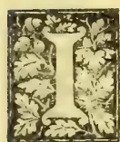

IN continuation of our remarks on this subject, we would next notice the bare-fallow system, according to which no crop is grown for a certain period, the land being allowed to lie fallow, and the interval taken advantage of to thoroughly clean it, turn up the soil and allow it to mellow down. Owing to the rapid propagation of weeds in this country there can hardly be said to be any real bare-fallow possible, unless the land be kept constantly weeded.

In the green-fallow system, a green crop is substituted for a bare-fallow. The advantages of this over the bare-fallow system are that there is less loss of combined nitrogen through washing by rain,—the roots of the fallow crop being present to utilize it,—and that a crop is secured which can either be fed off to cattle or used as green manure. In the ordinary process of fallowing among paddy cultivators a natural crop fallow takes place, and the resulting growth of grass would seem to be much valued by them as pasturage for their cattle.

What is known as Prout's system consists of selling all the crops off the land cultivated, without making any manure from them. No livestock for fattening or breeding would thus be kept, the manures used being all imported into the land. For the adoption of this system special conveniences are positively necessary; for instance, there must be easy access to a ready market for the produce.

In the livestock system the business of the occupier of the land is confined to the keeping of livestock, and the cultivation of grass and making of hay for the upkeep of his animals. Artificial

foods are all bought, the only natural food being hay and grass. The manure from the stock is returned to the land if the cattle are not kept out. In dairy farming and sheep farming this system is generally followed.

By the irrigation system, water, liquid manure or town sewage is used in the cultivation of the crops. The system is applicable to the case of grass farms, market gardening and even fruit culture, but seldom in the case of cereals, though irrigation water may be said to be indispensable in the case of paddy cultivation.

The systems that have been enumerated and briefly touched upon are:—(1) Jethro Tull's system, (2) the Lois Weedon system, (3) bare-fallow system, (4) crop-fallow system, (5) Prout's system, (6) the livestock system, and (7) the irrigation system. Though some of these are adopted as distinct modes of cultivation, it is more common, however, to find modifications and combinations of them. For instance, the cultivation of cereal crops is frequently carried on together with the keeping of livestock. The intelligent cultivator will adopt one or other of these systems according to their suitability to his circumstances, and if necessary modify and combine them as he thinks best.

## OCCASIONAL NOTES.

Those who have cultivated vegetables will know how great a pest is the common ant. Ants are often found swarming in colonies in the beds and even nipping off the tender shoots of plants. After repeated endeavours to destroy the pest by means of lime, bluestone, arsenic and Paris green, it was found that the spraying on of kerosine emulsion completely routed them after the second or third application. The emulsion (which did no damage to the growing plants) was made up as follows:—1 pint of soft soap or 1 lb. of hard soap in 2 quarts of hot water, with 1 pint of kerosine. Mix thoroughly while the mixture is still hot until a perfect emulsion is

829------------------------------------------------

784Supplement to the "Tropical Agriculturist."[May 1, 1894.]

formed. For use dilute with 15 parts of water. The spraying was done by means of the "Eclair" knapsack spraying machine.

Some time ago we referred to the *Singhara* or *water chestnut*, as yielding in its curious buffalo-head-like fruit a farinaceous food. The plant is known by the Sinhalese name of *Ikiliya*, and is found in some of the tanks in the neighbourhood of Anuradhapura. In India, it is commonly grown in Guzerat, and is said to be the only food for at least 30,000 people for 5 months in the year in Cashmere. The following is an analysis of the edible portion of the fruit, as made out by Mr. Hooper, the Madras Government Quinologist:—

<table>
<tr>
<td>Fat</td>
<td>..</td>
<td>0.97</td>
</tr>
<tr>
<td>Sugar and Gum</td>
<td>..</td>
<td>14.36</td>
</tr>
<tr>
<td>Albuminous matter</td>
<td>..</td>
<td>8.41</td>
</tr>
<tr>
<td>Starch</td>
<td>..</td>
<td>63.84</td>
</tr>
<tr>
<td>Cellulose</td>
<td>..</td>
<td>3.60</td>
</tr>
<tr>
<td>Ash</td>
<td>..</td>
<td>4.66</td>
</tr>
<tr>
<td>Water</td>
<td>..</td>
<td>4.16</td>
</tr>
</table>

Total..100.00

The nutrient ratio, or the ratio between the albuminous matter and the starchy materials is 1: 9.5, which is very similar to that of cleaned rice having a nutrient ratio of 1: 10.8.

#### LACTIC FERMENTS.

The *Melbourne Leader* has an interesting report on the experiments that have been carried out in connection with lactic ferments, and the important influence which the success of these experiments is likely to produce on the manufacture of butter. The experiments consist in sterilising cream and afterwards adding to it the particular bacillus (which has now been isolated) that produces the proper butter aroma, when used as a pure culture to ripen cream. Samples of a pure culture of the ferment having been secured from the Continent by Mr. David Wilson, that gentleman in conjunction with Mr. Pearson, the Government Analytical Chemist, succeeded in proving as the result of the experiments referred to, that butter produced from cream first sterilised and afterwards treated with the ferment was far superior to the best samples produced in the ordinary way. A description of the manner in which this superior butter is made mentions that the cream was raised to a temperature of 200 degrees, and rapidly cooled down to 40 degrees when the lactic ferment cultivated from the continental samples was added; the cream was churned some 24 hours later. The butter produced from this levured cream was pronounced to be worth 4d. more in the London market than first-class butter produced in the ordinary way. It is described as having possessed a perfect aroma, and the beautiful flavour found only in the highest class butter. The introduction of the cultivated ferment to the sterilised cream is, moreover, said to have a more beneficial effect on the keeping qualities of the butter, and among other instances in proof of this, the following is given:—A portion of the same churning of butter as that under notice was sent to Colombo, and, owing to some mistake, instead of being taken to a cool store, it

was placed in an open shed, where it remained in the sweltering heat for 17 days. At the end of that time it was examined, and then found to be good and sweet.

It is a common practice in dairies to allow cream to ripen for a certain period (according to temperature) before churning, since the cream churns more easily, and a large amount of butter is obtained than, without ripening, while the proper flavour or aroma is secured. During this process of ripening the various bacteria contained in cream multiply rapidly; and among them the lactic acid organisms which produce the souring of cream are prominent. It was a Swedish chemist, named Storch, who succeeded in isolating from cream a single bacillus, which, when used as a pure culture, produced the butter aroma; and shortly after Weigmann succeeded in obtaining cultures of an organism which produced a normal ripening of cream and the proper aroma in butter.

The value of using such a ferment, if it can be supplied, in a practical manner, is quite apparent, and we may expect, as the report under notice points out, that improvements will be introduced into butter-making similar to those which have been effected in brewing by means of the study of the yeasts. The following passage helps to explain why the new mode of fermentation should give better results than the old:—A sample of cream contains a large variety of bacteria, but the ordinary butter-maker has no means of obtaining a proper control over them. During the ripening process of the cream there will ensue a conflict of the different organisms with each other, and the result will be influenced by temperature, variety of species, quality of the cream, length of time of ripening, as well as the advantage which certain species of organisms may get from an earlier start. In such a conflict it will be a matter of accident if the proper species succeeds in growing with sufficient rapidity to produce its own effect on the cream unhindered by the others. To prevent a conflict of this kind, and by sterilising the cream and then adding the cultivated organisms to give them a start of all other kinds, thus insuring the production of butter possessing superior merit, is the object which the scientist has now in view, and experiments go to show that a large measure of success has been attained.

Until, however, the matter is taken beyond the confines of the laboratory and firmly established in the factory, it can scarcely be said to have advanced much beyond the experimental stage, but this much may be said—that almost every experiment that has been conducted has shown the certainty with which a pure culture of the right kind of bacteria will ensure the production of a superior butter with the most approved flavour and aroma.

#### INDIAN JOTTINGS.

Cattle from the Bombay Presidency seem to be in demand in foreign parts for stud purposes. Just now three fine bulls of the *gir* breed have been brought down to be sent to Jamaica. The importers evidently do not mind the cost, as in addition to two cattle men, a student of the Bombay Veterinary College is likely to travel in charge of the animals. Even with very liberal

830------------------------------------------------

May 1, 1894.] Supplement to the "Tropical Agriculturist."785

inducements, the difficulty at present is to get a student to undertake the charge, as the College examination is so close at hand that no one cares to miss it, and there is every likelihood that the animals will be left here till May. The *gir* bulls have a fine short head with a broad forehead, a pair of horns that incline backwards and large pendant ears. They have a large and well-developed hump, deep chest and well-proportioned legs, and are known as very good draught animals; the cows on the other hand being considered excellent milkers.

It is not generally known that animals which suffer from rinderpest once enjoy immunity from the disease ever afterwards. There are some who believe that this immunity extends only for six or seven years. The fact however is of great importance as regards the value of animals which have once suffered from the disease; and such animals ought to be worth more after recovery from an attack of rinderpest than before. As there are not many authentic records on the subject, it would be well to take note of the animals which have recovered from the disease and the year in which they suffered from the plague.

The immense quantities of hay, or rather dry grass, brought to Bombay from the outlying districts reminds one that much may be done in the matter of hay-making in Ceylon. There we have to depend chiefly upon paddy straw, which is at the best not a very nutritive food. In this city, where so many horses and working bullocks are kept, it would almost be a matter of impossibility to meet a hundredth part of their wants even if owners used rice straw. As for green grass, even several hundreds of acres of Guinea or Mauritius grass, (the last of which by the way is not grown here), will not supply the demand, and but for the provision made by dry grass it would be a matter of impossibility to maintain the large number of draught animals in any of the big towns. The grass from which hay is made grows in the jungles and waste lands in the country and attains a height of about two to three feet on an average. A month or so after the rains the grass cutters mow it and leave it on the ground to dry, after which it is made into bundles and disposed of. There are many species of wild grass, but the common kinds appear to consist mostly of *andropogons* quite similar to the *andropogon* grass\* of which a specimen was grown at the School from seed obtained from Delft. There is, I believe, no lack of wild grass in the vicinity of Ceylon forests where a little more attention might be paid to it. One of the great drawbacks as regards cattle breeding in Ceylon is undoubtedly to be attributed to the insufficiency of fodder. There are two species of wild *andropogons* which are put to some use here. One is the well-known kus-kus grass, *andropogon muricatus*, the *Sevendara* of the Sinhalese, which possesses fragrant roots, and is used in making tatties and hand punkhas, and for extracting a perfume. It is a common sight to see mats made of kus-kus roots hung up in verandahs and kept moistened in order to lower the temperature of dwellings.

\* *A. Schoenanthus* var. *Versicolor*.

The other useful species of *andropogon* is of more wide economic interest and grows wild in Central India and Punjab. It is known as *rusa* grass or sweet *calamus*, *andropogon calamus aromaticus*, and resembles greatly our own *Penngiriman*, or the *citronella* grass. The oil obtained from the leaves of the grass fetches a good price in England, and is sold as grass oil or oil of rose-scented geranium. In the vernacular the oil goes under the name of *roshnetel*.

Sometime back there was a discussion as to the advisability of trying well irrigation in Ceylon. The more one sees of Indian cultivation, the more will he be convinced of the feasibility of this system. In some places the wells from which water is obtained for irrigating the land are very deep and must have cost much money and labour, but the cultivator does not consider any money spent on a well as wasted; on the other hand he will spend his last penny in getting a well excavated, and when he has succeeded will consider it to be a real treasure. The methods of water lifting have already been explained in the columns of the Magazine. The single *mhole*, the double *mhole*, the lever lift, the Persian wheel, are all in use here. The system of land tenure in some of the Native States encourages the excavation of wells and the improvement of the lands generally. In some States all the land belongs to the Rajah and the cultivators pay a land tax. If a cultivator excavate and build a well in any area he is cultivating, such land comes to be held on a permanent lease by him. In this way in some of the Native States almost every holder of land has got a well for irrigating his crops. These wells in Central India cost as much as R250 or R300 each

W. A. D. S.

BOMBAY.

## HOW TO MAKE GOOD DRY GRASS OR HAY.

The following is a Memorandum issued by the Superintendent of the Horse Breeding Department, Meerut, for making good dry grass or hay:—

Cut when green and in flower, tie up in bundles of about 8 to 10 lb. weight, and place three of such bundles on their broad ends leaning against each other. By this arrangement the grass will not become damaged by rain, and the central grass of each bundle will ferment and acquire more nutritious properties from containing saccharine and starchy matter.

When the bundles are sufficiently dry they may be stacked. Dry grass thus prepared will be found very nutritious and sweet, and animals will eat it readily. It is nearly as good as fair hay made in England. Proper haymaking requires much practical experience.

If the weather is hot and the sun powerful, grass will be dry enough as a rule, in 2 or 3 days, and can be then stacked but it should be stacked in small ricks, in case of any heating taking place, for if grass be stacked when too green or wet, it will surely heat too much, go beyond the fermenting process of making sugary matter &c. and may take fire.

A little heating makes the grass sugary and gives a very sweet odour, the odour of hay

831------------------------------------------------

756Supplement to the "Tropical Agriculturist."[May 1, 1894.]

## THE PRODUCTS OF THE GRAPE VINE AND THEIR USES.

**Grapes.**—The vine is generally cultivated for the sake of its agreeable sub-acid fruit, the chief acid in which is the tartaric—the same as is present in the tamarind. Grapes exert a cooling and refreshing influence upon the blood, and, like many other fruits, have a beneficial effect upon the stomach and the liver. The late Mr. A. M. Ferguson once wrote as follows about the use of grapes in the dessert:—"For those diseases of the digestive functions to which dwellers in our hot, moist climate are especially liable, 'the grape cure' is frequently prescribed. A full supply of grapes at meals might act as a preventive of the disease indicated by sore mouth." The following is the percentage composition of the ripe grape as given by Dr. Edward Smith:—

### Soluble Parts.

<table>
<tr>
<td>Grape Sugar</td>
<td>..</td>
<td>13.80</td>
</tr>
<tr>
<td>Tartaric and Malic Acids</td>
<td>..</td>
<td>1.12</td>
</tr>
<tr>
<td>Nitrogenous matter</td>
<td>..</td>
<td>.80</td>
</tr>
<tr>
<td>Gum, Fat, &amp;c.</td>
<td>..</td>
<td>.50</td>
</tr>
<tr>
<td>Salts</td>
<td>..</td>
<td>.36</td>
</tr>
<tr>
<td>Water</td>
<td>..</td>
<td>79.80</td>
</tr>
</table>

### Insoluble Parts.

<table>
<tr>
<td>Skin, Stones, &amp;c.</td>
<td>..</td>
<td>2.60</td>
</tr>
<tr>
<td>Pectose</td>
<td>..</td>
<td>.90</td>
</tr>
<tr>
<td>Mineral matter</td>
<td>..</td>
<td>.12</td>
</tr>
</table>

100.00

Before they are ripe grapes are extremely harsh and sour to the taste, and by expression furnish a liquor known as verjuice and formerly used as the juice of lemons. Among other substances, verjuice contains malic acid and bitartrate of potash.

A vinegar is obtained, though rarely, from grapes. It is variously used as a condiment, for extracting the virtues of other medicines, and for counteracting the effects of vegetable poisons. It is said that an excellent vinegar can also be made from the loppings and prunings of the vine.

The bitartrate of potash or cream of tartar which is deposited during the fermentation of wine is used as an aperient.

**Raisins.**—As the grape is being dried, the quantity of sugar in it increases, while that of malic acid diminishes. Raisins are, therefore, more saccharine, but less cooling and refreshing than grapes. There are many sorts of raisins. The "muscateels" which are highly prized for dessert are left to dry in the sun hanging on the vine itself and are hence called sun raisins. The leaves around being first cut off, the bunches are left undisturbed until the grapes are sufficiently dried and converted into raisins. These are the largest and sweetest raisins in the market and sell at high prices. The "Sultanas" are the smallest which are sold under the name of raisins and are of a peculiarly fine flavour. The former grow in Southern Europe and the latter in Turkey. It is thought that the quality and appearance of ordinary raisins can be improved by dipping them in lye before being dried. Currants are prepared from a small, seedless variety of grapes. They are less juicy and contain a less proportion of sugar than the muscateels. The chief use of raisins and currants is in the pre-

paration of puddings, but wine is also sometimes obtained from them.

**Wine.**—Must is the unfermented grape juice. Wine is the juice of the grape altered by fermentation. The quality of wine depends principally on the proportion of sugar contained in the must, and the manner of its fermentation. When the quantity of sugar is sufficient and the fermentation complete, the wine is perfect in quality. If the quantity of saccharine matter be too large, the fermentation is slow and consequently part remains undecomposed imparting a sweet and luscious taste to the wine. On the other hand if there is too little sugar in the must, the wine is thin and weak. Ceylon-grown grapes are sometimes found deficient in saccharine matter. Father Assauw, writing from Wahakotte, says:—"I tried to make wine out of grapes grown here, but I had to add from 3 to 4 oz. of sugar to each bottle before I could have got anything like wine." If the skin of the grape is removed from the must before the fermentation sets in, the wine has little or no colour and is called white wine. If, on the contrary, the skin is allowed to remain in the juice while the fermentation is going on, the alcohol dissolves the colouring matter of the skin, and the wine assumes a red colour. Some of the red wines, such as Port, contain tannic acid derived from the skin.

**Oil from the Seeds.**—A useful oil is extracted from the grape stones in some places. In order to separate the seeds from the husks and other refuse matter, the mash is put into a bucket with some water and worked about with the hands until the seeds sink to the bottom. They are then removed and dried in the sun as soon as possible. When a sufficient quantity is collected, the whole is ground in an oil mill. The oil which is then cold drawn is scarcely distinguishable from common olive oil. The oil cake that is left in the mill as residue, when scalded in a little hot-water, yields a fresh portion of oil, which though inferior to the cold-drawn oil first obtained, burns excellently well in a lamp, giving out no unpleasant odour and very little smoke.

E. T. HOOLE.

## DAIRY PICKINGS.

Milk, as is well-known, after being taken from the cow, placed in vessels, and left undisturbed at the ordinary temperature, becomes sour, loses its liquid character, and is ultimately converted into a gelatinous mass. If this mass be broken up by raising the temperature it will separate into curd, which is caseine and fat, and a bright liquid whey. This change of souring and coagulation, says Professor McConnell, a well-known English authority, is caused by the action of a living ferment or micro-organism called the lactic ferment, which enters the milk from the atmosphere after the milk has been taken from the cow. The rapidity with which the ferment acts depends on the temperature of the milk. It acts very quickly at the temperature at which milk leaves the cow—90° Fahr., the maximum rapidity being attained at 100° Fahr. At 114° the action ceases altogether, the heat being too great for the ferment. On the other hand, the ferment

832------------------------------------------------

May 1, 1894.] Supplement to the "Tropical Agriculturist."787

acts slowly when the milk is cooled down to about 60°; at 55° it acts still more slowly; and at 50° no action has been observed. This circumstance explains the fact that milk is most difficult to "keep" (i.e., it turns sour most readily) in warm countries and warm summer weather, and keeps unchanged far longer in the cool winter time. Other ferments besides the lactic ferment enter milk from the air, causing special changes.

Milk may be preserved for any length of time unchanged by the use of certain chemical agents which are added to it—such are boracic acid, bicarbonate of soda, carbonate of soda, and salicylic acid. All these are more or less inefficient, and some of them are objectionable in that they give their own taste or smell to the milk. Sir H. Thomson says that 8 gr. or 10 gr. of these agents per pint of milk will keep it sweet for three or four days, twice the quantity being required for cream. The preservatives are perhaps not injurious if one pint of the milk containing them be drunk daily, but are likely to be hurtful to young children taking it.

The best temperature for churning cream is 56° Fahr. The butter should come in twenty minutes. If the temperature is above or below the proper point use means to bring it to the right degree. If too cold put boiling water into a long tin tube, and stir the cream until it is warm enough. In summer it is not possible to get water cold enough or ice to cool the cream down, but it can be put into a bag in a draughty place, and this will in time bring it down; or the churn or other vessel can be wrapped round with a wet bandage, and be put out where the wind can blow upon it; keep the cloth wet. Water put out in dinner plates in a draughty place will become very cool in a short time, and this cold water may be put into the tin tube to stir the cream until it is cooled somewhat.

Milk should be cooled quickly after it is taken from the cow. It will keep much longer, and any bad flavours in the milk will be modified. Cooling is now done quickly by means of refrigerators.

Lucerne should be cut some hours before being fed to cows. If they are allowed to graze upon the field their milk will have a bad smell and taste, but if the lucerne is allowed to wilt a little first there will be neither smell nor taste imparted to the milk.

The following recipe for cooling water for dairy purposes in summer time is given by Mr. McCormick, the expert in charge of the Tasmanian travelling dairy:—Take 8 lb. nitrate of ammonia and 4 lb. chloride of ammonia, both finely powdered; mix well together and use 5 lb. of the mixture to every gallon of water. This quantity will be found sufficient to reduce water at a temperature of 90° F. to freezing point (32° F.) in a few seconds. In order to regain the salts after using, evaporate the water over a slow fire in an iron vessel. The salts should then be laid on a plank and allowed to thoroughly dry in the sun. Be careful not to boil the mixture, because a portion of the salts will thereby be lost. Never allow the ammonia to come in contact with butter or cream, but stand the vessel containing these articles in the mixture, so that they may be entirely surrounded by it.

Milk tainted with "native cress," or with cabbage, or other plants eaten by the cow can be partly restored by cooling rapidly, then heating to 150° F., and again rapidly cooling it. If not cooled and heated in this way, but put into pans and set for cream, the cream will rise, and with it the oily globules which give rise to the offensive odours and flavours, so that the skim milk will be nearly free, and the cream will have nearly all of the flavour and odour. By separating the cream from the new milk at once the cream will only have its own percentage of bad qualities, and most of this can be driven off by cooling and then heating to 150° F., because the odours, &c., are volatile oils which are vapourised upon the application of sufficient heat.

A pint of milk should weigh 1.25½ lb., as near as can be; a gallon weighs 10 lbs. and a very small fraction. Dairy factories often weigh in 10¼ lb. of milk for a gallon. Where the whole of the suppliers are shareholders this is quite fair.

---

## POONACS.

---

Mr. Hooper, the Madras Government Quinologist, makes the following remarks on poonac, which he has been examining with a view to their utilization as manures:—

*Castor Poonac.*—This is obtained from the seeds of the well-known castor-oil plant. The cake contains from 5 to 7.5 per cent of nitrogen and 7 to 12 per cent of mineral matter. This is one of the richest poonacs.

*Ground-nut Poonac.*—This is prepared from the seeds of *Arachis hypogaea*, which is cultivated so largely in the districts bordering on the Coromandel Coast. It contains from 5 to 7 per cent of nitrogen, and 9 to 12 per cent of mineral matter. The cake from the decorticated seed is about one-tenth richer in albuminous substances than that from the undecorticated.

*Min or margosa poonac* is made from the seeds of the min tree (*Melia azadirachta*) and is characterized by its asafetida-like smell and its bitter taste. The nitrogen ranges from 4 to 5.5 per cent, and the ash is rich in phosphates. The cake usually retains a large quantity of oil, sometimes as much as 20 per cent.

*Hongay Poonac.*—Hongay is the Canarese name for *Pongamia glabra* [The Sinhalese *Magul-karanda.*—Ed.] The cake, which is very bitter, contains from 4 to 5 per cent of nitrogen, and 4 to 6 per cent of ash.

*Coconut Poonac* is one of the products of the coconut palm on the western coast. When fresh it is eaten as food by the lower classes, but it soon decomposes and is fit for nothing else than a manure. [In Ceylon it is commonly used as cattle-food, especially for working bullocks.] It does not afford more than 3 to 4 per cent of nitrogen, and only a small proportion of ash.

*Moura Poonac* is prepared from the seeds of *Bassia longifolia*, a tree known by the Tamil name *illupu* [And the Sinhalese *mi.*—Ed.] The cake contains a large quantity of saccharine matter, but is rendered nauseous on account of a bitter principle being present. It yields from 2 to 8 per cent of nitrogen.

833------------------------------------------------

788Supplement to the "Tropical Agriculturist."[May 1, 1894.RICE.\*

Few people realize the important part rice plays in the economic history of the world, and that probably there does not exist any other product of the soil which forms the staple food of as great a number of human beings, computed as three-fourths of the human race. Rice is supposed to be of Asiatic origin, but it is found growing wild in several parts of the world, notably in Central America, Africa, and even Queensland. To India, however, belongs the credit of first utilizing it as a food, and by the cultivation of centuries altering the wild product to what it now is. The rice plant is to be found growing between the 45th parallel north, and the 30th parallel south. When it is mentioned that besides being extensively grown in India and the East generally, it is also found cultivated in the south of Italy, Spain, Portugal, the West Indies, Central America, the United States and Australasia, it will be readily seen that the plant thrives under varying conditions of climate and soil. Rice analysed contains: starch, 86.9; gluten, 7.5; fatty matter, .7; sugar and gum, .5; epidermis, 3.5; ash, .9. The general composition of rice from another analysis shows: water, 13.7; flesh-forming substances, 6.5; non-nitrogenous substances, 79.4; ash, .4. Cooked rice is said to give up 88 per cent of its bulk as nutriment.

The advice given on the subject of seed is good:—Too much attention cannot be paid to selection of seed; only good seed from vigorous plants should be selected. Age has to be considered as well in selecting seed. Both new and old seeds have to be avoided. Seed about 12 months old is reckoned the best. New seed will come up soon, and grow rapidly, but will give a very light crop; old seed will either not germinate or give a very straggly crop and weak plants. Good seed not only gives an increased yield per acre, but also produces a hardier plant—one less liable to parasitic and other diseases. Another matter not to be lost sight of in selecting seed is to see that it is pure, of one variety only, not mixed, otherwise an unsatisfactory crop is the result. Special mention is made of the variety known as Patna rice as a good kind for sowing on the ordinary swampy land.

Then as regards cultivation, we are reminded that the roots of the rice plant are very delicate, and hence good tilth is absolutely necessary to enable the tender rootlets to push their way down. According to the Indian methods of culture 6 inches is given as the lowest depth of tilth, and under this is a hard pad; hence the roots become shortened and travel laterally in search of food, and where no water is provided the plant does not survive. "It is certain," we are assured, and we do not doubt it, "that varieties of paddy imported from Bengal, and treated to scientific farming would develop good root growth, and in course of time, with careful seed selection, a variety could be produced which would really be a dry land crop—that is, entirely independent of added moisture,—and one not likely to fail with moderate drought, as, having longer roots, and good tilth being provided, the plant would receive nourish-

ment from the subsoil, which in the driest of seasons has a sufficiency of moisture if get-at-able by the plant." Instances are mentioned of certain varieties of rice grown in the Bankura district in India, as well as in Burmah, which require much less water than the ordinary kinds, while a variety grown on the Garo Hills in Assam and in Madagascar is practically a dry land crop. The idea of attempting to convert the aquatic rice plant into a dry land crop may be practicable, and the result will no doubt do away with much of the risk of failure from insufficiency of water, but it is generally believed that the extra dry varieties of "upland rice" are not quite so nourishing as the swamp or wet rice, nor so palatable. The advantages of deep cultivation (except in exceptional cases) and finer tilth are undeniable, and if they be aimed at, and seed for sowing be carefully selected, the risks of rice or paddy cultivation would be minimised, and more uniform and better results insured. We hope to conclude our notice of this paper on rice in our next issue.

ZOOLOGICAL NOTES FOR AGRICULTURAL STUDENTS.

The first mentioned of the different orders of birds, viz., *Natatores* or swimming birds, are more or less adapted for an aquatic life, the body being boat-shaped, the legs short and placed behind the point of equilibrium of the body so as to act as oars. The toes are more or less completely webbed. Owing to the fact of their being exposed to great variations of temperature, the *Natatores* are furnished with particularly dense plumage which is kept well-oiled so as to be waterproof.\* Among the swimming birds occur ducks, geese, swans, penguins, gulls and petrels. The first three form a well-marked group (ducks and geese being common domestic birds) distinguished by having the bill flattened, and covered by a soft skin, and its edges furnished with a series of plates, which form a kind of strainer, by means of which these birds sift the mud in which they seek their food. The foot in this group is webbed, but the hinder toe is free. Penguins are the chief among the sea-fowl whose excrement forms the well-known fertilizer, guano.

The *Grallatores* or wading birds mostly spend their time in shallow water, feeding upon small fish, shell-fish, worms and insects. Many, however, live chiefly upon dry land, and are more or less exclusively vegetable feeders. They are distinguished by the great length of their legs. The foot has three toes in front and one behind, but the toes are never completely webbed. The wings are short and the power of flight considerable, but the tail is short, and its function as a rudder is chiefly transferred to the long legs which are stretched out behind in flight. The bill is almost always of considerable length, and usually more or less pointed. Among the more important wading birds may be mentioned the water-hens, herons, egrets, bitterns, the stork and adjutant,

\* Rice growing and its preparation for the market. A bulletin issued by the Department of Agriculture, Brisbane.

\* A special oil-secreting gland is provided by nature and placed in the posterior part of the body. It is a common sight to see ducks oiling their plumage by means of their beaks.

834------------------------------------------------

May 1, 1894.] Supplement to the "Tropical Agriculturist."789

the long-billed snipe, sand-piper, cranes, and plover.

The *Cursores* or runners are characterised by the rudimentary condition of the wings which are useless as organs of flight, and by the compensating length and strength of the legs. The bones have few air cells and the ridge or keel to which the muscles of flight are attached in flying birds, is absent. The hinder toe of the leg is wanting in all but the apteryx, in which it is rudimentary. The front toes are either two or three in number, and are furnished with strong blunt claws. Among the runners are the ostrich, cassowary and emu.

The *Rasores* or scratching birds—or as they are often called the gallinaceous birds—are characterised by having the upper mandible of the bill convex, and having a membranous space at its base in which the nostrils are pierced. The nostrils are protected by a cartilagenous scale. The feet have four toes each, three in front and a short hind toe; and in typical forms the toes are provided with strong blunt claws suitable for scratching. The feet of the pigeons, however, are generally adapted for perching. The rasorial birds are divided into two well-marked groups. In the first of these are the fowls, pheasants, grouse, guinea-fowl, turkey, pea fowl and other allied birds. In the second division are the pigeons and doves, distinguished by the fact that the feet are slender, and adapted for perching while the voice is of a gentle, soft, and melancholy character. The fowls and game birds, on the other hand, are mostly terrestrial in their habits, and have strong feet with claws not suited for perching on trees, while their voice is of a harsh, dissonant nature, and their flight comparatively feeble. Fowls, turkeys, guinea-fowl, pigeons and doves are all more or less domestic animals, though only fowls and turkeys of this group, together with ducks (and sometimes geese) are found in the ordinary poultry-yard.

#### STERILIZED MILK.

At the request of the Secretary of Agriculture, the chief of the Bureau of Animal Industry, California, has furnished the following simple directions for the sterilization of milk:—

"The sterilization of milk for children, now quite extensively practised in order to destroy the injurious germs which it may contain, can be satisfactorily accomplished with very simple apparatus. The vessel containing the milk, which may be the bottle from which it is to be used or any other suitable vessel, is placed inside of a larger vessel of metal, which contains the water. If a bottle, it is plugged with absorbent cotton, if this is at hand, or in its absence other clean cotton will answer. A small fruit jar, loosely covered, may be used instead of a bottle. The requirements are simply that the interior vessel shall be raised about half an inch above the bottom of the other, and that the water shall reach nearly or quite as high as the milk. The apparatus is then heated on a range or stove until the water reaches a temperature of 155 degrees Fahrenheit, when it is removed from the heat and kept tightly covered for half an hour. The milk bottles are then taken out and kept in a cool

place. The milk may be used any time within 24 hours. A temperature of 150 degrees maintained for half an hour is sufficient to destroy any germs likely to be present in the milk, and it is found in practice that raising the temperature to 155 degrees and then allowing it to stand in the heated water for half an hour insures the proper temperature for the required time. The temperature should not be raised above 155 degrees, otherwise the taste and quality of the milk will be impaired.

"The simplest plan is to take a tin pail and invert a perforated tin pie-plate in the bottom, or have made for it a removable false bottom perforated with holes and having legs half an inch high, to allow circulation of the water. The milk bottle is set on this false bottom, and sufficient water is put into the pail to reach the level of the surface of the milk in the bottle. A hole may be punched in the cover of the pail, a cork inserted, and a chemical thermometer put through the cork, so that the bulb dips into the water. The temperature can thus be watched without removing the cover. If preferred an ordinary dairy thermometer may be used and the temperature tested from time to time by removing the lid. This is very easily arranged, and is just as satisfactory as the patented apparatus sold for the same purpose."

#### GENERAL ITEMS.

In a memorandum on experiments with pulses by Mr. Valder of the Department of Agriculture, New South Wales, the following reference is made to pigeon pea (*Cajanus indicus* or Dhall plant):—"As a forage plant it should prove of value, especially in rotation with other fodder crops such as maize, sorghum, etc. Six months after sowing the yield of green fodder (in a climate which is considered rather too cold for it) was at the rate of 12 tons per acre. I cut a quantity and gave it to horses and cattle, and found that they ate it with great relish."

The experiment with *Lathyrus sylvestris* would seem to have yielded as unsatisfactory results in New South Wales as in other Colonies and in India. We are told that at the end of nine months the plants were not more than 6 to 10 inches high. "Of the fifty-four pulses sown this one was by far the slowest grower and at the end of nine months produced about half a ton of green plant per acre . . . . . from reports received by the Department it has certainly failed in giving a good yield or withstanding the heat, and in many instances has died out." Our experience at the School was quite similar to this.

*Craspedia pleiocephla* a rather ornamental plant of the order composite, with yellow flower heads, is said to furnish an admirable substitute for feathers or kapok for filling beds, pillows, or cushions. The material is got from the mature flowers.

Mr. Maiden, the consulting botanist of the N. S. W. Department of Agriculture makes the following remarks regarding *Hibiscus tiliaceus* (our Belipatta, so common as a hedge plant):—

"Of all the species of hibiscus, *H. tiliaceus*, has

835------------------------------------------------

790Supplement to the "Tropical Agriculturist." [May 1, 1894.

received the most attention as a fibre plant. The fibre was used by the aborigines for nets and fishing lines. Some fibre produced in this colony was pronounced by the Jurors of the London International Exhibition of 1862 to be only fit for paper making. It must have been crudely prepared, as the tree produces a good fibre in many parts of the world. Three or four years ago the Department of Agriculture of Queensland sent to London some fibre for report. The fibre 'was roughly prepared by boiling, in soda-lye, and rubbing with an old sack.' The report was 'good colour, moderately soft, but of no great strength, and fit only for jute purposes. It would, however, probably sell in large quantities, and we would estimate the value today at £12 to £14 per ton in London.'

"But," continues Mr. Maiden, "I am afraid there is no possible future for hibiscus fibre in the world's markets; the utmost we can expect is to satisfy a small local demand. India is the home of the hibiscus. The products of different species are not always kept separate for trade purposes, but the principal hemp-yielding hibiscuses are *H. cannabinus*, which yields Bombay hemp, Ambari hemp, and Decani hemp, and *H. subdariffa* which yields the Rozelle. There are other species used as fibre plants. I note certain figures in regard to Bombay hemp. From official records it is stated that the area under cultivation in the Bombay Presidency was in 1885-6, 53,488 acres; in 1886-7, 87,957 acres; and in 1887-8, 715,88 acres. This refers to one species, to one presidency, where labour of the cheapest kind, well accustomed to this sort of work is employed.

A sample of the young bark of *Cassia auriculata* (Sinhalese, *ranawara*) was found to contain about 11.9 per cent of tannin; bark from the thicker branches contained as much as 20.1 per cent. It is evident from this that in the analysis of vegetable economic products great importance is to be attached to maturity of the sample and the condition under which it has been collected and preserved, as a slight difference in the age of the sample, or the presence of impurities will make an analysis of that sample of little value.

\* \* \*

To prevent articles of iron or steel from rusting, immerse or wash them, for a few moments, with a solution of carbonate of potash or soda.

\* \* \*

Kerosine emulsion has been found efficacious in ridding animals of ticks.

The native country of *Colens tuberosus* (Sin. *inala*) is somewhat doubtful. Besides Ceylon, it is cultivated in Java, Amboina, and other islands of the Malay Archipelago. Rumphius, in his account of the plant, mentions it having been

recently introduced into Amboina from Java and Baly, and further suggests that it probably came into the islands from the Malay Peninsula. On the other hand he tells us that the common name employed among the Portuguese for the plant is *gotte kelingan* or *gotte kelin*, probably because it was much cultivated on the Coromandel Coast, the inhabitants of which were known as *Kelin* or *Quellin*.

*Colens Barbatus*, another species found in Ceylon, is said to be cultivated in the Deccan for the sake of its fleshy roots which are pickled by the natives.

Mr. D. A. Chinniah read an interesting paper on "Cattle" at the Agricultural Improvement Society; the following are a few selections from it:—Feeding should neither follow nor be followed immediately by exercise. A large meal given when there is nothing in the stomach is apt to produce indigestion. The administration of food or medicine in a liquid form should be carefully done, as much harm may follow from careless drenching. If any attempt be made by the animal to cough, the head should be immediately let down. Owing to the fact that village-cattle are allowed to roam about at their will, the owners of the animals lose the manure which could otherwise be collected if the animals were confined within certain areas. This manure may go to enrich his cultivated lands and so enable him to secure better crops, or it may even be turned into money. Where litter is used for bedding, care should be taken that it is well dried before using. Damp litter may be the cause of ailments that develope serious results afterwards.

According to the *Melbourne Argus*, the firm of Messrs. Clarke & Co., of Elsternwick, Victoria, have succeeded in devising a very useful and, at the same time, inexpensive calf-feeder. The feeder consists of a tube about 15 inches long, at one end of which is fixed a strainer, while to the other end, which is bent, is attached an india-rubber teat. In using the feeder it is only necessary to place the bucket of milk on one side of a fence, and drop the strainer-fitted end into the milk, while the teat end is passed through a hole in a fence, and given to the calf, which may then be left to suck away at pleasure. There is a shield fixed to prevent the calf pulling the tube through a fence, and of course there is no possibility of the bucket being upset. Under this arrangement the calf feeds in a natural manner, inasmuch as the use of the teat excites salivation, whereas in drinking from a bucket, in the usual way, the calf gulps down a quantity of milk which it cannot readily digest. It is reported that several well-known farmers have adopted the feeder after satisfying themselves of its utility.

836------------------------------------------------

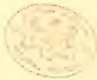A faint, circular seal or stamp impression is centered on the page. The seal appears to be a circular emblem with a decorative border. Inside the circle, there is a stylized design that could be interpreted as a dragon or a similar mythical creature, though the details are very faint. The seal is rendered in a light brown or tan color, suggesting it might be a stamp or a watermark.

837------------------------------------------------

WILLIAM RUDD, Esq., SENR.

*Tropical Agriculturist Portrait Gallery,  
No. X.*

838------------------------------------------------

# \* The TROPICAL AGRICULTURIST \*

◇ MONTHLY. ◇

Vol. XIII.]

COLOMBO, JUNE 1ST, 1894.

No. 12.

## "PIONEERS OF THE PLANTING ENTERPRISE IN CEYLON."

### WILLIAM RUDD, SENIOR:

PLANTING PIONEER; AND FOR MANY YEARS THE OLDEST OF CEYLON PLANTERS.

[Failing in our attempt to get a photograph or other portrait of Mr. George Bird, the very first Planter in Ceylon, it is some satisfaction to be able to present that of Mr. Rudd who began life as Mr. Bird's assistant. The biographical notice of Mr. Rudd is written by a relative, with a few additions and alterations.—ED.]

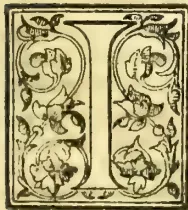

INTRODUCTORY.—The career of a Planting Pioneer like Mr. Wm. Rudd, whose first connection with coffee dates back into the early "thirties" or sixty years ago, could not fail to be of special interest, if the story

could be related by one who had access to the records notes; &c., that Mr. Rudd left behind him. The writer has had no such advantage, so that the sketch here presented of the vicissitudes of the forty-five years of Wm. Rudd's life in Ceylon is necessarily imperfect: but it is believed to be correct as far as it goes, and it will be found to afford a striking illus-

tration of the capricious moods of Dame Fortune. The collotype likeness has been engraved from a photograph taken by Messrs. W. L. H. Skeen & Co., Colombo, about twelve months before Mr. William Rudd finally left Ceylon for England. The correctness of the portrait will be at once recognized by those who remember him.

EARLY LIFE.—William Rudd was born in London on June 6th, 1812. His parents were of the county of Norfolk, and it was his misfortune to be left an orphan almost in his infancy. He was the younger of two brothers, of whom the elder John, many years older than the subject of this sketch, died at the age of 21. Of Wm. Rudd's early life much is not known. After receiving a very rudimentary

839------------------------------------------------

792THE TROPICAL AGRICULTURIST.[JUNE 1, 1894.

education, he was apprenticed in his youth at Maudslay's Factory and Iron Foundry where he received a thorough training as a mechanical engineer and fitter, and gained a practical knowledge of a branch of work, which, in after years, proved of the greatest utility to him as a colonist. He was at work in this factory when the Greeks were being aided by England to gain their independence (1827) and Maudslay's with many other factories had a busy time in the preparation of war material. In 1830 after the expiry of his indentures, he met his uncle, Mr. Henry Rudd, Senr., who had just returned to England after an absence of 20 years in Ceylon. He had been commissioned to obtain and bring out two stationary steam-engines for the Ceylon Government—one being intended for pumping water in Jaffna, and the other required for oil-mills in Colombo. Having been persuaded to try his fortune in Ceylon, Wm. Rudd left England with his uncle in the month of July 1831, and after a tedious voyage of six months round the Cape, landed in Ceylon on January 14th, 1832. Amongst their fellow-passengers on the voyage out, were old Mr. French Gray, and the mother of the late Mr. Marcus Vanderstraaten, Station Superintendent of Kandy.

IN GOVERNMENT SERVICE.—After working for a short time with his uncle, who had a Carriage Building Establishment\* in the Pettah, Wm. Rudd was employed by the Government. He put up the steam-engine, which had been imported for use in Colombo, and subsequently had charge of a division of pioneers. He did not, however, remain long in the Public Works Department of the island, as he fell out with an official who wanted vouchers signed for a larger amount than was actually paid. It is devoutly to be hoped that this variety of official is now extinct. After leaving the service of Government, Wm. Rudd got charge of a Coconut-oil Mill belonging to Messrs. Ackland & Boyd, and it was by reason of his connection with this Planting Firm that he afterwards turned his attention to coffee planting—an enterprise at that time (1834) in its infancy in Ceylon. The commencement of his PLANTING LIFE being so nearly coincident with the start of the enterprise it may be interesting here to refer to the first planter—George Bird—the brother of Colonel Bird who was the Military Commandant at Kandy in the year 1823. Geo. Bird, who in his time had been a Cavalry officer, was a personal friend of the Governor, Sir Edward Barnes. He had opened and planted with coffee the Sinnepittia estate near Gampola, as far

back as the year 1824; and about the same time Gangarooa, on the banks of the river near Kandy, was opened for the Governor, with Mr. W. S. Northway as Superintendent. The name of "Raja Totam" or Governor's estate, clings to this property to this day. Sinnapittia was not a success as far as coffee was concerned, possibly owing to the fact that Geo. Bird had no previous experience to help him. He was however a man of vast energy, great physical strength and indomitable pluck, and was not easily turned from his purpose. It may be as well here to quote from Mr. William Rudd's contribution to the *Colombo Observer* in July 1867:—

"Recollections of the early days of Coffee Planting by Wm. Rudd—the first Sinne Durai in Ceylon.—In December 1832 Mr. George Bird went to Kondesallie, in the valley of Doombera, to inspect the land in that neighbourhood to determine its eligibility for the cultivation of coffee and after a short time he applied to Government for a grant of the lands now known as the Kondesallie Coffee Estate. Land was then given away by Government on condition that the applicant should cultivate one-tenth of what he applied for, and this was the last land granted on those conditions, for very soon after, there arrived orders from England that no more land should be given away, and that in future all lands should be sold by public auction, at the upset price of five shillings per acre. Mr. Bird was put in possession of his land, and having made arrangements with a Mercantile House in Colombo, it was agreed that 300 acres should be at once put under cultivation under the superintendence of Mr. Bird. \* \* \*

"In 1834 Mr. Wm. Rudd joined Mr. George Bird as assistant, and during this and a part of the next year they planted to the extent of three hundred acres, while a house for the Superintendent was in progress and nearly completed. But the natives were extremely troublesome, driving their cattle into the cleared and planted lands, and thereby causing much trouble and loss. Tying up was illegal and no cattle trespass law existed in those days. The consequence was the cattle were driven out from the coffee fields to the grass lands, but only to be driven back as soon as an opportunity offered. This state of things could not continue and as a last resource the cattle (both black cattle and buffaloes) were shot. This engendered much ill-feeling between the Superintendent and the natives, and at last ended in serious consequences, for no sooner was the new house finished than the natives set it on fire, and it was quite destroyed. The Government offered £100 reward for the conviction of the offender, but he was never discovered. However, this offence had the effect of hastening the Government on with a Cattle Trespass Regulation, which when passed was considered satisfactory by all parties, and it is the same with little alteration that exists to this day."

\* The building, an upstairs house overlooking the Pettah Burja Ground, still stands.

840------------------------------------------------

JUNE 1, 1894.]THE TROPICAL AGRICULTURIST.793

About this time the Rajawella, Pallekellie and Degalla estates, in the Dumbara Valley were commenced and several new hands arrived from England. Wm. Rudd was later on joined by Charles Pitts and then by John Capper who was the oldest of the three. George Bird was their Peria Durai, and as an instance of his capacity for hard work, it may here be noted that he would think nothing of walking down from Peradeniya (where he had a house) to Kondesallie in time for morning parade. There were very few works on coffee planting at that date; but a translation of the excellent pamphlet by Laborie, the Frenchman, was in the young planter's possession and from it Wm. Rudd obtained many a wrinkle. Being a practical engineer and fitter he was able to build his first coffee-pulper himself. In after years he built several others. Wm. Rudd and Charles Pitts jointly bought a piece of land somewhat farther down the river than Kondesallie, and called it "Ballywhindle." It proved a failure for coffee. He also opened other land at Haragam in partnership with his uncle, Mr. Henry Rudd, who eventually took over the land and placed his eldest son, Henry, in charge, who, while here, contracted malarious fever which never afterwards left him altogether.

Although life at Kondesallie was rough and isolated for the young planters, there was also a bright side. Temptations were few, and game of all kinds was plentiful and close at hand. The romantic interest that attached to the novelty of the life, with the bright prospect which shone before them in the future, doubtless sustained and cheered the pioneers. In 1838, Messrs. Ackland & Boyd, who had the agency of most of the blocks of land then being opened as Coffee Estates, sent Wm. Rudd to the Balangoda district where he commenced work on St. Clements or Bombuwé, his earliest connection with this estate, of which any record is available, being in the month of May 1838, when he was drawing a salary of £8 6s 8d.

**MARRIAGE.**—In December of this same year he married Miss Oteline Prins, the daughter of one of the old Dutch residents who had elected to remain in Ceylon when so many of his relatives left for Batavia. Prins had by studying the English language qualified himself for the post of "King's Advocate Fiscal," which position he occupied in the early years of the British occupation of Ceylon. From January 1839 Wm. Rudd's salary was raised to £12 10s per month, and he settled down to a some-

what rough and isolated life in the wilds of Balangoda. Living was cheap enough as compared with modern times. Three half-pence (one fanam) would purchase two dozen eggs, and a full-grown fowl rarely cost more than threepence! Straw, for thatching purposes or for feeding cattle, could be purchased at the rate of 2,000 bundles for ten shillings. William Rudd was now an authority on the suitability of land for coffee. He had also gained a considerable topographical knowledge of the Kandyan country, and largely owing to his wife's kindly manner and treatment of the natives, he was on good terms with many of the Ratemahatmayas and other Kandyan headmen, people of considerable local importance at that time.

In 1840 Messrs. Ackland & Boyd thought that Wm. Rudd's experience and services could be better utilized in the Kandy District where the "wild rush" into coffee, of which Sir Emerson Tennent has given such a powerful description, had commenced. He says in an oft-quoted passage,—

"The Governor, and the Council, the Military, the Judges, the Clergy, and one half of the Civil Servants penetrated the hills and became purchasers of Crown lands. \* \* \* The rush for land was only paralleled by the movement towards the mines of California and Australia."

In accordance with instructions received from Messrs. Ackland & Boyd, Bombuwé was given over to the management of Mr. A. Stephens at the end of April, 1840, and Wm. Rudd left the District, travelling to Kandy *via* Nuwara Eliya and seeing as much as possible of the hill country. Bombuwé was ultimately abandoned in the bad year 1848 with 12 cwt. per acre ripening on the trees.

On his arrival in Kandy, William Rudd was engaged by Messrs. Ackland & Boyd to open some land which had just been purchased by Jas. Swan on the Hantane range. This was the Galoya Estate, which takes its name from the large stream passing through it.

As there was no kind of suitable accommodation near his new charge, the Superintendent was allowed the sum of £2 5s a month as rent of a house in Kandy for his wife's occupation, and this amount was duly charged to the estate until a bungalow was built and ready for occupation in May 1841. [His eldest son was born in this year.] Work on Galoya was soon going on in full swing, with Mr. Dowdall as assistant. Nurseries of coffee were laid down and the first clearing of about 100 acres was planted during the South-West mon-

841------------------------------------------------

794THE TROPICAL AGRICULTURIST.[JUNE 1, 1894.

soon of 1841. A large nursery was made a little below where the Uplands Bungalow now stands, for at that time the 236 acres forming the Uplands Estate was a portion of Galoya and were considered too wet and cold for coffee!

The adjoining estate, Wattegodde (now called Haloya), was also opened by Wm. Rudd about this time, and while planting these estates there were several assistants working under him at different times. Dowdall was with him for a few months, then McGowan, Harding, Wright, Ondatjee, Capper, Webster, and Dunn who was subsequently a Cinnamon planter at Kadirane.

Galoya gave its first sprinkling of cherries, or maiden crop, in 1842 and the Superintendent was very anxious to have a fine sample of parchment to show. Having occasion to visit Amblamanā, on the other side of the range, he rode off one morning after giving his assistant instructions to have some coffee put out to dry. On returning in the evening, during a heavy North-East shower, he found the coffee beans being washed off the barbecue. The Sinne Durai's explanation was:—"You did not tell me to take the coffee in, you only said to put it out." William Rudd often said that want of thought did more harm than the want of knowledge, and here was certainly an apt illustration of his favourite aphorism. The hero of this little episode was promptly sent back to Messrs. Ackland & Boyd who placed him under a stern master and he lived to become one of the hardest working planters in Ceylon. On Galoya there was a very large mixed labor force of over 200 Malabars and Sinhalese, some of the latter coming from Kadirane, Bentota and even Ambalangoda. The rate of pay was 7 pence per day and there was a general strike when the rate was reduced to sixpence, but the reduction was maintained in the face of all difficulties and work was soon going on smoothly again. In 1842, however, rumours of a rebellion caused a panic amongst the lowcountry Sinhalese who kept away for a considerable time.

The bungalow erected on the Galoya Estate was of a somewhat uncommon plan—the house being a perfect square, as affording the greatest amount of accommodation within a given area.

The site of this first bungalow (which has long since disappeared) was near the store and could be distinguished by some Sissoo trees\* which had been planted about it. These were obtained from seed sent to Ceylon by the Agri Horticultural Society of India. If these trees have not been destroyed, they should, after half a

\* *Dalbergia sissoo*.

century of growth, yield magnificent timber for fancy articles of furniture. The wood of the Sissā tree is of a dark brown colour mottled with yellow.

A note of some little interest is found under date of June 22nd, 1842, when Mr. Swan accompanied by Mr. Anstruther (the Colonial Secretary, and Mrs. Anstruther) visited the estate—"The first lady visitor to Galoya."

William Rudd had been drawing £400 per annum for the two estates, Wattegodda and Galoya, and resigned on intimation from Messrs. Ackland & Boyd that the salary was to be reduced to £250. At the end of July the proprietor's brother, Robert Dalgleish Swan, took over charge. He was at one time the owner of the Handrookande Estate which gave one year 17 cwt. per acre picked and despatched besides what was lost! The new Manager's assistant was John Gavin, a recent arrival, who was subsequently known as "Honest John," and whose portrait and memoir appeared in the April issue of this periodical.

Mr. Jeffery and Edward Francis, (generally known to his friends as "Pickwick") jointly owned the Hindoogalle estate. From them Wm. Rudd purchased the place. When originally formed into an Estate it was almost all chena land, but the new purchaser must have been well acquainted with the land as it was next to Galoya.

At this time, old Mr. Robb was living on Hindoogalle. He had come out from Scotland under an indenture to Mr. Jeffery, and Mr. Rudd having taken over the indenture by mutual agreement, Mr. Robb continued on Hindoogalle.

PROSPERITY.—On Hindoogalle Wm. Rudd prospered for some years. He bought other properties, some by himself, and others in partnership; some were profitably resold, and at one time his income from interest of money alone amounted to £2,000 a year. He had charge of the Kent and Ambokke estates in Matale in addition to others, and with his wife and family, there being now three children (1846), he lived on Hindoogalle in comfort and happiness.

The contrast was great between those days of comparative affluence, and the time when as a younger man just freed from his indentures, he started for Ceylon, being indebted to his uncle for the amount of his passage money, which he early in life repaid out of his earnings.

842------------------------------------------------

JUNE 1, 1894.]THE TROPICAL AGRICULTURIST.795

**ADVERSITY.**—But this happy state of affairs did not long continue. In England the equalizing of the coffee duties in accordance with the new doctrine of Free Trade deprived Ceylon coffee of the advantageous position it had held for about twelve years. The result was so disastrous to those who had expended large sums in Ceylon that it was no wonder there was a strong feeling that the new legislation was a breach of faith with that portion of the public who had sunk £5,000,000 in the coffee enterprise, relying on the Protection afforded by the differential duties. Money was so scarce that everything came to a standstill.

Those whose properties were mortgaged were sold up, in many cases the estates going for 25 per cent of the amount they were mortgaged for, and in others they were sold for a few pounds.

Plantation coffee was sold in London for a trifle and locally parchment went as low as 3 shillings per bushel.

Wm. Rudd suffered with the rest. He assigned his estates and paid twenty shillings in the pound and it was always a source of proud satisfaction to him that he had avoided the Bankruptcy Court. There is no doubt that in many instances he threw away his property in land to satisfy clamorous creditors. Winding-up his big estate and meeting all claims in full was a long and wearisome process, and eventually left him very badly off. Being in Colombo when the news of the so-called local "Rebellion" reached him, he had not even the means to get back upcountry where his wife and children were, at Hindoogalle. He walked from Colombo to the estate (over 70 miles, the place being 9 miles from Kandy on the Deltota road) in 24 hours with his gun on his shoulder, and followed by a lowcountry Sinhalese servant, who pluckily kept up with his master, but died a few days after from the effects of the journey. During the Rebellion Wm. Rudd received a bullet wound from a rebel; but beyond leaving a deep scar for life, he suffered no inconvenience. A grey Pegu pony was also fired at and wounded, but lived through it all and worked for many years after.

Hindoogalle was bought by Henry Rudd, Senr., for £600. In 1851, he gifted the property to Wm. Rudd's children and appointed the father Trustee. In the meantime the estate had been abandoned and Wm. Rudd with his family resided at Ambokke in the Matale District.

He returned to Hindoogalle in 1852 and again commenced to work up the old coffee land. He leased Galoya from Messrs Swan and Keir, the terms being that he was to

give them one-fourth of the crop. The place, of course, had been almost abandoned during the bad times. After Robert Swan left, it had H. Ackland, Stephen Darley, and Tom Dixon in succession as Superintendents.

Hindoogalle during this time was brought into a very high state of cultivation, chiefly by means of pig manure, a very large number of pigs being kept on the estate and fed during a portion of the year on boiled jak fruits. This fruit was very plentiful as there had been 5,000 jak trees planted on the estate when it was first opened.

In 1856 being driven to Colombo by ill-health and a stay there being needed for thorough recovery, Wm. Rudd took temporary charge of the St. Sebastian Mills for Messrs. Ackland & Boyd. In February 1857 he was severely tried by the loss of his wife. She left him with a family of 7 children, the eldest of whom was about 16 and the youngest about 3 years of age. In 1858 the substantial bungalow that now stands on Hindoogalle was completed and this year he also purchased the Pettigalla and Bombuwé estate in Balangoda, which had been abandoned for the last ten years. In 1858 with a view to enabling himself to take a trip to England he leased the Hindoogalle estate to Mr. Sam Thwaites for £1,000 a year, but the lease had to be cancelled. In 1860 after an absence of nearly thirty years he returned to England. While there he married Miss Berry of Huddersfield, Yorkshire, and returned to Ceylon in July 1861. Soon after their return his wife purchased 236 acres of the upper or North-West portion of Galoya from Mr. Lee Viner for £1,000 and this was called "Uplands." Felling was commenced almost immediately and about 60 acres were planted in 1862. In 1864 Messrs. H. C. Bird & Son, who had a heavy claim against Wm. Rudd and a mortgage over Hindoogalle, wished the account closed, with the result that the property passed into the possession of Mr. Price for £4,300. Wm. Rudd now retired to Uplands and began to make a home again. The bungalow he built here is a most substantial structure with stone walls. His wife had become a confirmed invalid, she lingered on till January 1866 and died at Maligakanda. A curious experience may here be related illustrative of the danger of delay, in matters where title deeds are concerned. In 1868 the Mercantile Bank gave instructions to Mr. Geo. Fernando, Auctioneer of Kandy, to sell a block of 188 acres of land in Maturata, of which the Bank had the deeds. The land was knocked down to the bid of Wm. Rudd for about £72, and the deeds with the auctioneer's receipt,

843------------------------------------------------

796THE TROPICAL AGRICULTURIST.[JUNE 1, 1894.]

and instructions about the transfer were handed over to a Colombo notary in large practice. Through some lapse or other the matter was left uncompleted, the Notary died, and when his papers were looked through the deeds were found and returned to the Bank. The management of the Bank in the meantime had changed hands and the land was again privately sold! This land is now the Woodcote Estate. This was not the only instance of the kind. In 1847 Wm. Rudd bought and paid for 300 acres of land in Kitoolgalle from J. C. Albrecht, but probably owing to the troubles which followed soon after, he never interested himself any further in the purchase.

**MORE TROUBLE.**—Expenses attendant on the education of some of his children in England were a severe drain on his resources and to add to this a trustee who held Railway and Bank shares in trust for his wife in the North of England failed, and by some one's fraud several thousands of pounds' worth of stock were lost to the lawful owner. Wm. Rudd now bought that large tract of land known as the Morankande and Udahena estates (1869); but the failure of a local firm to help him to meet (according to arrangement) the instalments as they fell due, resulted in the loss of both these properties. In 1870 the Uplands estate was sold, and bought by the mortgagee, Mr. A. H. Fryer for £3,500, and thus after forty years' hard work the pioneer planter was homeless and almost penniless.

However, by the aid of his cousins, the Messrs. Rudd Bros. he now purchased the Coldstream estate, in Ambagamuwa, from Messrs. John Whyte and Wm. Bissett for £6,500. Just about this time there was a boom in the value of coffee land, and the bargain was hardly concluded when it was considered very lucky for the purchaser, although there was a time when nothing would have induced Wm. Rudd to venture into Ambagamuwa in search of coffee prosperity.

In June 1873 Wm. Rudd married his third wife, Miss Adelaide Smith, from Lancashire. He sold to his son, Mr. Ralph Rudd, that portion of Coldstream north of the river for £5,500. This was distinguished by the name of Ivanhoe. For some time he continued to work

Coldstream, but his health was now very indifferent.

**THE END.**—His wife having preceded him by some months, he finally left Ceylon on the 6th of June 1876, his 65th birthday, and on his arrival in England he took up his residence near Exeter. Here on the 29th March 1877 he died, leaving in England his widow and daughter. Just previous to his death he had sold all his interests in Ceylon to his son, Mr. R. P. Rudd.

Wm. Rudd was a man of broad views, somewhat reserved and stern, and of great mental and physical vigour. In his early days in Ceylon, he endeavoured as far as time and circumstances would permit him, to remedy the defects of his education and as soon as he was able to afford it, he constantly supported a free Press and later on when his superior knowledge of the Central Province carried weight, he frequently wrote for the press.

Of his children who at present survive him, Mr. John Rudd is the Superintendent of Police S. P., Mr. Ralph Rudd, who purchased Coldstream and Ivanhoe and other places, but who could not tide over the depression of short crops and leaf disease of the early "eighties," left Ceylon 12 years ago for Victoria with his younger sister, and they are now in Melbourne, where he holds the post of chief clerk to the Melbourne Harbour Trust. The youngest son, Mr. Benjamin Rudd, is the Manager of the Kiri-metiana coconut plantation in the Chilaw District, the property of Mr. Frederick Schrader.

It will be seen from the foregoing that Mr. Wm. Rudd, beginning his planting career as an assistant to Mr. Geo. Bird, in 1834, continued for 42 years in active work as a coffee planter, during which time his career was marked by all the vicissitudes of fortune which distinguished the enterprise itself; but all through, Mr. Rudd won himself the reputation of being an honest, industrious and upright Englishman—a good intelligent planter—the friend of many and the enemy of none.

Mr. Rudd had his spice of humour and could tell a good story as well as act the hero in one: his brief but expressive report on a shuck coffee estate has often been quoted:—"All whips and walking-sticks!"

844------------------------------------------------

JUNE 1, 1894.]THE TROPICAL AGRICULTURIST.797

### TEA GROWING IN THE UNITED STATES.

Consul E. H. Rawson-Walker has forwarded a report to the Foreign Office on the Experimental Tea Farm at Summerville, a suburb some twenty miles distant from Charleston, which owing to the climatic conditions of that part of the State of South Carolina, gives promise that great success will attend the cultivation of the plant in question. It appears that Dr. Shepard started experimental tea gardens at Summerville, South Carolina, which have been carried on very successfully, and from a report he has made to the Agricultural Department at Washington, Mr. Rawson-Walker makes the following extracts:—

From this report it would appear that the first tea plant in this section of the United States was planted by the French botanist, Michaux, 1804, at Middleton Barony, on the Ashley River, distant some 15 miles from Charleston. With it was planted out the first representative of its cousin, the *Camellia Japonica*. Dr. Shepard states that he saw the former tree a few years ago, and that it had grown into a small tree, about 15 feet in height, while of the latter there were many specimens fully twice as tall.

The publications of the United States Patent Office and the United States Department of Agriculture record the results of many subsequent attempts to inaugurate an American tea industry. It would appear that repeated failure has not checked the ardour of those engaged in these experiments. The little patches, and, in some instances, large gardens, which have resulted from these attempts, have produced tea of fine flavour, although very generally devoid of that strength of infusion which appears to constitute a most desirable quality for many tea-drinkers. It may be presumed however, that this failure in pungency was largely due to defective curing, and especially to inadequate rolling of the leaf in consequence of which the cup qualities were not fully developed. So far as is generally known, it remained for the National Department of Agriculture to begin, about ten years ago, the first serious attempt to produce American commercial tea on a scale sufficiently large to arrive at a decisive result. Various causes contributed to the total abandonment by the Government of the gardens which it had established at great expense on a plantation called Newington about a mile distant from Pinehurst Farm, which also constituted a part of the same large estate.

The present experiment owes its undertaking to the belief that the previous trials to produce tea in the United States were arrested before reaching definite conclusions—that more careful cultivation and preparation, which might be the result of a lengthened local observation, and the subsequent production of a higher class of teas might reverse the generally entertained opinion that, as an industry, the cultivation of tea in this country must always prove a failure; and that, if successful, this new field for agricultural enterprise would furnish a wide and comparatively easy out-door employment for many who are unequal to those rougher operations, whose accomplishment under a summer's sun can be borne but by few in this climate.

It needed only the announcement of the revival of tea experiments in this country to excite the liveliest interest and assistance for the undertaking. The United States Department of Agriculture has generously borne a considerable part of the expenditure for procuring consignments of tea seed from Asia. The Department of State has kindly issued orders to its Consuls at the tea ports to obtain these samples, and the foreign representatives of the United States Government have spared no efforts to secure the best quality of seed.

#### QUALITY OF TEA PRODUCED AT PINEHURST FARM.

During the past summer of 1893 some of the Pinehurst plants were sufficiently advanced to warrant picking the leaf. The great majority of them had been raised from seed in 1889 and planted out that autumn; a limited number were a few months older. They belong to the Assam hybrid variety, i.e., the cross between the Assamese and Chinese sorts, and

come from stock that had been thoroughly acclimatised by probably 30 years' growth in this country. The plants had been systematically "topped" with garden shears, and afterwards carefully pruned with a knife during the winter of 1891-92, and throughout their growth had been carefully cultivated and generously manured—they covered small areas on various soils, viz., under-drained pond and high swamp, the slope of a clay-hill, and a flat, sandy pineland. So free had been the artificial enrichment of all these plants that no material difference in the quality or quantity of yield were observed. It was designed to test by these first experiments whether commercial tea could be raised at all. The results for picking and curing such leaf as appeared to be suitable for manufacture, and might be spared without impairing the subsequent luxuriant development of the plants, are given in a report by the United States Secretary of Agriculture, dated November, 1892, as follows:—I wish to say that we are much pleased with the samples. A sample was sent to a travelling agent of a large tea firm in Detroit for his judgment, advising him as to where the tea was produced. He took the tea to his store, and without giving them any information with regard to the same, it was tested by two of the leading members of the firm, each making a separate test—they pronounced it very excellent English breakfast tea, and as I recollect claimed that it was better than any breakfast tea they had in the store or at least equally good, and when the information was given them as to the place of production, they were very much surprised and wished to know if any considerable amount could be purchased.

Mr. Gilbert Gil, of Martin, Gilbert & Co., Baltimore, Maryland, also pronounced it equal to the best high grade English breakfast tea, and superior to many grades that come from India and China.

#### YIELD OF TEA.

The Pinehurst plants were set out at a greater distance than is the practice in the East, with the object of substituting cultivators and ploughs drawn by mules for hand labour and the spade. After making due allowance for this difference and for average vacancies (where plants have died), and thus estimating the production by the same number of plants, we find the average of the Pinehurst gardens for the past six seasons to have reached about 37½ lbs. of cured tea per acre of the earlier "flushes," purposely very little was picked of the midsummer ones, we were careful to confine the pickings to the smallest leaf and in the autumn we had at least one abundant flush that was permitted to remain on the bushes—in other words, the standard production as laid down by Colonel Money, the expert in tea planting, might readily have been attained. Indeed, in view of subsequent events, it would have been better to have picked the late (October) flush, as probably thereby we might have prevented the florescence of the plants with all its attendant drain on the resources, and subsequent entailed cost of picking off the incipient seed, in order to prevent the yet further exhaustion of the bushes by its full development through the next season. But we will assume that the Indian grower exercises as much care with his own gardens, and we will rest our case on the actual figures submitted. The results at Pinehurst are all the more gratifying, as they were obtained on plants exhibiting great difference in form and luxuriance of growth and flushing—the seed from which they sprang had been brought from India long before the inauguration of the recent successful attempt to raise the grades of those teas by a judicious selection of seed, and most careful cultivation. From the gardens now being established at Pinehurst, and in consequence of the great care bestowed on their composition, it is hoped to obtain much finer teas in the future.—*L. and C. Express*, April 20.

### BANANA FLOUR.

As British Central Africa is emphatically a land of the Bananas or at any rate of the variety called the plesitain, the following extract from Mr. Stanley's

845------------------------------------------------

798THE TROPICAL AGRICULTURIST.[JUNE 1, 1894.

book "Darkest Africa" may be useful as drawing attention to an important and valuable source of food supply hitherto neglected in this part of Africa. The Banana that Mr. Stanley here refers to, is what we call the plantain, the long and large variety of the cultivated *Musa*, not the short and very sweet kind ordinarily known as the banana:—

"For the first time we discovered that the Awamba, whose territory we were now in, understood the art of drying bananas over wooden gratings, for the purpose of making flour. We had often wondered, during our life in the forest region, that natives did not appear to have discovered what invaluable, nourishing, and easily digestible food they possessed in the plantain and banana. All banana lands—Cuba, Brazil, West Indies—seem to me to have been specially remiss on this point. If only the virtues of the flour were publicly known, it is not to be doubted but it would be largely consumed in Europe. For infants, persons of delicate digestion, dyspeptics, and those suffering from temporary derangements of the stomach, the flour, properly prepared, would be of universal demand. During my two attacks of gastritis, a light gruel of this mixed with milk, was the only matter that could be digested."—*Central Africa Gazette*.

#### SOME INDIAN TEA COMPANIES' ESTIMATES FOR 1894.

**KETTEL A TEA COMPANY.**—Outturn was 1,650 maunds and the average obtained was close on 9 annas net. A net gain of R10,044 was made. After adjustment a balance of R8,624 remains at credit of profit and loss. A dividend of 5 per cent is recommended which will leave R1,124 to carry forward. Estimate for the current year is 1,700 maunds of fine tea for a total outlay of R59,500.

**HOPETOWN TEA COMPANY.**—Outturn was 657 maunds and average realised 9 annas a lb. Revenue account is R4,782 to the good and after adjustment in profit and loss account R3,559 is available. A dividend of 3 per cent is proposed which will leave R559 to carry forward. The estimate for the current season is 650 maunds for a total outlay of R24,500.

**KORNAFULI TEA ASSOCIATION.**—Outturn was 4,407 maunds. All rupee invoices were sold in Calcutta and London fetching about same averages in both markets—6-4 net p r lb. Result of working is a gain of R3,610. Profit and loss account is R5,833 at credit which will be carried forward. Estimate for this year is 4,475 maunds for a total outlay of R1,48,000 which includes cost of putting out 30 acres of new tea.

**IRINGMARA TEA COMPANY.**—Outturn was 1,820 maunds and average realised 5-8 per lb. Revenue account is R1,446 to the good. By issue of 6 per cent preference shares for R40,000, funds are provided for extensions now going on. Profit and loss account is R2,862 at credit. Estimate for current year is 2,100 maunds at a garden cost of R47,634 exclusive of Calcutta charges, which are not expected to exceed 1½ annas per lb.

**KUMLAU TEA ASSOCIATION.**—Outturn was 2,154 maunds and average realised 5-5 per lb. Revenue account is R3,721 to the good. In adjustment profit and loss accounts is R4,517 at credit. A dividend of 21 per cent is proposed. The estimate for current year is 2,500 maunds for a total outlay of R54,682.

**SINGOLO TEA COMPANY** had a record year for outturn, having obtained 9,176 maunds for which 9-6 per lb. was realised. There was also an income of R19,216 from tea seed. Revenue accounts is R1,27,369 to the good and profit and loss is R1,31,282 at credit. The proposed dividend of 10 per cent will absorb R1,20,000. Estimate for current season is 10,300 maunds for a total outlay of R3,60,000. It is also expected to obtain 400 maunds of tea seed and realise R50 per maund.

**CUTLACHERA TEA COMPANY.**—Outturn was 2,117 maunds and realise in London the equivalent of 5 annas a lb. The season's working shows a profit of R1,384 which is carried to profit and loss account. Estimate for the current year is 2,200 maunds for a total outlay of R52,368.

**MAMABARRIE TEA COMPANY.**—Outturn was 3,901 maunds and average realised was 5-6 per lb. The years' working resulted in a profit of R11,869. The balance from last account and R3,360 realised more than estimated on the 1892 crop, bring up the sum at credit of profit and loss to R21,279. A proposed dividend of 7 per cent will absorb R14,000. In current year it is estimated to spend R88,497 and obtain 3,900 maunds of finer plucked tea than heretofore.

**ELLEMBARRIE TEA COMPANY.**—Outturn was 8,489 maunds and average realised 5-11 per lb. Net income was R18,666. An interim dividend of 5 per cent was paid and a final of 7 is proposed, which will leave R6,780 to carry forward. Estimate for this year is 3,250 maunds for a total expenditure of R81,930.—*Pioneer*.

#### COCA-GROWING IN NEW YORK.

A fine specimen of the true Truxillo coca is reported to be in full bloom in the green-houses of Pitcher & Manda, at Short Hills, N. J., near New York City. The flower is attracting the attention of the medical botanists, and Dr. H. H. Rusby, of the New York College of Pharmacy, is quoted as saying that though not yet ready to concede it to be a distinct species, he is rather more inclined to that theory after observing this plant in bloom.—*Chemist and Druggist*.

#### A USEFUL PLANT.

Do any of our readers know a plant called "*Adhatoda Vasica*?" A decoction makes a good insecticide and fungicide—and is well known in Bengal as a medicine for coughs. Writing to a contemporary a correspondent says, that the crushed leaves rubbed over the hands and face, entirely drives off mosquitoes—which is a tip worth knowing. Mr. Bamber says the plant is largely used on the Bombay side by natives for killing insects in the soil by merely throwing the leaves about before irrigation. It is described by Major Drury in his "*Useful Plants of India*," as known in English, as the "*Malabar Nut*" and in Tamil as "*Adatoday*" and is common in the Peninsula. It is a shrub 8 to 10 feet high, and leaves opposite, lanceolate, flowers on short spikes terminal.—*Nilgiri News*.

#### INDIAN PATENTS.

Calcutta, April 19.

Applications in respect of the undermentioned inventions have been filed during the week ending 14th April 1894.

**Mosquito Blight.**—No. 125 of 1894.—Charles Graham Hannay, of R mai Tea Estate in the district of Lakhimpur Assam, Tea Planter, for the prevention and cure of "Mosquito Blight."—*Indian Engineer*.

#### A GOOD ADVERTISEMENT!

A planter sends us the following cutting from a home paper:—

"I think invalids prohibited from tea-drinking generally might venture without risk upon a cup of Teen Wo Chang's Ceylon Pekoe Fannings, a tea which differs from the ordinary samples, inasmuch as it is composed of the siftings—which blend, devoid of any roughness in taste, is mild yet full of flavour. Although so fine, the tea will not come through into the cup if a strainer—such as is provided by the importer, Teen Wo Chang, of 36 and 37, Mincing-lane, E. C., in each sample tin—be used. For eighteenpence a tin of 1 lb. of tea will be sent free, including strainer."

846------------------------------------------------

JUNE 1, 1894.]THE TROPICAL AGRICULTURIST.799CEYLON MANUAL OF CHEMICAL ANALYSES.

A HANDBOOK OF ANALYSES CONNECTED WITH THE INDUSTRIES AND PUBLIC HEALTH OF CEYLON  
FOR PLANTERS, COMMERCIAL MEN, AGRICULTURAL STUDENTS, AND MEMBERS OF LOCAL BOARDS.

By M. COCHRAN, M.A., F.C.S.

(Continued from page 730.)

CHAPTER XII.SUGAR, HONEY, SPIRITUOUS AND MALT LIQUORS, WINES.

SUGAR—UNREFINED SUGAR—COMMERCIAL SUGARS—HONEY—TABLE OF ANALYSES OF HONEY—  
STRENGTH OF SPIRITUOUS LIQUORS—WHISKY—RUM—BRANDY—GIN—ARRACK—MALT LIQUORS—  
UTAKAMAND BEER—TABLE OF ANALYSES OF MALT LIQUORS—TABLE OF ANALYSES OF WINES.

*Sugar.*

Sugar is prepared in Ceylon at Baddegama from the juice of the sugarcane, *saccharum officinarum*; but I have not seen any analyses of the locally-prepared article.

The following is an analysis I made for the Ceylon Customs of a good sample of unrefined sugar, imported to Ceylon:—

*Analysis of Unrefined Sugar, imported to Ceylon.*

<table>
<thead>
<tr>
<th></th>
<th></th>
<th>per cent.</th>
</tr>
</thead>
<tbody>
<tr>
<td>Moisture</td>
<td>.. ..</td>
<td>2.60</td>
</tr>
<tr>
<td>Sucrose</td>
<td>.. ..</td>
<td>94.80</td>
</tr>
<tr>
<td>Glucose</td>
<td>.. ..</td>
<td>2.00</td>
</tr>
<tr>
<td>Insoluble matter</td>
<td>.. ..</td>
<td>.12</td>
</tr>
<tr>
<td>Ash</td>
<td>.. ..</td>
<td>.16</td>
</tr>
<tr>
<td>Undetermined</td>
<td>.. ..</td>
<td>.32</td>
</tr>
<tr>
<td></td>
<td></td>
<td>
100.00
</td>
</tr>
</tbody>
</table>

I add a table shewing the composition of the chief sugars of commerce:—

TABLE OF ANALYSES OF COMMERCIAL SUGARS.

(From *Allen's Commercial Organic Analysis*.)

<table>
<thead>
<tr>
<th>Description of Sugar.</th>
<th>Sucrose.</th>
<th>Glucose.</th>
<th>Insoluble matter.</th>
<th>Ash.</th>
<th>Water.</th>
<th>Organic matter not sugar.</th>
<th>Authority.</th>
</tr>
</thead>
<tbody>
<tr>
<td colspan="8"><b>RAW CANE SUGARS.</b></td>
</tr>
<tr>
<td></td>
<td>per cent.</td>
<td>per cent.</td>
<td>per cent.</td>
<td>per cent.</td>
<td>per cent.</td>
<td>per cent.</td>
<td></td>
</tr>
<tr>
<td>West India .. ..</td>
<td>94.4</td>
<td>2.2</td>
<td>.1</td>
<td>.2</td>
<td>2.8</td>
<td>.3</td>
<td>W. Wallace.</td>
</tr>
<tr>
<td>Dominica .. ..</td>
<td>88.3</td>
<td>3.36</td>
<td>..</td>
<td>1.22</td>
<td>4.95</td>
<td>2.17</td>
<td>Wigner and Harland.</td>
</tr>
<tr>
<td>Jamaica .. ..</td>
<td>90.40</td>
<td>3.47</td>
<td>..</td>
<td>.36</td>
<td>4.22</td>
<td>1.55</td>
<td>do</td>
</tr>
<tr>
<td>Porto Rica .. ..</td>
<td>87.50</td>
<td>4.84</td>
<td>..</td>
<td>.81</td>
<td>4.25</td>
<td>2.60</td>
<td>do</td>
</tr>
<tr>
<td>Trinidad .. ..</td>
<td>88.00</td>
<td>5.14</td>
<td>..</td>
<td>.96</td>
<td>4.23</td>
<td>1.67</td>
<td>do</td>
</tr>
<tr>
<td>Surinam .. ..</td>
<td>86.80</td>
<td>4.31</td>
<td>..</td>
<td>2.28</td>
<td>5.27</td>
<td>1.34</td>
<td>do</td>
</tr>
<tr>
<td>China .. ..</td>
<td>72.50</td>
<td>9.19</td>
<td>..</td>
<td>1.80</td>
<td>6.76</td>
<td>9.75</td>
<td>do</td>
</tr>
<tr>
<td>Benares .. ..</td>
<td>94.50</td>
<td>2.63</td>
<td>..</td>
<td>1.50</td>
<td>.98</td>
<td>.39</td>
<td>do</td>
</tr>
<tr>
<td>White Java .. ..</td>
<td>95.20</td>
<td>.20</td>
<td>..</td>
<td>.20</td>
<td>.40</td>
<td>trace</td>
<td>do</td>
</tr>
<tr>
<td>Unclayed Manila ..</td>
<td>82.00</td>
<td>6.79</td>
<td>..</td>
<td>2.00</td>
<td>5.97</td>
<td>3.24</td>
<td>do</td>
</tr>
<tr>
<td colspan="8"><b>RAW BEET SUGARS.</b></td>
</tr>
<tr>
<td>Beet (average of 7) ..</td>
<td>93.64</td>
<td>trace</td>
<td>..</td>
<td>1.67</td>
<td>2.62</td>
<td>2.07</td>
<td>J. Bell.</td>
</tr>
<tr>
<td>Beet .. ..</td>
<td>89.15</td>
<td>—</td>
<td>..</td>
<td>2.63</td>
<td>4.26</td>
<td>3.96</td>
<td>H. Gill.</td>
</tr>
<tr>
<td>Beet .. ..</td>
<td>95.70</td>
<td>.30</td>
<td>..</td>
<td>1.60</td>
<td>2.00</td>
<td>.4</td>
<td>W. Wallace.</td>
</tr>
<tr>
<td colspan="8"><b>PALM SUGARS.</b></td>
</tr>
<tr>
<td>Date .. ..</td>
<td>95.4</td>
<td>1.8</td>
<td>1.70</td>
<td>.2</td>
<td>.80</td>
<td>.40</td>
<td>W. Wallace.</td>
</tr>
<tr>
<td>East Indian .. ..</td>
<td>86.00</td>
<td>2.19</td>
<td>..</td>
<td>2.88</td>
<td>6.04</td>
<td>2.89</td>
<td>Wigner and Harland.</td>
</tr>
<tr>
<td colspan="8"><b>SORGHUM SUGARS.</b></td>
</tr>
<tr>
<td></td>
<td>93.05</td>
<td>.41</td>
<td>..</td>
<td>.68</td>
<td>1.72</td>
<td>4.14</td>
<td>Böckman.</td>
</tr>
<tr>
<td>Hutchison, Kansas ..</td>
<td>92.00</td>
<td>4.50</td>
<td>..</td>
<td>1.10</td>
<td>1.50</td>
<td>.90</td>
<td>O. Honck.</td>
</tr>
<tr>
<td colspan="8"><b>REFINED SUGARS.</b></td>
</tr>
<tr>
<td>Tate's crystals .. ..</td>
<td>99.90</td>
<td>none</td>
<td>..</td>
<td>trace</td>
<td>trace</td>
<td>none</td>
<td>Wigner and Harland.</td>
</tr>
<tr>
<td>French pulverised ..</td>
<td>99.70</td>
<td>trace</td>
<td>..</td>
<td>.10</td>
<td>.20</td>
<td>do</td>
<td>do</td>
</tr>
<tr>
<td>Duncan's granulated ..</td>
<td>99.80</td>
<td>trace</td>
<td>..</td>
<td>.10</td>
<td>.10</td>
<td>do</td>
<td>do</td>
</tr>
<tr>
<td>Martineau's tablets ..</td>
<td>99.80</td>
<td>none</td>
<td>..</td>
<td>.10</td>
<td>.10</td>
<td>do</td>
<td>do</td>
</tr>
<tr>
<td>Finzel's crystals .. ..</td>
<td>99.86</td>
<td>none</td>
<td>none</td>
<td>.01</td>
<td>.13</td>
<td>do</td>
<td>A. H. Hassall.</td>
</tr>
<tr>
<td>Beet sugar loaf .. ..</td>
<td>99.10</td>
<td>trace</td>
<td>..</td>
<td>.15</td>
<td>.25</td>
<td>do</td>
<td>do</td>
</tr>
<tr>
<td>Beet sugar crystals ..</td>
<td>99.90</td>
<td>none</td>
<td>..</td>
<td>trace</td>
<td>trace</td>
<td>do</td>
<td>do</td>
</tr>
</tbody>
</table>

101

847------------------------------------------------

800

THE TROPICAL AGRICULTURIST.

[JUNE 1, 1894.

The following table of analyses shews the composition of the uncrystallised sugars of commerce known as Molasses :—

<table border="1">
<thead>
<tr>
<th></th>
<th>Sucrose.</th>
<th>Glucose.</th>
<th>Ash.</th>
<th>Water.</th>
<th>Organic matter not sugar.</th>
<th>Authority.</th>
</tr>
</thead>
<tbody>
<tr>
<td>SUGAR CANE :</td>
<td></td>
<td></td>
<td></td>
<td></td>
<td></td>
<td></td>
</tr>
<tr>
<td>Molasses, average</td>
<td>35.</td>
<td>10.</td>
<td>5.</td>
<td>20.</td>
<td>10.</td>
<td>J. H. Tucker.</td>
</tr>
<tr>
<td>Green syrup ..</td>
<td>62.7</td>
<td>8.</td>
<td>1.</td>
<td>27.7</td>
<td>.6</td>
<td>W. Wallace.</td>
</tr>
<tr>
<td>Golden syrup ..</td>
<td>39.6</td>
<td>33.</td>
<td>2.5</td>
<td>22.7</td>
<td>2.8</td>
<td>do</td>
</tr>
<tr>
<td>Treacle ..</td>
<td>32.5</td>
<td>37.2</td>
<td>3.5</td>
<td>23.4</td>
<td>3.5</td>
<td>do</td>
</tr>
<tr>
<td>BET ROOT :</td>
<td></td>
<td></td>
<td></td>
<td></td>
<td></td>
<td></td>
</tr>
<tr>
<td>Molasses, average</td>
<td>55.</td>
<td>trace</td>
<td>12.</td>
<td>20.</td>
<td>13.</td>
<td>J. H. Tucker.</td>
</tr>
</tbody>
</table>

Honey.

The ordinary honey of commerce is a saccharine substance collected by the bee (*Apis mellifica*). In Ceylon, according to Tennent, "Bees of several "species and genera, some divested of stings, "and some in size scarcely exceeding a house-fly, "deposit their honey in hollow trees, or suspend "their combs from a branch. A gentleman, "connected with the department of the Surveyor-General, writes to me, that he measured a "honey comb, which he found fastened to the "overhanging branch of a small tree in the "forest near Adam's Peak, and found it nine "links of his chain or about 6 feet in length, "and a foot in breadth, where it was attached "to the branch, but tapering towards the other "extremity. It was a single comb with a layer

"of cells on either side, but so weighty that the "branch broke with the strain."

I have not seen any analysis of Ceylon honey, but Allen has collated analyses of commercial honeys by Brown, Sieben, Hehner, Bell and Hassall which I reproduce :—

Analyses of Honey.

<table border="1">
<thead>
<tr>
<th></th>
<th>J. C. Brown.</th>
<th>E. Sieben.</th>
<th>O. Hehner.</th>
<th>J. Bell.</th>
<th>A. H. Hassall.</th>
</tr>
</thead>
<tbody>
<tr>
<td>Dextrose ..</td>
<td>per cent. 31.77 to 42.02</td>
<td>per cent. 22.23 to 44.71</td>
<td>per cent. ..</td>
<td>per cent. ..</td>
<td>per cent. ..</td>
</tr>
<tr>
<td>Lacrytose ..</td>
<td>33.56 to 40.43</td>
<td>32.15 to 46.89</td>
<td>..</td>
<td>..</td>
<td>..</td>
</tr>
<tr>
<td>Total glucoses ..</td>
<td>68.40 to 79.72</td>
<td>67.92 to 79.57</td>
<td>61.42 to 75.34</td>
<td>66.57 to 74.04</td>
<td>79.48 to 82.50</td>
</tr>
<tr>
<td>Sucrose ..</td>
<td>..</td>
<td>none to 8.22</td>
<td>..</td>
<td>..</td>
<td>none to 5.20</td>
</tr>
<tr>
<td>Wax pollen and insoluble matters ..</td>
<td>trace to 2.10</td>
<td>..</td>
<td>..</td>
<td>..</td>
<td>traces</td>
</tr>
<tr>
<td>Ash ..</td>
<td>0.07 to .26</td>
<td>..</td>
<td>..</td>
<td>0.13 to .049</td>
<td>0.02 to .30</td>
</tr>
<tr>
<td>Water expelled at 100°C. ..</td>
<td>15.50 to 19.80</td>
<td>16.28 to 24.95</td>
<td>12.43 to 23.26</td>
<td>17.10 to 23.32</td>
<td rowspan="2">} 13.63 to 19.56</td>
</tr>
<tr>
<td>Undetermined matters (by difference) ..</td>
<td>4.95 to 11.00</td>
<td>1.29 to 8.82</td>
<td>8.48 to 19.17</td>
<td>7.67 to 10.79</td>
</tr>
</tbody>
</table>

Strength of Spirituous Liquors.

By the sale of Food Amendment Act 1877, the following were fixed as the lowest limits of alcoholic strength at which spirits could be sold:—

Whisky }  
Rum } 25 per cent under proof.  
Brandy }

Twenty-five per cent under proof is also the lowest legal strength for the sale of arrack in Ceylon. For gin the lowest limit is 35 per cent under proof.

848------------------------------------------------

JUNE 1, 1894.]

THE TROPICAL AGRICULTURIST.

801

*Whisky.*

The fermented infusion of barley, wheat, corn or other grains yields, by distillation, a spirit called whisky. Such spirit may vary in strength from 25 per cent under proof to 58 per cent over proof, or may contain from about 43 to 90 per cent of alcohol by volume. The term whisky in a more restricted sense is applied to this spirit when the strength is about proof or a little over. It should contain about 50 per cent by weight, or 58 per cent by volume of alcohol, which corresponds to about 1.6 per cent over proof.

*Rum.*

The strength of commercial rum varies from the legal limit of 25 per cent under proof to 35 per cent over proof. It should contain from about 50 to 70 per cent by weight, or 58 to 77 per cent by volume of alcohol.

*Brandy.*

The fermented juice of the grape yields, by distillation, the spirituous liquor called brandy. The best brandy comes from France, and inferior qualities from Portugal, Spain, Italy. As received from the vine farmers, brandy is of a strength 20 per cent over proof. The strength at which it is sold varies, but usually it is about 10 per cent under proof. It is rarely met with in the market over proof strength. The amount of alcohol present varies from 45 to 55 per cent by volume. According to Battershall the strength may even reach 60 per cent by volume.

*Gin.*

The strength of gin should be from 35 per cent under proof to 9 per cent under proof, or should contain from 37 per cent to 52 per cent by volume of alcohol.

*Arrack.*

The name arrack has been given not only to the spirit distilled from toddy, the fermented sap of the coco palm, but also to the spirit manufactured from molasses, rice and toddy, which might be more appropriately termed rum. The strength varies from 25 per cent under proof to a little over proof.

*Malt Liquors.*

There is a branch of the Murree Brewery Company, Limited, at Nuwara Eliya; but I have not seen any analyses of the malt beverages brewed there; the following, however, are analyses of the beer brewed by the same Company at Utakamand, by Dr. T. H. Ross, B.Sc., acting Chemical Examiner, Madras, and dated 29th January 1892:—

*Analyses of Utakamand Beer.*

<table border="1">
<thead>
<tr>
<th>Number of Sample.</th>
<th>II. F.</th>
<th>III. F.</th>
</tr>
</thead>
<tbody>
<tr>
<td>Original gravity .. ..</td>
<td>1059.82</td>
<td>1060.3</td>
</tr>
<tr>
<td>Specific gravity .. ..</td>
<td>1012.14</td>
<td>1012.37</td>
</tr>
<tr>
<td>Extract gravity .. ..</td>
<td>1021.02</td>
<td>1021.02</td>
</tr>
<tr>
<td>Absolute alcohol by volume per cent .. ..</td>
<td>6.48</td>
<td>6.55</td>
</tr>
<tr>
<td>Acidity as acetic acid per cent .. ..</td>
<td>.0867</td>
<td>.0765</td>
</tr>
</tbody>
</table>

I add a table shewing the analyses of malt liquors brewed in various other countries as England, Scotland, Germany and America. I also give a table of analyses of wines by various authorities, both tables being from Dr. Battershall's work "Food Adulteration":—

*Table of Analyses of Beers collated from Analyses of various Chemists by Dr. Battershall.*

<table border="1">
<thead>
<tr>
<th>Specific gravity.</th>
<th>Carbonic acid.</th>
<th>Alcohol by weight.</th>
<th>Extract.</th>
<th>Albuminoids.</th>
<th>Sugar.</th>
<th>Dextrine.</th>
<th>Acid.</th>
<th>Ash.</th>
<th>Phosphoric acid.</th>
</tr>
<tr>
<th>per cent.</th>
<th>per cent.</th>
<th>per cent.</th>
<th>per cent.</th>
<th>percent.</th>
<th>per cent.</th>
<th>per cent.</th>
<th>per cent.</th>
<th>per cent.</th>
<th>per cent.</th>
</tr>
</thead>
<tbody>
<tr>
<td>Porter .. ..</td>
<td>0.16</td>
<td>5.4</td>
<td>6.</td>
<td>0.83</td>
<td>..</td>
<td>7.72</td>
<td>0.24</td>
<td>0.40</td>
<td>..</td>
</tr>
<tr>
<td>Scotch ale .. ..</td>
<td>0.15</td>
<td>8.5</td>
<td>10.9</td>
<td>0.77</td>
<td>0.34</td>
<td>2.50</td>
<td>0.19</td>
<td>..</td>
<td>..</td>
</tr>
<tr>
<td>Burton ale .. ..</td>
<td>..</td>
<td>5.9</td>
<td>14.5</td>
<td>0.57</td>
<td>..</td>
<td>3.64</td>
<td>.32</td>
<td>..</td>
<td>..</td>
</tr>
<tr>
<td>Munich (Salvator) .. ..</td>
<td>0.18</td>
<td>4.6</td>
<td>9.4</td>
<td>0.67</td>
<td>..</td>
<td>..</td>
<td>..</td>
<td>..</td>
<td>..</td>
</tr>
<tr>
<td>" (Bock) .. ..</td>
<td>0.17</td>
<td>4.2</td>
<td>9.2</td>
<td>..</td>
<td>0.80</td>
<td>..</td>
<td>..</td>
<td>0.22</td>
<td>0.024</td>
</tr>
<tr>
<td>" (Schenk) .. ..</td>
<td>..</td>
<td>5.8</td>
<td>5.8</td>
<td>..</td>
<td>0.35</td>
<td>6.17</td>
<td>0.14</td>
<td>0.21</td>
<td>..</td>
</tr>
<tr>
<td>" (Lager) .. ..</td>
<td>0.15</td>
<td>5.1</td>
<td>5.</td>
<td>0.83</td>
<td>..</td>
<td>..</td>
<td>0.20</td>
<td>0.19</td>
<td>..</td>
</tr>
<tr>
<td>Berlin .. ..</td>
<td>..</td>
<td>3.1</td>
<td>5.8</td>
<td>..</td>
<td>..</td>
<td>..</td>
<td>0.23</td>
<td>0.48</td>
<td>..</td>
</tr>
<tr>
<td>Erlanger .. ..</td>
<td>..</td>
<td>4.35</td>
<td>5.14</td>
<td>..</td>
<td>0.40</td>
<td>1.44</td>
<td>..</td>
<td>..</td>
<td>..</td>
</tr>
<tr>
<td>Thuringer (common) .. ..</td>
<td>..</td>
<td>4.56</td>
<td>4.81</td>
<td>..</td>
<td>0.31</td>
<td>7.71</td>
<td>..</td>
<td>..</td>
<td>..</td>
</tr>
<tr>
<td>Culmbacher .. ..</td>
<td>..</td>
<td>2.00</td>
<td>..</td>
<td>0.53</td>
<td>..</td>
<td>..</td>
<td>0.16</td>
<td>..</td>
<td>..</td>
</tr>
<tr>
<td>American lager .. ..</td>
<td>..</td>
<td>4.00</td>
<td>7.38</td>
<td>..</td>
<td>..</td>
<td>..</td>
<td>..</td>
<td>..</td>
<td>..</td>
</tr>
<tr>
<td>Average of 19 samples .. ..</td>
<td>..</td>
<td>..</td>
<td>..</td>
<td>..</td>
<td>..</td>
<td>..</td>
<td>..</td>
<td>..</td>
<td>..</td>
</tr>
<tr>
<td>American ale .. ..</td>
<td>..</td>
<td>2.78</td>
<td>6.05</td>
<td>..</td>
<td>1.52</td>
<td>..</td>
<td>0.19</td>
<td>.305</td>
<td>0.105</td>
</tr>
<tr>
<td>American lager max. .. ..</td>
<td>..</td>
<td>4.69</td>
<td>6.50</td>
<td>0.74</td>
<td>4.96</td>
<td>..</td>
<td>..</td>
<td>0.253</td>
<td>0.080</td>
</tr>
<tr>
<td>474 samples .. ..</td>
<td>..</td>
<td>8.99</td>
<td>9.54</td>
<td>..</td>
<td>..</td>
<td>..</td>
<td>..</td>
<td>0.46</td>
<td>0.166</td>
</tr>
<tr>
<td>min. .. ..</td>
<td>..</td>
<td>.68</td>
<td>1.28</td>
<td>..</td>
<td>..</td>
<td>..</td>
<td>..</td>
<td>0.10</td>
<td>0.028</td>
</tr>
</tbody>
</table>

849------------------------------------------------

802

THE TROPICAL AGRICULTURIST.

[JUNE 1, 1894.

*Analyses of Wines:*

<table border="1">
<thead>
<tr>
<th></th>
<th>Specific gravity.</th>
<th>Alcohol by weight.</th>
<th>Fixed acids (as tartaric).</th>
<th>Volatile acids (as acetic.)</th>
<th>Total acids.</th>
<th>Total residue.</th>
<th>Sugar.</th>
<th>Ash.</th>
</tr>
<tr>
<th></th>
<th>per cent.</th>
<th>per cent.</th>
<th>per cent.</th>
<th>per cent.</th>
<th>per cent.</th>
<th>per cent.</th>
<th>per cent.</th>
<th>per cent.</th>
</tr>
</thead>
<tbody>
<tr>
<td>French (red)*</td>
<td>0.9950</td>
<td>12.00</td>
<td>0.420</td>
<td>0.170</td>
<td>0.590</td>
<td>2.430</td>
<td>0.200</td>
<td>0.220</td>
</tr>
<tr>
<td>French (white)</td>
<td>0.9922</td>
<td>10.84</td>
<td>0.435</td>
<td>0.169</td>
<td>0.604</td>
<td>1.257</td>
<td>0.880</td>
<td>0.197</td>
</tr>
<tr>
<td>  Vin ordinaire</td>
<td>...</td>
<td>6.99</td>
<td>0.610</td>
<td>0.110</td>
<td>0.720</td>
<td>5.040</td>
<td>0.110</td>
<td>0.450</td>
</tr>
<tr>
<td>  St. Julien (1858)</td>
<td>...</td>
<td>9.84</td>
<td>0.510</td>
<td>0.140</td>
<td>0.650</td>
<td>2.670</td>
<td>0.250</td>
<td>0.400</td>
</tr>
<tr>
<td>  Fronsac ...</td>
<td>...</td>
<td>10.74</td>
<td>0.450</td>
<td>0.270</td>
<td>0.720</td>
<td>2.360</td>
<td>0.370</td>
<td>0.270</td>
</tr>
<tr>
<td>  Champagne</td>
<td>...</td>
<td>7.95</td>
<td>...</td>
<td>...</td>
<td>0.520</td>
<td>12.410</td>
<td>0.630</td>
<td>0.250</td>
</tr>
<tr>
<td>  Rhenis*</td>
<td>0.9934</td>
<td>9.26</td>
<td>0.420</td>
<td>0.110</td>
<td>0.530</td>
<td>1.850</td>
<td>0.012</td>
<td>0.170</td>
</tr>
<tr>
<td>  Rudesheimer</td>
<td>...</td>
<td>13.32</td>
<td>...</td>
<td>...</td>
<td>0.630</td>
<td>1.840</td>
<td>0.017</td>
<td>0.170</td>
</tr>
<tr>
<td>  Alsatian*</td>
<td>...</td>
<td>10.38</td>
<td>...</td>
<td>0.610</td>
<td>...</td>
<td>...</td>
<td>...</td>
<td>0.178</td>
</tr>
<tr>
<td>  Wurtemberg</td>
<td>...</td>
<td>7.09</td>
<td>0.87</td>
<td>...</td>
<td>...</td>
<td>2.220</td>
<td>...</td>
<td>0.230</td>
</tr>
<tr>
<td>  Sherry*</td>
<td>0.9940</td>
<td>17.20</td>
<td>0.270</td>
<td>0.150</td>
<td>0.420</td>
<td>4.200</td>
<td>2.560</td>
<td>0.450</td>
</tr>
<tr>
<td>  Port*</td>
<td>1.0040</td>
<td>18.56</td>
<td>0.310</td>
<td>0.080</td>
<td>0.390</td>
<td>7.550</td>
<td>4.330</td>
<td>0.280</td>
</tr>
<tr>
<td>  Madeira*</td>
<td>0.9940</td>
<td>17.75</td>
<td>0.330</td>
<td>0.160</td>
<td>0.490</td>
<td>4.350</td>
<td>2.080</td>
<td>0.390</td>
</tr>
<tr>
<td>  Marsala*</td>
<td>0.9960</td>
<td>16.71</td>
<td>0.190</td>
<td>0.110</td>
<td>0.300</td>
<td>4.980</td>
<td>3.240</td>
<td>0.220</td>
</tr>
<tr>
<td>  Red Vorstaner</td>
<td>...</td>
<td>10.25</td>
<td>0.480</td>
<td>0.060</td>
<td>0.540</td>
<td>1.960</td>
<td>0.290</td>
<td>0.320</td>
</tr>
<tr>
<td>  Iachryma Christi</td>
<td>...</td>
<td>9.70</td>
<td>0.460</td>
<td>0.110</td>
<td>0.560</td>
<td>23.630</td>
<td>18.910</td>
<td>0.480</td>
</tr>
<tr>
<td>  White Capri</td>
<td>...</td>
<td>10.40</td>
<td>0.460</td>
<td>0.190</td>
<td>0.650</td>
<td>1.960</td>
<td>0.480</td>
<td>0.290</td>
</tr>
<tr>
<td>  Cyprus</td>
<td>...</td>
<td>10.09</td>
<td>0.480</td>
<td>0.120</td>
<td>0.600</td>
<td>23.810</td>
<td>22.120</td>
<td>0.530</td>
</tr>
<tr>
<td>  Greek*</td>
<td>0.9931</td>
<td>13.89</td>
<td>0.233</td>
<td>0.177</td>
<td>0.710</td>
<td>2.550</td>
<td>0.360</td>
<td>0.370</td>
</tr>
<tr>
<td>  Hungarian*</td>
<td>0.9921</td>
<td>8.54</td>
<td>0.530</td>
<td>0.150</td>
<td>0.700</td>
<td>1.820</td>
<td>0.060</td>
<td>0.170</td>
</tr>
</tbody>
</table>

CASSAVA MEAL AND TAPIOCA.

Next to rice and sago, there are but few food products of a similar character that have such an extensive use as tapioca. And notwithstanding the enormous quantities that are produced, and the cheap rate at which it is sold in the English market, but little is generally known as to its origin and preparation.

Two distinct plants, though closely botanically allied, furnish tapioca; they are *Manihot utilisima*, Pohl. known as bitter cassava, and *Manihot aipi*, Pohl. the sweet cassava. The plants are natives of Brazil, where they are extensively cultivated, the bitter cassava especially, for the sake of the starch which is contained in the freshly tuberculous root, and which forms commercial tapioca. It is also largely grown in West tropical Africa, as well as in the Straits Settlements. It is a half shrubby perennial, with large leaves deeply divided into from three to seven segments. The tuberculous root often grows to a very large size, weighing many pounds, and containing a poisonous milky juice. The plant is known under a great number of varieties, differing in the colour of the stems and the division of the leaves. The roots of the bitter kind are said not to become soft by boiling or roasting, while

those of the sweet cassava, though very tough in the centre, become soft by the application of heat; so that after being roasted or boiled, they are eaten in a similar manner to potatoes.

Besides tapioca, the cassava root furnishes several other valuable food products, as cassava meal and cassareep. In one of the monthly numbers of the *Bulletin of the Botanical Department of Jamaica*; these products and their uses are thus referred to. Cassava meal is prepared from both the sweet and bitter sorts, the root is grated, by which the cells containing the juice and starch grains are broken up, the grated material is placed under pressure, sometimes with water pouring through it. The pressure squeezes out all the juice, while a certain portion of the starch grains passes over with the liquor. The substance left under pressure consists chiefly of the cell walls broken up, but also of some starch grains. This is cassava meal, which is dried on hot plates, and made into cassava cakes. The liquor which passes away under pressure being the pure juice only, or the juice mixed with water, which is allowed to stand for some time, when the starch settles to the bottom, and the liquor is poured off. The starch grains, as seen under a microscope, are mullar shaped. This is cassava starch proper, as distinguished from cassava meal. Tapioca is prepared by heating moistened cassava starch on hot plates. This process alters the grains, which swell up, may bursting, and thus they agglomerate in small irregular masses.

Cassareep is the juice of the bitter cassava root, concentrated by heat, which also dissipates the volatile poisonous principle. The same is further flavoured with aromatics. Boiled with peppers, and fish or meat, it forms the West Indian "pepper-pot."

Cassareep is an article of import into England. It is a thick, black, treacly-looking substance, and forms a component part of most table sauces.

The following details for preparing cassareep, tapioca, and cassava cakes may be found useful:—"Grate the cassava and squeeze out the juice, which is to be put aside for about three days; add one part of fine salt to every twelve quarts, and then boil down, until it becomes like syrup. If it is intended for long keeping, it must be boiled thick. Put aside in jars till required for bottling."

To prepare tapioca, "grate the cassava, wash it, by putting in a cloth, and pouring clean water on it till settled, and the water at the top is quite clear. Decant the water, leaving the starch at the bottom; wash again with clean water, allow it to settle, and pour off the waetr. Take up the starch in lumps and put it to quail a little in the sun; then mash it up fine and sieve it. Put a large baking iron on the fire, and bake it in cakes, not too thick. The iron should not be too hot, as the cakes must not be baked brown. Then dry well in the sun, and beat in a mortar, coarse, or fine, as required. If sieved, it will give two qualities, fine and coarse."

For making cassava cakes, the cassava should be grated, and well squeezed, but not washed. After squeezing, let the lumps dry very slightly in the sun. Beat on a mortar and sieve. Bake on the iron, thin or thick, according as the cakes are required. —*Journal of the Society of Arts.*

TEA IN THE AUSTRALIAN BUSH.—This is how Mr. Inglis describes tea as provided for Australian bushmen—shepherds, cattle-keepers, &c., &c.:

The national beverage, tea, was supplied abundantly, but chips, planks, sticks, faggio's, stakes, barge poles, any word of similar import wou'd better describe it, than the word leaves. An infusion of a crow's nest, would give a fair imitation of it.

The proverbial expression for such tea is "posts and rails." As yet our Indian and Oeylon teas are scarcely known in the bush. We have only got the trade for 12 million lb. British-grown tea against 18 million China stuff, taking all Australia into account.

\* These figures denote the weight in grammes of the ingredients in 100 c.c. of the time; otherwise, percentages are expressed.

850------------------------------------------------

JUNE 1, 1894.]THE TROPICAL AGRICULTURIST.803

RECENT INVESTIGATIONS AND IDEAS  
ON THE FIXATION OF NITROGEN  
BY PLANTS.

Three totally different, though convergent, scientific controversies have arisen during the latter half of the present century concerning the *role* played in nature by nitrogen, as met with in the air, rain, and soil, free or combined, in connection with the ordinary plants of agriculture and forestry; and quite apart from these real relations to one another, these three controversies have at times been somewhat confused in their issues.

One of these controversies turned on the question of the transformations of combined nitrogen, as met with in the forms of ammonia, nitrates, and nitrates, and as organic compounds of nitrogen resulting from the decomposition of the remains of living beings—plants and animals—in the soil. The outcome has been the proof that oxidations and de-oxidations of these compounds are intimately bound up with the physiological activities of living organisms; especially bacteria, in the soil; the investigations of Gittay and Aberson, and Winogradsky's brilliant researches especially, have brought what had long been regarded as purely chemical problems into the domain of biology. "Nitrification" and "de-nitrification," to use the current terms, are phenomena incorporated with those of fermentation, respiration, &c., and therefore involve biological science for their elucidation.

Another of these controversies turned on the question whether the free nitrogen which forms so large a proportion of that huge gaseous ocean, the atmosphere, can be again directly employed by green leaves, and built up as combined nitrogen in plants; or whether, once having been disengaged from organic and other compounds, and passed into the air as gaseous nitrogen, it is for ever lost, except in so far as electric discharges and other energetic physical and chemical processes force this relatively inert element into combinations, which the rain then brings down as inorganic salts, and so help to restore the balance of nitrogenous substances in the soil.

This controversy, a long and involved one, started and for some time continued as a peculiarly chemical question, has passed through various phases and branched out into several subsidiary controversies, if we may so term them.

Thus the alleged "fixation" in the soil, especially investigated by B. B. Thelot and Andre, became a scientific question apparently on definite lines of its own, and (so far as any such question can be independent) independent of the question whether ordinary green-leaved plants, such as peas, lucerne, wheat, &c. can assimilate the free nitrogen of the atmosphere by processes more or less comparable to those by which they are known to assimilate the carbon they wrench from the carbon-dioxide of that gaseous environment.

The latter question, again, became a divided one, chiefly owing to assertions that green leaves could directly assimilate the ammonia, if not the free nitrogen, of the air, and some time was occupied in arriving at the conclusion that ordinary green plants do not directly assimilate or fix either the gaseous ammonia or the free nitrogen of the atmosphere. This conclusion, in opposition to that arrived at by Ville, was regarded as so thoroughly established by the experiments of Beussingault and of Lawes, Gilbert, and Pugh, that it has been definitely accepted and taught for many years—and rightly so, from the evidence to hand.

The third of the three controversies referred to at the outset, is the more recent one concerned with the question whether certain of the higher green-leaved plants, particularly those known as leguminous plants (such as peas, beans, clovers, vetches, lupins, robinia &c.), when living as they normally do in symbiotic association with certain micro-organisms and essentially parasitic fungoid organisms which invade their roots, are differently placed from other green plants as regards the power of "fixing" and assimilating, the free nitrogen of the atmosphere.

The present position of opinions on this last and most remarkable controversy is the subject of this article, so far as it can be done justice to in the short space at disposal.

It is now well known that leguminous plants are normally found to have certain nodosities or swellings on their roots, and that these swellings are caused by the activity of certain minute organisms which, as the writer of this article first proved, invade the roots from outside, after the manner of a parasitic fungus. The controversy as to the exact nature of these organisms—bacteria, according to Prazmowski, Boyerinch, and others, degraded allies of the *Ustilagineæ*, or some lower fungus, according to my observations, and the confirmatory evidence of Laurent—in no way affects the truth that these organisms do not kill the plants attacked, or even make them diseased, but incite them to more active life for a time. The evidence on which these organisms (termed "bacteroids") have been taken to be bacteria—their growth in gelatine tubes staining, and their minute size—is equally in favour of their being lower fungi, and is not sufficiently conclusive. Eventually the nutritive contents of these noduli, with the symbiotic "bacteroids," are absorbed, in whole or in part, by the leguminous plant, and their rich stores of nitrogenous material assimilated by the latter.

The experiments of Hellriegel and Wilfarth, of Lawes and Gilbert, and of others and myself, place it beyond reasonable doubt that, taking the leguminous plants and its symbiotic organisms together with the pot of soil in which it is grown as a closed system, this system contains more nitrogen at the end of several weeks than can be accounted for by the nitrogen in the soil and the said at the commencement of the experiment; and this was true in cases where careful precautions were taken to prevent the addition of any nitrogen further than the free nitrogen of the air. The only legitimate conclusion was that somewhere, and somehow, the system fixes free nitrogen from the air.

This matter has been since carried further, however, by Laurent and Schlessing, who, by growing various plants in an air-tight apparatus under such perfect control that they could analyse the quantity of nitrogen both in the plant and soil, and in the purified air, showed that the gain of nitrogen in the former during the progress of the experiments, is balanced by a corresponding loss in the latter. They further showed that only two kinds of plants could thus "fix" the nitrogen of the air. These are leguminous plants, and certain lower algae (perhaps mixed with bacteria) or allied forms. This fixation only occurs under certain definite conditions, moreover. The leguminous plants must be infected with the symbiotic "bacteroids," and the algae must be exposed freely to the air and light in the apparatus; even a thin layer of the sterilised sand employed sufficed to stop the action of the algae.

Laurent and Schlessing found no fixation in the case of artichoke, oats, tobacco, mustard cress, or any other plants experimented with; and their experiments, taken as crowning the edifice of evidence accumulated by them and numerous other observers, have been fairly regarded as proving that leguminous plants, at any rate, and perhaps certain lower algae, do somehow "fix" the free nitrogen of the atmosphere and assimilate it.

Koch and Kossowitsch have recently claimed to confirm the above results of Laurent and Schlessing with algae, and it should be mentioned that Frank had previously stated that such fixation by lower cryptogams occurs. Unfortunately we are as yet uninformed what species of algae are exactly concerned here, and no one has cultivated them pure and confirmed the results.

It will be noticed that, so far, all that is established is that the infected leguminous plants, and the algae of sorts, plus the known soil (usually sterilised sand to which known additions are made) somewhere and somehow gain in nitrogen at the expense of the free nitrogen of the atmosphere.

851------------------------------------------------

804THE TROPICAL AGRICULTURIST.[JUNE 1, 1894.

Now come the other aspects of the controversy which raging chiefly around the question as to exactly where and how this gaseous nitrogen is fixed.

Obviously several possibilities could be suggested.

(1) The gaseous nitrogen could be conceived as directly fixed by the plant which gains in nitrogen—as absorbed by the protoplasm of the living cells exposed to the air—e.g., the cells of the leaves of the leguminous plant, or those of the algae on the surface of the soil. This view is actively maintained by Frank and a few supporters, who go as far as is possible in this direction, and really again raise the old question which originated with De Saussure, and was rightly regarded as refuted by Bousingault and Lawes and Gilbert.

(2) The gaseous nitrogen could be conceived to be fixed in the soil by means of bacteria or lower algae (we have seen these are left indefinite), and, when it has been converted into nitrogenous compounds of some kind in the soil, eventually absorbed by the roots of the leguminous or other higher green plant in the ordinary course of events. The principal champion of this view is Berthelot, who claims to have proved that certain soil-bacteria, and also the organisms of the leguminous root-nodules, have the power of fixing the free nitrogen of the air, and so enriching the soil in nitrogenous compounds. In this connection, of course, the whole question of nitrification and de-nitrification in the soil will no doubt be involved with the question of the fixation of free nitrogen from the atmosphere.

(3) The fixation of the atmospheric nitrogen could be conceived of as a powerful act of the machinery of the leguminous plant, urged to the necessary expenditure of energy by the stimulating action of the symbiotic organism in its roots. This view, held especially by Hellriegel, Prazmowski, and others, is also shared by Frank, who believes that it is only in their being thus stimulated to greater activity that the leguminosæ differ from many other plants, which, he says, also fix the atmospheric nitrogen directly, but to so much less an extent that the experimental proof of their power to do it is far more difficult.

(4) Another possible view is that the root-organisms act merely as accumulators of nitrogenous material, which has been derived from atmospheric nitrogen fixed and combined in the soil, by physical or chemical processes, or in the open ground by the action of soil-organisms; and the leguminous plant benefits by devouring (if we may employ this word) the bacteroids eventually, and profiting by their stores of nitrogenous material.

Let us now take these four possibilities in order, and examine them a little more in detail.

The first view rests almost entirely on the statements of Frank, of Berlin, who brings forward a number of experiments which in his opinion show that many higher plants, in addition to the leguminosæ, are capable of directly assimilating the free nitrogen of the atmosphere. For instance, Frank gives results showing that oats, buckbeans, spurrey, turnips, mustard, potatoes and Norway maple are all capable of fixing atmospheric nitrogen.

Most of Frank's experiments were made in the open air, the pots of plants being simply sheltered from rain; but in some cases, he affirms that he got positive increase of nitrogen with mustard-plants under bell-jars, properly shut off from the outer air, and through which purified air was drawn.

Apart from these latter, and in spite of Frank's assertion that the quantities of combined nitrogen in the air are so immeasurably small that they may be neglected, it seems fair to object that, in the present state of science, we cannot trust experiments in the open air to decide such a point; while, with regard to the experiments with mustard, it must not be forgotten that not only the old results of Bousingault and Lawes and Gilbert are entirely and emphatically opposed to them, but the exceedingly careful recent experiments of Schloesing and Laurent, made with all modern appliances and methods, showed the contrary—no signs of fixation of nitrogen could be obtained in oats, tobacco, cress, mustard,

cabbage, spurrey, and potato, the very plants Frank used.

Frank replies that completely normal plants cannot be grown under such closely covered gasses as these experiments use, but he accepts their positive results in all cases. Frank's contention is that the plants must be very vigorous, and near its maturing point, before it has power to energetically seize and "fix" the atmospheric nitrogen; but (without denying that it is possible that the utmost vigor may not be as yet attainable under the conditions necessary for culture in closed glass receptacles of limited capacity) it is impossible to overlook the danger that in experiments in the open air, the time which must necessarily elapse before Frank's critical period of maturity on the part of the plant is reached, is long enough for all sorts of disturbing influences to come in, especially if any kind of "fixation" in the soil, such as Berthelot asserts, really occurs: the root-hairs would take up, and the plant absorb, nitrogenous bodies as fast as they were formed in the soil around them, while there would be ample time for the development of many generations of micro-organisms in the medium.

In view of the tenacity with which the belief in a direct absorption of atmospheric nitrogen is cherished by many foresters and agriculturists, it seems imperative that critical experiments should be persevered in; as matters stand, we cannot accept Frank's position as proved, or even as rendered probable.

The possibility mentioned above as an explanation of the danger of accepting Frank's results would be rendered a certainty if the recent researches of Laurent and Schloesing, Koch and Kossowitsch, and Berthelot, in part supporting earlier statements by Frank himself, turn out to have been properly interpreted.

Laurent and Schloesing—and their results are confirmed by Koch and Kossowitsch—declare that sterilised sand, devoid of nitrogenous material, when covered with a growth of certain green and blue-green algae, probably mixed, however, really does "fix" the atmospheric nitrogen, and gains in nitrogen-compounds, but only if the algal growth is freely exposed to the atmosphere in the closed chambers employed. These statements confirm earlier, but less definite, experimental results by Frank; and the latter has recently expressly stated that certain fungi—e.g., *Penicillium cladosporioides*—can flourish in a medium to which no nitrogen but that of the atmosphere has access.

Berthelot goes further, and claims to have established that several species of soil-bacteria and fungi, including the fungoid organism of the leguminous tubercles cultivated separately, can "fix" free nitrogen; and if the analyses of the small quantities of materials in his flasks survive the criticism of the chemists, it seems difficult to refuse credence to the views he puts forward; but, as in most of these cases, it is the enormous difficulties of analyses which lie at the root of the matter.

Moreover, different observers differ considerably on this question. Beyerinck, while regarding it as probable that the nodule-organisms "fix" atmospheric nitrogen, admits that he does not prove it; and in Laurent's special investigation into this question, he left it also uncertain; while Immendorf failed to satisfy himself that these organisms can flourish without organic compounds of nitrogen; and Frank insists that they do not thrive at all without organic nitrogenous food-materials. Moreover, it must not be overlooked that other observers, e.g., Gautier and Drouin, have given evidence pointing to possible phenomena of "fixation" of nitrogen by compounds of iron and other substances clinging to particles of the sand employed, which may interfere with the accuracy of conclusions drawn from experiments where sterilised soil in the open air is concerned.

When we reflect how very minute these organisms are, and what excessively small quantities of nitrogen they need for their life-purposes, we cannot be surprised at the difficulties met with in these investigations. But, however far from proved we may

852------------------------------------------------

JUNE 1, 1894.]THE TROPICAL AGRICULTURIST.805

regard the question of fixation of free nitrogen by soil organisms, it is perfectly clear that here is a most pressing question for further experimental research, and agricultural and forest practice are alike keenly interested in having the question definitely answered.

The third possible view—that the leguminosæ are able to force free nitrogen into combination with other elements, owing to the energetic action of their protoplasmic machinery stimulated by the symbiotic fungoid organism—deserves more consideration than may at first sight appear, especially to those who are not familiarised with the remarkable phenomena of symbiosis generally.

In the first place, the fact that leguminous plants amply provided with the root-nodules do "fix" the atmospheric nitrogen under conditions in which the same plants devoid of the nodules fail to increase their supplies of nitrogen, is far better established than any of the other cases discussed, and must now be accepted as proved by the experiments of Frank, Hellriegel, myself, Lawes and Gilbert, and especially by the recent splendid investigations of Laurent and Schlessing.

It is true that Frank says the symbiosis is not absolutely necessary for the fixation to proceed, but even he declares that the leguminosæ are stimulated to greater powers of nitrogen-fixation by the nodule-organisms.

A curious and significant confirmation of the symbiosis theory comes from the experiments of Nobbe, Schmid, Hiltner, and Hotter, who find that *Eleagnus* plants, the root of which develop nodules due to the invasion of a fungus totally different from the one causing the leguminous nodules, also "fix" and assimilate the free nitrogen of the atmosphere, as shown by their growing and flourishing much better and more rapidly than *Eleagnus* plants side by side with them, but not infected with the root organism. It will be interesting to see if further research shows similar results with any of the physiologically similar root outgrowths, due to very different fungi, met with in *Taxodium*, *Podocarpus*, *Alnus*, *Juncus*, and many other plants, including some vascular Cryptogams.

Now comes the question, in what part of the leguminous plant does the actual "fixation" of the free nitrogen occur? Frank stands practically alone in claiming the leaves to be the organs concerned. Nearly all other observers regard the roots as the region, and the nodules themselves as the actual seat of fixation.

Kossowitsch has even attempted the heroic task of deciding between leaves and roots, by enclosing the former or the latter respectively in airtight receptacles, shut off from the non-enclosed parts, in which gases devoid of nitrogen were circulated. He could not always keep the apparatus perfectly gas-tight, however, and this and other failures met with in these exceedingly difficult experiments, undoubtedly weakens the force of his conclusions that it is in the roots and not in the leaves that the process occurs, though it does look as if the balance of evidence obtained fairly support his conclusion so far as it goes.

There are facts, however, to be gathered from the microscopic analyses of the root-nodules, as furnished by myself and others, which have been in great part overlooked in the discussions on this subject, and which, although not conclusive, seem to support the view that the seat of fixation may be in the nodules themselves. For instance, the nodules are supplied with a regular system of conducting vascular bundles, communicating with those of the roots; then their cells, during the period of incubation of the symbiotic organism, are abundantly supplied with starch; further, the cells in which the fungoid organism is vigorously flourishing are evidently exceedingly active, as may be deduced from their large size, brilliant nuclei, protoplasm, and saccule, all of which show signs of intense metabolic activity, lasting for considerable periods. The fact that the sap expressed from those active tissues is alkaline, has been interpreted as in accordance with Low's suggestion that the living protoplasm, in

presence of an alkali and free nitrogen, can build up ammonium nitrite, or some similar body. Be this as it may, there can be no question as regards the infected nodule-cells being centres where intense physiological activity is going on; and it seems impossible to avoid the conclusion that the vascular supplies from the roots into the nodules bring to these cells water in which various salts, carbohydrates, &c. are dissolved, and carry off from them the soluble products of metabolism.

Presumably these products of metabolism include nitrogenous bodies.

In the ordinary course of events, theory teaches that these nitrogenous bodies—e.g., amides, produced by simpler compounds—are built up by the machinery of the ordinary living cell-protoplasm from carbohydrates and nitrates, the energy necessary for the metabolism being derived chiefly (if not entirely) by the oxidation of part of the carbohydrates supplied.

This constructive metabolic work of the protoplasm is an act which we cannot explain in detail. We can only dimly perceive that it must be due to some remarkable power the protoplasm possesses—and in virtue of which it is an illimitable machine much more economical in its actions than any apparatus we can construct—of so placing the atoms and molecules of the nitrate, carbohydrate, water, &c. with which it works, that they are enabled to undergo movements into which we cannot as yet force them in the laboratory.

The whole matter seems to depend on some particular mode of presentation of the atoms and molecules concerned; and we can see no further than that this can be done in the living cell, because the protoplasm is a suitable engine for thus bringing the combining elements into the necessary positions in space.

Now, if this is so, there seems no exclusion of the possibility, at any rate, that the cell-machinery may be so stimulated into greater activity that it can even force the notoriously inert nitrogen molecules, properly presented, into combinations with other molecules, resulting in the production of nitrates, amides, or similar bodies in ascending order.

The whole matter no doubt revolves itself into some such question of a properly adopted engine sufficiently supplied with energy. The matter seems capable of explanation, in some degree, if we remember that carbohydrates and oxygen are present in abundance; the real difficulty is with the machinery, for we cannot as yet picture the exact construction or working of such an engine, as physiology nevertheless impels us to suppose the cell-protoplasm must be.

It may be remarked, by the way, that the likeness of the living protoplasm to an engine, in the sense implied, may hold good whether the former is an "emulsion," in the sense of the defenders of that hypothesis, or a "structure," in the sense of those who refuse the emulsion hypothesis.

The fourth of the possible views as to the means by which free nitrogen becomes available to the leguminous plant, however, reminds us that, although the evidence points to the stimulated leguminous plant as the best established example of one capable of doing this work, there are other possibilities.

Berthelot's recent instance that certain soil-bacteria can fix free nitrogen, taken with Frank's, Laurent and Schlessing's and Koch and Kossowitsch's experiments, make it impossible to deny that the above hypothesis as to the powers of the protoplasmic machinery may apply to the cells of some lower organisms, without symbiosis coming into play at all. The remarkable facts brought to light regarding sulphur-bacteria and iron-bacteria by Winogradsky, and the still more unexpected results this observer obtained with nitrifying organisms, show that the machinery of the cell can avail itself of sources of energy undreamt of by earlier observers. If, by the oxidation of sulphur or sulphuretted hydrogen, or of lower iron-compounds, or of ammonia, certain of these organisms can obtain the energy necessary to set going machinery capable of so presenting other molecules of the elements they take up to one another that organic compounds result, it is by no means inconceivable that, at the cost of

853------------------------------------------------

806.THE TROPICAL AGRICULTURIST.[JUNE 1, 1894]

carbon-compounds which they oxidise powerfully, the necessary energy can be obtained to force even free nitrogen into combinations.

It is equally conceivable that in the case of the leguminosæ, the symbiotic organism is really more of a parasite (it is necessarily a parasite in some degree) than is assumed in the third view, and that, at the expense of the carbo-hydrates so richly furnished to it by the host plant, the fungoid organism alone supplies the machinery for forcing the nitrogen into combination, and that when it has stored up relatively large quantities, owing to its activity in the incubators—the root-nodules—provided for it by its host-plant, and is diminishing in resisting power, the latter at length turns round and absorbs the stores.

The chief objection to this view is that the gains in total nitrogen seems to be greater than would be thus explained, unless the organisms in the soil outside the roots are also fixing free nitrogen.

Such then, put too shortly as regards the numerous experimental facts, are some of the chief ideas agitating the scientific world on this question, a question which, be it emphatically stated, promises to be of more importance to agriculture in the future than any legislation as to prices, &c. that we can conceive; for if it turns out that the acquisition of free nitrogen by the land, or, what amounts to the same thing, the plants growing on it, can be economically promoted, the farmer and forester may have the control of sources of real wealth not yet dreamt of. Unquestionably there is an enormous amount of careful and very difficult experimental work to be done before we arrive at the solution of the various vital questions raised; but the astounding results obtained during the last decade by a few earnest workers promise brilliant results in the future.

—*Nature*.

H. MARSHALL WARD.

### CACAO BEETLE.

Several young trees, recently pruned, were a short time since attacked very severely at several points by the larvæ of a beetle, especially near where the cuts had been made. As soon as they were discovered, I had them searched out from beneath the bark, where they had eaten a winding channel about the depth of one-eighth of an inch to some three or four inches in length. We had not suspected the presence of these beetles in the Garden until the larvæ were discovered attacking the trees, or we should have used the mixture recommended at page 20 of my work on "Cacao" for application to wounds. This was afterwards applied to the wounds made by the knife when cutting out the larvæ, and has been quite successful in rapidly healing them up, as well as preventing a successive attempt of the beetle to lay its eggs again at the seat of injury. Trees afterwards pruned had a coating of the composition placed on the surface of each cut, and no attack of beetle followed. It would appear, therefore, that the beetle readily avails itself of the injury done by pruning and lays its eggs, in the cavity formed by the drying of the bark at the edge of a wound, but if the wound is covered with a composition similar or identical with that recommended, there need be little fear that the beetle will attack the trees at pruning time. It is both possible and probable that these beetles are able to pierce the skin or bark of a tree for the purpose of laying eggs; but the known habits of the animal point to the fact that it prefers an accidental crevice for the purpose rather than perform the work of preparing one by its own exertions. It appears to be clear, therefore, that the application of a suitable dressing to all wounds, is one which the planter in his own interest should always adopt, especially where it is known that the beetle is present in some numbers. As we had only the larvæ, and did not wish to allow it to mature for the sake of young trees (which were being grown for an experiment), we could not determine the name of our animal, but in appearance the larvæ resembled the form known as common to the Longicorn class of beetle which have long

been known as enemies of the plant. The dressing used is simply Coal Tar mixed with Yellow Clay to the consistency of a thick paint. This should be applied with a paint brush to all wounds on branches or stem while still fresh.

J. H. H.

### SISAL HEMP.

Some four years ago plants of *Agave rigida*, var. *swalana*, were introduced to this Colony from Florida, and the major portion of these were distributed to planters. The plants have grown well and have proved that our climate is quite capable of producing a fine class of fibre. A specimen manufactured from plants grown at the Gardens was sent to the Chicago Exhibition where it received an award, after an examination by Mr. Dodge, the "Fibre Expert," attached to the United States Department of Agriculture.

The plant proves itself to be superior to anything of the kind hitherto cultivated for the purpose of manufacturing a fine class of vegetable fibre, and if found profitable, might be readily cultivated in the various districts of this Island. Although only four years old the plants are now giving leaves, and consequently fibre, over six feet in length, specimens of which can be seen at the Gardens at any time, or at the convict Depot, where, on the poorest description of soil, it has succeeded beyond expectation. An easy means of decorticating this plant and producing clean fibre is as follows: Procure two strong hardwood sticks about one inch in diameter, and two feet in length, and make them perfectly round. Bore into a tree or post at a convenient height to the worker, two holes, close together, to receive the ends of these sticks, and the apparatus is complete. The Operator commences by dividing the leaves to be operated upon into strips from the centre of the leaf to the point. These strips he places successively one at a time between the two sticks, holding the unsplit or upper portion of leaf in the right hand, grasping the two sticks with his left and drawing the leaf with the right hand, the epidermis and cellular matter is removed and the clean fibre only is left. When the half of the leaf is finished, the fibre is tied up in a loose knot to be taken in the right hand, and the lower portion of the leaf is treated in the same way as the upper. The knot is then untied, the fibre washed in water to remove the gum (which would otherwise discolour it) and then hung up to dry. In this way a workman who is "smart" will make 6 to 8 lb. of dry fibre per day with less waste than with some of the highly-recommended machines.

In Nicaragua "The Sisal" is grown at nearly every door, and all the rope and hammocks of the country are manufactured from the fibre derived from its leaves. The leaves are cut a few at a time from below upwards until the plant reaches six or eight feet of clean stem. Fibre-making to the Nicaraguan, seems to be more of a recreation than a toil, whole families—men, women and children—assisting in the operation.

I have given the particulars of the process to Mr. Meaden of the Convict Depot, and I doubt not that in his hands it will have as fair a trial as it has already had at the Gardens from which I am able to strongly recommend the process as simple, effective, and much more economical than many of the machines costing £40 or £50 each. Of course it is not recommended that such a method would be practicable except for home use.

J. H. H.

INDIA-RUBBER is said by a German technical paper to be coming into favour in the Fatherland as a covering for house floors and stairways, in place of carpets and floorcloths. A coat of beton is applied to the floor, and the rubber, cut into pieces one metre square, is laid upon it. The edges are united by caoutchouc cement, and thereafter form one continuous piece.—*India Rubber Journal*, May 8.

854------------------------------------------------

JUNE 1, 1894.]THE TROPICAL AGRICULTURIST.807COFFEE LEAF DISEASE IN COSTA RICA.

The cultivation of coffee bids fair to come to an end, if not all over the world, at least in all those countries whose chief staple it has hitherto been. Ceylon was almost the first of these to succumb, Java followed and Brazil was only able to exist so long by the vastness of its reserves. In Costa Rica the diseased foliage of the coffee plant is now assuming the acute stage, and it remains to be seen whether science—having the experience of Ceylon and other countries as a guide—will be able to check and arrest the spread of the disease. So far, the able scientist, "Adolpho Tonduz," appointed thus early in the appearance there of the attack by the Costa Rica Government, is of opinion that "fire" only can arrest the spread of the contagion. He says in his preliminary report: "it would be imperative to take energetic measures to prevent its propagation, destroying by fire the first centres of infection, as the only method of getting rid of the millions of spores, which, endowed with a wonderful vitality, only need a favourable opportunity to germinate and propagate themselves." This was our case in Ceylon, and it may have been that had those central parts of Madulsuma where it first appeared, been ruthlessly fired and destroyed, the disaster which overtook us might have been averted, or at least long delayed; but who can tell? Mr. Donald Reid did, indeed, keep a force of coolies collecting and burning the affected leaves, but a more wholesale application of the devouring element was essential, had the rest of Ceylon been alive to its danger. The fungus attacking the Costa Rica coffee is pronounced by Mr. Tonduz to be not *Hemileia Vastatrix*; and—so far as science is concerned—it is as well to note the distinction; but inasmuch as its life-history is pretty much the same and is followed by the same dire effects, it can only be a variation in the type. "Its spores are carried by the wind till alighting on the healthy leaves, it penetrates into the interior by the stomata, and produces filaments which spread among the cells. Exteriorly a light brown spot is noticeable, but the fungus continues to spread, and soon there appear, on the interior surface, certain filaments whose apex bears the reproducing organs." For a full translation especially made from the Spanish by Mr. A. M. Ferguson for the *Tropical Agriculturist* of this valuable report, see next column.

In speaking of *Hemileia Vastatrix*, Professor Tonduz says: "it caused in 10 years a loss of 12 to 15 million pounds sterling to the producers of coffee in the island of Ceylon. But notice that I mention it as the unique example of a parasitical fungus, and that, happily it cannot be compared to the fungus which attacks our coffee here." So much the better for Costa Rica. But the producer will not quarrel with the scientist on this point, if only the impending danger is fully recognised in good time. Professor Tonduz says: "the sick plants appear as vigorous as their unscathed neighbours," but so did the affected trees in Ceylon appear for the first and second years. "But," he goes on to say, "on examining them more nearly I found the ground covered with fallen leaves whose surface was spotted with greyish spots. A great number of cherries also spotted, lay on the ground." This also agrees with our experience in Ceylon; and, therefore, it is we fear that coffee in Costa Rica is doomed by the attack of a fungus even if it be not our own *Hemileia Vastatrix*. Speaking of the planters, Prof. Tonduz says: "In all countries and at all times the planter has never had much faith in the investigations of botanists, and especially

of cryptogamists. The rustic needs a powerful stirring up of his intellect to cause him to comprehend that in the immense family of the fungi the number of the minute ones is greater than that of the larger kinds, that the harmful surpass the innocuous, &c. One old planter told me that the disease had always existed in the country." We will close our notice of a Report which will repay perusal in full, with the foregoing quotation as it seems to have a practical bearing upon ourselves, at this time, when we find "leading planters" opposing the appointment of an Entomologist for Ceylon.

COFFEE LEAF DISEASE IN COSTA RICA.

[Translated by A. M. FERGUSON for the "*Tropical Agriculturist*."]

*National Physico-Geographical Institute.*

BOTANICAL SECTION.

Information regarding the Coffee Disease; by Adolfo Tonduz, Chief of the Botanical Section of the National Physico-Geographical Institute 1893. San José de Costa Rica, Central America, Government Press.

*To the Minister of Public Instruction.*

SIR,—In your letter No. 34 of 31st August last, you did me the honour to ask me for some detailed information regarding a disease from which the Coffee-shrubs of Costa Rica are suffering this year. Having just returned from a botanical exploration of the valley of Tuis, I occupied myself with the subject without more delay, and examined with the greatest care the two enclosed leaves which accompanied your note. The preliminary essay, which I have submitted to your honor's illustrious consideration divides itself into two parts: the first refers to my own observations and the conclusions which are derived therefrom: the second is a resumé of what I have been able to gather from other sources relative to the diseases of Coffee in general.

I.

From the commencement of my investigations, I recognised the absolute necessity of studying the disease in the very locality of its development. With this object I visited a great number of Coffee estates of different ages, varieties and exposures, in all the environs of San José. The disease was generally prevalent, but almost always in an isolated or sporadic condition, without ever affecting the adjoining bulk of the estate. Neither did I meet with withered or much injured Coffee bushes whose morbid condition could be attributed to the disease.

I noted that, in the majority of cases, the bushes most virulently affected were those which were situated in dense shade, under large trees of *poró aguacate*, *cuajiniquil* or of very umbrageous plantains. Likewise the plantations made on the shady borders of water-courses appeared to me specially affected.

The disease presented itself under the following aspect:—In reality, the sick bushes were found isolated, as having just been affected, or, at the most, in groups of twos or threes. Near the station of the "Iron Cartwheel" only did I see a Coffee estate in which whole lines were affected. The sick plants appeared as vigorous as their unscathed neighbours, and the majority were in fruit in spite of it. But, on examining them more nearly, I found the ground covered with fallen leaves, whose surface was sprinkled with greyish spots. A great number of cherries, spotted, also lay on the ground. The diseased stem hardly shows any healthy leaves, except such as are at the top, in which nevertheless the plague is met with at the period of their development. The new branches, whose thickness varied between that of a feather and that of a pencil were also spotted with the same blackish-grey coloured signs and had already lost part of their leaves and fruit.

102

855------------------------------------------------

868THE TROPICAL AGRICULTURIST.[JUNE 1, 1894.]

I pulled up several sick bushes with the view of minutely examining their roots. All, from the largest to the smallest rootlets, proved healthy and without a trace of any alteration.

Consequently, the disease is located in the overgrown parts of the Coffee-tree and principally in its leaves.

Such are, in a few words, the results of a microscopic examination of hundreds of infected stems. The spots on the leaves vary in number, shape, size and colour. Some leaves showed only two or three spots, others were literally covered with them. The spots generally take a circular or oval shape, semi-circular or semi-oval when they encounter the margin of the leaf: in rare instances they possess an irregular contour. Their dimensions vary from scarcely the tittle of a millimetre to eight or nine millimetres in diameter. The colour changes from brown to gray and white, and these shades correspond to the difference in the age of the disease. The distribution of the spots in each leaf is irregular: all the parts of the lamina were equally infected.

The spotted branches are the sprouts of the year: the spots are met with in the internodes as well as in the junction of the leaves.

The infected berries are at times isolated, at other times numbering two or three on each bunch. As the peduncle is almost always diseased, it is easily understood that an affected cherry quickly falls.

The microscopic examination of the spots, whether of the branches, of the leaves, or of the cherries, demonstrates that all depend upon one and the same disease. For greater clearness, I take as the object for examination a spotted leaf, with the naked eye, or better with a good lens, in the two faces of a spot circular concentric spaces are to be noted, for the most part with a wonderful regularity at a distance of one millimetre. Moreover, and this is the chief point in the diagnosis of this disease—there are to be seen in the two, though more generally in the upper, superficies of the spotted leaf, thin, white and erect threads of one to four millimetres long, and terminating in a cupola of a yellow olive colour. The spots on the branches and on the cherries also show these same germ-bearing threads.

The disease, then, appears to owe its origin to a parasitic fungus, of a contagious and epidemic nature.

All the pathological characteristics, then, noted above, are of easy explanation by the morphology which I know of these little destroyers of so many other vegetables.

The spore (seed) of the fungus, whether carried by the wind, by the rain, or by whatever other means, and deposited on the surface of a healthy leaf, or on other parts of the plant liable to be infected, penetrates into the interior by the stomata and produces filaments which spread among the cells of the parenchyma. This is the first phase of its development, and of the proto-mycelium and of the mycelium. Exteriorly only a light brown spot is noticeable, the result of the first disintegration of the parenchyma. But the fungus continues to spread, and soon there appear on the exterior surface certain filaments (*hyphae*), whose apex bears the reproductive organs (*conidia*). Then the fungus has run through the various periods of its life and perishes, after having scattered a prodigious number of spores. In the leaves the spots become transparent: the tissues invaded by the parasite die and disappear leaving a hollow in the lamina.

It is necessary to make a short digression here. In the investigation of the cryptogamic diseases that attack cultivated plants, it is most important to ascertain whether the fungus is the *cause* or the *consequence* of the disease, or as we say, whether it is parasitical or epiphytal. The following examples will explain the difference that exists between the two groups. For a long time past higher fungi belonging especially to the genera *Agaricus* and *Polyporus* have been observed on the trunks of the Coffee-trees. These fungi live upon the detritus of the bark of the old stems and of the lichens and mosses which clothe them; but they possess their

own and independent life, and the Coffee-tree only serves them as a *substratum*, for support. Such fungæ are epiphytal, and cause no internal disorders in the Coffee-tree. On the other hand, there exists, in some regions of tropical Asia, a microscopic fungus, which produces in the leaves of the Coffee yellow spots, which spread in concentric rings and end up by hastening the fall of the leaf. This organism is the *Hemileia Vastatrix*, and has caused in 10 years a loss of 12 to 15 million pounds sterling to the producers of Coffee in the island of Ceylon. This fungus then affects disastrously the existence of its supporter, the Coffee, and causes its destruction: it is a parasite. Notice that I mention it as the unique example of a parasitical fungus, and that, happily, it cannot be compared to the fungus which attacks our Coffee-tree, and of which this communication specially treats.

On weighing that sentence, it is not enough now—a days to assert that such and such a fungus is parasitical, simply because of its mode of living and of the injuries it causes: the scientific proof is needful.

This can only be established by means of sowing the spores of the fungus upon a healthy leaf of a Coffee-tree, itself also completely healthy. I undertook this delicate experiment, inoculating the disease, with which we are occupied, upon a robust shrub of Coffee, cultivated in the garden of the Government Observatory. At the time of writing these lines, I have nevertheless not been able to verify the results: but directly the characteristic spots appear upon the infected parts, we can hold ourselves convinced of the favourable termination of the experiment, and for that matter of the parasitical nature of the fungus.

This experiment will also have another advantage that must not be despised, and that is, to convince the practical man of the true cause of the devastation. In all countries and at all times the planter has never had much faith in the investigations of botanists and especially of cryptogamists. The rustic needs a powerful stirring up of his intellect to cause him to comprehend that, in the immense family of Fungi, the number of minute ones is greater than that of the large kinds, that the harmful surpass the innocuous, and that amongst these destructive parasites some attack even our poor humanity. All these ideas are with difficulty explained to the masses, and consequently it is absolutely necessary always to proceed with due caution. It so happened, in the course of my investigations, I had an opportunity of talking with an old planter, who assured me that this disease had always existed in the country. In that case, Mr. Minister, we can repeat the old saying *Nihil sub sole novum* (nothing new under the sun), and console ourselves. But I hasten to say that in the same Coffee-trees, I met with disturbances other than that whose study you have commissioned me with, that these display certain marks of antiquity, and that they could easily be confounded with the latter. Thus, the other disease revealed itself by blackish spots in the leaves, whose superficies attained to 1 to 2 square centimetres. Between the epidermis and the parenchyma of such leaves, I discovered a caterpillar and a deposit that gives its colour to the spot. This disease is rarer, and I have not found a single Coffee-tree seriously damaged by it. Other leaves were covered with a light ferruginous film, especially along the length of the nerves. In others again, the cuticle was clothed with a grayish deposit that also attacked the cherry. I was not able to discover the cause of these alterations. I also verified in the Coffee-trees the presence of numerous insects, without being able to decide whether it was accidental or whether they were true enemies of the bean. The most frequent amongst them are the *Acarides*, the *Aphides*, and the ants. Finally, I have very often seen leaves whose limb appeared partially burnt. It might well happen that drops of water should, under a fierce sun, act as burning-glasses and produce the above-

856------------------------------------------------

JUNE 1, 1894.]THE TROPICAL AGRICULTURIST.809

mentioned blisters, but this accident must be of very rare occurrence.

Only as a reminder would I here mention the epiphytal plants, such as the *Peperomia*, the ferns, the mosses and the lichens which are commonly met with on the stems of the Coffee-trees without occasioning any injury.

The woody parasites of the family of *Loranthaceae* have seemed to me very exceptional on the Coffee-tree and the damage they caused of no consideration.

Turning now to the fungus, which I suppose to be the cause of the chief Coffee-disease in Costa Rica, I confess that my microscopical investigations have had to be most superficial. I saw at a glance that with the scanty resources at my command, the identification of the parasite would be altogether impossible. Consequently, I deemed it preferable to make numerous preparations of the infected branches, leaves and berries, with the object of sending them to specialists in phytopathologia, to whom the diseases of the Coffee-tree would be familiar. On the other hand it has been perfectly impossible for me to ascertain whether there existed in botanical literature documents which treated specially on this subject, and, if I had gone on with the micrographic study which I had undertaken, it would have been to have risked doing, superficially and badly, a work which, perhaps, had been completed with dispatch and perfection in some other country.

With such an idea, I abstain altogether from any attempt at a systematic identification of the said fungus, and moreover I make once for all express reservations concerning a possible case of *heterœcia*.

I do not possess any precise dates referring to the appearance of this disease in Costa Rica, and yet I fear that its invasion is recent, and that the planters confound it with others more ancient and less destructive. Now-a-days and in consequence of the considerable increase in commercial relations between the various countries, the propagation of diseases of all sorts is more than ever to be feared. And, in a climate like that of Costa Rica, cryptogamic epidemics are immediately invested with a character of exceptional gravity, for they meet with a medium excessively favourable to their development: the alternations of intense heat and torrential rains appear as though ordained for the very purpose. It is also necessary not to forget that the Coffee is here an acclimatised plant, debilitated by high cultivation and offering to infectious agencies a resistance much weaker than one living in its own country and in a wild state.

In case the Coffee disease should end in causing great injury to Costa Rica—an event we cannot yet foresee—it would be imperative to take energetic measures to prevent its propagation, destroying by fire the first centres of infection. This is the only method of getting rid of the millions of spores, which, endowed with a wonderful vitality, only need a favourable opportunity to germinate and propagate themselves.

Yes: unfortunately these prophylactic means might be illusory; I should then take to curative measures.

Henceforth I consider myself to be in a position to be certain that, if the disease is located in the leaves and branches, I could combat it at the very outset, by applying the processes which modern science has popularized in the analogous cases of other cultivated plants.

I now interrupt these few notes on my own observations, Mr. Minister, soliciting your kind authority to follow out this examination only barely outlined here. I should want, in the first instance, to be placed in communication with some specialists with the object of elucidating the classification of this fungus and of acquainting myself with all that has hitherto been done in relation to the diseases of Coffee. It would be absolutely necessary also that the botanical library of our Institute should be enriched with the principal works treating of the natural and pathological history of the Coffee-tree. Finally, it is evident that in order to make a general study of the disease in the country,

it would be necessary to take journeys through the entire zone of the cultivation of the shrub, and also to be possessed of sufficient leisure. Under these conditions alone could I prepare the detailed information which you required of me, and the plan of which I submit beforehand for your illustrous approval.

I. The History and Etiology of the Coffee-disease in Costa Rica.

II. Causes of the Disease. The Fungus parasite. Its classification, description, cultivation and development.

III. Seat of the disease. Branches, leaves, fruit. Nature of the alterations produced.

IV. Propagation of the disease. Resistance of the Coffee-plants according to their variety, age, exposure, the soil and climate.

V. Importance of the injuries caused by the disease.

VI. Measures preventive and curative. 1. Preventive. Destruction of the contagious organisms. 2. Curative. Employment of Sulphur, lime, &c.

VII. Bibliographical investigations, especially in the publications of the countries producing Coffee.

## II.

The only work that I was able to obtain in San José relative to the diseases of Coffee, and which I attentively read through was the following:—*Doctor Emilio Göldi. Report upon the Disease of the Coffee-tree in the Province of Rio de Janeiro. 1887. (Relatório sobre a molestia do cafeeiro na provincia do Rio de Janeiro.)*

Doctor Göldi, a Swiss savant, devoted himself for 14 months to the study of the Coffee disease in Brazil at the recommendation and under the auspices of the Minister of Agriculture. On undertaking this difficult work, he asked for and obtained the assistance of 12 foreign botanists, all eminent specialists, and of 5 zoologists equally noted. Some Brazilian scientists also united in these labours, whose joint product is a work of profound learning.

In it is described with the greatest minuteness the terrible Coffee-disease which caused enormous losses in Brazil. In 20 years the contagion spread over a territory of 3,000 kilometres or say 300,000 square hectares, and until 1887, the Government only attempted a few timid prophylactic measures. From that date we lack details concerning the result of the struggle enacted in.

The propagation of the disease in the plantations is circular, and the bushes attacked are disposed in 'islets, which remind one of the phylloxera patches. In the infected zones, the sickly or withered stocks had almost entirely lost their leaves, the branches were dried up, and the spark of life that remained in the plant only showed itself by some abortive sprouts that sprang from the bottom of the stem.

This plague assumed an aspect called *explosive*, in which 8 to 15 days were enough to wither up the bush. In this case, the leaves were found scorched as though suffering from the action of a violent fire that had been lighted in its neighbourhood.

The ordinary symptoms of the disease are the following: the leaves lose their horizontal position and turn to the right or left, their edges curl up in an abnormal manner, the characteristic glossiness of the lamina disappears, and is replaced by a yellowish colour, and they do not take long to fall off. But the real seat of the disease lies in the roots, covered with warts, which are due to a thread-like grub. The formation of the warts, easily distinguished by the naked eye, begins the moment the disease plainly declares itself, and continues till the death of the Coffee-tree.

Doctor Göldi makes known the thread-worm under the name of *Meloidogyne exigua*, and in several pages of his splendid report deals with its biology in a masterly way.

The same naturalist discovered in the roots of the sickly plants the mycelia of fungi whose ordinary

\* A hectare equals 11,960.33 Eng. sq. yds.—A.M.F.

857------------------------------------------------

810THE TROPICAL AGRICULTURIST.[JUNE 1, 1894]

abode is between the bark and the woody fibre of the said roots. They are black filaments that generally run down the roots lengthwise and by turns envelop it completely or partially. This fungus appears to be the inseparable companion of the thread-worm, but, according to Doctor Göldi, its performance is only subordinate: at the most it acts as the *aide-de-camp* of the destructive grub. It has not been possible to classify it with certainty, but it is supposed that it belongs to the numerous family of the *Pirenomicetes*.

In the infected Coffee-plantations, says Mr. Göldi, "are to be seen a prodigious number of spotted leaves." Each spot consists of a gray or blackish dot whose diameter varies according to the age. This centre is seen to be encompassed by a yellow aureole. These spots appear principally at the point or on the margins of the leaves, and invade the tender branches as well. The fungus to which they are due belongs to the family of the *Ramularia*. But Mr. Göldi agrees that in no way can the Coffee-disease of Brazil be ascribed to the *Ramularia*. Speaking of the fruit, he says that he has hardly found in it fungi of the second or third rank, which could be considered as accidental guests.

Considering the lack of types of comparison, and referring solely to the descriptions, it appears certain that the *Ramularia* is not the fungus which attacks our Coffee-trees. But the perusal of Göldi's report gives us the impression that, although less dangerous than the thread-worm, it nevertheless does not abstain from working havoc amongst the Brazilian plantations, and that it has been considered too superficially. Had I been at the seat of its outbreak, I would not have been bold enough to have shared the optimism of the author relative to this plague.

Dr. Göldi however, quotes three different fungi which he met with in the Coffee-shrubs during the course of his investigations, but considers them to be altogether harmless.

(To be concluded.)

#### PICKINGS WITH A LOCAL APPLICATION.

A writer to the *Sugar Journal and Tropical Cultivator* writes enthusiastically of the prospects of COCONUT CULTIVATION in the Southern Continent:—

"For some time past," he says, "the Government has been planting the islands off the coast with coconut trees. Many of these are four years old and will bear in a couple of years; the others are coming on well. Probably all of them will be fit to yield their returns to the man who farms them within the next three or four years. There are in all some 4,000 trees now planted, the largest number being on M Island with 1,500, and M Island (Brampton) 550. When the 4,000 trees are in full bearing it is a moderate estimate to suppose that each will produce an annual crop of 100 nuts. Every nut should produce half-a-pound of copra, or about 90 tons from the lot. Copra will realise not less than £12 per ton f.o.b. on the ships taking away the cargo. The farmer would therefore get an annual return of £1,000 to pay rent to the Government and the cost of getting the copra. But this will not by any means exhaust the products to be obtained. The fibre has a very distinct market value, while the pulp or dust of the coconut is daily becoming more used, for packing fruit, as a slug destroyer in gardens, and in many other ways, the whole of which are by no means generally known. I feel convinced that not only is there a good opening for the industry in the way I have stated, but that it will be found so remunerative that others will follow it up. Not only the islands off the coast but the whole length of our coast line north of Rockhampton could contribute to the industry. It is frequently argued that we could not compete with the cheap labor of the South Sea and Africa and other places, but it must not be forgotten that we should also be competing with the most primitive of methods, most idle of cultivators, and with the most risky, and consequently, costly of enter-

prises. With scientific appliances, with small risks, and with the indomitable industry and perseverance of the Anglo-Saxon race, there is not reason that we should not only successfully compete with Africans and Polynesians, but also establish a new branch of industry which if it does not supersede any of those industries already in vogue, at any rate show that we are not so foolish as to neglect one of nature's best gifts."

It is stated that an invention of two Japanese scientists for the production of fine thread from the fibre of NETTLE HEMP is attracting much attention in Mexico, in view of the fact that this plant grows abundantly in different parts of that country. It is claimed that the new thread is likely to supersede to a great extent, the finest thread made from silk. The nettle hemp, we are told, produces a thread three or four times as one made out of silk, and it is quite equal to the silk in point of lustre. Some of the Mexican planters and manufacturers have interested themselves in the invention, and are preparing to put it into practical operation.

COMPRESSED FORAGE (says the *Queenslander* from Victoria has "caught on" in Ceylon, and some orders have been received on the strength of the samples lately exhibited by the Victorian trade commissioners at Colombo. These orders are only trial ones, but if attention is paid to the material used there is no reason why a remunerative trade should not be developed. There is no customs duty on the compressed fodder in Ceylon. The process of compressing is the subject of a patent, but in view of the cheap and abundant fodder that is unsaleable in Queensland in good seasons we may expect that this colony will in the near future share in this business.

The same paper, referring to GROUND-NUTS, mentions that a learned professor advocates the advantages of peanuts as human food. He recommends that the nuts should be first roasted and then made into porridge or soup. Hundreds of tons of peanuts are consumed annually in the United States either raw, roasted, or in the form of "candy"; in fact, eating peanuts may be described as the principal recreative exercise of the American people. The west coast of Africa produces an enormous crop of peanuts, Marseilles alone using 19,000,000 bushels a year, while many other millions of bushels go to London, Berlin, and other markets. This product is largely used in the manufacture of imitation chocolate and of peanut oil. Very large quantities are ground in India and Brazil, but find principally a home market. The nut flourishes in Queensland, but has not yet been turned to commercial use, although a fair quantity finds sale in the fruit shops for consumption chiefly by children.

#### TEA AND SCANDAL.

##### REFLECTIONS ON A TEA-TABLE.

Know ye the land where the hot toast and muffin  
Are emblems of deeds that are done in their spheres;  
Where scandalous stories and hints about muffin  
Now melt into whispers, now rise into sneers?  
Know ye the land where the liquids and cake  
Their circumlocutions consecutive make;  
Where Pompey's strong arms are oppressed with Pekoe,  
And the air waxes faint with the scent of the sloe?  
Where malice produces its bitterest fruit,  
And the voice of detraction can never be mute;  
Where the tints of the story, the shades of the lie,  
In number tho' varied, in falsehood may vie,  
And the venom of scandal is deepest in dye;  
Where virgins of fifty strange ringlets entwine,  
In the fond mi-conception of looking divine?  
'Tis the land of the teapot, the realm of the tray,  
Can we smile when we know what their votaries say?  
Oh! false as the curls of the angelic belle,  
Are the hearts which they bear, and the tales which  
they tell.—*Punch*, December 1848.

"The tables of the ancient gentry of this nation were covered thrice a day with hot roasted-beef; and

858------------------------------------------------

JUNE 1, 1894.]THE TROPICAL AGRICULTURIST.811

I am credibly informed by an antiquary who has searched the registers in which the bills of fare of the court are recorded, that instead of tea and bread and butter, which have prevailed of late years, the maids of honour in Queen Elizabeth's time were allowed three rumps of beef for their breakfast."—*The Tatler*, March 21st, 1709.

Why do you treat chairs very spitefully in Ceylon?—Because you have them caned, simply because they cannot bear you.

Why should you never tell a man to take a back seat?—Because if you do, he may take affront (a front.)

What is the most warlike nation?—Vaccination, because it's always in arms.

**ADVENTURES OF A HALF-CHEST OF TEA.**—A Liverpool merchant recently sent 3 half-chests to a suburban customer by carrier. On the tea being delivered it was discovered that one of the packages had undergone a process of transformation. It had been relieved of about half its contents, and the purchaser states that the following articles had been substituted. Three old canisters, a tin dish, a teapot, oyster-knife, a rusty gimlet, and an old rag! (Food. Sept. 1884, p. 31.)

**TEA-OIL.**—A little to the west of Pu-ki I came upon the boarders of the tea districts. Here, as well as elsewhere in Hunan, a good deal of the tea oil is made. The plants from which the seeds are obtained are grown about 8 or 9 feet high, and are more straggling than the tea-shrubs. The leaves of this tree cannot be used for making tea. The tree has been named *Camellia Oleifera*, but in Simonds's work on *Tropical Agriculture*, it is stated that Tea-oil is obtained from the seeds of *Thea Viridis* and in many parts of Hunan the natives assert that the plant was the same as the Tea-plant, but cultivated differently. If the species are distinct, they are very closely allied. (Journeys in the interior of China, by G. James Morrison, C. E. Proceed, R. G. S. Vol. ii. 1880 p. 158.)

#### THE COMING CHINA TEA SEASON.

We are constantly being told that in the greater strength of Ceylon and Indian teas in comparison with those of China growth, which means, in most cases, a greater preponderance of tannin, lies one of the chief reasons leading to the increased consumption of the former qualities, and the steady downward march of the China import to this country. No doubt it is a considerable element with the poorer classes, whose digestions are not of a delicate order. But the reason whatsoever, the fact is, that, according to an estimate of Messrs. Geo. White & Co., the total requirements of all sorts for the approaching season are put at 245 million of lb., of which China is to furnish only some 41 millions of lb., including the export demand for the Continent, which, however, takes more and more of its China Tea direct each year, and without the intermediary of London. It is quite evident, therefore, but China must fight hard if she wants to retain a fair place in the competition in this country, and it must be China and the Chinese who should do the most in the matter. The foreign Cha-sze and the merchant may be trusted to aid in his way, but he cannot meet the competition unless he is aided—or, rather, unless the handicap now placed on the export of tea by the Chinese Government is lightened. China has now as excellent a chance of regaining some of her lost ground as she is likely to ever get, for, with a monopoly valued rupees in India and Ceylon, she has a bonus over her rivals, that she should be thankful has been handed to her. Taking fright and charges from the various ports as being equal, China has a bonus in exchange equal to about 30 per cent.; or, in other words, with silver at its present price, she can ship nearly 23 lb. of tea to a little over 17 lb. of her rivals, taking the cost of tea in each case as being the same at port of shipment. But she must

be prepared to reduce some of the onerous inland taxes and duty which on the average, amount to fully 30 per cent of the value of the tea purchased. Whilst these exactions are maintained the profit on growing tea must continue so small as to leave no margin for improvement in culture or curing. It used to be pointed out that all the China tea we rejected was taken by Russia, the net result being that the total export from China to all foreign countries was maintained, but most Russian buyers have since left Foochow, owing to a deterioration in manufacture, and the same may occur at Hankow, whilst the efforts be got made by Ceylon to create a trade with Russia must not be despised. With some easement of the heavy duties, China should have a splendid chance of proving she can still give us those "well-flavoured and wholesome teas" she was noted for. In common with all silver-standard countries which grow in competition with those on a gold-standard, she is bouned in her exports, and has an opportunity if she will only recognise and profit by it. As we stated in our commercial article last week, there is a good opening for the China article if the native teamen can be prevailed to once more send to market improved quality.—*L. and C. Express*.

#### CEYLON TEA IN THE TRANSVAAL.

We published yesterday a letter from a resident in this division of South Africa and today's post brings us another letter this time from Mr. C. Mac Lure, whose Firm is established in Johannesburg, for the sale of Ceylon tea. We have added their name to the list of sellers of "pure Ceylon Tea" all over the world, and we quote from the letter as follows:—

"About two years ago I called at your office when I was in Colombo, and mentioned that I purpose starting a Ceylon tea business in this part of the world. You will see from above heading that the business is in full swing, and, I am pleased to say showing signs of very considerable development. Pure Ceylon tea has only recently, comparatively speaking, got into the market here, but it has, as at home, rapidly established itself in public favour. I may say that my firm has materially assisted in creating the taste for Ceylon tea by opening rooms called the 'Ceylon Tea Rooms,' a photo of which I herewith send to you. This photo is taken from a drawing of mine, and gives a fair idea of the design of the rooms. They are well patronised by the Johannesburg public, and as we have a very liberal supply of the London illustrated papers, etc., it has become quite a resort for the reading portion of the community. "Business, generally speaking, has been undoubtedly bad for some time back, owing principally to the depression in the share market, and this, too, in spite of the steadily increasing output of gold, which will probably this month be considerably over 150,000 oz. What is wanted in this country is industrial development otherwise than in gold mining. The agricultural resources of the country are undeniably great, although the periodical scarcity of water, and the vexed labour question, would probably operate seriously against any farming or planting enterprise. The mineral wealth of this country must be enormous and there is undoubtedly a great future before it."

#### COORG COFFEE PROSPECTS.

The Honorary Secretary of the Coorg Planters' Association writes to us:—"With regard to crop prospects in Coorg, though I have been away for some little time, and therefore cannot speak from personal experience. I am given to understand that the blossom has set well and that the crop, generally speaking is likely to be a good one. Coffee is, hear also, looking very healthy, and making plenty of good new wood."—*South of India Observer*.

859------------------------------------------------

812

THE TROPICAL AGRICULTURIST.

[JUNE 1, 1894.

MR. R. S. FRASER ON NEW AND OLD PRODUCTS.

This gentleman whose name is so well-known as Managing Proprietor of the fine plantations of Kandenuwara and Wariapolla in Matale East, has just spent some four months in Ceylon. During that period, Mr. and Mrs. Fraser have travelled a good deal over the island, visiting Trincomalee and the East Coast, and a number of the Planting Districts. Mr. Fraser, it will be remembered, was a pioneer in cacao cultivation. Like the late Mr. Tytler, he visited Trinidad and published a little Manual as the result of his visit. Mr. Fraser is a little afraid now that the planting of cacao in Ceylon is being overdone in the sense of plants being put out in soil, in some cases, too poor to carry them. The prices for this product have also not been encouraging of late. On Wariapolla, there is still Coffee Arabica as well as LibERICA and from the former, grown under shade, a crop of 1,000 bushels has been got with almost no expense. Mr. Fraser believes that our old staple would still pay to cultivate if there were suitable soil, and under shade. He is also cultivating Para rubber, and tea is doing fairly well on both plantations. It will thus be seen that these fine old Matale estates are well to the front in both new and old products and we say, long may they flourish; and may we often see Mr. and Mrs. Fraser back on visits to an island where they are so generally esteemed and with which their family have so long been connected.

The Superintendent of Wariapola Mr. L. B. Dickenson, after many years faithful service, goes home on leave by the same steamer and it is a coincidence that Mr. Hugh Fraser of Bandarapola who used to manage both Kandenuwara and Wariapola, also travels Westward by the "Chusau." We hope all will have a pleasant passage and an enjoyable time in the old country.

TRAVANCORE TEA.

The following is a summary of TRAVANCORE tea sold at Public auction in London between January 1st and December 31st, 1893; quantity in lb and average prices realized. The figures have been taken from Messrs. Gow, Wilson and Stanton's weekly reports and may be considered substantially correct.

OVER 50,000 lb.

<table border="1">
<thead>
<tr>
<th></th>
<th>lb.</th>
<th>av. price.</th>
</tr>
</thead>
<tbody>
<tr>
<td>Seafield</td>
<td>59,850</td>
<td>8.84d</td>
</tr>
<tr>
<td>Bon Ami</td>
<td>165,500</td>
<td>8.77d</td>
</tr>
<tr>
<td>Kadawa Karum</td>
<td>99,100</td>
<td>8.40d</td>
</tr>
<tr>
<td>Venture</td>
<td>188,200</td>
<td>8.00d</td>
</tr>
<tr>
<td>Penshurst</td>
<td>82,550</td>
<td>7.70d</td>
</tr>
<tr>
<td>Isfield</td>
<td>100,950</td>
<td>7.68d</td>
</tr>
<tr>
<td>Ponmudi</td>
<td>87,150</td>
<td>7.68d</td>
</tr>
<tr>
<td>Nagamally</td>
<td>63,050</td>
<td>7.58d</td>
</tr>
<tr>
<td>Wallardi</td>
<td>50,900</td>
<td>7.56d</td>
</tr>
<tr>
<td>Animudi</td>
<td>59,100</td>
<td>7.38d</td>
</tr>
<tr>
<td>Stagbrook</td>
<td>74,300</td>
<td>7.21d</td>
</tr>
<tr>
<td>T. P. C.</td>
<td>126,330</td>
<td>7.04d</td>
</tr>
</tbody>
</table>

20,000 lb. to 50,000.

<table border="1">
<thead>
<tr>
<th>lb.</th>
<th>av. price</th>
<th>lb.</th>
<th>av. price</th>
</tr>
<tr>
<th></th>
<th>d</th>
<th></th>
<th>d</th>
</tr>
</thead>
<tbody>
<tr>
<td>Kinmlyies</td>
<td>22,500 8.28</td>
<td>Vembanard</td>
<td>46,200 7.55</td>
</tr>
<tr>
<td>Corrimony</td>
<td>35,100 8.10</td>
<td>Parvithi</td>
<td>36,500 7.49</td>
</tr>
<tr>
<td>Arnakal</td>
<td>34,400 8.05</td>
<td>Ponaccord</td>
<td>43,450 7.48</td>
</tr>
<tr>
<td>Braemore</td>
<td>39,700 8.04</td>
<td>Invercauld</td>
<td>36,600 7.22</td>
</tr>
<tr>
<td>Belford</td>
<td>24,950 8.00</td>
<td>Mount</td>
<td>32,950 7.21</td>
</tr>
<tr>
<td>Fairfield</td>
<td>28,600 7.96</td>
<td>Seenikali</td>
<td>31,500 7.13</td>
</tr>
<tr>
<td>Home</td>
<td>24,450 7.79</td>
<td>Brighton</td>
<td>29,100 6.94</td>
</tr>
<tr>
<td>Glenmore</td>
<td>31,000 7.66</td>
<td>Invernettie</td>
<td>9,100 7.62</td>
</tr>
<tr>
<td>Glen Mary</td>
<td>41,100 7.60</td>
<td>C M R</td>
<td>28,450 6.89</td>
</tr>
<tr>
<td>Glenbrittle</td>
<td>21,300 7.60</td>
<td>Rockwood</td>
<td>44,300 6.67</td>
</tr>
</tbody>
</table>

<table border="1">
<thead>
<tr>
<th colspan="4">Under 20,000 lb.</th>
</tr>
<tr>
<th></th>
<th>lb.</th>
<th>av. price</th>
<th>lb.</th>
<th>av. price</th>
</tr>
<tr>
<th></th>
<th></th>
<th>d</th>
<th></th>
<th>d</th>
</tr>
</thead>
<tbody>
<tr>
<td>Gutalsudh</td>
<td>12,500</td>
<td>8.50</td>
<td>Ashley</td>
<td>12,600 7.95</td>
</tr>
<tr>
<td>J D M</td>
<td>2,500</td>
<td>8.50</td>
<td>P</td>
<td>1,200 7.00</td>
</tr>
<tr>
<td>Maimalla</td>
<td>5,000</td>
<td>8.25</td>
<td>Grampy</td>
<td>6,450 6.81</td>
</tr>
<tr>
<td>G P T</td>
<td>2,400</td>
<td>8.25</td>
<td>C &amp; G Estate Co.</td>
<td></td>
</tr>
<tr>
<td>Balamore</td>
<td>13,500</td>
<td>8.15</td>
<td>Vew</td>
<td>5,700 6.75</td>
</tr>
<tr>
<td>Great Valley</td>
<td>6,400</td>
<td>8.03</td>
<td>Carady Goody</td>
<td>16,800 6.66</td>
</tr>
<tr>
<td>Merchiston</td>
<td>16,000</td>
<td>7.90</td>
<td>Atchencoll</td>
<td>5,200 6.53</td>
</tr>
<tr>
<td>Perrintonra</td>
<td>3,300</td>
<td>7.75</td>
<td>Liuwood</td>
<td>18,800 6.33</td>
</tr>
<tr>
<td>E G</td>
<td>6,000</td>
<td>7.61</td>
<td>Chawrimalla</td>
<td>1,800 6.25</td>
</tr>
<tr>
<td>Bison Valley</td>
<td>19,900</td>
<td>7.60</td>
<td>O K</td>
<td>2,400 6.25</td>
</tr>
<tr>
<td>Patanaverum</td>
<td>2,400</td>
<td>7.60</td>
<td>Arientow</td>
<td>7,350 6.08</td>
</tr>
<tr>
<td colspan="4">Total 1,980,600 lb.</td>
</tr>
</tbody>
</table>

INSECT ENEMIES: INDIAN MUSEUM NOTES.

We have received a copy of No. 3 of Volume III. which contains: A new Coccid from Ceylon, by G. B. Buckton, F.R.S.; A new Species of Fulgorids, by M. Lettierie; A new enemy of the Oustard Apple, translation by F. Moore; Notes on Indian Aphids; by G. B. Buckton, F.R.S.; and Miscellaneous Notes from the Entomological Section, by E. C. Cotes. Mr. Buckton gives a minute description of the coccus explaining at the outset that in March 1893 he received from Ceylon a consignment of twigs and leaves of *Crossandra* which were incrusted by a white semi-flocculent matter, which proved to be the exudation of a species of *Orthesia*, apparently undescribed. Unfortunately the specimens arrived in a bad condition from the effects of mildew, which rendered the examination less complete than could be wished. Amongst the miscellaneous notes are several dealing with teak defoliators and the Travancore teak-borer; the identification of the mosquito, a hesperid caterpillar injuring paddy, the orange tree defoliator, and the preservation of books from insects.

RECENT RUBBER RESEARCH.

Either on account of the panic news that has been spread abroad as to an alleged probable failure of the Rubber and Gutta-percha supply or from some other causes, it is certain that Rubber, Gutta-percha, Balata, &c., have recently come very much to the front. As for the last named product, Balata, it is simply "all over the shop" at the present time. Mr. Smith Delacour has been reporting to the Foreign Office on the Balata of Surinam—its most valuable product. Of this report, we shall have more to say hereafter, but several of our contemporaries have taken the report as a text for homilies on the failure of rubber, &c., and the blessed advent of Balata as a saviour to the insulating and allied industries.—*India Rubber Journal*.

COFFEE IN PERAK.

A gentleman largely interested in planting who has just returned from a visit to the Straits gives a very hopeful account of coffee in Perak. He states that both Arabian and Liberian coffee, are looking remarkably well and giving good promise. He inspected the two estates held by Europeans there and he found no trace whatever of bug, while there were only the very slightest signs of disease and that on the Liberian leaves. As to which elevation was the better for either kind of coffee was as yet an undetermined question, but the fact remains that at present Arabica was grown on the higher and Liberian on the lower slopes, and there was plenty of good land for extension. There were about 150 acres in bearing on each of the two European estates—there were numerous small native gardens of Liberian—and perhaps about the same extent opened up, and he believed that each estate could bring about 1,000 acres under cultivation. Capitalists, he was of opinion, would find very good investment for their money in Perak.

860------------------------------------------------

JUNE 1, 1894.]THE TROPICAL AGRICULTURIST.813THE CULTIVATION OF VANILLA IN TAHITI.

The cultivation of vanilla has been carried on in the Island of Tahiti for several years, but is limited to a few districts only, that of Papara supplying more than half of the quantity sent into the market. Consul Hawes, of Tahiti, says that the native method of culture is, as a rule, simply to plant the cuttings of the vine under the shade of trees, and then to leave them to grow and twine round supports as best they can. Occasionally attention is paid to keep the vines trained round the trees, and to prevent them from attaining a greater height than nine feet, so that during the inoculating season the flowers may be reached without difficulty. Shade is absolutely necessary during the growth of the vanilla vine to ensure a successful crop of beans. About one year from the time of planting the vine commences to flower, and the inoculation which then takes place must be carefully attended to; this is generally carried out by women and children, whose light hands are best suited for this delicate operation. In from six to nine months from the time of inoculation the bean will be ripe for picking and curing. The native method of curing is to keep the beans alternately indoors rolled in cloth and out of doors during the day spread on mats exposed to the sun for periods of three or four days at a time until they are dried and ready for the market. The disadvantage of drying on mats in the open, of having beans frequently wetted and deteriorated in value by sudden showers before there is time to get them under cover, has made itself apparent to many native planters, who now dry their vanilla in boxes with glass covers. They are usually filled three-quarters full, the beans being placed on a blanket in the bottom of each box, and covered with a double thickness of blanket at the top. The glass lids are then put on, and the boxes exposed to the sun for about fifteen days, when the beans are generally found to be sufficiently sweated to admit of their removal to the drying house. This building is constructed throughout of corrugated iron, and contains three tiers of wire shelves. The beans are laid on the top tier first, then they are moved to the second and third in succession as they gradually dry, and remain on the latter until they are perfectly dry and fit for the market. Consul Hawes says that Tahiti vanilla is inferior to that of Mexico, Bourbon, and Mauritius, and this drawback is not improved by the careless manner in which the natives and even Europeans dry and tie the bundles of beans for export. The export trade in this article has increased considerably during the last ten years, the United States being the principal market, although small quantities are sent from time to time to France and England. The total quantity of vanilla exported in 1883 from Tahiti amounted to 276 lb.; in 1890 it amounted to 15,882 lb., and this quantity increased in 1893 to 25,560 lb., valued at £4,418.—*Journal of the Society of Arts*.

MOTIVE POWER FOR TEA ESTATES.

We think that the information placed at the disposal of our London Correspondent by the manufacturers of several descriptions of motors may prove of material service to our planters. For it cannot be denied that every day increases the general anxiety respecting what will have to be done when our present very limited supplies of wood fuel for estate engines becomes altogether exhausted. Of course, such estates as lie contiguous to the lowcountry forests need not for a long time to come give consideration to this matter. It is quite different, however, with respect to those situated nearer to the centre of our great planting enterprise. These have already felt the pinch for years, and the superintendents of many of these have for some time past had to rely almost entirely on coal, an imported fuel always very costly, and likely, we fear, in this age of strikes and increasing wages, to become more so. Already we have heard that, on some estates so circum-

stanced, the coal received has cost upwards of £4 per ton. It will be manifest that under such conditions reliable information as to alternative sources of power must be acceptable. It is fortunate that in a very large number of cases water-power is available as the motor for estates. We believe Mr. Rutherford, when recently here, discussed with some of his fellow-planters a scheme for establishing central sources whence this power might be widely distributed by electrical transmission. This idea, we have been told, he has however felt compelled to abandon, and although not fully informed as to the grounds of this compulsion, we can imagine it to be the costly nature of the long leads that would be required and the liability to theft of the copper—always valuable and of ready sale—of which such leads would be composed. It seems likely on all accounts that estate proprietors must be left to provide their own power in all cases. It cannot, we should say, be long before either the steam engines or their boilers on most of our estates will require renewal. Probably fifteen, or at the outside twenty, years may be regarded as the utmost limit of safe working for the latter, and the engines themselves, under the conditions upon which they are worked upon estates, can hardly have a much longer life, or must at least need extensive and costly renewals. A large proportion of our tea factories have now been worked almost up to that limit, and we should imagine that the necessity for fresh outlay on motive power is now seriously engaging the attention of many superintendents. In view of the increasing difficulty of obtaining fuel, it is more than likely that the minds of many of these are being exercised in the direction of some alternative to steam-power. Already we know that some of the large proprietors are discarding their former agent and are erecting turbines whenever it may be practicable to do so. The Eastern Produce and Estates Company has, we believe, been foremost in this work, and has already largely superseded by it the steam engines that have up till now served its purposes. Many more, we believe, among our estate proprietors would be glad to follow this example did natural conditions admit of their doing so. Failing these, they must of necessity either determine on a replacement of worn-out machinery ere long, or they must seek for an alternative demanding at less amount of, or less costly, fuel than what they now have to use. The details afforded by our London Letter under these circumstances, we are sure, will prove a useful guide to many. The advantage, taking the conditions all round, appears to our correspondent to rest with the Priestman's oil-engine. He discusses with this, however, the gas-producing plant and gas-engines of the well-known Birmingham firm of engine-makers, the Messrs. Tangye. These last appear to him to have some advantages not possessed by the oil-engines first mentioned. But on the whole he would give the preference to the special forms of oil-engine manufactured by Messrs. Priestman Brothers. He tells us that one of these last-mentioned engines was some time back sent out to Ceylon through the agency of Messrs. Walker, and that none but favourable accounts have been received of its working. Indeed these accounts have been so satisfactory that a second engine of the same type, but of increased power, 13 H.P. has now been despatched, and probably the owners of both these engines would favour us with their experiences with them. The objection long entertained by our correspondent against oil-engines, namely that the smell of the oil might taint the tea, appears to have been removed by his

861------------------------------------------------

814THE TROPICAL AGRICULTURIST.[JUNE 1, 1894.]

inspection of one of these engines in motion, as also has been the further fear of their liability to foul. Although both these objections are largely present in the case of most oil engines, Messrs. Priestman's improvements seem to have wholly overcome them.

### TAKING UP LAND IN SELANGOR.

Sir,—I notice in the *Singapore Free Press*, of the 5th instant, under the heading "Taking up land in Selangor," a letter of Mr. G. A. Talbot, of Nawara Eliya, dated March 24th, reprinted from the "Times of Ceylon" in which he states "with regard to timber being a Government monopoly, the timber belongs to the occupier solely and absolutely, the Government not even having the right to cut the planter's timber for its own requirements. There have been many instances of prosecutions ending in favour of the planter in this connection."

The following is an extract from a recent decision of the chief magistrate of Selangor in a case in which I sued two Chinamen for damages done to land, part of a coffee estate, in respect of which I hold a permit from the Government. The defendants started mining on the land in question, and cut down trees and other jungle produce, and brought within their operations an area of 10 or 15 acres:—

The question, then, is: whether the plaintiff's permit enables him to maintain an action against the defendants for the damage done by them. The important conditions of the permit are that the plaintiff is to have the right, for five years subsequent to its issue, to occupy for the purposes of coffee-planting any of the land in the area specified in it except such land as may be found to be held under other titles, and that if and when within the five years he cultivates one quarter of the whole area included in the permit, the Government will give him a grant of the whole subject to conditions, and there are further two clauses which both expressly provide that, until this grant is executed, the permit-holder shall have no right over the land which he does not occupy for the purposes of coffee-planting, except the right of so occupying it. The plaintiff has argued that he has the same rights over the unoccupied land as he would have under the anticipated grant, but I am unable to agree with him.

This land, then which the defendants have been working has not been occupied by the plaintiff for coffee-planting purposes, and he has no rights over it except the right of so occupying it within the remainder of the five years' term. *The timber and other natural products upon it are not his*, but he may maintain his right to occupy it, and therefore his right to have it left in a condition fit to occupy for coffee-planting, against anyone who has not a good title of his own.

This decision appears to me to be very directly opposed to Mr. Talbot's statement.—Yours &c.

F. A. TOYNBEE.

[NOTE BY ED.—What has Mr. Talbot to say to this?—Local "Times."]

### A JAMAICA PERFUMERY INDUSTRY.

The perfumery trade is a large and growing one. There will always be a demand for scents, perfumed soaps, and cosmetiques, and the means of supplying the demand must expand in proportion. Within recent years this necessity has led to the production of an imitation article, the result of chemical manipulation. These crystal scents, as they are called, are largely manufactured in Germany and are being bought in the absence of the pure material. Many trade lists of "floral products" are simply catalogues of cheap imitations. They are not by any means so

pleasant or so harmless as the genuine article, and one who habitually uses the latter can tell at once the difference. A comparison can be drawn between any natural scent and its artificial prototype always to the disadvantage of the chemical product with its reminiscences of the mineral basis. The public in this instance prefer the real to the artificial. If the pure article were placed on the market in sufficient quantities to fix their taste the crystal scents would soon find themselves boycotted. There is thus an opening for the production of the legitimate article which might be taken advantage of by many of the colonies to supply the wants of the United Kingdom. We think the suggestion is worthy the consideration of our small capitalists or cultivators whose means are not fully employed or invested and who are desirous of adding to their ordinary sources of income.

Jamaica could produce perfumes both of an ordinary and special character in abundance. The conditions of cultivation are exceptionally favourable and the establishment of a flower farm would, we believe, be a profitable undertaking. Col. Talbot, we understand, demonstrated the fact that flower-farming in Jamaica was feasible but we are unaware of the results of his efforts in the direction of starting an industry. The enterprise might very well form an adjunct to some of our larger Poor-houses. In the neighbourhood of Grasse in France there are hundreds of acres where the old, the ailing, and the children, earn a livelihood by picking roses for the scent market. The only obstacle in the way of embarking on the industry is the preliminary expense. To make perfume from flowers requires a somewhat costly plant. But admitting that difficult, any one with a fair capital could easily start a farm and confidently calculate on a handsome return for his capital and labour. In India a flower grower started in 1890 in the industry and is now doing a prosperous business and employing over ninety hands. If this result can be achieved in the East, it ought to be duplicated in the West Indies.

Flower farming in Europe for perfumery purposes is engaged in almost exclusively at Var, France; it is here that the jasmine, tuberose, cassia, rose, and violet, grow to great perfection and where the subsequent processes of manufacture are commercially worked. Of orange blossoms alone as many as 1,900 tons are used annually, and nearly 1,000 tons of roses. In the Grasse district and buyer is always ready to purchase as small a quantity as a kilo of roses from the small *propriétaire*. This fact furnishes a hint upon which we might improve. A central factory system might be organised. The plant-holder would buy the modest crops from the settlers and others, in addition to being a farmer himself, and utilise them for the various purposes of the scent market. An entire family could engage in flower growing, or the farm might be the special care of one member while the remainder are otherwise occupied. There are many odoriferous and other vegetable substances in the colony which the floral chemist might find a profitable use for, and the culture of which might add to the resources of the people. Such minor products should not be overlooked in the cultivation of more familiar articles. It should be kept in mind that the agricultural possibilities of the country are not exhausted. It has always been an article of our faith that there is potential wealth lying in the soil as yet undreamt of. We do not think it is an exaggerated belief. The desiderata required to realize that wealth are, an insight into the capabilities of the soil; enterprise, patience, and a moderate capital. With these a man ought to be able both to enrich himself and to contribute to the prosperous development of the country.—*Gleaner Packet*.

SANDALWOOD OIL.—Mr. Petrie Hay, of Hunsur, has been regranted the exclusive right to manufacture sandalwood oil within the Mysore State for a further period of 10 years.—*Pioneer*.

862------------------------------------------------

JUNE 1, 1894.]THE TROPICAL AGRICULTURIST.815

"IBEA"—OR IMPERIAL BRITISH EAST AFRICA No. III.

How strange it must appear to the present generation of young planters in Ceylon, to be reminded that twenty-five years ago a great part of Dimbula and Dikoya and all Maskeliya were not only without a road or a bridge, but were under dense and almost pathless forest. It would sound mythical in the ear of the "creeper" of today to be told of surveyors and pioneer planters in this "Wilderness of the Peak," who, for weeks, lived on no better fare than their coolies' rice and salt-fish curry while their usual supplies were stopped on the other side of flooded rivers. When there was no railway in the land, or none nearer than Kandy or Gampola, and the cart road extended no higher up than Ginigathena Gap, to carry supplies into the heart of Dikoya or Maskeliya, was no joke. Of the many narrow escapes of the "young bloods" of those early days in crossing flooded streams, and of actual drownings in some sad cases, many stories might be told. How "Pedigree Banner" lost his pedigree in the dangerous Dikoya river, and how another planter pioneer only saved himself (Irish-like) by "taking off his boots while under water"—at a time when one if not two companions were drowned,—are old stories of the district; while similar experiences could be narrated of both Maskeliya and Dimbula.

Now, all this has been brought back to our recollection in reading of the Central region of "Ibea" and especially of the Ukumbani and Kikuyu divisions to which we are now approaching. In rising from 3,000 feet at Kibwezi to 5,600 feet in Kikuyu Forest, we read of dense forests and of stream often in flood in their descents through districts 4,000 to 5,000 feet above sea-level from what may be described as the Nuwara Eliya and Horton Plains above. All this is just what the energetic pioneers between Great Western and Adam's Peak rejoiced over in their day. Broad-breasted hill sides, pathless woods, rivers and waterfalls and then the open grassy patanas—all seem repeated in this part of Africa on a grand scale. We do not read of coffee growing wild in these "Ibean" jungles, but it is certainly found in some of the forests not far to the North, stretching away towards Abyssinia. We remember reading many years ago of an Embassy which passed in the early part of the century from Bombay to the Court of Abyssinia. Landing somewhere in the Gulf of Aden on the African coast, a journey was made inland, which after a time, led the party through a grove of wild coffee, the cherries hanging in clusters from trees that were allowed to grow at their own sweet will. We only mention this in passing to show that the home of the coffee plant is not far off "Ibea." But the men who are to subdue the forest, do justice to the labour available, and endure the many privations which are ever the lot of pioneers, must be as plucky as were the young men who mainly opened Dimbula, Dikoya and Maskeliya in the "sixties" and early "seventies." Let no Ceylon planter of the present day, too, dream of East Africa, unless he has learned all the mysteries of coffee culture, pulping, drying and preparation generally. Equally should he be a qualified cacao planter, and be up to a good few of the Ceylon "wrinkles" about India-rubber, and about coconuts and other palms. Of course he can learn a great deal from the locally-published Manuals; but this is not quite enough of itself without some practical experience.

103

In our second paper on "Ibea," we arrived at Kibwezi where there is a Scottish Mission station. Fifteen miles farther on we come to the "Makindo" or Palm river and still another 8 miles to the "Kiboko" or Hippopotamus river where there is much game in hartbeeste, zebra and small antelope, while the natives are friendly. But the two branches of the Kiboko when in flood are difficult to cross. Twenty miles onward at the Wakufukoa or salt river, "numberless herds of game" are always met. One warning given is that "the beehives should be avoided as much as possible as the bees attack a caravan on any provocation." We are now near Kilungu 4,000 feet above sea-level with peaks rising to 6,400 feet; but the road is still upwards, the natives fairly numerous in the open parts, and the country well-cultivated. At Machako's post, an elevated plateau surrounded on three sides by hills, the slopes of which are highly cultivated, we are 5,400 feet above sea-level and 350 miles from the Coast at Mombasa. Now it is to this point—or close by at Kikuyu—that the first grand section of Railway is projected (on its way to Uganda) and having thus afforded an idea of what travelling at present means in these regions, we are able turning aside from the "Handbook," to give the very latest information of this important region which we find in an official Report published in the London Times only received by the mail on Tuesday. It is as follows, only promising that Ukumbani, Kikuyu and Machakos refer very much to the same district:—

EAST AFRICAN DEVELOPMENT.

AN INTERESTING REPORT FROM UKUMBANI.

The British East Africa Company have received from their agent at Machakos an interesting report upon the present condition of Ukumbani, a district about midway between the coast and Uganda, and not far removed from Kikuyu, the point to which the pioneer expedition of the Freehold Colony is directing its intended investigation.

The report, after describing a satisfactory and growing readiness on the part of the Wakamba, who inhabit the district, to accept occupation, and detailing the rates of labour, gives the following account of a meeting held by the elders of the district:—

"On December 4th last all the elders of the Machakos Hill, Manyani, Iveti, Nzibus, Kasinga, Mututuni Quambodi and Engoleni assembled here and held a long shauri. This shauri, as I have before mentioned, was convened by themselves after asking my permission to be allowed to meet here. The substance of what they said is as follows:—

"That we, the Wazee of the district, recognize the benefits we are deriving from the company (Mzungu) here; our young men have learnt to work and earn moli, our country is peaceful, Masal do not raid us and our people live at peace with one another, our cattle can graze in security &c. All matters brought to the Europeans for settlement have always received a fair hearing, and the Mzungu knows the Wakamba and their ways, so we have every confidence in bringing our complaints &c. and troubles to the station for settlement."

"We tell you all this so that the company may know that we are glad they come to live amongst us; our country is theirs and ours, and half the food is theirs."

"This is a summary of what they came in to say, and this sentiment was backed up by a further offering of 40½ loads of flour, which makes, with the previous contributions, a total of over 20,000 lb. of flour contributed to the station in 12 months."

In describing the commercial and agricultural value of the country, the report proceeds to state that the district is extremely fertile and rich in agriculture and cattle. The population is estimated at about 1,000,000 souls, all extremely industrious. The following crops grow freely:—Tree beans, kidney beans, maize, millet and two kinds of small grain, cassava, manioc, sugarcane, sweet potatoes, bananas and pumpkins. Tobacco

863------------------------------------------------

816THE TROPICAL AGRICULTURIST.[JUNE 1, 1894.]

and yams are also grown, but not in large quantities. Several of these products give two crops a year. Cattle, sheep and goats thrive extremely well and the milk is wonderfully rich. Honey is also collected and consumed.

With regard to temperature and rainfall the country is described as peculiarly suitable to European agriculturists. The climate is more like Southern Europe than Central Africa. The highest thermometrical reading given between June and January is 80°, registered in the month of October. The division of the seasons is as follows:—From about the end of October to the end of January, small rains. From beginning of February to about middle of March, a short dry season with few showers. From middle of March to about beginning of May, heavy rains. To end of May, occasional showers. From June to October dry season, with a very few local showers of light rain. The hottest part of the year is from October to March. These seasons affect mostly higher Ukambani and Kikuyu.

From the commercial point of view it is noticed that the demand for trade goods increases steadily. Eighteen months ago the demand was almost exclusively for beads and brass wire. Now 50 per cent of the demand is for the cloth, and whereas 18 months ago not 5 per cent of the population wore cloth, now it is observable that the general custom is to be dressed in cloth. A flourishing trade is confidently expected as soon a transport to the coast is made cheap.

The establishment of the authority of the company in Ukambani has already practically extinguished the slave trade in Masai and Kikuyu captives which used to exist with the Arabs and Swahili dealers. The following paragraph of the report explains the position:—

“The Wakamba living very close to the Kapti Masai used to be continually raided by the Masai, and many men, women and children were killed. The Masai do not take prisoners. In retaliation the Wakamba raid Masai kraals and take whatever they can get, including women and children. With the Wakamba, women and children prisoners are looked upon as being too useful and valuable to be killed; firstly, they are useful for shamba work, wood cutting &c.; and secondly they used to be looked upon as articles of barter with the Swahilis, and according to all the information I can obtain from the natives, it is evident that before the company's authority was established here there must have been a pretty large trade in Masai and Kikuyu captives between the Swahilis and the Wakamba; but as I have said before, the trade now in comparison with the past can almost be said to be non-existent.

“During our residence here the Masai raids have become very rare. What Masai prisoners are taken by local Wakamba in their raids are at our request brought into the station here, and during my residence I have received from the Wakamba elders and returned nearly all to their own people by some means or other, the following people. All or nearly all would, in the absence of a European, have undoubtedly been sold to Swahili traders:—44 Masai women (11 with babies); 20 Masai children (the above babies not counted with this); 14 Kikuyu women; making a total of 89 souls. Anyone looking well into this question must readily see what would result if our influence is withdrawn. The insignificance of the slave trade here at present is not due to the Swahili or the Wakamba; the company's occupation and influence with the natives is the sole factor in this good result. In my opinion, once we withdrew from here (if withdrawal is possible) a brisk slave trade would once more revive. The best Arab or Swahili in the world cannot, as you know, resist the, to them, infatuation of slave-trading. Where there were slaves to be had there would the Arab and Swahili wend their way. Without European power and influence in the interior, what is to prevent Arabs and Swahilis from coming up, buying, and capturing slaves and placing them on their coast and inland shambas. A demand for slaves here would soon create a supply. Our influence here has stopped both the supply and the demand.”

The report contains some description of the handicrafts to the Wakamba, who work in iron and brass and have hitherto used tanned leather and a rough material made from aloe fibre for clothes and domestic purposes. The only agricultural implements in use are, however, made from hard wood. The relations of Wakamba with the neighbouring tribes are also entered into at some length. The Wakamba themselves are described as the predominating tribe. The day of the Wa Galla to the north appears to have gone by. The Wa-kikuyu are described as half and half Masai and Wakamba, without the good qualities of either. The Masai, who have always been the deadly foes of the Wakamba, are the Ishmaelite of East Central Africa. They are nothing else than a well-organized and trained band of wholesale robbers. Their hand is against every other tribe, and in sheer self-defence, every other tribe is against them. Nevertheless they are said to be straightforward, likeable, and on the whole disposed to be friendly with the European. Their great faults are their pillaging propensities and their “utter disdain of all manual labour.” With regard to them the report continues:—

“The wave of civilization as it advances in East Africa must, of course, severely affect, and eventually cripple, the Masai, and a new sphere must be found for their energies. As these civilizing influences continue and go forward the Masai will have to accept the inevitable; as he finds all the cattle countries gradually closed against him he must either come to terms or starve. If he comes to terms he must perforce accept the obligations imposed upon him by civilization—i.e., to learn to live by other means than by pillaging and murder, and to learn to turn his hard to honest work; it can only be absolute necessity or force that would bring the Elmoran to this way of living, but when he has arrived at this stage we shall have got a long way on the road towards civilizing East Central Africa.”

Finally it concludes:—“The Wakamba are, I should say, superior in numbers to the whole of their immediate neighbours, and with a firm Government established in their midst they would quickly become the dominating nation in this part of the country.

“JOHN ARNSWORTH, Commanding District.”

## THE PANAWAL TEA COMPANY, LIMITED.

### EXTRACT FROM REPORT OF THE DIRECTORS.

The net amount at credit of profit and loss account, after providing for general expenses, Directors' and Auditors' fees £1,649 12s 4d.

An interim dividend was paid on the preference shares on 31st December 1893, at the rate of 7 per cent per annum, from the dates of payment of the various instalments to 31st December 1893 £211 10s 7d.

It is now proposed to pay the balance—viz., from 1st April 1893, to the various dates of such payments, which will require £50 19s 5d.

It is proposed to write off the cost of new land extensions, machinery, &c., completed during the year, viz., from 1st January 1893 to 31st December 1893 (in terms of the contracts for purchase), at a cost of £297 8s 6d.

Also the preliminary and other expenses connected with the formation of the Company, requiring £298 4s 1d.

It is proposed to pay a dividend on the ordinary shares at the rate 6 per cent per annum from 1st April 1893 to 31st December 1893 (free of income tax), which will absorb £765 0s 0d.

Leaving to be carried forward to next year a balance of £26 9s 9d.—£1,649 12s 4d.

The Directors have pleasure in recommending the distribution of a dividend at the rate of six per cent per annum on the Ordinary Shares of the Company from 1st April, 1893, the date the working of the Estates was taken over by the Company, to 31st December, 1893. Owing to the prolonged drought, &c., the yield of tea in the nine months' working fell short of the estimate by 12,552 lb. It is proposed to write off the cost of new land, extensions, machinery,

864------------------------------------------------

JUNE 1, 1894.]THE TROPICAL AGRICULTURIST.817

&c., in £297 8s 6d, thereby reducing the cost of the Estate to £20,000, and the whole of the preliminary and other expenses in connection with the formation of the Company in £298 4s 1d. The advances to coolies and the balance in the hands of the Company's Manager in Ceylon are written down to 1s 1½d per rupee, thus leaving the entire working capital of the Company intact.

The acreage of the Company's properties on 31st December last was—

<table>
<tr>
<td>Tea in bearing</td>
<td>...</td>
<td>430</td>
</tr>
<tr>
<td>Do. not in bearing</td>
<td>...</td>
<td>97</td>
</tr>
<tr>
<td>New clearings and nurseries...</td>
<td>...</td>
<td>38</td>
</tr>
<tr>
<td>Jungle</td>
<td>...</td>
<td>364½</td>
</tr>
<tr>
<td></td>
<td></td>
<td>938½ acres.</td>
</tr>
</table>

The Directors have since been able to obtain some 129 acres of Forest land at a cost of R2,123, which purchase they trust will prove advantageous to the Company.

The Ceylon Manager reports the estates in good order. With a favourable season, the crop for 1894 is estimated at 240,000 lb.

The Directors deeply regret to report that their late esteemed Manager, Mr. Graham Hogg, has been obliged to relinquish his post through ill-health, and return to this country; they have appointed Mr. Alexander Mansfield Forbes, Manager, in his place.

### CEYLON TEA PLANTATIONS CO., LIMITED.

The Directors have the pleasure to submit the General Balance Sheet and Profit and Loss Account for the year ending 30th Dec. 1893, duly audited.

The net amount at credit of Profit and Loss Account, including Balance brought forward at 31st Dec. 1892, and after providing for general expenses, Directors' fees, income tax, &c., is £44,481 5s 3d.

An interim dividend of 7 per cent. on the ordinary shares was paid 27th October 1893, amounting to £11,182 2s 3d.

It is proposed to pay a final dividend of 8 per cent. on the ordinary shares (making 15 per cent. in all, free of income tax) which will absorb £13,390 8s.

Dividends on the 7 per cent. preference shares were paid for 1893, in full amounting to £5,413 6s 2d.

It is proposed to add to Reserve Fund £10,000.

It is proposed to write off for depreciation on buildings and machinery £2,500.

And to carry forward to next year a balance of £1,995 8s 10d.

The Directors have again to report a successful year's working, and to declare for the seventh consecutive year a dividend on the Ordinary Shares of fifteen per cent. per annum.

It is proposed to write off for depreciation the sum of £1,984 6s 11d derived from "Premiums" on the issue of 1,584 Ordinary Shares and 764 Preference Shares, and also a further sum of £2,500 taken from profits. With the £10,000, now proposed to be added, the Reserve Fund will stand at £35,000, and of this amount the Directors have invested the sum of £12,562 13s 8d in Consols and other Securities.

The year under review was a favourable one for the production of Tea on the Company's Estates, the average yield of 419 lb. per acre being the highest yet reached. Taking into consideration the fall in the price of tea, the profit earned is sufficient evidence that the Company's affairs in Ceylon have been well and economically managed.

The following statement shows the acreage of tea in bearing; the yield per acre; the rate of exchange,

and the price per lb. realised for the Company's Tea Crops, annually, since 1887:—

<table>
<thead>
<tr>
<th>Year.</th>
<th>Acreage of Tea in bearing.</th>
<th>Yield per lb.</th>
<th>Rate of Exchange.</th>
<th>Sale price of Tea.</th>
</tr>
<tr>
<th></th>
<th></th>
<th></th>
<th>d.</th>
<th>d.</th>
</tr>
</thead>
<tbody>
<tr>
<td>1887</td>
<td>1251</td>
<td>403</td>
<td>1 5 14-32nd</td>
<td>13 0d</td>
</tr>
<tr>
<td>88</td>
<td>1405</td>
<td>394</td>
<td>1 4 28-32nd</td>
<td>10 5</td>
</tr>
<tr>
<td>89</td>
<td>2773</td>
<td>338</td>
<td>1 4 28-32nd</td>
<td>11 0</td>
</tr>
<tr>
<td>90</td>
<td>3947</td>
<td>387</td>
<td>1 6 24-32nd</td>
<td>11 0</td>
</tr>
<tr>
<td>91</td>
<td>5168</td>
<td>414</td>
<td>1 5 19-32nd</td>
<td>9 27</td>
</tr>
<tr>
<td>92</td>
<td>6584</td>
<td>376</td>
<td>1 3 20-32nd</td>
<td>9 38</td>
</tr>
<tr>
<td>93</td>
<td>7167</td>
<td>419</td>
<td>1 3 8-32nd</td>
<td>8 85</td>
</tr>
</tbody>
</table>

The following is the acreage of the estates:—

<table>
<thead>
<tr>
<th></th>
<th>Acres.</th>
</tr>
</thead>
<tbody>
<tr>
<td>Tea in bearing</td>
<td>7,167</td>
</tr>
<tr>
<td>Tea not in bearing</td>
<td>1,151</td>
</tr>
<tr>
<td>Timber clearings, reserve forest and waste</td>
<td>2,181</td>
</tr>
<tr>
<td></td>
<td>10,499</td>
</tr>
</tbody>
</table>

The tea crop for the year was as under:—

<table>
<thead>
<tr>
<th>Estate Tea.</th>
<th>Bought leaf Tea.</th>
<th>Tea Manufactured for others.</th>
<th>Total.</th>
</tr>
<tr>
<th>lb.</th>
<th>lb.</th>
<th>lb.</th>
<th>lb.</th>
</tr>
</thead>
<tbody>
<tr>
<td>3,009,055</td>
<td>539,615</td>
<td>1,418,258</td>
<td>4,966,928</td>
</tr>
</tbody>
</table>

The Chairman visited all the Estates in the months of December and January last, and is thoroughly satisfied with the condition of the properties and the management of the Company's interests. The Board have again great pleasure in acknowledging their appreciation of the services of the staff both in Ceylon and London.

### THE EASTERN PRODUCE AND ESTATES CO., LIMITED.

Extracts from report to be presented on the 26th April 1894:—

The directors herewith submit report and balance sheet for the year ending 31st Dec., 1893. The profit for the year (including £12 2s 5d balance from last account, after payment of Debentures for £1,310) amounts to £30,409 18s 3d, from which, after providing for interest on debentures, there remains a balance of £20,045 16s 3d, which it is proposed to appropriate as follows, viz:—

<table>
<tr>
<td>Dividend on preferred shares</td>
<td>...</td>
<td>£37</td>
<td>13</td>
<td>0</td>
</tr>
<tr>
<td>Payment of debentures...</td>
<td>...</td>
<td>3,000</td>
<td>0</td>
<td>0</td>
</tr>
<tr>
<td>Dividend at the rate of 3 per cent per annum for the year 1893, on the Ordinary Share Capital, being the full rate permissible by the Articles of Association, pending reduction of the Debentures below £50,000</td>
<td>...</td>
<td>8,974</td>
<td>1</td>
<td>0</td>
</tr>
<tr>
<td>Balance to be applied in further redemption of Debentures</td>
<td>...</td>
<td>8,034</td>
<td>2</td>
<td>3</td>
</tr>
<tr>
<td></td>
<td></td>
<td>£20,045</td>
<td>16</td>
<td>3</td>
</tr>
</table>

The debentures of the Company, which have been reduced as shown in the annexed accounts to £170,830, being originally issued for seven years, would in the ordinary course have matured for payment at 31st Dec. next. The directors, however, have the satisfaction to inform the shareholders that they have succeeded in renewing the amount for a further period of three years.

As shown in the accompanying schedule, the extent of the Company's property now under tea amounts to 9,750 acres, of which 8,710 are over four years old. The crop in 1893 was 2,638,000 lb., being in excess of the estimate, and the average gross sale price was 8½d per lb. The crop of 1894 is estimated at 2,800,000 lb.

#### SCHEDULE OF THE COMPANY'S ESTATES AT 31ST DEC., 1893.

Araspolakande, Asgeriya and Bulatwatte, Colonna, Condegalla, Dandukelawa, Doombagastalawa, Dromoland, Hope, Iugurugalla and Berrewella, Kirmottia.

865------------------------------------------------

818THE TROPICAL AGRICULTURIST.[JUNE 1, 1894.]

Koladeniya, Kolapatna and Gongalla, Kumaradola (and land adjoining), Labookellie, Meddecoombras, Norwood, Rothschild, Sogama, Vellai Oya and Wevekellie.

<table border="1">
<thead>
<tr>
<th></th>
<th>Acrea.</th>
</tr>
</thead>
<tbody>
<tr>
<td>Under Tea ... ..</td>
<td>9,750</td>
</tr>
<tr>
<td>Under Coffee ... ..</td>
<td>92</td>
</tr>
<tr>
<td>Under Cocoa ... ..</td>
<td>426</td>
</tr>
<tr>
<td>Under Cardamoms and Sundries ... ..</td>
<td>281</td>
</tr>
<tr>
<td>Under Forest Grass and uncultivated Land ... ..</td>
<td>6,724</td>
</tr>
<tr>
<td><b>Total ... ..</b></td>
<td><b>17,273</b></td>
</tr>
</tbody>
</table>

### THE NEW INDIAN TEA CROP.

We have been favoured by the Indian Tea Association with the following estimate of the crop of the coming season —

ORIGINAL ESTIMATE OF CROP OF 1894.

<table border="1">
<thead>
<tr>
<th></th>
<th>lb.</th>
</tr>
</thead>
<tbody>
<tr>
<td>Assam ... ..</td>
<td>52,176,369</td>
</tr>
<tr>
<td>Cachar ... ..</td>
<td>18,481,640</td>
</tr>
<tr>
<td>Sylhet ... ..</td>
<td>21,246,620</td>
</tr>
<tr>
<td>Darjeeling ... ..</td>
<td>8,016,480</td>
</tr>
<tr>
<td>Terai ... ..</td>
<td>3,416,300</td>
</tr>
<tr>
<td>Doocars ... ..</td>
<td>17,155,680</td>
</tr>
<tr>
<td>Chittagong ... ..</td>
<td>995,200</td>
</tr>
<tr>
<td>Chota-Nagpore ... ..</td>
<td>280,000</td>
</tr>
<tr>
<td>Dehra Dun, Kumaon and Kangra ... ..</td>
<td>4,500,000</td>
</tr>
<tr>
<td>Private and Native Gardens ... ..</td>
<td>4,000,000</td>
</tr>
</tbody>
</table>

130,268,289

Being 4,946,815 lb. over the actual outturn of the crop of 1893. Estimating shipments to the Colonies and other Ports with local consumption at 12½ millions, there will remain about 117½ million lb. for export to great Britain.—*William Moran & Co.'s Report*, April 25.

### NEWS FROM FIJI.

Mr. A. J. Stephen—so well-known in Dolosbage and elsewhere—favours us with the following notes from far Fiji:—

Some 200 to 300 Japanese are expected next month as labourers on sugar estates. It is to be hoped they will turn out well and not increase wages which are too high already in Fiji. With Japs, coolies, Polynesians and Fijians we shall have a fine mixture, and a man to work them will have to be a linguist as well as a planter.

The fruit industry is not quite so flourishing as formerly. Prices are not so good and freight still too high. Queensland is a great rival to our bananas.

The Vancouver line steamers now call monthly at our capital, Suva, and we hope in time to find a market in Canada for some of our fruit and other products.

A lot of tobacco of good quality will be planted this year in Vite Levu and Vauna Levu. The crop grown last year in the former island has, from all accounts, turned out well, reports on it satisfactory and prices offered remunerative as will lead to extended cultivation. It is to be sincerely hoped tobacco will prove to be successful, as we sadly want some product to set this colony going ahead, and there is one great thing in favour of tobacco—it can be grown and cured between the hurricane months. The death of your senior struck me with a painful blow. I liked and admired him very much. He was so sterling and honest in all he said and did.

The reputation of the C.O., T.A. and other papers issued from your office will, I feel convinced, not suffer, but increase under your management.

### ROYAL GARDENS, KEW.

Bulletin for April has for contents:—West Indian Lime, Jaffa Orange, West African Cinchona Bark, Diagnoses Africanæ, III, The Coffee-leaf Miner, Miscellaneous.

### CINCHONA BARK STATISTICS.

A compilation under this heading, by Messrs. C. M. & C. Woodhouse, of Mining Lane, dated April 1894, is of very great interest. We first read that the tables are compiled as far as possible from official sources and show the statistical position of cinchona bark and quinine as completely as can be. As regards the Supplies (Table I), the exports from Ceylon, East India and Java are estimated to contain:—

<table border="1">
<thead>
<tr>
<th></th>
<th>8,441,000 ozs. Sulphate of Quinine</th>
</tr>
</thead>
<tbody>
<tr>
<td>1893 ..</td>
<td>8,441,000</td>
</tr>
<tr>
<td>1892 ..</td>
<td>8,706,000</td>
</tr>
<tr>
<td>1891 ..</td>
<td>8,913,600</td>
</tr>
<tr>
<td>1890 ..</td>
<td>8,637,000</td>
</tr>
</tbody>
</table>

This does not show any expansion of trade, or increased demand for quinine. Far from it. A second table shows clearly a great shrinkage in the quinine trade during 1893, which is probably chiefly due to a combination on the part of the principal manufacturers of quinine in Germany. Messrs. Woodhouse also allude to the great excess of imports over exports of bark in Holland, amounting in the four years to over 10,000,000 lb.: and as the stocks of bark in Amsterdam in first hands only account for about a quarter of this amount, it would be interesting to know what has become of the remainder. We append the first table which is of most interest to cinchona planters:—

#### SUPPLIES OF BARK.

Exports from Ceylon, British India and Java, 31st January to 31st December:—

<table border="1">
<thead>
<tr>
<th></th>
<th>Ceylon</th>
<th>British E. I.</th>
<th>Java English</th>
<th>Total</th>
</tr>
<tr>
<th></th>
<th></th>
<th>lb.</th>
<th>lb.</th>
<th>lb.</th>
</tr>
</thead>
<tbody>
<tr>
<td>1893 ..</td>
<td>3,571,325</td>
<td>2,747,284</td>
<td>5,187,900</td>
<td>14,506,509</td>
</tr>
<tr>
<td>1892 ..</td>
<td>6,793,320</td>
<td>2,456,024</td>
<td>7,191,300</td>
<td>16,440,644</td>
</tr>
<tr>
<td>1891 ..</td>
<td>5,679,339</td>
<td>3,123,934</td>
<td>8,699,500</td>
<td>17,502,773</td>
</tr>
<tr>
<td>1890 ..</td>
<td>8,728,836</td>
<td>2,294,379</td>
<td>7,291,260</td>
<td>18,314,415</td>
</tr>
<tr>
<td>1889 ..</td>
<td>9,325,728</td>
<td>2,406,903</td>
<td>5,323,300</td>
<td>17,055,936</td>
</tr>
<tr>
<td>1888 ..</td>
<td>12,482,817</td>
<td>2,297,305</td>
<td>4,306,656</td>
<td>19,086,778</td>
</tr>
</tbody>
</table>

The arrivals in London of South American barks were estimated by Messrs. Widenmann, Broicher & Co.:—

<table border="1">
<thead>
<tr>
<th></th>
<th>Calisaya.</th>
<th>Other South American.</th>
<th>Total.</th>
</tr>
<tr>
<th></th>
<th>Pkgs.</th>
<th>Pkgs.</th>
<th>Pkgs.</th>
</tr>
</thead>
<tbody>
<tr>
<td>1893 ..</td>
<td>4,719</td>
<td>—</td>
<td>4,719</td>
</tr>
<tr>
<td>1892 ..</td>
<td>6,661</td>
<td>—</td>
<td>6,661</td>
</tr>
<tr>
<td>1891 ..</td>
<td>7,076</td>
<td>252</td>
<td>7,328</td>
</tr>
<tr>
<td>1890 ..</td>
<td>5,574</td>
<td>80</td>
<td>5,654</td>
</tr>
<tr>
<td>1889 ..</td>
<td>9,552</td>
<td>455</td>
<td>10,007</td>
</tr>
</tbody>
</table>

The number of packages of African bark offered at auction in London have been:—

<table border="1">
<thead>
<tr>
<th></th>
<th>Pkgs.</th>
<th>Pkgs.</th>
</tr>
</thead>
<tbody>
<tr>
<td>1893 ..</td>
<td>1,994</td>
<td>1891 ..</td>
<td>724</td>
</tr>
<tr>
<td>1892 ..</td>
<td>4,309</td>
<td>1890 ..</td>
<td>221</td>
</tr>
</tbody>
</table>

### COCONUT BEETLES: BLACK AND RED— AND THEIR DESTRUCTIVENESS.

#### OTHER ENEMIES OF THE COCONUT AND CACAO TREE, AND PLANS FOR PREVENTION.

We call attention to the letter of our correspondent Mr. E. N. Heanly and to his ingenious suggestion for the clothing of coconut palms as well as cacao trees with "hoops" of mica-sheets as a protection against beetles and rats in the former case, and of squirrels in the latter. Before discussing how far adequate protection would thus be afforded, and in the case of rats and squirrels it would probably be complete, the practical planter would want to know from Mr. Heanly an approximate estimate of cost. Apart from the labour of applying the mica, would not the mere first cost of the plates or sheets of that article,

866------------------------------------------------

JUNE 1, 1894.]THE TROPICAL AGRICULTURIST.819

no matter how thin, or how near at hand to the plantation, put any practical test entirely out of the question when it came to be a case of shielding some 70 to 80 coconut palms, or 300 cacao trees, per acre? We fear that even for the garden or compound of a bungalow with but a few dozen of trees that might require protection from enemies of the type alluded to, "the game would not be worth the candle" in the application of mica sheets as a protecting band; although the experiment in the case of one or two palms troubled with rats and squirrels would be interesting. It would be interesting, for instance, to contract the crop of nuts from a palm so shielded, with that from its unprotected neighbour. Care would have to be taken however to select trees sufficiently apart; for, squirrels, and we suspect rats, having got up one tree, generally do not require to descend in order to get at the young nuts of another, but spring across where the branches touch or come within easy distance.

There can be no doubt of the destruction wrought by both squirrels and rats to the fruit of the coconut palm in its incipient stage, and we suppose in the case of rats, even to nuts of larger growth. Where trees return fair crops notwithstanding, perhaps the owners regard these little feeders as of some service in preventing the palm from trying to bring too many nuts to full maturity at one time? In the case of cacao, we know squirrels sometimes do immense mischief as the late Mr. Tytler found when he first, in Ceylon, commenced the industry on a considerable scale in the Dumbara Valley. But mica shields for every tree is out of the question for cost, as compared with setting watchers to shoot the depredators.

Turning now, however, to the more serious enemies of the coconut palm in beetles. Mr. Heany is under a mistake in supposing these require to crawl up the stem. The big black "Kurumeniya" flies freely about, especially at night,—it often gets into Colombo bungalows attracted by the lamps, and makes a great humming noise as it goes striking against the walls—and its favorite mode is to alight on the top and work its way if possible into the pith of the tree. If there is any open or weak place, we suppose, it at once finds lodgment and begins to burrow and feed on the young leaves or on the "cabbage." Of course, both in the case of this beetle and its more serious red compeer (the "Kandapanuwa" of the Sinhalese), young palms are specially affected, their tender growth and liability to injury making them often ready victims. Expert coolies quickly discover where the black beetle is at work and armed with a slender iron wire with a hook at the end, quickly pull him out. In the case of the red beetle, a mica shield—if it were pecuniarily feasible—would be more effective; because they aim chiefly at the side of the palm, on some wounded or injured spot, and quickly burrow into the tree. A frequent means of giving them a chance of lodgment is the breaking off branches from young palms—branches or arms which seem superfluous and in the way; but which as Mr. Jacob De Mel (one of the most intelligent and enterprising of Sinhalese landed proprietors) assured us only yesterday, should never be broken off and in accordance with that view he has issued strict orders for all his coconut places.

Now, we had read a great deal about the destruction wrought by beetles among young palms; and in compiling our Manual "All about the Coconut Palm" it was our special duty to do so. But coming face to face with the reality in this as in so many other cases, is worth far more than a pro-

longed course of reading. We had no proper idea of what harm can be done until our visit of the other day to the Deduru-oya region. The harm arises from not keeping young clearings consistently clean from the outset, taking care above all things to prevent jungle growth between the young palms, and to burn or get rid of all decaying timber. If this is done, there is no breeding place available for the beetles. We have learned our lesson at some considerable expense and take no small share of blame for ignorant unintentional neglect in one case for which we are indirectly responsible. This is not likely to recur; but here as in the case of thistle-infested districts in Tasmania or white-weed on our coffee plantations, the proprietor who scrupulously does his duty by his own clearing, is liable to suffer nearly as much from the neglect of his neighbour. The beetles once bred in an adjacent plantation make no scruple in their nightly flights about crossing boundaries and attacking palms on the clean estate. This evil has been realised in the new Deduru-oya and Rajakadaluwa district, and Mr. De Mel—who is one of the largest proprietors there—is very strong on the point that something should be done to remedy the evil. In Australia, a "Thistle Prevention Act" was passed under almost parallel circumstances, and in coffee plantation days, more than once, an ordinance to empower a neighbouring proprietor to clear up a white-weed-covered field with power to recover the cost as a first charge, was talked of. Mr. W. H. Wright of Mirigama—who is *facile princeps*, the most advanced and enterprising practical coconut planter at present at work in Ceylon—does not wait for the Government or public opinion to help him. He has opened one of the finest coconut plantations in the island, and devoted the utmost care to the cultivation and development of his palms. But he is surrounded by native gardens which are too often entirely neglected, and so prove a nursery for beetles. What does Mr. Wright do? He requests permission to examine all the surrounding palms, and he pays 50 cents a tree for leave to kill and burn utterly every one infested with beetles past remedy! He thereby, to some extent protects himself; but while this course is necessary in the case of small village gardens, it ought not to be so, between proprietors of considerable clearings. Self-interest in such cases ought clearly to point the way and to induce each proprietor or lessee to clear up his land, burn all decaying timber or rubbish, to examine his trees and to deal promptly with those affected, for his own personal advantage as well as *pro bono publico*. We trust this course will be universally followed the new Coconut District beyond the Deduruoya.

#### TEA IN SOUTH INDIA.

Considerable attention is being attracted to tea in Travancore, where all conditions point to suitability either in soil, climate or rainfall. The favorite sites, and from which the largest yields are obtainable, are situated between 1,000 and 1,500 feet above sea level, which, allowing for difference of latitude, assimilates to the Assam gardens above Tezpure. Munipoore indigenous is much sought after and recommended for the place as better able to accommodate itself to the climate than the usual hybridised varieties; the yield of the gardens is said to be far in excess of that of the Nilgiris, amounting to from 800 lb. to 1,200 lb. per acre as against 200 lb. to 400 lb. in the mountains. The average prices being much upon a par. Considerable as the elevation of the Travancore gardens is, the planters complain of the intrusion of elephants,

867------------------------------------------------

820THE TROPICAL AGRICULTURIST.[JUNE 1, 1894.]

mostly at night time, when the plantations are at the mercy of these troublesome beasts.—*Indian Planters' Gazette*.

## THE KANGRA VALLEY AND TEA.

Kangra, April 17.

The tea season in the Kangra Valley is now in full swing, and all the planters are busy with manufacture. Heavy winter rains, followed by genial spring weather, have brought on a rush of leaf, and prospects at present point to a bumper crop for quantity and quality. There have been some changes in the management of the two largest concerns in the district, the Holta and Hassan Tea Companies. Mr. Compton, a former Manager of Holta, has returned from England after an absence of six years, to superintend the two concerns, and thus these plantations—rivals of nearly forty years' standing—find themselves now for the first time facing the tea market arm in arm, instead of each trying to get a bulge on the other. Our local society has been further augmented by the arrival of two young gentlemen from England—we do not call the budding planters Kangra creepers in this district. whatever they may do in Ceylon—and the European community within ten miles of Palampur town numbers not less than twenty souls,

Civilisation in the shape of tea manufacturing machinery has made wonderful strides in the Kangra district during the last few years and some of our local factories would surprise those whose memories travel back to the old days of manual and pedal manufacture—for the foot was often used to accelerate the weary process of rolling the leaf. *Nous avons change cela*, and the visitor invited to inspect any of our factories now will find us quite up to date. The larger factories are each fitted with a couple of engines and boilers, driving two or three rolling machines, and as many sifting, equalising and firing machines, whilst the eye and ear are bewildered with the motion and buzz of shafting and belting and the speculative mind is surprised to find how accustomed the native seems to it all. God bless him, and so he ought to be, for he is a gentleman at large in comparison to what he was. In the old days of hand manufacture three coolies were allowed to each hundred pounds of leaf (say 25lb. tea.) Thus with a daily gathering of 10,000lb leaf 300 men were required in the factory. Now our machinery performs the same work—and infinitely better too—with the assistance of only thirty or forty hands, whose duties simply consist of shifting the leaf from one machine to another during the process of manufacture. And as each operation is begun or ended, the engine's steam whistle shrieks out defiance, or belloweth forth a peon of joy, which Himalayan kloop and khud re-echo back whilst those who have not yet got machinery protest against our making night and day unlovely with such hideous and irritating noises.—*Pioneer*.

## DURBAN (NATAL) BOTANIC SOCIETY.

### TIMBER TREES AND FODDER GRASSES.

We have received a copy of the Report on the Natal Botanic Garden for the year 1893, by the curator Mr. J. Medley Wood, A.L.S., Corresponding Member of the Pharmaceutical Society of Great Britain, In presenting his report which is his twelfth, Mr. Wood says that the past season has been one especially favourable to the growth of plants, and that the condition of the trees and shrubs in the Gardens is all that could be desired. The rainfall for the year has been quite an abnormal one, amounting to 71.27 inches, which is 31.54 inches above the average of the last twenty years, the heaviest fall during that time being in 1874, when it reached to 55.06 inches. On the night of September 28th they were visited by a heavy hurricane, which caused considerable damage in the neighbourhood, but the Gardens being somewhat sheltered by the Berca hill, they escaped

with but little loss. A tree of *Eucalyptus* near the main walk came down, and in its fall took off the complete head of leaves of their finest specimen of *Cocos plumosa*, and also destroyed a light iron archway covered with c'imbres near the out-door Fernery; the palm, however, was slowly recovering, though its beauty was gone for the present. A large *Acacia* tree also came down, and in its fall destroyed their only specimen of *Tectona grandis*. Several *Eucalypti*, a *Loxostylis* and a few other trees and shrubs were more or less damaged. Details are then given regarding various works connected with the upkeep of the gardens; and lists are next given of those from whom seeds and plants and publications were received during the year, and of plants that have flowered or fruited for the first time in the Gardens. Of a few of these plants special mention is made including the following:—*Dammara australis*, "Kauri Pine."—This tree, which has been for many years in the Gardens has this season for the first time borne cones, from which a few seeds have been obtained for planting. It appears to thrive in the coast districts, and we shall now, I hope, be able to give it a trial in the uplands. The wood is valuable, and the tree yields the gum known as "Dammer." *Polygonum sachalinense*. A root of which had been received by the kindness of Mr. R. Jameson, from which they had now two plants, both growing vigorously. Its rate of growth has been measured in late spring or early summer to be 3½ inches per shoot per day, and, as one friend said, 'You may almost stand and watch it grow.' It has of late been brought into more prominent notice in the National Society of Agriculture of France. They specially commend it as a forage plant, and although it loves the vicinity of water it proves to be a good grower in a droughty season like the present. This is a most commendable property. Experiments are said to have given results highly satisfactory. The green yield is said to have been 44 lb. to 88lb per square yard, or 95 to 190 tons per acre. Bees are very fond of the flowers, and cattle extremely fond of the foliage. Doubtless, more will be heard of the plant ere long. It does not yield seed, and therefore has to be planted by pieces of root, every short piece of which will make a plant and grow strongly the first year. The new shoots or sprouts in spring are stouter than the thickest asparagus, and much resemble that vegetable; indeed the shoots have been used in a similar way to asparagus. " \* \* \* " "In well kept gardens it should be planted judiciously or owners may have to speak bitterly of it, as Mr. Jcs. ph Buckton does who aptly describes it as 'original sin.' Notwithstanding the tropical appearance of the plant, it is capable of enduring our worst and coldest winters, and once it gets possession of good light soil, it grows amazingly, and indeed in the worst soil in which vegetation can live at all, it thrives in a degree beyond comparison with most vegetation."

Sand Stay Plants.—In May last, says the reporter, I received a letter from the Secretary to the Harbour Board, asking for information as to certain plants used in Australia for fixing drift sands, and enclosing a specimen of one of them, which however, not being in flower or fruit could not be identified here. I therefore forwarded it to Baron F. v. Muller in a separate envelope, together with the information I had received about it asking him for his kind assistance in the matter, and in September I received from him a closed case containing plants and also a letter, from which the following is an extract:—

"This day, dear Mr. Wood, I despatched to you a case containing plants of *Psamma arenaria*, the 'Marram' grass, for your sand coasts as you may not yet have this the best of all sand-staying grasses. Your letter indicated a sample of plant of similar utility from West Australia but no specimen was in the envelope. But I am quite sure, whatever it was it could not compare with the *Psamma*, nor the *Elymus arenaria*. Both were introduced by me, and the plants of *Psamma* now forwarded were reared on the sand dunes of Port Fairy by Mr. Amory, the

868------------------------------------------------

JUNE 1, 1894.]THE TROPICAL AGRICULTURIST.821

Superintendent. \* \* \* \* Into the box I put also some roots of *Spinifex hirsutus*, as this species and the few other congeners are not natives of any portion of Africa and all help to bind coast sands. Into the same box I put roots of *Panicum spectabile*, here called the 'Wonder grass,' for pasture.

On arrival of this case however, only one species of these plants were living, and as they were not labelled I can only as yet conjecture which it is. I think, however that it will prove to be the *Spinifex*. Several plants of it are growing, and will be planted in the sandy soil of the lower portion of the Gardens, and we shall propagate them as quickly as possible. Another attempt will therefore have to be made to introduce the "Marram grass," *Psamma arenaria*.

Appended to the report is an abstract of meteorological observations for 1893, taken at Natal Observatory, Durban; a statement of the receipts and expenditure, showing a balance in the Natal Bank of £217 16 7, a report on "Field Experiments with Sugar Cane"; and a report on the Colonial herbarium.

## TEA AND SCANDAL.

### THE BALLAD OF SIR T. TEA-LEAF.

It was three gallant Chinamen,  
With long tail and pig eye.  
And they have sworn a solemn oath  
Sir T. Tea-leaf must die.  
And they have taken and flung him down  
Upon an iron bed,  
And underneath with cruel hand  
Have heaped the ashes red.  
They've spread him out and press'd him down,  
And turned him o'er and o'er;  
They've dried him up, until he curled,  
And writhed in suffering sore.  
In vain he twisted and he turned,  
In vain he cried for grace;  
They kept him so and scorched him till  
He grew black in the face,  
But finding he was still alive,  
Their malice waxed more keen;  
They dosed him first with Prussian blue  
Till his poor face turned green.  
What sparks of life might still remain  
Determined to foredo,  
They gave him next a bitter draught  
Of gum and catechu.  
And on his death his name they changed,  
Lest men their crime should know,  
And when men asked "who's that lies there?"  
They answered "Young Pekoe."  
Whereas his name and family,  
It really was Souchong,  
Relate to the old Congous,  
A race both rough and strong,  
Lest men should recognise his dust,  
To dust when passed away,  
His calcined bones they kneaded up  
With lumps of China clay.  
Their poisoned victim then they wrapped  
In lead, with well-feigned grief,  
And wrote the epitaph outside,  
"Here lies Sir T. Tea-leaf."  
And though their grief was all a sham,  
The epitaph was true,  
For 'here' it said a 'Tea-leaf lies,'  
And 'lie' such Tea-leaves do.  
Now Tea-leaf's name's in repute  
In lands beyond sea,  
Where maiden ladies love him much  
Under the name Green-tea.  
Ah! little dream these ancient maids  
Of Chinaman's vile craft,  
Nor think while chattering o'er their cup,  
There's poison in the draught.  
And little know they of the fate  
Poor Tea-leaf had to meet,  
Or in their tea-pots they would weep  
Tears bitter as their tea;  
Till with the water of their woe  
E'en the first brew was spoiled,  
And the presiding maid would be  
Obliged to draw it mild.  
Then to poor Tea-leaf drop a tear,  
By poison doom'd to fall,  
And when there's green-tea in the spot,  
May I not drink that's all.—*Punch*, Nov. 29th, 1871

"TEA, I consider a very palatable and harmless drink, and a most useful restorative when a person

is fatigued. This is due to a substance called *theine* which it contains. There are very few people who cannot take Tea with benefit (when taken in moderation) to the digestive system. Of course the abuse of Tea (like the abuse of any other food or drink) brings on many diseases, more especially those of a nervous order; also flatulency, palpitation of the heart, constipation, &c. These latter complaints are caused by its being improperly made, the tannin being consumed with the infusion.

Tons upon tons of the Tea which is imported into this country are absolutely thrown away and the virtue destroyed by housewives not attending to the making of it. Why should people when entertaining you at afternoon tea, give you a cup of black, bitter stuff, which, if you drink, will most surely make you feel ill? or again, why should the pleasure of the breakfast table be entirely spoilt by the presence of this black liquid? People will persist in keeping the hot water on the leaves and adding to it, instead of pouring on the leaves boiling water sufficient for the table, and after it has stood for between 3 and 5 minutes (according to whether China or Indian Tea, is used) pouring the infusion into another hot teapot leaving the leaves in the first teapot. A second lot of water should never be added to the leaves, they are finished with, and only contain the harmful *tannin*, and are of use only when the carpet requires sweeping. The method is so simple that it is unintelligible to me why it cannot always be made properly, and thus instead of causing it to produce injurious effects on the drinkers make it a drink which would bring comfort and joy to the tired and wearied. The water should be *soft* (if *hard*, a little carbonate of soda thrown in will remedy it), and allowed to boil, and as I have already stated, the quantity of water required should be poured on *at one time*. The great drawback to tea is its constant adulteration with all kinds of things, and the frequent substitution of leaves, such as sloe, hawthorn or beech leaves in the place of the pure leaves. This substitution can, however, be easily detected. "The pure Tea-leaf when unfolded has its whole length like the edge of a saw (serrated). The veins run out from the tendrils. The leaves are odourless when freshly gathered, the taste and aroma being developed during drying. The colour in Tea is often produced by the use of Prussian blue, indigo, and burnt gypsum."

COFFEE.—The remarks just previously made by me as to the making of Tea apply with equal force to coffee, for the greater proportion used in this country is literally wasted through being improperly made. I know no method better than to take 4 table-spoonfuls of freshly ground coffee, place it in a clean muslin bag, and throw it into a pint of hot water just upon the boiling point, and then let it boil for a minute or so.\* Coffee is a pleasant beverage for people with whom it agrees, but there are a great number of people who cannot drink it without its causing palpitation of the heart, indigestion and biliousness, and these should carefully avoid it. It is a stimulant, and increases the action of the pulse, and relieves the sensation of hunger and fatigue, and cures headache in those with whom it agrees. The beneficial ingredient in it is *caffeine*. Coffee is a much older beverage than Tea. Dr. Pavy says it was used in Abyssinia as far back as A.D. 875.

COCOA.—I shall now conclude this article on non-alcoholic drinks by dealing shortly with cocoa, which is a drink and food combined. It is extremely nourishing but unfortunately agrees with very few people, the oil it contains being too rich for weak stomachs. When the stomach is able to assimilate this oil, it is a food of very great value, particularly for the growing child and people who are suffering from debility, either the result of some fever or due to consumption. A cup of hot cocoa taken before going for a long walk or retiring to rest, is of very great benefit and sustenance. Cocoa is also the subject of adulteration, and we find it mixed with starch, sugar, and farinaceous

\* We should make an infusion of tea, but a decoction of coffee.

869------------------------------------------------

822THE TROPICAL AGRICULTURIST.[JUNE 1, 1894.

naceous substances, which are very often the causes of heat, acidity, &c. To insure its purity I should advise the reader to buy the nibs, and grind them when required.

Some of the manufactured article is very carefully prepared only from selected nibs, and can be used with perfect confidence as to its purity.

(*Digestion and Diet rationally discussed.* By Tho. Dutton, M.D., Univ. Durham, London, 1892 p. 102-6.)

#### TEA, SWEET TEA.

'Midst mansions or cottages, where'er we may be,  
Be it ever so feeble, there's nothing like tea.  
A balm that restores seems to perfume the air,  
Which, seek through all comforts, is not met else-  
where.

Tea, tea, sweet, sweet tea  
There's nothing like tea  
There's nothing like tea.

Forbidden my tea all else tempts me in vain.  
Oh give me my Chinese infusion again.  
The urn singing gladly, responds to my call,  
And brings back the soothing dranght, cheering to all.  
Tea, tea, sweet, sweet tea  
There's nothing like tea  
There's nothing like tea.

—Edra.

A. M. FERGUSON.

### PLANTING AND PRODUCE.

AN OLD STORY.—We have often pointed out the inquiry inflicted on the tea industry owing to the stupidity with which ignorant consumers set about the task of brewing tea, and the recklessness with which they drink it at odd times after the leaves have been stewed for hours. While we have deplored the injury to the industry, we have felt sorry for the depraved tastes of the consumer. The injury to the trade is caused by the opportunity this abuse of the tea drinking habit affords to dietetic experts, so called, for attacking tea. Instead of pointing out that tea drinking under reasonable conditions is not harmful but beneficial, and that, like other goods, the tea leaf was never intended to be abused, these dietetic reformers rail at the habit as if it were a vice, and talk of tea as though it were opium.

TEA DRINKING IN WALES.—Attacks on tea-drinking come from unexpected quarters. For instance, Miss Winifred A. Ellis, of Oynlas, Merionethshire, and sister of Mr. T. E. Ellis, M. P., first Ministerial Whip, has been giving evidence at Corris, Merionethshire, during the past week, before the Departmental Committee appointed by the Home Secretary to enquire into the working of the underground slate quarries at Merioneth. Miss Ellis said she had been giving lectures on plain cookery at four centres in Merionethshire. Incessant tea drinking, she said, was undoubtedly becoming a real calamity to the physique of men and women. The neglect of porridge, oatmeal cake, "bera llaeth," "cawl," and "shot," in favour of tea three or four times a day is, the witness continued, to destroy the stamina to induce indigestion and dyspepsia, and to bring about enfeeblement of body and mind. Tea has such a charm for some people that they are sensitive about putting away the cups and saucers when they are not actually in use. Tea often serves as breakfast, dinner, and supper, the only accompaniment being bread and butter, and sometimes tinned meat. This was insufficient for a hard-working man or woman. "I regret," Miss Lewis said, "that as a rule the women at any rate prefer pancakes swimming in butter, with tea, to a good dinner. Miss Ellis makes the attack on tea drinking, so far as we know, without any statistical facts in support of her statement; but allowing that all she says is borne out by the real facts, to talk of tea drinking as a "real calamity" is strong language even from a lady lecturer on plain cooking. If these unfortunate people were told how to make it and when to drink tea the evil would be remedied. As evidence of the effect of statements of this kind, an evening paper quoting Miss Ellis's speech asks how soon will tea have to

be added to the "drinks" which temperance reformers place on their list of things to be avoided adding that a strong case against tea is presented in the curious and interesting evidence. This is how "strong cases" are built up.—*H. and C. Mail*, April 13.

### FIRE-PROOF TEA FACTORIES.

Our Ceylon friends have been discussing the very important matter of having all factory buildings constructed of fireproof material, and Assam proprietors could testify to the advantages of this. The prime causes that caused the N.-Eastern planters to adopt kutcha in lieu of pucca, buildings were first the danger from earthquakes as experienced on the memorable afternoon of the 10th January 1869, and that, when gardens were being planted solely for speculation, it was not deemed necessary to go to any great expense for housing either the managers or coolies; in fact, a good deal of the mortality and invaliding in the early days of planting was undoubtedly due to the wretched hovel considered fit for habitation by the projectors of Companies, for their employees. Things have altered since then and as Ceylon is not exposed to the same violent seismic disturbances as Northern India, we are strongly of opinion that substantial buildings should form the rule; thus getting rid of the interminable expense of annual renewals and repairs.—*Indian Planters' Gazette*.

### A NEW TEA ROLLER.

The *Patent Journal* of the 4th ult. has a drawing and short explanatory notice of a new tea rolling machine by that indefatigable inventor, the late Mr. John Brown. The patent relates to machines in which a box containing the tea and an under rolling surface receive a circular translating movement from crank-shafts; and it consists in adding an upper plate or lid, carried by a shaft and counterbalanced by a lever and weight. The shaft is driven by an extension of one shaft and another shaft through bevels which drive the lid in the same direction as the tea, but at a greater speed. One of the bevels may be loose, so that when the sliding clutch is out of gear the lid may be driven merely by friction with the tea.

### INDIAN TEA: THE ENSUING SEASON.

Despite the drought and subsequent storms in the early spring, the tea season may be said to have commenced under fairly promising auspices, in so far as the prospects on the gardens are concerned; and if fine plucking is more generally adopted it may be possible to curtail the out-turn so as to maintain some equilibrium between the demand and supply which would mean better value. It would be far better to turn out nothing below moderately good pekoe souchong; (we write quite as much in Ceylon's as in India's interests) and were this adopted we believe the rise that would result from diminished supplies, would more than compensate for the greater weight in the bulk of the year's out-turn. But in order to accomplish this, co-operation must be thoroughly and loyally observed, or the tea industry at the close of what may be called an extremely critical season, will be very likely to prove the truth of the adage about "a house divided against itself." The gist of our advices from England, America and the Colonies all tend to shew that the trade are reckoning upon increased supplies, or in Stock Exchange parlance, operating for a fall and unless measures are at once taken to frustrate this many estates will close the year with losses that will land them on the brink of insolvency. Many devices no doubt will be resorted to in order to tempt the planters into increasing their out-turn should restriction be agreed upon, but it will be the duty of the Tea Association in London to keep the community constantly informed of these trade manipulations. *Indian Planters' Gazette*.

870------------------------------------------------

JUNE 1, 1894.]THE TROPICAL AGRICULTURIST.823THE FIXATION OF NITROGEN BY PLANTS.

English, American and German chemists and biologists are now scientifically investigating an important fact in plant life and culture which may, and probably will, soon be "fraught with consequences the full significance of which," says the *London Times*, "is hardly yet grasped, and the economical application of which belongs to the future." Also our old friend Mr. "H. Marshall Ward," writing simultaneously and independently on the same subject in *Nature*, concludes an able review of the present position of the enquiry in these remarkable words: "Such, then, are some of the chief ideas, &c., &c." This full and weighty article is reproduced at length on page 802 of this issue; but here we can only direct the attention of our readers to what they will see is likely to end in a new departure in economical agriculture, whether the plant cultivated be wheat or tea, or any other staple. The value of the rotation of crops, already too long practised by tillers of the soil all over the world—one crop being grown as the best fertilizer of the one to follow—proves that the practical observation of the cultivator long foreran the explanations of modern science, which necessarily moves slowly to its conclusions in face of the stupendous difficulties of proving its hypotheses as without positive proof, science lags in doubt. But new discoveries daily put new powers into scientific hands, which scientists do not fail to employ, and the light of recent discoveries in bacteriology is at once turned upon previously known but little understood phenomena, and, lo! a new truth is unveiled in the secrets of nature, and man is the gainer. At present much has yet to be done in the way of experiment, ideas exchanged, and differences of opinion reconciled, before a new law can be definitely established; but the scientists already know for certain that they are on the right track. And it may yet be discovered, in the very near future, that tea and other plants, either by association in growth with other kinds, or by some system of inoculation of roots or leaves, may be led to absorb their nitrogenous food direct from the ocean of the atmosphere, as they do their carbon, and thus the application of corresponding manures to the soil be for ever superseded. This possibility (the most important of all) turns on the fact that the roots of certain leguminous plants "are invaded by a microscopic and essentially parasitic organism" possessing the power of "fixing and assimilating the free nitrogen of the atmosphere," resulting in "nodosities or swellings on their roots." And Mr. Marshall Ward thus sums up the possibilities to economic agriculture this discovery may bring about: "At the expense of carbo-hydrates so richly furnished to it by the host plant, the fungoid organism alone supplies the machinery for forcing the nitrogen into combination, and then, when it has stored up relatively large quantities, owing to its activity in the incubators—the root nodules—provided for it by its host plant,—and is diminishing in resisting power—the latter at length turns round and absorbs the stores!"

COCONUT CULTIVATION IN THE NORTH-WEST OF CEYLON:THE PALM-GROWING COUNTRY BETWEEN CHILAW AND PUTTALAM: NO. I.

We have just returned from a visit to the district beyond the Deduru-oya, North of Chilaw, Ceylon, and feel more impressed than ever before with the

importance of the planting industry, fast developing over many miles along both sides of the main road to Puttalam. This makes our fourth visit within seven years, and each time we have had occasion to be more and more struck with the fitness of the soil and climate for coconut palms. Our last visit took place so far back as December 1893, so that the change witnessed on the present occasion in over three years' growth on planted fields was, of course, very marked. It is no new story to speak of successful palm cultivation along the coast North of Colombo: the Negombo district has long been regarded as 'good'; the Maravilla division of Chilaw as 'better'; and the Madampe-Chilaw section as 'best'; of the three. It would be a difficult matter to beat Madampe in the luxuriant growth of its palms and the early age at which the trees there come into bearing. Such shrewdly successful native capitalists as Messrs. De Mel, De Soyza and Jeronis Peris have long ago proved to their own satisfaction the advantage of investments in Madampe; but we believe, we shall have the support of some of these gentlemen, at least, in saying that where the land is well-selected, carefully planted and attended to, plantations north of the Deduru-oya are likely to beat even those of Madampe. Messrs. De Mel have proved their faith in the region we speak of, by investing and planting very freely. Their young plantation about six miles North of Chilaw is most promising in its growth, and it was this promise doubtless that led them very lately to purchase another block of land still farther north (though within Mr. Noyes' Chilaw district) notwithstanding that keen competition raised the price to R100 an acre at which the Assistant Agent knocked it down to Mr. De Mel. Since then several other investments have been made by Ceylonese, and one by the Messrs. Sston who are opening forthwith. And no wonder, if the appearance of the young palms on the existing plantations is to be taken as a guide. Unfortunately, the pioneer plantation—opened by the late Mr. G. D. Miller—has fallen on evil days, though the native lessee will, we hope, begin to do justice in clearing jungle growth from this fine property. The adjacent estate, which also got neglected about the same time, is being rapidly put in order; but the wonderful thing in both cases is, how the palms have grown even where beset with a crowd of rivals for the advantage of both soil and light. In fields taken care of all along, as on the fine property of Polgaswella, and on that of Mesra. de Mel, there has been the fullest response. But our tests were applied on fields which had suffered temporary neglect and yet trees with a circumference of 6 feet (24 inches diameter) were measured under five years old, and quite a thousand of such palms in 160 acres were blossoming, or in bearing, some with big nuts, at the same early age. The fear may naturally be expressed—as we did not fail to express it to the experienced Coconut planter who accompanied us—whether coconut palms coming into bearing at so early an age, was a good sign; but in the face of such growth of stem, our companion had nothing but satisfaction in contemplating the first fruits. There is, moreover, the fact that the most flourishing Madampe plantations came into bearing at a very early age, and have gone on prospering.

Of course, it is not to be supposed that there are no drawbacks: both beetle enemies of the coconut, the big black one and the much more deadly smaller red one, find a splendid field for their depredations, especially while neglect of decaying timber and jungle growth has given the beetles admirable breeding scope. We saw beetle-

104

871------------------------------------------------

824THE TROPICAL AGRICULTURIST.[JUNE 1, 1894.

hunters bringing in 20 to 30 "Kuruminiyas" and several of the red "Kandapanuwus" as the result of a morning's hunt; while it was truly mournful to see the effect of the latter's attack on some of the largest palms, through burrowing in their side and the larva penetrating to the vital core of the palm. At the same time, the ingenuity with which, under experienced direction, a sharp cooly was engaged in the attempt to save some of the trees so attacked, was very interesting to watch. There is another great drawback, in the fact that this region alongside or North of the Deduru-oya—so favourable to the growth of the coconut, in the mixture of sandy-alluvial-brackish soil if we may so term it—is by no means congenial to human beings, at any rate during several months of the year. No doubt amelioration may be anticipated here, as has been the case in the Maha-oya Valley, as clearings extend, and more care is taken about residences, cooly lines and the water supply. The benefit already conferred on the villagers by the money of the planters distributed amongst them for felling, clearing and other work, is very considerable, and we look for extended operations until all the way from Chilaw to Puttalam and for a good many miles off the road, there is one continuous scene of cultivation with the palm which already so especially distinguishes and benefits Ceylon.

### THE LAND OF COCONUTS AND TOBACCO. THREE DAYS IN THE NORTH-WEST: NO. II.

When we say three days, we mean one day getting to Chilaw; the next day inspecting beyond the Deduru-oya; and the third day returning to Colombo. Still, the greater part of the travelling was done in the North-West Province. Now of all our provinces, this is scarcely the one to be associated with "prosperity" and yet in this respect, the Acting Government Agent (Mr. King) whom we met with the District Assistant (Mr. Noyes) at Chilaw, may challenge any native district in Ceylon in competition with the Marawila division of Chilaw; while in regard to "revenue" where have the Government such a deposit of wealth as in the Salt Dépôt at Puttalam!

It is the correct thing to speak of

#### THE DRIVE TO NEGOMBO

as through one long avenue of palms; but there are considerable intervals, and after leaving the river, the road being rather narrow, we were most conscious of continuous rows of plantain shrubs, whose great flapping leaves met almost across or above the coach. The temptation to cultivate plantains as well as other fruit, for the supply of the ready Colombo market must be very great in the neighbourhood of the Municipality. Our impression is that after a few miles out on the Negombo road, native coconut gardens are far more regularly planted and better looked after than they are along the roadside south of Colombo. How great a blessing to the owners of the latter if an "Agricultural Headman" had the power to go over all native palm and fruit-gardens in order practically, to prevent the overcrowding of palms or other fruit trees. Villagers too often think that the more plants and trees they cram into a tiny plot of soil, the better off they are, the consequence being that there are many square miles of good occupied land in the lowcountry not giving half or one-fourth the quantity of food or other produce it would yield under a system of proper cultivation.

The road is in good order along our Negombo-Chilaw route; we notice the many admirable cross and branch roads; the neat little Jayella resthouse, nestling by its sluggish stream, and by and bye the first of the regular cinnamon plantations—once so famous, now so low in the scale of profit yielders—attract attention. The nearer we get to Negombo, the better the cultivation and growth,

and the more frequent the signs of a well-to-do people.

#### NEGOMBO

itself is a wonderfully busy town; such crowded bazaars; such a multiplying of boutiques since we were last there, and sure signs of prosperity, two great new Roman Catholic churches—or cathedrals—rising up within very short distance of each other!

We have sometimes speculated as to whether Palm branches and leaves are as freely used in Ceylon as in Italy and elsewhere by Roman Catholic communities on Palm Sunday? The Date Palm is so utilised in Italy and in parts too far North for it ever to bear fruit, this palm is cultivated because of its leaves and branches in which a regular trade takes place, for ceremonial uses. Farther North in Europe the leaves and branches of other trees (for the nonce, called palms) are used, specially those of the willow. This is noticed by Dr. Seeman in his interesting "History of the Palms," and he quotes the charming lines from Goethe:—

"In Rome upon Palm Sunday,  
They bear true palms;  
The cardinals bow reverently,  
And sing old psalms:  
Elsewhere, those psalms are sung  
Mid olive branches:  
The holly branch supplies their place  
Among the avalanches:  
More northern climes must be content  
With the sad willow."

From Negombo northwards to the Toppur village (with a crowded bazaar scarcely inferior to that of the district capital) we have a dense population. The very neat as well as strong Toppur iron bridge (across the Maha-oya) was made in the Government Factory and a trip over it always makes us regret that it should be so narrow: no two vehicles can pass each other on it; while two or three feet more in width would have made all the difference.

We are now in the

#### NORTH-WESTERN PROVINCE,

and at first the change does not strike one as much for the better; but later on as we pass into the fertile Marawila district, with its deep chocolate-coloured soil, its grand avenues of palms with such loads of nuts as are seldom seen anywhere else, we note a difference. Hence, right on to Chilaw we are in a land of plenty, so far as the traveller can judge. The people all look sleek and prosperous; their gardens well taken care of and properly planted. We cannot speak of the large plantations which lie off the road including some highly spoken of belonging to Messrs. Schraeder, De Soysa and others before we get to the entrance to Horekela. The late Mr. De Soysa has left his name in the Marawila district by the erection of the very neat-looking and useful Hospital. Marawila resthouse seems a quiet little place, standing back from the road and seldom used, perhaps, save by the Chilaw Magistrate when he holds Circuit Court there. On our way back, we had the opportunity in a garden near the road of seeing a veritable curiosity in a coconut palm with four distinct heads, all bearing fruit. At Mount Lavinia there can be seen one with two arms bearing nuts; but is doubly curious to be specially photographed the result sent to Kew. The coconut gardens here are very some of 15 to 20 acres were out as for sale—upset price R800 per acre!

#### MADAMPE.

As we pass Horekela and approach Madampe we come on further properties of the Messrs. De Soysa, De Mel and Jeronis Peris. From Madampe,

#### ALL THE WAY TO CHILAW,

the cultivation becomes more diversified, and stray specimens of the *Palmyra* indicate our entrance into a

872------------------------------------------------

JUNE 1, 1894.]THE TROPICAL AGRICULTURIST.825

drier zone \* and also that we are drawing near to the Tamil division of the island? But so far as race is concerned, we have been noticing a remarkable change in the features of most of the people ever since we crossed the Maha-oya. Is there not a tradition of a Tamil settlement in one of the Sinhalese Korales—but that was, if we remember rightly in Alutkuru Korale North, while even in Pitigal Korale South, we are arrested by what seems to us a

BLENDING OF TAMIL AND SINHALESE FEATURES, the forehead and eyes seem especially of the Tamil order, and some of the women remind us of the peasant class on the East Coast of Italy, between Brindisi and Ancona. There is a more animated, piquant expression in such cases than is seen in South Ceylon.

Which is the more attractive in appearance the Coconut or

#### PALMYRA PALM?

Possibly, it is because of the greater novelty that we are specially attracted by the latter. With its well-developed, erect stem and compact as well as ornate head, the Palmyra more than the Coconut seems to us to justify Miss Jewsbury's line,

A column and its crown a star!

We never see a Palmyra that we are not reminded of a venerable and learned Botanist, Dr. Prior (a great friend of the late Sir J. F. Dickson) next to whom we had the honour of sitting at a Linnean Society's dinner. The conversation ran on palms: he had been in the West, but never in the East Indies. We mentioned the Palmyra; Dr. Prior seemed puzzled—he could not recall the name—"Do you happen to remember the scientific name?" he said. Fortunately we happened to do so and as "Borassus flabelliformis" was rolled out, the old gentleman's eye brightened—"Oh, I know perfectly what you mean now."—It is a great pity the Palmyra takes so much longer than the Coconut to mature; there are many thousands of acres in the drier parts of the island that ought to be covered with this most useful palm. The late Rev. J. Kilner, when head of the Wesleyan Mission in the North,—during the early "sixties"—had a splendid idea, which however, he tried in vain to get the Rajah, Mr. Dyke to take up. It was that every traveller down the North road should pay toll by having to carry with him a certain number of Palmyra nuts—they are comparatively small—to be planted alongside the road and marked by stakes, so that others would follow on, the result in time being one long avenue of Palmyras from Elephant Pass to Anuradhapura. The idea was by no means chimerical or impracticable; the palmyra seed is very hardy and will hold its own when once it germinates and takes root even in the midst of jungle and that it readily takes root on its own account may be seen by the following experience. Along a good deal of the two miles of road between Chilaw town and the Deduru-oya we observed what seemed to us a fairly regular series of young Palmyras growing in the reserve on each side of the macadamised portion. We were giving the Assistant Agent credit for planting an avenue, perhaps with prison labour, as an improvement on the avenues of young rain-trees (*Pithecolobium saman*) sadly in need of lopping, which overshadow some of the Chilaw streets. But Mr. Noyes speedily disabused us of this idea, any palmyras growing as we described, were self-sown—a most encouraging fact as showing the suitability of climate and soil and the hardy character of the palm. An avenue all the way from Madampe to Puttalam might readily be started in the midst of the road

\* Here too the stately leafy Tamarind and the useful Margosa tree as well as more than one species of *Ficus* become common. The country is a splendid one for fruit trees: mango trees are numerous and laden with fruit, North of Negombo; while from North of the Deduruoya, great supplies of plantains are carried even to the Colombo market, and this region has just the climate and soil in which oranges and limes could be freely produced.

reserve at the merest trifle of expenditure and far enough to the side not to act as a shade for the macadamised thoroughfare, such as practical Road Officers detest.

We were just too late to see on the fields before harvesting, one of the finest

#### CROPS OF TOBACCO

that the Chilaw townsmen have ever harvested. The profit is said to average at the rate of R1,000 an acre—and there is no excise! How thoroughly the Revenue Officers of experience must feel that in place of dropping the immemorial paddy rent (save in granting liberal exemptions to meet hard cases) the principle of such

#### LAND REVENUE

should be gradually but surely extended, until as in India, it embraced all crops and superseded other unscientific forms of revenue collection. It will come by-and-by of course; but how the rash, imprudent action of 1892 will be blessed in that day! "After a good tobacco crop, comes a crop of litigation," we found to be the proctor's experience and saying in Chilaw: that is money abounds and quarrels are revived! All round the little town and in nearly every garden, compound or backyard—in every waste field,—nay up to the very steps of the great entrance to the Roman Catholic Church,

#### TOBACCO

has this year been cultivated. Chilaw looked like one great cabbage garden as we saw it; for, while the long top leaves of the tobacco plants are taken off, the stalks and lower leaves are left as they stood and we found them with quite a verdant appearance. The adjan drying sheds for the harvested crop were all over the place, and men and women, chiefly Tamils—were busy handling and drying their bundles of leaves. The wholesome flavour pervaded nearly every street or lane. It must have a good sanitary effect in two ways: first, in the care with which the scavenging and refuse of the place are used up for manurial purposes; and secondly in the powerfully odoriferous leaves (while drying) driving away insect pests including possibly mosquitoes.

Our coast journey terminated at Chilaw: thence to the heart of the new coconut district, four to six miles North of the Deduruoya, we had to manage as best we could. There was nothing to hire apparently in Chilaw. Fortunately, Mudaliyar Samarakoon was able kindly to place his spring-cart at the disposal of the experienced Manager of Gollapokuna (coconut and cinnamon plantation in the Negombo district) and ourselves. The ferry is, of course, at present the great obstacle, but in another year of 18 months, the new

#### IRON-GIRDER BRIDGE

may be expected to be available. Four out of 16 piers are in their places, and Mr. Simmons (who has succeeded Mr. Gregson) after one experience of the fever, has learned the advantage of sleeping two miles off in Chilaw town, while engaged all day on the river.

#### THE NEW COCONUT DISTRICT.

We have already described very fully, in our editorials, the character of the Deduruoya—or Rajakadaluwa—Coconut District. The section of plantations we visited has a varied and thoroughly representative proprietorship—Sinhalese, Moormen, Chetties, as well as Europeans of different nationalities have their clearings close together and buying land and planting is likely to go on until from the Deduruoya all the way to Puttalam for 30 miles, here will be a continuous line of coconut palm plantations. A great part of the district must be the bed of an old lagoon or backwater filled with sand from the sea and alluvial debris brought from the hills. In digging for wells, brackish water is encountered and also smooth pebbles as if from a river bed. A good deal of ebony and other good timber was found in the jungle; but the predominating tree is that which bears the wood-apple—*Feronia elephantum*—the favorite fruit of the elephant. The native name "Rajakadaluwa" would

873------------------------------------------------

826THE TROPICAL AGRICULTURIST.[JUNE 1, 1894.]

seem to indicate a royal residence in the village in ancient times, perhaps for hunting or kraal purposes?

Every one with whom we spoke on the subject realized the immense advantage

#### RAILWAY COMMUNICATION

with Colombo would be to the Ohilaw and Puttalam districts. No possible system of canal boats or even steamers can give such regular and easy transport; while if, at the same time, direct communication by rail with India were established, the advantage would be doubled. There is an immense local passenger as well as goods traffic ready to be thrown on the railway, whenever it comes. With the Government Agent, Mr. King, we did not talk on this subject. He, no doubt, regards with favour Extension Northwards from Kurunegala; but when and where are passengers and traffic to be reached on that route?

#### TEA PLANTING: INDIA VS. CEYLON.

We can do no more than direct attention to the very long letter of "European Employee" on page 833. He makes some points in his comparisons; but he overlooks a variety of circumstances which tell against his rather extreme views. For instance, Indian tea districts are very different in extent to what we call a "district" in Ceylon. A District Inspector in India might possibly have to travel over more ground in actual mileage,—although within one large so-called district,—than a "Visiting Agent" in Ceylon. Besides we have always regarded as one of the advantages of the latter that he brought in new "wrinkles" from other districts, and enabled comparisons to be made between the working of plantations far separated in situation, and yet under very much the same conditions. Indian Tea Companies have all their properties as a rule in one large district. What is said about training "creepers" as engineers and only sending them out as required, is more to the point. But then Ceylon is not isolated like Assam, but is an island and a great centre of the Eastern World and a great school for tropical cultivators.

#### RUBBER CULTIVATION: IN THE FAR EAST AND WEST— CEYLON LEADING THE WAY IN EXPERIMENTAL CULTIVATION.

The Editor of *The India Rubber World*—an important periodical published in New York—takes a special interest in the cultivation of rubber-yielding trees, and in an editorial note on a communication from "Professor Henry Trimen" he says:—

The experiments in rubber-culture in Ceylon must be regarded as the most important yet made outside the natural habitat of the trees here discussed, and upon the results there attained must rest to a large degree, the question of the further development of this industry except, as Mr. DeKalb suggests, in the countries where rubber-producing plants flourish naturally. The Ceylon experiments cannot be said, however to have been completed.

The Editor pays a high compliment to our *Tropical Agriculturist*:—

One of the most interesting exchanges received at this office is *The Tropical Agriculturist*, published at Colombo, Ceylon, devoted to information regarding products which in America are scarcely regarded as pertaining to agriculture, prominent among them being tea, coffee, cocoa, sugar, cinchona, rubber, and

palms. The publishers of the *Agriculturist* long have been personally interested in the development of the planting enterprise in Ceylon and from the beginning they have regarded rubber as one of the products which might be cultivated with success in that colony. They have appreciated, however the fact that under any circumstances a number of years would be necessary for making any satisfactory test, for the reason that rubber-trees cannot be tapped before they have reached some degree of maturity.

A correspondent (interested in the Para trade doubtless) does not offer much encouragement to rubber cultivation:—

#### A BRAZILIAN VIEW OF RUBBER-CULTURE.

To the Editor of the *India Rubber World*. The arguments published in favour of rubber tree culture are very plausible, but many seem unaware of the fact that even the oldest rubber-forests are constantly renewing themselves. Worn-out trees are substituted naturally by new ones. A proof of this is the constantly increasing supply of rubber from the state of Pará alone, from the same districts. New trees in a few years begin to yield rubber, and, when carefully taken care of, as in the state of Pará, grow wonderfully, yielding year by year more rubber. There is about as much probability of rubber giving out in the Amazon valley as there is of oaks doing so in England. Consequently, there is no need of cultivating what nature yields so spontaneously, as was similarly remarked by a gentleman writing on the subject in the last number of *The India Rubber World*. Better let well enough alone.—M. F. SSELBERG.

Pará, Brazil, February 12th 1894.

But another authority writes very differently:—

"In spite of frequent discoveries of new reserves, which temporarily sustained the usual volume shipped to market, it is apparent to any one who has gone beyond the port cities into the wildernesses of South America and Central America that the rubber-trees are being destroyed at an alarming rate, and that the world will feel the shortage before many years have passed,—in fact before rubber orchards planted now will come into service. To see river after river, once occupied by hundreds of rubber-cutters, once having frequent trading-posts along their banks, but now abandoned, tells the tale of exhaustion of the rubber-forests in no unmistakable manner. Each year's delay in establishing orchards is endangering the future of this industry, and inviting hardship for the governments and people of these rubber-producing countries, and the state which offers the earliest and most liberal inducements to rubber cultivation will witness the most rapid increase of colonization in those regions which are today little more than a howling wilderness, and will enjoy an immensely larger measure of prosperity in the future.

"It is interesting to note that Honduras has recently taken this matter in hand, and has attempted to stimulate rubber-growing by offering a cash bounty of ten cents per tree to all farmers who shall set out 2,000 trees. This will doubtless produce good results to some extent, but it offers no incentive to careful cultivation, and protection of the health of the trees,—to that good husbandry, in short, which is lacking to such a serious degree in Spanish America, and particularly in those regions where the inhabitants have come to depend largely upon the uncultivated produce of the earth. If the rubber-exporting countries of Latin America would offer a bounty upon all rubber extracted from cultivated orchards, the increase of dutiable importations as a result of any exportations of cultivated rubber not only would repay the bounty, but would more than indemnify the government for the loss of revenue from the export duties on that amount of rubber. It would not decrease the amounts obtained from the wild trees, but would add just so much wealth to the nation, which does not exist today, and would insure a continuous production of the precious gum, thus giving rise to a steadily-growing commerce that would provide a revenue which could be depended upon from year to year."

874------------------------------------------------

JUNE 1, 1894.]THE TROPICAL AGRICULTURIST.827SMALL BREAKS OF TEA.

The information given in our London Letter (see page 828) evidences that there is thorough discontent at home with the existing system of dealing with small breaks; and, the statistics afforded, materially strengthen the probable good result of the proposal, emanating from the brokers,—a proposal however, that was rejected both by the Tea Committee of the Ceylon Association in London and by the Wholesale Tea Dealers' Association. A member of the tea broking community, Mr. Long, writing on the subject of the difficulty and of the methods recommended for its removal, has analysed the effect the brokers' proposals would have had upon the sales effected on a particular day at the Mincing Lane sale rooms. When we formerly commented upon the suggestion of the brokers that a re-classification of what constitutes a small break might go far to redress present causes for complaint, we remarked that we could not see any other effect from it than an increase of the difficulty. We confess, however, that Mr. Long's figures as given by our London Correspondent have materially modified the impression we then stated. It appears that the proposal of the brokers is that 18 chests, or 24 half-chests, or 40 boxes, or less, should for the future be held to come under the heading in the sale lists of small breaks, and that all such breaks should be offered for sale on a Thursday. Now buyers attend mainly the Tuesday sales. Consequently the lists of these auctions are always full. The attendance on Thursday is always small, little beyond the small breaks being in the list to attract buyers. The argument of the brokers is:—"Increase the quantity to be dealt with on the Thursday, and the buyers will attend that day's sales." Therefore it is that they propose to widen the classification of the small breaks and to relegate them to Thursday's auction. Mr. Long, taking the sales of the 10th April as a datum, points out that there were 762 large breaks and 281 small breaks up for sale on that day, a total of 1,043 lots. The sale was therefore overcrowded. Now if the wider classification suggested had received adoption, there would have been but 568 large breaks and 475 small ones to be dealt with; and the amount of the small breaks, if postponed till Thursday's sales, would have been sufficiently large to have attracted a good attendance of purchasers. There is one reason always advanced why Thursday's sales are disliked by the London agents. Their constituents in Ceylon desire to receive account sales by the Friday's mail, and some difficulty is felt in obtaining the "prompt" in time to enable this to be done. But Mr. Long and Mr. Alec Roberts both assured our Correspondent that any difficulty as to this, need not exist if both buyers and brokers do their best to expedite matters. Their willingness being assumed, the proposal of the brokers seems to have a commonsense basis. As matters at present stand, none of the London agents like to have their lots put up on the Thursday, as these are foredoomed in such an event to meet with lessened competition. Meanwhile the Wholesale Tea Dealers Association has made no sign of stirring. Apparently it is thought at home that this want of interest is due to the fact that its members buy cheaper at the Thursday sales than at those of Tuesday. If the bulks offering on both days were more equalised, as they would be under the brokers' proposition, they would sacrifice this advantage. It is certain, however, that a remedy must be somehow found, and perhaps it will be better to take steps without further consultation

of the Buying Trade? Is this, in fact, not a practical matter upon which the Ceylon Planters' Association and Chamber of Commerce should take action?

OPENING OF THE NEW CHINA TEA SEASON:

LAST SEASON'S EXPORTS; AND IMPORTANT NEWS ABOUT TEA BEING UPROOTED IN CERTAIN DISTRICTS.

In the *Hongkong Weekly Press* of 26th April we find the first market report for new season's tea: it only refers to small parcels from Canton so far; but no doubt the rush will speedily commence. Meantime we quote as follows:—

CANTON, April 24.—During the last month about 4,700 boxes have charged hands, making the total to date 5,700 boxes, all of which have gone forward. Prices range from Tls. 15 to 17 per picul, laying down at 5½d to 6¼d per lb. which compare favourably with last year's opening rates. Although the Teas show a falling off in appearance, the liquors are good, and the quality, on the whole, may be described as being equal to last season's early shipments. A moderate quantity of ½-chests have been taken for the Colonies, but the demand from that quarter is not equal to that of previous years. Considerable contracts for common old-leaf Teas have been placed for the Continent, but as yet no shipments have gone forward.

In the same journal we find the final figures for the past season to the different countries which we may as well put on record:—

EXPORT OF TEA FROM CHINA TO GREAT BRITAIN.

<table>
<thead>
<tr>
<th></th>
<th>1893-94.</th>
<th>1892-93.</th>
</tr>
<tr>
<th></th>
<th>lb.</th>
<th>lb.</th>
</tr>
</thead>
<tbody>
<tr>
<td>Canton and Macao</td>
<td>8,178,734</td>
<td>9,767,927</td>
</tr>
<tr>
<td>Foochow</td>
<td>21,336,687</td>
<td>15,165,743</td>
</tr>
<tr>
<td>Hankow and Shanghai</td>
<td>25,514,030</td>
<td>30,125,338</td>
</tr>
<tr>
<td>Total to date</td>
<td>55,029,415</td>
<td>55,059,008</td>
</tr>
</tbody>
</table>

EXPORT OF TEA FROM CHINA TO UNITED STATES AND CANADA.

<table>
<thead>
<tr>
<th></th>
<th>1893-94.</th>
<th>1892-93.</th>
</tr>
<tr>
<th></th>
<th>lb.</th>
<th>lb.</th>
</tr>
</thead>
<tbody>
<tr>
<td>Canton</td>
<td>1,356,152</td>
<td>3,225,358</td>
</tr>
<tr>
<td>Amoy</td>
<td>21,291,281</td>
<td>17,545,672</td>
</tr>
<tr>
<td>Foochow</td>
<td>6,392,610</td>
<td>5,183,323</td>
</tr>
<tr>
<td>Shanghai</td>
<td>24,176,826</td>
<td>23,162,255</td>
</tr>
<tr>
<td></td>
<td>53,216,869</td>
<td>49,116,608</td>
</tr>
</tbody>
</table>

EXPORT OF TEA FROM CHINA TO ODESSA.

<table>
<thead>
<tr>
<th></th>
<th>1893-94.</th>
<th>1892-93.</th>
</tr>
<tr>
<th></th>
<th>lb.</th>
<th>lb.</th>
</tr>
</thead>
<tbody>
<tr>
<td>Hakow and Shanghai</td>
<td>22,057,162</td>
<td>15,577,999</td>
</tr>
</tbody>
</table>

EXPORT OF TEA FROM JAPAN TO UNITED STATES AND CANADA.

<table>
<thead>
<tr>
<th></th>
<th>1893-94.</th>
<th>1892-93.</th>
</tr>
<tr>
<th></th>
<th>lb.</th>
<th>lb.</th>
</tr>
</thead>
<tbody>
<tr>
<td>Yokohama</td>
<td>28,623,687</td>
<td>28,488,881</td>
</tr>
<tr>
<td>Kobe</td>
<td>17,213,605</td>
<td>19,295,629</td>
</tr>
<tr>
<td>Total to date</td>
<td>45,837,292</td>
<td>47,784,510</td>
</tr>
</tbody>
</table>

It will be observed that to the United Kingdom, there has been a slight decrease; to Russia, through Odessa, an increase of 64 million lb. apart from the quantity sent overland as well as through other ports than Odessa. To America, there was a comparative increase of over 4 million of China tea, but a falling-off of nearly 2 million lb. of Japan tea. The grand total of the exports as above given, becomes:—

<table>
<thead>
<tr>
<th></th>
<th>1893-4</th>
<th>1892-3</th>
</tr>
</thead>
<tbody>
<tr>
<td>Export of China and Japan tea to U. K. America and lb.</td>
<td>lb.</td>
<td>lb.</td>
</tr>
<tr>
<td>Odessa</td>
<td>176,140,738</td>
<td>167,538,125</td>
</tr>
<tr>
<td>Increase lb.:</td>
<td>8,602,613.</td>
<td></td>
</tr>
</tbody>
</table>

875------------------------------------------------

828THE TROPICAL AGRICULTURIST.[JUNE 1, 1894.]

We shall now be on the *qui vive* to learn what the present season is to bring forth and we may expect our Special Telegrams of shipments to be renewed very shortly.

Meantime we have some important news through the medium of a Church Mission Medical Missionary, Dr. Rigg, who has just passed through Colombo on his way home. Dr. Rigg in the Fuhkien district, has been on the borders of a large tea-growing district and he distinctly reports that he has seen very considerable areas of tea within the past few years uprooted and the ground utilised for other cultivation, chiefly cereals and vegetables. How far this process has gone on throughout the China tea districts generally—covering as they do so wide an area and in different provinces—it will be hard to say; but it is something to have authentic intelligence from an eye-witness, as to the actual fact of tea being supplanted by other cultivation in any one district of China.

#### BREAKS OF TEA.

April 20.

Fresh agitation is taking place with regard to THE SMALL BREAKS OF TEA QUESTION.

Finding that Mr. Roberts, of the Colombo Commercial and other Ceylon Companies, had been to see Mr. Leake on the subject, an early call was made by me on that gentleman. At his office I met Mr. Long of Messrs. F. S. Long & Co., Brokers, of 10 and 11 Mincing Lane, and was introduced to him as a gentleman then calling on Mr. Roberts relative to the very matter respecting which an interview had been sought by me. Mr. Long said that all the brokers felt the position with reference to these small breaks were becoming every day more intolerable, that they, the brokers had months back submitted propositions by them on the subject to the Ceylon Association but had received no reply. When it was told Mr. Long by me that the Tea Committee of that Association had considered and rejected those propositions and that it had communicated fruitlessly with the Wholesale Tea Dealers Association, he expressed the greatest surprise, for, he said:—"We have never received any reply to our original letter." Mr. Roberts said they as agents did not know how to act in the matter, for the fact that better prices were obtained at the Tuesday sales as compared with those of Thursday, made all their clients demand that their teas should be included in the lists of the first-mentioned day. Mr. Long said that the brokers' proposition was that the definition of a small break should be extended to 18 chests, or 24 half-chests, or 40 Boxes, and that the sale of such breaks should be exclusively confined to Thursdays. "Let me," he went on, "show you what the effect of this would have been on the sales of April 10th, a Tuesday. There were offered, or rather included in the auction list for that day, 762 large breaks and 281 small breaks, a total to be dealt with of 1,043 breaks. As a matter of course the auction was overcrowded and small prices resulted. Now had our proposition been adopted the sale would have consisted of 568 large breaks and 475 small ones. It is complained that Thursday's sales offer so little that it is not worth the while of the trade to attend them. It gets all it wants at the large Tuesday sales. But if the 475 small breaks were included in the Thursday list, the bulk of these would have sufficed to attract the trade, fair competition would have been secured, and the glut of Tuesday would have been relieved. We feel

sure this course is the only one practicable. As for the proposal you tell me of by the Tea Committee of the Association, of which I now hear for the first time, that small breaks should be sold on Tuesday but in a separate room, I feel sure the trade will never consent to it. It would necessitate its having the attendance of two buyers instead of one, the sales proceeding simultaneously. The purchasing firms will never consent to their incurrence of this expense. And, indeed, it is to be feared that the purchasing trade are far from anxious that a way out of our difficulty should be found. At present the system enables them to pick up bargain at the Thursday sales when some of the small breaks may suit their convenience or requirements. No, this matter cannot be settled by the Tea Dealers' Association. It will do nothing to help us. The Ceylon Association and the brokers must agree on some course or other, and having done so the trade will ere long be forced to follow it whatever it is. You say that there are difficulties raised in settling Thursday's accounts for prompt so as to dispatch them by the Friday's mail. As a broker I can assure you that this difficulty need not exist. Where it does, it is due only to want of proper exertion in the broker's offices, and if the staff of some of these is not large enough, why they must increase it." Mr. Robert fully concurred with Mr. Long as to the necessity for some early revision of present arrangements, and said these now give rise to immense inconvenience and financial loss. We could none of us understand how it was that that the brokers had received no intimation of the resolution of the Tea Committee of the Ceylon Association, for it is known to me, on Mr. Leake's assurance, that the information was sent to them, and I believe that when Mr. Leake received the reply of the Wholesale Tea Dealers' Association he communicated this also to the brokers. Now that the facts are known, probably more harmonious action will soon be assured.—*London Cor.*

#### COLONIAL FRUIT.

Reports as to the paying character of the crop of fruit principally Apples, sent from the Antipodes last year were in the main favourable to the prospects of the various fruitgrowers' associations, and the first arrivals of the fruit ships carrying the harvest of 1894 are now upon us, one of the P. & O. steamers having we believe, already delivered its cargo. The steamers of that company to follow are the "Britannia" due April 21; "Massilia" May 9th; "Australia" May 23rd; "Ballarat" June 6th; "Victoria" June 21st; and another on July 19. The steamers of the Orient line due to call at Hobart are, we believe, the "Ophir" "Orizaba," "Oroya," and "Orient."—But the information is not quite definite; at any rate a weekly steamer may be reckoned upon during the season—the Orient and Peninsular and Oriental ships alternately. Just before going to press, the Tasmanian Agent-General sent us a notification to the effect that "The shipments of Tasmanian Apples to this country this season will be about 100,000 cases; the first shipment is by the steamship "Britannia" due about the 21st inst. and will consist of 9,100 cases all picked fruit.—*Gardeners' Chronicle.*

AN ELECTRIC PLOUGH.—The firm Siemens & Halske is experimenting practically with an electric plough on the estate of Biesdorf, the property of Mr. Arnold von Siemens. A great success is looked for with the electric plough in Java, where large tracts of lands lie fallow in consequence of the destruction of draught animals by the cattle plague.

876------------------------------------------------

JUNE 1, 1894.]THE TROPICAL AGRICULTURIST.829A STAFF OF ENTOMOLOGISTS WANTED FOR INDIA.

Sir Arthur Havelock and his advisers can scarcely hesitate to grant the Tea and Coconut cultivators in Ceylon, the advantage of one Entomologist, when he reads the following important paper showing that a "Staff of Entomologists" is bespoken for the benefit of Agriculture in India. We trust there will be no hesitation, therefore, in acceding to the request of the Planters' Association—a request really made in the interests of Agriculture throughout the island. The following official correspondence is deserving of careful perusal by all planters as well as by the Government:—

PREVENTION OF INSECT RAVAGES IN INDIA—OFFICIAL CORRESPONDENCE.

TO SIR E. C. BUCK, KT. C. S. I., Secretary to the Government of India, Revenue and Agricultural Department.

Calcutta, 2nd April, 1894.

SIR,—I have the honour to forward for the consideration and orders for the Government of India, 20 copies of a Memorandum on the Mitigation and Prevention of Insect Ravages in India prepared by the Hon. J. Buckingham, C. I. E., of Amgoorie.

2. The General Committee can add but little to the suggestions contained in the Memorandum, which they consider a most valuable document in every way, but they desire to impress in the strongest manner possible upon Government the great importance of having a strong staff of entomological officers, for the organization of which a scheme which appears of a practical nature is suggested by Mr. Buckingham in his Memorandum, and the Committee trust this will have the careful attention of Government.

3. There can be no doubt from the facts detailed in the Memorandum that this country is very far behind the rest of the civilized world in this important branch of science.—I have the honor to be, sir, your most obedient servant, (Signed) S. E. J. CLARKE,

Secretary.

MEMORANDUM by the Hon. J. Buckingham, C. I. E., on the Mitigation and Prevention of Insect Ravages in India, submitted to the Indian Tea Association for transmission to the Government of India, Department of Revenue and Agriculture.

1. The Indian Tea Association has recently subscribed R750 supplemented by R250 from the Assam Government, and R250 from the Government of Bengal, towards certain prizes for the encouragement of the study of the insects which attack the tea plant in India. It is hoped that these prizes will have a beneficial effect in the direction of adding to what is known upon the subject, but they are only a first step towards placing this important matter upon a proper footing. The question affects not only the tea industry but also every agricultural and forest crop that is grown in India, and it requires to be dealt with far more comprehensively than is within the power of any single Association. The tea plant is known to be attacked by more than thirty distinct species of insects each with a complicated life history of its own, and each liable to do more or less considerable damage by itself. To take a single example, the fact that mosquito blight frequently stops production over a large portion of a garden for months at a time, is sufficient indication of the serious nature of an evil which too often turns what would otherwise have been profit into actual loss, and it is well known that red spider, green fly blight, and other insects, though less generally prevalent, are sometimes almost equally destructive over more restricted areas.

2. The case with other crops is very much the same. Sir Edward Buck has recently estimated the loss occasioned in India by the wheat weevil, which is only one of a number of insects which attack wheat, at five millions of rupees annually. Sorghum, which forms the staple food of a large portion of the population, has been estimated by another

authority to suffer on an average annually from insects, to the extent of one per cent. of the total yield. In its early growth, cut worms often injure paddy to the extent of making it necessary to replant whole fields at a time. At a later stage supposing it escapes the rice *Hispa*, and the numerous grasshoppers which also attack it, paddy is in danger from the rice-sapper, which is said sometimes to render the crop over large areas hardly worth the cutting. A tenth of the maize crop around Amritsar is said to have been destroyed by the stalk borer in 1880, and this is merely an example of the extent to which this crop is liable to be attacked. A quarter of the whole sugarcane crop of a neighbourhood is no uncommon proportion to suffer; indeed not so very many years since the cultivation of a specially profitable variety of sugarcane is said to have been practically driven out of several districts in Bengal owing to the attack of one particular insect, the sugarcane borer. Jute fields are often completely stripped by caterpillars. A teak forest in Burma has been described as attacked by an insect which does as much damage as a forest fire; while it is notorious how large was the part played by green bug and stem beetles in the almost annihilation of the coffee industry of Ceylon and in the prolonged decadence of that of southern India. Again, indigo, groundnuts, oilseeds, opium, and almost every other form of agricultural and forest growth suffer from insects to an extent which seriously affects their cultivation. Indeed it is not too much to say that hardly a year passes without a very appreciable portion of the labor of planters, cultivators and forest officers alike, being simply thrown away owing to the attack of some or other of the hosts of the destructive insects which thrive and multiply in India.

3. In so vast a country depending as it does for its material welfare almost entirely upon agriculture, the total loss occasioned by insects is simply appalling to contemplate. In the United States which, when taken collectively, are to some extent comparable with India in area, the damage due to insects has been calculated as amounting to an average of more than three hundred millions of dollars annually, and figures approaching these in magnitude would have to be employed to represent anything like the true state of the case in India.

4. In the United States, as also in Canada and parts of Australia, the matter has been seriously taken up by the Government, with the result of the introduction of new methods of treatment which in some cases have already effected an enormous saving. It is sufficient to refer to the numerous insecticides, both liquid and gaseous, and the apparatus for applying them, designed to meet the various requirements of different crops and different species of insects, which are now widely employed with the best results, both by the agriculturists and fruit-growers in all parts of America, also to the general adoption of the system of late sowing against Hessian fly, the feeding off the first crop clover early enough to catch the clover seed midge before it is sufficiently matured to leave the heads and hide itself in the ground, the adaption of the band system against canker worm, and the introduction of the Australian *Vedalia* beetles which have proved so beneficial in California against the destructive fluted scale insect.

5. It is true that most of the methods of insecticide treatment, though very promising for adaptation to the requirements of such valuable crops as tea and coffee, which are cultivated under European supervision, are too costly to be likely to be applicable to the imperfect methods of agriculture which exist amongst Indian villagers. This is not the case however with such systems as that adopted against the clover seed midge, which depends solely upon improved knowledge of the habits of the insect. Still less does it apply to the importation of the *Vedalia* beetle, for this benefit has been conferred upon the United States almost entirely independently of any action upon the part of the cultivators.

6. It would of course be out of the question to suppose that any action, which could possibly be taken

877------------------------------------------------

830THE TROPICAL AGRICULTURIST.[JUNE 1, 1894.]

at the present time in India, would result in the discovery of a remedy for every destructive insect at a cost which would make its adoption practicable. But it is not too much to hope that careful investigations of the life histories and habits of the various insect blights, conducted by specialists fully acquainted with local requirements and able to compare the experience of other parts of the world, where very similar insects are often being successfully combatted already, would result in many cases in improved methods of fighting the evil.

7. In the United States, besides entomological advisers attached to individual States, a strong section of entomology is kept up as a branch of the Agricultural Department of the Central Government. Attached to the entomological section are some fourteen trained entomologists who visit all parts of the country in order to study and report upon destructive insects. The great importance of collecting information personally upon the spot is so fully recognised that the travels of the investigators are not confined to the limits of the United States, but representatives are even occasionally despatched to far distant parts of the world. For instance deputation have been sent to Brazil to study the insects common to North and South America, to Australia to make the investigations which resulted in the importation of *Vedalia* beetle, to Europe to confer with other entomologists upon the joint interests of the Science, and so on. That the results obtained have been commensurate with the expenditure involved seems to be admitted upon all sides. In one of his Annual Reports, the Commissioner of Agriculture writes—

"The importance of the study of economic entomology becomes every year more and more apparent. Scarcely an Agricultural or Horticultural Meeting takes place but that the subject of injurious insects and the best means of counteracting their ravage, occupy a large share of attention. The losses occasioned by destructive insects to the farmers of the country aggregate an enormous sum, and there are few directions in which the Department can do more good than in researches, having for their object the prevention of a portion of these immense losses.

8. In India all that has yet been done has been to empower one of the officers of the Indian Museum in Calcutta to report upon insects that are submitted by planters, officials and others and to publish the results. In this way a considerable amount of information has been collected and the nature of a large number of the more destructive species of blights has been ascertained. Beyond this however, little has been possible, for to expect practical advice from an investigator who is tied to a Museum and is consequently unable even to see for himself the fields where the insects are at work is like demanding medical treatment of the doctor of a Turkish harem, who is only permitted to see the tips of his patient's fingers thrust from behind a curtain.

9. What is wanted for entomology is very much what has already been created in the case of chemistry viz., a specialist himself free to move about the country and supported by laboratory assistants in some fixed place. To render the work of practical value, it is essential that it should be carried on continuously from year to year, so that the observations made in one season may be supplemented and verified by those made in the next, and that a record may be kept up of the increase or decrease of particular blights so that the planting and agricultural community may be warned in time of impending danger. It is a *sine qua non* also that the investigator should himself be in personal touch with agriculturists in all parts of India and that he should look, not to a purely scientific institution like a museum for his instructions but to that section of the Government which concerns itself with practical agriculture. No doubt it is necessary to have collections of insects and a considerable library of entomological works for reference, but it is absurd to suppose that an entomologist should be tied to these; and to saddle as is now done the whole work upon a museum which is primarily engaged in making collections of zoological and mor-

phological specimens, and which looks to the elaborate exhibition and cataloguing of these treasures as its chief end and object was: obviously be fatal to practical results so far as agriculture is concerned.

10. In the United States the scientist who is at the head of the entomological section of the Agricultural Department of the Central Government, is also honorary curator of the department of insects in the United States' National Museum at Washington, and amongst his assistants, one man is specially detailed to attend to the collections. In every thing else the entomologists directly belong to the Agricultural Department, their reports being made to the Commissioner of Agriculture, and they work in concert with the other scientific branches under the general direction of the Commissioner of Agriculture.

The same system is perfectly practicable in India, under the Revenue and Agricultural Department, and ought undoubtedly to be adopted.

11. The question of expense is by no means a difficult one. Already a permanent annual grant of five thousand rupees is made by the Government to the Indian Museum for the express purpose of Economic Entomology and this amount is supplemented by an annual contribution from the Forest Department for a series of lectures delivered in the Imperial Forest School at Dehra by the officer in charge of Museum on entomology. If, therefore, the Indian Museum were relieved altogether of the work and with it of the necessity of paying a special member of its staff for the purpose, all that would be necessary would be to increase the amount devoted to the subject sufficiently to maintain a somewhat stronger staff and to defray the cost of travelling expenses. This additional expenditure could probably be met without any further call whatever upon the strained finances of the Central Government, partly by contributions from Local Governments, and partly by grants from the budgets of the Provincial Directors of Land Records and Agriculture, who would no doubt gladly take advantage of the entomological assistance that would by this means be rendered available, in order to obtain reports upon the insect blights incidental to the principal crops in the various provinces for which they are responsible. J. BUCKINGHAM.

Amgcorie, 9th March 1894.

## MANURING EXPERIMENTS.

The complete chemical manure in the Warminster experiments was a mixture of sulphate of ammonia, superphosphate, and kainit. It was applied on the plots which yielded the greatest crops at the rate of 12 cwt. per acre, and gave better results than 32 tons of farmyard manure. The proportions of the mixture of the three manures are not stated, but the mixture contained 5.37 per cent of nitrogen, 4.2 per cent of phosphoric acid, and 4 per cent of potash. But when the sulphate of ammonia was omitted, the yield was no greater than on the unmanured land, and this was the case also in the preceding season. Trials were made with different quantities of manure, winter and spring planting, close and wide planting, different varieties of potatoes, cut and uncut seed tubers, deep and shallow cultivation, and spraying with Bordeaux mixture.—*Indian Agriculturist*.

COFFEE PROSPECTS IN UVA.—We learn from Mr. T. J. E. Johnson that native coffee between Badulla and Haputale is looking better than he has seen it for many years back, and coffee that has already given a small Spring crop on the Naragalla range, is looking quite healthy and fit for an autumn crop—already three blossoms having set. This, we need scarcely say, is an unusual experience of late years. Altogether we trust that coffee in Uva is going to add appreciably to our exports of the old staple this year. As for tea, the report everywhere in Uva seems to be most satisfactory.

878------------------------------------------------

JUNE 1, 1894.]THE TROPICAL AGRICULTURIST.831Correspondence.

To the Editor.

THE PRODUCTION OF CARAMEL.

Georgetown, British Guiana, April 3rd 1894.

SIR,—Herewith I have the honour to forward a copy of a resolution of the Royal Agricultural and Commercial Society of British Guiana, referring to a Premium for improvements in the preparation of Caramel for colouring rum which the Society will be glad if you will notice in your magazine.—I have the honour to be sir, your obedient servant,

THOMAS DALY,  
Honorary Secretary.

ROYAL AGRICULTURAL AND COMMERCIAL SOCIETY.

Georgetown, British Guiana, March 1894.

At a meeting of the above Society, held on Thursday, March 8th, 1894, the following resolution was adopted:—

“That the sum of two hundred dollars be paid from the funds of the Society, on the award of its Agricultural Committee, to such person or persons as shall by the 30th of September next, inform this Society of some improved way of producing Caramel,—combined with its economical manufacture, for colouring rum for market and producing the least degree of obscuration.”

In accordance with the above resolution the undersigned invites communications, to be addressed to him not later than the 30th of September next.—  
THOMAS DALY, Honorary Secretary.

[CARAMEL.—Butt sugar; a black, porous substance obtained by heating sugar. It is soluble in water, forming a dark brown solution, and is used to color spirits, gravies, etc.—Ed. T.A.]

TEA MAKING AND HIGH PRICES.

LONDON, April 11th, 1894.

DEAR SIR,—The letter on the above, written by the London Correspondent of the “Ceylon Times” and copied into the *Tropical Agriculturist*, page 691, has interested me very much, because it lays special stress upon the fact that the successful manufacture of tea depends largely upon the careful observation of chemical principles.

Until it is recognised that the manufacture should be carried on with certain definite objects in each stage, and that each process of the manufacture should be regulated upon some scientific basis, it will be quite useless to expect uniform and satisfactory returns.

With a variation of climate and soil, there will naturally be a variation in the quality and strength of the tea made.

But in what respects does the tea differ, and how far is the difference due to the soil, and how far to the climate; or still more how far is the difference due to the mode of manufacture?

These are the points which I have put forward from time to time in your paper, with a view of exciting the interest and support of your Planters' Association.

The manufacture of tea involves chemical, physical and mechanical principles and, as the writer to your contemporary, truly remarks, though no one supposes that the Chinese tea makers have any special scientific training, they are nevertheless following, though perhaps of late years in an imperfect manner, the rules impressed by ages of past experience.

The climate and soil of Ceylon doubtless vary considerably from those of China and it therefore by no means follows that an experienced Chinaman would make the best Ceylon tea-maker, but his previous training would probably soon direct him how far to modify his process of manufacture.

It is therefore a matter of regret, and possibly of distinct pecuniary loss to the Ceylon tea enterprise, that, up to the present time, the Planters' Association have not considered it desirable to promote scientific investigation into the principles of tea manufacture.

As was pointed out in my Report upon the Tea Analyses made last year in London, the market price of the samples examined, varied according to the amount of the soluble ash contained, and the results certainly suggested further research as being likely to yield useful as well interesting results.

It is probably only a question of time; and very likely a large Tea Company will first lead the way in scientific research and attach an experienced Chemist to the Factory staff, who, if a good man, would soon be found most useful, for instance in reporting on the quality of the green leaf delivered from different estates.

In saying this I feel sure I am not simply expressing an opinion, but predicting a fact.—Yours faithfully,  
JOHN HUGHES.

LIBERIAN COFFEE IN MATALE

Kandy, April 27.

DEAR SIR,—I send a Liberian coffee cherry picked at *Wiharagama Estate Matala*, and which, I think, is a very remarkable specimen. It is a double-triplet and contains 6 beans and the cherry is nearly  $1\frac{1}{2}$  inch long.

I send it to you as you have always shown much interest in Liberian coffee, and I cannot recollect ever having seen or heard of such an abortion.

It may be useful as the big gooseberry, if your “silly season” is on,  
J. M.

THE RAVAGES OF BEETLES ON COCONUT TREES.

Haldummulla, April 27th.

DEAR SIR,—A letter from Puttalam on page 725, complains of ravages committed by the beetles on coconut trees. If these insects crawl up the stem, I fancy we can master them; and the same will apply to rats. The latter I believe cause a lot of mischief when the trees are young. My remedy is to hoop the tree with thin sheets of “Mica” say from 4 to 6 inches in width: one such band would be a sufficient preventative if attached to every tree. “Mica” is impervious to heat, cold, rain or drought; neither can any living thing crawl over its polished surface. I would wish to mention that although I could not guarantee success, I will be glad to send your correspondent a small quantity of Mica bands for trial if he will kindly write me. I would also suggest the same remedy to prevent squirrels attacking cocoa pods.—Yours truly,

EDGAR HEANLY.

ENCOURAGEMENT OF NATIVE LABOUR.

Nuwara Eliya, April 28th.

SIR,—Allow me to suggest to Government to call upon the Mudaliyars and Ratemabatmayas to keep a register of people in their Korales, who are willing to go and work as labourers on estates.

105

879------------------------------------------------

832THE TROPICAL AGRICULTURIST.[JUNE 1, 1894.]

The Government should publish in the *Gazette*, monthly or quarterly, for the information of the planters, the number of such people in each Korale. This would enable the planter to get his labor supply from the island itself.

If the unemployed, specially in the villages of the maritime district, could be got to work on the estates, there would be less crime and it would do much good to the country.

The Government should obtain from the different Planters' Associations the rates of coolies' wages in each planting district and this information should be made known in the villages.—I am, &c.,

SPECTATOR.

### PRIESTMAN'S OIL-ENGINES: INTERESTING INFORMATION.

Hatton, Ceylon, 28th April.

DEAR SIR,—Our attention has been called to your leader (see page 813) *re* Priestman's Oil Engines.

You ask in your leader for information regard ing these engines. We being the sole agents in the island are pleased to be able to hand you the latest information we have on the subject, and enclose same for your perusal.

You will see by the circulars that Priestman's Oil-Engine is steadily gaining ground and there is no doubt that a better oil-engine cannot be procured up to date. As regards Ceylon, we believe that gas engines out of Colombo are of no good, in fact the only one we have heard of upcountry has been superseded by a steam-engine.

There are at present 4 oil-engines in the island used for tea manufacture. Mr. Egan of Fernlands has worked one regularly and we are sure he will be glad to give you any information as to the working of same. Mr. Buxton Laurie has had one at Claverton for some years supplied to Mr. Skrine by ourselves. This one is worked during the dry season when there is no water. We have an 11 H. P. Engine here which we keep as a stand-by and use as an auxiliary.

The above are all old-type engines; great improvements have been made since they came out. Mr. Roberts of Dartry imported one which we are about to erect. The iniquitous oil tax has damped the ardour of many who might have gone in for this type of engine, but when oil tanks are erected all over the island and oil can be brought in bulk, when also firewood becomes more expensive there will very likely be a much greater demand than at present.

We will be very pleased to give you any further information and will be glad to answer any questions any of your readers may ask on the subject.—We are, dear sir, yours faithfully,

BROWN & Co., LIMITED, JOHN GRIEVE,  
Manager.

### AN INDIAN PLANTER ON THE TRADE'S TREATMENT OF INDIAN AND CEYLON TEA.

DEAR SIR,—March 19th Report by Messrs. Geo. White & Co., on Ceylon tea (Supplement to the May issue of the *Tropical Agriculturist*) under heading of Manufacture, I see:—"It is hoped that the weather will enable planters to send teas with more strength and flavour, so that these growths may not fall in the estimation of the public." What "public" is referred to, and have they (or it) a chance of forming any "estimate" of your growths whether good, bad, or indifferent.

One might be led to imagine the public in search of such and such a growth? "Please let me have a pound of Ceylon 9s tea." "Koochparwarawatte pekoe," "That is scarce sir, now, guinea a pound sir!" Yes sir! good day sir! We must "campaign" America and Canada and Australia why not "Home" first of all? Why not ask *The Bits* to get up a prize competition?—each subscriber to send in a report as to whether he or she prefers Indian to Chinese tea, and to guess the number of people who prefer China 1st prize—2nd prize for nearest guess to the number of people who don't know that tea is grown in India; and 3rd prize nearest number of those who declare solemnly that they know the difference between tea and coffee without being told. "The Missionaries want to oust their enemy from foreign parts leaving him fairly well in possession at home, and Indian tea apparently is adopting the same line. Do Messrs. Geo. White really want tea that will be appreciated by the public or by the leaders of the public. Is it good drinking tea that they honestly ask for, or is it tea which will bolster up the China trade at home? A good priced "market" tea will make your teeth curl—is that the tea that the public hawker for and appreciate? There is a "bitter cry" for that tea; but there would be a worse cry if none of it was sent and China tea had to be sold alone. Can China keep its hold on the market without the support of strong undrinkable Indian tea. Can they put down tea in London at a profit, as good as cheap as our low-class Indian and Ceylon tea? I know that in parts of Ireland medium Sylhet teas are very much liked and paid for readily at 1s 6d per pound and this leaves the dealer a good profit. The weakest must go to the wall. If we can oust China from Home and everywhere the weakest will have a few years more run then must the wall be approached again!

PRESS.

### AN INDIAN PLANTER ON THE PROSPECTS BEFORE TEA PLANTERS.

May 2nd, 1894.

DEAR SIR,—Every man has his infallible test of a "good leader." No man will listen for long to any one whose opinion does not in the main agree with his own. We tea planters have now come to a stage where we find that our old leaders are not with us and we want a "Prophet"—one to tell us of good days to come and how to hasten them. Going back to my proposition (with which I began) I now proclaim a "Prophet" and his name is "Siward" and he wrote in the *Indian Planters' Gazette* of April 14th, 1894. Let me for the sake of brevity enumerate what is to me the cream of his words:—

1. 1. New markets for Indian Tea.
2. 2. Indian and Ceylon tea did not gain a footing in England or Australia through the aid of any big self-advertising retailer.
3. 3. Keen enough to seize the introduction through the auction room of Indian and Ceylon teas.
4. 4. This is done not by one grocer, but by thousands and tens of thousands of travellers and agents through innumerable channels, and the money spent must be as the Ganges to a bottle of soda-water as compared with any money the Indian Tea Association can ever spend in advertising.
5. 5. But there are varied tastes in tea and it is no good rushing all sorts and conditions of tea into the market. There are men who know what the Americans will take and what they won't take.
6. 6. Choosing the right sorts and having the right sorts made in the gardens.

880------------------------------------------------

JUNE 1, 1894.]THE TROPICAL AGRICULTURIST.833

7. Every year, every month and week since tea was grown, fresh advice and fresh experience have been gained as to what sells best.

8. But tastes vary and changes come over fashions inexplicably, and the near future may see London Brokers crying out for flavor and delicacy.

9. While the London warehouses were "chock-a-block" with low China teas, Indian teas were wanted with strength and astringency to mix with them, but this may not be so when low China teas are no longer in supply.

10. But I have seen samples made in India quite equal to China tea, but then it was made with a view to delicacy and flavor, not to astringency and strength.

11. Make such tea and millions of pounds will go at 50 per cent higher rates than rule for strong teas, into Russia and America.

12. Let us ignore small measures, small men and small things in conjunction with such a big trade as the Indian Tea industry, and so big a country as America.

Now then to work—the ideas are not new to me, but I have not seen them openly advocated. Did not some one in your own pages sneer at the thought of consulting American tastes? A few words on each of the numbered quotations:—

1st. See No. 4, No. 5, No. 6, No. 10 and No. 11 as applied to "new markets" not only for America and Russia, but for the Continent and for the great numbers in England who will not take our strong tea.

No. 12 comes into each and all of the points under discussion. Let us ignore everything but our own interests as Planters. Our own interests run with the likes and dislikes of our customers. Let no small men or things come between us.

2. India has not advertised much, Ceylon has done more—her small retailers have advertised; but they have gone the way of the trade and they have joined hands with China and other rivals. Don't blame them, they are justified in getting rich; they owe you nothing; they are not your servants; but don't depend on them, don't subsidise them. Here repeat No. 12—let it be the refrain to the song.

No. 3. See No. 7—emphasise the last two words. See No. 9, note the word "to mix with them." What advice have we had from the auction room—ask Philpot!

No. 4. Points out the "grocer." Here is our ally, our agent; ask his opinion, raise him if possible in the line of go-between, let him make more profit. Give him shilling tea which his customers will buy more of than their present shilling China tea, and the grocer will be our friend. Let us embark our boat on the "Ganges"—leave the soda water to the small men.

No. 5. Very true; please introduce us to the men who know what the Americans will take. We now run the old danger, that we shall supply tea which will improve the American China tea. So that we shall not out, but we shall establish our rival in the "New Market."

No. 6. Nothing easier when we know what are the right sorts—"What is good Tea."

No. 7. Ho! Ho!!! What sells best; "Buyers to sell"; "Made to share." No! they are made to sell one shilling a dozen—every year every day, we have attained such perfection that we get a shilling a gross. By all that is good and true let us forget the experience gained. Here repeat No. 12.

No. 9. Let me change the words into "But this may not be so when Indian teas are no longer undrinkable."

No. 10. Of course we all know that—why make samples; why not here repeat No. 12.

No. 11. I would make you our prophet for these words and I would add to "Russia and America" the whole world.

No. 12. Kindly have this printed in gold and colours and many pleasing flourishes as a text and send one copy to each of those interested. Substitute "The World" for "America."

There is time to retrace our steps, there are good times before us or the big men would not be joining our ranks. Hold on like grim death to every tea bush you own.

1874.

## TEA PLANTING IN INDIA AND CEYLON: WHERE INDIA IS AHEAD OF CEYLON.

May 5.

DEAR SIR,—There are many matters connected with the tea industry about which the Planters of India and Ceylon might well exchange ideas, with mutual advantage, and I purpose writing on two of them in this letter where India is ahead of Ceylon.

1st. With regard to the system of European Supervision.

2nd. With regard to the Management of Machinery and Construction of Buildings.

First, then with regard to Supervision. We have in Ceylon an ubiquitous individual rushing about "like a bull at a gate," or flitting over large areas of tea (sometimes two or three estates in one day), finishing up with a long-winded and frequently diplomatically written Report to the Proprietor, who too often cannot make head or tail of it, except that it is a series of sentences in well-thought-out English, which might be read to mean several things. This gentleman is called a "Visiting Agent." What are his qualifications? I fear the answer to this in too many cases is that "kissing goes by favour" or rather has gone by favour. How many among the Visiting Agents of Ceylon estates today have had practical knowledge of tea estate management? or could take up a billet on a property and do the detailed work, as well as the Managers they visit? And even if the Visiting Agent was a man who had gone through all the practical work in one district, he would indeed need to be a veritable genius, to advise men in other districts, with entirely different climatic and other conditions on their work, as these men bring the accumulated experience of years of patient labour and investigation to bear on it with the result that in many, very many cases, they could and "do teach their visiting agent all he knows."

Looking over the past planting history of the island, we can recall the names of many a Visiting Agent like R. B. Tytler and Sandy Brown, whose advice was welcome, and whose intimate knowledge of what they reported on contrasted strangely with some of their latter days followers.

When we find a "Creeper" one month, blossom forth into a full-fledged Visiting Agent the next, and visit the man (of many years standing) with whom he had been creeping! When we find the tea from the property on which a Visiting Agent is resident, fetching the lowest or nearly the lowest prices of the district, in which it is situated and when we find that men paid for "visiting and inspecting" estates manage to interpret this into rushing over 200, 300 and sometimes 100 acres

881------------------------------------------------

834THE TROPICAL AGRICULTURIST.[JUNE 1, 1894.

in a morning; for which they are paid good fat fees, I think it about time for Proprietors to give heed to the Indian system of District Superintendents, as infinitely more efficient and calculated to produce much better results so far as the proprietor's pocket is concerned. The District Superintendent in India is a planter of great experience in his district. He takes the place of the Ceylon Visiting Agent and by his intimate knowledge of the work in that district, is of immense help to the Managers he advises and as the gardens he supervises are all near his headquarters, "very little of his time is wasted on the road" and when any Manager is in doubt or difficulty, he can get the advice or assistance he requires at once. There can be no comparison in the inevitable results of the two systems.

Take Rakwana for instance as a good example of waste of time in this matter.

About half-a-dozen different V. A's used to go to this district, mostly visiting one or two estates; time—going 2 days, coming 2 days, say 6 visiting agents, 4 times a year = "96 days on the road," when one good District Superintendent would have saved all this time, and done the work more efficiently.

Then as to Superintendents in India the men are paid to recompense them for hard work in a tropical climate; in Ceylon they seem in many cases to be paid to exist, and it is a notorious fact that while Ceylon is producing heavy profits for the benefit of its proprietors, large numbers of Managers are so badly paid, that they have no chance of taking a trip home to recruit their health, the salary only being sufficient to live on. In the name of all that is just and honest the Superintendent by whose energy and care the fortune of the Proprietor is being amassed, is surely entitled to a percentage on the profits, which are very large in many cases.

When profits a few years ago went down till they reached the vanishing point, the Managers of Ceylon estates allowed their salaries to be cut down ruthlessly, and indeed I could point out instances where Superintendents in their sympathy for the straitened circumstances of the Proprietors, of the gardens they managed, "reduced their own salaries;" and so far as I can learn, such kindness has been badly requited.

No doubt the fact that many gardens are managed through Colombo Agents now-a-days, and the Superintendents are unknown to the Proprietors, unless it be as working machines partly accounts for this, but give me back the days of old, when the kindly Proprietor used personally to acknowledge his obligations to his Manager, and the Christmas cheque or present of stores was common. If we can't get this, let us have the "mechanical equivalent" (although I trow a little "personal" interest in the Manager, would well repay itself) by which I mean a division of profits, say 5 per cent or more to the employees and it will give them something to look forward to, in old age other than being a burden to their relatives which is certainly the destiny of many Managers now in the Island unless some means are adopted for improving their prospects. We come now to that class known as "Creepers." Of all the frauds perpetrated on a community whose ranks are already far overstocked with labour, the introduction of the Creeper is the greatest. If the facts were clearly stated at home—(1) that in the island there are numbers of men out of billets, and in temporary ones who will thankfully accept any pay almost; (2) that the climate in many parts of the island at least, is far from healthy; (3)

that that wonderful elephant shooting and other sport we have all heard about are only for the wealthy and are not participated in by one in twenty planters as they have neither the time nor means to indulge in them; (4) that for each billet going of R1,000 and upwards there are often more than 100 applicants; (5) that the average planter of 10 years' service is not drawing R3,500 or say £200 a year etc., and lastly that a number of Creepers when they have seen the actual state of affairs have left the country and their premiums behind them in the hands of their teachers greatly to the discredit of the latter in my opinion. I say if these facts were known we would see a wholesale reduction in the arrivals of those unfortunate young fellows whose future is pitiable. From the social point of view I strongly object to have the country filled with useless ne'er-do-wells of the class of Mr. Sinclair who now is (or was) doing hard labour in Australia, or Gordon in Madras recently convicted of forgery, now in jail even if my neighbour Jones imagines he has a divine right by misrepresentations, to make a handsome income out of them, by charging them first an exorbitant premium, and then equally exorbitant boarding fees, for badly cooked food. No, sir! Ceylon is taking to a species of babyfarming of the worst type, and parents desirous of getting rid of utterly bad grown up babies, launch them on the Ceylon community, (which so far has not resented it) by paying one of the Babyfarmers £100 to £250 to take them over.

N. B.—Some of those babyfarmers have added substantially to their incomes by carefully playing nap, poker and a few equally innocent games with their "creepers," (parents take note.) In my remarks on creepers I want it to be clearly understood that it is the class of useless "giraffe necked chappies" who are brought here in most cases by false pretences, that I object. Thank God, there are a lot of fine young fellows coming to Ceylon from time to time, who will make the future bone and sinew of our planting community "and who are being discredited by the neer-do-wells imported along side of them."

In India the Proprietor as a rule sends out the young fellow under agreement, and pays him sufficient to cover his food and clothes at once, generally R2,000 to begin with, hoping after he becomes efficient to get good returns for his money from the well paid services of the youth. In Ceylon, Creepers are as a rule imported under false pretences after paying a heavy premium, and the object of the importer is to get rid of him as soon as he can to make room for another "premium" with an equally unfortunate youth attached to it. Which is the better system think you? ?!—the Ceylon or Indian?

We now come to the question of machinery and buildings in Ceylon as compared with India. In Ceylon in addition to the many ordinary duties of the Superintendent he is expected to be Architect, Builder and Engineer, all rolled into one with the result that unless he has had previous training, the buildings cost far more than is necessary, and are built either copies of other buildings near, or often of a type quite unsuitable for the work; and still more frequently with bad material in them especially bad sorts of timber and before many years are over Proprietors in Ceylon will learn their mistake practically by expensive renewals, in their buildings that would not have occurred if they had employed a competent Engineer to supervise the work. I recently saw the end of a 5-year old store: weather-boards, &c. falling down bodily all rotten, made of Malabodde, Etheheraliya

882------------------------------------------------

JUNE 1, 1894.]THE TROPICAL AGRICULTURIST.835

and other bad timbers; and another 3 storied building with  $\frac{1}{2}$  brick walls which were really supported by the window frames in a state of semi-collapse, as the window frames had been eaten up by white ants, being made of rubbishy timber; and instances of this kind could be multiplied all over the country, where Proprietors will suffer heavily in the long run although at first no doubt a few rupees were saved.

With machinery matters are even worse and engines, and rollers, sifters, and fans, can be heard all over the country knocking themselves to pieces, through want of little trained attention to the bearing surfaces. Heated bearings are common, and thousands of gallons of oil are needlessly wasted in lubricating the machinery in factories; (often too, oil of the most unsuitable kind). Priming in boilers under the circumstances must be common, and I will be very surprised if we do not hear of boiler explosions over the country with fatal results before long, as the machines get older and weaker.

On a well-known estate not long ago, with an engine below the power of the work required, the energetic Superintendent used to hang a 56 lb. weight on the safety-valve to increase its power!!! And it was a perfect miracle that the Engine Driver was not blown into eternity and this went on for over one year.

Another case that came to my notice was that of a boiler, where on inspection the whole of the fire bars of the back were melted into a solid mass; and of course it did not work efficiently; and quite recently I heard of two down-draft Siroccos, with all their trays and tea, being converted into furnaces, and the whole of the trays and tea being burnt to cinders, all through want of ordinary knowledge and attention. But how can we expect otherwise when sets of expensive machinery, costing from R60 to R100 per acre, for the area of tea in bearing are placed in the hands of Superintendents who have had no previous training whatever, and have numerous other duties to perform and who are too often assisted by a Tamil cooly only (of profound ignorance on 37 cents a day) in the supervision of this valuable machinery.

You cannot expect local Engineers to complain when every worn-out (I should say torn-out) bearing, or break-down means handsome profits in repairing. Mean and ignorant parsimony is at the bottom of it all. In India each concern of considerable size has its own European Engineer who attends to the erection of the buildings and machinery and the proper-working of the latter. If one estate alone cannot afford it, two, three or six estates support one man, between them; and the Superintendent knows his machinery is being properly looked after while he devotes his time to legitimate estate work. Add to this the fact that some Indian Firms send their assistants to get a proper knowledge of machinery at Gainsboro' or some other Engineering centre, before they start for India and we see how far ahead of us our Indian neighbours are in this matter.

I commend these remarks to the unbiased attention of proprietors of Ceylon estates. Pay your men well, and they will work for you well! And put men over them to report to you who know practically what they are writing about, and how to advise those under them. Do not allow creepers on your property, unless you are certain they are likely to be useful in the future to you, and the community at large; and in any case do not be party (by doing it, or allowing your Managers to do it) to extracting extravagant premiums, from youths about to start in life, by any false pretences

See that your machinery and buildings are properly looked after by men of professional knowledge. "A stitch in time" often saves the whole machine, and if we endanger the life of the employees by want of proper supervision, rest assured it will result in some frightful accidents before long, and Government forced supervision, as they have in England, which will be found ten times more irksome than was the forced Medical Inspection of our labourers.—Yours obediently,

EUROPEAN EMPLOYER.

### WHAT CONSTITUTES GOOD TEA.

DEAR SIR,—In your last issue, on page 774, you were good enough to call attention to my letter and you did so under the heading of "Improved Tea-making and Better Prices." You invite wide discussion under this heading, and naturally it should form the banner and war cry of all tea planters, of all tea proprietors—of all concerned.

But as a small beginning let us know what is "good tea." Invite definition of the term "good tea." There is no use in discussion unless all start from one defined and fixed point.

In yours of 17th April you have commented on and favoured us with a lecture by Mr. Ernest Hart, and seeing that he so clearly expresses his liking for "Japanese 'green' or unfermented and unfaçed tea," you still advocate that he should be presented with some finest Ceylon broken pekoe. He may be brought to change his opinion, but is it really better that he should do so, than that the Ceylon planter should try and humour him and send him some tea as good or better and of the same sort as his favourite Japanese tea. But that is not my point. Mr. Hart gives you clearly his definition of good tea, and as he is a leader of medical opinion, he will have the doctors on his side, and their patients no doubt in great numbers, altogether a most important class. Shall we then start with Mr. Hart's definition of "good tea?" It is no use asking the planters themselves—they are trained to consume tea that would tan the hide of a bullock—and those few who have to buy their own tea don't buy best Broken Pekoe.

Let us ask "Philpot"—he of the Bitter Cry (and by the same token his cry was for more bitter tea). I expect that rasp, strength, body, fullness, would predominate in his definition. Whatever it is let us go on the list. Is there anyone else whose opinion should be asked?

A planter sent some tea to his mother who was profuse in her thanks, but she had to confess that it was too strong and that it was simply delicious when mixed with her usual China tea. Is her opinion worth putting on the list, as follows? "Good Indian tea is one which is delicious when mixed with China Tea."

Thinking of authorities whose definition of "good tea" will be of value, I can hit on none better than "Lipton;" he knows what good tea is. He sells tons of it, none higher than 1s 7d. Evidently he has discovered what is "good tea;" perhaps the verdict may be "a tea which you buy for 6d and sell for eighteen pence" (this would be a penny short of the best but still near enough). It is wrong, however, of me to try and anticipate a "verdict." But seriously, will he tell us what sort of tea is best liked?

Tea planters long ago used to send home for samples of "Horainman's" best tea and they couldn't tell it from their own fannings and red

883------------------------------------------------

836THE TROPICAL AGRICULTURIST.[JUNE 1, 1894.

leaf, and could make no attempt for very shame to imitate it. And yet "Horniman" sold a good deal of tea. "Cooper-Cooper" had a huge tea shoot as their advertisement with great flowers on it—a "Bany" shoot with no tip. And I used to think that good tea was only made of the flowers (no branches or roots you know). Kindly look back to page 48, July 1st, 1893, of the *Tropical Agriculturist*, and letter No. 18 signed D. :—"It was candidly admitted to me in the Lane, when I was last in England, that ordinary Ceylon pekoe sou-chong was 50 per cent better for drinking purposes than ordinary China congou and that the only advantage the latter had was in its appearance."

When we have a fair consensus of opinion, we can take the majority—that of the greatest number of those who drink our tea—and when we know what "good tea" is we can make "improved tea." Good green tea used to be made in India; why has it been dropped so entirely? Do you think the London buyers will be bothered to buy tea to please the customers of the grocers who are removed, say, three places from themselves in the deal. "If they want green tea let 'em go to Japan or Hongkong; these Indian chaps can make good strong mixing tea."

The Continent, I hear, is refusing our strong tea, and yet have we had a single word of warning? Has the market found out what is wanted on the Continent and advised us to try and make some tea to suit that taste? And if this is a fact and we are losing, the Continental Market is not the "Market," a traitor to the hand which has made it, and fed it and keeps it alive. Are we to be monopolized for mixing? "Ach! dat ish too bitter," said a German gentleman when offered a cup of weak tea say about half the strength of Assam is 6d tea, and he insisted in reducing the strength half again with hot water. And yet we have to strive to improve even Assam tea for him.

Would it be heresy to say that people drink tea not for the taste but for the properties contained in the tea; and, alas, if we find out that the necessary "properties" consist of strength and body, then indeed we are at the end of our tether, for have we not come to the 3rd leaf as the limit of plucking? Shall we have to drop the second leaf in time and only pluck buds?

1874.

## COCONUT PLANTING—AND THE DESTRUCTIVENESS OF BEETLES:

### LEGISLATION NEEDED.

May 7.

DEAR SIR,—I am glad you have called prominent attention to the mischief done by coconut beetles (see page 818). If their destructiveness in the Chilaw and Puttalam districts is anything like that represented—40 trees I think it was stated out of every 120 planted—it is certainly time the Government intervened with legislation to stamp out the beetle pest, or at least to arrest their spread. The coconut industry is a great deal more to the people of the country than tea is to the European Colonist, or than even coffee, with its far-reaching influence and benefits, ever was. And for this reason. The nut is more than an article of commerce to them. It is their food in a variety of ways; it gives them light, and the product of the tree is to them shelter and many things beside. We need not be alarmists while we recognise and press obvious facts on the attention of the Government. It would be absurd

exaggeration to say that the industry is in danger; but under easily conceived circumstances it may rapidly be endangered, and in the meanwhile work serious, if not irreparable, loss. Happily, the pests are insects, and not, as in the case of coffee, fungal, and can therefore be more easily attacked and overcome. It may be true that as long as there is a coconut plant to attack, beetles and weevils will thrive; but they can thrive only if allowed to live, and their extermination is possible; while that of "hemeleia vastatrix" was soon proved to be impracticable. Still, the operations of the enemies of the coconut have their chief danger in their obscurity, while the fecundity of the insects is something marvellous. The danger is that the insects may, through neglect, spread from tree to tree, from field to field, and from estate to estate until whole districts become involved; and that this is no fanciful picture or contingency is proved by the sad experience in British Honduras where the injury done to coconut plantations threatened the prosperity of the whole colony. There 30, 40 and even 50 per cent were attacked and lost, and as the attacks were not confined to plants, but extended to bearing trees, the loss was most severely felt. The first step should then be to bring home the dangers of neglect to the minds of proprietors, large and small, and then to compel them to apply the needed remedies by more immediate penalties than the gradual loss of their profits and their plantations. In this district, I suppose I don't lose half-a-dozen plants a year from several thousands I have over 250 acres; but my experience within the last 12 months of the manner of the loss, through close observation, has convinced me that the danger is a real one; and that without careful and thorough extermination of insects and grubs all plants are liable to attack.

Let me explain. There is an idea that the plants attacked are those which have just come into bearing, or those about to blossom. That is a mistake. The plant is often attacked when much younger, and the mischief becomes apparent just when hopes of returns begin to be entertained. I became alive to the real danger which beetles and especially weevils threaten, after examination of the remains of a plant which an experienced kangany had destroyed as usual and as I thought effectually when I saw the heap of cinders and ashes. I had the curiosity to take up a petiole or leaf-stalk which the fire had not consumed, and which had a hole at its thickest end. I had it ripped. The larva which it had accommodated was shrunken and dead, but as the stalk was ripped farther on, a network of hollows was discovered, each with a cocoon of fibre in which was a live grub of diminishing size as you went further from the thick end of the petiole which half-encircles the stem. This brought to light two facts—that the fire cannot reach the grubs set in the deeper parts of the tree attacked, and that the damage is not confined to the heart of the tree. Search should be made for the enemy in every leaf stalk as well, and also in every convolution of the heart and head. In a word the tree and its leaves must be thoroughly dissected before burning, or you will leave behind your enemy to develop in a few days into a full-winged insect to carry its destructive mission into the next plant available.

Another point is that it is not the diseased plant which is attacked, as is generally the case with plants and their enemies. My experience is that the stoutest and the healthiest are the chief victims. Mr. De Mel is quite right to warn planters

884------------------------------------------------

JUNE 1, 1894.]THE TROPICAL AGRICULTURIST.837

against stripping the tree of leaves and exposing the tender bark. It is a most mischievous operation and invites to attack; but you will find these are not the principal sufferers. I have had plants attacked enveloped in a mass of leaf stalk and their almost impervious matted fibre. Whether oviposition was first at the root of the leaf-stalk or in a crack in the stem it is difficult to say. The absence of a stem in one case suggested the former; while the evil in another began in a crack in a stem of splendid girth. *Quare*, may not the fat bulky stems which are the outcome of the free rich soil in the Chilaw district explain the spread of the enemy? They crack readily, and at once afford him lodgment and succulent food!

Of course, you know the Kuruminiya or black beetle is not considered fatal to a tree. I have heard it even spoken of as a blessing in that it gives the tree a shock by its excavations and hastens fruit bearing, before its departure for another feeding ground. The natives say that it prepares the way for the Kandapanuwa, or red weevil, which has a most formidable pointed snout, and that the latter takes possession of the hollows vacated by its black friend. But I have known them work together, as I have discovered them in the same host, and their larvae too are different—those of the beetle being white and cylindrical like the ordinary dunghill grub, while those of the weevil are, I believe, the yellowish baggy fellows which taper towards the ends. The scientist might find abundant material for investigation in the life history and habits of the Enemies of the Coconut Tree and his aid cannot but be helpful in carrying war into their camp; but you have done well as a preliminary to sound a note of alarm. It must be followed up, as only active determined measures can check the plague.—Yours truly,

PROPRIETOR.

#### MICA SHEETS AS PROTECTION FOR PALM AND CACAO TREES.

HALDUMULLA, May 8th.

DEAR SIR,—Many thanks for so kindly noticing my letter *re* "Mica" (see page 831). I fear you take rather a doubtful view of my remedy regarding the enemies of coconut trees; I candidly admit as regards beetles "mica" would prove futile. Referring to squirrels and rats I think it would prove successful. I post herewith one pound of mica sheets 6 inches in length by 3 to 4 inches in breadth. This quantity, I think, would be sufficient for say 18 trees and would cost about R1 12s delivered in Colombo. The mica should be fixed on the tree with tin-tacks. To illustrate my meaning more clearly we will suppose the girth of a tree 4 ft from the ground measures 3 ft and the mica is fixed there, allowing say 6 pieces for each tree which would cost about 7 cts.

The cacao tree would not require more than two pieces of mica, and would cost about 3 cts. but in no case must a band be fixed near the ground as rats and squirrels invariably take a jump—more especially when frightened. It is true that squirrels often live in cacao trees leaping from one tree to another in search of ripe pods, but surely it would pay to put on a large force of coolies for one day driving away the animals, and fixing the mica on the trees. Once rid of these pests I do not think they could return. As regards shooting squirrels being cheaper I doubt it; but of course a trial would prove.—Yours truly,

EDGAR HEANLY.

#### TEA PLANTING IN INDIA AND CEYLON.

May 11.

DEAR SIR,—My attention has only today been drawn to a letter appearing in the *Ceylon Observer* of 7th inst. signed "European Employee," (see page 833), in which he draws comparisons betwixt India and Ceylon in the matter of management of tea properties.

With a good deal of what he writes I quite concur, but I cannot help thinking that he has an ulterior motive in starting such a discussion. That, in fact, he has an eye to a probable District Superintendship, or, at least, to an appointment as examiner of engines, boilers, &c., attached to tea factories. His remarks on the so-called "Visiting Agent" are very much to the point, but I submit that they are in a great measure applicable to his so-called District Superintendent.

I have always maintained that it is—or ought to be—highly satisfactory to both the Proprietor and the Superintendent that a report on the estate should be given once or twice a year by an Agent appointed by the Proprietor, but I have equally always maintained that there the duty of a Visiting Agent should cease. I quite appreciate the fact that a District Superintendent's services might, and would, be very useful in cases where "creepers," after a few months' experience, were "shunted" on to a garden to manage or mismanage, on a salary barely enough to pay for an honest dish of curry and rice whilst the said District Superintendent draws a handsome salary; but otherwise I should prefer to leave my garden in full charge of one responsible, experienced man on the general plea that "too many cooks," &c.

As I have hinted above, I do not quite grasp what "European Employee" is driving at, but it seems quite evident that he has a great antipathy to the modern "creeper"! So have I—a very strong antipathy—so much so that I have, on three occasions, absolutely refused to be burdened with them, although I had the opportunity of pocketing £500 sterling had I taken them under my care. I am glad to find that "E. E." and I agree on this question.

The question "E. E." raises with regard to the management of machinery and construction of buildings is a large one; and it is truly wonderful how the average planter adapts himself to be almost "a jack of all trades." Presumably he "E. E." is a very competent man, but his tone is too sneering altogether, and detracts from his otherwise very sensible letter. He writes in too sweeping condemnation of our ordinary factory which, in very many cases, is the old coffee store converted into present requirements, and as regards machinery, &c., well, we have not yet been treated to an account of the first boiler explosion. Let us hope that "E. E." always has his safety valves in proper working order, and that he may never find it necessary to hang a 56 lb. weight on the lever, to increase the power of his engine.

I really think that his remarks *re* creepers should be given prominence to in the English papers as a warning to parents and guardians who contemplate sending out fresh drafts of "giraffe-necked chappies."—Yours truly, D. L.

#### BANDARAPOLA CEYLON COMPANY LIMITED.

Extracts from report for meeting on the 25th April 1894.

The Directors have now the pleasure to submit to the Shareholders the Accounts and Balance Sheet representing the working of the Company's Estates, for the year ending 31st December, 1893, the Properties having been taken over from 1st January, 1893.

885------------------------------------------------

838THE TROPICAL AGRICULTURIST.[JUNE 1, 1894.

Of the Capital authorised, viz., £50,000 in 500 Shares of £10 each, there has been issued—

<table>
<tr>
<td>650 fully paid Vendor's Shares</td>
<td>..</td>
<td>£6,500</td>
</tr>
<tr>
<td>1,800 Shares, £3 paid</td>
<td>..</td>
<td>5,400</td>
</tr>
</table>

£11,900

and the remaining 50 fully paid Vendor's Shares, as named in the Prospectus of the Company, will be issued to the Vendor when the transfer of the Muendeniya portion of the property has been duly made to the Company.

Mr. Hugh Fraser, the Managing Director, is now in Ceylon, and as he has exerted every effort to have the transfer duly completed, the Directors hope shortly to learn that this portion of his mission has been brought to a satisfactory issue. Pending the completion of the transfer of Muendeniya, the Directors as arranged with Mr. Fraser have withheld £1,500 as representing the purchase price, viz. £500 fully paid Shares, £500 Debentures, £500 Cash, and these amounts will be dealt with when the necessary transfer has been duly executed.

The Company's acreage as shown in the December Estate Report consisted of the following:—

<table>
<tr>
<td>Tea in full bearing 310 acres, Tea planted in 1890 3 acres, in '91 12 acres, in '92 32 acres, and in '93 99 acres.</td>
<td>Acreas</td>
</tr>
<tr>
<td>Total in Tea</td>
<td>456</td>
</tr>
<tr>
<td>Cocoa</td>
<td>37</td>
</tr>
<tr>
<td>Grass</td>
<td>6</td>
</tr>
<tr>
<td>Total cultivated....</td>
<td>499</td>
</tr>
<tr>
<td>Forest</td>
<td>925</td>
</tr>
<tr>
<td>Total ....</td>
<td>1,424</td>
</tr>
</table>

Mr. Fraser arrived at Bandarapola on the 10th December, 1893, and the following is an extract from his letter addressed to the Company on the 12th of that month: "Since my arrival I have occupied all the time available in inspecting the Tea Fields, Factory, &c., here, as well as the young tea, and cocoa clearings and the tea clearings on Muendeniya, and I have much pleasure in saying that I am greatly pleased with the vigorous appearance of the old tea which I have never seen present a greener appearance or shew a better cover, while the young clearings are promising in every respect. The cocoa is growing most satisfactorily and its extension deserves every encouragement."

The estimated crop of tea for 1893 was 200,000 lb. and the Directors regret that owing to the unprecedentedly small rainfall, viz., 58.83 inches against 105.05 in 1891, and 83.08 in 1892, the crop secured only amounted to 175,107 lb., or a shortfall of 24,893 lb.; a deficiency which renders the accounts, as presented, not so satisfactory as the Directors had anticipated. The Shareholders will learn with regret that Mr. John Anderson, the Chairman of the Company, has found it necessary to resign his seat at the Board.

The Company's net profits for the year amount to £303 8s 1d, and this it is proposed to appropriate as follows:—

<table>
<tr>
<td>Amount as per Balance Sheet</td>
<td>..</td>
<td>£303 8 1</td>
</tr>
<tr>
<td>Interim Dividend at 3 per cent paid in September, absorbed</td>
<td>£357 0 0</td>
<td></td>
</tr>
<tr>
<td>It is proposed to pay a final Dividend of 3 per cent. (free of Income Tax), making 6 per cent. for the year</td>
<td>357 0 0</td>
<td></td>
</tr>
<tr>
<td></td>
<td>714 0 0</td>
<td></td>
</tr>
<tr>
<td></td>
<td>£39 8 1</td>
<td></td>
</tr>
</table>

#### QUANTITY AT THE EXPENSE OF QUALITY: INDIAN TEA.

Referring to the Indian tea crop for 1893-94, the Grocer says:—In the present season it seems to have been the aim of planters to produce "quantity" at the expense of "quality," and it is notorious that the difference in the character of the trees forwarded from the

same estates in Assam and Darjeeling has been very marked, month after month. Fine and inferior invoices have alternately succeeded each other from the same gardens, often creating much difficulty and confusion among the wholesale dealers in selecting the favourite marks on which they could rely for uniform strength and flavour, and leading to wide and almost ruinous fluctuations in value. It was not until last autumn that the London market began to steady itself, when it was ascertained beyond a doubt that the proportion of fine and finest teas in the above huge crop was very small, and every time they were competed for a fresh advance was established; but this did not always imply higher prices, only relatively better rates than had been previously obtainable, and the average quotations that have been realised at public sale in 1893-94 have been 3d per lb. under those in 1892-93. Whilst there have been deficient supplies of choice and carefully prepared teas, there has, on the contrary, been an extraordinary abundance of low and common graded, portions of which have been so poor and trashy that at times hardly any buyers could be found to take them, and they had to be either put back out of sight or be sacrificed at unheard of cheap rates. This and weak liquoring qualities have invariably been at a discount, and where large parcels have been placed simultaneously on offer the greatest difficulty in disposing of them has been experienced. It rests with the growers of tea in India, therefore, to bestow more care upon the cultivation of the plant there, and give special attention to the preparation of their tea for the British market, which requires and must have a full-flavoured and pungent kind of liquor in the cup, and not a faint steamy decoction that is undrinkable without it is blended with a class of tea that is brisk on the palate, rich in colour, creamy or rare in fragrance. By a constant adherence to these rules, consumption is stimulated, and the finer teas come here, the more active is the demand and the stiffer the price. As one of the satisfactory results of an abnormally big crop this season, the deliveries of Indian teas at the port of London have been exceptionally heavy, and for the last nine months they have amounted to 87,193,600 lb., in comparison with 81,729,000 lb. in the same period of 1892-93, and 82,673,000 lb. in 1891-2. The landings have also been excessive, reaching in the first three-quarters of the season 111,705,500 lb. instead of 105,006,000 lb. and 106,300,000 lb. in the two former ones; and the stock remaining on hand on the 31st ult. was of good dimensions—viz. 47,912,600 lb. against 46,276,500 lb. last year, and 45,089,308 lb. in 1892.

#### A NEW PROCESS OF MAKING QUININE.

About a fortnight ago the following peculiar-worded advertisement appeared in a London trade-list:—

Advertiser who has discovered a New Process, which has been thoroughly tested, for the production of Sulphate of Quinine at one-third ordinary cost, needs £500 to work same. Enormous profits certain. Strictest investigation courted.

Then followed the name of the alleged inventor and an address in Hampshire. As we were anxious to find out what new revolution the advertiser proposed to carry out in the quinine trade, we wrote to the address given, offering him, provided he could establish a *prima-facie* case of the genuineness of his invention, the gratuitous advertisement of an interview in our editorial columns, as the best means by which to obtain the funds of which he stood in need. Our letter was returned today officially marked "not known." Unless, therefore, the "inventor," who appears to have been just a bird of passage in the Hampshire village he named in his advertisement, had already found the needed financier and departed before our letter arrived, it is not likely that much more will be heard of the matter.—*Chemist and Druggist*, April 28.

886------------------------------------------------

JUNE 1, 1894.]THE TROPICAL AGRICULTURIST.839JUTE CULTIVATION IN CEYLON.

We have just seen a very excellent sample of jute fibre in the hands of the Director of Public Instruction, which has been prepared from plants grown at the Agricultural School raised from seeds got from Calcutta. At the Peradeniya Gardens, a similar experiment was a failure; but here in Colombo the plants grow and mature from seeds in six weeks, against three months, the time usually required in Bengal. The fibre sample, so far as we can judge, is very strong and in every way superior; but we fear the state of the Fibre market in Europe does not offer much encouragement to an extension of the cultivation of jute. When in Dundee in 1884, we did all we could to stir up the Jute Mill "Princes" there, to form a Limited Company for the cultivation of Fibre-yielding plants in Ceylon. It was then a very small day with our "tea," and new products and new enterprises were required to revive the Colony. Here is one paragraph from a long letter of ours which appeared in the *Dundee Advertiser* in July 1884:—

Turning to *Fibres*, I can only report an experimental stage with Ceylon, although the resources of the island in indigenous or introduced fibrous plants—palms, bamboos, nettles, a'oes, plantains, &c., suitable for cordage spinning, papers, &c.—is very great. Of course I except the trade in coconut and other well-known palm fibres which has been growing for a good many years. But latterly experimental shipments have been made of aloe, Maula, plantain and pine-apple fibres. Jute, rhea, or China grass, New Zealand flax, and other grow freely in the Botanic Gardens and indeed jute and rhea are found in many parts of the island. In the low country of Ceylon there are hundreds of thousands of acres of fine land available for fibre cultivation, and a vast population of Sinhalese villagers, who as soon as they found a demand set in from European traders or planters, would speedily cultivate fibrous-plants, for which they could get a return, as they now do for their coir or coconut fibre.

We failed, however, to move the Dundee merchants; or the reason that even ten years ago, there was no doubt of the supply of jute being ample and cheap enough. What the manufactures there and in Bradford specially desired at our hands, was a new fire—something between jute and silk—and they assured us that if this were forthcoming from Ceylon, a great industry would speedily arise. "There were fortunes in it!" The difficulty was to find the desired fibre of a silky character that could be continuously supplied in large quantities at a price not much in excess of that paid for jute. Failing to get what they wanted, the Bradford and Dundee makers of cloth began selecting the very finest of the jute to mix with silk and we know how far that trade has been carried.

Meantime, if as we fear, it should be found that there is no special encouragement in the European demand for jute, for us to start in Ceylon an industry supplementing or rivaling that of Bengal, there is nevertheless one direction in which there is ample room for a local industry. We refer to the very considerable import, year by year, from Calcutta for local use of "Gunnies, Twine nets, brushes, jute." We have repeatedly in reviewing our Customs accounts, pointed out that some R250,000 to R400,000 a year might be saved to Ceylon if steps were taken to meet this local demand on the spot. It is, of course, also a question whether with the very cheap labour in some parts of the Southern Province, a jute-growing industry might not profitably compete in a small way with that of Bengal. At any rate there can be no question of the interest attaching

106

to Mr. Drieberg's experiment and to the resulting sample of jute which we have seen in Mr. Cull's hands.

THE REASON WHY CINCHONA BARK IS NOT MORE LIVELY.

We have had specially supplied to us the following information from the very latest Report of the well-known firm, Messrs. Gehe and Co., Dresden:—

Quantity of Quinine in Bark sold in

<table>
<thead>
<tr>
<th></th>
<th>1893. Kilograms.</th>
<th>1892. Kilograms.</th>
</tr>
</thead>
<tbody>
<tr>
<td>London..</td>
<td>100,001</td>
<td>128,702</td>
</tr>
<tr>
<td>Amsterdam</td>
<td>138,763</td>
<td>120,509</td>
</tr>
<tr>
<td>Total: kilos ..</td>
<td>238,764</td>
<td>249,211</td>
</tr>
<tr>
<td colspan="3">Offered in Amsterdam:</td>
</tr>
<tr>
<td></td>
<td>1893. Kilos..</td>
<td>1892. Kilos.</td>
</tr>
<tr>
<td>Quinine in bark ..</td>
<td>217,992</td>
<td>168,918</td>
</tr>
</tbody>
</table>

79,229 kilos of quinine were not therefore sold or in other words the offerings surpassed the demand by 78,229 kilos quinine or by 28 per cent.

The Stock in Amsterdam on 1st January last, is given as follows:—

<table>
<thead>
<tr>
<th>1894.</th>
<th>1893.</th>
<th>1892.</th>
</tr>
</thead>
<tbody>
<tr>
<td>(Packages of 100 kilos or 225 lb. each.)</td>
<td></td>
<td></td>
</tr>
<tr>
<td>14,184</td>
<td>11,268</td>
<td>5,279</td>
</tr>
</tbody>
</table>

All this explains why bark is not more lively; but a change is expected before the end of the year, through a more active demand for quinine setting in.

ELECTRICAL MOTORS.

The question of electrical machines as "motors" has scarcely yet become one of much interest in Ceylon, and probably—unless it be for a tramway in Colombo—or here and there a "dynamo" worked from some convenient waterfall, no great interest will be evinced until some discovery is made in the direction so many are now looking. We are all fond of imagining what wonderful things will be accomplished some day, when, instead of having to generate the electricity before we can use it, as at present, we shall be able to tap it from its natural sources and stores, and apply it directly to the work we desire it to perform! That will be the first step towards a transformation scene such as the world has never yet known, and compared to which the wonders and progress made by steam were a mere step in the dark. Many novelists, and notably those of America, have tried to forecast such a time, but the reality will be very different and far transcend their imaginings. All these wonders will become familiar facts when once we succeed in turning electricity "from a mere transformer of energy into a source of energy." In these few words are wrapped up the whole problem. To a good many slow-minded people "working anything by electricity" already means the accomplishment of this as yet undiscovered problem. So it is as well to be reminded, from time to time, that the energy, or power, derived as yet, from any electric motor whatever, is only a "go-between" the original source of the power and the work done by it; and that this is accomplished only at the expense of much leakage, through friction, on the way. The Niagara Turbines will transmit only a little more than one-third the Falls' energy into the workshops connected with them; and yet a turbine driven by a natural fall of water is at present the most

887------------------------------------------------

840THE TROPICAL AGRICULTURIST.[JUNE 1, 1894.

efficient and cheapest "source" of energy we have. A vast amount of energy is stored up in coal; but of this at present we are able in the steam engine to extract only one-eighth for work done. Coal is in fact one of the stores of electric energy, from which we may some day find a way to extract the full power for use as we may want it. Given a "battery" into which coal can be put in such a way as to cause it to give up the whole of its energy on the spot, and we should have batteries of all sizes everywhere, driving our ships and our trains, turning our machines and lighting all our streets and houses. But that time is not come yet. When it does, a tea-house manager will say to Mutu Samy:—"Drop a lump of coal into battery A"—being all he will want to roll a thousand pound of leaf; or, "put a pinch or two of coal-dust into battery B," and this will light up his factory by night as if it were day!

These reflections are the result of reading an article in *Nature*, by E. P. Bamber, on "Electric Traction." In case this is ever to become a practical question in Colombo, it may be well to state that as regards motors for the cars, there exist at present six different systems, viz:—1. Using the rails on which the cars travel as conductors. 2. Having a special rail as conductor, either beside or between the rails on which the car travels. 3. Using under-ground conductors with an open conduit or slot in the road. 4. Having an insulated underground conductor. 5. Overhead conductors. 6. Storage Batteries. All these systems are in practical application,—"overhead conductors" taking the lead so far; but secondary or storage batteries, on account of their simplicity and immediate applicability are specially suitable for use on existing tramways, the objection to them being their weight and the necessity of renewing them from time to time. There exists, however a special difficulty in making these batteries at the same time light and durable, and the weight of each is so much extra weight to be carried by the car. Still, it would seem that "present conditions" are entirely in favour of light tramway cars so driven, following one another in frequent succession, and travelling at a moderate speed. This is the conclusion arrived at. But what we have to bear in mind is that electrical machines, under "present conditions," can rarely be used with advantage and economy, and that the greatest economical difficulties are encountered with traction motors. A turbine directly applied transmits 6 or six-tenths of the energy of the head of water, to its work. An intervening electrical machine would cause a loss of nearly half of this energy, and when other prime movers are used the loss is still greater.

ENEMIES OF THE COCONUT PALM:  
WANTED:—"LEGISLATION"; AS WELL AS  
AN "ENTOMOLOGIST."

If there remain any doubt on the part of the Government, as to the special importance of securing the services of an Entomologist at this time, we think the letter of "Proprietor" on page 836 ought to dispel it. When we find that not only is the great Tea Industry in need of such services; but that the still greater and in some respects more important Palm culture of the island, stands specially infested with insect enemies, we trust there will be no hesitation in appointing a Scientist to help both natives and

colonists at this juncture. The question may be asked, indeed, as to whether the services of Miss Ormerod herself could not be secured for a year or two from the Royal Agricultural Society of England. She must have pretty well exhausted her English field of inquiry, and if her employers offered no objection, we feel sure that a trip to and limited stay in, Ceylon, would not be at all unacceptable to this accomplished Entomologist. From the letter before us, as well as from somewhat contradictory reports which we find in our Manual and files, we can see that there are many points about the life-history and ravages of our coconut beetles that are by no means satisfactorily settled. "Proprietor" speaks of the enormous percentage of loss of 40 out of every 120 trees of certain ages, experienced in the Puttalam district. We cannot help thinking this statement, made in our columns by a native correspondent must be an exaggeration, unless the case be one of a specially neglected garden? We spoke of beetle-catchers bringing in as many as 40 "Kuruneniya" beetles and a few of the "Kandapanuwa," daily in the Deduru-oya district; and certainly the destruction in that region has been heavy enough in some parts, though by no means we trust so high as 33 per cent of the growing palms. Still, the loss is very severe and warrants both inquiry and action.

Our correspondent speaks of the need of "legislation," and we are most ready to back up his opinion and to support any movement in this direction; for, we think the time has fully come when the villagers—and for that matter, the larger proprietors too—should be compelled by law to deal promptly and thoroughly with their affected palms, so as not to allow them to become breeding-places for a multitude of beetles which eventually fly over the land, far and near, and attack the palms of their more active and conscientious neighbours. We do not think there would be much difficulty at this time of day, in getting the owners of coconut gardens and estates, to understand the necessity and importance of official interference. But as a matter of right procedure and as affording the fullest justification for the Government, it would be well perhaps for the Executive, first, to be placed in possession of a Report on the question from their duly-appointed Entomologist—whether Miss Ormerod or some one else. It should not take a Scientist very long to arrive at the conclusion that the case presented, was one for legislative and executive interference even though also for further careful scientific investigation. The first step therefore is to secure the appointment for a certain term, of an Entomologist as moved for by Mr. W. D. Gibbon and carried at the annual meeting of the Planters' Association—such appointment to be in the interests of the Agriculture of the island; but more especially in those of Tea and Coconuts.

In this connection we would call attention to a further interesting letter from Mr. E. N. Healy (see page 837) on the application of mica-sheathing to palms and cacao trees as a guard against the depredations of rats and squirrels. Who will give a trial to the proposal? We have received a packet of mica sheets which certainly are wonderfully cheap and should be easily applied, and which are at the disposal of anyone who will experiment and report to us.

CEYLON TEA PLANTING COMPANIES.

Our columns contain quite a number of Annual Reports from the Directors of Ceylon Tea Planting Companies and the Proceedings at

888------------------------------------------------

JUNE 1, 1894.]THE TROPICAL AGRICULTURIST.841

the Annual Meetings of several. Among the latter will be found a summary of the Chairman's address at the Ceylon Tea Plantations Company meeting, and nothing could be more brilliant from a financial point of view, than the figures indicative of advancing importance and prosperity which Mr. H. K. Rutherford was able to lay before his shareholders. The growth of the capital and operations and profits of this, the premier Ceylon Tea Company, is little less than marvellous. Long may its prosperity and its 15 per cent. continue, through the careful work of its splendid staff of officers and Superintendents in Ceylon and the shrewd, judicious management in the London office presided over by Mr. Rutherford.

Next we have the Bandarapolla Meeting, the chief feature of which was the special sympathy shown with Mr. John Anderson under his misfortune and the unexpectedly good news that so strong a public man—and one now so deeply interested in Ceylon—as Sir George Pilkington of Southport and Haputale, has agreed to join the Board of this Company. This is good news for the shareholders in our opinion.

There is nothing noteworthy in the proceedings at the meetings of the Panawal and Eastern Produce Companies, although in both cases, the prospects seem satisfactory if not brilliant.

The Report of the Standard Tea Co., which comes to us by this mail, affords good reading, were it only for the record of coffee in Udapussellawa still making so good a show. The Directors are prudent in not giving beyond 10 per cent for the year in a dividend, and carrying a considerable sum to reserve. On the paragraph in the Report referring to the comparison between the Udapussellawa tea-leaf sold on the spot before the St. Leonards' factory was constructed and the balance made in the factory and shipped to London, one who knows offers the following comment—

Obviously this comparison is made without taking into account *cost of making the Ceylon-sold tea*. With this in account the comparative figures would be probably:—Two-thirds Uda Pussellawa crop sold in Ceylon realised £3,400. One-third Uda Pussellawa crop shipped to London realised £4,000. Even with this correction the difference is markedly in favor of the factory.

Meantime we congratulate the Directors and shareholders of the Standard Co. on the very promising position and prospects of their affairs.

Next we turn to the GREAT WESTERN TEA COMPANY, the Annual Meeting of which was held in Colombo. While a dividend of 11 per cent. has been declared, it will be observed that the earnings equalled 14 83 per cent for the first year's working, although some 150 acres are not yet in full bearing. When we recall the age of Scalpa and Louisa as coffee estates, now forming the bulk of Great Western in tea, this resu't is very striking; for the places must have been opened originally over 50 years ago. Of course, such results in tea could not have been obtained off old land like this, save for liberal cultivation and manuring, and it is evident that when grass is plentiful, cattle establishments for manuring are the right thing. On the Great Western Group, there has also been a great deal of timber-tree planting, all very thriving and not only improving the appearance of the place; but ready to afford very valuable shelter to the tea in the exposed parts during the severe monsoon weather. The tea at present is looking exceedingly well. For the good management in the past with the means for liberal cultivation and shelter, thanks are specially due to the Manager, Mr. Mackie, and general regret will be felt that he was not at the meeting to have this tendered to him in person.

## REVIEW.

### "BAKER AND COOK" AND "FLOWERS AND GARDENS"—IN INDIA AND CEYLON.\*

Such are the titles of two handy little Manuals for Anglo-Indian and Ceylon residents, just published in India, the latter being a second edition and the authoress being Mrs. R. Temple-Wright who has been long resident in different parts of the Continent: They are books which every house-keeper must delight in, and, once having begun to study them, would find it hard to lay them down. The hints and directions are so pithy and practical—tell one so many things that one wants to know for certain, in order to speak with authority to the cook or gardener—that one wishes always to have the books at hand. "BAKER AND COOK," like its predecessor "Flowers and Gardens," was written, we understand, in answer to many inquiries and the key-note of its composition is to be found in the words of Sir Henry Holland, a most distinguished Physician, who had vast and varied experience in dinners and dining. In his "Recollections of Past Life" he says:—"Refinements in food and furniture may err from excess, but their salutary influence is not to be disregarded. Every man is moulded more or less by his daily surroundings; and the vulgar eye becomes insensibly refined by the fairer forms and colours brought before it."

So, from the baking of bread to the last detail in the preparation and serving of fresh and wholesome food, the authoress has aimed at a simple refinement within the scope of every housekeeper. The books do not profess to be more than a sort of *primer* in flower-gardening and in culinary education, and frequent reference is made to books giving more elaborate recipes in various directions; but the books contain the necessary A.B.C. of Cookery and Gardening, and with them the novice may steer safely in the mysteries of housekeeping in the East.

With the rupee difficulty ever before them, house-keepers must welcome hints that may enable them better to utilize home-grown rather than imported foods, and Mrs. Temple-Wright tells us in her preface that she hopes these notes "will enable hostesses to make the best use of the cheaper and far more wholesome fresh food obtainable in the country, without having to fall back on the more expensive European tinned provisions." She has also gone fully into the subject of *bread-making* and *yeast*. Over twenty pages are devoted to this subject and elaborate explanations are given under such heads as the following:—The Bakehouse, Bread Clubs, The Oven, Heating the Oven Small-Ovens, Home Baking, Mill for Grinding Meal; Wheat for Whole Meal; Atta; Flour; Kiln-Dried Flour; Testing Flour; Articles for Bakehouse Use; Moulds for Bread; Yeast-making—4 receipts; Bread-making; Baking Powder; Cottage Loaves, &c., and Breads and Buns of many descriptions. After this come a number of good receipts for cakes, biscuits, icing, &c.; and the authoress closes this branch of her subject as follows:—

You will find intense pleasure in attempting and effecting the Bread-making, etc., described in the foregoing paragraphs; the scent of the yeast, the sight of the lovely bread, fresh out of the oven, will inspire

\* Baker and Cook, a Domestic Manual for India by Mrs. R. Temple-Wright. Flowers and Gardens in India, a Manual for Beginners, by Mrs. R. Temple-Wright. Second edition 1893, *Sic vos non vobis*,

889------------------------------------------------

842THE TROPICAL AGRICULTURIST.[JUNE 1, 1864.]

you with zeal in all your efforts. The simplest philosophy of experience will show you the great necessity of this kind of work in Indian stations; the philanthropy innate in every wife, mother, and friend will lead you to love it, for you know our motto is.—*sic vos non vobis.*

The remarks on the Kitchen, Kitchen Utensils, and Pantry are all worth studying, especially for those starting a home. Then follow recipes and instructions under the following heads:—Antepasto; Potage; Poisson; Relevé; Entrées; Le Rôt; Entremets; Savoureux; Entremets Sucre; Hors D'œuvres; Odds and Ends; and Hints.

The Hints embrace all manner of subjects, such as fattening poultry, mutton clubs, rabbit-keeping, testing milk, tea making, how to select meats and to clean rusty knives. But, buy the book and you will save many a rupee by knowing what to do and how to do it. The table of Contents is as follows:—

<table border="0">
<tbody>
<tr>
<td>Bread, Flour, Yeast, Oakes...</td>
<td>1—47</td>
</tr>
<tr>
<td>Indian Cooks and Cookery</td>
<td>48—57</td>
</tr>
<tr>
<td>  The Relish...</td>
<td>58—61</td>
</tr>
<tr>
<td>  The Soup ...</td>
<td>62—70</td>
</tr>
<tr>
<td>  The Fish ..</td>
<td>71—82</td>
</tr>
<tr>
<td>  The Joint ...</td>
<td>83—92</td>
</tr>
<tr>
<td>  The Side-dish ...</td>
<td>93—102</td>
</tr>
<tr>
<td>  The Roast ...</td>
<td>103—108</td>
</tr>
<tr>
<td>  The Vegetable ...</td>
<td>109—125</td>
</tr>
<tr>
<td>  The Sweet ..</td>
<td>126—142</td>
</tr>
<tr>
<td>  The Savoury ...</td>
<td>143—148</td>
</tr>
<tr>
<td>  The Sauce..</td>
<td>149—158</td>
</tr>
<tr>
<td>Odds and Ends, Curry and Rice, etc.</td>
<td>159—185</td>
</tr>
<tr>
<td>Hints: Coffee Table Linen, Dairy, Poultry, Mutton Clubs ..</td>
<td>186—225</td>
</tr>
<tr>
<td>English and French Names of Eatables ..</td>
<td>i-iv</td>
</tr>
<tr>
<td>Table of Measures of Liquids ..</td>
<td>v</td>
</tr>
<tr>
<td>Index ..</td>
<td>vi-xiv</td>
</tr>
</tbody>
</table>

"FLOWERS AND GARDENS," which was published first, is the most practical and easily followed brochure we have met with of its kind and it makes one wish to set to work at once at improving the garden, and shows one how and where to begin to lay out the ground, make the lawn, the rosaries, take and start cuttings, fit up seed-boxes and watering cans. Then follow many natty directions as to improvising garden stands, trays and hanging baskets. The work contains descriptions of some eighty ornamental or useful plants, and after naming the plant and describing its appearance, the authoress gives full directions as to how the plant should be cultivated, where planted and how treated. The directions for the cultivation and handling of ferns are very full. Each plant named has half-a-page or more to itself. Take for example what is said of *Phlox Drummondii*:—

"The indispensable ornament of an Indian garden," is what Firminger rightly calls this dear little annual. It grows low, so must be put in front of annuals that grow higher. Get some packets of mixed seed, and if you want a variety for table decoration, send for a packet of dark red and one of pink. Sow in October in separate boxes. When the plants are two or three inches high, take them up and plant the mixed colours in beds and borders, and the red and pink in patches by themselves (for cuttings) and in flat boxes of your rustic stands; also in small pots for your verandahs and porch,—a good many, so as to admit of their being changed from time to time. *Phlox*, like petunia, will sow itself, but you must save seed the first year, because the flowers of those that come up self-sown are not so good.

In one of my gardens I had an oblong plot at the back of the house, which I grassed over and planted with a small rosary, each rose bush at a distance of six feet from the other. This grass-plot rosary had a 9-inch border of red alteranthera, against the

inner side of which was a 9 inch border of mixed phlox. This plot, from January to May was a sight pleasant indeed to the eye. It was watered by the hand, and the grass-cutters kept the grass clipped low (see "Hints.")

The last thirty pages of the book are devoted to hints of all sorts in connection with plants, where to place them, rustic supports, how to get rid of insects, to bronze or colour grasses, to keep flowers fresh and to pack them for travelling. Whoever wishes to understand the management of his own garden should study this little book.

## INDIAN TEA ASSOCIATION.

### ANNUAL GENERAL MEETING.

The annual general meeting of the Indian Tea Association was held in the Committee Room of the Royal Exchange recently, the Hon. Mr. J. W. Stuart presiding. The meeting was well attended, and several matters of importance to all concerned in the tea industry in this country and Ceylon were considered.

The CHAIRMAN in opening the proceedings said:—  
[We quote the portion of the Chairman's address of local interest.—ED. T.A.]

The most important subject dealt with this year is the Exhibition of Indian tea at Chicago. I am glad we are able to publish with our report, the report of Mr. Blechynden, together with a photograph of the Indian Pavilion; this Association has already expressed its appreciation of the services rendered by Mr. Blechynden.

Mr. Blechynden's report gives full details of the difficulties overcome, and the work he was able to accomplish; the good sense shown by him in his policy towards the wholesale trade in America is one of the most striking features of his work; with the expenditure of less than one-third of that of Ceylon he has, I venture to think, done as much work of a permanent nature as was accomplished by the Ceylon Commissioner, for the system adopted by Mr. Blechynden has resulted in 1,500 grocers throughout the States handling our tea, who are consequently more likely to take an interest in them than if left to discover their virtues by themselves.

It is needless to say that having spent £7,000 on the Chicago Exhibition, it is absolutely necessary, if the money is not to be thrown away, that efforts must be continued to follow up the advantage so far gained, and it has been resolved to send Mr. Blechynden back to America to carry out the plans he has sketched out in his report, by which the interest of the consumers and grocers shall be stirred to make trial of Indian tea throughout the States. The figures of shipments of Indian teas to the U. S. A. and Canada for last year amounted to 2,137,600 lb., against 1,482,311 lb., in 1892, an increase of 50 per cent. which is without doubt largely due to our exhibit at the Chicago World's fair.

The expenditure required to carry out Mr. Blechynden's scheme is estimated at £36,000 per annum; in order to advertise and carry out other proposed means of pushing the sale of tea, we ought to have on hand £75,000 a small sum compared with the advantages to be gained. I appeal therefore to all tea proprietors whether belonging to this Association or not to give the subscription asked which is 2 annas per acre of cultivation and  $\frac{1}{2}$  an anna per md. of tea and if all will give that sum will easily be obtained. I make this appeal for their own benefit as unless new markets are opened even the present low prices in London cannot be maintained. When you think that the Ceylon planters tax themselves by a special export toll besides subscribing largely to the Tea Fund, you must admit that India is far behind them in pushing its own interests.

A proposal was made by Sir John Muir a short time ago that India and Ceylon should combine for the purpose of introducing British-grown teas into America; Sir John Muir being interested in both

890------------------------------------------------

JUNE 1, 1894.]THE TROPICAL AGRICULTURIST.843

Indian and Ceylon teas was in a position suitably to make this suggestion; this Association after considering his proposals, quite agreed that, if possible to be arranged, such a combination was desirable. Accordingly Sir John Muir communicated our resolution to the Ceylon Planters' Association, who, on the 14th April, passed a resolution.

I have read the discussion which took place on that occasion, and I was glad to notice the cordial and friendly feelings displayed by the speakers towards their fellow-planters and our Association in India; like most of us, they appeared to agree with the theory of combination between India and Ceylon, but the practical difficulties were so great, that they decided that while working in harmony we should each be independent. For myself I feel sure this is the best plan, and your Committee has decided to carry it out, and has instructed our representative to work in harmony with the Ceylon Agent.

A Sub-Committee, called the Indian Tea Fund Committee, has been appointed to collect subscriptions and carry on the works well begun in conjunction with a special London Committee, feeling from what we had heard from Ceylon, that the proposed combination was not likely to go though the Sub-Committee drew up their plans, but waited until the Ceylon decision was known, before definitely proceeding; accordingly on the 10th April, after receipt of a telegram from Ceylon notifying the passing of the resolution they appointed Mr. Blechunden to proceed to America, and he has left this week, together with his attendant khitmaghars. I wish to draw attention to these dates as some of the Ceylon newspapers, learning of our proposed arrangements, were inclined to think we were forestalling them by our arrangements which was not the case. Time enough however has been lost, and we feel that we are losing much by delay. I have every confidence that Mr. Blechunden will not let the grass grow under his feet and that it will not be his fault if Indian tea does not make strides towards the favour of the American public.

Another matter of great importance to the tea industry which has occurred during the year is the publication of Mr. Bamber's book on the Chemistry and Agriculture of tea. It is not a book perhaps, which all of us will read right through in our lighter moods, but as a text book, which brings all, that is known about tea, up to date, and explains the chemical changes which takes place in manufacture, it will, I hope, prove a useful addition to the library of every planter, and stir up an interest in the scientific development of the tea plant, which will lead to improvements in its treatment in the future.

The question of insect blights is shortly entered into by Mr. Bamber; but time did not admit of his going more fully into the subject. Our good friend the Hon. J. Buckingham has written a memorandum on the subject which you have doubtless all seen, in which he points out most forcibly how little Government is doing in the matter of entomological research, compared with America and other countries. His paper has been submitted by your Committee to the Government of India with a strong recommendation to adopt the scheme proposed by Mr. Buckingham; a reply has just been received from Government that the suggestions will receive the careful attention of the Government of India in connection with the proposals of the Agricultural Conference of October last.

The past season has been a singularly bad one both as regards quality of crop and the profits derived. The quantity of tea produced verified our estimates, almost to a lb., for we estimated originally for a total crop of 125,543,000 lb., and the actual reached 125,321,000 lb. After a bad season like the last, we naturally hope to see a better one this year, and if energy, fair dealing and unity of purpose can accomplish success, we may with good reason look for it.—*Englishman*.

#### CEYLON SEASON REPORTS.

From the abstract of season reports for the quarter ended March 31st last, published in the

Government Gazette we notice that the crops and prospects were good in all parts of the island, except in Udunuwara, Tumpane, Matale and Udahewaheta districts of the Central Province and Kurunegala and Puttalam districts of the North-Western Province and Galboda and Kinigoda Korales of the Kegalla district in the Province of Sabaragamuwa. The price of paddy during the quarter ranged from R1 to R2.40 per bushel, the former in the Yatinuwara and Harispattu of the Central Province and the latter in Mullaitivu in the Northern Province; while dry grain fetched 50 cents per bushel for amu to R4.50 for green peas.

#### THE PALLEGAMA GRANT ASSOCIATION OF CEYLON, LIMITED.

The Memorandum and Articles of Association of this Company are published in the *Gazette* setting forth that its objects are to purchase or otherwise acquire the leasehold interest of Messrs. Evelyn Gordon Reeves, Edward Rosling, Dalziel Ross Buchanan, and Gordon Frazer in a certain area of land, situate in the District of East Matale, in the Central Province of Ceylon, containing in extent 5,014 acres and 31 poles or thereabouts, under a certain lease dated 20th August, 1891 granted by the Crown to William Gow and the said Evelyn Gordon Reeves; to purchase tea leaf, coconut, copperah, indiarubber, and (or) other raw products for manufacture, manipulation, or sale; and to manufacture tea leaf, copperah, oil, poonac, coir fibre, yarn, rope, spirit from toddy drawn from coconut trees or from the water of the nut, desiccated coconut, compost manure, and other raw products. The nominal capital of the Company is R200,000, divided into 2,000 shares of R100 each with power to increase or reduce the capital. The subscribers are Messrs. Edward Rosling, Dessford, Nanuoya; D. R. Buchanan, A. Schulze, H. Creasy, and Gordon Frazer, Colombo; E. Gordon Reeves, and Arthur H. Thomas, Madulkele.

#### PLANTING PROGRESS IN FIJI: TEA, COCONUTS, BANANAS, &c.

The Chairman of the Leuka Chamber of Commerce had not a very brilliant review to make at the annual meeting held on 20th March, a report of which has just come to hand. He began by saying:—

I am sorry to say that my task is a comparatively easy one, as many products which used to be some of the principal exports have almost disappeared from the export list. I refer principally to peanuts, maize, coffee, tea, island cotton and kidney cotton. This latter produce is now only grown by the Government as taxes, and at present prices, it would not pay any planter to embark in this industry.

The products noticed are Peanuts, Bananas, Sugar, Tea, Vanilla, Coffee and Coconuts, and as the statement is concise as well as interesting, we copy it nearly all:—

**PEANUTS.**—There is only a limited demand for this in the colonies, and as prices ranged very high some years ago a great many planters were tempted to grow peanuts with the natural consequence that the market was flooded and thousands of bags were lying in the colonies, absolutely unsaleable.

**BANANAS.**—Owing to the disease of the plants near Suva, and even Navua, this industry has fallen off very much in the last two years; the result being that one of the fortnightly steamers from Sydney has ceased running—it is to be hoped for a short time only—until our banana plantations are opened up. I have been informed that the banana disease in the

891------------------------------------------------

844THE TROPICAL AGRICULTURIST.[JUNE 1, 1894.]

district of Tailevu has almost disappeared, and if this is the case it is the attention of the Levuka merchants to revive this industry. But everything depends upon the local steamship companies, as it is a question whether the steamers can be induced to call at these places. Besides Tailevu, there are the districts of Savu Savu and Wainunu, where the disease is not very prevalent.

**SUGAR.**—As regards this industry, we have had a full report from the Chairman of the Savu Chamber of Commerce, and little is left for me to say in this matter, except that the very extensive operations of the Colonial Sugar Company at Labasa and Ba are of very great importance to Levuka.

**TEA.**—This is an important industry, and although the exports hitherto have been small and I believe not very successful, it is to be hoped that the plantations, Alpha Tea Estate and Masusa Estate would be kept going. The Masusa Tea Estate I hear is likely to be closed unless some satisfactory arrangements are concluded. This concerns the Levuka merchants very closely. An attempt was made to form a syndicate to take over this estate, but it fell through. I still hope that the merchants and others of Levuka will be able to come to some arrangement with the present energetic manager, Mr. Barrett to continue the working of the estate. The local consumption of Tea is entirely derived from the Alpha and Masusa Tea Estates, only a very small quantity of some China and Indian Teas being imported.

**VANILLA.**—Is being tried on a small scale by several planters, and it has been proved that a most excellent article can be produced here.

**COPRA.**—I now come to the export of copra, which affects the trade of Levuka more directly than any other export, and I have taken the trouble to go into this subject more minutely. The total exports for 1893 as far as I am able to collect statistics amounted to 6,300 tons. In this amount I may state is included the shipment per "Angusta" 1,100 tons which barque left here early in January, although the whole of the cargo was virtually on board by December 31st, 1893, except a few tons.

Owing to the hurricane in December 1892, I estimate that Fiji lost fully 1,000 tons of copra. If we therefore escape the hurricane this year there is no reason to doubt why the colony should not produce 8,000 tons, as you must remember that the increase of copra is going on from year to year, as most of the plantations have not recovered from the injury sustained during the gales, 1886 and 1887. Besides this a great many plantations are not in proper bearing as yet, and if not disturbed by natural causes I look forward to a production of 10,000 tons within a few years. While on this subject I cannot help expressing an opinion that the produce of copra could be increased, probably by one-fourth of the whole export, if the Government would take the matter in hand. There has been some attempt made by planting trees in certain districts, which, of course, is a step in the right direction, but I would propose to cut down the surperfluous trees, by which means I maintain the increase in copra could be augmented within probably two or three years. This may seem at first somewhat paradoxical but the fact is that on the Windward Island, more especially at Lakeba, there are thousands of trees which never bear and keep others from bearing.

The trees have grown up spontaneously for years as the nuts drop, and the consequence is that groves of coconut trees can be found where the trees are not more than five or six feet apart, and as it is a recognised fact that trees should be at least 30 feet apart, it requires not much argument to prove my contention. In these groves I refer to, there are of course here and there some trees which bear; these trees having managed to outgrow the others and thus have come to spread their leaves. I have seen thousands of trees 30 or 40 feet high without a nut on them, and this on islands which are supposed to be peculiarly adapted to the growth of the coconut. Any one can witness the same thing even here on Ovalau on a small scale. I am of course aware that the Fijians, especially the

elder ones, have a superstition's aversion to cut down and finish trees under any circumstances; therefore the thinning out of trees can only be done by a certain amount of Government authority, but it requires a practical man to supervise the cutting down of trees. It is a well-known fact that planters, who planted their coconuts in early years 18 and 20 feet apart, found it necessary to cut down a number of trees in order to give the remaining trees a proper amount of light and room to spread their leaves. If this is so how much more necessary is it to do the same in those islands where the trees have grown up anyhow without any supervision of planting. In proposing that Government should take steps to thin out coconut palms to stand 30 feet apart, the Mercantile Chairman is making the same proposal as we have urged in Ceylon very frequently and we trust to see it acted on here before long.

## DRUG REPORT.

(From Chemist and Druggist.)

London, April 19.

**CINCHONA.**—At the cinchona-auctions on Tuesday a very moderate supply was offered. It was made up as follows:—

<table border="1">
<thead>
<tr>
<th></th>
<th>Packages</th>
<th>Packages</th>
</tr>
</thead>
<tbody>
<tr>
<td>Ceylon cinchona ...</td>
<td>317 of which</td>
<td>324 were sold</td>
</tr>
<tr>
<td>East Indian cinchona...</td>
<td>762 do</td>
<td>478 do</td>
</tr>
<tr>
<td>Java cinchona ...</td>
<td>70 do</td>
<td>70 do</td>
</tr>
<tr>
<td>South American cinchona</td>
<td>73 do</td>
<td>73 do</td>
</tr>
<tr>
<td></td>
<td>1222 do</td>
<td>840 do</td>
</tr>
</tbody>
</table>

The sales passed off very quietly, without any quotable change in price on the last auctions. The bulk of the bark offered consisted of fair East Indian Officialis, but a considerable portion was bought in. The unit remains as nearly as possible  $\frac{1}{4}$  per lb.

The following figures represent the quantities purchased by the principal buyers:—

<table border="1">
<thead>
<tr>
<th></th>
<th>Lbs.</th>
</tr>
</thead>
<tbody>
<tr>
<td>Agents for the Mannheim and Amsterdam works</td>
<td>69,608</td>
</tr>
<tr>
<td>Agents for the Brunswick works</td>
<td>60,864</td>
</tr>
<tr>
<td>Agents for the American and Italian works</td>
<td>35,808</td>
</tr>
<tr>
<td>Messrs. Howards &amp; Sons</td>
<td>26,270</td>
</tr>
<tr>
<td>Agents for the Auerbach factory</td>
<td>18,520</td>
</tr>
<tr>
<td>Agents for the Frankfurt-on-the-Main and Stuttgart works</td>
<td>9,900</td>
</tr>
<tr>
<td>Druggists and other s.....</td>
<td>16,800</td>
</tr>
<tr>
<td>Total quantity of bark sold..</td>
<td>227,760</td>
</tr>
<tr>
<td>Bought in or withdrawn ..</td>
<td>107,396</td>
</tr>
<tr>
<td>Total quantity offered</td>
<td>335,156</td>
</tr>
</tbody>
</table>

It should be remembered that the proportion of bark bought by a buyer is no indication of the percentage of the total amount of quinine in the sales represented by his purchases.

The following prices were paid for sound bark:—

**CEYLON CINCHONA.**—Original: Ordinary woody to fair bright quill: red branch and stem chips and shavings  $\frac{1}{4}$  to  $\frac{1}{4}$ ; low ditto  $\frac{1}{4}$ ; yellow stem chips  $\frac{3}{4}$  per lb. Hybrid chips  $\frac{1}{4}$  per lb. Renewed: Ordinary to fair red stem and branch chips and shavings  $\frac{1}{4}$  to  $\frac{1}{4}$  per lb. Hybrid stem chips  $\frac{2}{4}$  per lb.

**JAVA CINCHONA.**—Yellow branch, rather dusty  $\frac{3}{4}$  to  $\frac{3}{4}$  per lb.

**SOUTH AMERICAN CINCHONA.**—Seventy-three bales cultivated Bolivian Calisaya quill realised from  $\frac{1}{4}$  per lb. for dull broken to  $\frac{3}{4}$  per lb. for fair, partly thin quill.

**COCAINE.**—After a couple of months' quietness, the price of cocaine hydrochlorate was suddenly reduced on Wednesday to 18s per oz. for 100-oz. parcels, 18s 3d for lots of from 25 to 100-oz., and 18s 6d per oz. for smaller quantities. The reduction, which is at the rate of 1s per oz., applies to all the "competing brands."

**QUININE.**—The market has been very dull,  $\frac{1}{4}$  per oz. remaining the asking-price for second-hand German bulk on the spot. The last business done for delivery was at the rate of  $\frac{1}{4}$  per oz. for July. The manufacturers' prices are now as follows:—Howards bulk 1s 2d to 1s 2d; vials 1s 2d to 1s 4d per oz.; Whiffen bulk 1s 1d; vials 1s 3d per oz.; Pelletier, vials 1s 5d to 1s 5 $\frac{1}{2}$ d per oz.; Fabbrica Lombarda, vials 1s 3d; bulk 1s 1d per oz. All German brands in bulk 1s 1d per oz.

## INDIAN PATENTS.

Specifications of the undermentioned invention have been filed, under the provisions of Act V of 1888:—

**EXTRACTING FIBRE.**—No. 101 of 1893.—Albert Angelo Lacey, of 116, Ripon Street, Calcutta, for extracting fibre from the agave or aloe, pineapple, and other fibrous plants. (Filed 4th April 1894.)—*Indian Engineer*,

892------------------------------------------------

JUNE 1, 1894.]THE TROPICAL AGRICULTURIST.845TEA AND SCANDAL.

The following amusing skit on the Poets may be known to some old Cantabs in Ceylon, but as I am sure it will be as new to most of your readers as it was to me, I give it in *extenso*, all but Cowper's which unfortunately is omitted:—

THE POETS AT TEA.

(Such is the title of a series of short clever pieces which appeared in the *Cambridge Fortnightly*, February 7th, 1888.)

MACAULAY, who made it:—

Pour, varlet, pour the water  
The water steaming hot:  
A spoonful for each man of us,  
Another for the pot!  
We shall not drink from amber,  
No Capuan slave shall mix  
For us the snows of Athos,  
With Port at thirty-six  
Whiter than snow of crystals  
Grown sweet 'neath tropic fires,  
More rich the herb of China's field,  
The pasture-lands more fragrance yield,  
For ever let Britannia wield  
The Tea-pot of her sires!

TENNYSON, who took it hot:—

I think that I am drawing to an end,  
For on a sudden came a gasp of breath,  
And stretching of the hands and blinded eyes,  
And a great darkness falling on my soul.  
Oh, Hallelujah—kindly pass the milk.

SWINEBURNE, who let it get cold:—

As the sin, that is sweet in the sinning,  
Is foul in the end thereof,  
As the heat of the summer's beginning  
Is past in the winter of love,  
O purity, painful and pleading!  
O coldness ineffably grey!  
Oh hear us, our handmaid unheeding,  
And take it away!

BROWNING, who treated it allegorically:—

Tut! bah! we take as another case—  
Pass the bills on the pills on the window-sill;  
notice the capsule.  
(A sick man's fancy, no doubt, but I place  
Reliance on trade-marks, sir)—so, perhaps you'll  
Excuse the digestion—this cup which I hold  
Light poised—bah! it's spilt in the bed—well,  
let's on go  
Held Bohea and sugar, sir; if you were told  
The sugar was salt, would the Bohea be Congo?  
(COWPER, who thoroughly enjoyed it:—omitted.)

WORDSWORTH, who gave it away:—

Come, little cottage-girl, you seem  
To want my cup of tea,  
And will you take a little cream,  
Now tell the truth to me.  
She had a rustic woodland grin,  
Her cheek was soft as silk,  
As she replied, "Sir, please put in  
A little drop of milk."  
Why, what put milk into your head?  
"Tis cream my cows supply."  
And five times to the child I said:  
"Why, pig-head, tell me why?"  
"You call me pig-head," she replied;  
"My proper name is Ruth,  
I called that milk," she blushed with pride,  
"You bade me speak the truth."

POE, who got excited over it:—

Here's a mellow cup of Tea! golden Tea!  
What a world of rapturous thought its fragrance  
brings to me.  
Oh, from out the silver cells  
How it wells!  
How it swells!  
Keeping tune, tune, tune, tune  
To the tinninabulation of the spoon.  
And the kettle on the fire  
Boils its spout off with desire,  
With a desperate desire  
And a crystalline endeavour,  
Now, now to sit or never  
Oh the top of the pale-faced moon,  
But he always came home to tea, tea, tea,  
tea, tea,  
Tea to the n—lth.

ROSSETTI, who took six cups of it:—

The lilacs lie in my lady's bower,  
(Oh, weary mother, drive the cows to roost!  
They faintly droop for a little hour;  
My lady's head droops like a flower.  
She took a porcelain in her hand,  
(Oh, weary mother, drive the cows to roost!  
She poured; I drank at her command,  
Drank deep, & now—you understand!  
(Oh, weary mother, drive the cows to roost!

BURNS, who liked it adulterated:—  
Weel, gin ye speir, I'm no inclined,  
Whusky or tay,—to state my mind  
For ane orither:  
For gin I tak the first, I'm fou:  
And gin the next, I'm dull as you:  
Mix a' thegither.

WALT WHITMAN, who didn't stay more than a minute:—  
One cup for my self-hood,  
Many for you. Allons, camarades, we will drink  
together,  
O hand in hand! That tea-spo'n, please when  
you've done with it.  
What butter-coloured hair you've got; I don't  
want to be personal.  
All right, then, you needn't. You're a stale  
cadaver.  
Eighteen-pence if the bottles are returned!  
Allons, from all bat-eyed formulas.  
B. E. O. P.

The rabid feeling existing at the time of the War of Independence in America, is well shown in the annexed extract from the *Pennsylvania and Weekly Journal* of February 8th, 1775.—"Boston January 23rd.—Last Wednesday evening about 60 lb. of Tea was burnt on the parade at Portsmouth. It belonged to a person who brought it from Salem, who was so convinced of his error in exposing that condemned commodity to sale, that he set fire to it himself in the presence of a great number of people.

We hear from Newbury that some time last week it was discovered that three or four chests of Tea had lately been smuggled into that place and sold to different persons, but as soon as it was known to the Committee they applied to the person who disposed of it (it being impossible to come at the Tea, and obliged him to give up the profits arising from the sale thereof, amounting to about £50 L. M. for the benefit of the poor."

This also is part of a long poem in the 28th June number of the same paper:—

Whereas the rebels hereabout,  
Are stubborn still, and still hold out,  
Refusing yet to drink their Tea,  
In spite of Parliament and me:

Thus graciously the war I wage,  
As witnesseth my hand—Tom Gage.

A. M. FERGUSON.

PICKINGS WITH A LOCAL APPLICATION

The *Agricultural Gazette* of *New South Wales* remarks as follows regarding Coffee leaves as a Beverage:—

A decoction made from the leaves of the coffee shrub has long been used in the Eastern Archipelago, and has more recently been introduced to the coolies in Southern India. A few years since it attracted considerable notice, and was recommended as a new article of import, to become a cheap substitute for tea. There seems to be no doubt that coffee leaves contain caffeine in sufficient abundance to make a valuable beverage, but the presence of an unpleasant senna-like odour would militate greatly against its popularity. As regards price, it is said that coffee leaves could be prepared (like tea) and shipped at 2d per lb. as against teas at 6d to 10d. There exists, however, the difficulty that depriving the tree of its foliage damages the crop of berries and injures the tree itself. On berry-producing trees, therefore, only the leaves obtained in the ordinary pruning operations would be available, and these would seem to yield so small a supply as not to be worth the cost of collection. Growing the shrubs for leaf alone would be a very questionable undertaking, but there appears to be no valid reason why, in the event of the berry crop failing, a portion, at least, of the leaves might not be gathered and prepared, if any means can be found of removing the objectionable odour. It has been urged that the product would be chiefly used to adulterate tea, but even supposing that such an adulterant could escape ready detection, the charge is not a very serious one.

893------------------------------------------------

846THE TROPICAL AGRICULTURIST.[JUNE 1, 1894.]

Referring to the success of the BROAD TIRE ORDINANCE in Placer county, the *Sacramento Record Union* says:—"The waggon rolled over the road should be a road maker, not a road destroyer. It ought to conserve hauling the heavier than the lighter load. The broad tire does this. In France are found the best roads in Europe, and over them roll only wheels of the broadest tires. It is the law there that the load shall be distributed over the largest possible surface consistent with the weight carried, the power exerted and the needs of the people to wheel loads to market. The tires of the French market waggon are all the way from 3 to 10 inches in width. The greater number are from 4 to 6 inches. There, too, the hind and forward wheels do not track. Each pair of wheels tracks alone, and thus the combined width of the four tires serves the purpose of a road roller to keep the roof of the road smooth, compact and free from cut outs, or what are generally known as chuck holes." In Ontario the Department of Agriculture advises that for waggons without springs the tire should never be less than 2½ inches in width for a load of from 500 lb. to 1000 lb. per wheel. For loads of from 2000 lb. to 3000 lb. per wheel the tire should have a diameter of not less than 6 inches. It is understood that this recommendation will be adopted.

How very seldom it happens—says the *Melbourne Leader*—that farmers or orchardists study the LIFE HISTORY OF THE INSECT OR FUNGOID PESTS which annually work such an enormous amount of destruction. The work is almost invariably relegated to the scientist; yet it is on the farm or in the orchard that the most reliable information can be obtained. The cultivator who exerts himself to study the diseases that may be attacking his crops, trees or vines occupies a position analogous to that of the physician in a hospital who has his patients always under his eye, and is therefore in a position to note every change that takes place and watch the effect of the remedies given. Scientific men engaged in studying insect or fungoid pests must necessarily do a large portion of their work in the laboratory, and therefore have not the same opportunities for closely studying the various diseases of farm crops or following them through their different stages. If the farmer could be induced to study the history of each special pest which may be common on his particular farm, a great deal of valuable information would in time be gained that might be of great assistance to the scientist in devising a remedy. The microscope opens up a most fascinating field for research for all who have learned to use it, and it is extremely desirable that it should be found on the majority of farms. Agricultural societies have a partiality for giving cups and medals that are useless, and not always ornamental, as prizes for exhibit at their shows. Far more benefit to the community would result if a good working microscope and a text book of agricultural microscopy were given in lieu of articles which no one particularly cares about or values highly. Microscopes are now obtainable at a moderate price, and if they were more generally made use of they would become the means of disseminating a vast amount of knowledge, and would place at the disposal of the scientist a great deal of information which he has now some difficulty in obtaining. Given a microscope and the means of learning how to intelligently use it, and the young farmer would be able to enter upon a highly interesting and important field of research, and many of the problems which now puzzle the pathologist would, in all probability, have light shed upon them. We feel sure that the younger generation of farmers would eagerly avail themselves of an opportunity to become acquainted with the use of the microscope. We commend the suggestion to agricultural show committees and the donors of special prizes for shows.

A good deal has been said about the healthful-

ness of LEMONS. The latest advice how to use them, so that they will do the most good, is as follows:—Most people know the benefit of lemonade before breakfast, but few know that it is more than doubled by taking more at night also. The way to get the better of the bilious system, without the use of medicines, is to take the juice of one, two, or three lemons, as appetite craves, in as much water as makes it pleasant to drink, without sugar, before going to bed. In the morning on rising, at least half an hour before breakfast, take the juice of one lemon in a tumbler of water. This will clear the system of bile with efficiency, without any of the weakening effects of drugs. People should not irritate the stomach by eating lemons, however, as the powerful acid of the juice, which is always most corrosive, invariably produces inflammation after a while, but properly diluted, so that it does not burn or draw the throat, it does its medical work without harm, and when the stomach is clear of food, has abundant opportunity to work over the system thoroughly, says a medical authority.

Had it not been for an accident of fashion the gentler sex would be striding their horses still, and that the sidesaddle is not an invention due to the modesty of advance civilization. It appears that one Anna of Bohemia, eldest daughter of a German Emperor and wife of an English King, introduced the custom, not from delicate repulsion to the old method, but simply because she was afflicted with some sort of deformity that rendered it impossible for her to ride upon the saddle in common use. In those days it was imperative that a woman should ride, accordingly, the first sidesaddle was invented. Royalty had then, as now, snobbish followers, ever on the alert to adopt fashions honoured by its patronage, and in a few months every woman of position in England possessed a sidesaddle, and the custom was established.

M. Girard in his notes on ARABIAN COFFEE, in the *Queenslander*, writes thus regarding the analysis of the bean:—

Coffee berries contain water, cellular, and organic matter, 93.31; mineral salts 6.69. The mineral salts comprise potash and soda from 35 to 40 per cent phosphoric acid from 12 to 18 per cent, silica from 15 to 20 per cent, magnesia from 9 to 13 per cent, lime from 3 to 5 per cent, oxide of iron and manganese, carbonic acid and chlorhydric acid, in smaller proportions. Taking the average crop to be 500lb of coffee beans per acre, the loss in alkaline salts sustained by one acre of soil after every crop will be—potash and soda, about 180lb phosphoric about 58lb; and lime about 20lb, which would have to be returned in the shape of artificial manures containing the said ingredients in maximum quantities and the others in smaller quantities.

IVORY AND BONE.—I fancy I could tell one from the other on inspection; or at least when sight was better I could do so. But I have not had experience of ivory which has been in a grave. Ivory is homogeneous, and is non-porous. Bone, on the other hand, is always porous. Each, however, contains phosphate of lime, so boiling would not be a test. If "Antiquary" were to get a bone which can recognise as the part of the leg of an animal, and which has been exposed to the weather, he will see what I mean by its being porous. Again, if he subjects a bone to red heat in a muffle furnace, he will get a skeleton (so to speak) of the bone composed of phosphate of lime, and very beautiful they are. But I believe that a piece of ivory similarly treated would only fall to powder of phosphate of lime, and be amorphous or without shape. A bone with water heated in a digester so as to get a greater heat than boiling point of water 212° Fhr., leaves a beautiful skeleton of bone. Ivory so treated does not, nor fish bones.—*English Mechanic*.

894------------------------------------------------

JUNE 1, 1894.]THE TROPICAL AGRICULTURIST.847Correspondence.To the Editor.COCONUT CULTIVATION IN CEYLON;  
AND HOW TO DEAL WITH DEADLY  
RED (KANDAPANUWA) BEETLE.

(By the Oldest Planter left to us.)

DEAR SIR,—Having recorded my experience in Coconut Cultivation in the columns of the *Tropical Agriculturist*, as I acquired it during upwards of 30 years, I intended to keep silence on that subject in the future, and would not have troubled you now, but for the reports you have lately published about the ravages of the Kandapanuwa in the Chilaw district which display almost incredible ignorance on the part of those in charge of estates on this part of their duty. I therefore once more take up my pen to restate what I know regarding this pest, which can best be done by stating how I learned to deal with the Kandapanuwa.

It is now nearly forty years since I took up my first charge of a coconut field. The weevil had been quite as destructive then as it now appears to be in the new district, and great efforts had been made to combat it with the result of increasing rather than diminishing its ravages. The system was to send a couple of coolies cattie in hand to search for the trees in which the grub was at work. This was done by hacking off leaves, in which process wounds were made in the rind, and the stems were opened to the weather while too tender to stand it without cracking. When the presence of the grub in a tree was clearly ascertained, they set to work with chisel and mallet to dig them out and they were never at a loss for a job.

In my ignorance which was at the first quite as profound as that of any modern Deduru Oya planter, I carried out the established system for some time; but, finding things getting worse instead of better, I began to have doubts about its being the right thing. I then began to study the subject for myself and observe facts. I found that adjoining native gardens of the same age, but that had been left to grow up in jungle, had not lost a plant from this cause. I next satisfied myself that the weevil's means of attack was unequal to the task of penetrating the ripened rind of a coconut stem. I found digging out the grubs an utter failure, every tree so treated perished except such as had become already too hard, for further operations had in fact ceased to be suitable food. On those facts I acted, I stopped the catty work, I stopped digging out, and confined operations to chopping up the affected trees and destroying every visible grub they contained, as well as the mature insects which were almost as numerous as the grubs. At first the chopped up stems were left on the ground, but in a few days I found them full of young grubs. After this they were treated with fire, but even that did not deter the insect from using them for a breeding ground, so after soathing them with fire, they were buried under three feet of earth. From the time that the old method was stopped, the loss gradually diminished, and in three months ceased altogether.

107

As the red weevil cannot penetrate the ripened rind of the coconut tree, it can only effect an entrance by a natural defect, an accidental wound on injudicious interference on the part of the planter, with the natural development of the tree by way of helping it on. To guard against such fractures of the rind, we must begin at the beginning by digging holes three feet deep and placing the plant, so that the crown of the root shall not be less than two feet below the surface. Shallow planting—in good soil, especially—forces the stem into a bulbous form at the base; this abnormal expansion splits the succulent leaf stems at the base, and those leaves afford sufficient food for the grub, till it is strong enough to eat through the fibrous rind of the main stem. Then the plant having no space under ground to throw out roots proceeds to form them above ground, thus causing a series of cracks, in the hard rind all round on the surface; of which the ever-watchful weevil at once avails itself, to deposit its eggs. Nothing of this kind occurs, when the plant has sufficient length of stem underground to produce all the roots it requires, accidental wounds of the stem are then rare; but the system of trimming the trees, is the most dangerous proceeding of all. The imbrication of embracing leaves, that naturally cling most tenaciously to the stem, in the earlier stages of growth, till they rot and drop off piecemeal, protect not only the stem, but the younger leaves, till they are sufficiently hardened to stand the weather and defy the enemy. This arrangement should on no account be interfered with.

No skill and watchfulness can avert the loss of an occasional tree, if there are any weevils in the vicinity; but not an hour should be lost in dealing with the tree in which they have effected a lodgement, so that not a single perfect insect may emerge. A war of extermination is the only way to security; and if every proprietor in the affected district join heart and hand in the campaign, the enemy will be cleared out in six months.

That a neglected jungle-grown coconut field is a breeding ground for the weevil is a mistake;—so long as they have a cleared field to operate on, they never go into the jungle. I do not recollect a case of an attack on a tree surrounded by jungle.

An Entomologist by all means; but that will take time, and immense further damage may be done in the meantime, even if he or she should show any less drastic method of combating the enemy than the destruction of every tree successfully attacked by the insect. No objection to a law on this, when the lawgivers have a perfect knowledge of the subject, when they certainly know the cause and the remedy. We have the example of the Straits Settlements in this very matter. They there made a law imposing heavy penalties on dunghills as the breeding ground of the Kurumenia that only deals with the leaves, and left out of the measure any notice of the more deadly enemy, whose successful invasion of the tree is a death sentence.

It is not a fact that the Kurumenia in any way facilitates the operations of the Kandapanuwa; the former feeds on the tender undeveloped leaves at the summit of the tree, the latter on the substance of the stem, and there is a space of several feet between their respective fields of action, a sort of neutral ground towards which the one works downwards and the other upwards.

I am slow to believe that the weevil gets into bearing trees I have never seen it except where unwarrantable liberties have been taken with the leaves.

W. B. L.

895------------------------------------------------

848THE TROPICAL AGRICULTURIST.[JUNE 1, 1894.]IMPROVEMENT IN TEA MAKING  
BY AN INDIAN TEA PLANTER.

DEAR SIR,—Mr. John Hughes is of the opinion (see page 831) that "the successful manufacture of tea depends largely on the careful observation of chemical principles;" and that "the market price of the samples examined varied according to the amount of soluble ash contained." He recommends the services of the Chemical expert.

Is the book by Mr. Kelway Bamber to be considered useless? No doubt if his research and report, now in the hands of all, is of value, we shall see the quality of tea generally and rapidly "improved." Consequently we ought to see higher prices.

It is evident that both Mr. Bamber and Mr. Hughes point out the way to make, or to find out how to make, tea which will fetch a better "market price."

Assam wants no teaching; it has found out the tea to suit the market, but every other district has failed. Why not let Assam go on its way and suit the market and let the other districts try and find out other customers than the London market. Can it be said that the tea we send (generally a poor attempt at Assam tea), suits the consumer. If this was really the case the price of Assam best tea would be double its present range and the rest would be much lower even than at present. If Assam endeavoured only to make tea for the consumer, it would probably still lead the way, and should the whole planting community also endeavour only to suit the consumer, very much more of our tea would be used. To do this we must find out what the consumer wants. In the same issue see "Tea Drinking in Wales." We could supply the miners referred to with tea which they could drink five times a day without doing them any injury—how can we do this when our endeavour is to keep in all the tannin so as to make strong astringent tea?

I may be wrong and quote from memory, but I have read that the Chinese never drink plain water, they invariably drink tea (*i.e.* boiled water made palatable by a weak infusion of Theine) and I hear that there is no cholera in China. Those miners in Wales are right, there is nothing like tea. It is a bulky drink, has been boiled, and sustains them to a great extent. Have we ever made an attempt to make "miner's tea?" Naturally he does not want the delicate aroma sought after in higher circles at 5 o'clock daily. The Australian used to make his tea in a pail—no expert wanted to find out how to make that tea. Have we ever tried? We make the tea that is wanted by these men in spite of ourselves, but only because we fail in making the "market" tea. I think that anyone can make tea which will be taken readily by the bulk of tea drinkers; but in times to come the expert will be employed to make teas running up to five and eight shillings a pound. Just as in wines the bulk is made by rule of thumb; the choice brands by great care and chemical knowledge. If we try to make tea for drinking, we shall succeed, and probably (as in China) tea will become the universal drink, and help the temperance people. If tea is bad the Chinese ought to have been killed out by now. Are they injured? Listen to complaints and follow advice, but try and get both from the people who drink your tea. Undoubtedly, as in China, some districts—and of these some particular plantations—are capable of making better tea (whether for the market or for

the consumer) than the other districts or plantations. The chemical expert will be able to discover this if it is not already known; but it is absurd to suppose that the chemical expert will be able to show all of us how to make the teas which at present hold the highest value in the market. All that sort of thing has been threshed out by the wine growers. Everyone does not try to make the best champagne, but still the bulk manage to make a product which is appreciated by their consumers. Leaving out the £25 per pound Ceylon tea, do we get higher prices than China for our teas? If we do not then it proves that China makes tea which is better appreciated by the consumer than our tea. Then comes the question, Is it easier and better to find out what the consumer wants, or to force him to adapt his taste to what we are accustomed to produce? Is it easier to change our style of manufacture than the habit and taste of the consumer? Let us settle all this before you get a better man than Mr. Bamber. 1874.

[Is it not the business of the blender to suit the taste of different classes and districts in the old country?—Ed. T.A.]

TEA MAKING AND "DRY" Vs. "WET"  
FUEL: A QUERY?

Dehiowita, 25th May.

SIR,—At pages 231 and 233 in Mr. M. K. Bamber's book on Tea, the author advocates the use of dry fuel, because air heated by dry fuel is drier than if heated by wet fuel.

Of course every one knows the advantage of dry fuel from an economical point of view. What I want to know is, that if, in any of our ordinary tea drying machines—desiccator, sirocco, victoria, &c.—when the thermometer is registering say 100 deg. will that 100 deg. represent a drier drying agent when it has been created by dry fuel than when created by wet fuel? To my lay mind it seems as if air drawn from the surrounding atmosphere and passed through tubes, &c. acted on by heat from either dry or wet fuel will represent the same drying power; of course given the thermometer registers the same.

I am quite aware it will take more wet fuel to give the same result as dry, just as it will take more to heat damp air than dry.

Will you or any of your readers kindly enlighten

IGNORAMUS?

TEA IN RUSSIA.—The Russian Government may develop successfully one or two experiment plantations on the Caucasus where a beginning has already been made on a small scale; but we have no faith in this being followed by private enterprise or that an industry of any importance can arise. With tea so cheap as it is now, the Russian people as well as Russian Government, will soon find that the truly economical as well as wise course, is to import. When M. Popoff and his staff visited Abbotsford plantation some years ago, the veteran Russian tea buyer was very inquisitive on all points touching cultivation and preparation, and there was no hesitation in supplying him with the fullest information. He got a set of our Manuals, to present to the Russian Government; but he quite admitted then that with tea travelling down in price year by year, there was not much encouragement to grow tea out of India, Ceylon and China,

\* Mr. Hughes had not seen this book when he wrote,—ED. T.A.

896------------------------------------------------

JUNE 1, 1894.]THE TROPICAL AGRICULTURIST.849CEYLON PLANTERS AS PIONEERS IN NEW LANDS:CAPITAL LEAVING CEYLON.

It is the manifest destiny of this central island-colony—the best school in the world for tropical agriculturists—to see its planters go forth to try their fortune in other lands. North Borneo or "New Ceylon," the Straits Settlements planting districts and Travancore district in Southern India owe their very origin and rise into importance to Ceylon; and what has been done there, is likely to be effected perhaps with greater success in other lands. We hear that at present, there is a very appreciable outflow of planting capital from Ceylon. The object is to invest it in coffee and coconut land. For the former, we fear the Ceylon Government cannot offer any very tempting area; but for coconuts, it is not right that such Ceylon capitalists as we have, should be forced to look to the Straits Settlements or Eastern Archipelago. There must be a good deal more of Crown land in the Chilaw and Puttalam districts well worth planting with the palm, which ought at once to be offered for sale in order, if possible, to attract and retain surplus money in the island.

But we have today to refer to a great Coffee enterprise started and fostered mainly under Ceylon auspices and that not on British territory, but in Netherlands India. How Mr. D. Fairweather in the first instance came to fix on the East division of Java as the best place in which to invest for coffee planting, involves one of the most romantic stories of travel and exploration ever told of a Ceylon planter. Mr. Fairweather started from Ceylon in 1891 to visit and explore "Ibea" (of which we have recently been writing so freely). He made his way via Aden and Zanzibar to Mombasa, secured the good offices of Mr. Commissioner Berkeley and his Deputy Mr. J. R. W. Pigott (formerly of Matale); organized a caravan and penetrated—all by himself so far as Europeans are concerned,—as far as Uganda and the great inland sea Victoria Nyanza. He had Stanley's "boy" Salley with him, and travelled into the heart of Africa and back in safety at a cost of £600 without finding any warrant to take up planting land in the then unsettled state of the country and backward state of transport. He saw coffee growing or running wild in some parts; tobacco of fine growth being trampled under feet near numerous native villages; wide areas under bananas; splendid timbered country and elevated forest land and when the Railway and good Government arrive—as they are now bound to do speedily—Mr. Fairweather has no doubt of a splendid planting future for a large portion of Ibea. The marvel is that our enterprising Ceylon pioneer passed through unscathed: the fever developed after he returned to Zanzibar—where he lay stricken for many weeks; but he recovered to travel over Mauritius and a great part of Madagascar and then in despair of getting away otherwise, he became a passenger in a sugar barque to New Zealand, and thence finding his way through the Australian Colonies, he at length came to Java.

All this is no doubt an old story to many Ceylon readers; but it may well bear recapitulation at this time. Indeed, it is an experience that stands out prominently in our planting annals of its kind: and we may well be proud of the planter who spends 18 months, many hundreds of £s, and risks his life in order to find the best region in which to invest for *Coffea Arabica*. How, at length, the Messrs. Fairweather with Mr. J. H. Starey and a Java Firm secured 3,000 acres of fine land in East

Java and how now there are 600 acres under cultivation with splendid coffee which at a year old is almost a man's height, are results which can only be mentioned today. Mr. J. H. Starey has just returned from a visit to this Glen Falloch plantation and property, and we understand he is most thoroughly satisfied with the appearance and prospects. Mr. Turing Mackenzie, whom many friends will remember in Ceylon, is the chief manager, and he has Assistants both English and Dutch. Mr. Starey has kindly promised to grant an interview to our reporter so soon as the hurry of the mail is over, from which we have no doubt many interesting particulars will be gleaned. We were led to believe that labour would be a difficulty, but Mr. Fairweather assures us that so far this is not the case, for although the wages at 60 cents of a guilder (gold standard) is about double the rate in Ceylon, yet the work is well done and profitable. The plantation is situated about 40 miles from the port of shipment; and there is no dread of taxation, seeing that the only material levy by the Dutch Government will be 2 per cent on the value of the produce, a very moderate tax.

Are we to rejoice over, or regret such planting development in other regions by Ceylon men and to some extent Ceylon capital? Our feelings are no doubt a little mixed; but we cannot but rejoice in every sign of true enterprise, extended industry and of the subjugation of jungle to the wants of man. For the Ceylon Government, there is a striking lesson in the circumstance that Java as well as the Straits are drawing on Ceylon. Our authorities undoubtedly want waking up. They should put waste Crown land fit for coconuts freely into the market and they ought to rejoice in the fact of private enterprise being ready to connect Colombo by railway along our North-west Coast with India. A Railway through the Chilaw and Puttalam districts would speedily lead to the development of a vast additional area under the coconut and palmyra palms.

ENTOMOLOGY AS EMPLOYMENT FOR WOMEN.

Women and children have a special aptitude for entomological inquiries. They have the curiosity, the patience, the eyesight, and the memory for the purpose. Anywhere one woman in ten, and one child in ten, with fair opportunity and encouragement, will acquire a very large mastery of the insect world. Even as it is, without any encouragement, a village lad will often surprise the parson, and his own employer too, by his familiarity with the numerous creatures coming daily across his path or his field of vision. Whether it will ever be found practicable to substitute economic entomology for the long division sums now used to tie village lads to the desk the whole summer afternoon depends on the period to elapse before common sense resumes its old place in education. But nothing would be easier, if only teachers can be found with the requisite observation and industry.—*London Times*.

PROSPECTS IN NORTH BORNEO.

We are glad to hear that accounts from North Borneo are altogether more cheering. Tobacco prospects are improving and the low exchange is greatly in favour of planters. The cable just laid connecting Labuan with Singapore and by and bye with China will be a great benefit to the country, as a small branch cable connects Labuan with Borneo, and it is intended to carry on a land line to Sandakan.

897------------------------------------------------

850THE TROPICAL AGRICULTURIST.[JUNE 1, 1894.CEYLON TEA PLANTATIONS CO., LTD.

The ordinary general meeting of the Ceylon Tea Plantations Company, Limited, was held yesterday at Winchester House, Old Broad Street, E.C.—Mr. H. K. Rutherford presided, and in moving the adoption of the report, said although the depression of trade had undoubtedly had a lowering effect on the price of their produce, they were able to present a statement of their affairs showing results superior to those of any previous year in the Company's history. As they had now been in existence seven years, he proposed to compare the early beginnings of the Company with its present position. The original paid-up capital was £75,090 and it was now £248,460. They started with 1,593 acres of cultivated land, standing them in some £38 per acre, and they now had 8,318 acres under tea, at £29 per acre. Their first crop from all sources, was 598,779 lb. of tea, and last year it was eight times that amount, or 4,966,928 lb. The first year's profits were £13,257 and in the year under review they were £44,481. They had paid dividends amounting to £144,073, had written off depreciation £20,445, set aside as reserve from surplus profit £35,000, and carried forward to next year £1,995, making in all a total profit on the seven years working of £201,514. The tea had been produced during the year at a reduced expenditure of £12,614. That was one of the most gratifying features in the accounts as it showed the lowest point had not been touched in the cost of production in previous years. The proceeds from all sources amounted to £127,240, being £1,920 over those of the previous year and the nett profits were £44,481, or £6,121 in excess of 1892. That profit represented 23 per cent. on their ordinary share capital, after allowing for 7 per cent. on the preference shares. The board proposed to declare a final dividend of 8 per cent. on the ordinary shares, making 15 per cent. for the year.—Mr. H. Tod seconded the motion, which was agreed to. (See also page 851.)

COFFEE AND TEA IN THE NILGIRIS.

The Chairman of the Nilgiri Planters' Association at the annual meeting on May 16th, reported:—

"The season, as regards coffee has been a somewhat unsatisfactory one, unseasonable early rains being the chief cause of failure. For tea the season has been a fairly good one."

Mr. Hodgson read a report of the interview of the deputation of the Planters' Association with H. E. the Governor; and we quote as follows:—

"Compulsory Registration of Maistries was promised careful consideration. I may say here that in addition to defining the maistry as a man who receives 50/- to supply labor, we also stipulated that the introduction of registration should, if brought into law, be introduced simultaneously in all planting districts; this of course for our mutual protection.

"A Definition of the word advance, meaning advances to coolies after they arrive on the estate was proposed by a member of Government but was made without prejudice. I think this definition will meet our requirements under this head, as it will protect us with coolies who take advances on the Estate, by making such advances distinct from advances of wages, which latter would not come under the Act, and are only recoverable in a Civil Court."

LEMONGRASS AS TEA.

Although in different countries the leaves of various plants have, to some extent, served the purposes of tea, their use never became popular; even in India the poor classes sometimes infuse the leaves of the lemongrass (*Andropogon*), and use it as tea. A new plant has recently been introduced as a tea substitute. In the islands of Mauritius and Reunion the leaves of the orchid

*Angraecum fragrans* were dried and used as tea by the natives and from time to time came to the notice of travellers and others, who have testified to the fine flavour of the tea so made.—*Invention*, April 21.

THE DUTY ON COFFEE.

A correspondent who signs himself "Not a Teetotaler," writes to us suggesting that the duty on coffee should be removed, in order that the temptation to adulterate that fragrant beverage with chicory may be diminished. Seeing that the revenue derived from coffee is decreasing so rapidly that it can hardly be long before it will cease to be worth collecting, the suggestion may certainly be commended to the serious consideration of the Chancellor of the Exchequer. There are thousands of people who declare that coffee is all the better for an admixture of the root so often found with it, but nearly all of them are grocers. The community at large knows better, and those who have tried both beverages are aware that the coffee which makes men feel better and more contented with their lot in life is the unadulterated coffee. If Sir William Harcourt can do anything to bring such coffee within reach of the very poorest, the very poorest will take a more radiant view of life and be thankful to him without reference to their political opinion.—*Daily Graphic*, April 21.

CEYLON TEA AND SMALL BREAKS.

Messrs. "I. A. Rucker & Bencraft" in their Weekly Tea Circular, thus refer to this subject:—

There is some discussion taking place about the best means of relieving the trade from the pressure caused by the simultaneous issue of catalogues for 25,000 packages for one day's sale. Attention has been called to the inconvenience of selling small breaks after a long and wearying sale of large breaks, and proposals are mooted for raising the limits in the direction taken by the Indian Tea Importers, who have agreed to 20 chests, 30 half-chests and 50 boxes. It is felt that Ceylon can scarcely go as far as that, but 18 chests, 24 half-chests and 30 boxes might advantageously be made the limits for the present. As it is obviously the interest of the seller to study the convenience of the buyer, the ideal plan would of course be for the Ceylon Planters' Association and Ceylon Tea Importers to instruct their brokers when printing their catalogues on Wednesdays, to issue two catalogues divided as fairly as possible between the Tuesday and Thursday of the following week. When there is a large quantity in one week, this would amount to 12,000 packages, let us say on each day, a broker printing 4,000 packages, would sell 2,000 on Tuesday and 2,000 on Thursday. The dealers would have ample time to value the samples, and the sales would be over, small breaks and all, in three hours on each day instead of six on one day. It is objected to this arrangement that certain planters would never agree to it, and that account sales of the Thursday's sale could not be made up and rendered in time for Friday's mail. One or two alternative schemes is that small break sales should commence at 2 p.m. in other room, while the Tuesday's sale of large breaks is going on. But it is obviously possible that if the sale was heavy, the small breaks might be sold before the large breaks, and every one knows how much better a small break sells, if the prices of the preceding large breaks have stamped the invoice as "fine" or "finest." The third proposal is to sell the large breaks on Tuesday and the small breaks on Thursday. If the size of the small breaks is raised this would have much the same result as the first plan, as far as account sales went, but it would have the corresponding advantage of dividing the sale more evenly. It is evident that something must be done to prevent what may be called the "physical" decline of the market

898------------------------------------------------

JUNE 1, 1894.]THE TROPICAL AGRICULTURIST.851

caused by the strain on the tea-tasters. In a naturally strong position, tea might be expected to go easier when catalogues were issued for 25,000 in one week, even if divided between two days, but the market would not be knocked down 1d to 2d per lb. owing to the physical impossibility of carefully valuing 1,000 samples for one day.

### THE CEYLON TEA PLANTATIONS COMPANY.

The usual annual meeting of this Company was held at Winchester House, on April 12th, when the following shareholders were present:—Mr. H. K. Rutherford (Chairman), Messrs. D. Reil and H. Tod (Directors), and Messrs. J. Dudin, W. H. Whitefield, Jesse Moir, W. G. Freeman, George White, S. Johnson E. Tye, W. Johnstone, George Seton, O. J. Scott, J. Moir, E. T. Davies, A. G. Stanton, J. L. Shand, and H. Anderson.

The SECRETARY having read the notice convening the meeting.

#### THE CHAIRMAN'S SPEECH.

The CHAIRMAN said.—As the report and accounts have been in your hands for some days, I presume, as usual, you will accept them as read. I notice it is customary at these times for the chairmen of companies, in addressing the shareholders, to make some reference to the depression of trade as having more or less curtailed profits for the past year. Although this depression has undoubtedly had a lowering effect on the price of our produce, we are, notwithstanding, able to present to you a statement of your affairs showing results superior to those of any previous year in the Company's history. As we have now been in existence seven years, it may not be uninteresting to compare the early beginnings of the Company with its present position. The original paid up capital was £75,090, and it is now £248,460. We started with 1,593 acres of cultivated land standing us in some £38 per acre, and we now have 8,318 acres under tea at £29 per acre. Our first crop from all sources was 598,779 lb of tea, and last year it was eight times this amount, or 4,966,928 lb. The first year's profits were £13,257, and in the year under review they are £44,481.

<table border="0">
<tr>
<td>We have paid dividends amounting to ..</td>
<td>144,073</td>
<td>13</td>
<td>9</td>
</tr>
<tr>
<td>Have written off for depreciation ..</td>
<td>20,445</td>
<td>8</td>
<td>1</td>
</tr>
<tr>
<td>Set aside as a Reserve from Surplus Profits .. .. .</td>
<td>35,000</td>
<td>0</td>
<td>0</td>
</tr>
<tr>
<td>Making and carry forward to next year ..</td>
<td>1,995</td>
<td>8</td>
<td>10</td>
</tr>
</table>

<table border="0">
<tr>
<td>Making in all a total profit in the 7</td>
<td></td>
<td></td>
<td></td>
</tr>
<tr>
<td>years of .. .. .</td>
<td>£201,514</td>
<td>10</td>
<td>8</td>
</tr>
</table>

#### A CREDITABLE RECORD.

This, I submit is a very creditable record and one which I am sure must be as gratifying to shareholders as it is to those who have to deal with the management of your affairs. Before referring to my visit to Ceylon it will perhaps be more convenient to make some remarks in elucidation of the various items in our balance sheet and profit and loss account. Our shares issue, you will note, has been increased by the addition of £20,240 to the ordinary share capital and £7,640 increase on the preference shares, and this extra capital, you will remember, was called for in order to purchase Glenlyon and Sta'r estates. The total issue now stands at £248,460, and against this you will see we have property to the value of £285,470 or £37,000 in excess of our issued share capital. When you consider the high-class nature of our property generally, and the value of such lands at the present time in Ceylon as evidenced by recent sales, and the flotation of new tea companies, I think it cannot but be admitted that we have placed this company in an exceedingly strong position when our cultivated lands now stand at £29 per acre and other lands at £3 15s.—after allowing for the reserve of £35,000. This reserve fund last year was made up to £25,000, and, it will be observed, half this amount has been invested in first-class se-

curities, and, as we think it right you should know what these investments are, I will enumerate them:—£2,500 — 2½ per cent Consols

<table border="0">
<tr>
<td>2,500 — 2½ per cent Metropolitan Stock</td>
<td></td>
</tr>
<tr>
<td>300 — 3½ per cent Glasgow Irredeemable Stock</td>
<td></td>
</tr>
<tr>
<td>2,500 — 3 per cent Mauritius Inscribed Guaranteed</td>
<td></td>
</tr>
<tr>
<td>1,000 — 3 per cent Canada Stock</td>
<td>[Stock</td>
</tr>
<tr>
<td>1,000 — 4 per cent Victoria Inscribed Stock</td>
<td></td>
</tr>
<tr>
<td>1,000 — 3½ per cent New Zealand Inscribed Stock</td>
<td></td>
</tr>
<tr>
<td>1,000 — 3½ per cent New South Wales Inscribed Stock</td>
<td></td>
</tr>
<tr>
<td>1,000 — 3½ per cent Cape of Good Hope</td>
<td>Do.</td>
</tr>
</table>

It is the intention of your Directors to place the full amount of £25,000 in a similar class of investments, and we trust this money will not be disturbed for any purpose save that of equalizing dividends. It is proposed by your Board to add £10,000 to this reserve, and I shall now refer to how we have begun to utilize some of the surplus profits. I think you will agree with me in considering that it is highly desirable that these funds should not participate in the risks incidental to tea cultivation, but that we should fortify ourselves against the possibility of bad years in the future by growing products other than tea.

#### COCONUT CULTIVATION.

While in Ceylon I discussed very fully with Mr. Talbot the proposals he had made to the Board for the cultivation of coconuts as a reserve product. After mature consideration, and the inspection of several blocks of land by our manager, assisted by the well-known expert, Mr. Jarline, he selected and purchased for us 803 acres of land lying between Mirigama and Kurnegala of which 175 acres are already planted with coconuts. There are some here, connected with the Colony, who do not require to be told anything as to the stability of this product and of its safe character as an investment; but to those who do not know Ceylon I may briefly say it may be termed the consols of tropical agriculture. The security consists in the fact that coconut trees go on bearing for over 100 years, that the cultivation is a cheap one, involving but little outlay after planting up; that the demand for the product of the trees is steadily increasing, and further that well-planted and cultivated coconut estates at the present time give returns quite equal to those derived from tea cultivation. European enterprise has not hitherto, however, found it congenial to embark to any large extent in the cultivation of this staple product of the Island, from the fact that eight to nine years elapse before any appreciable return can be looked for from the capital invested. With coconuts as the basis of our cultivation we intend also, where the land is suitable, to grow Liberian coffee and cocoa, from which we hope to obtain fair returns before the coconut trees come into bearing. With encouraging prospects for a continuance of good dividends from our tea properties, and a substantial reserve in securities to fall back upon in case of necessity to equalize dividends, I think we are amply justified in investing in the cultivation of this product. The policy we have decided to pursue in this matter we consider an eminently safe one in the interests of the shareholders and to the continued stability of the company. Turning to the profit and loss account, it will not, I think, have escaped your notice that, although we have turned out 300,229 lb. more tea than in the previous year, we have done so at a reduced expenditure in Ceylon of no less than £4,614 6s 9d.

#### COST OF PRODUCTION.

This to my mind is one of the most gratifying and satisfactory features in the accounts, as it shows that the lowest point had not been touched in the cost of production in previous years, and is evidence, when taken in conjunction with the profits earned, that we have in our Ceylon manager and the estate superintendents men who, while economizing in every particular of expenditure, do not sacrifice efficiency in order to secure cheapness of production. The proceeds from all sources amount to £127,240, being £1,920 over

899------------------------------------------------

852THE TROPICAL AGRICULTURIST.[JUNE 1, 1894.

those of the previous year, and the net profits are £44,481, or £6,121 in excess of 1892. This profit represents 23 per cent. on our Ordinary Share Capital, after allowing for 7 per cent. on the Preference Shares, and is equivalent to a return of £6 4s per acre. You will observe from the report that we have 1,151 acres of young tea from which at present we get no return. This acreage is equivalent to an increase of 16 per cent. on our present area in bearing; so that, were our profits to continue at £6 4s per acre, we would earn 25 per cent. for the Ordinary Share Capital.

#### THE FUTURE.

The future, however, depends on many things, the two most important factors being the exchange question and the price of tea. Of these I can tell you nothing, as they are practically beyond control. Should, however, either or both of them assume an adverse form it is not, I think, likely that they could be more than temporarily injurious to the Ceylon tea enterprise. As regards the other material agents which influence our profits, namely the condition of our estates and their management, I am, from my recent visit to Ceylon, in a position to say something. As this Company owns 21 estates which vary with each other in a more or less degree as regards elevation, soil, climate and class of plant—all of which contribute in affecting the quality of tea, and as they also differ as to their natural advantages for cheap production it would scarcely be possible, even if it were desirable, for me in the brief time at my disposal to detail the condition of each of these properties separately to you. I will therefore, content myself by saying that I found our estates being most carefully cultivated, and factories and machinery maintained in excellent condition and repair, and the superintendents taking a keen and intelligent interest in every detail affecting the welfare of the property and the manufacture of teas. The tea bushes on our estates were looking better and more vigorous than when I handed over charge to our present manager in 1889, and give every indication of being able to yield good crops for many years to come. Our oldest tea is now 16 years from planting, and instead of showing signs of deterioration (as has been alleged in some quarters of Ceylon tea generally), I am in a position to say that no acreage under tea that I saw while in Ceylon, of which I had previous knowledge, showed any signs of deterioration, but on the contrary the condition and appearance of the bush generally throughout the Island had greatly improved. I may say that I have returned from my visit more than ever convinced not only of the sound nature of the tea enterprise generally, but more particularly of the eminently good position of the Ceylon Tea Plantations Company in its relation to that enterprise. Since the close of the year we have been unfortunate in having our Alton Factory totally destroyed by fire, but I am glad to say we are covered by Insurance. During the reconstruction of the buildings the tea will be manufactured on some of our neighbours' gardens, and any loss we are likely to suffer will, we estimate, be small. And now gentlemen, with regard to the current year. We do not know what is before us; but I may tell you that in the first quarter of the year we have manufactured 68,000 lb more tea than we did for the same period last year, and the prices realised are about the same.

#### THE CEYLON STAFF: A FINE SELECTION.

I would say one word on behalf of our Ceylon staff. On my visit I had an opportunity of meeting all our superintendents and assistants, and it gives me great pleasure indeed at this meeting to be able to say that I consider we could not have a better selection of men than those who carry out our work for us under the able management of their chief, Mr. Talbot. I shall be very pleased to answer any questions shareholders may desire to put with regard to the Company's affairs as far as I am able. Meantime I have now to move:—"That the report of the directors and statement of accounts as submitted be received and adopted, and that a final dividend of

8 per cent. on the ordinary shares (making 15 per cent in all free of income tax) be declared, payable on and after the 30th inst."

The resolution, having been seconded by Mr. Tou, was duly carried.

The re-election of Mr. D. Reid as a director was then carried, as was the re-appointment of the Auditors, and a vote of thanks to the Ceylon Staff having been put and carried by Mr. J. L. Shand, for their efficient service during the past year, the proceedings were brought to a close by an unanimous vote of thanks to the Chairman.—Local "Times."

### THE ACME PACKAGE COMPANY, LIMITED.

CAPITAL £75,000 IN 25 SHARES

The prospectus is issued of Acme Package Company, Limited. This company is instituted for the purpose of acquiring the rights of a comparatively small syndicate which has been worked in Glasgow during several years. Its primary object was to provide metal packages for the carriage of tea from India, Ceylon, China and other tea producing countries. Hitherto it has been the practice to export tea grown in these regions lead-lined boxes of native manufacture, good enough in their way, but not sufficiently strong to obviate leakage, which often led to considerable loss. The new invention completely annuls, it is said, such mischances. Instead of the wooden box with lead lining, which has been used ever since tea was imported into this country more than two-and-a-half centuries ago, a package of thin steel is provided which not only gives greater security and consequent freedom from loss of weight, but has also the additional advantage of saving freight and inland carriage. A board of thoroughly practical men, several of them already users of the packages, and who have tested them in actual work, has been formed. Some of the largest tea producers have taken up the scheme, which it is claimed will effect a revolution in the transport of tea from the growing districts in the East to this country.—City Leader.

### THE AMSTERDAM CINCHONA MARKET.

Our Amsterdam correspondent writes, under date of April 19th, that the cinchona-sales to be held in Amsterdam on May 10th will consist of 307 cases and 3810 bales, or about 344 tons divided as follows:—From Government plantations 60 cases and 237 bales, about 29 tons; from private plantations 247 cases and 3564 bales, about 315 tons. This quantity contains of Druggist's bark—Succirubra, quills 105 bales, 200 cases; broken quills and chips 203 bales, 71 cases, root 3 bales. Officialis, quills 36 cases. Of Manufacturing bark—Ledgeriana, quills 56 bales, broken quills and chips 2812 bales, root 44 bales. Hybrid, broken quills and chips 164 bales, root 44 bales. Officialis, broken quills and chips 5 bales. Chemist and Druggist.

Our Amsterdam correspondent telegraphs this afternoon:—At our auctions today 3423 packages of Java cinchona sold at an average unit of 4.30 cents per half-kilos (equal to 4.5ths d. per lb.) or 3 per cent below the previous auction price. Manufacturing barks in quills and chips realised from 6½ to 45½ cents (equal to 1½ to 8½d); ditto root from 9½ to 35½ cents (equal to 1½ to 6½d); druggists' bark in quills, entire and broken from 5 to 43 cents (equal to ½ to 7½d); and ditto root from ¾ to 8½ cents (equal to ½ to 1½d). The principal buyers were the Brunswick, Mannheim, and Amsterdam and Auerbach factories, and Mr. Gustav Briegel of Amsterdam. The total quantity of sulphate of quinine represented by the bark offered was 15,589 kilos, of which 14,156 kilos were sold.—Chemist and Druggist, May 10.

900------------------------------------------------

JUNE 1, 1894.]

THE TROPICAL AGRICULTURIST.

853

**DRUG REPORT.**

(From Chemist and Druggist.)

London, May 3rd.

CINCHONA.—At Tuesday's cinchona-auctions eight catalogues were presented. They comprised of—

<table border="1">
<thead>
<tr>
<th></th>
<th>Packages</th>
<th>Packages</th>
</tr>
</thead>
<tbody>
<tr>
<td>Ceylon cinchona ..</td>
<td>16 of which ..</td>
<td>were sold</td>
</tr>
<tr>
<td>East Indian cinchona ..</td>
<td>1483 ..</td>
<td>1203 ..</td>
</tr>
<tr>
<td>West African cinchona ..</td>
<td>510 ..</td>
<td>444 ..</td>
</tr>
<tr>
<td>Cuprea bark ..</td>
<td>403 ..</td>
<td>107 ..</td>
</tr>
<tr>
<td></td>
<td>2418</td>
<td>1754</td>
</tr>
</tbody>
</table>

The most important feature of the auctions was the fact that, for the first time, the supplies from Ceylon were practically nil, only 16 packages (all yellow bark) from that island being offered, and not a single one sold. The East Indian cinchona embraced some very nice parcels, chiefly of grey bark. This supply included 274 bales (about 14 tons) of Neighbour crown bark, in chips and quills, which realised fair prices. This bark was now offered for the second time, the previous occasion having been about a year ago, when prices equivalent to about 3d per unit were offered for it. In this instance, therefore, the owner has profited by having kept his goods for a twelvemonth. The tone at the auctions was rather dull, and more than one-third of the cinchona offered was bought in. There is no quotable alteration in price, but the average unit value is probably nearer 3d than 2d per lb.

The following are the approximate quantities purchased by the principal buyers:—

<table border="1">
<thead>
<tr>
<th></th>
<th>Lb.</th>
</tr>
</thead>
<tbody>
<tr>
<td>Messrs. Howards &amp; Sons ..</td>
<td>68,689</td>
</tr>
<tr>
<td>Agents for the Brunswick factory ..</td>
<td>66,093</td>
</tr>
<tr>
<td>Agents for the Auerbach factory ..</td>
<td>48,640</td>
</tr>
<tr>
<td>Agents for the Paris factory ..</td>
<td>40,365</td>
</tr>
<tr>
<td>Agents for the Mannheim and Amsterdam works..</td>
<td>37,154</td>
</tr>
<tr>
<td>Agents for the American and Italian works ..</td>
<td>23,492</td>
</tr>
<tr>
<td>Agents for the Frankfurt-on-the-Main and Stuttgart works ..</td>
<td>14,200</td>
</tr>
<tr>
<td>Various druggists ..</td>
<td>47,967</td>
</tr>
<tr>
<td>Total quantity of bark sold ..</td>
<td>845,536</td>
</tr>
<tr>
<td>Bought in or withdrawn ..</td>
<td>125,369</td>
</tr>
<tr>
<td>Total quantity offered ..</td>
<td>471,955</td>
</tr>
</tbody>
</table>

It should be remembered that the proportion of bark secured by a buyer is no indication of the percentage of the total amount of quinine in the bales represented by his purchase.

COCA.—Coca-leaves are now specifically mentioned among the articles exported from Java. The shipments from the island from July 1st, 1883 to February 28th, 1894 were 96 cases.

CUBES.—The following figures represent the exports of cubes from Java in the eight-month periods between July 1st and February 28th of the following years:—

<table border="1">
<tr>
<td>1883-4</td>
<td>1892-3</td>
<td>1891-2</td>
<td>1890-1</td>
<td>1889-90</td>
</tr>
<tr>
<td>Piculs..9 3</td>
<td>1,837</td>
<td>1,172</td>
<td>614</td>
<td>559</td>
</tr>
</table>

QUININE.—Hardly any business is reported this week. The market is dull, and it would probably be possible to buy second-hand German at 11½d per oz. It is said that 11½d per oz. has been accepted for a small quantity.

**VARIOUS AGRICULTURAL NOTES.**

AN INSECT PEST.—The short grass in Kulu last summer and autumn has been fully accounted for by the appearance recently of large swarms of a species of *Tipula*, or crane fly, "daddy-long-legs." The "wire worms," as the larvae are called, feed upon the roots of grasses, and when they abound to such an extent as the numbers of the perfect insects show that they must have done last year, they do immense damage to grass and all other roots.—*Indian Engineer*.

HEAVY HAIL.—A Yerecaud correspondent writes:—"A hailstorm of unusual severity raged here for nearly two hours yesterday evening; over three inches of rain fell and the ground as well as walls roofs, etc., looked exactly as if covered with snow. The hailstones were as large as pigeons' eggs and were lying still unmelted this morning. A native child who was exposed to them was killed, and a hailstorm of such severity has never been witnessed here. The roads and lanes are so thickly strewn with fallen leaves as to form a perfect carpet and trees and shrubs everywhere look cut and beaten to pieces as after a cyclone on the coast."

—*M. Mail*,

THE COMING COFFEE CROP.—One who has recently been through Dimbula and Dikoya writes:—"The coffee is going to give a nice little crop—a welcome addition to many a plant r, and company, too, for that matter. A good deal of the blossom did not set, but that was to be expected. It is a really pleasant sight to see rows of strong healthy berries on the trees. In Dimbula and the Agras particularly the trees seem to be carrying their crop well, and those who have kept any coffee are reaping their reward this year. I hope it will all mature."

THE DIMINISHING SHELLAC-SUPPLY.—The *Indian Planters' Gazette* asserts that the production of shellac and other preparations of its kind has fallen off in recent years on account of the diminished supply of sticklac (from which shellac is manufactured) in the chief producing districts of India—viz., the Central and Eastern Provinces, the Chhattisgarh plateau, and the Chutia Nagore territories. The result is a considerable and, in all probability, a permanent enhancement in the price of shellac, especially of the finer marks. The opening-up of the Bengal Nagore Railway and the enormous clearings of jungle lands consequent thereon, coupled with the emigration of coolies from the jungle tracts to the tea districts, are the chief causes of the reduced out-turn of sticklac.—*Chemist and Druggist*.

**CEYLON EXPORTS AND DISTRIBUTION, 1894.**

<table border="1">
<thead>
<tr>
<th rowspan="2">COUNTRY.</th>
<th colspan="2">Cocoa</th>
<th colspan="2">Cinnamon</th>
<th colspan="2">Cubes</th>
<th colspan="2">Quinine</th>
<th colspan="2">Cinchona</th>
<th colspan="2">Coffee</th>
<th colspan="2">Plan-</th>
<th rowspan="2">Total</th>
</tr>
<tr>
<th>lbs.</th>
<th>cwt.</th>
<th>lbs.</th>
<th>lb.</th>
<th>lbs.</th>
<th>lb.</th>
<th>lb.</th>
<th>lb.</th>
<th>lbs.</th>
<th>lb.</th>
<th>lbs.</th>
<th>lbs.</th>
<th>lbs.</th>
<th>lbs.</th>
</tr>
</thead>
<tbody>
<tr>
<td>United Kingdom</td>
<td>112057</td>
<td>8082</td>
<td>235120</td>
<td>60277</td>
<td>45761</td>
<td>25472</td>
<td>48761</td>
<td>25472</td>
<td>48761</td>
<td>25472</td>
<td>48761</td>
<td>25472</td>
<td>48761</td>
<td>25472</td>
<td>48761</td>
</tr>
<tr>
<td>Austria</td>
<td>..</td>
<td>..</td>
<td>..</td>
<td>..</td>
<td>..</td>
<td>..</td>
<td>..</td>
<td>..</td>
<td>..</td>
<td>..</td>
<td>..</td>
<td>..</td>
<td>..</td>
<td>..</td>
<td>..</td>
</tr>
<tr>
<td>Belgium</td>
<td>..</td>
<td>..</td>
<td>..</td>
<td>..</td>
<td>..</td>
<td>..</td>
<td>..</td>
<td>..</td>
<td>..</td>
<td>..</td>
<td>..</td>
<td>..</td>
<td>..</td>
<td>..</td>
<td>..</td>
</tr>
<tr>
<td>France</td>
<td>..</td>
<td>..</td>
<td>..</td>
<td>..</td>
<td>..</td>
<td>..</td>
<td>..</td>
<td>..</td>
<td>..</td>
<td>..</td>
<td>..</td>
<td>..</td>
<td>..</td>
<td>..</td>
<td>..</td>
</tr>
<tr>
<td>Germany</td>
<td>..</td>
<td>..</td>
<td>..</td>
<td>..</td>
<td>..</td>
<td>..</td>
<td>..</td>
<td>..</td>
<td>..</td>
<td>..</td>
<td>..</td>
<td>..</td>
<td>..</td>
<td>..</td>
<td>..</td>
</tr>
<tr>
<td>Holland</td>
<td>..</td>
<td>..</td>
<td>..</td>
<td>..</td>
<td>..</td>
<td>..</td>
<td>..</td>
<td>..</td>
<td>..</td>
<td>..</td>
<td>..</td>
<td>..</td>
<td>..</td>
<td>..</td>
<td>..</td>
</tr>
<tr>
<td>Italy</td>
<td>..</td>
<td>..</td>
<td>..</td>
<td>..</td>
<td>..</td>
<td>..</td>
<td>..</td>
<td>..</td>
<td>..</td>
<td>..</td>
<td>..</td>
<td>..</td>
<td>..</td>
<td>..</td>
<td>..</td>
</tr>
<tr>
<td>Spain</td>
<td>..</td>
<td>..</td>
<td>..</td>
<td>..</td>
<td>..</td>
<td>..</td>
<td>..</td>
<td>..</td>
<td>..</td>
<td>..</td>
<td>..</td>
<td>..</td>
<td>..</td>
<td>..</td>
<td>..</td>
</tr>
<tr>
<td>Sweden</td>
<td>..</td>
<td>..</td>
<td>..</td>
<td>..</td>
<td>..</td>
<td>..</td>
<td>..</td>
<td>..</td>
<td>..</td>
<td>..</td>
<td>..</td>
<td>..</td>
<td>..</td>
<td>..</td>
<td>..</td>
</tr>
<tr>
<td>Turkey</td>
<td>..</td>
<td>..</td>
<td>..</td>
<td>..</td>
<td>..</td>
<td>..</td>
<td>..</td>
<td>..</td>
<td>..</td>
<td>..</td>
<td>..</td>
<td>..</td>
<td>..</td>
<td>..</td>
<td>..</td>
</tr>
<tr>
<td>India</td>
<td>..</td>
<td>..</td>
<td>..</td>
<td>..</td>
<td>..</td>
<td>..</td>
<td>..</td>
<td>..</td>
<td>..</td>
<td>..</td>
<td>..</td>
<td>..</td>
<td>..</td>
<td>..</td>
<td>..</td>
</tr>
<tr>
<td>Australia</td>
<td>..</td>
<td>..</td>
<td>..</td>
<td>..</td>
<td>..</td>
<td>..</td>
<td>..</td>
<td>..</td>
<td>..</td>
<td>..</td>
<td>..</td>
<td>..</td>
<td>..</td>
<td>..</td>
<td>..</td>
</tr>
<tr>
<td>America</td>
<td>..</td>
<td>..</td>
<td>..</td>
<td>..</td>
<td>..</td>
<td>..</td>
<td>..</td>
<td>..</td>
<td>..</td>
<td>..</td>
<td>..</td>
<td>..</td>
<td>..</td>
<td>..</td>
<td>..</td>
</tr>
<tr>
<td>Africa</td>
<td>..</td>
<td>..</td>
<td>..</td>
<td>..</td>
<td>..</td>
<td>..</td>
<td>..</td>
<td>..</td>
<td>..</td>
<td>..</td>
<td>..</td>
<td>..</td>
<td>..</td>
<td>..</td>
<td>..</td>
</tr>
<tr>
<td>China</td>
<td>..</td>
<td>..</td>
<td>..</td>
<td>..</td>
<td>..</td>
<td>..</td>
<td>..</td>
<td>..</td>
<td>..</td>
<td>..</td>
<td>..</td>
<td>..</td>
<td>..</td>
<td>..</td>
<td>..</td>
</tr>
<tr>
<td>Singapore</td>
<td>..</td>
<td>..</td>
<td>..</td>
<td>..</td>
<td>..</td>
<td>..</td>
<td>..</td>
<td>..</td>
<td>..</td>
<td>..</td>
<td>..</td>
<td>..</td>
<td>..</td>
<td>..</td>
<td>..</td>
</tr>
<tr>
<td>Malta</td>
<td>..</td>
<td>..</td>
<td>..</td>
<td>..</td>
<td>..</td>
<td>..</td>
<td>..</td>
<td>..</td>
<td>..</td>
<td>..</td>
<td>..</td>
<td>..</td>
<td>..</td>
<td>..</td>
<td>..</td>
</tr>
<tr>
<td>Total Exports from 1st Jan. to 20 May</td>
<td>150760</td>
<td>9051</td>
<td>532320</td>
<td>920381</td>
<td>123827</td>
<td>84985</td>
<td>163390</td>
<td>158641</td>
<td>166277</td>
<td>145731</td>
<td>150760</td>
<td>9051</td>
<td>532320</td>
<td>920381</td>
<td>123827</td>
</tr>
<tr>
<td>1st to 10</td>
<td>186218</td>
<td>17643</td>
<td>531496</td>
<td>920381</td>
<td>133955</td>
<td>163390</td>
<td>158641</td>
<td>166277</td>
<td>145731</td>
<td>150760</td>
<td>186218</td>
<td>17643</td>
<td>531496</td>
<td>920381</td>
<td>133955</td>
</tr>
<tr>
<td>10 to 20</td>
<td>178698</td>
<td>9980</td>
<td>473850</td>
<td>920381</td>
<td>125587</td>
<td>158641</td>
<td>166277</td>
<td>145731</td>
<td>150760</td>
<td>178698</td>
<td>178698</td>
<td>9980</td>
<td>473850</td>
<td>920381</td>
<td>125587</td>
</tr>
<tr>
<td>20 to 30</td>
<td>154440</td>
<td>11488</td>
<td>779398</td>
<td>145731</td>
<td>166277</td>
<td>158641</td>
<td>166277</td>
<td>145731</td>
<td>150760</td>
<td>154440</td>
<td>154440</td>
<td>11488</td>
<td>779398</td>
<td>145731</td>
<td>166277</td>
</tr>
</tbody>
</table>

901------------------------------------------------

854

THE TROPICAL AGRICULTURIST.

[JUNE 1, 1894.

MARKET RATES FOR OLD AND NEW PRODUCTS.  
(From S. Figgis & Co.'s Fortnightly Price Current, London, May 17th, 1894.)

<table border="1">
<thead>
<tr>
<th colspan="2">EAST INDIA. Bombay, Ceylon, Madras Coast and Zanzibar.</th>
<th>QUALITY.</th>
<th>QUOTATIONS.</th>
<th colspan="2">EAST INDIA Continued East Coast Africa, Mala- bar and Madras Coast, Bengal.</th>
<th>QUALITY.</th>
<th>QUOTATIONS.</th>
</tr>
</thead>
<tbody>
<tr>
<td colspan="2"><b>ALCOES, Socotrine ...</b></td>
<td>Good and fine dry liver...</td>
<td>£4 a £5</td>
<td colspan="2">Karrachee Leaf ...</td>
<td>Good to fine pale</td>
<td>2s a 2s 6d</td>
</tr>
<tr>
<td colspan="2">Zanzibar &amp; Hepatic</td>
<td>Common and good</td>
<td>40s a £5 10s</td>
<td colspan="2">INDIGO Bengal</td>
<td>Middling to fine violet</td>
<td>5s 6d a 6s 2d</td>
</tr>
<tr>
<td colspan="2"><b>BARK, CINCHONA Crown</b></td>
<td>Renewed ...</td>
<td>1d a 4d</td>
<td colspan="2"></td>
<td>Ordinary to middling</td>
<td>4s 2d a 5s 2d</td>
</tr>
<tr>
<td colspan="2">Red ...</td>
<td>Chips and shavings</td>
<td>1d a 4d</td>
<td colspan="2">Kuprah ...</td>
<td>Fair to good reddish violet</td>
<td>3s 3d a 4s</td>
</tr>
<tr>
<td colspan="2"></td>
<td>Renewed ...</td>
<td>1d a 4d</td>
<td colspan="2"></td>
<td>Ordinary and middling</td>
<td>2s a 3s</td>
</tr>
<tr>
<td colspan="2">Bees' Wax, E. I. White...</td>
<td>Chips and shavings</td>
<td>1d a 4d</td>
<td colspan="2">Madras (Dry Leaf)</td>
<td>Middling to good</td>
<td>2s 2d a 3s 4d</td>
</tr>
<tr>
<td colspan="2">Yellow ...</td>
<td>Good to fine</td>
<td>£7 10s a £8 10s</td>
<td colspan="2"></td>
<td>Low to ordinary</td>
<td>10d a 2s</td>
</tr>
<tr>
<td colspan="2">Mauritius &amp; Madagascar...</td>
<td>"</td>
<td>£7 a £7 10s</td>
<td colspan="2">IVORY--Elephants' Teeth--</td>
<td></td>
<td></td>
</tr>
<tr>
<td colspan="2">CARDAMOMS--</td>
<td>Fair to fine</td>
<td>£6 10s a £7 5s</td>
<td colspan="2">60 lb. &amp; upwards</td>
<td>Soft sound</td>
<td>£55 10s £62 10s</td>
</tr>
<tr>
<td colspan="2">Alleppe</td>
<td>Fair to fine clipped</td>
<td>1s a 2s 6d</td>
<td colspan="2">over 30 &amp; under 60 lb.</td>
<td>"</td>
<td>£50 a £56</td>
</tr>
<tr>
<td colspan="2">Mangalore ...</td>
<td>Bold, bright, fair to fine</td>
<td>2s a 3s</td>
<td colspan="2">60 a 100 lb.</td>
<td>Hard</td>
<td>£37 a £45 10s</td>
</tr>
<tr>
<td colspan="2">Malabar ...</td>
<td>Good to fine plump, clipped</td>
<td>2s a 3s</td>
<td colspan="2">Scrivelloes ...</td>
<td>Soft</td>
<td>£19 10s a £28</td>
</tr>
<tr>
<td colspan="2">Ceylon, Malabar sort</td>
<td>Fair to fine bold bleached</td>
<td>2s 3d a 3s</td>
<td colspan="2"></td>
<td>Hard</td>
<td>£10 a £13</td>
</tr>
<tr>
<td colspan="2"></td>
<td>" " medium "</td>
<td>1s 6d a 1s 10d</td>
<td colspan="2">Billiard Ball Pieces 2½ a 3½</td>
<td>Sound soft</td>
<td>£63 a £90</td>
</tr>
<tr>
<td colspan="2"></td>
<td>" " small</td>
<td>1s a 1s 6d</td>
<td colspan="2">Bagatelle Points</td>
<td>Slit, def. to fine sound soft</td>
<td>£55 a £64 10s</td>
</tr>
<tr>
<td colspan="2"></td>
<td>Small to bold brown</td>
<td>1s a 1s 6d</td>
<td colspan="2">Cut Points for Balls</td>
<td>Shaky to fine solid ed. aft</td>
<td>£60 a £70 10s</td>
</tr>
<tr>
<td colspan="2">Alleppe and Mysore sort</td>
<td>Fair to fine bold</td>
<td>2s 3d a 3s 6d</td>
<td colspan="2">Mixed Points &amp; Tips...</td>
<td>Defective, part hard</td>
<td>£38 a £49</td>
</tr>
<tr>
<td colspan="2"></td>
<td>" " medium</td>
<td>1s 6d a 2s</td>
<td colspan="2">Cut Hollows</td>
<td>Thin to thick to ed. aft</td>
<td>£31 a £45</td>
</tr>
<tr>
<td colspan="2"></td>
<td>" " small</td>
<td>1s a 1s 5d</td>
<td colspan="2">Sea Horse Teeth --</td>
<td></td>
<td></td>
</tr>
<tr>
<td colspan="2">Long wild Ceylon...</td>
<td>Common to good</td>
<td>6d a 2s 4d</td>
<td colspan="2">½ a 1½ lb.</td>
<td>Straight crked part close</td>
<td>1s a 3s 6d</td>
</tr>
<tr>
<td colspan="2">CASTOR OIL, 1sts</td>
<td>White ...</td>
<td>2½d a 3d</td>
<td colspan="2">MYRABOLANES, Bombay</td>
<td>Thinities I, good &amp; fine</td>
<td>6s a 10s</td>
</tr>
<tr>
<td colspan="2">2nds</td>
<td>Fair and good pale</td>
<td>2½d a 2½d</td>
<td colspan="2"></td>
<td>" II, fair pickings</td>
<td>4s a 6d</td>
</tr>
<tr>
<td colspan="2">CHILLIES, Zanzibar ...</td>
<td>Fair to fine bright</td>
<td>30s a 40s</td>
<td colspan="2"></td>
<td>Jubbellope I, good &amp; fine</td>
<td>6s 3d a 7s 6d</td>
</tr>
<tr>
<td colspan="2"></td>
<td>Ord'y. and middling</td>
<td>25s a 30s</td>
<td colspan="2">Madras, Upper Godavery</td>
<td>" II, fair rejections</td>
<td>4s a 6d</td>
</tr>
<tr>
<td colspan="2">CINNAMON, 1sts</td>
<td>Ord'y. to fine pale quill...</td>
<td>6½d a 1s 5d</td>
<td colspan="2"></td>
<td>Vingorlas, good and fine</td>
<td>6s a 6s 6d</td>
</tr>
<tr>
<td colspan="2">2nds</td>
<td>" " " "</td>
<td>6d a 1s</td>
<td colspan="2">Coast</td>
<td>Good to fine picked</td>
<td>6s 3d a 7s</td>
</tr>
<tr>
<td colspan="2">3rds</td>
<td>" " " "</td>
<td>5½d a 10d</td>
<td colspan="2">Pickings</td>
<td>Common to middling</td>
<td>4s a 5s 3d</td>
</tr>
<tr>
<td colspan="2">4ths</td>
<td>" " " "</td>
<td>5d a 9d</td>
<td colspan="2">Burnt and defective</td>
<td>Fair</td>
<td>4s 9d a 5s 3d</td>
</tr>
<tr>
<td colspan="2">Chips</td>
<td>Fair to fine plant</td>
<td>2½d a 7d</td>
<td colspan="2">MACE, Bombay</td>
<td>Dark to good bold pale...</td>
<td>1s 6d a 2s</td>
</tr>
<tr>
<td colspan="2">CLOVES, Zanzibar</td>
<td>Fair to fine bright</td>
<td>2½d a 3½d</td>
<td colspan="2"></td>
<td>W'd com. dark to fine bold</td>
<td>4s a 10d</td>
</tr>
<tr>
<td colspan="2">and Pemba.</td>
<td>Common dull and mixed</td>
<td>2d a 2½d</td>
<td colspan="2">NUTMEGS, ...</td>
<td>65's a 81's ...</td>
<td>2s a 2s 1d</td>
</tr>
<tr>
<td colspan="2">STEMS</td>
<td>Common to good</td>
<td>4d a 4½d</td>
<td colspan="2"></td>
<td>90's a 125's ...</td>
<td>1s 4d a 2s</td>
</tr>
<tr>
<td colspan="2">COCULUS INDICUS ...</td>
<td>Fair sifted...</td>
<td>5s 9d a 6s 6d</td>
<td colspan="2">NUX VOMICA Madras</td>
<td>Small to fine bold fresh</td>
<td>6s a 10s</td>
</tr>
<tr>
<td colspan="2">COFFEE ...</td>
<td>Mid. Plantation Ceylon</td>
<td>10s 0d a 10s 6d</td>
<td colspan="2">OIL, CINNAMON</td>
<td>Fair to fine heavy</td>
<td>6d a 1s 6d</td>
</tr>
<tr>
<td colspan="2">" ...</td>
<td>Low Middling "</td>
<td>3s 0d a 10s 0d</td>
<td colspan="2">CITRONELLE</td>
<td>Bright &amp; good flavour...</td>
<td>6d a 1d</td>
</tr>
<tr>
<td colspan="2">COLOMBO ROOT...</td>
<td>Good to fine bright sound</td>
<td>14s a 20s</td>
<td colspan="2">LEMONGRASS</td>
<td>" " " "</td>
<td>1½d</td>
</tr>
<tr>
<td colspan="2"></td>
<td>Ordinary &amp; middling</td>
<td>9s 6d a 12s</td>
<td colspan="2">ORCHELLA</td>
<td>Mid. to fine, not woody</td>
<td>15s a 22s</td>
</tr>
<tr>
<td colspan="2">CROTON SEEDS, sifted...</td>
<td>Fair to fine fresh</td>
<td>28s a 27s 6d</td>
<td colspan="2">WEED</td>
<td>Picked clean flat leaf</td>
<td>12s a 18s</td>
</tr>
<tr>
<td colspan="2">OUTCH ...</td>
<td>Fair to fine dry</td>
<td>20s a 32s</td>
<td colspan="2">Mozambique</td>
<td>" wiry ...</td>
<td>22s a 32s</td>
</tr>
<tr>
<td colspan="2">DRAGONS BLOOD, Zanzibar</td>
<td>Ordinary to good drop</td>
<td>30s a 60s</td>
<td colspan="2">PEPPER--</td>
<td></td>
<td></td>
</tr>
<tr>
<td colspan="2">GALLS, Busorah &amp; Turkey</td>
<td>Fair to fine dark blue</td>
<td>50s a 57 6d</td>
<td colspan="2">Malabar, Black sifted</td>
<td>Fair to bold heavy</td>
<td>2½d a 2½d</td>
</tr>
<tr>
<td colspan="2">GINGER, Cochin, Cut</td>
<td>Good white and green</td>
<td>45s a 50s</td>
<td colspan="2">Alleppe &amp; Tellicherry</td>
<td>" good ...</td>
<td>10d a 1s</td>
</tr>
<tr>
<td colspan="2"></td>
<td>Good to fine bold</td>
<td>65s a 65s</td>
<td colspan="2">Tellicherry, White</td>
<td>" " " nom</td>
<td>10d a 1s</td>
</tr>
<tr>
<td colspan="2">Rough...</td>
<td>Small and medium</td>
<td>10s a 70s</td>
<td colspan="2">PLUMBAGO, Lump</td>
<td>Fair to fine bright bold</td>
<td>12s a 18s</td>
</tr>
<tr>
<td colspan="2"></td>
<td>Fair to fine bold</td>
<td>55s a 85s</td>
<td colspan="2"></td>
<td>Middling to good small</td>
<td>10s a 12s</td>
</tr>
<tr>
<td colspan="2">" "</td>
<td>Small and medium</td>
<td>54s a 60s</td>
<td colspan="2">Chips</td>
<td>Slightly foul to fine bright</td>
<td>7s a 10s</td>
</tr>
<tr>
<td colspan="2">Bengal, Rough</td>
<td>Fair to good nom...</td>
<td>50s</td>
<td colspan="2">Dust</td>
<td>Ordinary to fine bright...</td>
<td>2s 2d a 6s</td>
</tr>
<tr>
<td colspan="2">GUM AMMONIACUM ...</td>
<td>Blocky to fine clean</td>
<td>20s a 50s</td>
<td colspan="2">RED WOOD</td>
<td>Fair and fine bold</td>
<td>£3 10s a £4</td>
</tr>
<tr>
<td colspan="2">ANIMI, washed</td>
<td>Picked fine pale in sorts...</td>
<td>£10 0s a £12 0s</td>
<td colspan="2">SAFFLOWER, Bengal</td>
<td>Good to fine pinky nominal</td>
<td>95s a 100s</td>
</tr>
<tr>
<td colspan="2"></td>
<td>Part yellow &amp; mixed do.</td>
<td>£9 0s a £10 0s</td>
<td colspan="2"></td>
<td>Ordinary to fair</td>
<td>70s a 80s</td>
</tr>
<tr>
<td colspan="2"></td>
<td>Bean &amp; Pea size ditto</td>
<td>£5 a £8 10s</td>
<td colspan="2">SANDAL WOOD, Logs...</td>
<td>Inferior and pickings...</td>
<td>50s a 60s</td>
</tr>
<tr>
<td colspan="2"></td>
<td>Amber and red bold</td>
<td>£6 10s a £8 10s</td>
<td colspan="2"></td>
<td>Fair to fine flavour</td>
<td>£35 a £55</td>
</tr>
<tr>
<td colspan="2">scraped...</td>
<td>Medium &amp; bold sorts</td>
<td>£5 0s a £7 10s</td>
<td colspan="2">SEEDLAC</td>
<td>Inferior to fine</td>
<td>£9 a £30</td>
</tr>
<tr>
<td colspan="2">ARABIC E. I. &amp; Adeu</td>
<td>Good to fine pale frosted</td>
<td>7s 6d a 47s 6d</td>
<td colspan="2">SEENNA, Tinnevelly</td>
<td>Ordinary to fine bright</td>
<td>30s a 90s</td>
</tr>
<tr>
<td colspan="2"></td>
<td>sifted ...</td>
<td>27s 6d a 35s</td>
<td colspan="2"></td>
<td>Medium to bold green...</td>
<td>51 a 10d</td>
</tr>
<tr>
<td colspan="2">Ghatti ...</td>
<td>Good to fine pale selected</td>
<td>30s a 45s</td>
<td colspan="2">Bombay</td>
<td>Small and medium green</td>
<td>2d a 4d</td>
</tr>
<tr>
<td colspan="2"></td>
<td>Sorts middling to good...</td>
<td>20s a 27s</td>
<td colspan="2">SHELLS, M.-O'-P.</td>
<td>Common dark and small</td>
<td>1d a 2d</td>
</tr>
<tr>
<td colspan="2">Amrad cha.</td>
<td>Good and fine pale</td>
<td>35s a 45s</td>
<td colspan="2"></td>
<td>Ordinary to good</td>
<td>1d a 2d</td>
</tr>
<tr>
<td colspan="2"></td>
<td>Reddish to pale brown</td>
<td>25s a 35s</td>
<td colspan="2">EGYPTIAN--bold clean...</td>
<td>70s a 75s</td>
<td></td>
</tr>
<tr>
<td colspan="2">Madras ...</td>
<td>Dark to fine pale</td>
<td>15s a 30s</td>
<td colspan="2">large</td>
<td>medium thin and stout</td>
<td>75s a 87s 6d</td>
</tr>
<tr>
<td colspan="2">ASSAFETIDA</td>
<td>Fair to fine pinky block</td>
<td>50s a 90s</td>
<td colspan="2">medium part stout</td>
<td>chicken, thin and stout</td>
<td>75s a 82s 6d</td>
</tr>
<tr>
<td colspan="2"></td>
<td>and drop ...</td>
<td>20s a 50s</td>
<td colspan="2">chicken part stout</td>
<td>BOMBAY--good to fine</td>
<td>67s 6d a 77s 6d</td>
</tr>
<tr>
<td colspan="2">KINO ...</td>
<td>Ordinary to middling</td>
<td>20s a 50s</td>
<td colspan="2">oyster &amp; broken pcs</td>
<td>clean part good color</td>
<td>77s 6d a 92s 6d</td>
</tr>
<tr>
<td colspan="2">MYRRH, picked</td>
<td>Fair to fine bright</td>
<td>£15 a £18</td>
<td colspan="2">Mussel</td>
<td>" " " "</td>
<td>80s a 90s</td>
</tr>
<tr>
<td colspan="2">Adeu sorts</td>
<td>Fair to fine pale</td>
<td>£5 a £7</td>
<td colspan="2"></td>
<td>bold sorts</td>
<td>65s a 80s</td>
</tr>
<tr>
<td colspan="2">OLIBANUM, drop...</td>
<td>Middling to good</td>
<td>65s a 80s</td>
<td colspan="2">Lingah Ceylon</td>
<td>small and medium sorts</td>
<td>50s a -</td>
</tr>
<tr>
<td colspan="2">" "</td>
<td>Fair to fine white</td>
<td>35s a 60s</td>
<td colspan="2">TAMARINDS</td>
<td>Thin and good stout sorts</td>
<td>21s a 32s</td>
</tr>
<tr>
<td colspan="2">pickings...</td>
<td>Reddish to middling</td>
<td>25s a 32s 6d</td>
<td colspan="2"></td>
<td>Mid. to fine black not stony</td>
<td>5s a 13s 6d</td>
</tr>
<tr>
<td colspan="2">siftings...</td>
<td>Middling to good pale</td>
<td>12s a 18s</td>
<td colspan="2">TORTOISESHELL</td>
<td>Stony and inferior</td>
<td>3s a 9s</td>
</tr>
<tr>
<td colspan="2">INDIARUBBER ...</td>
<td>Slightly foul to fine</td>
<td>12s a 14s</td>
<td colspan="2">Zanzibar and Bombay</td>
<td>Sorts good mottle, heavy</td>
<td>4s a 6s</td>
</tr>
<tr>
<td colspan="2">East African Ports, Zanzibar and Mozambique Coast</td>
<td>Red hard clean ball</td>
<td>2s a 3s 3d</td>
<td colspan="2"></td>
<td>Pickings thin to heavy...</td>
<td>22s a 25s</td>
</tr>
<tr>
<td colspan="2"></td>
<td>White softish ditto</td>
<td>1s 7d a 2s</td>
<td colspan="2">PURVERIC, Bengal</td>
<td>Leanish to fine plump</td>
<td>7s a 15s</td>
</tr>
<tr>
<td colspan="2"></td>
<td>Unripe root</td>
<td>10d a 1s 6d</td>
<td colspan="2"></td>
<td>finger ...</td>
<td>11s 6d a 12s</td>
</tr>
<tr>
<td colspan="2"></td>
<td>Liver</td>
<td>1s 4d a 1s 10d</td>
<td colspan="2">Madras</td>
<td>Fine, fair to fine bold bgt</td>
<td>17s a 23s</td>
</tr>
<tr>
<td colspan="2"></td>
<td>Sausage, ordinary to fine</td>
<td>1s 3d a 2s 1d</td>
<td colspan="2"></td>
<td>Mixed middling ...</td>
<td>15s a 17s</td>
</tr>
<tr>
<td colspan="2"></td>
<td>without sticks...</td>
<td>2s a 2s 3d</td>
<td colspan="2">" "</td>
<td>Bulbs ...</td>
<td>10s a 12s</td>
</tr>
<tr>
<td colspan="2">Assam, ...</td>
<td>Good to fine</td>
<td>1s 7d a 2s 2d</td>
<td colspan="2">Cochin</td>
<td>Finger ...</td>
<td>15s a 17s 6d</td>
</tr>
<tr>
<td colspan="2">Rangoon ...</td>
<td>Common foul &amp; middling</td>
<td>9d a 1s 5d</td>
<td colspan="2">VANILLOES,</td>
<td></td>
<td></td>
</tr>
<tr>
<td colspan="2">Madagascar, Tamatave,</td>
<td>Fair to good clean</td>
<td>1s 7d a 1s 11d</td>
<td colspan="2">Bourbon, 1sts...</td>
<td>Fine, cryst'ed 5 to 9 in.</td>
<td>10s a 18s</td>
</tr>
<tr>
<td colspan="2">Majunga and Nossibe</td>
<td>Good to fine pinky &amp; white</td>
<td>2s 1d a 2s 5d</td>
<td colspan="2">Mauritius, 2nds...</td>
<td>Foxy &amp; reddish 5 to 8 in.</td>
<td>7s a 14s</td>
</tr>
<tr>
<td colspan="2">ISINGLASS or Tongue.</td>
<td>Fair to good black</td>
<td>1s 6d a 1s 9d</td>
<td colspan="2">Seychelles, 3rds...</td>
<td>Lean &amp; dry to mid. un-</td>
<td></td>
</tr>
<tr>
<td colspan="2"></td>
<td>Good to fine pale</td>
<td>1s 9d a 2s 8d</td>
<td colspan="2"></td>
<td>der 6 in.</td>
<td>4s a 7s</td>
</tr>
<tr>
<td colspan="2">FISH MAWS</td>
<td>dark to fair</td>
<td>91 a 1s 41</td>
<td colspan="2">Madagascar, 4ths...</td>
<td>Low, foxy, inferior and</td>
<td></td>
</tr>
<tr>
<td colspan="2">Bladder Pipe</td>
<td>Clean thin to fine bold</td>
<td>1s 6d a 2s 9d</td>
<td colspan="2"></td>
<td>pickings</td>
<td>3s a 6s</td>
</tr>
<tr>
<td colspan="2">Purse ...</td>
<td>Dark mixed to fine pale</td>
<td>9d a 1s 5d</td>
<td colspan="2"></td>
<td></td>
<td></td>
</tr>
</tbody>
</table>

902------------------------------------------------

# THE MAGAZINE OF THE SCHOOL OF AGRICULTURE, COLOMBO.

*Added as a Supplement Monthly to the "TROPICAL AGRICULTURIST."*

The following pages include the Contents of the *Magazine of the School of Agriculture* for June:—

Vol. V.]

JUNE, 1894.

[No. 12.

## COMBATING DROUGHT.

**I**T is known to most cultivators of land that one of the objects of fine tilth is to promote capillary action, by which moisture is supplied to the surface of the soil. But there is another important point which has to be borne in mind, and that is, that if all the capillary tubes are open to the surface, evaporation can proceed from them so freely that the underground store of moisture may be insufficient to supply the continuous demand. Hence, again, it is desirable to keep the surface soil, by frequent stirring, in such a state that the capillary tubes are broken or interrupted a little below the surface. In this case the mere superficial covering of earth acts as a soil mulch; and, like a layer of leaves or grass or cattle manure, it protects the moisture beneath. Hence an occasional slight stirring of the superficial soil serves to conserve rather than to dissipate the underlying moisture. These points should be seriously considered by cultivators in the tropics, where the practice of surface stirring will be found to be of the greatest service especially in droughty seasons.

The following extract from an article in the *Florida Agriculturist* on the subject of "beating drought" helps to illustrate the foregoing remarks:—

Not only in the "arid west," but in many portions of the old world, farmers, urged by necessity, have learned to make crops almost without rain during the growing season. This is done by selecting crops, and adopting a method of cultivation suited to the climatic peculiarities. In most arid, and in all sub-arid regions, there are, at some time during the year—usually in

winter—heavy downpours of rain. The methods of cultivation are directed to the preservation of this water for the use of crops during the future growing season, and this is successfully accomplished where the soil is not of such a structure as causes the water falling upon it to continue to descend and flow away in a pervious substratum. The system of cultivation is directed solely to the object of preventing the water from reaching the surface and being evaporated by the heat of the sun. It has been demonstrated that water in the soil rises to the surface by capillary attraction, and is evaporated and passes off in the form of invisible vapor. It has also been found that by the frequent and thorough pulverization of the surface soil to a depth of two or three inches, the capillary tubes are destroyed, the water does not rise to the surface, and is not evaporated. In parts of Southern California this method is practised so successfully that large crops of fruit, and even grain and corn are raised without a drop of rain during the growing season. Of course, no other growth must be permitted, for grass and weeds would consume the very moisture that should be preserved.

## OCCASIONAL NOTES.

The experiment in Jute cultivation at the School has been fairly successful. The plants grew to  $4\frac{1}{2}$  and 5 feet within 6 weeks after sowing, and at the end of that time came into flower. The fibre which was extracted would seem to be of good quality, but on this point the opinion of an expert is necessary. We have not yet heard the results of experiments made in other parts of the Island to which parcels of seed were despatched. In Haputale, however, where the climate and elevation are manifestly unsuitable, the experiment resulted in total failure. It is, of course, absurd to think of Ceylon competing with India in exporting Jute fibre, but the Island may perhaps be able to supply part of its own demand for the fibre and its products.

903------------------------------------------------

856Supplement to the "Tropical Agriculturist."[June 1, 1894.]

Mr. W. A. de Silva arrived in Colombo on the 25th ultimo, after having completed his course at the Bombay Veterinary College with great credit to himself. We welcome back Mr. de Silva, and trust he will have a successful career in the Island, where there is ample opportunity of making himself eminently useful.

Thirty head of Sind cows arrived by the S. S. "Melpomene" in charge of Mr. W. A. de Silva. The animals are a well-selected lot, and will help to make the Government Dairy herd without exception the most valuable collection in the Island.

The sale of stock, drafted from the Dairy herd last month, was most satisfactory. The animals were eagerly sought after and realized excellent prices. The dissemination of the Sind calves throughout the Island should help to raise up a better class of cattle.

The following is a statement of the results of the sale:—

<table border="1">
<thead>
<tr>
<th colspan="6">CALVES.</th>
</tr>
<tr>
<th>No.</th>
<th>Sex.</th>
<th>Age. Mos.</th>
<th>Breed.</th>
<th>Purchasers.</th>
<th>Price. R.</th>
</tr>
</thead>
<tbody>
<tr>
<td>1</td>
<td>Male</td>
<td>12</td>
<td>Sind</td>
<td>Mr. P. D. S. Jayawardane</td>
<td>50 00</td>
</tr>
<tr>
<td>2</td>
<td>do.</td>
<td>12</td>
<td>do</td>
<td>do.</td>
<td>47 00</td>
</tr>
<tr>
<td>3</td>
<td>do.</td>
<td>12</td>
<td>do</td>
<td>Mr. A. de Soysa</td>
<td>41 00</td>
</tr>
<tr>
<td>4</td>
<td>do.</td>
<td>11</td>
<td>Coast</td>
<td>Mr. Geo. Mendis</td>
<td>9 00</td>
</tr>
<tr>
<td>5</td>
<td>do.</td>
<td>12</td>
<td>Sind</td>
<td>Dr. Rockwood</td>
<td>76 00</td>
</tr>
<tr>
<td>6</td>
<td>do.</td>
<td>11</td>
<td>do</td>
<td>Mr. John Clovis de Silva</td>
<td>100 00</td>
</tr>
<tr>
<td>7</td>
<td>do.</td>
<td>11</td>
<td>do</td>
<td>Mr. J. W. Vanderstraaten</td>
<td>85 00</td>
</tr>
<tr>
<td>8</td>
<td>do.</td>
<td>11</td>
<td>do</td>
<td>Mr. J. H. Barber</td>
<td>71 00</td>
</tr>
<tr>
<td>9</td>
<td>do.</td>
<td>8</td>
<td>do</td>
<td>Dr. Stork</td>
<td>40 00</td>
</tr>
<tr>
<td>10</td>
<td>do.</td>
<td>11</td>
<td>Coast</td>
<td>Mr. B. Silva</td>
<td>25 00</td>
</tr>
<tr>
<td>11</td>
<td>do.</td>
<td>13</td>
<td>do</td>
<td>Mr. L. Vandort</td>
<td>19 00</td>
</tr>
<tr>
<td>12</td>
<td>do.</td>
<td>11</td>
<td>do</td>
<td>Mr. B. Silva</td>
<td>11 00</td>
</tr>
<tr>
<td>13</td>
<td>do.</td>
<td>11</td>
<td>do</td>
<td>Mr. J. Rodrigo</td>
<td>15 00</td>
</tr>
<tr>
<td>14</td>
<td>Female</td>
<td>11</td>
<td>do</td>
<td>Mr. J. H. Barber</td>
<td>13 00</td>
</tr>
<tr>
<td>15</td>
<td>do.</td>
<td>11</td>
<td>do</td>
<td>do</td>
<td>11 00</td>
</tr>
<tr>
<td>16</td>
<td>do.</td>
<td>11</td>
<td>do</td>
<td>do</td>
<td>16 60</td>
</tr>
<tr>
<td>17</td>
<td>Male</td>
<td>11</td>
<td>Native</td>
<td>Appu Singbo</td>
<td>9 00</td>
</tr>
</tbody>
</table>

<table border="1">
<thead>
<tr>
<th colspan="3">Cows.</th>
</tr>
<tr>
<th>No.</th>
<th>Purchasers.</th>
<th>Price. R.</th>
</tr>
</thead>
<tbody>
<tr>
<td>1</td>
<td>Mr. James Nelson</td>
<td>69</td>
</tr>
<tr>
<td>2</td>
<td>Mr. Grigson</td>
<td>32</td>
</tr>
<tr>
<td>3</td>
<td>Geo. Steuart &amp; Co.</td>
<td>35</td>
</tr>
<tr>
<td>4</td>
<td>do.</td>
<td>35</td>
</tr>
<tr>
<td>5</td>
<td>Maduanwelle R. M.</td>
<td>70</td>
</tr>
<tr>
<td>6</td>
<td>Geo. Steuart &amp; Co.</td>
<td>66</td>
</tr>
<tr>
<td>7</td>
<td>Mr. Rodrigo</td>
<td>18</td>
</tr>
</tbody>
</table>

The total amount realized was R979.00; the average price of the Sind calves was R64.

#### FOODER SUPPLY.

Apropos of the remarks made by our correspondent, W. A. D. S., on the subject of a fodder supply for cattle in the Island, Mr. N. N. Banerjee, of the Bengal Agricultural Department, suggests that during the settlement now in progress in the district, large tracts may be set aside for fodder and pasture reserves, so that the practise that has converted grazing into arable land may not continue, as it must inevitably do otherwise. In order that no undue proportion of waste land may be brought under cultivation, the Government he says, might reserve it, gradually converting thorny bushwood or bare rock and stone into tracts covered with vegetation edible by cattle. Under this systematic artificial care and treatment, Mr. Banerjee thinks

that the ultimate financial results may cover the initial expenditure incurred in acquiring and protecting the land. In the face of fodder scarcity he consider it desirable that an effort should be made to improve forest lands by cutting down useless bushwood and planting useful trees, such as teak &c. By clearing away the jungle and converting it into extensive pasture ground much could be done in the way of securing a perennial supply of fodder sufficient for agricultural and other cattle. By adopting such a course it is thought that much more would be done towards the improvement of cattle than any system of cross-breeding. The improvement of cattle will generally be followed by superior cultivation and a larger outturn of crops, necessarily leading to material improvement in the condition of the peasantry.

These suggestions have much to commend them, but their practicability will have to be carefully considered and discussed. No one can have any cause for complaint if the Government, without entailing any loss adopts measures for improving the live-stock of the country and thereby the condition of the Native cultivator. By the co-operation of forest officers with agricultural instructors, there should not be much difficulty in carrying out the idea of extending the area of land suitable for pasture and the production of fodder, into practise. It will, however, first have to be ascertained whether the plan is feasible from a Government point of view before the practical details in connection with the supervision and control of such lands, and the terms in which the fodder or pasture is to be made available to cattle owners, are considered. One thing, however, is certain, that by providing pasture and fodder (either in a green state or in the form of dry grass or hay) the condition of live-stock as well as their owners—taking for granted that the latter will not neglect their opportunities—will be vastly improved, and such improvement will not be without its indirect benefit to Government itself.

#### RICE.

(Continued.)

There are three methods of sowing: (1) Broadcasting, (2) in drills, (3) transplanting from a nursery. Of the three systems the last is by far the best, as it insures a greater regularity in the crop, a great saving of seed, and what is of infinite importance, superiority in weight and fulness of grain, hence increased nutritive qualities. In broadcasting 60 lbs. of seed is said to be plenty; in drill-sowing, 12 inches or more apart, 40 lbs. is stated to be ample. If sowing is to be done by means of transplanting, it will be necessary first to prepare a nursery, the area of which, to plant an acre from should, we are told, be 30 ft. square, or 2 or 3 such beds 10 feet or 12 feet square may be made near the field to be planted. If only a quarter of an acre is to be planted, then a bed 19 ft. square or 3 beds 6 ft. square will be sufficient. The amount of seed required for a nursery to plant one acre is mentioned to be about 8 lbs, and for a quarter of an acre 2 lbs. It is advised that seed for sowing should be steeped in water for 12 hours to assist germination. In making a nursery it

904------------------------------------------------

June 1, 1894.]Supplement to the "Tropical Agriculturist."857

is always best to use a little extra seed, and select the best plants for transplanting. The nursery will be ready for transplanting in 3 weeks. Care should be taken to have the nursery plants ready for transplanting at a time when the operation can be most advantageously performed, particularly when there is sufficient rain for the purpose. But on no account should the transplanting be delayed longer than a week more, for provided the field is in good tilth, it is better to put the plants out when 3 or 4 weeks old than to wait 5 or 6 weeks for rain. The plants are simply pulled up by the hand, tied in bundles, and carried to the field, where they are dibbled in, putting 2 or 3 plants in each of the holes, which are about 6 to 9 inches apart. Three men should plant an acre in a day. In transplanting it is often the custom to crop the tops as well as the roots of the seedlings, when pulled from the nursery, before planting them out, the reason being that it not only makes the plant hardier, but prevents their falling down and the remaining leaves withering, as growth begins at once. This system has a good deal to recommend it, and is advocated.

In discussing the subject of irrigation by wells, the following reference is made to the capacity of the appliance known as the "Piccolta"—the common form of water lift in Eastern countries; water raised 16 feet; contents of bucket = 45 cubic feet; number of discharges per minute, 3; discharge per hour, 81 cubic feet; actual discharge per hour 72.9 cubic feet, or 455.4 gallons per hour. Machinery can now be obtained for thrashing, to separate the grain from the straw and stalks; hulling, to remove the outer skin or husk; separating or cleaning the rice of thrash or any unhulled grain; and finally polishing, to remove the inner cuticle and thus complete the process of rice cleaning for the market. The machinery for the above operations can either be had in sets or separately for hand, animal or steam power. A complete set for hand-power, with a capacity of from 300 to 500 lbs. per day, will cost £53 2s. 6d. in New York; a set for animal-power of the same capacity £87 10s.; while a set for steam-power, including engine and boiler, with a capacity of 600 to 1000 lbs. per day, £225. The best known manufacturer of rice cleaning machinery are the Geo. L. Squier Manufacturing Co. of Buffalo, New York, their machinery being most extensively used, and giving universal satisfaction. A huller, which is capable of producing as finished an article, polished and all, as comes out of the modern rice mills, costs only £16 13s. 6d.

Messrs. Geo. Squier & Co. supply hand rice hullers with a capacity of 200 lbs. in 12 hours, for £10 8s. 4d. in America. The machine is simple in construction and durable. The Engelburg Huller Co. of Syracuse, U. S. A., keep a combined huller and polisher with a capacity of 75 to 150 bushels in 10 hours, costing £100; while a complete modern rice mill, automatic in action, and costing £1,230, can put through 13,000 lbs. or 300 bushels of paddy per day. The initial cost of the more expensive machines, taking into consideration the work they perform, is not excessive, but their prices place them beyond the reach of small growers. Co-operation of rice growers is the only means of solving this difficulty. The primitive methods in vogue in

India for cleaning rice for the market are both slow and tedious, but in the absence of winnowing and husking machinery they are the only possible makeshifts available. Paddy loses one-third weight by husking; three bushels of paddy when husked producing 2 bushels of rice. A bushel of paddy equals from 40 to 45 lbs. and a bushel of clean polished rice 60 to 65 lbs. dependent on the size of the grain.

As regards the question of "will it pay?" the following concluding remarks on the subject of the rice industry in connection with Queensland, are interesting:—"Under favourable circumstances one acre under rice will produce from 50 to 90 bushels of grain per acre. Quite recently on the Clarence River, N.S.W., a crop gave 67 bushels of grain per acre. In the Cairns district the average rice yield per acre is estimated at 2 tons. Taking 2 tons or 74 bushels as a basis for calculation, we find that paddy being worth to the grower, say, £9 5s. per ton or 5s. per bushel (the price varies between £8 and £10) 2 tons per acre will realize £18 10s., and this multiplied by 2 crops gives £37. The straw should realize from £2 to £3 10s. per ton for fodder, and taking the yield at 5 tons per acre, will realize another £10 per acre, or in all, £57 per acre for two crops

The cost of putting the land under crop will be amply met if set down at £9 per acre. Profit per acre, say, £18 10s., at which price it cannot but be admitted that rice growing will pay.

Rice milling is also said to be a remunerative enterprise. Taking rice at the present market value, viz., £23 per ton, to produce which 3 tons of paddy would have to be milled, we find 3 tons of paddy at £9 5s. equals £27 15s., producing 2 tons rice at £23 equals £46; difference, £18 5s., or equivalent to £6 1s. 8d. per ton of paddy, from which deduct the cost of milling, amply met by, including all charges, £2 per ton. Net profit, £4 1s. 8d. per ton. Further, rice chaff has a commercial value, and is commanding a good price in Europe to-day. It is used extensively for packing glass, canned goods, and like packages, for which purpose it cannot be equalled. This chaff realises in the German market something like from £3 to £4 per ton."

#### CALATROPIS GIGANTEA.

This is a shrub of two varieties, the only difference between them consisting in the colour of their flowers. It is commonly to be found in waste ground among rubbish, ruin, and such like places. But the plant has gained much prominence from the many and important uses to which it may be applied. An acrid, milky juice flows from every part of the shrub when wounded, and this the natives use medicinally in different ways, besides prescribing preparations of the plant itself in epilepsy, paralysis, bites of poisonous animals, as a vermifuge, etc. In almost all cutaneous affections it is frequently employed, but its virtues have been largely tried in the cure of leprosy. The root, bark, and inspissated juice are used as powerful alternatives and purgatives. The activity of this drug is said to be owing to a principle called Mudarine, discovered by Dr. Duncan, of Edinburgh, who found the juice to possess the

905------------------------------------------------

858Supplement to the "Tropical Agriculturist." [June 1, 1894.

singular property of congealing by heat and becoming fluid again on exposure to cold. Mudarine is obtained from the tincture of Mudar, the powdered root being macerated and steeped in cold rectified spirit. After recovering the spirit by distillation the solution is allowed to cool. A granular resin is then deposited, which is allowed to dry in order that it may concrete. If water be then applied the coloured solution from which the resin was deposited dissolves, and the resin remains. This solution is called Mudarine. In taste it is very bitter, soluble in alcohol and cold water, but insoluble in sulphuric ether or olive oil. By experiments made by Dr. G. Playfair the milky juice was found to be a very efficacious medicine in leprosy, dropsy, rheumatism, and in hectic and intermittent fevers. By the Hindoos it is employed in typhus fever and syphilitic complaints with such success as to have earned the title of vegetable mercury. Dr. Duncan held that it agreed in every respect with Ipecacuanha, and that from the facility of procuring it, it might eventually supersede the latter medicine. The pulverised root made into an ointment is a very efficacious remedy for old ulcers. The milky juice mixed with common salt is administered in cases of toothache, and the juice of the young buds in ear-ache. The leaves beaten up with pepper are given internally in cases of snake-bites, and boiled in oil they are rubbed over the body in scabies. Besides its medicinal uses the plant and its productions are utilised in various other ways. The root is used in the manufacture of gunpowder charcoal. In a powdered form it is used to adulterate safflower. The silky floss which surrounds the seeds has been woven into shawls and handkerchiefs, and even made into paper.

But the chief value of this plant consists in the fine, strong fibres in which it abounds. To procure them the straightest branches are cut and exposed to the air for at least twenty-four hours; on the second and third day they are slightly beaten; the skin is then peeled, and the stringy substance between the bark and the wood taken out. The fibre is then dried in the sun. This slow process is necessarily expensive, but if the bark is steeped in water, it discolours the fibre. This fibre is, however, strong and possesses many of the properties of Europe flax. It can be spun into the finest thread for sewing or weaving cloth. It resists moisture for a long time. From experiments made its tenacity as compared with other Indian fibres is as follows:—

*Breaking weights.*

<table>
<tbody>
<tr>
<td>Gigantic Swallow-wort (<i>Calotropis gigantea</i>)</td>
<td>lbs.</td>
<td>552</td>
</tr>
<tr>
<td>Sunn (<i>Crotolaria juncea</i>)</td>
<td>..</td>
<td>407</td>
</tr>
<tr>
<td>American Aloes (<i>Agave Americana</i>)</td>
<td>..</td>
<td>360</td>
</tr>
<tr>
<td>Cotton (<i>Gossypium herbaceum</i>)</td>
<td>..</td>
<td>346</td>
</tr>
<tr>
<td>Bowstring hemp (<i>Sansevieria zeylanica</i>)</td>
<td>..</td>
<td>316</td>
</tr>
<tr>
<td>Deccanee Hemp (<i>Hibiscus cannabinus</i>)</td>
<td>..</td>
<td>290</td>
</tr>
<tr>
<td>Coir (<i>Cocos nucifera</i>)</td>
<td>..</td>
<td>224</td>
</tr>
</tbody>
</table>

The fibre of the gigantic swallow-wort is thus very strong. But it is too valuable for ordinary cordage. It is said by good judges to be better suited for the manufacture of cloth than for cordage purposes. It is much

used in India for bow-strings, ropes, bird-nets, and tiger-traps. The fibre has never, however, been cultivated as a cordage plant. It was once described as much resembling Belgian flax, well suited for prime warp yarns and worth £100 per ton. Royle says that it yields a kind of manna called Mudar Sugar. The viscoid juice of the plant has been successfully converted into rubber in Madras. To prepare it the juice is evaporated in a shallow dish, either in the sun or in the shade. When dry, it is worked up in hot water with a wooden kneader. It is soluble in oil of turpentine, takes impressions, and should prove a valuable product, either alone or mixed with other substances. It is strange that this handy plant with its various uses is not more widely cultivated.

Among the Sinhalese *Calotropis Gigantea* is known as *vara*, and the plant is found growing wild in waste places, but has never been cultivated either for the sake of its bark fibre or the silky floss in its pods.

## THE INFLUENCE OF SOIL ON THE PERIOD OF FLOWERING.

(To the Editor of the Magazine of the School of Agriculture, Colombo.)

SIR,—It might appear rather strange that the jute plants grown at the Colombo School of Agriculture have run to flower and seed much earlier than expected. In India the jute is harvested, if I am not mistaken, about three and a half months after sowing, that is, when the plants begin to flower, of course. But the jute grown here began to flower and came into season in about six or seven weeks, that is to say, it had to be harvested nearly two months before the expected time.

It will, I trust, be interesting to your readers if an explanation can be offered to this curious fact. I remember a similar instance which occurred in dhall culture when I was Agricultural Instructor at Mullaitivu. A plot of clay land was first sown with dhall, and nearly three months after a plot of sandy soil half a mile away from the previous one was also sown with dhall. To my surprise, however, in little more than three months after the second sowing both came into bearing the same time, the dhall in the clay soil being fully six months old at the time.

It will thus be seen that the dhall sown on the sandy soil was quicker in coming to bearing by about three months. There was, however, another striking difference between the plants on the two plots. The plants on the sandy soil were rather stunted in growth, while on the clay land grew up into big high bushes with stout stems and thick luxuriant foliage. A comparison of the dhall planted in both the places led me to the inference that a clay soil helps the full development of stem and leaf, but a sandy one makes the plants run too readily to seed.

Such difference in development according as the soil is sandy or clayey is not confined to leguminous crops such as dhall, but has been noticed in cereals such as paddy, although the

906------------------------------------------------

June 1, 1894.] Supplement to the "Tropical Agriculturist."859

difference of time is not so great and striking in the latter case. The paddy on a clay soil steadily develops its stem and leaf before its ears are formed, whereas that on a sandy soil runs too quickly to grain, even before the culm is properly grown, seeming as though it were instinctively impatient to reproduce its kind, suspecting that the soil on which it grows could not support it very long nor afford sufficient nutriment for the full formation of the culm as well as the grain.

Now it is very probable that the early flowering of the jute grown here may be also, for similar reasons, largely due to the sandy nature of the soil. The truth or otherwise of this inference may be fully ascertained by comparing the results of the experiments in jute culture that are being carried on by the Agricultural Instructors in different parts of the Island, carefully noting the nature of the soil in each case. Of course the state of the weather may also have something to do with the flowering; thus dry cool weather is said to favour the formation of seed. But I should think the influence of the soil is much greater; and if, as I have said, it can be proved by further experiments that the relative effects of a sandy and of a clayey soil on the growth of jute are similar to those above noticed, we may well draw the inference that clayey and loamy soils are better suited for the jute than a sandy soil. In growing jute our object is to get a thick long stem before it flowers, and the higher the plant grows, the longer and consequently, *caeteris paribus*, the more valuable will be the fibre; and as has been shown in the case of dhall and paddy, a clayey soil favours such results, while a sandy soil produces a stunted growth.

E. T. HOOLE.

#### ZOOLOGICAL NOTES FOR AGRICULTURAL STUDENTS.

The fifth order of existing birds is the *Scansores* or climbers. They are distinguished by the fact that the feet have four toes each, of which two are turned backwards and two forwards. This arrangement enables them to climb with ease and readiness. Among the *Scansores* come the cuckoos, wood-peckers, parrots, lorics, parakeets, love-birds, and macaws. In the parrots the hooked beak aids the birds in climbing.

The sixth order of existing birds is the *Insessores* or perching birds. They are likewise distinguished by the characters of the feet which are chiefly adapted for building the nest and for perching on trees; the toes are slender, flexible, and moderately elongated, with long, pointed and slightly curved claws. The feet have four toes each, three in front and one behind, but the form of the beak varies much. The order *Insessores* is by far the most numerous of the divisions of birds, and includes (to mention a few good examples) the crows, jays, magpies, the humming birds, swallows and swifts. The edible-nest swift is known as *Collocalia franca*. Naturalists are still divided as to the origin of the isinglass-like matter that enters so largely into the composition of these nests; but the bird

has on either side of the gullet two large glands, which if pressed, in a bird just shot, emit a viscid matter, which doubtless is the substance used in nest-building. In the caves where these nests are found, there are generally large accumulations of guano useful as manure.

The *Raptors* or birds of prey are characterised by the form of the beak, which is adapted for tearing animal food. The upper mandible of the bill is strong, curved, sharp-edged and sharp-pointed, often armed with a lateral tooth. The body is extremely muscular; the legs are robust, usually short, with three toes in front and one behind; all the toes being armed with strong, curved, crooked claws or talons. All the raptorial birds live upon the flesh of other animals, which they either kill for themselves or find dead, and their flight is generally extremely rapid and powerful. The birds of prey are divided into the two sections of the nocturnal birds of prey which hunt by night, and the diurnal birds of prey which hunt by day. In the former section is the single family of the owl, in the latter are the falcons, hawks, eagles and vultures.

Some birds are friends of the agriculturists from the fact of their being insect destroyers, while others do damage to agricultural produce.

The purely insectivorous birds of India include the crows, babbling thrushes, solitary babbler, ground babbler, loras and green bulbuls, king crows, creepers, warblers, strikes, minivets, flycatchers, chats, redstarts and robins, hedge-sparrows, swallows, wagtails and pipits, ground thrushes, swifts, goatmakers, woodpeckers, hoopoes, bee-eaters, rollers, trogons, and cuckoos.

The following are the birds of mixed diet, partly insectivorous and partly fruit and grain eating, in varying proportions: tits, sibia, white-eyes, bulbuls, nethatches, orioles, starlings and mynas, thrushes, finches, larks, sunbirds, flower-pickers, pheasants, partridges, button quails, rails, cranes, bustards and warders of all sorts.

The frugivorous or fruit-eating birds are the hill mynahs, weaver birds, hornbills, barbets, parrots, pigeons and sand grouse. Lastly, the omnivorous birds comprise the crows and storks.

As a matter of agricultural interest it may be mentioned that the manure of birds of all kinds forms a most valuable fertilizing agent, being particularly rich in nitrogen.

#### THE SPONGE-BEARING CUCUMBER.

Under the name of "luffa" or "Cucumber Sponge" the skeletons of this fruit are exported in compressed bales from Japan and Egypt. The botanical word "luffa" is derived from the word "luff," by which name the fruit is known in Egypt. From a very early period the reticulated skeletons of luffa were used by the Egyptians in their bath-rooms. Sponge-bearing cucumbers are formed growing in hot countries; the skeletons of some varieties are thick and strong, of others thin and delicate. Like ordinary cucumbers some are edible and are grown for the table, while others are more or less medicinal. As the reticulation forms at a late period, the luffa, when of an edible sort, can readily be cooked as a vegetable.

907------------------------------------------------

860Supplement to the "Tropical Agriculturist." [June 1, 1894.

when young. There is, it must be confessed, however, rather a rank odour about the fruit which does not make it universally popular. Egyptian-grown luffas have become quite an article of commerce, being exported mainly to England and Germany, the packages containing 1,000 to 1,500 each; but a small proportion of these are of the whiteness and quality that indicate a proper care in preparation. When a sponge cucumber is dried whole, the netting is easily separated, but its fibre will have a brownish colour, and will have lost much of its textile strength. Naturally the reticulation is of silvery whiteness, but this can easily be preserved by a proper method of cleaning it from the rind, seeds and pulp when the fruit is mature but still green; and the whole must be done at one operation or the sponge will change colours. When the fruit is mature it will be known by its green rind lightening in colour and becoming more dry; it should then be cut off and hung in the house for a week or more until the juice, in large measure, dries out of the rind. The cucumber should then be pared and the cap at the lower end removed, to open the seed channels. It should then be kneaded and squeezed under a large pan of hotwater till the seed or pulp are washed out. When fully ripe the seeds are yet black. When the reticulated skeleton has been well cleaned, hang it up on a pin-hook and string to dry indoors, when it should become of a silvery whiteness. By exposure to the air, even when kept in darkness, the whitest luffa sponges changes to a light orange yellow. The colouring matter is, however, to a great extent soluble in water with soap, and much of it may be washed out. Sponges in frequent use become of a light greyish tint and slowly weaker in fibre, particularly in the outer or circular layer which is not so tough as the internal longitudinal one. The sponges are, however, quite durable compared with those got from the sea, and are odourless when well washed; no fabric when wet has as decided an effect as a rubefacient on the skin, and care must be taken that it does not take too deep a hold when the skin is young and tender. For delicate skin and children the immature skeletons should be selected, or the small end of mature ones which is much finer in fibre than the base. In Ceylon we have two indigenous varieties of luffa, viz., *L. Egyptica* (Sin. *Niyan-veta-kolu*) and *L. Acutan-gula* (Sin. *Veta-kolu* or *dara-veta-kolu*). The fruits are used as vegetables, and but seldom allowed to mature for preparing luffa-glones.

#### GENERAL ITEMS.

The idea entertained by some people that a brown-shelled egg is richer than a white-shelled one is simply a theory that has no foundation in fact. The colour of the egg, however, indicates the class of hen which laid it. For instance, the Cochins and Brahmas lay brown-shelled eggs, the Leghorns, Spanish and Minorcas lay white-shelled eggs, while certain intermediate breeds, such as the Plymouth Rocks and Wyandottes lay light brown or cream-coloured eggs. It is the yolk of the egg which is an indication of its richness.

A hundred pounds of sand will absorb twenty-five pounds of water: 100 lbs. of loam, 40 lbs.; 100 lbs. of clay loam, 50 lbs.; 100 lbs. of clay, 70 lbs.

In the Cuttack District a variety of betel is grown which has a strong scent of camphor, and the leaves are used as a sacred offering in the worship of the gods or reserved for distinguished visitors.

These has been some discussion in poultry circles on the question, whether the colour of a bird has any influence on its egg-producing qualities. A correspondent writes:—I have made the subject one of considerable thought and study, and I must admit that birds possessing black plumage (much as I dislike them) will lay the greatest number of eggs in a given length of time, all things being equal. My observation has been that parti-coloured birds, except those possessing a portion of white in the plumage, come next in order of prolificacy, while those possessing much white, or purely white plumage, range lowest in the scale. I have also observed that black fowls beget the largest percentage of chickens from eggs set, and of a more vigorous nature.

Soot has a considerable manurial value, but is worth more as a manure for some vegetables because it repels insects, and makes the ground warmer by absorbing the heat of the sun which falls upon it. Soot, moreover, has the valuable property of absorbing ammonia from the air and retaining the nitrates in manure.

The absence of sun is bad for the flowers of the tomato setting well, and the fruit is very slow in colouring. A moist atmosphere or soil is detrimental to the plant and one of the chief causes of cladosporium fungus.

908------------------------------------------------

<!-- stage4: FAINT old-images-only -->

[Faint page: no legible print of its own could be verified; text withheld (stage 4 review list)]

This image is a scan of a blank page. The paper has a light beige or cream-colored tint. There are several small, dark specks scattered across the surface, which appear to be scanning artifacts or dust particles. No text, lines, or other markings are present on the page.

909------------------------------------------------

<!-- stage4: FAINT old-images-only -->

[Faint page: no legible print of its own could be verified; text withheld (stage 4 review list)]

This image is a scan of a blank page. The paper has a light beige or cream-colored tint. There are a few very small, dark specks scattered across the surface, which appear to be scanning artifacts or dust particles. No text, lines, or other markings are present on the page.

910------------------------------------------------

# TEA, COFFEE, CINCHONA, COCOA, AND CARDAMOM SALES.

NO. 2.]

COLOMBO, JANUARY 20, 1894.

PRICE:—12½ cents each; 3 copies 30 cents; 6 copies ¾ rupee.

## COLOMBO SALES OF TEA.

Messrs. FORBES & WALKER put up for sale at the Chamber of Commerce Sale-room on the 10th Jan. the undermentioned lots of Tea (276,033 lb.), which sold as under:—

<table border="1">
<thead>
<tr>
<th>Lot No. Mark</th>
<th>Box No.</th>
<th>Pkgs.</th>
<th>Descrip- tion.</th>
<th>Weight lb.</th>
<th>c.</th>
</tr>
</thead>
<tbody>
<tr><td>1 O ..</td><td>458</td><td>2 ½-ch</td><td>dust</td><td>180</td><td>24</td></tr>
<tr><td>2</td><td>460</td><td>1 ch</td><td>unas</td><td>105</td><td>23</td></tr>
<tr><td>3 Pussettenne..</td><td>462</td><td>3 chests</td><td>bro pe</td><td>300</td><td>30</td></tr>
<tr><td>4</td><td>464</td><td>5 do</td><td>pekoe</td><td>500</td><td>26</td></tr>
<tr><td>5</td><td>466</td><td>1 do</td><td>pe sou</td><td>100</td><td>24</td></tr>
<tr><td>6</td><td>468</td><td>1 do</td><td>dust</td><td>125</td><td>23</td></tr>
<tr><td>7 Rckside ..</td><td>470</td><td>4 ch</td><td></td><td></td><td></td></tr>
<tr><td></td><td>1</td><td>½-ch</td><td>bro mix</td><td>489</td><td>20</td></tr>
<tr><td>8 Marlborough</td><td>472</td><td>2 ch</td><td>do</td><td>230</td><td>22</td></tr>
<tr><td>9 Blairgowrie..</td><td>474</td><td>2 ch</td><td>do</td><td>230</td><td>22</td></tr>
<tr><td>14 G M R A ..</td><td>484</td><td>5 chests</td><td>bro pe</td><td>530</td><td>30</td></tr>
<tr><td>15</td><td>486</td><td>9 do</td><td>pe sou</td><td>909</td><td>24</td></tr>
<tr><td>16 Dunkeld ..</td><td>488</td><td>20 do</td><td>bro pe</td><td>2200</td><td>56</td></tr>
<tr><td>17</td><td>490</td><td>26 ½-ch</td><td>or pe</td><td>1300</td><td>59</td></tr>
<tr><td>18</td><td>492</td><td>22 ch</td><td>pe</td><td>2090</td><td>35</td></tr>
<tr><td>19 D K D ..</td><td>494</td><td>2 do</td><td>pe sou</td><td>194</td><td>29</td></tr>
<tr><td>20</td><td>496</td><td>6 do</td><td>pe fans</td><td>900</td><td>21</td></tr>
<tr><td>21</td><td>498</td><td>5 ½-ch</td><td>unas</td><td>300</td><td>28</td></tr>
<tr><td>22 B T N ..</td><td>500</td><td>1 do</td><td>sou</td><td>56</td><td>21</td></tr>
<tr><td>23 Niloomally...</td><td>502</td><td>3 chest</td><td>dust</td><td>450</td><td>24</td></tr>
<tr><td>24 F H M, in estate mark ..</td><td>504</td><td>15 ½-ch</td><td>bro pe</td><td>810</td><td>37</td></tr>
<tr><td>25</td><td>506</td><td>12 do</td><td>pe</td><td>600</td><td>26</td></tr>
<tr><td>26</td><td>508</td><td>2 do</td><td>pe sou</td><td>100</td><td>23</td></tr>
<tr><td>27</td><td>510</td><td>2 do</td><td>fans</td><td>120</td><td>23</td></tr>
<tr><td>28 Munamale</td><td>512</td><td>11 chest</td><td>bro be</td><td>1100</td><td>50</td></tr>
<tr><td>29</td><td>514</td><td>6 do</td><td>pe</td><td>540</td><td>28 bid</td></tr>
<tr><td>30</td><td>516</td><td>1 do</td><td>pe sou</td><td>90</td><td>23</td></tr>
<tr><td>31</td><td>518</td><td>1 do</td><td>dust</td><td>132</td><td>24</td></tr>
<tr><td>32 O ..</td><td>520</td><td>7 do</td><td>bro mix</td><td>1050</td><td>19</td></tr>
<tr><td>33 P T C ..</td><td>522</td><td>5 do</td><td>bro pe</td><td>500</td><td>37</td></tr>
<tr><td>34</td><td>524</td><td>7 do</td><td>pe</td><td>630</td><td>28</td></tr>
<tr><td>35 Bulatwaalle</td><td>526</td><td>18 ½-ch</td><td>bro pe</td><td>900</td><td>37</td></tr>
<tr><td>36</td><td>528</td><td>18 do</td><td>pe</td><td>900</td><td>28</td></tr>
<tr><td>37 New Angamane</td><td>530</td><td>12 chest</td><td>bro pe</td><td>1200</td><td>40</td></tr>
<tr><td>38</td><td>532</td><td>9 do</td><td></td><td></td><td></td></tr>
<tr><td>39</td><td>534</td><td>1 ½-ch</td><td>pe</td><td>855</td><td>30</td></tr>
<tr><td>40</td><td>536</td><td>5 chest</td><td>pe sou</td><td>450</td><td>28</td></tr>
<tr><td></td><td>1</td><td>½-ch</td><td>dust</td><td>192</td><td>25</td></tr>
<tr><td>41 Wolleyfield...</td><td>538</td><td>4 chest</td><td>bro pe</td><td>380</td><td>26 bid</td></tr>
<tr><td>42</td><td>540</td><td>3 do</td><td>pekoe</td><td>270</td><td>23</td></tr>
<tr><td>43</td><td>542</td><td>4 do</td><td>pek sou</td><td>380</td><td>30</td></tr>
<tr><td>50 Razeen ..</td><td>556</td><td>5 ½-ch</td><td>bro or pe</td><td>225</td><td>38</td></tr>
<tr><td>51</td><td>558</td><td>9 do</td><td>pe</td><td>405</td><td>28</td></tr>
<tr><td>52</td><td>560</td><td>7 do</td><td>pe sou</td><td>315</td><td>26</td></tr>
<tr><td>53</td><td>562</td><td>1 do</td><td>dust</td><td>72</td><td>23</td></tr>
<tr><td>54</td><td>564</td><td>1 do</td><td>bro mix</td><td>56</td><td>20</td></tr>
<tr><td>55 Ridgmount..</td><td>566</td><td>15 chest</td><td>bro pe</td><td>1650</td><td>37 bid</td></tr>
<tr><td>56</td><td>568</td><td>15 do</td><td>pe</td><td>1875</td><td>29</td></tr>
<tr><td>57</td><td>570</td><td>17 do</td><td>pe sou</td><td>1700</td><td>26</td></tr>
<tr><td>58</td><td>572</td><td>1 do</td><td>dust</td><td>150</td><td>23</td></tr>
<tr><td>59 The Farm ..</td><td>574</td><td>1 chest</td><td>red leaf</td><td>90</td><td>16</td></tr>
<tr><td>60</td><td>576</td><td>3 ½-ch</td><td>dust</td><td>225</td><td>25</td></tr>
<tr><td>61 Hunugalla ..</td><td>578</td><td>10 chest</td><td>bro pe</td><td>1150</td><td>34</td></tr>
<tr><td>62</td><td>580</td><td>9 do</td><td>pe</td><td>945</td><td>26</td></tr>
<tr><td>63</td><td>582</td><td>11 do</td><td>pe sou</td><td>1100</td><td>23</td></tr>
<tr><td>64</td><td>584</td><td>1 do</td><td>dust</td><td>100</td><td>24</td></tr>
<tr><td>65</td><td>586</td><td>1 do</td><td>bro mix</td><td>100</td><td>16</td></tr>
<tr><td>66 Alnoor ..</td><td>588</td><td>31 ½-ch</td><td>bro pe</td><td>1550</td><td>40</td></tr>
<tr><td>67</td><td>590</td><td>28 do</td><td>pe</td><td>1400</td><td>29</td></tr>
<tr><td>68</td><td>592</td><td>15 do</td><td>pe sou</td><td>750</td><td>27</td></tr>
<tr><td>69</td><td>594</td><td>8 do</td><td>fans</td><td>520</td><td>28</td></tr>
<tr><td>70 Talgaswela ..</td><td>596</td><td>17 chest</td><td>bro pe</td><td>1700</td><td>39</td></tr>
<tr><td>71</td><td>598</td><td>18 do</td><td>pe</td><td>1710</td><td>32</td></tr>
<tr><td>72</td><td>600</td><td>13 do</td><td>pe sou</td><td>1170</td><td>29</td></tr>
<tr><td>73</td><td>602</td><td>6 do</td><td>sou</td><td>640</td><td>24</td></tr>
<tr><td>74</td><td>604</td><td>1 do</td><td>congou</td><td>90</td><td>22</td></tr>
<tr><td>75</td><td>606</td><td>5 do</td><td>bro mix</td><td>500</td><td>14</td></tr>
<tr><td>76 Farnham ..</td><td>608</td><td>41 ½-ch</td><td>bro or pe</td><td>2378</td><td>46</td></tr>
<tr><td>77</td><td>610</td><td>81 do</td><td>pe</td><td>3888</td><td>32</td></tr>
<tr><td>78</td><td>612</td><td>57 do</td><td>pe sou</td><td>2565</td><td>27</td></tr>
<tr><td>79</td><td>614</td><td>8 do</td><td>sou</td><td>360</td><td>24</td></tr>
<tr><td>80</td><td>616</td><td>11 do</td><td>fans</td><td>605</td><td>25</td></tr>
<tr><td>81</td><td>618</td><td>5 do</td><td>dust</td><td>350</td><td>24</td></tr>
<tr><td>82</td><td>620</td><td>11 do</td><td>bro tea No.1</td><td>440</td><td>21</td></tr>
<tr><td>83</td><td>622</td><td>7 do</td><td>bro tea</td><td>315</td><td>21</td></tr>
<tr><td>84</td><td>624</td><td>7 do</td><td>bro or p N.1</td><td>126</td><td>40</td></tr>
<tr><td>85</td><td>626</td><td>1 box</td><td>golden tips</td><td>44</td><td>R2.50</td></tr>
</tbody>
</table>

<table border="1">
<thead>
<tr>
<th>Lot No. Mark.</th>
<th>Box No.</th>
<th>Pkgs.</th>
<th>Descrip- tion.</th>
<th>Weight lb.</th>
<th>c.</th>
</tr>
</thead>
<tbody>
<tr><td>86 Atherfield ..</td><td>628</td><td>15 ½-ch</td><td>sou</td><td>750</td><td>24</td></tr>
<tr><td>87</td><td>630</td><td>2 do</td><td>bro mix</td><td>100</td><td>19</td></tr>
<tr><td>88</td><td>632</td><td>5 do</td><td>dust</td><td>400</td><td>23</td></tr>
<tr><td>89 Malvern A ..</td><td>634</td><td>8 do</td><td>bro pe</td><td>440</td><td>40 bid</td></tr>
<tr><td>90</td><td>636</td><td>20 do</td><td>pe sou</td><td>1100</td><td>25 bid</td></tr>
<tr><td>91</td><td>638</td><td>4 do</td><td>sou</td><td>220</td><td>24</td></tr>
<tr><td>92</td><td>640</td><td>1 do</td><td>dust</td><td>55</td><td>23</td></tr>
<tr><td>93 Fansalateane.</td><td>642</td><td>15 ch</td><td>bro pe</td><td>1575</td><td>47</td></tr>
<tr><td>94</td><td>644</td><td>11 do</td><td>pekoe</td><td>1100</td><td>33</td></tr>
<tr><td>95</td><td>646</td><td>8 do</td><td>pe sou</td><td>760</td><td>30</td></tr>
<tr><td>96</td><td>648</td><td>2 do</td><td>congou</td><td>200</td><td>20</td></tr>
<tr><td>97</td><td>650</td><td>2 do</td><td>dust</td><td>150</td><td>23</td></tr>
<tr><td>98 A</td><td>652</td><td>10 box</td><td>bro pe</td><td>120</td><td>with'n</td></tr>
<tr><td>99 Waitalawa ..</td><td>654</td><td>22 ½-ch</td><td>bro pe</td><td>1100</td><td>51</td></tr>
<tr><td>100</td><td>656</td><td>56 do</td><td>pekoe</td><td>2800</td><td>33</td></tr>
<tr><td>101</td><td>658</td><td>8 do</td><td>pe sou</td><td>400</td><td>26</td></tr>
<tr><td>102</td><td>660</td><td>4 do</td><td>dust</td><td>376</td><td>25</td></tr>
<tr><td>108 Yataderia ..</td><td>672</td><td>15 ch</td><td>bro or pe</td><td>1575</td><td>42</td></tr>
<tr><td>109</td><td>674</td><td>21 do</td><td>bro pe</td><td>2205</td><td>35</td></tr>
<tr><td>110</td><td>676</td><td>48 do</td><td>pekoe</td><td>4600</td><td>28</td></tr>
<tr><td>111</td><td>678</td><td>15 do</td><td>pe sou</td><td>1425</td><td>24</td></tr>
<tr><td>112 M W ..</td><td>680</td><td>13 do</td><td>red leaf</td><td>1170</td><td>18</td></tr>
<tr><td>113</td><td>682</td><td>2 do</td><td>dust</td><td>280</td><td>24</td></tr>
<tr><td>114</td><td>684</td><td>1 do</td><td>dust</td><td>150</td><td>24</td></tr>
<tr><td>115 Golconda ..</td><td>686</td><td>3 do</td><td>bro pe</td><td>300</td><td>39</td></tr>
<tr><td>116</td><td>688</td><td>5 do</td><td>pekoe</td><td>530</td><td>30</td></tr>
<tr><td>117 G ..</td><td>690</td><td>5 do</td><td>souchong</td><td>500</td><td>25</td></tr>
<tr><td>118</td><td>692</td><td>3 do</td><td>dust</td><td>420</td><td>23</td></tr>
<tr><td>119 Kirrimettia ..</td><td>694</td><td>2 ch</td><td>bro pekoe</td><td></td><td></td></tr>
<tr><td></td><td>1</td><td>½-ch</td><td></td><td>250</td><td>30</td></tr>
<tr><td>120 E H ..</td><td>696</td><td>5 ch</td><td>bro or pek</td><td>550</td><td>41</td></tr>
<tr><td>121</td><td>698</td><td>4 do</td><td>bro pek</td><td>400</td><td>41 bid</td></tr>
<tr><td>122</td><td>700</td><td>9 do</td><td>pek</td><td>810</td><td>33</td></tr>
<tr><td>123</td><td>702</td><td>2 do</td><td>pek sou</td><td>190</td><td>26 bid</td></tr>
<tr><td>124</td><td>704</td><td>5 do</td><td>dust</td><td>759</td><td>25</td></tr>
<tr><td>125</td><td>706</td><td>1 ½-ch</td><td>dust</td><td>53</td><td>24</td></tr>
<tr><td>126 S ..</td><td>708</td><td>27 ch</td><td>bro pek</td><td>2700</td><td>42 bid</td></tr>
<tr><td>127</td><td>710</td><td>25 do</td><td>pek</td><td>2340</td><td>29 bid</td></tr>
<tr><td>128</td><td>712</td><td>15 do</td><td>pek sou</td><td>1350</td><td>27</td></tr>
<tr><td>129 Scrubs ..</td><td>714</td><td>25 ch</td><td>bro pek</td><td>2825</td><td>66</td></tr>
<tr><td>130</td><td>716</td><td>25 do</td><td>pek</td><td>2250</td><td>49</td></tr>
<tr><td>131</td><td>718</td><td>10 do</td><td>pek sou</td><td>900</td><td>34</td></tr>
<tr><td>139 J H S In estate mark ..</td><td>734</td><td>10 ch</td><td>or pek</td><td>1000</td><td>47 bid</td></tr>
<tr><td>140</td><td>736</td><td>14 do</td><td>pek</td><td>1330</td><td>31</td></tr>
<tr><td>141</td><td>738</td><td>4 do</td><td>pek sou</td><td>860</td><td>25</td></tr>
<tr><td>142</td><td>740</td><td>1 do</td><td>bro tea</td><td>110</td><td>19</td></tr>
<tr><td>143 N W D ..</td><td>742</td><td>5 ½-ch</td><td>bro pek</td><td>310</td><td>41</td></tr>
<tr><td>144</td><td>744</td><td>3 ch</td><td>pek</td><td>294</td><td>28</td></tr>
<tr><td>145 B ..</td><td>746</td><td>1 ½-ch</td><td>hyson</td><td>48</td><td>30 bid</td></tr>
<tr><td>146</td><td>748</td><td>1 box</td><td>twankay</td><td>34</td><td>27</td></tr>
<tr><td>147 Beaumont ..</td><td>750</td><td>1 ½-ch</td><td>dust</td><td>103</td><td>24</td></tr>
<tr><td>148 W H R ..</td><td>752</td><td>16 ½-ch</td><td>bro or pek</td><td>960</td><td>40 bid</td></tr>
<tr><td>149</td><td>754</td><td>13 ½-ch</td><td>bro pek</td><td>650</td><td>43 bid</td></tr>
<tr><td>150</td><td>756</td><td>24 ½-ch</td><td>pek</td><td>1200</td><td>34</td></tr>
<tr><td>151</td><td>758</td><td>10 ½-ch</td><td>pek sou</td><td>450</td><td>27</td></tr>
<tr><td>152</td><td>760</td><td>1 ch</td><td>unassorted</td><td>137</td><td>25</td></tr>
<tr><td>153</td><td>762</td><td>2 ch</td><td>dust</td><td>350</td><td>25</td></tr>
<tr><td>155 Cottaganga</td><td>766</td><td>2 ch</td><td>sou</td><td>140</td><td>24</td></tr>
<tr><td>156</td><td>768</td><td>6 ch</td><td>bro tea</td><td>660</td><td>28</td></tr>
<tr><td>157 Katooloya...</td><td>770</td><td>14 ½-ch</td><td>fannings</td><td>700</td><td>27</td></tr>
<tr><td>158 Debagama</td><td>722</td><td>3 ch</td><td>congou</td><td>270</td><td>23</td></tr>
<tr><td>159</td><td>774</td><td>2 do</td><td>fannings</td><td>220</td><td>27</td></tr>
<tr><td>160</td><td>776</td><td>2 do</td><td>dust</td><td>240</td><td>27</td></tr>
<tr><td>161 Iddagodda...</td><td>778</td><td>3 ch</td><td>bro pek sou</td><td>210</td><td>24</td></tr>
<tr><td>162</td><td>780</td><td>2 do</td><td>dust</td><td>260</td><td>24</td></tr>
<tr><td>163 K B ..</td><td>782</td><td>1 ch</td><td>sou</td><td>95</td><td>25</td></tr>
<tr><td>164</td><td>784</td><td>1 do</td><td>bro tea</td><td>110</td><td>24</td></tr>
<tr><td>165</td><td>786</td><td>1 do</td><td>dust</td><td>130</td><td>24</td></tr>
<tr><td>166 Kelvin ..</td><td>788</td><td>1 ½-ch</td><td>fannings</td><td>60</td><td>23</td></tr>
<tr><td>167</td><td>790</td><td>2 ½-ch</td><td>fannings</td><td>132</td><td>26</td></tr>
<tr><td>168</td><td>792</td><td>4 ½-ch</td><td>dust</td><td>264</td><td>24</td></tr>
<tr><td>169</td><td>794</td><td>2 ½-ch</td><td>dust</td><td>120</td><td>25</td></tr>
<tr><td>170</td><td>796</td><td>1 ½-ch</td><td>congou</td><td>46</td><td>28</td></tr>
<tr><td>171</td><td>798</td><td>1 ½-ch</td><td>bro mix</td><td>83</td><td>15</td></tr>
<tr><td>172 Pingarawa</td><td>800</td><td>3 ½-ch</td><td>dust</td><td>270</td><td>24</td></tr>
<tr><td>173 B P T ..</td><td>802</td><td>1 ch</td><td>dust</td><td>100</td><td>25</td></tr>
<tr><td>174 Udabage ..</td><td>804</td><td>5 ½-ch</td><td>bro mix</td><td>350</td><td>18</td></tr>
<tr><td>175</td><td>806</td><td>2 ½-ch</td><td>pek fangs.</td><td>141</td><td>28</td></tr>
<tr><td>176</td><td>808</td><td>16 ½-ch</td><td>dust</td><td>1125</td><td>24</td></tr>
<tr><td>177 R A W ..</td><td>810</td><td>7 ½-ch</td><td>dust</td><td>520</td><td>36</td></tr>
<tr><td>178 Ragalla ..</td><td>812</td><td>1 ch</td><td>bro tea</td><td>70</td><td>27</td></tr>
<tr><td>179</td><td>814</td><td>3 ch</td><td>fannings</td><td>330</td><td>26</td></tr>
<tr><td>180 Harrington</td><td>816</td><td>14 ch</td><td>bro or pe</td><td>1540</td><td>51</td></tr>
<tr><td>181 Wevedoga ..</td><td>818</td><td>7 ch</td><td>or pe</td><td>700</td><td>37</td></tr>
<tr><td>182</td><td>820</td><td>13 ch</td><td>pekoe</td><td>1300</td><td>24</td></tr>
</tbody>
</table>

911------------------------------------------------

2

CEYLON PRODUCE SALES LIST.

<table border="1">
<thead>
<tr>
<th>Lot No.</th>
<th>Mark</th>
<th>Box No.</th>
<th>Pkgs.</th>
<th>Description.</th>
<th>Weight lb.</th>
<th>c.</th>
</tr>
</thead>
<tbody>
<tr><td>183</td><td></td><td>822</td><td>18 ch</td><td>pek sou</td><td>1800</td><td>22</td></tr>
<tr><td>184</td><td></td><td>824</td><td>7 1/2-ch</td><td>pek fans</td><td>400</td><td>22</td></tr>
<tr><td>185</td><td></td><td>826</td><td>3 ch</td><td>pek dust</td><td>300</td><td>20</td></tr>
<tr><td>186</td><td>Avoca</td><td>828</td><td>12 ch</td><td>bro pek</td><td>1200</td><td>56</td></tr>
<tr><td>187</td><td></td><td>830</td><td>16 ch</td><td>pekoe</td><td>1440</td><td>37</td></tr>
<tr><td>188</td><td></td><td>832</td><td>14 ch</td><td>pek sou</td><td>1260</td><td>30</td></tr>
<tr><td>189</td><td>W L M</td><td>834</td><td>1 1/2-ch</td><td>dust</td><td>80</td><td>24</td></tr>
<tr><td>190</td><td>Kirindi</td><td>836</td><td>13 ch</td><td>bro pek</td><td>1300</td><td>45</td></tr>
<tr><td>191</td><td></td><td>838</td><td>10 ch</td><td>pekoe</td><td>850</td><td>32</td></tr>
<tr><td>192</td><td></td><td>840</td><td>6 ch</td><td>pek sou</td><td>390</td><td>29</td></tr>
<tr><td>193</td><td></td><td>842</td><td>1 ch</td><td>dust</td><td>138</td><td>25</td></tr>
<tr><td>205</td><td>Monrovia</td><td>866</td><td>14 ch</td><td>bro pek</td><td>1385</td><td>39</td></tr>
<tr><td>206</td><td></td><td>868</td><td>20 ch</td><td>pekoe</td><td>2000</td><td>27</td></tr>
<tr><td>207</td><td></td><td>870</td><td>9 ch</td><td>pek sou</td><td>900</td><td>25</td></tr>
<tr><td>208</td><td></td><td>872</td><td>5 ch</td><td>bro tea</td><td>500</td><td>20</td></tr>
<tr><td>209</td><td></td><td>874</td><td>1 ch</td><td>faugs</td><td>100</td><td>23</td></tr>
<tr><td>210</td><td></td><td>876</td><td>3 ch</td><td>pekoe dust</td><td>330</td><td>23</td></tr>
<tr><td>213</td><td>Sembawatte</td><td>822</td><td>30 ch</td><td>bro pek</td><td>3000</td><td>34</td></tr>
<tr><td>214</td><td>Macaldeniya</td><td>884</td><td>8 ch</td><td></td><td></td><td></td></tr>
<tr><td>215</td><td></td><td>886</td><td>1 1/2-ch</td><td>bro pek</td><td>930</td><td>56</td></tr>
<tr><td>216</td><td></td><td>888</td><td>9 chest</td><td>pekoe</td><td>797</td><td>38</td></tr>
<tr><td>217</td><td>H A T in estate mark</td><td>890</td><td>1 chest</td><td>pek sou</td><td>90</td><td>26</td></tr>
<tr><td>218</td><td></td><td>892</td><td>1 1/2-ch</td><td>bro tea</td><td>60</td><td>28</td></tr>
<tr><td>219</td><td></td><td>894</td><td>1 1/2-ch</td><td>dust</td><td>70</td><td>25</td></tr>
<tr><td>220</td><td>Harrington</td><td>896</td><td>12 1/2-ch</td><td>flowy pe</td><td>540</td><td>48 bid</td></tr>
<tr><td>221</td><td></td><td>893</td><td>14 chests</td><td>bro or pe</td><td>1540</td><td>55 bid</td></tr>
<tr><td>222</td><td></td><td>900</td><td>8 do</td><td>pek</td><td>600</td><td>38 bid</td></tr>
<tr><td>223</td><td></td><td>902</td><td>5 do</td><td>pek sou</td><td>500</td><td>27 bid</td></tr>
<tr><td>224</td><td></td><td>904</td><td>2 do</td><td>dust</td><td>300</td><td>24</td></tr>
<tr><td>225</td><td>D in estate mark</td><td>906</td><td>8 do</td><td>bro pek</td><td>600</td><td>28</td></tr>
<tr><td>226</td><td></td><td>908</td><td>10 do</td><td>pekoe</td><td>900</td><td>22</td></tr>
<tr><td>227</td><td></td><td>910</td><td>2 do</td><td>pek sou</td><td>220</td><td>19</td></tr>
<tr><td>233</td><td>Ridgmount</td><td>922</td><td>2 do</td><td>red leaf</td><td>200</td><td>15</td></tr>
<tr><td>234</td><td>St. Helen's</td><td>924</td><td>2 do</td><td>bro tea</td><td>200</td><td>16</td></tr>
<tr><td>235</td><td></td><td>926</td><td>9 do</td><td>pek faugs</td><td>900</td><td>26</td></tr>
<tr><td>236</td><td>Dea Ella</td><td>928</td><td>1 do</td><td>dust</td><td>128</td><td>21</td></tr>
<tr><td>237</td><td></td><td>930</td><td>6 do</td><td>pek sou</td><td>540</td><td>26</td></tr>
<tr><td>238</td><td>St. Helen's</td><td>932</td><td>27 do</td><td>pek sou</td><td>2430</td><td>28</td></tr>
<tr><td>239</td><td></td><td>934</td><td>15 do</td><td>pek</td><td>1275</td><td>31</td></tr>
<tr><td>240</td><td></td><td>936</td><td>19 do</td><td>bro pe</td><td>1710</td><td>45</td></tr>
<tr><td>241</td><td>Lankapura</td><td>938</td><td>1 1/2-ch</td><td>dust</td><td>90</td><td>24</td></tr>
<tr><td>242</td><td></td><td>940</td><td>3 1/2-ch</td><td>faugs</td><td>225</td><td>26</td></tr>
<tr><td>243</td><td>H &amp; H</td><td>942</td><td>3 chests</td><td>bro tea</td><td>300</td><td>20</td></tr>
<tr><td>244</td><td>Ambblankanda</td><td>944</td><td>5 do</td><td>bro pe</td><td>500</td><td>33</td></tr>
<tr><td>245</td><td></td><td>946</td><td>8 do</td><td>pek</td><td>720</td><td>28</td></tr>
<tr><td>246</td><td></td><td>948</td><td>1 do</td><td>pe son</td><td>90</td><td>23</td></tr>
<tr><td>247</td><td></td><td>950</td><td>1 do</td><td>bro tea</td><td>120</td><td>26</td></tr>
<tr><td>248</td><td>Palmerston</td><td>952</td><td>10 1/2-ch</td><td>bro pe</td><td>600</td><td>59</td></tr>
<tr><td>249</td><td></td><td>954</td><td>11 chests</td><td>pe</td><td>1045</td><td>35</td></tr>
<tr><td>250</td><td></td><td>956</td><td>5 do</td><td>pe sou</td><td>540</td><td>28</td></tr>
<tr><td>261</td><td>St. Helier's</td><td>978</td><td>27 chs</td><td>pe</td><td>2700</td><td>32 bid</td></tr>
<tr><td>262</td><td>MV</td><td>980</td><td>3 do</td><td></td><td></td><td></td></tr>
<tr><td>263</td><td></td><td>982</td><td>1 1/2-ch</td><td>faugs</td><td>500</td><td>25</td></tr>
<tr><td>264</td><td></td><td>984</td><td>4 chs</td><td>bro mix</td><td>400</td><td>21</td></tr>
<tr><td>265</td><td></td><td>986</td><td>3 do</td><td>dust</td><td>470</td><td>25</td></tr>
<tr><td>266</td><td>Rambodde</td><td>988</td><td>1 do</td><td>congon</td><td>85</td><td>20</td></tr>
<tr><td>267</td><td></td><td>990</td><td>35 1/2 chs</td><td>bro pe</td><td>1750</td><td>54 bid</td></tr>
<tr><td>268</td><td></td><td>992</td><td>33 do</td><td>pe</td><td>1455</td><td>38 bid</td></tr>
<tr><td>269</td><td></td><td>994</td><td>26 do</td><td>pe son</td><td>1170</td><td>30</td></tr>
<tr><td>269</td><td>R</td><td>996</td><td>16 do</td><td>sou</td><td>720</td><td>26</td></tr>
<tr><td>270</td><td></td><td>998</td><td>2 do</td><td>dust</td><td>90</td><td>24</td></tr>
<tr><td>271</td><td></td><td>993</td><td>4 do</td><td>sou</td><td>150</td><td>27</td></tr>
<tr><td>272</td><td></td><td>1000</td><td>2 do</td><td>bro pe dust</td><td>300</td><td>40</td></tr>
<tr><td>273</td><td></td><td>1002</td><td>2 do</td><td>faugs</td><td>130</td><td>26</td></tr>
<tr><td>274</td><td>Deaculla</td><td>1004</td><td>2 1 do</td><td>bro tea</td><td>50</td><td>15</td></tr>
<tr><td>275</td><td></td><td>1006</td><td>4 11 do</td><td>bro pe</td><td>680</td><td>59 bid</td></tr>
<tr><td>276</td><td>Malvern</td><td>1008</td><td>6 17 chs</td><td>pe</td><td>1530</td><td>35 bid</td></tr>
<tr><td>277</td><td></td><td>1010</td><td>8 10 1/2-ch</td><td>bro pe</td><td>600</td><td>59 bid</td></tr>
<tr><td>278</td><td>Barkindle</td><td>1012</td><td>10 17 chs</td><td>pe</td><td>1530</td><td>35 bid</td></tr>
<tr><td>279</td><td></td><td>12</td><td>12 do</td><td>bro pe</td><td>1200</td><td>51</td></tr>
<tr><td>280</td><td></td><td>14</td><td>3 do</td><td>or pe</td><td>255</td><td>37</td></tr>
<tr><td>281</td><td></td><td>16</td><td>8 do</td><td>pe</td><td>680</td><td>34</td></tr>
<tr><td>282</td><td></td><td>18</td><td>3 do</td><td>pe sou</td><td>300</td><td>30</td></tr>
<tr><td>283</td><td>C P M, in state mark</td><td>20</td><td>1 do</td><td>dust</td><td>150</td><td>23</td></tr>
<tr><td>284</td><td></td><td>22</td><td>18 1/2-ch</td><td>pe</td><td>990</td><td>46 bid</td></tr>
<tr><td>285</td><td>C, in estate mark</td><td>24</td><td>22 do</td><td>pe sou</td><td>1210</td><td>31 bid</td></tr>
<tr><td>286</td><td>St. Catherine</td><td>26</td><td>4 ch</td><td>pe</td><td>398</td><td>22</td></tr>
<tr><td>287</td><td></td><td>28</td><td>7 do</td><td>bro pe</td><td>630</td><td>37</td></tr>
<tr><td>288</td><td></td><td>30</td><td>6 do</td><td>pe</td><td>510</td><td>30</td></tr>
<tr><td>289</td><td></td><td>32</td><td>7 do</td><td>pe sou</td><td>630</td><td>26</td></tr>
<tr><td>290</td><td>Mousa Ella</td><td>34</td><td>1 do</td><td>bro tea</td><td>100</td><td>19</td></tr>
<tr><td>291</td><td></td><td>36</td><td>13 1/2-ch</td><td>unas</td><td>648</td><td>41</td></tr>
<tr><td>292</td><td></td><td>38</td><td>7 do</td><td>pek sou</td><td>350</td><td>34</td></tr>
<tr><td>293</td><td></td><td>40</td><td>17 do</td><td>pe</td><td>850</td><td>55</td></tr>
<tr><td>294</td><td></td><td>42</td><td>20 do</td><td>or pe</td><td>900</td><td>59</td></tr>
<tr><td>294</td><td></td><td>44</td><td>47 do</td><td>bro pe</td><td>2535</td><td>69</td></tr>
</tbody>
</table>

<table border="1">
<thead>
<tr>
<th>Lot No.</th>
<th>Mark</th>
<th>Box No.</th>
<th>Pkgs.</th>
<th>Description.</th>
<th>Weight lb.</th>
<th>c.</th>
</tr>
</thead>
<tbody>
<tr><td>295</td><td>M E</td><td>46</td><td>3 1/2-ch</td><td>dust</td><td>264</td><td>26</td></tr>
<tr><td>302</td><td>Chesterford</td><td>60</td><td>33 ch</td><td>bro pe</td><td>3465</td><td>34</td></tr>
<tr><td>303</td><td></td><td>62</td><td>23 do</td><td>pe</td><td>2300</td><td>28</td></tr>
<tr><td>304</td><td></td><td>64</td><td>19 do</td><td>pe son</td><td>1900</td><td>25</td></tr>
<tr><td>305</td><td>M &amp; C</td><td>65</td><td>12 do</td><td>bro pe</td><td>1200</td><td>34</td></tr>
<tr><td>306</td><td></td><td>68</td><td>11 do</td><td>pe</td><td>1100</td><td>27</td></tr>
<tr><td>307</td><td></td><td>70</td><td>10 do</td><td>pe son</td><td>1000</td><td>24</td></tr>
<tr><td>308</td><td>Stistel</td><td>73</td><td>11 do</td><td></td><td></td><td></td></tr>
<tr><td>313</td><td>Bloomfield</td><td>82</td><td>16 1/2-ch</td><td>pe</td><td>1900</td><td>28</td></tr>
<tr><td>314</td><td></td><td>84</td><td>20 1/2-ch</td><td>ying hyson</td><td>1900</td><td>61 bid</td></tr>
<tr><td>315</td><td></td><td>84</td><td>20 do</td><td>hyson</td><td>1100</td><td>49 bid</td></tr>
<tr><td>316</td><td></td><td>86</td><td>31 do</td><td>hyson No. 2</td><td>1705</td><td>40 bid</td></tr>
<tr><td>317</td><td>R A H, in estate mark</td><td>88</td><td>8 do</td><td>twankay</td><td>685</td><td>27</td></tr>
<tr><td>323</td><td>Park</td><td>90</td><td>9 do</td><td>dust</td><td>630</td><td>24</td></tr>
<tr><td>324</td><td></td><td>102</td><td>18 ch</td><td>bro pe</td><td>2070</td><td>39 bid</td></tr>
<tr><td>325</td><td></td><td>104</td><td>25 do</td><td>pekoe</td><td>2500</td><td>34 blp</td></tr>
<tr><td>326</td><td></td><td>106</td><td>22 1/2-ch</td><td>pe son</td><td>1320</td><td>27</td></tr>
<tr><td>335</td><td>L</td><td>108</td><td>15 do</td><td>souchong</td><td>840</td><td>25</td></tr>
<tr><td>336</td><td></td><td>133</td><td>4 ch</td><td>bro pekoe</td><td>448</td><td>24</td></tr>
<tr><td>337</td><td></td><td>138</td><td>5 do</td><td>pekoe</td><td>500</td><td>28</td></tr>
<tr><td>338</td><td>Northupana</td><td>139</td><td>8 do</td><td>dust</td><td>1300</td><td>24</td></tr>
<tr><td>339</td><td></td><td>142</td><td>2 1/2-ch</td><td>dust</td><td>340</td><td>24</td></tr>
<tr><td>340</td><td>Carlaback</td><td>134</td><td>2 do</td><td>bro tea</td><td>180</td><td>22</td></tr>
<tr><td>341</td><td></td><td>136</td><td>5 ch</td><td>pe son</td><td>485</td><td>39</td></tr>
<tr><td>342</td><td>Polatagama</td><td>138</td><td>14 1/2-ch</td><td>dust</td><td>910</td><td>39</td></tr>
<tr><td>343</td><td>Wandele</td><td>140</td><td>62 1/2-ch</td><td>bro pekoe</td><td>4920</td><td>39 tid</td></tr>
<tr><td>344</td><td></td><td>142</td><td>6 do</td><td>Flowery pe</td><td>330</td><td>30</td></tr>
<tr><td>345</td><td></td><td>144</td><td>7 ch</td><td></td><td></td><td></td></tr>
<tr><td>345</td><td></td><td>144</td><td>1 1/2-ch</td><td>pekoe</td><td>715</td><td>20</td></tr>
<tr><td>345</td><td></td><td>144</td><td>3 ch</td><td>pe son</td><td>270</td><td>21</td></tr>
</tbody>
</table>

Mr. E. JOHN put up for sale at the Chamber of Commerce Sale-room on the 10th Jan., the undermentioned lots of tea (84,538 lb.), which sold as under:—

<table border="1">
<thead>
<tr>
<th>Lot No.</th>
<th>Mark</th>
<th>Box No.</th>
<th>Pkgs.</th>
<th>Description.</th>
<th>Weight lb.</th>
<th>c.</th>
</tr>
</thead>
<tbody>
<tr><td>1</td><td>P D O</td><td>10</td><td>1 chest</td><td>red leaf</td><td>100</td><td>20</td></tr>
<tr><td>2</td><td></td><td>11</td><td>4 do</td><td>dust</td><td>390</td><td>21</td></tr>
<tr><td>3</td><td></td><td>12</td><td>4 do</td><td>pek fans</td><td>530</td><td>28</td></tr>
<tr><td>4</td><td></td><td>14</td><td>1 do</td><td>pek</td><td>55</td><td>26</td></tr>
<tr><td>5</td><td></td><td>15</td><td>1 do</td><td>bro pek</td><td>75</td><td>29</td></tr>
<tr><td>6</td><td>Madoltenne</td><td>16</td><td>33 do</td><td>bro pek</td><td>2630</td><td>45</td></tr>
<tr><td>7</td><td></td><td>18</td><td>19 do</td><td>pekoe</td><td>1900</td><td>32</td></tr>
<tr><td>8</td><td></td><td>20</td><td>14 do</td><td>pek sou</td><td>1470</td><td>29</td></tr>
<tr><td>9</td><td></td><td>22</td><td>1 do</td><td>bro or pek</td><td>130</td><td>31</td></tr>
<tr><td>10</td><td></td><td>23</td><td>5 do</td><td>dust</td><td>625</td><td>25</td></tr>
<tr><td>11</td><td></td><td>25</td><td>3 do</td><td>red leaf</td><td>263</td><td>18</td></tr>
<tr><td>15</td><td>Eadella</td><td>32</td><td>20 do</td><td>bro pek</td><td>2000</td><td>43</td></tr>
<tr><td>16</td><td></td><td>34</td><td>13 do</td><td>pekoe</td><td>1170</td><td>32</td></tr>
<tr><td>17</td><td></td><td>36</td><td>17 do</td><td>pek sou</td><td>1360</td><td>37</td></tr>
<tr><td>18</td><td>C N</td><td>38</td><td>3 do</td><td>bro tea</td><td>255</td><td>19</td></tr>
<tr><td>19</td><td>Ottery &amp; Stamford Hill</td><td>39</td><td>25 1/2-ch</td><td>bro pek</td><td>1500</td><td>57</td></tr>
<tr><td>20</td><td></td><td>41</td><td>20 do</td><td>r pek</td><td>1000</td><td>55</td></tr>
<tr><td>21</td><td></td><td>43</td><td>13 ch</td><td>opek</td><td>1170</td><td>37</td></tr>
<tr><td>22</td><td></td><td>45</td><td>1 do</td><td>dust</td><td>155</td><td>30</td></tr>
<tr><td>23</td><td>W T</td><td>48</td><td>40 do</td><td>bro pek</td><td>4000</td><td>44 bid</td></tr>
<tr><td>24</td><td>L</td><td>48</td><td>23 do</td><td>bro pek</td><td>2300</td><td>55</td></tr>
<tr><td>25</td><td></td><td>50</td><td>8 do</td><td>pek</td><td>800</td><td>34</td></tr>
<tr><td>26</td><td></td><td>52</td><td>6 do</td><td>dust</td><td>1050</td><td>31</td></tr>
<tr><td>27</td><td></td><td>54</td><td>1 do</td><td>red leaf</td><td>120</td><td>17</td></tr>
<tr><td>28</td><td>Talagalla</td><td>55</td><td>40 do</td><td>bro pek</td><td>4600</td><td>47</td></tr>
<tr><td>29</td><td></td><td>57</td><td>14 do</td><td>or pek</td><td>1260</td><td>35</td></tr>
<tr><td>30</td><td></td><td>59</td><td>14 do</td><td>pek</td><td>1339</td><td>32</td></tr>
<tr><td>31</td><td></td><td>61</td><td>2 do</td><td>pek sou</td><td>210</td><td>24</td></tr>
<tr><td>32</td><td></td><td>62</td><td>2 do</td><td>dust</td><td>320</td><td>24</td></tr>
<tr><td>33</td><td>D N D, in estate mark</td><td>63</td><td>14 do</td><td>unas</td><td>1400</td><td>24</td></tr>
<tr><td>34</td><td></td><td>65</td><td>8 do</td><td>dust</td><td>1200</td><td>22</td></tr>
<tr><td>35</td><td></td><td>67</td><td>5 do</td><td>fans</td><td>550</td><td>24</td></tr>
<tr><td>36</td><td></td><td>69</td><td>15 do</td><td>bro mix</td><td>1500</td><td>19</td></tr>
<tr><td>37</td><td>D N D</td><td>71</td><td>7 do</td><td>bro tea</td><td>770</td><td>27</td></tr>
<tr><td>38</td><td>Overton</td><td>73</td><td>17 1/2-ch</td><td>bro pek</td><td>1020</td><td>57</td></tr>
<tr><td>39</td><td></td><td>75</td><td>19 ch</td><td>pek</td><td>1710</td><td>38 bid</td></tr>
<tr><td>40</td><td></td><td>77</td><td>20 do</td><td>pek sou</td><td>1800</td><td>33</td></tr>
<tr><td>41</td><td>E T K</td><td>79</td><td>6 do</td><td>bro pe</td><td>600</td><td>42</td></tr>
<tr><td>42</td><td></td><td>81</td><td>4 do</td><td>pe</td><td>360</td><td>29</td></tr>
<tr><td>43</td><td>N W</td><td>82</td><td>8 1/2-ch</td><td>dust</td><td>400</td><td>23</td></tr>
<tr><td>44</td><td>Ythanside</td><td>84</td><td>3 ch</td><td>red leaf</td><td>270</td><td>15</td></tr>
<tr><td>45</td><td></td><td>85</td><td>2 do</td><td>sou</td><td>265</td><td>19</td></tr>
<tr><td>46</td><td>N</td><td>86</td><td>16 do</td><td>bro mix</td><td>1600</td><td>27</td></tr>
<tr><td>47</td><td>Tarf</td><td>88</td><td>3 do</td><td>bro pe</td><td>840</td><td>29</td></tr>
<tr><td>48</td><td></td><td>90</td><td>21 do</td><td>pe</td><td>2100</td><td>27</td></tr>
<tr><td>49</td><td></td><td>102</td><td>21 do</td><td>pe son</td><td>190</td><td>26</td></tr>
<tr><td>50</td><td>Blackburn</td><td>103</td><td>16 do</td><td>bro pe</td><td>1520</td><td>38</td></tr>
<tr><td>51</td><td></td><td>105</td><td>18 ch</td><td>pe</td><td>1980</td><td>29</td></tr>
</tbody>
</table>

912------------------------------------------------

CEYLON PRODUCE SALES LIST.

3

<table border="1">
<thead>
<tr>
<th>Lot No.</th>
<th>Mark.</th>
<th>Box No.</th>
<th>Pkgs.</th>
<th>Description.</th>
<th>Weight lb.</th>
<th>c.</th>
</tr>
</thead>
<tbody>
<tr>
<td>52</td>
<td>B B</td>
<td>107</td>
<td>5 1/2-ch</td>
<td>pe sou</td>
<td>300</td>
<td>25</td>
</tr>
<tr>
<td>53</td>
<td></td>
<td>108</td>
<td>11</td>
<td>bro pe</td>
<td>60</td>
<td>16</td>
</tr>
<tr>
<td>54</td>
<td></td>
<td>109</td>
<td>4</td>
<td>dust</td>
<td>300</td>
<td>23</td>
</tr>
<tr>
<td>55</td>
<td>Ella</td>
<td>110</td>
<td>24</td>
<td>ch pe No. 1</td>
<td>2160</td>
<td>32</td>
</tr>
<tr>
<td>56</td>
<td></td>
<td>112</td>
<td>27</td>
<td>do pe</td>
<td>2430</td>
<td>30</td>
</tr>
<tr>
<td>57</td>
<td></td>
<td>114</td>
<td>18</td>
<td>do pe sou</td>
<td>1820</td>
<td>29</td>
</tr>
<tr>
<td>58</td>
<td></td>
<td>116</td>
<td>13</td>
<td>do dust</td>
<td>1620</td>
<td>24</td>
</tr>
<tr>
<td>59</td>
<td></td>
<td>118</td>
<td>18</td>
<td>do fans</td>
<td>1820</td>
<td>29</td>
</tr>
<tr>
<td>60</td>
<td>Lamellere</td>
<td>120</td>
<td>55 1/2-ch</td>
<td>bro pe</td>
<td>3300</td>
<td>45 bid</td>
</tr>
<tr>
<td>61</td>
<td></td>
<td>122</td>
<td>32</td>
<td>do pe</td>
<td>1600</td>
<td>38 bid</td>
</tr>
<tr>
<td>62</td>
<td></td>
<td>124</td>
<td>19</td>
<td>do pe sou</td>
<td>950</td>
<td>30</td>
</tr>
<tr>
<td>63</td>
<td></td>
<td>126</td>
<td>2</td>
<td>do dust</td>
<td>200</td>
<td>25</td>
</tr>
<tr>
<td>64</td>
<td>Meeriatenne</td>
<td>5</td>
<td>2</td>
<td>do bro pe</td>
<td>300</td>
<td>45</td>
</tr>
<tr>
<td>65</td>
<td></td>
<td>8</td>
<td>do</td>
<td>pekoa</td>
<td>448</td>
<td>30</td>
</tr>
</tbody>
</table>

Messrs. SOMERVILLE & Co. put up for sale at the Chamber of Commerce Sale-room on the 17th Jan. the undermentioned lots of tea (118,176 lb.), which sold as under :—

<table border="1">
<thead>
<tr>
<th>Lot No.</th>
<th>Box No.</th>
<th>Pkgs.</th>
<th>Description.</th>
<th>Weight lb.</th>
<th>c.</th>
</tr>
</thead>
<tbody>
<tr>
<td>1</td>
<td>T, in estate</td>
<td>88</td>
<td>1 ch dust</td>
<td>150</td>
<td>24</td>
</tr>
<tr>
<td>2</td>
<td>mark..</td>
<td>89</td>
<td>1 do fannings</td>
<td>118</td>
<td>27</td>
</tr>
<tr>
<td>3</td>
<td></td>
<td>90</td>
<td>4 do bro mixed</td>
<td>400</td>
<td>23</td>
</tr>
<tr>
<td>4</td>
<td></td>
<td>91</td>
<td>4 do unassorted</td>
<td>400</td>
<td>26</td>
</tr>
<tr>
<td>5</td>
<td></td>
<td>93</td>
<td>11 do souchong</td>
<td>990</td>
<td>24</td>
</tr>
<tr>
<td>6</td>
<td></td>
<td>93</td>
<td>9 do pek sou</td>
<td>810</td>
<td>26</td>
</tr>
<tr>
<td>7</td>
<td></td>
<td>94</td>
<td>5 do pekoe</td>
<td>474</td>
<td>31</td>
</tr>
<tr>
<td>8</td>
<td></td>
<td>95</td>
<td>8 do bro pe</td>
<td>800</td>
<td>39</td>
</tr>
<tr>
<td>9</td>
<td>Kelani</td>
<td>86</td>
<td>4 1/2-ch fannings</td>
<td>220</td>
<td>27</td>
</tr>
<tr>
<td>10</td>
<td></td>
<td>97</td>
<td>2 do dust</td>
<td>280</td>
<td>24</td>
</tr>
<tr>
<td>11</td>
<td></td>
<td>98</td>
<td>2 do pek dust</td>
<td>150</td>
<td>25</td>
</tr>
<tr>
<td>12</td>
<td></td>
<td>99</td>
<td>2 do red leaf</td>
<td>83</td>
<td>14</td>
</tr>
<tr>
<td>13</td>
<td></td>
<td>100</td>
<td>12 do sou</td>
<td>480</td>
<td>24</td>
</tr>
<tr>
<td>14</td>
<td></td>
<td>1</td>
<td>29 do pek sou</td>
<td>1305</td>
<td>30</td>
</tr>
<tr>
<td>15</td>
<td></td>
<td>2</td>
<td>59 do pek</td>
<td>2855</td>
<td>31</td>
</tr>
<tr>
<td>16</td>
<td></td>
<td>3</td>
<td>34 do bro pek</td>
<td>1870</td>
<td>44</td>
</tr>
<tr>
<td>17</td>
<td>Polgahakanda</td>
<td>4</td>
<td>2 ch dust</td>
<td>280</td>
<td>24</td>
</tr>
<tr>
<td>18</td>
<td></td>
<td>5</td>
<td>7 do sou</td>
<td>630</td>
<td>25</td>
</tr>
<tr>
<td>19</td>
<td></td>
<td>6</td>
<td>10 do pe sou</td>
<td>950</td>
<td>30</td>
</tr>
<tr>
<td>20</td>
<td></td>
<td>7</td>
<td>24 do pekoe</td>
<td>2165</td>
<td>32</td>
</tr>
<tr>
<td>21</td>
<td></td>
<td>8</td>
<td>11 do bro pe</td>
<td>1100</td>
<td>47</td>
</tr>
<tr>
<td>22</td>
<td>Rayigam</td>
<td>9</td>
<td>2 1/2-ch dust</td>
<td>180</td>
<td>23</td>
</tr>
<tr>
<td>23</td>
<td></td>
<td>10</td>
<td>5 do bro mix</td>
<td>275</td>
<td>18</td>
</tr>
<tr>
<td>24</td>
<td></td>
<td>11</td>
<td>9 do pek sou</td>
<td>495</td>
<td>25</td>
</tr>
<tr>
<td>25</td>
<td>Pelawatte</td>
<td>12</td>
<td>6 ch pekoe</td>
<td>615</td>
<td>27</td>
</tr>
<tr>
<td>26</td>
<td></td>
<td>13</td>
<td>8 do bro pe No. 2</td>
<td>889</td>
<td>29</td>
</tr>
<tr>
<td>27</td>
<td></td>
<td>14</td>
<td>8 do bro pek No. 1</td>
<td>931</td>
<td>37</td>
</tr>
<tr>
<td>28</td>
<td>D M R</td>
<td>15</td>
<td>9 ch sou</td>
<td>845</td>
<td>20 bid</td>
</tr>
<tr>
<td>29</td>
<td></td>
<td>16</td>
<td>10 do pe sou</td>
<td>900</td>
<td>25</td>
</tr>
<tr>
<td>30</td>
<td></td>
<td>17</td>
<td>22 do pekoe</td>
<td>2200</td>
<td>27</td>
</tr>
<tr>
<td>31</td>
<td></td>
<td>18</td>
<td>22 do bro pe</td>
<td>2420</td>
<td>33 bid</td>
</tr>
<tr>
<td>32</td>
<td>Walahanduwa</td>
<td>19</td>
<td>12 ch bro pk</td>
<td>1200</td>
<td>45</td>
</tr>
<tr>
<td>33</td>
<td>L</td>
<td>20</td>
<td>9 do dust</td>
<td>1395</td>
<td>22</td>
</tr>
<tr>
<td>34</td>
<td></td>
<td>21</td>
<td>16 do bro mix</td>
<td>1523</td>
<td>19</td>
</tr>
<tr>
<td>35</td>
<td>Gartmore</td>
<td>22</td>
<td>1 1/2-ch bro mix</td>
<td>50</td>
<td>out</td>
</tr>
<tr>
<td>36</td>
<td>Gallawatte</td>
<td>23</td>
<td>2 do dust</td>
<td>90</td>
<td>23</td>
</tr>
<tr>
<td>37</td>
<td></td>
<td>24</td>
<td>3 do bro tea</td>
<td>150</td>
<td>14</td>
</tr>
<tr>
<td>38</td>
<td></td>
<td>25</td>
<td>8 do pekoe</td>
<td>400</td>
<td>22</td>
</tr>
<tr>
<td>39</td>
<td>Arslena</td>
<td>26</td>
<td>21 1/2-ch pek sou</td>
<td>1050</td>
<td>29</td>
</tr>
<tr>
<td>40</td>
<td></td>
<td>27</td>
<td>50 do pek</td>
<td>2500</td>
<td>31</td>
</tr>
<tr>
<td>41</td>
<td></td>
<td>28</td>
<td>39 do bro pek</td>
<td>1950</td>
<td>39 bid</td>
</tr>
<tr>
<td>42</td>
<td>R T In estate</td>
<td>29</td>
<td>3 ch dust</td>
<td>360</td>
<td>24</td>
</tr>
<tr>
<td>43</td>
<td>mark</td>
<td>30</td>
<td>2 do fannings</td>
<td>240</td>
<td>30</td>
</tr>
<tr>
<td>44</td>
<td></td>
<td>31</td>
<td>2 do bro mix</td>
<td>200</td>
<td>21</td>
</tr>
<tr>
<td>45</td>
<td>Allakolla</td>
<td>32</td>
<td>3 1/2-ch dust</td>
<td>225</td>
<td>31</td>
</tr>
<tr>
<td>46</td>
<td></td>
<td>33</td>
<td>5 ch cougou</td>
<td>475</td>
<td>14</td>
</tr>
<tr>
<td>47</td>
<td></td>
<td>34</td>
<td>21 do pek sou</td>
<td>2280</td>
<td>28</td>
</tr>
<tr>
<td>48</td>
<td></td>
<td>35</td>
<td>47 do pek</td>
<td>4790</td>
<td>28</td>
</tr>
<tr>
<td>49</td>
<td></td>
<td>36</td>
<td>6 ch bro pek</td>
<td>3050</td>
<td>34</td>
</tr>
<tr>
<td>50</td>
<td>X</td>
<td>37</td>
<td>4 1/2-ch do</td>
<td>600</td>
<td>23</td>
</tr>
<tr>
<td>51</td>
<td></td>
<td>38</td>
<td>6 1/2-ch pekoe</td>
<td>300</td>
<td>29</td>
</tr>
<tr>
<td>52</td>
<td></td>
<td>39</td>
<td>6 do bro or pe</td>
<td>330</td>
<td>40 bid</td>
</tr>
<tr>
<td>53</td>
<td>K B in estate</td>
<td>42</td>
<td>12 ch Pek sou</td>
<td>1200</td>
<td>23 bid</td>
</tr>
<tr>
<td>54</td>
<td>mark</td>
<td>43</td>
<td>9 do bro pe</td>
<td>1008</td>
<td>25 bid</td>
</tr>
<tr>
<td>55</td>
<td>Yahalatenne</td>
<td>42</td>
<td>1 1/2-ch bro mix</td>
<td>31</td>
<td>13</td>
</tr>
<tr>
<td>56</td>
<td></td>
<td>43</td>
<td>1 ch fannings</td>
<td>111</td>
<td>24</td>
</tr>
<tr>
<td>57</td>
<td></td>
<td>44</td>
<td>3 do pe sou</td>
<td>306</td>
<td>24</td>
</tr>
<tr>
<td>58</td>
<td></td>
<td>45</td>
<td>4 do pek</td>
<td>465</td>
<td>26 bid</td>
</tr>
<tr>
<td>59</td>
<td></td>
<td>46</td>
<td>13 ch 1 1/2-ch bro pe</td>
<td>1370</td>
<td>39</td>
</tr>
<tr>
<td>60</td>
<td>G B</td>
<td>47</td>
<td>16 ch dust</td>
<td>2720</td>
<td>23</td>
</tr>
<tr>
<td>61</td>
<td>B F</td>
<td>48</td>
<td>5 1/2-ch faanlugs</td>
<td>310</td>
<td>29 bid</td>
</tr>
<tr>
<td>62</td>
<td></td>
<td>49</td>
<td>4 do bro mix</td>
<td>222</td>
<td>17</td>
</tr>
<tr>
<td>63</td>
<td>R X</td>
<td>50</td>
<td>1 ch dust</td>
<td>150</td>
<td>21</td>
</tr>
<tr>
<td>64</td>
<td></td>
<td>51</td>
<td>2 do sou</td>
<td>180</td>
<td>21</td>
</tr>
<tr>
<td>65</td>
<td>Rosalie</td>
<td>52</td>
<td>2 do pe sou</td>
<td>255</td>
<td>26 bid</td>
</tr>
<tr>
<td></td>
<td></td>
<td>53</td>
<td>5 do pekoe</td>
<td>500</td>
<td>20 bid</td>
</tr>
</tbody>
</table>

<table border="1">
<thead>
<tr>
<th>Lot No.</th>
<th>Mark.</th>
<th>Box No.</th>
<th>Pkgs.</th>
<th>Description.</th>
<th>Weight lb.</th>
<th>c.</th>
</tr>
</thead>
<tbody>
<tr>
<td>67</td>
<td></td>
<td>54</td>
<td>2 do</td>
<td>or pe</td>
<td>190</td>
<td>39 bid</td>
</tr>
<tr>
<td>68</td>
<td></td>
<td>55</td>
<td>5 do</td>
<td>bro pe</td>
<td>550</td>
<td>39 bid</td>
</tr>
<tr>
<td>69</td>
<td>Arslena</td>
<td>56</td>
<td>1 1/2-ch</td>
<td>dust</td>
<td>50</td>
<td>20</td>
</tr>
<tr>
<td>70</td>
<td></td>
<td>57</td>
<td>14 do</td>
<td>pek sou</td>
<td>700</td>
<td>29</td>
</tr>
<tr>
<td>71</td>
<td></td>
<td>58</td>
<td>32 do</td>
<td>pekoe</td>
<td>1600</td>
<td>31</td>
</tr>
<tr>
<td>72</td>
<td></td>
<td>59</td>
<td>23 do</td>
<td>bro pek</td>
<td>1100</td>
<td>44 bid</td>
</tr>
<tr>
<td>73</td>
<td>M M E</td>
<td>60</td>
<td>1 do</td>
<td>dust</td>
<td>60</td>
<td>15</td>
</tr>
<tr>
<td>74</td>
<td></td>
<td>61</td>
<td>1 do</td>
<td>dust</td>
<td>74</td>
<td>15</td>
</tr>
<tr>
<td>75</td>
<td></td>
<td>62</td>
<td>6 do</td>
<td>bro tea</td>
<td>309</td>
<td>18</td>
</tr>
<tr>
<td>76</td>
<td></td>
<td>63</td>
<td>3 do</td>
<td>pekoe</td>
<td>150</td>
<td>25</td>
</tr>
<tr>
<td>77</td>
<td>Glenalla</td>
<td>64</td>
<td>40 ch</td>
<td>pek sou</td>
<td>4000</td>
<td>27 bid</td>
</tr>
<tr>
<td>78</td>
<td></td>
<td>65</td>
<td>38 do</td>
<td>ch pek</td>
<td>3800</td>
<td>27 bid</td>
</tr>
<tr>
<td>79</td>
<td></td>
<td>66</td>
<td>40 do</td>
<td>ch or pek</td>
<td>4000</td>
<td>31 bid</td>
</tr>
<tr>
<td>80</td>
<td></td>
<td>67</td>
<td>18 do</td>
<td>bro or pek</td>
<td>1,980</td>
<td>39 bid</td>
</tr>
<tr>
<td>81</td>
<td>G W</td>
<td>68</td>
<td>1 ch</td>
<td>fannings</td>
<td>140</td>
<td>21</td>
</tr>
<tr>
<td>82</td>
<td></td>
<td>69</td>
<td>1 do</td>
<td>dust</td>
<td>160</td>
<td>21</td>
</tr>
<tr>
<td>83</td>
<td></td>
<td>70</td>
<td>3 do</td>
<td>bro mix</td>
<td>204</td>
<td>17</td>
</tr>
<tr>
<td>84</td>
<td></td>
<td>71</td>
<td>2 do</td>
<td>souchong</td>
<td>148</td>
<td>21</td>
</tr>
<tr>
<td>85</td>
<td>Morningside</td>
<td>72</td>
<td>4 ch</td>
<td>fannings</td>
<td>480</td>
<td>20 bid</td>
</tr>
<tr>
<td>86</td>
<td></td>
<td>73</td>
<td>2 do</td>
<td>congou</td>
<td>190</td>
<td>18</td>
</tr>
<tr>
<td>87</td>
<td></td>
<td>74</td>
<td>2 do</td>
<td>souchong</td>
<td>184</td>
<td>22</td>
</tr>
<tr>
<td>88</td>
<td></td>
<td>75</td>
<td>8 do</td>
<td>pek sou</td>
<td>760</td>
<td>25 bid</td>
</tr>
<tr>
<td>89</td>
<td></td>
<td>76</td>
<td>15 do</td>
<td>pek</td>
<td>1500</td>
<td>27 bid</td>
</tr>
<tr>
<td>90</td>
<td></td>
<td>77</td>
<td>13 do</td>
<td>bro pek</td>
<td>1430</td>
<td>33 bid</td>
</tr>
<tr>
<td>91</td>
<td></td>
<td>78</td>
<td>2 do</td>
<td>or pek</td>
<td>220</td>
<td>33 bid</td>
</tr>
<tr>
<td>92</td>
<td></td>
<td>79</td>
<td>2 do</td>
<td>dust</td>
<td>250</td>
<td>26</td>
</tr>
<tr>
<td>93</td>
<td></td>
<td>80</td>
<td>2 do</td>
<td>red leaf</td>
<td>200</td>
<td>14</td>
</tr>
<tr>
<td>94</td>
<td></td>
<td>81</td>
<td>1 do</td>
<td>congou</td>
<td>109</td>
<td>14</td>
</tr>
<tr>
<td>95</td>
<td>Kuruwitte</td>
<td>82</td>
<td>2 1/2 ch</td>
<td>dust</td>
<td>122</td>
<td>22</td>
</tr>
<tr>
<td>96</td>
<td></td>
<td>83</td>
<td>8 do</td>
<td>bro mix</td>
<td>432</td>
<td>17</td>
</tr>
<tr>
<td>97</td>
<td></td>
<td>84</td>
<td>17 do</td>
<td>unassorted</td>
<td>850</td>
<td>21</td>
</tr>
<tr>
<td>98</td>
<td></td>
<td>85</td>
<td>21 do</td>
<td>pek sou</td>
<td>1104</td>
<td>25</td>
</tr>
<tr>
<td>99</td>
<td></td>
<td>86</td>
<td>8 do</td>
<td>pekoe</td>
<td>384</td>
<td>23 bid</td>
</tr>
<tr>
<td>100</td>
<td></td>
<td>87</td>
<td>15 do</td>
<td>bro pek</td>
<td>780</td>
<td>37 bid</td>
</tr>
<tr>
<td>101</td>
<td>Lynddhurst</td>
<td>107</td>
<td>1 ch</td>
<td>bro tea</td>
<td>90</td>
<td>21</td>
</tr>
<tr>
<td>102</td>
<td></td>
<td>109</td>
<td>7 do</td>
<td>pek sou</td>
<td>595</td>
<td>26</td>
</tr>
<tr>
<td>103</td>
<td></td>
<td>111</td>
<td>22 do</td>
<td>pekoe</td>
<td>1870</td>
<td>27</td>
</tr>
<tr>
<td>104</td>
<td></td>
<td>113</td>
<td>14 do</td>
<td>bro pek</td>
<td>1,260</td>
<td>31</td>
</tr>
<tr>
<td>105</td>
<td></td>
<td>115</td>
<td>16 do</td>
<td>bro or pek</td>
<td>1600</td>
<td>37</td>
</tr>
<tr>
<td>106</td>
<td>R E</td>
<td>117</td>
<td>3 o</td>
<td>bro pekoe</td>
<td>355</td>
<td>31 bid</td>
</tr>
<tr>
<td>107</td>
<td></td>
<td>119</td>
<td>5 1/2 ch</td>
<td>pekoe</td>
<td>500</td>
<td>24 bid</td>
</tr>
<tr>
<td>108</td>
<td></td>
<td>121</td>
<td>3 do</td>
<td>pekoe sou</td>
<td>325</td>
<td>20 bid</td>
</tr>
<tr>
<td>109</td>
<td>Abbotsford</td>
<td>123</td>
<td>16 ch</td>
<td>peko</td>
<td>1680</td>
<td>30 bid</td>
</tr>
<tr>
<td>110</td>
<td></td>
<td>125</td>
<td>5 do</td>
<td>pekoe sou</td>
<td>500</td>
<td>27</td>
</tr>
<tr>
<td>111</td>
<td>Hopewell</td>
<td>127</td>
<td>1 1/2-ch</td>
<td>dust</td>
<td>51</td>
<td>22</td>
</tr>
<tr>
<td>112</td>
<td></td>
<td>129</td>
<td>11 do</td>
<td>pekoe sou</td>
<td>495</td>
<td>25 bid</td>
</tr>
<tr>
<td>113</td>
<td></td>
<td>131</td>
<td>9 do</td>
<td>pekoe</td>
<td>450</td>
<td>28 bid</td>
</tr>
<tr>
<td>114</td>
<td></td>
<td>133</td>
<td>9 do</td>
<td>oran pek</td>
<td>504</td>
<td>35 bid</td>
</tr>
<tr>
<td>115</td>
<td>Peria Kan-dekettia</td>
<td>135</td>
<td>2 ch</td>
<td>br mi No 2</td>
<td>240</td>
<td>10 bid</td>
</tr>
<tr>
<td>116</td>
<td></td>
<td>137</td>
<td>2 do</td>
<td>br mi No 1</td>
<td>240</td>
<td>14 bid</td>
</tr>
<tr>
<td>117</td>
<td></td>
<td>139</td>
<td>2 1/2-ch</td>
<td>dust</td>
<td>140</td>
<td>20</td>
</tr>
<tr>
<td>118</td>
<td></td>
<td>141</td>
<td>3 do</td>
<td>pe sou</td>
<td>300</td>
<td>23 bid</td>
</tr>
<tr>
<td>119</td>
<td></td>
<td>143</td>
<td>25 do</td>
<td>pekoe</td>
<td>2875</td>
<td>27 bid</td>
</tr>
<tr>
<td>120</td>
<td></td>
<td>145</td>
<td>26 do</td>
<td>bro pek</td>
<td>3380</td>
<td>35 bid</td>
</tr>
<tr>
<td>121</td>
<td>E H J</td>
<td>147</td>
<td>2 ch</td>
<td>pekoe</td>
<td>180</td>
<td>25</td>
</tr>
<tr>
<td>122</td>
<td></td>
<td>149</td>
<td>15 do</td>
<td>oran pe</td>
<td>1440</td>
<td>26 bid</td>
</tr>
<tr>
<td>123</td>
<td></td>
<td>151</td>
<td>20 1/2-ch</td>
<td>bro or pe</td>
<td>1100</td>
<td>30 bid</td>
</tr>
<tr>
<td>124</td>
<td>H</td>
<td>153</td>
<td>16 ch</td>
<td>pekoe</td>
<td>1534</td>
<td>24</td>
</tr>
<tr>
<td>125</td>
<td></td>
<td>155</td>
<td>6 do</td>
<td>bro pek</td>
<td>660</td>
<td>29 bid</td>
</tr>
<tr>
<td>126</td>
<td>G</td>
<td>157</td>
<td>5 1/2-ch</td>
<td>bro tea</td>
<td>400</td>
<td>18</td>
</tr>
<tr>
<td>127</td>
<td></td>
<td>159</td>
<td>6 do</td>
<td>pekoe</td>
<td>306</td>
<td>25 bid</td>
</tr>
<tr>
<td>128</td>
<td></td>
<td>161</td>
<td>6 1/2-ch</td>
<td>bro pek</td>
<td>281</td>
<td>30 bid</td>
</tr>
<tr>
<td>129</td>
<td>R</td>
<td>163</td>
<td>1 box</td>
<td>congou</td>
<td>10</td>
<td>14</td>
</tr>
<tr>
<td>130</td>
<td></td>
<td>165</td>
<td>3 1/2-ch</td>
<td>pekoe</td>
<td>138</td>
<td>20</td>
</tr>
<tr>
<td>131</td>
<td></td>
<td>167</td>
<td>2 do</td>
<td>bro pek</td>
<td>89</td>
<td>30 bid</td>
</tr>
<tr>
<td>135</td>
<td>New Tunis</td>
<td>175</td>
<td>3 ch</td>
<td>dust</td>
<td>360</td>
<td>23</td>
</tr>
<tr>
<td>136</td>
<td>galla</td>
<td>177</td>
<td>5 do</td>
<td>pek sou</td>
<td>450</td>
<td>27</td>
</tr>
<tr>
<td>137</td>
<td></td>
<td>179</td>
<td>10 do</td>
<td>pekoe</td>
<td>900</td>
<td>32</td>
</tr>
<tr>
<td>138</td>
<td></td>
<td>181</td>
<td>12 do</td>
<td>bro pek</td>
<td>1260</td>
<td>40 bid</td>
</tr>
<tr>
<td>139</td>
<td>Andaradeniya</td>
<td>183</td>
<td>1 1/2-ch</td>
<td>dust</td>
<td>80</td>
<td>24</td>
</tr>
<tr>
<td>140</td>
<td>P L E</td>
<td>185</td>
<td>1 do</td>
<td>souchong</td>
<td>50</td>
<td>21</td>
</tr>
<tr>
<td>141</td>
<td></td>
<td>187</td>
<td>2 ch</td>
<td>pek sou</td>
<td>180</td>
<td>23</td>
</tr>
<tr>
<td>142</td>
<td></td>
<td>189</td>
<td>6 1/2-ch</td>
<td>pekoe</td>
<td>540</td>
<td>27</td>
</tr>
<tr>
<td>143</td>
<td></td>
<td>191</td>
<td>4 do</td>
<td>bro pek</td>
<td>400</td>
<td>37</td>
</tr>
</tbody>
</table>

Messrs. BENHAM & BREMNER put up for sale at the Chamber of Commerce Sale-room on the 17th Jan., the undermentioned lots of tea (12,435 lb.), which sold as under :—

<table border="1">
<thead>
<tr>
<th>Lot No.</th>
<th>Mark.</th>
<th>Box No.</th>
<th>Pkgs.</th>
<th>Description.</th>
<th>Weight lb.</th>
<th>c.</th>
</tr>
</thead>
<tbody>
<tr>
<td>1</td>
<td>Battalgalla</td>
<td>21</td>
<td>11 chests</td>
<td>sou</td>
<td>1210</td>
<td>25</td>
</tr>
<tr>
<td>2</td>
<td></td>
<td>26</td>
<td>4 do</td>
<td>red leaf</td>
<td>388</td>
<td>11</td>
</tr>
<tr>
<td>3</td>
<td></td>
<td>28</td>
<td>3 do</td>
<td>fans</td>
<td>276</td>
<td>2</td>
</tr>
</tbody>
</table>

913------------------------------------------------

4

CEYLON PRODUCE SALES LIST.

<table border="1">
<thead>
<tr>
<th>Lot No.</th>
<th>Mark.</th>
<th>Box No.</th>
<th>Pkgs.</th>
<th>Description.</th>
<th>Weight lb.</th>
<th>c.</th>
</tr>
</thead>
<tbody>
<tr>
<td>4</td>
<td>Hornsey</td>
<td>30</td>
<td>3</td>
<td>do son</td>
<td>330</td>
<td>26</td>
</tr>
<tr>
<td>5</td>
<td></td>
<td>32</td>
<td>2</td>
<td>do fans</td>
<td>180</td>
<td>28</td>
</tr>
<tr>
<td>6</td>
<td>Oolapana</td>
<td>34</td>
<td>4</td>
<td>do dust</td>
<td>300</td>
<td>25</td>
</tr>
<tr>
<td>7</td>
<td>Sutton</td>
<td>36</td>
<td>37</td>
<td>do bro pek</td>
<td>4070</td>
<td>53 bid</td>
</tr>
<tr>
<td>8</td>
<td></td>
<td>38</td>
<td>25</td>
<td>do pek</td>
<td>2375</td>
<td>28 bid</td>
</tr>
<tr>
<td>9</td>
<td></td>
<td>40</td>
<td>1</td>
<td>do pek sou</td>
<td>84</td>
<td>26</td>
</tr>
<tr>
<td>10</td>
<td></td>
<td>42</td>
<td>3</td>
<td>do fans</td>
<td>432</td>
<td>25</td>
</tr>
<tr>
<td>11</td>
<td>Hope Well</td>
<td>44</td>
<td>1</td>
<td>ch bro pek</td>
<td>54</td>
<td>out</td>
</tr>
<tr>
<td>12</td>
<td></td>
<td>46</td>
<td>2</td>
<td>ch unas</td>
<td>125</td>
<td>out</td>
</tr>
<tr>
<td>13</td>
<td>Elston in estate mark</td>
<td>48</td>
<td>16</td>
<td>do pek sou</td>
<td>1440</td>
<td>29</td>
</tr>
<tr>
<td>14</td>
<td></td>
<td>50</td>
<td>4</td>
<td>do bro mix</td>
<td>400</td>
<td>26</td>
</tr>
<tr>
<td>15</td>
<td></td>
<td>52</td>
<td>3</td>
<td>ch dust</td>
<td>210</td>
<td>30</td>
</tr>
<tr>
<td>16</td>
<td></td>
<td>54</td>
<td>5</td>
<td>do con</td>
<td>500</td>
<td>23</td>
</tr>
<tr>
<td>17</td>
<td></td>
<td>56</td>
<td>1</td>
<td>ch bro pek</td>
<td>50</td>
<td>39</td>
</tr>
<tr>
<td>18</td>
<td></td>
<td>58</td>
<td>1</td>
<td>ch pek</td>
<td>50</td>
<td>30</td>
</tr>
</tbody>
</table>

Messrs. A. H. THOMPSON & Co. put up for sale at the Chamber of Commerce Sale-room on the 17th Jan. the undermentioned lots of tea (31,192 lb.), which sold as under:—

<table border="1">
<thead>
<tr>
<th>Lot No.</th>
<th>Mark.</th>
<th>Box No.</th>
<th>Pkgs.</th>
<th>Description.</th>
<th>Weight lb.</th>
<th>c.</th>
</tr>
</thead>
<tbody>
<tr>
<td>1</td>
<td>Halloowelle</td>
<td>1</td>
<td>6</td>
<td>ch son</td>
<td>540</td>
<td>26</td>
</tr>
<tr>
<td>2</td>
<td></td>
<td>2</td>
<td>2</td>
<td>ch dust</td>
<td>280</td>
<td>21</td>
</tr>
<tr>
<td>3</td>
<td>Kennington</td>
<td>3</td>
<td>9</td>
<td>ch bro tea</td>
<td>520</td>
<td>19</td>
</tr>
<tr>
<td>4</td>
<td></td>
<td>4</td>
<td>14</td>
<td>ch pek sou</td>
<td>1400</td>
<td>25</td>
</tr>
<tr>
<td>5</td>
<td></td>
<td>6</td>
<td>4</td>
<td>ch dust</td>
<td>320</td>
<td>23</td>
</tr>
<tr>
<td>6</td>
<td>Kalkande</td>
<td>7</td>
<td>1</td>
<td>ch red leaf</td>
<td>80</td>
<td>13</td>
</tr>
<tr>
<td>8</td>
<td></td>
<td>8</td>
<td>6</td>
<td>ch dust</td>
<td>372</td>
<td>25</td>
</tr>
<tr>
<td>9</td>
<td></td>
<td>9</td>
<td>11</td>
<td>ch pe sou</td>
<td>682</td>
<td>27 bid</td>
</tr>
<tr>
<td>10</td>
<td></td>
<td>10</td>
<td>28</td>
<td>ch pe</td>
<td>1708</td>
<td>36</td>
</tr>
<tr>
<td>11</td>
<td></td>
<td>12</td>
<td>9</td>
<td>ch orange pe</td>
<td>558</td>
<td>45</td>
</tr>
<tr>
<td>12</td>
<td></td>
<td>13</td>
<td>19</td>
<td>ch bro pe</td>
<td>1178</td>
<td>58</td>
</tr>
<tr>
<td>13</td>
<td>P B</td>
<td>15</td>
<td>2</td>
<td>ch unas</td>
<td>180</td>
<td>26 bid</td>
</tr>
<tr>
<td>14</td>
<td>Pambagama Invoice No. 1</td>
<td>17</td>
<td>5</td>
<td>ch dust</td>
<td>425</td>
<td>24</td>
</tr>
<tr>
<td>15</td>
<td></td>
<td>18</td>
<td>12</td>
<td>ch cengou</td>
<td>1880</td>
<td>20</td>
</tr>
<tr>
<td>16</td>
<td>Pambagama Invoice No. 2</td>
<td>19</td>
<td>2</td>
<td>ch dust</td>
<td>170</td>
<td>23</td>
</tr>
<tr>
<td>17</td>
<td></td>
<td>20</td>
<td>31</td>
<td>ch cengou</td>
<td>1850</td>
<td>20</td>
</tr>
<tr>
<td>18</td>
<td>Osiagton</td>
<td>21</td>
<td>6</td>
<td>ch bro pe</td>
<td>660</td>
<td>47 bid</td>
</tr>
<tr>
<td>19</td>
<td></td>
<td>22</td>
<td>13</td>
<td>ch pe</td>
<td>1300</td>
<td>30 bid</td>
</tr>
<tr>
<td>20</td>
<td></td>
<td>24</td>
<td>6</td>
<td>ch pe sou</td>
<td>600</td>
<td>withd'n</td>
</tr>
<tr>
<td>21</td>
<td>Ardlaw and Wishford</td>
<td>26</td>
<td>13</td>
<td>ch orange pe</td>
<td>1612</td>
<td>53</td>
</tr>
<tr>
<td>22</td>
<td>Myraganga</td>
<td>28</td>
<td>15</td>
<td>ch bro or pe</td>
<td>1800</td>
<td>45 bid</td>
</tr>
<tr>
<td>23</td>
<td>Norton</td>
<td>30</td>
<td>1</td>
<td>ch red leaf</td>
<td>80</td>
<td>15</td>
</tr>
<tr>
<td>24</td>
<td>Woodend</td>
<td>31</td>
<td>1</td>
<td>ch sou</td>
<td>74</td>
<td>18</td>
</tr>
<tr>
<td>25</td>
<td></td>
<td>32</td>
<td>1</td>
<td>ch</td>
<td></td>
<td></td>
</tr>
<tr>
<td>26</td>
<td></td>
<td>33</td>
<td>1</td>
<td>ch dust</td>
<td>195</td>
<td>23</td>
</tr>
<tr>
<td>27</td>
<td></td>
<td>34</td>
<td>1</td>
<td>ch pe sou</td>
<td>50</td>
<td>25</td>
</tr>
<tr>
<td>28</td>
<td>Vogan</td>
<td>35</td>
<td>6</td>
<td>ch bro pe</td>
<td>600</td>
<td>45</td>
</tr>
<tr>
<td>29</td>
<td></td>
<td>37</td>
<td>5</td>
<td>ch pe</td>
<td>425</td>
<td>31</td>
</tr>
<tr>
<td>30</td>
<td></td>
<td>38</td>
<td>4</td>
<td>ch pe sou</td>
<td>340</td>
<td>26</td>
</tr>
<tr>
<td>35</td>
<td>G</td>
<td>45</td>
<td>21</td>
<td>ch pe</td>
<td>1890</td>
<td>32</td>
</tr>
<tr>
<td>36</td>
<td>F B</td>
<td>47</td>
<td>5</td>
<td>ch cengou</td>
<td>450</td>
<td>21</td>
</tr>
<tr>
<td>37</td>
<td></td>
<td>48</td>
<td>5</td>
<td>ch dust</td>
<td>800</td>
<td>23</td>
</tr>
<tr>
<td>38</td>
<td>Ugieside</td>
<td>50</td>
<td>5</td>
<td>ch dust</td>
<td>700</td>
<td>24</td>
</tr>
<tr>
<td>39</td>
<td></td>
<td>51</td>
<td>5</td>
<td>ch bro pe</td>
<td>500</td>
<td>24</td>
</tr>
</tbody>
</table>

Mr. E. JOHN put up for sale at the Chamber of Commerce Sale-room on the 17th Jan., the undermentioned lots of tea (124,423 lb.), which sold as under:—

<table border="1">
<thead>
<tr>
<th>Lot No.</th>
<th>Mark.</th>
<th>Box No.</th>
<th>Pkgs.</th>
<th>Description.</th>
<th>Weight lb.</th>
<th>c.</th>
</tr>
</thead>
<tbody>
<tr>
<td>1</td>
<td>Nahakettia</td>
<td>135</td>
<td>2</td>
<td>ch fan</td>
<td>290</td>
<td>26</td>
</tr>
<tr>
<td>2</td>
<td></td>
<td>133</td>
<td>8</td>
<td>do bro pek sou</td>
<td>760</td>
<td>26</td>
</tr>
<tr>
<td>3</td>
<td></td>
<td>131</td>
<td>12</td>
<td>do pek</td>
<td>1140</td>
<td>29</td>
</tr>
<tr>
<td>4</td>
<td></td>
<td>129</td>
<td>17</td>
<td>ch pek</td>
<td>952</td>
<td>39</td>
</tr>
<tr>
<td>5</td>
<td>Ferlands</td>
<td>136</td>
<td>2</td>
<td>ch red leaf</td>
<td>280</td>
<td>17</td>
</tr>
<tr>
<td>6</td>
<td>Callander</td>
<td>137</td>
<td>13</td>
<td>ch bro or pek</td>
<td>1064</td>
<td>55 bid</td>
</tr>
<tr>
<td>7</td>
<td></td>
<td>139</td>
<td>19</td>
<td>do or pek</td>
<td>1084</td>
<td>41 bid</td>
</tr>
</tbody>
</table>

<table border="1">
<thead>
<tr>
<th>Lot No.</th>
<th>Mark.</th>
<th>Box No.</th>
<th>Pkgs.</th>
<th>Description.</th>
<th>Weight lb.</th>
<th>c.</th>
</tr>
</thead>
<tbody>
<tr>
<td>8</td>
<td></td>
<td>141</td>
<td>16</td>
<td>do pek</td>
<td>896</td>
<td>31 bid</td>
</tr>
<tr>
<td>9</td>
<td></td>
<td>143</td>
<td>2</td>
<td>do pek sou</td>
<td>392</td>
<td>26 bid</td>
</tr>
<tr>
<td>10</td>
<td>Glasgow</td>
<td>144</td>
<td>68</td>
<td>ch bro pek</td>
<td>5440</td>
<td>70</td>
</tr>
<tr>
<td>11</td>
<td></td>
<td>146</td>
<td>40</td>
<td>do pek</td>
<td>4000</td>
<td>48</td>
</tr>
<tr>
<td>12</td>
<td></td>
<td>148</td>
<td>16</td>
<td>do pek sou</td>
<td>1600</td>
<td>35</td>
</tr>
<tr>
<td>13</td>
<td></td>
<td>150</td>
<td>3</td>
<td>do son</td>
<td>300</td>
<td>39</td>
</tr>
<tr>
<td>14</td>
<td></td>
<td>151</td>
<td>15</td>
<td>do dust</td>
<td>1500</td>
<td>27</td>
</tr>
<tr>
<td>15</td>
<td>Kanagama</td>
<td>153</td>
<td>58</td>
<td>do bro pek</td>
<td>5090</td>
<td>36 bid</td>
</tr>
<tr>
<td>16</td>
<td></td>
<td>155</td>
<td>55</td>
<td>do pek</td>
<td>5500</td>
<td>27 bid</td>
</tr>
<tr>
<td>17</td>
<td></td>
<td>157</td>
<td>31</td>
<td>do pek sou</td>
<td>2945</td>
<td>28</td>
</tr>
<tr>
<td>18</td>
<td>Mocha</td>
<td>159</td>
<td>20</td>
<td>do bro pek</td>
<td>2300</td>
<td>73</td>
</tr>
<tr>
<td>19</td>
<td></td>
<td>161</td>
<td>20</td>
<td>do pek</td>
<td>2000</td>
<td>58</td>
</tr>
<tr>
<td>20</td>
<td></td>
<td>163</td>
<td>18</td>
<td>do pek sou</td>
<td>1080</td>
<td>37 bid</td>
</tr>
<tr>
<td>21</td>
<td></td>
<td>165</td>
<td>4</td>
<td>do fan</td>
<td>450</td>
<td>31</td>
</tr>
<tr>
<td>22</td>
<td></td>
<td>166</td>
<td>3</td>
<td>do dust</td>
<td>270</td>
<td>27</td>
</tr>
<tr>
<td>23</td>
<td>Great Valley</td>
<td>167</td>
<td>17</td>
<td>do bro pek</td>
<td>1870</td>
<td>55</td>
</tr>
<tr>
<td>24</td>
<td></td>
<td>169</td>
<td>29</td>
<td>do pek</td>
<td>2900</td>
<td>39</td>
</tr>
<tr>
<td>25</td>
<td></td>
<td>171</td>
<td>6</td>
<td>do pek sou</td>
<td>760</td>
<td>29</td>
</tr>
<tr>
<td>26</td>
<td></td>
<td>173</td>
<td>1</td>
<td>do bro mix</td>
<td>87</td>
<td>16</td>
</tr>
<tr>
<td>27</td>
<td></td>
<td>174</td>
<td>6</td>
<td>ch dust</td>
<td>350</td>
<td>26</td>
</tr>
<tr>
<td>28</td>
<td>Templestowe</td>
<td>175</td>
<td>23</td>
<td>ch or pek</td>
<td>2800</td>
<td>54 bid</td>
</tr>
<tr>
<td>29</td>
<td></td>
<td>177</td>
<td>43</td>
<td>do pek</td>
<td>3970</td>
<td>35 bid</td>
</tr>
<tr>
<td>30</td>
<td></td>
<td>179</td>
<td>12</td>
<td>do pek sou</td>
<td>1020</td>
<td>29 bid</td>
</tr>
<tr>
<td>31</td>
<td></td>
<td>181</td>
<td>2</td>
<td>do dust</td>
<td>280</td>
<td>24</td>
</tr>
<tr>
<td>32</td>
<td></td>
<td>182</td>
<td>1</td>
<td>do bro mix</td>
<td>85</td>
<td>18</td>
</tr>
<tr>
<td>33</td>
<td>Tientsin</td>
<td>183</td>
<td>44</td>
<td>ch bro pek</td>
<td>2200</td>
<td>60</td>
</tr>
<tr>
<td>34</td>
<td></td>
<td>185</td>
<td>19</td>
<td>ch pek</td>
<td>1900</td>
<td>36 bid</td>
</tr>
<tr>
<td>35</td>
<td></td>
<td>187</td>
<td>12</td>
<td>do pek sou</td>
<td>1200</td>
<td>31 bid</td>
</tr>
<tr>
<td>36</td>
<td></td>
<td>189</td>
<td>2</td>
<td>ch dust</td>
<td>140</td>
<td>25</td>
</tr>
<tr>
<td>37</td>
<td>Glentilt</td>
<td>190</td>
<td>23</td>
<td>ch bro pek</td>
<td>3465</td>
<td>51</td>
</tr>
<tr>
<td>38</td>
<td></td>
<td>192</td>
<td>29</td>
<td>do pek sou</td>
<td>2900</td>
<td>31 bid</td>
</tr>
<tr>
<td>39</td>
<td></td>
<td>194</td>
<td>11</td>
<td>do son</td>
<td>1100</td>
<td>27</td>
</tr>
<tr>
<td>40</td>
<td></td>
<td>196</td>
<td>10</td>
<td>ch dust</td>
<td>750</td>
<td>26</td>
</tr>
<tr>
<td>46</td>
<td>Galkandewatte</td>
<td>206</td>
<td>12</td>
<td>ch pek son</td>
<td>1080</td>
<td>28</td>
</tr>
<tr>
<td>48</td>
<td>Bowhill</td>
<td>210</td>
<td>3</td>
<td>do bro pek</td>
<td>410</td>
<td>40 bid</td>
</tr>
<tr>
<td>49</td>
<td></td>
<td>211</td>
<td>1</td>
<td>ch bro pek</td>
<td></td>
<td></td>
</tr>
<tr>
<td>50</td>
<td></td>
<td>213</td>
<td>14</td>
<td>do pek sou</td>
<td>1400</td>
<td>26 bid</td>
</tr>
<tr>
<td>51</td>
<td></td>
<td>215</td>
<td>2</td>
<td>do son</td>
<td>300</td>
<td>20</td>
</tr>
<tr>
<td>52</td>
<td>K, in estate mark</td>
<td>216</td>
<td>15</td>
<td>ch dust</td>
<td>1200</td>
<td>25</td>
</tr>
<tr>
<td>53</td>
<td></td>
<td>218</td>
<td>6</td>
<td>ch cengou</td>
<td>600</td>
<td>30</td>
</tr>
<tr>
<td>54</td>
<td>PG in estate mark</td>
<td>220</td>
<td>11</td>
<td>do son</td>
<td>880</td>
<td>25</td>
</tr>
<tr>
<td>55</td>
<td></td>
<td>222</td>
<td>2</td>
<td>do dust</td>
<td>300</td>
<td>25</td>
</tr>
<tr>
<td>56</td>
<td>TP in estate mark</td>
<td>223</td>
<td>6</td>
<td>do pek dust</td>
<td>900</td>
<td>26</td>
</tr>
<tr>
<td>57</td>
<td>Wewelmadde</td>
<td>224</td>
<td>1</td>
<td>do red leaf</td>
<td></td>
<td></td>
</tr>
<tr>
<td>58</td>
<td>Kotuwegedera</td>
<td>225</td>
<td>23</td>
<td>ch bro pek</td>
<td>2415</td>
<td>38</td>
</tr>
<tr>
<td>59</td>
<td></td>
<td>227</td>
<td>17</td>
<td>do pekce</td>
<td>1700</td>
<td>28</td>
</tr>
<tr>
<td>60</td>
<td></td>
<td>229</td>
<td>10</td>
<td>do son</td>
<td>1000</td>
<td>25</td>
</tr>
<tr>
<td>61</td>
<td></td>
<td>231</td>
<td>3</td>
<td>ch dust</td>
<td>240</td>
<td>25</td>
</tr>
<tr>
<td>62</td>
<td></td>
<td>232</td>
<td>1</td>
<td>do red leaf</td>
<td>45</td>
<td>11</td>
</tr>
<tr>
<td>63</td>
<td>Dicapitiya</td>
<td>233</td>
<td>16</td>
<td>ch bro pek</td>
<td>1980</td>
<td>36</td>
</tr>
<tr>
<td>64</td>
<td></td>
<td>235</td>
<td>21</td>
<td>do pek</td>
<td>2100</td>
<td>27</td>
</tr>
<tr>
<td>65</td>
<td></td>
<td>237</td>
<td>19</td>
<td>do pek sou</td>
<td>1900</td>
<td>25</td>
</tr>
<tr>
<td>66</td>
<td>Lawrence</td>
<td>239</td>
<td>2</td>
<td>ch dust</td>
<td>120</td>
<td>25</td>
</tr>
<tr>
<td>67</td>
<td></td>
<td>240</td>
<td>1</td>
<td>do bro mix</td>
<td>100</td>
<td>24</td>
</tr>
<tr>
<td>68</td>
<td>Kabragalla WT in estate mark</td>
<td>241</td>
<td>7</td>
<td>ch bro tea</td>
<td>350</td>
<td>19</td>
</tr>
<tr>
<td>70</td>
<td></td>
<td>242</td>
<td>19</td>
<td>ch bro pek</td>
<td>1900</td>
<td>40 bid</td>
</tr>
<tr>
<td>71</td>
<td></td>
<td>244</td>
<td>12</td>
<td>do pek</td>
<td>1080</td>
<td>31</td>
</tr>
<tr>
<td>72</td>
<td>Agra Onvah</td>
<td>246</td>
<td>39</td>
<td>ch bro or pek</td>
<td>2535</td>
<td>73</td>
</tr>
<tr>
<td>73</td>
<td></td>
<td>250</td>
<td>43</td>
<td>do or pek</td>
<td>2580</td>
<td>69</td>
</tr>
<tr>
<td>74</td>
<td></td>
<td>252</td>
<td>29</td>
<td>do pek</td>
<td>1740</td>
<td>53</td>
</tr>
<tr>
<td>75</td>
<td></td>
<td>254</td>
<td>17</td>
<td>do pek sou</td>
<td>1020</td>
<td>37</td>
</tr>
<tr>
<td>76</td>
<td></td>
<td>256</td>
<td>6</td>
<td>do dust</td>
<td>540</td>
<td>30</td>
</tr>
<tr>
<td>77</td>
<td>Maddagedera</td>
<td>258</td>
<td>31</td>
<td>ch bro pek</td>
<td>3410</td>
<td>44</td>
</tr>
<tr>
<td>78</td>
<td></td>
<td>260</td>
<td>28</td>
<td>do pek</td>
<td>2660</td>
<td>31</td>
</tr>
<tr>
<td>79</td>
<td></td>
<td>262</td>
<td>27</td>
<td>do pek</td>
<td>2565</td>
<td>30</td>
</tr>
<tr>
<td>80</td>
<td></td>
<td>264</td>
<td>17</td>
<td>do pek sou</td>
<td>1530</td>
<td>27</td>
</tr>
<tr>
<td>81</td>
<td>Henegama</td>
<td>266</td>
<td>3</td>
<td>do bro pek</td>
<td>300</td>
<td>21</td>
</tr>
<tr>
<td>82</td>
<td></td>
<td>267</td>
<td>1</td>
<td>do dust</td>
<td>125</td>
<td>25</td>
</tr>
<tr>
<td>83</td>
<td>Shawlands</td>
<td>268</td>
<td>9</td>
<td>ch bro pek</td>
<td>585</td>
<td>38</td>
</tr>
<tr>
<td>84</td>
<td></td>
<td>270</td>
<td>4</td>
<td>ch pek</td>
<td>400</td>
<td>31</td>
</tr>
<tr>
<td>85</td>
<td></td>
<td>272</td>
<td>5</td>
<td>ch pek sou</td>
<td>300</td>
<td>26</td>
</tr>
<tr>
<td>86</td>
<td></td>
<td>274</td>
<td>2</td>
<td>do dust</td>
<td>145</td>
<td>25</td>
</tr>
<tr>
<td>87</td>
<td>Verelapatna</td>
<td>275</td>
<td>14</td>
<td>ch bro pek</td>
<td>1610</td>
<td>38</td>
</tr>
<tr>
<td>88</td>
<td></td>
<td>277</td>
<td>19</td>
<td>do pek</td>
<td>2080</td>
<td>33</td>
</tr>
<tr>
<td>89</td>
<td></td>
<td>279</td>
<td>23</td>
<td>ch pek sou</td>
<td>1380</td>
<td>29</td>
</tr>
<tr>
<td>90</td>
<td></td>
<td>281</td>
<td>16</td>
<td>do son</td>
<td>595</td>
<td>25</td>
</tr>
<tr>
<td>91</td>
<td>Galkandewatte</td>
<td>283</td>
<td>3</td>
<td>do dust</td>
<td>225</td>
<td>80</td>
</tr>
<tr>
<td>92</td>
<td>Nagur</td>
<td>284</td>
<td>2</td>
<td>ch bro pek</td>
<td>260</td>
<td>35</td>
</tr>
<tr>
<td>93</td>
<td></td>
<td>285</td>
<td>4</td>
<td>do pek</td>
<td>380</td>
<td>24</td>
</tr>
<tr>
<td>94</td>
<td></td>
<td>286</td>
<td>1</td>
<td>do mix</td>
<td>98</td>
<td>13</td>
</tr>
</tbody>
</table>

"CEYLON OBSERVER" PRESS, COLOMBO.

914------------------------------------------------

# TEA, COFFEE, CINCHONA, COCOA, AND CARDAMOM SALES.

NO. 3.]

COLOMBO, JANUARY 31, 1894.

PRICE:—12½ cents each; 3 copies  
30 cents; 6 copies ¾ rupee.

## COLOMBO SALES OF TEA.

Messrs. FORBES & WALKER put up for sale at the Chamber of Commerce Sale-room on the 17th Jan. the undermentioned lots of tea (303,094 lb.), which old as under:—

<table border="1">
<thead>
<tr>
<th>Lot No.</th>
<th>Mark.</th>
<th>Box No.</th>
<th>Pkgs.</th>
<th>Deserip- tion.</th>
<th>Weight lb.</th>
<th>c.</th>
</tr>
</thead>
<tbody>
<tr><td>1</td><td>Dambagas-</td><td>152</td><td>5 ch</td><td>pek sou</td><td>525</td><td>41</td></tr>
<tr><td>2</td><td>ta awa ..</td><td>154</td><td>11 ¼-ch</td><td>dust</td><td>715</td><td>40</td></tr>
<tr><td>9</td><td>Kincora ..</td><td>156</td><td>1 ch</td><td>bro tea</td><td>72</td><td>26</td></tr>
<tr><td>8</td><td>..</td><td>158</td><td>1 ¼-ch</td><td>c ngou</td><td>24</td><td>25</td></tr>
<tr><td>3</td><td>..</td><td>160</td><td>2 ch</td><td>dust</td><td>200</td><td>24</td></tr>
<tr><td>4</td><td>Gikiyana-</td><td>162</td><td>12 ch</td><td>Unassorted</td><td>780</td><td>28</td></tr>
<tr><td>5</td><td>kanda ..</td><td>164</td><td>2 ch</td><td>dust</td><td>220</td><td>28</td></tr>
<tr><td>6</td><td>Elgin ..</td><td>166</td><td>2 ¼-ch</td><td>bro pek</td><td>100</td><td>46 bid</td></tr>
<tr><td></td><td>Gingranoya</td><td>168</td><td>5 ch</td><td>pek sou</td><td>450</td><td>25</td></tr>
<tr><td>10</td><td>..</td><td>170</td><td>3 ch</td><td>sou</td><td>270</td><td>18</td></tr>
<tr><td>11</td><td>..</td><td>172</td><td>3 ¼-ch</td><td>dust</td><td>255</td><td>24</td></tr>
<tr><td>12</td><td>D C ..</td><td>174</td><td>24 ch</td><td>pek sou</td><td>2040</td><td>30</td></tr>
<tr><td>13</td><td>..</td><td>176</td><td>33 ½-ch</td><td>dust</td><td>2310</td><td>27</td></tr>
<tr><td>14</td><td>Moragalla</td><td>178</td><td>4 do</td><td>bro pek</td><td>200</td><td>34</td></tr>
<tr><td>15</td><td>..</td><td>180</td><td>3 do</td><td>pek</td><td>145</td><td>32</td></tr>
<tr><td>16</td><td>..</td><td>182</td><td>5 do</td><td>pek sou</td><td>235</td><td>26</td></tr>
<tr><td>17</td><td>..</td><td>184</td><td>6 do</td><td>bro tea</td><td>290</td><td>23</td></tr>
<tr><td>18</td><td>..</td><td>186</td><td>3 do</td><td>fan</td><td>193</td><td>26</td></tr>
<tr><td>19</td><td>Wewesse ..</td><td>188</td><td>33 do</td><td>bro pek</td><td>1650</td><td>47</td></tr>
<tr><td>20</td><td>..</td><td>190</td><td>45 do</td><td>pek</td><td>2250</td><td>31</td></tr>
<tr><td>21</td><td>..</td><td>192</td><td>17 do</td><td>pek sou</td><td>850</td><td>26</td></tr>
<tr><td>22</td><td>..</td><td>194</td><td>1 do</td><td>sou</td><td>56</td><td>22</td></tr>
<tr><td>23</td><td>..</td><td>196</td><td>3 ch</td><td>dust</td><td>220</td><td>24</td></tr>
<tr><td>24</td><td>..</td><td>198</td><td>1 ¼-ch</td><td>red leaf</td><td>50</td><td>19</td></tr>
<tr><td>25</td><td>M ..</td><td>200</td><td>1 ch</td><td>bro pek</td><td>43</td><td>34</td></tr>
<tr><td>26</td><td>..</td><td>202</td><td>do</td><td>pek</td><td>64</td><td>28</td></tr>
<tr><td>27</td><td>..</td><td>204</td><td>2 ¼-ch</td><td>pek sou</td><td>95</td><td>25</td></tr>
<tr><td>28</td><td>..</td><td>206</td><td>4 do</td><td>unassorted</td><td>200</td><td>23</td></tr>
<tr><td>29</td><td>..</td><td>208</td><td>2 do</td><td>bro tea</td><td>104</td><td>20</td></tr>
<tr><td>30</td><td>..</td><td>210</td><td>1 do</td><td>fannings</td><td>70</td><td>24</td></tr>
<tr><td>31</td><td>Weoya ..</td><td>212</td><td>42 do</td><td>bro pek</td><td>2310</td><td>40</td></tr>
<tr><td>32</td><td>..</td><td>214</td><td>42 do</td><td>pek</td><td>2100</td><td>30</td></tr>
<tr><td>33</td><td>..</td><td>216</td><td>79 do</td><td>pekoe No. 2</td><td>3950</td><td>26</td></tr>
<tr><td>34</td><td>..</td><td>218</td><td>12 do</td><td>pekoe sou</td><td>600</td><td>25</td></tr>
<tr><td>35</td><td>..</td><td>220</td><td>12 do</td><td>pekoe dust</td><td>780</td><td>24</td></tr>
<tr><td>36</td><td>..</td><td>222</td><td>6 do</td><td>bro mixed</td><td>300</td><td>15</td></tr>
<tr><td>37</td><td>Traquair ..</td><td>224</td><td>9 do</td><td>bro pekoe</td><td>450</td><td>23</td></tr>
<tr><td>38</td><td>..</td><td>226</td><td>4 do</td><td>pekoe</td><td>200</td><td>23</td></tr>
<tr><td>39</td><td>..</td><td>228</td><td>13 do</td><td>p-koe sou</td><td>650</td><td>19</td></tr>
<tr><td>40</td><td>..</td><td>230</td><td>1 do</td><td>congou</td><td>50</td><td>15</td></tr>
<tr><td>41</td><td>Tangakellie</td><td>232</td><td>8 ch</td><td>bro pek</td><td>840</td><td>40</td></tr>
<tr><td>42</td><td>..</td><td>234</td><td>6 do</td><td>pekoe</td><td>600</td><td>31</td></tr>
<tr><td>43</td><td>..</td><td>236</td><td>2 do</td><td>pek sou</td><td>212</td><td>25</td></tr>
<tr><td>44</td><td>..</td><td>238</td><td>1 do</td><td>dust</td><td>108</td><td>25</td></tr>
<tr><td>46</td><td>Poyston</td><td>242</td><td>2 do</td><td>dust</td><td>300</td><td>25</td></tr>
<tr><td>47</td><td>..</td><td>244</td><td>3 do</td><td>fannings</td><td>300</td><td>29</td></tr>
<tr><td>48</td><td>U K ..</td><td>245</td><td>1 ¼-ch</td><td>dust</td><td>62</td><td>15</td></tr>
<tr><td>49</td><td>D K ..</td><td>248</td><td>2 ch</td><td>bro tea</td><td>160</td><td>26</td></tr>
<tr><td>50</td><td>..</td><td>250</td><td>2 ch</td><td>dust</td><td>280</td><td>24</td></tr>
<tr><td>51</td><td>M P ..</td><td>252</td><td>4 do</td><td>sou</td><td>400</td><td>21</td></tr>
<tr><td>52</td><td>..</td><td>254</td><td>11 do</td><td>dust No. 1</td><td>1540</td><td>27</td></tr>
<tr><td>53</td><td>..</td><td>256</td><td>4 do</td><td>do 2</td><td>680</td><td>25</td></tr>
<tr><td>54</td><td>M K ..</td><td>258</td><td>3 do</td><td>bro mixed</td><td>315</td><td>27</td></tr>
<tr><td>55</td><td>..</td><td>260</td><td>1 do</td><td>red leaf</td><td>65</td><td>16</td></tr>
<tr><td>56</td><td>N ..</td><td>262</td><td>1 do</td><td>bro mixed</td><td>77</td><td>18</td></tr>
<tr><td>57</td><td>..</td><td>264</td><td>10 do</td><td>pek fannings</td><td>700</td><td>31</td></tr>
<tr><td>58</td><td>N ..</td><td>266</td><td>8 do</td><td>bro tea</td><td>600</td><td>29</td></tr>
<tr><td>59</td><td>..</td><td>268</td><td>7 do</td><td>unassorted</td><td>700</td><td>28</td></tr>
<tr><td>60</td><td>Polatagama</td><td>270</td><td>60 ¼-ch</td><td>bro pek</td><td>3600</td><td>37 bid</td></tr>
<tr><td>61</td><td>..</td><td>272</td><td>64 do</td><td>pekoe</td><td>3200</td><td>30 bid</td></tr>
<tr><td>62</td><td>..</td><td>274</td><td>32 do</td><td>pek sou</td><td>1800</td><td>26</td></tr>
<tr><td>63</td><td>Abamalla</td><td>276</td><td>4 do</td><td>dust</td><td>284</td><td>23</td></tr>
<tr><td>64</td><td>..</td><td>278</td><td>6 do</td><td>bro mixed</td><td>312</td><td>20</td></tr>
<tr><td>65</td><td>Hakurugalla</td><td>280</td><td>8 ch</td><td>bro pek</td><td>800</td><td>37</td></tr>
<tr><td>66</td><td>..</td><td>282</td><td>15 do</td><td>pekoe</td><td>1500</td><td>28</td></tr>
<tr><td>67</td><td>..</td><td>284</td><td>2 do</td><td>pek sou</td><td>200</td><td>25</td></tr>
<tr><td>68</td><td>..</td><td>286</td><td>3 do</td><td>bro tea</td><td>180</td><td>20</td></tr>
<tr><td>69</td><td>L ..</td><td>288</td><td>3 ch</td><td>dust</td><td>515</td><td>25</td></tr>
<tr><td>71</td><td>C B ..</td><td>292</td><td>11 do</td><td>dust</td><td>880</td><td>24</td></tr>
<tr><td>72</td><td>Edinburgh ..</td><td>294</td><td>7 do</td><td>bro or pek dt</td><td>490</td><td>31</td></tr>
<tr><td>73</td><td>D in estate mark ..</td><td>296</td><td>2 ch</td><td>pek dust</td><td>200</td><td>24</td></tr>
<tr><td>74</td><td>N ..</td><td>298</td><td>8 ch</td><td>uchong</td><td>800</td><td>27</td></tr>
<tr><td>75</td><td>..</td><td>300</td><td>2 do</td><td>dust</td><td>300</td><td>25</td></tr>
<tr><td>76</td><td>Stisted ..</td><td>302</td><td>18 ¼-ch</td><td>bro pek</td><td>990</td><td>39</td></tr>
<tr><td>77</td><td>..</td><td>304</td><td>30 do</td><td>pekoe</td><td>1500</td><td>24 bid</td></tr>
<tr><td>78</td><td>..</td><td>306</td><td>10 do</td><td>pek sou</td><td>800</td><td>25</td></tr>
</tbody>
</table>

<table border="1">
<thead>
<tr>
<th>Lot No.</th>
<th>Mark.</th>
<th>Box No.</th>
<th>Pkgs.</th>
<th>Deserip- tion.</th>
<th>Weight lb.</th>
<th>c.</th>
</tr>
</thead>
<tbody>
<tr><td>79</td><td>Stisted ..</td><td>308</td><td>21 ¼-ch</td><td>sou</td><td>945</td><td>25</td></tr>
<tr><td>80</td><td>..</td><td>310</td><td>3 ¼-ch</td><td>dust</td><td>210</td><td>24</td></tr>
<tr><td>81</td><td>..</td><td>312</td><td>9 ¼-ch</td><td>congou</td><td>405</td><td>42</td></tr>
<tr><td>82</td><td>Wattawella</td><td>314</td><td>10 do</td><td>bro pek</td><td>550</td><td>28</td></tr>
<tr><td>83</td><td>..</td><td>316</td><td>15 do</td><td>pekoe</td><td>750</td><td>20 bid</td></tr>
<tr><td>84</td><td>..</td><td>318</td><td>1 do</td><td>bro mix</td><td>50</td><td>26</td></tr>
<tr><td>85</td><td>..</td><td>320</td><td>16 do</td><td>dust</td><td>1280</td><td>26 bid</td></tr>
<tr><td>86</td><td>S C ..</td><td>322</td><td>6 do</td><td>pek dust</td><td>480</td><td>18</td></tr>
<tr><td>87</td><td>..</td><td>324</td><td>62 ch</td><td>bro mix</td><td>660</td><td>16</td></tr>
<tr><td>88</td><td>..</td><td>326</td><td>1 do</td><td>do</td><td>110</td><td>23</td></tr>
<tr><td>89</td><td>..</td><td>328</td><td>12 ¼-ch</td><td>dust</td><td>960</td><td>25</td></tr>
<tr><td>90</td><td>Munamal</td><td>330</td><td>13 do</td><td>pek fans</td><td>1040</td><td>35</td></tr>
<tr><td>91</td><td>T R E ..</td><td>332</td><td>13 ch</td><td>bro pek</td><td>1300</td><td>27</td></tr>
<tr><td>92</td><td>..</td><td>334</td><td>4 do</td><td>bro pek</td><td>400</td><td>27</td></tr>
<tr><td>93</td><td>..</td><td>336</td><td>5 do</td><td>pekoe</td><td>500</td><td>24</td></tr>
<tr><td>94</td><td>..</td><td>338</td><td>1 do</td><td>pek sou</td><td>100</td><td>16</td></tr>
<tr><td>95</td><td>Langdale ..</td><td>340</td><td>1 do</td><td>bro tea</td><td>100</td><td>31</td></tr>
<tr><td>99</td><td>..</td><td>342</td><td>12 do</td><td>pek sou</td><td>1100</td><td>30</td></tr>
<tr><td>100</td><td>..</td><td>344</td><td>2 do</td><td>fanning</td><td>250</td><td>25</td></tr>
<tr><td>101</td><td>Harangalla</td><td>350</td><td>3 do</td><td>dust</td><td>390</td><td>37</td></tr>
<tr><td>102</td><td>..</td><td>352</td><td>21 do</td><td>bro pek</td><td>2100</td><td>29</td></tr>
<tr><td>103</td><td>..</td><td>354</td><td>26 do</td><td>pek</td><td>2470</td><td>25</td></tr>
<tr><td>104</td><td>Dunbar</td><td>356</td><td>13 do</td><td>pek sou</td><td>1235</td><td>61</td></tr>
<tr><td>105</td><td>..</td><td>358</td><td>12 do</td><td>bro pek</td><td>1200</td><td>38</td></tr>
<tr><td>106</td><td>..</td><td>360</td><td>17 do</td><td>pekoe</td><td>1530</td><td>27 bid</td></tr>
<tr><td>107</td><td>..</td><td>262</td><td>2 do</td><td>pek sou</td><td>180</td><td>25</td></tr>
<tr><td>108</td><td>G A ..</td><td>364</td><td>1 do</td><td>dust</td><td>138</td><td>24</td></tr>
<tr><td>109</td><td>..</td><td>366</td><td>10 do</td><td>do</td><td>1500</td><td>22</td></tr>
<tr><td>110</td><td>Court Lodge</td><td>370</td><td>2 do</td><td>bro mixed</td><td>180</td><td>73</td></tr>
<tr><td>111</td><td>..</td><td>372</td><td>4 ¼-ch</td><td>bro pek</td><td>2080</td><td>62</td></tr>
<tr><td>112</td><td>..</td><td>374</td><td>26 do</td><td>pekoe</td><td>1390</td><td>40</td></tr>
<tr><td>113</td><td>..</td><td>376</td><td>18 do</td><td>pek sou</td><td>810</td><td>28</td></tr>
<tr><td>114</td><td>V O ..</td><td>378</td><td>2 do</td><td>pek fan</td><td>190</td><td>40</td></tr>
<tr><td>115</td><td>Ederapolla</td><td>380</td><td>9 ch</td><td>orange pek</td><td>900</td><td>33 bid</td></tr>
<tr><td>116</td><td>..</td><td>382</td><td>38 ¼-ch</td><td>bro pek</td><td>1900</td><td>28 bid</td></tr>
<tr><td>117</td><td>..</td><td>384</td><td>26 ch</td><td>pekoe</td><td>1950</td><td>25</td></tr>
<tr><td>118</td><td>..</td><td>386</td><td>30 do</td><td>pek sou</td><td>2250</td><td>25</td></tr>
<tr><td>119</td><td>E D P ..</td><td>388</td><td>1 do</td><td>unassorted</td><td>75</td><td>25</td></tr>
<tr><td>120</td><td>..</td><td>390</td><td>25 ch</td><td>pek sou</td><td>1875</td><td>27</td></tr>
<tr><td>121</td><td>..</td><td>392</td><td>3 do</td><td>fannings</td><td>300</td><td>17</td></tr>
<tr><td>122</td><td>..</td><td>394</td><td>1 ¼-ch</td><td>souchong</td><td>189</td><td>16</td></tr>
<tr><td>123</td><td>..</td><td>396</td><td>5 do</td><td>bro mixed</td><td>45</td><td>23</td></tr>
<tr><td>129</td><td>C in estate mark</td><td>408</td><td>6 ¼-ch</td><td>dust</td><td>375</td><td>24</td></tr>
<tr><td>130</td><td>Chrystlers Fr'm</td><td>410</td><td>8 ch</td><td>dust</td><td>450</td><td>27</td></tr>
<tr><td>131</td><td>..</td><td>412</td><td>3 do</td><td>souchong</td><td>880</td><td>21</td></tr>
<tr><td>132</td><td>..</td><td>414</td><td>5 ¼-ch</td><td>bro mixed</td><td>315</td><td>26</td></tr>
<tr><td>133</td><td>B &amp; D</td><td>416</td><td>5 ch</td><td>dust</td><td>350</td><td>23</td></tr>
<tr><td>134</td><td>P D M</td><td>418</td><td>2 do</td><td>do</td><td>782</td><td>26</td></tr>
<tr><td>135</td><td>..</td><td>420</td><td>2 do</td><td>souchong</td><td>180</td><td>27</td></tr>
<tr><td>136</td><td>M A H</td><td>422</td><td>6 do</td><td>una-sorted</td><td>200</td><td>22</td></tr>
<tr><td>137</td><td>Glencoe</td><td>424</td><td>4 do</td><td>congou</td><td>600</td><td>15</td></tr>
<tr><td>138</td><td>E ..</td><td>426</td><td>4 do</td><td>bro mixed</td><td>320</td><td>15</td></tr>
<tr><td>139</td><td>Baddegama</td><td>428</td><td>10 ch</td><td>do</td><td>480</td><td>32</td></tr>
<tr><td>140</td><td>Ridgmou t..</td><td>430</td><td>18 do</td><td>pekoe</td><td>900</td><td>40</td></tr>
<tr><td>141</td><td>..</td><td>432</td><td>15 do</td><td>bro pek</td><td>1998</td><td>30 bid</td></tr>
<tr><td>142</td><td>..</td><td>434</td><td>26 do</td><td>pekoe</td><td>1590</td><td>23 bid</td></tr>
<tr><td>143</td><td>..</td><td>436</td><td>1 do</td><td>pek sou</td><td>26.6</td><td>23 bid</td></tr>
<tr><td>144</td><td>Lameliere ..</td><td>438</td><td>55 ¼-ch</td><td>dust</td><td>151</td><td>42</td></tr>
<tr><td>145</td><td>..</td><td>440</td><td>32 do</td><td>bro pek</td><td>3300</td><td>38</td></tr>
<tr><td>147</td><td>..</td><td>442</td><td>2 ch</td><td>pekoe</td><td>1600</td><td>31</td></tr>
<tr><td>148</td><td>Esperanza...</td><td>446</td><td>22 ¼-ch</td><td>pek sou</td><td>950</td><td>24</td></tr>
<tr><td>149</td><td>..</td><td>448</td><td>23 do</td><td>dust</td><td>230</td><td>23</td></tr>
<tr><td>150</td><td>..</td><td>450</td><td>3 ch</td><td>bro or pek</td><td>1166</td><td>43</td></tr>
<tr><td>151</td><td>..</td><td>452</td><td>1 do</td><td>pekoe</td><td>1606</td><td>27</td></tr>
<tr><td>152</td><td>Patirajah ..</td><td>454</td><td>1 do</td><td>dust</td><td>87</td><td>15</td></tr>
<tr><td>153</td><td>..</td><td>456</td><td>5 ch</td><td>red leaf</td><td>50</td><td>31</td></tr>
<tr><td>154</td><td>..</td><td>458</td><td>8 do</td><td>bro pek</td><td>50</td><td>27</td></tr>
<tr><td>155</td><td>..</td><td>460</td><td>1 do</td><td>pekoe</td><td>800</td><td>22</td></tr>
<tr><td>156</td><td>Hatale ..</td><td>462</td><td>1 do</td><td>fans</td><td>100</td><td>23</td></tr>
<tr><td>157</td><td>..</td><td>464</td><td>14 do</td><td>cougon</td><td>100</td><td>39</td></tr>
<tr><td>158</td><td>..</td><td>466</td><td>16 do</td><td>bro pek</td><td>1582</td><td>31</td></tr>
<tr><td>159</td><td>..</td><td>468</td><td>13 do</td><td>pekoe</td><td>1504</td><td>26</td></tr>
<tr><td>160</td><td>Salem ..</td><td>470</td><td>6 do</td><td>pek sou</td><td>1235</td><td>38</td></tr>
<tr><td>161</td><td>..</td><td>472</td><td>8 do</td><td>or pek</td><td>1188</td><td>39</td></tr>
<tr><td>162</td><td>..</td><td>474</td><td>6 do</td><td>bro pek</td><td>630</td><td>30 bid</td></tr>
<tr><td>163</td><td>..</td><td>476</td><td>9 do</td><td>pekoe</td><td>720</td><td>27</td></tr>
<tr><td>164</td><td>..</td><td>478</td><td>2 do</td><td>pek sou</td><td>705</td><td>25</td></tr>
<tr><td>165</td><td>..</td><td>480</td><td>1 ¼-ch</td><td>pek sou No. 2</td><td>170</td><td>25</td></tr>
<tr><td>166</td><td>Alnoor ..</td><td>482</td><td>13 do</td><td>dust</td><td>80</td><td>41</td></tr>
<tr><td>167</td><td>..</td><td>484</td><td>33 do</td><td>bro pek</td><td>900</td><td>33</td></tr>
<tr><td>168</td><td>..</td><td>486</td><td>11 do</td><td>pekoe</td><td>1650</td><td>27</td></tr>
<tr><td>170</td><td>F in estate mark</td><td>490</td><td>4 do</td><td>pek sou</td><td>850</td><td>27</td></tr>
<tr><td>171</td><td>..</td><td>492</td><td>1 do</td><td>bro mix</td><td>280</td><td>19</td></tr>
<tr><td>..</td><td>..</td><td>494</td><td>14 do</td><td>bro tea</td><td>90</td><td>..</td></tr>
<tr><td>..</td><td>..</td><td>496</td><td>3 do</td><td>pek dust</td><td>770</td><td>18</td></tr>
<tr><td>..</td><td>..</td><td>498</td><td>..</td><td>..</td><td>225</td><td>25</td></tr>
</tbody>
</table>

915------------------------------------------------

2

CEYLON PRODUCE SALES LIST.

<table border="1">
<thead>
<tr>
<th>Lot No.</th>
<th>Mark.</th>
<th>Box No.</th>
<th>Pkgs.</th>
<th>Descr-p-tion.</th>
<th>Weight lb.</th>
<th>c.</th>
</tr>
</thead>
<tbody>
<tr><td>172</td><td>Algoollen</td><td>494</td><td>10</td><td>bro or pek</td><td>1045</td><td>42 bid</td></tr>
<tr><td>173</td><td></td><td>495</td><td>13</td><td>bro pek</td><td>1200</td><td>37 bid</td></tr>
<tr><td>174</td><td></td><td>498</td><td>13</td><td>pekoe</td><td>1300</td><td>29</td></tr>
<tr><td>175</td><td></td><td>500</td><td>12</td><td>pek sou</td><td>1200</td><td>25</td></tr>
<tr><td>176</td><td>Lowlands</td><td>504</td><td>7</td><td>bro pek</td><td>700</td><td>37</td></tr>
<tr><td>177</td><td></td><td>504</td><td>4</td><td>pekoe</td><td>360</td><td>29</td></tr>
<tr><td>178</td><td></td><td>505</td><td>5</td><td>pek sou</td><td>400</td><td>25</td></tr>
<tr><td>179</td><td></td><td>508</td><td>1</td><td>fans</td><td>120</td><td>24</td></tr>
<tr><td>180</td><td>Caskeiben</td><td>510</td><td>39</td><td>flowery pek</td><td>3800</td><td>80 bid</td></tr>
<tr><td>181</td><td></td><td>512</td><td>29</td><td>pekoe</td><td>2900</td><td>33</td></tr>
<tr><td>182</td><td></td><td>514</td><td>6</td><td>unas</td><td>575</td><td>26</td></tr>
<tr><td>183</td><td></td><td>516</td><td>2</td><td>pek fans</td><td>240</td><td>25</td></tr>
<tr><td>184</td><td>Dewalakanda</td><td>518</td><td>11 boxes</td><td>bro or pe</td><td>187</td><td>41 bid</td></tr>
<tr><td>185</td><td></td><td>520</td><td>50 1/2-ch</td><td>bro pe</td><td>2250</td><td>38</td></tr>
<tr><td>186</td><td></td><td>522</td><td>32</td><td>pekoe</td><td>2560</td><td>30</td></tr>
<tr><td>187</td><td></td><td>524</td><td>12</td><td>do sou</td><td>1020</td><td>26</td></tr>
<tr><td>188</td><td>R</td><td>528</td><td>7</td><td>fannings</td><td>700</td><td>28</td></tr>
<tr><td>189</td><td></td><td>530</td><td>2</td><td>dust</td><td>290</td><td>23</td></tr>
<tr><td>190</td><td></td><td>530</td><td>3</td><td>bro tea</td><td>220</td><td>18</td></tr>
<tr><td>191</td><td>P G</td><td>534</td><td>3</td><td>dust</td><td>450</td><td>25</td></tr>
<tr><td>192</td><td>Moralicoa</td><td>534</td><td>3</td><td>pe sou</td><td>300</td><td>23</td></tr>
<tr><td>193</td><td></td><td>535</td><td>4 1/2-ch</td><td>bro tea</td><td>440</td><td>23</td></tr>
<tr><td>194</td><td></td><td>538</td><td>1</td><td>dust</td><td>80</td><td>26</td></tr>
<tr><td>195</td><td>A V K</td><td>540</td><td>2</td><td>dust</td><td>280</td><td>26</td></tr>
<tr><td>196</td><td>Dromoland</td><td>542</td><td>1</td><td>bro tea</td><td>120</td><td>25</td></tr>
<tr><td>197</td><td></td><td>544</td><td>1</td><td>red leaf</td><td>150</td><td>16</td></tr>
<tr><td>198</td><td>Ingurugalla</td><td>546</td><td>5</td><td>pek sou</td><td>450</td><td>25</td></tr>
<tr><td>199</td><td></td><td>548</td><td>9</td><td>bro tea</td><td>1046</td><td>25</td></tr>
<tr><td>200</td><td>Koladenia</td><td>550</td><td>5</td><td>bro tea</td><td>670</td><td>29</td></tr>
<tr><td>201</td><td>Denegama</td><td>552</td><td>2 1/2-ch</td><td>bro mixed</td><td>120</td><td>20</td></tr>
<tr><td>202</td><td>M C</td><td>554</td><td>12</td><td>bro tea</td><td>1220</td><td>35 bid</td></tr>
<tr><td>203</td><td></td><td>556</td><td>14</td><td>pekoe</td><td>1274</td><td>28</td></tr>
<tr><td>204</td><td></td><td>558</td><td>4</td><td>bro tea</td><td>592</td><td>25</td></tr>
<tr><td>205</td><td></td><td>560</td><td>3</td><td>dust</td><td>384</td><td>19</td></tr>
<tr><td>206</td><td></td><td>562</td><td>2</td><td>congou</td><td>228</td><td>20</td></tr>
<tr><td>207</td><td></td><td>564</td><td>1</td><td>red leaf</td><td>55</td><td>14</td></tr>
<tr><td>208</td><td></td><td>569</td><td>1</td><td>unasorted</td><td>88</td><td>25</td></tr>
<tr><td>209</td><td>S S S</td><td>568</td><td>3</td><td>souchong</td><td>375</td><td>27</td></tr>
<tr><td>210</td><td></td><td>570</td><td>1</td><td>pe fannings</td><td>195</td><td>25</td></tr>
<tr><td>211</td><td></td><td>572</td><td>1</td><td>dust</td><td>172</td><td>24</td></tr>
<tr><td>212</td><td></td><td>574</td><td>6</td><td>red leaf</td><td>660</td><td>17</td></tr>
<tr><td>213</td><td>Peacock Hill</td><td>576</td><td>1</td><td>bro mixed</td><td>118</td><td>18</td></tr>
<tr><td>214</td><td></td><td>578</td><td>2</td><td>pe fannings</td><td>140</td><td>25</td></tr>
<tr><td>215</td><td>P</td><td>580</td><td>7</td><td>dust No 1</td><td>580</td><td>26</td></tr>
<tr><td>216</td><td></td><td>582</td><td>3</td><td>do No 2</td><td>510</td><td>23</td></tr>
<tr><td>217</td><td></td><td>584</td><td>4</td><td>sou</td><td>405</td><td>25</td></tr>
<tr><td>218</td><td>Yoxford</td><td>586</td><td>11</td><td>bro pe</td><td>1100</td><td>42</td></tr>
<tr><td>219</td><td></td><td>588</td><td>13</td><td>pekoe</td><td>1170</td><td>34</td></tr>
<tr><td>220</td><td></td><td>590</td><td>9 1/2-ch</td><td>pek sou</td><td>450</td><td>26</td></tr>
<tr><td>221</td><td></td><td>592</td><td>10</td><td>fannings</td><td>600</td><td>29</td></tr>
<tr><td>222</td><td></td><td>594</td><td>16</td><td>dust</td><td>1210</td><td>29</td></tr>
<tr><td>223</td><td></td><td>595</td><td>1</td><td>bro tea</td><td>150</td><td>18</td></tr>
<tr><td>224</td><td>Laxapanagall</td><td>598</td><td>3 1/2-ch</td><td>sou</td><td>150</td><td>15</td></tr>
<tr><td>225</td><td></td><td>600</td><td>2</td><td>dust</td><td>160</td><td>23</td></tr>
<tr><td>226</td><td>Hangranoya</td><td>602</td><td>11</td><td>bro pe</td><td>1000</td><td>42</td></tr>
<tr><td>227</td><td></td><td>604</td><td>17</td><td>pekoe</td><td>1700</td><td>29</td></tr>
<tr><td>228</td><td></td><td>606</td><td>7</td><td>pe sou</td><td>700</td><td>26</td></tr>
<tr><td>229</td><td></td><td>608</td><td>3</td><td>dust</td><td>420</td><td>25</td></tr>
<tr><td>230</td><td></td><td>610</td><td>1</td><td>fannings</td><td>110</td><td>26</td></tr>
<tr><td>231</td><td>M A in estate</td><td>612</td><td>14</td><td>bro pe</td><td>1400</td><td>34</td></tr>
<tr><td>232</td><td>mark</td><td>614</td><td>28</td><td>pekoe</td><td>2880</td><td>24</td></tr>
<tr><td>233</td><td></td><td>616</td><td>20</td><td>pek sou</td><td>1800</td><td>24</td></tr>
<tr><td>234</td><td></td><td>618</td><td>16</td><td>bro tea</td><td>1600</td><td>21</td></tr>
<tr><td>235</td><td></td><td>620</td><td>32 1/2-ch</td><td>dust</td><td>2560</td><td>24</td></tr>
<tr><td>236</td><td>Clyde</td><td>632</td><td>11</td><td>bro pe</td><td>1100</td><td>46</td></tr>
<tr><td>237</td><td></td><td>624</td><td>10</td><td>pek</td><td>900</td><td>31</td></tr>
<tr><td>238</td><td></td><td>626</td><td>4</td><td>pe sou</td><td>400</td><td>25</td></tr>
<tr><td>239</td><td></td><td>628</td><td>1</td><td>dust</td><td>140</td><td>24</td></tr>
<tr><td>240</td><td>Balgownie</td><td>630</td><td>5</td><td>bro pek</td><td>500</td><td>35</td></tr>
<tr><td>241</td><td></td><td>632</td><td>6</td><td>or pekoe</td><td>600</td><td>35</td></tr>
<tr><td>242</td><td></td><td>634</td><td>14</td><td>pekoe</td><td>1220</td><td>28</td></tr>
<tr><td>243</td><td></td><td>636</td><td>11</td><td>pe sou</td><td>990</td><td>25</td></tr>
<tr><td>244</td><td></td><td>638</td><td>2</td><td>unasorted</td><td>180</td><td>25</td></tr>
<tr><td>245</td><td></td><td>640</td><td>2</td><td>dust</td><td>260</td><td>24</td></tr>
<tr><td>246</td><td>Liskilleen</td><td>642</td><td>15</td><td>bro pe</td><td>1500</td><td>49</td></tr>
<tr><td>247</td><td></td><td>644</td><td>12</td><td>pekoe</td><td>1080</td><td>31</td></tr>
<tr><td>248</td><td></td><td>646</td><td>5</td><td>pe sou</td><td>500</td><td>25</td></tr>
<tr><td>249</td><td></td><td>648</td><td>2</td><td>dust</td><td>260</td><td>24</td></tr>
<tr><td>250</td><td>V O</td><td>650</td><td>8</td><td>dust</td><td>960</td><td>31</td></tr>
<tr><td>251</td><td></td><td>652</td><td>3</td><td>bro tea</td><td>300</td><td>17</td></tr>
<tr><td>252</td><td></td><td>654</td><td>11</td><td>or pek</td><td>1100</td><td>40</td></tr>
<tr><td>253</td><td></td><td>656</td><td>20</td><td>pekoe</td><td>2000</td><td>28 bid</td></tr>
<tr><td>254</td><td>Doomo</td><td>658</td><td>1</td><td>pe sou</td><td>100</td><td>24</td></tr>
<tr><td>255</td><td>Dewalakanda</td><td>660</td><td>20</td><td>bro or pe</td><td>340</td><td>41</td></tr>
<tr><td>256</td><td>E K</td><td>662</td><td>2</td><td>pek sou</td><td>190</td><td>26</td></tr>
<tr><td>257</td><td>S</td><td>664</td><td>27</td><td>bro pek</td><td>2700</td><td>42</td></tr>
<tr><td>258</td><td>J H S in estate</td><td>666</td><td>10</td><td>or pek</td><td>1000</td><td>43 bid</td></tr>
<tr><td>259</td><td>B</td><td>668</td><td>1 1/2-ch</td><td>Hyson</td><td>48</td><td>30</td></tr>
<tr><td>260</td><td>B D W, G</td><td>670</td><td>35</td><td>bro pe</td><td>1750</td><td>41 bid</td></tr>
<tr><td>261</td><td></td><td>672</td><td>75</td><td>pek sou</td><td>2800</td><td>28</td></tr>
</tbody>
</table>

<table border="1">
<thead>
<tr>
<th>Lot No.</th>
<th>Mark.</th>
<th>Box No.</th>
<th>Pkgs.</th>
<th>Descr-p-tion.</th>
<th>Weight lb.</th>
<th>c.</th>
</tr>
</thead>
<tbody>
<tr><td>262</td><td></td><td>674</td><td>8</td><td>peh</td><td>400</td><td>24</td></tr>
<tr><td>263</td><td></td><td>676</td><td>4</td><td>do</td><td>191</td><td>23</td></tr>
<tr><td>264</td><td></td><td>678</td><td>3</td><td>do</td><td>185</td><td>15</td></tr>
<tr><td>265</td><td></td><td>680</td><td>4</td><td>do</td><td>360</td><td>24</td></tr>
<tr><td>266</td><td></td><td>682</td><td>7</td><td>do</td><td>501</td><td>26</td></tr>
<tr><td>267</td><td>B D W, A</td><td>684</td><td>7</td><td>ch</td><td>770</td><td>39 bid</td></tr>
<tr><td>268</td><td></td><td>686</td><td>3</td><td>do</td><td>1300</td><td>37</td></tr>
<tr><td>269</td><td></td><td>688</td><td>3</td><td>do</td><td>470</td><td>23</td></tr>
<tr><td>270</td><td></td><td>690</td><td>3</td><td>do</td><td>280</td><td>23</td></tr>
<tr><td>271</td><td></td><td>692</td><td>3</td><td>do</td><td>235</td><td>16</td></tr>
<tr><td>272</td><td>B D W, P</td><td>694</td><td>21 1/2-ch</td><td>bro pe</td><td>945</td><td>39 bid</td></tr>
<tr><td>273</td><td></td><td>693</td><td>6</td><td>do</td><td>300</td><td>27</td></tr>
<tr><td>274</td><td></td><td>695</td><td>4 1/2-ch</td><td>dust</td><td>348</td><td>24</td></tr>
<tr><td>275</td><td></td><td>700</td><td>1</td><td>do</td><td>113</td><td>13</td></tr>
<tr><td>276</td><td>L B</td><td>702</td><td>10 1/2-ch</td><td>bro or pek</td><td>561</td><td>32 bid</td></tr>
<tr><td>277</td><td></td><td>704</td><td>4</td><td>ch</td><td>372</td><td>28</td></tr>
<tr><td>278</td><td></td><td>706</td><td>4</td><td>do</td><td>233</td><td>21</td></tr>
<tr><td>279</td><td>S Y</td><td>708</td><td>7</td><td>do</td><td>735</td><td>26</td></tr>
<tr><td>280</td><td></td><td>710</td><td>4</td><td>do</td><td>400</td><td>20</td></tr>
<tr><td>281</td><td></td><td>712</td><td>5 1/2-ch</td><td>dust</td><td>375</td><td>31</td></tr>
<tr><td>282</td><td>B A T</td><td>714</td><td>1</td><td>ch</td><td>119</td><td>16</td></tr>
<tr><td></td><td></td><td></td><td>2 boxes</td><td></td><td></td><td></td></tr>
<tr><td>283</td><td></td><td>716</td><td>1 1/2-ch</td><td>congou</td><td>44</td><td>22</td></tr>
<tr><td>284</td><td></td><td>718</td><td>15</td><td>ch</td><td>1250</td><td>27</td></tr>
<tr><td>285</td><td>Castleresgh</td><td>722</td><td>16</td><td>ch</td><td>1890</td><td>55</td></tr>
<tr><td>286</td><td></td><td>724</td><td>22</td><td>do</td><td>1980</td><td>41</td></tr>
<tr><td>287</td><td></td><td>726</td><td>17</td><td>do</td><td>2475</td><td>33</td></tr>
<tr><td>288</td><td>K C</td><td>728</td><td>3</td><td>do</td><td>420</td><td>34</td></tr>
<tr><td>289</td><td></td><td>730</td><td>1</td><td>do</td><td>90</td><td>21</td></tr>
<tr><td>290</td><td></td><td>732</td><td>12</td><td>do</td><td>1266</td><td>40</td></tr>
<tr><td>291</td><td>Yataderia</td><td>734</td><td>23</td><td>do</td><td>2310</td><td>22</td></tr>
<tr><td>292</td><td></td><td>736</td><td>55</td><td>do</td><td>5500</td><td>25</td></tr>
<tr><td>293</td><td></td><td>738</td><td>12</td><td>do</td><td>1140</td><td>25</td></tr>
<tr><td>294</td><td>Ambankanda</td><td>740</td><td>6</td><td>do</td><td>600</td><td>23</td></tr>
<tr><td>295</td><td></td><td>742</td><td>7</td><td>do</td><td>630</td><td>28</td></tr>
<tr><td>296</td><td></td><td>744</td><td>2</td><td>do</td><td>240</td><td>24</td></tr>
<tr><td>297</td><td>Ouvahkelle</td><td>746</td><td>6</td><td>do</td><td>660</td><td>34</td></tr>
<tr><td>298</td><td></td><td>748</td><td>7</td><td>do</td><td>635</td><td>45</td></tr>
<tr><td>299</td><td></td><td>750</td><td>4</td><td>do</td><td>380</td><td>37</td></tr>
<tr><td>300</td><td></td><td>752</td><td>1</td><td>do</td><td>130</td><td>24</td></tr>
<tr><td>301</td><td>T B</td><td>654</td><td>3</td><td>do</td><td>396</td><td>25</td></tr>
<tr><td>302</td><td></td><td>756</td><td>1</td><td>do</td><td>100</td><td>22</td></tr>
<tr><td>303</td><td></td><td>658</td><td>1 1/2-ch</td><td>dust</td><td>88</td><td>24</td></tr>
<tr><td>304</td><td>Queensland</td><td>760</td><td>33</td><td>ch</td><td>3300</td><td>47</td></tr>
<tr><td>305</td><td></td><td>762</td><td>26</td><td>do</td><td>2650</td><td>28 bid</td></tr>
<tr><td></td><td></td><td></td><td>1 1/2-ch</td><td></td><td></td><td></td></tr>
<tr><td>307</td><td></td><td>764</td><td>7</td><td>do</td><td>700</td><td>28</td></tr>
<tr><td>308</td><td></td><td>766</td><td>2</td><td>do</td><td>284</td><td>22</td></tr>
<tr><td>309</td><td>Bismark</td><td>768</td><td>9 1/2-ch</td><td>pekoe</td><td>540</td><td>36</td></tr>
<tr><td>310</td><td></td><td>770</td><td>10</td><td>ch</td><td>1030</td><td>38 bid</td></tr>
<tr><td>311</td><td></td><td>772</td><td>4</td><td>do</td><td>400</td><td>26</td></tr>
<tr><td>312</td><td></td><td>774</td><td>1</td><td>do</td><td>108</td><td>30</td></tr>
<tr><td>313</td><td></td><td>775</td><td>1 1/2-ch</td><td>dust</td><td>70</td><td>21</td></tr>
<tr><td>314</td><td>St. Heller's</td><td>778</td><td>40</td><td>do</td><td>2400</td><td>39 bid</td></tr>
<tr><td>315</td><td></td><td>780</td><td>20</td><td>ch</td><td>2700</td><td>30</td></tr>
<tr><td>316</td><td></td><td>782</td><td>7</td><td>do</td><td>700</td><td>26</td></tr>
<tr><td>317</td><td></td><td>784</td><td>3 1/2-ch</td><td>dust</td><td>275</td><td>24</td></tr>
<tr><td>318</td><td></td><td>786</td><td>2</td><td>do</td><td>180</td><td>14</td></tr>
<tr><td>319</td><td>Pedro</td><td>788</td><td>19</td><td>do</td><td>1700</td><td>58 bid</td></tr>
<tr><td>320</td><td></td><td>790</td><td>14</td><td>do</td><td>980</td><td>48</td></tr>
<tr><td>321</td><td></td><td>792</td><td>9</td><td>do</td><td>555</td><td>55</td></tr>
<tr><td>322</td><td></td><td>794</td><td>4</td><td>do</td><td>480</td><td>25</td></tr>
<tr><td>323</td><td>Deanstone</td><td>796</td><td>3</td><td>do</td><td>185</td><td>25</td></tr>
<tr><td>324</td><td></td><td>798</td><td>5</td><td>do</td><td>325</td><td>24</td></tr>
<tr><td>325</td><td></td><td>800</td><td>1</td><td>do</td><td>32</td><td>15</td></tr>
<tr><td>326</td><td>C</td><td>802</td><td>7 1/2-ch</td><td>dust</td><td>630</td><td>24</td></tr>
<tr><td>327</td><td>Bagdad</td><td>804</td><td>1</td><td>ch</td><td>105</td><td>18</td></tr>
<tr><td>328</td><td>B P C</td><td>806</td><td>7</td><td>ch</td><td>700</td><td>26</td></tr>
<tr><td>329</td><td>Nugagalls</td><td>808</td><td>7 1/2-ch</td><td>bro pek</td><td>350</td><td>40 bid</td></tr>
<tr><td>330</td><td></td><td>810</td><td>24</td><td>do</td><td>1200</td><td>28</td></tr>
<tr><td>331</td><td></td><td>812</td><td>2</td><td>do</td><td>100</td><td>25</td></tr>
<tr><td>332</td><td></td><td>814</td><td>1</td><td>do</td><td>90</td><td>25</td></tr>
<tr><td>333</td><td>M T L, in estate mark</td><td>816</td><td>3</td><td>ch</td><td>240</td><td>17</td></tr>
<tr><td></td><td></td><td></td><td>3</td><td>ch</td><td>240</td><td>15</td></tr>
<tr><td>333a</td><td></td><td>818</td><td>17 1/2-ch</td><td>dust</td><td>1350</td><td>24</td></tr>
<tr><td>334</td><td></td><td>820</td><td>12</td><td>ch</td><td>1205</td><td>32</td></tr>
<tr><td>335</td><td>Gongoola</td><td>822</td><td>10</td><td>ch</td><td>1005</td><td>23</td></tr>
<tr><td>336</td><td></td><td>824</td><td>11 1/2-ch</td><td>unas</td><td>550</td><td>25</td></tr>
<tr><td>337</td><td>Woods Lee</td><td>826</td><td>1</td><td>ch</td><td>50</td><td>23</td></tr>
<tr><td>338</td><td></td><td>828</td><td>3</td><td>do</td><td>205</td><td>24</td></tr>
<tr><td>339</td><td></td><td>830</td><td>1</td><td>do</td><td>50</td><td>30</td></tr>
<tr><td>340</td><td>Frel's Ruhe</td><td>832</td><td>29 1/2-ch</td><td>bro pek</td><td>1450</td><td>41</td></tr>
<tr><td>341</td><td></td><td>834</td><td>34</td><td>ch</td><td>3230</td><td>28</td></tr>
<tr><td>342</td><td></td><td>836</td><td>19</td><td>ch</td><td>1900</td><td>25</td></tr>
<tr><td>343</td><td></td><td>838</td><td>5</td><td>ch</td><td>650</td><td>30 bid</td></tr>
<tr><td>344</td><td>W A</td><td>840</td><td>5</td><td>do</td><td>525</td><td>23</td></tr>
<tr><td>345</td><td></td><td>842</td><td>2</td><td>do</td><td>200</td><td>15</td></tr>
<tr><td>346</td><td></td><td>844</td><td>1</td><td>ch</td><td>50</td><td>15</td></tr>
<tr><td>347</td><td></td><td>846</td><td>19</td><td>ch</td><td>900</td><td>39</td></tr>
<tr><td>348</td><td>Talgaswela</td><td>848</td><td>26</td><td>ch</td><td>2470</td><td>30</td></tr>
<tr><td>349</td><td></td><td></td><td></td><td>pekoe</td><td></td><td></td></tr>
</tbody>
</table>

916------------------------------------------------

CEYLON PRODUCE SALES LIST.

3

<table border="1">
<thead>
<tr>
<th>Lot No.</th>
<th>Mark.</th>
<th>Box No.</th>
<th>Pkgs.</th>
<th>Description.</th>
<th>Weight lb.</th>
<th>c.</th>
</tr>
</thead>
<tbody>
<tr><td>350</td><td></td><td>850</td><td>10 ch</td><td>pe sou</td><td>900</td><td>28</td></tr>
<tr><td>351</td><td></td><td>852</td><td>19 do</td><td>sou</td><td>1710</td><td>26</td></tr>
<tr><td>352</td><td></td><td>854</td><td>1 do</td><td>sou</td><td>75</td><td>24</td></tr>
<tr><td>353</td><td></td><td>356</td><td>3 do</td><td>dust</td><td>450</td><td>24</td></tr>
<tr><td>354</td><td></td><td>858</td><td>4 do</td><td>bro mix</td><td>400</td><td>17</td></tr>
<tr><td>355</td><td></td><td>860</td><td>1 do</td><td>congou</td><td>90</td><td>20</td></tr>
<tr><td>356</td><td>Maryland</td><td>862</td><td>3 do</td><td>fowery pek</td><td>290</td><td>36</td></tr>
<tr><td>357</td><td></td><td>864</td><td>6 1/2-ch</td><td>pekoe</td><td>480</td><td>25</td></tr>
<tr><td>358</td><td>Glanrhos</td><td>888</td><td>8 ch</td><td>bro pekoe</td><td>800</td><td>46</td></tr>
<tr><td>370</td><td></td><td>890</td><td>12 do</td><td>pekoe</td><td>1020</td><td>31</td></tr>
<tr><td>371</td><td></td><td>892</td><td>7 do</td><td>pekoe sou</td><td>560</td><td>26</td></tr>
<tr><td>372</td><td></td><td>894</td><td>1 ch</td><td>congou</td><td>109</td><td>24</td></tr>
<tr><td>373</td><td></td><td>896</td><td>1 ch</td><td>dust</td><td>140</td><td>24</td></tr>
<tr><td>374</td><td>Dammeria</td><td>898</td><td>1 ch</td><td>sou</td><td>60</td><td>23</td></tr>
<tr><td>375</td><td></td><td>900</td><td>1 1/2-ch</td><td>dust</td><td>100</td><td>23</td></tr>
<tr><td>376</td><td></td><td>902</td><td>8 ch</td><td>pek sou</td><td>800</td><td>28</td></tr>
<tr><td>377</td><td>D M</td><td>904</td><td>2 1/2-ch</td><td>unas</td><td>108</td><td>26</td></tr>
<tr><td>378</td><td></td><td>906</td><td>8 do</td><td>pekoe</td><td>800</td><td>28</td></tr>
<tr><td>379</td><td></td><td>908</td><td>9 1/2-ch</td><td>bro pek</td><td>540</td><td>41</td></tr>
<tr><td>380</td><td>Brunswick</td><td>910</td><td>8 ch</td><td>unas</td><td>800</td><td>30</td></tr>
<tr><td>381</td><td></td><td>912</td><td>3 do</td><td>pek fans</td><td>411</td><td>25</td></tr>
<tr><td>382</td><td>Middleton</td><td>914</td><td>68 1/2-ch</td><td>bro pek</td><td>3740</td><td>59</td></tr>
<tr><td>383</td><td></td><td>916</td><td>19 ch</td><td>pekoe</td><td>1810</td><td>39 bid</td></tr>
<tr><td>384</td><td></td><td>918</td><td>14 do</td><td>pek sou</td><td>1330</td><td>29</td></tr>
<tr><td>385</td><td>Deaculla</td><td>920</td><td>17 1/2-ch</td><td>bro pek</td><td>1040</td><td>59</td></tr>
<tr><td>386</td><td></td><td>822</td><td>29 ch</td><td>pekoe</td><td>2946</td><td>46</td></tr>
<tr><td>387</td><td></td><td>924</td><td>9 do</td><td>pek sou</td><td>675</td><td>28</td></tr>
<tr><td>388</td><td></td><td>926</td><td>1 do</td><td>bro mix</td><td>75</td><td>15</td></tr>
<tr><td>389</td><td></td><td>928</td><td>2 1/2-ch</td><td>dust</td><td>150</td><td>25</td></tr>
<tr><td>390</td><td>Palmerston</td><td>590</td><td>12 do</td><td>bro pek</td><td>720</td><td>64</td></tr>
<tr><td>391</td><td></td><td>932</td><td>12 ch</td><td>pekoe</td><td>1140</td><td>38</td></tr>
<tr><td>392</td><td></td><td>934</td><td>6 1/2-ch</td><td>pek sou</td><td>540</td><td>29</td></tr>
<tr><td>393</td><td></td><td>936</td><td>2 do</td><td>bulk unas</td><td>100</td><td>26</td></tr>
</tbody>
</table>

Mr. E. JOHN put up for sale at the Chamber of Commerce Sale-room on the 24th Jan., the undermentioned lots of tea (83,286 lb.) which sold as under:—

<table border="1">
<thead>
<tr>
<th>Lot No.</th>
<th>Mark.</th>
<th>Box No.</th>
<th>Pkgs.</th>
<th>Description.</th>
<th>Weight lb.</th>
<th>c.</th>
</tr>
</thead>
<tbody>
<tr><td>1</td><td>P T E</td><td>287</td><td>1 ch</td><td>dust</td><td>114</td><td>25</td></tr>
<tr><td>2</td><td>Tarf</td><td>288</td><td>5 do</td><td>pek sou</td><td>525</td><td>29</td></tr>
<tr><td>3</td><td></td><td>290</td><td>7 1/2-ch</td><td>dust</td><td>525</td><td>25</td></tr>
<tr><td>4</td><td>Westhall</td><td>302</td><td>14 ch</td><td>bro mix</td><td>1280</td><td>20</td></tr>
<tr><td>5</td><td>S D</td><td>304</td><td>7 1/2-ch</td><td>bro pek</td><td>420</td><td>44 bid</td></tr>
<tr><td>6</td><td></td><td>305</td><td>6 ch</td><td>pekoe</td><td>570</td><td>36</td></tr>
<tr><td>7</td><td></td><td>307</td><td>3 do</td><td>pek sou</td><td>270</td><td>27 bid</td></tr>
<tr><td>8</td><td></td><td>308</td><td>4 do</td><td>bro tea</td><td>360</td><td>24</td></tr>
<tr><td>9</td><td>A lington</td><td>309</td><td>20 1/2-ch</td><td>bro pek</td><td>1100</td><td>39 bid</td></tr>
<tr><td>10</td><td></td><td>311</td><td>39 do</td><td>pekoe</td><td>1950</td><td>30</td></tr>
<tr><td>11</td><td></td><td>313</td><td>18 do</td><td>pek sou</td><td>900</td><td>27</td></tr>
<tr><td>12</td><td></td><td>315</td><td>3 do</td><td>dust</td><td>240</td><td>25</td></tr>
<tr><td>13</td><td></td><td>316</td><td>1 do</td><td>red leaf</td><td>50</td><td>18</td></tr>
<tr><td>14</td><td>St. John's</td><td>317</td><td>18 ch</td><td>bro pek</td><td>1980</td><td>56 bid</td></tr>
<tr><td>15</td><td></td><td>319</td><td>12 do</td><td>pekoe</td><td>1080</td><td>42 bid</td></tr>
<tr><td>16</td><td></td><td>321</td><td>14 do</td><td>pek sou</td><td>1050</td><td>30 bid</td></tr>
<tr><td>17</td><td></td><td>323</td><td>3 do</td><td>dust</td><td>450</td><td>25</td></tr>
<tr><td>18</td><td>Lameliere</td><td>324</td><td>55 1/2-ch</td><td>bro pek</td><td>3300</td><td>41 bid</td></tr>
<tr><td>19</td><td></td><td>326</td><td>32 do</td><td>pekoe</td><td>1600</td><td>31 bid</td></tr>
<tr><td>20</td><td>Cabragalla</td><td>328</td><td>21 do</td><td>bro pek</td><td>1300</td><td>47 bid</td></tr>
<tr><td>21</td><td></td><td>330</td><td>32 do</td><td>pekoe</td><td>1600</td><td>37 bid</td></tr>
<tr><td>22</td><td></td><td>332</td><td>21 do</td><td>pek sou</td><td>1050</td><td>30 bid</td></tr>
<tr><td>23</td><td></td><td>334</td><td>4 do</td><td>sou</td><td>200</td><td>26</td></tr>
<tr><td>24</td><td></td><td>335</td><td>6 do</td><td>dust</td><td>450</td><td>33</td></tr>
<tr><td>25</td><td>Eila</td><td>336</td><td>30 ch</td><td>bro pek</td><td>3600</td><td>46</td></tr>
<tr><td>26</td><td></td><td>338</td><td>41 do</td><td>pekoe No. 1</td><td>3690</td><td>32 bid</td></tr>
<tr><td>27</td><td></td><td>340</td><td>13 do</td><td>pekoe</td><td>1170</td><td>30</td></tr>
<tr><td>28</td><td></td><td>342</td><td>16 do</td><td>pek sou</td><td>1440</td><td>29 bid</td></tr>
<tr><td>29</td><td></td><td>344</td><td>12 do</td><td>pek fans</td><td>1040</td><td>36</td></tr>
<tr><td>30</td><td></td><td>346</td><td>4 do</td><td>dust</td><td>520</td><td>26</td></tr>
<tr><td>31</td><td>Whyddon</td><td>347</td><td>12 do</td><td>bro pek</td><td>1440</td><td>55 bid</td></tr>
<tr><td>32</td><td></td><td>349</td><td>15 do</td><td>pekoe</td><td>1500</td><td>40</td></tr>
<tr><td>33</td><td></td><td>350</td><td>15 do</td><td>pek sou</td><td>1500</td><td>31 bid</td></tr>
<tr><td>34</td><td></td><td>351</td><td>7 do</td><td>dust</td><td>1000</td><td>27</td></tr>
<tr><td>35</td><td></td><td>352</td><td>1 ch</td><td>red leaf</td><td>70</td><td>15</td></tr>
<tr><td>36</td><td>Glentilt</td><td>353</td><td>29 do</td><td>pek sou</td><td>2900</td><td>30 bid</td></tr>
<tr><td>37</td><td>Ardlaw and</td><td></td><td></td><td></td><td></td><td></td></tr>
<tr><td>38</td><td>Wishford</td><td>17</td><td>18 1/2-ch</td><td>bro or pek</td><td>1116</td><td>72</td></tr>
<tr><td>39</td><td>D E</td><td>19</td><td>12 ch</td><td>pekoe</td><td>1140</td><td>43</td></tr>
<tr><td>40</td><td>H, in estate</td><td>23</td><td>10 do</td><td>sou</td><td>800</td><td>29</td></tr>
<tr><td>41</td><td>mark</td><td>25</td><td>7 do</td><td>sou</td><td>560</td><td>27</td></tr>
<tr><td>42</td><td></td><td>27</td><td>1 do</td><td>bro mix</td><td>90</td><td>13</td></tr>
<tr><td>43</td><td>Callander</td><td>28</td><td>1 do</td><td>dust</td><td>160</td><td>24</td></tr>
<tr><td>44</td><td>Kanangama</td><td>29</td><td>16 1/2 ch</td><td>pekoe</td><td>896</td><td>31</td></tr>
<tr><td>45</td><td></td><td>31</td><td>59 ch</td><td>bro pek</td><td>6090</td><td>35 bid</td></tr>
<tr><td>46</td><td>Templestowe</td><td>33</td><td>55 do</td><td>pekoe</td><td>5500</td><td>30</td></tr>
<tr><td></td><td></td><td>35</td><td>43 do</td><td>pekoe</td><td>3870</td><td>12</td></tr>
</tbody>
</table>

<table border="1">
<thead>
<tr>
<th>Lot No.</th>
<th>Mark.</th>
<th>Box No.</th>
<th>Pkgs.</th>
<th>Description.</th>
<th>Weight lb.</th>
<th>c.</th>
</tr>
</thead>
<tbody>
<tr><td>47</td><td>H</td><td>37</td><td>10 box</td><td>bro pek</td><td>200</td><td rowspan="2">with'n</td></tr>
<tr><td>48</td><td></td><td>38</td><td>10 do</td><td>pek</td><td>200</td></tr>
<tr><td>49</td><td></td><td>39</td><td>10 do</td><td>sou</td><td>200</td><td></td></tr>
<tr><td>50</td><td>Cruden</td><td>40</td><td>5 ch</td><td>sou</td><td>450</td><td>24</td></tr>
<tr><td>51</td><td>E T K</td><td>41</td><td>8 1/2-ch</td><td>dust</td><td>480</td><td>25</td></tr>
<tr><td>52</td><td></td><td>42</td><td>2 ch</td><td>congou</td><td>200</td><td>23</td></tr>
<tr><td>53</td><td></td><td>43</td><td>4 do</td><td>red leaf</td><td>360</td><td>17</td></tr>
<tr><td>54</td><td>Ottery and Stamford Hill</td><td>44</td><td>42 1/2-ch</td><td>bro pek</td><td>2310</td><td>59</td></tr>
<tr><td>55</td><td></td><td>45</td><td>36 do</td><td>or pek</td><td>1820</td><td>50</td></tr>
<tr><td>56</td><td></td><td>43</td><td>25 ch</td><td>pekoe</td><td>2250</td><td>39</td></tr>
<tr><td>57</td><td></td><td>50</td><td>12 do</td><td>pe'sou</td><td>1030</td><td>30</td></tr>
<tr><td>58</td><td></td><td>52</td><td>5 do</td><td>sou</td><td>500</td><td>25</td></tr>
<tr><td>59</td><td></td><td>54</td><td>1 do</td><td>dust</td><td>150</td><td>25</td></tr>
<tr><td>60</td><td>Ayr</td><td>55</td><td>28 1/2-ch</td><td>bro pek</td><td>1400</td><td>43</td></tr>
<tr><td>61</td><td></td><td>57</td><td>22 ch</td><td>pekoe</td><td>1760</td><td>31</td></tr>
<tr><td>62</td><td></td><td>59</td><td>15 do</td><td>pek sou</td><td>1200</td><td>30</td></tr>
<tr><td>63</td><td></td><td>61</td><td>2 1/2-ch</td><td>congou</td><td>88</td><td>22</td></tr>
<tr><td>64</td><td></td><td>62</td><td>3 do</td><td>fans</td><td>150</td><td>23</td></tr>
<tr><td>65</td><td></td><td>63</td><td>2 do</td><td>pek dust</td><td>150</td><td>26</td></tr>
<tr><td>66</td><td>Bit'acy</td><td>64</td><td>53 do</td><td>bro pek</td><td>2120</td><td>42</td></tr>
<tr><td>67</td><td></td><td>66</td><td>31 do</td><td>pekoe</td><td>1550</td><td>34</td></tr>
<tr><td>68</td><td></td><td>63</td><td>28 do</td><td>pek sou</td><td>1400</td><td>29</td></tr>
<tr><td>69</td><td></td><td>70</td><td>3 do</td><td>dust</td><td>210</td><td>25</td></tr>
<tr><td>70</td><td></td><td>71</td><td>7 do</td><td>congou</td><td>350</td><td>24</td></tr>
<tr><td>71</td><td>Chapelton</td><td>72</td><td>12 ch</td><td>bro mix</td><td>1200</td><td>23</td></tr>
<tr><td>72</td><td></td><td>74</td><td>3 1/2-ch</td><td>dust</td><td>270</td><td>28</td></tr>
</tbody>
</table>

Messrs. TORBES & WALKER put up for sale at the Chamber of Commerce Sale-room on the 24th Jan. the undermentioned lots of Tea (208,967 lb.), which sold as under:—

<table border="1">
<thead>
<tr>
<th>Lot No.</th>
<th>Box No.</th>
<th>Pkgs</th>
<th>Description.</th>
<th>Weight lb.</th>
<th>c</th>
</tr>
</thead>
<tbody>
<tr><td>1</td><td>P in est. mrk.</td><td>938</td><td>2 ch</td><td>pek sou</td><td>195</td><td>25</td></tr>
<tr><td>3</td><td>Koorooloogalli</td><td>942</td><td>1 ch</td><td>red leaf</td><td>100</td><td>19</td></tr>
<tr><td>4</td><td></td><td>944</td><td>4 ch</td><td>unassorted</td><td>400</td><td>27</td></tr>
<tr><td>5</td><td>Munamal</td><td>945</td><td>6 ch</td><td>pek</td><td>540</td><td>27</td></tr>
<tr><td>6</td><td>Meddetenne</td><td>948</td><td>11 ch</td><td>bro pe</td><td>1170</td><td>37</td></tr>
<tr><td>7</td><td></td><td>950</td><td>9 ch</td><td>pek</td><td>880</td><td>23</td></tr>
<tr><td>8</td><td></td><td>952</td><td>5 ch</td><td>pe sou</td><td>480</td><td>26</td></tr>
<tr><td>9</td><td></td><td>954</td><td>2 ch</td><td>dust</td><td>220</td><td>24</td></tr>
<tr><td>10</td><td></td><td>956</td><td>2 ch</td><td>red leaf</td><td>180</td><td>16</td></tr>
<tr><td>11</td><td></td><td>958</td><td>1 box</td><td>red leaf dust</td><td>30</td><td>20</td></tr>
<tr><td>12</td><td></td><td>960</td><td>1 box</td><td>fannings</td><td>22</td><td>24</td></tr>
<tr><td>13</td><td>Meddetenne</td><td>XX962</td><td>2 ch 1/2-ch</td><td>bro pe</td><td>260</td><td>out</td></tr>
<tr><td>14</td><td></td><td>964</td><td>2 ch</td><td>pek</td><td>190</td><td>29</td></tr>
<tr><td>15</td><td></td><td>966</td><td>1 ch</td><td>pe sou</td><td>110</td><td>26</td></tr>
<tr><td>16</td><td>SS</td><td>963</td><td>6 ch</td><td>pek</td><td>610</td><td>35</td></tr>
<tr><td>17</td><td></td><td>970</td><td>4 ch</td><td>unassorted</td><td>304</td><td>25</td></tr>
<tr><td>18</td><td>Udagoda</td><td>672</td><td>4 ch</td><td>bro pe sou</td><td>320</td><td>24</td></tr>
<tr><td>19</td><td></td><td>274</td><td>3 ch</td><td>dust</td><td>390</td><td>25</td></tr>
<tr><td>20</td><td>Udagoda</td><td>976</td><td>12 ch</td><td>bro or pe</td><td>1260</td><td>39 bid</td></tr>
<tr><td>21</td><td></td><td>978</td><td>12 ch</td><td>bro pe</td><td>1600</td><td>34</td></tr>
<tr><td>22</td><td></td><td>930</td><td>27 ch</td><td>pek</td><td>2750</td><td>27</td></tr>
<tr><td>23</td><td></td><td>932</td><td>2 ch</td><td>pe sou</td><td>990</td><td>23</td></tr>
<tr><td>24</td><td></td><td>984</td><td>1 ch</td><td>bro tea</td><td>105</td><td>21</td></tr>
<tr><td>25</td><td>Eastale</td><td>286</td><td>14 ch</td><td>bro pek</td><td>1400</td><td>53 bid</td></tr>
<tr><td>26</td><td></td><td>988</td><td>9 ch</td><td>pek</td><td>810</td><td>34 bid</td></tr>
<tr><td>27</td><td></td><td>990</td><td>7 ch</td><td>pe sou</td><td>630</td><td>28</td></tr>
<tr><td>28</td><td></td><td>992</td><td>3 ch</td><td>dusi</td><td>280</td><td>27</td></tr>
<tr><td>29</td><td>Radella</td><td>994</td><td>39 ch</td><td>bro pe</td><td>3900</td><td>52 bid</td></tr>
<tr><td>30</td><td></td><td>994</td><td>25 ch</td><td>pek</td><td>2250</td><td>36</td></tr>
<tr><td>31</td><td></td><td>988</td><td>21 ch</td><td>pek sou</td><td>1890</td><td>30</td></tr>
<tr><td>32</td><td></td><td>1000</td><td>1 ch</td><td>dust</td><td>150</td><td>25</td></tr>
<tr><td>33</td><td>T R E</td><td>12</td><td>2 ch</td><td>bro pe</td><td>200</td><td>34</td></tr>
<tr><td>39</td><td></td><td>14</td><td>3 ch</td><td>pek</td><td>300</td><td>27</td></tr>
<tr><td>40</td><td></td><td>16</td><td>1 ch</td><td>pe so</td><td>100</td><td>25</td></tr>
<tr><td>41</td><td>C H in est. mrk.</td><td>18</td><td>3 1/2-ch</td><td>somehong</td><td>155</td><td>25</td></tr>
<tr><td>42</td><td>C H</td><td>20</td><td>11 ch</td><td>dust</td><td>800</td><td>25</td></tr>
<tr><td>43</td><td></td><td>22</td><td>4 1/2-ch</td><td>red leaf</td><td>430</td><td>15</td></tr>
<tr><td>44</td><td>A O S</td><td>24</td><td>2 ch</td><td>pek</td><td>172</td><td>27</td></tr>
<tr><td>45</td><td></td><td>25</td><td>4 ch</td><td>fans</td><td>440</td><td>28</td></tr>
<tr><td>46</td><td></td><td>28</td><td>2 ch</td><td>dust</td><td>300</td><td>25</td></tr>
<tr><td>47</td><td>Mahauva</td><td>30</td><td>44 ch</td><td>bro pe</td><td>2430</td><td>47</td></tr>
<tr><td>48</td><td></td><td>32</td><td>10 ch</td><td>pe sou</td><td>930</td><td>34</td></tr>
<tr><td>49</td><td></td><td>34</td><td>6 ch</td><td>pe sou</td><td>540</td><td>20</td></tr>
<tr><td>50</td><td></td><td>56</td><td>1 1/2-ch</td><td>congou</td><td>73</td><td>23</td></tr>
<tr><td>51</td><td></td><td>28</td><td>1 do</td><td>dust</td><td>80</td><td>27</td></tr>
<tr><td>52</td><td>BDW A</td><td>40</td><td>7 ch</td><td>bro pe</td><td>770</td><td>42 bid</td></tr>
<tr><td>53</td><td>C R D</td><td>45</td><td>4 ch</td><td>dust</td><td>360</td><td>25</td></tr>
<tr><td>54</td><td></td><td>48</td><td>3 ch</td><td>red leaf</td><td>800</td><td>17</td></tr>
<tr><td>57</td><td>KWD in est. m.</td><td>50</td><td>2 1/2-ch</td><td>dust</td><td>150</td><td>25</td></tr>
<tr><td>58</td><td>Elerapoll</td><td>53</td><td>30 1/2-ch</td><td>bro pek</td><td>1900</td><td>26</td></tr>
<tr><td>59</td><td>Middleton</td><td>5419</td><td>ch</td><td>pekoe</td><td>1800</td><td>41</td></tr>
<tr><td>60</td><td>BDW P</td><td>56</td><td>35 1/2-ch</td><td>bro pe</td><td>1750</td><td>41 bid</td></tr>
<tr><td>61</td><td>BDW P</td><td>58</td><td>21 ch</td><td>bro pe</td><td>915</td><td>39 bid</td></tr>
<tr><td>32</td><td>J V</td><td>60</td><td>2 ch</td><td>bro pe</td><td>200</td><td>34 bid</td></tr>
<tr><td>63</td><td></td><td>62</td><td>8 ch</td><td>pek fan</td><td>880</td><td>20</td></tr>
</tbody>
</table>

917------------------------------------------------

4

CEYLON PRODUCE SALES LIST.

<table border="1">
<thead>
<tr>
<th>Lot No. Mark</th>
<th>Box No</th>
<th>Pkgs.</th>
<th>Description.</th>
<th>Weight lb.</th>
<th>c.</th>
</tr>
</thead>
<tbody>
<tr><td>64 D</td><td>64</td><td>3 ch</td><td>pek sou</td><td>250</td><td>26</td></tr>
<tr><td>65 C</td><td>66</td><td>5 ch</td><td>sou</td><td>350</td><td>22</td></tr>
<tr><td>66 A</td><td>68</td><td>3 ch</td><td>bro tea</td><td>260</td><td>19</td></tr>
<tr><td>67 B</td><td>70</td><td>3 ch</td><td>dust</td><td>420</td><td>23</td></tr>
<tr><td>68 Avoca</td><td>72</td><td>4 ch</td><td>bro pe</td><td>403</td><td>64</td></tr>
<tr><td>69</td><td>74</td><td>6 ch</td><td>pek</td><td>540</td><td>43 bid</td></tr>
<tr><td>70</td><td>76</td><td>3 ch</td><td>pe sou</td><td>270</td><td>32</td></tr>
<tr><td>71 Killarney</td><td>78</td><td>5 ch</td><td>pek</td><td>500</td><td>38 bid</td></tr>
<tr><td>72</td><td>80</td><td>22 ch</td><td>bro or pek</td><td>1540</td><td>64 bid</td></tr>
<tr><td>73</td><td>82</td><td>20 ch</td><td>or pek</td><td>1100</td><td>49 bid</td></tr>
<tr><td>74 Anningkande</td><td>83</td><td>11 ch</td><td>bro pek</td><td>1210</td><td>44 bid</td></tr>
<tr><td>75</td><td>84</td><td>10 ch</td><td>pek</td><td>1000</td><td>34 bid</td></tr>
<tr><td>76</td><td>85</td><td>10 ch</td><td>pek sou</td><td>1000</td><td>29</td></tr>
<tr><td>77</td><td>90</td><td>2 ch</td><td>cougou</td><td>200</td><td>24</td></tr>
<tr><td>78</td><td>92</td><td>2 ch</td><td>dust</td><td>150</td><td>25</td></tr>
<tr><td>79</td><td>94</td><td>1 1/2-ch</td><td>unas</td><td>50</td><td>24</td></tr>
<tr><td>80</td><td>96</td><td>4 ch</td><td>bro pek</td><td>400</td><td>44 bid</td></tr>
<tr><td>81</td><td>98</td><td>4 do</td><td>pek</td><td>400</td><td>34 bid</td></tr>
<tr><td>82</td><td>100</td><td>4 do</td><td>pek sou</td><td>400</td><td>29</td></tr>
<tr><td>83</td><td>102</td><td>1 do</td><td>cougou</td><td>100</td><td>24</td></tr>
<tr><td>84</td><td>104</td><td>1 1/2-ch</td><td>dust</td><td>75</td><td>25</td></tr>
<tr><td>85 Aigburth</td><td>106</td><td>10 ch</td><td>oran pek</td><td>1000</td><td>44 bid</td></tr>
<tr><td>86</td><td>108</td><td>19 do</td><td>bro pek</td><td>1900</td><td>44</td></tr>
<tr><td>87</td><td>110</td><td>23 do</td><td>pek</td><td>2300</td><td>31</td></tr>
<tr><td>88</td><td>112</td><td>15 do</td><td>pek sou</td><td>1500</td><td>28</td></tr>
<tr><td>89</td><td>114</td><td>4 do</td><td>cougou</td><td>400</td><td>25</td></tr>
<tr><td>90</td><td>116</td><td>6 do</td><td>fannings</td><td>660</td><td>25</td></tr>
<tr><td>91</td><td>118</td><td>1 do</td><td>red leaf</td><td>90</td><td>16</td></tr>
<tr><td>92 Sinnappittia</td><td>120</td><td>15 ch</td><td>bro mixed</td><td>1500</td><td>22 bid</td></tr>
<tr><td>93 Yataderia</td><td>122</td><td>6 ch</td><td>bro orn pek</td><td>1680</td><td>39 bid</td></tr>
<tr><td>94</td><td>124</td><td>14 do</td><td>bro pek</td><td>1470</td><td>34</td></tr>
<tr><td>95</td><td>126</td><td>36 do</td><td>pek</td><td>3600</td><td>29</td></tr>
<tr><td>96</td><td>128</td><td>18 do</td><td>pek sou</td><td>1710</td><td>28</td></tr>
<tr><td>97 Becherton</td><td>130</td><td>7 ch</td><td>bro pek</td><td>700</td><td>48</td></tr>
<tr><td>98</td><td>132</td><td>7 do</td><td>pek</td><td>595</td><td>33</td></tr>
<tr><td>99</td><td>134</td><td>10 do</td><td>pek sou</td><td>850</td><td>28</td></tr>
<tr><td>100</td><td>136</td><td>1 do</td><td>bro pek sou</td><td>75</td><td>17</td></tr>
<tr><td>101</td><td>138</td><td>1 do</td><td>dust</td><td>130</td><td>25</td></tr>
<tr><td>102 Lunugalla</td><td>140</td><td>3 1/2-ch</td><td>red leaf</td><td>180</td><td>21</td></tr>
<tr><td>103 Imaaru</td><td>142</td><td>6 1/2-ch</td><td>bro tea</td><td>300</td><td>20</td></tr>
<tr><td>104 A</td><td>144</td><td>7 1/2-ch</td><td>bro tea</td><td>350</td><td>16</td></tr>
<tr><td>105</td><td>145</td><td>2 1/2-ch</td><td>pek</td><td>100</td><td>20</td></tr>
<tr><td>106 Doomba</td><td>148</td><td>3 ch</td><td>bro tea</td><td>476</td><td>24</td></tr>
<tr><td>107 L</td><td>150</td><td>4 ch</td><td>bro tea</td><td>400</td><td>17</td></tr>
<tr><td>108 Oodewella</td><td>152</td><td>23 ch</td><td>dust</td><td>3330</td><td>25</td></tr>
<tr><td>114 Kirimettia</td><td>164</td><td>5 ch</td><td>bro mixed</td><td>520</td><td>28</td></tr>
<tr><td>115</td><td>166</td><td>2 ch</td><td>bro pe dust</td><td>297</td><td>25</td></tr>
<tr><td>116</td><td>168</td><td>1 do</td><td>pek dust</td><td>116</td><td>25</td></tr>
<tr><td>117 Torwood</td><td>170</td><td>27 ch</td><td>bro pek</td><td>2700</td><td>48</td></tr>
<tr><td>118</td><td>172</td><td>25 do</td><td>pek</td><td>2125</td><td>33</td></tr>
<tr><td>119</td><td>174</td><td>10 do</td><td>peo sou</td><td>1000</td><td>29</td></tr>
<tr><td>120</td><td>176</td><td>4 do</td><td>dust</td><td>400</td><td>26</td></tr>
<tr><td>121</td><td>178</td><td>1 do</td><td>sou</td><td>67</td><td>23</td></tr>
<tr><td>122 G</td><td>190</td><td>3 ch</td><td>sou</td><td>300</td><td>24</td></tr>
<tr><td>123</td><td>192</td><td>2 do</td><td>dust</td><td>280</td><td>24</td></tr>
<tr><td>129</td><td>194</td><td>1 do</td><td>pek</td><td>107</td><td>28</td></tr>
<tr><td>130 O G A</td><td>195</td><td>1 ch</td><td>dust</td><td>150</td><td>25</td></tr>
<tr><td>131 Gampaha</td><td>198</td><td>2 ch</td><td>dust</td><td>190</td><td>28</td></tr>
<tr><td>132 Luccombe</td><td>200</td><td>1 ch</td><td>pek fans</td><td>140</td><td>25</td></tr>
<tr><td>133</td><td>202</td><td>13 ch</td><td>pek sou</td><td>1200</td><td>26</td></tr>
<tr><td>134 Ganapalla</td><td>204</td><td>13 1/2-ch</td><td>dust</td><td>1170</td><td>25</td></tr>
<tr><td>135</td><td>206</td><td>4 1/2-ch</td><td>fannings</td><td>260</td><td>29</td></tr>
<tr><td>136 Kirklees</td><td>208</td><td>1 1/2-ch</td><td>dust</td><td>90</td><td>25</td></tr>
<tr><td>137 Calsay</td><td>210</td><td>3 1/2-ch</td><td>pek fanning</td><td>219</td><td>27</td></tr>
<tr><td>138</td><td>212</td><td>1 1/2-ch</td><td>bro mixed</td><td>75</td><td>26</td></tr>
<tr><td>139</td><td>214</td><td>3 1/2-ch</td><td>con</td><td>150</td><td>22</td></tr>
<tr><td>140 Lyegrove</td><td>216</td><td>6 ch</td><td>bro pek</td><td>660</td><td>45</td></tr>
<tr><td>141</td><td>218</td><td>13 do</td><td>pek</td><td>1300</td><td>32</td></tr>
<tr><td>142</td><td>220</td><td>3 do</td><td>pek sou</td><td>300</td><td>27</td></tr>
<tr><td>143</td><td>222</td><td>1 do</td><td>dust</td><td>110</td><td>24</td></tr>
<tr><td>144 W W</td><td>224</td><td>1 1/2-ch</td><td>pek</td><td>59</td><td>27</td></tr>
<tr><td>145 Patagama</td><td>226</td><td>15 ch</td><td>bro pek</td><td>1650</td><td>55</td></tr>
<tr><td>143</td><td>228</td><td>29 do</td><td>pek</td><td>2900</td><td>33</td></tr>
<tr><td>147</td><td>230</td><td>2 do</td><td>pek sou</td><td>200</td><td>26</td></tr>
<tr><td>148</td><td>232</td><td>3 do</td><td>bro mix</td><td>290</td><td>16</td></tr>
<tr><td>149</td><td>234</td><td>1 do</td><td>dust</td><td>160</td><td>24</td></tr>
<tr><td>150 Ambakanda</td><td>236</td><td>9 ch</td><td>bro orn pe</td><td>900</td><td>40</td></tr>
<tr><td>151</td><td>238</td><td>15 ch</td><td>pek</td><td>1350</td><td>28</td></tr>
<tr><td>152</td><td>240</td><td>1 ch</td><td>pek sou</td><td>90</td><td>22</td></tr>
<tr><td>153</td><td>242</td><td>1 ch</td><td>bro tea</td><td>120</td><td>26</td></tr>
<tr><td>154 Hethersett</td><td>244</td><td>2 1/2-ch</td><td>pek fannings</td><td>150</td><td>30</td></tr>
<tr><td>155</td><td>246</td><td>9 ch</td><td>pek sou</td><td>675</td><td>51</td></tr>
<tr><td>156</td><td>248</td><td>14 ch</td><td>pek</td><td>1200</td><td>54</td></tr>
<tr><td>157</td><td>250</td><td>29 1/2-ch</td><td>oran pek</td><td>1833</td><td>70</td></tr>
<tr><td>158</td><td>252</td><td>18 1/2-ch</td><td>bro or pek</td><td>900</td><td>85</td></tr>
<tr><td>159 Gleneagles</td><td>254</td><td>2 ch</td><td>dust</td><td>200</td><td>24</td></tr>
<tr><td>160 Aberdeen</td><td>256</td><td>2 1/2-ch</td><td>dust</td><td>120</td><td>24</td></tr>
<tr><td>161 A D</td><td>258</td><td>7 1/2-ch</td><td>pek sou</td><td>352</td><td>18</td></tr>
<tr><td>162</td><td>260</td><td>3 do</td><td>bro tea</td><td>150</td><td>19</td></tr>
<tr><td>169 Moalpedde</td><td>274</td><td>9 do</td><td>bro pek</td><td>450</td><td>37</td></tr>
<tr><td>170</td><td>276</td><td>11 do</td><td>pek sou</td><td>550</td><td>31</td></tr>
</tbody>
</table>

<table border="1">
<thead>
<tr>
<th>Lot No. Mark</th>
<th>Box No</th>
<th>Pkgs.</th>
<th>Description.</th>
<th>Weight lb.</th>
<th>c.</th>
</tr>
</thead>
<tbody>
<tr><td>171</td><td>278</td><td>5 1/2-ch</td><td>cougou</td><td>225</td><td>24</td></tr>
<tr><td>172</td><td>280</td><td>3 do</td><td>red leaf</td><td>150</td><td>20</td></tr>
<tr><td>173 Citrns</td><td>282</td><td>15 do</td><td>bro pekoe</td><td>750</td><td>35</td></tr>
<tr><td>174</td><td>284</td><td>9 ch</td><td>pekoe</td><td>900</td><td>28</td></tr>
<tr><td>175</td><td>285</td><td>2 do</td><td>pekoe sou</td><td>250</td><td>5</td></tr>
<tr><td>176</td><td>288</td><td>1 ch</td><td>bro tea</td><td>87</td><td>19</td></tr>
<tr><td>177</td><td>290</td><td>5 do</td><td>fannings</td><td>300</td><td>25</td></tr>
<tr><td>178</td><td>292</td><td>2 do</td><td>pek dust</td><td>197</td><td>23</td></tr>
<tr><td>179 H. &amp; H.</td><td>294</td><td>5 ch</td><td>bro mix</td><td>500</td><td>19</td></tr>
<tr><td>180 B S.</td><td>296</td><td>2 do</td><td>bro pek</td><td>180</td><td>22 bid</td></tr>
<tr><td>181 Harrington</td><td>298</td><td>15 1/2-ch</td><td>flow pek</td><td>675</td><td>58</td></tr>
<tr><td>182</td><td>300</td><td>14 ch</td><td>bro or pek</td><td>1540</td><td>60</td></tr>
<tr><td>183</td><td>302</td><td>7 do</td><td>pekoe</td><td>700</td><td>40</td></tr>
<tr><td>184</td><td>304</td><td>4 do</td><td>pekoe sou</td><td>400</td><td>29</td></tr>
<tr><td>185</td><td>306</td><td>1 do</td><td>dust</td><td>160</td><td>24</td></tr>
<tr><td>186 Anamallai</td><td>308</td><td>3 1/2-ch</td><td>dust</td><td>255</td><td>25</td></tr>
<tr><td>187 M. R.</td><td>310</td><td>5 1/2-ch</td><td>bro pek</td><td>480</td><td>45</td></tr>
<tr><td>188</td><td>312</td><td>7 do</td><td>pekoe</td><td>130</td><td>35</td></tr>
<tr><td>189</td><td>314</td><td>6 do</td><td>pek sou</td><td>335</td><td>26</td></tr>
<tr><td>190</td><td>316</td><td>1 do</td><td>dust</td><td>90</td><td>25</td></tr>
<tr><td>191</td><td>318</td><td>1 do</td><td>bro tea</td><td>88</td><td>14</td></tr>
<tr><td>192 Marguerita</td><td>320</td><td>4 1/2-ch</td><td>bro pek</td><td>210</td><td>66</td></tr>
<tr><td>193</td><td>322</td><td>5 do</td><td>pekoe</td><td>300</td><td>60</td></tr>
<tr><td>194</td><td>324</td><td>5 do</td><td>pek sou</td><td>290</td><td>44</td></tr>
<tr><td>195 Glenorchy</td><td>326</td><td>37 1/2-ch</td><td>bro pek</td><td>2220</td><td>71</td></tr>
<tr><td>196</td><td>328</td><td>39 do</td><td>pekoe</td><td>2090</td><td>40</td></tr>
<tr><td>197</td><td>330</td><td>1 ch</td><td>dust</td><td>100</td><td>25</td></tr>
<tr><td>198 S. S.</td><td>332</td><td>2 ch</td><td>red leaf</td><td>200</td><td>20</td></tr>
<tr><td>199 G P M in estate mark</td><td>334</td><td>20 1/2-ch</td><td>bro pek</td><td>1200</td><td>60 bid</td></tr>
<tr><td>200</td><td>336</td><td>23 do</td><td>pek</td><td>1235</td><td>43 bid</td></tr>
<tr><td>201</td><td>338</td><td>26 do</td><td>pek sou</td><td>1540</td><td>34</td></tr>
<tr><td>202</td><td>340</td><td>4 do</td><td>sou</td><td>900</td><td>27</td></tr>
<tr><td>203</td><td>342</td><td>5 do</td><td>pek fangs</td><td>450</td><td>26</td></tr>
<tr><td>204 H M Y in estate mark</td><td>344</td><td>9 ch</td><td>pek sou</td><td>810</td><td>34</td></tr>
<tr><td>205</td><td>346</td><td>1 do</td><td>bro mix</td><td>80</td><td>15</td></tr>
<tr><td>206</td><td>348</td><td>4 1/2-ch</td><td>dust</td><td>330</td><td>24</td></tr>
<tr><td>207 Ambawella</td><td>350</td><td>14 1/2-ch</td><td>bro pek</td><td>840</td><td>67</td></tr>
<tr><td>208</td><td>352</td><td>18 do</td><td>bro pek</td><td>1080</td><td>66</td></tr>
<tr><td>209</td><td>354</td><td>14 do</td><td>pek</td><td>770</td><td>42</td></tr>
<tr><td>210</td><td>356</td><td>20 do</td><td>pek</td><td>1000</td><td>41</td></tr>
<tr><td>211 Ettapolla</td><td>358</td><td>14 1/2 ch</td><td>bro pek</td><td>784</td><td>36 bid</td></tr>
<tr><td>212</td><td>360</td><td>17 do</td><td>pek</td><td>952</td><td>28 bid</td></tr>
<tr><td>213 G in estate mark</td><td>362</td><td>4 ch</td><td>bro pe</td><td>400</td><td>30</td></tr>
<tr><td>214</td><td>364</td><td>8 ch</td><td>pe</td><td>710</td><td>26</td></tr>
<tr><td>218 Clova</td><td>372</td><td>4 1/2-ch</td><td>bro pe</td><td>200</td><td>35</td></tr>
<tr><td>219</td><td>374</td><td>8 do</td><td>pe</td><td>400</td><td>27</td></tr>
<tr><td>220</td><td>376</td><td>21 do</td><td>pe sou</td><td>1050</td><td>34</td></tr>
<tr><td>221</td><td>378</td><td>10 do</td><td>bro pe sou</td><td>500</td><td>19</td></tr>
<tr><td>222 D E C</td><td>380</td><td>2 do</td><td>bro tea</td><td>100</td><td>26</td></tr>
<tr><td>223 Clova</td><td>382</td><td>9 do</td><td>pe past</td><td>160</td><td>23</td></tr>
<tr><td>224 Dunbar</td><td>384</td><td>18 ch</td><td>bro pe</td><td>1800</td><td>70</td></tr>
<tr><td>225</td><td>386</td><td>26 do</td><td>pe</td><td>2340</td><td>40</td></tr>
<tr><td>226</td><td>388</td><td>3 1/2-ch</td><td>pe sou</td><td>270</td><td>31</td></tr>
<tr><td>227 Chesterford</td><td>400</td><td>15 ch</td><td>bro pek</td><td>1575</td><td>41 bid</td></tr>
<tr><td>233</td><td>402</td><td>12 do</td><td>pek</td><td>1200</td><td>30 bid</td></tr>
<tr><td>234</td><td>404</td><td>10 do</td><td>pe son</td><td>1000</td><td>25</td></tr>
<tr><td>235 Goraka</td><td>406</td><td>6 ch</td><td>bro pe</td><td>630</td><td>38</td></tr>
<tr><td>236</td><td>408</td><td>4 do</td><td>pek</td><td>400</td><td>27</td></tr>
<tr><td>237</td><td>410</td><td>3 do</td><td>pe son</td><td>360</td><td>19</td></tr>
<tr><td>244 Patulpana</td><td>424</td><td>5 1/2-ch</td><td>bro pe</td><td>250</td><td>39</td></tr>
<tr><td>245</td><td>426</td><td>6 do</td><td>pek</td><td>300</td><td>20</td></tr>
<tr><td>246</td><td>428</td><td>4 do</td><td>pe sou</td><td>200</td><td>26</td></tr>
<tr><td>247</td><td>430</td><td>6 do</td><td>sou</td><td>300</td><td>20</td></tr>
<tr><td>248 Nahaveena</td><td>432</td><td>16 1/2-ch</td><td>bro pe</td><td>860</td><td>51</td></tr>
<tr><td>249</td><td>434</td><td>11 do</td><td>pek</td><td>550</td><td>35</td></tr>
<tr><td>250</td><td>436</td><td>15 do</td><td>pe son</td><td>750</td><td>29</td></tr>
<tr><td>251</td><td>438</td><td>1 do</td><td>dust</td><td>80</td><td>25</td></tr>
<tr><td>252 W D F</td><td>440</td><td>12 ch</td><td>bro pek</td><td>1320</td><td>33 bid</td></tr>
<tr><td>253 G M</td><td>442</td><td>77 1/2-ch</td><td>pe son</td><td>3881</td><td>22</td></tr>
<tr><td>255 Taugakellie</td><td>446</td><td>2 ch</td><td>red leaf</td><td>170</td><td>16</td></tr>
</tbody>
</table>

Messrs. BENHAM & BREMNER put up for sale at the Chamber of Commerce Sale-room on the 24th Jan., the undermentioned lots of tea (6,457 lb.), which sold as under :-

<table border="1">
<thead>
<tr>
<th>Lot No. Mark.</th>
<th>Box No.</th>
<th>Pkgs.</th>
<th>Description.</th>
<th>Weight lb.</th>
<th>c.</th>
</tr>
</thead>
<tbody>
<tr><td>1</td><td>26</td><td>14 ch</td><td>bro pek</td><td>1470</td><td>49</td></tr>
<tr><td>2</td><td>28</td><td>16 do</td><td>pekoe</td><td>1440</td><td>32</td></tr>
<tr><td>3</td><td>30</td><td>12 do</td><td>pe sou</td><td>1200</td><td>30</td></tr>
<tr><td>4</td><td>32</td><td>1 1/2-ch</td><td>bro pek</td><td>54</td><td>36</td></tr>
<tr><td>5</td><td>34</td><td>2 do</td><td>unas</td><td>125</td><td>23</td></tr>
<tr><td>6</td><td>36</td><td>4 do</td><td>pe sou</td><td>200</td><td>25</td></tr>
<tr><td>7</td><td>38</td><td>18 ch</td><td>sou</td><td>1620</td><td>15</td></tr>
<tr><td>8</td><td>40</td><td>1 do</td><td>red leaf</td><td>88</td><td>16</td></tr>
<tr><td>9</td><td>42</td><td>2 do</td><td>dust</td><td>250</td><td>22</td></tr>
</tbody>
</table>

"CEYLON OBSERVER" PRESS, COLOMBO.

918------------------------------------------------

# TEA, COFFEE, CINCHONA, COCOA, AND CARDAMOM SALES.

NO. 4.]

COLOMBO, FEBRUARY 12, 1894.

{PRICE:—12½ cents each; 3 copies  
30 cents; 6 copies ½ rupee.

## COLOMBO SALES OF TEA.

Messrs. A. H. THOMPSON & Co. put up for sale at the Chamber of Commerce Sale-room on the 24th Jan. the undermentioned lots of tea (21,429 lb.), which sold as under:—

<table border="1">
<thead>
<tr>
<th>Lot No.</th>
<th>Box No.</th>
<th>Pkgs</th>
<th>Description.</th>
<th>Weight lb.</th>
<th>c.</th>
</tr>
</thead>
<tbody>
<tr><td>1</td><td>Belgravia ..</td><td>1 3 ½-ch</td><td>dust</td><td>293</td><td>24 bid</td></tr>
<tr><td>2</td><td>..</td><td>2 3 ch</td><td>pe sou</td><td>300</td><td>29 bid</td></tr>
<tr><td>3</td><td>..</td><td>3 21 do</td><td>pekoe</td><td>2400</td><td>42 bid</td></tr>
<tr><td>4</td><td>..</td><td>5 44 do</td><td>bro pek</td><td>4940</td><td>55 bid</td></tr>
<tr><td>7</td><td>P B ..</td><td>10 2 ch</td><td>unas</td><td>180</td><td>27</td></tr>
<tr><td>8</td><td>OIO ..</td><td>11 6 do</td><td>bro pek</td><td>660</td><td>41 bid</td></tr>
<tr><td>10</td><td>..</td><td>13 13 do</td><td>pekoe</td><td>1300</td><td>31</td></tr>
<tr><td>11</td><td>..</td><td>15 1 do</td><td>sou</td><td>90</td><td>20</td></tr>
<tr><td>12</td><td>..</td><td>16 2 do</td><td>sou No. 2</td><td>220</td><td>20</td></tr>
<tr><td>13</td><td>..</td><td>17 2 do</td><td>dust</td><td>300</td><td>24</td></tr>
<tr><td>14</td><td>..</td><td>18 1 do</td><td>pek dust</td><td>120</td><td>26</td></tr>
<tr><td>15</td><td>P, in estate</td><td>19 30 ½-ch</td><td>bro pek</td><td>1890</td><td>40 bid</td></tr>
<tr><td>16</td><td>mark</td><td>21 32 do</td><td>pekoe</td><td>1600</td><td>30 bid</td></tr>
<tr><td>17</td><td>Warwick ..</td><td>23 2 ch</td><td>dust</td><td>160</td><td>27</td></tr>
<tr><td>18</td><td>Rangwella ..</td><td>24 15 do</td><td>bro pek</td><td>1500</td><td rowspan="2">with'dn.</td></tr>
<tr><td>19</td><td>..</td><td>26 14 do</td><td>pekoe</td><td>1400</td></tr>
<tr><td>20</td><td>..</td><td>28 18 do</td><td>pe sou</td><td>1600</td><td></td></tr>
<tr><td>21</td><td>..</td><td>30 2 do</td><td>ro pe so</td><td>195</td><td>15</td></tr>
<tr><td>22</td><td>..</td><td>31 2 do</td><td>dust</td><td>300</td><td>25</td></tr>
<tr><td>23</td><td>..</td><td>32 1 do</td><td>fans</td><td>100</td><td>25</td></tr>
<tr><td>24</td><td>Engura Kanda</td><td>33 9 ch</td><td>bro pek</td><td>1683</td><td>35</td></tr>
<tr><td>24</td><td>..</td><td>35 6 ½-ch</td><td>pekoe</td><td>274</td><td>28</td></tr>
</tbody>
</table>

Messrs. SOMERVILLE & Co. put up for sale at the Chamber of Commerce Sale-room on the 24th Jan. the undermentioned lots of tea (54,875 lb.), which sold as under:—

<table border="1">
<thead>
<tr>
<th>Lot No.</th>
<th>Mark.</th>
<th>Box No.</th>
<th>Pkgs.</th>
<th>Description.</th>
<th>Weight lb.</th>
<th>c.</th>
</tr>
</thead>
<tbody>
<tr><td>1</td><td>Hagalla ..</td><td>1 1 ½-ch</td><td>dust</td><td>75</td><td>25</td><td></td></tr>
<tr><td>2</td><td>..</td><td>2 2 do</td><td>bro mix</td><td>100</td><td>17</td><td></td></tr>
<tr><td>3</td><td>..</td><td>3 17 do</td><td>pek sou</td><td>850</td><td>28</td><td></td></tr>
<tr><td>4</td><td>..</td><td>4 22 do</td><td>pek</td><td>1100</td><td>29</td><td></td></tr>
<tr><td>5</td><td>..</td><td>5 31 do</td><td>bro pek</td><td>1550</td><td>38</td><td></td></tr>
<tr><td>6</td><td>Woodlands ..</td><td>6 1 ch</td><td>dust</td><td>100</td><td>26</td><td></td></tr>
<tr><td>7</td><td>..</td><td>7 1 do</td><td>congou</td><td>95</td><td>23</td><td></td></tr>
<tr><td>8</td><td>..</td><td>8 1 do</td><td>red leaf</td><td>100</td><td>17</td><td></td></tr>
<tr><td>9</td><td>..</td><td>9 7 do</td><td>pek sou</td><td>665</td><td>27</td><td></td></tr>
<tr><td>10</td><td>..</td><td>10 10 do</td><td>pekoe</td><td>1000</td><td>32</td><td></td></tr>
<tr><td>11</td><td>..</td><td>11 11 do</td><td>bro pek</td><td>1100</td><td>38 bid</td><td></td></tr>
<tr><td>12</td><td>Eilalndhu ..</td><td>12 1 ½-ch</td><td>dust</td><td>90</td><td>24</td><td></td></tr>
<tr><td>13</td><td>..</td><td>13 1 do</td><td>fans</td><td>75</td><td>25</td><td></td></tr>
<tr><td>14</td><td>..</td><td>14 3 ch</td><td>bro tea</td><td>225</td><td>23</td><td></td></tr>
<tr><td>15</td><td>..</td><td>15 26 do</td><td>pekoe</td><td>2080</td><td>28</td><td></td></tr>
<tr><td>16</td><td>..</td><td>16 29 do</td><td>bro pek</td><td>2320</td><td>38 bid</td><td></td></tr>
<tr><td>17</td><td>Depedene ..</td><td>17 2 ½-ch</td><td>dust</td><td>160</td><td>25</td><td></td></tr>
<tr><td>18</td><td>..</td><td>18 1 do</td><td>red leaf</td><td>50</td><td>17</td><td></td></tr>
<tr><td>19</td><td>..</td><td>19 7 do</td><td>pek sou</td><td>350</td><td>26</td><td></td></tr>
<tr><td>20</td><td>..</td><td>20 21 do</td><td>bro tea</td><td>80</td><td>29</td><td></td></tr>
<tr><td>21</td><td>..</td><td>21 8 do</td><td>bro pek</td><td>140</td><td>38 bid</td><td></td></tr>
<tr><td>22</td><td>G A Ceylon ..</td><td>22 9 ch</td><td>pekoe</td><td>1050</td><td>16</td><td></td></tr>
<tr><td>23</td><td>..</td><td>23 5 do</td><td>sou</td><td>415</td><td>24</td><td></td></tr>
<tr><td>24</td><td>Ingeriya ..</td><td>24 3 ½-ch</td><td>bro tea</td><td>195</td><td>27</td><td></td></tr>
<tr><td>25</td><td>..</td><td>25 3 do</td><td>bro mix</td><td>250</td><td>21</td><td></td></tr>
<tr><td>26</td><td>..</td><td>26 15 do</td><td>peksou</td><td>720</td><td>27</td><td></td></tr>
<tr><td>27</td><td>..</td><td>27 7 do</td><td>pekoe</td><td>350</td><td>28</td><td></td></tr>
<tr><td>28</td><td>..</td><td>28 6 do</td><td>bro pek</td><td>370</td><td>41 bid</td><td></td></tr>
<tr><td>29</td><td>Chetnole ..</td><td>29 3 do</td><td>dust</td><td>225</td><td>26</td><td></td></tr>
<tr><td>30</td><td>..</td><td>30 3 do</td><td>sou</td><td>150</td><td>27</td><td></td></tr>
<tr><td>31</td><td>..</td><td>31 5 ch</td><td>pek sou</td><td>200</td><td>28 bid</td><td></td></tr>
<tr><td>32</td><td>..</td><td>22 28 do</td><td>pek</td><td>2800</td><td>31 bid</td><td></td></tr>
<tr><td>33</td><td>..</td><td>33 58 ½-ch</td><td>bro pek</td><td>3190</td><td>28 bid</td><td></td></tr>
<tr><td>34</td><td>Hiralouyah ..</td><td>34 1 ch</td><td>dust</td><td>138</td><td>23</td><td></td></tr>
<tr><td>35</td><td>..</td><td>35 1 do</td><td>bro pek dust</td><td>27</td><td>25</td><td></td></tr>
<tr><td>36</td><td>..</td><td>36 2 ch</td><td>bro mix No. 2</td><td>2916</td><td>16</td><td></td></tr>
<tr><td>37</td><td>..</td><td>37 12 ch</td><td>bro mix</td><td>1082</td><td>18</td><td></td></tr>
<tr><td>38</td><td>..</td><td>38 1 ch</td><td>fans</td><td>112</td><td>16</td><td></td></tr>
<tr><td>38a</td><td>..</td><td>38a 1 box</td><td>fans</td><td>40</td><td>23</td><td></td></tr>
<tr><td>39</td><td>..</td><td>39 3 ch</td><td>pek sou</td><td>300</td><td>25</td><td></td></tr>
<tr><td>40</td><td>..</td><td>40 5 do</td><td>pekoe</td><td>423</td><td>30</td><td></td></tr>
<tr><td>41</td><td>..</td><td>41 74 ch</td><td>bro pek</td><td>308</td><td>38 bid</td><td></td></tr>
<tr><td>42</td><td>..</td><td>42 5 do</td><td>bro pek No. 2</td><td>225</td><td>17</td><td></td></tr>
<tr><td>43</td><td>..</td><td>43 1 do</td><td>do</td><td>1 32</td><td>38</td><td></td></tr>
<tr><td>44</td><td>..</td><td>44 3 box</td><td>bro or pek</td><td>66</td><td>40</td><td></td></tr>
</tbody>
</table>

<table border="1">
<thead>
<tr>
<th>Lot No.</th>
<th>Mark.</th>
<th>Box No.</th>
<th>Pkgs.</th>
<th>Description.</th>
<th>Weight lb.</th>
<th>c.</th>
</tr>
</thead>
<tbody>
<tr><td>45</td><td>D M R ..</td><td>45 22 ch</td><td>bro</td><td>2420</td><td>35 bid</td><td></td></tr>
<tr><td>46</td><td>RE ..</td><td>46 3 ch</td><td>pek sou</td><td>325</td><td>24</td><td></td></tr>
<tr><td>47</td><td>..</td><td>47 1 ½-ch</td><td>pekoe</td><td>500</td><td>26</td><td></td></tr>
<tr><td>48</td><td>..</td><td>48 5 ch</td><td>bro pek</td><td>355</td><td>30 bid</td><td></td></tr>
<tr><td>48</td><td>..</td><td>48 3 do</td><td>bro pek</td><td>1950</td><td></td><td></td></tr>
<tr><td>49</td><td>Arslena ..</td><td>49 39 do</td><td>pekoe</td><td>1250</td><td>30 bid</td><td></td></tr>
<tr><td>50</td><td>W G ..</td><td>50 25 do</td><td>bro pkoe</td><td>1900</td><td>39</td><td></td></tr>
<tr><td>51</td><td>..</td><td>51 19 ch</td><td>bro pek</td><td>3390</td><td>41</td><td></td></tr>
<tr><td>52</td><td>Peria Kande-kettia ..</td><td>52 26 do</td><td>or pek</td><td>1440</td><td>23</td><td></td></tr>
<tr><td>53</td><td>E H J ..</td><td>53 16 do</td><td>congou</td><td>44</td><td>22</td><td></td></tr>
<tr><td>54</td><td>Silver Valley ..</td><td>54 1 ½-ch</td><td>sou</td><td>262</td><td>25</td><td></td></tr>
<tr><td>55</td><td>..</td><td>55 5 do</td><td>pekoe</td><td>192</td><td>23</td><td></td></tr>
<tr><td>56</td><td>..</td><td>55 4 do</td><td>bro pek</td><td>53</td><td>41</td><td></td></tr>
<tr><td>57</td><td>..</td><td>57 1 do</td><td>pekoe</td><td>306</td><td>27</td><td></td></tr>
<tr><td>58</td><td>K ..</td><td>58 6 do</td><td>bro pek</td><td>660</td><td>31</td><td></td></tr>
<tr><td>59</td><td>..</td><td>59 1 lox</td><td>dust</td><td>107</td><td>20 bid</td><td></td></tr>
<tr><td>60</td><td>K L ..</td><td>60 1 do</td><td>bro pek dust</td><td>148</td><td>24 bid</td><td></td></tr>
<tr><td>61</td><td>..</td><td>61 2 ½-ch</td><td>bro tea</td><td>693</td><td>17</td><td></td></tr>
<tr><td>62</td><td>..</td><td>62 6 ch</td><td>dust</td><td>140</td><td>22 bid</td><td></td></tr>
<tr><td>63</td><td>Elletenne ..</td><td>63 2 do</td><td>bro tea</td><td>240</td><td>19 bid</td><td></td></tr>
<tr><td>64</td><td>..</td><td>64 4 do</td><td>pek sou</td><td>850</td><td>25</td><td></td></tr>
<tr><td>65</td><td>..</td><td>65 17 do</td><td>dust</td><td>85</td><td>18</td><td></td></tr>
<tr><td>66</td><td>Diyagama ..</td><td>66 1 do</td><td>mix</td><td>300</td><td>23 bid</td><td></td></tr>
<tr><td>67</td><td>..</td><td>67 1 do</td><td>pekoe</td><td>100</td><td>27</td><td></td></tr>
<tr><td>68</td><td>R V K ..</td><td>68 3 ch</td><td>bro pek</td><td>200</td><td>34 bid</td><td></td></tr>
<tr><td>69</td><td>..</td><td>69 1 do</td><td>bro tea</td><td>1680</td><td>22</td><td></td></tr>
<tr><td>70</td><td>..</td><td>70 2 do</td><td>pek dust</td><td>2720</td><td>25</td><td></td></tr>
<tr><td>71</td><td>Strathellie ..</td><td>71 16 do</td><td>dust</td><td>303</td><td>25</td><td></td></tr>
<tr><td>72</td><td>..</td><td>72 34 ½-ch</td><td>bro mix</td><td>77</td><td>17</td><td></td></tr>
<tr><td>73</td><td>Sirisanda ..</td><td>73 2 ch</td><td>congou</td><td>114</td><td>23 bid</td><td></td></tr>
<tr><td>74</td><td>..</td><td>74 1 do</td><td>unas</td><td>300</td><td>29</td><td></td></tr>
<tr><td>75</td><td>..</td><td>75 2 ½-ch</td><td>pek sou</td><td>1250</td><td>30</td><td></td></tr>
<tr><td>76</td><td>..</td><td>76 6 do</td><td>pekoe</td><td>850</td><td>33</td><td></td></tr>
<tr><td>77</td><td>..</td><td>77 25 do</td><td>bro pek</td><td>1020</td><td>51</td><td></td></tr>
<tr><td>78</td><td>..</td><td>78 17 do</td><td>pek sou</td><td>2420</td><td>19 bid</td><td></td></tr>
<tr><td>79</td><td>..</td><td>79 17 do</td><td></td><td></td><td></td><td></td></tr>
<tr><td>80</td><td>S &amp; R, in estate mark..</td><td>80 44 do</td><td>pek sou</td><td>2420</td><td>19 bid</td><td></td></tr>
</tbody>
</table>

Messrs. A. H. THOMPSON & Co., put up for sale at the Chamber of Commerce Sale-room on the 31st Jan., the undermentioned lots of tea (39,185 lb.), which sold as under:—

<table border="1">
<thead>
<tr>
<th>Lot No.</th>
<th>Mark.</th>
<th>Box No.</th>
<th>Pkgs.</th>
<th>Description.</th>
<th>Weight lb.</th>
<th>c.</th>
</tr>
</thead>
<tbody>
<tr><td>1</td><td>Nahalma ..</td><td>1 6 ch</td><td>congou</td><td>564</td><td>22</td><td></td></tr>
<tr><td>2</td><td>..</td><td>2 2 ½-ch</td><td>dust</td><td>150</td><td>22</td><td></td></tr>
<tr><td>3</td><td>Brae ..</td><td>3 3 do</td><td>dust</td><td>163</td><td>24</td><td></td></tr>
<tr><td>4</td><td>..</td><td>4 3 do</td><td>congou</td><td>150</td><td>24</td><td></td></tr>
<tr><td>5</td><td>..</td><td>5 1 do</td><td>bro sou</td><td>50</td><td>19</td><td></td></tr>
<tr><td>6</td><td>Sapitiyagoda ..</td><td>6 16 ch</td><td>bro or pek</td><td>1700</td><td>50 bid</td><td></td></tr>
<tr><td>7</td><td>..</td><td>8 15 do</td><td>bro pek</td><td>1800</td><td>46 bid</td><td></td></tr>
<tr><td>8</td><td>..</td><td>10 30 do</td><td>pekoe</td><td>300</td><td>36 bid</td><td></td></tr>
<tr><td>9</td><td>..</td><td>12 1 do</td><td>sou</td><td>100</td><td>19</td><td></td></tr>
<tr><td>10</td><td>..</td><td>13 2 ch</td><td>bro pek fans</td><td>230</td><td>27</td><td></td></tr>
<tr><td>11</td><td>P, in estate mark ..</td><td>14 30 ½-ch</td><td>bro pek</td><td>1600</td><td>43 bid</td><td></td></tr>
<tr><td>12</td><td>..</td><td>16 32 do</td><td>pekoe</td><td>1600</td><td>31</td><td></td></tr>
<tr><td>13</td><td>W ..</td><td>18 23 do</td><td>fans</td><td>162</td><td>33</td><td></td></tr>
<tr><td>14</td><td>Tallegalla ..</td><td>20 11 do</td><td>bro pek</td><td>50</td><td>38</td><td></td></tr>
<tr><td>15</td><td>Kanda ..</td><td>22 15 do</td><td>pekoe</td><td>750</td><td>28</td><td></td></tr>
<tr><td>16</td><td>..</td><td>24 5 do</td><td>pek sou</td><td>250</td><td>25</td><td></td></tr>
<tr><td>17</td><td>..</td><td>26 1 do</td><td>dust</td><td>70</td><td>25</td><td></td></tr>
<tr><td>18</td><td>Charlie Hill..</td><td>27 2 do</td><td>pek fans</td><td>100</td><td>26</td><td></td></tr>
<tr><td>19</td><td>..</td><td>28 5 do</td><td>sou</td><td>400</td><td>24</td><td></td></tr>
<tr><td>20</td><td>..</td><td>30 10 do</td><td>pe sou</td><td>560</td><td>26</td><td></td></tr>
<tr><td>21</td><td>..</td><td>32 6 do</td><td>pekoe</td><td>300</td><td>30 bid</td><td></td></tr>
<tr><td>22</td><td>..</td><td>33 4 do</td><td>bro pek</td><td>200</td><td>36 bid</td><td></td></tr>
<tr><td>23</td><td>C H ..</td><td>34 2 do</td><td>red leaf</td><td>100</td><td>14</td><td></td></tr>
<tr><td>24</td><td>Ardgowan ..</td><td>35 21 ch</td><td>bro or pek</td><td>2582</td><td>47 bid</td><td></td></tr>
<tr><td>25</td><td>..</td><td>37 29 ch</td><td>pekoe</td><td>2901</td><td>35</td><td></td></tr>
<tr><td>26</td><td>P P, in estate mark ..</td><td>39 20 ½ ch</td><td>pek sou</td><td>1012</td><td>30</td><td></td></tr>
<tr><td>28</td><td>W K ..</td><td>41 33 ch</td><td>pekoe</td><td>3900</td><td>30 bid</td><td></td></tr>
<tr><td>28</td><td>..</td><td>43 23 do</td><td>pekoe</td><td>2340</td><td>40 bid</td><td></td></tr>
<tr><td>29</td><td>A G C ..</td><td>45 1 ch</td><td>sou</td><td>80</td><td>22</td><td></td></tr>
<tr><td>30</td><td>..</td><td>48 2 do</td><td>sou No 2</td><td>240</td><td>17</td><td></td></tr>
<tr><td>31</td><td>..</td><td>47 2 do</td><td>pek dust</td><td>250</td><td>25</td><td></td></tr>
</tbody>
</table>

919------------------------------------------------

2

CEYLON PRODUCE SALES LIST.

Mr. E. JOHN put up for sale at the Chamber of Commerce Sale-room on the 31st Jan., the undermentioned lots of tea (50,048 lb.), which sold as under:—

<table border="1">
<thead>
<tr>
<th>Lot No. Mark.</th>
<th>Box No.</th>
<th>Pkgs.</th>
<th>Description.</th>
<th>Weight lb.</th>
<th>c.</th>
</tr>
</thead>
<tbody>
<tr><td>1</td><td>Talagalla</td><td>75 2</td><td>ch dust</td><td>380</td><td>25</td></tr>
<tr><td>2</td><td></td><td>76 2</td><td>do pek sou</td><td>250</td><td>27</td></tr>
<tr><td>3</td><td></td><td>77 10</td><td>do pekoe</td><td>950</td><td>29</td></tr>
<tr><td>4</td><td></td><td>79 16</td><td>do or pek</td><td>1440</td><td>34</td></tr>
<tr><td>5</td><td></td><td>81 37</td><td>do bro pek</td><td>38-5</td><td>50</td></tr>
<tr><td>6</td><td>Agra Ouvah</td><td>83 35</td><td>½-ch bro or pek</td><td>227-5</td><td>82</td></tr>
<tr><td>7</td><td></td><td>85 34</td><td>do or pek</td><td>2040</td><td>69</td></tr>
<tr><td>8</td><td></td><td>87 25</td><td>do pekoe</td><td>1500</td><td>52</td></tr>
<tr><td>9</td><td>Glentilt</td><td>89 25</td><td>ch bro pe</td><td>2625</td><td>54</td></tr>
<tr><td>10</td><td></td><td>101 12</td><td>do pek sou</td><td>1200</td><td>35</td></tr>
<tr><td>11</td><td>Pallawella</td><td>103 28</td><td>½-ch bro pek</td><td>1568</td><td>40 bid</td></tr>
<tr><td>12</td><td></td><td>105 16</td><td>ch pekoe</td><td>1600</td><td>32</td></tr>
<tr><td>13</td><td></td><td>107 17</td><td>do pek sou</td><td>1700</td><td>28 bid</td></tr>
<tr><td>14</td><td></td><td>109 5</td><td>½-ch pek dust</td><td>400</td><td>26</td></tr>
<tr><td>15</td><td>Verelapatna</td><td>110 41</td><td>ch bro pek</td><td>4715</td><td>41 bid</td></tr>
<tr><td>16</td><td></td><td>112 33</td><td>do pekoe</td><td>3200</td><td>40</td></tr>
<tr><td>17</td><td>Dacatten</td><td>114 18</td><td>do bro pek</td><td>1890</td><td>44</td></tr>
<tr><td>18</td><td></td><td>116 12</td><td>do pek sou</td><td>1200</td><td>28</td></tr>
<tr><td>19</td><td>J, in estate mark</td><td>118 43</td><td>box pekoe</td><td>215</td><td>35</td></tr>
<tr><td>20</td><td>Radella</td><td>119 25</td><td>ch bro pek</td><td>2500</td><td>46</td></tr>
<tr><td>21</td><td></td><td>121 12</td><td>do pekoe</td><td>1050</td><td>34</td></tr>
<tr><td>22</td><td></td><td>123 23</td><td>do pek sou</td><td>1840</td><td>29</td></tr>
<tr><td>23</td><td></td><td>125 12</td><td>do dust</td><td>1680</td><td>27</td></tr>
<tr><td>24</td><td>Kirkoswald</td><td>127 35</td><td>ch pek sou</td><td>3325</td><td>32 bid</td></tr>
<tr><td>25</td><td>J M</td><td>129 19</td><td>½-ch bro pek</td><td>950</td><td>37 bid</td></tr>
<tr><td>26</td><td></td><td>131 8</td><td>ch pek e</td><td>720</td><td>31</td></tr>
<tr><td>27</td><td>Ottery &amp; Stamford Hill</td><td>133 30</td><td>½-ch bro pek</td><td>1800</td><td>59</td></tr>
<tr><td>28</td><td></td><td>135 23</td><td>do ro pek</td><td>1150</td><td>45</td></tr>
<tr><td>29</td><td></td><td>137 18</td><td>ch pekoe</td><td>1620</td><td>41</td></tr>
<tr><td>30</td><td></td><td>139 2</td><td>do dust</td><td>303</td><td>27</td></tr>
<tr><td>31</td><td>P G</td><td>140 10</td><td>ch sou</td><td>840</td><td>25</td></tr>
<tr><td>32</td><td></td><td>141 1</td><td>do dust</td><td>150</td><td>26</td></tr>
</tbody>
</table>

MESSRS. FORBES & WALKER put up for sale at the Chamber of Commerce Sale-room on the 31st Jan. the undermentioned lots of tea (174,926 lb.), which sold as under:—

<table border="1">
<thead>
<tr>
<th>Lot No. Mark.</th>
<th>Box No.</th>
<th>Pkgs.</th>
<th>Description.</th>
<th>Weight lb.</th>
<th>c.</th>
</tr>
</thead>
<tbody>
<tr><td>1</td><td>Horegaskelle</td><td>448 6</td><td>½-ch bro pek</td><td>348</td><td>26</td></tr>
<tr><td>2</td><td></td><td>450 6</td><td>do pekoe</td><td>338</td><td>30</td></tr>
<tr><td>3</td><td></td><td>452 10</td><td>do pek sou</td><td>560</td><td>26</td></tr>
<tr><td>4</td><td></td><td>454 1</td><td>do cougon</td><td>52</td><td>21</td></tr>
<tr><td>5</td><td></td><td>456 1</td><td>do bro mix</td><td>55</td><td>14</td></tr>
<tr><td>6</td><td>Munamal</td><td>458 7</td><td>ch bro pek</td><td>700</td><td>40</td></tr>
<tr><td>7</td><td></td><td>460 6</td><td>do pekoe</td><td>540</td><td>34</td></tr>
<tr><td>8</td><td>Essex</td><td>462 4</td><td>ch bro pek</td><td>440</td><td>33</td></tr>
<tr><td>9</td><td></td><td>464 3</td><td>do</td><td></td><td></td></tr>
<tr><td>10</td><td></td><td>466 4</td><td>½-ch pekoe</td><td>241</td><td>30</td></tr>
<tr><td>11</td><td></td><td>468 18</td><td>ch pek sou</td><td>400</td><td>27</td></tr>
<tr><td>12</td><td></td><td>470 6</td><td>do bro mix</td><td>2160</td><td>27</td></tr>
<tr><td>13</td><td>G A S</td><td>472 6</td><td>do dust</td><td>900</td><td>25</td></tr>
<tr><td>14</td><td></td><td>474 2</td><td>do bro pek</td><td>200</td><td>out</td></tr>
<tr><td>15</td><td></td><td>476 1</td><td>do pekoe</td><td>100</td><td>23</td></tr>
<tr><td>16</td><td></td><td>478 1</td><td>do pek sou</td><td>100</td><td>18</td></tr>
<tr><td>17</td><td></td><td>480 1</td><td>do pek son</td><td>100</td><td>18</td></tr>
<tr><td>18</td><td>M M S</td><td>482 2</td><td>do red leaf</td><td>85</td><td>14</td></tr>
<tr><td>19</td><td></td><td>484 4</td><td>do bro pek</td><td>170</td><td>31</td></tr>
<tr><td>20</td><td>S K</td><td>486 29</td><td>do dust</td><td>576</td><td>26</td></tr>
<tr><td>21</td><td></td><td>488 4</td><td>ch pekoe</td><td>1305</td><td>51 bid</td></tr>
<tr><td>22</td><td></td><td>490 10</td><td>do dust</td><td>320</td><td>36</td></tr>
<tr><td>23</td><td></td><td>492 8</td><td>do sou</td><td>400</td><td>41</td></tr>
<tr><td>24</td><td>Jambugaha</td><td>494 3</td><td>do pek fans</td><td>480</td><td>46</td></tr>
<tr><td>25</td><td></td><td>496 3</td><td>do bro pek</td><td>150</td><td>38</td></tr>
<tr><td>26</td><td></td><td>498 10</td><td>do pekoe</td><td>500</td><td>28</td></tr>
<tr><td>27</td><td>F H M, in estate mark</td><td>500 10</td><td>½-ch pek sou</td><td>700</td><td>24</td></tr>
<tr><td>28</td><td></td><td>502 9</td><td>do bro pek</td><td>500</td><td>37</td></tr>
<tr><td>29</td><td></td><td>504 7</td><td>do pekoe</td><td>450</td><td>28</td></tr>
<tr><td>30</td><td></td><td>506 7</td><td>do pek sou</td><td>250</td><td>23</td></tr>
<tr><td>31</td><td></td><td>508 3</td><td>do dust</td><td>80</td><td>25</td></tr>
<tr><td>32</td><td>L, in estate mark</td><td>510 1</td><td>do fans</td><td>180</td><td>25</td></tr>
<tr><td>33</td><td></td><td>512 1</td><td>do bro pek</td><td>40</td><td>32</td></tr>
<tr><td>34</td><td>Sembawatte</td><td>514 29</td><td>ch pek sou</td><td>97</td><td>24</td></tr>
<tr><td>35</td><td></td><td>516 19</td><td>do bro pek</td><td>2900</td><td>39 bid</td></tr>
<tr><td>36</td><td></td><td>518 23</td><td>do pekoe</td><td>1805</td><td>30</td></tr>
<tr><td>37</td><td></td><td>520 2</td><td>do pek sou</td><td>2070</td><td>27</td></tr>
<tr><td>38</td><td></td><td>522 6</td><td>do bro tea</td><td>200</td><td>24</td></tr>
<tr><td>39</td><td>Aseria</td><td>524 6</td><td>do dust</td><td>750</td><td>23</td></tr>
<tr><td>40</td><td></td><td>526 1</td><td>do bro pek</td><td>666</td><td>41</td></tr>
<tr><td>41</td><td></td><td>528 1</td><td>do fans</td><td>100</td><td>31</td></tr>
<tr><td></td><td></td><td></td><td>do dust</td><td>140</td><td>27</td></tr>
</tbody>
</table>

<table border="1">
<thead>
<tr>
<th>Lot No. Mark.</th>
<th>Box No.</th>
<th>Pkgs.</th>
<th>Description.</th>
<th>Weight lb.</th>
<th>c.</th>
</tr>
</thead>
<tbody>
<tr><td>42</td><td>A G</td><td>539 7</td><td>½-ch bro pek</td><td>770</td><td>41</td></tr>
<tr><td>43</td><td></td><td>532 10</td><td>do pekoe</td><td>1000</td><td>27</td></tr>
<tr><td>44</td><td>G</td><td>534 1</td><td>do bro pek</td><td>90</td><td>26</td></tr>
<tr><td>45</td><td></td><td>536 1</td><td>do pekoe</td><td>90</td><td>28</td></tr>
<tr><td>46</td><td></td><td>538 1</td><td>do pek sou</td><td>90</td><td>24</td></tr>
<tr><td>47</td><td>F F, in estate mark</td><td>540 6</td><td>½-ch bro pek</td><td>403</td><td>43</td></tr>
<tr><td>48</td><td></td><td>542 8</td><td>do pekoe</td><td>400</td><td>34</td></tr>
<tr><td>49</td><td></td><td>544 14</td><td>do pek sou</td><td>700</td><td>25</td></tr>
<tr><td>50</td><td>Goatfell</td><td>546 3</td><td>ch pekoe No. 1</td><td>312</td><td>60 bid</td></tr>
<tr><td>51</td><td></td><td>548 1</td><td>do pekoe</td><td>101</td><td>60 bid</td></tr>
<tr><td>52</td><td>A</td><td>550 1</td><td>do bro pek</td><td>100</td><td>34</td></tr>
<tr><td>53</td><td></td><td>552 1</td><td>do bro pek</td><td>75</td><td>34</td></tr>
<tr><td>54</td><td></td><td>554 4</td><td>do pekoe</td><td>860</td><td>34</td></tr>
<tr><td>55</td><td></td><td>556 5</td><td>do pek sou</td><td>400</td><td>23</td></tr>
<tr><td>56</td><td></td><td>558 1</td><td>½-ch do</td><td>50</td><td>22</td></tr>
<tr><td>57</td><td></td><td>560 3</td><td>ch pek sou</td><td>170</td><td>20</td></tr>
<tr><td>58</td><td></td><td>562 1</td><td>do pek fans</td><td>100</td><td>26</td></tr>
<tr><td>59</td><td></td><td>564 1</td><td>do fans</td><td>100</td><td>25</td></tr>
<tr><td>60</td><td>Havilland</td><td>566 83</td><td>½-ch bro pek</td><td>4585</td><td>45 bid</td></tr>
<tr><td>61</td><td></td><td>568 66</td><td>do pekoe</td><td>2300</td><td>38</td></tr>
<tr><td>62</td><td></td><td>570 48</td><td>do pek sou</td><td>2160</td><td>28</td></tr>
<tr><td>63</td><td></td><td>572 4</td><td>do bro mix</td><td>300</td><td>30</td></tr>
<tr><td>64</td><td></td><td>574 1</td><td>do dust</td><td>80</td><td>25</td></tr>
<tr><td>65</td><td>Looleendura</td><td>576 1</td><td>do bro mix</td><td>58</td><td>18</td></tr>
<tr><td>66</td><td>Bismark</td><td>578 15</td><td>do bro pek</td><td>900</td><td>49</td></tr>
<tr><td>67</td><td></td><td>580 14</td><td>ch pekoe</td><td>1800</td><td>37</td></tr>
<tr><td>68</td><td></td><td>582 5</td><td>do pek sou</td><td>500</td><td>32</td></tr>
<tr><td>69</td><td></td><td>584 3</td><td>do unas</td><td>300</td><td>33</td></tr>
<tr><td>70</td><td></td><td>586 1</td><td>do dust</td><td>120</td><td>25</td></tr>
<tr><td>71</td><td>E</td><td>588 25</td><td>ch pek sou</td><td>1875</td><td>28 bid</td></tr>
<tr><td>72</td><td>St. Leonards</td><td>590 28</td><td>½-ch bro pek</td><td>1980</td><td>40 bid</td></tr>
<tr><td>73</td><td></td><td>592 10</td><td>do pekoe</td><td>1200</td><td>30</td></tr>
<tr><td>74</td><td></td><td>594 1</td><td>do pekoe</td><td>80</td><td>24</td></tr>
<tr><td>75</td><td>Anningbanda</td><td>596 10</td><td>ch bro pek</td><td>1100</td><td>51</td></tr>
<tr><td>76</td><td></td><td>598 10</td><td>do pekoe</td><td>1000</td><td>38</td></tr>
<tr><td>77</td><td></td><td>600 10</td><td>do pek sou</td><td>1000</td><td>30</td></tr>
<tr><td>78</td><td></td><td>602 2</td><td>do congou</td><td>200</td><td>25</td></tr>
<tr><td>79</td><td></td><td>604 2</td><td>do dust</td><td>150</td><td>25</td></tr>
<tr><td>80</td><td>Algooltenne</td><td>606 14</td><td>do bro pek</td><td>1400</td><td>51 bid</td></tr>
<tr><td>81</td><td></td><td>608 17</td><td>do pekoe</td><td>1700</td><td>35 bid</td></tr>
<tr><td>82</td><td></td><td>610 12</td><td>do pek sou</td><td>1200</td><td>28 bid</td></tr>
<tr><td>83</td><td>Amherst</td><td>612 3</td><td>do bro pek</td><td>300</td><td>53</td></tr>
<tr><td>84</td><td></td><td>614 4</td><td>do pekoe</td><td>380</td><td>37</td></tr>
<tr><td>85</td><td></td><td>616 3</td><td>do pek sou</td><td>240</td><td>29</td></tr>
<tr><td>86</td><td>Gomalia</td><td>618 5</td><td>ch bro pek</td><td>500</td><td>52</td></tr>
<tr><td>87</td><td></td><td>620 4</td><td>do pek</td><td>360</td><td>37</td></tr>
<tr><td>88</td><td></td><td>622 2</td><td>do pek sou</td><td>160</td><td>28</td></tr>
<tr><td>89</td><td>Kandegalla</td><td>624 14</td><td>do bro or pek</td><td>1540</td><td>64 bid</td></tr>
<tr><td>90</td><td></td><td>626 25</td><td>do pek</td><td>2250</td><td>42</td></tr>
<tr><td>91</td><td></td><td>628 21</td><td>do pek sou</td><td>1890</td><td>33</td></tr>
<tr><td>92</td><td>Lankapura W</td><td>630 6</td><td>½-ch pek dust</td><td>450</td><td>26</td></tr>
<tr><td>93</td><td></td><td>632 2</td><td>do red leaf</td><td>103</td><td>18</td></tr>
<tr><td>94</td><td>Malvern</td><td>634 8</td><td>do bro pek</td><td>440</td><td>41</td></tr>
<tr><td>95</td><td>Batadoowa</td><td>636 17</td><td>ch 8½-ch</td><td>2277</td><td>27 bid</td></tr>
<tr><td>96</td><td>B L</td><td>638 10</td><td>do bro or pek</td><td>561</td><td>32 bid</td></tr>
<tr><td>97</td><td>B F B</td><td>640 3</td><td>do unas</td><td>164</td><td>24</td></tr>
<tr><td>98</td><td></td><td>642 7</td><td>do dust</td><td>498</td><td>26</td></tr>
<tr><td>99</td><td></td><td>644 1</td><td>do red leaf</td><td>36</td><td>15</td></tr>
<tr><td>100</td><td>Scrubs</td><td>646 17</td><td>ch bro pek</td><td>1785</td><td>61 bid</td></tr>
<tr><td>101</td><td></td><td>648 15</td><td>do pekoe</td><td>1350</td><td>53</td></tr>
<tr><td>102</td><td></td><td>650 9</td><td>do pek sou</td><td>855</td><td>36</td></tr>
<tr><td>103</td><td>Condegalla</td><td>652 2</td><td>do 5½-ch</td><td>630</td><td>36</td></tr>
<tr><td>104</td><td>C in estate mark</td><td>654 2</td><td>ch bro tea</td><td>200</td><td>22</td></tr>
<tr><td>105</td><td>Koladeniya</td><td>656 2</td><td>do red leaf</td><td>220</td><td>15 bid</td></tr>
<tr><td>106</td><td>Pastiya</td><td>658 2</td><td>do bro pe sou</td><td>160</td><td>22</td></tr>
<tr><td>107</td><td></td><td>660 2</td><td>do dust</td><td>260</td><td>25</td></tr>
<tr><td>108</td><td>Queensland</td><td>662 19</td><td>do flowery pe</td><td>1900</td><td>58</td></tr>
<tr><td>109</td><td></td><td>664 15</td><td>do pekoe</td><td>1500</td><td>33</td></tr>
<tr><td>110</td><td>St. Helier's</td><td>666 25½</td><td>ch bro or pek</td><td>2100</td><td>57</td></tr>
<tr><td>111</td><td></td><td>668 21</td><td>ch pekoe</td><td>2100</td><td>36</td></tr>
<tr><td>112</td><td></td><td>670 8</td><td>do pekoe sou</td><td>800</td><td>29</td></tr>
<tr><td>113</td><td>Palmerston</td><td>672 19½</td><td>ch bro pek</td><td>1140</td><td>81</td></tr>
<tr><td>114</td><td></td><td>674 18</td><td>ch pekoe</td><td>1710</td><td>49</td></tr>
<tr><td>115</td><td></td><td>676 11</td><td>do pek sou</td><td>990</td><td>36</td></tr>
<tr><td>116</td><td></td><td>678 3½</td><td>ch dust</td><td>240</td><td>26</td></tr>
<tr><td>117</td><td>Yataderia</td><td>680 20</td><td>ch bro pe</td><td>2100</td><td>36</td></tr>
<tr><td>118</td><td></td><td>682 16</td><td>do or pek</td><td>1600</td><td>32</td></tr>
<tr><td>119</td><td></td><td>684 59</td><td>do pekoe</td><td>5900</td><td>23</td></tr>
<tr><td>120</td><td></td><td>686 1</td><td>do bro tea</td><td>105</td><td>22</td></tr>
<tr><td>121</td><td>Y</td><td>688 2</td><td>do red leaf</td><td>206</td><td>15</td></tr>
<tr><td>122</td><td>Dunkeld</td><td>690 17</td><td>do bro pe</td><td>1870</td><td>61</td></tr>
<tr><td>123</td><td></td><td>692 21½</td><td>ch or pek</td><td>1050</td><td>56</td></tr>
<tr><td>124</td><td></td><td>694 15</td><td>ch pekoe</td><td>1500</td><td>43</td></tr>
<tr><td>125</td><td>R A H in estate mark</td><td>696 8½</td><td>ch dust</td><td>607</td><td></td></tr>
<tr><td>126</td><td>Radella</td><td>698 39</td><td>ch bro pe</td><td>3900</td><td>20</td></tr>
<tr><td>127</td><td>Wolleyfield</td><td>700 1</td><td>do bro pe</td><td>95</td><td>53 bid</td></tr>
<tr><td>128</td><td></td><td>702 1</td><td>do pekoe</td><td>90</td><td>40</td></tr>
</tbody>
</table>

920------------------------------------------------

CEYLON PRODUCE SALES LIST.

3

<table border="1">
<thead>
<tr>
<th>Lot No. Mark.</th>
<th>Box No.</th>
<th>Pkgs.</th>
<th>Descrip-tion.</th>
<th>Weight lb.</th>
<th>c.</th>
</tr>
</thead>
<tbody>
<tr><td>129</td><td>701</td><td>3 do</td><td>pek sou</td><td>270</td><td>33</td></tr>
<tr><td>130</td><td>706</td><td>1 do</td><td>bro mix</td><td>95</td><td>24</td></tr>
<tr><td>131</td><td>708</td><td>1 do</td><td>dust</td><td>110</td><td>19</td></tr>
<tr><td>132</td><td>710</td><td>1 do</td><td>congon</td><td>80</td><td>23</td></tr>
<tr><td>133 Clydesdale, ...</td><td>712</td><td>1 do</td><td>pe sou</td><td>95</td><td>23</td></tr>
<tr><td>134 C</td><td>714</td><td>2 do</td><td>dust</td><td>200</td><td>27</td></tr>
<tr><td>135 Middleton ...</td><td>716</td><td>41 ch</td><td>bro pek</td><td>4592</td><td>30</td></tr>
<tr><td>136</td><td>718</td><td>29 do</td><td>pekoe</td><td>2755</td><td>66</td></tr>
<tr><td>137 West Haputale</td><td>720</td><td>6 1/2-ch</td><td>pe sou</td><td>300</td><td>47</td></tr>
<tr><td>138</td><td>722</td><td>6 do</td><td>congon</td><td>300</td><td>30</td></tr>
<tr><td>139</td><td>724</td><td>4 do</td><td>dust</td><td>320</td><td>24</td></tr>
<tr><td>140 WF in estate mark</td><td>726</td><td>26 ch</td><td>sou</td><td>2342</td><td>27</td></tr>
<tr><td>141 Ferndale</td><td>728</td><td>6 do</td><td>sou</td><td>607</td><td>18</td></tr>
<tr><td>142</td><td>730</td><td>4 do</td><td>red leaf</td><td>400</td><td>27</td></tr>
<tr><td>143</td><td>732</td><td>10 do</td><td>dust</td><td>1000</td><td>16</td></tr>
<tr><td>144 Hunugalla</td><td>734</td><td>10 do</td><td>bro pek</td><td>1100</td><td>25</td></tr>
<tr><td>145</td><td>736</td><td>8 do</td><td>pekoe</td><td>840</td><td>38</td></tr>
<tr><td>146</td><td>738</td><td>11 do</td><td>pe sou</td><td>1100</td><td>28</td></tr>
<tr><td>147 J in estate mark</td><td>740</td><td>2 do</td><td>bro pe</td><td>225</td><td>26</td></tr>
<tr><td>148</td><td>742</td><td>6 do</td><td>pe sou</td><td>540</td><td>32</td></tr>
<tr><td>149</td><td>744</td><td>8 do</td><td>bro sou</td><td>592</td><td>24</td></tr>
<tr><td>150</td><td>746</td><td>2 do</td><td>congon</td><td>165</td><td>20</td></tr>
<tr><td>151 S S</td><td>748</td><td>4 do</td><td>pekanfs</td><td>364</td><td>22</td></tr>
<tr><td>152</td><td>750</td><td>2 do</td><td>souchorg</td><td>150</td><td>18 bid</td></tr>
<tr><td>153 H</td><td>752</td><td>3 1/2-ch</td><td>dust</td><td>200</td><td>24</td></tr>
<tr><td>154</td><td>754</td><td>2 do</td><td>red leaf</td><td>90</td><td>14</td></tr>
<tr><td>160 WF in estate mark</td><td>766</td><td>1 ch</td><td>sou</td><td>88</td><td>15</td></tr>
<tr><td>165 Blackwood ..</td><td>776</td><td>9 do</td><td>pek sou</td><td>810</td><td>28</td></tr>
<tr><td>166</td><td>778</td><td>16 do</td><td>pek</td><td>1600</td><td>32</td></tr>
<tr><td>167</td><td>780</td><td>17 do</td><td>bro pek</td><td>1700</td><td>51</td></tr>
<tr><td>168 Knavesmire ..</td><td>782</td><td>22 do</td><td>bro pek</td><td>2310</td><td>39 bid</td></tr>
<tr><td>169 Clova ..</td><td>784</td><td>3 1/2-ch</td><td>fans</td><td>150</td><td>21</td></tr>
<tr><td>170 Elfindale ..</td><td>786</td><td>33 do</td><td>pek sou</td><td>1490</td><td>21</td></tr>
<tr><td>171</td><td>788</td><td>3 do</td><td>fans</td><td>150</td><td>17</td></tr>
<tr><td>172</td><td>790</td><td>3 do</td><td>dust</td><td>150</td><td>20</td></tr>
<tr><td>173 Kuruwilla ..</td><td>792</td><td>7 do</td><td>bro pek</td><td>385</td><td>27</td></tr>
<tr><td>174</td><td>794</td><td>15 do</td><td>pek</td><td>825</td><td>27</td></tr>
<tr><td>175</td><td>796</td><td>5 do</td><td>pek sou</td><td>275</td><td>33</td></tr>
<tr><td>176 Manangoda ..</td><td>798</td><td>9 ch</td><td>bro pek</td><td>900</td><td>41</td></tr>
<tr><td>177</td><td>800</td><td>15 do</td><td>pek</td><td>1350</td><td>31</td></tr>
<tr><td>178</td><td>802</td><td>6 ch</td><td>pek sou</td><td>630</td><td>24</td></tr>
<tr><td>186 Ellekande ..</td><td>818</td><td>17 do</td><td>bro pek</td><td>1700</td><td>45</td></tr>
<tr><td>187</td><td>820</td><td>9 do</td><td>pek</td><td>855</td><td>34</td></tr>
<tr><td>188</td><td>822</td><td>6 do</td><td>pek No 2</td><td>600</td><td>38</td></tr>
<tr><td>189</td><td>824</td><td>23 do</td><td>pek sou</td><td>1955</td><td>31</td></tr>
<tr><td>190</td><td>828</td><td>13 do</td><td>unas</td><td>1300</td><td>38</td></tr>
<tr><td>191</td><td>823</td><td>3 do</td><td>dust</td><td>420</td><td>24</td></tr>
<tr><td>192</td><td>830</td><td>8 do</td><td>pek dust</td><td>1040</td><td>28</td></tr>
<tr><td>193</td><td>832</td><td>28 do</td><td>cong</td><td>200</td><td>27</td></tr>
<tr><td>194</td><td>834</td><td>20 do</td><td>red leaf</td><td>1800</td><td>25</td></tr>
<tr><td>195 Chesterf-rd ..</td><td>836</td><td>14 do</td><td>bro pek</td><td>1470</td><td>44</td></tr>
<tr><td>196</td><td>838</td><td>12 do</td><td>pek</td><td>1200</td><td>31</td></tr>
<tr><td>197</td><td>840</td><td>10 do</td><td>pek sou</td><td>1000</td><td>27</td></tr>
<tr><td>198</td><td>842</td><td>8 do</td><td>red leaf</td><td>800</td><td>17</td></tr>
<tr><td>199 Talgaswela ..</td><td>844</td><td>17 do</td><td>bro pek</td><td>1700</td><td>34</td></tr>
<tr><td>200</td><td>846</td><td>16 do</td><td>pek</td><td>1520</td><td>33</td></tr>
<tr><td>201</td><td>848</td><td>12 do</td><td>pek sou</td><td>1080</td><td>27</td></tr>
<tr><td>202</td><td>850</td><td>10 do</td><td>sou</td><td>900</td><td>25</td></tr>
</tbody>
</table>

MESSRS. SOMERVILLE & Co. put up for sale at the Chamber of Commerce Sale-room on the 31st Jan., the undermentioned lots of tea (50,637 lb.), which sold as under:—

<table border="1">
<thead>
<tr>
<th>Lot No. Mark.</th>
<th>Box No.</th>
<th>Pkgs.</th>
<th>Descrip-tion.</th>
<th>Weight lb.</th>
<th>c.</th>
</tr>
</thead>
<tbody>
<tr><td>1 H J S</td><td>81</td><td>4 1/2-ch</td><td>pek du</td><td>200</td><td>26</td></tr>
<tr><td>2</td><td>82</td><td>6 do</td><td>sou</td><td>300</td><td>25</td></tr>
<tr><td>3</td><td>81</td><td>20 do</td><td>pek s. u</td><td>1000</td><td>29</td></tr>
<tr><td>4</td><td>84</td><td>6 do</td><td>pek</td><td>360</td><td>35</td></tr>
<tr><td>5</td><td>85</td><td>4 do</td><td>bro pek</td><td>200</td><td>47</td></tr>
<tr><td>6 D M R</td><td>86</td><td>4 ch</td><td>dust</td><td>400</td><td>24</td></tr>
<tr><td>7</td><td>87</td><td>6 do</td><td>pek sou</td><td>500</td><td>27</td></tr>
<tr><td>8</td><td>88</td><td>9 do</td><td>pekoe</td><td>695</td><td>31</td></tr>
<tr><td>9</td><td>89</td><td>6 do</td><td>bro pek</td><td>66</td><td>36</td></tr>
<tr><td>10 Diyagama ..</td><td>90</td><td>3 do</td><td>pek sou</td><td>300</td><td>24</td></tr>
<tr><td>11</td><td>91</td><td>4 do</td><td>pekoe</td><td>400</td><td>29</td></tr>
<tr><td>12</td><td>92</td><td>5 do</td><td>bro pek</td><td>500</td><td>35</td></tr>
<tr><td>13 Rendra ..</td><td>93</td><td>7 1/2-ch</td><td>pek du</td><td>550</td><td>28</td></tr>
<tr><td>14</td><td>94</td><td>4 oh</td><td>bro tea</td><td>420</td><td>22</td></tr>
<tr><td>15</td><td>95</td><td>17 do</td><td>pek s. u</td><td>1700</td><td>30</td></tr>
<tr><td>16</td><td>96</td><td>20 do</td><td>pekoe</td><td>200</td><td>31 bid</td></tr>
<tr><td>17</td><td>97</td><td>19 do</td><td>or pek</td><td>1900</td><td>42 bid</td></tr>
<tr><td>18</td><td>98</td><td>8 1/2-ch</td><td></td><td></td><td></td></tr>
<tr><td></td><td>10 boxes</td><td></td><td>br or pek</td><td>600</td><td>41 bid</td></tr>
<tr><td>19 Strathelle ..</td><td>99</td><td>34 1/2-ch</td><td>pek ou</td><td>2730</td><td>28</td></tr>
</tbody>
</table>

<table border="1">
<thead>
<tr>
<th>Lot No. Mark.</th>
<th>Box No.</th>
<th>Pkgs.</th>
<th>Descrip-tion.</th>
<th>Weight lb.</th>
<th>c.</th>
</tr>
</thead>
<tbody>
<tr><td>25 Arslena ..</td><td>5</td><td>1 1/2-ch</td><td>dust</td><td>51</td><td>25</td></tr>
<tr><td>26</td><td>6</td><td>7 do</td><td>pek sou</td><td>850</td><td>30</td></tr>
<tr><td>27</td><td>7</td><td>38 do</td><td>pekoe</td><td>1900</td><td>35</td></tr>
<tr><td>28</td><td>8</td><td>29 do</td><td>bro pek</td><td>1450</td><td>50</td></tr>
<tr><td>29 D D S G ..</td><td>9</td><td>1 en</td><td>br pe fan</td><td>125</td><td>26</td></tr>
<tr><td>30</td><td>10</td><td>1 do</td><td>sou</td><td>87</td><td>23</td></tr>
<tr><td>31</td><td>11</td><td>6 do</td><td>pek sou</td><td>600</td><td>26</td></tr>
<tr><td>32</td><td>12</td><td>6 do</td><td>pek</td><td>615</td><td>29</td></tr>
<tr><td>33</td><td>13</td><td>7 do</td><td>bro pek</td><td>734</td><td>38</td></tr>
<tr><td>34 D B G ..</td><td>14</td><td>3 do</td><td>dust</td><td>450</td><td>25</td></tr>
<tr><td>35</td><td>15</td><td>4 do</td><td>fannings</td><td>770</td><td>25 bid</td></tr>
<tr><td>36 E C ..</td><td>16</td><td>1 1/2-ch</td><td>dust</td><td>68</td><td>26</td></tr>
<tr><td>37</td><td>17</td><td>4 do</td><td>bro pek</td><td>200</td><td>29 bid</td></tr>
<tr><td>38 Knutsford ..</td><td>18</td><td>9 do</td><td>dust</td><td>160</td><td>26</td></tr>
<tr><td>39</td><td>19</td><td>5 do</td><td>Unassort</td><td>291</td><td>25</td></tr>
<tr><td>40</td><td>20</td><td>3 do</td><td>pek sou</td><td>113</td><td>22</td></tr>
<tr><td>41</td><td>21</td><td>17 do</td><td>pek</td><td>1003</td><td>28</td></tr>
<tr><td>42</td><td>22</td><td>7 do</td><td>bro pek</td><td>395</td><td>34</td></tr>
<tr><td>43</td><td>23</td><td>4 do</td><td>oran pek</td><td>255</td><td>44</td></tr>
<tr><td>46 Ivies ..</td><td>25</td><td>2 ch</td><td>bro tea</td><td>250</td><td>19</td></tr>
<tr><td>47</td><td>27</td><td>5 1/2-ch</td><td>dust</td><td>400</td><td>25</td></tr>
<tr><td>48</td><td>29</td><td>14 ch</td><td>pek sou</td><td>1120</td><td>27</td></tr>
<tr><td>49</td><td>29</td><td>50 do</td><td>pekoe</td><td>4500</td><td>31</td></tr>
<tr><td>50</td><td>30</td><td>15 do</td><td>bro pek</td><td>1500</td><td>43</td></tr>
<tr><td>51 H H ..</td><td>31</td><td>1 do</td><td>pek sou</td><td>100</td><td>21</td></tr>
<tr><td>52</td><td>32</td><td>1 do</td><td>pekoe</td><td>96</td><td>24</td></tr>
<tr><td>53 M M</td><td>33</td><td>2 do</td><td>pekoe</td><td>216</td><td>27</td></tr>
<tr><td>54 B ..</td><td>34</td><td>3 do</td><td>pek sou</td><td>311</td><td>25</td></tr>
<tr><td>55</td><td>35</td><td>1 1/2-ch</td><td>crang pek</td><td>60</td><td>31</td></tr>
<tr><td>56 Ukuwella ..</td><td>36</td><td>24 ch</td><td>pekoe</td><td>2400</td><td>32 bid</td></tr>
<tr><td>57</td><td>37</td><td>39 do</td><td>bro pek</td><td>3800</td><td>37 bid</td></tr>
<tr><td>58 Alutkelle ..</td><td>38</td><td>1 1/2-ch</td><td>real leaf</td><td>55</td><td>19</td></tr>
<tr><td>59</td><td>39</td><td>2 do</td><td>bro mix</td><td>100</td><td>27</td></tr>
<tr><td>60</td><td>40</td><td>12 do</td><td>pek sou</td><td>600</td><td>26 bid</td></tr>
<tr><td>61</td><td>41</td><td>10 do</td><td>pekoe</td><td>500</td><td>29</td></tr>
<tr><td>62</td><td>42</td><td>10 do</td><td>bro pek</td><td>600</td><td>41</td></tr>
<tr><td>63 Goonambil ..</td><td>43</td><td>1 do</td><td>fannings</td><td>38</td><td>23</td></tr>
<tr><td>64</td><td>44</td><td>1 do</td><td>dust</td><td>64</td><td>25</td></tr>
<tr><td>65</td><td>45</td><td>1 do</td><td>bro mix</td><td>61</td><td>18</td></tr>
<tr><td>66</td><td>46</td><td>13 do</td><td>pek sou</td><td>714</td><td>27 bid</td></tr>
<tr><td>67</td><td>47</td><td>16 do</td><td>pekoe</td><td>880</td><td>32</td></tr>
<tr><td>68</td><td>48</td><td>15 do</td><td>bro pea</td><td>912</td><td>44</td></tr>
</tbody>
</table>

Mr. E. JOHN, put up for sale at the Chamber of Commerce Sale-room on the 7th Feb., the undermentioned lots of tea (74183 lb.), which sold as under:—

<table border="1">
<thead>
<tr>
<th>Lot No. Mark.</th>
<th>Box No.</th>
<th>Pkgs.</th>
<th>Descrip-tion.</th>
<th>Weight lb.</th>
<th>c.</th>
</tr>
</thead>
<tbody>
<tr><td>1 Saumarez ..</td><td>143</td><td>1 1/2-ch</td><td>bro or pek</td><td>66</td><td>42</td></tr>
<tr><td>2</td><td>144</td><td>2 ch</td><td></td><td></td><td></td></tr>
<tr><td></td><td></td><td>1 1/2-ch</td><td>or pek</td><td>212</td><td>30</td></tr>
<tr><td>3</td><td>145</td><td>1 do</td><td>pekoe</td><td>67</td><td>27</td></tr>
<tr><td>4</td><td>146</td><td>12 ch</td><td>fans</td><td>1680</td><td>25</td></tr>
<tr><td>5 K</td><td>148</td><td>7 1/2-ch</td><td>pe sou</td><td>280</td><td>24</td></tr>
<tr><td>6 K B T, in est. mark ..</td><td>149</td><td>2 ch</td><td>bro tea</td><td>100</td><td>17</td></tr>
<tr><td>7 Glasgow ..</td><td>150</td><td>25 do</td><td>bro pek</td><td>2000</td><td>31</td></tr>
<tr><td>8</td><td>152</td><td>25 1/2-ch</td><td>or pek</td><td>1500</td><td>38</td></tr>
<tr><td>9</td><td>154</td><td>21 ch</td><td>pekoe</td><td>2100</td><td>56</td></tr>
<tr><td>10 Kanangama..</td><td>156</td><td>34 do</td><td>bro pek</td><td>3570</td><td>43</td></tr>
<tr><td>11</td><td>158</td><td>32 do</td><td>pekoe</td><td>3200</td><td>31 bid</td></tr>
<tr><td>12</td><td>160</td><td>18 do</td><td>pek sou</td><td>1710</td><td>23</td></tr>
<tr><td>13</td><td>162</td><td>1 do</td><td>dust</td><td>150</td><td>25</td></tr>
<tr><td>14 Mocha ..</td><td>163</td><td>25 ch</td><td>bro pe</td><td>2750</td><td>33</td></tr>
<tr><td>15</td><td>165</td><td>24 do</td><td>pekoe</td><td>2400</td><td>60</td></tr>
<tr><td>16</td><td>167</td><td>16 do</td><td>pe sou</td><td>1440</td><td>44</td></tr>
<tr><td>17</td><td>169</td><td>2 do</td><td>pe sou</td><td>180</td><td>38</td></tr>
<tr><td></td><td colspan="5">(packed in patent paper)</td></tr>
<tr><td>18</td><td>170</td><td>2 ch</td><td>fans</td><td>243</td><td>22</td></tr>
<tr><td></td><td colspan="5">(packed in patent paper)</td></tr>
<tr><td>19 Great Valley..</td><td>171</td><td>24 ch</td><td>bro pek</td><td>2640</td><td>66</td></tr>
<tr><td>20</td><td>173</td><td>37 do</td><td>pekoe</td><td>3700</td><td>47</td></tr>
<tr><td>21 Glenelt ..</td><td>175</td><td>22 do</td><td>bro pek</td><td>2310</td><td>60</td></tr>
<tr><td>22</td><td>177</td><td>12 do</td><td>pe sou</td><td>1200</td><td>36</td></tr>
<tr><td>23 Templestowe</td><td>179</td><td>22 do</td><td>or pek</td><td>2200</td><td>50</td></tr>
<tr><td>24</td><td>181</td><td>43 do</td><td>pekoe</td><td>3870</td><td>45</td></tr>
<tr><td>25</td><td>182</td><td>19 do</td><td>pe sou</td><td>1020</td><td>33</td></tr>
<tr><td>26 G T ..</td><td>185</td><td>9 ch</td><td>sou</td><td>900</td><td>26</td></tr>
<tr><td>27</td><td>187</td><td>8 do</td><td>dust</td><td>760</td><td>17</td></tr>
<tr><td>28 Tarf ..</td><td>189</td><td>7 ch</td><td>bro pe</td><td>735</td><td>33</td></tr>
<tr><td>29</td><td>191</td><td>16 do</td><td>pekoe</td><td>1600</td><td>29</td></tr>
<tr><td>30</td><td>193</td><td>3 do</td><td>pek sou</td><td>300</td><td>36</td></tr>
<tr><td>31 O tory &amp; Stam-ford Hill ..</td><td>194</td><td>26 1/2-ch</td><td>bro pek</td><td>1560</td><td>33</td></tr>
<tr><td>32</td><td>196</td><td>18 do</td><td>or pek</td><td>755</td><td>56</td></tr>
<tr><td>33</td><td>198</td><td>13 ch</td><td>pekoe</td><td>1170</td><td>44</td></tr>
<tr><td>34</td><td>200</td><td>16 do</td><td>pe sou</td><td>1440</td><td>23</td></tr>
</tbody>
</table>

921------------------------------------------------

4CEYLON PRODUCE SALES LIST.

<table border="1">
<thead>
<tr>
<th>Lot No.</th>
<th>Mark.</th>
<th>Box No.</th>
<th>Pkgs.</th>
<th>Deserip- tion.</th>
<th>Weight lb.</th>
<th>c.</th>
</tr>
</thead>
<tbody>
<tr>
<td>36</td>
<td></td>
<td>202</td>
<td>4</td>
<td>1-ch</td>
<td>sou</td>
<td>360 26</td>
</tr>
<tr>
<td>56</td>
<td></td>
<td>203</td>
<td>1</td>
<td>do</td>
<td>bro mix</td>
<td>117 20</td>
</tr>
<tr>
<td>37</td>
<td></td>
<td>204</td>
<td>1</td>
<td>do</td>
<td>dust</td>
<td>150 27</td>
</tr>
<tr>
<td>38</td>
<td>W—r</td>
<td>205</td>
<td>48</td>
<td>do</td>
<td>bro pek</td>
<td>4800 46</td>
</tr>
<tr>
<td>39</td>
<td>St. John's</td>
<td>207</td>
<td>12</td>
<td>ch</td>
<td>pekoe</td>
<td>1092 46</td>
</tr>
<tr>
<td>40</td>
<td></td>
<td>209</td>
<td>12</td>
<td>do</td>
<td>pekoe</td>
<td>1080 49</td>
</tr>
<tr>
<td>41</td>
<td></td>
<td>211</td>
<td>14</td>
<td>do</td>
<td>pek sou</td>
<td>1050 35</td>
</tr>
<tr>
<td>42</td>
<td>Little Valley</td>
<td>213</td>
<td>21</td>
<td>ch</td>
<td>bro pek</td>
<td>2310 47</td>
</tr>
<tr>
<td>43</td>
<td></td>
<td>215</td>
<td>32</td>
<td>do</td>
<td>pe oe</td>
<td>2200 35</td>
</tr>
<tr>
<td>44</td>
<td></td>
<td>217</td>
<td>3</td>
<td>1-ch</td>
<td>pek sou</td>
<td>150 25</td>
</tr>
<tr>
<td>45</td>
<td></td>
<td>218</td>
<td>3</td>
<td>do</td>
<td>dust</td>
<td>180 26</td>
</tr>
<tr>
<td>46</td>
<td>Bollegalla</td>
<td>219</td>
<td>38</td>
<td>do</td>
<td>bro pek</td>
<td>2090 39</td>
</tr>
<tr>
<td>47</td>
<td></td>
<td>221</td>
<td>22</td>
<td>ch</td>
<td>pekoe</td>
<td>1980 33</td>
</tr>
<tr>
<td>48</td>
<td></td>
<td>223</td>
<td>12</td>
<td>do</td>
<td>pek sou</td>
<td>1140 28</td>
</tr>
<tr>
<td>49</td>
<td></td>
<td>225</td>
<td>1</td>
<td>1-ch</td>
<td>bro tea</td>
<td>60 15</td>
</tr>
<tr>
<td>50</td>
<td></td>
<td>226</td>
<td>2</td>
<td>do</td>
<td>dust</td>
<td>170 25</td>
</tr>
<tr>
<td>51</td>
<td>Talagalla</td>
<td>227</td>
<td>21</td>
<td>ch</td>
<td>bro pek</td>
<td>2205 57</td>
</tr>
<tr>
<td>52</td>
<td></td>
<td>229</td>
<td>14</td>
<td>do</td>
<td>or pek</td>
<td>1330 38</td>
</tr>
<tr>
<td>53</td>
<td></td>
<td>23</td>
<td>7</td>
<td>do</td>
<td>pekoe</td>
<td>665 34</td>
</tr>
<tr>
<td>54</td>
<td></td>
<td>233</td>
<td>7</td>
<td>do</td>
<td>pek sou</td>
<td>250 28</td>
</tr>
</tbody>
</table>

Messrs. BENHAM & BREMNER put up for sale at the Chamber of Commerce Sale-room on the 7th Feb., the undermentioned lots of tea (7,624 lb.), which sold as under:—

<table border="1">
<thead>
<tr>
<th>Lot No.</th>
<th>Mark.</th>
<th>Box No.</th>
<th>Pkgs.</th>
<th>Deserip- tion.</th>
<th>Weight lb.</th>
<th>c.</th>
</tr>
</thead>
<tbody>
<tr>
<td>1</td>
<td>WO</td>
<td>28</td>
<td>2</td>
<td>ch</td>
<td>dust</td>
<td>264 25</td>
</tr>
<tr>
<td>2</td>
<td>Tava'amtepe</td>
<td>30</td>
<td>16</td>
<td>do</td>
<td>bro pek</td>
<td>1600 44</td>
</tr>
<tr>
<td>3</td>
<td></td>
<td>32</td>
<td>12</td>
<td>do</td>
<td>pekoe</td>
<td>1200 35</td>
</tr>
<tr>
<td>4</td>
<td></td>
<td>34</td>
<td>1</td>
<td>do</td>
<td>pek dust</td>
<td>150 26</td>
</tr>
<tr>
<td>5</td>
<td></td>
<td>36</td>
<td>1</td>
<td>do</td>
<td>congou</td>
<td>100 24</td>
</tr>
<tr>
<td>6</td>
<td>Hornsey</td>
<td>38</td>
<td>9</td>
<td>ch</td>
<td>pe sou</td>
<td>900 33</td>
</tr>
<tr>
<td>7</td>
<td></td>
<td>40</td>
<td>4</td>
<td>do</td>
<td>fans</td>
<td>300 27</td>
</tr>
<tr>
<td>8</td>
<td>Eleton, in es- late mark..</td>
<td>42</td>
<td>29</td>
<td>do</td>
<td>pe sou</td>
<td>2610 31</td>
</tr>
<tr>
<td>9</td>
<td></td>
<td>44</td>
<td>3</td>
<td>do</td>
<td>bro mix</td>
<td>300 33</td>
</tr>
<tr>
<td>10</td>
<td></td>
<td>46</td>
<td>2</td>
<td>do</td>
<td>congou</td>
<td>200 21</td>
</tr>
</tbody>
</table>

## CEYLON COFFEE SALES IN LONDON

(From Our Commercial Correspondent)

MINCING LANE, Jan. 5th, 1894.

Marks and prices of CEYLON COFFEE sold in Mincing Lane up to 5th Jan. :—

Ex "Chancellor"—Milnathert, 5c 105s 6d; 5c 106 6d; 3c 1b 106s; 4c 1b 100. 6; 2b 96s; 2c 124s; 1c 1t 90s 6d; 4 bags 102s 6d.

Ex "Clan Macintyre"—Kelburne, 3c 1b 104s; 5c 100s; 5c 101s; 1c 1b 95s; 1c 114s; 2t 112s; 1c 1b 88s 6d; 2 bags 100s.

Ex "Rewa"—(DC)OO, 1b 107s; 4c 1b 105s 6d; 1c 1t 100s 6d; 1b 95s; 1c 120s; 1t 91s.

MINCING LANE, Jan. 12th, 1894.

Marks and prices of CEYLON COFFEE sold in Mincing Lane up to 12th Jan. :—

Ex "Clan Macintyre"—SS&Co., 20 bags 88s.

Ex "Sydney"—Meeriabedde, 1t 109s; 3c 105s; 5c 1t 102s; 1t 97s; 1c 122s; 2 bags 102s. (MBI), 1c 1b 90s 6d.

Ex "City of Vienna"—Kondesalle (OBEC), 1b 106s; 1b 105s; 1c 1b 99s; 1b 96s; 1b 107s; 1b 89s.

MINCING LANE, Jan. 19th, 1894.

Marks and prices of CEYLON COFFEE sold in Mincing Lane up to 19th Jan. :—

Ex "Pakling"—Freshwater, 1c 1t 108s 6d; 3c 103s.

Ex "Oratava"—Kotiyag, 1a, 2c 1b 102s 6d.

Ex "Cheshire"—Norwood, 4c 1b 101s.

Ex "Capella"—Balmoral, 4c 107s.

Ex "Cheshire"—Ferham, 4c 1t 103s 6d.

Ex "Oaufa"—North Matale, 1t 101s; 4c 96s; 1c 1t 94s; 1b 106s; 1t 88s; 1 bag 93s.

Ex "Rewa"—North Matale, 6 bags 84s.

Ex "Karamania"—Palli, 1t 98s; 3c 92s 6d; 1t 89s; 1t 102s; 1c 89s; 1 bag 89s.

Ex "Dictator"—Keengahaela, 1c 1t 98s 6d; 2c 95s; 1b 95s; 1b 104s; 1t 1b 87s; 1b 84s; 1 bag 88s

Ex "Cheshire"—Gonamotava, 2c 1t 1b 104s.

Ex "Arabia"—Hantana, 4c 1b 95s.

Ex "O. inoco"—DE, 45 bags 86s 6d.

## CEYLON COCOA SALES IN LONDON.

(From Our Commercial Correspondent.)

MINCING LANE, Jan. 12th, 1894.

Ex "Chancellor"—Warrispells, 48 bags 87s; 9 56s; 10 bags 57s 6d. SD, 3 bags 80s; 2 70s; 4 75s; 5 71s; 2 50s 6d. Suduganga, 6 bags 86s 6d; 5 47s 6d; 9 bags 56s 6d.

Ex "Re-wa"—Maouwa, 35 bags 92s 6d; 9 50s; 18 bags 46s 6d.

Ex "Clan Murray"—(KA), 13 bags 55s 6d; 5 bags 53s 6d.

Ex "Chancellor"—Coodugalla SD, 2 bags 64s 6d. Asgeria, 15 bags 81s; 4 80s. Gangwarily, 29 bags 90s; 11 bags 68s 6d.

Ex "Bengal"—Ingurugalle, 16 bags 83s 6d; 12 73s.

MINCING LANE, Jan. 19th 1894.

Ex "Yorkshire"—Kondesalle (OBEO), 75 bags 85s; 17 bags 70s; 8 54s.

Ex "Cape la"—C, 1 bag 53s; 21 52s 6d; 1 bag 41s.

Ex "Dunera"—Kondesalle (OBEC), 8 bags 53s 6d; 4 bags 55s.

Ex "Legislator"—Kondesalle (OBEO), 47 bags 69s; 3 72s; 6 68s 6d; 6 50s; 33 83s; 2 72s; 6 67s.

Ex "Clan Macintyre"—Rockhill, 6 bags 85s; 63 84s 6d; 5 62s; 9 48s 6d.

Ex "Rewa"—Rockhill, 3 bags 58s. Ingurugalla, 14 bags 85s; 7 73s; 1 80s. Asgeria, 29 bags 91s; 9 78s 6d; 1 bag 80s.

Ex "Bengal"—Sunnyside, 16 bags 87s; 13 65s; 6 67s; 1 60s.

## CEYLON CARDAMOM SALES IN LONDON.

(From Our Commercial Correspondent.)

MINCING LANE, Jan. 5th, 1894.

Ex "Clan Macintyre"—Delpotonoys, 3 cases 2s 11d; 2 cases 2s 6d; 1 2s 7d; 1 1s 11d; 1 1s 7d; 3 1s 10d; 1 1s 6d.

Ex "Clan Macalister"—Vicarton, 2 cases 2s 2d; 2 1s 10d; 7 1s 10d 1 1s 7d.

Ex "Mira"—Gallantenne, 2 cases 3s 11d; 1 2s 1d; 3 cases 2s; 2 1s 8d.

Ex "Mahratta"—Gallantenne, 1 case 3s 3d; 6 2s 11d; 1 2s 2d; 2 1s 8d; 2 1s 6d; 3 1s 7d. Lebanon, 1 case 2s 7d; 1 2s 6d; 1 1s 11d; 2 1s 10s; 3 1s 6d.

Ex "Clan Stewart"—Havilland (OBEC), 2 cases 1s 10d; 2 1s 8d; 2 1s 2d.

Ex "Moyune"—Mahallawayatte, 16 cases 1s 9d; 8 cases 1s 7d; 4 1s 8d; 3 mouldy 1s 6d; 2 ditto 1s 6d; 2 ditto 1s 3d.

Ex "Capella"—Lunugalla, 2 cases 1s 9d; 3 1s 6d.

MINCING LANE, Jan. 19th 1894.

Ex "Pakling"—Loonagalle, 1 case 2s 4d; 2 2s 1d; 2 cases 1s 10d; 3 1s 5d; 1 1s 1d.

Ex "Mahratta"—Vedehe te, 4 cases 3s 1d; 3 2s 7d; 2 2s 1d; 3 1s 11s; 3 1s 7d.

Ex "Clan Macintyre"—Galaha, 1 case 3s 2d; 3 2s 10d; 2 mouldy 2s 1d; 1 1s 11d; 1 1s 6d; 1 1s 3d.

Ex "Mira"—Gallantenne, 3 cases 2s 11d; 4 2s; 2 cases 1s 8d.

Ex "Mahratta"—Gallantenne, 1 case 3s 3d; 6 2s 11d; 1 2s 2d; 2 1s 8d; 2 1s 6d; 3 1s 7d. Lebanon, 1 case 2s 7d; 1 2s 6d; 1 1s 11d; 2 1s 10d; 3 1s 6d.

Ex "Clan Stewart"—Havilland (OBEC), 2 cases 1s 10d 2 1s 8d; 2 mouldy 1s 2d.

"CEYLON OBSERVER" PRESS, COLOMBO.

922------------------------------------------------

Supplement to the "Tropical Agriculturist."

# EXPORTS OF CEYLON PRODUCE from Colombo and Galle during the past Ten Years.

(Published by Chamber of Commerce.)

COMPILED AS FROM 1st JANUARY TO 31st DECEMBER IN EACH YEAR.

<table border="1">
<thead>
<tr>
<th rowspan="3"></th>
<th colspan="3">COFFEE, CWT.</th>
<th colspan="2">CINCHONA.</th>
<th rowspan="3">TEA.</th>
<th rowspan="3">COCOA.</th>
<th rowspan="3">CARDAMOMS.</th>
<th colspan="2">CINNAMON.</th>
<th rowspan="3">COCONUT OIL.</th>
<th rowspan="3">COPRA.</th>
<th rowspan="3">DESICATED COCONUT.</th>
<th rowspan="3">COCONUT POONAC.</th>
<th rowspan="3">COCONUTS.</th>
<th rowspan="3">PLUMBAGO.</th>
<th colspan="3">COIR CWT.</th>
<th rowspan="3">EBONY.</th>
<th rowspan="3">DEER HORNS.</th>
<th rowspan="3">SAPAN-wood.</th>
<th rowspan="3">PALMYRA Fibre.</th>
<th rowspan="3">KITUL Fibre.</th>
<th rowspan="3">CITRON-ella Oil.</th>
<th rowspan="3">CINNAMON Oil.</th>
</tr>
<tr>
<th rowspan="2">Plantation.</th>
<th rowspan="2">Native.</th>
<th rowspan="2">Total.</th>
<th rowspan="2">Branch &amp; Trunk lb.</th>
<th rowspan="2">CWT.</th>
<th rowspan="2">Bales lb.</th>
<th rowspan="2">Chip lb.</th>
<th rowspan="2">CWT.</th>
<th rowspan="2">CWT.</th>
<th rowspan="2">Rope.</th>
<th rowspan="2">Yarn.</th>
<th rowspan="2">Fibre.</th>
</tr>
<tr>
<th>lb.</th>
<th>lb.</th>
<th>lb.</th>
<th>lb.</th>
<th>lb.</th>
<th>lb.</th>
<th>lb.</th>
<th>lb.</th>
<th>lb.</th>
<th>lb.</th>
<th>lb.</th>
<th>lb.</th>
<th>lb.</th>
<th>lb.</th>
<th>lb.</th>
<th>lb.</th>
<th>lb.</th>
<th>lb.</th>
<th>lb.</th>
<th>lb.</th>
<th>lb.</th>
</tr>
</thead>
<tbody>
<tr>
<td>Total Exports from 1st Jan. to 31st Dec. 1893.</td>
<td>72,539</td>
<td>2,551</td>
<td>55,190</td>
<td>3,571,325</td>
<td>84,400,001</td>
<td>30,658</td>
<td>428,210</td>
<td>1,095,257</td>
<td>667,115</td>
<td>389,712</td>
<td>41,923</td>
<td>6,414,908</td>
<td>183,538</td>
<td>11,079,028</td>
<td>337,605</td>
<td>7,819</td>
<td>81,531</td>
<td>56,401</td>
<td>6,381</td>
<td>349</td>
<td>6,678</td>
<td>35,001</td>
<td>2,417</td>
<td>10,696,481</td>
<td>140,334</td>
</tr>
<tr>
<td>Do. do. do. 1892</td>
<td>40,604</td>
<td>2,530</td>
<td>13,143</td>
<td>6,793,320</td>
<td>71,153,857</td>
<td>17,427</td>
<td>372,510</td>
<td>1,047,538</td>
<td>615,155</td>
<td>550,977</td>
<td>131,590</td>
<td>3,849,721</td>
<td>204,106</td>
<td>9,717,380</td>
<td>436,761</td>
<td>7,895</td>
<td>101,373</td>
<td>43,145</td>
<td>5,934</td>
<td>720</td>
<td>10,704</td>
<td>†</td>
<td>2,491</td>
<td>13,512,026</td>
<td>106,303</td>
</tr>
<tr>
<td>Do. do. do. 1891</td>
<td>81,225</td>
<td>5,467</td>
<td>80,082</td>
<td>5,679,339</td>
<td>69,274,420</td>
<td>20,552</td>
<td>122,109</td>
<td>2,309,774</td>
<td>58,264</td>
<td>169,521</td>
<td>45,660</td>
<td>1,116,330</td>
<td>192,310</td>
<td>8,899,403</td>
<td>400,238</td>
<td>10,676</td>
<td>90,699</td>
<td>37,807</td>
<td>3,539</td>
<td>1,735</td>
<td>2,577</td>
<td></td>
<td>1,830</td>
<td>11,264,681</td>
<td>132,835</td>
</tr>
<tr>
<td>Do. do. do. 1890</td>
<td>82,003</td>
<td>4,004</td>
<td>80,009</td>
<td>8,728,846</td>
<td>45,901,554</td>
<td>15,981</td>
<td>387,910</td>
<td>1,894,511</td>
<td>441,417</td>
<td>392,090</td>
<td>129,502</td>
<td></td>
<td>115,088</td>
<td>11,807,989</td>
<td>385,751</td>
<td>9,370</td>
<td>75,030</td>
<td>35,967</td>
<td>9,373</td>
<td>2,288</td>
<td>1,259</td>
<td></td>
<td>2,397</td>
<td>14,559,075</td>
<td>108,787</td>
</tr>
<tr>
<td>Do. do. do. 1889</td>
<td>85,400</td>
<td>4,782</td>
<td>88,082</td>
<td>9,283,729</td>
<td>34,048,035</td>
<td>19,054</td>
<td>501,221</td>
<td>2,010,090</td>
<td>562,543</td>
<td>358,576</td>
<td>38,831</td>
<td></td>
<td>130,217</td>
<td>5,094,541</td>
<td>475,516</td>
<td>9,778</td>
<td>82,183</td>
<td>31,350</td>
<td>3,574</td>
<td>1,968</td>
<td>1,989</td>
<td></td>
<td>2,771</td>
<td>10,368,433</td>
<td>100,254</td>
</tr>
<tr>
<td>Do. do. do. 1888</td>
<td>131,491</td>
<td>8,172</td>
<td>139,663</td>
<td>12,697,146</td>
<td>21,281,296</td>
<td>13,159</td>
<td>287,721</td>
<td>1,885,184</td>
<td>473,840</td>
<td>366,974</td>
<td>138,578</td>
<td></td>
<td>103,182</td>
<td>5,197,704</td>
<td>245,731</td>
<td>8,701</td>
<td>82,040</td>
<td>23,290</td>
<td>12,177</td>
<td>2,131</td>
<td>2,750</td>
<td></td>
<td>1,793</td>
<td>10,559,465</td>
<td>141,298</td>
</tr>
<tr>
<td>Do. do. do. 1887</td>
<td>169,275</td>
<td>8,560</td>
<td>177,844</td>
<td>12,509,847</td>
<td>13,800,845</td>
<td>16,301</td>
<td>344,918</td>
<td>1,631,602</td>
<td>442,116</td>
<td>314,842</td>
<td>137,854</td>
<td></td>
<td>101,084</td>
<td>10,712,417</td>
<td>249,078</td>
<td>9,649</td>
<td>70,149</td>
<td>23,750</td>
<td>15,366</td>
<td>2,203</td>
<td>7,625</td>
<td></td>
<td>941</td>
<td>8,828,578</td>
<td>38,044</td>
</tr>
<tr>
<td>Do. do. do. 1886</td>
<td>176,483</td>
<td>6,645</td>
<td>183,128</td>
<td>14,938,402</td>
<td>8,141,137</td>
<td>11,855</td>
<td>210,581</td>
<td>1,543,561</td>
<td>617,777</td>
<td>242,741</td>
<td>129,791</td>
<td></td>
<td>71,528</td>
<td></td>
<td>917,412</td>
<td>7,159</td>
<td>69,001</td>
<td>11,139</td>
<td>23,951</td>
<td>1,010</td>
<td>1,808</td>
<td></td>
<td>2,589</td>
<td>6,746,704</td>
<td>167,230</td>
</tr>
<tr>
<td>Do. do. do. 1885</td>
<td>406,833</td>
<td>21,281</td>
<td>328,111</td>
<td>14,097,142</td>
<td>4,411,678</td>
<td>7,247</td>
<td>159,705</td>
<td>1,552,506</td>
<td>634,575</td>
<td>296,375</td>
<td>144,025</td>
<td></td>
<td>12,517</td>
<td></td>
<td>191,782</td>
<td>9,898</td>
<td>70,772</td>
<td>10,352</td>
<td>18,323</td>
<td>1,728</td>
<td>3,547</td>
<td></td>
<td>2,278</td>
<td>6,570,132</td>
<td>90,639</td>
</tr>
<tr>
<td>Do. do. do. 1884</td>
<td>287,768</td>
<td>11,007</td>
<td>298,575</td>
<td>11,923,480</td>
<td>2,103,005</td>
<td>9,600</td>
<td>75,259</td>
<td>1,711,375</td>
<td>562,219</td>
<td>387,917</td>
<td>189,106</td>
<td></td>
<td>26,456</td>
<td></td>
<td>183,912</td>
<td>11,715</td>
<td>87,912</td>
<td>12,351</td>
<td>14,191</td>
<td>1,244</td>
<td>1,311</td>
<td></td>
<td>1,212</td>
<td>4,947,333</td>
<td>104,245</td>
</tr>
</tbody>
</table>

\* No records previous to 1887.

† No records previous to 1891.

‡ No records previous to 1893.

## DISTRIBUTION FOR 1892-93.

<table border="1">
<thead>
<tr>
<th rowspan="3">COUNTRIES.</th>
<th colspan="3">Coffee: Cwt.</th>
<th colspan="2">Cinchona.</th>
<th colspan="2">Tea.</th>
<th rowspan="3">Cocoa.</th>
<th rowspan="3">Cardamoms.</th>
<th colspan="2">Cinnamon.</th>
<th colspan="2">Coconut Oil.</th>
<th rowspan="3">COPRA.</th>
<th rowspan="3">Desiccated Coconut.</th>
<th rowspan="3">POONAC.</th>
<th rowspan="3">COCONUTS.</th>
<th colspan="2">Plumbago.</th>
<th colspan="3">Coir: Cwt.</th>
<th rowspan="3">EBONY.</th>
<th rowspan="3">Deer horns.</th>
<th rowspan="3">SAPAN-wood.</th>
<th rowspan="3">PALMYRA Fibre.</th>
<th rowspan="3">KITUL Fibre.</th>
<th rowspan="3">CITRON-ella Oil.</th>
<th rowspan="3">CINNAMON Oil.</th>
</tr>
<tr>
<th rowspan="2">Plantation.</th>
<th rowspan="2">Native.</th>
<th rowspan="2">Total.</th>
<th rowspan="2">1893 Branch &amp; Trunk lb.</th>
<th rowspan="2">1892 Branch &amp; Trunk lb.</th>
<th rowspan="2">1893 lb.</th>
<th rowspan="2">1892 lb.</th>
<th rowspan="2">Cwt.</th>
<th rowspan="2">lb.</th>
<th rowspan="2">Bales lb.</th>
<th rowspan="2">Chips lb.</th>
<th rowspan="2">1893 Cwt.</th>
<th rowspan="2">1892 Cwt.</th>
<th rowspan="2">Cwt.</th>
<th rowspan="2">lb.</th>
<th rowspan="2">Cwt.</th>
<th rowspan="2">1893 Cwt.</th>
<th rowspan="2">1892 Cwt.</th>
<th rowspan="2">Rope.</th>
<th rowspan="2">Yarn.</th>
<th rowspan="2">Fibre.</th>
<th rowspan="2">Cwt.</th>
<th rowspan="2">Cwt.</th>
<th rowspan="2">Cwt.</th>
<th rowspan="2">Cwt.</th>
<th rowspan="2">Cwt.</th>
<th rowspan="2">Oz.</th>
<th rowspan="2">Oz.</th>
</tr>
<tr>
<th>lb.</th>
<th>lb.</th>
<th>lb.</th>
<th>lb.</th>
<th>lb.</th>
<th>lb.</th>
<th>lb.</th>
<th>lb.</th>
<th>lb.</th>
<th>lb.</th>
<th>lb.</th>
<th>lb.</th>
<th>lb.</th>
<th>lb.</th>
<th>lb.</th>
<th>lb.</th>
<th>lb.</th>
<th>lb.</th>
<th>lb.</th>
<th>lb.</th>
<th>lb.</th>
<th>lb.</th>
<th>lb.</th>
</tr>
</thead>
<tbody>
<tr>
<td>To United Kingdom</td>
<td>36,500</td>
<td>..</td>
<td>36,500</td>
<td>333,1030</td>
<td>606,8627</td>
<td>755,00077</td>
<td>618,15075</td>
<td>28,707</td>
<td>192,857</td>
<td>95,6284</td>
<td>291,579</td>
<td>91,552</td>
<td>123,039</td>
<td>71,58</td>
<td>55,094,68</td>
<td>2,553</td>
<td>9,967,538</td>
<td>101,186</td>
<td>117,326</td>
<td>58,436</td>
<td>40,889</td>
<td>2,485</td>
<td>349</td>
<td>713</td>
<td>29,790</td>
<td>2,381</td>
<td>626,5518</td>
<td>113,564</td>
</tr>
<tr>
<td>Austria</td>
<td>6622</td>
<td>900</td>
<td>6522</td>
<td>..</td>
<td>..</td>
<td>7190</td>
<td>93,793</td>
<td>..</td>
<td>..</td>
<td>8100</td>
<td>..</td>
<td>13,903</td>
<td>20,588</td>
<td>..</td>
<td>..</td>
<td>..</td>
<td>..</td>
<td>..</td>
<td>..</td>
<td>626</td>
<td>..</td>
<td>..</td>
<td>..</td>
<td>600</td>
<td>..</td>
<td>..</td>
<td>1584</td>
<td>..</td>
</tr>
<tr>
<td>Belgium</td>
<td>33</td>
<td>..</td>
<td>33</td>
<td>47,004</td>
<td>59,8312</td>
<td>3509</td>
<td>605</td>
<td>262</td>
<td>..</td>
<td>63,700</td>
<td>39,200</td>
<td>7846</td>
<td>37,56</td>
<td>..</td>
<td>..</td>
<td>44,849</td>
<td>28,000</td>
<td>11,000</td>
<td>12,416</td>
<td>17,97</td>
<td>3,439</td>
<td>..</td>
<td>..</td>
<td>..</td>
<td>650</td>
<td>..</td>
<td>..</td>
<td>..</td>
</tr>
<tr>
<td>France</td>
<td>259</td>
<td>100</td>
<td>359</td>
<td>659</td>
<td>1000</td>
<td>27,992</td>
<td>15,874</td>
<td>59</td>
<td>504</td>
<td>50,300</td>
<td>11,200</td>
<td>..</td>
<td>..</td>
<td>..</td>
<td>..</td>
<td>903</td>
<td>..</td>
<td>419</td>
<td>693</td>
<td>2704</td>
<td>931</td>
<td>..</td>
<td>..</td>
<td>..</td>
<td>772</td>
<td>4</td>
<td>..</td>
<td>..</td>
</tr>
<tr>
<td>Germany</td>
<td>35</td>
<td>..</td>
<td>358</td>
<td>..</td>
<td>..</td>
<td>225,636</td>
<td>12,3077</td>
<td>28,062</td>
<td>527,503</td>
<td>117,392</td>
<td>13,209</td>
<td>21,425</td>
<td>12,006</td>
<td>17,885</td>
<td>13,2915</td>
<td>3,28510</td>
<td>47,098</td>
<td>30,487</td>
<td>..</td>
<td>6835</td>
<td>2172</td>
<td>982</td>
<td>..</td>
<td>4944</td>
<td>3,467</td>
<td>32</td>
<td>655,435</td>
<td>5728</td>
</tr>
<tr>
<td>Holland</td>
<td>63</td>
<td>..</td>
<td>63</td>
<td>252,39</td>
<td>592,49</td>
<td>10,818</td>
<td>970</td>
<td>..</td>
<td>..</td>
<td>21,200</td>
<td>8,5120</td>
<td>138</td>
<td>..</td>
<td>2000</td>
<td>..</td>
<td>7290</td>
<td>..</td>
<td>10,764</td>
<td>109,38</td>
<td>246</td>
<td>38</td>
<td>..</td>
<td>..</td>
<td>100</td>
<td>..</td>
<td>..</td>
<td>..</td>
<td>..</td>
</tr>
<tr>
<td>Italy</td>
<td>24</td>
<td>..</td>
<td>24</td>
<td>..</td>
<td>..</td>
<td>9,097</td>
<td>4,279</td>
<td>..</td>
<td>..</td>
<td>95,700</td>
<td>87,524</td>
<td>2188</td>
<td>3,106</td>
<td>20</td>
<td>..</td>
<td>..</td>
<td>..</td>
<td>1</td>
<td>34</td>
<td>..</td>
<td>..</td>
<td>..</td>
<td>..</td>
<td>..</td>
<td>..</td>
<td>..</td>
<td>..</td>
<td>..</td>
<td>..</td>
</tr>
<tr>
<td>Russia</td>
<td>1</td>
<td>..</td>
<td>1</td>
<td>..</td>
<td>..</td>
<td>53,272</td>
<td>400</td>
<td>..</td>
<td>..</td>
<td>5000</td>
<td>..</td>
<td>11,257</td>
<td>2000</td>
<td>19,906</td>
<td>580</td>
<td>..</td>
<td>..</td>
<td>..</td>
<td>..</td>
<td>..</td>
<td>..</td>
<td>..</td>
<td>..</td>
<td>..</td>
<td>..</td>
<td>..</td>
<td>..</td>
<td>..</td>
<td>..</td>
</tr>
<tr>
<td>Spain</td>
<td>..</td>
<td>..</td>
<td>..</td>
<td>..</td>
<td>..</td>
<td>37,513</td>
<td>18,830</td>
<td>..</td>
<td>..</td>
<td>12,9000</td>
<td>..</td>
<td>..</td>
<td>..</td>
<td>..</td>
<td>..</td>
<td>..</td>
<td>..</td>
<td>..</td>
<td>..</td>
<td>..</td>
<td>..</td>
<td>..</td>
<td>..</td>
<td>..</td>
<td>..</td>
<td>..</td>
<td>..</td>
<td>..</td>
<td>..</td>
</tr>
<tr>
<td>Sweden</td>
<td>..</td>
<td>..</td>
<td>..</td>
<td>..</td>
<td>..</td>
<td>3650</td>
<td>..</td>
<td>..</td>
<td>..</td>
<td>..</td>
<td>..</td>
<td>..</td>
<td>..</td>
<td>..</td>
<td>..</td>
<td>..</td>
<td>..</td>
<td>..</td>
<td>..</td>
<td>..</td>
<td>..</td>
<td>..</td>
<td>..</td>
<td>..</td>
<td>..</td>
<td>..</td>
<td>..</td>
<td>..</td>
<td>..</td>
<td>..</td>
</tr>
<tr>
<td>Turkey</td>
<td>..</td>
<td>..</td>
<td>..</td>
<td>..</td>
<td>..</td>
<td>8,134</td>
<td>3,130</td>
<td>..</td>
<td>..</td>
<td>10</td>
<td>..</td>
<td>..</td>
<td>..</td>
<td>..</td>
<td>..</td>
<td>..</td>
<td>..</td>
<td>..</td>
<td>..</td>
<td>..</td>
<td>..</td>
<td>..</td>
<td>..</td>
<td>..</td>
<td>..</td>
<td>..</td>
<td>..</td>
<td>..</td>
<td>..</td>
<td>..</td>
</tr>
<tr>
<td>India</td>
<td>802</td>
<td>429</td>
<td>1,231</td>
<td>..</td>
<td>..</td>
<td>96,4104</td>
<td>52,8037</td>
<td>20,5071</td>
<td>25,200</td>
<td>..</td>
<td>11,4687</td>
<td>116,208</td>
<td>3,771</td>
<td>..</td>
<td>..</td>
<td>28</td>
<td>16,4167</td>
<td>2,363</td>
<td>493</td>
<td>18,90</td>
<td>1,257</td>
<td>898</td>
<td>..</td>
<td>..</td>
<td>..</td>
<td>..</td>
<td>..</td>
<td>112,6288</td>
<td>..</td>
</tr>
<tr>
<td>Australia</td>
<td>8372</td>
<td>852</td>
<td>9,224</td>
<td>..</td>
<td>40,62</td>
<td>69,689,56</td>
<td>51,66154</td>
<td>350</td>
<td>200</td>
<td>12,260</td>
<td>4500</td>
<td>2007</td>
<td>1,704</td>
<td>..</td>
<td>17,5667</td>
<td>..</td>
<td>..</td>
<td>812</td>
<td>273</td>
<td>..</td>
<td>3,444</td>
<td>56,58</td>
<td>202</td>
<td>..</td>
<td>..</td>
<td>216</td>
<td>..</td>
<td>25,488</td>
<td>..</td>
</tr>
<tr>
<td>America</td>
<td>102</td>
<td>218</td>
<td>320</td>
<td>167,393</td>
<td>62,079</td>
<td>112,440</td>
<td>11,0079</td>
<td>347</td>
<td>736</td>
<td>56,000</td>
<td>609</td>
<td>9,482</td>
<td>191,425</td>
<td>62</td>
<td>5,480,68</td>
<td>..</td>
<td>..</td>
<td>16,3854</td>
<td>25,4111</td>
<td>..</td>
<td>3,106</td>
<td>2,499</td>
<td>..</td>
<td>..</td>
<td>..</td>
<td>..</td>
<td>260,3868</td>
<td>2,0074</td>
</tr>
<tr>
<td>Africa</td>
<td>30</td>
<td>..</td>
<td>30</td>
<td>..</td>
<td>..</td>
<td>11,4857</td>
<td>6,4728</td>
<td>..</td>
<td>384</td>
<td>..</td>
<td>..</td>
<td>..</td>
<td>..</td>
<td>..</td>
<td>..</td>
<td>580,809</td>
<td>..</td>
<td>..</td>
<td>..</td>
<td>101</td>
<td>88</td>
<td>23</td>
<td>..</td>
<td>..</td>
<td>..</td>
<td>..</td>
<td>..</td>
<td>..</td>
<td>968</td>
</tr>
<tr>
<td>China</td>
<td>217</td>
<td>17</td>
<td>234</td>
<td>..</td>
<td>..</td>
<td>18,8099</td>
<td>10,9988</td>
<td>244</td>
<td>200</td>
<td>45,000</td>
<td>..</td>
<td>1,551</td>
<td>6,782</td>
<td>..</td>
<td>819</td>
<td>..</td>
<td>100,20</td>
<td>..</td>
<td>..</td>
<td>933</td>
<td>635</td>
<td>..</td>
<td>2,712</td>
<td>..</td>
<td>..</td>
<td>..</td>
<td>19,800</td>
<td>..</td>
</tr>
<tr>
<td>Singapore</td>
<td>4</td>
<td>..</td>
<td>4</td>
<td>..</td>
<td>..</td>
<td>21,306</td>
<td>11,381</td>
<td>689</td>
<td>196</td>
<td>..</td>
<td>..</td>
<td>36,433</td>
<td>5,7628</td>
<td>..</td>
<td>1,456</td>
<td>..</td>
<td>..</td>
<td>..</td>
<td>..</td>
<td>4628</td>
<td>248</td>
<td>25</td>
<td>..</td>
<td>..</td>
<td>..</td>
<td>..</td>
<td>..</td>
<td>..</td>
<td>..</td>
</tr>
<tr>
<td>Mauritius</td>
<td>152</td>
<td>135</td>
<td>287</td>
<td>..</td>
<td>..</td>
<td>11,0079</td>
<td>8,9617</td>
<td>..</td>
<td>..</td>
<td>..</td>
<td>..</td>
<td>..</td>
<td>..</td>
<td>..</td>
<td>..</td>
<td>..</td>
<td>..</td>
<td>..</td>
<td>..</td>
<td>..</td>
<td>..</td>
<td>..</td>
<td>..</td>
<td>..</td>
<td>..</td>
<td>..</td>
<td>..</td>
<td>..</td>
<td>..</td>
</tr>
<tr>
<td>Malta</td>
<td>..</td>
<td>..</td>
<td>..</td>
<td>..</td>
<td>..</td>
<td>38,485</td>
<td>18,326</td>
<td>..</td>
<td>..</td>
<td>..</td>
<td>..</td>
<td>..</td>
<td>..</td>
<td>..</td>
<td>..</td>
<td>..</td>
<td>..</td>
<td>..</td>
<td>..</td>
<td>..</td>
<td>..</td>
<td>..</td>
<td>..</td>
<td>..</td>
<td>..</td>
<td>..</td>
<td>..</td>
<td>..</td>
<td>..</td>
</tr>
<tr>
<td>Total Exports from 1st Jan. to 31st December 1893.</td>
<td>525,39</td>
<td>2,651</td>
<td>55,190</td>
<td>3,571,325</td>
<td>679,3320</td>
<td>84,406,064</td>
<td>71,153,857</td>
<td>30,658</td>
<td>428,210</td>
<td>1,095,257</td>
<td>667,115</td>
<td>389,712</td>
<td>41,923</td>
<td>6,414,908</td>
<td>183,538</td>
<td>11,079,028</td>
<td>337,605</td>
<td>4,267,61</td>
<td>7,819</td>
<td>8,4831</td>
<td>349</td>
<td>6,678</td>
<td>35,001</td>
<td>2,417</td>
<td>10,696,481</td>
<td>140,334</td>
</tr>
</tbody>
</table>

Chamber of Commerce,  
Colombo, 10th January, 1894.

C. V. H. SYMONS,  
Secretary.

923------------------------------------------------

<!-- stage4: FAINT old-images-only -->

[Faint page: no legible print of its own could be verified; text withheld (stage 4 review list)]

924------------------------------------------------

# TEA, COFFEE, CINCHONA, COCOA, AND CARDAMOM SALES.

**NO. 5.]**

COLOMBO, FEBRUARY 17, 1894.

PRICE:—12½ cents each; 3 copies  
30 cents; 6 copies ¼ rupee.

Messrs. A. H. THOMPSON & Co. put up for sale at the Chamber of Commerce sale-room on the 7th Feb., the under mentioned lots of Tea (34,505 lb.), which sold as under:—

<table border="1">
<thead>
<tr>
<th>Lot No. Mark.</th>
<th>Box No.</th>
<th>Pkgs.</th>
<th>Description.</th>
<th>Weight lb.</th>
<th>c.</th>
</tr>
</thead>
<tbody>
<tr>
<td>1</td>
<td>Vogan</td>
<td>1 58 box</td>
<td>bro or pek (5 lb. each.)</td>
<td>290</td>
<td>60 bid</td>
</tr>
<tr>
<td>2</td>
<td></td>
<td>2 22 ch</td>
<td>bro pek</td>
<td>2200</td>
<td>57</td>
</tr>
<tr>
<td>3</td>
<td></td>
<td>4 22 do</td>
<td>pekoe</td>
<td>1980</td>
<td>39</td>
</tr>
<tr>
<td>4</td>
<td></td>
<td>6 12 do</td>
<td>pek sou</td>
<td>1020</td>
<td>34</td>
</tr>
<tr>
<td>5</td>
<td></td>
<td>8 3 do</td>
<td>bro pe sou</td>
<td>255</td>
<td>27</td>
</tr>
<tr>
<td>6</td>
<td>K'Della</td>
<td>9 2 do</td>
<td>bro orn. pek</td>
<td>200</td>
<td>51 bid</td>
</tr>
<tr>
<td>7</td>
<td></td>
<td>10 3 do</td>
<td>bro pek</td>
<td>300</td>
<td>42</td>
</tr>
<tr>
<td>8</td>
<td></td>
<td>11 7 do</td>
<td>pekoe</td>
<td>620</td>
<td>34</td>
</tr>
<tr>
<td>9</td>
<td>Charlie Hill</td>
<td>13 6 ¼-ch</td>
<td>pekoe</td>
<td>300</td>
<td>28 bid</td>
</tr>
<tr>
<td>10</td>
<td></td>
<td>14 4 do</td>
<td>bro pek</td>
<td>200</td>
<td>37</td>
</tr>
<tr>
<td>11</td>
<td>Sapitiyagodde</td>
<td>15 16 ch</td>
<td>bro or pek</td>
<td>1700</td>
<td>55 bid</td>
</tr>
<tr>
<td>12</td>
<td></td>
<td>17 12 do</td>
<td>or pek</td>
<td>1200</td>
<td>45 bid</td>
</tr>
<tr>
<td>13</td>
<td></td>
<td>19 12 do</td>
<td>bro pek</td>
<td>1320</td>
<td>55 bid</td>
</tr>
<tr>
<td>14</td>
<td></td>
<td>21 20 do</td>
<td>pekoe No. 1</td>
<td>2000</td>
<td>40 bid</td>
</tr>
<tr>
<td>15</td>
<td></td>
<td>23 12 do</td>
<td>pekoe ,, 2</td>
<td>1200</td>
<td>withd'n</td>
</tr>
<tr>
<td>16</td>
<td>Ossington</td>
<td>25 6 do</td>
<td>bro pek</td>
<td>660</td>
<td>45 bid</td>
</tr>
<tr>
<td>17</td>
<td>Bogahagoda-watte</td>
<td>39 20 ¼-ch</td>
<td>bro pek</td>
<td>1200</td>
<td>36</td>
</tr>
<tr>
<td>20</td>
<td></td>
<td>41 29 do</td>
<td>pekoe</td>
<td>1595</td>
<td>27</td>
</tr>
<tr>
<td>27</td>
<td></td>
<td>43 4 do</td>
<td>sou</td>
<td>200</td>
<td>22</td>
</tr>
<tr>
<td>28</td>
<td></td>
<td>44 2 do</td>
<td>unas</td>
<td>110</td>
<td>26</td>
</tr>
<tr>
<td>29</td>
<td></td>
<td>45 3 do</td>
<td>dust</td>
<td>240</td>
<td>25</td>
</tr>
<tr>
<td>30</td>
<td>Kosgahawelle</td>
<td>46 7 do</td>
<td>bro pek</td>
<td>350</td>
<td>38</td>
</tr>
<tr>
<td>31</td>
<td></td>
<td>47 19 do</td>
<td>pekoe</td>
<td>950</td>
<td>27</td>
</tr>
<tr>
<td>32</td>
<td></td>
<td>49 3 do</td>
<td>pek sou</td>
<td>142</td>
<td>22</td>
</tr>
<tr>
<td>33</td>
<td></td>
<td>50 3 do</td>
<td>fans</td>
<td>165</td>
<td>24</td>
</tr>
<tr>
<td>34</td>
<td></td>
<td>51 1 do</td>
<td>pek dust</td>
<td>75</td>
<td>25</td>
</tr>
<tr>
<td>35</td>
<td></td>
<td>52 2 do</td>
<td>red leaf</td>
<td>97</td>
<td>15</td>
</tr>
<tr>
<td>36</td>
<td>Warwick</td>
<td>53 2 do</td>
<td>pek sou</td>
<td>99</td>
<td>33 bid</td>
</tr>
<tr>
<td>37</td>
<td>L</td>
<td>54 1 ch</td>
<td>unas</td>
<td>78</td>
<td>21</td>
</tr>
<tr>
<td>38</td>
<td>Vogan</td>
<td>55 26 do</td>
<td>bro pek</td>
<td>2600</td>
<td>57</td>
</tr>
<tr>
<td>39</td>
<td></td>
<td>57 26 do</td>
<td>pekoe</td>
<td>2340</td>
<td>37</td>
</tr>
<tr>
<td>40</td>
<td></td>
<td>59 14 do</td>
<td>pe sou</td>
<td>1190</td>
<td>32</td>
</tr>
<tr>
<td>41</td>
<td></td>
<td>61 3 do</td>
<td>dust No. 1</td>
<td>180</td>
<td>withd'n</td>
</tr>
<tr>
<td>24</td>
<td></td>
<td>62 5 do</td>
<td>dust ,, 2</td>
<td>350</td>
<td>27</td>
</tr>
<tr>
<td>43</td>
<td>Waharoka</td>
<td>63 13 ¼-ch</td>
<td>bro or pek</td>
<td>650</td>
<td>36 bid</td>
</tr>
<tr>
<td>44</td>
<td></td>
<td>65 16 do</td>
<td>or pek</td>
<td>800</td>
<td>30 bid</td>
</tr>
<tr>
<td>45</td>
<td></td>
<td>67 7 do</td>
<td>pek sou</td>
<td>350</td>
<td>26 bid</td>
</tr>
<tr>
<td>46</td>
<td></td>
<td>68 1 do</td>
<td>dust</td>
<td>60</td>
<td>25</td>
</tr>
<tr>
<td>47</td>
<td></td>
<td>69 3 do</td>
<td>fans</td>
<td>150</td>
<td>18</td>
</tr>
</tbody>
</table>

Messrs. SOMERVILLE & Co., put up for sale at the Chamber of Commerce Sale-room on the 7th Feb., the undermentioned lots of Tea (58,283 lb.), which sold as under:—

<table border="1">
<thead>
<tr>
<th>Lot No. Mark.</th>
<th>Box No.</th>
<th>Pkgs.</th>
<th>Description.</th>
<th>Weight lb.</th>
<th>c.</th>
</tr>
</thead>
<tbody>
<tr>
<td>1</td>
<td>Pelawatte</td>
<td>49 2 ch</td>
<td>sou</td>
<td>195</td>
<td>23</td>
</tr>
<tr>
<td>2</td>
<td></td>
<td>50 11 do</td>
<td>pek sou</td>
<td>1103</td>
<td>29</td>
</tr>
<tr>
<td>3</td>
<td></td>
<td>51 11 do</td>
<td>pekoe</td>
<td>1140</td>
<td>31</td>
</tr>
<tr>
<td>4</td>
<td></td>
<td>52 9 do</td>
<td>bro pek</td>
<td>986</td>
<td>40</td>
</tr>
<tr>
<td>5</td>
<td>D C S</td>
<td>53 2 do</td>
<td>unes</td>
<td>176</td>
<td>26</td>
</tr>
<tr>
<td>6</td>
<td>H</td>
<td>54 5 do</td>
<td>bro mix</td>
<td>500</td>
<td>15</td>
</tr>
<tr>
<td>7</td>
<td></td>
<td>55 10 do</td>
<td>pek sou</td>
<td>1000</td>
<td>25</td>
</tr>
<tr>
<td>8</td>
<td>D C S</td>
<td>56 2 ch</td>
<td>dust</td>
<td>276</td>
<td>25</td>
</tr>
<tr>
<td>9</td>
<td></td>
<td>57 2 do</td>
<td>fau</td>
<td>220</td>
<td>27 bid</td>
</tr>
<tr>
<td>10</td>
<td></td>
<td>58 16 do</td>
<td>bro mix</td>
<td>1600</td>
<td>25</td>
</tr>
<tr>
<td>11</td>
<td></td>
<td>59 10 do</td>
<td>peo sou</td>
<td>1000</td>
<td>25</td>
</tr>
<tr>
<td>12</td>
<td></td>
<td>60 12 do</td>
<td>pekoe</td>
<td>1200</td>
<td>29</td>
</tr>
<tr>
<td>13</td>
<td></td>
<td>61 14 do</td>
<td>bro pek</td>
<td>1400</td>
<td>43 bid</td>
</tr>
<tr>
<td>14</td>
<td>A C W</td>
<td>62 12 ch</td>
<td>pek sou</td>
<td>1200</td>
<td>31</td>
</tr>
<tr>
<td>15</td>
<td></td>
<td>63 16 do</td>
<td>pekoe</td>
<td>1440</td>
<td>41</td>
</tr>
<tr>
<td>16</td>
<td></td>
<td>64 13 ho</td>
<td>bro pek</td>
<td>1385</td>
<td>52</td>
</tr>
<tr>
<td>17</td>
<td>Polgahakande</td>
<td>65 2 ¼-ch</td>
<td>bro tea</td>
<td>96</td>
<td>20</td>
</tr>
<tr>
<td>18</td>
<td></td>
<td>66 2 ch</td>
<td>sou</td>
<td>170</td>
<td>25</td>
</tr>
<tr>
<td>19</td>
<td>B G, in estate mark</td>
<td>67 5 ch</td>
<td>pek dust</td>
<td>744</td>
<td>26</td>
</tr>
<tr>
<td>20</td>
<td></td>
<td>68 5 ¼-ch</td>
<td>fans</td>
<td>361</td>
<td>27</td>
</tr>
<tr>
<td>21</td>
<td></td>
<td>69 3 ch</td>
<td>bro tea</td>
<td>266</td>
<td>17</td>
</tr>
<tr>
<td>22</td>
<td></td>
<td>70 1 do</td>
<td>bro pek sou</td>
<td>90</td>
<td>17</td>
</tr>
<tr>
<td>23</td>
<td>K</td>
<td>71 13 do</td>
<td>sou</td>
<td>1170</td>
<td>22 bid</td>
</tr>
<tr>
<td>24</td>
<td></td>
<td>72 14 ch</td>
<td>bro tea</td>
<td>1340</td>
<td>19 bid</td>
</tr>
<tr>
<td>25</td>
<td>G L A</td>
<td>73 26 do</td>
<td>sou</td>
<td>2342</td>
<td>23</td>
</tr>
<tr>
<td>26</td>
<td></td>
<td>74 22 ch</td>
<td>bro or pek</td>
<td>2420</td>
<td>41</td>
</tr>
<tr>
<td>27</td>
<td>Roseneth</td>
<td>75 18 do</td>
<td>pek sou</td>
<td>1620</td>
<td>29</td>
</tr>
<tr>
<td>28</td>
<td>W</td>
<td>76 33 ¼-ch</td>
<td>bro pek</td>
<td>1815</td>
<td>44</td>
</tr>
<tr>
<td></td>
<td></td>
<td>77 1 do</td>
<td>pek sou</td>
<td>68</td>
<td>24 bid</td>
</tr>
</tbody>
</table>

<table border="1">
<thead>
<tr>
<th>Lot No. Mark.</th>
<th>Box No.</th>
<th>Pkgs.</th>
<th>Description.</th>
<th>Weight lb.</th>
<th>c.</th>
</tr>
</thead>
<tbody>
<tr>
<td>30</td>
<td>Mousagalla</td>
<td>78 10 ch</td>
<td>pekoe No 2</td>
<td>996</td>
<td>38 bid</td>
</tr>
<tr>
<td>31</td>
<td></td>
<td>79 3 ¼-ch</td>
<td>pekoe ,,</td>
<td>1 370</td>
<td>39 bid</td>
</tr>
<tr>
<td>32</td>
<td></td>
<td>80 6 ch</td>
<td>bro pek</td>
<td>600</td>
<td>55 bid</td>
</tr>
<tr>
<td>33</td>
<td>Depedene</td>
<td>81 8 ¼-ch</td>
<td>bro pek</td>
<td>440</td>
<td>42</td>
</tr>
<tr>
<td>34</td>
<td>Roseneth</td>
<td>82 12 ch</td>
<td>pekoe</td>
<td>1080</td>
<td>36</td>
</tr>
<tr>
<td>35</td>
<td>D B G</td>
<td>83 4 ch</td>
<td>fans</td>
<td>440</td>
<td>24 bid</td>
</tr>
<tr>
<td>36</td>
<td></td>
<td>84 2 do</td>
<td>dust</td>
<td>300</td>
<td>25</td>
</tr>
<tr>
<td>37</td>
<td>B F</td>
<td>85 3 ¼-ch</td>
<td>bro mix</td>
<td>165</td>
<td>21 bid</td>
</tr>
<tr>
<td>38</td>
<td></td>
<td>86 8 do</td>
<td>dust</td>
<td>680</td>
<td>32</td>
</tr>
<tr>
<td>39</td>
<td>D G</td>
<td>87 6 do</td>
<td>dust</td>
<td>450</td>
<td>27</td>
</tr>
<tr>
<td>40</td>
<td></td>
<td>88 6 do</td>
<td>fans</td>
<td>390</td>
<td>28 bid</td>
</tr>
<tr>
<td>41</td>
<td></td>
<td>89 8 ch</td>
<td>bro mix</td>
<td>720</td>
<td>21</td>
</tr>
<tr>
<td>42</td>
<td>I N G</td>
<td>90 2 ¼-ch</td>
<td>dust</td>
<td>160</td>
<td>24 bid</td>
</tr>
<tr>
<td>43</td>
<td></td>
<td>91 1 ch</td>
<td>red leaf</td>
<td>100</td>
<td>16</td>
</tr>
<tr>
<td>44</td>
<td></td>
<td>92 1 do</td>
<td>bro mix</td>
<td>90</td>
<td>21</td>
</tr>
<tr>
<td>45</td>
<td>M H</td>
<td>93 1 ¼-ch</td>
<td>dust</td>
<td>75</td>
<td>25</td>
</tr>
<tr>
<td>46</td>
<td></td>
<td>94 1 do</td>
<td>sou</td>
<td>50</td>
<td>21</td>
</tr>
<tr>
<td>47</td>
<td>Eilandhu</td>
<td>95 29 ch</td>
<td>bro pek</td>
<td>2320</td>
<td>39</td>
</tr>
<tr>
<td>48</td>
<td>Rayigam</td>
<td>96 20 ¼-ch</td>
<td>pekoe</td>
<td>1000</td>
<td>30</td>
</tr>
<tr>
<td>49</td>
<td></td>
<td>97 20 do</td>
<td>bro pek</td>
<td>1100</td>
<td>42 bid</td>
</tr>
<tr>
<td>50</td>
<td>Comillah</td>
<td>98 1 do</td>
<td>pe dust</td>
<td>60</td>
<td>25</td>
</tr>
<tr>
<td>51</td>
<td></td>
<td>99 7 ch</td>
<td></td>
<td></td>
<td></td>
</tr>
<tr>
<td>52</td>
<td></td>
<td>1 ¼-ch</td>
<td>pek sou</td>
<td>766</td>
<td>25 bid</td>
</tr>
<tr>
<td>53</td>
<td></td>
<td>6 ch</td>
<td>pekoe</td>
<td>600</td>
<td>31</td>
</tr>
<tr>
<td>54</td>
<td>Rondura</td>
<td>1 7 do</td>
<td>bro pek</td>
<td>700</td>
<td>37 bid</td>
</tr>
<tr>
<td>56</td>
<td>Mapitigama</td>
<td>2 8 ¼-ch</td>
<td>bro or pek</td>
<td>600</td>
<td>44 bid</td>
</tr>
<tr>
<td>57</td>
<td></td>
<td>10 box</td>
<td>pek sou</td>
<td>1300</td>
<td>23</td>
</tr>
<tr>
<td>58</td>
<td></td>
<td>5 14 do</td>
<td>pekoe</td>
<td>1400</td>
<td>25</td>
</tr>
<tr>
<td>59</td>
<td>A B C</td>
<td>6 15 do</td>
<td>bro pek</td>
<td>1575</td>
<td>34</td>
</tr>
<tr>
<td>60</td>
<td>Crurie</td>
<td>7 13 do</td>
<td>pekoe</td>
<td>1300</td>
<td>28</td>
</tr>
<tr>
<td>61</td>
<td></td>
<td>8 8 ¼-ch</td>
<td>dust</td>
<td>255</td>
<td>26</td>
</tr>
<tr>
<td>62</td>
<td></td>
<td>9 25 ch</td>
<td>pek sou</td>
<td>2250</td>
<td>32 bid</td>
</tr>
<tr>
<td>63</td>
<td></td>
<td>10 21 do</td>
<td>pekoe</td>
<td>1995</td>
<td>37 bid</td>
</tr>
<tr>
<td>64</td>
<td>Diyagama</td>
<td>11 20 do</td>
<td>bro pek</td>
<td>2200</td>
<td>47 bid</td>
</tr>
<tr>
<td>65</td>
<td></td>
<td>12 1 ¼-ch</td>
<td>mixed</td>
<td>50</td>
<td>18</td>
</tr>
<tr>
<td>66</td>
<td></td>
<td>13 1 do</td>
<td>dust</td>
<td>85</td>
<td>25</td>
</tr>
<tr>
<td>67</td>
<td></td>
<td>14 2 ch</td>
<td>pek sou</td>
<td>200</td>
<td>26</td>
</tr>
<tr>
<td>68</td>
<td></td>
<td>15 4 do</td>
<td>pekoe</td>
<td>400</td>
<td>29</td>
</tr>
<tr>
<td>69</td>
<td>Benveula</td>
<td>16 5 do</td>
<td>bro pek</td>
<td>500</td>
<td>38</td>
</tr>
<tr>
<td>70</td>
<td></td>
<td>17 13 ch</td>
<td>pekoe</td>
<td>1300</td>
<td>34</td>
</tr>
<tr>
<td>71</td>
<td>D B C</td>
<td>18 22 do</td>
<td>bro pek</td>
<td>2200</td>
<td>40</td>
</tr>
<tr>
<td>72</td>
<td>W P</td>
<td>19 7 do</td>
<td>pekoe</td>
<td>665</td>
<td>24</td>
</tr>
<tr>
<td></td>
<td></td>
<td>20 7 do</td>
<td>pekoe</td>
<td>653</td>
<td>22</td>
</tr>
</tbody>
</table>

Messrs. Forbes & Walker put up for sale at the Chamber of Commerce Sale-room on the 7th Feb., the undermentioned lots of Tea (144,986), which sold as under:—

<table border="1">
<thead>
<tr>
<th>Lot No. Mark.</th>
<th>Box No.</th>
<th>Pkgs.</th>
<th>Description.</th>
<th>Weight lb.</th>
<th>c.</th>
</tr>
</thead>
<tbody>
<tr>
<td>1</td>
<td>M A F</td>
<td>852 16 ch</td>
<td>bro pek</td>
<td>1568</td>
<td>52</td>
</tr>
<tr>
<td>2</td>
<td></td>
<td>854 24 do</td>
<td>pekoe</td>
<td>2184</td>
<td>37</td>
</tr>
<tr>
<td>3</td>
<td></td>
<td>856 13 do</td>
<td>pek aou</td>
<td>1183</td>
<td>31</td>
</tr>
<tr>
<td>4</td>
<td></td>
<td>858 4 do</td>
<td>dust</td>
<td>600</td>
<td>28</td>
</tr>
<tr>
<td>5</td>
<td>Harangalla</td>
<td>860 9 do</td>
<td>bro or pek</td>
<td>990</td>
<td>44</td>
</tr>
<tr>
<td>6</td>
<td></td>
<td>862 21 do</td>
<td>bro pek</td>
<td>2100</td>
<td>50</td>
</tr>
<tr>
<td>7</td>
<td></td>
<td>864 29 do</td>
<td>pekoe</td>
<td>2755</td>
<td>32</td>
</tr>
<tr>
<td>8</td>
<td></td>
<td>866 7 do</td>
<td>pek sou</td>
<td>665</td>
<td>28</td>
</tr>
<tr>
<td>9</td>
<td></td>
<td>868 10 do</td>
<td>dust</td>
<td>1300</td>
<td>25</td>
</tr>
<tr>
<td>10</td>
<td>Polatagama</td>
<td>870 37 ¼-ch</td>
<td>bro pek</td>
<td>2220</td>
<td>50</td>
</tr>
<tr>
<td>11</td>
<td></td>
<td>872 37 do</td>
<td>pekoe</td>
<td>1850</td>
<td>85</td>
</tr>
<tr>
<td>12</td>
<td></td>
<td>874 27 do</td>
<td>pek sou</td>
<td>1350</td>
<td>31</td>
</tr>
<tr>
<td>13</td>
<td>Abamalla</td>
<td>876 2 do</td>
<td>dust</td>
<td>174</td>
<td>26</td>
</tr>
<tr>
<td>14</td>
<td>Monrovia</td>
<td>878 9 ch</td>
<td>bro pek</td>
<td>900</td>
<td>43</td>
</tr>
<tr>
<td>15</td>
<td></td>
<td>880 12 do</td>
<td>pekoe</td>
<td>1200</td>
<td>29</td>
</tr>
<tr>
<td>16</td>
<td></td>
<td>882 5 do</td>
<td>pek sou</td>
<td>500</td>
<td>25</td>
</tr>
<tr>
<td>17</td>
<td></td>
<td>884 2 do</td>
<td>bro tea</td>
<td>200</td>
<td>21</td>
</tr>
<tr>
<td>18</td>
<td></td>
<td>886 1 do</td>
<td>fannings</td>
<td>100</td>
<td>26</td>
</tr>
<tr>
<td>19</td>
<td></td>
<td>888 1 do</td>
<td>bro pek</td>
<td>140</td>
<td>26</td>
</tr>
<tr>
<td>20</td>
<td>A M</td>
<td>890 10 do</td>
<td>bro pek</td>
<td>1050</td>
<td>38</td>
</tr>
<tr>
<td>21</td>
<td>Atherfield</td>
<td>892 5 ¼-ch</td>
<td>dust</td>
<td>400</td>
<td>25</td>
</tr>
<tr>
<td>22</td>
<td></td>
<td>894 13 do</td>
<td>souchong</td>
<td>650</td>
<td>26</td>
</tr>
<tr>
<td>23</td>
<td></td>
<td>896 3 do</td>
<td>bro mix</td>
<td>150</td>
<td>20</td>
</tr>
<tr>
<td>24</td>
<td>B D W</td>
<td>898 7 ch</td>
<td>bro pek</td>
<td>770</td>
<td>43</td>
</tr>
<tr>
<td>25</td>
<td>Opalgalla</td>
<td>900 2 do</td>
<td>red leaf</td>
<td>230</td>
<td>18</td>
</tr>
<tr>
<td>26</td>
<td></td>
<td>902 2 do</td>
<td>dust</td>
<td>300</td>
<td>30</td>
</tr>
<tr>
<td>27</td>
<td></td>
<td>904 1 do</td>
<td>congou</td>
<td>418</td>
<td>23</td>
</tr>
<tr>
<td>28</td>
<td>S Y</td>
<td>906 12 do</td>
<td>bro pek</td>
<td>1200</td>
<td>51</td>
</tr>
<tr>
<td>29</td>
<td></td>
<td>908 15 do</td>
<td>pekoe</td>
<td>1350</td>
<td>32</td>
</tr>
<tr>
<td>30</td>
<td></td>
<td>910 6 do</td>
<td>pek sou</td>
<td>450</td>
<td>28</td>
</tr>
<tr>
<td>31</td>
<td>Ascot</td>
<td>912 1 do</td>
<td>congou</td>
<td>100</td>
<td>22</td>
</tr>
<tr>
<td>32</td>
<td></td>
<td>914 1 do</td>
<td>dust</td>
<td>150</td>
<td>26</td>
</tr>
<tr>
<td>33</td>
<td>Algburth</td>
<td>916 10 do</td>
<td>or pek</td>
<td>1000</td>
<td>48</td>
</tr>
</tbody>
</table>

925------------------------------------------------

2

CEYLON PRODUCE SALES LIST.

<table border="1">
<thead>
<tr>
<th>Lot No. Mark.</th>
<th>Box No.</th>
<th>Pkgs.</th>
<th>Description.</th>
<th>Weight lb.</th>
<th>c.</th>
</tr>
</thead>
<tbody>
<tr><td>34</td><td>J V</td><td>918</td><td>2 1/2-ch</td><td>bro pek</td><td>200</td><td>36</td></tr>
<tr><td>35</td><td>T O O</td><td>920</td><td>1 do</td><td>pek sou</td><td>131</td><td>21</td></tr>
<tr><td>36</td><td>Bloomfield</td><td>922</td><td>23 do</td><td>yinghyson</td><td>1380</td><td>61 bid</td></tr>
<tr><td>37</td><td></td><td>924</td><td>23 do</td><td>hyson</td><td>1265</td><td>40 bid</td></tr>
<tr><td>38</td><td></td><td>926</td><td>30 do</td><td>hyson No. 2</td><td>1650</td><td>35 bid</td></tr>
<tr><td>39</td><td>Harangalla</td><td>928</td><td>5 ch</td><td>bro pek</td><td>500</td><td>47</td></tr>
<tr><td>40</td><td></td><td>930</td><td>9 do</td><td>pekoe</td><td>285</td><td>32</td></tr>
<tr><td>41</td><td>V O</td><td>932</td><td>4 box</td><td>pekoe</td><td>40</td><td>29</td></tr>
<tr><td>42</td><td></td><td>934</td><td>40 do</td><td>pekoe</td><td>200</td><td>28</td></tr>
<tr><td>43</td><td>Udatage</td><td>936</td><td>90 1/2-ch</td><td>bro pek</td><td>5400</td><td>46</td></tr>
<tr><td>44</td><td></td><td>938</td><td>50 do</td><td>pekoe</td><td>3000</td><td>32</td></tr>
<tr><td>45</td><td></td><td>940</td><td>31 do</td><td>pek sou</td><td>1705</td><td>28</td></tr>
<tr><td>46</td><td>Castlereagh</td><td>942</td><td>15 ch</td><td>bro pek</td><td>1650</td><td>60</td></tr>
<tr><td>47</td><td></td><td>944</td><td>19 do</td><td>or pekoe</td><td>1710</td><td>48</td></tr>
<tr><td>48</td><td></td><td>946</td><td>31 do</td><td>pekoe</td><td>2790</td><td>33</td></tr>
<tr><td>49</td><td>K H L</td><td>948</td><td>2 do</td><td>bro mix</td><td>180</td><td>16</td></tr>
<tr><td>50</td><td>Kuda Oya</td><td>950</td><td>7 do</td><td>dust</td><td>1050</td><td>27 bid</td></tr>
<tr><td>51</td><td>B T N</td><td>952</td><td>1 1/2-ch</td><td>souchong</td><td>53</td><td>23</td></tr>
<tr><td>52</td><td></td><td>954</td><td>1 do</td><td>dust</td><td>81</td><td>26</td></tr>
<tr><td>53</td><td>Lankapura M...</td><td>956</td><td>3 do</td><td>fannings</td><td>225</td><td>26</td></tr>
<tr><td>54</td><td></td><td>958</td><td>1 do</td><td>dust</td><td>90</td><td>26</td></tr>
<tr><td>55</td><td></td><td>960</td><td>25 ch</td><td>pek sou</td><td>2600</td><td>29</td></tr>
<tr><td>56</td><td></td><td>962</td><td>19 do</td><td>pekoe</td><td>1900</td><td>32</td></tr>
<tr><td>57</td><td></td><td>964</td><td>76 1/2-ch</td><td>bro pek</td><td>4180</td><td>47</td></tr>
<tr><td>58</td><td>Kirklees</td><td>966</td><td>11 ch</td><td>pek sou</td><td>1047</td><td>31</td></tr>
<tr><td>59</td><td></td><td>968</td><td>19 do</td><td>pekoe</td><td>1919</td><td>40</td></tr>
<tr><td>60</td><td></td><td>970</td><td>13 do</td><td>bro pek</td><td>1391</td><td>60</td></tr>
<tr><td>61</td><td>Uda Radella</td><td>972</td><td>3 1/2-ch</td><td>dust</td><td>195</td><td>26</td></tr>
<tr><td>62</td><td></td><td>974</td><td>40 do</td><td>pek sou</td><td>2000</td><td>39</td></tr>
<tr><td>63</td><td></td><td>976</td><td>46 do</td><td>pekoe</td><td>2300</td><td>53</td></tr>
<tr><td>64</td><td></td><td>978</td><td>75 do</td><td>bro or pe</td><td>4500</td><td>70</td></tr>
<tr><td>65</td><td>Battewatte</td><td>980</td><td>1 ch</td><td>dust</td><td>100</td><td>25</td></tr>
<tr><td>66</td><td></td><td>982</td><td>1 do</td><td>bro tea</td><td>70</td><td>22</td></tr>
<tr><td>67</td><td></td><td>984</td><td>4 do</td><td>pek sou</td><td>400</td><td>29</td></tr>
<tr><td>68</td><td></td><td>986</td><td>16 do</td><td>pekoe</td><td>1600</td><td>35</td></tr>
<tr><td>69</td><td></td><td>988</td><td>10 do</td><td>bro pek</td><td>1100</td><td>48</td></tr>
<tr><td>70</td><td>Dankande</td><td>990</td><td>21 1/2-ch</td><td>bro pek</td><td>1155</td><td>54 bid</td></tr>
<tr><td>71</td><td></td><td>992</td><td>18 do</td><td>pekoe</td><td>990</td><td>44</td></tr>
<tr><td>72</td><td></td><td>994</td><td>18 do</td><td>pek sou</td><td>890</td><td>33</td></tr>
<tr><td>73</td><td></td><td>996</td><td>2 do</td><td>souchong</td><td>110</td><td>25</td></tr>
<tr><td>74</td><td></td><td>998</td><td>2 do</td><td>dust</td><td>170</td><td>25</td></tr>
<tr><td>75</td><td>St. Catherine</td><td>1000</td><td>8 ch</td><td>bro pek</td><td>720</td><td>42</td></tr>
<tr><td>76</td><td></td><td>2</td><td>7 do</td><td>pekoe</td><td>595</td><td>33</td></tr>
<tr><td>77</td><td></td><td>4</td><td>11 do</td><td>pek sou</td><td>990</td><td>28</td></tr>
<tr><td>78</td><td></td><td>6</td><td>1 do</td><td>pek fans</td><td>100</td><td>28</td></tr>
<tr><td>79</td><td>Alnoor</td><td>8</td><td>19 1/2-ch</td><td>bro pek</td><td>950</td><td>51</td></tr>
<tr><td>80</td><td></td><td>10</td><td>15 do</td><td>pekoe</td><td>750</td><td>33</td></tr>
<tr><td>81</td><td></td><td>12</td><td>14 do</td><td>pek sou</td><td>700</td><td>28</td></tr>
<tr><td>82</td><td></td><td>14</td><td>2 do</td><td>fannings</td><td>140</td><td>29</td></tr>
<tr><td>83</td><td>Bismark</td><td>16</td><td>13 do</td><td>bro pek</td><td>780</td><td>51</td></tr>
<tr><td>84</td><td></td><td>18</td><td>17 ch</td><td>pekoe</td><td>1700</td><td>37</td></tr>
<tr><td>85</td><td></td><td>20</td><td>4 do</td><td>pek sou</td><td>400</td><td>30</td></tr>
<tr><td>86</td><td></td><td>22</td><td>1 1/2-ch</td><td>dust</td><td>70</td><td>28</td></tr>
<tr><td>87</td><td>Coneygar</td><td>24</td><td>6 ch</td><td>bro pek</td><td>600</td><td>60</td></tr>
<tr><td>88</td><td></td><td>26</td><td>5 do</td><td>pek</td><td>450</td><td>41</td></tr>
<tr><td>89</td><td></td><td>28</td><td>2 do</td><td>pek sou</td><td>160</td><td>29</td></tr>
<tr><td>90</td><td>Amblakande</td><td>30</td><td>6 do</td><td>bro or pe</td><td>600</td><td>40</td></tr>
<tr><td>91</td><td></td><td>32</td><td>10 do</td><td>pekoe</td><td>900</td><td>28</td></tr>
<tr><td>92</td><td></td><td>34</td><td>1 do</td><td>bro tea</td><td>120</td><td>28</td></tr>
<tr><td>93</td><td>G A S</td><td>36</td><td>2 do</td><td>bro pek</td><td>200</td><td>30</td></tr>
<tr><td>94</td><td>Scrubs</td><td>38</td><td>17 do</td><td>bro pek</td><td>1785</td><td>65 bid</td></tr>
<tr><td>95</td><td>C L</td><td>40</td><td>12 do</td><td>bro pek</td><td>1260</td><td>41</td></tr>
<tr><td>96</td><td>A M B</td><td>42</td><td>25 do</td><td>bro tea</td><td>2250</td><td>25</td></tr>
<tr><td>97</td><td></td><td>44</td><td>14 do</td><td>fans</td><td>1540</td><td>24</td></tr>
<tr><td>98</td><td></td><td>46</td><td>2 do</td><td>bro pe sou</td><td>248</td><td>28</td></tr>
<tr><td>99</td><td></td><td>48</td><td>4 do</td><td>red leaf</td><td>332</td><td>21</td></tr>
<tr><td>100</td><td>Pedro</td><td>50</td><td>24 do</td><td>bro pe</td><td>2160</td><td>71</td></tr>
<tr><td>101</td><td></td><td>52</td><td>10 do</td><td>pekoe</td><td>700</td><td>54</td></tr>
<tr><td>102</td><td></td><td>54</td><td>12 do</td><td>pekoe sou</td><td>780</td><td>37</td></tr>
<tr><td>103</td><td></td><td>56</td><td>5 do</td><td>dust</td><td>600</td><td>28</td></tr>
<tr><td>104</td><td>B M</td><td>58</td><td>10 do</td><td>bro pekoe</td><td>1050</td><td>41</td></tr>
<tr><td>105</td><td>Palmerston</td><td>60</td><td>9 1/2-ch</td><td>bro pekoe</td><td>540</td><td>88</td></tr>
<tr><td>106</td><td></td><td>62</td><td>16 chest</td><td>pekoe</td><td>1520</td><td>54</td></tr>
<tr><td>107</td><td></td><td>64</td><td>4 do</td><td>pek sou</td><td>360</td><td>37</td></tr>
<tr><td>108</td><td>A O</td><td>66</td><td>10 do</td><td>bro pek</td><td>1050</td><td>40</td></tr>
<tr><td>109</td><td>Munamal</td><td>68</td><td>6 ch</td><td>bro pek</td><td>600</td><td>48</td></tr>
<tr><td>120</td><td></td><td>90</td><td>7 do</td><td>pekoe</td><td>630</td><td>35</td></tr>
<tr><td>121</td><td></td><td>92</td><td>1 do</td><td>pek sou</td><td>100</td><td>26</td></tr>
<tr><td>122</td><td>Weoya</td><td>94</td><td>97 1/2-ch</td><td>pekoe</td><td>4850</td><td>31 bid</td></tr>
<tr><td>123</td><td>Lankapura W</td><td>96</td><td>1 chest</td><td>pek sou</td><td>90</td><td>21</td></tr>
<tr><td>124</td><td></td><td>98</td><td>1 do</td><td>pekoe</td><td>100</td><td>28</td></tr>
<tr><td>125</td><td></td><td>100</td><td>1 do</td><td>bro pek</td><td>100</td><td>39</td></tr>
<tr><td>126</td><td>Debigalla</td><td>102</td><td>1 1/2-ch</td><td>bro pek</td><td>50</td><td>41</td></tr>
<tr><td>127</td><td>Essex</td><td>104</td><td>1 ch</td><td>bro mixed</td><td>120</td><td>29</td></tr>
<tr><td>128</td><td>Goomera</td><td>106</td><td>20 ch</td><td>bro pek</td><td>2220</td><td>43</td></tr>
<tr><td>129</td><td></td><td>108</td><td>12 do</td><td>pekoe</td><td>1272</td><td>33</td></tr>
<tr><td>130</td><td></td><td>110</td><td>12 do</td><td>pek sou</td><td>1212</td><td>29</td></tr>
<tr><td>131</td><td></td><td>112</td><td>1 do</td><td>dust</td><td>151</td><td>25</td></tr>
<tr><td>132</td><td>Hatale</td><td>114</td><td>14 ch</td><td>bro pek</td><td>1582</td><td>48 bid</td></tr>
<tr><td>133</td><td></td><td>116</td><td>12 do</td><td>or pek</td><td>1183</td><td>42 bid</td></tr>
<tr><td>134</td><td></td><td>118</td><td>18 do</td><td>pek</td><td>1692</td><td>35 bid</td></tr>
</tbody>
</table>

<table border="1">
<thead>
<tr>
<th>Lot No. Mark.</th>
<th>Box No.</th>
<th>Pkgs.</th>
<th>Description.</th>
<th>Weight lb.</th>
<th>c.</th>
</tr>
</thead>
<tbody>
<tr><td>135</td><td></td><td>120</td><td>13 1/2-ch</td><td>pek sou</td><td>1225</td><td>20 bid</td></tr>
<tr><td>136</td><td>Scrubs</td><td>122</td><td>18 ch</td><td>bro pek</td><td>1890</td><td>65 bid</td></tr>
<tr><td>137</td><td></td><td>124</td><td>13 do</td><td>pekoe</td><td>1770</td><td>54</td></tr>
<tr><td>138</td><td></td><td>126</td><td>6 do</td><td>bro sou</td><td>540</td><td>56</td></tr>
<tr><td>139</td><td>Gordon</td><td>128</td><td>5 do</td><td>bro pek</td><td>420</td><td>51</td></tr>
<tr><td>140</td><td></td><td>130</td><td>9 do</td><td>pekoe</td><td>775</td><td>37</td></tr>
<tr><td>141</td><td></td><td>132</td><td>1 do</td><td>pek sou</td><td>65</td><td>23</td></tr>
<tr><td>142</td><td></td><td>134</td><td>1 do</td><td>souchong</td><td>65</td><td>22</td></tr>
<tr><td>143</td><td></td><td>136</td><td>2 do</td><td>dust</td><td>200</td><td>23</td></tr>
<tr><td>144</td><td>Pussetenne</td><td>138</td><td>3 do</td><td>bro pek</td><td>300</td><td>35</td></tr>
<tr><td>144a</td><td></td><td>140</td><td>1 do</td><td>do</td><td>100</td><td>38</td></tr>
<tr><td>145</td><td></td><td>140</td><td>4 do</td><td>pekoe</td><td>400</td><td>23 bid</td></tr>
<tr><td>146</td><td></td><td>142</td><td>2 do</td><td>pek sou</td><td>190</td><td>53</td></tr>
<tr><td>147</td><td></td><td>144</td><td>2 do</td><td>dust</td><td>205</td><td>21</td></tr>
<tr><td>148</td><td>Kirrimettia L M</td><td>146</td><td>17 do</td><td>bro pek</td><td>939</td><td>35</td></tr>
<tr><td>149</td><td></td><td>148</td><td>24 do</td><td>pekoe</td><td>1200</td><td>29</td></tr>
<tr><td>150</td><td></td><td>150</td><td>1 do</td><td>pekoe</td><td>47</td><td>39</td></tr>
<tr><td>151</td><td></td><td>152</td><td>2 ch</td><td>pekoe sou</td><td>180</td><td>36</td></tr>
<tr><td>152</td><td></td><td>154</td><td>3 1/2-ch</td><td>pek sou</td><td>159</td><td>36</td></tr>
<tr><td>153</td><td></td><td>156</td><td>3 ch</td><td>pek fans</td><td>270</td><td>29</td></tr>
<tr><td>154</td><td></td><td>158</td><td>4 1/2-ch</td><td>pek fans</td><td>192</td><td>29</td></tr>
<tr><td>155</td><td></td><td>160</td><td>1 1/2-ch</td><td>pek fans</td><td>55</td><td>39</td></tr>
<tr><td>156</td><td></td><td>162</td><td>1 ch</td><td>dust</td><td>136</td><td>36</td></tr>
<tr><td>157</td><td></td><td>164</td><td>3 1/2-ch</td><td>do</td><td>204</td><td>26</td></tr>
<tr><td>158</td><td></td><td>166</td><td>1 do</td><td>red leaf</td><td>44</td><td>22</td></tr>
<tr><td>159</td><td>J V</td><td>168</td><td>3 ch</td><td>bro pek</td><td>310</td><td>out</td></tr>
<tr><td>160</td><td></td><td>170</td><td>3 do</td><td>pek</td><td>300</td><td>28</td></tr>
<tr><td>162</td><td></td><td>172</td><td>2 do</td><td>pek sou</td><td>210</td><td>22 bid</td></tr>
</tbody>
</table>

Messrs. FORBES & WALKER put up for sale at the Chamber of Commerce Sale-room on the 14th Feb. the undermentioned lots of tea (249,341 lb.), which sold as under:—

<table border="1">
<thead>
<tr>
<th>Lot No. Mark.</th>
<th>Box No.</th>
<th>Pkgs.</th>
<th>Description.</th>
<th>Weight lb.</th>
<th>c.</th>
</tr>
</thead>
<tbody>
<tr><td>1</td><td>U K</td><td>174</td><td>2 ch</td><td>congou</td><td>186</td><td>20</td></tr>
<tr><td>2</td><td></td><td>176</td><td>4 1/2-ch</td><td>dust</td><td>320</td><td>26</td></tr>
<tr><td>3</td><td>Traquair</td><td>178</td><td>4 1/2-ch</td><td>bro pekoe</td><td>200</td><td>36</td></tr>
<tr><td>4</td><td></td><td>180</td><td>5 do</td><td>pekoe</td><td>250</td><td>23</td></tr>
<tr><td>5</td><td></td><td>182</td><td>12 do</td><td>pek sou</td><td>600</td><td>30</td></tr>
<tr><td>6</td><td></td><td>184</td><td>1 do</td><td>congou</td><td>50</td><td>17</td></tr>
<tr><td>7</td><td>Kakiriskande</td><td>186</td><td>8 do</td><td>bro pek</td><td>440</td><td>40</td></tr>
<tr><td>8</td><td></td><td>188</td><td>5 do</td><td>pekoe</td><td>250</td><td>34</td></tr>
<tr><td>9</td><td></td><td>190</td><td>5 do</td><td>pek sou</td><td>250</td><td>29</td></tr>
<tr><td>10</td><td>Kakiriskande</td><td>192</td><td>2 do</td><td>dust</td><td>120</td><td>38</td></tr>
<tr><td>11</td><td></td><td>194</td><td>1 do</td><td>red leaf</td><td>35</td><td>23</td></tr>
<tr><td>12</td><td>Hurstpierpoint</td><td>196</td><td>9 db</td><td>bro pek</td><td>450</td><td>43</td></tr>
<tr><td>13</td><td></td><td>198</td><td>6 do</td><td>pekoe</td><td>300</td><td>29</td></tr>
<tr><td>14</td><td></td><td>200</td><td>7 do</td><td>pek sou</td><td>350</td><td>25</td></tr>
<tr><td>15</td><td></td><td>202</td><td>1 do</td><td>congou</td><td>45</td><td>21</td></tr>
<tr><td>16</td><td></td><td>204</td><td>2 do</td><td>pek dust</td><td>125</td><td>26</td></tr>
<tr><td>17</td><td>A O S</td><td>206</td><td>4 ch</td><td>pekoe No. 1</td><td>490</td><td>37</td></tr>
<tr><td>18</td><td></td><td>208</td><td>2 do</td><td>pekoe No. 2</td><td>200</td><td>32</td></tr>
<tr><td>19</td><td></td><td>210</td><td>7 do</td><td>fannings</td><td>805</td><td>33</td></tr>
<tr><td>20</td><td></td><td>212</td><td>8 do</td><td>dust</td><td>900</td><td>26</td></tr>
<tr><td>21</td><td>Weoya</td><td>214</td><td>46 1/2-ch</td><td>bro pek</td><td>2530</td><td>51</td></tr>
<tr><td>22</td><td></td><td>216</td><td>7 do</td><td>bro pe No. 2</td><td>385</td><td>32</td></tr>
<tr><td>23</td><td></td><td>218</td><td>46 do</td><td>pekoe</td><td>2300</td><td>33</td></tr>
<tr><td>24</td><td></td><td>220</td><td>40 do</td><td>pek sou</td><td>2000</td><td>30</td></tr>
<tr><td>25</td><td>Melrose</td><td>222</td><td>16 ch</td><td>bro pek</td><td>1760</td><td>60</td></tr>
<tr><td>26</td><td></td><td>224</td><td>13 dd</td><td>pekoe</td><td>1300</td><td>35</td></tr>
<tr><td>27</td><td></td><td>226</td><td>6 do</td><td>pek sou</td><td>630</td><td>28</td></tr>
<tr><td>28</td><td></td><td>228</td><td>2 1/2-ch</td><td>dust</td><td>150</td><td>26</td></tr>
<tr><td>29</td><td></td><td>230</td><td>4 do</td><td>sou</td><td>400</td><td>33</td></tr>
<tr><td>30</td><td>Pansalatenne</td><td>232</td><td>17 ch</td><td>bro pek</td><td>1785</td><td>50</td></tr>
<tr><td>31</td><td></td><td>234</td><td>15 do</td><td>pekoe</td><td>1500</td><td>35</td></tr>
<tr><td>32</td><td>Pansalatenne</td><td>236</td><td>10 ch</td><td>pek sou</td><td>850</td><td>37</td></tr>
<tr><td>33</td><td></td><td>238</td><td>3 do</td><td>congou</td><td>300</td><td>21</td></tr>
<tr><td>34</td><td></td><td>240</td><td>2 1/2-ch</td><td>dust</td><td>150</td><td>25</td></tr>
<tr><td>35</td><td>North Cove</td><td>242</td><td>8 do</td><td>dust</td><td>640</td><td>37</td></tr>
<tr><td>36</td><td></td><td>244</td><td>8 ch</td><td>congou</td><td>600</td><td>33</td></tr>
<tr><td>37</td><td></td><td>246</td><td>4 1/2-ch</td><td>bro tea</td><td>240</td><td>26</td></tr>
<tr><td>38</td><td>P D M</td><td>248</td><td>1 ch</td><td>sou</td><td>140</td><td>26</td></tr>
<tr><td>39</td><td></td><td>250</td><td>1 1/2-ch</td><td>red leaf</td><td>65</td><td>20</td></tr>
<tr><td>40</td><td>Farnham</td><td>252</td><td>32 do</td><td>bro pek</td><td>1920</td><td>44 bid</td></tr>
<tr><td>41</td><td></td><td>254</td><td>54 do</td><td>pek</td><td>2700</td><td>33</td></tr>
<tr><td>42</td><td></td><td>256</td><td>25 do</td><td>a uchong</td><td>1125</td><td>29</td></tr>
<tr><td>43</td><td>Anningkande</td><td>258</td><td>6 ch</td><td>bro pek</td><td>660</td><td>50</td></tr>
<tr><td>44</td><td></td><td>260</td><td>7 do</td><td>pekoe</td><td>700</td><td>39</td></tr>
<tr><td>45</td><td></td><td>262</td><td>6 do</td><td>pek sou</td><td>600</td><td>32</td></tr>
<tr><td>46</td><td></td><td>264</td><td>1 1/2-ch</td><td>dust</td><td>75</td><td>25</td></tr>
<tr><td>47</td><td>Malvern A</td><td>266</td><td>13 do</td><td>bro pek</td><td>715</td><td>40 bid</td></tr>
<tr><td>48</td><td></td><td>268</td><td>32 do</td><td>pek sou</td><td>1760</td><td>26</td></tr>
<tr><td>49</td><td></td><td>270</td><td>2 do</td><td>sou</td><td>110</td><td>23</td></tr>
<tr><td>50</td><td>O R D</td><td>272</td><td>4 ch</td><td>dust</td><td>400</td><td>28</td></tr>
<tr><td>51</td><td></td><td>274</td><td>3 do</td><td>red leaf</td><td>240</td><td>13</td></tr>
<tr><td>52</td><td>Silvervalley</td><td>276</td><td>1 1/2-ch</td><td>bro pek</td><td>53</td><td>44</td></tr>
<tr><td>53</td><td>L</td><td>278</td><td>1 ch</td><td>fannings</td><td>100</td><td>24</td></tr>
</tbody>
</table>

926------------------------------------------------

CEYLON PRODUCE SALES LIST.

3

<table border="1">
<thead>
<tr>
<th>Lot No.</th>
<th>Mark.</th>
<th>Box No.</th>
<th>Pkgs.</th>
<th>Descrip- tion.</th>
<th>Weight lb.</th>
<th>c.</th>
<th>Lot No.</th>
<th>Mark.</th>
<th>Box No.</th>
<th>Pkgs.</th>
<th>Descrip- tion.</th>
<th>Weight lb.</th>
<th>c.</th>
</tr>
</thead>
<tbody>
<tr>
<td>54</td>
<td>L</td>
<td>280</td>
<td>4 ch</td>
<td>pek sou</td>
<td>331</td>
<td>24</td>
<td>138</td>
<td></td>
<td>448</td>
<td>14 ch</td>
<td>pek sou</td>
<td>1050</td>
<td>31</td>
</tr>
<tr>
<td>55</td>
<td>Dunbar</td>
<td>282</td>
<td>19 do</td>
<td>bro pek</td>
<td>1900</td>
<td>72</td>
<td>139</td>
<td>New Anga- mana</td>
<td>450</td>
<td>8 do</td>
<td></td>
<td></td>
<td></td>
</tr>
<tr>
<td>56</td>
<td></td>
<td>284</td>
<td>16 do</td>
<td>pekoe</td>
<td>1440</td>
<td>47</td>
<td></td>
<td></td>
<td></td>
<td>1 1/2-ch</td>
<td>bro pek</td>
<td>854</td>
<td>47</td>
</tr>
<tr>
<td>57</td>
<td></td>
<td>286</td>
<td>2 do</td>
<td>pek sou</td>
<td>180</td>
<td>37</td>
<td>140</td>
<td></td>
<td>452</td>
<td>6 ch</td>
<td>pekoe</td>
<td>600</td>
<td>35</td>
</tr>
<tr>
<td>58</td>
<td>Hakurugalla</td>
<td>288</td>
<td>15 do</td>
<td>bro pek</td>
<td>1500</td>
<td>48</td>
<td>141</td>
<td></td>
<td>454</td>
<td>5 do</td>
<td></td>
<td></td>
<td></td>
</tr>
<tr>
<td>59</td>
<td></td>
<td>290</td>
<td>28 do</td>
<td>pekoe</td>
<td>2600</td>
<td>32</td>
<td>142</td>
<td></td>
<td>456</td>
<td>1 1/2-ch</td>
<td>pek sou</td>
<td>492</td>
<td>31</td>
</tr>
<tr>
<td>60</td>
<td></td>
<td>292</td>
<td>3 do</td>
<td>pe sou</td>
<td>300</td>
<td>23</td>
<td></td>
<td></td>
<td></td>
<td>2 ch</td>
<td>fans</td>
<td>209</td>
<td>29</td>
</tr>
<tr>
<td>61</td>
<td></td>
<td>294</td>
<td>1 1/2-ch</td>
<td>dust</td>
<td>70</td>
<td>25</td>
<td>143</td>
<td></td>
<td>458</td>
<td>1 do</td>
<td>dust</td>
<td>154</td>
<td>26</td>
</tr>
<tr>
<td>62</td>
<td></td>
<td>296</td>
<td>1 do</td>
<td>bro tea</td>
<td>50</td>
<td>17</td>
<td>144</td>
<td>S E</td>
<td>460</td>
<td>2 do</td>
<td>pekoe</td>
<td>207</td>
<td>27</td>
</tr>
<tr>
<td>63</td>
<td>Knavesmire</td>
<td>298</td>
<td>5 ch</td>
<td>bro pek</td>
<td>525</td>
<td>47</td>
<td>144a</td>
<td></td>
<td>461</td>
<td>4 1/2-ch</td>
<td>do</td>
<td>400</td>
<td>22 bid</td>
</tr>
<tr>
<td>64</td>
<td></td>
<td>300</td>
<td>7 do</td>
<td>pekoe</td>
<td>591</td>
<td>33</td>
<td>153</td>
<td>W H R</td>
<td>478</td>
<td>3 ch</td>
<td>bro or pek</td>
<td>360</td>
<td>45 bid</td>
</tr>
<tr>
<td>65</td>
<td></td>
<td>302</td>
<td>2 do</td>
<td>pekoe No. 2</td>
<td>188</td>
<td>29</td>
<td>154</td>
<td></td>
<td>480</td>
<td>2 do</td>
<td>bro pek</td>
<td>210</td>
<td>46</td>
</tr>
<tr>
<td>66</td>
<td></td>
<td>304</td>
<td>3 do</td>
<td>scu</td>
<td>237</td>
<td>26</td>
<td>155</td>
<td></td>
<td>482</td>
<td>5 do</td>
<td>pekoe</td>
<td>500</td>
<td>39</td>
</tr>
<tr>
<td>67</td>
<td></td>
<td>306</td>
<td>1 1/2-ch</td>
<td>dust</td>
<td>54</td>
<td>25</td>
<td>156</td>
<td></td>
<td>484</td>
<td>2 do</td>
<td>pek sou</td>
<td>190</td>
<td>30</td>
</tr>
<tr>
<td>68</td>
<td>Harrington</td>
<td>308</td>
<td>19 do</td>
<td>flower pek</td>
<td>855</td>
<td>63</td>
<td>157</td>
<td>Kelaneiya</td>
<td>486</td>
<td>33 do</td>
<td>bro pek</td>
<td>2805</td>
<td>58</td>
</tr>
<tr>
<td>69</td>
<td></td>
<td>310</td>
<td>18 do</td>
<td>bro or pek</td>
<td>1980</td>
<td>61 bid</td>
<td>158</td>
<td></td>
<td>488</td>
<td>37 do</td>
<td>pekoe</td>
<td>3700</td>
<td>39</td>
</tr>
<tr>
<td>70</td>
<td></td>
<td>312</td>
<td>3 ch</td>
<td>pekoe</td>
<td>800</td>
<td>47</td>
<td>159</td>
<td></td>
<td>490</td>
<td>4 ch</td>
<td>congou</td>
<td>400</td>
<td>25</td>
</tr>
<tr>
<td>71</td>
<td></td>
<td>314</td>
<td>4 do</td>
<td>pe sou</td>
<td>400</td>
<td>35</td>
<td>160</td>
<td></td>
<td>492</td>
<td>2 do</td>
<td>dust</td>
<td>230</td>
<td>26</td>
</tr>
<tr>
<td>72</td>
<td></td>
<td>316</td>
<td>3 do</td>
<td>dust</td>
<td>450</td>
<td>27</td>
<td>161</td>
<td>RAH, in est. mark</td>
<td>494</td>
<td>4 1/2-ch</td>
<td>dust</td>
<td>244</td>
<td>24</td>
</tr>
<tr>
<td>73</td>
<td>Lowland</td>
<td>318</td>
<td>10 do</td>
<td>bro pek</td>
<td>1000</td>
<td>43</td>
<td>162</td>
<td>RAH, in est. mark A</td>
<td>496</td>
<td>2 1/2-ch</td>
<td>dust</td>
<td>124</td>
<td>24</td>
</tr>
<tr>
<td>74</td>
<td>D C, in estate mark</td>
<td>320</td>
<td>16 do</td>
<td>pek sou</td>
<td>1280</td>
<td>35</td>
<td>163</td>
<td>M A H</td>
<td>498</td>
<td>4 ch</td>
<td>congou</td>
<td>400</td>
<td>22</td>
</tr>
<tr>
<td>75</td>
<td></td>
<td>322</td>
<td>35 1/2-ch</td>
<td>dust</td>
<td>2450</td>
<td>29</td>
<td>164</td>
<td>Middleton</td>
<td>500</td>
<td>61 1/2-ch</td>
<td>bro pek</td>
<td>3660</td>
<td>69</td>
</tr>
<tr>
<td>76</td>
<td>Elfindele</td>
<td>324</td>
<td>63 do</td>
<td>pek sou</td>
<td>2835</td>
<td>25</td>
<td>165</td>
<td></td>
<td>502</td>
<td>28 ch</td>
<td>pekoe</td>
<td>2460</td>
<td>48</td>
</tr>
<tr>
<td>77</td>
<td></td>
<td>326</td>
<td>8 do</td>
<td>fans</td>
<td>400</td>
<td>20</td>
<td>166</td>
<td></td>
<td>504</td>
<td>12 do</td>
<td>pek sou</td>
<td>1140</td>
<td>38</td>
</tr>
<tr>
<td>78</td>
<td></td>
<td>328</td>
<td>6 do</td>
<td>dust</td>
<td>400</td>
<td>26</td>
<td>167</td>
<td>Killarney</td>
<td>506</td>
<td>1 1/2-ch</td>
<td>dust</td>
<td>80</td>
<td>27</td>
</tr>
<tr>
<td>79</td>
<td>Kirindi</td>
<td>330</td>
<td>6 ch</td>
<td>bro pek</td>
<td>600</td>
<td>52</td>
<td>168</td>
<td></td>
<td>508</td>
<td>5 do</td>
<td>bro pek sou</td>
<td>325</td>
<td>25</td>
</tr>
<tr>
<td>80</td>
<td></td>
<td>332</td>
<td>10 do</td>
<td>pekoe</td>
<td>900</td>
<td>38</td>
<td>169</td>
<td></td>
<td>510</td>
<td>5 ch</td>
<td>pek</td>
<td>500</td>
<td>41</td>
</tr>
<tr>
<td>81</td>
<td></td>
<td>334</td>
<td>5 do</td>
<td>pek sou</td>
<td>400</td>
<td>31</td>
<td>170</td>
<td></td>
<td>512</td>
<td>26 1/2-ch</td>
<td>bro or pek</td>
<td>1820</td>
<td>70</td>
</tr>
<tr>
<td>82</td>
<td></td>
<td>336</td>
<td>1 1/2-ch</td>
<td>dust</td>
<td>75</td>
<td>25</td>
<td>171</td>
<td></td>
<td>514</td>
<td>25 do</td>
<td>or pek</td>
<td>1375</td>
<td>61</td>
</tr>
<tr>
<td>83</td>
<td></td>
<td>338</td>
<td>1 ch</td>
<td>red leaf</td>
<td>80</td>
<td>16</td>
<td>172</td>
<td>Bagdad</td>
<td>516</td>
<td>2 do</td>
<td>fannings</td>
<td>150</td>
<td>28</td>
</tr>
<tr>
<td>84</td>
<td>Kuruwille</td>
<td>340</td>
<td>9 1/2-ch</td>
<td>bro pek</td>
<td>495</td>
<td>40 bid</td>
<td>173</td>
<td>Queensland</td>
<td>518</td>
<td>25 ch</td>
<td>flow pek</td>
<td>2480</td>
<td>57</td>
</tr>
<tr>
<td>85</td>
<td></td>
<td>342</td>
<td>20 do</td>
<td>pek</td>
<td>1100</td>
<td>25 bid</td>
<td>174</td>
<td></td>
<td>520</td>
<td>20 do</td>
<td>pek</td>
<td>2003</td>
<td>38</td>
</tr>
<tr>
<td>86</td>
<td></td>
<td>344</td>
<td>8 do</td>
<td>pek sou</td>
<td>440</td>
<td>26 bid</td>
<td>175</td>
<td></td>
<td>522</td>
<td>2 do</td>
<td>pek fans</td>
<td>250</td>
<td>26</td>
</tr>
<tr>
<td>87</td>
<td>Farm</td>
<td>346</td>
<td>2 do</td>
<td>dust</td>
<td>160</td>
<td>25</td>
<td>176</td>
<td>Amblakande</td>
<td>524</td>
<td>7 do</td>
<td>bro or pek</td>
<td>700</td>
<td>40</td>
</tr>
<tr>
<td>88</td>
<td>Wewesse</td>
<td>348</td>
<td>42 do</td>
<td>bro pek</td>
<td>2100</td>
<td>57</td>
<td>177</td>
<td></td>
<td>526</td>
<td>11 do</td>
<td>pek</td>
<td>990</td>
<td>32</td>
</tr>
<tr>
<td>89</td>
<td></td>
<td>350</td>
<td>32 do</td>
<td>pekoe</td>
<td>1600</td>
<td>39</td>
<td>178</td>
<td></td>
<td>528</td>
<td>1 do</td>
<td>bro tea</td>
<td>120</td>
<td>26</td>
</tr>
<tr>
<td>90</td>
<td></td>
<td>352</td>
<td>15 do</td>
<td>pek sou</td>
<td>750</td>
<td>31</td>
<td>179</td>
<td>M V</td>
<td>530</td>
<td>2 do</td>
<td>bro mix</td>
<td>185</td>
<td>19</td>
</tr>
<tr>
<td>91</td>
<td></td>
<td>354</td>
<td>4 do</td>
<td>sou</td>
<td>200</td>
<td>27</td>
<td>180</td>
<td></td>
<td>532</td>
<td>2 do</td>
<td>fannings</td>
<td>280</td>
<td>26</td>
</tr>
<tr>
<td>92</td>
<td></td>
<td>356</td>
<td>3 do</td>
<td>dust</td>
<td>240</td>
<td>26</td>
<td>181</td>
<td></td>
<td>534</td>
<td>1 do</td>
<td>dust</td>
<td>170</td>
<td>25</td>
</tr>
<tr>
<td>93</td>
<td></td>
<td>358</td>
<td>4 do</td>
<td>fans</td>
<td>232</td>
<td>33</td>
<td>182</td>
<td>Lameliere</td>
<td>536</td>
<td>46 1/2-ch</td>
<td>bro pek</td>
<td>2760</td>
<td>49</td>
</tr>
<tr>
<td>94</td>
<td></td>
<td>360</td>
<td>1 do</td>
<td>red leaf</td>
<td>50</td>
<td>21</td>
<td>183</td>
<td></td>
<td>538</td>
<td>30 do</td>
<td>pek</td>
<td>1500</td>
<td>43</td>
</tr>
<tr>
<td>95</td>
<td>P, in estate mark</td>
<td>362</td>
<td>18 do</td>
<td>bro tea</td>
<td>990</td>
<td>19</td>
<td>184</td>
<td></td>
<td>540</td>
<td>20 do</td>
<td>pek sou</td>
<td>1000</td>
<td>37</td>
</tr>
<tr>
<td>96</td>
<td></td>
<td>364</td>
<td>3 do</td>
<td>pek dust</td>
<td>225</td>
<td>25</td>
<td>185</td>
<td></td>
<td>542</td>
<td>2 do</td>
<td>dust</td>
<td>132</td>
<td>26</td>
</tr>
<tr>
<td>97</td>
<td></td>
<td>366</td>
<td>1 do</td>
<td>congou</td>
<td>50</td>
<td>17</td>
<td>186</td>
<td>Ederapolla</td>
<td>544</td>
<td>14 ch</td>
<td>pek</td>
<td>1400</td>
<td>32</td>
</tr>
<tr>
<td>98</td>
<td>Claremont</td>
<td>368</td>
<td>62 do</td>
<td>bro pekoe</td>
<td>3160</td>
<td>44 bid</td>
<td>190</td>
<td>Scrubs</td>
<td>552</td>
<td>12 do</td>
<td>bro pek</td>
<td>1260</td>
<td>66</td>
</tr>
<tr>
<td>99</td>
<td></td>
<td>370</td>
<td>44 do</td>
<td>pekoe</td>
<td>2200</td>
<td>32</td>
<td>191</td>
<td></td>
<td>554</td>
<td>12 do</td>
<td>orang pek</td>
<td>1080</td>
<td>55</td>
</tr>
<tr>
<td>100</td>
<td></td>
<td>372</td>
<td>56 do</td>
<td>pek sou</td>
<td>2300</td>
<td>30</td>
<td>192</td>
<td></td>
<td>556</td>
<td>9 do</td>
<td>pek</td>
<td>810</td>
<td>53</td>
</tr>
<tr>
<td>101</td>
<td>Airedale</td>
<td>374</td>
<td>40 ch</td>
<td>bro pek</td>
<td>4800</td>
<td>43</td>
<td>193</td>
<td></td>
<td>558</td>
<td>4 do</td>
<td>pek sou</td>
<td>360</td>
<td>31</td>
</tr>
<tr>
<td>102</td>
<td></td>
<td>376</td>
<td>17 ch</td>
<td>1/2-ch</td>
<td>pekoe</td>
<td>1748</td>
<td>32 bid</td>
<td>194</td>
<td>M C</td>
<td>560</td>
<td>14 do</td>
<td>sou</td>
<td>1274</td>
<td>25</td>
</tr>
<tr>
<td>103</td>
<td>Ascot</td>
<td>378</td>
<td>2 ch</td>
<td>dust</td>
<td>300</td>
<td>26</td>
<td>195</td>
<td></td>
<td>562</td>
<td>4 do</td>
<td>dust</td>
<td>600</td>
<td>26</td>
</tr>
<tr>
<td>104</td>
<td>P</td>
<td>380</td>
<td>1 do</td>
<td>bro pek</td>
<td>105</td>
<td>40</td>
<td>196</td>
<td>Court Lodge</td>
<td>564</td>
<td>36 1/2-ch</td>
<td>bro pek</td>
<td>1872</td>
<td>76</td>
</tr>
<tr>
<td>105</td>
<td></td>
<td>382</td>
<td>1 do</td>
<td>pek sou</td>
<td>95</td>
<td>23</td>
<td>197</td>
<td></td>
<td>565</td>
<td>23 do</td>
<td>pek</td>
<td>989</td>
<td>66</td>
</tr>
<tr>
<td>106</td>
<td>C, in estate m.</td>
<td>384</td>
<td>17 ch</td>
<td>1/2-ch</td>
<td>pek</td>
<td>277</td>
<td>27</td>
<td>198</td>
<td></td>
<td>568</td>
<td>17 do</td>
<td>pek sou</td>
<td>629</td>
<td>49</td>
</tr>
<tr>
<td>107</td>
<td>Chesterford</td>
<td>386</td>
<td>27 do</td>
<td>bro pek</td>
<td>1350</td>
<td>49 bid</td>
<td>199</td>
<td></td>
<td>570</td>
<td>1 do</td>
<td>pek fans</td>
<td>90</td>
<td>30</td>
</tr>
<tr>
<td>108</td>
<td>Clyde</td>
<td>388</td>
<td>18 ch</td>
<td>bro pek</td>
<td>1800</td>
<td>51</td>
<td>200</td>
<td>Hethersett</td>
<td>572</td>
<td>14 do</td>
<td>bro or pek</td>
<td>742</td>
<td>94</td>
</tr>
<tr>
<td>109</td>
<td></td>
<td>390</td>
<td>18 do</td>
<td>pekoe</td>
<td>1620</td>
<td>36</td>
<td>201</td>
<td></td>
<td>574</td>
<td>21 do</td>
<td>bro pek</td>
<td>1302</td>
<td>83</td>
</tr>
<tr>
<td>110</td>
<td></td>
<td>392</td>
<td>6 do</td>
<td>pek sou</td>
<td>600</td>
<td>29</td>
<td>202</td>
<td></td>
<td>576</td>
<td>11 ch</td>
<td>pekoe</td>
<td>1045</td>
<td>63</td>
</tr>
<tr>
<td>111</td>
<td></td>
<td>394</td>
<td>1 do</td>
<td>dust</td>
<td>140</td>
<td>27</td>
<td>203</td>
<td></td>
<td>578</td>
<td>7 do</td>
<td>pe sou</td>
<td>580</td>
<td>49</td>
</tr>
<tr>
<td>112</td>
<td>Liskileen</td>
<td>396</td>
<td>17 do</td>
<td>bro pek</td>
<td>1700</td>
<td>53</td>
<td>204</td>
<td></td>
<td>580</td>
<td>23-ch</td>
<td>pek fans</td>
<td>150</td>
<td>32</td>
</tr>
<tr>
<td>113</td>
<td></td>
<td>398</td>
<td>18 do</td>
<td>pek</td>
<td>1620</td>
<td>37</td>
<td>205</td>
<td>Nugagalla</td>
<td>582</td>
<td>6 do</td>
<td>bro pek</td>
<td>300</td>
<td>55</td>
</tr>
<tr>
<td>114</td>
<td></td>
<td>400</td>
<td>6 do</td>
<td>pek sou</td>
<td>600</td>
<td>30</td>
<td>206</td>
<td></td>
<td>584</td>
<td>21 do</td>
<td>pekoe</td>
<td>1050</td>
<td>37</td>
</tr>
<tr>
<td>115</td>
<td></td>
<td>402</td>
<td>1 do</td>
<td>dust</td>
<td>140</td>
<td>26</td>
<td>207</td>
<td></td>
<td>586</td>
<td>2 do</td>
<td>pek sou</td>
<td>88</td>
<td>26</td>
</tr>
<tr>
<td>116</td>
<td>Denegama</td>
<td>404</td>
<td>2 1/2-ch</td>
<td>dust</td>
<td>120</td>
<td>25</td>
<td>208</td>
<td></td>
<td>588</td>
<td>2 do</td>
<td>dust</td>
<td>110</td>
<td>27</td>
</tr>
<tr>
<td>117</td>
<td>Peacock Hill</td>
<td>406</td>
<td>6 ch</td>
<td>pekoe sou</td>
<td>740</td>
<td>33</td>
<td>209</td>
<td>Waitalawa</td>
<td>590</td>
<td>15 do</td>
<td>bro pek</td>
<td>750</td>
<td>67</td>
</tr>
<tr>
<td>118</td>
<td></td>
<td>408</td>
<td>3 do</td>
<td>pek fans</td>
<td>210</td>
<td>26</td>
<td>210</td>
<td></td>
<td>592</td>
<td>33 do</td>
<td>pekoe</td>
<td>1650</td>
<td>40</td>
</tr>
<tr>
<td>119</td>
<td>Moralloys</td>
<td>410</td>
<td>4 ch</td>
<td>pek sou</td>
<td>400</td>
<td>26</td>
<td>211</td>
<td></td>
<td>594</td>
<td>4 do</td>
<td>pek sou</td>
<td>200</td>
<td>34</td>
</tr>
<tr>
<td>120</td>
<td></td>
<td>412</td>
<td>1 1/2-ch</td>
<td>bro tea</td>
<td>80</td>
<td>18</td>
<td>212</td>
<td></td>
<td>596</td>
<td>2 do</td>
<td>dust</td>
<td>180</td>
<td>27</td>
</tr>
<tr>
<td>121</td>
<td></td>
<td>414</td>
<td>1 do</td>
<td>dust</td>
<td>60</td>
<td>30</td>
<td>213</td>
<td>Etapolla</td>
<td>598</td>
<td>14 do</td>
<td>bro pek</td>
<td>748</td>
<td>83</td>
</tr>
<tr>
<td>122</td>
<td>J H S, in est. mark</td>
<td>416</td>
<td>9 ch</td>
<td>or pek</td>
<td>980</td>
<td>54</td>
<td>214</td>
<td></td>
<td>600</td>
<td>17 do</td>
<td>pekoe</td>
<td>952</td>
<td>39</td>
</tr>
<tr>
<td>123</td>
<td></td>
<td>418</td>
<td>15 do</td>
<td>pekoe</td>
<td>1425</td>
<td>36</td>
<td>215</td>
<td>V J V</td>
<td>602</td>
<td>3 ch</td>
<td>bro pek</td>
<td>310</td>
<td>35 bid</td>
</tr>
<tr>
<td>124</td>
<td></td>
<td>420</td>
<td>3 do</td>
<td>pek sou</td>
<td>285</td>
<td>30</td>
<td>216</td>
<td></td>
<td>604</td>
<td>2 do</td>
<td>pek sou</td>
<td>210</td>
<td>25</td>
</tr>
<tr>
<td>125</td>
<td>A P K</td>
<td>422</td>
<td>2 do</td>
<td>dust</td>
<td>250</td>
<td>26</td>
<td>217</td>
<td>Rosendhal</td>
<td>606</td>
<td>6 do</td>
<td>bro pek</td>
<td>600</td>
<td>35</td>
</tr>
<tr>
<td>126</td>
<td>Carlabeck</td>
<td>424</td>
<td>4 do</td>
<td>pek sou</td>
<td>440</td>
<td>45</td>
<td>218</td>
<td></td>
<td>608</td>
<td>3 do</td>
<td>pekoe</td>
<td>300</td>
<td>28</td>
</tr>
<tr>
<td>127</td>
<td></td>
<td>426</td>
<td>7 1/2-ch</td>
<td>dust</td>
<td>455</td>
<td>39</td>
<td>219</td>
<td>W W</td>
<td>610</td>
<td>1 do</td>
<td>bro tea</td>
<td>101</td>
<td>15</td>
</tr>
<tr>
<td>128</td>
<td>V O</td>
<td>428</td>
<td>12 ch</td>
<td>or pek</td>
<td>1200</td>
<td>53</td>
<td>230</td>
<td></td>
<td>632</td>
<td>1 do</td>
<td>pekoe</td>
<td>99</td>
<td>27</td>
</tr>
<tr>
<td>129</td>
<td></td>
<td>430</td>
<td>23 do</td>
<td>pekoe</td>
<td>2185</td>
<td>33</td>
<td>231</td>
<td>Brusswlcik</td>
<td>634</td>
<td>2 do</td>
<td>unas</td>
<td>200</td>
<td>35</td>
</tr>
<tr>
<td>130</td>
<td></td>
<td>432</td>
<td>4 do</td>
<td>bro tea</td>
<td>40</td>
<td>0 bid</td>
<td>232</td>
<td></td>
<td>636</td>
<td>3 do</td>
<td>pek fans</td>
<td>390</td>
<td>27</td>
</tr>
<tr>
<td>131</td>
<td></td>
<td>434</td>
<td>10 do</td>
<td>dust</td>
<td>1200</td>
<td>32</td>
<td>233</td>
<td>Caskieben</td>
<td>638</td>
<td>51 do</td>
<td>flow pek</td>
<td>5100</td>
<td>68</td>
</tr>
<tr>
<td>132</td>
<td>B D V</td>
<td>436</td>
<td>20 do</td>
<td>fans</td>
<td>1900</td>
<td>50</td>
<td>234</td>
<td></td>
<td>640</td>
<td>39 do</td>
<td>pekoe</td>
<td>3900</td>
<td>39</td>
</tr>
<tr>
<td>133</td>
<td></td>
<td>438</td>
<td>15 do</td>
<td>dust</td>
<td>2100</td>
<td>26</td>
<td>235</td>
<td>Lankapura</td>
<td>642</td>
<td>2 do</td>
<td>pek fans</td>
<td>260</td>
<td>28</td>
</tr>
<tr>
<td>134</td>
<td>Clive</td>
<td>440</td>
<td>19 do</td>
<td>bro pek</td>
<td>1935</td>
<td>54</td>
<td>236</td>
<td></td>
<td>644</td>
<td>24-ch</td>
<td>red leaf</td>
<td>120</td>
<td>18</td>
</tr>
<tr>
<td>135</td>
<td></td>
<td>442</td>
<td>11 do</td>
<td>pekoe</td>
<td>1067</td>
<td>35 bid</td>
<td>237</td>
<td></td>
<td>646</td>
<td>2 do</td>
<td>pek dust</td>
<td>300</td>
<td>27</td>
</tr>
<tr>
<td>136</td>
<td></td>
<td>444</td>
<td>5 do</td>
<td>pek sou</td>
<td>550</td>
<td>30 bid</td>
<td>238</td>
<td></td>
<td>648</td>
<td>12 ch</td>
<td>pek sou</td>
<td>1200</td>
<td>31</td>
</tr>
<tr>
<td>137</td>
<td>Blackheath</td>
<td>446</td>
<td>14 do</td>
<td>1/2-ch</td>
<td>bro tea</td>
<td>1823</td>
<td>38</td>
<td>239</td>
<td></td>
<td>650</td>
<td>38 do</td>
<td>pekoe</td>
<td>4180</td>
<td>35</td>
</tr>
<tr>
<td></td>
<td></td>
<td></td>
<td></td>
<td></td>
<td></td>
<td></td>
<td></td>
<td>240</td>
<td>Canapalla</td>
<td>652</td>
<td>29 do</td>
<td>bro pek</td>
<td>2530</td>
<td>56</td>
</tr>
<tr>
<td></td>
<td></td>
<td></td>
<td></td>
<td></td>
<td></td>
<td></td>
<td></td>
<td>241</td>
<td></td>
<td>654</td>
<td>50-ch</td>
<td>pek sou</td>
<td>2500</td>
<td>31</td>
</tr>
<tr>
<td></td>
<td></td>
<td></td>
<td></td>
<td></td>
<td></td>
<td></td>
<td></td>
<td>242</td>
<td></td>
<td>656</td>
<td>104 do</td>
<td>pekoe</td>
<td>5200</td>
<td>34</td>
</tr>
<tr>
<td></td>
<td></td>
<td></td>
<td></td>
<td></td>
<td></td>
<td></td>
<td></td>
<td>243</td>
<td></td>
<td>658</td>
<td>52 do</td>
<td>bro pek</td>
<td>3120</td>
<td>45</td>
</tr>
</tbody>
</table>

927------------------------------------------------

4CEYLON PRODUCE SALES LIST.

<table border="1">
<thead>
<tr>
<th>Lot No.</th>
<th>Box No.</th>
<th>Pkgs.</th>
<th>Description</th>
<th>Weight lb.</th>
<th>c.</th>
</tr>
</thead>
<tbody>
<tr>
<td>244 Heeloya ..</td>
<td>660</td>
<td>11 ch</td>
<td>pek sou</td>
<td>1100</td>
<td>37</td>
</tr>
<tr>
<td>245</td>
<td>662</td>
<td>12 do</td>
<td>pekoe</td>
<td>1200</td>
<td>39</td>
</tr>
<tr>
<td>246</td>
<td>664</td>
<td>13 do</td>
<td>bro pek</td>
<td>1300</td>
<td>55</td>
</tr>
<tr>
<td>247 C, in estate mark ..</td>
<td>668</td>
<td>5-ch</td>
<td>dust</td>
<td>375</td>
<td>33</td>
</tr>
<tr>
<td>248</td>
<td>668</td>
<td>2 do</td>
<td>cougou</td>
<td>90</td>
<td>26</td>
</tr>
<tr>
<td>249 Ransinbage ..</td>
<td>670</td>
<td>34 ch</td>
<td>bro pek</td>
<td>3724</td>
<td>49 bid</td>
</tr>
<tr>
<td>250</td>
<td>672</td>
<td>26 do</td>
<td>pekoe</td>
<td>2800</td>
<td>36 bid</td>
</tr>
<tr>
<td>251 Bismark ..</td>
<td>674</td>
<td>13-ch</td>
<td>bro pek</td>
<td>780</td>
<td>58</td>
</tr>
<tr>
<td>252</td>
<td>676</td>
<td>17 do</td>
<td>pekoe</td>
<td>1700</td>
<td>43</td>
</tr>
<tr>
<td>253</td>
<td>678</td>
<td>17 do</td>
<td>pek sou</td>
<td>500</td>
<td>37</td>
</tr>
<tr>
<td>254</td>
<td>680</td>
<td>4 do</td>
<td>Unassorted</td>
<td>400</td>
<td>39</td>
</tr>
<tr>
<td>255</td>
<td>682</td>
<td>1 do</td>
<td>dust</td>
<td>120</td>
<td>29</td>
</tr>
<tr>
<td>256 Dambagas-talawa ..</td>
<td>684</td>
<td>5 do</td>
<td>pek sou</td>
<td>525</td>
<td>50</td>
</tr>
<tr>
<td>257</td>
<td>686</td>
<td>7-ch</td>
<td>dust</td>
<td>455</td>
<td>41</td>
</tr>
<tr>
<td>258 Geragama ..</td>
<td>688</td>
<td>12 ch</td>
<td>bro pek</td>
<td>1365</td>
<td>54</td>
</tr>
<tr>
<td>259</td>
<td>690</td>
<td>8 do</td>
<td>pekoe</td>
<td>800</td>
<td>34</td>
</tr>
<tr>
<td>260</td>
<td>692</td>
<td>13 do</td>
<td>pek sou</td>
<td>1300</td>
<td>31</td>
</tr>
</tbody>
</table>

Messrs. SOMERVILLE & Co. put up for sale at the Chamber of Commerce Sale-room on the 14th Feb. the undermentioned lots of tea (89,095 lb.), which sold as under :-

<table border="1">
<thead>
<tr>
<th>Lot No. Mark.</th>
<th>Box No.</th>
<th>Pkgs.</th>
<th>Description.</th>
<th>Weight lb.</th>
<th>c.</th>
</tr>
</thead>
<tbody>
<tr>
<td>1 C A in estate mark ..</td>
<td>21</td>
<td>8 1-ch</td>
<td>pek dust</td>
<td>468</td>
<td>24</td>
</tr>
<tr>
<td>2</td>
<td>22</td>
<td>5 do</td>
<td>bro mix</td>
<td>300</td>
<td>25</td>
</tr>
<tr>
<td>3</td>
<td>28</td>
<td>43 do</td>
<td>unas</td>
<td>2150</td>
<td>39</td>
</tr>
<tr>
<td>4</td>
<td>24</td>
<td>58 do</td>
<td>pek sou</td>
<td>2958</td>
<td>33</td>
</tr>
<tr>
<td>5 R E ..</td>
<td>25</td>
<td>4 ch</td>
<td>pek sou</td>
<td>380</td>
<td>22</td>
</tr>
<tr>
<td>6</td>
<td>26</td>
<td>5 do</td>
<td>pekoe</td>
<td>500</td>
<td>26</td>
</tr>
<tr>
<td>7</td>
<td>27</td>
<td>3 do</td>
<td>bro pek</td>
<td>315</td>
<td>38</td>
</tr>
<tr>
<td>8 Depedene ..</td>
<td>28</td>
<td>2 1-ch</td>
<td>dust</td>
<td>160</td>
<td>24</td>
</tr>
<tr>
<td>9</td>
<td>29</td>
<td>1 do</td>
<td>red leaf</td>
<td>50</td>
<td>16</td>
</tr>
<tr>
<td>10</td>
<td>30</td>
<td>15 do</td>
<td>pek sou</td>
<td>750</td>
<td>28</td>
</tr>
<tr>
<td>11</td>
<td>31</td>
<td>27 do</td>
<td>pekoe</td>
<td>1350</td>
<td>32</td>
</tr>
<tr>
<td>12</td>
<td>32</td>
<td>15 do</td>
<td>bro pek</td>
<td>825</td>
<td>40</td>
</tr>
<tr>
<td>13 T, in estate mark ..</td>
<td>33</td>
<td>7 ch</td>
<td>unas</td>
<td>700</td>
<td>29 bid</td>
</tr>
<tr>
<td>14</td>
<td>34</td>
<td>8 do</td>
<td>sou</td>
<td>720</td>
<td>27</td>
</tr>
<tr>
<td>15</td>
<td>35</td>
<td>4 do</td>
<td>pek sou</td>
<td>400</td>
<td>26</td>
</tr>
<tr>
<td>16 K. Hena ..</td>
<td>38</td>
<td>2 do</td>
<td>pek sou</td>
<td>166</td>
<td>23</td>
</tr>
<tr>
<td>17</td>
<td>37</td>
<td>5 do</td>
<td>pekoe</td>
<td>450</td>
<td>29</td>
</tr>
<tr>
<td>18</td>
<td>38</td>
<td>4 do</td>
<td>bro pek</td>
<td>400</td>
<td>41</td>
</tr>
<tr>
<td>19 Wedigoda ..</td>
<td>39</td>
<td>11 1-ch</td>
<td>pekoe</td>
<td>550</td>
<td>25</td>
</tr>
<tr>
<td>20</td>
<td>40</td>
<td>4 do</td>
<td>bro pek</td>
<td>200</td>
<td>43</td>
</tr>
<tr>
<td>21 Woodlands ..</td>
<td>41</td>
<td>11 ch</td>
<td>bro pek</td>
<td>1100</td>
<td>45</td>
</tr>
<tr>
<td>25 Woodthorpe ..</td>
<td>45</td>
<td>1 1-ch</td>
<td>dust</td>
<td>80</td>
<td>25</td>
</tr>
<tr>
<td>26</td>
<td>46</td>
<td>1 do</td>
<td>sou</td>
<td>50</td>
<td>22</td>
</tr>
<tr>
<td>27</td>
<td>47</td>
<td>1 do</td>
<td>bro mix</td>
<td>50</td>
<td>17</td>
</tr>
<tr>
<td>28</td>
<td>48</td>
<td>6 do</td>
<td>pek sou</td>
<td>300</td>
<td>27</td>
</tr>
<tr>
<td>29</td>
<td>101</td>
<td>10 do</td>
<td>pekoe</td>
<td>500</td>
<td>30</td>
</tr>
<tr>
<td>30</td>
<td>103</td>
<td>12 do</td>
<td>bro pek</td>
<td>600</td>
<td>43</td>
</tr>
<tr>
<td>31 P G K ..</td>
<td>105</td>
<td>6 ch</td>
<td>pek sou</td>
<td>565</td>
<td>25</td>
</tr>
<tr>
<td>32 G ..</td>
<td>107</td>
<td>1 do</td>
<td>pekoe</td>
<td>82</td>
<td>23 bid</td>
</tr>
<tr>
<td>33 Kehelwatte ..</td>
<td>109</td>
<td>2 1-ch</td>
<td>dust</td>
<td>160</td>
<td>25</td>
</tr>
<tr>
<td>34</td>
<td>111</td>
<td>5 ch</td>
<td>pek sou</td>
<td>560</td>
<td>28 bid</td>
</tr>
<tr>
<td>35</td>
<td>113</td>
<td>7 do</td>
<td>pekoe</td>
<td>770</td>
<td>out</td>
</tr>
<tr>
<td>36</td>
<td>115</td>
<td>9 do</td>
<td>bro pek</td>
<td>990</td>
<td>out</td>
</tr>
<tr>
<td>37 Kuruwitte ..</td>
<td>117</td>
<td>1 ch</td>
<td>dust</td>
<td>120</td>
<td>25</td>
</tr>
<tr>
<td>38</td>
<td>119</td>
<td>4 do</td>
<td>bro mix</td>
<td>400</td>
<td>18</td>
</tr>
<tr>
<td>39</td>
<td>121</td>
<td>3 do</td>
<td>unas</td>
<td>305</td>
<td>26</td>
</tr>
<tr>
<td>40</td>
<td>123</td>
<td>10 do</td>
<td>sou</td>
<td>840</td>
<td>25</td>
</tr>
<tr>
<td>41</td>
<td>125</td>
<td>17 do</td>
<td>pek sou</td>
<td>1530</td>
<td>31</td>
</tr>
<tr>
<td>42</td>
<td>127</td>
<td>7 do</td>
<td>pekoe</td>
<td>672</td>
<td>38</td>
</tr>
<tr>
<td>43</td>
<td>129</td>
<td>6 do</td>
<td>bro pek</td>
<td>600</td>
<td>49</td>
</tr>
<tr>
<td>44 J C D S ..</td>
<td>131</td>
<td>3 ch</td>
<td>bro mix</td>
<td>375</td>
<td>33</td>
</tr>
<tr>
<td>45</td>
<td>133</td>
<td>9 do</td>
<td>unas</td>
<td>900</td>
<td>28 bid</td>
</tr>
<tr>
<td>46</td>
<td>135</td>
<td>12 do</td>
<td>pek sou</td>
<td>1200</td>
<td>30</td>
</tr>
<tr>
<td>47</td>
<td>137</td>
<td>12 do</td>
<td>pekoe</td>
<td>1200</td>
<td>35</td>
</tr>
<tr>
<td>48</td>
<td>139</td>
<td>20 1-ch</td>
<td>bro pek</td>
<td>1100</td>
<td>51</td>
</tr>
<tr>
<td>49 Hatdowa ..</td>
<td>141</td>
<td>34 ch</td>
<td>pek sou</td>
<td>2890</td>
<td>39</td>
</tr>
<tr>
<td>50</td>
<td>143</td>
<td>26 do</td>
<td>pekoe</td>
<td>2210</td>
<td>34</td>
</tr>
<tr>
<td>51</td>
<td>145</td>
<td>21 do</td>
<td>bro pek</td>
<td>2100</td>
<td>42</td>
</tr>
<tr>
<td>52 Lyndhurst ..</td>
<td>147</td>
<td>17 do</td>
<td>pek sou</td>
<td>1445</td>
<td>29</td>
</tr>
<tr>
<td>53</td>
<td>149</td>
<td>26 do</td>
<td>pekoe</td>
<td>2340</td>
<td>34</td>
</tr>
<tr>
<td>54</td>
<td>151</td>
<td>16 do</td>
<td>bro pek</td>
<td>1360</td>
<td>33</td>
</tr>
<tr>
<td>55</td>
<td>153</td>
<td>20 do</td>
<td>bro or pek</td>
<td>2000</td>
<td>45</td>
</tr>
<tr>
<td>56 Peru ..</td>
<td>155</td>
<td>6 ch</td>
<td>pekoe</td>
<td>600</td>
<td>37</td>
</tr>
<tr>
<td>57</td>
<td>157</td>
<td>3 do</td>
<td>bro pek</td>
<td>330</td>
<td>49</td>
</tr>
<tr>
<td>58 J C P ..</td>
<td>159</td>
<td>16 do</td>
<td>pekoe</td>
<td>1472</td>
<td>25 bid</td>
</tr>
<tr>
<td>59 Arsena ..</td>
<td>161</td>
<td>1 1-ch</td>
<td>dust</td>
<td>51</td>
<td>24</td>
</tr>
<tr>
<td>60</td>
<td>163</td>
<td>16 do</td>
<td>pek sou</td>
<td>800</td>
<td>33</td>
</tr>
</tbody>
</table>

<table border="1">
<thead>
<tr>
<th>Lot No. Mark.</th>
<th>Box No.</th>
<th>Pkgs.</th>
<th>Description</th>
<th>Weight lb.</th>
<th>c.</th>
</tr>
</thead>
<tbody>
<tr>
<td>61</td>
<td>155</td>
<td>25 1-ch</td>
<td>pekoe</td>
<td>1200</td>
<td>39</td>
</tr>
<tr>
<td>62</td>
<td>167</td>
<td>20 do</td>
<td>bro pek</td>
<td>1000</td>
<td>55</td>
</tr>
<tr>
<td>63 Aadneven ..</td>
<td>169</td>
<td>11 ch</td>
<td>pek sou</td>
<td>900</td>
<td>44</td>
</tr>
<tr>
<td>64</td>
<td>171</td>
<td>22 do</td>
<td>pekoe</td>
<td>1980</td>
<td>49</td>
</tr>
<tr>
<td>65</td>
<td>173</td>
<td>17 do</td>
<td>bro pek</td>
<td>1700</td>
<td>71</td>
</tr>
<tr>
<td>66 K M O K ..</td>
<td>175</td>
<td>1 do</td>
<td>dust</td>
<td>80</td>
<td>22</td>
</tr>
<tr>
<td>70 Allakolla ..</td>
<td>183</td>
<td>1 1-ch</td>
<td>dust</td>
<td>90</td>
<td>26</td>
</tr>
<tr>
<td>71</td>
<td>185</td>
<td>16 ch</td>
<td>pek sou</td>
<td>1435</td>
<td>31</td>
</tr>
<tr>
<td>72</td>
<td>187</td>
<td>36 do</td>
<td>pekoe</td>
<td>3600</td>
<td>34</td>
</tr>
<tr>
<td>73</td>
<td>189</td>
<td>43 1-ch</td>
<td>bro pek</td>
<td>2365</td>
<td>41</td>
</tr>
<tr>
<td>74 O G ..</td>
<td>191</td>
<td>22 do</td>
<td>pek sou</td>
<td>1100</td>
<td>33</td>
</tr>
<tr>
<td>75 W G ..</td>
<td>193</td>
<td>3 ch</td>
<td>sou</td>
<td>225</td>
<td>25</td>
</tr>
<tr>
<td>76</td>
<td>195</td>
<td>1 do</td>
<td>pek sou</td>
<td>70</td>
<td>26</td>
</tr>
<tr>
<td>77 Goonambil ..</td>
<td>197</td>
<td>1 1-ch</td>
<td>bro mix</td>
<td>35</td>
<td>16</td>
</tr>
<tr>
<td>78</td>
<td>198</td>
<td>1 do</td>
<td>dust</td>
<td>41</td>
<td>26</td>
</tr>
<tr>
<td>79</td>
<td>199</td>
<td>1 do</td>
<td>fans</td>
<td>24</td>
<td>23</td>
</tr>
<tr>
<td>80</td>
<td>200</td>
<td>7 do</td>
<td>pek sou</td>
<td>386</td>
<td>28</td>
</tr>
<tr>
<td>81</td>
<td>49</td>
<td>10 do</td>
<td>pekoe</td>
<td>555</td>
<td>33</td>
</tr>
<tr>
<td>82</td>
<td>50</td>
<td>8 do</td>
<td>bro pek</td>
<td>441</td>
<td>45</td>
</tr>
<tr>
<td>83 O O ..</td>
<td>51</td>
<td>1 box</td>
<td>golden tips</td>
<td>4 Rs 00</td>
<td></td>
</tr>
<tr>
<td>84 S S S ..</td>
<td>52</td>
<td>16 ch</td>
<td>pek sou</td>
<td>1600</td>
<td>30 bid</td>
</tr>
<tr>
<td>85</td>
<td>53</td>
<td>11 do</td>
<td>pekoe</td>
<td>1140</td>
<td>30 bid</td>
</tr>
<tr>
<td>86</td>
<td>54</td>
<td>9 do</td>
<td>bro pek</td>
<td>960</td>
<td>30 bid</td>
</tr>
<tr>
<td>87 F H, in estate mark ..</td>
<td>55</td>
<td>21 ch</td>
<td>bro pek</td>
<td>2520</td>
<td>43 bid</td>
</tr>
<tr>
<td>88 I P ..</td>
<td>56</td>
<td>26 do</td>
<td>pek sou</td>
<td>2080</td>
<td>32</td>
</tr>
<tr>
<td>89 O T M ..</td>
<td>57</td>
<td>4 do</td>
<td>bro mix</td>
<td>380</td>
<td>18</td>
</tr>
<tr>
<td>90 R X ..</td>
<td>58</td>
<td>1 ch</td>
<td></td>
<td></td>
<td></td>
</tr>
<tr>
<td>91</td>
<td>59</td>
<td>3 1-ch</td>
<td>dust</td>
<td>375</td>
<td>27</td>
</tr>
<tr>
<td>92</td>
<td>60</td>
<td>1 ch</td>
<td>sou</td>
<td>160</td>
<td>21</td>
</tr>
<tr>
<td>93 Labugama ..</td>
<td>61</td>
<td>16 ch</td>
<td>pek sou</td>
<td>1440</td>
<td>31</td>
</tr>
<tr>
<td>94</td>
<td>62</td>
<td>15 do</td>
<td>pekoe</td>
<td>1350</td>
<td>34</td>
</tr>
<tr>
<td></td>
<td>62</td>
<td>29 1-ch</td>
<td>bro pek</td>
<td>1695</td>
<td>42</td>
</tr>
</tbody>
</table>

## CEYLON COFFEE SALES IN LONDON.

(From Our Commercial Correspondent)

MINCING LANE, Jan. 26th, 1894.

Marks and prices of CEYLON COFFEE sold in Mincing Lane up to 26th Jan. :-

Ex "Ajair"—Tala-wakellie, 1c 114s; 1t 1b 110s; 1c 104s; 1b 97s; 1b 126s; 1b 94s. Ravenswood, 1c 107s; 1c 103s; 1b 95s 6d; 1b 117s; 1b 89s. Manasgalla, 1c 1b 108s; 1c 1b 105s; 1t 100s; 1b 126s; 1b 93s; 1 bag 102s. (DC), 1b 112s; 2c 1t 1b 107s 6d; 1c 1b 102s 6d; 1b 98s; 1t 127s; 1b 93s. Caledonia, Dimbula, 1t 116s; 1c 1b 112s 6d; 2c 105s 6d; 1b 101s; 1t 129s; 1b 95s; 1 bag 108s. Tilli-country, 1t 113s; 2b 108s 6d; 2c 103s; 1b 100s; 1c 127s. Lunugalla, 2c 109s 6d; 4c 106s; 1t 99s 6d; 1c 127s. Meddecombra, 1t 117s; 4c 113s 6d; 2c 1b 107s 6d; 1b 102s; 1c 133s; 1b 93s; 1 bag 111s.

Ex "Ningchow"—Arnell, 1b 113s; 2c 1t 109s; 4c 102s 6d; 1b 97s 6d; 1c 127s; 1b 93s; 1 bag 104s. Thortugalla, 1b 111s; 3c 108s; 5c 101s 6d; 2c 102s 6d; 1c 97s; 1c 1b 127s; 1 bag 107s.

## CEYLON COCOA SALES IN LONDON.

(From Our Commercial Correspondent.)

MINCING LANE, Jan. 26th, 1894.

Ex "Legislator"—Eriagastenne, 74 bags 84s; 14 bags 63s.

Ex "Chancellor"—Eriagastenne, 3 bags 63s; 1 bag 51s.

Ex "Karamania"—Yattewatte, 149 bags 80s; 14 bags 66s.

Ex "Moyune"—Yattewatte, 8 bags 80s.

Ex "Legislator"—Maria, 39 bags 80s. Goonambil, 7 bags 50s. 3 58s. Bellagalla, 20 bags 87s; 2 56s.

Ex "Kaisow"—(KA)M, 28 bags 60s.

"CEYLON OBSERVER" PRESS, COLOMBO.

928------------------------------------------------

# TEA, COFFEE, CINCHONA, COCOA, AND CARDAMOM SALES.

**NO. 6.]**

COLOMBO, FEBRUARY 27, 1894.

PRICE:—12½ cents each; 3 copies  
30 cents; 6 copies ¾ rupee.

## COLOMBO SALES OF TEA.

Messrs. A. H. THOMPSON & Co., put up for sale at the Chamber of Commerce Sale-room on the 14th Feb., the undermentioned lots of tea (45,503 lb., which sold as under:—

<table border="1">
<thead>
<tr>
<th>Lot No. Mark.</th>
<th>Box No.</th>
<th>Pkgs.</th>
<th>Descrip- tion.</th>
<th>Weight lb.</th>
<th>c.</th>
</tr>
</thead>
<tbody>
<tr><td>1</td><td>Kennington..</td><td>1 4 ¼-ch</td><td>bro pek</td><td>280</td><td>21</td></tr>
<tr><td>2</td><td></td><td>2 5 ch</td><td>pekoe</td><td>500</td><td>25</td></tr>
<tr><td>3</td><td></td><td>4 2 ¼-ch</td><td>dust</td><td>180</td><td>24</td></tr>
<tr><td>4</td><td>Clarendon ...</td><td>5 19 do</td><td>bro pek</td><td>2137</td><td>44</td></tr>
<tr><td>5</td><td></td><td>7 12 do</td><td>pekoe</td><td>1196</td><td>32</td></tr>
<tr><td></td><td></td><td>9 8 do</td><td>Pek sou</td><td>790</td><td>27</td></tr>
<tr><td>7</td><td></td><td>11 1 do</td><td>congou dust</td><td>106</td><td>17</td></tr>
<tr><td>8</td><td>Ugieside ..</td><td>12 2 do</td><td>dust</td><td>253</td><td>25</td></tr>
<tr><td>9</td><td></td><td>13 6 do</td><td>bro mix</td><td>630</td><td>21</td></tr>
<tr><td>10</td><td></td><td>15 2 do</td><td>bro tea</td><td>200</td><td>25 bid</td></tr>
<tr><td>11</td><td>Oakland ...</td><td>16 36 ch</td><td>bro pek</td><td>43.0</td><td>42 bid</td></tr>
<tr><td>12</td><td></td><td>18 17 do</td><td></td><td></td><td></td></tr>
<tr><td></td><td></td><td>1 ½ ch</td><td>pekoe</td><td>1748</td><td>31 bid</td></tr>
<tr><td>13</td><td>Glenburn ..</td><td>20 14 ch</td><td>bro pek</td><td>1510</td><td>38</td></tr>
<tr><td>14</td><td></td><td>22 14 do</td><td>pek sou</td><td>1050</td><td>19</td></tr>
<tr><td>15</td><td>K'Della ...</td><td>24 2 do</td><td>bro or pek</td><td>200</td><td>40 bid</td></tr>
<tr><td>18</td><td>Cmar ..</td><td>27 29 ¼-ch</td><td>bro pek</td><td>1450</td><td>38</td></tr>
<tr><td>19</td><td></td><td>29 14 ch</td><td>pekoe</td><td>700</td><td>33</td></tr>
<tr><td>20</td><td></td><td>31 10 do</td><td>pek sou</td><td>500</td><td>28</td></tr>
<tr><td>21</td><td></td><td>33 7 do</td><td>bro sou</td><td>350</td><td>18</td></tr>
<tr><td>22</td><td></td><td>34 3 do</td><td>dust</td><td>150</td><td>25</td></tr>
<tr><td>23</td><td>X X X</td><td>35 1 ½-ch</td><td>tea</td><td>40</td><td>18</td></tr>
<tr><td>24</td><td>Dikmuka- lana ..</td><td>36 3 do</td><td>dust</td><td>150</td><td>25</td></tr>
<tr><td>25</td><td>A &amp; F L ...</td><td>37 1 do</td><td>red leaf</td><td>55</td><td>18</td></tr>
<tr><td>26</td><td>Kandala Wewa</td><td>38 23 ch</td><td>bro pek</td><td>3410</td><td>50</td></tr>
<tr><td>27</td><td></td><td>40 18 do</td><td>pekoe</td><td>1800</td><td>41 bid</td></tr>
<tr><td>28</td><td>Eston ..</td><td>42 19 do</td><td>pek sou</td><td>1710</td><td>53</td></tr>
<tr><td>29</td><td>W O ..</td><td>44 1 do</td><td>sou</td><td>104</td><td>32</td></tr>
<tr><td>30</td><td></td><td>45 2 do</td><td>dust</td><td>2.4</td><td>30</td></tr>
<tr><td>31</td><td>Sutton ..</td><td>46 1 do</td><td>fans</td><td>133</td><td>30</td></tr>
<tr><td>44</td><td>A B C ..</td><td>49 22 ch</td><td>bro pek</td><td>2630</td><td>42</td></tr>
<tr><td>45</td><td></td><td>71 24 ¼-ch</td><td>pekoe</td><td>1200</td><td>32</td></tr>
</tbody>
</table>

Mr. E. JOHN put up for sale at the Chamber of Commerce Sale-room on the 14th Feb., the undermentioned lots of tea (42,247 lb.), which sold as under:—

<table border="1">
<thead>
<tr>
<th>Lot No. Mark.</th>
<th>Box No.</th>
<th>Pkgs.</th>
<th>Descrip- tion.</th>
<th>Weight lb.</th>
<th>c.</th>
</tr>
</thead>
<tbody>
<tr><td>1</td><td>A, in estate mark ..</td><td>234 8 ch</td><td>pe sou</td><td>800</td><td>34</td></tr>
<tr><td>2</td><td></td><td>235 8 do</td><td>bro tea</td><td>880</td><td>33</td></tr>
<tr><td>3</td><td></td><td>238 4 ¼-ch</td><td>dust</td><td>320</td><td>26</td></tr>
<tr><td>4</td><td></td><td>239 12 ch</td><td>pekoe</td><td>1080</td><td>43</td></tr>
<tr><td>5</td><td>H A ..</td><td>241 10 do</td><td>dust</td><td>1300</td><td></td></tr>
<tr><td>6</td><td>Ottery &amp; Stamford Hill ..</td><td>243 26 ¼-ch</td><td>bro pek</td><td>1560</td><td>25 bid</td></tr>
<tr><td>7</td><td></td><td>245 18 do</td><td>or pek</td><td>756</td><td>61</td></tr>
<tr><td>8</td><td></td><td>247 14 ch</td><td>pekoe</td><td>1260</td><td>46</td></tr>
<tr><td>9</td><td></td><td>249 1 do</td><td>dust</td><td>150</td><td>26</td></tr>
<tr><td>10</td><td>W—T ..</td><td>250 25 do</td><td>bro pek</td><td>2500</td><td>40 bid</td></tr>
<tr><td>11</td><td></td><td>25 25 do</td><td>bro pek</td><td>25.0</td><td>40 bid</td></tr>
<tr><td>12</td><td>D N D, in estate mark ..</td><td>252 24 do</td><td>unas</td><td>2640</td><td>28</td></tr>
<tr><td>13</td><td>Tientsin ..</td><td>254 33 ¼-ch</td><td>bro pek</td><td>1650</td><td>76</td></tr>
<tr><td>14</td><td></td><td>256 19 do</td><td>pekoe</td><td>1900</td><td>56</td></tr>
<tr><td>15</td><td></td><td>258 18 do</td><td>pek sou</td><td>1500</td><td>57</td></tr>
<tr><td>16</td><td></td><td>260 3 ¼-ch</td><td>dust</td><td>240</td><td>29</td></tr>
<tr><td>17</td><td></td><td>261 1 ch</td><td>sou</td><td>95</td><td>25</td></tr>
<tr><td>18</td><td>Anchor in est. mark ..</td><td>262 19 do</td><td>bro or pek</td><td>2280</td><td>79</td></tr>
<tr><td>19</td><td></td><td>264 13 do</td><td>pekoe</td><td>13.5</td><td>60</td></tr>
<tr><td>20</td><td></td><td>266 25 do</td><td>pekoe</td><td>2800</td><td>47</td></tr>
<tr><td>21</td><td>Madooltenne ..</td><td>268 12 do</td><td>bro pe</td><td>1280</td><td>50 bid</td></tr>
<tr><td>22</td><td></td><td>270 13 do</td><td>pekoe</td><td>1300</td><td>39</td></tr>
<tr><td>23</td><td>C L N ..</td><td>272 10 ¼-ch</td><td>bro pek</td><td>580</td><td>53</td></tr>
<tr><td>24</td><td></td><td>274 3 do</td><td>pek sou</td><td>150</td><td>36</td></tr>
<tr><td>25</td><td>Fernlands ..</td><td>275 2 ch</td><td>red leaf</td><td>200</td><td>23</td></tr>
<tr><td>28</td><td>Bogawana, in estate mark...</td><td>278 7 do</td><td>sou</td><td>685</td><td>36</td></tr>
<tr><td>29</td><td></td><td>278 6 do</td><td>dust</td><td>510</td><td>28</td></tr>
<tr><td>30</td><td></td><td>280 9 ¼-ch</td><td>fans</td><td>6.0</td><td>35</td></tr>
<tr><td>31</td><td>Villa ..</td><td>282 1 do</td><td>bro pek</td><td>75</td><td>35</td></tr>
<tr><td>32</td><td></td><td>283 1 do</td><td>pekoe</td><td>77</td><td>27</td></tr>
<tr><td>33</td><td></td><td>284 1 do</td><td>red leaf</td><td>51</td><td>15</td></tr>
</tbody>
</table>

<table border="1">
<thead>
<tr>
<th>Lot No. Mark.</th>
<th>Box No.</th>
<th>Pkgs.</th>
<th>Descrip- tion.</th>
<th>Weight lb.</th>
<th>c.</th>
</tr>
</thead>
<tbody>
<tr><td>34</td><td>N ..</td><td>285 13 ch</td><td>bro mix</td><td>1300</td><td>28</td></tr>
<tr><td>35</td><td>T P ..</td><td>287 2 do</td><td>sou</td><td>148</td><td>36</td></tr>
<tr><td>36</td><td></td><td>288 3 do</td><td>dust</td><td>450</td><td>29</td></tr>
<tr><td>37</td><td>G B ..</td><td>289 13 ch</td><td>sou</td><td>1170</td><td>31</td></tr>
<tr><td>38</td><td></td><td>291 12 ¼-ch</td><td>bro mix</td><td>950</td><td>15 bid</td></tr>
<tr><td>39</td><td></td><td>303 7 do</td><td>fans</td><td>665</td><td>27</td></tr>
<tr><td>40</td><td>Orange field..</td><td>305 6 ch</td><td>bro pek</td><td>600</td><td>41</td></tr>
<tr><td>41</td><td></td><td>307 6 do</td><td>pekoe</td><td>600</td><td>33</td></tr>
<tr><td>42</td><td></td><td>309 2 do</td><td>pek sou</td><td>200</td><td>28</td></tr>
<tr><td>43</td><td></td><td>310 1 do</td><td>unas</td><td>100</td><td>22</td></tr>
<tr><td>44</td><td>Kotu wage-dera ..</td><td>311 12 do</td><td>bro pek</td><td>1200</td><td>46 bid</td></tr>
<tr><td>45</td><td></td><td>313 9 do</td><td>pekoe</td><td>900</td><td>34</td></tr>
<tr><td>46</td><td></td><td>315 5 do</td><td>sou</td><td>500</td><td>31</td></tr>
</tbody>
</table>

Messrs. FORBES & WALKER put up for sale at the Chamber of Commerce Sale-room on the 21st Feb. the undermentioned lots of tea (199,253 lb.), which sold as under:—

<table border="1">
<thead>
<tr>
<th>Lot No. Mark.</th>
<th>Box No.</th>
<th>Pkgs.</th>
<th>Descrip- tion.</th>
<th>Weight lb.</th>
<th>c.</th>
</tr>
</thead>
<tbody>
<tr><td>1</td><td>C H ..</td><td>694 15 ¼-ch</td><td>dust</td><td>1200</td><td>19</td></tr>
<tr><td>2</td><td>O P H Galle in est. mark...</td><td>698 20 do</td><td>bro pek</td><td>1500</td><td>44</td></tr>
<tr><td>3</td><td></td><td>698 12 do</td><td>pek</td><td>600</td><td>30</td></tr>
<tr><td>4</td><td></td><td>700 13 do</td><td>pek sou</td><td>650</td><td>26</td></tr>
<tr><td>5</td><td></td><td>702 4 do</td><td>congou</td><td>260</td><td>23</td></tr>
<tr><td>6</td><td></td><td>704 2 do</td><td>dust</td><td>160</td><td>29</td></tr>
<tr><td>7</td><td>Daphne ..</td><td>706 22 ¼-ch</td><td>bro pek</td><td>1210</td><td>46</td></tr>
<tr><td>8</td><td></td><td>708 2 ch</td><td>pek</td><td>190</td><td>30</td></tr>
<tr><td>9</td><td></td><td>710 4 ch</td><td>dust</td><td>435</td><td>28</td></tr>
<tr><td>10</td><td>D C ..</td><td>712 7 ¼-ch</td><td>bro pek</td><td>350</td><td>44</td></tr>
<tr><td>11</td><td></td><td>714 7 do</td><td>pekoe</td><td>350</td><td>30</td></tr>
<tr><td>12</td><td></td><td>716 6 do</td><td>pek sou</td><td>300</td><td>28</td></tr>
<tr><td>13</td><td></td><td>718 7 do</td><td>sou</td><td>350</td><td>26</td></tr>
<tr><td>14</td><td></td><td>720 5 do</td><td>dust</td><td>280</td><td>28</td></tr>
<tr><td>15</td><td>Downside ..</td><td>722 14 do</td><td>bro pek</td><td>700</td><td>52</td></tr>
<tr><td>16</td><td></td><td>724 14 do</td><td>pek</td><td>700</td><td>34</td></tr>
<tr><td>17</td><td></td><td>726 8 do</td><td>pek sou</td><td>400</td><td>29</td></tr>
<tr><td>18</td><td></td><td>728 3 do</td><td>sou</td><td>150</td><td>25</td></tr>
<tr><td>19</td><td></td><td>730 1 do</td><td>dust</td><td>60</td><td>28</td></tr>
<tr><td>20</td><td>Y ..</td><td>734 8 ch</td><td>dust</td><td>1200</td><td>30</td></tr>
<tr><td>21</td><td>B &amp; H ..</td><td>734 11 do</td><td>bro pek</td><td>1155</td><td>55</td></tr>
<tr><td>22</td><td></td><td>736 9 do</td><td>pek</td><td>810</td><td>36</td></tr>
<tr><td>23</td><td></td><td>738 4 do</td><td>pek sou</td><td>360</td><td>32</td></tr>
<tr><td>24</td><td>Manangoda B</td><td>740 5 do</td><td>bro pek</td><td>487</td><td>43</td></tr>
<tr><td>25</td><td></td><td>742 6 do</td><td>pek</td><td>570</td><td>33</td></tr>
<tr><td>26</td><td></td><td>744 3 do</td><td>pek sou</td><td>3.0</td><td>27</td></tr>
<tr><td>27</td><td></td><td>746 1 do</td><td>red leaf</td><td>71</td><td>10</td></tr>
<tr><td>28</td><td>Gouawelle B&amp;H</td><td>748 15 ¼-ch</td><td>bro pek</td><td>825</td><td>43</td></tr>
<tr><td>29</td><td></td><td>750 10 do</td><td>pek</td><td>500</td><td>45</td></tr>
<tr><td>30</td><td></td><td>752 7 do</td><td>pek sou</td><td>350</td><td>38</td></tr>
<tr><td>31</td><td>Lowlands ..</td><td>754 4 do</td><td>bro pek</td><td>400</td><td>41</td></tr>
<tr><td>32</td><td></td><td>756 3 do</td><td>pek</td><td>270</td><td>34</td></tr>
<tr><td>33</td><td></td><td>758 4 do</td><td>pek sou</td><td>320</td><td>30</td></tr>
<tr><td>34</td><td></td><td>760 1 do</td><td>fan</td><td>120</td><td>33</td></tr>
<tr><td>35</td><td>S Y ..</td><td>762 5 do</td><td>pek fan</td><td>550</td><td>33</td></tr>
<tr><td>40</td><td>Algooltenne ..</td><td>762 19 ¼-ch</td><td>bro or pek</td><td>1045</td><td>69</td></tr>
<tr><td>41</td><td></td><td>764 14 ch</td><td>bro pek</td><td>1400</td><td>56</td></tr>
<tr><td>42</td><td></td><td>776 18 do</td><td>pek</td><td>1710</td><td>38</td></tr>
<tr><td>43</td><td></td><td>778 16 do</td><td>pek sou</td><td>1600</td><td>36</td></tr>
<tr><td>44</td><td>P D E (P&amp;H)</td><td>780 11 do</td><td>sou</td><td>990</td><td>27</td></tr>
<tr><td>45</td><td>Malvern A</td><td>782 13 do</td><td>bro pek</td><td>715</td><td>42</td></tr>
<tr><td>46</td><td>Amherst ..</td><td>784 6 do</td><td>bro pek</td><td>600</td><td>59</td></tr>
<tr><td>47</td><td></td><td>786 6 do</td><td>pek</td><td>450</td><td>43</td></tr>
<tr><td>48</td><td></td><td>788 2 do</td><td>pek sou</td><td>160</td><td>34</td></tr>
<tr><td>49</td><td></td><td>790 2 do</td><td>dust</td><td>260</td><td>28</td></tr>
<tr><td>50</td><td>Gemalia ..</td><td>792 4 do</td><td>bro pek</td><td>400</td><td>58</td></tr>
<tr><td>51</td><td></td><td>794 4 do</td><td>pek</td><td>560</td><td>43</td></tr>
<tr><td>52</td><td></td><td>796 1 do</td><td>dek sou</td><td>80</td><td>34</td></tr>
<tr><td>53</td><td></td><td>798 1 do</td><td>dust</td><td>130</td><td>28</td></tr>
<tr><td>54</td><td>Ederapolla ..</td><td>800 38 ¼-ch</td><td>bro pek</td><td>1800</td><td>48</td></tr>
<tr><td>55</td><td></td><td>802 40 ch</td><td>pek</td><td>3000</td><td>36</td></tr>
<tr><td>56</td><td></td><td>804 32 do</td><td>pek sou</td><td>2560</td><td>33</td></tr>
<tr><td>57</td><td></td><td>806 2 do</td><td></td><td></td><td></td></tr>
<tr><td></td><td></td><td>1 ¼-ch</td><td>fan</td><td>555</td><td>31</td></tr>
<tr><td>58</td><td>Macaldenia ..</td><td>808 14 do</td><td>bro pek</td><td>1740</td><td>66</td></tr>
<tr><td>59</td><td></td><td>810 11 do</td><td>pek</td><td>1100</td><td>49</td></tr>
<tr><td>60</td><td></td><td>812 14 do</td><td>pek sou</td><td>1400</td><td>39</td></tr>
<tr><td>61</td><td></td><td>814 2 ¼-ch</td><td>fan</td><td>120</td><td>24</td></tr>
<tr><td>62</td><td>H A T in est. mark</td><td>816 3 ch</td><td>pek sou</td><td>700</td><td>30</td></tr>
<tr><td>63</td><td></td><td>818 1 do</td><td>bro tea</td><td>100</td><td>33</td></tr>
</tbody>
</table>

929------------------------------------------------

2

CEYLON PRODUCE SALES LIST.

<table border="1">
<thead>
<tr>
<th>Lot No.</th>
<th>Mark.</th>
<th>Box No.</th>
<th>Pkgs.</th>
<th>Description.</th>
<th>Weight lb.</th>
<th>c.</th>
<th>Lot No.</th>
<th>Box No.</th>
<th>Pkgs.</th>
<th>Description.</th>
<th>Weight lb.</th>
<th>c.</th>
</tr>
</thead>
<tbody>
<tr>
<td>64</td>
<td></td>
<td>820</td>
<td>1 ch</td>
<td>red leaf</td>
<td>90</td>
<td>19</td>
<td>152</td>
<td></td>
<td>996</td>
<td>3 1/2 ch</td>
<td>bro mixel</td>
<td>345</td>
<td>30</td>
</tr>
<tr>
<td>65</td>
<td></td>
<td>822</td>
<td>2 1/2 ch</td>
<td>dust</td>
<td>148</td>
<td>29</td>
<td>153</td>
<td>M M S</td>
<td>998</td>
<td>3 do</td>
<td>pekoe</td>
<td>315</td>
<td>32</td>
</tr>
<tr>
<td>66</td>
<td>Polatagama</td>
<td>824</td>
<td>52 do</td>
<td>bro pek</td>
<td>8120</td>
<td>53</td>
<td>154</td>
<td></td>
<td>1000</td>
<td>3 do</td>
<td>pek dust</td>
<td>471</td>
<td>27</td>
</tr>
<tr>
<td>67</td>
<td></td>
<td>826</td>
<td>45 do</td>
<td>pek</td>
<td>2250</td>
<td>37</td>
<td>155</td>
<td></td>
<td>2</td>
<td>1 do</td>
<td>fans</td>
<td>115</td>
<td>30</td>
</tr>
<tr>
<td>68</td>
<td></td>
<td>828</td>
<td>25 do</td>
<td>pek sou</td>
<td>1300</td>
<td>34</td>
<td>156</td>
<td>Mahacooda-galla</td>
<td></td>
<td></td>
<td></td>
<td></td>
<td></td>
</tr>
<tr>
<td>69</td>
<td>N</td>
<td>830</td>
<td>14 ch</td>
<td>sou</td>
<td>1400</td>
<td>37</td>
<td>157</td>
<td></td>
<td>4</td>
<td>15 ch</td>
<td>bro pek</td>
<td>1575</td>
<td>51 bid</td>
</tr>
<tr>
<td>70</td>
<td></td>
<td>832</td>
<td>2 do</td>
<td>dust</td>
<td>300</td>
<td>28</td>
<td>158</td>
<td>Chesterford</td>
<td>6</td>
<td>15 do</td>
<td>pekoe</td>
<td>1500</td>
<td>38 bid</td>
</tr>
<tr>
<td>71</td>
<td>D in est mark</td>
<td>834</td>
<td>2 do</td>
<td>pek dust</td>
<td>200</td>
<td>26</td>
<td>159</td>
<td></td>
<td>8</td>
<td>24 do</td>
<td>bro pek</td>
<td>2520</td>
<td>47 bid</td>
</tr>
<tr>
<td>72</td>
<td>Freya Ruhe</td>
<td>836</td>
<td>21 1/2 ch</td>
<td>bro pek</td>
<td>1200</td>
<td>50</td>
<td>160</td>
<td></td>
<td>10</td>
<td>20 do</td>
<td>pekoe</td>
<td>2000</td>
<td>34 bid</td>
</tr>
<tr>
<td>73</td>
<td></td>
<td>838</td>
<td>30 ch</td>
<td>pek</td>
<td>2850</td>
<td>35</td>
<td>161</td>
<td>B D W P</td>
<td>12</td>
<td>17 do</td>
<td>pek sou</td>
<td>1700</td>
<td>34</td>
</tr>
<tr>
<td>74</td>
<td></td>
<td>840</td>
<td>15 do</td>
<td>pek sou</td>
<td>1550</td>
<td>33</td>
<td>162</td>
<td></td>
<td>14</td>
<td>20 do</td>
<td>bro pek</td>
<td>900</td>
<td>42 bid</td>
</tr>
<tr>
<td>75</td>
<td>WA</td>
<td>842</td>
<td>7 do</td>
<td>bro pek</td>
<td>875</td>
<td>40</td>
<td>163</td>
<td></td>
<td>16</td>
<td>16 do</td>
<td>pekoe</td>
<td>720</td>
<td>35</td>
</tr>
<tr>
<td>76</td>
<td></td>
<td>844</td>
<td>9 ch</td>
<td></td>
<td></td>
<td></td>
<td>164</td>
<td></td>
<td>18</td>
<td>31 do</td>
<td>bro pek</td>
<td>1650</td>
<td>45</td>
</tr>
<tr>
<td></td>
<td></td>
<td></td>
<td>1 1/2 ch</td>
<td>pek</td>
<td>938</td>
<td>30</td>
<td>165</td>
<td></td>
<td>20</td>
<td>25 do</td>
<td>pekoe</td>
<td>1450</td>
<td>36</td>
</tr>
<tr>
<td>77</td>
<td></td>
<td>846</td>
<td>2 ch</td>
<td>pek</td>
<td>200</td>
<td>28</td>
<td>166</td>
<td></td>
<td>22</td>
<td>8 do</td>
<td>bro pek fan</td>
<td>450</td>
<td>21</td>
</tr>
<tr>
<td>78</td>
<td></td>
<td>848</td>
<td>1 do</td>
<td>pek</td>
<td>100</td>
<td>35</td>
<td>167</td>
<td></td>
<td>24</td>
<td>5 do</td>
<td>dust</td>
<td>435</td>
<td>21</td>
</tr>
<tr>
<td>79</td>
<td>850</td>
<td></td>
<td>1 do</td>
<td></td>
<td></td>
<td></td>
<td>168</td>
<td>B D W A</td>
<td>25</td>
<td>1 ch</td>
<td>red leaf</td>
<td>106</td>
<td>19</td>
</tr>
<tr>
<td></td>
<td></td>
<td></td>
<td>1 1/2 ch</td>
<td>bro mixed</td>
<td>163</td>
<td>21</td>
<td>169</td>
<td></td>
<td>30</td>
<td>1 do</td>
<td>pek dust</td>
<td>145</td>
<td>26</td>
</tr>
<tr>
<td>80</td>
<td>Clarendon</td>
<td>852</td>
<td>10 ch</td>
<td>sou</td>
<td>800</td>
<td>35</td>
<td>170</td>
<td></td>
<td>32</td>
<td>1 do</td>
<td>dust</td>
<td>150</td>
<td>26</td>
</tr>
<tr>
<td>81</td>
<td>Deaculla</td>
<td>854</td>
<td>11 do</td>
<td>bro pek</td>
<td>880</td>
<td>73</td>
<td>171</td>
<td>D B W G</td>
<td>34</td>
<td>4 1/2 ch</td>
<td>bro mix</td>
<td>90</td>
<td>18</td>
</tr>
<tr>
<td>82</td>
<td></td>
<td>856</td>
<td>28 do</td>
<td>pek</td>
<td>2100</td>
<td>51</td>
<td>172</td>
<td></td>
<td>34</td>
<td>4 1/2 ch</td>
<td>sou No. 1</td>
<td>200</td>
<td>27</td>
</tr>
<tr>
<td>83</td>
<td></td>
<td>858</td>
<td>6 do</td>
<td>pek sou</td>
<td>450</td>
<td>40</td>
<td>173</td>
<td></td>
<td>36</td>
<td>2 do</td>
<td>sou No. 2</td>
<td>100</td>
<td>26</td>
</tr>
<tr>
<td>84</td>
<td></td>
<td>860</td>
<td>1 do</td>
<td>bro mixed</td>
<td>83</td>
<td>35</td>
<td>174</td>
<td></td>
<td>38</td>
<td>3 do</td>
<td>dust</td>
<td>255</td>
<td>23</td>
</tr>
<tr>
<td>85</td>
<td></td>
<td>862</td>
<td>1 1/2 ch</td>
<td>dust</td>
<td>75</td>
<td>34</td>
<td>175</td>
<td>Lucombe</td>
<td>40</td>
<td>1 ch</td>
<td>pek fans</td>
<td>150</td>
<td>29</td>
</tr>
<tr>
<td>86</td>
<td>Malvern</td>
<td>864</td>
<td>9 ch</td>
<td>bro pek</td>
<td>720</td>
<td>73</td>
<td>176</td>
<td></td>
<td>42</td>
<td>23 do</td>
<td>pek sou</td>
<td>2500</td>
<td>91</td>
</tr>
<tr>
<td>87</td>
<td></td>
<td>866</td>
<td>23 do</td>
<td>pek</td>
<td>725</td>
<td>51</td>
<td>177</td>
<td></td>
<td>44</td>
<td>105 do</td>
<td>pekoe</td>
<td>10300</td>
<td>31</td>
</tr>
<tr>
<td>88</td>
<td></td>
<td>868</td>
<td>6 do</td>
<td>pek sou</td>
<td>450</td>
<td>40</td>
<td>178</td>
<td>Aberdeen</td>
<td>46</td>
<td>39 do</td>
<td>bro pek</td>
<td>4880</td>
<td>45 bid</td>
</tr>
<tr>
<td>89</td>
<td></td>
<td>870</td>
<td>2 1/2 ch</td>
<td>dust</td>
<td>150</td>
<td>34</td>
<td>179</td>
<td></td>
<td>48</td>
<td>2 1/2 ch</td>
<td>dust</td>
<td>120</td>
<td>27</td>
</tr>
<tr>
<td>90</td>
<td>Hauteville</td>
<td>872</td>
<td>6 ch</td>
<td>red leaf</td>
<td>540</td>
<td>23</td>
<td>180</td>
<td></td>
<td>50</td>
<td>16 do</td>
<td>pek son</td>
<td>800</td>
<td>31</td>
</tr>
<tr>
<td>91</td>
<td></td>
<td>874</td>
<td>5 do</td>
<td>fan</td>
<td>500</td>
<td>34</td>
<td>181</td>
<td></td>
<td>52</td>
<td>33 do</td>
<td>pekoe</td>
<td>1600</td>
<td>43</td>
</tr>
<tr>
<td>92</td>
<td>B I T</td>
<td>876</td>
<td>1 ch</td>
<td>dust</td>
<td>150</td>
<td>28</td>
<td>182</td>
<td>Deanstone</td>
<td>54</td>
<td>51 do</td>
<td>br. pek</td>
<td>2600</td>
<td>56</td>
</tr>
<tr>
<td>93</td>
<td>Langdale</td>
<td>878</td>
<td>13 do</td>
<td>pek sou</td>
<td>1170</td>
<td>38</td>
<td>183</td>
<td></td>
<td>56</td>
<td>40 do</td>
<td>pekoe</td>
<td>2400</td>
<td>34</td>
</tr>
<tr>
<td>94</td>
<td></td>
<td>880</td>
<td>3 do</td>
<td>fans</td>
<td>375</td>
<td>35</td>
<td>184</td>
<td>O G A in</td>
<td>58</td>
<td>39 do</td>
<td>orang pek</td>
<td>2145</td>
<td>43 bid</td>
</tr>
<tr>
<td>95</td>
<td></td>
<td>882</td>
<td>3 do</td>
<td>dust</td>
<td>390</td>
<td>30</td>
<td></td>
<td></td>
<td></td>
<td></td>
<td></td>
<td></td>
<td></td>
</tr>
<tr>
<td>96</td>
<td>Radella</td>
<td>884</td>
<td>42 do</td>
<td>bro pek</td>
<td>4200</td>
<td>61</td>
<td>185</td>
<td>estate mark</td>
<td>60</td>
<td>1 ch</td>
<td>dust</td>
<td>150</td>
<td>27</td>
</tr>
<tr>
<td>97</td>
<td></td>
<td>886</td>
<td>29 do</td>
<td>pekoe</td>
<td>2610</td>
<td>43</td>
<td>186</td>
<td></td>
<td>62</td>
<td>32 do</td>
<td>pekoe</td>
<td>2850</td>
<td>38</td>
</tr>
<tr>
<td>98</td>
<td></td>
<td>888</td>
<td>19 do</td>
<td>pe sou</td>
<td>1710</td>
<td>37</td>
<td>187</td>
<td>W D F</td>
<td>64</td>
<td>19 do</td>
<td>bro pek</td>
<td>1900</td>
<td>54</td>
</tr>
<tr>
<td>99</td>
<td></td>
<td>890</td>
<td>2 do</td>
<td>dust</td>
<td>265</td>
<td>28</td>
<td>188</td>
<td>Mouskellie</td>
<td>66</td>
<td>13 do</td>
<td>bro pek</td>
<td>1330</td>
<td>41</td>
</tr>
<tr>
<td>100</td>
<td>Citrus</td>
<td>892</td>
<td>8 1/2 ch</td>
<td>bro pek</td>
<td>400</td>
<td>44</td>
<td>189</td>
<td>Wolleyfield</td>
<td>68</td>
<td>3 do</td>
<td>red leaf</td>
<td>150</td>
<td>16</td>
</tr>
<tr>
<td>101</td>
<td></td>
<td>894</td>
<td>11 ch</td>
<td>pekoe</td>
<td>1100</td>
<td>31</td>
<td>190</td>
<td></td>
<td>70</td>
<td>1 do</td>
<td>bro pek</td>
<td>90</td>
<td>43</td>
</tr>
<tr>
<td>102</td>
<td></td>
<td>896</td>
<td>5 ch</td>
<td>pek sou</td>
<td>475</td>
<td>26</td>
<td>191</td>
<td></td>
<td>72</td>
<td>1 do</td>
<td>pekoe</td>
<td>80</td>
<td>32</td>
</tr>
<tr>
<td>103</td>
<td></td>
<td>898</td>
<td>3 do</td>
<td>fans</td>
<td>300</td>
<td>31</td>
<td></td>
<td></td>
<td></td>
<td></td>
<td></td>
<td></td>
<td></td>
</tr>
<tr>
<td>104</td>
<td>Talgaswela</td>
<td>900</td>
<td>12 do</td>
<td>bro pek</td>
<td>1200</td>
<td>44 bid</td>
<td>192</td>
<td></td>
<td>74</td>
<td>2 do</td>
<td>pek son</td>
<td>225</td>
<td>27</td>
</tr>
<tr>
<td>105</td>
<td></td>
<td>902</td>
<td>12 do</td>
<td>pekoe</td>
<td>1140</td>
<td>41</td>
<td>193</td>
<td></td>
<td>76</td>
<td>1 ch</td>
<td>bro mix</td>
<td>95</td>
<td>20</td>
</tr>
<tr>
<td>106</td>
<td></td>
<td>904</td>
<td>17 do</td>
<td>pek sou</td>
<td>1530</td>
<td>37</td>
<td>194</td>
<td>Pedro</td>
<td>78</td>
<td>1 1/2 ch</td>
<td>dust</td>
<td>60</td>
<td>27</td>
</tr>
<tr>
<td>107</td>
<td></td>
<td>906</td>
<td>13 do</td>
<td>sou</td>
<td>1170</td>
<td>31</td>
<td>195</td>
<td></td>
<td>80</td>
<td>18 ch</td>
<td>bro pek</td>
<td>1630</td>
<td>75</td>
</tr>
<tr>
<td>108</td>
<td>Y K</td>
<td>908</td>
<td>17 ch</td>
<td>unas</td>
<td>1700</td>
<td>27</td>
<td>196</td>
<td></td>
<td>82</td>
<td>11 do</td>
<td>pek</td>
<td>770</td>
<td>60</td>
</tr>
<tr>
<td>109</td>
<td>Alnoor</td>
<td>910</td>
<td>39 1/2 ch</td>
<td>bro pek</td>
<td>1650</td>
<td>58</td>
<td>197</td>
<td></td>
<td>84</td>
<td>9 do</td>
<td>pek sou</td>
<td>555</td>
<td>43</td>
</tr>
<tr>
<td>110</td>
<td></td>
<td>912</td>
<td>25 do</td>
<td>pekoe</td>
<td>1250</td>
<td>41</td>
<td>198</td>
<td>Barkindale</td>
<td>86</td>
<td>3 do</td>
<td>dust</td>
<td>360</td>
<td>29</td>
</tr>
<tr>
<td>111</td>
<td></td>
<td>914</td>
<td>23 do</td>
<td>pek sou</td>
<td>1150</td>
<td>37</td>
<td>200</td>
<td></td>
<td>88</td>
<td>14 do</td>
<td>bro pek</td>
<td>1100</td>
<td>62</td>
</tr>
<tr>
<td>112</td>
<td></td>
<td>916</td>
<td>5 do</td>
<td>fans</td>
<td>350</td>
<td>30</td>
<td>201</td>
<td></td>
<td>90</td>
<td>4 do</td>
<td>or pek</td>
<td>340</td>
<td>52</td>
</tr>
<tr>
<td>113</td>
<td>Tonacombe</td>
<td>918</td>
<td>26 ch</td>
<td>bro pek</td>
<td>2860</td>
<td>75</td>
<td>202</td>
<td></td>
<td>92</td>
<td>10 do</td>
<td>pekoe</td>
<td>850</td>
<td>40</td>
</tr>
<tr>
<td>114</td>
<td>Ouvah</td>
<td>920</td>
<td>65 do</td>
<td>pekoe</td>
<td>6500</td>
<td>47 bid</td>
<td>203</td>
<td></td>
<td>94</td>
<td>3 do</td>
<td>pek sou</td>
<td>380</td>
<td>33</td>
</tr>
<tr>
<td>115</td>
<td></td>
<td>922</td>
<td>12 do</td>
<td>pek sou</td>
<td>1200</td>
<td>38</td>
<td>204</td>
<td>Craigie Lea</td>
<td>96</td>
<td>1 do</td>
<td>dust</td>
<td>132</td>
<td>26</td>
</tr>
<tr>
<td>116</td>
<td></td>
<td>924</td>
<td>5 1/2 ch</td>
<td>dust</td>
<td>450</td>
<td>29</td>
<td>205</td>
<td></td>
<td>98</td>
<td>5 do</td>
<td>bro mix</td>
<td>450</td>
<td>21</td>
</tr>
<tr>
<td>117</td>
<td>Becherton</td>
<td>926</td>
<td>8 ch</td>
<td>bro pek</td>
<td>800</td>
<td>60</td>
<td>206</td>
<td></td>
<td>100</td>
<td>2 do</td>
<td>dust</td>
<td>200</td>
<td>27</td>
</tr>
<tr>
<td>118</td>
<td></td>
<td>928</td>
<td>17 do</td>
<td>pekoe</td>
<td>1445</td>
<td>36</td>
<td>207</td>
<td>Moalpedde</td>
<td>102</td>
<td>16 1/2 ch</td>
<td>bro pek</td>
<td>800</td>
<td>49</td>
</tr>
<tr>
<td>119</td>
<td></td>
<td>930</td>
<td>8 do</td>
<td>pek sou</td>
<td>680</td>
<td>33</td>
<td>208</td>
<td></td>
<td>104</td>
<td>18 do</td>
<td>pek son</td>
<td>900</td>
<td>36</td>
</tr>
<tr>
<td>120</td>
<td></td>
<td>932</td>
<td>1 do</td>
<td>bro pek sou</td>
<td>75</td>
<td>15</td>
<td>209</td>
<td></td>
<td>106</td>
<td>4 do</td>
<td>red leaf</td>
<td>180</td>
<td>22</td>
</tr>
<tr>
<td>121</td>
<td>Yataderia</td>
<td>934</td>
<td>31 do</td>
<td>bro or pek</td>
<td>1365</td>
<td>47</td>
<td>210</td>
<td>G P M, in est.</td>
<td>108</td>
<td>4 do</td>
<td>congou</td>
<td>180</td>
<td>23</td>
</tr>
<tr>
<td>122</td>
<td></td>
<td>936</td>
<td>21 do</td>
<td>bro pek</td>
<td>2205</td>
<td>42</td>
<td></td>
<td></td>
<td>110</td>
<td>1 do</td>
<td>dust</td>
<td>75</td>
<td>26</td>
</tr>
<tr>
<td>123</td>
<td></td>
<td>938</td>
<td>41 do</td>
<td>pekoe</td>
<td>4100</td>
<td>33</td>
<td>211</td>
<td>mark</td>
<td>112</td>
<td>11 do</td>
<td>bro pek</td>
<td>600</td>
<td>75</td>
</tr>
<tr>
<td>124</td>
<td>T B</td>
<td>940</td>
<td>1 do</td>
<td></td>
<td></td>
<td></td>
<td>212</td>
<td></td>
<td>114</td>
<td>14 do</td>
<td>pekoe</td>
<td>770</td>
<td>59</td>
</tr>
<tr>
<td></td>
<td></td>
<td></td>
<td>1 1/2 ch</td>
<td>fans</td>
<td>200</td>
<td>26</td>
<td>213</td>
<td></td>
<td>116</td>
<td>17 do</td>
<td>pek sou</td>
<td>935</td>
<td>50</td>
</tr>
<tr>
<td>125</td>
<td></td>
<td>942</td>
<td>1 do</td>
<td>dust</td>
<td>90</td>
<td>25</td>
<td>214</td>
<td></td>
<td>118</td>
<td>9 do</td>
<td>sou</td>
<td>495</td>
<td>38</td>
</tr>
<tr>
<td>126</td>
<td></td>
<td>944</td>
<td>1 do</td>
<td>bro mix</td>
<td>50</td>
<td>20</td>
<td>215</td>
<td></td>
<td>120</td>
<td>2 do</td>
<td>bro pek fan</td>
<td>120</td>
<td>45</td>
</tr>
<tr>
<td>127</td>
<td>Coneygar</td>
<td>946</td>
<td>3 ch</td>
<td>bro pek</td>
<td>300</td>
<td>61</td>
<td>216</td>
<td></td>
<td>122</td>
<td>2 do</td>
<td>pek fan</td>
<td>176</td>
<td>32</td>
</tr>
<tr>
<td>128</td>
<td></td>
<td>948</td>
<td>3 do</td>
<td>pekoe</td>
<td>270</td>
<td>45</td>
<td>217</td>
<td>B and D</td>
<td>124</td>
<td>1 do</td>
<td>red leaf</td>
<td>50</td>
<td>20</td>
</tr>
<tr>
<td>129</td>
<td></td>
<td>950</td>
<td>1 do</td>
<td>pek sou</td>
<td>80</td>
<td>28</td>
<td>218</td>
<td>G, in est.</td>
<td>126</td>
<td>4 ch</td>
<td>dust</td>
<td>640</td>
<td>27</td>
</tr>
<tr>
<td>130</td>
<td></td>
<td>952</td>
<td>1 do</td>
<td>dust</td>
<td>130</td>
<td>27</td>
<td></td>
<td></td>
<td></td>
<td></td>
<td></td>
<td></td>
<td></td>
</tr>
<tr>
<td>131</td>
<td>St. Heller's</td>
<td>954</td>
<td>24 1/2 ch</td>
<td>bro or pek</td>
<td>1320</td>
<td>68</td>
<td>219</td>
<td>P</td>
<td>128</td>
<td>7 do</td>
<td>pek</td>
<td>685</td>
<td>27 bid</td>
</tr>
<tr>
<td>132</td>
<td></td>
<td>956</td>
<td>16 ch</td>
<td>pekoe</td>
<td>1600</td>
<td>47</td>
<td>220</td>
<td>Scrubs</td>
<td>130</td>
<td>1 do</td>
<td>bro pek</td>
<td>105</td>
<td>47</td>
</tr>
<tr>
<td>133</td>
<td></td>
<td>958</td>
<td>7 do</td>
<td>pek sou</td>
<td>760</td>
<td>38</td>
<td>221</td>
<td></td>
<td>132</td>
<td>18 do</td>
<td>bro pek</td>
<td>1930</td>
<td>68</td>
</tr>
<tr>
<td>134</td>
<td>Palmerston</td>
<td>960</td>
<td>9 1/2 ch</td>
<td>bro pek</td>
<td>540</td>
<td>21-00</td>
<td>222</td>
<td></td>
<td>134</td>
<td>16 do</td>
<td>pekoe</td>
<td>1440</td>
<td>55</td>
</tr>
<tr>
<td>135</td>
<td></td>
<td>962</td>
<td>16 ch</td>
<td>pekoe</td>
<td>1520</td>
<td>65</td>
<td>223</td>
<td>Bi-mark</td>
<td>136</td>
<td>9 do</td>
<td>pek sou</td>
<td>855</td>
<td>45</td>
</tr>
<tr>
<td>136</td>
<td></td>
<td>964</td>
<td>9 do</td>
<td>pek sou</td>
<td>810</td>
<td>49</td>
<td>224</td>
<td></td>
<td>138</td>
<td>6 1/2 ch</td>
<td>bro pek</td>
<td>480</td>
<td>61</td>
</tr>
<tr>
<td>137</td>
<td>Patiagama</td>
<td>966</td>
<td>11 do</td>
<td>bro pek</td>
<td>1210</td>
<td>58</td>
<td>225</td>
<td></td>
<td>140</td>
<td>11 ch</td>
<td>pek</td>
<td>1100</td>
<td>48</td>
</tr>
<tr>
<td>138</td>
<td></td>
<td>968</td>
<td>21 do</td>
<td>pekoe</td>
<td>2100</td>
<td>38</td>
<td>226</td>
<td>P R, ATB</td>
<td>142</td>
<td>3 do</td>
<td>pek sou</td>
<td>300</td>
<td>49</td>
</tr>
<tr>
<td>139</td>
<td></td>
<td>970</td>
<td>1 do</td>
<td>pek sou</td>
<td>100</td>
<td>23</td>
<td>227</td>
<td>PR, A T B</td>
<td>144</td>
<td>7 do</td>
<td>bro pek</td>
<td>700</td>
<td>out</td>
</tr>
<tr>
<td>140</td>
<td></td>
<td>972</td>
<td>1 do</td>
<td>dust</td>
<td>100</td>
<td>26</td>
<td>228</td>
<td></td>
<td>146</td>
<td>10 do</td>
<td>pek</td>
<td>1000</td>
<td>29</td>
</tr>
<tr>
<td>141</td>
<td>Ambiakande</td>
<td>974</td>
<td>5 do</td>
<td>bro or pek</td>
<td>500</td>
<td>44</td>
<td>229</td>
<td></td>
<td>148</td>
<td>1 do</td>
<td>fan</td>
<td>112</td>
<td>25</td>
</tr>
<tr>
<td>142</td>
<td></td>
<td>976</td>
<td>6 do</td>
<td>pekoe</td>
<td>540</td>
<td>31</td>
<td>230</td>
<td></td>
<td>150</td>
<td>1 do</td>
<td>congou</td>
<td>100</td>
<td>22</td>
</tr>
<tr>
<td>143</td>
<td>Tellisagalla</td>
<td>978</td>
<td>22 do</td>
<td>bro pek</td>
<td>2200</td>
<td>51</td>
<td>231</td>
<td>Marguerita</td>
<td>152</td>
<td>1 do</td>
<td>dust</td>
<td>130</td>
<td>25</td>
</tr>
<tr>
<td>144</td>
<td></td>
<td>980</td>
<td>23 do</td>
<td>pekoe</td>
<td>2185</td>
<td>36</td>
<td>232</td>
<td></td>
<td>154</td>
<td>12 1/2 ch</td>
<td>bro pek</td>
<td>720</td>
<td>71</td>
</tr>
<tr>
<td>145</td>
<td></td>
<td>982</td>
<td>13 do</td>
<td>pek sou</td>
<td>1235</td>
<td>33</td>
<td>233</td>
<td></td>
<td>156</td>
<td>10 do</td>
<td>pek</td>
<td>600</td>
<td>59</td>
</tr>
<tr>
<td>146</td>
<td></td>
<td>984</td>
<td>1 do</td>
<td>dust</td>
<td>130</td>
<td>27</td>
<td>234</td>
<td></td>
<td>158</td>
<td>10 do</td>
<td>pek sou</td>
<td>560</td>
<td>51</td>
</tr>
<tr>
<td>147</td>
<td></td>
<td>986</td>
<td>1 do</td>
<td>fans</td>
<td>110</td>
<td>17</td>
<td>235</td>
<td></td>
<td>160</td>
<td>2 do</td>
<td>bro pek dust</td>
<td>144</td>
<td>45</td>
</tr>
<tr>
<td>148</td>
<td>Harangalla</td>
<td>988</td>
<td>15 ch</td>
<td>bro pek</td>
<td>1500</td>
<td>54</td>
<td>236</td>
<td>Nahaveena</td>
<td>162</td>
<td>1 do</td>
<td>bro mix</td>
<td>70</td>
<td>29</td>
</tr>
<tr>
<td>149</td>
<td></td>
<td>990</td>
<td>18 do</td>
<td>pekoe</td>
<td>1710</td>
<td>39</td>
<td>237</td>
<td></td>
<td>164</td>
<td>48 do</td>
<td>bro pek</td>
<td>2400</td>
<td>58</td>
</tr>
<tr>
<td>150</td>
<td></td>
<td>992</td>
<td>21 do</td>
<td>pek sou</td>
<td>1995</td>
<td>35</td>
<td></td>
<td></td>
<td>166</td>
<td>25 do</td>
<td>pek</td>
<td>1250</td>
<td>43</td>
</tr>
<tr>
<td>151</td>
<td></td>
<td>994</td>
<td>4 do</td>
<td>dust</td>
<td>520</td>
<td>27</td>
<td></td>
<td></td>
<td></td>
<td></td>
<td></td>
<td></td>
<td></td>
</tr>
</tbody>
</table>

930------------------------------------------------

CEYLON PRODUCE SALES LIST.

3

<table border="1">
<thead>
<tr>
<th>Lot No. Mark.</th>
<th>Box No.</th>
<th>Pkgs.</th>
<th>Description.</th>
<th>Weight lb.</th>
<th>c.</th>
</tr>
</thead>
<tbody>
<tr>
<td>238</td>
<td>168</td>
<td>37 1/2-ch</td>
<td>pek No. 2</td>
<td>1850</td>
<td>40</td>
</tr>
<tr>
<td>239</td>
<td>170</td>
<td>27 do</td>
<td>pek sou</td>
<td>1550</td>
<td>36</td>
</tr>
<tr>
<td>240</td>
<td>172</td>
<td>3 do</td>
<td>dust</td>
<td>225</td>
<td>29</td>
</tr>
<tr>
<td>241</td>
<td>174</td>
<td>1 do</td>
<td>congou</td>
<td>50</td>
<td>23</td>
</tr>
<tr>
<td>242 R A H, B, in est. mark ..</td>
<td>173</td>
<td>5 do</td>
<td>dust</td>
<td>350</td>
<td>25</td>
</tr>
<tr>
<td>243 R A H, C, in est. mark ..</td>
<td>178</td>
<td>3 do</td>
<td>dust</td>
<td>240</td>
<td>25</td>
</tr>
<tr>
<td>244 Amblakande ..</td>
<td>180</td>
<td>6 ch</td>
<td>bro or pek</td>
<td>600</td>
<td>44</td>
</tr>
<tr>
<td>245</td>
<td>182</td>
<td>9 do</td>
<td>pek</td>
<td>810</td>
<td>31</td>
</tr>
<tr>
<td>246</td>
<td>184</td>
<td>1 do</td>
<td>pek sou</td>
<td>90</td>
<td>27</td>
</tr>
<tr>
<td>247</td>
<td>186</td>
<td>1 do</td>
<td>bro tea</td>
<td>120</td>
<td>28</td>
</tr>
<tr>
<td>251 D K ..</td>
<td>194</td>
<td>3 ch</td>
<td>bro tea</td>
<td>300</td>
<td>25</td>
</tr>
<tr>
<td>252</td>
<td>196</td>
<td>3 do</td>
<td>dust</td>
<td>350</td>
<td>26</td>
</tr>
<tr>
<td>253 Moragala ..</td>
<td>198</td>
<td>3 do</td>
<td>bro pek</td>
<td>180</td>
<td>42</td>
</tr>
<tr>
<td>254</td>
<td>200</td>
<td>3 do</td>
<td>pek</td>
<td>174</td>
<td>29</td>
</tr>
<tr>
<td>255</td>
<td>202</td>
<td>6 1/2-ch</td>
<td>pek sou</td>
<td>300</td>
<td>27</td>
</tr>
<tr>
<td>256</td>
<td>204</td>
<td>4 ch</td>
<td>pek fan</td>
<td>300</td>
<td>27</td>
</tr>
<tr>
<td>257</td>
<td>206</td>
<td>7 1/2-ch</td>
<td>pro tea</td>
<td>350</td>
<td>22</td>
</tr>
<tr>
<td>258</td>
<td>208</td>
<td>4 do</td>
<td>unassorted</td>
<td>200</td>
<td>23</td>
</tr>
</tbody>
</table>

Messrs. SOMERVILLE & Co. put up for sale at the Chamber of Commerce Sale-room on the 21st Feb., the undermentioned lots of tea (60,617 lb.), which sold as under :—

<table border="1">
<thead>
<tr>
<th>Lot No. Mark</th>
<th>Box No</th>
<th>Pkgs.</th>
<th>Description.</th>
<th>Weight lb.</th>
<th>c.</th>
</tr>
</thead>
<tbody>
<tr>
<td>1 Kelani ..</td>
<td>63</td>
<td>20 1/2-ch</td>
<td>pek sou</td>
<td>900</td>
<td>39</td>
</tr>
<tr>
<td>2</td>
<td>64</td>
<td>82 do</td>
<td>pekoe</td>
<td>3690</td>
<td>42</td>
</tr>
<tr>
<td>3</td>
<td>65</td>
<td>76 do</td>
<td>bro pek</td>
<td>4180</td>
<td>55</td>
</tr>
<tr>
<td>4 Pelawatte ..</td>
<td>66</td>
<td>9 ch</td>
<td>pek sou</td>
<td>956</td>
<td>30</td>
</tr>
<tr>
<td>5</td>
<td>67</td>
<td>10 do</td>
<td>pekce</td>
<td>1083</td>
<td>32</td>
</tr>
<tr>
<td>6</td>
<td>68</td>
<td>8 do</td>
<td>bro pek</td>
<td>909</td>
<td>41</td>
</tr>
<tr>
<td>7 K U ..</td>
<td>69</td>
<td>2 1/2-ch</td>
<td>dust</td>
<td>170</td>
<td>25</td>
</tr>
<tr>
<td>8</td>
<td>70</td>
<td>12 ch</td>
<td>sou</td>
<td>1195</td>
<td>31</td>
</tr>
<tr>
<td>9</td>
<td>71</td>
<td>16 do</td>
<td>pek sou</td>
<td>1600</td>
<td>34</td>
</tr>
<tr>
<td>10 C ..</td>
<td>72</td>
<td>20 do</td>
<td>bro pek</td>
<td>2182</td>
<td>with'dn</td>
</tr>
<tr>
<td>11 Earlston ..</td>
<td>73</td>
<td>7 1/2-ch</td>
<td>dust</td>
<td>50</td>
<td>27</td>
</tr>
<tr>
<td>12</td>
<td>74</td>
<td>2 do</td>
<td>fans</td>
<td>130</td>
<td>31</td>
</tr>
<tr>
<td>13 Chetnole ..</td>
<td>75</td>
<td>4 do</td>
<td>dust</td>
<td>300</td>
<td>25</td>
</tr>
<tr>
<td>14 R V K ..</td>
<td>76</td>
<td>3 ch</td>
<td>pek sou</td>
<td>290</td>
<td>27</td>
</tr>
<tr>
<td>15</td>
<td>77</td>
<td>2 do</td>
<td>pekoe</td>
<td>195</td>
<td>31</td>
</tr>
<tr>
<td>16</td>
<td>78</td>
<td>1 do</td>
<td>bro pek</td>
<td>100</td>
<td>39</td>
</tr>
<tr>
<td>Polgahakanda</td>
<td>79</td>
<td>4 do</td>
<td>pek sou</td>
<td>360</td>
<td>23</td>
</tr>
<tr>
<td>18</td>
<td>80</td>
<td>2 do</td>
<td>dust</td>
<td>200</td>
<td>27</td>
</tr>
<tr>
<td>19</td>
<td>81</td>
<td>12 do</td>
<td>pek sou</td>
<td>1080</td>
<td>34</td>
</tr>
<tr>
<td>20</td>
<td>82</td>
<td>25 do</td>
<td>pekoe</td>
<td>2250</td>
<td>28</td>
</tr>
<tr>
<td>21</td>
<td>83</td>
<td>13 do</td>
<td>bro pek</td>
<td>1300</td>
<td>50</td>
</tr>
<tr>
<td>22 G W ..</td>
<td>84</td>
<td>3 ch</td>
<td>dust</td>
<td>405</td>
<td>30</td>
</tr>
<tr>
<td>23</td>
<td>85</td>
<td>3 do</td>
<td>red leaf</td>
<td>250</td>
<td>22</td>
</tr>
<tr>
<td>24</td>
<td>86</td>
<td>4 do</td>
<td>sou</td>
<td>300</td>
<td>28</td>
</tr>
<tr>
<td>25 G L ..</td>
<td>87</td>
<td>10 do</td>
<td>pek sou</td>
<td>1000</td>
<td>29</td>
</tr>
<tr>
<td>26</td>
<td>88</td>
<td>10 do</td>
<td>pekoe</td>
<td>400</td>
<td>35</td>
</tr>
<tr>
<td>27 Ellatenne ..</td>
<td>89</td>
<td>16 do</td>
<td>bro sou</td>
<td>1600</td>
<td>21 bid</td>
</tr>
<tr>
<td>28 C &amp; C ..</td>
<td>90</td>
<td>4 do</td>
<td>sou</td>
<td>369</td>
<td>13 bid</td>
</tr>
<tr>
<td>29 F H, in estate mark ..</td>
<td>91</td>
<td>13 ch</td>
<td>bro pek</td>
<td>1365</td>
<td>44 bid</td>
</tr>
<tr>
<td>30 Gallawatte ..</td>
<td>92</td>
<td>1 1/2-ch</td>
<td>dust</td>
<td>50</td>
<td>23</td>
</tr>
<tr>
<td>31</td>
<td>93</td>
<td>1 do</td>
<td>bro tea</td>
<td>50</td>
<td>15</td>
</tr>
<tr>
<td>32</td>
<td>94</td>
<td>5 do</td>
<td>pek sou</td>
<td>250</td>
<td>21</td>
</tr>
<tr>
<td>33</td>
<td>95</td>
<td>4 do</td>
<td>pekoe</td>
<td>20</td>
<td>35</td>
</tr>
<tr>
<td>34 A ..</td>
<td>96</td>
<td>4 do</td>
<td>bro pek</td>
<td>194</td>
<td>45</td>
</tr>
<tr>
<td>35 C ..</td>
<td>97</td>
<td>4 ch</td>
<td>pekce</td>
<td>402</td>
<td>29 bid</td>
</tr>
<tr>
<td>36 D ..</td>
<td>98</td>
<td>2 1/2-ch</td>
<td>pek dust</td>
<td>152</td>
<td>25</td>
</tr>
<tr>
<td>37 B ..</td>
<td>99</td>
<td>11 do</td>
<td>dust</td>
<td>858</td>
<td>25</td>
</tr>
<tr>
<td>38 G ..</td>
<td>100</td>
<td>17 ch</td>
<td>bro mix</td>
<td>1530</td>
<td>18 bid</td>
</tr>
<tr>
<td>39 Mapitigam ..</td>
<td>1</td>
<td>4 do</td>
<td>red leaf</td>
<td>400</td>
<td>16</td>
</tr>
<tr>
<td>40 Knutsford ..</td>
<td>2</td>
<td>1 1/2-ch</td>
<td>dust</td>
<td>64</td>
<td>20</td>
</tr>
<tr>
<td>41</td>
<td>3</td>
<td>1 do</td>
<td>fans</td>
<td>77</td>
<td>26</td>
</tr>
<tr>
<td>42</td>
<td>4</td>
<td>3 do</td>
<td>unas</td>
<td>167</td>
<td>26</td>
</tr>
<tr>
<td>43</td>
<td>5</td>
<td>1 do</td>
<td>pek sou</td>
<td>64</td>
<td>20</td>
</tr>
<tr>
<td>44</td>
<td>6</td>
<td>16 do</td>
<td>pekoe</td>
<td>597</td>
<td>31</td>
</tr>
<tr>
<td>45</td>
<td>7</td>
<td>4 do</td>
<td>bro pek</td>
<td>258</td>
<td>37</td>
</tr>
<tr>
<td>46</td>
<td>8</td>
<td>4 do</td>
<td>or pek</td>
<td>254</td>
<td>45</td>
</tr>
<tr>
<td>47 Silver Valley</td>
<td>9</td>
<td>1 do</td>
<td>dust</td>
<td>50</td>
<td>16</td>
</tr>
<tr>
<td>48</td>
<td>10</td>
<td>1 ch</td>
<td>congou</td>
<td>85</td>
<td>21</td>
</tr>
<tr>
<td>49</td>
<td>11</td>
<td>5 do</td>
<td>unas</td>
<td>460</td>
<td>27</td>
</tr>
<tr>
<td>50 B, in estate mark ..</td>
<td>12</td>
<td>1 do</td>
<td>fans No. 2</td>
<td>92</td>
<td>19</td>
</tr>
<tr>
<td>51</td>
<td>13</td>
<td>6 1/2-ch</td>
<td>bro tea</td>
<td>225</td>
<td>17</td>
</tr>
<tr>
<td>52</td>
<td>14</td>
<td>1 ch</td>
<td>bro pek No. 1</td>
<td>116</td>
<td>40 bid</td>
</tr>
<tr>
<td>53 D ..</td>
<td>15</td>
<td>4 1/2-ch</td>
<td>pekoe No. 2</td>
<td>260</td>
<td>27</td>
</tr>
<tr>
<td>54 A N ..</td>
<td>16</td>
<td>4 ch</td>
<td>bro pek</td>
<td>425</td>
<td>44 bid</td>
</tr>
<tr>
<td>55 E ..</td>
<td>17</td>
<td>2 ch</td>
<td>dust</td>
<td>300</td>
<td>26</td>
</tr>
<tr>
<td>56 Ingeriya ..</td>
<td>18</td>
<td>3 1/2-ch</td>
<td>bro mix</td>
<td>150</td>
<td>18</td>
</tr>
<tr>
<td>57</td>
<td>19</td>
<td>3 do</td>
<td>unas</td>
<td>150</td>
<td>29</td>
</tr>
<tr>
<td>58</td>
<td>20</td>
<td>12 do</td>
<td>pek sou</td>
<td>576</td>
<td>28</td>
</tr>
</tbody>
</table>

<table border="1">
<thead>
<tr>
<th>Lot No. Mark.</th>
<th>Box No.</th>
<th>Pkgs.</th>
<th>Description.</th>
<th>Weight lb.</th>
<th>c.</th>
</tr>
</thead>
<tbody>
<tr>
<td>59</td>
<td>21</td>
<td>6 1/2-ch</td>
<td>pekoe</td>
<td>300</td>
<td>33</td>
</tr>
<tr>
<td>60</td>
<td>22</td>
<td>4 do</td>
<td>bro pek</td>
<td>220</td>
<td>48</td>
</tr>
<tr>
<td>61 DJ A ..</td>
<td>23</td>
<td>2 do</td>
<td>dust</td>
<td>265</td>
<td>23</td>
</tr>
<tr>
<td>62</td>
<td>24</td>
<td>4 do</td>
<td>bro tea</td>
<td>360</td>
<td>20</td>
</tr>
<tr>
<td>63</td>
<td>25</td>
<td>2 do</td>
<td>unas</td>
<td>200</td>
<td>with'dn</td>
</tr>
<tr>
<td>64</td>
<td>26</td>
<td>1 do</td>
<td>pek sou</td>
<td>90</td>
<td>23</td>
</tr>
<tr>
<td>65 Hagalla ..</td>
<td>27</td>
<td>11 do</td>
<td>bro pek</td>
<td>550</td>
<td>48</td>
</tr>
<tr>
<td>66</td>
<td>28</td>
<td>9 do</td>
<td>pekoe</td>
<td>450</td>
<td>34</td>
</tr>
<tr>
<td>67</td>
<td>29</td>
<td>7 do</td>
<td>pek sou</td>
<td>350</td>
<td>31</td>
</tr>
<tr>
<td>68</td>
<td>30</td>
<td>2 do</td>
<td>bro mix</td>
<td>100</td>
<td>25</td>
</tr>
<tr>
<td>70 Portwood Estate ..</td>
<td>31</td>
<td>1 do</td>
<td>dust</td>
<td>75</td>
<td>25</td>
</tr>
<tr>
<td>71</td>
<td>32</td>
<td>26 1/2-ch</td>
<td>pek sou</td>
<td>1300</td>
<td>45</td>
</tr>
<tr>
<td>72</td>
<td>33</td>
<td>18 do</td>
<td>pekoe No. 2</td>
<td>900</td>
<td>66</td>
</tr>
<tr>
<td>73</td>
<td>34</td>
<td>19 do</td>
<td>pe'oe "</td>
<td>1 950</td>
<td>82</td>
</tr>
<tr>
<td>74 Sirisaunda ..</td>
<td>35</td>
<td>21 do</td>
<td>bro pek</td>
<td>1050</td>
<td>R106</td>
</tr>
<tr>
<td>75</td>
<td>36</td>
<td>1 ch</td>
<td>dust</td>
<td>230</td>
<td>26</td>
</tr>
<tr>
<td>76</td>
<td>37</td>
<td>1 ch</td>
<td>congou</td>
<td>103</td>
<td>25</td>
</tr>
<tr>
<td>77</td>
<td>38</td>
<td>5 1/2-ch</td>
<td>unas</td>
<td>250</td>
<td>33</td>
</tr>
<tr>
<td>78</td>
<td>39</td>
<td>15 do</td>
<td>pek sou</td>
<td>750</td>
<td>36</td>
</tr>
<tr>
<td>79</td>
<td>40</td>
<td>12 do</td>
<td>pekoe</td>
<td>600</td>
<td>37</td>
</tr>
<tr>
<td>80</td>
<td>41</td>
<td>9 do</td>
<td>bro pek</td>
<td>540</td>
<td>48</td>
</tr>
<tr>
<td>81 Perlakanda- kettia ..</td>
<td>42</td>
<td>23 box</td>
<td>or pek</td>
<td>230</td>
<td>86</td>
</tr>
<tr>
<td>82</td>
<td>43</td>
<td>23 ch</td>
<td>bro pek</td>
<td>2990</td>
<td>50</td>
</tr>
<tr>
<td>83</td>
<td>44</td>
<td>23 do</td>
<td>pekoe</td>
<td>2645</td>
<td>39</td>
</tr>
<tr>
<td>84</td>
<td>45</td>
<td>5 do</td>
<td>pek sou</td>
<td>460</td>
<td>32</td>
</tr>
<tr>
<td>85 K ..</td>
<td>46</td>
<td>4 1/2-ch</td>
<td>dust</td>
<td>280</td>
<td>25</td>
</tr>
<tr>
<td>86</td>
<td>47</td>
<td>23 ch</td>
<td>sou</td>
<td>1980</td>
<td>20 bid</td>
</tr>
<tr>
<td>87</td>
<td>48</td>
<td>6 do</td>
<td>sou No. 2</td>
<td>540</td>
<td>18</td>
</tr>
<tr>
<td>88 Mapitigama...</td>
<td>49</td>
<td>1 do</td>
<td>dust</td>
<td>147</td>
<td>20</td>
</tr>
<tr>
<td>89</td>
<td>50</td>
<td>12 ch</td>
<td>bro pek</td>
<td>1260</td>
<td>46</td>
</tr>
<tr>
<td>90</td>
<td>51</td>
<td>10 do</td>
<td>pekce</td>
<td>1000</td>
<td>32</td>
</tr>
<tr>
<td></td>
<td>52</td>
<td>8 do</td>
<td>pek sou</td>
<td>800</td>
<td>29</td>
</tr>
</tbody>
</table>

Mr. E. JOHN, put up for sale at the Chamber of Commerce Sale-room on the 21st Feb., the undermentioned lots of tea (78,375 lb.), which sold as under :—

<table border="1">
<thead>
<tr>
<th>Lot No. Mark.</th>
<th>Box No.</th>
<th>Pkgs.</th>
<th>Description.</th>
<th>Weight lb.</th>
<th>c.</th>
</tr>
</thead>
<tbody>
<tr>
<td>1 Tarf ..</td>
<td>317</td>
<td>5 ch</td>
<td>pek sou</td>
<td>525</td>
<td>36</td>
</tr>
<tr>
<td>2</td>
<td>319</td>
<td>7 do</td>
<td>dust</td>
<td>560</td>
<td>28</td>
</tr>
<tr>
<td>3 Dickapittia ..</td>
<td>321</td>
<td>19 do</td>
<td>bro pek</td>
<td>1995</td>
<td>51</td>
</tr>
<tr>
<td>4</td>
<td>323</td>
<td>20 do</td>
<td>pekoe</td>
<td>2000</td>
<td>36 bid</td>
</tr>
<tr>
<td>5</td>
<td>325</td>
<td>31 do</td>
<td>pe sou</td>
<td>3100</td>
<td>35</td>
</tr>
<tr>
<td>6</td>
<td>327</td>
<td>2 do</td>
<td>dust</td>
<td>280</td>
<td>30</td>
</tr>
<tr>
<td>7 Eadella ..</td>
<td>328</td>
<td>15 do</td>
<td>bro pek</td>
<td>1500</td>
<td>50 bid</td>
</tr>
<tr>
<td>8</td>
<td>330</td>
<td>13 do</td>
<td>pekoe</td>
<td>1170</td>
<td>36</td>
</tr>
<tr>
<td>9</td>
<td>332</td>
<td>19 do</td>
<td>pek sou</td>
<td>1520</td>
<td>32</td>
</tr>
<tr>
<td>10</td>
<td>334</td>
<td>12 do</td>
<td>fans</td>
<td>1440</td>
<td>33</td>
</tr>
<tr>
<td>11 O'tery &amp; Stam- ford Hill ..</td>
<td>335</td>
<td>35 1/2-ch</td>
<td>bro pek</td>
<td>2190</td>
<td>60</td>
</tr>
<tr>
<td>12</td>
<td>338</td>
<td>23 ch</td>
<td>pekoe</td>
<td>1980</td>
<td>45</td>
</tr>
<tr>
<td>13</td>
<td>340</td>
<td>4 do</td>
<td>sou</td>
<td>400</td>
<td>32</td>
</tr>
<tr>
<td>14</td>
<td>341</td>
<td>2 do</td>
<td>dust</td>
<td>300</td>
<td>28</td>
</tr>
<tr>
<td>15 Agra Ouvah ..</td>
<td>342</td>
<td>65 1/2-ch</td>
<td>bro or pek</td>
<td>4225</td>
<td>84</td>
</tr>
<tr>
<td>16</td>
<td>344</td>
<td>61 do</td>
<td>or pek</td>
<td>3660</td>
<td>65</td>
</tr>
<tr>
<td>17</td>
<td>346</td>
<td>50 do</td>
<td>pekoe</td>
<td>300</td>
<td>50</td>
</tr>
<tr>
<td>18 Galkande- watte ..</td>
<td>348</td>
<td>10 ch</td>
<td>pe sou</td>
<td>900</td>
<td>39</td>
</tr>
<tr>
<td>19</td>
<td>350</td>
<td>4 1/2-ch</td>
<td>dust</td>
<td>300</td>
<td>25</td>
</tr>
<tr>
<td>20 Mocha ..</td>
<td>10</td>
<td>25 ch</td>
<td>bro pek</td>
<td>2750</td>
<td>85</td>
</tr>
<tr>
<td>21</td>
<td>12</td>
<td>24 do</td>
<td>pekoe</td>
<td>2400</td>
<td>62</td>
</tr>
<tr>
<td>22</td>
<td>14</td>
<td>15 ch</td>
<td>pek sou</td>
<td>1425</td>
<td>50</td>
</tr>
<tr>
<td>23</td>
<td>16</td>
<td>5 do</td>
<td>dust</td>
<td>700</td>
<td>32</td>
</tr>
<tr>
<td>24 Glentilt ..</td>
<td>18</td>
<td>42 do</td>
<td>bro pek</td>
<td>4410</td>
<td>56 bid</td>
</tr>
<tr>
<td>25</td>
<td>20</td>
<td>20 do</td>
<td>pek sou</td>
<td>2600</td>
<td>38</td>
</tr>
<tr>
<td>30 Verlapatua ..</td>
<td>21</td>
<td>20 do</td>
<td>pe sou</td>
<td>2100</td>
<td>31</td>
</tr>
<tr>
<td>31</td>
<td>22</td>
<td>7 do</td>
<td>sou</td>
<td>700</td>
<td>29</td>
</tr>
<tr>
<td>32 K, in estate mark ..</td>
<td>34</td>
<td>2 do</td>
<td>congou</td>
<td>200</td>
<td>26</td>
</tr>
<tr>
<td>33</td>
<td>35</td>
<td>12 do</td>
<td>dust</td>
<td>960</td>
<td>27</td>
</tr>
<tr>
<td>34 Lawrence ..</td>
<td>37</td>
<td>1 1/2-ch</td>
<td>bro mix</td>
<td>70</td>
<td>24</td>
</tr>
<tr>
<td>35</td>
<td>38</td>
<td>1 do</td>
<td>dust</td>
<td>80</td>
<td>27</td>
</tr>
<tr>
<td>36 C ..</td>
<td>39</td>
<td>17 ch</td>
<td>pekoe</td>
<td>1785</td>
<td>32 bid</td>
</tr>
<tr>
<td>37</td>
<td>41</td>
<td>3 ch</td>
<td>congou</td>
<td>300</td>
<td>25</td>
</tr>
<tr>
<td>42 Templestowe</td>
<td>49</td>
<td>22 ch</td>
<td>or pek</td>
<td>2200</td>
<td>64</td>
</tr>
<tr>
<td>43</td>
<td>51</td>
<td>34 do</td>
<td>pekoe</td>
<td>2060</td>
<td>45</td>
</tr>
<tr>
<td>44</td>
<td>53</td>
<td>12 do</td>
<td>pek sou</td>
<td>1020</td>
<td>35</td>
</tr>
<tr>
<td>45</td>
<td>55</td>
<td>3 do</td>
<td>dust</td>
<td>420</td>
<td>28</td>
</tr>
<tr>
<td>46 W-T ..</td>
<td>56</td>
<td>34 ch</td>
<td>bro pek</td>
<td>3400</td>
<td>52</td>
</tr>
<tr>
<td>47</td>
<td>58</td>
<td>10 do</td>
<td>pekoe</td>
<td>900</td>
<td>40</td>
</tr>
<tr>
<td>48</td>
<td>60</td>
<td>20 do</td>
<td>pe sou</td>
<td>1500</td>
<td>37</td>
</tr>
<tr>
<td>49 Bullatwells ..</td>
<td>62</td>
<td>10 1/2-ch</td>
<td>pek sou</td>
<td>500</td>
<td>29</td>
</tr>
</tbody>
</table>

931------------------------------------------------

2

CEYLON PRODUCE SALES LIST.

Messrs. SOMERVILLE & Co., put up for sale at the Chamber of Commerce Sale-room on the 28th Feb., the undermentioned lots of Tea (55,692 lb.), which sold as under:—

<table border="1">
<thead>
<tr>
<th>Lot No.</th>
<th>Mark</th>
<th>Box No.</th>
<th>Pkgs.</th>
<th>Description.</th>
<th>Weight lb.</th>
<th>c.</th>
</tr>
</thead>
<tbody>
<tr>
<td>1</td>
<td>H J S</td>
<td>53</td>
<td>3 1/2-ch</td>
<td>dust</td>
<td>150</td>
<td>29</td>
</tr>
<tr>
<td>2</td>
<td></td>
<td>54</td>
<td>25 do</td>
<td>pek sou</td>
<td>1250</td>
<td>34</td>
</tr>
<tr>
<td>3</td>
<td></td>
<td>55</td>
<td>7 do</td>
<td>pekoe</td>
<td>350</td>
<td>39</td>
</tr>
<tr>
<td>4</td>
<td></td>
<td>56</td>
<td>5 do</td>
<td>bro pek</td>
<td>250</td>
<td>51</td>
</tr>
<tr>
<td>5</td>
<td>CA, in estate mark</td>
<td>57</td>
<td>4 do</td>
<td>red leaf</td>
<td>206</td>
<td>23</td>
</tr>
<tr>
<td>6</td>
<td></td>
<td>58</td>
<td>21 do</td>
<td>unas</td>
<td>1050</td>
<td>38 bid</td>
</tr>
<tr>
<td>7</td>
<td></td>
<td>59</td>
<td>86 do</td>
<td>pek sou</td>
<td>4300</td>
<td>30 bid</td>
</tr>
<tr>
<td>8</td>
<td>H D</td>
<td>60</td>
<td>5 do</td>
<td>pek sou</td>
<td>450</td>
<td>29 bid</td>
</tr>
<tr>
<td>9</td>
<td></td>
<td>61</td>
<td>4 do</td>
<td>or pek</td>
<td>400</td>
<td>28</td>
</tr>
<tr>
<td>10</td>
<td></td>
<td>62</td>
<td>5 do</td>
<td>bro pek</td>
<td>500</td>
<td>42</td>
</tr>
<tr>
<td>11</td>
<td>G W</td>
<td>63</td>
<td>7 do</td>
<td>pek sou</td>
<td>665</td>
<td>26 bid</td>
</tr>
<tr>
<td>12</td>
<td>Glenalla</td>
<td>70</td>
<td>56 ch</td>
<td>pek sou</td>
<td>560</td>
<td>31</td>
</tr>
<tr>
<td>13</td>
<td></td>
<td>71</td>
<td>41 do</td>
<td>pekoe</td>
<td>4100</td>
<td>37</td>
</tr>
<tr>
<td>14</td>
<td></td>
<td>72</td>
<td>33 do</td>
<td>or pek</td>
<td>3300</td>
<td>50</td>
</tr>
<tr>
<td>15</td>
<td></td>
<td>73</td>
<td>11 do</td>
<td>bro or pek</td>
<td>1210</td>
<td>57</td>
</tr>
<tr>
<td>16</td>
<td>D C S</td>
<td>74</td>
<td>7 do</td>
<td>bro mix</td>
<td>713</td>
<td>16</td>
</tr>
<tr>
<td>17</td>
<td>X X X</td>
<td>75</td>
<td>13 ch</td>
<td>pek s u</td>
<td>1170</td>
<td>40</td>
</tr>
<tr>
<td>18</td>
<td></td>
<td>76</td>
<td>14 1/2-ch</td>
<td>or pek</td>
<td>568</td>
<td>52</td>
</tr>
<tr>
<td>19</td>
<td></td>
<td>77</td>
<td>36 do</td>
<td>bro or pek</td>
<td>1923</td>
<td>65</td>
</tr>
<tr>
<td>20</td>
<td>P</td>
<td>83</td>
<td>4 do</td>
<td>pekoe</td>
<td>402</td>
<td>30</td>
</tr>
<tr>
<td>21</td>
<td>L</td>
<td>84</td>
<td>22 do</td>
<td>sou</td>
<td>1980</td>
<td>16 bid</td>
</tr>
<tr>
<td>22</td>
<td>A R, in est. mark</td>
<td>85</td>
<td>4 ch</td>
<td>dust</td>
<td>480</td>
<td>25</td>
</tr>
<tr>
<td>23</td>
<td></td>
<td>83</td>
<td>2 do</td>
<td>fims</td>
<td>240</td>
<td>14 bid</td>
</tr>
<tr>
<td>24</td>
<td></td>
<td>87</td>
<td>1 do</td>
<td>rei leaf</td>
<td>95</td>
<td>14</td>
</tr>
<tr>
<td>25</td>
<td></td>
<td>88</td>
<td>6 do</td>
<td>cangou</td>
<td>600</td>
<td>24</td>
</tr>
<tr>
<td>26</td>
<td>B B R</td>
<td>89</td>
<td>1 do</td>
<td>cangou</td>
<td>140</td>
<td>24</td>
</tr>
<tr>
<td>27</td>
<td></td>
<td>90</td>
<td>3 do</td>
<td>bro pe</td>
<td>325</td>
<td>45</td>
</tr>
<tr>
<td>28</td>
<td>Ukuwella</td>
<td>91</td>
<td>34 do</td>
<td>pekoe</td>
<td>3400</td>
<td>12 bid</td>
</tr>
<tr>
<td>29</td>
<td></td>
<td>92</td>
<td>43 do</td>
<td>bro pek</td>
<td>4300</td>
<td>45</td>
</tr>
<tr>
<td>30</td>
<td>Debatagama</td>
<td>93</td>
<td>3 do</td>
<td>fans</td>
<td>330</td>
<td>31</td>
</tr>
<tr>
<td>31</td>
<td></td>
<td>94</td>
<td>2 do</td>
<td>dust</td>
<td>240</td>
<td>29</td>
</tr>
<tr>
<td>32</td>
<td>R A W, in est. mark</td>
<td>95</td>
<td>5 1/2-ch</td>
<td>dust</td>
<td>375</td>
<td>28</td>
</tr>
<tr>
<td>33</td>
<td>C R</td>
<td>96</td>
<td>6 ch</td>
<td>dust</td>
<td>953</td>
<td>26</td>
</tr>
<tr>
<td>34</td>
<td>E</td>
<td>98</td>
<td>1 do</td>
<td>pe sou</td>
<td>95</td>
<td>25</td>
</tr>
<tr>
<td>35</td>
<td>G</td>
<td>99</td>
<td>4 do</td>
<td>sou</td>
<td>360</td>
<td>19</td>
</tr>
<tr>
<td>36</td>
<td>S</td>
<td>1</td>
<td>2 do</td>
<td>dust</td>
<td>274</td>
<td>25</td>
</tr>
<tr>
<td>37</td>
<td>S C</td>
<td>2</td>
<td>8 do</td>
<td>pek sou</td>
<td>800</td>
<td>18 bid</td>
</tr>
<tr>
<td>38</td>
<td>A N</td>
<td>3</td>
<td>12 do</td>
<td>bro tea</td>
<td>1260</td>
<td>17 bid</td>
</tr>
<tr>
<td>39</td>
<td>Elletenne</td>
<td>4</td>
<td>16 do</td>
<td>bro sou</td>
<td>1600</td>
<td>17 bid</td>
</tr>
<tr>
<td>40</td>
<td>G, in estate mark</td>
<td>5</td>
<td>7 ch</td>
<td>bro mix</td>
<td>665</td>
<td>15 bid</td>
</tr>
<tr>
<td>41</td>
<td></td>
<td>6</td>
<td>2 1/2-ch</td>
<td>pek sou</td>
<td>80</td>
<td>20 bid</td>
</tr>
<tr>
<td>42</td>
<td></td>
<td>7</td>
<td>2 ch</td>
<td></td>
<td></td>
<td></td>
</tr>
<tr>
<td>43</td>
<td></td>
<td>3</td>
<td>1/2-ch</td>
<td>bro pek</td>
<td>360</td>
<td>33</td>
</tr>
</tbody>
</table>

Mr. E. JOHN put up for sale at the Chamber of Commerce Sale-room on the 28th Feb., the undermentioned lots of tea (102,025 lb.), which sold as under:—

<table border="1">
<thead>
<tr>
<th>Lot No.</th>
<th>Mark</th>
<th>Box No.</th>
<th>Pkgs.</th>
<th>Description.</th>
<th>Weight lb.</th>
<th>c.</th>
</tr>
</thead>
<tbody>
<tr>
<td>1</td>
<td>Nagur</td>
<td>64</td>
<td>2 ch</td>
<td>bro pek</td>
<td>200</td>
<td>37</td>
</tr>
<tr>
<td>2</td>
<td></td>
<td>65</td>
<td>5 do</td>
<td>pekoe</td>
<td>495</td>
<td>30</td>
</tr>
<tr>
<td>3</td>
<td></td>
<td>67</td>
<td>1 do</td>
<td>unas</td>
<td>90</td>
<td>25</td>
</tr>
<tr>
<td>4</td>
<td>Saumarez</td>
<td>68</td>
<td>3 1/2-ch</td>
<td>bro pek</td>
<td>165</td>
<td>39</td>
</tr>
<tr>
<td>5</td>
<td></td>
<td>69</td>
<td>3 ch</td>
<td>pekoe</td>
<td>270</td>
<td>32</td>
</tr>
<tr>
<td>6</td>
<td></td>
<td>70</td>
<td>1 do</td>
<td>pek sou</td>
<td>90</td>
<td>28</td>
</tr>
<tr>
<td>7</td>
<td>Sumtra Valley</td>
<td>71</td>
<td>3 do</td>
<td>sou</td>
<td>270</td>
<td>34</td>
</tr>
<tr>
<td>8</td>
<td>Blackburn</td>
<td>72</td>
<td>20 do</td>
<td>bro pek</td>
<td>2200</td>
<td>48</td>
</tr>
<tr>
<td>9</td>
<td></td>
<td>74</td>
<td>25 do</td>
<td></td>
<td></td>
<td></td>
</tr>
<tr>
<td>10</td>
<td>B B</td>
<td>76</td>
<td>1 1/2-ch</td>
<td>pekoe</td>
<td>2805</td>
<td>35</td>
</tr>
<tr>
<td>11</td>
<td></td>
<td>77</td>
<td>2 ch</td>
<td>pek sou</td>
<td>255</td>
<td>28</td>
</tr>
<tr>
<td>12</td>
<td></td>
<td>78</td>
<td>2 do</td>
<td>bro tea</td>
<td>100</td>
<td>15</td>
</tr>
<tr>
<td>13</td>
<td></td>
<td>79</td>
<td>3 do</td>
<td>dust</td>
<td>210</td>
<td>27</td>
</tr>
<tr>
<td>14</td>
<td>Kanangama</td>
<td>80</td>
<td>30 do</td>
<td>unas</td>
<td>300</td>
<td>29</td>
</tr>
<tr>
<td>15</td>
<td></td>
<td>82</td>
<td>33 do</td>
<td>bro pek</td>
<td>3150</td>
<td>46</td>
</tr>
<tr>
<td>16</td>
<td></td>
<td>83</td>
<td>33 do</td>
<td>pekoe</td>
<td>3300</td>
<td>31 bid</td>
</tr>
<tr>
<td>17</td>
<td></td>
<td>84</td>
<td>16 do</td>
<td>pe sou</td>
<td>1520</td>
<td>30</td>
</tr>
<tr>
<td>18</td>
<td></td>
<td>86</td>
<td>1 do</td>
<td>dust</td>
<td>150</td>
<td>27</td>
</tr>
<tr>
<td>19</td>
<td>Eila</td>
<td>87</td>
<td>18 do</td>
<td>bro pe</td>
<td>1800</td>
<td>60</td>
</tr>
<tr>
<td>20</td>
<td></td>
<td>89</td>
<td>27 do</td>
<td>pekoe No. 1</td>
<td>2430</td>
<td>38</td>
</tr>
<tr>
<td>21</td>
<td></td>
<td>101</td>
<td>6 do</td>
<td>pe fans</td>
<td>540</td>
<td>38</td>
</tr>
<tr>
<td>22</td>
<td></td>
<td>103</td>
<td>15 do</td>
<td>pe sou</td>
<td>1350</td>
<td>31</td>
</tr>
<tr>
<td>23</td>
<td>Agars Land</td>
<td>105</td>
<td>84 1/2-ch</td>
<td>bro pek</td>
<td>4200</td>
<td>50</td>
</tr>
<tr>
<td>24</td>
<td></td>
<td>107</td>
<td>49 do</td>
<td>pekoe</td>
<td>2450</td>
<td>40</td>
</tr>
<tr>
<td>25</td>
<td></td>
<td>109</td>
<td>16 do</td>
<td>pek sou</td>
<td>720</td>
<td>34 bid</td>
</tr>
<tr>
<td>26</td>
<td></td>
<td>111</td>
<td>5 do</td>
<td>or pek dust</td>
<td>300</td>
<td>35</td>
</tr>
<tr>
<td>27</td>
<td></td>
<td>112</td>
<td>2 do</td>
<td>dust</td>
<td>160</td>
<td>26</td>
</tr>
<tr>
<td>28</td>
<td></td>
<td>113</td>
<td>1 do</td>
<td>unas</td>
<td>50</td>
<td>34</td>
</tr>
</tbody>
</table>

<table border="1">
<thead>
<tr>
<th>Lot No.</th>
<th>Mark</th>
<th>Box No.</th>
<th>Pkgs.</th>
<th>Description.</th>
<th>Weight lb.</th>
<th>c.</th>
</tr>
</thead>
<tbody>
<tr>
<td>28</td>
<td>Great Valley</td>
<td>114</td>
<td>27 ch</td>
<td>bro pek</td>
<td>2970</td>
<td>68</td>
</tr>
<tr>
<td>29</td>
<td></td>
<td>116</td>
<td>38 do</td>
<td>pekoe</td>
<td>3800</td>
<td>44</td>
</tr>
<tr>
<td>30</td>
<td></td>
<td>118</td>
<td>12 do</td>
<td>pek sou</td>
<td>1140</td>
<td>26</td>
</tr>
<tr>
<td>31</td>
<td></td>
<td>120</td>
<td>2 do</td>
<td>bro mix</td>
<td>190</td>
<td>13</td>
</tr>
<tr>
<td>32</td>
<td>Whyddon</td>
<td>121</td>
<td>5 1/2-ch</td>
<td>dust</td>
<td>400</td>
<td>32</td>
</tr>
<tr>
<td>33</td>
<td></td>
<td>122</td>
<td>12 ch</td>
<td>bro pek</td>
<td>1440</td>
<td>65</td>
</tr>
<tr>
<td>34</td>
<td></td>
<td>124</td>
<td>15 do</td>
<td>pekoe</td>
<td>1600</td>
<td>49</td>
</tr>
<tr>
<td>35</td>
<td>Eila</td>
<td>126</td>
<td>21 do</td>
<td>bro pek</td>
<td>2100</td>
<td></td>
</tr>
<tr>
<td>36</td>
<td></td>
<td>128</td>
<td>30 do</td>
<td>pekoe No. 1</td>
<td>2700</td>
<td></td>
</tr>
<tr>
<td>37</td>
<td></td>
<td>130</td>
<td>16 do</td>
<td>pekoe</td>
<td>1440</td>
<td>withd'n.</td>
</tr>
<tr>
<td>38</td>
<td>Cruden</td>
<td>132</td>
<td>61 do</td>
<td>or pek</td>
<td>5490</td>
<td></td>
</tr>
<tr>
<td>39</td>
<td></td>
<td>134</td>
<td>69 do</td>
<td>pekoe</td>
<td>6310</td>
<td></td>
</tr>
<tr>
<td>40</td>
<td></td>
<td>136</td>
<td>16 do</td>
<td>pek sou</td>
<td>1440</td>
<td>36</td>
</tr>
<tr>
<td>41</td>
<td></td>
<td>138</td>
<td>16 do</td>
<td>sou</td>
<td>1440</td>
<td>38</td>
</tr>
<tr>
<td>42</td>
<td>V B</td>
<td>140</td>
<td>7 do</td>
<td>dust</td>
<td>1085</td>
<td>30</td>
</tr>
<tr>
<td>43</td>
<td></td>
<td>142</td>
<td>6 do</td>
<td>cangou</td>
<td>600</td>
<td>34</td>
</tr>
<tr>
<td>44</td>
<td>H, in estate mark</td>
<td>144</td>
<td>14 ch</td>
<td>sou</td>
<td>1170</td>
<td>32</td>
</tr>
<tr>
<td>45</td>
<td></td>
<td>146</td>
<td>1 do</td>
<td>dust</td>
<td>150</td>
<td>36</td>
</tr>
<tr>
<td>46</td>
<td>Dooroomadella</td>
<td>147</td>
<td>9 do</td>
<td>bro pek</td>
<td>900</td>
<td>41</td>
</tr>
<tr>
<td>47</td>
<td></td>
<td>149</td>
<td>16 do</td>
<td>pekoe</td>
<td>1600</td>
<td>35</td>
</tr>
<tr>
<td>48</td>
<td></td>
<td>151</td>
<td>3 do</td>
<td>dust</td>
<td>240</td>
<td>29 bid</td>
</tr>
<tr>
<td>49</td>
<td>Meeriatenne</td>
<td>153</td>
<td>7 1/2-ch</td>
<td>bro pek</td>
<td>420</td>
<td>56</td>
</tr>
<tr>
<td>50</td>
<td></td>
<td>154</td>
<td>10 do</td>
<td>pekoe</td>
<td>600</td>
<td>40</td>
</tr>
<tr>
<td>51</td>
<td></td>
<td>155</td>
<td>1 do</td>
<td>dust</td>
<td>60</td>
<td>23</td>
</tr>
<tr>
<td>52</td>
<td>Maddagedera</td>
<td>157</td>
<td>35 ch</td>
<td>bro pek</td>
<td>3850</td>
<td>48 bid</td>
</tr>
<tr>
<td>53</td>
<td></td>
<td>159</td>
<td>26 do</td>
<td>pekoe</td>
<td>2470</td>
<td>38</td>
</tr>
<tr>
<td>54</td>
<td></td>
<td>161</td>
<td>16 do</td>
<td>pek sou</td>
<td>1710</td>
<td>33</td>
</tr>
<tr>
<td>55</td>
<td>Henegama</td>
<td>163</td>
<td>2 do</td>
<td>bro mix</td>
<td>280</td>
<td>28</td>
</tr>
<tr>
<td>56</td>
<td></td>
<td>164</td>
<td>1 do</td>
<td>dust</td>
<td>150</td>
<td>36</td>
</tr>
<tr>
<td>57</td>
<td>R, in estate mark</td>
<td>165</td>
<td>8 do</td>
<td>bro pek</td>
<td>890</td>
<td>49</td>
</tr>
<tr>
<td>58</td>
<td></td>
<td>167</td>
<td>14 do</td>
<td>pekoe</td>
<td>1470</td>
<td>37 bid</td>
</tr>
<tr>
<td>59</td>
<td></td>
<td>169</td>
<td>9 do</td>
<td>pek sou</td>
<td>855</td>
<td>31</td>
</tr>
<tr>
<td>60</td>
<td>S G</td>
<td>171</td>
<td>17 do</td>
<td>unas</td>
<td>1700</td>
<td>38 bid</td>
</tr>
<tr>
<td>61</td>
<td></td>
<td>173</td>
<td>5 do</td>
<td>sou</td>
<td>500</td>
<td>30</td>
</tr>
<tr>
<td>62</td>
<td></td>
<td>175</td>
<td>1 do</td>
<td>dust</td>
<td>125</td>
<td>31</td>
</tr>
<tr>
<td>63</td>
<td>Tarf</td>
<td>176</td>
<td>8 do</td>
<td>bro pek</td>
<td>840</td>
<td>38</td>
</tr>
<tr>
<td>64</td>
<td></td>
<td>178</td>
<td>22 do</td>
<td>pekoe</td>
<td>2200</td>
<td>39</td>
</tr>
<tr>
<td>65</td>
<td>X O</td>
<td>180</td>
<td>4 1/2-ch</td>
<td>red leaf</td>
<td>200</td>
<td>36</td>
</tr>
<tr>
<td>66</td>
<td>Meedum-pitiya</td>
<td>181</td>
<td>11 1/2-ch</td>
<td>bro or pek</td>
<td>660</td>
<td>64</td>
</tr>
<tr>
<td>67</td>
<td></td>
<td>183</td>
<td>10 ch</td>
<td>pekoe</td>
<td>1000</td>
<td>41</td>
</tr>
<tr>
<td>68</td>
<td></td>
<td>185</td>
<td>3 do</td>
<td>unas</td>
<td>324</td>
<td>36</td>
</tr>
<tr>
<td>69</td>
<td>Agra Ouvah</td>
<td>186</td>
<td>24 1/2-ch</td>
<td>pek sou</td>
<td>1440</td>
<td>44</td>
</tr>
<tr>
<td>70</td>
<td></td>
<td>188</td>
<td>5 do</td>
<td>pek fans</td>
<td>450</td>
<td>35</td>
</tr>
<tr>
<td>71</td>
<td></td>
<td>190</td>
<td>3 do</td>
<td>dust</td>
<td>264</td>
<td>30</td>
</tr>
<tr>
<td>72</td>
<td></td>
<td>191</td>
<td>2 oo</td>
<td>bro tea</td>
<td>92</td>
<td>19</td>
</tr>
<tr>
<td>73</td>
<td>Glasgow</td>
<td>192</td>
<td>38 ch</td>
<td>bro pek</td>
<td>3040</td>
<td>54</td>
</tr>
<tr>
<td>74</td>
<td></td>
<td>194</td>
<td>21 1/2-ch</td>
<td>or pekoe</td>
<td>1260</td>
<td>70</td>
</tr>
<tr>
<td>75</td>
<td></td>
<td>196</td>
<td>23 do</td>
<td>pekoe</td>
<td>2300</td>
<td>65</td>
</tr>
<tr>
<td>76</td>
<td></td>
<td>198</td>
<td>12 do</td>
<td>pek sou</td>
<td>1200</td>
<td>43</td>
</tr>
<tr>
<td>77</td>
<td>Ottery and Stamford Hill</td>
<td>200</td>
<td>42 1/2-ch</td>
<td>bro pek</td>
<td>2520</td>
<td>58 bid</td>
</tr>
<tr>
<td>78</td>
<td></td>
<td>202</td>
<td>16 ch</td>
<td>pekoe</td>
<td>1440</td>
<td>46</td>
</tr>
<tr>
<td>79</td>
<td></td>
<td>204</td>
<td>1 do</td>
<td>sou</td>
<td>100</td>
<td>30</td>
</tr>
<tr>
<td>80</td>
<td></td>
<td>205</td>
<td>1 do</td>
<td>dust</td>
<td>150</td>
<td>29</td>
</tr>
</tbody>
</table>

Messrs. A. H. THOMPSON & Co. put up for sale at the Chamber of Commerce Sale-room on the 28th Feb., the undermentioned lots of tea (51,070 lb.), which sold as under:—

<table border="1">
<thead>
<tr>
<th>Lot No.</th>
<th>Mark</th>
<th>Box No.</th>
<th>Pkgs.</th>
<th>Description.</th>
<th>Weight lb.</th>
<th>c.</th>
</tr>
</thead>
<tbody>
<tr>
<td>1</td>
<td>Nahelma</td>
<td>1</td>
<td>1 1/2-ch</td>
<td>dust</td>
<td>75</td>
<td>26</td>
</tr>
<tr>
<td>2</td>
<td></td>
<td>2</td>
<td>3 ch</td>
<td>cangou</td>
<td>255</td>
<td>25</td>
</tr>
<tr>
<td>3</td>
<td>Ossington</td>
<td>3</td>
<td>11 do</td>
<td>bro pek</td>
<td>1230</td>
<td>50 bid.</td>
</tr>
<tr>
<td>4</td>
<td></td>
<td>5</td>
<td>21 do</td>
<td>pekoe</td>
<td>2100</td>
<td>38</td>
</tr>
<tr>
<td>5</td>
<td></td>
<td>7</td>
<td>8 do</td>
<td>pek sou</td>
<td>800</td>
<td>32</td>
</tr>
<tr>
<td>6</td>
<td></td>
<td>9</td>
<td>1 do</td>
<td>dust</td>
<td>147</td>
<td>30</td>
</tr>
<tr>
<td>13</td>
<td>A G C</td>
<td>22</td>
<td>2 do</td>
<td>sou No. 2</td>
<td>220</td>
<td>18</td>
</tr>
<tr>
<td>14</td>
<td></td>
<td>23</td>
<td>1 do</td>
<td>dust</td>
<td>150</td>
<td>26</td>
</tr>
<tr>
<td>15</td>
<td>A K A C, in est. mark Ceylon</td>
<td>23</td>
<td>44 1/2-ch</td>
<td>pe sou</td>
<td>2200</td>
<td>33</td>
</tr>
<tr>
<td>16</td>
<td></td>
<td>25</td>
<td>3 do</td>
<td>dust</td>
<td>240</td>
<td>29</td>
</tr>
<tr>
<td>17</td>
<td></td>
<td>26</td>
<td>2 do</td>
<td>cangou</td>
<td>100</td>
<td>27</td>
</tr>
<tr>
<td>18</td>
<td>Engura Kanda</td>
<td>27</td>
<td>16 do</td>
<td>bro pek</td>
<td>787</td>
<td>36 bid.</td>
</tr>
<tr>
<td>19</td>
<td>Yogan</td>
<td>29</td>
<td>25 ch</td>
<td>bro pek</td>
<td>2500</td>
<td>59</td>
</tr>
<tr>
<td>20</td>
<td></td>
<td>31</td>
<td>28 do</td>
<td>pekoe</td>
<td>2520</td>
<td>39</td>
</tr>
<tr>
<td>21</td>
<td></td>
<td>33</td>
<td>17 do</td>
<td>pek sou</td>
<td>1530</td>
<td>37</td>
</tr>
<tr>
<td>22</td>
<td>Waraka</td>
<td>35</td>
<td>10 1/2-ch</td>
<td>bro or pek</td>
<td>500</td>
<td>47</td>
</tr>
<tr>
<td>23</td>
<td></td>
<td>37</td>
<td>15 do</td>
<td>or pek</td>
<td>750</td>
<td>35</td>
</tr>
<tr>
<td>24</td>
<td></td>
<td>39</td>
<td>12 do</td>
<td>pek sou</td>
<td>600</td>
<td>31</td>
</tr>
<tr>
<td>25</td>
<td></td>
<td>41</td>
<td>1 do</td>
<td>dust</td>
<td>50</td>
<td>26</td>
</tr>
<tr>
<td>26</td>
<td></td>
<td>42</td>
<td>2 do</td>
<td>red leaf</td>
<td>110</td>
<td>20</td>
</tr>
<tr>
<td>31</td>
<td>Charlie Hill</td>
<td>50</td>
<td>4 do</td>
<td>pek fans</td>
<td>200</td>
<td>31</td>
</tr>
<tr>
<td>32</td>
<td></td>
<td>51</td>
<td>7 do</td>
<td>pek sou No. 2</td>
<td>2350</td>
<td>26</td>
</tr>
<tr>
<td>33</td>
<td></td>
<td>52</td>
<td>7 do</td>
<td>pek sou</td>
<td>350</td>
<td>29</td>
</tr>
</tbody>
</table>

932------------------------------------------------

CEYLON PRODUCE SALES LIST.

3

<table border="1">
<thead>
<tr>
<th>Lot No. Mark</th>
<th>Box No. Pkgs.</th>
<th>Description.</th>
<th>Weight lb. c.</th>
</tr>
</thead>
<tbody>
<tr><td>34</td><td>53 6 1/2-ch</td><td>pekoe</td><td>300 36</td></tr>
<tr><td>35</td><td>54 5 do</td><td>bro pek</td><td>250 45</td></tr>
<tr><td>36 O H</td><td>55 1 do</td><td>red leaf</td><td>50 15</td></tr>
<tr><td>37 Kalkande</td><td>56 6 do</td><td>bro pek fan</td><td>260 42</td></tr>
<tr><td>38</td><td>57 18 do</td><td>sou</td><td>1180 32</td></tr>
<tr><td>39</td><td>59 18 do</td><td>bro or pek</td><td>1080 54</td></tr>
<tr><td>40 Hornsey</td><td>61 6 do</td><td>rek sou</td><td>600 40</td></tr>
<tr><td>41</td><td>63 2 do</td><td>fans</td><td>240 25</td></tr>
<tr><td>42 RA, in estate mark</td><td>64 23 ch</td><td>bro pek</td><td>2710 33</td></tr>
<tr><td>43 "Oaklands"</td><td>66 28 do</td><td>bro pek</td><td>3380 48 bid</td></tr>
<tr><td>44</td><td>68 38 do</td><td>pekoe</td><td>4180 38</td></tr>
<tr><td>45</td><td>70 13 do</td><td>pek sou</td><td>1300 32</td></tr>
<tr><td>46</td><td>72 12 do</td><td>pek dust</td><td>1104 29</td></tr>
<tr><td>47 V X</td><td>74 26 ch</td><td>bro pek</td><td>3100 38</td></tr>
</tbody>
</table>

Messrs. SOMERVILLE & Co. put up for sale at the Chamber of Commerce Sale-room on the 7th March, the undermentioned lots of tea (70,857 lb.), which sold as under :-

<table border="1">
<thead>
<tr>
<th>Lot No. Mark</th>
<th>Box No. Pkgs.</th>
<th>Description.</th>
<th>Weight lb. c.</th>
</tr>
</thead>
<tbody>
<tr><td>1 Strathellie</td><td>8 10 ch</td><td>bro tea</td><td>1000 27</td></tr>
<tr><td>2</td><td>9 9 1/2-ch</td><td>pek dust</td><td>720 29</td></tr>
<tr><td>3 Walahanduwa</td><td>10 1 ch</td><td>dust</td><td>145 25</td></tr>
<tr><td>4</td><td>11 2 do</td><td>sou</td><td>260 28</td></tr>
<tr><td>5</td><td>12 21 do</td><td>pek sou</td><td>2100 28 bid</td></tr>
<tr><td>6</td><td>13 10 do</td><td>pekoe</td><td>1100 24</td></tr>
<tr><td>7</td><td>14 10 do</td><td>bro pek</td><td>1000 50</td></tr>
<tr><td>8 ANI</td><td>15 2 1/2-ch</td><td>red leaf</td><td>80 15</td></tr>
<tr><td>9</td><td>16 4 do</td><td>fans</td><td>240 31</td></tr>
<tr><td>10</td><td>17 5 do</td><td>dust</td><td>375 29</td></tr>
<tr><td>11 Keloni</td><td>18 15 do</td><td>acu</td><td>675 31</td></tr>
<tr><td>12</td><td>19 25 do</td><td>pekoe</td><td>1125 41</td></tr>
<tr><td>13</td><td>20 43 do</td><td>bro pek</td><td>2365 52</td></tr>
<tr><td>14 Salawe</td><td>21 14 ch</td><td>pek sou</td><td>1260 35</td></tr>
<tr><td>15</td><td>22 13 do</td><td>pek</td><td>1235 42</td></tr>
<tr><td>16</td><td>23 12 do</td><td>bro pek</td><td>1200 57</td></tr>
<tr><td>17 Hiralouvah</td><td>24 1 ch</td><td>fans</td><td>109 31</td></tr>
<tr><td>18</td><td>25 1 do</td><td>bro mixed</td><td>98 20</td></tr>
<tr><td>19 S C</td><td>26 8 ch</td><td>pek sou</td><td>800 24</td></tr>
<tr><td>20 A N</td><td>27 12 do</td><td>bro tea</td><td>1260 19</td></tr>
<tr><td>21 Udatage</td><td>28 9 1/2-ch</td><td>bro mix</td><td>830 20</td></tr>
<tr><td>22</td><td>29 9 do</td><td>dust</td><td>670 27</td></tr>
<tr><td>23</td><td>30 1 do</td><td>pek fans</td><td>55 30</td></tr>
<tr><td>24</td><td>31 32 do</td><td>pek sou</td><td>1740 30</td></tr>
<tr><td>25</td><td>32 46 do</td><td>pek</td><td>2760 38</td></tr>
<tr><td>26</td><td>33 80 do</td><td>pek</td><td>4900 55</td></tr>
<tr><td>27 Pantiya</td><td>34 2 ch</td><td>dust</td><td>260 29</td></tr>
<tr><td>28 G, in estate mark</td><td>35 7 ch</td><td>bro mixed</td><td>665 20</td></tr>
<tr><td>29</td><td>36 2 1/2-ch</td><td>pek sou</td><td>80 22</td></tr>
<tr><td>30 Benveula</td><td>37 15 ch</td><td>bro pek</td><td>1500 36</td></tr>
<tr><td>31</td><td>39 20 do</td><td>bro pek</td><td>2000 44</td></tr>
<tr><td>32 M GA, in estate mark</td><td>39 2 do</td><td>do</td><td>206 45</td></tr>
<tr><td>33 New Tunisgalle</td><td>40 2 1/2-ch</td><td>dust</td><td>170 29</td></tr>
<tr><td>34</td><td>41 8 ch</td><td>pek sou</td><td>720 38</td></tr>
<tr><td>35</td><td>42 17 do</td><td>pek</td><td>1530 43</td></tr>
<tr><td>36</td><td>43 21 do</td><td>bro pek</td><td>2205 59</td></tr>
<tr><td>37 E H J</td><td>44 3 do</td><td>pek sou</td><td>270 28 bid</td></tr>
<tr><td>38</td><td>45 8 do</td><td>pekoe</td><td>720 34</td></tr>
<tr><td>39</td><td>46 10 do</td><td>bro pek</td><td>550 40</td></tr>
<tr><td>40 Roseneath</td><td>47 18 do</td><td>pek sou</td><td>1620 29</td></tr>
<tr><td>41</td><td>49 30 1/2-ch</td><td>bro pek</td><td>1630 50</td></tr>
<tr><td>42 Depedene</td><td>50 3 do</td><td>dust</td><td>230 28</td></tr>
<tr><td>43</td><td>51 1 do</td><td>red leaf</td><td>50 18</td></tr>
<tr><td>44</td><td>52 25 do</td><td>pek sou</td><td>1250 29</td></tr>
<tr><td>45</td><td>53 45 do</td><td>pekoe</td><td>2250 36</td></tr>
<tr><td>46</td><td>54 23 do</td><td>bro pek</td><td>1265 48</td></tr>
<tr><td>47 D G</td><td>55 5 ch</td><td>bro mix</td><td>450 18 bid</td></tr>
<tr><td>48 I N G</td><td>56 1 do</td><td>red leaf</td><td>100 17</td></tr>
<tr><td>49</td><td>57 2 1/2-ch</td><td>dust</td><td>180 29</td></tr>
<tr><td>50 G H</td><td>58 3 ch</td><td>pek sou</td><td>285 25</td></tr>
<tr><td>51</td><td>59 4 do</td><td>pekoe</td><td>400 29</td></tr>
<tr><td>52</td><td>60 2 do</td><td>bro pek</td><td>210 41</td></tr>
<tr><td>53 H P</td><td>61 2 do</td><td>do</td><td>215 46</td></tr>
<tr><td>54 Elletenne</td><td>62 2 do</td><td>bro sou</td><td>1594 30</td></tr>
<tr><td>55 Shirsanda</td><td>63 11 1/2-ch</td><td>bro pek</td><td>660 57</td></tr>
<tr><td>56</td><td>64 12 do</td><td>pekoe</td><td>600 35</td></tr>
<tr><td>57</td><td>65 14 do</td><td>pek sou</td><td>760 30</td></tr>
<tr><td>58</td><td>66 1 do</td><td>bro pek fans</td><td>40 29</td></tr>
<tr><td>59</td><td>67 1 do</td><td>fanning</td><td>45 28</td></tr>
<tr><td>60</td><td>68 2 do</td><td>unassorted</td><td>110 30</td></tr>
<tr><td>61</td><td>69 1 ch</td><td>du-t</td><td>235 29</td></tr>
<tr><td>62</td><td>70 1 ch</td><td>bro mixed</td><td>101 19</td></tr>
<tr><td>63 G W</td><td>71 7 do</td><td>bro sou</td><td>665 22 bid</td></tr>
</tbody>
</table>

<table border="1">
<thead>
<tr>
<th>Lot No. Mark</th>
<th>Box No. Pkgs.</th>
<th>Description.</th>
<th>Weight lb. c.</th>
</tr>
</thead>
<tbody>
<tr><td>64 Wahakula</td><td>72 1 do</td><td>dust</td><td>130 15</td></tr>
<tr><td>65</td><td>73 2 do</td><td>cougou</td><td>200 20</td></tr>
<tr><td>66</td><td>74 8 do</td><td>bro tra</td><td>800 14</td></tr>
<tr><td>67</td><td>75 22 do</td><td>pek sou</td><td>2200 23 bid</td></tr>
<tr><td>68</td><td>76 21 do</td><td>pekoe</td><td>2160 25 bid</td></tr>
<tr><td>69</td><td>77 19 do</td><td>bro pekoe</td><td>1900 30</td></tr>
<tr><td>70 H H H</td><td>78 1 do</td><td>pek sou</td><td>160 20</td></tr>
<tr><td>71</td><td>79 1 1/2-ch</td><td>pekoe</td><td>27 29</td></tr>
<tr><td>72 D M R</td><td>80 1 ch</td><td>du-t</td><td>120 29</td></tr>
<tr><td>73</td><td>81 1 do</td><td>fannings</td><td>120 27</td></tr>
<tr><td>74</td><td>82 3 do</td><td>souchong</td><td>250 25</td></tr>
<tr><td>75</td><td>83 28 do</td><td>pek sou</td><td>2520 34</td></tr>
<tr><td>76</td><td>84 18 do</td><td>pekoe</td><td>1800 43</td></tr>
<tr><td>77</td><td>85 17 do</td><td>bro pekoe</td><td>1870 55</td></tr>
<tr><td>78 M M</td><td>86 1 1/2-ch</td><td>dust</td><td>49 28</td></tr>
<tr><td>79</td><td>87 6 do</td><td>pek sou</td><td>250 23 bid</td></tr>
<tr><td>80</td><td>88 4 do</td><td>bro pekoe</td><td>200 26 bid</td></tr>
<tr><td>81 A A</td><td>89 9 ch</td><td>pekoe</td><td>900 27 bid</td></tr>
<tr><td>82</td><td>90 10 do</td><td>bro or pek</td><td>1000 out</td></tr>
<tr><td>83 W G</td><td>91 2 ch</td><td>bro tea</td><td>220 24 bid</td></tr>
<tr><td>84</td><td>92 4 1/2-ch</td><td>cougou</td><td>180 25</td></tr>
<tr><td>85</td><td>93 5 do</td><td>souchong</td><td>225 17</td></tr>
<tr><td>86</td><td>94 4 do</td><td>red leaf</td><td>180 23</td></tr>
</tbody>
</table>

Messrs. FORBES & WALKER put up for sale at the Chamber of Commerce Sale-room on the 7th March the undermentioned lots of tea (175,642 lb.), which sold as under :-

<table border="1">
<thead>
<tr>
<th>Lot No. Mark</th>
<th>Box No. Pkgs.</th>
<th>Description.</th>
<th>Weight lb. c.</th>
</tr>
</thead>
<tbody>
<tr><td>1 K S</td><td>554 10 ch</td><td>bro mix</td><td>950 18</td></tr>
<tr><td>2</td><td>556 2 do</td><td>fans</td><td>230 18 bid</td></tr>
<tr><td>3</td><td>558 2 do</td><td>dust</td><td>270 27</td></tr>
<tr><td>4 Easdale</td><td>560 15 do</td><td>bro pek</td><td>1,560 62 bid</td></tr>
<tr><td>5</td><td>562 12 do</td><td>pekoe</td><td>1080 46</td></tr>
<tr><td>6</td><td>564 12 do</td><td>pek sou</td><td>1030 41</td></tr>
<tr><td>7 Munamal</td><td>566 1 do</td><td>dust</td><td>130 27</td></tr>
<tr><td>8</td><td>568 4 do</td><td>bro pek</td><td>400 47</td></tr>
<tr><td>9</td><td>570 4 do</td><td>pekoe</td><td>360 34</td></tr>
<tr><td>10 X X X</td><td>572 2 do</td><td>pekoe</td><td>150 28</td></tr>
<tr><td>11</td><td>574 1 do</td><td>bro mix</td><td>100 20</td></tr>
<tr><td>12 Kelaneiya</td><td>576 20 do</td><td>bro pek</td><td>1700 62</td></tr>
<tr><td>13</td><td>578 20 do</td><td>pekoe</td><td>2000 41</td></tr>
<tr><td>14 Esperanza</td><td>580 20 1/2-ch</td><td>pekoe</td><td>1000 35</td></tr>
<tr><td>15 Wewessa</td><td>582 18 do</td><td>bro pek</td><td>900 59 bid</td></tr>
<tr><td>16</td><td>584 18 do</td><td>pekoe</td><td>900 43 bid</td></tr>
<tr><td>17</td><td>586 16 do</td><td>pek sou</td><td>800 37 bid</td></tr>
<tr><td>18</td><td>588 4 do</td><td>pek sou No. 2</td><td>200 30</td></tr>
<tr><td>19</td><td>590 1 do</td><td>souchong</td><td>50 49</td></tr>
<tr><td>20 Wewessa</td><td>592 1 do</td><td>dust</td><td>80 23</td></tr>
<tr><td>21</td><td>594 3 do</td><td>fans</td><td>180 31</td></tr>
<tr><td>22 Hunugalla</td><td>596 12 ch</td><td>bro pek</td><td>1380 out</td></tr>
<tr><td>23</td><td>598 8 do</td><td>pekoe</td><td>880 33</td></tr>
<tr><td>24</td><td>600 9 do</td><td>pek sou</td><td>910 26</td></tr>
<tr><td>25</td><td>602 1 do</td><td>dust</td><td>100 26</td></tr>
<tr><td>26 S A N in estate mark</td><td>604 8 do</td><td>bro pek</td><td>840 46</td></tr>
<tr><td>27</td><td>606 14 do</td><td>pekoe</td><td>1260 42</td></tr>
<tr><td>28</td><td>608 11 do</td><td>pek sou</td><td>935 54</td></tr>
<tr><td>29</td><td>610 5 do</td><td>pek sou No. 3</td><td>375 30</td></tr>
<tr><td>30</td><td>612 1 do</td><td>dust</td><td>80 29</td></tr>
<tr><td>31 Alnoor</td><td>614 21 1/2-ch</td><td>bro pek</td><td>1050 56</td></tr>
<tr><td>32</td><td>616 19 do</td><td>pekoe</td><td>950 41</td></tr>
<tr><td>33</td><td>618 17 do</td><td>pek sou</td><td>850 34</td></tr>
<tr><td>34</td><td>620 3 do</td><td>fans</td><td>210 30</td></tr>
<tr><td>35 Queensland</td><td>622 21 ch</td><td>bro pek</td><td>2100 57 bid</td></tr>
<tr><td>36</td><td>624 17 do</td><td>pekoe</td><td>1700 36</td></tr>
<tr><td>37 Polatagama</td><td>626 46 1/2-ch</td><td>bro pek</td><td>2760 57</td></tr>
<tr><td>38</td><td>628 40 do</td><td>pekoe</td><td>2000 37</td></tr>
<tr><td>39</td><td>630 19 do</td><td>pek sou</td><td>950 35</td></tr>
<tr><td>40 Abamalla</td><td>632 2 do</td><td>bro mix</td><td>100 24</td></tr>
<tr><td>41</td><td>634 3 do</td><td>dust</td><td>252 28</td></tr>
<tr><td>42 S Y</td><td>636 22 ch</td><td>bro pek</td><td>2200 43 bid</td></tr>
<tr><td>43</td><td>638 23 do</td><td>pekoe</td><td>2070 36</td></tr>
<tr><td>44</td><td>640 9 do</td><td>pek sou</td><td>765 32</td></tr>
<tr><td>45 Malvern A</td><td>642 18 1/2-ch</td><td>pekoe</td><td>890 57</td></tr>
<tr><td>46</td><td>644 3 do</td><td>pek sou</td><td>165 25</td></tr>
<tr><td>47 A O H</td><td>658 1 do</td><td>pekoe</td><td>160 30</td></tr>
<tr><td>53</td><td>660 3 do</td><td>pek sou</td><td>330 30</td></tr>
<tr><td>54</td><td>662 4 do</td><td>red leaf</td><td>385 18</td></tr>
<tr><td>55</td><td>664 1 do</td><td>dust</td><td>160 23</td></tr>
<tr><td>56 S K</td><td>666 15 do</td><td>bro pek</td><td>1435 out</td></tr>
<tr><td>57 Dewala'tanda</td><td>668 58 do</td><td>pekoe</td><td>4930 39</td></tr>
<tr><td>58 P D E</td><td>670 11 do</td><td>souchong</td><td>990 25</td></tr>
<tr><td>59 W'bedde</td><td>672 8 do</td><td>bro pek</td><td>800 65 bid</td></tr>
<tr><td>61</td><td>674 10 do</td><td>pekoe</td><td>900 61 bid</td></tr>
<tr><td>62 S S S</td><td>676 3 do</td><td>dust</td><td>492 27</td></tr>
</tbody>
</table>

933------------------------------------------------

4

CEYLON PRODUCE SALES LIST.

<table border="1">
<thead>
<tr>
<th>Lot No.</th>
<th>Mark.</th>
<th>Box No.</th>
<th>Pkgs.</th>
<th>Description.</th>
<th>Weight lb.</th>
<th>c.</th>
</tr>
</thead>
<tbody>
<tr><td>63</td><td>Contegalla ..</td><td>678</td><td>5</td><td>1/2-ch bro pek fans</td><td>330</td><td>43 bid</td></tr>
<tr><td>64</td><td>Labukellie ..</td><td>680</td><td>6</td><td>do bro pek fans</td><td>420</td><td>59 bid</td></tr>
<tr><td>65</td><td>Scrubs ..</td><td>682</td><td>28</td><td>ch bro pek</td><td>3060</td><td>59 bid</td></tr>
<tr><td>66</td><td>..</td><td>684</td><td>32</td><td>do pekoe</td><td>2380</td><td>47 bid</td></tr>
<tr><td>67</td><td>..</td><td>686</td><td>8</td><td>do pek sou</td><td>720</td><td>40</td></tr>
<tr><td>68</td><td>Yataderia ..</td><td>688</td><td>12</td><td>do bro or pek</td><td>1260</td><td>45 bid</td></tr>
<tr><td>69</td><td>..</td><td>690</td><td>17</td><td>do bro pek</td><td>1785</td><td>36 bid</td></tr>
<tr><td>70</td><td>..</td><td>692</td><td>37</td><td>do pekoe</td><td>3700</td><td>31 bid</td></tr>
<tr><td>71</td><td>..</td><td>694</td><td>12</td><td>do pek sou</td><td>1140</td><td>29</td></tr>
<tr><td>72</td><td>Goomera ..</td><td>696</td><td>24</td><td>do bro pek</td><td>2640</td><td>49</td></tr>
<tr><td>73</td><td>Anderadeniya ..</td><td>698</td><td>4</td><td>do bro pek</td><td>400</td><td>47 bid</td></tr>
<tr><td>74</td><td>D K ..</td><td>702</td><td>6</td><td>ch bro pek</td><td>638</td><td>35 bid</td></tr>
<tr><td>81</td><td>Blemark ..</td><td>714</td><td>13</td><td>ch pekoe</td><td>1300</td><td>45 bid</td></tr>
<tr><td>82</td><td>Palmerston ..</td><td>716</td><td>10</td><td>1/2-ch bro pek</td><td>600</td><td>88</td></tr>
<tr><td>83</td><td>..</td><td>718</td><td>15</td><td>ch pekoe</td><td>1425</td><td>54 bid</td></tr>
<tr><td>84</td><td>..</td><td>720</td><td>8</td><td>do pek sou</td><td>730</td><td>43</td></tr>
<tr><td>85</td><td>St. Helier's ..</td><td>722</td><td>13</td><td>1/2-ch bro or pek</td><td>1140</td><td>62</td></tr>
<tr><td>86</td><td>..</td><td>724</td><td>17</td><td>ch pekoe</td><td>1700</td><td>43</td></tr>
<tr><td>87</td><td>..</td><td>726</td><td>6</td><td>do pek sou</td><td>600</td><td>28</td></tr>
<tr><td>88</td><td>Stisted ..</td><td>728</td><td>19</td><td>1/2-ch bro pek</td><td>1045</td><td>57</td></tr>
<tr><td>89</td><td>..</td><td>730</td><td>22</td><td>do pekoe</td><td>1100</td><td>37</td></tr>
<tr><td>90</td><td>..</td><td>732</td><td>15</td><td>ch pek sou</td><td>675</td><td>33</td></tr>
<tr><td>95</td><td>Uda Radella ..</td><td>742</td><td>21</td><td>do bro or pek</td><td>1470</td><td>70 bid</td></tr>
<tr><td>93</td><td>..</td><td>744</td><td>45</td><td>do bro pek</td><td>2700</td><td>60 bid</td></tr>
<tr><td>97</td><td>..</td><td>746</td><td>50</td><td>do pekoe</td><td>2500</td><td>48</td></tr>
<tr><td>98</td><td>..</td><td>748</td><td>37</td><td>do pek sou</td><td>1850</td><td>39</td></tr>
<tr><td>99</td><td>..</td><td>750</td><td>3</td><td>do dust</td><td>255</td><td>20</td></tr>
<tr><td>100</td><td>Luccombe ..</td><td>752</td><td>23</td><td>ch bro pek</td><td>2760</td><td>40 bid</td></tr>
<tr><td>101</td><td>..</td><td>754</td><td>39</td><td>do bro pek</td><td>4680</td><td>40 bid</td></tr>
<tr><td>102</td><td>..</td><td>756</td><td>65</td><td>do pekoe</td><td>6500</td><td>30 bid</td></tr>
<tr><td>103</td><td>..</td><td>758</td><td>12</td><td>do pek sou</td><td>1200</td><td>28</td></tr>
<tr><td>104</td><td>..</td><td>760</td><td>1</td><td>do pek fans</td><td>150</td><td>25</td></tr>
<tr><td>108</td><td>K ..</td><td>768</td><td>1</td><td>ch dust</td><td>170</td><td>25</td></tr>
<tr><td>109</td><td>Deanstone ..</td><td>770</td><td>39</td><td>1/2-ch orange pek</td><td>2145</td><td>42 bid</td></tr>
<tr><td>110</td><td>Gordon ..</td><td>772</td><td>8</td><td>ch bro pek</td><td>720</td><td>41</td></tr>
<tr><td>111</td><td>..</td><td>774</td><td>7</td><td>do pekoe</td><td>630</td><td>31</td></tr>
<tr><td>112</td><td>..</td><td>776</td><td>1</td><td>do do No. 2</td><td>80</td><td>31</td></tr>
<tr><td>113</td><td>..</td><td>778</td><td>3</td><td>do pek sou</td><td>240</td><td>26</td></tr>
<tr><td>114</td><td>..</td><td>780</td><td>1</td><td>do dust</td><td>100</td><td>31</td></tr>
<tr><td>115</td><td>Airedale ..</td><td>782</td><td>48</td><td>do bro pek</td><td>4800</td><td>45 bid</td></tr>
<tr><td>116</td><td>..</td><td>784</td><td>14</td><td>do pekoe</td><td>1810</td><td>39 bid</td></tr>
<tr><td>117</td><td>..</td><td>786</td><td>15</td><td>do bro pek sou</td><td>1850</td><td>24 bid</td></tr>
<tr><td>118</td><td>..</td><td>788</td><td>9</td><td>do fans</td><td>990</td><td>24 bid</td></tr>
<tr><td>124</td><td>Castlereagh ..</td><td>800</td><td>13</td><td>ch bro pek</td><td>1430</td><td>79</td></tr>
<tr><td>125</td><td>..</td><td>802</td><td>18</td><td>do or pek</td><td>1620</td><td>60</td></tr>
<tr><td>126</td><td>..</td><td>804</td><td>29</td><td>do pekoe</td><td>2610</td><td>45</td></tr>
<tr><td>127</td><td>K C ..</td><td>806</td><td>5</td><td>ch dust</td><td>715</td><td>23</td></tr>
<tr><td>128</td><td>..</td><td>808</td><td>2</td><td>ch bro mix</td><td>190</td><td>25</td></tr>
<tr><td>129</td><td>Carlaback ..</td><td>810</td><td>5</td><td>do pek sou</td><td>560</td><td>51</td></tr>
<tr><td>130</td><td>..</td><td>812</td><td>8</td><td>1/2-ch dust</td><td>520</td><td>42</td></tr>
<tr><td>131</td><td>M C ..</td><td>814</td><td>7</td><td>ch pe dust</td><td>1050</td><td>28</td></tr>
<tr><td>132</td><td>..</td><td>816</td><td>9</td><td>1/2-ch sou</td><td>819</td><td>31</td></tr>
<tr><td>133</td><td>Chesterford ..</td><td>818</td><td>24</td><td>ch bro pek</td><td>2520</td><td>51</td></tr>
<tr><td>134</td><td>..</td><td>820</td><td>21</td><td>do pekoe</td><td>2100</td><td>37</td></tr>
<tr><td>135</td><td>..</td><td>822</td><td>13</td><td>do pek sou</td><td>1300</td><td>30</td></tr>
<tr><td>136</td><td>Goroka ..</td><td>824</td><td>5</td><td>do bro pek</td><td>525</td><td>49</td></tr>
<tr><td>137</td><td>..</td><td>826</td><td>4</td><td>do pekoe</td><td>400</td><td>37</td></tr>
<tr><td>138</td><td>..</td><td>828</td><td>3</td><td>do pek sou</td><td>300</td><td>30</td></tr>
<tr><td>139</td><td>G E C, in est. mark ..</td><td>830</td><td>7</td><td>1/2-ch bro pek</td><td>335</td><td>54</td></tr>
<tr><td>140</td><td>..</td><td>832</td><td>5</td><td>do pekoe</td><td>235</td><td>45</td></tr>
<tr><td>141</td><td>..</td><td>834</td><td>5</td><td>do pek sou</td><td>235</td><td>39</td></tr>
<tr><td>142</td><td>..</td><td>8</td><td>6</td><td>do fau</td><td>57</td><td>30</td></tr>
<tr><td>143</td><td>Meemoraoya ..</td><td>838</td><td>11</td><td>dc bro or pek</td><td>493</td><td>58</td></tr>
<tr><td>144</td><td>..</td><td>840</td><td>31</td><td>do pekoe</td><td>1395</td><td>40</td></tr>
<tr><td>145</td><td>..</td><td>842</td><td>1</td><td>do sou</td><td>40</td><td>27</td></tr>
<tr><td>146</td><td>..</td><td>844</td><td>2</td><td>do dust</td><td>150</td><td>27</td></tr>
<tr><td>147</td><td>Bismarck ..</td><td>846</td><td>6</td><td>do bro pek</td><td>350</td><td>70</td></tr>
<tr><td>148</td><td>..</td><td>848</td><td>11</td><td>ch pekoe</td><td>1100</td><td>51</td></tr>
<tr><td>149</td><td>..</td><td>850</td><td>2</td><td>do pek sou</td><td>200</td><td>39</td></tr>
<tr><td>150</td><td>..</td><td>852</td><td>1</td><td>1/2-ch sou</td><td>50</td><td>30</td></tr>
<tr><td>151</td><td>C ..</td><td>854</td><td>1</td><td>ch pek dust</td><td>150</td><td>32 bid</td></tr>
<tr><td>152</td><td>I K V ..</td><td>856</td><td>2</td><td>do bro mix</td><td>224</td><td>25</td></tr>
<tr><td>153</td><td>C S K ..</td><td>858</td><td>1</td><td>1/2-ch dust</td><td>50</td><td>28</td></tr>
</tbody>
</table>

Messrs. BENHAM & BREMNER put up for sale at the Chamber of Commerce Sale-room on the 7th March, the undermentioned lots of tea (8,551 lb.), which sold as under :—

<table border="1">
<thead>
<tr>
<th>Lot No.</th>
<th>Mark.</th>
<th>Box No.</th>
<th>Pkgs.</th>
<th>Description.</th>
<th>Weight lb.</th>
<th>c.</th>
</tr>
</thead>
<tbody>
<tr><td>1</td><td>Hopewell ..</td><td>24</td><td>1</td><td>1/2-ch bro pek</td><td>53</td><td>51</td></tr>
<tr><td>2</td><td>..</td><td>26</td><td>2</td><td>do unas</td><td>165</td><td>30</td></tr>
<tr><td>3</td><td>Elston, in est. mark ..</td><td>28</td><td>25</td><td>ch Pek sou</td><td>2250</td><td>35 bid</td></tr>
<tr><td>4</td><td>Mahanilu ..</td><td>30</td><td>12</td><td>do sou</td><td>1080</td><td>39</td></tr>
<tr><td>5</td><td>..</td><td>32</td><td>3</td><td>do dust</td><td>390</td><td>28</td></tr>
</tbody>
</table>

<table border="1">
<thead>
<tr>
<th>Lot No.</th>
<th>Mark.</th>
<th>Box No.</th>
<th>Pkgs.</th>
<th>Description.</th>
<th>Weight lb.</th>
<th>c.</th>
</tr>
</thead>
<tbody>
<tr><td>6</td><td>Old Haloya ..</td><td>31</td><td>23</td><td>ch bro pek</td><td>2400</td><td>54</td></tr>
<tr><td>7</td><td>..</td><td>36</td><td>19</td><td>do pekoe</td><td>1615</td><td>38</td></tr>
<tr><td>8</td><td>..</td><td>38</td><td>7</td><td>do pek sou</td><td>680</td><td>34 bid</td></tr>
<tr><td>9</td><td>O, in estate mark ..</td><td>40</td><td>2</td><td>box bro pek</td><td>36</td><td>31</td></tr>
<tr><td>11</td><td>..</td><td>42</td><td>2</td><td>do pekoe</td><td>24</td><td>30</td></tr>
<tr><td>11</td><td>..</td><td>44</td><td>2</td><td>do pek sou</td><td>18</td><td>31</td></tr>
</tbody>
</table>

CEYLON COFFEE SALES IN LONDON.

(From Our Commercial Correspondent.)

MINCING LANE, Feb. 16th, 1894.

Marks and prices of CEYLON COFFEE sold in Mincing Lane up to 16th Feb. :—

- Ex "Glenertney"—Backwood, 1c 1b 102s; 1t 95s; 1b 108s; 1 80s.
- Ex "Goorkha"—Haputale, 1b 105s; 1c 1b 103s; 1c 97s; 1b 115s; 1 bag 101s; 2 89s. Sherwood, 1c 106s; 4c 103s 6d; 1c 1b 97s 6d; 2 119s; 2 bags 101s; 4 89s.
- Ex "Cheshire"—Pittarat Malle. 1b 109s 6d; 1c 107s 6d; 3c 104s; 1b 97s; 1b 117s; 1b 90s; 1 bag 104s.
- Ex "Mira"—Sheen, 1c 114s; 5 111s; 6 103s 6d; 1b 95s 6d; 1c 132s; 1c 94s 6d; 2 bags 106s. Thotulagalla, 1c 114s; 2c 108s; 5s 1t 100s; 1b 97s 6d; 1c 1b 129s; 1c 92s; 1 bag 101s. PDO, 1t 117s; 3c 116s; 2s 106s; 1b 94s; 1 129s; 1b 92s; 1 bag 106s.

CEYLON COCOA SALES IN LONDON.

(From Our Commercial Correspondent.)

MINCING LANE, Feb. 16th, 1894.

- Ex "Dalmatia"—Rockhill, 50 bags 82s; 8 72s; 8 47s 3 bags 50s; 2 79s 6d.
- Ex "Oolong"—Yattewatte, 87 bags 80s; 6 54s 6d.
- Ex "Dalmatia"—Lower Haloya, 1 bag 55s.
- Ex "Manora"—Grove, 2 bags 57s 6d. Lavelle, 6 bags 47s 6d.
- Ex "Oceane"—Warriamolla, 42 bags 86s; 22 87s 6d; 8 bags 65s 6d; 6 80s; 9 49s 6d.
- Ex "Dalmatia"—Mausava, 20 bags 88s 6d; 25 82s 6d; 19 bags 79s; 8 40s; 3 61s; 17 82s 6d.
- Ex "Oceane"—Mahaberia (OBEC), 30 bag 69s; 4 bags 31s.

CEYLON CARDAMOM SALES IN LONDON.

(From Our Commercial Correspondent.)

MINCING LANE, Feb. 16th, 1894.

- Ex "Volute"—Warriagalla, Mysore, 3c 2s 21s; 5 2 31s; 1 1s 8d; 2 1s 5d.
- Ex "Oolong"—Tyrells, Mysore, 3c 1s 11s. Nahalaway Watte, Malabar, 6c 1s 7d; 4 1s 5d; 2 1s 31s; 8c slightly mouldy 1s 101s; 2 ditto 1s 11d; 2 ditto 1s 81s; 1b 1s 6d.
- Ex "Manora"—Duckwari, 1c 3s; 1 2s 9d; 1 2s 61s; 2 1s 10d; 4 1s 63s; 1 1s 5d. Nawangalla Estate, 1c 2s 101s; 1 2s 4d; 1 2s 3d; 2 2s; 3 1s 101s; 1 1s 61s; 4 1s 5d; 1 1s 6d. Knuckles Group, 1c 2s 11d; 1 2s 4d; 1 2s; 2 1s 81s; 1 seeds 1c 61.
- Ex "Mira"—Vicarton Estate, 3 2s 51s; 5 1s 91s; 1 half-case seeds 1s 51.
- Ex "Volute"—New Peacock, Mysore, 4c 1s 21s.
- Ex "Meyne"—Mahalaway Watte, Malabar, 1c 1s 61s; 1 1s 61s; 2 1s 7d; 4c 1s 81s; 2 1s 31s; 2 1s 61s; mouldy 3c 1s 91s; 8 1s 7d; 4c 1s 81s; 2 1s 31s; 2 1s 61s; mouldy 3c 1s 6d.

"CEYLON OBSERVER" PRESS, COLOMBO.

934------------------------------------------------

# TEA, COFFEE, CINCHONA, COCOA, AND CARDAMOM SALES:

NO. 8.]

COLOMBO, MARCH 17, 1894.

PRICE:—12½ cents each; 3 copies—30 cents; 6 copies ½ rupee.

## COLOMBO SALES OF TEA.

**Messrs. A. H. THOMPSON & Co.** put up for sale at the Chamber of Commerce Sale-room on the 7th March, the undermentioned lots of tea (51,548 lb.), which sold as under:—

<table border="1">
<thead>
<tr>
<th>Lot No. Mark.</th>
<th>Box No. Pkgs.</th>
<th>Description.</th>
<th>Weight lb.</th>
<th>c.</th>
</tr>
</thead>
<tbody>
<tr><td>5</td><td>Ardgowan ... 8 30 ch</td><td>bro or pek</td><td>3300</td><td>40 bid</td></tr>
<tr><td>6</td><td>10 31 do</td><td>pekoe</td><td>3100</td><td>35 bid</td></tr>
<tr><td>7</td><td>12 25 do</td><td>pe sou</td><td>2500</td><td>28 bid</td></tr>
<tr><td>8</td><td>14 18 ½-ch</td><td>fans</td><td>1080</td><td>28 bid</td></tr>
<tr><td>9</td><td>Dehiowita ... 16 6 ch</td><td>congou</td><td>540</td><td>26</td></tr>
<tr><td>10</td><td>17 4 do</td><td>dust</td><td>640</td><td>28</td></tr>
<tr><td>11</td><td>St. Oswald ... 18 34 ½-ch</td><td>bro or pek</td><td>2040</td><td>46</td></tr>
<tr><td>12</td><td>20 24 ch</td><td>bro pek</td><td>2490</td><td>47 bid</td></tr>
<tr><td>13</td><td>22 36 ½-ch</td><td>peke</td><td>1830</td><td>37</td></tr>
<tr><td>14</td><td>24 28 do</td><td>pek sou</td><td>1400</td><td>30 bid</td></tr>
<tr><td>15</td><td>25 14 do</td><td>bro pek fan</td><td>1142</td><td>30 bid</td></tr>
<tr><td>16</td><td>Pambagama 28 2 ch</td><td>dust</td><td>170</td><td>26</td></tr>
<tr><td>17</td><td>29 10 do</td><td>congou</td><td>940</td><td>25</td></tr>
<tr><td>18</td><td>Brae .. 31 3 ½-ch</td><td>dust</td><td>150</td><td>28</td></tr>
<tr><td>19</td><td>32 3 do</td><td>congou</td><td>150</td><td>24</td></tr>
<tr><td>20</td><td>Oaklands .. 33 28 ch</td><td>bro pek</td><td>3380</td><td>45 bid</td></tr>
<tr><td>21</td><td>A G C .. 35 1 do</td><td>sou</td><td>90</td><td>23</td></tr>
<tr><td>22</td><td>36 3 do</td><td>sou No. 2</td><td>330</td><td>21</td></tr>
<tr><td>23</td><td>37 1 do</td><td>dust</td><td>150</td><td>24</td></tr>
<tr><td>24</td><td>38 1 do</td><td>pek dust</td><td>125</td><td>28</td></tr>
<tr><td>25</td><td>Glenburn .. 39 80 ½-ch</td><td>bro or pek</td><td>4389</td><td>49</td></tr>
<tr><td>26</td><td>41 18 do</td><td>bro pek</td><td>1193</td><td>34 bid</td></tr>
<tr><td>27</td><td>Vogan .. 43 23 ch</td><td>bro pek</td><td>2300</td><td>53</td></tr>
<tr><td>28</td><td>45 30 do</td><td>pek e</td><td>2700</td><td>41</td></tr>
<tr><td>29</td><td>47 17 do</td><td>pek sou</td><td>1530</td><td>33 bid</td></tr>
<tr><td>30</td><td>49 8 do</td><td>sou</td><td>680</td><td>29</td></tr>
<tr><td>31</td><td>51 7 ½-ch</td><td>dust</td><td>490</td><td>31</td></tr>
<tr><td>32</td><td>Sepitiyagoda 52 22 ch</td><td>bro or pek</td><td>2420</td><td>53 bid</td></tr>
<tr><td>33</td><td>54 34 do</td><td>bro pek</td><td>3724</td><td>49</td></tr>
<tr><td>34</td><td>56 16 do</td><td>or pek</td><td>1600</td><td>48</td></tr>
<tr><td>35</td><td>58 35 do</td><td>peke</td><td>3500</td><td>41</td></tr>
<tr><td>36</td><td>60 3 do</td><td>fans</td><td>450</td><td>29</td></tr>
<tr><td>37</td><td>61 1 do</td><td>sou</td><td>105</td><td>24</td></tr>
<tr><td>38</td><td>Portwood</td><td></td><td></td><td></td></tr>
<tr><td>39</td><td>E-state 62 19 ch</td><td>sou</td><td>950</td><td>42</td></tr>
<tr><td>40</td><td>F E W ... 64 1 ½ ch</td><td>dust</td><td>50</td><td>26</td></tr>
<tr><td></td><td>65 2 do</td><td>red leaf</td><td>100</td><td>17</td></tr>
</tbody>
</table>

**Mr. E. JOHN** put up for sale at the Chamber of Commerce Sale-room on the 7th March, the undermentioned lots of tea (71,070 lb.), which sold as under:—

<table border="1">
<thead>
<tr>
<th>Lot No. Mark</th>
<th>Box No. Pkgs.</th>
<th>Description.</th>
<th>Weight lb.</th>
<th>c.</th>
</tr>
</thead>
<tbody>
<tr><td>6</td><td>Eils .. 214 21 do</td><td>bro pek</td><td>2100</td><td>53</td></tr>
<tr><td>7</td><td>2 6 30 do</td><td>peke No. 1</td><td>2700</td><td>40</td></tr>
<tr><td>8</td><td>218 16 do</td><td>pekoe</td><td>1440</td><td>35</td></tr>
<tr><td>9</td><td>Agra Ouvah 220 54 ½-ch</td><td>bro or pek</td><td>3510</td><td>78 bid</td></tr>
<tr><td>10</td><td>222 58 do</td><td>or pek</td><td>3480</td><td>64</td></tr>
<tr><td>11</td><td>224 45 do</td><td>pekoe</td><td>2700</td><td>50</td></tr>
<tr><td>12</td><td>Madooltenne 226 12 ch</td><td>bro pek</td><td>1280</td><td>53</td></tr>
<tr><td>13</td><td>228 14 do</td><td>pek sou</td><td>1400</td><td>34</td></tr>
<tr><td>14</td><td>Mocha .. 230 24 do</td><td>bro pek</td><td>2540</td><td>85</td></tr>
<tr><td>15</td><td>232 22 do</td><td>pekoe</td><td>2290</td><td>59</td></tr>
<tr><td>16</td><td>234 12 do</td><td>pek sou</td><td>1140</td><td>51</td></tr>
<tr><td>17</td><td>Ocslanda ... 236 31 ½-ch</td><td>bro pek</td><td>1650</td><td>58 bid</td></tr>
<tr><td>18</td><td>238 17 do</td><td>peke</td><td>1600</td><td>48</td></tr>
<tr><td>19</td><td>240 14 do</td><td>pek sou</td><td>1400</td><td>35 bid</td></tr>
<tr><td>20</td><td>242 3 ½-ch</td><td>pek dust</td><td>240</td><td>39</td></tr>
<tr><td>21</td><td>Allington .. 243 23 do</td><td>bro pek</td><td>1200</td><td>47</td></tr>
<tr><td>22</td><td>245 48 do</td><td>pekoe</td><td>2400</td><td>37</td></tr>
<tr><td>23</td><td>247 23 do</td><td>pek sou</td><td>1150</td><td>31</td></tr>
<tr><td>24</td><td>249 1 do</td><td>red leaf</td><td>50</td><td>19</td></tr>
<tr><td>25</td><td>250 3 do</td><td>dust</td><td>240</td><td>28</td></tr>
<tr><td>26</td><td>Tientsin .. 251 23 ch</td><td>or pek</td><td>2300</td><td>62</td></tr>
<tr><td>27</td><td>253 14 do</td><td>pek sou</td><td>1400</td><td>41</td></tr>
<tr><td>28</td><td>255 2 ½-ch</td><td>dust</td><td>150</td><td>33</td></tr>
<tr><td>29</td><td>256 1 ch</td><td>sou</td><td>117</td><td>32</td></tr>
<tr><td>30</td><td>Agar's Land 257 2 ½-ch</td><td>pek sou</td><td>90</td><td>30</td></tr>
<tr><td>31</td><td>P G, in est. mark ... 258 12 ch</td><td>sou</td><td>980</td><td>29</td></tr>
<tr><td>32</td><td>260 2 do</td><td>bro mix</td><td>252</td><td>16</td></tr>
<tr><td>33</td><td>261 4 do</td><td>dust</td><td>580</td><td>28</td></tr>
</tbody>
</table>

<table border="1">
<thead>
<tr>
<th>Lot No. Mark</th>
<th>Box No. Pkgs.</th>
<th>Description.</th>
<th>Weight lb.</th>
<th>c.</th>
</tr>
</thead>
<tbody>
<tr><td>34</td><td>Verlapatna 263 24 ch</td><td>bro pek</td><td>2760</td><td>45 bid</td></tr>
<tr><td>35</td><td>265 28 ½-ch</td><td>dust</td><td>2100</td><td>28 bid</td></tr>
<tr><td>40</td><td>P T E .. 267 1 ch</td><td>dust</td><td>150</td><td>29</td></tr>
<tr><td>37</td><td>Ayr 268 25 ½-ch</td><td>bro pek</td><td>1250</td><td>56</td></tr>
<tr><td>38</td><td>270 20 ch</td><td>pekoe</td><td>1800</td><td>41</td></tr>
<tr><td>39</td><td>272 15 do</td><td>pe sou</td><td>1200</td><td>33</td></tr>
<tr><td>40</td><td>274 2 ½-ch</td><td>congou</td><td>36</td><td>23</td></tr>
<tr><td>41</td><td>275 2 do</td><td>fans</td><td>100</td><td>31</td></tr>
<tr><td>42</td><td>276 2 do</td><td>pek dust</td><td>150</td><td>29</td></tr>
<tr><td>43</td><td>K 277 18 ½-ch</td><td>pek sou</td><td>720</td><td>24 bid</td></tr>
<tr><td>44</td><td>K, B T in est. mark .. 279 3 do</td><td>bro tea</td><td>150</td><td>10</td></tr>
<tr><td>45</td><td>Ritnageria ... 280 2 do</td><td>pek sou</td><td>200</td><td>42</td></tr>
<tr><td>46</td><td>281 5 ½-ch</td><td>dust</td><td>300</td><td>30 bid</td></tr>
<tr><td>47</td><td>Glentilt ... 282 22 ch</td><td>bro pek</td><td>2310</td><td>66</td></tr>
<tr><td>48</td><td>284 12 do</td><td>pek sou</td><td>1200</td><td>49</td></tr>
<tr><td>49</td><td>W—T 286 38 do</td><td>bro pek</td><td>3800</td><td>48 bid</td></tr>
<tr><td>50</td><td>R, in estate mark .. 288 14 do</td><td>pekoe</td><td>1470</td><td>36 bid</td></tr>
<tr><td>51</td><td>S G 290 17 do</td><td>unas</td><td>1700</td><td>36</td></tr>
<tr><td>52</td><td>Talagalla .. 302 34 ch</td><td>bro pek</td><td>3570</td><td>60</td></tr>
<tr><td>53</td><td>304 20 do</td><td>or pek</td><td>1900</td><td>49</td></tr>
<tr><td>54</td><td>306 14 do</td><td>pekoe</td><td>1330</td><td>40</td></tr>
<tr><td>55</td><td>308 2 do</td><td>dust</td><td>320</td><td>27</td></tr>
</tbody>
</table>

**Messrs. FORBES & WALKER** put up for sale at the Chamber of Commerce Sale-room on the 14th March the undermentioned lots of tea (260,500 lb.), which sold as under:—

<table border="1">
<thead>
<tr>
<th>Lot No. Mark</th>
<th>Box No. Pkgs.</th>
<th>Description.</th>
<th>Weight lb.</th>
<th>c.</th>
</tr>
</thead>
<tbody>
<tr><td>1</td><td>U K .. 860 2 ch</td><td>congou</td><td>180</td><td>25</td></tr>
<tr><td>2</td><td>882 3 ½-ch</td><td>dust</td><td>240</td><td>27</td></tr>
<tr><td>3</td><td>N .. 864 16 ch</td><td>pek fan</td><td>1120</td><td>29</td></tr>
<tr><td>4</td><td>T R E R R ... 866 6 do</td><td>bro pek</td><td>600</td><td>50</td></tr>
<tr><td>5</td><td>868 5 do</td><td>pekoe</td><td>500</td><td>31</td></tr>
<tr><td>6</td><td>870 3 do</td><td>pek sou</td><td>300</td><td>25</td></tr>
<tr><td>7</td><td>872 1 do</td><td>bro tea</td><td>90</td><td>22</td></tr>
<tr><td>8</td><td>D C in estate mark .. 874 24 do</td><td>souchong</td><td>1900</td><td>58</td></tr>
<tr><td>9</td><td>875 43 ½-ch</td><td>dust</td><td>2795</td><td>29</td></tr>
<tr><td>10</td><td>B T N ... 878 1 do</td><td>souchong</td><td>55</td><td>25</td></tr>
<tr><td>12</td><td>Bellwool .. 880 1 ch</td><td>bro mix</td><td>61</td><td>16</td></tr>
<tr><td>13</td><td>Nilleomally .. 882 4 do</td><td>pek sou</td><td>440</td><td>32</td></tr>
<tr><td>14</td><td>884 1 do</td><td>souchong</td><td>100</td><td>24</td></tr>
<tr><td>15</td><td>886 1 do</td><td>bro mix</td><td>120</td><td>22</td></tr>
<tr><td>16</td><td>Park .. 888 9 do</td><td>bro pek</td><td>1035</td><td>43 bid</td></tr>
<tr><td>17</td><td>890 14 do</td><td>pekoe</td><td>1400</td><td>40</td></tr>
<tr><td>18</td><td>892 7 do</td><td>pek sou</td><td>700</td><td>31 bid</td></tr>
<tr><td>19</td><td>894 1 do</td><td>souchong</td><td>100</td><td>25</td></tr>
<tr><td>20</td><td>896 13 ½-ch</td><td>dust</td><td>150</td><td>26</td></tr>
<tr><td>21</td><td>Melrose ... 898 21 ch</td><td>bro pek</td><td>2310</td><td>56</td></tr>
<tr><td>22</td><td>900 18 do</td><td>pekoe</td><td>1800</td><td>44</td></tr>
<tr><td>23</td><td>902 9 do</td><td>pek sou</td><td>900</td><td>33</td></tr>
<tr><td>24</td><td>Rimbodce .. 904 23 ½-ch</td><td>bro pek</td><td>1150</td><td>63</td></tr>
<tr><td>25</td><td>906 23 do</td><td>pekoe</td><td>1035</td><td>46</td></tr>
<tr><td>26</td><td>908 16 do</td><td>pek sou</td><td>720</td><td>42</td></tr>
<tr><td>27</td><td>910 10 do</td><td>souchong</td><td>448</td><td>40</td></tr>
<tr><td>28</td><td>912 2 do</td><td>bro pek dust</td><td>150</td><td>56</td></tr>
<tr><td>29</td><td>914 2 do</td><td>fannings</td><td>130</td><td>30</td></tr>
<tr><td>31</td><td>Ederapol'a .. 916 31 ½-ch</td><td>bro pek</td><td>1550</td><td>46</td></tr>
<tr><td>32</td><td>920 35 do</td><td>pek sou</td><td>280</td><td>29</td></tr>
<tr><td>33</td><td>922 7 do</td><td>souchong</td><td>630</td><td>26</td></tr>
<tr><td>34</td><td>924 3 do</td><td>fannings</td><td>390</td><td>31</td></tr>
<tr><td>35</td><td>926 5 ½-ch</td><td>dust</td><td>375</td><td>29</td></tr>
<tr><td>36</td><td>Algo Itenne... 928 14 ch</td><td>bro pek</td><td>1400</td><td>52</td></tr>
<tr><td>37</td><td>930 22 do</td><td>pekoe</td><td>1980</td><td>28</td></tr>
<tr><td>38</td><td>932 24 do</td><td>pek sou</td><td>2400</td><td>31</td></tr>
<tr><td>39</td><td>Demodera .. 934 1 ½-ch</td><td>bro pek</td><td>50</td><td>48</td></tr>
<tr><td>40</td><td>936 2 do</td><td>pekoe</td><td>100</td><td>37</td></tr>
<tr><td>41</td><td>938 3 do</td><td>pek sou</td><td>150</td><td>25</td></tr>
<tr><td>42</td><td>940 1 do</td><td>red leaf</td><td>50</td><td>16</td></tr>
<tr><td>43</td><td>C R D .. 942 2 ch</td><td>red leaf</td><td>200</td><td>21</td></tr>
<tr><td>44</td><td>944 4 do</td><td>dust</td><td>400</td><td>29</td></tr>
<tr><td>45</td><td>Shannon ... 946 36 ½-ch</td><td>bro pek</td><td>1880</td><td>67</td></tr>
<tr><td>46</td><td>Middleton ... 948 51 do</td><td>bro pek</td><td>2875</td><td>67 bid</td></tr>
<tr><td>47</td><td>Ambawella ... 950 11 do</td><td>bro pek</td><td>660</td><td>67</td></tr>
<tr><td>48</td><td>952 11 do</td><td>pekoe</td><td>605</td><td>48</td></tr>
<tr><td>49</td><td>954 1 do</td><td>dust</td><td>85</td><td>28</td></tr>
<tr><td>50</td><td>D in estate mark .. 956 2 ch</td><td>pek dust</td><td>200</td><td>26</td></tr>
<tr><td>51</td><td>N .. 958 9 do</td><td>bro tea</td><td>1080</td><td>28</td></tr>
<tr><td>52</td><td>960 32 do</td><td>unas</td><td>3200</td><td>30</td></tr>
</tbody>
</table>

935------------------------------------------------

2

CEYLON PRODUCE SALES LIST.

<table border="1">
<thead>
<tr>
<th>Lot No.</th>
<th>Box No.</th>
<th>Pkgs.</th>
<th>Descrip- tion.</th>
<th>Weight lb.</th>
<th>c.</th>
</tr>
</thead>
<tbody>
<tr>
<td>53</td>
<td>Court Lodge</td>
<td>962</td>
<td>48 1/2-ch bro pek</td>
<td>2498</td>
<td>70</td>
</tr>
<tr>
<td>54</td>
<td></td>
<td>964</td>
<td>32 do pekoe</td>
<td>1504</td>
<td>58</td>
</tr>
<tr>
<td>55</td>
<td></td>
<td>966</td>
<td>11 ch pek sou</td>
<td>880</td>
<td>42</td>
</tr>
<tr>
<td>56</td>
<td></td>
<td>968</td>
<td>1 do dust</td>
<td>159</td>
<td>30</td>
</tr>
<tr>
<td>57</td>
<td>TREOLM</td>
<td>970</td>
<td>3 do bro pek</td>
<td>360</td>
<td>48 bid</td>
</tr>
<tr>
<td>58</td>
<td></td>
<td>972</td>
<td>3 do pekoe</td>
<td>360</td>
<td>28</td>
</tr>
<tr>
<td>59</td>
<td></td>
<td>974</td>
<td>2 do pek sou</td>
<td>200</td>
<td>27</td>
</tr>
<tr>
<td>60</td>
<td></td>
<td>976</td>
<td>1 do bro tea</td>
<td>95</td>
<td>22</td>
</tr>
<tr>
<td>61</td>
<td>Elituda'e</td>
<td>978</td>
<td>29 1/2-ch pek sou</td>
<td>1365</td>
<td>28</td>
</tr>
<tr>
<td>62</td>
<td></td>
<td>980</td>
<td>4 do dust</td>
<td>206</td>
<td>25</td>
</tr>
<tr>
<td>63</td>
<td></td>
<td>982</td>
<td>5 do fannings</td>
<td>250</td>
<td>18</td>
</tr>
<tr>
<td>64</td>
<td>Kelaneiya</td>
<td>984</td>
<td>18 ch bro pek</td>
<td>1530</td>
<td>61</td>
</tr>
<tr>
<td>65</td>
<td></td>
<td>986</td>
<td>18 do pekoe</td>
<td>1800</td>
<td>45</td>
</tr>
<tr>
<td>66</td>
<td></td>
<td>988</td>
<td>2 do congou</td>
<td>200</td>
<td>28</td>
</tr>
<tr>
<td>67</td>
<td>St. Helen's</td>
<td>990</td>
<td>2 do dust</td>
<td>230</td>
<td>26</td>
</tr>
<tr>
<td>68</td>
<td></td>
<td>992</td>
<td>20 do bro pekoe</td>
<td>1800</td>
<td>52</td>
</tr>
<tr>
<td>69</td>
<td></td>
<td>994</td>
<td>18 do pekoe</td>
<td>1530</td>
<td>35</td>
</tr>
<tr>
<td>70</td>
<td>Wecoya</td>
<td>996</td>
<td>30 do pek sou</td>
<td>2700</td>
<td>39 bid</td>
</tr>
<tr>
<td>71</td>
<td></td>
<td>998</td>
<td>52 1/2-ch bro pek</td>
<td>2560</td>
<td>53</td>
</tr>
<tr>
<td>72</td>
<td></td>
<td>1000</td>
<td>42 do pekoe</td>
<td>2310</td>
<td>38</td>
</tr>
<tr>
<td>73</td>
<td></td>
<td>2</td>
<td>43 do pek sou</td>
<td>2150</td>
<td>33</td>
</tr>
<tr>
<td>74</td>
<td></td>
<td>4</td>
<td>12 do pek dust</td>
<td>840</td>
<td>27</td>
</tr>
<tr>
<td>75</td>
<td>Box</td>
<td>6</td>
<td>17 1/2-ch bro pekoe</td>
<td>935</td>
<td>55</td>
</tr>
<tr>
<td>76</td>
<td></td>
<td>6</td>
<td>38 ch pekoe</td>
<td>3420</td>
<td>39</td>
</tr>
<tr>
<td>77</td>
<td></td>
<td>10</td>
<td>1 1/2-ch bro mix</td>
<td>45</td>
<td>18</td>
</tr>
<tr>
<td>78</td>
<td>Horagakele</td>
<td>12</td>
<td>2 ch pek fans</td>
<td>140</td>
<td>27</td>
</tr>
<tr>
<td>79</td>
<td></td>
<td>14</td>
<td>7 1/2-ch bro pek</td>
<td>434</td>
<td>out</td>
</tr>
<tr>
<td>80</td>
<td></td>
<td>16</td>
<td>8 do pekoe</td>
<td>449</td>
<td>31</td>
</tr>
<tr>
<td>81</td>
<td></td>
<td>18</td>
<td>9 do pek sou</td>
<td>526</td>
<td>28</td>
</tr>
<tr>
<td>82</td>
<td>Citrus</td>
<td>20</td>
<td>1 do congou</td>
<td>57</td>
<td>23</td>
</tr>
<tr>
<td>83</td>
<td></td>
<td>22</td>
<td>9 ch bro pek</td>
<td>880</td>
<td>49</td>
</tr>
<tr>
<td>84</td>
<td></td>
<td>24</td>
<td>4 do bro p No 2</td>
<td>461</td>
<td>37</td>
</tr>
<tr>
<td>85</td>
<td></td>
<td>26</td>
<td>12 ch pekoe</td>
<td>1217</td>
<td>30</td>
</tr>
<tr>
<td>86</td>
<td></td>
<td>28</td>
<td>1 1/2-ch pek No 2</td>
<td>352</td>
<td>27</td>
</tr>
<tr>
<td>87</td>
<td></td>
<td>30</td>
<td>1 1/2-ch pek sou</td>
<td>320</td>
<td>25</td>
</tr>
<tr>
<td>88</td>
<td></td>
<td>32</td>
<td>2 ch fannings</td>
<td>250</td>
<td>29</td>
</tr>
<tr>
<td>89</td>
<td></td>
<td>34</td>
<td>1 1/2-ch bro tea</td>
<td>225</td>
<td>25</td>
</tr>
<tr>
<td>90</td>
<td>Geragama</td>
<td>36</td>
<td>1 1/2-ch dust</td>
<td>378</td>
<td>27</td>
</tr>
<tr>
<td>91</td>
<td></td>
<td>38</td>
<td>11 ch bro pek</td>
<td>1155</td>
<td>50</td>
</tr>
<tr>
<td>92</td>
<td></td>
<td>40</td>
<td>8 do pekoe</td>
<td>800</td>
<td>36</td>
</tr>
<tr>
<td>93</td>
<td>Avcca</td>
<td>42</td>
<td>9 do pek sou</td>
<td>900</td>
<td>30</td>
</tr>
<tr>
<td>94</td>
<td></td>
<td>44</td>
<td>20 do bro pek</td>
<td>2000</td>
<td>94</td>
</tr>
<tr>
<td>95</td>
<td></td>
<td>46</td>
<td>25 do pekoe</td>
<td>2500</td>
<td>71</td>
</tr>
<tr>
<td>96</td>
<td></td>
<td>48</td>
<td>4 do pek sou</td>
<td>440</td>
<td>52</td>
</tr>
<tr>
<td>97</td>
<td>Hakurugala</td>
<td>50</td>
<td>4 1/2-ch dust</td>
<td>260</td>
<td>49</td>
</tr>
<tr>
<td>98</td>
<td></td>
<td>52</td>
<td>15 ch bro pek</td>
<td>1500</td>
<td>46</td>
</tr>
<tr>
<td>99</td>
<td></td>
<td>54</td>
<td>29 do pekoe</td>
<td>2900</td>
<td>30</td>
</tr>
<tr>
<td>100</td>
<td></td>
<td>56</td>
<td>3 do pek sou</td>
<td>300</td>
<td>27</td>
</tr>
<tr>
<td>101</td>
<td></td>
<td>58</td>
<td>3 1/2-ch broken tea</td>
<td>180</td>
<td>21</td>
</tr>
<tr>
<td>102</td>
<td>Lameliere</td>
<td>60</td>
<td>1 do dust</td>
<td>60</td>
<td>25</td>
</tr>
<tr>
<td>103</td>
<td></td>
<td>62</td>
<td>60 1/2-ch bro pek</td>
<td>3600</td>
<td>60</td>
</tr>
<tr>
<td>104</td>
<td></td>
<td>64</td>
<td>43 do pekoe</td>
<td>2150</td>
<td>52</td>
</tr>
<tr>
<td>105</td>
<td></td>
<td>66</td>
<td>28 do pek sou</td>
<td>1400</td>
<td>44</td>
</tr>
<tr>
<td>106</td>
<td>Hatale</td>
<td>68</td>
<td>1 do dust</td>
<td>95</td>
<td>23</td>
</tr>
<tr>
<td>107</td>
<td></td>
<td>70</td>
<td>13 ch bro pek</td>
<td>1469</td>
<td>52</td>
</tr>
<tr>
<td>108</td>
<td></td>
<td>72</td>
<td>12 do orange pek</td>
<td>1168</td>
<td>45</td>
</tr>
<tr>
<td>109</td>
<td></td>
<td>74</td>
<td>17 do pekoe</td>
<td>1598</td>
<td>38</td>
</tr>
<tr>
<td>110</td>
<td>Wewesse</td>
<td>76</td>
<td>15 do pek sou</td>
<td>1425</td>
<td>31</td>
</tr>
<tr>
<td>111</td>
<td></td>
<td>78</td>
<td>27 1/2-ch bro pek</td>
<td>1350</td>
<td>58</td>
</tr>
<tr>
<td>112</td>
<td></td>
<td>80</td>
<td>27 do pekoe</td>
<td>1350</td>
<td>47</td>
</tr>
<tr>
<td>113</td>
<td></td>
<td>82</td>
<td>22 do pek sou</td>
<td>1100</td>
<td>39</td>
</tr>
<tr>
<td>114</td>
<td></td>
<td>84</td>
<td>10 do do No. 2</td>
<td>500</td>
<td>34</td>
</tr>
<tr>
<td>115</td>
<td></td>
<td>86</td>
<td>5 do fans</td>
<td>300</td>
<td>34</td>
</tr>
<tr>
<td>116</td>
<td></td>
<td>88</td>
<td>1 do sou</td>
<td>50</td>
<td>29</td>
</tr>
<tr>
<td>117</td>
<td>Talgaswela</td>
<td>90</td>
<td>1 do dust</td>
<td>60</td>
<td>26</td>
</tr>
<tr>
<td>118</td>
<td></td>
<td>92</td>
<td>7 ch bro pek</td>
<td>700</td>
<td>57</td>
</tr>
<tr>
<td>119</td>
<td></td>
<td>94</td>
<td>13 do pek</td>
<td>1235</td>
<td>51</td>
</tr>
<tr>
<td>120</td>
<td></td>
<td>96</td>
<td>20 do pekoe sou</td>
<td>1800</td>
<td>39</td>
</tr>
<tr>
<td>121</td>
<td></td>
<td>98</td>
<td>9 do sou</td>
<td>810</td>
<td>35</td>
</tr>
<tr>
<td>122</td>
<td></td>
<td>100</td>
<td>3 do dust</td>
<td>450</td>
<td>26</td>
</tr>
<tr>
<td>123</td>
<td></td>
<td>102</td>
<td>3 do con</td>
<td>255</td>
<td>29</td>
</tr>
<tr>
<td>124</td>
<td>Farm</td>
<td>104</td>
<td>2 1/2-ch dust</td>
<td>160</td>
<td>27</td>
</tr>
<tr>
<td>125</td>
<td>Farnham</td>
<td>106</td>
<td>63 1/2-ch pekoe</td>
<td>3024</td>
<td>35</td>
</tr>
<tr>
<td>126</td>
<td></td>
<td>108</td>
<td>28 do pek sou</td>
<td>1260</td>
<td>30</td>
</tr>
<tr>
<td>127</td>
<td>Ascot</td>
<td>110</td>
<td>1 ch con</td>
<td>100</td>
<td>32</td>
</tr>
<tr>
<td>128</td>
<td>Pansalatenne</td>
<td>112</td>
<td>2 do dust</td>
<td>300</td>
<td>26</td>
</tr>
<tr>
<td>129</td>
<td></td>
<td>114</td>
<td>15 ch bro pek</td>
<td>1575</td>
<td>54</td>
</tr>
<tr>
<td>130</td>
<td></td>
<td>116</td>
<td>15 do pekoe</td>
<td>1500</td>
<td>37</td>
</tr>
<tr>
<td>131</td>
<td></td>
<td>118</td>
<td>10 do pek sou</td>
<td>950</td>
<td>34</td>
</tr>
<tr>
<td>132</td>
<td></td>
<td>120</td>
<td>1 do con</td>
<td>100</td>
<td>29</td>
</tr>
<tr>
<td>133</td>
<td></td>
<td>122</td>
<td>1 do dust</td>
<td>75</td>
<td>26</td>
</tr>
<tr>
<td>134</td>
<td></td>
<td>128</td>
<td>15 do pekoe</td>
<td>142</td>
<td>54 bid</td>
</tr>
<tr>
<td>135</td>
<td></td>
<td>140</td>
<td>3 do pek sou</td>
<td>270</td>
<td>30</td>
</tr>
<tr>
<td>136</td>
<td>Ingurugalla</td>
<td>142</td>
<td>3 do fan</td>
<td>312</td>
<td>46</td>
</tr>
</tbody>
</table>

<table border="1">
<thead>
<tr>
<th>Lot No.</th>
<th>Mark</th>
<th>Box No.</th>
<th>Pkgs.</th>
<th>Descrip- tion.</th>
<th>Weight lb.</th>
<th>c.</th>
</tr>
</thead>
<tbody>
<tr>
<td>137</td>
<td>A P K</td>
<td>144</td>
<td>6 ch</td>
<td>dust</td>
<td>640</td>
<td>29</td>
</tr>
<tr>
<td>138</td>
<td>Condegalla</td>
<td>146</td>
<td>2 do</td>
<td>pek sou</td>
<td>104</td>
<td>39</td>
</tr>
<tr>
<td>139</td>
<td>Torwood</td>
<td>148</td>
<td>11 do</td>
<td>pek sou</td>
<td>1045</td>
<td>38</td>
</tr>
<tr>
<td>140</td>
<td></td>
<td>150</td>
<td>1 do</td>
<td>fan</td>
<td>100</td>
<td>20</td>
</tr>
<tr>
<td>141</td>
<td></td>
<td>152</td>
<td>3 do</td>
<td>dust</td>
<td>360</td>
<td>31</td>
</tr>
<tr>
<td>142</td>
<td>Labukelle</td>
<td>154</td>
<td>5 do</td>
<td>pek sou</td>
<td>485</td>
<td>44</td>
</tr>
<tr>
<td>143</td>
<td>L in estate mark</td>
<td>156</td>
<td>3 do</td>
<td>bro tea</td>
<td>300</td>
<td>20</td>
</tr>
<tr>
<td>144</td>
<td>E H</td>
<td>158</td>
<td>2 do</td>
<td>pek sou</td>
<td>136</td>
<td>26</td>
</tr>
<tr>
<td>145</td>
<td></td>
<td>160</td>
<td>5 do</td>
<td>dust</td>
<td>735</td>
<td>28</td>
</tr>
<tr>
<td>146</td>
<td></td>
<td>162</td>
<td>1 1/2-ch</td>
<td>dust</td>
<td>73</td>
<td>27</td>
</tr>
<tr>
<td>147</td>
<td>Clyde</td>
<td>164</td>
<td>18 ch</td>
<td>bro pek</td>
<td>1800</td>
<td>61</td>
</tr>
<tr>
<td>148</td>
<td></td>
<td>166</td>
<td>24 do</td>
<td>pekoe</td>
<td>2160</td>
<td>41</td>
</tr>
<tr>
<td>149</td>
<td></td>
<td>168</td>
<td>6 do</td>
<td>pek sou</td>
<td>600</td>
<td>32</td>
</tr>
<tr>
<td>150</td>
<td>V O</td>
<td>170</td>
<td>9 do</td>
<td>dust</td>
<td>230</td>
<td>29</td>
</tr>
<tr>
<td>151</td>
<td></td>
<td>172</td>
<td>20 do</td>
<td>or pek</td>
<td>2000</td>
<td>59</td>
</tr>
<tr>
<td>152</td>
<td></td>
<td>174</td>
<td>39 do</td>
<td>pekoe</td>
<td>3410</td>
<td>43</td>
</tr>
<tr>
<td>153</td>
<td></td>
<td>176</td>
<td>4 do</td>
<td>dust</td>
<td>490</td>
<td>32</td>
</tr>
<tr>
<td>154</td>
<td></td>
<td>178</td>
<td>1 do</td>
<td>bro tea</td>
<td>110</td>
<td>16</td>
</tr>
<tr>
<td>155</td>
<td>Middleton</td>
<td>180</td>
<td>14 1/2-ch</td>
<td>bro pek A</td>
<td>770</td>
<td>75</td>
</tr>
<tr>
<td>156</td>
<td></td>
<td>182</td>
<td>15 do</td>
<td>bro pek B</td>
<td>625</td>
<td>68</td>
</tr>
<tr>
<td>157</td>
<td></td>
<td>184</td>
<td>16 ch</td>
<td>pekoe</td>
<td>1600</td>
<td>52</td>
</tr>
<tr>
<td>158</td>
<td></td>
<td>186</td>
<td>13 do</td>
<td>pekoe</td>
<td>1300</td>
<td>39</td>
</tr>
<tr>
<td>159</td>
<td>D M</td>
<td>188</td>
<td>2 do</td>
<td>fan</td>
<td>910</td>
<td>20</td>
</tr>
<tr>
<td>160</td>
<td></td>
<td>190</td>
<td>2 do</td>
<td>con</td>
<td>180</td>
<td>33</td>
</tr>
<tr>
<td>161</td>
<td></td>
<td>192</td>
<td>4 1/2-ch</td>
<td>fan</td>
<td>260</td>
<td>29</td>
</tr>
<tr>
<td>162</td>
<td></td>
<td>194</td>
<td>3 ch</td>
<td>do</td>
<td>230</td>
<td>15 bid</td>
</tr>
<tr>
<td>163</td>
<td>RAH in estate mark</td>
<td>196</td>
<td>1 do</td>
<td>dust</td>
<td>106</td>
<td>25</td>
</tr>
<tr>
<td>164</td>
<td></td>
<td>198</td>
<td>10 do</td>
<td>bro pekoe</td>
<td>1995</td>
<td>40 bid</td>
</tr>
<tr>
<td>165</td>
<td>M M S</td>
<td>200</td>
<td>6 do</td>
<td>bro pek</td>
<td>600</td>
<td>24</td>
</tr>
<tr>
<td>166</td>
<td></td>
<td>202</td>
<td>1 do</td>
<td>pek No. 2</td>
<td>95</td>
<td>24</td>
</tr>
<tr>
<td>167</td>
<td></td>
<td>204</td>
<td>2 do</td>
<td>con</td>
<td>164</td>
<td>21</td>
</tr>
<tr>
<td>168</td>
<td></td>
<td>206</td>
<td>9 do</td>
<td>red leaf</td>
<td>152</td>
<td>16</td>
</tr>
<tr>
<td>169</td>
<td></td>
<td>208</td>
<td>1 do</td>
<td>bro mixed</td>
<td>100</td>
<td>15 bid</td>
</tr>
<tr>
<td>170</td>
<td></td>
<td>210</td>
<td>3 do</td>
<td>fan</td>
<td>386</td>
<td>26</td>
</tr>
<tr>
<td>171</td>
<td></td>
<td>212</td>
<td>4 do</td>
<td>pek dust No 1</td>
<td>580</td>
<td>28</td>
</tr>
<tr>
<td>172</td>
<td></td>
<td>214</td>
<td>9 ch</td>
<td>pek dust</td>
<td>1350</td>
<td>20</td>
</tr>
<tr>
<td>173</td>
<td>Dambagas-talawe</td>
<td>224</td>
<td>4 do</td>
<td>pek sou</td>
<td>480</td>
<td>51</td>
</tr>
<tr>
<td>174</td>
<td></td>
<td>226</td>
<td>5 1/2-ch</td>
<td>dust</td>
<td>325</td>
<td>39</td>
</tr>
<tr>
<td>175</td>
<td>Fred's Ruhe</td>
<td>228</td>
<td>31 do</td>
<td>bro pek</td>
<td>1050</td>
<td>46</td>
</tr>
<tr>
<td>176</td>
<td></td>
<td>230</td>
<td>29 ch</td>
<td>pekoe</td>
<td>2000</td>
<td>33</td>
</tr>
<tr>
<td>177</td>
<td></td>
<td>232</td>
<td>15 do</td>
<td>pekoe</td>
<td>1300</td>
<td>29</td>
</tr>
<tr>
<td>178</td>
<td>W A</td>
<td>234</td>
<td>5 do</td>
<td>bro pek</td>
<td>660</td>
<td>34 bid</td>
</tr>
<tr>
<td>179</td>
<td></td>
<td>236</td>
<td>6 do</td>
<td>pekoe</td>
<td>655</td>
<td>28</td>
</tr>
<tr>
<td>180</td>
<td></td>
<td>238</td>
<td>1 1/2-ch</td>
<td>bro mixed</td>
<td>210</td>
<td>20</td>
</tr>
<tr>
<td>181</td>
<td>D P R</td>
<td>240</td>
<td>4 ch</td>
<td>bro pek</td>
<td>1330</td>
<td>44</td>
</tr>
<tr>
<td>182</td>
<td>Amblakande</td>
<td>242</td>
<td>6 do</td>
<td>bro or pek</td>
<td>600</td>
<td>34</td>
</tr>
<tr>
<td>183</td>
<td></td>
<td>244</td>
<td>12 do</td>
<td>pekoe</td>
<td>1080</td>
<td>44</td>
</tr>
<tr>
<td>184</td>
<td></td>
<td>246</td>
<td>3 do</td>
<td>pek sou</td>
<td>270</td>
<td>30</td>
</tr>
<tr>
<td>185</td>
<td>Queensland</td>
<td>248</td>
<td>1 do</td>
<td>bro tea</td>
<td>120</td>
<td>24</td>
</tr>
<tr>
<td>186</td>
<td></td>
<td>250</td>
<td>15 do</td>
<td>flow pek</td>
<td>1500</td>
<td>61</td>
</tr>
<tr>
<td>187</td>
<td></td>
<td>252</td>
<td>13 do</td>
<td>pekoe</td>
<td>1200</td>
<td>37</td>
</tr>
<tr>
<td>188</td>
<td></td>
<td>254</td>
<td>2 do</td>
<td>pek fan</td>
<td>230</td>
<td>27</td>
</tr>
<tr>
<td>189</td>
<td>Buraside</td>
<td>256</td>
<td>12 ch</td>
<td>bro pek</td>
<td>600</td>
<td>38</td>
</tr>
<tr>
<td>190</td>
<td></td>
<td>258</td>
<td>21 do</td>
<td>pekoe</td>
<td>1050</td>
<td>50</td>
</tr>
<tr>
<td>191</td>
<td></td>
<td>260</td>
<td>6 do</td>
<td>pek sou</td>
<td>300</td>
<td>33 bid</td>
</tr>
<tr>
<td>192</td>
<td></td>
<td>262</td>
<td>1 do</td>
<td>dust</td>
<td>60</td>
<td>26</td>
</tr>
<tr>
<td>193</td>
<td>Pedro</td>
<td>264</td>
<td>28 do</td>
<td>bro pek</td>
<td>2520</td>
<td>69</td>
</tr>
<tr>
<td>194</td>
<td></td>
<td>266</td>
<td>19 do</td>
<td>pekoe</td>
<td>1330</td>
<td>53</td>
</tr>
<tr>
<td>195</td>
<td></td>
<td>268</td>
<td>20 do</td>
<td>pek sou</td>
<td>1300</td>
<td>41</td>
</tr>
<tr>
<td>196</td>
<td></td>
<td>270</td>
<td>4 do</td>
<td>dust</td>
<td>480</td>
<td>29</td>
</tr>
<tr>
<td>197</td>
<td>Polatagama</td>
<td>272</td>
<td>32 1/2-ch</td>
<td>bro pek</td>
<td>1920</td>
<td>59</td>
</tr>
<tr>
<td>198</td>
<td></td>
<td>274</td>
<td>27 do</td>
<td>pekoe</td>
<td>1350</td>
<td>40</td>
</tr>
<tr>
<td>199</td>
<td></td>
<td>276</td>
<td>10 do</td>
<td>pek sou</td>
<td>500</td>
<td>34</td>
</tr>
<tr>
<td>200</td>
<td>Abamalla</td>
<td>278</td>
<td>1 ch</td>
<td>bro mixed</td>
<td>95</td>
<td>25</td>
</tr>
<tr>
<td>201</td>
<td></td>
<td>280</td>
<td>3 1/2-ch</td>
<td>dust</td>
<td>270</td>
<td>26</td>
</tr>
<tr>
<td>202</td>
<td>Polatagama</td>
<td>282</td>
<td>4 do</td>
<td>fans</td>
<td>240</td>
<td>33</td>
</tr>
<tr>
<td>203</td>
<td>W, in estate mark</td>
<td>284</td>
<td>5 ch</td>
<td>bro pek</td>
<td>550</td>
<td>36 bid</td>
</tr>
<tr>
<td>204</td>
<td></td>
<td>286</td>
<td>6 do</td>
<td>pekoe</td>
<td>610</td>
<td>25</td>
</tr>
<tr>
<td>205</td>
<td>Ingurugalla</td>
<td>288</td>
<td>1 do</td>
<td>bro tea</td>
<td>123</td>
<td>25</td>
</tr>
<tr>
<td>206</td>
<td>Lowlands</td>
<td>290</td>
<td>4 ch</td>
<td>bro pek</td>
<td>400</td>
<td>49</td>
</tr>
<tr>
<td>207</td>
<td></td>
<td>292</td>
<td>3 do</td>
<td>pekoe</td>
<td>270</td>
<td>33</td>
</tr>
<tr>
<td>208</td>
<td></td>
<td>294</td>
<td>5 do</td>
<td>pek sou</td>
<td>400</td>
<td>26</td>
</tr>
<tr>
<td>209</td>
<td></td>
<td>296</td>
<td>1 do</td>
<td>fans</td>
<td>120</td>
<td>32</td>
</tr>
<tr>
<td>210</td>
<td></td>
<td>298</td>
<td>1 do</td>
<td>dust</td>
<td>140</td>
<td>24</td>
</tr>
<tr>
<td>211</td>
<td>Margurita</td>
<td>300</td>
<td>10 1/2-ch</td>
<td>pekoe</td>
<td>600</td>
<td>52 bid</td>
</tr>
<tr>
<td>212</td>
<td>G E C, in est. mark</td>
<td>302</td>
<td>6 do</td>
<td>pek sou</td>
<td>235</td>
<td>40</td>
</tr>
<tr>
<td>213</td>
<td></td>
<td>304</td>
<td>9 ch</td>
<td>bro pek</td>
<td>980</td>
<td>59</td>
</tr>
<tr>
<td>214</td>
<td></td>
<td>306</td>
<td>10 do</td>
<td>bro pek</td>
<td>1100</td>
<td>62</td>
</tr>
<tr>
<td>215</td>
<td></td>
<td>308</td>
<td>23 do</td>
<td>pekoe</td>
<td>2070</td>
<td>50</td>
</tr>
<tr>
<td>216</td>
<td></td>
<td>310</td>
<td>11 do</td>
<td>pek sou</td>
<td>1045</td>
<td>41</td>
</tr>
<tr>
<td>217</td>
<td></td>
<td>312</td>
<td>11 1/2-ch</td>
<td>fans</td>
<td>660</td>
<td>38</td>
</tr>
<tr>
<td>218</td>
<td></td>
<td>314</td>
<td>10 do</td>
<td>dust</td>
<td>800</td>
<td>29</td>
</tr>
<tr>
<td>219</td>
<td>Peacock Hill</td>
<td>316</td>
<td>5 ch</td>
<td>pek sou</td>
<td>450</td>
<td>37</td>
</tr>
<tr>
<td>220</td>
<td></td>
<td>318</td>
<td>1 1/2-ch</td>
<td>bro mix</td>
<td>45</td>
<td>16</td>
</tr>
</tbody>
</table>

936------------------------------------------------

CEYLON PRODUCE SALES LIST.

3

<table border="1">
<thead>
<tr>
<th>Lot No.</th>
<th>Mark.</th>
<th>Box No.</th>
<th>Pkgs.</th>
<th>Description.</th>
<th>Weight lb.</th>
<th>c.</th>
</tr>
</thead>
<tbody>
<tr><td>231</td><td></td><td>320</td><td>1 1/2-ch</td><td>pek fan</td><td>280</td><td>25</td></tr>
<tr><td>232</td><td>Aberdeen ..</td><td>322</td><td>56 do</td><td>bro pek</td><td>2800</td><td>51</td></tr>
<tr><td>233</td><td></td><td>324</td><td>40 do</td><td>pekoe</td><td>2000</td><td>38</td></tr>
<tr><td>234</td><td></td><td>326</td><td>27 do</td><td>pek sou</td><td>1350</td><td>33</td></tr>
<tr><td>235</td><td></td><td>328</td><td>2 do</td><td>bro tea</td><td>120</td><td>30</td></tr>
<tr><td>236</td><td></td><td>330</td><td>1 do</td><td>dust</td><td>60</td><td>26</td></tr>
<tr><td>237</td><td>Blackwood.,</td><td>332</td><td>24 ch</td><td>bro pek</td><td>2400</td><td>58</td></tr>
<tr><td>238</td><td></td><td>334</td><td>25 do</td><td>pekoe</td><td>2500</td><td>43</td></tr>
<tr><td>239</td><td></td><td>336</td><td>14 do</td><td>pek sou</td><td>700</td><td>34</td></tr>
<tr><td>240</td><td></td><td>338</td><td>4 do</td><td>fans</td><td>320</td><td>29</td></tr>
<tr><td></td><td></td><td></td><td>1 do</td><td></td><td>80</td><td>28</td></tr>
<tr><td>241</td><td>Killarney ...</td><td>340</td><td>32 do</td><td>or pek</td><td>1760</td><td>56</td></tr>
<tr><td>242</td><td></td><td>342</td><td>31 do</td><td>bro or pek</td><td>2170</td><td>68</td></tr>
<tr><td>243</td><td></td><td>344</td><td>6 ch</td><td>pekoe</td><td>600</td><td>47</td></tr>
<tr><td>247</td><td>Cashieben ..</td><td>352</td><td>37 ch</td><td>flowpek</td><td>3700</td><td>58</td></tr>
<tr><td>248</td><td></td><td>354</td><td>30 do</td><td>pekoe</td><td>3000</td><td>37</td></tr>
<tr><td>249</td><td></td><td>356</td><td>2 do</td><td>pek fans</td><td>230</td><td>30</td></tr>
<tr><td>250</td><td>Brunswick...</td><td>358</td><td>3 do</td><td>unas</td><td>300</td><td>40</td></tr>
<tr><td>251</td><td></td><td>360</td><td>4 do</td><td>pek fan</td><td>520</td><td>27</td></tr>
<tr><td>254</td><td>Monrovia ..</td><td>366</td><td>20 do</td><td>pek sou</td><td>1000</td><td>25</td></tr>
<tr><td>255</td><td></td><td>368</td><td>5 ch</td><td>bro tea</td><td>500</td><td>18</td></tr>
<tr><td>256</td><td></td><td>370</td><td>3 do</td><td>fans</td><td>300</td><td>27</td></tr>
<tr><td>257</td><td></td><td>372</td><td>8 do</td><td>pek dust</td><td>405</td><td>25</td></tr>
<tr><td>258</td><td>M T L, in est. mark ..</td><td>374</td><td>3 ch</td><td>bro mix</td><td>240</td><td>14 bid</td></tr>
<tr><td>259</td><td></td><td>376</td><td>8 1/2-ch</td><td>dust</td><td>640</td><td>25</td></tr>
<tr><td>260</td><td>Barkindale...</td><td>378</td><td>13 do</td><td>bro pek</td><td>728</td><td>67</td></tr>
<tr><td>261</td><td></td><td>380</td><td>25 ch</td><td>pekoe</td><td>2375</td><td>44</td></tr>
<tr><td>262</td><td></td><td>382</td><td>1 do</td><td>bro mix</td><td>75</td><td>24</td></tr>
<tr><td>271</td><td>D K ..</td><td>400</td><td>1 ch</td><td>bro tea</td><td>100</td><td>27</td></tr>
<tr><td>272</td><td></td><td>402</td><td>2 1/2-ch</td><td>dust</td><td>170</td><td>16</td></tr>
<tr><td>273</td><td>Fred's Ruhe</td><td>404</td><td>2 ch</td><td>pek sou</td><td>200</td><td>25</td></tr>
<tr><td>274</td><td>Hetherseft ..</td><td>406</td><td>12 1/2-ch</td><td>bro or pek</td><td>1235</td><td>99</td></tr>
<tr><td>275</td><td></td><td>408</td><td>37 do</td><td>bro pek</td><td>2294</td><td>81</td></tr>
<tr><td>276</td><td></td><td>410</td><td>19 ch</td><td>pekoe</td><td>1895</td><td>65</td></tr>
<tr><td>277</td><td></td><td>412</td><td>12 do</td><td>pek sou</td><td>960</td><td>48</td></tr>
<tr><td>278</td><td></td><td>414</td><td>2 1/2-ch</td><td>pek fans</td><td>150</td><td>38</td></tr>
<tr><td>279</td><td>Wellesly ...</td><td>416</td><td>20 ch</td><td>bro or pek</td><td>2400</td><td>52</td></tr>
<tr><td>280</td><td></td><td>418</td><td>30 do</td><td>bro pek</td><td>3600</td><td>41</td></tr>
<tr><td>281</td><td></td><td>420</td><td>13 do</td><td>pekoe</td><td>1227</td><td>35 bid</td></tr>
<tr><td>282</td><td>B, in estate mark ..</td><td>422</td><td>100 1/2-ch</td><td>bro pek</td><td>5500</td><td>45 bid</td></tr>
</tbody>
</table>

Messrs. SOMERVILLE & Co., put up for sale at the Chamber of Commerce Sale-room on the 14th March, the undermentioned lots of Tea (66,195 lb.), which sold as under:—

<table border="1">
<thead>
<tr>
<th>Lot No.</th>
<th>Mark.</th>
<th>Box No.</th>
<th>Pkgs.</th>
<th>Description.</th>
<th>Weight lb.</th>
<th>c.</th>
</tr>
</thead>
<tbody>
<tr><td>1</td><td>Diyagama ..</td><td>1</td><td>1 1/2-ch</td><td>dust</td><td>85</td><td>26</td></tr>
<tr><td>2</td><td></td><td>2</td><td>1 do</td><td>mixed</td><td>46</td><td>17</td></tr>
<tr><td>3</td><td></td><td>3</td><td>4 ch</td><td>pek sou</td><td>400</td><td>25</td></tr>
<tr><td>4</td><td></td><td>4</td><td>4 do</td><td></td><td></td><td></td></tr>
<tr><td>5</td><td></td><td>5</td><td>8 ch</td><td>pekoe</td><td>450</td><td>29</td></tr>
<tr><td>6</td><td>Watagalla, K V ..</td><td>6</td><td>1 do</td><td>dust</td><td>150</td><td>28</td></tr>
<tr><td>7</td><td></td><td>7</td><td>1 do</td><td>scu No. 2</td><td>110</td><td>16</td></tr>
<tr><td>8</td><td></td><td>8</td><td>10 do</td><td>pek sou</td><td>900</td><td>26</td></tr>
<tr><td>9</td><td></td><td>9</td><td>6 do</td><td>pekoe</td><td>480</td><td>23</td></tr>
<tr><td>10</td><td></td><td>10</td><td>9 do</td><td>bro pek</td><td>510</td><td>27</td></tr>
<tr><td>11</td><td>Naragoda ..</td><td>11</td><td>12 do</td><td>pek scu</td><td>1080</td><td>28</td></tr>
<tr><td>12</td><td></td><td>12</td><td>9 do</td><td>pekoe</td><td>810</td><td>34</td></tr>
<tr><td>13</td><td></td><td>13</td><td>5 do</td><td>bro pek</td><td>500</td><td>39</td></tr>
<tr><td>14</td><td>Mouagalla...</td><td>14</td><td>15 do</td><td></td><td></td><td></td></tr>
<tr><td>15</td><td></td><td>15</td><td>1 1/2-ch</td><td>pekoe</td><td>1558</td><td>43</td></tr>
<tr><td>16</td><td></td><td>16</td><td>10 ch</td><td>bro pek</td><td>1000</td><td>50 bid</td></tr>
<tr><td>17</td><td>W ..</td><td>17</td><td>1 1/2-ch</td><td>red leaf</td><td>47</td><td>15</td></tr>
<tr><td>18</td><td></td><td>18</td><td>1 ch</td><td>dust</td><td>105</td><td>27</td></tr>
<tr><td>19</td><td>K U ..</td><td>19</td><td>1 do</td><td>pek sou</td><td>100</td><td>29 bid</td></tr>
<tr><td>20</td><td></td><td>20</td><td>7 ch</td><td>dust</td><td>80</td><td>23</td></tr>
<tr><td>21</td><td></td><td>20</td><td>7 ch</td><td>sou</td><td>700</td><td>28</td></tr>
<tr><td>22</td><td>Nenchatel, Ceylon ..</td><td>21</td><td>12 do</td><td>pek scu</td><td>1200</td><td>34</td></tr>
<tr><td>23</td><td></td><td>22</td><td>12 ch</td><td>pek sou</td><td>1080</td><td>30</td></tr>
<tr><td>24</td><td></td><td>23</td><td>24 do</td><td>pekoe</td><td>2280</td><td>36</td></tr>
<tr><td>25</td><td>Natal, Ceylon</td><td>24</td><td>27 do</td><td>bro pek</td><td>2835</td><td>57</td></tr>
<tr><td>26</td><td></td><td>25</td><td>1 do</td><td>broken</td><td>90</td><td>16</td></tr>
<tr><td>27</td><td></td><td>26</td><td>2 1/2-ch</td><td>dust</td><td>170</td><td>26</td></tr>
<tr><td>28</td><td></td><td>27</td><td>9 ch</td><td>pek sou</td><td>180</td><td>28</td></tr>
<tr><td>29</td><td></td><td>28</td><td>2 do</td><td>pekoe</td><td>150</td><td>28 bid</td></tr>
<tr><td>30</td><td>Roseneath ...</td><td>29</td><td>2 do</td><td>bro pek</td><td>220</td><td>32 bid</td></tr>
<tr><td>31</td><td>Allakolla ..</td><td>30</td><td>14 do</td><td>pekoe</td><td>1200</td><td>36 bid</td></tr>
<tr><td>32</td><td></td><td>31</td><td>1 1/2-ch</td><td>dust</td><td>95</td><td>27</td></tr>
<tr><td>33</td><td></td><td>32</td><td>15 ch</td><td>pek sou</td><td>1425</td><td>33</td></tr>
<tr><td>34</td><td></td><td>33</td><td>35 do</td><td>pekoe</td><td>3500</td><td>35</td></tr>
<tr><td>35</td><td>Iddagoda ...</td><td>34</td><td>43 1/2-ch</td><td>bro pek</td><td>2365</td><td>46</td></tr>
<tr><td>36</td><td></td><td>35</td><td>2 ch</td><td>dust</td><td>260</td><td>27</td></tr>
<tr><td></td><td></td><td>36</td><td>9 do</td><td>bropek sou</td><td>160</td><td>23</td></tr>
</tbody>
</table>

<table border="1">
<thead>
<tr>
<th>Lot No.</th>
<th>Mark.</th>
<th>Box No.</th>
<th>Pkgs.</th>
<th>Description.</th>
<th>Weight lb.</th>
<th>c.</th>
</tr>
</thead>
<tbody>
<tr><td>37</td><td>Kelvin ...</td><td>37</td><td>5 1/2-ch</td><td>dust</td><td>380</td><td>26</td></tr>
<tr><td>38</td><td></td><td>38</td><td>5 do</td><td>fans</td><td>330</td><td>32</td></tr>
<tr><td>39</td><td></td><td>39</td><td>1 do</td><td>do</td><td>66</td><td>27</td></tr>
<tr><td>40</td><td>K ..</td><td>40</td><td>15 ch</td><td>sou</td><td>1350</td><td>16</td></tr>
<tr><td>41</td><td>Arslena ..</td><td>40</td><td>1 1/2-ch</td><td>dust</td><td>51</td><td>27</td></tr>
<tr><td>42</td><td></td><td>41</td><td>21 do</td><td>pek sou</td><td>1050</td><td>33</td></tr>
<tr><td>43</td><td></td><td>42</td><td>51 do</td><td>pekoe</td><td>2550</td><td>39</td></tr>
<tr><td>44</td><td>Eilandhu ..</td><td>43</td><td>41 do</td><td>bro pek</td><td>2050</td><td>54 bid</td></tr>
<tr><td>45</td><td></td><td>44</td><td>37 ch</td><td>pekoe</td><td>2950</td><td>34</td></tr>
<tr><td>46</td><td>K D ..</td><td>45</td><td>29 do</td><td>bro pek</td><td>2300</td><td>37 bid</td></tr>
<tr><td>47</td><td>Hatdowa ...</td><td>46</td><td>7 do</td><td>sou</td><td>630</td><td>17</td></tr>
<tr><td>48</td><td></td><td>47</td><td>29 do</td><td>pek sou</td><td>2465</td><td>30</td></tr>
<tr><td>49</td><td></td><td>48</td><td>21 do</td><td>pekoe</td><td>1785</td><td>34</td></tr>
<tr><td>50</td><td>RE ..</td><td>49</td><td>23 do</td><td>bro pek</td><td>2300</td><td>41</td></tr>
<tr><td>51</td><td></td><td>50</td><td>2 do</td><td></td><td></td><td></td></tr>
<tr><td>52</td><td></td><td>51</td><td>4 1/2-ch</td><td>pek sou</td><td>380</td><td>24</td></tr>
<tr><td>53</td><td></td><td>52</td><td>1 1/2-ch</td><td>pekoe</td><td>450</td><td>26</td></tr>
<tr><td>54</td><td>T, in estate mark ..</td><td>53</td><td>3 ch</td><td>bro pek</td><td>350</td><td>25</td></tr>
<tr><td>55</td><td></td><td>54</td><td>2 ch</td><td>dust</td><td>295</td><td>27</td></tr>
<tr><td>56</td><td></td><td>54</td><td>1 do</td><td>fans</td><td>125</td><td>29</td></tr>
<tr><td>57</td><td></td><td>55</td><td>2 do</td><td>bro mix</td><td>224</td><td>26</td></tr>
<tr><td>58</td><td>M ..</td><td>56</td><td>8 do</td><td>sou</td><td>720</td><td>28</td></tr>
<tr><td>59</td><td>S ..</td><td>57</td><td>8 do</td><td>pek scu</td><td>800</td><td>29</td></tr>
<tr><td>60</td><td>Peria Kande-kettia ...</td><td>58</td><td>4 do</td><td>pekoe</td><td>400</td><td>29</td></tr>
<tr><td>61</td><td></td><td>59</td><td>3 do</td><td>pek scu</td><td>255</td><td>out</td></tr>
<tr><td>62</td><td></td><td>60</td><td>4 do</td><td>pek sou</td><td>400</td><td>31 bid</td></tr>
<tr><td>63</td><td></td><td>61</td><td>24 do</td><td>pekoe</td><td>260</td><td>37</td></tr>
<tr><td>64</td><td>Lyndhurst ...</td><td>62</td><td>21 do</td><td>bro pek</td><td>2750</td><td>45</td></tr>
<tr><td>65</td><td></td><td>63</td><td>4 ch</td><td>unas</td><td>360</td><td>26</td></tr>
<tr><td>66</td><td></td><td>64</td><td>5 do</td><td>scu</td><td>425</td><td>26</td></tr>
<tr><td>67</td><td></td><td>65</td><td>13 do</td><td>pek sou</td><td>1170</td><td>23</td></tr>
<tr><td>68</td><td></td><td>66</td><td>9 do</td><td>pekoe</td><td>720</td><td>31</td></tr>
<tr><td>69</td><td></td><td>67</td><td>9 do</td><td>bro pek</td><td>720</td><td>35</td></tr>
<tr><td>70</td><td>Wilpita ...</td><td>68</td><td>8 do</td><td>bro or pek</td><td>880</td><td>42</td></tr>
<tr><td>71</td><td></td><td>69</td><td>1 do</td><td>red leaf</td><td>100</td><td>16</td></tr>
<tr><td>72</td><td></td><td>70</td><td>2 do</td><td>bro tea</td><td>219</td><td>20</td></tr>
<tr><td>73</td><td></td><td>71</td><td>2 do</td><td>engou</td><td>156</td><td>21</td></tr>
<tr><td>74</td><td></td><td>72</td><td>3 do</td><td>fans</td><td>390</td><td>31</td></tr>
<tr><td>75</td><td></td><td>73</td><td>1 do</td><td>sou</td><td>95</td><td>22</td></tr>
<tr><td>76</td><td></td><td>74</td><td>3 do</td><td>pek fans</td><td>369</td><td>27</td></tr>
<tr><td>77</td><td></td><td>75</td><td>5 do</td><td>unas</td><td>550</td><td>27</td></tr>
<tr><td>78</td><td></td><td>76</td><td>4 do</td><td>pek sou</td><td>414</td><td>26</td></tr>
<tr><td></td><td></td><td>77</td><td>3 do</td><td>pekoe</td><td>300</td><td>25</td></tr>
<tr><td></td><td></td><td>78</td><td>6 do</td><td>bro pek</td><td>615</td><td>35 bid</td></tr>
</tbody>
</table>

Messrs. A. H. THOMPSON & Co. put up for sale at the Chamber of Commerce Sale-room on the 14th March, the undermentioned lots of tea (36,869 lb.), which sold as under:—

<table border="1">
<thead>
<tr>
<th>Lot No.</th>
<th>Mark.</th>
<th>Box No.</th>
<th>Pkgs.</th>
<th>Description.</th>
<th>Weight lb.</th>
<th>c.</th>
</tr>
</thead>
<tbody>
<tr><td>1</td><td>B &amp; D ..</td><td>1</td><td>3 ch</td><td>dust</td><td>450</td><td>26</td></tr>
<tr><td>2</td><td>N E ..</td><td>2</td><td>6 do</td><td>bro pek</td><td>540</td><td>45</td></tr>
<tr><td>3</td><td></td><td>3</td><td>5 do</td><td>pekoe</td><td>425</td><td>33</td></tr>
<tr><td>4</td><td></td><td>4</td><td>8 do</td><td>pek sou</td><td>720</td><td>27</td></tr>
<tr><td>5</td><td></td><td>5</td><td>1 do</td><td>fans</td><td>80</td><td>25</td></tr>
<tr><td>6</td><td>Bogahagoda-watte ..</td><td>6</td><td>7 1/2-ch</td><td>bro pek</td><td>420</td><td>35 bid</td></tr>
<tr><td>7</td><td></td><td>8</td><td>17 do</td><td>pekoe</td><td>935</td><td>30</td></tr>
<tr><td>8</td><td></td><td>10</td><td>6 do</td><td>sou</td><td>300</td><td>24</td></tr>
<tr><td>9</td><td></td><td>12</td><td>6 do</td><td>dust</td><td>160</td><td>29</td></tr>
<tr><td>10</td><td></td><td>13</td><td>2 do</td><td>bro mix</td><td>60</td><td>20</td></tr>
<tr><td>11</td><td></td><td>14</td><td>1 do</td><td>red leaf</td><td>110</td><td>19</td></tr>
<tr><td>12</td><td>A K A C, in est. mark Ceylon ..</td><td>15</td><td>2 do</td><td></td><td></td><td></td></tr>
<tr><td>13</td><td></td><td>16</td><td>23 do</td><td>bro pek</td><td>1150</td><td>51</td></tr>
<tr><td>14</td><td>Belgravia ...</td><td>18</td><td>30 do</td><td>pekoe</td><td>1500</td><td>37</td></tr>
<tr><td>15</td><td></td><td>23</td><td>3 do</td><td>dust</td><td>300</td><td>26</td></tr>
<tr><td>16</td><td></td><td>24</td><td>1 do</td><td>sou</td><td>72</td><td>26</td></tr>
<tr><td>17</td><td>St. Leonards</td><td>25</td><td>15 1/2-ch</td><td>bro pek</td><td>1050</td><td>47</td></tr>
<tr><td>18</td><td></td><td>27</td><td>11 do</td><td>pekoe</td><td>660</td><td>34</td></tr>
<tr><td>19</td><td></td><td>27</td><td>11 do</td><td>bro pek</td><td>1160</td><td>56 bid</td></tr>
<tr><td>20</td><td>Portsmouth ...</td><td>28</td><td>22 do</td><td>pekoe No. 1</td><td>1160</td><td>72</td></tr>
<tr><td>21</td><td></td><td>31</td><td>22 do</td><td>do</td><td>950</td><td>58</td></tr>
<tr><td>22</td><td></td><td>33</td><td>19 do</td><td>pek sou</td><td>1350</td><td>46</td></tr>
<tr><td>23</td><td></td><td>35</td><td>27 do</td><td>bro pek</td><td>1193</td><td>20 bid</td></tr>
<tr><td>24</td><td>Glenburn ...</td><td>42</td><td>18 1/2-ch</td><td>bro pek</td><td>787</td><td>26</td></tr>
<tr><td>25</td><td>Engura Kanda</td><td>44</td><td>16 do</td><td>bro pek</td><td>1450</td><td>36 bid</td></tr>
<tr><td>26</td><td>Comar ..</td><td>46</td><td>29 1/2-ch</td><td>pekoe</td><td>800</td><td>30 bid</td></tr>
<tr><td>27</td><td></td><td>48</td><td>16 do</td><td>pek sou</td><td>500</td><td>27 bid</td></tr>
<tr><td>28</td><td></td><td>50</td><td>10 do</td><td>dust</td><td>150</td><td>27</td></tr>
<tr><td>29</td><td></td><td>52</td><td>3 do</td><td>pek sou</td><td>150</td><td>14</td></tr>
<tr><td>30</td><td>Sajitiyagodde</td><td>53</td><td>37 ch</td><td>bro or pek</td><td>4070</td><td>55 bid</td></tr>
<tr><td>31</td><td></td><td>54</td><td>3 do</td><td>bro sou</td><td>1500</td><td>47</td></tr>
<tr><td>32</td><td></td><td>56</td><td>16 do</td><td>pekoe</td><td>200</td><td>45</td></tr>
<tr><td>33</td><td></td><td>58</td><td>20 do</td><td>fans</td><td>450</td><td>27</td></tr>
<tr><td>34</td><td></td><td>60</td><td>3 do</td><td></td><td></td><td></td></tr>
</tbody>
</table>

937------------------------------------------------

4

CEYLON PRODUCE SALES LIST.

<table border="1">
<thead>
<tr>
<th>Lot No.</th>
<th>Mark.</th>
<th>Box No.</th>
<th>Pkgs.</th>
<th>Descrip-tion.</th>
<th>Weight lb.</th>
<th>c.</th>
</tr>
</thead>
<tbody>
<tr>
<td>39</td>
<td>W H</td>
<td>62</td>
<td>53</td>
<td>1/2-ch bro pek</td>
<td>2948</td>
<td>42 bid</td>
</tr>
<tr>
<td>40</td>
<td>A, in estate mark</td>
<td>64</td>
<td>33</td>
<td>ch bro pek</td>
<td>4025</td>
<td>40 bid</td>
</tr>
<tr>
<td>41</td>
<td>D, in estate mark</td>
<td>66</td>
<td>7</td>
<td>do do</td>
<td>446</td>
<td>32 bid</td>
</tr>
<tr>
<td>42</td>
<td></td>
<td>68</td>
<td>5</td>
<td>do pek sou</td>
<td>246</td>
<td>27 bid</td>
</tr>
<tr>
<td>43</td>
<td></td>
<td>69</td>
<td>11</td>
<td>do pek fans</td>
<td>892</td>
<td>26 bid</td>
</tr>
</tbody>
</table>

Mr. E. JOHN put up for sale at the Chamber of Commerce Sale-room on the 14th March, the undermentioned lots of tea (113,001 lb.), which sold as under :—

<table border="1">
<thead>
<tr>
<th>Lot No.</th>
<th>Mark.</th>
<th>Box No.</th>
<th>Pkgs.</th>
<th>Descrip-tion.</th>
<th>Weight lb.</th>
<th>c.</th>
</tr>
</thead>
<tbody>
<tr>
<td>1</td>
<td>St. Catherine</td>
<td>369</td>
<td>7</td>
<td>ch bro pek</td>
<td>630</td>
<td>48</td>
</tr>
<tr>
<td>2</td>
<td></td>
<td>311</td>
<td>6</td>
<td>do pekoe</td>
<td>510</td>
<td>36</td>
</tr>
<tr>
<td>3</td>
<td></td>
<td>313</td>
<td>9</td>
<td>do pek sou</td>
<td>810</td>
<td>29</td>
</tr>
<tr>
<td>4</td>
<td></td>
<td>315</td>
<td>2</td>
<td>do pek fans</td>
<td>200</td>
<td>29</td>
</tr>
<tr>
<td>5</td>
<td></td>
<td>316</td>
<td>1</td>
<td>do bro tea</td>
<td>100</td>
<td>14</td>
</tr>
<tr>
<td>6</td>
<td>A, in estate mark</td>
<td>317</td>
<td>14</td>
<td>do pek sou</td>
<td>1470</td>
<td>36</td>
</tr>
<tr>
<td>7</td>
<td></td>
<td>319</td>
<td>16</td>
<td>do congou</td>
<td>1520</td>
<td>35</td>
</tr>
<tr>
<td>8</td>
<td></td>
<td>321</td>
<td>34</td>
<td>do pekoe</td>
<td>3060</td>
<td>43</td>
</tr>
<tr>
<td>9</td>
<td></td>
<td>323</td>
<td>3</td>
<td>do bro pek</td>
<td>360</td>
<td>45</td>
</tr>
<tr>
<td>10</td>
<td>Ottery and Stamford Hill</td>
<td>324</td>
<td>27</td>
<td>1/2-ch bro pek</td>
<td>1720</td>
<td>60</td>
</tr>
<tr>
<td>11</td>
<td></td>
<td>326</td>
<td>15</td>
<td>do or pek</td>
<td>675</td>
<td>52</td>
</tr>
<tr>
<td>12</td>
<td></td>
<td>328</td>
<td>26</td>
<td>ch pekoe</td>
<td>2340</td>
<td>40</td>
</tr>
<tr>
<td>13</td>
<td></td>
<td>330</td>
<td>2</td>
<td>do dust</td>
<td>300</td>
<td>50</td>
</tr>
<tr>
<td>14</td>
<td>W-T</td>
<td>331</td>
<td>32</td>
<td>do bro pek</td>
<td>3200</td>
<td>50</td>
</tr>
<tr>
<td>15</td>
<td></td>
<td>332</td>
<td>2</td>
<td>do do</td>
<td>3200</td>
<td>50</td>
</tr>
<tr>
<td>16</td>
<td></td>
<td>333</td>
<td>12</td>
<td>do pekoe</td>
<td>1080</td>
<td>39</td>
</tr>
<tr>
<td>17</td>
<td></td>
<td>335</td>
<td>15</td>
<td>do pek sou</td>
<td>1350</td>
<td>38</td>
</tr>
<tr>
<td>18</td>
<td>T T &amp; Co., est. mark</td>
<td>337</td>
<td>29</td>
<td>1/2-ch bro pek</td>
<td>1595</td>
<td>43 bid</td>
</tr>
<tr>
<td>19</td>
<td></td>
<td>339</td>
<td>26</td>
<td>ch pekoe</td>
<td>2250</td>
<td>32 bid</td>
</tr>
<tr>
<td>20</td>
<td></td>
<td>341</td>
<td>11</td>
<td>do pek sou</td>
<td>910</td>
<td>28 bid</td>
</tr>
<tr>
<td>21</td>
<td>M A, in estate mark</td>
<td>343</td>
<td>18</td>
<td>do bro pe</td>
<td>1800</td>
<td>43 bid</td>
</tr>
<tr>
<td>22</td>
<td>Anchor, in est. mark</td>
<td>345</td>
<td>13</td>
<td>ch bro or pek</td>
<td>1420</td>
<td>75</td>
</tr>
<tr>
<td>23</td>
<td></td>
<td>347</td>
<td>19</td>
<td>1/2-ch or pekoe</td>
<td>1045</td>
<td>66</td>
</tr>
<tr>
<td>24</td>
<td></td>
<td>349</td>
<td>17</td>
<td>ch pekoe</td>
<td>1615</td>
<td>53</td>
</tr>
<tr>
<td>25</td>
<td></td>
<td>10</td>
<td>13</td>
<td>do pek sou</td>
<td>1300</td>
<td>42</td>
</tr>
<tr>
<td>26</td>
<td>L</td>
<td>12</td>
<td>11</td>
<td>ch dust</td>
<td>1980</td>
<td>30</td>
</tr>
<tr>
<td>27</td>
<td></td>
<td>14</td>
<td>1</td>
<td>do red leaf</td>
<td>110</td>
<td>16</td>
</tr>
<tr>
<td>33</td>
<td>Mocha</td>
<td>25</td>
<td>22</td>
<td>do bro pek</td>
<td>2420</td>
<td>85</td>
</tr>
<tr>
<td>34</td>
<td></td>
<td>27</td>
<td>16</td>
<td>do pekoe</td>
<td>1600</td>
<td>57 bid</td>
</tr>
<tr>
<td>35</td>
<td></td>
<td>29</td>
<td>6</td>
<td>do fans</td>
<td>840</td>
<td>51</td>
</tr>
<tr>
<td>36</td>
<td>Lameliere</td>
<td>31</td>
<td>60</td>
<td>1/2-ch bro pek</td>
<td>3600</td>
<td>60</td>
</tr>
<tr>
<td>37</td>
<td></td>
<td>33</td>
<td>43</td>
<td>do pekoe</td>
<td>2150</td>
<td>52</td>
</tr>
<tr>
<td>38</td>
<td></td>
<td>35</td>
<td>28</td>
<td>do pe sou</td>
<td>1400</td>
<td>44</td>
</tr>
<tr>
<td>39</td>
<td></td>
<td>37</td>
<td>1</td>
<td>do dust</td>
<td>95</td>
<td>30</td>
</tr>
<tr>
<td>40</td>
<td>Fordyce</td>
<td>38</td>
<td>3</td>
<td>ch dust</td>
<td>450</td>
<td>28</td>
</tr>
<tr>
<td>41</td>
<td>Edella</td>
<td>39</td>
<td>24</td>
<td>do bro pek</td>
<td>2400</td>
<td>54</td>
</tr>
<tr>
<td>42</td>
<td></td>
<td>41</td>
<td>21</td>
<td>do pekoe</td>
<td>1890</td>
<td>36</td>
</tr>
<tr>
<td>43</td>
<td></td>
<td>43</td>
<td>29</td>
<td>do pe sou</td>
<td>2320</td>
<td>30</td>
</tr>
<tr>
<td>44</td>
<td></td>
<td>45</td>
<td>2</td>
<td>do fans</td>
<td>240</td>
<td>33</td>
</tr>
<tr>
<td>45</td>
<td></td>
<td>46</td>
<td>1</td>
<td>do dust</td>
<td>140</td>
<td>25</td>
</tr>
<tr>
<td>46</td>
<td>Bittacy</td>
<td>47</td>
<td>47</td>
<td>1/2-ch bro pek</td>
<td>2585</td>
<td>53</td>
</tr>
<tr>
<td>47</td>
<td></td>
<td>49</td>
<td>47</td>
<td>do pekoe</td>
<td>2380</td>
<td>41</td>
</tr>
<tr>
<td>48</td>
<td></td>
<td>51</td>
<td>55</td>
<td>do pek sou</td>
<td>3015</td>
<td>35</td>
</tr>
<tr>
<td>49</td>
<td></td>
<td>53</td>
<td>5</td>
<td>do dust</td>
<td>400</td>
<td>27</td>
</tr>
<tr>
<td>50</td>
<td></td>
<td>54</td>
<td>20</td>
<td>do congou</td>
<td>1600</td>
<td>31</td>
</tr>
<tr>
<td>51</td>
<td></td>
<td>56</td>
<td>3</td>
<td>do red leaf</td>
<td>165</td>
<td>14</td>
</tr>
<tr>
<td>52</td>
<td>N</td>
<td>57</td>
<td>6</td>
<td>ch bro mix</td>
<td>300</td>
<td>26 bid</td>
</tr>
<tr>
<td>53</td>
<td>T P</td>
<td>59</td>
<td>17</td>
<td>1/2-ch bro pek</td>
<td>1105</td>
<td>64</td>
</tr>
<tr>
<td>54</td>
<td></td>
<td>61</td>
<td>21</td>
<td>do pekoe</td>
<td>1155</td>
<td>45</td>
</tr>
<tr>
<td>55</td>
<td></td>
<td>63</td>
<td>6</td>
<td>do dust</td>
<td>480</td>
<td>29</td>
</tr>
<tr>
<td>56</td>
<td>Kanangama</td>
<td>65</td>
<td>34</td>
<td>ch bro pek</td>
<td>3570</td>
<td>46</td>
</tr>
<tr>
<td>57</td>
<td></td>
<td>67</td>
<td>30</td>
<td>do pekoe</td>
<td>3000</td>
<td>33</td>
</tr>
<tr>
<td>58</td>
<td></td>
<td>69</td>
<td>11</td>
<td>do pek sou</td>
<td>1045</td>
<td>30</td>
</tr>
<tr>
<td>59</td>
<td></td>
<td>71</td>
<td>1</td>
<td>do dust</td>
<td>150</td>
<td>26</td>
</tr>
<tr>
<td>60</td>
<td>Glentilt</td>
<td>72</td>
<td>15</td>
<td>do bro pek</td>
<td>1575</td>
<td>66</td>
</tr>
<tr>
<td>61</td>
<td></td>
<td>74</td>
<td>12</td>
<td>do sou</td>
<td>1200</td>
<td>33</td>
</tr>
<tr>
<td>62</td>
<td>Templestowe</td>
<td>76</td>
<td>20</td>
<td>do or pek</td>
<td>2000</td>
<td>71</td>
</tr>
<tr>
<td>63</td>
<td></td>
<td>78</td>
<td>43</td>
<td>do pekoe</td>
<td>3870</td>
<td>44</td>
</tr>
<tr>
<td>64</td>
<td></td>
<td>80</td>
<td>12</td>
<td>do pek sou</td>
<td>1020</td>
<td>34 bid</td>
</tr>
<tr>
<td>65</td>
<td></td>
<td>82</td>
<td>3</td>
<td>do dust</td>
<td>420</td>
<td>28</td>
</tr>
<tr>
<td>66</td>
<td></td>
<td>83</td>
<td>2</td>
<td>do bro mix</td>
<td>200</td>
<td>17</td>
</tr>
</tbody>
</table>

<table border="1">
<thead>
<tr>
<th>Lot No.</th>
<th>Mark.</th>
<th>Box No.</th>
<th>Pkgs.</th>
<th>Descrip-tions</th>
<th>Weight lb.</th>
<th>c.</th>
</tr>
</thead>
<tbody>
<tr>
<td>67</td>
<td>Great Valley</td>
<td>84</td>
<td>34</td>
<td>ch bro pek</td>
<td>2740</td>
<td>61 bid</td>
</tr>
<tr>
<td></td>
<td></td>
<td>86</td>
<td>40</td>
<td>do pekoe</td>
<td>4000</td>
<td>44</td>
</tr>
<tr>
<td>69</td>
<td></td>
<td>88</td>
<td>1</td>
<td>do bro mix</td>
<td>95</td>
<td>16</td>
</tr>
<tr>
<td>70</td>
<td></td>
<td>89</td>
<td>1</td>
<td>1/2-ch congou</td>
<td>35</td>
<td>28</td>
</tr>
<tr>
<td>71</td>
<td></td>
<td>90</td>
<td>2</td>
<td>do dust</td>
<td>160</td>
<td>25</td>
</tr>
<tr>
<td>72</td>
<td>Overton</td>
<td>101</td>
<td>39</td>
<td>do bro pek</td>
<td>2340</td>
<td>65</td>
</tr>
<tr>
<td>73</td>
<td></td>
<td>103</td>
<td>37</td>
<td>ch pekoe</td>
<td>2320</td>
<td>46</td>
</tr>
<tr>
<td>74</td>
<td></td>
<td>105</td>
<td>17</td>
<td>do pek sou</td>
<td>1560</td>
<td>39</td>
</tr>
</tbody>
</table>

Messrs. BENHAM & BREMNER put up for sale at the Chamber of Commerce Sale-room on the 14th March, the undermentioned lots of tea (8,745 lb.), which sold as under :—

<table border="1">
<thead>
<tr>
<th>Lot No.</th>
<th>Mark.</th>
<th>Box No.</th>
<th>Pkgs.</th>
<th>Descrip-tion.</th>
<th>Weight lb.</th>
<th>c.</th>
</tr>
</thead>
<tbody>
<tr>
<td>1</td>
<td>Sutton</td>
<td>26</td>
<td>1</td>
<td>ch pek sou</td>
<td>93</td>
<td>28</td>
</tr>
<tr>
<td>2</td>
<td></td>
<td>28</td>
<td>3</td>
<td>do fans</td>
<td>333</td>
<td>27</td>
</tr>
<tr>
<td>3</td>
<td>Tava'amtenne</td>
<td>30</td>
<td>1</td>
<td>do dust</td>
<td>150</td>
<td>28</td>
</tr>
<tr>
<td>4</td>
<td></td>
<td>32</td>
<td>8</td>
<td>do pekoe</td>
<td>600</td>
<td>33</td>
</tr>
<tr>
<td>5</td>
<td></td>
<td>34</td>
<td>12</td>
<td>do bro pek</td>
<td>1900</td>
<td>55</td>
</tr>
<tr>
<td>6</td>
<td>Elston, in est. mark</td>
<td>37</td>
<td>13</td>
<td>do pek sou</td>
<td>1170</td>
<td>35</td>
</tr>
</tbody>
</table>

CEYLON COFFEE SALES IN LONDON.

(From Our Commercial Correspondent)

MINCING LANE, Feb. 23rd, 1894.

Marks and prices of CEYLON COFFEE sold in Mincing Lane upto 23rd Feb. :—

Ex "Dalmatia"—Kelburne, 2c 1b 104s; 1c 95s; 1t 113s; 1t 1b 112s 6d; 2c 87s; 1 bag 93s.

Ex "Pindari"—Meeriabedde, 1t 101s; 2c 1b 102s; 4s 98s 6d; 1t 97s; 2b 110s 6d; 1c 1b 87s 6d; 2c 1b 84s; 1 bag 93s; 1 78s. Needwood, 1t 112s; 1c 1t 108s; 1t 103s 6d; 1t 97s; 1c 127s; 1t 90s; 1 bag 100s.

Ex "Shropshire"—Henfold, 1c 112s; 1c 1b 106s 6d; 1b 97s; 1b 118s; 1b 89s; 1 bag 102s.

Ex "Mira"—Holbrook, 1b 118s; 3c 114s; 2c 1b 109s 6d; 1b 98s; 1c 134s; 1t 94s 6d; 1 bag 109s.

Ex "Piudari"—St. George, 5c 112s 6d; 5c 108s; 3c 108s 6d; 1c 98s; 1c 1t 131s 6d; 1c 1b 120s; 1c 94s; 2 bags 100s. STG, 2t 83s; 1b 76s.

CEYLON COCOA SALES IN LONDON.

(From Our Commercial Correspondent.)

MINCING LANE, Feb. 23rd, 1894.

Ex "Goorkha"—Rajawelle, 9 bags 65s. Isabel, 2 bags 60s.

Ex "Palamed"—Hylton, 94 bags 82s.

Ex "Volute"—Udaspolla, 2 bags 67s; 2 55s.

Ex "Oolong"—Victoria, 2 bags 28s; 1 pocket 65s.

Ex "Senator"—Monerakelle, 2 bags 39s; 2 52s.

Ex "Bezwada"—Monerakelle, 2 bags 39s; 1 52s.

Ex "Ningchow"—Palli, 1 bag sweepings 62s.

Ex "Goorkha"—Nibs, 1 bag 47s.

Ex "Orient"—Haviland (OBEC), 2 bags 51s.

"CEYLON OBSERVER" PRESS, COLMBOO.

938------------------------------------------------

# TEA, COFFEE, CINCHONA, COCOA, AND CARDAMOM SALES.

**NO. 9.]**

COLOMBO, APRIL 3, 1894.

} PRICE:—12½ cents each; 3 copies.  
30 cents; 6 copies ½ rupee.

## COLOMBO SALES OF TEA.

Messrs. A. H. THOMPSON & Co. put up for sale at the Chamber of Commerce Sale-room on the 20th March, the undermentioned lots of tea (48,970 lb.), which sold as under:—

<table border="1">
<thead>
<tr>
<th>Lot No. Mark.</th>
<th>Box No.</th>
<th>Pkgs.</th>
<th>Description.</th>
<th>Weight lb.</th>
<th>c.</th>
</tr>
</thead>
<tbody>
<tr>
<td>1</td>
<td>Kennington..</td>
<td>1 8 ½-ch</td>
<td>bro tea</td>
<td>480</td>
<td>15</td>
</tr>
<tr>
<td>2</td>
<td>..</td>
<td>8 5 ch</td>
<td>pek sou</td>
<td>500</td>
<td>24</td>
</tr>
<tr>
<td>3</td>
<td>..</td>
<td>5 3 do</td>
<td>dust</td>
<td>170</td>
<td>25</td>
</tr>
<tr>
<td>4</td>
<td>Ugieside ..</td>
<td>6 2 ch</td>
<td>dust</td>
<td>260</td>
<td>26</td>
</tr>
<tr>
<td>5</td>
<td>..</td>
<td>7 2 do</td>
<td>bro mix</td>
<td>180</td>
<td>17</td>
</tr>
<tr>
<td>6</td>
<td>..</td>
<td>8 2 do</td>
<td>bro tea</td>
<td>200</td>
<td>28</td>
</tr>
<tr>
<td>7</td>
<td>Glenburn ..</td>
<td>9 18 ½-ch</td>
<td>bro pek</td>
<td>1193</td>
<td>35</td>
</tr>
<tr>
<td>8</td>
<td>W K ..</td>
<td>11 53 do</td>
<td>bro pek</td>
<td>2948</td>
<td>45 bid</td>
</tr>
<tr>
<td>9</td>
<td>A, in estate mark ..</td>
<td>13 33</td>
<td></td>
<td></td>
<td></td>
</tr>
<tr>
<td>10</td>
<td>D, in estate mark ..</td>
<td>1 ½-ch</td>
<td>bro pek</td>
<td>4055</td>
<td>33 bid</td>
</tr>
<tr>
<td>11</td>
<td>..</td>
<td>15 7 do</td>
<td>bro pek</td>
<td>446</td>
<td>32 bid</td>
</tr>
<tr>
<td>12</td>
<td>..</td>
<td>17 5 do</td>
<td>pek sou</td>
<td>245</td>
<td>27 bid</td>
</tr>
<tr>
<td>13</td>
<td>Bogahagodawatte ..</td>
<td>18 11 do</td>
<td>pek fans</td>
<td>892</td>
<td>26 bid</td>
</tr>
<tr>
<td>14</td>
<td>Myraganga ..</td>
<td>20 7 do</td>
<td>bro pek</td>
<td>420</td>
<td>35</td>
</tr>
<tr>
<td>15</td>
<td>..</td>
<td>22 33 do</td>
<td>bro or pek</td>
<td>3630</td>
<td>49 bid</td>
</tr>
<tr>
<td>16</td>
<td>..</td>
<td>24 27 do</td>
<td>or pek</td>
<td>2430</td>
<td>50</td>
</tr>
<tr>
<td>17</td>
<td>..</td>
<td>26 49 do</td>
<td>bro pek</td>
<td>490</td>
<td>50 bid</td>
</tr>
<tr>
<td>18</td>
<td>..</td>
<td>28 77 do</td>
<td>pekoe</td>
<td>6930</td>
<td>42</td>
</tr>
<tr>
<td>19</td>
<td>Sapitiyagodde</td>
<td>30 16 do</td>
<td>pek sou</td>
<td>1280</td>
<td>38</td>
</tr>
<tr>
<td>20</td>
<td>Sapitiyagodde</td>
<td>32 37 ch</td>
<td>bro or pek</td>
<td>4070</td>
<td>55 bid</td>
</tr>
<tr>
<td>21</td>
<td>..</td>
<td>34 28 do</td>
<td>bro or pe</td>
<td>3080</td>
<td>59 bid</td>
</tr>
<tr>
<td>22</td>
<td>..</td>
<td>36 26 do</td>
<td>or pek</td>
<td>2600</td>
<td>48 bid</td>
</tr>
<tr>
<td>23</td>
<td>..</td>
<td>38 45 do</td>
<td>pekoe</td>
<td>4500</td>
<td>42</td>
</tr>
<tr>
<td>24</td>
<td>..</td>
<td>40 5 do</td>
<td>fans</td>
<td>750</td>
<td>27</td>
</tr>
<tr>
<td>25</td>
<td>Comar ..</td>
<td>42 1 do</td>
<td>red leaf</td>
<td>100</td>
<td>17</td>
</tr>
<tr>
<td>26</td>
<td>..</td>
<td>43 29 ½-ch</td>
<td>bro pek</td>
<td>1450</td>
<td>39 bid</td>
</tr>
<tr>
<td>27</td>
<td>A G C ..</td>
<td>45 16 do</td>
<td>pekoe</td>
<td>800</td>
<td>31 bid</td>
</tr>
<tr>
<td>28</td>
<td>..</td>
<td>47 2 ch</td>
<td>sou</td>
<td>180</td>
<td>20 bid</td>
</tr>
<tr>
<td>29</td>
<td>..</td>
<td>48 2 do</td>
<td>pek dust</td>
<td>250</td>
<td>26 bid</td>
</tr>
<tr>
<td></td>
<td></td>
<td>49 1 do</td>
<td>dust</td>
<td>150</td>
<td>24</td>
</tr>
</tbody>
</table>

MR. E. JOHN put up for sale at the Chamber of Commerce Sale-room on the 20th March, the undermentioned lots of tea (85,156 lb.), which sold as under:—

<table border="1">
<thead>
<tr>
<th>Lot No. Mark.</th>
<th>Box No.</th>
<th>Pkgs.</th>
<th>Description.</th>
<th>Weight lb.</th>
<th>c.</th>
</tr>
</thead>
<tbody>
<tr>
<td>1</td>
<td>W T in estate mark ..</td>
<td>107 6 ch</td>
<td>pek sou</td>
<td>540</td>
<td>70</td>
</tr>
<tr>
<td>2</td>
<td>..</td>
<td>109 5 ch</td>
<td>sou</td>
<td>450</td>
<td>28</td>
</tr>
<tr>
<td>3</td>
<td>Calendar ..</td>
<td>111 24 ½-ch</td>
<td>bro or pek</td>
<td>1314</td>
<td>61</td>
</tr>
<tr>
<td>4</td>
<td>..</td>
<td>113 14 do</td>
<td>or pek</td>
<td>770</td>
<td>45</td>
</tr>
<tr>
<td>5</td>
<td>..</td>
<td>115 8 do</td>
<td>pekoe</td>
<td>400</td>
<td>43</td>
</tr>
<tr>
<td>6</td>
<td>..</td>
<td>117 17 do</td>
<td>pe sou</td>
<td>816</td>
<td>42</td>
</tr>
<tr>
<td>7</td>
<td>..</td>
<td>119 3 do</td>
<td>sou</td>
<td>165</td>
<td>33</td>
</tr>
<tr>
<td>8</td>
<td>N ..</td>
<td>120 3 ch</td>
<td>bro tea</td>
<td>300</td>
<td></td>
</tr>
<tr>
<td>9</td>
<td>Agra Ouvahe..</td>
<td>121 40 ½-ch</td>
<td>bro or pek</td>
<td>2800</td>
<td>79</td>
</tr>
<tr>
<td>10</td>
<td>..</td>
<td>123 50 do</td>
<td>bro or pek</td>
<td>3250</td>
<td>78</td>
</tr>
<tr>
<td>11</td>
<td>..</td>
<td>125 38 do</td>
<td>or pek</td>
<td>2280</td>
<td>68</td>
</tr>
<tr>
<td>12</td>
<td>..</td>
<td>127 22 do</td>
<td>pekoe</td>
<td>1320</td>
<td>51</td>
</tr>
<tr>
<td>13</td>
<td>Galkandewatte</td>
<td>129 7 ch</td>
<td>pek sou</td>
<td>630</td>
<td>35</td>
</tr>
<tr>
<td>14</td>
<td>..</td>
<td>131 3 ½-ch</td>
<td>dust</td>
<td>225</td>
<td>30</td>
</tr>
<tr>
<td>15</td>
<td>Coslanda ..</td>
<td>132 25 do</td>
<td>bro pek</td>
<td>1250</td>
<td>64</td>
</tr>
<tr>
<td>16</td>
<td>..</td>
<td>134 12 ch</td>
<td>pekoe</td>
<td>1200</td>
<td>47</td>
</tr>
<tr>
<td>17</td>
<td>..</td>
<td>136 12 do</td>
<td>pek sou</td>
<td>1200</td>
<td>38</td>
</tr>
<tr>
<td>18</td>
<td>..</td>
<td>138 2 ½-ch</td>
<td>pek dust</td>
<td>160</td>
<td>28</td>
</tr>
<tr>
<td>19</td>
<td>Madcoltenne..</td>
<td>139 12 ch</td>
<td>bro pek</td>
<td>1200</td>
<td>57</td>
</tr>
<tr>
<td>20</td>
<td>..</td>
<td>141 12 do</td>
<td>pekoe</td>
<td>1700</td>
<td>35</td>
</tr>
<tr>
<td>21</td>
<td>..</td>
<td>143 14 do</td>
<td>pek scu</td>
<td>1400</td>
<td>29</td>
</tr>
<tr>
<td>22</td>
<td>..</td>
<td>145 2 do</td>
<td>dust</td>
<td>290</td>
<td>25</td>
</tr>
<tr>
<td>23</td>
<td>Ella ..</td>
<td>146 30 do</td>
<td>bro pek</td>
<td>3000</td>
<td>55</td>
</tr>
<tr>
<td>24</td>
<td>..</td>
<td>148 40 do</td>
<td>pekoe</td>
<td>3500</td>
<td>31 bid</td>
</tr>
<tr>
<td>25</td>
<td>..</td>
<td>150 35 do</td>
<td>pekoe sou</td>
<td>3150</td>
<td>26 bid</td>
</tr>
<tr>
<td>26</td>
<td>..</td>
<td>152 3 do</td>
<td>pek fan</td>
<td>270</td>
<td>33</td>
</tr>
<tr>
<td>27</td>
<td>..</td>
<td>153 5 do</td>
<td>dust</td>
<td>650</td>
<td>27</td>
</tr>
<tr>
<td>28</td>
<td>Great Valley...</td>
<td>155 34 do</td>
<td>bro pek</td>
<td>3740</td>
<td>62 bid</td>
</tr>
<tr>
<td>29</td>
<td>K ..</td>
<td>166 10 ½-ch</td>
<td>pek sou</td>
<td>490</td>
<td>23</td>
</tr>
<tr>
<td>30</td>
<td>K B T in estate mark ..</td>
<td>168 2 do</td>
<td>bro tea</td>
<td>100</td>
<td>12</td>
</tr>
<tr>
<td>31</td>
<td>..</td>
<td>167 29 ch</td>
<td>bro pek</td>
<td>2390</td>
<td>56</td>
</tr>
<tr>
<td>32</td>
<td>..</td>
<td>169 23 do</td>
<td>pekoe</td>
<td>2185</td>
<td>34 bid</td>
</tr>
<tr>
<td>33</td>
<td>..</td>
<td>171 12 do</td>
<td>pek sou</td>
<td>1050</td>
<td>34</td>
</tr>
<tr>
<td>34</td>
<td>..</td>
<td>173 1 do</td>
<td>bro mix</td>
<td>115</td>
<td>21</td>
</tr>
<tr>
<td>35</td>
<td>..</td>
<td>174 1 do</td>
<td>dust</td>
<td>100</td>
<td>26</td>
</tr>
</tbody>
</table>

<table border="1">
<thead>
<tr>
<th>Lot No. Mark.</th>
<th>Box No.</th>
<th>Pkgs.</th>
<th>Description.</th>
<th>Weight lb.</th>
<th>c.</th>
</tr>
</thead>
<tbody>
<tr>
<td>41</td>
<td>Dickapittia ..</td>
<td>175 12 ½-ch</td>
<td>bro pe</td>
<td>1320</td>
<td>59</td>
</tr>
<tr>
<td>42</td>
<td>..</td>
<td>177 13 ch 1 ½-ch</td>
<td>p'koe</td>
<td>1370</td>
<td>43 bid</td>
</tr>
<tr>
<td>43</td>
<td>..</td>
<td>179 17 ch</td>
<td>pek sou</td>
<td>1880</td>
<td>37</td>
</tr>
<tr>
<td>44</td>
<td>..</td>
<td>181 1 do</td>
<td>sou</td>
<td>96</td>
<td>24</td>
</tr>
<tr>
<td>45</td>
<td>..</td>
<td>182 2 do</td>
<td>pe dust</td>
<td>229</td>
<td>28</td>
</tr>
<tr>
<td>46</td>
<td>Tarf ..</td>
<td>183 4 do</td>
<td>pe sou</td>
<td>420</td>
<td>45</td>
</tr>
<tr>
<td>47</td>
<td>..</td>
<td>184 6 ½-ch</td>
<td>dust</td>
<td>480</td>
<td>29</td>
</tr>
<tr>
<td>48</td>
<td>K ..</td>
<td>185 2 ch</td>
<td>bro mix</td>
<td>200</td>
<td>17</td>
</tr>
<tr>
<td>49</td>
<td>M R ..</td>
<td>186 2 do</td>
<td>dust</td>
<td>300</td>
<td>26</td>
</tr>
<tr>
<td>50</td>
<td>T &amp; T Co. in estate mark..</td>
<td>187 29 ½-ch</td>
<td>bro pek</td>
<td>1595</td>
<td>40 bid</td>
</tr>
<tr>
<td>51</td>
<td>..</td>
<td>189 25 ch</td>
<td>pekoe</td>
<td>2250</td>
<td>30 bid</td>
</tr>
<tr>
<td>52</td>
<td>..</td>
<td>191 11 do</td>
<td>pek sou</td>
<td>390</td>
<td>27 bid</td>
</tr>
<tr>
<td>53</td>
<td>P G ..</td>
<td>193 5 do</td>
<td>sou</td>
<td>425</td>
<td>26</td>
</tr>
<tr>
<td>54</td>
<td>..</td>
<td>194 2 do</td>
<td>dust</td>
<td>300</td>
<td>26</td>
</tr>
<tr>
<td>55</td>
<td>D E ..</td>
<td>195 24 do</td>
<td>sou</td>
<td>1680</td>
<td>32 bid</td>
</tr>
<tr>
<td>56</td>
<td>Little Valley</td>
<td>197 24 do</td>
<td>bro pek</td>
<td>2810</td>
<td>50 bid</td>
</tr>
<tr>
<td>57</td>
<td>..</td>
<td>199 32 do</td>
<td>pekoe</td>
<td>3200</td>
<td>42 bid</td>
</tr>
<tr>
<td>58</td>
<td>..</td>
<td>201 2 ½-ch</td>
<td>pek sou</td>
<td>100</td>
<td>31 bid</td>
</tr>
<tr>
<td>59</td>
<td>..</td>
<td>202 3 do</td>
<td>dust</td>
<td>180</td>
<td>27</td>
</tr>
<tr>
<td>60</td>
<td>D N D in estate mark ..</td>
<td>209 17 do</td>
<td>unas</td>
<td>1760</td>
<td>27</td>
</tr>
<tr>
<td>61</td>
<td>..</td>
<td>211 12 do</td>
<td>bro mix</td>
<td>1320</td>
<td>18</td>
</tr>
<tr>
<td>62</td>
<td>..</td>
<td>213 5 do</td>
<td>fans</td>
<td>600</td>
<td>29</td>
</tr>
<tr>
<td>63</td>
<td>Fernland's ..</td>
<td>215 2 do</td>
<td>red leaf</td>
<td>200</td>
<td>21</td>
</tr>
<tr>
<td>64</td>
<td>Nagar ..</td>
<td>216 1 do</td>
<td>bro pek</td>
<td>170</td>
<td>44</td>
</tr>
<tr>
<td>65</td>
<td>..</td>
<td>217 2 do</td>
<td>pekoe</td>
<td>186</td>
<td>28</td>
</tr>
<tr>
<td>66</td>
<td>..</td>
<td>218 1 do</td>
<td>pe scu</td>
<td>100</td>
<td>21</td>
</tr>
<tr>
<td>67</td>
<td>Ottery &amp; Stamford Hill ..</td>
<td>219 60 ½-ch</td>
<td>bro pek</td>
<td>3600</td>
<td>61</td>
</tr>
<tr>
<td>71</td>
<td>..</td>
<td>221 29 do</td>
<td>or pek</td>
<td>1450</td>
<td>50 bid</td>
</tr>
<tr>
<td>72</td>
<td>..</td>
<td>223 31 ch</td>
<td>pekoe</td>
<td>2790</td>
<td>40</td>
</tr>
<tr>
<td>73</td>
<td>..</td>
<td>225 5 do</td>
<td>pek scu</td>
<td>570</td>
<td>26</td>
</tr>
<tr>
<td>74</td>
<td>..</td>
<td>227 3 do</td>
<td>sou</td>
<td>300</td>
<td>25</td>
</tr>
<tr>
<td>75</td>
<td>..</td>
<td>228 2 do</td>
<td>dust</td>
<td>300</td>
<td>26</td>
</tr>
</tbody>
</table>

Messrs. BENHAM & BREMNER put up for sale at the Chamber of Commerce Sale-room on the 20th March, the undermentioned lots of tea (4,238 lb.), which sold as under:—

<table border="1">
<thead>
<tr>
<th>Lot No. Mark.</th>
<th>Box No.</th>
<th>Pkgs.</th>
<th>Description.</th>
<th>Weight lb.</th>
<th>c.</th>
</tr>
</thead>
<tbody>
<tr>
<td>1</td>
<td>F &amp; R ..</td>
<td>28 3 ½-ch</td>
<td>pek sou</td>
<td>150</td>
<td>26</td>
</tr>
<tr>
<td>2</td>
<td>..</td>
<td>30 4 do</td>
<td>dust</td>
<td>270</td>
<td>23</td>
</tr>
<tr>
<td>3</td>
<td>Hornsey ..</td>
<td>39 4 ch</td>
<td>pek sou</td>
<td>500</td>
<td>39</td>
</tr>
<tr>
<td>4</td>
<td>..</td>
<td>34 2 do</td>
<td>fans</td>
<td>180</td>
<td>27</td>
</tr>
<tr>
<td>5</td>
<td>Panapitiya ..</td>
<td>36 4 ½-ch</td>
<td>bro pek</td>
<td>200</td>
<td>44</td>
</tr>
<tr>
<td>6</td>
<td>..</td>
<td>38 11 do</td>
<td>pekoe</td>
<td>550</td>
<td>30</td>
</tr>
<tr>
<td>7</td>
<td>..</td>
<td>40 1 do</td>
<td>bro mix</td>
<td>46</td>
<td>32</td>
</tr>
<tr>
<td>8</td>
<td>..</td>
<td>42 1 do</td>
<td>dust</td>
<td>42</td>
<td>27</td>
</tr>
<tr>
<td>9</td>
<td>Elston, in est. mark ..</td>
<td>44 14 ch</td>
<td>pek sou</td>
<td>1280</td>
<td>31 bid</td>
</tr>
<tr>
<td>10</td>
<td>..</td>
<td>46 5 do</td>
<td>bro mix</td>
<td>570</td>
<td>31</td>
</tr>
<tr>
<td>11</td>
<td>..</td>
<td>48 3 ½-ch</td>
<td>dust</td>
<td>310</td>
<td>26</td>
</tr>
<tr>
<td>12</td>
<td>..</td>
<td>50 5 ch</td>
<td>congou</td>
<td>500</td>
<td>25</td>
</tr>
<tr>
<td>13</td>
<td>Lauderdale ..</td>
<td>51 12 do</td>
<td>fans</td>
<td>1440</td>
<td>31</td>
</tr>
</tbody>
</table>

Messrs. Forbes & Walker put up for sale at the Chamber of Commerce Sale-room on the 20th March, the undermentioned lots of Tea (155,953 lb.), which sold as under:—

<table border="1">
<thead>
<tr>
<th>Lot No. Mark.</th>
<th>Box No.</th>
<th>Pkgs.</th>
<th>Description.</th>
<th>Weight lb.</th>
<th>c.</th>
</tr>
</thead>
<tbody>
<tr>
<td>1</td>
<td>F H M, in estate mark ..</td>
<td>424 20 ½-ch</td>
<td>bro pek</td>
<td>1200</td>
<td>42</td>
</tr>
<tr>
<td>2</td>
<td>..</td>
<td>426 25 do</td>
<td>pekoe</td>
<td>1450</td>
<td>32</td>
</tr>
<tr>
<td>3</td>
<td>..</td>
<td>428 12 do</td>
<td>pek scu</td>
<td>600</td>
<td>26</td>
</tr>
<tr>
<td>4</td>
<td>..</td>
<td>430 8 do</td>
<td>fans</td>
<td>480</td>
<td>37</td>
</tr>
<tr>
<td>5</td>
<td>K A ..</td>
<td>432 8 ½-ch</td>
<td>bro pek</td>
<td>402</td>
<td>35</td>
</tr>
<tr>
<td>6</td>
<td>..</td>
<td>434 2 do</td>
<td>pek sou</td>
<td>88</td>
<td>26</td>
</tr>
<tr>
<td>7</td>
<td>Waitalawa ..</td>
<td>436 19 ½-ch</td>
<td>bro pek</td>
<td>960</td>
<td>64</td>
</tr>
<tr>
<td>8</td>
<td>..</td>
<td>438 42 do</td>
<td>pekoe</td>
<td>2100</td>
<td>41</td>
</tr>
<tr>
<td>9</td>
<td>..</td>
<td>440 6 do</td>
<td>pek sou</td>
<td>300</td>
<td>31</td>
</tr>
<tr>
<td>10</td>
<td>..</td>
<td>442 3 do</td>
<td>dust</td>
<td>270</td>
<td>28</td>
</tr>
<tr>
<td>11</td>
<td>Nugagalla ..</td>
<td>444 9 do</td>
<td>bro or pek</td>
<td>460</td>
<td>55</td>
</tr>
<tr>
<td>12</td>
<td>..</td>
<td>446 27 do</td>
<td>pekoe</td>
<td>1350</td>
<td>41</td>
</tr>
<tr>
<td>13</td>
<td>..</td>
<td>448 3 do</td>
<td>pek sou</td>
<td>185</td>
<td>23</td>
</tr>
<tr>
<td>14</td>
<td>..</td>
<td>450 2 do</td>
<td>dust</td>
<td>120</td>
<td>28</td>
</tr>
<tr>
<td>15</td>
<td>Garapalla ..</td>
<td>452 50 ½-ch</td>
<td>bro pek</td>
<td>3000</td>
<td>44 bid</td>
</tr>
<tr>
<td>16</td>
<td>..</td>
<td>454 98 do</td>
<td>pekoe</td>
<td>4900</td>
<td>33 bid</td>
</tr>
<tr>
<td>17</td>
<td>..</td>
<td>456 60 do</td>
<td>pek scu</td>
<td>3000</td>
<td>50</td>
</tr>
<tr>
<td>18</td>
<td>G M R A ..</td>
<td>458 8 ch</td>
<td>bro pek</td>
<td>880</td>
<td>28</td>
</tr>
<tr>
<td>19</td>
<td>..</td>
<td>460 3 do</td>
<td>pek scu</td>
<td>300</td>
<td>26</td>
</tr>
</tbody>
</table>

939------------------------------------------------

2

CEYLON PRODUCE SALES LIST.

<table border="1">
<thead>
<tr>
<th>Lot No.</th>
<th>Box No.</th>
<th>Pkgs.</th>
<th>Description.</th>
<th>Weight lb.</th>
<th>c.</th>
</tr>
</thead>
<tbody>
<tr>
<td>20 S K</td>
<td>462</td>
<td>31 1/2-ch</td>
<td>pekoe</td>
<td>1240</td>
<td>59 bid</td>
</tr>
<tr>
<td>21</td>
<td>464</td>
<td>6 do</td>
<td>s.u</td>
<td>200</td>
<td>43</td>
</tr>
<tr>
<td>22</td>
<td>465</td>
<td>9 do</td>
<td>pek fans</td>
<td>675</td>
<td>51 bid</td>
</tr>
<tr>
<td>23</td>
<td>468</td>
<td>5 do</td>
<td>dust</td>
<td>375</td>
<td>33</td>
</tr>
<tr>
<td>24 Dunbar</td>
<td>470</td>
<td>19 ch</td>
<td>bro pek</td>
<td>19.0</td>
<td>60 bid</td>
</tr>
<tr>
<td>25</td>
<td>472</td>
<td>19 do</td>
<td>pekoe</td>
<td>1710</td>
<td>35 bid</td>
</tr>
<tr>
<td>26</td>
<td>474</td>
<td>3 do</td>
<td>pek sou</td>
<td>270</td>
<td>26</td>
</tr>
<tr>
<td>27 Knave's mire</td>
<td>475</td>
<td>17 do</td>
<td>bro pek</td>
<td>1870</td>
<td>44</td>
</tr>
<tr>
<td>28</td>
<td>475</td>
<td>41 do</td>
<td>pekoe</td>
<td>3390</td>
<td>34</td>
</tr>
<tr>
<td>29</td>
<td>480</td>
<td>7 do</td>
<td>pek No. 2</td>
<td>700</td>
<td>27</td>
</tr>
<tr>
<td>30</td>
<td>482</td>
<td>10 do</td>
<td>sou</td>
<td>500</td>
<td>27</td>
</tr>
<tr>
<td>31 Deaculla</td>
<td>484</td>
<td>31 1/2-ch</td>
<td>bro pek</td>
<td>1930</td>
<td>65</td>
</tr>
<tr>
<td>32</td>
<td>486</td>
<td>65 ch</td>
<td>pekoe</td>
<td>4875</td>
<td>46</td>
</tr>
<tr>
<td>33</td>
<td>483</td>
<td>13 do</td>
<td>pek sou</td>
<td>975</td>
<td>40</td>
</tr>
<tr>
<td>34</td>
<td>490</td>
<td>1 1/2-ch</td>
<td>bro mixed</td>
<td>60</td>
<td>27</td>
</tr>
<tr>
<td>35</td>
<td>492</td>
<td>2 do</td>
<td>dust</td>
<td>176</td>
<td>31</td>
</tr>
<tr>
<td>36 Amherst</td>
<td>494</td>
<td>10 ch</td>
<td>bro pek</td>
<td>1000</td>
<td>59</td>
</tr>
<tr>
<td>37</td>
<td>495</td>
<td>7 do</td>
<td>pekoe</td>
<td>630</td>
<td>41</td>
</tr>
<tr>
<td>38</td>
<td>498</td>
<td>2 do</td>
<td>pek sou</td>
<td>160</td>
<td>37</td>
</tr>
<tr>
<td>39 Shannon</td>
<td>500</td>
<td>15 1/2-ch</td>
<td>bro pek</td>
<td>825</td>
<td>58 bid</td>
</tr>
<tr>
<td>40</td>
<td>502</td>
<td>20 ch</td>
<td>pekoe</td>
<td>1800</td>
<td>44</td>
</tr>
<tr>
<td>41</td>
<td>504</td>
<td>20 do</td>
<td>pek sou</td>
<td>1800</td>
<td>36</td>
</tr>
<tr>
<td>42</td>
<td>504</td>
<td>3 1/2-ch</td>
<td>bro tea</td>
<td>160</td>
<td>18</td>
</tr>
<tr>
<td>43</td>
<td>508</td>
<td>3 do</td>
<td>dust</td>
<td>240</td>
<td>27</td>
</tr>
<tr>
<td>44 Ellekande</td>
<td>510</td>
<td>22 ch</td>
<td>bro pek</td>
<td>1983</td>
<td>53</td>
</tr>
<tr>
<td>45</td>
<td>512</td>
<td>5 do</td>
<td>pekoe</td>
<td>450</td>
<td>39</td>
</tr>
<tr>
<td>46</td>
<td>514</td>
<td>40 do</td>
<td>pek sou</td>
<td>3300</td>
<td>32</td>
</tr>
<tr>
<td>47</td>
<td>516</td>
<td>8 do</td>
<td>red leaf</td>
<td>640</td>
<td>23</td>
</tr>
<tr>
<td>48</td>
<td>518</td>
<td>7 do</td>
<td>dust</td>
<td>910</td>
<td>29</td>
</tr>
<tr>
<td>49 T R E O L M</td>
<td>520</td>
<td>3 ch</td>
<td>bro pek</td>
<td>300</td>
<td>41</td>
</tr>
<tr>
<td>50 Horagaskelle</td>
<td>522</td>
<td>7 1/2-ch</td>
<td>bro pek</td>
<td>434</td>
<td>41</td>
</tr>
<tr>
<td>51 F, in estate, mark</td>
<td>524</td>
<td>1 do</td>
<td>bro pek</td>
<td>39</td>
<td>46</td>
</tr>
<tr>
<td>52</td>
<td>526</td>
<td>1 do</td>
<td>pekoe</td>
<td>59</td>
<td>28</td>
</tr>
<tr>
<td>53</td>
<td>528</td>
<td>1 do</td>
<td>pek sou</td>
<td>55</td>
<td>24</td>
</tr>
<tr>
<td>54</td>
<td>530</td>
<td>1 do</td>
<td>bro tea</td>
<td>94</td>
<td>21</td>
</tr>
<tr>
<td>55</td>
<td>532</td>
<td>1 do</td>
<td>dust</td>
<td>35</td>
<td>25</td>
</tr>
<tr>
<td>56 R A H, in est. mark</td>
<td>534</td>
<td>2 do</td>
<td>dust</td>
<td>121</td>
<td>23</td>
</tr>
<tr>
<td>57 Kuruwille</td>
<td>536</td>
<td>20 do</td>
<td>bro pek</td>
<td>1109</td>
<td>43 bid</td>
</tr>
<tr>
<td>58</td>
<td>538</td>
<td>47 do</td>
<td>pekoe</td>
<td>2585</td>
<td>33 bid</td>
</tr>
<tr>
<td>59</td>
<td>540</td>
<td>9 do</td>
<td>pek sou</td>
<td>495</td>
<td>26 bid</td>
</tr>
<tr>
<td>60 Aigburth</td>
<td>542</td>
<td>11 ch</td>
<td>fans</td>
<td>1210</td>
<td>28 bid</td>
</tr>
<tr>
<td>61</td>
<td>544</td>
<td>7 do</td>
<td>congon</td>
<td>700</td>
<td>25</td>
</tr>
<tr>
<td>62 Malvern</td>
<td>546</td>
<td>18 1/2-ch</td>
<td>pekoe No. 1</td>
<td>990</td>
<td>30</td>
</tr>
<tr>
<td>63</td>
<td>548</td>
<td>2 do</td>
<td>pek sou</td>
<td>110</td>
<td>23</td>
</tr>
<tr>
<td>64 Park</td>
<td>550</td>
<td>9 ch</td>
<td>bro pek</td>
<td>1035</td>
<td>42</td>
</tr>
<tr>
<td>65</td>
<td>552</td>
<td>7 do</td>
<td>pek sou</td>
<td>700</td>
<td>29 bid</td>
</tr>
<tr>
<td>66 B D W A</td>
<td>554</td>
<td>1 do</td>
<td>dust</td>
<td>160</td>
<td>26</td>
</tr>
<tr>
<td>67 B D W P</td>
<td>556</td>
<td>44 1/2-ch</td>
<td>bro pek</td>
<td>2200</td>
<td>42</td>
</tr>
<tr>
<td>68</td>
<td>558</td>
<td>2 do</td>
<td>pekoe</td>
<td>90</td>
<td>38</td>
</tr>
<tr>
<td>69</td>
<td>560</td>
<td>4 do</td>
<td>dust</td>
<td>348</td>
<td>28</td>
</tr>
<tr>
<td>70 B D W G</td>
<td>562</td>
<td>4 do</td>
<td>dust</td>
<td>3.8</td>
<td>26</td>
</tr>
<tr>
<td>71</td>
<td>564</td>
<td>1 do</td>
<td>red leaf</td>
<td>50</td>
<td>16</td>
</tr>
<tr>
<td>72 K S</td>
<td>566</td>
<td>2 ch</td>
<td>fans</td>
<td>230</td>
<td>16</td>
</tr>
<tr>
<td>73 W A</td>
<td>568</td>
<td>5 ch</td>
<td>bro pe</td>
<td>600</td>
<td>35</td>
</tr>
<tr>
<td>74 O H, in estate mark</td>
<td>570</td>
<td>10 1/2-ch</td>
<td>sou</td>
<td>500</td>
<td>29</td>
</tr>
<tr>
<td>75 O H</td>
<td>572</td>
<td>12 do</td>
<td>dust</td>
<td>960</td>
<td>26</td>
</tr>
<tr>
<td>76</td>
<td>574</td>
<td>8 do</td>
<td>red leaf</td>
<td>760</td>
<td>21</td>
</tr>
<tr>
<td>77 Palmersten</td>
<td>576</td>
<td>9 do</td>
<td>bro pek</td>
<td>540</td>
<td>69</td>
</tr>
<tr>
<td>78</td>
<td>578</td>
<td>15 ch</td>
<td>pekoe</td>
<td>1425</td>
<td>58</td>
</tr>
<tr>
<td>79</td>
<td>580</td>
<td>7 do</td>
<td>pek sou</td>
<td>630</td>
<td>48</td>
</tr>
<tr>
<td>80 Bismark</td>
<td>582</td>
<td>14 1/2-ch</td>
<td>bro pek</td>
<td>840</td>
<td>69</td>
</tr>
<tr>
<td>81</td>
<td>584</td>
<td>23 ch</td>
<td>pekoe</td>
<td>2300</td>
<td>51</td>
</tr>
<tr>
<td>82</td>
<td>586</td>
<td>6 do</td>
<td>pek sou</td>
<td>600</td>
<td>39</td>
</tr>
<tr>
<td>83 St. Helier's</td>
<td>588</td>
<td>25 1/2-ch</td>
<td>bro or pek</td>
<td>1740</td>
<td>57</td>
</tr>
<tr>
<td>84</td>
<td>590</td>
<td>25 ch</td>
<td>pekoe</td>
<td>2500</td>
<td>40</td>
</tr>
<tr>
<td>85</td>
<td>592</td>
<td>10 do</td>
<td>pek sou</td>
<td>1000</td>
<td>33</td>
</tr>
<tr>
<td>86</td>
<td>594</td>
<td>1 do</td>
<td>bro mix</td>
<td>114</td>
<td>16</td>
</tr>
<tr>
<td>87</td>
<td>596</td>
<td>3 1/2-ch</td>
<td>dust</td>
<td>274</td>
<td>26</td>
</tr>
<tr>
<td>88 T B</td>
<td>598</td>
<td>1 ch</td>
<td>fans</td>
<td>180</td>
<td>29</td>
</tr>
<tr>
<td>89</td>
<td>600</td>
<td>1 1/2-ch</td>
<td>dust</td>
<td>145</td>
<td>26</td>
</tr>
<tr>
<td>90</td>
<td>602</td>
<td>1 do</td>
<td>bro mix</td>
<td>90</td>
<td>23</td>
</tr>
<tr>
<td>91 M V</td>
<td>604</td>
<td>2 do</td>
<td>fans</td>
<td>260</td>
<td>29</td>
</tr>
<tr>
<td>92</td>
<td>606</td>
<td>1 do</td>
<td>dust</td>
<td>145</td>
<td>26</td>
</tr>
<tr>
<td>93</td>
<td>608</td>
<td>1 do</td>
<td>bro mix</td>
<td>90</td>
<td>22</td>
</tr>
<tr>
<td>94 Algooltenne</td>
<td>610</td>
<td>13 ch</td>
<td>bro pek</td>
<td>1300</td>
<td>58</td>
</tr>
<tr>
<td>95</td>
<td>612</td>
<td>22 do</td>
<td>pekoe</td>
<td>19080</td>
<td>41 bid</td>
</tr>
<tr>
<td>96</td>
<td>614</td>
<td>23 do</td>
<td>pek sou</td>
<td>2300</td>
<td>35</td>
</tr>
<tr>
<td>97 Harrington</td>
<td>616</td>
<td>18 1/2-ch</td>
<td>flow pek</td>
<td>810</td>
<td>61</td>
</tr>
<tr>
<td>98</td>
<td>618</td>
<td>15 ch</td>
<td>br or pek</td>
<td>1650</td>
<td>62</td>
</tr>
<tr>
<td>99</td>
<td>620</td>
<td>7 do</td>
<td>pekoe</td>
<td>700</td>
<td>51</td>
</tr>
<tr>
<td>100</td>
<td>622</td>
<td>3 do</td>
<td>pek sou</td>
<td>300</td>
<td>39</td>
</tr>
<tr>
<td>101</td>
<td>624</td>
<td>1 do</td>
<td>dust</td>
<td>150</td>
<td>31</td>
</tr>
<tr>
<td>107 H A T, in estate mark</td>
<td>636</td>
<td>3 ch</td>
<td>pe sou</td>
<td>270</td>
<td>32</td>
</tr>
<tr>
<td>108</td>
<td>638</td>
<td>1 do</td>
<td>bro tea</td>
<td>106</td>
<td>41</td>
</tr>
<tr>
<td>109</td>
<td>640</td>
<td>2 1/2-ch</td>
<td>dust</td>
<td>148</td>
<td>26</td>
</tr>
<tr>
<td>110 Doomo</td>
<td>642</td>
<td>10 ch</td>
<td>dust</td>
<td>1500</td>
<td>29</td>
</tr>
</tbody>
</table>

<table border="1">
<thead>
<tr>
<th>Lot No.</th>
<th>Mark</th>
<th>Box No.</th>
<th>Pkgs.</th>
<th>Description.</th>
<th>Weight lb.</th>
<th>c.</th>
</tr>
</thead>
<tbody>
<tr>
<td>111 J H S, in estate mark</td>
<td>644</td>
<td>5 ch</td>
<td>or pek</td>
<td>500</td>
<td>57</td>
</tr>
<tr>
<td>112</td>
<td>646</td>
<td>8 do</td>
<td>pekoe</td>
<td>80</td>
<td>27</td>
</tr>
<tr>
<td>113</td>
<td>648</td>
<td>1 do</td>
<td>pe sou</td>
<td>100</td>
<td>28</td>
</tr>
<tr>
<td>114</td>
<td>650</td>
<td>1 do</td>
<td>bro tea</td>
<td>120</td>
<td>17</td>
</tr>
<tr>
<td>115 Cleve</td>
<td>652</td>
<td>15 do</td>
<td>bro pek</td>
<td>1560</td>
<td>55</td>
</tr>
<tr>
<td>116</td>
<td>654</td>
<td>10 do</td>
<td>pekoe</td>
<td>1030</td>
<td>37</td>
</tr>
<tr>
<td>117</td>
<td>656</td>
<td>4 do</td>
<td>pek sou</td>
<td>420</td>
<td>32</td>
</tr>
<tr>
<td>118 Moratioya</td>
<td>658</td>
<td>3 ch</td>
<td>pe sou</td>
<td>300</td>
<td>24</td>
</tr>
<tr>
<td>119</td>
<td>660</td>
<td>4 1/2-ch</td>
<td>bro tea</td>
<td>240</td>
<td>19</td>
</tr>
<tr>
<td>120</td>
<td>662</td>
<td>8 do</td>
<td>dust</td>
<td>60</td>
<td>27</td>
</tr>
<tr>
<td>121</td>
<td>664</td>
<td>2 ch</td>
<td>pe s u</td>
<td>180</td>
<td>27</td>
</tr>
<tr>
<td>122 Kirrinetia</td>
<td>665</td>
<td>2 do</td>
<td>bro mix</td>
<td>205</td>
<td>26</td>
</tr>
<tr>
<td>123 Koladenia</td>
<td>668</td>
<td>2 do</td>
<td>bro tea</td>
<td>252</td>
<td>32</td>
</tr>
<tr>
<td>124 M W</td>
<td>670</td>
<td>5 do</td>
<td>red leaf</td>
<td>450</td>
<td>17</td>
</tr>
<tr>
<td>125</td>
<td>672</td>
<td>1 do</td>
<td>dust</td>
<td>140</td>
<td>24</td>
</tr>
<tr>
<td>131 Y</td>
<td>674</td>
<td>10 1/2-ch</td>
<td>pe sou</td>
<td>500</td>
<td>34</td>
</tr>
<tr>
<td>132 Uda Radella</td>
<td>686</td>
<td>21 do</td>
<td>bro or pek</td>
<td>1470</td>
<td>70</td>
</tr>
<tr>
<td>133</td>
<td>688</td>
<td>33 do</td>
<td>bro pek</td>
<td>2280</td>
<td>63</td>
</tr>
<tr>
<td>134</td>
<td>690</td>
<td>42 do</td>
<td>pekoe</td>
<td>2100</td>
<td>50</td>
</tr>
<tr>
<td>135</td>
<td>692</td>
<td>22 do</td>
<td>pe sou</td>
<td>1100</td>
<td>40</td>
</tr>
<tr>
<td>136</td>
<td>694</td>
<td>3 do</td>
<td>dust</td>
<td>235</td>
<td>28</td>
</tr>
<tr>
<td>137 Battgodde</td>
<td>696</td>
<td>7 1/2-ch</td>
<td>fans</td>
<td>420</td>
<td>32</td>
</tr>
<tr>
<td>138</td>
<td>698</td>
<td>3 do</td>
<td>dust</td>
<td>210</td>
<td>28</td>
</tr>
<tr>
<td>139 J, in estate mark</td>
<td>700</td>
<td>9 ch</td>
<td>pe sou</td>
<td>810</td>
<td>out</td>
</tr>
<tr>
<td>140 O Y</td>
<td>702</td>
<td>10 do</td>
<td>sou</td>
<td>816</td>
<td>16 bid</td>
</tr>
<tr>
<td>141 W</td>
<td>704</td>
<td>8 1/2-ch</td>
<td>pek fans</td>
<td>390</td>
<td>20 bid</td>
</tr>
<tr>
<td>142 N</td>
<td>706</td>
<td>11 ch</td>
<td>sou</td>
<td>1100</td>
<td>32</td>
</tr>
<tr>
<td>143</td>
<td>708</td>
<td>1 do</td>
<td>dust</td>
<td>150</td>
<td>28</td>
</tr>
<tr>
<td>144 H M Y, in est. mark</td>
<td>710</td>
<td>13 do</td>
<td>pek sou</td>
<td>1170</td>
<td>31</td>
</tr>
<tr>
<td>155</td>
<td>712</td>
<td>1 do</td>
<td>bro mix</td>
<td>80</td>
<td>16</td>
</tr>
<tr>
<td>156</td>
<td>714</td>
<td>3 1/2-ch</td>
<td>dust</td>
<td>240</td>
<td>25</td>
</tr>
<tr>
<td>150 Deltotta</td>
<td>722</td>
<td>40 do</td>
<td>bro pek</td>
<td>4000</td>
<td>50</td>
</tr>
<tr>
<td>151</td>
<td>724</td>
<td>10 do</td>
<td>pekoe</td>
<td>900</td>
<td>42</td>
</tr>
<tr>
<td>152</td>
<td>726</td>
<td>13 do</td>
<td>pek sou</td>
<td>1170</td>
<td>26</td>
</tr>
<tr>
<td>153 K</td>
<td>728</td>
<td>1 ch</td>
<td>pekoe</td>
<td>92</td>
<td>48</td>
</tr>
<tr>
<td>154 Langdale</td>
<td>730</td>
<td>23 do</td>
<td>bro pek</td>
<td>2420</td>
<td>61</td>
</tr>
<tr>
<td>155</td>
<td>732</td>
<td>48 do</td>
<td>pekoe</td>
<td>4890</td>
<td>40</td>
</tr>
<tr>
<td>162 Chesterford</td>
<td>746</td>
<td>25 do</td>
<td>bro pek</td>
<td>2825</td>
<td>50</td>
</tr>
<tr>
<td>163</td>
<td>748</td>
<td>20 do</td>
<td>pekoe</td>
<td>2000</td>
<td>34 bid</td>
</tr>
<tr>
<td>164</td>
<td>750</td>
<td>15 do</td>
<td>pek sou</td>
<td>1500</td>
<td>29 bid</td>
</tr>
<tr>
<td>165 Wellesley</td>
<td>752</td>
<td>20 do</td>
<td>bro or pek</td>
<td>2490</td>
<td>50 bid</td>
</tr>
<tr>
<td>166 G</td>
<td>754</td>
<td>2 do</td>
<td>sou</td>
<td>200</td>
<td>19</td>
</tr>
<tr>
<td>167 B, in estate mark</td>
<td>756</td>
<td>100 1/2-ch</td>
<td>bro pek</td>
<td>5500</td>
<td>43 bid</td>
</tr>
<tr>
<td>168 D B, in estate mark</td>
<td>758</td>
<td>5 ch</td>
<td>bro pek</td>
<td>550</td>
<td>out</td>
</tr>
</tbody>
</table>

Messrs. SOMERVILLE & Co., put up for sale at the Chamber of Commerce Sale-room on the 20th March, the undermentioned lots of Tea (75,261 lb.), which sold as under:—

<table border="1">
<thead>
<tr>
<th>Lot No.</th>
<th>Mark</th>
<th>Box No.</th>
<th>Pkgs.</th>
<th>Description.</th>
<th>Weight lb.</th>
<th>c.</th>
</tr>
</thead>
<tbody>
<tr>
<td>1 S</td>
<td>79</td>
<td>4 1/2-ch</td>
<td>bro tea</td>
<td>200</td>
<td>16 bid</td>
</tr>
<tr>
<td>2</td>
<td>80</td>
<td>6 do</td>
<td>dust</td>
<td>480</td>
<td>26</td>
</tr>
<tr>
<td>3 A</td>
<td>81</td>
<td>3 do</td>
<td>bro tea</td>
<td>150</td>
<td>17</td>
</tr>
<tr>
<td>4</td>
<td>82</td>
<td>3 do</td>
<td>dust</td>
<td>240</td>
<td>25</td>
</tr>
<tr>
<td>5 Hatton</td>
<td>83</td>
<td>2 do</td>
<td>bro tea</td>
<td>100</td>
<td>19</td>
</tr>
<tr>
<td>6</td>
<td>84</td>
<td>3 do</td>
<td>dust</td>
<td>240</td>
<td>26</td>
</tr>
<tr>
<td>7 Kudaganga</td>
<td>85</td>
<td>3 ch</td>
<td>bro tea</td>
<td>270</td>
<td>36</td>
</tr>
<tr>
<td>8</td>
<td>86</td>
<td>1 do</td>
<td>congon</td>
<td>78</td>
<td>19</td>
</tr>
<tr>
<td>9</td>
<td>87</td>
<td>5 do</td>
<td>unas</td>
<td>410</td>
<td>25</td>
</tr>
<tr>
<td>10</td>
<td>88</td>
<td>26 do</td>
<td>unas No. 1</td>
<td>2283</td>
<td>30</td>
</tr>
<tr>
<td>11</td>
<td>89</td>
<td>5 do</td>
<td>bro pek</td>
<td>448</td>
<td>47</td>
</tr>
<tr>
<td>12 Lyndhurst</td>
<td>90</td>
<td>6 do</td>
<td>pek sou</td>
<td>540</td>
<td>27</td>
</tr>
<tr>
<td>13</td>
<td>91</td>
<td>13 do</td>
<td>pekoe</td>
<td>1040</td>
<td>31</td>
</tr>
<tr>
<td>14</td>
<td>92</td>
<td>6 do</td>
<td>bro pek</td>
<td>480</td>
<td>36</td>
</tr>
<tr>
<td>15</td>
<td>93</td>
<td>5 do</td>
<td>bro or pek</td>
<td>550</td>
<td>46</td>
</tr>
<tr>
<td>18 Ivies</td>
<td>96</td>
<td>1 ch</td>
<td>dust</td>
<td>150</td>
<td>25</td>
</tr>
<tr>
<td>19</td>
<td>97</td>
<td>2 do</td>
<td>bro tea</td>
<td>180</td>
<td>25 bid</td>
</tr>
<tr>
<td>20</td>
<td>98</td>
<td>16 do</td>
<td>pek sou</td>
<td>1280</td>
<td>29</td>
</tr>
<tr>
<td>21</td>
<td>99</td>
<td>34 do</td>
<td>pekoe</td>
<td>3060</td>
<td>34</td>
</tr>
<tr>
<td>22</td>
<td>100</td>
<td>12 do</td>
<td>bro pek</td>
<td>1200</td>
<td>52</td>
</tr>
<tr>
<td>23 Forest Hill</td>
<td>1</td>
<td>5 1/2-ch</td>
<td>dust (Acme chs)</td>
<td>350</td>
<td>26</td>
</tr>
<tr>
<td>24</td>
<td>2</td>
<td>12 ch</td>
<td>pek sou</td>
<td>1200</td>
<td>36</td>
</tr>
<tr>
<td>25</td>
<td>3</td>
<td>9 do</td>
<td>pekoe</td>
<td>945</td>
<td>36</td>
</tr>
<tr>
<td>26</td>
<td>4</td>
<td>21 do</td>
<td>pekoe</td>
<td>2305</td>
<td>34</td>
</tr>
<tr>
<td>27</td>
<td>5</td>
<td>8 do</td>
<td>bro pek</td>
<td>696</td>
<td>51</td>
</tr>
<tr>
<td>28</td>
<td>6</td>
<td>12 do</td>
<td>bro pek</td>
<td>1344</td>
<td>49</td>
</tr>
<tr>
<td>29</td>
<td>7</td>
<td>3 do</td>
<td>dust (Acme chs)</td>
<td>210</td>
<td>26</td>
</tr>
<tr>
<td>30</td>
<td>8</td>
<td>1 do</td>
<td>congon</td>
<td>100</td>
<td>24</td>
</tr>
<tr>
<td>31</td>
<td>9</td>
<td>8 do</td>
<td>pek sou</td>
<td>800</td>
<td>33</td>
</tr>
<tr>
<td>32</td>
<td>10</td>
<td>17 do</td>
<td>pekoe</td>
<td>1785</td>
<td>35</td>
</tr>
<tr>
<td>33</td>
<td>11</td>
<td>11 do</td>
<td>bro pek</td>
<td>1232</td>
<td>45 bid</td>
</tr>
</tbody>
</table>

940------------------------------------------------

CEYLON PRODUCE SALES LIST.3

<table border="1">
<thead>
<tr>
<th>Lot No.</th>
<th>Mark.</th>
<th>Box No.</th>
<th>Pkgs.</th>
<th>Description.</th>
<th>Weight lb.</th>
<th>c.</th>
</tr>
</thead>
<tbody>
<tr>
<td>34</td>
<td>Morningside</td>
<td>12</td>
<td>2 ½-ch</td>
<td>pekoe dust</td>
<td>280</td>
<td>28</td>
</tr>
<tr>
<td>35</td>
<td></td>
<td>13</td>
<td>1 do</td>
<td>souchong</td>
<td>90</td>
<td>25</td>
</tr>
<tr>
<td>36</td>
<td></td>
<td>14</td>
<td>10 do</td>
<td>pekoe sou</td>
<td>950</td>
<td>29</td>
</tr>
<tr>
<td>37</td>
<td></td>
<td>15</td>
<td>13 do</td>
<td>pekoe</td>
<td>34</td>
<td></td>
</tr>
<tr>
<td>38</td>
<td></td>
<td>16</td>
<td>8 do</td>
<td>bro pek</td>
<td>800</td>
<td>45 bid</td>
</tr>
<tr>
<td>42</td>
<td>D G</td>
<td>20</td>
<td>5 do</td>
<td>bro mixed</td>
<td>450</td>
<td>20 bid</td>
</tr>
<tr>
<td>43</td>
<td>R X</td>
<td>21</td>
<td>2 do</td>
<td>dust</td>
<td>150</td>
<td>27</td>
</tr>
<tr>
<td>44</td>
<td></td>
<td>22</td>
<td>4 do</td>
<td>souchong</td>
<td>180</td>
<td>27</td>
</tr>
<tr>
<td>45</td>
<td>B F</td>
<td>23</td>
<td>5 do</td>
<td>pekoe tans</td>
<td>333</td>
<td>32</td>
</tr>
<tr>
<td>46</td>
<td>W G</td>
<td>24</td>
<td>4 ch</td>
<td>red leaf</td>
<td>395</td>
<td>17</td>
</tr>
<tr>
<td>47</td>
<td></td>
<td>25</td>
<td>9 ½-ch</td>
<td>bro mix</td>
<td>630</td>
<td>20 bid</td>
</tr>
<tr>
<td>48</td>
<td>F H</td>
<td>26</td>
<td>8 ch</td>
<td></td>
<td></td>
<td></td>
</tr>
<tr>
<td>49</td>
<td>K L</td>
<td>27</td>
<td>1 ½-ch</td>
<td>bro pek</td>
<td>1002</td>
<td>44 bid</td>
</tr>
<tr>
<td>50</td>
<td></td>
<td>28</td>
<td>5 ch</td>
<td>pek sou</td>
<td>425</td>
<td>25 bid</td>
</tr>
<tr>
<td>52</td>
<td>Diyagama</td>
<td>30</td>
<td>8 ch</td>
<td>pekoe</td>
<td>630</td>
<td>28 bid</td>
</tr>
<tr>
<td>53</td>
<td>Wilpita</td>
<td>31</td>
<td>6 do</td>
<td>bro pek</td>
<td>803</td>
<td>36 bid</td>
</tr>
<tr>
<td>54</td>
<td>Dimbula</td>
<td>32</td>
<td>2 do</td>
<td>bro pek</td>
<td>615</td>
<td>37</td>
</tr>
<tr>
<td>55</td>
<td></td>
<td>33</td>
<td>3 do</td>
<td>dust</td>
<td>280</td>
<td>31</td>
</tr>
<tr>
<td>56</td>
<td>L M</td>
<td>34</td>
<td>2 do</td>
<td>bro tea</td>
<td>324</td>
<td>24</td>
</tr>
<tr>
<td>57</td>
<td></td>
<td>35</td>
<td>1 do</td>
<td>pek sou</td>
<td>72</td>
<td>24</td>
</tr>
<tr>
<td>58</td>
<td></td>
<td>36</td>
<td>2 do</td>
<td>pekoe</td>
<td>165</td>
<td>25 bid</td>
</tr>
<tr>
<td>59</td>
<td>Mousagalla</td>
<td>37</td>
<td>1 ch</td>
<td>bro pek</td>
<td>154</td>
<td>47 bid</td>
</tr>
<tr>
<td>60</td>
<td>Peru</td>
<td>38</td>
<td>10 ch</td>
<td>bro pek</td>
<td>1000</td>
<td>42 bid</td>
</tr>
<tr>
<td>61</td>
<td></td>
<td>39</td>
<td>4 ch</td>
<td>pek sou</td>
<td>360</td>
<td>31</td>
</tr>
<tr>
<td>62</td>
<td></td>
<td>40</td>
<td>10 do</td>
<td>pekoe</td>
<td>1000</td>
<td>41</td>
</tr>
<tr>
<td>63</td>
<td>Wahakula</td>
<td>41</td>
<td>7 do</td>
<td>bro pek</td>
<td>770</td>
<td>51 bid</td>
</tr>
<tr>
<td>64</td>
<td></td>
<td>42</td>
<td>22 do</td>
<td>pek sou</td>
<td>2200</td>
<td>27</td>
</tr>
<tr>
<td>65</td>
<td>W</td>
<td>43</td>
<td>21 do</td>
<td>pekoe</td>
<td>2100</td>
<td>27 bid</td>
</tr>
<tr>
<td>66</td>
<td></td>
<td>44</td>
<td>1 do</td>
<td>corgou</td>
<td>109</td>
<td>18</td>
</tr>
<tr>
<td>67</td>
<td></td>
<td>45</td>
<td>1 do</td>
<td>dust</td>
<td>130</td>
<td>25</td>
</tr>
<tr>
<td>68</td>
<td></td>
<td>46</td>
<td>3 do</td>
<td>bro tea</td>
<td>300</td>
<td>13</td>
</tr>
<tr>
<td>69</td>
<td></td>
<td>47</td>
<td>9 do</td>
<td>pek sou</td>
<td>990</td>
<td>26 bid</td>
</tr>
<tr>
<td>70</td>
<td></td>
<td>48</td>
<td>11 do</td>
<td>pekoe</td>
<td>1100</td>
<td>27 bid</td>
</tr>
<tr>
<td>79</td>
<td>R D</td>
<td>57</td>
<td>10 do</td>
<td>bro pek</td>
<td>1000</td>
<td>32 bid</td>
</tr>
<tr>
<td>80</td>
<td>XXX</td>
<td>58</td>
<td>5 do</td>
<td>or pekoe</td>
<td>315</td>
<td>28</td>
</tr>
<tr>
<td>81</td>
<td>M M</td>
<td>59</td>
<td>47 ½-ch</td>
<td>bro pek</td>
<td>2585</td>
<td>45 bid</td>
</tr>
<tr>
<td>82</td>
<td></td>
<td>60</td>
<td>5 do</td>
<td>pek sou</td>
<td>250</td>
<td>out</td>
</tr>
<tr>
<td>83</td>
<td>W B</td>
<td>61</td>
<td>4 do</td>
<td>bro pek</td>
<td>200</td>
<td>out</td>
</tr>
<tr>
<td>84</td>
<td></td>
<td>62</td>
<td>2 ch</td>
<td></td>
<td></td>
<td></td>
</tr>
<tr>
<td>85</td>
<td>A A</td>
<td>63</td>
<td>1 ½-ch</td>
<td>pekoe</td>
<td>250</td>
<td>cut</td>
</tr>
<tr>
<td>86</td>
<td></td>
<td>64</td>
<td>3 ch</td>
<td>bro pekoe</td>
<td>315</td>
<td>out</td>
</tr>
<tr>
<td>87</td>
<td>Peria Kande-kettle</td>
<td>65</td>
<td>2 ½-ch</td>
<td>souchong</td>
<td>76</td>
<td>out</td>
</tr>
<tr>
<td>88</td>
<td>Patiagama</td>
<td>66</td>
<td>8 do</td>
<td>pek sou</td>
<td>800</td>
<td>20</td>
</tr>
<tr>
<td>89</td>
<td>Silver Valley</td>
<td>67</td>
<td>21 ch</td>
<td>bro pekoe</td>
<td>2730</td>
<td>47 bid</td>
</tr>
<tr>
<td>90</td>
<td></td>
<td>68</td>
<td>1 do</td>
<td>pekoe</td>
<td>99</td>
<td>30 bid</td>
</tr>
<tr>
<td>91</td>
<td></td>
<td>69</td>
<td>1 ½-ch</td>
<td>corgou</td>
<td>40</td>
<td>21</td>
</tr>
<tr>
<td>92</td>
<td></td>
<td>70</td>
<td>2 ch</td>
<td>souchong</td>
<td>190</td>
<td>25</td>
</tr>
<tr>
<td></td>
<td></td>
<td></td>
<td>1 do</td>
<td>pekoe</td>
<td>125</td>
<td>29</td>
</tr>
<tr>
<td></td>
<td></td>
<td></td>
<td>1 do</td>
<td>bro pekoe</td>
<td>40</td>
<td>46</td>
</tr>
</tbody>
</table>

CEYLON COFFEE SALES IN LONDON.

(From Our Commercial Correspondent.)

MINCING LANE, March 2nd, 1894.

Marks and prices of CEYLON COFFEE sold in Mincing Lane up to 2nd March:—

Ex "Pindari"—Gowerakellie, 1b 115s; 1c 1t 106s; 1c 112s; 1b 98s; 1t 121s; 1b 88s. Niabedde, 1b 110s; 1c 1b 106s 6d; 2c 103s; 1b 99s; 1t 118s; 1t 89s; 1 bag 102s.

Ex "Lancashire"—5c 101s.

Ex "Pakling"—Verelepatne, 5c 99s.

MINCING LANE, March 9th 1894.

Marks and prices of CEYLON COFFEE sold in Mincing Lane up to 9th March:—

Ex "Senator"—Leangawelle, 1c 111s; 1c 100s; 2c 106s 6d; 1t 121s; 1t 93s; 1b 101s.

CEYLON COCOA SALES IN LONDON.

(From Our Commercial Correspondent.)

MINCING LANE, March 2nd, 1894.

Ex "Pindari"—Rockhill, 23 bags 80s; 1 bag 45s; 4 bags 47s.

Ex "Shropshire"—Eriagastenne, 7 bags 65s. Gouambil, 8 bags 64s 6d. Maria, 20 bags 85s 6d; 7 bags 65s 6d; 2 bags 56s. Asgeria, 20 bags 84s 6d.

Ex "Goorkha"—Wattarantenne, 2 bags 61.

Ex "Shropshire"—Gallagama, 22 bags 49s; 6 bags 43s.

Ex "Pindari"—Warriapolla, 5 bags 84s 6d; 54 bags 85s 6d; 7 bags 64s; 7 bags 65s; 5 bags 50s. Maousiva, 56 bags 81s; 2 bags 57s; 7 bags 41s.

Ex "Palamed"—Suduganga, 55 bags 82s; 9 bags 62s; 4 bags 78s; 5 bags 47s 6d.

MINCING LANE, March 9th 1894.

Ex "Mira"—Anniwatta, 1b 57s.

Ex "Cheshire"—Anniwatta, 70b 82s; 5b 66s.

Ex "Dictator"—Isabel, 18b 65s 6d; 7b 58s.

Ex "Nubia"—Wiharagama, 14b 65s 6d.

MINCING LANE, Feb. 23rd, 1894.

Hylton ... 94 bags O O sold at 82s, 11 bags bought in.

Dynevor .. 33 do 24 bags No. 1 bought in, 6 bags No. 2 sold at 63s, 1 and pieces at 45s to 47s.

Rajawella .. 122 do 7 bags No. 2 sold at 65s, nibs at 75s, the remainder bought in.

Lower Haloya.. 44 do sold after sale.

CEYLON CARDAMOM SALESIN LONDON.

(From Our Commercial Correspondent.)

MINCING LANE, March 2nd, 1894.

Ex "Pindari"—Wewelmalde, 4c 1s 11s; 5s 1s 7d.

Ex "Barrister"—Loonagalla, 2c 1s 10d; 4s 1s 8d; 4 bags 1s 6d; 2s 1s 7d.

Ex "Dalmatia"—Kitoolmoola, 2c 3s 2d; 6s 2s 9d; 1c 2s 3d; 2s 1s 10d; 2s 1s 8d; 2s 1s 3d. Gallantenne, 2c 3s; 2c 2s 8d; 3s 2s 1d; 3s 2s; 4s 1s 9d; 2s 1s 7d.

Ex "Chusan"—Kuru, 2c 1s 11d; 3s 1s 7d; 3s 1s 6d; 1c 1s 11d; 2s 1s 7d.

Ex "Palamed"—Knuoklea, 1c 2s 10d; 2s 2s 4d; 2s 1d; 1s 1s 4d; 2s 1s 8d.

941------------------------------------------------

4

CEYLON PRODUCE SALES LIST.

CEYLON CINNAMON SALES  
IN LONDON.

London, 26th Feb. 1894, Monday Afternoon.

The quarterly sales today comprised the following as  
sortment:—

<table border="0">
<thead>
<tr>
<th>Bales.</th>
<th>Bales.</th>
</tr>
</thead>
<tbody>
<tr>
<td>251 1st sort against</td>
<td>154 1st sort Ceylon last year.</td>
</tr>
<tr>
<td>208 2nd do</td>
<td>544 2nd do do</td>
</tr>
<tr>
<td>99 3rd do</td>
<td>162 3rd do do</td>
</tr>
<tr>
<td>710 4th do</td>
<td rowspan="2">} 107 { 4th sort and and unworked } unworked.</td>
</tr>
</tbody>
</table>

1268 Ceylon, against 967 Ceylon.

Bags. 679 chips do 9 chips.

Since the last sales some business has been done  
for arrival at 5/7-8d, cift terms; but not much inquiry  
on the spot.

The sales today went slowly at previous rates to  
rather under. Part of the fine was withdrawn, very  
low bids being made. Some sold at 1/2d to 1d per lb.  
reduction. About 700 bales found buyers in the room.  
Quotations as follows:—

<table border="0">
<thead>
<tr>
<th rowspan="2">Ceylon.</th>
<th colspan="4">Per lb.</th>
</tr>
<tr>
<th>s.</th>
<th>d.</th>
<th>s.</th>
<th>d.</th>
</tr>
</thead>
<tbody>
<tr>
<td>1st sort, fine and superior</td>
<td>0</td>
<td>8</td>
<td>@</td>
<td>1 1</td>
</tr>
<tr>
<td>do do common to good</td>
<td>0</td>
<td>6 1/2</td>
<td>"</td>
<td>0 7 1/2</td>
</tr>
<tr>
<td>2nd do good to fine</td>
<td>0</td>
<td>7 1/2</td>
<td>"</td>
<td>0 9 1/2</td>
</tr>
<tr>
<td>do do middling to fair</td>
<td>0</td>
<td>6</td>
<td>"</td>
<td>0 7</td>
</tr>
<tr>
<td>3rd do do fine</td>
<td>0</td>
<td>5 1/2</td>
<td>"</td>
<td>0 10</td>
</tr>
<tr>
<td>4th do</td>
<td>0</td>
<td>4</td>
<td>"</td>
<td>0 7 1/2</td>
</tr>
</tbody>
</table>

Unworked at above rates to rather less.  
Chips were chiefly bought in. A few lots sold at 2d.

Quillings and Cuttings 4 1/2d to 5d per lb.

The next sales are to be held on the 28th May  
1894. WM. JAS. & HY. THOMPSON,  
38, Mincing Lane.

LONDON REPORTS ON TRAVAN-  
CORE PRODUCE.

(From *Patry & Pasteur, Limited.* Report of the  
Colonial Markets for the week ending  
February 28th, 1894.)

TRAVANCORE TEA.

The best quality of the teas offerings continues  
poor, and prices remain unaltered. Merchiston and  
Invercauld orange pekoes were of useful quality.

<table border="0">
<tbody>
<tr>
<td>Merchis- ton</td>
<td>9 1/2d, (or.)</td>
<td>—</td>
<td>—</td>
<td>—</td>
<td>—</td>
<td>25 1/2-ch. 9 1/2d</td>
</tr>
<tr>
<td>Invercauld</td>
<td>8 1/2d, (or.)</td>
<td>—</td>
<td>—</td>
<td>—</td>
<td>—</td>
<td>21 do 8 1/2d</td>
</tr>
<tr>
<td>T P C</td>
<td>8d. 7 1/2d, 5 1/2d</td>
<td>5d</td>
<td>—</td>
<td>5 1/2d, 4d</td>
<td>41 chs. 6 1/2d</td>
<td></td>
</tr>
<tr>
<td>Granby</td>
<td>— 5 1/2d, (unas.)</td>
<td>—</td>
<td>4 1/2d</td>
<td>4d</td>
<td>24 1/2-ch. 5 1/2d</td>
<td></td>
</tr>
<tr>
<td>Brighton</td>
<td>9d 5 1/2d</td>
<td>—</td>
<td>—</td>
<td>5 1/2d</td>
<td>22 chs. 5 1/2d</td>
<td></td>
</tr>
<tr>
<td>Atchencol</td>
<td>7 1/2d 5 1/2d, 5 1/2d</td>
<td>—</td>
<td>—</td>
<td>—</td>
<td>79 1/2-ch. 5 1/2d</td>
<td></td>
</tr>
<tr>
<td>Rockwood</td>
<td>5 1/2d, (bid)</td>
<td>5d</td>
<td>—</td>
<td>4 1/2d</td>
<td>38 chs. 5 1/2d</td>
<td></td>
</tr>
<tr>
<td>E G</td>
<td>—</td>
<td>— 5d</td>
<td>—</td>
<td>4d</td>
<td>30 do 5d</td>
<td></td>
</tr>
</tbody>
</table>

Total 280 packages, averaging 6d per lb., against  
9d for corresponding week last year.

"CEYLON OBSERVER" PRESS, COLOMBO.

942------------------------------------------------

# TEA, COFFEE, CINCHONA, COCOA, AND CARDAMOM SALES:

**NO. 10.]**

COLOMBO, APRIL 10, 1894.

{ PRICE:—12½ cents each; 3 copies—  
30 cents; 6 copies ¾ rupee.

## COLOMBO SALES OF TEA.

Messrs. BENHAM & BREMNER put up for sale at the Chamber of Commerce sale-room on the 4th April, the under mentioned lots of Tea (9,456 lb.), which sold as under:—

<table border="1">
<thead>
<tr>
<th>Lot No.</th>
<th>Mark.</th>
<th>Box No.</th>
<th>Pkgs.</th>
<th>Description.</th>
<th>Weight lb.</th>
<th>c.</th>
</tr>
</thead>
<tbody>
<tr>
<td>1</td>
<td>WO</td>
<td>30</td>
<td>5 ch</td>
<td>dust</td>
<td>650</td>
<td>28</td>
</tr>
<tr>
<td>2</td>
<td>PA</td>
<td>32</td>
<td>4 do</td>
<td>bro tea</td>
<td>440</td>
<td>18</td>
</tr>
<tr>
<td>3</td>
<td>WO</td>
<td>34</td>
<td>2 do</td>
<td>pekoe</td>
<td>224</td>
<td>35</td>
</tr>
<tr>
<td>4</td>
<td></td>
<td>36</td>
<td>1 do</td>
<td>dust</td>
<td>142</td>
<td>27</td>
</tr>
<tr>
<td>7</td>
<td>Mahanilu</td>
<td>42</td>
<td>12 do</td>
<td>pe sou</td>
<td>1080</td>
<td>37</td>
</tr>
<tr>
<td>8</td>
<td></td>
<td>44</td>
<td>11 do</td>
<td>sou</td>
<td>884</td>
<td>33</td>
</tr>
<tr>
<td>9</td>
<td>Ireby</td>
<td>46</td>
<td>13 ch</td>
<td>pro pe</td>
<td>1430</td>
<td>61 bid</td>
</tr>
<tr>
<td>10</td>
<td></td>
<td>48</td>
<td>12 do</td>
<td>pekoe</td>
<td>1320</td>
<td>46</td>
</tr>
<tr>
<td>11</td>
<td></td>
<td>53</td>
<td>3 do</td>
<td>dust</td>
<td>336</td>
<td>27</td>
</tr>
<tr>
<td>12</td>
<td>Elston, in est. mark</td>
<td>52</td>
<td>31 ch</td>
<td>pe sou</td>
<td>2790</td>
<td>35</td>
</tr>
</tbody>
</table>

Messrs. A. H. THOMPSON & Co., put up for sale at the Chamber of Commerce Sale-room on the 4th April, the undermentioned lots of tea (118,729 lb.), which sold as under:—

<table border="1">
<thead>
<tr>
<th>Lot No.</th>
<th>Mark.</th>
<th>Box No.</th>
<th>Pkgs.</th>
<th>Description.</th>
<th>Weight lb.</th>
<th>c.</th>
</tr>
</thead>
<tbody>
<tr>
<td>1</td>
<td>RWT</td>
<td>1</td>
<td>18 ch</td>
<td>bro pek</td>
<td>1800</td>
<td></td>
</tr>
<tr>
<td>2</td>
<td></td>
<td>3</td>
<td>19 do</td>
<td>pekoe</td>
<td>1900</td>
<td>withd'n</td>
</tr>
<tr>
<td>3</td>
<td></td>
<td>5</td>
<td>26 do</td>
<td>pe sou</td>
<td>2600</td>
<td></td>
</tr>
<tr>
<td>4</td>
<td></td>
<td>7</td>
<td>1 do</td>
<td>dust</td>
<td>122</td>
<td>25</td>
</tr>
<tr>
<td>5</td>
<td></td>
<td>8</td>
<td>1 do</td>
<td>fans</td>
<td>160</td>
<td>18 bid</td>
</tr>
<tr>
<td>6</td>
<td></td>
<td>9</td>
<td>3 do</td>
<td>sou</td>
<td>300</td>
<td>15</td>
</tr>
<tr>
<td>7</td>
<td>Ooloowatte</td>
<td>10</td>
<td>1 ½-ch</td>
<td>bro pek</td>
<td>1045</td>
<td>49</td>
</tr>
<tr>
<td>8</td>
<td></td>
<td>12</td>
<td>1 ½-ch</td>
<td>pekoe</td>
<td>1045</td>
<td>39</td>
</tr>
<tr>
<td>9</td>
<td></td>
<td>14</td>
<td>1 ½-ch</td>
<td>bro mix</td>
<td>81</td>
<td>22</td>
</tr>
<tr>
<td>10</td>
<td></td>
<td>15</td>
<td>1 ½-ch</td>
<td>dust</td>
<td>99</td>
<td>26</td>
</tr>
<tr>
<td>11</td>
<td>Waharaka</td>
<td>16</td>
<td>7 ch</td>
<td>bro pek</td>
<td>700</td>
<td>36 bid</td>
</tr>
<tr>
<td>12</td>
<td></td>
<td>18</td>
<td>9 do</td>
<td>pekoe</td>
<td>900</td>
<td>29 bid</td>
</tr>
<tr>
<td>13</td>
<td></td>
<td>20</td>
<td>4 do</td>
<td>pe sou</td>
<td>400</td>
<td>26 bid</td>
</tr>
<tr>
<td>14</td>
<td>Warwick</td>
<td>21</td>
<td>6 ch</td>
<td>dust</td>
<td>480</td>
<td>28</td>
</tr>
<tr>
<td>15</td>
<td></td>
<td>22</td>
<td>1 do</td>
<td>congou</td>
<td>50</td>
<td>27</td>
</tr>
<tr>
<td>16</td>
<td>Kalkande</td>
<td>23</td>
<td>7 ½-ch</td>
<td>dust</td>
<td>420</td>
<td>28 bid</td>
</tr>
<tr>
<td>17</td>
<td></td>
<td>24</td>
<td>5 do</td>
<td>bro pe fan</td>
<td>300</td>
<td>33 bid</td>
</tr>
<tr>
<td>18</td>
<td></td>
<td>25</td>
<td>18 do</td>
<td>pe sou</td>
<td>1080</td>
<td>28</td>
</tr>
<tr>
<td>19</td>
<td></td>
<td>27</td>
<td>24 do</td>
<td>pek No. 2</td>
<td>1320</td>
<td>31 bid</td>
</tr>
<tr>
<td>20</td>
<td></td>
<td>29</td>
<td>18 do</td>
<td>pekoe</td>
<td>990</td>
<td>39 bid</td>
</tr>
<tr>
<td>21</td>
<td></td>
<td>31</td>
<td>18 do</td>
<td>bro pe</td>
<td>990</td>
<td>54</td>
</tr>
<tr>
<td>27</td>
<td>Vogan</td>
<td>41</td>
<td>23 do</td>
<td>bro pek</td>
<td>2300</td>
<td>57</td>
</tr>
<tr>
<td>28</td>
<td></td>
<td>43</td>
<td>25 do</td>
<td>pekoe</td>
<td>2375</td>
<td>44</td>
</tr>
<tr>
<td>29</td>
<td></td>
<td>45</td>
<td>16 do</td>
<td>pe sou</td>
<td>1440</td>
<td>36</td>
</tr>
<tr>
<td>30</td>
<td>Dahiwita</td>
<td>47</td>
<td>5 ch</td>
<td>pe sou</td>
<td>475</td>
<td>27</td>
</tr>
<tr>
<td>31</td>
<td></td>
<td>49</td>
<td>2 do</td>
<td>congou</td>
<td>180</td>
<td>23</td>
</tr>
<tr>
<td>32</td>
<td></td>
<td>50</td>
<td>1 do</td>
<td>dust</td>
<td>160</td>
<td>25</td>
</tr>
<tr>
<td>33</td>
<td>Nahalma</td>
<td>51</td>
<td>2 ½-ch</td>
<td>dust</td>
<td>150</td>
<td>26</td>
</tr>
<tr>
<td>34</td>
<td></td>
<td>52</td>
<td>4 ch</td>
<td>congou</td>
<td>372</td>
<td>21</td>
</tr>
<tr>
<td>35</td>
<td>Ardgowan</td>
<td>53</td>
<td>37 do</td>
<td>bro or pe</td>
<td>4450</td>
<td>48 bid</td>
</tr>
<tr>
<td>36</td>
<td></td>
<td>55</td>
<td>27 do</td>
<td>bro pek</td>
<td>3240</td>
<td>41 bid</td>
</tr>
<tr>
<td>37</td>
<td></td>
<td>57</td>
<td>25 do</td>
<td>pekoe</td>
<td>2600</td>
<td>36</td>
</tr>
<tr>
<td>38</td>
<td></td>
<td>59</td>
<td>13 do</td>
<td>pe sou</td>
<td>1348</td>
<td>28 bid</td>
</tr>
<tr>
<td>39</td>
<td>Pambagama</td>
<td>61</td>
<td>14 do</td>
<td>dust</td>
<td>967</td>
<td>28</td>
</tr>
<tr>
<td>40</td>
<td></td>
<td>63</td>
<td>4 do</td>
<td>dust</td>
<td>360</td>
<td>26</td>
</tr>
<tr>
<td>41</td>
<td></td>
<td>64</td>
<td>17 ch</td>
<td>congou</td>
<td>1539</td>
<td>24</td>
</tr>
<tr>
<td>42</td>
<td>Agra Ouvah</td>
<td>66</td>
<td>8 do</td>
<td>bro pe</td>
<td>810</td>
<td>57</td>
</tr>
<tr>
<td>43</td>
<td></td>
<td>68</td>
<td>15 do</td>
<td>pekoe</td>
<td>1500</td>
<td>43</td>
</tr>
<tr>
<td>44</td>
<td></td>
<td>70</td>
<td>7 do</td>
<td>pe sou</td>
<td>700</td>
<td>35</td>
</tr>
<tr>
<td>45</td>
<td>St. Oswald</td>
<td>72</td>
<td>23 do</td>
<td>bro or pe</td>
<td>2780</td>
<td>40 bid</td>
</tr>
<tr>
<td>46</td>
<td></td>
<td>74</td>
<td>24 do</td>
<td>bro pe</td>
<td>2400</td>
<td>40 bid</td>
</tr>
<tr>
<td>47</td>
<td></td>
<td>76</td>
<td>23 ½-ch</td>
<td>pekoe</td>
<td>1165</td>
<td>29</td>
</tr>
<tr>
<td>48</td>
<td>Δ G O</td>
<td>78</td>
<td>29 do</td>
<td>bro pek</td>
<td>1450</td>
<td>35 bid</td>
</tr>
<tr>
<td>49</td>
<td></td>
<td>80</td>
<td>3 ch</td>
<td>sou</td>
<td>270</td>
<td>24</td>
</tr>
<tr>
<td>50</td>
<td></td>
<td>81</td>
<td>5 do</td>
<td>sou No. 2</td>
<td>550</td>
<td>17</td>
</tr>
<tr>
<td>51</td>
<td></td>
<td>83</td>
<td>2 do</td>
<td>dust</td>
<td>300</td>
<td>26</td>
</tr>
<tr>
<td>52</td>
<td></td>
<td>84</td>
<td>2 do</td>
<td>pe dust</td>
<td>250</td>
<td>27</td>
</tr>
</tbody>
</table>

<table border="1">
<thead>
<tr>
<th>Lot No.</th>
<th>Mark.</th>
<th>Box No.</th>
<th>Pkgs.</th>
<th>Description.</th>
<th>Weight lb.</th>
<th>c.</th>
</tr>
</thead>
<tbody>
<tr>
<td>53</td>
<td>Saptiyagoda, Invoice No. 11</td>
<td>85</td>
<td>39 ½-ch</td>
<td>bro or pe</td>
<td>2340</td>
<td>56</td>
</tr>
<tr>
<td>54</td>
<td></td>
<td>87</td>
<td>51 ch</td>
<td>or pek</td>
<td>6140</td>
<td>49 bid</td>
</tr>
<tr>
<td>55</td>
<td></td>
<td>89</td>
<td>30 do</td>
<td>pekoe</td>
<td>3000</td>
<td>36</td>
</tr>
<tr>
<td>56</td>
<td></td>
<td>91</td>
<td>1 do</td>
<td>fans</td>
<td>100</td>
<td>29</td>
</tr>
<tr>
<td>51</td>
<td>Myraganga...</td>
<td>92</td>
<td>28 ½-ch</td>
<td>bro or pe</td>
<td>1658</td>
<td>40 bid</td>
</tr>
<tr>
<td>58</td>
<td></td>
<td>94</td>
<td>25 ch</td>
<td>or pe</td>
<td>2250</td>
<td>40 bid</td>
</tr>
<tr>
<td>59</td>
<td></td>
<td>96</td>
<td>77 do</td>
<td>pekoe</td>
<td>6930</td>
<td>36 bid</td>
</tr>
<tr>
<td>60</td>
<td>Saptiyagoda, Invoice No. 12</td>
<td>92</td>
<td>26 do</td>
<td>bro or pek</td>
<td>2860</td>
<td>58</td>
</tr>
<tr>
<td>61</td>
<td></td>
<td>100</td>
<td>36 do</td>
<td>or pek</td>
<td>3600</td>
<td>50</td>
</tr>
<tr>
<td>62</td>
<td></td>
<td>102</td>
<td>30 do</td>
<td>pekoe</td>
<td>3000</td>
<td>44</td>
</tr>
<tr>
<td>63</td>
<td></td>
<td>104</td>
<td>4 do</td>
<td>fans</td>
<td>600</td>
<td>29</td>
</tr>
<tr>
<td>64</td>
<td>Vogan</td>
<td>105</td>
<td>25 do</td>
<td>bro pek</td>
<td>2500</td>
<td>55 bid</td>
</tr>
<tr>
<td>65</td>
<td></td>
<td>107</td>
<td>28 do</td>
<td>pekoe</td>
<td>2520</td>
<td>40 bid</td>
</tr>
<tr>
<td>66</td>
<td></td>
<td>109</td>
<td>16 do</td>
<td>pek sou</td>
<td>1440</td>
<td>38</td>
</tr>
<tr>
<td>67</td>
<td></td>
<td>111</td>
<td>4 do</td>
<td>sou</td>
<td>420</td>
<td>26</td>
</tr>
<tr>
<td>68</td>
<td></td>
<td>112</td>
<td>6 do</td>
<td>dust</td>
<td>420</td>
<td>27</td>
</tr>
<tr>
<td>69</td>
<td>Dikmakalana</td>
<td>113</td>
<td>40 ½-ch</td>
<td>bro pek</td>
<td>2000</td>
<td>43 bid</td>
</tr>
<tr>
<td>70</td>
<td></td>
<td>115</td>
<td>19 do</td>
<td>pekoe</td>
<td>950</td>
<td>33</td>
</tr>
<tr>
<td>71</td>
<td></td>
<td>117</td>
<td>21 do</td>
<td>pek sou</td>
<td>1050</td>
<td>26 bid</td>
</tr>
<tr>
<td>72</td>
<td></td>
<td>119</td>
<td>3 do</td>
<td>dust</td>
<td>150</td>
<td>26</td>
</tr>
<tr>
<td>73</td>
<td>Engurukande</td>
<td>120</td>
<td>42 do</td>
<td>bro pek</td>
<td>2517</td>
<td>36</td>
</tr>
<tr>
<td>74</td>
<td></td>
<td>122</td>
<td>26 do</td>
<td>pekoe</td>
<td>1280</td>
<td>28</td>
</tr>
<tr>
<td>75</td>
<td>Glenburn</td>
<td>124</td>
<td>74 do</td>
<td>bro pek</td>
<td>2400</td>
<td>40 b d</td>
</tr>
<tr>
<td>6</td>
<td></td>
<td>129</td>
<td>30 ch</td>
<td>pek sou</td>
<td>3000</td>
<td>27</td>
</tr>
<tr>
<td>77</td>
<td>RAT</td>
<td>128</td>
<td>42 do</td>
<td>bro pek</td>
<td>4620</td>
<td>30 bid</td>
</tr>
<tr>
<td>78</td>
<td></td>
<td>130</td>
<td>20 do</td>
<td>pekoe</td>
<td>2000</td>
<td>26 bid</td>
</tr>
<tr>
<td>79</td>
<td>Bogahagode-wattes</td>
<td>132</td>
<td>3 ½-ch</td>
<td>bro pek</td>
<td>180</td>
<td>46</td>
</tr>
<tr>
<td>81</td>
<td></td>
<td>133</td>
<td>16 do</td>
<td>pekoe</td>
<td>880</td>
<td>27 bid</td>
</tr>
<tr>
<td>82</td>
<td></td>
<td>135</td>
<td>2 do</td>
<td>sou</td>
<td>100</td>
<td>22</td>
</tr>
<tr>
<td>83</td>
<td>Charlie Hill</td>
<td>136</td>
<td>1 do</td>
<td>dust</td>
<td>80</td>
<td>26</td>
</tr>
<tr>
<td>83</td>
<td></td>
<td>137</td>
<td>2 do</td>
<td>fans</td>
<td>100</td>
<td>27 bid</td>
</tr>
<tr>
<td>8</td>
<td></td>
<td>138</td>
<td>6 do</td>
<td>sou</td>
<td>300</td>
<td>24</td>
</tr>
<tr>
<td>85</td>
<td></td>
<td>139</td>
<td>8 do</td>
<td>pe sou</td>
<td>400</td>
<td>26</td>
</tr>
<tr>
<td>86</td>
<td></td>
<td>140</td>
<td>10 do</td>
<td>pekoe</td>
<td>500</td>
<td>31</td>
</tr>
<tr>
<td>87</td>
<td></td>
<td>142</td>
<td>6 do</td>
<td>bro pek</td>
<td>300</td>
<td>41</td>
</tr>
</tbody>
</table>

Mr. E. JOHN put up for sale at the Chamber of Commerce Sale-room on the 4th April, the undermentioned lots of tea (131,357 lb.), which sold as under:—

<table border="1">
<thead>
<tr>
<th>Lot No.</th>
<th>Mark.</th>
<th>Box No.</th>
<th>Pkgs.</th>
<th>Description.</th>
<th>Weight lb.</th>
<th>c.</th>
</tr>
</thead>
<tbody>
<tr>
<td>1</td>
<td>Sumatra</td>
<td>229</td>
<td>3 ½-ch</td>
<td>bro pek</td>
<td>185</td>
<td>42</td>
</tr>
<tr>
<td>2</td>
<td></td>
<td>230</td>
<td>3 ch</td>
<td>pekoe</td>
<td>165</td>
<td>30</td>
</tr>
<tr>
<td>3</td>
<td></td>
<td>231</td>
<td>1 do</td>
<td>pek sou</td>
<td>90</td>
<td>27</td>
</tr>
<tr>
<td>4</td>
<td>St. Catherine</td>
<td>232</td>
<td>9 do</td>
<td>bro pek</td>
<td>810</td>
<td>44</td>
</tr>
<tr>
<td>5</td>
<td></td>
<td>234</td>
<td>9 do</td>
<td>pekoe</td>
<td>765</td>
<td>32</td>
</tr>
<tr>
<td>6</td>
<td></td>
<td>236</td>
<td>11 do</td>
<td>pe sou</td>
<td>990</td>
<td>26</td>
</tr>
<tr>
<td>7</td>
<td></td>
<td>238</td>
<td>1 do</td>
<td>pe fans</td>
<td>100</td>
<td>18 bid</td>
</tr>
<tr>
<td>8</td>
<td>Agar's Land</td>
<td>239</td>
<td>96 ½-ch</td>
<td>bro pek</td>
<td>4800</td>
<td>50</td>
</tr>
<tr>
<td>9</td>
<td></td>
<td>241</td>
<td>25 do</td>
<td>pekoe</td>
<td>1230</td>
<td>33 bid</td>
</tr>
<tr>
<td>10</td>
<td></td>
<td>243</td>
<td>24 do</td>
<td>pek sou</td>
<td>1080</td>
<td>32 bid</td>
</tr>
<tr>
<td>11</td>
<td></td>
<td>245</td>
<td>3 do</td>
<td>dust</td>
<td>240</td>
<td>15</td>
</tr>
<tr>
<td>12</td>
<td></td>
<td>246</td>
<td>4 do</td>
<td>pek dust</td>
<td>240</td>
<td>30</td>
</tr>
<tr>
<td>13</td>
<td></td>
<td>247</td>
<td>1 do</td>
<td>unas</td>
<td>55</td>
<td>26</td>
</tr>
<tr>
<td>14</td>
<td>Glasgow</td>
<td>248</td>
<td>27 do</td>
<td>bro or pe</td>
<td>2160</td>
<td>88</td>
</tr>
<tr>
<td>15</td>
<td></td>
<td>250</td>
<td>20 ½-ch</td>
<td>or pek</td>
<td>1200</td>
<td>74</td>
</tr>
<tr>
<td>16</td>
<td></td>
<td>252</td>
<td>29 ch</td>
<td>pekoe</td>
<td>2900</td>
<td>54</td>
</tr>
<tr>
<td>17</td>
<td></td>
<td>254</td>
<td>5 ch</td>
<td>dust</td>
<td>500</td>
<td>32</td>
</tr>
<tr>
<td>18</td>
<td>Agra Ouvah</td>
<td>256</td>
<td>63 ½-ch</td>
<td>bro or pek</td>
<td>4095</td>
<td>82</td>
</tr>
<tr>
<td>19</td>
<td></td>
<td>258</td>
<td>69 do</td>
<td>or pek</td>
<td>3600</td>
<td>65</td>
</tr>
<tr>
<td>20</td>
<td></td>
<td>260</td>
<td>43 do</td>
<td>pekoe</td>
<td>2380</td>
<td>49</td>
</tr>
<tr>
<td>21</td>
<td>W-T</td>
<td>262</td>
<td>40 ch</td>
<td>bro pek</td>
<td>4000</td>
<td>40 bid</td>
</tr>
<tr>
<td>22</td>
<td>T &amp; T Co., in estate mark</td>
<td>264</td>
<td>12 ½-ch</td>
<td>bro pek</td>
<td>650</td>
<td>40 bid</td>
</tr>
<tr>
<td>23</td>
<td></td>
<td>266</td>
<td>11 ch</td>
<td>pekoe</td>
<td>990</td>
<td>43 bid</td>
</tr>
<tr>
<td>24</td>
<td></td>
<td>268</td>
<td>4 do</td>
<td>pek sou</td>
<td>360</td>
<td>26</td>
</tr>
<tr>
<td>25</td>
<td>Talagalla</td>
<td>269</td>
<td>20 do</td>
<td>bro pe</td>
<td>2160</td>
<td>56</td>
</tr>
<tr>
<td>26</td>
<td></td>
<td>271</td>
<td>13 do</td>
<td>or pek</td>
<td>1235</td>
<td>42</td>
</tr>
<tr>
<td>27</td>
<td>Great Valley</td>
<td>273</td>
<td>32 do</td>
<td>bro pek</td>
<td>3520</td>
<td>44 bid</td>
</tr>
<tr>
<td>28</td>
<td></td>
<td>275</td>
<td>39 do</td>
<td>pekoe</td>
<td>3900</td>
<td>32 bid</td>
</tr>
<tr>
<td>29</td>
<td></td>
<td>277</td>
<td>14 do</td>
<td>pek sou</td>
<td>1140</td>
<td>31</td>
</tr>
<tr>
<td>30</td>
<td></td>
<td>279</td>
<td>3 ½-ch</td>
<td>dust</td>
<td>240</td>
<td>27</td>
</tr>
<tr>
<td>31</td>
<td>Cabragalla</td>
<td>280</td>
<td>30 do</td>
<td>bro pek</td>
<td>1500</td>
<td>52 bid</td>
</tr>
<tr>
<td>32</td>
<td></td>
<td>282</td>
<td>44 do</td>
<td>pekoe</td>
<td>2200</td>
<td>43</td>
</tr>
<tr>
<td>33</td>
<td></td>
<td>284</td>
<td>23 do</td>
<td>pek sou</td>
<td>1150</td>
<td>31 bid</td>
</tr>
<tr>
<td>34</td>
<td></td>
<td>286</td>
<td>5 do</td>
<td>sou</td>
<td>250</td>
<td>26</td>
</tr>
<tr>
<td>35</td>
<td></td>
<td>287</td>
<td>4 do</td>
<td>fan</td>
<td>300</td>
<td>28</td>
</tr>
<tr>
<td>36</td>
<td>Tientsin</td>
<td>288</td>
<td>23 do</td>
<td>bro pek</td>
<td>1380</td>
<td>71</td>
</tr>
<tr>
<td>37</td>
<td></td>
<td>290</td>
<td>14 ch</td>
<td>or pek</td>
<td>1400</td>
<td>62</td>
</tr>
<tr>
<td>55</td>
<td></td>
<td>302</td>
<td>15 do</td>
<td>pek sou</td>
<td>1600</td>
<td>35</td>
</tr>
</tbody>
</table>

943------------------------------------------------

2

CEYLON PRODUCE SALES LIST.

<table border="1">
<thead>
<tr>
<th>Lot No.</th>
<th>Mark.</th>
<th>Box No.</th>
<th>Pkgs.</th>
<th>Description.</th>
<th>Weight lb.</th>
<th>c.</th>
</tr>
</thead>
<tbody>
<tr><td>39</td><td></td><td>304</td><td>1 1/2-ch</td><td>dust</td><td>32</td><td>23</td></tr>
<tr><td>40</td><td></td><td>305</td><td>1 ch</td><td>sou</td><td>113</td><td>28</td></tr>
<tr><td>41</td><td>Kanangama..</td><td>306</td><td>33 do</td><td>bro pek</td><td>3465</td><td>41 bid</td></tr>
<tr><td>42</td><td></td><td>308</td><td>33 do</td><td>pekoe</td><td>3300</td><td>30 bid</td></tr>
<tr><td>43</td><td></td><td>310</td><td>17 do</td><td>pek sou</td><td>1615</td><td>29</td></tr>
<tr><td>44</td><td>Mocha ..</td><td>319</td><td>29 ch</td><td>bro pek</td><td>3190</td><td>72 bid</td></tr>
<tr><td>45</td><td></td><td>321</td><td>28 do</td><td>pekoe</td><td>2800</td><td>56</td></tr>
<tr><td>46</td><td></td><td>322</td><td>12 do</td><td>pek sou</td><td>1080</td><td>39 bid</td></tr>
<tr><td>47</td><td>Nagur ..</td><td>322</td><td>2 ch</td><td>pekoe</td><td>200</td><td>25</td></tr>
<tr><td>48</td><td></td><td>333</td><td>1 do</td><td>pek sou</td><td>200</td><td>30</td></tr>
<tr><td>49</td><td>Meeriatenne</td><td>334</td><td>9 1/2-ch</td><td>bro pek</td><td>540</td><td>51</td></tr>
<tr><td>50</td><td></td><td>338</td><td>10 ch</td><td>pekoe</td><td>600</td><td>78</td></tr>
<tr><td>51</td><td></td><td>338</td><td>1 1/2-ch</td><td>bro mix</td><td>52</td><td>26</td></tr>
<tr><td>52</td><td>Ornden ..</td><td>339</td><td>7 ch</td><td>sou</td><td>630</td><td>24</td></tr>
<tr><td>53</td><td>Bollagalla ..</td><td>341</td><td>46 1/2-ch</td><td>bro pek</td><td>2530</td><td>43 bid</td></tr>
<tr><td>54</td><td></td><td>343</td><td>22 ch</td><td>pekoe</td><td>1980</td><td>36</td></tr>
<tr><td>55</td><td></td><td>345</td><td>13 do</td><td>pek sou</td><td>1235</td><td>31</td></tr>
<tr><td>56</td><td></td><td>347</td><td>1 1/2-ch</td><td>dust</td><td>90</td><td>25</td></tr>
<tr><td>57</td><td>Kotuwagederaa ..</td><td>348</td><td>14 ch</td><td>bro pek</td><td>1460</td><td>51</td></tr>
<tr><td>58</td><td></td><td>350</td><td>11 do</td><td>pekoe</td><td>1100</td><td>35</td></tr>
<tr><td>59</td><td></td><td>11</td><td>11 do</td><td>sou</td><td>1100</td><td>29</td></tr>
<tr><td>60</td><td></td><td>13</td><td>3 1/2-ch</td><td>bro pek</td><td>150</td><td>30</td></tr>
<tr><td>61</td><td></td><td>14</td><td>2 do</td><td>pekoe</td><td>100</td><td>25</td></tr>
<tr><td>62</td><td></td><td>15</td><td>1 do</td><td>pek sou</td><td>60</td><td>23</td></tr>
<tr><td>63</td><td>Tarf ..</td><td>16</td><td>7 ch</td><td>bro pek</td><td>770</td><td>28</td></tr>
<tr><td>64</td><td></td><td>18</td><td>20 do</td><td>pekoe</td><td>1000</td><td>30 bid</td></tr>
<tr><td>65</td><td></td><td>20</td><td>4 do</td><td>pek sou</td><td>400</td><td>25</td></tr>
<tr><td>66</td><td>Blackburn ..</td><td>21</td><td>16 ch</td><td>bro pek</td><td>1815</td><td>38 bid</td></tr>
<tr><td>67</td><td></td><td>32</td><td>21 ch</td><td>pekoe</td><td>210</td><td>29 bid</td></tr>
<tr><td>68</td><td>B B ..</td><td>25</td><td>3 1/2-ch</td><td>pe sou</td><td>180</td><td>22</td></tr>
<tr><td>69</td><td></td><td>26</td><td>3 do</td><td>dust</td><td>200</td><td>25</td></tr>
<tr><td>70</td><td>Patulpana ..</td><td>27</td><td>7 do</td><td>bro pek</td><td>360</td><td>45</td></tr>
<tr><td>71</td><td></td><td>28</td><td>9 do</td><td>pekoe</td><td>450</td><td>29</td></tr>
<tr><td>72</td><td></td><td>29</td><td>7 do</td><td>pek sou</td><td>350</td><td>27</td></tr>
<tr><td>73</td><td></td><td>30</td><td>8 do</td><td>sou</td><td>400</td><td>24</td></tr>
<tr><td>74</td><td>Glanhos ..</td><td>31</td><td>18 ch</td><td>bro pek</td><td>1710</td><td>55</td></tr>
<tr><td>75</td><td></td><td>33</td><td>22 do</td><td>pekoe</td><td>1870</td><td>35</td></tr>
<tr><td>76</td><td></td><td>35</td><td>16 do</td><td>pe sou</td><td>1280</td><td>30</td></tr>
<tr><td>77</td><td>K, B T in est. mark ..</td><td>37</td><td>4 1/2-ch</td><td>bro tea</td><td>200</td><td>14</td></tr>
<tr><td>78</td><td>Ayr ..</td><td>33</td><td>25 do</td><td>bro pek</td><td>1250</td><td>58</td></tr>
<tr><td>79</td><td></td><td>40</td><td>21 ch</td><td>pekoe</td><td>1680</td><td>34 bid</td></tr>
<tr><td>80</td><td></td><td>42</td><td>17 ch</td><td>pek sou</td><td>1360</td><td>30 bid</td></tr>
<tr><td>81</td><td></td><td>44</td><td>1 do</td><td>congou</td><td>80</td><td>22</td></tr>
<tr><td>82</td><td></td><td>45</td><td>2 1/2-ch</td><td>fans</td><td>100</td><td>25</td></tr>
<tr><td>83</td><td></td><td>46</td><td>2 do</td><td>pe dust</td><td>150</td><td>27</td></tr>
<tr><td>84</td><td>Overton ..</td><td>47</td><td>21 do</td><td>bro pek</td><td>1260</td><td>60 bid</td></tr>
<tr><td>85</td><td></td><td>49</td><td>20 ch</td><td>pekoe</td><td>1800</td><td>46 bid</td></tr>
<tr><td>86</td><td></td><td>51</td><td>15 do</td><td>pek sou</td><td>1350</td><td>35 bid</td></tr>
<tr><td>87</td><td></td><td>53</td><td>4 1/2-ch</td><td>dust</td><td>830</td><td>29</td></tr>
<tr><td>88</td><td>Whyddon ..</td><td>54</td><td>10 ch</td><td>bro pek</td><td>1200</td><td>57</td></tr>
<tr><td>89</td><td></td><td>56</td><td>12 do</td><td>pekoe</td><td>1200</td><td>49</td></tr>
<tr><td>90</td><td>Ottery &amp; Stamford Hill ..</td><td>58</td><td>45 1/2-ch</td><td>bro pek</td><td>2700</td><td>43 bid</td></tr>
<tr><td>91</td><td></td><td>60</td><td>25 do</td><td>or pek</td><td>1250</td><td>35 bid</td></tr>
<tr><td>92</td><td></td><td>62</td><td>23 ch</td><td>pekoe</td><td>2070</td><td>33</td></tr>
<tr><td>93</td><td></td><td>64</td><td>2 do</td><td>dust</td><td>200</td><td>28</td></tr>
<tr><td>94</td><td>Eton ..</td><td>65</td><td>3 ch</td><td>bro pek</td><td>345</td><td>56</td></tr>
<tr><td>95</td><td></td><td>66</td><td>4 do</td><td>pekoe</td><td>400</td><td>48</td></tr>
<tr><td>96</td><td></td><td>67</td><td>2 do</td><td>pekoe</td><td>200</td><td>35</td></tr>
<tr><td>97</td><td></td><td>68</td><td>2 do</td><td>pe sou</td><td>200</td><td>31</td></tr>
</tbody>
</table>

Messrs. FORBES & WALKER put up for sale at the Chamber of Commerce Sale-room on the 4th April the undermentioned lots of tea (424,582 lb.), which sold as under:—

<table border="1">
<thead>
<tr>
<th>Lot No.</th>
<th>Box No.</th>
<th>Pkgs.</th>
<th>Description.</th>
<th>Weight lb.</th>
<th>c.</th>
</tr>
</thead>
<tbody>
<tr><td>1</td><td>Traquair ..</td><td>760</td><td>17 1/2-ch</td><td>souchong</td><td>850</td><td>17</td></tr>
<tr><td>2</td><td></td><td>762</td><td>1 do</td><td>congou</td><td>50</td><td>17</td></tr>
<tr><td>3</td><td>A O S ..</td><td>764</td><td>5 ch</td><td>bro pek</td><td>500</td><td>35</td></tr>
<tr><td>4</td><td></td><td>766</td><td>3 do</td><td>or pek</td><td>330</td><td>33</td></tr>
<tr><td>5</td><td></td><td>768</td><td>4 do</td><td>pekoe</td><td>400</td><td>27 bid</td></tr>
<tr><td>6</td><td></td><td>770</td><td>2 do</td><td>pek sou</td><td>200</td><td>25</td></tr>
<tr><td>7</td><td></td><td>772</td><td>5 do</td><td>fans No. 1</td><td>600</td><td>31</td></tr>
<tr><td>8</td><td></td><td>774</td><td>1 do</td><td>fans No. 2</td><td>117</td><td>25</td></tr>
<tr><td>9</td><td></td><td>776</td><td>14 do</td><td>dust No. 1</td><td>2240</td><td>25</td></tr>
<tr><td>10</td><td></td><td>778</td><td>1 do</td><td>dust No. 2</td><td>168</td><td>25</td></tr>
<tr><td>11</td><td>Hethersett ..</td><td>780</td><td>11 1/2-ch</td><td>bro or pek</td><td>715</td><td>71 bid</td></tr>
<tr><td>12</td><td></td><td>782</td><td>20 do</td><td>bro pek</td><td>1280</td><td>59 bid</td></tr>
<tr><td>13</td><td></td><td>784</td><td>10 ch</td><td>pekoe</td><td>1000</td><td>54</td></tr>
<tr><td>14</td><td></td><td>785</td><td>8 do</td><td>pek sou</td><td>640</td><td>42</td></tr>
<tr><td>15</td><td></td><td>788</td><td>2 1/2-ch</td><td>pek fans</td><td>150</td><td>32</td></tr>
<tr><td>16</td><td>K S ..</td><td>790</td><td>1 ch</td><td>pek No. 2</td><td>100</td><td>16</td></tr>
<tr><td>17</td><td></td><td>792</td><td>3 do</td><td>congou</td><td>300</td><td>21</td></tr>
<tr><td>18</td><td></td><td>794</td><td>1 do</td><td>bro mix</td><td>110</td><td>20</td></tr>
<tr><td>19</td><td></td><td>796</td><td>1 do</td><td>fannings</td><td>100</td><td>15</td></tr>
<tr><td>20</td><td></td><td>798</td><td>5 do</td><td>dust</td><td>740</td><td>15</td></tr>
</tbody>
</table>

<table border="1">
<thead>
<tr>
<th>Lot No.</th>
<th>Mark.</th>
<th>Box No.</th>
<th>Pkgs.</th>
<th>Description.</th>
<th>Weight lb.</th>
<th>c.</th>
</tr>
</thead>
<tbody>
<tr><td>21</td><td>K A ..</td><td>800</td><td>3 ch</td><td>dust</td><td>443</td><td>15</td></tr>
<tr><td>22</td><td></td><td>802</td><td>1 do</td><td>bro tea</td><td>90</td><td>15</td></tr>
<tr><td>23</td><td></td><td>804</td><td>1 do</td><td>red leaf</td><td>77</td><td>14</td></tr>
<tr><td>24</td><td>Kirrimettia ..</td><td>806</td><td>18 1/2-ch</td><td>bro pek</td><td>900</td><td>43</td></tr>
<tr><td>25</td><td></td><td>808</td><td>3 ch</td><td>pekoe</td><td>1575</td><td>31</td></tr>
<tr><td>26</td><td></td><td>810</td><td>1 ch</td><td>pekoe</td><td>90</td><td>27</td></tr>
<tr><td>27</td><td></td><td>812</td><td>2 do</td><td>pekoe</td><td>504</td><td>37</td></tr>
<tr><td>28</td><td>Essex ..</td><td>814</td><td>10 ch</td><td>bro mix</td><td>1800</td><td>33</td></tr>
<tr><td>29</td><td></td><td>816</td><td>7 do</td><td>du-t</td><td>1050</td><td>28</td></tr>
<tr><td>30</td><td>Crathle ..</td><td>818</td><td>20 ch</td><td>bro pek</td><td>3000</td><td>51 bid</td></tr>
<tr><td>31</td><td></td><td>820</td><td>29 do</td><td>pekoe</td><td>3600</td><td>40 bid</td></tr>
<tr><td>32</td><td></td><td>822</td><td>13 do</td><td>pek sou</td><td>1300</td><td>20 bid</td></tr>
<tr><td>33</td><td></td><td>824</td><td>9 do</td><td>souchong</td><td>200</td><td>26</td></tr>
<tr><td>34</td><td></td><td>826</td><td>3 do</td><td>dust</td><td>300</td><td>28</td></tr>
<tr><td>35</td><td>Osborne ..</td><td>828</td><td>2 ch</td><td>pekoe</td><td>310</td><td>28</td></tr>
<tr><td>36</td><td></td><td>830</td><td>1 do</td><td>bro tea</td><td>130</td><td>15</td></tr>
<tr><td>37</td><td>New Angamana</td><td>832</td><td>6 ch</td><td>bro pekoe</td><td>550</td><td>46</td></tr>
<tr><td>38</td><td></td><td>834</td><td>5 do</td><td>pekoe</td><td>500</td><td>30</td></tr>
<tr><td>39</td><td></td><td>836</td><td>6 do</td><td>pek sou</td><td>540</td><td>30</td></tr>
<tr><td>40</td><td></td><td>838</td><td>2 do</td><td>1/2-ch</td><td>fannings</td><td>253</td><td>28</td></tr>
<tr><td>41</td><td></td><td>840</td><td>1 ch</td><td>dust</td><td>139</td><td>27</td></tr>
<tr><td>42</td><td>Palagama ..</td><td>842</td><td>11 ch</td><td>bro pek</td><td>1210</td><td>63</td></tr>
<tr><td>43</td><td></td><td>844</td><td>18 do</td><td>pekoe</td><td>1800</td><td>41</td></tr>
<tr><td>44</td><td></td><td>846</td><td>2 do</td><td>pek sou</td><td>200</td><td>26</td></tr>
<tr><td>45</td><td></td><td>848</td><td>1 do</td><td>dust</td><td>100</td><td>27</td></tr>
<tr><td>46</td><td>Lyegrove</td><td>850</td><td>10 ch</td><td>bro pekoe</td><td>1110</td><td>50</td></tr>
<tr><td>47</td><td></td><td>852</td><td>19 do</td><td>pekoe</td><td>1900</td><td>39</td></tr>
<tr><td>48</td><td></td><td>854</td><td>5 do</td><td>pek sou</td><td>500</td><td>30</td></tr>
<tr><td>49</td><td></td><td>856</td><td>1 do</td><td>dust</td><td>160</td><td>27</td></tr>
<tr><td>50</td><td>M A H ..</td><td>858</td><td>3 ch</td><td>congou</td><td>300</td><td>33</td></tr>
<tr><td>51</td><td>K W D in est. mark ..</td><td>860</td><td>2 1/2-ch</td><td>dust</td><td>160</td><td>31</td></tr>
<tr><td>52</td><td></td><td>862</td><td>1 ch</td><td>rei leaf</td><td>100</td><td>16</td></tr>
<tr><td>53</td><td></td><td>864</td><td>1 do</td><td>bro tea</td><td>124</td><td>25</td></tr>
<tr><td>54</td><td>Atherfield</td><td>866</td><td>8 ch</td><td>dust</td><td>640</td><td>25</td></tr>
<tr><td>55</td><td></td><td>868</td><td>20 1/2-ch</td><td>souchong</td><td>1000</td><td>26</td></tr>
<tr><td>56</td><td></td><td>870</td><td>3 do</td><td>bro mix</td><td>150</td><td>21</td></tr>
<tr><td>57</td><td>Shannon</td><td>872</td><td>15 1/2-ch</td><td>bro pek</td><td>825</td><td>58 bid</td></tr>
<tr><td>58</td><td>Havilland</td><td>874</td><td>46 ch</td><td>bro pek</td><td>5060</td><td>56</td></tr>
<tr><td>59</td><td></td><td>876</td><td>29 do</td><td>pekoe</td><td>3900</td><td>37</td></tr>
<tr><td>60</td><td></td><td>878</td><td>31 do</td><td>pek sou</td><td>2790</td><td>31</td></tr>
<tr><td>61</td><td></td><td>880</td><td>1 do</td><td>bro mix</td><td>100</td><td>17</td></tr>
<tr><td>62</td><td></td><td>882</td><td>2 1/2-ch</td><td>dust</td><td>160</td><td>27</td></tr>
<tr><td>63</td><td>Daogkande ..</td><td>884</td><td>34 1/2-ch</td><td>bro pek</td><td>1870</td><td>55 bid</td></tr>
<tr><td>64</td><td></td><td>886</td><td>27 do</td><td>pekoe</td><td>1485</td><td>42</td></tr>
<tr><td>65</td><td></td><td>888</td><td>24 do</td><td>pek sou</td><td>1220</td><td>34</td></tr>
<tr><td>66</td><td>Katadola ..</td><td>890</td><td>5 ch</td><td>bro pek</td><td>560</td><td>44</td></tr>
<tr><td>67</td><td></td><td>892</td><td>6 do</td><td>pekoe</td><td>630</td><td>29</td></tr>
<tr><td>68</td><td></td><td>894</td><td>5 do</td><td>pek sou</td><td>500</td><td>27</td></tr>
<tr><td>69</td><td></td><td>896</td><td>1 do</td><td>souchong</td><td>50</td><td>23</td></tr>
<tr><td>70</td><td></td><td>898</td><td>1 do</td><td>dust</td><td>150</td><td>20</td></tr>
<tr><td>71</td><td>Tepudeniya..</td><td>900</td><td>6 ch</td><td>bro pek</td><td>673</td><td>44</td></tr>
<tr><td>72</td><td></td><td>902</td><td>7 do</td><td>pekoe</td><td>735</td><td>29</td></tr>
<tr><td>73</td><td></td><td>904</td><td>6 do</td><td>pek sou</td><td>600</td><td>28</td></tr>
<tr><td>74</td><td></td><td>906</td><td>1 do</td><td>souchong</td><td>90</td><td>22</td></tr>
<tr><td>75</td><td></td><td>908</td><td>1 do</td><td>bro pe fans</td><td>143</td><td>25</td></tr>
<tr><td>76</td><td>S K ..</td><td>910</td><td>80 1/2-ch</td><td>pekoe</td><td>1290</td><td>67</td></tr>
<tr><td>77</td><td>Manangoda ..</td><td>912</td><td>1 box</td><td>golden tips</td><td>5</td><td>05</td></tr>
<tr><td>78</td><td></td><td>914</td><td>4 ch</td><td>bro pek</td><td>400</td><td>43</td></tr>
<tr><td>79</td><td></td><td>916</td><td>5 do</td><td>pek</td><td>500</td><td>31</td></tr>
<tr><td>80</td><td></td><td>918</td><td>3 do</td><td>pek sou</td><td>315</td><td>27</td></tr>
<tr><td>81</td><td></td><td>920</td><td>1 do</td><td>dust</td><td>125</td><td>26</td></tr>
<tr><td>82</td><td></td><td>922</td><td>1 do</td><td>rei leaf</td><td>70</td><td>17</td></tr>
<tr><td>83</td><td>Kelaneiya ..</td><td>924</td><td>18 ch</td><td>bro pek</td><td>1530</td><td>60</td></tr>
<tr><td>84</td><td></td><td>926</td><td>18 do</td><td>pekoe</td><td>1800</td><td>44</td></tr>
<tr><td>85</td><td>Knavesmire..</td><td>928</td><td>25 ch</td><td>bro pek</td><td>2750</td><td>42 bid</td></tr>
<tr><td>86</td><td></td><td>930</td><td>34 do</td><td>pekoe</td><td>3060</td><td>32</td></tr>
<tr><td>87</td><td></td><td>932</td><td>10 do</td><td>pe No. 2</td><td>1000</td><td>29</td></tr>
<tr><td>88</td><td></td><td>934</td><td>11 do</td><td>souchong</td><td>850</td><td>23</td></tr>
<tr><td>89</td><td></td><td>936</td><td>2 do</td><td>dust</td><td>320</td><td>27</td></tr>
<tr><td>90</td><td>Radella</td><td>938</td><td>47 ch</td><td>bro pek</td><td>4700</td><td>61 bid</td></tr>
<tr><td>91</td><td></td><td>940</td><td>40 do</td><td>pekoe</td><td>3600</td><td>44</td></tr>
<tr><td>92</td><td></td><td>942</td><td>30 do</td><td>pek sou</td><td>2700</td><td>34</td></tr>
<tr><td>93</td><td></td><td>944</td><td>4 do</td><td>dust</td><td>520</td><td>29</td></tr>
<tr><td>94</td><td>Rosendhal</td><td>946</td><td>5 ch</td><td>bro pek</td><td>500</td><td>25 bid</td></tr>
<tr><td>95</td><td></td><td>948</td><td>3 do</td><td>pekoe</td><td>300</td><td>25</td></tr>
<tr><td>96</td><td>Macaldenya ..</td><td>950</td><td>44 1/2-ch</td><td>bro pek</td><td>2200</td><td>59</td></tr>
<tr><td>97</td><td></td><td>952</td><td>17 ch</td><td>pekoe</td><td>1700</td><td>42</td></tr>
<tr><td>98</td><td></td><td>954</td><td>17 do</td><td>pek sou</td><td>1700</td><td>25</td></tr>
<tr><td>99</td><td></td><td>956</td><td>4 do</td><td>fannings</td><td>340</td><td>19</td></tr>
<tr><td>100</td><td>St. Helen ..</td><td>958</td><td>27 ch</td><td>bro pek</td><td>2430</td><td>43 bid</td></tr>
<tr><td>101</td><td></td><td>960</td><td>24 do</td><td>pekoe</td><td>2040</td><td>34</td></tr>
<tr><td>102</td><td></td><td>962</td><td>35 do</td><td>pek sou</td><td>3150</td><td>27</td></tr>
<tr><td>103</td><td></td><td>964</td><td>9 do</td><td>pek fans</td><td>900</td><td>25</td></tr>
<tr><td>104</td><td>Bloomfield</td><td>966</td><td>9 ch</td><td>twanley</td><td>688</td><td>25</td></tr>
<tr><td>105</td><td>Maha Ova ..</td><td>968</td><td>49 1/2-ch</td><td>bro pek</td><td>2685</td><td>61 bid</td></tr>
<tr><td>106</td><td></td><td>970</td><td>14 ch</td><td>pekoe</td><td>1400</td><td>45</td></tr>
<tr><td>107</td><td></td><td>972</td><td>10 do</td><td>pek sou</td><td>950</td><td>38</td></tr>
<tr><td>108</td><td></td><td>974</td><td>1 1/2-ch</td><td>congou</td><td>50</td><td>26</td></tr>
<tr><td>109</td><td></td><td>976</td><td>1 do</td><td>dust</td><td>80</td><td>28</td></tr>
</tbody>
</table>

944------------------------------------------------

CEYLON PRODUCE SALES LIST.

3

<table border="1">
<thead>
<tr>
<th>Lot No.</th>
<th>Mark</th>
<th>Box No.</th>
<th>Pkgs.</th>
<th>Descrip- tion.</th>
<th>Weight lb.</th>
<th>c.</th>
<th>Lot No.</th>
<th>Mark</th>
<th>Box No.</th>
<th>Pkgs.</th>
<th>Descrip- tion.</th>
<th>Weight lb.</th>
<th>c.</th>
</tr>
</thead>
<tbody>
<tr>
<td>110</td>
<td>Lankapura W</td>
<td>678</td>
<td>29</td>
<td>ch bro pek</td>
<td>3190</td>
<td>49</td>
<td>107</td>
<td>Algooltenne</td>
<td>152</td>
<td>13</td>
<td>ch bro pek</td>
<td>1300</td>
<td>55 bid</td>
</tr>
<tr>
<td>111</td>
<td></td>
<td>980</td>
<td>52</td>
<td>do pekoe</td>
<td>5720</td>
<td>35</td>
<td>108</td>
<td></td>
<td>154</td>
<td>22</td>
<td>do pekoe</td>
<td>1980</td>
<td>36 bid</td>
</tr>
<tr>
<td>112</td>
<td></td>
<td>982</td>
<td>13</td>
<td>do pek sou</td>
<td>1200</td>
<td>30</td>
<td>109</td>
<td>O L M</td>
<td>156</td>
<td>2</td>
<td>do bro pek</td>
<td>200</td>
<td>33</td>
</tr>
<tr>
<td>113</td>
<td>Battewatte</td>
<td>984</td>
<td>8</td>
<td>ch bro pe</td>
<td>880</td>
<td>61</td>
<td>200</td>
<td></td>
<td>158</td>
<td>3</td>
<td>do pekoe</td>
<td>300</td>
<td>25</td>
</tr>
<tr>
<td>114</td>
<td></td>
<td>986</td>
<td>11</td>
<td>do pe</td>
<td>1100</td>
<td>38</td>
<td>201</td>
<td>T R E</td>
<td>160</td>
<td>1</td>
<td>ch bro pek</td>
<td>100</td>
<td>30</td>
</tr>
<tr>
<td>115</td>
<td></td>
<td>988</td>
<td>2</td>
<td>do pe sou</td>
<td>200</td>
<td>30</td>
<td>202</td>
<td></td>
<td>162</td>
<td>1</td>
<td>do pekoe</td>
<td>90</td>
<td>22</td>
</tr>
<tr>
<td>116</td>
<td></td>
<td>990</td>
<td>1</td>
<td>do dust</td>
<td>100</td>
<td>28</td>
<td>203</td>
<td></td>
<td>164</td>
<td>1</td>
<td>do pe sou</td>
<td>100</td>
<td>21</td>
</tr>
<tr>
<td>117</td>
<td>Lankapura M</td>
<td>992</td>
<td>41 1/2-ch</td>
<td>bro pe</td>
<td>2255</td>
<td>47</td>
<td>204</td>
<td></td>
<td>166</td>
<td>2</td>
<td>do unas</td>
<td>180</td>
<td>21</td>
</tr>
<tr>
<td>118</td>
<td></td>
<td>994</td>
<td>12</td>
<td>ch pe</td>
<td>1200</td>
<td>33</td>
<td>205</td>
<td>I K V</td>
<td>168</td>
<td>1</td>
<td>ch bro mix</td>
<td>112</td>
<td>25</td>
</tr>
<tr>
<td>119</td>
<td></td>
<td>996</td>
<td>20</td>
<td>do pe sou</td>
<td>2000</td>
<td>80</td>
<td>206</td>
<td>Rockside</td>
<td>170</td>
<td>11</td>
<td>ch pekoe</td>
<td>1100</td>
<td>47</td>
</tr>
<tr>
<td>120</td>
<td></td>
<td>998</td>
<td>1 1/2-ch</td>
<td>dust</td>
<td>90</td>
<td>29</td>
<td>207</td>
<td></td>
<td>172</td>
<td>8</td>
<td>do pek sou</td>
<td>800</td>
<td>37</td>
</tr>
<tr>
<td>121</td>
<td></td>
<td>1000</td>
<td>3</td>
<td>do fans</td>
<td>225</td>
<td>28</td>
<td>208</td>
<td></td>
<td>174</td>
<td>2</td>
<td>do bro mix</td>
<td>220</td>
<td>27</td>
</tr>
<tr>
<td>122</td>
<td>Deanstone</td>
<td>2</td>
<td>46 1/2-ch</td>
<td>or pe</td>
<td>2530</td>
<td>47</td>
<td>209</td>
<td></td>
<td>176</td>
<td>3</td>
<td>do dust</td>
<td>450</td>
<td>27</td>
</tr>
<tr>
<td>123</td>
<td></td>
<td>4</td>
<td>49</td>
<td>do te</td>
<td>2695</td>
<td>33</td>
<td>210</td>
<td>Kakiriskande</td>
<td>178</td>
<td>8 1/2-ch</td>
<td>bro pek</td>
<td>440</td>
<td>47</td>
</tr>
<tr>
<td>124</td>
<td>Heeloya</td>
<td>6</td>
<td>16</td>
<td>ch bro pek</td>
<td>1600</td>
<td>48 b'd</td>
<td>211</td>
<td></td>
<td>180</td>
<td>6</td>
<td>do pekoe</td>
<td>330</td>
<td>30</td>
</tr>
<tr>
<td>125</td>
<td></td>
<td>8</td>
<td>14</td>
<td>do pekoe</td>
<td>1400</td>
<td>39</td>
<td>212</td>
<td></td>
<td>182</td>
<td>4</td>
<td>do pek sou</td>
<td>200</td>
<td>24</td>
</tr>
<tr>
<td>126</td>
<td></td>
<td>10</td>
<td>13</td>
<td>do pek sou</td>
<td>1300</td>
<td>29</td>
<td>213</td>
<td></td>
<td>184</td>
<td>1</td>
<td>do dust</td>
<td>50</td>
<td>28</td>
</tr>
<tr>
<td>127</td>
<td>Ganapalla</td>
<td>12</td>
<td>50 1/2-ch</td>
<td>bro pek</td>
<td>3000</td>
<td>46 bid</td>
<td>218</td>
<td>Meemera Oya</td>
<td>194</td>
<td>6</td>
<td>do br or pek</td>
<td>270</td>
<td>49</td>
</tr>
<tr>
<td>128</td>
<td></td>
<td>14</td>
<td>32</td>
<td>do bro pek</td>
<td>1920</td>
<td>44 bid</td>
<td>219</td>
<td></td>
<td>196</td>
<td>11</td>
<td>do pekoe</td>
<td>630</td>
<td>29</td>
</tr>
<tr>
<td>129</td>
<td></td>
<td>16</td>
<td>82</td>
<td>do pekoe</td>
<td>4100</td>
<td>35</td>
<td>220</td>
<td>Queensland</td>
<td>198</td>
<td>21</td>
<td>ch flow pek</td>
<td>2100</td>
<td>54</td>
</tr>
<tr>
<td>130</td>
<td></td>
<td>18</td>
<td>35</td>
<td>do pek sou</td>
<td>1750</td>
<td>29</td>
<td>221</td>
<td></td>
<td>200</td>
<td>15</td>
<td>do pekoe</td>
<td>1500</td>
<td>35</td>
</tr>
<tr>
<td>131</td>
<td>Dea Ella</td>
<td>20</td>
<td>17</td>
<td>ch bro pek</td>
<td>1870</td>
<td>45</td>
<td>222</td>
<td>St. Heller's</td>
<td>202</td>
<td>21 1/2-ch</td>
<td>bro or pek</td>
<td>1440</td>
<td>61</td>
</tr>
<tr>
<td>132</td>
<td></td>
<td>22</td>
<td>10</td>
<td>do pekoe</td>
<td>1000</td>
<td>33</td>
<td>223</td>
<td></td>
<td>204</td>
<td>18</td>
<td>ch pekoe</td>
<td>1800</td>
<td>37</td>
</tr>
<tr>
<td>133</td>
<td></td>
<td>24</td>
<td>3</td>
<td>do pek sou</td>
<td>270</td>
<td>26</td>
<td>224</td>
<td></td>
<td>206</td>
<td>5</td>
<td>do pek sou</td>
<td>500</td>
<td>33</td>
</tr>
<tr>
<td>134</td>
<td>Luccombe</td>
<td>26</td>
<td>23</td>
<td>do bro pek</td>
<td>2760</td>
<td>34 bid</td>
<td>225</td>
<td>Bismark</td>
<td>208</td>
<td>13 1/2-ch</td>
<td>bro pek</td>
<td>780</td>
<td>75</td>
</tr>
<tr>
<td>135</td>
<td></td>
<td>28</td>
<td>65</td>
<td>do pekoe</td>
<td>6500</td>
<td>26</td>
<td>226</td>
<td></td>
<td>210</td>
<td>21</td>
<td>ch pekoe</td>
<td>2100</td>
<td>51</td>
</tr>
<tr>
<td>136</td>
<td></td>
<td>30</td>
<td>15</td>
<td>do pek sou</td>
<td>1500</td>
<td>23</td>
<td>227</td>
<td></td>
<td>212</td>
<td>5</td>
<td>do pek sou</td>
<td>500</td>
<td>40</td>
</tr>
<tr>
<td>137</td>
<td></td>
<td>32</td>
<td>1</td>
<td>do pek fans</td>
<td>50</td>
<td>24</td>
<td>228</td>
<td>Tonacombe</td>
<td></td>
<td></td>
<td></td>
<td></td>
<td></td>
</tr>
<tr>
<td>138</td>
<td>Kirklees</td>
<td>34</td>
<td>32 1/2-ch</td>
<td>bro pek</td>
<td>1920</td>
<td>68</td>
<td>229</td>
<td>Ouvah</td>
<td>214</td>
<td>21</td>
<td>do bro pek</td>
<td>2310</td>
<td>72 bid</td>
</tr>
<tr>
<td>139</td>
<td></td>
<td>36</td>
<td>40</td>
<td>do pekoe</td>
<td>2000</td>
<td>47</td>
<td>230</td>
<td></td>
<td>216</td>
<td>59</td>
<td>do pekoe</td>
<td>5900</td>
<td>46</td>
</tr>
<tr>
<td>140</td>
<td></td>
<td>38</td>
<td>30</td>
<td>do pek sou</td>
<td>1500</td>
<td>33</td>
<td>231</td>
<td></td>
<td>218</td>
<td>13</td>
<td>do pek sou</td>
<td>1300</td>
<td>31 bid</td>
</tr>
<tr>
<td>141</td>
<td></td>
<td>40</td>
<td>2</td>
<td>do pe fan</td>
<td>150</td>
<td>28</td>
<td>232</td>
<td>M A in estate</td>
<td>220</td>
<td>4 1/2-ch</td>
<td>dust</td>
<td>360</td>
<td>28</td>
</tr>
<tr>
<td>142</td>
<td>Uda Radella</td>
<td>42</td>
<td>20</td>
<td>do bro or pe</td>
<td>1400</td>
<td>76</td>
<td>233</td>
<td>mark</td>
<td>222</td>
<td>1</td>
<td>ch bro pek</td>
<td>100</td>
<td>30</td>
</tr>
<tr>
<td>143</td>
<td></td>
<td>44</td>
<td>32</td>
<td>do bro pek</td>
<td>1950</td>
<td>63</td>
<td>234</td>
<td></td>
<td>224</td>
<td>2</td>
<td>do pekoe</td>
<td>190</td>
<td>26</td>
</tr>
<tr>
<td>144</td>
<td></td>
<td>46</td>
<td>33</td>
<td>do pekoe</td>
<td>1650</td>
<td>53</td>
<td>235</td>
<td></td>
<td>226</td>
<td>1</td>
<td>do pek sou</td>
<td>90</td>
<td>24</td>
</tr>
<tr>
<td>145</td>
<td></td>
<td>48</td>
<td>23</td>
<td>do pek sou</td>
<td>1150</td>
<td>41</td>
<td>236</td>
<td></td>
<td>228</td>
<td>17</td>
<td>do bro tea</td>
<td>1700</td>
<td>21</td>
</tr>
<tr>
<td>146</td>
<td></td>
<td>50</td>
<td>2</td>
<td>do dust</td>
<td>190</td>
<td>30</td>
<td>237</td>
<td>Scrubs</td>
<td>230</td>
<td>14</td>
<td>do dust</td>
<td>1820</td>
<td>26</td>
</tr>
<tr>
<td>147</td>
<td>Algcoltenne</td>
<td>52</td>
<td>20</td>
<td>do bro or pe</td>
<td>1100</td>
<td>63</td>
<td>238</td>
<td></td>
<td>232</td>
<td>16</td>
<td>do bro pek</td>
<td>1760</td>
<td>73</td>
</tr>
<tr>
<td>148</td>
<td></td>
<td>54</td>
<td>20</td>
<td>ch bro pek</td>
<td>2000</td>
<td>56 bid</td>
<td>239</td>
<td></td>
<td>234</td>
<td>21</td>
<td>do pekoe</td>
<td>1950</td>
<td>53</td>
</tr>
<tr>
<td>149</td>
<td></td>
<td>56</td>
<td>24</td>
<td>do pekoe</td>
<td>2160</td>
<td>38</td>
<td>240</td>
<td>Liskillen</td>
<td>236</td>
<td>10</td>
<td>do pek sou</td>
<td>900</td>
<td>43</td>
</tr>
<tr>
<td>150</td>
<td></td>
<td>58</td>
<td>21</td>
<td>do pek sou</td>
<td>2100</td>
<td>33</td>
<td>241</td>
<td></td>
<td>240</td>
<td>20</td>
<td>do bro pek</td>
<td>1900</td>
<td>58</td>
</tr>
<tr>
<td>151</td>
<td>Asoot</td>
<td>60</td>
<td>1</td>
<td>do dust</td>
<td>150</td>
<td>28</td>
<td>242</td>
<td></td>
<td>242</td>
<td>5</td>
<td>do pekoe</td>
<td>1800</td>
<td>35</td>
</tr>
<tr>
<td>152</td>
<td></td>
<td>62</td>
<td>1</td>
<td>do congou</td>
<td>100</td>
<td>28</td>
<td>243</td>
<td></td>
<td>244</td>
<td>1</td>
<td>do pek sou</td>
<td>500</td>
<td>30</td>
</tr>
<tr>
<td>153</td>
<td>O R D</td>
<td>64</td>
<td>4</td>
<td>do dust</td>
<td>400</td>
<td>28</td>
<td>244</td>
<td>B D W, P</td>
<td>246</td>
<td>2</td>
<td>do dust</td>
<td>140</td>
<td>27</td>
</tr>
<tr>
<td>154</td>
<td></td>
<td>65</td>
<td>2</td>
<td>do red leaf</td>
<td>220</td>
<td>17</td>
<td>245</td>
<td></td>
<td>248</td>
<td>9 1/2-ch</td>
<td>bro pek fans</td>
<td>510</td>
<td>28</td>
</tr>
<tr>
<td>155</td>
<td>Farnham</td>
<td>68</td>
<td>21 1/2-ch</td>
<td>bro pek</td>
<td>1218</td>
<td>50</td>
<td>246</td>
<td>B D W, A</td>
<td>250</td>
<td>4</td>
<td>do dust</td>
<td>348</td>
<td>26</td>
</tr>
<tr>
<td>156</td>
<td></td>
<td>70</td>
<td>61</td>
<td>do pekoe</td>
<td>2928</td>
<td>86</td>
<td>247</td>
<td></td>
<td>252</td>
<td>1</td>
<td>do sou</td>
<td>100</td>
<td>24</td>
</tr>
<tr>
<td>157</td>
<td></td>
<td>72</td>
<td>18</td>
<td>do pek sou</td>
<td>810</td>
<td>33</td>
<td>248</td>
<td></td>
<td>254</td>
<td>1</td>
<td>do dust</td>
<td>160</td>
<td>25</td>
</tr>
<tr>
<td>158</td>
<td></td>
<td>74</td>
<td>8</td>
<td>do fans</td>
<td>496</td>
<td>31</td>
<td>249</td>
<td></td>
<td>256</td>
<td>1</td>
<td>do bro mixed</td>
<td>100</td>
<td>18</td>
</tr>
<tr>
<td>159</td>
<td></td>
<td>76</td>
<td>6</td>
<td>do congou</td>
<td>270</td>
<td>23</td>
<td>250</td>
<td>B F B</td>
<td>258</td>
<td>5 1/2-ch</td>
<td>dust</td>
<td>340</td>
<td>27</td>
</tr>
<tr>
<td>160</td>
<td>Stisted</td>
<td>78</td>
<td>18</td>
<td>do bro pek</td>
<td>990</td>
<td>60</td>
<td>251</td>
<td>Demodera</td>
<td>260</td>
<td>2</td>
<td>do bro pek</td>
<td>100</td>
<td>41</td>
</tr>
<tr>
<td>161</td>
<td></td>
<td>80</td>
<td>9</td>
<td>do pekoe</td>
<td>495</td>
<td>43</td>
<td>252</td>
<td></td>
<td>262</td>
<td>1</td>
<td>do pek sou</td>
<td>50</td>
<td>24</td>
</tr>
<tr>
<td>162</td>
<td></td>
<td>82</td>
<td>35</td>
<td>do pek sou</td>
<td>1750</td>
<td>34</td>
<td>253</td>
<td>Anningkande</td>
<td>264</td>
<td>10</td>
<td>ch bro pek</td>
<td>1100</td>
<td>51</td>
</tr>
<tr>
<td>163</td>
<td></td>
<td>84</td>
<td>18</td>
<td>do scu</td>
<td>810</td>
<td>27</td>
<td>254</td>
<td></td>
<td>266</td>
<td>10</td>
<td>do pekoe</td>
<td>1000</td>
<td>38</td>
</tr>
<tr>
<td>164</td>
<td></td>
<td>86</td>
<td>5</td>
<td>do dust</td>
<td>350</td>
<td>28</td>
<td>255</td>
<td></td>
<td>268</td>
<td>13</td>
<td>do pek sou</td>
<td>1300</td>
<td>33</td>
</tr>
<tr>
<td>165</td>
<td></td>
<td>88</td>
<td>10</td>
<td>do congou</td>
<td>450</td>
<td>25</td>
<td>256</td>
<td></td>
<td>270</td>
<td>2 1/2-ch</td>
<td>dust</td>
<td>150</td>
<td>25</td>
</tr>
<tr>
<td>166</td>
<td>G P M, in est.</td>
<td></td>
<td></td>
<td></td>
<td></td>
<td></td>
<td>257</td>
<td></td>
<td>272</td>
<td>2</td>
<td>ch congou</td>
<td>200</td>
<td>21</td>
</tr>
<tr>
<td>167</td>
<td>mark</td>
<td>90</td>
<td>22 1/2-ch</td>
<td>bro pek</td>
<td>1320</td>
<td>84</td>
<td>258</td>
<td>Middleton</td>
<td>274</td>
<td>4 1/2-ch</td>
<td>bro pek</td>
<td>2695</td>
<td>65</td>
</tr>
<tr>
<td>168</td>
<td></td>
<td>92</td>
<td>26</td>
<td>do pekoe</td>
<td>1430</td>
<td>68</td>
<td>259</td>
<td></td>
<td>276</td>
<td>13</td>
<td>ch pekoe</td>
<td>1200</td>
<td>55</td>
</tr>
<tr>
<td>169</td>
<td>D B, in est.</td>
<td>94</td>
<td>33</td>
<td>do pek sou</td>
<td>1815</td>
<td>56</td>
<td>260</td>
<td>Ambalakande</td>
<td>278</td>
<td>7</td>
<td>do bro or pek</td>
<td>700</td>
<td>30</td>
</tr>
<tr>
<td>170</td>
<td>mark</td>
<td>96</td>
<td>5</td>
<td>ch bro pek</td>
<td>550</td>
<td>out</td>
<td>261</td>
<td></td>
<td>280</td>
<td>12</td>
<td>do pekoe</td>
<td>1080</td>
<td>27</td>
</tr>
<tr>
<td>171</td>
<td>Hatale</td>
<td>98</td>
<td>13</td>
<td>ch or pek</td>
<td>1287</td>
<td>41</td>
<td>262</td>
<td></td>
<td>282</td>
<td>2</td>
<td>do pek sou</td>
<td>180</td>
<td>21</td>
</tr>
<tr>
<td>172</td>
<td></td>
<td>100</td>
<td>13</td>
<td>do bro pek</td>
<td>1469</td>
<td>49</td>
<td>263</td>
<td></td>
<td>284</td>
<td>1</td>
<td>do bro tea</td>
<td>120</td>
<td>21</td>
</tr>
<tr>
<td>173</td>
<td></td>
<td>102</td>
<td>19</td>
<td>do pekoe</td>
<td>1785</td>
<td>35</td>
<td>264</td>
<td></td>
<td>286</td>
<td>1</td>
<td>do red leaf</td>
<td>90</td>
<td>15</td>
</tr>
<tr>
<td>174</td>
<td></td>
<td>104</td>
<td>13</td>
<td>do pek sou</td>
<td>1225</td>
<td>28</td>
<td>265</td>
<td>D, in estate</td>
<td>288</td>
<td>4</td>
<td>do sou</td>
<td>340</td>
<td>34 bid</td>
</tr>
<tr>
<td>175</td>
<td>Yahalakelle</td>
<td>106</td>
<td>1</td>
<td>do dust</td>
<td>160</td>
<td>27</td>
<td>266</td>
<td>mark</td>
<td>290</td>
<td>38 1/2-ch</td>
<td>dust</td>
<td>2830</td>
<td>27 bid</td>
</tr>
<tr>
<td>176</td>
<td>Ridgmount</td>
<td>108</td>
<td>21</td>
<td>ch bro pek</td>
<td>2331</td>
<td>40 bid</td>
<td>267</td>
<td>Y B K</td>
<td>292</td>
<td>38</td>
<td>do bro pek</td>
<td>2280</td>
<td>out</td>
</tr>
<tr>
<td>177</td>
<td></td>
<td>110</td>
<td>17</td>
<td>do pekoe</td>
<td>1802</td>
<td>34</td>
<td>268</td>
<td></td>
<td>294</td>
<td>15</td>
<td>do pekoe</td>
<td>1000</td>
<td>23</td>
</tr>
<tr>
<td>178</td>
<td></td>
<td>112</td>
<td>14</td>
<td>do pek sou</td>
<td>1415</td>
<td>26</td>
<td>269</td>
<td></td>
<td>296</td>
<td>2</td>
<td>do dust</td>
<td>420</td>
<td>23</td>
</tr>
<tr>
<td>179</td>
<td></td>
<td>114</td>
<td>2</td>
<td>do dust</td>
<td>300</td>
<td>26</td>
<td>270</td>
<td>H G, in estate</td>
<td>298</td>
<td>7</td>
<td>do dust</td>
<td>160</td>
<td>25</td>
</tr>
<tr>
<td>180</td>
<td>Marguerita</td>
<td>116</td>
<td>20 1/2-ch</td>
<td>bro pek</td>
<td>1200</td>
<td>57 bid</td>
<td>271</td>
<td>mark</td>
<td>300</td>
<td>5</td>
<td>ch pek fans</td>
<td>520</td>
<td>20 bid</td>
</tr>
<tr>
<td>181</td>
<td></td>
<td>118</td>
<td>20</td>
<td>do pekoe</td>
<td>1200</td>
<td>55</td>
<td>272</td>
<td>J</td>
<td>302</td>
<td>11</td>
<td>ch pek sou</td>
<td>476</td>
<td>21 bid</td>
</tr>
<tr>
<td>182</td>
<td></td>
<td>120</td>
<td>16</td>
<td>do pek sou</td>
<td>896</td>
<td>40</td>
<td>273</td>
<td>O</td>
<td>304</td>
<td>13</td>
<td>do sou</td>
<td>979</td>
<td>20 bid</td>
</tr>
<tr>
<td>183</td>
<td>Wewcase</td>
<td>122</td>
<td>4</td>
<td>do bro pe dust</td>
<td>300</td>
<td>43</td>
<td>274</td>
<td></td>
<td>306</td>
<td>4</td>
<td>do dust</td>
<td>1026</td>
<td>out</td>
</tr>
<tr>
<td>184</td>
<td></td>
<td>124</td>
<td>35</td>
<td>do bro pek</td>
<td>1750</td>
<td>58</td>
<td>275</td>
<td>W</td>
<td>308</td>
<td>3</td>
<td>do pek sou</td>
<td>341</td>
<td>18 bid</td>
</tr>
<tr>
<td>185</td>
<td></td>
<td>126</td>
<td>30</td>
<td>do pekoe</td>
<td>1500</td>
<td>40 bid</td>
<td>276</td>
<td>K, in estate</td>
<td>310</td>
<td>8</td>
<td>do bro tea</td>
<td>172</td>
<td>19 bid</td>
</tr>
<tr>
<td>186</td>
<td></td>
<td>128</td>
<td>39</td>
<td>do pek sou</td>
<td>1950</td>
<td>34 bid</td>
<td>277</td>
<td>mark</td>
<td>342</td>
<td>3</td>
<td>ch bro pek</td>
<td>390</td>
<td>40</td>
</tr>
<tr>
<td>187</td>
<td></td>
<td>130</td>
<td>1</td>
<td>do sou</td>
<td>80</td>
<td>24</td>
<td>278</td>
<td></td>
<td>314</td>
<td>1</td>
<td>do or pek</td>
<td>183</td>
<td>37</td>
</tr>
<tr>
<td>188</td>
<td></td>
<td>132</td>
<td>9</td>
<td>do dust</td>
<td>180</td>
<td>29</td>
<td>279</td>
<td></td>
<td>316</td>
<td>1</td>
<td>ch pekoe</td>
<td>105</td>
<td>39</td>
</tr>
<tr>
<td>189</td>
<td>Kuruwilla</td>
<td>134</td>
<td>8</td>
<td>do fans</td>
<td>520</td>
<td>34</td>
<td>280</td>
<td></td>
<td>318</td>
<td>1</td>
<td>do pekoe</td>
<td>100</td>
<td>29</td>
</tr>
<tr>
<td>190</td>
<td>Anamallai</td>
<td>136</td>
<td>47</td>
<td>do pekoe</td>
<td>2585</td>
<td>29 bid</td>
<td>281</td>
<td></td>
<td>320</td>
<td>4</td>
<td>do pekoe</td>
<td>337</td>
<td>33</td>
</tr>
<tr>
<td>191</td>
<td>Esperanza</td>
<td>138</td>
<td>3</td>
<td>do dust</td>
<td>255</td>
<td>27</td>
<td></td>
<td></td>
<td></td>
<td></td>
<td></td>
<td></td>
<td></td>
</tr>
<tr>
<td>192</td>
<td>Etga'a</td>
<td>140</td>
<td>30</td>
<td>do pekoe</td>
<td>1500</td>
<td>33</td>
<td></td>
<td></td>
<td></td>
<td></td>
<td></td>
<td></td>
<td></td>
</tr>
<tr>
<td>193</td>
<td></td>
<td>142</td>
<td>7</td>
<td>ch bro pek</td>
<td>719</td>
<td>38</td>
<td></td>
<td></td>
<td></td>
<td></td>
<td></td>
<td></td>
<td></td>
</tr>
<tr>
<td>194</td>
<td></td>
<td>144</td>
<td>21</td>
<td>ch sou</td>
<td>1658</td>
<td>18 bid</td>
<td></td>
<td></td>
<td></td>
<td></td>
<td></td>
<td></td>
<td></td>
</tr>
<tr>
<td>195</td>
<td></td>
<td>146</td>
<td>7 1/2-ch</td>
<td>ch fans</td>
<td>347</td>
<td>out</td>
<td></td>
<td></td>
<td></td>
<td></td>
<td></td>
<td></td>
<td></td>
</tr>
<tr>
<td>196</td>
<td></td>
<td>148</td>
<td>8</td>
<td>ch bro tea</td>
<td>785</td>
<td>14 bid</td>
<td></td>
<td></td>
<td></td>
<td></td>
<td></td>
<td></td>
<td></td>
</tr>
<tr>
<td>197</td>
<td></td>
<td>150</td>
<td>1 1/2-ch</td>
<td>dust</td>
<td>30</td>
<td>18 bid</td>
<td></td>
<td></td>
<td></td>
<td></td>
<td></td>
<td></td>
<td></td>
</tr>
</tbody>
</table>

945------------------------------------------------

4

CEYLON PRODUCE SALES LIST.

<table border="1">
<thead>
<tr>
<th>Lot No.</th>
<th>Mark.</th>
<th>Box No.</th>
<th>Pkgs.</th>
<th>Description.</th>
<th>Weight lb.</th>
<th>c.</th>
</tr>
</thead>
<tbody>
<tr><td>282</td><td></td><td>322</td><td>1 do</td><td>pek sou</td><td>100</td><td>29</td></tr>
<tr><td>283</td><td></td><td>324</td><td>1 do</td><td>bro pek fans</td><td>130</td><td>33</td></tr>
<tr><td>284</td><td></td><td>326</td><td>1 do</td><td>fans</td><td>117</td><td>27</td></tr>
<tr><td>285</td><td></td><td>328</td><td>1 do</td><td>pek dust</td><td>155</td><td>26</td></tr>
<tr><td>286</td><td>Hurstplerpoint</td><td>330</td><td>9 1/2-ch</td><td>bro pek</td><td>450</td><td>41</td></tr>
<tr><td>287</td><td></td><td>322</td><td>6 do</td><td>pekoe</td><td>500</td><td>28</td></tr>
<tr><td>288</td><td></td><td>334</td><td>7 do</td><td>pek sou</td><td>350</td><td>25</td></tr>
<tr><td>289</td><td></td><td>336</td><td>1 do</td><td>dust No. 1</td><td>65</td><td>27</td></tr>
<tr><td>290</td><td></td><td>338</td><td>1 do</td><td>dust No. 2</td><td>40</td><td>15</td></tr>
<tr><td>291</td><td>Dunkeld</td><td>340</td><td>25 ch</td><td>bro pek</td><td>2750</td><td>68</td></tr>
<tr><td>292</td><td></td><td>342</td><td>29 1/2-ch</td><td>or pek</td><td>1450</td><td>67 bid</td></tr>
<tr><td>293</td><td></td><td>344</td><td>18 ch</td><td>pekoe</td><td>1710</td><td>47</td></tr>
<tr><td>294</td><td>Clunes</td><td>346</td><td>42 do</td><td>bro pek</td><td>4200</td><td>45 bid</td></tr>
<tr><td>295</td><td></td><td>348</td><td>48 do</td><td>pekoe</td><td>4140</td><td>34</td></tr>
<tr><td>296</td><td></td><td>350</td><td>14 do</td><td>bek sou</td><td>1260</td><td>31</td></tr>
<tr><td>297</td><td>Pedro</td><td>352</td><td>33 do</td><td>bro pek</td><td>2970</td><td>70</td></tr>
<tr><td>298</td><td></td><td>354</td><td>22 do</td><td>pekoe</td><td>1540</td><td>55</td></tr>
<tr><td>299</td><td></td><td>356</td><td>18 do</td><td>pek sou</td><td>1170</td><td>37</td></tr>
<tr><td>300</td><td></td><td>358</td><td>5 do</td><td>dust</td><td>600</td><td>26</td></tr>
<tr><td>301</td><td>Kosgahawella</td><td>360</td><td>4 1/2-ch</td><td>bro pek</td><td>193</td><td>42</td></tr>
<tr><td>302</td><td></td><td>362</td><td>10 do</td><td>pekoe</td><td>500</td><td>29</td></tr>
<tr><td>303</td><td></td><td>364</td><td>1 do</td><td>pek sou</td><td>50</td><td>22</td></tr>
<tr><td>304</td><td></td><td>366</td><td>1 do</td><td>fans</td><td>60</td><td>25</td></tr>
<tr><td>305</td><td>Aberdeen</td><td>368</td><td>55 do</td><td>bro pek</td><td>2750</td><td>43</td></tr>
<tr><td>306</td><td></td><td>370</td><td>35 do</td><td>pekoe</td><td>1750</td><td>33 b'd</td></tr>
<tr><td>307</td><td></td><td>372</td><td>23 do</td><td>pek sou</td><td>1650</td><td>30</td></tr>
<tr><td>308</td><td></td><td>374</td><td>1 do</td><td>dust</td><td>80</td><td>25</td></tr>
<tr><td>309</td><td>Berragalla</td><td>404</td><td>14 ch</td><td>pek sou</td><td>1400</td><td>30</td></tr>
<tr><td>324</td><td></td><td>406</td><td>11 do</td><td>pek sou</td><td>660</td><td>30</td></tr>
<tr><td>325</td><td>Airedale</td><td>408</td><td>18 do</td><td>bro pek</td><td>2160</td><td>32 bid</td></tr>
<tr><td>326</td><td></td><td>410</td><td>40 1/2-ch</td><td>or pek</td><td>2400</td><td>31 bid</td></tr>
<tr><td>327</td><td></td><td>412</td><td>23 ch</td><td>pekoe</td><td>2344</td><td>28 bid</td></tr>
<tr><td>328</td><td></td><td>414</td><td>21 ch</td><td>pek sou</td><td>2150</td><td>23 bid</td></tr>
<tr><td>329</td><td>A O P</td><td>416</td><td>19 ch</td><td>sou</td><td>1880</td><td>15 bid</td></tr>
<tr><td>330</td><td></td><td>418</td><td>10 1/2-ch</td><td>pek dust</td><td>600</td><td>18 bid</td></tr>
<tr><td>331</td><td>W W</td><td>420</td><td>1 do</td><td>pek sou</td><td>44</td><td>25</td></tr>
<tr><td>332</td><td>Blackwood</td><td>422</td><td>22 ch</td><td>bro pek</td><td>2200</td><td>56</td></tr>
<tr><td>333</td><td></td><td>424</td><td>22 do</td><td>pekoe</td><td>2200</td><td>43</td></tr>
<tr><td>334</td><td></td><td>426</td><td>6 do</td><td>pek sou</td><td>600</td><td>31</td></tr>
<tr><td>335</td><td></td><td>428</td><td>6 1/2 ch</td><td>fannings</td><td>480</td><td>27</td></tr>
<tr><td>336</td><td>Dunbar</td><td>430</td><td>19 ch</td><td>bro pek</td><td>1900</td><td>57 bid</td></tr>
<tr><td>337</td><td></td><td>432</td><td>19 do</td><td>pekoe</td><td>1710</td><td>33 bid</td></tr>
<tr><td>338</td><td>Northupana</td><td>434</td><td>1 1/2 ch</td><td>dust</td><td>85</td><td>26</td></tr>
<tr><td>339</td><td></td><td>436</td><td>4 do</td><td>pekoe fans</td><td>320</td><td>27</td></tr>
<tr><td>340</td><td>Denegama</td><td>438</td><td>2 do</td><td>dust</td><td>140</td><td>25</td></tr>
<tr><td>341</td><td>Bogahawatte</td><td>440</td><td>4 ch</td><td>dust</td><td>640</td><td>25</td></tr>
<tr><td>342</td><td>V. O.</td><td>442</td><td>7 do</td><td>oran pek</td><td>700</td><td>48</td></tr>
<tr><td>343</td><td></td><td>444</td><td>16 do</td><td>pek</td><td>1520</td><td>32 bid</td></tr>
<tr><td>344</td><td></td><td>446</td><td>3 do</td><td>bro tea</td><td>330</td><td>19</td></tr>
<tr><td>345</td><td></td><td>448</td><td>7 do</td><td>dust</td><td>840</td><td>26</td></tr>
<tr><td>346</td><td>Udabage</td><td>450</td><td>72 1/2 ch</td><td>bro pek</td><td>4320</td><td>47 bid</td></tr>
<tr><td>347</td><td></td><td>452</td><td>39 do</td><td>pekoe</td><td>2340</td><td>32 b'd</td></tr>
<tr><td>348</td><td></td><td>454</td><td>30 do</td><td>pek sou</td><td>1650</td><td>28 bid</td></tr>
<tr><td>349</td><td>Caleifornia</td><td>456</td><td>4 dc</td><td>bro pek</td><td>210</td><td>43</td></tr>
<tr><td>350</td><td></td><td>458</td><td>5 do</td><td>pekoe</td><td>275</td><td>28</td></tr>
<tr><td>351</td><td></td><td>460</td><td>2 do</td><td>pek sou</td><td>110</td><td>26</td></tr>
<tr><td>352</td><td></td><td>462</td><td>2 do</td><td>fannings</td><td>120</td><td>26</td></tr>
<tr><td>353</td><td>Citrus</td><td>464</td><td>1 1/2 ch</td><td>bro pek</td><td>850</td><td>41</td></tr>
<tr><td>354</td><td></td><td>466</td><td>13 ch</td><td>pekoe</td><td>1300</td><td>26</td></tr>
<tr><td>355</td><td></td><td>468</td><td>1 ch</td><td>pek dust</td><td>200</td><td>24</td></tr>
<tr><td>356</td><td>R B R, in est. mark</td><td>470</td><td>6 ch</td><td>pek No. 1</td><td>586</td><td>25 bid</td></tr>
<tr><td>357</td><td></td><td>472</td><td>4 do</td><td>pek</td><td>2</td><td>423</td></tr>
<tr><td>358</td><td></td><td>474</td><td>10 do</td><td>red leaf</td><td>698</td><td>16 bid</td></tr>
<tr><td>359</td><td></td><td>476</td><td>4 do</td><td></td><td></td><td></td></tr>
<tr><td>360</td><td>Moalpedde</td><td>478</td><td>14 ch</td><td>bro tea</td><td>468</td><td>20 bid</td></tr>
<tr><td>361</td><td></td><td>480</td><td>18 ch</td><td>bro pe</td><td>1400</td><td>49</td></tr>
<tr><td>362</td><td></td><td>482</td><td>18 do</td><td>pe sou</td><td>1800</td><td>28</td></tr>
<tr><td>363</td><td></td><td>484</td><td>3 do</td><td>congou</td><td>300</td><td>23</td></tr>
<tr><td>364</td><td></td><td>486</td><td>1 do</td><td>dust</td><td>150</td><td>26</td></tr>
<tr><td>365</td><td></td><td>488</td><td>2 do</td><td>red leaf</td><td>200</td><td>19</td></tr>
<tr><td>366</td><td>Castlereagh</td><td>488</td><td>1 do</td><td>bro mix</td><td>90</td><td>23</td></tr>
<tr><td>367</td><td></td><td>490</td><td>10 ch</td><td>bro pek</td><td>1000</td><td>67 bid</td></tr>
<tr><td>368</td><td></td><td>492</td><td>14 do</td><td>or pek</td><td>1260</td><td>55</td></tr>
<tr><td>369</td><td></td><td>494</td><td>25 do</td><td>pekoe</td><td>2250</td><td>36 bid</td></tr>
<tr><td>370</td><td>K C</td><td>495</td><td>3 ch</td><td>dust</td><td>420</td><td>27</td></tr>
<tr><td>371</td><td></td><td>498</td><td>2 do</td><td>bro mix</td><td>180</td><td>27</td></tr>
<tr><td>372</td><td>Aincoor</td><td>500</td><td>23 1/2-ch</td><td>bro pek</td><td>1130</td><td>62</td></tr>
<tr><td>373</td><td></td><td>502</td><td>21 do</td><td>pekoe</td><td>1050</td><td>38</td></tr>
<tr><td>374</td><td></td><td>504</td><td>16 do</td><td>pek sou</td><td>800</td><td>36</td></tr>
<tr><td>375</td><td></td><td>506</td><td>7 do</td><td>sou</td><td>350</td><td>31</td></tr>
<tr><td>376</td><td></td><td>508</td><td>5 do</td><td>fan</td><td>335</td><td>28</td></tr>
<tr><td>377</td><td>A C P</td><td>518</td><td>31 ch</td><td>bro pek</td><td>3374</td><td>27 bid</td></tr>
<tr><td>378</td><td>L P W</td><td>520</td><td>2 do</td><td>bro pek</td><td>200</td><td>43 bid</td></tr>
<tr><td>379</td><td></td><td>522</td><td>10 do</td><td>pekoe</td><td>1000</td><td>26 b'd</td></tr>
<tr><td>380</td><td></td><td>524</td><td>7 do</td><td>bro pek</td><td>720</td><td>49</td></tr>
<tr><td>381</td><td></td><td>526</td><td>13 do</td><td>pekoe</td><td>1300</td><td>35</td></tr>
</tbody>
</table>

<table border="1">
<thead>
<tr>
<th>Lot No.</th>
<th>Mark.</th>
<th>Box No.</th>
<th>Pkgs</th>
<th>Description.</th>
<th>Weight lb.</th>
<th>c.</th>
</tr>
</thead>
<tbody>
<tr><td>382</td><td>C B K, in est. mark</td><td>528</td><td>20 ch</td><td>bro pek</td><td>2400</td><td>40 bid</td></tr>
<tr><td>383</td><td></td><td>530</td><td>17 do</td><td>pekoe</td><td>1700</td><td>31 bid</td></tr>
<tr><td>384</td><td></td><td>532</td><td>11 do</td><td>pek sou</td><td>1100</td><td>29</td></tr>
<tr><td>385</td><td></td><td>534</td><td>1 do</td><td>sou</td><td>100</td><td>23</td></tr>
<tr><td>386</td><td></td><td>536</td><td>1 do</td><td>dust</td><td>100</td><td>26</td></tr>
<tr><td>387</td><td>Koorooloongalla</td><td>538</td><td>7 do</td><td>bro pek</td><td>700</td><td>40 bid</td></tr>
<tr><td>388</td><td></td><td>540</td><td>6 do</td><td>pek sou</td><td>600</td><td>31</td></tr>
<tr><td>389</td><td></td><td>542</td><td>3 do</td><td>pek sou</td><td>255</td><td>20</td></tr>
<tr><td>390</td><td></td><td>544</td><td>1 do</td><td></td><td></td><td></td></tr>
<tr><td>391</td><td></td><td>546</td><td>1 1/2-ch</td><td>sou</td><td>140</td><td>23</td></tr>
<tr><td>392</td><td></td><td>548</td><td>3 do</td><td>red leaf</td><td>287</td><td>17</td></tr>
<tr><td>393</td><td></td><td>550</td><td>1 do</td><td>dust</td><td>40</td><td>21</td></tr>
<tr><td>394</td><td>Monrovia</td><td>552</td><td>23 do</td><td>bro pek</td><td>1200</td><td>49</td></tr>
<tr><td>395</td><td></td><td>554</td><td>17 ch</td><td>pekoe</td><td>1700</td><td>30</td></tr>
<tr><td>396</td><td>Kirrimetia</td><td>556</td><td>3 do</td><td>bro pek</td><td>300</td><td>35</td></tr>
<tr><td>397</td><td></td><td>558</td><td>7 do</td><td>pekoe</td><td>680</td><td>28</td></tr>
<tr><td>398</td><td>Gordon</td><td>560</td><td>16 1/2-ch</td><td>bro pek</td><td>750</td><td>49</td></tr>
<tr><td>399</td><td></td><td>562</td><td>6 do</td><td>pekoe</td><td>650</td><td>37</td></tr>
<tr><td>400</td><td></td><td>564</td><td>2 do</td><td>pek sou</td><td>185</td><td>25</td></tr>
<tr><td>401</td><td></td><td>566</td><td>1 do</td><td>bro dust</td><td>110</td><td>25</td></tr>
<tr><td>402</td><td></td><td>568</td><td>1 do</td><td>pek dust</td><td>50</td><td>25</td></tr>
<tr><td>403</td><td>Glenorchy</td><td>570</td><td>39 do</td><td>bro pek</td><td>2340</td><td>76</td></tr>
<tr><td>404</td><td></td><td>572</td><td>54 do</td><td>pekoe</td><td>2970</td><td>47</td></tr>
<tr><td>405</td><td></td><td>574</td><td>1 do</td><td>dust</td><td>100</td><td>25</td></tr>
<tr><td>406</td><td>Burcside</td><td>576</td><td>21 do</td><td>pekoe</td><td>1050</td><td>39</td></tr>
<tr><td>407</td><td></td><td>578</td><td>80 do</td><td>bro pek</td><td>1600</td><td>80</td></tr>
<tr><td>408</td><td></td><td>580</td><td>29 do</td><td>pekoe</td><td>1450</td><td>38 bid</td></tr>
<tr><td>409</td><td></td><td>582</td><td>9 do</td><td>pek sou</td><td>450</td><td>29</td></tr>
</tbody>
</table>

CEYLON COFFEE SALES IN LONDON.

(From Our Commercial Correspondent)

MINCING LANE, March 16th, 1894.

Marks and prices of CEYLON COFFEE sold in Mincing Lane up to 16th March:—

- Ex "Nubia"—Mansagalla, 1c 108s; 2c 102s; 1b 97s; 1t 108s. Talawakellie, 1t 116s; 1c 1t 106s; 1e 1b 111s 6d; 1b 99s; 1t 115s.
- Ex "Manila"—Caledonia, Dimbula, 1t 120s; 3s 111s 6d; 1c 126s; 1b 95s; 1b 85s; 1c 9s 117s 6d; 1t 103s; 1t 1b 95s 6d; 1b 92s; 1b 101s; 1t 83s; 1b 81s; 1b over-taken 103s.
- Ex "Mombassa"—MECo., Ambragay, 20b 101s; 16b 101s. Mysore, 9b 97s; 13b 94s 6d; 4b 113s 6d; 2b 87s.
- Ex "Port Pirie"—Braemore KO, 1c 113s; 1b 95s; 1b 91s; 2b 112s 6d; 1t 99s 6d; 3c 107s; 1c 119s; 1b 103s; 5c 105s. Belgravia 1 PB, 1b 118s; 1t 91s; 1b 97s; 1t 115s; 1b 104s.
- Ex "Lancashire"—Hantane A&J, 1b 97s.

CEYLON COCOA SALES IN LONDON.

(From Our Commercial Correspondent.)

MINCING LANE, March 16th, 1894.

- Ex "Senator"—Kumaradola, 6b 67s 6d.
- Ex "Ixion"—Kumaradola, 20b 61s.
- Ex "Golconda"—Kumaradola, 17b 63s 6d.
- Ex "Merkara"—Mahaberia, 19b 64s.
- Ex "Glenorchy"—Mahaberia, 5b 61s.
- Ex "Senator"—War iap illa, 20b 86s; 20b 90s 6d; 5b 75s; 23b 86s; 6b 90s; 9b 47s 6d; 20b 90s 6d; 9b 64s. Suduganga, 20 bags 90s; 9 60s; 17 90s; 2 45s. North Matale, 14 bags 69s 6d. BB SD, 1 bag 57s.
- Ex "Shropshire"—MYA, 6 bags 63s.
- Ex "Nubia"—Pondappa, Yellangowry, 7 bags 77s.
- Ex "Port Pirie"—Victoria A, 21 bags 80s; 1 51s; 2 bags 46s 6d.
- Ex "Oolong"—Victoria A, 15 bags 80s.
- Ex "Barrister"—Hunasgeria A, 7 bags 88s 6d. SD, 1 bag 56s; 1 67s.
- Ex "Senator"—Nayapane A, 3 bags 86s 6d; 1 60s; 2 bags 83s.
- Ex "Shropshire"—Hylton, 11 bags 85s; 4 52s 6d; 6 bags 45s 6d.

"CEYLON OBSERVER" PRESS, COLOMBO.

946------------------------------------------------

# TEA, COFFEE, CINCHONA, COCOA, AND CARDAMOM SALES.

**NO. 11.]**

COLOMBO, APRIL 14, 1894.

} PRICE:—12½ cents each; 3 copies.  
1 30 cents; 6 copies ½ rupee.

## COLOMBO SALES OF TEA.

Messrs. SOMERVILLE & Co. put up for sale at the Chamber of Commerce Sale-room on the 4th April, the undermentioned lots of tea (85,758 lb.), which sold as under:—

<table border="1">
<thead>
<tr>
<th>Lot No. Mark</th>
<th>Box No. Pkgs.</th>
<th>Description.</th>
<th>Weight lb.</th>
<th>c.</th>
</tr>
</thead>
<tbody>
<tr><td>1</td><td>71 2 ch</td><td>dust</td><td>200</td><td>25</td></tr>
<tr><td>2</td><td>72 9 do</td><td>sou</td><td>810</td><td>28</td></tr>
<tr><td>3</td><td>73 12 do</td><td>pek sou</td><td>1140</td><td>33</td></tr>
<tr><td>4</td><td>74 23 do</td><td>pekoe</td><td>2300</td><td>38</td></tr>
<tr><td>5</td><td>75 13 do</td><td>bro pek</td><td>1430</td><td>50</td></tr>
<tr><td>6</td><td>76 3 ch</td><td>pe dust</td><td>300</td><td>15</td></tr>
<tr><td>7</td><td>77 6 ½-ch</td><td>pek fans</td><td>420</td><td>23</td></tr>
<tr><td>8</td><td>78 13 ch</td><td>pek sou</td><td>1300</td><td>24</td></tr>
<tr><td>9</td><td>79 9 do</td><td>pekoe</td><td>900</td><td>25 bid</td></tr>
<tr><td>10</td><td>80 4 do</td><td>or pek</td><td>440</td><td>45</td></tr>
<tr><td>11</td><td>81 4 ½-ch</td><td>dust</td><td>360</td><td>25</td></tr>
<tr><td>12</td><td>82 3 ch</td><td>red leaf</td><td>300</td><td>16</td></tr>
<tr><td>13</td><td>83 1 do</td><td>fans</td><td>105</td><td>22</td></tr>
<tr><td>14</td><td>84 1 do</td><td>dust</td><td>143</td><td>25</td></tr>
<tr><td>15</td><td>85 1 do</td><td>sou</td><td>105</td><td>24</td></tr>
<tr><td>16</td><td>86 22 do</td><td>pek sou</td><td>2200</td><td>28</td></tr>
<tr><td>17</td><td>87 12 do</td><td>pekoe</td><td>1200</td><td>33</td></tr>
<tr><td>18</td><td>88 11 do</td><td>bro pek</td><td>1100</td><td>46</td></tr>
<tr><td>19</td><td>89 33 ½-ch</td><td>pekoe</td><td>1485</td><td>33</td></tr>
<tr><td>20</td><td>90 53 do</td><td>bro pek</td><td>2915</td><td>40 bid</td></tr>
<tr><td>21</td><td>91 3 do</td><td>red leaf</td><td>150</td><td>16</td></tr>
<tr><td>22</td><td>92 2 do</td><td>dust</td><td>150</td><td>26</td></tr>
<tr><td>23</td><td>93 6 do</td><td>sou</td><td>300</td><td>25</td></tr>
<tr><td>24</td><td>94 18 do</td><td>pek sou</td><td>900</td><td>29</td></tr>
<tr><td>25</td><td>95 5 do</td><td>pekoe</td><td>250</td><td>30 bid</td></tr>
<tr><td>26</td><td>96 5 do</td><td>bro pek</td><td>250</td><td>48</td></tr>
<tr><td>27</td><td>97 1 do</td><td>sou</td><td>50</td><td>24</td></tr>
<tr><td>28</td><td>98 4 do</td><td>pek sou</td><td>200</td><td>26</td></tr>
<tr><td>29</td><td>99 10 do</td><td>pekoe</td><td>500</td><td>31</td></tr>
<tr><td>30</td><td>100 13 do</td><td>bro pek</td><td>650</td><td>41</td></tr>
<tr><td>31</td><td>1 2 ch</td><td>sou</td><td>180</td><td>23</td></tr>
<tr><td>32</td><td>2 2 do</td><td>bro tea</td><td>200</td><td>16</td></tr>
<tr><td>33</td><td>3 11 do</td><td>pek sou</td><td>990</td><td>28</td></tr>
<tr><td>34</td><td>4 9 do</td><td>pekoe</td><td>810</td><td>31 b</td></tr>
<tr><td>35</td><td>5 6 do</td><td>bro pek</td><td>600</td><td>35 bid</td></tr>
<tr><td>36</td><td>6 1 ½-ch</td><td>red leaf</td><td>16</td><td>16</td></tr>
<tr><td>37</td><td>7 3 do</td><td>dust</td><td>240</td><td>26</td></tr>
<tr><td>38</td><td>8 28 do</td><td>pek sou</td><td>1400</td><td>28</td></tr>
<tr><td>39</td><td>9 47 do</td><td>pekoe</td><td>2350</td><td>32 bid</td></tr>
<tr><td>40</td><td>10 41 do</td><td>bro pek</td><td>2255</td><td>40 bid</td></tr>
<tr><td>41</td><td>11 39 ch</td><td>pekoe</td><td>3900</td><td>32 bid</td></tr>
<tr><td>42</td><td>12 32 do</td><td>bro pek</td><td>3200</td><td>38 bid</td></tr>
<tr><td>43</td><td>.. 32 do</td><td>do</td><td>3200</td><td>38 bid</td></tr>
<tr><td>44</td><td>13 2 do</td><td>pek sou</td><td>195</td><td>22</td></tr>
<tr><td>45</td><td>14 1 do</td><td>pekoe</td><td>95</td><td>27</td></tr>
<tr><td>46</td><td>15 1 do</td><td>bro pek</td><td>160</td><td>35 bid</td></tr>
<tr><td>47</td><td>16 20 ch</td><td>pek sou</td><td>1600</td><td>27</td></tr>
<tr><td>48</td><td>17 13 do</td><td>pekoe</td><td>1170</td><td>30 bid</td></tr>
<tr><td>49</td><td>18 39 ¼-ch</td><td>bro pek</td><td>2145</td><td>41 bid</td></tr>
<tr><td>50</td><td>19 2 ch</td><td>dust</td><td>200</td><td>25</td></tr>
<tr><td>51</td><td>20 3 do</td><td>congou</td><td>330</td><td>33</td></tr>
<tr><td>52</td><td>21 4 do</td><td>pek sou</td><td>400</td><td>27</td></tr>
<tr><td>53</td><td>22 20 do</td><td>pekoe</td><td>2000</td><td>30 bid</td></tr>
<tr><td>54</td><td>23 10 do</td><td>bro pek</td><td>1000</td><td>35 bid</td></tr>
<tr><td>55</td><td>24 10 do</td><td>or pek</td><td>800</td><td>34 bid</td></tr>
<tr><td>56</td><td>25 7 ch</td><td>dust</td><td>1085</td><td>23</td></tr>
<tr><td>57</td><td>26 16 do</td><td>bro mix</td><td>1520</td><td>18 bid</td></tr>
<tr><td>58</td><td>27 2 do</td><td>red leaf</td><td>180</td><td>15</td></tr>
<tr><td>59</td><td>28 44 do</td><td>pek sou</td><td>4400</td><td>24 bid</td></tr>
<tr><td>60</td><td>29 31 do</td><td>pekoe</td><td>3100</td><td>31 bid</td></tr>
<tr><td>61</td><td>30 28 do</td><td>or pekoe</td><td>2800</td><td>35 bid</td></tr>
<tr><td>62</td><td>31 9 do</td><td>bro or pek</td><td>990</td><td>50 bid</td></tr>
<tr><td>63</td><td colspan="4">I N G, in estate mark</td></tr>
<tr><td>64</td><td>32 1 ¼-ch</td><td>dust</td><td>90</td><td>26</td></tr>
<tr><td>65</td><td>33 10 do</td><td>pek sou</td><td>2250</td><td>28 bid</td></tr>
<tr><td>66</td><td>34 30 ch</td><td>dust</td><td>500</td><td>25</td></tr>
<tr><td>67</td><td>35 4 ¼-ch</td><td>dust</td><td>150</td><td>25</td></tr>
<tr><td>68</td><td>36 2 ¼-ch</td><td>congou</td><td>150</td><td>25</td></tr>
<tr><td>69</td><td>37 3 do</td><td>dust</td><td>50</td><td>26</td></tr>
<tr><td>70</td><td>38 1 do</td><td>pek sou</td><td>240</td><td>27 bid</td></tr>
<tr><td>71</td><td>39 6 do</td><td>pekoe</td><td>385</td><td>35 b</td></tr>
<tr><td>72</td><td>40 6 do</td><td>bro or pek</td><td>380</td><td>43 b</td></tr>
<tr><td>73</td><td>41 6 do</td><td>bro pe dust</td><td>225</td><td>26</td></tr>
<tr><td>74</td><td>42 4 do</td><td>dust</td><td>295</td><td>25 b</td></tr>
<tr><td>75</td><td>43 3 ch</td><td>bro mix</td><td>262</td><td>17</td></tr>
<tr><td>76</td><td>44 1 do</td><td>bro pek</td><td>62</td><td>30 bid</td></tr>
</tbody>
</table>

<table border="1">
<thead>
<tr>
<th>Lot No. Mark</th>
<th>Box No. Pkgs.</th>
<th>Description.</th>
<th>Weight lb.</th>
<th>c.</th>
</tr>
</thead>
<tbody>
<tr><td>77</td><td>Weddigoda ... 46 7 ½-ch</td><td>pekoe</td><td>350</td><td>28</td></tr>
<tr><td>78</td><td>47 3 do</td><td>bro pek</td><td>150</td><td>45</td></tr>
<tr><td>79</td><td>S S .. 43 5 ch</td><td>unass</td><td>459</td><td>24</td></tr>
<tr><td>80</td><td>49 4 do</td><td>pekoe</td><td>419</td><td>30</td></tr>
<tr><td>81</td><td colspan="4">Avisawella F F Ceylon, in est. mark</td></tr>
<tr><td>82</td><td>50 1 ½-ch</td><td>bro pek fan</td><td>60</td><td>26</td></tr>
<tr><td>83</td><td>51 2 do</td><td>sou</td><td>100</td><td>25 bid</td></tr>
<tr><td>84</td><td>52 9 do</td><td>pek sou</td><td>450</td><td>38 bid</td></tr>
<tr><td>85</td><td>53 11 do</td><td>pekoe</td><td>550</td><td>30 bid</td></tr>
<tr><td>86</td><td>54 10 do</td><td>bro pek</td><td>500</td><td>41 bid</td></tr>
<tr><td>87</td><td>55 1 do</td><td>fans</td><td>81</td><td>25</td></tr>
<tr><td>88</td><td>56 18 do</td><td>pekoe</td><td>1046</td><td>26 bid</td></tr>
<tr><td>89</td><td>57 8 do</td><td>bro pek</td><td>462</td><td>30 bid</td></tr>
<tr><td>90</td><td>58 5 do</td><td>or pek</td><td>336</td><td>46</td></tr>
<tr><td>91</td><td>59 1 ½-ch</td><td>bro mixed</td><td>60</td><td>19 bid</td></tr>
<tr><td>92</td><td>60 3 do</td><td>red leaf</td><td>150</td><td>14</td></tr>
<tr><td>93</td><td>61 12 do</td><td>pek sou</td><td>690</td><td>26</td></tr>
<tr><td>94</td><td>62 8 do</td><td>pekoe</td><td>4000</td><td>28 bid</td></tr>
<tr><td>95</td><td>63 7 do</td><td>bro pek</td><td>350</td><td>45</td></tr>
<tr><td>96</td><td>64 1 box</td><td>golden tips</td><td>7</td><td>Ri 00 bid</td></tr>
<tr><td>97</td><td>65 1 ¼-ch</td><td>dust</td><td>95</td><td>30</td></tr>
<tr><td>98</td><td>66 12 ch</td><td>pek sou</td><td>1140</td><td>25 bid</td></tr>
<tr><td>99</td><td>67 35 do</td><td>pekoe</td><td>3500</td><td>31 bid</td></tr>
<tr><td>100</td><td>68 48 ¼-ch</td><td>bro pek</td><td>2640</td><td>41 bid</td></tr>
<tr><td>101</td><td>69 2 ch</td><td>dust</td><td>240</td><td>26</td></tr>
<tr><td>102</td><td>70 2 do</td><td>red leaf</td><td>180</td><td>18 bid</td></tr>
<tr><td></td><td>101 6 do</td><td>souchong</td><td>450</td><td>25 bid</td></tr>
</tbody>
</table>

Mr. E. JOHN put up for sale at the Chamber of Commerce Sale-room on the 11th April, the undermentioned lots of tea (73,583 lb.), which sold as under:—

<table border="1">
<thead>
<tr>
<th>Lot No. Mark</th>
<th>Box No. Pkgs.</th>
<th>Description.</th>
<th>Weight lb.</th>
<th>c.</th>
</tr>
</thead>
<tbody>
<tr><td>1</td><td>A, in estate mark</td><td>69 4 ch</td><td>congou</td><td>420 24</td></tr>
<tr><td>2</td><td>70 3 ¼-ch</td><td>dust</td><td>240</td><td>26</td></tr>
<tr><td>3</td><td>71 23 ch</td><td>pekoe</td><td>2070</td><td>33 bid</td></tr>
<tr><td>4</td><td>73 12 do</td><td>pek sou</td><td>1280</td><td>31</td></tr>
<tr><td>5</td><td>Allington .. 75 26 ¼ ch</td><td>bro pek</td><td>1430</td><td>50</td></tr>
<tr><td>6</td><td>77 30 do</td><td>pekoe</td><td>1500</td><td>34</td></tr>
<tr><td>7</td><td>79 17 do</td><td>pek sou</td><td>850</td><td>29</td></tr>
<tr><td>8</td><td>81 2 do</td><td>dust</td><td>160</td><td>24</td></tr>
<tr><td>9</td><td>Templestowe 82 25 ch</td><td>or pek</td><td>2500</td><td>67 bid</td></tr>
<tr><td>10</td><td>84 45 do</td><td>pekoe</td><td>4050</td><td>41</td></tr>
<tr><td>11</td><td>86 12 do</td><td>pe sou</td><td>1020</td><td>30</td></tr>
<tr><td>12</td><td>88 3 do</td><td>bro mix</td><td>300</td><td>23</td></tr>
<tr><td>13</td><td>89 2 do</td><td>dust</td><td>280</td><td>27</td></tr>
<tr><td>14</td><td>Madooltenne 90 12 do</td><td>bro pek</td><td>1200</td><td>45</td></tr>
<tr><td>15</td><td>102 12 do</td><td>pek sou</td><td>1200</td><td>27 bid</td></tr>
<tr><td>16</td><td>Glentilt .. 104 33 do</td><td>bro pek</td><td>3465</td><td>62</td></tr>
<tr><td>17</td><td>106 26 do</td><td>pek sou</td><td>2600</td><td>35 bid</td></tr>
<tr><td>18</td><td>108 11 ¼-ch</td><td>dust</td><td>825</td><td>28</td></tr>
<tr><td>19</td><td>Eila 110 25 do</td><td>bro pek</td><td>2500</td><td>50</td></tr>
<tr><td>20</td><td>112 60 do</td><td>pekoe</td><td>5400</td><td>30 bid</td></tr>
<tr><td>21</td><td>114 27 do</td><td>pek sou</td><td>2450</td><td>27 bid</td></tr>
<tr><td>22</td><td>116 4 do</td><td>dust</td><td>520</td><td>28</td></tr>
<tr><td>23</td><td>W-T .. 125 40 ch</td><td>bro pek</td><td>4000</td><td>45 bid</td></tr>
<tr><td>28</td><td>127 13 do</td><td>pekoe</td><td>1170</td><td>41</td></tr>
<tr><td>30</td><td>129 11 do</td><td>pek sou</td><td>990</td><td>35</td></tr>
<tr><td>31</td><td>L .. 131 5 do</td><td>dust</td><td>986</td><td>30</td></tr>
<tr><td>32</td><td>133 1 ¼-ch</td><td>red leaf</td><td>72</td><td>15</td></tr>
<tr><td>33</td><td>Eadella .. 134 18 do</td><td>bro pe</td><td>1560</td><td>48</td></tr>
<tr><td>34</td><td>138 14 do</td><td>pekoe</td><td>1260</td><td>35</td></tr>
<tr><td>35</td><td>138 19 do</td><td>pek sou</td><td>1520</td><td>29</td></tr>
<tr><td>36</td><td>Tarf .. 140 8 ch</td><td>bro pek</td><td>840</td><td>31</td></tr>
<tr><td>37</td><td>142 20 do</td><td>pekoe</td><td>2000</td><td>29 bid</td></tr>
<tr><td>38</td><td>144 25 do</td><td>pekoe</td><td>2500</td><td>28</td></tr>
<tr><td>39</td><td>146 3 do</td><td>pek sou</td><td>300</td><td>25</td></tr>
<tr><td>40</td><td>G K .. 147 12 ¼-ch</td><td>dust</td><td>1020</td><td>37</td></tr>
<tr><td>41</td><td>K, in estate mark</td><td>149 6 ch</td><td>congou</td><td>600 20</td></tr>
<tr><td>42</td><td>151 14 ¼-ch</td><td>dust</td><td>1120</td><td>27</td></tr>
<tr><td>43</td><td>Kataboola .. 153 3 ch</td><td>sou</td><td>375</td><td>23</td></tr>
<tr><td>44</td><td>151 1 do</td><td>dust</td><td>150</td><td>27</td></tr>
<tr><td>45</td><td>P G, in estate mark</td><td>155 7 do</td><td>sou</td><td>580 24</td></tr>
<tr><td>46</td><td>157 4 do</td><td>dust</td><td>600</td><td>25</td></tr>
<tr><td>47</td><td>S G .. 158 1 do</td><td>bro mix</td><td>100</td><td>25</td></tr>
<tr><td>48</td><td>W P .. 159 9 ch</td><td>bro mix</td><td>150</td><td>23</td></tr>
<tr><td>49</td><td>Blackburn .. 160 16 do</td><td>bro pek</td><td>1815</td><td>40</td></tr>
<tr><td></td><td>1 ¼-ch</td><td>bro pek</td><td>1815</td><td>40</td></tr>
</tbody>
</table>

947------------------------------------------------

2

CEYLON PRODUCE SALES LIST.

<table border="1">
<thead>
<tr>
<th>Lot No.</th>
<th>Mark.</th>
<th>Box No.</th>
<th>Pkgs</th>
<th>Description.</th>
<th>Weight lb.</th>
<th>c.</th>
</tr>
</thead>
<tbody>
<tr>
<td>50</td>
<td></td>
<td>162</td>
<td>21 ch</td>
<td>pekoe</td>
<td>2310</td>
<td>29</td>
</tr>
<tr>
<td>51</td>
<td>Anchor, in est. mark</td>
<td>164</td>
<td>17 do</td>
<td>bro or pek</td>
<td>2040</td>
<td>70 bid</td>
</tr>
<tr>
<td>52</td>
<td></td>
<td>166</td>
<td>14 do</td>
<td>or pek</td>
<td>1490</td>
<td>80 bid</td>
</tr>
<tr>
<td>53</td>
<td></td>
<td>163</td>
<td>17 do</td>
<td>pekoe</td>
<td>1700</td>
<td>51</td>
</tr>
<tr>
<td>54</td>
<td></td>
<td>170</td>
<td>19 do</td>
<td>pek sou</td>
<td>1200</td>
<td>42</td>
</tr>
<tr>
<td>55</td>
<td></td>
<td>172</td>
<td>21 1/2-ch</td>
<td>pe fans</td>
<td>1680</td>
<td>30 bid</td>
</tr>
<tr>
<td>56</td>
<td>S P B</td>
<td>174</td>
<td>9 ch</td>
<td>bro pek</td>
<td>900</td>
<td>35</td>
</tr>
<tr>
<td>57</td>
<td></td>
<td>176</td>
<td>7 do</td>
<td>pekoe</td>
<td>630</td>
<td>27</td>
</tr>
<tr>
<td>58</td>
<td></td>
<td>178</td>
<td>3 do</td>
<td>pek sou</td>
<td>270</td>
<td>19</td>
</tr>
<tr>
<td>59</td>
<td>Patulpana</td>
<td>179</td>
<td>10 1/2-ch</td>
<td>bro pek</td>
<td>500</td>
<td>30</td>
</tr>
</tbody>
</table>

Messrs. FORBES & WALKER put up for sale at the Chamber of Commerce Sale-room on the 11th April the undermentioned lots of tea (279,502 lb.), which sold as under:—

<table border="1">
<thead>
<tr>
<th>Lot No.</th>
<th>Mark.</th>
<th>Box No.</th>
<th>Pkgs.</th>
<th>Description.</th>
<th>Weight lb.</th>
<th>c.</th>
</tr>
</thead>
<tbody>
<tr>
<td>1</td>
<td>G</td>
<td>582</td>
<td>2 ch</td>
<td>sou</td>
<td>200</td>
<td>17</td>
</tr>
<tr>
<td>2</td>
<td>H &amp; H</td>
<td>584</td>
<td>9 do</td>
<td>bro mix</td>
<td>990</td>
<td>20</td>
</tr>
<tr>
<td>3</td>
<td></td>
<td>586</td>
<td>3 do</td>
<td>dust</td>
<td>510</td>
<td>25</td>
</tr>
<tr>
<td>4</td>
<td>M P</td>
<td>588</td>
<td>2 do</td>
<td>sou</td>
<td>200</td>
<td>22</td>
</tr>
<tr>
<td>5</td>
<td></td>
<td>590</td>
<td>4 do</td>
<td>dust</td>
<td>620</td>
<td>26</td>
</tr>
<tr>
<td>6</td>
<td>Ewhurst</td>
<td>592</td>
<td>13 do</td>
<td>bro pek</td>
<td>1456</td>
<td>withd'n.</td>
</tr>
<tr>
<td>7</td>
<td></td>
<td>594</td>
<td>4 do</td>
<td>pekoe</td>
<td>420</td>
<td></td>
</tr>
<tr>
<td>8</td>
<td>Daphne</td>
<td>596</td>
<td>20 1/2-ch</td>
<td>bro pek</td>
<td>1100</td>
<td>42</td>
</tr>
<tr>
<td>9</td>
<td></td>
<td>598</td>
<td>19 ch</td>
<td>pekoe</td>
<td>1805</td>
<td>27</td>
</tr>
<tr>
<td>10</td>
<td>D H</td>
<td>600</td>
<td>4 do</td>
<td>bro tea</td>
<td>490</td>
<td>20</td>
</tr>
<tr>
<td>11</td>
<td></td>
<td>602</td>
<td>2 do</td>
<td>dust</td>
<td>255</td>
<td>25</td>
</tr>
<tr>
<td>12</td>
<td>Avoca</td>
<td>604</td>
<td>11 do</td>
<td>bro pek</td>
<td>1100</td>
<td>87</td>
</tr>
<tr>
<td>13</td>
<td></td>
<td>606</td>
<td>12 do</td>
<td>pekoe</td>
<td>1200</td>
<td>73</td>
</tr>
<tr>
<td>14</td>
<td></td>
<td>608</td>
<td>2 do</td>
<td>pek sou</td>
<td>174</td>
<td>54</td>
</tr>
<tr>
<td>15</td>
<td></td>
<td>610</td>
<td>3 1/2-ch</td>
<td>dust</td>
<td>150</td>
<td>50</td>
</tr>
<tr>
<td>16</td>
<td>Knavesmire..</td>
<td>612</td>
<td>12 ch</td>
<td>bro pek</td>
<td>1320</td>
<td>43</td>
</tr>
<tr>
<td>17</td>
<td></td>
<td>614</td>
<td>18 do</td>
<td>pekoe</td>
<td>1620</td>
<td>34</td>
</tr>
<tr>
<td>18</td>
<td></td>
<td>616</td>
<td>9 do</td>
<td>pekoe No. 2</td>
<td>900</td>
<td>25</td>
</tr>
<tr>
<td>19</td>
<td></td>
<td>618</td>
<td>11 do</td>
<td>sou</td>
<td>880</td>
<td>22</td>
</tr>
<tr>
<td>20</td>
<td>Maha Ova</td>
<td>620</td>
<td>47 1/2-ch</td>
<td>bro pek</td>
<td>2585</td>
<td>62</td>
</tr>
<tr>
<td>21</td>
<td></td>
<td>622</td>
<td>11 ch</td>
<td>pekoe</td>
<td>1160</td>
<td>47</td>
</tr>
<tr>
<td>22</td>
<td></td>
<td>624</td>
<td>9 do</td>
<td>pe sou</td>
<td>655</td>
<td>36</td>
</tr>
<tr>
<td>23</td>
<td>Weoya</td>
<td>626</td>
<td>40 1/2-ch</td>
<td>bro pek</td>
<td>2200</td>
<td>38</td>
</tr>
<tr>
<td>24</td>
<td></td>
<td>628</td>
<td>30 do</td>
<td>pekoe</td>
<td>1650</td>
<td>30</td>
</tr>
<tr>
<td>25</td>
<td></td>
<td>630</td>
<td>24 do</td>
<td>pek sou</td>
<td>1320</td>
<td>29</td>
</tr>
<tr>
<td>26</td>
<td></td>
<td>632</td>
<td>8 do</td>
<td>fan</td>
<td>440</td>
<td>37</td>
</tr>
<tr>
<td>27</td>
<td>Hasdale</td>
<td>634</td>
<td>13 ch</td>
<td>bro pek</td>
<td>1300</td>
<td>64</td>
</tr>
<tr>
<td>28</td>
<td></td>
<td>636</td>
<td>12 do</td>
<td>pekoe</td>
<td>1080</td>
<td>50</td>
</tr>
<tr>
<td>29</td>
<td></td>
<td>638</td>
<td>12 do</td>
<td>pek sou</td>
<td>1080</td>
<td>40</td>
</tr>
<tr>
<td>30</td>
<td></td>
<td>640</td>
<td>1 do</td>
<td>dust</td>
<td>130</td>
<td>28</td>
</tr>
<tr>
<td>31</td>
<td>D, in estate mark</td>
<td>642</td>
<td>4 do</td>
<td>sou</td>
<td>360</td>
<td>39</td>
</tr>
<tr>
<td>32</td>
<td></td>
<td>644</td>
<td>8 1/2-ch</td>
<td>dust</td>
<td>680</td>
<td>27</td>
</tr>
<tr>
<td>33</td>
<td>Inchstelly</td>
<td>646</td>
<td>1 ch</td>
<td>bro pek</td>
<td>86</td>
<td>38</td>
</tr>
<tr>
<td>34</td>
<td></td>
<td>648</td>
<td>1 do</td>
<td>pekoe</td>
<td>54</td>
<td>27</td>
</tr>
<tr>
<td>35</td>
<td></td>
<td>650</td>
<td>1 1/2-ch</td>
<td>sou</td>
<td>26</td>
<td>22</td>
</tr>
<tr>
<td>36</td>
<td></td>
<td>652</td>
<td>1 do</td>
<td>red leaf</td>
<td>32</td>
<td>15</td>
</tr>
<tr>
<td>37</td>
<td>Ettapolla</td>
<td>654</td>
<td>13 do</td>
<td>bro pek</td>
<td>723</td>
<td>30</td>
</tr>
<tr>
<td>38</td>
<td></td>
<td>656</td>
<td>23 do</td>
<td>pekoe</td>
<td>1288</td>
<td>24</td>
</tr>
<tr>
<td>39</td>
<td>Chesterford</td>
<td>658</td>
<td>33 ch</td>
<td>bro pek</td>
<td>3465</td>
<td>44</td>
</tr>
<tr>
<td>40</td>
<td></td>
<td>660</td>
<td>27 do</td>
<td>pekoe</td>
<td>2700</td>
<td>31 bid</td>
</tr>
<tr>
<td>41</td>
<td></td>
<td>662</td>
<td>15 do</td>
<td>pek sou</td>
<td>1500</td>
<td>27</td>
</tr>
<tr>
<td>45</td>
<td>Fred's Ruhe</td>
<td>670</td>
<td>26 1/2-ch</td>
<td>bro pek</td>
<td>1430</td>
<td>out</td>
</tr>
<tr>
<td>46</td>
<td></td>
<td>672</td>
<td>27 ch</td>
<td>pekoe</td>
<td>2700</td>
<td>24</td>
</tr>
<tr>
<td>47</td>
<td></td>
<td>674</td>
<td>17 do</td>
<td>pek sou</td>
<td>1700</td>
<td>22</td>
</tr>
<tr>
<td>48</td>
<td>W A</td>
<td>676</td>
<td>3 do</td>
<td>bro pek</td>
<td>330</td>
<td>40</td>
</tr>
<tr>
<td>49</td>
<td></td>
<td>678</td>
<td>11 do</td>
<td>pekoe</td>
<td>1100</td>
<td>23</td>
</tr>
<tr>
<td>50</td>
<td></td>
<td>680</td>
<td>1 do</td>
<td></td>
<td></td>
<td></td>
</tr>
<tr>
<td>51</td>
<td></td>
<td>682</td>
<td>1 1/2-ch</td>
<td>bro mix</td>
<td>162</td>
<td>15</td>
</tr>
<tr>
<td>52</td>
<td>A, in estate mark</td>
<td>684</td>
<td>1 ch</td>
<td>dust</td>
<td>94</td>
<td>25</td>
</tr>
<tr>
<td>53</td>
<td></td>
<td>686</td>
<td>1 ch</td>
<td>bro pe</td>
<td>100</td>
<td>38</td>
</tr>
<tr>
<td>54</td>
<td></td>
<td>688</td>
<td>2 do</td>
<td>pekoe</td>
<td>190</td>
<td>24</td>
</tr>
<tr>
<td>55</td>
<td></td>
<td>690</td>
<td>3 do</td>
<td>pe sou</td>
<td>270</td>
<td>22</td>
</tr>
<tr>
<td>56</td>
<td>S K</td>
<td>692</td>
<td>1 1/2-ch</td>
<td>pe fans</td>
<td>60</td>
<td>24</td>
</tr>
<tr>
<td>57</td>
<td></td>
<td>694</td>
<td>5 do</td>
<td>pekoe</td>
<td>855</td>
<td>54 bid</td>
</tr>
<tr>
<td>58</td>
<td></td>
<td>696</td>
<td>7 do</td>
<td>dust</td>
<td>375</td>
<td>39</td>
</tr>
<tr>
<td>59</td>
<td></td>
<td>698</td>
<td>13 do</td>
<td>sou</td>
<td>315</td>
<td>41</td>
</tr>
<tr>
<td>60</td>
<td>Hethersett</td>
<td>700</td>
<td>12 ch</td>
<td>pek fans</td>
<td>780</td>
<td>56</td>
</tr>
<tr>
<td>61</td>
<td></td>
<td>702</td>
<td>22 ch</td>
<td>bro or pe</td>
<td>1380</td>
<td>62 bid</td>
</tr>
<tr>
<td>62</td>
<td></td>
<td>704</td>
<td>23 do</td>
<td>bro pek</td>
<td>2420</td>
<td>55 bid</td>
</tr>
<tr>
<td>63</td>
<td></td>
<td>706</td>
<td>14 do</td>
<td>pekoe</td>
<td>2139</td>
<td>48 bid</td>
</tr>
<tr>
<td>64</td>
<td></td>
<td>708</td>
<td>2 1/2-ch</td>
<td>pe sou</td>
<td>1120</td>
<td>42</td>
</tr>
<tr>
<td>65</td>
<td></td>
<td>710</td>
<td>4 do</td>
<td>pek fan</td>
<td>150</td>
<td>27 bid</td>
</tr>
<tr>
<td>66</td>
<td>Polatagama..</td>
<td>712</td>
<td>17 ch</td>
<td>bro pe</td>
<td>2640</td>
<td>52 bid</td>
</tr>
<tr>
<td>67</td>
<td></td>
<td>714</td>
<td>7 do</td>
<td>bro pe</td>
<td>1700</td>
<td>34 bid</td>
</tr>
<tr>
<td>68</td>
<td></td>
<td>716</td>
<td>5 1/2-ch</td>
<td>pek sou</td>
<td>760</td>
<td>28</td>
</tr>
<tr>
<td>69</td>
<td>A O S</td>
<td>718</td>
<td>4 ch</td>
<td>fans</td>
<td>275</td>
<td>28</td>
</tr>
<tr>
<td>70</td>
<td>K S</td>
<td>720</td>
<td>3 do</td>
<td>pekoe</td>
<td>400</td>
<td>24 bid</td>
</tr>
<tr>
<td>71</td>
<td></td>
<td>722</td>
<td>2 do</td>
<td>pe sou</td>
<td>300</td>
<td>20</td>
</tr>
<tr>
<td>72</td>
<td></td>
<td>724</td>
<td>2 do</td>
<td>bro mix</td>
<td>210</td>
<td>12</td>
</tr>
<tr>
<td></td>
<td></td>
<td>726</td>
<td>2 do</td>
<td>dust</td>
<td>300</td>
<td>16</td>
</tr>
</tbody>
</table>

<table border="1">
<thead>
<tr>
<th>Lot No.</th>
<th>Mark.</th>
<th>Box No.</th>
<th>Pkgs.</th>
<th>Description.</th>
<th>Weight lb.</th>
<th>c.</th>
</tr>
</thead>
<tbody>
<tr>
<td>73</td>
<td>K B</td>
<td>728</td>
<td>1 ch</td>
<td>son</td>
<td>95</td>
<td>21</td>
</tr>
<tr>
<td>74</td>
<td></td>
<td>729</td>
<td>1 do</td>
<td>bro tea</td>
<td>110</td>
<td>25 bid</td>
</tr>
<tr>
<td>75</td>
<td></td>
<td>730</td>
<td>4 do</td>
<td>dust</td>
<td>520</td>
<td>54</td>
</tr>
<tr>
<td>76</td>
<td>Midlands</td>
<td>732</td>
<td>1 do</td>
<td>red leaf</td>
<td>80</td>
<td>16</td>
</tr>
<tr>
<td>77</td>
<td>Pingarawa</td>
<td>734</td>
<td>3 1/2-ch</td>
<td>dust</td>
<td>270</td>
<td>25</td>
</tr>
<tr>
<td>78</td>
<td>Ragalla</td>
<td>736</td>
<td>3 ch</td>
<td>dust</td>
<td>440</td>
<td>34</td>
</tr>
<tr>
<td>79</td>
<td>Pansalatenne</td>
<td>738</td>
<td>18 do</td>
<td>bro pek</td>
<td>1890</td>
<td>45 bid</td>
</tr>
<tr>
<td>80</td>
<td></td>
<td>740</td>
<td>15 do</td>
<td>pekoe</td>
<td>1500</td>
<td>32 bid</td>
</tr>
<tr>
<td>81</td>
<td></td>
<td>742</td>
<td>10 do</td>
<td>pek sou</td>
<td>950</td>
<td>30</td>
</tr>
<tr>
<td>82</td>
<td></td>
<td>744</td>
<td>3 do</td>
<td>ongon</td>
<td>200</td>
<td>19</td>
</tr>
<tr>
<td>83</td>
<td></td>
<td>746</td>
<td>2 1/2-ch</td>
<td>dust</td>
<td>150</td>
<td>25</td>
</tr>
<tr>
<td>84</td>
<td>K</td>
<td>748</td>
<td>1 ch</td>
<td>pekoe</td>
<td>48</td>
<td>26</td>
</tr>
<tr>
<td>90</td>
<td>Balgownie</td>
<td>760</td>
<td>15 ch</td>
<td>bro pek</td>
<td>1500</td>
<td>38</td>
</tr>
<tr>
<td>91</td>
<td></td>
<td>762</td>
<td>21 do</td>
<td>pekoe</td>
<td>1735</td>
<td>31</td>
</tr>
<tr>
<td>92</td>
<td></td>
<td>764</td>
<td>23 do</td>
<td>pek sou</td>
<td>1985</td>
<td>24 bid</td>
</tr>
<tr>
<td>93</td>
<td></td>
<td>766</td>
<td>2 do</td>
<td>sou</td>
<td>170</td>
<td>16</td>
</tr>
<tr>
<td>94</td>
<td></td>
<td>768</td>
<td>3 do</td>
<td>dust</td>
<td>280</td>
<td>24</td>
</tr>
<tr>
<td>95</td>
<td></td>
<td>770</td>
<td>3 do</td>
<td>unas</td>
<td>170</td>
<td>25</td>
</tr>
<tr>
<td>96</td>
<td>Sembawatte</td>
<td>772</td>
<td>19 ch</td>
<td>bro pek</td>
<td>1900</td>
<td>38 bid</td>
</tr>
<tr>
<td>97</td>
<td></td>
<td>774</td>
<td>18 do</td>
<td>pekoe</td>
<td>1710</td>
<td>29 bid</td>
</tr>
<tr>
<td>98</td>
<td></td>
<td>776</td>
<td>15 do</td>
<td>pek sou</td>
<td>1350</td>
<td>26</td>
</tr>
<tr>
<td>99</td>
<td></td>
<td>778</td>
<td>3 do</td>
<td>bro tea</td>
<td>200</td>
<td>20</td>
</tr>
<tr>
<td>100</td>
<td></td>
<td>780</td>
<td>3 do</td>
<td>dust</td>
<td>390</td>
<td>24</td>
</tr>
<tr>
<td>101</td>
<td>M A in est. mark</td>
<td>782</td>
<td>1 ch</td>
<td>bro pek</td>
<td>100</td>
<td>33</td>
</tr>
<tr>
<td>102</td>
<td></td>
<td>784</td>
<td>1 do</td>
<td>bro tea</td>
<td>100</td>
<td>21</td>
</tr>
<tr>
<td>103</td>
<td></td>
<td>786</td>
<td>2 do</td>
<td>dust</td>
<td>330</td>
<td>24</td>
</tr>
<tr>
<td>104</td>
<td>P</td>
<td>788</td>
<td>4 do</td>
<td>sou</td>
<td>400</td>
<td>26</td>
</tr>
<tr>
<td>105</td>
<td></td>
<td>790</td>
<td>6 do</td>
<td>dust</td>
<td>930</td>
<td>39</td>
</tr>
<tr>
<td>106</td>
<td>Dromoland</td>
<td>792</td>
<td>1 ch</td>
<td>or pek</td>
<td>100</td>
<td>35</td>
</tr>
<tr>
<td>107</td>
<td></td>
<td>794</td>
<td>3 do</td>
<td>pekoe</td>
<td>270</td>
<td>27</td>
</tr>
<tr>
<td>108</td>
<td></td>
<td>796</td>
<td>5 do</td>
<td>pek sou</td>
<td>525</td>
<td>24</td>
</tr>
<tr>
<td>109</td>
<td></td>
<td>798</td>
<td>4 do</td>
<td>bro tea</td>
<td>480</td>
<td>25</td>
</tr>
<tr>
<td>110</td>
<td>Beausejour..</td>
<td>800</td>
<td>10 do</td>
<td>bro pek</td>
<td>1000</td>
<td>34 bid</td>
</tr>
<tr>
<td>111</td>
<td>Carlaback</td>
<td>802</td>
<td>3 do</td>
<td>pek sou</td>
<td>315</td>
<td>55</td>
</tr>
<tr>
<td>112</td>
<td></td>
<td>804</td>
<td>7 1/2-ch</td>
<td>dust</td>
<td>455</td>
<td>51</td>
</tr>
<tr>
<td>113</td>
<td>Cleve</td>
<td>806</td>
<td>17 ch</td>
<td>bro pek</td>
<td>1734</td>
<td>40</td>
</tr>
<tr>
<td>114</td>
<td></td>
<td>808</td>
<td>9 do</td>
<td>pekoe</td>
<td>915</td>
<td>20</td>
</tr>
<tr>
<td>115</td>
<td></td>
<td>810</td>
<td>3 do</td>
<td>pek sou</td>
<td>330</td>
<td>24</td>
</tr>
<tr>
<td>116</td>
<td></td>
<td>812</td>
<td>1 do</td>
<td>dust</td>
<td>170</td>
<td>25</td>
</tr>
<tr>
<td>117</td>
<td>Clyde</td>
<td>814</td>
<td>21 do</td>
<td>bro pek</td>
<td>2160</td>
<td>55</td>
</tr>
<tr>
<td>118</td>
<td></td>
<td>816</td>
<td>20 do</td>
<td>pekoe</td>
<td>1800</td>
<td>34</td>
</tr>
<tr>
<td>119</td>
<td></td>
<td>818</td>
<td>5 do</td>
<td>pek sou</td>
<td>500</td>
<td>30</td>
</tr>
<tr>
<td>120</td>
<td></td>
<td>820</td>
<td>1 do</td>
<td>dust</td>
<td>140</td>
<td>28</td>
</tr>
<tr>
<td>121</td>
<td>Doomba</td>
<td>822</td>
<td>7 ch</td>
<td>bro tea</td>
<td>822</td>
<td>32</td>
</tr>
<tr>
<td>122</td>
<td></td>
<td>824</td>
<td>3 do</td>
<td>red leaf</td>
<td>300</td>
<td>15</td>
</tr>
<tr>
<td>123</td>
<td>Ingurugama</td>
<td>826</td>
<td>5 do</td>
<td>pek sou</td>
<td>450</td>
<td>24</td>
</tr>
<tr>
<td>124</td>
<td></td>
<td>828</td>
<td>3 do</td>
<td>bro tea</td>
<td>350</td>
<td>15</td>
</tr>
<tr>
<td>125</td>
<td></td>
<td>830</td>
<td>3 do</td>
<td>red leaf</td>
<td>275</td>
<td>24</td>
</tr>
<tr>
<td>127</td>
<td>Kirrimettia</td>
<td>832</td>
<td>2 ch</td>
<td>bro mix</td>
<td>208</td>
<td>23</td>
</tr>
<tr>
<td>128</td>
<td></td>
<td>836</td>
<td>3 do</td>
<td>unas</td>
<td>212</td>
<td>31</td>
</tr>
<tr>
<td>129</td>
<td>Koladenia</td>
<td>838</td>
<td>3 do</td>
<td>bro tea</td>
<td>318</td>
<td>26</td>
</tr>
<tr>
<td>131</td>
<td>S S S</td>
<td>842</td>
<td>5 ch</td>
<td>red leaf</td>
<td>479</td>
<td>16</td>
</tr>
<tr>
<td>132</td>
<td></td>
<td>844</td>
<td>4 do</td>
<td>sou</td>
<td>483</td>
<td>25</td>
</tr>
<tr>
<td>133</td>
<td></td>
<td>846</td>
<td>3 do</td>
<td>flus</td>
<td>570</td>
<td>25</td>
</tr>
<tr>
<td>134</td>
<td>Sandringham</td>
<td>848</td>
<td>49 do</td>
<td>bro pek</td>
<td>5380</td>
<td>60</td>
</tr>
<tr>
<td>135</td>
<td></td>
<td>850</td>
<td>41 do</td>
<td>pekoe</td>
<td>5980</td>
<td>43</td>
</tr>
<tr>
<td>136</td>
<td></td>
<td>852</td>
<td>11 do</td>
<td>pek sou</td>
<td>1100</td>
<td>38</td>
</tr>
<tr>
<td>137</td>
<td>Damneria</td>
<td>854</td>
<td>72 1/2-ch</td>
<td>bro or pek</td>
<td>4220</td>
<td>65</td>
</tr>
<tr>
<td>138</td>
<td></td>
<td>856</td>
<td>66 ch</td>
<td>pekee</td>
<td>6800</td>
<td>43</td>
</tr>
<tr>
<td>139</td>
<td></td>
<td>858</td>
<td>14 do</td>
<td>pek sou</td>
<td>1400</td>
<td>38</td>
</tr>
<tr>
<td>140</td>
<td></td>
<td>860</td>
<td>2 do</td>
<td>sou</td>
<td>200</td>
<td>28</td>
</tr>
<tr>
<td>141</td>
<td></td>
<td>862</td>
<td>4 do</td>
<td>dust</td>
<td>400</td>
<td>25</td>
</tr>
<tr>
<td>142</td>
<td>Killarney</td>
<td>864</td>
<td>31 1/2-ch</td>
<td>or pek</td>
<td>1705</td>
<td>56</td>
</tr>
<tr>
<td>143</td>
<td></td>
<td>866</td>
<td>30 ch</td>
<td>bro or pe</td>
<td>2100</td>
<td>71</td>
</tr>
<tr>
<td>144</td>
<td></td>
<td>868</td>
<td>6 do</td>
<td>pekoe</td>
<td>600</td>
<td>41</td>
</tr>
<tr>
<td>155</td>
<td></td>
<td>870</td>
<td>3 1/2-ch</td>
<td>bro pe sou</td>
<td>210</td>
<td>25</td>
</tr>
<tr>
<td>146</td>
<td></td>
<td>872</td>
<td>2 do</td>
<td>dust</td>
<td>180</td>
<td>36</td>
</tr>
<tr>
<td>147</td>
<td>Deanstone..</td>
<td>874</td>
<td>48 do</td>
<td>pekoe</td>
<td>2640</td>
<td>30 bid</td>
</tr>
<tr>
<td>148</td>
<td></td>
<td>876</td>
<td>35 do</td>
<td>or pek</td>
<td>1925</td>
<td>31 bid</td>
</tr>
<tr>
<td>149</td>
<td></td>
<td>878</td>
<td>5 do</td>
<td>pek sou</td>
<td>225</td>
<td>23</td>
</tr>
<tr>
<td>150</td>
<td></td>
<td>880</td>
<td>5 do</td>
<td>dust</td>
<td>350</td>
<td>26</td>
</tr>
<tr>
<td>151</td>
<td></td>
<td>882</td>
<td>1 do</td>
<td>bro tea</td>
<td>60</td>
<td>16</td>
</tr>
<tr>
<td>152</td>
<td>Rambodde</td>
<td>884</td>
<td>19 do</td>
<td>bro pek</td>
<td>950</td>
<td>70</td>
</tr>
<tr>
<td>153</td>
<td></td>
<td>886</td>
<td>19 do</td>
<td>pekoe</td>
<td>835</td>
<td>51</td>
</tr>
<tr>
<td>154</td>
<td></td>
<td>888</td>
<td>20 do</td>
<td>pek sou</td>
<td>900</td>
<td>39</td>
</tr>
<tr>
<td>155</td>
<td></td>
<td>890</td>
<td>14 do</td>
<td>sou</td>
<td>630</td>
<td>26</td>
</tr>
<tr>
<td>156</td>
<td></td>
<td>892</td>
<td>1 do</td>
<td>dust</td>
<td>75</td>
<td>29</td>
</tr>
<tr>
<td>157</td>
<td></td>
<td>894</td>
<td>1 do</td>
<td>bro pe fans</td>
<td>75</td>
<td>50</td>
</tr>
<tr>
<td>158</td>
<td></td>
<td>896</td>
<td>1 do</td>
<td>fann</td>
<td>65</td>
<td>33</td>
</tr>
<tr>
<td>159</td>
<td>Algooltenne</td>
<td>898</td>
<td>19 ch</td>
<td>bro pek</td>
<td>1900</td>
<td></td>
</tr>
<tr>
<td>160</td>
<td></td>
<td>900</td>
<td>22 do</td>
<td>pekoe</td>
<td>1980</td>
<td>withd'n.</td>
</tr>
<tr>
<td>161</td>
<td>H G, in est. mark</td>
<td>902</td>
<td>9 1/2-ch</td>
<td>pe fans</td>
<td>520</td>
<td>20</td>
</tr>
<tr>
<td>162</td>
<td>J</td>
<td>904</td>
<td>11 do</td>
<td>pek sou</td>
<td>979</td>
<td>21</td>
</tr>
<tr>
<td>163</td>
<td>O</td>
<td>906</td>
<td>13 do</td>
<td>sou</td>
<td>1028</td>
<td>17 bid</td>
</tr>
<tr>
<td>164</td>
<td>C</td>
<td>908</td>
<td>3 1/2-ch</td>
<td>bro tea</td>
<td>132</td>
<td>16 bid</td>
</tr>
<tr>
<td>165</td>
<td>W</td>
<td>910</td>
<td>8 do</td>
<td>pe fan</td>
<td>390</td>
<td>17 bid</td>
</tr>
<tr>
<td>166</td>
<td>Knavesmire</td>
<td>912</td>
<td>25 ch</td>
<td>bro pek</td>
<td>2750</td>
<td>35 bid</td>
</tr>
<tr>
<td>167</td>
<td>Harrington</td>
<td>914</td>
<td>13 1/2-ch</td>
<td>flow pek</td>
<td>585</td>
<td>67</td>
</tr>
<tr>
<td>168</td>
<td></td>
<td>916</td>
<td>9 ch</td>
<td>bro or pe</td>
<td>900</td>
<td>59 bid</td>
</tr>
<tr>
<td>169</td>
<td></td>
<td>918</td>
<td>9 do</td>
<td>pekoe</td>
<td>900</td>
<td>43</td>
</tr>
</tbody>
</table>

948------------------------------------------------

CEYLON PRODUCE SALES LIST.

3

<table border="1">
<thead>
<tr>
<th>Lot No.</th>
<th>Mark.</th>
<th>Box No.</th>
<th>Pkgs.</th>
<th>Description.</th>
<th>Weight lb.</th>
<th>c.</th>
</tr>
</thead>
<tbody>
<tr><td>170</td><td></td><td>920</td><td>3 ch</td><td>pek sou</td><td>300</td><td>37</td></tr>
<tr><td>171</td><td></td><td>922</td><td>1 do</td><td>sou</td><td>90</td><td>29</td></tr>
<tr><td>172</td><td></td><td>924</td><td>3 do</td><td>dust</td><td>450</td><td>30</td></tr>
<tr><td>173</td><td>St. Helen</td><td>926</td><td>27 do</td><td>bro pek</td><td>2430</td><td>out</td></tr>
<tr><td>174</td><td>Y B K</td><td>928</td><td>38 1/2-ch</td><td>bro pek</td><td>2280</td><td>out</td></tr>
<tr><td>175</td><td>Middleton</td><td>930</td><td>49 do</td><td>bro pek</td><td>1925</td><td>66</td></tr>
<tr><td>176</td><td>S</td><td>933</td><td>7 ch</td><td>bro pe</td><td>770</td><td>44</td></tr>
<tr><td>177</td><td></td><td>934</td><td>4 do</td><td>pekoe</td><td>360</td><td>30</td></tr>
<tr><td>178</td><td></td><td>936</td><td>5 do</td><td>pek sou</td><td>500</td><td>24</td></tr>
<tr><td>179</td><td>R A H in estate mark</td><td>938</td><td>8 do</td><td>dust</td><td>768</td><td>22</td></tr>
<tr><td>180</td><td></td><td>940</td><td>1 do</td><td>dust</td><td>101</td><td>18</td></tr>
<tr><td>181</td><td>Gonawella</td><td>942</td><td>19 1/2-ch</td><td>bro pek</td><td>1045</td><td>58</td></tr>
<tr><td>182</td><td></td><td>944</td><td>13 do</td><td>pekoe</td><td>659</td><td>37</td></tr>
<tr><td>183</td><td></td><td>946</td><td>8 do</td><td>pek sou</td><td>400</td><td>30</td></tr>
<tr><td>184</td><td></td><td>948</td><td>2 do</td><td>sou</td><td>90</td><td>17</td></tr>
<tr><td>185</td><td></td><td>950</td><td>4 do</td><td>bro tea</td><td>280</td><td>20</td></tr>
<tr><td>186</td><td></td><td>952</td><td>2 do</td><td>dust</td><td>160</td><td>26</td></tr>
<tr><td>187</td><td>M M S</td><td>954</td><td>3 ch</td><td>pek</td><td>330</td><td rowspan="2">with'd'n</td></tr>
<tr><td>188</td><td></td><td>956</td><td>5 do</td><td>fans</td><td>639</td></tr>
<tr><td>189</td><td></td><td>958</td><td>6 do</td><td>dust</td><td>901</td><td></td></tr>
<tr><td>190</td><td>U, K</td><td>960</td><td>4 do</td><td>pek sou</td><td>60</td><td>21</td></tr>
<tr><td>191</td><td></td><td>962</td><td>9 1/2-ch</td><td>dust</td><td>720</td><td>23</td></tr>
<tr><td>192</td><td>Clunes Division</td><td>964</td><td>20 do</td><td>bro pek</td><td>1010</td><td>42 bid</td></tr>
<tr><td>193</td><td></td><td>966</td><td>32 ch</td><td>pekoe</td><td>2680</td><td>30 bid</td></tr>
<tr><td>194</td><td></td><td>968</td><td>13 do</td><td>pek sou</td><td>1170</td><td>26 bid</td></tr>
<tr><td>195</td><td>Erracht Division</td><td>970</td><td>20 do</td><td>bro pek</td><td>2000</td><td>49</td></tr>
<tr><td>196</td><td></td><td>972</td><td>51 do</td><td>pekoe</td><td>4590</td><td>30</td></tr>
<tr><td>197</td><td></td><td>974</td><td>20 do</td><td>pek sou</td><td>1810</td><td>26 bid</td></tr>
<tr><td>198</td><td>Shannon</td><td>976</td><td>37 1/2-ch</td><td>bro pek</td><td>2035</td><td>58</td></tr>
<tr><td>199</td><td></td><td>978</td><td>57 ch</td><td>pekoe</td><td>5130</td><td>38 bid</td></tr>
<tr><td>200</td><td></td><td>980</td><td>43 do</td><td>pek sou</td><td>3870</td><td>31</td></tr>
<tr><td>201</td><td></td><td>982</td><td>2 1/2-ch</td><td>bro tea</td><td>110</td><td>17</td></tr>
<tr><td>202</td><td></td><td>984</td><td>4 do</td><td>dust</td><td>320</td><td>25</td></tr>
<tr><td>203</td><td>Palmerston</td><td>986</td><td>10 do</td><td>bro pek</td><td>600</td><td>90</td></tr>
<tr><td>204</td><td></td><td>988</td><td>13 ch</td><td>pekoe</td><td>1235</td><td>58</td></tr>
<tr><td>205</td><td></td><td>990</td><td>5 1/2-ch</td><td>pek s u</td><td>450</td><td>43</td></tr>
<tr><td>206</td><td>Dangtande</td><td>992</td><td>34 do</td><td>bro pek</td><td>870</td><td>63 bid</td></tr>
<tr><td>207</td><td>Scrubs</td><td>994</td><td>28 ch</td><td>bro pek</td><td>3080</td><td>62 bid</td></tr>
<tr><td>208</td><td></td><td>996</td><td>29 do</td><td>pekoe</td><td>2755</td><td>50 bid</td></tr>
<tr><td>209</td><td>Craigie Lea</td><td>998</td><td>14 1/2-ch</td><td>sou</td><td>760</td><td>27</td></tr>
<tr><td>210</td><td></td><td>1000</td><td>16 do</td><td>red leaf</td><td>800</td><td>19</td></tr>
<tr><td>211</td><td>Sinnappittia</td><td>2</td><td>10 ch</td><td>bro mix</td><td>1600</td><td>19</td></tr>
<tr><td>216</td><td>Claremont</td><td>12</td><td>49 do</td><td>bro pek</td><td>2450</td><td>38</td></tr>
<tr><td>217</td><td></td><td>14</td><td>30 do</td><td>pekoe</td><td>1500</td><td>34</td></tr>
<tr><td>218</td><td></td><td>16</td><td>41 do</td><td>pek sou</td><td>2010</td><td>26</td></tr>
<tr><td>219</td><td>Talgaswela</td><td>18</td><td>20 ch</td><td>bro pek</td><td>2000</td><td>55</td></tr>
<tr><td>220</td><td></td><td>20</td><td>14 do</td><td>pekoe</td><td>1260</td><td>34 bid</td></tr>
<tr><td>221</td><td></td><td>22</td><td>5 do</td><td>pek s u</td><td>450</td><td>28</td></tr>
<tr><td>222</td><td></td><td>24</td><td>1 do</td><td>bro mix</td><td>110</td><td>16</td></tr>
<tr><td>223</td><td>Wewesse</td><td>26</td><td>6 1/2-ch</td><td>bro pek</td><td>3180</td><td>50 bid</td></tr>
<tr><td>224</td><td></td><td>28</td><td>58 do</td><td>pekoe No. 1</td><td>1900</td><td>30 bid</td></tr>
<tr><td>225</td><td></td><td>30</td><td>34 do</td><td>pekoe No. 2</td><td>1700</td><td>31 bid</td></tr>
<tr><td>226</td><td></td><td>32</td><td>18 do</td><td>pe so No. 1</td><td>900</td><td>31</td></tr>
<tr><td>227</td><td></td><td>34</td><td>22 do</td><td>pe so No. 2</td><td>1100</td><td>28</td></tr>
<tr><td>228</td><td></td><td>36</td><td>1 do</td><td>sou</td><td>50</td><td>22</td></tr>
<tr><td>229</td><td></td><td>38</td><td>4 do</td><td>dust</td><td>340</td><td>25</td></tr>
<tr><td>230</td><td></td><td>40</td><td>18 do</td><td>fans</td><td>1170</td><td>35</td></tr>
<tr><td>231</td><td>Salem</td><td>42</td><td>9 ch</td><td>bro pe</td><td>681</td><td>43</td></tr>
<tr><td>232</td><td></td><td>44</td><td>18 do</td><td>pekoe</td><td>1620</td><td>34</td></tr>
<tr><td>233</td><td></td><td>46</td><td>6 do</td><td>pek sou</td><td>510</td><td>28</td></tr>
<tr><td>234</td><td></td><td>48</td><td>4 do</td><td>pe so No. 2</td><td>300</td><td>33</td></tr>
<tr><td>235</td><td></td><td>50</td><td>1 1/2-ch</td><td>dust</td><td>80</td><td>45</td></tr>
<tr><td>236</td><td>Esperanza</td><td>52</td><td>14 do</td><td>bro or pek</td><td>756</td><td>43</td></tr>
<tr><td>237</td><td></td><td>54</td><td>40 do</td><td>pekoe</td><td>1840</td><td>51</td></tr>
<tr><td>238</td><td></td><td>56</td><td>5 do</td><td>red leaf</td><td>225</td><td>15</td></tr>
<tr><td>239</td><td></td><td>58</td><td>1 do</td><td>dust</td><td>87</td><td>26</td></tr>
<tr><td>240</td><td>Hatale</td><td>60</td><td>15 ch</td><td>bro pek</td><td>1695</td><td>45</td></tr>
<tr><td>241</td><td></td><td>62</td><td>14 do</td><td>orange pe</td><td>1385</td><td>45</td></tr>
<tr><td>242</td><td></td><td>64</td><td>28 do</td><td>pekoe</td><td>2441</td><td>31</td></tr>
<tr><td>243</td><td></td><td>66</td><td>17 do</td><td>pek sou</td><td>1545</td><td>25</td></tr>
<tr><td>245</td><td>M M S</td><td>70</td><td>1 do</td><td>fans</td><td>125</td><td rowspan="2">with'd'n</td></tr>
<tr><td>246</td><td></td><td>72</td><td>3 do</td><td>fans</td><td>395</td></tr>
<tr><td>247</td><td>Ewhurst</td><td>74</td><td>13 do</td><td>bro pek</td><td>1416</td><td>39 bid</td></tr>
<tr><td>248</td><td></td><td>76</td><td>22 do</td><td>pekoe</td><td>2310</td><td>29 bid</td></tr>
<tr><td>249</td><td></td><td>78</td><td>1 do</td><td>congou</td><td>100</td><td>21</td></tr>
<tr><td>250</td><td></td><td>80</td><td>2 1/2-ch</td><td>dust (Acme chests)</td><td>140</td><td>26</td></tr>
<tr><td>251</td><td>K in estate mark</td><td>82</td><td>2 ch</td><td>org pe</td><td>192</td><td>25</td></tr>
<tr><td>252</td><td></td><td>84</td><td>3 do</td><td>bro mix</td><td>210</td><td>14</td></tr>
<tr><td>257</td><td>D K</td><td>94</td><td>2 ch</td><td>dust</td><td>180</td><td>25</td></tr>
<tr><td>258</td><td></td><td>96</td><td>1 do</td><td>bro tea</td><td>70</td><td>23</td></tr>
<tr><td>259</td><td>Wolleyfield</td><td>98</td><td>1 1/2-ch</td><td>bro pek</td><td>45</td><td>40</td></tr>
<tr><td>260</td><td></td><td>100</td><td>1 do</td><td>pek</td><td>45</td><td>30</td></tr>
<tr><td>261</td><td></td><td>102</td><td>2 ch</td><td>pe sou</td><td>200</td><td>34</td></tr>
<tr><td>262</td><td>Denmark Hill</td><td>104</td><td>6 1/2-ch</td><td>bro or pek</td><td>390</td><td>67 bid</td></tr>
<tr><td>263</td><td></td><td>103</td><td>12 do</td><td>bro pek</td><td>768</td><td>55 bid</td></tr>
<tr><td>264</td><td></td><td>108</td><td>6 ch</td><td>pekoe</td><td>600</td><td>47 bid</td></tr>
<tr><td>265</td><td></td><td>110</td><td>4 do</td><td>pek sou</td><td>390</td><td>40</td></tr>
</tbody>
</table>

<table border="1">
<thead>
<tr>
<th>Lot No.</th>
<th>Mark.</th>
<th>Box No.</th>
<th>Pkgs.</th>
<th>Description.</th>
<th>Weight lb.</th>
<th>c.</th>
</tr>
</thead>
<tbody>
<tr><td>236</td><td>Denmark Hill</td><td>112</td><td>7 ch</td><td>bro or pek</td><td>805</td><td>71 bid</td></tr>
<tr><td>267</td><td></td><td>114</td><td>14 do</td><td>pek sou</td><td>1540</td><td>44</td></tr>
<tr><td>263</td><td></td><td>116</td><td>14 do</td><td>pekoe</td><td>1392</td><td>50 bid</td></tr>
<tr><td>269</td><td></td><td>118</td><td>9 do</td><td>pek sou</td><td>720</td><td>38 bid</td></tr>
<tr><td>270</td><td></td><td>120</td><td>1 1/2-ch</td><td>fans</td><td>75</td><td>28 bid</td></tr>
<tr><td>271</td><td>Kirikies</td><td>122</td><td>32 1/2-ch</td><td>bro pek</td><td>1920</td><td>67</td></tr>
<tr><td>272</td><td>Kelaneiya</td><td>124</td><td>25 ch</td><td>bro pek</td><td>2125</td><td>67</td></tr>
<tr><td>273</td><td></td><td>126</td><td>31 do</td><td>pekoe</td><td>2100</td><td>41</td></tr>
<tr><td>274</td><td></td><td>128</td><td>1 do</td><td>red leaf</td><td>100</td><td>15</td></tr>
<tr><td>275</td><td></td><td>130</td><td>2 do</td><td>congou</td><td>200</td><td>23</td></tr>
<tr><td>276</td><td></td><td>132</td><td>1 do</td><td>dust</td><td>115</td><td>25</td></tr>
<tr><td>277</td><td>S E</td><td>134</td><td>2 do</td><td>bo pe No. 1</td><td>200</td><td>32</td></tr>
<tr><td>278</td><td></td><td>135</td><td>5 do</td><td>do No. 2</td><td>550</td><td>21</td></tr>
<tr><td>279</td><td></td><td>138</td><td>9 do</td><td>pekoe</td><td>870</td><td>15</td></tr>
<tr><td>280</td><td>Ridgmont</td><td>140</td><td>21 ch</td><td>bro pek</td><td>2331</td><td>38 bid</td></tr>
<tr><td>281</td><td>Waitalawa</td><td>142</td><td>31 1/2-ch</td><td>bro pek</td><td>1550</td><td>63</td></tr>
<tr><td>282</td><td></td><td>144</td><td>90 do</td><td>pekoe</td><td>4500</td><td>33</td></tr>
<tr><td>283</td><td></td><td>146</td><td>15 do</td><td>pe sou</td><td>750</td><td>26</td></tr>
<tr><td>283</td><td>Horagaskelle</td><td>158</td><td>6 do</td><td>bro pek</td><td>360</td><td>37</td></tr>
<tr><td>289</td><td></td><td>158</td><td>6 do</td><td>pekoe</td><td>334</td><td>25</td></tr>
<tr><td>290</td><td></td><td>160</td><td>7 do</td><td>pe sou</td><td>397</td><td>25</td></tr>
<tr><td>291</td><td></td><td>162</td><td>1 do</td><td>congou</td><td>42</td><td>20</td></tr>
<tr><td>292</td><td></td><td>164</td><td>1 do</td><td>bro mix</td><td>64</td><td>12</td></tr>
<tr><td>300</td><td>Dunbar</td><td>180</td><td>13 ch</td><td>bro pek</td><td>1200</td><td>50</td></tr>
<tr><td>301</td><td></td><td>182</td><td>9 do</td><td>pekoe</td><td>810</td><td>34</td></tr>
<tr><td>302</td><td></td><td>184</td><td>1 do</td><td>pe sou</td><td>90</td><td>25</td></tr>
<tr><td>303</td><td>Kuruwille</td><td>186</td><td>47 1/2-ch</td><td>pekoe</td><td>2585</td><td>28</td></tr>
<tr><td>304</td><td>Udabage</td><td>188</td><td>72 do</td><td>bro pek</td><td>4320</td><td>44 bid</td></tr>
<tr><td>305</td><td></td><td>190</td><td>30 do</td><td>pek sou</td><td>1650</td><td>26 bid</td></tr>
<tr><td>306</td><td>Burnside</td><td>192</td><td>10 do</td><td>bro pek</td><td>500</td><td>44</td></tr>
<tr><td>307</td><td></td><td>194</td><td>29 do</td><td>pekoe</td><td>1450</td><td>34</td></tr>
<tr><td>308</td><td></td><td>196</td><td>16 do</td><td>pekoe</td><td>800</td><td>34</td></tr>
<tr><td>309</td><td></td><td>198</td><td>6 do</td><td>pe sou</td><td>300</td><td>26</td></tr>
<tr><td>310</td><td></td><td>200</td><td>1 do</td><td>dust</td><td>60</td><td>25</td></tr>
</tbody>
</table>

Messrs. A. H. THOMPSON & Co., put up for sale at the Chamber of Commerce Sale-room on the 11th April, the undermentioned lots of tea (57,232 lb.), which sold as under :-

<table border="1">
<tbody>
<tr><td>1</td><td>Summerville</td><td>1</td><td>24 1/2-ch</td><td>dust</td><td>1620</td><td>28</td></tr>
<tr><td>2</td><td></td><td>3</td><td>4 ch</td><td>bro mix</td><td>460</td><td>22</td></tr>
<tr><td>3</td><td></td><td>4</td><td>4 1/2-ch</td><td>pek fans</td><td>201</td><td>29</td></tr>
<tr><td>4</td><td></td><td>5</td><td>3 ch</td><td>fans</td><td>300</td><td>15</td></tr>
<tr><td>5</td><td></td><td>6</td><td>1 ch</td><td>unae</td><td>100</td><td>33</td></tr>
<tr><td>6</td><td>Portswoot</td><td>7</td><td>26 1/2-ch</td><td>sou</td><td>1300</td><td>42</td></tr>
<tr><td>7</td><td></td><td>9</td><td>10 1/2-ch</td><td>dust</td><td>800</td><td>33 bid</td></tr>
<tr><td>8</td><td>Clarendon</td><td>11</td><td>17 ch</td><td>bro pek</td><td>1956</td><td>41</td></tr>
<tr><td>9</td><td></td><td>13</td><td>14 do</td><td>pek</td><td>1450</td><td>28</td></tr>
<tr><td>10</td><td></td><td>15</td><td>2 do</td><td>pek sou</td><td>1178</td><td>24</td></tr>
<tr><td>11</td><td></td><td>17</td><td>1 1/2-ch</td><td>dust</td><td>81</td><td>26</td></tr>
<tr><td>12</td><td></td><td>18</td><td>1 ch</td><td>con</td><td>93</td><td>18</td></tr>
<tr><td>13</td><td>St. Leonards</td><td>19</td><td>20 1/2-ch</td><td>bro pek</td><td>1400</td><td>45 bid</td></tr>
<tr><td>14</td><td></td><td>21</td><td>18 1/2-ch</td><td>pek</td><td>1125</td><td>34 bid</td></tr>
<tr><td>15</td><td></td><td>23</td><td>2 1/2-ch</td><td>bro mix</td><td>120</td><td>21</td></tr>
<tr><td>16</td><td>B &amp; D</td><td>24</td><td>7 ch</td><td>bro mix</td><td>903</td><td>12 bid</td></tr>
<tr><td>17</td><td></td><td>26</td><td>2 do</td><td>dust</td><td>326</td><td>25</td></tr>
<tr><td>18</td><td>Bogahagode-watte</td><td>27</td><td>16 1/2-ch</td><td>pek</td><td>880</td><td>26</td></tr>
<tr><td>19</td><td>Woodend</td><td>29</td><td>6 ch</td><td>con</td><td>545</td><td>22</td></tr>
<tr><td>20</td><td></td><td>30</td><td>3 ch 1/2ch</td><td>dust</td><td>475</td><td>25</td></tr>
<tr><td>21</td><td></td><td>31</td><td>1 ch</td><td>red leaf</td><td>65</td><td>15</td></tr>
<tr><td>22</td><td>Myraganga</td><td>32</td><td>28 1/2-ch</td><td>bro org pek</td><td>1650</td><td>43</td></tr>
<tr><td>23</td><td></td><td>34</td><td>25 ch</td><td>org pek</td><td>2250</td><td>49</td></tr>
<tr><td>24</td><td></td><td>35</td><td>77 ch</td><td>pek</td><td>6930</td><td>37 bid</td></tr>
<tr><td>25</td><td>Sapitiyagode</td><td>38</td><td>20 ch</td><td>bro org pek</td><td>2100</td><td>55 bid</td></tr>
<tr><td>26</td><td></td><td>40</td><td>45 do</td><td>bro pek</td><td>5400</td><td>48 bid</td></tr>
<tr><td>27</td><td></td><td>42</td><td>20 do</td><td>org pek</td><td>2000</td><td>47</td></tr>
<tr><td>28</td><td></td><td>44</td><td>18 do</td><td>pek</td><td>1800</td><td>39 bid</td></tr>
<tr><td>29</td><td></td><td>46</td><td>2 do</td><td>pek fans</td><td>300</td><td>27</td></tr>
<tr><td>30</td><td>H F</td><td>47</td><td>1 ch</td><td>bro mixed</td><td>75</td><td>17</td></tr>
<tr><td>31</td><td>A G C</td><td>48</td><td>29 1/2-ch</td><td>bro pek</td><td>1450</td><td>30 bid</td></tr>
<tr><td>32</td><td>R W T</td><td>50</td><td>1 ch</td><td>fans</td><td>100</td><td>19</td></tr>
<tr><td>33</td><td>St. Oswald</td><td>51</td><td>23 ch</td><td>bro org pek</td><td>2780</td><td>40 bid</td></tr>
<tr><td>34</td><td></td><td>53</td><td>23 1/2-ch</td><td>pek</td><td>1165</td><td>31 bid</td></tr>
<tr><td>35</td><td>R W</td><td>55</td><td>22 ch</td><td>bro pek</td><td>2420</td><td>30 bid</td></tr>
<tr><td>36</td><td></td><td>57</td><td>25 do</td><td>pek</td><td>2500</td><td>25 bid</td></tr>
<tr><td>37</td><td></td><td>59</td><td>10 do</td><td>pek</td><td>1000</td><td>18 bid</td></tr>
<tr><td>38</td><td>B</td><td>61</td><td>20 ch</td><td>bro pek</td><td>2200</td><td>30 bid</td></tr>
<tr><td>39</td><td></td><td>63</td><td>40 ch</td><td>pek</td><td>4000</td><td>30 bid</td></tr>
<tr><td>40</td><td></td><td>65</td><td>6 1/2-ch</td><td>bro pek sou</td><td>475</td><td>18 bid</td></tr>
<tr><td>41</td><td>K Della</td><td>67</td><td>5 ch</td><td>bro org pek</td><td>500</td><td>45 bid</td></tr>
<tr><td>42</td><td></td><td>69</td><td>6 ch</td><td>pek sou</td><td>540</td><td>26 bid</td></tr>
<tr><td>43</td><td>C H</td><td>71</td><td>2 1/2-ch</td><td>fans</td><td>100</td><td>26</td></tr>
<tr><td>44</td><td>Dikmukalana</td><td>72</td><td>40 1/2-ch</td><td>bro pek</td><td>2600</td><td>40 bid</td></tr>
<tr><td>45</td><td></td><td>74</td><td>21 1/2-ch</td><td>pek sou</td><td>1050</td><td>22 bid</td></tr>
</tbody>
</table>

949------------------------------------------------

4

CEYLON PRODUCE SALES LIST.

CEYLON COFFEE SALES IN LONDON.

(From Our Commercial Correspondent)

MINCING LANE, March 23rd, 1894.

Marks and prices of CEYLON COFFEE sold in Mincing Lane up to 23rd March:—

Ex "Capella"—Mahadowa (MCCCo.), 1c ct 112s 6d; 1c 106s 6d; 1b 112s.

Ex "Bohemia"—Kelburne, 1t 108s 6d; 1t 92s 6d; 2b 109s; 1c 1t 1b 98s 6d.

Ex "Nubia"—Ferham F, 2c 112s 6d; 2c 105s; 2b 103s; 1t 118s; 1b 111s; 1b 86s; 2s 1t 108s; 1c 1b 99s; 2b 92s; 1b 103s.

Ex "Bohemia"—Agra, 1b 105s; 1b 97s; 2b 107s 6d; 1c 1b 102s; 1b 85s. Pingarawa, 3c 1b 113s 6d; 1c 1t 1b 122s; 6c 106s; 1t 96s; 1c 1b 92s; 2b overtaken 104s.

CEYLON COCOA SALES IN LONDON.

(From Our Commercial Correspondent.)

MINCING LANE, March 23rd, 1894.

Ex "Port Pirie"—Delgolla, 70b 80s; 6b 50s; 7b 60s; 22b 60s 6d; 28b 80s; 1b 50s.

Ex "Volute"—Anniewatte A, SD, 1b 58s; 6b 85s.

Ex "Port Pirie"—Goonambil A, 12b 83; 12b 83s; 3b 65s.

CEYLON CARDAMOM SALES IN LONDON.

(From Our Commercial Correspondent.)

MINCING LANE, March 16th, 1894.

Ex "Nubia"—Galaha, 3 cases 3s; 8 2s 6d; 1 1s 11d; 2 cases 2s; 2 1s 9d; 2 1s 8d; 5 1s 6d. Delpotonoya,

5 cases 2s 10d; 1 1s 9d; 4 2s 3d; 1 1s 5d; 1 1s 10d; 5 1s 11d. Loolecondora OBEO, 3 cases 2s 2d;

3 1s 11d; 1 1s 10d; 2 1s 8d. Narang-hena, 7 cases 2s 2d; 1 1s 9d; 1 1s 8d; 2 1s 5d. Havilland, 6

cases 1s 6d; 1 1s; 3 2s 1d; 2 1s 7d; 1 1s 6d. Wewelmadde, 4 cases 1s 10d; 6 1s 11d; 2 1s 8d; 2 1s 7d; 5 1s 6d; 1 1s.

Ex "Sena'o"—(A&C), 1 case 2s 1d; 1 1s 2d; 1 1s 10d; Naranghalla, 1 case 2s 3d; 1 2s 1d; 1 1s 10d; 1 1s 8d; 1 1s 7d; 2 1s 6d. Duckwari, 1 2s 2d; 1 2s 5d; 1 2s 11d; 1 1s 8d; 1 1s 7d; 1 1s 6d.

Ex "Mombassa"—Wariegalla, 5 cases 2s 3d; 5 1s 9d; 2 cases 1s 6d.

LONDON REPORTS ON TRAVANCORE PRODUCE.

(From Patry & Pasteur, Limited, Report of the Colonial Markets for the Week ending March 21st, 1894.)

TRAVANCORE TEA.

The considerable quantity offered in public sale this week had the effect of attracting the attention of the most important buyers, who, as a rule, give little attention to this class of tea. Considering the weakness in the Indian market for low medium kinds, prices were satisfactory, and competition for all grades was keen. Estates showing decided quality or strength realised full prices, the most noticeable of these being a fine liquoring invoice from Arnakal.

<table border="1">
<thead>
<tr>
<th></th>
<th>Bro.</th>
<th>Pek.</th>
<th>Pekoe.</th>
<th>Pek. Son.</th>
<th>Souchong.</th>
<th>Bro. Tea Dust.</th>
<th>Quantity.</th>
<th>Av. about.</th>
</tr>
</thead>
<tbody>
<tr>
<td>Arnakal</td>
<td>1s 0¼d</td>
<td>9d</td>
<td>7d</td>
<td>—</td>
<td>4½d</td>
<td>62 chs.</td>
<td>8½d</td>
<td></td>
</tr>
<tr>
<td>Fairfield</td>
<td>10¼d</td>
<td>8d</td>
<td>7d</td>
<td>—</td>
<td>4½d</td>
<td>73 do</td>
<td>7½d</td>
<td></td>
</tr>
<tr>
<td>Bon Ami</td>
<td>10d</td>
<td>8½d, 6½d</td>
<td>5½d</td>
<td>—</td>
<td>7½d, 5d</td>
<td>100 do</td>
<td>7½d</td>
<td></td>
</tr>
<tr>
<td>Vembenard</td>
<td>9½d</td>
<td>8½d, 6½d</td>
<td>—</td>
<td>—</td>
<td>4½d</td>
<td>92 do</td>
<td>7½d</td>
<td></td>
</tr>
<tr>
<td>Kuduwakarnum</td>
<td>9d</td>
<td>7½d, 6½d</td>
<td>—</td>
<td>—</td>
<td>5½d, 5d</td>
<td>132 do</td>
<td>7½d</td>
<td></td>
</tr>
<tr>
<td>Penshurst</td>
<td>9½d</td>
<td>7½d, 6½d</td>
<td>5½d</td>
<td>5½d</td>
<td>5½d</td>
<td>126 do</td>
<td>7½d</td>
<td></td>
</tr>
<tr>
<td>Stagbrook</td>
<td>8d</td>
<td>7½d, 6½d</td>
<td>—</td>
<td>5d</td>
<td>—</td>
<td>37 do</td>
<td>7d</td>
<td></td>
</tr>
<tr>
<td>Kiunmylies</td>
<td>—</td>
<td>7½d (unas.)</td>
<td>—</td>
<td>5½d</td>
<td>4½d</td>
<td>49 ½-ch.</td>
<td>7d</td>
<td></td>
</tr>
<tr>
<td>Braemore</td>
<td>8½d</td>
<td>6d</td>
<td>—</td>
<td>—</td>
<td>5½d, 4d</td>
<td>12s do</td>
<td>6½d</td>
<td></td>
</tr>
<tr>
<td>Carady Goo- dy</td>
<td>—</td>
<td>7½d, 6½d (unas.)</td>
<td>—</td>
<td>—</td>
<td>5d</td>
<td>81 pkgs.</td>
<td>6½d</td>
<td></td>
</tr>
<tr>
<td>Poonmudi</td>
<td>7½d</td>
<td>6d</td>
<td>5½d</td>
<td>—</td>
<td>6½d</td>
<td>157 chs.</td>
<td>6½d</td>
<td></td>
</tr>
<tr>
<td>Mount CMR</td>
<td>8½d</td>
<td>6d, 5½d, 6½d (unas.)</td>
<td>—</td>
<td>5½d</td>
<td>5d</td>
<td>76 do</td>
<td>6½d</td>
<td></td>
</tr>
<tr>
<td>Glenmary</td>
<td>—</td>
<td>6½d, 4½d</td>
<td>—</td>
<td>5½d</td>
<td>—</td>
<td>134 do</td>
<td>6½d</td>
<td></td>
</tr>
<tr>
<td>Rockwood</td>
<td>8d, 7½d, 6½d, 6d, 5½d</td>
<td>6½d, 6½d, 5½d, 5d, 4½d</td>
<td>—</td>
<td>—</td>
<td>3½d</td>
<td>106 do</td>
<td>6½d</td>
<td></td>
</tr>
<tr>
<td>Merchiston</td>
<td>—</td>
<td>7d</td>
<td>—</td>
<td>—</td>
<td>5½d</td>
<td>59 ½-ch.</td>
<td>6½d</td>
<td></td>
</tr>
<tr>
<td>Isfield</td>
<td>10½d</td>
<td>7½d, 6½d, 5½d</td>
<td>5½d</td>
<td>—</td>
<td>4½d, 3½d</td>
<td>148 chs.</td>
<td>6½d</td>
<td></td>
</tr>
<tr>
<td>Bonaccord</td>
<td>8½d</td>
<td>6½d</td>
<td>5½d</td>
<td>5d</td>
<td>3½d</td>
<td>165 ½-ch.</td>
<td>6½d</td>
<td></td>
</tr>
<tr>
<td>Invercauld</td>
<td>8d</td>
<td>6d, 5½d</td>
<td>—</td>
<td>5½d</td>
<td>6d</td>
<td>155 do</td>
<td>6½d</td>
<td></td>
</tr>
<tr>
<td>Granby</td>
<td>—</td>
<td>6d</td>
<td>—</td>
<td>5½d</td>
<td>—</td>
<td>26 do</td>
<td>6½d</td>
<td></td>
</tr>
<tr>
<td>Seenikali</td>
<td>7½d</td>
<td>5½d</td>
<td>—</td>
<td>5d</td>
<td>5½d, 3½d</td>
<td>92 do</td>
<td>5½d</td>
<td></td>
</tr>
<tr>
<td>TPC</td>
<td>7½d</td>
<td>5½d</td>
<td>5½d</td>
<td>—</td>
<td>5d, 3d</td>
<td>80 chs.</td>
<td>5½d</td>
<td></td>
</tr>
<tr>
<td>Atchencoll</td>
<td>7½d</td>
<td>6½d</td>
<td>5½d</td>
<td>—</td>
<td>4½d, 3½d</td>
<td>59 ½-ch.</td>
<td>5½d</td>
<td></td>
</tr>
<tr>
<td>Glenbrittle</td>
<td>7½d</td>
<td>5½d</td>
<td>—</td>
<td>4½d</td>
<td>4½d</td>
<td>12 do</td>
<td>5½d</td>
<td></td>
</tr>
<tr>
<td colspan="9">MGt. Valley, Home and Belford, unassorted all 5½d, and OK 4½d per lb.</td>
</tr>
<tr>
<td colspan="9">Total 2,472 packages, averaging 6½d per lb.</td>
</tr>
</tbody>
</table>

"CEYLON OBSERVER" PRESS, COLOMBO.

950------------------------------------------------

# TEA, COFFEE, CINCHONA, COCOA, AND CARDAMOM SALES

NO. 12.]

COLOMBO, APRIL 24, 1894.

{ PRICE:—12½ cents each; 3 copies.  
30 cents; 6 copies ½ rupee.

## COLOMBO SALES OF TEA.

Messrs. SOMERVILLE & Co. put up for sale at the Chamber of Commerce Sale-room on the 11th April, the undermentioned lots of tea (104,751 lb.), which sold as under.

<table border="1">
<thead>
<tr>
<th>Lot No. Mark.</th>
<th>Box No.</th>
<th>Pkgs.</th>
<th>Descrip-tion.</th>
<th>Weight lb.</th>
<th>c.</th>
</tr>
</thead>
<tbody>
<tr><td>1</td><td>Wewelmadde</td><td>1</td><td>2 ch</td><td>dust</td><td>189 24</td></tr>
<tr><td>2</td><td>Diyagama</td><td>2</td><td>1 ½-ch</td><td>mixed</td><td>25 15</td></tr>
<tr><td>3</td><td></td><td>3</td><td>1 do</td><td>dust</td><td>85 24</td></tr>
<tr><td>4</td><td></td><td>4</td><td>3 ch</td><td>pek sou</td><td>280 28</td></tr>
<tr><td>5</td><td></td><td>5</td><td>3 do</td><td>pekoe</td><td>300 26</td></tr>
<tr><td>6</td><td></td><td>6</td><td>6 do</td><td>bro pek</td><td>600 33</td></tr>
<tr><td>7</td><td>Arslena</td><td>7</td><td>54 ½-ch</td><td>pekoe</td><td>2700 32</td></tr>
<tr><td>8</td><td></td><td>8</td><td>46 ch</td><td>bro pek</td><td>2300 50</td></tr>
<tr><td>9</td><td>Blairavon</td><td>9</td><td>12 do</td><td>pek sou</td><td>1020 28</td></tr>
<tr><td>10</td><td></td><td>10</td><td>12 do</td><td>pekoe</td><td>1140 33</td></tr>
<tr><td>11</td><td></td><td>11</td><td>12 do</td><td>bro pek</td><td>1200 43</td></tr>
<tr><td>12</td><td>Kelant</td><td>12</td><td>4 ½-ch</td><td>dust</td><td>280 25</td></tr>
<tr><td>13</td><td></td><td>13</td><td>4 do</td><td>fans</td><td>200 25</td></tr>
<tr><td>14</td><td></td><td>14</td><td>9 do</td><td>pek sou</td><td>450 24</td></tr>
<tr><td>15</td><td></td><td>15</td><td>52 do</td><td>pekoe</td><td>2340 29</td></tr>
<tr><td>16</td><td></td><td>16</td><td>66 do</td><td>bro pek</td><td>3630 37</td></tr>
<tr><td>17</td><td></td><td>17</td><td>53 do</td><td>bro pek</td><td>2915 33 bid</td></tr>
<tr><td>18</td><td>Sirisanda</td><td>18</td><td>12 box</td><td>pek sou</td><td>144 80</td></tr>
<tr><td>19</td><td></td><td>19</td><td>9 ½-ch</td><td>bro pek</td><td>640 44</td></tr>
<tr><td>20</td><td></td><td>20</td><td>9 do</td><td>pekoe</td><td>450 29</td></tr>
<tr><td>21</td><td></td><td>21</td><td>8 do</td><td>pek sou</td><td>403 26</td></tr>
<tr><td>22</td><td></td><td>22</td><td>10 ½-ch</td><td>unas</td><td>500 28</td></tr>
<tr><td>23</td><td></td><td>23</td><td>1 ch</td><td></td><td></td></tr>
<tr><td></td><td></td><td></td><td>1 ½-ch</td><td>dust</td><td>217 24</td></tr>
<tr><td>24</td><td></td><td>24</td><td>1 ch</td><td>congou</td><td>113 23</td></tr>
<tr><td>25</td><td>Roseheath</td><td>25</td><td>39 ½-ch</td><td>bro pek</td><td>2145 25 bid</td></tr>
<tr><td>26</td><td>Avisawella</td><td></td><td></td><td></td><td></td></tr>
<tr><td></td><td>F F</td><td>26</td><td>2 do</td><td>sou</td><td>100 23</td></tr>
<tr><td>27</td><td></td><td>27</td><td>9 do</td><td>pek sou</td><td>450 25</td></tr>
<tr><td>28</td><td></td><td>28</td><td>11 do</td><td>pekoe</td><td>550 29</td></tr>
<tr><td>29</td><td></td><td>29</td><td>10 do</td><td>bro pek</td><td>500 42</td></tr>
<tr><td>30</td><td>Allakolla</td><td>30</td><td>12 ch</td><td>pek sou</td><td>1140 24</td></tr>
<tr><td>31</td><td></td><td>31</td><td>65 do</td><td>pekoe</td><td>3500 28 bid</td></tr>
<tr><td>32</td><td></td><td>32</td><td>48 do</td><td>bro pek</td><td>2640 38 bid</td></tr>
<tr><td>33</td><td>Polgahakande</td><td>33</td><td>1 do</td><td>dust</td><td>130 26</td></tr>
<tr><td>34</td><td></td><td>34</td><td>2 do</td><td>sou</td><td>180 25</td></tr>
<tr><td>35</td><td></td><td>35</td><td>12 do</td><td>pek sou</td><td>1140 26</td></tr>
<tr><td>36</td><td></td><td>36</td><td>31 do</td><td>pekoe</td><td>2945 35</td></tr>
<tr><td>37</td><td></td><td>37</td><td>19 do</td><td>bro pek</td><td>1895 53</td></tr>
<tr><td>38</td><td>M</td><td>38</td><td>2 do</td><td>dust</td><td>303 25</td></tr>
<tr><td>39</td><td></td><td>39</td><td>3 ½-ch</td><td>fans</td><td>185 15</td></tr>
<tr><td>40</td><td>Debatgama</td><td>40</td><td>1 ch</td><td>congou</td><td>90 20</td></tr>
<tr><td>41</td><td></td><td>41</td><td>1 do</td><td>bro mix</td><td>100 25</td></tr>
<tr><td>42</td><td>Kelvin</td><td>42</td><td>2 ½-ch</td><td>dust</td><td>132 35</td></tr>
<tr><td>43</td><td></td><td>43</td><td>2 do</td><td>fans</td><td>132 26</td></tr>
<tr><td>44</td><td></td><td>44</td><td>2 ch</td><td>red leaf</td><td>160 15</td></tr>
<tr><td>45</td><td></td><td>45</td><td>2 do</td><td>congou</td><td>180 20</td></tr>
<tr><td>46</td><td>Pantiya</td><td>46</td><td>2 do</td><td>dust</td><td>260 25</td></tr>
<tr><td>47</td><td></td><td>47</td><td>3 do</td><td>bro pek sou</td><td>255 30</td></tr>
<tr><td>48</td><td>R</td><td>48</td><td>1 ½-ch</td><td>bro tea</td><td>37 12</td></tr>
<tr><td>49</td><td></td><td>49</td><td>3 do</td><td>fans</td><td>180 12</td></tr>
<tr><td>50</td><td></td><td>50</td><td>1 do</td><td>pek sou</td><td>44 19</td></tr>
<tr><td>51</td><td></td><td>51</td><td>4 do</td><td>pekoe</td><td>216 23</td></tr>
<tr><td>52</td><td>J C D S</td><td>52</td><td>3 do</td><td>bro pek</td><td>180 27</td></tr>
<tr><td>53</td><td></td><td>53</td><td>8 do</td><td>bre mix</td><td>960 27</td></tr>
<tr><td>54</td><td></td><td>54</td><td>10 do</td><td>pek sou</td><td>1000 25</td></tr>
<tr><td>55</td><td></td><td>55</td><td>12 do</td><td>pekoe</td><td>1200 29</td></tr>
<tr><td>56</td><td>W G</td><td>56</td><td>24 ½-ch</td><td>bro pek</td><td>1200 45</td></tr>
<tr><td>57</td><td></td><td>57</td><td>2 ch</td><td>pek dust</td><td>229 36</td></tr>
<tr><td>58</td><td></td><td>58</td><td>9 ½-ch</td><td>bro tea</td><td>630 15 bid</td></tr>
<tr><td>59</td><td></td><td>59</td><td>3 ch</td><td>congou</td><td>300 23</td></tr>
<tr><td>60</td><td>G L A</td><td>60</td><td>17 do</td><td>pek sou</td><td>1630 21 bid</td></tr>
<tr><td>61</td><td>W</td><td>61</td><td>9 do</td><td>pekoe</td><td>900 24</td></tr>
<tr><td>62</td><td>H J S</td><td>62</td><td>5 ½-ch</td><td>pekoe</td><td>250 26</td></tr>
<tr><td>63</td><td>K</td><td>63</td><td>1 do</td><td>pekoe</td><td>100 30</td></tr>
<tr><td>64</td><td>Gallawatte</td><td>64</td><td>4 ½-ch</td><td>dust</td><td>200 25</td></tr>
<tr><td>65</td><td></td><td>65</td><td>4 do</td><td>bro tea</td><td>200 15</td></tr>
<tr><td>66</td><td></td><td>66</td><td>5 do</td><td>pek sou</td><td>250 out</td></tr>
<tr><td>67</td><td></td><td>67</td><td>18 do</td><td>pekoe</td><td>900 29</td></tr>
<tr><td>68</td><td></td><td>68</td><td>10 do</td><td>pekoe</td><td>500 26</td></tr>
<tr><td>69</td><td></td><td>69</td><td>9 do</td><td>bro pek</td><td>450 28 bid</td></tr>
<tr><td>70</td><td>Allutkelle</td><td>70</td><td>8 do</td><td>pekoe</td><td>400 out</td></tr>
<tr><td>71</td><td></td><td>71</td><td>1 box</td><td>golden tips</td><td>7 12 00</td></tr>
<tr><td>72</td><td>G W</td><td>72</td><td>2 ch</td><td>red leaf</td><td>190 17</td></tr>
<tr><td>73</td><td></td><td>73</td><td>8 do</td><td>sou</td><td>450 18 bid</td></tr>
</tbody>
</table>

<table border="1">
<thead>
<tr>
<th>Lot No. Mark.</th>
<th>Box No.</th>
<th>Pkgs.</th>
<th>Descrip-tion.</th>
<th>Weight lb.</th>
<th>c.</th>
</tr>
</thead>
<tbody>
<tr><td>77</td><td>I P</td><td>77</td><td>30 ch</td><td>pek sou</td><td>2250 30 bid</td></tr>
<tr><td>78</td><td>P G</td><td>78</td><td>2 ½-ch</td><td>pekoe</td><td>100 26 bid</td></tr>
<tr><td>79</td><td>D G</td><td>79</td><td>4 ch</td><td>dust</td><td>300 24</td></tr>
<tr><td>80</td><td></td><td>80</td><td>5 ½-ch</td><td>fans</td><td>500 28 bid</td></tr>
<tr><td>81</td><td></td><td>81</td><td>4 ch</td><td>bro mix</td><td>360 17 bid</td></tr>
<tr><td>82</td><td>Y B</td><td>82</td><td>1 do</td><td>dust</td><td>150 25</td></tr>
<tr><td>83</td><td>Ingeriya</td><td>83</td><td>2 ½-ch</td><td>bro tea</td><td>125 15</td></tr>
<tr><td>84</td><td></td><td>84</td><td>5 do</td><td>bro mix</td><td>250 15</td></tr>
<tr><td>85</td><td></td><td>85</td><td>4 do</td><td>unas</td><td>208 24</td></tr>
<tr><td>86</td><td></td><td>86</td><td>19 do</td><td>pek sou</td><td>912 24</td></tr>
<tr><td>87</td><td></td><td>87</td><td>9 do</td><td>pekoe</td><td>450 out</td></tr>
<tr><td>88</td><td></td><td>88</td><td>7 do</td><td>bro pek</td><td>335 40</td></tr>
<tr><td>89</td><td>Hatgoda</td><td>89</td><td>1 ch</td><td>dust</td><td>175 25</td></tr>
<tr><td>90</td><td></td><td>90</td><td>30 do</td><td>pek sou</td><td>2550 26</td></tr>
<tr><td>91</td><td></td><td>91</td><td>18 do</td><td>pekoe</td><td>1530 33</td></tr>
<tr><td>92</td><td></td><td>92</td><td>18 do</td><td>bro pek</td><td>1860 38</td></tr>
<tr><td>93</td><td>Ukuwela</td><td>93</td><td>39 do</td><td>pekoe</td><td>3900 30 bid</td></tr>
<tr><td>94</td><td>R</td><td>94</td><td>4 do</td><td>pekoe</td><td>419 out</td></tr>
<tr><td>95</td><td>Knutsford</td><td>95</td><td>18 ½-ch</td><td>pekoe</td><td>1046 out</td></tr>
<tr><td>96</td><td></td><td>96</td><td>8 do</td><td>bro pek</td><td>462 out</td></tr>
<tr><td>97</td><td>K</td><td>97</td><td>4 ch</td><td>red leaf</td><td>250 out</td></tr>
<tr><td>101</td><td>Benveula</td><td>101</td><td>20 do</td><td>pekoe</td><td>2000 26 bid</td></tr>
<tr><td>102</td><td></td><td>103</td><td>10 do</td><td>bro pek</td><td>1000 35</td></tr>
<tr><td>103</td><td></td><td>105</td><td>10 do</td><td>ora pek</td><td>800 31 bid</td></tr>
<tr><td>104</td><td>E H J</td><td>107</td><td>1 do</td><td>pek sou</td><td>90 out</td></tr>
<tr><td>105</td><td></td><td>108</td><td>5 do</td><td>pekoe</td><td>450 out</td></tr>
<tr><td>106</td><td></td><td>110</td><td>5 ½-ch</td><td>bro pek</td><td>275 out</td></tr>
<tr><td>107</td><td>Hagalla</td><td>112</td><td>9 do</td><td>pek sou</td><td>450 25 bid</td></tr>
<tr><td>108</td><td></td><td>114</td><td>12 do</td><td>pekoe</td><td>600 27 bid</td></tr>
<tr><td>109</td><td></td><td>116</td><td>29 do</td><td>bro pek</td><td>1450 40 bid</td></tr>
<tr><td>110</td><td>Bombra</td><td>118</td><td>3 ch</td><td>pek sou</td><td>300 23 bid</td></tr>
<tr><td>111</td><td></td><td>120</td><td>3 do</td><td>bro pek</td><td>300 35 bid</td></tr>
<tr><td>112</td><td>Narangoda</td><td>122</td><td>9 do</td><td>pekoe</td><td>819 27 bid</td></tr>
<tr><td>113</td><td></td><td>124</td><td>6 do</td><td>bro pek</td><td>690 30 bid</td></tr>
<tr><td>114</td><td>Depedene</td><td>126</td><td>47 ½-ch</td><td>pekoe</td><td>2350 33</td></tr>
<tr><td>115</td><td></td><td>128</td><td>41 do</td><td>bro pek</td><td>2855 38 bid</td></tr>
<tr><td>116</td><td>G S A</td><td>130</td><td>25 do</td><td>pekoe</td><td>1250 28 bid</td></tr>
<tr><td>117</td><td></td><td>132</td><td>13 ch</td><td>pek sou</td><td>1300 23 bid</td></tr>
<tr><td>118</td><td>M K</td><td>134</td><td>14 do</td><td>pek sou</td><td>1400 out</td></tr>
<tr><td>119</td><td>Hopewyll</td><td>136</td><td>6 ½-ch</td><td>pek sou</td><td>246 22 bid</td></tr>
<tr><td>120</td><td></td><td>138</td><td>8 do</td><td>pekoe</td><td>288 25 bid</td></tr>
<tr><td>121</td><td></td><td>140</td><td>6 do</td><td>bro pek</td><td>360 30 bid</td></tr>
<tr><td>122</td><td>Kuruwitty</td><td>142</td><td>1 ch</td><td>bro mix</td><td>108 14</td></tr>
<tr><td>123</td><td></td><td>143</td><td>4 do</td><td>sou</td><td>385 21</td></tr>
<tr><td>124</td><td></td><td>145</td><td>13 do</td><td>pek sou</td><td>1196 25 bid</td></tr>
<tr><td>125</td><td></td><td>147</td><td>3 do</td><td>pekoe</td><td>282 31</td></tr>
<tr><td>126</td><td></td><td>149</td><td>9 do</td><td>bro pek</td><td>636 40</td></tr>
<tr><td>127</td><td></td><td>151</td><td>1 ½-ch</td><td>dust</td><td>88 25</td></tr>
<tr><td>128</td><td></td><td>152</td><td>5 ch</td><td>bro mix</td><td>530 15 bid</td></tr>
<tr><td>129</td><td></td><td>154</td><td>4 do</td><td>sou</td><td>376 19 bid</td></tr>
<tr><td>130</td><td></td><td>156</td><td>17 do</td><td>pek sou</td><td>1530 25</td></tr>
<tr><td>131</td><td></td><td>158</td><td>7 do</td><td>pekoe</td><td>644 32</td></tr>
<tr><td>132</td><td></td><td>160</td><td>8 do</td><td>bro pe</td><td>832 40</td></tr>
</tbody>
</table>

Messrs. FORBES & WALKER put up for sale at the Chamber of Commerce Sale-room on the 18th April the undermentioned lots of tea (319,733 lb.), which sold as under:—

<table border="1">
<thead>
<tr>
<th>Lot No. Mark.</th>
<th>Box No.</th>
<th>Pkgs.</th>
<th>Descrip-tion.</th>
<th>Weight lb.</th>
<th>c.</th>
</tr>
</thead>
<tbody>
<tr><td>1</td><td>Bonaccord</td><td>202</td><td>6 ½-ch</td><td>dust</td><td>540 24</td></tr>
<tr><td>2</td><td>P</td><td>204</td><td>1 ch</td><td>bro pek</td><td>100 44</td></tr>
<tr><td>3</td><td></td><td>206</td><td>1 ch</td><td>pekoe</td><td>100 28</td></tr>
<tr><td>4</td><td></td><td>208</td><td>2 do</td><td>fannings</td><td>280 29</td></tr>
<tr><td>5</td><td></td><td>210</td><td>1 do</td><td>dust</td><td>150 25</td></tr>
<tr><td>6</td><td>D, in estate mark</td><td>212</td><td>5 ch</td><td>pek sou</td><td>425 31</td></tr>
<tr><td>7</td><td></td><td>214</td><td>20 ½-ch</td><td>dust</td><td>1500 27</td></tr>
<tr><td>8</td><td>Ederapolla</td><td>216</td><td>43 ½-ch</td><td>bro pek</td><td>2150 40 bid</td></tr>
<tr><td>9</td><td></td><td>218</td><td>28 ch</td><td>pek</td><td>2050 30 bid</td></tr>
<tr><td>10</td><td></td><td>220</td><td>21 do</td><td>pek sou</td><td>1850 28</td></tr>
<tr><td>11</td><td></td><td>222</td><td>6 do</td><td>sou</td><td>360 20</td></tr>
<tr><td>12</td><td></td><td>224</td><td>1 ½-ch</td><td>dust</td><td>75 25</td></tr>
<tr><td>13</td><td>Anningkande</td><td>226</td><td>7 ch</td><td>bro pek</td><td>770 45</td></tr>
<tr><td>14</td><td></td><td>228</td><td>9 do</td><td>pekoe</td><td>700 32</td></tr>
<tr><td>15</td><td></td><td>230</td><td>9 do</td><td></td><td>900 28</td></tr>
<tr><td>16</td><td></td><td>232</td><td>2 do</td><td></td><td>300 23</td></tr>
<tr><td>17</td><td>Lyegrove</td><td>234</td><td>13 ch</td><td>bro pekoe</td><td>1430 47</td></tr>
<tr><td>18</td><td></td><td>236</td><td>22 do</td><td>pekoe</td><td>9200 39 bid</td></tr>
<tr><td>19</td><td></td><td>238</td><td>5 do</td><td>pek sou</td><td>500 25</td></tr>
<tr><td>20</td><td></td><td>240</td><td>1 do</td><td>dust</td><td>150 25</td></tr>
<tr><td>21</td><td>C R D</td><td>242</td><td>5 ch</td><td>dust</td><td>500 26</td></tr>
<tr><td>22</td><td></td><td>244</td><td>2 do</td><td>red leaf</td><td>200 15</td></tr>
<tr><td>23</td><td>Algooltenne</td><td>246</td><td>19 ch</td><td>bro pek</td><td>1900 47 bid</td></tr>
</tbody>
</table>

951------------------------------------------------

2 CEYLON PRODUCE SALES LIST.

<table border="1">
<thead>
<tr>
<th>Lot No.</th>
<th>Mark</th>
<th>Box No.</th>
<th>Pkgs.</th>
<th>Description.</th>
<th>Weight lb.</th>
<th>Weight c.</th>
<th>Lot No.</th>
<th>Mark</th>
<th>Box No.</th>
<th>Pkgs.</th>
<th>Description.</th>
<th>Weight lb.</th>
<th>Weight c.</th>
</tr>
</thead>
<tbody>
<tr>
<td>24</td>
<td></td>
<td>246</td>
<td>22</td>
<td>do pekoe</td>
<td>1980</td>
<td>32 bid</td>
<td>137</td>
<td></td>
<td>474</td>
<td>24</td>
<td>ch dust</td>
<td>2100</td>
<td>34</td>
</tr>
<tr>
<td>25</td>
<td></td>
<td>250</td>
<td>22</td>
<td>do pek sou</td>
<td>2000</td>
<td>25</td>
<td>138 B D V</td>
<td></td>
<td>476</td>
<td>13</td>
<td>do dust</td>
<td>1820</td>
<td>25</td>
</tr>
<tr>
<td>26 North Cove...</td>
<td></td>
<td>252</td>
<td>8</td>
<td>1-ch dust</td>
<td>640</td>
<td>28</td>
<td>139</td>
<td></td>
<td>478</td>
<td>9</td>
<td>do fans</td>
<td>280</td>
<td>31</td>
</tr>
<tr>
<td>27</td>
<td></td>
<td>254</td>
<td>7</td>
<td>ch songou</td>
<td>700</td>
<td>29</td>
<td>140 M C</td>
<td></td>
<td>480</td>
<td>3</td>
<td>ch or pek</td>
<td>380</td>
<td>38</td>
</tr>
<tr>
<td>33 Hakurugalla</td>
<td></td>
<td>266</td>
<td>22</td>
<td>ch bro pek</td>
<td>2200</td>
<td>out</td>
<td>141</td>
<td></td>
<td>482</td>
<td>6</td>
<td>do pek</td>
<td>540</td>
<td>25</td>
</tr>
<tr>
<td>34</td>
<td></td>
<td>268</td>
<td>22</td>
<td>do pek</td>
<td>2200</td>
<td>95</td>
<td>142</td>
<td></td>
<td>484</td>
<td>0</td>
<td>do</td>
<td>1350</td>
<td>24</td>
</tr>
<tr>
<td>35</td>
<td></td>
<td>270</td>
<td>5</td>
<td>do pek son</td>
<td>500</td>
<td>20</td>
<td>143</td>
<td></td>
<td>486</td>
<td>12</td>
<td>do sou</td>
<td>1140</td>
<td>24</td>
</tr>
<tr>
<td>36</td>
<td></td>
<td>272</td>
<td>2</td>
<td>1-ch bro tea</td>
<td>120</td>
<td>13</td>
<td>144 V O</td>
<td></td>
<td>488</td>
<td>12</td>
<td>ch or pek</td>
<td>1900</td>
<td>59</td>
</tr>
<tr>
<td>37</td>
<td></td>
<td>274</td>
<td>1</td>
<td>do dust</td>
<td>80</td>
<td>22</td>
<td>145</td>
<td></td>
<td>490</td>
<td>27</td>
<td>do pek</td>
<td>2545</td>
<td>30</td>
</tr>
<tr>
<td>38 Nilloomally</td>
<td></td>
<td>276</td>
<td>1</td>
<td>1-ch son</td>
<td>110</td>
<td>21</td>
<td>146</td>
<td></td>
<td>492</td>
<td>2</td>
<td>do bro tea</td>
<td>220</td>
<td>15</td>
</tr>
<tr>
<td>39 Broughton</td>
<td></td>
<td>278</td>
<td>1</td>
<td>1-ch sou</td>
<td>55</td>
<td>25</td>
<td>147</td>
<td></td>
<td>494</td>
<td>64</td>
<td>do dust</td>
<td>780</td>
<td>25</td>
</tr>
<tr>
<td>40</td>
<td></td>
<td>280</td>
<td>1</td>
<td>do do</td>
<td>50</td>
<td>23</td>
<td>148 Torwood</td>
<td></td>
<td>496</td>
<td>4</td>
<td>do bro pe dust</td>
<td>480</td>
<td>25</td>
</tr>
<tr>
<td>41</td>
<td></td>
<td>282</td>
<td>1</td>
<td>do dust</td>
<td>90</td>
<td>25</td>
<td>149</td>
<td></td>
<td>498</td>
<td>4</td>
<td>1-ch dust</td>
<td>380</td>
<td>25</td>
</tr>
<tr>
<td>42 Brunswick</td>
<td></td>
<td>284</td>
<td>10</td>
<td>ch uns</td>
<td>1000</td>
<td>28</td>
<td>150 Dewalakande</td>
<td></td>
<td>500</td>
<td>30</td>
<td>bx bro or pek</td>
<td>510</td>
<td>47</td>
</tr>
<tr>
<td>43</td>
<td></td>
<td>286</td>
<td>5</td>
<td>do pek fans</td>
<td>550</td>
<td>24</td>
<td>151</td>
<td></td>
<td>502</td>
<td>40</td>
<td>ch bro pek</td>
<td>5900</td>
<td>38</td>
</tr>
<tr>
<td>44 Caskieben</td>
<td></td>
<td>288</td>
<td>30</td>
<td>ch flowery pek</td>
<td>3000</td>
<td>58</td>
<td>152</td>
<td></td>
<td>504</td>
<td>65</td>
<td>do pekoe</td>
<td>6810</td>
<td>30</td>
</tr>
<tr>
<td>45</td>
<td></td>
<td>290</td>
<td>23</td>
<td>do pekoe</td>
<td>2300</td>
<td>34 bid</td>
<td>153</td>
<td></td>
<td>506</td>
<td>18</td>
<td>do pek sou</td>
<td>1530</td>
<td>25</td>
</tr>
<tr>
<td>46</td>
<td></td>
<td>292</td>
<td>1</td>
<td>do pek fans</td>
<td>130</td>
<td>24</td>
<td>154 R</td>
<td></td>
<td>508</td>
<td>3</td>
<td>do fannings</td>
<td>720</td>
<td>19</td>
</tr>
<tr>
<td>47 Radella</td>
<td></td>
<td>294</td>
<td>50</td>
<td>ch bro pek</td>
<td>5000</td>
<td>50 bid</td>
<td>155</td>
<td></td>
<td>510</td>
<td>7</td>
<td>do bro tea</td>
<td>630</td>
<td>19</td>
</tr>
<tr>
<td>48</td>
<td></td>
<td>296</td>
<td>38</td>
<td>do pekoe</td>
<td>3240</td>
<td>44</td>
<td>156</td>
<td></td>
<td>512</td>
<td>8</td>
<td>do dust</td>
<td>1120</td>
<td>24</td>
</tr>
<tr>
<td>49</td>
<td></td>
<td>298</td>
<td>27</td>
<td>do pek sou</td>
<td>2430</td>
<td>31</td>
<td>157 J H S, in est</td>
<td></td>
<td></td>
<td></td>
<td></td>
<td></td>
<td></td>
</tr>
<tr>
<td>50</td>
<td></td>
<td>300</td>
<td>4</td>
<td>do dust</td>
<td>520</td>
<td>27</td>
<td>mark</td>
<td></td>
<td>514</td>
<td>5</td>
<td>do or pek</td>
<td>500</td>
<td>64</td>
</tr>
<tr>
<td>51 T B</td>
<td></td>
<td>302</td>
<td>2</td>
<td>ch fans</td>
<td>260</td>
<td>26</td>
<td>158</td>
<td></td>
<td>516</td>
<td>8</td>
<td>do pekoe</td>
<td>780</td>
<td>35</td>
</tr>
<tr>
<td>52</td>
<td></td>
<td>304</td>
<td>1</td>
<td>do dust</td>
<td>145</td>
<td>25</td>
<td>159</td>
<td></td>
<td>518</td>
<td>2</td>
<td>do pek sou</td>
<td>190</td>
<td>25</td>
</tr>
<tr>
<td>53 M V</td>
<td></td>
<td>306</td>
<td>3</td>
<td>ch fans</td>
<td>405</td>
<td>26</td>
<td>160 Liskilleen</td>
<td></td>
<td>520</td>
<td>21</td>
<td>do bro pek</td>
<td>2100</td>
<td>54</td>
</tr>
<tr>
<td>54</td>
<td></td>
<td>308</td>
<td>1</td>
<td>do dust</td>
<td>145</td>
<td>24</td>
<td>161</td>
<td></td>
<td>522</td>
<td>21</td>
<td>do pekoe</td>
<td>1590</td>
<td>35</td>
</tr>
<tr>
<td>55</td>
<td></td>
<td>310</td>
<td>1</td>
<td>do bro mix</td>
<td>100</td>
<td>17</td>
<td>162</td>
<td></td>
<td>524</td>
<td>4</td>
<td>do pek son</td>
<td>400</td>
<td>25</td>
</tr>
<tr>
<td>56 St. Heliers</td>
<td></td>
<td>312</td>
<td>29</td>
<td>1-ch bro or pek</td>
<td>1580</td>
<td>65</td>
<td>163</td>
<td></td>
<td>526</td>
<td>2</td>
<td>do dust</td>
<td>280</td>
<td>24</td>
</tr>
<tr>
<td>57</td>
<td></td>
<td>314</td>
<td>19</td>
<td>ch pekoe</td>
<td>1900</td>
<td>36</td>
<td>164 Yoxford</td>
<td></td>
<td>528</td>
<td>14</td>
<td>1-ch dust</td>
<td>1040</td>
<td>25</td>
</tr>
<tr>
<td>58</td>
<td></td>
<td>316</td>
<td>6</td>
<td>do pek sou</td>
<td>600</td>
<td>23</td>
<td>165 N</td>
<td></td>
<td>530</td>
<td>6</td>
<td>ch bro tea</td>
<td>720</td>
<td>34</td>
</tr>
<tr>
<td>59 Palmerston</td>
<td></td>
<td>318</td>
<td>11</td>
<td>1-ch flowery pek</td>
<td>700</td>
<td>72</td>
<td>166</td>
<td></td>
<td>532</td>
<td>23</td>
<td>do unsso</td>
<td>2300</td>
<td>26</td>
</tr>
<tr>
<td>60</td>
<td></td>
<td>320</td>
<td>4</td>
<td>ch pekoe</td>
<td>370</td>
<td>41</td>
<td>172 Augusta</td>
<td></td>
<td>544</td>
<td>6</td>
<td>ch bro pek</td>
<td>830</td>
<td>45</td>
</tr>
<tr>
<td>61</td>
<td></td>
<td>322</td>
<td>1</td>
<td>do sou</td>
<td>100</td>
<td>30</td>
<td>173</td>
<td></td>
<td>546</td>
<td>6</td>
<td>do pekoe</td>
<td>570</td>
<td>35</td>
</tr>
<tr>
<td>62</td>
<td></td>
<td>324</td>
<td>1</td>
<td>1-ch dust</td>
<td>75</td>
<td>27</td>
<td>174</td>
<td></td>
<td>548</td>
<td>4</td>
<td>do pek sou</td>
<td>280</td>
<td>29</td>
</tr>
<tr>
<td>63 Queensland</td>
<td></td>
<td>326</td>
<td>24</td>
<td>ch fl pek</td>
<td>2400</td>
<td>49</td>
<td>175</td>
<td></td>
<td>550</td>
<td>1</td>
<td>1-ch souchong</td>
<td>45</td>
<td>23</td>
</tr>
<tr>
<td>64</td>
<td></td>
<td>328</td>
<td>20</td>
<td>do pekoe</td>
<td>2000</td>
<td>36</td>
<td>176</td>
<td></td>
<td>552</td>
<td>1</td>
<td>ch dust</td>
<td>109</td>
<td>25</td>
</tr>
<tr>
<td>65</td>
<td></td>
<td>330</td>
<td>2</td>
<td>do pek fans</td>
<td>260</td>
<td>25</td>
<td>177 Deltotte</td>
<td></td>
<td>554</td>
<td>19</td>
<td>do bro pek</td>
<td>1900</td>
<td>46</td>
</tr>
<tr>
<td>69 H</td>
<td></td>
<td>338</td>
<td>1</td>
<td>ch red leaf</td>
<td>75</td>
<td>15</td>
<td>179 G E O, in est</td>
<td></td>
<td></td>
<td></td>
<td></td>
<td></td>
<td></td>
</tr>
<tr>
<td>70 Don</td>
<td></td>
<td>340</td>
<td>1</td>
<td>do bro pek</td>
<td>100</td>
<td>25</td>
<td>mark</td>
<td></td>
<td>558</td>
<td>4</td>
<td>do bro pek</td>
<td>420</td>
<td>43 bid</td>
</tr>
<tr>
<td>71 P H J</td>
<td></td>
<td>342</td>
<td>1</td>
<td>ch pek</td>
<td>90</td>
<td>21</td>
<td>180</td>
<td></td>
<td>560</td>
<td>4</td>
<td>do pekoe</td>
<td>380</td>
<td>35</td>
</tr>
<tr>
<td>72 Lameliere</td>
<td></td>
<td>344</td>
<td>59</td>
<td>1-ch bro pek</td>
<td>3540</td>
<td>49</td>
<td>181</td>
<td></td>
<td>562</td>
<td>2</td>
<td>do pek son</td>
<td>180</td>
<td>29</td>
</tr>
<tr>
<td>73</td>
<td></td>
<td>346</td>
<td>38</td>
<td>do pek</td>
<td>1900</td>
<td>47</td>
<td>182</td>
<td></td>
<td>564</td>
<td>1</td>
<td>1-ch dust</td>
<td>53</td>
<td>25</td>
</tr>
<tr>
<td>74</td>
<td></td>
<td>348</td>
<td>23</td>
<td>do pek sou</td>
<td>1150</td>
<td>32</td>
<td>183 Macaldenia</td>
<td></td>
<td>566</td>
<td>16</td>
<td>ch bro pek</td>
<td>1760</td>
<td>67</td>
</tr>
<tr>
<td>75</td>
<td></td>
<td>350</td>
<td>2</td>
<td>ch dust</td>
<td>200</td>
<td>25</td>
<td>184</td>
<td></td>
<td>568</td>
<td>15</td>
<td>do pekoe</td>
<td>1500</td>
<td>44</td>
</tr>
<tr>
<td>80 Alnoor</td>
<td></td>
<td>352</td>
<td>25</td>
<td>1-ch bro pek</td>
<td>1500</td>
<td>44</td>
<td>185</td>
<td></td>
<td>570</td>
<td>15</td>
<td>do pek sou</td>
<td>1500</td>
<td>37</td>
</tr>
<tr>
<td>81</td>
<td></td>
<td>352</td>
<td>21</td>
<td>do pek</td>
<td>1155</td>
<td>35</td>
<td>186</td>
<td></td>
<td>572</td>
<td>2</td>
<td>do fannings</td>
<td>240</td>
<td>30</td>
</tr>
<tr>
<td>82</td>
<td></td>
<td>354</td>
<td>15</td>
<td>do pek sou</td>
<td>750</td>
<td>29</td>
<td>187 Lowlands</td>
<td></td>
<td>574</td>
<td>7</td>
<td>do bro pek</td>
<td>700</td>
<td>41</td>
</tr>
<tr>
<td>83</td>
<td></td>
<td>356</td>
<td>7</td>
<td>do sou</td>
<td>350</td>
<td>24</td>
<td>188</td>
<td></td>
<td>576</td>
<td>6</td>
<td>do pekoe</td>
<td>540</td>
<td>30</td>
</tr>
<tr>
<td>84</td>
<td></td>
<td>358</td>
<td>5</td>
<td>do fans</td>
<td>325</td>
<td>32</td>
<td>189</td>
<td></td>
<td>578</td>
<td>7</td>
<td>do pek sou</td>
<td>550</td>
<td>25</td>
</tr>
<tr>
<td>85 Farm</td>
<td></td>
<td>370</td>
<td>3</td>
<td>1-ch dust</td>
<td>240</td>
<td>25</td>
<td>190</td>
<td></td>
<td>580</td>
<td>1</td>
<td>do dust</td>
<td>140</td>
<td>25</td>
</tr>
<tr>
<td>86</td>
<td></td>
<td>372</td>
<td>6</td>
<td>ch bro tea</td>
<td>680</td>
<td>36</td>
<td>191</td>
<td></td>
<td>582</td>
<td>1</td>
<td>do fannings</td>
<td>120</td>
<td>32</td>
</tr>
<tr>
<td>87</td>
<td></td>
<td>374</td>
<td>1</td>
<td>do red leaf</td>
<td>80</td>
<td>16</td>
<td>192 Scrubs</td>
<td></td>
<td>584</td>
<td>2</td>
<td>1-ch bro tea</td>
<td>100</td>
<td>20</td>
</tr>
<tr>
<td>88 St. Mary</td>
<td></td>
<td>376</td>
<td>28</td>
<td>1-ch bro pek</td>
<td>1680</td>
<td>39 bid</td>
<td>193</td>
<td></td>
<td>586</td>
<td>8</td>
<td>do fannings</td>
<td>520</td>
<td>38</td>
</tr>
<tr>
<td>89</td>
<td></td>
<td>378</td>
<td>17</td>
<td>ch pek</td>
<td>1530</td>
<td>28 bid</td>
<td>194</td>
<td></td>
<td>588</td>
<td>11</td>
<td>do dust</td>
<td>525</td>
<td>28</td>
</tr>
<tr>
<td>90</td>
<td></td>
<td>380</td>
<td>15</td>
<td>do pek sou</td>
<td>1800</td>
<td>25 bid</td>
<td>195 Moralloya</td>
<td></td>
<td>590</td>
<td>5</td>
<td>ch pek sou</td>
<td>500</td>
<td>21</td>
</tr>
<tr>
<td>92 A O S</td>
<td></td>
<td>384</td>
<td>1</td>
<td>ch org pek</td>
<td>160</td>
<td>30</td>
<td>196</td>
<td></td>
<td>592</td>
<td>3</td>
<td>1-ch bro tea</td>
<td>180</td>
<td>17</td>
</tr>
<tr>
<td>93</td>
<td></td>
<td>386</td>
<td>2</td>
<td>do pekoe</td>
<td>170</td>
<td>23</td>
<td>197</td>
<td></td>
<td>594</td>
<td>1</td>
<td>do dust</td>
<td>50</td>
<td>25</td>
</tr>
<tr>
<td>94</td>
<td></td>
<td>388</td>
<td>1</td>
<td>do uns</td>
<td>110</td>
<td>19 bid</td>
<td>198 Yataderia</td>
<td></td>
<td>596</td>
<td>15</td>
<td>ch bro or pek</td>
<td>1575</td>
<td>42</td>
</tr>
<tr>
<td>95</td>
<td></td>
<td>390</td>
<td>2</td>
<td>do fans</td>
<td>230</td>
<td>31</td>
<td>199</td>
<td></td>
<td>598</td>
<td>20</td>
<td>do bro pek</td>
<td>2100</td>
<td>26</td>
</tr>
<tr>
<td>96</td>
<td></td>
<td>392</td>
<td>2</td>
<td>du dust No. 1</td>
<td>320</td>
<td>25</td>
<td>200</td>
<td></td>
<td>600</td>
<td>12</td>
<td>do or pek</td>
<td>1200</td>
<td>20</td>
</tr>
<tr>
<td>97</td>
<td></td>
<td>394</td>
<td>1</td>
<td>do do No. 2</td>
<td>160</td>
<td>18</td>
<td>201</td>
<td></td>
<td>602</td>
<td>59</td>
<td>do pekoe</td>
<td>3900</td>
<td>28</td>
</tr>
<tr>
<td>98 Nugagalla</td>
<td></td>
<td>396</td>
<td>23</td>
<td>1-ch bro pek</td>
<td>1150</td>
<td>41 bid</td>
<td>202 Box</td>
<td></td>
<td>604</td>
<td>19</td>
<td>do bro pek</td>
<td>1045</td>
<td>54</td>
</tr>
<tr>
<td>99</td>
<td></td>
<td>398</td>
<td>72</td>
<td>do pekoe</td>
<td>3600</td>
<td>29 bid</td>
<td>203</td>
<td></td>
<td>606</td>
<td>37</td>
<td>do pekoe</td>
<td>3330</td>
<td>55</td>
</tr>
<tr>
<td>100</td>
<td></td>
<td>400</td>
<td>9</td>
<td>do pek sou</td>
<td>450</td>
<td>25 bid</td>
<td>204</td>
<td></td>
<td>608</td>
<td>2</td>
<td>do pek fans</td>
<td>140</td>
<td>25</td>
</tr>
<tr>
<td>101</td>
<td></td>
<td>402</td>
<td>4</td>
<td>do dust</td>
<td>320</td>
<td>25</td>
<td>205 B</td>
<td></td>
<td>610</td>
<td>14</td>
<td>do pek sou</td>
<td>1400</td>
<td>26 bid</td>
</tr>
<tr>
<td>102 Hakurugalla</td>
<td></td>
<td>404</td>
<td>15</td>
<td>ch bro pek</td>
<td>1500</td>
<td>25</td>
<td>206 Pedro</td>
<td></td>
<td>612</td>
<td>30</td>
<td>do bro pek</td>
<td>2700</td>
<td>65</td>
</tr>
<tr>
<td>103 Kandle</td>
<td></td>
<td>406</td>
<td>6</td>
<td>1-ch bro pek</td>
<td>380</td>
<td>45</td>
<td>207</td>
<td></td>
<td>614</td>
<td>34</td>
<td>do pekoe</td>
<td>2380</td>
<td>50</td>
</tr>
<tr>
<td>104 Melrose</td>
<td></td>
<td>408</td>
<td>33</td>
<td>ch bro pek</td>
<td>3630</td>
<td>39 bid</td>
<td>208</td>
<td></td>
<td>616</td>
<td>32</td>
<td>do pek sou</td>
<td>2080</td>
<td>50</td>
</tr>
<tr>
<td>105</td>
<td></td>
<td>410</td>
<td>29</td>
<td>do pekoe</td>
<td>2900</td>
<td>34</td>
<td>209 N</td>
<td></td>
<td>618</td>
<td>6</td>
<td>do souchong</td>
<td>600</td>
<td>25</td>
</tr>
<tr>
<td>106</td>
<td></td>
<td>412</td>
<td>14</td>
<td>do pek sou</td>
<td>1400</td>
<td>26 bid</td>
<td>210</td>
<td></td>
<td>620</td>
<td>2</td>
<td>do dust</td>
<td>300</td>
<td>25</td>
</tr>
<tr>
<td>107</td>
<td></td>
<td>414</td>
<td>6</td>
<td>1-ch dust</td>
<td>480</td>
<td>26</td>
<td>211 Ambawelle</td>
<td></td>
<td>622</td>
<td>17</td>
<td>1-ch bro pek</td>
<td>1020</td>
<td>74</td>
</tr>
<tr>
<td>108</td>
<td></td>
<td>416</td>
<td>4</td>
<td>ch sou</td>
<td>400</td>
<td>20</td>
<td>212</td>
<td></td>
<td>624</td>
<td>22</td>
<td>do pekoe</td>
<td>1210</td>
<td>43</td>
</tr>
<tr>
<td>109 Coloroma</td>
<td></td>
<td>418</td>
<td>22</td>
<td>ch pek</td>
<td>2310</td>
<td>30</td>
<td>213 D, in estate mark</td>
<td></td>
<td>626</td>
<td>3</td>
<td>ch pek dust</td>
<td>300</td>
<td>25</td>
</tr>
<tr>
<td>110 Bismark</td>
<td></td>
<td>438</td>
<td>11</td>
<td>1-ch bro pek</td>
<td>600</td>
<td>75</td>
<td>214 B, in estate</td>
<td></td>
<td></td>
<td></td>
<td></td>
<td></td>
<td></td>
</tr>
<tr>
<td>120</td>
<td></td>
<td>440</td>
<td>16</td>
<td>ch pek</td>
<td>1600</td>
<td>55</td>
<td>mark</td>
<td></td>
<td>628</td>
<td>3</td>
<td>1-ch bro pek</td>
<td>180</td>
<td>44</td>
</tr>
<tr>
<td>121</td>
<td></td>
<td>442</td>
<td>6</td>
<td>ch pek sou</td>
<td>600</td>
<td>37</td>
<td>215</td>
<td></td>
<td>630</td>
<td>5</td>
<td>do pekoe</td>
<td>250</td>
<td>30</td>
</tr>
<tr>
<td>122</td>
<td></td>
<td>444</td>
<td>2</td>
<td>do dust</td>
<td>240</td>
<td>26</td>
<td>216</td>
<td></td>
<td>632</td>
<td>4</td>
<td>do pek sou</td>
<td>200</td>
<td>25</td>
</tr>
<tr>
<td>123 M D</td>
<td></td>
<td>446</td>
<td>23</td>
<td>ch bro pek</td>
<td>2300</td>
<td>35</td>
<td>217</td>
<td></td>
<td>634</td>
<td>3</td>
<td>do bro pek sou</td>
<td>135</td>
<td>23</td>
</tr>
<tr>
<td>124</td>
<td></td>
<td>448</td>
<td>36</td>
<td>do pek</td>
<td>3600</td>
<td>27</td>
<td>218 Aigburth</td>
<td></td>
<td>635</td>
<td>4</td>
<td>ch dust</td>
<td>480</td>
<td>25</td>
</tr>
<tr>
<td>125</td>
<td></td>
<td>450</td>
<td>11</td>
<td>do pek sou</td>
<td>1100</td>
<td>23 bid</td>
<td>219</td>
<td></td>
<td>638</td>
<td>7</td>
<td>do congou</td>
<td>700</td>
<td>24</td>
</tr>
<tr>
<td>126 Sembawatte</td>
<td></td>
<td>452</td>
<td>32</td>
<td>ch bro pek</td>
<td>3200</td>
<td>34</td>
<td>220</td>
<td></td>
<td>640</td>
<td>5</td>
<td>do fannings</td>
<td>535</td>
<td>35</td>
</tr>
<tr>
<td>127</td>
<td></td>
<td>454</td>
<td>21</td>
<td>do pek</td>
<td>1955</td>
<td>38</td>
<td>221 B G, in estate</td>
<td></td>
<td></td>
<td></td>
<td></td>
<td></td>
<td></td>
</tr>
<tr>
<td>128</td>
<td></td>
<td>456</td>
<td>19</td>
<td>do pek sou</td>
<td>1710</td>
<td>24</td>
<td>mark</td>
<td></td>
<td>642</td>
<td>6</td>
<td>do pek No. 1</td>
<td>556</td>
<td>24 bid</td>
</tr>
<tr>
<td>129</td>
<td></td>
<td>458</td>
<td>2</td>
<td>do bro tea</td>
<td>200</td>
<td>21</td>
<td>222</td>
<td></td>
<td>644</td>
<td>4</td>
<td>do pek No. 2</td>
<td>423</td>
<td>33 bid</td>
</tr>
<tr>
<td>130</td>
<td></td>
<td>460</td>
<td>4</td>
<td>do dust</td>
<td>520</td>
<td>23</td>
<td>223</td>
<td></td>
<td>646</td>
<td>10</td>
<td>1-ch red leaf</td>
<td>698</td>
<td>15 bid</td>
</tr>
<tr>
<td>131 M A in estate</td>
<td></td>
<td></td>
<td></td>
<td></td>
<td></td>
<td></td>
<td>224</td>
<td></td>
<td>648</td>
<td>4</td>
<td>ch 1-ch</td>
<td></td>
<td></td>
</tr>
<tr>
<td>mark</td>
<td></td>
<td></td>
<td></td>
<td>bro tea</td>
<td>1200</td>
<td>22</td>
<td>227 Polatagama</td>
<td></td>
<td>654</td>
<td>46</td>
<td>1-ch bro tea</td>
<td>466</td>
<td>18 bid</td>
</tr>
<tr>
<td>132</td>
<td></td>
<td>462</td>
<td>13</td>
<td>do dust</td>
<td>1690</td>
<td>23</td>
<td>228</td>
<td></td>
<td>656</td>
<td>19</td>
<td>ch pekoe</td>
<td>2760</td>
<td>46 bid</td>
</tr>
<tr>
<td>133 A P K</td>
<td></td>
<td>466</td>
<td>6</td>
<td>ch dust</td>
<td>840</td>
<td>24</td>
<td>229</td>
<td></td>
<td>658</td>
<td>6</td>
<td>do pek sou</td>
<td>1908</td>
<td>25</td>
</tr>
<tr>
<td>134 Peacock Hill</td>
<td></td>
<td>468</td>
<td>5</td>
<td>ch pek sou</td>
<td>450</td>
<td>25</td>
<td>230</td>
<td></td>
<td>660</td>
<td>3</td>
<td>do fannings</td>
<td>60</td>
<td>26</td>
</tr>
<tr>
<td>135</td>
<td></td>
<td>470</td>
<td>4</td>
<td>ch pek fans</td>
<td>280</td>
<td>26</td>
<td>231</td>
<td></td>
<td>662</td>
<td>6</td>
<td>do dust</td>
<td>300</td>
<td>32</td>
</tr>
<tr>
<td>136 L</td>
<td></td>
<td>472</td>
<td>11</td>
<td>ch bro pek</td>
<td>1365</td>
<td>33</td>
<td></td>
<td></td>
<td></td>
<td></td>
<td></td>
<td>510</td>
<td>25</td>
</tr>
</tbody>
</table>

952------------------------------------------------

CEYLON PRODUCE SALES LIST.

3

<table border="1">
<thead>
<tr>
<th>Lot No. Mark.</th>
<th>Box No.</th>
<th>Pkgs.</th>
<th>Description.</th>
<th>Weight lb.</th>
<th>c.</th>
</tr>
</thead>
<tbody>
<tr><td>232 R L</td><td>664</td><td>8</td><td>1/2-ch bro pek</td><td>560</td><td>58</td></tr>
<tr><td>233</td><td>668</td><td>8</td><td>ch congou</td><td>720</td><td>35</td></tr>
<tr><td>234</td><td>668</td><td>8</td><td>1/2-ch dust</td><td>640</td><td>41</td></tr>
<tr><td>238 Koorooloogalla</td><td>676</td><td>15</td><td>ch bro pek</td><td>1500</td><td>49</td></tr>
<tr><td>239</td><td>678</td><td>15</td><td>do pekoe</td><td>1425</td><td>33 bid</td></tr>
<tr><td>240</td><td>680</td><td>8</td><td>do pek sou</td><td>720</td><td>25</td></tr>
<tr><td>241</td><td>682</td><td>2</td><td>1/2-ch seuchong</td><td>170</td><td>24</td></tr>
<tr><td>242 Blackwood ..</td><td>684</td><td>6</td><td>do bro tea</td><td>360</td><td>26</td></tr>
<tr><td>243</td><td>686</td><td>3</td><td>do fannings</td><td>240</td><td>27</td></tr>
<tr><td>244 Uda Radella</td><td>688</td><td>21</td><td>do bro pek</td><td>1470</td><td>74 bid</td></tr>
<tr><td>245</td><td>690</td><td>34</td><td>do or pek</td><td>1870</td><td>66</td></tr>
<tr><td>246</td><td>692</td><td>30</td><td>do pekoe</td><td>1500</td><td>47</td></tr>
<tr><td>247</td><td>694</td><td>22</td><td>do pek sou</td><td>1100</td><td>35</td></tr>
<tr><td>248</td><td>696</td><td>3</td><td>do dust</td><td>255</td><td>29</td></tr>
<tr><td>249 Sandringham</td><td>698</td><td>50</td><td>ch bro pek</td><td>5500</td><td>58 bid</td></tr>
<tr><td>250</td><td>700</td><td>37</td><td>do pekoe</td><td>3330</td><td>47</td></tr>
<tr><td>251 A D, in estate mark</td><td>702</td><td>35</td><td>1/2-ch bro pek</td><td>1750</td><td>out</td></tr>
<tr><td>252</td><td>704</td><td>20</td><td>do pekoe</td><td>1000</td><td>25 bid</td></tr>
<tr><td>253</td><td>706</td><td>15</td><td>do pek sou</td><td>750</td><td>20 bid</td></tr>
<tr><td>254</td><td>708</td><td>4</td><td>do pek fans</td><td>240</td><td>27</td></tr>
<tr><td>255 Ganapalia ..</td><td>710</td><td>50</td><td>do bro pek</td><td>3000</td><td>36</td></tr>
<tr><td>256</td><td>712</td><td>32</td><td>do bro pek</td><td>1920</td><td>36</td></tr>
<tr><td>257 Heeloya ..</td><td>714</td><td>14</td><td>ch bro pek</td><td>1890</td><td>41 bid</td></tr>
<tr><td>258 Lankepura, M</td><td>716</td><td>82</td><td>1/2-ch bro pek</td><td>4510</td><td>41 bid</td></tr>
<tr><td>259</td><td>718</td><td>17</td><td>ch pekoe</td><td>1700</td><td>33</td></tr>
<tr><td>260</td><td>720</td><td>26</td><td>do pek sou</td><td>2800</td><td>26</td></tr>
<tr><td>261</td><td>722</td><td>1</td><td>do red leaf</td><td>95</td><td>17</td></tr>
<tr><td>262</td><td>724</td><td>3</td><td>1/2-ch fannings</td><td>225</td><td>26</td></tr>
<tr><td>263</td><td>726</td><td>1</td><td>do dust</td><td>90</td><td>24</td></tr>
<tr><td>264 Kobo ..</td><td>728</td><td>1</td><td>ch dust</td><td>80</td><td>25</td></tr>
<tr><td>265</td><td>730</td><td>8</td><td>do pek fans</td><td>600</td><td>29</td></tr>
<tr><td>266 Springkell ..</td><td>732</td><td>11</td><td>do dust</td><td>880</td><td>24</td></tr>
<tr><td>267</td><td>734</td><td>8</td><td>do pek fans</td><td>640</td><td>25</td></tr>
<tr><td>268 Traquair ..</td><td>736</td><td>8</td><td>1/2-ch bro pek</td><td>400</td><td>23</td></tr>
<tr><td>269</td><td>738</td><td>8</td><td>do pekoe</td><td>400</td><td>18</td></tr>
<tr><td>270</td><td>740</td><td>11</td><td>do pek sou</td><td>550</td><td>16</td></tr>
<tr><td>271</td><td>742</td><td>1</td><td>do congou</td><td>49</td><td>16</td></tr>
<tr><td>274 Harrington ..</td><td>748</td><td>16</td><td>1/2-ch fly pekoe</td><td>720</td><td>60</td></tr>
<tr><td>275</td><td>750</td><td>13</td><td>ch bro or pek</td><td>1430</td><td>55</td></tr>
<tr><td>276</td><td>752</td><td>7</td><td>do pekoe</td><td>700</td><td>47</td></tr>
<tr><td>277</td><td>754</td><td>3</td><td>do pek sou</td><td>300</td><td>30</td></tr>
<tr><td>278</td><td>756</td><td>2</td><td>do dust</td><td>300</td><td>28</td></tr>
<tr><td>279 Denmark Hill</td><td>758</td><td>7</td><td>1/2-ch bro or pek</td><td>455</td><td>73 bid</td></tr>
<tr><td>280</td><td>760</td><td>13</td><td>do bro pek</td><td>832</td><td>72</td></tr>
<tr><td>281</td><td>762</td><td>7</td><td>ch pekoe</td><td>665</td><td>57</td></tr>
<tr><td>282</td><td>764</td><td>6</td><td>do pek sou</td><td>498</td><td>43</td></tr>
<tr><td>283</td><td>766</td><td>1</td><td>do pek fans</td><td>75</td><td>28</td></tr>
<tr><td>285 Langdale</td><td>770</td><td>18</td><td>ch bro or pek</td><td>2070</td><td>62 bid</td></tr>
<tr><td>286</td><td>772</td><td>23</td><td>do bro pek</td><td>2530</td><td>60 bid</td></tr>
<tr><td>287</td><td>774</td><td>58</td><td>do pekoe</td><td>5900</td><td>43 bid</td></tr>
<tr><td>288</td><td>776</td><td>16</td><td>do pek sou</td><td>1440</td><td>35</td></tr>
<tr><td>289</td><td>778</td><td>2</td><td>do fannings</td><td>260</td><td>31</td></tr>
<tr><td>290</td><td>780</td><td>4</td><td>do dust</td><td>560</td><td>25</td></tr>
<tr><td>291 I K V ..</td><td>782</td><td>4</td><td>1/2-ch bro mixed</td><td>224</td><td>19 bid</td></tr>
<tr><td>292 G ..</td><td>784</td><td>13</td><td>ch pek sou</td><td>1235</td><td>28</td></tr>
<tr><td>293</td><td>786</td><td>12</td><td>do souchong</td><td>1140</td><td>27</td></tr>
<tr><td>294</td><td>788</td><td>2</td><td>do dust</td><td>240</td><td>24</td></tr>
<tr><td>295 Golconda ..</td><td>790</td><td>5</td><td>ch bro pek</td><td>500</td><td>45 bid</td></tr>
<tr><td>296</td><td>792</td><td>10</td><td>do pekoe</td><td>1009</td><td>36</td></tr>
<tr><td>297</td><td>794</td><td>1</td><td>do dust</td><td>100</td><td>24</td></tr>
<tr><td>298 X X ..</td><td>796</td><td>13</td><td>1/2-ch souchong</td><td>1028</td><td>15</td></tr>
<tr><td>299 H R, in estate mark</td><td>798</td><td>5</td><td>do dust</td><td>420</td><td>22</td></tr>
<tr><td>300 W H ..</td><td>800</td><td>3</td><td>do bro mixed</td><td>132</td><td>15</td></tr>
<tr><td>301 O P K ..</td><td>802</td><td>8</td><td>do fannings</td><td>390</td><td>out</td></tr>
<tr><td>303 Clunes Division</td><td>804</td><td>20</td><td>do bro pek</td><td>1000</td><td>42</td></tr>
<tr><td>304</td><td>806</td><td>32</td><td>ch pekoe</td><td>2880</td><td>29 bid</td></tr>
<tr><td>305</td><td>808</td><td>13</td><td>do pek sou</td><td>1170</td><td>26</td></tr>
<tr><td>306 Erracht Division ..</td><td>810</td><td>20</td><td>do pek sou</td><td>1800</td><td>26</td></tr>
</tbody>
</table>

<table border="1">
<thead>
<tr>
<th>Lot No. Mark.</th>
<th>Box No.</th>
<th>Pkgs.</th>
<th>Description.</th>
<th>Weight lb.</th>
<th>c.</th>
</tr>
</thead>
<tbody>
<tr><td>11</td><td>197</td><td>11</td><td>ch pek sou</td><td>990</td><td>26</td></tr>
<tr><td>12</td><td>199</td><td>1</td><td>do bro tea</td><td>100</td><td>19</td></tr>
<tr><td>13 Talagalla ..</td><td>200</td><td>21</td><td>do bro pek</td><td>2205</td><td>58</td></tr>
<tr><td>14</td><td>202</td><td>17</td><td>do pek</td><td>1615</td><td>32</td></tr>
<tr><td>15 W T in estate mark ..</td><td>204</td><td>40</td><td>do bro pek</td><td>4000</td><td>44</td></tr>
<tr><td>16</td><td>206</td><td>16</td><td>do pek sou</td><td>1400</td><td>37</td></tr>
<tr><td>17</td><td>208</td><td>8</td><td>do sou</td><td>720</td><td>32</td></tr>
<tr><td>18</td><td>210</td><td>6</td><td>do dust</td><td>900</td><td>29</td></tr>
<tr><td>19 Coslanda ..</td><td>212</td><td>20</td><td>do bro pek</td><td>2009</td><td>66</td></tr>
<tr><td>20</td><td>214</td><td>19</td><td>do pek</td><td>1900</td><td>43</td></tr>
<tr><td>21</td><td>216</td><td>17</td><td>do pek sou</td><td>1700</td><td>35</td></tr>
<tr><td>22</td><td>218</td><td>2</td><td>do bro mix</td><td>190</td><td>17</td></tr>
<tr><td>23</td><td>219</td><td>4</td><td>1/2-ch pek dust</td><td>320</td><td>25</td></tr>
<tr><td>24 Mocha ..</td><td>220</td><td>25</td><td>ch bro pek</td><td>2850</td><td>70 bid</td></tr>
<tr><td>25</td><td>222</td><td>23</td><td>do pek</td><td>2309</td><td>50 bid</td></tr>
<tr><td>26</td><td>224</td><td>17</td><td>do pek sou</td><td>1530</td><td>35 bid</td></tr>
<tr><td>27</td><td>226</td><td>6</td><td>do fans</td><td>840</td><td>32 bid</td></tr>
<tr><td>28 Glentilt ..</td><td>228</td><td>22</td><td>do bro pek</td><td>2310</td><td>50 bid</td></tr>
<tr><td>29</td><td>230</td><td>12</td><td>do pek sou</td><td>1200</td><td>33</td></tr>
<tr><td>30 Madooltenne</td><td>232</td><td>15</td><td>do bro pek</td><td>1560</td><td>42</td></tr>
<tr><td>31</td><td>234</td><td>12</td><td>do pek</td><td>1200</td><td>30 bid</td></tr>
<tr><td>32</td><td>236</td><td>12</td><td>do pek sou</td><td>1200</td><td>26 bid</td></tr>
<tr><td>37 Tientsin ..</td><td>245</td><td>18</td><td>1/2-ch bro pek</td><td>1080</td><td>63 bid</td></tr>
<tr><td>38</td><td>247</td><td>27</td><td>ch or pek</td><td>2700</td><td>49</td></tr>
<tr><td>39</td><td>249</td><td>23</td><td>do pek sou</td><td>3300</td><td>33</td></tr>
<tr><td>40</td><td>251</td><td>1</td><td>do souchong</td><td>106</td><td>23</td></tr>
<tr><td>41</td><td>252</td><td>2</td><td>1/2-ch dust</td><td>185</td><td>25</td></tr>
<tr><td>42</td><td>253</td><td>1</td><td>do red leaf</td><td>53</td><td>15</td></tr>
<tr><td>43 N ..</td><td>254</td><td>21</td><td>ch bro mix</td><td>2100</td><td>26</td></tr>
<tr><td>44 Maddagedera</td><td>256</td><td>12</td><td>do or pek</td><td>1280</td><td>46</td></tr>
<tr><td>45</td><td>258</td><td>18</td><td>do bro pek</td><td>1430</td><td>46</td></tr>
<tr><td>46</td><td>260</td><td>22</td><td>do pekoe</td><td>2090</td><td>31 bid</td></tr>
<tr><td>47</td><td>262</td><td>14</td><td>do pek sou</td><td>1260</td><td>27 bid</td></tr>
<tr><td>48 Henegama</td><td>264</td><td>2</td><td>do bro mix</td><td>230</td><td>22</td></tr>
<tr><td>49</td><td>265</td><td>2</td><td>do dust</td><td>360</td><td>25</td></tr>
<tr><td>50 Westhall...</td><td>266</td><td>16</td><td>do bro mix</td><td>1440</td><td>18</td></tr>
<tr><td>51 K BT, in estate mark</td><td>268</td><td>4</td><td>1/2-ch bro tea</td><td>260</td><td>14</td></tr>
<tr><td>52 Bogawana in estate mark</td><td>269</td><td>8</td><td>do dust</td><td>720</td><td>31</td></tr>
<tr><td>53 Dickapitta</td><td>271</td><td>12</td><td>do fans</td><td>840</td><td>34</td></tr>
<tr><td>54</td><td>273</td><td>19</td><td>ch bro pek</td><td>2090</td><td>56</td></tr>
<tr><td>55</td><td>274</td><td>25</td><td>do pek</td><td>2580</td><td>39</td></tr>
<tr><td>56</td><td>277</td><td>20</td><td>do pek sou</td><td>2000</td><td>30</td></tr>
<tr><td>57 Meeriabedde</td><td>279</td><td>3</td><td>1/2-ch bro mix</td><td>315</td><td>18</td></tr>
<tr><td>58</td><td>280</td><td>1</td><td>ch unassorted</td><td>80</td><td>20</td></tr>
<tr><td>59 T P</td><td>281</td><td>2</td><td>1/2-ch souchong</td><td>124</td><td>25 bid</td></tr>
<tr><td>60</td><td>282</td><td>8</td><td>do dust</td><td>640</td><td>28</td></tr>
<tr><td>61 Galkandewatta</td><td>284</td><td>41</td><td>ch bro pek</td><td>4100</td><td>66</td></tr>
<tr><td>62</td><td>286</td><td>49</td><td>do pekoe</td><td>4410</td><td>44</td></tr>
<tr><td>63 Galkandewatta</td><td>288</td><td>13</td><td>do pek sou</td><td>1170</td><td>33</td></tr>
<tr><td>64</td><td>290</td><td>3</td><td>1/2-ch dust</td><td>225</td><td>32</td></tr>
<tr><td>65</td><td>301</td><td>6</td><td>do fannings</td><td>360</td><td>41</td></tr>
<tr><td>66</td><td>302</td><td>2</td><td>do unassorted</td><td>123</td><td>23</td></tr>
<tr><td>67 Kanagama</td><td>303</td><td>33</td><td>ch bro pek</td><td>3789</td><td>38 bid</td></tr>
<tr><td>68</td><td>305</td><td>28</td><td>do pekoe</td><td>2800</td><td>29 bid</td></tr>
<tr><td>69</td><td>307</td><td>18</td><td>do pek sou</td><td>1710</td><td>26 bid</td></tr>
<tr><td>70</td><td>309</td><td>1</td><td>do dust</td><td>150</td><td>25</td></tr>
<tr><td>71 Tarif ..</td><td>310</td><td>3</td><td>do pek sou</td><td>315</td><td>26</td></tr>
<tr><td>72</td><td>311</td><td>5</td><td>do dust</td><td>400</td><td>26</td></tr>
<tr><td>73 Verellapatna</td><td>312</td><td>24</td><td>do bro pek</td><td>2700</td><td>49 bid</td></tr>
<tr><td>74</td><td>314</td><td>57</td><td>do pekoe</td><td>5700</td><td>35</td></tr>
<tr><td>75</td><td>316</td><td>2</td><td>do dust</td><td>300</td><td>25</td></tr>
<tr><td>76 Ottery and</td><td>317</td><td>18</td><td>1/2-ch bro pek</td><td>1080</td><td>45</td></tr>
<tr><td>77 Stamford</td><td>319</td><td>6</td><td>ch pekoe</td><td>630</td><td>30</td></tr>
<tr><td>78 Hill</td><td>321</td><td>1</td><td>1/2-ch bro mix</td><td>32</td><td>18</td></tr>
<tr><td>81 A, in estate mark ..</td><td>325</td><td>23</td><td>ch pekoe</td><td>2070</td><td>30 bid</td></tr>
<tr><td>82 Ythanoida..</td><td>327</td><td>3</td><td>do red leaf</td><td>270</td><td>15</td></tr>
<tr><td>83 S ..</td><td>328</td><td>10</td><td>do pekoe sou</td><td>950</td><td>23 bid</td></tr>
<tr><td>84 Ottery and</td><td>328</td><td>39</td><td>ch bro pek</td><td>2530</td><td>49 bid</td></tr>
<tr><td>85 Stamford</td><td>330</td><td>18</td><td>do or pek</td><td>1620</td><td>55</td></tr>
<tr><td>86 Hill</td><td>332</td><td>25</td><td>do pekoe</td><td>2450</td><td>33</td></tr>
<tr><td>87</td><td>334</td><td>2</td><td>do dust</td><td>300</td><td>25</td></tr>
</tbody>
</table>

Mr. E. JOHN, put up for sale at the Chamber of Commerce Sale-room on the 18th April, the undermentioned lots of tea (90,187 lb.), which sold as under :-

Messrs. BENHAM & BREMNER put up for sale at the Chamber of Commerce Sale-room on the 18th April, the undermentioned lots of tea (10,112 lb.), which sold as under :-

<table border="1">
<thead>
<tr>
<th>Lot No. Mark.</th>
<th>Box No.</th>
<th>Pkgs.</th>
<th>Description.</th>
<th>Weight lb.</th>
<th>c.</th>
</tr>
</thead>
<tbody>
<tr><td>1 Fernlands</td><td>181</td><td>2</td><td>ch red leaf</td><td>210</td><td>19</td></tr>
<tr><td>2 Dartry ..</td><td>182</td><td>2</td><td>do bro tea</td><td>210</td><td>15</td></tr>
<tr><td>3</td><td>183</td><td>4</td><td>do dust</td><td>600</td><td>25</td></tr>
<tr><td>4 Callander...</td><td>184</td><td>20</td><td>1/2-ch bro or pek</td><td>1120</td><td>61</td></tr>
<tr><td>5</td><td>186</td><td>21</td><td>do or pek</td><td>1155</td><td>47</td></tr>
<tr><td>6</td><td>188</td><td>18</td><td>do pek</td><td>900</td><td>39</td></tr>
<tr><td>7</td><td>190</td><td>11</td><td>do pek sou</td><td>528</td><td>37</td></tr>
<tr><td>8 St. Catherine</td><td>192</td><td>8</td><td>ch bro pek</td><td>720</td><td>48</td></tr>
<tr><td>9</td><td>194</td><td>7</td><td>do pek</td><td>595</td><td>30</td></tr>
<tr><td>10</td><td>196</td><td>2</td><td>do pek fans</td><td>200</td><td>25</td></tr>
</tbody>
</table>

<table border="1">
<thead>
<tr>
<th>Lot No. Mark.</th>
<th>Box No.</th>
<th>Pkgs.</th>
<th>Description.</th>
<th>Weight lb.</th>
<th>c.</th>
</tr>
</thead>
<tbody>
<tr><td>1 Hope Well ..</td><td>30</td><td>1</td><td>ch bro pek</td><td>83</td><td>38</td></tr>
<tr><td>2</td><td>32</td><td>1</td><td>do pek sou</td><td>77</td><td>24</td></tr>
<tr><td>3 Oolopane ..</td><td>34</td><td>3</td><td>1/2-ch dust</td><td>213</td><td>25</td></tr>
<tr><td>4 Hornsey ..</td><td>36</td><td>5</td><td>ch pek sou</td><td>500</td><td>32</td></tr>
<tr><td>5</td><td>38</td><td>2</td><td>do fans</td><td>150</td><td>26</td></tr>
<tr><td>6 En ton ..</td><td>40</td><td>1</td><td>do pek sou</td><td>90</td><td>32</td></tr>
<tr><td>7</td><td>42</td><td>2</td><td>do fans</td><td>304</td><td>28</td></tr>
<tr><td>8 Elston, in estate mark ..</td><td>44</td><td>27</td><td>do pek sou</td><td>2430</td><td>28 bid</td></tr>
</tbody>
</table>

953------------------------------------------------

4

CEYLON PRODUCE SALES LIST.

Messrs. A. H. THOMPSON & Co., put up for sale at the Chamber of Commerce Sale-room on the 18th April, the undermentioned lots of tea (90,187 lb.), which sold as under:—

<table border="1">
<thead>
<tr>
<th rowspan="2">Lot No.</th>
<th rowspan="2">Mark.</th>
<th colspan="2">Box.</th>
<th rowspan="2">Descrip-tion.</th>
<th colspan="2">Weight.</th>
</tr>
<tr>
<th>No.</th>
<th>Pkgs.</th>
<th>lb.</th>
<th>c.</th>
</tr>
</thead>
<tbody>
<tr>
<td>1</td>
<td>Kennington</td>
<td>1</td>
<td>3 ch</td>
<td>pe sou</td>
<td>800</td>
<td>20</td>
</tr>
<tr>
<td>2</td>
<td></td>
<td>3</td>
<td>5 1/2-ch</td>
<td>bro tea</td>
<td>300</td>
<td>15</td>
</tr>
<tr>
<td>3</td>
<td></td>
<td>4</td>
<td>2 ch</td>
<td>dust</td>
<td>188</td>
<td>25</td>
</tr>
<tr>
<td>4</td>
<td>K Della</td>
<td>5</td>
<td>5 do</td>
<td>or pek</td>
<td>800</td>
<td>41 bid</td>
</tr>
<tr>
<td>5</td>
<td></td>
<td>7</td>
<td>6 do</td>
<td>pe sou</td>
<td>840</td>
<td>32 bid</td>
</tr>
<tr>
<td>8</td>
<td>Brae</td>
<td>12</td>
<td>10 1/2-ch</td>
<td>dust</td>
<td>500</td>
<td>26</td>
</tr>
<tr>
<td>9</td>
<td></td>
<td>14</td>
<td>7 do</td>
<td>congou</td>
<td>350</td>
<td>23</td>
</tr>
<tr>
<td>10</td>
<td></td>
<td>15</td>
<td>4 do</td>
<td>bro sou</td>
<td>300</td>
<td>15</td>
</tr>
<tr>
<td>11</td>
<td>AKA C, in est mark Ceylon</td>
<td>16</td>
<td>29 do</td>
<td>bro pek</td>
<td>1450</td>
<td>40 bid</td>
</tr>
<tr>
<td>12</td>
<td></td>
<td>18</td>
<td>31 do</td>
<td>pekoe</td>
<td>1550</td>
<td>87</td>
</tr>
<tr>
<td>13</td>
<td></td>
<td>20</td>
<td>35 do</td>
<td>pek sou</td>
<td>1750</td>
<td>25 bid</td>
</tr>
<tr>
<td>14</td>
<td></td>
<td>22</td>
<td>5 do</td>
<td>dust</td>
<td>460</td>
<td>26</td>
</tr>
<tr>
<td>15</td>
<td></td>
<td>23</td>
<td>6 do</td>
<td>congou</td>
<td>300</td>
<td>20 bid</td>
</tr>
<tr>
<td>16</td>
<td>Sapitiyagodde</td>
<td>24</td>
<td>30 ch</td>
<td>bro or pek</td>
<td>2200</td>
<td>50 bid</td>
</tr>
<tr>
<td>17</td>
<td></td>
<td>26</td>
<td>45 do</td>
<td>bro pek</td>
<td>5400</td>
<td>with'n oat</td>
</tr>
<tr>
<td>18</td>
<td>S P E,</td>
<td>28</td>
<td>30 1/2-ch</td>
<td>bro pek</td>
<td>1800</td>
<td></td>
</tr>
<tr>
<td>19</td>
<td>Sapitiyagodde</td>
<td>30</td>
<td>14 ch</td>
<td>bro pek</td>
<td>1540</td>
<td>55 bid</td>
</tr>
<tr>
<td>20</td>
<td></td>
<td>32</td>
<td>13 do</td>
<td>or pek</td>
<td>1300</td>
<td>45 bid</td>
</tr>
<tr>
<td>21</td>
<td></td>
<td>34</td>
<td>32 do</td>
<td>pekoe</td>
<td>3200</td>
<td>37 bid</td>
</tr>
<tr>
<td>22</td>
<td></td>
<td>36</td>
<td>3 do</td>
<td>pek fans</td>
<td>450</td>
<td>30</td>
</tr>
<tr>
<td>23</td>
<td></td>
<td>37</td>
<td>1 do</td>
<td>red leaf</td>
<td>100</td>
<td>15</td>
</tr>
<tr>
<td>24</td>
<td>Comar</td>
<td>38</td>
<td>50 1/2-ch</td>
<td>bro pek</td>
<td>2800</td>
<td>32 bid</td>
</tr>
<tr>
<td>25</td>
<td>A</td>
<td>29</td>
<td>29 do</td>
<td>bro pek</td>
<td>1450</td>
<td>out</td>
</tr>
<tr>
<td>26</td>
<td></td>
<td>40</td>
<td>25 do</td>
<td>pekoe</td>
<td>1250</td>
<td>out</td>
</tr>
<tr>
<td>27</td>
<td></td>
<td>42</td>
<td>18 do</td>
<td>pek sou</td>
<td>900</td>
<td>23 bid</td>
</tr>
<tr>
<td>28</td>
<td></td>
<td>44</td>
<td>8 do</td>
<td>bro sou</td>
<td>400</td>
<td>out</td>
</tr>
<tr>
<td>29</td>
<td></td>
<td>45</td>
<td>4 do</td>
<td>dust</td>
<td>200</td>
<td>25</td>
</tr>
<tr>
<td>30</td>
<td>D</td>
<td>46</td>
<td>2 ch</td>
<td>pek sou</td>
<td>170</td>
<td>21</td>
</tr>
<tr>
<td>31</td>
<td></td>
<td>47</td>
<td>4 do</td>
<td>souchong</td>
<td>360</td>
<td>16</td>
</tr>
<tr>
<td>32</td>
<td></td>
<td>48</td>
<td>1 do</td>
<td>fannings</td>
<td>103</td>
<td>out</td>
</tr>
<tr>
<td>33</td>
<td></td>
<td>49</td>
<td>1 do</td>
<td></td>
<td></td>
<td></td>
</tr>
<tr>
<td>34</td>
<td>H</td>
<td>50</td>
<td>1 1/2-ch</td>
<td>bro tea</td>
<td>131</td>
<td>12</td>
</tr>
<tr>
<td>35</td>
<td></td>
<td>51</td>
<td>4 ch</td>
<td>red leaf</td>
<td>322</td>
<td>15</td>
</tr>
<tr>
<td>36</td>
<td></td>
<td>51</td>
<td>1 do</td>
<td>souchong</td>
<td>100</td>
<td>14</td>
</tr>
<tr>
<td>37</td>
<td>Waharaka</td>
<td>55</td>
<td>7 do</td>
<td>bro pek</td>
<td>700</td>
<td>35 bid</td>
</tr>
<tr>
<td>38</td>
<td></td>
<td>57</td>
<td>8 do</td>
<td>pekoe</td>
<td>800</td>
<td>26 bid</td>
</tr>
<tr>
<td>39</td>
<td></td>
<td>59</td>
<td>6 do</td>
<td>pek sou</td>
<td>600</td>
<td>21 bid</td>
</tr>
<tr>
<td>40</td>
<td></td>
<td>61</td>
<td>1 do</td>
<td>dust</td>
<td>100</td>
<td>23</td>
</tr>
<tr>
<td>41</td>
<td>V</td>
<td>62</td>
<td>1 do</td>
<td>red leaf</td>
<td>100</td>
<td>17</td>
</tr>
<tr>
<td>42</td>
<td></td>
<td>62</td>
<td>1 do</td>
<td></td>
<td></td>
<td></td>
</tr>
</tbody>
</table>

Messrs. SOMERVILLE & Co. put up for sale at the Chamber of Commerce Sale-room on the 18th April, the undermentioned lots of tea (86,131 lb.), which sold as under:—

<table border="1">
<thead>
<tr>
<th rowspan="2">Lot No.</th>
<th rowspan="2">Mark.</th>
<th colspan="2">Box.</th>
<th rowspan="2">Descrip-tion.</th>
<th colspan="2">Weight.</th>
</tr>
<tr>
<th>No.</th>
<th>Pkgs.</th>
<th>lb.</th>
<th>c.</th>
</tr>
</thead>
<tbody>
<tr>
<td>1</td>
<td>Arsena</td>
<td>1</td>
<td>2 1/2-ch</td>
<td>dust</td>
<td>102</td>
<td>23</td>
</tr>
<tr>
<td>2</td>
<td></td>
<td>2</td>
<td>37 do</td>
<td>pek sou</td>
<td>1850</td>
<td>28</td>
</tr>
<tr>
<td>3</td>
<td></td>
<td>3</td>
<td>17 do</td>
<td>pekoe</td>
<td>850</td>
<td>38</td>
</tr>
<tr>
<td>4</td>
<td></td>
<td>4</td>
<td>16 do</td>
<td>bro pek</td>
<td>800</td>
<td>48</td>
</tr>
<tr>
<td>5</td>
<td>D M R, in estate mark</td>
<td>5</td>
<td>15 ch</td>
<td>pek sou</td>
<td>1350</td>
<td>28</td>
</tr>
<tr>
<td>6</td>
<td></td>
<td>6</td>
<td>17 do</td>
<td>pekoe</td>
<td>1700</td>
<td>30</td>
</tr>
<tr>
<td>7</td>
<td></td>
<td>7</td>
<td>17 do</td>
<td>bro pek</td>
<td>1870</td>
<td>38 bid</td>
</tr>
<tr>
<td>8</td>
<td>Eilandhu</td>
<td>8</td>
<td>3 1/2-ch</td>
<td>fans</td>
<td>225</td>
<td>24</td>
</tr>
<tr>
<td>9</td>
<td></td>
<td>9</td>
<td>18 ch</td>
<td>pekoe</td>
<td>1440</td>
<td>27</td>
</tr>
<tr>
<td>10</td>
<td></td>
<td>10</td>
<td>17 do</td>
<td>bro pek</td>
<td>1360</td>
<td>35 bid</td>
</tr>
<tr>
<td>11</td>
<td>L B K, in estate mark</td>
<td>11</td>
<td>5 do</td>
<td>red leaf</td>
<td>470</td>
<td>15</td>
</tr>
<tr>
<td>12</td>
<td></td>
<td>12</td>
<td>4 do</td>
<td>bro toa</td>
<td>400</td>
<td>18</td>
</tr>
<tr>
<td>13</td>
<td></td>
<td>13</td>
<td>4 do</td>
<td>souchong</td>
<td>400</td>
<td>20</td>
</tr>
<tr>
<td>14</td>
<td></td>
<td>14</td>
<td>6 do</td>
<td>pek sou</td>
<td>800</td>
<td>23</td>
</tr>
<tr>
<td>15</td>
<td>Gallawatte</td>
<td>15</td>
<td>1 1/2-ch</td>
<td>bro tea</td>
<td>80</td>
<td>15</td>
</tr>
<tr>
<td>16</td>
<td></td>
<td>16</td>
<td>1 do</td>
<td>dust</td>
<td>50</td>
<td>24</td>
</tr>
<tr>
<td>17</td>
<td></td>
<td>17</td>
<td>5 do</td>
<td>pek sou</td>
<td>250</td>
<td>23</td>
</tr>
<tr>
<td>18</td>
<td></td>
<td>18</td>
<td>7 do</td>
<td>pek (B&amp;H)</td>
<td>350</td>
<td>26</td>
</tr>
<tr>
<td>19</td>
<td></td>
<td>19</td>
<td>7 do</td>
<td>brpe (B&amp;H)</td>
<td>350</td>
<td>29 bid</td>
</tr>
<tr>
<td>20</td>
<td>S, in estate mark</td>
<td>20</td>
<td>4 ch</td>
<td>bro tea</td>
<td>420</td>
<td>17</td>
</tr>
<tr>
<td>21</td>
<td></td>
<td>21</td>
<td>12 do</td>
<td>pek sou</td>
<td>1140</td>
<td>25</td>
</tr>
<tr>
<td>22</td>
<td></td>
<td>22</td>
<td>24 do</td>
<td>bro pek</td>
<td>2640</td>
<td>32</td>
</tr>
</tbody>
</table>

<table border="1">
<thead>
<tr>
<th>Lot No.</th>
<th>Mark.</th>
<th>Box No.</th>
<th>Pkgs.</th>
<th>Descrip-tions</th>
<th>Weight lb.</th>
<th>c.</th>
</tr>
</thead>
<tbody>
<tr>
<td>23</td>
<td>Walshandawa</td>
<td>22</td>
<td>2 ch</td>
<td>dust</td>
<td>224</td>
<td>25</td>
</tr>
<tr>
<td>24</td>
<td></td>
<td>24</td>
<td>1 do</td>
<td>red leaf</td>
<td>113</td>
<td>15</td>
</tr>
<tr>
<td>25</td>
<td></td>
<td>25</td>
<td>6 do</td>
<td>souchong</td>
<td>800</td>
<td>22</td>
</tr>
<tr>
<td>26</td>
<td></td>
<td>26</td>
<td>10 do</td>
<td>pek sou</td>
<td>928</td>
<td>26</td>
</tr>
<tr>
<td>27</td>
<td></td>
<td>27</td>
<td>12 do</td>
<td>pekoe</td>
<td>1300</td>
<td>36</td>
</tr>
<tr>
<td>28</td>
<td></td>
<td>29</td>
<td>9 do</td>
<td>bro pek</td>
<td>900</td>
<td>26</td>
</tr>
<tr>
<td>29</td>
<td>Ukwala</td>
<td>29</td>
<td>1 do</td>
<td>dust</td>
<td>80</td>
<td></td>
</tr>
<tr>
<td>30</td>
<td></td>
<td>30</td>
<td>5 do</td>
<td>souchong</td>
<td>600</td>
<td></td>
</tr>
<tr>
<td>31</td>
<td></td>
<td>31</td>
<td>11 do</td>
<td>pek sou</td>
<td>1100</td>
<td></td>
</tr>
<tr>
<td>32</td>
<td></td>
<td>31</td>
<td>12 do</td>
<td>pekoe</td>
<td>1200</td>
<td></td>
</tr>
<tr>
<td>33</td>
<td></td>
<td>32</td>
<td>16 do</td>
<td>bro pek</td>
<td>1800</td>
<td></td>
</tr>
<tr>
<td>34</td>
<td>Lyndhurst</td>
<td>34</td>
<td>3 do</td>
<td>souchong</td>
<td>550</td>
<td>23</td>
</tr>
<tr>
<td>35</td>
<td></td>
<td>35</td>
<td>24 do</td>
<td>pek sou</td>
<td>2550</td>
<td>37</td>
</tr>
<tr>
<td>36</td>
<td></td>
<td>36</td>
<td>26 do</td>
<td>pekoe</td>
<td>3110</td>
<td>31</td>
</tr>
<tr>
<td>37</td>
<td></td>
<td>37</td>
<td>13 do</td>
<td>bro pek</td>
<td>2550</td>
<td>41</td>
</tr>
<tr>
<td>38</td>
<td>Hopewell</td>
<td>38</td>
<td>9 1/2-ch</td>
<td>pek sou</td>
<td>246</td>
<td>25 bid</td>
</tr>
<tr>
<td>39</td>
<td></td>
<td>39</td>
<td>6 do</td>
<td>pekoe</td>
<td>255</td>
<td>29 bid</td>
</tr>
<tr>
<td>40</td>
<td></td>
<td>40</td>
<td>6 do</td>
<td>bro or pek</td>
<td>360</td>
<td>41</td>
</tr>
<tr>
<td>41</td>
<td>Wahakula</td>
<td>44</td>
<td>12 do</td>
<td>pek sou</td>
<td>1300</td>
<td>25 bid</td>
</tr>
<tr>
<td>42</td>
<td></td>
<td>45</td>
<td>16 do</td>
<td>pekoe</td>
<td>1600</td>
<td>29</td>
</tr>
<tr>
<td>43</td>
<td></td>
<td>46</td>
<td>20 do</td>
<td>bro pek</td>
<td>3000</td>
<td>40 bid</td>
</tr>
<tr>
<td>44</td>
<td>W</td>
<td>47</td>
<td>9 do</td>
<td>congou</td>
<td>200</td>
<td>20</td>
</tr>
<tr>
<td>45</td>
<td>S S</td>
<td>48</td>
<td>4 do</td>
<td>pekoe</td>
<td>419</td>
<td>24</td>
</tr>
<tr>
<td>46</td>
<td>Crurie</td>
<td>49</td>
<td>2 1/2-ch</td>
<td>dust</td>
<td>170</td>
<td>25</td>
</tr>
<tr>
<td>47</td>
<td></td>
<td>50</td>
<td>5 do</td>
<td>pek fans</td>
<td>600</td>
<td>27</td>
</tr>
<tr>
<td>48</td>
<td></td>
<td>51</td>
<td>24 ch</td>
<td>pek sou</td>
<td>2040</td>
<td>27</td>
</tr>
<tr>
<td>49</td>
<td></td>
<td>52</td>
<td>30 do</td>
<td>pekoe</td>
<td>2550</td>
<td>35</td>
</tr>
<tr>
<td>50</td>
<td></td>
<td>53</td>
<td>26 do</td>
<td>bro pek</td>
<td>2600</td>
<td>45</td>
</tr>
<tr>
<td>51</td>
<td>D B G</td>
<td>54</td>
<td>5 do</td>
<td>dust</td>
<td>750</td>
<td>25</td>
</tr>
<tr>
<td>52</td>
<td></td>
<td>55</td>
<td>3 do</td>
<td>bro mix</td>
<td>300</td>
<td>20</td>
</tr>
<tr>
<td>53</td>
<td>E H J</td>
<td>56</td>
<td>1 do</td>
<td>pek sou</td>
<td>90</td>
<td>24</td>
</tr>
<tr>
<td>54</td>
<td></td>
<td>57</td>
<td>5 do</td>
<td>pekoe</td>
<td>450</td>
<td>26</td>
</tr>
<tr>
<td>55</td>
<td></td>
<td>58</td>
<td>5 1/2-ch</td>
<td>bro pek</td>
<td>275</td>
<td>out</td>
</tr>
<tr>
<td>56</td>
<td>Comillab</td>
<td>59</td>
<td>7 ch</td>
<td>pek sou</td>
<td>700</td>
<td>24</td>
</tr>
<tr>
<td>57</td>
<td></td>
<td>60</td>
<td>8 do</td>
<td>pekoe</td>
<td>800</td>
<td>26</td>
</tr>
<tr>
<td>58</td>
<td></td>
<td>61</td>
<td>9 do</td>
<td>bro pek</td>
<td>900</td>
<td>46</td>
</tr>
<tr>
<td>59</td>
<td>Hagalla</td>
<td>62</td>
<td>1 1/2-ch</td>
<td>dust</td>
<td>75</td>
<td>24</td>
</tr>
<tr>
<td>60</td>
<td></td>
<td>63</td>
<td>10 do</td>
<td>bro mix</td>
<td>500</td>
<td>16 bid</td>
</tr>
<tr>
<td>61</td>
<td></td>
<td>64</td>
<td>19 do</td>
<td>pek sou</td>
<td>950</td>
<td>25</td>
</tr>
<tr>
<td>62</td>
<td></td>
<td>65</td>
<td>36 do</td>
<td>pekoe</td>
<td>1800</td>
<td>29</td>
</tr>
<tr>
<td>63</td>
<td></td>
<td>66</td>
<td>51 do</td>
<td>bro pek</td>
<td>2650</td>
<td>38</td>
</tr>
<tr>
<td>64</td>
<td>Peria Kande-kettis</td>
<td>67</td>
<td>9 do</td>
<td>dust</td>
<td>620</td>
<td>24</td>
</tr>
<tr>
<td>65</td>
<td></td>
<td>68</td>
<td>13 ch</td>
<td>pek sou</td>
<td>1200</td>
<td>25</td>
</tr>
<tr>
<td>66</td>
<td></td>
<td>69</td>
<td>54 do</td>
<td>pekoe</td>
<td>6210</td>
<td>29</td>
</tr>
<tr>
<td>67</td>
<td></td>
<td>70</td>
<td>44 do</td>
<td>bro pek</td>
<td>5720</td>
<td>39 bid</td>
</tr>
<tr>
<td>68</td>
<td>N G A</td>
<td>71</td>
<td>2 do</td>
<td>bro pek</td>
<td>200</td>
<td>23</td>
</tr>
<tr>
<td>69</td>
<td>Depedene</td>
<td>72</td>
<td>5 1/2-ch</td>
<td>dust</td>
<td>400</td>
<td>26</td>
</tr>
<tr>
<td>70</td>
<td></td>
<td>73</td>
<td>33 do</td>
<td>pek sou</td>
<td>1660</td>
<td>25</td>
</tr>
<tr>
<td>71</td>
<td></td>
<td>74</td>
<td>46 do</td>
<td>pekoe</td>
<td>2300</td>
<td>29</td>
</tr>
<tr>
<td>72</td>
<td></td>
<td>75</td>
<td>41 do</td>
<td>bro pek</td>
<td>2255</td>
<td>35</td>
</tr>
<tr>
<td>73</td>
<td></td>
<td>76</td>
<td>56 do</td>
<td>bro pek</td>
<td>3080</td>
<td>36</td>
</tr>
<tr>
<td>74</td>
<td>H H H</td>
<td>77</td>
<td>1 box</td>
<td>dust</td>
<td>35</td>
<td>23</td>
</tr>
<tr>
<td>75</td>
<td></td>
<td>77</td>
<td>1 ch</td>
<td>pek sou</td>
<td>95</td>
<td>20</td>
</tr>
<tr>
<td>76</td>
<td></td>
<td>79</td>
<td>1 do</td>
<td>bro pek</td>
<td>84</td>
<td>22</td>
</tr>
</tbody>
</table>

CEYLON COFFEE SALES IN LONDON

(From Our Commercial Correspondent)

MINCING LANE, March 30th, 1894.

Marks and prices of CEYLON COFFEE sold in Mincing Lane up to 30th March:—

Ex "Nubia"—Banggodde, 1t 114s; 1b 97s; 1b 86s 6d; 1b 1t 106s; 2b 166s 6d, Ormiston, 1b 97s; 1b 96s; 1b 90s.

Ex "Port Pirie"—Newton, 1c 115s; 1b 100s; 1b 92s; 1b 85s; 2c 109s; 1t 109s; 1b 109s; 1b 107s.

"CEYLON OBSERVER" PRESS, COLOMBO.

954------------------------------------------------

# TEA, COFFEE, CINCHONA, COCOA, AND CARDAMOM SALES.

NO. 13.]

COLOMBO, MAY 7, 1894.

{ PRICE:—12½ cents each; 3 copies.  
30 cents; 6 copies ¾ rupee.

## COLOMBO SALES OF TEA.

Messrs. SOMERVILLE & Co. put up for sale at the Chamber of Commerce Sale-room on the 25th April, the undermentioned lots of tea (73,415 lb.), which sold as under:—

<table border="1">
<thead>
<tr>
<th>Lot No. Mark.</th>
<th>Box No.</th>
<th>Pkgs.</th>
<th>Descript.</th>
<th>Weight lb.</th>
<th>ct.</th>
</tr>
</thead>
<tbody>
<tr>
<td>1 Wewetenne...</td>
<td>80</td>
<td>18 ½-ch</td>
<td>pek sou</td>
<td>900</td>
<td>26</td>
</tr>
<tr>
<td>2</td>
<td>81</td>
<td>7 do</td>
<td>pekoe</td>
<td>350</td>
<td>39</td>
</tr>
<tr>
<td>3</td>
<td>82</td>
<td>5 do</td>
<td>bro pek</td>
<td>250</td>
<td>55</td>
</tr>
<tr>
<td>4 CA, in estate mark</td>
<td>83</td>
<td>3 do</td>
<td>unas</td>
<td>153</td>
<td>29</td>
</tr>
<tr>
<td>5</td>
<td>84</td>
<td>77 do</td>
<td>pek sou</td>
<td>3350</td>
<td>30</td>
</tr>
<tr>
<td>6 Inchestelly ..</td>
<td>85</td>
<td>4 ch</td>
<td>sou</td>
<td>365</td>
<td>23</td>
</tr>
<tr>
<td>7</td>
<td>86</td>
<td>6 do</td>
<td>pekoe</td>
<td>600</td>
<td>29</td>
</tr>
<tr>
<td>8</td>
<td>87</td>
<td>8 do</td>
<td>bro pek</td>
<td>800</td>
<td>36</td>
</tr>
<tr>
<td>9 MC ..</td>
<td>88</td>
<td>10 ½-ch</td>
<td>dust</td>
<td>850</td>
<td>31</td>
</tr>
<tr>
<td>10</td>
<td>89</td>
<td>5 ch</td>
<td></td>
<td></td>
<td></td>
</tr>
<tr>
<td></td>
<td></td>
<td>1 ½-ch</td>
<td>bro tea</td>
<td>560</td>
<td>16</td>
</tr>
<tr>
<td>11</td>
<td>90</td>
<td>1 ch</td>
<td>sou</td>
<td>100</td>
<td>20</td>
</tr>
<tr>
<td>12 Mousagalla ..</td>
<td>91</td>
<td>33 do</td>
<td>pekoe</td>
<td>3300</td>
<td>34</td>
</tr>
<tr>
<td>13</td>
<td>92</td>
<td>24 do</td>
<td></td>
<td></td>
<td></td>
</tr>
<tr>
<td></td>
<td></td>
<td>1 ½-ch</td>
<td>bro pek</td>
<td>2440</td>
<td>38 bid</td>
</tr>
<tr>
<td>14 GK ..</td>
<td>93</td>
<td>1 ch</td>
<td></td>
<td></td>
<td></td>
</tr>
<tr>
<td></td>
<td></td>
<td>1 ½-ch</td>
<td>dust</td>
<td>140</td>
<td>25</td>
</tr>
<tr>
<td>15</td>
<td>94</td>
<td>2 ch</td>
<td></td>
<td></td>
<td></td>
</tr>
<tr>
<td></td>
<td></td>
<td>1 ½-ch</td>
<td>red leaf</td>
<td>250</td>
<td>16</td>
</tr>
<tr>
<td>16</td>
<td>95</td>
<td>1 ch</td>
<td>pek sou</td>
<td>191</td>
<td>20</td>
</tr>
<tr>
<td>17 Hapugasmulla</td>
<td>96</td>
<td>6 do</td>
<td>congou</td>
<td>83</td>
<td>20</td>
</tr>
<tr>
<td>18</td>
<td>97</td>
<td>1 do</td>
<td>fans</td>
<td>100</td>
<td>25</td>
</tr>
<tr>
<td>19</td>
<td>98</td>
<td>1 do</td>
<td>dust</td>
<td>115</td>
<td>31</td>
</tr>
<tr>
<td>20</td>
<td>99</td>
<td>10 do</td>
<td>pek sou</td>
<td>900</td>
<td>27</td>
</tr>
<tr>
<td>21</td>
<td>100</td>
<td>5 do</td>
<td>pekoe</td>
<td>450</td>
<td>33</td>
</tr>
<tr>
<td>22</td>
<td></td>
<td>1 6 do</td>
<td>bro pek</td>
<td>600</td>
<td>40 bid</td>
</tr>
<tr>
<td>23 Pelawatte ..</td>
<td>1</td>
<td>1 ch</td>
<td>sou</td>
<td>102</td>
<td>20</td>
</tr>
<tr>
<td>24</td>
<td>2</td>
<td>11 do</td>
<td>pek sou</td>
<td>1204</td>
<td>25</td>
</tr>
<tr>
<td>25</td>
<td>4</td>
<td>17 do</td>
<td>pekoe</td>
<td>1872</td>
<td>32</td>
</tr>
<tr>
<td>26</td>
<td>5</td>
<td>12 do</td>
<td>bro pek</td>
<td>1382</td>
<td>40</td>
</tr>
<tr>
<td>27 Peru ..</td>
<td>6</td>
<td>2 ½-ch</td>
<td>pe dust</td>
<td>200</td>
<td>29</td>
</tr>
<tr>
<td>28</td>
<td>7</td>
<td>2 ch</td>
<td>pek sou</td>
<td>200</td>
<td>27</td>
</tr>
<tr>
<td>29</td>
<td>8</td>
<td>8 do</td>
<td>pekoe</td>
<td>890</td>
<td>32</td>
</tr>
<tr>
<td>30</td>
<td>9</td>
<td>7 do</td>
<td>bro pek</td>
<td>770</td>
<td>46</td>
</tr>
<tr>
<td>31 D S ..</td>
<td>10</td>
<td>1 do</td>
<td>pek sou</td>
<td>95</td>
<td>23</td>
</tr>
<tr>
<td>32</td>
<td>11</td>
<td>3 do</td>
<td>pekoe</td>
<td>300</td>
<td>30</td>
</tr>
<tr>
<td>33</td>
<td>12</td>
<td>2 do</td>
<td>bro pek</td>
<td>200</td>
<td>40</td>
</tr>
<tr>
<td>34 Chetnole ...</td>
<td>13</td>
<td>4 ½-ch</td>
<td>dust</td>
<td>330</td>
<td>25</td>
</tr>
<tr>
<td>35</td>
<td>14</td>
<td>2 do</td>
<td>congou</td>
<td>100</td>
<td>20</td>
</tr>
<tr>
<td>36 Allakolla ..</td>
<td>15</td>
<td>1 do</td>
<td>dust</td>
<td>95</td>
<td>26</td>
</tr>
<tr>
<td>37</td>
<td>16</td>
<td>18 ch</td>
<td>pek sou</td>
<td>1710</td>
<td>27</td>
</tr>
<tr>
<td>38</td>
<td>17</td>
<td>38 do</td>
<td>pekoe</td>
<td>3509</td>
<td>32</td>
</tr>
<tr>
<td>39</td>
<td>18</td>
<td>40 ½-ch</td>
<td>bro pek</td>
<td>2200</td>
<td>41</td>
</tr>
<tr>
<td>40 Kelvin ..</td>
<td>19</td>
<td>4 do</td>
<td>dust</td>
<td>264</td>
<td>24</td>
</tr>
<tr>
<td>41</td>
<td>20</td>
<td>1 do</td>
<td>sou</td>
<td>60</td>
<td>24</td>
</tr>
<tr>
<td>42 Pantiya ..</td>
<td>21</td>
<td>6 ch</td>
<td>dust</td>
<td>750</td>
<td>24</td>
</tr>
<tr>
<td>42a</td>
<td>21a</td>
<td>1 do</td>
<td>dust</td>
<td>130</td>
<td>24</td>
</tr>
<tr>
<td>43</td>
<td>22</td>
<td>2 do</td>
<td>fans</td>
<td>212</td>
<td>32</td>
</tr>
<tr>
<td>44</td>
<td>23</td>
<td>9 do</td>
<td>red leaf</td>
<td>160</td>
<td>18</td>
</tr>
<tr>
<td>45 Ragalla ..</td>
<td>24</td>
<td>7 do</td>
<td>dust</td>
<td>1050</td>
<td>28</td>
</tr>
<tr>
<td>46</td>
<td>25</td>
<td>1 do</td>
<td>fans</td>
<td>140</td>
<td>26</td>
</tr>
<tr>
<td>47 T, in estate mark</td>
<td>26</td>
<td>2 do</td>
<td>fans</td>
<td>240</td>
<td>28</td>
</tr>
<tr>
<td>48</td>
<td>27</td>
<td>11 do</td>
<td>sou</td>
<td>990</td>
<td>28</td>
</tr>
<tr>
<td>49</td>
<td>28</td>
<td>11 do</td>
<td>pek sou</td>
<td>1045</td>
<td>39</td>
</tr>
<tr>
<td>50 Forest Hill ..</td>
<td>29</td>
<td>27 ch</td>
<td>bro pek</td>
<td>3024</td>
<td>39</td>
</tr>
<tr>
<td>51</td>
<td>30</td>
<td>21 do</td>
<td>pekoe</td>
<td>2205</td>
<td>30</td>
</tr>
<tr>
<td>52</td>
<td>31</td>
<td>21 do</td>
<td>do</td>
<td>2205</td>
<td>31</td>
</tr>
<tr>
<td>53</td>
<td>32</td>
<td>18 do</td>
<td>pek sou</td>
<td>1800</td>
<td>26</td>
</tr>
<tr>
<td>54</td>
<td>33</td>
<td>1 do</td>
<td>congou</td>
<td>100</td>
<td>21</td>
</tr>
<tr>
<td>55</td>
<td>34</td>
<td>5 do</td>
<td>dust (Acme packages)</td>
<td>350</td>
<td>25</td>
</tr>
<tr>
<td>56 Mapitigama...</td>
<td>35</td>
<td>12 ch</td>
<td>pek sou</td>
<td>1200</td>
<td>32</td>
</tr>
<tr>
<td>57</td>
<td>36</td>
<td>19 do</td>
<td>pekoe</td>
<td>1900</td>
<td>27</td>
</tr>
<tr>
<td>58</td>
<td>37</td>
<td>21 do</td>
<td>bro pek</td>
<td>2205</td>
<td>36</td>
</tr>
<tr>
<td>59 Roseneath ..</td>
<td>38</td>
<td>22 do</td>
<td>pek sou</td>
<td>1989</td>
<td>26</td>
</tr>
<tr>
<td>60</td>
<td>39</td>
<td>14 do</td>
<td>pekoe</td>
<td>1260</td>
<td>29</td>
</tr>
<tr>
<td>61</td>
<td>40</td>
<td>35 ½-ch</td>
<td>bro pek</td>
<td>1925</td>
<td>36</td>
</tr>
<tr>
<td>62 Dahanalke ...</td>
<td>41</td>
<td>4 ½-ch</td>
<td>dust</td>
<td>280</td>
<td>25</td>
</tr>
<tr>
<td>63</td>
<td>42</td>
<td>5 do</td>
<td>sou</td>
<td>275</td>
<td>19</td>
</tr>
<tr>
<td>64 Forest Hill ..</td>
<td>43</td>
<td>1 ch</td>
<td>bro pek</td>
<td>112</td>
<td>38</td>
</tr>
<tr>
<td>65</td>
<td>44</td>
<td>1 do</td>
<td>pekoe</td>
<td>105</td>
<td>30</td>
</tr>
<tr>
<td>66</td>
<td>45</td>
<td>1 do</td>
<td>pek sou</td>
<td>100</td>
<td>27</td>
</tr>
<tr>
<td>67 GLA ..</td>
<td>46</td>
<td>17 do</td>
<td>pek sou</td>
<td>1530</td>
<td>25 bid</td>
</tr>
<tr>
<td>68 GW ..</td>
<td>47</td>
<td>3 do</td>
<td>dust</td>
<td>300</td>
<td>28</td>
</tr>
<tr>
<td>69</td>
<td>48</td>
<td>4 do</td>
<td>red leaf</td>
<td>340</td>
<td>18</td>
</tr>
<tr>
<td>70</td>
<td>49</td>
<td>14 do</td>
<td>sou</td>
<td>1050</td>
<td>25</td>
</tr>
<tr>
<td>71 L ..</td>
<td>50</td>
<td>9 ½-ch</td>
<td>dust</td>
<td>150</td>
<td>24</td>
</tr>
</tbody>
</table>

<table border="1">
<thead>
<tr>
<th>Lot No. Mark.</th>
<th>Box No.</th>
<th>Pkgs.</th>
<th>Descript.</th>
<th>Weight lb.</th>
<th>ct.</th>
</tr>
</thead>
<tbody>
<tr>
<td>72 Labugama ...</td>
<td>51</td>
<td>20 ch</td>
<td>pek sou</td>
<td>1800</td>
<td>27</td>
</tr>
<tr>
<td>73</td>
<td>52</td>
<td>25 do</td>
<td>pekoe</td>
<td>2250</td>
<td>33</td>
</tr>
<tr>
<td>74</td>
<td>53</td>
<td>43 ½-ch</td>
<td>bro pek</td>
<td>2335</td>
<td>42</td>
</tr>
<tr>
<td>75 Beaveula ...</td>
<td>54</td>
<td>12 ch</td>
<td>pekoe</td>
<td>1200</td>
<td rowspan="2">} with-drawn</td>
</tr>
<tr>
<td>76</td>
<td>55</td>
<td>15 do</td>
<td>bro pek</td>
<td>1500</td>
</tr>
<tr>
<td>77 Sirisanda ..</td>
<td>56</td>
<td>8 ½-ch</td>
<td>bro pek</td>
<td>480</td>
<td>47</td>
</tr>
<tr>
<td>78</td>
<td>57</td>
<td>10 do</td>
<td>pekoe</td>
<td>500</td>
<td>31</td>
</tr>
<tr>
<td>79</td>
<td>58</td>
<td>13 do</td>
<td>pek sou</td>
<td>650</td>
<td>25</td>
</tr>
<tr>
<td>80</td>
<td>59</td>
<td>6 do</td>
<td>unas</td>
<td>300</td>
<td>28</td>
</tr>
<tr>
<td>81</td>
<td>60</td>
<td>2 do</td>
<td>dust</td>
<td>166</td>
<td>23</td>
</tr>
</tbody>
</table>

Messrs. FORBES & WALKER put up for sale at the Chamber of Commerce Sale-room on the 18th April the undermentioned lots of tea (299,464 lb.), which sold as under:—

<table border="1">
<thead>
<tr>
<th>Lot No. Mark.</th>
<th>Box No.</th>
<th>Pkgs.</th>
<th>Descript.</th>
<th>Weight lb.</th>
<th>ct.</th>
</tr>
</thead>
<tbody>
<tr>
<td>1 A M B ..</td>
<td>812</td>
<td>13 ch</td>
<td>bro tea</td>
<td>1118</td>
<td>19</td>
</tr>
<tr>
<td>2</td>
<td>814</td>
<td>12 do</td>
<td>fans</td>
<td>1296</td>
<td>20</td>
</tr>
<tr>
<td>3 Andraleniya</td>
<td>816</td>
<td>6 do</td>
<td>bro pek</td>
<td>600</td>
<td>44</td>
</tr>
<tr>
<td>4</td>
<td>818</td>
<td>12 do</td>
<td>pekoe</td>
<td>1080</td>
<td>33</td>
</tr>
<tr>
<td>5</td>
<td>823</td>
<td>3 do</td>
<td>pek sou</td>
<td>270</td>
<td>27</td>
</tr>
<tr>
<td>6</td>
<td>822</td>
<td>1 ½-ch</td>
<td>dust</td>
<td>50</td>
<td>25</td>
</tr>
<tr>
<td>7 C S K in estate mark...</td>
<td>824</td>
<td>15 ch</td>
<td>pekoe</td>
<td>2160</td>
<td>40</td>
</tr>
<tr>
<td>8</td>
<td>828</td>
<td>18 do</td>
<td>pekoe</td>
<td>1800</td>
<td>31</td>
</tr>
<tr>
<td>9</td>
<td>828</td>
<td>10 do</td>
<td>pek sou</td>
<td>1000</td>
<td>26</td>
</tr>
<tr>
<td>10</td>
<td>830</td>
<td>1 do</td>
<td>dust</td>
<td>150</td>
<td>24</td>
</tr>
<tr>
<td>11</td>
<td>832</td>
<td>1 do</td>
<td>pek dust</td>
<td>150</td>
<td>24</td>
</tr>
<tr>
<td>15 Y ..</td>
<td>840</td>
<td>5 ch</td>
<td>dust</td>
<td>750</td>
<td>27</td>
</tr>
<tr>
<td>16 H ..</td>
<td>842</td>
<td>10 ½-ch</td>
<td>bro pek</td>
<td>600</td>
<td rowspan="2">} out</td>
</tr>
<tr>
<td>17</td>
<td>844</td>
<td>8 do</td>
<td>pekoe</td>
<td>480</td>
</tr>
<tr>
<td>18</td>
<td>846</td>
<td>1 do</td>
<td>dust</td>
<td>80</td>
<td>24</td>
</tr>
<tr>
<td>19 K H F ..</td>
<td>848</td>
<td>1 ch</td>
<td>pek dust</td>
<td>150</td>
<td>25</td>
</tr>
<tr>
<td>20</td>
<td>850</td>
<td>5 do</td>
<td>dust</td>
<td>750</td>
<td>17</td>
</tr>
<tr>
<td>21 C H</td>
<td>852</td>
<td>16 ½-ch</td>
<td>dust</td>
<td>1280</td>
<td>27</td>
</tr>
<tr>
<td>22 Maha Uva</td>
<td>854</td>
<td>46 do</td>
<td>bro pek</td>
<td>2530</td>
<td>62 bid</td>
</tr>
<tr>
<td>23</td>
<td>856</td>
<td>12 ch</td>
<td>pekoe</td>
<td>1200</td>
<td>43 bid</td>
</tr>
<tr>
<td>24</td>
<td>858</td>
<td>8 do</td>
<td>pek sou</td>
<td>760</td>
<td>32</td>
</tr>
<tr>
<td>25</td>
<td>860</td>
<td>1 ½-ch</td>
<td>congou</td>
<td>60</td>
<td>20</td>
</tr>
<tr>
<td>26</td>
<td>862</td>
<td>1 do</td>
<td>dust</td>
<td>80</td>
<td>27</td>
</tr>
<tr>
<td>32 Malvern ...</td>
<td>874</td>
<td>18 do</td>
<td>bro pek</td>
<td>1080</td>
<td>64</td>
</tr>
<tr>
<td>33</td>
<td>876</td>
<td>32 do</td>
<td>pekoe</td>
<td>2400</td>
<td>42</td>
</tr>
<tr>
<td>34</td>
<td>878</td>
<td>7 do</td>
<td>pek sou</td>
<td>525</td>
<td>30</td>
</tr>
<tr>
<td>35</td>
<td>880</td>
<td>3 do</td>
<td>dust</td>
<td>210</td>
<td>29</td>
</tr>
<tr>
<td>36</td>
<td>882</td>
<td>1 do</td>
<td>bro mix</td>
<td>80</td>
<td>25</td>
</tr>
<tr>
<td>37</td>
<td>884</td>
<td>27 do</td>
<td>bro pek</td>
<td>1620</td>
<td>66</td>
</tr>
<tr>
<td>38</td>
<td>885</td>
<td>43 do</td>
<td>pekoe</td>
<td>3225</td>
<td>41</td>
</tr>
<tr>
<td>39</td>
<td>888</td>
<td>11 do</td>
<td>pek sou</td>
<td>825</td>
<td>30</td>
</tr>
<tr>
<td>40</td>
<td>890</td>
<td>1 do</td>
<td>dust</td>
<td>70</td>
<td>29</td>
</tr>
<tr>
<td>46 Middleton ..</td>
<td>902</td>
<td>51 ½-ch</td>
<td>bro pek</td>
<td>3060</td>
<td>61</td>
</tr>
<tr>
<td>47</td>
<td>904</td>
<td>12 ch</td>
<td>pekoe</td>
<td>1200</td>
<td>42</td>
</tr>
<tr>
<td>48</td>
<td>906</td>
<td>9 do</td>
<td>pek sou</td>
<td>855</td>
<td>34</td>
</tr>
<tr>
<td>49 Wewesse ..</td>
<td>908</td>
<td>30 ½-ch</td>
<td>bro pek</td>
<td>1650</td>
<td>47</td>
</tr>
<tr>
<td>50</td>
<td>910</td>
<td>19 do</td>
<td>pek No. 1</td>
<td>950</td>
<td>36</td>
</tr>
<tr>
<td>51</td>
<td>912</td>
<td>18 do</td>
<td>pek No. 2</td>
<td>920</td>
<td>35</td>
</tr>
<tr>
<td>52</td>
<td>914</td>
<td>13 do</td>
<td>fans</td>
<td>845</td>
<td>36</td>
</tr>
<tr>
<td>53 T C O</td>
<td>916</td>
<td>14 ch</td>
<td>bro tea</td>
<td>1400</td>
<td>17</td>
</tr>
<tr>
<td>54</td>
<td>918</td>
<td>6 do</td>
<td>dust</td>
<td>840</td>
<td>25</td>
</tr>
<tr>
<td>55 L W</td>
<td>920</td>
<td>9 do</td>
<td>sou</td>
<td>990</td>
<td>14</td>
</tr>
<tr>
<td>56 Hunugala</td>
<td>922</td>
<td>21 do</td>
<td>bro pek</td>
<td>2310</td>
<td>34</td>
</tr>
<tr>
<td>57</td>
<td>924</td>
<td>17 do</td>
<td>pekoe</td>
<td>1785</td>
<td>28</td>
</tr>
<tr>
<td>58</td>
<td>926</td>
<td>20 do</td>
<td>pek sou</td>
<td>2000</td>
<td>24</td>
</tr>
<tr>
<td>59</td>
<td>928</td>
<td>1 do</td>
<td>dust</td>
<td>100</td>
<td>24</td>
</tr>
<tr>
<td>60</td>
<td>930</td>
<td>2 do</td>
<td>sou</td>
<td>200</td>
<td>16</td>
</tr>
<tr>
<td>61 P ..</td>
<td>932</td>
<td>17 do</td>
<td>bro tea</td>
<td>935</td>
<td>15</td>
</tr>
<tr>
<td>62</td>
<td>934</td>
<td>5 do</td>
<td>pek dust</td>
<td>375</td>
<td>25</td>
</tr>
<tr>
<td>63 F H M in estate mark...</td>
<td>938</td>
<td>18 ½-ch</td>
<td>bro pek</td>
<td>960</td>
<td>28</td>
</tr>
<tr>
<td>64</td>
<td>938</td>
<td>15 do</td>
<td>pekoe</td>
<td>760</td>
<td>26</td>
</tr>
<tr>
<td>65</td>
<td>940</td>
<td>8 do</td>
<td>pek sou</td>
<td>400</td>
<td>21</td>
</tr>
<tr>
<td>66</td>
<td>942</td>
<td>4 do</td>
<td>fans</td>
<td>250</td>
<td>16</td>
</tr>
<tr>
<td>67 Kananka</td>
<td>944</td>
<td>34 ch</td>
<td>bro pek</td>
<td>3809</td>
<td>38</td>
</tr>
<tr>
<td>68</td>
<td>946</td>
<td>81 do</td>
<td>pekoe</td>
<td>8100</td>
<td>29</td>
</tr>
<tr>
<td>69</td>
<td>948</td>
<td>18 do</td>
<td>pek sou</td>
<td>1670</td>
<td>26</td>
</tr>
<tr>
<td>70</td>
<td>950</td>
<td>2 do</td>
<td>dust</td>
<td>300</td>
<td>17</td>
</tr>
<tr>
<td>71 A ..</td>
<td>952</td>
<td>1 do</td>
<td>bro pek</td>
<td>85</td>
<td>38</td>
</tr>
<tr>
<td>72</td>
<td>954</td>
<td>1 do</td>
<td>pekoe</td>
<td>90</td>
<td>23</td>
</tr>
<tr>
<td>73</td>
<td>956</td>
<td>5 do</td>
<td></td>
<td></td>
<td></td>
</tr>
<tr>
<td></td>
<td></td>
<td>2 ½-ch</td>
<td>pek sou</td>
<td>545</td>
<td>30</td>
</tr>
<tr>
<td>74</td>
<td>958</td>
<td>1 ch</td>
<td>fans</td>
<td>95</td>
<td>17</td>
</tr>
<tr>
<td>75</td>
<td>960</td>
<td>1 do</td>
<td>red leaf</td>
<td>105</td>
<td>13</td>
</tr>
<tr>
<td>76</td>
<td>962</td>
<td>2 do</td>
<td>sou</td>
<td>170</td>
<td>16</td>
</tr>
<tr>
<td>77</td>
<td>964</td>
<td>1 ½-ch</td>
<td>pekoe dust</td>
<td>80</td>
<td>34</td>
</tr>
</tbody>
</table>

955------------------------------------------------

2

CEYLON PRODUCE SALES LIST.

<table border="1">
<thead>
<tr>
<th>Lot No.</th>
<th>Mark</th>
<th>Box No.</th>
<th>Pkgs.</th>
<th>Description.</th>
<th>Weight lb.</th>
<th>c.</th>
</tr>
</thead>
<tbody>
<tr><td>78</td><td>Beddegama...</td><td>866</td><td>24 ch</td><td>bro pek</td><td>2520</td><td>64</td></tr>
<tr><td>79</td><td></td><td>988</td><td>19 do</td><td>pekoe</td><td>1710</td><td>34 bid</td></tr>
<tr><td>80</td><td></td><td>970</td><td>10 do</td><td>pek sou</td><td>900</td><td>27</td></tr>
<tr><td>81</td><td></td><td>972</td><td>2 1/2-ch</td><td>dust</td><td>190</td><td>26</td></tr>
<tr><td>82</td><td></td><td>974</td><td>1 do</td><td>bro pek</td><td>41</td><td>33</td></tr>
<tr><td>83</td><td></td><td>976</td><td>1 ch</td><td>pek sou</td><td>108</td><td>25</td></tr>
<tr><td>84</td><td></td><td>978</td><td>1 1/2-ch</td><td>dust</td><td>48</td><td>25</td></tr>
<tr><td>85</td><td>Hethersett ..</td><td>980</td><td>23 do</td><td>bro or pek</td><td>1495</td><td>65 bid</td></tr>
<tr><td>86</td><td></td><td>982</td><td>43 do</td><td>bro pek</td><td>2752</td><td>64</td></tr>
<tr><td>87</td><td></td><td>984</td><td>23 ch</td><td>pekoe</td><td>2155</td><td>51</td></tr>
<tr><td>88</td><td></td><td>986</td><td>17 do</td><td>pek sou</td><td>1411</td><td>38</td></tr>
<tr><td>89</td><td>Z Z Z in estate mark...</td><td>988</td><td>1 do</td><td>pekoe</td><td>80</td><td>24</td></tr>
<tr><td>90</td><td></td><td>990</td><td>2 1/2-ch</td><td>pek sou</td><td>94</td><td>19</td></tr>
<tr><td>91</td><td>Liskilleen ..</td><td>992</td><td>1 ch</td><td>bro pek</td><td>100</td><td>44</td></tr>
<tr><td>92</td><td>Dunkeld ..</td><td>994</td><td>1 do</td><td>bro pek</td><td>103</td><td>55</td></tr>
<tr><td>93</td><td>Geragama ..</td><td>996</td><td>19 do</td><td>bro pek</td><td>1895</td><td>43</td></tr>
<tr><td>94</td><td></td><td>998</td><td>16 do</td><td>pekoe</td><td>1800</td><td>32 bid</td></tr>
<tr><td>95</td><td></td><td>1000</td><td>12 do</td><td>pek sou</td><td>1200</td><td>28</td></tr>
<tr><td>96</td><td></td><td>2</td><td>4 do</td><td>dust</td><td>560</td><td>25</td></tr>
<tr><td>97</td><td>Dunkeli ...</td><td>4</td><td>18 do</td><td>bro pek</td><td>1980</td><td>68</td></tr>
<tr><td>98</td><td></td><td>6</td><td>28 1/2-ch</td><td>or pekoe</td><td>1400</td><td>59</td></tr>
<tr><td>99</td><td></td><td>8</td><td>14 ch</td><td>pekoe</td><td>1400</td><td>46</td></tr>
<tr><td>100</td><td>D K D ...</td><td>10</td><td>3 do</td><td>pek sou</td><td>285</td><td>37</td></tr>
<tr><td>101</td><td></td><td>12</td><td>10 do</td><td>pek fans</td><td>1500</td><td>25</td></tr>
<tr><td>102</td><td></td><td>14</td><td>13 do</td><td>unas</td><td>1430</td><td>30</td></tr>
<tr><td>103</td><td>Wilpita ..</td><td>16</td><td>5 do</td><td>bro pek</td><td>500</td><td>39</td></tr>
<tr><td>104</td><td></td><td>18</td><td>4 do</td><td>pek</td><td>440</td><td>24</td></tr>
<tr><td>105</td><td></td><td>20</td><td>6 do</td><td>fans</td><td>660</td><td>25</td></tr>
<tr><td>106</td><td></td><td>22</td><td>5 do</td><td>unas</td><td>480</td><td>24</td></tr>
<tr><td>107</td><td>Cottaganga</td><td>24</td><td>2 do</td><td>sou</td><td>130</td><td>23</td></tr>
<tr><td>108</td><td></td><td>26</td><td>7 do</td><td>bro tea</td><td>770</td><td>28</td></tr>
<tr><td>109</td><td></td><td>28</td><td>3 do</td><td>red leaf</td><td>240</td><td>16</td></tr>
<tr><td>110</td><td>Udabage</td><td>30</td><td>24 1/2-ch</td><td>bro pek</td><td>1440</td><td>40</td></tr>
<tr><td>111</td><td></td><td>32</td><td>15 do</td><td>pekoe</td><td>900</td><td>28</td></tr>
<tr><td>112</td><td></td><td>34</td><td>18 do</td><td>pek sou</td><td>990</td><td>24</td></tr>
<tr><td>113</td><td>R A W</td><td>36</td><td>6 do</td><td>dust</td><td>420</td><td>25</td></tr>
<tr><td>114</td><td>West Haputale</td><td>38</td><td>10 do</td><td>or pek</td><td>500</td><td>33</td></tr>
<tr><td>115</td><td></td><td>40</td><td>9 do</td><td>bro pek</td><td>504</td><td>33</td></tr>
<tr><td>116</td><td></td><td>42</td><td>7 do</td><td>pekoe</td><td>350</td><td>29</td></tr>
<tr><td></td><td></td><td>1</td><td>do</td><td>pekoe</td><td>50</td><td>21</td></tr>
<tr><td>117</td><td>Becherton</td><td>44</td><td>13 ch</td><td>bro pek</td><td>1300</td><td>58</td></tr>
<tr><td>118</td><td></td><td>46</td><td>34 do</td><td>pekoe</td><td>2830</td><td>33</td></tr>
<tr><td>119</td><td></td><td>48</td><td>10 do</td><td>pekoe sou</td><td>850</td><td>25</td></tr>
<tr><td>120</td><td></td><td>50</td><td>2 do</td><td>bro pek sou</td><td>130</td><td>19</td></tr>
<tr><td>121</td><td></td><td>52</td><td>1 do</td><td>dust</td><td>130</td><td>24</td></tr>
<tr><td>122</td><td>Dromoland...</td><td>54</td><td>1 ch</td><td>or pek</td><td>100</td><td>42</td></tr>
<tr><td>123</td><td></td><td>56</td><td>1 do</td><td>pekoe</td><td>80</td><td>27</td></tr>
<tr><td>124</td><td></td><td>58</td><td>4 do</td><td>pek sou</td><td>420</td><td>22</td></tr>
<tr><td>125</td><td></td><td>60</td><td>4 do</td><td>bro tea</td><td>480</td><td>27</td></tr>
<tr><td>126</td><td>Kirrimettia</td><td>62</td><td>5 do</td><td>bro mix</td><td>520</td><td>27</td></tr>
<tr><td>127</td><td></td><td>64</td><td>5 do</td><td>unas</td><td>530</td><td>35</td></tr>
<tr><td>128</td><td>Castlereagh</td><td>66</td><td>12 do</td><td>bro pek</td><td>1320</td><td>68</td></tr>
<tr><td>129</td><td></td><td>68</td><td>25 do</td><td>or pek</td><td>2250</td><td>50</td></tr>
<tr><td>130</td><td></td><td>70</td><td>35 do</td><td>pekoe</td><td>3150</td><td>43</td></tr>
<tr><td>131</td><td>K C ..</td><td>72</td><td>5 do</td><td>dust</td><td>700</td><td>33</td></tr>
<tr><td>132</td><td></td><td>74</td><td>1 do</td><td>bro mix</td><td>90</td><td>93</td></tr>
<tr><td>133</td><td>Dambagastalawa</td><td>76</td><td>2 ch</td><td>pek sou</td><td>240</td><td>57</td></tr>
<tr><td>134</td><td></td><td>78</td><td>6 1/2-ch</td><td>dust</td><td>390</td><td>38</td></tr>
<tr><td>139</td><td>Yahalakele ..</td><td>88</td><td>1 do</td><td>red leaf</td><td>107</td><td>15</td></tr>
<tr><td>140</td><td></td><td>90</td><td>2 do</td><td>dust</td><td>310</td><td>24</td></tr>
<tr><td>141</td><td>Sembawatte ..</td><td>92</td><td>19 do</td><td>bro pek</td><td>1900</td><td>35</td></tr>
<tr><td>142</td><td></td><td>94</td><td>18 do</td><td>pekoe</td><td>1710</td><td>30</td></tr>
<tr><td>143</td><td>Ambalakande</td><td>96</td><td>10 do</td><td>bro or pek</td><td>600</td><td>35</td></tr>
<tr><td>144</td><td></td><td>98</td><td>14 do</td><td>bro pek</td><td>1400</td><td>32</td></tr>
<tr><td>145</td><td></td><td>100</td><td>12 do</td><td>pekoe</td><td>1080</td><td>25</td></tr>
<tr><td>146</td><td></td><td>102</td><td>4 do</td><td>pek sou</td><td>360</td><td>23</td></tr>
<tr><td>147</td><td></td><td>104</td><td>1 do</td><td>souchong</td><td>80</td><td>17</td></tr>
<tr><td>148</td><td></td><td>106</td><td>1 1/2-ch</td><td>dust</td><td>80</td><td>23</td></tr>
<tr><td>149</td><td>Palmerston...</td><td>108</td><td>10 do</td><td>bro pek</td><td>600</td><td>91</td></tr>
<tr><td>150</td><td></td><td>110</td><td>13 do</td><td>pekoe</td><td>1235</td><td>64</td></tr>
<tr><td>151</td><td></td><td>112</td><td>7 do</td><td>pek sou</td><td>630</td><td>45</td></tr>
<tr><td>152</td><td>Chesterford</td><td>114</td><td>20 ch</td><td>bro pek</td><td>2100</td><td>41 bid</td></tr>
<tr><td>153</td><td></td><td>116</td><td>17 do</td><td>pekoe</td><td>1700</td><td>30</td></tr>
<tr><td>154</td><td></td><td>118</td><td>10 do</td><td>pek sou</td><td>1000</td><td>26</td></tr>
<tr><td>155</td><td>Goraka ...</td><td>120</td><td>7 do</td><td>bro pek</td><td>735</td><td>43</td></tr>
<tr><td>156</td><td></td><td>122</td><td>4 do</td><td>pekoe</td><td>400</td><td>30</td></tr>
<tr><td>157</td><td></td><td>124</td><td>3 do</td><td>pek sou</td><td>300</td><td>26</td></tr>
<tr><td>158</td><td>Moalpeide...</td><td>126</td><td>13 1/2-ch</td><td>bro pek</td><td>715</td><td>48</td></tr>
<tr><td>159</td><td></td><td>128</td><td>15 do</td><td>pekoe</td><td>750</td><td>32</td></tr>
<tr><td>160</td><td></td><td>130</td><td>20 do</td><td>pek sou</td><td>1000</td><td>29</td></tr>
<tr><td>161</td><td></td><td>132</td><td>5 do</td><td>congou</td><td>225</td><td>25</td></tr>
<tr><td>162</td><td></td><td>134</td><td>3 do</td><td>fannings</td><td>180</td><td>23</td></tr>
<tr><td>163</td><td></td><td>136</td><td>2 do</td><td>red leaf</td><td>100</td><td>17</td></tr>
<tr><td>164</td><td></td><td>138</td><td>1 do</td><td>dust</td><td>65</td><td>25</td></tr>
<tr><td>165</td><td>Nahaveena</td><td>140</td><td>125 do</td><td>bro pek</td><td>6250</td><td>51</td></tr>
<tr><td>166</td><td></td><td>142</td><td>15 do</td><td>pekoe</td><td>750</td><td>43</td></tr>
<tr><td>167</td><td></td><td>144</td><td>42 do</td><td>pekoe</td><td>2100</td><td>40</td></tr>
<tr><td>168</td><td></td><td>146</td><td>65 do</td><td>pek sou</td><td>3250</td><td>30</td></tr>
<tr><td>169</td><td></td><td>148</td><td>6 do</td><td>dust</td><td>450</td><td>26</td></tr>
<tr><td>170</td><td>Ambalawa</td><td>150</td><td>21 do</td><td>bro pek</td><td>1260</td><td>48</td></tr>
</tbody>
</table>

<table border="1">
<thead>
<tr>
<th>Lot No.</th>
<th>Mark</th>
<th>Box No.</th>
<th>Pkgs.</th>
<th>Description.</th>
<th>Weight lb.</th>
<th>c.</th>
</tr>
</thead>
<tbody>
<tr><td>171</td><td></td><td>152</td><td>14 ch</td><td>pekoe</td><td>1360</td><td>38 bid</td></tr>
<tr><td>172</td><td></td><td>154</td><td>14 do</td><td>pek sou</td><td>1120</td><td>27</td></tr>
<tr><td>173</td><td>Razeen ...</td><td>156</td><td>8 1/2-ch</td><td>bro pek</td><td>440</td><td>38 bid</td></tr>
<tr><td>174</td><td></td><td>158</td><td>26 do</td><td>pekoe</td><td>1248</td><td>28 bid</td></tr>
<tr><td>175</td><td></td><td>160</td><td>16 do</td><td>pek sou</td><td>720</td><td>23 bid</td></tr>
<tr><td>176</td><td></td><td>162</td><td>2 do</td><td>fannings</td><td>124</td><td>27</td></tr>
<tr><td>177</td><td></td><td>164</td><td>1 do</td><td>congou</td><td>45</td><td>23</td></tr>
<tr><td>178</td><td></td><td>166</td><td>1 do</td><td>dust</td><td>85</td><td>21</td></tr>
<tr><td>179</td><td>Hakurugalla</td><td>168</td><td>22 ch</td><td>bro pek</td><td>2200</td><td>36 bid</td></tr>
<tr><td>185</td><td>Patlagama</td><td>160</td><td>15 ch</td><td>bro pek</td><td>1760</td><td>68</td></tr>
<tr><td>186</td><td></td><td>162</td><td>28 do</td><td>pekoe</td><td>2800</td><td>38</td></tr>
<tr><td>187</td><td></td><td>164</td><td>4 do</td><td>pek sou</td><td>400</td><td>23</td></tr>
<tr><td>188</td><td></td><td>166</td><td>1 do</td><td>dust</td><td>150</td><td>35</td></tr>
<tr><td>189</td><td></td><td>168</td><td>40 1/2-ch</td><td>bro pek</td><td>2000</td><td>40</td></tr>
<tr><td>190</td><td></td><td>190</td><td>37 do</td><td>pekoe</td><td>1850</td><td>35</td></tr>
<tr><td>191</td><td></td><td>192</td><td>29 do</td><td>pek sou</td><td>1150</td><td>28</td></tr>
<tr><td>192</td><td></td><td>194</td><td>2 do</td><td>dust</td><td>120</td><td>25</td></tr>
<tr><td>193</td><td>Yarravele</td><td>196</td><td>49 ch</td><td>bro pek</td><td>5390</td><td>71</td></tr>
<tr><td>194</td><td></td><td>198</td><td>46 do</td><td>pekoe</td><td>4140</td><td>52</td></tr>
<tr><td>195</td><td>Lankapura</td><td></td><td></td><td></td><td></td><td></td></tr>
<tr><td></td><td>W ...</td><td>200</td><td>40 do</td><td>bro pek</td><td>5390</td><td>43 bid</td></tr>
<tr><td>196</td><td></td><td>202</td><td>75 do</td><td>pekoe</td><td>8250</td><td>31 bid</td></tr>
<tr><td>197</td><td></td><td>204</td><td>22 do</td><td>pek sou</td><td>2200</td><td>27</td></tr>
<tr><td>198</td><td></td><td>206</td><td>9 do</td><td>dust</td><td>900</td><td>26</td></tr>
<tr><td>199</td><td></td><td>208</td><td>1 1/2-ch</td><td>red leaf</td><td>63</td><td>16</td></tr>
<tr><td>200</td><td></td><td>210</td><td>1 do</td><td>red leaf dust</td><td>71</td><td>17</td></tr>
<tr><td>201</td><td></td><td>212</td><td>3 do</td><td>bro mix</td><td>165</td><td>24</td></tr>
<tr><td>202</td><td>A ..</td><td>214</td><td>1 1/2-ch</td><td>Extra choicest</td><td></td><td>40</td></tr>
<tr><td></td><td></td><td></td><td></td><td>Hyson No.1</td><td>16</td><td>30</td></tr>
<tr><td>203</td><td>B ...</td><td>216</td><td>2 1/2-ch</td><td>choicest hyson</td><td></td><td>27</td></tr>
<tr><td></td><td></td><td></td><td></td><td>No. 2</td><td>100</td><td>27</td></tr>
<tr><td>204</td><td>D ..</td><td>218</td><td>1 1/2-ch</td><td>hyson</td><td>16</td><td>27</td></tr>
<tr><td>205</td><td>C ..</td><td>220</td><td>3 do</td><td>choice imperial</td><td>72</td><td>27</td></tr>
<tr><td>206</td><td>E ..</td><td>222</td><td>1 do</td><td>twankay</td><td>16</td><td>64</td></tr>
<tr><td>207</td><td>F ..</td><td>224</td><td>1 do</td><td>twankay No. 2</td><td>11</td><td>57</td></tr>
<tr><td>208</td><td>Uda</td><td></td><td></td><td></td><td></td><td></td></tr>
<tr><td></td><td>Radella..</td><td>226</td><td>23 1/2-ch</td><td>bro pek</td><td>1610</td><td>64</td></tr>
<tr><td>209</td><td></td><td>228</td><td>39 do</td><td>orange pek</td><td>2145</td><td>57</td></tr>
<tr><td>210</td><td></td><td>230</td><td>36 do</td><td>pekoe</td><td>1800</td><td>45</td></tr>
<tr><td>211</td><td>Uda Radella</td><td>232</td><td>33 do</td><td>pek sou</td><td>1650</td><td>35</td></tr>
<tr><td>212</td><td></td><td>234</td><td>2 do</td><td>dust</td><td>180</td><td>29</td></tr>
<tr><td>213</td><td>Kocoroologalia</td><td>236</td><td>15 ch</td><td>pekoe</td><td>1425</td><td>33 bid</td></tr>
<tr><td>214</td><td>A D in estate mark</td><td>238</td><td>35 1/2-ch</td><td>bro pek</td><td>1750</td><td>30 bid</td></tr>
<tr><td></td><td></td><td>240</td><td>1 ch</td><td>unassorted</td><td>110</td><td>20</td></tr>
<tr><td>215</td><td>A O S ..</td><td>242</td><td>9 1/2-ch</td><td>bro pek</td><td>450</td><td>68</td></tr>
<tr><td>216</td><td>Rambodde ..</td><td>244</td><td>8 do</td><td>pekoe</td><td>360</td><td>47</td></tr>
<tr><td>217</td><td></td><td>246</td><td>9 do</td><td>pek sou</td><td>405</td><td>40</td></tr>
<tr><td>218</td><td></td><td>248</td><td>8 do</td><td>souchong</td><td>30</td><td>30</td></tr>
<tr><td>219</td><td>Rambodda ..</td><td>250</td><td>1 do</td><td>bro pek dust</td><td>75</td><td>47</td></tr>
<tr><td></td><td></td><td></td><td>1 do</td><td>bro fans</td><td>65</td><td>47</td></tr>
<tr><td>221</td><td>Etga'la ..</td><td>252</td><td>21 ch</td><td>souchong</td><td>1858</td><td>17</td></tr>
<tr><td>222</td><td></td><td>254</td><td>7 1/2-ch</td><td>fannings</td><td>347</td><td>15</td></tr>
<tr><td>223</td><td></td><td>256</td><td>3 ch</td><td>bro tea</td><td>785</td><td>14 bid</td></tr>
<tr><td>224</td><td>Ascot ..</td><td>258</td><td>1 do</td><td>dust</td><td>150</td><td>25</td></tr>
<tr><td>225</td><td>Malvern A..</td><td></td><td>6 do</td><td></td><td></td><td></td></tr>
<tr><td></td><td></td><td>260</td><td>2 1/2-ch</td><td>pekoe</td><td>1995</td><td>30</td></tr>
<tr><td></td><td></td><td></td><td>1 ch</td><td></td><td></td><td></td></tr>
<tr><td>226</td><td></td><td>262</td><td>4 1/2-ch</td><td>pek sou</td><td>324</td><td>25</td></tr>
<tr><td>227</td><td>Amherst ..</td><td>264</td><td>15 ch</td><td>bro pek</td><td>1800</td><td>48 bid</td></tr>
<tr><td>228</td><td></td><td>266</td><td>22 do</td><td>pekoe</td><td>2200</td><td>36 bid</td></tr>
<tr><td>229</td><td></td><td>268</td><td>8 do</td><td>pek sou</td><td>720</td><td>28 bid</td></tr>
<tr><td>230</td><td></td><td>270</td><td>1 do</td><td>dust</td><td>150</td><td>25</td></tr>
<tr><td>231</td><td>E, in estate mark</td><td>272</td><td>6 do</td><td>pekoe</td><td>588</td><td>27 bid</td></tr>
<tr><td>232</td><td></td><td>274</td><td>4 do</td><td>pek sou</td><td>423</td><td>22 bid</td></tr>
<tr><td>233</td><td></td><td>276</td><td>10 do</td><td>red leaf</td><td>698</td><td>14 bid</td></tr>
<tr><td>234</td><td>F E ..</td><td>278</td><td>4 do</td><td></td><td></td><td></td></tr>
<tr><td></td><td></td><td></td><td>1 1/2-ch</td><td>bro tea</td><td>465</td><td>20</td></tr>
<tr><td>235</td><td>Farnham ..</td><td>280</td><td>24 do</td><td>bro pek</td><td>1320</td><td>42 bid</td></tr>
<tr><td>236</td><td></td><td>282</td><td>62 do</td><td>pekoe</td><td>2976</td><td>31 bid</td></tr>
<tr><td>237</td><td></td><td>284</td><td>29 do</td><td>pek sou</td><td>1305</td><td>26</td></tr>
<tr><td>238</td><td></td><td>286</td><td>6 do</td><td>fan</td><td>374</td><td>29</td></tr>
<tr><td>239</td><td></td><td>288</td><td>5 do</td><td>congou</td><td>225</td><td>20</td></tr>
<tr><td>240</td><td></td><td>290</td><td>3 do</td><td>dust</td><td>235</td><td>23</td></tr>
<tr><td>241</td><td>I K V ..</td><td>292</td><td>4 do</td><td>bro mix</td><td>224</td><td>21</td></tr>
<tr><td>242</td><td>Dunbar ..</td><td>294</td><td>15 ch</td><td>bro pek</td><td>1500</td><td>60</td></tr>
<tr><td>243</td><td></td><td>296</td><td>19 do</td><td>bro mix</td><td>1900</td><td>45 bid</td></tr>
<tr><td>244</td><td></td><td>298</td><td>16 do</td><td>pekoe</td><td>1440</td><td>34</td></tr>
<tr><td>245</td><td></td><td>300</td><td>1 do</td><td>sou</td><td>90</td><td>24</td></tr>
<tr><td>246</td><td></td><td>302</td><td>1 do</td><td>dust</td><td>130</td><td>31</td></tr>
<tr><td>247</td><td></td><td>304</td><td>1 do</td><td>fans</td><td>120</td><td>22</td></tr>
<tr><td>248</td><td>Munamalle..</td><td>306</td><td>10 ch</td><td>bro pek</td><td>1000</td><td>43</td></tr>
<tr><td>249</td><td></td><td>308</td><td>13 do</td><td>pekoe</td><td>1170</td><td>30</td></tr>
<tr><td>250</td><td></td><td>310</td><td>2 do</td><td>pek sou</td><td>160</td><td>22</td></tr>
<tr><td>251</td><td></td><td>312</td><td>1 do</td><td>dust</td><td>165</td><td>25</td></tr>
<tr><td>255</td><td>A O S ..</td><td>320</td><td>3 do</td><td>or pek</td><td>271</td><td>29</td></tr>
<tr><td>256</td><td></td><td>322</td><td>1 do</td><td>pekoe</td><td>62</td><td>23</td></tr>
<tr><td>257</td><td></td><td>324</td><td>1 do</td><td>fans</td><td>60</td><td>26</td></tr>
<tr><td>258</td><td></td><td>326</td><td>1 do</td><td>mix</td><td>95</td><td>18</td></tr>
<tr><td>259</td><td></td><td>328</td><td>7 do</td><td>dust</td><td>710</td><td>25</td></tr>
</tbody>
</table>

956------------------------------------------------

CEYLON PRODUCE SALES LIST.3

<table border="1">
<thead>
<tr>
<th>Lot No.</th>
<th>Mark.</th>
<th>Box No.</th>
<th>Pkgs.</th>
<th>Description.</th>
<th>Weight lb.</th>
<th>c.</th>
</tr>
</thead>
<tbody>
<tr>
<td>260</td>
<td>Kirindi</td>
<td>330</td>
<td>14 ch</td>
<td>bro pek</td>
<td>1400</td>
<td>47</td>
</tr>
<tr>
<td>261</td>
<td></td>
<td>332</td>
<td>27 do</td>
<td>pekoe</td>
<td>2430</td>
<td>31</td>
</tr>
<tr>
<td>262</td>
<td></td>
<td>334</td>
<td>20 do</td>
<td>pek sou</td>
<td>1600</td>
<td>27</td>
</tr>
<tr>
<td>263</td>
<td></td>
<td>336</td>
<td>1 1/2-ch</td>
<td>do</td>
<td>23</td>
<td>22</td>
</tr>
<tr>
<td>264</td>
<td></td>
<td>338</td>
<td>2 ch</td>
<td>red leaf</td>
<td>180</td>
<td>17</td>
</tr>
<tr>
<td>265</td>
<td></td>
<td>340</td>
<td>1 do</td>
<td>dust</td>
<td>140</td>
<td>24</td>
</tr>
<tr>
<td>268</td>
<td>Wellekelle</td>
<td>346</td>
<td>2 do</td>
<td>pekoe</td>
<td>100</td>
<td>25</td>
</tr>
<tr>
<td>269</td>
<td>G P M, in est. mark</td>
<td>348</td>
<td>41 do</td>
<td>pek sou</td>
<td>2255</td>
<td>50</td>
</tr>
<tr>
<td>270</td>
<td></td>
<td>350</td>
<td>26 do</td>
<td>sou</td>
<td>1430</td>
<td>37</td>
</tr>
<tr>
<td>271</td>
<td></td>
<td>352</td>
<td>5 do</td>
<td>bro mix</td>
<td>275</td>
<td>43</td>
</tr>
<tr>
<td>272</td>
<td></td>
<td>354</td>
<td>6 do</td>
<td>pek fans</td>
<td>540</td>
<td>32</td>
</tr>
<tr>
<td>273</td>
<td>Stisted</td>
<td>356</td>
<td>23 do</td>
<td>bro pek</td>
<td>1210</td>
<td>43</td>
</tr>
<tr>
<td>274</td>
<td></td>
<td>358</td>
<td>20 do</td>
<td>pekoe</td>
<td>1000</td>
<td>33</td>
</tr>
<tr>
<td>275</td>
<td></td>
<td>360</td>
<td>28 do</td>
<td>pek sou</td>
<td>1400</td>
<td>30</td>
</tr>
<tr>
<td>276</td>
<td>Lil'awatter</td>
<td>362</td>
<td>2 ch</td>
<td>congou</td>
<td>220</td>
<td>14</td>
</tr>
<tr>
<td>277</td>
<td>M T L, in est. mark</td>
<td>364</td>
<td>3 do</td>
<td>bro mix</td>
<td>240</td>
<td>17</td>
</tr>
<tr>
<td>278</td>
<td>Letchemey</td>
<td>366</td>
<td>1 1/2-ch</td>
<td>bro mix</td>
<td>60</td>
<td>16</td>
</tr>
<tr>
<td>279</td>
<td>Nugagalla</td>
<td>368</td>
<td>23 do</td>
<td>bro pek</td>
<td>1150</td>
<td>37 bid</td>
</tr>
<tr>
<td>280</td>
<td>Denmaram Hill</td>
<td>370</td>
<td>7 do</td>
<td>bro or pek</td>
<td>455</td>
<td>63 bid</td>
</tr>
<tr>
<td>281</td>
<td></td>
<td>372</td>
<td>10 do</td>
<td>bro pek</td>
<td>640</td>
<td>62 bid</td>
</tr>
<tr>
<td>282</td>
<td></td>
<td>374</td>
<td>7 do</td>
<td>pekoe</td>
<td>665</td>
<td>48 bid</td>
</tr>
<tr>
<td>283</td>
<td></td>
<td>376</td>
<td>4 do</td>
<td>pek sou</td>
<td>322</td>
<td>39</td>
</tr>
<tr>
<td>284</td>
<td></td>
<td>378</td>
<td>1 do</td>
<td>pek fans</td>
<td>75</td>
<td>31</td>
</tr>
<tr>
<td>285</td>
<td>X</td>
<td>380</td>
<td>72 do</td>
<td>pekoe</td>
<td>3600</td>
<td>31</td>
</tr>
<tr>
<td>286</td>
<td>St. Mary</td>
<td>382</td>
<td>23 do</td>
<td>bro pek</td>
<td>1260</td>
<td>35 bid</td>
</tr>
<tr>
<td>292</td>
<td>Ellekande</td>
<td>384</td>
<td>24 do</td>
<td>bro pek</td>
<td>2160</td>
<td>44</td>
</tr>
<tr>
<td>293</td>
<td></td>
<td>396</td>
<td>15 do</td>
<td>pekoe</td>
<td>1250</td>
<td>30</td>
</tr>
<tr>
<td>294</td>
<td></td>
<td>398</td>
<td>32 do</td>
<td>pek sou</td>
<td>2400</td>
<td>26</td>
</tr>
<tr>
<td>295</td>
<td></td>
<td>400</td>
<td>2 do</td>
<td>red leaf</td>
<td>170</td>
<td>16</td>
</tr>
<tr>
<td>296</td>
<td></td>
<td>402</td>
<td>4 do</td>
<td>dust</td>
<td>540</td>
<td>24</td>
</tr>
<tr>
<td>297</td>
<td>Fardringham</td>
<td>404</td>
<td>50 do</td>
<td>bro pek</td>
<td>5500</td>
<td>63</td>
</tr>
</tbody>
</table>

Messrs. BENHAM & BREMNER put up for sale at the Chamber of Commerce Sale-room on the 25th April, the undermentioned lots of tea (10,206 lb.) which sold as under:—

<table border="1">
<thead>
<tr>
<th>Lot No.</th>
<th>Mark.</th>
<th>Box No.</th>
<th>Pkgs.</th>
<th>Description.</th>
<th>Weight lb.</th>
<th>c.</th>
</tr>
</thead>
<tbody>
<tr>
<td>1</td>
<td>Elston, in estate mark</td>
<td>32</td>
<td>4 1/2-ch</td>
<td>dust</td>
<td>280</td>
<td>26</td>
</tr>
<tr>
<td>2</td>
<td></td>
<td>34</td>
<td>4 ch</td>
<td>congou</td>
<td>400</td>
<td>18</td>
</tr>
<tr>
<td>3</td>
<td></td>
<td>36</td>
<td>8 do</td>
<td>bro mix</td>
<td>300</td>
<td>32</td>
</tr>
<tr>
<td>4</td>
<td></td>
<td>38</td>
<td>27 do</td>
<td>pek sou</td>
<td>2441</td>
<td>28</td>
</tr>
<tr>
<td>5</td>
<td>Aerawatte</td>
<td>40</td>
<td>12 do</td>
<td>pek sou</td>
<td>1200</td>
<td>29</td>
</tr>
<tr>
<td>6</td>
<td></td>
<td>42</td>
<td>19 do</td>
<td>pekoe</td>
<td>1710</td>
<td>35</td>
</tr>
<tr>
<td>7</td>
<td></td>
<td>44</td>
<td>12 do</td>
<td>or pek</td>
<td>1140</td>
<td>59</td>
</tr>
<tr>
<td>8</td>
<td>Tavalamtenne</td>
<td>46</td>
<td>1 ch</td>
<td>congou</td>
<td>85</td>
<td>21</td>
</tr>
<tr>
<td>9</td>
<td></td>
<td>48</td>
<td>9 do</td>
<td>pekoe</td>
<td>900</td>
<td>29</td>
</tr>
<tr>
<td>10</td>
<td></td>
<td>50</td>
<td>12 do</td>
<td>bro pek</td>
<td>1200</td>
<td>39 bid</td>
</tr>
<tr>
<td>11</td>
<td>F &amp; R</td>
<td>52</td>
<td>1 1/2-ch</td>
<td>dust</td>
<td>50</td>
<td>28</td>
</tr>
</tbody>
</table>

Mr. E. JOHN, put up for sale at the Chamber of Commerce Sale-room on the 25th April, the undermentioned lots of tea (83,689 lb.), which sold as under:—

<table border="1">
<thead>
<tr>
<th>Lot No.</th>
<th>Mark.</th>
<th>Box No.</th>
<th>Pkgs.</th>
<th>Description.</th>
<th>Weight lb.</th>
<th>c.</th>
</tr>
</thead>
<tbody>
<tr>
<td>1</td>
<td>Faithlie</td>
<td>345</td>
<td>5 ch</td>
<td>sou</td>
<td>500</td>
<td>24</td>
</tr>
<tr>
<td>2</td>
<td></td>
<td>347</td>
<td>5 1/2-ch</td>
<td>dust</td>
<td>325</td>
<td>28</td>
</tr>
<tr>
<td>3</td>
<td>Endella</td>
<td>349</td>
<td>17 ch</td>
<td>bro pek</td>
<td>1700</td>
<td>47</td>
</tr>
<tr>
<td>4</td>
<td></td>
<td>10</td>
<td>13 do</td>
<td>pekoe</td>
<td>1170</td>
<td>33</td>
</tr>
<tr>
<td>5</td>
<td></td>
<td>12</td>
<td>12 do</td>
<td>pek sou</td>
<td>960</td>
<td>28</td>
</tr>
<tr>
<td>6</td>
<td></td>
<td>14</td>
<td>1 do</td>
<td>fans</td>
<td>120</td>
<td>31</td>
</tr>
<tr>
<td>7</td>
<td></td>
<td>15</td>
<td>1 do</td>
<td>dust</td>
<td>140</td>
<td>25</td>
</tr>
<tr>
<td>8</td>
<td>Templestowe</td>
<td>16</td>
<td>15 do</td>
<td>or pek</td>
<td>1500</td>
<td rowspan="2">withd'n</td>
</tr>
<tr>
<td>9</td>
<td></td>
<td>18</td>
<td>44 do</td>
<td>pekoe</td>
<td>3960</td>
</tr>
<tr>
<td>10</td>
<td></td>
<td>20</td>
<td>13 do</td>
<td>pek sou</td>
<td>1105</td>
<td></td>
</tr>
<tr>
<td>11</td>
<td>Ella</td>
<td>22</td>
<td>23 ch</td>
<td>bro pek</td>
<td>2300</td>
<td>44 bid</td>
</tr>
<tr>
<td>12</td>
<td></td>
<td>24</td>
<td>39 do</td>
<td>pekoe</td>
<td>3510</td>
<td>31 bid</td>
</tr>
<tr>
<td>13</td>
<td></td>
<td>26</td>
<td>40 do</td>
<td>do</td>
<td>3800</td>
<td>31 bid</td>
</tr>
<tr>
<td>14</td>
<td></td>
<td>28</td>
<td>23 do</td>
<td>pek sou</td>
<td>2070</td>
<td>27</td>
</tr>
<tr>
<td>15</td>
<td></td>
<td>30</td>
<td>3 do</td>
<td>dust</td>
<td>390</td>
<td>25</td>
</tr>
<tr>
<td>16</td>
<td>Madooltenne</td>
<td>31</td>
<td>13 ch</td>
<td>bro pek</td>
<td>1300</td>
<td>42</td>
</tr>
<tr>
<td>17</td>
<td></td>
<td>33</td>
<td>18 do</td>
<td>pek sou</td>
<td>1800</td>
<td>27</td>
</tr>
<tr>
<td>18</td>
<td>Mocha</td>
<td>35</td>
<td>26 do</td>
<td>bro pek</td>
<td>2880</td>
<td>73</td>
</tr>
<tr>
<td>19</td>
<td></td>
<td>37</td>
<td>23 do</td>
<td>pekoe</td>
<td>2300</td>
<td>50 bid</td>
</tr>
<tr>
<td>20</td>
<td>Meeriatenne</td>
<td>39</td>
<td>9 1/2-ch</td>
<td>bro pek</td>
<td>504</td>
<td>46</td>
</tr>
<tr>
<td>21</td>
<td></td>
<td>41</td>
<td>9 do</td>
<td>pekoe</td>
<td>404</td>
<td>31</td>
</tr>
<tr>
<td>22</td>
<td></td>
<td>43</td>
<td>1 do</td>
<td>dust</td>
<td>64</td>
<td>25</td>
</tr>
<tr>
<td>23</td>
<td>ETK</td>
<td>44</td>
<td>5 do</td>
<td>red leaf</td>
<td>500</td>
<td>17</td>
</tr>
<tr>
<td>24</td>
<td></td>
<td>46</td>
<td>2 1/2-ch</td>
<td>congou</td>
<td>160</td>
<td>36</td>
</tr>
<tr>
<td>25</td>
<td>P G</td>
<td>47</td>
<td>11 ch</td>
<td>bro pek</td>
<td>1100</td>
<td>38</td>
</tr>
<tr>
<td>26</td>
<td></td>
<td>49</td>
<td>4 do</td>
<td>pekoe</td>
<td>380</td>
<td>33</td>
</tr>
<tr>
<td>27</td>
<td></td>
<td>50</td>
<td>9 do</td>
<td>pek sou</td>
<td>810</td>
<td>30</td>
</tr>
</tbody>
</table>

<table border="1">
<thead>
<tr>
<th>Lot No.</th>
<th>Mark.</th>
<th>Box No.</th>
<th>Pkgs.</th>
<th>Description.</th>
<th>Weight lb.</th>
<th>c.</th>
</tr>
</thead>
<tbody>
<tr>
<td>28</td>
<td>Glasgow</td>
<td>52</td>
<td>27 ch</td>
<td>bro pek</td>
<td>2160</td>
<td>62</td>
</tr>
<tr>
<td>29</td>
<td></td>
<td>54</td>
<td>21 1/2-ch</td>
<td>or pek</td>
<td>1260</td>
<td>78</td>
</tr>
<tr>
<td>30</td>
<td></td>
<td>56</td>
<td>26 ch</td>
<td>pekoe</td>
<td>2300</td>
<td>52</td>
</tr>
<tr>
<td>31</td>
<td></td>
<td>58</td>
<td>12 do</td>
<td>pek sou</td>
<td>1200</td>
<td>41</td>
</tr>
<tr>
<td>32</td>
<td>Agra Ouvah</td>
<td>60</td>
<td>58 1/2-ch</td>
<td>bro or pek</td>
<td>3770</td>
<td>85</td>
</tr>
<tr>
<td>33</td>
<td></td>
<td>62</td>
<td>51 do</td>
<td>or pek</td>
<td>3060</td>
<td>80</td>
</tr>
<tr>
<td>34</td>
<td></td>
<td>64</td>
<td>51 do</td>
<td>pekoe</td>
<td>3060</td>
<td>49</td>
</tr>
<tr>
<td>35</td>
<td>Blackburn</td>
<td>65</td>
<td>20 ch</td>
<td>bro pek</td>
<td>2200</td>
<td>37</td>
</tr>
<tr>
<td>36</td>
<td></td>
<td>68</td>
<td>25 do</td>
<td>pekoe</td>
<td>2750</td>
<td>31 bid</td>
</tr>
<tr>
<td>37</td>
<td>B B</td>
<td>70</td>
<td>3 do</td>
<td>pek sou</td>
<td>300</td>
<td>22</td>
</tr>
<tr>
<td>38</td>
<td></td>
<td>71</td>
<td>1 1/2-ch</td>
<td>bro tea</td>
<td>50</td>
<td>17</td>
</tr>
<tr>
<td>39</td>
<td></td>
<td>72</td>
<td>2 do</td>
<td>dust</td>
<td>150</td>
<td>25</td>
</tr>
<tr>
<td>40</td>
<td>Glentilt</td>
<td>73</td>
<td>16 ch</td>
<td>bro pek</td>
<td>1680</td>
<td>58</td>
</tr>
<tr>
<td>41</td>
<td></td>
<td>75</td>
<td>12 do</td>
<td>pek sou</td>
<td>1200</td>
<td>35</td>
</tr>
<tr>
<td>42</td>
<td></td>
<td>77</td>
<td>14 do</td>
<td>sou</td>
<td>1400</td>
<td>30</td>
</tr>
<tr>
<td>43</td>
<td>G T</td>
<td>79</td>
<td>5 1/2-ch</td>
<td>dust</td>
<td>475</td>
<td>26</td>
</tr>
<tr>
<td>44</td>
<td></td>
<td>80</td>
<td>10 ch</td>
<td>congou</td>
<td>950</td>
<td>26</td>
</tr>
<tr>
<td>45</td>
<td>T</td>
<td>82</td>
<td>20 do</td>
<td>pekoe</td>
<td>2000</td>
<td>27 bid</td>
</tr>
<tr>
<td>46</td>
<td>Verellapatna</td>
<td>84</td>
<td>24 do</td>
<td>bro pek</td>
<td>2760</td>
<td>50</td>
</tr>
<tr>
<td>47</td>
<td>Talagalla</td>
<td>86</td>
<td>24 ch</td>
<td>bro pek</td>
<td>2520</td>
<td>58</td>
</tr>
<tr>
<td>48</td>
<td></td>
<td>88</td>
<td>28 do</td>
<td>or pek</td>
<td>2660</td>
<td>44</td>
</tr>
<tr>
<td>49</td>
<td></td>
<td>90</td>
<td>15 do</td>
<td>pekoe</td>
<td>1425</td>
<td>36</td>
</tr>
<tr>
<td>50</td>
<td></td>
<td>102</td>
<td>3 do</td>
<td>dust</td>
<td>450</td>
<td>25</td>
</tr>
<tr>
<td>51</td>
<td>Ottery and Stamford Hill</td>
<td>103</td>
<td>14 do</td>
<td>bro pek</td>
<td>1540</td>
<td>57</td>
</tr>
<tr>
<td>52</td>
<td></td>
<td>105</td>
<td>13 do</td>
<td>or pek</td>
<td>1170</td>
<td>55</td>
</tr>
<tr>
<td>53</td>
<td></td>
<td>107</td>
<td>18 do</td>
<td>pekoe</td>
<td>1620</td>
<td>49</td>
</tr>
<tr>
<td>54</td>
<td></td>
<td>109</td>
<td>9 do</td>
<td>sou</td>
<td>810</td>
<td>20</td>
</tr>
<tr>
<td>55</td>
<td></td>
<td>111</td>
<td>1 do</td>
<td>dust</td>
<td>130</td>
<td>27</td>
</tr>
<tr>
<td>56</td>
<td>Nagur</td>
<td>112</td>
<td>2 do</td>
<td>bro pek</td>
<td>190</td>
<td>28</td>
</tr>
<tr>
<td>57</td>
<td></td>
<td>113</td>
<td>4 do</td>
<td>pekoe</td>
<td>380</td>
<td>25</td>
</tr>
<tr>
<td>58</td>
<td></td>
<td>114</td>
<td>2 do</td>
<td>pek sou</td>
<td>187</td>
<td>20</td>
</tr>
<tr>
<td>59</td>
<td>M' Uva</td>
<td>115</td>
<td>10 do</td>
<td>pek sou</td>
<td>950</td>
<td>35 bid</td>
</tr>
<tr>
<td>60</td>
<td>Cruden</td>
<td>117</td>
<td>10 do</td>
<td>sou</td>
<td>1030</td>
<td>22</td>
</tr>
</tbody>
</table>

Messrs. A. H. THOMPSON & Co., put up for sale at the Chamber of Commerce Sale-room on the 25th April, the undermentioned lots of tea (43,491 lb.), which sold as under:—

<table border="1">
<thead>
<tr>
<th>Lot No.</th>
<th>Mark.</th>
<th>Box No.</th>
<th>Pkgs.</th>
<th>Description.</th>
<th>Weight lb.</th>
<th>c.</th>
</tr>
</thead>
<tbody>
<tr>
<td>1</td>
<td>Ranasinebage</td>
<td>1</td>
<td>16 ch</td>
<td>bro pek</td>
<td>1760</td>
<td>47 bid</td>
</tr>
<tr>
<td>2</td>
<td></td>
<td>3</td>
<td>18 do</td>
<td>pekoe</td>
<td>1800</td>
<td>32</td>
</tr>
<tr>
<td>3</td>
<td></td>
<td>5</td>
<td>1 do</td>
<td>pek fan</td>
<td>150</td>
<td>27</td>
</tr>
<tr>
<td>4</td>
<td>Ugieside</td>
<td>6</td>
<td>2 do</td>
<td>dust</td>
<td>260</td>
<td>25</td>
</tr>
<tr>
<td>5</td>
<td></td>
<td>7</td>
<td>1 do</td>
<td>bro tea</td>
<td>160</td>
<td>25</td>
</tr>
<tr>
<td>6</td>
<td>A G C</td>
<td>8</td>
<td>3 do</td>
<td>sou</td>
<td>270</td>
<td>21</td>
</tr>
<tr>
<td>7</td>
<td></td>
<td>9</td>
<td>12 do</td>
<td>sou No. 2</td>
<td>1320</td>
<td>18</td>
</tr>
<tr>
<td>8</td>
<td></td>
<td>11</td>
<td>6 do</td>
<td>dust</td>
<td>900</td>
<td>24</td>
</tr>
<tr>
<td>9</td>
<td></td>
<td>13</td>
<td>4 do</td>
<td>pe dust</td>
<td>500</td>
<td>25</td>
</tr>
<tr>
<td>10</td>
<td>Myraganga</td>
<td>14</td>
<td>32 do</td>
<td>bro or pek</td>
<td>3320</td>
<td>39 bid</td>
</tr>
<tr>
<td>11</td>
<td></td>
<td>16</td>
<td>8 do</td>
<td>or pek</td>
<td>720</td>
<td>45</td>
</tr>
<tr>
<td>12</td>
<td></td>
<td>18</td>
<td>51 do</td>
<td>bro pek</td>
<td>5100</td>
<td>30 bid</td>
</tr>
<tr>
<td>13</td>
<td></td>
<td>20</td>
<td>28 do</td>
<td>pekoe</td>
<td>2520</td>
<td>33 bid</td>
</tr>
<tr>
<td>14</td>
<td></td>
<td>22</td>
<td>23 do</td>
<td>pek sou</td>
<td>1840</td>
<td>29</td>
</tr>
<tr>
<td>20</td>
<td>AKA C, in est mark Ceylon</td>
<td>30</td>
<td>6 1/2-ch</td>
<td>congou</td>
<td>300</td>
<td>23</td>
</tr>
<tr>
<td>21</td>
<td>Belgravia</td>
<td>31</td>
<td>1 ch</td>
<td>dust</td>
<td>100</td>
<td>25</td>
</tr>
<tr>
<td>22</td>
<td></td>
<td>32</td>
<td>1 do</td>
<td>pe sou</td>
<td>100</td>
<td>34</td>
</tr>
<tr>
<td>23</td>
<td>Warwick</td>
<td>33</td>
<td>6 ch</td>
<td>dust</td>
<td>420</td>
<td>32</td>
</tr>
<tr>
<td>24</td>
<td></td>
<td>34</td>
<td>2 do</td>
<td>congou</td>
<td>100</td>
<td>31</td>
</tr>
<tr>
<td>25</td>
<td>T. &amp; Co. in est. mark</td>
<td>35</td>
<td>12 1/2-ch</td>
<td>bro pek</td>
<td>709</td>
<td>25 bid</td>
</tr>
<tr>
<td>23</td>
<td></td>
<td>37</td>
<td>7 do</td>
<td>pek sou</td>
<td>301</td>
<td>22 bid</td>
</tr>
<tr>
<td>27</td>
<td></td>
<td>38</td>
<td>5 do</td>
<td>sou</td>
<td>475</td>
<td>16</td>
</tr>
<tr>
<td>28</td>
<td></td>
<td>39</td>
<td>10 do</td>
<td>dust</td>
<td>600</td>
<td>19</td>
</tr>
<tr>
<td>32</td>
<td>K</td>
<td>47</td>
<td>5 ch</td>
<td>or pek</td>
<td>500</td>
<td>41 bid</td>
</tr>
<tr>
<td>34</td>
<td>Vogan</td>
<td>55</td>
<td>25 ch</td>
<td>bro pek</td>
<td>2500</td>
<td>51</td>
</tr>
<tr>
<td>37</td>
<td></td>
<td>57</td>
<td>28 do</td>
<td>pekoe</td>
<td>2520</td>
<td>38</td>
</tr>
<tr>
<td>38</td>
<td></td>
<td>59</td>
<td>16 do</td>
<td>pe sou</td>
<td>1440</td>
<td>30</td>
</tr>
<tr>
<td>39</td>
<td>A &amp; F L</td>
<td>61</td>
<td>4 1/2-ch</td>
<td>pe fans</td>
<td>320</td>
<td>21</td>
</tr>
<tr>
<td>41</td>
<td></td>
<td>62</td>
<td>1 do</td>
<td>red leaf</td>
<td>50</td>
<td>16</td>
</tr>
</tbody>
</table>

Messrs. SOMERVILLE & Co. put up for sale at the Chamber of Commerce Sale-room on the 2nd May, the undermentioned lots of tea (26,854 lb.), which sold as under:—

<table border="1">
<thead>
<tr>
<th>Lot No.</th>
<th>Mark.</th>
<th>Box No.</th>
<th>Pkgs.</th>
<th>Description.</th>
<th>Weight lb.</th>
<th>c.</th>
</tr>
</thead>
<tbody>
<tr>
<td>1</td>
<td>Hiralouyah</td>
<td>61</td>
<td>9 ch</td>
<td>bro mix</td>
<td>189</td>
<td>15</td>
</tr>
<tr>
<td>2</td>
<td></td>
<td>62</td>
<td>1 1/2-ch</td>
<td>bro pek dust</td>
<td>75</td>
<td>27</td>
</tr>
<tr>
<td>3</td>
<td>D G</td>
<td>63</td>
<td>2 do</td>
<td>dust</td>
<td>150</td>
<td>25</td>
</tr>
<tr>
<td>4</td>
<td></td>
<td>64</td>
<td>8 do</td>
<td>fans</td>
<td>180</td>
<td>25</td>
</tr>
<tr>
<td>5</td>
<td></td>
<td>65</td>
<td>10 ch</td>
<td>bro mix</td>
<td>660</td>
<td>15</td>
</tr>
<tr>
<td>6</td>
<td>C T M</td>
<td>66</td>
<td>1 do</td>
<td>bro mix</td>
<td>95</td>
<td>15</td>
</tr>
</tbody>
</table>

957------------------------------------------------

4

CEYLON PRODUCE SALES LIST.

<table border="1">
<thead>
<tr>
<th>Lot No.</th>
<th>Mark.</th>
<th>Box No.</th>
<th>Pkg.</th>
<th>Descript. tion.</th>
<th>Weight lb.</th>
<th>c.</th>
</tr>
</thead>
<tbody>
<tr><td>7</td><td>R X</td><td>67</td><td>3 1/2-ch</td><td>dust</td><td>225</td><td>26</td></tr>
<tr><td>8</td><td></td><td>68</td><td>9 do</td><td>sou</td><td>380</td><td>22</td></tr>
<tr><td>9</td><td>B F</td><td>69</td><td>6 do</td><td>dust</td><td>498</td><td>27</td></tr>
<tr><td>10</td><td></td><td>70</td><td>4 do</td><td>pek fans</td><td>220</td><td>32</td></tr>
<tr><td>11</td><td></td><td>71</td><td>5 do</td><td>bro mix</td><td>285</td><td>27</td></tr>
<tr><td>12</td><td>Kelani</td><td>72</td><td>2 do</td><td>dust</td><td>150</td><td>26</td></tr>
<tr><td>13</td><td></td><td>73</td><td>6 do</td><td>fans</td><td>300</td><td>29</td></tr>
<tr><td>14</td><td></td><td>74</td><td>5 do</td><td>pek sou</td><td>250</td><td>24</td></tr>
<tr><td>15</td><td></td><td>75</td><td>21 do</td><td>pekoe</td><td>915</td><td>30</td></tr>
<tr><td>16</td><td></td><td>76</td><td>72 do</td><td>bro pek</td><td>3980</td><td>38</td></tr>
<tr><td>17</td><td>Narangoda</td><td>77</td><td>9 ch</td><td>pek sou</td><td>900</td><td>28</td></tr>
<tr><td>18</td><td></td><td>78</td><td>9 do</td><td>pekoe</td><td>900</td><td>30 bid</td></tr>
<tr><td>19</td><td></td><td>79</td><td>9 do</td><td>do</td><td>810</td><td>29</td></tr>
<tr><td>20</td><td></td><td>80</td><td>6 do</td><td>bro pek</td><td>680</td><td>32 bid</td></tr>
<tr><td>21</td><td></td><td>81</td><td>6 do</td><td>do</td><td>600</td><td>32</td></tr>
<tr><td>22</td><td>H D Wadurewe</td><td>82</td><td>1 1/2-ch</td><td>dust</td><td>65</td><td>24</td></tr>
<tr><td>23</td><td></td><td>83</td><td>11 do</td><td>pek sou</td><td>485</td><td>24</td></tr>
<tr><td>24</td><td></td><td>84</td><td>4 do</td><td>pekoe</td><td>180</td><td>27</td></tr>
<tr><td>25</td><td></td><td>85</td><td>6 do</td><td>bro pek</td><td>300</td><td>32</td></tr>
<tr><td>26</td><td>Hopeweli</td><td>86</td><td>20 do</td><td>pek sou</td><td>1100</td><td>27</td></tr>
<tr><td>27</td><td></td><td>87</td><td>20 do</td><td>pekoe</td><td>1200</td><td>29 bid</td></tr>
<tr><td>28</td><td></td><td>88</td><td>14 do</td><td>or pek</td><td>840</td><td>38 bid</td></tr>
<tr><td>29</td><td>Knutsford</td><td>89</td><td>2 do</td><td>fans</td><td>153</td><td>25</td></tr>
<tr><td>30</td><td></td><td>90</td><td>2 do</td><td>pek sou</td><td>116</td><td>22</td></tr>
<tr><td>31</td><td></td><td>91</td><td>19 do</td><td>pekoe</td><td>1090</td><td>27</td></tr>
<tr><td>32</td><td></td><td>92</td><td>7 do</td><td>bro pek</td><td>416</td><td>35</td></tr>
<tr><td>33</td><td></td><td>93</td><td>6 do</td><td>or pek</td><td>383</td><td>47</td></tr>
<tr><td>34</td><td>R V K</td><td>94</td><td>4 ch</td><td>pek sou</td><td>400</td><td>21</td></tr>
<tr><td>35</td><td></td><td>95</td><td>2 do</td><td>pekoe</td><td>163</td><td>33</td></tr>
<tr><td>36</td><td></td><td>96</td><td>2 do</td><td>bro pek</td><td>200</td><td>36</td></tr>
<tr><td>37</td><td>K'Hena</td><td>97</td><td>5 ch</td><td>pek sou</td><td>450</td><td></td></tr>
<tr><td>38</td><td></td><td>98</td><td>11 do</td><td>pekoe</td><td>990</td><td>withd'n</td></tr>
<tr><td>39</td><td></td><td>99</td><td>6 do</td><td>bro pek</td><td>600</td><td></td></tr>
<tr><td>40</td><td>Silver Valley</td><td>100</td><td>1 1/2-ch</td><td>dust</td><td>60</td><td>21</td></tr>
<tr><td>41</td><td></td><td>1</td><td>7 do</td><td>pek sou</td><td>343</td><td>24</td></tr>
<tr><td>42</td><td></td><td>2</td><td>6 do</td><td>pekoe</td><td>270</td><td>27</td></tr>
<tr><td>43</td><td></td><td>3</td><td>2 do</td><td>bro pek</td><td>107</td><td>42</td></tr>
<tr><td>44</td><td>Ingeriya</td><td>4</td><td>4 do</td><td>bro mix</td><td>224</td><td>21</td></tr>
<tr><td>45</td><td></td><td>5</td><td>12 do</td><td>pek sou</td><td>576</td><td>27</td></tr>
<tr><td>46</td><td></td><td>6</td><td>7 do</td><td>pekoe</td><td>330</td><td>30</td></tr>
<tr><td>47</td><td></td><td>7</td><td>7 do</td><td>bro pek</td><td>385</td><td>45</td></tr>
<tr><td>48</td><td>T, in estate mark</td><td>8</td><td>2 ch</td><td>dust</td><td>280</td><td>25</td></tr>
<tr><td>49</td><td></td><td>9</td><td>2 do</td><td>fans</td><td>230</td><td>28</td></tr>
<tr><td>50</td><td></td><td>10</td><td>4 do</td><td>bro mix</td><td>420</td><td>24</td></tr>
<tr><td>51</td><td></td><td>11</td><td>7 do</td><td>sou</td><td>595</td><td>26</td></tr>
<tr><td>52</td><td></td><td>12</td><td>10 do</td><td>pek sou</td><td>950</td><td>27</td></tr>
<tr><td>53</td><td></td><td>13</td><td>3 do</td><td>unas</td><td>300</td><td>25</td></tr>
</tbody>
</table>

CEYLON COFFEE SALES IN LONDON.

(From Our Commercial Correspondent).

MINCING LANE, April 6th, 1894.

Marks and prices of CEYLON COFFEE sold in Mincing Lane up to 6th April:—

Ex "Chancellor"—Tillicoultry, 1t 99s. Dunsinane, 1t 114s; 1b 98s; 1t 1b 108s.  
Ex "Dorunda"—Middleton, Dimbula, 1b 117s; 1c 1t 106s; 1c 119s; 4c 112s 6d; 1t 103s.

Ex "Rewa"—Kathlekhan, Mysore, 24b 98s; 12b 115s; 27b 95s. G. R. Evans, Aalie Topoo, 29b 97s; 15b 93s. 21b 95s; 10b 114s; 10b 94s; 4b 110s 6d; 27b 94s. Chuthully, Mysore, 12b 98s; 25b 94s; 12b 96s; 3b 113s 6d.

Ex "Dorunda"—Elgin, 2t 111s; 1c 1t 102s 6d; 2c 110s; 1c 122s.

Ex "Manilla"—Kotiyagalla, 1c 1b 114s; 1t 108s; 1b 99s 6d; 1b 117s; 1b 92s.

Ex "Capella"—West Fassifern, 1t 114s; 1b 103s; 1c 109s; 1b 113s.

Ex "Kintuck"—Elbedde, 1b 117s; 3c 109s; 1c 128s; 2c 113s; 1b 104s. Delrey, 1b 118s; 3c 108s 6d; 1t 124s; 1b 106s; 1c 1t 114s 6d; 1b 99s; 1t 90s.

Ex "Chancellor"—Walton, 1c 106s; 2c 101s 6d; 1b 113; 1c 1b 107s; 1b 108s 6d; 1c 89s.

Ex "Oruba"—Kotiyagalla, 1c 112s; 1b 92s; 1b 108s; 1b 108s; 1b 105s; 1b 116s; 1b 97s.

MINCING LANE, April 13th, 1894.

Marks and prices of CEYLON COFFEE sold in Mincing Lane up to 13th April:—

Ex "Ping Suey"—Delrey, 1b 113s; 1b 110s 6d; 1b 92s; 1b 106s; 1b 110s 6d; 1b 104s; 1b 91s.

Ex "Austral"—Cranley, 1c 114s; 1b 112s; 3b 107s; 1b 103s; 4c 1t 110s; 1t 108s; 1b 108s; 1b 108s; 1c 105s 6d; 1c 92s; 1c 102s; 1c 90s.

Ex "Ping Suey"—Holbrook, 1b 118s; 1b 104s; 2c 115s; 1c 130s; 4c 110s 6d.

Ex "Chancellor"—Freshwater, 1t 110s; 1b 110s; 1c 1b 108s; 1b 104s.

Ex "Austral"—Darrawelle (OBEC), 1b 113s; 1b 104s; 1t 108s; 1b 112s; 1c 104s. Narangbena (OBEC), 1t 110s 6d; 1b 112s; 1t 108s; 1t 106s 6d.

Ex "Chancellor"—Lunugalla, 1b 118s; 1b 92s; 1b 110s; 1b 104s; 1c 102s. Tillicoultry 1c 100s; 1b 102s; 2c 99s; 1t 101s.

CEYLON COCOA SALES IN LONDON.

(From Our Commercial Correspondent).

MINCING LANE, April 6th, 1894.

Ex "Dorunda"—Wiharagama finest, 2b 65s; 9b 64s 6d.

Ex "Port Prilrie"—Udapolle, 10b 60s 6d; 1b 58s; 2b 45s.

Ex "Lancashire"—Hylton, 2b 44s.

MINCING LANE, April 13th, 1894.

Ex "Oolong"—Palli, 3b 75s; 1b 60s. Ambra, 2b 75s.

Ex "Kintuck"—Palli, 4b 63s; 3b 75s.

Ex "Ping Suey"—Ambra, 3b 75s; 2b 75s.

Ex "City of Canterbury"—Mac, London, 6b 70.

Ex "Ping Suey"—Kumaradola, 25b 62s; 3b 60s.

Yattawatte, 20b 78s; 6b 50s; 23b 78s; 12b 47s.

CEYLON CARDAMOM SALES IN LONDON.

(From Our Commercial Correspondent.)

MINCING LANE, April 13th, 1894.

Ex "Manilla"—Tyrells, Malabar, 11c 1s 7d.

Ex "Clan McIntyre"—Tonaccombe, 2c 2s 4d; 7c 2s 5d.

Ex "Kintuck"—Malabar cardamoms, 3c 1s 4d; 2c 1s 8d; 2c 1s 5d; 1c 1s 6d. Mysore cardamoms, 14c 2s 1d; 2c 2s 1d; 2c 1s 9d; 2 seeds 1s 8d; 3 ditto 1s 6d; 2c 1s 8d; 4c 1s 8d; 3c 2s 9d; 15c 2s 2d; 2c 1s 9d; 2c 1s 8d; 1 seed 1s 7d; 2c 1s 7d; 2c 1s 8d.

LONDON REPORTS ON TRAVANCORE PRODUCE.

(From Patry & Pasteur, Limited, Report of the Colonial Markets for the Week ending April 11th, 1894.)

TRAVANCORE TEA.

The supply this week has been limited, and prices remain unchanged. A remarkably good invoice from Aneimudi sold well, the quality being far above the others.

<table border="1">
<thead>
<tr>
<th></th>
<th>Bro. Pek.</th>
<th>Pekoe.</th>
<th>Pek. Son.</th>
<th>Souchong.</th>
<th>Bro. Tea Dust.</th>
<th>Quantity.</th>
<th>Av. about.</th>
</tr>
</thead>
<tbody>
<tr>
<td>Aneimudi</td>
<td>11 1/2d</td>
<td>9d</td>
<td>6 3/4d</td>
<td>..</td>
<td>7d</td>
<td>100 1/2-ch</td>
<td>9 1/2d</td>
</tr>
<tr>
<td>Bon Ami</td>
<td>10 1/2d</td>
<td>6 1/2d</td>
<td>6d</td>
<td>..</td>
<td>7 1/2d</td>
<td>200 chs.</td>
<td>7 1/2d</td>
</tr>
<tr>
<td>Venture</td>
<td>9 1/2d</td>
<td>5 1/2d</td>
<td>..</td>
<td>..</td>
<td>5d</td>
<td>6d</td>
<td>57 do 7 1/2d</td>
</tr>
<tr>
<td>Isfield</td>
<td>9 1/2d</td>
<td>7 1/2d</td>
<td>5 1/2d</td>
<td>..</td>
<td>..</td>
<td>52 do</td>
<td>7 1/2d</td>
</tr>
<tr>
<td>Linwood</td>
<td>..</td>
<td>4 1/2d</td>
<td>..</td>
<td>..</td>
<td>3 1/2d</td>
<td>67 do</td>
<td>4 1/2d</td>
</tr>
<tr>
<td></td>
<td>(unas)</td>
<td>bid</td>
<td></td>
<td></td>
<td></td>
<td></td>
<td></td>
</tr>
</tbody>
</table>

Total 476 packages, averaging 7 1/2d per lb., against 8d for corresponding week last year.

"CEYLON OBSERVER" PRESS, COLOMBO.

958------------------------------------------------

# TEA, COFFEE, CINCHONA, COCOA, AND CARDAMOM SALES.

NO. 14.]

COLOMBO, MAY 14, 1894.

PRICE:—12½ cents each; 3 copies.  
30 cents; 6 copies ½ rupee.

## COLOMBO SALES OF TEA.

Messrs. FORBES & WAEKER put up for sale at the Chamber of Commerce Sale-room on the 2nd May, the undermentioned lots of tea (225,245 lb.), which sold as under:—

<table border="1">
<thead>
<tr>
<th>Lot No.</th>
<th>Mark.</th>
<th>Box No.</th>
<th>Pkgs.</th>
<th>Descript- tion.</th>
<th>Weight lb.</th>
<th>c.</th>
</tr>
</thead>
<tbody>
<tr><td>1</td><td>D K</td><td>406</td><td>1 ch</td><td>dust</td><td>85</td><td>27</td></tr>
<tr><td>2</td><td></td><td>408</td><td>1 da</td><td>fan</td><td>90</td><td>31</td></tr>
<tr><td>3</td><td>G</td><td>410</td><td>4 do</td><td>sou</td><td>400</td><td>20</td></tr>
<tr><td>4</td><td>G O</td><td>412</td><td>5 do</td><td>pek sou</td><td>475</td><td>27</td></tr>
<tr><td>5</td><td></td><td>414</td><td>2 do</td><td>dust</td><td>200</td><td>28</td></tr>
<tr><td>6</td><td></td><td>416</td><td>3 ½-ch</td><td>fan</td><td>240</td><td>28</td></tr>
<tr><td>7</td><td>D C, in estate mark</td><td>418</td><td>9 ch</td><td>pek sou</td><td>720</td><td>37</td></tr>
<tr><td>8</td><td></td><td>420</td><td>24 ½-ch</td><td>dust</td><td>1920</td><td>28</td></tr>
<tr><td>9</td><td>S K</td><td>422</td><td>29 do</td><td>pekoe</td><td>1392</td><td>58</td></tr>
<tr><td>10</td><td>California</td><td>424</td><td>4 do</td><td>bro pek</td><td>200</td><td>41</td></tr>
<tr><td>11</td><td></td><td>426</td><td>5 do</td><td>pek</td><td>250</td><td>25</td></tr>
<tr><td>12</td><td></td><td>428</td><td>3 do</td><td>fans</td><td>168</td><td>29</td></tr>
<tr><td>16</td><td>New Anga- mane</td><td>436</td><td>8 ch</td><td>bro pek</td><td>750</td><td>44</td></tr>
<tr><td>17</td><td></td><td>438</td><td>7 do</td><td>pekoe</td><td>672</td><td>52</td></tr>
<tr><td>18</td><td></td><td>440</td><td>7 do</td><td>pek sou</td><td>630</td><td>28</td></tr>
<tr><td>19</td><td></td><td>442</td><td>1 da</td><td>fans</td><td>120</td><td>29</td></tr>
<tr><td>20</td><td></td><td>444</td><td>1 do</td><td>dust</td><td>152</td><td>26</td></tr>
<tr><td>21</td><td>G P M, in es- tate mark...</td><td>446</td><td>27 ½-ch</td><td>or pek</td><td>1620</td><td>79</td></tr>
<tr><td>22</td><td></td><td>448</td><td>21 do</td><td>bro pek</td><td>1155</td><td>83</td></tr>
<tr><td>23</td><td></td><td>450</td><td>40 do</td><td>pekoe</td><td>2200</td><td>60</td></tr>
<tr><td>24</td><td></td><td>452</td><td>48 do</td><td>pek sou</td><td>2640</td><td>51</td></tr>
<tr><td>25</td><td></td><td>454</td><td>19 do</td><td>bro mix</td><td>1045</td><td>45</td></tr>
<tr><td>26</td><td></td><td>456</td><td>7 do</td><td>bro pek fen</td><td>525</td><td>50</td></tr>
<tr><td>27</td><td>Harrow</td><td>468</td><td>2 ch</td><td>pek sou</td><td>200</td><td>35</td></tr>
<tr><td>28</td><td></td><td>460</td><td>1 ½-ch</td><td>dust</td><td>86</td><td>26</td></tr>
<tr><td>29</td><td>N</td><td>462</td><td>22 ch</td><td>congou</td><td>2198</td><td>29</td></tr>
<tr><td>30</td><td></td><td>464</td><td>2 do</td><td>dust</td><td>300</td><td>27</td></tr>
<tr><td>31</td><td>St. Heien.</td><td>466</td><td>20 do</td><td>bro pek</td><td>1800</td><td>40</td></tr>
<tr><td>32</td><td></td><td>468</td><td>19 do</td><td>pekoe</td><td>1615</td><td>32</td></tr>
<tr><td>33</td><td></td><td>470</td><td>22 do</td><td>pek sou</td><td>1930</td><td>26</td></tr>
<tr><td>34</td><td></td><td>472</td><td>2 do</td><td>pek fans</td><td>200</td><td>25</td></tr>
<tr><td>35</td><td>Kelauciya</td><td>474</td><td>30 do</td><td>bro pek</td><td>2550</td><td>60</td></tr>
<tr><td>36</td><td></td><td>476</td><td>30 do</td><td>pekoe</td><td>3000</td><td>38</td></tr>
<tr><td>37</td><td>Beverley</td><td>478</td><td>48 ½-ch</td><td>dust</td><td>3120</td><td>29</td></tr>
<tr><td>38</td><td></td><td>480</td><td>1 ch</td><td>souchong</td><td>100</td><td>21</td></tr>
<tr><td>39</td><td>Maha Uva</td><td>482</td><td>48 ½-ch</td><td>bro pek</td><td>2640</td><td>60 bid</td></tr>
<tr><td>40</td><td></td><td>484</td><td>12 ch</td><td>pek</td><td>1200</td><td>47</td></tr>
<tr><td>41</td><td></td><td>486</td><td>8 do</td><td>peksous</td><td>760</td><td>33</td></tr>
<tr><td>42</td><td></td><td>488</td><td>1 ½-ch</td><td>dust</td><td>80</td><td>27</td></tr>
<tr><td>43</td><td>Marguerita</td><td>490</td><td>6 do</td><td>bro pek No 1</td><td>402</td><td>50 bid</td></tr>
<tr><td>44</td><td></td><td>492</td><td>46 do</td><td>bro pek</td><td>2760</td><td>52</td></tr>
<tr><td>45</td><td></td><td>494</td><td>31 do</td><td>pek</td><td>1663</td><td>47</td></tr>
<tr><td>46</td><td></td><td>496</td><td>30 do</td><td>pek sou</td><td>1680</td><td>36</td></tr>
<tr><td>47</td><td></td><td>498</td><td>11 do</td><td>bro pek dut</td><td>825</td><td>43</td></tr>
<tr><td>48</td><td>Elfindale</td><td>500</td><td>91 do</td><td>sou</td><td>4095</td><td>24</td></tr>
<tr><td>49</td><td>Glenorchy</td><td>502</td><td>84 do</td><td>bro pek</td><td>5040</td><td>65</td></tr>
<tr><td>50</td><td></td><td>504</td><td>119 do</td><td>pekoe</td><td>6545</td><td>46</td></tr>
<tr><td>51</td><td></td><td>506</td><td>2 do</td><td>dust</td><td>190</td><td>27</td></tr>
<tr><td>52</td><td>B</td><td>508</td><td>14 ch</td><td>pek sou</td><td>1400</td><td>27 bid</td></tr>
<tr><td>53</td><td>C</td><td>510</td><td>3 ½-ch</td><td>bro pek</td><td>180</td><td>45 bid</td></tr>
<tr><td>54</td><td></td><td>512</td><td>4 ch</td><td>pek</td><td>360</td><td>34</td></tr>
<tr><td>58</td><td>Wewease</td><td>520</td><td>36 ½-ch</td><td>bro pek</td><td>1980</td><td>45</td></tr>
<tr><td>59</td><td></td><td>522</td><td>22 do</td><td>pek</td><td>1100</td><td>36</td></tr>
<tr><td>60</td><td></td><td>524</td><td>43 do</td><td>pek sou</td><td>2150</td><td>30</td></tr>
<tr><td>61</td><td></td><td>526</td><td>2 do</td><td>souch</td><td>100</td><td>24</td></tr>
<tr><td>62</td><td></td><td>528</td><td>8 do</td><td>fan</td><td>520</td><td>31</td></tr>
<tr><td>63</td><td>Alnoor</td><td>530</td><td>27 do</td><td>bro pek</td><td>1620</td><td>45 bid</td></tr>
<tr><td>64</td><td></td><td>532</td><td>25 do</td><td>pek</td><td>1375</td><td>32 bid</td></tr>
<tr><td>65</td><td></td><td>534</td><td>21 do</td><td>pek sou</td><td>1050</td><td>30 bid</td></tr>
<tr><td>66</td><td></td><td>536</td><td>10 do</td><td>sou</td><td>550</td><td>25 bid</td></tr>
<tr><td>67</td><td></td><td>538</td><td>10 do</td><td>fan</td><td>650</td><td>32</td></tr>
<tr><td>74</td><td>Rismark</td><td>552</td><td>14 ½-ch</td><td>bro pek</td><td>840</td><td>79</td></tr>
<tr><td>75</td><td></td><td>554</td><td>20 ch</td><td>pekoe</td><td>2000</td><td>59</td></tr>
<tr><td>76</td><td></td><td>556</td><td>5 do</td><td>pek sou</td><td>500</td><td>50</td></tr>
<tr><td>77</td><td></td><td>558</td><td>2 do</td><td>dust</td><td>240</td><td>30</td></tr>
<tr><td>78</td><td>Algooltenne..</td><td>560</td><td>13 ch</td><td>bro pek</td><td>1707</td><td>46</td></tr>
<tr><td>79</td><td></td><td>562</td><td>18 do</td><td>pekoe</td><td>1620</td><td>38</td></tr>
<tr><td>80</td><td></td><td>564</td><td>14 do</td><td>pek sou</td><td>1400</td><td>30</td></tr>
<tr><td>82</td><td>Opsalgalla..</td><td>568</td><td>3 ch</td><td>red leaf</td><td>318</td><td>17</td></tr>
<tr><td>83</td><td></td><td>570</td><td>3 do</td><td>dust</td><td>978</td><td>32</td></tr>
</tbody>
</table>

<table border="1">
<thead>
<tr>
<th>Lot No.</th>
<th>Mark.</th>
<th>Box No.</th>
<th>Pkgs.</th>
<th>Descript- tion.</th>
<th>Weight lb.</th>
<th>ct.</th>
</tr>
</thead>
<tbody>
<tr><td>84</td><td>Ascot...</td><td>572</td><td>1 ch</td><td>pek sou</td><td>100</td><td>28</td></tr>
<tr><td>85</td><td></td><td>574</td><td>1 do</td><td>dust</td><td>150</td><td>25</td></tr>
<tr><td>6</td><td>M A H</td><td>576</td><td>3 do</td><td>congou</td><td>300</td><td>22</td></tr>
<tr><td>8</td><td>Theberton</td><td>580</td><td>23 ½-ch</td><td>bro pek</td><td>1150</td><td>52</td></tr>
<tr><td>89</td><td></td><td>582</td><td>28 do</td><td>pekoe</td><td>1400</td><td>30</td></tr>
<tr><td>90</td><td></td><td>584</td><td>55 do</td><td>pek sou</td><td>2750</td><td>58</td></tr>
<tr><td>91</td><td></td><td>586</td><td>27 do</td><td>pek fan</td><td>1350</td><td>31</td></tr>
<tr><td>92</td><td></td><td>588</td><td>8 do</td><td>congou</td><td>400</td><td>24</td></tr>
<tr><td>93</td><td>Palmerston</td><td>590</td><td>8 ½-ch</td><td>bro pek</td><td>475</td><td>93 bid</td></tr>
<tr><td>94</td><td></td><td>592</td><td>11 ch</td><td>pek</td><td>1045</td><td>51</td></tr>
<tr><td>95</td><td></td><td>594</td><td>5 ch</td><td>pek sou</td><td>450</td><td>47</td></tr>
<tr><td>96</td><td></td><td>596</td><td>5 ½-ch</td><td>dust</td><td>425</td><td>23</td></tr>
<tr><td>97</td><td>Ceylon...</td><td>598</td><td>3 ch</td><td>pekoe</td><td>279</td><td>34</td></tr>
<tr><td>103</td><td>B T N</td><td>610</td><td>3 ½-ch</td><td>souchongs</td><td>153</td><td>23</td></tr>
<tr><td>107</td><td>A O S</td><td>618</td><td>1 ch</td><td>or pek</td><td>80</td><td>28</td></tr>
<tr><td>108</td><td></td><td>620</td><td>1 do</td><td>pekoe</td><td>105</td><td>25</td></tr>
<tr><td>109</td><td></td><td>620</td><td>6 do</td><td>dust</td><td>900</td><td>24</td></tr>
<tr><td>110</td><td></td><td>624</td><td>3 do</td><td>fannings</td><td>345</td><td>23</td></tr>
<tr><td>116</td><td>M M S</td><td>636</td><td>3 ch</td><td>pekoe</td><td>330</td><td>22</td></tr>
<tr><td>117</td><td></td><td>638</td><td>3 do</td><td>fannings</td><td>395</td><td>20</td></tr>
<tr><td>118</td><td></td><td>640</td><td>1 ch</td><td>fannings</td><td>125</td><td>20</td></tr>
<tr><td>119</td><td></td><td>642</td><td>1 ch</td><td>fannings</td><td>119</td><td>18</td></tr>
<tr><td>120</td><td></td><td>644</td><td>6 ch</td><td>dust</td><td>900</td><td>21</td></tr>
<tr><td>121</td><td>P G</td><td>646</td><td>4 ch</td><td>dust</td><td>660</td><td>26</td></tr>
<tr><td>122</td><td>L</td><td>648</td><td>25 do</td><td>bro pek</td><td>2875</td><td>32</td></tr>
<tr><td>123</td><td>Lenegama</td><td>650</td><td>4 ½-ch</td><td>bro mix</td><td>240</td><td>21</td></tr>
<tr><td>124</td><td>A G</td><td>652</td><td>2 ch</td><td>bro pek</td><td>204</td><td>51</td></tr>
<tr><td>125</td><td></td><td>654</td><td>3 do</td><td>pekoe</td><td>255</td><td>34</td></tr>
<tr><td>126</td><td></td><td>656</td><td>4 do</td><td>bro tea</td><td>340</td><td>24</td></tr>
<tr><td>127</td><td></td><td>658</td><td>1 do</td><td>dust</td><td>145</td><td>27</td></tr>
<tr><td>128</td><td></td><td>660</td><td>1 do</td><td>red leaf</td><td>80</td><td>25</td></tr>
<tr><td>129</td><td>M A, in estate mark</td><td>662</td><td>11 do</td><td>bro tea</td><td>1100</td><td>19</td></tr>
<tr><td>130</td><td></td><td>664</td><td>14 do</td><td>dust</td><td>1820</td><td>24</td></tr>
<tr><td>131</td><td>Sembawatte</td><td>666</td><td>36 ch</td><td>bro pek</td><td>3600</td><td>35</td></tr>
<tr><td>132</td><td></td><td>668</td><td>25 do</td><td>pekoe</td><td>2375</td><td>29 bid</td></tr>
<tr><td>133</td><td></td><td>670</td><td>23 do</td><td>pek sou</td><td>2070</td><td>29</td></tr>
<tr><td>134</td><td></td><td>672</td><td>1 do</td><td>bro tea</td><td>106</td><td>22</td></tr>
<tr><td>135</td><td></td><td>674</td><td>2 do</td><td>dust</td><td>260</td><td>24</td></tr>
<tr><td>136</td><td>Bramley</td><td>676</td><td>1 ½-ch</td><td>bro pek</td><td>60</td><td>76</td></tr>
<tr><td>137</td><td></td><td>678</td><td>1 do</td><td>pekoe</td><td>54</td><td>54</td></tr>
<tr><td>138</td><td>Gonomotava</td><td>680</td><td>1 ch</td><td>pekoe</td><td>110</td><td>43</td></tr>
<tr><td>139</td><td>Berragalla...</td><td>682</td><td>1 do</td><td>dust</td><td>170</td><td>24</td></tr>
<tr><td>146</td><td>Middleton</td><td>696</td><td>59 ½-ch</td><td>bro pek</td><td>3540</td><td>58</td></tr>
<tr><td>147</td><td></td><td>698</td><td>22 ch</td><td>pekoe</td><td>2200</td><td>40</td></tr>
<tr><td>152</td><td>Augusta</td><td>708</td><td>1 ½-ch</td><td>bro pek</td><td>48</td><td>38</td></tr>
<tr><td>153</td><td></td><td>710</td><td>1 ch</td><td>pekoe</td><td>93</td><td>36</td></tr>
<tr><td>154</td><td></td><td>712</td><td>2 do</td><td>pek sou</td><td>176</td><td>28</td></tr>
<tr><td>155</td><td></td><td>714</td><td>1 do</td><td>bro tea dust</td><td>111</td><td>16</td></tr>
<tr><td>156</td><td>D, in estate mark</td><td>716</td><td>4 do</td><td>sou</td><td>320</td><td>28</td></tr>
<tr><td>157</td><td></td><td>718</td><td>11 ½-ch</td><td>dust</td><td>880</td><td>26</td></tr>
<tr><td>158</td><td>Stistead</td><td>720</td><td>31 do</td><td>bro pek</td><td>1550</td><td>40</td></tr>
<tr><td>159</td><td></td><td>722</td><td>41 do</td><td>pekoe</td><td>1845</td><td>31</td></tr>
<tr><td>160</td><td></td><td>724</td><td>8 do</td><td>pek sou</td><td>360</td><td>27</td></tr>
<tr><td>161</td><td></td><td>726</td><td>8 do</td><td>sou</td><td>360</td><td>25</td></tr>
<tr><td>162</td><td></td><td>728</td><td>6 do</td><td>dust</td><td>420</td><td>29</td></tr>
<tr><td>163</td><td>Bloomfield...</td><td>730</td><td>51 do</td><td>flowery pek</td><td>5100</td><td>63</td></tr>
<tr><td>164</td><td></td><td>732</td><td>42 do</td><td>pekoe</td><td>4200</td><td>34 bid</td></tr>
<tr><td>171</td><td>Denmark Hill</td><td>746</td><td>6 ½-ch</td><td>bro or pek</td><td>402</td><td>78 bid</td></tr>
<tr><td>172</td><td></td><td>748</td><td>12 do</td><td>bro pek</td><td>756</td><td>68 bid</td></tr>
<tr><td>173</td><td></td><td>750</td><td>6 ch</td><td>pekoe</td><td>585</td><td>50 bid</td></tr>
<tr><td>174</td><td></td><td>752</td><td>3 do</td><td>pek sou</td><td>255</td><td>45</td></tr>
<tr><td>175</td><td>Bagdad</td><td>754</td><td>24 do</td><td>pek sou</td><td>1560</td><td>31</td></tr>
<tr><td>176</td><td>Dammeria...</td><td>756</td><td>69 ½-ch</td><td>bro or pek</td><td>4140</td><td>55</td></tr>
<tr><td>177</td><td></td><td>758</td><td>57 ch</td><td>pekoe</td><td>5700</td><td>44</td></tr>
<tr><td>178</td><td></td><td>760</td><td>13 po</td><td>pek sou</td><td>1500</td><td>31</td></tr>
<tr><td>179</td><td>Aberdeen</td><td>762</td><td>55 ½-ch</td><td>bro pek</td><td>2760</td><td>41</td></tr>
<tr><td>180</td><td></td><td>764</td><td>30 do</td><td>pekoe</td><td>1500</td><td>31</td></tr>
<tr><td>181</td><td></td><td>766</td><td>28 do</td><td>pek sou</td><td>1400</td><td>28</td></tr>
<tr><td>182</td><td></td><td>768</td><td>2 do</td><td>pek fans</td><td>120</td><td>27</td></tr>
<tr><td>183</td><td>Blackwood</td><td>770</td><td>35 do</td><td>bro pek</td><td>2100</td><td>50</td></tr>
<tr><td>184</td><td></td><td>772</td><td>20 ch</td><td>pekoe</td><td>2000</td><td>38</td></tr>
<tr><td>185</td><td></td><td>774</td><td>12 do</td><td>pek sou</td><td>1200</td><td>29</td></tr>
<tr><td>186</td><td>J L</td><td>776</td><td>10 do</td><td>bro pek</td><td>1000</td><td>12</td></tr>
<tr><td>187</td><td>Langdale</td><td>778</td><td>22 do</td><td>bro or pek</td><td>2640</td><td>51</td></tr>
<tr><td>188</td><td></td><td>780</td><td>31 do</td><td>pekoe</td><td>3100</td><td>48</td></tr>
<tr><td>189</td><td>Salem</td><td>782</td><td>19 do</td><td>bro pek</td><td>1505</td><td>40</td></tr>
<tr><td>190</td><td></td><td>784</td><td>17 do</td><td>pek sou</td><td>1360</td><td>39</td></tr>
<tr><td>191</td><td>Polatagama</td><td>786</td><td>76 ½-ch</td><td>bro pek</td><td>4550</td><td>42 bid</td></tr>
<tr><td>192</td><td></td><td>788</td><td>46 do</td><td>bro pek</td><td>2760</td><td>49</td></tr>
<tr><td>193</td><td></td><td>790</td><td>31 ch</td><td>pekoe</td><td>3100</td><td>32</td></tr>
<tr><td>194</td><td></td><td>792</td><td>15 do</td><td>pek sou</td><td>1500</td><td>27</td></tr>
<tr><td>195</td><td></td><td>794</td><td>5 do</td><td>fans</td><td>535</td><td>32</td></tr>
</tbody>
</table>

959------------------------------------------------

2CEYLON PRODUCE SALES LIST.

Messrs. BENHAM & BREMNER put up for sale at the Chamber of Commerce sale-room on the 2nd May the under mentioned lots of Tea (8,833 lb.), which sold as under :-

<table border="1">
<thead>
<tr>
<th>Lot No.</th>
<th>Mark.</th>
<th>Box No.</th>
<th>Pkgs.</th>
<th>Description.</th>
<th>Weight lb.</th>
<th>c.</th>
</tr>
</thead>
<tbody>
<tr>
<td>1</td>
<td>Battagalala ..</td>
<td>31</td>
<td>3 ch</td>
<td>fans</td>
<td>270</td>
<td>28</td>
</tr>
<tr>
<td>2</td>
<td>..</td>
<td>38</td>
<td>4 do</td>
<td>pek sou</td>
<td>380</td>
<td>31</td>
</tr>
<tr>
<td>3</td>
<td>Alwd ..</td>
<td>38</td>
<td>14 do</td>
<td>pek sou</td>
<td>1400</td>
<td>26</td>
</tr>
<tr>
<td>4</td>
<td>Irby ..</td>
<td>40</td>
<td>14 do</td>
<td>bro pek</td>
<td>1540</td>
<td>47 bid</td>
</tr>
<tr>
<td>5</td>
<td>..</td>
<td>42</td>
<td>13 do</td>
<td>pekoe</td>
<td>1300</td>
<td>33</td>
</tr>
<tr>
<td>6</td>
<td>Mahanilu ..</td>
<td>44</td>
<td>7 do</td>
<td>dust</td>
<td>580</td>
<td>31</td>
</tr>
<tr>
<td>7</td>
<td>..</td>
<td>46</td>
<td>2 do</td>
<td>red leaf</td>
<td>178</td>
<td>18</td>
</tr>
<tr>
<td>8</td>
<td>..</td>
<td>48</td>
<td>10 do</td>
<td>sou</td>
<td>900</td>
<td>31</td>
</tr>
<tr>
<td>9</td>
<td>..</td>
<td>50</td>
<td>13 do</td>
<td>pek sou</td>
<td>1170</td>
<td>34</td>
</tr>
<tr>
<td>10</td>
<td>Elston, in est. mark ..</td>
<td>52</td>
<td>15 ch</td>
<td>pek sou</td>
<td>1250</td>
<td>28</td>
</tr>
</tbody>
</table>

Messrs. A. H. THOMPSON & Co., put up for sale at the Chamber of Commerce Sale-room on the 2nd May, the undermentioned lots of Tea (54,328 lb.), which sold as under :-

<table border="1">
<thead>
<tr>
<th>Lot No.</th>
<th>Mark.</th>
<th>Box No.</th>
<th>Pkgs.</th>
<th>Description.</th>
<th>Weight lb.</th>
<th>c.</th>
</tr>
</thead>
<tbody>
<tr>
<td>1</td>
<td>Sapitiyagodde</td>
<td>1</td>
<td>25 ch</td>
<td>bro or pek</td>
<td>2750</td>
<td>58 bid</td>
</tr>
<tr>
<td>2</td>
<td>..</td>
<td>3</td>
<td>16 do</td>
<td>bro pek</td>
<td>1760</td>
<td>47 bid</td>
</tr>
<tr>
<td>3</td>
<td>..</td>
<td>5</td>
<td>17 do</td>
<td>or pek</td>
<td>1700</td>
<td>46 bid</td>
</tr>
<tr>
<td>4</td>
<td>..</td>
<td>7</td>
<td>23 do</td>
<td>pekoe</td>
<td>2800</td>
<td>38 bid</td>
</tr>
<tr>
<td>5</td>
<td>..</td>
<td>9</td>
<td>1 do</td>
<td>fan</td>
<td>150</td>
<td>27</td>
</tr>
<tr>
<td>6</td>
<td>Pambagama</td>
<td>10</td>
<td>3 do</td>
<td>dust</td>
<td>270</td>
<td>26</td>
</tr>
<tr>
<td>7</td>
<td>..</td>
<td>11</td>
<td>12 do</td>
<td>congou</td>
<td>1040</td>
<td>22</td>
</tr>
<tr>
<td>8</td>
<td>St. Leonards</td>
<td>13</td>
<td>36 1/2-ch</td>
<td>bro pek</td>
<td>2522</td>
<td>44</td>
</tr>
<tr>
<td>9</td>
<td>..</td>
<td>15</td>
<td>9 do</td>
<td>pekoe</td>
<td>585</td>
<td>33 bid</td>
</tr>
<tr>
<td>10</td>
<td>..</td>
<td>17</td>
<td>1 ch</td>
<td>dust</td>
<td>85</td>
<td>26</td>
</tr>
<tr>
<td>11</td>
<td>T &amp; Co., in est. mark ..</td>
<td>18</td>
<td>12 1/2-ch</td>
<td>bro pek</td>
<td>709</td>
<td>25 bid</td>
</tr>
<tr>
<td>12</td>
<td>..</td>
<td>20</td>
<td>7 do</td>
<td>pek sou</td>
<td>301</td>
<td>20 bid</td>
</tr>
<tr>
<td>13</td>
<td>Kalkande ..</td>
<td>21</td>
<td>19 do</td>
<td>pek sou</td>
<td>1008</td>
<td>27</td>
</tr>
<tr>
<td>14</td>
<td>..</td>
<td>23</td>
<td>18 do</td>
<td>pekoe</td>
<td>1008</td>
<td>33 bid</td>
</tr>
<tr>
<td>15</td>
<td>..</td>
<td>25</td>
<td>18 do</td>
<td>or pek</td>
<td>1008</td>
<td>31</td>
</tr>
<tr>
<td>16</td>
<td>S ..</td>
<td>27</td>
<td>4 ch</td>
<td>pek sou</td>
<td>360</td>
<td>21</td>
</tr>
<tr>
<td>17</td>
<td>..</td>
<td>28</td>
<td>2 do</td>
<td>sou</td>
<td>180</td>
<td>18</td>
</tr>
<tr>
<td>18</td>
<td>..</td>
<td>29</td>
<td>2 do</td>
<td>fans</td>
<td>166</td>
<td>18</td>
</tr>
<tr>
<td>19</td>
<td>Engurukande</td>
<td>30</td>
<td>17 ch</td>
<td>bro pek</td>
<td>1700</td>
<td>49</td>
</tr>
<tr>
<td>20</td>
<td>..</td>
<td>32</td>
<td>37 do</td>
<td>or pek</td>
<td>4070</td>
<td>31 bid</td>
</tr>
<tr>
<td>21</td>
<td>..</td>
<td>34</td>
<td>21 do</td>
<td>pekoe</td>
<td>2100</td>
<td>33</td>
</tr>
<tr>
<td>22</td>
<td>..</td>
<td>36</td>
<td>13 do</td>
<td>pek sou</td>
<td>1300</td>
<td>27 bid</td>
</tr>
<tr>
<td>23</td>
<td>D E C ..</td>
<td>40</td>
<td>3 1/2-ch</td>
<td>bro tea</td>
<td>150</td>
<td>15</td>
</tr>
<tr>
<td>24</td>
<td>..</td>
<td>41</td>
<td>10 do</td>
<td>dust</td>
<td>50</td>
<td>25</td>
</tr>
<tr>
<td>25</td>
<td>R W T ..</td>
<td>42</td>
<td>9 ch</td>
<td>fans</td>
<td>900</td>
<td>18</td>
</tr>
<tr>
<td>26</td>
<td>Myraganga ..</td>
<td>45</td>
<td>23 do</td>
<td>bro or pek</td>
<td>2530</td>
<td>50 bid</td>
</tr>
<tr>
<td>27</td>
<td>..</td>
<td>47</td>
<td>16 do</td>
<td>or pek</td>
<td>1440</td>
<td>51 bid</td>
</tr>
<tr>
<td>28</td>
<td>..</td>
<td>49</td>
<td>31 do</td>
<td>bro pek</td>
<td>3100</td>
<td>out</td>
</tr>
<tr>
<td>29</td>
<td>..</td>
<td>51</td>
<td>67 do</td>
<td>pekoe</td>
<td>5130</td>
<td>36 bid</td>
</tr>
<tr>
<td>30</td>
<td>..</td>
<td>53</td>
<td>16 db</td>
<td>pek sou</td>
<td>1280</td>
<td>33</td>
</tr>
<tr>
<td>31</td>
<td>A G C ..</td>
<td>55</td>
<td>2 do</td>
<td>sou</td>
<td>180</td>
<td>19</td>
</tr>
<tr>
<td>32</td>
<td>..</td>
<td>56</td>
<td>13 do</td>
<td>sou No. 2</td>
<td>1430</td>
<td>20</td>
</tr>
<tr>
<td>33</td>
<td>..</td>
<td>58</td>
<td>2 do</td>
<td>dust</td>
<td>300</td>
<td>24</td>
</tr>
<tr>
<td>34</td>
<td>..</td>
<td>59</td>
<td>2 do</td>
<td>pek dust</td>
<td>250</td>
<td>31</td>
</tr>
<tr>
<td>35</td>
<td>Agra Oya ..</td>
<td>60</td>
<td>10 do</td>
<td>bro pek</td>
<td>1050</td>
<td>52</td>
</tr>
<tr>
<td>36</td>
<td>..</td>
<td>62</td>
<td>20 do</td>
<td>pekoe</td>
<td>2000</td>
<td>37</td>
</tr>
<tr>
<td>37</td>
<td>..</td>
<td>64</td>
<td>5 do</td>
<td>pek sou</td>
<td>500</td>
<td>28</td>
</tr>
<tr>
<td>38</td>
<td>..</td>
<td>65</td>
<td>2 do</td>
<td>dust</td>
<td>170</td>
<td>25</td>
</tr>
<tr>
<td>39</td>
<td>..</td>
<td>67</td>
<td>1 do</td>
<td>bro mix</td>
<td>60</td>
<td>15</td>
</tr>
<tr>
<td>40</td>
<td>A R D, in est. mark ..</td>
<td>68</td>
<td>22 do</td>
<td>bro pek</td>
<td>2388</td>
<td>36 bid</td>
</tr>
<tr>
<td>41</td>
<td>..</td>
<td>70</td>
<td>23 do</td>
<td>..</td>
<td>..</td>
<td>..</td>
</tr>
<tr>
<td>42</td>
<td>..</td>
<td>1 1/2-ch</td>
<td>sou</td>
<td>2326</td>
<td>18 bid</td>
</tr>
<tr>
<td>43</td>
<td>R E Ceylon..</td>
<td>72</td>
<td>2 ch</td>
<td>unas</td>
<td>121</td>
<td>26 bid</td>
</tr>
</tbody>
</table>

Mr. E. JOHN put up for sale at the Chamber of Commerce Sale-Room on the 2nd May, the undermentioned lots of tea (63,243 lb.), which sold as under :-

<table border="1">
<thead>
<tr>
<th>Lot No.</th>
<th>Mark.</th>
<th>Box No.</th>
<th>Pkgs.</th>
<th>Description.</th>
<th>Weight lb.</th>
<th>c.</th>
</tr>
</thead>
<tbody>
<tr>
<td>1</td>
<td>Glentilt ..</td>
<td>119</td>
<td>27 ch</td>
<td>bro pek</td>
<td>2835</td>
<td>60</td>
</tr>
<tr>
<td>2</td>
<td>..</td>
<td>121</td>
<td>14 do</td>
<td>pek sou</td>
<td>1400</td>
<td>34 bid</td>
</tr>
<tr>
<td>3</td>
<td>Mocha ..</td>
<td>123</td>
<td>28 do</td>
<td>bro pek</td>
<td>3080</td>
<td>71 bid</td>
</tr>
<tr>
<td>4</td>
<td>..</td>
<td>125</td>
<td>28 do</td>
<td>pekoe</td>
<td>2800</td>
<td>52 bid</td>
</tr>
<tr>
<td>5</td>
<td>..</td>
<td>127</td>
<td>13 do</td>
<td>pek sou</td>
<td>1170</td>
<td>42</td>
</tr>
<tr>
<td>11</td>
<td>W-T ..</td>
<td>137</td>
<td>12 ch</td>
<td>pekoe</td>
<td>1080</td>
<td>42</td>
</tr>
<tr>
<td>12</td>
<td>..</td>
<td>139</td>
<td>17 do</td>
<td>pek sou</td>
<td>1530</td>
<td>37</td>
</tr>
<tr>
<td>13</td>
<td>..</td>
<td>141</td>
<td>2 do</td>
<td>dust</td>
<td>300</td>
<td>26</td>
</tr>
<tr>
<td>14</td>
<td>J, in estate mark ..</td>
<td>142</td>
<td>17 box</td>
<td>pekoe</td>
<td>85</td>
<td>33</td>
</tr>
<tr>
<td>15</td>
<td>Badella ..</td>
<td>143</td>
<td>20 ch</td>
<td>bro pek</td>
<td>2000</td>
<td>42</td>
</tr>
<tr>
<td>16</td>
<td>..</td>
<td>145</td>
<td>14 do</td>
<td>pekoe</td>
<td>1280</td>
<td>31 bid</td>
</tr>
</tbody>
</table>

<table border="1">
<thead>
<tr>
<th>Lot No.</th>
<th>Mark.</th>
<th>Box No.</th>
<th>Pkgs.</th>
<th>Description.</th>
<th>Weight lb.</th>
<th>c.</th>
</tr>
</thead>
<tbody>
<tr>
<td>17</td>
<td>..</td>
<td>147</td>
<td>17 do</td>
<td>pek sou</td>
<td>1880</td>
<td>27</td>
</tr>
<tr>
<td>18</td>
<td>H, in estate mark ..</td>
<td>149</td>
<td>5 ch</td>
<td>u</td>
<td>400</td>
<td>25</td>
</tr>
<tr>
<td>19</td>
<td>..</td>
<td>151</td>
<td>4 ch</td>
<td>dust</td>
<td>800</td>
<td>36</td>
</tr>
<tr>
<td>20</td>
<td>Ayr ..</td>
<td>153</td>
<td>26 1/2-ch</td>
<td>bro pek</td>
<td>1300</td>
<td>65</td>
</tr>
<tr>
<td>21</td>
<td>..</td>
<td>155</td>
<td>21 ch</td>
<td>pekoe</td>
<td>1680</td>
<td>34</td>
</tr>
<tr>
<td>22</td>
<td>..</td>
<td>157</td>
<td>16 do</td>
<td>pek sou</td>
<td>1280</td>
<td>29</td>
</tr>
<tr>
<td>23</td>
<td>..</td>
<td>159</td>
<td>2 1/2-ch</td>
<td>fans</td>
<td>100</td>
<td>80</td>
</tr>
<tr>
<td>24</td>
<td>..</td>
<td>160</td>
<td>2 do</td>
<td>congou</td>
<td>66</td>
<td>31</td>
</tr>
<tr>
<td>25</td>
<td>..</td>
<td>161</td>
<td>2 do</td>
<td>pe dust</td>
<td>195</td>
<td>26</td>
</tr>
<tr>
<td>26</td>
<td>D E ..</td>
<td>162</td>
<td>22 do</td>
<td>bro pek</td>
<td>1282</td>
<td>65 bid</td>
</tr>
<tr>
<td>27</td>
<td>..</td>
<td>164</td>
<td>24 ch</td>
<td>pekoe</td>
<td>2348</td>
<td>72 bid</td>
</tr>
<tr>
<td>28</td>
<td>..</td>
<td>166</td>
<td>21 do</td>
<td>sou</td>
<td>1470</td>
<td>29</td>
</tr>
<tr>
<td>29</td>
<td>T T &amp; Co., in est. mark ..</td>
<td>168</td>
<td>57 1/2-ch</td>
<td>bro pek</td>
<td>3135</td>
<td>49 bid</td>
</tr>
<tr>
<td>30</td>
<td>..</td>
<td>170</td>
<td>43 ch</td>
<td>pekoe</td>
<td>2870</td>
<td>32 bid</td>
</tr>
<tr>
<td>31</td>
<td>..</td>
<td>172</td>
<td>11 do</td>
<td>pek sou</td>
<td>900</td>
<td>27 bid</td>
</tr>
<tr>
<td>32</td>
<td>..</td>
<td>174</td>
<td>6 do</td>
<td>fans</td>
<td>940</td>
<td>36</td>
</tr>
<tr>
<td>33</td>
<td>Agra Ouyah</td>
<td>176</td>
<td>31 1/2-ch</td>
<td>pek sou</td>
<td>1670</td>
<td>39</td>
</tr>
<tr>
<td>34</td>
<td>..</td>
<td>178</td>
<td>8 do</td>
<td>pek sou</td>
<td>720</td>
<td>29</td>
</tr>
<tr>
<td>35</td>
<td>K B T, in est. mark ..</td>
<td>180</td>
<td>4 do</td>
<td>bro tea</td>
<td>300</td>
<td>14</td>
</tr>
<tr>
<td>26</td>
<td>Agare Land..</td>
<td>181</td>
<td>45 do</td>
<td>bro pek</td>
<td>2250</td>
<td>44 bid</td>
</tr>
<tr>
<td>37</td>
<td>..</td>
<td>182</td>
<td>20 do</td>
<td>pekoe</td>
<td>1500</td>
<td>36 bid</td>
</tr>
<tr>
<td>38</td>
<td>..</td>
<td>185</td>
<td>37 do</td>
<td>pe sou</td>
<td>1065</td>
<td>29 bid</td>
</tr>
<tr>
<td>39</td>
<td>..</td>
<td>187</td>
<td>2 do</td>
<td>dust</td>
<td>160</td>
<td>37</td>
</tr>
<tr>
<td>40</td>
<td>..</td>
<td>188</td>
<td>4 do</td>
<td>sou</td>
<td>300</td>
<td>25</td>
</tr>
<tr>
<td>41</td>
<td>..</td>
<td>189</td>
<td>2 do</td>
<td>or pek dust</td>
<td>480</td>
<td>31</td>
</tr>
<tr>
<td>42</td>
<td>Ella ..</td>
<td>190</td>
<td>32 ch</td>
<td>pekoe</td>
<td>3510</td>
<td>with-</td>
</tr>
<tr>
<td>43</td>
<td>..</td>
<td>192</td>
<td>25 do</td>
<td>pekoe</td>
<td>3150</td>
<td>drawn</td>
</tr>
<tr>
<td>44</td>
<td>Cabragalla ..</td>
<td>193</td>
<td>26 1/2-ch</td>
<td>bro pek</td>
<td>1300</td>
<td>51 bid</td>
</tr>
<tr>
<td>45</td>
<td>..</td>
<td>195</td>
<td>44 do</td>
<td>pekoe</td>
<td>2200</td>
<td>41</td>
</tr>
<tr>
<td>46</td>
<td>..</td>
<td>197</td>
<td>21 da</td>
<td>pek sou</td>
<td>1050</td>
<td>40</td>
</tr>
<tr>
<td>47</td>
<td>..</td>
<td>199</td>
<td>9 do</td>
<td>sou</td>
<td>450</td>
<td>34</td>
</tr>
<tr>
<td>48</td>
<td>..</td>
<td>200</td>
<td>1 do</td>
<td>red leaf</td>
<td>80</td>
<td>13</td>
</tr>
</tbody>
</table>

Messrs. FORBES & WALKER put up for sale at the Chamber of Commerce Sale-room on the 9th May, the undermentioned lots of tea (253,839 lb.), which sold as under :-

<table border="1">
<thead>
<tr>
<th>Lot No.</th>
<th>Mark.</th>
<th>Box No.</th>
<th>Pkgs.</th>
<th>Description.</th>
<th>Weight lb.</th>
<th>c.</th>
</tr>
</thead>
<tbody>
<tr>
<td>1</td>
<td>W W ..</td>
<td>798</td>
<td>1 1/2-ch</td>
<td>bro pek</td>
<td>42</td>
<td>24</td>
</tr>
<tr>
<td>2</td>
<td>..</td>
<td>799</td>
<td>6 ch</td>
<td>pekoe</td>
<td>618</td>
<td>27</td>
</tr>
<tr>
<td>3</td>
<td>D C, in estate mark ..</td>
<td>800</td>
<td>1 do</td>
<td>pek sou</td>
<td>80</td>
<td>36</td>
</tr>
<tr>
<td>4</td>
<td>..</td>
<td>802</td>
<td>8 1/2-ch</td>
<td>dust</td>
<td>640</td>
<td>27</td>
</tr>
<tr>
<td>7</td>
<td>K, in estate mark ..</td>
<td>808</td>
<td>1 ch</td>
<td>bro pek</td>
<td>110</td>
<td>31</td>
</tr>
<tr>
<td>8</td>
<td>..</td>
<td>810</td>
<td>2 do</td>
<td>..</td>
<td>..</td>
<td>..</td>
</tr>
<tr>
<td>9</td>
<td>..</td>
<td>812</td>
<td>1 1/2-ch</td>
<td>pekoe</td>
<td>295</td>
<td>25</td>
</tr>
<tr>
<td>10</td>
<td>..</td>
<td>814</td>
<td>2 ch</td>
<td>pek sou</td>
<td>190</td>
<td>33</td>
</tr>
<tr>
<td>11</td>
<td>..</td>
<td>816</td>
<td>1 do</td>
<td>bro pek fans</td>
<td>240</td>
<td>33</td>
</tr>
<tr>
<td>12</td>
<td>..</td>
<td>818</td>
<td>1 1/2-ch</td>
<td>congou</td>
<td>150</td>
<td>21</td>
</tr>
<tr>
<td>13</td>
<td>Katadola ..</td>
<td>820</td>
<td>1 ch</td>
<td>sou</td>
<td>95</td>
<td>18</td>
</tr>
<tr>
<td>14</td>
<td>..</td>
<td>822</td>
<td>14 1/2-ch</td>
<td>bro pek</td>
<td>580</td>
<td>45</td>
</tr>
<tr>
<td>15</td>
<td>..</td>
<td>824</td>
<td>17 do</td>
<td>pekoe</td>
<td>935</td>
<td>30</td>
</tr>
<tr>
<td>16</td>
<td>..</td>
<td>825</td>
<td>5 ch</td>
<td>pek sou</td>
<td>600</td>
<td>27</td>
</tr>
<tr>
<td>17</td>
<td>..</td>
<td>828</td>
<td>1 1/2-ch</td>
<td>sauchong</td>
<td>90</td>
<td>23</td>
</tr>
<tr>
<td>21</td>
<td>Weoya ..</td>
<td>836</td>
<td>36 1/2-ch</td>
<td>bro pek fan</td>
<td>70</td>
<td>25</td>
</tr>
<tr>
<td>22</td>
<td>..</td>
<td>838</td>
<td>36 do</td>
<td>bro pek</td>
<td>2160</td>
<td>41 bid</td>
</tr>
<tr>
<td>23</td>
<td>..</td>
<td>840</td>
<td>20 do</td>
<td>pekoe</td>
<td>2160</td>
<td>32</td>
</tr>
<tr>
<td>24</td>
<td>Ederapella ..</td>
<td>842</td>
<td>36 do</td>
<td>pek sou</td>
<td>1000</td>
<td>28</td>
</tr>
<tr>
<td>25</td>
<td>..</td>
<td>844</td>
<td>16 do</td>
<td>pekoe</td>
<td>1920</td>
<td>with'd'n</td>
</tr>
<tr>
<td>26</td>
<td>Melrose ..</td>
<td>846</td>
<td>24 ch</td>
<td>bro pek</td>
<td>2400</td>
<td>42 bid</td>
</tr>
<tr>
<td>27</td>
<td>..</td>
<td>848</td>
<td>25 do</td>
<td>pekoe</td>
<td>2500</td>
<td>30 bid</td>
</tr>
<tr>
<td>28</td>
<td>..</td>
<td>850</td>
<td>19 do</td>
<td>bro pek</td>
<td>1000</td>
<td>27 bid</td>
</tr>
<tr>
<td>29</td>
<td>..</td>
<td>852</td>
<td>8 do</td>
<td>sou</td>
<td>800</td>
<td>..</td>
</tr>
<tr>
<td>30</td>
<td>..</td>
<td>854</td>
<td>6 1/2-ch</td>
<td>pek dust</td>
<td>480</td>
<td>with'd'n</td>
</tr>
<tr>
<td>31</td>
<td>Park ..</td>
<td>856</td>
<td>12 ch</td>
<td>bro pek</td>
<td>1280</td>
<td>56</td>
</tr>
<tr>
<td>32</td>
<td>..</td>
<td>858</td>
<td>47 do</td>
<td>pekoe</td>
<td>4700</td>
<td>32</td>
</tr>
<tr>
<td>33</td>
<td>..</td>
<td>860</td>
<td>5 do</td>
<td>dust</td>
<td>750</td>
<td>25</td>
</tr>
<tr>
<td>34</td>
<td>Farnham ..</td>
<td>862</td>
<td>24 1/2-ch</td>
<td>bro pek</td>
<td>1320</td>
<td>39 bid</td>
</tr>
<tr>
<td>35</td>
<td>..</td>
<td>864</td>
<td>62 do</td>
<td>pekoe</td>
<td>2976</td>
<td>32</td>
</tr>
<tr>
<td>36</td>
<td>Weewese ..</td>
<td>866</td>
<td>35 do</td>
<td>bro pek</td>
<td>1980</td>
<td>47</td>
</tr>
<tr>
<td>37</td>
<td>..</td>
<td>868</td>
<td>18 do</td>
<td>pekoe</td>
<td>900</td>
<td>37</td>
</tr>
<tr>
<td>38</td>
<td>..</td>
<td>870</td>
<td>26 do</td>
<td>pek sou</td>
<td>1300</td>
<td>33</td>
</tr>
<tr>
<td>39</td>
<td>..</td>
<td>872</td>
<td>1 do</td>
<td>sou</td>
<td>50</td>
<td>23</td>
</tr>
<tr>
<td>40</td>
<td>..</td>
<td>874</td>
<td>5 do</td>
<td>fans</td>
<td>325</td>
<td>40</td>
</tr>
<tr>
<td>41</td>
<td>..</td>
<td>876</td>
<td>2 da</td>
<td>bro tea</td>
<td>120</td>
<td>21</td>
</tr>
<tr>
<td>42</td>
<td>Esp ..</td>
<td>878</td>
<td>2 do</td>
<td>dust</td>
<td>174</td>
<td>32</td>
</tr>
<tr>
<td>43</td>
<td>..</td>
<td>880</td>
<td>3 do</td>
<td>red leaf</td>
<td>150</td>
<td>18</td>
</tr>
<tr>
<td>44</td>
<td>Talgaswella...</td>
<td>882</td>
<td>30 ch</td>
<td>bro pek</td>
<td>2000</td>
<td>53</td>
</tr>
<tr>
<td>45</td>
<td>..</td>
<td>884</td>
<td>26 do</td>
<td>pekoe</td>
<td>2340</td>
<td>34</td>
</tr>
<tr>
<td>46</td>
<td>..</td>
<td>885</td>
<td>7 do</td>
<td>pek sou</td>
<td>630</td>
<td>28</td>
</tr>
<tr>
<td>47</td>
<td>..</td>
<td>888</td>
<td>1 do</td>
<td>congou</td>
<td>90</td>
<td>24</td>
</tr>
</tbody>
</table>

960------------------------------------------------

CEYLON PRODUCE SALES LIST.

3

<table border="1">
<thead>
<tr>
<th>Lot No. Mark.</th>
<th>Box No.</th>
<th>Pkgs.</th>
<th>Description.</th>
<th>Weight lb.</th>
<th>c.</th>
</tr>
</thead>
<tbody>
<tr><td>48</td><td>Hunugalla ..</td><td>890</td><td>8 1/2-ch bro pek</td><td>840</td><td>23</td></tr>
<tr><td>59</td><td></td><td>892</td><td>7 do pek</td><td>735</td><td>24</td></tr>
<tr><td>50</td><td></td><td>894</td><td>15 do pek sou</td><td>1500</td><td>23</td></tr>
<tr><td>51</td><td>Anamallai ..</td><td>898</td><td>7 ch bro pek</td><td>700</td><td>32</td></tr>
<tr><td>52</td><td></td><td>898</td><td>6 do pek</td><td>600</td><td>26</td></tr>
<tr><td>53</td><td></td><td>900</td><td>6 1/2-ch dust</td><td>510</td><td>25</td></tr>
<tr><td>54</td><td>Kakiriskande</td><td>902</td><td>12 do bro pek</td><td>680</td><td>46</td></tr>
<tr><td>55</td><td></td><td>904</td><td>10 do pekoe</td><td>500</td><td>29</td></tr>
<tr><td>56</td><td></td><td>906</td><td>6 do pek sou</td><td>300</td><td>26</td></tr>
<tr><td>57</td><td></td><td>908</td><td>1 do dust</td><td>70</td><td>24</td></tr>
<tr><td>58</td><td></td><td>910</td><td>1 do bro mix</td><td>33</td><td>21</td></tr>
<tr><td>59</td><td>Dewalakande</td><td>912</td><td>20 bxx bro or pek</td><td>340</td><td>58</td></tr>
<tr><td>60</td><td></td><td>914</td><td>42 ch bro pek</td><td>3990</td><td>41</td></tr>
<tr><td>61</td><td></td><td>916</td><td>60 do pekoe</td><td>1500</td><td>30</td></tr>
<tr><td>62</td><td></td><td>918</td><td>5 do pek sou</td><td>1275</td><td>27</td></tr>
<tr><td>63</td><td>Tonacombe</td><td></td><td></td><td></td><td></td></tr>
<tr><td></td><td>Uvah ..</td><td>920</td><td>26 do bro pek</td><td>2860</td><td>81</td></tr>
<tr><td>64</td><td></td><td>922</td><td>65 do pekoe</td><td>6500</td><td>42 bid</td></tr>
<tr><td>65</td><td></td><td>924</td><td>12 do pek sou</td><td>1200</td><td>39</td></tr>
<tr><td>66</td><td></td><td>926</td><td>5 1/2-ch dust</td><td>453</td><td>24</td></tr>
<tr><td>67</td><td>Bogabawatte</td><td>928</td><td>6 ch dust</td><td>900</td><td>25</td></tr>
<tr><td>68</td><td>M C ..</td><td>930</td><td>24 do pek dust</td><td>3234</td><td>29</td></tr>
<tr><td>69</td><td></td><td>932</td><td>7 do sou</td><td>655</td><td>34</td></tr>
<tr><td>70</td><td>M W ..</td><td>934</td><td>5 do red leaf</td><td>450</td><td>16</td></tr>
<tr><td>71</td><td></td><td>935</td><td>2 do dust</td><td>280</td><td>18 bid</td></tr>
<tr><td>72</td><td>Scrubs ..</td><td>938</td><td>12 do bro or pek</td><td>1200</td><td>32</td></tr>
<tr><td>73</td><td></td><td>940</td><td>24 do bro pek</td><td>2640</td><td>73</td></tr>
<tr><td>74</td><td></td><td>942</td><td>40 do pekoe</td><td>3600</td><td>50</td></tr>
<tr><td>75</td><td></td><td>944</td><td>23 do pek sou</td><td>2079</td><td>42</td></tr>
<tr><td>76</td><td>A P K ..</td><td>946</td><td>4 do dust</td><td>560</td><td>28</td></tr>
<tr><td>77</td><td>V O ..</td><td>948</td><td>14 ch or pekoe</td><td>1400</td><td>67</td></tr>
<tr><td>78</td><td></td><td>950</td><td>34 do pekoe</td><td>3230</td><td>35</td></tr>
<tr><td>79</td><td></td><td>952</td><td>8 do dust</td><td>960</td><td>27</td></tr>
<tr><td>80</td><td></td><td>954</td><td>4 do bro tea</td><td>440</td><td>18</td></tr>
<tr><td>81</td><td>Ingurugalla</td><td>956</td><td>4 do pek sou</td><td>350</td><td>23</td></tr>
<tr><td>82</td><td></td><td>958</td><td>8 do bro tea</td><td>960</td><td>25</td></tr>
<tr><td>83</td><td></td><td>960</td><td>2 do red leaf</td><td>180</td><td>18</td></tr>
<tr><td>84</td><td>N W D ..</td><td>962</td><td>1 ch dust</td><td></td><td></td></tr>
<tr><td></td><td></td><td>7 1/2-ch</td><td>bro pek</td><td>548</td><td>50</td></tr>
<tr><td>85</td><td></td><td>964</td><td>6 ch pekoe</td><td>578</td><td>32</td></tr>
<tr><td>86</td><td></td><td>966</td><td>1 do sou</td><td>100</td><td>26</td></tr>
<tr><td>87</td><td>Lunugalla ..</td><td>968</td><td>2 1/2-ch red leaf</td><td>120</td><td>17</td></tr>
<tr><td>88</td><td>Castlereagh..</td><td>970</td><td>12 ch bro pek</td><td>1320</td><td>74</td></tr>
<tr><td>89</td><td></td><td>972</td><td>18 do or pek</td><td>1620</td><td>48 bid</td></tr>
<tr><td>90</td><td></td><td>974</td><td>32 do pekoe</td><td>2880</td><td>37</td></tr>
<tr><td>91</td><td>K C ..</td><td>976</td><td>1 do bro mix</td><td>90</td><td>23</td></tr>
<tr><td>92</td><td></td><td>978</td><td>3 do dust</td><td>420</td><td>26</td></tr>
<tr><td>93</td><td>B D W A ..</td><td>980</td><td>25 do bro pek</td><td>2710</td><td>48</td></tr>
<tr><td>94</td><td></td><td>982</td><td>10 do pekoe</td><td>1100</td><td>withd'n</td></tr>
<tr><td>95</td><td></td><td>984</td><td>2 do sou</td><td>210</td><td>22</td></tr>
<tr><td>96</td><td></td><td>986</td><td>1 do bro mix</td><td>100</td><td>17</td></tr>
<tr><td>97</td><td>B D W G ..</td><td>988</td><td>15 1/2-ch bro pek</td><td>750</td><td>52 bid</td></tr>
<tr><td>98</td><td></td><td>990</td><td>40 do pek sou</td><td>2000</td><td>26</td></tr>
<tr><td>99</td><td></td><td>992</td><td>12 do sou No. 1</td><td>600</td><td>27</td></tr>
<tr><td>100</td><td></td><td>994</td><td>5 do sou No. 2</td><td>250</td><td>23</td></tr>
<tr><td>101</td><td></td><td>996</td><td>5 do dust</td><td>400</td><td>27</td></tr>
<tr><td>102</td><td>B D W P ..</td><td>998</td><td>22 do bro pek</td><td>1100</td><td>42</td></tr>
<tr><td>103</td><td></td><td>1000</td><td>21 do pekoe</td><td>1050</td><td>34</td></tr>
<tr><td>104</td><td></td><td>2</td><td>6 do pek sou</td><td>300</td><td>27</td></tr>
<tr><td>105</td><td></td><td>4</td><td>4 do sou</td><td>200</td><td>26</td></tr>
<tr><td>106</td><td></td><td>6</td><td>9 do bro pek fans</td><td>536</td><td>31</td></tr>
<tr><td>107</td><td></td><td>8</td><td>6 do dust</td><td>522</td><td>24</td></tr>
<tr><td>108</td><td>K B ..</td><td>10</td><td>1 ch sou</td><td>95</td><td>24</td></tr>
<tr><td>109</td><td></td><td>12</td><td>2 do dust</td><td>280</td><td>24 bid</td></tr>
<tr><td>110</td><td>M P ..</td><td>14</td><td>4 do sou</td><td>400</td><td>24 bid</td></tr>
<tr><td>111</td><td></td><td>16</td><td>5 do dust</td><td>700</td><td>24</td></tr>
<tr><td>112</td><td>Dunkeld ..</td><td>18</td><td>25 ch bro pek</td><td>2750</td><td>65 bid</td></tr>
<tr><td>113</td><td></td><td>20</td><td>28 1/2-ch or pek</td><td>1460</td><td>61</td></tr>
<tr><td>114</td><td></td><td>22</td><td>17 ch pekoe</td><td>1700</td><td>45</td></tr>
<tr><td>115</td><td>Meemoraoya</td><td>24</td><td>8 1/2-ch bro or pek</td><td>360</td><td>46</td></tr>
<tr><td>116</td><td></td><td>26</td><td>21 do pekoe</td><td>945</td><td>32</td></tr>
<tr><td>117</td><td></td><td>28</td><td>1 do sou</td><td>45</td><td>23</td></tr>
<tr><td>118</td><td></td><td>30</td><td>2 do dust</td><td>150</td><td>26</td></tr>
<tr><td>119</td><td>St. Mary ..</td><td>32</td><td>22 do bro pek</td><td>1244</td><td>37</td></tr>
<tr><td>120</td><td></td><td>34</td><td>21 ch dust</td><td></td><td></td></tr>
<tr><td></td><td></td><td>17 1/2-ch</td><td>pekoe</td><td>2135</td><td>28</td></tr>
<tr><td>121</td><td></td><td>36</td><td>17 ch pek sou</td><td>1687</td><td>28</td></tr>
<tr><td>122</td><td></td><td>38</td><td>2 do dust</td><td>300</td><td>24</td></tr>
<tr><td>123</td><td>Polatagama</td><td>40</td><td>46 1/2-ch bro pek</td><td>2760</td><td>43 bid</td></tr>
<tr><td>124</td><td>R ..</td><td>42</td><td>9 ch sou</td><td>198</td><td>23</td></tr>
<tr><td>125</td><td></td><td>44</td><td>2 do dust</td><td>320</td><td>23</td></tr>
<tr><td>126</td><td>R A H, in estate mark ..</td><td>46</td><td>2 1/2-ch dust</td><td>173</td><td>25</td></tr>
<tr><td>127</td><td>F, in estate mark ..</td><td>48</td><td>1 do bro pek</td><td>37</td><td>33</td></tr>
<tr><td>128</td><td></td><td>50</td><td>1 do pekoe</td><td>50</td><td>25</td></tr>
<tr><td>129</td><td></td><td>52</td><td>1 do pek sou</td><td>45</td><td>24</td></tr>
<tr><td>130</td><td></td><td>54</td><td>1 do bro tea</td><td>50</td><td>26</td></tr>
<tr><td>131</td><td></td><td>56</td><td>1 do dust</td><td>39</td><td>23</td></tr>
<tr><td>132</td><td>West Haputale ..</td><td>58</td><td>4 1/2-ch pek sou</td><td>200</td><td>28</td></tr>
</tbody>
</table>

<table border="1">
<thead>
<tr>
<th>Lot No. Mark.</th>
<th>Box No.</th>
<th>Pkgs.</th>
<th>Description.</th>
<th>Weight lb.</th>
<th>c.</th>
</tr>
</thead>
<tbody>
<tr><td>133</td><td></td><td>60</td><td>2 1/2-ch congon</td><td>160</td><td>20</td></tr>
<tr><td>134</td><td></td><td>62</td><td>3 do bro mix</td><td>195</td><td>16</td></tr>
<tr><td>135</td><td></td><td>64</td><td>9 do dust</td><td>720</td><td>31</td></tr>
<tr><td>136</td><td>Queensland</td><td>66</td><td>25 ch flowery pek</td><td>2500</td><td>64</td></tr>
<tr><td>137</td><td></td><td>68</td><td>20 do pekoe</td><td>2000</td><td>35</td></tr>
<tr><td>138</td><td>St. Hellers...</td><td>70</td><td>33 1/2-ch bro org pe</td><td>1980</td><td>65</td></tr>
<tr><td>139</td><td></td><td>72</td><td>19 ch pek</td><td>1900</td><td>41</td></tr>
<tr><td>140</td><td></td><td>74</td><td>6 do pek sou</td><td>600</td><td>35</td></tr>
<tr><td>142</td><td>Deaculla ..</td><td>78</td><td>17 do bro pek</td><td>1020</td><td>68</td></tr>
<tr><td>143</td><td></td><td>80</td><td>30 do pekoe</td><td>2250</td><td>63</td></tr>
<tr><td>144</td><td>Anningkande</td><td>82</td><td>12 ch bro pek</td><td>1320</td><td>42</td></tr>
<tr><td>145</td><td></td><td>84</td><td>11 ch pekoe</td><td>1160</td><td>38</td></tr>
<tr><td>146</td><td></td><td>86</td><td>14 do pek sou</td><td>1400</td><td>27</td></tr>
<tr><td>147</td><td></td><td>88</td><td>3 do congon</td><td>300</td><td>23</td></tr>
<tr><td>148</td><td></td><td>90</td><td>2 1/2-ch dust</td><td>150</td><td>23</td></tr>
<tr><td>155</td><td>Yarrow ..</td><td>104</td><td>1 do pekoe</td><td>82</td><td>36</td></tr>
<tr><td>156</td><td>Pedro ..</td><td>106</td><td>25 do bro pek</td><td>2250</td><td>76</td></tr>
<tr><td>157</td><td></td><td>108</td><td>27 do pekoe</td><td>1830</td><td>68</td></tr>
<tr><td>158</td><td></td><td>110</td><td>34 do pek sou</td><td>2400</td><td>39</td></tr>
<tr><td>159</td><td></td><td>112</td><td>5 do dust</td><td>600</td><td>32</td></tr>
<tr><td>160</td><td>Yabalakele</td><td>114</td><td>1 ch dust</td><td>187</td><td>22</td></tr>
<tr><td>161</td><td>B G ..</td><td>116</td><td>14 ch pek sou</td><td>1400</td><td>26</td></tr>
<tr><td>162</td><td>Palmerston</td><td>118</td><td>8 1/2-ch bro pek</td><td>480</td><td>79 bid</td></tr>
<tr><td>163</td><td></td><td>120</td><td>10 ch pekoe</td><td>950</td><td>61 bid</td></tr>
<tr><td>164</td><td></td><td>122</td><td>6 do pek sou</td><td>540</td><td>50</td></tr>
<tr><td>165</td><td>T B ..</td><td>124</td><td>1 do fans</td><td>135</td><td>24</td></tr>
<tr><td>166</td><td></td><td>126</td><td>1 do dust</td><td>150</td><td>23</td></tr>
<tr><td>167</td><td></td><td>128</td><td>1 do bro mix</td><td>90</td><td>22</td></tr>
<tr><td>168</td><td>Kirklees ..</td><td>130</td><td>42 1/2-ch bro pek</td><td>2520</td><td>65</td></tr>
<tr><td>169</td><td></td><td>132</td><td>26 ch pekoe</td><td>2050</td><td>46</td></tr>
<tr><td>170</td><td></td><td>134</td><td>24 do pek sou</td><td>2400</td><td>34</td></tr>
<tr><td>171</td><td></td><td>136</td><td>2 1/2-ch dust</td><td>190</td><td>31</td></tr>
<tr><td>172</td><td>C ..</td><td>138</td><td>5 ch dust</td><td>640</td><td>26</td></tr>
<tr><td>173</td><td>Killarney ..</td><td>140</td><td>38 1/2-ch or pek</td><td>2090</td><td>47 bid</td></tr>
<tr><td>174</td><td></td><td>142</td><td>39 do bro or pek</td><td>2730</td><td>65 bid</td></tr>
<tr><td>175</td><td></td><td>144</td><td>7 ch pekoe</td><td>700</td><td>46</td></tr>
<tr><td>176</td><td></td><td>146</td><td>2 1/2-ch bro pek sou</td><td>150</td><td>23</td></tr>
<tr><td>177</td><td></td><td>148</td><td>1 do dust</td><td>76</td><td>23</td></tr>
<tr><td>178</td><td>A D, in estate mark ..</td><td>150</td><td>35 do bro pek</td><td>1750</td><td>30</td></tr>
<tr><td>179</td><td>Lankapura, W ..</td><td>152</td><td>30 ch bro pek</td><td>3300</td><td>53</td></tr>
<tr><td>180</td><td></td><td>154</td><td>46 do pekoe</td><td>5030</td><td>40</td></tr>
<tr><td>181</td><td></td><td>156</td><td>12 do pek sou</td><td>1200</td><td>24</td></tr>
<tr><td>182</td><td>Ceylon ..</td><td>158</td><td>1 1/2-ch pekoe</td><td>85</td><td>42</td></tr>
<tr><td>183</td><td>E ..</td><td>160</td><td>7 ch dust</td><td>980</td><td>24</td></tr>
<tr><td>184</td><td></td><td>162</td><td>6 do sou</td><td>600</td><td>25</td></tr>
<tr><td>185</td><td>H, in estate mark ..</td><td>164</td><td>2 do pek sou</td><td>190</td><td>24</td></tr>
<tr><td>186</td><td>B D W P ..</td><td>166</td><td>1 ch red leaf</td><td>112</td><td>17</td></tr>
<tr><td>192</td><td>Harrington</td><td>178</td><td>10 1/2-ch flowery pek</td><td>450</td><td>65</td></tr>
<tr><td>193</td><td></td><td>180</td><td>9 ch bro or pek</td><td>990</td><td>57</td></tr>
<tr><td>194</td><td></td><td>182</td><td>15 do pekoe</td><td>1500</td><td>53</td></tr>
<tr><td>195</td><td></td><td>184</td><td>4 do pek sou</td><td>400</td><td>40</td></tr>
<tr><td>196</td><td></td><td>186</td><td>1 do dust</td><td>150</td><td>27</td></tr>
<tr><td>197</td><td>Hethersett ..</td><td>188</td><td>24 1/2-ch bro or pek</td><td>1608</td><td></td></tr>
<tr><td>198</td><td></td><td>190</td><td>49 do bro pek</td><td>3087</td><td></td></tr>
<tr><td>199</td><td></td><td>192</td><td>28 ch pekoe</td><td>2744</td><td rowspan="2">withd'n</td></tr>
<tr><td>200</td><td></td><td>194</td><td>12 do pek sou</td><td>1020</td></tr>
<tr><td>201</td><td></td><td>196</td><td>3 1/2-ch fans</td><td>225</td><td></td></tr>
<tr><td>202</td><td>M V ..</td><td>198</td><td>2 ch fans</td><td>260</td><td>24</td></tr>
<tr><td>203</td><td></td><td>200</td><td>1 do bro mix</td><td>90</td><td>20</td></tr>
<tr><td>204</td><td>Wolleyfield</td><td>202</td><td>1 do bro pek</td><td>80</td><td>46</td></tr>
<tr><td>205</td><td></td><td>204</td><td>1 do pekoe</td><td>75</td><td>32</td></tr>
<tr><td>206</td><td></td><td>206</td><td>1 do pek sou</td><td>90</td><td>24</td></tr>
<tr><td>207</td><td></td><td>208</td><td>3 do unas</td><td>230</td><td>25</td></tr>
<tr><td>208</td><td></td><td>210</td><td>1 do bro mix</td><td>65</td><td>22</td></tr>
<tr><td>209</td><td>N, in estate mark ..</td><td>212</td><td>6 ch pekoe</td><td>582</td><td>28</td></tr>
<tr><td>211</td><td></td><td>216</td><td>10 do red leaf</td><td>894</td><td>16</td></tr>
<tr><td>212</td><td>Clunes ..</td><td>218</td><td>27 1/2-ch bro pek</td><td>1350</td><td>45</td></tr>
<tr><td>213</td><td></td><td>220</td><td>20 do pek No. 1</td><td>900</td><td>37</td></tr>
<tr><td>214</td><td></td><td>222</td><td>36 do do "</td><td>1620</td><td>29</td></tr>
<tr><td>215</td><td></td><td>224</td><td>13 ch pek sou</td><td>1170</td><td>37</td></tr>
<tr><td>216</td><td>Clunes ..</td><td>226</td><td>30 do bro pek</td><td>3000</td><td>49 bid</td></tr>
<tr><td>217</td><td></td><td>228</td><td>61 do pekoe</td><td>5490</td><td>30 bid</td></tr>
<tr><td>218</td><td></td><td>230</td><td>23 do pek sou</td><td>2070</td><td>27</td></tr>
<tr><td>219</td><td>Ambawella</td><td>232</td><td>41 1/2-ch bro pek</td><td>2460</td><td>65</td></tr>
<tr><td>220</td><td></td><td>234</td><td>57 do pekoe</td><td>3135</td><td>48</td></tr>
<tr><td>221</td><td></td><td>236</td><td>1 ch dust</td><td>95</td><td>23</td></tr>
<tr><td>222</td><td>S K ..</td><td>238</td><td>25 1/2-ch pekoe</td><td>891</td><td>52 bid</td></tr>
<tr><td>223</td><td>Dunbar ..</td><td>240</td><td>21 ch bro pek</td><td>2100</td><td>46 bid</td></tr>
<tr><td>224</td><td></td><td>242</td><td>24 do pekoe</td><td>2160</td><td>33</td></tr>
<tr><td>225</td><td>Macaldenia</td><td>244</td><td>34 1/2-ch bro pek</td><td>1700</td><td>73</td></tr>
<tr><td>226</td><td></td><td>246</td><td>15 ch pekoe</td><td>1500</td><td>54</td></tr>
<tr><td>227</td><td></td><td>248</td><td>18 do pek sou</td><td>1800</td><td>40</td></tr>
<tr><td>228</td><td>H A T ..</td><td>250</td><td>10 1/2-ch bro pek</td><td>600</td><td>40</td></tr>
<tr><td>229</td><td></td><td>252</td><td>4 ch pek sou</td><td>400</td><td>38</td></tr>
<tr><td>230</td><td></td><td>254</td><td>5 1/2-ch dust</td><td>370</td><td>28</td></tr>
<tr><td>231</td><td></td><td>256</td><td>1 ch red leaf</td><td>84</td><td>18</td></tr>
</tbody>
</table>

961------------------------------------------------

4

CEYLON PRODUCE SALES LIST.

Messrs. BENHAM & BREMNER put up or sale at the Chamber of Commerce Sale-room on the 9th May, the undermentioned lots of tea (5,569 lb.) which sold as under :-

<table border="1">
<thead>
<tr>
<th>Lot No. Mark.</th>
<th>Box No.</th>
<th>Pkgs.</th>
<th>Description.</th>
<th>Weight lb.</th>
<th>c.</th>
</tr>
</thead>
<tbody>
<tr>
<td>3</td>
<td>Tavalamentie</td>
<td>40</td>
<td>1 do dust</td>
<td>150</td>
<td>24</td>
</tr>
<tr>
<td>4</td>
<td></td>
<td>42</td>
<td>11 do pekoe</td>
<td>1100</td>
<td>withd'n</td>
</tr>
<tr>
<td>5</td>
<td></td>
<td>44</td>
<td>19 do bro pek</td>
<td>1800</td>
<td></td>
</tr>
<tr>
<td>6</td>
<td>Sutton</td>
<td>46</td>
<td>2 do pek sou</td>
<td>152</td>
<td>37</td>
</tr>
<tr>
<td>7</td>
<td></td>
<td>48</td>
<td>3 do fans</td>
<td>287</td>
<td>29</td>
</tr>
<tr>
<td>8</td>
<td>Elston, in estate mark</td>
<td>50</td>
<td>11 do pek sou</td>
<td>930</td>
<td>28 bid</td>
</tr>
</tbody>
</table>

Messrs. A. H. THOMPSON & Co., put up for sale at the Chamber of Commerce Sale-room on the 9th May, the undermentioned lots of tea (44,302 lb.), which sold as under :-

<table border="1">
<thead>
<tr>
<th>Lot No. Mark.</th>
<th>Box No.</th>
<th>Pkgs.</th>
<th>Description.</th>
<th>Weight lb.</th>
<th>c.</th>
</tr>
</thead>
<tbody>
<tr>
<td>1</td>
<td>Clarendon</td>
<td>1</td>
<td>11 ch bro pek</td>
<td>1246</td>
<td>35 bid</td>
</tr>
<tr>
<td>2</td>
<td></td>
<td>3</td>
<td>7 do pekoe</td>
<td>767</td>
<td>cut</td>
</tr>
<tr>
<td>3</td>
<td></td>
<td>5</td>
<td>7 do pek sou</td>
<td>688</td>
<td>24</td>
</tr>
<tr>
<td>11</td>
<td>Vogan</td>
<td>20</td>
<td>32 ch bro or pek</td>
<td>460</td>
<td>76</td>
</tr>
<tr>
<td>12</td>
<td></td>
<td>22</td>
<td>30 do bro pek</td>
<td>3000</td>
<td>54</td>
</tr>
<tr>
<td>13</td>
<td></td>
<td>24</td>
<td>30 do pekoe</td>
<td>2700</td>
<td>43</td>
</tr>
<tr>
<td>14</td>
<td></td>
<td>26</td>
<td>20 do pek sou</td>
<td>1800</td>
<td>33</td>
</tr>
<tr>
<td>15</td>
<td></td>
<td>28</td>
<td>5 do sou</td>
<td>425</td>
<td>28</td>
</tr>
<tr>
<td>16</td>
<td></td>
<td>29</td>
<td>5 do dust</td>
<td>350</td>
<td>27</td>
</tr>
<tr>
<td>17</td>
<td>Portswood</td>
<td>30</td>
<td>20 do sou</td>
<td>1600</td>
<td>44</td>
</tr>
<tr>
<td>18</td>
<td></td>
<td>32</td>
<td>10 do dust</td>
<td>870</td>
<td>35</td>
</tr>
<tr>
<td>19</td>
<td>R Ceylon</td>
<td>34</td>
<td>2 do pekoe</td>
<td>131</td>
<td>25</td>
</tr>
<tr>
<td>20</td>
<td>Sari iyagoda, Invoice No. 17</td>
<td>35</td>
<td>13 do bro or pek</td>
<td>1430</td>
<td>60</td>
</tr>
<tr>
<td>21</td>
<td></td>
<td>37</td>
<td>10 do pekoe</td>
<td>1000</td>
<td>39</td>
</tr>
<tr>
<td>22</td>
<td></td>
<td>39</td>
<td>1 do fans</td>
<td>150</td>
<td>26</td>
</tr>
<tr>
<td>23</td>
<td>Ossington</td>
<td>40</td>
<td>11 do bro pek</td>
<td>1210</td>
<td>52 bid</td>
</tr>
<tr>
<td>24</td>
<td></td>
<td>42</td>
<td>26 do pekoe</td>
<td>2600</td>
<td>36 bid</td>
</tr>
<tr>
<td>25</td>
<td></td>
<td>44</td>
<td>15 do pe sou</td>
<td>1500</td>
<td>30</td>
</tr>
<tr>
<td>26</td>
<td></td>
<td>46</td>
<td>1 do dust</td>
<td>157</td>
<td>24</td>
</tr>
<tr>
<td>27</td>
<td>R W T</td>
<td>47</td>
<td>2 do fans</td>
<td>260</td>
<td>withd'n</td>
</tr>
<tr>
<td>28</td>
<td></td>
<td>48</td>
<td>2 do dust</td>
<td>280</td>
<td>20</td>
</tr>
<tr>
<td>29</td>
<td>Bogahagoda-watte</td>
<td>49</td>
<td>8 1/2-ch bro pek</td>
<td>480</td>
<td>35 bid</td>
</tr>
<tr>
<td>30</td>
<td></td>
<td>51</td>
<td>19 do pekoe</td>
<td>1045</td>
<td>26</td>
</tr>
<tr>
<td>31</td>
<td></td>
<td>53</td>
<td>4 do sou</td>
<td>200</td>
<td>21</td>
</tr>
<tr>
<td>32</td>
<td></td>
<td>54</td>
<td>1 do dust</td>
<td>50</td>
<td>23</td>
</tr>
<tr>
<td>33</td>
<td></td>
<td>55</td>
<td>1 do fans</td>
<td>55</td>
<td>24</td>
</tr>
<tr>
<td>34</td>
<td>M V</td>
<td>56</td>
<td>4 ch pe sou</td>
<td>360</td>
<td>22</td>
</tr>
<tr>
<td>35</td>
<td>St. Leonards</td>
<td>57</td>
<td>13 1/2-ch bro pek</td>
<td>910</td>
<td>45</td>
</tr>
<tr>
<td>36</td>
<td></td>
<td>59</td>
<td>20 do pekoe</td>
<td>1360</td>
<td>31 bid</td>
</tr>
<tr>
<td>37</td>
<td>U S</td>
<td>61</td>
<td>5 ch bro pek</td>
<td>483</td>
<td>cut</td>
</tr>
<tr>
<td>38</td>
<td></td>
<td>63</td>
<td>7 do pekoe</td>
<td>617</td>
<td>26</td>
</tr>
<tr>
<td>39</td>
<td></td>
<td>65</td>
<td>4 do pek sou</td>
<td>358</td>
<td>24</td>
</tr>
<tr>
<td>40</td>
<td></td>
<td>66</td>
<td>1 do bro mix</td>
<td>89</td>
<td>17</td>
</tr>
<tr>
<td>41</td>
<td>W E</td>
<td>67</td>
<td>4 do sou</td>
<td>355</td>
<td>20</td>
</tr>
<tr>
<td>42</td>
<td></td>
<td>68</td>
<td>2 do dust</td>
<td>289</td>
<td>24</td>
</tr>
<tr>
<td>43</td>
<td>Kara</td>
<td>69</td>
<td>40 box or pek</td>
<td>800</td>
<td>47</td>
</tr>
<tr>
<td>44</td>
<td></td>
<td>71</td>
<td>53 1/2-ch bro pek</td>
<td>2750</td>
<td>57 bid</td>
</tr>
<tr>
<td>45</td>
<td>Manickwatte</td>
<td>73</td>
<td>10 ch bro pek</td>
<td>1000</td>
<td>45 bid</td>
</tr>
<tr>
<td>46</td>
<td></td>
<td>75</td>
<td>5 do pekoe</td>
<td>500</td>
<td>36</td>
</tr>
<tr>
<td>47</td>
<td>Wharaka</td>
<td>77</td>
<td>7 do bro pek</td>
<td>700</td>
<td>42</td>
</tr>
<tr>
<td>48</td>
<td></td>
<td>79</td>
<td>7 do pekoe</td>
<td>700</td>
<td>30 bid</td>
</tr>
<tr>
<td>49</td>
<td></td>
<td>81</td>
<td>6 do pek sou</td>
<td>600</td>
<td>27 bid</td>
</tr>
<tr>
<td>50</td>
<td>Unambuwa</td>
<td>83</td>
<td>2 1/2-ch bro pek</td>
<td>100</td>
<td>31</td>
</tr>
<tr>
<td>51</td>
<td></td>
<td>84</td>
<td>9 do pekoe</td>
<td>450</td>
<td>25</td>
</tr>
<tr>
<td>52</td>
<td></td>
<td>85</td>
<td>1 do pek sou</td>
<td>50</td>
<td>20</td>
</tr>
<tr>
<td>53</td>
<td>V</td>
<td>86</td>
<td>1 do pekoe</td>
<td>50</td>
<td>24 bid</td>
</tr>
<tr>
<td>54</td>
<td>K, in estate mark</td>
<td>87</td>
<td>32 do bro pek</td>
<td>1760</td>
<td>33 bid</td>
</tr>
<tr>
<td>55</td>
<td></td>
<td>89</td>
<td>5 ch 1 1/2-ch pekoe</td>
<td>494</td>
<td>29 bid</td>
</tr>
<tr>
<td>56</td>
<td></td>
<td>91</td>
<td>12 ch 1 1/2-ch pek sou</td>
<td>880</td>
<td>25 bid</td>
</tr>
</tbody>
</table>

Mr. E. JOHN, put up for sale at the Chamber of Commerce Sale-room on the 9th May, the undermentioned lots of tea (83,960 lb.), which sold as under :-

<table border="1">
<thead>
<tr>
<th>Lot No. Mark.</th>
<th>Box No.</th>
<th>Pkgs.</th>
<th>Description.</th>
<th>Weight lb.</th>
<th>c.</th>
</tr>
</thead>
<tbody>
<tr>
<td>1</td>
<td>Glanrhos</td>
<td>201</td>
<td>24 ch bro pek</td>
<td>2280</td>
<td>53</td>
</tr>
<tr>
<td>2</td>
<td></td>
<td>203</td>
<td>22 do pekoe</td>
<td>1870</td>
<td>36</td>
</tr>
<tr>
<td>3</td>
<td></td>
<td>205</td>
<td>18 ch pek sou</td>
<td>1350</td>
<td>30</td>
</tr>
<tr>
<td>4</td>
<td></td>
<td>207</td>
<td>2 do pek dust</td>
<td>286</td>
<td>27</td>
</tr>
<tr>
<td>5</td>
<td></td>
<td>208</td>
<td>1 do dust</td>
<td>143</td>
<td>24</td>
</tr>
<tr>
<td>6</td>
<td></td>
<td>209</td>
<td>2ch 1 1/2-ch bro tea</td>
<td>233</td>
<td>21</td>
</tr>
<tr>
<td>7</td>
<td>Tari</td>
<td>210</td>
<td>8 ch bro pek</td>
<td>880</td>
<td>30 bid</td>
</tr>
<tr>
<td>8</td>
<td></td>
<td>212</td>
<td>12 do pekoe</td>
<td>2200</td>
<td>27 bid</td>
</tr>
</tbody>
</table>

<table border="1">
<thead>
<tr>
<th>Lot No. Mark.</th>
<th>Box No.</th>
<th>Pkgs.</th>
<th>Description.</th>
<th>Weight lb.</th>
<th>c.</th>
</tr>
</thead>
<tbody>
<tr>
<td>10</td>
<td>Chapelton</td>
<td>214</td>
<td>5 ch bro mix</td>
<td>266</td>
<td>20</td>
</tr>
<tr>
<td>11</td>
<td></td>
<td>215</td>
<td>4 do dust</td>
<td>266</td>
<td>21</td>
</tr>
<tr>
<td>12</td>
<td>Little Valley</td>
<td>217</td>
<td>31 do bro pek</td>
<td>2410</td>
<td>56</td>
</tr>
<tr>
<td>13</td>
<td></td>
<td>219</td>
<td>47 do pekoe</td>
<td>4700</td>
<td>49</td>
</tr>
<tr>
<td>14</td>
<td></td>
<td>221</td>
<td>3 1/2-ch pek sou</td>
<td>150</td>
<td>28</td>
</tr>
<tr>
<td>15</td>
<td>N B</td>
<td>222</td>
<td>5 do dust</td>
<td>390</td>
<td>35</td>
</tr>
<tr>
<td>16</td>
<td></td>
<td>223</td>
<td>9 ch bro mix</td>
<td>555</td>
<td>49</td>
</tr>
<tr>
<td>17</td>
<td></td>
<td>225</td>
<td>11 do dust</td>
<td>1700</td>
<td>29 bid</td>
</tr>
<tr>
<td>18</td>
<td>N W</td>
<td>227</td>
<td>5 do pek sou</td>
<td>450</td>
<td>37</td>
</tr>
<tr>
<td>19</td>
<td></td>
<td>229</td>
<td>2 do congou</td>
<td>200</td>
<td>24</td>
</tr>
<tr>
<td>20</td>
<td></td>
<td>230</td>
<td>13 1/2-ch dust</td>
<td>780</td>
<td>26</td>
</tr>
<tr>
<td>21</td>
<td>Agra Ouyah</td>
<td>232</td>
<td>8 ch red leaf</td>
<td>300</td>
<td>17</td>
</tr>
<tr>
<td>22</td>
<td></td>
<td>233</td>
<td>66 1/2-ch bro or pek</td>
<td>4290</td>
<td>84</td>
</tr>
<tr>
<td>23</td>
<td></td>
<td>235</td>
<td>61 do or pek</td>
<td>5600</td>
<td>54</td>
</tr>
<tr>
<td>24</td>
<td>Allington</td>
<td>237</td>
<td>51 do pekoe</td>
<td>3900</td>
<td>52</td>
</tr>
<tr>
<td>25</td>
<td></td>
<td>239</td>
<td>31 do bro pek</td>
<td>1750</td>
<td>41</td>
</tr>
<tr>
<td>26</td>
<td></td>
<td>241</td>
<td>27 do pekoe</td>
<td>1390</td>
<td>30 bid</td>
</tr>
<tr>
<td>27</td>
<td></td>
<td>243</td>
<td>19 do pek sou</td>
<td>550</td>
<td>28</td>
</tr>
<tr>
<td>28</td>
<td></td>
<td>245</td>
<td>2 do dust</td>
<td>150</td>
<td>28</td>
</tr>
<tr>
<td>29</td>
<td>Gcutlit</td>
<td>246</td>
<td>1 do red leaf</td>
<td>50</td>
<td>17</td>
</tr>
<tr>
<td>30</td>
<td></td>
<td>247</td>
<td>22 ch bro pek</td>
<td>2310</td>
<td>59</td>
</tr>
<tr>
<td>31</td>
<td>Kanangama</td>
<td>249</td>
<td>13 do pek sou</td>
<td>1300</td>
<td>32 bid</td>
</tr>
<tr>
<td>32</td>
<td></td>
<td>251</td>
<td>31 do bro pek</td>
<td>3255</td>
<td>40 bid</td>
</tr>
<tr>
<td>33</td>
<td></td>
<td>253</td>
<td>34 do pekoe</td>
<td>1600</td>
<td>31</td>
</tr>
<tr>
<td>34</td>
<td>Queensberry</td>
<td>255</td>
<td>24 do pek sou</td>
<td>2250</td>
<td>28</td>
</tr>
<tr>
<td>35</td>
<td>Templestowe</td>
<td>257</td>
<td>21 do pek sou</td>
<td>1250</td>
<td>32 bid</td>
</tr>
<tr>
<td>36</td>
<td></td>
<td>259</td>
<td>22 do or pek</td>
<td>2200</td>
<td>72</td>
</tr>
<tr>
<td>37</td>
<td></td>
<td>261</td>
<td>37 do pekoe</td>
<td>3390</td>
<td>49</td>
</tr>
<tr>
<td>38</td>
<td></td>
<td>263</td>
<td>13 do pek sou</td>
<td>1105</td>
<td>32</td>
</tr>
<tr>
<td>39</td>
<td></td>
<td>265</td>
<td>4 do dust</td>
<td>550</td>
<td>29</td>
</tr>
<tr>
<td>40</td>
<td>Talagalla</td>
<td>266</td>
<td>3 do bro mix</td>
<td>300</td>
<td>26</td>
</tr>
<tr>
<td>41</td>
<td></td>
<td>267</td>
<td>24 do bro pek</td>
<td>2520</td>
<td>59</td>
</tr>
<tr>
<td>42</td>
<td></td>
<td>269</td>
<td>18 do or pek</td>
<td>1710</td>
<td>42</td>
</tr>
<tr>
<td>43</td>
<td></td>
<td>271</td>
<td>1 do dust</td>
<td>155</td>
<td>24</td>
</tr>
<tr>
<td>44</td>
<td>Sumtra</td>
<td>275</td>
<td>2ch 1 1/2-ch sou</td>
<td>832</td>
<td>41</td>
</tr>
<tr>
<td>45</td>
<td></td>
<td>276</td>
<td>1 1/2-ch mas</td>
<td>31</td>
<td>33</td>
</tr>
<tr>
<td>46</td>
<td>Glasgow</td>
<td>277</td>
<td>30 ch bro pek</td>
<td>2400</td>
<td>66</td>
</tr>
<tr>
<td>47</td>
<td></td>
<td>279</td>
<td>20 1/2-ch or pek</td>
<td>1200</td>
<td>75</td>
</tr>
<tr>
<td>48</td>
<td></td>
<td>281</td>
<td>28 ch pekoe</td>
<td>2500</td>
<td>51</td>
</tr>
<tr>
<td>49</td>
<td></td>
<td>283</td>
<td>3 do dust</td>
<td>300</td>
<td>30</td>
</tr>
<tr>
<td>50</td>
<td>Ottery &amp; Stamford Hill</td>
<td>284</td>
<td>25 do bro pek</td>
<td>2750</td>
<td>55</td>
</tr>
<tr>
<td>51</td>
<td></td>
<td>286</td>
<td>33 do or pek</td>
<td>2970</td>
<td>55</td>
</tr>
<tr>
<td>52</td>
<td></td>
<td>288</td>
<td>42 do pekoe</td>
<td>3780</td>
<td>42</td>
</tr>
<tr>
<td>53</td>
<td></td>
<td>290</td>
<td>4 do sou</td>
<td>400</td>
<td>39</td>
</tr>
<tr>
<td>54</td>
<td></td>
<td>302</td>
<td>4 do dust</td>
<td>500</td>
<td>24</td>
</tr>
</tbody>
</table>

CEYLON COFFEE SALES IN LONDON.

(From Our Commercial Correspondent).

MINCING LANE, April 20th, 1894.

Marks and prices of CEYLON COFFEE sold in Mincing Lane up to 20th April :-

- Ex "City of Vienna"—West Holyrood. 3c 112s 6d; 1b 98s; 2s 112s 6d; 2s 123s: 5s 110s; 1s 98.
- Ex "Keemun"—Shreen, 1b 116s, 1b 101s: 1s 1t 112s 6d; 1c 119s; 4s 1b 107s. Maria, 1b 113s; 1b 98s: 1s 1b 109s 6d; 1b 118s 6d; 2t 103s 6d; 1b 118s. Venture, 1c 112s 6d; 1c 108s 1b 118s 6d.
- Ex "Ohancel or"—Wihuragalla, 1b 95s: 1b 91s; 1b 115; 1b 77s; 1b 89s; 1b 111s.
- Ex "Keemun"—Gowerakelie, 2t 112s; 1b 115s; 1s 1b 107s; 1b 92s 1b 98s; 1b 86s.

CEYLON COCOA SALES IN LONDON.

(From Our Commercial Correspondent).

MINCING LANE, April 20th, 1894.

- Ex "Keemun"—Warriapolla, 20b 89s; 1 SD, 75s; 9s 49s 6d; 20b 88s 6d; 14b 65s; 7b 97s; 5b 72s. Snduganga, 20b 89s; 2b 75s; 7b 96s 6d; 2b 46s; 7b 64s 6d.
- Ex "Dilwara"—Sylvakande, 20b 80s; 20b 83s 6d; 2b 59s; 3b 62s; 27b 80s; 4b 64s; 1b 58s 6d; 2b 58s 6d; 9b 66s 6d; 8b 80s; 4b 58s 6d. Cocoawatte, 2b 40s.

"CEYLON OBSERVER" PRESS, COLOMBO.

962------------------------------------------------

# TEA, COFFEE, CINCHONA, COCOA, AND CARDAMOM SALES.

NO. 15.]

COLOMBO, MAY 21, 1894.

PRICE:—12½ cents each; 3 copies.  
30 cents; 6 copies ½ rupee.

## COLOMBO SALES OF TEA.

Messrs. SOMERVILLE & Co. put up for sale at the Chamber of Commerce Sale-room on the 9th May, the undermentioned lots of tea (61,695 lb.), which sold as under:—

<table border="1">
<thead>
<tr>
<th>Lot No.</th>
<th>Mark.</th>
<th>Box No.</th>
<th>Pkgs.</th>
<th>Description.</th>
<th>Weight lb.</th>
<th>ct.</th>
</tr>
</thead>
<tbody>
<tr><td>1</td><td>Penrith</td><td>14</td><td>1 ch</td><td>sou</td><td>92</td><td>18</td></tr>
<tr><td>2</td><td></td><td>15</td><td>1 do</td><td>pek sou</td><td>98</td><td>22</td></tr>
<tr><td>3</td><td></td><td>16</td><td>1 do</td><td>pekoe</td><td>100</td><td>25</td></tr>
<tr><td>4</td><td></td><td>17</td><td>1 do</td><td>bro pek</td><td>107</td><td>40</td></tr>
<tr><td>5</td><td>CA in estate mark</td><td>18</td><td>10 ½-ch</td><td>pek dust</td><td>750</td><td>24</td></tr>
<tr><td>6</td><td></td><td>19</td><td>10 do</td><td>unas</td><td>520</td><td>30</td></tr>
<tr><td>7</td><td></td><td>20</td><td>55 do</td><td>pek sou</td><td>2750</td><td>29</td></tr>
<tr><td>8</td><td>Roseneath</td><td>21</td><td>16 ch</td><td>pek sou</td><td>1440</td><td>26</td></tr>
<tr><td>9</td><td></td><td>22</td><td>38 ½-ch</td><td>bro pek</td><td>2090</td><td>35 bid</td></tr>
<tr><td>10</td><td>Neuchatel Ceylon</td><td>23</td><td>1 ch</td><td>bro tea</td><td>105</td><td>16</td></tr>
<tr><td>11</td><td></td><td>24</td><td>3 do</td><td>pek ifans</td><td>240</td><td>28</td></tr>
<tr><td>12</td><td></td><td>25</td><td>14 do</td><td>pek sou</td><td>1120</td><td>28</td></tr>
<tr><td>13</td><td></td><td>26</td><td>29 do</td><td>pekoe</td><td>2610</td><td>36</td></tr>
<tr><td>14</td><td></td><td>27</td><td>22 do</td><td>bro pek</td><td>2310</td><td>54</td></tr>
<tr><td>15</td><td>RT in estate mark</td><td>28</td><td>8 do</td><td>dust</td><td>960</td><td>28</td></tr>
<tr><td>16</td><td></td><td>29</td><td>2 do</td><td>bro mix</td><td>200</td><td>25</td></tr>
<tr><td>17</td><td>Udabage</td><td>30</td><td>14 ½-ch</td><td>bro mix</td><td>920</td><td>16</td></tr>
<tr><td>18</td><td></td><td>31</td><td>20 do</td><td>pek sou</td><td>1100</td><td>27</td></tr>
<tr><td>19</td><td></td><td>32</td><td>23 do</td><td>pekoe</td><td>1280</td><td>29</td></tr>
<tr><td>20</td><td></td><td>33</td><td>34 do</td><td>bro pek</td><td>2040</td><td>40</td></tr>
<tr><td>21</td><td>Pantiya</td><td>34</td><td>4 do</td><td>dust</td><td>520</td><td>24</td></tr>
<tr><td>22</td><td></td><td>35</td><td>3 do</td><td>bro pek sou</td><td>155</td><td>53</td></tr>
<tr><td>23</td><td>ING in estate mark</td><td>36</td><td>2 do</td><td>dust</td><td>160</td><td>25</td></tr>
<tr><td>24</td><td></td><td>37</td><td>1 ch</td><td>bro mix</td><td>100</td><td>22</td></tr>
<tr><td>25</td><td>R X</td><td>38</td><td>2 ½-ch</td><td>dust</td><td>150</td><td>25</td></tr>
<tr><td>26</td><td></td><td>39</td><td>2 do</td><td>sou</td><td>80</td><td>22</td></tr>
<tr><td>27</td><td>GB</td><td>40</td><td>25 do</td><td>pekoe</td><td>1250</td><td>29</td></tr>
<tr><td>28</td><td></td><td>41</td><td>17 do</td><td>pek sou</td><td>1530</td><td>29</td></tr>
<tr><td>29</td><td>Woodlands</td><td>42</td><td>1 ch</td><td>dust</td><td>100</td><td>27</td></tr>
<tr><td>30</td><td></td><td>43</td><td>2 do</td><td>red leaf</td><td>200</td><td>21</td></tr>
<tr><td>31</td><td></td><td>44</td><td>1 do</td><td>c ngou</td><td>100</td><td>91</td></tr>
<tr><td>32</td><td></td><td>45</td><td>9 do</td><td>pek sou</td><td>855</td><td>26</td></tr>
<tr><td>33</td><td></td><td>46</td><td>17 do</td><td>pekoe</td><td>1700</td><td>31</td></tr>
<tr><td>34</td><td></td><td>47</td><td>16 do</td><td>bro pek</td><td>1600</td><td>37</td></tr>
<tr><td>35</td><td>EC</td><td>48</td><td>4 ½-ch</td><td>dust</td><td>300</td><td>24 bid</td></tr>
<tr><td>36</td><td></td><td>49</td><td>1 do</td><td>congou</td><td>44</td><td>25</td></tr>
<tr><td>37</td><td>OH</td><td>50</td><td>1 ch</td><td>fans</td><td>104</td><td>23</td></tr>
<tr><td>38</td><td></td><td>51</td><td>4 do</td><td>pek sou</td><td>320</td><td>22 bid</td></tr>
<tr><td>39</td><td></td><td>52</td><td>3 do</td><td>pekoe</td><td>270</td><td>24</td></tr>
<tr><td>40</td><td></td><td>53</td><td>3 ½-ch</td><td>bro pek</td><td>348</td><td>30</td></tr>
<tr><td>41</td><td>Narangoda</td><td>54</td><td>13 ch</td><td>pek sou</td><td>1200</td><td>27</td></tr>
<tr><td>42</td><td></td><td>55</td><td>5 do</td><td>pekoe</td><td>500</td><td>30</td></tr>
<tr><td>43</td><td></td><td>56</td><td>11 do</td><td>bro pek</td><td>1210</td><td>33</td></tr>
<tr><td>44</td><td>KD</td><td>57</td><td>7 ½-ch</td><td>pek dust</td><td>594</td><td>20 bid</td></tr>
<tr><td>45</td><td>MKM</td><td>58</td><td>13 ch</td><td>red leaf</td><td>1080</td><td>17</td></tr>
<tr><td>46</td><td>JCDS</td><td>59</td><td>1 do</td><td>red leaf</td><td>70</td><td>17</td></tr>
<tr><td>47</td><td></td><td>60</td><td>5 do</td><td>bro mix</td><td>625</td><td>23</td></tr>
<tr><td>48</td><td></td><td>61</td><td>14 do</td><td>pekoe sou</td><td>1330</td><td>27</td></tr>
<tr><td>49</td><td></td><td>62</td><td>14 do</td><td>pekoe</td><td>1400</td><td>30</td></tr>
<tr><td>50</td><td></td><td>63</td><td>30 ½-ch</td><td>bro pek</td><td>1500</td><td>46</td></tr>
<tr><td>51</td><td>FLD</td><td>64</td><td>19 do</td><td>souchong</td><td>1045</td><td>22 bid</td></tr>
<tr><td>52</td><td>Diyagama</td><td>65</td><td>1 ch</td><td>dust</td><td>100</td><td>24</td></tr>
<tr><td>53</td><td></td><td>66</td><td>1 ½-ch</td><td>mixed</td><td>52</td><td>17</td></tr>
<tr><td>54</td><td></td><td>67</td><td>4 do</td><td>pek sou</td><td>400</td><td>25</td></tr>
<tr><td>55</td><td></td><td>68</td><td>5 do</td><td>pekoe</td><td>500</td><td>27 bid</td></tr>
<tr><td>56</td><td></td><td>69</td><td>8 do</td><td>bro pek</td><td>800</td><td>32 bid</td></tr>
<tr><td>57</td><td>Beverley</td><td>70</td><td>6 do</td><td>pek dust</td><td>390</td><td>29</td></tr>
<tr><td>58</td><td></td><td>71</td><td>1 ch</td><td>souchong</td><td>80</td><td>22</td></tr>
<tr><td>59</td><td></td><td>72</td><td>15 do</td><td>pek sou</td><td>1200</td><td>30</td></tr>
<tr><td>60</td><td></td><td>73</td><td>23 do</td><td>pekoe</td><td>2070</td><td>46</td></tr>
<tr><td>61</td><td></td><td>74</td><td>19 do</td><td>bro pek</td><td>1900</td><td>61</td></tr>
<tr><td>62</td><td>Kudaganga</td><td>75</td><td>1 ch</td><td>dust</td><td>132</td><td>23</td></tr>
<tr><td>63</td><td></td><td>76</td><td>1 do</td><td>bro mix</td><td>83</td><td>23</td></tr>
<tr><td>64</td><td></td><td>77</td><td>3 do</td><td>bro tea</td><td>285</td><td>28</td></tr>
<tr><td>65</td><td></td><td>78</td><td>1 do</td><td>congou</td><td>76</td><td>23</td></tr>
<tr><td>66</td><td></td><td>79</td><td>16 do</td><td>pek sou</td><td>1280</td><td>28</td></tr>
<tr><td>67</td><td></td><td>80</td><td>4 do</td><td>pekoe</td><td>332</td><td>30</td></tr>
<tr><td>68</td><td></td><td>81</td><td>13 do</td><td>bro pek</td><td>1203</td><td>61</td></tr>
<tr><td>69</td><td>K'Hena</td><td>82</td><td>5 do</td><td>pek sou</td><td>450</td><td>25</td></tr>
<tr><td>70</td><td></td><td>83</td><td>11 do</td><td>pekoe</td><td>999</td><td>29</td></tr>
<tr><td>71</td><td></td><td>84</td><td>6 do</td><td>bro pek</td><td>600</td><td>37</td></tr>
<tr><td>72</td><td>Depedene</td><td>85</td><td>59 ½-ch</td><td>bro pek</td><td>3245</td><td>38</td></tr>
</tbody>
</table>

<table border="1">
<thead>
<tr>
<th>Lot No.</th>
<th>Mark.</th>
<th>Box No.</th>
<th>Pkgs.</th>
<th>Description.</th>
<th>Weight lb.</th>
<th>ct.</th>
</tr>
</thead>
<tbody>
<tr><td>73</td><td></td><td>86</td><td>46 ½-ch</td><td>pekoe</td><td>2930</td><td>30</td></tr>
<tr><td>74</td><td></td><td>87</td><td>25 do</td><td>pek sou</td><td>1250</td><td>27</td></tr>
<tr><td>75</td><td></td><td>88</td><td>2 do</td><td>red leaf</td><td>100</td><td>19</td></tr>
<tr><td>76</td><td></td><td>89</td><td>2 do</td><td>dust</td><td>180</td><td>24</td></tr>
</tbody>
</table>

Messrs. FORBES & WAEKER put up for sale at the Chamber of Commerce Sale-room on the 16th May, the undermentioned lots of tea (413,531 lb.), which sold as under:—

<table border="1">
<thead>
<tr>
<th>Lot No.</th>
<th>Mark.</th>
<th>Box No.</th>
<th>Pkgs.</th>
<th>Description.</th>
<th>Weight lb.</th>
<th>ct.</th>
</tr>
</thead>
<tbody>
<tr><td>1</td><td>Osborne</td><td>258</td><td>3 ch</td><td>pekoe</td><td>385</td><td>25</td></tr>
<tr><td>2</td><td></td><td>280</td><td>1 do</td><td>bro tea</td><td>141</td><td>20</td></tr>
<tr><td>3</td><td>Rockside</td><td>262</td><td>13 ch</td><td>pekoe</td><td>1300</td><td>47</td></tr>
<tr><td>4</td><td></td><td>284</td><td>17 do</td><td>pek sou</td><td>1700</td><td>36</td></tr>
<tr><td>5</td><td>N</td><td>266</td><td>6 do</td><td>bro tea</td><td>720</td><td>29</td></tr>
<tr><td>6</td><td></td><td>268</td><td>17 do</td><td>unas</td><td>1700</td><td>39</td></tr>
<tr><td>7</td><td>Citrus</td><td>270</td><td>16 do</td><td>bro pek</td><td>800</td><td>47</td></tr>
<tr><td>8</td><td></td><td>272</td><td>14 ch</td><td>1 ½-ch</td><td>1450</td><td>29</td></tr>
<tr><td>9</td><td></td><td>274</td><td>6 ch</td><td>pek sou</td><td>570</td><td>25</td></tr>
<tr><td>10</td><td></td><td>276</td><td>1 do</td><td>1 ½-ch</td><td>216</td><td>25</td></tr>
<tr><td>11</td><td>D, in estate mark</td><td>278</td><td>2 ch</td><td>pek sou</td><td>140</td><td>33</td></tr>
<tr><td>12</td><td></td><td>280</td><td>8 ½-ch</td><td>dust</td><td>640</td><td>26</td></tr>
<tr><td>13</td><td>Algooltenne</td><td>282</td><td>28 do</td><td>bro or pek</td><td>1430</td><td>58 bid</td></tr>
<tr><td>14</td><td></td><td>284</td><td>15 ch</td><td>bro pek</td><td>1500</td><td>50</td></tr>
<tr><td>15</td><td></td><td>286</td><td>19 do</td><td>pekoe</td><td>1710</td><td>35</td></tr>
<tr><td>16</td><td>SY</td><td>288</td><td>21 do</td><td>pek sou</td><td>1785</td><td>27</td></tr>
<tr><td>17</td><td></td><td>290</td><td>5 do</td><td>pek fans</td><td>575</td><td>32</td></tr>
<tr><td>18</td><td>Lyegrove</td><td>292</td><td>17 do</td><td>bro pek</td><td>1670</td><td>45</td></tr>
<tr><td>19</td><td></td><td>294</td><td>31 do</td><td>pekoe</td><td>3100</td><td>34</td></tr>
<tr><td>20</td><td></td><td>296</td><td>7 do</td><td>pek sou</td><td>700</td><td>28</td></tr>
<tr><td>21</td><td></td><td>298</td><td>1 do</td><td>dust</td><td>150</td><td>24</td></tr>
<tr><td>22</td><td>Malvern A</td><td>300</td><td>4 ½-ch</td><td>bro pek</td><td>220</td><td>41</td></tr>
<tr><td>23</td><td></td><td>302</td><td>29 do</td><td>pekoe</td><td>1595</td><td>33</td></tr>
<tr><td>24</td><td></td><td>304</td><td>10 do</td><td>pek sou</td><td>550</td><td>28</td></tr>
<tr><td>25</td><td></td><td>306</td><td>3 do</td><td>sou</td><td>165</td><td>24</td></tr>
<tr><td>26</td><td>Lowlands</td><td>308</td><td>9 ch</td><td>bro pek</td><td>900</td><td>36</td></tr>
<tr><td>27</td><td></td><td>310</td><td>7 do</td><td>pekoe</td><td>639</td><td>29</td></tr>
<tr><td>28</td><td></td><td>312</td><td>9 do</td><td>pek sou</td><td>720</td><td>25</td></tr>
<tr><td>29</td><td></td><td>314</td><td>1 do</td><td>fans</td><td>120</td><td>29</td></tr>
<tr><td>30</td><td></td><td>316</td><td>1 do</td><td>dust</td><td>140</td><td>24</td></tr>
<tr><td>31</td><td>Aigburth</td><td>318</td><td>13 ch</td><td>or pek</td><td>1300</td><td>63 bid</td></tr>
<tr><td>32</td><td></td><td>320</td><td>12 do</td><td>bro pek</td><td>1600</td><td>69</td></tr>
<tr><td>33</td><td></td><td>322</td><td>12 do</td><td>pekoe</td><td>1140</td><td>45</td></tr>
<tr><td>34</td><td></td><td>324</td><td>97 do</td><td>pek sou</td><td>2430</td><td>37</td></tr>
<tr><td>35</td><td></td><td>326</td><td>22 do</td><td>do No. 2</td><td>2200</td><td>32</td></tr>
<tr><td>36</td><td></td><td>328</td><td>4 do</td><td>dust</td><td>480</td><td>26</td></tr>
<tr><td>37</td><td></td><td>330</td><td>4 do</td><td>fans</td><td>420</td><td>42</td></tr>
<tr><td>38</td><td></td><td>332</td><td>8 do</td><td>congou</td><td>800</td><td>28</td></tr>
<tr><td>39</td><td>Pansalatenne</td><td>334</td><td>21 ch</td><td>bro pekoe</td><td>200</td><td>46</td></tr>
<tr><td>40</td><td></td><td>335</td><td>15 do</td><td>pekoe</td><td>1500</td><td>32</td></tr>
<tr><td>41</td><td></td><td>338</td><td>10 do</td><td>pek sou</td><td>950</td><td>23</td></tr>
<tr><td>42</td><td></td><td>340</td><td>2 do</td><td>congou</td><td>200</td><td>23</td></tr>
<tr><td>43</td><td></td><td>342</td><td>2 ½-ch</td><td>dust</td><td>156</td><td>26</td></tr>
<tr><td>44</td><td>Farnharm</td><td>344</td><td>28 do</td><td>bro pek</td><td>1512</td><td>49</td></tr>
<tr><td>45</td><td></td><td>346</td><td>137 do</td><td>pekoe</td><td>5336</td><td>30</td></tr>
<tr><td>46</td><td></td><td>348</td><td>70 do</td><td>pek sou</td><td>3150</td><td>23</td></tr>
<tr><td>47</td><td>KW D, in estate mark</td><td>350</td><td>3 do</td><td>dust</td><td>255</td><td>39</td></tr>
<tr><td>48</td><td>Kirimettia</td><td>352</td><td>21 do</td><td>bro pek</td><td>1050</td><td>37</td></tr>
<tr><td>49</td><td></td><td>354</td><td>21 do</td><td>pekoe</td><td>1050</td><td>26</td></tr>
<tr><td>50</td><td></td><td>356</td><td>3 ch</td><td>1 ½-ch</td><td>320</td><td>29</td></tr>
<tr><td>51</td><td></td><td>358</td><td>2 ch</td><td>bro mix</td><td>340</td><td>25</td></tr>
<tr><td>52</td><td>Knavesmire</td><td>360</td><td>25 do</td><td>bro pek</td><td>2860</td><td>41</td></tr>
<tr><td>53</td><td></td><td>362</td><td>38 do</td><td>pekoe</td><td>3310</td><td>30</td></tr>
<tr><td>54</td><td></td><td>364</td><td>14 do</td><td>pek No. 2</td><td>1400</td><td>29</td></tr>
<tr><td>55</td><td></td><td>366</td><td>12 do</td><td>sou</td><td>960</td><td>26</td></tr>
<tr><td>56</td><td></td><td>368</td><td>2 do</td><td>dust</td><td>270</td><td>24</td></tr>
<tr><td>57</td><td>Maha Uva</td><td>370</td><td>59 ½-ch</td><td>bro pek</td><td>3245</td><td>58 bid</td></tr>
<tr><td>58</td><td></td><td>372</td><td>16 ch</td><td>pekoe</td><td>1600</td><td>42 bid</td></tr>
<tr><td>59</td><td></td><td>374</td><td>10 do</td><td>pek sou</td><td>950</td><td>33</td></tr>
<tr><td>60</td><td></td><td>376</td><td>1 ½-ch</td><td>dust</td><td>80</td><td>27</td></tr>
<tr><td>61</td><td></td><td>378</td><td>1 do</td><td>congou</td><td>45</td><td>23</td></tr>
<tr><td>62</td><td>Manangoda</td><td>380</td><td>9 ch</td><td>bro pek</td><td>900</td><td>43</td></tr>
<tr><td>63</td><td></td><td>382</td><td>13 do</td><td>pekoe</td><td>1300</td><td>33</td></tr>
<tr><td>64</td><td></td><td>384</td><td>11 do</td><td>pek sou</td><td>120</td><td>23</td></tr>
<tr><td>65</td><td></td><td>386</td><td>1 do</td><td>fans</td><td>120</td><td>32</td></tr>
<tr><td>66</td><td></td><td>388</td><td>1 do</td><td>sou</td><td>104</td><td>24</td></tr>
<tr><td>67</td><td></td><td>390</td><td>1 do</td><td>dust</td><td>110</td><td>25</td></tr>
</tbody>
</table>

963------------------------------------------------

2

CEYLON PRODUCE SALES LIST.

<table border="1">
<thead>
<tr>
<th>Lot No.</th>
<th>Mark.</th>
<th>Box No.</th>
<th>Pkgs. ch.</th>
<th>Descrip-tion.</th>
<th>Weight lb.</th>
<th>c.</th>
<th>Lot No.</th>
<th>Mark.</th>
<th>Box No.</th>
<th>Pkgs. ch.</th>
<th>Descrip-tion.</th>
<th>Weight lb.</th>
<th>c.</th>
</tr>
</thead>
<tbody>
<tr>
<td>68</td>
<td>Kelaneiya</td>
<td>392</td>
<td>33 ch</td>
<td>bro pek</td>
<td>2805</td>
<td>60</td>
<td>167</td>
<td>Monrovia</td>
<td>590</td>
<td>19 ch</td>
<td>bro pek</td>
<td>1900</td>
<td>63</td>
</tr>
<tr>
<td>69</td>
<td></td>
<td>394</td>
<td>28 do</td>
<td>pek</td>
<td>2800</td>
<td>38</td>
<td>168</td>
<td></td>
<td>592</td>
<td>31 do</td>
<td>pekoe</td>
<td>3100</td>
<td>28</td>
</tr>
<tr>
<td>70</td>
<td></td>
<td>396</td>
<td>3 do</td>
<td>sou</td>
<td>800</td>
<td>25</td>
<td>169</td>
<td></td>
<td>594</td>
<td>20 1/2-ch</td>
<td>pek son</td>
<td>1000</td>
<td>25</td>
</tr>
<tr>
<td>71</td>
<td>Hethersett</td>
<td>400</td>
<td>8 do</td>
<td>dust</td>
<td>345</td>
<td>26</td>
<td>170</td>
<td></td>
<td>596</td>
<td>8 ch</td>
<td>fans</td>
<td>600</td>
<td>31</td>
</tr>
<tr>
<td>72</td>
<td></td>
<td>400</td>
<td>24 1/2-ch</td>
<td>bro or pek</td>
<td>1608</td>
<td>70 bid</td>
<td>171</td>
<td></td>
<td>598</td>
<td>4 do</td>
<td>pek dust</td>
<td>520</td>
<td>34</td>
</tr>
<tr>
<td>73</td>
<td></td>
<td>402</td>
<td>49 do</td>
<td>bro pek</td>
<td>3087</td>
<td>64 bid</td>
<td>172</td>
<td>Moragalla</td>
<td>600</td>
<td>8 1/2-ch</td>
<td>bro pek</td>
<td>445</td>
<td>46</td>
</tr>
<tr>
<td>74</td>
<td></td>
<td>404</td>
<td>28 ch</td>
<td>pekoe</td>
<td>2744</td>
<td>50 bid</td>
<td>173</td>
<td></td>
<td>602</td>
<td>16 do</td>
<td>pekoe</td>
<td>640</td>
<td>31</td>
</tr>
<tr>
<td>75</td>
<td></td>
<td>406</td>
<td>12 do</td>
<td>pek son</td>
<td>1020</td>
<td>45</td>
<td>174</td>
<td></td>
<td>604</td>
<td>16 do</td>
<td>pek son</td>
<td>915</td>
<td>25</td>
</tr>
<tr>
<td>76</td>
<td></td>
<td>408</td>
<td>3 1/2-ch</td>
<td>fans</td>
<td>225</td>
<td>33</td>
<td>175</td>
<td></td>
<td>606</td>
<td>11 do</td>
<td>bro tea</td>
<td>635</td>
<td>24</td>
</tr>
<tr>
<td>77</td>
<td>Kotagalla</td>
<td>410</td>
<td>23 ch</td>
<td>sou</td>
<td>2300</td>
<td>28</td>
<td>176</td>
<td>Geragama</td>
<td>608</td>
<td>11 ch</td>
<td>bro pek</td>
<td>1100</td>
<td>67</td>
</tr>
<tr>
<td>78</td>
<td></td>
<td>412</td>
<td>39 do</td>
<td>fans</td>
<td>3800</td>
<td>26</td>
<td>177</td>
<td></td>
<td>610</td>
<td>19 do</td>
<td>pekoe</td>
<td>1520</td>
<td>47</td>
</tr>
<tr>
<td>79</td>
<td>S K</td>
<td>414</td>
<td>26 1/2-ch</td>
<td>pekoe</td>
<td>1245</td>
<td>54 bid</td>
<td>178</td>
<td></td>
<td>612</td>
<td>18 do</td>
<td>pek son</td>
<td>1440</td>
<td>83</td>
</tr>
<tr>
<td>80</td>
<td></td>
<td>416</td>
<td>5 do</td>
<td>pek son</td>
<td>250</td>
<td>49</td>
<td>179</td>
<td></td>
<td>614</td>
<td>1 1/2-ch</td>
<td>sou</td>
<td>38</td>
<td>86</td>
</tr>
<tr>
<td>81</td>
<td></td>
<td>418</td>
<td>4 do</td>
<td>dust</td>
<td>360</td>
<td>33</td>
<td>180</td>
<td>G E C, in est.</td>
<td></td>
<td></td>
<td></td>
<td></td>
<td></td>
</tr>
<tr>
<td>82</td>
<td></td>
<td>420</td>
<td>9 do</td>
<td>fans</td>
<td>630</td>
<td>59</td>
<td>mark</td>
<td></td>
<td>616</td>
<td>2 ch</td>
<td>bro pek</td>
<td>200</td>
<td>67</td>
</tr>
<tr>
<td>83</td>
<td>Havilland</td>
<td>422</td>
<td>65 ch</td>
<td>bro pek</td>
<td>7150</td>
<td>51 bid</td>
<td>181</td>
<td></td>
<td>618</td>
<td>4 do</td>
<td>pekoe</td>
<td>320</td>
<td>47</td>
</tr>
<tr>
<td>84</td>
<td></td>
<td>424</td>
<td>49 do</td>
<td>pekoe</td>
<td>4900</td>
<td>26 bid</td>
<td>182</td>
<td></td>
<td>620</td>
<td>3 do</td>
<td>pek son</td>
<td>240</td>
<td>83</td>
</tr>
<tr>
<td>85</td>
<td></td>
<td>426</td>
<td>49 do</td>
<td>pek son</td>
<td>4410</td>
<td>28 bid</td>
<td>183</td>
<td></td>
<td>622</td>
<td>1 do</td>
<td>pek son</td>
<td>89</td>
<td>29</td>
</tr>
<tr>
<td>86</td>
<td></td>
<td>428</td>
<td>1 do</td>
<td>bro mix</td>
<td>100</td>
<td>16</td>
<td>184</td>
<td>Kirindi</td>
<td>624</td>
<td>9 ch</td>
<td>bro pek</td>
<td>900</td>
<td>60 bid</td>
</tr>
<tr>
<td>87</td>
<td></td>
<td>430</td>
<td>2 1/2-ch</td>
<td>dust</td>
<td>160</td>
<td>25</td>
<td>185</td>
<td></td>
<td>626</td>
<td>16 do</td>
<td>pekoe</td>
<td>1280</td>
<td>45</td>
</tr>
<tr>
<td>88</td>
<td>G</td>
<td>432</td>
<td>15 ch</td>
<td>sou</td>
<td>1425</td>
<td>27</td>
<td>186</td>
<td></td>
<td>628</td>
<td>16 do</td>
<td>pek son</td>
<td>1380</td>
<td>32</td>
</tr>
<tr>
<td>89</td>
<td></td>
<td>434</td>
<td>4 do</td>
<td>dust</td>
<td>520</td>
<td>25</td>
<td>187</td>
<td></td>
<td>630</td>
<td>1 1/2-ch</td>
<td>son</td>
<td>84</td>
<td>26</td>
</tr>
<tr>
<td>92</td>
<td>Bopat</td>
<td>440</td>
<td>2 do</td>
<td>dust</td>
<td>160</td>
<td>26</td>
<td>188</td>
<td>Gordon</td>
<td>632</td>
<td>19 1/2-ch</td>
<td>bro pek</td>
<td>950</td>
<td>27</td>
</tr>
<tr>
<td>93</td>
<td>Shalden</td>
<td>442</td>
<td>26 ch</td>
<td>bro pek</td>
<td>2600</td>
<td>39 bid</td>
<td>189</td>
<td></td>
<td>634</td>
<td>1 do</td>
<td>or pekoe</td>
<td>42</td>
<td>35</td>
</tr>
<tr>
<td>94</td>
<td></td>
<td>444</td>
<td>3 do</td>
<td>pekoe</td>
<td>270</td>
<td>32</td>
<td>190</td>
<td></td>
<td>636</td>
<td>12 ch</td>
<td>pekoe</td>
<td>1080</td>
<td>28</td>
</tr>
<tr>
<td>95</td>
<td></td>
<td>446</td>
<td>11 do</td>
<td>pek son</td>
<td>990</td>
<td>28</td>
<td>191</td>
<td></td>
<td>638</td>
<td>2 do</td>
<td>pek son</td>
<td>155</td>
<td>26</td>
</tr>
<tr>
<td>96</td>
<td></td>
<td>448</td>
<td>10 do</td>
<td>dust</td>
<td>1500</td>
<td>27</td>
<td>192</td>
<td></td>
<td>640</td>
<td>1 do</td>
<td>red leaf</td>
<td>88</td>
<td>18</td>
</tr>
<tr>
<td>97</td>
<td>Box</td>
<td>450</td>
<td>32 1/2-ch</td>
<td>bro pek</td>
<td>1746</td>
<td>50 bid</td>
<td>193</td>
<td></td>
<td>642</td>
<td>1 1/2-ch</td>
<td>bro pek dust</td>
<td>74</td>
<td>25</td>
</tr>
<tr>
<td>98</td>
<td></td>
<td>452</td>
<td>38 ch</td>
<td>pekoe</td>
<td>2412</td>
<td>33 bid</td>
<td>194</td>
<td></td>
<td>644</td>
<td>1 do</td>
<td>pek dust</td>
<td>45</td>
<td>34</td>
</tr>
<tr>
<td>99</td>
<td></td>
<td>454</td>
<td>3 do</td>
<td>pek fans</td>
<td>210</td>
<td>25</td>
<td>195</td>
<td>Barkindale</td>
<td>646</td>
<td>1 ch</td>
<td>sou</td>
<td>160</td>
<td>29</td>
</tr>
<tr>
<td>100</td>
<td></td>
<td>456</td>
<td>1 1/2-ch</td>
<td>bro mix</td>
<td>45</td>
<td>17</td>
<td>196</td>
<td></td>
<td>648</td>
<td>2 do</td>
<td>bro mix</td>
<td>150</td>
<td>20</td>
</tr>
<tr>
<td>101</td>
<td>Angrowella</td>
<td>458</td>
<td>15 do</td>
<td>bro pek</td>
<td>750</td>
<td>54 bid</td>
<td>197</td>
<td>M T L in estate</td>
<td></td>
<td></td>
<td></td>
<td></td>
<td></td>
</tr>
<tr>
<td>102</td>
<td>Rambodde</td>
<td>460</td>
<td>20 do</td>
<td>bro pek</td>
<td>1000</td>
<td>63</td>
<td>mark</td>
<td></td>
<td>650</td>
<td>2 ch</td>
<td>bro mix</td>
<td>160</td>
<td>15</td>
</tr>
<tr>
<td>103</td>
<td></td>
<td>462</td>
<td>15 do</td>
<td>pekoe</td>
<td>675</td>
<td>51</td>
<td>198</td>
<td></td>
<td>652</td>
<td>7 1/2-ch</td>
<td>dust</td>
<td>560</td>
<td>25</td>
</tr>
<tr>
<td>104</td>
<td></td>
<td>464</td>
<td>17 do</td>
<td>pek son</td>
<td>765</td>
<td>33</td>
<td>203</td>
<td>Waitalawa</td>
<td>662</td>
<td>29 do</td>
<td>bro pek</td>
<td>1450</td>
<td>73</td>
</tr>
<tr>
<td>105</td>
<td></td>
<td>466</td>
<td>13 do</td>
<td>sou</td>
<td>555</td>
<td>27</td>
<td>204</td>
<td></td>
<td>664</td>
<td>76 do</td>
<td>pekoe</td>
<td>3880</td>
<td>28</td>
</tr>
<tr>
<td>106</td>
<td></td>
<td>468</td>
<td>4 do</td>
<td>dust</td>
<td>275</td>
<td>withd'n</td>
<td>205</td>
<td></td>
<td>666</td>
<td>12 do</td>
<td>pek son</td>
<td>600</td>
<td>29</td>
</tr>
<tr>
<td>107</td>
<td>Deaculla</td>
<td>470</td>
<td>27 do</td>
<td>bro pek</td>
<td>1820</td>
<td>69</td>
<td>206</td>
<td>Ambalawa</td>
<td>668</td>
<td>9 do</td>
<td>dust</td>
<td>810</td>
<td>33</td>
</tr>
<tr>
<td>108</td>
<td></td>
<td>472</td>
<td>40 ch</td>
<td>pekoe</td>
<td>3000</td>
<td>45</td>
<td>207</td>
<td></td>
<td>670</td>
<td>23 do</td>
<td>bro pek</td>
<td>1380</td>
<td>40 bid</td>
</tr>
<tr>
<td>109</td>
<td></td>
<td>474</td>
<td>14 do</td>
<td>pek son</td>
<td>1050</td>
<td>31</td>
<td>208</td>
<td></td>
<td>672</td>
<td>21 ch</td>
<td>pekoe</td>
<td>1890</td>
<td>34</td>
</tr>
<tr>
<td>110</td>
<td></td>
<td>476</td>
<td>4 1/2-ch</td>
<td>dust</td>
<td>320</td>
<td>31</td>
<td>209</td>
<td></td>
<td>674</td>
<td>13 do</td>
<td>pek son</td>
<td>1040</td>
<td>29</td>
</tr>
<tr>
<td>111</td>
<td>Algoollenne</td>
<td>478</td>
<td>15 ch</td>
<td>pek son</td>
<td>1500</td>
<td>27 bid</td>
<td>210</td>
<td>Stisted</td>
<td>676</td>
<td>40 1/2-ch</td>
<td>bro pek</td>
<td>2000</td>
<td>37</td>
</tr>
<tr>
<td>112</td>
<td>Faruham</td>
<td>480</td>
<td>24 1/2-ch</td>
<td>bro pek</td>
<td>1320</td>
<td>36 bid</td>
<td>211</td>
<td></td>
<td>678</td>
<td>7 do</td>
<td>pekoe No. 1</td>
<td>350</td>
<td>21</td>
</tr>
<tr>
<td>113</td>
<td>Amblakande</td>
<td>482</td>
<td>15 ch</td>
<td>bro pek</td>
<td>1500</td>
<td>65</td>
<td>212</td>
<td></td>
<td>680</td>
<td>37 do</td>
<td>pekoe</td>
<td>1665</td>
<td>29</td>
</tr>
<tr>
<td>114</td>
<td></td>
<td>484</td>
<td>15 do</td>
<td>pekoe</td>
<td>1350</td>
<td>39</td>
<td>213</td>
<td>D, in estate</td>
<td></td>
<td></td>
<td></td>
<td></td>
<td></td>
</tr>
<tr>
<td>115</td>
<td></td>
<td>486</td>
<td>38 do</td>
<td>pek son</td>
<td>3600</td>
<td>30</td>
<td>mark</td>
<td></td>
<td>682</td>
<td>3 ch</td>
<td>pek dust</td>
<td>200</td>
<td>24</td>
</tr>
<tr>
<td>116</td>
<td></td>
<td>488</td>
<td>7 do</td>
<td>congou</td>
<td>700</td>
<td>25</td>
<td>214</td>
<td>Cocogalla</td>
<td>684</td>
<td>1 do</td>
<td>fans</td>
<td>100</td>
<td>37</td>
</tr>
<tr>
<td>117</td>
<td>Queenslund</td>
<td>490</td>
<td>36 do</td>
<td>flowery pek</td>
<td>3600</td>
<td>54 bid</td>
<td>215</td>
<td></td>
<td>686</td>
<td>2 do</td>
<td>fans</td>
<td>200</td>
<td>36</td>
</tr>
<tr>
<td>118</td>
<td></td>
<td>492</td>
<td>82 do</td>
<td>pekoe</td>
<td>3200</td>
<td>33</td>
<td>218</td>
<td>Augusta</td>
<td>688</td>
<td>12 ch</td>
<td>bro pek</td>
<td>1220</td>
<td>96</td>
</tr>
<tr>
<td>119</td>
<td></td>
<td>494</td>
<td>3 do</td>
<td>pek fans</td>
<td>375</td>
<td>27</td>
<td>219</td>
<td></td>
<td>690</td>
<td>18 do</td>
<td>pekoe</td>
<td>1530</td>
<td>46</td>
</tr>
<tr>
<td>120</td>
<td>St. Hellers</td>
<td>496</td>
<td>37 1/2-ch</td>
<td>bro or pek</td>
<td>2220</td>
<td>60</td>
<td>218</td>
<td></td>
<td>692</td>
<td>19 do</td>
<td>pek son</td>
<td>1520</td>
<td>28 bid</td>
</tr>
<tr>
<td>121</td>
<td></td>
<td>498</td>
<td>22 do</td>
<td>pekoe</td>
<td>2200</td>
<td>37</td>
<td>220</td>
<td></td>
<td>694</td>
<td>1 1/2-ch</td>
<td>sou</td>
<td>34</td>
<td>24</td>
</tr>
<tr>
<td>122</td>
<td></td>
<td>500</td>
<td>5 do</td>
<td>pek son</td>
<td>500</td>
<td>31</td>
<td>221</td>
<td>Clunes</td>
<td>696</td>
<td>30 ch</td>
<td>bro pek</td>
<td>3030</td>
<td>withd'n</td>
</tr>
<tr>
<td>123</td>
<td>Bismark</td>
<td>502</td>
<td>16 do</td>
<td>bro pek</td>
<td>960</td>
<td>73</td>
<td>222</td>
<td></td>
<td>700</td>
<td>61 do</td>
<td>pekoe</td>
<td>5480</td>
<td>31</td>
</tr>
<tr>
<td>124</td>
<td></td>
<td>504</td>
<td>22 ch</td>
<td>pekoe</td>
<td>2200</td>
<td>51</td>
<td>226</td>
<td>Pedro</td>
<td>708</td>
<td>17 ch</td>
<td>bro pek</td>
<td>1530</td>
<td>82</td>
</tr>
<tr>
<td>125</td>
<td></td>
<td>506</td>
<td>6 do</td>
<td>pek son</td>
<td>650</td>
<td>44</td>
<td>227</td>
<td></td>
<td>710</td>
<td>16 do</td>
<td>pekoe</td>
<td>1440</td>
<td>57</td>
</tr>
<tr>
<td>126</td>
<td></td>
<td>508</td>
<td>2 do</td>
<td>dust</td>
<td>240</td>
<td>32</td>
<td>229</td>
<td></td>
<td>712</td>
<td>18 do</td>
<td>pek son</td>
<td>1350</td>
<td>49</td>
</tr>
<tr>
<td>127</td>
<td>Middleton</td>
<td>510</td>
<td>39 1/2-ch</td>
<td>bro pek</td>
<td>2340</td>
<td>63 bid</td>
<td>229</td>
<td>Uja Radella</td>
<td>714</td>
<td>23 1/2-ch</td>
<td>bro pek</td>
<td>1610</td>
<td>76 bid</td>
</tr>
<tr>
<td>128</td>
<td></td>
<td>512</td>
<td>23 ch</td>
<td>pekoe</td>
<td>2300</td>
<td>48</td>
<td>230</td>
<td></td>
<td>716</td>
<td>42 do</td>
<td>or pek</td>
<td>2310</td>
<td>60 bid</td>
</tr>
<tr>
<td>129</td>
<td></td>
<td>514</td>
<td>16 do</td>
<td>pek son</td>
<td>1440</td>
<td>33</td>
<td>231</td>
<td></td>
<td>718</td>
<td>42 do</td>
<td>pekoe</td>
<td>2100</td>
<td>46</td>
</tr>
<tr>
<td>130</td>
<td>Patirajah</td>
<td>516</td>
<td>25 do</td>
<td>bro pek</td>
<td>2500</td>
<td>40 bid</td>
<td>232</td>
<td></td>
<td>720</td>
<td>33 do</td>
<td>pek son</td>
<td>1650</td>
<td>87</td>
</tr>
<tr>
<td>131</td>
<td></td>
<td>518</td>
<td>27 do</td>
<td>pekoe</td>
<td>2700</td>
<td>31 bid</td>
<td>233</td>
<td></td>
<td>722</td>
<td>3 do</td>
<td>dust</td>
<td>265</td>
<td>28</td>
</tr>
<tr>
<td>132</td>
<td>Hunugala</td>
<td>520</td>
<td>8 ch</td>
<td>bro pek</td>
<td>680</td>
<td>35</td>
<td>234</td>
<td>A D, in estate</td>
<td></td>
<td></td>
<td></td>
<td></td>
<td></td>
</tr>
<tr>
<td>133</td>
<td></td>
<td>522</td>
<td>7 do</td>
<td>pekoe</td>
<td>710</td>
<td>29</td>
<td>mark</td>
<td></td>
<td>724</td>
<td>19 1/2-ch</td>
<td>bro pek</td>
<td>950</td>
<td>31</td>
</tr>
<tr>
<td>134</td>
<td></td>
<td>524</td>
<td>13 do</td>
<td>pek son</td>
<td>1300</td>
<td>26</td>
<td>235</td>
<td></td>
<td>726</td>
<td>18 do</td>
<td>pekoe</td>
<td>650</td>
<td>29</td>
</tr>
<tr>
<td>135</td>
<td></td>
<td>526</td>
<td>2 do</td>
<td>mixed</td>
<td>200</td>
<td>23</td>
<td>236</td>
<td></td>
<td>728</td>
<td>12 do</td>
<td>pek son</td>
<td>600</td>
<td>26</td>
</tr>
<tr>
<td>136</td>
<td>Farm</td>
<td>528</td>
<td>4 1/2-ch</td>
<td>dust</td>
<td>320</td>
<td>26</td>
<td>237</td>
<td></td>
<td>730</td>
<td>1 do</td>
<td>pek fan</td>
<td>60</td>
<td>29</td>
</tr>
<tr>
<td>137</td>
<td>Wewesse</td>
<td>530</td>
<td>22 do</td>
<td>bro pek</td>
<td>1540</td>
<td>57</td>
<td>242</td>
<td>Gleneagles</td>
<td>740</td>
<td>25 ch</td>
<td>bro pek</td>
<td>3080</td>
<td>66</td>
</tr>
<tr>
<td>138</td>
<td></td>
<td>532</td>
<td>25 do</td>
<td>pekoe</td>
<td>1250</td>
<td>37</td>
<td>243</td>
<td></td>
<td>742</td>
<td>24 do</td>
<td>pekoe</td>
<td>2280</td>
<td>49</td>
</tr>
<tr>
<td>139</td>
<td></td>
<td>534</td>
<td>19 do</td>
<td>pek son</td>
<td>950</td>
<td>31</td>
<td>244</td>
<td></td>
<td>744</td>
<td>7 do</td>
<td>pek son</td>
<td>665</td>
<td>33</td>
</tr>
<tr>
<td>140</td>
<td></td>
<td>536</td>
<td>1 do</td>
<td>bro pek dust</td>
<td>80</td>
<td>25</td>
<td>245</td>
<td></td>
<td>746</td>
<td>2 do</td>
<td>dust</td>
<td>260</td>
<td>30</td>
</tr>
<tr>
<td>141</td>
<td></td>
<td>538</td>
<td>4 do</td>
<td>bro tea</td>
<td>220</td>
<td>28</td>
<td>246</td>
<td>Aberdeen</td>
<td>748</td>
<td>55 1/2-ch</td>
<td>bro pek</td>
<td>2750</td>
<td>35 bid</td>
</tr>
<tr>
<td>142</td>
<td></td>
<td>540</td>
<td>1 do</td>
<td>fans</td>
<td>70</td>
<td>33</td>
<td>247</td>
<td></td>
<td>750</td>
<td>32 do</td>
<td>pekoe</td>
<td>1600</td>
<td>30</td>
</tr>
<tr>
<td>143</td>
<td>P, in estate</td>
<td>542</td>
<td>10 do</td>
<td>bro tea</td>
<td>550</td>
<td>16</td>
<td>248</td>
<td></td>
<td>752</td>
<td>29 do</td>
<td>pek son</td>
<td>1450</td>
<td>28</td>
</tr>
<tr>
<td>mark</td>
<td></td>
<td>544</td>
<td>3 do</td>
<td>pek dust</td>
<td>225</td>
<td>25</td>
<td>249</td>
<td></td>
<td>754</td>
<td>3 do</td>
<td>pek fans</td>
<td>180</td>
<td>27</td>
</tr>
<tr>
<td>144</td>
<td></td>
<td>546</td>
<td>29 ch</td>
<td>bro pek</td>
<td>3008</td>
<td>1140</td>
<td>250</td>
<td>Sembawatte</td>
<td>756</td>
<td>17 ch</td>
<td>bro pek</td>
<td>1700</td>
<td>33</td>
</tr>
<tr>
<td>145</td>
<td>Hatale</td>
<td>548</td>
<td>10 do</td>
<td>do No 2</td>
<td>1140</td>
<td></td>
<td>251</td>
<td></td>
<td>758</td>
<td>13 do</td>
<td>pekoe</td>
<td>1235</td>
<td>29</td>
</tr>
<tr>
<td>146</td>
<td></td>
<td>550</td>
<td>13 do</td>
<td>pekoe</td>
<td>1235</td>
<td></td>
<td>252</td>
<td></td>
<td>760</td>
<td>10 do</td>
<td>pek son</td>
<td>920</td>
<td>25</td>
</tr>
<tr>
<td>147</td>
<td></td>
<td>552</td>
<td>18 do</td>
<td>pek son</td>
<td>1648</td>
<td></td>
<td>254</td>
<td></td>
<td>762</td>
<td>4 do</td>
<td>bro tea</td>
<td>400</td>
<td>24</td>
</tr>
<tr>
<td>148</td>
<td></td>
<td>554</td>
<td>12 1/2-ch</td>
<td>dust</td>
<td>200</td>
<td>withd'n</td>
<td>254a</td>
<td></td>
<td>764</td>
<td>4 do</td>
<td>dust</td>
<td>550</td>
<td>23</td>
</tr>
<tr>
<td>149</td>
<td>Ridgmount</td>
<td>556</td>
<td>35 ch</td>
<td>bro pek</td>
<td>3885</td>
<td></td>
<td>255</td>
<td>Peacock Hill</td>
<td>766</td>
<td>1 do</td>
<td>bro tea</td>
<td>120</td>
<td>20</td>
</tr>
<tr>
<td>151</td>
<td></td>
<td>558</td>
<td>19 do</td>
<td>pekoe</td>
<td>2014</td>
<td></td>
<td>256</td>
<td></td>
<td>768</td>
<td>6 ch</td>
<td>pek fan</td>
<td>420</td>
<td>28</td>
</tr>
<tr>
<td>152</td>
<td></td>
<td>560</td>
<td>12 do</td>
<td>pek son</td>
<td>1212</td>
<td></td>
<td>257</td>
<td>L</td>
<td>770</td>
<td>31 ch</td>
<td>bro pek</td>
<td>3565</td>
<td>24 bid</td>
</tr>
<tr>
<td>153</td>
<td></td>
<td>562</td>
<td>2 do</td>
<td>dust</td>
<td>300</td>
<td></td>
<td>258</td>
<td>Lliskillen</td>
<td>772</td>
<td>18 do</td>
<td>bro pek</td>
<td>1800</td>
<td>59</td>
</tr>
<tr>
<td>154</td>
<td>Alnoor</td>
<td>564</td>
<td>3 1/2-ch</td>
<td>or pek</td>
<td>180</td>
<td>64</td>
<td>259</td>
<td></td>
<td>774</td>
<td>23 do</td>
<td>pekoe</td>
<td>1980</td>
<td>40</td>
</tr>
<tr>
<td>155</td>
<td></td>
<td>566</td>
<td>14 do</td>
<td>bro pek</td>
<td>770</td>
<td>43</td>
<td>260</td>
<td></td>
<td>776</td>
<td>5 do</td>
<td>pek son</td>
<td>500</td>
<td>26</td>
</tr>
<tr>
<td>156</td>
<td></td>
<td>568</td>
<td>15 do</td>
<td>pekoe</td>
<td>750</td>
<td>36</td>
<td>261</td>
<td></td>
<td>778</td>
<td>2 do</td>
<td>dust</td>
<td>280</td>
<td>24</td>
</tr>
<tr>
<td>157</td>
<td></td>
<td>570</td>
<td>14 do</td>
<td>pek son</td>
<td>700</td>
<td>30</td>
<td>262</td>
<td>Scrubs</td>
<td>780</td>
<td>9 ch</td>
<td>bro or pek</td>
<td>900</td>
<td>79 bid</td>
</tr>
<tr>
<td>158</td>
<td></td>
<td>572</td>
<td>3 do</td>
<td>sou</td>
<td>150</td>
<td>24</td>
<td>263</td>
<td></td>
<td>782</td>
<td>25 do</td>
<td>bro pek</td>
<td>2860</td>
<td>65</td>
</tr>
<tr>
<td>159</td>
<td></td>
<td>574</td>
<td>6 do</td>
<td>funs</td>
<td>390</td>
<td>34</td>
<td></td>
<td></td>
<td></td>
<td></td>
<td></td>
<td></td>
<td></td>
</tr>
<tr>
<td>160</td>
<td>Fred's Ruhe</td>
<td>576</td>
<td>26 do</td>
<td>bro pek</td>
<td>1430</td>
<td>47</td>
<td></td>
<td></td>
<td></td>
<td></td>
<td></td>
<td></td>
<td></td>
</tr>
</tbody>
</table>

964------------------------------------------------

CEYLON PRODUCE SALES LIST.3

<table border="1">
<thead>
<tr>
<th>Lot No.</th>
<th>Mark.</th>
<th>Box No.</th>
<th>Pkgs.</th>
<th>Description.</th>
<th>Weight lb.</th>
<th>c.</th>
</tr>
</thead>
<tbody>
<tr><td>264</td><td></td><td>784</td><td>44 ch</td><td>pekoe</td><td>3960</td><td>50</td></tr>
<tr><td>265</td><td></td><td>786</td><td>17 do</td><td>pek sou</td><td>1530</td><td>43</td></tr>
<tr><td>266</td><td>Beaumont</td><td>788</td><td>3 do</td><td>dust</td><td>525</td><td>25</td></tr>
<tr><td>273</td><td>Ewhurst</td><td>802</td><td>10 ch</td><td>bro pek</td><td>1120</td><td>40</td></tr>
<tr><td>274</td><td></td><td>804</td><td>21 do</td><td>pekoe</td><td>2205</td><td>33</td></tr>
<tr><td>275</td><td></td><td>806</td><td>18 do</td><td>pek sou</td><td>1800</td><td>28</td></tr>
<tr><td>276</td><td></td><td>808</td><td>1 1/2-ch</td><td>dust</td><td>70</td><td>29</td></tr>
<tr><td>277</td><td>Polatagama</td><td>810</td><td>46 do</td><td>bro pek</td><td>2760</td><td>38 bid</td></tr>
<tr><td>278</td><td>P, in estate mark</td><td>812</td><td>30 1/2-ch</td><td>bro pek</td><td>1800</td><td>36 bid</td></tr>
<tr><td>279</td><td></td><td>214</td><td>5 ch</td><td>pekoe</td><td>492</td><td>26 bid</td></tr>
<tr><td>280</td><td></td><td>818</td><td>12 ch</td><td>1 1/2-ch pek sou</td><td>878</td><td>21 bid</td></tr>
<tr><td>280</td><td>D K,</td><td>836</td><td>1 ch</td><td>fans</td><td>130</td><td>34</td></tr>
<tr><td>292</td><td>Denmark Hill</td><td>840</td><td>6 do</td><td>bro or pek</td><td>402</td><td>73 bid</td></tr>
<tr><td>293</td><td></td><td>842</td><td>14 do</td><td>bro pek</td><td>882</td><td>69 bid</td></tr>
<tr><td>294</td><td></td><td>844</td><td>8 ch</td><td>pekoe</td><td>751</td><td>49 bid</td></tr>
<tr><td>295</td><td></td><td>845</td><td>4 do</td><td>pek sou</td><td>340</td><td>45</td></tr>
<tr><td>296</td><td></td><td>848</td><td>1 1/2-ch</td><td>pek fans</td><td>75</td><td>31</td></tr>
<tr><td>297</td><td>Langdale</td><td>850</td><td>31 ch</td><td>bro or pek</td><td>3720</td><td>63</td></tr>
<tr><td>298</td><td></td><td>852</td><td>85 do</td><td>pekoe</td><td>2500</td><td>46</td></tr>
<tr><td>299</td><td></td><td>854</td><td>7 do</td><td>pek sou</td><td>760</td><td>39</td></tr>
<tr><td>300</td><td></td><td>856</td><td>1 do</td><td>fans</td><td>135</td><td>35</td></tr>
<tr><td>301</td><td></td><td>858</td><td>5d o</td><td>dust</td><td>750</td><td>31</td></tr>
<tr><td>305</td><td>Caskieben</td><td>866</td><td>42 do</td><td>floy pek</td><td>420</td><td>51 bid</td></tr>
<tr><td>306</td><td></td><td>868</td><td>32 do</td><td>pekoe</td><td>320</td><td>32 bid</td></tr>
<tr><td>307</td><td></td><td>870</td><td>2 do</td><td>unas</td><td>200</td><td>28</td></tr>
<tr><td>308</td><td></td><td>872</td><td>2 do</td><td>pek fans</td><td>26</td><td>25</td></tr>
<tr><td>309</td><td>M</td><td>874</td><td>7 1/2-ch</td><td>bro pek</td><td>350</td><td>32 bid</td></tr>
<tr><td>310</td><td></td><td>876</td><td>8 do</td><td>pekoe</td><td>400</td><td>40</td></tr>
<tr><td>311</td><td></td><td>878</td><td>3 do</td><td>pek sou</td><td>150</td><td>32</td></tr>
<tr><td>318</td><td>Clyde</td><td>892</td><td>18 ch</td><td>bro pek</td><td>1800</td><td>61</td></tr>
<tr><td>319</td><td></td><td>894</td><td>24 do</td><td>pekoe</td><td>2160</td><td>42</td></tr>
<tr><td>320</td><td></td><td>896</td><td>5 do</td><td>pek sou</td><td>500</td><td>28</td></tr>
<tr><td>321</td><td></td><td>898</td><td>2 do</td><td>dust</td><td>280</td><td>32</td></tr>
<tr><td>322</td><td>Rosendhal</td><td>900</td><td>10 1/2-ch</td><td>bro pek</td><td>500</td><td>35</td></tr>
<tr><td>323</td><td></td><td>902</td><td>6 do</td><td>pekoe</td><td>290</td><td>28</td></tr>
<tr><td>324</td><td></td><td>904</td><td>2 do</td><td>pek sou</td><td>78</td><td>34</td></tr>
<tr><td>325</td><td></td><td>906</td><td>1 do</td><td>dust</td><td>57</td><td>24</td></tr>
<tr><td>325</td><td>Ellekande</td><td>908</td><td>16 ea</td><td>bro pek</td><td>1440</td><td>51</td></tr>
<tr><td>327</td><td></td><td>910</td><td>10 do</td><td>pekoe</td><td>900</td><td>28</td></tr>
<tr><td>328</td><td></td><td>912</td><td>3 do</td><td>pek sou</td><td>2475</td><td>28</td></tr>
<tr><td>329</td><td></td><td>914</td><td>10 do</td><td>bro tea</td><td>800</td><td>25</td></tr>
<tr><td>330</td><td></td><td>916</td><td>2 do</td><td>dust</td><td>270</td><td>25</td></tr>
<tr><td>331</td><td></td><td>918</td><td>7 do</td><td>red leaf</td><td>560</td><td>17</td></tr>
</tbody>
</table>

Mr. E. JOHN put up for sale at the Chamber of Commerce Sale-room on the 16th May, the undermentioned lots of tea (139,554 lb.), which sold as under :-

<table border="1">
<thead>
<tr>
<th>Lot No.</th>
<th>Mark.</th>
<th>Box No.</th>
<th>Pkgs.</th>
<th>Description.</th>
<th>Weight lb.</th>
<th>c.</th>
</tr>
</thead>
<tbody>
<tr><td>1</td><td>Fernlands</td><td>304</td><td>2 ch</td><td>red leaf</td><td>190</td><td>18</td></tr>
<tr><td></td><td></td><td>305</td><td>2 ch</td><td>bro tea</td><td>160</td><td>17</td></tr>
<tr><td></td><td></td><td>306</td><td>9 1/2-ch</td><td>dust</td><td>720</td><td>25</td></tr>
<tr><td>4</td><td>St. Catherine</td><td>308</td><td>11 ch</td><td>bro pek</td><td>990</td><td>38 bid</td></tr>
<tr><td>5</td><td></td><td>310</td><td>9 do</td><td>pekoe</td><td>765</td><td>33</td></tr>
<tr><td>6</td><td></td><td>312</td><td>15 do</td><td>pek sou</td><td>1350</td><td>28</td></tr>
<tr><td>7</td><td></td><td>314</td><td>2 do</td><td>pek fans</td><td>200</td><td>21</td></tr>
<tr><td>8</td><td></td><td>315</td><td>1 do</td><td>bro tea</td><td>100</td><td>16</td></tr>
<tr><td>9</td><td></td><td>316</td><td>34 1/2-ch</td><td>bro pek</td><td>1870</td><td>38 bid</td></tr>
<tr><td>10</td><td></td><td>318</td><td>19 ch</td><td>pek sou</td><td>1710</td><td>32</td></tr>
<tr><td>11</td><td></td><td>320</td><td>15 do</td><td>pek sou</td><td>1425</td><td>26 bid</td></tr>
<tr><td>12</td><td></td><td>322</td><td>1 1/2-ch</td><td>bro tea</td><td>60</td><td>17</td></tr>
<tr><td>13</td><td></td><td>323</td><td>2 1/2-ch</td><td>dust</td><td>180</td><td>24</td></tr>
<tr><td>14</td><td>Bittacy</td><td>324</td><td>48 1/2-ch</td><td>bro pek</td><td>2515</td><td>61</td></tr>
<tr><td>15</td><td></td><td>326</td><td>54 do</td><td>pekoe</td><td>2685</td><td>39</td></tr>
<tr><td>16</td><td></td><td>328</td><td>65 1/2-ch</td><td>pek sou</td><td>3500</td><td>25 bid</td></tr>
<tr><td>17</td><td></td><td>330</td><td>7 1/2-ch</td><td>dust</td><td>490</td><td>25</td></tr>
<tr><td>18</td><td></td><td>332</td><td>14 1/2-ch</td><td>congon</td><td>630</td><td>25</td></tr>
<tr><td>19</td><td>Anchankatte</td><td>334</td><td>6 do</td><td>souchong</td><td>670</td><td>24</td></tr>
<tr><td>20</td><td></td><td>336</td><td>1 do</td><td>dust</td><td>170</td><td>23</td></tr>
<tr><td>21</td><td>Habragalla M</td><td>337</td><td>21 1/2-ch</td><td>bro tea</td><td>1150</td><td>18 bid</td></tr>
<tr><td>22</td><td>Overton</td><td>339</td><td>32 1/2-ch</td><td>bro pek</td><td>1920</td><td>48 bid</td></tr>
<tr><td>23</td><td></td><td>341</td><td>26 ch</td><td>pekoe</td><td>2340</td><td>36</td></tr>
<tr><td>24</td><td></td><td>343</td><td>14 do</td><td>pek sou</td><td>1260</td><td>30</td></tr>
<tr><td>25</td><td>P G</td><td>345</td><td>6 do</td><td>souchong</td><td>450</td><td>24</td></tr>
<tr><td>26</td><td></td><td>347</td><td>3 do</td><td>dust</td><td>450</td><td>25</td></tr>
<tr><td>27</td><td>Mocha</td><td>348</td><td>24 do</td><td>bro pek</td><td>2540</td><td>77</td></tr>
<tr><td>28</td><td></td><td>350</td><td>22 do</td><td>pekoe</td><td>2200</td><td>67</td></tr>
<tr><td>29</td><td></td><td>351</td><td>13 do</td><td>pek sou</td><td>1170</td><td>44</td></tr>
<tr><td>30</td><td></td><td>352</td><td>7 do</td><td>fans</td><td>980</td><td>34</td></tr>
<tr><td>31</td><td>Lameliere</td><td>353</td><td>47 1/2-ch</td><td>bro pek</td><td>2820</td><td>40 bid</td></tr>
<tr><td>32</td><td></td><td>354</td><td>17 31 do</td><td>or pek</td><td>1705</td><td>36 bid</td></tr>
<tr><td>33</td><td></td><td>355</td><td>19 48 do</td><td>pekoe</td><td>2400</td><td>out</td></tr>
<tr><td>34</td><td></td><td>356</td><td>21 36 do</td><td>pek sou</td><td>1800</td><td>out</td></tr>
<tr><td>35</td><td></td><td>357</td><td>23 5 do</td><td>dust</td><td>450</td><td>out</td></tr>
<tr><td>36</td><td>Great Valley</td><td>358</td><td>54 ch</td><td>bro pek</td><td>5940</td><td>48 bid</td></tr>
</tbody>
</table>

<table border="1">
<thead>
<tr>
<th>Lot No.</th>
<th>Mark.</th>
<th>Box No.</th>
<th>Pkgs.</th>
<th>Description.</th>
<th>Weight lb.</th>
<th>c.</th>
</tr>
</thead>
<tbody>
<tr><td>37</td><td></td><td>26 52 ch</td><td>pekoe</td><td>5300</td><td>37</td><td></td></tr>
<tr><td>38</td><td>Madooltenne</td><td>28 20 do</td><td>bro pek</td><td>2000</td><td>35 bid</td><td></td></tr>
<tr><td>39</td><td></td><td>30 13 do</td><td>pekoe</td><td>1300</td><td>32</td><td></td></tr>
<tr><td>40</td><td></td><td>32 12 do</td><td>pek sou</td><td>1200</td><td>25 bid</td><td></td></tr>
<tr><td>41</td><td>W-T</td><td>34 24 do</td><td>bro pek</td><td>2400</td><td>38 bid</td><td></td></tr>
<tr><td>42</td><td></td><td>36 5 do</td><td>pekoe</td><td>450</td><td>35</td><td></td></tr>
<tr><td>43</td><td></td><td>38 14 do</td><td>pek sou</td><td>1260</td><td>29</td><td></td></tr>
<tr><td>44</td><td></td><td>40 4 do</td><td>sou</td><td>360</td><td>22</td><td></td></tr>
<tr><td>45</td><td></td><td>41 6 do</td><td>dust</td><td>900</td><td>27</td><td></td></tr>
<tr><td>46</td><td>Ardlaw &amp; Wishford</td><td>43 20 1/2-ch</td><td>bro or pek</td><td>1240</td><td>74</td><td></td></tr>
<tr><td>47</td><td></td><td>45 13 do</td><td>or pek</td><td>715</td><td>53 bid</td><td></td></tr>
<tr><td>48</td><td></td><td>47 15 ch</td><td>pekoe</td><td>1350</td><td>59</td><td></td></tr>
<tr><td>49</td><td>A in diamond</td><td>49 3 ch</td><td>pekoe sou</td><td>300</td><td>28</td><td></td></tr>
<tr><td>50</td><td></td><td>50 4 do</td><td>congon</td><td>400</td><td>26</td><td></td></tr>
<tr><td>51</td><td>Ardlaw &amp; Wishford</td><td>51 37 1/2-ch</td><td>bro or pek</td><td>2294</td><td>75</td><td></td></tr>
<tr><td>52</td><td></td><td>53 18 do</td><td>or pekoe</td><td>930</td><td>57 bid</td><td></td></tr>
<tr><td>53</td><td></td><td>55 30 ch</td><td>pekoe</td><td>2700</td><td>40</td><td></td></tr>
<tr><td>54</td><td>A in diamond</td><td>57 6 do</td><td>bro tea</td><td>600</td><td>32</td><td></td></tr>
<tr><td>55</td><td></td><td>59 4 do</td><td>pek sou</td><td>420</td><td>25</td><td></td></tr>
<tr><td>56</td><td></td><td>60 3 do</td><td>congon</td><td>270</td><td>26</td><td></td></tr>
<tr><td>57</td><td>Troup</td><td>61 9 do</td><td>dust</td><td>765</td><td>26</td><td></td></tr>
<tr><td>58</td><td>Henegama</td><td>63 1 do</td><td>bro mix</td><td>115</td><td>20</td><td></td></tr>
<tr><td>59</td><td></td><td>64 5 do</td><td>dust</td><td>375</td><td>24</td><td></td></tr>
<tr><td>60</td><td>Maddagedera</td><td>65 37 do</td><td>bro pek</td><td>4070</td><td>53</td><td></td></tr>
<tr><td>61</td><td></td><td>67 27 do</td><td>pekoe</td><td>2565</td><td>36</td><td></td></tr>
<tr><td>62</td><td></td><td>69 18 do</td><td>pek sou</td><td>1620</td><td>30</td><td></td></tr>
<tr><td>63</td><td></td><td>71 10 do</td><td>bro mix</td><td>1000</td><td>25 bid</td><td></td></tr>
<tr><td>64</td><td>Shawlands</td><td>73 33 ch</td><td>bro pek</td><td>4155</td><td>out</td><td></td></tr>
<tr><td>65</td><td></td><td>75 65 ch</td><td>pek</td><td>6500</td><td>36 bid</td><td></td></tr>
<tr><td>66</td><td></td><td>77 2 do</td><td>dust</td><td>300</td><td>25</td><td></td></tr>
<tr><td>67</td><td>Dickapittia</td><td>78 21 do</td><td>bro pek</td><td>2310</td><td>61</td><td></td></tr>
<tr><td>68</td><td></td><td>80 22 do</td><td>pekoe</td><td>2200</td><td>37</td><td></td></tr>
<tr><td>69</td><td></td><td>82 16 do</td><td>pek sou</td><td>1800</td><td>30</td><td></td></tr>
<tr><td>70</td><td>Eadella</td><td>84 19 do</td><td>bro pek</td><td>1900</td><td>38 bid</td><td></td></tr>
<tr><td>71</td><td></td><td>86 18 do</td><td>pek</td><td>1620</td><td>32</td><td></td></tr>
<tr><td>72</td><td></td><td>88 24 do</td><td>pek sou</td><td>1920</td><td>25</td><td></td></tr>
<tr><td>73</td><td>Eadella</td><td>90 11 do</td><td>fan</td><td>1320</td><td>34</td><td></td></tr>
<tr><td>74</td><td></td><td>102 9 do</td><td>dust</td><td>1250</td><td>25</td><td></td></tr>
<tr><td>75</td><td></td><td>104 4 do</td><td>red leaf</td><td>320</td><td>16</td><td></td></tr>
<tr><td>76</td><td></td><td>105 2 do</td><td>unassorted</td><td>150</td><td>27</td><td></td></tr>
<tr><td>77</td><td>T T &amp; Co., in estate mark</td><td>106 59 1/2-ch</td><td>bro pek</td><td>3245</td><td>38 bid</td><td></td></tr>
<tr><td>78</td><td></td><td>108 53 do</td><td>pek</td><td>4770</td><td>33 bid</td><td></td></tr>
<tr><td>79</td><td>Glentilt</td><td>110 18 do</td><td>bro pek</td><td>1890</td><td>63</td><td></td></tr>
<tr><td>80</td><td></td><td>112 12 do</td><td>pek sou</td><td>1200</td><td>36</td><td></td></tr>
<tr><td>81</td><td></td><td>114 8 do</td><td>souchong</td><td>800</td><td>28 bid</td><td></td></tr>
<tr><td>82</td><td>Agra Ouvah</td><td>116 52 1/2-ch</td><td>bro or pek</td><td>3380</td><td>83</td><td></td></tr>
<tr><td>83</td><td></td><td>118 49 do</td><td>or pek</td><td>2940</td><td>64</td><td></td></tr>
<tr><td>84</td><td></td><td>120 39 do</td><td>pekoe</td><td>2340</td><td>51</td><td></td></tr>
<tr><td>85</td><td>Ottery &amp; Stamford Hill</td><td>122 17 do</td><td>bro pek</td><td>1870</td><td>50 bid</td><td></td></tr>
<tr><td>86</td><td></td><td>124 14 do</td><td>or pek</td><td>1260</td><td>50 bid</td><td></td></tr>
<tr><td>87</td><td></td><td>126 23 do</td><td>pekoe</td><td>2070</td><td>38</td><td></td></tr>
<tr><td>88</td><td></td><td>128 2 do</td><td>souchong</td><td>200</td><td>27</td><td></td></tr>
<tr><td>89</td><td></td><td>129 1 do</td><td>dust</td><td>150</td><td>6</td><td></td></tr>
</tbody>
</table>

Messrs. SOMERVILLE & Co. put up for sale at the Chamber of Commerce Sale-room on the 16th, May the undermentioned lots of tea (98,321 lb.), which sold as under.

<table border="1">
<thead>
<tr>
<th>Lot No.</th>
<th>Mark.</th>
<th>Box No.</th>
<th>Pkgs.</th>
<th>Description.</th>
<th>Weight lb.</th>
<th>c.</th>
</tr>
</thead>
<tbody>
<tr><td>1</td><td>S</td><td>90 7 1/2-ch</td><td>dust</td><td>580</td><td>27</td><td></td></tr>
<tr><td>2</td><td></td><td>91 2 do</td><td>bro leaf</td><td>103</td><td>19</td><td></td></tr>
<tr><td>3</td><td>A</td><td>92 3 do</td><td>dust</td><td>240</td><td>27</td><td></td></tr>
<tr><td>4</td><td></td><td>93 2 do</td><td>bro tea</td><td>100</td><td>18</td><td></td></tr>
<tr><td>5</td><td>Hatton</td><td>94 3 do</td><td>dust</td><td>240</td><td>32</td><td></td></tr>
<tr><td>6</td><td></td><td>95 2 do</td><td>bro tea</td><td>100</td><td>18</td><td></td></tr>
<tr><td>7</td><td>Wattagalla</td><td>96 1 ch</td><td>pek dust</td><td>100</td><td>27</td><td></td></tr>
<tr><td>8</td><td></td><td>97 2 do</td><td>dust</td><td>300</td><td>23</td><td></td></tr>
<tr><td>9</td><td></td><td>98 4 do</td><td>sou No. 2</td><td>400</td><td>18</td><td></td></tr>
<tr><td>10</td><td></td><td>99 11 do</td><td>pek sou</td><td>1100</td><td>24</td><td></td></tr>
<tr><td>11</td><td></td><td>100 5 do</td><td>pekoe</td><td>500</td><td>25</td><td></td></tr>
<tr><td>12</td><td></td><td>1 11 do</td><td>bro pek</td><td>1100</td><td>39 bid</td><td></td></tr>
<tr><td>13</td><td>H J S</td><td>2 34 1/2-ch</td><td>pek sou</td><td>1700</td><td>28</td><td></td></tr>
<tr><td>14</td><td></td><td>3 6 do</td><td>pekoe</td><td>300</td><td>30</td><td></td></tr>
<tr><td>15</td><td></td><td>4 5 do</td><td>bro pek</td><td>250</td><td>48</td><td></td></tr>
<tr><td>16</td><td>Arslena</td><td>5 20 do</td><td>pek sou</td><td>1000</td><td>28</td><td></td></tr>
<tr><td>17</td><td></td><td>6 50 do</td><td>pekoe</td><td>2500</td><td>39</td><td></td></tr>
<tr><td>18</td><td></td><td>7 40 do</td><td>bro pek</td><td>2000</td><td>49</td><td></td></tr>
<tr><td>19</td><td>Naseby</td><td>8 27 do</td><td>pekoe</td><td>1350</td><td>51 bid</td><td></td></tr>
<tr><td>20</td><td></td><td>9 18 do</td><td>bro pek</td><td>900</td><td>67 bid</td><td></td></tr>
<tr><td>21</td><td>Kelani</td><td>10 2 do</td><td>dust</td><td>150</td><td>25</td><td></td></tr>
<tr><td>22</td><td></td><td>11 4 do</td><td>bro tea</td><td>200</td><td>17</td><td></td></tr>
<tr><td>23</td><td></td><td>12 22 do</td><td>pek sou</td><td>990</td><td>29</td><td></td></tr>
<tr><td>24</td><td></td><td>13 45 do</td><td>pekoe</td><td>2025</td><td>37 bid</td><td></td></tr>
<tr><td>25</td><td></td><td>14 45 do</td><td>bro pek</td><td>2475</td><td>40</td><td></td></tr>
</tbody>
</table>

965------------------------------------------------

4

CEYLON PRODUCE SALES LIST.

<table border="1">
<thead>
<tr>
<th>Lot No.</th>
<th>Mark.</th>
<th>Box No.</th>
<th>Pkgs.</th>
<th>Descrip-tion.</th>
<th>Weight lb.</th>
<th>c.</th>
</tr>
</thead>
<tbody>
<tr><td>23</td><td>B T</td><td>15</td><td>2 ¼-ch</td><td>bro/maiz</td><td>100</td><td>43</td></tr>
<tr><td>27</td><td></td><td>16</td><td>4 do</td><td>unnas</td><td>196</td><td>25</td></tr>
<tr><td>28</td><td>Diyagama</td><td>17</td><td>5 do</td><td>pekoe</td><td>500</td><td>23</td></tr>
<tr><td>29</td><td></td><td>18</td><td>8 ch</td><td>bro pek</td><td>800</td><td>28</td></tr>
<tr><td>30</td><td>Allakella</td><td>19</td><td>1 do</td><td>dust</td><td>95</td><td>34</td></tr>
<tr><td>31</td><td></td><td>20</td><td>17 ch</td><td>pek sou</td><td>1615</td><td>24</td></tr>
<tr><td>32</td><td></td><td>21</td><td>30 do</td><td>pekoe</td><td>3000</td><td>28</td></tr>
<tr><td>33</td><td></td><td>22</td><td>40 ¼-ch</td><td>bro pek</td><td>2200</td><td>30 bid</td></tr>
<tr><td>34</td><td>D O</td><td>23</td><td>4 ch</td><td>sou</td><td>400</td><td>35</td></tr>
<tr><td>35</td><td></td><td>24</td><td>11 do</td><td>pek sou</td><td>1100</td><td>21</td></tr>
<tr><td>36</td><td></td><td>25</td><td>4 do</td><td>pek No 2</td><td>400</td><td>25</td></tr>
<tr><td>37</td><td></td><td>26</td><td>13 do</td><td>pekoe</td><td>1800</td><td>27</td></tr>
<tr><td>38</td><td></td><td>27</td><td>12 do</td><td>bro pek</td><td>1200</td><td>27</td></tr>
<tr><td>39</td><td></td><td>23</td><td>41 do</td><td>bro pek</td><td>4100</td><td>20 bid</td></tr>
<tr><td>40</td><td></td><td>30</td><td>41 do</td><td>bro pek</td><td>4100</td><td>28 bid</td></tr>
<tr><td>41</td><td>Deba'gama</td><td>29</td><td>1 do</td><td>dust</td><td>120</td><td>23</td></tr>
<tr><td>42</td><td></td><td>30</td><td>2 do</td><td>dust</td><td>120</td><td>24</td></tr>
<tr><td>43</td><td></td><td>31</td><td>1 do</td><td>congou</td><td>90</td><td>28</td></tr>
<tr><td>44</td><td>Kelvin</td><td>32</td><td>2 ¼-ch</td><td>dust</td><td>132</td><td>23</td></tr>
<tr><td>45</td><td>Peru</td><td>33</td><td>5 do</td><td>pek sou</td><td>250</td><td>24</td></tr>
<tr><td>46</td><td></td><td>34</td><td>19 do</td><td>pekoe</td><td>1140</td><td>26 bid</td></tr>
<tr><td>47</td><td></td><td>35</td><td>14 do</td><td>bro pek</td><td>40</td><td>32</td></tr>
<tr><td>48</td><td>Tyndhurst</td><td>36</td><td>2 ch</td><td>red leaf</td><td>224</td><td>43</td></tr>
<tr><td>49</td><td></td><td>37</td><td>2 do</td><td>bro tea</td><td>210</td><td>17</td></tr>
<tr><td>50</td><td></td><td>38</td><td>28 do</td><td>pek sou</td><td>2520</td><td>21</td></tr>
<tr><td>51</td><td></td><td>39</td><td>20 do</td><td>pekoe</td><td>1800</td><td>26</td></tr>
<tr><td>52</td><td></td><td>40</td><td>28 do</td><td>bro pek</td><td>2470</td><td>28</td></tr>
<tr><td>53</td><td></td><td>41</td><td>17 do</td><td>bro or pek</td><td>1870</td><td>34</td></tr>
<tr><td>54</td><td>Hatdowa</td><td>42</td><td>2 do</td><td>bro mixed</td><td>170</td><td>39</td></tr>
<tr><td>55</td><td></td><td>43</td><td>48 do</td><td>pek sou</td><td>4080</td><td>17</td></tr>
<tr><td>56</td><td></td><td>44</td><td>29 do</td><td>pekoe</td><td>2465</td><td>25</td></tr>
<tr><td>57</td><td></td><td>45</td><td>28 do</td><td>bro pek</td><td>2800</td><td>29</td></tr>
<tr><td>58</td><td>Mausakande</td><td>46</td><td>13 do</td><td>bro pek</td><td>1455</td><td>34 bid</td></tr>
<tr><td>59</td><td></td><td>47</td><td>22 do</td><td>pekoe</td><td>2310</td><td>41</td></tr>
<tr><td>60</td><td></td><td>48</td><td>4 ¼-ch</td><td>dust</td><td>260</td><td>34</td></tr>
<tr><td>61</td><td></td><td>49</td><td>1 ch</td><td>congou</td><td>10</td><td>25</td></tr>
<tr><td>62</td><td>G W</td><td>50</td><td>5 do</td><td>pek sou</td><td>475</td><td>23</td></tr>
<tr><td>63</td><td>Roseneath</td><td>51</td><td>12 ch</td><td>pek sou</td><td>1080</td><td>27</td></tr>
<tr><td>64</td><td></td><td>52</td><td>15 do</td><td>pekoe</td><td>1350</td><td>24 bid</td></tr>
<tr><td>65</td><td></td><td>53</td><td>22 do</td><td>bro pek</td><td>1210</td><td>23</td></tr>
<tr><td>66</td><td>Walahanduwa</td><td>54</td><td>1 do</td><td>dust</td><td>103</td><td>38</td></tr>
<tr><td>67</td><td></td><td>55</td><td>1 do</td><td>red leaf</td><td>100</td><td>25</td></tr>
<tr><td>68</td><td></td><td>56</td><td>6 do</td><td>pek sou</td><td>600</td><td>16</td></tr>
<tr><td>69</td><td></td><td>57</td><td>18 do</td><td>pekoe</td><td>1800</td><td>27</td></tr>
<tr><td>70</td><td></td><td>58</td><td>11 do</td><td>bro pek</td><td>1100</td><td>35</td></tr>
<tr><td>75</td><td>Elston</td><td>63</td><td>6 ¼-ch</td><td>dust</td><td>480</td><td>50 bid</td></tr>
<tr><td>76</td><td></td><td>64</td><td>2 ch</td><td>congou</td><td>180</td><td>24</td></tr>
<tr><td>77</td><td>Dombra</td><td>65</td><td>1 ¼-ch</td><td>pe sou</td><td>50</td><td>21</td></tr>
<tr><td>78</td><td></td><td>66</td><td>3 do</td><td>pekoe</td><td>150</td><td>24</td></tr>
<tr><td>79</td><td></td><td>67</td><td>1 do</td><td>bro pek</td><td>50</td><td>30</td></tr>
<tr><td>80</td><td>Peria Kante-kettia</td><td>68</td><td>23 ch</td><td>pekoe</td><td>2815</td><td>45</td></tr>
<tr><td>81</td><td></td><td>69</td><td>21 do</td><td>bro pek</td><td>2730</td><td>30</td></tr>
<tr><td>82</td><td></td><td>70</td><td>17 do</td><td>or pek</td><td>1955</td><td>40</td></tr>
<tr><td>83</td><td>M K M</td><td>71</td><td>4 ¼-ch</td><td>dust</td><td>260</td><td>35 bid</td></tr>
<tr><td>84</td><td></td><td>72</td><td>2 do</td><td>fans</td><td>114</td><td>14</td></tr>
<tr><td>85</td><td></td><td>73</td><td>1 ch</td><td></td><td></td><td>13 bid</td></tr>
<tr><td></td><td></td><td></td><td>1 ¼-ch</td><td>red leaf</td><td>141</td><td></td></tr>
<tr><td>86</td><td>Salawe</td><td>74</td><td>20 ch</td><td>pe sou</td><td>1800</td><td>14</td></tr>
<tr><td>87</td><td></td><td>75</td><td>12 do</td><td>pekoe</td><td>1140</td><td>27</td></tr>
<tr><td>88</td><td></td><td>76</td><td>18 do</td><td>bro pek</td><td>1800</td><td>30 bid</td></tr>
<tr><td>19</td><td>Marymount Estate</td><td>77</td><td>10 ¼-ch</td><td>bro pek</td><td>500</td><td>45 bid</td></tr>
<tr><td>90</td><td></td><td>78</td><td>12 do</td><td>pek sou</td><td>600</td><td>25 bid</td></tr>
<tr><td>91</td><td></td><td>79</td><td>3 do</td><td>dust</td><td>195</td><td>23 bid</td></tr>
<tr><td>92</td><td>Beverley</td><td>80</td><td>7 ch</td><td>pekoe</td><td>630</td><td>23</td></tr>
<tr><td>93</td><td></td><td>81</td><td>7 do</td><td>bro pek</td><td>700</td><td>37</td></tr>
<tr><td>94</td><td>Hagalla</td><td>82</td><td>1 ¼-ch</td><td>dust</td><td>75</td><td>45 bid</td></tr>
<tr><td>95</td><td></td><td>83</td><td>30 do</td><td>pek sou</td><td>1500</td><td>24</td></tr>
<tr><td>96</td><td></td><td>84</td><td>37 do</td><td>pekoe</td><td>1850</td><td>25 bid</td></tr>
<tr><td>97</td><td></td><td>85</td><td>55 do</td><td>bro pek</td><td>2750</td><td>31</td></tr>
</tbody>
</table>

Mr. A. M. GEPP put up for sale at the Chamber of Commerce sale-room on the 16th May, the undermentioned lots of tea (3,702 lb.), which sold as under :-

<table border="1">
<thead>
<tr>
<th>Lot No.</th>
<th>Mark.</th>
<th>Box No.</th>
<th>Pkgs.</th>
<th>Descrip-tions.</th>
<th>Weight lb.</th>
<th>c.</th>
</tr>
</thead>
<tbody>
<tr><td>1</td><td>Burnside</td><td>1</td><td>23 ¼-ch</td><td>bro pek</td><td>1150</td><td>40 bid</td></tr>
<tr><td>2</td><td></td><td>2</td><td>35 do</td><td>pekoe</td><td>1750</td><td>33 bid</td></tr>
<tr><td>3</td><td></td><td>3</td><td>10 do</td><td>pek sou</td><td>500</td><td>26</td></tr>
<tr><td>4</td><td></td><td>4</td><td>1 do</td><td>dust</td><td>60</td><td>30</td></tr>
<tr><td>5</td><td>G</td><td>5</td><td>1 ch</td><td>bro pek sou</td><td>75</td><td>17</td></tr>
<tr><td>6</td><td></td><td>6</td><td>1 do</td><td>unnas</td><td>62</td><td>16</td></tr>
<tr><td>7</td><td>M, in estate mark</td><td>7</td><td>1 do</td><td>pekoe</td><td>105</td><td>30</td></tr>
</tbody>
</table>

Messrs. BENHAM & BREMNER put up for sale at the Chamber of Commerce sale-room on the 16th May, the under mentioned lots of Tea (9,540 lb.), which sold as under :-

<table border="1">
<thead>
<tr>
<th>Lot No.</th>
<th>Mark.</th>
<th>Box No.</th>
<th>Pkgs.</th>
<th>Descrip-tion.</th>
<th>Weight lb.</th>
<th>c.</th>
</tr>
</thead>
<tbody>
<tr><td>1</td><td>Hopewell</td><td>28</td><td>1 ¼-ch</td><td>bro pek</td><td>90</td><td>45</td></tr>
<tr><td>2</td><td></td><td>40</td><td>1 do</td><td>pekoe</td><td>76</td><td>32</td></tr>
<tr><td>3</td><td></td><td>42</td><td>1 do</td><td>pek sou</td><td>81</td><td>28</td></tr>
<tr><td>4</td><td>F &amp; R</td><td>44</td><td>11 do</td><td>pek sou</td><td>550</td><td>35</td></tr>
<tr><td>5</td><td>Hornsey</td><td>45</td><td>1 do</td><td>fans</td><td>90</td><td>32</td></tr>
<tr><td>6</td><td>Tavalam-tenne</td><td>48</td><td>19 ch</td><td>bro pek</td><td>1900</td><td>36</td></tr>
<tr><td>7</td><td></td><td>50</td><td>11 do</td><td>pekoe</td><td>1100</td><td>29</td></tr>
<tr><td>8</td><td>Ireby</td><td>52</td><td>15 do</td><td>pek sou</td><td>1350</td><td>26 bid</td></tr>
<tr><td>9</td><td></td><td>54</td><td>15 do</td><td>bro pek</td><td>1650</td><td>40 bid</td></tr>
<tr><td>14</td><td>H</td><td>64</td><td>5 ch</td><td>pek fans</td><td>375</td><td>24</td></tr>
<tr><td>15</td><td>Elston in est. mark</td><td>66</td><td>11 do</td><td>pek sou</td><td>990</td><td>28</td></tr>
</tbody>
</table>

CEYLON COFFEE SALES IN LONDON

(From Our Commercial Correspondent).

MINCING LANE, April 27th, 1894.

Marks and prices of CEYLON COFFEE sold in Mincing Lane up to 27th April :-

Ex "Carthage"—Greenfield, Coorg, 2b 102s 6d; ¼b 115s; 15b 95s 6d; 7b 92s.

Ex "Dilwara"—Pittarat Malie, 1b 114s; 1t 96s; 1c 1t 109s; 1c 123s; 5c 104s 6d.

Ex "Oruba"—Balmoral, 3c 1t 95s; 3c 91s 6d; 1c 1b 100s.

CEYLON COCOA SALES IN LONDON.

(From Our Commercial Correspondent).

MINCING LANE, April 27th, 1894.

Ex "Yorkshire"—Hylton, 5b 80s; 8 SD 63s 6d; 1 SD 53s; 1 SD 42s.

Ex "Dilwara"—Victoria, 6b 79s. Elmshurst, 14b 79s; 3b 53s; 5b 48s. Glenalphin, 14b 78s 6d; 3b 53s; 2b 48s; 1b 58s.

Ex "Austral"—Beredewelle COC, 3b 25s.

Ex "Yorkshire"—Gallagama, 4b 64s 6d; 3b 37s 2b 50s; 1 SD 64s; 2 SD 58s; 5 SD 34s.

Ex "Legislator"—Rose, 40b 80s; 6b 55s 6d.

Ex "Yorkshire"—Lower Haloya, 6b 58s; 2b 47s 6d; 2b 43s.

CEYLON CARDAMOM SALES IN LONDON.

(From Our Commercial Correspondent.)

MINCING LANE, April 27th, 1894.

Ex "Yorkshire"—Delpotonoya, 1c 2s 8d; 3c 2s 4d 1c 1s 10d; 1c 1s 8d; 1c 2s 9d; 1c 2s 5d; 5c 1s 11d; 1c 1s 7d; 3c 2s 10d; 2c 2s 4d; 3c 1s 10d.

Ex "Kintuck"—Malabar cardamoms, 17c 1s 9d; 6c 1s 7d.

Ex "Keemun"—Malabar cardamoms, 18c 1s 10d; 6c 2s 1d; 1c 1s 6d; 2c 1s 4d.

Ex "Oolong"—Jal, Nahallaway Watte, Malabar, 7c 1s 8d.

Ex "Wanderer"—Malabar Kuhn, 2c 1s 11d.

Ex "Clan Macintyre"—Malabar Kuhn, 1c 1t 9d.

"CEYLON OBSERVER" PRESS, COLOMBO.

966------------------------------------------------

# TEA, COFFEE, CINCHONA, COCOA, AND CARDAMOM SALES.

NO. 16.]

COLOMBO, MAY 29, 1894.

PRICE:—12½ cents each; 3 copies.  
30 cents; 6 copies ½ rupee.

## COLOMBO SALES OF TEA.

Messrs. A. H. THOMPSON & Co., put up for sale at the Chamber of Commerce Sale-room on the 16th May, the undermentioned lots of Tea (30,596 lb.), which sold as under:—

<table border="1">
<thead>
<tr>
<th>Lot No. Mark.</th>
<th>Box No.</th>
<th>Pkgs.</th>
<th>Description.</th>
<th>Weight lb.</th>
<th>c.</th>
</tr>
</thead>
<tbody>
<tr><td>1</td><td>A S C</td><td>1</td><td>20 ½-ch pek sou</td><td>1000</td><td>26</td></tr>
<tr><td>2</td><td></td><td>3</td><td>13 do fans</td><td>650</td><td>30</td></tr>
<tr><td>3</td><td></td><td>5</td><td>3 do pe dust</td><td>150</td><td>23</td></tr>
<tr><td>4</td><td></td><td>6</td><td>11 do red leaf</td><td>550</td><td>16</td></tr>
<tr><td>5</td><td>Kalkande</td><td>7</td><td>18 do pe sou</td><td>990</td><td>29</td></tr>
<tr><td>6</td><td></td><td>8</td><td>18 do pekoe</td><td>990</td><td>39</td></tr>
<tr><td>7</td><td></td><td>11</td><td>18 do bro pek</td><td>990</td><td>53</td></tr>
<tr><td>8</td><td>Glengariffe</td><td>13</td><td>8 ch bro pek</td><td>640</td><td>45 bid</td></tr>
<tr><td>9</td><td></td><td>15</td><td>6 do pekoe</td><td>480</td><td>30 bid</td></tr>
<tr><td>10</td><td></td><td>17</td><td>6 do pek sou</td><td>480</td><td>25 bid</td></tr>
<tr><td>11</td><td></td><td>19</td><td>4 do sou</td><td>320</td><td>20</td></tr>
<tr><td>12</td><td></td><td>20</td><td>3 do dust</td><td>360</td><td>26</td></tr>
<tr><td>13</td><td>C</td><td>21</td><td>11 do bro pek</td><td>1246</td><td>33 bid</td></tr>
<tr><td>14</td><td></td><td>23</td><td>7 do pekoe</td><td>767</td><td>29</td></tr>
<tr><td>15</td><td>B. Watte</td><td>25</td><td>8 ½-ch bro pek</td><td>480</td><td>31 bid</td></tr>
<tr><td>16</td><td>Myraganga</td><td>31</td><td>17 do bro or pek</td><td>1870</td><td>out</td></tr>
<tr><td>19</td><td></td><td>33</td><td>20 do or pek</td><td>1800</td><td>46 bid</td></tr>
<tr><td>23</td><td></td><td>35</td><td>28 do bro pek</td><td>2800</td><td>40 bid</td></tr>
<tr><td>21</td><td></td><td>37</td><td>52 do pekoe</td><td>4680</td><td>37 bid</td></tr>
<tr><td>22</td><td></td><td>39</td><td>9 do pek sou</td><td>720</td><td>31 bid</td></tr>
<tr><td>23</td><td>Myraganga</td><td>41</td><td>6 do bro pek</td><td>600</td><td>36 bid</td></tr>
<tr><td>24</td><td></td><td>43</td><td>8 do pekoe</td><td>720</td><td>23</td></tr>
<tr><td>25</td><td>Ossington</td><td>45</td><td>11 do bro or pek</td><td>1210</td><td>50 bid</td></tr>
<tr><td>26</td><td>Manickwatie</td><td>47</td><td>10 do bro pek</td><td>1000</td><td>out</td></tr>
<tr><td>27</td><td>A G C</td><td>49</td><td>6 ch sou</td><td>600</td><td>18 bid</td></tr>
<tr><td>28</td><td></td><td>51</td><td>1 do dust</td><td>150</td><td>23</td></tr>
<tr><td>29</td><td></td><td>52</td><td>2 do unas</td><td>210</td><td>22</td></tr>
<tr><td>30</td><td>U S</td><td>53</td><td>5 do bro pek</td><td>493</td><td>out</td></tr>
<tr><td>31</td><td>Belgravia</td><td>55</td><td>3 do pek sou</td><td>300</td><td>25 bid</td></tr>
<tr><td>32</td><td></td><td>56</td><td>3 do dust</td><td>300</td><td>26</td></tr>
<tr><td>33</td><td></td><td>16</td><td>ch sou</td><td>1200</td><td>20 bid</td></tr>
</tbody>
</table>

Messrs. FORBES & WALKER put up for sale at the Chamber of Commerce Sale room on the 23rd May, the undermentioned lots of tea (262,332 lb.), which sold as under:—

<table border="1">
<thead>
<tr>
<th>Lot No. Mark.</th>
<th>Box No.</th>
<th>Pkgs.</th>
<th>Description.</th>
<th>Weight lb.</th>
<th>c.</th>
</tr>
</thead>
<tbody>
<tr><td>1</td><td>N</td><td>920</td><td>25 do pek fans</td><td>1750</td><td>25</td></tr>
<tr><td></td><td></td><td>922</td><td>2 ½-ch bro mix</td><td>90</td><td>17</td></tr>
<tr><td>3</td><td>B, in estate mark</td><td>924</td><td>10 ch pek sou</td><td>850</td><td>29</td></tr>
<tr><td>4</td><td></td><td>926</td><td>3 ½-ch dust</td><td>240</td><td>25</td></tr>
<tr><td>5</td><td>C H</td><td>923</td><td>12 do dust</td><td>960</td><td>25</td></tr>
<tr><td>6</td><td>Manangoda</td><td>930</td><td>4 ch bro pek</td><td>400</td><td>45 bid</td></tr>
<tr><td>7</td><td></td><td>932</td><td>5 do pekoe</td><td>500</td><td>32</td></tr>
<tr><td>8</td><td></td><td>934</td><td>4 do pek sou</td><td>400</td><td>26</td></tr>
<tr><td>9</td><td>D C, in estate mark</td><td>938</td><td>5 ch pek sou</td><td>425</td><td>36</td></tr>
<tr><td>10</td><td></td><td>938</td><td>10 ½-ch dust</td><td>850</td><td>28</td></tr>
<tr><td>11</td><td>S</td><td>940</td><td>11 do bro pek du</td><td>840</td><td>25</td></tr>
<tr><td>13</td><td>Fred's Ruhe</td><td>944</td><td>19 ½-ch bro pek</td><td>950</td><td>45</td></tr>
<tr><td>14</td><td></td><td>946</td><td>19 ch pekoe</td><td>1900</td><td>29</td></tr>
<tr><td>15</td><td></td><td>948</td><td>10 do pek sou</td><td>1000</td><td>26</td></tr>
<tr><td>16</td><td>W A</td><td>950</td><td>16 ch pekoe</td><td>1600</td><td>out</td></tr>
<tr><td>17</td><td></td><td>952</td><td>8 do pek sou</td><td>840</td><td>26</td></tr>
<tr><td>18</td><td></td><td>954</td><td>1 do unas</td><td>105</td><td>21</td></tr>
<tr><td>19</td><td></td><td>956</td><td>1 ch 1 ½-ch fan</td><td>210</td><td>35</td></tr>
<tr><td>20</td><td>Bickley</td><td>958</td><td>23 ch bro pek</td><td>2760</td><td>44</td></tr>
<tr><td>21</td><td></td><td>960</td><td>17 do pekoe</td><td>1700</td><td>38</td></tr>
<tr><td>22</td><td></td><td>962</td><td>8 do pek sou</td><td>800</td><td>27</td></tr>
<tr><td>23</td><td></td><td>964</td><td>2 do dust</td><td>300</td><td>24</td></tr>
<tr><td>24</td><td>S</td><td>966</td><td>7 do bro pek</td><td>680</td><td>29</td></tr>
<tr><td>25</td><td></td><td>968</td><td>15 do pekoe</td><td>1500</td><td>28</td></tr>
<tr><td>26</td><td>R A H</td><td>970</td><td>2 do bro pek</td><td>2196</td><td>37 bid</td></tr>
<tr><td>27</td><td></td><td>972</td><td>3 do dust</td><td>324</td><td>26</td></tr>
<tr><td>28</td><td></td><td>974</td><td>2 do dus</td><td>134</td><td>25</td></tr>
<tr><td>29</td><td>M A</td><td>976</td><td>12 ch bro or pek</td><td>1140</td><td>41 bid</td></tr>
<tr><td>30</td><td></td><td>978</td><td>12 do bro pek</td><td>1075</td><td>37 bid</td></tr>
<tr><td>31</td><td></td><td>980</td><td>1 do dust</td><td>165</td><td>28</td></tr>
<tr><td>32</td><td>D</td><td>982</td><td>14 ½-ch pekoe</td><td>778</td><td>21</td></tr>
<tr><td>33</td><td>Bagdad</td><td>984</td><td>6 do oro tea</td><td>390</td><td>32</td></tr>
<tr><td>34</td><td></td><td>986</td><td>2 do dust</td><td>168</td><td>24</td></tr>
</tbody>
</table>

<table border="1">
<thead>
<tr>
<th>Lot No. Mark.</th>
<th>Box No.</th>
<th>Pkgs.</th>
<th>Description.</th>
<th>Weight lb.</th>
<th>c.</th>
</tr>
</thead>
<tbody>
<tr><td>35</td><td>Hakurugalla</td><td>988</td><td>23 ch bro pek</td><td>2300</td><td>35</td></tr>
<tr><td>36</td><td></td><td>990</td><td>35 do pekoe</td><td>3500</td><td>26</td></tr>
<tr><td>37</td><td></td><td>992</td><td>4 do pek sou</td><td>400</td><td>22</td></tr>
<tr><td>38</td><td></td><td>994</td><td>3 ½-ch bro tea</td><td>180</td><td>17</td></tr>
<tr><td>39</td><td></td><td>996</td><td>1 do dust</td><td>80</td><td>23</td></tr>
<tr><td>40</td><td>California</td><td>998</td><td>5 ½-ch bro pek</td><td>280</td><td>43</td></tr>
<tr><td>41</td><td></td><td>1000</td><td>6 do pekoe</td><td>300</td><td>29</td></tr>
<tr><td>42</td><td></td><td>2</td><td>1 do pek sou</td><td>50</td><td>26</td></tr>
<tr><td>43</td><td></td><td>4</td><td>3 do fans</td><td>168</td><td>24</td></tr>
<tr><td>44</td><td></td><td>6</td><td>1 do bro tea</td><td>56</td><td>20</td></tr>
<tr><td>45</td><td>Polatagama</td><td>8</td><td>107 do bro pek</td><td>6420</td><td>40</td></tr>
<tr><td>46</td><td></td><td>10</td><td>36 ch pekoe</td><td>3600</td><td>31</td></tr>
<tr><td>47</td><td></td><td>12</td><td>17 do pek sou</td><td>1700</td><td>27</td></tr>
<tr><td>48</td><td></td><td>14</td><td>9 do fans</td><td>900</td><td>31</td></tr>
<tr><td>49</td><td></td><td>16</td><td>1 do bro mix</td><td>100</td><td>20</td></tr>
<tr><td>50</td><td></td><td>18</td><td>12 ½-ch dust</td><td>1020</td><td>26</td></tr>
<tr><td>51</td><td>Citrus</td><td>20</td><td>3 ½-ch bro pek</td><td>156</td><td>45</td></tr>
<tr><td>52</td><td></td><td>22</td><td>3 ch pekoe</td><td>300</td><td>27</td></tr>
<tr><td>53</td><td></td><td>24</td><td>1 do pek sou</td><td>95</td><td>24</td></tr>
<tr><td>54</td><td></td><td>26</td><td>1 do 2 ½-ch bro tea</td><td>215</td><td>22</td></tr>
<tr><td>55</td><td></td><td>28</td><td>4 ch fans</td><td>400</td><td>25</td></tr>
<tr><td>56</td><td></td><td>30</td><td>1 ½-ch pe dust</td><td>70</td><td>24</td></tr>
<tr><td>57</td><td>Dunbar</td><td>32</td><td>20 ch bro pek</td><td>2000</td><td>61</td></tr>
<tr><td>58</td><td></td><td>34</td><td>27 do pekoe</td><td>2420</td><td>41</td></tr>
<tr><td>59</td><td></td><td>36</td><td>7 do pek sou</td><td>630</td><td>30</td></tr>
<tr><td>60</td><td></td><td>38</td><td>1 do fans</td><td>130</td><td>32</td></tr>
<tr><td>61</td><td>Dambagas-talawa</td><td>40</td><td>3 do pek sou</td><td>285</td><td>56</td></tr>
<tr><td>62</td><td></td><td>42</td><td>6 ½-ch dust</td><td>390</td><td>51</td></tr>
<tr><td>63</td><td>Avoca</td><td>44</td><td>23 ch bro pek</td><td>2300</td><td>88 bid</td></tr>
<tr><td>64</td><td></td><td>46</td><td>26 do pekoe</td><td>2600</td><td>71</td></tr>
<tr><td>65</td><td></td><td>48</td><td>2 do pek sou</td><td>226</td><td>55</td></tr>
<tr><td>66</td><td></td><td>50</td><td>5 ½-ch dust</td><td>325</td><td>49</td></tr>
<tr><td>67</td><td>W</td><td>52</td><td>2 ch bro tea</td><td>420</td><td>25</td></tr>
<tr><td>68</td><td>Rambodde</td><td>54</td><td>1 do bro pek dust</td><td>75</td><td>50</td></tr>
<tr><td>69</td><td></td><td>56</td><td>1 do dust</td><td>75</td><td>30</td></tr>
<tr><td>70</td><td></td><td>58</td><td>1 do bro tea</td><td>60</td><td>15</td></tr>
<tr><td>71</td><td></td><td>60</td><td>1 do fans</td><td>65</td><td>37</td></tr>
<tr><td>72</td><td>Alla</td><td>62</td><td>11 ch pek sou</td><td>1100</td><td>26</td></tr>
<tr><td>73</td><td>Iddagodde</td><td>64</td><td>2 do bro pek sou</td><td>160</td><td>23</td></tr>
<tr><td>74</td><td></td><td>65</td><td>1 do do</td><td>85</td><td>22</td></tr>
<tr><td>75</td><td></td><td>68</td><td>1 do dust</td><td>130</td><td>22</td></tr>
<tr><td>76</td><td>I</td><td>70</td><td>1 do tea</td><td>90</td><td>25</td></tr>
<tr><td>77</td><td>K B</td><td>72</td><td>1 do dust</td><td>130</td><td>24</td></tr>
<tr><td>78</td><td>Pingarawa</td><td>74</td><td>5 ½-ch dust</td><td>450</td><td>25</td></tr>
<tr><td>79</td><td>Ragalla</td><td>76</td><td>1 ch bro tea</td><td>87</td><td>17 bid</td></tr>
<tr><td>80</td><td></td><td>78</td><td>8 do fan</td><td>1120</td><td>28</td></tr>
<tr><td>81</td><td></td><td>80</td><td>12 ½-ch dust</td><td>1080</td><td>24</td></tr>
<tr><td>82</td><td>Palmerston</td><td>82</td><td>13 do bro pek</td><td>780</td><td>81</td></tr>
<tr><td>83</td><td></td><td>84</td><td>16 ch pekoe</td><td>1520</td><td>67</td></tr>
<tr><td>84</td><td></td><td>86</td><td>9 do pek sou</td><td>810</td><td>45</td></tr>
<tr><td>85</td><td>St. Heliers</td><td>88</td><td>25 ½-ch bro or pek</td><td>1250</td><td>63</td></tr>
<tr><td>86</td><td></td><td>90</td><td>13 ch pekoe</td><td>1300</td><td>42</td></tr>
<tr><td>87</td><td></td><td>92</td><td>8 do pek sou</td><td>800</td><td>30</td></tr>
<tr><td>88</td><td></td><td>94</td><td>2 ½-ch dust</td><td>166</td><td>25</td></tr>
<tr><td>89</td><td>N</td><td>96</td><td>14 ch sou</td><td>1400</td><td>28</td></tr>
<tr><td>90</td><td></td><td>98</td><td>3 do dust</td><td>450</td><td>25</td></tr>
<tr><td>91</td><td></td><td>100</td><td>1 do pek dust</td><td>100</td><td>47</td></tr>
<tr><td>92</td><td>H M Y in est. mark</td><td>102</td><td>19 do pek sou</td><td>1710</td><td>24</td></tr>
<tr><td>93</td><td></td><td>104</td><td>1 do bro mix</td><td>80</td><td>15</td></tr>
<tr><td>94</td><td></td><td>106</td><td>2 ½-ch dust</td><td>160</td><td>25</td></tr>
<tr><td>95</td><td>Wewesse</td><td>108</td><td>36 do bro pek</td><td>2160</td><td>53</td></tr>
<tr><td>96</td><td></td><td>110</td><td>27 do pekoe</td><td>1485</td><td>43</td></tr>
<tr><td>97</td><td></td><td>112</td><td>26 do pek sou</td><td>1300</td><td>38</td></tr>
<tr><td>98</td><td></td><td>114</td><td>1 do fans</td><td>65</td><td>54</td></tr>
<tr><td>99</td><td></td><td>116</td><td>1 do dust</td><td>80</td><td>25</td></tr>
<tr><td>100</td><td></td><td>118</td><td>7 do bro tea</td><td>420</td><td>25</td></tr>
<tr><td>101</td><td>G</td><td>120</td><td>1 ch bro pek</td><td>107</td><td>withd'n</td></tr>
<tr><td>108</td><td>Brunswick</td><td>134</td><td>8 ch unas</td><td>800</td><td>34</td></tr>
<tr><td>109</td><td></td><td>136</td><td>5 do pek fans</td><td>650</td><td>25</td></tr>
<tr><td>110</td><td>Queensland</td><td>138</td><td>36 do flowery pek</td><td>3600</td><td>52</td></tr>
<tr><td>111</td><td>Nugagalla</td><td>140</td><td>29 ½-ch bro pek</td><td>1450</td><td>39 bid</td></tr>
<tr><td>112</td><td></td><td>142</td><td>87 do pekoe</td><td>4360</td><td>29 bid</td></tr>
<tr><td>113</td><td></td><td>141</td><td>11 do pek sou</td><td>550</td><td>25 bid</td></tr>
<tr><td>114</td><td></td><td>146</td><td>4 do dust</td><td>320</td><td>24</td></tr>
<tr><td>121</td><td>Hcragaskelle</td><td>160</td><td>7 ½-ch bro pek</td><td>424</td><td>43</td></tr>
<tr><td>122</td><td></td><td>162</td><td>8 do pekoe</td><td>428</td><td>29</td></tr>
<tr><td>123</td><td></td><td>164</td><td>12 do pek sou</td><td>674</td><td>25</td></tr>
<tr><td>130</td><td>Hurstpier-point</td><td>178</td><td>13 do bro pek</td><td>650</td><td>41</td></tr>
<tr><td>131</td><td></td><td>180</td><td>9 do pekoe</td><td>450</td><td>27</td></tr>
<tr><td>132</td><td></td><td>182</td><td>8 do pek sou</td><td>400</td><td>25</td></tr>
<tr><td>133</td><td></td><td>184</td><td>2 do dust</td><td>130</td><td>24</td></tr>
</tbody>
</table>

967------------------------------------------------

2CEYLON PRODUCE SALES LIST.

<table border="1">
<thead>
<tr>
<th>Lot No.</th>
<th>Mark.</th>
<th>Box No.</th>
<th>Pkgs.</th>
<th>Description.</th>
<th>Weight lb.</th>
<th>c.</th>
</tr>
</thead>
<tbody>
<tr><td>134</td><td></td><td>186</td><td>2 1/2-ch</td><td>red leaf</td><td>100</td><td>14</td></tr>
<tr><td>135</td><td>Becherton ..</td><td>188</td><td>13 ch</td><td>bro pek</td><td>1300</td><td>50</td></tr>
<tr><td>136</td><td></td><td>190</td><td>10 ch</td><td>pekoe</td><td>900</td><td>31 bid</td></tr>
<tr><td>137</td><td></td><td>192</td><td>6 do</td><td>pek sou</td><td>510</td><td>27</td></tr>
<tr><td>138</td><td></td><td>194</td><td>2 do</td><td>bro pek sou</td><td>170</td><td>21</td></tr>
<tr><td>139</td><td>Torwood ..</td><td>193</td><td>28 do</td><td>bro pek</td><td>2940</td><td>61</td></tr>
<tr><td>140</td><td></td><td>198</td><td>52 do</td><td>pekoe</td><td>4420</td><td>38</td></tr>
<tr><td>141</td><td></td><td>200</td><td>25 do</td><td>pek sou</td><td>2250</td><td>30</td></tr>
<tr><td>142</td><td></td><td>202</td><td>6 do</td><td>pek dust</td><td>450</td><td>26</td></tr>
<tr><td>143</td><td>Carlaback ..</td><td>204</td><td>3 ch</td><td>pek sou</td><td>330</td><td>16</td></tr>
<tr><td>144</td><td></td><td>208</td><td>10 1/2-ch</td><td>dust</td><td>650</td><td>42 bid</td></tr>
<tr><td>145</td><td>C B ..</td><td>208</td><td>3 ch</td><td>bro pek</td><td>300</td><td>53</td></tr>
<tr><td>146</td><td></td><td>210</td><td>3 do</td><td>pekoe</td><td>324</td><td>37</td></tr>
<tr><td>147</td><td>J H S in est. mark ..</td><td>212</td><td>6 ch</td><td>or pek</td><td>600</td><td>69</td></tr>
<tr><td>148</td><td></td><td>214</td><td>11 do</td><td>pekoe</td><td>1045</td><td>35</td></tr>
<tr><td>149</td><td></td><td>216</td><td>3 do</td><td>pek sou</td><td>285</td><td>29</td></tr>
<tr><td>150</td><td>M A, in est. mark ..</td><td>218</td><td>6 ch</td><td>bro pek</td><td>600</td><td>32</td></tr>
<tr><td>151</td><td></td><td>220</td><td>2 do</td><td>pekoe</td><td>180</td><td>24</td></tr>
<tr><td>152</td><td></td><td>222</td><td>2 do</td><td>pek sou</td><td>180</td><td>22</td></tr>
<tr><td>153</td><td></td><td>224</td><td>4 do</td><td>bro tea</td><td>400</td><td>20</td></tr>
<tr><td>154</td><td></td><td>226</td><td>6 do</td><td>dust</td><td>780</td><td>24</td></tr>
<tr><td>155</td><td>P G ..</td><td>228</td><td>3 ch</td><td>dust</td><td>420</td><td>26</td></tr>
<tr><td>156</td><td>Narthupana</td><td>230</td><td>4 1/2-ch</td><td>pek fan</td><td>320</td><td>26</td></tr>
<tr><td>157</td><td></td><td>232</td><td>1 do</td><td>dust</td><td>85</td><td>25</td></tr>
<tr><td>158</td><td>Moral Oya ..</td><td>234</td><td>5 ch</td><td>pek sou</td><td>500</td><td>22</td></tr>
<tr><td>159</td><td></td><td>236</td><td>3 1/2-ch</td><td>broj tea</td><td>180</td><td>18</td></tr>
<tr><td>160</td><td></td><td>238</td><td>1 do</td><td>dust</td><td>60</td><td>24</td></tr>
<tr><td>161</td><td>L ..</td><td>240</td><td>18 ch</td><td>dust</td><td>2400</td><td>25</td></tr>
<tr><td>162</td><td>Denegama..</td><td>242</td><td>3 1/2-ch</td><td>dust</td><td>240</td><td>24</td></tr>
<tr><td>163</td><td></td><td>244</td><td>1 do</td><td>bro mix</td><td>60</td><td>18</td></tr>
<tr><td>164</td><td>A P K ..</td><td>246</td><td>7 ch</td><td>dust</td><td>980</td><td>26</td></tr>
<tr><td>165</td><td>Condegolla..</td><td>248</td><td>8 do</td><td>pek sou</td><td>776</td><td>42</td></tr>
<tr><td>166</td><td>C, in estate mark ..</td><td>250</td><td>3 do</td><td>bro tea</td><td>350</td><td>18</td></tr>
<tr><td>167</td><td>Inguragalla</td><td>252</td><td>2 do</td><td>pek sou</td><td>180</td><td>24</td></tr>
<tr><td>168</td><td></td><td>254</td><td>5 do</td><td>bro tea</td><td>600</td><td>28</td></tr>
<tr><td>169</td><td>Kirrimettia</td><td>256</td><td>4 do</td><td>bro mix</td><td>416</td><td>25</td></tr>
<tr><td>170</td><td></td><td>258</td><td>2 do</td><td>unas</td><td>212</td><td>36</td></tr>
<tr><td>171</td><td></td><td>260</td><td>4 do</td><td>bro ope puat</td><td>635</td><td>26</td></tr>
<tr><td>172</td><td></td><td>262</td><td>3 do</td><td>pek dust</td><td>353</td><td>26</td></tr>
<tr><td>173</td><td>Kolodenla..</td><td>264</td><td>5 do</td><td>bro tea</td><td>630</td><td>32</td></tr>
<tr><td>174</td><td>L, in estate mark ..</td><td>266</td><td>4 do</td><td>bro tea</td><td>400</td><td>17</td></tr>
<tr><td>175</td><td>N W D ..</td><td>268</td><td>2 ch</td><td>bro pek</td><td>225</td><td>48 bid</td></tr>
<tr><td>176</td><td></td><td>270</td><td>3 ch</td><td>pekoe</td><td>285</td><td>36</td></tr>
<tr><td>177</td><td></td><td>272</td><td>1 do</td><td>sou</td><td>101</td><td>25</td></tr>
<tr><td>178</td><td>V O ..</td><td>274</td><td>5 ch</td><td>or pek</td><td>500</td><td>58</td></tr>
<tr><td>179</td><td></td><td>276</td><td>12 do</td><td>pekoe</td><td>1140</td><td>33</td></tr>
<tr><td>180</td><td></td><td>278</td><td>6 do</td><td>dust</td><td>720</td><td>28</td></tr>
<tr><td>181</td><td></td><td>280</td><td>2 do</td><td>bro tea</td><td>220</td><td>17</td></tr>
<tr><td>182</td><td>B D W ..</td><td>282</td><td>7 do</td><td>sou</td><td>1000</td><td>18 bid</td></tr>
<tr><td>183</td><td>Kande ..</td><td>284</td><td>16 ch</td><td>bro pek</td><td>1440</td><td>52</td></tr>
<tr><td>184</td><td>Anningkande</td><td>286</td><td>6 do</td><td>bro pek</td><td>660</td><td>49</td></tr>
<tr><td>185</td><td></td><td>288</td><td>8 do</td><td>pekoe</td><td>810</td><td>36 bid</td></tr>
<tr><td>186</td><td></td><td>290</td><td>8 do</td><td>pek sou</td><td>800</td><td>30</td></tr>
<tr><td>187</td><td></td><td>292</td><td>1 do</td><td>congou</td><td>100</td><td>22</td></tr>
<tr><td>188</td><td>P R M ..</td><td>294</td><td>13 1/2-ch</td><td>sou</td><td>660</td><td>35</td></tr>
<tr><td>189</td><td></td><td>296</td><td>7 do</td><td>dust</td><td>520</td><td>24</td></tr>
<tr><td>190</td><td>Ambalawa ..</td><td>298</td><td>23 do</td><td>bro pek</td><td>1380</td><td>37 bid</td></tr>
<tr><td>193</td><td>Meemoraoya</td><td>304</td><td>16 do</td><td>bro or pek</td><td>720</td><td>49</td></tr>
<tr><td>194</td><td></td><td>306</td><td>20 do</td><td>pekoe</td><td>900</td><td>35</td></tr>
<tr><td>195</td><td></td><td>308</td><td>2 do</td><td>sou</td><td>80</td><td>23</td></tr>
<tr><td>196</td><td></td><td>310</td><td>2 do</td><td>dust</td><td>140</td><td>24</td></tr>
<tr><td>197</td><td>Box ..</td><td>312</td><td>32 do</td><td>bro pek</td><td>1746</td><td>49 bid</td></tr>
<tr><td>198</td><td>Blackwood ..</td><td>314</td><td>40 do</td><td>bro pek</td><td>2400</td><td>60</td></tr>
<tr><td>199</td><td></td><td>316</td><td>25 ch</td><td>pekoe</td><td>2250</td><td>41</td></tr>
<tr><td>200</td><td></td><td>318</td><td>15 do</td><td>pek sou</td><td>1350</td><td>31</td></tr>
<tr><td>201</td><td>Heeloya ..</td><td>320</td><td>28 do</td><td>bro pek</td><td>2800</td><td>48</td></tr>
<tr><td>202</td><td></td><td>322</td><td>25 do</td><td>pekoe</td><td>2500</td><td>40</td></tr>
<tr><td>203</td><td></td><td>324</td><td>18 do</td><td>pek sou</td><td>2860</td><td>33</td></tr>
<tr><td>204</td><td></td><td>326</td><td>4 1/2-ch</td><td>dust</td><td>300</td><td>26</td></tr>
<tr><td>209</td><td>Killarney ..</td><td>328</td><td>39 1/2-ch</td><td>bro or pek</td><td>2730</td><td>67</td></tr>
<tr><td>210</td><td>Aberdeen ..</td><td>330</td><td>55 do</td><td>bro pek</td><td>2750</td><td>41</td></tr>
<tr><td>211</td><td>Uda Radella</td><td>340</td><td>42 do</td><td>or pek</td><td>2310</td><td>60</td></tr>
<tr><td>212</td><td>Airedale ..</td><td>342</td><td>40 ch</td><td>bro pek</td><td>4400</td><td>31</td></tr>
<tr><td>213</td><td></td><td>344</td><td>14 do</td><td>pekoe</td><td>1400</td><td>30</td></tr>
<tr><td>214</td><td></td><td>346</td><td>18 do</td><td>pek sou</td><td>1800</td><td>28 bid</td></tr>
<tr><td>215</td><td></td><td>348</td><td>1 do</td><td>dust</td><td>150</td><td>withd'n</td></tr>
<tr><td>216</td><td>G P M, in est. mark ..</td><td>350</td><td>23 1/2-ch</td><td>bro or pek</td><td>1360</td><td>91</td></tr>
<tr><td>217</td><td></td><td>352</td><td>10 do</td><td>bro pek</td><td>550</td><td>87</td></tr>
<tr><td>218</td><td></td><td>354</td><td>35 do</td><td>pekoe</td><td>1925</td><td>72</td></tr>
<tr><td>219</td><td></td><td>356</td><td>46 do</td><td>pek sou</td><td>2530</td><td>57</td></tr>
<tr><td>220</td><td></td><td>358</td><td>19 do</td><td>sou</td><td>1045</td><td>43</td></tr>
<tr><td>221</td><td></td><td>360</td><td>8 ch</td><td>pek fans</td><td>800</td><td>33</td></tr>
<tr><td>222</td><td></td><td>362</td><td>1 1/2-ch</td><td>red leaf</td><td>55</td><td>17</td></tr>
<tr><td>223</td><td>Molalpedde ..</td><td>364</td><td>16 ch</td><td>bro pek</td><td>1600</td><td>41 bid</td></tr>
<tr><td>224</td><td></td><td>366</td><td>15 do</td><td>pek sou</td><td>1620</td><td>26</td></tr>
</tbody>
</table>

<table border="1">
<thead>
<tr>
<th>Lot No.</th>
<th>Mark.</th>
<th>Box No.</th>
<th>Pkgs.</th>
<th>Description.</th>
<th>Weight lb.</th>
<th>c.</th>
</tr>
</thead>
<tbody>
<tr><td>225</td><td></td><td>368</td><td>9 ch</td><td>congou</td><td>720</td><td>22</td></tr>
<tr><td>226</td><td></td><td>370</td><td>9 do</td><td>red leaf</td><td>555</td><td>18</td></tr>
<tr><td>227</td><td></td><td>372</td><td>4 do</td><td>fans</td><td>400</td><td>23</td></tr>
<tr><td>228</td><td></td><td>374</td><td>1 do</td><td>dust</td><td>160</td><td>23</td></tr>
<tr><td>229</td><td>Patirajah ..</td><td>376</td><td>25 do</td><td>bro pek</td><td>2500</td><td>60 bid</td></tr>
<tr><td>230</td><td></td><td>378</td><td>27 do</td><td>pekoe</td><td>2700</td><td>56 bid</td></tr>
<tr><td>231</td><td>R A H I ..</td><td>380</td><td>25 do</td><td>bro pek</td><td>2675</td><td>32</td></tr>
<tr><td>232</td><td></td><td>382</td><td>8 do</td><td>dust</td><td>336</td><td>23</td></tr>
<tr><td>233</td><td>Ambrose ..</td><td>384</td><td>50 1/2-ch</td><td>bro pek</td><td>2750</td><td>30 bid</td></tr>
<tr><td>234</td><td></td><td>386</td><td>19 do</td><td>pekoe</td><td>1015</td><td>27 bid</td></tr>
<tr><td>235</td><td></td><td>388</td><td>70 do</td><td>pek sou</td><td>2160</td><td>26 bid</td></tr>
<tr><td>236</td><td>R O W, in estate mark ..</td><td>390</td><td>22 do</td><td>bro pek</td><td>1540</td><td>60</td></tr>
<tr><td>237</td><td></td><td>392</td><td>12 ch</td><td>sou</td><td>960</td><td>26</td></tr>
<tr><td>238</td><td></td><td>394</td><td>11 do</td><td>dust</td><td></td><td></td></tr>
<tr><td>238a</td><td></td><td>395</td><td>7 1/2-ch</td><td>fan</td><td>1780</td><td>34</td></tr>
<tr><td>239</td><td>Kada ..</td><td>396</td><td>18 do</td><td>bro pek</td><td>1850</td><td>64</td></tr>
<tr><td>240</td><td>Melrose ..</td><td>398</td><td>8 do</td><td>sou</td><td>500</td><td>34</td></tr>
<tr><td>241</td><td></td><td>400</td><td>6 1/2-ch</td><td>pek dust</td><td>450</td><td>23</td></tr>
<tr><td>242</td><td>Atherfield ..</td><td>402</td><td>11 1/2-ch</td><td>dust</td><td>580</td><td>22</td></tr>
<tr><td>243</td><td></td><td>404</td><td>27 do</td><td>sou</td><td>1350</td><td>25</td></tr>
<tr><td>244</td><td></td><td>406</td><td>4 do</td><td>bro mix</td><td>200</td><td>23</td></tr>
<tr><td>245</td><td>Maryland ..</td><td>408</td><td>5 ch</td><td>bro pek</td><td>400</td><td>30</td></tr>
<tr><td>246</td><td></td><td>410</td><td>5 do</td><td>pekoe</td><td>640</td><td>25</td></tr>
<tr><td>258</td><td>Kobo ..</td><td>434</td><td>2 ch</td><td>bro pe dust</td><td>260</td><td>25</td></tr>
<tr><td>259</td><td></td><td>435</td><td>3 do</td><td>pek dust</td><td>405</td><td>24</td></tr>
<tr><td>260</td><td></td><td>438</td><td>2 do</td><td>fans</td><td>214</td><td>26</td></tr>
<tr><td>261</td><td>Clunes ..</td><td>440</td><td>34 1/2-ch</td><td>bro pek</td><td>1700</td><td>45</td></tr>
<tr><td>262</td><td></td><td>442</td><td>50 do</td><td>pekoe</td><td>2360</td><td>bid</td></tr>
<tr><td>263</td><td></td><td>444</td><td>19 do</td><td>pek sou</td><td>1710</td><td>28</td></tr>
</tbody>
</table>

Messrs. SOMERVILLE & Co. put up for sale at the Chamber of Commerce Sale-room on the 23rd May the undermentioned lots of tea (93583 lb.), which sold as under.

<table border="1">
<thead>
<tr>
<th>Lot No.</th>
<th>Mark.</th>
<th>Box No.</th>
<th>Pkgs.</th>
<th>Description.</th>
<th>Weight lb.</th>
<th>c.</th>
</tr>
</thead>
<tbody>
<tr><td>1</td><td>Bevelley ..</td><td>86</td><td>2 1/2-ch</td><td>bro pek</td><td>195</td><td>38</td></tr>
<tr><td>2</td><td></td><td>87</td><td>8 ch</td><td>pek sou</td><td>640</td><td>30</td></tr>
<tr><td>3</td><td></td><td>89</td><td>11 do</td><td>pekoe</td><td>590</td><td>42</td></tr>
<tr><td>4</td><td></td><td>89</td><td>7 do</td><td>bro pek</td><td>700</td><td>67</td></tr>
<tr><td>5</td><td>Deniyaya</td><td>90</td><td>3 do</td><td>sou</td><td>255</td><td>23</td></tr>
<tr><td>6</td><td></td><td>91</td><td>12 do</td><td>pek sou</td><td>1150</td><td>25</td></tr>
<tr><td>7</td><td></td><td>92</td><td>11 do</td><td>pekoe</td><td>1100</td><td>39</td></tr>
<tr><td>8</td><td></td><td>93</td><td>13 do</td><td>bro pek</td><td>1430</td><td>35</td></tr>
<tr><td>9</td><td>L B K in est. mark ..</td><td>94</td><td>1 do</td><td>red leaf</td><td>100</td><td>16</td></tr>
<tr><td>10</td><td></td><td>95</td><td>5 do</td><td>bro tea</td><td>500</td><td>20</td></tr>
<tr><td>11</td><td></td><td>96</td><td>1 do</td><td>sou</td><td>100</td><td>13</td></tr>
<tr><td>12</td><td></td><td>97</td><td>7 do</td><td>pek sou</td><td>700</td><td>18 bid</td></tr>
<tr><td>13</td><td></td><td>98</td><td>20 do</td><td>pekoe</td><td>2000</td><td>30 bid</td></tr>
<tr><td>14</td><td></td><td>99</td><td>18 do</td><td>pek sou</td><td>1800</td><td>25 bid</td></tr>
<tr><td>15</td><td>Wahakula</td><td>100</td><td>29 do</td><td>bro pek</td><td>2000</td><td>44 bid</td></tr>
<tr><td>16</td><td></td><td>1</td><td>20 do</td><td>pekoe</td><td>2000</td><td>33</td></tr>
<tr><td>17</td><td></td><td>2</td><td>20 do</td><td>bro pek</td><td>2000</td><td>27 bid</td></tr>
<tr><td>21</td><td>Gleuelia ..</td><td>6</td><td>21 do</td><td>bro or pek</td><td>2310</td><td>42 bid</td></tr>
<tr><td>22</td><td></td><td>7</td><td>28 do</td><td>or pek</td><td>2800</td><td>37</td></tr>
<tr><td>23</td><td></td><td>8</td><td>22 do</td><td>pekoe</td><td>2300</td><td>33</td></tr>
<tr><td>24</td><td></td><td>9</td><td>22 do</td><td>pekoe</td><td>2300</td><td>33</td></tr>
<tr><td>25</td><td></td><td>10</td><td>30 do</td><td>pek sou</td><td>3000</td><td>27</td></tr>
<tr><td>26</td><td></td><td>11</td><td>30 do</td><td>pek sou</td><td>3000</td><td>27</td></tr>
<tr><td>27</td><td>Morningside</td><td>12</td><td>17 do</td><td>bro pek</td><td>1700</td><td>41 bid</td></tr>
<tr><td>28</td><td></td><td>13</td><td>8 do</td><td>pek No. 1</td><td>800</td><td>36</td></tr>
<tr><td>29</td><td></td><td>14</td><td>15 do</td><td>pek No. 2</td><td>1400</td><td>33</td></tr>
<tr><td>30</td><td></td><td>15</td><td>9 do</td><td>pek sou</td><td>855</td><td>28 bid</td></tr>
<tr><td>31</td><td></td><td>16</td><td>5 do</td><td>fannings</td><td>600</td><td>25 bid</td></tr>
<tr><td>32</td><td></td><td>17</td><td>1 do</td><td>congou</td><td>95</td><td>16</td></tr>
<tr><td>33</td><td>W G ..</td><td>18</td><td>17 do</td><td>bro pek</td><td>1700</td><td>39</td></tr>
<tr><td>34</td><td></td><td>19</td><td>13 do</td><td>pekoe</td><td>1235</td><td>31</td></tr>
<tr><td>35</td><td></td><td>20</td><td>2 do</td><td>bro tea</td><td>160</td><td>20</td></tr>
<tr><td>36</td><td></td><td>21</td><td>74 do</td><td>bro pek</td><td>870</td><td>37</td></tr>
<tr><td>37</td><td>Polgahakande</td><td>22</td><td>22 do</td><td>bro pek</td><td>2300</td><td>59</td></tr>
<tr><td>38</td><td></td><td>23</td><td>31 do</td><td>pekoe</td><td>2345</td><td>40</td></tr>
<tr><td>39</td><td></td><td>24</td><td>28 do</td><td>pek sou</td><td>2530</td><td>27</td></tr>
<tr><td>40</td><td></td><td>25</td><td>17 do</td><td>sou</td><td>1530</td><td>20</td></tr>
<tr><td>41</td><td></td><td>26</td><td>2 do</td><td>dust</td><td>270</td><td>27</td></tr>
<tr><td>42</td><td>RX ..</td><td>27</td><td>2 1/2-ch</td><td>sou</td><td>80</td><td>21 bid</td></tr>
<tr><td>43</td><td></td><td>28</td><td>2 do</td><td>dust</td><td>150</td><td>25</td></tr>
<tr><td>44</td><td>Y B ..</td><td>29</td><td>1 ch</td><td>pek dust</td><td>100</td><td>33</td></tr>
<tr><td>45</td><td>D B G ..</td><td>30</td><td>3 do</td><td>bro mixel</td><td>300</td><td>20</td></tr>
<tr><td>46</td><td></td><td>31</td><td>7 do</td><td>fannings</td><td>700</td><td>32</td></tr>
<tr><td>47</td><td></td><td>32</td><td>3 do</td><td>dust</td><td>450</td><td>25</td></tr>
<tr><td>48</td><td>I P ..</td><td>33</td><td>59 do</td><td>pek sou</td><td>4425</td><td>28</td></tr>
<tr><td>49</td><td></td><td>34</td><td>16 1/2-ch</td><td>dust</td><td>1280</td><td>26</td></tr>
<tr><td>50</td><td>Crurie ..</td><td>35</td><td>15 ch</td><td>pekoe</td><td>1350</td><td>45</td></tr>
<tr><td>51</td><td>Woodthorpe ..</td><td>36</td><td>24 1/2-ch</td><td>bro pek</td><td>1200</td><td>35 bid</td></tr>
<tr><td>52</td><td></td><td>37</td><td>9 do</td><td>pekoe</td><td>450</td><td>28 bid</td></tr>
<tr><td>53</td><td></td><td>38</td><td>8 do</td><td>pek sou</td><td>400</td><td>25 bid</td></tr>
<tr><td>54</td><td></td><td>39</td><td>1 do</td><td>sou</td><td>50</td><td>20</td></tr>
</tbody>
</table>

968------------------------------------------------

CEYLON PRODUCE SALES LIST.

3

<table border="1">
<thead>
<tr>
<th>Lot No.</th>
<th>Mark.</th>
<th>Box No.</th>
<th>Pkgs.</th>
<th>Descrip- tion.</th>
<th>Weight lb.</th>
<th>ct.</th>
</tr>
</thead>
<tbody>
<tr><td>55</td><td></td><td>40</td><td>2 1/2-ch</td><td>dust</td><td>170</td><td>23</td></tr>
<tr><td>56</td><td>P</td><td>41</td><td>1 ch</td><td>bro pek</td><td>70</td><td>32</td></tr>
<tr><td>57</td><td></td><td>42</td><td>1 do</td><td>dust</td><td>107</td><td>20</td></tr>
<tr><td>58</td><td>Pantiya</td><td>43</td><td>2 do</td><td>dnst</td><td>200</td><td>24</td></tr>
<tr><td>59</td><td>Udabage</td><td>44</td><td>4 1/2-ch</td><td>bro pek</td><td>2460</td><td>38</td></tr>
<tr><td>60</td><td></td><td>45</td><td>20 do</td><td>pekoe</td><td>1200</td><td>30</td></tr>
<tr><td>61</td><td></td><td>46</td><td>16 do</td><td>pekoe sou</td><td>880</td><td>26</td></tr>
<tr><td>65</td><td>Hopewell</td><td>50</td><td>5 do</td><td>bro or pek</td><td>300</td><td>45</td></tr>
<tr><td>66</td><td></td><td>51</td><td>8 do</td><td>pekoe</td><td>400</td><td>36</td></tr>
<tr><td>67</td><td></td><td>52</td><td>6 do</td><td>pek sou</td><td>270</td><td>28</td></tr>
<tr><td>68</td><td>Friedland</td><td>53</td><td>25 do</td><td>bro pek</td><td>1750</td><td>69</td></tr>
<tr><td>69</td><td></td><td>64</td><td>20 do</td><td>pekoe</td><td>1000</td><td>54</td></tr>
<tr><td>70</td><td></td><td>55</td><td>23 do</td><td>pek sou</td><td>1150</td><td>40</td></tr>
<tr><td>71</td><td>Naseby</td><td>56</td><td>15 do</td><td>bro pek</td><td>900</td><td>79</td></tr>
<tr><td>72</td><td></td><td>57</td><td>27 do</td><td>pekoe</td><td>1350</td><td>57 bid</td></tr>
<tr><td>76</td><td>Rosecath</td><td>64</td><td>30 1/2-ch</td><td>bro pek</td><td>1650</td><td>39</td></tr>
<tr><td>77</td><td></td><td>45</td><td>13 ch</td><td>pekoe</td><td>1170</td><td>41</td></tr>
<tr><td>78</td><td></td><td>66</td><td>13 do</td><td>pek sou</td><td>1170</td><td>23</td></tr>
<tr><td>79</td><td>Hiralouyah</td><td>67</td><td>2 do</td><td>bro mixed</td><td>148</td><td>14</td></tr>
<tr><td>80</td><td></td><td>68</td><td>4 1/2-ch</td><td>dust</td><td>298</td><td>23</td></tr>
<tr><td>81</td><td>Ingeriya</td><td>69</td><td>7 do</td><td>bro pek</td><td>385</td><td>44</td></tr>
<tr><td>82</td><td></td><td>70</td><td>8 do</td><td>pekoe</td><td>400</td><td>28</td></tr>
<tr><td>83</td><td></td><td>71</td><td>14 do</td><td>pek sou</td><td>672</td><td>25</td></tr>
<tr><td>84</td><td></td><td>72</td><td>5 do</td><td>bro mixed</td><td>259</td><td>21</td></tr>
<tr><td>85</td><td></td><td>73</td><td>2 do</td><td>bro tea</td><td>132</td><td>24</td></tr>
<tr><td>86</td><td>M D H</td><td>74</td><td>2 ch</td><td>bro pek</td><td>217</td><td>40</td></tr>
<tr><td>87</td><td></td><td>75</td><td>1 1/2-ch</td><td>pekoe</td><td>53</td><td>30</td></tr>
<tr><td>88</td><td></td><td>76</td><td>21 do</td><td>pek dust</td><td>1827</td><td>24</td></tr>
<tr><td>89</td><td></td><td>77</td><td>3 cb</td><td>fannings</td><td>381</td><td>25</td></tr>
<tr><td>90</td><td></td><td>78</td><td>2 do</td><td>dust</td><td>280</td><td>30</td></tr>
<tr><td>91</td><td></td><td>70</td><td>5 do</td><td>pek sou</td><td>500</td><td>20</td></tr>
</tbody>
</table>

Mr. E. JOHN put up for sale at the Chamber of Commerce Sale-Room on the 23rd May, the undermentioned lots of tea (113,910 lb.), which sold as under :-

<table border="1">
<thead>
<tr>
<th>Lot No.</th>
<th>Mark.</th>
<th>Box No.</th>
<th>Pkgs.</th>
<th>Descrip- tion.</th>
<th>Weight lb.</th>
<th>ct.</th>
</tr>
</thead>
<tbody>
<tr><td>1</td><td>Ardlaw &amp; Wishford</td><td>130</td><td>26 1/2-ch</td><td>bro or pek</td><td>1612</td><td>70 bid</td></tr>
<tr><td>2</td><td></td><td>132</td><td>15 1/2-ch</td><td>or pek</td><td>825</td><td>69</td></tr>
<tr><td>3</td><td></td><td>133</td><td>21 ch</td><td>pek</td><td>1890</td><td>38</td></tr>
<tr><td>4</td><td>A in estate mark</td><td>136</td><td>3 do</td><td>pek sou</td><td>300</td><td>30</td></tr>
<tr><td>5</td><td></td><td>137</td><td>4 do</td><td>bro tea</td><td>420</td><td>29</td></tr>
<tr><td>6</td><td></td><td>138</td><td>2 1/2-ch</td><td>dust</td><td>160</td><td>24</td></tr>
<tr><td>7</td><td>KBT in estate mark</td><td>139</td><td>5 1/2-ch</td><td>bro tea</td><td>250</td><td>14</td></tr>
<tr><td>8</td><td>Eila</td><td>140</td><td>35 do</td><td>bro pek</td><td>3500</td><td>47 bid</td></tr>
<tr><td>9</td><td></td><td>142</td><td>21 do</td><td>pek</td><td>1890</td><td>32</td></tr>
<tr><td>10</td><td></td><td>144</td><td>20 do</td><td>pek sou</td><td>180</td><td>29</td></tr>
<tr><td>11</td><td>Coslanda</td><td>146</td><td>21 ch</td><td>bro pek</td><td>2100</td><td>68 bid</td></tr>
<tr><td>12</td><td></td><td>148</td><td>21 do</td><td>pekoe</td><td>2100</td><td>44</td></tr>
<tr><td>13</td><td></td><td>150</td><td>15 do</td><td>pek sou</td><td>1500</td><td>33</td></tr>
<tr><td>14</td><td></td><td>152</td><td>1 do</td><td>bro mix</td><td>105</td><td>24</td></tr>
<tr><td>15</td><td></td><td>153</td><td>4 1/2-ch</td><td>pek dust</td><td>326</td><td>32</td></tr>
<tr><td>16</td><td></td><td>154</td><td>1 do</td><td>unaso</td><td>90</td><td>29</td></tr>
<tr><td>17</td><td>Whydoou</td><td>165</td><td>14 do</td><td>bro pek</td><td>1400</td><td>62</td></tr>
<tr><td>18</td><td></td><td>157</td><td>14 do</td><td>pek</td><td>1400</td><td>56</td></tr>
<tr><td>19</td><td></td><td>159</td><td>12 do</td><td>pek sou</td><td>1200</td><td>39</td></tr>
<tr><td>20</td><td>Anchor line in estate mark</td><td>161</td><td>37 do</td><td>bro pek</td><td>4255</td><td>63</td></tr>
<tr><td>21</td><td></td><td>163</td><td>32 do</td><td>pek</td><td>3040</td><td>53</td></tr>
<tr><td>22</td><td>Kanangama</td><td>165</td><td>34 do</td><td>bro pek</td><td>3570</td><td>40 bid</td></tr>
<tr><td>23</td><td></td><td>167</td><td>36 do</td><td>pek</td><td>3600</td><td>31 bid</td></tr>
<tr><td>24</td><td></td><td>169</td><td>21 do</td><td>bro sou</td><td>1995</td><td>28 bid</td></tr>
<tr><td>25</td><td></td><td>171</td><td>1 do</td><td>dust</td><td>150</td><td>24</td></tr>
<tr><td>29</td><td>Templestowe</td><td>178</td><td>14 do</td><td>or pek</td><td>1400</td><td>69</td></tr>
<tr><td>30</td><td></td><td>180</td><td>25 do</td><td>pek</td><td>2250</td><td>40 bid</td></tr>
<tr><td>31</td><td></td><td>182</td><td>1 do</td><td>dust</td><td>140</td><td>26</td></tr>
<tr><td>32</td><td></td><td>183</td><td>3 do</td><td>bro mix</td><td>270</td><td>22</td></tr>
<tr><td>33</td><td>Great Valley</td><td>184</td><td>28 do</td><td>bro pek</td><td>3080</td><td>54 bid</td></tr>
<tr><td>34</td><td></td><td>186</td><td>40 do</td><td>pek</td><td>4000</td><td>43</td></tr>
<tr><td>35</td><td></td><td>188</td><td>20 do</td><td>pek sou</td><td>1900</td><td>32</td></tr>
<tr><td>35a</td><td>Callander</td><td>190</td><td>19 1/2-ch</td><td>bro or pek</td><td>1054</td><td>57</td></tr>
<tr><td>36</td><td></td><td>192</td><td>23 do</td><td>or pek</td><td>1311</td><td>47</td></tr>
<tr><td>37</td><td></td><td>194</td><td>19 do</td><td>pekoe</td><td>950</td><td>40</td></tr>
<tr><td>38</td><td>Little Valley</td><td>196</td><td>15 ch</td><td>bro pek</td><td>1650</td><td>48</td></tr>
<tr><td>39</td><td></td><td>198</td><td>24 do</td><td>pekoe</td><td>2400</td><td>35</td></tr>
<tr><td>40</td><td></td><td>200</td><td>2 1/2-ch</td><td>pek sou</td><td>100</td><td>30</td></tr>
<tr><td>41</td><td></td><td>201</td><td>2 do</td><td>dust</td><td>120</td><td>25</td></tr>
<tr><td>42</td><td>P T E</td><td>202</td><td>4 do</td><td>dust</td><td>360</td><td>26</td></tr>
<tr><td>43</td><td>Lawrence</td><td>203</td><td>1 ch</td><td>bro mix</td><td>40</td><td>20</td></tr>
<tr><td>44</td><td></td><td>204</td><td>3 do</td><td>dust</td><td>225</td><td>24</td></tr>
<tr><td>45</td><td>B T</td><td>205</td><td>5 do</td><td>pekoe</td><td>500</td><td>out</td></tr>
<tr><td>46</td><td>G B</td><td>207</td><td>16 do</td><td>sou</td><td>1440</td><td>28</td></tr>
<tr><td>47</td><td></td><td>209</td><td>11 do</td><td>fans</td><td>1045</td><td>23</td></tr>
</tbody>
</table>

<table border="1">
<thead>
<tr>
<th>Lot No.</th>
<th>Mark.</th>
<th>Box No.</th>
<th>Pkgs.</th>
<th>Descrip- tion.</th>
<th>Weight lb.</th>
<th>ct.</th>
</tr>
</thead>
<tbody>
<tr><td>48</td><td>Ayr</td><td>211</td><td>19 1/2-ch</td><td>bro pek</td><td>1558</td><td>57</td></tr>
<tr><td>49</td><td></td><td>213</td><td>27 do</td><td>pekoe</td><td>2025</td><td>37</td></tr>
<tr><td>50</td><td></td><td>215</td><td>22 do</td><td>pek sou</td><td>1850</td><td>29</td></tr>
<tr><td>51</td><td></td><td>217</td><td>3 do</td><td>fans</td><td>160</td><td>25</td></tr>
<tr><td>52</td><td></td><td>218</td><td>2 do</td><td>congou</td><td>88</td><td>22</td></tr>
<tr><td>53</td><td></td><td>219</td><td>3 do</td><td>pek dust</td><td>225</td><td>26</td></tr>
<tr><td>54</td><td>H B</td><td>220</td><td>28 do</td><td>bro pek</td><td>1820</td><td>35 bid</td></tr>
<tr><td>55</td><td></td><td>222</td><td>38 do</td><td>pekoe</td><td>2160</td><td>30 bid</td></tr>
<tr><td>56</td><td>Agra Ouvah</td><td>224</td><td>21 do</td><td>pek sou</td><td>1280</td><td>39</td></tr>
<tr><td>57</td><td></td><td>226</td><td>6 do</td><td>pek fans</td><td>540</td><td>36</td></tr>
<tr><td>58</td><td>T</td><td>228</td><td>5 ch</td><td></td><td></td><td></td></tr>
<tr><td>59</td><td>Glentilt</td><td>230</td><td>13 ch</td><td>bro tea</td><td>722</td><td>12</td></tr>
<tr><td>60</td><td></td><td>232</td><td>12 do</td><td>bro pek</td><td>1890</td><td>59 bid</td></tr>
<tr><td>61</td><td>D S E</td><td>234</td><td>1 do</td><td>pek sou</td><td>1200</td><td>36</td></tr>
<tr><td>62</td><td>Ottery &amp; Stamford Hill</td><td>235</td><td>13 do</td><td>pekoe</td><td>80</td><td>43</td></tr>
<tr><td>63</td><td></td><td>237</td><td>19 do</td><td>bro pek</td><td>1430</td><td>55</td></tr>
<tr><td>64</td><td></td><td>239</td><td>20 do</td><td>or pek</td><td>1710</td><td>54</td></tr>
<tr><td>65</td><td></td><td>241</td><td>3 do</td><td>pekoe</td><td>1800</td><td>35</td></tr>
<tr><td>66</td><td></td><td>242</td><td>2 do</td><td>sou</td><td>300</td><td>26</td></tr>
<tr><td>70</td><td>Talagalala</td><td>249</td><td>25 do</td><td>dust</td><td>300</td><td>24</td></tr>
<tr><td>71</td><td></td><td>251</td><td>13 do</td><td>bro pek</td><td>2625</td><td>62</td></tr>
<tr><td>72</td><td></td><td>253</td><td>20 do</td><td>or pek</td><td>1235</td><td>38 bid</td></tr>
<tr><td>73</td><td>Ettapolla</td><td>255</td><td>22 1/2-ch</td><td>pekoe</td><td>1900</td><td>35</td></tr>
<tr><td>74</td><td></td><td>257</td><td>28 do</td><td>bro pek</td><td>1232</td><td>30 bid</td></tr>
<tr><td>75</td><td>Bollagalala</td><td>259</td><td>34 do</td><td>pekoe</td><td>1568</td><td>26</td></tr>
<tr><td>76</td><td>Blackburn</td><td>261</td><td>22 ch</td><td>bro pek</td><td>1850</td><td>49</td></tr>
<tr><td>77</td><td></td><td>263</td><td>23 do</td><td>bro pek</td><td>2420</td><td>37 bid</td></tr>
<tr><td>78</td><td></td><td>265</td><td>2 do</td><td>pekoe</td><td>2530</td><td>out</td></tr>
<tr><td>79</td><td>Great Valley</td><td>265</td><td>4 1/2-ch</td><td>dust</td><td>310</td><td>24</td></tr>
</tbody>
</table>

Mr. A. M. GEPP put up for sale at the Chamber of Commerce sale-room on the 23rd May, the undermentioned lots of tea (4,170 lb.), which sold as under :-

<table border="1">
<thead>
<tr>
<th>Lot No.</th>
<th>Mark.</th>
<th>Box No.</th>
<th>Pkgs.</th>
<th>Descrip- tion.</th>
<th>Weight lb.</th>
<th>ct.</th>
</tr>
</thead>
<tbody>
<tr><td>1</td><td>Burnside</td><td>15</td><td>23 1/2-ch</td><td>bro pek</td><td>1150</td><td>42 bid</td></tr>
<tr><td>2</td><td></td><td>17</td><td>35 do</td><td>pekoe</td><td>1750</td><td>34</td></tr>
<tr><td>3</td><td>A G T</td><td>19</td><td>2 ch</td><td>bro pek</td><td>200</td><td>52</td></tr>
<tr><td>4</td><td></td><td>21</td><td>3 do</td><td>pekoe</td><td>270</td><td>30</td></tr>
<tr><td>5</td><td></td><td>23</td><td>1 do</td><td>pek sou</td><td>85</td><td>23 bid</td></tr>
<tr><td>6</td><td>A H S</td><td>24</td><td>13 1/2-ch</td><td>fans</td><td>710</td><td>15 bid</td></tr>
</tbody>
</table>

Messrs. A. H. THOMPSON & Co., put up for sale at the Chamber of Commerce Sale-room on the 23rd May, the undermentioned lots of tea (36,569 lb.), which sold as under :-

<table border="1">
<thead>
<tr>
<th>Lot No.</th>
<th>Mark.</th>
<th>Box No.</th>
<th>Pkgs.</th>
<th>Descrip- tion.</th>
<th>Weight lb.</th>
<th>ct.</th>
</tr>
</thead>
<tbody>
<tr><td>1</td><td>S T N E</td><td>1</td><td>6 1/2-ch</td><td>bro pek</td><td>360</td><td>46</td></tr>
<tr><td>2</td><td></td><td>2</td><td>6 do</td><td>pekoe</td><td>330</td><td>28</td></tr>
<tr><td>3</td><td></td><td>3</td><td>10 do</td><td>pek sou</td><td>530</td><td>24</td></tr>
<tr><td>4</td><td></td><td>5</td><td>2 do</td><td>pek fans</td><td>140</td><td>24</td></tr>
<tr><td>5</td><td></td><td>6</td><td>2 do</td><td>bro tea</td><td>110</td><td>15</td></tr>
<tr><td>6</td><td>Kennington</td><td>7</td><td>9 ch</td><td>pek sou</td><td>900</td><td>23</td></tr>
<tr><td>7</td><td></td><td>9</td><td>4 1/2-ch</td><td>bro tea</td><td>240</td><td>15</td></tr>
<tr><td>8</td><td></td><td>10</td><td>2 do</td><td>dust</td><td>160</td><td>21</td></tr>
<tr><td>9</td><td>Portsmouth</td><td>11</td><td>13 ch</td><td>sou</td><td>1040</td><td>46 bid</td></tr>
<tr><td>10</td><td></td><td>13</td><td>7 1/2-ch</td><td>dust</td><td>500</td><td>36</td></tr>
<tr><td>11</td><td>T L Y</td><td>15</td><td>5 ch</td><td>unas</td><td>475</td><td>44 bid</td></tr>
<tr><td>12</td><td>Vogan</td><td>17</td><td>32 do</td><td>bro pek</td><td>3040</td><td>62 bid</td></tr>
<tr><td>13</td><td></td><td>19</td><td>35 do</td><td>pekoe</td><td>3150</td><td>40 bid</td></tr>
<tr><td>14</td><td></td><td>21</td><td>25 do</td><td>pek sou</td><td>2125</td><td>32 bid</td></tr>
<tr><td>15</td><td>C</td><td>23</td><td>11 do</td><td>bro pek</td><td>1245</td><td>35 bid</td></tr>
<tr><td>18</td><td>Pambagama</td><td>27</td><td>11 do</td><td>dust</td><td>990</td><td>23</td></tr>
<tr><td>19</td><td></td><td>29</td><td>25 ch</td><td>congou</td><td>2000</td><td>23</td></tr>
<tr><td>22</td><td>B &amp; D</td><td>33</td><td>6 do</td><td>dust</td><td>614</td><td>25</td></tr>
<tr><td>23</td><td>Relugas</td><td>35</td><td>2 do</td><td>sou</td><td>200</td><td>25 bid</td></tr>
<tr><td>24</td><td></td><td>34</td><td>1 1/2-ch</td><td>red leaf</td><td>66</td><td>12</td></tr>
<tr><td>25</td><td></td><td>37</td><td>3 ch</td><td>dust</td><td>405</td><td>24</td></tr>
<tr><td>26</td><td>Myraganga</td><td>38</td><td>6 do</td><td>bro pek</td><td>600</td><td>36</td></tr>
<tr><td>27</td><td>Ossington</td><td>40</td><td>11 do</td><td>bro or pek</td><td>1210</td><td>49 bid</td></tr>
<tr><td>28</td><td>Hemmingford</td><td>42</td><td>16 ch</td><td>sou</td><td>1200</td><td>20</td></tr>
<tr><td>29</td><td>A G C</td><td>44</td><td>6 do</td><td>sou No. 2</td><td>660</td><td>18</td></tr>
<tr><td>30</td><td>U S</td><td>45</td><td>5 do</td><td>bro pek</td><td>493</td><td>30 bid</td></tr>
<tr><td>31</td><td>Dikmukalana</td><td>48</td><td>28 1/2-ch</td><td>bro pek</td><td>1000</td><td>34 bid</td></tr>
<tr><td>32</td><td></td><td>50</td><td>19 do</td><td>pekoe</td><td>950</td><td>30 bid</td></tr>
<tr><td>33</td><td></td><td>52</td><td>19 do</td><td>pek sou</td><td>950</td><td>26 bid</td></tr>
<tr><td>34</td><td>Sapitiyagodde</td><td>54</td><td>10 ch</td><td>bro pek</td><td>1000</td><td>50 bid</td></tr>
<tr><td>35</td><td></td><td>56</td><td>10 do</td><td>pekoe</td><td>900</td><td>28 bid</td></tr>
<tr><td>36</td><td></td><td>58</td><td>7 do</td><td>pek sou</td><td>703</td><td>26 bid</td></tr>
<tr><td>37</td><td>A K A Estate mark Ceylon</td><td>60</td><td>29 1/2-ch</td><td>bro pek</td><td>1950</td><td>50 bid</td></tr>
<tr><td>38</td><td></td><td>62</td><td>46 do</td><td>pekoe</td><td>2300</td><td>33 bid</td></tr>
<tr><td>39</td><td></td><td>64</td><td>29 do</td><td>pek sou</td><td>1450</td><td>27 bid</td></tr>
<tr><td>40</td><td></td><td>66</td><td>6 do</td><td>dust</td><td>480</td><td>25</td></tr>
<tr><td>41</td><td></td><td>68</td><td>4 do</td><td>congou</td><td>100</td><td>23</td></tr>
</tbody>
</table>

969------------------------------------------------

4

CEYLON PRODUCE SALES LIST.

Messrs. BENHAM & BREMNER put up for sale at the Chamber of Commerce sale-room on the 23rd May the under mentioned lots of Tea (9,730 lb.), which sold as under :-

<table border="1">
<thead>
<tr>
<th>Lot No. Mark.</th>
<th>Box No.</th>
<th>Pkgs.</th>
<th>Descrip- tion.</th>
<th>Weight lb.</th>
<th>c.</th>
</tr>
</thead>
<tbody>
<tr>
<td>1</td>
<td>Landerdale...</td>
<td>40 9 ch</td>
<td>fans</td>
<td>1080</td>
<td>28</td>
</tr>
<tr>
<td>2</td>
<td></td>
<td>42 1 do</td>
<td>dust</td>
<td>180</td>
<td>25</td>
</tr>
<tr>
<td>3</td>
<td></td>
<td>44 3 do</td>
<td>congou</td>
<td>285</td>
<td>17</td>
</tr>
<tr>
<td>4</td>
<td></td>
<td>46 1 do</td>
<td>son</td>
<td>90</td>
<td>22</td>
</tr>
<tr>
<td>5</td>
<td>Battalgalla ..</td>
<td>48 6 do</td>
<td>pek son</td>
<td>800</td>
<td>41</td>
</tr>
<tr>
<td>6</td>
<td></td>
<td>50 4 do</td>
<td>fans</td>
<td>380</td>
<td>24</td>
</tr>
<tr>
<td>7</td>
<td>Orange Field</td>
<td>52 2 do</td>
<td>bro tea</td>
<td>180</td>
<td>17</td>
</tr>
<tr>
<td>8</td>
<td></td>
<td>54 3 do</td>
<td>unas</td>
<td>275</td>
<td>15</td>
</tr>
<tr>
<td>9</td>
<td></td>
<td>56 6 do</td>
<td>pek son</td>
<td>570</td>
<td>20</td>
</tr>
<tr>
<td>10</td>
<td></td>
<td>58 11 do</td>
<td>pekoe</td>
<td>1100</td>
<td>25</td>
</tr>
<tr>
<td>11</td>
<td></td>
<td>60 16 do</td>
<td>bro pek</td>
<td>1600</td>
<td>36</td>
</tr>
<tr>
<td>12</td>
<td>Elston in est. mark</td>
<td>62 29 ch</td>
<td>pek son</td>
<td>2810</td>
<td>29</td>
</tr>
<tr>
<td>13</td>
<td></td>
<td>64 5 do</td>
<td>bro mix</td>
<td>500</td>
<td>27</td>
</tr>
<tr>
<td>14</td>
<td>F &amp; R ...</td>
<td>66 3 1/2-ch</td>
<td>pek son</td>
<td>150</td>
<td>21</td>
</tr>
</tbody>
</table>

CEYLON COFFEE SALES IN LONDON.

(From Our Commercial Correspondent).

MINCING LANE, May 4th, 1894.

Marks and prices of CEYLON COFFEE sold in Mincing Lane up to 4th May:—

Ex "Dunera"—Matheson's Coorg, Cotta Betts, 98 bags 94s.

Ex "City of Calcutta"—Pittarat Malle, 1b 111s; 1b 108s; 2c 1b 104s; 1b 94s; 1b 116s.

Ex "Wanderer"—Morsr, 1c 118s; 1c 112s; 1b 96s; 1b 126s; 1b 93s; 1b 87s. Meeriabedde, 1t 1b 105s 6d; 2c 1b 100s; 1b 96s; 1b 116s; 1b 86s; 1b 74s; 1b 98s; 1t 108s 6d; 1b 96s; 1b 116s; 1b 86s; 1b 87s.

LONDON REPORTS ON TRAVANCORE PRODUCE.

(From Patry & Pasteur, Limited, Report of the Colonial Markets for the Week ending April 25th, 1894.)

TRAVANCORE TEA.

The supplies have been small, and the quality not sufficiently good to attract attention, prices however ruled steady.

<table border="1">
<thead>
<tr>
<th></th>
<th>Bro. Pek.</th>
<th>Pekoe.</th>
<th>Pek. Son</th>
<th>Souchong.</th>
<th>Bro. Tea Dust.</th>
<th>Quantity.</th>
<th>Av. about.</th>
</tr>
</thead>
<tbody>
<tr>
<td>Bon Ami</td>
<td>10 1/2d</td>
<td>8 1/2d</td>
<td>6 1/2d</td>
<td>...</td>
<td>7 1/2d, 5d</td>
<td>249 chs.</td>
<td>7 1/2d</td>
</tr>
<tr>
<td>Nagamally</td>
<td>8 1/2d</td>
<td>7d</td>
<td>6d</td>
<td>...</td>
<td>3 1/2d</td>
<td>84 do</td>
<td>7d</td>
</tr>
<tr>
<td>Bonaccord</td>
<td>8 1/2d</td>
<td>6 1/2d</td>
<td>...</td>
<td>5d</td>
<td>5 1/2d, 4 1/2d</td>
<td>96 1/2-ch</td>
<td>6 1/2d</td>
</tr>
<tr>
<td>Wallardi</td>
<td>9 1/2d</td>
<td>6 1/2d</td>
<td>5d</td>
<td>...</td>
<td>5d, 4 1/2d</td>
<td>129 chs.</td>
<td>6 1/2d</td>
</tr>
<tr>
<td>Atchencoil</td>
<td>9 1/2d</td>
<td>6 1/2d</td>
<td>5d</td>
<td>...</td>
<td>...</td>
<td>49 do</td>
<td>6 1/2d</td>
</tr>
<tr>
<td>Brighton</td>
<td>8 1/2d</td>
<td>5 1/2d</td>
<td>...</td>
<td>...</td>
<td>4 1/2d</td>
<td>34 pks.</td>
<td>6 1/2d</td>
</tr>
<tr>
<td>Home</td>
<td>...</td>
<td>5 1/2d</td>
<td>...</td>
<td>5d</td>
<td>...</td>
<td>44 1/2-ch.</td>
<td>5 1/2d</td>
</tr>
<tr>
<td colspan="8" style="text-align: center;">(unas.)</td>
</tr>
</tbody>
</table>

Total 635 packages, averaging 7d per lb. against 8d last week, and 8 1/2d for corresponding week last year.

(From Patry and Pasteur, Limited. Report of the Colonial Markets for the week ending May 2nd, 1894.)

TRAVANCORE TEA.

Prices unchanged, the quality of the three in voices under offer, with the exception of T. P. C., was poor.

<table border="1">
<thead>
<tr>
<th></th>
<th>Bro. Pek.</th>
<th>Pekoe.</th>
<th>Pek. Son.</th>
<th>Souchong.</th>
<th>Bro. Tea Dust.</th>
<th>Quantity.</th>
<th>Av. about.</th>
</tr>
</thead>
<tbody>
<tr>
<td>T. P. C.</td>
<td>9d</td>
<td>6d</td>
<td>5 1/2d</td>
<td>—</td>
<td>4 1/2d, 3 1/2d</td>
<td>64 chs.</td>
<td>6 1/2d</td>
</tr>
<tr>
<td>Bison Valley</td>
<td>6d</td>
<td>5 1/2d</td>
<td>—</td>
<td>4 1/2d</td>
<td>—</td>
<td>41 do</td>
<td>5 1/2d</td>
</tr>
<tr>
<td>Arienkow</td>
<td>6 1/2d</td>
<td>6d</td>
<td>5 1/2d</td>
<td>4 1/2d</td>
<td>—</td>
<td>70 1/2chs.</td>
<td>5 1/2d</td>
</tr>
<tr>
<td colspan="8">Total 175 packages, averaging 5 1/2d per lb. against 7d last week, and 8 1/2d for corresponding week last year.</td>
</tr>
</tbody>
</table>

"CEYLON OBSERVER" PRESS, COLOMBO.

970------------------------------------------------

# TEA, COFFEE, CINCHONA, COCOA, AND CARDAMOM SALES.

NO. 17.]

COLOMBO, JUNE 9, 1894.

PRICE:—12½ cents each; 3 copies.  
30 cents; 6 copies ½ rupee.

## COLOMBO SALES OF TEA.

Messrs. FORBES & WALKER put up for sale at the Chamber of Commerce Sale-room on the 30th May, the undermentioned lots of tea (346,115 lb.), which sold as under:—

<table border="1">
<thead>
<tr>
<th>Lot No.</th>
<th>Mark.</th>
<th>Box No.</th>
<th>Pkgs.</th>
<th>Description.</th>
<th>Weight lb.</th>
<th>c.</th>
</tr>
</thead>
<tbody>
<tr><td>1</td><td>Yarrow</td><td>446</td><td>4 ch</td><td>dust</td><td>600</td><td>24</td></tr>
<tr><td>2</td><td>Elfindale</td><td>448</td><td>25 ¼-ch</td><td>pek sou</td><td>1300</td><td>25 bid</td></tr>
<tr><td>3</td><td></td><td>450</td><td>26 do</td><td>fans</td><td>1300</td><td>19 bid</td></tr>
<tr><td>4</td><td></td><td>452</td><td>14 do</td><td>dust</td><td>700</td><td>25</td></tr>
<tr><td>5</td><td>Traquair</td><td>454</td><td>10 do</td><td></td><td></td><td></td></tr>
<tr><td>6</td><td>New Angamane</td><td>456</td><td>1 box</td><td>unas</td><td>551</td><td>16 bid</td></tr>
<tr><td>7</td><td></td><td>458</td><td>9 ch</td><td>bro pek</td><td>908</td><td>42</td></tr>
<tr><td>8</td><td></td><td>460</td><td>8 do</td><td>pekoe</td><td>800</td><td>28</td></tr>
<tr><td>9</td><td></td><td>462</td><td>10 do</td><td>pek sou</td><td>900</td><td>26</td></tr>
<tr><td>10</td><td></td><td>462</td><td>3 do</td><td>bro pek fans</td><td>333</td><td>22</td></tr>
<tr><td>11</td><td>St. Helen</td><td>464</td><td>2 do</td><td>dust</td><td>244</td><td>24</td></tr>
<tr><td>12</td><td></td><td>466</td><td>25 ¼-ch</td><td>bro pek</td><td>1500</td><td>47</td></tr>
<tr><td>13</td><td></td><td>468</td><td>20 do</td><td>pekoe</td><td>1100</td><td>34</td></tr>
<tr><td>14</td><td></td><td>470</td><td>40 do</td><td>pek s u</td><td>2230</td><td>27</td></tr>
<tr><td>15</td><td>Hethersett</td><td>472</td><td>5 do</td><td>pek fans</td><td>300</td><td>22</td></tr>
<tr><td>16</td><td></td><td>474</td><td>15 do</td><td>bro or pek</td><td>1005</td><td>75 bid</td></tr>
<tr><td>17</td><td></td><td>476</td><td>31 do</td><td>bro pek</td><td>2077</td><td>65 bid</td></tr>
<tr><td>18</td><td></td><td>478</td><td>19 ch</td><td>pekoe</td><td>1900</td><td>49 bid</td></tr>
<tr><td>19</td><td></td><td>480</td><td>10 do</td><td>pek sou</td><td>850</td><td>43</td></tr>
<tr><td>20</td><td>Maha Uva</td><td>482</td><td>2 ¼-ch</td><td>pek fans</td><td>150</td><td>27</td></tr>
<tr><td>21</td><td></td><td>484</td><td>37 do</td><td>bro pek</td><td>2035</td><td>65</td></tr>
<tr><td>22</td><td></td><td>483</td><td>10 ch</td><td>pekoe</td><td>1000</td><td>53</td></tr>
<tr><td>23</td><td></td><td>488</td><td>6 do</td><td>pek sou</td><td>579</td><td>38</td></tr>
<tr><td>24</td><td>G</td><td>490</td><td>2 ¼-ch</td><td>dust</td><td>180</td><td>27</td></tr>
<tr><td>25</td><td>Manangoda</td><td>492</td><td>2 ch</td><td>sou</td><td>200</td><td>14</td></tr>
<tr><td>26</td><td></td><td>494</td><td>5 do</td><td>bro pek</td><td>500</td><td>46</td></tr>
<tr><td>27</td><td></td><td>496</td><td>6 do</td><td>pekoe</td><td>600</td><td>23</td></tr>
<tr><td>28</td><td></td><td>498</td><td>4 do</td><td>pek sou</td><td>450</td><td>25</td></tr>
<tr><td>29</td><td></td><td>500</td><td>1 do</td><td>fans</td><td>110</td><td>25</td></tr>
<tr><td>30</td><td></td><td>502</td><td>1 ¼-ch</td><td>dust</td><td>80</td><td>24</td></tr>
<tr><td>31</td><td>Ketadola</td><td>504</td><td>1 ch</td><td>red leaf</td><td>100</td><td>14</td></tr>
<tr><td>32</td><td></td><td>506</td><td>11 ¼-ch</td><td>bro pek</td><td>605</td><td>45</td></tr>
<tr><td>33</td><td></td><td>508</td><td>10 do</td><td>pekoe</td><td>550</td><td>29</td></tr>
<tr><td>34</td><td></td><td>510</td><td>5 do</td><td></td><td></td><td></td></tr>
<tr><td>35</td><td></td><td>512</td><td>1 ch</td><td>pek sou</td><td>385</td><td>24</td></tr>
<tr><td>36</td><td></td><td>514</td><td>1 do</td><td>sou</td><td>85</td><td>22</td></tr>
<tr><td>37</td><td>D, in estate mark</td><td>516</td><td>1 ¼-ch</td><td>pek fans</td><td>71</td><td>15</td></tr>
<tr><td>38</td><td></td><td>518</td><td>1 do</td><td>unas</td><td>55</td><td>24</td></tr>
<tr><td>39</td><td>A O S</td><td>518</td><td>4 ch</td><td>pek sou</td><td>340</td><td>35</td></tr>
<tr><td>40</td><td></td><td>520</td><td>10 ¼-ch</td><td>dust</td><td>850</td><td>28</td></tr>
<tr><td>41</td><td></td><td>522</td><td>3 ch</td><td>bro pek</td><td>300</td><td>34</td></tr>
<tr><td>42</td><td></td><td>524</td><td>2 do</td><td>or pek</td><td>220</td><td>31</td></tr>
<tr><td>43</td><td></td><td>526</td><td>4 do</td><td>pekoe</td><td>400</td><td>28</td></tr>
<tr><td>44</td><td></td><td>528</td><td>7 do</td><td>congou</td><td>630</td><td>22</td></tr>
<tr><td>45</td><td>Kelanelya</td><td>530</td><td>4 do</td><td>fans</td><td>440</td><td>26</td></tr>
<tr><td>46</td><td></td><td>532</td><td>9 do</td><td>dust No. 1</td><td>1350</td><td>22</td></tr>
<tr><td>47</td><td></td><td>534</td><td>30 do</td><td>bro pek</td><td>2550</td><td>61</td></tr>
<tr><td>48</td><td>Weyoa</td><td>536</td><td>30 do</td><td>pekoe</td><td>3000</td><td>39</td></tr>
<tr><td>49</td><td></td><td>538</td><td>43 ¼-ch</td><td>bro pek</td><td>2550</td><td>40 bid</td></tr>
<tr><td>50</td><td></td><td>540</td><td>45 do</td><td>pekoe</td><td>2475</td><td>32 bid</td></tr>
<tr><td>51</td><td></td><td>542</td><td>28 do</td><td>pek sou</td><td>1540</td><td>28</td></tr>
<tr><td>52</td><td></td><td>544</td><td>6 do</td><td>unas</td><td>230</td><td>24</td></tr>
<tr><td>53</td><td></td><td>546</td><td>7 do</td><td>bro mix</td><td>420</td><td>21</td></tr>
<tr><td>54</td><td>I K V</td><td>548</td><td>6 do</td><td>dust</td><td>450</td><td>24</td></tr>
<tr><td>55</td><td>Dunkeld</td><td>550</td><td>4 do</td><td>bro mix</td><td>224</td><td>18</td></tr>
<tr><td>56</td><td></td><td>552</td><td>27 ch</td><td>bro pek</td><td>2570</td><td>66</td></tr>
<tr><td>57</td><td></td><td>554</td><td>34 ¼-ch</td><td>or pek</td><td>1700</td><td>56 bid</td></tr>
<tr><td>58</td><td></td><td>556</td><td>23 ch</td><td>pekoe</td><td>2300</td><td>42 bid</td></tr>
<tr><td>59</td><td></td><td>558</td><td>15 do</td><td>unas</td><td>1850</td><td>33 bid</td></tr>
<tr><td>60</td><td>R O W, in estate mark</td><td>564</td><td>22 do</td><td>bro pek</td><td>2849</td><td>46</td></tr>
<tr><td>61</td><td>Ederapolla</td><td>580</td><td>22 ¼-ch</td><td>bro or pek</td><td>1100</td><td>38 bid</td></tr>
<tr><td>62</td><td></td><td>582</td><td>20 ch</td><td>pekoe</td><td>1000</td><td>32</td></tr>
<tr><td>63</td><td></td><td>584</td><td>30 do</td><td>pek sou</td><td>2350</td><td>25</td></tr>
<tr><td>64</td><td></td><td>586</td><td>6 do</td><td>sou</td><td>480</td><td>22</td></tr>
<tr><td>65</td><td>Hunugalla</td><td>588</td><td>9 do</td><td>bro pek</td><td>930</td><td>39</td></tr>
<tr><td>66</td><td></td><td>590</td><td>9 do</td><td>pekoe</td><td>945</td><td>28</td></tr>
<tr><td>67</td><td></td><td>592</td><td>10 do</td><td>pek sou</td><td>1000</td><td>25</td></tr>
<tr><td>68</td><td></td><td>594</td><td>1 do</td><td>dust</td><td>170</td><td>24</td></tr>
<tr><td>69</td><td>Talgaswela</td><td>595</td><td>21 do</td><td>bro pek</td><td>2100</td><td>59</td></tr>
<tr><td>70</td><td></td><td>595</td><td>20 do</td><td>pekoe</td><td>1800</td><td>38</td></tr>
<tr><td>71</td><td></td><td>600</td><td>10 do</td><td>pek sou</td><td>900</td><td>29</td></tr>
<tr><td>72</td><td></td><td>602</td><td>1 do</td><td>congou</td><td>95</td><td>23</td></tr>
<tr><td>73</td><td></td><td>604</td><td>1 do</td><td>bro mix</td><td>106</td><td>15</td></tr>
</tbody>
</table>

<table border="1">
<thead>
<tr>
<th>Lot No.</th>
<th>Mark.</th>
<th>Box No.</th>
<th>Pkgs.</th>
<th>Description.</th>
<th>Weight lb.</th>
<th>c.</th>
</tr>
</thead>
<tbody>
<tr><td>81</td><td>Alnoor</td><td>608</td><td>5 ¼-ch</td><td>bro or pek</td><td>300</td><td>53 bid</td></tr>
<tr><td>82</td><td></td><td>608</td><td>16 do</td><td>bro pek</td><td>800</td><td>53</td></tr>
<tr><td>83</td><td></td><td>616</td><td>17 do</td><td>pekoe</td><td>850</td><td>38</td></tr>
<tr><td>84</td><td></td><td>612</td><td>14 do</td><td>pek sou</td><td>700</td><td>33</td></tr>
<tr><td>85</td><td></td><td>614</td><td>9 do</td><td>fans</td><td>585</td><td>30 bid</td></tr>
<tr><td>86</td><td>Salem</td><td>616</td><td>5 ch</td><td>bro pek</td><td>525</td><td>out</td></tr>
<tr><td>87</td><td></td><td>618</td><td>17 do</td><td>pek sou</td><td>1445</td><td>29</td></tr>
<tr><td>88</td><td></td><td>620</td><td>3 do</td><td>pk sou No. 2</td><td>210</td><td>24</td></tr>
<tr><td>89</td><td></td><td>622</td><td>2 ¼-ch</td><td>dust</td><td>160</td><td></td></tr>
<tr><td>90</td><td>Esperanza</td><td>624</td><td>20 do</td><td>bro pek</td><td>1040</td><td>64</td></tr>
<tr><td>91</td><td></td><td>626</td><td>36 do</td><td>pekoe</td><td>1656</td><td>33</td></tr>
<tr><td>92</td><td></td><td>628</td><td>3 do</td><td>red leaf</td><td>144</td><td>16</td></tr>
<tr><td>93</td><td></td><td>630</td><td>1 do</td><td>dust</td><td>87</td><td>25</td></tr>
<tr><td>94</td><td>Wewesse</td><td>632</td><td>19 ¼-ch</td><td>bro pek</td><td>1235</td><td>55</td></tr>
<tr><td>95</td><td></td><td>634</td><td>24 do</td><td>pekoe</td><td>1440</td><td>41</td></tr>
<tr><td>96</td><td></td><td>636</td><td>25 do</td><td>pek sou</td><td>1375</td><td>38</td></tr>
<tr><td>97</td><td></td><td>638</td><td>20 do</td><td>sou</td><td>1000</td><td>27</td></tr>
<tr><td>98</td><td></td><td>640</td><td>2 do</td><td>dust</td><td>180</td><td>25</td></tr>
<tr><td>99</td><td></td><td>642</td><td>9 do</td><td>bro tea</td><td>585</td><td>26</td></tr>
<tr><td>100</td><td></td><td>644</td><td>2 ch</td><td>dust</td><td>300</td><td>23</td></tr>
<tr><td>101</td><td>Palmerston</td><td>646</td><td>7 ¼-ch</td><td>bro pek</td><td>420</td><td>75 bid</td></tr>
<tr><td>102</td><td></td><td>648</td><td>9 ch</td><td>pekoe</td><td>810</td><td>53 bid</td></tr>
<tr><td>103</td><td></td><td>650</td><td>5 do</td><td>pek sou</td><td>425</td><td>43</td></tr>
<tr><td>104</td><td>Patiagama</td><td>652</td><td>15 ch</td><td>bro pek</td><td>2490</td><td>60</td></tr>
<tr><td>105</td><td></td><td>654</td><td>25 ch</td><td></td><td></td><td></td></tr>
<tr><td>106</td><td></td><td>656</td><td>5 ch</td><td>pekoe</td><td>4315</td><td>39</td></tr>
<tr><td>107</td><td></td><td>658</td><td>2 do</td><td>pek sou</td><td>500</td><td>27</td></tr>
<tr><td>108</td><td>Middleton</td><td>660</td><td>27 ¼-ch</td><td>dust</td><td>170</td><td>25</td></tr>
<tr><td>109</td><td></td><td>662</td><td>39 do</td><td>bro pek</td><td>1620</td><td>68</td></tr>
<tr><td>110</td><td></td><td>664</td><td>15 ch</td><td>do</td><td>2340</td><td>66</td></tr>
<tr><td>111</td><td>M</td><td>666</td><td>17 ¼-ch</td><td>pekoe</td><td>1500</td><td>52</td></tr>
<tr><td>112</td><td></td><td>668</td><td>8 ch</td><td>bro pek</td><td>1020</td><td>56</td></tr>
<tr><td>113</td><td>Farmham</td><td>670</td><td>35 ¼-ch</td><td>pekoe</td><td>800</td><td>33 bid</td></tr>
<tr><td>114</td><td></td><td>672</td><td>63 ch</td><td>bro pek</td><td>1750</td><td>41</td></tr>
<tr><td>115</td><td></td><td>674</td><td>43 ch</td><td>pekoe</td><td>2835</td><td>30</td></tr>
<tr><td>116</td><td></td><td>676</td><td>70 do</td><td>pekoe No. 2</td><td>1600</td><td>28</td></tr>
<tr><td>117</td><td></td><td>678</td><td>17 do</td><td>pek sou</td><td>2949</td><td>26</td></tr>
<tr><td>118</td><td></td><td>680</td><td>4 do</td><td>fans</td><td>1020</td><td>26 bid</td></tr>
<tr><td>120</td><td>Becherton</td><td>684</td><td>13 do</td><td>dust</td><td>363</td><td>25</td></tr>
<tr><td>121</td><td></td><td>686</td><td>10 ch</td><td>bro pek</td><td>1300</td><td>64</td></tr>
<tr><td>122</td><td>Malvern A.</td><td>688</td><td>22 ¼-ch</td><td>pe</td><td>900</td><td>31 bid</td></tr>
<tr><td>123</td><td></td><td>690</td><td>32 do</td><td>bro pek</td><td>1210</td><td>31 bid</td></tr>
<tr><td>124</td><td></td><td>692</td><td>2 do</td><td>pekoe</td><td>1760</td><td>28 bid</td></tr>
<tr><td>125</td><td>Nahaveena</td><td>694</td><td>43 do</td><td>pek sou</td><td>110</td><td>21</td></tr>
<tr><td>126</td><td></td><td>696</td><td>20 do</td><td>bro pek</td><td>2400</td><td>62</td></tr>
<tr><td>127</td><td></td><td>698</td><td>20 do</td><td>pekoe</td><td>1600</td><td>42</td></tr>
<tr><td>128</td><td></td><td>698</td><td>20 do</td><td>pek s u</td><td>1000</td><td>34</td></tr>
<tr><td>129</td><td></td><td>700</td><td>2 do</td><td>dust</td><td>172</td><td>26</td></tr>
<tr><td>130</td><td>Aberdeen</td><td>702</td><td>52 do</td><td>bro pek</td><td>2609</td><td>37 bid</td></tr>
<tr><td>131</td><td></td><td>704</td><td>37 do</td><td>pek</td><td>1850</td><td>30</td></tr>
<tr><td>132</td><td></td><td>706</td><td>26 do</td><td>pek sou</td><td>1300</td><td>28</td></tr>
<tr><td>133</td><td></td><td>708</td><td>4 do</td><td>dust</td><td>240</td><td>24</td></tr>
<tr><td>135</td><td>Sandringham</td><td>710</td><td>46 ¼-ch</td><td>br or pe</td><td>2990</td><td>65 bid</td></tr>
<tr><td>136</td><td></td><td>712</td><td>50 ch</td><td>bro pek</td><td>5000</td><td>72 bid</td></tr>
<tr><td>137</td><td>Uda Radella</td><td>714</td><td>82 do</td><td>pekoe</td><td>5580</td><td>55 bid</td></tr>
<tr><td>138</td><td></td><td>716</td><td>26 ¼-ch</td><td>bro pek</td><td>1960</td><td>68 bid</td></tr>
<tr><td>139</td><td></td><td>718</td><td>52 do</td><td>or pek</td><td>2890</td><td>48 bid</td></tr>
<tr><td>140</td><td></td><td>720</td><td>43 do</td><td>bro pek</td><td>2400</td><td>48</td></tr>
<tr><td>141</td><td></td><td>722</td><td>31 do</td><td>pek sou</td><td>1550</td><td>out</td></tr>
<tr><td>142</td><td></td><td>724</td><td>5 do</td><td>dust</td><td>475</td><td>25</td></tr>
<tr><td>144</td><td>Blackwood</td><td>726</td><td>18 ch</td><td>bro pek</td><td>1800</td><td>with'n</td></tr>
<tr><td>145</td><td></td><td>728</td><td>15 do</td><td>pek</td><td>1500</td><td>do</td></tr>
<tr><td>146</td><td></td><td>730</td><td>10 do</td><td>pek sou</td><td>1000</td><td>do</td></tr>
<tr><td>147</td><td>Sembawatte</td><td>732</td><td>25 ch</td><td>bro pek</td><td>2500</td><td>32 bid</td></tr>
<tr><td>148</td><td></td><td>734</td><td>1 do</td><td>do</td><td>100</td><td>29</td></tr>
<tr><td>149</td><td></td><td>736</td><td>15 do</td><td>pek</td><td>1425</td><td>28</td></tr>
<tr><td>150</td><td></td><td>738</td><td>16 do</td><td>bro pek</td><td>1440</td><td>27</td></tr>
<tr><td>151</td><td></td><td>740</td><td>2 do</td><td>bro tea</td><td>200</td><td>18</td></tr>
<tr><td>152</td><td>M C</td><td>742</td><td>3 do</td><td>dust</td><td>260</td><td>24</td></tr>
<tr><td>153</td><td></td><td>744</td><td>13 ch</td><td>br or pe</td><td>1355</td><td>45</td></tr>
<tr><td>154</td><td></td><td>746</td><td>16 do</td><td>pekoe</td><td>1520</td><td>27</td></tr>
<tr><td>155</td><td></td><td>748</td><td>9 do</td><td>or pe fan</td><td>1080</td><td>45</td></tr>
<tr><td>156</td><td></td><td>750</td><td>8 do</td><td>dust</td><td>1200</td><td>25</td></tr>
<tr><td>157</td><td></td><td>752</td><td>3 do</td><td>red leaf</td><td>300</td><td>16</td></tr>
<tr><td>158</td><td>L</td><td>754</td><td>7 do</td><td>con</td><td>700</td><td>23</td></tr>
<tr><td>159</td><td>Kolatenia</td><td>756</td><td>34 do</td><td>br pe</td><td>3910</td><td>28 bid</td></tr>
<tr><td>160</td><td>Scrubbs</td><td>758</td><td>3 do</td><td>do</td><td>378</td><td>25</td></tr>
<tr><td>161</td><td></td><td>760</td><td>28 do</td><td>br pe</td><td>3610</td><td>58 bid</td></tr>
<tr><td>162</td><td></td><td>762</td><td>39 do</td><td>pe</td><td>3510</td><td>47</td></tr>
<tr><td>163</td><td>S S S</td><td>764</td><td>15 do</td><td>pe sou</td><td>1300</td><td>37</td></tr>
<tr><td>164</td><td></td><td>766</td><td>3 do</td><td>br tea</td><td>250</td><td>21</td></tr>
<tr><td>165</td><td></td><td>768</td><td>2 do</td><td>dust</td><td>1295</td><td>24</td></tr>
<tr><td>166</td><td></td><td>770</td><td>7 do</td><td>red leaf</td><td>218</td><td>19</td></tr>
<tr><td>167</td><td>Castlereagh</td><td>772</td><td>12 do</td><td>br pe</td><td>1520</td><td>68 bid</td></tr>
</tbody>
</table>

971------------------------------------------------

2

CEYLON PRODUCE SALES LIST.

<table border="1">
<thead>
<tr>
<th>Lot No.</th>
<th>Mark.</th>
<th>Box No.</th>
<th>Pkgs.</th>
<th>Descrip-tion.</th>
<th>Weight lb.</th>
<th>c.</th>
</tr>
</thead>
<tbody>
<tr><td>167</td><td></td><td>778</td><td>21</td><td>ch or pe</td><td>1890</td><td>47</td></tr>
<tr><td>168</td><td></td><td>780</td><td>31</td><td>do pe</td><td>2790</td><td>34 bid</td></tr>
<tr><td>169</td><td>K C</td><td>782</td><td>4</td><td>do dust</td><td>560</td><td>26</td></tr>
<tr><td>170</td><td></td><td>784</td><td>2</td><td>do bro mxd</td><td>180</td><td>23</td></tr>
<tr><td>171</td><td>Patiraja</td><td>786</td><td>11</td><td>do bro pe</td><td>1100</td><td>37</td></tr>
<tr><td>172</td><td></td><td>788</td><td>13</td><td>do pe</td><td>1300</td><td>28 bid</td></tr>
<tr><td>173</td><td>Ambrose</td><td>790</td><td>50</td><td>1-ch br pe</td><td>2750</td><td>out</td></tr>
<tr><td>174</td><td></td><td>792</td><td>19</td><td>do pe</td><td>1045</td><td>with'n</td></tr>
<tr><td>175</td><td>Bloomfield</td><td>794</td><td>66</td><td>ch flowery pe</td><td>6800</td><td>53</td></tr>
<tr><td>176</td><td></td><td>796</td><td>58</td><td>do pe</td><td>580</td><td>33 bid</td></tr>
<tr><td>177</td><td>Ascot</td><td>798</td><td>2</td><td>do con</td><td>200</td><td>23</td></tr>
<tr><td>178</td><td></td><td>800</td><td>3</td><td>do dust</td><td>450</td><td>24</td></tr>
<tr><td>179</td><td>B &amp; D</td><td>802</td><td>3</td><td>do red leaf</td><td>402</td><td>15</td></tr>
<tr><td>180</td><td>Ireby</td><td>804</td><td>12</td><td>do or pe</td><td>1200</td><td>53</td></tr>
<tr><td>181</td><td></td><td>806</td><td>15</td><td>do pe</td><td>1600</td><td>39</td></tr>
<tr><td>182</td><td></td><td>808</td><td>12</td><td>do pe sou</td><td>1080</td><td>27</td></tr>
<tr><td>183</td><td>Bismark</td><td>810</td><td>13</td><td>1-ch br pe</td><td>760</td><td>85</td></tr>
<tr><td>184</td><td></td><td>812</td><td>23</td><td>ch p</td><td>2300</td><td>60</td></tr>
<tr><td>185</td><td></td><td>814</td><td>8</td><td>do pe sou</td><td>800</td><td>47</td></tr>
<tr><td>186</td><td></td><td>816</td><td>1</td><td>do dust</td><td>120</td><td>30</td></tr>
<tr><td>187</td><td>Stisted</td><td>818</td><td>23</td><td>1-ch bro pek</td><td>1150</td><td>40</td></tr>
<tr><td>188</td><td></td><td>820</td><td>32</td><td>do pekoe</td><td>1440</td><td>32</td></tr>
<tr><td>189</td><td></td><td>822</td><td>27</td><td>do pek sou</td><td>1215</td><td>28</td></tr>
<tr><td>190</td><td></td><td>824</td><td>3</td><td>do dust</td><td>210</td><td>24</td></tr>
<tr><td>191</td><td>Denmark Hill</td><td>826</td><td>7</td><td>1-ch bro or pek</td><td>469</td><td>75</td></tr>
<tr><td>192</td><td></td><td>828</td><td>14</td><td>do bro pek</td><td>938</td><td>65</td></tr>
<tr><td>193</td><td></td><td>830</td><td>8</td><td>c' pekoe</td><td>800</td><td>40</td></tr>
<tr><td>194</td><td></td><td>832</td><td>4</td><td>do pek sou</td><td>340</td><td>36 bid</td></tr>
<tr><td>195</td><td></td><td>834</td><td>1</td><td>ch pek fan</td><td>75</td><td>28</td></tr>
<tr><td>196</td><td></td><td>836</td><td>31</td><td>do bro pek</td><td>1748</td><td>48 bid</td></tr>
<tr><td>197</td><td>Polatagama</td><td>838</td><td>93</td><td>do bro pek</td><td>5580</td><td>40</td></tr>
<tr><td>198</td><td></td><td>840</td><td>41</td><td>ch pekoe</td><td>4100</td><td>32</td></tr>
<tr><td>199</td><td></td><td>842</td><td>19</td><td>do pek sou</td><td>1900</td><td>27</td></tr>
<tr><td>200</td><td></td><td>844</td><td>15</td><td>do fans</td><td>1500</td><td>27</td></tr>
<tr><td>201</td><td>Clunes</td><td>846</td><td>33</td><td>1-ch bro pek</td><td>1485</td><td>54</td></tr>
<tr><td>202</td><td></td><td>848</td><td>72</td><td>ch pekoe</td><td>6120</td><td>33 bid</td></tr>
<tr><td>203</td><td></td><td>850</td><td>20</td><td>do pek sou</td><td>1850</td><td>27 bid</td></tr>
<tr><td>204</td><td></td><td>852</td><td>42</td><td>do bro mix</td><td>4200</td><td>23</td></tr>
<tr><td>205</td><td></td><td>854</td><td>10</td><td>do dust</td><td>1300</td><td>24</td></tr>
<tr><td>212</td><td>Thornfield</td><td>858</td><td>75</td><td>1-ch bro pek</td><td>4500</td><td>69 bid</td></tr>
<tr><td>213</td><td></td><td>870</td><td>37</td><td>ch pekoe</td><td>5700</td><td>54</td></tr>
<tr><td>214</td><td></td><td>872</td><td>2</td><td>do pek sou</td><td>200</td><td>39</td></tr>
<tr><td>215</td><td></td><td>874</td><td>3</td><td>1-ch pek dust</td><td>210</td><td>28</td></tr>
<tr><td>216</td><td>SS S</td><td>876</td><td>1</td><td>ch sou</td><td>125</td><td>22</td></tr>
<tr><td>217</td><td>P D A</td><td>878</td><td>3</td><td>do or pek</td><td>400</td><td>42</td></tr>
<tr><td>218</td><td>Chesterford</td><td>880</td><td>25</td><td>ch bro pek</td><td>2625</td><td>41</td></tr>
<tr><td>219</td><td></td><td>882</td><td>18</td><td>do pekoe</td><td>1800</td><td>28</td></tr>
<tr><td>220</td><td></td><td>884</td><td>11</td><td>do pek sou</td><td>1100</td><td>25</td></tr>
<tr><td>221</td><td>Goeaka</td><td>886</td><td>6</td><td>do bro pek</td><td>630</td><td>40</td></tr>
<tr><td>222</td><td></td><td>888</td><td>5</td><td>do pekoe</td><td>500</td><td>28</td></tr>
<tr><td>223</td><td></td><td>890</td><td>4</td><td>do pek sou</td><td>400</td><td>24</td></tr>
<tr><td>224</td><td>Laugdale</td><td>892</td><td>43</td><td>do bro or pek</td><td>5160</td><td>57 bid</td></tr>
<tr><td>225</td><td></td><td>894</td><td>38</td><td>do pekoe</td><td>3800</td><td>41</td></tr>
<tr><td>226</td><td></td><td>896</td><td>2</td><td>do pek sou</td><td>180</td><td>33</td></tr>
<tr><td>227</td><td></td><td>898</td><td>3</td><td>do dust</td><td>450</td><td>27</td></tr>
<tr><td>228</td><td>R A H</td><td>900</td><td>22</td><td>do bro pek</td><td>2193</td><td>25</td></tr>
<tr><td>229</td><td>Eterapolla</td><td>902</td><td>54</td><td>1-ch bro pek</td><td>2700</td><td>37 bid</td></tr>
<tr><td>230</td><td></td><td>904</td><td>24</td><td>do pekoe</td><td>1920</td><td>32</td></tr>
<tr><td>231</td><td></td><td>906</td><td>16</td><td>do pek sou</td><td>1200</td><td>28</td></tr>
<tr><td>232</td><td>Lankapura</td><td>908</td><td>116</td><td>1-ch bro pek</td><td>6380</td><td>37</td></tr>
<tr><td>233</td><td></td><td>910</td><td>12</td><td>ch pekoe</td><td>1200</td><td>30</td></tr>
<tr><td>234</td><td></td><td>912</td><td>19</td><td>do pek sou</td><td>1900</td><td>28</td></tr>
<tr><td>235</td><td>M A</td><td>914</td><td>12</td><td>do bro or pek</td><td>1140</td><td>out</td></tr>
<tr><td>236</td><td></td><td>916</td><td>12</td><td>do bro pek</td><td>1075</td><td>45</td></tr>
<tr><td>237</td><td>Clunes</td><td>918</td><td>50</td><td>1-ch pekoe</td><td>2250</td><td>31</td></tr>
<tr><td>238</td><td>Ninnawatakelic</td><td>920</td><td>9</td><td>ch bro or pek</td><td>900</td><td>45</td></tr>
<tr><td>239</td><td></td><td>922</td><td>7</td><td>do bro pek</td><td>700</td><td>38 bid</td></tr>
<tr><td>240</td><td></td><td>924</td><td>21</td><td>do pekoe</td><td>2160</td><td>35</td></tr>
<tr><td>241</td><td></td><td>926</td><td>19</td><td>do pek sou</td><td>1000</td><td>30</td></tr>
</tbody>
</table>

<table border="1">
<thead>
<tr>
<th>Lot No.</th>
<th>Mark.</th>
<th>Box No.</th>
<th>Pkgs.</th>
<th>Descrip-tion.</th>
<th>Weight lb.</th>
<th>c.</th>
</tr>
</thead>
<tbody>
<tr><td>14</td><td>Comar</td><td>28</td><td>44</td><td>1-ch bro pek</td><td>2300</td><td>30 bid</td></tr>
<tr><td>15</td><td></td><td>26</td><td>24</td><td>do pekoe</td><td>1200</td><td>26 bid</td></tr>
<tr><td>16</td><td></td><td>27</td><td>14</td><td>do pek sou</td><td>700</td><td>25</td></tr>
<tr><td>17</td><td></td><td>29</td><td>6</td><td>do bro sou</td><td>200</td><td>14</td></tr>
<tr><td>18</td><td></td><td>30</td><td>4</td><td>do dust</td><td>200</td><td>23</td></tr>
<tr><td>21</td><td>Myraganga</td><td>35</td><td>15</td><td>do bro or pek</td><td>1650</td><td>51 bid</td></tr>
<tr><td>22</td><td></td><td>37</td><td>19</td><td>do or pek</td><td>1710</td><td>41 bid</td></tr>
<tr><td>23</td><td></td><td>39</td><td>23</td><td>do bro pek</td><td>2300</td><td>40 bid</td></tr>
<tr><td>24</td><td></td><td>41</td><td>46</td><td>do pekoe</td><td>4160</td><td>35 bid</td></tr>
<tr><td>25</td><td></td><td>43</td><td>18</td><td>do pek sou</td><td>765</td><td>28 bid</td></tr>
<tr><td>26</td><td>A G C</td><td>45</td><td>4</td><td>do sou</td><td>280</td><td>19</td></tr>
<tr><td>27</td><td></td><td>46</td><td>2</td><td>do sou No. 2</td><td>230</td><td>14</td></tr>
<tr><td>28</td><td></td><td>47</td><td>2</td><td>do dust</td><td>450</td><td>23</td></tr>
<tr><td>29</td><td>AKA, C, in es-tate mark, Ceylon</td><td>48</td><td>46</td><td>do pekoe</td><td>2300</td><td>34 bid</td></tr>
<tr><td>30</td><td></td><td>50</td><td>29</td><td>1-ch pek sou</td><td>1480</td><td>26 bid</td></tr>
<tr><td>31</td><td></td><td>52</td><td>39</td><td>do bro pek</td><td>1650</td><td>46 bid</td></tr>
<tr><td>32</td><td>Nahareena</td><td>54</td><td>24</td><td>do bro pek</td><td>1200</td><td>60 bid</td></tr>
<tr><td>33</td><td></td><td>56</td><td>10</td><td>do pekoe</td><td>700</td><td>42</td></tr>
<tr><td>34</td><td></td><td>58</td><td>10</td><td>do pek sou</td><td>500</td><td>24</td></tr>
<tr><td>35</td><td></td><td>60</td><td>1</td><td>do dust</td><td>55</td><td>45</td></tr>
<tr><td>36</td><td>E T, in estate mark</td><td>61</td><td>6</td><td>ch bro pek</td><td>634</td><td>20 bid</td></tr>
<tr><td>37</td><td></td><td>63</td><td>7</td><td>do 1-ch</td><td></td><td></td></tr>
<tr><td>38</td><td></td><td>65</td><td>3</td><td>ch pekoe</td><td>733</td><td>26</td></tr>
<tr><td>39</td><td>Waharaka</td><td>66</td><td>1</td><td>ch pek sou</td><td>251</td><td>25 bid</td></tr>
<tr><td>40</td><td></td><td>67</td><td>1</td><td>ch dust</td><td>101</td><td>24</td></tr>
<tr><td>41</td><td>G</td><td>68</td><td>1</td><td>do coongou</td><td>160</td><td>30</td></tr>
<tr><td>42</td><td>Helugas</td><td>69</td><td>11</td><td>do bro pek</td><td>1340</td><td>30</td></tr>
<tr><td>43</td><td>Nagur</td><td>70</td><td>2</td><td>do sou</td><td>200</td><td>17 bid</td></tr>
<tr><td>44</td><td></td><td>71</td><td>6</td><td>do bro pek</td><td>500</td><td>41</td></tr>
<tr><td>45</td><td>Kesgahawella</td><td>73</td><td>7</td><td>do pekoe</td><td>671</td><td>34</td></tr>
<tr><td>46</td><td></td><td>76</td><td>7</td><td>1-ch bro pek</td><td>358</td><td>41</td></tr>
<tr><td>47</td><td></td><td>76</td><td>16</td><td>do pekoe</td><td>743</td><td>27</td></tr>
<tr><td>48</td><td></td><td>78</td><td>3</td><td>do sou</td><td>147</td><td>23</td></tr>
<tr><td>49</td><td></td><td>79</td><td>2</td><td>do fans</td><td>108</td><td>16</td></tr>
<tr><td>50</td><td>Charlie Hill</td><td>80</td><td>1</td><td>do dust</td><td>63</td><td>21</td></tr>
<tr><td>51</td><td></td><td>81</td><td>2</td><td>do pek fans</td><td>120</td><td>24</td></tr>
<tr><td>52</td><td></td><td>82</td><td>9</td><td>do sou</td><td>450</td><td>22 bid</td></tr>
<tr><td>53</td><td></td><td>83</td><td>6</td><td>do pek sou</td><td>400</td><td>25</td></tr>
<tr><td>54</td><td></td><td>84</td><td>10</td><td>do pekoe</td><td>550</td><td>27</td></tr>
<tr><td>55</td><td></td><td>86</td><td>5</td><td>do bro pek</td><td>240</td><td>31</td></tr>
</tbody>
</table>

Mr. E. JOHN put up for sale at the Chamber of Commerce Sale-room on the 30th May, the undermentioned lots of tea (114,383 lb.), which sold as under :-

<table border="1">
<thead>
<tr>
<th>Lot No.</th>
<th>Box No.</th>
<th>Pks.</th>
<th>Descrip-tion.</th>
<th>Weight lb.</th>
<th>c.</th>
</tr>
</thead>
<tbody>
<tr><td>1</td><td>Ottery &amp; Stamford Hill</td><td>266</td><td>2 ch dust</td><td>200</td><td>25</td></tr>
<tr><td>2</td><td></td><td>267</td><td>2 do scu</td><td>200</td><td>16</td></tr>
<tr><td>3</td><td></td><td>278</td><td>23 do jekoe</td><td>1080</td><td>34</td></tr>
<tr><td>4</td><td></td><td>270</td><td>13 do cr pekoe</td><td>1170</td><td>40 bid</td></tr>
<tr><td>5</td><td></td><td>272</td><td>15 do bro pek</td><td>1650</td><td>50 bid</td></tr>
<tr><td>6</td><td>Agar's Land</td><td>274</td><td>91 1-ch bro pek</td><td>4550</td><td>46</td></tr>
<tr><td>7</td><td></td><td>276</td><td>61 do pekoe</td><td>3200</td><td>32 bid</td></tr>
<tr><td>8</td><td></td><td>278</td><td>15 do pek sou</td><td>675</td><td>28</td></tr>
<tr><td>9</td><td></td><td>280</td><td>8 do cr pek dust</td><td>450</td><td>29</td></tr>
<tr><td>10</td><td>Chicago</td><td>281</td><td>7 do bro pek</td><td>1650</td><td>56</td></tr>
<tr><td>11</td><td></td><td>283</td><td>85 do pekoe</td><td>3225</td><td>32 bid</td></tr>
<tr><td>12</td><td></td><td>285</td><td>14 do pek scu</td><td>750</td><td>28</td></tr>
<tr><td>13</td><td>W-T, in es-tate mark</td><td>287</td><td>45 ch bro pek</td><td>4610</td><td>39 bid</td></tr>
<tr><td>14</td><td></td><td>289</td><td>15 do pekoe</td><td>1350</td><td>34</td></tr>
<tr><td>15</td><td></td><td>301</td><td>18 do pek sou</td><td>1620</td><td>30</td></tr>
<tr><td>16</td><td>Oak Field</td><td>303</td><td>2 do bro pek</td><td>300</td><td>67</td></tr>
<tr><td>17</td><td></td><td>304</td><td>2 do pekoe</td><td>200</td><td>29</td></tr>
<tr><td>18</td><td></td><td>305</td><td>2 do pek sou</td><td>200</td><td>32</td></tr>
<tr><td>19</td><td>Queensberry</td><td>306</td><td>2 do pek sou</td><td>1800</td><td>32 bid</td></tr>
<tr><td>23</td><td>Mocha</td><td>314</td><td>29 do bro pek</td><td>3150</td><td>77</td></tr>
<tr><td>24</td><td></td><td>316</td><td>25 do pekoe</td><td>2600</td><td>64</td></tr>
<tr><td>25</td><td></td><td>318</td><td>17 do pek sou</td><td>1500</td><td>46</td></tr>
<tr><td>26</td><td>Glentilt</td><td>320</td><td>20 do bro pek</td><td>2100</td><td>60 bid</td></tr>
<tr><td>27</td><td></td><td>322</td><td>16 do jek scu</td><td>1510</td><td>36</td></tr>
<tr><td>28</td><td>L</td><td>324</td><td>14 do bro pek</td><td>1616</td><td>52</td></tr>
<tr><td>29</td><td></td><td>326</td><td>21 do pekoe</td><td>2100</td><td>40</td></tr>
<tr><td>30</td><td></td><td>328</td><td>5 do pek scu</td><td>500</td><td>28</td></tr>
<tr><td>31</td><td></td><td>330</td><td>9 do dust</td><td>1620</td><td>30</td></tr>
<tr><td>32</td><td></td><td>332</td><td>1 1-ch red leaf</td><td>47</td><td>14</td></tr>
<tr><td>33</td><td>Ardlaw and Wishford</td><td>333</td><td>26 do bro or pek</td><td>1612</td><td>65 bid</td></tr>
<tr><td>34</td><td></td><td>335</td><td>18 do or pek</td><td>990</td><td>62</td></tr>
<tr><td>35</td><td>Blackburn</td><td>337</td><td>29 ch bro pek</td><td>2420</td><td>40 bid</td></tr>
<tr><td>36</td><td></td><td>339</td><td>23 do pekoe</td><td>2520</td><td>30 bid</td></tr>
<tr><td>37</td><td>Tarf</td><td>341</td><td>7 do bro pek</td><td>700</td><td>31</td></tr>
<tr><td>38</td><td></td><td>343</td><td>19 do pekoe</td><td>1900</td><td>28</td></tr>
<tr><td>39</td><td></td><td>345</td><td>18 do pek sou</td><td>800</td><td>20</td></tr>
<tr><td>40</td><td></td><td>347</td><td>11 do dust</td><td>924</td><td>24</td></tr>
</tbody>
</table>

Messrs. A. H. THOMPSON & Co. put up for sale at the Chamber of Commerce Sale-room on the 30th May the undermentioned lots of tea (47,975 lb.) which sold as under :-

<table border="1">
<thead>
<tr>
<th>Lot No.</th>
<th>Mark.</th>
<th>Box No.</th>
<th>Pkgs.</th>
<th>Descrip-tion.</th>
<th>Weight lb.</th>
<th>c.</th>
</tr>
</thead>
<tbody>
<tr><td>5</td><td>R, in estate mark</td><td>8</td><td>3</td><td>do bro pek</td><td>500</td><td>30</td></tr>
<tr><td>6</td><td>Sapitiyagodda Invoice No. 19</td><td>10</td><td>11</td><td>do bro pek</td><td>1210</td><td>37 bid</td></tr>
<tr><td>7</td><td></td><td>12</td><td>10</td><td>do pekoe</td><td>1000</td><td>35</td></tr>
<tr><td>8</td><td></td><td>14</td><td>1</td><td>do pek fans</td><td>150</td><td>24</td></tr>
<tr><td>9</td><td>Sapitiyagodda Invoice No. 20</td><td>15</td><td>18</td><td>do bro or pek</td><td>1980</td><td>53 bid</td></tr>
<tr><td>10</td><td></td><td>17</td><td>14</td><td>do or pek</td><td>1400</td><td>47 bid</td></tr>
<tr><td>11</td><td></td><td>19</td><td>13</td><td>do pekoe</td><td>1340</td><td>36 bid</td></tr>
<tr><td>12</td><td></td><td>21</td><td>1</td><td>do bro fans</td><td>150</td><td>24</td></tr>
<tr><td>13</td><td></td><td>22</td><td>1</td><td>do red leaf</td><td>110</td><td>15</td></tr>
</tbody>
</table>

972------------------------------------------------

CEYLON PRODUCE SALES LIST.

3

<table border="1">
<thead>
<tr>
<th>Lot No.</th>
<th>Mark.</th>
<th>Box No.</th>
<th>Pkgs.</th>
<th>Description.</th>
<th>Weight lb.</th>
<th>c.</th>
</tr>
</thead>
<tbody>
<tr>
<td>41</td>
<td>Cruken</td>
<td>349</td>
<td>10 do</td>
<td>sou</td>
<td>1000</td>
<td>19</td>
</tr>
<tr>
<td>42</td>
<td>Kotuwa-gdera</td>
<td>10</td>
<td>31 1/2-ch</td>
<td>bro pek</td>
<td>3100</td>
<td>33 bid</td>
</tr>
<tr>
<td>43</td>
<td></td>
<td>12</td>
<td>22 do</td>
<td>pekoe</td>
<td>2200</td>
<td>30 bid</td>
</tr>
<tr>
<td>44</td>
<td></td>
<td>14</td>
<td>17 do</td>
<td>sou</td>
<td>1700</td>
<td>24</td>
</tr>
<tr>
<td>45</td>
<td></td>
<td>16</td>
<td>2 do</td>
<td>dust</td>
<td>180</td>
<td>24</td>
</tr>
<tr>
<td>46</td>
<td>Meerittenne</td>
<td>17</td>
<td>9 do</td>
<td>bro pek</td>
<td>540</td>
<td>58</td>
</tr>
<tr>
<td>47</td>
<td></td>
<td>19</td>
<td>10 do</td>
<td>pekoe</td>
<td>600</td>
<td>32</td>
</tr>
<tr>
<td>48</td>
<td>Troup</td>
<td>21</td>
<td>3 ch</td>
<td>dust</td>
<td>435</td>
<td>26</td>
</tr>
<tr>
<td>49</td>
<td></td>
<td>22</td>
<td>2 do</td>
<td>congou</td>
<td>220</td>
<td>23</td>
</tr>
<tr>
<td>50</td>
<td>Madooltenne</td>
<td>23</td>
<td>17 do</td>
<td>bro pek</td>
<td>1700</td>
<td>38 bid</td>
</tr>
<tr>
<td>51</td>
<td></td>
<td>25</td>
<td>12 do</td>
<td>pek sou</td>
<td>1200</td>
<td>25</td>
</tr>
<tr>
<td>52</td>
<td></td>
<td>27</td>
<td>3 do</td>
<td>dust</td>
<td>450</td>
<td>24 bid</td>
</tr>
<tr>
<td>53</td>
<td>Agra Ouya</td>
<td>28</td>
<td>64 1/2-ch</td>
<td>bro pek</td>
<td>4160</td>
<td>92</td>
</tr>
<tr>
<td>54</td>
<td></td>
<td>30</td>
<td>61 do</td>
<td>or pek</td>
<td>3560</td>
<td>62</td>
</tr>
<tr>
<td>55</td>
<td></td>
<td>32</td>
<td>51 do</td>
<td>pekoe</td>
<td>3080</td>
<td>44</td>
</tr>
<tr>
<td>56</td>
<td>Edella</td>
<td>34</td>
<td>38 ch</td>
<td>bro pek</td>
<td>3300</td>
<td>41</td>
</tr>
<tr>
<td>57</td>
<td></td>
<td>36</td>
<td>15 do</td>
<td>pekoe</td>
<td>1350</td>
<td>30</td>
</tr>
<tr>
<td>58</td>
<td></td>
<td>38</td>
<td>18 do</td>
<td>pek sou</td>
<td>1440</td>
<td>27</td>
</tr>
<tr>
<td>59</td>
<td>Templestowe</td>
<td>40</td>
<td>20 do</td>
<td>or pek</td>
<td>2000</td>
<td>65 bid</td>
</tr>
<tr>
<td>60</td>
<td></td>
<td>42</td>
<td>54 do</td>
<td>pekoe</td>
<td>4560</td>
<td>38 bid</td>
</tr>
<tr>
<td>61</td>
<td></td>
<td>44</td>
<td>20 do</td>
<td>pek sou</td>
<td>1700</td>
<td>29 bid</td>
</tr>
<tr>
<td>62</td>
<td>St. Catherine</td>
<td>45</td>
<td>10 1/2-ch</td>
<td>bro pek</td>
<td>600</td>
<td>47</td>
</tr>
<tr>
<td>63</td>
<td></td>
<td>48</td>
<td>9 do</td>
<td>pekoe</td>
<td>495</td>
<td>32</td>
</tr>
<tr>
<td>64</td>
<td></td>
<td>49</td>
<td>13 do</td>
<td>pek sou</td>
<td>715</td>
<td>27</td>
</tr>
<tr>
<td>65</td>
<td></td>
<td>51</td>
<td>2 do</td>
<td>pek fans</td>
<td>140</td>
<td>15</td>
</tr>
<tr>
<td>66</td>
<td></td>
<td>52</td>
<td>2 do</td>
<td>bro tea</td>
<td>55</td>
<td>20</td>
</tr>
<tr>
<td>67</td>
<td>D, N D, in estate mark...</td>
<td>53</td>
<td>50 ch</td>
<td>unas</td>
<td>4000</td>
<td>24</td>
</tr>
<tr>
<td>68</td>
<td></td>
<td>55</td>
<td>17 do</td>
<td>bro tea</td>
<td>1870</td>
<td>15 bid</td>
</tr>
<tr>
<td>69</td>
<td></td>
<td>57</td>
<td>1 do</td>
<td>pekoe</td>
<td>400</td>
<td>29 bid</td>
</tr>
<tr>
<td>70</td>
<td>K, B T, in estate mark...</td>
<td>58</td>
<td>6 1/2-ch</td>
<td>bro tea</td>
<td>300</td>
<td>14</td>
</tr>
</tbody>
</table>

Messrs. SOMERVILLE & Co. put up for sale at the Chamber of Commerce Sale-room on the 30th May, the undermentioned lots of tea (111,916 lb.), which sold as under :—

<table border="1">
<thead>
<tr>
<th>Lot No.</th>
<th>Mark.</th>
<th>Box No.</th>
<th>Pkgs.</th>
<th>Description.</th>
<th>Weight lb.</th>
<th>c.</th>
</tr>
</thead>
<tbody>
<tr>
<td>1</td>
<td>G W</td>
<td>80</td>
<td>4 ch</td>
<td>sou</td>
<td>300</td>
<td>24</td>
</tr>
<tr>
<td>2</td>
<td></td>
<td>81</td>
<td>3 do</td>
<td>dust</td>
<td>360</td>
<td>25</td>
</tr>
<tr>
<td>3</td>
<td></td>
<td>82</td>
<td>1 do</td>
<td>red leaf</td>
<td>95</td>
<td>17</td>
</tr>
<tr>
<td>4</td>
<td>D S</td>
<td>83</td>
<td>4 do</td>
<td>bro pek</td>
<td>220</td>
<td>45</td>
</tr>
<tr>
<td>5</td>
<td></td>
<td>84</td>
<td>3 ch</td>
<td>pekoe</td>
<td>300</td>
<td>30</td>
</tr>
<tr>
<td>6</td>
<td></td>
<td>85</td>
<td>3 do</td>
<td>pek sou</td>
<td>270</td>
<td>25</td>
</tr>
<tr>
<td>7</td>
<td>Arslena</td>
<td>86</td>
<td>23 do</td>
<td>pek sou</td>
<td>1150</td>
<td>58</td>
</tr>
<tr>
<td>8</td>
<td></td>
<td>87</td>
<td>27 do</td>
<td>pekoe</td>
<td>1250</td>
<td>37</td>
</tr>
<tr>
<td>9</td>
<td></td>
<td>88</td>
<td>9 1/2-ch</td>
<td>pek sou</td>
<td>450</td>
<td>29</td>
</tr>
<tr>
<td>10</td>
<td>T, in estate mark</td>
<td>89</td>
<td>12 ch</td>
<td>pek sou</td>
<td>1140</td>
<td>26</td>
</tr>
<tr>
<td>11</td>
<td></td>
<td>90</td>
<td>12 do</td>
<td>sou</td>
<td>1020</td>
<td>24</td>
</tr>
<tr>
<td>12</td>
<td></td>
<td>91</td>
<td>2 do</td>
<td>fans</td>
<td>240</td>
<td>24</td>
</tr>
<tr>
<td>13</td>
<td></td>
<td>92</td>
<td>1 do</td>
<td>dust</td>
<td>150</td>
<td></td>
</tr>
<tr>
<td>14</td>
<td>Kuruwitty</td>
<td>93</td>
<td>12 1/2-ch</td>
<td>bro pek</td>
<td>615</td>
<td>46</td>
</tr>
<tr>
<td>15</td>
<td></td>
<td>94</td>
<td>10 do</td>
<td>pekoe</td>
<td>450</td>
<td>34</td>
</tr>
<tr>
<td>16</td>
<td></td>
<td>95</td>
<td>16 ch</td>
<td>pek sou</td>
<td>1535</td>
<td>27</td>
</tr>
<tr>
<td>17</td>
<td></td>
<td>96</td>
<td>11 do</td>
<td>sou</td>
<td>1034</td>
<td>24</td>
</tr>
<tr>
<td>18</td>
<td></td>
<td>97</td>
<td>4 do</td>
<td>fans</td>
<td>480</td>
<td>22</td>
</tr>
<tr>
<td>19</td>
<td></td>
<td>98</td>
<td>7 do</td>
<td>mix</td>
<td>714</td>
<td>18</td>
</tr>
<tr>
<td>20</td>
<td></td>
<td>99</td>
<td>1 do</td>
<td>dust</td>
<td>170</td>
<td>23</td>
</tr>
<tr>
<td>21</td>
<td>Kananka</td>
<td>100</td>
<td>60 do</td>
<td>bro pek</td>
<td>5500</td>
<td>34</td>
</tr>
<tr>
<td>22</td>
<td></td>
<td>1</td>
<td>80 do</td>
<td>pekoe</td>
<td>8000</td>
<td>28 bid</td>
</tr>
<tr>
<td>23</td>
<td></td>
<td>2</td>
<td>6 do</td>
<td>sou</td>
<td>540</td>
<td>59</td>
</tr>
<tr>
<td>24</td>
<td></td>
<td>3</td>
<td>2 do</td>
<td>dust</td>
<td>314</td>
<td>43</td>
</tr>
<tr>
<td>25</td>
<td>Lonach</td>
<td>4</td>
<td>67 1/2-ch</td>
<td>bro pek</td>
<td>4020</td>
<td>59</td>
</tr>
<tr>
<td>26</td>
<td></td>
<td>5</td>
<td>40 ch</td>
<td>pekoe</td>
<td>3500</td>
<td>43</td>
</tr>
<tr>
<td>27</td>
<td></td>
<td>6</td>
<td>24 do</td>
<td>pek sou</td>
<td>2150</td>
<td>29</td>
</tr>
<tr>
<td>28</td>
<td>Kelvin</td>
<td>7</td>
<td>3 1/2-ch</td>
<td>dust</td>
<td>198</td>
<td>25</td>
</tr>
<tr>
<td>29</td>
<td>Debatgama</td>
<td>8</td>
<td>1 ch</td>
<td>congou</td>
<td>90</td>
<td>20</td>
</tr>
<tr>
<td>30</td>
<td></td>
<td>9</td>
<td>2 do</td>
<td>fau</td>
<td>20</td>
<td>25</td>
</tr>
<tr>
<td>31</td>
<td></td>
<td>10</td>
<td>1 do</td>
<td>dust</td>
<td>120</td>
<td>25</td>
</tr>
<tr>
<td>32</td>
<td>Allakolla</td>
<td>11</td>
<td>40 1/2-ch</td>
<td>bro pek</td>
<td>2200</td>
<td>36 bid</td>
</tr>
<tr>
<td>33</td>
<td></td>
<td>12</td>
<td>30 do</td>
<td>pekoe</td>
<td>3070</td>
<td>30</td>
</tr>
<tr>
<td>34</td>
<td></td>
<td>13</td>
<td>17 do</td>
<td>pek sou</td>
<td>1615</td>
<td>26</td>
</tr>
<tr>
<td>35</td>
<td></td>
<td>14</td>
<td>1 do</td>
<td>dust</td>
<td>95</td>
<td>29</td>
</tr>
<tr>
<td>36</td>
<td>Kelani</td>
<td>17</td>
<td>31 1/2-ch</td>
<td>bro pek</td>
<td>1705</td>
<td>55</td>
</tr>
<tr>
<td>39</td>
<td></td>
<td>18</td>
<td>24 do</td>
<td>pekoe</td>
<td>1030</td>
<td>36</td>
</tr>
<tr>
<td>40</td>
<td></td>
<td>19</td>
<td>24 do</td>
<td>pek sou</td>
<td>1080</td>
<td>29</td>
</tr>
<tr>
<td>41</td>
<td></td>
<td>20</td>
<td>3 do</td>
<td>bro tea</td>
<td>135</td>
<td>23</td>
</tr>
<tr>
<td>42</td>
<td>M M</td>
<td>21</td>
<td>23 ch</td>
<td>bro pek</td>
<td>2300</td>
<td>36</td>
</tr>
<tr>
<td>43</td>
<td></td>
<td>22</td>
<td>11 do</td>
<td>pekoe</td>
<td>1100</td>
<td>27 bid</td>
</tr>
<tr>
<td>44</td>
<td></td>
<td>23</td>
<td>16 do</td>
<td>pek sou</td>
<td>1200</td>
<td>21</td>
</tr>
<tr>
<td>45</td>
<td></td>
<td>24</td>
<td>6 do</td>
<td>bro tea</td>
<td>650</td>
<td>17 bid</td>
</tr>
<tr>
<td>46</td>
<td>B F</td>
<td>25</td>
<td>4 1/2-ch</td>
<td>fans</td>
<td>208</td>
<td>31 bid</td>
</tr>
<tr>
<td>50</td>
<td>I N G</td>
<td>29</td>
<td>1 do</td>
<td>bro mix</td>
<td>60</td>
<td>22</td>
</tr>
<tr>
<td>51</td>
<td></td>
<td>30</td>
<td>3 do</td>
<td>red leaf</td>
<td>150</td>
<td>16</td>
</tr>
<tr>
<td>52</td>
<td></td>
<td>31</td>
<td>3 do</td>
<td>dust No. 1</td>
<td>225</td>
<td>35 bid</td>
</tr>
</tbody>
</table>

<table border="1">
<thead>
<tr>
<th>Lot No.</th>
<th>Mark.</th>
<th>Box No.</th>
<th>Pkgs.</th>
<th>Description.</th>
<th>Weight lb.</th>
<th>c.</th>
</tr>
</thead>
<tbody>
<tr>
<td>53</td>
<td></td>
<td>32</td>
<td>4 1/2-ch</td>
<td>do</td>
<td>300</td>
<td>25</td>
</tr>
<tr>
<td>54</td>
<td>R X</td>
<td>33</td>
<td>3 do</td>
<td>bro mix</td>
<td>141</td>
<td>24</td>
</tr>
<tr>
<td>55</td>
<td></td>
<td>34</td>
<td>3 do</td>
<td>sou</td>
<td>129</td>
<td>21</td>
</tr>
<tr>
<td>56</td>
<td></td>
<td>35</td>
<td>3 do</td>
<td>dust</td>
<td>225</td>
<td>26</td>
</tr>
<tr>
<td>57</td>
<td>G</td>
<td>36</td>
<td>10 ch</td>
<td>pek sou</td>
<td>930</td>
<td>26 bid</td>
</tr>
<tr>
<td>58</td>
<td>Chetnole</td>
<td>37</td>
<td>2 1/2-ch</td>
<td>congou</td>
<td>100</td>
<td>18</td>
</tr>
<tr>
<td>59</td>
<td></td>
<td>38</td>
<td>2 do</td>
<td>dust</td>
<td>150</td>
<td>25</td>
</tr>
<tr>
<td>60</td>
<td>Labugama</td>
<td>39</td>
<td>29 do</td>
<td>bro pek</td>
<td>1595</td>
<td>61</td>
</tr>
<tr>
<td>61</td>
<td></td>
<td>40</td>
<td>12 ch</td>
<td>pekoe</td>
<td>1030</td>
<td>42</td>
</tr>
<tr>
<td>62</td>
<td></td>
<td>41</td>
<td>12 do</td>
<td>pek sou</td>
<td>1050</td>
<td>29</td>
</tr>
<tr>
<td>63</td>
<td>Knutsford</td>
<td>42</td>
<td>3 1/2-ch</td>
<td>or pek</td>
<td>192</td>
<td>50</td>
</tr>
<tr>
<td>64</td>
<td></td>
<td>43</td>
<td>4 do</td>
<td>bro pek</td>
<td>235</td>
<td>42</td>
</tr>
<tr>
<td>65</td>
<td></td>
<td>44</td>
<td>18 do</td>
<td>pekoe</td>
<td>1052</td>
<td>29</td>
</tr>
<tr>
<td>66</td>
<td></td>
<td>45</td>
<td>2 do</td>
<td>pek sou</td>
<td>105</td>
<td>23</td>
</tr>
<tr>
<td>67</td>
<td>T T</td>
<td>46</td>
<td>2 do</td>
<td>fau</td>
<td>158</td>
<td>24</td>
</tr>
<tr>
<td>68</td>
<td></td>
<td>47</td>
<td>14 ch</td>
<td>pek sou</td>
<td>1400</td>
<td>27 bid</td>
</tr>
<tr>
<td>69</td>
<td></td>
<td>48</td>
<td>6 do</td>
<td>pek dust</td>
<td>614</td>
<td>26</td>
</tr>
<tr>
<td>70</td>
<td>Wahakula</td>
<td>49</td>
<td>23 do</td>
<td>bro pek</td>
<td>2900</td>
<td>43</td>
</tr>
<tr>
<td>71</td>
<td>Ratwatte Coeca Co.</td>
<td>50</td>
<td>19 ch</td>
<td>bro pek</td>
<td>1930</td>
<td>37 bid</td>
</tr>
<tr>
<td>72</td>
<td></td>
<td>51</td>
<td>15 do</td>
<td>pekoe</td>
<td>1500</td>
<td>29</td>
</tr>
<tr>
<td>73</td>
<td></td>
<td>52</td>
<td>5 do</td>
<td>pek sou</td>
<td>500</td>
<td>25</td>
</tr>
<tr>
<td>74</td>
<td></td>
<td>53</td>
<td>2 do</td>
<td>sou</td>
<td>200</td>
<td>23</td>
</tr>
<tr>
<td>75</td>
<td></td>
<td>54</td>
<td>1 1/2-ch</td>
<td>dust</td>
<td>72</td>
<td>23</td>
</tr>
<tr>
<td>76</td>
<td>P H</td>
<td>55</td>
<td>52 do</td>
<td>unas tea</td>
<td>2560</td>
<td>26</td>
</tr>
<tr>
<td>77</td>
<td>C H</td>
<td>56</td>
<td>1 do</td>
<td>unas tea</td>
<td>55</td>
<td>25</td>
</tr>
<tr>
<td>78</td>
<td>Roseneath</td>
<td>57</td>
<td>30 1/2-ch</td>
<td>bro pek</td>
<td>1650</td>
<td>39 bid</td>
</tr>
<tr>
<td>79</td>
<td>Depedene</td>
<td>58</td>
<td>56 do</td>
<td>bro pek</td>
<td>2800</td>
<td>59 bid</td>
</tr>
<tr>
<td>80</td>
<td></td>
<td>59</td>
<td>44 do</td>
<td>pekoe</td>
<td>2200</td>
<td>30</td>
</tr>
<tr>
<td>81</td>
<td></td>
<td>60</td>
<td>36 do</td>
<td>pek sou</td>
<td>1800</td>
<td>26</td>
</tr>
<tr>
<td>82</td>
<td></td>
<td>61</td>
<td>2 ab</td>
<td>red leaf</td>
<td>110</td>
<td>15</td>
</tr>
<tr>
<td>83</td>
<td></td>
<td>62</td>
<td>3 do</td>
<td>dust</td>
<td>240</td>
<td>26</td>
</tr>
<tr>
<td>84</td>
<td>Glenalla</td>
<td>63</td>
<td>21 ch</td>
<td>bro or pek</td>
<td>2310</td>
<td>42</td>
</tr>
<tr>
<td>85</td>
<td>Morningside</td>
<td>64</td>
<td>17 do</td>
<td>bro pek</td>
<td>1700</td>
<td>42</td>
</tr>
<tr>
<td>86</td>
<td></td>
<td>65</td>
<td>5 do</td>
<td>fans</td>
<td>600</td>
<td>23</td>
</tr>
<tr>
<td>87</td>
<td>Etholuva</td>
<td>66</td>
<td>5 do</td>
<td>pekoe</td>
<td>450</td>
<td>28</td>
</tr>
<tr>
<td>88</td>
<td>C A, in estate mark</td>
<td>67</td>
<td>102 1/2-ch</td>
<td>pek sou</td>
<td>5304</td>
<td>23</td>
</tr>
<tr>
<td>89</td>
<td></td>
<td>68</td>
<td>6 do</td>
<td>unas</td>
<td>524</td>
<td>28</td>
</tr>
<tr>
<td>90</td>
<td></td>
<td>69</td>
<td>12 do</td>
<td>ed tea</td>
<td>624</td>
<td>20</td>
</tr>
<tr>
<td>91</td>
<td>Wewettenne</td>
<td>70</td>
<td>4 do</td>
<td>bro pek</td>
<td>200</td>
<td>69 bid</td>
</tr>
<tr>
<td>92</td>
<td></td>
<td>71</td>
<td>4 do</td>
<td>pekoe</td>
<td>400</td>
<td>40</td>
</tr>
<tr>
<td>93</td>
<td></td>
<td>72</td>
<td>18 do</td>
<td>pe sou</td>
<td>900</td>
<td>33</td>
</tr>
<tr>
<td>94</td>
<td>Sirisanda</td>
<td>73</td>
<td>15 box</td>
<td>or pek</td>
<td>180</td>
<td>59</td>
</tr>
<tr>
<td>95</td>
<td></td>
<td>74</td>
<td>26 1/2-ch</td>
<td>bro pek</td>
<td>1560</td>
<td>61</td>
</tr>
<tr>
<td>96</td>
<td></td>
<td>75</td>
<td>29 do</td>
<td>pekoe</td>
<td>1450</td>
<td>38</td>
</tr>
<tr>
<td>97</td>
<td></td>
<td>76</td>
<td>36 do</td>
<td>pek sou</td>
<td>1800</td>
<td>31</td>
</tr>
<tr>
<td>98</td>
<td></td>
<td>77</td>
<td>4 do</td>
<td>unas</td>
<td>200</td>
<td>25</td>
</tr>
<tr>
<td>99</td>
<td></td>
<td>78</td>
<td>2 ch</td>
<td>congou</td>
<td>250</td>
<td>22</td>
</tr>
<tr>
<td>100</td>
<td></td>
<td>79</td>
<td>1 do</td>
<td>bro mix</td>
<td>108</td>
<td>15</td>
</tr>
<tr>
<td>101</td>
<td></td>
<td>101</td>
<td>2 do</td>
<td>dust</td>
<td>294</td>
<td>25</td>
</tr>
<tr>
<td>107</td>
<td>Beverley</td>
<td>113</td>
<td>12 ch</td>
<td>bro pek</td>
<td>200</td>
<td>66</td>
</tr>
<tr>
<td>108</td>
<td></td>
<td>115</td>
<td>15 do</td>
<td>pekoe</td>
<td>1350</td>
<td>40</td>
</tr>
<tr>
<td>109</td>
<td></td>
<td>117</td>
<td>13 do</td>
<td>pek sou</td>
<td>1040</td>
<td>33</td>
</tr>
<tr>
<td>110</td>
<td></td>
<td>119</td>
<td>4 1/2-th</td>
<td>pek Dust</td>
<td>260</td>
<td>27</td>
</tr>
</tbody>
</table>

Mr. A. M. GEPP put up for sale at the Chamber of Commerce Sale-room on the 30th May, the undermentioned lots of tea (1,411 lb.), which sold as under :—

<table border="1">
<thead>
<tr>
<th>Lot No.</th>
<th>Mark.</th>
<th>Box No.</th>
<th>Pkgs.</th>
<th>Description.</th>
<th>Weight lb.</th>
<th>c.</th>
</tr>
</thead>
<tbody>
<tr>
<td>1</td>
<td>M E</td>
<td>26</td>
<td>1 ch</td>
<td>or pek</td>
<td>80</td>
<td>32 bid</td>
</tr>
<tr>
<td>2</td>
<td></td>
<td>28</td>
<td>1 do</td>
<td>pekoe</td>
<td>85</td>
<td>30 bid</td>
</tr>
<tr>
<td>3</td>
<td>K W</td>
<td>30</td>
<td>6 do</td>
<td>pekoe</td>
<td>582</td>
<td>26 bid</td>
</tr>
<tr>
<td>4</td>
<td></td>
<td>32</td>
<td>3 do</td>
<td>dust</td>
<td>552</td>
<td>19 bid</td>
</tr>
<tr>
<td>5</td>
<td></td>
<td>34</td>
<td>1 ch</td>
<td>bro tea</td>
<td>112</td>
<td>24</td>
</tr>
</tbody>
</table>

Mr. E. JOHN put up for sale at the Chamber of Commerce Sale-room on the 6th June, the undermentioned lots of tea (93,699 lb.), which sold as under :—

<table border="1">
<thead>
<tr>
<th>Lot No.</th>
<th>Mark.</th>
<th>Box No.</th>
<th>Pkgs.</th>
<th>Description.</th>
<th>Weight lb.</th>
<th>c.</th>
</tr>
</thead>
<tbody>
<tr>
<td>1</td>
<td>E T K</td>
<td>59</td>
<td>3 ch</td>
<td>bro mix</td>
<td>270</td>
<td>15</td>
</tr>
<tr>
<td>2</td>
<td></td>
<td>60</td>
<td>7 1/2-ch</td>
<td>dust</td>
<td>490</td>
<td>23</td>
</tr>
<tr>
<td>3</td>
<td></td>
<td>61</td>
<td>1 ch</td>
<td>congou</td>
<td>90</td>
<td>20</td>
</tr>
<tr>
<td>4</td>
<td>M R</td>
<td>62</td>
<td>4 do</td>
<td>dust</td>
<td>380</td>
<td>26</td>
</tr>
<tr>
<td>5</td>
<td>D E</td>
<td>63</td>
<td>16 do</td>
<td>sou</td>
<td>1120</td>
<td>25 bid</td>
</tr>
<tr>
<td>6</td>
<td>Ottery and Stamford Hill</td>
<td>65</td>
<td>13 do</td>
<td>bro pek</td>
<td>1300</td>
<td>57 bid</td>
</tr>
<tr>
<td>7</td>
<td></td>
<td>67</td>
<td>21 do</td>
<td>pekoe</td>
<td>1890</td>
<td>44</td>
</tr>
</tbody>
</table>

973------------------------------------------------

4

CEYLON PRODUCE SALES LIST.

<table border="1">
<thead>
<tr>
<th>Lot No.</th>
<th>Mark.</th>
<th>Box No.</th>
<th>Pkgs.</th>
<th>Descrip-tion.</th>
<th>Weight lb.</th>
<th>st.</th>
</tr>
</thead>
<tbody>
<tr>
<td>8</td>
<td>R S in estate mark</td>
<td>69</td>
<td>3 ch</td>
<td>pek sou</td>
<td>270</td>
<td>27</td>
</tr>
<tr>
<td>9</td>
<td>W-T</td>
<td>70</td>
<td>1 do</td>
<td>dust</td>
<td>150</td>
<td>24</td>
</tr>
<tr>
<td>10</td>
<td>Glentit</td>
<td>71</td>
<td>5 do</td>
<td>pekoe</td>
<td>450</td>
<td>42</td>
</tr>
<tr>
<td>11</td>
<td>Madcoltenne</td>
<td>73</td>
<td>17 do</td>
<td>bro pek</td>
<td>1785</td>
<td>00</td>
</tr>
<tr>
<td>12</td>
<td>P G</td>
<td>75</td>
<td>13 do</td>
<td>pek sou</td>
<td>1300</td>
<td>40</td>
</tr>
<tr>
<td>13</td>
<td>Overton</td>
<td>77</td>
<td>31 do</td>
<td>bro pek</td>
<td>3100</td>
<td>40</td>
</tr>
<tr>
<td>14</td>
<td></td>
<td>79</td>
<td>12 do</td>
<td>pekoe</td>
<td>1100</td>
<td>20</td>
</tr>
<tr>
<td>15</td>
<td></td>
<td>81</td>
<td>8 do</td>
<td>sou</td>
<td>640</td>
<td>95</td>
</tr>
<tr>
<td>16</td>
<td></td>
<td>83</td>
<td>6 do</td>
<td>dust</td>
<td>480</td>
<td>94</td>
</tr>
<tr>
<td>17</td>
<td></td>
<td>85</td>
<td>36 1/2-ch</td>
<td>bro pek</td>
<td>2160</td>
<td>56</td>
</tr>
<tr>
<td>18</td>
<td></td>
<td>87</td>
<td>29 ch</td>
<td>pekoe</td>
<td>2310</td>
<td>28 bid</td>
</tr>
<tr>
<td>19</td>
<td></td>
<td>89</td>
<td>18 do</td>
<td>pek sou</td>
<td>1680</td>
<td>22</td>
</tr>
<tr>
<td>20</td>
<td></td>
<td>101</td>
<td>5 do</td>
<td>dust</td>
<td>450</td>
<td>23</td>
</tr>
<tr>
<td>21</td>
<td>Doorooma-della</td>
<td>102</td>
<td>3 ch</td>
<td>dust</td>
<td>240</td>
<td>22</td>
</tr>
<tr>
<td>22</td>
<td></td>
<td>103</td>
<td>1 do</td>
<td>congou</td>
<td>64</td>
<td>with'd'n</td>
</tr>
<tr>
<td>23</td>
<td>Ayr</td>
<td>104</td>
<td>20 1/2-ch</td>
<td>bro pek</td>
<td>1000</td>
<td>59</td>
</tr>
<tr>
<td>24</td>
<td></td>
<td>106</td>
<td>22 ch</td>
<td>pekoe</td>
<td>1540</td>
<td>36</td>
</tr>
<tr>
<td>25</td>
<td></td>
<td>108</td>
<td>15 do</td>
<td>pek sou</td>
<td>1050</td>
<td>29</td>
</tr>
<tr>
<td>26</td>
<td></td>
<td>110</td>
<td>2 1/2-ch</td>
<td>fans</td>
<td>110</td>
<td>27</td>
</tr>
<tr>
<td>27</td>
<td></td>
<td>111</td>
<td>2 do</td>
<td>congou</td>
<td>85</td>
<td>21</td>
</tr>
<tr>
<td>28</td>
<td></td>
<td>112</td>
<td>2 do</td>
<td>pek dust</td>
<td>140</td>
<td>24</td>
</tr>
<tr>
<td>29</td>
<td>Cabragella</td>
<td>113</td>
<td>25 do</td>
<td>bro pek</td>
<td>1250</td>
<td>61</td>
</tr>
<tr>
<td>30</td>
<td></td>
<td>115</td>
<td>36 do</td>
<td>pekoe</td>
<td>1800</td>
<td>50</td>
</tr>
<tr>
<td>31</td>
<td></td>
<td>117</td>
<td>19 do</td>
<td>pek sou</td>
<td>970</td>
<td>39</td>
</tr>
<tr>
<td>32</td>
<td></td>
<td>119</td>
<td>1 do</td>
<td>sou</td>
<td>700</td>
<td>28</td>
</tr>
<tr>
<td>33</td>
<td></td>
<td>121</td>
<td>8 do</td>
<td>fans</td>
<td>600</td>
<td>31</td>
</tr>
<tr>
<td>34</td>
<td></td>
<td>123</td>
<td>2 do</td>
<td>red leaf</td>
<td>120</td>
<td>22</td>
</tr>
<tr>
<td>35</td>
<td>Eila</td>
<td>124</td>
<td>20 ch</td>
<td>bro pek</td>
<td>2000</td>
<td>55</td>
</tr>
<tr>
<td>36</td>
<td></td>
<td>126</td>
<td>30 do</td>
<td>pekoe</td>
<td>2700</td>
<td>32</td>
</tr>
<tr>
<td>37</td>
<td></td>
<td>128</td>
<td>15 do</td>
<td>pek sou</td>
<td>1450</td>
<td>27</td>
</tr>
<tr>
<td>41</td>
<td>Ardlaw and wishford</td>
<td>136</td>
<td>20 1/2-ch</td>
<td>bro or pek</td>
<td>140</td>
<td>69</td>
</tr>
<tr>
<td>42</td>
<td></td>
<td>138</td>
<td>15 do</td>
<td>or pek</td>
<td>625</td>
<td>66</td>
</tr>
<tr>
<td>43</td>
<td></td>
<td>140</td>
<td>17 ch</td>
<td>pekoe</td>
<td>1700</td>
<td>40</td>
</tr>
<tr>
<td>44</td>
<td>A, in estate mark</td>
<td>142</td>
<td>4 ch</td>
<td>pek sou</td>
<td>400</td>
<td>29</td>
</tr>
<tr>
<td>45</td>
<td></td>
<td>143</td>
<td>5 do</td>
<td>bro mix</td>
<td>500</td>
<td>23</td>
</tr>
<tr>
<td>46</td>
<td></td>
<td>145</td>
<td>2 do</td>
<td>congou</td>
<td>300</td>
<td>25</td>
</tr>
<tr>
<td>47</td>
<td>Kanangama</td>
<td>146</td>
<td>67 do</td>
<td>bro pek</td>
<td>735</td>
<td>42</td>
</tr>
<tr>
<td>48</td>
<td></td>
<td>148</td>
<td>53 do</td>
<td>pekoe</td>
<td>9015</td>
<td>30</td>
</tr>
<tr>
<td>49</td>
<td></td>
<td>150</td>
<td>38 do</td>
<td>pek sou</td>
<td>3610</td>
<td>25 bid</td>
</tr>
<tr>
<td>50</td>
<td>Glanrbos</td>
<td>152</td>
<td>17 1/2-ch</td>
<td>bro or pek</td>
<td>954</td>
<td>46</td>
</tr>
<tr>
<td>51</td>
<td></td>
<td>154</td>
<td>10 ch</td>
<td>bro pek</td>
<td>900</td>
<td>60</td>
</tr>
<tr>
<td>52</td>
<td></td>
<td>156</td>
<td>25 do</td>
<td>pekoe</td>
<td>2210</td>
<td>40</td>
</tr>
<tr>
<td>53</td>
<td></td>
<td>158</td>
<td>21 do</td>
<td>pek sou</td>
<td>1650</td>
<td>28</td>
</tr>
<tr>
<td>54</td>
<td>Agars Land</td>
<td>160</td>
<td>19 1/2-ch</td>
<td>bro pek</td>
<td>950</td>
<td>42</td>
</tr>
<tr>
<td>55</td>
<td></td>
<td>162</td>
<td>10 do</td>
<td>pekoe</td>
<td>500</td>
<td>30</td>
</tr>
<tr>
<td>56</td>
<td></td>
<td>164</td>
<td>3 do</td>
<td>pek sou</td>
<td>135</td>
<td>27</td>
</tr>
<tr>
<td>57</td>
<td></td>
<td>165</td>
<td>3 do</td>
<td>sou</td>
<td>120</td>
<td>20</td>
</tr>
<tr>
<td>58</td>
<td></td>
<td>166</td>
<td>2 do</td>
<td>dust</td>
<td>160</td>
<td>21</td>
</tr>
<tr>
<td>59</td>
<td></td>
<td>167</td>
<td>2 do</td>
<td>congou</td>
<td>93</td>
<td>21</td>
</tr>
<tr>
<td>60</td>
<td></td>
<td>168</td>
<td>1 do</td>
<td>or pek dust</td>
<td>60</td>
<td>30</td>
</tr>
<tr>
<td>61</td>
<td></td>
<td>169</td>
<td>1 do</td>
<td>red leaf</td>
<td>50</td>
<td>15</td>
</tr>
<tr>
<td>62</td>
<td>K in estate mark</td>
<td>170</td>
<td>21 ch</td>
<td>dust</td>
<td>1680</td>
<td>23</td>
</tr>
<tr>
<td>63</td>
<td></td>
<td>172</td>
<td>8 do</td>
<td>congou</td>
<td>800</td>
<td>18</td>
</tr>
<tr>
<td>64</td>
<td>Glasgow</td>
<td>174</td>
<td>35 do</td>
<td>bro pek</td>
<td>2800</td>
<td>82</td>
</tr>
<tr>
<td>65</td>
<td></td>
<td>176</td>
<td>21 1/2-ch</td>
<td>or pek</td>
<td>1260</td>
<td>70</td>
</tr>
<tr>
<td>66</td>
<td></td>
<td>178</td>
<td>24 ch</td>
<td>pekoe</td>
<td>2460</td>
<td>52</td>
</tr>
<tr>
<td>67</td>
<td>Talagalla</td>
<td>180</td>
<td>30 ch</td>
<td>bro pek</td>
<td>3150</td>
<td>61</td>
</tr>
<tr>
<td>68</td>
<td></td>
<td>182</td>
<td>16 do</td>
<td>pekoe</td>
<td>1520</td>
<td>36</td>
</tr>
<tr>
<td>69</td>
<td></td>
<td>184</td>
<td>12 do</td>
<td>pek sou</td>
<td>1280</td>
<td>28</td>
</tr>
<tr>
<td>70</td>
<td></td>
<td>186</td>
<td>2 do</td>
<td>dust</td>
<td>30</td>
<td>24</td>
</tr>
</tbody>
</table>

Messrs. SOMERVILLE & Co. put up for sale at the Chamber of Commerce Salt-room on the 6th June the undermentioned lots of tea (63,460 lb.) which sold as under:-

<table border="1">
<thead>
<tr>
<th>Lot No.</th>
<th>Mark.</th>
<th>Box No.</th>
<th>Pkgs.</th>
<th>Descrip-tion.</th>
<th>Weight lb.</th>
<th>c.</th>
</tr>
</thead>
<tbody>
<tr>
<td>1</td>
<td>Panapitiya</td>
<td>1</td>
<td>1 ch</td>
<td>dust</td>
<td>140</td>
<td>22</td>
</tr>
<tr>
<td>2</td>
<td></td>
<td>2</td>
<td>4 ch</td>
<td>bro mixed</td>
<td>400</td>
<td>17</td>
</tr>
<tr>
<td>3</td>
<td>H</td>
<td>3</td>
<td>2 ch</td>
<td>fannings</td>
<td>156</td>
<td>19</td>
</tr>
<tr>
<td>4</td>
<td></td>
<td>4</td>
<td>2 ch</td>
<td>souchong</td>
<td>146</td>
<td>16</td>
</tr>
<tr>
<td>5</td>
<td></td>
<td>5</td>
<td>4 ch</td>
<td>red leaf</td>
<td>400</td>
<td>14</td>
</tr>
<tr>
<td>6</td>
<td>G A Ceylon</td>
<td>6</td>
<td>4 ch</td>
<td>souchong</td>
<td>280</td>
<td>20</td>
</tr>
<tr>
<td>7</td>
<td></td>
<td>7</td>
<td>7 ch</td>
<td>bro tea</td>
<td>665</td>
<td>14 bid</td>
</tr>
<tr>
<td>8</td>
<td>Roseneath</td>
<td>8</td>
<td>26 1/2-ch</td>
<td>bro pekoe</td>
<td>1430</td>
<td>39</td>
</tr>
<tr>
<td>9</td>
<td></td>
<td>9</td>
<td>15 ch</td>
<td>pek sou</td>
<td>1350</td>
<td>26</td>
</tr>
<tr>
<td>10</td>
<td>Allakolla</td>
<td>10</td>
<td>40 1/2-ch</td>
<td>bro pek</td>
<td>2260</td>
<td>32 bid</td>
</tr>
<tr>
<td>11</td>
<td></td>
<td>11</td>
<td>32 do</td>
<td>pek</td>
<td>3300</td>
<td>19</td>
</tr>
<tr>
<td>12</td>
<td></td>
<td>12</td>
<td>17 do</td>
<td>pek sou</td>
<td>1615</td>
<td>28</td>
</tr>
<tr>
<td>13</td>
<td></td>
<td>13</td>
<td>1 1/2-ch</td>
<td>dust</td>
<td>95</td>
<td>22</td>
</tr>
<tr>
<td>14</td>
<td>Udalage</td>
<td>14</td>
<td>48 1/2-ch</td>
<td>bro pek</td>
<td>2880</td>
<td>38</td>
</tr>
<tr>
<td>15</td>
<td></td>
<td>15</td>
<td>22 1/2-ch</td>
<td>pekoe</td>
<td>1330</td>
<td>30</td>
</tr>
<tr>
<td>16</td>
<td></td>
<td>16</td>
<td>12 1/2-ch</td>
<td>pek sou</td>
<td>660</td>
<td>26</td>
</tr>
<tr>
<td>17</td>
<td></td>
<td>17</td>
<td>10 1/2-ch</td>
<td>dust</td>
<td>700</td>
<td>23</td>
</tr>
<tr>
<td>18</td>
<td>Ivics</td>
<td>18</td>
<td>9 ch</td>
<td>bro pek</td>
<td>90</td>
<td>43</td>
</tr>
</tbody>
</table>

<table border="1">
<thead>
<tr>
<th>Lot No.</th>
<th>Mark.</th>
<th>Box No.</th>
<th>Pkgs.</th>
<th>Descrip-tion.</th>
<th>Weight lb.</th>
<th>c.</th>
</tr>
</thead>
<tbody>
<tr>
<td>19</td>
<td></td>
<td>19</td>
<td>33 ch</td>
<td>pek</td>
<td>2880</td>
<td>30</td>
</tr>
<tr>
<td>20</td>
<td></td>
<td>20</td>
<td>16 do</td>
<td>pek sou</td>
<td>1800</td>
<td>25</td>
</tr>
<tr>
<td>21</td>
<td></td>
<td>21</td>
<td>1 do</td>
<td>bro tea</td>
<td>200</td>
<td>16</td>
</tr>
<tr>
<td>22</td>
<td></td>
<td>22</td>
<td>1 do</td>
<td>dust</td>
<td>180</td>
<td>22</td>
</tr>
<tr>
<td>23</td>
<td>I P</td>
<td>23</td>
<td>31 ch</td>
<td>pek sou</td>
<td>9325</td>
<td>25 bid</td>
</tr>
<tr>
<td>24</td>
<td>H X</td>
<td>24</td>
<td>2 1/2-ch</td>
<td>sou</td>
<td>80</td>
<td>21</td>
</tr>
<tr>
<td>25</td>
<td></td>
<td>25</td>
<td>1 1/2-ch</td>
<td>dust</td>
<td>75</td>
<td>24</td>
</tr>
<tr>
<td>26</td>
<td>D G</td>
<td>26</td>
<td>7 1/2-ch</td>
<td>fannings</td>
<td>430</td>
<td>26</td>
</tr>
<tr>
<td>27</td>
<td></td>
<td>27</td>
<td>5 1/2-ch</td>
<td>dust</td>
<td>375</td>
<td>22</td>
</tr>
<tr>
<td>28</td>
<td></td>
<td>28</td>
<td>6 ch</td>
<td>bro mix</td>
<td>540</td>
<td>19</td>
</tr>
<tr>
<td>29</td>
<td>H. T.</td>
<td>29</td>
<td>2 ch</td>
<td>bro oran pek</td>
<td>225</td>
<td>40</td>
</tr>
<tr>
<td>30</td>
<td></td>
<td>30</td>
<td>1 ch</td>
<td>broken pek</td>
<td>449</td>
<td>out</td>
</tr>
<tr>
<td>31</td>
<td></td>
<td>31</td>
<td>1 ch</td>
<td>pek</td>
<td>58</td>
<td>25</td>
</tr>
<tr>
<td>32</td>
<td></td>
<td>32</td>
<td>1 ch</td>
<td>pek sou</td>
<td>148</td>
<td>31</td>
</tr>
<tr>
<td>33</td>
<td></td>
<td>33</td>
<td>1 1/2-ch</td>
<td>dust</td>
<td>78</td>
<td>27</td>
</tr>
<tr>
<td>34</td>
<td>P H</td>
<td>34</td>
<td>4 1/2-ch</td>
<td>bro pek</td>
<td>200</td>
<td>34</td>
</tr>
<tr>
<td>35</td>
<td></td>
<td>35</td>
<td>4 1/2-ch</td>
<td>pek</td>
<td>200</td>
<td>25</td>
</tr>
<tr>
<td>36</td>
<td>Weddigoda</td>
<td>36</td>
<td>2 1/2-ch</td>
<td>bro pek</td>
<td>100</td>
<td>46</td>
</tr>
<tr>
<td>37</td>
<td></td>
<td>37</td>
<td>6 1/2-ch</td>
<td>pek</td>
<td>200</td>
<td>25</td>
</tr>
<tr>
<td>44</td>
<td>The East Matala Co. Ld. Forest Hill</td>
<td>44</td>
<td>30 ch</td>
<td>bro pek</td>
<td>2240</td>
<td>50</td>
</tr>
<tr>
<td>45</td>
<td></td>
<td>45</td>
<td>31 do</td>
<td>pek</td>
<td>3245</td>
<td>33</td>
</tr>
<tr>
<td>46</td>
<td></td>
<td>46</td>
<td>14 do</td>
<td>pek sou</td>
<td>1400</td>
<td>32</td>
</tr>
<tr>
<td>47</td>
<td></td>
<td>47</td>
<td>4 1/2-ch</td>
<td>dust (acme pk)</td>
<td>280</td>
<td>25</td>
</tr>
<tr>
<td>48</td>
<td></td>
<td>48</td>
<td>1 ch</td>
<td>bro mix</td>
<td>145</td>
<td>19</td>
</tr>
<tr>
<td>49</td>
<td>Deniyaya</td>
<td>49</td>
<td>12 ch</td>
<td>bro pek</td>
<td>1200</td>
<td>46</td>
</tr>
<tr>
<td>50</td>
<td></td>
<td>50</td>
<td>12 do</td>
<td>pek</td>
<td>1200</td>
<td>32</td>
</tr>
<tr>
<td>51</td>
<td></td>
<td>51</td>
<td>12 do</td>
<td>pek sou</td>
<td>1165</td>
<td>26</td>
</tr>
<tr>
<td>52</td>
<td>Strathellie</td>
<td>52</td>
<td>21 ch</td>
<td>bro pek</td>
<td>2560</td>
<td>30</td>
</tr>
<tr>
<td>53</td>
<td></td>
<td>53</td>
<td>16 do</td>
<td>pek sou</td>
<td>1520</td>
<td>25</td>
</tr>
<tr>
<td>54</td>
<td></td>
<td>54</td>
<td>14 do</td>
<td>bro tea</td>
<td>1470</td>
<td>19</td>
</tr>
<tr>
<td>55</td>
<td>S</td>
<td>55</td>
<td>15 ch</td>
<td>pek sou</td>
<td>1425</td>
<td>25</td>
</tr>
<tr>
<td>56</td>
<td></td>
<td>56</td>
<td>9 do</td>
<td>bro tea</td>
<td>945</td>
<td>17 bid</td>
</tr>
<tr>
<td>57</td>
<td></td>
<td>57</td>
<td>10 1/2-ch</td>
<td>pek dust</td>
<td>800</td>
<td>24</td>
</tr>
<tr>
<td>58</td>
<td>Silver Valley</td>
<td>58</td>
<td>9 1/2-ch</td>
<td>unmixed</td>
<td>453</td>
<td>23</td>
</tr>
<tr>
<td>59</td>
<td></td>
<td>59</td>
<td>1 do</td>
<td>congou</td>
<td>47</td>
<td>17</td>
</tr>
<tr>
<td>60</td>
<td></td>
<td>60</td>
<td>1 do</td>
<td>dust</td>
<td>35</td>
<td>20</td>
</tr>
<tr>
<td>61</td>
<td>Woodthorpe</td>
<td>61</td>
<td>2 1/2-ch</td>
<td>bro pek</td>
<td>200</td>
<td>51 bid</td>
</tr>
<tr>
<td>62</td>
<td></td>
<td>62</td>
<td>5 do</td>
<td>pek</td>
<td>400</td>
<td>41 bid</td>
</tr>
<tr>
<td>63</td>
<td></td>
<td>63</td>
<td>5 do</td>
<td>pek sou</td>
<td>45</td>
<td>33</td>
</tr>
<tr>
<td>64</td>
<td></td>
<td>64</td>
<td>1 do</td>
<td>sou</td>
<td>80</td>
<td>23</td>
</tr>
<tr>
<td>65</td>
<td>M M</td>
<td>65</td>
<td>11 ch</td>
<td>pek</td>
<td>1100</td>
<td>24 bid</td>
</tr>
<tr>
<td>66</td>
<td></td>
<td>66</td>
<td>10 do</td>
<td>pek sou</td>
<td>950</td>
<td>25 bid</td>
</tr>
<tr>
<td>67</td>
<td>T T</td>
<td>67</td>
<td>10 ch</td>
<td>pek sou</td>
<td>1000</td>
<td>25 bid</td>
</tr>
<tr>
<td>68</td>
<td>Ratwatte</td>
<td>68</td>
<td>19 ch</td>
<td>brok Pek</td>
<td>1900</td>
<td>35 bid</td>
</tr>
<tr>
<td>69</td>
<td>Gonnamil</td>
<td>69</td>
<td>15 1/2-ch</td>
<td>bro pek</td>
<td>994</td>
<td>37 bid</td>
</tr>
<tr>
<td>70</td>
<td></td>
<td>70</td>
<td>14 do</td>
<td>pek</td>
<td>755</td>
<td>33 bid</td>
</tr>
<tr>
<td>71</td>
<td></td>
<td>71</td>
<td>8 do</td>
<td>pek sou</td>
<td>440</td>
<td>23</td>
</tr>
<tr>
<td>72</td>
<td></td>
<td>72</td>
<td>1 do</td>
<td>fannings</td>
<td>62</td>
<td>23</td>
</tr>
<tr>
<td>73</td>
<td></td>
<td>73</td>
<td>2 do</td>
<td>dust</td>
<td>114</td>
<td>23</td>
</tr>
<tr>
<td>74</td>
<td></td>
<td>74</td>
<td>2 do</td>
<td>broken mixed</td>
<td>83</td>
<td>17</td>
</tr>
<tr>
<td>75</td>
<td>B</td>
<td>75</td>
<td>1 ch</td>
<td>oran pek</td>
<td>82</td>
<td>25</td>
</tr>
<tr>
<td>76</td>
<td>Roseneath</td>
<td>76</td>
<td>4 ch</td>
<td>red leaf</td>
<td>260</td>
<td>14</td>
</tr>
<tr>
<td>77</td>
<td>T T</td>
<td>77</td>
<td>6 ch</td>
<td>sou</td>
<td>480</td>
<td>20 bid</td>
</tr>
<tr>
<td>78</td>
<td></td>
<td>78</td>
<td>6 ch</td>
<td>sou No 2</td>
<td>660</td>
<td>16 bid</td>
</tr>
<tr>
<td>79</td>
<td></td>
<td>79</td>
<td>4 ch</td>
<td>dust</td>
<td>340</td>
<td>23 bid</td>
</tr>
</tbody>
</table>

CEYLON COCOA SALES IN LONDON.

(From Our Commercial Correspondent).

MINCING LANE, May 11th, 1894.

4Ex "Glenorchy"—Maynetrees, 7b 62s. MRR, 5b 6s 6d. (K), 12b 63s. Walton, 5b 55s.

CEYLON CARDAMOM SALES IN LONDON.

(From our Commercial Correspondent.)

MINCING LANE, May 11th, 1894.

Ex "Conche"—Wariagall, Mysore, 1c 2s 2d; 4c 1s 9d; 2c 1s 5d; 1c 1s 4d.

Ex "Glenorchy"—Tyrelle, 11c 3s; 2c 2s 1d; 8c 2s 2d; 8c 2s 3d; 2c 2s 4d; 2s 1s 9d; 2c 1s 10d; 1c 1s 5d. Nellioolla, 7c 2s 1d; 13c 1s 10d; 3s 1s 6d; 2c 1s 5d; 1c 1s 7d; 4c 2s 2d; 1c 2s 1d; 2c 1s 11d; 6c 1s 7d; 1c 1s 8d; 1c 1s 7d.

"CEYLON OBSERVER" PRESS, COLOMBO.

974------------------------------------------------

# TEA, COFFEE, CINCHONA, COCOA, AND CARDAMOM SALES.

**NO. 16.]**

COLOMBO, JUNE 5, 1893.

{ PRICE:—12½ cents each; 3 copies  
30 cents 6 copies ¼ rupee.

## COLOMBO SALES OF TEA.

Messrs. SOMERVILLE & Co. put up for sale at the Chamber of Commerce Sale-room on the 24th May the undermentioned lots of tea (93,312 lb.), which sold as under:—

<table border="1">
<thead>
<tr>
<th>Lot No. Mark.</th>
<th>Box No.</th>
<th>Pkgs.</th>
<th>Description.</th>
<th>Weight lb.</th>
<th>c.</th>
</tr>
</thead>
<tbody>
<tr><td>1</td><td>Yahalakelle</td><td>1 2 ch</td><td>dust</td><td>300</td><td>21</td></tr>
<tr><td>2</td><td></td><td>2 8 do</td><td>red leaf</td><td>640</td><td>17</td></tr>
<tr><td>3</td><td>HJS</td><td>3 6 ¼-ch</td><td>bro pek</td><td>300</td><td>51</td></tr>
<tr><td>4</td><td></td><td>4 6 do</td><td>pekoe</td><td>300</td><td>39</td></tr>
<tr><td>5</td><td></td><td>5 23 do</td><td>pek sou</td><td>1150</td><td>33</td></tr>
<tr><td>6</td><td></td><td>6 5 do</td><td>sou</td><td>250</td><td>28</td></tr>
<tr><td>7</td><td></td><td>7 4 do</td><td>pe dust</td><td>200</td><td>39</td></tr>
<tr><td>8</td><td>G A Ceylon</td><td>8 2 do</td><td>sou</td><td>144</td><td>26</td></tr>
<tr><td>9</td><td></td><td>9 5 do</td><td>bro tea</td><td>225</td><td>22</td></tr>
<tr><td>10</td><td>CA, in estate mark</td><td>10 79 do</td><td>pek sou</td><td>3871</td><td>35</td></tr>
<tr><td>11</td><td>Depedene</td><td>11 36 do</td><td>bro pek</td><td>1980</td><td>47</td></tr>
<tr><td>12</td><td></td><td>12 48 do</td><td>pekoe</td><td>2400</td><td>35</td></tr>
<tr><td>13</td><td></td><td>13 45 do</td><td>pek sou</td><td>2250</td><td>33</td></tr>
<tr><td>14</td><td></td><td>14 2 do</td><td>bro mix</td><td>100</td><td>18</td></tr>
<tr><td>15</td><td></td><td>15 4 do</td><td>dust</td><td>320</td><td>24</td></tr>
<tr><td>16</td><td>Hatdowa</td><td>16 12 ch</td><td>bro pek</td><td>1200</td><td>48</td></tr>
<tr><td>17</td><td></td><td>17 11 do</td><td>pekoe</td><td>1100</td><td>38</td></tr>
<tr><td>18</td><td></td><td>18 30 do</td><td>pek sou</td><td>2700</td><td>32</td></tr>
<tr><td>19</td><td></td><td>19 7 do</td><td>bro mix</td><td>770</td><td>26</td></tr>
<tr><td>20</td><td>Lyndhurst</td><td>20 56 do</td><td>bro pek</td><td>5600</td><td>47</td></tr>
<tr><td>21</td><td></td><td>21 19 do</td><td>pekoe</td><td>1615</td><td>35</td></tr>
<tr><td>22</td><td></td><td>22 31 do</td><td>pek sou</td><td>2635</td><td>32</td></tr>
<tr><td>23</td><td></td><td>23 2 do</td><td>unas</td><td>200</td><td>28</td></tr>
<tr><td>24</td><td></td><td>24 6 do</td><td>bro tea</td><td>510</td><td>21</td></tr>
<tr><td>25</td><td></td><td>25 1 do</td><td>dust</td><td>140</td><td>22</td></tr>
<tr><td>26</td><td>P K, in estate mark</td><td>26 12 ¼-ch</td><td>pek sou</td><td>592</td><td>26</td></tr>
<tr><td>27</td><td></td><td>27 20 do</td><td>bro sou</td><td>880</td><td>18</td></tr>
<tr><td>28</td><td>H S, in estate mark</td><td>28 2 do</td><td>fans</td><td>118</td><td>21</td></tr>
<tr><td>29</td><td></td><td>29 5 do</td><td>pek dust</td><td>435</td><td>21</td></tr>
<tr><td>30</td><td>Allakolla</td><td>30 31 ¼-ch</td><td>bro pek</td><td>2015</td><td>49</td></tr>
<tr><td>31</td><td></td><td>31 23 ch</td><td>pekoe</td><td>2415</td><td>37</td></tr>
<tr><td>32</td><td></td><td>32 23 do</td><td>pek sou</td><td>2300</td><td>33</td></tr>
<tr><td>33</td><td></td><td>33 2 ¼-ch</td><td>dust</td><td>180</td><td>26</td></tr>
<tr><td>34</td><td>KL</td><td>34 33 do</td><td>bro pek</td><td>1815</td><td>54</td></tr>
<tr><td>35</td><td>Mousagalla</td><td>35 49 ch</td><td>bro pek</td><td>5370</td><td>37</td></tr>
<tr><td>36</td><td>X</td><td>36 3 ¼-ch</td><td>pek sou</td><td>141</td><td>28</td></tr>
<tr><td>37</td><td>Roseneath</td><td>37 23 do</td><td>bro pek</td><td>1625</td><td>43</td></tr>
<tr><td>38</td><td>G A Ceylon</td><td>38 9 do</td><td>bro pek</td><td>540</td><td>39</td></tr>
<tr><td>39</td><td></td><td>39 8 do</td><td>pekoe</td><td>394</td><td rowspan="2">} with'n</td></tr>
<tr><td>40</td><td></td><td>40 7 do</td><td>pek sou</td><td>280</td></tr>
<tr><td>41</td><td></td><td>41 1 box</td><td>dust</td><td>33</td><td></td></tr>
<tr><td>42</td><td>H</td><td>42 2 ch</td><td>red leaf</td><td>200</td><td>15</td></tr>
<tr><td>43</td><td></td><td>43 6 ¼-ch</td><td>dust</td><td>420</td><td>23</td></tr>
<tr><td>44</td><td></td><td>44 3 ¼-ch</td><td>congou</td><td>150</td><td>23</td></tr>
<tr><td>51</td><td>Polgahkande</td><td>51 25 do</td><td>bro pek</td><td>2000</td><td>50</td></tr>
<tr><td>52</td><td></td><td>52 36 do</td><td>pekoe</td><td>2530</td><td>39</td></tr>
<tr><td>53</td><td></td><td>53 5 do</td><td>pek sou</td><td>425</td><td>32</td></tr>
<tr><td>54</td><td>Benveula</td><td>54 15 do</td><td>bro pek</td><td>1500</td><td>49</td></tr>
<tr><td>55</td><td></td><td>55 18 do</td><td>pekoe</td><td>1800</td><td>39</td></tr>
<tr><td>56</td><td>Bombra</td><td>56 3 do</td><td>bro pek</td><td>300</td><td>45</td></tr>
<tr><td>57</td><td></td><td>57 3 do</td><td>unas</td><td>300</td><td>32</td></tr>
<tr><td>58</td><td></td><td>58 2 do</td><td>pek sou</td><td>200</td><td>30</td></tr>
<tr><td>59</td><td>Morahilla</td><td>59 51 ¼-ch</td><td>bro pek</td><td>2805</td><td>48</td></tr>
<tr><td>60</td><td></td><td>60 27 do</td><td>pekoe</td><td>1350</td><td>41 bid</td></tr>
<tr><td>61</td><td></td><td>61 13 do</td><td>pek sou</td><td>650</td><td>33 bid</td></tr>
<tr><td>62</td><td></td><td>62 2 do</td><td>dust</td><td>150</td><td>22</td></tr>
<tr><td>63</td><td></td><td>63 1 do</td><td>bro mix</td><td>60</td><td>25</td></tr>
<tr><td>64</td><td>Cruric</td><td>64 43 ch</td><td>bro pek</td><td>3655</td><td>53</td></tr>
<tr><td>65</td><td></td><td>65 29 do</td><td>pekoe</td><td>2320</td><td>39 bid</td></tr>
<tr><td>66</td><td></td><td>66 38 do</td><td>pek sou</td><td>2850</td><td>35 bid</td></tr>
<tr><td>67</td><td></td><td>67 6 do</td><td>bro tea</td><td>840</td><td>27 bid</td></tr>
<tr><td>68</td><td>CTM</td><td>68 3 do</td><td>bro mix</td><td>270</td><td>22</td></tr>
<tr><td>69</td><td>Hagalla</td><td>69 50 ¼-ch</td><td>bro pek</td><td>2500</td><td>50</td></tr>
<tr><td>70</td><td></td><td>70 38 do</td><td>pekoe</td><td>1900</td><td>37 bid</td></tr>
<tr><td>71</td><td></td><td>71 31 do</td><td>pek sou</td><td>1650</td><td>32 bid</td></tr>
<tr><td>72</td><td></td><td>72 7 do</td><td>bro mix</td><td>350</td><td>30</td></tr>
<tr><td>73</td><td></td><td>73 2 do</td><td>dust</td><td>150</td><td>23</td></tr>
<tr><td>74</td><td>J C D S</td><td>74 20 do</td><td>bro pek</td><td>1200</td><td>48</td></tr>
<tr><td>75</td><td></td><td>75 12 ch</td><td>pekoe</td><td>1200</td><td>43</td></tr>
<tr><td>76</td><td></td><td>76 12 do</td><td>pek sou</td><td>1200</td><td>34</td></tr>
<tr><td>77</td><td>Ascot</td><td>77 1 do</td><td>congou</td><td>100</td><td>27</td></tr>
<tr><td>78</td><td></td><td>78 1 do</td><td>dust</td><td>150</td><td>23</td></tr>
<tr><td>79</td><td>Ingeriya</td><td>79 6 ¼-ch</td><td>bro pek</td><td>330</td><td>57</td></tr>
<tr><td>80</td><td></td><td>80 7 do</td><td>pekoe</td><td>350</td><td>40</td></tr>
<tr><td>81</td><td></td><td>81 12 do</td><td>pek sou</td><td>575</td><td>32</td></tr>
<tr><td>82</td><td></td><td>82 4 do</td><td>bro mix</td><td>508</td><td>28</td></tr>
</tbody>
</table>

<table border="1">
<thead>
<tr>
<th>Lot No. Mark.</th>
<th>Box No.</th>
<th>Pkgs.</th>
<th>Description.</th>
<th>Weight lb.</th>
<th>c.</th>
</tr>
</thead>
<tbody>
<tr><td>83</td><td>K</td><td>83 19 ¼-ch</td><td>bro pek</td><td>950</td><td>39</td></tr>
<tr><td>84</td><td></td><td>84 19 do</td><td>pekoe</td><td>760</td><td>23</td></tr>
<tr><td>85</td><td></td><td>85 15 do</td><td>pek sou</td><td>675</td><td>27</td></tr>
<tr><td>86</td><td></td><td>86 21 do</td><td>sou</td><td>840</td><td>22</td></tr>
<tr><td>87</td><td></td><td>87 9 do</td><td>dust</td><td>630</td><td>24</td></tr>
<tr><td>88</td><td></td><td>88 5 do</td><td>pek dust</td><td>375</td><td>25</td></tr>
</tbody>
</table>

Messrs. FORBES & WALKER put up for sale at the Chamber of Commerce Sale-room on the 24th May, the undermentioned lots of Tea (207,929 lb.), which sold as under:—

<table border="1">
<thead>
<tr>
<th>Lot No. Mark.</th>
<th>Box No.</th>
<th>Pkgs.</th>
<th>Description.</th>
<th>Weight lb.</th>
<th>c.</th>
</tr>
</thead>
<tbody>
<tr><td>1</td><td>Fred's Ruhe</td><td>424 20 ¼-ch</td><td>bro pek</td><td>1000</td><td>57</td></tr>
<tr><td>2</td><td></td><td>426 18 ch</td><td>pekoe</td><td>1710</td><td>40</td></tr>
<tr><td>3</td><td></td><td>428 13 do</td><td>pek sou</td><td>1300</td><td>34</td></tr>
<tr><td>4</td><td>W A</td><td>430 5 ¼-ch</td><td>bro pek</td><td>300</td><td>46</td></tr>
<tr><td>5</td><td></td><td>432 10 do</td><td>unas</td><td>550</td><td>33</td></tr>
<tr><td>6</td><td></td><td>434 1 do</td><td>bro mix</td><td>52</td><td>22</td></tr>
<tr><td>7</td><td></td><td>436 2 do</td><td>dust</td><td>170</td><td>25</td></tr>
<tr><td>8</td><td>Essex</td><td>438 1 ch</td><td>bro or pek</td><td>125</td><td>52</td></tr>
<tr><td>9</td><td></td><td>440 3 do</td><td>pekoe</td><td>285</td><td>37</td></tr>
<tr><td>10</td><td></td><td>442 4 do</td><td>pek sou</td><td>404</td><td>33</td></tr>
<tr><td>11</td><td></td><td>444 12 do</td><td>bro mix</td><td>1500</td><td>34</td></tr>
<tr><td>12</td><td></td><td>446 3 do</td><td>dust</td><td>495</td><td>24</td></tr>
<tr><td>13</td><td>Bismark</td><td>448 8 do</td><td>bro pek</td><td>800</td><td>51</td></tr>
<tr><td>14</td><td></td><td>450 13 do</td><td>pekoe</td><td>1300</td><td>38</td></tr>
<tr><td>15</td><td></td><td>452 4 do</td><td>pek sou</td><td>400</td><td>31</td></tr>
<tr><td>16</td><td>Langdale</td><td>454 48 do</td><td>bro pek</td><td>5280</td><td>54 bid</td></tr>
<tr><td>17</td><td></td><td>456 59 do</td><td>pekoe</td><td>5310</td><td>37 bid</td></tr>
<tr><td>18</td><td></td><td>458 17 do</td><td>pek sou</td><td>1530</td><td>36</td></tr>
<tr><td>19</td><td></td><td>460 5 do</td><td>dust</td><td>650</td><td>31</td></tr>
<tr><td>20</td><td>Marakana</td><td>462 14 ¼-ch</td><td>bro pek</td><td>770</td><td>47</td></tr>
<tr><td>21</td><td></td><td>464 6 do</td><td>pekoe</td><td>480</td><td>36</td></tr>
<tr><td>22</td><td></td><td>466 1 do</td><td>pek sou</td><td>70</td><td>26</td></tr>
<tr><td>23</td><td></td><td>468 1 do</td><td>dust</td><td>64</td><td>26</td></tr>
<tr><td>24</td><td>Harangalla</td><td>470 14 ch</td><td>bro pek</td><td>1540</td><td>48</td></tr>
<tr><td>25</td><td></td><td>472 29 do</td><td>pekoe</td><td>2755</td><td>38</td></tr>
<tr><td>26</td><td></td><td>474 18 do</td><td>pek sou</td><td>1710</td><td>32</td></tr>
<tr><td>27</td><td>Midlothian</td><td>476 42 ¼-ch</td><td>bro pek</td><td>2520</td><td>53</td></tr>
<tr><td>28</td><td></td><td>478 14 ch</td><td>pekoe</td><td>260</td><td>45</td></tr>
<tr><td>29</td><td></td><td>480 4 do</td><td>pek sou</td><td>360</td><td>37</td></tr>
<tr><td>30</td><td></td><td>482 1 ¼-ch</td><td>dust</td><td>80</td><td>25</td></tr>
<tr><td>31</td><td>Citrus</td><td>484 4 ¼-ch</td><td>bro pek</td><td>230</td><td>57</td></tr>
<tr><td>32</td><td></td><td>486 2 do</td><td>or pek</td><td>120</td><td>44</td></tr>
<tr><td>33</td><td></td><td>488 5 ch</td><td>pekoe</td><td>435</td><td>37</td></tr>
<tr><td>34</td><td></td><td>490 2 do</td><td>pe sou</td><td>200</td><td>27</td></tr>
<tr><td>35</td><td></td><td>492 3 do</td><td>fans</td><td>196</td><td>26</td></tr>
<tr><td>36</td><td></td><td>494 1 do</td><td>pe dust</td><td>100</td><td>22</td></tr>
<tr><td>37</td><td></td><td>496 1 ¼-ch</td><td>red leaf</td><td>65</td><td>18</td></tr>
<tr><td>38</td><td>Moragalla</td><td>498 4 do</td><td>bro pek</td><td>240</td><td>53</td></tr>
<tr><td>39</td><td></td><td>500 4 ch</td><td>pekoe</td><td>400</td><td>35</td></tr>
<tr><td>40</td><td></td><td>502 1 do</td><td></td><td></td><td></td></tr>
<tr><td>41</td><td></td><td>504 2 ch</td><td>pek sou</td><td>200</td><td>25</td></tr>
<tr><td>42</td><td>C S K</td><td>506 2 ch</td><td>bro mix</td><td>199</td><td>19</td></tr>
<tr><td>43</td><td>Aigburth</td><td>508 13 do</td><td>red leaf</td><td>200</td><td>20</td></tr>
<tr><td>44</td><td></td><td>510 10 do</td><td>sou</td><td>1040</td><td>31</td></tr>
<tr><td>45</td><td></td><td>510 10 do</td><td>dust</td><td>1100</td><td>25</td></tr>
<tr><td>46</td><td>M E, in estate mark</td><td>512 3 ¼-ch</td><td>pek fans</td><td>141</td><td>24</td></tr>
<tr><td>47</td><td>A F, in estate mark</td><td>514 8 do</td><td>pek dust</td><td>680</td><td>24</td></tr>
<tr><td>48</td><td>N</td><td>516 13 ch</td><td>bro tea</td><td>1440</td><td>30</td></tr>
<tr><td>49</td><td></td><td>518 34 do</td><td>unas</td><td>3060</td><td>31</td></tr>
<tr><td>50</td><td>N</td><td>520 13 do</td><td>sou</td><td>1800</td><td>29</td></tr>
<tr><td>51</td><td>Harrow</td><td>522 1 do</td><td>pekoe No 2</td><td>103</td><td>35</td></tr>
<tr><td>52</td><td></td><td>524 3 do</td><td>congou</td><td>300</td><td>29</td></tr>
<tr><td>53</td><td>Inchestelly</td><td>526 3 ¼-ch</td><td>bro tea</td><td>231</td><td>24</td></tr>
<tr><td>54</td><td>Horagas-kelle</td><td>528 9 ch</td><td>sou</td><td>533</td><td>28</td></tr>
<tr><td>55</td><td></td><td>530 4 ¼-ch</td><td>bro pek</td><td>240</td><td>50</td></tr>
<tr><td>56</td><td></td><td>532 6 do</td><td>pekoe</td><td>312</td><td>35</td></tr>
<tr><td>57</td><td></td><td>534 13 do</td><td>pek sou</td><td>728</td><td>28</td></tr>
<tr><td>58</td><td></td><td>536 1 do</td><td>congou</td><td>41</td><td>22</td></tr>
<tr><td>59</td><td>Denegama</td><td>538 1 do</td><td>bro mix</td><td>70</td><td>16</td></tr>
<tr><td>60</td><td>Beaumont</td><td>540 2 do</td><td>bro mix</td><td>120</td><td>43</td></tr>
<tr><td>61</td><td></td><td>542 7 ch</td><td>pek sou</td><td>717</td><td>33</td></tr>
<tr><td>62</td><td>A P K</td><td>544 4 do</td><td>dust</td><td>360</td><td>23</td></tr>
<tr><td>63</td><td>Wellington</td><td>546 4 do</td><td>dust</td><td>560</td><td>23</td></tr>
<tr><td>64</td><td>N W D</td><td>552 3 ch</td><td>bro pek</td><td>60</td><td>23</td></tr>
<tr><td>65</td><td></td><td>554 5 do</td><td>pekoe</td><td>335</td><td>49</td></tr>
<tr><td>66</td><td></td><td>556 3 do</td><td>pe sou</td><td>450</td><td>34</td></tr>
<tr><td>67</td><td>Koladeniya</td><td>558 4 do</td><td>bro tea</td><td>504</td><td>28</td></tr>
<tr><td>68</td><td></td><td>558 8 ch</td><td>pekoe</td><td>720</td><td>53</td></tr>
<tr><td>69</td><td></td><td>560 25 do</td><td>bro tea</td><td>2250</td><td>43</td></tr>
</tbody>
</table>

975------------------------------------------------

2

CELYON PRODUCE SALES LIST.

<table border="1">
<thead>
<tr>
<th>Lot No.</th>
<th>Mark.</th>
<th>Box No.</th>
<th>Pkgs.</th>
<th>Description.</th>
<th>Weight lb.</th>
<th>c.</th>
</tr>
</thead>
<tbody>
<tr><td>70</td><td>Castlereagh...</td><td>562</td><td>17</td><td>ch bro pek</td><td>1870</td><td>54</td></tr>
<tr><td>71</td><td></td><td>564</td><td>22</td><td>do pekoe</td><td>1980</td><td>28</td></tr>
<tr><td>72</td><td>Becherton ..</td><td>566</td><td>17</td><td>do bro pek</td><td>1700</td><td>52</td></tr>
<tr><td>73</td><td></td><td>568</td><td>19</td><td>do pekoe</td><td>1615</td><td>36 bid</td></tr>
<tr><td>74</td><td></td><td>570</td><td>17</td><td>do pek sou</td><td>1275</td><td>32 bid</td></tr>
<tr><td>75</td><td>Middleton ..</td><td>572</td><td>29</td><td>1/2-ch bro pek</td><td>1740</td><td>57</td></tr>
<tr><td>76</td><td></td><td>574</td><td>39</td><td>ch pekoe</td><td>3705</td><td>46</td></tr>
<tr><td>77</td><td></td><td>576</td><td>1</td><td>do dust</td><td>160</td><td>23</td></tr>
<tr><td>78</td><td>Rambodde ..</td><td>578</td><td>8</td><td>1/2-ch sou</td><td>400</td><td>32</td></tr>
<tr><td>79</td><td></td><td>580</td><td>1</td><td>do dust</td><td>75</td><td>25</td></tr>
<tr><td>80</td><td></td><td>582</td><td>2</td><td>do bre pek dust</td><td>150</td><td>50</td></tr>
<tr><td>81</td><td>W A T ..</td><td>584</td><td>2</td><td>ch pek sou</td><td>200</td><td>27</td></tr>
<tr><td>82</td><td>Malvern A ..</td><td>586</td><td>2</td><td>1/2-ch pek sou</td><td>110</td><td>30</td></tr>
<tr><td>83</td><td>Atherfield ..</td><td>588</td><td>5</td><td>do sou</td><td>250</td><td>27</td></tr>
<tr><td>84</td><td></td><td>590</td><td>4</td><td>do dust</td><td>220</td><td>22</td></tr>
<tr><td>85</td><td></td><td>592</td><td>5</td><td>do bro mix</td><td>400</td><td>23</td></tr>
<tr><td>86</td><td>B &amp; D ..</td><td>594</td><td>2</td><td>ch red leaf</td><td>224</td><td>18</td></tr>
<tr><td>87</td><td>Anningkande ..</td><td>596</td><td>5</td><td>do bro pek</td><td>660</td><td>47</td></tr>
<tr><td>88</td><td></td><td>598</td><td>5</td><td>do pekoe</td><td>500</td><td>36</td></tr>
<tr><td>89</td><td></td><td>600</td><td>5</td><td>do pek sou</td><td>500</td><td>32</td></tr>
<tr><td>90</td><td></td><td>602</td><td>3</td><td>do congou</td><td>300</td><td>25</td></tr>
<tr><td>91</td><td>Debatagama...</td><td>604</td><td>2</td><td>do fans</td><td>220</td><td>26</td></tr>
<tr><td>92</td><td></td><td>606</td><td>2</td><td>do congou</td><td>180</td><td>28</td></tr>
<tr><td>93</td><td></td><td>608</td><td>4</td><td>do dust</td><td>450</td><td>25</td></tr>
<tr><td>94</td><td>Dambagas-talawa ..</td><td>610</td><td>2</td><td>do congou</td><td>180</td><td>30</td></tr>
<tr><td>95</td><td></td><td>612</td><td>1</td><td>do dust</td><td>160</td><td>23</td></tr>
<tr><td>96</td><td>S K ..</td><td>614</td><td>9</td><td>1/2-ch dust</td><td>720</td><td>38</td></tr>
<tr><td>97</td><td></td><td>616</td><td>12</td><td>do congou</td><td>540</td><td>42</td></tr>
<tr><td>98</td><td></td><td>618</td><td>12</td><td>do pek fans</td><td>720</td><td>49</td></tr>
<tr><td>99</td><td>Marguerita ..</td><td>620</td><td>27</td><td>do bro pek</td><td>1880</td><td>50</td></tr>
<tr><td>100</td><td></td><td>622</td><td>27</td><td>do pekoe</td><td>1512</td><td>47</td></tr>
<tr><td>101</td><td></td><td>624</td><td>25</td><td>do pek sou</td><td>1375</td><td>45</td></tr>
<tr><td>102</td><td>Caledonia ..</td><td>626</td><td>14</td><td>ch bro pek</td><td>1400</td><td>46</td></tr>
<tr><td>103</td><td></td><td>628</td><td>11</td><td>do pekoe</td><td>1045</td><td>35</td></tr>
<tr><td>104</td><td></td><td>630</td><td>2</td><td>1/2-ch bro tea</td><td>110</td><td>18</td></tr>
<tr><td>105</td><td>Ellengowan ..</td><td>632</td><td>20</td><td>do bro pek</td><td>1100</td><td>46</td></tr>
<tr><td>106</td><td></td><td>634</td><td>15</td><td>do pekoe</td><td>525</td><td>35</td></tr>
<tr><td>107</td><td></td><td>636</td><td>2</td><td>do bro tea</td><td>110</td><td>19</td></tr>
<tr><td>108</td><td>Weoya ..</td><td>638</td><td>56</td><td>do pekoe</td><td>3650</td><td>35</td></tr>
<tr><td>109</td><td>Warakamura ..</td><td>640</td><td>16</td><td>do bro pek</td><td>1898</td><td>48</td></tr>
<tr><td>110</td><td></td><td>642</td><td>15</td><td>do pekoe</td><td>1500</td><td>35 bid</td></tr>
<tr><td>111</td><td></td><td>644</td><td>9</td><td>do pek sou</td><td>855</td><td>29 bid</td></tr>
<tr><td>112</td><td>Gleneagles...</td><td>646</td><td>24</td><td>ch bro pek</td><td>2640</td><td>53</td></tr>
<tr><td>113</td><td>Farnham ..</td><td>648</td><td>65</td><td>1/2-ch bro or pek</td><td>3850</td><td>54</td></tr>
<tr><td>114</td><td></td><td>650</td><td>98</td><td>do pekoe</td><td>3840</td><td>41</td></tr>
<tr><td>115</td><td></td><td>652</td><td>69</td><td>do pek sou</td><td>2760</td><td>34 bid</td></tr>
<tr><td>120</td><td>Lankapura, M ..</td><td>662</td><td>1</td><td>1/2-ch dust</td><td>60</td><td>29</td></tr>
<tr><td>121</td><td></td><td>664</td><td>3</td><td>do fans</td><td>225</td><td>27</td></tr>
<tr><td>122</td><td></td><td>666</td><td>1</td><td>do red leaf</td><td>87</td><td>17</td></tr>
<tr><td>123</td><td></td><td>668</td><td>9</td><td>ch pek sou</td><td>900</td><td>32</td></tr>
<tr><td>124</td><td>Heeloya ..</td><td>670</td><td>15</td><td>do pek sou</td><td>1500</td><td>35 bid</td></tr>
<tr><td>125</td><td></td><td>672</td><td>18</td><td>do pekoe</td><td>1800</td><td>43 bid</td></tr>
<tr><td>126</td><td></td><td>674</td><td>19</td><td>do bro pek</td><td>1900</td><td>51</td></tr>
<tr><td>127</td><td>Aberdeen, in estate mark...</td><td>676</td><td>20</td><td>1/2-ch pek sou</td><td>1000</td><td>34</td></tr>
<tr><td>128</td><td></td><td>678</td><td>30</td><td>do pekoe</td><td>1500</td><td>37 bid</td></tr>
<tr><td>129</td><td></td><td>680</td><td>50</td><td>do bro pek</td><td>2500</td><td>46</td></tr>
<tr><td>130</td><td>Ganapalla ..</td><td>682</td><td>50</td><td>1/2-ch pek sou</td><td>2500</td><td>31 bid</td></tr>
<tr><td>131</td><td></td><td>684</td><td>71</td><td>do pekoe</td><td>3550</td><td>38</td></tr>
<tr><td>132</td><td></td><td>686</td><td>61</td><td>do bro pek</td><td>3840</td><td>49</td></tr>
<tr><td>133</td><td>O G A, in estate mark ..</td><td>688</td><td>2</td><td>ch dust</td><td>300</td><td>25</td></tr>
<tr><td>134</td><td></td><td>690</td><td>28</td><td>do pekoe</td><td>2520</td><td>36</td></tr>
<tr><td>135</td><td></td><td>692</td><td>17</td><td>do bro pek</td><td>1700</td><td>53</td></tr>
<tr><td>136</td><td>Clarendon ..</td><td>694</td><td>3</td><td>do sou</td><td>261</td><td>30 bid</td></tr>
<tr><td>137</td><td></td><td>696</td><td>11</td><td>do pek dust</td><td>880</td><td>36 bid</td></tr>
<tr><td>138</td><td>Hakuragalla ..</td><td>698</td><td>11</td><td>do bro pek</td><td>1100</td><td>48 bid</td></tr>
<tr><td>139</td><td></td><td>700</td><td>27</td><td>do pekoe</td><td>2565</td><td>36</td></tr>
<tr><td>140</td><td></td><td>702</td><td>10</td><td>do pek sou</td><td>1000</td><td>31</td></tr>
<tr><td>141</td><td>Taiagaswela ..</td><td>704</td><td>20</td><td>do bro pek</td><td>2060</td><td>48 bid</td></tr>
<tr><td>142</td><td></td><td>706</td><td>13</td><td>do pekoe</td><td>1235</td><td>39</td></tr>
<tr><td>143</td><td></td><td>708</td><td>8</td><td>do pek sou</td><td>720</td><td>34</td></tr>
<tr><td>144</td><td></td><td>710</td><td>14</td><td>do sou</td><td>1260</td><td>31</td></tr>
<tr><td>145</td><td></td><td>712</td><td>2</td><td>do congou</td><td>170</td><td>27</td></tr>
<tr><td>146</td><td>Patulpama ..</td><td>726</td><td>5</td><td>do bro pek</td><td>250</td><td>46</td></tr>
<tr><td>147</td><td></td><td>728</td><td>6</td><td>do pek sou</td><td>300</td><td>30</td></tr>
<tr><td>148</td><td></td><td>730</td><td>3</td><td>do sou</td><td>150</td><td>28</td></tr>
<tr><td>149</td><td></td><td>732</td><td>1</td><td>do congou</td><td>40</td><td>25</td></tr>
<tr><td>150</td><td>Glencorchy ..</td><td>750</td><td>48</td><td>do bro pek</td><td>2880</td><td>73</td></tr>
<tr><td>151</td><td></td><td>752</td><td>108</td><td>do pekoe</td><td>5940</td><td>48</td></tr>
<tr><td>152</td><td></td><td>754</td><td>9</td><td>do pek sou</td><td>495</td><td>35 bid</td></tr>
<tr><td>153</td><td></td><td>756</td><td>2</td><td>do dust</td><td>180</td><td>24</td></tr>
<tr><td>154</td><td>H ..</td><td>758</td><td>19</td><td>ch congou</td><td>1520</td><td>28</td></tr>
<tr><td>155</td><td>Wandala ..</td><td>760</td><td>8</td><td>1/2-ch bro pek</td><td>480</td><td>50</td></tr>
<tr><td>156</td><td></td><td>762</td><td>7</td><td>ch pekoe</td><td>665</td><td>33</td></tr>
<tr><td>157</td><td></td><td>764</td><td>2</td><td>do</td><td></td><td></td></tr>
<tr><td>158</td><td></td><td>766</td><td>4</td><td>1/2-ch pe sou</td><td>560</td><td>27</td></tr>
<tr><td>159</td><td></td><td>768</td><td>1</td><td>ch</td><td></td><td></td></tr>
<tr><td>160</td><td></td><td>770</td><td>2</td><td>1/2-ch sou</td><td>175</td><td>27</td></tr>
</tbody>
</table>

<table border="1">
<thead>
<tr>
<th>Lot No.</th>
<th>Mark.</th>
<th>Box No.</th>
<th>Pkgs.</th>
<th>Description.</th>
<th>Weight lb.</th>
<th>c.</th>
</tr>
</thead>
<tbody>
<tr><td>173</td><td>Gampaha ..</td><td>768</td><td>3</td><td>1/2-ch dust</td><td>270</td><td>27</td></tr>
<tr><td>174</td><td></td><td>770</td><td>23</td><td>ch pek sou</td><td>2300</td><td>40 bid</td></tr>
<tr><td>175</td><td></td><td>772</td><td>27</td><td>do pekoe</td><td>2700</td><td>49</td></tr>
<tr><td>176</td><td></td><td>774</td><td>25</td><td>do bro pek</td><td>2700</td><td>58 bid</td></tr>
<tr><td>177</td><td>Polatagama ..</td><td>776</td><td>68</td><td>1/2-ch bro pek</td><td>3850</td><td>53 bid</td></tr>
<tr><td>178</td><td></td><td>778</td><td>85</td><td>do pekoe</td><td>3440</td><td>36</td></tr>
<tr><td>179</td><td></td><td>780</td><td>50</td><td>do pek sou</td><td>2500</td><td>35</td></tr>
<tr><td>180</td><td>T B ..</td><td>782</td><td>1</td><td>ch</td><td></td><td></td></tr>
<tr><td>181</td><td></td><td>784</td><td>1</td><td>1/2-ch fans</td><td>225</td><td>25</td></tr>
<tr><td>182</td><td></td><td>786</td><td>1</td><td>do bro mix</td><td>54</td><td>23</td></tr>
<tr><td>183</td><td></td><td>788</td><td>1</td><td>do congou</td><td>45</td><td>26</td></tr>
<tr><td>184</td><td>Dunbar ..</td><td>790</td><td>1</td><td>ch dust</td><td>181</td><td>28</td></tr>
<tr><td>185</td><td></td><td>792</td><td>27</td><td>do bro pek</td><td>2700</td><td>59</td></tr>
<tr><td>186</td><td>Battewatte...</td><td>794</td><td>22</td><td>do pekoe</td><td>1980</td><td>39</td></tr>
<tr><td>187</td><td></td><td>796</td><td>1</td><td>1/2-ch dust</td><td>82</td><td>23</td></tr>
<tr><td>188</td><td></td><td>798</td><td>2</td><td>do congou</td><td>100</td><td>39</td></tr>
<tr><td>189</td><td></td><td>800</td><td>30</td><td>do pekoe</td><td>1500</td><td>42</td></tr>
<tr><td>190</td><td></td><td>802</td><td>14</td><td>do bro pek</td><td>770</td><td>66</td></tr>
</tbody>
</table>

Messrs. A. H. THOMPSON & Co. put up for sale at the Chamber of Commerce Sale-room on the 31st May, the undermentioned lots of Tea (61,720 lb.), which sold as under:—

<table border="1">
<thead>
<tr>
<th>Lot No.</th>
<th>Mark.</th>
<th>Box No.</th>
<th>Pkgs.</th>
<th>Description.</th>
<th>Weight lb.</th>
<th>c.</th>
</tr>
</thead>
<tbody>
<tr><td>1</td><td>STNE ..</td><td>1</td><td>9</td><td>ch bro pek</td><td>810</td><td>48</td></tr>
<tr><td>2</td><td></td><td>3</td><td>6</td><td>do pekoe</td><td>510</td><td>35</td></tr>
<tr><td>3</td><td></td><td>5</td><td>8</td><td>do pek sou</td><td>720</td><td>38</td></tr>
<tr><td>4</td><td></td><td>7</td><td>3</td><td>do pek fan</td><td>300</td><td>24</td></tr>
<tr><td>5</td><td>Ossington ..</td><td>8</td><td>12</td><td>do bro pek</td><td>1320</td><td>47 bid</td></tr>
<tr><td>6</td><td></td><td>10</td><td>36</td><td>do pekoe</td><td>3600</td><td>32 bid</td></tr>
<tr><td>7</td><td></td><td>12</td><td>13</td><td>do pek sou</td><td>1200</td><td>34</td></tr>
<tr><td>8</td><td></td><td>14</td><td>2</td><td>do dust</td><td>303</td><td>22</td></tr>
<tr><td>9</td><td>Comillah ..</td><td>15</td><td>2</td><td>do bro pek</td><td>200</td><td>43</td></tr>
<tr><td>10</td><td></td><td>16</td><td>5</td><td>do pekoe</td><td>450</td><td>30 bid</td></tr>
<tr><td>11</td><td></td><td>17</td><td>3</td><td>do pek sou</td><td>300</td><td>27 bid</td></tr>
<tr><td>12</td><td></td><td>18</td><td>2</td><td>do unas.</td><td>160</td><td>with'n.</td></tr>
<tr><td>13</td><td>Sapitiagoda Invoice No. 21</td><td>20</td><td>29</td><td>do bro pek</td><td>3100</td><td>45 bid</td></tr>
<tr><td>14</td><td></td><td>22</td><td>40</td><td>do pekoe</td><td>4000</td><td>39 bid</td></tr>
<tr><td>15</td><td>A G C ..</td><td>24</td><td>8</td><td>do sou No. 2</td><td>800</td><td>20</td></tr>
<tr><td>16</td><td>Δ G C ..</td><td>25</td><td>5</td><td>do sou No. 2</td><td>500</td><td>20</td></tr>
<tr><td>17</td><td></td><td>26</td><td>4</td><td>do dust</td><td>600</td><td>22</td></tr>
<tr><td>18</td><td>XXX ..</td><td>27</td><td>2</td><td>do sou</td><td>185</td><td>23</td></tr>
<tr><td>19</td><td>New Corn-wall ..</td><td>28</td><td>12</td><td>1/2-ch bro pek</td><td>720</td><td>53</td></tr>
<tr><td>20</td><td></td><td>30</td><td>19</td><td>do pekoe</td><td>1045</td><td>42</td></tr>
<tr><td>21</td><td></td><td>32</td><td>1</td><td>do sou</td><td>50</td><td>27</td></tr>
<tr><td>22</td><td></td><td>33</td><td>2</td><td>do dust</td><td>170</td><td>25</td></tr>
<tr><td>23</td><td>Myraganga ..</td><td>34</td><td>56</td><td>ch bro pek</td><td>4760</td><td>out</td></tr>
<tr><td>24</td><td></td><td>36</td><td>41</td><td>do pekoe</td><td>3250</td><td>42</td></tr>
<tr><td>25</td><td></td><td>38</td><td>26</td><td>do pek sou</td><td>1950</td><td>32 bid</td></tr>
<tr><td>26</td><td>Oolloowatte ..</td><td>55</td><td>10</td><td>do bro pek</td><td>900</td><td>52</td></tr>
<tr><td>36</td><td></td><td>57</td><td>16</td><td>do pekoe</td><td>1280</td><td>43</td></tr>
<tr><td>37</td><td></td><td>59</td><td>1</td><td>do congou</td><td>59</td><td>27</td></tr>
<tr><td>38</td><td></td><td>60</td><td>1</td><td>do dust</td><td>63</td><td>23</td></tr>
<tr><td>39</td><td>M L C ..</td><td>61</td><td>71</td><td>do or pek</td><td>3550</td><td>44 bid</td></tr>
<tr><td>40</td><td></td><td>63</td><td>59</td><td>do pekoe</td><td>2655</td><td>30 bid</td></tr>
<tr><td>41</td><td></td><td>65</td><td>9</td><td>do sou</td><td>450</td><td>28 bid</td></tr>
<tr><td>42</td><td></td><td>66</td><td>43</td><td>do bro pek fan</td><td>2580</td><td>29</td></tr>
<tr><td>43</td><td></td><td>67</td><td>2</td><td>do red leaf</td><td>100</td><td>16</td></tr>
<tr><td>44</td><td></td><td>68</td><td>4</td><td>do dust</td><td>280</td><td>24</td></tr>
<tr><td>45</td><td>C O ..</td><td>69</td><td>2</td><td>ch bro pek</td><td>220</td><td>30 bid</td></tr>
<tr><td>46</td><td></td><td>70</td><td>22</td><td>1/2-ch pe sou</td><td>640</td><td>25 bid</td></tr>
<tr><td>47</td><td></td><td>72</td><td>1</td><td>do pekoe</td><td>70</td><td>23 bid</td></tr>
<tr><td>48</td><td></td><td>73</td><td>9</td><td>do pek fans</td><td>131</td><td>33</td></tr>
<tr><td>49</td><td></td><td>74</td><td>4</td><td>do dust</td><td>382</td><td>23</td></tr>
<tr><td>50</td><td>M H ..</td><td>75</td><td>2</td><td>ch bro pek sou</td><td>190</td><td>20 bid</td></tr>
<tr><td>51</td><td>Wewetenne...</td><td>76</td><td>7</td><td>1/2-ch bro pek</td><td>350</td><td>30</td></tr>
<tr><td>52</td><td></td><td>77</td><td>3</td><td>do pekoe</td><td>135</td><td>24</td></tr>
<tr><td>53</td><td>C C S ..</td><td>78</td><td>8</td><td>do pek sou</td><td>306</td><td>25</td></tr>
<tr><td>54</td><td>L ..</td><td>79</td><td>3</td><td>do pekoe</td><td>132</td><td>26</td></tr>
<tr><td>55</td><td>Vogan ..</td><td>80</td><td>12</td><td>ch bro pek</td><td>1140</td><td>58</td></tr>
<tr><td>56</td><td></td><td>82</td><td>17</td><td>do pekoe</td><td>1360</td><td>41</td></tr>
<tr><td>57</td><td></td><td>84</td><td>10</td><td>do pek sou</td><td>800</td><td>33 bid</td></tr>
<tr><td>58</td><td></td><td>86</td><td>3</td><td>do bro pek sou</td><td>225</td><td>28</td></tr>
</tbody>
</table>

Mr. E. JOHN put up for sale at the Chamber of Commerce Sale-room on the 31st May, the undermentioned lots of tea (73,762 lb.), which sold as under:—

<table border="1">
<thead>
<tr>
<th>Lot No.</th>
<th>Mark.</th>
<th>Box No.</th>
<th>Pkgs.</th>
<th>Description.</th>
<th>Weight lb.</th>
<th>c.</th>
</tr>
</thead>
<tbody>
<tr><td>1</td><td>Garbawn ..</td><td>21</td><td>2</td><td>ch pekoe</td><td>200</td><td>34</td></tr>
<tr><td>2</td><td></td><td>22</td><td>1</td><td>do pek sou</td><td>60</td><td>25</td></tr>
<tr><td>3</td><td>Allington ..</td><td>23</td><td>1</td><td>do dust</td><td>150</td><td>29</td></tr>
<tr><td>4</td><td></td><td>24</td><td>9</td><td>do sou</td><td>730</td><td>17</td></tr>
<tr><td>5</td><td></td><td>25</td><td>25</td><td>do pek sou</td><td>2210</td><td>27</td></tr>
</tbody>
</table>

976------------------------------------------------

CEYLON PRODUCE SALES LIST.

3

<table border="1">
<thead>
<tr>
<th>Lot No. Mark.</th>
<th>Box No.</th>
<th>Pkgs.</th>
<th>Descrip-tion.</th>
<th>Weight lb.</th>
<th>c.</th>
</tr>
</thead>
<tbody>
<tr><td>6</td><td>28</td><td>9 ch</td><td>pekoe</td><td>810</td><td>36</td></tr>
<tr><td>7</td><td>30</td><td>9 1/2-ch</td><td>bro pek</td><td>450</td><td>43</td></tr>
<tr><td>11 Great Valley</td><td>28</td><td>21 do</td><td>bro pek</td><td>2100</td><td>55</td></tr>
<tr><td>12</td><td>40</td><td>37 do</td><td>pekoe</td><td>3700</td><td>42</td></tr>
<tr><td>13</td><td>42</td><td>9 do</td><td>pek sou</td><td>855</td><td>35</td></tr>
<tr><td>14</td><td>44</td><td>2 do</td><td>bro mix</td><td>190</td><td>17</td></tr>
<tr><td>15</td><td>45</td><td>3 1/2-ch</td><td>dust</td><td>240</td><td>26</td></tr>
<tr><td>16 Mocha</td><td>46</td><td>34 ch</td><td>bro pek</td><td>3740</td><td>60</td></tr>
<tr><td>17</td><td>48</td><td>34 do</td><td>pekoe</td><td>3400</td><td>55</td></tr>
<tr><td>18</td><td>50</td><td>28 do</td><td>pek sou</td><td>2520</td><td>44</td></tr>
<tr><td>19 G B</td><td>52</td><td>25 do</td><td>pek sou</td><td>2250</td><td>36</td></tr>
<tr><td>20 Troup</td><td>54</td><td>1 do</td><td>congou</td><td>110</td><td>34</td></tr>
<tr><td>21 Nabakettia</td><td>55</td><td>25 1/2-ch</td><td>bro pek</td><td>1400</td><td>53</td></tr>
<tr><td>22</td><td>57</td><td>19 ch</td><td>pekoe</td><td>1710</td><td>35</td></tr>
<tr><td>23 Ottery and Stamford Hill</td><td>59</td><td>29 1/2-ch</td><td>bro pek</td><td>1740</td><td>49</td></tr>
<tr><td>24</td><td>61</td><td>19 ch</td><td>pekoe</td><td>1710</td><td>39</td></tr>
<tr><td>25</td><td>63</td><td>1 do</td><td>dust</td><td>150</td><td>24</td></tr>
<tr><td>26 Agra Ouvah</td><td>64</td><td>45 1/2-ch</td><td>bro or pek</td><td>2850</td><td>73</td></tr>
<tr><td>27</td><td>66</td><td>54 do</td><td>bro pek</td><td>3240</td><td>61</td></tr>
<tr><td>28</td><td>68</td><td>44 do</td><td>pekoe</td><td>2420</td><td>52</td></tr>
<tr><td>29</td><td>70</td><td>25 do</td><td>pekoe</td><td>1375</td><td>40</td></tr>
<tr><td>30 Templestowe</td><td>72</td><td>21 ch</td><td>or pek</td><td>2058</td><td>51</td></tr>
<tr><td>31</td><td>74</td><td>17 do</td><td>do</td><td>1666</td><td>51 bid</td></tr>
<tr><td>32</td><td>76</td><td>21 do</td><td>pekoe</td><td>1890</td><td>41</td></tr>
<tr><td>33</td><td>78</td><td>13 do</td><td>pek sou</td><td>1170</td><td>39</td></tr>
<tr><td>34</td><td>80</td><td>4 do</td><td>bro mix</td><td>392</td><td>20</td></tr>
<tr><td>35</td><td>81</td><td>6 do</td><td>dust</td><td>840</td><td>25</td></tr>
<tr><td>36 Cruden</td><td>83</td><td>14 do</td><td>flow pek sou</td><td>1400</td><td>37</td></tr>
<tr><td>37</td><td>85</td><td>8 do</td><td>sou</td><td>800</td><td>24</td></tr>
<tr><td>38 Kotuwa-gedera</td><td>87</td><td>16 do</td><td>bro pek</td><td>1696</td><td>45</td></tr>
<tr><td>39</td><td>89</td><td>32 do</td><td>pekoe</td><td>3200</td><td>36</td></tr>
<tr><td>40</td><td>101</td><td>13 do</td><td>pek sou</td><td>1235</td><td>32</td></tr>
<tr><td>41</td><td>103</td><td>1 1/2-ch</td><td>dust</td><td>75</td><td>23</td></tr>
<tr><td>42 W-T</td><td>104</td><td>12 ch</td><td>pekoe</td><td>1080</td><td>39</td></tr>
<tr><td>43 Dikapitiya</td><td>106</td><td>22 do</td><td>bro pek</td><td>2420</td><td>53</td></tr>
<tr><td>45</td><td>108</td><td>24 do</td><td>pekoe</td><td>2400</td><td>38 bid</td></tr>
<tr><td>46</td><td>110</td><td>21 do</td><td>pek sou</td><td>2100</td><td>35 bid</td></tr>
<tr><td>47</td><td>112</td><td>12 do</td><td>bro pek</td><td>1200</td><td>51</td></tr>
<tr><td></td><td>114</td><td>18 do</td><td>pekoe</td><td>1620</td><td>37</td></tr>
</tbody>
</table>

Messrs. SOMERVILLE & Co. put up for sale at the Chamber of Commerce Sale-room on the 31st May the undermentioned lots of tea (31,236 lb.), which sold as under:—

<table border="1">
<thead>
<tr>
<th>Lot No. Mark.</th>
<th>Box No.</th>
<th>Pkgs.</th>
<th>Descrip-tion.</th>
<th>Weight lb.</th>
<th>c.</th>
</tr>
</thead>
<tbody>
<tr><td>1 Chetnole</td><td>1</td><td>2 1/2-ch</td><td>sou</td><td>96</td><td>25</td></tr>
<tr><td>2</td><td>2</td><td>4 do</td><td>dust</td><td>300</td><td>23</td></tr>
<tr><td>3 Walahan-duwa</td><td>3</td><td>3 ch</td><td>bro pek</td><td>300</td><td>58</td></tr>
<tr><td>4</td><td>4</td><td>10 do</td><td>pekoe</td><td>1000</td><td>39</td></tr>
<tr><td>5</td><td>5</td><td>4 do</td><td>pek sou</td><td>400</td><td>32</td></tr>
<tr><td>6</td><td>6</td><td>3 do</td><td>sou</td><td>300</td><td>27</td></tr>
<tr><td>7</td><td>7</td><td>1 do</td><td>pek fans</td><td>120</td><td>28</td></tr>
<tr><td>8</td><td>8</td><td>4 do</td><td>red leaf</td><td>400</td><td>22</td></tr>
<tr><td>9 L, in estate mark</td><td>9</td><td>5 1/2-ch</td><td>dust</td><td>300</td><td>22</td></tr>
<tr><td>10</td><td>10</td><td>3 ch</td><td>congou</td><td>300</td><td>25</td></tr>
<tr><td>11</td><td>11</td><td>1 1/2-ch</td><td>bro pek</td><td>45</td><td>50</td></tr>
<tr><td>12 Labugama</td><td>12</td><td>25 do</td><td>bro pek</td><td>1250</td><td>47</td></tr>
<tr><td>13</td><td>13</td><td>14 ch</td><td>pekoe</td><td>1260</td><td>33 bid</td></tr>
<tr><td>14</td><td>14</td><td>23 do</td><td>pek sou</td><td>1955</td><td>31</td></tr>
<tr><td>15</td><td>15</td><td>6 box</td><td>bro or pek</td><td>21 Rl 11</td><td></td></tr>
<tr><td>16 H S, in estate mark</td><td>16</td><td>40 ch</td><td>bro or pek</td><td>3200</td><td>44 bid</td></tr>
<tr><td>17 Rayigama</td><td>17</td><td>20 1/2-ch</td><td>bro pek</td><td>1100</td><td>52</td></tr>
<tr><td>18</td><td>18</td><td>20 do</td><td>pekoe</td><td>1000</td><td>38</td></tr>
<tr><td>19 H H H</td><td>19</td><td>1 1/2-ch</td><td>bro pek</td><td>63</td><td>40 bid</td></tr>
<tr><td>20</td><td>20</td><td>1 do</td><td>pekoe</td><td>60</td><td>29 bid</td></tr>
<tr><td>21</td><td>21</td><td>3 do</td><td>pek sou</td><td>168</td><td>27</td></tr>
<tr><td>22</td><td>22</td><td>1 do</td><td>dust</td><td>65</td><td>22</td></tr>
<tr><td>23 A A</td><td>23</td><td>1 ch</td><td>pekoe</td><td>100</td><td>35</td></tr>
<tr><td>24 Yahalekelle</td><td>24</td><td>2 do</td><td>red leaf</td><td>180</td><td>20</td></tr>
<tr><td>25</td><td>25</td><td>3 do</td><td>dust</td><td>450</td><td>23</td></tr>
<tr><td>26 X X, in estate mark</td><td>26</td><td>13 do</td><td>pek sou</td><td>1001</td><td>28</td></tr>
<tr><td>27</td><td>27</td><td>10 do</td><td>sou</td><td>790</td><td>28</td></tr>
<tr><td>28</td><td>28</td><td>2 do</td><td>pek fans</td><td>170</td><td>21</td></tr>
<tr><td>29 Sirisanda</td><td>29</td><td>11 1/2-ch</td><td>bro pek</td><td>660</td><td>55</td></tr>
<tr><td>30</td><td>30</td><td>10 do</td><td>pekoe</td><td>500</td><td>38</td></tr>
<tr><td>31</td><td>31</td><td>11 do</td><td>pek sou</td><td>550</td><td>33</td></tr>
<tr><td>32 Roseneath</td><td>32</td><td>15 do</td><td>pek sou</td><td>1575</td><td>32</td></tr>
<tr><td>33 R</td><td>33</td><td>3 do</td><td>bro mix</td><td>270</td><td>18</td></tr>
<tr><td>34</td><td>34</td><td>4 do</td><td>fans</td><td>420</td><td>20 bid</td></tr>
<tr><td>35</td><td>35</td><td>1 do</td><td>dust</td><td>140</td><td>28</td></tr>
</tbody>
</table>

<table border="1">
<thead>
<tr>
<th>Lot No. Mark.</th>
<th>Box No.</th>
<th>Pkgs.</th>
<th>Descrip-tion.</th>
<th>Weight lb.</th>
<th>c.</th>
</tr>
</thead>
<tbody>
<tr><td>36 Ernan</td><td>36</td><td>13 1/2-ch</td><td>or pek</td><td>1040</td><td>50</td></tr>
<tr><td>37</td><td>37</td><td>22 do</td><td>bro pek</td><td>1980</td><td>50</td></tr>
<tr><td>38</td><td>38</td><td>25 do</td><td>pekoe</td><td>1875</td><td>43</td></tr>
<tr><td>39 Ismale</td><td>39</td><td>21 do</td><td>pek sou</td><td>1722</td><td>35 bid</td></tr>
<tr><td>40</td><td>40</td><td>4 do</td><td>fans</td><td>380</td><td>30</td></tr>
<tr><td>41</td><td>41</td><td>2 do</td><td>bro mix</td><td>170</td><td>25 bid</td></tr>
<tr><td>42</td><td>42</td><td>1 1/2-ch</td><td>dust</td><td>60</td><td>22</td></tr>
<tr><td>43 Glassel</td><td>43</td><td>28 ch</td><td>pekoe</td><td>2660</td><td>36 bid</td></tr>
<tr><td>44 F P</td><td>44</td><td>23 do</td><td>pek sou</td><td>1840</td><td>32 bid</td></tr>
</tbody>
</table>

Messrs. FORBES & WALKER put up for sale at the Chamber of Commerce Sale-room on the 31st May the undermentioned lots of tea (189,745 lb.), which sold as under:—

<table border="1">
<thead>
<tr>
<th>Lot No. Mark.</th>
<th>Box No.</th>
<th>Pkgs.</th>
<th>Descrip-tion.</th>
<th>Weight lb.</th>
<th>c.</th>
</tr>
</thead>
<tbody>
<tr><td>1 Ketadola</td><td>802</td><td>4 ch</td><td>bro pek</td><td>415</td><td>56</td></tr>
<tr><td>2</td><td>804</td><td>4 do</td><td>pekoe</td><td>400</td><td>35</td></tr>
<tr><td>3</td><td>806</td><td>2 do</td><td>do No. 2</td><td>200</td><td>33</td></tr>
<tr><td>4</td><td>808</td><td>5 do</td><td>pek sou</td><td>450</td><td>32</td></tr>
<tr><td>5</td><td>810</td><td>1 1/2-ch</td><td>unas</td><td>40</td><td>32</td></tr>
<tr><td>6</td><td>812</td><td>2 ch</td><td>fans</td><td>240</td><td>26</td></tr>
<tr><td>7 M A F</td><td>814</td><td>8 do</td><td>pekoe</td><td>723</td><td>41</td></tr>
<tr><td>8</td><td>816</td><td>2 do</td><td>dust</td><td>300</td><td>24</td></tr>
<tr><td>9</td><td>818</td><td>5 do</td><td>congou</td><td>500</td><td>31</td></tr>
<tr><td>10 Court Lodge</td><td>820</td><td>36 1/2-ch</td><td>bro pek</td><td>2340</td><td>54</td></tr>
<tr><td>11</td><td>822</td><td>12 ch</td><td>pekoe</td><td>1020</td><td>45</td></tr>
<tr><td>12</td><td>824</td><td>14 do</td><td>pek sou</td><td>1050</td><td>37</td></tr>
<tr><td>13 Nahaveena</td><td>825</td><td>153 1/2-ch</td><td>bro pek</td><td>7850</td><td>50</td></tr>
<tr><td>14</td><td>828</td><td>55 do</td><td>pekoe</td><td>2750</td><td>41</td></tr>
<tr><td>15</td><td>830</td><td>72 do</td><td>pek sou</td><td>3600</td><td>37</td></tr>
<tr><td>16</td><td>832</td><td>1 do</td><td>congou</td><td>66</td><td>29</td></tr>
<tr><td>17</td><td>834</td><td>6 do</td><td>dust</td><td>600</td><td>24</td></tr>
<tr><td>18 G P M, in estate mark</td><td>836</td><td>37 do</td><td>bro pek</td><td>2220</td><td>65</td></tr>
<tr><td>19</td><td>838</td><td>35 do</td><td>pekoe</td><td>1750</td><td>47</td></tr>
<tr><td>20</td><td>840</td><td>30 do</td><td>pek sou</td><td>1800</td><td>45</td></tr>
<tr><td>21</td><td>842</td><td>4 do</td><td>sou</td><td>200</td><td>29</td></tr>
<tr><td>22</td><td>844</td><td>2 do</td><td>red leaf</td><td>106</td><td>23</td></tr>
<tr><td>23</td><td>846</td><td>4 do</td><td>dust</td><td>360</td><td>26</td></tr>
<tr><td>24 D, in estate mark</td><td>848</td><td>2 ch</td><td>pek dust</td><td>200</td><td>23</td></tr>
<tr><td>25 Lillawatte</td><td>850</td><td>12 do</td><td>sou</td><td>960</td><td>30</td></tr>
<tr><td>26 Ambawella</td><td>852</td><td>3 1/2-ch</td><td>pek sou</td><td>165</td><td>29</td></tr>
<tr><td>27</td><td>854</td><td>1 do</td><td>dust</td><td>90</td><td>23</td></tr>
<tr><td>28 Donside</td><td>856</td><td>1 ch</td><td>dust</td><td>138</td><td>23</td></tr>
<tr><td>29 Deniyaya</td><td>860</td><td>7 do</td><td>bro pek</td><td>770</td><td>40</td></tr>
<tr><td>30</td><td>862</td><td>4 do</td><td>or pek</td><td>410</td><td>52</td></tr>
<tr><td>32</td><td>864</td><td>14 do</td><td>pekoe</td><td>1323</td><td>34</td></tr>
<tr><td>33</td><td>866</td><td>8 do</td><td>pek sou</td><td>662</td><td>29</td></tr>
<tr><td>34</td><td>868</td><td>1 do</td><td>pek fans</td><td>130</td><td>23</td></tr>
<tr><td>35 Agar's Land</td><td>870</td><td>107 1/2-ch</td><td>bro pek</td><td>5350</td><td>47</td></tr>
<tr><td>36</td><td>872</td><td>42 do</td><td>pekoe</td><td>2100</td><td>37</td></tr>
<tr><td>37</td><td>874</td><td>44 do</td><td>pe sou No 1</td><td>1980</td><td>34 bid</td></tr>
<tr><td>38</td><td>876</td><td>17 do</td><td>do</td><td>2 765</td><td>29</td></tr>
<tr><td>39</td><td>878</td><td>4 do</td><td>dust</td><td>320</td><td>22</td></tr>
<tr><td>40 Bismark</td><td>880</td><td>15 ch</td><td>bro pek</td><td>1200</td><td>44</td></tr>
<tr><td>41</td><td>882</td><td>19 do</td><td>pekoe</td><td>1520</td><td>36</td></tr>
<tr><td>42</td><td>884</td><td>6 do</td><td>pek sou</td><td>480</td><td>33</td></tr>
<tr><td>43 Langdale</td><td>886</td><td>59 do</td><td>pekoe</td><td>5310</td><td>41</td></tr>
<tr><td>44 Weoya</td><td>888</td><td>48 1/2-ch</td><td>bro pek</td><td>2880</td><td>46</td></tr>
<tr><td>45</td><td>890</td><td>53 do</td><td>pekoe</td><td>2915</td><td>36</td></tr>
<tr><td>46</td><td>892</td><td>28 do</td><td>pek sou</td><td>1540</td><td>32</td></tr>
<tr><td>47</td><td>894</td><td>6 do</td><td>pek dust</td><td>420</td><td>23</td></tr>
<tr><td>48 Udabage</td><td>896</td><td>3 do</td><td>bro mix</td><td>195</td><td>17</td></tr>
<tr><td>49 West Hapu-tale</td><td>898</td><td>10 do</td><td>pek sou</td><td>500</td><td>32</td></tr>
<tr><td>50</td><td>900</td><td>8 do</td><td>congou</td><td>400</td><td>31</td></tr>
<tr><td>51 Moalpedde</td><td>2</td><td>2 do</td><td>bro pek</td><td>110</td><td>50</td></tr>
<tr><td>52</td><td>4</td><td>2 do</td><td>pekoe</td><td>160</td><td>43</td></tr>
<tr><td>53</td><td>6</td><td>2 do</td><td>unas</td><td>74</td><td>49</td></tr>
<tr><td>54</td><td>8</td><td>9 do</td><td>pek sou</td><td>405</td><td>30</td></tr>
<tr><td>55</td><td>10</td><td>11 do</td><td>red leaf</td><td>495</td><td>37</td></tr>
<tr><td>56</td><td>12</td><td>3 do</td><td>congou</td><td>120</td><td>28</td></tr>
<tr><td>57 S S J, in estate mark</td><td>14</td><td>4 do</td><td>or pek</td><td>240</td><td>58</td></tr>
<tr><td>58</td><td>16</td><td>9 ch</td><td>pekoe</td><td>900</td><td>31</td></tr>
<tr><td>59</td><td>18</td><td>16 do</td><td>pek sou</td><td>1600</td><td>22</td></tr>
<tr><td>60</td><td>20</td><td>1 do</td><td>sou</td><td>100</td><td>27</td></tr>
<tr><td>61</td><td>22</td><td>2 1/2-ch</td><td>fans</td><td>150</td><td>16</td></tr>
<tr><td>62</td><td>24</td><td>1 ch</td><td>dust</td><td>100</td><td>23</td></tr>
<tr><td>63 Gonawella</td><td>26</td><td>26 1/2-ch</td><td>bro pek</td><td>1430</td><td>57</td></tr>
<tr><td>64</td><td>28</td><td>20 do</td><td>pekoe</td><td>600</td><td>39</td></tr>
<tr><td>65</td><td>30</td><td>19 do</td><td>pek sou</td><td>855</td><td>34</td></tr>
<tr><td>66</td><td>32</td><td>2 do</td><td>unas</td><td>110</td><td>39</td></tr>
<tr><td>67</td><td>34</td><td>1 ch</td><td>sou</td><td>74</td><td>25</td></tr>
<tr><td>68</td><td>36</td><td>3 1/2-ch</td><td>dust</td><td>194</td><td>23</td></tr>
</tbody>
</table>

977------------------------------------------------

4

CEYLON PRODUCE SALES LIST.

<table border="1">
<thead>
<tr>
<th>Lot No.</th>
<th>Mark.</th>
<th>Box No.</th>
<th>Pkgs.</th>
<th>Description.</th>
<th>Weight lb.</th>
<th>c.</th>
</tr>
</thead>
<tbody>
<tr><td>69</td><td>Castlereagh..</td><td>38</td><td>19 ch</td><td>bro pek</td><td>2090</td><td>55</td></tr>
<tr><td>70</td><td></td><td>40</td><td>26 do</td><td>pekoe</td><td>2340</td><td>38</td></tr>
<tr><td>74</td><td>Ederapolla ...</td><td>48</td><td>65 1/2-ch</td><td>bro pek</td><td>3250</td><td>46</td></tr>
<tr><td>75</td><td></td><td>50</td><td>33 ch</td><td>pekoe</td><td>2640</td><td>35</td></tr>
<tr><td>76</td><td></td><td>52</td><td>28 do</td><td>pek sou</td><td>2240</td><td>32</td></tr>
<tr><td>77</td><td></td><td>54</td><td>6 do</td><td>sou</td><td>480</td><td>26</td></tr>
<tr><td>78</td><td></td><td>56</td><td>4 do</td><td>dust</td><td>250</td><td>23</td></tr>
<tr><td>79</td><td>St. Leonard's</td><td>58</td><td>43 1/2-ch</td><td>bro pek</td><td>2215</td><td>45</td></tr>
<tr><td>80</td><td></td><td>60</td><td>38 do</td><td>pekoe</td><td>1900</td><td>30</td></tr>
<tr><td>81</td><td></td><td>62</td><td>1 do</td><td>dust</td><td>70</td><td>23</td></tr>
<tr><td>82</td><td></td><td>64</td><td>1 do</td><td>congou</td><td>60</td><td>27</td></tr>
<tr><td>83</td><td>Esperanza ..</td><td>66</td><td>33 do</td><td>pekoe</td><td>1584</td><td>44</td></tr>
<tr><td>85</td><td>Ingurugalla..</td><td>70</td><td>3 do</td><td>bro tea</td><td>860</td><td>29</td></tr>
<tr><td>86</td><td>Pussella ..</td><td>72</td><td>9 do</td><td>pek sou</td><td>1035</td><td>34</td></tr>
<tr><td>87</td><td></td><td>74</td><td>6 do</td><td>dust</td><td>1020</td><td>26</td></tr>
<tr><td>88</td><td>Wellington ...</td><td>76</td><td>1 1/2-ch</td><td>sou</td><td>60</td><td>28</td></tr>
<tr><td>89</td><td>Kirimettia ...</td><td>78</td><td>4 ch</td><td>dust</td><td>625</td><td>25</td></tr>
<tr><td>90</td><td>M A ..</td><td>80</td><td>4 ch</td><td>bro tea</td><td>408</td><td>30</td></tr>
<tr><td>91</td><td></td><td>82</td><td>20 1/2-ch</td><td>dust</td><td>1600</td><td>23</td></tr>
<tr><td>92</td><td>Warwick ..</td><td>84</td><td>50 do</td><td>bro pek</td><td>3600</td><td>54</td></tr>
<tr><td>93</td><td></td><td>86</td><td>79 do</td><td>pekoe</td><td>4345</td><td>45</td></tr>
<tr><td>94</td><td></td><td>88</td><td>4 do</td><td>dust</td><td>340</td><td>26</td></tr>
<tr><td>95</td><td></td><td>90</td><td>3 do</td><td>congou</td><td>150</td><td>29</td></tr>
<tr><td>96</td><td></td><td>92</td><td>2 do</td><td>bro mix</td><td>100</td><td>26</td></tr>
<tr><td>97</td><td>Pedro ..</td><td>94</td><td>17 ch</td><td>bro pek</td><td>1530</td><td>52</td></tr>
<tr><td>98</td><td></td><td>96</td><td>31 do</td><td>pekoe</td><td>2325</td><td>59</td></tr>
<tr><td>99</td><td></td><td>98</td><td>38 do</td><td>pek sou</td><td>2470</td><td>45</td></tr>
<tr><td>100</td><td></td><td>100</td><td>5 do</td><td>dust</td><td>600</td><td>31</td></tr>
<tr><td>101</td><td>Dunkeld ..</td><td>102</td><td>18 do</td><td>bro pek</td><td>1980</td><td>71</td></tr>
<tr><td>102</td><td></td><td>104</td><td>30 1/2-ch</td><td>or pek</td><td>1500</td><td>61</td></tr>
<tr><td>103</td><td></td><td>106</td><td>15 ch</td><td>pekoe</td><td>1425</td><td>47</td></tr>
<tr><td>105</td><td>Monrovia ...</td><td>110</td><td>7 ch</td><td>bro pek</td><td>700</td><td>45</td></tr>
<tr><td>106</td><td></td><td>112</td><td>12 do</td><td>pekoe</td><td>1200</td><td>25</td></tr>
<tr><td>107</td><td></td><td>114</td><td>7 do</td><td>pek sou</td><td>630</td><td>26</td></tr>
<tr><td>108</td><td></td><td>116</td><td>3 do</td><td>unas</td><td>300</td><td>26</td></tr>
<tr><td>109</td><td></td><td>118</td><td>1 do</td><td>fans</td><td>148</td><td>20</td></tr>
<tr><td>110</td><td></td><td>120</td><td>1 do</td><td>red leaf</td><td>100</td><td>17</td></tr>
<tr><td>111</td><td>Patirajah ...</td><td>122</td><td>13 do</td><td>pekoe</td><td>1300</td><td>36</td></tr>
<tr><td>112</td><td></td><td>124</td><td>1 do</td><td>congou</td><td>100</td><td>28</td></tr>
<tr><td>113</td><td></td><td>126</td><td>1 do</td><td>dust</td><td>130</td><td>22</td></tr>
<tr><td>114</td><td>Kuruwilla...</td><td>128</td><td>16 1/2-ch</td><td>bro pek</td><td>880</td><td>45</td></tr>
<tr><td>115</td><td></td><td>130</td><td>25 do</td><td>pekoe</td><td>1375</td><td>32 bid</td></tr>
<tr><td>116</td><td></td><td>132</td><td>2 do</td><td>pek sou</td><td>110</td><td>29</td></tr>
<tr><td>117</td><td>Ellekande ...</td><td>134</td><td>4 ch</td><td>dust</td><td>480</td><td>24</td></tr>
<tr><td>118</td><td></td><td>136</td><td>31 1/2-ch</td><td>bro tea</td><td>1550</td><td>30</td></tr>
<tr><td>119</td><td>Clunes ..</td><td>138</td><td>21 ch</td><td>pek sou</td><td>1890</td><td>33 bid</td></tr>
<tr><td>120</td><td></td><td>140</td><td>76 do</td><td>pekoe</td><td>6840</td><td>34 bid</td></tr>
<tr><td>121</td><td></td><td>142</td><td>83 1/2-ch</td><td>bro pek</td><td>4150</td><td>47</td></tr>
<tr><td>122</td><td>Mousa Ella</td><td>144</td><td>14 do</td><td>pek sou</td><td>700</td><td>41</td></tr>
<tr><td>123</td><td></td><td>146</td><td>26 do</td><td>pekoe</td><td>1300</td><td>53</td></tr>
<tr><td>124</td><td></td><td>148</td><td>33 do</td><td>or pek</td><td>1650</td><td>58</td></tr>
<tr><td>125</td><td></td><td>150</td><td>49 do</td><td>bro pek</td><td>2940</td><td>58</td></tr>
<tr><td>126</td><td>Koorooloogalla...</td><td>152</td><td>3 ch</td><td>sou</td><td>270</td><td>30</td></tr>
<tr><td>127</td><td></td><td>154</td><td>4 do</td><td>pek sou</td><td>360</td><td>34</td></tr>
<tr><td>128</td><td></td><td>156</td><td>5 do</td><td>pekoe</td><td>475</td><td>37</td></tr>
<tr><td>129</td><td></td><td>158</td><td>8 do</td><td>bro pek</td><td>800</td><td>46</td></tr>
<tr><td>130</td><td>West Holy-road ...</td><td>160</td><td>2 do</td><td>dust</td><td>340</td><td>25</td></tr>
<tr><td>131</td><td></td><td>162</td><td>2 do</td><td>fans</td><td>290</td><td>31</td></tr>
<tr><td>132</td><td>Havilland ..</td><td>164</td><td>52 1/2-ch</td><td>bro pek</td><td>2860</td><td>50</td></tr>
<tr><td>133</td><td></td><td>166</td><td>54 do</td><td>pekoe</td><td>2700</td><td>37</td></tr>
<tr><td>134</td><td></td><td>168</td><td>30 do</td><td>pek sou</td><td>1350</td><td>34</td></tr>
<tr><td>135</td><td></td><td>170</td><td>1 do</td><td>bro mix</td><td>50</td><td>20</td></tr>
<tr><td>136</td><td></td><td>172</td><td>2 do</td><td>dust</td><td>160</td><td>23</td></tr>
<tr><td>137</td><td>Havilland ..</td><td>174</td><td>59 do</td><td>bro pek</td><td>2950</td><td>48 bid</td></tr>
<tr><td>138</td><td></td><td>176</td><td>60 do</td><td>pekoe</td><td>2700</td><td>25 bid</td></tr>
<tr><td>139</td><td></td><td>178</td><td>34 do</td><td>pek sou</td><td>1380</td><td>22 bid</td></tr>
<tr><td>140</td><td>Palmerston</td><td>180</td><td>8 do</td><td>bro pek</td><td>480</td><td>61</td></tr>
<tr><td>141</td><td></td><td>182</td><td>17 ch</td><td>pekoe</td><td>1275</td><td>43</td></tr>
<tr><td>142</td><td></td><td>184</td><td>11 1/2-ch</td><td>pek sou</td><td>770</td><td>40</td></tr>
<tr><td>143</td><td>Chicago ..</td><td>186</td><td>27 do</td><td>bro pek</td><td>1350</td><td>46</td></tr>
<tr><td>144</td><td></td><td>188</td><td>58 do</td><td>pekoe</td><td>2900</td><td>32</td></tr>
<tr><td>145</td><td></td><td>190</td><td>8 do</td><td>pek sou</td><td>400</td><td>29</td></tr>
<tr><td>146</td><td></td><td>192</td><td>2 do</td><td>dust</td><td>140</td><td>24</td></tr>
<tr><td>147</td><td></td><td>194</td><td>1 ch</td><td>fans</td><td>65</td><td>29</td></tr>
<tr><td>148</td><td></td><td>196</td><td>1 1/2-ch</td><td>sou</td><td>50</td><td>28</td></tr>
<tr><td>149</td><td>T B ..</td><td>198</td><td>9 ch</td><td>dust</td><td>1350</td><td>23</td></tr>
<tr><td>150</td><td>Diatalawa...</td><td>200</td><td>6 1/2-ch</td><td>bro pek</td><td>445</td><td>40 bid</td></tr>
<tr><td>151</td><td></td><td>202</td><td>6 ch</td><td>pekoe</td><td>600</td><td>32</td></tr>
<tr><td>152</td><td></td><td>204</td><td>3 1/2-ch</td><td>pek sou</td><td>227</td><td>26</td></tr>
<tr><td>153</td><td>K A, in estate mark ..</td><td>206</td><td>1 do</td><td>bro pek</td><td>70</td><td>47</td></tr>
<tr><td>154</td><td>Ukuwella ..</td><td>208</td><td>30 ch</td><td>sou</td><td>2850</td><td>32</td></tr>
<tr><td>155</td><td>Hunugala ..</td><td>210</td><td>5 do</td><td>bro pek</td><td>525</td><td>49</td></tr>
<tr><td>156</td><td></td><td>212</td><td>10 do</td><td>pekoe</td><td>1000</td><td>36</td></tr>
<tr><td>157</td><td></td><td>214</td><td>10 do</td><td>pek sou</td><td>1000</td><td>30</td></tr>
<tr><td>158</td><td></td><td>216</td><td>1 do</td><td>dust</td><td>104</td><td>23</td></tr>
<tr><td>159</td><td></td><td>218</td><td>2 do</td><td>bro mix</td><td>200</td><td>23</td></tr>
<tr><td>160</td><td>St. Heller's...</td><td>220</td><td>17 ch</td><td>bro or pek</td><td>1700</td><td>50</td></tr>
</tbody>
</table>

<table border="1">
<thead>
<tr>
<th>Lot No.</th>
<th>Mark.</th>
<th>Box No.</th>
<th>Pkgs.</th>
<th>Description.</th>
<th>Weight lb.</th>
<th>c.</th>
</tr>
</thead>
<tbody>
<tr><td>161</td><td></td><td>222</td><td>26 ch</td><td>pekoe</td><td>2375</td><td>42</td></tr>
<tr><td>162</td><td></td><td>224</td><td>9 do</td><td>pek sou</td><td>855</td><td>33</td></tr>
<tr><td>166</td><td>Glanrhoe ..</td><td>232</td><td>3 ch</td><td>pek fans</td><td>315</td><td>32</td></tr>
<tr><td>167</td><td></td><td>234</td><td>1 do</td><td>congou</td><td>70</td><td>29</td></tr>
<tr><td>168</td><td>G ..</td><td>236</td><td>2 do</td><td>dust</td><td>280</td><td>29</td></tr>
<tr><td>169</td><td></td><td>238</td><td>1 do</td><td>congou</td><td>88</td><td>27</td></tr>
<tr><td>170</td><td></td><td>240</td><td>1 do</td><td>bro mix</td><td>116</td><td>19</td></tr>
<tr><td>171</td><td>Warakamura ..</td><td>242</td><td>15 do</td><td>pekoe</td><td>1500</td><td>25</td></tr>
<tr><td>172</td><td></td><td>244</td><td>9 do</td><td>pek sou</td><td>855</td><td>23</td></tr>
</tbody>
</table>

CEYLON COFFEE SALES IN LONDON.

(From Our Commercial Correspondent)

MINCING LANE, May 12th, 1893.

Marks and prices of CEYLON COFFEE sold in Mincing Lane up to 12th May:—

- Ex "Glenfruin"—Blackwood, 1b 108s 6d; 5c 104s; 3c 1b 104s; 4c 1t 100s 6d; 1c 1b 119s. Tillicoultry, 1c 105s; 3c 1b 102s; 1t 98s; 1b 112s. Dunsinane, 1c 1t 108s; 3c 1b 103s; 1c 1b 98s; 1t 110s.
- Ex "Shropsbire"—Blair Athol, 1b 108s; 1c 105s; 1b 98s; 1 113s.
- Ex "City of Canterbury"—Eton, 1t 109s; 1c 1t 104s; 1b 99s; 1 116s.
- Ex "Clar Alpine"—Meddecombra, 1c 101 7s; 2c 104s; 1t 96s; 1 118s.
- Ex "Rosetta"—Meddecombra, 3s 110s; 4c 1t 106s 6d; 1c 96s.
- Ex "Pindari"—Bridwell, 4c 1b 105s.
- Ex "Golconda"—Ragalla, 1b 104s 6d; 1c 98s; 1b 113s.

CEYLON COCOA SALES IN LONDON.

(From Our Commercial Correspondent.)

MINCING LANE, May 12th, 1893.

- Ex "Glenfruin"—Warriapolla, 15 bags 85s; 6 78s 6d. Snuggara, 2 bags 86s; 5 96s; 12 85s; 1 76s; 5 73s 6d.
- Ex "Keemun"—Maonsava, 1 bag 76s; 3 73s 6d.
- Ex "Golconda"—Kondesalle (OBEC), 9 bags 115s; 1 74s 6d; 8 68s.
- Ex "Keemun"—Kondesalle (OBEC), 41 bags 120s; 24 118s; 10 75s; 2 71s.
- Ex "Manora"—Kondesalle (OBEC), 1 bag 75s.
- Ex "Glenfruin"—Beredewelle, 000. 20 bags 115s; bags 1 packet 118s; 9 bags 108s; 4 105s; 3 88s; 3 21s; 1 74s.
- Ex "Laucashire"—Hylton, 50 bags 116s 6d; 7 72s 6d.
- Ex "City of Canterbury"—Victoria, 20 bags 118s 6d; 14 115s; 1 73s; 1 81s; 1 60s.
- Ex "Golconda"—Palli, 114 bags 114s 6d.
- Ex "Keemun"—Palli, 326 bags 115s 6d.

CEYLON CARDAMOM SALES IN LONDON.

(From Our Commercial Correspondent.)

MINCING LANE, May 12th, 1893.

- Ex "Port Melbourne"—Duckwari, 1c 3s 4d; 2 2s 4d; 1s 7d; 2 1s 10d; 1 1s 11d; 2 2s 1d; 1 2s; 1 1s 8d; 2 1s 4d.
- Ex "Clan Macneil"—(SGS), 9c 1s 7d.
- Ex "Port Melbourne"—Elfindale 9c 1s 11d; 2 1s 10d; 1 1s 8d.
- Ex "Clan Alpine"—Cottaganga, 2s 1s 8d; 2 1s 6d.
- Ex "Keemun"—Midlands, 1c 1s 103; 1 1s 9d; 1 1s 7d; 1 1s 8d; 2 1s 6d. Galaha, 2 2s 9d; 1 2s 3d; 2 1s 3d; 2 1s 11d; 1 1s 6d. Gonawella, 1 2s 1d; 1 1s 5d; 3 1s 6; 2 1s 4d; 1 1s 5d.
- Ex "Clan Alpine"—Gallantenne, 1c 3s 10d; 2 3s 1d; 5 3s; 3 2s; 4 2s 1d; 3 1s 8d; 3 1s 6d.

"CEYLON OBSERVER" PRESS, COLOMBO.

978------------------------------------------------

# TEA, COFFEE, CINCHONA, COCOA, AND CARDAMOM SALES.

NO. 17.]

COLOMBO, JUNE 17, 1893.

PRICE:—12½ cents each; 3 copies  
30 cents 6 copies ¼ rupee.

## COLOMBO SALES OF TEA.

Messrs. BENHAM & BREMNER put up for sale at the Chamber of Commerce Sale-room on the 31st May, the undermentioned lots of tea (9,685 lb.), which sold as under:—

<table border="1">
<thead>
<tr>
<th>Lot No. Mark.</th>
<th>Box No.</th>
<th>Pkgs.</th>
<th>Description.</th>
<th>Weight lb.</th>
<th>c.</th>
</tr>
</thead>
<tbody>
<tr>
<td>3 Hornsey</td>
<td>24</td>
<td>15 do</td>
<td>sou</td>
<td>1425</td>
<td>35</td>
</tr>
<tr>
<td>4</td>
<td>26</td>
<td>3 do</td>
<td>dust</td>
<td>450</td>
<td>28</td>
</tr>
<tr>
<td>5 Pannapitiya</td>
<td>28</td>
<td>5 ¼-ch</td>
<td>bro pek</td>
<td>250</td>
<td>52</td>
</tr>
<tr>
<td>6</td>
<td>30</td>
<td>15 do</td>
<td>pekoe</td>
<td>750</td>
<td>32</td>
</tr>
<tr>
<td>7</td>
<td>32</td>
<td>1 do</td>
<td>bro tea</td>
<td>50</td>
<td>28</td>
</tr>
<tr>
<td>8</td>
<td>33</td>
<td>1 do</td>
<td>pek sou</td>
<td>50</td>
<td>27</td>
</tr>
<tr>
<td>9</td>
<td>34</td>
<td>1 do</td>
<td>dust</td>
<td>50</td>
<td>23</td>
</tr>
<tr>
<td>10 G, in estate mark</td>
<td>35</td>
<td>12 ch</td>
<td>pekoe</td>
<td>1040</td>
<td>29</td>
</tr>
<tr>
<td>11</td>
<td>37</td>
<td>4 do</td>
<td>pek sou</td>
<td>330</td>
<td>20</td>
</tr>
<tr>
<td>12 Mahanilu</td>
<td>39</td>
<td>2 do</td>
<td>bro pek sou</td>
<td>160</td>
<td>28</td>
</tr>
<tr>
<td>13</td>
<td>41</td>
<td>4 do</td>
<td>dust</td>
<td>480</td>
<td>27</td>
</tr>
<tr>
<td>14 Elston</td>
<td>43</td>
<td>45 ¼-ch</td>
<td>pek sou</td>
<td>2250</td>
<td>35 bid</td>
</tr>
<tr>
<td>15</td>
<td>49</td>
<td>3 ch</td>
<td>bro mix</td>
<td>300</td>
<td>28</td>
</tr>
<tr>
<td>16</td>
<td>47</td>
<td>1 do</td>
<td>dust</td>
<td>130</td>
<td>23</td>
</tr>
</tbody>
</table>

Messrs. BENHAM & BREMNER put up for sale at the Chamber of Commerce Sale-room on the 7th June, the undermentioned lots of tea (4,607 lb.), which sold as under:—

<table border="1">
<thead>
<tr>
<th>Lot No. Mark.</th>
<th>Box No.</th>
<th>Pkgs.</th>
<th>Description.</th>
<th>Weight lb.</th>
<th>c.</th>
</tr>
</thead>
<tbody>
<tr>
<td>1 Battalgalla</td>
<td>30</td>
<td>16 ch</td>
<td>sou</td>
<td>1520</td>
<td>31</td>
</tr>
<tr>
<td>2</td>
<td>32</td>
<td>3 do</td>
<td>dust</td>
<td>450</td>
<td>26</td>
</tr>
<tr>
<td>3 P A</td>
<td>34</td>
<td>3 do</td>
<td>red leaf</td>
<td>200</td>
<td>18</td>
</tr>
<tr>
<td>4 G, in estate mark</td>
<td>36</td>
<td>12 do</td>
<td>or pek</td>
<td>1080</td>
<td>out</td>
</tr>
<tr>
<td>5</td>
<td>38</td>
<td>12 do</td>
<td>pekoe</td>
<td>960</td>
<td>27</td>
</tr>
<tr>
<td>6</td>
<td>40</td>
<td>2 do</td>
<td>fans</td>
<td>200</td>
<td>16</td>
</tr>
<tr>
<td>7</td>
<td>42</td>
<td>2 do</td>
<td>red leaf</td>
<td>160</td>
<td>out</td>
</tr>
</tbody>
</table>

Messrs. A. H. THOMPSON & Co. put up for sale at the Chamber of Commerce Sale-room on the 7th June the undermentioned lots of tea (69,990 lb.), which sold as under:—

<table border="1">
<thead>
<tr>
<th>Lot No. Mark.</th>
<th>Box No.</th>
<th>Pkgs.</th>
<th>Description.</th>
<th>Weight lb.</th>
<th>c.</th>
</tr>
</thead>
<tbody>
<tr>
<td>1 Ahamud</td>
<td>1</td>
<td>12 ¼ ch</td>
<td>red leaf</td>
<td>105</td>
<td>14</td>
</tr>
<tr>
<td>2</td>
<td>2</td>
<td>1 do</td>
<td>dust</td>
<td>58</td>
<td>24</td>
</tr>
<tr>
<td>3</td>
<td>3</td>
<td>3 do</td>
<td>congou</td>
<td>135</td>
<td>18</td>
</tr>
<tr>
<td>4</td>
<td>4</td>
<td>2 do</td>
<td>pek sou</td>
<td>80</td>
<td>23</td>
</tr>
<tr>
<td>5</td>
<td>5</td>
<td>1 do</td>
<td>pekoe</td>
<td>50</td>
<td>30</td>
</tr>
<tr>
<td>6</td>
<td>6</td>
<td>1 do</td>
<td>bro pek</td>
<td>50</td>
<td>45</td>
</tr>
<tr>
<td>7 D</td>
<td>7</td>
<td>4 do</td>
<td>red leaf</td>
<td>460</td>
<td>20</td>
</tr>
<tr>
<td>8 Hatianwella</td>
<td>8</td>
<td>6 ¼-ch</td>
<td>dust</td>
<td>300</td>
<td>24</td>
</tr>
<tr>
<td>9</td>
<td>9</td>
<td>4 do</td>
<td>congou</td>
<td>180</td>
<td>24</td>
</tr>
<tr>
<td>10 Sapitiyagoda Invoice No. 22</td>
<td>10</td>
<td>26 ch</td>
<td>bro pek</td>
<td>2860</td>
<td>46 bid</td>
</tr>
<tr>
<td>11</td>
<td>12</td>
<td>41 do</td>
<td>pekoe</td>
<td>4100</td>
<td>36 bid</td>
</tr>
<tr>
<td>12</td>
<td>14</td>
<td>16 do</td>
<td>pek sou</td>
<td>1600</td>
<td>30 bid</td>
</tr>
<tr>
<td>13 Sapitiyagoda Invoice No. 23</td>
<td>15</td>
<td>6 do</td>
<td>bro pek</td>
<td>660</td>
<td>45 bid</td>
</tr>
<tr>
<td>14</td>
<td>18</td>
<td>15 do</td>
<td>pekoe</td>
<td>1500</td>
<td>35 bid</td>
</tr>
<tr>
<td>15</td>
<td>20</td>
<td>5 do</td>
<td>pek sou</td>
<td>500</td>
<td>30 bid</td>
</tr>
<tr>
<td>16 Myraganga</td>
<td>22</td>
<td>56 do</td>
<td>bro pek</td>
<td>4760</td>
<td>50 bid</td>
</tr>
<tr>
<td>17</td>
<td>24</td>
<td>26 do</td>
<td>pek sou</td>
<td>1950</td>
<td>26 bid</td>
</tr>
<tr>
<td>18 Sapitiagoda Invoice No. 24</td>
<td>26</td>
<td>29 do</td>
<td>bro pek</td>
<td>3180</td>
<td>41 bid</td>
</tr>
<tr>
<td>19</td>
<td>28</td>
<td>40 do</td>
<td>pekoe</td>
<td>4000</td>
<td>36 bid</td>
</tr>
<tr>
<td>20 Ossington</td>
<td>30</td>
<td>12 do</td>
<td>bro pek</td>
<td>1320</td>
<td>48 bid</td>
</tr>
<tr>
<td>21</td>
<td>32</td>
<td>38 do</td>
<td>pekoe</td>
<td>3800</td>
<td>37 bid</td>
</tr>
<tr>
<td>22 Comillah</td>
<td>34</td>
<td>5 do</td>
<td>pekoe</td>
<td>430</td>
<td>35</td>
</tr>
<tr>
<td>23</td>
<td>35</td>
<td>2 do</td>
<td>unas</td>
<td>160</td>
<td>out</td>
</tr>
<tr>
<td>24 A G C</td>
<td>36</td>
<td>4 do</td>
<td>sou</td>
<td>360</td>
<td>26</td>
</tr>
<tr>
<td>25</td>
<td>37</td>
<td>4 do</td>
<td>sou No. 2</td>
<td>400</td>
<td>17</td>
</tr>
<tr>
<td>26</td>
<td>38</td>
<td>3 do</td>
<td>dust</td>
<td>450</td>
<td>22</td>
</tr>
<tr>
<td>27 Clinton</td>
<td>39</td>
<td>1 do</td>
<td>congou</td>
<td>32</td>
<td>29</td>
</tr>
<tr>
<td>28 Pinwalle</td>
<td>40</td>
<td>2 do</td>
<td>bro pek</td>
<td>124</td>
<td>39</td>
</tr>
<tr>
<td>29</td>
<td>41</td>
<td>2 do</td>
<td>pekoe</td>
<td>200</td>
<td>34</td>
</tr>
<tr>
<td>30</td>
<td>42</td>
<td>6 do</td>
<td>pek sou</td>
<td>600</td>
<td>25</td>
</tr>
<tr>
<td>31 P</td>
<td>43</td>
<td>7 do</td>
<td></td>
<td></td>
<td></td>
</tr>
<tr>
<td>32</td>
<td>10</td>
<td>¼-ch</td>
<td>pek fan</td>
<td>1630</td>
<td>23 bid</td>
</tr>
<tr>
<td>33 Comar</td>
<td>48</td>
<td>37 ¼-ch</td>
<td>bro pek</td>
<td>1850</td>
<td>42 bid</td>
</tr>
<tr>
<td>34 Saldawatte</td>
<td>55</td>
<td>40 do</td>
<td>bro pek</td>
<td>2400</td>
<td>42 bid</td>
</tr>
<tr>
<td>40</td>
<td>57</td>
<td>45 do</td>
<td>pekoe</td>
<td>2250</td>
<td>with'd'n</td>
</tr>
</tbody>
</table>

<table border="1">
<thead>
<tr>
<th>Lot No. Mark.</th>
<th>Box No.</th>
<th>Pkgs.</th>
<th>Description.</th>
<th>Weight lb.</th>
<th>c.</th>
</tr>
</thead>
<tbody>
<tr>
<td>41 W H, Galle, in estate mark</td>
<td>59</td>
<td>14 ¼-ch</td>
<td>bro pek</td>
<td>787</td>
<td>42 bid</td>
</tr>
<tr>
<td>42</td>
<td>61</td>
<td>15 do</td>
<td>pekoe</td>
<td>721</td>
<td>32 bid</td>
</tr>
<tr>
<td>43 Pusstenne</td>
<td>63</td>
<td>18 do</td>
<td>bro pek</td>
<td>900</td>
<td>43</td>
</tr>
<tr>
<td>44</td>
<td>65</td>
<td>17 do</td>
<td>pekoe</td>
<td>840</td>
<td>32</td>
</tr>
<tr>
<td>45</td>
<td>67</td>
<td>25 do</td>
<td>pek sou</td>
<td>1125</td>
<td>30</td>
</tr>
<tr>
<td>53 Vogan</td>
<td>78</td>
<td>10 do</td>
<td>pek sou</td>
<td>800</td>
<td>32 bid</td>
</tr>
<tr>
<td>54 A B S</td>
<td>79</td>
<td>10 do</td>
<td>pekoe</td>
<td>1000</td>
<td>31 bid</td>
</tr>
<tr>
<td>55 M H</td>
<td>81</td>
<td>2 do</td>
<td></td>
<td></td>
<td></td>
</tr>
<tr>
<td>56</td>
<td>82</td>
<td>9 do</td>
<td>pekoe</td>
<td>345</td>
<td>32</td>
</tr>
<tr>
<td>57 Dikmuksalana</td>
<td>83</td>
<td>1 box</td>
<td>congou</td>
<td>575</td>
<td>23 bid</td>
</tr>
<tr>
<td>58 C O</td>
<td>90</td>
<td>4 ¼-ch</td>
<td>dust</td>
<td>200</td>
<td>20</td>
</tr>
<tr>
<td>64</td>
<td>91</td>
<td>1 ¼-ch</td>
<td>pekoe</td>
<td>70</td>
<td>out</td>
</tr>
<tr>
<td>65 M H</td>
<td>92</td>
<td>2 do</td>
<td>pek sou</td>
<td>190</td>
<td>out</td>
</tr>
<tr>
<td>66 P</td>
<td>93</td>
<td>2 do</td>
<td>pek fons</td>
<td>220</td>
<td>25</td>
</tr>
<tr>
<td>67 C O S</td>
<td>94</td>
<td>8 ¼ ch</td>
<td>pek sou</td>
<td>308</td>
<td>out</td>
</tr>
<tr>
<td>98 Vogan</td>
<td>95</td>
<td>14 ch</td>
<td>bro pek</td>
<td>1260</td>
<td>50</td>
</tr>
<tr>
<td>69</td>
<td>97</td>
<td>20 do</td>
<td>pekoe</td>
<td>1600</td>
<td>40</td>
</tr>
<tr>
<td>70</td>
<td>99</td>
<td>11 do</td>
<td>pek sou</td>
<td>880</td>
<td>31 bid</td>
</tr>
<tr>
<td>71</td>
<td>100</td>
<td>3 do</td>
<td>bro pek sou</td>
<td>225</td>
<td>25</td>
</tr>
</tbody>
</table>

Mr. K. JOHN put up for sale at the Chamber of Commerce Sale-room on the 7th June the undermentioned lots of tea (77,458 lb.), which sold as under:—

<table border="1">
<thead>
<tr>
<th>Lot No. Mark.</th>
<th>Box No.</th>
<th>Pkgs.</th>
<th>Description.</th>
<th>Weight lb.</th>
<th>c.</th>
</tr>
</thead>
<tbody>
<tr>
<td>1 Nagur P H J</td>
<td>116</td>
<td>3 ch</td>
<td>bro pek</td>
<td>300</td>
<td>46</td>
</tr>
<tr>
<td>2</td>
<td>117</td>
<td>4 do</td>
<td>pekoe</td>
<td>380</td>
<td>33</td>
</tr>
<tr>
<td>3</td>
<td>118</td>
<td>1 do</td>
<td>bro tea</td>
<td>100</td>
<td>17</td>
</tr>
<tr>
<td>4 C N</td>
<td>119</td>
<td>4 do</td>
<td>bro tea</td>
<td>393</td>
<td>19</td>
</tr>
<tr>
<td>5 Eila</td>
<td>120</td>
<td>24 ch</td>
<td>bro pek</td>
<td>2200</td>
<td>49 bid</td>
</tr>
<tr>
<td>6</td>
<td>122</td>
<td>31 do</td>
<td>pekoe No. 1</td>
<td>2790</td>
<td>37 bid</td>
</tr>
<tr>
<td>7</td>
<td>124</td>
<td>13 do</td>
<td>pekoe</td>
<td>1170</td>
<td>32 bid</td>
</tr>
<tr>
<td>8 W-T</td>
<td>126</td>
<td>25 do</td>
<td>pek sou</td>
<td>2250</td>
<td>39</td>
</tr>
<tr>
<td>10 C L D N</td>
<td>129</td>
<td>10 do</td>
<td>bro pek</td>
<td>1100</td>
<td>42 bid</td>
</tr>
<tr>
<td>11</td>
<td>131</td>
<td>14 do</td>
<td>pekoe</td>
<td>1400</td>
<td>39</td>
</tr>
<tr>
<td>12</td>
<td>133</td>
<td>2 do</td>
<td>pek sou</td>
<td>200</td>
<td>32</td>
</tr>
<tr>
<td>13 Logan</td>
<td>134</td>
<td>12 do</td>
<td>sou</td>
<td>100</td>
<td>27</td>
</tr>
<tr>
<td>14 Blackburn</td>
<td>136</td>
<td>16 do</td>
<td>bro pek</td>
<td>1920</td>
<td>44 bid</td>
</tr>
<tr>
<td>15</td>
<td>138</td>
<td>23 do</td>
<td>pekoe</td>
<td>2550</td>
<td>45</td>
</tr>
<tr>
<td>16 Tarf</td>
<td>140</td>
<td>12 do</td>
<td>bro pek</td>
<td>1320</td>
<td>46</td>
</tr>
<tr>
<td>17</td>
<td>142</td>
<td>32 do</td>
<td>pekoe</td>
<td>3200</td>
<td>34 bid</td>
</tr>
<tr>
<td>18</td>
<td>144</td>
<td>5 do</td>
<td>pek sou</td>
<td>500</td>
<td>32</td>
</tr>
<tr>
<td>19 Galtande-watte</td>
<td>146</td>
<td>34 do</td>
<td>bro pek</td>
<td>3400</td>
<td>60</td>
</tr>
<tr>
<td>20</td>
<td>148</td>
<td>34 do</td>
<td>pekoe</td>
<td>3060</td>
<td>42</td>
</tr>
<tr>
<td>21 Kirkoswald</td>
<td>150</td>
<td>69 do</td>
<td>pek sou</td>
<td>6900</td>
<td>39</td>
</tr>
<tr>
<td>22 Madooltenne</td>
<td>152</td>
<td>17 do</td>
<td>bro pek</td>
<td>1775</td>
<td>45</td>
</tr>
<tr>
<td>23</td>
<td>154</td>
<td>13 do</td>
<td>pekoe</td>
<td>1300</td>
<td>34 bid</td>
</tr>
<tr>
<td>24</td>
<td>156</td>
<td>2 do</td>
<td>dust</td>
<td>300</td>
<td>23</td>
</tr>
<tr>
<td>25 D N D, in estate mark</td>
<td>157</td>
<td>13 do</td>
<td>bro pek</td>
<td>1300</td>
<td>30</td>
</tr>
<tr>
<td>26</td>
<td>159</td>
<td>12 do</td>
<td>bro mix</td>
<td>1200</td>
<td>16</td>
</tr>
<tr>
<td>27 K</td>
<td>161</td>
<td>5 ¼-ch</td>
<td>pek sou</td>
<td>200</td>
<td>28</td>
</tr>
<tr>
<td>28 K, B T in estate mark</td>
<td>162</td>
<td>2 do</td>
<td>bro tea</td>
<td>100</td>
<td>18</td>
</tr>
<tr>
<td>29 Glasgow</td>
<td>163</td>
<td>97 do</td>
<td>bro pek</td>
<td>2700</td>
<td>60</td>
</tr>
<tr>
<td>30</td>
<td>165</td>
<td>28 do</td>
<td>pekoe</td>
<td>2800</td>
<td>48</td>
</tr>
<tr>
<td>31 Glentilt</td>
<td>167</td>
<td>20 ch</td>
<td>bro pek</td>
<td>2000</td>
<td>52 bid</td>
</tr>
<tr>
<td>32</td>
<td>169</td>
<td>18 do</td>
<td>pekoe</td>
<td>1800</td>
<td>46</td>
</tr>
<tr>
<td>33</td>
<td>171</td>
<td>22 do</td>
<td>pek sou</td>
<td>2200</td>
<td>36 bid</td>
</tr>
<tr>
<td>34</td>
<td>173</td>
<td>11 ¼-ch</td>
<td>dust</td>
<td>880</td>
<td>24</td>
</tr>
<tr>
<td>35 Veriapatna</td>
<td>175</td>
<td>31 do</td>
<td>bro sou</td>
<td>3255</td>
<td>34 bid</td>
</tr>
<tr>
<td>36</td>
<td>177</td>
<td>13 do</td>
<td>sou</td>
<td>1300</td>
<td>34</td>
</tr>
<tr>
<td>37</td>
<td>179</td>
<td>14 ¼-ch</td>
<td>dust</td>
<td>1050</td>
<td>34</td>
</tr>
<tr>
<td>38 Talagalla</td>
<td>181</td>
<td>29 ch</td>
<td>bro pek</td>
<td>2900</td>
<td>48 bid</td>
</tr>
<tr>
<td>39</td>
<td>183</td>
<td>3 do</td>
<td>pek sou</td>
<td>350</td>
<td>29</td>
</tr>
<tr>
<td>40</td>
<td>185</td>
<td>4 do</td>
<td>dust</td>
<td>640</td>
<td>24</td>
</tr>
<tr>
<td>41 Whydon</td>
<td>186</td>
<td>15 ch</td>
<td>bro pek</td>
<td>1300</td>
<td>60</td>
</tr>
<tr>
<td>42</td>
<td>188</td>
<td>12 do</td>
<td>pekoe</td>
<td>1200</td>
<td>45</td>
</tr>
<tr>
<td>43 P T E</td>
<td>190</td>
<td>5 ¼-ch</td>
<td>dust</td>
<td>425</td>
<td>24</td>
</tr>
<tr>
<td>44 Dooroomadella</td>
<td>191</td>
<td>16 ch</td>
<td>bro pek</td>
<td>1680</td>
<td>46</td>
</tr>
<tr>
<td>45</td>
<td>193</td>
<td>18 do</td>
<td>pekoe</td>
<td>1800</td>
<td>35</td>
</tr>
<tr>
<td>46 Ayr</td>
<td>195</td>
<td>3 do</td>
<td></td>
<td></td>
<td></td>
</tr>
<tr>
<td>47</td>
<td>197</td>
<td>18 ¼-ch</td>
<td>bro pek</td>
<td>1200</td>
<td>44</td>
</tr>
<tr>
<td>48</td>
<td>199</td>
<td>27 do</td>
<td>pekoe</td>
<td>495</td>
<td>33</td>
</tr>
<tr>
<td>49</td>
<td>201</td>
<td>13 ch</td>
<td>pekoe No. 1</td>
<td>1215</td>
<td>39</td>
</tr>
<tr>
<td>50 P H K</td>
<td>203</td>
<td>13 do</td>
<td>pek sou</td>
<td>1040</td>
<td>30</td>
</tr>
<tr>
<td>51 N</td>
<td>205</td>
<td>10 do</td>
<td>bro mix</td>
<td>1040</td>
<td>18</td>
</tr>
<tr>
<td></td>
<td></td>
<td></td>
<td></td>
<td></td>
<td>out</td>
</tr>
</tbody>
</table>

979------------------------------------------------

2

CELYON PRODUCE SALES LIST.

Messrs. SOMERWILL & Co. put up for sale at the Chamber of Commerce Sale-room on the 7th June the undermentioned lots of tea (76,491 lb.), which sold as under:—

<table border="1">
<thead>
<tr>
<th>Lot No. Mark.</th>
<th>Box No.</th>
<th>Pkgs.</th>
<th>Descrip- tion.</th>
<th>Weight lb.</th>
<th>c.</th>
</tr>
</thead>
<tbody>
<tr>
<td>M A H</td>
<td>45</td>
<td>4 ch</td>
<td>congou</td>
<td>400</td>
<td>24</td>
</tr>
<tr>
<td>Ascot</td>
<td>46</td>
<td>2 do</td>
<td>congou</td>
<td>200</td>
<td>26</td>
</tr>
<tr>
<td></td>
<td>47</td>
<td>2 do</td>
<td>dust</td>
<td>300</td>
<td>25</td>
</tr>
<tr>
<td>Galawatte</td>
<td>48</td>
<td>4 1/2-ch</td>
<td>bro pek</td>
<td>200</td>
<td>42</td>
</tr>
<tr>
<td></td>
<td>49</td>
<td>8 do</td>
<td>pekoe</td>
<td>500</td>
<td>34</td>
</tr>
<tr>
<td>125 Sembawatte</td>
<td>49A</td>
<td>14 ch</td>
<td>bro pek</td>
<td>1400</td>
<td>48</td>
</tr>
<tr>
<td>126</td>
<td>49B</td>
<td>46 1/2-ch</td>
<td>bro pek</td>
<td>2530</td>
<td>48 bid</td>
</tr>
<tr>
<td>127</td>
<td>49C</td>
<td>35 ch</td>
<td>pekoe</td>
<td>3325</td>
<td>32 bid</td>
</tr>
<tr>
<td>128</td>
<td>500</td>
<td>15 do</td>
<td>pek sou</td>
<td>1350</td>
<td>28 bid</td>
</tr>
<tr>
<td>6 Kuruwitty</td>
<td>50</td>
<td>6 do</td>
<td>bro pek</td>
<td>338</td>
<td>53</td>
</tr>
<tr>
<td>7</td>
<td>51</td>
<td>7 do</td>
<td>pekoe</td>
<td>338</td>
<td>38</td>
</tr>
<tr>
<td>8</td>
<td>52</td>
<td>8 do</td>
<td>pek sou</td>
<td>368</td>
<td>32</td>
</tr>
<tr>
<td>9</td>
<td>53</td>
<td>19 do</td>
<td>unas</td>
<td>874</td>
<td>30</td>
</tr>
<tr>
<td>10</td>
<td>54</td>
<td>19 do</td>
<td>bro mix</td>
<td>1025</td>
<td>28</td>
</tr>
<tr>
<td>11</td>
<td>55</td>
<td>3 do</td>
<td>dust</td>
<td>240</td>
<td>25</td>
</tr>
<tr>
<td>12 H S, in estate mark</td>
<td>56</td>
<td>40 ch</td>
<td>bro or pek</td>
<td>3200</td>
<td>44</td>
</tr>
<tr>
<td>13</td>
<td>57</td>
<td>47 do</td>
<td>pekoe</td>
<td>3525</td>
<td>32</td>
</tr>
<tr>
<td>14 H</td>
<td>58</td>
<td>1 1/2-ch</td>
<td>bro pek</td>
<td>63</td>
<td>39</td>
</tr>
<tr>
<td>15</td>
<td>59</td>
<td>1 do</td>
<td>pekoe</td>
<td>60</td>
<td>34</td>
</tr>
<tr>
<td>16 G W</td>
<td>60</td>
<td>9 ch</td>
<td>bro mix</td>
<td>675</td>
<td>23</td>
</tr>
<tr>
<td>17</td>
<td>61</td>
<td>3 do</td>
<td>dust</td>
<td>375</td>
<td>28</td>
</tr>
<tr>
<td>18 Forest Hill</td>
<td>62</td>
<td>16 do</td>
<td>bro pek</td>
<td>1792</td>
<td>58</td>
</tr>
<tr>
<td>19</td>
<td>63</td>
<td>20 do</td>
<td>pekoe</td>
<td>2100</td>
<td>35 bid</td>
</tr>
<tr>
<td>20</td>
<td>64</td>
<td>1 do</td>
<td>congou</td>
<td>100</td>
<td>27</td>
</tr>
<tr>
<td>21</td>
<td>65</td>
<td>1 do</td>
<td>dust</td>
<td>130</td>
<td>23</td>
</tr>
<tr>
<td>27 Neuchatel, Ceylon</td>
<td>71</td>
<td>23 do</td>
<td>bro pek</td>
<td>1955</td>
<td>52</td>
</tr>
<tr>
<td>28</td>
<td>72</td>
<td>30 do</td>
<td>pekoe</td>
<td>2400</td>
<td>39</td>
</tr>
<tr>
<td>29</td>
<td>73</td>
<td>12 do</td>
<td>pek sou</td>
<td>1140</td>
<td>34</td>
</tr>
<tr>
<td>30</td>
<td>74</td>
<td>3 do</td>
<td>bro tea</td>
<td>430</td>
<td>26</td>
</tr>
<tr>
<td>31 Dabanaike</td>
<td>75</td>
<td>9 1/2-ch</td>
<td>pekoe</td>
<td>100</td>
<td>26</td>
</tr>
<tr>
<td>32</td>
<td>76</td>
<td>1 do</td>
<td>sou</td>
<td>50</td>
<td>24</td>
</tr>
<tr>
<td>33</td>
<td>77</td>
<td>13 do</td>
<td>dust</td>
<td>780</td>
<td>29</td>
</tr>
<tr>
<td>39 Allakolla</td>
<td>83</td>
<td>35 do</td>
<td>bro pek</td>
<td>2275</td>
<td>46</td>
</tr>
<tr>
<td>40</td>
<td>84</td>
<td>24 ch</td>
<td>pekoe</td>
<td>2850</td>
<td>33 bid</td>
</tr>
<tr>
<td>41</td>
<td>85</td>
<td>17 do</td>
<td>pek sou</td>
<td>1700</td>
<td>29 bid</td>
</tr>
<tr>
<td>42</td>
<td>86</td>
<td>1 1/2-ch</td>
<td>dust</td>
<td>75</td>
<td>28</td>
</tr>
<tr>
<td>48 Roseneath</td>
<td>92</td>
<td>31 do</td>
<td>bro pek</td>
<td>2015</td>
<td>45 bid</td>
</tr>
<tr>
<td>49</td>
<td>93</td>
<td>14 ch</td>
<td>pekoe</td>
<td>1470</td>
<td>39 bid</td>
</tr>
<tr>
<td>50</td>
<td>94</td>
<td>1 do</td>
<td>red leaf</td>
<td>108</td>
<td>16</td>
</tr>
<tr>
<td>51 W</td>
<td>95</td>
<td>1 do</td>
<td>pek sou</td>
<td>107</td>
<td>21 bid</td>
</tr>
<tr>
<td>52 Polgahakande</td>
<td>96</td>
<td>24 do</td>
<td>bro sou</td>
<td>2400</td>
<td>48</td>
</tr>
<tr>
<td>53</td>
<td>97</td>
<td>30 do</td>
<td>pekoe</td>
<td>2400</td>
<td>33</td>
</tr>
<tr>
<td>54</td>
<td>98</td>
<td>6 do</td>
<td>pek sou</td>
<td>360</td>
<td>30</td>
</tr>
<tr>
<td>55 I N G, in estate mark</td>
<td>99</td>
<td>2 do</td>
<td>dust</td>
<td>180</td>
<td>26</td>
</tr>
<tr>
<td>56</td>
<td>100</td>
<td>2 do</td>
<td>red leaf</td>
<td>200</td>
<td>25</td>
</tr>
<tr>
<td>57 Raxawa</td>
<td>1</td>
<td>2 do</td>
<td>dust</td>
<td>300</td>
<td>33</td>
</tr>
<tr>
<td>58</td>
<td>2</td>
<td>4 do</td>
<td>fans</td>
<td>400</td>
<td>32 bid</td>
</tr>
<tr>
<td>59 Parnella</td>
<td>3</td>
<td>42 1/2-ch</td>
<td>bro pek</td>
<td>2520</td>
<td>50</td>
</tr>
<tr>
<td>60</td>
<td>4</td>
<td>34 do</td>
<td>pekoe</td>
<td>1700</td>
<td>36</td>
</tr>
<tr>
<td>61</td>
<td>5</td>
<td>43 do</td>
<td>pek sou</td>
<td>2150</td>
<td>28</td>
</tr>
<tr>
<td>62</td>
<td>6</td>
<td>45 do</td>
<td>do No. 2</td>
<td>2025</td>
<td>26</td>
</tr>
<tr>
<td>63 Wadurewa, H D</td>
<td>7</td>
<td>2 do</td>
<td>bro pek</td>
<td>104</td>
<td>44</td>
</tr>
<tr>
<td>64</td>
<td>8</td>
<td>3 do</td>
<td>pek sou</td>
<td>150</td>
<td>32</td>
</tr>
<tr>
<td>65</td>
<td>9</td>
<td>1 do</td>
<td>dust</td>
<td>57</td>
<td>22</td>
</tr>
<tr>
<td>66 Ivies</td>
<td>10</td>
<td>13 1/2-ch</td>
<td>bro pek</td>
<td>715</td>
<td>49 bid</td>
</tr>
<tr>
<td>67</td>
<td>11</td>
<td>42 do</td>
<td>pekoe</td>
<td>2100</td>
<td>33 bid</td>
</tr>
<tr>
<td>68</td>
<td>12</td>
<td>43 do</td>
<td>pek sou</td>
<td>2150</td>
<td>29 bid</td>
</tr>
<tr>
<td>69</td>
<td>13</td>
<td>2 ch</td>
<td>bro tea</td>
<td>230</td>
<td>18</td>
</tr>
<tr>
<td>70</td>
<td>14</td>
<td>3 do</td>
<td>dust</td>
<td>375</td>
<td>23</td>
</tr>
<tr>
<td>71 Glassel</td>
<td>15</td>
<td>79 1/2-ch</td>
<td>bro pek</td>
<td>3950</td>
<td>48</td>
</tr>
<tr>
<td>72</td>
<td>16</td>
<td>40 ch</td>
<td>pekoe</td>
<td>3800</td>
<td>36</td>
</tr>
<tr>
<td>73</td>
<td>17</td>
<td>20 do</td>
<td>pek sou</td>
<td>1800</td>
<td>30 bid</td>
</tr>
<tr>
<td>74 G L</td>
<td>18</td>
<td>2 do</td>
<td>sou</td>
<td>170</td>
<td>24 bid</td>
</tr>
<tr>
<td>75</td>
<td>19</td>
<td>3 do</td>
<td>dust</td>
<td>300</td>
<td>24</td>
</tr>
</tbody>
</table>

Messrs. FORBES & WALKER put up for sale at the Chamber of Commerce Sale-room on the 7th June, the undermentioned lots of Tea (197,241 lb.), which sold as under:—

<table border="1">
<thead>
<tr>
<th>Lot No. Mark.</th>
<th>Box No.</th>
<th>Pkgs.</th>
<th>Descrip- tion.</th>
<th>Weight lb.</th>
<th>c.</th>
</tr>
</thead>
<tbody>
<tr>
<td>1 H &amp; H</td>
<td>246</td>
<td>3 ch</td>
<td>bro tea</td>
<td>300</td>
<td>24</td>
</tr>
<tr>
<td>2 L P G</td>
<td>248</td>
<td>12 do</td>
<td>bro mix</td>
<td>1200</td>
<td>28</td>
</tr>
<tr>
<td>3 Kanangama</td>
<td>250</td>
<td>100 box</td>
<td>or pek</td>
<td>1900</td>
<td>48</td>
</tr>
<tr>
<td>4</td>
<td>252</td>
<td>30 1/2-ch</td>
<td>bro or pek</td>
<td>1600</td>
<td>45</td>
</tr>
<tr>
<td>5</td>
<td>254</td>
<td>69 do</td>
<td>pekoe</td>
<td>3450</td>
<td>31 bid</td>
</tr>
<tr>
<td>6</td>
<td>256</td>
<td>15 ch</td>
<td>pek sou</td>
<td>1425</td>
<td>26 bid</td>
</tr>
<tr>
<td>7</td>
<td>258</td>
<td>1 do</td>
<td></td>
<td></td>
<td></td>
</tr>
<tr>
<td>8</td>
<td>260</td>
<td>1 ch</td>
<td>fans</td>
<td>141</td>
<td>20</td>
</tr>
<tr>
<td>18 Glendon</td>
<td>280</td>
<td>24 ch</td>
<td>pek sou</td>
<td>2160</td>
<td>28</td>
</tr>
</tbody>
</table>

<table border="1">
<thead>
<tr>
<th>Lot No. Mark.</th>
<th>Box No.</th>
<th>Pkgs.</th>
<th>Descrip- tion.</th>
<th>Weight lb.</th>
<th>c.</th>
</tr>
</thead>
<tbody>
<tr>
<td>19 G</td>
<td>282</td>
<td>2 do</td>
<td>dust</td>
<td>300</td>
<td>26</td>
</tr>
<tr>
<td>20 K A</td>
<td>284</td>
<td>13 1/2-ch</td>
<td>dust</td>
<td>1001</td>
<td>32</td>
</tr>
<tr>
<td>21 Duabar</td>
<td>286</td>
<td>13 ch</td>
<td>bro pek</td>
<td>1300</td>
<td>58</td>
</tr>
<tr>
<td>22</td>
<td>288</td>
<td>28 do</td>
<td>pekoe</td>
<td>2240</td>
<td>40 bid</td>
</tr>
<tr>
<td>23 Chesterford</td>
<td>290</td>
<td>23 do</td>
<td>bro pek</td>
<td>2415</td>
<td>50</td>
</tr>
<tr>
<td>24</td>
<td>292</td>
<td>17 do</td>
<td>pekoe</td>
<td>1700</td>
<td>31</td>
</tr>
<tr>
<td>25</td>
<td>294</td>
<td>14 do</td>
<td>pek sou</td>
<td>1400</td>
<td>39</td>
</tr>
<tr>
<td>26 L, in estate mark</td>
<td>296</td>
<td>1 ch</td>
<td>pekoe</td>
<td>70</td>
<td>45</td>
</tr>
<tr>
<td>27</td>
<td>298</td>
<td>1 do</td>
<td>pekoe</td>
<td>41</td>
<td>45</td>
</tr>
<tr>
<td>28</td>
<td>300</td>
<td>2 do</td>
<td>pek sou</td>
<td>216</td>
<td>30</td>
</tr>
<tr>
<td>29</td>
<td>302</td>
<td>1 1/2-ch</td>
<td>dust</td>
<td>51</td>
<td>23</td>
</tr>
<tr>
<td>30 S C</td>
<td>304</td>
<td>15 do</td>
<td>dust</td>
<td>1360</td>
<td>34</td>
</tr>
<tr>
<td>31</td>
<td>306</td>
<td>7 do</td>
<td>pek fans</td>
<td>960</td>
<td>29</td>
</tr>
<tr>
<td>32 Kuruwille</td>
<td>309</td>
<td>25 1/2-ch</td>
<td>pekoe</td>
<td>1375</td>
<td>35</td>
</tr>
<tr>
<td>33 Castlereagh</td>
<td>310</td>
<td>17 ch</td>
<td>bro pek</td>
<td>1785</td>
<td>59 bid</td>
</tr>
<tr>
<td>34</td>
<td>312</td>
<td>23 do</td>
<td>pekoe</td>
<td>1980</td>
<td>36 bid</td>
</tr>
<tr>
<td>35 Yataderia</td>
<td>314</td>
<td>28 do</td>
<td>bro or pek</td>
<td>2680</td>
<td>40</td>
</tr>
<tr>
<td>36</td>
<td>316</td>
<td>35 do</td>
<td>bro pek</td>
<td>2850</td>
<td>32 bid</td>
</tr>
<tr>
<td>37</td>
<td>318</td>
<td>133 do</td>
<td>pekoe</td>
<td>14915</td>
<td>25 bid</td>
</tr>
<tr>
<td>38</td>
<td>320</td>
<td>16 do</td>
<td>pek sou</td>
<td>1520</td>
<td>34 bid</td>
</tr>
<tr>
<td>39 Clyde</td>
<td>322</td>
<td>25 do</td>
<td>bro pek</td>
<td>3500</td>
<td>55</td>
</tr>
<tr>
<td>40</td>
<td>324</td>
<td>20 do</td>
<td>pekoe</td>
<td>1800</td>
<td>35</td>
</tr>
<tr>
<td>41</td>
<td>326</td>
<td>10 do</td>
<td>pek sou</td>
<td>950</td>
<td>30 bid</td>
</tr>
<tr>
<td>42</td>
<td>328</td>
<td>2 do</td>
<td>dust</td>
<td>280</td>
<td>25</td>
</tr>
<tr>
<td>43 Ingurugalia</td>
<td>330</td>
<td>4 do</td>
<td>bro tea</td>
<td>480</td>
<td>28</td>
</tr>
<tr>
<td>44</td>
<td>332</td>
<td>4 do</td>
<td>pek sou</td>
<td>360</td>
<td>29</td>
</tr>
<tr>
<td>45 Dromoland</td>
<td>334</td>
<td>2 do</td>
<td>bro tea</td>
<td>260</td>
<td>26</td>
</tr>
<tr>
<td>46 N W D</td>
<td>336</td>
<td>2 do</td>
<td>bro pek</td>
<td>218</td>
<td>57</td>
</tr>
<tr>
<td>47</td>
<td>338</td>
<td>2 do</td>
<td>pekoe</td>
<td>190</td>
<td>40</td>
</tr>
<tr>
<td>48 Y O</td>
<td>340</td>
<td>5 ch</td>
<td>bro tea</td>
<td>550</td>
<td>25</td>
</tr>
<tr>
<td>49 M aculla</td>
<td>342</td>
<td>9 do</td>
<td>unas</td>
<td>900</td>
<td>33</td>
</tr>
<tr>
<td>50</td>
<td>344</td>
<td>12 do</td>
<td>bro pek</td>
<td>1200</td>
<td>54</td>
</tr>
<tr>
<td>51</td>
<td>346</td>
<td>18 do</td>
<td>pekoe</td>
<td>1800</td>
<td>28</td>
</tr>
<tr>
<td>52 Malvern, A</td>
<td>348</td>
<td>18 1/2-ch</td>
<td>bro pek</td>
<td>990</td>
<td>45</td>
</tr>
<tr>
<td>53</td>
<td>350</td>
<td>27 do</td>
<td>pekoe</td>
<td>1485</td>
<td>35</td>
</tr>
<tr>
<td>54 C</td>
<td>352</td>
<td>2 ch</td>
<td>unas</td>
<td>190</td>
<td>35</td>
</tr>
<tr>
<td>60 Wolleyfield</td>
<td>354</td>
<td>2 ch</td>
<td>unas</td>
<td>300</td>
<td>35</td>
</tr>
<tr>
<td>61</td>
<td>356</td>
<td>1 do</td>
<td>sou</td>
<td>100</td>
<td>30</td>
</tr>
<tr>
<td>62</td>
<td>358</td>
<td>1 1/2-ch</td>
<td>bro mix</td>
<td>65</td>
<td>24</td>
</tr>
<tr>
<td>63 W F W</td>
<td>370</td>
<td>5 ch</td>
<td>pekoe</td>
<td>475</td>
<td>39</td>
</tr>
<tr>
<td>64</td>
<td>372</td>
<td>8 do</td>
<td>pek sou</td>
<td>780</td>
<td>29</td>
</tr>
<tr>
<td>65</td>
<td>374</td>
<td>4 do</td>
<td>bro mix</td>
<td>400</td>
<td>25</td>
</tr>
<tr>
<td>80 Torwood</td>
<td>404</td>
<td>30 ch</td>
<td>bro pek</td>
<td>2000</td>
<td>60</td>
</tr>
<tr>
<td>81</td>
<td>406</td>
<td>24 do</td>
<td>pekoe</td>
<td>2160</td>
<td>34 bid</td>
</tr>
<tr>
<td>82</td>
<td>408</td>
<td>5 do</td>
<td>pek sou</td>
<td>500</td>
<td>28</td>
</tr>
<tr>
<td>83 Liskilleen</td>
<td>410</td>
<td>26 do</td>
<td>bro pek</td>
<td>2500</td>
<td>55</td>
</tr>
<tr>
<td>84</td>
<td>412</td>
<td>20 do</td>
<td>pekoe</td>
<td>1800</td>
<td>38</td>
</tr>
<tr>
<td>85</td>
<td>414</td>
<td>10 do</td>
<td>pek sou</td>
<td>950</td>
<td>39 bid</td>
</tr>
<tr>
<td>86</td>
<td>416</td>
<td>2 do</td>
<td>dust</td>
<td>280</td>
<td>26</td>
</tr>
<tr>
<td>87 Biemark</td>
<td>418</td>
<td>10 do</td>
<td>bro pek</td>
<td>800</td>
<td>45</td>
</tr>
<tr>
<td>88</td>
<td>420</td>
<td>10 do</td>
<td>qakoe</td>
<td>800</td>
<td>35</td>
</tr>
<tr>
<td>89</td>
<td>422</td>
<td>3 do</td>
<td>pek sou</td>
<td>240</td>
<td>30</td>
</tr>
<tr>
<td>90</td>
<td>424</td>
<td>3 do</td>
<td>unas</td>
<td>940</td>
<td>35</td>
</tr>
<tr>
<td>91</td>
<td>426</td>
<td>3 do</td>
<td>dust</td>
<td>200</td>
<td>26</td>
</tr>
<tr>
<td>92 Court Lodge</td>
<td>428</td>
<td>68 1/2-ch</td>
<td>bro pek</td>
<td>3400</td>
<td>62</td>
</tr>
<tr>
<td>93</td>
<td>430</td>
<td>47 do</td>
<td>pekoe</td>
<td>1880</td>
<td>58</td>
</tr>
<tr>
<td>94</td>
<td>432</td>
<td>66 do</td>
<td>pek sou</td>
<td>2310</td>
<td>45</td>
</tr>
<tr>
<td>95 Ellekande</td>
<td>434</td>
<td>10 ch</td>
<td>pek sou</td>
<td>750</td>
<td>30</td>
</tr>
<tr>
<td>96</td>
<td>436</td>
<td>25 do</td>
<td>unas</td>
<td>2150</td>
<td>42</td>
</tr>
<tr>
<td>97 Wewesse</td>
<td>438</td>
<td>5 do</td>
<td>red leaf</td>
<td>400</td>
<td>25</td>
</tr>
<tr>
<td>99</td>
<td>442</td>
<td>80 do</td>
<td>bro pek</td>
<td>4000</td>
<td>52 bid</td>
</tr>
<tr>
<td>100</td>
<td>444</td>
<td>80 do</td>
<td>pekoe</td>
<td>4000</td>
<td>43</td>
</tr>
<tr>
<td>101</td>
<td>446</td>
<td>80 do</td>
<td>pek sou</td>
<td>4000</td>
<td>37</td>
</tr>
<tr>
<td>102</td>
<td>448</td>
<td>3 do</td>
<td>sou</td>
<td>150</td>
<td>30</td>
</tr>
<tr>
<td>103</td>
<td>450</td>
<td>4 do</td>
<td>dust</td>
<td>320</td>
<td>24</td>
</tr>
<tr>
<td>104</td>
<td>452</td>
<td>2 do</td>
<td>fans</td>
<td>140</td>
<td>25</td>
</tr>
<tr>
<td>105</td>
<td>454</td>
<td>1 do</td>
<td>red leaf</td>
<td>50</td>
<td>21</td>
</tr>
<tr>
<td>106 Manickwatte</td>
<td>456</td>
<td>14 ch</td>
<td>bro pek</td>
<td>2200</td>
<td>68</td>
</tr>
<tr>
<td>107</td>
<td>458</td>
<td>22 1/2-ch</td>
<td></td>
<td></td>
<td></td>
</tr>
<tr>
<td>108</td>
<td>460</td>
<td>11 do</td>
<td>pekoe</td>
<td>2200</td>
<td>52</td>
</tr>
<tr>
<td>109</td>
<td>462</td>
<td>2 do</td>
<td>pek sou</td>
<td>1100</td>
<td>37</td>
</tr>
<tr>
<td>110 St Heller's</td>
<td>464</td>
<td>46 1/2-ch</td>
<td>dust</td>
<td>248</td>
<td>35</td>
</tr>
<tr>
<td>111</td>
<td>466</td>
<td>15 ch</td>
<td>bro or pek</td>
<td>2530</td>
<td>50</td>
</tr>
<tr>
<td>112</td>
<td>468</td>
<td>8 do</td>
<td>pekoe</td>
<td>1500</td>
<td>38</td>
</tr>
<tr>
<td>113</td>
<td>470</td>
<td>3 1/2-ch</td>
<td>pek sou</td>
<td>800</td>
<td>32</td>
</tr>
<tr>
<td>114 Melrose</td>
<td>472</td>
<td>50 ch</td>
<td>dust</td>
<td>243</td>
<td>23</td>
</tr>
<tr>
<td>115</td>
<td>474</td>
<td>29 do</td>
<td>bro pek</td>
<td>5000</td>
<td>55 bid</td>
</tr>
<tr>
<td>116</td>
<td>476</td>
<td>23 do</td>
<td>pekoe</td>
<td>2900</td>
<td>33 bid</td>
</tr>
<tr>
<td>117</td>
<td>478</td>
<td>4 1/2-ch</td>
<td>pek sou</td>
<td>2300</td>
<td>30</td>
</tr>
<tr>
<td>118 Middleton</td>
<td>480</td>
<td>21 1/2-ch</td>
<td>bro pek</td>
<td>230</td>
<td>24</td>
</tr>
<tr>
<td>119</td>
<td>482</td>
<td>34 ch</td>
<td>bro pek</td>
<td>1260</td>
<td>54</td>
</tr>
<tr>
<td>120</td>
<td>484</td>
<td>13 do</td>
<td>pekoe</td>
<td>3060</td>
<td>44</td>
</tr>
<tr>
<td>121 F, in estate mark</td>
<td>486</td>
<td>9 1/2-ch</td>
<td>pek sou</td>
<td>1105</td>
<td>33</td>
</tr>
<tr>
<td>122 Polatagama</td>
<td>488</td>
<td>70 do</td>
<td>bro tea</td>
<td>795</td>
<td>24</td>
</tr>
<tr>
<td>123</td>
<td>490</td>
<td>18 do</td>
<td>bro pek</td>
<td>3150</td>
<td>54</td>
</tr>
<tr>
<td>124</td>
<td>492</td>
<td>63 do</td>
<td>pekoe</td>
<td>4720</td>
<td>35</td>
</tr>
<tr>
<td>129</td>
<td>492</td>
<td>63 do</td>
<td>pek sou</td>
<td>2331</td>
<td>33</td>
</tr>
<tr>
<td>130</td>
<td>502</td>
<td>9 1/2-ch</td>
<td>dust</td>
<td>720</td>
<td>24</td>
</tr>
<tr>
<td></td>
<td>504</td>
<td>3 ch</td>
<td>bro tea</td>
<td>300</td>
<td>25</td>
</tr>
</tbody>
</table>

980------------------------------------------------

CEYLON PRODUCE SALES LIST.

3

<table border="1">
<thead>
<tr>
<th>Lot No. Mark.</th>
<th>Box No. Pkgs.</th>
<th>Description.</th>
<th>Weight lb. c.</th>
</tr>
</thead>
<tbody>
<tr>
<td>131 Koorooloogalla</td>
<td>506 3 ch</td>
<td>souchong</td>
<td>270 29</td>
</tr>
<tr>
<td>132</td>
<td>508 2 do</td>
<td>pek sou</td>
<td>180 34</td>
</tr>
<tr>
<td>133</td>
<td>510 5 do</td>
<td>pekoe</td>
<td>475 37</td>
</tr>
<tr>
<td>134</td>
<td>512 11 do</td>
<td>bro pek</td>
<td>1100 49</td>
</tr>
<tr>
<td>135 Helloya</td>
<td>514 5 1/2-ch</td>
<td>dust</td>
<td>400 25</td>
</tr>
<tr>
<td>136</td>
<td>516 24 ch</td>
<td>psk sou</td>
<td>2400 32 bld</td>
</tr>
<tr>
<td>137</td>
<td>518 32 do</td>
<td>pekoe</td>
<td>3200 39</td>
</tr>
<tr>
<td>138</td>
<td>520 29 do</td>
<td>bro pek</td>
<td>2900 47 bid</td>
</tr>
<tr>
<td>145 W. G.</td>
<td>534 3 ch</td>
<td>pek dust</td>
<td>300 24</td>
</tr>
<tr>
<td>148 A B, in estate mark</td>
<td>536 6 1/2-ch</td>
<td>bro pek</td>
<td>445 42</td>
</tr>
</tbody>
</table>

Messrs. BENHAM & BREMNER put up for sale at the Chamber of Commerce Sale-room on the 14th June, the undermentioned lots of tea (6,550 lb.), which sold as under:—

<table border="1">
<thead>
<tr>
<th>Lot No. Mark.</th>
<th>Box No. Pkgs.</th>
<th>Description.</th>
<th>Weight lb. c.</th>
</tr>
</thead>
<tbody>
<tr>
<td>3 Anamallia</td>
<td>44 24 do</td>
<td>or pek</td>
<td>2400 35</td>
</tr>
<tr>
<td>4</td>
<td>46 17 do</td>
<td>pekoe</td>
<td>1700 30</td>
</tr>
<tr>
<td>5</td>
<td>48 9 1/2-ch</td>
<td>dust</td>
<td>675 22</td>
</tr>
<tr>
<td>6 Y L K</td>
<td>50 3 ch</td>
<td>red leaf</td>
<td>240 17</td>
</tr>
</tbody>
</table>

Messrs. FORBES & WALKER put up for sale at the Chamber of Commerce Sale-room on the 14th June, the undermentioned lots of tea (218,828 lb.), which sold as under:—

<table border="1">
<thead>
<tr>
<th>Lot No. Mark.</th>
<th>Box No. Pkgs.</th>
<th>Description.</th>
<th>Weight lb. c.</th>
</tr>
</thead>
<tbody>
<tr>
<td>1 D O</td>
<td>546 15 1/2-ch</td>
<td>bro pek</td>
<td>750 50</td>
</tr>
<tr>
<td>2</td>
<td>548 24 do</td>
<td>pekoe</td>
<td>1200 46</td>
</tr>
<tr>
<td>3</td>
<td>550 6 do</td>
<td>pek sou</td>
<td>300 29</td>
</tr>
<tr>
<td>4</td>
<td>552 7 do</td>
<td>sou</td>
<td>350 23</td>
</tr>
<tr>
<td>5</td>
<td>554 2 do</td>
<td>dust</td>
<td>110 24</td>
</tr>
<tr>
<td>6 Kananka</td>
<td>556 7 ch</td>
<td>bro pek</td>
<td>712 47</td>
</tr>
<tr>
<td>7</td>
<td>558 13 do</td>
<td>pekoe</td>
<td>1300 35</td>
</tr>
<tr>
<td>8</td>
<td>560 7 do</td>
<td>pekson</td>
<td>630 30</td>
</tr>
<tr>
<td>9</td>
<td>562 2 do</td>
<td>bro mix</td>
<td>170 23</td>
</tr>
<tr>
<td>10 P K</td>
<td>564 1 do</td>
<td>bro pek</td>
<td>150 35</td>
</tr>
<tr>
<td>11</td>
<td>566 3 ch</td>
<td>pekoe</td>
<td>300 25</td>
</tr>
<tr>
<td>12</td>
<td>568 1 do</td>
<td>pek sou</td>
<td>100 25</td>
</tr>
<tr>
<td>13 F H M in estate mark</td>
<td>570 14 do</td>
<td>bro pek</td>
<td>1400 55</td>
</tr>
<tr>
<td>14</td>
<td>572 11 do</td>
<td>pekoe</td>
<td>990 33</td>
</tr>
<tr>
<td>15</td>
<td>574 4 do</td>
<td>fans</td>
<td>400 20</td>
</tr>
<tr>
<td>16 Daphne</td>
<td>576 7 do</td>
<td>bro pek</td>
<td>680 46</td>
</tr>
<tr>
<td>17</td>
<td>578 13 do</td>
<td>pekoe</td>
<td>1155 33</td>
</tr>
<tr>
<td>18</td>
<td>580 7 do</td>
<td>pek sou</td>
<td>590 30</td>
</tr>
<tr>
<td>19</td>
<td>582 4 do</td>
<td>bro tea</td>
<td>355 20</td>
</tr>
<tr>
<td>20</td>
<td>584 2 dc</td>
<td>dust</td>
<td>245 25</td>
</tr>
<tr>
<td>21 P C H Galle, in estate mark</td>
<td>586 18 1/2-ch</td>
<td>bro pek</td>
<td>900 49</td>
</tr>
<tr>
<td>22</td>
<td>588 31 do</td>
<td>pekoe</td>
<td>1550 32</td>
</tr>
<tr>
<td>23 Midlothian</td>
<td>590 29 do</td>
<td>bro pek</td>
<td>1740 57</td>
</tr>
<tr>
<td>24</td>
<td>592 22 ch</td>
<td>pekoe</td>
<td>1980 43</td>
</tr>
<tr>
<td>25</td>
<td>594 5 do</td>
<td>pek sou</td>
<td>450 32</td>
</tr>
<tr>
<td>26</td>
<td>596 1 1/2-ch</td>
<td>dust</td>
<td>80 29</td>
</tr>
<tr>
<td>35 Citrus</td>
<td>610 10 1/2-ch</td>
<td>bro pek</td>
<td>500 51</td>
</tr>
<tr>
<td>37</td>
<td>618 6 ch</td>
<td>pekoe</td>
<td>660 33</td>
</tr>
<tr>
<td>38</td>
<td>620 3 ch</td>
<td>pek sou</td>
<td>300 23</td>
</tr>
<tr>
<td>39</td>
<td>622 2 do</td>
<td>unas</td>
<td>200 23</td>
</tr>
<tr>
<td>40</td>
<td>624 2 do</td>
<td>fans</td>
<td>200 20</td>
</tr>
<tr>
<td>41</td>
<td>626 1 do</td>
<td>pek dust</td>
<td>125 23</td>
</tr>
<tr>
<td>42</td>
<td>628 1 1/2-ch</td>
<td>red leaf</td>
<td>50 16</td>
</tr>
<tr>
<td>43 Kosgahena</td>
<td>630 1 ch</td>
<td>bro pek</td>
<td>235 39</td>
</tr>
<tr>
<td>44</td>
<td>632 2 ch</td>
<td>pekoe</td>
<td>340 33</td>
</tr>
<tr>
<td>45</td>
<td>634 5 ch</td>
<td>pek sou</td>
<td>645 23</td>
</tr>
<tr>
<td>46</td>
<td>636 1 ch</td>
<td>sou</td>
<td>155 25</td>
</tr>
<tr>
<td>47</td>
<td>638 2 do</td>
<td>bro tea</td>
<td>125 18</td>
</tr>
<tr>
<td>48</td>
<td>640 1 do</td>
<td>congou</td>
<td>40 15</td>
</tr>
<tr>
<td>49 Jambogaha-watte</td>
<td>642 7 do</td>
<td>pek sou</td>
<td>350 25</td>
</tr>
<tr>
<td>50 Sutton</td>
<td>644 26 ch</td>
<td>bro pek</td>
<td>2830 72</td>
</tr>
<tr>
<td>51</td>
<td>646 21 do</td>
<td>pekoe</td>
<td>1993 56</td>
</tr>
<tr>
<td>52</td>
<td>648 6 do</td>
<td>pek sou</td>
<td>510 47</td>
</tr>
<tr>
<td>53</td>
<td>650 1 1/2-ch</td>
<td>dust</td>
<td>60 30</td>
</tr>
<tr>
<td>54 Inchatelly</td>
<td>652 8 ch</td>
<td>bro pek</td>
<td>691 46</td>
</tr>
<tr>
<td>55</td>
<td>654 9 ch</td>
<td>pekoe</td>
<td>900 32</td>
</tr>
<tr>
<td>56</td>
<td>656 9 do</td>
<td>sou</td>
<td>838 27</td>
</tr>
</tbody>
</table>

<table border="1">
<thead>
<tr>
<th>Lot No. Mark.</th>
<th>Box No. Pkgs.</th>
<th>Description.</th>
<th>Weight lb. c.</th>
</tr>
</thead>
<tbody>
<tr>
<td>57 S, in estate mark</td>
<td>658 7 ch</td>
<td>pek sou</td>
<td>560 42</td>
</tr>
<tr>
<td>58</td>
<td>660 16 1/2-ch</td>
<td>dust</td>
<td>1200 27</td>
</tr>
<tr>
<td>59 Glenorchy</td>
<td>662 43 do</td>
<td>bro pek</td>
<td>2580 72</td>
</tr>
<tr>
<td>60</td>
<td>664 106 do</td>
<td>pekoe</td>
<td>5300 47</td>
</tr>
<tr>
<td>61</td>
<td>666 32 do</td>
<td>pek sou</td>
<td>1690 37</td>
</tr>
<tr>
<td>62</td>
<td>668 1 ch</td>
<td>dust</td>
<td>100 25</td>
</tr>
<tr>
<td>63 Gikiyana-kande</td>
<td>670 2 do</td>
<td>bro mix</td>
<td>169 27</td>
</tr>
<tr>
<td>64</td>
<td>672 3 do</td>
<td>dust</td>
<td>390 24</td>
</tr>
<tr>
<td>65 Lyegrove</td>
<td>674 10 do</td>
<td>bro pek</td>
<td>1100 48</td>
</tr>
<tr>
<td>66</td>
<td>676 10 do</td>
<td>pekoe</td>
<td>1600 37</td>
</tr>
<tr>
<td>67</td>
<td>678 5 do</td>
<td>pek sou</td>
<td>500 29</td>
</tr>
<tr>
<td>68</td>
<td>680 1 do</td>
<td>dust</td>
<td>150 23</td>
</tr>
<tr>
<td>69 Ambalangoda</td>
<td>682 7 do</td>
<td>bro pek</td>
<td>770 42</td>
</tr>
<tr>
<td>70</td>
<td>684 5 do</td>
<td>pekoe</td>
<td>550 35</td>
</tr>
<tr>
<td>71</td>
<td>686 5 do</td>
<td>pek sou</td>
<td>500 32</td>
</tr>
<tr>
<td>72</td>
<td>688 1 1/2-ch</td>
<td>dust</td>
<td>80 23</td>
</tr>
<tr>
<td>73 Anningkande</td>
<td>690 19 ch</td>
<td>bro pek</td>
<td>2090 46</td>
</tr>
<tr>
<td>74</td>
<td>692 18 do</td>
<td>pekoe</td>
<td>1800 36</td>
</tr>
<tr>
<td>75</td>
<td>694 20 do</td>
<td>pek sou</td>
<td>2000 31</td>
</tr>
<tr>
<td>76</td>
<td>696 5 do</td>
<td>congou</td>
<td>500 27</td>
</tr>
<tr>
<td>77</td>
<td>698 1 do</td>
<td>red leaf</td>
<td>100 18</td>
</tr>
<tr>
<td>78</td>
<td>700 3 1/2-ch</td>
<td>dust</td>
<td>425 24</td>
</tr>
<tr>
<td>79 C R D</td>
<td>702 5 do</td>
<td>dust</td>
<td>480 25</td>
</tr>
<tr>
<td>80</td>
<td>704 1 do</td>
<td>red leaf</td>
<td>100 20</td>
</tr>
<tr>
<td>81 Atherfield</td>
<td>706 7 1/2-ch</td>
<td>dust</td>
<td>560 22</td>
</tr>
<tr>
<td>82</td>
<td>708 9 do</td>
<td>sou</td>
<td>400 26</td>
</tr>
<tr>
<td>83 B D W G</td>
<td>710 16 do</td>
<td>fans</td>
<td>1184 32</td>
</tr>
<tr>
<td>84 B &amp; D</td>
<td>712 3 ch</td>
<td>dust</td>
<td>440 26</td>
</tr>
<tr>
<td>85</td>
<td>714 3 do</td>
<td>red leaf</td>
<td>635 21</td>
</tr>
<tr>
<td>86 K W D, in estate mark</td>
<td>716 3 1/2-ch</td>
<td>dust</td>
<td>225 27</td>
</tr>
<tr>
<td>87</td>
<td>718 1 ch</td>
<td>bro tea</td>
<td>118 30</td>
</tr>
<tr>
<td>93 Gallantenne</td>
<td>730 26 ch</td>
<td>bro pek</td>
<td>2860 49</td>
</tr>
<tr>
<td>94</td>
<td>732 35 do</td>
<td>pekoe</td>
<td>3500 35</td>
</tr>
<tr>
<td>95</td>
<td>734 11 do</td>
<td>pek sou</td>
<td>990 31</td>
</tr>
<tr>
<td>96</td>
<td>736 3 do</td>
<td>bro mix</td>
<td>330 18</td>
</tr>
<tr>
<td>97</td>
<td>738 4 do</td>
<td>dust</td>
<td>600 21</td>
</tr>
<tr>
<td>98</td>
<td>740 1 do</td>
<td>dust</td>
<td>100 24</td>
</tr>
<tr>
<td>99 R A W, in estate mark</td>
<td>742 1 do</td>
<td>bro or pek</td>
<td>80 43</td>
</tr>
<tr>
<td>100 Warwick</td>
<td>744 19 1/2-ch</td>
<td>bro pek</td>
<td>1140 56</td>
</tr>
<tr>
<td>101</td>
<td>746 34 do</td>
<td>pekoe</td>
<td>1700 41</td>
</tr>
<tr>
<td>102</td>
<td>748 2 do</td>
<td>pek sou</td>
<td>100 33</td>
</tr>
<tr>
<td>103</td>
<td>750 2 do</td>
<td>bro mix</td>
<td>100 20</td>
</tr>
<tr>
<td>104</td>
<td>752 1 do</td>
<td>dust</td>
<td>85 23</td>
</tr>
<tr>
<td>105 Sembawatte</td>
<td>754 49 do</td>
<td>bro pek</td>
<td>2695 56</td>
</tr>
<tr>
<td>106</td>
<td>756 50 do</td>
<td>pekoe</td>
<td>2250 38</td>
</tr>
<tr>
<td>107</td>
<td>758 14 do</td>
<td>pek sou</td>
<td>560 31</td>
</tr>
<tr>
<td>108 Harrington</td>
<td>760 4 do</td>
<td>dust</td>
<td>320 26</td>
</tr>
<tr>
<td>109</td>
<td>762 33 do</td>
<td>or pek</td>
<td>1815 60</td>
</tr>
<tr>
<td>110</td>
<td>764 17 ch</td>
<td>pekoe</td>
<td>1530 43</td>
</tr>
<tr>
<td>111</td>
<td>766 8 do</td>
<td>pek sou</td>
<td>800 31</td>
</tr>
<tr>
<td>112 Beaumont</td>
<td>768 11 1/2-ch</td>
<td>young hyson</td>
<td>572 61</td>
</tr>
<tr>
<td>113</td>
<td>770 10 do</td>
<td>hyson</td>
<td>540 60</td>
</tr>
<tr>
<td>114 N</td>
<td>772 31 ch</td>
<td>sou</td>
<td>3100 31</td>
</tr>
<tr>
<td>115</td>
<td>774 4 do</td>
<td>dust</td>
<td>600 24</td>
</tr>
<tr>
<td>116 St. Martin's</td>
<td>776 10 1/2-ch</td>
<td>bro pek</td>
<td>500 55</td>
</tr>
<tr>
<td>117</td>
<td>778 33 do</td>
<td>pekoe</td>
<td>1650 39</td>
</tr>
<tr>
<td>118</td>
<td>780 1 do</td>
<td>sou</td>
<td>45 25</td>
</tr>
<tr>
<td>119</td>
<td>782 3 do</td>
<td>dust</td>
<td>210 24</td>
</tr>
<tr>
<td>124 Kanangama</td>
<td>792 15 ch</td>
<td>pek sou</td>
<td>1425 23</td>
</tr>
<tr>
<td>125 Palmerston</td>
<td>794 8 1/2-ch</td>
<td>bro pek</td>
<td>490 61</td>
</tr>
<tr>
<td>126</td>
<td>796 18 ch</td>
<td>pekoe</td>
<td>1350 46</td>
</tr>
<tr>
<td>127</td>
<td>798 12 1/2-ch</td>
<td>pek sou</td>
<td>840 37</td>
</tr>
<tr>
<td>128</td>
<td>800 2 do</td>
<td>unas</td>
<td>110 40</td>
</tr>
<tr>
<td>129 Clunes</td>
<td>802 21 ch</td>
<td>pek sou</td>
<td>1890 33</td>
</tr>
<tr>
<td>130 Jambogaha-watte</td>
<td>804 1 1/2-ch</td>
<td>bro pek</td>
<td>50 41</td>
</tr>
<tr>
<td>131</td>
<td>806 1 do</td>
<td>pekoe</td>
<td>50 32</td>
</tr>
<tr>
<td>132 Crathie</td>
<td>808 7 ch</td>
<td>bro pek</td>
<td>805 47</td>
</tr>
<tr>
<td>133</td>
<td>810 6 do</td>
<td>pekoe</td>
<td>660 42</td>
</tr>
<tr>
<td>134</td>
<td>812 3 do</td>
<td>pek sou</td>
<td>330 33</td>
</tr>
<tr>
<td>135</td>
<td>814 1 1/2-ch</td>
<td>dust</td>
<td>85 24</td>
</tr>
<tr>
<td>136 Kakiris-kande</td>
<td>816 3 1/2-ch</td>
<td>bro pek</td>
<td>172 54</td>
</tr>
<tr>
<td>137</td>
<td>818 6 1/2-ch</td>
<td>pekoe</td>
<td>300 41</td>
</tr>
<tr>
<td>138</td>
<td>820 5 do</td>
<td>pek sou</td>
<td>250 30</td>
</tr>
<tr>
<td>139</td>
<td>822 8 do</td>
<td>sou</td>
<td>400 30</td>
</tr>
<tr>
<td>140</td>
<td>824 1 do</td>
<td>fans</td>
<td>54 26</td>
</tr>
<tr>
<td>141</td>
<td>826 1 do</td>
<td>dust</td>
<td>60 33</td>
</tr>
<tr>
<td>142 Wewosa</td>
<td>828 54 do</td>
<td>bro pek</td>
<td>2700 54</td>
</tr>
<tr>
<td>143</td>
<td>830 42 do</td>
<td>pekoe</td>
<td>2100 41</td>
</tr>
<tr>
<td>144</td>
<td>832 54 do</td>
<td>bro sou</td>
<td>2700 33 bld</td>
</tr>
<tr>
<td>145 Castlereagh</td>
<td>834 15 ch</td>
<td>bro pek</td>
<td>1575 57</td>
</tr>
<tr>
<td>146</td>
<td>836 19 do</td>
<td>pekoe</td>
<td>1710 40</td>
</tr>
<tr>
<td>147 K C</td>
<td>838 6 do</td>
<td>dust</td>
<td>780 24</td>
</tr>
<tr>
<td>148 N A N</td>
<td>840 4 do</td>
<td>bro pek</td>
<td>400 45</td>
</tr>
<tr>
<td>149</td>
<td>842 6 do</td>
<td>pekoe</td>
<td>570 32</td>
</tr>
</tbody>
</table>

981------------------------------------------------

4

CEYLON PRODUCE SALES LIST.

<table border="1">
<thead>
<tr>
<th>Lot No. Mark.</th>
<th>Box No.</th>
<th>Pkgs.</th>
<th>Description.</th>
<th>Weight lb.</th>
<th>c.</th>
</tr>
</thead>
<tbody>
<tr><td>150</td><td>844</td><td>2 do</td><td>pek sou</td><td>190</td><td>28</td></tr>
<tr><td>151</td><td>846</td><td>1 do</td><td>bro tea</td><td>55</td><td>17</td></tr>
<tr><td>152 Battawatte</td><td>848</td><td>2 1/2-ch</td><td>dust</td><td>160</td><td>24</td></tr>
<tr><td>153</td><td>850</td><td>30 do</td><td>pekoe</td><td>1500</td><td>48</td></tr>
<tr><td>154</td><td>852</td><td>31 do</td><td>bro pek</td><td>1705</td><td>56</td></tr>
<tr><td>155 Killarney ..</td><td>854</td><td>3 do</td><td>dust</td><td>998</td><td>25</td></tr>
<tr><td>156</td><td>856</td><td>17 ch</td><td>pek sou</td><td>1700</td><td>34</td></tr>
<tr><td>157</td><td>858</td><td>25 do</td><td>pekoe</td><td>2500</td><td>47</td></tr>
<tr><td>158</td><td>860</td><td>38 1/2-ch</td><td>or pek</td><td>2280</td><td>66</td></tr>
<tr><td>159 Mousa Ella</td><td>862</td><td>7 do</td><td>pek sou</td><td>315</td><td>39</td></tr>
<tr><td>160</td><td>864</td><td>16 do</td><td>pekoe</td><td>810</td><td>52</td></tr>
<tr><td>161</td><td>866</td><td>23 do</td><td>or pek</td><td>1085</td><td>62</td></tr>
<tr><td>162</td><td>868</td><td>31 do</td><td>bro pek</td><td>1860</td><td>61</td></tr>
<tr><td>163 Uda Radella</td><td>870</td><td>3 ch</td><td>dust</td><td>300</td><td>28</td></tr>
<tr><td>164</td><td>872</td><td>13 1/2-ch</td><td>pek sou</td><td>650</td><td>44</td></tr>
<tr><td>165</td><td>874</td><td>48 do</td><td>pekoe</td><td>2400</td><td>61</td></tr>
<tr><td>166</td><td>876</td><td>81 do</td><td>bro or pek</td><td>4860</td><td>70</td></tr>
<tr><td>167 U R ..</td><td>878</td><td>2 ch</td><td>dust</td><td>240</td><td>23</td></tr>
<tr><td>168</td><td>880</td><td>2 1/2-ch</td><td>red leaf</td><td>110</td><td>18</td></tr>
<tr><td>169</td><td>882</td><td>1 ch</td><td>bro tea</td><td>118</td><td>20</td></tr>
<tr><td>170 St. Helen's..</td><td>884</td><td>23 do</td><td>pek sou</td><td>2070</td><td>30</td></tr>
<tr><td>171</td><td>886</td><td>16 do</td><td>pekoe</td><td>1860</td><td>35</td></tr>
<tr><td>172</td><td>888</td><td>31 1/2-ch</td><td>bro pek</td><td>2790</td><td>48</td></tr>
<tr><td>173 Chrystler's Farm. ...</td><td>890</td><td>6 ch</td><td>sou</td><td>570</td><td>30</td></tr>
<tr><td>174</td><td>892</td><td>2 do</td><td>bro mix</td><td>210</td><td>28</td></tr>
<tr><td>175</td><td>894</td><td>6 1/2-ch</td><td>dust</td><td>408</td><td>25</td></tr>
<tr><td>176 Y ..</td><td>896</td><td>7 ch</td><td>dust</td><td>490</td><td>25</td></tr>
<tr><td>177 M P ..</td><td>898</td><td>8 do</td><td>dust</td><td>1180</td><td>26</td></tr>
<tr><td>178 P ..</td><td>900</td><td>14 do</td><td>dust</td><td>2240</td><td>35</td></tr>
<tr><td>179 A O B ..</td><td>2</td><td>9 do</td><td>dust</td><td>1260</td><td>22</td></tr>
<tr><td>180</td><td>4</td><td>3 do</td><td>pek sou</td><td>300</td><td>28</td></tr>
<tr><td>181 Carisback ..</td><td>6</td><td>1 do</td><td>congou</td><td>120</td><td>26</td></tr>
<tr><td>182</td><td>8</td><td>3 do</td><td>dust</td><td>465</td><td>34</td></tr>
<tr><td>183 Beaumont ..</td><td>10</td><td>10 do</td><td>pek sou</td><td>1120</td><td>30</td></tr>
<tr><td>184</td><td>12</td><td>4 do</td><td>dust</td><td>720</td><td>24</td></tr>
<tr><td>185 N W D ..</td><td>14</td><td>1 do</td><td>bro pek</td><td>110</td><td>51</td></tr>
<tr><td>186</td><td>16</td><td>1 do</td><td>pekoe</td><td>96</td><td>35</td></tr>
<tr><td>187 Doomba ..</td><td>18</td><td>2 do</td><td>bro tea</td><td>252</td><td>34</td></tr>
<tr><td>188</td><td>20</td><td>1 do</td><td>red leaf</td><td>100</td><td>19</td></tr>
<tr><td>189 Ingurugalla</td><td>22</td><td>2 do</td><td>bro tea</td><td>240</td><td>27</td></tr>
<tr><td>190 Scrubs ..</td><td>34</td><td>6 1/2-ch</td><td>dust</td><td>480</td><td>26</td></tr>
<tr><td>191 Kirimetia...</td><td>26</td><td>4 ch</td><td></td><td></td><td></td></tr>
<tr><td>192</td><td>28</td><td>6 do</td><td></td><td></td><td></td></tr>
<tr><td>193</td><td>30</td><td>3 ch</td><td>pekoe No 1</td><td>700</td><td>31</td></tr>
<tr><td>194</td><td>32</td><td>1 1/2-ch</td><td>do No. 2</td><td>300</td><td>28</td></tr>
<tr><td>195</td><td>34</td><td>2 ch</td><td>pek sou</td><td>50</td><td>22</td></tr>
<tr><td>196 Augusta ..</td><td>36</td><td>43 do</td><td>red leaf</td><td>200</td><td>20</td></tr>
<tr><td>197</td><td>38</td><td>48 do</td><td>bro pek</td><td>5040</td><td>51</td></tr>
<tr><td>198</td><td>40</td><td>12 do</td><td>pekoe</td><td>3600</td><td>35</td></tr>
<tr><td>199</td><td>42</td><td>4 do</td><td>pek sou</td><td>840</td><td>27</td></tr>
<tr><td>200 G B O, in estate mark ..</td><td>44</td><td>29 ch</td><td>dust</td><td>536</td><td>25</td></tr>
<tr><td>201</td><td>46</td><td>28 do</td><td>bro pek</td><td>3045</td><td>45 bid</td></tr>
<tr><td>202</td><td>48</td><td>9 do</td><td>pekoe</td><td>2100</td><td>36</td></tr>
<tr><td>203</td><td>50</td><td>1 1/2-ch</td><td>pek sou</td><td>673</td><td>27</td></tr>
<tr><td>204</td><td>52</td><td>2 ch</td><td>dust</td><td>300</td><td>24</td></tr>
<tr><td>205 Galkadua ..</td><td>66</td><td>17 ch</td><td>bro pek</td><td>1700</td><td>41</td></tr>
<tr><td>206</td><td>68</td><td>18 do</td><td>pekoe</td><td>1710</td><td>28 bid</td></tr>
<tr><td>207</td><td>70</td><td>24 do</td><td>pek sou</td><td>2400</td><td>25 bid</td></tr>
<tr><td>208</td><td>72</td><td>1 1/2-ch</td><td>unas</td><td>67</td><td>30</td></tr>
<tr><td>209</td><td>74</td><td>1 do</td><td>sou</td><td>50</td><td>17</td></tr>
<tr><td>210 H W</td><td>76</td><td>7 do</td><td>pekoe</td><td>320</td><td>37</td></tr>
<tr><td>211 Talagawella</td><td>78</td><td>25 ch</td><td>bro pek</td><td>2500</td><td>50</td></tr>
<tr><td>212</td><td>80</td><td>23 do</td><td>pekoe</td><td>2185</td><td>47</td></tr>
<tr><td>213</td><td>82</td><td>16 do</td><td>pek sou</td><td>1440</td><td>32</td></tr>
<tr><td>214</td><td>84</td><td>11 do</td><td>sou</td><td>990</td><td>52</td></tr>
<tr><td>215</td><td>86</td><td>3 do</td><td>dust</td><td>450</td><td>25</td></tr>
<tr><td>216</td><td>88</td><td>2 do</td><td>bro mix</td><td>200</td><td>24</td></tr>
<tr><td>217 M O C Coy.</td><td>90</td><td>12 do</td><td>dust</td><td>1200</td><td>28</td></tr>
<tr><td>218 Chesterford</td><td>100</td><td>14 do</td><td>bro pek</td><td>1470</td><td>50</td></tr>
<tr><td>219</td><td>102</td><td>11 do</td><td>pekoe</td><td>1100</td><td>35</td></tr>
<tr><td>220</td><td>104</td><td>11 do</td><td>pek sou</td><td>1100</td><td>25</td></tr>
<tr><td>221 K, in estate mark ..</td><td>106</td><td>22 1/2-ch</td><td>bro or pek</td><td>1230</td><td>35</td></tr>
<tr><td>222</td><td>108</td><td>14 ch</td><td>or pek</td><td>1397</td><td>37</td></tr>
<tr><td>223 M ..</td><td>110</td><td>3 do</td><td></td><td></td><td></td></tr>
<tr><td>224</td><td>112</td><td>2 ch</td><td>unas</td><td>350</td><td>39</td></tr>
<tr><td>225</td><td>114</td><td>1 do</td><td>bro mix</td><td>300</td><td>40</td></tr>
<tr><td>226 W W ..</td><td>116</td><td>1 do</td><td>sou</td><td>100</td><td>25</td></tr>
<tr><td>227 Waitalawa...</td><td>118</td><td>22 1/2-ch</td><td>bro pek</td><td>104</td><td>52</td></tr>
<tr><td>228</td><td>120</td><td>67 do</td><td>bro pek</td><td>1100</td><td>59</td></tr>
<tr><td>229</td><td>122</td><td>10 do</td><td>pekoe</td><td>3350</td><td>49</td></tr>
<tr><td>230</td><td>124</td><td>3 do</td><td>pek sou</td><td>500</td><td>34</td></tr>
<tr><td>231</td><td>24</td><td>3 do</td><td>dust</td><td>970</td><td>33</td></tr>
</tbody>
</table>

CEYLON COFFEE SALES IN LONDON.

(From Our Commercial Correspondent)

MINCING LANE, May 19th, 1893.

Marks and prices of CEYLON COFFEE sold in Mincing Lane up to 19th May:—

Ex "City of Vienna"—Gonamotava, 1c 1t 106s; 5c 1b 103s 6d; 1c 97s; 1 116s. Berragalla, 1c 109s; 2s 1b 104s 6d; 1b 94s; 1 117s.

Ex "City of Vienna"—Forham, 1b 1c 104s; 1c 1t 100s 6d; 1t 1b 95s 6d; 1t 113s.

Ex "Barrister"—Upper Cranley, 1c 1b 103s; 1t 95s 6d; 1b 111s. Cranley, 3s 193s; 1 95s 6d; 1t 111s.

MINCING LANE, May 25th, 1893.

Marks and prices of CEYLON COFFEE sold in Mincing Lane, up to 25th May:—

Ex "Rewa"—Leangawelle, 1c 107s 6d; 5c 105s; 1c 1t 105s; 2c 99s; 1 119s. Sherwood, 1b 102s; 1c 1t 102s; 1b 94s; 1 114s 6d.

Ex "City of Khios"—Haldummulla, 1c 107s; 1c 1t 105s 6d; 1b 95s 6d; 1 114s 6d. Idalgashena, 1b 104s; 1 102s 6d; 1 95s 6d; 1 114s 6d. Kahagalla, 1b 104s; 1c 1b 104s; 2s 1b 101s 6d; 1b 95s 6d; 1 114s 6d.

Ex "Kaisow"—Diyagama, 1c 1b 106s; 5c 104s; 1t 91s; 1c 114s.

Ex "City of Khios"—Darrawelle (OBEC), 1b 107s; 1t 805s; 1c 1b 103s 6d; 1b 95s; 1 110s. Craigie Lea, 1b 107s; 2c 106s 6d; 3 104s; 1b 95s; 1t 118s.

Ex "Kaisow"—Deanakellie, 3c 1t 98s 6d.

Ex "Maharatta"—Maria, 1c 105s; 1c 1b 103s; 1b 97s; 1t 116s. Bambakelly, 1t 104s; 1c 104s; 1t 97s; 1b 106s; 1 112s. Morar, 1b 107s; 1c 1b 104s; 1t 97s; 1b 116s. Borat, 1c 1t 109s; 2c 1b 105s 6d; 1b 95s; 1b 118s. Rohanwatte, 1c 1b 104s 6d; 2c 1b 102s 6d; 2c 97s; 1t 118s. Alnwick, 2c 105s 6d; 5c 102s; 1c 1b 95s; 1t 115s. Sarnia, 4s 107s; 5 102s 6d; 1 95s; 1t 118s.

CEYLON COCOA SALES IN LONDON.

(From Our Commercial Correspondent.)

MINCING LANE, May 19th, 1893.

Ex "City of Khios"—Rajawelle, 39 bags 117s 6d; 16 or 17 bags 118s; 1 or 2 87s.

Ex "Kee nun" and "City of Vienna"—Rockhill, 23 bags 116s; 31 bags 114s; 1 bag 82s; 2 bags 80s; 6 bags 72s 6d.

CEYLON CARDAMOM SALES IN LONDON.

(From Our Commercial Correspondent.)

MINCING LANE, May 25th, 1893.

Ex "City of Vienna"—Gallantenne, 1c 3s 7d; 6 2s 10d; 3 2s 1d; 3 1s 10d; 2 2s 1d. Delposonoya, 1c 3s 6d; 1 3s 4d; 1 3s 3d; 1 2s 3d; 2 2s 10d; 4 1s 11d.

Ex "City of Khios"—Naranghena (OBEC), 4c 3s 6d; 1 1s 8d; 1 1s 5d; 1 1s 6d; 2 1s 7d; 7 1s 3d; 1 1s 2d; 6 1s 1d; 3 1s 5d.

"CEYLON OBSERVER" PRESS, COLOMBO.

982------------------------------------------------

TEA, COFFEE, CINCHONA, COCOA, AND CARDAMOM SALES.

NO. 18.]

COLOMBO, JUNE 26, 1893.

{ PRICE:—12½ cents each; 3 copies  
30 cents 6 copies ½ rupee.

COLOMBO SALES OF TEA.

Messrs. A. H. THOMPSON & Co. put up for sale at the Chamber of Commerce Sale-room on the 14th June, the undermentioned lots of Tea (36,019 lb.), which sold as under:—

<table border="1">
<thead>
<tr>
<th>Lot No. Mark.</th>
<th>Box No.</th>
<th>Pkgs.</th>
<th>Description.</th>
<th>Weight lb.</th>
<th>c.</th>
</tr>
</thead>
<tbody>
<tr>
<td>1</td>
<td>Bogahagoda-watte</td>
<td>1 3</td>
<td>½-ch red leaf</td>
<td>165</td>
<td>15</td>
</tr>
<tr>
<td>2</td>
<td></td>
<td>2 5</td>
<td>do fans</td>
<td>300</td>
<td>16</td>
</tr>
<tr>
<td>3</td>
<td></td>
<td>8 3</td>
<td>do sou</td>
<td>150</td>
<td>20</td>
</tr>
<tr>
<td>4</td>
<td></td>
<td>4 1</td>
<td>do pekoe</td>
<td>605</td>
<td>28</td>
</tr>
<tr>
<td>5</td>
<td></td>
<td>6 4</td>
<td>do bro pek</td>
<td>240</td>
<td>44</td>
</tr>
<tr>
<td>6</td>
<td>K A S</td>
<td>7 6</td>
<td>ch dust</td>
<td>950</td>
<td>21</td>
</tr>
<tr>
<td>7</td>
<td></td>
<td>8 2</td>
<td>do pek dust</td>
<td>300</td>
<td>22</td>
</tr>
<tr>
<td>8</td>
<td></td>
<td>9 1</td>
<td>do bro tea</td>
<td>108</td>
<td>17</td>
</tr>
<tr>
<td>9</td>
<td></td>
<td>10 3</td>
<td>do pek sou</td>
<td>258</td>
<td>21</td>
</tr>
<tr>
<td>10</td>
<td></td>
<td>11 9</td>
<td>do pekoe</td>
<td>810</td>
<td>25 bid</td>
</tr>
<tr>
<td>11</td>
<td></td>
<td>13 6</td>
<td>do or pek</td>
<td>672</td>
<td>out</td>
</tr>
<tr>
<td>12</td>
<td></td>
<td>15 2</td>
<td>do bro or pek</td>
<td>280</td>
<td>26</td>
</tr>
<tr>
<td>13</td>
<td>Pambagama</td>
<td>23 9</td>
<td>ch congou</td>
<td>810</td>
<td>22</td>
</tr>
<tr>
<td>15</td>
<td>C map</td>
<td>24 37</td>
<td>½-ch bro pek</td>
<td>1850</td>
<td>42</td>
</tr>
<tr>
<td>19</td>
<td></td>
<td>26 26</td>
<td>do pekoe</td>
<td>1300</td>
<td>53</td>
</tr>
<tr>
<td>20</td>
<td></td>
<td>28 9</td>
<td>do pek sou</td>
<td>450</td>
<td>30</td>
</tr>
<tr>
<td>21</td>
<td></td>
<td>30 10</td>
<td>do bro tea</td>
<td>500</td>
<td>13</td>
</tr>
<tr>
<td>22</td>
<td></td>
<td>31 4</td>
<td>do dust</td>
<td>200</td>
<td>22</td>
</tr>
<tr>
<td>23</td>
<td>M F</td>
<td>32 16</td>
<td>ch pekoe</td>
<td>1120</td>
<td>35</td>
</tr>
<tr>
<td>24</td>
<td>Osington</td>
<td>33 12</td>
<td>ch bro pek</td>
<td>1320</td>
<td>45 bid</td>
</tr>
<tr>
<td>25</td>
<td>N O</td>
<td>35 3</td>
<td>do bro pek</td>
<td>300</td>
<td>37</td>
</tr>
<tr>
<td>26</td>
<td></td>
<td>37 1</td>
<td>do pekoe No. 1</td>
<td>100</td>
<td>37</td>
</tr>
<tr>
<td>27</td>
<td></td>
<td>38 2</td>
<td>do pekoe</td>
<td>180</td>
<td>35</td>
</tr>
<tr>
<td>28</td>
<td></td>
<td>39 3</td>
<td>do pek sou</td>
<td>200</td>
<td>24</td>
</tr>
<tr>
<td>29</td>
<td></td>
<td>40 1</td>
<td>do unas</td>
<td>85</td>
<td>25</td>
</tr>
<tr>
<td>30</td>
<td></td>
<td>41 1</td>
<td>½-ch dust</td>
<td>50</td>
<td>22</td>
</tr>
<tr>
<td>31</td>
<td>B U S</td>
<td>42 4</td>
<td>ch red leaf</td>
<td>485</td>
<td>15</td>
</tr>
<tr>
<td>32</td>
<td>A G L</td>
<td>43 12</td>
<td>do sou No. 2</td>
<td>1200</td>
<td>15</td>
</tr>
<tr>
<td>33</td>
<td></td>
<td>45 1</td>
<td>do dust</td>
<td>150</td>
<td>31</td>
</tr>
<tr>
<td>34</td>
<td>Clinton</td>
<td>46 9</td>
<td>½-ch bro tea</td>
<td>124</td>
<td>18</td>
</tr>
<tr>
<td>35</td>
<td>S K</td>
<td>47 2</td>
<td>ch unas</td>
<td>140</td>
<td>23</td>
</tr>
<tr>
<td>36</td>
<td>S</td>
<td>48 40</td>
<td>½-ch bro pek</td>
<td>2400</td>
<td>49 bid</td>
</tr>
<tr>
<td>37</td>
<td>H</td>
<td>50 10</td>
<td>ch pekoe</td>
<td>1000</td>
<td>32 bid</td>
</tr>
<tr>
<td>38</td>
<td>Nahalmas</td>
<td>57 12</td>
<td>ch congou</td>
<td>1140</td>
<td>19 bid</td>
</tr>
<tr>
<td>43</td>
<td></td>
<td>59 6</td>
<td>½-ch dust</td>
<td>575</td>
<td>22</td>
</tr>
<tr>
<td>44</td>
<td>G C</td>
<td>60 2</td>
<td>ch fans</td>
<td>220</td>
<td>20</td>
</tr>
<tr>
<td>45</td>
<td></td>
<td>61 1</td>
<td>do pekoe</td>
<td>70</td>
<td>24</td>
</tr>
<tr>
<td>46</td>
<td></td>
<td>62 2</td>
<td>do pek sou</td>
<td>190</td>
<td>19</td>
</tr>
<tr>
<td>47</td>
<td></td>
<td>63 5</td>
<td>½-ch pek fans</td>
<td>305</td>
<td>out</td>
</tr>
<tr>
<td>48</td>
<td>D</td>
<td>64 1</td>
<td>do pekoe</td>
<td>50</td>
<td>29</td>
</tr>
<tr>
<td>49</td>
<td>H</td>
<td>65 4</td>
<td>ch bro pek</td>
<td>420</td>
<td>44</td>
</tr>
<tr>
<td>50</td>
<td></td>
<td>66 1</td>
<td>do dust</td>
<td>105</td>
<td>27</td>
</tr>
<tr>
<td>54</td>
<td>Kosgahawella</td>
<td>70 8</td>
<td>½-ch bro pek</td>
<td>384</td>
<td>43 bid</td>
</tr>
<tr>
<td>72</td>
<td></td>
<td>77 7</td>
<td>do pekoe</td>
<td>385</td>
<td>29 bid</td>
</tr>
<tr>
<td>56</td>
<td></td>
<td>74 5</td>
<td>do pek sou</td>
<td>384</td>
<td>20 bid</td>
</tr>
<tr>
<td>57</td>
<td>H S</td>
<td>75 4</td>
<td>ch pek sou</td>
<td>330</td>
<td>30 bid</td>
</tr>
<tr>
<td>58</td>
<td>New Corn-wall</td>
<td>78 6</td>
<td>½-ch bro pek</td>
<td>360</td>
<td>44 bid</td>
</tr>
<tr>
<td>59</td>
<td></td>
<td>78 12</td>
<td>do pekoe</td>
<td>300</td>
<td>35</td>
</tr>
<tr>
<td>60</td>
<td></td>
<td>80 1</td>
<td>do pek sou</td>
<td>50</td>
<td>28</td>
</tr>
<tr>
<td>61</td>
<td></td>
<td>81 1</td>
<td>do bro mix</td>
<td>50</td>
<td>19 bid</td>
</tr>
<tr>
<td>62</td>
<td></td>
<td>82 1</td>
<td>ch dust</td>
<td>85</td>
<td>23</td>
</tr>
<tr>
<td>63</td>
<td>B, in estate mark</td>
<td>83 4</td>
<td>½-ch bro pek</td>
<td>197</td>
<td>42</td>
</tr>
<tr>
<td>69</td>
<td>Vogan</td>
<td>89 13</td>
<td>do bro pek</td>
<td>1170</td>
<td>54</td>
</tr>
<tr>
<td>70</td>
<td></td>
<td>91 18</td>
<td>do pekoe</td>
<td>1440</td>
<td>42</td>
</tr>
<tr>
<td>71</td>
<td></td>
<td>93 10</td>
<td>do pek sou</td>
<td>800</td>
<td>34</td>
</tr>
<tr>
<td>72</td>
<td></td>
<td>94 2</td>
<td>do bro pek sou</td>
<td>150</td>
<td>28</td>
</tr>
<tr>
<td>73</td>
<td></td>
<td>95 2</td>
<td>do dust</td>
<td>390</td>
<td>25</td>
</tr>
</tbody>
</table>

Mr. E. JOHN put up for sale at the Chamber of Commerce Sale-room on the 14th June, the undermentioned lots of tea (79,460 lb.), which sold as under:—

<table border="1">
<thead>
<tr>
<th>Lot No. Mark.</th>
<th>Box No.</th>
<th>Pkgs.</th>
<th>Description.</th>
<th>Weight lb.</th>
<th>c.</th>
</tr>
</thead>
<tbody>
<tr>
<td>2</td>
<td>D</td>
<td>308 4</td>
<td>½-ch dust</td>
<td>200</td>
<td>19</td>
</tr>
<tr>
<td>3</td>
<td>W</td>
<td>209 26</td>
<td>ch pekoe</td>
<td>1890</td>
<td>40</td>
</tr>
<tr>
<td>4</td>
<td></td>
<td>211 13</td>
<td>do pek sou</td>
<td>1048</td>
<td>54</td>
</tr>
<tr>
<td>5</td>
<td></td>
<td>213 22</td>
<td>do bro tea</td>
<td>2200</td>
<td>50</td>
</tr>
<tr>
<td>6</td>
<td></td>
<td>215 5</td>
<td>½-ch dust</td>
<td>255</td>
<td>24</td>
</tr>
<tr>
<td>7</td>
<td>Ottery and Stamford Hill</td>
<td>216 44</td>
<td>do bro pek</td>
<td>2840</td>
<td>54</td>
</tr>
<tr>
<td>8</td>
<td></td>
<td>218 30</td>
<td>ch pekoe</td>
<td>9700</td>
<td>37</td>
</tr>
</tbody>
</table>

<table border="1">
<thead>
<tr>
<th>Lot No. Mark.</th>
<th>Box No.</th>
<th>Pkgs.</th>
<th>Description.</th>
<th>Weight lb.</th>
<th>c.</th>
</tr>
</thead>
<tbody>
<tr>
<td>9</td>
<td></td>
<td>220 13</td>
<td>ch sou</td>
<td>1170</td>
<td>23</td>
</tr>
<tr>
<td>10</td>
<td></td>
<td>222 1</td>
<td>do dust</td>
<td>150</td>
<td>23</td>
</tr>
<tr>
<td>11</td>
<td>N</td>
<td>223 10</td>
<td>do bro mix</td>
<td>1000</td>
<td>37</td>
</tr>
<tr>
<td>12</td>
<td>Yapame</td>
<td>225 22</td>
<td>do bro pek</td>
<td>2420</td>
<td>55</td>
</tr>
<tr>
<td>13</td>
<td></td>
<td>227 14</td>
<td>do pekoe</td>
<td>1540</td>
<td>43</td>
</tr>
<tr>
<td>14</td>
<td></td>
<td>229 13</td>
<td>do pek sou</td>
<td>1200</td>
<td>41</td>
</tr>
<tr>
<td>15</td>
<td></td>
<td>231 4</td>
<td>½-ch dust</td>
<td>320</td>
<td>27</td>
</tr>
<tr>
<td>16</td>
<td>Killin</td>
<td>232 20</td>
<td>do bro pek</td>
<td>1000</td>
<td>45</td>
</tr>
<tr>
<td>17</td>
<td></td>
<td>234 11</td>
<td>do pekoe</td>
<td>550</td>
<td>34</td>
</tr>
<tr>
<td>18</td>
<td></td>
<td>236 10</td>
<td>do pek sou</td>
<td>500</td>
<td>31</td>
</tr>
<tr>
<td>19</td>
<td></td>
<td>238 1</td>
<td>do bro tea</td>
<td>70</td>
<td>22</td>
</tr>
<tr>
<td>20</td>
<td></td>
<td>239 10</td>
<td>do bro sou</td>
<td>500</td>
<td>19</td>
</tr>
<tr>
<td>21</td>
<td>G T</td>
<td>241 13</td>
<td>ch sou</td>
<td>1200</td>
<td>30</td>
</tr>
<tr>
<td>22</td>
<td></td>
<td>243 5</td>
<td>do dust</td>
<td>475</td>
<td>24</td>
</tr>
<tr>
<td>23</td>
<td>Bollagalla</td>
<td>244 30</td>
<td>½-ch bro pek</td>
<td>1800</td>
<td>45</td>
</tr>
<tr>
<td>24</td>
<td></td>
<td>246 28</td>
<td>ch pekoe</td>
<td>2520</td>
<td>37</td>
</tr>
<tr>
<td>25</td>
<td></td>
<td>248 19</td>
<td>do pek sou</td>
<td>1805</td>
<td>31</td>
</tr>
<tr>
<td>26</td>
<td></td>
<td>250 2</td>
<td>½-ch dust</td>
<td>170</td>
<td>23</td>
</tr>
<tr>
<td>27</td>
<td>Bittaoy</td>
<td>251 38</td>
<td>do bro pek</td>
<td>2090</td>
<td>58</td>
</tr>
<tr>
<td>28</td>
<td></td>
<td>253 28</td>
<td>do pekoe</td>
<td>1400</td>
<td>37</td>
</tr>
<tr>
<td>29</td>
<td></td>
<td>255 21</td>
<td>do pek sou</td>
<td>1320</td>
<td>30</td>
</tr>
<tr>
<td>30</td>
<td></td>
<td>257 7</td>
<td>do congou</td>
<td>385</td>
<td>29</td>
</tr>
<tr>
<td>31</td>
<td>B, in estate mark</td>
<td>258 3</td>
<td>do dust</td>
<td>240</td>
<td>24</td>
</tr>
<tr>
<td>32</td>
<td>Allington</td>
<td>259 12</td>
<td>do bro pek</td>
<td>660</td>
<td>45</td>
</tr>
<tr>
<td>33</td>
<td></td>
<td>261 14</td>
<td>do pekoe</td>
<td>790</td>
<td>34</td>
</tr>
<tr>
<td>34</td>
<td></td>
<td>263 12</td>
<td>do pek sou</td>
<td>600</td>
<td>26</td>
</tr>
<tr>
<td>35</td>
<td></td>
<td>265 4</td>
<td>do sou</td>
<td>300</td>
<td>24</td>
</tr>
<tr>
<td>36</td>
<td></td>
<td>266 1</td>
<td>do bro mix</td>
<td>50</td>
<td>19</td>
</tr>
<tr>
<td>37</td>
<td></td>
<td>267 1</td>
<td>do dust</td>
<td>80</td>
<td>22</td>
</tr>
<tr>
<td>38</td>
<td>Great Valley</td>
<td>268 38</td>
<td>ch bro pek</td>
<td>3800</td>
<td>52 bid</td>
</tr>
<tr>
<td>39</td>
<td></td>
<td>270 47</td>
<td>do pekoe</td>
<td>4700</td>
<td>36 bid</td>
</tr>
<tr>
<td>40</td>
<td></td>
<td>272 12</td>
<td>do pek sou</td>
<td>1140</td>
<td>24</td>
</tr>
<tr>
<td>41</td>
<td></td>
<td>274 3</td>
<td>do dust</td>
<td>240</td>
<td>24</td>
</tr>
<tr>
<td>42</td>
<td>L</td>
<td>275 10</td>
<td>do dust</td>
<td>1800</td>
<td>26</td>
</tr>
<tr>
<td>43</td>
<td></td>
<td>277 1</td>
<td>½-ch dust</td>
<td>80</td>
<td>28</td>
</tr>
<tr>
<td>44</td>
<td></td>
<td>278 1</td>
<td>ch red leaf</td>
<td>88</td>
<td>2</td>
</tr>
<tr>
<td>50</td>
<td>Coslanda</td>
<td>287 17</td>
<td>ch bro pek</td>
<td>1870</td>
<td>47 bid</td>
</tr>
<tr>
<td>51</td>
<td></td>
<td>289 30</td>
<td>do pekoe</td>
<td>3000</td>
<td>34 bid</td>
</tr>
<tr>
<td>52</td>
<td></td>
<td>301 9</td>
<td>do pek sou</td>
<td>900</td>
<td>25 bid</td>
</tr>
<tr>
<td>53</td>
<td></td>
<td>303 1</td>
<td>do dust</td>
<td>150</td>
<td>24</td>
</tr>
<tr>
<td>54</td>
<td>Tientein</td>
<td>304 20</td>
<td>½-ch bro pek</td>
<td>1000</td>
<td>66</td>
</tr>
<tr>
<td>55</td>
<td></td>
<td>308 31</td>
<td>ch pekoe</td>
<td>2480</td>
<td>40</td>
</tr>
<tr>
<td>56</td>
<td></td>
<td>308 2</td>
<td>½-ch dust</td>
<td>140</td>
<td>28</td>
</tr>
<tr>
<td>57</td>
<td>Y S</td>
<td>309 2</td>
<td>ch red leaf</td>
<td>180</td>
<td>18</td>
</tr>
<tr>
<td>58</td>
<td>Ardlaw and Wisford</td>
<td>310 36</td>
<td>½-ch bro or pek</td>
<td>1800</td>
<td>71 bid</td>
</tr>
<tr>
<td>59</td>
<td></td>
<td>312 26</td>
<td>do or pek</td>
<td>1170</td>
<td>55 bid</td>
</tr>
<tr>
<td>60</td>
<td></td>
<td>314 20</td>
<td>do pekoe</td>
<td>1300</td>
<td>48 bid</td>
</tr>
<tr>
<td>61</td>
<td>Dartry</td>
<td>316 1</td>
<td>ch bro tea</td>
<td>115</td>
<td>26</td>
</tr>
<tr>
<td>62</td>
<td></td>
<td>317 4</td>
<td>do dust</td>
<td>550</td>
<td>23</td>
</tr>
<tr>
<td>63</td>
<td>Maddegedera</td>
<td>318 33</td>
<td>do bro pek</td>
<td>3830</td>
<td>59</td>
</tr>
<tr>
<td>64</td>
<td></td>
<td>320 21</td>
<td>do pekoe</td>
<td>1995</td>
<td>40</td>
</tr>
<tr>
<td>65</td>
<td></td>
<td>322 17</td>
<td>do pek sou</td>
<td>1530</td>
<td>39</td>
</tr>
<tr>
<td>66</td>
<td>M G</td>
<td>324 1</td>
<td>do pekoe</td>
<td>93</td>
<td>27</td>
</tr>
</tbody>
</table>

Messrs. SOMERVILLE & Co. put up for sale at the Chamber of Commerce Sale-room on the 14th June, the undermentioned lots of tea (84,439 lb.), which sold as under:—

<table border="1">
<thead>
<tr>
<th>Lot No. Mark.</th>
<th>Box No.</th>
<th>Pkgs.</th>
<th>Description.</th>
<th>Weight lb.</th>
<th>c.</th>
</tr>
</thead>
<tbody>
<tr>
<td>1</td>
<td>B-T</td>
<td>20 10</td>
<td>½-ch dust</td>
<td>700</td>
<td>23</td>
</tr>
<tr>
<td>2</td>
<td></td>
<td>21 2</td>
<td>ch bro mix</td>
<td>900</td>
<td>23 bid</td>
</tr>
<tr>
<td>3</td>
<td></td>
<td>22 3</td>
<td>do fans</td>
<td>200</td>
<td>18</td>
</tr>
<tr>
<td>4</td>
<td>H J S</td>
<td>23 4</td>
<td>½-ch bro pek</td>
<td>200</td>
<td>53</td>
</tr>
<tr>
<td>5</td>
<td></td>
<td>24 8</td>
<td>do pekoe</td>
<td>400</td>
<td>39</td>
</tr>
<tr>
<td>6</td>
<td></td>
<td>25 17</td>
<td>do pek sou</td>
<td>850</td>
<td>20</td>
</tr>
<tr>
<td>7</td>
<td></td>
<td>26 6</td>
<td>do sou</td>
<td>250</td>
<td>26</td>
</tr>
<tr>
<td>8</td>
<td></td>
<td>27 2</td>
<td>do red leaf</td>
<td>100</td>
<td>19</td>
</tr>
<tr>
<td>9</td>
<td></td>
<td>28 2</td>
<td>do congou</td>
<td>100</td>
<td>26</td>
</tr>
<tr>
<td>10</td>
<td>C A, in estate mark</td>
<td>29 59</td>
<td>½-ch pek sou</td>
<td>3361</td>
<td>32</td>
</tr>
<tr>
<td>11</td>
<td></td>
<td>30 0</td>
<td>do bro mix</td>
<td>354</td>
<td>28</td>
</tr>
<tr>
<td>12</td>
<td></td>
<td>31 5</td>
<td>do red leaf</td>
<td>265</td>
<td>21</td>
</tr>
<tr>
<td>13</td>
<td></td>
<td>32 12</td>
<td>do pe dust</td>
<td>950</td>
<td>25</td>
</tr>
<tr>
<td>14</td>
<td></td>
<td>33 3</td>
<td>do dust</td>
<td>273</td>
<td>22</td>
</tr>
<tr>
<td>15</td>
<td>Diganiella</td>
<td>34 21</td>
<td>do bro pek</td>
<td>1155</td>
<td>51</td>
</tr>
<tr>
<td>16</td>
<td></td>
<td>35 9</td>
<td>do pekoe</td>
<td>450</td>
<td>40</td>
</tr>
<tr>
<td>17</td>
<td></td>
<td>36 13</td>
<td>do pek sou</td>
<td>650</td>
<td>39</td>
</tr>
<tr>
<td>18</td>
<td></td>
<td>37 1</td>
<td>do pe dust</td>
<td>90</td>
<td>28</td>
</tr>
<tr>
<td>19</td>
<td></td>
<td>38 1</td>
<td>do dust</td>
<td>75</td>
<td>23</td>
</tr>
<tr>
<td>20</td>
<td></td>
<td>39 2</td>
<td>do fans</td>
<td>84</td>
<td>27</td>
</tr>
<tr>
<td>21</td>
<td></td>
<td>40 1</td>
<td>do bro mix</td>
<td>40</td>
<td>27</td>
</tr>
</tbody>
</table>

983------------------------------------------------

2 MARCH 1900 CELYON PRODUCE SALES LIST.

<table border="1">
<thead>
<tr>
<th>Lot No.</th>
<th>Mark.</th>
<th>Box No.</th>
<th>Pkgs.</th>
<th>Description.</th>
<th>Weight lb.</th>
<th>c.</th>
</tr>
</thead>
<tbody>
<tr><td>28</td><td>W</td><td>41</td><td>1 ch</td><td>sou</td><td>100</td><td>35</td></tr>
<tr><td>23</td><td></td><td>42</td><td>1 do</td><td>red leaf</td><td>100</td><td>18</td></tr>
<tr><td>24</td><td></td><td>43</td><td>4 do</td><td>dust</td><td>117</td><td>22</td></tr>
<tr><td>25</td><td>Moursagalla</td><td>44</td><td>27 do</td><td>bro pek</td><td>2700</td><td>40</td></tr>
<tr><td>26</td><td></td><td>45</td><td>19 do</td><td>pekos</td><td>1263</td><td>28</td></tr>
<tr><td>27</td><td></td><td>46</td><td>12 ch</td><td>pek sou</td><td>1294</td><td>20</td></tr>
<tr><td>28</td><td>Rayigama</td><td>47</td><td>13 do</td><td>bro pek</td><td>715</td><td>52</td></tr>
<tr><td>29</td><td></td><td>48</td><td>15 do</td><td>pekos</td><td>750</td><td>36</td></tr>
<tr><td>30</td><td></td><td>49</td><td>3 do</td><td>pek sou</td><td>155</td><td>25</td></tr>
<tr><td>31</td><td></td><td>50</td><td>3 do</td><td>dust</td><td>210</td><td>25</td></tr>
<tr><td>32</td><td>Kelani</td><td>51</td><td>43 ch</td><td>bro pek</td><td>2365</td><td>61</td></tr>
<tr><td>33</td><td></td><td>52</td><td>66 do</td><td>pekos</td><td>2970</td><td>36</td></tr>
<tr><td>34</td><td></td><td>53</td><td>34 do</td><td>pek sou</td><td>1080</td><td>36</td></tr>
<tr><td>35</td><td></td><td>54</td><td>2 do</td><td>dust</td><td>140</td><td>24</td></tr>
<tr><td>36</td><td></td><td>55</td><td>2 do</td><td>pek dust</td><td>150</td><td>34</td></tr>
<tr><td>37</td><td>Arslena</td><td>56</td><td>34 do</td><td>bro pek</td><td>1700</td><td>52</td></tr>
<tr><td>38</td><td></td><td>57</td><td>53 do</td><td>pekos</td><td>2650</td><td>41</td></tr>
<tr><td>39</td><td></td><td>58</td><td>19 do</td><td>pek sou</td><td>950</td><td>33</td></tr>
<tr><td>40</td><td></td><td>59</td><td>1 do</td><td>dust</td><td>51</td><td>20</td></tr>
<tr><td>41</td><td>Narangoda</td><td>60</td><td>13 ch</td><td>or pek</td><td>1300</td><td>43</td></tr>
<tr><td>42</td><td></td><td>61</td><td>7 do</td><td>pekos</td><td>630</td><td>39</td></tr>
<tr><td>43</td><td></td><td>62</td><td>41 do</td><td>pek sou</td><td>3690</td><td>30</td></tr>
<tr><td>44</td><td></td><td>63</td><td>2 do</td><td>sou</td><td>160</td><td>24</td></tr>
<tr><td>45</td><td></td><td>64</td><td>4 do</td><td>dust</td><td>300</td><td>25</td></tr>
<tr><td>46</td><td>O H</td><td>65</td><td>10 do</td><td>pekos</td><td>900</td><td>41</td></tr>
<tr><td>47</td><td>Haldowa</td><td>66</td><td>12 do</td><td>bro pek</td><td>1200</td><td>44 bid</td></tr>
<tr><td>48</td><td></td><td>67</td><td>9 do</td><td>pekos</td><td>900</td><td>39</td></tr>
<tr><td>49</td><td></td><td>68</td><td>25 do</td><td>pek sou</td><td>2250</td><td>29</td></tr>
<tr><td>50</td><td></td><td>69</td><td>4 do</td><td>bro mix</td><td>380</td><td>19</td></tr>
<tr><td>51</td><td>Depedene</td><td>70</td><td>35 ch</td><td>bro pek</td><td>1925</td><td>45</td></tr>
<tr><td>52</td><td></td><td>71</td><td>31 do</td><td>pekos</td><td>1550</td><td>34</td></tr>
<tr><td>53</td><td></td><td>72</td><td>34 do</td><td>pek sou</td><td>1700</td><td>31</td></tr>
<tr><td>54</td><td></td><td>73</td><td>6 do</td><td>sou</td><td>300</td><td>24</td></tr>
<tr><td>55</td><td></td><td>74</td><td>4 do</td><td>dust</td><td>320</td><td>25</td></tr>
<tr><td>56</td><td>T</td><td>84</td><td>3 do</td><td>pekos</td><td>270</td><td>24</td></tr>
<tr><td>56</td><td>Nikakotna</td><td>85</td><td>4 do</td><td>pek sou</td><td>477</td><td>30</td></tr>
<tr><td>70</td><td>Woodlands</td><td>89</td><td>12 ch</td><td>bro pek</td><td>1200</td><td>64</td></tr>
<tr><td>71</td><td></td><td>90</td><td>10 do</td><td>pekos</td><td>1000</td><td>40</td></tr>
<tr><td>72</td><td></td><td>91</td><td>8 do</td><td>pek sou</td><td>760</td><td>30</td></tr>
<tr><td>73</td><td></td><td>92</td><td>1 do</td><td>dust</td><td>100</td><td>23</td></tr>
<tr><td>74</td><td></td><td>93</td><td>2 do</td><td>red leaf</td><td>200</td><td>17</td></tr>
<tr><td>75</td><td>Hiralouyah</td><td>94</td><td>21 do</td><td>unas</td><td>1804</td><td>20</td></tr>
<tr><td>76</td><td></td><td>95</td><td>6 do</td><td>bro mix</td><td>662</td><td>20</td></tr>
<tr><td>77</td><td></td><td>96</td><td>4 do</td><td>dust</td><td>273</td><td>23</td></tr>
<tr><td>78</td><td></td><td>97</td><td>2 ch</td><td>fans</td><td>203</td><td>34</td></tr>
<tr><td>79</td><td>R U</td><td>98</td><td>6 ch</td><td>bro pek</td><td>340</td><td>44</td></tr>
<tr><td>80</td><td></td><td>99</td><td>7 ch</td><td>pekos</td><td>655</td><td>32</td></tr>
<tr><td>81</td><td></td><td>100</td><td>4 do</td><td>pek son</td><td>380</td><td>26</td></tr>
<tr><td>82</td><td>Roseneath</td><td>1</td><td>14 do</td><td>pekos</td><td>1470</td><td>25</td></tr>
<tr><td>83</td><td>W, in estate mark</td><td>2</td><td>1 do</td><td>pek son</td><td>107</td><td>26</td></tr>
<tr><td>84</td><td>Allakolla</td><td>3</td><td>24 do</td><td>pekos</td><td>2530</td><td>37</td></tr>
<tr><td>85</td><td></td><td>4</td><td>17 do</td><td>pek son</td><td>1700</td><td>30</td></tr>
<tr><td>86</td><td>Knutsford</td><td>5</td><td>5 ch</td><td>or pek</td><td>315</td><td>54</td></tr>
<tr><td>87</td><td></td><td>6</td><td>6 do</td><td>bro pek</td><td>337</td><td>48</td></tr>
<tr><td>88</td><td></td><td>7</td><td>31 do</td><td>pekos</td><td>1694</td><td>32</td></tr>
<tr><td>89</td><td></td><td>8</td><td>2 do</td><td>pek sou</td><td>91</td><td>25</td></tr>
<tr><td>90</td><td></td><td>9</td><td>2 do</td><td>red leaf</td><td>64</td><td>15</td></tr>
<tr><td>91</td><td></td><td>10</td><td>2 do</td><td>fans</td><td>161</td><td>17</td></tr>
<tr><td>96</td><td>A L, in estate mark</td><td>15</td><td>11 ch</td><td>bro pek</td><td>1252</td><td>37</td></tr>
<tr><td>97</td><td></td><td>16</td><td>2 do</td><td>or pek</td><td>210</td><td>35</td></tr>
<tr><td>98</td><td></td><td>17</td><td>4 do</td><td>pek sou</td><td>398</td><td>29</td></tr>
<tr><td>99</td><td></td><td>18</td><td>7 do</td><td>sou</td><td>666</td><td>26</td></tr>
<tr><td>100</td><td></td><td>19</td><td>3 do</td><td>pek fans</td><td>420</td><td>29</td></tr>
<tr><td>101</td><td>Digangkella</td><td>101</td><td>6 do</td><td>bro pek</td><td>660</td><td>51</td></tr>
<tr><td>102</td><td></td><td>103</td><td>14 do</td><td>pekos</td><td>1540</td><td>46</td></tr>
<tr><td>103</td><td></td><td>105</td><td>8 do</td><td>pek son</td><td>800</td><td>32</td></tr>
<tr><td>104</td><td>Woodthroe</td><td>107</td><td>9 ch</td><td>bro pek</td><td>900</td><td>45</td></tr>
<tr><td>105</td><td></td><td>109</td><td>8 do</td><td>pekos</td><td>600</td><td>35</td></tr>
<tr><td>106</td><td></td><td>111</td><td>12 do</td><td>pek sou</td><td>720</td><td>30</td></tr>
<tr><td>107</td><td></td><td>113</td><td>1 do</td><td>dust</td><td>103</td><td>22</td></tr>
</tbody>
</table>

Messrs. BENHAM & BREMNER put up for sale at the Chamber of Commerce Sale-room on the 21st June, the undermentioned lots of tea (9,247 lb.), which sold as under:—

<table border="1">
<thead>
<tr>
<th>Lot No.</th>
<th>Mark.</th>
<th>Box No.</th>
<th>Pkgs.</th>
<th>Description.</th>
<th>Weight lb.</th>
<th>c.</th>
</tr>
</thead>
<tbody>
<tr><td>1</td><td>Acrawatte</td><td>30</td><td>4 ch</td><td>or pek</td><td>360</td><td>60</td></tr>
<tr><td>2</td><td></td><td>32</td><td>4 do</td><td>bro pek</td><td>440</td><td>55</td></tr>
<tr><td>3</td><td></td><td>34</td><td>13 do</td><td>pekos</td><td>1170</td><td>44</td></tr>
<tr><td>4</td><td></td><td>36</td><td>12 do</td><td>pek sou</td><td>1200</td><td>35</td></tr>
<tr><td>5</td><td>Hornsey</td><td>38</td><td>13 do</td><td>pek sou</td><td>1235</td><td>33</td></tr>
<tr><td>6</td><td></td><td>40</td><td>2 do</td><td>fans</td><td>300</td><td>30</td></tr>
</tbody>
</table>

<table border="1">
<thead>
<tr>
<th>Lot No.</th>
<th>Mark.</th>
<th>Box No.</th>
<th>Pkgs.</th>
<th>Description.</th>
<th>Weight lb.</th>
<th>c.</th>
</tr>
</thead>
<tbody>
<tr><td>7</td><td>Landerdale</td><td>42</td><td>10 ch</td><td>dust</td><td>1950</td><td>35</td></tr>
<tr><td>8</td><td></td><td>44</td><td>5 do</td><td>fans</td><td>600</td><td>37</td></tr>
<tr><td>9</td><td></td><td>45</td><td>4 do</td><td>congou</td><td>400</td><td>30</td></tr>
<tr><td>10</td><td>Elston</td><td>48</td><td>5 do</td><td>bro mix</td><td>500</td><td>79</td></tr>
<tr><td>11</td><td></td><td>50</td><td>1 do</td><td>dust</td><td>180</td><td>23</td></tr>
<tr><td>12</td><td></td><td>52</td><td>2 do</td><td>congou</td><td>300</td><td>23</td></tr>
<tr><td>13</td><td>M Y T, in mark</td><td>54</td><td>3 do</td><td>unas</td><td>222</td><td>28</td></tr>
<tr><td>14</td><td></td><td>56</td><td>3 do</td><td>pek dust</td><td>311</td><td>24</td></tr>
<tr><td>15</td><td></td><td>58</td><td>2 do</td><td>red leaf</td><td>339</td><td>30</td></tr>
</tbody>
</table>

Messrs. SOMERVILLE & Co. put up for sale at the Chamber of Commerce Sale-room on the 21st June, the undermentioned lots of tea (67,002 lb.), which sold as under:—

<table border="1">
<thead>
<tr>
<th>Lot No.</th>
<th>Mark.</th>
<th>Box No.</th>
<th>Pkgs.</th>
<th>Description.</th>
<th>Weight lb.</th>
<th>c.</th>
</tr>
</thead>
<tbody>
<tr><td>1</td><td>S, in estate mark</td><td>20</td><td>9 ch</td><td>bro tea</td><td>900</td><td>18 bid</td></tr>
<tr><td>2</td><td></td><td>21</td><td>14 ch</td><td>dust</td><td>1120</td><td>27</td></tr>
<tr><td>3</td><td>Wattagalla K V</td><td>22</td><td>10 ch</td><td>bro pek</td><td>1050</td><td>37 bid</td></tr>
<tr><td>4</td><td></td><td>23</td><td>5 do</td><td>pekos</td><td>800</td><td>31</td></tr>
<tr><td>5</td><td></td><td>24</td><td>10 do</td><td>pek sou</td><td>1000</td><td>30 bid</td></tr>
<tr><td>6</td><td></td><td>25</td><td>2 do</td><td>dust</td><td>300</td><td>24</td></tr>
<tr><td>7</td><td>Hilandhu</td><td>26</td><td>30 do</td><td>bro pek</td><td>2400</td><td>45</td></tr>
<tr><td>8</td><td></td><td>27</td><td>17 do</td><td>pekos</td><td>1300</td><td>33</td></tr>
<tr><td>9</td><td>Benyula</td><td>28</td><td>23 ch</td><td>bro pek</td><td>2300</td><td>53</td></tr>
<tr><td>10</td><td></td><td>29</td><td>25 do</td><td>pekos</td><td>2600</td><td>38</td></tr>
<tr><td>11</td><td></td><td>30</td><td>1 do</td><td>dust</td><td>125</td><td>23</td></tr>
<tr><td>12</td><td></td><td>31</td><td>1 do</td><td>fans</td><td>120</td><td>25</td></tr>
<tr><td>13</td><td>G W</td><td>32</td><td>10 do</td><td>bro mix</td><td>750</td><td>24</td></tr>
<tr><td>14</td><td></td><td>33</td><td>2 do</td><td>dust</td><td>230</td><td>22</td></tr>
<tr><td>15</td><td>Forest Hill</td><td>34</td><td>3 ch</td><td>red leaf</td><td>195</td><td>17</td></tr>
<tr><td>16</td><td>Mousakande</td><td>35</td><td>28 do</td><td>bro pek</td><td>1400</td><td>61</td></tr>
<tr><td>17</td><td></td><td>36</td><td>31 do</td><td>pekos</td><td>1995</td><td>42</td></tr>
<tr><td>18</td><td></td><td>37</td><td>2 do</td><td>congou</td><td>54</td><td>25</td></tr>
<tr><td>19</td><td></td><td>38</td><td>5 do</td><td>dust</td><td>335</td><td>28</td></tr>
<tr><td>20</td><td></td><td>39</td><td>2 do</td><td>red leaf</td><td>84</td><td>16</td></tr>
<tr><td>21</td><td>Morningside</td><td>40</td><td>12 do</td><td>bro pek</td><td>1200</td><td>47</td></tr>
<tr><td>22</td><td></td><td>41</td><td>12 do</td><td>pekos</td><td>1200</td><td>34</td></tr>
<tr><td>23</td><td></td><td>42</td><td>12 do</td><td>pek sou</td><td>1200</td><td>31</td></tr>
<tr><td>24</td><td></td><td>43</td><td>2 do</td><td>congou</td><td>180</td><td>20</td></tr>
<tr><td>25</td><td></td><td>44</td><td>3 do</td><td>dust</td><td>280</td><td>24</td></tr>
<tr><td>26</td><td>C R D in estate mark</td><td>45</td><td>5 do</td><td>bro pek</td><td>890</td><td>45</td></tr>
<tr><td>27</td><td></td><td>48</td><td>4 do</td><td>pekos</td><td>412</td><td>32</td></tr>
<tr><td>28</td><td>Ingeriya</td><td>47</td><td>6 ch</td><td>bro pek</td><td>330</td><td>52</td></tr>
<tr><td>29</td><td></td><td>48</td><td>9 do</td><td>pekos</td><td>450</td><td>38</td></tr>
<tr><td>30</td><td></td><td>49</td><td>15 do</td><td>pek sou</td><td>720</td><td>32</td></tr>
<tr><td>31</td><td></td><td>50</td><td>3 do</td><td>bro mix</td><td>150</td><td>25</td></tr>
<tr><td>32</td><td></td><td>51</td><td>3 do</td><td>bro tea</td><td>204</td><td>20</td></tr>
<tr><td>33</td><td></td><td>52</td><td>1 do</td><td>dust</td><td>64</td><td>22</td></tr>
<tr><td>34</td><td>Box</td><td>53</td><td>4 ch</td><td>bro pek</td><td>400</td><td>70</td></tr>
<tr><td>35</td><td></td><td>54</td><td>7 do</td><td>pekos</td><td>630</td><td>42</td></tr>
<tr><td>36</td><td></td><td>55</td><td>3 do</td><td>pek sou</td><td>270</td><td>35</td></tr>
<tr><td>37</td><td></td><td>56</td><td>1 do</td><td>pek fans</td><td>79</td><td>33</td></tr>
<tr><td>42</td><td>Diyagama</td><td>51</td><td>4 ch</td><td>bro pek</td><td>400</td><td>49</td></tr>
<tr><td>43</td><td></td><td>52</td><td>2 do</td><td>pekos</td><td>382</td><td>33</td></tr>
<tr><td>44</td><td></td><td>63</td><td>1 ch</td><td>pe sou</td><td>100</td><td>30</td></tr>
<tr><td>45</td><td></td><td>64</td><td>1 ch</td><td>dust</td><td>78</td><td>23</td></tr>
<tr><td>46</td><td></td><td>65</td><td>1 do</td><td>fans</td><td>33</td><td>25</td></tr>
<tr><td>47</td><td></td><td>66</td><td>1 do</td><td>Mixed</td><td>41</td><td>15</td></tr>
<tr><td>48</td><td>Walahanduwa, Invoice No. 1</td><td>67</td><td>4 do</td><td>bro pek</td><td>400</td><td>65</td></tr>
<tr><td>49</td><td></td><td>68</td><td>5 do</td><td>pekos</td><td>600</td><td>43</td></tr>
<tr><td>50</td><td></td><td>69</td><td>4 do</td><td>pe sou</td><td>460</td><td>28</td></tr>
<tr><td>51</td><td>Walahanduwa</td><td>70</td><td>5 do</td><td>bro pek</td><td>600</td><td>65</td></tr>
<tr><td>52</td><td></td><td>71</td><td>5 do</td><td>pekos</td><td>500</td><td>42</td></tr>
<tr><td>53</td><td></td><td>72</td><td>6 do</td><td>pe sou</td><td>600</td><td>32</td></tr>
<tr><td>54</td><td></td><td>73</td><td>6 do</td><td>sou</td><td>600</td><td>27</td></tr>
<tr><td>55</td><td></td><td>74</td><td>2 do</td><td>pek fans</td><td>230</td><td>20</td></tr>
<tr><td>56</td><td></td><td>75</td><td>1 do</td><td>red leaf</td><td>100</td><td>22</td></tr>
<tr><td>57</td><td>Yahalatenne</td><td>76</td><td>14 ch</td><td>bro pek</td><td>1443</td><td>49</td></tr>
<tr><td>58</td><td></td><td>77</td><td>8 ch</td><td>pekos</td><td>800</td><td>37 bid</td></tr>
<tr><td>59</td><td></td><td>78</td><td>2 do</td><td>dust</td><td>2</td><td></td></tr>
<tr><td>60</td><td></td><td>79</td><td>1 ch</td><td>pek son</td><td>232</td><td>31 bid</td></tr>
<tr><td>61</td><td>Peria Kande-kettia</td><td>2</td><td>4 ch</td><td>fans</td><td>116</td><td>25</td></tr>
<tr><td>62</td><td></td><td>80</td><td>24 do</td><td>bro pek</td><td>2120</td><td>50</td></tr>
<tr><td>63</td><td></td><td>81</td><td>32 do</td><td>pekos</td><td>2880</td><td>34</td></tr>
<tr><td>64</td><td></td><td>82</td><td>13 do</td><td>pek son</td><td>1690</td><td>31</td></tr>
<tr><td>65</td><td></td><td>83</td><td>3 do</td><td>bro mix (Amechs)</td><td>300</td><td>20</td></tr>
<tr><td></td><td></td><td>84</td><td>4 do</td><td>dust (Ame chests)</td><td>540</td><td>23</td></tr>
</tbody>
</table>

984------------------------------------------------

CEYLON PRODUCE SALES LIST.

3

<table border="1">
<thead>
<tr>
<th>Lot No. Mark.</th>
<th>Box No. Pkgs.</th>
<th>Descrip- tion.</th>
<th>Weight lb. c.</th>
</tr>
</thead>
<tbody>
<tr>
<td>66 Hagalla ..</td>
<td>85 41 1/2-ch</td>
<td>bro pek</td>
<td>2050 50</td>
</tr>
<tr>
<td>67</td>
<td>86 34 do</td>
<td>pekoe</td>
<td>1700 34</td>
</tr>
<tr>
<td>68</td>
<td>87 28 do</td>
<td>pek sou</td>
<td>1400 32</td>
</tr>
<tr>
<td>69</td>
<td>88 12 do</td>
<td>bro mix</td>
<td>600 22 bld</td>
</tr>
<tr>
<td>70</td>
<td>89 1 do</td>
<td>dust</td>
<td>75 23</td>
</tr>
<tr>
<td>71 P</td>
<td>90 15 do</td>
<td>dust</td>
<td>1350 26</td>
</tr>
<tr>
<td>72 Morahilla ..</td>
<td>91 69 do</td>
<td>bro pek</td>
<td>3245 48</td>
</tr>
<tr>
<td>73</td>
<td>92 21 do</td>
<td>pekoe</td>
<td>1050 42</td>
</tr>
<tr>
<td>74</td>
<td>93 22 do</td>
<td>pek sou</td>
<td>1100 32 bld</td>
</tr>
<tr>
<td>75</td>
<td>94 1 do</td>
<td>dust</td>
<td>75 24</td>
</tr>
<tr>
<td>76</td>
<td>95 1 do</td>
<td>bro mix</td>
<td>60 21 bld</td>
</tr>
<tr>
<td>77 G</td>
<td>96 1 ch</td>
<td>bro pek</td>
<td>88 38</td>
</tr>
<tr>
<td>78 Sirisanda ..</td>
<td>97 40 box</td>
<td>or pek</td>
<td>400 R1 01</td>
</tr>
<tr>
<td>79</td>
<td>98 10 1/2-ch</td>
<td>bro pek</td>
<td>600 53</td>
</tr>
<tr>
<td>80</td>
<td>99 10 do</td>
<td>pekoe</td>
<td>500 38</td>
</tr>
<tr>
<td>81</td>
<td>100 12 do</td>
<td>pek sou</td>
<td>600 32</td>
</tr>
<tr>
<td>82</td>
<td>1 2 ch</td>
<td>dust</td>
<td>209 23</td>
</tr>
<tr>
<td>83</td>
<td>2 1 do</td>
<td>congou</td>
<td>102 24</td>
</tr>
<tr>
<td>84</td>
<td>3 1 do</td>
<td>bro mix</td>
<td>87 20</td>
</tr>
<tr>
<td>85 Wlpita ..</td>
<td>4 3 ch</td>
<td>bro pek</td>
<td>330 56</td>
</tr>
<tr>
<td>86</td>
<td>5 3 do</td>
<td>pekoe</td>
<td>315 40</td>
</tr>
<tr>
<td>87</td>
<td>6 5 do</td>
<td>pek sou</td>
<td>500 32</td>
</tr>
<tr>
<td>88</td>
<td>7 1 do</td>
<td>sou</td>
<td>100 27</td>
</tr>
<tr>
<td>89</td>
<td>8 1 do</td>
<td>pek fans</td>
<td>140 40</td>
</tr>
<tr>
<td>90</td>
<td>9 2 do</td>
<td>fans</td>
<td>238 30</td>
</tr>
<tr>
<td>91</td>
<td>10 1 do</td>
<td>congou</td>
<td>102 26</td>
</tr>
<tr>
<td>92</td>
<td>11 1 do</td>
<td>mixed</td>
<td>90 29</td>
</tr>
<tr>
<td>93 E H J ..</td>
<td>12 29 1/2-ch</td>
<td>bro or pek</td>
<td>1585 48</td>
</tr>
<tr>
<td>94</td>
<td>13 12 ch</td>
<td>or pek</td>
<td>1080 41</td>
</tr>
<tr>
<td>95</td>
<td>14 2 do</td>
<td>fans</td>
<td>240 25</td>
</tr>
<tr>
<td>96</td>
<td>15 1 do</td>
<td>dust</td>
<td>150 21</td>
</tr>
<tr>
<td>97 I P</td>
<td>16 23 do</td>
<td></td>
<td>1725 31</td>
</tr>
<tr>
<td>98 Mahalla ..</td>
<td>17 3 ch</td>
<td>congou</td>
<td>300 26</td>
</tr>
<tr>
<td>99</td>
<td>18 3 do</td>
<td>red leaf</td>
<td>300 16</td>
</tr>
</tbody>
</table>

Messrs. FORBES & WALKER put up for sale at the Chamber of Commerce Sale-room on the 21st June, the undermentioned lots of Tea (261,456 lb.), which sold as under:—

<table border="1">
<thead>
<tr>
<th>Lot No. Mark.</th>
<th>Box No. Pkgs.</th>
<th>Descrip- tion.</th>
<th>Weight lb. c.</th>
</tr>
</thead>
<tbody>
<tr>
<td>1 L B K ..</td>
<td>126 16 ch</td>
<td>red leaf</td>
<td>1800 22</td>
</tr>
<tr>
<td>2 Woodslee ..</td>
<td>128 12 1/2-ch</td>
<td>unas</td>
<td>800 35</td>
</tr>
<tr>
<td>7 Hakurugalla</td>
<td>138 21 1/2-ch</td>
<td>bro/pek</td>
<td>1260 56</td>
</tr>
<tr>
<td>8</td>
<td>140 20 ch</td>
<td>pekoe</td>
<td>1900 38</td>
</tr>
<tr>
<td>9</td>
<td>142 8 do</td>
<td>pek sou</td>
<td>800 29</td>
</tr>
<tr>
<td>10</td>
<td>144 2 do</td>
<td>dust</td>
<td>140 24</td>
</tr>
<tr>
<td>11 Deniyaya ..</td>
<td>145 6 do</td>
<td>bro pek</td>
<td>660 47</td>
</tr>
<tr>
<td>12</td>
<td>148 8 do</td>
<td>pekoe</td>
<td>760 37</td>
</tr>
<tr>
<td>13</td>
<td>150 6 do</td>
<td>pek sou</td>
<td>510 31</td>
</tr>
<tr>
<td>14</td>
<td>152 4 do</td>
<td>bro pek</td>
<td>440 48</td>
</tr>
<tr>
<td>15</td>
<td>154 9 do</td>
<td>pekoe</td>
<td>855 37</td>
</tr>
<tr>
<td>16</td>
<td>156 4 do</td>
<td>pek sou</td>
<td>340 29</td>
</tr>
<tr>
<td>17 N ..</td>
<td>168 13 do</td>
<td>pek fans</td>
<td>910 28</td>
</tr>
<tr>
<td>18</td>
<td>160 2 1/2-ch</td>
<td>bro mix</td>
<td>90 15</td>
</tr>
<tr>
<td>20 Harangalla ..</td>
<td>164 31 do</td>
<td>bro pek</td>
<td>9410 55</td>
</tr>
<tr>
<td>21</td>
<td>166 40 do</td>
<td>pekoe</td>
<td>3800 38</td>
</tr>
<tr>
<td>22</td>
<td>168 17 do</td>
<td>pek sou</td>
<td>1615 34</td>
</tr>
<tr>
<td>23 Pedro ..</td>
<td>170 13 ch</td>
<td>bro pek</td>
<td>1170 70</td>
</tr>
<tr>
<td>24</td>
<td>172 19 do</td>
<td>pekoe</td>
<td>1425 69</td>
</tr>
<tr>
<td>25</td>
<td>174 17 do</td>
<td>pek sou</td>
<td>1105 46</td>
</tr>
<tr>
<td>26 H &amp; H ..</td>
<td>176 2 do</td>
<td>bro tea</td>
<td>190 24</td>
</tr>
<tr>
<td>27 Macaldenia ..</td>
<td>178 21 1/2-ch</td>
<td>bro pek</td>
<td>1050 58</td>
</tr>
<tr>
<td>28</td>
<td>180 16 do</td>
<td>bro pek</td>
<td>800 58</td>
</tr>
<tr>
<td>29</td>
<td>182 14 ch</td>
<td>pekoe</td>
<td>1400 46</td>
</tr>
<tr>
<td>30</td>
<td>184 4 do</td>
<td>pekoe</td>
<td>400 46</td>
</tr>
<tr>
<td>31</td>
<td>186 11 do</td>
<td>pek sou</td>
<td>1100 38</td>
</tr>
<tr>
<td>32</td>
<td>188 3 do</td>
<td>pek sou</td>
<td>900 38</td>
</tr>
<tr>
<td>33</td>
<td>190 2 do</td>
<td>dust</td>
<td>140 27</td>
</tr>
<tr>
<td>34 H A T ..</td>
<td>192 1 do</td>
<td>pek sou</td>
<td>100 28</td>
</tr>
<tr>
<td>35</td>
<td>194 1 do</td>
<td>red leaf</td>
<td>90 22</td>
</tr>
<tr>
<td>36 Nahaveena ..</td>
<td>196 74 1/2-ch</td>
<td>bro pek</td>
<td>3700 51</td>
</tr>
<tr>
<td>37</td>
<td>198 25 do</td>
<td>pekoe</td>
<td>1250 44</td>
</tr>
<tr>
<td>38</td>
<td>200 4 ch</td>
<td>dust</td>
<td>400 27</td>
</tr>
<tr>
<td>39</td>
<td>202 1 1/2-ch</td>
<td>congou</td>
<td>50 27</td>
</tr>
<tr>
<td>42 K A ..</td>
<td>210 3 do</td>
<td>bro pek</td>
<td>360 4</td>
</tr>
<tr>
<td>44</td>
<td>212 9 do</td>
<td>pekoe No 1</td>
<td>555 35</td>
</tr>
<tr>
<td>45</td>
<td>214 7 do</td>
<td>pek sou</td>
<td>525 30</td>
</tr>
<tr>
<td>46</td>
<td>216 8 do</td>
<td>pek sou No 2</td>
<td>255 25</td>
</tr>
<tr>
<td>47</td>
<td>218 4 do</td>
<td>bre pek dust</td>
<td>560 26</td>
</tr>
<tr>
<td>48</td>
<td>220 4 do</td>
<td>fans</td>
<td>540 23</td>
</tr>
<tr>
<td>49</td>
<td>222 1 1/2-ch</td>
<td>red leaf</td>
<td>65 16</td>
</tr>
<tr>
<td>50 Dunkeld ..</td>
<td>224 19 ch</td>
<td>bro pek</td>
<td>2090 68</td>
</tr>
<tr>
<td>51</td>
<td>226 34 1/2-ch</td>
<td>or pek</td>
<td>1530 65</td>
</tr>
<tr>
<td>52</td>
<td>228 16 ch</td>
<td>pekoe</td>
<td>1520 48</td>
</tr>
</tbody>
</table>

<table border="1">
<thead>
<tr>
<th>Lot No. Mark.</th>
<th>Box No. Pkgs.</th>
<th>Description.</th>
<th>Weight lb. c.</th>
</tr>
</thead>
<tbody>
<tr>
<td>53 D K G ..</td>
<td>230 15 ch</td>
<td>unas</td>
<td>1575 38</td>
</tr>
<tr>
<td>54 S K ..</td>
<td>232 11 1/2-ch</td>
<td>dust</td>
<td>830 34</td>
</tr>
<tr>
<td>55</td>
<td>234 9 do</td>
<td>congou</td>
<td>450 36</td>
</tr>
<tr>
<td>56</td>
<td>236 21 do</td>
<td>pek fan</td>
<td>1471 55</td>
</tr>
<tr>
<td>57 Galkadua ..</td>
<td>238 24 ch</td>
<td>pek sou</td>
<td>2400 32</td>
</tr>
<tr>
<td>58 Baddegama ..</td>
<td>240 15 do</td>
<td>bro pek</td>
<td>1575 61</td>
</tr>
<tr>
<td>59</td>
<td>242 12 do</td>
<td>pekoe</td>
<td>1080 44</td>
</tr>
<tr>
<td>60</td>
<td>244 9 do</td>
<td>pek sou</td>
<td>810 34</td>
</tr>
<tr>
<td>61</td>
<td>246 1 1/2-ch</td>
<td>dust</td>
<td>90 25</td>
</tr>
<tr>
<td>62 Langdale ..</td>
<td>248 13 do</td>
<td>bro pek</td>
<td>1430 55</td>
</tr>
<tr>
<td>63</td>
<td>250 41 do</td>
<td>pekoe</td>
<td>3890 45</td>
</tr>
<tr>
<td>64</td>
<td>252 7 do</td>
<td>pek sou</td>
<td>630 34</td>
</tr>
<tr>
<td>65 Castlereagh</td>
<td></td>
<td></td>
<td></td>
</tr>
<tr>
<td>66 K C ..</td>
<td>254 4 ch</td>
<td>bro mix</td>
<td>380 26</td>
</tr>
<tr>
<td>67 Asgeria ..</td>
<td>256 5 do</td>
<td>bro tea</td>
<td>500 24</td>
</tr>
<tr>
<td>68</td>
<td>258 1 do</td>
<td>dust</td>
<td>143 25</td>
</tr>
<tr>
<td>69 Scrubs ..</td>
<td>260 7 do</td>
<td>dust</td>
<td>1120 25</td>
</tr>
<tr>
<td>69 Yoxford ..</td>
<td>262 4 do</td>
<td>dust</td>
<td>500 25</td>
</tr>
<tr>
<td>70 Kirmirietta ..</td>
<td>264 2 do</td>
<td>dust</td>
<td>286 24</td>
</tr>
<tr>
<td>71 V O ..</td>
<td>266 4 do</td>
<td>bro tea</td>
<td>440 18</td>
</tr>
<tr>
<td>72 Peacock Hill ..</td>
<td>268 4 1/2-ch</td>
<td>pek fans</td>
<td>280 28</td>
</tr>
<tr>
<td>73</td>
<td>270 1 do</td>
<td>bro mix</td>
<td>45 17</td>
</tr>
<tr>
<td>74 J H S, in estate</td>
<td></td>
<td></td>
<td></td>
</tr>
<tr>
<td>mark ..</td>
<td>272 10 do</td>
<td>or pek (metal chests)</td>
<td>1000 50</td>
</tr>
<tr>
<td>74</td>
<td>274 17 do</td>
<td>pekoe</td>
<td>1615 39</td>
</tr>
<tr>
<td>76</td>
<td>276 3 do</td>
<td>pek sou</td>
<td>285 30</td>
</tr>
<tr>
<td>77</td>
<td>278 1 do</td>
<td>bro tea</td>
<td>110 22</td>
</tr>
<tr>
<td>84 Farnham ..</td>
<td>283 47 do</td>
<td>bro or pek</td>
<td>2115 57</td>
</tr>
<tr>
<td>85</td>
<td>290 82 do</td>
<td>pekoe</td>
<td>3250 41</td>
</tr>
<tr>
<td>86</td>
<td>292 53 do</td>
<td>pek sou</td>
<td>2120 36</td>
</tr>
<tr>
<td>87</td>
<td>294 19 do</td>
<td>sou</td>
<td>760 30</td>
</tr>
<tr>
<td>88</td>
<td>296 2 do</td>
<td>dust</td>
<td>150 26</td>
</tr>
<tr>
<td>89 Rambodde ..</td>
<td>298 7 1/2-ch</td>
<td>sou</td>
<td>350 34</td>
</tr>
<tr>
<td>90</td>
<td>300 2 do</td>
<td>dust</td>
<td>150 26</td>
</tr>
<tr>
<td>91</td>
<td>302 1 do</td>
<td>bro pek dust</td>
<td>75 32</td>
</tr>
<tr>
<td>92</td>
<td>304 1 do</td>
<td>fans</td>
<td>65 32</td>
</tr>
<tr>
<td>93 Pansalatenne</td>
<td>308 23 ch</td>
<td>bro pek</td>
<td>2940 55</td>
</tr>
<tr>
<td>94</td>
<td>308 24 do</td>
<td>pekoe</td>
<td>2400 45</td>
</tr>
<tr>
<td>95</td>
<td>310 21 do</td>
<td>pek sou</td>
<td>1995 36</td>
</tr>
<tr>
<td>96</td>
<td>312 5 do</td>
<td>congou</td>
<td>500 28</td>
</tr>
<tr>
<td>97</td>
<td>314 5 1/2-ch</td>
<td>dust</td>
<td>275 24</td>
</tr>
<tr>
<td>98 G ..</td>
<td>316 6 do</td>
<td>red leaf</td>
<td>252 19</td>
</tr>
<tr>
<td>99 K P G ..</td>
<td>318 1 ch</td>
<td>bro tea</td>
<td>125 17</td>
</tr>
<tr>
<td>100 B F ..</td>
<td>320 1 do</td>
<td>fans</td>
<td>80 27</td>
</tr>
<tr>
<td>101 Deltotte ..</td>
<td>322 19 do</td>
<td>bro pek</td>
<td>1900 51</td>
</tr>
<tr>
<td>105 Gieneagles ..</td>
<td>330 21 ch</td>
<td>pekoe</td>
<td>1995 48</td>
</tr>
<tr>
<td>106</td>
<td>332 35 do</td>
<td>bro pek</td>
<td>3850 68</td>
</tr>
<tr>
<td>107 Kirkles ..</td>
<td>334 3 1/2-ch</td>
<td>dust</td>
<td>285 26</td>
</tr>
<tr>
<td>108</td>
<td>336 26 ch</td>
<td>pek sou</td>
<td>2600 45</td>
</tr>
<tr>
<td>109</td>
<td>338 28 do</td>
<td>pekoe</td>
<td>2800 55</td>
</tr>
<tr>
<td>110</td>
<td>340 49 1/2-ch</td>
<td>bro pek</td>
<td>2695 69</td>
</tr>
<tr>
<td>111 Brunswick ..</td>
<td>342 4 ch</td>
<td>pek fans</td>
<td>520 28</td>
</tr>
<tr>
<td>112</td>
<td>344 27 do</td>
<td>unas</td>
<td>2700 41</td>
</tr>
<tr>
<td>113 Caskieben ..</td>
<td>346 2 do</td>
<td>pek fans</td>
<td>250 28</td>
</tr>
<tr>
<td>114</td>
<td>348 14 do</td>
<td>unas</td>
<td>1400 39</td>
</tr>
<tr>
<td>115</td>
<td>350 29 do</td>
<td>pekoe</td>
<td>2900 44</td>
</tr>
<tr>
<td>116</td>
<td>352 37 do</td>
<td>flow pek</td>
<td>3700 57</td>
</tr>
<tr>
<td>117 St. Helen ..</td>
<td>354 15 do</td>
<td>pe fans</td>
<td>1500 29</td>
</tr>
<tr>
<td>118 Weoya ..</td>
<td>356 56 do</td>
<td>bro pek</td>
<td>2800 49</td>
</tr>
<tr>
<td>119</td>
<td>358 55 do</td>
<td>pekoe</td>
<td>2475 37</td>
</tr>
<tr>
<td>120</td>
<td>360 47 do</td>
<td>pek sou</td>
<td>1880 33</td>
</tr>
<tr>
<td>121</td>
<td>362 5 do</td>
<td>pek dust</td>
<td>300 24</td>
</tr>
<tr>
<td>122 Weddegodde</td>
<td>364 1 do</td>
<td>bro pek</td>
<td>60 54</td>
</tr>
<tr>
<td>123</td>
<td>366 4 do</td>
<td>pekoe</td>
<td>240 34</td>
</tr>
<tr>
<td>124</td>
<td>368 4 do</td>
<td>pek sou</td>
<td>240 25</td>
</tr>
<tr>
<td>125</td>
<td>370 1 do</td>
<td>bro mix</td>
<td>60 27</td>
</tr>
<tr>
<td>126 Moalpedde ..</td>
<td>372 3 do</td>
<td>bro pek</td>
<td>150 57</td>
</tr>
<tr>
<td>127</td>
<td>374 3 do</td>
<td>pekoe</td>
<td>135 37</td>
</tr>
<tr>
<td>128</td>
<td>376 15 do</td>
<td>pek sou</td>
<td>800 33</td>
</tr>
<tr>
<td>129</td>
<td>378 3 do</td>
<td>unas</td>
<td>135 43</td>
</tr>
<tr>
<td>130</td>
<td>380 4 do</td>
<td>red leaf</td>
<td>160 25</td>
</tr>
<tr>
<td>131</td>
<td>382 2 do</td>
<td>congou</td>
<td>80 25</td>
</tr>
<tr>
<td>132 Fred's Ruhe</td>
<td>384 26 do</td>
<td>bro pek</td>
<td>1300 59</td>
</tr>
<tr>
<td>133</td>
<td>386 27 ch</td>
<td>pekoe</td>
<td>2555 42</td>
</tr>
<tr>
<td>134</td>
<td>388 18 do</td>
<td>pek sou</td>
<td>1800 32</td>
</tr>
<tr>
<td>136 W A ..</td>
<td>390 5 do</td>
<td></td>
<td></td>
</tr>
<tr>
<td>136</td>
<td>392 6 ch</td>
<td>bro pek</td>
<td>620 51</td>
</tr>
<tr>
<td>137</td>
<td>394 1 1/2-ch</td>
<td>pekoe</td>
<td>630 38</td>
</tr>
<tr>
<td>138</td>
<td>396 1 do</td>
<td>bro mix</td>
<td>60 23</td>
</tr>
<tr>
<td>139 Malvern ..</td>
<td>398 8 do</td>
<td>dust</td>
<td>85 26</td>
</tr>
<tr>
<td>240</td>
<td>400 17 do</td>
<td>bro or pek</td>
<td>1020 43</td>
</tr>
<tr>
<td>141</td>
<td>402 7 do</td>
<td>or pek</td>
<td>420 35</td>
</tr>
<tr>
<td>142</td>
<td>404 1 do</td>
<td>pek sou</td>
<td>50 25</td>
</tr>
<tr>
<td>143</td>
<td>406 1 do</td>
<td>congou</td>
<td>70 25</td>
</tr>
<tr>
<td>144 Deaculla ..</td>
<td>408 6 do</td>
<td>dust</td>
<td>50 25</td>
</tr>
<tr>
<td>145</td>
<td>410 13 do</td>
<td>bro or pek</td>
<td>380 53</td>
</tr>
<tr>
<td>146</td>
<td>412 5 do</td>
<td>or pek</td>
<td>780 49</td>
</tr>
<tr>
<td></td>
<td></td>
<td>pek sou</td>
<td>300 34</td>
</tr>
</tbody>
</table>

985------------------------------------------------

4

CEYLON PRODUCE SALES LIST.

<table border="1">
<thead>
<tr>
<th>Lot No.</th>
<th>Mark.</th>
<th>Box No.</th>
<th>Pkgs.</th>
<th>Descrip- tion.</th>
<th>Weight lb.</th>
<th>c.</th>
</tr>
</thead>
<tbody>
<tr><td>147</td><td></td><td>414</td><td>1</td><td>1/2-ch congou</td><td>85</td><td>35</td></tr>
<tr><td>148</td><td></td><td>416</td><td>1</td><td>do dust</td><td>70</td><td>24</td></tr>
<tr><td>149</td><td>Court Lodge</td><td>418</td><td>39</td><td>do bro pek</td><td>1950</td><td>71</td></tr>
<tr><td>150</td><td></td><td>420</td><td>28</td><td>do pekoe</td><td>1180</td><td>59</td></tr>
<tr><td>151</td><td></td><td>422</td><td>59</td><td>do pek sou</td><td>1015</td><td>49</td></tr>
<tr><td>152</td><td>Nugagalie ...</td><td>424</td><td>16</td><td>do bro pek</td><td>800</td><td>76</td></tr>
<tr><td>153</td><td></td><td>426</td><td>80</td><td>1/2-ch pekoe</td><td>4000</td><td>80</td></tr>
<tr><td>154</td><td></td><td>428</td><td>12</td><td>do pek sou</td><td>600</td><td>37</td></tr>
<tr><td>155</td><td></td><td>430</td><td>3</td><td>do dust</td><td>270</td><td>25</td></tr>
<tr><td>156</td><td>Marieland ...</td><td>432</td><td>14</td><td>ch bro pek</td><td>1470</td><td>52</td></tr>
<tr><td>157</td><td></td><td>434</td><td>10</td><td>do pekoe</td><td>900</td><td>35</td></tr>
<tr><td>158</td><td></td><td>436</td><td>10</td><td>do pek sou</td><td>900</td><td>34</td></tr>
<tr><td>159</td><td></td><td>438</td><td>1</td><td>do dust</td><td>80</td><td>34</td></tr>
<tr><td>160</td><td>Maha Uvs..</td><td>440</td><td>64</td><td>1/2-ch bro pek</td><td>3520</td><td>63</td></tr>
<tr><td>161</td><td></td><td>442</td><td>31</td><td>do pekoe</td><td>1550</td><td>49</td></tr>
<tr><td>162</td><td></td><td>444</td><td>25</td><td>do pek sou</td><td>1250</td><td>38</td></tr>
<tr><td>163</td><td></td><td>446</td><td>1</td><td>do congou</td><td>60</td><td>27</td></tr>
<tr><td>164</td><td></td><td>448</td><td>1</td><td>do dust</td><td>70</td><td>22</td></tr>
<tr><td>165</td><td>B T N ...</td><td>450</td><td>2</td><td>do sou</td><td>112</td><td>26</td></tr>
<tr><td>166</td><td></td><td>452</td><td>1</td><td>do dust</td><td>90</td><td>25</td></tr>
<tr><td>167</td><td>Lillawatte...</td><td>454</td><td>12</td><td>ch sou</td><td>950</td><td>32</td></tr>
<tr><td>168</td><td>Middleton ..</td><td>456</td><td>18</td><td>1/2-ch bro pek</td><td>900</td><td>37</td></tr>
<tr><td>169</td><td></td><td>458</td><td>19</td><td>ch pekoe</td><td>1595</td><td>55</td></tr>
<tr><td>170</td><td>Monrovia ...</td><td>460</td><td>5</td><td>ch</td><td></td><td></td></tr>
<tr><td></td><td></td><td></td><td>1</td><td>1/2-ch bro pek</td><td>550</td><td>52</td></tr>
<tr><td>171</td><td></td><td>462</td><td>13</td><td>ch pekoe</td><td>1170</td><td>35</td></tr>
<tr><td>172</td><td></td><td>464</td><td>10</td><td>do pek sou</td><td>950</td><td>31</td></tr>
<tr><td>173</td><td></td><td>466</td><td>2</td><td>do bro mix</td><td>300</td><td>23</td></tr>
<tr><td>174</td><td></td><td>468</td><td>1</td><td>do unas</td><td>100</td><td>30</td></tr>
<tr><td>175</td><td></td><td>470</td><td>7</td><td>do fans</td><td>730</td><td>32</td></tr>
<tr><td>176</td><td></td><td>472</td><td>1</td><td>do pek dust</td><td>135</td><td>23</td></tr>
<tr><td>177</td><td></td><td>474</td><td>2</td><td>do red leaf</td><td>180</td><td>18</td></tr>
<tr><td>178</td><td>Maisena ..</td><td>476</td><td>20</td><td>1/2-ch or pek</td><td>1000</td><td>52</td></tr>
<tr><td>179</td><td></td><td>478</td><td>25</td><td>do pekoe</td><td>1250</td><td>37</td></tr>
<tr><td>180</td><td>St. Leonard's</td><td>480</td><td>40</td><td>do bro pek</td><td>2000</td><td>46</td></tr>
<tr><td>181</td><td></td><td>482</td><td>28</td><td>do pekoe</td><td>1400</td><td>34</td></tr>
<tr><td>182</td><td></td><td>484</td><td>1</td><td>do dust</td><td>70</td><td>23</td></tr>
<tr><td>183</td><td>S L ..</td><td>486</td><td>3</td><td>ch bro mix</td><td>300</td><td>19</td></tr>
<tr><td>184</td><td>Bulaidola ..</td><td>488</td><td>3</td><td>ch</td><td></td><td></td></tr>
<tr><td></td><td></td><td></td><td>10</td><td>1/2-ch bro pek</td><td>800</td><td>36 bid</td></tr>
<tr><td>185</td><td></td><td>490</td><td>6</td><td>ch pekoe</td><td>570</td><td>31 bid</td></tr>
<tr><td>186</td><td>M, in estate mark ...</td><td>492</td><td>22</td><td>1/2-ch bro or pek</td><td>1230</td><td>39</td></tr>
<tr><td>187</td><td>Ederapolla...</td><td>494</td><td>76</td><td>do bro pek</td><td>3800</td><td>46</td></tr>
<tr><td>188</td><td></td><td>496</td><td>28</td><td>ch pekoe</td><td>1520</td><td>37</td></tr>
<tr><td>189</td><td></td><td>498</td><td>27</td><td>do pek sou</td><td>2160</td><td>31</td></tr>
<tr><td>190</td><td></td><td>500</td><td>1</td><td>do pek fan</td><td>100</td><td>29</td></tr>
<tr><td>191</td><td></td><td>502</td><td>5</td><td>1/2-ch pek dust</td><td>350</td><td>24</td></tr>
<tr><td>192</td><td></td><td>504</td><td>2</td><td>ch congou</td><td>180</td><td>25</td></tr>
<tr><td>193</td><td></td><td>506</td><td>4</td><td>do bro mix</td><td>860</td><td>17</td></tr>
<tr><td>194</td><td>St. Heller's..</td><td>508</td><td>38</td><td>1/2-ch bro or pek</td><td>1980</td><td>56</td></tr>
<tr><td>195</td><td></td><td>510</td><td>16</td><td>ch pekoe</td><td>1600</td><td>35</td></tr>
<tr><td>196</td><td></td><td>512</td><td>14</td><td>do pek sou</td><td>1400</td><td>31</td></tr>
<tr><td>197</td><td></td><td>514</td><td>3</td><td>do bro mix</td><td>300</td><td>16</td></tr>
<tr><td>198</td><td>Pahigama..</td><td>516</td><td>18</td><td>do bro pek</td><td>1980</td><td>61</td></tr>
<tr><td>199</td><td></td><td>518</td><td>41</td><td>do pekoe</td><td>4100</td><td>43</td></tr>
<tr><td>200</td><td></td><td>520</td><td>4</td><td>do pek sou</td><td>400</td><td>34</td></tr>
<tr><td>201</td><td></td><td>522</td><td>1</td><td>do pek dust</td><td>150</td><td>25</td></tr>
<tr><td>202</td><td>M V ...</td><td>524</td><td>3</td><td>do fans</td><td>800</td><td>27</td></tr>
<tr><td>203</td><td></td><td>526</td><td>1</td><td>1/2-ch</td><td></td><td></td></tr>
<tr><td></td><td></td><td></td><td>1</td><td>ch dust</td><td>290</td><td>32</td></tr>
<tr><td>204</td><td></td><td>528</td><td>3</td><td>ch congou</td><td>300</td><td>25</td></tr>
<tr><td>205</td><td></td><td>530</td><td>1</td><td>do</td><td></td><td></td></tr>
<tr><td></td><td></td><td></td><td>1</td><td>1/2-ch red leaf</td><td>165</td><td>24</td></tr>
<tr><td>206</td><td>Queensland</td><td>532</td><td>8</td><td>ch unas</td><td>800</td><td>38</td></tr>
<tr><td>207</td><td></td><td>534</td><td>3</td><td>do pe fans</td><td>375</td><td>20</td></tr>
<tr><td>208</td><td>Parkindale...</td><td>536</td><td>14</td><td>do bro pek</td><td>1400</td><td>50</td></tr>
<tr><td>209</td><td></td><td>538</td><td>15</td><td>do pekoe</td><td>1350</td><td>49</td></tr>
<tr><td>210</td><td></td><td>540</td><td>5</td><td>do pek sou</td><td>500</td><td>39</td></tr>
<tr><td>211</td><td></td><td>542</td><td>1</td><td>do dust</td><td>124</td><td>15</td></tr>
<tr><td>212</td><td>Esperanza ..</td><td>552</td><td>13</td><td>1/2-ch bro or pek</td><td>702</td><td>55</td></tr>
<tr><td>217</td><td></td><td>554</td><td>50</td><td>do pekoe</td><td>2335</td><td>40</td></tr>
<tr><td>225</td><td>B ...</td><td>570</td><td>4</td><td>do red leaf</td><td>300</td><td>19</td></tr>
<tr><td>276</td><td>M G ...</td><td>572</td><td>20</td><td>1/2-ch bro or pek</td><td>1200</td><td>50</td></tr>
<tr><td>287</td><td></td><td>574</td><td>41</td><td>do pekoe</td><td>2050</td><td>35</td></tr>
<tr><td>288</td><td></td><td>576</td><td>1</td><td>do dust</td><td>78</td><td>24</td></tr>
<tr><td>289</td><td>C R D ...</td><td>578</td><td>4</td><td>ch dust</td><td>420</td><td>24</td></tr>
<tr><td>290</td><td></td><td>580</td><td>2</td><td>do red leaf</td><td>200</td><td>20</td></tr>
<tr><td>291</td><td>St. Catherine</td><td>582</td><td>9</td><td>do bro pek</td><td>810</td><td>51</td></tr>
<tr><td>292</td><td></td><td>584</td><td>6</td><td>do pekoe</td><td>510</td><td>37</td></tr>
<tr><td>293</td><td></td><td>586</td><td>8</td><td>do pek sou</td><td>790</td><td>32</td></tr>
<tr><td>294</td><td>Bismark ...</td><td>588</td><td>7</td><td>ch bro pek</td><td>740</td><td>51</td></tr>
<tr><td>295</td><td></td><td>590</td><td>17</td><td>do pekoe</td><td>1260</td><td>38</td></tr>
<tr><td>296</td><td></td><td>592</td><td>4</td><td>do pek sou</td><td>320</td><td>32</td></tr>
<tr><td>297</td><td></td><td>594</td><td>1</td><td>do sou</td><td>60</td><td>25</td></tr>
<tr><td>298</td><td></td><td>596</td><td>1</td><td>do dust</td><td>100</td><td>25</td></tr>
</tbody>
</table>

CEYLON COFFEE SALES IN LONDON.

(From Our Commercial Correspondent)  
MINSING LANE, June 2nd, 1893.

Marks and prices of CEYLON COFFEE sold in Minsing Lane up to June 2nd;—

- Ex "Dunera"—Craig, 3c 10s 6d; 1c 1t 1b 101s; 1t 76s; 1 118s.
- Ex "Rawa"—Waldemar, 1b 109s; 5c 1t 108s; 9c 108s 6d; 1c 1b 99s; 2c 120s. Radelle, 1c 97s. Kowlabene, 2b 98s.
- Ex "Kaisow"—New Cornwall, 4c 109s; 9c 104s 2c 1b 100s; 1c 1t 120s 6d. Cannavarella, 2c 1t 106s 6d 6c 103s; 1 98s 6d; 1t 129s.
- Ex "Mahratte"—Wattegodde, 1c 1t 1b 106s 6d; 8c 102s 6d; 1 87s; 1b 117s.

CEYLON COCOA SALES IN LONDON.

(From Our Commercial Correspondent.)  
MINSING LANE, June 2nd, 1893.

- Ex "City of Khios"—Goonambil, 31 bags 116s; 2 77s. Maris, 4 bags 92s; 20 83s. Eriagastenne, 2 bags 92s.
- Ex "Kaisow"—Yattawatte, 75 bags 117s 6d; 1 76s. 1 70s 6d.
- Ex "Mahratte"—Mahaberia (OBEC), 4 bags 70s 6d.
- Ex "City of Khios"—Kondesalle (OBEC), 3 bags 7s.
- 2 Ex "Port Melbourne"—Ravenscraig, 1 case 110s; 1070s.
- Ex "Dunera"—(BB), 13 bags 115s; 2 70s.
- Ex "Algeria"—Anniewatte, 20 bags 116s; 12 90s.
- Ex "Senator"—S1(MK)LM, 15 bags 85s 6d.
- Ex "City of Khios"—Warriapolla, 111 bags 115s. 10 81s.
- Ex "Mahratte"—Warriapolla, 70 bags 116s; 20 117s; 20 118s.
- At London Dock:—Sudunganga, 33 bags 115s; 2 98s 6d; 3 76s 6d; 1 70s 6d.
- Ex "Kaisow"—Palli, 335 bags 115s; 22 84s; 6 70s. Victoria, 12 bags 116s 6d; 1 71s; 1 72s; 1 70s. Elm. shrust, 1 bag 71s; 10 117s 6d.
- Lying at New Hibernia Wharf:—Narangalle, 1 bag 86s.
- Ex "Keemun"—Palli, 1 bag 78s.
- Ex "Oroya"—Beredewele COC, 9 bags 119s; 1 packet 66s.
- Ex "Mahratte"—VM, 54 bags 72s 6d.
- Ex "Dunera"—Medagodde, 17 bags 117s; 1 79s; 2 75s; 2 74s.
- Ex "Mahratte"—SKK, 18 bags 85s 6d; 2 80s; 10 66s 6d.
- Ex "Orizaba"—Lesmoir, 31 bags 112s; 3 83s 6d.
- Ex "Ophelia"—1 bag 69s.

"CEYLON OBSERVER" PRESS, COLOMBO.

986------------------------------------------------

# TEA, COFFEE, CINCHONA, COCOA, AND CARDAMOM SALES.

NO. 19.]

COLOMBO, JULY 4, 1893.

PRICE:—12½ cents each; 3 copies 30 cents 6 copies ½ rupee.

## COLOMBO SALES OF TEA.

Messrs. A. H. THOMPSON & Co. put up for sale at the Chamber of Commerce Sale-room on the 21st June the undermentioned lots of tea (40,917 lb.), which sold as under:—

<table border="1">
<thead>
<tr>
<th>Lot No.</th>
<th>Mark.</th>
<th>Box No.</th>
<th>Pkgs.</th>
<th>Description.</th>
<th>Weight lb.</th>
<th>c.</th>
</tr>
</thead>
<tbody>
<tr><td>1</td><td>Brae</td><td>1</td><td>3 ½-ch</td><td>dust</td><td>150</td><td>23</td></tr>
<tr><td>2</td><td></td><td>2</td><td>13 do</td><td>congou</td><td>585</td><td>27</td></tr>
<tr><td>3</td><td>Woodend</td><td>3</td><td>2 ch</td><td>sou</td><td>170</td><td>21</td></tr>
<tr><td>4</td><td></td><td>4</td><td>2 do</td><td>dust</td><td>280</td><td>22</td></tr>
<tr><td>5</td><td>Coropellawa</td><td>5</td><td>4 box</td><td>bro pek</td><td>88</td><td>46</td></tr>
<tr><td>6</td><td></td><td>6</td><td>13 do</td><td>pekoe</td><td>260</td><td>31</td></tr>
<tr><td>7</td><td></td><td>7</td><td>3 do</td><td>pek sou</td><td>106</td><td>26</td></tr>
<tr><td>8</td><td></td><td>8</td><td>1 do</td><td>congou</td><td>24</td><td>20</td></tr>
<tr><td>9</td><td></td><td>9</td><td>1 do</td><td>dust</td><td>20</td><td>22</td></tr>
<tr><td>10</td><td>Aberfoyle</td><td>10</td><td>62 ½-ch</td><td>bro pek</td><td>2236</td><td>43 bid</td></tr>
<tr><td>11</td><td></td><td>12</td><td>66 do</td><td>pekoe</td><td>2772</td><td>34 bid</td></tr>
<tr><td>12</td><td></td><td>14</td><td>8 do</td><td>pek sou</td><td>464</td><td>25</td></tr>
<tr><td>13</td><td></td><td>15</td><td>3 do</td><td>dust</td><td>198</td><td>22</td></tr>
<tr><td>14</td><td>K O B O</td><td>16</td><td>1 ½-ch</td><td>bro pek</td><td>51</td><td>43</td></tr>
<tr><td>15</td><td></td><td>17</td><td>1 ch</td><td>pekoe</td><td>80</td><td>32</td></tr>
<tr><td>16</td><td></td><td>18</td><td>2 do</td><td>pek sou</td><td>200</td><td>27</td></tr>
<tr><td>17</td><td>D E C</td><td>19</td><td>5 do</td><td>fans</td><td>250</td><td>28</td></tr>
<tr><td>18</td><td></td><td>20</td><td>3 do</td><td>pek dust</td><td>150</td><td>22</td></tr>
<tr><td>19</td><td></td><td>21</td><td>19 do</td><td>red leaf</td><td>950</td><td>18</td></tr>
<tr><td>20</td><td>Ascot</td><td>22</td><td>18 do</td><td>bro pek</td><td>1800</td><td>55</td></tr>
<tr><td>21</td><td></td><td>24</td><td>20 do</td><td>pekoe</td><td>2000</td><td>40</td></tr>
<tr><td>22</td><td></td><td>26</td><td>1 do</td><td>congou</td><td>100</td><td>25</td></tr>
<tr><td>23</td><td></td><td>27</td><td>1 do</td><td>dust</td><td>150</td><td>22</td></tr>
<tr><td>24</td><td>Gingranoya</td><td>28</td><td>9 ch</td><td>pek sou</td><td>810</td><td>33</td></tr>
<tr><td>25</td><td></td><td>29</td><td>2 ½-ch</td><td>dust</td><td>180</td><td>23</td></tr>
<tr><td>27</td><td>A G C</td><td>31</td><td>6 do</td><td>sou</td><td>540</td><td>21</td></tr>
<tr><td>28</td><td></td><td>32</td><td>5 do</td><td>sou No. 2</td><td>500</td><td>15</td></tr>
<tr><td>29</td><td></td><td>33</td><td>1 do</td><td>dust</td><td>150</td><td>21</td></tr>
<tr><td>30</td><td>Relugas</td><td>34</td><td>2 do</td><td>dust</td><td>280</td><td>25</td></tr>
<tr><td>31</td><td></td><td>35</td><td>2 do</td><td>red leaf</td><td>88</td><td>15</td></tr>
<tr><td>32</td><td>Hoonugalla</td><td>36</td><td>4 do</td><td>bro pek</td><td>420</td><td>40 bid</td></tr>
<tr><td>33</td><td>B G., in estate mark</td><td>37</td><td>1 do</td><td>bro or pek</td><td>125</td><td>48</td></tr>
<tr><td>34</td><td></td><td>38</td><td>6 ½-ch</td><td>bro pek</td><td>350</td><td>44</td></tr>
<tr><td>35</td><td></td><td>39</td><td>7 ch</td><td>pek sou</td><td>705</td><td>31</td></tr>
<tr><td>36</td><td></td><td>40</td><td>12 ½-ch</td><td>dust</td><td>1080</td><td>21</td></tr>
<tr><td>37</td><td>Wevetenne</td><td>41</td><td>7 do</td><td>bro pek</td><td>350</td><td>34</td></tr>
<tr><td>38</td><td></td><td>42</td><td>3 do</td><td>pekoe</td><td>144</td><td>27</td></tr>
<tr><td>39</td><td>H F</td><td>43</td><td>16 ch</td><td>bro or pek</td><td>1792</td><td>54 bid</td></tr>
<tr><td>40</td><td>M D</td><td>45</td><td>16 do</td><td>bro pek</td><td>1680</td><td>45 bid</td></tr>
<tr><td>41</td><td>Kosyaha-wella</td><td>47</td><td>8 ½-ch</td><td>pek sou</td><td>384</td><td>26</td></tr>
<tr><td>42</td><td>Engarakande</td><td>48</td><td>10 do</td><td>bro pek</td><td>591</td><td>40 bid</td></tr>
<tr><td>43</td><td></td><td>49</td><td>10 do</td><td>pekoe</td><td>412</td><td>30 bid</td></tr>
<tr><td>44</td><td>Rauasiabage</td><td>50</td><td>57 ch</td><td>bro pek</td><td>6270</td><td>47 bid</td></tr>
<tr><td>45</td><td></td><td>52</td><td>38 do</td><td>pekoe</td><td>3800</td><td>38</td></tr>
<tr><td>46</td><td></td><td>54</td><td>24 do</td><td>pek sou</td><td>2400</td><td>34</td></tr>
<tr><td>47</td><td></td><td>56</td><td>4 do</td><td>dust</td><td>600</td><td>23</td></tr>
<tr><td>48</td><td>K A S</td><td>57</td><td>9 do</td><td>pekoe</td><td>810</td><td>28 bid</td></tr>
<tr><td>49</td><td></td><td>58</td><td>6 do</td><td>or pek</td><td>672</td><td>out</td></tr>
<tr><td>50</td><td>Charlie Hill</td><td>59</td><td>2 ch</td><td>bro pek</td><td>200</td><td>48</td></tr>
<tr><td>51</td><td></td><td>60</td><td>3 ½-ch</td><td>bro pek</td><td>150</td><td>45</td></tr>
<tr><td>52</td><td></td><td>61</td><td>8 do</td><td>pekoe</td><td>400</td><td>33</td></tr>
<tr><td>53</td><td></td><td>62</td><td>6 do</td><td>pek sou</td><td>500</td><td>31</td></tr>
<tr><td>54</td><td></td><td>63</td><td>2 do</td><td>sou</td><td>200</td><td>29</td></tr>
<tr><td>55</td><td></td><td>64</td><td>3 do</td><td>fau</td><td>150</td><td>37</td></tr>
<tr><td>56</td><td></td><td>65</td><td>2 do</td><td>red leaf</td><td>100</td><td>13</td></tr>
</tbody>
</table>

Mr. E. JOHN put up for sale at the Chamber of Commerce Sale-room on the 21st June, the undermentioned lots of tea (89,415 lb.), which sold as under:—

<table border="1">
<thead>
<tr>
<th>Lot No.</th>
<th>Mark.</th>
<th>Box No.</th>
<th>Pkgs.</th>
<th>Description.</th>
<th>Weight lb.</th>
<th>c.</th>
</tr>
</thead>
<tbody>
<tr><td>1</td><td>T E N</td><td>324</td><td>1 ch</td><td>red leaf</td><td>100</td><td>19</td></tr>
<tr><td>1a</td><td>Tamaravelly</td><td>325</td><td>3 do</td><td>mixed</td><td>200</td><td>19</td></tr>
<tr><td>2</td><td>Saumeraz</td><td>326</td><td>11 do</td><td>fans</td><td>1320</td><td>26</td></tr>
<tr><td>3</td><td></td><td>328</td><td>7 do</td><td>dust</td><td>1050</td><td>23</td></tr>
<tr><td>4</td><td>W-T</td><td>330</td><td>5 do</td><td>pekoe</td><td>450</td><td>39</td></tr>
<tr><td>5</td><td></td><td>332</td><td>9 do</td><td>pek sou</td><td>810</td><td>36</td></tr>
<tr><td>6</td><td>Cabragalla</td><td>334</td><td>37 ½-ch</td><td>bro or pek</td><td>2220</td><td>52</td></tr>
<tr><td>7</td><td></td><td>338</td><td>71 do</td><td>or pek</td><td>4280</td><td>49</td></tr>
<tr><td>8</td><td></td><td>338</td><td>16 do</td><td>pek sou</td><td>1560</td><td>34</td></tr>
<tr><td>9</td><td></td><td>340</td><td>3 do</td><td>congou</td><td>150</td><td>38</td></tr>
<tr><td>10</td><td></td><td>341</td><td>3 do</td><td>dust</td><td>210</td><td>25</td></tr>
<tr><td>13</td><td>Glasgow</td><td>345</td><td>18 do</td><td>bro pek</td><td>1800</td><td>60</td></tr>
</tbody>
</table>

<table border="1">
<thead>
<tr>
<th>Lot No.</th>
<th>Mark.</th>
<th>Box No.</th>
<th>Pkgs.</th>
<th>Description.</th>
<th>Weight lb.</th>
<th>c.</th>
</tr>
</thead>
<tbody>
<tr><td>14</td><td></td><td>348</td><td>18 ½-ch</td><td>pekoe</td><td>1800</td><td>51</td></tr>
<tr><td>19</td><td>Tarf</td><td>16</td><td>5 do</td><td>pek sou</td><td>500</td><td>37</td></tr>
<tr><td>20</td><td></td><td>18</td><td>3 do</td><td>dust</td><td>390</td><td>26</td></tr>
<tr><td>21</td><td>Alliady</td><td>19</td><td>14 do</td><td>bro pek</td><td>840</td><td>42</td></tr>
<tr><td>22</td><td></td><td>21</td><td>13 do</td><td>pekoe</td><td>900</td><td>35</td></tr>
<tr><td>23</td><td></td><td>23</td><td>1 ch</td><td>out</td><td>135</td><td>25</td></tr>
<tr><td>24</td><td>Agra Ouvah</td><td>24</td><td>86 ½-ch</td><td>bro or pek</td><td>3870</td><td>78</td></tr>
<tr><td>25</td><td></td><td>26</td><td>83 do</td><td>bro pek</td><td>3735</td><td>58 bid</td></tr>
<tr><td>26</td><td></td><td>28</td><td>61 do</td><td>pekoe</td><td>2745</td><td>53</td></tr>
<tr><td>27</td><td></td><td>30</td><td>27 do</td><td>pekoe</td><td>1215</td><td>38</td></tr>
<tr><td>28</td><td></td><td>32</td><td>2 do</td><td>pek fans</td><td>130</td><td>33</td></tr>
<tr><td>29</td><td></td><td>33</td><td>3 do</td><td>pek dust</td><td>216</td><td>27</td></tr>
<tr><td>30</td><td>Ottery and Stamford Hill</td><td>34</td><td>13 do</td><td>bro pek</td><td>780</td><td>55</td></tr>
<tr><td>31</td><td></td><td>36</td><td>12 do</td><td>or pek</td><td>600</td><td>50</td></tr>
<tr><td>32</td><td></td><td>28</td><td>10 ch</td><td>pek sou</td><td>900</td><td>38</td></tr>
<tr><td>33</td><td></td><td>40</td><td>1 do</td><td>dust</td><td>150</td><td>26</td></tr>
<tr><td>34</td><td>Gonavy</td><td>41</td><td>20 do</td><td>bro pek</td><td>2000</td><td>48</td></tr>
<tr><td>35</td><td></td><td>43</td><td>4 do</td><td>sou</td><td>360</td><td>30</td></tr>
<tr><td>36</td><td>Talagalla</td><td>45</td><td>30 do</td><td>bro pek</td><td>3000</td><td>59</td></tr>
<tr><td>37</td><td></td><td>47</td><td>20 do</td><td>or pek</td><td>1800</td><td>44</td></tr>
<tr><td>38</td><td></td><td>49</td><td>17 do</td><td>pekoe</td><td>1615</td><td>36</td></tr>
<tr><td>39</td><td>Mocha</td><td>51</td><td>34 do</td><td>bro pek</td><td>3740</td><td>71</td></tr>
<tr><td>40</td><td></td><td>53</td><td>32 do</td><td>pekoe</td><td>3200</td><td>55</td></tr>
<tr><td>41</td><td></td><td>55</td><td>23 do</td><td>pek sou</td><td>2070</td><td>46</td></tr>
<tr><td>42</td><td></td><td>57</td><td>8 do</td><td>fans</td><td>960</td><td>33</td></tr>
<tr><td>43</td><td></td><td>59</td><td>3 do</td><td>dust</td><td>890</td><td>25</td></tr>
<tr><td>44</td><td>Glentilt</td><td>60</td><td>19 do</td><td>bro pek</td><td>1900</td><td>55</td></tr>
<tr><td>45</td><td></td><td>62</td><td>12 do</td><td>pekoe</td><td>1200</td><td>56</td></tr>
<tr><td>46</td><td></td><td>64</td><td>16 do</td><td>pek sou</td><td>1600</td><td>34</td></tr>
<tr><td>47</td><td></td><td>66</td><td>13 do</td><td>sou</td><td>1300</td><td>92</td></tr>
<tr><td>48</td><td>Yapame</td><td>68</td><td>24 do</td><td>bro pek</td><td>2640</td><td>55</td></tr>
<tr><td>49</td><td></td><td>70</td><td>17 do</td><td>pekoe</td><td>1870</td><td>41 bid</td></tr>
<tr><td>50</td><td></td><td>72</td><td>12 do</td><td>pek sou</td><td>1200</td><td>37</td></tr>
<tr><td>51</td><td></td><td>74</td><td>4 ½-ch</td><td>dust</td><td>360</td><td>26</td></tr>
<tr><td>52</td><td>Galoola</td><td>75</td><td>1 do</td><td>dust</td><td>100</td><td>27</td></tr>
<tr><td>53</td><td></td><td>76</td><td>1 ch</td><td>congou</td><td>100</td><td>25</td></tr>
<tr><td>54</td><td>Birkin</td><td>77</td><td>3 ½-ch</td><td>sou</td><td>150</td><td>26</td></tr>
<tr><td>55</td><td></td><td>78</td><td>2 do</td><td>dust</td><td>140</td><td>34</td></tr>
<tr><td>56</td><td>Overton</td><td>79</td><td>22 ch</td><td>bro pek</td><td>2200</td><td>64</td></tr>
<tr><td>57</td><td></td><td>81</td><td>31 do</td><td>pekoe</td><td>2480</td><td>49</td></tr>
<tr><td>58</td><td></td><td>83</td><td>12 do</td><td>pek sou</td><td>1090</td><td>46</td></tr>
<tr><td>59</td><td></td><td>85</td><td>3 do</td><td>dust</td><td>210</td><td>28</td></tr>
<tr><td>60</td><td></td><td>86</td><td>1 do</td><td>sou</td><td>46</td><td>24</td></tr>
<tr><td>61</td><td>Lawrence</td><td>87</td><td>22 do</td><td>sou</td><td>2200</td><td>25</td></tr>
<tr><td>62</td><td>Blackburn</td><td>89</td><td>12 do</td><td>bro pek</td><td>1320</td><td>50</td></tr>
<tr><td>63</td><td></td><td>101</td><td>14 do</td><td>pekoe</td><td>1500</td><td>34</td></tr>
<tr><td>64</td><td></td><td>103</td><td>9 do</td><td>unas</td><td>945</td><td>33</td></tr>
<tr><td>65</td><td></td><td>105</td><td>4 do</td><td>dust</td><td>505</td><td>23</td></tr>
<tr><td>66</td><td>Troup</td><td>106</td><td>1 do</td><td>congou</td><td>100</td><td>25</td></tr>
<tr><td>67</td><td>M R</td><td>107</td><td>3 do</td><td>dust</td><td>243</td><td>25</td></tr>
</tbody>
</table>

Messrs. BENHAM & BREMNER put up for sale at the Chamber of Commerce Sale-room on the 28th June the undermentioned lots of tea (7,566 lb.), which sold as under:—

<table border="1">
<thead>
<tr>
<th>Lot No.</th>
<th>Mark.</th>
<th>Box No.</th>
<th>Pkgs.</th>
<th>Description.</th>
<th>Weight lb.</th>
<th>c.</th>
</tr>
</thead>
<tbody>
<tr><td>1</td><td>Battalgalla</td><td>20</td><td>10 ch</td><td>sou</td><td>950</td><td>34</td></tr>
<tr><td>2</td><td></td><td>22</td><td>2 do</td><td>dust</td><td>300</td><td>30</td></tr>
<tr><td>3</td><td>M</td><td>24</td><td>3 ½-ch</td><td>red leaf</td><td>165</td><td>15</td></tr>
<tr><td>4</td><td>A W A</td><td>26</td><td>1 do</td><td>bro or pek</td><td>65</td><td>27</td></tr>
<tr><td>5</td><td></td><td>28</td><td>2 do</td><td>pek sou</td><td>136</td><td>25</td></tr>
<tr><td>6</td><td>Elston, in estate mark</td><td>30</td><td>25 ch</td><td>pek sou</td><td>2250</td><td>32</td></tr>
<tr><td>7</td><td></td><td>32</td><td>20 ½-ch</td><td>do</td><td>1000</td><td>52</td></tr>
<tr><td>8</td><td>Rangwella</td><td>34</td><td>12 ch</td><td>bro pek</td><td>1200</td><td>37</td></tr>
<tr><td>9</td><td></td><td>36</td><td>8 do</td><td>pekoe</td><td>800</td><td>30</td></tr>
<tr><td>10</td><td></td><td>38</td><td>7 do</td><td>pek sou</td><td>700</td><td>25</td></tr>
</tbody>
</table>

Messrs. A. H. THOMPSON & Co. put up for sale at the Chamber of Commerce Sale-room on the 28th June, the undermentioned lots of Tea (50,392 lb.), which sold as under:—

<table border="1">
<thead>
<tr>
<th>Lot No.</th>
<th>Mark.</th>
<th>Box No.</th>
<th>Pkgs.</th>
<th>Description.</th>
<th>Weight lb.</th>
<th>c.</th>
</tr>
</thead>
<tbody>
<tr><td>1</td><td>Kanangama</td><td>1</td><td>33 ½-ch</td><td>bro pek</td><td>1890</td><td>43</td></tr>
<tr><td>2</td><td></td><td>3</td><td>27 do</td><td>pekoe</td><td>130</td><td>41</td></tr>
<tr><td>3</td><td></td><td>5</td><td>20 do</td><td>pek sou</td><td>1000</td><td>29</td></tr>
<tr><td>4</td><td></td><td>7</td><td>33 ch</td><td>pek sou</td><td>4300</td><td>29</td></tr>
<tr><td>5</td><td></td><td>9</td><td>17 do</td><td>sou</td><td>1590</td><td>27</td></tr>
<tr><td>6</td><td></td><td>11</td><td>7 do</td><td>fans</td><td>830</td><td>16</td></tr>
</tbody>
</table>

987------------------------------------------------

2

CELYON PRODUCE SALES LIST.

<table border="1">
<thead>
<tr>
<th>Lot No.</th>
<th>Mark.</th>
<th>Box No.</th>
<th>Pkgs.</th>
<th>Description.</th>
<th>Weight lb.</th>
<th>c.</th>
</tr>
</thead>
<tbody>
<tr>
<td>7</td>
<td>Manangoda..</td>
<td>12</td>
<td>5 ch</td>
<td>bro pek</td>
<td>500</td>
<td>47</td>
</tr>
<tr>
<td>8</td>
<td></td>
<td>13</td>
<td>3 do</td>
<td>pekoe</td>
<td>300</td>
<td>36</td>
</tr>
<tr>
<td>9</td>
<td></td>
<td>14</td>
<td>9 do</td>
<td>pek sou</td>
<td>900</td>
<td>31</td>
</tr>
<tr>
<td>10</td>
<td></td>
<td>16</td>
<td>2 do</td>
<td>fans</td>
<td>200</td>
<td>21</td>
</tr>
<tr>
<td>11</td>
<td></td>
<td>17</td>
<td>1 do</td>
<td>bro mix</td>
<td>75</td>
<td>22</td>
</tr>
<tr>
<td>12</td>
<td></td>
<td>18</td>
<td>1 do</td>
<td>dust</td>
<td>66</td>
<td>22</td>
</tr>
<tr>
<td>13</td>
<td>Oolooowatte...</td>
<td>19</td>
<td>9 do</td>
<td></td>
<td></td>
<td></td>
</tr>
<tr>
<td></td>
<td></td>
<td></td>
<td>1 1/2-ch</td>
<td>bro pek</td>
<td>856</td>
<td>43</td>
</tr>
<tr>
<td>14</td>
<td></td>
<td>21</td>
<td>15 ch</td>
<td>pekoe</td>
<td>1200</td>
<td>34</td>
</tr>
<tr>
<td>15</td>
<td></td>
<td>23</td>
<td>1 1/2-ch</td>
<td>bro fans</td>
<td>58</td>
<td>21</td>
</tr>
<tr>
<td>16</td>
<td></td>
<td>24</td>
<td>1 do</td>
<td>dust</td>
<td>50</td>
<td>21</td>
</tr>
<tr>
<td>17</td>
<td>H</td>
<td>25</td>
<td>10 ch</td>
<td>pekoe</td>
<td>1000</td>
<td>30 bid</td>
</tr>
<tr>
<td>18</td>
<td>Pambagama</td>
<td>27</td>
<td>2 do</td>
<td>dust</td>
<td>180</td>
<td>21</td>
</tr>
<tr>
<td>19</td>
<td></td>
<td>23</td>
<td>11 do</td>
<td>congou</td>
<td>990</td>
<td>24</td>
</tr>
<tr>
<td>20</td>
<td>A G C ..</td>
<td>29</td>
<td>2 do</td>
<td>sou</td>
<td>180</td>
<td>21</td>
</tr>
<tr>
<td>21</td>
<td></td>
<td>30</td>
<td>8 do</td>
<td>sou No. 2</td>
<td>800</td>
<td>15</td>
</tr>
<tr>
<td>22</td>
<td></td>
<td>31</td>
<td>2 do</td>
<td>dust</td>
<td>300</td>
<td>21</td>
</tr>
<tr>
<td>23</td>
<td>Sapitiyakoda, invoice</td>
<td></td>
<td></td>
<td></td>
<td></td>
<td></td>
</tr>
<tr>
<td></td>
<td>No. 25 ..</td>
<td>32</td>
<td>32 ch</td>
<td>bro pek</td>
<td>3530</td>
<td>45 bid</td>
</tr>
<tr>
<td>24</td>
<td></td>
<td>34</td>
<td>50 do</td>
<td>pekoe</td>
<td>5000</td>
<td>32 bid</td>
</tr>
<tr>
<td>25</td>
<td>Ossington ..</td>
<td>36</td>
<td>12 do</td>
<td>bro pek</td>
<td>1320</td>
<td>43</td>
</tr>
<tr>
<td>26</td>
<td>Hattanwella</td>
<td>38</td>
<td>7 1/2-ch</td>
<td>dust</td>
<td>350</td>
<td>21</td>
</tr>
<tr>
<td>27</td>
<td></td>
<td>39</td>
<td>9 do</td>
<td>congou</td>
<td>405</td>
<td>25</td>
</tr>
<tr>
<td>28</td>
<td>Ugleside ..</td>
<td>40</td>
<td>7 do</td>
<td>dust</td>
<td>560</td>
<td>22</td>
</tr>
<tr>
<td>29</td>
<td></td>
<td>41</td>
<td>6 do</td>
<td>bro tea</td>
<td>300</td>
<td>23</td>
</tr>
<tr>
<td>34</td>
<td>Aldie ..</td>
<td>46</td>
<td>26 do</td>
<td>bro pek</td>
<td>2600</td>
<td>50 bid</td>
</tr>
<tr>
<td>35</td>
<td></td>
<td>48</td>
<td>25 do</td>
<td>pekoe</td>
<td>2150</td>
<td>40 bid</td>
</tr>
<tr>
<td>36</td>
<td></td>
<td>50</td>
<td>31 do</td>
<td>pek sou</td>
<td>2631</td>
<td>34 bid</td>
</tr>
<tr>
<td>37</td>
<td>Nahalma ..</td>
<td>52</td>
<td>59 1/2-ch</td>
<td>bro pek</td>
<td>3190</td>
<td>42 bid</td>
</tr>
<tr>
<td>38</td>
<td></td>
<td>54</td>
<td>55 ch</td>
<td>pekoe</td>
<td>4950</td>
<td>32 bid</td>
</tr>
<tr>
<td>39</td>
<td></td>
<td>56</td>
<td>7 do</td>
<td>pek sou</td>
<td>630</td>
<td>28 bid</td>
</tr>
<tr>
<td>40</td>
<td>Vogan ..</td>
<td>57</td>
<td>20 do</td>
<td>bro pek</td>
<td>2000</td>
<td>51</td>
</tr>
<tr>
<td>41</td>
<td></td>
<td>59</td>
<td>30 do</td>
<td>pekoe</td>
<td>2100</td>
<td>35</td>
</tr>
<tr>
<td>42</td>
<td></td>
<td>61</td>
<td>18 do</td>
<td>pek sou</td>
<td>1440</td>
<td>30</td>
</tr>
<tr>
<td>43</td>
<td></td>
<td>63</td>
<td>5 do</td>
<td>bro pek sou</td>
<td>350</td>
<td>27</td>
</tr>
<tr>
<td>44</td>
<td>S ..</td>
<td>64</td>
<td>6 do</td>
<td>bro pek</td>
<td>672</td>
<td>30 bid</td>
</tr>
<tr>
<td>45</td>
<td></td>
<td>65</td>
<td>9 do</td>
<td>pekoe</td>
<td>810</td>
<td>25</td>
</tr>
<tr>
<td>46</td>
<td>Willesden ..</td>
<td>66</td>
<td>8 1/2-ch</td>
<td>bro pek</td>
<td>616</td>
<td>41</td>
</tr>
<tr>
<td>47</td>
<td></td>
<td>65</td>
<td>3 do</td>
<td>pekoe</td>
<td>132</td>
<td>33</td>
</tr>
<tr>
<td>48</td>
<td>K'Della ..</td>
<td>68</td>
<td>8 ch</td>
<td>bro pek</td>
<td>780</td>
<td>48</td>
</tr>
<tr>
<td>49</td>
<td></td>
<td>70</td>
<td>15 do</td>
<td>pekoe</td>
<td>1350</td>
<td>33</td>
</tr>
<tr>
<td>50</td>
<td></td>
<td>72</td>
<td>8 do</td>
<td>pek sou</td>
<td>720</td>
<td>29</td>
</tr>
<tr>
<td>51</td>
<td></td>
<td>74</td>
<td>1 1/2-ch</td>
<td>pek dust</td>
<td>70</td>
<td>22</td>
</tr>
</tbody>
</table>

Mr. E. JOHN put up for sale at the Chamber of Commerce Sale-room on the 28th June, the undermentioned lots of tea (113,548 lb.), which sold as under:—

<table border="1">
<thead>
<tr>
<th>Lot No.</th>
<th>Mark.</th>
<th>Box No.</th>
<th>Pkgs.</th>
<th>Description.</th>
<th>Weight lb.</th>
<th>c.</th>
</tr>
</thead>
<tbody>
<tr>
<td>5</td>
<td>Gonavy ..</td>
<td>115</td>
<td>20 do</td>
<td>bro pek</td>
<td>2000</td>
<td>40 bid</td>
</tr>
<tr>
<td>6</td>
<td>Dickapitiya..</td>
<td>117</td>
<td>20 do</td>
<td>bro pek</td>
<td>2200</td>
<td>46</td>
</tr>
<tr>
<td>7</td>
<td></td>
<td>119</td>
<td>23 do</td>
<td>pekoe</td>
<td>2000</td>
<td>39</td>
</tr>
<tr>
<td>8</td>
<td></td>
<td>121</td>
<td>19 do</td>
<td>pek sou</td>
<td>1900</td>
<td>34</td>
</tr>
<tr>
<td>9</td>
<td>Gallander ..</td>
<td>123</td>
<td>20 1/2-ch</td>
<td>bro or pek</td>
<td>1120</td>
<td>45 bid</td>
</tr>
<tr>
<td>10</td>
<td></td>
<td>125</td>
<td>23 do</td>
<td>or pek</td>
<td>1288</td>
<td>out</td>
</tr>
<tr>
<td>11</td>
<td></td>
<td>127</td>
<td>27 do</td>
<td>pekoe</td>
<td>1512</td>
<td>out</td>
</tr>
<tr>
<td>12</td>
<td></td>
<td>129</td>
<td>21 do</td>
<td>pek sou</td>
<td>1176</td>
<td>out</td>
</tr>
<tr>
<td>13</td>
<td>Templestowe</td>
<td>130</td>
<td>17 ch</td>
<td>or pek</td>
<td>1700</td>
<td>57</td>
</tr>
<tr>
<td>14</td>
<td></td>
<td>132</td>
<td>22 do</td>
<td>pekoe</td>
<td>1980</td>
<td>51</td>
</tr>
<tr>
<td>15</td>
<td></td>
<td>134</td>
<td>10 do</td>
<td>pek sou</td>
<td>850</td>
<td>34</td>
</tr>
<tr>
<td>16</td>
<td>Handroo ..</td>
<td>136</td>
<td>22 1/2-ch</td>
<td>bro pek</td>
<td>1100</td>
<td>43 bid</td>
</tr>
<tr>
<td>17</td>
<td></td>
<td>138</td>
<td>12 do</td>
<td>pekoe</td>
<td>600</td>
<td>32 bid</td>
</tr>
<tr>
<td>18</td>
<td></td>
<td>140</td>
<td>17 do</td>
<td>bro sou</td>
<td>850</td>
<td>27</td>
</tr>
<tr>
<td>19</td>
<td></td>
<td>142</td>
<td>2 do</td>
<td>dust</td>
<td>120</td>
<td>23</td>
</tr>
<tr>
<td>20</td>
<td>Galkanda-watte ..</td>
<td>143</td>
<td>22 ch</td>
<td>bro pek</td>
<td>2200</td>
<td>57 bid</td>
</tr>
<tr>
<td>21</td>
<td></td>
<td>145</td>
<td>55 do</td>
<td>pekoe</td>
<td>4950</td>
<td>36 bid</td>
</tr>
<tr>
<td>22</td>
<td></td>
<td>147</td>
<td>14 do</td>
<td>pek sou</td>
<td>1260</td>
<td>32</td>
</tr>
<tr>
<td>23</td>
<td></td>
<td>146</td>
<td>3 1/2-ch</td>
<td>dust</td>
<td>225</td>
<td>23</td>
</tr>
<tr>
<td>24</td>
<td></td>
<td>150</td>
<td>1 do</td>
<td>red leaf</td>
<td>59</td>
<td>17</td>
</tr>
<tr>
<td>25</td>
<td>Madooltenne</td>
<td>151</td>
<td>12 ch</td>
<td>bro pek</td>
<td>1280</td>
<td>49</td>
</tr>
<tr>
<td>26</td>
<td></td>
<td>153</td>
<td>12 do</td>
<td>pek sou</td>
<td>1200</td>
<td>31</td>
</tr>
<tr>
<td>27</td>
<td></td>
<td>155</td>
<td>1 do</td>
<td>dust</td>
<td>120</td>
<td>21</td>
</tr>
<tr>
<td>33</td>
<td>Kirkoswald ..</td>
<td>166</td>
<td>31 do</td>
<td>pek sou</td>
<td>3100</td>
<td>33 bid</td>
</tr>
<tr>
<td>34</td>
<td></td>
<td>168</td>
<td>40 do</td>
<td>pek sou</td>
<td>4000</td>
<td>33 bid</td>
</tr>
<tr>
<td>35</td>
<td>B K ..</td>
<td>170</td>
<td>21 1/2-ch</td>
<td>dust</td>
<td>1924</td>
<td>25</td>
</tr>
<tr>
<td>36</td>
<td>Nagur, P H J</td>
<td>172</td>
<td>3 ch</td>
<td>bro pek</td>
<td>300</td>
<td>40</td>
</tr>
<tr>
<td>37</td>
<td></td>
<td>173</td>
<td>3 do</td>
<td>pekoe</td>
<td>285</td>
<td>30</td>
</tr>
<tr>
<td>38</td>
<td></td>
<td>174</td>
<td>1 do</td>
<td>pek sou</td>
<td>95</td>
<td>24</td>
</tr>
<tr>
<td>39</td>
<td></td>
<td>175</td>
<td>1 do</td>
<td>bro tea</td>
<td>98</td>
<td>17</td>
</tr>
<tr>
<td>40</td>
<td>Logan ..</td>
<td>176</td>
<td>10 1/2-ch</td>
<td>unas</td>
<td>500</td>
<td>17</td>
</tr>
<tr>
<td>41</td>
<td>Tarf ..</td>
<td>176</td>
<td>7 ch</td>
<td>bro pek</td>
<td>770</td>
<td>42</td>
</tr>
<tr>
<td>42</td>
<td></td>
<td>180</td>
<td>23 do</td>
<td>pekoe</td>
<td>2300</td>
<td>32</td>
</tr>
<tr>
<td>43</td>
<td></td>
<td>182</td>
<td>4 do</td>
<td>pek sou</td>
<td>330</td>
<td>29</td>
</tr>
<tr>
<td>44</td>
<td>Somerset ..</td>
<td>183</td>
<td>2 do</td>
<td>pek sou</td>
<td>236</td>
<td>33</td>
</tr>
<tr>
<td>45</td>
<td></td>
<td>184</td>
<td>4 do</td>
<td>dust</td>
<td>400</td>
<td>24</td>
</tr>
</tbody>
</table>

<table border="1">
<thead>
<tr>
<th>Lot No.</th>
<th>Mark.</th>
<th>Box No.</th>
<th>Pkgs.</th>
<th>Description.</th>
<th>Weight lb.</th>
<th>c.</th>
</tr>
</thead>
<tbody>
<tr>
<td>46</td>
<td>Meedum</td>
<td></td>
<td></td>
<td></td>
<td></td>
<td></td>
</tr>
<tr>
<td></td>
<td>pitiya ..</td>
<td>185</td>
<td>17 1/2-ch</td>
<td>bro or pek</td>
<td>1000</td>
<td>48</td>
</tr>
<tr>
<td>47</td>
<td></td>
<td>187</td>
<td>28 do</td>
<td>pekoe</td>
<td>1650</td>
<td>30 bid</td>
</tr>
<tr>
<td>48</td>
<td></td>
<td>189</td>
<td>1 do</td>
<td>sou</td>
<td>60</td>
<td>24</td>
</tr>
<tr>
<td>49</td>
<td>Talagalla ..</td>
<td>190</td>
<td>25 ch</td>
<td>bro pek</td>
<td>2800</td>
<td>49</td>
</tr>
<tr>
<td>50</td>
<td>Cruden ..</td>
<td>200</td>
<td>93 ch</td>
<td>flow pe sou</td>
<td>2300</td>
<td>35</td>
</tr>
<tr>
<td>60</td>
<td></td>
<td>211</td>
<td>13 do</td>
<td>sou</td>
<td>1800</td>
<td>25</td>
</tr>
<tr>
<td>61</td>
<td>Cruden ..</td>
<td>213</td>
<td>70 ch</td>
<td>flow or pek</td>
<td>7000</td>
<td>47 bid</td>
</tr>
<tr>
<td>62</td>
<td></td>
<td>215</td>
<td>75 do</td>
<td>" pekoe</td>
<td>7500</td>
<td>33 bid</td>
</tr>
<tr>
<td>63</td>
<td>Ayr ..</td>
<td>217</td>
<td>21 1/2-ch</td>
<td>bro pek</td>
<td>1050</td>
<td>45</td>
</tr>
<tr>
<td>64</td>
<td></td>
<td>219</td>
<td>22 do</td>
<td>pekoe</td>
<td>1760</td>
<td>31</td>
</tr>
<tr>
<td>65</td>
<td></td>
<td>221</td>
<td>13 do</td>
<td>pe sou</td>
<td>1040</td>
<td>28</td>
</tr>
<tr>
<td>66</td>
<td></td>
<td>223</td>
<td>2 ch</td>
<td></td>
<td></td>
<td></td>
</tr>
<tr>
<td></td>
<td></td>
<td></td>
<td>1 1/2-ch</td>
<td>dust</td>
<td>325</td>
<td>22</td>
</tr>
<tr>
<td>67</td>
<td></td>
<td>224</td>
<td>3 ch</td>
<td>fans</td>
<td>270</td>
<td>21</td>
</tr>
<tr>
<td>68</td>
<td></td>
<td>225</td>
<td>1 do</td>
<td>pek dust</td>
<td>100</td>
<td>22</td>
</tr>
<tr>
<td>70</td>
<td></td>
<td>227</td>
<td>12</td>
<td></td>
<td></td>
<td></td>
</tr>
<tr>
<td></td>
<td></td>
<td></td>
<td>4 1/2-ch</td>
<td>pe sou No. 2</td>
<td>1140</td>
<td>22 bid</td>
</tr>
<tr>
<td>71</td>
<td>P H K ..</td>
<td>229</td>
<td>11 ch</td>
<td></td>
<td></td>
<td></td>
</tr>
<tr>
<td></td>
<td></td>
<td></td>
<td>9 1/2-ch</td>
<td>bro mix</td>
<td>1330</td>
<td>16 bid</td>
</tr>
<tr>
<td>72</td>
<td>K ..</td>
<td>231</td>
<td>5 do</td>
<td>pek sou</td>
<td>260</td>
<td>22</td>
</tr>
<tr>
<td>73</td>
<td>K, B T in estate mark..</td>
<td>232</td>
<td>3 do</td>
<td>bro tea</td>
<td>150</td>
<td>15</td>
</tr>
</tbody>
</table>

Messrs. SOMERVILLE & Co. put up for sale at the Chamber of Commerce Sale-room on the 28th June, the undermentioned lots of tea (91,889 lb.), which sold as under:—

<table border="1">
<thead>
<tr>
<th>Lot No.</th>
<th>Mark.</th>
<th>Box No.</th>
<th>Pkgs.</th>
<th>Description.</th>
<th>Weight lb.</th>
<th>c.</th>
</tr>
</thead>
<tbody>
<tr>
<td>1</td>
<td>Kurwitty ..</td>
<td>19</td>
<td>8 1/2-ch</td>
<td>bro pek</td>
<td>416</td>
<td>44</td>
</tr>
<tr>
<td>2</td>
<td></td>
<td>20</td>
<td>9 do</td>
<td>pekoe</td>
<td>450</td>
<td>37</td>
</tr>
<tr>
<td>3</td>
<td></td>
<td>21</td>
<td>7 do</td>
<td>pek sou</td>
<td>336</td>
<td>31</td>
</tr>
<tr>
<td>4</td>
<td></td>
<td>22</td>
<td>14 do</td>
<td>unas</td>
<td>644</td>
<td>29</td>
</tr>
<tr>
<td>5</td>
<td></td>
<td>23</td>
<td>6 do</td>
<td>bro mix</td>
<td>324</td>
<td>31 bid</td>
</tr>
<tr>
<td>6</td>
<td>T, in estate mark ..</td>
<td>24</td>
<td>9 ch</td>
<td>unas</td>
<td>810</td>
<td>32</td>
</tr>
<tr>
<td>7</td>
<td></td>
<td>25</td>
<td>3 do</td>
<td>pek sou</td>
<td>255</td>
<td>39</td>
</tr>
<tr>
<td>8</td>
<td></td>
<td>26</td>
<td>7 do</td>
<td>bro mix</td>
<td>700</td>
<td>26</td>
</tr>
<tr>
<td>9</td>
<td></td>
<td>27</td>
<td>2 do</td>
<td>fans</td>
<td>230</td>
<td>23 bid</td>
</tr>
<tr>
<td>10</td>
<td></td>
<td>28</td>
<td>3 do</td>
<td>dust</td>
<td>420</td>
<td>23 bid</td>
</tr>
<tr>
<td>11</td>
<td>K D G N A ..</td>
<td>29</td>
<td>28 do</td>
<td>unas</td>
<td>2500</td>
<td>30 bid</td>
</tr>
<tr>
<td>12</td>
<td></td>
<td>30</td>
<td>1 do</td>
<td>sou</td>
<td>95</td>
<td>24</td>
</tr>
<tr>
<td>13</td>
<td></td>
<td>31</td>
<td>3 do</td>
<td>bro tea</td>
<td>318</td>
<td>37</td>
</tr>
<tr>
<td>14</td>
<td></td>
<td>32</td>
<td>1 do</td>
<td>dust</td>
<td>88</td>
<td>22</td>
</tr>
<tr>
<td>15</td>
<td>L ..</td>
<td>33</td>
<td>2 1/2-ch</td>
<td>dust</td>
<td>120</td>
<td>24</td>
</tr>
<tr>
<td>16</td>
<td></td>
<td>34</td>
<td>3 do</td>
<td>bro pek dust</td>
<td>180</td>
<td>25</td>
</tr>
<tr>
<td>17</td>
<td>Labugama ..</td>
<td>35</td>
<td>19 do</td>
<td>bro pek</td>
<td>950</td>
<td>46</td>
</tr>
<tr>
<td>18</td>
<td></td>
<td>36</td>
<td>8 ch</td>
<td>pekoe</td>
<td>720</td>
<td>34</td>
</tr>
<tr>
<td>19</td>
<td></td>
<td>37</td>
<td>16 do</td>
<td>pek sou</td>
<td>1360</td>
<td>26 bid</td>
</tr>
<tr>
<td>20</td>
<td></td>
<td>38</td>
<td>3 do</td>
<td>sou</td>
<td>255</td>
<td>23</td>
</tr>
<tr>
<td>21</td>
<td>Gallawatte ..</td>
<td>39</td>
<td>4 1/2-ch</td>
<td>bro pek</td>
<td>300</td>
<td>36</td>
</tr>
<tr>
<td>22</td>
<td></td>
<td>40</td>
<td>7 do</td>
<td>pekoe</td>
<td>350</td>
<td>32</td>
</tr>
<tr>
<td>23</td>
<td></td>
<td>41</td>
<td>5 do</td>
<td>pek sou</td>
<td>300</td>
<td>27</td>
</tr>
<tr>
<td>24</td>
<td></td>
<td>42</td>
<td>2 do</td>
<td>bro tea</td>
<td>100</td>
<td>16</td>
</tr>
<tr>
<td>25</td>
<td></td>
<td>43</td>
<td>1 do</td>
<td>dust</td>
<td>50</td>
<td>21</td>
</tr>
<tr>
<td>26</td>
<td>Abbotsford D</td>
<td>44</td>
<td>14 1/2-ch</td>
<td>pekoe No. 2</td>
<td>700</td>
<td>38</td>
</tr>
<tr>
<td>27</td>
<td></td>
<td>45</td>
<td>8 do</td>
<td>pek sou No. 2</td>
<td>400</td>
<td>27</td>
</tr>
<tr>
<td>28</td>
<td></td>
<td>46</td>
<td>3 do</td>
<td>congou</td>
<td>150</td>
<td>28</td>
</tr>
<tr>
<td>29</td>
<td></td>
<td>47</td>
<td>5 do</td>
<td>dust</td>
<td>480</td>
<td>23</td>
</tr>
<tr>
<td>30</td>
<td>Kelani ..</td>
<td>48</td>
<td>24 do</td>
<td>bro or pek</td>
<td>1440</td>
<td>48 bid</td>
</tr>
<tr>
<td>31</td>
<td></td>
<td>49</td>
<td>58 do</td>
<td>bro pek</td>
<td>2900</td>
<td>45 bid</td>
</tr>
<tr>
<td>32</td>
<td></td>
<td>50</td>
<td>72 do</td>
<td>pekoe</td>
<td>3200</td>
<td>36</td>
</tr>
<tr>
<td>33</td>
<td></td>
<td>51</td>
<td>38 do</td>
<td>pek sou</td>
<td>1710</td>
<td>33</td>
</tr>
<tr>
<td>34</td>
<td></td>
<td>52</td>
<td>19 do</td>
<td>sou</td>
<td>760</td>
<td>28 bid</td>
</tr>
<tr>
<td>35</td>
<td>Forest Hill ..</td>
<td>53</td>
<td>28 do</td>
<td>bro pek</td>
<td>1300</td>
<td>51 bid</td>
</tr>
<tr>
<td>36</td>
<td></td>
<td>54</td>
<td>48 do</td>
<td>pekoe</td>
<td>2160</td>
<td>40</td>
</tr>
<tr>
<td>37</td>
<td></td>
<td>55</td>
<td>20 do</td>
<td>pek sou</td>
<td>900</td>
<td>33</td>
</tr>
<tr>
<td>38</td>
<td></td>
<td>56</td>
<td>1 ch</td>
<td>dust</td>
<td>130</td>
<td>23</td>
</tr>
<tr>
<td>39</td>
<td>Parusella ..</td>
<td>57</td>
<td>33 1/2-ch</td>
<td>bro pek</td>
<td>1980</td>
<td>45</td>
</tr>
<tr>
<td>40</td>
<td></td>
<td>58</td>
<td>28 do</td>
<td>pekoe</td>
<td>1400</td>
<td>32</td>
</tr>
<tr>
<td>41</td>
<td></td>
<td>59</td>
<td>28 do</td>
<td>pek sou</td>
<td>1400</td>
<td>39</td>
</tr>
<tr>
<td>42</td>
<td></td>
<td>60</td>
<td>14 do</td>
<td>bro pek sou</td>
<td>630</td>
<td>23 bid</td>
</tr>
<tr>
<td>43</td>
<td>Malgolla ..</td>
<td>61</td>
<td>84 do</td>
<td>or pek</td>
<td>4200</td>
<td>49</td>
</tr>
<tr>
<td>44</td>
<td></td>
<td>62</td>
<td>53 do</td>
<td>pekoe</td>
<td>2250</td>
<td>36</td>
</tr>
<tr>
<td>45</td>
<td></td>
<td>63</td>
<td>17 do</td>
<td>pek sou</td>
<td>765</td>
<td>31 bid</td>
</tr>
<tr>
<td>46</td>
<td></td>
<td>64</td>
<td>59 do</td>
<td>pek sou No. 2</td>
<td>2655</td>
<td>30</td>
</tr>
<tr>
<td>47</td>
<td></td>
<td>65</td>
<td>4 ch</td>
<td>dust</td>
<td>520</td>
<td>24</td>
</tr>
<tr>
<td>48</td>
<td>Allakolla ..</td>
<td>66</td>
<td>35 1/2-ch</td>
<td>bro pek</td>
<td>2275</td>
<td>47</td>
</tr>
<tr>
<td>49</td>
<td></td>
<td>67</td>
<td>29 do</td>
<td>pekoe</td>
<td>3045</td>
<td>35 bid</td>
</tr>
<tr>
<td>50</td>
<td></td>
<td>68</td>
<td>17 do</td>
<td>pek sou</td>
<td>1700</td>
<td>29 bid</td>
</tr>
<tr>
<td>51</td>
<td></td>
<td>69</td>
<td>2 do</td>
<td>dust</td>
<td>150</td>
<td>23</td>
</tr>
<tr>
<td>52</td>
<td></td>
<td>70</td>
<td>1 do</td>
<td>dust</td>
<td>75</td>
<td>23</td>
</tr>
<tr>
<td>53</td>
<td>Roseneath ..</td>
<td>71</td>
<td>27 do</td>
<td>bro pek</td>
<td>1755</td>
<td>47</td>
</tr>
<tr>
<td>54</td>
<td></td>
<td>72</td>
<td>18 ch</td>
<td>pek sou</td>
<td>1890</td>
<td>28</td>
</tr>
<tr>
<td>55</td>
<td>G L ..</td>
<td>73</td>
<td>7 do</td>
<td>bro mix</td>
<td>665</td>
<td>18</td>
</tr>
<tr>
<td>56</td>
<td>A R ..</td>
<td>74</td>
<td>9 do</td>
<td>fans</td>
<td>240</td>
<td>25</td>
</tr>
<tr>
<td>57</td>
<td></td>
<td>75</td>
<td>3 do</td>
<td>red leaf</td>
<td>290</td>
<td>16</td>
</tr>
<tr>
<td>58</td>
<td></td>
<td>76</td>
<td>9 do</td>
<td>dust</td>
<td>1080</td>
<td>22</td>
</tr>
<tr>
<td>59</td>
<td></td>
<td>77</td>
<td>6 do</td>
<td>congou</td>
<td>570</td>
<td>22</td>
</tr>
</tbody>
</table>

988------------------------------------------------

CEYLON PRODUCE SALES LIST.

3

<table border="1">
<thead>
<tr>
<th>Lot No. Mark.</th>
<th>Box No.</th>
<th>Pkgs.</th>
<th>Description.</th>
<th>Weight lb.</th>
<th>c.</th>
<th>Lot No. Mark.</th>
<th>Box No.</th>
<th>Pkgs.</th>
<th>Description.</th>
<th>Weight lb.</th>
<th>c.</th>
</tr>
</thead>
<tbody>
<tr>
<td>80 Wattagalla, K V</td>
<td>78</td>
<td>10 ch</td>
<td>bro pek</td>
<td>1050</td>
<td>37</td>
<td>43</td>
<td></td>
<td>682</td>
<td>3 ch</td>
<td>dust</td>
<td>400</td>
<td>22</td>
</tr>
<tr>
<td>61</td>
<td>79</td>
<td>10 do</td>
<td>pek sou</td>
<td>1000</td>
<td>21 bid</td>
<td>44 Meddetenne</td>
<td></td>
<td>634</td>
<td>13 do</td>
<td>bro pek</td>
<td>1400</td>
<td>44 bid</td>
</tr>
<tr>
<td>82 Lyndhurst</td>
<td>80</td>
<td>12 do</td>
<td>bro or pek</td>
<td>1200</td>
<td>44 bid</td>
<td>45</td>
<td></td>
<td>636</td>
<td>18 do</td>
<td>pekoe</td>
<td>1800</td>
<td>38</td>
</tr>
<tr>
<td>63</td>
<td>81</td>
<td>35 do</td>
<td>bro pek</td>
<td>3500</td>
<td>35 bid</td>
<td>46</td>
<td></td>
<td>688</td>
<td>1 do</td>
<td>dust</td>
<td>140</td>
<td>23</td>
</tr>
<tr>
<td>64</td>
<td>84</td>
<td>60 do</td>
<td>pekoe</td>
<td>5100</td>
<td>31 bid</td>
<td>47 O</td>
<td></td>
<td>690</td>
<td>5 do</td>
<td>bro mix</td>
<td>750</td>
<td>19</td>
</tr>
<tr>
<td>85</td>
<td>83</td>
<td>21 do</td>
<td>pek sou</td>
<td>1785</td>
<td>28</td>
<td>48 Weweese</td>
<td></td>
<td>692</td>
<td>151 1/2-ch</td>
<td>bro pek</td>
<td>7550</td>
<td>46 bid</td>
</tr>
<tr>
<td>66</td>
<td>84</td>
<td>2 do</td>
<td>unas</td>
<td>150</td>
<td>22</td>
<td>49</td>
<td></td>
<td>694</td>
<td>30 do</td>
<td>pekoe</td>
<td>1500</td>
<td>40</td>
</tr>
<tr>
<td>67</td>
<td>85</td>
<td>1 do</td>
<td>dust</td>
<td>150</td>
<td>22</td>
<td>50</td>
<td></td>
<td>696</td>
<td>50 do</td>
<td>pek sou</td>
<td>2500</td>
<td>32</td>
</tr>
<tr>
<td>68</td>
<td>86</td>
<td>1 do</td>
<td>red leaf</td>
<td>85</td>
<td>17</td>
<td>51</td>
<td></td>
<td>698</td>
<td>2 do</td>
<td>sou</td>
<td>100</td>
<td>24</td>
</tr>
<tr>
<td>69 Yahalakelle</td>
<td>87</td>
<td>4 do</td>
<td>red leaf</td>
<td>320</td>
<td>17</td>
<td>52</td>
<td></td>
<td>700</td>
<td>4 do</td>
<td>dust</td>
<td>32</td>
<td>23</td>
</tr>
<tr>
<td>70</td>
<td>82</td>
<td>1 do</td>
<td>dust</td>
<td>150</td>
<td>21</td>
<td>53</td>
<td></td>
<td>702</td>
<td>1 do</td>
<td>fans</td>
<td>70</td>
<td>23</td>
</tr>
<tr>
<td>71 K V K, Kalugahena</td>
<td>89</td>
<td>10 do</td>
<td>bro pek</td>
<td>900</td>
<td>46 bid</td>
<td>54</td>
<td></td>
<td>704</td>
<td>3 do</td>
<td>unas</td>
<td>150</td>
<td>29</td>
</tr>
<tr>
<td>72</td>
<td>90</td>
<td>14 do</td>
<td>pekoe</td>
<td>1280</td>
<td>37</td>
<td>55 Esperanza</td>
<td></td>
<td>703</td>
<td>50 box</td>
<td>bro pek</td>
<td>500</td>
<td>49 bid</td>
</tr>
<tr>
<td>73</td>
<td>91</td>
<td>9 do</td>
<td>pek sou</td>
<td>785</td>
<td>32</td>
<td>56 Auningkanda</td>
<td></td>
<td>708</td>
<td>12 ch</td>
<td>bro pek</td>
<td>1320</td>
<td>43 bid</td>
</tr>
<tr>
<td>74</td>
<td>92</td>
<td>1 do</td>
<td>pek dust</td>
<td>75</td>
<td>23</td>
<td>57</td>
<td></td>
<td>710</td>
<td>12 do</td>
<td>pekoe</td>
<td>1200</td>
<td>36</td>
</tr>
<tr>
<td>75 Polgahakanie</td>
<td>93</td>
<td>2 ch</td>
<td>unas</td>
<td>190</td>
<td>31</td>
<td>58</td>
<td></td>
<td>712</td>
<td>12 do</td>
<td>pek sou</td>
<td>1200</td>
<td>28</td>
</tr>
<tr>
<td>76 Pelawatte</td>
<td>94</td>
<td>8 ch</td>
<td>bro pek</td>
<td>975</td>
<td>46 bid</td>
<td>59</td>
<td></td>
<td>714</td>
<td>19 do</td>
<td>congou</td>
<td>2014</td>
<td>21</td>
</tr>
<tr>
<td>77</td>
<td>95</td>
<td>12 ch</td>
<td>pekoe</td>
<td>1412</td>
<td>35</td>
<td>60 Warakamura</td>
<td></td>
<td>715</td>
<td>18 do</td>
<td>bro pek</td>
<td>1908</td>
<td>43 bid</td>
</tr>
<tr>
<td>80 D G R</td>
<td>93</td>
<td>5 do</td>
<td>bro pek</td>
<td>500</td>
<td>46 bid</td>
<td>61</td>
<td></td>
<td>718</td>
<td>18 do</td>
<td>pekoe</td>
<td>1600</td>
<td>34</td>
</tr>
<tr>
<td>81</td>
<td>99</td>
<td>3 ch</td>
<td>pekoe</td>
<td>285</td>
<td>35</td>
<td>62</td>
<td></td>
<td>720</td>
<td>15 do</td>
<td>sou</td>
<td>1422</td>
<td>32</td>
</tr>
<tr>
<td>82</td>
<td>100</td>
<td>4 do</td>
<td>pek sou</td>
<td>380</td>
<td>29 bid</td>
<td>63 Atherfield</td>
<td></td>
<td>724</td>
<td>4 1/2-ch</td>
<td>dust</td>
<td>320</td>
<td>23</td>
</tr>
<tr>
<td>83</td>
<td>1</td>
<td>1 do</td>
<td>sou</td>
<td>90</td>
<td>24</td>
<td>64</td>
<td></td>
<td>724</td>
<td>7 do</td>
<td>sou</td>
<td>350</td>
<td>25</td>
</tr>
<tr>
<td>84</td>
<td>2</td>
<td>2 do</td>
<td>red leaf</td>
<td>180</td>
<td>17</td>
<td>65 Salem</td>
<td></td>
<td>724</td>
<td>3 ch</td>
<td>congou</td>
<td>240</td>
<td>20</td>
</tr>
<tr>
<td>85 C R D, in estate mark</td>
<td>3</td>
<td>4 ch</td>
<td>pekoe</td>
<td>412</td>
<td>33</td>
<td>66 Alnoor</td>
<td></td>
<td>728</td>
<td>42 do</td>
<td>bro pek</td>
<td>2100</td>
<td>43 bid</td>
</tr>
<tr>
<td>86 Narangoda</td>
<td>4</td>
<td>7 do</td>
<td>bro pek</td>
<td>630</td>
<td>41 bid</td>
<td>67</td>
<td></td>
<td>730</td>
<td>30 1/2-ch</td>
<td>pekoe</td>
<td>1500</td>
<td>33</td>
</tr>
<tr>
<td>87</td>
<td>5</td>
<td>10 do</td>
<td>pekoe</td>
<td>900</td>
<td>35</td>
<td>68</td>
<td></td>
<td>732</td>
<td>32 do</td>
<td>pek sou</td>
<td>1600</td>
<td>23 bid</td>
</tr>
<tr>
<td>68</td>
<td>6</td>
<td>27 ch</td>
<td>pek sou</td>
<td>2430</td>
<td>29</td>
<td>69 A P K</td>
<td></td>
<td>734</td>
<td>7 ch</td>
<td>dust</td>
<td>980</td>
<td>25</td>
</tr>
<tr>
<td>89</td>
<td>7</td>
<td>2 do</td>
<td>sou</td>
<td>160</td>
<td>24</td>
<td>70 Condegalla</td>
<td></td>
<td>736</td>
<td>2 do</td>
<td>bro pek fan</td>
<td>280</td>
<td>35</td>
</tr>
<tr>
<td>90</td>
<td>8</td>
<td>2 1/2-ch</td>
<td>dust</td>
<td>150</td>
<td>22</td>
<td>71 Ingurugalla</td>
<td></td>
<td>738</td>
<td>4 do</td>
<td>pek sou</td>
<td>360</td>
<td>30</td>
</tr>
<tr>
<td>91 Goonambil</td>
<td>9</td>
<td>12 do</td>
<td>bro pek</td>
<td>720</td>
<td>49</td>
<td>72</td>
<td></td>
<td>740</td>
<td>3 do</td>
<td>bro tea</td>
<td>260</td>
<td>27</td>
</tr>
<tr>
<td>92</td>
<td>10</td>
<td>13 do</td>
<td>pekoe</td>
<td>715</td>
<td>40</td>
<td>73 Kirimettia</td>
<td></td>
<td>742</td>
<td>8 do</td>
<td>bro mix</td>
<td>832</td>
<td>23</td>
</tr>
<tr>
<td>93</td>
<td>11</td>
<td>10 do</td>
<td>pek sou</td>
<td>550</td>
<td>30 bid</td>
<td>74</td>
<td></td>
<td>744</td>
<td>1 do</td>
<td>dust</td>
<td>158</td>
<td>23</td>
</tr>
<tr>
<td>94</td>
<td>12</td>
<td>1 do</td>
<td>fans</td>
<td>65</td>
<td>24</td>
<td>75 M C</td>
<td></td>
<td>746</td>
<td>5 do</td>
<td>bro pek</td>
<td>570</td>
<td>45</td>
</tr>
<tr>
<td>95</td>
<td>13</td>
<td>1 do</td>
<td>dust</td>
<td>80</td>
<td>23</td>
<td>76</td>
<td></td>
<td>748</td>
<td>6 do</td>
<td>pekoe</td>
<td>564</td>
<td>32</td>
</tr>
<tr>
<td>96</td>
<td>14</td>
<td>1 do</td>
<td>bro mix</td>
<td>60</td>
<td>24</td>
<td>77</td>
<td></td>
<td>750</td>
<td>5 do</td>
<td>congou</td>
<td>550</td>
<td>25</td>
</tr>
<tr>
<td>97 Yellebende</td>
<td>15</td>
<td>1 ch</td>
<td>dust</td>
<td>150</td>
<td>23</td>
<td>78</td>
<td></td>
<td>752</td>
<td>3 do</td>
<td>dust</td>
<td>390</td>
<td>22</td>
</tr>
<tr>
<td>98 Hopewell</td>
<td>16</td>
<td>1 1/2-ch</td>
<td>dust</td>
<td>67</td>
<td>23</td>
<td>79</td>
<td></td>
<td>754</td>
<td>2 do</td>
<td>bro tea</td>
<td>300</td>
<td>22</td>
</tr>
<tr>
<td>99 Rangwela</td>
<td>17</td>
<td>1 ch</td>
<td>bro pek</td>
<td>100</td>
<td>37</td>
<td>80 N W D</td>
<td></td>
<td>756</td>
<td>1 do</td>
<td>bro pek</td>
<td>108</td>
<td>50</td>
</tr>
<tr>
<td>100</td>
<td>18</td>
<td>1 do</td>
<td>pekoe</td>
<td>100</td>
<td>31</td>
<td>81</td>
<td></td>
<td>758</td>
<td>2 do</td>
<td>pekoe</td>
<td>176</td>
<td>33</td>
</tr>
<tr>
<td>101</td>
<td>101</td>
<td>3 do</td>
<td>pek sou</td>
<td>390</td>
<td>26</td>
<td>82</td>
<td></td>
<td>760</td>
<td>1 do</td>
<td>dust</td>
<td>80</td>
<td>25</td>
</tr>
<tr>
<td></td>
<td></td>
<td></td>
<td></td>
<td></td>
<td></td>
<td>83 Wellington</td>
<td></td>
<td>762</td>
<td>1 1/2-ch</td>
<td>dust</td>
<td>60</td>
<td>23</td>
</tr>
<tr>
<td></td>
<td></td>
<td></td>
<td></td>
<td></td>
<td></td>
<td>84 West Holy-wood</td>
<td></td>
<td>764</td>
<td>1 ch</td>
<td>fans</td>
<td>140</td>
<td>23</td>
</tr>
<tr>
<td></td>
<td></td>
<td></td>
<td></td>
<td></td>
<td></td>
<td>85</td>
<td></td>
<td>765</td>
<td>2 do</td>
<td>dust</td>
<td>340</td>
<td>24</td>
</tr>
<tr>
<td></td>
<td></td>
<td></td>
<td></td>
<td></td>
<td></td>
<td>86 St. Vigeant's</td>
<td></td>
<td>768</td>
<td>1 1/2-ch</td>
<td>dust</td>
<td>75</td>
<td>23</td>
</tr>
<tr>
<td></td>
<td></td>
<td></td>
<td></td>
<td></td>
<td></td>
<td>87 M A</td>
<td></td>
<td>770</td>
<td>15 ch</td>
<td>bro pek</td>
<td>830</td>
<td>43 bid</td>
</tr>
<tr>
<td></td>
<td></td>
<td></td>
<td></td>
<td></td>
<td></td>
<td>88</td>
<td></td>
<td>772</td>
<td>7 do</td>
<td>pekoe</td>
<td>655</td>
<td>34 bid</td>
</tr>
<tr>
<td></td>
<td></td>
<td></td>
<td></td>
<td></td>
<td></td>
<td>89</td>
<td></td>
<td>774</td>
<td>2 do</td>
<td>pek sou</td>
<td>180</td>
<td>30</td>
</tr>
<tr>
<td></td>
<td></td>
<td></td>
<td></td>
<td></td>
<td></td>
<td>90</td>
<td></td>
<td>776</td>
<td>4 do</td>
<td>bro tea</td>
<td>400</td>
<td>25</td>
</tr>
<tr>
<td></td>
<td></td>
<td></td>
<td></td>
<td></td>
<td></td>
<td>91</td>
<td></td>
<td>778</td>
<td>19 1/2-ch</td>
<td>dust</td>
<td>1520</td>
<td>24</td>
</tr>
<tr>
<td></td>
<td></td>
<td></td>
<td></td>
<td></td>
<td></td>
<td>92 G P M, in estate mark</td>
<td></td>
<td>780</td>
<td>28 1/2-ch</td>
<td>bro pek</td>
<td>1630</td>
<td>77</td>
</tr>
<tr>
<td></td>
<td></td>
<td></td>
<td></td>
<td></td>
<td></td>
<td>93</td>
<td></td>
<td>782</td>
<td>35 do</td>
<td>pekoe</td>
<td>1750</td>
<td>59</td>
</tr>
<tr>
<td></td>
<td></td>
<td></td>
<td></td>
<td></td>
<td></td>
<td>94</td>
<td></td>
<td>784</td>
<td>28 do</td>
<td>pek sou</td>
<td>1630</td>
<td>43</td>
</tr>
<tr>
<td></td>
<td></td>
<td></td>
<td></td>
<td></td>
<td></td>
<td>95</td>
<td></td>
<td>786</td>
<td>2 do</td>
<td>red leaf</td>
<td>100</td>
<td>20</td>
</tr>
<tr>
<td></td>
<td></td>
<td></td>
<td></td>
<td></td>
<td></td>
<td>96</td>
<td></td>
<td>788</td>
<td>2 do</td>
<td>sou</td>
<td>110</td>
<td>33</td>
</tr>
<tr>
<td></td>
<td></td>
<td></td>
<td></td>
<td></td>
<td></td>
<td>97</td>
<td></td>
<td>790</td>
<td>5 do</td>
<td>dust</td>
<td>440</td>
<td>24</td>
</tr>
<tr>
<td></td>
<td></td>
<td></td>
<td></td>
<td></td>
<td></td>
<td>98 Agarsland</td>
<td></td>
<td>792</td>
<td>41 do</td>
<td>bro pek</td>
<td>2050</td>
<td>48 bid</td>
</tr>
<tr>
<td></td>
<td></td>
<td></td>
<td></td>
<td></td>
<td></td>
<td>99</td>
<td></td>
<td>794</td>
<td>50 do</td>
<td>pekoe</td>
<td>2500</td>
<td>37 bid</td>
</tr>
<tr>
<td></td>
<td></td>
<td></td>
<td></td>
<td></td>
<td></td>
<td>100</td>
<td></td>
<td>796</td>
<td>37 do</td>
<td>pek sou</td>
<td>1655</td>
<td>30 bid</td>
</tr>
<tr>
<td></td>
<td></td>
<td></td>
<td></td>
<td></td>
<td></td>
<td>101</td>
<td></td>
<td>798</td>
<td>13 do</td>
<td>sou</td>
<td>585</td>
<td>27</td>
</tr>
<tr>
<td></td>
<td></td>
<td></td>
<td></td>
<td></td>
<td></td>
<td>102</td>
<td></td>
<td>800</td>
<td>3 do</td>
<td>red leaf</td>
<td>135</td>
<td>17</td>
</tr>
<tr>
<td></td>
<td></td>
<td></td>
<td></td>
<td></td>
<td></td>
<td>103</td>
<td></td>
<td>802</td>
<td>5 do</td>
<td>dust</td>
<td>400</td>
<td>21</td>
</tr>
<tr>
<td></td>
<td></td>
<td></td>
<td></td>
<td></td>
<td></td>
<td>104 West Haputale</td>
<td></td>
<td>804</td>
<td>6 1/2-ch</td>
<td>pek sou</td>
<td>300</td>
<td>34</td>
</tr>
<tr>
<td></td>
<td></td>
<td></td>
<td></td>
<td></td>
<td></td>
<td>105</td>
<td></td>
<td>806</td>
<td>6 do</td>
<td>congou</td>
<td>300</td>
<td>31</td>
</tr>
<tr>
<td></td>
<td></td>
<td></td>
<td></td>
<td></td>
<td></td>
<td>106 Dambagas-talawa</td>
<td></td>
<td>808</td>
<td>1 ch</td>
<td>congou</td>
<td>100</td>
<td>27</td>
</tr>
<tr>
<td></td>
<td></td>
<td></td>
<td></td>
<td></td>
<td></td>
<td>107</td>
<td></td>
<td>810</td>
<td>1 do</td>
<td>dust</td>
<td>155</td>
<td>29</td>
</tr>
<tr>
<td></td>
<td></td>
<td></td>
<td></td>
<td></td>
<td></td>
<td>108 Becherton</td>
<td></td>
<td>812</td>
<td>13 ch</td>
<td>bro pek</td>
<td>1330</td>
<td>62 bid</td>
</tr>
<tr>
<td></td>
<td></td>
<td></td>
<td></td>
<td></td>
<td></td>
<td>109</td>
<td></td>
<td>814</td>
<td>13 do</td>
<td>pekoe</td>
<td>1105</td>
<td>35 bid</td>
</tr>
<tr>
<td></td>
<td></td>
<td></td>
<td></td>
<td></td>
<td></td>
<td>110</td>
<td></td>
<td>816</td>
<td>14 do</td>
<td>pek sou</td>
<td>1120</td>
<td>26</td>
</tr>
<tr>
<td></td>
<td></td>
<td></td>
<td></td>
<td></td>
<td></td>
<td>111 Koorooloogalla</td>
<td></td>
<td>818</td>
<td>2 ch</td>
<td>sou</td>
<td>180</td>
<td>28</td>
</tr>
<tr>
<td></td>
<td></td>
<td></td>
<td></td>
<td></td>
<td></td>
<td>112</td>
<td></td>
<td>820</td>
<td>5 do</td>
<td>pek sou</td>
<td>450</td>
<td>29</td>
</tr>
<tr>
<td></td>
<td></td>
<td></td>
<td></td>
<td></td>
<td></td>
<td>113</td>
<td></td>
<td>822</td>
<td>5 do</td>
<td>pekoe</td>
<td>475</td>
<td>25</td>
</tr>
<tr>
<td></td>
<td></td>
<td></td>
<td></td>
<td></td>
<td></td>
<td>114</td>
<td></td>
<td>824</td>
<td>11 do</td>
<td>bro pek</td>
<td>1100</td>
<td>45</td>
</tr>
<tr>
<td></td>
<td></td>
<td></td>
<td></td>
<td></td>
<td></td>
<td>115 Clunes</td>
<td></td>
<td>824</td>
<td>33 ch</td>
<td>pek sou</td>
<td>2970</td>
<td>28</td>
</tr>
<tr>
<td></td>
<td></td>
<td></td>
<td></td>
<td></td>
<td></td>
<td>116</td>
<td></td>
<td>828</td>
<td>123 1/2-ch</td>
<td>pekoe</td>
<td>5535</td>
<td>35</td>
</tr>
<tr>
<td></td>
<td></td>
<td></td>
<td></td>
<td></td>
<td></td>
<td>117</td>
<td></td>
<td>830</td>
<td>116 do</td>
<td>bro pek</td>
<td>5800</td>
<td>47</td>
</tr>
<tr>
<td></td>
<td></td>
<td></td>
<td></td>
<td></td>
<td></td>
<td>118 Duaculla</td>
<td></td>
<td>832</td>
<td>22 ch</td>
<td>bro pek</td>
<td>2200</td>
<td>50</td>
</tr>
<tr>
<td></td>
<td></td>
<td></td>
<td></td>
<td></td>
<td></td>
<td>119</td>
<td></td>
<td>834</td>
<td>28 do</td>
<td>pekoe</td>
<td>2890</td>
<td>39</td>
</tr>
<tr>
<td></td>
<td></td>
<td></td>
<td></td>
<td></td>
<td></td>
<td>120</td>
<td></td>
<td>836</td>
<td>2 do</td>
<td>congou</td>
<td>180</td>
<td>25</td>
</tr>
<tr>
<td></td>
<td></td>
<td></td>
<td></td>
<td></td>
<td></td>
<td>121</td>
<td></td>
<td>838</td>
<td>3 1/2-ch</td>
<td>dust</td>
<td>210</td>
<td>23</td>
</tr>
<tr>
<td></td>
<td></td>
<td></td>
<td></td>
<td></td>
<td></td>
<td>122 Palmerston</td>
<td></td>
<td>840</td>
<td>4 do</td>
<td>bro pek</td>
<td>240</td>
<td>78</td>
</tr>
<tr>
<td></td>
<td></td>
<td></td>
<td></td>
<td></td>
<td></td>
<td>123</td>
<td></td>
<td>842</td>
<td>10 ch</td>
<td>pekoe</td>
<td>750</td>
<td>55</td>
</tr>
<tr>
<td></td>
<td></td>
<td></td>
<td></td>
<td></td>
<td></td>
<td>124</td>
<td></td>
<td>844</td>
<td>6 do</td>
<td>pek sou</td>
<td>420</td>
<td>45</td>
</tr>
<tr>
<td></td>
<td></td>
<td></td>
<td></td>
<td></td>
<td></td>
<td>125</td>
<td></td>
<td>846</td>
<td>1 do</td>
<td>bulk</td>
<td>100</td>
<td>36</td>
</tr>
<tr>
<td></td>
<td></td>
<td></td>
<td></td>
<td></td>
<td></td>
<td>126</td>
<td></td>
<td>848</td>
<td>4 1/2-ch</td>
<td>dust</td>
<td>320</td>
<td>23</td>
</tr>
<tr>
<td></td>
<td></td>
<td></td>
<td></td>
<td></td>
<td></td>
<td>127</td>
<td></td>
<td>850</td>
<td>1 do</td>
<td>bro mix</td>
<td>65</td>
<td>21</td>
</tr>
</tbody>
</table>

Messrs. FORBES & WALKER put up for sale at the Chamber of Commerce Sale-room on the 28th June, the undermentioned lots of tea (206,634 lb.), which sold as under:—

<table border="1">
<thead>
<tr>
<th>Lot No. Mark.</th>
<th>Box No.</th>
<th>Pkgs.</th>
<th>Description.</th>
<th>Weight lb.</th>
<th>c.</th>
</tr>
</thead>
<tbody>
<tr>
<td>1 U K</td>
<td>598</td>
<td>2 ch</td>
<td>unas</td>
<td>200</td>
<td>35</td>
</tr>
<tr>
<td>2 Bonacoord</td>
<td>600</td>
<td>3 1/2-ch</td>
<td>dust</td>
<td>255</td>
<td>25</td>
</tr>
<tr>
<td>3 Galkadua</td>
<td>602</td>
<td>7 ch</td>
<td>bro pek</td>
<td>700</td>
<td>42</td>
</tr>
<tr>
<td>4</td>
<td>604</td>
<td>6 do</td>
<td>pekoe</td>
<td>570</td>
<td>33</td>
</tr>
<tr>
<td>5</td>
<td>606</td>
<td>7 do</td>
<td>pek sou</td>
<td>700</td>
<td>25</td>
</tr>
<tr>
<td>6</td>
<td>608</td>
<td>1 1/2-ch</td>
<td>sou</td>
<td>50</td>
<td>20</td>
</tr>
<tr>
<td>7 Ewhurst</td>
<td>610</td>
<td>25 do</td>
<td>pekoe</td>
<td>1125</td>
<td>36</td>
</tr>
<tr>
<td>8</td>
<td>612</td>
<td>1 ch</td>
<td>congou</td>
<td>100</td>
<td>25</td>
</tr>
<tr>
<td>9 Caranden</td>
<td>614</td>
<td>17 do</td>
<td>bro pek</td>
<td>2005</td>
<td>46</td>
</tr>
<tr>
<td>10</td>
<td>616</td>
<td>13 do</td>
<td>pekoe</td>
<td>1373</td>
<td>35</td>
</tr>
<tr>
<td>11</td>
<td>618</td>
<td>5 do</td>
<td>pek sou</td>
<td>534</td>
<td>29</td>
</tr>
<tr>
<td>12</td>
<td>620</td>
<td>1 do</td>
<td>dust</td>
<td>150</td>
<td>25</td>
</tr>
<tr>
<td>13 Rockside</td>
<td>622</td>
<td>13 do</td>
<td>bro pek</td>
<td>1430</td>
<td>41 bid</td>
</tr>
<tr>
<td>14</td>
<td>624</td>
<td>7 do</td>
<td>pekoe</td>
<td>700</td>
<td>33</td>
</tr>
<tr>
<td>15</td>
<td>626</td>
<td>12 do</td>
<td>do No. 2</td>
<td>1200</td>
<td>31 bid</td>
</tr>
<tr>
<td>16</td>
<td>628</td>
<td>4 do</td>
<td>pek sou</td>
<td>400</td>
<td>26</td>
</tr>
<tr>
<td>17</td>
<td>630</td>
<td>6 do</td>
<td>bro mix</td>
<td>660</td>
<td>20</td>
</tr>
<tr>
<td>18 Caledonis</td>
<td>644</td>
<td>26 do</td>
<td>bro pek</td>
<td>1430</td>
<td>43 bid</td>
</tr>
<tr>
<td>25</td>
<td>646</td>
<td>22 do</td>
<td>pekoe</td>
<td>1210</td>
<td>35</td>
</tr>
<tr>
<td>26</td>
<td>648</td>
<td>2 do</td>
<td>bro mix</td>
<td>110</td>
<td>19</td>
</tr>
<tr>
<td>27 C. H., in estate mark</td>
<td>650</td>
<td>23 1/2-ch</td>
<td>sou</td>
<td>1150</td>
<td>28</td>
</tr>
<tr>
<td>28 C H</td>
<td>652</td>
<td>31 do</td>
<td>dust</td>
<td>2480</td>
<td>25</td>
</tr>
<tr>
<td>29 F F</td>
<td>654</td>
<td>6 ch</td>
<td>congou</td>
<td>600</td>
<td>25</td>
</tr>
<tr>
<td>30</td>
<td>656</td>
<td>12 do</td>
<td>fans</td>
<td>1260</td>
<td>24</td>
</tr>
<tr>
<td>31 Tarquair</td>
<td>658</td>
<td>7 1/2-ch</td>
<td>bro pek</td>
<td>353</td>
<td>32</td>
</tr>
<tr>
<td>32</td>
<td>660</td>
<td>10 do</td>
<td>pekoe</td>
<td>497</td>
<td>21</td>
</tr>
<tr>
<td>33</td>
<td>662</td>
<td>17 do</td>
<td>pek sou</td>
<td>854</td>
<td>22</td>
</tr>
<tr>
<td>34</td>
<td>664</td>
<td>1 do</td>
<td>congou</td>
<td>46</td>
<td>17</td>
</tr>
<tr>
<td>35 Polatagama</td>
<td>666</td>
<td>64 do</td>
<td>bro pek</td>
<td>3840</td>
<td>47</td>
</tr>
<tr>
<td>36</td>
<td>668</td>
<td>102 do</td>
<td>pekoe</td>
<td>5100</td>
<td>33</td>
</tr>
<tr>
<td>37</td>
<td>670</td>
<td>50 do</td>
<td>pek sou</td>
<td>2500</td>
<td>31</td>
</tr>
<tr>
<td>38 Abamalla</td>
<td>672</td>
<td>19 do</td>
<td>bro mix</td>
<td>750</td>
<td>25</td>
</tr>
<tr>
<td>39</td>
<td>674</td>
<td>6 do</td>
<td>dust</td>
<td>390</td>
<td>23</td>
</tr>
<tr>
<td>40 I K V</td>
<td>676</td>
<td>3 ch</td>
<td>bro tea</td>
<td>300</td>
<td>20</td>
</tr>
<tr>
<td>41</td>
<td>678</td>
<td>2 do</td>
<td>bro mix</td>
<td>200</td>
<td>16</td>
</tr>
<tr>
<td>42</td>
<td>680</td>
<td>4 do</td>
<td>fans</td>
<td>360</td>
<td>26</td>
</tr>
</tbody>
</table>

989------------------------------------------------

4

CEYLON PRODUCE SALES LIST.

<table border="1">
<thead>
<tr>
<th>Lot No. Mark.</th>
<th>Box No.</th>
<th>Pkgs.</th>
<th>Descrip- tion.</th>
<th>Weight lb.</th>
<th>c.</th>
</tr>
</thead>
<tbody>
<tr>
<td colspan="6"><b>128 C S O K</b></td>
</tr>
<tr>
<td colspan="6">Ceylon in estate mark..</td>
</tr>
<tr>
<td>129</td>
<td>852</td>
<td>1 ch</td>
<td>dust</td>
<td>150</td>
<td>24</td>
</tr>
<tr>
<td>130</td>
<td>854</td>
<td>1 do</td>
<td>pek dust</td>
<td>150</td>
<td>24</td>
</tr>
<tr>
<td>131</td>
<td>856</td>
<td>28 ch</td>
<td>bro or pek</td>
<td>3080</td>
<td>38 bid</td>
</tr>
<tr>
<td>132</td>
<td>858</td>
<td>29 do</td>
<td>bro pek</td>
<td>3190</td>
<td>28 bid</td>
</tr>
<tr>
<td>133</td>
<td>860</td>
<td>52 do</td>
<td>pekoe</td>
<td>5480</td>
<td>out</td>
</tr>
<tr>
<td>134</td>
<td>860</td>
<td>50 do</td>
<td>pekoe</td>
<td>5250</td>
<td>out</td>
</tr>
<tr>
<td>135</td>
<td>860</td>
<td>50 do</td>
<td>pekoe</td>
<td>5250</td>
<td>out</td>
</tr>
<tr>
<td>136</td>
<td>862</td>
<td>17 do</td>
<td>pek sou</td>
<td>1615</td>
<td>out</td>
</tr>
<tr>
<td>137</td>
<td>864</td>
<td>47 1/2-ch</td>
<td>pek sou</td>
<td>1890</td>
<td>29 bid</td>
</tr>
<tr>
<td>138</td>
<td>869</td>
<td>23 ch</td>
<td>bro pek</td>
<td>2536</td>
<td>57 bid</td>
</tr>
<tr>
<td>139</td>
<td>868</td>
<td>25 do</td>
<td>pekoe</td>
<td>2500</td>
<td>49</td>
</tr>
<tr>
<td>140</td>
<td>870</td>
<td>5 do</td>
<td>pek sou</td>
<td>500</td>
<td>34</td>
</tr>
<tr>
<td>141</td>
<td>872</td>
<td>3 1/2-ch</td>
<td>pek dust</td>
<td>240</td>
<td>29</td>
</tr>
<tr>
<td>142</td>
<td>874</td>
<td>4 do</td>
<td>pek sou</td>
<td>200</td>
<td>34</td>
</tr>
<tr>
<td>143</td>
<td>876</td>
<td>13 do</td>
<td>pekoe</td>
<td>650</td>
<td>46</td>
</tr>
<tr>
<td>144</td>
<td>878</td>
<td>19 do</td>
<td>or pek</td>
<td>855</td>
<td>59</td>
</tr>
<tr>
<td>146</td>
<td>880</td>
<td>22 do</td>
<td>bro pek</td>
<td>1320</td>
<td>59</td>
</tr>
<tr>
<td>147</td>
<td>884</td>
<td>13 do</td>
<td>bro pek</td>
<td>1300</td>
<td>54 bid</td>
</tr>
<tr>
<td>148</td>
<td>886</td>
<td>19 do</td>
<td>pekoe</td>
<td>1710</td>
<td>38 bid</td>
</tr>
<tr>
<td>149</td>
<td>888</td>
<td>5 do</td>
<td>pek sou</td>
<td>450</td>
<td>33</td>
</tr>
<tr>
<td>150</td>
<td>890</td>
<td>3 do</td>
<td>dust</td>
<td>420</td>
<td>26</td>
</tr>
<tr>
<td>151</td>
<td>892</td>
<td>12 do</td>
<td>bro pek</td>
<td>1200</td>
<td>49</td>
</tr>
<tr>
<td>152</td>
<td>894</td>
<td>12 do</td>
<td>pekoe</td>
<td>1080</td>
<td>38</td>
</tr>
<tr>
<td>153</td>
<td>896</td>
<td>7 do</td>
<td>pek sou</td>
<td>630</td>
<td>33</td>
</tr>
<tr>
<td>154</td>
<td>898</td>
<td>1 1/2-ch</td>
<td>dust</td>
<td>80</td>
<td>28</td>
</tr>
<tr>
<td colspan="6"><b>M H, in estate mark ..</b></td>
</tr>
<tr>
<td>155</td>
<td>900</td>
<td>1 ch</td>
<td>bro pek</td>
<td>165</td>
<td>37</td>
</tr>
<tr>
<td>156</td>
<td>2</td>
<td>2 do</td>
<td>pekoe</td>
<td>232</td>
<td>28</td>
</tr>
<tr>
<td>157</td>
<td>4</td>
<td>2 do</td>
<td>pek sou</td>
<td>170</td>
<td>22</td>
</tr>
<tr>
<td>158</td>
<td>6</td>
<td>1 do</td>
<td>sou</td>
<td>110</td>
<td>16</td>
</tr>
<tr>
<td>159</td>
<td>10</td>
<td>1 1/2-ch</td>
<td>congou</td>
<td>120</td>
<td>20</td>
</tr>
<tr>
<td>160</td>
<td>12</td>
<td>13 ch</td>
<td>bro tea</td>
<td>220</td>
<td>16</td>
</tr>
<tr>
<td>161</td>
<td>12</td>
<td>13 ch</td>
<td>congou</td>
<td>910</td>
<td>32</td>
</tr>
<tr>
<td>162</td>
<td>14</td>
<td>12 do</td>
<td>pek sou</td>
<td>900</td>
<td>32</td>
</tr>
<tr>
<td>163</td>
<td>16</td>
<td>16 do</td>
<td>unas</td>
<td>1520</td>
<td>42</td>
</tr>
<tr>
<td>164</td>
<td>18</td>
<td>5 do</td>
<td>dust</td>
<td>600</td>
<td>23</td>
</tr>
<tr>
<td>165</td>
<td>20</td>
<td>5 do</td>
<td>red leaf</td>
<td>375</td>
<td>17</td>
</tr>
<tr>
<td>166</td>
<td>22</td>
<td>8 1/2-ch</td>
<td>bro pek</td>
<td>480</td>
<td>42 bid</td>
</tr>
<tr>
<td>167</td>
<td>24</td>
<td>17 do</td>
<td>pekoe</td>
<td>850</td>
<td>38</td>
</tr>
<tr>
<td>168</td>
<td>26</td>
<td>7 do</td>
<td>pek sou</td>
<td>350</td>
<td>32</td>
</tr>
<tr>
<td>169</td>
<td>28</td>
<td>5 do</td>
<td>unas</td>
<td>250</td>
<td>38</td>
</tr>
<tr>
<td>170</td>
<td>30</td>
<td>1 do</td>
<td>dust</td>
<td>70</td>
<td>23</td>
</tr>
<tr>
<td colspan="6"><b>M H, in estate mark ..</b></td>
</tr>
<tr>
<td>171</td>
<td>32</td>
<td>4 ch</td>
<td>pek sou</td>
<td>400</td>
<td>22</td>
</tr>
<tr>
<td>172</td>
<td>34</td>
<td>1 do</td>
<td>pek sou</td>
<td>100</td>
<td>20</td>
</tr>
<tr>
<td>173</td>
<td>36</td>
<td>22 do</td>
<td>bro pek</td>
<td>2200</td>
<td>42 bid</td>
</tr>
<tr>
<td>174</td>
<td>38</td>
<td>36 do</td>
<td>pekoe</td>
<td>3240</td>
<td>31 bid</td>
</tr>
<tr>
<td>175</td>
<td>40</td>
<td>5 do</td>
<td>pek sou</td>
<td>475</td>
<td>28</td>
</tr>
<tr>
<td>176</td>
<td>42</td>
<td>7 1/2-ch</td>
<td>dust</td>
<td>560</td>
<td>22</td>
</tr>
<tr>
<td>177</td>
<td>44</td>
<td>2 ch</td>
<td>fans</td>
<td>150</td>
<td>23</td>
</tr>
<tr>
<td>178</td>
<td>46</td>
<td>1 1/2-ch</td>
<td>dust</td>
<td>80</td>
<td>22</td>
</tr>
<tr>
<td>179</td>
<td>48</td>
<td>1 ch</td>
<td>fans</td>
<td>214</td>
<td>24</td>
</tr>
<tr>
<td>180</td>
<td>50</td>
<td>1 ch</td>
<td>congou</td>
<td>100</td>
<td>22</td>
</tr>
<tr>
<td>181</td>
<td>52</td>
<td>15 do</td>
<td>bro pek</td>
<td>1575</td>
<td>47</td>
</tr>
<tr>
<td>182</td>
<td>54</td>
<td>17 do</td>
<td>pekoe</td>
<td>1700</td>
<td>31</td>
</tr>
<tr>
<td colspan="6"><b>M N, in estate mark ..</b></td>
</tr>
<tr>
<td>183</td>
<td>56</td>
<td>8 ch</td>
<td>bro pek</td>
<td>800</td>
<td>36 bi</td>
</tr>
<tr>
<td>185</td>
<td>58</td>
<td>12 do</td>
<td>bro pek</td>
<td>585</td>
<td>51 bid</td>
</tr>
<tr>
<td>186</td>
<td>62</td>
<td>12 ch</td>
<td>bro or pek</td>
<td>1320</td>
<td>59 bid</td>
</tr>
<tr>
<td>187</td>
<td>64</td>
<td>19 do</td>
<td>pekoe</td>
<td>1620</td>
<td>37 bid</td>
</tr>
<tr>
<td>188</td>
<td>66</td>
<td>8 do</td>
<td>bro tea</td>
<td>704</td>
<td>16</td>
</tr>
<tr>
<td>189</td>
<td>68</td>
<td>15 do</td>
<td>bro pek</td>
<td>1575</td>
<td>49</td>
</tr>
<tr>
<td>190</td>
<td>70</td>
<td>11 do</td>
<td>pekoe</td>
<td>1100</td>
<td>34</td>
</tr>
<tr>
<td>191</td>
<td>72</td>
<td>10 do</td>
<td>pek sou</td>
<td>1000</td>
<td>31</td>
</tr>
<tr>
<td>192</td>
<td>74</td>
<td>1 do</td>
<td>congou</td>
<td>100</td>
<td>23</td>
</tr>
<tr>
<td>193</td>
<td>76</td>
<td>1 ch</td>
<td>bro mix</td>
<td>100</td>
<td>23</td>
</tr>
<tr>
<td>194</td>
<td>78</td>
<td>2 1/2-ch</td>
<td>sou</td>
<td>112</td>
<td>27</td>
</tr>
<tr>
<td>198</td>
<td>80</td>
<td>2 do</td>
<td>bro mix</td>
<td>180</td>
<td>23</td>
</tr>
<tr>
<td></td>
<td>88</td>
<td>65 1/2-ch</td>
<td>bro pek</td>
<td>3250</td>
<td>43 bid</td>
</tr>
</tbody>
</table>

CEYLON COFFEE SALES IN LONDON.

(From Our Commercial Correspondent)

MINCING LANE, June 9th, 1893.

Marks and prices of CEYLON COFFEE sold in Mincing Lane up to 9th June:—

Ex "Dunera"—Ragalle, 1b 103s; 5c 104s; 3c 1t 104s 6d; 4c 1t 100s; 1c 120s.

Ex "Glengyle"—Balmoral, 2c 1b 108s; 2c 1b 105s; 1t 1b 100s; 1c 120s.

Ex "Glenfruin"—Balmoral, 2c 1b 105s 6d; 2c 1b 102s 6d; 1c 99s; 1 118s. Mousa Ella, 3c 108s 6d; 3c 1t 105s; 1c 1t 99s 6d; 1c 124s. Kirklee, 2c 1b 105s; 1c 1t 98s 6d; 1b 92s; 1t 118s.

Ex "City of Vienna"—St. George, 1t 106s; 2c 1b 104s; 1b 98s; 1 118s; 1 112s.

Ex "Mahratta"—Gowerakelle, 1c 2t 109s; 5c 105s; 1c 1b 99s 6d; 1t 122s.

Ex "City of Canterbury"—Gowerakelle, 8c 1b 104s.

Ex "Mahratta"—Nayatedde, 1b 118s; 2c 106s 6d; 4c 1b 102s 6d; 1t 119s; 1c 1b 102s 6d.

Ex "Senator"—Aldcurie, 1b 104s; 1 98s; 1t 96s.

Ex "Mahratta"—Bogawantslawe, 1b 108s; 1b 1c 104s; 1b 106s; 1 112s.

"Dunera"—Pittarat Malle, 2b 106s; 2c 105s; 5 102s 6d; 1c 2t 102s 6d; 2 95s; 1t 1b 114s 6d.

Ex "Kaisow"—Louis, 1b 109s; 1b 1c 106s; 3c 103s 6d; 1b 98s; 1t 116s. Ouvaab, 1c 103s; 3c 1t 101s; 1t 93s; 1 112s; 1c 90s; 2b 99s; 2c 104s; 3s 1b 102s; 1b 90s; 1t 112s; 1 94s; 2 bags 100s. Esperanzo, 1b 106s; 3c 1t 105s; 3c 1t 102s; 1t 96s; 1c 117s 6d. Keenagahella, 2c 1b 103s; 1c 1b 97s; 1t 105s.

CEYLON COCOA SALES IN LONDON.

(From Our Commercial Correspondent.)

MINCING LANE, June 9th, 1893.

Ex "City of Vienna"—Eadello, 4 bags 80s.

Ex "Mahratta"—(MR), 17 bags 74s.

CEYLON CARDAMOM SALES IN LONDON.

(From Our Commercial Correspondent.)

MINCING LANE, June 9th, 1893.

Ex "Kaisow"—Mysore AL 1, 2 cases 1s 10d; 3s 1s 9d; 8 1s 5d; 14 1s 7d; 1 1s 3d; 4 1s 5d.

Ex "Mahratta"—Peru 1, 6c 1s 10d.

Ex "City of Calcutta"—Nawanagalla, 2c 1s 3d; 11 1s 6d; 4 1s 2d; 1 1s 5d.

Ex "Senator"—Tyrella, 4c 2s 7d; 5 2s 8d; 1 1s 6d; 1 1s 8d. Altwood, 3 2s 3d. Myagalla, 2c 2s 9d.

"CEYLON OBSERVER" PRESS, COLOMBO.

990------------------------------------------------

# TEA, COFFEE, CINCHONA, COCOA, AND CARDAMOM SALES.

**NO. 20.]**

COLOMBO, JULY 17, 1893.

PRICE:—12½ cents each; 3 copies  
30 cents 6 copies ¾ rupee.

## COLOMBO SALES OF TEA.

Messrs. BENHAM & BREMNER put up for sale at the Chamber of Commerce Sale-room on the 5th July, the undermentioned lots of tea (7,368 lb.), which sold as under:—

<table border="1">
<thead>
<tr>
<th>Lot No. Mark.</th>
<th>Box No. Pkgs.</th>
<th>Description.</th>
<th>Weight lb.</th>
<th>c.</th>
</tr>
</thead>
<tbody>
<tr>
<td>1 G, in estate mark ..</td>
<td>18 10 ch</td>
<td>bro pek</td>
<td>1000</td>
<td>40</td>
</tr>
<tr>
<td>2</td>
<td>20 10 do</td>
<td>pekoe</td>
<td>900</td>
<td>29</td>
</tr>
<tr>
<td>3</td>
<td>22 8 do</td>
<td>pek sou</td>
<td>840</td>
<td>24</td>
</tr>
<tr>
<td>4</td>
<td>24 3 do</td>
<td>red leaf</td>
<td>270</td>
<td>15</td>
</tr>
<tr>
<td>5</td>
<td>26 2 do</td>
<td>fans</td>
<td>200</td>
<td>19</td>
</tr>
<tr>
<td>6 P A ..</td>
<td>28 5 do</td>
<td>red leaf</td>
<td>495</td>
<td>24</td>
</tr>
<tr>
<td>7</td>
<td>30 1 do</td>
<td>pek sou</td>
<td>78</td>
<td>15</td>
</tr>
<tr>
<td>8 Anamallia ..</td>
<td>32 7 ¼-ch</td>
<td>dust</td>
<td>525</td>
<td>24</td>
</tr>
<tr>
<td>9 Elaton ..</td>
<td>34 27 ch</td>
<td>pek sou</td>
<td>2430</td>
<td>93</td>
</tr>
<tr>
<td>10</td>
<td>36 1 do</td>
<td>bro mix</td>
<td>100</td>
<td>29</td>
</tr>
<tr>
<td>11</td>
<td>37 1 do</td>
<td>dust</td>
<td>130</td>
<td>22</td>
</tr>
<tr>
<td>12</td>
<td>38 1 do</td>
<td>congou</td>
<td>100</td>
<td>18</td>
</tr>
<tr>
<td>13</td>
<td>39 5 do</td>
<td>unas</td>
<td>500</td>
<td>23</td>
</tr>
</tbody>
</table>

Mr. A. H. THOMPSON put up for sale at the Chamber of Commerce Sale-room on the 5th July, the undermentioned lots of tea (47,010 lb.), which sold as under:—

<table border="1">
<thead>
<tr>
<th>Lot No. Mark.</th>
<th>Box No. Pkgs.</th>
<th>Description.</th>
<th>Weight lb.</th>
<th>c.</th>
</tr>
</thead>
<tbody>
<tr>
<td>1 A S C ..</td>
<td>1 15 ch</td>
<td>fans</td>
<td>760</td>
<td>28</td>
</tr>
<tr>
<td>2</td>
<td>2 3 do</td>
<td>pek dust</td>
<td>150</td>
<td>22</td>
</tr>
<tr>
<td>3</td>
<td>3 6 do</td>
<td>red leaf</td>
<td>300</td>
<td>15</td>
</tr>
<tr>
<td>4 C G R ..</td>
<td>4 2 ch</td>
<td>unas</td>
<td>132</td>
<td>99</td>
</tr>
<tr>
<td>5 Managalla ..</td>
<td>5 11 ¼-ch</td>
<td>bro pek</td>
<td>550</td>
<td rowspan="2">} with'd'n</td>
</tr>
<tr>
<td>6</td>
<td>6 37 do</td>
<td>pekoe</td>
<td>1665</td>
</tr>
<tr>
<td>7</td>
<td>8 2 do</td>
<td>dust</td>
<td>100</td>
<td>23</td>
</tr>
<tr>
<td>8</td>
<td>9 2 do</td>
<td>congou</td>
<td>90</td>
<td>24</td>
</tr>
<tr>
<td>9</td>
<td>10 1 do</td>
<td>red leaf</td>
<td>45</td>
<td>15</td>
</tr>
<tr>
<td>10 Nahalma ..</td>
<td>11 58 do</td>
<td>bro pek</td>
<td>3190</td>
<td>41 bid</td>
</tr>
<tr>
<td>11</td>
<td>13 55 ch</td>
<td>pekoe</td>
<td>4950</td>
<td>93</td>
</tr>
<tr>
<td>12 Uglieside ..</td>
<td>15 3 ¼-ch</td>
<td>bro mix</td>
<td>185</td>
<td>18</td>
</tr>
<tr>
<td>13 A G O ..</td>
<td>16 10 ch</td>
<td>pekoe</td>
<td>1000</td>
<td>30</td>
</tr>
<tr>
<td>14</td>
<td>17 6 do</td>
<td>sou No. 2</td>
<td>600</td>
<td>17</td>
</tr>
<tr>
<td>15</td>
<td>18 1 do</td>
<td>dust</td>
<td>150</td>
<td>21</td>
</tr>
<tr>
<td>16 Sapitiyagoda, Invoice No. 26</td>
<td>19 21 do</td>
<td>bro pek</td>
<td>2310</td>
<td>44 bid</td>
</tr>
<tr>
<td>17</td>
<td>21 30 do</td>
<td>pekoe</td>
<td>3000</td>
<td>33 bid</td>
</tr>
<tr>
<td>18</td>
<td>23 9 do</td>
<td>pek sou</td>
<td>900</td>
<td>33</td>
</tr>
<tr>
<td>19 Sapitiyagoda, Invoice No. 27</td>
<td>24 34 do</td>
<td>bro pek</td>
<td>3740</td>
<td>44 bid</td>
</tr>
<tr>
<td>20</td>
<td>26 54 do</td>
<td>pekoe</td>
<td>5400</td>
<td>93 bid</td>
</tr>
<tr>
<td>21</td>
<td>28 21 do</td>
<td>pek sou</td>
<td>2100</td>
<td>33</td>
</tr>
<tr>
<td>22 D ..</td>
<td>30 2 do</td>
<td>red leaf</td>
<td>200</td>
<td>16</td>
</tr>
<tr>
<td>23 Ossington ..</td>
<td>31 7 ch</td>
<td>bro pek</td>
<td>770</td>
<td>45 bid</td>
</tr>
<tr>
<td>24</td>
<td>32 18 do</td>
<td>pekoe</td>
<td>1800</td>
<td>38</td>
</tr>
<tr>
<td>25</td>
<td>34 7 do</td>
<td>pek sou</td>
<td>700</td>
<td>33</td>
</tr>
<tr>
<td>26 O S ..</td>
<td>35 1 do</td>
<td>bro mix</td>
<td>73</td>
<td>24</td>
</tr>
<tr>
<td>27 M L C ..</td>
<td>36 65 ¼-ch</td>
<td>or pek</td>
<td>3250</td>
<td>48</td>
</tr>
<tr>
<td>28</td>
<td>38 57 do</td>
<td>pekoe</td>
<td>2710</td>
<td>36</td>
</tr>
<tr>
<td>29</td>
<td>40 13 ch</td>
<td>pe son</td>
<td>1105</td>
<td>34</td>
</tr>
<tr>
<td>30</td>
<td>42 11 ¼-ch</td>
<td>do</td>
<td>495</td>
<td>34</td>
</tr>
<tr>
<td>31</td>
<td>43 13 do</td>
<td>sou</td>
<td>520</td>
<td>28</td>
</tr>
<tr>
<td>32</td>
<td>44 2 ch</td>
<td>dust</td>
<td>260</td>
<td>23</td>
</tr>
<tr>
<td>33 Vogan ..</td>
<td>45 12 ch</td>
<td>bro pek</td>
<td>1200</td>
<td>52</td>
</tr>
<tr>
<td>34</td>
<td>47 14 do</td>
<td>pekoe</td>
<td>1190</td>
<td>39</td>
</tr>
<tr>
<td>35</td>
<td>49 12 do</td>
<td>pek sou</td>
<td>1020</td>
<td>34</td>
</tr>
<tr>
<td>36</td>
<td>51 2 do</td>
<td>bro pe sou</td>
<td>170</td>
<td>27</td>
</tr>
<tr>
<td>37</td>
<td>52 2 do</td>
<td>dust</td>
<td>260</td>
<td>23</td>
</tr>
</tbody>
</table>

Mr. K. JOHN put up for sale at the Chamber of Commerce Sale-room on the 5th July the undermentioned lots of tea (95,537 lb.), which sold as under:—

<table border="1">
<thead>
<tr>
<th>Lot No. Mark.</th>
<th>Box No. Pkgs.</th>
<th>Description.</th>
<th>Weight lb.</th>
<th>c.</th>
</tr>
</thead>
<tbody>
<tr>
<td>1 Fernlands ..</td>
<td>237 1 ch</td>
<td>unas</td>
<td>80</td>
<td>29</td>
</tr>
<tr>
<td>2 Nahaketia ..</td>
<td>238 2 do</td>
<td>sou</td>
<td>180</td>
<td>28</td>
</tr>
<tr>
<td>3</td>
<td>239 27 ¼-ch</td>
<td>pekoe</td>
<td>1242</td>
<td>32</td>
</tr>
<tr>
<td>4</td>
<td>241 18 do</td>
<td>bro pek</td>
<td>1008</td>
<td>50</td>
</tr>
<tr>
<td>5 Agra Onvah..</td>
<td>243 43 ¼-ch</td>
<td>bro or pek</td>
<td>1935</td>
<td>71</td>
</tr>
<tr>
<td>6</td>
<td>245 45 do</td>
<td>or pek</td>
<td>1800</td>
<td>56</td>
</tr>
<tr>
<td>7</td>
<td>247 58 do</td>
<td>pekoe</td>
<td>2610</td>
<td>41</td>
</tr>
<tr>
<td>8 A F ..</td>
<td>249 2 do</td>
<td>bro tea</td>
<td>92</td>
<td>18</td>
</tr>
</tbody>
</table>

<table border="1">
<thead>
<tr>
<th>Lot No. Mark.</th>
<th>Box No. Pkgs.</th>
<th>Description.</th>
<th>Weight lb.</th>
<th>c.</th>
</tr>
</thead>
<tbody>
<tr>
<td>9 Nahaketia ..</td>
<td>250 15 ch</td>
<td>bro pek</td>
<td>1580</td>
<td>47</td>
</tr>
<tr>
<td>10</td>
<td>252 20 do</td>
<td>pekoe</td>
<td>1800</td>
<td>33</td>
</tr>
<tr>
<td>11</td>
<td>254 17 do</td>
<td>sou</td>
<td>1615</td>
<td>30</td>
</tr>
<tr>
<td>12</td>
<td>256 2 do</td>
<td>dust</td>
<td>300</td>
<td>26</td>
</tr>
<tr>
<td>13 Eila ..</td>
<td>257 38 ch</td>
<td>bro pek</td>
<td>3800</td>
<td>54</td>
</tr>
<tr>
<td>14</td>
<td>259 30 do</td>
<td>pekoe No. 1</td>
<td>2700</td>
<td>36</td>
</tr>
<tr>
<td>15</td>
<td>261 27 do</td>
<td>pekoe</td>
<td>2430</td>
<td>33</td>
</tr>
<tr>
<td>16</td>
<td>263 24 do</td>
<td>pek sou</td>
<td>2160</td>
<td>29</td>
</tr>
<tr>
<td>17</td>
<td>265 12 do</td>
<td>dust</td>
<td>1560</td>
<td>25</td>
</tr>
<tr>
<td>18 Mocha ..</td>
<td>267 29 do</td>
<td>bro pek</td>
<td>3190</td>
<td>67</td>
</tr>
<tr>
<td>19</td>
<td>269 27 do</td>
<td>pekoe</td>
<td>2700</td>
<td>50</td>
</tr>
<tr>
<td>20</td>
<td>271 18 do</td>
<td>pek sou</td>
<td>1620</td>
<td>42</td>
</tr>
<tr>
<td>21 Anchor, in estate mark ..</td>
<td>273 35 ch</td>
<td>bro pek</td>
<td>3850</td>
<td>55</td>
</tr>
<tr>
<td>22</td>
<td>275 32 do</td>
<td>pekoe</td>
<td>8040</td>
<td>43</td>
</tr>
<tr>
<td>23</td>
<td>277 12 do</td>
<td>pek sou</td>
<td>1260</td>
<td>36</td>
</tr>
<tr>
<td>24 Great Valley</td>
<td>279 40 box</td>
<td>bro or pek</td>
<td>400</td>
<td>48</td>
</tr>
<tr>
<td>25</td>
<td>280 24 ch</td>
<td>bro pek</td>
<td>2400</td>
<td>52</td>
</tr>
<tr>
<td>26</td>
<td>282 42 do</td>
<td>pekoe</td>
<td>4200</td>
<td>36</td>
</tr>
<tr>
<td>27</td>
<td>284 3 ¼-ch</td>
<td>dust</td>
<td>240</td>
<td>24</td>
</tr>
<tr>
<td>28 Whyddon ..</td>
<td>285 12 ch</td>
<td>bro pek</td>
<td>1440</td>
<td>55</td>
</tr>
<tr>
<td>29</td>
<td>287 12 do</td>
<td>pekoe</td>
<td>1200</td>
<td>47</td>
</tr>
<tr>
<td>30</td>
<td>289 12 do</td>
<td>pek sou</td>
<td>1200</td>
<td>38</td>
</tr>
<tr>
<td>37 Blackburn ..</td>
<td>312 11 do</td>
<td>bro pek</td>
<td>1155</td>
<td>46</td>
</tr>
<tr>
<td>38</td>
<td>314 14 do</td>
<td>pekoe</td>
<td>1470</td>
<td>36</td>
</tr>
<tr>
<td>39 Bowhill ..</td>
<td>316 4 do</td>
<td>sou</td>
<td>400</td>
<td>28</td>
</tr>
<tr>
<td>40</td>
<td>317 1 do</td>
<td>pek dust</td>
<td>170</td>
<td>22</td>
</tr>
<tr>
<td>41 N W ..</td>
<td>318 5 do</td>
<td>bro pek</td>
<td>485</td>
<td>48</td>
</tr>
<tr>
<td>42</td>
<td>320 7 do</td>
<td>pekoe</td>
<td>610</td>
<td>32</td>
</tr>
<tr>
<td>43</td>
<td>322 7 do</td>
<td>dust</td>
<td>840</td>
<td>27</td>
</tr>
<tr>
<td>44</td>
<td>324 4 do</td>
<td>red leaf</td>
<td>400</td>
<td>20</td>
</tr>
<tr>
<td>45</td>
<td>325 4 do</td>
<td>congou</td>
<td>400</td>
<td>25</td>
</tr>
<tr>
<td>46 Tientsin ..</td>
<td>326 20 ¼-ch</td>
<td>bro pek</td>
<td>1000</td>
<td>81</td>
</tr>
<tr>
<td>47</td>
<td>32 24 ch</td>
<td>pekoe</td>
<td>1920</td>
<td>52</td>
</tr>
<tr>
<td>48</td>
<td>330 2 ¼-ch</td>
<td>dust</td>
<td>140</td>
<td>31</td>
</tr>
<tr>
<td>49 Meedum-pittiya ..</td>
<td>331 28 do</td>
<td>pekoe</td>
<td>1680</td>
<td>44</td>
</tr>
<tr>
<td>50 Cruden ..</td>
<td>333 70 ch</td>
<td>flowery or pekoe</td>
<td>7000</td>
<td>47 bid</td>
</tr>
<tr>
<td>51</td>
<td>335 75 do</td>
<td>flowery pek</td>
<td>7500</td>
<td>38 bid</td>
</tr>
<tr>
<td>52 Ayr ..</td>
<td>337 12 do</td>
<td>pe sou No. 2</td>
<td>1140</td>
<td>29</td>
</tr>
<tr>
<td>53 P H K ..</td>
<td>339 11 ch</td>
<td>bro mix</td>
<td>1330</td>
<td>20</td>
</tr>
<tr>
<td>54 Talagalla ..</td>
<td>341 13 ch</td>
<td>bro pek</td>
<td>1300</td>
<td>53</td>
</tr>
<tr>
<td>55</td>
<td>343 19 do</td>
<td>pekoe</td>
<td>1805</td>
<td>37</td>
</tr>
</tbody>
</table>

Messrs. SOMERVILLE & Co. put up for sale at the Chamber of Commerce Sale-room on the 5th July, the undermentioned lots of tea (52,984 lb.), which sold as under:—

<table border="1">
<thead>
<tr>
<th>Lot No. Mark.</th>
<th>Box No. Pkgs.</th>
<th>Description.</th>
<th>Weight lb.</th>
<th>c.</th>
</tr>
</thead>
<tbody>
<tr>
<td>1 G W ..</td>
<td>19 6 ch</td>
<td>bro mix</td>
<td>480</td>
<td>21</td>
</tr>
<tr>
<td>2</td>
<td>20 2 do</td>
<td>dust</td>
<td>240</td>
<td>22</td>
</tr>
<tr>
<td>3 Kuruwitty ..</td>
<td>21 5 ¼-ch</td>
<td>bro pek</td>
<td>270</td>
<td>45</td>
</tr>
<tr>
<td>4</td>
<td>22 6 do</td>
<td>pekoe</td>
<td>288</td>
<td>34</td>
</tr>
<tr>
<td>5</td>
<td>23 3 do</td>
<td>pek sou</td>
<td>133</td>
<td>30</td>
</tr>
<tr>
<td>6</td>
<td>24 9 do</td>
<td>unas</td>
<td>414</td>
<td>30</td>
</tr>
<tr>
<td>7</td>
<td>25 6 do</td>
<td>bro mix</td>
<td>312</td>
<td>21</td>
</tr>
<tr>
<td>8</td>
<td>26 2 do</td>
<td>dust</td>
<td>160</td>
<td>23</td>
</tr>
<tr>
<td>9 K, in estate mark ..</td>
<td>27 3 do</td>
<td>unas</td>
<td>162</td>
<td>27</td>
</tr>
<tr>
<td>10 Pelawatte ..</td>
<td>28 8 ch</td>
<td>bro pek</td>
<td>975</td>
<td>55</td>
</tr>
<tr>
<td>11</td>
<td>2 12 ch</td>
<td>pekoe</td>
<td>1412</td>
<td>42</td>
</tr>
<tr>
<td>12</td>
<td>30 15 ch</td>
<td>pek so</td>
<td>1634</td>
<td>3</td>
</tr>
<tr>
<td>13</td>
<td>31 1 ch</td>
<td>sou</td>
<td>103</td>
<td>24</td>
</tr>
<tr>
<td>14 D G R ..</td>
<td>32 5 do</td>
<td>bro pek</td>
<td>500</td>
<td>47</td>
</tr>
<tr>
<td>15 K D G N A ..</td>
<td>33 26 do</td>
<td>unas</td>
<td>2600</td>
<td>84</td>
</tr>
<tr>
<td>19 Diyagama ..</td>
<td>37 20 ¼-ch</td>
<td>bro pek</td>
<td>1100</td>
<td>52</td>
</tr>
<tr>
<td>20</td>
<td>38 20 do</td>
<td>pekoe</td>
<td>1000</td>
<td>34 bid</td>
</tr>
<tr>
<td>21 Benveula ..</td>
<td>39 18 ch</td>
<td>bro pek</td>
<td>1800</td>
<td>47</td>
</tr>
<tr>
<td>22</td>
<td>40 20 do</td>
<td>pekoe</td>
<td>2000</td>
<td>34 bid</td>
</tr>
<tr>
<td>23 C A, in estate mark ..</td>
<td>41 80 ¼-ch</td>
<td>pek sou</td>
<td>3920</td>
<td>23 bid</td>
</tr>
<tr>
<td>24 D ..</td>
<td>42 3 ch</td>
<td>bro pek</td>
<td>300</td>
<td>out</td>
</tr>
<tr>
<td>25 B E ..</td>
<td>43 18 ¼-ch</td>
<td>bro pek</td>
<td>990</td>
<td>40 bid</td>
</tr>
<tr>
<td>26</td>
<td>44 10 do</td>
<td>pekoe</td>
<td>500</td>
<td>32 bid</td>
</tr>
<tr>
<td>27</td>
<td>45 1 ch</td>
<td>pe sou</td>
<td>270</td>
<td>32</td>
</tr>
</tbody>
</table>

991------------------------------------------------

2 CELYON PRODUCE SALES LIST.

<table border="1">
<thead>
<tr>
<th>Lot No. Mark.</th>
<th>Box No. Pkgs.</th>
<th>Description.</th>
<th>Weight lb.</th>
<th>c.</th>
</tr>
</thead>
<tbody>
<tr><td>28</td><td>46 1 1/2-ch</td><td>dust</td><td>85</td><td>23</td></tr>
<tr><td>34 P</td><td>52 10 ch</td><td>bro pek</td><td>500</td><td>out</td></tr>
<tr><td>35 Rondura ..</td><td>53 15 do</td><td>bro pek</td><td>1500</td><td>40 bid</td></tr>
<tr><td>36</td><td>54 10 do</td><td>pekoe</td><td>1000</td><td>22 bid</td></tr>
<tr><td>37</td><td>55 2 do</td><td>pe sou</td><td>200</td><td>30</td></tr>
<tr><td>38</td><td>56 4 do</td><td>bro tea</td><td>360</td><td>18</td></tr>
<tr><td>39 H H H ..</td><td>57 1 1/2-ch</td><td>bro pek</td><td>45</td><td>40</td></tr>
<tr><td>40</td><td>58 1 do</td><td>pekoe</td><td>50</td><td>32</td></tr>
<tr><td>44</td><td>59 2 do</td><td>pe sou</td><td>104</td><td>27</td></tr>
<tr><td>42 Depedene ..</td><td>60 30 ch</td><td>bro pek</td><td>1650</td><td>46</td></tr>
<tr><td>43</td><td>61 47 do</td><td>pekoe</td><td>2350</td><td>34</td></tr>
<tr><td>44</td><td>62 46 do</td><td>pek sou</td><td>2300</td><td>32</td></tr>
<tr><td>45</td><td>63 7 do</td><td>sou</td><td>350</td><td>26</td></tr>
<tr><td>46</td><td>64 3 do</td><td>bro mlx</td><td>150</td><td>19</td></tr>
<tr><td>47</td><td>65 4 do</td><td>dust</td><td>320</td><td>23</td></tr>
<tr><td>48 Razcen ..</td><td>66 4 1/2-ch</td><td>bro or pek</td><td>200</td><td>39</td></tr>
<tr><td>49</td><td>67 9 do</td><td>pekoe</td><td>360</td><td>24</td></tr>
<tr><td>50</td><td>68 4 do</td><td>pek sou</td><td>160</td><td>29</td></tr>
<tr><td>51</td><td>69 1 do</td><td>fans</td><td>60</td><td>25</td></tr>
<tr><td>52 H S, in estate mark ..</td><td>70 28 do</td><td>bro or pek</td><td>1880</td><td>31 bid</td></tr>
<tr><td>53</td><td>71 36 do</td><td>sou</td><td>1800</td><td>27 bid</td></tr>
<tr><td>54 Abbotsford, D</td><td>72 7 do</td><td>pekoe No. 2</td><td>350</td><td>43</td></tr>
<tr><td>55</td><td>73 7 do</td><td>pekoe ,, 2</td><td>350</td><td>35</td></tr>
</tbody>
</table>

Messrs. FORBES & WALKER put up for sale at the Chamber of Commerce Sale-room on the 5th July, the undermentioned lots of Tea (187,971 lb.), which sold as under:—

<table border="1">
<thead>
<tr>
<th>Lot No. Mark.</th>
<th>Box No. Pkgs</th>
<th>Description.</th>
<th>Weight lb.</th>
<th>c.</th>
</tr>
</thead>
<tbody>
<tr><td>1 Deniyaya ..</td><td>90 5 ch</td><td>bro pek</td><td>575</td><td>43</td></tr>
<tr><td>2</td><td>92 7 do</td><td>pekoe</td><td>700</td><td>33</td></tr>
<tr><td>3</td><td>94 5 do</td><td>pek sou</td><td>425</td><td>29</td></tr>
<tr><td>4 Kagaba ..</td><td>96 2 do</td><td>congou</td><td>200</td><td>29</td></tr>
<tr><td>5</td><td>98 3 1/2-ch</td><td>dust</td><td>292</td><td>22</td></tr>
<tr><td>6 K A ..</td><td>100 8 ch</td><td>pek dust</td><td>No. 1. 1280</td><td>26</td></tr>
<tr><td>7 Nahaveena ..</td><td>102 32 1/2-ch</td><td>bro pek</td><td>1600</td><td>55</td></tr>
<tr><td>8</td><td>104 20 do</td><td>pekoe</td><td>1000</td><td>43</td></tr>
<tr><td>9</td><td>106 49 do</td><td>pek sou</td><td>2450</td><td>34</td></tr>
<tr><td>10 Harangalla ..</td><td>108 35 ch</td><td>bro pek</td><td>3850</td><td>43 bid</td></tr>
<tr><td>11</td><td>110 25 do</td><td>pekoe</td><td>2375</td><td>34 bid</td></tr>
<tr><td>12</td><td>112 8 do</td><td>pek sou</td><td>720</td><td>29</td></tr>
<tr><td>13 Kirindi ..</td><td>114 31 do</td><td>bro pek</td><td>3100</td><td>47</td></tr>
<tr><td>14</td><td>116 27 do</td><td>pekoe</td><td>2025</td><td>34</td></tr>
<tr><td>15</td><td>118 10 do</td><td>pek sou</td><td>650</td><td>31</td></tr>
<tr><td>16</td><td>120 2 do</td><td>dust</td><td>271</td><td>23</td></tr>
<tr><td>18 Havilland ..</td><td>124 57 do</td><td>bro pek</td><td>2850</td><td>53 bid</td></tr>
<tr><td>19</td><td>126 44 do</td><td>pekoe</td><td>1980</td><td>37 bid</td></tr>
<tr><td>20</td><td>128 35 do</td><td>pek sou</td><td>1440</td><td>30 bid</td></tr>
<tr><td>21</td><td>130 51 do</td><td>bro pek</td><td>2805</td><td>56</td></tr>
<tr><td>22</td><td>132 39 do</td><td>pekoe</td><td>1950</td><td>42</td></tr>
<tr><td>23</td><td>134 32 do</td><td>pek sou</td><td>1440</td><td>33</td></tr>
<tr><td>24</td><td>136 1 do</td><td>bro mix</td><td>50</td><td>18</td></tr>
<tr><td>25</td><td>138 2 do</td><td>dust</td><td>140</td><td>23</td></tr>
<tr><td>26 Glendon ..</td><td>140 30 ch</td><td>pek sou</td><td>2700</td><td>31</td></tr>
<tr><td>27 G ..</td><td>142 2 do</td><td>dust</td><td>300</td><td>23</td></tr>
<tr><td>28 Mapitigama ..</td><td>144 1 do</td><td>unas</td><td>90</td><td>21</td></tr>
<tr><td>29</td><td>146 1 do</td><td>dust</td><td>150</td><td>23</td></tr>
<tr><td>30</td><td>148 1 do</td><td>red leaf</td><td>85</td><td>19</td></tr>
<tr><td>31 S S S ..</td><td>150 7 do</td><td>pekoe</td><td>700</td><td>34</td></tr>
<tr><td>32</td><td>152 2 do</td><td>red leaf</td><td>204</td><td>19</td></tr>
<tr><td>33 G A P ..</td><td>154 1 do</td><td>sou</td><td>100</td><td>26</td></tr>
<tr><td>34 Lunugalla ..</td><td>156 2 1/2-ch</td><td>red leaf</td><td>120</td><td>24</td></tr>
<tr><td>35 R ..</td><td>158 23 ch</td><td>dust</td><td>2680</td><td>23</td></tr>
<tr><td>36 Kolodenia ..</td><td>160 6 do</td><td>bro tea</td><td>756</td><td>26</td></tr>
<tr><td>37 R ..</td><td>162 17 do</td><td>fans</td><td>1870</td><td>28</td></tr>
<tr><td>38</td><td>164 17 do</td><td>bro tea</td><td>1530</td><td>26</td></tr>
<tr><td>39</td><td>166 14 1/2-ch</td><td>dust</td><td>980</td><td>24</td></tr>
<tr><td>40 K B ..</td><td>168 2 ch</td><td>bro tea</td><td>240</td><td>28</td></tr>
<tr><td>41</td><td>170 3 do</td><td>dust</td><td>390</td><td>44</td></tr>
<tr><td>42 Udabage ..</td><td>172 51 1/2-ch</td><td>bro pek</td><td>3315</td><td>47</td></tr>
<tr><td>43</td><td>174 38 do</td><td>pekoe</td><td>2280</td><td>33</td></tr>
<tr><td>44</td><td>176 22 do</td><td>pek sou</td><td>1100</td><td>31</td></tr>
<tr><td>49 Rockside ..</td><td>186 13 do</td><td>bro pek</td><td>1430</td><td>39 bid</td></tr>
<tr><td>51 Talgaswela ..</td><td>190 30 do</td><td>bro pek</td><td>3000</td><td>47</td></tr>
<tr><td>52</td><td>192 23 do</td><td>pekoe</td><td>2185</td><td>47</td></tr>
<tr><td>53</td><td>194 14 do</td><td>pek sou</td><td>1260</td><td>85</td></tr>
<tr><td>54</td><td>196 9 do</td><td>sou</td><td>610</td><td>31</td></tr>
<tr><td>55</td><td>198 1 do</td><td>congou</td><td>90</td><td>27</td></tr>
<tr><td>56 Hunugalla ..</td><td>202 6 do</td><td>bro pek</td><td>630</td><td>41</td></tr>
<tr><td>57</td><td>204 8 do</td><td>pekoe</td><td>800</td><td>34</td></tr>
<tr><td>58</td><td>206 10 do</td><td>pek sou</td><td>1000</td><td>30</td></tr>
<tr><td>59</td><td>208 5 do</td><td>bro mix</td><td>500</td><td>25</td></tr>
<tr><td>60 Keenagaha</td><td>210 1 do</td><td>dust</td><td>170</td><td>22</td></tr>
<tr><td>61 Ella ..</td><td>212 4 do</td><td>unas</td><td>400</td><td>18</td></tr>
<tr><td>62 Marguerita ..</td><td>214 58 1/2-ch</td><td>bro pek</td><td>3480</td><td>60</td></tr>
<tr><td>63</td><td>216 26 do</td><td>pekoe</td><td>1456</td><td>55</td></tr>
</tbody>
</table>

<table border="1">
<thead>
<tr>
<th>Lot No. Mark.</th>
<th>Box No. Pkgs.</th>
<th>Description.</th>
<th>Weight lb.</th>
<th>c.</th>
</tr>
</thead>
<tbody>
<tr><td>64</td><td>218 28 1/2-ch</td><td>pek sou</td><td>1568</td><td>44</td></tr>
<tr><td>65</td><td>220 5 do</td><td>dust</td><td>440</td><td>34</td></tr>
<tr><td>66 Bismark ..</td><td>222 8 do</td><td>bro pek</td><td>480</td><td>45</td></tr>
<tr><td>67 Dunbar ..</td><td>224 11 ch</td><td>bro pek</td><td>1100</td><td>53</td></tr>
<tr><td>68</td><td>226 22 do</td><td>pekoe</td><td>1950</td><td>43</td></tr>
<tr><td>69</td><td>228 6 do</td><td>pek sou</td><td>540</td><td>34</td></tr>
<tr><td>70 Elfindale ..</td><td>230 29 1/2-ch</td><td>fans</td><td>1480</td><td>27</td></tr>
<tr><td>71</td><td>232 4 do</td><td>red leaf</td><td>200</td><td>18</td></tr>
<tr><td>72</td><td>234 13 do</td><td>dust</td><td>600</td><td>26</td></tr>
<tr><td>73 Annlingkande</td><td>236 9 ch</td><td>bro pek</td><td>990</td><td>46</td></tr>
<tr><td>74</td><td>238 8 do</td><td>pekoe</td><td>800</td><td>38</td></tr>
<tr><td>75</td><td>240 10 do</td><td>pek sou</td><td>1000</td><td>30</td></tr>
<tr><td>76</td><td>242 4 do</td><td>congou</td><td>400</td><td>30</td></tr>
<tr><td>77</td><td>244 3 1/2-ch</td><td>dust</td><td>225</td><td>22</td></tr>
<tr><td>78 Melrose ..</td><td>246 24 ch</td><td>bro pek</td><td>2640</td><td>47</td></tr>
<tr><td>79</td><td>248 24 do</td><td>pekoe</td><td>9840</td><td>34</td></tr>
<tr><td>80</td><td>250 8 1/2-ch</td><td>pek dust</td><td>225</td><td>26</td></tr>
<tr><td>81 Castlereagh ..</td><td>252 16 ch</td><td>pekoe</td><td>1920</td><td>38 bid</td></tr>
<tr><td>82 Bearwell ..</td><td>254 20 do</td><td>bro pek</td><td>1880</td><td>45</td></tr>
<tr><td>83</td><td>256 22 do</td><td>pekoe</td><td>1980</td><td>39</td></tr>
<tr><td>84</td><td>258 5 do</td><td>congou</td><td>475</td><td>27</td></tr>
<tr><td>85</td><td>260 1 do</td><td>fans</td><td>106</td><td>28</td></tr>
<tr><td>86</td><td>262 4 do</td><td>pek sou</td><td>260</td><td>31</td></tr>
<tr><td>87</td><td>264 2 1/2-ch</td><td>dust</td><td>168</td><td>23</td></tr>
<tr><td>88 D ..</td><td>266 5 ch</td><td>congou</td><td>46</td><td>25</td></tr>
<tr><td>89</td><td>268 2 do</td><td>anas</td><td>170</td><td>26</td></tr>
<tr><td>90</td><td>270 2 do</td><td>red leaf</td><td>178</td><td>25</td></tr>
<tr><td>91 Donside ..</td><td>272 1 do</td><td>dust</td><td>155</td><td>26</td></tr>
<tr><td>92 D ..</td><td>274 10 do</td><td>bro mix</td><td>1000</td><td>27</td></tr>
<tr><td>93 K ..</td><td>276 6 1/2-ch</td><td>pek dust</td><td>560</td><td>34</td></tr>
<tr><td>94 Uruwella ..</td><td>278 18 ch</td><td>bro pek</td><td>1690</td><td>47</td></tr>
<tr><td>95</td><td>280 22 do</td><td>pekoe</td><td>2200</td><td>35</td></tr>
<tr><td>96 Malvern A ..</td><td>282 21 1/2-ch</td><td>bro pek</td><td>1156</td><td>48</td></tr>
<tr><td>97</td><td>284 23 do</td><td>pekoe</td><td>1810</td><td>34</td></tr>
<tr><td>98</td><td>286 3 do</td><td>pek sou</td><td>165</td><td>29</td></tr>
<tr><td>99 Warkamura..</td><td>288 18 ch</td><td>bro pek</td><td>2014</td><td>41 bid</td></tr>
<tr><td>100 P, in estate mark ..</td><td>290 6 1/2-ch</td><td>bro pek</td><td>280</td><td>35</td></tr>
<tr><td>101</td><td>292 3 ch</td><td>pe fans</td><td>249</td><td>27</td></tr>
<tr><td>102</td><td>294 6 1/2-ch</td><td>bro mix</td><td>339</td><td>18</td></tr>
<tr><td>103</td><td>296 1 box</td><td>dust</td><td>48</td><td>23</td></tr>
<tr><td>104 Ederapolla...</td><td>298 68 do</td><td>bro pek</td><td>3300</td><td>41 bid</td></tr>
<tr><td>105</td><td>300 28 ch</td><td>pekoe</td><td>2520</td><td>32</td></tr>
<tr><td>106</td><td>302 19 do</td><td>pek sou</td><td>1520</td><td>31</td></tr>
<tr><td>107</td><td>304 7 do</td><td>sou</td><td>560</td><td>25</td></tr>
<tr><td>108</td><td>306 1 do</td><td>congou</td><td>80</td><td>24</td></tr>
<tr><td>109</td><td>308 3 1/2-ch</td><td>dust</td><td>210</td><td>23</td></tr>
<tr><td>110 Middleton ..</td><td>310 23 do</td><td>bro pek</td><td>1150</td><td>68</td></tr>
<tr><td>111</td><td>312 22 ch</td><td>pekoe</td><td>2090</td><td>45</td></tr>
<tr><td>112</td><td>314 7 do</td><td>pek sou</td><td>630</td><td>39</td></tr>
<tr><td>113</td><td>316 1 do</td><td>dust</td><td>140</td><td>24</td></tr>
<tr><td>114 Bagdad ..</td><td>318 12 1/2-ch</td><td>dust</td><td>960</td><td>23</td></tr>
<tr><td>115</td><td>320 38 ch</td><td>pek sou</td><td>3040</td><td>37</td></tr>
<tr><td>116</td><td>322 52 do</td><td>or pek</td><td>4770</td><td>44</td></tr>
<tr><td>117 U R ..</td><td>324 1 box</td><td>dust</td><td>14</td><td>22</td></tr>
<tr><td>118</td><td>326 1 1/2-ch</td><td>bro tea</td><td>68</td><td>26</td></tr>
<tr><td>119 St. Helen ..</td><td>328 14 ch</td><td>pek sou</td><td>1260</td><td>30</td></tr>
<tr><td>120</td><td>330 15 do</td><td>pekoe</td><td>1275</td><td>35</td></tr>
<tr><td>121</td><td>332 22 do</td><td>bro pek</td><td>1930</td><td>45 bid</td></tr>
<tr><td>122 B D W A ..</td><td>334 3 do</td><td>bro mix</td><td>370</td><td>30</td></tr>
<tr><td>123</td><td>336 2 1/2-ch</td><td>pek dust</td><td>189</td><td>26</td></tr>
<tr><td>124</td><td>338 4 ch</td><td>dust</td><td>400</td><td>23</td></tr>
<tr><td>125 B D W P ..</td><td>340 5 do</td><td>red leaf</td><td>560</td><td>22</td></tr>
<tr><td>126</td><td>342 8 1/2-ch</td><td>bro pek fan</td><td>480</td><td>30</td></tr>
<tr><td>127</td><td>344 7 do</td><td>dust</td><td>609</td><td>24</td></tr>
<tr><td>128 Glanrhos ..</td><td>346 10 ch</td><td>bro pek</td><td>1000</td><td>58</td></tr>
<tr><td>130</td><td>348 14 do</td><td>or pek</td><td>1190</td><td>47</td></tr>
<tr><td>131</td><td>350 21 do</td><td>pek sou</td><td>1690</td><td>34</td></tr>
<tr><td>132</td><td>352 1 do</td><td>dust</td><td>145</td><td>24</td></tr>
<tr><td>129</td><td>354 1 do</td><td>congou</td><td>108</td><td>30</td></tr>
<tr><td>133 Volleyfield ..</td><td>356 3 do</td><td>unas</td><td>300</td><td>32</td></tr>
<tr><td>134</td><td>358 1 do</td><td>bro mix</td><td>100</td><td>23</td></tr>
<tr><td>135</td><td>360 1 do</td><td>sou</td><td>100</td><td>24</td></tr>
<tr><td>136 Horagas-kelle ..</td><td>362 5 1/2-ch</td><td>bro pek</td><td>300</td><td>48</td></tr>
<tr><td>137</td><td>364 7 do</td><td>pekoe</td><td>387</td><td>23</td></tr>
<tr><td>138</td><td>366 15 do</td><td>pek sou</td><td>846</td><td>29</td></tr>
<tr><td>139</td><td>368 1 do</td><td>congou</td><td>44</td><td>20</td></tr>
<tr><td>240</td><td>370 2 do</td><td>bro mix</td><td>130</td><td>18</td></tr>
<tr><td>Pati Rajah</td><td>372 10 ch</td><td>bro pek</td><td>1000</td><td>47</td></tr>
<tr><td>142</td><td>374 11 do</td><td>pekoe</td><td>1100</td><td>35</td></tr>
<tr><td>143</td><td>376 2 do</td><td>pe fans</td><td>200</td><td>39</td></tr>
<tr><td>144</td><td>378 1 do</td><td>congou</td><td>100</td><td>23</td></tr>
<tr><td>145</td><td>380 1 do</td><td>dust</td><td>130</td><td>23</td></tr>
<tr><td>164 Silver Valley</td><td>418 1 do</td><td>bro or pek</td><td>48</td><td>50</td></tr>
<tr><td>165</td><td>420 1 do</td><td>bro pek</td><td>50</td><td>37</td></tr>
<tr><td>166</td><td>422 5 do</td><td>unas</td><td>235</td><td>32</td></tr>
<tr><td>167 N, in estate mark ..</td><td>424 12 do</td><td>bro pek</td><td>585</td><td>43</td></tr>
<tr><td>168 St. Helier's</td><td>426 28 do</td><td>bro or pek</td><td>1430</td><td>49 bid</td></tr>
</tbody>
</table>

992------------------------------------------------

CEYLON PRODUCE SALES LIST.3

<table border="1">
<thead>
<tr>
<th>Lot No. Mark.</th>
<th>Box No.</th>
<th>Pkgs.</th>
<th>Description.</th>
<th>Weight lb.</th>
<th>c.</th>
</tr>
</thead>
<tbody>
<tr><td>169</td><td>428</td><td>12 ch</td><td>pekoe</td><td>1200</td><td>35</td></tr>
<tr><td>170</td><td>430</td><td>7 do</td><td>pek sou</td><td>700</td><td>34</td></tr>
<tr><td>171 Park</td><td>432</td><td>20 do</td><td>bro pek</td><td>2300</td><td>47</td></tr>
<tr><td>172</td><td>434</td><td>30 ½-ch</td><td>pekoe</td><td>1650</td><td>51</td></tr>
<tr><td>173</td><td>436</td><td>20 ch</td><td>pek sou</td><td>2000</td><td>39</td></tr>
<tr><td>180 Radella</td><td>450</td><td>61 do</td><td>bro pek</td><td>6100</td><td>49</td></tr>
<tr><td>181</td><td>452</td><td>37 do</td><td>pekoe</td><td>3330</td><td>42</td></tr>
<tr><td>182</td><td>454</td><td>29 do</td><td>pek sou</td><td>2610</td><td>35</td></tr>
<tr><td>183</td><td>456</td><td>5 do</td><td>dust</td><td>650</td><td>25</td></tr>
<tr><td>184 Arduthie</td><td>458</td><td>10 ch</td><td>bro pek</td><td>1000</td><td>61</td></tr>
<tr><td>185</td><td>460</td><td>10 do</td><td>pekoe</td><td>1000</td><td>47</td></tr>
<tr><td>186</td><td>462</td><td>10 do</td><td>pek sou</td><td>1000</td><td>36</td></tr>
<tr><td>187</td><td>464</td><td>1 ¼-ch</td><td>sou</td><td>65</td><td>26</td></tr>
<tr><td>188</td><td>466</td><td>1 do</td><td>dust</td><td>80</td><td>23</td></tr>
</tbody>
</table>

Messrs. BENHAM & BREMNER put up for sale at the Chamber of Commerce Sale-room on the 12th July the undermentioned lots of tea (4,330 lb.), which sold as under :—

<table border="1">
<thead>
<tr>
<th>Lot No. Mark.</th>
<th>Box No.</th>
<th>Pkgs.</th>
<th>Description.</th>
<th>Weight lb.</th>
<th>c.</th>
</tr>
</thead>
<tbody>
<tr><td>1 Battalgalla</td><td>40</td><td>10 ch</td><td>sou</td><td>950</td><td>34</td></tr>
<tr><td>2</td><td>42</td><td>2 do</td><td>dust</td><td>200</td><td>22</td></tr>
<tr><td>3 Tavalam-tenne</td><td>44</td><td>15 do</td><td>bro pek</td><td>1400</td><td>45</td></tr>
<tr><td>4</td><td>46</td><td>10 do</td><td>pekoe</td><td>1000</td><td>31</td></tr>
<tr><td>5</td><td>48</td><td>1 do</td><td>pek dust</td><td>150</td><td>23</td></tr>
<tr><td>6 Mahanilu</td><td>50</td><td>3 do</td><td>bro, pek sou</td><td>270</td><td>21</td></tr>
<tr><td>7</td><td>52</td><td>3 do</td><td>dust</td><td>360</td><td>22</td></tr>
</tbody>
</table>

Messrs. A. H. THOMPSON & Co. put up for sale at the Chamber of Commerce Sale-room on the 12th July the undermentioned lots of Tea (51,957 lb.), which sold as under :—

<table border="1">
<thead>
<tr>
<th>Lot No. Mark.</th>
<th>Box No.</th>
<th>Pkgs.</th>
<th>Description.</th>
<th>Weight lb.</th>
<th>c.</th>
</tr>
</thead>
<tbody>
<tr><td>1 Aberfoyle</td><td>1</td><td>18 ½-ch</td><td>bro pek</td><td>1080</td><td>45 bid</td></tr>
<tr><td>2</td><td>3</td><td>29 do</td><td>pekoe</td><td>1740</td><td>35 bid</td></tr>
<tr><td>3</td><td>5</td><td>10 do</td><td>pek sou</td><td>600</td><td>29</td></tr>
<tr><td>4</td><td>7</td><td>5 do</td><td>dust</td><td>325</td><td>22</td></tr>
<tr><td>5 L</td><td>8</td><td>2 do</td><td>sou</td><td>112</td><td>27</td></tr>
<tr><td>6</td><td>9</td><td>1 ch</td><td>bro tea</td><td>100</td><td>17</td></tr>
<tr><td>7</td><td>10</td><td>2 do</td><td>bro mix</td><td>200</td><td>16</td></tr>
<tr><td>12 Comar</td><td>18</td><td>21 do</td><td>bro pek</td><td>1050</td><td>37</td></tr>
<tr><td>13</td><td>20</td><td>12 do</td><td>pekoe</td><td>600</td><td>31</td></tr>
<tr><td>14</td><td>21</td><td>6 do</td><td>pek sou</td><td>300</td><td>28</td></tr>
<tr><td>15</td><td>22</td><td>7 do</td><td>bro sou</td><td>350</td><td>14</td></tr>
<tr><td>16</td><td>23</td><td>2 do</td><td>dust</td><td>100</td><td>22</td></tr>
<tr><td>17 Pambagama</td><td>24</td><td>1 do</td><td>pekoe</td><td>50</td><td>27</td></tr>
<tr><td>18 A G C</td><td>25</td><td>2 ch</td><td>sou</td><td>180</td><td>18</td></tr>
<tr><td>19</td><td>26</td><td>16 do</td><td>sou No 2</td><td>1600</td><td>15</td></tr>
<tr><td>20 F, in estate mark</td><td>28</td><td>6 do</td><td>sou</td><td>480</td><td>27</td></tr>
<tr><td></td><td>29</td><td>7 ch</td><td>dust</td><td>810</td><td>24</td></tr>
<tr><td>23 F D W</td><td>31</td><td>7 do</td><td>unas</td><td>700</td><td>32</td></tr>
<tr><td>24</td><td>32</td><td>55 ch</td><td>bro pek</td><td>6050</td><td>45 bid</td></tr>
<tr><td>25 Ossington</td><td>35</td><td>54 do</td><td>pekoe</td><td>5400</td><td>32 bid</td></tr>
<tr><td>26 D E C</td><td>36</td><td>7 do</td><td>bro pek</td><td>770</td><td>45</td></tr>
<tr><td>27</td><td>37</td><td>12 ½-ch</td><td>red leaf</td><td>600</td><td>14</td></tr>
<tr><td>39 A G T</td><td>38</td><td>2 do</td><td>dust</td><td>100</td><td>21</td></tr>
<tr><td>40</td><td>54</td><td>2 do</td><td>bro pek</td><td>200</td><td>41</td></tr>
<tr><td>41</td><td>55</td><td>3 do</td><td>pekoe</td><td>255</td><td>32</td></tr>
<tr><td>42</td><td>56</td><td>3 do</td><td>pek sou</td><td>240</td><td>29</td></tr>
<tr><td>43 G C</td><td>57</td><td>8 ¼-ch</td><td>pek sou</td><td>306</td><td>23</td></tr>
<tr><td>44 Manangoda</td><td>58</td><td>3 ch</td><td>sou</td><td>270</td><td>27 bid</td></tr>
<tr><td>45 M A, in estate mark</td><td>59</td><td>2 do</td><td>fans</td><td>200</td><td>31</td></tr>
<tr><td>46</td><td>60</td><td>1 ch</td><td>pekoe</td><td>100</td><td>25 bid</td></tr>
<tr><td>47 H S</td><td>61</td><td>3 do</td><td>bro tea</td><td>300</td><td>18 bid</td></tr>
<tr><td>48 Kanangama</td><td>62</td><td>1 ¼-ch</td><td>fans</td><td>438</td><td>out</td></tr>
<tr><td>49</td><td>63</td><td>26 do</td><td>br. pek</td><td>1560</td><td>41 bid</td></tr>
<tr><td>50</td><td>65</td><td>14 ch</td><td>pek</td><td>1400</td><td>31 bid</td></tr>
<tr><td>51</td><td>67</td><td>43 ¼-ch</td><td>pek sou</td><td>9100</td><td>27 bid</td></tr>
<tr><td>52</td><td>69</td><td>13 ch</td><td>pek sou</td><td>1300</td><td>27 bid</td></tr>
<tr><td>53</td><td>71</td><td>7 do</td><td>sou</td><td>1080</td><td>25</td></tr>
<tr><td>54</td><td>73</td><td>7 do</td><td>fans</td><td>630</td><td>15</td></tr>
<tr><td>55</td><td>74</td><td>2 do</td><td>dust</td><td>260</td><td>21</td></tr>
<tr><td>56 Weytenne</td><td>75</td><td>1 ¼-ch</td><td>bro mix</td><td>50</td><td>17</td></tr>
<tr><td>57</td><td>76</td><td>7 do</td><td>bro pek</td><td>350</td><td>30 bid</td></tr>
<tr><td>58 Ettapolla</td><td>77</td><td>3 do</td><td>pekoe</td><td>125</td><td>25</td></tr>
<tr><td>59</td><td>78</td><td>15 do</td><td>bro pek</td><td>825</td><td>40 bid</td></tr>
<tr><td></td><td>79</td><td>25 do</td><td>pek sou</td><td>1375</td><td>80 ibd</td></tr>
</tbody>
</table>

Mr. E. JOHN put up for sale at the Chamber of Commerce Sale-room on the 12th July, the undermentioned lots of tea (98,223 lb.), which sold as under :—

<table border="1">
<thead>
<tr>
<th>Lot No. Mark.</th>
<th>Box No.</th>
<th>Pkgs.</th>
<th>Description.</th>
<th>Weight lb.</th>
<th>c.</th>
</tr>
</thead>
<tbody>
<tr><td>1 Faithlie</td><td>345</td><td>7 ch</td><td>fans</td><td>700</td><td>33</td></tr>
<tr><td>2</td><td>347</td><td>5 do</td><td>sou</td><td>425</td><td>30</td></tr>
<tr><td>3</td><td>348</td><td>3 do</td><td>dust</td><td>420</td><td>24</td></tr>
<tr><td>4 Ottery and Stamford Hill</td><td>349</td><td>20 do</td><td>pekoe</td><td>1600</td><td>41</td></tr>
<tr><td>5</td><td>10</td><td>7 do</td><td>pek sou</td><td>630</td><td>33</td></tr>
<tr><td>6</td><td>12</td><td>5 do</td><td>sou</td><td>450</td><td>29</td></tr>
<tr><td>7</td><td>13</td><td>1 do</td><td>dust</td><td>173</td><td>22</td></tr>
<tr><td>8 Nahakettia</td><td>14</td><td>40 ¼-ch</td><td>bro pek</td><td>2240</td><td>49</td></tr>
<tr><td>9</td><td>16</td><td>47 do</td><td>pekoe</td><td>2162</td><td>37</td></tr>
<tr><td>10</td><td>18</td><td>16 ch</td><td>sou</td><td>1600</td><td>31</td></tr>
<tr><td>11</td><td>20</td><td>1 do</td><td>dust</td><td>150</td><td>28</td></tr>
<tr><td>12 Ardlaw and Wishford</td><td>21</td><td>32 ¼-ch</td><td>bro or pek</td><td>1600</td><td>65 bid</td></tr>
<tr><td>13</td><td>23</td><td>24 do</td><td>or pek</td><td>1080</td><td>56 bid</td></tr>
<tr><td>14</td><td>25</td><td>20 do</td><td>pekoe</td><td>1300</td><td>41 bid</td></tr>
<tr><td>15 Wishford</td><td>27</td><td>15 ch</td><td>pekoe</td><td>975</td><td>42</td></tr>
<tr><td>16 W</td><td>29</td><td>17 do</td><td>bro tea</td><td>1190</td><td>33</td></tr>
<tr><td>17</td><td>31</td><td>18 do</td><td>pe sou</td><td>1170</td><td>34</td></tr>
<tr><td>18 Faithlie</td><td>33</td><td>22 do</td><td>bro pek</td><td>2420</td><td>55 bid</td></tr>
<tr><td>19</td><td>35</td><td>20 do</td><td>pekoe</td><td>2000</td><td>39 bid</td></tr>
<tr><td>20</td><td>37</td><td>17 do</td><td>pek sou</td><td>1700</td><td>34</td></tr>
<tr><td>21 Ella</td><td>39</td><td>30 do</td><td>bro pek</td><td>3000</td><td>with'd'n</td></tr>
<tr><td>22</td><td>41</td><td>40 do</td><td>pekoe No. 1</td><td>3600</td><td>36</td></tr>
<tr><td>23</td><td>43</td><td>21 do</td><td>pek sou</td><td>1890</td><td>33</td></tr>
<tr><td>24 Mocha</td><td>45</td><td>21 ch</td><td>bro pek</td><td>2310</td><td>67</td></tr>
<tr><td>25</td><td>47</td><td>17 do</td><td>pekoe</td><td>1700</td><td>50</td></tr>
<tr><td>26</td><td>49</td><td>14 do</td><td>pek sou</td><td>1260</td><td>42</td></tr>
<tr><td>27</td><td>53</td><td>3 do</td><td>dust</td><td>390</td><td>25</td></tr>
<tr><td>28</td><td>54</td><td>4 do</td><td>bro tea</td><td>400</td><td>20</td></tr>
<tr><td>29 ON</td><td>55</td><td>2 ¼-ch</td><td>bro tea</td><td>132</td><td>13</td></tr>
<tr><td>30 Dickapitiya</td><td>56</td><td>16 ch</td><td>bro pek</td><td>1760</td><td>49</td></tr>
<tr><td>31</td><td>58</td><td>23 do</td><td>pekoe</td><td>2300</td><td>36</td></tr>
<tr><td>32</td><td>60</td><td>15 do</td><td>pek sou</td><td>1500</td><td>33</td></tr>
<tr><td>33 Westhall</td><td>62</td><td>2 do</td><td>sou</td><td>180</td><td>23</td></tr>
<tr><td>34</td><td>63</td><td>7 do</td><td>bro mix</td><td>630</td><td>23</td></tr>
<tr><td>35 N</td><td>65</td><td>9 do</td><td>bro mix</td><td>900</td><td>32</td></tr>
<tr><td>36 Great Valley</td><td>67</td><td>43 ch</td><td>bro pek</td><td>4300</td><td>50</td></tr>
<tr><td>37</td><td>69</td><td>37 do</td><td>pekoe</td><td>3700</td><td>34</td></tr>
<tr><td>38</td><td>71</td><td>12 do</td><td>pek sou</td><td>1140</td><td>34</td></tr>
<tr><td>39</td><td>73</td><td>4 do</td><td>dust</td><td>320</td><td>26</td></tr>
<tr><td>40 Glentilt</td><td>74</td><td>23 do</td><td>bro pek</td><td>2300</td><td>58</td></tr>
<tr><td>41</td><td>76</td><td>14 do</td><td>pekoe</td><td>1400</td><td>43</td></tr>
<tr><td>42</td><td>78</td><td>20 do</td><td>pek sou</td><td>1965</td><td>40</td></tr>
<tr><td>43</td><td>80</td><td>5 do</td><td>sou</td><td>488</td><td>34</td></tr>
<tr><td>44</td><td>81</td><td>9 do</td><td>dust</td><td>720</td><td>27</td></tr>
<tr><td>45 Kotagedera</td><td>104</td><td>27 ch</td><td>bro pek</td><td>2862</td><td>41 bid</td></tr>
<tr><td>53</td><td>106</td><td>28 do</td><td>pekoe</td><td>2800</td><td>35</td></tr>
<tr><td>54</td><td>108</td><td>24 do</td><td>sou</td><td>2280</td><td>30</td></tr>
<tr><td>55 M R</td><td>110</td><td>4 ¼-ch</td><td>dust</td><td>375</td><td>26</td></tr>
<tr><td>56 Little Valley</td><td>111</td><td>14 ch</td><td>bro pek</td><td>1290</td><td>46</td></tr>
<tr><td>57</td><td>113</td><td>19 do</td><td>pekoe</td><td>1630</td><td>36</td></tr>
<tr><td>58</td><td>115</td><td>1 do</td><td>pek sou</td><td>100</td><td>27</td></tr>
<tr><td>59</td><td>116</td><td>1 do</td><td>dust</td><td>80</td><td>26</td></tr>
<tr><td>60 T K</td><td>117</td><td>2 do</td><td>red leaf</td><td>180</td><td>18</td></tr>
<tr><td>62 Troup</td><td>118</td><td>3 do</td><td>fans</td><td>450</td><td>27</td></tr>
<tr><td>63 Bollagalla</td><td>119</td><td>21 ¼-ch</td><td>bro pek</td><td>1155</td><td>46</td></tr>
<tr><td>64</td><td>121</td><td>18 ch</td><td>pekoe</td><td>1620</td><td>37</td></tr>
<tr><td>65</td><td>123</td><td>12 do</td><td>pek sou</td><td>1140</td><td>34</td></tr>
<tr><td>66</td><td>125</td><td>1 ¼-ch</td><td>dust</td><td>94</td><td>21</td></tr>
<tr><td>67</td><td>126</td><td>2 ch</td><td>bro tea</td><td>130</td><td>20</td></tr>
<tr><td>68 Parragalla</td><td>127</td><td>92 do</td><td>bro pek</td><td>8280</td><td>38</td></tr>
<tr><td>69</td><td>129</td><td>12 ¼-ch</td><td>bro pek</td><td>720</td><td>35</td></tr>
<tr><td>70 P G, in estate mark</td><td>131</td><td>25 do</td><td>sou</td><td>1250</td><td>30</td></tr>
<tr><td>71</td><td>133</td><td>14 ch</td><td>sou</td><td>980</td><td>30</td></tr>
<tr><td>72</td><td>135</td><td>2 do</td><td>bro mix</td><td>220</td><td>14</td></tr>
<tr><td>73</td><td>136</td><td>8 do</td><td>dust</td><td>1000</td><td>24</td></tr>
<tr><td>74 W T</td><td>138</td><td>2 do</td><td>unas</td><td>192</td><td>30</td></tr>
<tr><td>75</td><td>139</td><td>1 do</td><td>do</td><td>98</td><td>33</td></tr>
<tr><td>76</td><td>140</td><td>1 do</td><td>do</td><td>97</td><td>30</td></tr>
</tbody>
</table>

Messrs. SOMERVILLE & Co. put up for sale at the Chamber of Commerce Sale-room on the 12th July, the undermentioned lots of tea (88,657 lb.), which sold as under :—

<table border="1">
<thead>
<tr>
<th>Lot No. Mark.</th>
<th>Box No.</th>
<th>Pkgs.</th>
<th>Description.</th>
<th>Weight lb.</th>
<th>c.</th>
</tr>
</thead>
<tbody>
<tr><td>1 C H</td><td>74</td><td>1 ch</td><td>unas</td><td>118</td><td>26</td></tr>
<tr><td></td><td></td><td>1 box</td><td>bro tea</td><td>160</td><td>22 bid</td></tr>
<tr><td>2 K</td><td>75</td><td>4 ¼-ch</td><td>red leaf</td><td>160</td><td>14 bid</td></tr>
<tr><td>3</td><td>76</td><td>4 do</td><td>pek dust</td><td>140</td><td>25</td></tr>
<tr><td>4</td><td>77</td><td>2 do</td><td>dust</td><td>70</td><td>24</td></tr>
<tr><td>5</td><td>78</td><td>1 do</td><td>bro pek</td><td>2200</td><td>57</td></tr>
<tr><td>6 Kelani</td><td>79</td><td>40 do</td><td></td><td></td><td></td></tr>
</tbody>
</table>

993------------------------------------------------

4

CEYLON PRODUCE SALES LIST.

<table border="1">
<thead>
<tr>
<th>Lot No.</th>
<th>Mark.</th>
<th>Box No.</th>
<th>Pkgs.</th>
<th>Descrip-tion.</th>
<th>Weight lb.</th>
<th>c.</th>
</tr>
</thead>
<tbody>
<tr><td>7</td><td></td><td>80</td><td>55 ½-ch</td><td>pekoe</td><td>2200</td><td>36</td></tr>
<tr><td>8</td><td></td><td>81</td><td>23 do</td><td>pek sou</td><td>920</td><td>32</td></tr>
<tr><td>9</td><td></td><td>82</td><td>4 do</td><td>dust</td><td>280</td><td>27</td></tr>
<tr><td>10</td><td></td><td>83</td><td>4 do</td><td>pek dust</td><td>300</td><td>26</td></tr>
<tr><td>11</td><td>Naseby</td><td>84</td><td>15 do</td><td>bro pek</td><td>750</td><td>68 bid</td></tr>
<tr><td>12</td><td></td><td>85</td><td>19 do</td><td>pekoe</td><td>950</td><td>61 bid</td></tr>
<tr><td>19</td><td>Mousakande</td><td>92</td><td>5 ch</td><td>bro pek</td><td>560</td><td>51</td></tr>
<tr><td>20</td><td></td><td>93</td><td>10 do</td><td>pek sou</td><td>1000</td><td>34</td></tr>
<tr><td>21</td><td>Forest Hill</td><td>94</td><td>1 do</td><td>dust</td><td>130</td><td>24</td></tr>
<tr><td>23</td><td>Hatdowa</td><td>95</td><td>16 ½ do</td><td>bro pek</td><td>1600</td><td>49</td></tr>
<tr><td>24</td><td></td><td>96</td><td>12 do</td><td>pekoe</td><td>1080</td><td>37</td></tr>
<tr><td>25</td><td></td><td>97</td><td>42 do</td><td>pek sou</td><td>3780</td><td>31</td></tr>
<tr><td>26</td><td></td><td>98</td><td>6 do</td><td>bro mix</td><td>600</td><td>27</td></tr>
<tr><td>27</td><td>Allakolla</td><td>99</td><td>30 ½-ch</td><td>bro pek</td><td>1950</td><td>42 bid</td></tr>
<tr><td>28</td><td></td><td>100</td><td>30 do</td><td>pekoe</td><td>1500</td><td>37</td></tr>
<tr><td>29</td><td></td><td>1</td><td>10 ch</td><td>pek sou</td><td>1000</td><td>30</td></tr>
<tr><td>30</td><td>OR D, in estate mark</td><td>2</td><td>1 do</td><td>dust</td><td>100</td><td>22</td></tr>
<tr><td>31</td><td>OR D, in estate mark</td><td>3</td><td>6 do</td><td>bro pek</td><td>720</td><td>43</td></tr>
<tr><td>32</td><td>M H, in estate mark</td><td>4</td><td>4 do</td><td>pek sou</td><td>880</td><td>28</td></tr>
<tr><td>33</td><td>K</td><td>5</td><td>2 do</td><td>pekoe</td><td>232</td><td>28 bid</td></tr>
<tr><td>34</td><td>H S, in estate mark</td><td>6</td><td>4 do</td><td>bro tea</td><td>400</td><td>15 bid</td></tr>
<tr><td>35</td><td></td><td>7</td><td>30 ½-ch</td><td>pekoe</td><td>1800</td><td>32</td></tr>
<tr><td>36</td><td>H, in estate mark</td><td>8</td><td>9 do</td><td>sou</td><td>450</td><td>29</td></tr>
<tr><td>37</td><td></td><td>9</td><td>2 do</td><td>bro mix</td><td>220</td><td>14</td></tr>
<tr><td>41</td><td>W</td><td>10</td><td>9 do</td><td>dust</td><td>1145</td><td>25</td></tr>
<tr><td>42</td><td></td><td>14</td><td>1 do</td><td>sou</td><td>100</td><td>27</td></tr>
<tr><td>43</td><td></td><td>15</td><td>1 ch</td><td>red leaf</td><td>162</td><td>16</td></tr>
<tr><td>44</td><td>Mousagalla</td><td>16</td><td>1 do</td><td>dust</td><td>68</td><td>23</td></tr>
<tr><td>45</td><td></td><td>17</td><td>17 ch</td><td>bro pek</td><td>1700</td><td>45</td></tr>
<tr><td>46</td><td></td><td>18</td><td>10 do</td><td>pekoe</td><td>1000</td><td>88</td></tr>
<tr><td>47</td><td>Diyagama</td><td>19</td><td>9 do</td><td>pek sou</td><td>977</td><td>33</td></tr>
<tr><td>48</td><td></td><td>1 ½-ch</td><td></td><td>bro pek</td><td>200</td><td>43</td></tr>
<tr><td>49</td><td></td><td>20</td><td>2 ch</td><td>pekoe</td><td>100</td><td>32</td></tr>
<tr><td>50</td><td>Eilandhu</td><td>21</td><td>1 do</td><td>pek sou</td><td>83</td><td>28</td></tr>
<tr><td>51</td><td></td><td>22</td><td>1 do</td><td>bro pek</td><td>1920</td><td>40 bid</td></tr>
<tr><td>52</td><td></td><td>23</td><td>24 do</td><td>pekoe</td><td>1600</td><td>32</td></tr>
<tr><td>53</td><td>Woodthorpe</td><td>25</td><td>6 do</td><td>bro tea</td><td>480</td><td>27</td></tr>
<tr><td>54</td><td></td><td>26</td><td>4 ch</td><td>bro pek</td><td>406</td><td>35</td></tr>
<tr><td>55</td><td></td><td>27</td><td>2 do</td><td>pekoe</td><td>150</td><td>44</td></tr>
<tr><td>56</td><td></td><td>28</td><td>1 do</td><td>pek sou</td><td>70</td><td>21</td></tr>
<tr><td>57</td><td>Kelani</td><td>29</td><td>1 ½-ch</td><td>dust</td><td>49</td><td>20</td></tr>
<tr><td>58</td><td></td><td>30</td><td>47 do</td><td>bro pek</td><td>2555</td><td>52</td></tr>
<tr><td>59</td><td></td><td>31</td><td>59 do</td><td>pekoe</td><td>2655</td><td>36</td></tr>
<tr><td>60</td><td></td><td>32</td><td>25 do</td><td>pek sou</td><td>1125</td><td>34</td></tr>
<tr><td>61</td><td>Rosenearth</td><td>33</td><td>11 do</td><td>sou</td><td>485</td><td>29</td></tr>
<tr><td>62</td><td>Knutsford</td><td>34</td><td>15 ch</td><td>pekoe</td><td>1575</td><td>36</td></tr>
<tr><td>63</td><td></td><td>35</td><td>4 ½-ch</td><td>or pek</td><td>238</td><td>51</td></tr>
<tr><td>64</td><td></td><td>36</td><td>6 do</td><td>bro pek</td><td>347</td><td>43</td></tr>
<tr><td>65</td><td></td><td>37</td><td>23 do</td><td>pekoe</td><td>1283</td><td>33</td></tr>
<tr><td>66</td><td></td><td>38</td><td>2 do</td><td>pek sou</td><td>93</td><td>25</td></tr>
<tr><td>67</td><td>Peria kande-kettle</td><td>39</td><td>2 do</td><td>fans</td><td>152</td><td>26</td></tr>
<tr><td>68</td><td></td><td>40</td><td>11 ch</td><td>bro pek</td><td>1430</td><td>40 bid</td></tr>
<tr><td>69</td><td></td><td>41</td><td>29 do</td><td>pekoe</td><td>3364</td><td>35</td></tr>
<tr><td>70</td><td>I P</td><td>42</td><td>8 do</td><td>pek sou</td><td>1040</td><td>29</td></tr>
<tr><td>71</td><td>X X, estate mark</td><td>43</td><td>16 do</td><td>dust</td><td>1440</td><td>27</td></tr>
<tr><td>72</td><td></td><td>44</td><td>2 do</td><td>or pek</td><td>230</td><td>25 bid</td></tr>
<tr><td>73</td><td></td><td>45</td><td>8 do</td><td>pekoe</td><td>825</td><td>28 bid</td></tr>
<tr><td>74</td><td></td><td>46</td><td>3 do</td><td>pek fans</td><td>516</td><td>out</td></tr>
<tr><td>75</td><td>L</td><td>47</td><td>2 ½-ch</td><td>unas</td><td>48</td><td>20 bid</td></tr>
<tr><td>76</td><td></td><td>48</td><td>16 ch</td><td>sou No. 1</td><td>1474</td><td>16 bid</td></tr>
<tr><td>77</td><td></td><td>49</td><td>16 ch</td><td>sou No. 2</td><td>1440</td><td>16 bid</td></tr>
<tr><td>78</td><td>Earleston</td><td>50</td><td>2 do</td><td>dust</td><td>478</td><td>22</td></tr>
<tr><td>79</td><td></td><td>51</td><td>3 ½-ch</td><td>congon</td><td>100</td><td>29</td></tr>
<tr><td>80</td><td></td><td>52</td><td>4 ½-ch</td><td>fans</td><td>280</td><td>35</td></tr>
<tr><td>81</td><td>G B</td><td>53</td><td>5 do</td><td>dust</td><td>450</td><td>24</td></tr>
<tr><td>82</td><td></td><td>54</td><td>33 ch</td><td>dust</td><td>5280</td><td>23</td></tr>
<tr><td>83</td><td>Hagalla</td><td>55</td><td>4 do</td><td>bro tea</td><td>476</td><td>29</td></tr>
<tr><td>84</td><td></td><td>56</td><td>27 ½-ch</td><td>bro pek</td><td>1350</td><td>43 bid</td></tr>
<tr><td>85</td><td></td><td>57</td><td>19 do</td><td>pekoe</td><td>950</td><td>32 bid</td></tr>
<tr><td>86</td><td></td><td>58</td><td>16 do</td><td>pek sou</td><td>800</td><td>31</td></tr>
<tr><td>87</td><td>J C D S</td><td>59</td><td>3 do</td><td>bro mix</td><td>150</td><td>18 bid</td></tr>
<tr><td>88</td><td></td><td>60</td><td>2 do</td><td>dust</td><td>150</td><td>23</td></tr>
<tr><td>89</td><td></td><td>61</td><td>17 do</td><td>bro pek</td><td>935</td><td>46</td></tr>
<tr><td>90</td><td></td><td>62</td><td>7 do</td><td>pekoe</td><td>1250</td><td>37 bid</td></tr>
<tr><td></td><td></td><td>63</td><td>9 do</td><td>pek sou</td><td>900</td><td>30 bid</td></tr>
</tbody>
</table>

CEYLON COFFEE SALES IN LONDON.

(From Our Commercial Correspondent)

MINCING LANE, June 16th, 1893.

Marks and prices of CEYLON COFFEE sold in Mincing Lane up to 16th June:—  
 Ex "Yorshire"—Gampaha, 5s 104s; 3s 101s; 1 96s; 1 118s. Balmoral, 1b 103s; 2t 99s 6d; 1 98s; 1b 114s.  
 Ex "Gaekwar"—Broughton, 1s 107s; 2c 1t 105s; 1b 95s; 1t 120s. Amherst, 4s 105s 6d; 2 102s 6d; 1t 96s; 1c 121s; 1c 102s. Aluwick, 3c 1b 105s; 10c 101s 6d; 1c 2b 101s 6d; 2c 97s 6d; 2c 1t 120s. Niahedde, 1b 109s; 1c 1t 107s; 4s 1b 104s 6d; 1t 108s; 2b 118s. Wiharagalla, 1s 1t 109s; 2c 104s; 1b 95s; 1 115s.  
 Ex "Glenfruin"—Wiharagalla, 1b 109s; 1 115s.  
 Ex "Gaekwar"—Ouvah GA, 1s 104s; 4s 1b 101s; 1t 85s; 2 bags 97s 6d.

MINCING LANE, June 23rd, 1893.

Marks and prices of CEYLON COFFEE sold in Mincing Lane up to 23rd June:—  
 Ex "Pekin"—Kotiyagalla, 1b 103s; 1 113s.  
 Ex "Chancellor"—Albion, 5s 1t 103s 6d; 8s 104s; 1s 1t 96s 6d; 1c 1t 125s; 1c 1b 90s; 1 bag 98s; 1 86s. Iona, 1t 103s; 4s 1t 102s 6d; 1c 1b 93s; 1c 1b 118s; 1s 87s; 1 bag 98s. Walton, 3s 102s 6d; 3c 1b 98s; 1t 95s; 1 107s; 1c 1b 85s 6d; 1 bag 91s.  
 Ex "City of Oxford"—Keenagahella, 4s 1b 98s.  
 Ex "Oanfa"—Dehiogalla, 2t 104s; 1t 1b 100s; 1 95s; 1 109s; 1 81s.

CEYLON COCOA SALES IN LONDON.

(From Our Commercial Correspondent.)

MINCING LANE, June 16th, 1893.

Ex "Gaekwar"—Cocowatte, 24 bags 103s; 1 74s; 6 66s.  
 Ex "Soindia"—Rock Hill. 17 bags 118s 6d; 1 74s; 2 66s.  
 Ex "Glenfruin"—Dea Ella, 8 bags 115s 6d; 3 74s 6d; 1 76s 6d.  
 Ex "Soindia"—Coodulgalla, 30 bags 118s 6d. KPO, 13 bags 115s. Keenakellie, 17 bags 118s.

MINCING LANE, June 23rd, 1893.

Ex "Chancellor"—Warriapolla, 62 bags 118 6d; 7 80s; 4 66s 6d.  
 Ex "Gaekwar"—Glenalpin A, 4 bags 94s 6d. SD, 23 bags 76s; 5 66s 6d. Victoria 1 bag 85s; 1 84s 6d. SD, 4 bags 80s 6d.  
 Ex "Yorshire"—Arduthie, 12 bags 88s 6d; 1 64s; 1 68s.  
 Ex "Kaisow"—Palli, 1 bag 68s sweeps.

CEYLON CARDAMOM SALES IN LONDON.

(From Our Commercial Correspondent.)

MINCING LANE, June 23rd, 1893.

Ex "Oanfa"—H Matie AL, 4 2s 5d; 2 2s 1d; 3 2s 2d; 4 2s; 11 2s 1d; 3 1s 7d. Nahallawaywatte, 8 1s 3d; 8 1s 9d; 2 1s 2d; 2 1s 3d; 1 1s 9d; 6 1s 5d; 4 1s 6d.  
 Ex "Chancellor"—Delpotonoya, 3 3s; 4 2s 6d; 5 2s; 1 1s 10d; 1 1s 9d.  
 Ex "Oopack"—Lonoogalla, 2 1s 3d.  
 Ex "Glenogle"—Nugagalla, 3 1s 5d.  
 Ex "Soindia"—Gallantenne, 1 3s 8d; 4 2s 7d; 1 2s 8d; 3 2s 2d; 1 2s 3d; 2 1s 10d.  
 Ex "Chancellor"—Lebanon, 1 3s; 3 2s 5d; 3 1s 10d 2 1s 5d.  
 Ex "City of Vienna"—Vedehette, 1 3s 6d; 1 2s 4d; 2 1s 9d; 1 1s 5d.

"CEYLON OBSERVER" PRESS, COLOMBO.

994------------------------------------------------

# TEA, COFFEE, CINCHONA, COCOA, AND CARDAMOM SALES.

NO. 21.]

COLOMBO, JULY 24, 1893.

{ PRICE:—12½ cents each; 3 copies  
30 cents 6 copies ¼ rupee.

## COLOMBO SALES OF TEA.

Messrs. FORBES & WALKER put up for sale at the Chamber of Commerce Sale-room on the 12th July, the undermentioned lots of tea (339,952 lb.), which sold as under:—

<table border="1">
<thead>
<tr>
<th>Lot No.</th>
<th>Mark.</th>
<th>Box No.</th>
<th>Pkgs.</th>
<th>Descrption.</th>
<th>Weight lb.</th>
<th>c.</th>
</tr>
</thead>
<tbody>
<tr><td>1</td><td>H &amp; H</td><td>468</td><td>1 ch</td><td>bro mix</td><td>100</td><td>22</td></tr>
<tr><td>2</td><td>Kurundu-watte</td><td>470</td><td>3 do</td><td>bro pek</td><td>235</td><td>29</td></tr>
<tr><td>3</td><td></td><td>472</td><td>2 do</td><td>pekoe</td><td>180</td><td>29</td></tr>
<tr><td>4</td><td></td><td>474</td><td>1 do</td><td>pek sou</td><td>80</td><td>28</td></tr>
<tr><td>5</td><td></td><td>476</td><td>6 do</td><td>sou</td><td>475</td><td>24</td></tr>
<tr><td>6</td><td>A</td><td>478</td><td>4 dc</td><td>bro pek</td><td>395</td><td>35</td></tr>
<tr><td>7</td><td></td><td>480</td><td>2 do</td><td>pekoe</td><td>170</td><td>28</td></tr>
<tr><td>8</td><td></td><td>482</td><td>3 do</td><td>pek sou</td><td>240</td><td>24</td></tr>
<tr><td>9</td><td></td><td>484</td><td>4 do</td><td>scu</td><td>300</td><td>21</td></tr>
<tr><td>10</td><td></td><td>486</td><td>1 do</td><td>unas</td><td>90</td><td>25</td></tr>
<tr><td>11</td><td>S S J, in estate mark</td><td>488</td><td>5 do</td><td>pek sou</td><td>500</td><td>20</td></tr>
<tr><td>12</td><td></td><td>490</td><td>5 do</td><td>pek sou G</td><td>500</td><td>19</td></tr>
<tr><td>13</td><td></td><td>492</td><td>5 do</td><td>pek sou D</td><td>500</td><td>18</td></tr>
<tr><td>14</td><td></td><td>494</td><td>8 do</td><td>pekoe</td><td>800</td><td>27</td></tr>
<tr><td>15</td><td></td><td>496</td><td>5 do</td><td>er pek</td><td>550</td><td>41</td></tr>
<tr><td>16</td><td>K A</td><td>498</td><td>5 ½-ch</td><td>bro pek</td><td>360</td><td>33</td></tr>
<tr><td>17</td><td></td><td>500</td><td>1 ch</td><td>pekoe</td><td>107</td><td>30</td></tr>
<tr><td>18</td><td></td><td>502</td><td>4 do</td><td>pek sou</td><td>483</td><td>24</td></tr>
<tr><td>19</td><td></td><td>504</td><td>1 do</td><td></td><td></td><td></td></tr>
<tr><td></td><td></td><td>506</td><td>1 ¼-ch</td><td>sou</td><td>155</td><td>19</td></tr>
<tr><td>20</td><td></td><td>508</td><td>2 do</td><td>fans</td><td>140</td><td>14</td></tr>
<tr><td>21</td><td>Sutton</td><td>510</td><td>16 ch</td><td>bro pek</td><td>1760</td><td>69</td></tr>
<tr><td>22</td><td></td><td>512</td><td>12 do</td><td>pekoe</td><td>1140</td><td>53</td></tr>
<tr><td>23</td><td></td><td>514</td><td>4 do</td><td>pek sou</td><td>340</td><td>43</td></tr>
<tr><td>24</td><td></td><td>516</td><td>1 do</td><td>dust</td><td>94</td><td>28</td></tr>
<tr><td>25</td><td></td><td>518</td><td>1 do</td><td>unas</td><td>107</td><td>37</td></tr>
<tr><td>26</td><td>Galkadua</td><td>520</td><td>9 ch</td><td>bro pek</td><td>900</td><td>41 bid</td></tr>
<tr><td>27</td><td></td><td>522</td><td>10 do</td><td>pekoe</td><td>950</td><td>32</td></tr>
<tr><td>28</td><td></td><td>524</td><td>14 do</td><td>pek sou</td><td>1400</td><td>23</td></tr>
<tr><td>29</td><td></td><td>526</td><td>6 do</td><td>sou</td><td>600</td><td>18</td></tr>
<tr><td>30</td><td>Monrovia</td><td>528</td><td>8 do</td><td>bro pek</td><td>800</td><td>41</td></tr>
<tr><td>31</td><td></td><td>530</td><td>12 do</td><td>pekoe</td><td>1140</td><td>32</td></tr>
<tr><td>32</td><td></td><td>532</td><td>7 do</td><td>pek sou</td><td>665</td><td>26</td></tr>
<tr><td>33</td><td></td><td>534</td><td>2 do</td><td>unas</td><td>150</td><td>26</td></tr>
<tr><td>34</td><td></td><td>536</td><td>2 do</td><td>bro mix</td><td>200</td><td>22</td></tr>
<tr><td>35</td><td></td><td>538</td><td>1 do</td><td>congou</td><td>95</td><td>17</td></tr>
<tr><td>36</td><td></td><td>540</td><td>1 do</td><td>pek dust</td><td>135</td><td>21</td></tr>
<tr><td>37</td><td>Moragalla</td><td>542</td><td>5 ½-ch</td><td>bro pek</td><td>250</td><td>45</td></tr>
<tr><td>38</td><td></td><td>544</td><td>3 ch</td><td>pekoe</td><td>200</td><td>31</td></tr>
<tr><td>39</td><td></td><td>546</td><td>1 ¼-ch</td><td>pek sou</td><td>350</td><td>24</td></tr>
<tr><td>40</td><td></td><td>548</td><td>1 ch</td><td>unas</td><td>70</td><td>23</td></tr>
<tr><td>41</td><td></td><td>550</td><td>1 do</td><td>bro mix</td><td>100</td><td>19</td></tr>
<tr><td>42</td><td></td><td>552</td><td>1 ¼-ch</td><td>pek dust</td><td>75</td><td>23</td></tr>
<tr><td>43</td><td></td><td>554</td><td>1 do</td><td>red leaf</td><td>55</td><td>16</td></tr>
<tr><td>44</td><td>Moragalla</td><td>556</td><td>5 do</td><td>bro pek</td><td>250</td><td>38</td></tr>
<tr><td>45</td><td></td><td>558</td><td>3 ch</td><td></td><td></td><td></td></tr>
<tr><td>46</td><td></td><td>560</td><td>1 ¼-ch</td><td>pekoe</td><td>355</td><td>25</td></tr>
<tr><td>47</td><td></td><td>562</td><td>2 ch</td><td>pek sou</td><td>200</td><td>24</td></tr>
<tr><td>48</td><td>Panmure</td><td>564</td><td>10 ch</td><td>bro mix</td><td>172</td><td>18</td></tr>
<tr><td>49</td><td></td><td>566</td><td>10 ch</td><td>bro mix</td><td>486</td><td>27</td></tr>
<tr><td>50</td><td>Kiridi</td><td>568</td><td>29 do</td><td>bro pek</td><td>2900</td><td>44</td></tr>
<tr><td>51</td><td></td><td>570</td><td>8 do</td><td>pekoe</td><td>1200</td><td>35</td></tr>
<tr><td>52</td><td></td><td>572</td><td>8 do</td><td>pek sou</td><td>560</td><td>30</td></tr>
<tr><td>53</td><td></td><td>574</td><td>2 do</td><td>dust</td><td>218</td><td>22</td></tr>
<tr><td>54</td><td>Augusta</td><td>576</td><td>53 do</td><td>bro pek</td><td>5300</td><td>45</td></tr>
<tr><td>55</td><td></td><td>578</td><td>30 do</td><td>pekoe</td><td>2400</td><td>24</td></tr>
<tr><td>56</td><td></td><td>580</td><td>13 do</td><td>pek sou</td><td>910</td><td>31</td></tr>
<tr><td>57</td><td>Kcorooloo-galla</td><td>582</td><td>4 do</td><td>dust</td><td>525</td><td>22</td></tr>
<tr><td>58</td><td></td><td>584</td><td>11 do</td><td>bro pek</td><td>1100</td><td>43 bid</td></tr>
<tr><td>59</td><td></td><td>586</td><td>4 do</td><td>pekoe</td><td>380</td><td>34</td></tr>
<tr><td>60</td><td>S, in estate mark</td><td>588</td><td>5 do</td><td>pek sou</td><td>450</td><td>29</td></tr>
<tr><td>61</td><td></td><td>590</td><td>3 do</td><td>pek sou</td><td>270</td><td>35</td></tr>
<tr><td>62</td><td>Macaldenia</td><td>592</td><td>9 ½-ch</td><td>dust</td><td>675</td><td>25</td></tr>
<tr><td>63</td><td></td><td>594</td><td>1 ¼-ch</td><td>or pek</td><td>30</td><td>42 bid</td></tr>
<tr><td>64</td><td></td><td>596</td><td>40 do</td><td>bro pek</td><td>2000</td><td>59</td></tr>
<tr><td>65</td><td></td><td>598</td><td>18 ch</td><td>pekoe</td><td>1600</td><td>44</td></tr>
<tr><td>66</td><td></td><td>600</td><td>11 do</td><td>pek sou</td><td>1100</td><td>27</td></tr>
<tr><td>67</td><td>H A T, in estate M M mark</td><td>602</td><td>3 ¼-ch</td><td>dust</td><td>210</td><td>27</td></tr>
<tr><td></td><td></td><td>604</td><td>1 ch</td><td>pek sou</td><td>100</td><td>25</td></tr>
</tbody>
</table>

<table border="1">
<thead>
<tr>
<th>Lot No.</th>
<th>Mark.</th>
<th>Box No.</th>
<th>Pkgs.</th>
<th>Descrption.</th>
<th>Weight lb.</th>
<th>c.</th>
</tr>
</thead>
<tbody>
<tr><td>68</td><td>Chesterford</td><td>602</td><td>13 ch</td><td>bro pek</td><td>1385</td><td>45 bid</td></tr>
<tr><td>69</td><td></td><td>604</td><td>11 do</td><td>pekoe</td><td>1100</td><td>32</td></tr>
<tr><td>70</td><td></td><td>606</td><td>9 do</td><td>pek sou</td><td>900</td><td>29</td></tr>
<tr><td>71</td><td>M &amp; C</td><td>608</td><td>2 do</td><td>bro pek</td><td>210</td><td>37</td></tr>
<tr><td>72</td><td></td><td>610</td><td>4 do</td><td>pekoe</td><td>400</td><td>28</td></tr>
<tr><td>73</td><td></td><td>612</td><td>2 do</td><td>pek sou</td><td>200</td><td>20</td></tr>
<tr><td>74</td><td>Battewatte</td><td>614</td><td>11 do</td><td>pekoe</td><td>1100</td><td>39</td></tr>
<tr><td>75</td><td></td><td>616</td><td>8 do</td><td>bro pek</td><td>880</td><td>45 bid</td></tr>
<tr><td>76</td><td>Lankapura</td><td>618</td><td>30 do</td><td>pek sou</td><td>3000</td><td>32</td></tr>
<tr><td>77</td><td></td><td>620</td><td>29 do</td><td>pekoe</td><td>2900</td><td>36</td></tr>
<tr><td>78</td><td></td><td>622</td><td>54 ½-ch</td><td>bro pek</td><td>2970</td><td>40 bid</td></tr>
<tr><td>79</td><td>Heeloya</td><td>624</td><td>4 do</td><td>dust</td><td>220</td><td>26</td></tr>
<tr><td>80</td><td></td><td>626</td><td>30 do</td><td>pek sou</td><td>1200</td><td>33</td></tr>
<tr><td>81</td><td></td><td>628</td><td>27 do</td><td>pekoe</td><td>1080</td><td>39</td></tr>
<tr><td>82</td><td></td><td>630</td><td>24 do</td><td>bro pek</td><td>1080</td><td>49 tid</td></tr>
<tr><td>87</td><td>Ganapalla</td><td>640</td><td>2 do</td><td>dust</td><td>180</td><td>22</td></tr>
<tr><td>88</td><td></td><td>642</td><td>19 do</td><td>pek fans</td><td>950</td><td>29</td></tr>
<tr><td>89</td><td></td><td>644</td><td>24 do</td><td>bro pek fan</td><td>1200</td><td>34 bid</td></tr>
<tr><td>90</td><td></td><td>646</td><td>53 do</td><td>pek sou</td><td>2650</td><td>21</td></tr>
<tr><td>91</td><td>Lankapura, W</td><td>648</td><td>12 ch</td><td>pe sou</td><td>1080</td><td>32</td></tr>
<tr><td>92</td><td></td><td>650</td><td>56 do</td><td>pekoe</td><td>2000</td><td>37</td></tr>
<tr><td>93</td><td></td><td>652</td><td>13 do</td><td>bro pek</td><td>1400</td><td>54</td></tr>
<tr><td>96</td><td>Kirklees</td><td>658</td><td>1 do</td><td>dust</td><td>100</td><td>31</td></tr>
<tr><td>97</td><td></td><td>660</td><td>24 do</td><td>pek sou</td><td>2400</td><td>43</td></tr>
<tr><td>98</td><td></td><td>662</td><td>25 do</td><td>pekoe</td><td>2500</td><td>47 bid</td></tr>
<tr><td>99</td><td></td><td>664</td><td>42 ½-ch</td><td>bro pek</td><td>2520</td><td>64</td></tr>
<tr><td>100</td><td>K</td><td>666</td><td>2 ch</td><td>dust</td><td>340</td><td>22</td></tr>
<tr><td>101</td><td>O, in estate mark</td><td>668</td><td>6 ½-ch</td><td>dust</td><td>450</td><td>30</td></tr>
<tr><td>102</td><td></td><td>670</td><td>3 do</td><td>bro tea</td><td>180</td><td>1</td></tr>
<tr><td>103</td><td></td><td>672</td><td>1 do</td><td>congou</td><td>50</td><td>6</td></tr>
<tr><td>104</td><td>D F, in estate mark</td><td>674</td><td>23 ch</td><td>fans</td><td>2070</td><td>20</td></tr>
<tr><td>105</td><td>Pansalatenie</td><td>676</td><td>25 do</td><td>bro pek</td><td>2625</td><td>48 bid</td></tr>
<tr><td>106</td><td></td><td>678</td><td>23 do</td><td>pekoe</td><td>2300</td><td>34 bid</td></tr>
<tr><td>107</td><td></td><td>680</td><td>21 do</td><td>pek sou</td><td>1995</td><td>29</td></tr>
<tr><td>108</td><td></td><td>682</td><td>7 do</td><td>congou</td><td>700</td><td>28</td></tr>
<tr><td>109</td><td></td><td>684</td><td>4 ½-ch</td><td>dust</td><td>300</td><td>22</td></tr>
<tr><td>110</td><td>W A T</td><td>686</td><td>23 ch</td><td>or pek</td><td>2300</td><td>35 bid</td></tr>
<tr><td>111</td><td></td><td>688</td><td>37 do</td><td>pekoe</td><td>3515</td><td>27</td></tr>
<tr><td>112</td><td></td><td>690</td><td>5 do</td><td>pek sou</td><td>475</td><td>26</td></tr>
<tr><td>113</td><td></td><td>692</td><td>1 do</td><td>bro tea</td><td>100</td><td>14</td></tr>
<tr><td>114</td><td>Malvern</td><td>694</td><td>12 ¼-ch</td><td>bro or pek</td><td>720</td><td>47</td></tr>
<tr><td>115</td><td></td><td>696</td><td>23 do</td><td>cr pek</td><td>1350</td><td>43</td></tr>
<tr><td>116</td><td></td><td>698</td><td>9 do</td><td>pek sou</td><td>540</td><td>31</td></tr>
<tr><td>117</td><td></td><td>700</td><td>1 do</td><td>congou</td><td>50</td><td>24</td></tr>
<tr><td>118</td><td></td><td>702</td><td>1 do</td><td>dust</td><td>70</td><td>25</td></tr>
<tr><td>119</td><td>Ederpolla</td><td>704</td><td>62 do</td><td>bro pek</td><td>3100</td><td>40</td></tr>
<tr><td>120</td><td></td><td>706</td><td>66 do</td><td>do</td><td>3300</td><td>40</td></tr>
<tr><td>121</td><td></td><td>708</td><td>29 ch</td><td>pekoe</td><td>2810</td><td>30</td></tr>
<tr><td>122</td><td></td><td>710</td><td>29 do</td><td>pe sou</td><td>2320</td><td>30</td></tr>
<tr><td>123</td><td></td><td>712</td><td>2 do</td><td>congou</td><td>180</td><td>25</td></tr>
<tr><td>124</td><td></td><td>714</td><td>1 ¼-ch</td><td>sou</td><td>60</td><td>22</td></tr>
<tr><td>125</td><td></td><td>716</td><td>4 do</td><td>dust</td><td>280</td><td>25</td></tr>
<tr><td>126</td><td></td><td>718</td><td>1 do</td><td>pek fans</td><td>60</td><td>25</td></tr>
<tr><td>127</td><td></td><td>720</td><td>1 do</td><td>unas</td><td>55</td><td>22</td></tr>
<tr><td>128</td><td>W</td><td>722</td><td>18 ch</td><td>bro pek</td><td>2014</td><td>41</td></tr>
<tr><td>129</td><td>Deaculla</td><td>724</td><td>10 ½-ch</td><td>bro or pek</td><td>800</td><td>47</td></tr>
<tr><td>130</td><td></td><td>726</td><td>19 do</td><td>or pek</td><td>1140</td><td>43</td></tr>
<tr><td>131</td><td></td><td>728</td><td>8 do</td><td>pek sou</td><td>450</td><td>32</td></tr>
<tr><td>132</td><td></td><td>730</td><td>1 do</td><td>congou</td><td>50</td><td>25</td></tr>
<tr><td>133</td><td></td><td>732</td><td>1 do</td><td>dust</td><td>70</td><td>24</td></tr>
<tr><td>134</td><td>St. Leonard's</td><td>734</td><td>27 do</td><td>bro pek</td><td>1800</td><td>42</td></tr>
<tr><td>135</td><td></td><td>736</td><td>24 do</td><td>pekoe</td><td>1200</td><td>31</td></tr>
<tr><td>136</td><td></td><td>738</td><td>1 ch</td><td>bro mix</td><td>100</td><td>15</td></tr>
<tr><td>137</td><td></td><td>740</td><td>3 ¼-ch</td><td>dust</td><td>150</td><td>22</td></tr>
<tr><td>138</td><td>Farnham</td><td>742</td><td>88 do</td><td>bro or pek</td><td>3520</td><td>41</td></tr>
<tr><td>139</td><td></td><td>744</td><td>129 do</td><td>pekoe</td><td>5160</td><td>33</td></tr>
<tr><td>140</td><td></td><td>746</td><td>93 do</td><td>pek sou</td><td>3720</td><td>29</td></tr>
<tr><td>141</td><td></td><td>748</td><td>8 do</td><td>fans</td><td>440</td><td>28</td></tr>
<tr><td>142</td><td></td><td>750</td><td>2 do</td><td>dust</td><td>150</td><td>24</td></tr>
<tr><td>143</td><td>B &amp; D</td><td>752</td><td>3 ch</td><td>dust</td><td>455</td><td>25</td></tr>
<tr><td>144</td><td></td><td>754</td><td>1 do</td><td>red leaf</td><td>124</td><td>19</td></tr>
<tr><td>145</td><td>C R D</td><td>756</td><td>4 do</td><td>dust</td><td>400</td><td>25</td></tr>
<tr><td>146</td><td></td><td>758</td><td>2 do</td><td>red leaf</td><td>200</td><td>21</td></tr>
<tr><td>147</td><td>Dunkeld</td><td>760</td><td>21 do</td><td>bro pek</td><td>2100</td><td>59</td></tr>
<tr><td>148</td><td></td><td>762</td><td>50 ¼-ch</td><td>or pek</td><td>1750</td><td>59</td></tr>
<tr><td>149</td><td></td><td>764</td><td>15 do</td><td>pekoe</td><td>1455</td><td>42</td></tr>
<tr><td>150</td><td>D K D</td><td>766</td><td>7 ch</td><td>pe sou</td><td>630</td><td>35</td></tr>
<tr><td>151</td><td></td><td>768</td><td>10 do</td><td>pek fans</td><td>1650</td><td>23</td></tr>
<tr><td>152</td><td>Kakiriz-laude</td><td>770</td><td>3 ¼-ch</td><td>bro pek</td><td>150</td><td>47</td></tr>
<tr><td>153</td><td></td><td>772</td><td>6 do</td><td>pekoe</td><td>500</td><td>33</td></tr>
<tr><td>154</td><td></td><td>774</td><td>7 do</td><td>pek sou</td><td>350</td><td>28</td></tr>
<tr><td>155</td><td></td><td>776</td><td>1 do</td><td>dust</td><td>50</td><td>26</td></tr>
<tr><td>156</td><td></td><td>778</td><td>1 do</td><td>fans</td><td>50</td><td>28</td></tr>
</tbody>
</table>

995------------------------------------------------

2

CEYLON PRODUCE SALES LIST.

<table border="1">
<thead>
<tr>
<th>Lot No.</th>
<th>Mark.</th>
<th>Box No.</th>
<th>Pkgs.</th>
<th>Description.</th>
<th>Weight lb.</th>
<th>c.</th>
</tr>
</thead>
<tbody>
<tr><td>157</td><td></td><td>780</td><td>1 1/2-ch</td><td>congou</td><td>50</td><td>24</td></tr>
<tr><td>158</td><td></td><td>782</td><td>1 do</td><td>red leaf</td><td>50</td><td>24</td></tr>
<tr><td>159</td><td>Munamal ..</td><td>784</td><td>4 ch</td><td>bro pek</td><td>400</td><td>41</td></tr>
<tr><td>160</td><td></td><td>786</td><td>8 do</td><td>unas</td><td>800</td><td>23</td></tr>
<tr><td>161</td><td></td><td>788</td><td>1 do</td><td>bro mix</td><td>100</td><td>23</td></tr>
<tr><td>162</td><td></td><td>790</td><td>1 do</td><td>dust</td><td>80</td><td>23</td></tr>
<tr><td>163</td><td></td><td>793</td><td>1 do</td><td>congou</td><td>90</td><td>23</td></tr>
<tr><td>164</td><td>L B K ..</td><td>794</td><td>1 do</td><td>red leaf</td><td>210</td><td>21</td></tr>
<tr><td>165</td><td>Inchstelly ..</td><td>796</td><td>6 do</td><td>bro pek</td><td>618</td><td>41</td></tr>
<tr><td>166</td><td></td><td>798</td><td>5 do</td><td>pekoe</td><td>486</td><td>31</td></tr>
<tr><td>167</td><td></td><td>800</td><td>3 do</td><td>sou</td><td>285</td><td>27</td></tr>
<tr><td>168</td><td>Palmerston</td><td>802</td><td>4 ch</td><td>bro pek</td><td>255</td><td>82</td></tr>
<tr><td>169</td><td></td><td>804</td><td>9 do</td><td>pekoe</td><td>675</td><td>48 bid</td></tr>
<tr><td>170</td><td></td><td>806</td><td>5 do</td><td>pek sou</td><td>350</td><td>41</td></tr>
<tr><td>171</td><td></td><td>808</td><td>1 1/2-ch</td><td>dust</td><td>40</td><td>36</td></tr>
<tr><td>172</td><td>Pedro ..</td><td>810</td><td>15 ch</td><td>bro pek</td><td>1350</td><td>64 bid</td></tr>
<tr><td>173</td><td></td><td>812</td><td>17 do</td><td>pekoe</td><td>1375</td><td>49 bid</td></tr>
<tr><td>174</td><td></td><td>814</td><td>22 do</td><td>pek sou</td><td>1430</td><td>38 bid</td></tr>
<tr><td>175</td><td>Kakiris-kande ..</td><td>816</td><td>1 1/2-ch</td><td>fans</td><td>50</td><td>33</td></tr>
<tr><td>176</td><td></td><td>818</td><td>1 do</td><td>fans</td><td>50</td><td>32</td></tr>
<tr><td>178</td><td>Beaumont ..</td><td>822</td><td>10 do</td><td>young hyson</td><td>10000</td><td>65</td></tr>
<tr><td>179</td><td></td><td>824</td><td>10 do</td><td>hyson</td><td>1030</td><td>55 bid</td></tr>
<tr><td>180</td><td>Wellington...</td><td>826</td><td>1 1/2-ch</td><td>sou</td><td>50</td><td>23</td></tr>
<tr><td>183</td><td>Bogahwatte</td><td>832</td><td>10 do</td><td>1 1/2-ch</td><td></td><td></td></tr>
<tr><td></td><td></td><td></td><td>1 1/2-ch</td><td>bro pek</td><td></td><td></td></tr>
<tr><td></td><td></td><td></td><td>No. 2</td><td></td><td>1278</td><td>27 bid</td></tr>
<tr><td>185</td><td>M G ..</td><td>836</td><td>4 do</td><td>unas</td><td>238</td><td>35 bid</td></tr>
<tr><td>186</td><td>N W D ..</td><td>838</td><td>3 do</td><td>bro pek</td><td>321</td><td>48</td></tr>
<tr><td>187</td><td></td><td>840</td><td>2 do</td><td>pekoe</td><td>183</td><td>34</td></tr>
<tr><td>188</td><td>E H ..</td><td>842</td><td>7 1/2-ch</td><td>pek sou</td><td>315</td><td>33</td></tr>
<tr><td>189</td><td></td><td>844</td><td>4 do</td><td>red leaf</td><td>189</td><td>23</td></tr>
<tr><td>194</td><td>Sembawatte</td><td>854</td><td>38 do</td><td>bro pek</td><td>2090</td><td>42 bid</td></tr>
<tr><td>195</td><td></td><td>856</td><td>13 ch</td><td>bro pek</td><td>1300</td><td>41 bid</td></tr>
<tr><td>196</td><td></td><td>858</td><td>42 1/2-ch</td><td>pekoe</td><td>1890</td><td>out</td></tr>
<tr><td>197</td><td></td><td>860</td><td>12 ch</td><td>do</td><td>1140</td><td>31 bid</td></tr>
<tr><td>198</td><td></td><td>862</td><td>10 1/2-ch</td><td>pek sou</td><td>400</td><td>28</td></tr>
<tr><td>199</td><td></td><td>864</td><td>3 ch</td><td>do</td><td>270</td><td>28</td></tr>
<tr><td>200</td><td></td><td>866</td><td>2 1/2-ch</td><td>bro tea</td><td>110</td><td>22</td></tr>
<tr><td>201</td><td></td><td>868</td><td>5 do</td><td>dust</td><td>400</td><td>22</td></tr>
<tr><td>202</td><td>Yataderia ..</td><td>870</td><td>23 ch</td><td>bro or pek</td><td>2530</td><td>37 bid</td></tr>
<tr><td>223</td><td></td><td>872</td><td>30 do</td><td>bro pek</td><td>3300</td><td>29</td></tr>
<tr><td>204</td><td></td><td>874</td><td>99 do</td><td>pekoe</td><td>10395</td><td>25</td></tr>
<tr><td>205</td><td></td><td>876</td><td>16 do</td><td>pek sou</td><td>1520</td><td>23</td></tr>
<tr><td>207</td><td>Farm ..</td><td>880</td><td>4 ch</td><td>dust</td><td>609</td><td>20</td></tr>
<tr><td>208</td><td></td><td>882</td><td>1 do</td><td>red leaf</td><td>78</td><td>16</td></tr>
<tr><td>209</td><td>Wewesse ..</td><td>884</td><td>42 1/2-ch</td><td>bro pek</td><td>2100</td><td>50</td></tr>
<tr><td>210</td><td></td><td>886</td><td>37 do</td><td>pekoe</td><td>1850</td><td>38 bid</td></tr>
<tr><td>211</td><td></td><td>888</td><td>31 do</td><td>pek sou</td><td>1550</td><td>33</td></tr>
<tr><td>212</td><td></td><td>891</td><td>1 do</td><td>sou</td><td>50</td><td>25</td></tr>
<tr><td>213</td><td></td><td>892</td><td>3 do</td><td>dust</td><td>240</td><td>25</td></tr>
<tr><td>214</td><td>Langdale ..</td><td>894</td><td>49 ch</td><td>bro pek</td><td>5390</td><td>44 bid</td></tr>
<tr><td>215</td><td></td><td>896</td><td>55 do</td><td>pekoe</td><td>49506</td><td>37</td></tr>
<tr><td>216</td><td></td><td>898</td><td>12 do</td><td>pek sou</td><td>1080</td><td>34</td></tr>
<tr><td>217</td><td></td><td>900</td><td>8 do</td><td>dust</td><td>1000</td><td>26</td></tr>
<tr><td>218</td><td>M A F ..</td><td>2</td><td>2 ch</td><td>dust</td><td>306</td><td>28</td></tr>
<tr><td>219</td><td></td><td>4</td><td>1 do</td><td>congou</td><td>100</td><td>29</td></tr>
<tr><td>220</td><td>A G ..</td><td>6</td><td>7 do</td><td>bro pek</td><td>847</td><td>25</td></tr>
<tr><td>221</td><td></td><td>8</td><td>12 do</td><td>pekoe</td><td>1332</td><td>20</td></tr>
<tr><td>222</td><td></td><td>10</td><td>2 do</td><td>pek sou</td><td>168</td><td>19</td></tr>
<tr><td>223</td><td>N ..</td><td>12</td><td>13 do</td><td>sou</td><td>1300</td><td>34</td></tr>
<tr><td>224</td><td></td><td>14</td><td>1 do</td><td>dust</td><td>150</td><td>24</td></tr>
<tr><td>225</td><td>Lillawatte...</td><td>16</td><td>20 do</td><td>sou</td><td>1600</td><td>26</td></tr>
<tr><td>226</td><td>D, in estate mark ..</td><td>18</td><td>2 do</td><td>pek dust</td><td></td><td></td></tr>
<tr><td></td><td></td><td></td><td>No. 2</td><td></td><td>200</td><td>25</td></tr>
<tr><td>234</td><td>G E C, in estate mark...</td><td>34</td><td>23 do</td><td>bro pek</td><td>2300</td><td>45</td></tr>
<tr><td>235</td><td></td><td>36</td><td>13 do</td><td>pekoe</td><td>975</td><td>35</td></tr>
<tr><td>236</td><td></td><td>38</td><td>5 do</td><td>pek sou</td><td>350</td><td>31</td></tr>
<tr><td>237</td><td></td><td>40</td><td>2 do</td><td>dust</td><td>238</td><td>23</td></tr>
<tr><td>238</td><td>Marakana ..</td><td>42</td><td>4 ch</td><td>bro pek</td><td>400</td><td>45</td></tr>
<tr><td>239</td><td></td><td>44</td><td>2 do</td><td>pekoe</td><td>150</td><td>35</td></tr>
<tr><td>240</td><td></td><td>46</td><td>1 do</td><td>pek sou</td><td>70</td><td>23</td></tr>
<tr><td>241</td><td></td><td>48</td><td>1 1/2-ch</td><td>dust</td><td>57</td><td>23</td></tr>
<tr><td>250</td><td>Easdale ..</td><td>66</td><td>40 ch</td><td>bro pek</td><td>4000</td><td>52</td></tr>
<tr><td>251</td><td></td><td>68</td><td>27 do</td><td>pekoe</td><td>2430</td><td>42</td></tr>
<tr><td>252</td><td></td><td>70</td><td>21 do</td><td>pek sou</td><td>1890</td><td>38</td></tr>
<tr><td>253</td><td></td><td>72</td><td>4 do</td><td>dust</td><td>530</td><td>25</td></tr>
<tr><td>254</td><td>Harrington</td><td>74</td><td>12 1/2-ch</td><td>flow pek</td><td>540</td><td>63</td></tr>
<tr><td>255</td><td></td><td>76</td><td>11 do</td><td>bro or pek</td><td>660</td><td>60</td></tr>
<tr><td>256</td><td></td><td>78</td><td>6 ch</td><td>pekoe</td><td>540</td><td>42</td></tr>
<tr><td>257</td><td></td><td>80</td><td>5 do</td><td>pek sou</td><td>500</td><td>37</td></tr>
<tr><td>258</td><td>W, in estate mark ..</td><td>82</td><td>17 1/2-ch</td><td>fans</td><td>1445</td><td>35</td></tr>
<tr><td>259</td><td>K A ..</td><td>84</td><td>4 ch</td><td>pek sou</td><td>360</td><td>25</td></tr>
<tr><td>260</td><td></td><td>86</td><td>1 do</td><td>pek dust</td><td>140</td><td>20</td></tr>
<tr><td>261</td><td></td><td>88</td><td>1 box</td><td>unas</td><td>11</td><td>19</td></tr>
<tr><td>262</td><td></td><td>90</td><td>1 1/2-ch</td><td>red leaf</td><td>50</td><td>20</td></tr>
<tr><td>266</td><td>Mousa Elle</td><td>104</td><td>20 do</td><td>bro pek</td><td>1200</td><td>55 bid</td></tr>
<tr><td>267</td><td></td><td>106</td><td>14 do</td><td>or pek</td><td>630</td><td>53 bid</td></tr>
</tbody>
</table>

<table border="1">
<thead>
<tr>
<th>Lot No.</th>
<th>Mark.</th>
<th>Box No.</th>
<th>Pkgs.</th>
<th>Description.</th>
<th>Weight lb.</th>
<th>c.</th>
</tr>
</thead>
<tbody>
<tr><td>263</td><td></td><td>108</td><td>9 1/2-ch</td><td>pekoe</td><td>450</td><td>48</td></tr>
<tr><td>265</td><td></td><td>110</td><td>4 do</td><td>pek sou</td><td>200</td><td>36</td></tr>
<tr><td>270</td><td>M E ..</td><td>112</td><td>5 do</td><td>dust</td><td>400</td><td>23</td></tr>
<tr><td>271</td><td>K A ..</td><td>114</td><td>5 do</td><td>bro tea</td><td>375</td><td>28</td></tr>
<tr><td>271</td><td></td><td>116</td><td>2 ch</td><td>pe sou</td><td>191</td><td>21 bid</td></tr>
<tr><td>273</td><td>D N D, in estate mark ..</td><td>118</td><td>12 do</td><td>bro mix</td><td>1300</td><td>16</td></tr>
<tr><td>274</td><td></td><td>120</td><td>1 do</td><td>bro pek</td><td>100</td><td>out</td></tr>
<tr><td>275</td><td>W ..</td><td>122</td><td>8 1/2-ch</td><td>pekoe</td><td>460</td><td>34 bid</td></tr>
<tr><td>276</td><td>Liskilleen...</td><td>124</td><td>20 ch</td><td>bro pek</td><td>2000</td><td>50</td></tr>
<tr><td>277</td><td></td><td>126</td><td>24 do</td><td>pekoe</td><td>2160</td><td>35</td></tr>
<tr><td>278</td><td></td><td>128</td><td>8 do</td><td>pek sou</td><td>800</td><td>32</td></tr>
<tr><td>279</td><td></td><td>130</td><td>1 do</td><td>dust</td><td>140</td><td>22</td></tr>
<tr><td>283</td><td>Thornfield...</td><td>142</td><td>29 1/2-ch</td><td>bro pek</td><td>1740</td><td>51</td></tr>
<tr><td>286</td><td></td><td>144</td><td>18 do</td><td>pekoe</td><td>1830</td><td>51</td></tr>
<tr><td>237</td><td></td><td>146</td><td>4 do</td><td>pek sou</td><td>400</td><td>35</td></tr>
<tr><td>288</td><td></td><td>148</td><td>2 do</td><td>pek dust</td><td>189</td><td>29</td></tr>
<tr><td>289</td><td>Castlereagh</td><td>150</td><td>9 ch</td><td>bro pek</td><td>900</td><td>59 bid</td></tr>
<tr><td>290</td><td></td><td>152</td><td>28 1/2-ch</td><td>or pek</td><td>1460</td><td>57</td></tr>
<tr><td>291</td><td></td><td>154</td><td>16 ch</td><td>pekoe</td><td>1440</td><td>41</td></tr>
<tr><td>292</td><td>Ukuwella ..</td><td>156</td><td>12 do</td><td>bro pek</td><td>1260</td><td>41</td></tr>
<tr><td>293</td><td></td><td>158</td><td>11 do</td><td>pekoe</td><td>1100</td><td>34</td></tr>
<tr><td>294</td><td></td><td>160</td><td>10 do</td><td>sou</td><td>950</td><td>29</td></tr>
<tr><td>295</td><td>Hapugaha-lande ..</td><td>162</td><td>25 do</td><td>bro pek</td><td>2500</td><td>59</td></tr>
<tr><td>296</td><td></td><td>164</td><td>26 do</td><td>pekoe</td><td>2600</td><td>42</td></tr>
<tr><td>297</td><td></td><td>166</td><td>18 do</td><td>pek sou</td><td>1800</td><td>36</td></tr>
<tr><td>298</td><td></td><td>168</td><td>2 do</td><td>dust</td><td>300</td><td>25</td></tr>
<tr><td>293</td><td>Algburth ..</td><td>170</td><td>5 ch</td><td>congou</td><td>500</td><td>28</td></tr>
<tr><td>300</td><td></td><td>172</td><td>6 do</td><td>fans</td><td>630</td><td>28</td></tr>
<tr><td>301</td><td></td><td>174</td><td>2 do</td><td>red leaf</td><td>150</td><td>20</td></tr>
<tr><td>302</td><td>K ..</td><td>176</td><td>5 1/2-ch</td><td>dust</td><td>375</td><td>22</td></tr>
<tr><td>303</td><td>O O ..</td><td>178</td><td>65 do</td><td>bro pek</td><td>3250</td><td>42 bid</td></tr>
<tr><td>307</td><td>Polatagama</td><td>180</td><td>82 1/2-ch</td><td>bro pek</td><td>5180</td><td>47 bid</td></tr>
<tr><td>308</td><td></td><td>183</td><td>155 do</td><td>pekoe</td><td>7750</td><td>31</td></tr>
<tr><td>309</td><td></td><td>190</td><td>45 do</td><td>pek sou</td><td>2250</td><td>31</td></tr>
<tr><td></td><td></td><td></td><td>11 do</td><td>do</td><td>1150</td><td>34</td></tr>
<tr><td>310</td><td>Abamalla...</td><td>193</td><td>9 do</td><td>bro mix</td><td>450</td><td>29</td></tr>
<tr><td>311</td><td></td><td>194</td><td>7 do</td><td>dust</td><td>455</td><td>23</td></tr>
<tr><td>312</td><td>Clyde ..</td><td>196</td><td>25 ch</td><td>bro pek</td><td>2500</td><td>56</td></tr>
<tr><td>313</td><td></td><td>198</td><td>12 do</td><td>pekoe</td><td>1080</td><td>38 bid</td></tr>
<tr><td>314</td><td></td><td>200</td><td>8 do</td><td>pek sou</td><td>800</td><td>32</td></tr>
<tr><td>315</td><td></td><td>202</td><td>3 do</td><td>dust</td><td>420</td><td>24</td></tr>
<tr><td>316</td><td>Torwood ..</td><td>204</td><td>23 do</td><td>bro pek</td><td>2300</td><td>37 bid</td></tr>
<tr><td>317</td><td></td><td>206</td><td>30 do</td><td>pekoe</td><td>2700</td><td>29 bid</td></tr>
<tr><td>318</td><td></td><td>208</td><td>8 do</td><td>pek sou</td><td>760</td><td>29 bid</td></tr>
<tr><td>319</td><td></td><td>210</td><td>6 do</td><td>sou</td><td>600</td><td>25</td></tr>
<tr><td>320</td><td>Denegama...</td><td>212</td><td>3 1/2-ch</td><td>fans</td><td>160</td><td>33</td></tr>
<tr><td>324</td><td>A O B ..</td><td>220</td><td>7 do</td><td>dust</td><td>960</td><td>24</td></tr>
<tr><td>325</td><td></td><td>222</td><td>3 do</td><td>pek sou</td><td>285</td><td>23</td></tr>
<tr><td>326</td><td>St. Helen ..</td><td>324</td><td>24 do</td><td>bro pek</td><td>1980</td><td>47</td></tr>
<tr><td>327</td><td>Lyngrove ..</td><td>226</td><td>14 do</td><td>bro pek</td><td>1540</td><td>41</td></tr>
<tr><td>328</td><td></td><td>228</td><td>22 do</td><td>pekoe</td><td>2200</td><td>31</td></tr>
<tr><td>329</td><td></td><td>230</td><td>6 do</td><td>pek sou</td><td>600</td><td>28</td></tr>
<tr><td>330</td><td></td><td>232</td><td>1 do</td><td>dust</td><td>150</td><td>23</td></tr>
<tr><td>331</td><td>L L ..</td><td>234</td><td>2 do</td><td>1 1/2-ch</td><td></td><td></td></tr>
<tr><td></td><td></td><td></td><td>unas</td><td></td><td>243</td><td>27</td></tr>
<tr><td>332</td><td>T ..</td><td>236</td><td>2 do</td><td>fans</td><td>150</td><td>36</td></tr>
<tr><td>333</td><td></td><td>238</td><td>2 do</td><td>dust</td><td>116</td><td>32</td></tr>
<tr><td>334</td><td>Buladola ..</td><td>240</td><td>13 do</td><td>bro pek</td><td>1388</td><td>out</td></tr>
<tr><td>335</td><td></td><td>242</td><td>8 ch</td><td>pekoe</td><td>960</td><td>29</td></tr>
<tr><td></td><td></td><td></td><td>5 1/2-ch</td><td>congou</td><td>540</td><td>21 bid</td></tr>
<tr><td>335</td><td></td><td>214</td><td>5 ch</td><td>congou</td><td>540</td><td>21 bid</td></tr>
</tbody>
</table>

Messrs. A. H. THOMPSON & Co. put up for sale at the Chamber of Commerce Sale-room on the 19th July the undermentioned lots of Tea (65,838 lb.), which sold as under:—

<table border="1">
<thead>
<tr>
<th>Lot No.</th>
<th>Mark.</th>
<th>Box No.</th>
<th>Pkgs.</th>
<th>Description.</th>
<th>Weight lb.</th>
<th>c.</th>
</tr>
</thead>
<tbody>
<tr><td>1</td><td>Pambagama...</td><td>1</td><td>1 1/2-ch</td><td>dust</td><td>90</td><td>22</td></tr>
<tr><td>2</td><td></td><td>2</td><td>3 ch</td><td>congou</td><td>270</td><td>21</td></tr>
<tr><td>3</td><td>New Corawall</td><td>3</td><td>4 1/2-ch</td><td>bro pek</td><td>210</td><td>64</td></tr>
<tr><td>4</td><td></td><td>4</td><td>8 do</td><td>pekoe</td><td>400</td><td>43</td></tr>
<tr><td>5</td><td></td><td>5</td><td>1 do</td><td>dust</td><td>60</td><td>30</td></tr>
<tr><td>7</td><td>Woodend ..</td><td>8</td><td>1 do</td><td>sou</td><td>95</td><td>23</td></tr>
<tr><td>8</td><td></td><td>9</td><td>1 do</td><td>dust</td><td>130</td><td>21</td></tr>
<tr><td>9</td><td>Passetenne ..</td><td>10</td><td>21 1/2-ch</td><td>bro pek</td><td>1050</td><td>41</td></tr>
<tr><td>10</td><td></td><td>12</td><td>24 do</td><td>pekoe</td><td>1200</td><td>32</td></tr>
<tr><td>11</td><td></td><td>14</td><td>11 do</td><td>pek sou</td><td>530</td><td>30</td></tr>
<tr><td>12</td><td>M L C ..</td><td>16</td><td>65 1/2-ch</td><td>or pek</td><td>3250</td><td>43</td></tr>
<tr><td>13</td><td></td><td>18</td><td>54 do</td><td>pekoe</td><td>2700</td><td>33 bid</td></tr>
<tr><td>14</td><td></td><td>20</td><td>34 do</td><td>pek sou</td><td>1530</td><td>32</td></tr>
<tr><td>15</td><td></td><td>22</td><td>18 do</td><td>sou</td><td>720</td><td>27</td></tr>
<tr><td>19</td><td>Ettapolla ..</td><td>28</td><td>15 1/2-ch</td><td>bro pek</td><td>825</td><td>44</td></tr>
<tr><td>20</td><td>A G C ..</td><td>30</td><td>1 ch</td><td>sou</td><td>90</td><td>24</td></tr>
<tr><td>21</td><td></td><td>31</td><td>4 do</td><td>sou No 2</td><td>400</td><td>16</td></tr>
<tr><td>22</td><td></td><td>33</td><td>2 do</td><td>dust</td><td>300</td><td>20</td></tr>
<tr><td>23</td><td>Myraganga...</td><td>34</td><td>64 do</td><td>bro pek</td><td>7040</td><td>45 bid</td></tr>
</tbody>
</table>

996------------------------------------------------

CEYLON PRODUCE SALES LIST.

3

<table border="1">
<thead>
<tr>
<th>Lot No.</th>
<th>Mark.</th>
<th>Box No.</th>
<th>Pkgs</th>
<th>Description.</th>
<th>Weight lb.</th>
<th>c.</th>
<th>Lot No.</th>
<th>Mark.</th>
<th>Box No.</th>
<th>Pkgs.</th>
<th>Description.</th>
<th>Weight lb.</th>
<th>c.</th>
</tr>
</thead>
<tbody>
<tr>
<td>24</td>
<td></td>
<td>36</td>
<td>51 ch</td>
<td>pekoe</td>
<td>5100</td>
<td>31 bid</td>
<td>53</td>
<td>Maha Uva</td>
<td>350</td>
<td>34 1/2-ch</td>
<td>bro pek</td>
<td>1870</td>
<td>57</td>
</tr>
<tr>
<td>25</td>
<td></td>
<td>38</td>
<td>22 do</td>
<td>pek sou</td>
<td>2200</td>
<td>30 bid</td>
<td>54</td>
<td></td>
<td>352</td>
<td>8 ch</td>
<td>pekoe</td>
<td>760</td>
<td>50</td>
</tr>
<tr>
<td>26</td>
<td>P</td>
<td>40</td>
<td>3 do</td>
<td>dust</td>
<td>450</td>
<td>24 bid</td>
<td>55</td>
<td></td>
<td>354</td>
<td>5 do</td>
<td>pek sou</td>
<td>450</td>
<td>40</td>
</tr>
<tr>
<td>27</td>
<td></td>
<td>42</td>
<td>2 do</td>
<td>bro mix</td>
<td>168</td>
<td>20</td>
<td>56</td>
<td>West Hapu-tale</td>
<td>356</td>
<td>9 1/2-ch</td>
<td>pek sou</td>
<td>450</td>
<td>39</td>
</tr>
<tr>
<td>28</td>
<td>A K A C, in estate mark</td>
<td>43</td>
<td>40 1/2-ch</td>
<td>pek sou</td>
<td>2000</td>
<td>31</td>
<td>57</td>
<td></td>
<td>358</td>
<td>10 do</td>
<td>dust</td>
<td>800</td>
<td>28</td>
</tr>
<tr>
<td>29</td>
<td></td>
<td>45</td>
<td>9 do</td>
<td>dust</td>
<td>720</td>
<td>24</td>
<td>58</td>
<td></td>
<td>360</td>
<td>10 do</td>
<td>congon</td>
<td>500</td>
<td>35</td>
</tr>
<tr>
<td>30</td>
<td>C, in estate mark</td>
<td>47</td>
<td>5 do</td>
<td>congon</td>
<td>250</td>
<td>25</td>
<td>59</td>
<td>Weoya</td>
<td>362</td>
<td>63 do</td>
<td>bro pek</td>
<td>3150</td>
<td>43</td>
</tr>
<tr>
<td>31</td>
<td>T</td>
<td>48</td>
<td>3 ch</td>
<td>pek sou</td>
<td>255</td>
<td>25</td>
<td>60</td>
<td></td>
<td>364</td>
<td>86 do</td>
<td>pekoe</td>
<td>3870</td>
<td>34</td>
</tr>
<tr>
<td>32</td>
<td></td>
<td>49</td>
<td>6 do</td>
<td>sou</td>
<td>600</td>
<td>18</td>
<td>61</td>
<td></td>
<td>366</td>
<td>54 do</td>
<td>pek sou</td>
<td>2160</td>
<td>32</td>
</tr>
<tr>
<td>33</td>
<td></td>
<td>51</td>
<td>1 do</td>
<td>bro tea</td>
<td>88</td>
<td>17</td>
<td>62</td>
<td></td>
<td>368</td>
<td>5 do</td>
<td>bro mix</td>
<td>250</td>
<td>26</td>
</tr>
<tr>
<td>34</td>
<td>Aberfoyle</td>
<td>52</td>
<td>18 1/2-ch</td>
<td>bro pek</td>
<td>1080</td>
<td>43 bid</td>
<td>63</td>
<td></td>
<td>370</td>
<td>9 do</td>
<td>pek dust</td>
<td>540</td>
<td>24</td>
</tr>
<tr>
<td>35</td>
<td>K</td>
<td>54</td>
<td>6 ch</td>
<td>bro pek</td>
<td>672</td>
<td>out</td>
<td>68</td>
<td>K P G</td>
<td>380</td>
<td>1 ch</td>
<td>bro tea</td>
<td>110</td>
<td>20</td>
</tr>
<tr>
<td>36</td>
<td></td>
<td>56</td>
<td>9 ch</td>
<td>pek</td>
<td>810</td>
<td>26</td>
<td>69</td>
<td>Harangalla</td>
<td>382</td>
<td>14 do</td>
<td>bro pek</td>
<td>1540</td>
<td>47</td>
</tr>
<tr>
<td>37</td>
<td>Vogan</td>
<td>58</td>
<td>46 boxes</td>
<td>bro or pek</td>
<td>230</td>
<td>57 bid</td>
<td>70</td>
<td></td>
<td>384</td>
<td>15 do</td>
<td>pekoe</td>
<td>1425</td>
<td>35</td>
</tr>
<tr>
<td>38</td>
<td></td>
<td>60</td>
<td>15 ch</td>
<td>bro pek</td>
<td>1500</td>
<td>54</td>
<td>71</td>
<td></td>
<td>386</td>
<td>4 do</td>
<td>pek sou</td>
<td>360</td>
<td>30</td>
</tr>
<tr>
<td>39</td>
<td></td>
<td>62</td>
<td>20 ch</td>
<td>pek</td>
<td>1700</td>
<td>35 bid</td>
<td>72</td>
<td>Citrus</td>
<td>388</td>
<td>4 1/2-ch</td>
<td>bro pek</td>
<td>200</td>
<td>41</td>
</tr>
<tr>
<td>40</td>
<td></td>
<td>64</td>
<td>12 ch</td>
<td>pe sou</td>
<td>1020</td>
<td>34</td>
<td>73</td>
<td></td>
<td>390</td>
<td>6 ch</td>
<td>pekoe</td>
<td>600</td>
<td>31</td>
</tr>
<tr>
<td>41</td>
<td></td>
<td>66</td>
<td>3 ch</td>
<td>bro pe sou</td>
<td>240</td>
<td>30</td>
<td>74</td>
<td></td>
<td>392</td>
<td>2 do</td>
<td>pe sou</td>
<td>260</td>
<td>26</td>
</tr>
<tr>
<td>42</td>
<td></td>
<td>67</td>
<td>2 ch</td>
<td>dust</td>
<td>260</td>
<td>24</td>
<td>75</td>
<td></td>
<td>394</td>
<td>4 do</td>
<td>unas</td>
<td>200</td>
<td>26</td>
</tr>
<tr>
<td>43</td>
<td>Dehiowita</td>
<td>68</td>
<td>8 ch</td>
<td>congon</td>
<td>720</td>
<td>27</td>
<td>76</td>
<td></td>
<td>396</td>
<td>5 do</td>
<td>bro or pek</td>
<td>300</td>
<td>46</td>
</tr>
<tr>
<td>44</td>
<td></td>
<td>70</td>
<td>7 ch</td>
<td>bro tea</td>
<td>840</td>
<td>26</td>
<td>77</td>
<td></td>
<td>398</td>
<td>3 ch</td>
<td>fans</td>
<td>310</td>
<td>35</td>
</tr>
<tr>
<td>45</td>
<td></td>
<td>72</td>
<td>7 ch</td>
<td>dust</td>
<td>1120</td>
<td>22</td>
<td>78</td>
<td></td>
<td>400</td>
<td>1 do</td>
<td>pek dust</td>
<td>150</td>
<td>23</td>
</tr>
<tr>
<td>46</td>
<td>Nahalma</td>
<td>74</td>
<td>101 1/2-ch</td>
<td>bro pe</td>
<td>5555</td>
<td>42 bid</td>
<td>79</td>
<td></td>
<td>402</td>
<td>1 1/2-ch</td>
<td>red leaf</td>
<td>60</td>
<td>18</td>
</tr>
<tr>
<td>47</td>
<td></td>
<td>76</td>
<td>66 ch</td>
<td>pek</td>
<td>5610</td>
<td>39 bid</td>
<td>80</td>
<td>St. Vigeian's</td>
<td>404</td>
<td>1 do</td>
<td>bro mix</td>
<td>50</td>
<td>20</td>
</tr>
<tr>
<td>48</td>
<td></td>
<td>78</td>
<td>39 1/2-ch</td>
<td>pe souch</td>
<td>1950</td>
<td>31 bid</td>
<td>81</td>
<td>St. Helier's</td>
<td>406</td>
<td>14 1/2-ch</td>
<td>bro or pek</td>
<td>714</td>
<td>54</td>
</tr>
<tr>
<td colspan="14">Messrs. FORBES &amp; WALKER put up for sale at the Chamber of Commerce Sale-room on the 19th July, the undermentioned lots of Tea (217,095 lb.), which sold as under:—</td>
</tr>
<tr>
<th>Lot No.</th>
<th>Mark.</th>
<th>Box No.</th>
<th>Pkgs.</th>
<th>Description.</th>
<th>Weight lb.</th>
<th>c.</th>
<th>Lot No.</th>
<th>Mark.</th>
<th>Box No.</th>
<th>Pkgs.</th>
<th>Description.</th>
<th>Weight lb.</th>
<th>c.</th>
</tr>
<tr>
<td>1</td>
<td>G M R A</td>
<td>246</td>
<td>5 ch</td>
<td>red leaf</td>
<td>450</td>
<td>24</td>
<td>90</td>
<td></td>
<td>424</td>
<td>8 do</td>
<td>red leaf</td>
<td>346</td>
<td>26</td>
</tr>
<tr>
<td>2</td>
<td></td>
<td>248</td>
<td>1 do</td>
<td>fans</td>
<td>120</td>
<td>23</td>
<td>91</td>
<td>K B</td>
<td>426</td>
<td>1 ch</td>
<td>fans</td>
<td>440</td>
<td>35</td>
</tr>
<tr>
<td>3</td>
<td></td>
<td>250</td>
<td>2 do</td>
<td>pekoe</td>
<td>184</td>
<td>27</td>
<td>92</td>
<td></td>
<td>428</td>
<td>4 do</td>
<td>sou</td>
<td>95</td>
<td>27</td>
</tr>
<tr>
<td>4</td>
<td>C H, in estate mark</td>
<td>252</td>
<td>16 1/2-ch</td>
<td>sou</td>
<td>800</td>
<td>32</td>
<td>93</td>
<td>R, in estate mark</td>
<td>430</td>
<td>4 do</td>
<td>bro mix</td>
<td>440</td>
<td>18</td>
</tr>
<tr>
<td>5</td>
<td>C H</td>
<td>254</td>
<td>13 do</td>
<td>dust</td>
<td>1040</td>
<td>26</td>
<td>94</td>
<td>Pantiya</td>
<td>432</td>
<td>4 do</td>
<td>red leaf</td>
<td>300</td>
<td>13</td>
</tr>
<tr>
<td>6</td>
<td></td>
<td>256</td>
<td>4 do</td>
<td>red leaf</td>
<td>380</td>
<td>20</td>
<td>95</td>
<td>New Forest</td>
<td>434</td>
<td>2 do</td>
<td>sou</td>
<td>218</td>
<td>27</td>
</tr>
<tr>
<td>7</td>
<td>Hanagama</td>
<td>258</td>
<td>2 ch</td>
<td>bro pek</td>
<td>200</td>
<td>42</td>
<td>96</td>
<td>Deltotte</td>
<td>436</td>
<td>21 do</td>
<td>bro pek</td>
<td>2100</td>
<td>44 bid</td>
</tr>
<tr>
<td>8</td>
<td></td>
<td>260</td>
<td>2 do</td>
<td>pekoe</td>
<td>200</td>
<td>30</td>
<td>97</td>
<td></td>
<td>438</td>
<td>3 do</td>
<td>pekoe</td>
<td>270</td>
<td>33 bid</td>
</tr>
<tr>
<td>9</td>
<td></td>
<td>262</td>
<td>1 do</td>
<td>pek sou</td>
<td>100</td>
<td>27</td>
<td>98</td>
<td></td>
<td>440</td>
<td>17 do</td>
<td>pek sou</td>
<td>1330</td>
<td>36</td>
</tr>
<tr>
<td>10</td>
<td>Kananka</td>
<td>264</td>
<td>5 do</td>
<td>bro pek</td>
<td>500</td>
<td>41</td>
<td>99</td>
<td></td>
<td>442</td>
<td>4 do</td>
<td>sou</td>
<td>360</td>
<td>31</td>
</tr>
<tr>
<td>11</td>
<td></td>
<td>266</td>
<td>10 do</td>
<td>pekoe</td>
<td>1000</td>
<td>33</td>
<td>100</td>
<td></td>
<td>444</td>
<td>4 1/2-ch</td>
<td>dust</td>
<td>600</td>
<td>24</td>
</tr>
<tr>
<td>12</td>
<td></td>
<td>268</td>
<td>2 do</td>
<td>pek sou</td>
<td>200</td>
<td>28</td>
<td>101</td>
<td>Kagaha</td>
<td>446</td>
<td>1 ch</td>
<td>congon</td>
<td>84</td>
<td>26</td>
</tr>
<tr>
<td>13</td>
<td></td>
<td>270</td>
<td>4 do</td>
<td>sou</td>
<td>377</td>
<td>27</td>
<td>102</td>
<td></td>
<td>448</td>
<td>1 do</td>
<td>dust</td>
<td>150</td>
<td>25</td>
</tr>
<tr>
<td>14</td>
<td></td>
<td>272</td>
<td>1 1/2-ch</td>
<td>dust</td>
<td>90</td>
<td>19</td>
<td>108</td>
<td>Lankapura, W</td>
<td>458</td>
<td>2 1/2-ch</td>
<td>red leaf</td>
<td>120</td>
<td>20</td>
</tr>
<tr>
<td>15</td>
<td>Kalupahana</td>
<td>274</td>
<td>6 do</td>
<td>pekoe</td>
<td>295</td>
<td>33</td>
<td>109</td>
<td></td>
<td>460</td>
<td>3 ch</td>
<td>pek dust</td>
<td>300</td>
<td>24</td>
</tr>
<tr>
<td>16</td>
<td></td>
<td>276</td>
<td>2 ch</td>
<td>dust</td>
<td>172</td>
<td>18</td>
<td>110</td>
<td>Killarney</td>
<td>462</td>
<td>20 1/2-ch</td>
<td>bro or pek</td>
<td>1300</td>
<td>47 bid</td>
</tr>
<tr>
<td>17</td>
<td>Midlothian</td>
<td>278</td>
<td>14 1/2-ch</td>
<td>bro pek</td>
<td>840</td>
<td>55</td>
<td>110</td>
<td></td>
<td>464</td>
<td>2 ch</td>
<td>pekoe</td>
<td>2000</td>
<td>35 bid</td>
</tr>
<tr>
<td>18</td>
<td></td>
<td>280</td>
<td>11 ch</td>
<td>pekoe</td>
<td>990</td>
<td>40</td>
<td>111</td>
<td>V O</td>
<td>466</td>
<td>2 ch</td>
<td>bro tea</td>
<td>220</td>
<td>16</td>
</tr>
<tr>
<td>19</td>
<td></td>
<td>282</td>
<td>4 do</td>
<td>pek sou</td>
<td>360</td>
<td>33</td>
<td>112</td>
<td></td>
<td>468</td>
<td>3 do</td>
<td>dust</td>
<td>360</td>
<td>23</td>
</tr>
<tr>
<td>20</td>
<td></td>
<td>284</td>
<td>1 1/2-ch</td>
<td>dust</td>
<td>90</td>
<td>24</td>
<td>113</td>
<td>Doomo</td>
<td>470</td>
<td>4 ch</td>
<td>bro pek</td>
<td>440</td>
<td>46</td>
</tr>
<tr>
<td>21</td>
<td>Bismark</td>
<td>286</td>
<td>7 do</td>
<td>bro pek</td>
<td>420</td>
<td>43</td>
<td>114</td>
<td></td>
<td>472</td>
<td>4 do</td>
<td>pekoe</td>
<td>440</td>
<td>36 bid</td>
</tr>
<tr>
<td>22</td>
<td></td>
<td>288</td>
<td>19 do</td>
<td>pekoe</td>
<td>950</td>
<td>41</td>
<td>115</td>
<td></td>
<td>474</td>
<td>1 do</td>
<td>unas</td>
<td>110</td>
<td>27</td>
</tr>
<tr>
<td>23</td>
<td></td>
<td>290</td>
<td>9 do</td>
<td>pek sou</td>
<td>450</td>
<td>35</td>
<td>116</td>
<td></td>
<td>476</td>
<td>1 1/2-ch</td>
<td>dust</td>
<td>55</td>
<td>24</td>
</tr>
<tr>
<td>24</td>
<td></td>
<td>292</td>
<td>1 do</td>
<td>sou</td>
<td>50</td>
<td>28</td>
<td>117</td>
<td>Peacock Hill</td>
<td>478</td>
<td>2 ch</td>
<td>pe fans</td>
<td>140</td>
<td>24</td>
</tr>
<tr>
<td>25</td>
<td></td>
<td>294</td>
<td>4 do</td>
<td>dust</td>
<td>310</td>
<td>20</td>
<td>118</td>
<td>J H S, in estate mark</td>
<td>480</td>
<td>6 ch</td>
<td>or pek</td>
<td>600</td>
<td>45</td>
</tr>
<tr>
<td>26</td>
<td></td>
<td>296</td>
<td>1 do</td>
<td>red leaf</td>
<td>60</td>
<td>20</td>
<td>119</td>
<td></td>
<td>482</td>
<td>10 do</td>
<td>pekoe</td>
<td>850</td>
<td>32</td>
</tr>
<tr>
<td>27</td>
<td>K A</td>
<td>298</td>
<td>1 do</td>
<td>bro pek No. 2</td>
<td>52</td>
<td>27</td>
<td>120</td>
<td></td>
<td>484</td>
<td>1 do</td>
<td>pek sou</td>
<td>95</td>
<td>32</td>
</tr>
<tr>
<td>28</td>
<td></td>
<td>300</td>
<td>3 do</td>
<td>or pek</td>
<td>156</td>
<td>28</td>
<td>121</td>
<td>Manick-watte</td>
<td>486</td>
<td>15 do</td>
<td>bro pek</td>
<td>1850</td>
<td>61</td>
</tr>
<tr>
<td>29</td>
<td></td>
<td>302</td>
<td>1 do</td>
<td>pek sou</td>
<td>42</td>
<td>25</td>
<td>122</td>
<td></td>
<td>488</td>
<td>25 do</td>
<td>pekoe</td>
<td>2500</td>
<td>46</td>
</tr>
<tr>
<td>30</td>
<td></td>
<td>304</td>
<td>5 do</td>
<td>fans</td>
<td>335</td>
<td>22</td>
<td>123</td>
<td></td>
<td>490</td>
<td>10 do</td>
<td>pek sou</td>
<td>1000</td>
<td>37</td>
</tr>
<tr>
<td>31</td>
<td></td>
<td>306</td>
<td>1 do</td>
<td>fans</td>
<td>75</td>
<td>21</td>
<td>124</td>
<td></td>
<td>492</td>
<td>1 do</td>
<td>sou</td>
<td>100</td>
<td>27</td>
</tr>
<tr>
<td>32</td>
<td>Meddeteane</td>
<td>308</td>
<td>8 ch</td>
<td>bro pek</td>
<td>880</td>
<td>51</td>
<td>125</td>
<td></td>
<td>494</td>
<td>2 do</td>
<td>dust</td>
<td>200</td>
<td>24</td>
</tr>
<tr>
<td>33</td>
<td></td>
<td>310</td>
<td>7 do</td>
<td>pekoe</td>
<td>700</td>
<td>36</td>
<td>126</td>
<td>Esperanza</td>
<td>496</td>
<td>14 1/2-ch</td>
<td>bro pek</td>
<td>700</td>
<td>44 bid</td>
</tr>
<tr>
<td>34</td>
<td></td>
<td>312</td>
<td>6 do</td>
<td>pek sou</td>
<td>600</td>
<td>33</td>
<td>127</td>
<td></td>
<td>498</td>
<td>29 do</td>
<td>pekoe</td>
<td>1334</td>
<td>32 bid</td>
</tr>
<tr>
<td>35</td>
<td></td>
<td>314</td>
<td>4 do</td>
<td>bro tea</td>
<td>420</td>
<td>27</td>
<td>128</td>
<td></td>
<td>500</td>
<td>2 do</td>
<td>dust</td>
<td>168</td>
<td>23</td>
</tr>
<tr>
<td>36</td>
<td></td>
<td>316</td>
<td>1 do</td>
<td>dust</td>
<td>140</td>
<td>24</td>
<td>129</td>
<td></td>
<td>502</td>
<td>5 do</td>
<td>red leaf</td>
<td>200</td>
<td>23</td>
</tr>
<tr>
<td>37</td>
<td>Hurtspier-point</td>
<td>318</td>
<td>9 1/2-ch</td>
<td>pekoe No. 1</td>
<td>450</td>
<td>32</td>
<td>130</td>
<td>Wewess2</td>
<td>504</td>
<td>18 do</td>
<td>bro pek</td>
<td>900</td>
<td>52</td>
</tr>
<tr>
<td>38</td>
<td></td>
<td>320</td>
<td>3 do</td>
<td>do</td>
<td>150</td>
<td>26</td>
<td>131</td>
<td></td>
<td>506</td>
<td>18 do</td>
<td>pekoe</td>
<td>900</td>
<td>40</td>
</tr>
<tr>
<td>39</td>
<td>S K</td>
<td>322</td>
<td>7 do</td>
<td>dust</td>
<td>560</td>
<td>38</td>
<td>132</td>
<td></td>
<td>508</td>
<td>18 do</td>
<td>pek sou</td>
<td>900</td>
<td>35</td>
</tr>
<tr>
<td>40</td>
<td></td>
<td>324</td>
<td>7 do</td>
<td>congon</td>
<td>350</td>
<td>37</td>
<td>133</td>
<td>Farm</td>
<td>510</td>
<td>6 do</td>
<td>dust</td>
<td>420</td>
<td>24</td>
</tr>
<tr>
<td>41</td>
<td></td>
<td>326</td>
<td>12 do</td>
<td>pe fans</td>
<td>840</td>
<td>51</td>
<td>134</td>
<td></td>
<td>512</td>
<td>2 ch</td>
<td>red leaf</td>
<td>150</td>
<td>23</td>
</tr>
<tr>
<td>42</td>
<td>Deniyaya</td>
<td>328</td>
<td>7 ch</td>
<td>bro pek</td>
<td>740</td>
<td>42</td>
<td>135</td>
<td>Bogaha-watte</td>
<td>514</td>
<td>10 ch</td>
<td>bro pe No 2</td>
<td>1278</td>
<td>30 bid</td>
</tr>
<tr>
<td>43</td>
<td></td>
<td>330</td>
<td>1 do</td>
<td>pekoe</td>
<td>1070</td>
<td>33</td>
<td>129</td>
<td></td>
<td>516</td>
<td>1 ch</td>
<td>unas</td>
<td>236</td>
<td>32</td>
</tr>
<tr>
<td>44</td>
<td></td>
<td>332</td>
<td>6 do</td>
<td>pek sou</td>
<td>525</td>
<td>25</td>
<td>240</td>
<td>Ellekande</td>
<td>524</td>
<td>11 do</td>
<td>unas</td>
<td>1100</td>
<td>42</td>
</tr>
<tr>
<td>45</td>
<td>Freds Ruhe</td>
<td>334</td>
<td>26 1/2-ch</td>
<td>bro pek</td>
<td>1300</td>
<td>53</td>
<td>141</td>
<td></td>
<td>526</td>
<td>8 do</td>
<td>pek sou</td>
<td>720</td>
<td>35</td>
</tr>
<tr>
<td>46</td>
<td></td>
<td>336</td>
<td>30 ch</td>
<td>pekoe</td>
<td>2850</td>
<td>33</td>
<td>142</td>
<td></td>
<td>528</td>
<td>12 do</td>
<td>congon</td>
<td>860</td>
<td>32</td>
</tr>
<tr>
<td>47</td>
<td></td>
<td>338</td>
<td>20 do</td>
<td>pek sou</td>
<td>2000</td>
<td>32</td>
<td>143</td>
<td></td>
<td>530</td>
<td>5 do</td>
<td>dust</td>
<td>625</td>
<td>24</td>
</tr>
<tr>
<td>48</td>
<td>W A</td>
<td>340</td>
<td>3 do</td>
<td>bro pek</td>
<td>360</td>
<td>40</td>
<td>144</td>
<td>Moalpedde</td>
<td>532</td>
<td>13 1/2-ch</td>
<td>unas</td>
<td>650</td>
<td>29 bid</td>
</tr>
<tr>
<td>49</td>
<td></td>
<td>342</td>
<td>2 do</td>
<td>pekoe</td>
<td>200</td>
<td>25</td>
<td>145</td>
<td></td>
<td>534</td>
<td>20 do</td>
<td>pek sou</td>
<td>800</td>
<td>38</td>
</tr>
<tr>
<td>50</td>
<td></td>
<td>344</td>
<td>1 do</td>
<td>pek sou</td>
<td>174</td>
<td>25</td>
<td></td>
<td></td>
<td></td>
<td></td>
<td></td>
<td></td>
<td></td>
</tr>
<tr>
<td>51</td>
<td></td>
<td>346</td>
<td>1 do</td>
<td>bro mix</td>
<td>63</td>
<td>23</td>
<td></td>
<td></td>
<td></td>
<td></td>
<td></td>
<td></td>
<td></td>
</tr>
<tr>
<td>52</td>
<td></td>
<td>348</td>
<td>1 do</td>
<td>dust</td>
<td>80</td>
<td>24</td>
<td></td>
<td></td>
<td></td>
<td></td>
<td></td>
<td></td>
<td></td>
</tr>
</tbody>
</table>

997------------------------------------------------

4

CEYLON PRODUCE SALES LIST.

<table border="1">
<thead>
<tr>
<th>Lot No.</th>
<th>Mark.</th>
<th>Box No.</th>
<th>Pkgs.</th>
<th>Descrip-tion.</th>
<th>Weight lb.</th>
<th>c.</th>
<th>Lot No.</th>
<th>Mark.</th>
<th>Box No.</th>
<th>Pkgs.</th>
<th>Descrip-tion.</th>
<th>Weight lb.</th>
<th>c.</th>
</tr>
</thead>
<tbody>
<tr>
<td>146</td>
<td></td>
<td>536</td>
<td>5 1/2-ch</td>
<td>congou</td>
<td>200</td>
<td>25</td>
<td>241</td>
<td></td>
<td>726</td>
<td>1 ch</td>
<td>congou</td>
<td>55</td>
<td>24</td>
</tr>
<tr>
<td>147</td>
<td></td>
<td>538</td>
<td>2 do</td>
<td>red leaf</td>
<td>80</td>
<td>19</td>
<td>242</td>
<td></td>
<td>728</td>
<td>1 do</td>
<td>dust</td>
<td>140</td>
<td>23</td>
</tr>
<tr>
<td>148</td>
<td>T, in estate mark</td>
<td>540</td>
<td>1 ch</td>
<td>bro son</td>
<td>100</td>
<td>18</td>
<td>243</td>
<td>Sinnappittia...</td>
<td>730</td>
<td>7 ch</td>
<td>bro mix</td>
<td>700</td>
<td>22</td>
</tr>
<tr>
<td>149</td>
<td>M C D F T</td>
<td>542</td>
<td>5 1/2-ch</td>
<td>bro pek</td>
<td>280</td>
<td>22</td>
<td>244</td>
<td>Queensland</td>
<td>732</td>
<td>33 do</td>
<td>flowery pe</td>
<td>3300</td>
<td>51</td>
</tr>
<tr>
<td>150</td>
<td>Koorooloo-galla</td>
<td>544</td>
<td>7 ch</td>
<td>bro pek</td>
<td>700</td>
<td>43</td>
<td>245</td>
<td></td>
<td>734</td>
<td>26 do</td>
<td>pekoe</td>
<td>2600</td>
<td>34</td>
</tr>
<tr>
<td>151</td>
<td></td>
<td>546</td>
<td>4 do</td>
<td>pekoe</td>
<td>380</td>
<td>35</td>
<td>246</td>
<td></td>
<td>736</td>
<td>2 do</td>
<td>pek fan</td>
<td>221</td>
<td>26</td>
</tr>
<tr>
<td>152</td>
<td></td>
<td>548</td>
<td>5 do</td>
<td>pek sou</td>
<td>450</td>
<td>30</td>
<td>247</td>
<td></td>
<td>738</td>
<td>1 1/2-ch</td>
<td>bro pek</td>
<td>63</td>
<td>30</td>
</tr>
<tr>
<td>153</td>
<td></td>
<td>550</td>
<td>1 do</td>
<td>sou</td>
<td>90</td>
<td>27</td>
<td>248</td>
<td>M V</td>
<td>740</td>
<td>2 ch</td>
<td></td>
<td></td>
<td></td>
</tr>
<tr>
<td>154</td>
<td>Middleton</td>
<td>552</td>
<td>12 1/2-ch</td>
<td>bro pek</td>
<td>600</td>
<td>58 bid</td>
<td>249</td>
<td></td>
<td>742</td>
<td>1 ch</td>
<td>fans</td>
<td>254</td>
<td>24</td>
</tr>
<tr>
<td>155</td>
<td></td>
<td>554</td>
<td>11 ch</td>
<td>pekoe</td>
<td>1045</td>
<td>19 bid</td>
<td>250</td>
<td></td>
<td>744</td>
<td>3 do</td>
<td>congou</td>
<td>270</td>
<td>25</td>
</tr>
<tr>
<td>156</td>
<td>C R D</td>
<td>556</td>
<td>3 do</td>
<td>red leaf</td>
<td>301</td>
<td>24</td>
<td>251</td>
<td></td>
<td>746</td>
<td>2 do</td>
<td>bro mix</td>
<td>195</td>
<td>21</td>
</tr>
<tr>
<td>157</td>
<td></td>
<td>558</td>
<td>5 do</td>
<td>dust</td>
<td>500</td>
<td>24</td>
<td>252</td>
<td>T B</td>
<td>748</td>
<td>1 do</td>
<td>fans</td>
<td>160</td>
<td>23</td>
</tr>
<tr>
<td>158</td>
<td>Middleton</td>
<td>560</td>
<td>8 1/2-ch</td>
<td>bro pek</td>
<td>432</td>
<td>59</td>
<td>253</td>
<td></td>
<td>750</td>
<td>1 ch</td>
<td>dust</td>
<td>90</td>
<td>23</td>
</tr>
<tr>
<td>159</td>
<td></td>
<td>562</td>
<td>8 ch</td>
<td>pekoe</td>
<td>760</td>
<td>40 bid</td>
<td>254</td>
<td></td>
<td>752</td>
<td>1 do</td>
<td>congou</td>
<td>54</td>
<td>25</td>
</tr>
<tr>
<td>160</td>
<td></td>
<td>564</td>
<td>1 do</td>
<td>pek sou</td>
<td>95</td>
<td>28</td>
<td>255</td>
<td></td>
<td>754</td>
<td>1 do</td>
<td>bro mix</td>
<td>58</td>
<td>23</td>
</tr>
<tr>
<td>161</td>
<td></td>
<td>566</td>
<td>1 do</td>
<td>dust</td>
<td>138</td>
<td>24</td>
<td>256</td>
<td>Langdale</td>
<td>756</td>
<td>49 ch</td>
<td>bro pek</td>
<td>5380</td>
<td>45</td>
</tr>
<tr>
<td>162</td>
<td></td>
<td>568</td>
<td>2 do</td>
<td>fans</td>
<td>200</td>
<td>24</td>
<td>257</td>
<td>Lankapura, M</td>
<td>758</td>
<td>1 1/2-ch</td>
<td>dust</td>
<td>80</td>
<td>23</td>
</tr>
<tr>
<td>163</td>
<td>K W D</td>
<td>570</td>
<td>4 1/2-ch</td>
<td>dust</td>
<td>310</td>
<td>25</td>
<td>258</td>
<td></td>
<td>760</td>
<td>6 do</td>
<td>pek fans</td>
<td>450</td>
<td>26</td>
</tr>
<tr>
<td>164</td>
<td>Ukuwella</td>
<td>572</td>
<td>13 ch</td>
<td>bro pek</td>
<td>1365</td>
<td>15</td>
<td>259</td>
<td></td>
<td>762</td>
<td>3 ch</td>
<td>pek sou</td>
<td>300</td>
<td>37</td>
</tr>
<tr>
<td>165</td>
<td></td>
<td>574</td>
<td>13 do</td>
<td>pekoe</td>
<td>1300</td>
<td>32</td>
<td>260</td>
<td></td>
<td>764</td>
<td>50 do</td>
<td>pekoe</td>
<td>5000</td>
<td>33 bid</td>
</tr>
<tr>
<td>166</td>
<td></td>
<td>576</td>
<td>10 do</td>
<td>sou</td>
<td>950</td>
<td>29</td>
<td>262</td>
<td></td>
<td>766</td>
<td>63 1/2-ch</td>
<td>bro pek</td>
<td>3465</td>
<td>44</td>
</tr>
<tr>
<td>169</td>
<td>Carlabeck</td>
<td>582</td>
<td>3 do</td>
<td>dust</td>
<td>390</td>
<td>34</td>
<td>262</td>
<td>T</td>
<td>768</td>
<td>2 ch</td>
<td>or pek</td>
<td>180</td>
<td>32</td>
</tr>
<tr>
<td>170</td>
<td></td>
<td>584</td>
<td>1 do</td>
<td>congou</td>
<td>120</td>
<td>34</td>
<td>263</td>
<td>Ascot</td>
<td>770</td>
<td>1 do</td>
<td>dust</td>
<td>150</td>
<td>25</td>
</tr>
<tr>
<td>171</td>
<td>Peacock Hill</td>
<td>586</td>
<td>2 do</td>
<td>bro pe No 2</td>
<td>180</td>
<td>33 bid</td>
<td>264</td>
<td></td>
<td>772</td>
<td>1 do</td>
<td>congou</td>
<td>160</td>
<td>26</td>
</tr>
<tr>
<td>172</td>
<td>S S S</td>
<td>588</td>
<td>6 do</td>
<td>congou</td>
<td>672</td>
<td>27</td>
<td>265</td>
<td>Atherfield</td>
<td>774</td>
<td>5 1/2-ch</td>
<td>dust</td>
<td>400</td>
<td>24</td>
</tr>
<tr>
<td>173</td>
<td></td>
<td>590</td>
<td>1 do</td>
<td>red leaf</td>
<td>105</td>
<td>23</td>
<td>266</td>
<td></td>
<td>776</td>
<td>13 do</td>
<td>sou</td>
<td>650</td>
<td>25</td>
</tr>
<tr>
<td>174</td>
<td>Warwick</td>
<td>592</td>
<td>18 1/2-ch</td>
<td>bro pek</td>
<td>960</td>
<td>69</td>
<td>267</td>
<td></td>
<td>778</td>
<td>7 do</td>
<td>bro mix</td>
<td>350</td>
<td>24</td>
</tr>
<tr>
<td>175</td>
<td></td>
<td>594</td>
<td>27 do</td>
<td>pekoe</td>
<td>1350</td>
<td>48</td>
<td>268</td>
<td>Algburth</td>
<td>780</td>
<td>4 ch</td>
<td>congou</td>
<td>400</td>
<td>27</td>
</tr>
<tr>
<td>176</td>
<td></td>
<td>696</td>
<td>2 do</td>
<td>congou</td>
<td>100</td>
<td>34</td>
<td>269</td>
<td></td>
<td>782</td>
<td>5 do</td>
<td>dust</td>
<td>550</td>
<td>24</td>
</tr>
<tr>
<td>177</td>
<td></td>
<td>698</td>
<td>1 do</td>
<td>dust</td>
<td>60</td>
<td>23</td>
<td>270</td>
<td>Burnside</td>
<td>784</td>
<td>10 1/2-ch</td>
<td>bro pek</td>
<td>500</td>
<td>46</td>
</tr>
<tr>
<td>178</td>
<td>Yataderia</td>
<td>600</td>
<td>49 ch</td>
<td>pekoe</td>
<td>5145</td>
<td>26</td>
<td>271</td>
<td></td>
<td>786</td>
<td>13 1/2-ch</td>
<td>pekoe</td>
<td>650</td>
<td>37</td>
</tr>
<tr>
<td>179</td>
<td></td>
<td>602</td>
<td>12 do</td>
<td>pek sou</td>
<td>1140</td>
<td>25</td>
<td>272</td>
<td></td>
<td>788</td>
<td>1 do</td>
<td>pek sou</td>
<td>50</td>
<td>26</td>
</tr>
<tr>
<td>180</td>
<td>Galkadua</td>
<td>604</td>
<td>8 do</td>
<td>bro pek</td>
<td>800</td>
<td>40 bid</td>
<td>273</td>
<td>Oodawella</td>
<td>790</td>
<td>12 ch</td>
<td>dust</td>
<td>1200</td>
<td>24</td>
</tr>
<tr>
<td>181</td>
<td></td>
<td>606</td>
<td>8 do</td>
<td>pekoe</td>
<td>760</td>
<td>29 bid</td>
<td>274</td>
<td>Lunugalla</td>
<td>792</td>
<td>2 1/2-ch</td>
<td>red leaf</td>
<td>120</td>
<td>23</td>
</tr>
<tr>
<td>182</td>
<td></td>
<td>608</td>
<td>7 do</td>
<td>pek sou</td>
<td>700</td>
<td>26 bid</td>
<td>275</td>
<td>Pedro</td>
<td>794</td>
<td>15 ch</td>
<td>bro pek</td>
<td>1350</td>
<td>71</td>
</tr>
<tr>
<td>183</td>
<td>G</td>
<td>610</td>
<td>3 ch</td>
<td>sou</td>
<td>300</td>
<td>25</td>
<td>275a</td>
<td></td>
<td>795</td>
<td>22 do</td>
<td>pek sou</td>
<td>1430</td>
<td>37 bid</td>
</tr>
<tr>
<td>185</td>
<td>Hakurugalla</td>
<td>614</td>
<td>15 do</td>
<td>bro pek</td>
<td>900</td>
<td>51</td>
<td>276</td>
<td>Essex</td>
<td>796</td>
<td>1 do</td>
<td>pekoe</td>
<td>122</td>
<td>31</td>
</tr>
<tr>
<td>186</td>
<td></td>
<td>616</td>
<td>18 do</td>
<td>pekoe</td>
<td>1710</td>
<td>34</td>
<td>277</td>
<td></td>
<td>798</td>
<td>8 do</td>
<td>bro mix</td>
<td>936</td>
<td>25</td>
</tr>
<tr>
<td>187</td>
<td></td>
<td>618</td>
<td>5 ch</td>
<td>pek sou</td>
<td>500</td>
<td>27</td>
<td>278</td>
<td></td>
<td>800</td>
<td>3 do</td>
<td>dust</td>
<td>522</td>
<td>24</td>
</tr>
<tr>
<td>188</td>
<td>Mousa Ella</td>
<td>620</td>
<td>14 1/2-ch</td>
<td>or pek</td>
<td>630</td>
<td>63</td>
<td>279</td>
<td>Kirrimettia</td>
<td>802</td>
<td>1 do</td>
<td>pek dust</td>
<td>114</td>
<td>23</td>
</tr>
<tr>
<td>189</td>
<td>Hee'oya</td>
<td>622</td>
<td>24 do</td>
<td>bro pek</td>
<td>1080</td>
<td>43 bid</td>
<td>280</td>
<td>Patiagama</td>
<td>804</td>
<td>13 do</td>
<td>bro pek</td>
<td>1430</td>
<td>56</td>
</tr>
<tr>
<td>190</td>
<td>Battawatte</td>
<td>624</td>
<td>8 ch</td>
<td>bro pek</td>
<td>880</td>
<td>45 bid</td>
<td>281</td>
<td></td>
<td>806</td>
<td>24 do</td>
<td>pekoe</td>
<td>2400</td>
<td>35</td>
</tr>
<tr>
<td>191</td>
<td>Aberdeen</td>
<td>626</td>
<td>2 1/2-ch</td>
<td>dust</td>
<td>130</td>
<td>23</td>
<td>282</td>
<td></td>
<td>808</td>
<td>1 do</td>
<td>pek sou</td>
<td>100</td>
<td>26</td>
</tr>
<tr>
<td>192</td>
<td></td>
<td>628</td>
<td>15 do</td>
<td>pek sou</td>
<td>750</td>
<td>32</td>
<td>283</td>
<td></td>
<td>810</td>
<td>1 do</td>
<td>dust</td>
<td>130</td>
<td>24</td>
</tr>
<tr>
<td>193</td>
<td></td>
<td>630</td>
<td>23 do</td>
<td>pekoe</td>
<td>1150</td>
<td>34 bid</td>
<td>284</td>
<td>Dunbar</td>
<td>812</td>
<td>12 do</td>
<td>bro pek</td>
<td>1200</td>
<td>56</td>
</tr>
<tr>
<td>194</td>
<td></td>
<td>632</td>
<td>41 do</td>
<td>bro pek</td>
<td>2050</td>
<td>43 bid</td>
<td>285</td>
<td></td>
<td>814</td>
<td>19 do</td>
<td>do</td>
<td>1710</td>
<td>41</td>
</tr>
<tr>
<td>195</td>
<td>Brunswick</td>
<td>634</td>
<td>5 ch</td>
<td>pek fans</td>
<td>600</td>
<td>28</td>
<td>286</td>
<td></td>
<td>816</td>
<td>5 do</td>
<td>pek sou</td>
<td>450</td>
<td>35</td>
</tr>
<tr>
<td>196</td>
<td></td>
<td>636</td>
<td>16 do</td>
<td>unas</td>
<td>1600</td>
<td>36</td>
<td>287</td>
<td></td>
<td>818</td>
<td>3 do</td>
<td>dust</td>
<td>375</td>
<td>23</td>
</tr>
<tr>
<td>197</td>
<td></td>
<td>638</td>
<td>1 do</td>
<td>bro pek</td>
<td>99</td>
<td>37</td>
<td></td>
<td></td>
<td></td>
<td></td>
<td></td>
<td></td>
<td></td>
</tr>
<tr>
<td>198</td>
<td>Caskieben</td>
<td>640</td>
<td>2 do</td>
<td>pe fan</td>
<td>230</td>
<td>23</td>
<td></td>
<td></td>
<td></td>
<td></td>
<td></td>
<td></td>
<td></td>
</tr>
<tr>
<td>199</td>
<td></td>
<td>642</td>
<td>8 do</td>
<td>unas</td>
<td>777</td>
<td>31</td>
<td></td>
<td></td>
<td></td>
<td></td>
<td></td>
<td></td>
<td></td>
</tr>
<tr>
<td>200</td>
<td></td>
<td>644</td>
<td>19 do</td>
<td>pekoe</td>
<td>1900</td>
<td>35</td>
<td></td>
<td></td>
<td></td>
<td></td>
<td></td>
<td></td>
<td></td>
</tr>
<tr>
<td>201</td>
<td></td>
<td>646</td>
<td>1 do</td>
<td>bro pek</td>
<td>80</td>
<td>32</td>
<td></td>
<td></td>
<td></td>
<td></td>
<td></td>
<td></td>
<td></td>
</tr>
<tr>
<td>202</td>
<td></td>
<td>648</td>
<td>27 do</td>
<td>flowery pek</td>
<td>2700</td>
<td>46 bid</td>
<td></td>
<td></td>
<td></td>
<td></td>
<td></td>
<td></td>
<td></td>
</tr>
<tr>
<td>205</td>
<td>Gleneagles</td>
<td>654</td>
<td>10 do</td>
<td>pekoe</td>
<td>950</td>
<td>41 bid</td>
<td></td>
<td></td>
<td></td>
<td></td>
<td></td>
<td></td>
<td></td>
</tr>
<tr>
<td>206</td>
<td></td>
<td>656</td>
<td>18 do</td>
<td>bro pek</td>
<td>1980</td>
<td>59</td>
<td></td>
<td></td>
<td></td>
<td></td>
<td></td>
<td></td>
<td></td>
</tr>
<tr>
<td>207</td>
<td>K K K</td>
<td>658</td>
<td>1 1/2-ch</td>
<td>dust</td>
<td>30</td>
<td>26</td>
<td></td>
<td></td>
<td></td>
<td></td>
<td></td>
<td></td>
<td></td>
</tr>
<tr>
<td>208</td>
<td></td>
<td>660</td>
<td>4 do</td>
<td>fans</td>
<td>384</td>
<td>21</td>
<td></td>
<td></td>
<td></td>
<td></td>
<td></td>
<td></td>
<td></td>
</tr>
<tr>
<td>209</td>
<td>Barkindale</td>
<td>662</td>
<td>8 do</td>
<td>bro pek</td>
<td>800</td>
<td>42 bid</td>
<td></td>
<td></td>
<td></td>
<td></td>
<td></td>
<td></td>
<td></td>
</tr>
<tr>
<td>210</td>
<td></td>
<td>664</td>
<td>8 do</td>
<td>pekoe</td>
<td>720</td>
<td>37</td>
<td></td>
<td></td>
<td></td>
<td></td>
<td></td>
<td></td>
<td></td>
</tr>
<tr>
<td>211</td>
<td></td>
<td>666</td>
<td>4 do</td>
<td>pek sou</td>
<td>400</td>
<td>31</td>
<td></td>
<td></td>
<td></td>
<td></td>
<td></td>
<td></td>
<td></td>
</tr>
<tr>
<td>212</td>
<td></td>
<td>668</td>
<td>1 do</td>
<td>dust</td>
<td>113</td>
<td>24</td>
<td></td>
<td></td>
<td></td>
<td></td>
<td></td>
<td></td>
<td></td>
</tr>
<tr>
<td>213</td>
<td>Nugagalla</td>
<td>670</td>
<td>13 1/2-ch</td>
<td>bro pek</td>
<td>650</td>
<td>55</td>
<td></td>
<td></td>
<td></td>
<td></td>
<td></td>
<td></td>
<td></td>
</tr>
<tr>
<td>214</td>
<td></td>
<td>672</td>
<td>61 do</td>
<td>pekoe</td>
<td>3050</td>
<td>40</td>
<td></td>
<td></td>
<td></td>
<td></td>
<td></td>
<td></td>
<td></td>
</tr>
<tr>
<td>215</td>
<td></td>
<td>674</td>
<td>8 do</td>
<td>pe sou</td>
<td>400</td>
<td>32</td>
<td></td>
<td></td>
<td></td>
<td></td>
<td></td>
<td></td>
<td></td>
</tr>
<tr>
<td>216</td>
<td></td>
<td>676</td>
<td>3 do</td>
<td>dust</td>
<td>270</td>
<td>24</td>
<td></td>
<td></td>
<td></td>
<td></td>
<td></td>
<td></td>
<td></td>
</tr>
<tr>
<td>217</td>
<td>Waitalawa</td>
<td>678</td>
<td>23 do</td>
<td>bro pek</td>
<td>1150</td>
<td>57</td>
<td></td>
<td></td>
<td></td>
<td></td>
<td></td>
<td></td>
<td></td>
</tr>
<tr>
<td>218</td>
<td></td>
<td>680</td>
<td>56 do</td>
<td>pekoe</td>
<td>2800</td>
<td>43</td>
<td></td>
<td></td>
<td></td>
<td></td>
<td></td>
<td></td>
<td></td>
</tr>
<tr>
<td>219</td>
<td></td>
<td>682</td>
<td>9 do</td>
<td>pek sou</td>
<td>450</td>
<td>32</td>
<td></td>
<td></td>
<td></td>
<td></td>
<td></td>
<td></td>
<td></td>
</tr>
<tr>
<td>220</td>
<td></td>
<td>684</td>
<td>2 do</td>
<td>dust</td>
<td>174</td>
<td>27</td>
<td></td>
<td></td>
<td></td>
<td></td>
<td></td>
<td></td>
<td></td>
</tr>
<tr>
<td>221</td>
<td>X B, in estate mark</td>
<td>686</td>
<td>13 do</td>
<td>bro pek</td>
<td>766</td>
<td>out</td>
<td></td>
<td></td>
<td></td>
<td></td>
<td></td>
<td></td>
<td></td>
</tr>
<tr>
<td>222</td>
<td></td>
<td>688</td>
<td>5 ch</td>
<td>congou</td>
<td>540</td>
<td>25</td>
<td></td>
<td></td>
<td></td>
<td></td>
<td></td>
<td></td>
<td></td>
</tr>
<tr>
<td>224</td>
<td>Donside</td>
<td>692</td>
<td>3 do</td>
<td>dust</td>
<td>450</td>
<td>23</td>
<td></td>
<td></td>
<td></td>
<td></td>
<td></td>
<td></td>
<td></td>
</tr>
<tr>
<td>225</td>
<td></td>
<td>694</td>
<td>1 1/2-ch</td>
<td>red leaf</td>
<td>39</td>
<td>16</td>
<td></td>
<td></td>
<td></td>
<td></td>
<td></td>
<td></td>
<td></td>
</tr>
<tr>
<td>229</td>
<td>Dewala-kande</td>
<td>702</td>
<td>61 do</td>
<td>bro pek</td>
<td>6100</td>
<td>40</td>
<td></td>
<td></td>
<td></td>
<td></td>
<td></td>
<td></td>
<td></td>
</tr>
<tr>
<td>230</td>
<td></td>
<td>704</td>
<td>75 do</td>
<td>pekoe</td>
<td>6375</td>
<td>33</td>
<td></td>
<td></td>
<td></td>
<td></td>
<td></td>
<td></td>
<td></td>
</tr>
<tr>
<td>231</td>
<td></td>
<td>706</td>
<td>46 do</td>
<td>pek sou</td>
<td>3910</td>
<td>30</td>
<td></td>
<td></td>
<td></td>
<td></td>
<td></td>
<td></td>
<td></td>
</tr>
<tr>
<td>232</td>
<td>Xoxford</td>
<td>708</td>
<td>6 1/2-ch</td>
<td>dust</td>
<td>420</td>
<td>23</td>
<td></td>
<td></td>
<td></td>
<td></td>
<td></td>
<td></td>
<td></td>
</tr>
<tr>
<td>233</td>
<td></td>
<td>710</td>
<td>1 ch</td>
<td>congou</td>
<td>100</td>
<td>23</td>
<td></td>
<td></td>
<td></td>
<td></td>
<td></td>
<td></td>
<td></td>
</tr>
<tr>
<td>234</td>
<td>Kirrimettia</td>
<td>712</td>
<td>4 do</td>
<td>bro mix</td>
<td>416</td>
<td>29</td>
<td></td>
<td></td>
<td></td>
<td></td>
<td></td>
<td></td>
<td></td>
</tr>
<tr>
<td>235</td>
<td></td>
<td>714</td>
<td>1 do</td>
<td>bro pek dust</td>
<td>146</td>
<td>23</td>
<td></td>
<td></td>
<td></td>
<td></td>
<td></td>
<td></td>
<td></td>
</tr>
<tr>
<td>236</td>
<td>Talgaswela</td>
<td>716</td>
<td>23 do</td>
<td>bro pek</td>
<td>2200</td>
<td>44 bid</td>
<td></td>
<td></td>
<td></td>
<td></td>
<td></td>
<td></td>
<td></td>
</tr>
<tr>
<td>237</td>
<td></td>
<td>718</td>
<td>15 do</td>
<td>pekoe</td>
<td>1425</td>
<td>39</td>
<td></td>
<td></td>
<td></td>
<td></td>
<td></td>
<td></td>
<td></td>
</tr>
<tr>
<td>238</td>
<td></td>
<td>720</td>
<td>7 do</td>
<td>pe sou</td>
<td>630</td>
<td>32</td>
<td></td>
<td></td>
<td></td>
<td></td>
<td></td>
<td></td>
<td></td>
</tr>
<tr>
<td>239</td>
<td></td>
<td>722</td>
<td>7 do</td>
<td>sou</td>
<td>630</td>
<td>30</td>
<td></td>
<td></td>
<td></td>
<td></td>
<td></td>
<td></td>
<td></td>
</tr>
<tr>
<td>240</td>
<td></td>
<td>724</td>
<td>1 do</td>
<td>bro mix</td>
<td>95</td>
<td>23</td>
<td></td>
<td></td>
<td></td>
<td></td>
<td></td>
<td></td>
<td></td>
</tr>
</tbody>
</table>

CEYLON COFFEE SALES IN LONDON.

(From Our Commercial Correspondent.)

MINCING LANE, June 30th, 1893.

Marks and prices of CEYLON COFFEE sold in Mincing Lane up to 30th June:—

Ex "Oanfa"—Ampittakande, 1c 107s; 2c 1b 102s; 1b 92s; 1 112s. TAK, 1b 97s. Arabell, 1b 97s; 1t 96s; 1c 94s; 1b 105s.

Ex "Ixion"—St. Leonards, 1c 1t 105s; 5c 1t 102s; 1c 97s; 1 bag 98s. PB, 1c 116s. (SLT), 2c 1t 93s 6d Portree, 1c 109s; 1c 1b 103s 6d; 1b 92s; 1 110 1 90s.

Ex "Ameer"—Alnwick, 1c 1b 105s; 5c 101s; 1c 1b 96s; 1b 1t 111s 6d; 1c 92s; 1 bag 97s.

Ex "Oanfa"—Rose, 1c 1t 93s 6d; 1b 80s; 1 60s; 1 87s. Ex "City of Bombay"—(Dytn Motn), 2c 105s; 1 96s.

Ex "Ixion"—Haldummulla, 1c 108s; 2t 103s; 1b 95s; 1 112s. Idulgashena, 1c 105s; 1c 1t 99s 6d; 1t 94s; 1b, 198s. Dunsinane, 1b 96s; 1t 93s; 1b 84s.

Ex "Ixion"—Newton, 1t 104s; 3c 1b 100s 6d; 1c 95s; 1t 109s; 1b 89s; 1 bag 96s; 1 93s.

"CEYLON OBSERVER" PRESS, COLOMBO.

998------------------------------------------------

# TEA, COFFEE, CINCHONA, COCOA, AND CARDAMOM SALES.

**NO. 22.]**

COLOMBO, JULY 31, 1893.

} PRICE:—12½ cents each; 3 copies  
30 cents 6 copies ¼ rupee.

## COLOMBO SALES OF TEA.

Messrs. BENHAM & BREMNER put up for sale at the Chamber of Commerce Sale-room on the 19th July, the undermentioned lots of tea (9,022 lb.), which sold as under:—

<table border="1">
<thead>
<tr>
<th>Lot No. Mark.</th>
<th>Box No.</th>
<th>Pkgs.</th>
<th>Description.</th>
<th>Weight lb.</th>
<th>c.</th>
</tr>
</thead>
<tbody>
<tr><td>1</td><td>Hornsey</td><td>20 7</td><td>ch sou</td><td>665</td><td>31</td></tr>
<tr><td>2</td><td></td><td>22 2</td><td>do fans</td><td>300</td><td>20</td></tr>
<tr><td>3</td><td>Airy Hill</td><td>24 7</td><td>½-ch pekoe</td><td>350</td><td>50</td></tr>
<tr><td>4</td><td>W O</td><td>26 2</td><td>ch bro pek sou</td><td>200</td><td>23 bid</td></tr>
<tr><td>5</td><td></td><td>28 2</td><td>do dust</td><td>312</td><td>out</td></tr>
<tr><td>6</td><td>Pemberton</td><td>30 17</td><td>½-ch bro pek</td><td>850</td><td>35 bid</td></tr>
<tr><td>7</td><td></td><td>32 20</td><td>ch pek sou</td><td>1700</td><td>25</td></tr>
<tr><td>8</td><td></td><td>34 3</td><td>do congou</td><td>300</td><td>22</td></tr>
<tr><td>9</td><td></td><td>36 1</td><td>do red leaf</td><td>100</td><td>15</td></tr>
<tr><td>10</td><td></td><td>38 4</td><td>½-ch dust</td><td>240</td><td>20</td></tr>
<tr><td>11</td><td>Eleton</td><td>40 28</td><td>ch pek sou</td><td>2520</td><td>35</td></tr>
<tr><td>12</td><td></td><td>42 5</td><td>do bro mix</td><td>500</td><td>31</td></tr>
<tr><td>13</td><td></td><td>44 1</td><td>do dust</td><td>130</td><td>21</td></tr>
<tr><td>14</td><td></td><td>46 2</td><td>do congou</td><td>200</td><td>19</td></tr>
<tr><td>15</td><td>Rangwela</td><td>48 5</td><td>do sou</td><td>475</td><td>19</td></tr>
<tr><td>16</td><td>R</td><td>50 2</td><td>do dust</td><td>280</td><td>21</td></tr>
</tbody>
</table>

Mr. E. JOHN put up for sale at the Chamber of Commerce Sale-room on the 19th July, the undermentioned lots of tea (106,130 lb.), which sold as under:—

<table border="1">
<thead>
<tr>
<th>Lot No. Mark.</th>
<th>Box No.</th>
<th>Pkgs.</th>
<th>Description.</th>
<th>Weight lb.</th>
<th>c.</th>
</tr>
</thead>
<tbody>
<tr><td>1</td><td>Saumarez</td><td>141 1</td><td>½-ch bro or pek</td><td>55</td><td>38</td></tr>
<tr><td>2</td><td></td><td>142 1</td><td>ch</td><td></td><td></td></tr>
<tr><td>3</td><td></td><td>143 1</td><td>½-ch or pek</td><td>141</td><td>35</td></tr>
<tr><td>4</td><td></td><td>144 5</td><td>ch</td><td></td><td></td></tr>
<tr><td>5</td><td></td><td>146 6</td><td>ch fans</td><td>661</td><td>27</td></tr>
<tr><td>6</td><td>Nahakettia</td><td>148 2</td><td>do dust</td><td>260</td><td>25</td></tr>
<tr><td>7</td><td></td><td>149 8</td><td>do sou</td><td>760</td><td>31</td></tr>
<tr><td>8</td><td></td><td>151 52</td><td>½-ch pekoe</td><td>2600</td><td>34</td></tr>
<tr><td>9</td><td></td><td>153 34</td><td>do bro pek</td><td>1892</td><td>49</td></tr>
<tr><td>10</td><td>Glasgow</td><td>155 28</td><td>ch bro pek</td><td>2840</td><td>64</td></tr>
<tr><td>11</td><td></td><td>157 23</td><td>do pekoe</td><td>2300</td><td>50</td></tr>
<tr><td>12</td><td></td><td>159 16</td><td>do pe sou</td><td>1600</td><td>38</td></tr>
<tr><td>13</td><td></td><td>161 10</td><td>do dust</td><td>1000</td><td>26</td></tr>
<tr><td>14</td><td>Agra Ouvah</td><td>163 33</td><td>½-ch bro or pek</td><td>1650</td><td>72</td></tr>
<tr><td>15</td><td></td><td>165 43</td><td>do or pek</td><td>1955</td><td>61</td></tr>
<tr><td>16</td><td></td><td>167 30</td><td>do pekoe</td><td>1350</td><td>50</td></tr>
<tr><td>17</td><td></td><td>169 19</td><td>do pekoe</td><td>855</td><td>38</td></tr>
<tr><td>18</td><td></td><td>171 1</td><td>do pek sou</td><td>43</td><td>25</td></tr>
<tr><td>19</td><td></td><td>172 3</td><td>do pe fans</td><td>180</td><td>31</td></tr>
<tr><td>20</td><td></td><td>173 2</td><td>do pek dust</td><td>130</td><td>35</td></tr>
<tr><td>24</td><td>Galkanda-watte</td><td>180 51</td><td>½-ch bro pek</td><td>2550</td><td>65</td></tr>
<tr><td>25</td><td></td><td>182 61</td><td>ch pekoe</td><td>5490</td><td>42</td></tr>
<tr><td>26</td><td></td><td>184 11</td><td>do pek sou</td><td>990</td><td>35</td></tr>
<tr><td>27</td><td></td><td>186 2</td><td>½-ch dust</td><td>150</td><td>25</td></tr>
<tr><td>28</td><td>Talagalla</td><td>187 24</td><td>ch bro pek</td><td>2400</td><td>50</td></tr>
<tr><td>29</td><td></td><td>189 16</td><td>do or pek</td><td>1440</td><td>40</td></tr>
<tr><td>30</td><td></td><td>191 2</td><td>do dust</td><td>320</td><td>23</td></tr>
<tr><td>31</td><td>D N D, in estate mark</td><td>192 5</td><td>do bro pek</td><td>500</td><td>25</td></tr>
<tr><td>32</td><td></td><td>194 4</td><td>do bro mix</td><td>341</td><td>15</td></tr>
<tr><td>33</td><td></td><td>195 6</td><td>do dust</td><td>900</td><td>22</td></tr>
<tr><td>34</td><td>Moveragalla</td><td>197 2</td><td>do red leaf</td><td>200</td><td>15</td></tr>
<tr><td>35</td><td></td><td>198 1</td><td>½-ch dust</td><td>75</td><td>22</td></tr>
<tr><td>36</td><td>S G</td><td>199 1</td><td>do bro mix</td><td>30</td><td>18</td></tr>
<tr><td>37</td><td></td><td>200 1</td><td>do unas</td><td>60</td><td>26</td></tr>
<tr><td>38</td><td>W P</td><td>201 1</td><td>do bro mix</td><td>50</td><td>22</td></tr>
<tr><td>39</td><td></td><td>202 2</td><td>do unas</td><td>140</td><td>25</td></tr>
<tr><td>40</td><td>Somerset</td><td>203 2</td><td>ch pek sou</td><td>930</td><td>37</td></tr>
<tr><td>41</td><td></td><td>204 3</td><td>do dust</td><td>312</td><td>25</td></tr>
<tr><td>42</td><td>Verelapatra</td><td>205 3</td><td>ch bro or pek</td><td>360</td><td>43</td></tr>
<tr><td>43</td><td></td><td>206 5</td><td>do bro pek</td><td>550</td><td>38</td></tr>
<tr><td>44</td><td></td><td>208 8</td><td>do pekoe</td><td>860</td><td>38</td></tr>
<tr><td>45</td><td></td><td>210 7</td><td>do unas</td><td>844</td><td>35</td></tr>
<tr><td>46</td><td>S O</td><td>212 3</td><td>ch sou</td><td>312</td><td>32</td></tr>
<tr><td>47</td><td>Yapame</td><td>213 18</td><td>do bro pek</td><td>1980</td><td>53</td></tr>
<tr><td>48</td><td></td><td>215 12</td><td>do pekoe</td><td>1350</td><td>46</td></tr>
<tr><td>49</td><td></td><td>217 12</td><td>do pek sou</td><td>1200</td><td>38</td></tr>
<tr><td>50</td><td></td><td>219 2</td><td>½-ch dust</td><td>180</td><td>24</td></tr>
</tbody>
</table>

<table border="1">
<thead>
<tr>
<th>Lot No. Mark.</th>
<th>Box No.</th>
<th>Pkgs.</th>
<th>Description.</th>
<th>Weight lb.</th>
<th>c.</th>
</tr>
</thead>
<tbody>
<tr><td>51</td><td>Killin</td><td>220 11</td><td>½-ch bro pek</td><td>550</td><td>34</td></tr>
<tr><td>52</td><td></td><td>222 6</td><td>do pekoe</td><td>800</td><td>31</td></tr>
<tr><td>53</td><td></td><td>223 6</td><td>do pek sou</td><td>300</td><td>30</td></tr>
<tr><td>54</td><td></td><td>224 4</td><td>do bro sou</td><td>200</td><td>24</td></tr>
<tr><td>55</td><td></td><td>225 1</td><td>do bro tea</td><td>70</td><td>23</td></tr>
<tr><td>56</td><td>Bowhill</td><td>226 1</td><td>ch sou</td><td>100</td><td>25</td></tr>
<tr><td>57</td><td>Kotuwa-gedera</td><td>227 27</td><td>do bro pek</td><td>2862</td><td>41</td></tr>
<tr><td>58</td><td>Edella</td><td>229 19</td><td>do bro pek</td><td>1900</td><td>55</td></tr>
<tr><td>59</td><td></td><td>231 13</td><td>do pekoe</td><td>1170</td><td>38</td></tr>
<tr><td>60</td><td></td><td>233 18</td><td>do pek sou</td><td>1440</td><td>32</td></tr>
<tr><td>61</td><td>W-T</td><td>237 25</td><td>do bro pek</td><td>2500</td><td>44 bid</td></tr>
<tr><td>62</td><td></td><td>239 9</td><td>do pekoe</td><td>810</td><td>44 bid</td></tr>
<tr><td>63</td><td></td><td>241 23</td><td>do pek sou</td><td>2070</td><td>36</td></tr>
<tr><td>64</td><td></td><td>243 8</td><td>do sou</td><td>720</td><td>34</td></tr>
<tr><td>65</td><td>Faithlie</td><td>245 22</td><td>ch bro pek</td><td>2420</td><td>52 bid</td></tr>
<tr><td>66</td><td></td><td>247 20</td><td>do pekoe</td><td>2000</td><td>40</td></tr>
<tr><td>67</td><td></td><td>249 3</td><td>do red leaf</td><td>240</td><td>21</td></tr>
<tr><td>68</td><td>Ythanside</td><td>250 6</td><td>do fans</td><td>570</td><td>24</td></tr>
<tr><td>69</td><td>G B</td><td>252 9</td><td>do bro mix</td><td>630</td><td>20</td></tr>
<tr><td>70</td><td></td><td>254 14</td><td>do sou</td><td>1260</td><td>32</td></tr>
<tr><td>71</td><td>Heatherley</td><td>256 2</td><td>ch</td><td></td><td></td></tr>
<tr><td>72</td><td></td><td>257 1</td><td>½-ch dust</td><td>300</td><td>26</td></tr>
<tr><td>73</td><td></td><td>257 1</td><td>ch</td><td></td><td></td></tr>
<tr><td>74</td><td>Lawrence</td><td>258 17</td><td>½-ch sou</td><td>225</td><td>22</td></tr>
<tr><td>75</td><td>Kabragalla, M</td><td>260 17</td><td>½-ch bro tea</td><td>850</td><td>25</td></tr>
<tr><td>76</td><td>Culloden</td><td>262 1</td><td>ch sou</td><td>100</td><td>25</td></tr>
<tr><td>77</td><td></td><td>263 8</td><td>do bro pek fan</td><td>960</td><td>35</td></tr>
<tr><td>78</td><td></td><td>265 8</td><td>do dust</td><td>1120</td><td>23</td></tr>
<tr><td>79</td><td></td><td>267 2</td><td>do unas</td><td>270</td><td>28</td></tr>
<tr><td>80</td><td>P T E</td><td>268 4</td><td>½-ch dust</td><td>350</td><td>26</td></tr>
<tr><td>81</td><td>Tarf</td><td>269 4</td><td>ch pek sou</td><td>440</td><td>36</td></tr>
<tr><td>82</td><td></td><td>270 5</td><td>do dust</td><td>625</td><td>25</td></tr>
<tr><td>83</td><td>Meeriacotta</td><td>272 2</td><td>do bro mix</td><td>150</td><td>19</td></tr>
<tr><td>84</td><td></td><td>273 3</td><td>do dust</td><td>240</td><td>23</td></tr>
<tr><td>85</td><td></td><td>274 1</td><td>½-ch fans</td><td>56</td><td>25</td></tr>
<tr><td>86</td><td></td><td>275 1</td><td>do red leaf</td><td>80</td><td>18</td></tr>
<tr><td>87</td><td>Shawlands</td><td>276 33</td><td>ch bro pek</td><td>3795</td><td>43</td></tr>
<tr><td>88</td><td></td><td>278 51</td><td>do pekoe</td><td>5100</td><td>40</td></tr>
<tr><td>89</td><td></td><td>280 23</td><td>do pek sou</td><td>2300</td><td>36</td></tr>
<tr><td>90</td><td></td><td>282 22</td><td>do sou</td><td>2200</td><td>33</td></tr>
<tr><td>91</td><td></td><td>284 18</td><td>½-ch dust</td><td>1350</td><td>25</td></tr>
<tr><td>92</td><td>N B</td><td>286 14</td><td>ch bro mix</td><td>1400</td><td>33</td></tr>
<tr><td>93</td><td></td><td>288 6</td><td>do dust</td><td>990</td><td>24</td></tr>
<tr><td>94</td><td>Maddagedera</td><td>290 23</td><td>do bro pek</td><td>2530</td><td>45</td></tr>
<tr><td>95</td><td></td><td>302 20</td><td>do pekoe</td><td>1900</td><td>35</td></tr>
<tr><td>96</td><td></td><td>304 17</td><td>do pek sou</td><td>1530</td><td>33</td></tr>
<tr><td>97</td><td>Henegama</td><td>306 3</td><td>do bro mix</td><td>330</td><td>25</td></tr>
<tr><td>98</td><td></td><td>308 2</td><td>do dust</td><td>450</td><td>22</td></tr>
</tbody>
</table>

Messrs. SOMERVILLE & Co put up for sale at the Chamber of Commerce Sale-room on the 19th July, the undermentioned lots of tea (98,273 lb.), which sold as under:—

<table border="1">
<thead>
<tr>
<th>Lot No. Mark.</th>
<th>Box No.</th>
<th>Pkgs.</th>
<th>Description.</th>
<th>Weight lb.</th>
<th>c.</th>
</tr>
</thead>
<tbody>
<tr><td>1</td><td>Y Z</td><td>64 4</td><td>ch congou</td><td>440</td><td>21 bid</td></tr>
<tr><td>2</td><td>Wewetenne</td><td>65 5</td><td>½-ch bro pek</td><td>250</td><td>46 bid</td></tr>
<tr><td>3</td><td></td><td>66 7</td><td>½-ch pekoe</td><td>350</td><td>34</td></tr>
<tr><td>4</td><td></td><td>67 14</td><td>do pek sou</td><td>700</td><td>33</td></tr>
<tr><td>5</td><td>D C S</td><td>68 5</td><td>ch</td><td></td><td></td></tr>
<tr><td>6</td><td></td><td>69 12</td><td>ch bro pek</td><td>588</td><td>50</td></tr>
<tr><td>7</td><td></td><td>70 15</td><td>do pekoe</td><td>1320</td><td>37</td></tr>
<tr><td>8</td><td></td><td>71 3</td><td>do pek sou</td><td>1500</td><td>33</td></tr>
<tr><td>9</td><td></td><td>72 1</td><td>do sou</td><td>270</td><td>25</td></tr>
<tr><td>10</td><td></td><td>73 3</td><td>½-ch fans</td><td>200</td><td>28 bid</td></tr>
<tr><td>13</td><td>P, in estate mark</td><td>76 3</td><td>½-ch red leaf</td><td>278</td><td>19</td></tr>
<tr><td>14</td><td>Parusella</td><td>77 51</td><td>do bro pek</td><td>108</td><td>13</td></tr>
<tr><td>15</td><td></td><td>78 55</td><td>do pekoe</td><td>2550</td><td>45</td></tr>
<tr><td>16</td><td></td><td>79 37</td><td>do pek sou</td><td>2475</td><td>36</td></tr>
<tr><td>17</td><td></td><td>80 40</td><td>do bo pe sou No. 2</td><td>1665</td><td>32</td></tr>
<tr><td>18</td><td></td><td>81 1</td><td>do bro mix</td><td>1600</td><td>30</td></tr>
<tr><td>19</td><td></td><td>82 2</td><td>do pek dust</td><td>72</td><td>25</td></tr>
<tr><td>20</td><td>Glenalla</td><td>83 18</td><td>ch bro or pek</td><td>140</td><td>22</td></tr>
<tr><td>21</td><td></td><td>84 17</td><td>do or pek</td><td>1980</td><td>42</td></tr>
<tr><td>22</td><td></td><td>85 50</td><td>do pekoe</td><td>1700</td><td>38</td></tr>
<tr><td>23</td><td></td><td>86 11</td><td>do pek sou</td><td>5000</td><td>29 bid</td></tr>
<tr><td></td><td></td><td></td><td></td><td>990</td><td>30</td></tr>
</tbody>
</table>

999------------------------------------------------

2

CEYLON PRODUCE SALES LIST.

<table border="1">
<thead>
<tr>
<th>Lot No. Mark.</th>
<th>Box No.</th>
<th>Pkgs.</th>
<th>Description.</th>
<th>Weight lb.</th>
<th>c.</th>
</tr>
</thead>
<tbody>
<tr><td>24</td><td>87</td><td>43</td><td>do bo pe sou No. 2</td><td>4700</td><td>28</td></tr>
<tr><td>25</td><td>88</td><td>3</td><td>do sou</td><td>270</td><td>20 bid</td></tr>
<tr><td>26 Box</td><td>89</td><td>5</td><td>ch bro pek</td><td>500</td><td>51</td></tr>
<tr><td>27</td><td>90</td><td>10</td><td>do pekoe</td><td>900</td><td>31</td></tr>
<tr><td>28</td><td>91</td><td>2</td><td>do pek sou</td><td>190</td><td>29</td></tr>
<tr><td>29 Andneven</td><td>92</td><td>16</td><td>do bro pek</td><td>1600</td><td>51</td></tr>
<tr><td>30</td><td>93</td><td>15</td><td>do pekoe</td><td>1360</td><td>38</td></tr>
<tr><td>31</td><td>94</td><td>6</td><td>do pek sou</td><td>540</td><td>34</td></tr>
<tr><td>32 Dahanalke</td><td>95</td><td>1</td><td>½-ch sou</td><td>50</td><td>25</td></tr>
<tr><td>33</td><td>96</td><td>1</td><td>do congou</td><td>50</td><td>25</td></tr>
<tr><td>34</td><td>97</td><td>24</td><td>do dust</td><td>240</td><td>29</td></tr>
<tr><td>35 Boseneath</td><td>98</td><td>36</td><td>do bro pek</td><td>2340</td><td>45</td></tr>
<tr><td>36</td><td>99</td><td>15</td><td>do pekoe</td><td>1575</td><td>33</td></tr>
<tr><td>42 Lyndhurst</td><td>5</td><td>33</td><td>do bro or pek</td><td>3300</td><td>45</td></tr>
<tr><td>43</td><td>6</td><td>24</td><td>do bro pek</td><td>2180</td><td>34</td></tr>
<tr><td>44</td><td>7</td><td>18</td><td>do pekoe</td><td>1530</td><td>33</td></tr>
<tr><td>45</td><td>8</td><td>26</td><td>do pek sou</td><td>2210</td><td>31</td></tr>
<tr><td>46 Polgaha-</td><td>9</td><td>39</td><td>do bro pek</td><td>3900</td><td>52</td></tr>
<tr><td>hande</td><td>10</td><td>25</td><td>do pekoe No. 1</td><td>2125</td><td>34</td></tr>
<tr><td>47</td><td>10a</td><td>1</td><td>do do</td><td>85</td><td>26</td></tr>
<tr><td>48</td><td>11</td><td>14</td><td>do pekoe No. 2</td><td>1120</td><td>33</td></tr>
<tr><td>49</td><td>12</td><td>4</td><td>do pek sou</td><td>240</td><td>29</td></tr>
<tr><td>50</td><td>13</td><td>1</td><td>do sou</td><td>80</td><td>25</td></tr>
<tr><td>51 C, in estate</td><td>14</td><td>6</td><td>do bro pek</td><td>740</td><td>43</td></tr>
<tr><td>mark</td><td>15</td><td>11</td><td>½-ch bro pek</td><td>605</td><td>43</td></tr>
<tr><td>52 Ingeriya</td><td>16</td><td>12</td><td>do pekoe</td><td>600</td><td>33</td></tr>
<tr><td>53</td><td>17</td><td>23</td><td>do pek sou</td><td>1104</td><td>31</td></tr>
<tr><td>54</td><td>18</td><td>6</td><td>do bro mix</td><td>318</td><td>23</td></tr>
<tr><td>55</td><td>19</td><td>3</td><td>do bro tea</td><td>210</td><td>23</td></tr>
<tr><td>56</td><td>20</td><td>1</td><td>do red leaf</td><td>45</td><td>16</td></tr>
<tr><td>57 T C A, in estate</td><td>27</td><td>22</td><td>½-ch bro pek</td><td>1100</td><td>49</td></tr>
<tr><td>mark</td><td>28</td><td>12</td><td>ch pekoe</td><td>1080</td><td>36</td></tr>
<tr><td>64 Labugama</td><td>29</td><td>21</td><td>do pek sou</td><td>1080</td><td>30</td></tr>
<tr><td>65</td><td>30</td><td>7</td><td>do sou</td><td>595</td><td>26</td></tr>
<tr><td>66</td><td>31</td><td>2</td><td>do congou</td><td>200</td><td>23</td></tr>
<tr><td>67</td><td>32</td><td>3</td><td>½-ch pek dust</td><td>195</td><td>24</td></tr>
<tr><td>68 L, in estate</td><td>33</td><td>3</td><td>do bro pek dust</td><td>195</td><td>25</td></tr>
<tr><td>mark</td><td>34</td><td>4</td><td>ch bro tea</td><td>400</td><td>16 bid</td></tr>
<tr><td>69</td><td>35</td><td>5</td><td>do bro pek</td><td>516</td><td>31 bid</td></tr>
<tr><td>70</td><td>36</td><td>3</td><td>do pekoe</td><td>327</td><td>27 bid</td></tr>
<tr><td>71 D</td><td>37</td><td>1</td><td>½-ch pek sou</td><td>253</td><td>25</td></tr>
<tr><td>72 Katherine Valley</td><td>38</td><td>2</td><td>ch unass</td><td>234</td><td>25</td></tr>
<tr><td>73</td><td>39</td><td>2</td><td>do dust</td><td>209</td><td>24</td></tr>
<tr><td>74</td><td>40</td><td>1</td><td>½-ch red leaf</td><td>148</td><td>18</td></tr>
<tr><td>75</td><td>41</td><td>1</td><td>do bro mix</td><td>40</td><td>28</td></tr>
<tr><td>76 I N G, in estate</td><td>42</td><td>12</td><td>do bro or pek</td><td>660</td><td>40</td></tr>
<tr><td>mark</td><td>43</td><td>6</td><td>ch or pek</td><td>530</td><td>33</td></tr>
<tr><td>77</td><td>44</td><td>1</td><td>do pekoe</td><td>90</td><td>29</td></tr>
<tr><td>78</td><td>45</td><td>10</td><td>ch bro pek</td><td>1070</td><td>43</td></tr>
<tr><td>79 E H J</td><td>46</td><td>7</td><td>ch pekoe</td><td>740</td><td>33</td></tr>
<tr><td>80</td><td>47</td><td>2</td><td>ch pek sou</td><td>235</td><td>30</td></tr>
<tr><td>81</td><td>48</td><td>1</td><td>do bro mix</td><td>40</td><td>25</td></tr>
<tr><td>82 Yahalatenne</td><td>49</td><td>1</td><td>ch fans</td><td>120</td><td>25</td></tr>
<tr><td>83</td><td>50</td><td>3</td><td>½-ch bro pek</td><td>135</td><td>40</td></tr>
<tr><td>84</td><td>51</td><td>1</td><td>do pek sou</td><td>40</td><td>33</td></tr>
<tr><td>85</td><td>52</td><td>8</td><td>ch sou</td><td>680</td><td>31</td></tr>
<tr><td>86</td><td>53</td><td>12</td><td>do bro pek</td><td>1380</td><td>54</td></tr>
<tr><td>87 B G</td><td>54</td><td>10</td><td>do pekoe</td><td>1000</td><td>37</td></tr>
<tr><td>88</td><td>55</td><td>10</td><td>do pek sou</td><td>950</td><td>31</td></tr>
<tr><td>89</td><td>56</td><td>1</td><td>do dust</td><td>100</td><td>25</td></tr>
<tr><td>90 Crurie</td><td>57</td><td>3</td><td>ch bro pek</td><td>300</td><td>40</td></tr>
<tr><td>91</td><td>58</td><td>3</td><td>do pekoe</td><td>270</td><td>32</td></tr>
<tr><td>92</td><td>59</td><td>4</td><td>do pek sou</td><td>400</td><td>29</td></tr>
<tr><td>93</td><td>60</td><td>11</td><td>do bro pek</td><td>1430</td><td>40 bid</td></tr>
<tr><td>94 Comillah</td><td>61</td><td>2</td><td>box bro pek</td><td>38</td><td>20 bid</td></tr>
<tr><td>95</td><td>62</td><td>2</td><td>do do</td><td>44</td><td>40 bid</td></tr>
<tr><td>96</td><td>63</td><td>1</td><td>½-ch do</td><td>54</td><td>out</td></tr>
<tr><td>97 Peria Kande-</td><td>101</td><td>1</td><td>box pekoe</td><td>22</td><td>out</td></tr>
<tr><td>kettia</td><td>102</td><td>1</td><td>½-ch pek sou</td><td>44</td><td>out</td></tr>
<tr><td>98 Hiralouvah</td><td>103</td><td>15</td><td>do bro pek</td><td>750</td><td>68 bid</td></tr>
<tr><td>99</td><td>104</td><td>19</td><td>do pekoe</td><td>950</td><td>52</td></tr>
<tr><td>100</td><td>105</td><td>30</td><td>do bro pek</td><td>1950</td><td>44</td></tr>
<tr><td>101</td><td>106</td><td>1</td><td>ch dust</td><td>167</td><td>22</td></tr>
<tr><td>102</td><td>107</td><td>2</td><td>do congou</td><td>100</td><td>22</td></tr>
<tr><td>103 Naseby</td><td>113</td><td>2</td><td>do congou</td><td>100</td><td>22</td></tr>
<tr><td>104 Allakolla</td><td></td><td></td><td></td><td></td><td></td></tr>
<tr><td>105 W A H</td><td></td><td></td><td></td><td></td><td></td></tr>
<tr><td>106</td><td></td><td></td><td></td><td></td><td></td></tr>
</tbody>
</table>

<table border="1">
<thead>
<tr>
<th>Lot No. Mark.</th>
<th>Box No.</th>
<th>Pkgs.</th>
<th>Description.</th>
<th>Weight lb.</th>
<th>c.</th>
</tr>
</thead>
<tbody>
<tr><td>108 H H</td><td>115</td><td>2</td><td>ch bro pek</td><td>274</td><td>40 bid</td></tr>
<tr><td>109</td><td>117</td><td>5</td><td>ch pek sou</td><td>516</td><td>25 bid</td></tr>
<tr><td>110</td><td>119</td><td>8</td><td>do sou</td><td>557</td><td>20 bid</td></tr>
<tr><td>111</td><td>121</td><td>4</td><td>ch bro tea</td><td>531</td><td>17 bid</td></tr>
<tr><td colspan="6">Mr. A. H. THOMPSON put up for sale at the Chamber of Commerce Sale-room on the 26th July, the undermentioned lots of tea (55,982 lb.), which sold as under:—</td></tr>
<tr><td>Lot No. Mark.</td><td>Box No.</td><td>Pkgs.</td><td>Description.</td><td>Weight lb.</td><td>c.</td></tr>
<tr><td>1 STNE</td><td>1</td><td>5</td><td>ch pek sou</td><td>450</td><td>29</td></tr>
<tr><td>2</td><td>3</td><td>4</td><td>do pekoe</td><td>340</td><td>34</td></tr>
<tr><td>3</td><td>4</td><td>6</td><td>do bro pek</td><td>540</td><td>41</td></tr>
<tr><td>4 GO</td><td>6</td><td>7</td><td>do pek sou</td><td>665</td><td>33</td></tr>
<tr><td>5</td><td>8</td><td>1</td><td>do dust</td><td>150</td><td>24</td></tr>
<tr><td>6</td><td>9</td><td>6</td><td>do pekoe</td><td>672</td><td>36</td></tr>
<tr><td>7 Bogashagode-</td><td>11</td><td>4</td><td>½-ch bro pek</td><td>240</td><td>44</td></tr>
<tr><td>watte</td><td>12</td><td>1</td><td>do pekoe</td><td>60</td><td>35</td></tr>
<tr><td>8</td><td>13</td><td>7</td><td>do pekoe</td><td>350</td><td>33</td></tr>
<tr><td>9</td><td>14</td><td>5</td><td>do pek sou</td><td>230</td><td>32</td></tr>
<tr><td>10</td><td>15</td><td>5</td><td>do bro mix</td><td>300</td><td>27</td></tr>
<tr><td>11 Myraganga</td><td>24</td><td>64</td><td>ch bro pek</td><td>7040</td><td>45</td></tr>
<tr><td>15</td><td>24</td><td>51</td><td>do pekoe</td><td>5100</td><td>36</td></tr>
<tr><td>16 Ranasinbage</td><td>26</td><td>55</td><td>do bro pek</td><td>6050</td><td>45</td></tr>
<tr><td>17</td><td>28</td><td>54</td><td>do pekoe</td><td>5400</td><td>36</td></tr>
<tr><td>18 A G C</td><td>30</td><td>1</td><td>do sou</td><td>90</td><td>29</td></tr>
<tr><td>19</td><td>31</td><td>10</td><td>do sou No 2</td><td>1000</td><td>24</td></tr>
<tr><td>20</td><td>33</td><td>1</td><td>do dust</td><td>150</td><td>23</td></tr>
<tr><td>21 Sapitlyagoda,</td><td>34</td><td>32</td><td>do bro pek</td><td>3530</td><td>44 bid</td></tr>
<tr><td>Invoice No. 28</td><td>36</td><td>32</td><td>do pekoe</td><td>3200</td><td>38</td></tr>
<tr><td>22 Kanangama</td><td>41</td><td>21</td><td>ch bro pek</td><td>2205</td><td>45</td></tr>
<tr><td>23</td><td>43</td><td>21</td><td>do pekoe</td><td>2100</td><td>36</td></tr>
<tr><td>27</td><td>45</td><td>6</td><td>do pek sou</td><td>570</td><td>31</td></tr>
<tr><td>28</td><td>47</td><td>3</td><td>do fans</td><td>270</td><td>29</td></tr>
<tr><td>29 H S</td><td>48</td><td>1</td><td>½-ch pekoe</td><td>51</td><td>23</td></tr>
<tr><td>30 A &amp; F L</td><td>55</td><td>4</td><td>do pek fans</td><td>320</td><td>32</td></tr>
<tr><td>31</td><td>56</td><td>1</td><td>do red leaf</td><td>53</td><td>20</td></tr>
<tr><td>36 Dickmuka-</td><td>57</td><td>2</td><td>do dust</td><td>100</td><td>23</td></tr>
<tr><td>lana</td><td>58</td><td>11</td><td>do bro pek</td><td>663</td><td>43 bid</td></tr>
<tr><td>38 C M</td><td>59</td><td>8</td><td>do pek sou</td><td>353</td><td>32 bid</td></tr>
<tr><td>39</td><td></td><td></td><td></td><td></td><td></td></tr>
<tr><td colspan="6">Mr. E. JOHN put up for sale at the Chamber of Commerce Sale-room on the 26th July the undermentioned lots of tea (43,499 lb.), which sold as under:—</td></tr>
<tr><td>Lot No. Mark.</td><td>Box No.</td><td>Pkgs.</td><td>Description.</td><td>Weight lb.</td><td>c.</td></tr>
<tr><td>1 TEN</td><td>310</td><td>3</td><td>ch red leaf</td><td>300</td><td>23</td></tr>
<tr><td>2 Orange Field,</td><td></td><td></td><td></td><td></td><td></td></tr>
<tr><td>R</td><td>311</td><td>9</td><td>do bro pek</td><td>900</td><td>45</td></tr>
<tr><td>3</td><td>312</td><td>9</td><td>do pekoe</td><td>855</td><td>25</td></tr>
<tr><td>4</td><td>315</td><td>2</td><td>do pek sou</td><td>190</td><td>32</td></tr>
<tr><td>5</td><td>316</td><td>2</td><td>do bro tea</td><td>180</td><td>20</td></tr>
<tr><td>6</td><td>317</td><td>1</td><td>do dust</td><td>110</td><td>25</td></tr>
<tr><td>7 Hoolo</td><td>318</td><td>3</td><td>½-ch bro mix</td><td>165</td><td>21</td></tr>
<tr><td>13 A P K</td><td>329</td><td>6</td><td>½-ch congou</td><td>300</td><td>33</td></tr>
<tr><td>14</td><td>330</td><td>5</td><td>do dust</td><td>350</td><td>25</td></tr>
<tr><td>15 Kirkswald</td><td>331</td><td>34</td><td>ch pek sou</td><td>3400</td><td>37</td></tr>
<tr><td>16</td><td>332</td><td>24</td><td>do do</td><td>2400</td><td>37</td></tr>
<tr><td>17 B K</td><td>335</td><td>19</td><td>do bro tea</td><td>2049</td><td>27</td></tr>
<tr><td>18 Templestowe</td><td>337</td><td>26</td><td>do or pek</td><td>2600</td><td>61</td></tr>
<tr><td>19</td><td>339</td><td>23</td><td>do pekoe</td><td>2010</td><td>50</td></tr>
<tr><td>20</td><td>341</td><td>13</td><td>do pek sou</td><td>1105</td><td>38</td></tr>
<tr><td>21 Allington</td><td>343</td><td>22</td><td>½-ch bro pek</td><td>1210</td><td>50</td></tr>
<tr><td>22</td><td>345</td><td>33</td><td>do pekoe</td><td>1650</td><td>36</td></tr>
<tr><td>23</td><td>347</td><td>35</td><td>do pek sou</td><td>1900</td><td>34</td></tr>
<tr><td>24</td><td>349</td><td>4</td><td>do sou</td><td>200</td><td>30</td></tr>
<tr><td>25</td><td>350</td><td>3</td><td>do dust</td><td>240</td><td>26</td></tr>
<tr><td>26 Madooltenne</td><td>10</td><td>13</td><td>ch bro pek</td><td>1365</td><td>48</td></tr>
<tr><td>27</td><td>12</td><td>12</td><td>do pekoe</td><td>1200</td><td>35</td></tr>
<tr><td>29 D E</td><td>15</td><td>13</td><td>ch sou</td><td>1001</td><td>39</td></tr>
<tr><td>30 Doorooma-</td><td></td><td></td><td></td><td></td><td></td></tr>
<tr><td>della</td><td>17</td><td>11</td><td>do bro pek</td><td>1155</td><td>48</td></tr>
<tr><td>31</td><td>19</td><td>13</td><td>do pekoe</td><td>1300</td><td>37</td></tr>
<tr><td>32 Ayr</td><td>22</td><td>1</td><td>do dust</td><td>1550</td><td>46</td></tr>
<tr><td>33</td><td>29</td><td>3</td><td>ch bro pek</td><td>1575</td><td>35</td></tr>
<tr><td>34</td><td>26</td><td>18</td><td>ch pek sou</td><td>1440</td><td>33</td></tr>
<tr><td>35</td><td>28</td><td>1</td><td>do dust</td><td>150</td><td>30</td></tr>
</tbody>
</table>

1000------------------------------------------------

CEYLON PRODUCE SALES LIST.3

Messrs. SOMERVILLE & Co. put up for sale at the Chamber of Commerce Sale-room on the 26th July, the undermentioned lots of tea (60,292 lb.), which sold as under:—

<table border="1">
<thead>
<tr>
<th>Lot No. Mark.</th>
<th>Box No.</th>
<th>Pkgs</th>
<th>Description.</th>
<th>Weight lb.</th>
<th>c.</th>
</tr>
</thead>
<tbody>
<tr><td>1</td><td>G W</td><td>64</td><td>7 do bro mix</td><td>525</td><td>27</td></tr>
<tr><td>2</td><td></td><td>65</td><td>4 do dust</td><td>384</td><td>27</td></tr>
<tr><td>3</td><td>S</td><td>66</td><td>2 ¼-ch bro tea</td><td>100</td><td>25</td></tr>
<tr><td>4</td><td></td><td>67</td><td>8 do dust</td><td>640</td><td>29</td></tr>
<tr><td>5</td><td>A</td><td>68</td><td>2 do bro tea</td><td>100</td><td>26</td></tr>
<tr><td>6</td><td></td><td>69</td><td>5 do dust</td><td>400</td><td>29</td></tr>
<tr><td>8</td><td>E</td><td>71</td><td>3 do pek fans</td><td>270</td><td>34</td></tr>
<tr><td>9</td><td></td><td>72</td><td>1 do bro mix</td><td>80</td><td>31</td></tr>
<tr><td>10</td><td></td><td>73</td><td>2 do dust</td><td>264</td><td>25</td></tr>
<tr><td>11</td><td>T, in estate mark</td><td>74</td><td>5 do unas</td><td>500</td><td>36</td></tr>
<tr><td>12</td><td></td><td>75</td><td>8 do pek sou</td><td>760</td><td>34</td></tr>
<tr><td>13</td><td></td><td>76</td><td>6 do bro mix</td><td>600</td><td>32</td></tr>
<tr><td>14</td><td></td><td>77</td><td>2 do dust</td><td>250</td><td>26</td></tr>
<tr><td>15</td><td>Forest Hill</td><td>81</td><td>12 do bro pek</td><td>1344</td><td>55</td></tr>
<tr><td>19</td><td></td><td>82</td><td>15 do pekoe</td><td>1575</td><td>44</td></tr>
<tr><td>20</td><td></td><td>83</td><td>1 do congou</td><td>100</td><td>31</td></tr>
<tr><td>21</td><td></td><td>84</td><td>1 do dust</td><td>130</td><td>29</td></tr>
<tr><td>22</td><td>Malgolla</td><td>85</td><td>79 ¼-ch or pek</td><td>3950</td><td>50</td></tr>
<tr><td>23</td><td></td><td>86</td><td>65 do pekoe</td><td>3250</td><td>37</td></tr>
<tr><td>24</td><td></td><td>87</td><td>52 do pek sou</td><td>2340</td><td>34</td></tr>
<tr><td>25</td><td></td><td>88</td><td>27 do sou</td><td>1080</td><td>32</td></tr>
<tr><td>26</td><td></td><td>89</td><td>4 do dust</td><td>300</td><td>25</td></tr>
<tr><td>27</td><td>Rayigam</td><td>90</td><td>20 do bro pek</td><td>1100</td><td>54</td></tr>
<tr><td>28</td><td></td><td>91</td><td>23 do pekoe</td><td>1150</td><td>38</td></tr>
<tr><td>29</td><td></td><td>92</td><td>7 do pek sou</td><td>385</td><td>34</td></tr>
<tr><td>30</td><td></td><td>93</td><td>5 do bro mix</td><td>250</td><td>33</td></tr>
<tr><td>31</td><td></td><td>94</td><td>4 do dust</td><td>280</td><td>26</td></tr>
<tr><td>32</td><td>Arslena</td><td>95</td><td>36 do bro pek</td><td>1800</td><td>56</td></tr>
<tr><td>33</td><td></td><td>96</td><td>52 do pekoe</td><td>2600</td><td>40</td></tr>
<tr><td>34</td><td></td><td>97</td><td>19 do pek sou</td><td>950</td><td>35</td></tr>
<tr><td>35</td><td></td><td>98</td><td>1 do dust</td><td>50</td><td>18</td></tr>
<tr><td>36</td><td>A R</td><td>99</td><td>3 ch congou</td><td>375</td><td>24</td></tr>
<tr><td>37</td><td></td><td>100</td><td>1 ¼-ch red leaf</td><td>59</td><td>18</td></tr>
<tr><td>38</td><td></td><td>1</td><td>3 ch fans</td><td>310</td><td>35</td></tr>
<tr><td>39</td><td></td><td>2</td><td>2 do</td><td></td><td></td></tr>
<tr><td>40</td><td></td><td>1</td><td>¼-ch bro mix</td><td>253</td><td>22</td></tr>
<tr><td>41</td><td>Allakolla</td><td>3</td><td>1 ch dust</td><td>120</td><td>25</td></tr>
<tr><td>42</td><td></td><td>4</td><td>14 ¼-ch bro pek</td><td>910</td><td>49</td></tr>
<tr><td>43</td><td></td><td>5</td><td>40 do pekoe</td><td>2400</td><td>37</td></tr>
<tr><td>44</td><td></td><td>6</td><td>14 ch pek sou</td><td>1400</td><td>34</td></tr>
<tr><td>45</td><td></td><td>7</td><td>1 ¼-ch dust</td><td>100</td><td>25</td></tr>
<tr><td>46</td><td>D J</td><td>8</td><td>5 do congou</td><td>250</td><td>19</td></tr>
<tr><td>47</td><td>D C S</td><td>9</td><td>13 do bro pek</td><td>766</td><td>41 bid</td></tr>
<tr><td>48</td><td></td><td>10</td><td>1 ch ¼-ch fans</td><td>200</td><td>35</td></tr>
<tr><td>49</td><td>R V K</td><td>11</td><td>3 do bro pek</td><td>150</td><td>41</td></tr>
<tr><td>50</td><td></td><td>12</td><td>2 do pekoe</td><td>100</td><td>35</td></tr>
<tr><td>51</td><td>Lonach</td><td>13</td><td>4 do pek sou</td><td>200</td><td>29</td></tr>
<tr><td>52</td><td>Peria Kandettia</td><td>14</td><td>9 ch dust</td><td>1395</td><td>25</td></tr>
<tr><td>53</td><td></td><td>15</td><td>1 ¼-ch bro pek</td><td>50</td><td>43</td></tr>
<tr><td>54</td><td></td><td>16</td><td>1 ch pekoe</td><td>80</td><td>33</td></tr>
<tr><td>55</td><td></td><td>17</td><td>1 do pe sou</td><td>85</td><td>32</td></tr>
<tr><td>56</td><td></td><td>18</td><td>1 ¼-ch bro mix</td><td>85</td><td>24</td></tr>
<tr><td>57</td><td>Raxawa</td><td>1</td><td>do do</td><td>40</td><td>18</td></tr>
<tr><td>58</td><td></td><td>19</td><td>2 do dust</td><td>160</td><td>25</td></tr>
<tr><td>59</td><td></td><td>20</td><td>2 ch dust</td><td>300</td><td>28</td></tr>
<tr><td>60</td><td>Elchico</td><td>21</td><td>2 do fans</td><td>159</td><td>28</td></tr>
<tr><td>61</td><td></td><td>22</td><td>2 do bro mix</td><td>200</td><td>31</td></tr>
<tr><td>62</td><td>I P</td><td>23</td><td>8 ¼-ch dust</td><td>697</td><td>26</td></tr>
<tr><td>63</td><td></td><td>24</td><td>1 do congou</td><td>44</td><td>31</td></tr>
<tr><td>64</td><td>Yellebende</td><td>25</td><td>25 ch pek sou</td><td>1875</td><td>34</td></tr>
<tr><td>65</td><td>Marahilla</td><td>26</td><td>2 ¼-ch dust</td><td>164</td><td>29</td></tr>
<tr><td>66</td><td></td><td>27</td><td>1 do pek dust</td><td>78</td><td>24</td></tr>
<tr><td>67</td><td></td><td>28</td><td>10 do bro pek</td><td>550</td><td>47</td></tr>
<tr><td>68</td><td></td><td>29</td><td>8 do pekoe</td><td>400</td><td>43</td></tr>
<tr><td>69</td><td></td><td>30</td><td>10 do pek sou</td><td>500</td><td>37</td></tr>
<tr><td>70</td><td>W</td><td>31</td><td>2 do dust</td><td>150</td><td>26</td></tr>
<tr><td>71</td><td></td><td>32</td><td>1 do bro mix</td><td>33</td><td>31</td></tr>
<tr><td>72</td><td></td><td>33</td><td>2 ch ¼-ch bro pek</td><td>274</td><td>40 bid</td></tr>
<tr><td>73</td><td></td><td>34</td><td>5 ch pek sou</td><td>515</td><td>27</td></tr>
<tr><td>74</td><td>Depedene</td><td>35</td><td>8 do</td><td></td><td></td></tr>
<tr><td>75</td><td></td><td>1</td><td>¼-ch sou</td><td>857</td><td>22</td></tr>
<tr><td>76</td><td></td><td>36</td><td>4 ch bro tea</td><td>391</td><td>24</td></tr>
<tr><td>77</td><td></td><td>37</td><td>18 ¼-ch bro pek</td><td>990</td><td>53</td></tr>
<tr><td>78</td><td></td><td>38</td><td>23 do pekoe</td><td>1150</td><td>38</td></tr>
<tr><td>79</td><td></td><td>39</td><td>20 do pek sou</td><td>1000</td><td>38</td></tr>
<tr><td>80</td><td></td><td>40</td><td>4 do sou</td><td>200</td><td>31</td></tr>
<tr><td>81</td><td>Gallawatte</td><td>41</td><td>2 do bro mix</td><td>100</td><td>18</td></tr>
<tr><td>82</td><td></td><td>42</td><td>4 do dust</td><td>320</td><td>25</td></tr>
<tr><td>83</td><td></td><td>43</td><td>5 do pekoe</td><td>250</td><td>33</td></tr>
<tr><td>84</td><td></td><td>44</td><td>7 do pek sou</td><td>350</td><td>30</td></tr>
<tr><td>85</td><td></td><td>45</td><td>2 do bro tea</td><td>100</td><td>17</td></tr>
<tr><td>86</td><td>Chetnole</td><td>46</td><td>3 do congou</td><td>150</td><td>30</td></tr>
<tr><td>87</td><td></td><td>47</td><td>4 do dust</td><td>300</td><td>26</td></tr>
</tbody>
</table>

<table border="1">
<thead>
<tr>
<th>Lot No. Mark.</th>
<th>Box No.</th>
<th>Pkgs.</th>
<th>Description.</th>
<th>Weight lb.</th>
<th>c.</th>
</tr>
</thead>
<tbody>
<tr><td>85</td><td>Glanella</td><td>48</td><td>18 ch bro or pek</td><td>1980</td><td>46</td></tr>
<tr><td>86</td><td></td><td>49</td><td>16 do or pek</td><td>1600</td><td>50</td></tr>
<tr><td>87</td><td></td><td>50</td><td>21 do pekoe</td><td>3100</td><td>36</td></tr>
<tr><td>88</td><td></td><td>51</td><td>29 do do No. 2</td><td>2900</td><td>33</td></tr>
<tr><td>89</td><td></td><td>52</td><td>1 do sou</td><td>90</td><td>28</td></tr>
</tbody>
</table>

Messrs. FORBES & WALKER put up for sale at the Chamber of Commerce Sale-room on the 26th July, the undermentioned lots of Tea (176,074 lb.), which sold as under:—

<table border="1">
<thead>
<tr>
<th>Lot No. Mark.</th>
<th>Box No.</th>
<th>Pkgs.</th>
<th>Description.</th>
<th>Weight lb.</th>
<th>c.</th>
</tr>
</thead>
<tbody>
<tr><td>1</td><td>L P G</td><td>820</td><td>8 ch bro mix</td><td>800</td><td>32</td></tr>
<tr><td>2</td><td>E</td><td>822</td><td>1 do red leaf</td><td>105</td><td>19</td></tr>
<tr><td>3</td><td>Court Lodge</td><td>824</td><td>49 ¼-ch bro pek</td><td>2450</td><td>71</td></tr>
<tr><td>4</td><td></td><td>826</td><td>31 do pekoe</td><td>1240</td><td>55 bid</td></tr>
<tr><td>5</td><td></td><td>828</td><td>38 do pek sou</td><td>1330</td><td>42 bid</td></tr>
<tr><td>6</td><td>P L E</td><td>830</td><td>5 ch bro pek</td><td>500</td><td>45</td></tr>
<tr><td>7</td><td></td><td>832</td><td>10 do pekoe</td><td>900</td><td>41</td></tr>
<tr><td>8</td><td></td><td>834</td><td>4 do pe sou</td><td>380</td><td>36</td></tr>
<tr><td>9</td><td>T B</td><td>836</td><td>14 do dust</td><td>2100</td><td>26</td></tr>
<tr><td>10</td><td>Nahaveena</td><td>838</td><td>10 ¼-ch bro pek</td><td>500</td><td>60</td></tr>
<tr><td>11</td><td></td><td>840</td><td>4 do pekoe</td><td>200</td><td>44</td></tr>
<tr><td>12</td><td></td><td>842</td><td>7 do pek sou</td><td>350</td><td>40</td></tr>
<tr><td>13</td><td>K H F</td><td>844</td><td>6 do dust</td><td>450</td><td>21</td></tr>
<tr><td>14</td><td>Beaumont</td><td>846</td><td>5 ch pek sou</td><td>575</td><td>37</td></tr>
<tr><td>15</td><td></td><td>848</td><td>3 do dust</td><td>510</td><td>27</td></tr>
<tr><td>16</td><td>G</td><td>850</td><td>1 ¼-ch dust</td><td>65</td><td>21</td></tr>
<tr><td>17</td><td>Chesterford</td><td>852</td><td>17 ch bro pek</td><td>1785</td><td>54</td></tr>
<tr><td>18</td><td></td><td>854</td><td>14 do pekoe</td><td>1400</td><td>37</td></tr>
<tr><td>19</td><td></td><td>856</td><td>9 do pek sou</td><td>900</td><td>33</td></tr>
<tr><td>20</td><td>St. Catherine</td><td>858</td><td>6 ch bro pek</td><td>540</td><td>47</td></tr>
<tr><td>21</td><td></td><td>860</td><td>5 do pekoe</td><td>425</td><td>38</td></tr>
<tr><td>22</td><td></td><td>862</td><td>5 do pek sou</td><td>450</td><td>33</td></tr>
<tr><td>23</td><td></td><td>864</td><td>1 do bro tea</td><td>90</td><td>20</td></tr>
<tr><td>24</td><td>Glenorchy</td><td>866</td><td>42 ¼-ch bro pek</td><td>2520</td><td>69</td></tr>
<tr><td>25</td><td></td><td>868</td><td>47 do pekoe</td><td>2585</td><td>49</td></tr>
<tr><td>26</td><td></td><td>870</td><td>6 do pek sou</td><td>300</td><td>40</td></tr>
<tr><td>27</td><td></td><td>872</td><td>1 do dust</td><td>100</td><td>27</td></tr>
<tr><td>28</td><td>Aigburth</td><td>874</td><td>29 ch bro or pek</td><td>2465</td><td>45</td></tr>
<tr><td>29</td><td></td><td>876</td><td>37 do bro pek</td><td>3145</td><td>44</td></tr>
<tr><td>30</td><td></td><td>878</td><td>37 do bro pek</td><td>3145</td><td>44</td></tr>
<tr><td>31</td><td></td><td>880</td><td>35 do pekoe</td><td>2975</td><td>36</td></tr>
<tr><td>32</td><td></td><td>882</td><td>35 do pekoe</td><td>2975</td><td>36</td></tr>
<tr><td>33</td><td></td><td>884</td><td>22 do pek sou</td><td>1870</td><td>33</td></tr>
<tr><td>34</td><td>Hapugahalande</td><td>886</td><td>26 do bro pek</td><td>2600</td><td>56</td></tr>
<tr><td>35</td><td></td><td>888</td><td>32 do pekoe</td><td>3200</td><td>40</td></tr>
<tr><td>36</td><td></td><td>890</td><td>25 do pek sou</td><td>2500</td><td>37</td></tr>
<tr><td>37</td><td></td><td>892</td><td>2 do dust</td><td>300</td><td>25</td></tr>
<tr><td>38</td><td>Ganapalla</td><td>894</td><td>55 ¼-ch pek sou</td><td>2750</td><td>34</td></tr>
<tr><td>39</td><td></td><td>896</td><td>119 do pekoe</td><td>5950</td><td>37</td></tr>
<tr><td>40</td><td></td><td>898</td><td>85 do bro pek</td><td>5100</td><td>47</td></tr>
<tr><td>41</td><td>Dammeria</td><td>900</td><td>94 ch pekoe</td><td>3400</td><td>50</td></tr>
<tr><td>42</td><td></td><td>2</td><td>40 ¼-ch bro or pek</td><td>2200</td><td>63</td></tr>
<tr><td>43</td><td></td><td>4</td><td>10 ch pek sou</td><td>1000</td><td>40</td></tr>
<tr><td>44</td><td></td><td>6</td><td>2 ¼-ch sou</td><td>116</td><td>34</td></tr>
<tr><td>45</td><td>Gampaha</td><td>9</td><td>1 ch dust</td><td>100</td><td>28</td></tr>
<tr><td>46</td><td></td><td>10</td><td>31 do pek sou</td><td>2100</td><td>38 bid</td></tr>
<tr><td>47</td><td></td><td>12</td><td>45 ¼-ch pekoe</td><td>2475</td><td>49</td></tr>
<tr><td>48</td><td></td><td>14</td><td>37 do bro pek</td><td>2220</td><td>62</td></tr>
<tr><td>49</td><td>St. Helen</td><td>16</td><td>3 ch pek fans</td><td>300</td><td>32</td></tr>
<tr><td>50</td><td></td><td>18</td><td>4 do bro tea</td><td>400</td><td>22</td></tr>
<tr><td>51</td><td>Sembawatte</td><td>20</td><td>34 do bro pek</td><td>3400</td><td>45</td></tr>
<tr><td>52</td><td></td><td>22</td><td>29 do pekoe</td><td>2755</td><td>37</td></tr>
<tr><td>53</td><td></td><td>24</td><td>8 do pek sou</td><td>720</td><td>32</td></tr>
<tr><td>54</td><td></td><td>26</td><td>1 do bro tea</td><td>100</td><td>28</td></tr>
<tr><td>55</td><td></td><td>28</td><td>3 ¼-ch dust</td><td>240</td><td>26</td></tr>
<tr><td>56</td><td>M A</td><td>30</td><td>2 ch bro pek</td><td>200</td><td>39</td></tr>
<tr><td>57</td><td></td><td>32</td><td>1 do pekoe</td><td>95</td><td>36</td></tr>
<tr><td>58</td><td></td><td>34</td><td>1 do pek sou</td><td>90</td><td>30</td></tr>
<tr><td>59</td><td></td><td>36</td><td>5 do bra tea</td><td>500</td><td>29</td></tr>
<tr><td>60</td><td>Alnoor</td><td>38</td><td>25 ¼-ch dust</td><td>2000</td><td>25</td></tr>
<tr><td>61</td><td></td><td>40</td><td>24 do bro pek</td><td>1200</td><td>49</td></tr>
<tr><td>62</td><td></td><td>42</td><td>18 do pekoe</td><td>900</td><td>35</td></tr>
<tr><td>63</td><td></td><td>44</td><td>18 do pek sou</td><td>900</td><td>35</td></tr>
<tr><td>64</td><td></td><td>46</td><td>10 do dust</td><td>600</td><td>30</td></tr>
<tr><td>65</td><td>Ingurugalla</td><td>48</td><td>3 ch pek sou</td><td>270</td><td>33</td></tr>
<tr><td>66</td><td></td><td>50</td><td>4 do bro tea</td><td>480</td><td>29</td></tr>
<tr><td>67</td><td>P S</td><td>5</td><td>do dust</td><td>870</td><td>26</td></tr>
<tr><td>68</td><td>S V</td><td>54</td><td>7 dc dust</td><td>980</td><td>28</td></tr>
<tr><td>69</td><td>A P K</td><td>56</td><td>4 do dust</td><td>560</td><td>27</td></tr>
<tr><td>70</td><td>Clyde</td><td>58</td><td>20 box bro pek</td><td>200</td><td>51 bid</td></tr>
<tr><td>71</td><td></td><td>60</td><td>190 do pekoe</td><td>1900</td><td>41 bid</td></tr>
<tr><td>72</td><td>K C, in estate mark</td><td>62</td><td>4 ch dust</td><td>480</td><td>25</td></tr>
<tr><td>73</td><td></td><td>64</td><td>1 do bro mix</td><td>100</td><td>31</td></tr>
<tr><td>74</td><td>Katooloya</td><td>63</td><td>1 do sou</td><td>95</td><td>30</td></tr>
<tr><td>75</td><td></td><td>68</td><td>2 do bro tea</td><td>200</td><td>21</td></tr>
<tr><td>76</td><td>K B</td><td>70</td><td>2 do dust</td><td>250</td><td>27</td></tr>
</tbody>
</table>

1001------------------------------------------------

4

CEYLON PRODUCE SALES LIST.

<table border="1">
<thead>
<tr>
<th>Lot No.</th>
<th>Mark.</th>
<th>Box No.</th>
<th>Pkgs.</th>
<th>Description.</th>
<th>Weight lb.</th>
<th>c.</th>
</tr>
</thead>
<tbody>
<tr><td>77</td><td></td><td>72</td><td>1 ch</td><td>bro tea</td><td>110</td><td>38</td></tr>
<tr><td>78</td><td></td><td>74</td><td>1 do</td><td>sou</td><td>99</td><td>32</td></tr>
<tr><td>79</td><td>Kelvin</td><td>76</td><td>6 1/2-ch</td><td>fans</td><td>250</td><td>40</td></tr>
<tr><td>80</td><td></td><td>78</td><td>1 ch</td><td>red leaf</td><td>132</td><td>23</td></tr>
<tr><td>81</td><td></td><td>80</td><td>1 ch</td><td>congon</td><td>80</td><td>31</td></tr>
<tr><td>82</td><td>Midlands</td><td>82</td><td>1 do</td><td>red leaf</td><td>75</td><td>22</td></tr>
<tr><td>83</td><td>C, in estate mark</td><td>94</td><td>1 do</td><td>unas</td><td>90</td><td>34</td></tr>
<tr><td>84</td><td>M K</td><td>96</td><td>4 do</td><td>congon</td><td>440</td><td>33</td></tr>
<tr><td>85</td><td></td><td>88</td><td>2 do</td><td>red leaf</td><td>115</td><td>21</td></tr>
<tr><td>86</td><td>G</td><td>90</td><td>3 ch</td><td>dust</td><td>450</td><td>27</td></tr>
<tr><td>87</td><td></td><td>92</td><td>3 do</td><td>bro tea</td><td>285</td><td>24</td></tr>
<tr><td>88</td><td>Annfield</td><td>94</td><td>2 do</td><td>bro tea</td><td>214</td><td>24</td></tr>
<tr><td>89</td><td>Galkadus</td><td>96</td><td>8 do</td><td>bro pek</td><td>800</td><td>with d'n.</td></tr>
<tr><td>90</td><td>Havilland</td><td>98</td><td>84 1/2-ch</td><td>bro pek</td><td>4620</td><td>51</td></tr>
<tr><td>91</td><td></td><td>100</td><td>44 do</td><td>pekoe</td><td>2200</td><td>42</td></tr>
<tr><td>92</td><td></td><td>102</td><td>40 do</td><td>pek sou</td><td>1800</td><td>36</td></tr>
<tr><td>93</td><td></td><td>104</td><td>1 do</td><td>bro mix</td><td>50</td><td>20</td></tr>
<tr><td>94</td><td></td><td>106</td><td>1 do</td><td>dust</td><td>80</td><td>26</td></tr>
<tr><td>95</td><td>Parkindale</td><td>108</td><td>8 ch</td><td>bro pek</td><td>800</td><td>45</td></tr>
<tr><td>96</td><td>Harrow</td><td>110</td><td>3 do</td><td>congon</td><td>300</td><td>34</td></tr>
<tr><td>97</td><td></td><td>112</td><td>2 1/2-ch</td><td>bro tea</td><td>164</td><td>24</td></tr>
<tr><td>98</td><td>St. Martin</td><td>114</td><td>10 do</td><td>bro or pek</td><td>500</td><td>55</td></tr>
<tr><td>99</td><td></td><td>116</td><td>32 do</td><td>pekoe</td><td>1600</td><td>39</td></tr>
<tr><td>100</td><td>Galella</td><td>118</td><td>1 ch</td><td>bro mix</td><td>97</td><td>18</td></tr>
<tr><td>101</td><td>G P M, estate mark</td><td>120</td><td>16 1/2-ch</td><td>bro pek</td><td>880</td><td>87</td></tr>
<tr><td>102</td><td></td><td>122</td><td>22 do</td><td>pekoe</td><td>1100</td><td>53</td></tr>
<tr><td>103</td><td></td><td>124</td><td>24 do</td><td>pek sou</td><td>1320</td><td>46</td></tr>
<tr><td>104</td><td></td><td>126</td><td>3 do</td><td>dust</td><td>258</td><td>30</td></tr>
<tr><td>105</td><td></td><td>128</td><td>1 do</td><td>sou</td><td>56</td><td>84</td></tr>
<tr><td>106</td><td>Anning-kande</td><td>130</td><td>10 ch</td><td>bro pek</td><td>1100</td><td>54</td></tr>
<tr><td>107</td><td></td><td>132</td><td>11 do</td><td>pekoe</td><td>1100</td><td>42</td></tr>
<tr><td>108</td><td></td><td>134</td><td>9 do</td><td>pek sou</td><td>900</td><td>34</td></tr>
<tr><td>109</td><td>Oolooowatte</td><td>136</td><td>8 do</td><td>bro pek</td><td>720</td><td>54</td></tr>
<tr><td>110</td><td></td><td>138</td><td>11 do</td><td>pekoe</td><td>920</td><td>42</td></tr>
<tr><td>111</td><td></td><td>140</td><td>1 do</td><td>bro mix</td><td>30</td><td>32</td></tr>
<tr><td>112</td><td></td><td>142</td><td>1 do</td><td>dust</td><td>35</td><td>35</td></tr>
<tr><td>113</td><td>Pansalatenne</td><td>144</td><td>23 ch</td><td>pekoe</td><td>2280</td><td>40</td></tr>
<tr><td>114</td><td>Ukuwella</td><td>146</td><td>14 do</td><td>bro pek</td><td>1470</td><td>44</td></tr>
<tr><td>115</td><td></td><td>148</td><td>17 do</td><td>pekoe</td><td>1700</td><td>38</td></tr>
<tr><td>116</td><td>Opalgalla</td><td>150</td><td>2 do</td><td>congon</td><td>200</td><td>31</td></tr>
<tr><td>117</td><td></td><td>152</td><td>2 do</td><td>red leaf</td><td>210</td><td>22</td></tr>
<tr><td>118</td><td></td><td>154</td><td>6 do</td><td>dust</td><td>630</td><td>27</td></tr>
<tr><td>119</td><td>North Cove</td><td>156</td><td>11 1/2-ch</td><td>dust</td><td>880</td><td>31</td></tr>
<tr><td>120</td><td></td><td>158</td><td>8 ch</td><td>congon</td><td>800</td><td>32</td></tr>
<tr><td>121</td><td>Rambodde</td><td>160</td><td>7 1/2-ch</td><td>sou</td><td>350</td><td>36</td></tr>
<tr><td>122</td><td></td><td>162</td><td>1 do</td><td>dust</td><td>75</td><td>26</td></tr>
<tr><td>123</td><td></td><td>164</td><td>2 do</td><td>bro pe dust</td><td>150</td><td>52</td></tr>
<tr><td>124</td><td></td><td>166</td><td>1 do</td><td>fans</td><td>65</td><td>34</td></tr>
<tr><td>125</td><td>Shannon</td><td>170</td><td>12 do</td><td>bro pek</td><td>1200</td><td>44 bid</td></tr>
<tr><td>127</td><td></td><td>172</td><td>16 do</td><td>pekoe</td><td>1600</td><td>33</td></tr>
<tr><td>128</td><td></td><td>174</td><td>1 do</td><td>pek sou</td><td>110</td><td>33</td></tr>
<tr><td>129</td><td></td><td>176</td><td>1 do</td><td>bro tea</td><td>120</td><td>33</td></tr>
<tr><td>133</td><td>Ambawella</td><td>184</td><td>13 1/2-ch</td><td>bro pek</td><td>780</td><td>63</td></tr>
<tr><td>134</td><td></td><td>186</td><td>14 do</td><td>pekoe</td><td>770</td><td>49</td></tr>
<tr><td>135</td><td></td><td>188</td><td>2 do</td><td>pek sou</td><td>100</td><td>38</td></tr>
<tr><td>136</td><td>Kirimettla</td><td>190</td><td>6 ch</td><td>bro pek</td><td>650</td><td>48</td></tr>
<tr><td>137</td><td></td><td>192</td><td>14 ch</td><td>pekoe</td><td>1400</td><td>35</td></tr>
<tr><td>138</td><td></td><td>194</td><td>1 do</td><td>pe sou</td><td>75</td><td>25</td></tr>
<tr><td>139</td><td></td><td>196</td><td>1 do</td><td>red leaf</td><td>100</td><td>21</td></tr>
<tr><td>140</td><td></td><td>198</td><td>1 1/2-ch</td><td>dust</td><td>150</td><td>23</td></tr>
<tr><td>141</td><td>Weoya</td><td>200</td><td>43 do</td><td>bro pek</td><td>2150</td><td>43</td></tr>
<tr><td>142</td><td></td><td>202</td><td>46 do</td><td>pekoe</td><td>2070</td><td>35</td></tr>
<tr><td>143</td><td></td><td>204</td><td>28 do</td><td>pek sou</td><td>1120</td><td>33</td></tr>
<tr><td>144</td><td>Monrovia</td><td>206</td><td>7 ch</td><td>bro pek</td><td>700</td><td>46</td></tr>
<tr><td>145</td><td></td><td>208</td><td>9 do</td><td>pekoe</td><td>855</td><td>37</td></tr>
<tr><td>146</td><td></td><td>210</td><td>6 do</td><td>pek sou</td><td>570</td><td>34</td></tr>
<tr><td>147</td><td></td><td>212</td><td>2 do</td><td>bro tea</td><td>200</td><td>32</td></tr>
<tr><td>148</td><td></td><td>214</td><td>3 do</td><td>fans</td><td>300</td><td>39</td></tr>
<tr><td>149</td><td></td><td>216</td><td>1 do</td><td>pek dust</td><td>150</td><td>23</td></tr>
</tbody>
</table>

<table border="1">
<thead>
<tr>
<th>Lot No.</th>
<th>Mark.</th>
<th>Box No.</th>
<th>Pkgs.</th>
<th>Description.</th>
<th>Weight lb.</th>
<th>c.</th>
</tr>
</thead>
<tbody>
<tr><td>150</td><td>Ketadola</td><td>218</td><td>3 do</td><td></td><td></td><td></td></tr>
<tr><td>151</td><td></td><td>220</td><td>1 1/2-ch</td><td>bro pek</td><td>570</td><td>58 bid</td></tr>
<tr><td>152</td><td></td><td>222</td><td>7 do</td><td>pekoe</td><td>700</td><td>32 bid</td></tr>
<tr><td>153</td><td></td><td>224</td><td>1 1/2-ch</td><td>pekoe No. 3</td><td>60</td><td>32</td></tr>
<tr><td>154</td><td></td><td>226</td><td>6 ch</td><td>pek sou</td><td>540</td><td>32</td></tr>
<tr><td>155</td><td>L S G</td><td>228</td><td>1 do</td><td>sou</td><td>80</td><td>31</td></tr>
<tr><td>156</td><td></td><td>230</td><td>1 do</td><td>bro pek</td><td>155</td><td>37</td></tr>
<tr><td>157</td><td></td><td>232</td><td>1 ch</td><td>pekoe</td><td>100</td><td>31</td></tr>
<tr><td>158</td><td></td><td>234</td><td>1 do</td><td>unas</td><td>80</td><td>30</td></tr>
<tr><td>159</td><td></td><td>236</td><td>1 do</td><td>fans</td><td>100</td><td>21</td></tr>
<tr><td>160</td><td>Polatagama</td><td>238</td><td>41 1/2-ch</td><td>bro pek fan</td><td>2460</td><td>23</td></tr>
<tr><td>161</td><td></td><td>240</td><td>46 do</td><td>bro pek</td><td>2460</td><td>59</td></tr>
<tr><td>162</td><td></td><td>242</td><td>25 do</td><td>pekoe</td><td>2300</td><td>41</td></tr>
<tr><td>163</td><td>Palmerston</td><td>244</td><td>5 1/2-ch</td><td>pek sou</td><td>1250</td><td>37</td></tr>
<tr><td>164</td><td></td><td>246</td><td>10 ch</td><td>bro pek</td><td>300</td><td>91</td></tr>
<tr><td>165</td><td></td><td>248</td><td>5 1/2-ch</td><td>pekoe</td><td>750</td><td>54</td></tr>
<tr><td>166</td><td>N D D, in estate mark</td><td>250</td><td>1 ch</td><td>pe sou</td><td>350</td><td>40</td></tr>
<tr><td>167</td><td>U</td><td>252</td><td>1 do</td><td>bro pek</td><td>100</td><td>25</td></tr>
<tr><td>168</td><td></td><td>254</td><td>3 do</td><td>bro pek No. 1</td><td>100</td><td>45</td></tr>
<tr><td>169</td><td>Wandala</td><td>256</td><td>4 1/2-ch</td><td>bro pek No. 2</td><td>300</td><td>34</td></tr>
<tr><td>170</td><td></td><td>258</td><td>6 ch</td><td>bro pek</td><td>240</td><td>45</td></tr>
<tr><td>171</td><td></td><td>260</td><td>4 do</td><td>pekoe</td><td>600</td><td>35</td></tr>
<tr><td>173</td><td>P D M, in estate mark</td><td>264</td><td>2 ch</td><td>pek son</td><td>380</td><td>30</td></tr>
<tr><td>174</td><td></td><td>266</td><td>1 1/2-ch</td><td>congon</td><td>164</td><td>36</td></tr>
<tr><td>175</td><td>W W</td><td>268</td><td>1 ch</td><td>red leaf</td><td>65</td><td>24</td></tr>
<tr><td>176</td><td></td><td>270</td><td>1 do</td><td>or pek</td><td>54</td><td>48</td></tr>
<tr><td>177</td><td>Moalpedde</td><td>272</td><td>1 do</td><td>pekoe</td><td>60</td><td>34</td></tr>
<tr><td>178</td><td>Beaumont</td><td>274</td><td>13 do</td><td>unas</td><td>650</td><td>44</td></tr>
<tr><td>179</td><td></td><td>276</td><td>21 do</td><td>young hyson</td><td>1155</td><td>66</td></tr>
<tr><td>184</td><td>F N M, in estate mark</td><td>286</td><td>17 do</td><td>hyson.</td><td>1008</td><td>59</td></tr>
<tr><td>185</td><td></td><td>288</td><td>8 do</td><td>pekoe</td><td>1530</td><td>23</td></tr>
<tr><td>186</td><td></td><td>290</td><td>4 do</td><td>pek sou</td><td>720</td><td>27</td></tr>
<tr><td>187</td><td>Comeaway</td><td>296</td><td>19 1/2-ch</td><td>fans</td><td>400</td><td>32</td></tr>
<tr><td>188</td><td></td><td>298</td><td>8 do</td><td>congon</td><td>1045</td><td>42</td></tr>
<tr><td>189</td><td></td><td>300</td><td>6 do</td><td>dust</td><td>720</td><td>34</td></tr>
<tr><td></td><td></td><td></td><td></td><td>bro mix</td><td>360</td><td>22</td></tr>
</tbody>
</table>

CEYLON COFFEE SALES IN LONDON.

(From Our Commercial Correspondent)

MINCING LANE, July 7th, 1893.

Marks and prices of CEYLON COFFEE sold in Mincing Lane up to 7th July:—

Ex "Dictator"—Nonpareil O, 2c 1b 107s; 7c 1b 104s 6d; 1b 95s; 1 119s; 1c 1b 93s; 1 bag 99s.  
 Ex "Ixion"—Gonamotava 3c 108s; 10 104s; 2c 1t 104s 6d; 2c 97s 6d; 2 121s 6d; 2c 1b 94s; 5 bags 104s; 1 bag 92s.

CEYLON COCOA SALES IN LONDON.

(From Our Commercial Correspondent.)

MINCING LANE, July 7th, 1893.

Ex "Ixion"—Armagh; 1 bag 66s; 1 bag 50s. SD, 1 60s.  
 Ex "City of Canterbury"—Dickeria B, 4 bags with-drawn 100s.

"CEYLON OBSERVER" PRESS, COLOMBO.

1002------------------------------------------------

# TEA, COFFEE, CINCHONA, COCOA, AND CARDAMOM SALES.

**NO. 23.]**

COLOMBO, AUGUST 12, 1893.

{ PRICE:—12½ cents each; 3 copies  
30 cents 6 copies ½ rupee.

## COLOMBO SALES OF TEA.

Messrs. BENHAM & BREMNER put up for sale at the Chamber of Commerce Sale-room on the 2nd Aug., the undermentioned lots of tea (3,853 lb.), which sold as under:—

<table border="1">
<thead>
<tr>
<th>Lot No. Mark.</th>
<th>Box No</th>
<th>Pkgs.</th>
<th>Description.</th>
<th>Weight lb.</th>
<th>c.</th>
</tr>
</thead>
<tbody>
<tr>
<td>1 W O</td>
<td>20</td>
<td>2 ch</td>
<td>bro pek sou</td>
<td>200</td>
<td>28</td>
</tr>
<tr>
<td>2</td>
<td>22</td>
<td>2 do</td>
<td>dust</td>
<td>312</td>
<td>26</td>
</tr>
<tr>
<td>3 Battalgalla</td>
<td>24</td>
<td>7 do</td>
<td>sou</td>
<td>665</td>
<td>39</td>
</tr>
<tr>
<td>4</td>
<td>26</td>
<td>2 do</td>
<td>dust</td>
<td>300</td>
<td>27</td>
</tr>
<tr>
<td>5 Hornsey</td>
<td>28</td>
<td>6 do</td>
<td>sou</td>
<td>570</td>
<td>39</td>
</tr>
<tr>
<td>6</td>
<td>30</td>
<td>2 do</td>
<td>dust</td>
<td>200</td>
<td>27</td>
</tr>
<tr>
<td>7 Panapitiya</td>
<td>32</td>
<td>4 ½-ch</td>
<td>bro pek</td>
<td>206</td>
<td>50</td>
</tr>
<tr>
<td>8</td>
<td>34</td>
<td>9 do</td>
<td>pekoe</td>
<td>462</td>
<td>34</td>
</tr>
<tr>
<td>9</td>
<td>36</td>
<td>1 do</td>
<td>pek sou</td>
<td>48</td>
<td>26</td>
</tr>
<tr>
<td>10 MC</td>
<td>38</td>
<td>5 ch</td>
<td></td>
<td></td>
<td></td>
</tr>
<tr>
<td></td>
<td>40</td>
<td>1 ½-ch</td>
<td>bro tea</td>
<td>560</td>
<td>27</td>
</tr>
<tr>
<td>11</td>
<td>7</td>
<td>ch</td>
<td>dust</td>
<td>520</td>
<td>29</td>
</tr>
<tr>
<td>12 Elston, in estate mark</td>
<td>42</td>
<td>9 ch</td>
<td>pek sou</td>
<td>810</td>
<td>38</td>
</tr>
</tbody>
</table>

Mr. A. H. THOMPSON put up for sale at the Chamber of Commerce Sale-room on the 2nd Aug., the undermentioned lots of tea (24,371 lb.), which sold as under:—

<table border="1">
<thead>
<tr>
<th>Lot No. Mark.</th>
<th>Box No</th>
<th>Pkgs.</th>
<th>Description.</th>
<th>Weight lb.</th>
<th>c.</th>
</tr>
</thead>
<tbody>
<tr>
<td>1 Ugieside</td>
<td>1</td>
<td>4 ½-ch</td>
<td>dust</td>
<td>320</td>
<td>26</td>
</tr>
<tr>
<td>2</td>
<td>2</td>
<td>1 ch</td>
<td></td>
<td></td>
<td></td>
</tr>
<tr>
<td>3</td>
<td>3</td>
<td>2 ch</td>
<td>bro mix</td>
<td>250</td>
<td>28</td>
</tr>
<tr>
<td>7 Sapitiyagoda, Invoice No. 29</td>
<td>10</td>
<td>16 ch</td>
<td>bro pek</td>
<td>1760</td>
<td>48</td>
</tr>
<tr>
<td>8</td>
<td>12</td>
<td>20 do</td>
<td>pekoe</td>
<td>2000</td>
<td>43</td>
</tr>
<tr>
<td>9</td>
<td>14</td>
<td>7 do</td>
<td>pek sou</td>
<td>700</td>
<td>36</td>
</tr>
<tr>
<td>10 Ossington</td>
<td>16</td>
<td>3 do</td>
<td>bro pek</td>
<td>330</td>
<td>55</td>
</tr>
<tr>
<td>11</td>
<td>17</td>
<td>8 do</td>
<td>pekoe</td>
<td>800</td>
<td>42</td>
</tr>
<tr>
<td>12</td>
<td>19</td>
<td>4 do</td>
<td>pek sou</td>
<td>400</td>
<td>38</td>
</tr>
<tr>
<td>13</td>
<td>21</td>
<td>1 do</td>
<td>dust</td>
<td>150</td>
<td>24</td>
</tr>
<tr>
<td>14 K V M, in estate mark</td>
<td>22</td>
<td>4 ½-ch</td>
<td>bro pek</td>
<td>207</td>
<td>43</td>
</tr>
<tr>
<td>15</td>
<td>23</td>
<td>5 do</td>
<td>red leaf</td>
<td>204</td>
<td>21</td>
</tr>
<tr>
<td>16</td>
<td>24</td>
<td>1 ch</td>
<td>No 2 red leaf</td>
<td>84</td>
<td>18</td>
</tr>
<tr>
<td>17</td>
<td>25</td>
<td>3 ½-ch</td>
<td>fans</td>
<td>199</td>
<td>19</td>
</tr>
<tr>
<td>18</td>
<td>26</td>
<td>3 do</td>
<td>bro tea</td>
<td>150</td>
<td>20</td>
</tr>
<tr>
<td>19</td>
<td>27</td>
<td>2 do</td>
<td>dust</td>
<td>151</td>
<td>24</td>
</tr>
<tr>
<td>20 Sapitiyagoda, Invoice No. 30</td>
<td>28</td>
<td>46 ch</td>
<td>bro pek</td>
<td>5060</td>
<td>48</td>
</tr>
<tr>
<td>21</td>
<td>30</td>
<td>44 do</td>
<td>pekoe</td>
<td>4400</td>
<td>42</td>
</tr>
<tr>
<td>22</td>
<td>32</td>
<td>21 do</td>
<td>pek sou</td>
<td>2100</td>
<td>36</td>
</tr>
<tr>
<td>23 D</td>
<td>34</td>
<td>3 do</td>
<td>red leaf</td>
<td>300</td>
<td>21</td>
</tr>
<tr>
<td>24 C A</td>
<td>35</td>
<td>4 ch</td>
<td>bro pek</td>
<td>395</td>
<td>36 bid</td>
</tr>
<tr>
<td>25 W T</td>
<td>36</td>
<td>1 ch</td>
<td>bro pek</td>
<td>88</td>
<td>31</td>
</tr>
<tr>
<td>26</td>
<td>37</td>
<td>1 ch</td>
<td>unassorted</td>
<td>100</td>
<td>27</td>
</tr>
<tr>
<td>27</td>
<td>38</td>
<td>2 ½-ch</td>
<td>red leaf</td>
<td>100</td>
<td>18</td>
</tr>
<tr>
<td>28 S B C</td>
<td>39</td>
<td>2 ch</td>
<td>pek fan</td>
<td>231</td>
<td>38</td>
</tr>
<tr>
<td>29 Vogan</td>
<td>40</td>
<td>24 box</td>
<td>or pek tips</td>
<td>120</td>
<td>85</td>
</tr>
<tr>
<td>30</td>
<td>41</td>
<td>62 ch</td>
<td>bro pek</td>
<td>2200</td>
<td>59</td>
</tr>
<tr>
<td>31</td>
<td>43</td>
<td>26 ch</td>
<td>pek</td>
<td>2210</td>
<td>43</td>
</tr>
<tr>
<td>32</td>
<td>45</td>
<td>16 ch</td>
<td>pe sou</td>
<td>1360</td>
<td>36</td>
</tr>
<tr>
<td>33</td>
<td>47</td>
<td>4 ch</td>
<td>bro pe sou</td>
<td>320</td>
<td>31</td>
</tr>
<tr>
<td>34</td>
<td>48</td>
<td>2 ch</td>
<td>dust</td>
<td>260</td>
<td>28</td>
</tr>
<tr>
<td>35 Charlie Hill</td>
<td>49</td>
<td>7 ½-ch</td>
<td>bro pek</td>
<td>350</td>
<td>45 bid</td>
</tr>
<tr>
<td>36</td>
<td>50</td>
<td>1 do</td>
<td>bro pek No. 2</td>
<td>50</td>
<td>39 bid</td>
</tr>
<tr>
<td>37</td>
<td>51</td>
<td>10 do</td>
<td>pek</td>
<td>500</td>
<td>34 bid</td>
</tr>
<tr>
<td>38</td>
<td>53</td>
<td>8 do</td>
<td>pek sou</td>
<td>400</td>
<td>30 bid</td>
</tr>
<tr>
<td>39</td>
<td>55</td>
<td>6 do</td>
<td>sou</td>
<td>394</td>
<td>20 bid</td>
</tr>
<tr>
<td>40</td>
<td>56</td>
<td>3 do</td>
<td>pek fans</td>
<td>180</td>
<td>25 bid</td>
</tr>
<tr>
<td>41</td>
<td>57</td>
<td>3 do</td>
<td>red leaf</td>
<td>150</td>
<td>16</td>
</tr>
<tr>
<td>42 L S</td>
<td>67</td>
<td>4 ch</td>
<td>bro pek</td>
<td>178</td>
<td>34</td>
</tr>
</tbody>
</table>

Mr. E. JOHN put up for sale at the Chamber of Commerce Sale-room on the 2nd Aug., the undermentioned lots of tea (74,281 lb.), which sold as under:—

<table border="1">
<thead>
<tr>
<th>Lot No. Mark.</th>
<th>Box No</th>
<th>Pkgs.</th>
<th>Description.</th>
<th>Weight lb.</th>
<th>c.</th>
</tr>
</thead>
<tbody>
<tr>
<td>1 Pundaloys</td>
<td>29</td>
<td>1 ch</td>
<td>bro pek</td>
<td>128</td>
<td>38</td>
</tr>
<tr>
<td>2</td>
<td>30</td>
<td>8 do</td>
<td>pek fan</td>
<td>1160</td>
<td>30</td>
</tr>
</tbody>
</table>

<table border="1">
<thead>
<tr>
<th>Lot No.</th>
<th>Mark</th>
<th>Box No.</th>
<th>Pkgs.</th>
<th>Description.</th>
<th>Weight lb.</th>
<th>c.</th>
</tr>
</thead>
<tbody>
<tr>
<td>3</td>
<td></td>
<td>32</td>
<td>1 ch</td>
<td>red leaf</td>
<td>114</td>
<td>24</td>
</tr>
<tr>
<td>4</td>
<td></td>
<td>2</td>
<td>do</td>
<td></td>
<td></td>
<td></td>
</tr>
<tr>
<td>5 E E E</td>
<td>...</td>
<td>33</td>
<td>1 ½-ch</td>
<td>dust</td>
<td>405</td>
<td>27</td>
</tr>
<tr>
<td>6 Shawland</td>
<td>...</td>
<td>34</td>
<td>3 do</td>
<td>red leaf</td>
<td>189</td>
<td>20</td>
</tr>
<tr>
<td>7 Mocha</td>
<td>...</td>
<td>35</td>
<td>3 do</td>
<td>dust</td>
<td>225</td>
<td>with'd'n</td>
</tr>
<tr>
<td>8</td>
<td></td>
<td>36</td>
<td>29 ch</td>
<td>bro pek</td>
<td>3045</td>
<td>75</td>
</tr>
<tr>
<td>9</td>
<td></td>
<td>38</td>
<td>26 do</td>
<td>pekoe</td>
<td>2600</td>
<td>59</td>
</tr>
<tr>
<td>10 Talagalla</td>
<td>...</td>
<td>40</td>
<td>18 do</td>
<td>pek sou</td>
<td>1620</td>
<td>47</td>
</tr>
<tr>
<td>11</td>
<td></td>
<td>42</td>
<td>23 do</td>
<td>bro pek</td>
<td>2300</td>
<td>53</td>
</tr>
<tr>
<td>12</td>
<td></td>
<td>44</td>
<td>17 do</td>
<td>pekoe</td>
<td>1615</td>
<td>42</td>
</tr>
<tr>
<td>13</td>
<td></td>
<td>46</td>
<td>4 do</td>
<td>pe sou</td>
<td>480</td>
<td>36</td>
</tr>
<tr>
<td>16 Callander</td>
<td>...</td>
<td>53</td>
<td>20 do</td>
<td>bro or pek</td>
<td>1120</td>
<td>53 bid</td>
</tr>
<tr>
<td>17</td>
<td></td>
<td>55</td>
<td>23 do</td>
<td>or pek</td>
<td>1288</td>
<td>51</td>
</tr>
<tr>
<td>18</td>
<td></td>
<td>57</td>
<td>27 do</td>
<td>pekoe</td>
<td>1512</td>
<td>41</td>
</tr>
<tr>
<td>19</td>
<td></td>
<td>59</td>
<td>21 do</td>
<td>pek sou</td>
<td>1175</td>
<td>36</td>
</tr>
<tr>
<td>20 Blackburn</td>
<td>...</td>
<td>61</td>
<td>12 ch</td>
<td>bro pek</td>
<td>1320</td>
<td>48</td>
</tr>
<tr>
<td>21</td>
<td></td>
<td>63</td>
<td>14 do</td>
<td>pekoe</td>
<td>1540</td>
<td>36</td>
</tr>
<tr>
<td>22</td>
<td></td>
<td>65</td>
<td>5 do</td>
<td>pek sou</td>
<td>550</td>
<td>32</td>
</tr>
<tr>
<td>23</td>
<td></td>
<td>67</td>
<td>1 do</td>
<td>bro tea</td>
<td>110</td>
<td>23</td>
</tr>
<tr>
<td>24</td>
<td></td>
<td>68</td>
<td>2 ½-ch</td>
<td>dust</td>
<td>170</td>
<td>26</td>
</tr>
<tr>
<td>25 Cruden</td>
<td>...</td>
<td>69</td>
<td>50 ch</td>
<td>flowery or pek</td>
<td>5000</td>
<td>55</td>
</tr>
<tr>
<td>26</td>
<td></td>
<td>71</td>
<td>38 do</td>
<td>flowery pek</td>
<td>3800</td>
<td>46</td>
</tr>
<tr>
<td>27</td>
<td></td>
<td>73</td>
<td>10 do</td>
<td>do pek sou</td>
<td>1000</td>
<td>40</td>
</tr>
<tr>
<td>28</td>
<td></td>
<td>75</td>
<td>4 do</td>
<td>sou</td>
<td>400</td>
<td>27</td>
</tr>
<tr>
<td>29 Makooloowa Forest</td>
<td></td>
<td>76</td>
<td>7 ½-ch</td>
<td>unas</td>
<td>308</td>
<td>30</td>
</tr>
<tr>
<td>30 Meedumpitiya</td>
<td>...</td>
<td>77</td>
<td>11 do</td>
<td>bro or pek</td>
<td>660</td>
<td>53</td>
</tr>
<tr>
<td>31</td>
<td></td>
<td>79</td>
<td>10 ch</td>
<td>pekoe</td>
<td>1000</td>
<td>46</td>
</tr>
<tr>
<td>32 Bittacy</td>
<td>...</td>
<td>81</td>
<td>31 ½-ch</td>
<td>bro pek</td>
<td>1705</td>
<td>54</td>
</tr>
<tr>
<td>33</td>
<td></td>
<td>83</td>
<td>27 do</td>
<td>pekoe</td>
<td>1080</td>
<td>49</td>
</tr>
<tr>
<td>34</td>
<td></td>
<td>85</td>
<td>23 do</td>
<td>pek sou</td>
<td>1150</td>
<td>42</td>
</tr>
<tr>
<td>35</td>
<td></td>
<td>87</td>
<td>5 do</td>
<td>congou</td>
<td>250</td>
<td>31</td>
</tr>
<tr>
<td>36 B</td>
<td></td>
<td>88</td>
<td>3 do</td>
<td>dust</td>
<td>20</td>
<td>28</td>
</tr>
<tr>
<td>37 Dickapitiya...</td>
<td></td>
<td>89</td>
<td>33 ch</td>
<td>bro pek</td>
<td>3630</td>
<td>51</td>
</tr>
<tr>
<td>38</td>
<td></td>
<td>101</td>
<td>25 do</td>
<td>pekoe</td>
<td>2800</td>
<td>53</td>
</tr>
<tr>
<td>39</td>
<td></td>
<td>103</td>
<td>23 do</td>
<td>pek sou</td>
<td>2300</td>
<td>45</td>
</tr>
<tr>
<td>40</td>
<td></td>
<td>105</td>
<td>1 do</td>
<td>sou</td>
<td>100</td>
<td>31</td>
</tr>
<tr>
<td>41 J, in estate mark</td>
<td>...</td>
<td>106</td>
<td>28 box</td>
<td>pekoe</td>
<td>140</td>
<td>40</td>
</tr>
<tr>
<td>42 Cabragalla</td>
<td>...</td>
<td>107</td>
<td>4 ½-ch</td>
<td></td>
<td></td>
<td></td>
</tr>
<tr>
<td></td>
<td></td>
<td>108</td>
<td>1 box</td>
<td>or pek</td>
<td>250</td>
<td>47</td>
</tr>
<tr>
<td>43</td>
<td></td>
<td>6 ½-ch</td>
<td>pek sou</td>
<td>358</td>
<td>34</td>
</tr>
<tr>
<td>44</td>
<td></td>
<td>2 do</td>
<td>congou</td>
<td>81</td>
<td>30</td>
</tr>
<tr>
<td>45</td>
<td></td>
<td>3 do</td>
<td>dust</td>
<td>192</td>
<td>25</td>
</tr>
<tr>
<td>46 Verelapatna</td>
<td></td>
<td>111</td>
<td>45 ch</td>
<td>bro pek</td>
<td>5175</td>
<td>53</td>
</tr>
<tr>
<td>47</td>
<td></td>
<td>113</td>
<td>40 do</td>
<td>pekoe</td>
<td>4400</td>
<td>55</td>
</tr>
<tr>
<td>48</td>
<td></td>
<td>115</td>
<td>19 do</td>
<td>pek sou</td>
<td>2090</td>
<td>43</td>
</tr>
<tr>
<td>49 Tarf</td>
<td>...</td>
<td>117</td>
<td>10 do</td>
<td>bro pek</td>
<td>1000</td>
<td>43</td>
</tr>
<tr>
<td>50</td>
<td></td>
<td>119</td>
<td>26 do</td>
<td>pekoe</td>
<td>2340</td>
<td>37</td>
</tr>
<tr>
<td>51</td>
<td></td>
<td>121</td>
<td>4 do</td>
<td>pek sou</td>
<td>400</td>
<td>36</td>
</tr>
<tr>
<td>52 Yapame</td>
<td>...</td>
<td>122</td>
<td>26 do</td>
<td>bro pek</td>
<td>2860</td>
<td>59</td>
</tr>
<tr>
<td>53</td>
<td></td>
<td>124</td>
<td>17 do</td>
<td>pekoe</td>
<td>1870</td>
<td>52</td>
</tr>
<tr>
<td>54</td>
<td></td>
<td>126</td>
<td>14 do</td>
<td>pek sou</td>
<td>1400</td>
<td>45</td>
</tr>
<tr>
<td>55</td>
<td></td>
<td>128</td>
<td>3 ½-ch</td>
<td>dust</td>
<td>240</td>
<td>30</td>
</tr>
</tbody>
</table>

Messrs. SOMERVILLE & Co. put up for sale at the Chamber of Commerce Sale-room on the 2nd Aug., the undermentioned lots of tea (51,723 lb.), which sold as under:—

<table border="1">
<thead>
<tr>
<th>Lot No. Mark.</th>
<th>Box No.</th>
<th>Pkgs.</th>
<th>Description.</th>
<th>Weight lb.</th>
<th>c.</th>
</tr>
</thead>
<tbody>
<tr>
<td>1 G A</td>
<td>53</td>
<td>8 ch</td>
<td>bro tea</td>
<td>640</td>
<td>26</td>
</tr>
<tr>
<td>2 Panawal</td>
<td>54</td>
<td>3 do</td>
<td>sou</td>
<td>225</td>
<td>26</td>
</tr>
<tr>
<td>3</td>
<td>55</td>
<td>4 do</td>
<td>dust</td>
<td>400</td>
<td>26</td>
</tr>
<tr>
<td>4 Polgaha-kaude</td>
<td>56</td>
<td>13 do</td>
<td>bro pek</td>
<td>1330</td>
<td>50</td>
</tr>
<tr>
<td>5</td>
<td>57</td>
<td>18 do</td>
<td>pekoe</td>
<td>1530</td>
<td>39</td>
</tr>
<tr>
<td>6</td>
<td>58</td>
<td>4 do</td>
<td>pek sou</td>
<td>340</td>
<td>36</td>
</tr>
<tr>
<td>7</td>
<td>59</td>
<td>1 ½-ch</td>
<td>bro tea</td>
<td>60</td>
<td>24</td>
</tr>
<tr>
<td>8 C A, in estate mark</td>
<td>60</td>
<td>83 do</td>
<td>pek sou</td>
<td>4067</td>
<td>38</td>
</tr>
<tr>
<td>9</td>
<td>61</td>
<td>6 do</td>
<td>bro mix</td>
<td>336</td>
<td>53</td>
</tr>
<tr>
<td>10</td>
<td>62</td>
<td>3 do</td>
<td>red leaf</td>
<td>141</td>
<td>28</td>
</tr>
<tr>
<td>11</td>
<td>63</td>
<td>13 do</td>
<td>pek dust</td>
<td>936</td>
<td>29</td>
</tr>
<tr>
<td>12 Kelani</td>
<td>64</td>
<td>38 do</td>
<td>bro pek</td>
<td>2090</td>
<td>53</td>
</tr>
<tr>
<td>13</td>
<td>65</td>
<td>53 do</td>
<td>pekoe</td>
<td>2385</td>
<td>40</td>
</tr>
<tr>
<td>14</td>
<td>66</td>
<td>26 do</td>
<td>pek sou</td>
<td>1170</td>
<td>36</td>
</tr>
<tr>
<td>15</td>
<td>67</td>
<td>2 do</td>
<td>dust</td>
<td>140</td>
<td>29</td>
</tr>
<tr>
<td>16</td>
<td>68</td>
<td>2 do</td>
<td>pek dust</td>
<td>150</td>
<td>33</td>
</tr>
</tbody>
</table>

1003------------------------------------------------

2

CEYLON PRODUCE SALES LIST.

<table border="1">
<thead>
<tr>
<th>Lot No. Mark.</th>
<th>Box No.</th>
<th>Pkgs.</th>
<th>Description.</th>
<th>Weight lb.</th>
<th>c.</th>
</tr>
</thead>
<tbody>
<tr>
<td>17 Bondura, Invoice No. VI</td>
<td>69</td>
<td>9 ch</td>
<td>bro pek</td>
<td>990</td>
<td rowspan="2">with- drawn</td>
</tr>
<tr>
<td>18</td>
<td>70</td>
<td>14 do</td>
<td>pekoe</td>
<td>1400</td>
</tr>
<tr>
<td>19</td>
<td>71</td>
<td>5 do</td>
<td>pek sou</td>
<td>500</td>
<td></td>
</tr>
<tr>
<td>20</td>
<td>72</td>
<td>1 do</td>
<td>bro tea</td>
<td>100</td>
<td></td>
</tr>
<tr>
<td>21</td>
<td>73</td>
<td>9 1/2-ch</td>
<td>pek dust</td>
<td>720</td>
<td></td>
</tr>
<tr>
<td>25 Mousakande</td>
<td>77</td>
<td>14 1/2-ch</td>
<td>bro pek</td>
<td>700</td>
<td>55 bid</td>
</tr>
<tr>
<td>26</td>
<td>78</td>
<td>14 ch</td>
<td>pekoe</td>
<td>1470</td>
<td>42</td>
</tr>
<tr>
<td>27</td>
<td>79</td>
<td>1 do</td>
<td>dust</td>
<td>130</td>
<td>23</td>
</tr>
<tr>
<td>28 G W</td>
<td>80</td>
<td>6 do</td>
<td>bro mix</td>
<td>450</td>
<td>25</td>
</tr>
<tr>
<td>29</td>
<td>81</td>
<td>4 do</td>
<td>dust</td>
<td>380</td>
<td>31</td>
</tr>
<tr>
<td>30 Morningside</td>
<td>82</td>
<td>10 ch</td>
<td>bro pek</td>
<td>1000</td>
<td>43</td>
</tr>
<tr>
<td>31</td>
<td>83</td>
<td>8 do</td>
<td>pekoe</td>
<td>800</td>
<td>38</td>
</tr>
<tr>
<td>32</td>
<td>84</td>
<td>8 do</td>
<td>pek sou</td>
<td>800</td>
<td>33</td>
</tr>
<tr>
<td>33</td>
<td>85</td>
<td>1 do</td>
<td>fans</td>
<td>120</td>
<td>29</td>
</tr>
<tr>
<td>34</td>
<td>86</td>
<td>2 do</td>
<td>congou</td>
<td>900</td>
<td>22</td>
</tr>
<tr>
<td>35</td>
<td>87</td>
<td>2 do</td>
<td>dust</td>
<td>260</td>
<td>28</td>
</tr>
<tr>
<td>36 H J S</td>
<td>88</td>
<td>4 1/2-ch</td>
<td>bro pek</td>
<td>200</td>
<td>58</td>
</tr>
<tr>
<td>37</td>
<td>89</td>
<td>7 do</td>
<td>pekoe</td>
<td>350</td>
<td>42</td>
</tr>
<tr>
<td>38</td>
<td>90</td>
<td>12 do</td>
<td>pek sou</td>
<td>600</td>
<td>36</td>
</tr>
<tr>
<td>39</td>
<td>91</td>
<td>5 do</td>
<td>sou</td>
<td>200</td>
<td>31</td>
</tr>
<tr>
<td>40</td>
<td>92</td>
<td>2 do</td>
<td>red leaf</td>
<td>100</td>
<td>22</td>
</tr>
<tr>
<td>41</td>
<td>93</td>
<td>5 do</td>
<td>dust</td>
<td>250</td>
<td>29</td>
</tr>
<tr>
<td>42 S S</td>
<td>94</td>
<td>3 ch</td>
<td>pekoe</td>
<td>333</td>
<td>35</td>
</tr>
<tr>
<td>43</td>
<td>95</td>
<td>10 do</td>
<td>pek sou</td>
<td>867</td>
<td>31</td>
</tr>
<tr>
<td>44</td>
<td>96</td>
<td>9 do</td>
<td>congou</td>
<td>900</td>
<td>29</td>
</tr>
<tr>
<td>45 L</td>
<td>97</td>
<td>13 1/2-ch</td>
<td>sou</td>
<td>695</td>
<td>26</td>
</tr>
<tr>
<td>46</td>
<td>98</td>
<td>7 do</td>
<td>pek fans</td>
<td>555</td>
<td>22</td>
</tr>
<tr>
<td>47 Sirisanda</td>
<td>99</td>
<td>26 box</td>
<td>or pek</td>
<td>260</td>
<td>RI 12</td>
</tr>
<tr>
<td>48</td>
<td>100</td>
<td>21 1/2-ch</td>
<td>bro pek</td>
<td>1260</td>
<td>64</td>
</tr>
<tr>
<td>49</td>
<td>1</td>
<td>26 do</td>
<td>pekoe</td>
<td>1300</td>
<td>48</td>
</tr>
<tr>
<td>50</td>
<td>2</td>
<td>34 do</td>
<td>pek sou</td>
<td>1700</td>
<td>40</td>
</tr>
<tr>
<td>51</td>
<td>3</td>
<td>1 ch</td>
<td>bro mix</td>
<td>148</td>
<td>23</td>
</tr>
<tr>
<td>52</td>
<td>4</td>
<td>1 ch</td>
<td>congou</td>
<td>82</td>
<td>29</td>
</tr>
<tr>
<td>53</td>
<td>5</td>
<td>1 do</td>
<td>dust</td>
<td>236</td>
<td>26</td>
</tr>
<tr>
<td>54 R E</td>
<td>6</td>
<td>5 do</td>
<td>bro pek</td>
<td>270</td>
<td>37 bid</td>
</tr>
<tr>
<td>55</td>
<td>7</td>
<td>9 do</td>
<td>pekoe</td>
<td>450</td>
<td>32</td>
</tr>
<tr>
<td>56</td>
<td>8</td>
<td>6 do</td>
<td>pek sou</td>
<td>275</td>
<td>27 bid</td>
</tr>
<tr>
<td>57 Rayigam</td>
<td>9</td>
<td>21 do</td>
<td>bro pek</td>
<td>1155</td>
<td>55</td>
</tr>
<tr>
<td>58</td>
<td>10</td>
<td>20 do</td>
<td>pekoe</td>
<td>1000</td>
<td>40</td>
</tr>
<tr>
<td>59 Woodlands</td>
<td>11</td>
<td>8 ch</td>
<td>bro pek</td>
<td>800</td>
<td>51</td>
</tr>
<tr>
<td>60</td>
<td>12</td>
<td>8 do</td>
<td>pekoe</td>
<td>780</td>
<td>46</td>
</tr>
<tr>
<td>61</td>
<td>13</td>
<td>7 do</td>
<td>pek sou</td>
<td>645</td>
<td>38</td>
</tr>
<tr>
<td>62</td>
<td>14</td>
<td>1 do</td>
<td>bro tea</td>
<td>130</td>
<td>21</td>
</tr>
<tr>
<td>63</td>
<td>15</td>
<td>1 do</td>
<td>red leaf</td>
<td>70</td>
<td>22</td>
</tr>
<tr>
<td>64</td>
<td>16</td>
<td>1 do</td>
<td>dust</td>
<td>70</td>
<td>27</td>
</tr>
<tr>
<td>65 Goonambill</td>
<td>17</td>
<td>23 1/2-ch</td>
<td>bro pek</td>
<td>1376</td>
<td>55</td>
</tr>
<tr>
<td>66</td>
<td>18</td>
<td>22 do</td>
<td>pekoe</td>
<td>1199</td>
<td>46</td>
</tr>
<tr>
<td>67</td>
<td>19</td>
<td>17 do</td>
<td>pek sou</td>
<td>943</td>
<td>39</td>
</tr>
<tr>
<td>68</td>
<td>20</td>
<td>2 do</td>
<td>bro mixed</td>
<td>96</td>
<td>26</td>
</tr>
<tr>
<td>69</td>
<td>21</td>
<td>2 do</td>
<td>fans</td>
<td>101</td>
<td>33</td>
</tr>
<tr>
<td>70</td>
<td>22</td>
<td>2 do</td>
<td>dust</td>
<td>150</td>
<td>25</td>
</tr>
<tr>
<td>71 Bombra</td>
<td>23</td>
<td>1 ch</td>
<td>or pek</td>
<td>103</td>
<td>62</td>
</tr>
<tr>
<td>72</td>
<td>24</td>
<td>3 do</td>
<td>bro pek</td>
<td>800</td>
<td>50</td>
</tr>
<tr>
<td>73</td>
<td>25</td>
<td>4 do</td>
<td>pek sou</td>
<td>397</td>
<td>34</td>
</tr>
<tr>
<td>78 A</td>
<td>30</td>
<td>2 do</td>
<td>bro pek</td>
<td>229</td>
<td>40 bid</td>
</tr>
<tr>
<td>79</td>
<td>31</td>
<td>9 1/2-ch</td>
<td>sou No. 1</td>
<td>438</td>
<td>29 bid</td>
</tr>
<tr>
<td>80</td>
<td>32</td>
<td>3 do</td>
<td>sou No. 2</td>
<td>200</td>
<td>24 bid</td>
</tr>
<tr>
<td>81 P</td>
<td>33</td>
<td>2 do</td>
<td>bro mix</td>
<td>108</td>
<td>30 bid</td>
</tr>
<tr>
<td>82</td>
<td>34</td>
<td>1 ch</td>
<td>fans</td>
<td>98</td>
<td>18 bid</td>
</tr>
<tr>
<td>83</td>
<td>35</td>
<td>2 do</td>
<td>dust</td>
<td>230</td>
<td>24 bid</td>
</tr>
<tr>
<td>84 D</td>
<td>36</td>
<td>5 do</td>
<td>bro tea</td>
<td>404</td>
<td>20 bid</td>
</tr>
<tr>
<td>85</td>
<td>37</td>
<td>1 do</td>
<td>red leaf</td>
<td>93</td>
<td>20</td>
</tr>
<tr>
<td>86 H H H</td>
<td>38</td>
<td>2 box</td>
<td>bro pek</td>
<td>38</td>
<td>45</td>
</tr>
<tr>
<td>87</td>
<td>39</td>
<td>2 do</td>
<td>bro pek</td>
<td>44</td>
<td>45</td>
</tr>
<tr>
<td>88</td>
<td>40</td>
<td>1 1/2-ch</td>
<td>bro pek</td>
<td>54</td>
<td>45</td>
</tr>
<tr>
<td>89</td>
<td>41</td>
<td>1 box</td>
<td>pekoe</td>
<td>22</td>
<td>36</td>
</tr>
<tr>
<td>90</td>
<td>42</td>
<td>1 do</td>
<td>pek sou</td>
<td>44</td>
<td>35</td>
</tr>
</tbody>
</table>

Messrs. FORBES & WALKER put up for sale at the Chamber of Commerce Sale-room on, the 2nd Aug. the undermentioned lots of Tea ( 223095 lb.), which sold as under :—

<table border="1">
<thead>
<tr>
<th>Lot No. Mark.</th>
<th>Box No.</th>
<th>Pkgs.</th>
<th>Description.</th>
<th>Weight lb.</th>
<th>c.</th>
</tr>
</thead>
<tbody>
<tr>
<td>1 K A</td>
<td>306</td>
<td>2 1/2-ch</td>
<td>bro pek</td>
<td>112</td>
<td>40</td>
</tr>
<tr>
<td>2</td>
<td>308</td>
<td>1 ch</td>
<td>pekoe</td>
<td>108</td>
<td>34</td>
</tr>
<tr>
<td>3</td>
<td>310</td>
<td>4 do</td>
<td>congou</td>
<td>465</td>
<td>32</td>
</tr>
<tr>
<td>4 Yarrow</td>
<td>312</td>
<td>4 1/2-ch</td>
<td>dust</td>
<td>260</td>
<td>30</td>
</tr>
<tr>
<td>5 F H M, in estate mark</td>
<td>314</td>
<td>4 ch</td>
<td>bro pek</td>
<td>400</td>
<td>49</td>
</tr>
<tr>
<td>6</td>
<td>316</td>
<td>13 do</td>
<td>pekoe</td>
<td>1170</td>
<td>33</td>
</tr>
<tr>
<td>7</td>
<td>318</td>
<td>4 do</td>
<td>fans</td>
<td>400</td>
<td>28</td>
</tr>
<tr>
<td>8</td>
<td>320</td>
<td>3 do</td>
<td>bro pek</td>
<td>300</td>
<td>49</td>
</tr>
<tr>
<td>9</td>
<td>322</td>
<td>17 do</td>
<td>pekoe</td>
<td>1530</td>
<td>34</td>
</tr>
<tr>
<td>10</td>
<td>324</td>
<td>8 do</td>
<td>pek sou</td>
<td>720</td>
<td>30</td>
</tr>
</tbody>
</table>

<table border="1">
<thead>
<tr>
<th>Lot No. Mark.</th>
<th>Box No.</th>
<th>Pkgs.</th>
<th>Description.</th>
<th>Weight lb.</th>
<th>c.</th>
</tr>
</thead>
<tbody>
<tr>
<td>11</td>
<td>326</td>
<td>4 ch</td>
<td>fans</td>
<td>406</td>
<td>29</td>
</tr>
<tr>
<td>12 Ewhurst</td>
<td>328</td>
<td>14 1/2-ch</td>
<td>bro pek</td>
<td>700</td>
<td>55</td>
</tr>
<tr>
<td>13</td>
<td>330</td>
<td>14 ch</td>
<td>pekoe</td>
<td>1400</td>
<td>41</td>
</tr>
<tr>
<td>14</td>
<td>332</td>
<td>1 do</td>
<td>dust</td>
<td>130</td>
<td>30</td>
</tr>
<tr>
<td>15 Caledonia</td>
<td>334</td>
<td>10 1/2-ch</td>
<td>bro pek</td>
<td>550</td>
<td>57</td>
</tr>
<tr>
<td>16</td>
<td>336</td>
<td>8 do</td>
<td>pekoe</td>
<td>440</td>
<td>44</td>
</tr>
<tr>
<td>17 Ellengowau</td>
<td>338</td>
<td>11 do</td>
<td>bro pek</td>
<td>505</td>
<td>57</td>
</tr>
<tr>
<td>18</td>
<td>340</td>
<td>10 do</td>
<td>pekoe</td>
<td>560</td>
<td>44</td>
</tr>
<tr>
<td>19</td>
<td>342</td>
<td>2 do</td>
<td>bro tea</td>
<td>110</td>
<td>29</td>
</tr>
<tr>
<td>20 Kurlugalla</td>
<td>344</td>
<td>7 ch</td>
<td>bro pek</td>
<td>700</td>
<td>53</td>
</tr>
<tr>
<td>21</td>
<td>346</td>
<td>3 do</td>
<td>pekoe</td>
<td>285</td>
<td>42</td>
</tr>
<tr>
<td>22</td>
<td>348</td>
<td>4 do</td>
<td>pek sou</td>
<td>360</td>
<td>40</td>
</tr>
<tr>
<td>23</td>
<td>350</td>
<td>1 do</td>
<td>red leaf</td>
<td>190</td>
<td>27</td>
</tr>
<tr>
<td>24 Court Lodge</td>
<td>352</td>
<td>29 1/2-ch</td>
<td>bro pek</td>
<td>1885</td>
<td>76</td>
</tr>
<tr>
<td>25</td>
<td>354</td>
<td>22 do</td>
<td>pekoe</td>
<td>1100</td>
<td>65</td>
</tr>
<tr>
<td>26</td>
<td>356</td>
<td>23 do</td>
<td>pek sou</td>
<td>1085</td>
<td>50</td>
</tr>
<tr>
<td>27 Heeloya</td>
<td>358</td>
<td>15 ch</td>
<td>pek sou</td>
<td>1500</td>
<td>39</td>
</tr>
<tr>
<td>28</td>
<td>360</td>
<td>15 do</td>
<td>pekoe</td>
<td>1600</td>
<td>48</td>
</tr>
<tr>
<td>29</td>
<td>362</td>
<td>24 1/2-ch</td>
<td>bro pek</td>
<td>2450</td>
<td>58</td>
</tr>
<tr>
<td>30 Clunes</td>
<td>364</td>
<td>35 ch</td>
<td>bro mix</td>
<td>3600</td>
<td>32</td>
</tr>
<tr>
<td>31</td>
<td>366</td>
<td>33 do</td>
<td>pe sou</td>
<td>2970</td>
<td>37</td>
</tr>
<tr>
<td>32</td>
<td>368</td>
<td>90 do</td>
<td>pekoe</td>
<td>7200</td>
<td>41</td>
</tr>
<tr>
<td>33</td>
<td>370</td>
<td>64 do</td>
<td>bro pek</td>
<td>6100</td>
<td>57</td>
</tr>
<tr>
<td>34 Luccombe</td>
<td>372</td>
<td>12 do</td>
<td>pek sou</td>
<td>1900</td>
<td>39</td>
</tr>
<tr>
<td>35</td>
<td>374</td>
<td>31 do</td>
<td>pekoe</td>
<td>3100</td>
<td>47</td>
</tr>
<tr>
<td>36</td>
<td>376</td>
<td>18 do</td>
<td>bro pek</td>
<td>1800</td>
<td>53 bid</td>
</tr>
<tr>
<td>37 Mousa Ella</td>
<td>378</td>
<td>5 1/2-ch</td>
<td>pek sou</td>
<td>260</td>
<td>42</td>
</tr>
<tr>
<td>38</td>
<td>380</td>
<td>10 do</td>
<td>pekoe</td>
<td>600</td>
<td>57</td>
</tr>
<tr>
<td>39</td>
<td>382</td>
<td>16 do</td>
<td>or pek</td>
<td>780</td>
<td>63</td>
</tr>
<tr>
<td>40</td>
<td>384</td>
<td>21 do</td>
<td>bro pek</td>
<td>1250</td>
<td>66</td>
</tr>
<tr>
<td>41 Dea Ella</td>
<td>386</td>
<td>9 ch</td>
<td>pek sou</td>
<td>845</td>
<td>39 bid</td>
</tr>
<tr>
<td>42</td>
<td>388</td>
<td>19 do</td>
<td>pekoe</td>
<td>1900</td>
<td>39 bid</td>
</tr>
<tr>
<td>43</td>
<td>390</td>
<td>18 do</td>
<td>bro pek</td>
<td>1890</td>
<td>51</td>
</tr>
<tr>
<td>47 Lankapura, M</td>
<td>398</td>
<td>1 ch</td>
<td>red leaf</td>
<td>100</td>
<td>22</td>
</tr>
<tr>
<td>48</td>
<td>400</td>
<td>1 do</td>
<td>dust</td>
<td>80</td>
<td>26</td>
</tr>
<tr>
<td>49</td>
<td>402</td>
<td>5 do</td>
<td>fans</td>
<td>375</td>
<td>30</td>
</tr>
<tr>
<td>50</td>
<td>404</td>
<td>18 do</td>
<td>pek sou</td>
<td>1800</td>
<td>36</td>
</tr>
<tr>
<td>51</td>
<td>406</td>
<td>34 do</td>
<td>pekoe</td>
<td>3400</td>
<td>41</td>
</tr>
<tr>
<td>52</td>
<td>408</td>
<td>51 1/2-ch</td>
<td>bro pek</td>
<td>2905</td>
<td>54</td>
</tr>
<tr>
<td>53 Chicago</td>
<td>410</td>
<td>27 do</td>
<td>bro pek</td>
<td>1250</td>
<td>61</td>
</tr>
<tr>
<td>54</td>
<td>412</td>
<td>49 do</td>
<td>pekoe</td>
<td>2450</td>
<td>40</td>
</tr>
<tr>
<td>55</td>
<td>414</td>
<td>7 do</td>
<td>pek sou</td>
<td>250</td>
<td>35</td>
</tr>
<tr>
<td>56</td>
<td>416</td>
<td>1 do</td>
<td>sou</td>
<td>50</td>
<td>36</td>
</tr>
<tr>
<td>57</td>
<td>418</td>
<td>1 do</td>
<td>dust</td>
<td>75</td>
<td>26</td>
</tr>
<tr>
<td>58 Udabage</td>
<td>420</td>
<td>48 do</td>
<td>bro pek</td>
<td>3120</td>
<td>42</td>
</tr>
<tr>
<td>59</td>
<td>422</td>
<td>30 do</td>
<td>pekoe</td>
<td>1900</td>
<td>38</td>
</tr>
<tr>
<td>60</td>
<td>424</td>
<td>19 do</td>
<td>pek sou</td>
<td>950</td>
<td>34</td>
</tr>
<tr>
<td>61</td>
<td>426</td>
<td>8 do</td>
<td>dust</td>
<td>560</td>
<td>25</td>
</tr>
<tr>
<td>62 Debatagama</td>
<td>428</td>
<td>3 ch</td>
<td>fans</td>
<td>430</td>
<td>33</td>
</tr>
<tr>
<td>63</td>
<td>430</td>
<td>3 do</td>
<td>congou</td>
<td>270</td>
<td>31</td>
</tr>
<tr>
<td>64</td>
<td>432</td>
<td>1 do</td>
<td>red leaf</td>
<td>100</td>
<td>24</td>
</tr>
<tr>
<td>65</td>
<td>434</td>
<td>3 do</td>
<td>dust</td>
<td>380</td>
<td>29</td>
</tr>
<tr>
<td>66 Torwood</td>
<td>436</td>
<td>17 ch</td>
<td>bro pek</td>
<td>1700</td>
<td>58</td>
</tr>
<tr>
<td>67</td>
<td>438</td>
<td>23 do</td>
<td>pekoe</td>
<td>1955</td>
<td>42</td>
</tr>
<tr>
<td>68</td>
<td>440</td>
<td>6 do</td>
<td>pek sou</td>
<td>570</td>
<td>38</td>
</tr>
<tr>
<td>69 Bopat</td>
<td>442</td>
<td>1 1/2-ch</td>
<td>dust</td>
<td>85</td>
<td>28</td>
</tr>
<tr>
<td>70 Gahalkande</td>
<td>444</td>
<td>23 do</td>
<td>bro pek</td>
<td>1150</td>
<td>60 bid</td>
</tr>
<tr>
<td>71</td>
<td>446</td>
<td>32 ch</td>
<td>pekoe</td>
<td>3200</td>
<td>46</td>
</tr>
<tr>
<td>72</td>
<td>448</td>
<td>25 do</td>
<td>pek sou</td>
<td>2500</td>
<td>39 bid</td>
</tr>
<tr>
<td>73 Algooltenne</td>
<td>450</td>
<td>14 do</td>
<td>bro pek</td>
<td>1470</td>
<td>53</td>
</tr>
<tr>
<td>74</td>
<td>452</td>
<td>14 do</td>
<td>pekoe</td>
<td>1260</td>
<td>47</td>
</tr>
<tr>
<td>75</td>
<td>454</td>
<td>16 do</td>
<td>pek sou</td>
<td>1660</td>
<td>37</td>
</tr>
<tr>
<td>76 Lyegrove</td>
<td>456</td>
<td>14 do</td>
<td>bro pek</td>
<td>1540</td>
<td>48</td>
</tr>
<tr>
<td>77</td>
<td>458</td>
<td>16 do</td>
<td>pekoe</td>
<td>1600</td>
<td>39</td>
</tr>
<tr>
<td>78</td>
<td>460</td>
<td>4 do</td>
<td>pek sou</td>
<td>400</td>
<td>34</td>
</tr>
<tr>
<td>79</td>
<td>462</td>
<td>1 do</td>
<td>dust</td>
<td>150</td>
<td>25</td>
</tr>
<tr>
<td>80 St. Leonard's</td>
<td>464</td>
<td>17 1/2-ch</td>
<td>bro pek</td>
<td>1020</td>
<td>49</td>
</tr>
<tr>
<td>81</td>
<td>466</td>
<td>13 do</td>
<td>pekoe</td>
<td>680</td>
<td>37</td>
</tr>
<tr>
<td>82 Farnham</td>
<td>468</td>
<td>45 do</td>
<td>bro or pek</td>
<td>1200</td>
<td>61</td>
</tr>
<tr>
<td>83</td>
<td>470</td>
<td>71 do</td>
<td>pekoe</td>
<td>2640</td>
<td>47</td>
</tr>
<tr>
<td>84</td>
<td>472</td>
<td>95 do</td>
<td>pek sou</td>
<td>3900</td>
<td>38</td>
</tr>
<tr>
<td>85</td>
<td>474</td>
<td>1 do</td>
<td>fans</td>
<td>440</td>
<td>34</td>
</tr>
<tr>
<td>86</td>
<td>476</td>
<td>5 do</td>
<td>dust</td>
<td>375</td>
<td>29</td>
</tr>
<tr>
<td>87 Bagdad</td>
<td>478</td>
<td>2 ch</td>
<td>bro tea</td>
<td>184</td>
<td>25</td>
</tr>
<tr>
<td>88</td>
<td>480</td>
<td>4 1/2-ch</td>
<td>dust</td>
<td>340</td>
<td>25</td>
</tr>
<tr>
<td>89 D K</td>
<td>482</td>
<td>4 ch</td>
<td>sou</td>
<td>300</td>
<td>23</td>
</tr>
<tr>
<td>90</td>
<td>484</td>
<td>4 do</td>
<td>dust</td>
<td>500</td>
<td>24</td>
</tr>
<tr>
<td>91</td>
<td>486</td>
<td>1 do</td>
<td>unas</td>
<td>85</td>
<td>27</td>
</tr>
<tr>
<td>92 Galkadua</td>
<td>488</td>
<td>12 do</td>
<td>bro pek</td>
<td>1200</td>
<td>51</td>
</tr>
<tr>
<td>93</td>
<td>490</td>
<td>10 do</td>
<td>pekoe</td>
<td>950</td>
<td>40</td>
</tr>
<tr>
<td>94</td>
<td>492</td>
<td>10 do</td>
<td>pek sou</td>
<td>1000</td>
<td>35</td>
</tr>
<tr>
<td>95 G</td>
<td>494</td>
<td>2 do</td>
<td>sou</td>
<td>300</td>
<td>27</td>
</tr>
<tr>
<td>96 Dunkeld</td>
<td>496</td>
<td>14 do</td>
<td>bro pek</td>
<td>1470</td>
<td>68</td>
</tr>
<tr>
<td>97</td>
<td>498</td>
<td>24 1/2-ch</td>
<td>or pek</td>
<td>840</td>
<td>65</td>
</tr>
<tr>
<td>98</td>
<td>500</td>
<td>12 ch</td>
<td>pekoe</td>
<td>1140</td>
<td>52</td>
</tr>
<tr>
<td>99 Dambagas-talawe</td>
<td>502</td>
<td>2 do</td>
<td>congou</td>
<td>160</td>
<td>37</td>
</tr>
<tr>
<td>100</td>
<td>504</td>
<td>3 do</td>
<td>dust</td>
<td>435</td>
<td>44</td>
</tr>
</tbody>
</table>

1004------------------------------------------------

CEYLON PRODUCE SALES LIST.

3

<table border="1">
<thead>
<tr>
<th>Lot No.</th>
<th>Mark.</th>
<th>Box No.</th>
<th>Pkgs.</th>
<th>Description.</th>
<th>Weight lb.</th>
<th>c.</th>
</tr>
</thead>
<tbody>
<tr><td>101</td><td>Killarney ..</td><td>506</td><td>11 ch</td><td>pekoe</td><td>1100</td><td>55</td></tr>
<tr><td>102</td><td></td><td>508</td><td>13 1/2-ch</td><td>bro cr pek</td><td>780</td><td>70</td></tr>
<tr><td>103</td><td>Agar's Land</td><td>510</td><td>68 do</td><td>bro pek</td><td>3400</td><td>53</td></tr>
<tr><td>104</td><td></td><td>512</td><td>47 do</td><td>pekoe</td><td>2350</td><td>51</td></tr>
<tr><td>105</td><td></td><td>514</td><td>45 do</td><td>pek sou</td><td>2025</td><td>38</td></tr>
<tr><td>106</td><td></td><td>516</td><td>7 do</td><td>bro or pek dust</td><td>455</td><td>43</td></tr>
<tr><td>107</td><td></td><td>518</td><td>3 do</td><td>dust</td><td>240</td><td>28</td></tr>
<tr><td>108</td><td>Glanrhos ..</td><td>520</td><td>7 ch</td><td>bro pek</td><td>735</td><td>56</td></tr>
<tr><td>109</td><td></td><td>522</td><td>9 do</td><td>or pek</td><td>810</td><td>45</td></tr>
<tr><td>110</td><td></td><td>524</td><td>19 do</td><td>pek sou</td><td>1425</td><td>37</td></tr>
<tr><td>111</td><td></td><td>526</td><td>1 do</td><td>congou</td><td>80</td><td>35</td></tr>
<tr><td>112</td><td></td><td>528</td><td>1 1/2-ch</td><td>dust</td><td>65</td><td>32</td></tr>
<tr><td>113</td><td>Hunugalla...</td><td>530</td><td>6 ch</td><td>bro pek</td><td>630</td><td>49</td></tr>
<tr><td>114</td><td></td><td>532</td><td>7 do</td><td>pekoe</td><td>700</td><td>38</td></tr>
<tr><td>115</td><td></td><td>534</td><td>14 do</td><td>pek sou</td><td>1400</td><td>35</td></tr>
<tr><td>116</td><td></td><td>536</td><td>1 1/2-ch</td><td>dust</td><td>81</td><td>24</td></tr>
<tr><td>117</td><td></td><td>538</td><td>2 ch</td><td>bro mix</td><td>200</td><td>27</td></tr>
<tr><td>118</td><td>Marguerita</td><td>540</td><td>30 1/2-ch</td><td>bro pek</td><td>1800</td><td>67</td></tr>
<tr><td>119</td><td></td><td>542</td><td>20 do</td><td>pekoe</td><td>1120</td><td>60</td></tr>
<tr><td>120</td><td></td><td>544</td><td>20 do</td><td>pek sou</td><td>1120</td><td>48</td></tr>
<tr><td>121</td><td>Wewessa ..</td><td>546</td><td>27 do</td><td>bro pek</td><td>1350</td><td>58</td></tr>
<tr><td>122</td><td></td><td>548</td><td>20 do</td><td>pekoe</td><td>1000</td><td>53</td></tr>
<tr><td>123</td><td></td><td>550</td><td>42 do</td><td>pek sou</td><td>2100</td><td>40</td></tr>
<tr><td>124</td><td></td><td>552</td><td>7 do</td><td>sou</td><td>350</td><td>34</td></tr>
<tr><td>125</td><td></td><td>554</td><td>3 do</td><td>dust</td><td>240</td><td>26</td></tr>
<tr><td>126</td><td></td><td>556</td><td>1 do</td><td>red leaf</td><td>50</td><td>26</td></tr>
<tr><td>127</td><td>B F B ...</td><td>558</td><td>3 do</td><td>unas</td><td>165</td><td>29</td></tr>
<tr><td>128</td><td></td><td>560</td><td>2 do</td><td>dust</td><td>103</td><td>26</td></tr>
<tr><td>129</td><td>B D W A ..</td><td>562</td><td>1 ch</td><td>bro mix</td><td>90</td><td>23</td></tr>
<tr><td>130</td><td></td><td>564</td><td>3 1/2-ch</td><td>pek dust</td><td>270</td><td>29</td></tr>
<tr><td>131</td><td></td><td>566</td><td>1 ch</td><td>dust</td><td>100</td><td>26</td></tr>
<tr><td>132</td><td>G, in estate mark ...</td><td>568</td><td>7 1/2-ch</td><td>bro pek</td><td>431</td><td>40</td></tr>
<tr><td>133</td><td></td><td>570</td><td>4 do</td><td>pekoe</td><td>226</td><td>36</td></tr>
<tr><td>134</td><td></td><td>572</td><td>6 ch</td><td>pek sou</td><td>715</td><td>30</td></tr>
<tr><td>135</td><td></td><td>574</td><td>1 ch</td><td>sou</td><td>140</td><td>26</td></tr>
<tr><td>136</td><td></td><td>576</td><td>1 do</td><td>dust</td><td>58</td><td>22</td></tr>
<tr><td>137</td><td>Katadola ...</td><td>578</td><td>1 ch</td><td>sou</td><td>90</td><td>25</td></tr>
<tr><td>138</td><td>Mapitiagama</td><td>580</td><td>1 do</td><td>dust</td><td>160</td><td>26</td></tr>
<tr><td>139</td><td>Labukellie ...</td><td>582</td><td>3 do</td><td>bro pe fans</td><td>420</td><td>38</td></tr>
<tr><td>140</td><td>L, in estate mark ..</td><td>584</td><td>1 do</td><td>bro tea</td><td>100</td><td>20</td></tr>
<tr><td>141</td><td>S S S ...</td><td>586</td><td>4 do</td><td>dust</td><td>700</td><td>23</td></tr>
<tr><td>142</td><td></td><td>588</td><td>2 do</td><td>sou</td><td>270</td><td>38</td></tr>
<tr><td>143</td><td></td><td>590</td><td>1 do</td><td>red leaf</td><td>94</td><td>26</td></tr>
<tr><td>144</td><td>Denegama..</td><td>592</td><td>3 1/2-ch</td><td>bro pe No 2</td><td>180</td><td>38</td></tr>
<tr><td>145</td><td></td><td>594</td><td>2 do</td><td>dust</td><td>140</td><td>29</td></tr>
<tr><td>152</td><td>K A ..</td><td>608</td><td>4 ch</td><td>bro pek</td><td>480</td><td>34</td></tr>
<tr><td>153</td><td></td><td>610</td><td>4 do</td><td>pekoe</td><td>424</td><td>29</td></tr>
<tr><td>154</td><td></td><td>612</td><td>3 do</td><td>pek sou</td><td>309</td><td>29</td></tr>
<tr><td>155</td><td></td><td>614</td><td>1 do</td><td>do No 2</td><td>100</td><td>24</td></tr>
<tr><td>156</td><td></td><td>616</td><td>1 do</td><td>sou No. 1</td><td>105</td><td>24</td></tr>
<tr><td>157</td><td></td><td>618</td><td>4 do</td><td>sou</td><td>360</td><td>26</td></tr>
<tr><td>158</td><td></td><td>620</td><td>3 do</td><td>pek dust</td><td>390</td><td>23</td></tr>
<tr><td>159</td><td></td><td>622</td><td>6 do</td><td>bro tea</td><td>630</td><td>22</td></tr>
<tr><td>160</td><td></td><td>624</td><td>4 1/2-ch</td><td>bro tea No. 1</td><td>220</td><td>27</td></tr>
<tr><td>161</td><td></td><td>626</td><td>2 ch</td><td>red leaf</td><td>204</td><td>20</td></tr>
<tr><td>162</td><td>Lillawatte ...</td><td>628</td><td>18 do</td><td>sou</td><td>1440</td><td>30</td></tr>
<tr><td>163</td><td>W F W ...</td><td>630</td><td>7 do</td><td>pekoe</td><td>645</td><td>42</td></tr>
<tr><td>164</td><td></td><td>632</td><td>8 do</td><td>pek sou</td><td>720</td><td>34</td></tr>
<tr><td>165</td><td>N ...</td><td>634</td><td>9 do</td><td>sou</td><td>900</td><td>36</td></tr>
<tr><td>166</td><td></td><td>636</td><td>1 do</td><td>bro mix</td><td>100</td><td>23</td></tr>
<tr><td>167</td><td></td><td>638</td><td>1 do</td><td>dust</td><td>150</td><td>31</td></tr>
<tr><td>172</td><td>Anningkande</td><td>648</td><td>7 do</td><td>bro pek</td><td>770</td><td>57</td></tr>
<tr><td>173</td><td></td><td>650</td><td>5 do</td><td>pekoe</td><td>509</td><td>49</td></tr>
<tr><td>174</td><td></td><td>652</td><td>5 do</td><td>pe sou</td><td>500</td><td>38</td></tr>
<tr><td>175</td><td></td><td>654</td><td>2 ch</td><td>congou</td><td>200</td><td>31</td></tr>
<tr><td>176</td><td></td><td>656</td><td>2 1/2-ch</td><td>dust</td><td>150</td><td>25</td></tr>
<tr><td>177</td><td>Deacula ...</td><td>668</td><td>9 do</td><td>bro or pek</td><td>583</td><td>53</td></tr>
<tr><td>178</td><td></td><td>660</td><td>15 1/2-ch</td><td>or pek</td><td>900</td><td>49</td></tr>
<tr><td>179</td><td></td><td>662</td><td>7 do</td><td>pek sou</td><td>437</td><td>40</td></tr>
<tr><td>180</td><td></td><td>664</td><td>1 1/2-ch</td><td>dust</td><td>81</td><td>25</td></tr>
<tr><td>181</td><td></td><td>666</td><td>1 1/2-ch</td><td>congou</td><td>75</td><td>28</td></tr>
<tr><td>182</td><td>Malvern ..</td><td>668</td><td>8 1/2-ch</td><td>bro or pek</td><td>519</td><td>52</td></tr>
<tr><td>183</td><td></td><td>670</td><td>13 1/2-ch</td><td>or pek</td><td>820</td><td>50</td></tr>
<tr><td>184</td><td></td><td>672</td><td>7 1/2-ch</td><td>pek sou</td><td>411</td><td>39</td></tr>
<tr><td>185</td><td></td><td>674</td><td>1 do</td><td>dust</td><td>88</td><td>26</td></tr>
<tr><td>186</td><td></td><td>676</td><td>1 1/2-ch</td><td>congou</td><td>80</td><td>28</td></tr>
<tr><td>187</td><td></td><td>678</td><td>1 ch</td><td>red leaf</td><td>42</td><td>24</td></tr>
<tr><td>188</td><td>Pedro ..</td><td>680</td><td>19 ch</td><td>bro pek</td><td>1710</td><td>80</td></tr>
<tr><td>189</td><td></td><td>682</td><td>22 do</td><td>pekoe</td><td>1650</td><td>65</td></tr>
</tbody>
</table>

<table border="1">
<thead>
<tr>
<th>Lot No.</th>
<th>Mark.</th>
<th>Box No.</th>
<th>Pkgs.</th>
<th>Description.</th>
<th>Weight lb.</th>
<th>c.</th>
</tr>
</thead>
<tbody>
<tr><td>190</td><td></td><td>684</td><td>19 ch</td><td>pek sou</td><td>1235</td><td>47</td></tr>
<tr><td>191</td><td></td><td>686</td><td>9 do</td><td>dust</td><td>1080</td><td>40</td></tr>
<tr><td>192</td><td>Munamal ..</td><td>688</td><td>9 ch</td><td>bro pek</td><td>950</td><td>43</td></tr>
<tr><td>193</td><td></td><td>690</td><td>12 ch</td><td>pek sou</td><td>1245</td><td>32</td></tr>
<tr><td>194</td><td></td><td>692</td><td>1 do</td><td>dust</td><td>75</td><td>25</td></tr>
<tr><td>195</td><td>Macaldenia</td><td>694</td><td>10 do</td><td>bro pek</td><td>500</td><td>54 bid</td></tr>
<tr><td>196</td><td></td><td>696</td><td>30 do</td><td>bro pek</td><td>1500</td><td>63</td></tr>
<tr><td>197</td><td></td><td>698</td><td>16 ch</td><td>pekoe</td><td>1600</td><td>55</td></tr>
<tr><td>198</td><td></td><td>700</td><td>11 do</td><td>pek sou</td><td>1100</td><td>44</td></tr>
<tr><td>199</td><td></td><td>702</td><td>2 1/2-ch</td><td>dust</td><td>140</td><td>29</td></tr>
<tr><td>200</td><td>H A T in estate mark ..</td><td>704</td><td>1 ch</td><td>pek sou</td><td>100</td><td>32</td></tr>
<tr><td>201</td><td>Patirajah ...</td><td>706</td><td>8 do</td><td>bro pek</td><td>800</td><td>50</td></tr>
<tr><td>202</td><td></td><td>708</td><td>12 do</td><td>pekoe</td><td>1200</td><td>38</td></tr>
<tr><td>203</td><td></td><td>710</td><td>2 do</td><td>fans</td><td>200</td><td>32</td></tr>
<tr><td>204</td><td></td><td>712</td><td>2 do</td><td>congou</td><td>200</td><td>29</td></tr>
<tr><td>205</td><td></td><td>714</td><td>1 do</td><td>dust</td><td>130</td><td>24</td></tr>
<tr><td>206</td><td>Ukuwella ..</td><td>716</td><td>14 do</td><td>bro pek</td><td>1470</td><td>52</td></tr>
<tr><td>207</td><td></td><td>718</td><td>17 do</td><td>pekoe</td><td>1700</td><td>41</td></tr>
<tr><td>208</td><td>Deacula ..</td><td>720</td><td>14 do</td><td>bro pek</td><td>1400</td><td>61</td></tr>
<tr><td>209</td><td></td><td>722</td><td>13 do</td><td>pekoe</td><td>1300</td><td>49</td></tr>
<tr><td>210</td><td></td><td>724</td><td>2 do</td><td>pek dust</td><td>200</td><td>24</td></tr>
<tr><td>211</td><td></td><td>726</td><td>1 1/2-ch</td><td>bro mix</td><td>65</td><td>30</td></tr>
<tr><td>212</td><td>Silver Valley</td><td>728</td><td>1 do</td><td>bro pek</td><td>59</td><td>62</td></tr>
<tr><td>213</td><td></td><td>730</td><td>2 ch</td><td>pekoe</td><td>180</td><td>36</td></tr>
<tr><td>214</td><td></td><td>732</td><td>3 do</td><td>sou</td><td>261</td><td>33</td></tr>
<tr><td>215</td><td></td><td>734</td><td>1 do</td><td>dust</td><td>90</td><td>28</td></tr>
<tr><td>216</td><td></td><td>736</td><td>1 1/2-ch</td><td>congou</td><td>45</td><td>27</td></tr>
<tr><td>217</td><td>H &amp; H ...</td><td>738</td><td>1 ch</td><td>bro mix</td><td>110</td><td>25</td></tr>
<tr><td>218</td><td>Middleton ...</td><td>740</td><td>23 1/2-ch</td><td>bro pek</td><td>1150</td><td>68</td></tr>
<tr><td>219</td><td></td><td>742</td><td>13 ch</td><td>pekoe</td><td>1710</td><td>52</td></tr>
<tr><td>220</td><td></td><td>744</td><td>7 do</td><td>pek sou</td><td>665</td><td>40</td></tr>
<tr><td>221</td><td>St. Helen ..</td><td>746</td><td>17 ch</td><td>pek sou</td><td>1530</td><td>36</td></tr>
<tr><td>222</td><td></td><td>748</td><td>15 do</td><td>pekoe</td><td>1275</td><td>42</td></tr>
<tr><td>223</td><td></td><td>750</td><td>21 do</td><td>bro pek</td><td>1890</td><td>54</td></tr>
<tr><td>224</td><td>Crathie ...</td><td>752</td><td>27 do</td><td>bro pek</td><td>2700</td><td>58</td></tr>
<tr><td>225</td><td></td><td>754</td><td>29 do</td><td>pekoe</td><td>2900</td><td>60</td></tr>
<tr><td>226</td><td></td><td>756</td><td>5 do</td><td>pek sou</td><td>500</td><td>41</td></tr>
<tr><td>227</td><td></td><td>758</td><td>1 do</td><td>souchong</td><td>100</td><td>30</td></tr>
<tr><td>228</td><td></td><td>760</td><td>4 do</td><td>dust</td><td>100</td><td>25</td></tr>
<tr><td>229</td><td>Thornfield ...</td><td>762</td><td>36 1/2-ch</td><td>bro pek</td><td>2160</td><td>68</td></tr>
<tr><td>230</td><td></td><td>764</td><td>18 ch</td><td>pekoe</td><td>1800</td><td>54</td></tr>
<tr><td>231</td><td></td><td>766</td><td>4 do</td><td>pek sou</td><td>400</td><td>45</td></tr>
<tr><td>232</td><td></td><td>768</td><td>2 1/2-ch</td><td>pek dust</td><td>160</td><td>31</td></tr>
<tr><td>233</td><td>Melrose ..</td><td>770</td><td>2 ch</td><td>bro or pek</td><td>200</td><td>48</td></tr>
<tr><td>234</td><td></td><td>772</td><td>29 do</td><td>bro pek</td><td>3190</td><td>46 bid</td></tr>
<tr><td>235</td><td></td><td>774</td><td>30 do</td><td>pekoe</td><td>3000</td><td>39</td></tr>
<tr><td>236</td><td>Amblangoda</td><td>776</td><td>9 do</td><td>bro pek</td><td>990</td><td>49</td></tr>
<tr><td>237</td><td></td><td>778</td><td>6 do</td><td>pekoe</td><td>660</td><td>45</td></tr>
<tr><td>238</td><td></td><td>780</td><td>4 do</td><td>pek sou</td><td>400</td><td>36</td></tr>
<tr><td>239</td><td></td><td>782</td><td>1 1/2-ch</td><td>dust</td><td>80</td><td>28</td></tr>
</tbody>
</table>

Messrs. BENHAM & BREMNER put up for sale at the Chamber of Commerce Sale-room on the 9th Aug. the undermentioned lots of tea (6,470 lb.), which sold as under:—

<table border="1">
<thead>
<tr>
<th>Lot No.</th>
<th>Mark.</th>
<th>Box No.</th>
<th>Pkgs.</th>
<th>Description.</th>
<th>Weight lb.</th>
<th>c.</th>
</tr>
</thead>
<tbody>
<tr><td>1</td><td>G, in estate mark ..</td><td>14</td><td>8 ch</td><td>bro pek</td><td>800</td><td>48</td></tr>
<tr><td>2</td><td></td><td>16</td><td>9 do</td><td>pekoe</td><td>855</td><td>32</td></tr>
<tr><td>3</td><td></td><td>18</td><td>7 do</td><td>pek sou</td><td>560</td><td>31</td></tr>
<tr><td>4</td><td></td><td>20</td><td>3 do</td><td>red leaf</td><td>240</td><td>21</td></tr>
<tr><td>5</td><td>W O ..</td><td>22</td><td>2 do</td><td>dust</td><td>300</td><td>30</td></tr>
<tr><td>6</td><td>P A ...</td><td>24</td><td>6 do</td><td>bro tea</td><td>600</td><td>28</td></tr>
<tr><td>7</td><td>Elston, in estate mark ...</td><td>26</td><td>21 do</td><td>pek sou</td><td>1890</td><td>39</td></tr>
<tr><td>8</td><td></td><td>28</td><td>3 do</td><td>bro mix</td><td>300</td><td>37</td></tr>
<tr><td>9</td><td></td><td>30</td><td>3 do</td><td>congou</td><td>500</td><td>29</td></tr>
<tr><td>10</td><td>Anamallai ...</td><td>32</td><td>3 1/2-ch</td><td>dust</td><td>225</td><td>28</td></tr>
<tr><td>11</td><td>Y L K ..</td><td>34</td><td>5 ch</td><td>red leaf</td><td>400</td><td>30</td></tr>
</tbody>
</table>

Messrs. A. H. THOMPSON & Co. put up for sale at the Chamber of Commerce Sale-room on the 9th Aug., the undermentioned lots of Tea (32,391 lb.), which old as under:—

<table border="1">
<thead>
<tr>
<th>Lot No.</th>
<th>Mark.</th>
<th>Box No.</th>
<th>Pkgs.</th>
<th>Description.</th>
<th>Weight lb.</th>
<th>c.</th>
</tr>
</thead>
<tbody>
<tr><td>1</td><td>Woodend ...</td><td>1</td><td>1 ch</td><td>sou</td><td>85</td><td>31</td></tr>
<tr><td>2</td><td></td><td>2</td><td>1 do</td><td>dust</td><td>135</td><td>25</td></tr>
<tr><td>3</td><td>Charlie Hill...</td><td>3</td><td>7 1/2-ch</td><td>bro pek</td><td>350</td><td>47</td></tr>
<tr><td>4</td><td></td><td>4</td><td>1 do</td><td>do No. 2</td><td>50</td><td>45</td></tr>
<tr><td>5</td><td></td><td>5</td><td>10 do</td><td>pekoe</td><td>500</td><td>36</td></tr>
<tr><td>6</td><td></td><td>7</td><td>8 do</td><td>pek sou</td><td>400</td><td>33</td></tr>
</tbody>
</table>

1005------------------------------------------------

4

CEYLON PRODUCE SALES LIST.

<table border="1">
<thead>
<tr>
<th>Lot No. Mark.</th>
<th>Box No. Pkgs.</th>
<th>Descr-ption.</th>
<th>Weight lb. c.</th>
</tr>
</thead>
<tbody>
<tr><td>7</td><td>9 8 ch</td><td>sou</td><td>394 32</td></tr>
<tr><td>8</td><td>10 3 do</td><td>pek fans</td><td>180 35</td></tr>
<tr><td>13 Panalkande...</td><td>18 1 do</td><td>bro pek</td><td>125 34</td></tr>
<tr><td>14</td><td>19 5 do</td><td>pekoe</td><td>512 31</td></tr>
<tr><td>15</td><td>21 1 ½-ch</td><td>sou</td><td>45 27</td></tr>
<tr><td>16</td><td>22 1 ch</td><td>red leaf</td><td>75 16</td></tr>
<tr><td>17 Gallatotta ..</td><td>23 10 do</td><td>unas</td><td>801 34 bid</td></tr>
<tr><td>23 Sapitiyagoda Invoice No. 31</td><td>32 38 ch</td><td>bro pek</td><td>4180 46 bid</td></tr>
<tr><td>23</td><td>34 33 do</td><td>pekoe</td><td>3300 38 bid</td></tr>
<tr><td>24 Comar ..</td><td>36 21 ½-ch</td><td>bro pek</td><td>1050 40 bid</td></tr>
<tr><td>25</td><td>38 11 do</td><td>pekoe</td><td>550 30 bid</td></tr>
<tr><td>26</td><td>40 4 do</td><td>pek sou</td><td>200 30 bid</td></tr>
<tr><td>27</td><td>41 2 do</td><td>bro sou</td><td>100 18</td></tr>
<tr><td>28</td><td>42 2 do</td><td>dust</td><td>100 24</td></tr>
<tr><td>29 N A ..</td><td>43 21 ch</td><td>congou</td><td>1890 32</td></tr>
<tr><td>30</td><td>45 8 ½-ch</td><td>dust</td><td>560 25</td></tr>
<tr><td>31</td><td>47 9 do</td><td>fans</td><td>495 32 bid</td></tr>
<tr><td>32 Nahaima ..</td><td>49 37 ½-ch</td><td>bro pek</td><td>2109 47 bid</td></tr>
<tr><td>33</td><td>51 44 do</td><td>pekoe</td><td>2112 38 bid</td></tr>
<tr><td>34</td><td>53 9 do</td><td>pek sou</td><td>405 36 bid</td></tr>
<tr><td>35 Clinton ..</td><td>55 6 ch</td><td>bro pek</td><td>819 45</td></tr>
<tr><td>36 Bogahagoda-watte ..</td><td>57 2 do</td><td>bro pek</td><td>130 49</td></tr>
<tr><td>37</td><td>59 7 do</td><td>pekoe</td><td>350 36</td></tr>
<tr><td>38</td><td>59 7 do</td><td>pek sou</td><td>350 35</td></tr>
<tr><td>39</td><td>60 2 do</td><td>congou</td><td>100 28</td></tr>
<tr><td>40 G A ..</td><td>61 4 ch</td><td>bro pek</td><td>395 36</td></tr>
</tbody>
</table>

Mr. E. JOHN put up for sale at the Chamber of Commerce Sale-room on the 9th Aug., the under-mentioned lots of tea (65,097 lb.), which sold as under:—

<table border="1">
<thead>
<tr>
<th>Lot No. Mark.</th>
<th>Box No. Pkgs.</th>
<th>Description.</th>
<th>Weight lb. c.</th>
</tr>
</thead>
<tbody>
<tr><td>4 Nahakettila...</td><td>134 23 ½-ch</td><td>bro pek</td><td>1288 57</td></tr>
<tr><td>5</td><td>136 49 do</td><td>pekoe</td><td>2450 48</td></tr>
<tr><td>6 Eila ..</td><td>138 27 ch</td><td>bro pek</td><td>2760 60</td></tr>
<tr><td>7</td><td>140 40 do</td><td>pekoe No. 1</td><td>3600 39</td></tr>
<tr><td>8</td><td>142 15 do</td><td>pekoe</td><td>1350 57</td></tr>
<tr><td>9</td><td>144 12 do</td><td>pek sou</td><td>1080 35</td></tr>
<tr><td>10</td><td>146 20 do</td><td>dust</td><td>2600 26 bid</td></tr>
<tr><td>11</td><td>148 3 ½-ch</td><td>fans</td><td>270 34</td></tr>
<tr><td>12 Great Valley</td><td>149 29 ch</td><td>bro pek</td><td>3190 63</td></tr>
<tr><td>13</td><td>151 37 do</td><td>pekoe</td><td>3700 45</td></tr>
<tr><td>14</td><td>153 11 do</td><td>pek sou</td><td>1045 39</td></tr>
<tr><td>15</td><td>155 1 do</td><td>congou</td><td>90 30</td></tr>
<tr><td>16</td><td>156 5 ½-ch</td><td>dust</td><td>400 33</td></tr>
<tr><td>17 Glentilt ..</td><td>157 23 ch</td><td>bro pek</td><td>2300 70</td></tr>
<tr><td>18</td><td>159 15 do</td><td>pekoe</td><td>1500 54</td></tr>
<tr><td>19</td><td>161 20 do</td><td>pek sou</td><td>2000 45</td></tr>
<tr><td>20 Tientain ..</td><td>163 25 ½-ch</td><td>bro pek</td><td>1125 83</td></tr>
<tr><td>21</td><td>165 22 ch</td><td>pekoe</td><td>1760 62</td></tr>
<tr><td>22</td><td>167 2 ½-ch</td><td>dust</td><td>140 35</td></tr>
<tr><td>23 Glasgow ..</td><td>168 29 ch</td><td>bro pek</td><td>2320 68</td></tr>
<tr><td>24</td><td>170 16 do</td><td>pekoe</td><td>1600 52</td></tr>
<tr><td>25</td><td>173 12 do</td><td>do No. 2</td><td>1200 46</td></tr>
<tr><td>26 W-T ..</td><td>174 50 do</td><td>bro pek</td><td>5000 53</td></tr>
<tr><td>27 W ..</td><td>176 2 ½-ch</td><td>or pek</td><td>98 57 bid</td></tr>
<tr><td>28</td><td>177 6 do</td><td>bro pek</td><td>300 41</td></tr>
<tr><td>29</td><td>178 2 do</td><td>pekoe</td><td>100 30 bid</td></tr>
<tr><td>30 C</td><td>179 7 do</td><td>pek sou</td><td>350 31</td></tr>
<tr><td>31 Whyddon ..</td><td>180 18 ch</td><td>bro pek</td><td>2160 61</td></tr>
<tr><td>32</td><td>182 12 do</td><td>pekoe</td><td>1200 50</td></tr>
<tr><td>33 Ardlaw and Wishford ..</td><td>184 12 do</td><td>bro or pek</td><td>1020 79</td></tr>
<tr><td>34</td><td>186 19 ½-ch</td><td>or pek</td><td>855 71</td></tr>
<tr><td>35</td><td>188 26 ch</td><td>pekoe</td><td>1690 52</td></tr>
<tr><td>36 W ..</td><td>190 18 ch</td><td>bro tea</td><td>1440 43</td></tr>
<tr><td>37</td><td>192 7 do</td><td>pek sou</td><td>490 42</td></tr>
<tr><td>38</td><td>194 1 do</td><td>dust</td><td>140 29</td></tr>
<tr><td>39 M. Watte ..</td><td>195 20 do</td><td>pekoe</td><td>1800 42 bid</td></tr>
<tr><td>40 Eadella ..</td><td>197 21 do</td><td>bro pek</td><td>2100 60</td></tr>
<tr><td>41</td><td>199 15 do</td><td>pekoe</td><td>1350 43</td></tr>
<tr><td>42</td><td>201 17 do</td><td>pek sou</td><td>1350 38</td></tr>
<tr><td>43</td><td>203 2 do</td><td>fans</td><td>240 36</td></tr>
<tr><td>44</td><td>204 2 do</td><td>dust</td><td>280 26</td></tr>
<tr><td>45 Wilwelmad-de ..</td><td>205 1 do</td><td>red leaf</td><td>137 22</td></tr>
<tr><td>46 N W ..</td><td>206 1 ½-ch</td><td>dust</td><td>720 37</td></tr>
<tr><td>47 Kotuwa-gedera ..</td><td>207 4 do</td><td>bro pek</td><td>424 51</td></tr>
<tr><td>48</td><td>209 7 do</td><td>pekoe</td><td>700 39</td></tr>
<tr><td>49</td><td>211 3 do</td><td>sou</td><td>285 36</td></tr>
</tbody>
</table>

CEYLON COFFEE SALES IN LONDON.

(From Our Commercial Correspondent.)

MINCING LANE, July 14th, 1893.

Marks and prices of CEYLON COFFEE sold in Mincing Lane up to 14th July:—

- Ex "Chancellor"—Elbedde, 1c 105s; 2 103s; 1b 94s; 1 112s; 1 100s; 1 92s; 1 85s.
- Ex "Dictator"—Ouvah JB, 1c 105s; 9 101s; 1c 1b 95s 6d; 1c 100s; 1 83s; 3 bags 98s.
- Lying at Red Lion and Three Cranes Wharf:—Bogawantalawa, 1b 94s; 1 100s.
- Ex "Dictator"—Kahagalla, 1b 107s; 2c 1b 105s; 5c 102s 6d; 2b 102s 6d; 2 95s 6d; 1c 1b 117s 6d. Bagalla, 1c 104s 6d; 6 103s 6d; 2c 1b 99s 6d; 1c 114s; 7 bags 90s.
- Ex "Ixion"—Troup, 1t 1b 102s; 2c 1b 102s 6d; 1t 1b 97s; 1t 104s; 1b 84s; 1 bag 97s.
- Ex "Arabia"—Ingestre O, 1c 1b 103s; 2c 101s 6d; 1t 1b 95s 6d; 1t 110s; 1b 87s; 1 82s; 1 bag 101s.
- Ex "City of Bombay"—Kirkoswald 1 2 3 &c., 1c 107s; 3 104s; 1b 95s; 1 116s; 1 97s; 1c 1b 94s; 1b 89s; 2c 118s; 1b 81s; 1 bag 102s; 1 93s; 1 76s.

MINCING LANE, July 21st, 1893.

Marks and prices of CEYLON COFFEE sold in Mincing Lane up to 21st July:—

- Ex "Polyphemus"—Poonagalla, 1c 92s; 1c 1t 89s dim bag 97s. Hentimaee, 1c 1t 83s 6d.
- Ex "Arabia"—Ingestre, 1 bag 83s. Gampaha, 4c 1t 1b 4s; 3c 99s 6d; 2t 93s 6d; 1c 114s; 1 87s; 1 bag 94s.
- Ex "Oruba"—Badulle, 2c 2b 102s; 5c 97s; 2c 1t 97s; 6c 91s; 1 85s; 2t 106s; 1t 1b 85s 6d.
- Ex "Goorkha"—Thotul-galla, 1b 109s; 2c 104s 6d; 1t 101s; 1b 95s; 1c 121s; 1 90s; 1 bag 102; 1 81s.
- Ex "Pindari"—Keenakelle, 1t 95s; 2c 95s; 1c 1b 91s; 102s; 1c 1b 80s; 1 bag 90s.
- Ex "Wanderer"—Goumatava, 2c 105s; 7 102s; 1 5s; 1c 1b 120s; 1c 1b 90s 6d; 3 bags 106s.

CEYLON COCOA SALES IN LONDON.

(From Our Commercial Correspondent.)

MINCING LANE, July 14th, 1893.

- Ex "Dictator"—Elmshurst, 2 bags 65s 6d; 1 pocket 1s. 6d. Victoria, 2 bags 65s 6d; 2 50s; 1 pocket 61s 6d.

MINCING LANE, July 21st, 1893.

- Ex "Polyphemus"—Eriagastenne, 1 bag 66s. Yatte-watte, 21 bags 65s.
- Ex "Oruba"—Yattewatte, 13 bags 65s.
- Ex "Arabia"—Ingurugalla, 5 bags 112s; 1 66s; 8 85s; 2 63s 6d; 4 115s. Aseria, 1 bag 66s; 10 96s 6d; 2 63s 6d.
- Ex "Ixion"—Kumaradola, 9 bags 105s.
- Ex "Dictator"—Lower Haloya, 1 bag 63s; 1 61s; 1 pocket 65.

CEYLON CARDAMOM SALES IN LONDON.

(From Our Commercial Correspondent.)

MINCING LANE, July 21st, 1893.

- Ex "Agamemnon"—(WG), 5 cases 1s 1d.
- Ex "Glenavon"—Maynetrees, 3 cases 1s 2d.
- Ex "Avoca"—Niloomalley, 2c 1s 8d; 3 1s 4d; 1 1s 3d; 1 1s. Loolecondera (OBEC), 1c 2s 6d; 7 2s 4d; 10 1s 8d; 3 1s 5d; 1 1s; 2 1s 6d; 2 1s 7d; 1 1s 2d; 1 1s 4d; 1 1s 3d. Dangkaade (OBEC), 6c 1s 9d; 2 1s 6d. Narangkande (OBEC), 5c 1s 10d; 1 1s 5d; 1 1s 3d.
- Ex "Pindari"—Delptonoya, 3c 2s 4d; 3 1s 10d; 2 1s 4d; 1 1s 6d.
- Ex "Ping Suey"—Gonawella, 2c 1s 9d.
- Ex "Scindia"—Gallintenne, 1c 1s 9d.
- Ex "Formosa"—Warriagalla, 7c 2s 3d; 81s 9d; 3 1s 2 1s 5d.

"CEYLON OBSERVER" PRESS, COLOMBO.

1006------------------------------------------------

# TEA, COFFEE, CINCHONA, COCOA, AND CARDAMOM SALES.

NO. 24.]

COLOMBO, AUGUST 22, 1893.

{ PRICE:—12½ cents each; 3 copies  
30 cents 6 copies ½ rupee.

## COLOMBO SALES OF TEA.

Messrs. SOMERVILLE & Co. put up for sale at the Chamber of Commerce Sale-room on the 9th Aug., the undermentioned lots of tea (58,377 lb.), which sold as under:—

<table border="1">
<thead>
<tr>
<th>Lot No. Mark.</th>
<th>Box No. Pkgs.</th>
<th>Description.</th>
<th>Weight lb.</th>
<th>c.</th>
</tr>
</thead>
<tbody>
<tr>
<td>1 R-T</td>
<td>43 1 ch</td>
<td>bro mix</td>
<td>112</td>
<td>29</td>
</tr>
<tr>
<td>2</td>
<td>44 6 ½-ch</td>
<td>dust</td>
<td>420</td>
<td>28</td>
</tr>
<tr>
<td>3 R E</td>
<td>45 5 do</td>
<td>bro pek</td>
<td>270</td>
<td>47</td>
</tr>
<tr>
<td>4 Walahan-duwa</td>
<td>46 6 ch</td>
<td>bro pek</td>
<td>600</td>
<td>58</td>
</tr>
<tr>
<td>5</td>
<td>47 7 do</td>
<td>pekoe</td>
<td>700</td>
<td>41 bid</td>
</tr>
<tr>
<td>6</td>
<td>48 10 do</td>
<td>pek sou</td>
<td>1000</td>
<td>38</td>
</tr>
<tr>
<td>7</td>
<td>49 2 do</td>
<td>sou</td>
<td>160</td>
<td>31</td>
</tr>
<tr>
<td>8 Benveula</td>
<td>50 21 do</td>
<td>bro pek</td>
<td>2100</td>
<td>56</td>
</tr>
<tr>
<td>9</td>
<td>51 23 do</td>
<td>pekoe</td>
<td>2300</td>
<td>38</td>
</tr>
<tr>
<td>10 O H</td>
<td>52 1 ½-ch</td>
<td>pekoe</td>
<td>45</td>
<td>41</td>
</tr>
<tr>
<td>11</td>
<td>53 1 ch</td>
<td>pek sou</td>
<td>79</td>
<td>34</td>
</tr>
<tr>
<td>12 Narangoda</td>
<td>45 6 do</td>
<td>bro pek</td>
<td>600</td>
<td>45</td>
</tr>
<tr>
<td>13</td>
<td>55 13 do</td>
<td>pekoe</td>
<td>1170</td>
<td>37</td>
</tr>
<tr>
<td>14</td>
<td>56 10 do</td>
<td>pek sou</td>
<td>800</td>
<td>36</td>
</tr>
<tr>
<td>15</td>
<td>57 1 do</td>
<td>sou</td>
<td>85</td>
<td>31</td>
</tr>
<tr>
<td>16 Roseneath</td>
<td>58 33 ½-ch</td>
<td>bro pek</td>
<td>2145</td>
<td>51</td>
</tr>
<tr>
<td>17</td>
<td>59 12 ch</td>
<td>pekoe</td>
<td>1260</td>
<td>39</td>
</tr>
<tr>
<td>18</td>
<td>60 20 do</td>
<td>pek sou</td>
<td>2105</td>
<td>35</td>
</tr>
<tr>
<td>19 H A W, in estate mark</td>
<td>61 1 do</td>
<td>bro pek</td>
<td>171</td>
<td>41 bid</td>
</tr>
<tr>
<td>20</td>
<td>62 1 ½-ch</td>
<td>pekoe</td>
<td>45</td>
<td>34</td>
</tr>
<tr>
<td>21</td>
<td>63 1 ch</td>
<td>pek sou</td>
<td>139</td>
<td>82</td>
</tr>
<tr>
<td>22</td>
<td>64 1 do</td>
<td>dust</td>
<td>54</td>
<td>24</td>
</tr>
<tr>
<td>23 A, in estate mark</td>
<td>65 10 do</td>
<td>bro pek</td>
<td>500</td>
<td>43 bid</td>
</tr>
<tr>
<td>24</td>
<td>66 6 ch</td>
<td>pekoe</td>
<td>510</td>
<td>33 bid</td>
</tr>
<tr>
<td>25</td>
<td>67 5 do</td>
<td>pek sou</td>
<td>425</td>
<td>30 bid</td>
</tr>
<tr>
<td>26</td>
<td>68 1 ½-ch</td>
<td>congou</td>
<td>60</td>
<td>26</td>
</tr>
<tr>
<td>27</td>
<td>69 1 do</td>
<td>bro pek dust</td>
<td>60</td>
<td>28</td>
</tr>
<tr>
<td>28</td>
<td>70 1 do</td>
<td>pek dust</td>
<td>60</td>
<td>25</td>
</tr>
<tr>
<td>29 Haidowa</td>
<td>71 15 ch</td>
<td>bro pek</td>
<td>1500</td>
<td>54</td>
</tr>
<tr>
<td>30</td>
<td>72 12 do</td>
<td>pekoe</td>
<td>1080</td>
<td>44</td>
</tr>
<tr>
<td>31</td>
<td>73 38 do</td>
<td>pek sou</td>
<td>3420</td>
<td>36</td>
</tr>
<tr>
<td>32</td>
<td>74 5 do</td>
<td>bro mix</td>
<td>450</td>
<td>34</td>
</tr>
<tr>
<td>33 Mousagalla</td>
<td>75 15 do</td>
<td>bro pek</td>
<td>1500</td>
<td>57</td>
</tr>
<tr>
<td>34</td>
<td>76 9 do</td>
<td>or pek</td>
<td>985</td>
<td>48</td>
</tr>
<tr>
<td>35</td>
<td>77 9 ch</td>
<td>pek sou</td>
<td>900</td>
<td>40</td>
</tr>
<tr>
<td>36 W</td>
<td>78 1 do</td>
<td>sou</td>
<td>100</td>
<td>32</td>
</tr>
<tr>
<td>37</td>
<td>79 1 do</td>
<td>red leaf</td>
<td>100</td>
<td>20</td>
</tr>
<tr>
<td>38</td>
<td>80 1 ½-ch</td>
<td>red leaf</td>
<td>62</td>
<td>27</td>
</tr>
<tr>
<td>39 Lyndhurst</td>
<td>81 24 ch</td>
<td>bro or pek</td>
<td>2390</td>
<td>56</td>
</tr>
<tr>
<td>40</td>
<td>82 19 do</td>
<td>bro pek</td>
<td>1710</td>
<td>44</td>
</tr>
<tr>
<td>41</td>
<td>83 17 do</td>
<td>pekoe</td>
<td>1445</td>
<td>37</td>
</tr>
<tr>
<td>42</td>
<td>84 35 do</td>
<td>pek sou</td>
<td>2975</td>
<td>36</td>
</tr>
<tr>
<td>43 A P</td>
<td>85 2 do</td>
<td>bro pek</td>
<td>229</td>
<td>37 bid</td>
</tr>
<tr>
<td>44</td>
<td>86 9 ½-ch</td>
<td>pekoe</td>
<td>462</td>
<td>with'd'n.</td>
</tr>
<tr>
<td>45</td>
<td>87 2 do</td>
<td>bro mix</td>
<td>108</td>
<td>24 bid</td>
</tr>
<tr>
<td>46</td>
<td>88 1 ch</td>
<td>fans</td>
<td>96</td>
<td>20</td>
</tr>
<tr>
<td>47</td>
<td>89 2 do</td>
<td>dust</td>
<td>230</td>
<td>22 bid</td>
</tr>
<tr>
<td>48 T, in estate mark</td>
<td>90 6 do</td>
<td>unas</td>
<td>600</td>
<td>96</td>
</tr>
<tr>
<td>49</td>
<td>91 5 do</td>
<td>pek sou</td>
<td>475</td>
<td>34</td>
</tr>
<tr>
<td>50</td>
<td>92 5 do</td>
<td>bro mix</td>
<td>525</td>
<td>34</td>
</tr>
<tr>
<td>51</td>
<td>93 2 do</td>
<td>dust</td>
<td>280</td>
<td>26</td>
</tr>
<tr>
<td>52 Diyagama</td>
<td>94 2 do</td>
<td>bro pek</td>
<td>200</td>
<td>50</td>
</tr>
<tr>
<td>53</td>
<td>95 2 do</td>
<td>pekoe</td>
<td>183</td>
<td>37</td>
</tr>
<tr>
<td>54</td>
<td>96 1 do</td>
<td>pek sou</td>
<td>100</td>
<td>34</td>
</tr>
<tr>
<td>55</td>
<td>97 1 ½-ch</td>
<td>fans</td>
<td>50</td>
<td>33</td>
</tr>
<tr>
<td>56</td>
<td>98 1 do</td>
<td>mixed</td>
<td>24</td>
<td>24</td>
</tr>
<tr>
<td>57</td>
<td>99 1 do</td>
<td>dust</td>
<td>50</td>
<td>26</td>
</tr>
<tr>
<td>58 Woodthorpe</td>
<td>100 4 ch</td>
<td>bro pek</td>
<td>450</td>
<td>51</td>
</tr>
<tr>
<td>59</td>
<td>1 ½-ch</td>
<td>pekoe</td>
<td>225</td>
<td>40 bid</td>
</tr>
<tr>
<td>60</td>
<td>2 1 do</td>
<td>pek sou</td>
<td>70</td>
<td>38 bid</td>
</tr>
<tr>
<td>61</td>
<td>3 1 ½-ch</td>
<td>red leaf</td>
<td>58</td>
<td>20</td>
</tr>
<tr>
<td>62 Ingeria</td>
<td>4 9 do</td>
<td>bro pek</td>
<td>495</td>
<td>53</td>
</tr>
<tr>
<td>63</td>
<td>5 10 do</td>
<td>pekoe</td>
<td>500</td>
<td>39</td>
</tr>
<tr>
<td>64</td>
<td>6 18 do</td>
<td>pe sou</td>
<td>864</td>
<td>36</td>
</tr>
<tr>
<td>65</td>
<td>7 5 do</td>
<td>unas</td>
<td>240</td>
<td>34</td>
</tr>
<tr>
<td>66</td>
<td>8 6 do</td>
<td>bro mix</td>
<td>318</td>
<td>31 bid</td>
</tr>
<tr>
<td>67</td>
<td>9 2 do</td>
<td>bro tea</td>
<td>140</td>
<td>28</td>
</tr>
<tr>
<td>68 Arslena</td>
<td>10 45 do</td>
<td>bro pek</td>
<td>2260</td>
<td>59</td>
</tr>
<tr>
<td>69</td>
<td>11 50 do</td>
<td>pekoe</td>
<td>2500</td>
<td>48</td>
</tr>
</tbody>
</table>

<table border="1">
<thead>
<tr>
<th>Lot No. Mark.</th>
<th>Box No. Pkgs.</th>
<th>Description.</th>
<th>Weight lb.</th>
<th>c.</th>
</tr>
</thead>
<tbody>
<tr>
<td>70</td>
<td>12 19 ½-ch</td>
<td>pek sou</td>
<td>950</td>
<td>39</td>
</tr>
<tr>
<td>71</td>
<td>13 2 do</td>
<td>dust</td>
<td>102</td>
<td>26</td>
</tr>
<tr>
<td>72 Wattagalla, K V</td>
<td>14 4 ch</td>
<td>or pek</td>
<td>400</td>
<td>45</td>
</tr>
<tr>
<td>73</td>
<td>15 4 do</td>
<td>bro pek</td>
<td>420</td>
<td>46</td>
</tr>
<tr>
<td>74</td>
<td>16 2 do</td>
<td>pekoe</td>
<td>200</td>
<td>34</td>
</tr>
<tr>
<td>75</td>
<td>17 8 do</td>
<td>pek sou</td>
<td>800</td>
<td>34</td>
</tr>
<tr>
<td>76</td>
<td>18 2 do</td>
<td>sou</td>
<td>200</td>
<td>23</td>
</tr>
<tr>
<td>77 Perla Kande-kettia</td>
<td>19 12 do</td>
<td>bro pek</td>
<td>1500</td>
<td>52</td>
</tr>
<tr>
<td>78</td>
<td>20 18 do</td>
<td>pekoe</td>
<td>2160</td>
<td>38 bid</td>
</tr>
<tr>
<td>79</td>
<td>21 4 do</td>
<td>pek sou</td>
<td>320</td>
<td>33 bid</td>
</tr>
<tr>
<td>80</td>
<td>22 2 do</td>
<td>dust</td>
<td>200</td>
<td>25</td>
</tr>
<tr>
<td>81 Ivies</td>
<td>23 5 do</td>
<td>bro pek</td>
<td>500</td>
<td>56</td>
</tr>
<tr>
<td>82</td>
<td>24 13 do</td>
<td>pekoe</td>
<td>1170</td>
<td>40 bid</td>
</tr>
<tr>
<td>83</td>
<td>25 10 do</td>
<td>pek sou</td>
<td>800</td>
<td>36</td>
</tr>
<tr>
<td>84</td>
<td>26 1 do</td>
<td>bro tea</td>
<td>120</td>
<td>25</td>
</tr>
<tr>
<td>85</td>
<td>27 1 ½-ch</td>
<td>dust</td>
<td>75</td>
<td>25</td>
</tr>
</tbody>
</table>

Messrs. FORBES & WALKER put up for sale at the Chamber of Commerce Sale-room on the 9th Aug., the undermentioned lots of tea (168,975 lb.), which sold as under:—

<table border="1">
<thead>
<tr>
<th>Lot No. Mark.</th>
<th>Box No. Pkgs.</th>
<th>Description.</th>
<th>Weight lb.</th>
<th>c.</th>
</tr>
</thead>
<tbody>
<tr>
<td>5 P O H, in estate mark</td>
<td>792 10 ½-ch</td>
<td>pekoe</td>
<td>445</td>
<td>38</td>
</tr>
<tr>
<td>6 Galle</td>
<td>794 3 do</td>
<td>red leaf</td>
<td>150</td>
<td>18</td>
</tr>
<tr>
<td>7</td>
<td>796 1 ch</td>
<td>congou</td>
<td>120</td>
<td>26</td>
</tr>
<tr>
<td>8</td>
<td>798 1 do</td>
<td>dust</td>
<td>80</td>
<td>26</td>
</tr>
<tr>
<td>9 Clarendon</td>
<td>800 6 do</td>
<td>bro pek</td>
<td>260</td>
<td rowspan="4">with'd'n</td>
</tr>
<tr>
<td>10</td>
<td>802 7 ch</td>
<td>pekoe</td>
<td>830</td>
</tr>
<tr>
<td>11</td>
<td>804 2 do</td>
<td>pek sou</td>
<td>160</td>
</tr>
<tr>
<td>12</td>
<td>806 1 do</td>
<td>sou</td>
<td>135</td>
</tr>
<tr>
<td>13</td>
<td>808 3 do</td>
<td>dust</td>
<td>240</td>
<td></td>
</tr>
<tr>
<td>14 Bismark</td>
<td>810 12 do</td>
<td>bro pek</td>
<td>720</td>
<td>61</td>
</tr>
<tr>
<td>15</td>
<td>812 8 ch</td>
<td>pekoe</td>
<td>800</td>
<td>49</td>
</tr>
<tr>
<td>16</td>
<td>814 2 do</td>
<td>pek sou</td>
<td>200</td>
<td>42</td>
</tr>
<tr>
<td>17 Kelaneiya</td>
<td>816 57 do</td>
<td>bro pek</td>
<td>4845</td>
<td>61</td>
</tr>
<tr>
<td>18</td>
<td>818 53 do</td>
<td>pekoe</td>
<td>5300</td>
<td>47</td>
</tr>
<tr>
<td>19</td>
<td>820 2 do</td>
<td>dust</td>
<td>230</td>
<td>27</td>
</tr>
<tr>
<td>20</td>
<td>822 3 do</td>
<td>congou</td>
<td>500</td>
<td>35</td>
</tr>
<tr>
<td>21 Brunswick</td>
<td>824 15 ½-ch</td>
<td>hyson No. 1</td>
<td>875</td>
<td>75</td>
</tr>
<tr>
<td>22</td>
<td>823 13 do</td>
<td>do</td>
<td>2 585</td>
<td>68</td>
</tr>
<tr>
<td>23</td>
<td>828 22 do</td>
<td>do</td>
<td>3 990</td>
<td>60</td>
</tr>
<tr>
<td>24</td>
<td>830 1 do</td>
<td>do</td>
<td>80</td>
<td>55</td>
</tr>
<tr>
<td>25</td>
<td>832 2 do</td>
<td>bro hyson</td>
<td>180</td>
<td>33</td>
</tr>
<tr>
<td>26 Chesterford</td>
<td>834 15 ch</td>
<td>bro pek</td>
<td>1575</td>
<td>58</td>
</tr>
<tr>
<td>27</td>
<td>836 13 do</td>
<td>pekoe</td>
<td>1300</td>
<td>44</td>
</tr>
<tr>
<td>28</td>
<td>838 8 do</td>
<td>pek sou</td>
<td>800</td>
<td>39</td>
</tr>
<tr>
<td>29 Gonawella</td>
<td>840 25 ½-ch</td>
<td>bro pek</td>
<td>1500</td>
<td>50 bid</td>
</tr>
<tr>
<td>30</td>
<td>842 14 do</td>
<td>pekoe</td>
<td>700</td>
<td>40</td>
</tr>
<tr>
<td>31</td>
<td>844 12 do</td>
<td>pek sou</td>
<td>600</td>
<td>38</td>
</tr>
<tr>
<td>32 Beddagama</td>
<td>846 7 ch</td>
<td>bro pek</td>
<td>735</td>
<td>48 bid</td>
</tr>
<tr>
<td>33</td>
<td>848 4 do</td>
<td>pekoe</td>
<td>360</td>
<td>40 bid</td>
</tr>
<tr>
<td>34</td>
<td>850 3 do</td>
<td>pek sou</td>
<td>200</td>
<td>39</td>
</tr>
<tr>
<td>35</td>
<td>852 1 do</td>
<td>dust</td>
<td>80</td>
<td>27</td>
</tr>
<tr>
<td>36 Ketadcla</td>
<td>854 3 do</td>
<td>bro pek</td>
<td>370</td>
<td>50</td>
</tr>
<tr>
<td>37</td>
<td>856 7 ch</td>
<td>pekoe</td>
<td>700</td>
<td>37</td>
</tr>
<tr>
<td>38 Moalpedde</td>
<td>858 11 ½-ch</td>
<td>bro pek</td>
<td>550</td>
<td>46</td>
</tr>
<tr>
<td>39</td>
<td>860 1 do</td>
<td>unas</td>
<td>50</td>
<td>34</td>
</tr>
<tr>
<td>40</td>
<td>862 19 do</td>
<td>pek sou</td>
<td>855</td>
<td>36</td>
</tr>
<tr>
<td>41</td>
<td>864 7 do</td>
<td>congou</td>
<td>280</td>
<td>32</td>
</tr>
<tr>
<td>42</td>
<td>866 4 do</td>
<td>red leaf</td>
<td>180</td>
<td>27</td>
</tr>
<tr>
<td>43</td>
<td>868 1 do</td>
<td>dust</td>
<td>70</td>
<td>27</td>
</tr>
<tr>
<td>44 Wolley Field</td>
<td>870 1 do</td>
<td>bro pek</td>
<td>95</td>
<td>47</td>
</tr>
<tr>
<td>45</td>
<td>872 1 do</td>
<td>pekoe</td>
<td>90</td>
<td>35</td>
</tr>
<tr>
<td>46</td>
<td>874 2 do</td>
<td>pek sou</td>
<td>200</td>
<td>33</td>
</tr>
<tr>
<td>47</td>
<td>876 1 do</td>
<td>bro mix</td>
<td>100</td>
<td>24</td>
</tr>
<tr>
<td>48</td>
<td>878 1 ½-ch</td>
<td>fans</td>
<td>80</td>
<td>31</td>
</tr>
<tr>
<td>49 Castleresgh</td>
<td>880 12 ch</td>
<td>or pek</td>
<td>1020</td>
<td>57 bid</td>
</tr>
<tr>
<td>50</td>
<td>882 17 do</td>
<td>bro pek</td>
<td>1735</td>
<td>68 bid</td>
</tr>
<tr>
<td>51</td>
<td>884 28 do</td>
<td>pekoe</td>
<td>2520</td>
<td>46</td>
</tr>
<tr>
<td>52 Becherton</td>
<td>886 13 do</td>
<td>bro pek</td>
<td>1300</td>
<td>52 bid</td>
</tr>
<tr>
<td>53</td>
<td>888 14 do</td>
<td>pekoe</td>
<td>1190</td>
<td>42</td>
</tr>
<tr>
<td>54</td>
<td>890 14 do</td>
<td>pek sou</td>
<td>1120</td>
<td>36</td>
</tr>
<tr>
<td>55 North Brook</td>
<td>892 14 do</td>
<td>bro or pek</td>
<td>1540</td>
<td>51</td>
</tr>
<tr>
<td>56</td>
<td>894 18 do</td>
<td>bro pek</td>
<td>1680</td>
<td>45</td>
</tr>
<tr>
<td>57</td>
<td>896 20 do</td>
<td>pekoe</td>
<td>8045</td>
<td>38</td>
</tr>
</tbody>
</table>

1007------------------------------------------------

2

CEYLON PRODUCE SALES LIST.

<table border="1">
<thead>
<tr>
<th>Lot No.</th>
<th>Mark.</th>
<th>Box No.</th>
<th>Pkgs.</th>
<th>Description.</th>
<th>Weight lb.</th>
<th>c.</th>
</tr>
</thead>
<tbody>
<tr><td>58</td><td>Ellekande..</td><td>698</td><td>3 ch</td><td>red leaf</td><td>225</td><td>30</td></tr>
<tr><td>59</td><td></td><td>900</td><td>7 do</td><td>pek sou</td><td>630</td><td>40</td></tr>
<tr><td>60</td><td></td><td>2 12</td><td>do</td><td>unas</td><td>1200</td><td>53</td></tr>
<tr><td>61</td><td></td><td>4 2</td><td>dc</td><td>dust</td><td>250</td><td>31</td></tr>
<tr><td>62</td><td></td><td>6 14</td><td>do</td><td>congou</td><td>1120</td><td>38</td></tr>
<tr><td>63</td><td>Wewesse ...</td><td>8 35</td><td>1-ch</td><td>bro pek</td><td>1750</td><td>64</td></tr>
<tr><td>64</td><td></td><td>10 30</td><td>do</td><td>pekoe</td><td>1500</td><td>50 bid</td></tr>
<tr><td>65</td><td></td><td>12 21</td><td>do</td><td>pek sou</td><td>1050</td><td>42</td></tr>
<tr><td>66</td><td>A P K ...</td><td>14 2</td><td>ch</td><td>dust</td><td>280</td><td>30</td></tr>
<tr><td>67</td><td>Ingurugalla ...</td><td>16 2</td><td>do</td><td>pek sou</td><td>180</td><td>37</td></tr>
<tr><td>68</td><td></td><td>18 4</td><td>do</td><td>bro tea</td><td>480</td><td>28</td></tr>
<tr><td>69</td><td>Asgeria ...</td><td>20 2</td><td>do</td><td>dust</td><td>263</td><td>28</td></tr>
<tr><td>70</td><td></td><td>22 4</td><td>do</td><td>bro tea</td><td>400</td><td>30</td></tr>
<tr><td>71</td><td>Condegalla ...</td><td>24 1</td><td>do</td><td>bro pek fan</td><td>140</td><td>34</td></tr>
<tr><td>72</td><td>C, in estate mark ..</td><td>25 2</td><td>do</td><td>bro tea</td><td>200</td><td>29</td></tr>
<tr><td>73</td><td>Tillyrie ...</td><td>28 4</td><td>do</td><td>dust</td><td>60</td><td>30</td></tr>
<tr><td>74</td><td>M C ..</td><td>30 10</td><td>do</td><td>bro pek</td><td>1000</td><td>51</td></tr>
<tr><td>75</td><td></td><td>32 11</td><td>do</td><td>pekoe</td><td>1001</td><td>40</td></tr>
<tr><td>76</td><td></td><td>34 1</td><td>do</td><td>unas</td><td>103</td><td>36</td></tr>
<tr><td>77</td><td>Deenawatte..</td><td>36 16</td><td>do</td><td>bro pek</td><td>1760</td><td>49 bid</td></tr>
<tr><td>78</td><td></td><td>38 20</td><td>do</td><td>pekoe</td><td>2000</td><td>37 bid</td></tr>
<tr><td>79</td><td>H, in estate mark ...</td><td>40 8</td><td>1-ch</td><td>pekoe</td><td>430</td><td>34</td></tr>
<tr><td>80</td><td></td><td>42 3</td><td>do</td><td>unas</td><td>170</td><td>26</td></tr>
<tr><td>81</td><td></td><td>44 2</td><td>ch</td><td>congou</td><td>246</td><td>23</td></tr>
<tr><td>82</td><td></td><td>46 11</td><td>do</td><td>red leaf</td><td>955</td><td>25</td></tr>
<tr><td>83</td><td></td><td>48 2</td><td>1-ch</td><td>dust</td><td>160</td><td>24</td></tr>
<tr><td>84</td><td>Malvern ...</td><td>50 7</td><td>do</td><td>bro pek</td><td>385</td><td>39</td></tr>
<tr><td>85</td><td></td><td>52 16</td><td>do</td><td>pekoe</td><td>880</td><td>48</td></tr>
<tr><td>86</td><td></td><td>54 29</td><td>do</td><td>pek sou</td><td>1595</td><td>36</td></tr>
<tr><td>87</td><td></td><td>56 3</td><td>do</td><td>sou</td><td>165</td><td>34</td></tr>
<tr><td>94</td><td>B D W P ...</td><td>70 4</td><td>do</td><td>bro pek fans</td><td>240</td><td>37</td></tr>
<tr><td>95</td><td></td><td>72 3</td><td>ch</td><td>red leaf</td><td>386</td><td>26</td></tr>
<tr><td>96</td><td>M A H ..</td><td>74 8</td><td>do</td><td>congou</td><td>800</td><td>29</td></tr>
<tr><td>97</td><td></td><td>76 2</td><td>do</td><td>red leaf</td><td>200</td><td>23</td></tr>
<tr><td>98</td><td>Cottaganga..</td><td>78 4</td><td>do</td><td>bro tea</td><td>440</td><td>35</td></tr>
<tr><td>99</td><td></td><td>80 2</td><td>do</td><td>red leaf</td><td>160</td><td>20</td></tr>
<tr><td>100</td><td>Galaha ..</td><td>82 11</td><td>do</td><td>pek sou</td><td>990</td><td>43</td></tr>
<tr><td>101</td><td></td><td>84 1</td><td>do</td><td>dust</td><td>150</td><td>20</td></tr>
<tr><td>102</td><td>A D ...</td><td>86 9</td><td>ch</td><td>bro tea</td><td>630</td><td>22</td></tr>
<tr><td>103</td><td></td><td>88 40</td><td>1-ch</td><td>do</td><td>1600</td><td>27</td></tr>
<tr><td>104</td><td></td><td>90 18</td><td>do</td><td>do</td><td>648</td><td>26</td></tr>
<tr><td>105</td><td></td><td>92 4</td><td>do</td><td>do</td><td>200</td><td>23</td></tr>
<tr><td>106</td><td></td><td>94 20</td><td>ch</td><td>bro sou</td><td>1620</td><td>28</td></tr>
<tr><td>107</td><td></td><td>96 3</td><td>do</td><td>do</td><td>240</td><td>27</td></tr>
<tr><td>108</td><td>Lankapura, W ..</td><td>98 17</td><td>do</td><td>bro pek</td><td>1870</td><td>61 bid</td></tr>
<tr><td>109</td><td></td><td>100 31</td><td>do</td><td>pekoe</td><td>3100</td><td>48 bid</td></tr>
<tr><td>110</td><td></td><td>102 13</td><td>do</td><td>pek sou</td><td>1170</td><td>39</td></tr>
<tr><td>111</td><td>O G A in estate mark ...</td><td>104 1</td><td>do</td><td>dust</td><td>150</td><td>27</td></tr>
<tr><td>112</td><td></td><td>106 17</td><td>do</td><td>pekoe</td><td>1530</td><td>42 bid</td></tr>
<tr><td>113</td><td></td><td>108 10</td><td>do</td><td>bro pek</td><td>1000</td><td>58</td></tr>
<tr><td>114</td><td>Ganapalla ...</td><td>110 63</td><td>1-ch</td><td>pek sou</td><td>3150</td><td>35 bid</td></tr>
<tr><td>115</td><td></td><td>112 37</td><td>do</td><td>pekoe</td><td>1850</td><td>38 bid</td></tr>
<tr><td>116</td><td></td><td>114 46</td><td>do</td><td>bro pek</td><td>2760</td><td>51</td></tr>
<tr><td>117</td><td>U ..</td><td>116 1</td><td>do</td><td>red leaf</td><td>30</td><td>23</td></tr>
<tr><td>118</td><td></td><td>118 1</td><td>ch</td><td>dust</td><td>175</td><td>30</td></tr>
<tr><td>119</td><td>Uda Radella</td><td>120 4</td><td>do</td><td>pek sou</td><td>180</td><td>51</td></tr>
<tr><td>120</td><td></td><td>122 18</td><td>do</td><td>pekoe</td><td>854</td><td>73</td></tr>
<tr><td>121</td><td></td><td>124 29</td><td>do</td><td>bro or pek</td><td>1624</td><td>85</td></tr>
<tr><td>122</td><td>Uda Radella</td><td>126 20</td><td>1-ch</td><td>pek sou</td><td>1000</td><td>52</td></tr>
<tr><td>123</td><td></td><td>128 20</td><td>do</td><td>pekoe</td><td>1000</td><td>76</td></tr>
<tr><td>124</td><td></td><td>130 20</td><td>do</td><td>bro or pek</td><td>1120</td><td>85</td></tr>
<tr><td>125</td><td>St. Helier's</td><td>132 35</td><td>do</td><td>bro pek</td><td>1750</td><td>61</td></tr>
<tr><td>126</td><td></td><td>134 15</td><td>ch</td><td>pekoe</td><td>1500</td><td>43</td></tr>
<tr><td>127</td><td></td><td>136 6</td><td>do</td><td>pe sou</td><td>600</td><td>41</td></tr>
<tr><td>134</td><td>Polatagama</td><td>150 41</td><td>do</td><td>bro pek</td><td>2460</td><td>62</td></tr>
<tr><td>135</td><td></td><td>152 45</td><td>do</td><td>pekoe</td><td>2250</td><td>46</td></tr>
<tr><td>136</td><td></td><td>154 32</td><td>do</td><td>pek sou</td><td>1600</td><td>43</td></tr>
<tr><td>137</td><td></td><td>156 7</td><td>do</td><td>fans</td><td>420</td><td>40</td></tr>
<tr><td>146</td><td>Horagaskelle</td><td>174 6</td><td>do</td><td>bro pek</td><td>370</td><td>46</td></tr>
<tr><td>147</td><td></td><td>176 8</td><td>do</td><td>pekoe</td><td>434</td><td>34</td></tr>
<tr><td>148</td><td></td><td>178 12</td><td>do</td><td>pek sou</td><td>688</td><td>32</td></tr>
<tr><td>149</td><td></td><td>180 1</td><td>do</td><td>congou</td><td>52</td><td>26</td></tr>
<tr><td>150</td><td></td><td>182 1</td><td>do</td><td>bro mix</td><td>70</td><td>18</td></tr>
<tr><td>156</td><td>Citrus ..</td><td>194 11</td><td>1-ch</td><td>bro pek</td><td>650</td><td>50</td></tr>
<tr><td>157</td><td></td><td>196 1</td><td>do</td><td>bro pek No. 2</td><td>52</td><td>41</td></tr>
<tr><td>158</td><td></td><td>198 8</td><td>ch</td><td>pekoe</td><td>800</td><td>37</td></tr>
<tr><td>159</td><td></td><td>200 3</td><td>do</td><td>pek sou</td><td>235</td><td>36</td></tr>
<tr><td>160</td><td></td><td>202 3</td><td>ch</td><td>unas</td><td>300</td><td>31</td></tr>
<tr><td>161</td><td></td><td>204 2</td><td>do</td><td>fans</td><td>255</td><td>32</td></tr>
<tr><td>162</td><td></td><td>206 1</td><td>ch</td><td>pek dust</td><td>145</td><td>28</td></tr>
<tr><td>163</td><td></td><td>208 1</td><td>1-ch</td><td>red leaf</td><td>55</td><td>19</td></tr>
<tr><td>164</td><td>Kirindi ...</td><td>210 24</td><td>ch</td><td>bro pek</td><td>2400</td><td>54</td></tr>
<tr><td>165</td><td></td><td>212 17</td><td>do</td><td>pekoe</td><td>1275</td><td>43</td></tr>
</tbody>
</table>

<table border="1">
<thead>
<tr>
<th>Lot No.</th>
<th>Mark.</th>
<th>Box No.</th>
<th>Pkgs.</th>
<th>Description.</th>
<th>Weight lb.</th>
<th>c.</th>
</tr>
</thead>
<tbody>
<tr><td>166</td><td></td><td>214 4</td><td>ch</td><td>pek sou</td><td>314</td><td>29</td></tr>
<tr><td>167</td><td></td><td>216 1</td><td>1-ch</td><td>dust</td><td>125</td><td>27</td></tr>
<tr><td>168</td><td></td><td>218 1</td><td>do</td><td>red leaf</td><td>50</td><td>31</td></tr>
<tr><td>169</td><td>G E C, in estate mark ..</td><td>220 16</td><td>ch</td><td>bro pek</td><td>1600</td><td>64</td></tr>
<tr><td>170</td><td></td><td>222 10</td><td>do</td><td>pekoe</td><td>760</td><td>42</td></tr>
<tr><td>171</td><td></td><td>224 4</td><td>do</td><td>pe sou</td><td>280</td><td>30</td></tr>
<tr><td>172</td><td></td><td>226 1</td><td>do</td><td>dust</td><td>130</td><td>26</td></tr>
<tr><td>173</td><td></td><td>228 1</td><td>1-ch</td><td>red leaf</td><td>28</td><td>20</td></tr>
<tr><td>174</td><td>Augusta ...</td><td>230 54</td><td>ch</td><td>bro pek</td><td>5400</td><td>54</td></tr>
<tr><td>175</td><td></td><td>232 38</td><td>do</td><td>pekoe</td><td>2850</td><td>44</td></tr>
<tr><td>176</td><td></td><td>234 11</td><td>do</td><td>pek sou</td><td>770</td><td>39</td></tr>
<tr><td>177</td><td></td><td>236 3</td><td>do</td><td>dust</td><td>450</td><td>27</td></tr>
<tr><td>178</td><td></td><td>238 1</td><td>1-ch</td><td>red leaf</td><td>45</td><td>21</td></tr>
<tr><td>179</td><td>Munamal ..</td><td>240 1</td><td>ch</td><td>bro pek</td><td>100</td><td>44</td></tr>
<tr><td>180</td><td></td><td>242 3</td><td>do</td><td>pek sou</td><td>355</td><td>32</td></tr>
<tr><td>181</td><td></td><td>244 1</td><td>ch</td><td>bro tea</td><td>83</td><td>25</td></tr>
<tr><td>182</td><td></td><td>246 2</td><td>do</td><td>congou</td><td>185</td><td>25</td></tr>
<tr><td>188</td><td>Ainoor ...</td><td>258 20</td><td>1-ch</td><td>bro pek</td><td>1000</td><td>55</td></tr>
<tr><td>189</td><td></td><td>260 22</td><td>do</td><td>pekoe</td><td>1100</td><td>45</td></tr>
<tr><td>190</td><td></td><td>262 17</td><td>do</td><td>pek sou</td><td>850</td><td>41</td></tr>
<tr><td>191</td><td></td><td>264 2</td><td>do</td><td>dust</td><td>140</td><td>27</td></tr>
<tr><td>192</td><td>J.H.S., in estate mark...</td><td>265 4</td><td>ch</td><td>or pek</td><td>400</td><td>57</td></tr>
<tr><td>193</td><td></td><td>269 6</td><td>ch</td><td>pek</td><td>750</td><td>43</td></tr>
<tr><td>194</td><td></td><td>270 1</td><td>ch</td><td>pe s u</td><td>95</td><td>37</td></tr>
<tr><td>195</td><td></td><td>272 1</td><td>ch</td><td>bro tea</td><td>110</td><td>26</td></tr>
<tr><td>196</td><td>Winsley ...</td><td>274 45</td><td>1-ch</td><td>young hyson</td><td>2475</td><td>68</td></tr>
<tr><td>197</td><td></td><td>276 27</td><td>do</td><td>hyson</td><td>1510</td><td>60 bid</td></tr>
<tr><td>198</td><td>Elfindale ...</td><td>278 31</td><td>1-ch</td><td>pek</td><td>1395</td><td>40</td></tr>
<tr><td>199</td><td>M. G. ...</td><td>280 12</td><td>ch</td><td>or pe</td><td>1080</td><td>51</td></tr>
<tr><td>200</td><td></td><td>282 17</td><td>ch</td><td>pek</td><td>1581</td><td>37</td></tr>
<tr><td>201</td><td></td><td>284 1</td><td>1-ch</td><td>dust</td><td>63</td><td>25</td></tr>
<tr><td>204</td><td>Manangoda</td><td>290 6</td><td>ch</td><td>bro pe</td><td>600</td><td>51</td></tr>
<tr><td>205</td><td></td><td>292 6</td><td>ch</td><td>pek</td><td>540</td><td>38</td></tr>
<tr><td>299</td><td></td><td>294 7</td><td>ch</td><td>pe sou</td><td>670</td><td>37</td></tr>
<tr><td>207</td><td></td><td>296 2</td><td>ch</td><td>fannings</td><td>219</td><td>32</td></tr>
<tr><td>208</td><td></td><td>298 1</td><td>1-ch</td><td>dust</td><td>55</td><td>27</td></tr>
<tr><td>309</td><td></td><td>300 1</td><td>ch</td><td>red leaf</td><td>110</td><td>20</td></tr>
<tr><td>210</td><td></td><td>302 1</td><td>1-ch</td><td>bro mixed</td><td>56</td><td>30</td></tr>
<tr><td>211</td><td>Marakana ...</td><td>304 4</td><td>ch 1-ch</td><td>bro pe</td><td>440</td><td>51</td></tr>
<tr><td>212</td><td></td><td>356 3</td><td>ch</td><td>pek</td><td>235</td><td>43</td></tr>
<tr><td>213</td><td></td><td>308 1</td><td>ch</td><td>pe sou</td><td>70</td><td>37</td></tr>
<tr><td>214</td><td></td><td>310 1</td><td>1-ch</td><td>dust</td><td>43</td><td>29</td></tr>
</tbody>
</table>

Messrs. BENHAM & BREMNER put up for sale at the Chamber of Commerce Sale-room on the 16th Aug., the undermentioned lots of tea (4,641 lb.), which sold as under:—

<table border="1">
<thead>
<tr>
<th>Lot No.</th>
<th>Mark.</th>
<th>Box No.</th>
<th>Pkgs.</th>
<th>Description.</th>
<th>Weight lb.</th>
<th>c.</th>
</tr>
</thead>
<tbody>
<tr><td>1</td><td>Sutton ..</td><td>16 24</td><td>ch</td><td>bro pek</td><td>2400</td><td>68</td></tr>
<tr><td>2</td><td></td><td>18 14</td><td>do</td><td>pekoe</td><td>1190</td><td>61</td></tr>
<tr><td>3</td><td></td><td>20 1</td><td>do</td><td>pek sou</td><td>61</td><td>42</td></tr>
<tr><td>4</td><td></td><td>22 1</td><td>do</td><td>fans</td><td>75</td><td>25</td></tr>
<tr><td>5</td><td>Arunlel ..</td><td>24 4</td><td>1-ch</td><td>bro tea</td><td>220</td><td>22</td></tr>
<tr><td>6</td><td></td><td>26 2</td><td>do</td><td>congou</td><td>120</td><td>26</td></tr>
<tr><td>7</td><td></td><td>28 2</td><td>do</td><td>dust</td><td>170</td><td>25</td></tr>
<tr><td>8</td><td>Oolopane ...</td><td>30 1</td><td>do</td><td>bro pek</td><td>55</td><td>37</td></tr>
<tr><td>9</td><td></td><td>32 2</td><td>do</td><td>dust</td><td>145</td><td>28</td></tr>
<tr><td>10</td><td></td><td>34 4</td><td>do</td><td>unas</td><td>182</td><td>21</td></tr>
</tbody>
</table>

Mr. A. H. THOMPSON put up for sale at the Chamber of Commerce Sale-room on the 16th Aug., the undermentioned lots of tea (89,140 lb.), which sold as under:—

<table border="1">
<thead>
<tr>
<th>Lot No.</th>
<th>Mark.</th>
<th>Box No.</th>
<th>Pkgs.</th>
<th>Description.</th>
<th>Weight lb.</th>
<th>c.</th>
</tr>
</thead>
<tbody>
<tr><td>1</td><td>A G C ...</td><td>1 2</td><td>ch</td><td>sou</td><td>180</td><td>28</td></tr>
<tr><td>2</td><td></td><td>2 9</td><td>do</td><td>sou No. 2</td><td>900</td><td>19</td></tr>
<tr><td>3</td><td></td><td>4 1</td><td>do</td><td>dust</td><td>150</td><td>23</td></tr>
<tr><td>4</td><td>Kalkarde ..</td><td>5 23</td><td>1-ch</td><td>or pek</td><td>1385</td><td>43 bid</td></tr>
<tr><td>5</td><td></td><td>7 40</td><td>do</td><td>pekoe</td><td>2400</td><td>32 bid</td></tr>
<tr><td>6</td><td></td><td>9 13</td><td>do</td><td>pek sou</td><td>559</td><td>30 bid</td></tr>
<tr><td>7</td><td></td><td>11 4</td><td>do</td><td>dust</td><td>252</td><td>26</td></tr>
<tr><td>8</td><td>Clarendon ...</td><td>12 15</td><td>ch</td><td>bro pek</td><td>1721</td><td>50</td></tr>
<tr><td>9</td><td></td><td>14 10</td><td>do</td><td>pek</td><td>1064</td><td>40</td></tr>
<tr><td>10</td><td></td><td>16 8</td><td>do</td><td>pe sou</td><td>859</td><td>38</td></tr>
<tr><td>11</td><td></td><td>18 1</td><td>do</td><td>congou</td><td>79</td><td>23</td></tr>
</tbody>
</table>

1008------------------------------------------------

CEYLON PRODUCE SALES LIST.3

<table border="1">
<thead>
<tr>
<th>Lot No.</th>
<th>Mark</th>
<th>Box No.</th>
<th>Pkgs.</th>
<th>Description.</th>
<th>Weight lb.</th>
<th>c.</th>
</tr>
</thead>
<tbody>
<tr>
<td>12</td>
<td>A S C</td>
<td>19</td>
<td>2 1/2-ch</td>
<td>dust</td>
<td>100</td>
<td>24</td>
</tr>
<tr>
<td>13</td>
<td></td>
<td>20</td>
<td>3 do</td>
<td>red leaf</td>
<td>150</td>
<td>17</td>
</tr>
<tr>
<td>14</td>
<td></td>
<td>21</td>
<td>15 do</td>
<td>pek sou</td>
<td>750</td>
<td>34</td>
</tr>
<tr>
<td>15</td>
<td></td>
<td>23</td>
<td>9 do</td>
<td>fans</td>
<td>450</td>
<td>37</td>
</tr>
<tr>
<td>16</td>
<td>Nabalsma, Invoice No. 13</td>
<td>25</td>
<td>37 1/2-ch</td>
<td>bro pek</td>
<td>2109</td>
<td>45 bid</td>
</tr>
<tr>
<td>17</td>
<td></td>
<td>27</td>
<td>44 do</td>
<td>pekoe</td>
<td>2112</td>
<td>36</td>
</tr>
<tr>
<td>20</td>
<td>Miraganga ..</td>
<td>31</td>
<td>65 ch</td>
<td>bro pek</td>
<td>7150</td>
<td>46 bid</td>
</tr>
<tr>
<td>21</td>
<td></td>
<td>33</td>
<td>43 do</td>
<td>pekoe</td>
<td>4300</td>
<td>44</td>
</tr>
<tr>
<td>22</td>
<td></td>
<td>35</td>
<td>14 do</td>
<td>pek sou</td>
<td>1050</td>
<td>37</td>
</tr>
<tr>
<td>23</td>
<td>P</td>
<td>37</td>
<td>1 ch</td>
<td>dust</td>
<td>130</td>
<td>26</td>
</tr>
<tr>
<td>24</td>
<td>Sapitiyagoda, Invoice No. 31</td>
<td>38</td>
<td>38 do</td>
<td>bro pek</td>
<td>4180</td>
<td>46</td>
</tr>
<tr>
<td>25</td>
<td></td>
<td>40</td>
<td>33 do</td>
<td>pekoe</td>
<td>3300</td>
<td>36 bid</td>
</tr>
<tr>
<td>26</td>
<td>Sapitiyagoda, Invoice No. 32</td>
<td>42</td>
<td>22 do</td>
<td>bro pek</td>
<td>2420</td>
<td>49</td>
</tr>
<tr>
<td>27</td>
<td></td>
<td>44</td>
<td>24 do</td>
<td>pekoe</td>
<td>2400</td>
<td>39</td>
</tr>
<tr>
<td>28</td>
<td>Aldie ..</td>
<td>46</td>
<td>2 do</td>
<td>dust</td>
<td>180</td>
<td>27</td>
</tr>
<tr>
<td>29</td>
<td>Comar ..</td>
<td>47</td>
<td>11 1/2-ch</td>
<td>pekoe</td>
<td>550</td>
<td>31 bid</td>
</tr>
<tr>
<td>30</td>
<td></td>
<td>49</td>
<td>4 do</td>
<td>pek sou</td>
<td>200</td>
<td>23 bid</td>
</tr>
<tr>
<td>31</td>
<td>Nabalsma, Invoice No. 14</td>
<td>50</td>
<td>83 do</td>
<td>bro pek</td>
<td>4482</td>
<td>46 bid</td>
</tr>
<tr>
<td>32</td>
<td></td>
<td>52</td>
<td>104 do</td>
<td>pekoe</td>
<td>4480</td>
<td>37</td>
</tr>
<tr>
<td>33</td>
<td></td>
<td>54</td>
<td>10 do</td>
<td>pek so</td>
<td>850</td>
<td>33 bid</td>
</tr>
<tr>
<td>34</td>
<td>Wahakula ..</td>
<td>56</td>
<td>35 ch</td>
<td>bro pek</td>
<td>3700</td>
<td>49</td>
</tr>
<tr>
<td>35</td>
<td></td>
<td>58</td>
<td>52 do</td>
<td>pekoe</td>
<td>4940</td>
<td>37 bid</td>
</tr>
<tr>
<td>36</td>
<td></td>
<td>60</td>
<td>11 do</td>
<td>pek sou</td>
<td>1100</td>
<td>33</td>
</tr>
<tr>
<td>37</td>
<td>Karrandella</td>
<td>62</td>
<td>8 do</td>
<td>bro pek</td>
<td>800</td>
<td>49</td>
</tr>
<tr>
<td>38</td>
<td></td>
<td>64</td>
<td>9 do</td>
<td>pekoe</td>
<td>810</td>
<td>38 bid</td>
</tr>
<tr>
<td>39</td>
<td></td>
<td>66</td>
<td>5 do</td>
<td>pek sou</td>
<td>400</td>
<td>34</td>
</tr>
<tr>
<td>40</td>
<td>Clunes ..</td>
<td>68</td>
<td>123 ch</td>
<td>bro pek</td>
<td>6150</td>
<td>55</td>
</tr>
<tr>
<td>41</td>
<td></td>
<td>70</td>
<td>71 do</td>
<td>pekoe</td>
<td>6390</td>
<td>37 bid</td>
</tr>
<tr>
<td>42</td>
<td></td>
<td>72</td>
<td>29 do</td>
<td>pek sou</td>
<td>3610</td>
<td>34 bid</td>
</tr>
<tr>
<td>43</td>
<td>Gallatotta ..</td>
<td>74</td>
<td>10 do</td>
<td>unas</td>
<td>801</td>
<td>32</td>
</tr>
<tr>
<td>44</td>
<td>Kananga ..</td>
<td>76</td>
<td>20 ch</td>
<td>bro pek</td>
<td>2100</td>
<td>45</td>
</tr>
<tr>
<td>44</td>
<td></td>
<td>78</td>
<td>22 do</td>
<td>pekoe</td>
<td>2200</td>
<td>35</td>
</tr>
<tr>
<td>46</td>
<td></td>
<td>80</td>
<td>11 do</td>
<td>pek sou</td>
<td>990</td>
<td>31</td>
</tr>
<tr>
<td>47</td>
<td></td>
<td>82</td>
<td>4 do</td>
<td>fans</td>
<td>350</td>
<td>25</td>
</tr>
<tr>
<td>48</td>
<td></td>
<td>83</td>
<td>1 do</td>
<td>dust</td>
<td>150</td>
<td>25</td>
</tr>
<tr>
<td>49</td>
<td>M L C ..</td>
<td>84</td>
<td>19 1/2-ch</td>
<td>sou</td>
<td>855</td>
<td>29</td>
</tr>
<tr>
<td>50</td>
<td></td>
<td>86</td>
<td>13 do</td>
<td>red leaf</td>
<td>650</td>
<td>22</td>
</tr>
<tr>
<td>51</td>
<td></td>
<td>88</td>
<td>8 do</td>
<td>dust</td>
<td>600</td>
<td>26</td>
</tr>
<tr>
<td>52</td>
<td>L M ..</td>
<td>90</td>
<td>3 do</td>
<td>pek sou</td>
<td>190</td>
<td>28</td>
</tr>
<tr>
<td>53</td>
<td></td>
<td>91</td>
<td>14 do</td>
<td>sou</td>
<td>755</td>
<td>18 bid</td>
</tr>
<tr>
<td>54</td>
<td>M C ..</td>
<td>93</td>
<td>2 do</td>
<td>pekoe</td>
<td>100</td>
<td>26</td>
</tr>
<tr>
<td>55</td>
<td></td>
<td>94</td>
<td>2 ch</td>
<td>pek fans</td>
<td>142</td>
<td>out</td>
</tr>
<tr>
<td>56</td>
<td>A G T ..</td>
<td>95</td>
<td>3 do</td>
<td>bro pek</td>
<td>300</td>
<td>44</td>
</tr>
<tr>
<td>57</td>
<td></td>
<td>96</td>
<td>4 do</td>
<td>pekoe</td>
<td>340</td>
<td>37</td>
</tr>
<tr>
<td>58</td>
<td></td>
<td>97</td>
<td>3 do</td>
<td>pek sou</td>
<td>240</td>
<td>35</td>
</tr>
</tbody>
</table>

Mr. E. JOHN put up for sale at the Chamber of Commerce Sale-room on the 16th Aug., the undermentioned lots of tea (107,208 lb.), which sold as under:—

<table border="1">
<thead>
<tr>
<th>Lot No.</th>
<th>Mark</th>
<th>Box No.</th>
<th>Pkgs.</th>
<th>Description.</th>
<th>Weight lb.</th>
<th>c.</th>
</tr>
</thead>
<tbody>
<tr>
<td>1</td>
<td>Nagur, P H J</td>
<td>216</td>
<td>5 ch</td>
<td>bro pek</td>
<td>500</td>
<td>45</td>
</tr>
<tr>
<td>2</td>
<td></td>
<td>218</td>
<td>6 do</td>
<td>pekoe</td>
<td>570</td>
<td>32</td>
</tr>
<tr>
<td>3</td>
<td></td>
<td>220</td>
<td>1 do</td>
<td>bro sou</td>
<td>80</td>
<td>29</td>
</tr>
<tr>
<td>4</td>
<td>Tamaravelly</td>
<td>221</td>
<td>2 do</td>
<td>dust</td>
<td>200</td>
<td>with'n</td>
</tr>
<tr>
<td>5</td>
<td>K D</td>
<td>222</td>
<td>8 do</td>
<td>pek sou</td>
<td>760</td>
<td>37</td>
</tr>
<tr>
<td>6</td>
<td>Bogawana, in estate mark</td>
<td>224</td>
<td>21 1/2-ch</td>
<td>congou</td>
<td>1155</td>
<td>32</td>
</tr>
<tr>
<td>7</td>
<td></td>
<td>226</td>
<td>12 do</td>
<td>bro mix</td>
<td>720</td>
<td>24</td>
</tr>
<tr>
<td>8</td>
<td></td>
<td>228</td>
<td>12 do</td>
<td>dust</td>
<td>1080</td>
<td>27</td>
</tr>
<tr>
<td>9</td>
<td>Dickapittla ..</td>
<td>230</td>
<td>17 ch</td>
<td>bro pek</td>
<td>1870</td>
<td>54</td>
</tr>
<tr>
<td>10</td>
<td></td>
<td>232</td>
<td>19 do</td>
<td>pekoe</td>
<td>1960</td>
<td>49</td>
</tr>
<tr>
<td>11</td>
<td></td>
<td>234</td>
<td>14 do</td>
<td>pe sou</td>
<td>1400</td>
<td>39</td>
</tr>
<tr>
<td>12</td>
<td>Logan ..</td>
<td>236</td>
<td>3 1/2-ch</td>
<td>unas</td>
<td>150</td>
<td>23</td>
</tr>
<tr>
<td>13</td>
<td>N W ..</td>
<td>237</td>
<td>7 ch</td>
<td>pekoe</td>
<td>630</td>
<td>37</td>
</tr>
<tr>
<td>14</td>
<td></td>
<td>239</td>
<td>8 do</td>
<td>congou</td>
<td>800</td>
<td>32</td>
</tr>
<tr>
<td>15</td>
<td></td>
<td>241</td>
<td>5 do</td>
<td>red leaf</td>
<td>450</td>
<td>27</td>
</tr>
<tr>
<td>16</td>
<td>Doonbinda ..</td>
<td>242</td>
<td>7 do</td>
<td>bro pek</td>
<td>770</td>
<td>53</td>
</tr>
<tr>
<td>17</td>
<td></td>
<td>244</td>
<td>10 do</td>
<td>pekoe</td>
<td>1000</td>
<td>42</td>
</tr>
<tr>
<td>18</td>
<td></td>
<td>246</td>
<td>1 do</td>
<td>dust</td>
<td>100</td>
<td>30</td>
</tr>
<tr>
<td>19</td>
<td>N ..</td>
<td>247</td>
<td>4 do</td>
<td>bro mix</td>
<td>400</td>
<td>29</td>
</tr>
<tr>
<td>20</td>
<td>Tarf ..</td>
<td>248</td>
<td>3 do</td>
<td>pek sou</td>
<td>270</td>
<td>38</td>
</tr>
<tr>
<td>21</td>
<td></td>
<td>249</td>
<td>2 do</td>
<td>dust</td>
<td>280</td>
<td>27</td>
</tr>
<tr>
<td>22</td>
<td>Kirkoswald ..</td>
<td>250</td>
<td>60 do</td>
<td>pekoe A</td>
<td>5700</td>
<td>42 bid</td>
</tr>
<tr>
<td>23</td>
<td></td>
<td>252</td>
<td>29 do</td>
<td>do B</td>
<td>2755</td>
<td>42 bid</td>
</tr>
<tr>
<td>24</td>
<td></td>
<td>254</td>
<td>36 do</td>
<td>pek sou A</td>
<td>3600</td>
<td>34 bid</td>
</tr>
<tr>
<td>25</td>
<td></td>
<td>256</td>
<td>14 do</td>
<td>do B</td>
<td>1400</td>
<td>36 bid</td>
</tr>
</tbody>
</table>

<table border="1">
<thead>
<tr>
<th>Lot No.</th>
<th>Mark</th>
<th>Box No.</th>
<th>Pkgs.</th>
<th>Description.</th>
<th>Weight lb.</th>
<th>c.</th>
</tr>
</thead>
<tbody>
<tr>
<td>26</td>
<td>Templestowe</td>
<td>258</td>
<td>25 ch</td>
<td>or pek</td>
<td>2500</td>
<td>62</td>
</tr>
<tr>
<td>27</td>
<td></td>
<td>260</td>
<td>30 do</td>
<td>pekoe</td>
<td>2700</td>
<td>48 bid</td>
</tr>
<tr>
<td>28</td>
<td></td>
<td>262</td>
<td>12 do</td>
<td>pek sou</td>
<td>1020</td>
<td>39 bid</td>
</tr>
<tr>
<td>29</td>
<td></td>
<td>264</td>
<td>4 do</td>
<td>dust</td>
<td>520</td>
<td>27</td>
</tr>
<tr>
<td>30</td>
<td>Ottery and Stamford Hill ..</td>
<td>265</td>
<td>21 1/2-ch</td>
<td>bro pek</td>
<td>1260</td>
<td>57</td>
</tr>
<tr>
<td>31</td>
<td></td>
<td>267</td>
<td>21 do</td>
<td>or pek</td>
<td>1155</td>
<td>64</td>
</tr>
<tr>
<td>32</td>
<td></td>
<td>269</td>
<td>20 ch</td>
<td>pekoe</td>
<td>1800</td>
<td>43</td>
</tr>
<tr>
<td>33</td>
<td>Ottery and Stamford Hill ..</td>
<td>271</td>
<td>18 1/2-ch</td>
<td>bro pek</td>
<td>900</td>
<td>65</td>
</tr>
<tr>
<td>34</td>
<td></td>
<td>273</td>
<td>18 do</td>
<td>or pek</td>
<td>900</td>
<td>68</td>
</tr>
<tr>
<td>35</td>
<td></td>
<td>275</td>
<td>12 ch</td>
<td>pekoe</td>
<td>1080</td>
<td>52</td>
</tr>
<tr>
<td>36</td>
<td></td>
<td>277</td>
<td>15 do</td>
<td>pok sou</td>
<td>1350</td>
<td>41</td>
</tr>
<tr>
<td>37</td>
<td></td>
<td>279</td>
<td>8 do</td>
<td>sou</td>
<td>720</td>
<td>33</td>
</tr>
<tr>
<td>38</td>
<td></td>
<td>281</td>
<td>3 do</td>
<td>dust</td>
<td>280</td>
<td>27</td>
</tr>
<tr>
<td>39</td>
<td>L</td>
<td>282</td>
<td>6 do</td>
<td>dust</td>
<td>1068</td>
<td>29</td>
</tr>
<tr>
<td>40</td>
<td>Nahakettia ..</td>
<td>284</td>
<td>37 1/2-ch</td>
<td>bro pek</td>
<td>2072</td>
<td>56</td>
</tr>
<tr>
<td>41</td>
<td></td>
<td>286</td>
<td>28 do</td>
<td>pekoe</td>
<td>1400</td>
<td>42</td>
</tr>
<tr>
<td>42</td>
<td></td>
<td>288</td>
<td>15 ch</td>
<td>pek sou</td>
<td>1425</td>
<td>38</td>
</tr>
<tr>
<td>43</td>
<td></td>
<td>290</td>
<td>1 do</td>
<td>dust</td>
<td>150</td>
<td>29</td>
</tr>
<tr>
<td>48</td>
<td>W ..</td>
<td>309</td>
<td>2 1/2-ch</td>
<td>or pek</td>
<td>98</td>
<td>50 bid</td>
</tr>
<tr>
<td>49</td>
<td></td>
<td>310</td>
<td>2 do</td>
<td>pekoe</td>
<td>100</td>
<td>32</td>
</tr>
<tr>
<td>50</td>
<td>Talagalla ..</td>
<td>311</td>
<td>27 ch</td>
<td>bro pek</td>
<td>2700</td>
<td>51 bid</td>
</tr>
<tr>
<td>51</td>
<td></td>
<td>313</td>
<td>24 do</td>
<td>or pek</td>
<td>2166</td>
<td>41 bid</td>
</tr>
<tr>
<td>52</td>
<td></td>
<td>315</td>
<td>12 do</td>
<td>pekoe</td>
<td>1146</td>
<td>37 bid</td>
</tr>
<tr>
<td>53</td>
<td></td>
<td>317</td>
<td>4 do</td>
<td>dust</td>
<td>640</td>
<td>25</td>
</tr>
<tr>
<td>54</td>
<td>Madooltenne</td>
<td>318</td>
<td>12 do</td>
<td>bro pek</td>
<td>1260</td>
<td>54</td>
</tr>
<tr>
<td>55</td>
<td></td>
<td>320</td>
<td>12 do</td>
<td>pek sou</td>
<td>1200</td>
<td>38</td>
</tr>
<tr>
<td>56</td>
<td>Agra Ouvah</td>
<td>322</td>
<td>59 1/2-ch</td>
<td>bro or pek</td>
<td>2950</td>
<td>77</td>
</tr>
<tr>
<td>57</td>
<td></td>
<td>324</td>
<td>67 do</td>
<td>er pek</td>
<td>3015</td>
<td>63</td>
</tr>
<tr>
<td>58</td>
<td></td>
<td>326</td>
<td>50 do</td>
<td>pekoe</td>
<td>2250</td>
<td>49</td>
</tr>
<tr>
<td>59</td>
<td></td>
<td>328</td>
<td>15 do</td>
<td>do M</td>
<td>675</td>
<td>40</td>
</tr>
<tr>
<td>60</td>
<td></td>
<td>330</td>
<td>2 do</td>
<td>pek fan</td>
<td>120</td>
<td>27</td>
</tr>
<tr>
<td>61</td>
<td></td>
<td>331</td>
<td>2 do</td>
<td>pek dust</td>
<td>130</td>
<td>31</td>
</tr>
<tr>
<td>62</td>
<td>Blackburn ..</td>
<td>332</td>
<td>14 ch</td>
<td>bro pek</td>
<td>1540</td>
<td>46</td>
</tr>
<tr>
<td>63</td>
<td></td>
<td>334</td>
<td>25 do</td>
<td>pekoe</td>
<td>2625</td>
<td>33 bid</td>
</tr>
<tr>
<td>64</td>
<td></td>
<td>336</td>
<td>3 do</td>
<td>pek sou</td>
<td>315</td>
<td>31</td>
</tr>
<tr>
<td>65</td>
<td></td>
<td>337</td>
<td>3 1/2-ch</td>
<td>dust</td>
<td>220</td>
<td>24</td>
</tr>
<tr>
<td>66</td>
<td>Alliady ..</td>
<td>338</td>
<td>18 do</td>
<td>bro pek</td>
<td>900</td>
<td>45</td>
</tr>
<tr>
<td>67</td>
<td></td>
<td>340</td>
<td>18 do</td>
<td>pekoe</td>
<td>900</td>
<td>35</td>
</tr>
<tr>
<td>68</td>
<td>Dickoya ..</td>
<td>342</td>
<td>20 ch</td>
<td>bro or pek</td>
<td>2200</td>
<td>56 bid</td>
</tr>
<tr>
<td>69</td>
<td></td>
<td>344</td>
<td>13 do</td>
<td>bro pek</td>
<td>1560</td>
<td>39 bid</td>
</tr>
<tr>
<td>70</td>
<td></td>
<td>346</td>
<td>118 1/2-ch</td>
<td>pekoe</td>
<td>5530</td>
<td>37 bid</td>
</tr>
<tr>
<td>71</td>
<td>D N D in estate mark ..</td>
<td>348</td>
<td>5 ch</td>
<td>bro pek</td>
<td>500</td>
<td>30</td>
</tr>
<tr>
<td>72</td>
<td></td>
<td>350</td>
<td>7 do</td>
<td>bro mix</td>
<td>658</td>
<td>22</td>
</tr>
<tr>
<td>73</td>
<td></td>
<td>11</td>
<td>2 do</td>
<td>dust</td>
<td>300</td>
<td>29</td>
</tr>
<tr>
<td>74</td>
<td>Lawrence ..</td>
<td>12</td>
<td>41 ch</td>
<td>sou</td>
<td>2870</td>
<td>26</td>
</tr>
<tr>
<td>75</td>
<td>Galkande- watte ..</td>
<td>14</td>
<td>22 do</td>
<td>bro pek</td>
<td>2200</td>
<td>73</td>
</tr>
<tr>
<td>76</td>
<td></td>
<td>16</td>
<td>48 do</td>
<td>pekoe</td>
<td>4320</td>
<td>46</td>
</tr>
<tr>
<td>77</td>
<td></td>
<td>18</td>
<td>3 do</td>
<td>pek sou</td>
<td>270</td>
<td>32</td>
</tr>
<tr>
<td>78</td>
<td></td>
<td>19</td>
<td>2 1/2-ch</td>
<td>dust</td>
<td>150</td>
<td>25</td>
</tr>
<tr>
<td>79</td>
<td>Ayr ..</td>
<td>20</td>
<td>22 do</td>
<td>bro pek</td>
<td>1100</td>
<td>53</td>
</tr>
<tr>
<td>80</td>
<td></td>
<td>22</td>
<td>39 do</td>
<td>pekoe</td>
<td>1755</td>
<td>38</td>
</tr>
<tr>
<td>81</td>
<td></td>
<td>24</td>
<td>5 ch</td>
<td>do</td>
<td>450</td>
<td>36</td>
</tr>
<tr>
<td>82</td>
<td></td>
<td>26</td>
<td>15 do</td>
<td>pek sou</td>
<td>1275</td>
<td>33</td>
</tr>
<tr>
<td>83</td>
<td></td>
<td>28</td>
<td>2 1/2-ch</td>
<td>fans</td>
<td>110</td>
<td>30</td>
</tr>
<tr>
<td>84</td>
<td>P H K ..</td>
<td>29</td>
<td>1 1/2-ch</td>
<td>bro pek</td>
<td>55</td>
<td>40</td>
</tr>
<tr>
<td>85</td>
<td></td>
<td>30</td>
<td>1 ch</td>
<td>do</td>
<td></td>
<td></td>
</tr>
<tr>
<td></td>
<td></td>
<td>1</td>
<td>1/2-ch</td>
<td>pekoe</td>
<td>140</td>
<td>31</td>
</tr>
<tr>
<td>86</td>
<td></td>
<td>31</td>
<td>4 ch</td>
<td>pek sou</td>
<td>340</td>
<td>27</td>
</tr>
<tr>
<td>87</td>
<td></td>
<td>32</td>
<td>7 do</td>
<td>sou</td>
<td>639</td>
<td>23</td>
</tr>
<tr>
<td>88</td>
<td></td>
<td>34</td>
<td>2 do</td>
<td>dust</td>
<td>300</td>
<td>25</td>
</tr>
<tr>
<td>89</td>
<td>Galawtte ..</td>
<td>35</td>
<td>2 do</td>
<td>do</td>
<td></td>
<td></td>
</tr>
<tr>
<td></td>
<td></td>
<td>2</td>
<td>1/2-ch</td>
<td>dust</td>
<td>350</td>
<td>25</td>
</tr>
<tr>
<td>90</td>
<td></td>
<td>38</td>
<td>1 ch</td>
<td>red leaf</td>
<td>100</td>
<td>20</td>
</tr>
</tbody>
</table>

Messrs. SOMERVILLE & Co put up for sale at the Chamber of Commerce Sale-room on the 16th Aug., the undermentioned lots of tea (37,221 lb.), which sold as under:—

<table border="1">
<thead>
<tr>
<th>Lot No.</th>
<th>Mark</th>
<th>Box No.</th>
<th>Pkgs.</th>
<th>Description.</th>
<th>Weight lb.</th>
<th>c.</th>
</tr>
</thead>
<tbody>
<tr>
<td>4</td>
<td>K D G N A ..</td>
<td>31</td>
<td>28 do</td>
<td>unas</td>
<td>2800</td>
<td>40</td>
</tr>
<tr>
<td>5</td>
<td></td>
<td>32</td>
<td>1 do</td>
<td>sou</td>
<td>88</td>
<td>27</td>
</tr>
<tr>
<td>6</td>
<td></td>
<td>33</td>
<td>3 do</td>
<td>bro tea</td>
<td>318</td>
<td>35</td>
</tr>
<tr>
<td>7</td>
<td></td>
<td>34</td>
<td>1 do</td>
<td>red leaf</td>
<td>92</td>
<td>22</td>
</tr>
<tr>
<td>8</td>
<td></td>
<td>36</td>
<td>1 1/2-ch</td>
<td>dust</td>
<td>84</td>
<td>25</td>
</tr>
<tr>
<td>9</td>
<td>Kelani ..</td>
<td>36</td>
<td>39 do</td>
<td>bro pek</td>
<td>2145</td>
<td>55</td>
</tr>
</tbody>
</table>

1009------------------------------------------------

4CEYLON PRODUCE SALES LIST.

<table border="1">
<thead>
<tr>
<th>Lot No. Mark.</th>
<th>Box No.</th>
<th>Phgs.</th>
<th>Descript.</th>
<th>Weight lb.</th>
<th>c.</th>
</tr>
</thead>
<tbody>
<tr>
<td>10</td>
<td>37</td>
<td>59 do</td>
<td>pekoe</td>
<td>2655</td>
<td>38</td>
</tr>
<tr>
<td>11</td>
<td>38</td>
<td>25 do</td>
<td>pek sou</td>
<td>1125</td>
<td>37</td>
</tr>
<tr>
<td>12</td>
<td>39</td>
<td>9 do</td>
<td>sou</td>
<td>405</td>
<td>34</td>
</tr>
<tr>
<td>13</td>
<td>Neucha'el, Ceylon</td>
<td>40 14 ch</td>
<td>bro pek</td>
<td>1470</td>
<td>55</td>
</tr>
<tr>
<td>14</td>
<td>41</td>
<td>13 do</td>
<td>pekoe</td>
<td>1335</td>
<td>43</td>
</tr>
<tr>
<td>15</td>
<td>42</td>
<td>12 do</td>
<td>pe' sou</td>
<td>1140</td>
<td>37</td>
</tr>
<tr>
<td>16</td>
<td>43</td>
<td>2 do</td>
<td>d at</td>
<td>200</td>
<td>25</td>
</tr>
<tr>
<td>17</td>
<td>44</td>
<td>1 do</td>
<td>bro tea</td>
<td>95</td>
<td>22</td>
</tr>
<tr>
<td>18</td>
<td>Allakolla</td>
<td>45 35 1/2-ch</td>
<td>bro pek</td>
<td>2100</td>
<td>49</td>
</tr>
<tr>
<td>19</td>
<td>46</td>
<td>26 ch</td>
<td>pekoe</td>
<td>3300</td>
<td>36 bid</td>
</tr>
<tr>
<td>20</td>
<td>47</td>
<td>22 do</td>
<td>pek sou</td>
<td>2090</td>
<td>33 bid</td>
</tr>
<tr>
<td>21</td>
<td>48</td>
<td>2 1/2-ch</td>
<td>dust</td>
<td>210</td>
<td>30</td>
</tr>
<tr>
<td>22</td>
<td>R V K</td>
<td>49 2 do</td>
<td>bro pek</td>
<td>100</td>
<td>38</td>
</tr>
<tr>
<td>23</td>
<td>50</td>
<td>1 do</td>
<td>pekoe</td>
<td>50</td>
<td>33</td>
</tr>
<tr>
<td>24</td>
<td>51</td>
<td>3 do</td>
<td>pek sou</td>
<td>150</td>
<td>30</td>
</tr>
<tr>
<td>25</td>
<td>Box</td>
<td>52 7 ch</td>
<td>bro pek</td>
<td>700</td>
<td>63</td>
</tr>
<tr>
<td>26</td>
<td>53</td>
<td>13 do</td>
<td>pekoe</td>
<td>1170</td>
<td>46</td>
</tr>
<tr>
<td>27</td>
<td>54</td>
<td>3 do</td>
<td>pek sou</td>
<td>270</td>
<td>36</td>
</tr>
<tr>
<td>28</td>
<td>55</td>
<td>1 do</td>
<td>pek fans</td>
<td>70</td>
<td>31</td>
</tr>
<tr>
<td>29</td>
<td>Depedene</td>
<td>56 40 1/2-ch</td>
<td>bro pek</td>
<td>2200</td>
<td>50</td>
</tr>
<tr>
<td>30</td>
<td>57</td>
<td>64 do</td>
<td>pekoe</td>
<td>3200</td>
<td>33 bid</td>
</tr>
<tr>
<td>31</td>
<td>58</td>
<td>64 do</td>
<td>pek sou</td>
<td>3400</td>
<td>34</td>
</tr>
<tr>
<td>32</td>
<td>59</td>
<td>4 do</td>
<td>sou</td>
<td>200</td>
<td>33</td>
</tr>
<tr>
<td>33</td>
<td>60</td>
<td>4 do</td>
<td>bro mix</td>
<td>200</td>
<td>21</td>
</tr>
<tr>
<td>34</td>
<td>61</td>
<td>4 do</td>
<td>dust</td>
<td>330</td>
<td>25</td>
</tr>
<tr>
<td>35</td>
<td>H S, in estate mark</td>
<td>62 17 ch</td>
<td>bro pek</td>
<td>1530</td>
<td>45</td>
</tr>
<tr>
<td>36</td>
<td>63</td>
<td>3 do</td>
<td>sou</td>
<td>210</td>
<td>32</td>
</tr>
<tr>
<td>37</td>
<td>Hopewell</td>
<td>64 14 1/2-ch</td>
<td>or pek</td>
<td>700</td>
<td>49</td>
</tr>
<tr>
<td>38</td>
<td>65</td>
<td>19 do</td>
<td>pekoe</td>
<td>950</td>
<td>36 bid</td>
</tr>
<tr>
<td>39</td>
<td>66</td>
<td>18 do</td>
<td>sou</td>
<td>810</td>
<td>32</td>
</tr>
<tr>
<td>40</td>
<td>Aadneven</td>
<td>67 21 ch</td>
<td>bro pek</td>
<td>2100</td>
<td>58</td>
</tr>
<tr>
<td>41</td>
<td>68</td>
<td>18 do</td>
<td>pekoe</td>
<td>1620</td>
<td>46</td>
</tr>
<tr>
<td>42</td>
<td>69</td>
<td>4 do</td>
<td>pek sou</td>
<td>360</td>
<td>39</td>
</tr>
<tr>
<td>43</td>
<td>Knutsford</td>
<td>70 5 1/2-ch</td>
<td>bro or pek</td>
<td>314</td>
<td>71</td>
</tr>
<tr>
<td>44</td>
<td>71</td>
<td>6 do</td>
<td>bro pek</td>
<td>335</td>
<td>49</td>
</tr>
<tr>
<td>45</td>
<td>72</td>
<td>22 do</td>
<td>pekoe</td>
<td>1252</td>
<td>35</td>
</tr>
<tr>
<td>46</td>
<td>73</td>
<td>2 do</td>
<td>pek sou</td>
<td>88</td>
<td>30</td>
</tr>
<tr>
<td>47</td>
<td>74</td>
<td>1 do</td>
<td>red leaf</td>
<td>47</td>
<td>24</td>
</tr>
<tr>
<td>48</td>
<td>75</td>
<td>2 do</td>
<td>fans</td>
<td>154</td>
<td>29</td>
</tr>
<tr>
<td>49</td>
<td>Pelawatte</td>
<td>76 8 ch</td>
<td>bro pek</td>
<td>898</td>
<td>50 bid</td>
</tr>
<tr>
<td>50</td>
<td>77</td>
<td>8 do</td>
<td>pekoe</td>
<td>848</td>
<td>43</td>
</tr>
<tr>
<td>51</td>
<td>78</td>
<td>8 do</td>
<td>pek sou</td>
<td>853</td>
<td>33 bid</td>
</tr>
<tr>
<td>52</td>
<td>Halpatenne</td>
<td>79 2 ch</td>
<td>bro pek</td>
<td>299</td>
<td>49 bid</td>
</tr>
<tr>
<td>53</td>
<td>80</td>
<td>2 do</td>
<td>pekoe</td>
<td>223</td>
<td>40</td>
</tr>
<tr>
<td>54</td>
<td>81</td>
<td>7 do</td>
<td>pek sou</td>
<td>741</td>
<td>34</td>
</tr>
<tr>
<td>55</td>
<td>82</td>
<td>3 do</td>
<td>sou</td>
<td>278</td>
<td>30 bid</td>
</tr>
<tr>
<td>56</td>
<td>S S</td>
<td>83 2 do</td>
<td>pekoe</td>
<td>205</td>
<td>32 bid</td>
</tr>
<tr>
<td>57</td>
<td>84</td>
<td>5 do</td>
<td>unas</td>
<td>425</td>
<td>27 bid</td>
</tr>
<tr>
<td>58</td>
<td>Ukuwela</td>
<td>85 26 do</td>
<td>bro pek</td>
<td>2750</td>
<td>49</td>
</tr>
<tr>
<td>59</td>
<td>86</td>
<td>33 do</td>
<td>pekoe</td>
<td>2300</td>
<td>37 bid</td>
</tr>
<tr>
<td>60</td>
<td>Gallawatte</td>
<td>87 1 1/2-ch</td>
<td>bro pek</td>
<td>50</td>
<td>32</td>
</tr>
<tr>
<td>61</td>
<td>88</td>
<td>17 do</td>
<td>pekoe</td>
<td>850</td>
<td>30 bid</td>
</tr>
<tr>
<td>62</td>
<td>89</td>
<td>2 do</td>
<td>pek sou</td>
<td>100</td>
<td>28</td>
</tr>
<tr>
<td>63</td>
<td>90</td>
<td>1 do</td>
<td>dust</td>
<td>50</td>
<td>25</td>
</tr>
<tr>
<td>64</td>
<td>91</td>
<td>2 do</td>
<td>bro tea</td>
<td>100</td>
<td>18</td>
</tr>
<tr>
<td>65</td>
<td>W</td>
<td>92 2 do</td>
<td>unas</td>
<td>29</td>
<td>29</td>
</tr>
<tr>
<td>66</td>
<td>Goonambil</td>
<td>93 24 do</td>
<td>bro pek</td>
<td>1434</td>
<td>52</td>
</tr>
<tr>
<td>67</td>
<td>94</td>
<td>22 do</td>
<td>pekoe</td>
<td>1190</td>
<td>42</td>
</tr>
<tr>
<td>68</td>
<td>95</td>
<td>16 do</td>
<td>pek sou</td>
<td>878</td>
<td>38</td>
</tr>
<tr>
<td>69</td>
<td>96</td>
<td>1 do</td>
<td>fans</td>
<td>62</td>
<td>23</td>
</tr>
<tr>
<td>70</td>
<td>97</td>
<td>1 do</td>
<td>bro mix</td>
<td>52</td>
<td>25</td>
</tr>
<tr>
<td>71</td>
<td>98</td>
<td>1 do</td>
<td>dust</td>
<td>80</td>
<td>26</td>
</tr>
<tr>
<td>72</td>
<td>I P</td>
<td>99 19 do</td>
<td>dust</td>
<td>1710</td>
<td>28</td>
</tr>
<tr>
<td>73</td>
<td>Walabandu- wa</td>
<td>100 7 ch</td>
<td>pekoe</td>
<td>700</td>
<td>42</td>
</tr>
<tr>
<td>74</td>
<td>A</td>
<td>1 6 do</td>
<td>pekoe</td>
<td>510</td>
<td>32 bid</td>
</tr>
<tr>
<td>75</td>
<td>2</td>
<td>5 do</td>
<td>pek sou</td>
<td>425</td>
<td>30 bid</td>
</tr>
<tr>
<td>76</td>
<td>I G A</td>
<td>3 6 1/2-ch</td>
<td>pek sou</td>
<td>318</td>
<td>32</td>
</tr>
<tr>
<td>77</td>
<td>R L</td>
<td>4 7 ch</td>
<td>unas</td>
<td>595</td>
<td>30</td>
</tr>
</tbody>
</table>

CEYLON COFFEE SALES IN LONDON.

(From Our Commercial Correspondent)

MINCING LANE, July 28th, 1893.

Marks and prices of CEYLON COFFEE sold in Mincing Lane up to 23th July:—

Ex "Pindari"—Needwood, 1c 1b 111s 6d; 4c 1b 107s; 4s 1b 102s; 1t 94s; 1t 1b 115s; 2 bags 100s 6d. (NWT), 1c 1t 90s 6d. NW, 1b 84s.

Ex "Titan"—Sherwood, 1c 1t 106s; 4c 103s 6d; 1c 1b 96s; 1t 111s; 2 bags 100s 6d. SWT, 3 bags 89s.

Ex "Coromandel"—Ouvah, 1c 1t 104s 6d; 5c 101s 3c 1t 101s; 1c 1b 93s; 1c 105s; 1 86s; 3 bags 97s 6d.

Ex "Merka"ra"—Beauvais, 1b 101s; 1c 1b 107s; 3c 103s; 1b 91s; 1 110s; 2 bags 100s 6d. BV, 1c 89s; 1 bag 84s.

Ex "Manora"—Beauvais, 1c 1t 100s; 1b 91s; 1 100s 6d.

Ex "Merka"ra"—PDO, 1b 105s; 2c 103s 6d; 2 99s; 1b 92s; 1 110s; 2 79s 6d; 2 bags 96s 6d.

Ex "Pindari"—Mausagalla, 1b 107s; 3c 106s; 6c 101s; 2 95s 6d; 1 110s; 1c 1b 85s; 1 bag 99s.

Ex "Ballarat"—Ouvah JB, 1c 1b 104s; 12s 100s 6d 2 95s; 1t 119s; 1c 117s; 1c 1b 89s 6d; 4 bags 100s.

Ex "Dictator"—Ouvah GA, 1c 106s 6d; 6c 102s; 1; 95s; 1 120s; 1t 89s; 2 bags 100s 6d.

Ex "Pindari"—Diddestale, Standard Co., 1c 102s; 2c 1b 99s 6d; 1c 95s; 1b 109s; 1c 1b 92s 6d; 1 bag 96s; 1 bag 89s.

Ex "Goorkha"—Delrey, 1c 109s; 3 101s; 1b 95s; 1c 123s; 1 89s 6d; 1b 88s 6d; 1 bag 98s.

Ex "Merka"ra"—Rew, 1b 107s 6d; 2c 106s; 5c 102s; 1t 94s 6d; 1b 115s; 1t 89s 6d; 1 88s 6d; 1b 100s; 2 bags 98s 6d; 1 86s.

Ex "Pindari"—Gowerakellie, 1b 105s; 2c 1b 105s; 1c 1b 105s 6d; 1c 1b 120s; 1c 1b 89s 6d; 1c 86s; 1b 95s; 2 bags 101s 6d.

Ex "Ixion"—Gomalie, 2c 105s; 1b 117s.

Ex "Merka"ra"—Roehampton, 1b 107s; 2c 1t 105s; 1t 93s; 1c 118s; 1 87s; 2 bags 98s 6d; 1b 101s; 1 83.

Ex "Shropshire"—Ury, 3c 104s 6d bid; 5c 100s 6d bid; 2c 95s; 1t 110s; 1c 1b 88s 6d; 2 packages 94s. Gowerakellie, 4c 104s 6d; 2c 1b 94s 6d; 1b 111s; 1c 1t 87s.

CEYLON COCOA SALES IN LONDON.

(From Our Commercial Correspondent.)

MINCING LANE, July 28th, 1893.

Ex "Polyphemus"—North Matale, 9 bags 70s; 1 70s.

Ex "Merka"ra"—Aloowiharie 7 bags 75s; 3 67s 6d.

Ex "Pindari"—Palli, 20 bags 97s; 20 95s 6d; 22 95s 27 84s 6d; 11 76s; 15 50s; 1 62s.

Ex "Wanderer"—Udapolla, 2 bags 90s; 52 94s 6d; 3 61s; 1 65s.

Lying at New Hibernia Wharf—Glenelpin, 9 bags 82s; 7 74s.

Lying at Red Lion and Three Cranes Wharf—Victoria, 23 bags 95s; 3 85s 6d; 2 67s; 1 51s; 2 62s.

Ex "Dictator"—Victoria, 19 bags 91s. Elmshurst, 17 bags 68s.

Ex "Oruba"—VM 35, 50 bags 70s. MK, 21 bags 110s; 20 100s; 14 1 pocket 100s.

Ex "Wanderer"—Mahaberia (OBEC) 3 bags 50s.

Ex "Merka"ra"—Mahaberia (OBEC), 4 bags 56s.

Ex "Chusan"—Kondesalle (OBEC), 3 bags 60s.

"CEYLON OBSEVER" PRESS, COLOMBO.

1010------------------------------------------------

# TEA, COFFEE, CINCHONA, COCOA, AND CARDAMOM SALES.

**NO. 25.]**

COLOMBO, AUGUST 30, 1893.

{ PRICE:—12½ cents each; 3 copies  
30 cents 6 copies ½ rupee.

## COLOMBO SALES OF TEA.

Messrs. FORBES & WALKER put up for sale at the Chamber of Commerce Sale-room on the 16th Aug., the undermentioned lots of Tea (256,124 lb.), which sold as under:—

<table border="1">
<thead>
<tr>
<th>Lot No. Mark.</th>
<th>Box No. Pkgs.</th>
<th>Description.</th>
<th>Weight lb.</th>
<th>c.</th>
<th>Lot No. Mark.</th>
<th>Box No. Pkgs.</th>
<th>Description.</th>
<th>Weight lb.</th>
<th>c.</th>
</tr>
</thead>
<tbody>
<tr>
<td>1 A, in estate mark ..</td>
<td>314 3 ch</td>
<td>bro pek</td>
<td>300</td>
<td>38</td>
<td>73</td>
<td>458 1 ch</td>
<td>dust</td>
<td>150</td>
<td>27</td>
</tr>
<tr>
<td>2</td>
<td>316 2 do</td>
<td>pekoe</td>
<td>150</td>
<td>31</td>
<td>74</td>
<td>460 3 do</td>
<td>dust</td>
<td>450</td>
<td>25</td>
</tr>
<tr>
<td>3</td>
<td>318 1 do</td>
<td>pek sou</td>
<td>85</td>
<td>30</td>
<td>75</td>
<td>462 1 do</td>
<td>red leaf</td>
<td>124</td>
<td>19</td>
</tr>
<tr>
<td>4</td>
<td>320 5 do</td>
<td>sou</td>
<td>400</td>
<td>30</td>
<td>76</td>
<td>464 2 do</td>
<td>congou</td>
<td>160</td>
<td>23</td>
</tr>
<tr>
<td>5 Clarendon ..</td>
<td>322 6 ½-ch</td>
<td>bro pek</td>
<td>360</td>
<td>54</td>
<td>77</td>
<td>466 25 do</td>
<td>pek sou</td>
<td>2500</td>
<td>37</td>
</tr>
<tr>
<td>6</td>
<td>324 7 ch</td>
<td>pekoe</td>
<td>630</td>
<td>45</td>
<td>78</td>
<td>468 61 ½-ch</td>
<td>bro pek</td>
<td>3050</td>
<td>48</td>
</tr>
<tr>
<td>7</td>
<td>326 2 do</td>
<td>pek sou</td>
<td>160</td>
<td>37</td>
<td>79</td>
<td>470 33 ch</td>
<td>pekoe</td>
<td>2640</td>
<td>36</td>
</tr>
<tr>
<td>8</td>
<td>328 1 do</td>
<td>sou</td>
<td>135</td>
<td>31</td>
<td>80</td>
<td>472 34 do</td>
<td>pek sou</td>
<td>2720</td>
<td>33</td>
</tr>
<tr>
<td>9</td>
<td>330 3 do</td>
<td>dust</td>
<td>240</td>
<td>30</td>
<td>81</td>
<td>474 2 ½-ch</td>
<td>congou</td>
<td>160</td>
<td>26</td>
</tr>
<tr>
<td>10 Meddetenne</td>
<td>332 14 ch</td>
<td>bro pek</td>
<td>1540</td>
<td>56</td>
<td>82</td>
<td>476 2 ch</td>
<td>bro mix</td>
<td>160</td>
<td>19</td>
</tr>
<tr>
<td>11</td>
<td>334 4 do</td>
<td>pekoe</td>
<td>400</td>
<td>41</td>
<td>83</td>
<td>478 4 ½-ch</td>
<td>dust</td>
<td>260</td>
<td>25</td>
</tr>
<tr>
<td>12</td>
<td>336 6 do</td>
<td>pek sou</td>
<td>600</td>
<td>36</td>
<td>84</td>
<td>480 24 ch</td>
<td>bro pek</td>
<td>2640</td>
<td>46</td>
</tr>
<tr>
<td>13</td>
<td>338 1 do</td>
<td>dust</td>
<td>140</td>
<td>30</td>
<td>85</td>
<td>482 33 do</td>
<td>pekoe</td>
<td>3300</td>
<td>36</td>
</tr>
<tr>
<td>14 Traquair ..</td>
<td>340 6 ½-ch</td>
<td>bro pek</td>
<td>292</td>
<td>37</td>
<td>86</td>
<td>484 8 do</td>
<td>pek sou</td>
<td>720</td>
<td>33</td>
</tr>
<tr>
<td>15</td>
<td>342 4 do</td>
<td>pekoe</td>
<td>205</td>
<td>34</td>
<td>87</td>
<td>486 5 do</td>
<td>bro mix</td>
<td>600</td>
<td>21</td>
</tr>
<tr>
<td>16</td>
<td>344 10 do</td>
<td>pek sou</td>
<td>500</td>
<td>30</td>
<td>88</td>
<td>488 2 do</td>
<td>dust</td>
<td>300</td>
<td>29</td>
</tr>
<tr>
<td>17</td>
<td>346 1 do</td>
<td>congou</td>
<td>46</td>
<td>25</td>
<td>89</td>
<td>490 48 ½-ch</td>
<td>bro pek</td>
<td>2880</td>
<td>45</td>
</tr>
<tr>
<td>18 Kakiris-kande ..</td>
<td>348 5 do</td>
<td>bro pek</td>
<td>250</td>
<td>53</td>
<td>90</td>
<td>492 22 do</td>
<td>pekoe</td>
<td>1320</td>
<td>36 bid</td>
</tr>
<tr>
<td>19</td>
<td>350 11 do</td>
<td>pekoe</td>
<td>550</td>
<td>40</td>
<td>91</td>
<td>494 16 do</td>
<td>pek sou</td>
<td>800</td>
<td>35</td>
</tr>
<tr>
<td>20</td>
<td>352 1 do</td>
<td>sou</td>
<td>585</td>
<td>33</td>
<td>92</td>
<td>496 1 do</td>
<td>congou</td>
<td>60</td>
<td>32</td>
</tr>
<tr>
<td>21</td>
<td>354 1 do</td>
<td>dust</td>
<td>65</td>
<td>28</td>
<td>93</td>
<td>498 2 ch</td>
<td>dust</td>
<td>300</td>
<td>27</td>
</tr>
<tr>
<td>22</td>
<td>356 1 do</td>
<td>congou</td>
<td>50</td>
<td>29</td>
<td>94</td>
<td>500 19 do</td>
<td>pek sou</td>
<td>1900</td>
<td>40 bid</td>
</tr>
<tr>
<td>23 Talgaswela ..</td>
<td>358 26 do</td>
<td>bro pek</td>
<td>2600</td>
<td>59</td>
<td>95</td>
<td>502 40 do</td>
<td>pekoe</td>
<td>4000</td>
<td>54</td>
</tr>
<tr>
<td>24</td>
<td>360 15 do</td>
<td>pekoe</td>
<td>1425</td>
<td>48</td>
<td>96</td>
<td>504 21 do</td>
<td>bro pek</td>
<td>2310</td>
<td>62 bid</td>
</tr>
<tr>
<td>25</td>
<td>362 12 do</td>
<td>pek sou</td>
<td>1080</td>
<td>33</td>
<td>97</td>
<td>506 17 ½-ch</td>
<td>bro pek fan</td>
<td>1020</td>
<td>33</td>
</tr>
<tr>
<td>26</td>
<td>364 4 do</td>
<td>sou</td>
<td>380</td>
<td>35</td>
<td>98</td>
<td>508 39 do</td>
<td>pek sou</td>
<td>1950</td>
<td>35</td>
</tr>
<tr>
<td>27</td>
<td>366 2 do</td>
<td>congou</td>
<td>170</td>
<td>32</td>
<td>99</td>
<td>510 43 do</td>
<td>pekoe</td>
<td>2150</td>
<td>41</td>
</tr>
<tr>
<td>28 S, in estate mark ..</td>
<td>368 3 ch</td>
<td>pek sou</td>
<td>255</td>
<td>46</td>
<td>100</td>
<td>512 48 do</td>
<td>bro pek</td>
<td>2880</td>
<td>55</td>
</tr>
<tr>
<td>29</td>
<td>370 10 ½-ch</td>
<td>dust</td>
<td>720</td>
<td>28</td>
<td>103</td>
<td>518 4 do</td>
<td>dust</td>
<td>216</td>
<td>25</td>
</tr>
<tr>
<td>30 Galkadua ..</td>
<td>372 9 ch</td>
<td>bro pek</td>
<td>900</td>
<td>47</td>
<td>104</td>
<td>520 14 ch</td>
<td>pek sou</td>
<td>1400</td>
<td>38</td>
</tr>
<tr>
<td>31</td>
<td>374 7 do</td>
<td>pekoe</td>
<td>665</td>
<td>36</td>
<td>105</td>
<td>522 15 do</td>
<td>pekoe</td>
<td>1500</td>
<td>44 bid</td>
</tr>
<tr>
<td>32</td>
<td>376 9 do</td>
<td>pek sou</td>
<td>900</td>
<td>33</td>
<td>106</td>
<td>524 15 do</td>
<td>bro pek</td>
<td>1500</td>
<td>50 bid</td>
</tr>
<tr>
<td>33 G</td>
<td>378 4 do</td>
<td>sou</td>
<td>400</td>
<td>22</td>
<td>107</td>
<td>526 4 ½-ch</td>
<td>pek sou</td>
<td>200</td>
<td>48</td>
</tr>
<tr>
<td>34 Kelaneiya ..</td>
<td>380 36 do</td>
<td>bro pek</td>
<td>3060</td>
<td>55 bid</td>
<td>108</td>
<td>528 10 do</td>
<td>pekoe</td>
<td>450</td>
<td>56</td>
</tr>
<tr>
<td>35</td>
<td>382 31 do</td>
<td>pekoe</td>
<td>3100</td>
<td>44</td>
<td>109</td>
<td>530 16 do</td>
<td>or pek</td>
<td>640</td>
<td>66</td>
</tr>
<tr>
<td>36</td>
<td>384 2 do</td>
<td>dust</td>
<td>230</td>
<td>28</td>
<td>110</td>
<td>532 23 do</td>
<td>bro pek</td>
<td>1265</td>
<td>69</td>
</tr>
<tr>
<td>37</td>
<td>386 2 do</td>
<td>congou</td>
<td>206</td>
<td>28</td>
<td>111</td>
<td>534 2 do</td>
<td>or pek dust</td>
<td>170</td>
<td>28</td>
</tr>
<tr>
<td>38 Knavesmire</td>
<td>388 15 do</td>
<td>bro pek</td>
<td>1650</td>
<td>51</td>
<td>112</td>
<td>536 11 ch</td>
<td>pekoo</td>
<td>1045</td>
<td>42</td>
</tr>
<tr>
<td>39</td>
<td>390 28 do</td>
<td>pekoe</td>
<td>2650</td>
<td>42</td>
<td>113</td>
<td>538 19 ½-ch</td>
<td>bro or pek</td>
<td>1140</td>
<td>56</td>
</tr>
<tr>
<td>40</td>
<td>392 12 do</td>
<td>pekoe No 2</td>
<td>1140</td>
<td>39</td>
<td>114</td>
<td>540 8 do</td>
<td>or pek</td>
<td>400</td>
<td>53</td>
</tr>
<tr>
<td>41</td>
<td>394 7 do</td>
<td>sou</td>
<td>560</td>
<td>33</td>
<td>115</td>
<td>542 1 ch</td>
<td>bro mix</td>
<td>116</td>
<td>26</td>
</tr>
<tr>
<td>42 Harrington ..</td>
<td>396 14 ½-ch</td>
<td>flow pek</td>
<td>630</td>
<td>63</td>
<td>116</td>
<td>544 25 ½-ch</td>
<td>bro pek</td>
<td>1250</td>
<td>65</td>
</tr>
<tr>
<td>43</td>
<td>398 19 ch</td>
<td>bor or pek</td>
<td>2090</td>
<td>58 bid</td>
<td>117</td>
<td>546 51 do</td>
<td>pekoe</td>
<td>2700</td>
<td>49</td>
</tr>
<tr>
<td>44</td>
<td>400 12 do</td>
<td>pekoe</td>
<td>1080</td>
<td>50</td>
<td>118</td>
<td>548 10 do</td>
<td>pek sou</td>
<td>500</td>
<td>37</td>
</tr>
<tr>
<td>45</td>
<td>402 4 do</td>
<td>pek sou</td>
<td>400</td>
<td>39</td>
<td>119</td>
<td>550 13 do</td>
<td>bro pek</td>
<td>650</td>
<td>59</td>
</tr>
<tr>
<td>46</td>
<td>404 2 do</td>
<td>dust</td>
<td>280</td>
<td>26</td>
<td>120</td>
<td>552 81 do</td>
<td>pekoe</td>
<td>3050</td>
<td>47</td>
</tr>
<tr>
<td>47 Glenorchy ..</td>
<td>406 35 ½-ch</td>
<td>bro pek</td>
<td>2100</td>
<td>78</td>
<td>121</td>
<td>554 8 do</td>
<td>pek sou</td>
<td>400</td>
<td>35</td>
</tr>
<tr>
<td>48</td>
<td>408 42 do</td>
<td>pekoe</td>
<td>2100</td>
<td>52</td>
<td>122</td>
<td>556 4 do</td>
<td>dust</td>
<td>320</td>
<td>26</td>
</tr>
<tr>
<td>49</td>
<td>410 2 do</td>
<td>pek sou</td>
<td>100</td>
<td>42</td>
<td>123</td>
<td>558 3 ch</td>
<td>congou</td>
<td>300</td>
<td>30</td>
</tr>
<tr>
<td>51 K S ..</td>
<td>414 1 ch</td>
<td>dust</td>
<td>95</td>
<td>25</td>
<td>124</td>
<td>560 12 do</td>
<td>dust</td>
<td>440</td>
<td>27</td>
</tr>
<tr>
<td></td>
<td>1 do</td>
<td></td>
<td></td>
<td></td>
<td>125</td>
<td>562 12 do</td>
<td>or pek</td>
<td>1020</td>
<td>57 bid</td>
</tr>
<tr>
<td>52</td>
<td>416 2 ½-ch</td>
<td>dust</td>
<td>213</td>
<td>23</td>
<td>126</td>
<td>564 2 do</td>
<td>unas</td>
<td>200</td>
<td>49</td>
</tr>
<tr>
<td>53</td>
<td>418 1 do</td>
<td>pek dust</td>
<td>171</td>
<td>23</td>
<td>127</td>
<td>566 2 do</td>
<td>fans</td>
<td>256</td>
<td>32</td>
</tr>
<tr>
<td>54 L B K ..</td>
<td>420 2 ch</td>
<td>red leaf</td>
<td>200</td>
<td>24</td>
<td>128</td>
<td>568 30 do</td>
<td>flow pek</td>
<td>3000</td>
<td>57</td>
</tr>
<tr>
<td>55 Fansalattenne</td>
<td>422 40 do</td>
<td>bro pek</td>
<td>4185</td>
<td>50</td>
<td>129</td>
<td>570 22 do</td>
<td>pekoe</td>
<td>2200</td>
<td>47</td>
</tr>
<tr>
<td>56</td>
<td>424 26 do</td>
<td>pekoe</td>
<td>260</td>
<td>39 bid</td>
<td>130</td>
<td>572 1 do</td>
<td>pek fans</td>
<td>130</td>
<td>31</td>
</tr>
<tr>
<td>57</td>
<td>426 21 do</td>
<td>pek sou</td>
<td>1995</td>
<td>37</td>
<td>131</td>
<td>574 25 ½-ch</td>
<td>bro pek</td>
<td>1500</td>
<td>50</td>
</tr>
<tr>
<td>58</td>
<td>428 7 do</td>
<td>congou</td>
<td>700</td>
<td>32</td>
<td>132</td>
<td>576 29 ch</td>
<td>bro pek</td>
<td>2900</td>
<td>58</td>
</tr>
<tr>
<td>59</td>
<td>430 4 ½-ch</td>
<td>dust</td>
<td>300</td>
<td>25</td>
<td>133</td>
<td>578 15 do</td>
<td>pekoe</td>
<td>1350</td>
<td>47</td>
</tr>
<tr>
<td>60 Lyegrove ..</td>
<td>432 14 ch</td>
<td>bro pek</td>
<td>1540</td>
<td>56</td>
<td>134</td>
<td>580 14 do</td>
<td>pek sou</td>
<td>1260</td>
<td>40</td>
</tr>
<tr>
<td>61</td>
<td>434 17 do</td>
<td>pekoe</td>
<td>1700</td>
<td>39</td>
<td>135</td>
<td>582 2 do</td>
<td>dust</td>
<td>280</td>
<td>28</td>
</tr>
<tr>
<td>62</td>
<td>436 6 do</td>
<td>pek sou</td>
<td>600</td>
<td>36</td>
<td>136</td>
<td>584 7 do</td>
<td>bro pek</td>
<td>700</td>
<td>47</td>
</tr>
<tr>
<td>63</td>
<td>438 1 do</td>
<td>dust</td>
<td>150</td>
<td>25</td>
<td>137</td>
<td>586 8 do</td>
<td>pekoe</td>
<td>760</td>
<td>35</td>
</tr>
<tr>
<td>64 H, in estate mark ..</td>
<td>440 11 ½-ch</td>
<td>bro pek</td>
<td>537</td>
<td>52</td>
<td>138</td>
<td>588 7 do</td>
<td>pek sou</td>
<td>665</td>
<td>33</td>
</tr>
<tr>
<td>65</td>
<td>442 9 do</td>
<td>pekoe</td>
<td>416</td>
<td>45</td>
<td>139</td>
<td>590 4 do</td>
<td>bro tea</td>
<td>400</td>
<td>27</td>
</tr>
<tr>
<td>66</td>
<td>444 7 do</td>
<td>pek sou</td>
<td>376</td>
<td>43</td>
<td>140</td>
<td>592 4 do</td>
<td>fans</td>
<td>400</td>
<td>30</td>
</tr>
<tr>
<td>67</td>
<td>446 3 do</td>
<td>sou</td>
<td>135</td>
<td>33</td>
<td>141</td>
<td>594 1 do</td>
<td>pek dust</td>
<td>150</td>
<td>25</td>
</tr>
<tr>
<td>68</td>
<td>448 2 do</td>
<td>dust</td>
<td>170</td>
<td>25</td>
<td>142</td>
<td></td>
<td></td>
<td></td>
<td></td>
</tr>
<tr>
<td>69</td>
<td>450 2 do</td>
<td>fans</td>
<td>161</td>
<td>34</td>
<td>O G A, in estate mark ..</td>
<td>596 15 do</td>
<td>pekoe</td>
<td>1350</td>
<td>40 bid</td>
</tr>
<tr>
<td>70 Atherfield ..</td>
<td>452 3 do</td>
<td>dust</td>
<td>240</td>
<td>25</td>
<td>143</td>
<td>598 10 do</td>
<td>bro pek</td>
<td>1000</td>
<td>50 bid</td>
</tr>
<tr>
<td>71</td>
<td>454 12 do</td>
<td>sou</td>
<td>600</td>
<td>36</td>
<td>144</td>
<td>600 8 ½-ch</td>
<td>dust</td>
<td>400</td>
<td>29</td>
</tr>
<tr>
<td>72 Ascot ..</td>
<td>456 2 ch</td>
<td>congou</td>
<td>200</td>
<td>34</td>
<td>145</td>
<td>602 93 do</td>
<td>pe sou</td>
<td>2650</td>
<td>37</td>
</tr>
<tr>
<td></td>
<td></td>
<td></td>
<td></td>
<td></td>
<td>146</td>
<td>604 61 do</td>
<td>pekoe</td>
<td>3200</td>
<td>48</td>
</tr>
<tr>
<td></td>
<td></td>
<td></td>
<td></td>
<td></td>
<td>147</td>
<td>606 104 do</td>
<td>bro pek</td>
<td>5300</td>
<td>56</td>
</tr>
<tr>
<td></td>
<td></td>
<td></td>
<td></td>
<td></td>
<td>148</td>
<td>608 4 ch</td>
<td>red leaf</td>
<td>320</td>
<td>32</td>
</tr>
<tr>
<td></td>
<td></td>
<td></td>
<td></td>
<td></td>
<td>149</td>
<td>610 4 do</td>
<td>bro pek</td>
<td>360</td>
<td>47</td>
</tr>
<tr>
<td></td>
<td></td>
<td></td>
<td></td>
<td></td>
<td>150</td>
<td>612 7 do</td>
<td>pekoe</td>
<td>630</td>
<td>44</td>
</tr>
<tr>
<td></td>
<td></td>
<td></td>
<td></td>
<td></td>
<td>151</td>
<td>614 7 do</td>
<td>pek sou</td>
<td>560</td>
<td>41</td>
</tr>
<tr>
<td></td>
<td></td>
<td></td>
<td></td>
<td></td>
<td>152</td>
<td>616 5 do</td>
<td>unas</td>
<td>475</td>
<td>47</td>
</tr>
<tr>
<td></td>
<td></td>
<td></td>
<td></td>
<td></td>
<td>153</td>
<td>618 4 do</td>
<td>dust</td>
<td>500</td>
<td>36</td>
</tr>
<tr>
<td></td>
<td></td>
<td></td>
<td></td>
<td></td>
<td>154</td>
<td>620 3 do</td>
<td>congou</td>
<td>910</td>
<td>35</td>
</tr>
<tr>
<td></td>
<td></td>
<td></td>
<td></td>
<td></td>
<td>161</td>
<td>631 13 do</td>
<td>bro pek</td>
<td>780</td>
<td>60</td>
</tr>
<tr>
<td></td>
<td></td>
<td></td>
<td></td>
<td></td>
<td>162</td>
<td>636 8 ch</td>
<td>pekoe</td>
<td>600</td>
<td>49</td>
</tr>
<tr>
<td></td>
<td></td>
<td></td>
<td></td>
<td></td>
<td>163</td>
<td>638 2 do</td>
<td>pek sou</td>
<td>200</td>
<td>40</td>
</tr>
<tr>
<td></td>
<td></td>
<td></td>
<td></td>
<td></td>
<td>164</td>
<td>640 1 do</td>
<td>dust</td>
<td>140</td>
<td>29</td>
</tr>
</tbody>
</table>

1011------------------------------------------------

2

CEYLON PRODUCE SALES LIST.

<table border="1">
<thead>
<tr>
<th>Lot No. Mark.</th>
<th>Box No.</th>
<th>Pkgs.</th>
<th>Descrip- tion.</th>
<th>Weight lb. c.</th>
</tr>
</thead>
<tbody>
<tr><td>165</td><td>Palmerston</td><td>642 10 ch</td><td>bro pek</td><td>850 83</td></tr>
<tr><td>166</td><td></td><td>644 16 do</td><td>pekoe</td><td>1600 82</td></tr>
<tr><td>167</td><td></td><td>646 6 do</td><td>pek sou</td><td>545 42</td></tr>
<tr><td>172</td><td>MCC, Co. M</td><td>658 5 ch</td><td>sou</td><td>500 30</td></tr>
<tr><td>173</td><td></td><td>668 11 do</td><td>dust</td><td>1100 26</td></tr>
<tr><td>174</td><td>C</td><td>660 10 do</td><td>sou</td><td>871 35</td></tr>
<tr><td>175</td><td></td><td>682 15 do</td><td>dust</td><td>1600 28</td></tr>
<tr><td>176</td><td></td><td>684 22 do</td><td>fans</td><td>2221 30</td></tr>
<tr><td>177</td><td>Patiagama..</td><td>686 10 do</td><td>bro pek</td><td>1100 72</td></tr>
<tr><td>178</td><td></td><td>668 19 do</td><td>pekoe</td><td>1900 48</td></tr>
<tr><td>179</td><td></td><td>670 1 do</td><td>pek sou</td><td>100 38</td></tr>
<tr><td>180</td><td>Ragalla ..</td><td>672 55 do</td><td>bro pek</td><td>6050 68 bid</td></tr>
<tr><td>181</td><td></td><td>674 49 do</td><td>pekoe</td><td>4320 52</td></tr>
<tr><td>182</td><td></td><td>676 21 do</td><td>pek sou</td><td>1690 46</td></tr>
<tr><td>183</td><td></td><td>678 4 do</td><td>dust</td><td>360 26</td></tr>
<tr><td>184</td><td></td><td>680 6 do</td><td>fans</td><td>720 37</td></tr>
<tr><td>185</td><td></td><td>682 2 do</td><td>bro mix</td><td>200 36</td></tr>
<tr><td>186</td><td>Bogahawatte</td><td>684 11 ch</td><td>dust</td><td>1782 28</td></tr>
<tr><td>187</td><td></td><td>686 1 do</td><td>bro mix</td><td>120 38</td></tr>
<tr><td>188</td><td>Morialoya ..</td><td>688 4 do</td><td>pek sou</td><td>400 32</td></tr>
<tr><td>189</td><td></td><td>690 4 1/2-ch</td><td>dust</td><td>280 25</td></tr>
<tr><td>190</td><td>R</td><td>692 10 ch</td><td>dust</td><td>1600 25</td></tr>
<tr><td>191</td><td>Koladenia ..</td><td>694 3 do</td><td>bro tea</td><td>378 30</td></tr>
<tr><td>192</td><td>Doomba ..</td><td>696 3 do</td><td>bro tea</td><td>378 27</td></tr>
<tr><td>193</td><td>Kirrimettia</td><td>698 1 do</td><td>bro pek</td><td>103 47</td></tr>
<tr><td>194</td><td></td><td>700 1 do</td><td>pekoe</td><td>116 41</td></tr>
<tr><td>195</td><td></td><td>702 2 do</td><td>bro mix</td><td>208 38</td></tr>
<tr><td>196</td><td>Carlaback ..</td><td>704 5 do</td><td>pek sou</td><td>500 49</td></tr>
<tr><td>197</td><td></td><td>706 5 do</td><td>dust</td><td>700 37</td></tr>
<tr><td>198</td><td>R</td><td>708 15 do</td><td>bro tea</td><td>1350 28</td></tr>
<tr><td>199</td><td>Narthupana</td><td>710 2 ch</td><td>dust</td><td>200 37</td></tr>
<tr><td>200</td><td></td><td>712 1 do</td><td>bro tea</td><td>95 22</td></tr>
<tr><td>201</td><td>Peacock Hill</td><td>714 8 do</td><td>pek sou</td><td>720 34</td></tr>
<tr><td>202</td><td></td><td>716 2 do</td><td>pek fans</td><td>140 30</td></tr>
<tr><td>203</td><td></td><td>718 1 1/2-ch</td><td>bro mix</td><td>45 20</td></tr>
<tr><td>204</td><td>S S S</td><td>720 3 ch</td><td>pek sou</td><td>348 41</td></tr>
<tr><td>205</td><td>Sembawatte</td><td>722 32 do</td><td>bro pek</td><td>3200 45 bid</td></tr>
<tr><td>206</td><td></td><td>724 28 do</td><td>pekoe</td><td>2600 38 bid</td></tr>
<tr><td>207</td><td></td><td>726 11 do</td><td>pek sou</td><td>960 34</td></tr>
<tr><td>208</td><td></td><td>728 1 do</td><td>bro tea</td><td>100 28</td></tr>
<tr><td>209</td><td></td><td>730 4 1/2-ch</td><td>dust</td><td>320 26</td></tr>
<tr><td>214</td><td>Middleton ..</td><td>740 16 do</td><td>bro pek</td><td>800 67 bid</td></tr>
<tr><td>215</td><td></td><td>742 12 ch</td><td>pekoe</td><td>1140 53</td></tr>
<tr><td>216</td><td>Lowlands ..</td><td>744 6 do</td><td>bro pek</td><td>600 49</td></tr>
<tr><td>217</td><td></td><td>746 4 do</td><td>pekoe</td><td>360 41</td></tr>
<tr><td>218</td><td></td><td>748 5 do</td><td>pek sou</td><td>400 37</td></tr>
<tr><td>219</td><td>M M S</td><td>750 15 1/2-ch</td><td>dust</td><td>1050 19</td></tr>
<tr><td>220</td><td>D, in estate mark</td><td>752 2 do</td><td>pek dust</td><td>200 25</td></tr>
<tr><td>221</td><td>Donside ..</td><td>754 2 do</td><td>dust</td><td>200 25</td></tr>
<tr><td>222</td><td>Weoya ..</td><td>756 26 1/2-ch</td><td>bro pek</td><td>1300 49</td></tr>
<tr><td>223</td><td></td><td>758 11 do</td><td>bro pek</td><td>No. 2 550 36 bid</td></tr>
<tr><td>224</td><td></td><td>760 31 1/2-ch</td><td>pek</td><td>1550 36 bid</td></tr>
<tr><td>225</td><td></td><td>762 25 do</td><td>pe sou</td><td>1125 33</td></tr>
<tr><td>226</td><td></td><td>764 9 do</td><td>pe dust</td><td>300 25</td></tr>
<tr><td>227</td><td>Munamal ..</td><td>766 1 ch</td><td>bro pe</td><td>100 50</td></tr>
<tr><td>228</td><td></td><td>768 2 ch</td><td>pek</td><td>200 33</td></tr>
<tr><td>229</td><td></td><td>770 3 ch</td><td>pe sou</td><td>300 30</td></tr>
<tr><td>230</td><td></td><td>772 1 ch</td><td>congou</td><td>92 24</td></tr>
<tr><td>231</td><td></td><td>774 1 1/2-ch</td><td>dust</td><td>70 25</td></tr>
<tr><td>232</td><td>Dunbar ..</td><td>776 25 ch</td><td>bro pe</td><td>2500 68</td></tr>
<tr><td>233</td><td></td><td>778 22 ch</td><td>pek</td><td>1980 46</td></tr>
<tr><td>234</td><td></td><td>780 3 ch</td><td>pe sou</td><td>270 40</td></tr>
<tr><td>235</td><td></td><td>782 1 ch</td><td>dust</td><td>130 26</td></tr>
<tr><td>248</td><td>H W</td><td>808 3 ch</td><td>unassorted</td><td>264 33</td></tr>
<tr><td>249</td><td></td><td>810 1 1/2-ch</td><td>dust</td><td>43 26</td></tr>
<tr><td>250</td><td>N</td><td>812 31 1/2-ch</td><td>pe sou</td><td>1550 36</td></tr>
<tr><td>266</td><td>Kurullugalla</td><td>824 4 ch</td><td>brope</td><td>380 45</td></tr>
<tr><td>267</td><td></td><td>826 2 ch</td><td>pek</td><td>180 38</td></tr>
<tr><td>258</td><td></td><td>828 2 ch</td><td>pe sou</td><td>170 34</td></tr>
<tr><td>259</td><td></td><td>830 4 ch</td><td>bro pe</td><td>380 45</td></tr>
<tr><td>260</td><td></td><td>832 2 ch</td><td>pek</td><td>160 39</td></tr>
<tr><td>261</td><td></td><td>834 2 ch</td><td>pe sou</td><td>170 35</td></tr>
<tr><td>262</td><td></td><td>836 1 ch</td><td>sou</td><td>90 29</td></tr>
<tr><td>263</td><td>K P G</td><td>838 1 ch</td><td>bro tea</td><td>142 24</td></tr>
<tr><td>264</td><td>G</td><td>840 2 ch</td><td>dust</td><td>250 25</td></tr>
<tr><td>265</td><td></td><td>842 2 ch</td><td>bro tea</td><td>210 32</td></tr>
<tr><td>266</td><td>Chrystlers Frm</td><td>844 3 ch</td><td>souch</td><td>300 39</td></tr>
<tr><td>267</td><td></td><td>846 3 ch</td><td>dust</td><td>225 26</td></tr>
<tr><td>268</td><td></td><td>848 1 ch</td><td>bro mixed</td><td>100 20</td></tr>
<tr><td>269</td><td>L</td><td>850 1 1/2-ch</td><td>sou</td><td>67 26</td></tr>
<tr><td>270</td><td>Algooltenne</td><td>852 12 ch</td><td>bro pe</td><td>1200 51</td></tr>
<tr><td>271</td><td></td><td>854 13 ch</td><td>pek</td><td>1300 39</td></tr>
<tr><td>272</td><td></td><td>856 12 ch</td><td>pe sou</td><td>1200 36</td></tr>
<tr><td>273</td><td>P in est. mrk.</td><td>858 8 1/2-ch</td><td>pek</td><td>430 32</td></tr>
<tr><td>274</td><td></td><td>860 3 do</td><td>unassorted</td><td>170 27</td></tr>
<tr><td>275</td><td></td><td>862 11 ch</td><td>red leaf</td><td>955 21 bid</td></tr>
<tr><td>276</td><td>Deacula</td><td>864 92 do</td><td>bro pe</td><td>2200 55</td></tr>
</tbody>
</table>

<table border="1">
<thead>
<tr>
<th>Lot No. Mark.</th>
<th>Box No.</th>
<th>Pkgs.</th>
<th>Descrip- tion.</th>
<th>Weight lb. c.</th>
</tr>
</thead>
<tbody>
<tr><td>277</td><td></td><td>866 29 ch</td><td>pek</td><td>2900 45</td></tr>
<tr><td>278</td><td></td><td>868 2 ch</td><td>pek dust</td><td>260 17</td></tr>
<tr><td>279</td><td></td><td>870 1 ch</td><td>bro mixed</td><td>100 25</td></tr>
<tr><td>280</td><td>Malvern ..</td><td>872 5 ch</td><td>bro pe</td><td>800 56</td></tr>
<tr><td>281</td><td></td><td>874 10 ch</td><td>pek</td><td>1000 45</td></tr>
<tr><td>282</td><td></td><td>876 2 ch</td><td>bro mixed</td><td>200 23</td></tr>
<tr><td>283</td><td>Burnside ..</td><td>878 15 1/2-ch</td><td>bro pe</td><td>750 87 bid</td></tr>
<tr><td>284</td><td></td><td>880 20 do</td><td>pek</td><td>1000 41 bid</td></tr>
<tr><td>285</td><td></td><td>882 5 do</td><td>pe sou</td><td>280 37</td></tr>
<tr><td colspan="5">MESSRS. BENHAM &amp; BEMMER put up for sale at the Chamber of Commerce Sale-room on the 23rd Aug., the undermentioned lots of tea (9,018 lb.), which sold as under:—</td></tr>
<tr><td>1</td><td>Hatton ..</td><td>24 11 ch</td><td>bro or pek</td><td>1198 59 bid</td></tr>
<tr><td>2</td><td></td><td>26 6 do</td><td>1 1/2-ch</td><td>bro pek 751 40 bid</td></tr>
<tr><td>3</td><td></td><td>28 53 do</td><td>pekoe</td><td>2373 36</td></tr>
<tr><td>4</td><td></td><td>30 1 ch</td><td>bro mix</td><td>83 13</td></tr>
<tr><td>5</td><td></td><td>32 1 do</td><td>dust</td><td>88 26</td></tr>
<tr><td>6</td><td>F &amp; B ..</td><td>34 6 1/2-ch</td><td>pek sou</td><td>300 27</td></tr>
<tr><td>7</td><td></td><td>36 8 do</td><td>dust</td><td>400 25</td></tr>
<tr><td>8</td><td></td><td>40 1 do</td><td>red leaf</td><td>50 16</td></tr>
<tr><td>9</td><td>Hornsey ..</td><td>40 6 ch</td><td>pek sou</td><td>570 34</td></tr>
<tr><td>10</td><td></td><td>42 1 do</td><td>fans</td><td>150 30</td></tr>
<tr><td>11</td><td>Battalgalla ..</td><td>44 7 do</td><td>sou</td><td>666 25</td></tr>
<tr><td>12</td><td></td><td>46 2 do</td><td>fans</td><td>300 30</td></tr>
<tr><td>13</td><td>Hope Well ..</td><td>48 2 1/2-ch</td><td>bro pek</td><td>113 47</td></tr>
<tr><td>14</td><td></td><td>50 2 do</td><td>pekoe</td><td>112 35</td></tr>
<tr><td>15</td><td>Elston, in estate mark ..</td><td>52 17 ch</td><td>pek sou</td><td>1580 38</td></tr>
<tr><td>16</td><td></td><td>54 2 do</td><td>bro mix</td><td>200 30</td></tr>
<tr><td>17</td><td></td><td>56 1 do</td><td>dust</td><td>130 27</td></tr>
</tbody>
</table>

Mr. A. H. THOMPSON put up for sale at the Chamber of Commerce Sale-room on the 23rd Aug., the undermentioned lots of tea (32,659 lb.), which sold as under:—

<table border="1">
<tbody>
<tr><td>1</td><td>Brae ..</td><td>1 5 1/2-ch</td><td>dust</td><td>250 26 bid</td></tr>
<tr><td>2</td><td></td><td>2 7 do</td><td>congou</td><td>330 29</td></tr>
<tr><td>3</td><td>A ..</td><td>3 13 do</td><td>bro sou</td><td>659 29</td></tr>
<tr><td>4</td><td></td><td>5 40 do</td><td>pekoe</td><td>2400 32</td></tr>
<tr><td>5</td><td></td><td>7 23 do</td><td>or pek</td><td>1380 40</td></tr>
<tr><td>6</td><td>Clunes ..</td><td>9 71 ch</td><td>pekoe</td><td>6390 26 bid</td></tr>
<tr><td>7</td><td></td><td>11 29 do</td><td>pek sou</td><td>2810 30 bid</td></tr>
<tr><td>8</td><td>Comar ..</td><td>13 11 1/2-ch</td><td>pekoe</td><td>550 28 bid</td></tr>
<tr><td>9</td><td></td><td>15 4 do</td><td>pek sou</td><td>200 27 bid</td></tr>
<tr><td>10</td><td>Nahalma ..</td><td>16 37 do</td><td>bro pek</td><td>2109 45</td></tr>
<tr><td>11</td><td></td><td>18 83 do</td><td>bro pek</td><td>4482 45</td></tr>
<tr><td>12</td><td>Myraganga ..</td><td>20 65 ch</td><td>bro pek</td><td>7160 47</td></tr>
<tr><td>13</td><td>A G C ..</td><td>22 4 do</td><td>sou</td><td>360 28</td></tr>
<tr><td>14</td><td></td><td>23 13 do</td><td>sou No. 2</td><td>1300 17 bid</td></tr>
<tr><td>15</td><td></td><td>25 2 do</td><td>dust</td><td>200 25</td></tr>
<tr><td>16</td><td>Woodend ..</td><td>28 1 do</td><td>sou</td><td>90 25</td></tr>
<tr><td>17</td><td></td><td>27 1 do</td><td>dust</td><td>140 25</td></tr>
<tr><td>18</td><td>A G ..</td><td>28 1 1/2-ch</td><td>bro mix</td><td>160 18</td></tr>
<tr><td>19</td><td>Hattan-wella ..</td><td>29 5 do</td><td>dust</td><td>250 24</td></tr>
<tr><td>20</td><td></td><td>30 5 do</td><td>congou</td><td>225 29</td></tr>
<tr><td>21</td><td></td><td>31 1 do</td><td>red leaf</td><td>45 23</td></tr>
<tr><td>22</td><td>K V M, in estate mark ..</td><td>32 2 ch</td><td>bro mix</td><td>220 20</td></tr>
<tr><td>23</td><td></td><td>33 4 do</td><td>red leaf</td><td>352 18</td></tr>
<tr><td>24</td><td></td><td>34 1 do</td><td>dust</td><td>107 24</td></tr>
<tr><td>28</td><td>H S ..</td><td>35 2 ch</td><td>bro pek</td><td>225 40 bid</td></tr>
<tr><td>29</td><td></td><td>39 2 do</td><td>pekoe</td><td>190 33 bid</td></tr>
<tr><td>30</td><td></td><td>40 1 do</td><td>pekoe</td><td>101 30 bid</td></tr>
<tr><td>31</td><td>B C ..</td><td>41 1 1/2-ch</td><td>pek sou</td><td>34 18</td></tr>
</tbody>
</table>

Mr. E. JOHN put up for sale at the Chamber of Commerce Sale-room on the 23rd Aug., the undermentioned lots of tea (79,276 lb.), which sold as under:—

<table border="1">
<tbody>
<tr><td>1</td><td>W-T ..</td><td>37 8 ch</td><td>brope</td><td>800 53</td></tr>
<tr><td>2</td><td></td><td>39 7 do</td><td>pekoe</td><td>630 41</td></tr>
<tr><td>3</td><td></td><td>41 20 do</td><td>pek sou</td><td>1500 36</td></tr>
<tr><td>4</td><td></td><td>43 6 do</td><td>sou</td><td>540 33</td></tr>
<tr><td>5</td><td>Talagalla ..</td><td>45 27 do</td><td>bro pek</td><td>2700 59</td></tr>
<tr><td>6</td><td></td><td>47 24 do</td><td>or pek</td><td>2160 45 bid</td></tr>
<tr><td>7</td><td></td><td>49 12 do</td><td>pekoe</td><td>1140 35 bid</td></tr>
<tr><td>8</td><td>E la ..</td><td>51 18 do</td><td>bro pek</td><td>1890 58</td></tr>
</tbody>
</table>

1012------------------------------------------------

CEYLON PRODUCE SALES LIST.

3

<table border="1">
<thead>
<tr>
<th>Lot No. Mark.</th>
<th>Box No.</th>
<th>Pkgs.</th>
<th>Description.</th>
<th>Weight lb.</th>
<th>c.</th>
</tr>
</thead>
<tbody>
<tr><td>9</td><td>53</td><td>26 ch</td><td>pekoe No. 1</td><td>2340</td><td>38 bid</td></tr>
<tr><td>10</td><td>55</td><td>27 do</td><td>bro pek</td><td>2970</td><td>47 bid</td></tr>
<tr><td>11</td><td>57</td><td>13 do</td><td>pekoe</td><td>1300</td><td>41</td></tr>
<tr><td>12</td><td>59</td><td>29 do</td><td>bro pek</td><td>3045</td><td>79</td></tr>
<tr><td>13</td><td>61</td><td>24 do</td><td>pekoe</td><td>2400</td><td>59</td></tr>
<tr><td>14</td><td>63</td><td>12 do</td><td>pek sou</td><td>1080</td><td>47</td></tr>
<tr><td>15</td><td>65</td><td>5 do</td><td>fans</td><td>600</td><td>38</td></tr>
<tr><td>16</td><td>67</td><td>2 do</td><td>dust</td><td>260</td><td>24</td></tr>
<tr><td>17</td><td>68</td><td>20 ½-ch</td><td>bro or pek</td><td>1120</td><td>47 bid</td></tr>
<tr><td>18</td><td>70</td><td>20 do</td><td>bro or pek</td><td>1120</td><td>47 bid</td></tr>
<tr><td>19</td><td>72</td><td>21 do</td><td>er pek</td><td>1176</td><td>40 bid</td></tr>
<tr><td>20</td><td>74</td><td>28 do</td><td>pekoe</td><td>1668</td><td>37 bid</td></tr>
<tr><td>21</td><td>76</td><td>22 do</td><td>pek sou</td><td>1232</td><td>30 bid</td></tr>
<tr><td>22</td><td>78</td><td>23 ch</td><td>bro pek</td><td>2300</td><td>64</td></tr>
<tr><td>23</td><td>80</td><td>17 do</td><td>pekoe</td><td>1520</td><td>46</td></tr>
<tr><td>24</td><td>82</td><td>22 do</td><td>pek sou</td><td>1760</td><td>40</td></tr>
<tr><td>25</td><td>84</td><td>23 ½-ch</td><td>bro pek</td><td>1740</td><td>53</td></tr>
<tr><td>26</td><td>86</td><td>16 ch</td><td>pekoe</td><td>1440</td><td>39</td></tr>
<tr><td>27</td><td>88</td><td>12 do</td><td>pek sou</td><td>1140</td><td>35</td></tr>
<tr><td>28</td><td>90</td><td>28 do</td><td>bro pek</td><td>3080</td><td>59</td></tr>
<tr><td>2</td><td>102</td><td>23 do</td><td>pekoe</td><td>2185</td><td>40</td></tr>
<tr><td>30</td><td>104</td><td>19 do</td><td>pek sou</td><td>1710</td><td>36</td></tr>
<tr><td>31</td><td>106</td><td>13 do</td><td>bro pek</td><td>1365</td><td>46</td></tr>
<tr><td>32</td><td>108</td><td>11 do</td><td>pekoe No. 1</td><td>1100</td><td>37</td></tr>
<tr><td>33</td><td>110</td><td>11 do</td><td>do "</td><td>1100</td><td>33 bid</td></tr>
<tr><td>34</td><td>112</td><td>9 do</td><td>pek sou</td><td>855</td><td>31</td></tr>
<tr><td>35</td><td>114</td><td>2 ½-ch</td><td>dust</td><td>148</td><td>26</td></tr>
<tr><td>36</td><td>115</td><td>16 ch</td><td>bro pek</td><td>1760</td><td>59</td></tr>
<tr><td>37</td><td>117</td><td>15 do</td><td>pekoe</td><td>1500</td><td>46</td></tr>
<tr><td>38</td><td>119</td><td>16 do</td><td>pek sou</td><td>1600</td><td>38</td></tr>
<tr><td>39</td><td>121</td><td>10 ½-ch</td><td>bro pek</td><td>600</td><td>34</td></tr>
<tr><td>40</td><td>123</td><td>6 do</td><td>pekoe</td><td>300</td><td>27</td></tr>
<tr><td>41</td><td>124</td><td>4 do</td><td>pek sou</td><td>200</td><td>25</td></tr>
<tr><td>42</td><td>125</td><td>1 do</td><td>dust</td><td>50</td><td>23</td></tr>
<tr><td>43</td><td>126</td><td>3 do</td><td>dust</td><td>215</td><td>25</td></tr>
<tr><td>44</td><td>127</td><td>2 ch</td><td>bro mix</td><td>230</td><td>26</td></tr>
<tr><td>45</td><td>128</td><td>2 do</td><td>dust</td><td>250</td><td>25</td></tr>
<tr><td>46</td><td>129</td><td>1 do</td><td>congou</td><td>100</td><td>30</td></tr>
<tr><td>47</td><td>130</td><td>14 do</td><td>unas</td><td>1260</td><td>31</td></tr>
<tr><td>48</td><td>132</td><td>3 ½-ch</td><td>sou</td><td>165</td><td>27</td></tr>
<tr><td>49</td><td>133</td><td>5 do</td><td>dust</td><td>400</td><td>25</td></tr>
<tr><td>50</td><td>134</td><td>2 do</td><td>bro pek</td><td>120</td><td>30</td></tr>
<tr><td>51</td><td>135</td><td>1 do</td><td>pekoe</td><td>56</td><td>27</td></tr>
<tr><td>52</td><td>136</td><td>1 do</td><td>dust</td><td>80</td><td>25</td></tr>
<tr><td>53</td><td>137</td><td>16 ch</td><td>pekoe</td><td>1600</td><td>41</td></tr>
<tr><td>54</td><td>139</td><td>11 do</td><td>pek sou</td><td>1100</td><td>31</td></tr>
<tr><td>55</td><td>141</td><td>2 do</td><td>dust</td><td>300</td><td>25</td></tr>
<tr><td>56</td><td>142</td><td>21 do</td><td>bro pek</td><td>1890</td><td>70</td></tr>
<tr><td>57</td><td>144</td><td>30 do</td><td>pekoe</td><td>2400</td><td>51</td></tr>
<tr><td>58</td><td>146</td><td>13 do</td><td>pek sou</td><td>1620</td><td>38 bid</td></tr>
<tr><td>59</td><td>148</td><td>1 do</td><td>sou</td><td>62</td><td>30</td></tr>
<tr><td>60</td><td>149</td><td>4 ½-ch</td><td>dust</td><td>280</td><td>27</td></tr>
<tr><td>61</td><td>150</td><td>26 ch</td><td>flow or pek</td><td>2600</td><td>57 bid</td></tr>
<tr><td>62</td><td>152</td><td>38 do</td><td>do pek</td><td>2660</td><td>49 bid</td></tr>
<tr><td>63</td><td>154</td><td>20 do</td><td>do pek</td><td>1400</td><td>42 bid</td></tr>
<tr><td>64</td><td>156</td><td>12 do</td><td>sou</td><td>1080</td><td>29</td></tr>
</tbody>
</table>

<table border="1">
<thead>
<tr>
<th>Lot No. Mark.</th>
<th>Box No.</th>
<th>Pkgs.</th>
<th>Description.</th>
<th>Weight lb.</th>
<th>c.</th>
</tr>
</thead>
<tbody>
<tr><td>25</td><td>32</td><td>5 ch</td><td>red leaf</td><td>215</td><td>24</td></tr>
<tr><td>26</td><td>34</td><td>1 do</td><td>dust</td><td>84</td><td>25</td></tr>
<tr><td>27</td><td>36</td><td>10 ½-ch</td><td>bro or pek</td><td>550</td><td>61</td></tr>
<tr><td>28</td><td>38</td><td>19 do</td><td>bro pek</td><td>950</td><td>60</td></tr>
<tr><td>29</td><td>40</td><td>26 do</td><td>pekoe</td><td>1300</td><td>49</td></tr>
<tr><td>30</td><td>42</td><td>22 do</td><td>pek sou</td><td>1100</td><td>41</td></tr>
<tr><td>31</td><td>44</td><td>1 do</td><td>sou</td><td>50</td><td>32</td></tr>
<tr><td>32</td><td>46</td><td>2 do</td><td>dust</td><td>160</td><td>28</td></tr>
<tr><td>33</td><td>48</td><td>8 ch</td><td>unas</td><td>800</td><td>26</td></tr>
<tr><td>34</td><td>50</td><td>8 do</td><td>bro pek</td><td>890</td><td>59</td></tr>
<tr><td>35</td><td>52</td><td>5 do</td><td>pekoe</td><td>450</td><td>47</td></tr>
<tr><td>36</td><td>54</td><td>4 do</td><td>pek sou</td><td>380</td><td>39</td></tr>
<tr><td>37</td><td>56</td><td>1 do</td><td>dust</td><td>130</td><td>26</td></tr>
<tr><td>38</td><td>58</td><td>5 do</td><td>bro pek</td><td>530</td><td>47</td></tr>
<tr><td>39</td><td>60</td><td>11 do</td><td>pekoe</td><td>1085</td><td>36</td></tr>
<tr><td>40</td><td>62</td><td>8 do</td><td>pek sou</td><td>785</td><td>33</td></tr>
<tr><td>41</td><td>64</td><td>1 do</td><td>pek faua</td><td>120</td><td>30</td></tr>
<tr><td>42</td><td>66</td><td>29 ½-ch</td><td>bro pek</td><td>1885</td><td>71 bid</td></tr>
<tr><td>43</td><td>68</td><td>25 do</td><td>pekoe</td><td>1250</td><td>60 bid</td></tr>
<tr><td>44</td><td>70</td><td>20 do</td><td>pek sou</td><td>900</td><td>43 bid</td></tr>
<tr><td>45</td><td>72</td><td>22 do</td><td>pek fans</td><td>1980</td><td>30</td></tr>
<tr><td>46</td><td>74</td><td>8 ½-ch</td><td>sou</td><td>400</td><td>23</td></tr>
<tr><td>47</td><td>76</td><td>10 do</td><td>dust</td><td>800</td><td>29</td></tr>
<tr><td>48</td><td>78</td><td>2 ch</td><td>sou</td><td>200</td><td>31</td></tr>
<tr><td>49</td><td>80</td><td>5 do</td><td>dust No. 1</td><td>700</td><td>29</td></tr>
<tr><td>50</td><td>82</td><td>6 do</td><td>do "</td><td>1020</td><td>25</td></tr>
<tr><td>51</td><td>84</td><td>2 ½-ch</td><td>dust</td><td>140</td><td>26</td></tr>
<tr><td>52</td><td>86</td><td>1 do</td><td>sou</td><td>44</td><td>34</td></tr>
<tr><td>53</td><td>88</td><td>22 do</td><td>pekoe</td><td>1100</td><td>46 bid</td></tr>
<tr><td>54</td><td>90</td><td>10 do</td><td>pek sou</td><td>450</td><td>34 bid</td></tr>
<tr><td>55</td><td>92</td><td>6 do</td><td>sou</td><td>270</td><td>31</td></tr>
<tr><td>56</td><td>94</td><td>4 do</td><td>bro or pek</td><td>240</td><td>37</td></tr>
<tr><td>57</td><td>96</td><td>1 ch</td><td>pekoe</td><td>72</td><td>33</td></tr>
<tr><td>58</td><td>98</td><td>1 do</td><td>pek sou</td><td>104</td><td>30</td></tr>
<tr><td>59</td><td>100</td><td>1 do</td><td>bro pek</td><td>110</td><td>40</td></tr>
<tr><td>60</td><td>102</td><td>18 do</td><td>pekoe</td><td>1800</td><td>50</td></tr>
<tr><td>61</td><td>104</td><td>5 do</td><td>pek sou</td><td>500</td><td>32</td></tr>
<tr><td>62</td><td>106</td><td>6 ½-ch</td><td>pek dust</td><td>390</td><td>36</td></tr>
<tr><td>63</td><td>108</td><td>10 ch</td><td>bro pek</td><td>1100</td><td>43 bid</td></tr>
<tr><td>64</td><td>110</td><td>1 ½-ch</td><td>do</td><td>60</td><td>43</td></tr>
<tr><td>65</td><td>112</td><td>15 ch</td><td>pekoe</td><td>1572</td><td>35</td></tr>
<tr><td>66</td><td>114</td><td>11 do</td><td>pek sou</td><td>1100</td><td>33</td></tr>
<tr><td>67</td><td>116</td><td>11 do</td><td>sou</td><td>1045</td><td>32</td></tr>
<tr><td>68</td><td>118</td><td>2 do</td><td>bro tea</td><td>178</td><td>28</td></tr>
<tr><td>69</td><td>120</td><td>1 do</td><td>dust</td><td>154</td><td>25</td></tr>
<tr><td>70</td><td>122</td><td>3 ½-ch</td><td>bro pek</td><td>174</td><td>44</td></tr>
<tr><td>71</td><td>124</td><td>3 do</td><td>pekoe</td><td>144</td><td>35</td></tr>
<tr><td>72</td><td>126</td><td>2 do</td><td>pekoe</td><td>1320</td><td>36 bid</td></tr>
<tr><td>73</td><td>128</td><td>32 ch</td><td>pekoe</td><td>2880</td><td>39 bid</td></tr>
<tr><td>74</td><td>130</td><td>10 do</td><td>bro pek</td><td>1000</td><td>49 bid</td></tr>
<tr><td>75</td><td>132</td><td>14 do</td><td>bro pek</td><td>1400</td><td>57</td></tr>
<tr><td>76</td><td>134</td><td>29 do</td><td>pekoe</td><td>2750</td><td>42 bid</td></tr>
<tr><td>77</td><td>136</td><td>18 do</td><td>pek sou</td><td>1620</td><td>37</td></tr>
<tr><td>78</td><td>138</td><td>14 do</td><td>sou</td><td>1260</td><td>34</td></tr>
<tr><td>79</td><td>140</td><td>2 do</td><td>dust</td><td>290</td><td>28</td></tr>
<tr><td>80</td><td>142</td><td>3 do</td><td>bro mix</td><td>285</td><td>26</td></tr>
<tr><td>81</td><td>144</td><td>12 ch</td><td>bro pek</td><td>1320</td><td>64</td></tr>
<tr><td>82</td><td>146</td><td>13 do</td><td>pekoe</td><td>1300</td><td>47</td></tr>
<tr><td>83</td><td>148</td><td>14 ch</td><td>pek sou</td><td>1400</td><td>35</td></tr>
<tr><td>84</td><td>150</td><td>3 do</td><td>congou</td><td>300</td><td>30</td></tr>
<tr><td>85</td><td>152</td><td>1 ½-ch</td><td>dust</td><td>75</td><td>23</td></tr>
<tr><td>86</td><td>154</td><td>20 do</td><td>bro pek</td><td>1000</td><td>59</td></tr>
<tr><td>87</td><td>156</td><td>60 do</td><td>pekoe</td><td>3000</td><td>43</td></tr>
<tr><td>88</td><td>158</td><td>17 do</td><td>fans</td><td>814</td><td>35</td></tr>
<tr><td>89</td><td>160</td><td>8 do</td><td>dust</td><td>720</td><td>25</td></tr>
<tr><td>90</td><td>162</td><td>20 ch</td><td>pekoe</td><td>2000</td><td>39 bid</td></tr>
<tr><td>95</td><td>172</td><td>9 ch</td><td>bro pek</td><td>945</td><td>40 bid</td></tr>
<tr><td>96</td><td>174</td><td>8 do</td><td>pekoe No. 1</td><td>500</td><td>35 bid</td></tr>
<tr><td>97</td><td>176</td><td>7 do</td><td>do "</td><td>700</td><td>33 bid</td></tr>
<tr><td>98</td><td>178</td><td>6 do</td><td>pek sou</td><td>570</td><td>30</td></tr>
<tr><td>99</td><td>180</td><td>18 ½-ch</td><td>bro pek</td><td>1680</td><td>51</td></tr>
<tr><td>100</td><td>182</td><td>18 do</td><td>pekoe</td><td>900</td><td>38</td></tr>
<tr><td>101</td><td>184</td><td>2 do</td><td>do No. 2</td><td>100</td><td>27</td></tr>
<tr><td>102</td><td>186</td><td>23 do</td><td>bro pek</td><td>1380</td><td>80</td></tr>
<tr><td>103</td><td>188</td><td>31 do</td><td>pekoe</td><td>1550</td><td>56 bid</td></tr>
<tr><td>104</td><td>190</td><td>1 do</td><td>congou</td><td>50</td><td>38</td></tr>
<tr><td>105</td><td>192</td><td>1 do</td><td>dust</td><td>50</td><td>31</td></tr>
<tr><td>106</td><td>194</td><td>5 ½-ch</td><td>bro pek No. 2</td><td>300</td><td>35</td></tr>
<tr><td>107</td><td>196</td><td>8 do</td><td>sou</td><td>400</td><td>38</td></tr>
<tr><td>108</td><td>198</td><td>2 do</td><td>dust</td><td>140</td><td>26</td></tr>
<tr><td>109</td><td>200</td><td>5 do</td><td>congou</td><td>250</td><td>31</td></tr>
<tr><td>110</td><td>202</td><td>9 do</td><td>unas</td><td>540</td><td>26</td></tr>
</tbody>
</table>

Messrs. FORBES & WALKER put up for sale at the Chamber of Commerce Sale-room on the 23rd Aug., the undermentioned lots of tea (318,021 lb.), which sold as under:—

<table border="1">
<tbody>
<tr><td>1</td><td>Pussetenne ..</td><td>884</td><td>18 ½-ch</td><td>bro pek</td><td>900</td><td>out</td></tr>
<tr><td>2</td><td></td><td>886</td><td>22 do</td><td>pekoe</td><td>990</td><td>33</td></tr>
<tr><td>2</td><td></td><td>888</td><td>8 do</td><td>pek sou</td><td>360</td><td>31</td></tr>
<tr><td>4</td><td>Hakurugalla</td><td>890</td><td>13 ch</td><td>bro pek</td><td>1300</td><td>59</td></tr>
<tr><td>5</td><td></td><td>892</td><td>20 do</td><td>pekoe</td><td>1900</td><td>37</td></tr>
<tr><td>6</td><td></td><td>894</td><td>3 do</td><td>pek sou</td><td>300</td><td>36</td></tr>
<tr><td>7</td><td>Koorooloogalla ..</td><td>896</td><td>3 do</td><td>bro pek</td><td>285</td><td>47</td></tr>
<tr><td>8</td><td></td><td>898</td><td>2 do</td><td>pekoe</td><td>180</td><td>38</td></tr>
<tr><td>9</td><td></td><td>900</td><td>2 do</td><td>pek sou</td><td>170</td><td>35</td></tr>
<tr><td>10</td><td></td><td>2</td><td>1 do</td><td>red leaf</td><td>90</td><td>26</td></tr>
<tr><td>11</td><td>Harangalla ..</td><td>4</td><td>63 do</td><td>bro pek</td><td>6300</td><td>49</td></tr>
<tr><td>12</td><td></td><td>6</td><td>40 do</td><td>pekoe</td><td>3800</td><td>36 bid</td></tr>
<tr><td>13</td><td></td><td>8</td><td>4 do</td><td>pek sou</td><td>360</td><td>33</td></tr>
<tr><td>14</td><td>Kelaneiya ..</td><td>10</td><td>30 do</td><td>bro pek</td><td>2550</td><td>58</td></tr>
<tr><td>15</td><td></td><td>12</td><td>25 do</td><td>pekoe</td><td>2500</td><td>44</td></tr>
<tr><td>16</td><td></td><td>14</td><td>1 do</td><td>dust</td><td>115</td><td>25</td></tr>
<tr><td>17</td><td></td><td>16</td><td>1 do</td><td>congou</td><td>100</td><td>29</td></tr>
<tr><td>18</td><td>Langdale ..</td><td>18</td><td>14 do</td><td>bro or pek</td><td>1540</td><td>55</td></tr>
<tr><td>19</td><td></td><td>20</td><td>26 do</td><td>bro pek</td><td>2880</td><td>58</td></tr>
<tr><td>20</td><td></td><td>22</td><td>37 do</td><td>pekoe</td><td>3700</td><td>40</td></tr>
<tr><td>21</td><td></td><td>24</td><td>11 do</td><td>pek sou</td><td>2090</td><td>35</td></tr>
<tr><td>22</td><td></td><td>26</td><td>6 do</td><td>dust</td><td>650</td><td>25</td></tr>
<tr><td>23</td><td>Esperanza ..</td><td>28</td><td>14 ½-ch</td><td>bro or pek</td><td>700</td><td>55</td></tr>
<tr><td>24</td><td></td><td>30</td><td>30 do</td><td>pekoe</td><td>1380</td><td>41</td></tr>
</tbody>
</table>

1013------------------------------------------------

4

CEYLON PRODUCE SALES LIST.

<table border="1">
<thead>
<tr>
<th>Lot No.</th>
<th>Mark.</th>
<th>Box No.</th>
<th>Pkgs.</th>
<th>Descrip- tion.</th>
<th>Weight lb.</th>
<th>c.</th>
</tr>
</thead>
<tbody>
<tr><td>111</td><td>Clyde ..</td><td>204</td><td>20</td><td>ch bro pek</td><td>2000</td><td>60</td></tr>
<tr><td>112</td><td></td><td>206</td><td>15</td><td>do pekoe</td><td>1350</td><td>41</td></tr>
<tr><td>113</td><td></td><td>208</td><td>8</td><td>do pek sou</td><td>800</td><td>34</td></tr>
<tr><td>114</td><td></td><td>210</td><td>1</td><td>do dust</td><td>140</td><td>30</td></tr>
<tr><td>115</td><td>Torwood ..</td><td>212</td><td>17</td><td>do bro pek</td><td>1700</td><td>61</td></tr>
<tr><td>116</td><td></td><td>214</td><td>20</td><td>do pekoe</td><td>1700</td><td>40</td></tr>
<tr><td>117</td><td></td><td>216</td><td>10</td><td>do pek sou</td><td>900</td><td>35</td></tr>
<tr><td>218</td><td></td><td>218</td><td>2</td><td>do dust</td><td>240</td><td>27</td></tr>
<tr><td>119</td><td>Peralenia ...</td><td>220</td><td>14</td><td>ch sou</td><td>400</td><td>31</td></tr>
<tr><td>120</td><td></td><td>222</td><td>7</td><td>do dust No. 1</td><td>980</td><td>31</td></tr>
<tr><td>121</td><td></td><td>224</td><td>8</td><td>do do .. 2</td><td>1380</td><td>24</td></tr>
<tr><td>122</td><td>N W D ...</td><td>226</td><td>3</td><td>do bro pek</td><td>318</td><td>60</td></tr>
<tr><td>123</td><td></td><td>228</td><td>5</td><td>do pekoe</td><td>445</td><td>38</td></tr>
<tr><td>124</td><td>Castlereagh</td><td>230</td><td>10</td><td>do bro pek</td><td>1050</td><td>65</td></tr>
<tr><td>125</td><td></td><td>232</td><td>14</td><td>do pekoe</td><td>1260</td><td>48</td></tr>
<tr><td>126</td><td>North Brook</td><td>234</td><td>18</td><td>do bro or pek</td><td>1980</td><td>50</td></tr>
<tr><td>127</td><td></td><td>236</td><td>17</td><td>do bro pek</td><td>1870</td><td>35 bid</td></tr>
<tr><td>128</td><td></td><td>238</td><td>12</td><td>do or pek</td><td>1260</td><td>35 bid</td></tr>
<tr><td>129</td><td></td><td>240</td><td>32</td><td>do pekoe</td><td>3360</td><td>33 bid</td></tr>
<tr><td>130</td><td></td><td>242</td><td>12</td><td>do pek sou</td><td>1140</td><td>30 bid</td></tr>
<tr><td>131</td><td>Shamrock ..</td><td>244</td><td>4</td><td>ch unes</td><td>185</td><td>31</td></tr>
<tr><td>132</td><td>Beaumont ..</td><td>246</td><td>53</td><td>do young hyson</td><td>2550</td><td>56 bid</td></tr>
<tr><td>133</td><td></td><td>248</td><td>29</td><td>ch hyson</td><td>2300</td><td>52 bid</td></tr>
<tr><td>134</td><td>L, in estate mark ..</td><td>250</td><td>1</td><td>do pekoe</td><td>70</td><td>40</td></tr>
<tr><td>135</td><td></td><td>252</td><td>1</td><td>do pek sou</td><td>67</td><td>32</td></tr>
<tr><td>136</td><td></td><td>254</td><td>1</td><td>ch dust</td><td>50</td><td>26</td></tr>
<tr><td>137</td><td>Maha Uva...</td><td>256</td><td>38</td><td>do bro pek</td><td>2090</td><td>64</td></tr>
<tr><td>138</td><td></td><td>258</td><td>9</td><td>ch pekoe</td><td>855</td><td>38</td></tr>
<tr><td>139</td><td></td><td>260</td><td>5</td><td>do pe sou</td><td>450</td><td>43</td></tr>
<tr><td>140</td><td></td><td>262</td><td>1</td><td>ch dust</td><td>75</td><td>26</td></tr>
<tr><td>141</td><td></td><td>264</td><td>1</td><td>do congou</td><td>50</td><td>30</td></tr>
<tr><td>142</td><td>D, in estate mark ...</td><td>266</td><td>6</td><td>ch bro pek</td><td>600</td><td>35</td></tr>
<tr><td>143</td><td></td><td>268</td><td>7</td><td>do pekoe</td><td>655</td><td>32</td></tr>
<tr><td>144</td><td></td><td>270</td><td>2</td><td>do pek sou</td><td>170</td><td>28</td></tr>
<tr><td>145</td><td></td><td>272</td><td>1</td><td>do red leaf</td><td>65</td><td>24</td></tr>
<tr><td>146</td><td></td><td>274</td><td>9</td><td>do pek dust</td><td>235</td><td>20</td></tr>
<tr><td>147</td><td>K A ...</td><td>276</td><td>5</td><td>do bro pek</td><td>645</td><td>34 bid</td></tr>
<tr><td>148</td><td></td><td>278</td><td>3</td><td>ch pekoe</td><td>309</td><td>36</td></tr>
<tr><td>149</td><td></td><td>280</td><td>2</td><td>do bro tea</td><td>151</td><td>26</td></tr>
<tr><td>150</td><td></td><td>282</td><td>7</td><td>ch pek dust</td><td>420</td><td>24 bid</td></tr>
<tr><td>151</td><td></td><td>284</td><td>3</td><td>ch dust</td><td>460</td><td>24</td></tr>
<tr><td>152</td><td>Fred's Ruhe</td><td>286</td><td>25</td><td>ch bro pek</td><td>1375</td><td>57</td></tr>
<tr><td>153</td><td></td><td>288</td><td>33</td><td>ch pekoe</td><td>3300</td><td>41</td></tr>
<tr><td>154</td><td></td><td>290</td><td>18</td><td>do pek sou</td><td>1800</td><td>33</td></tr>
<tr><td>155</td><td>W A ...</td><td>292</td><td>2</td><td>do bro pek</td><td>220</td><td>43</td></tr>
<tr><td>156</td><td></td><td>294</td><td>1</td><td>ch bro mix</td><td>60</td><td>27</td></tr>
<tr><td>157</td><td></td><td>296</td><td>1</td><td>do dust</td><td>90</td><td>26</td></tr>
<tr><td>158</td><td>B ...</td><td>298</td><td>7</td><td>ch bro pek</td><td>700</td><td>46</td></tr>
<tr><td>159</td><td></td><td>300</td><td>9</td><td>do pekoe</td><td>830</td><td>38</td></tr>
<tr><td>164</td><td>Patulpana ...</td><td>310</td><td>5</td><td>do bro pek</td><td>250</td><td>41</td></tr>
<tr><td>165</td><td></td><td>312</td><td>3</td><td>do pek sou</td><td>150</td><td>30</td></tr>
<tr><td>166</td><td></td><td>314</td><td>5</td><td>do do</td><td>250</td><td>32</td></tr>
<tr><td>167</td><td>Queensland</td><td>316</td><td>26</td><td>ch flow pek</td><td>2500</td><td>60</td></tr>
<tr><td>168</td><td></td><td>318</td><td>20</td><td>do pekoe</td><td>2000</td><td>45</td></tr>
<tr><td>169</td><td></td><td>320</td><td>1</td><td>do pek fans</td><td>130</td><td>23</td></tr>
<tr><td>170</td><td>Heeloya ..</td><td>322</td><td>15</td><td>do pekoe</td><td>1500</td><td>44</td></tr>
<tr><td>171</td><td></td><td>324</td><td>15</td><td>do bro pek</td><td>1500</td><td>52</td></tr>
<tr><td>172</td><td>Deanstone ...</td><td>326</td><td>42</td><td>ch or pek</td><td>2100</td><td>51</td></tr>
<tr><td>173</td><td></td><td>328</td><td>54</td><td>do pekoe</td><td>2430</td><td>39</td></tr>
<tr><td>174</td><td>Massena ..</td><td>330</td><td>25</td><td>do pekoe</td><td>1250</td><td>38 bid</td></tr>
<tr><td>175</td><td></td><td>332</td><td>25</td><td>do or pek</td><td>1250</td><td>48</td></tr>
<tr><td>176</td><td>Lucombe ..</td><td>334</td><td>14</td><td>ch pek sou</td><td>1120</td><td>33</td></tr>
<tr><td>177</td><td></td><td>336</td><td>30</td><td>do pekoe</td><td>3000</td><td>33</td></tr>
<tr><td>178</td><td></td><td>338</td><td>15</td><td>do bro pek</td><td>1300</td><td>47 bid</td></tr>
<tr><td>179</td><td>Aberdeen ...</td><td>340</td><td>2</td><td>ch dust</td><td>100</td><td>25</td></tr>
<tr><td>180</td><td></td><td>342</td><td>9</td><td>do pek sou</td><td>450</td><td>34</td></tr>
<tr><td>181</td><td></td><td>344</td><td>16</td><td>do pekoe</td><td>800</td><td>41 bid</td></tr>
<tr><td>182</td><td></td><td>346</td><td>40</td><td>do bro pek</td><td>2000</td><td>56</td></tr>
<tr><td>187</td><td>Dammeria ..</td><td>356</td><td>6</td><td>ch pek sou</td><td>600</td><td>41</td></tr>
<tr><td>188</td><td></td><td>358</td><td>50</td><td>do pekoe</td><td>5000</td><td>53</td></tr>
<tr><td>189</td><td></td><td>360</td><td>2</td><td>ch bro pek</td><td>110</td><td>60</td></tr>
<tr><td>190</td><td></td><td>362</td><td>51</td><td>do bro or pek</td><td>2800</td><td>66</td></tr>
<tr><td>191</td><td>B W ...</td><td>364</td><td>27</td><td>ch pekoe</td><td>2430</td><td>41</td></tr>
<tr><td>192</td><td></td><td>366</td><td>42</td><td>ch bro pek</td><td>2100</td><td>51</td></tr>
<tr><td>193</td><td>Gleneagles...</td><td>368</td><td>10</td><td>ch pekoe</td><td>900</td><td>49</td></tr>
<tr><td>194</td><td></td><td>370</td><td>22</td><td>do bro pek</td><td>2415</td><td>66</td></tr>
<tr><td>195</td><td>Uda Radella</td><td>372</td><td>21</td><td>ch pek sou</td><td>945</td><td>50</td></tr>
<tr><td>196</td><td></td><td>374</td><td>29</td><td>do pekoe</td><td>1305</td><td>60</td></tr>
<tr><td>197</td><td></td><td>376</td><td>38</td><td>do bro or pek</td><td>2090</td><td>78</td></tr>
<tr><td>198</td><td>Clydesdale ...</td><td>378</td><td>2</td><td>do pek sou</td><td>120</td><td>35</td></tr>
<tr><td>199</td><td></td><td>380</td><td>9</td><td>do pekoe</td><td>555</td><td>42</td></tr>
<tr><td>200</td><td></td><td>382</td><td>35</td><td>do bro pek</td><td>1925</td><td>58</td></tr>
<tr><td>201</td><td></td><td>384</td><td>25</td><td>do bro or pek</td><td>1625</td><td>64</td></tr>
<tr><td>202</td><td>Barkindale...</td><td>386</td><td>8</td><td>ch bro pek</td><td>800</td><td>56</td></tr>
<tr><td>203</td><td></td><td>388</td><td>8</td><td>do pekoe</td><td>720</td><td>43</td></tr>
<tr><td>204</td><td></td><td>390</td><td>6</td><td>do pek sou</td><td>475</td><td>35</td></tr>
<tr><td>205</td><td></td><td>392</td><td>1</td><td>ch dust</td><td>87</td><td>26</td></tr>
</tbody>
</table>

<table border="1">
<thead>
<tr>
<th>Lot No.</th>
<th>Mark.</th>
<th>Box No.</th>
<th>Pkgs.</th>
<th>Description.</th>
<th>Weight lb.</th>
<th>c.</th>
</tr>
</thead>
<tbody>
<tr><td>206</td><td>Hayliland ...</td><td>394</td><td>73</td><td>do bro pek</td><td>4615</td><td>56</td></tr>
<tr><td>207</td><td></td><td>396</td><td>60</td><td>do pekoe</td><td>2000</td><td>27 bid</td></tr>
<tr><td>208</td><td></td><td>398</td><td>42</td><td>do pek sou</td><td>1590</td><td>33 bid</td></tr>
<tr><td>209</td><td></td><td>400</td><td>1</td><td>do bro mix</td><td>50</td><td>23</td></tr>
<tr><td>210</td><td></td><td>402</td><td>1</td><td>do dust</td><td>80</td><td>26</td></tr>
<tr><td>211</td><td>Ireby ..</td><td>404</td><td>10</td><td>ch bro pek</td><td>1000</td><td>68</td></tr>
<tr><td>212</td><td></td><td>406</td><td>13</td><td>do pekoe</td><td>1430</td><td>48</td></tr>
<tr><td>213</td><td></td><td>408</td><td>7</td><td>do pek sou</td><td>700</td><td>35</td></tr>
<tr><td>214</td><td>N ..</td><td>410</td><td>17</td><td>do pek fans</td><td>1190</td><td>30 b</td></tr>
<tr><td>215</td><td>S K ..</td><td>412</td><td>10</td><td>ch congou</td><td>450</td><td>52</td></tr>
<tr><td>216</td><td></td><td>414</td><td>9</td><td>do pek fans</td><td>830</td><td>31 bid</td></tr>
<tr><td>217</td><td></td><td>416</td><td>7</td><td>do dust</td><td>560</td><td>26 bid</td></tr>
<tr><td>218</td><td>M V ...</td><td>418</td><td>1</td><td>ch fans</td><td>146</td><td>26</td></tr>
<tr><td>219</td><td></td><td>420</td><td>1</td><td>ch dust</td><td>90</td><td>26</td></tr>
<tr><td>220</td><td></td><td>422</td><td>1</td><td>ch bro mix</td><td>175</td><td>24</td></tr>
<tr><td>221</td><td>T ..</td><td>424</td><td>11</td><td>do bro pek fans</td><td>770</td><td>36</td></tr>
<tr><td>222</td><td>Stisted ...</td><td>426</td><td>35</td><td>do bro pek</td><td>2100</td><td>51</td></tr>
<tr><td>223</td><td></td><td>428</td><td>15</td><td>do pekoe</td><td>750</td><td>40 bid</td></tr>
<tr><td>224</td><td></td><td>430</td><td>14</td><td>do pek sou</td><td>630</td><td>32 bid</td></tr>
<tr><td>225</td><td></td><td>432</td><td>18</td><td>do son</td><td>620</td><td>30 bid</td></tr>
<tr><td>226</td><td>Yoxford ...</td><td>434</td><td>6</td><td>do dust</td><td>480</td><td>26</td></tr>
<tr><td>227</td><td>T B ...</td><td>436</td><td>1</td><td>ch fans</td><td>104</td><td>25</td></tr>
<tr><td>228</td><td>Hurstpler- point ...</td><td>438</td><td>2</td><td>ch bro pek</td><td>100</td><td>45</td></tr>
<tr><td>229</td><td></td><td>440</td><td>7</td><td>do pekoe</td><td>330</td><td>35</td></tr>
<tr><td>230</td><td></td><td>442</td><td>3</td><td>do pek sou</td><td>160</td><td>31</td></tr>
<tr><td>231</td><td></td><td>444</td><td>2</td><td>do dust No. 1</td><td>100</td><td>27</td></tr>
<tr><td>232</td><td></td><td>446</td><td>1</td><td>do do .. 2</td><td>90</td><td>15</td></tr>
<tr><td>233</td><td>Farnham ..</td><td>448</td><td>48</td><td>do bro or pek</td><td>1920</td><td>52</td></tr>
<tr><td>234</td><td></td><td>450</td><td>106</td><td>do pekoe</td><td>4240</td><td>28 bid</td></tr>
<tr><td>235</td><td></td><td>452</td><td>105</td><td>do pek sou</td><td>4200</td><td>32 bid</td></tr>
<tr><td>236</td><td></td><td>454</td><td>5</td><td>do fans</td><td>275</td><td>28</td></tr>
<tr><td>237</td><td>Politagama</td><td>456</td><td>38</td><td>do bro pek</td><td>2280</td><td>58</td></tr>
<tr><td>238</td><td></td><td>458</td><td>57</td><td>do pekoe</td><td>2355</td><td>37 bid</td></tr>
<tr><td>239</td><td></td><td>460</td><td>48</td><td>do pek sou</td><td>2400</td><td>32 bid</td></tr>
<tr><td>240</td><td></td><td>462</td><td>2</td><td>do fans</td><td>160</td><td>33</td></tr>
<tr><td>241</td><td>Abamalla ...</td><td>464</td><td>7</td><td>do bro mix</td><td>350</td><td>31</td></tr>
<tr><td>243</td><td></td><td>466</td><td>8</td><td>do dust</td><td>630</td><td>25</td></tr>
</tbody>
</table>

CEYLON COFFEE SALES IN LONDON.  
(From Our Commercial Correspondent)

MINCING LANE, Aug. 4th, 1893.

Marks and prices of CEYLON COFFEE sold in  
Mincing Lane up to 4th August:—

- Ex "Chusan"—Kahagalla, 1b 106s; 2c 1t 105s; 50  
  101s 6d; 2s 1b 101s; 1c 94s; 2t 119s 6d; 1 bag 102s; 1  
  98s. (KGT), 2c 96s; 1 bag 88s.
- Ex "Assaye"—Hiralouwab, 1t 108s; 2c 102s; 1b 98s;  
  1 118s; 1 85s; 1 bag 100s. HLC, 1b 84s.
- Ex "Mer kara" Pittarat Malle, 1b 105s; 1t 104s; 2s  
  1b 101s; 1t 95s; 1b 108s; 1c 89s; 1 bag 89s.
- Ex "Assaye"—Berragalla, 1c 1t 107s; 3s 103s; 1b 94s;  
  1t 119s.

CEYLON COCOA SALES IN LONDON.

(From Our Commercial Correspondent.)

MINCING LANE, Aug. 4th, 1893.

- Ex "City of Agra"—Delmar (OBEU), 1t 106s; 2c  
  104s 6d; 8c 1b 102s; 1c 1t 96s; 1c 1b 120s.
- Lying at Metropolitn Wharf.—Walton, 5 bags 65s.
- Ex "Nubia"—Warriapolla, 8 bags 57s 6d. Sudu-  
  ganga, 6 bags 57s 6d.
- Ex "Mira"—Palli, 32 bags 65s; 2 73s.
- Ex "Pindari"—Palli, 1 bag 70s.
- Ex "Mer kara"—Arduthie, 6 bags 39s 6d.
- Ex "Assaye"—HYL ES 8, 5 bags 62s 6d; 61; 2 53s.
- Hylton OO, 16 bags 72s 6d. HYL B B, 8 bags 46s.

CEYLON CARDAMOM SALES  
IN LONDON.

(From Our Commercial Correspondent.)

MINCING LANE, Aug. 4th, 1893.

- Ex "Mira"—AL1, 9 cases 1s 11d; 12 2s; 2 1s 3d;  
  1s 6d; 6 1s 7d; 9 1s 3d; 4 1s 4d; 3 2s 1d.

"CEYLON OBSERVER" PRESS, COLOMBO.

1014------------------------------------------------

# TEA, COFFEE, CINCHONA, COCOA, AND CARDAMOM SALES.

**NO. 26.]**

COLOMBO, SEPTEMBER 8, 1893.

{ PRICE:—12½ cents each; 3 copies  
30 cents 6 copies ¼ rupee.

## COLOMBO SALES OF TEA.

Messrs. SOMERVILLE & Co put up for sale at the Chamber of Commerce Sale-room on the 23rd Aug., the undermentioned lots of tea (55,696 lb.), which sold as under:—

<table border="1">
<thead>
<tr>
<th>Lot No. Mark.</th>
<th>Box No.</th>
<th>Pkgs.</th>
<th>Description.</th>
<th>Weight lb.</th>
<th>c.</th>
</tr>
</thead>
<tbody>
<tr><td>1</td><td>G W</td><td>5</td><td>5 ch bro mix</td><td>400</td><td>25</td></tr>
<tr><td>2</td><td></td><td>6</td><td>3 do dust</td><td>321</td><td>28</td></tr>
<tr><td>3</td><td>Fcrest Hill</td><td>7</td><td>14 do pek sou</td><td>1400</td><td>35</td></tr>
<tr><td>4</td><td></td><td>8</td><td>1 do dust</td><td>130</td><td>27</td></tr>
<tr><td>5</td><td>Diganakelle</td><td>9</td><td>5 ch bro pek</td><td>550</td><td>54</td></tr>
<tr><td>6</td><td></td><td>10</td><td>12 do pekoe</td><td>1320</td><td>42</td></tr>
<tr><td>7</td><td></td><td>11</td><td>4 do pek sou</td><td>400</td><td>34</td></tr>
<tr><td>8</td><td>Rajigam</td><td>12</td><td>42 ¼-ch bro pek</td><td>2310</td><td>61</td></tr>
<tr><td>9</td><td></td><td>13</td><td>40 do pekoe</td><td>2000</td><td>38</td></tr>
<tr><td>10</td><td>Kelani</td><td>14</td><td>32 do bro pek</td><td>1792</td><td>61</td></tr>
<tr><td>11</td><td></td><td>15</td><td>53 do pekoe</td><td>2385</td><td>40</td></tr>
<tr><td>12</td><td></td><td>16</td><td>21 do pek sou</td><td>915</td><td>56</td></tr>
<tr><td>13</td><td></td><td>17</td><td>4 do sou</td><td>160</td><td>32</td></tr>
<tr><td>14</td><td></td><td>18</td><td>3 do dust</td><td>210</td><td>33</td></tr>
<tr><td>15</td><td></td><td>19</td><td>2 do pek dust</td><td>150</td><td>23</td></tr>
<tr><td>16</td><td>Razeen</td><td>20</td><td>8 do bro pek</td><td>400</td><td>47</td></tr>
<tr><td>17</td><td></td><td>21</td><td>13 do pekoe</td><td>520</td><td>35</td></tr>
<tr><td>18</td><td></td><td>22</td><td>28 do pek sou</td><td>1120</td><td>32</td></tr>
<tr><td>19</td><td></td><td>23</td><td>2 do fans</td><td>120</td><td>31</td></tr>
<tr><td>20</td><td>Hiralouvah</td><td>24</td><td>1 box bro pek</td><td>22</td><td>47</td></tr>
<tr><td>21</td><td></td><td>25</td><td>1 ¼-ch pekoe</td><td>41</td><td>42</td></tr>
<tr><td>22</td><td></td><td>26</td><td>1 do pekoe</td><td>55</td><td>42</td></tr>
<tr><td>23</td><td></td><td>27</td><td>1 ch fans No. 1</td><td>73</td><td>36</td></tr>
<tr><td>24</td><td></td><td>28</td><td>2 ¼-ch fans ,, 2</td><td>02</td><td>31</td></tr>
<tr><td>25</td><td></td><td>29</td><td>2 ch fans ,, 3</td><td>276</td><td>24</td></tr>
<tr><td>26</td><td>Hopewell</td><td>30</td><td>9 do or pek</td><td>513</td><td>50</td></tr>
<tr><td>27</td><td></td><td>31</td><td>8 do pekoe</td><td>400</td><td>38</td></tr>
<tr><td>28</td><td></td><td>32</td><td>9 do pek sou</td><td>378</td><td>31 bid</td></tr>
<tr><td>29</td><td></td><td>33</td><td>1 do dust</td><td>55</td><td>24</td></tr>
<tr><td>30</td><td>Depefene</td><td>34</td><td>64 do pekoe</td><td>3200</td><td>37 bid</td></tr>
<tr><td>31</td><td>Allakolla</td><td>35</td><td>36 ch pekoe</td><td>3600</td><td>40</td></tr>
<tr><td>32</td><td>Gallawatte</td><td>36</td><td>17 ¼-ch pekoe</td><td>850</td><td>30 bid</td></tr>
<tr><td>33</td><td>Pelawatte</td><td>37</td><td>8 ch bro pek</td><td>898</td><td>54</td></tr>
<tr><td>34</td><td>Halpatenne</td><td>38</td><td>2 do bro pek</td><td>239</td><td>54</td></tr>
<tr><td>35</td><td></td><td>39</td><td>3 do scu</td><td>278</td><td>30</td></tr>
<tr><td>36</td><td>SS</td><td>40</td><td>2 do pekoe</td><td>205</td><td>35</td></tr>
<tr><td>37</td><td></td><td>41</td><td>5 do unas</td><td>426</td><td>29</td></tr>
<tr><td>38</td><td>Yahalatenne</td><td>42</td><td>9 do bro pek</td><td>900</td><td>49</td></tr>
<tr><td>39</td><td></td><td>43</td><td>6 do pekoe</td><td>600</td><td>34 bid</td></tr>
<tr><td>40</td><td></td><td>44</td><td>2 do pek sou</td><td>260</td><td>29 bid</td></tr>
<tr><td>41</td><td></td><td>45</td><td>1 ch fans</td><td>150</td><td>25</td></tr>
<tr><td>42</td><td></td><td>46</td><td>1 box bro mix</td><td>25</td><td>20</td></tr>
<tr><td>43</td><td>New-Valley</td><td>47</td><td>3 ch or pek</td><td>280</td><td>78</td></tr>
<tr><td>44</td><td></td><td>48</td><td>4 do pekoe</td><td>000</td><td>45 bid</td></tr>
<tr><td>45</td><td></td><td>49</td><td>2 do pek sou</td><td>160</td><td>35</td></tr>
<tr><td>46</td><td></td><td>50</td><td>2 do dust</td><td>224</td><td>25</td></tr>
<tr><td>47</td><td></td><td>51</td><td>1 do red leaf</td><td>60</td><td>21</td></tr>
<tr><td>48</td><td>IP</td><td>52</td><td>19 ch pek sou</td><td>1425</td><td>31</td></tr>
<tr><td>49</td><td>ING</td><td>53</td><td>1 do red leaf</td><td>100</td><td>23</td></tr>
<tr><td>50</td><td></td><td>54</td><td>1 ¼-ch dust No. 1</td><td>85</td><td>34</td></tr>
<tr><td>51</td><td></td><td>55</td><td>1 do dust ,, 2</td><td>85</td><td>31</td></tr>
<tr><td>52</td><td>DG</td><td>56</td><td>2 ch pek sou</td><td>190</td><td>31 bid</td></tr>
<tr><td>53</td><td></td><td>57</td><td>3 do fans</td><td>330</td><td>37</td></tr>
<tr><td>54</td><td></td><td>58</td><td>2 do dust</td><td>300</td><td>29</td></tr>
<tr><td>55</td><td></td><td>59</td><td>9 do bro mix</td><td>592</td><td>27</td></tr>
<tr><td>56</td><td>Pine Hill</td><td>60</td><td>1 ¼-ch unas</td><td>79</td><td>44</td></tr>
<tr><td>57</td><td></td><td>61</td><td>1 do sou</td><td>22</td><td>28</td></tr>
<tr><td>58</td><td></td><td>62</td><td>1 do dust</td><td>56</td><td>28</td></tr>
<tr><td>59</td><td>Crurie</td><td>63</td><td>2 do pekoe</td><td>100</td><td>40</td></tr>
<tr><td>63</td><td>Ukuwella</td><td>67</td><td>13 do bro pek</td><td>1365</td><td>50</td></tr>
<tr><td>64</td><td></td><td>68</td><td>16 do pekoe</td><td>1600</td><td>40</td></tr>
<tr><td>65</td><td>Naseby</td><td>69</td><td>15 ¼-ch bro pek</td><td>750</td><td>75</td></tr>
<tr><td>66</td><td></td><td>70</td><td>20 do pekoe</td><td>1000</td><td>56</td></tr>
<tr><td>67</td><td></td><td>71</td><td>1 do bro tea</td><td>75</td><td>withd'n.</td></tr>
<tr><td>68</td><td>BD</td><td>72</td><td>6 ch unas</td><td>596</td><td>29</td></tr>
<tr><td>69</td><td>DW</td><td>73</td><td>10 ch congou</td><td>1018</td><td>28</td></tr>
<tr><td>70</td><td></td><td>74</td><td>9 ch sou</td><td>419</td><td>23</td></tr>
<tr><td>71</td><td>L</td><td>75</td><td>1 ¼-ch pek sou</td><td>863</td><td>31</td></tr>
<tr><td>72</td><td></td><td>76</td><td>2 ch red leaf</td><td>185</td><td>17</td></tr>
</tbody>
</table>

<table border="1">
<thead>
<tr>
<th>Lot No. Mark.</th>
<th>Box No.</th>
<th>Pkgs.</th>
<th>Description.</th>
<th>Weight lb.</th>
<th>c.</th>
</tr>
</thead>
<tbody>
<tr><td>73</td><td>Rndura</td><td>77</td><td>27 ch bro pek</td><td>2370</td><td>55 bid</td></tr>
<tr><td>74</td><td></td><td>78</td><td>12 do pekoe</td><td>1220</td><td>42 bid</td></tr>
<tr><td>75</td><td></td><td>79</td><td>4 do pek sou</td><td>400</td><td>34 bid</td></tr>
<tr><td>76</td><td></td><td>80</td><td>3 do bro tea</td><td>330</td><td>27 bid</td></tr>
<tr><td>77</td><td></td><td>81</td><td>4 ¼-ch pek dust</td><td>320</td><td>30</td></tr>
</tbody>
</table>

Messrs. A. H. THOMPSON & Co. put up for sale at the Chamber of Commerce Sale-room on the 30th Aug., the undermentioned lots of tea (39,628 lb.), which sold as under:—

<table border="1">
<thead>
<tr>
<th>Lot No. Mark.</th>
<th>Box No.</th>
<th>Pkgs.</th>
<th>Description.</th>
<th>Weight lb.</th>
<th>c.</th>
</tr>
</thead>
<tbody>
<tr><td>2</td><td>D</td><td>2</td><td>2 do red leaf</td><td>200</td><td>14</td></tr>
<tr><td>3</td><td></td><td>3</td><td>5 do dust</td><td>750</td><td>23</td></tr>
<tr><td>4</td><td>Maragalla</td><td>5</td><td>13 ¼-ch bro pek</td><td>660</td><td>42 bid</td></tr>
<tr><td>5</td><td></td><td>7</td><td>31 do pekoe</td><td>1406</td><td>34 bid</td></tr>
<tr><td>6</td><td></td><td>9</td><td>1 do pek sou</td><td>53</td><td>29</td></tr>
<tr><td>7</td><td></td><td>10</td><td>3 do dust</td><td>150</td><td>24</td></tr>
<tr><td>8</td><td></td><td>11</td><td>2 do congou</td><td>90</td><td>27</td></tr>
<tr><td>9</td><td>Clunes</td><td>12</td><td>2 do bro pek sou</td><td>110</td><td>27</td></tr>
<tr><td>10</td><td>Clunes</td><td>13</td><td>29 ch pek sou</td><td>2810</td><td>withd'n.</td></tr>
<tr><td>11</td><td>Myraganga</td><td>15</td><td>28 do bro pek</td><td>3080</td><td>50 bid</td></tr>
<tr><td>12</td><td></td><td>17</td><td>20 do pekoe</td><td>2000</td><td>39 bid</td></tr>
<tr><td>13</td><td>Sapitlyagoda</td><td>19</td><td>29 do bro pek</td><td>3190</td><td>44 bid</td></tr>
<tr><td>14</td><td></td><td>21</td><td>30 do pekoe</td><td>3000</td><td>38</td></tr>
<tr><td>15</td><td></td><td>23</td><td>24 do bro sou</td><td>2400</td><td>32</td></tr>
<tr><td>16</td><td>Wahakula</td><td>25</td><td>22 ch bro pek</td><td>2300</td><td>52</td></tr>
<tr><td>17</td><td></td><td>27</td><td>34 do pekoe</td><td>3230</td><td>38</td></tr>
<tr><td>18</td><td></td><td>29</td><td>6 do pek sou</td><td>600</td><td>34</td></tr>
<tr><td>22</td><td>Elston</td><td>37</td><td>17 do pek sou</td><td>1530</td><td>38 bid</td></tr>
<tr><td>23</td><td>APK</td><td>39</td><td>2 do pek fans</td><td>280</td><td>25 bid</td></tr>
<tr><td>24</td><td>GLH</td><td>40</td><td>1 do pek dust</td><td>149</td><td>26</td></tr>
<tr><td>25</td><td>Charlie Hill</td><td>41</td><td>3 ¼-ch fans</td><td>180</td><td>34</td></tr>
<tr><td>26</td><td>Vogan</td><td>42</td><td>17 ch bro pek</td><td>1700</td><td>64</td></tr>
<tr><td>27</td><td></td><td>44</td><td>20 do pekoe</td><td>1800</td><td>43</td></tr>
<tr><td>28</td><td></td><td>46</td><td>12 do pek sou</td><td>1020</td><td>39</td></tr>
<tr><td>29</td><td></td><td>48</td><td>3 do bro pek sou</td><td>240</td><td>33</td></tr>
<tr><td>30</td><td></td><td>49</td><td>2 do dust</td><td>260</td><td>27</td></tr>
</tbody>
</table>

Mr. E. JOHN put up for sale at the Chamber of Commerce Sale-room on the 30th Aug., the undermentioned lots of tea (43,208 lb.), which sold as under:—

<table border="1">
<thead>
<tr>
<th>Lot No. Mark.</th>
<th>Box No.</th>
<th>Pkgs.</th>
<th>Description.</th>
<th>Weight lb.</th>
<th>c.</th>
</tr>
</thead>
<tbody>
<tr><td>1</td><td>K</td><td>158</td><td>5 ¼-ch pek scu</td><td>200</td><td>31</td></tr>
<tr><td>2</td><td>K, B T in estate mark</td><td>159</td><td>7 do bro tea</td><td>350</td><td>23</td></tr>
<tr><td>3</td><td>Denegama</td><td>160</td><td>9 do unas</td><td>540</td><td>39</td></tr>
<tr><td>4</td><td>Little valley</td><td>162</td><td>23 ch bro pek</td><td>2530</td><td>60</td></tr>
<tr><td>5</td><td></td><td>164</td><td>23 do pekoe</td><td>3300</td><td>46</td></tr>
<tr><td>6</td><td></td><td>166</td><td>1 do dust</td><td>150</td><td>25</td></tr>
<tr><td>7</td><td>Dooroomadella</td><td>167</td><td>6 do bro pek</td><td>630</td><td>54</td></tr>
<tr><td>8</td><td></td><td>169</td><td>19 do pekoe</td><td>1579</td><td>37</td></tr>
<tr><td>9</td><td>Kotuwa-gedera</td><td>171</td><td>11 do pekoe No. 2</td><td>1100</td><td>35</td></tr>
<tr><td>10</td><td>Talagalla</td><td>173</td><td>21 ch bro pek</td><td>2100</td><td>56</td></tr>
<tr><td>11</td><td></td><td>175</td><td>4 do pek sou</td><td>480</td><td>35</td></tr>
<tr><td>12</td><td></td><td>176</td><td>1 do dust</td><td>160</td><td>24</td></tr>
<tr><td>13</td><td>Great Valley</td><td>177</td><td>35 do bro pek</td><td>3850</td><td>60</td></tr>
<tr><td>14</td><td></td><td>179</td><td>39 do pekoe</td><td>3900</td><td>46</td></tr>
<tr><td>15</td><td></td><td>181</td><td>5 ¼-ch dust</td><td>400</td><td>28</td></tr>
<tr><td>16</td><td>Eila</td><td>182</td><td>20 ch bro pek</td><td>2000</td><td>60</td></tr>
<tr><td>17</td><td></td><td>184</td><td>18 do pekoe No. 1</td><td>1620</td><td>38</td></tr>
<tr><td>18</td><td></td><td>186</td><td>18 do pekoe</td><td>1620</td><td>35</td></tr>
<tr><td>19</td><td>Tientain</td><td>188</td><td>23 ¼-ch bro pek</td><td>1035</td><td>65 bid</td></tr>
<tr><td>20</td><td></td><td>190</td><td>25 ch pekoe</td><td>2000</td><td>47</td></tr>
<tr><td>21</td><td></td><td>192</td><td>2 ¼-ch dust</td><td>135</td><td>27</td></tr>
<tr><td>22</td><td>Glentilt</td><td>193</td><td>20 ch bro pek</td><td>2000</td><td>65</td></tr>
<tr><td>23</td><td></td><td>195</td><td>13 do pekoe</td><td>1300</td><td>50 bid</td></tr>
<tr><td>24</td><td></td><td>197</td><td>21 do pek sou</td><td>2100</td><td>45</td></tr>
<tr><td>25</td><td>NW</td><td>199</td><td>2 ch bro or pek</td><td>240</td><td>31</td></tr>
<tr><td>26</td><td></td><td>200</td><td>1 do congou</td><td>100</td><td>27</td></tr>
<tr><td>27</td><td></td><td>201</td><td>2 do red leaf</td><td>200</td><td>21</td></tr>
<tr><td>28</td><td></td><td>202</td><td>2 do dust</td><td>159</td><td>32</td></tr>
<tr><td>29</td><td>Orwell</td><td>203</td><td>2 ch sou</td><td>240</td><td>36</td></tr>
<tr><td>30</td><td></td><td>204</td><td>2 do sou</td><td>210</td><td>35</td></tr>
<tr><td>31</td><td></td><td>205</td><td>3 do dust</td><td>450</td><td>24</td></tr>
</tbody>
</table>

1015------------------------------------------------

2

CEYLON PRODUCE SALES LIST.

<table border="1">
<thead>
<tr>
<th>Lot No. Mark.</th>
<th>Box No.</th>
<th>Pkgs.</th>
<th>Description.</th>
<th>Weight lb.</th>
<th>c.</th>
</tr>
</thead>
<tbody>
<tr><td>32</td><td>208</td><td>2 ch</td><td>dust</td><td>240</td><td>24</td></tr>
<tr><td>33</td><td>207</td><td>1 do</td><td>red leaf</td><td>80</td><td>16 bid</td></tr>
<tr><td>34 Yapame</td><td>208</td><td>23 do</td><td>bro pek</td><td>2530</td><td>58 bid</td></tr>
<tr><td>35</td><td>210</td><td>15 do</td><td>pekoe</td><td>1650</td><td>46 bid</td></tr>
<tr><td>36</td><td>212</td><td>14 do</td><td>pek sou</td><td>1400</td><td>43</td></tr>
<tr><td>37</td><td>214</td><td>4 do</td><td>dust</td><td>320</td><td>29</td></tr>
<tr><td colspan="6">Messrs. SOMERVILLE &amp; Co. put up for sale at the Chamber of Commerce Sale-room on the 30th Aug., the undermentioned lots of tea (98,807 lb.), which sold as under:—</td></tr>
<tr>
<th>Lot No. Mark.</th>
<th>Box No.</th>
<th>Pkgs.</th>
<th>Description.</th>
<th>Weight lb.</th>
<th>c.</th>
</tr>
<tr><td>1 Panawal</td><td>84</td><td>2 ch</td><td>sou</td><td>140</td><td>24 bid</td></tr>
<tr><td>2</td><td>85</td><td>3 do</td><td>dust</td><td>300</td><td>27</td></tr>
<tr><td>3 R E</td><td>86</td><td>3 1/2-ch</td><td>bro or pek</td><td>150</td><td>39 bid</td></tr>
<tr><td>4</td><td>87</td><td>11 do</td><td>bro pek</td><td>605</td><td>41</td></tr>
<tr><td>5</td><td>88</td><td>10 do</td><td>pekoe</td><td>940</td><td>32</td></tr>
<tr><td>6</td><td>89</td><td>7 do</td><td>pek sou</td><td>315</td><td>31</td></tr>
<tr><td>7 K U</td><td>90</td><td>4 ch</td><td>sou</td><td>315</td><td>27 bid</td></tr>
<tr><td>8</td><td>91</td><td>6 do</td><td>dust</td><td>450</td><td>25</td></tr>
<tr><td>9</td><td>92</td><td>1 do</td><td>red leaf</td><td>80</td><td>14</td></tr>
<tr><td>10 Narangoda</td><td>93</td><td>6 do</td><td>bro pek</td><td>630</td><td>45</td></tr>
<tr><td>11</td><td>94</td><td>8 do</td><td>pekoe</td><td>720</td><td>34</td></tr>
<tr><td>12</td><td>95</td><td>12 do</td><td>pek sou</td><td>1080</td><td>32</td></tr>
<tr><td>13</td><td>96</td><td>2 1/2-ch</td><td>dust</td><td>150</td><td>23</td></tr>
<tr><td>14 Glenalla</td><td>97</td><td>19 ch</td><td>bro or pek</td><td>2080</td><td>51</td></tr>
<tr><td>15</td><td>98</td><td>23 do</td><td>or pek</td><td>2330</td><td>45</td></tr>
<tr><td>16</td><td>99</td><td>22 do</td><td>pekoe</td><td>2200</td><td>35</td></tr>
<tr><td>17</td><td>100</td><td>26 do</td><td>do No. 2</td><td>2600</td><td>31</td></tr>
<tr><td>18</td><td>1</td><td>1 do</td><td>sou</td><td>90</td><td>24</td></tr>
<tr><td>19 Elandhu</td><td>2</td><td>37 do</td><td>bro pek</td><td>2930</td><td>43</td></tr>
<tr><td>20</td><td>3</td><td>17 do</td><td>pekoe</td><td>1360</td><td>34</td></tr>
<tr><td>21 D C, in estate mark</td><td>4</td><td>4 ch</td><td>pekoe</td><td>400</td><td>30 bid</td></tr>
<tr><td>22</td><td>5</td><td>5 do</td><td>pek sou</td><td>426</td><td>27 bid</td></tr>
<tr><td>23</td><td>6</td><td>14 1/2-ch</td><td>sou</td><td>720</td><td>20 bid</td></tr>
<tr><td>24</td><td>7</td><td>6 do</td><td>pek fans</td><td>420</td><td>28</td></tr>
<tr><td>25 Kuruwitte</td><td>8</td><td>4 do</td><td>bro pek</td><td>208</td><td>44</td></tr>
<tr><td>26</td><td>9</td><td>2 do</td><td>pekoe</td><td>88</td><td>34</td></tr>
<tr><td>27</td><td>10</td><td>9 do</td><td>pek sou</td><td>432</td><td>30</td></tr>
<tr><td>28</td><td>11</td><td>5 do</td><td>sou</td><td>255</td><td>out</td></tr>
<tr><td>29 K, in estate mark</td><td>12</td><td>53 do</td><td>unas</td><td>2650</td><td>27 bid</td></tr>
<tr><td>30</td><td>13</td><td>8 do</td><td>mixed</td><td>432</td><td>19 bid</td></tr>
<tr><td>31</td><td>14</td><td>3 do</td><td>dust</td><td>198</td><td>22</td></tr>
<tr><td>32 S, in estate mark</td><td>15</td><td>1 do</td><td>pekoe</td><td>50</td><td>33</td></tr>
<tr><td>33</td><td>16</td><td>1 do</td><td>pek sou</td><td>50</td><td>20</td></tr>
<tr><td>34</td><td>17</td><td>8 ch</td><td>bro tea</td><td>881</td><td>22</td></tr>
<tr><td>35</td><td>18</td><td>9 1/2-ch</td><td>pek dust</td><td>720</td><td>28</td></tr>
<tr><td>36 Benveula</td><td>19</td><td>22 ch</td><td>bro pek</td><td>2200</td><td>50</td></tr>
<tr><td>37</td><td>20</td><td>18 do</td><td>pekoe</td><td>1830</td><td>40</td></tr>
<tr><td>38</td><td>21</td><td>6 do</td><td>pek sou</td><td>660</td><td>33</td></tr>
<tr><td>39</td><td>22</td><td>1 do</td><td>fans</td><td>120</td><td>28</td></tr>
<tr><td>40 D W</td><td>23</td><td>1 do</td><td>dust</td><td>125</td><td>24</td></tr>
<tr><td></td><td>24</td><td>1 1/2-ch</td><td>sou</td><td>419</td><td>24 bid</td></tr>
<tr><td>41</td><td>24</td><td>14 do</td><td>pek sou</td><td>863</td><td>31 bid</td></tr>
<tr><td>42</td><td>25</td><td>2 ch</td><td>red leaf</td><td>185</td><td>14 bid</td></tr>
<tr><td>43</td><td>2</td><td>2 do</td><td>bro pek</td><td>2825</td><td>50</td></tr>
<tr><td>44 Kuruwella</td><td>30</td><td>25 ch</td><td>pekoe</td><td>3500</td><td>36</td></tr>
<tr><td>45</td><td>31</td><td>35 do</td><td>bro pek</td><td>1000</td><td>56 bid</td></tr>
<tr><td>46 O H</td><td>32</td><td>10 do</td><td>pekoe</td><td>630</td><td>38 bid</td></tr>
<tr><td>47</td><td>33</td><td>9 do</td><td>pek sou</td><td>720</td><td>37</td></tr>
<tr><td>48</td><td>34</td><td>7 do</td><td>pek sou</td><td>318</td><td>28 bid</td></tr>
<tr><td>49 I G A</td><td>35</td><td>6 ch</td><td>pek fans</td><td>440</td><td>35</td></tr>
<tr><td>50 Panawal, E</td><td>36</td><td>8 1/2-ch</td><td>bro mix</td><td>170</td><td>29</td></tr>
<tr><td>51</td><td>37</td><td>2 ch</td><td>dust</td><td>272</td><td>24</td></tr>
<tr><td>52 Allakolla</td><td>39</td><td>27 1/2-ch</td><td>bro pek</td><td>1890</td><td>45 bid</td></tr>
<tr><td>53</td><td>40</td><td>17 ch</td><td>pe oe</td><td>1785</td><td>38 bid</td></tr>
<tr><td>54</td><td>41</td><td>14 do</td><td>pek sou</td><td>1400</td><td>32</td></tr>
<tr><td>55</td><td>42</td><td>2 do</td><td>dust</td><td>150</td><td>26</td></tr>
<tr><td>56 Roseneath</td><td>43</td><td>29 1/2-ch</td><td>bro pek</td><td>1835</td><td>49 bid</td></tr>
<tr><td>57</td><td>44</td><td>12 ch</td><td>pekoe</td><td>1260</td><td>35 bid</td></tr>
<tr><td>58</td><td>45</td><td>15 do</td><td>pek sou</td><td>1575</td><td>34</td></tr>
<tr><td>59</td><td>46</td><td>2 do</td><td>red leaf</td><td>300</td><td>20</td></tr>
<tr><td>60</td><td>47</td><td>2 do</td><td>dust</td><td>200</td><td>25</td></tr>
<tr><td>61 Comillah</td><td>48</td><td>4 do</td><td>bro pek</td><td>400</td><td>43 bid</td></tr>
<tr><td>62</td><td>49</td><td>6 do</td><td>pekoe</td><td>540</td><td>31 bid</td></tr>
<tr><td>63</td><td>50</td><td>5 do</td><td>pe sou</td><td>500</td><td>27 bid</td></tr>
<tr><td>64 Morhilla</td><td>51</td><td>18 1/2-ch</td><td>or pek</td><td>990</td><td>44</td></tr>
<tr><td>65</td><td>52</td><td>29 do</td><td>bro pek</td><td>1595</td><td>48 bid</td></tr>
<tr><td>66</td><td>53</td><td>19 do</td><td>pekoe</td><td>950</td><td>40</td></tr>
<tr><td>67</td><td>54</td><td>22 do</td><td>pek sou</td><td>1100</td><td>34</td></tr>
<tr><td>68</td><td>55</td><td>1 do</td><td>dust</td><td>75</td><td>24</td></tr>
<tr><td>69</td><td>56</td><td>1 do</td><td>fans</td><td>80</td><td>36</td></tr>
</tbody>
</table>

<table border="1">
<thead>
<tr>
<th>Lot No. Mark.</th>
<th>Box No.</th>
<th>Pkgs.</th>
<th>Description.</th>
<th>Weight lb.</th>
<th>c.</th>
</tr>
</thead>
<tbody>
<tr><td>74 G W</td><td>57</td><td>7 ch</td><td>bro mix</td><td>539</td><td>21</td></tr>
<tr><td>75</td><td>58</td><td>3 do</td><td>dust</td><td>384</td><td>27</td></tr>
<tr><td>76 K V M, in estate mark</td><td>59</td><td>13 do</td><td>bro pek</td><td>1300</td><td>40 bid</td></tr>
<tr><td>77</td><td>60</td><td>15 do</td><td>pekoe</td><td>1500</td><td>31 bid</td></tr>
<tr><td colspan="6">Messrs. FORBES &amp; WALKER put up for sale at the Chamber of Commerce Sale-room on the 30th Aug., the undermentioned lots of Tea (162,424 lb.), which sold as under:—</td></tr>
<tr>
<th>Lot No. Mark.</th>
<th>Box No.</th>
<th>Pkgs.</th>
<th>Description.</th>
<th>Weight lb.</th>
<th>c.</th>
</tr>
<tr><td>1 N</td><td>468</td><td>24 ch</td><td>bro mix</td><td>2880</td><td>30</td></tr>
<tr><td>2 Ambawelle</td><td>470</td><td>16 1/2-ch</td><td>bro pek</td><td>960</td><td>76</td></tr>
<tr><td>3</td><td>472</td><td>19 do</td><td>pekoe</td><td>930</td><td>51</td></tr>
<tr><td>4</td><td>474</td><td>1 ch</td><td>dust</td><td>100</td><td>25</td></tr>
<tr><td>5 St. Martin's</td><td>476</td><td>9 1/2-ch</td><td>bro or pek</td><td>450</td><td>43 bid</td></tr>
<tr><td>6</td><td>478</td><td>29 do</td><td>pekoe</td><td>1450</td><td>36</td></tr>
<tr><td>7</td><td>480</td><td>18 do</td><td>pek sou</td><td>810</td><td>29</td></tr>
<tr><td>8</td><td>482</td><td>2 do</td><td>dust</td><td>140</td><td>36</td></tr>
<tr><td>9 G P M, in estate mark</td><td>484</td><td>34 do</td><td>bro pek</td><td>2040</td><td>74</td></tr>
<tr><td>10</td><td>486</td><td>35 do</td><td>pekoe</td><td>1750</td><td>52</td></tr>
<tr><td>11</td><td>488</td><td>34 do</td><td>pek sou</td><td>1870</td><td>46</td></tr>
<tr><td>12 N</td><td>490</td><td>16 ch</td><td>sou</td><td>1600</td><td>35</td></tr>
<tr><td>13</td><td>492</td><td>1 do</td><td>bro mix</td><td>100</td><td>20</td></tr>
<tr><td>14</td><td>494</td><td>9 do</td><td>dust</td><td>320</td><td>29</td></tr>
<tr><td>15 Macaldeniya</td><td>496</td><td>50 1/2-ch</td><td>bro pek</td><td>1550</td><td>66</td></tr>
<tr><td>16</td><td>498</td><td>13 ch</td><td>pekoe</td><td>1200</td><td>51</td></tr>
<tr><td>17</td><td>500</td><td>6 do</td><td>pek sou</td><td>600</td><td>41</td></tr>
<tr><td>18</td><td>502</td><td>1 1/2-ch</td><td>dust</td><td>74</td><td>25</td></tr>
<tr><td>19 Hunugalla</td><td>504</td><td>15 ch</td><td>bro pek</td><td>1525</td><td>47</td></tr>
<tr><td>20</td><td>506</td><td>7 do</td><td>pekoe</td><td>700</td><td>34</td></tr>
<tr><td>21</td><td>508</td><td>7 do</td><td>pek sou</td><td>700</td><td>30</td></tr>
<tr><td>22</td><td>510</td><td>1 do</td><td>bro mix</td><td>100</td><td>21</td></tr>
<tr><td>23 Dunkeld</td><td>512</td><td>21 ch</td><td>bro pek</td><td>2105</td><td>65</td></tr>
<tr><td>24</td><td>514</td><td>31 1/2-ch</td><td>or pek</td><td>1190</td><td>61</td></tr>
<tr><td>25</td><td>516</td><td>13 ch</td><td>pekoe</td><td>1235</td><td>47</td></tr>
<tr><td>26 Wewesse</td><td>518</td><td>19 1/2-ch</td><td>bro pek</td><td>950</td><td>60</td></tr>
<tr><td>27</td><td>520</td><td>10 do</td><td>bro or pek</td><td>550</td><td>63</td></tr>
<tr><td>28</td><td>522</td><td>26 do</td><td>pekoe</td><td>1380</td><td>45</td></tr>
<tr><td>29</td><td>524</td><td>24 do</td><td>pek sou</td><td>1300</td><td>40</td></tr>
<tr><td>30</td><td>526</td><td>5 do</td><td>pek sou No 2</td><td>250</td><td>35</td></tr>
<tr><td>31</td><td>528</td><td>1 do</td><td>sou</td><td>50</td><td>31</td></tr>
<tr><td>32</td><td>530</td><td>1 do</td><td>bro pek</td><td>74</td><td>26</td></tr>
<tr><td>33 Melrose</td><td>532</td><td>35 ch</td><td>bro pek</td><td>3850</td><td>53</td></tr>
<tr><td>34</td><td>534</td><td>25 do</td><td>pekoe</td><td>2750</td><td>45</td></tr>
<tr><td>35</td><td>536</td><td>21 do</td><td>pek sou</td><td>2100</td><td>38</td></tr>
<tr><td>36</td><td>538</td><td>6 1/2-ch</td><td>dust</td><td>450</td><td>28</td></tr>
<tr><td>37 Melvern A</td><td>540</td><td>15 do</td><td>bro pek</td><td>825</td><td>41</td></tr>
<tr><td>38</td><td>542</td><td>18 do</td><td>pek sou</td><td>930</td><td>35</td></tr>
<tr><td>39</td><td>544</td><td>1 do</td><td>dust</td><td>55</td><td>26</td></tr>
<tr><td>40 Farnham</td><td>546</td><td>106 do</td><td>pekoe</td><td>4240</td><td>43</td></tr>
<tr><td>41 C R D</td><td>548</td><td>4 ch</td><td>dust</td><td>440</td><td>28</td></tr>
<tr><td>42</td><td>550</td><td>2 do</td><td>red leaf</td><td>200</td><td>22</td></tr>
<tr><td>43 T R E</td><td>552</td><td>2 do</td><td>bro pek</td><td>200</td><td>40</td></tr>
<tr><td>44</td><td>554</td><td>4 do</td><td>pekoe</td><td>380</td><td>30</td></tr>
<tr><td>45</td><td>556</td><td>1 do</td><td>pek sou</td><td>55</td><td>31</td></tr>
<tr><td>46 Warakamura</td><td>558</td><td>9 do</td><td>bro pek</td><td>945</td><td>43</td></tr>
<tr><td>47</td><td>560</td><td>8 do</td><td>pekoe No. 1</td><td>800</td><td>38</td></tr>
<tr><td>48</td><td>562</td><td>7 do</td><td>do</td><td>700</td><td>37</td></tr>
<tr><td>49 Lankapura, M</td><td>564</td><td>1 1/2-ch</td><td>dust</td><td>80</td><td>23</td></tr>
<tr><td>50</td><td>566</td><td>1 do</td><td>fans</td><td>75</td><td>27</td></tr>
<tr><td>51</td><td>568</td><td>21 ch</td><td>pek sou</td><td>2100</td><td>38</td></tr>
<tr><td>52</td><td>570</td><td>25 do</td><td>pekoe</td><td>2500</td><td>44</td></tr>
<tr><td>53</td><td>572</td><td>29 1/2-ch</td><td>bro pek</td><td>1595</td><td>57</td></tr>
<tr><td>54 Lankapura, W</td><td>574</td><td>31 ch</td><td>or pek</td><td>3100</td><td>45</td></tr>
<tr><td>55 Lankapura, W</td><td>576</td><td>3 do</td><td>pek dust</td><td>300</td><td>26</td></tr>
<tr><td>56</td><td>578</td><td>12 do</td><td>pek sou</td><td>1080</td><td>36</td></tr>
<tr><td>57</td><td>580</td><td>46 do</td><td>pekoe</td><td>4600</td><td>44</td></tr>
<tr><td>58</td><td>582</td><td>27 do</td><td>bro pek</td><td>2970</td><td>60</td></tr>
<tr><td>59 Deastone</td><td>584</td><td>1 1/2-ch</td><td>bro tea</td><td>55</td><td>19</td></tr>
<tr><td>60</td><td>586</td><td>5 do</td><td>dust</td><td>350</td><td>25</td></tr>
<tr><td>61</td><td>588</td><td>5 do</td><td>pek sou</td><td>200</td><td>31</td></tr>
<tr><td>62</td><td>590</td><td>68 do</td><td>pekoe</td><td>2730</td><td>40</td></tr>
<tr><td>63 Kirkles</td><td>592</td><td>41 do</td><td>or pek</td><td>1645</td><td>49</td></tr>
<tr><td>64</td><td>594</td><td>1 do</td><td>dust</td><td>85</td><td>30</td></tr>
<tr><td>65</td><td>596</td><td>21 ch</td><td>pek sou</td><td>2100</td><td>42</td></tr>
<tr><td>66</td><td>598</td><td>20 do</td><td>pekoe</td><td>2000</td><td>56</td></tr>
<tr><td>67</td><td>600</td><td>34 1/2-ch</td><td>bro pek</td><td>1870</td><td>73</td></tr>
</tbody>
</table>

1016------------------------------------------------

CEYLON PRODUCE SALES LIST.

3

<table border="1">
<thead>
<tr>
<th>Lot No. Mark.</th>
<th>Box No.</th>
<th>Pkgs.</th>
<th>Description.</th>
<th>Weight lb.</th>
<th>c.</th>
</tr>
</thead>
<tbody>
<tr><td>68</td><td>602</td><td>4 1/2-ch</td><td>pek sou</td><td>180</td><td>43</td></tr>
<tr><td>69</td><td>604</td><td>8 do</td><td>pekoe</td><td>400</td><td>50</td></tr>
<tr><td>70</td><td>605</td><td>12 do</td><td>or pek</td><td>540</td><td>61</td></tr>
<tr><td>71</td><td>608</td><td>20 do</td><td>bro pek</td><td>1100</td><td>67</td></tr>
<tr><td>72</td><td>610</td><td>8 do</td><td>dust</td><td>720</td><td>25</td></tr>
<tr><td>73</td><td>612</td><td>5 do</td><td>pek fans</td><td>250</td><td>36</td></tr>
<tr><td>74</td><td>614</td><td>50 do</td><td>bro pek</td><td>3000</td><td>49</td></tr>
<tr><td>75</td><td>618</td><td>18 do</td><td>young hyson</td><td>810</td><td>55 bid</td></tr>
<tr><td>76</td><td>618</td><td>13 do</td><td>hyson</td><td>585</td><td>cut</td></tr>
<tr><td>77</td><td>620</td><td>21 do</td><td>do No. 2</td><td>945</td><td>out</td></tr>
<tr><td>78</td><td>622</td><td>2 do</td><td>twankay</td><td>160</td><td>out</td></tr>
<tr><td>79</td><td>624</td><td>24 do</td><td>bro pek</td><td>1200</td><td>62</td></tr>
<tr><td>80</td><td>626</td><td>18 ch</td><td>pekoe</td><td>1710</td><td>45</td></tr>
<tr><td>81</td><td>628</td><td>14 1/2-ch</td><td>unas</td><td>700</td><td>31</td></tr>
<tr><td>82</td><td>630</td><td>23 ch</td><td>bro pek</td><td>2415</td><td>53</td></tr>
<tr><td>83</td><td>632</td><td>21 do</td><td>pekoe</td><td>2100</td><td>36</td></tr>
<tr><td>84</td><td>634</td><td>14 do</td><td>pek sou</td><td>1400</td><td>31</td></tr>
<tr><td>85</td><td>636</td><td>18 1/2-ch</td><td>bro pek</td><td>900</td><td>35</td></tr>
<tr><td>86</td><td>638</td><td>40 ch</td><td>pekoe</td><td>3800</td><td>37</td></tr>
<tr><td>87</td><td>640</td><td>6 do</td><td>bro pek</td><td>600</td><td>45</td></tr>
<tr><td>88</td><td>642</td><td>6 do</td><td>pekoe</td><td>570</td><td>35</td></tr>
<tr><td>89</td><td>644</td><td>5 do</td><td>pek sou</td><td>500</td><td>31</td></tr>
<tr><td>90</td><td>646</td><td>4 do</td><td>sou</td><td>400</td><td>29</td></tr>
<tr><td>91</td><td>648</td><td>14 ch</td><td>bro pek</td><td>1260</td><td>75</td></tr>
<tr><td>92</td><td>650</td><td>19 do</td><td>pekoe</td><td>1425</td><td>60</td></tr>
<tr><td>93</td><td>652</td><td>16 do</td><td>pek sou</td><td>1010</td><td>45</td></tr>
<tr><td>94</td><td>654</td><td>3 do</td><td>dust</td><td>360</td><td>30</td></tr>
<tr><td>95</td><td>656</td><td>60 1/2-ch</td><td>pekoe</td><td>3300</td><td>41</td></tr>
<tr><td>96</td><td>658</td><td>14 ch</td><td>or pek</td><td>1400</td><td>52</td></tr>
<tr><td>97</td><td>660</td><td>18 do</td><td>pekoe</td><td>1710</td><td>38</td></tr>
<tr><td>98</td><td>662</td><td>2 do</td><td>pek sou</td><td>190</td><td>33</td></tr>
<tr><td>99</td><td>664</td><td>34 1/2-ch</td><td>bro pek</td><td>2040</td><td>66</td></tr>
<tr><td>100</td><td>666</td><td>21 ch</td><td>pekoe</td><td>2100</td><td>50</td></tr>
<tr><td>101</td><td>668</td><td>5 do</td><td>pek sou</td><td>500</td><td>40</td></tr>
<tr><td>102</td><td>670</td><td>4 1/2-ch</td><td>pek dust</td><td>280</td><td>33</td></tr>
<tr><td>103</td><td>672</td><td>2 ch</td><td>pek sou</td><td>180</td><td>32</td></tr>
<tr><td>104</td><td>674</td><td>3 do</td><td>bro tea</td><td>360</td><td>24</td></tr>
<tr><td>105</td><td>676</td><td>3 do</td><td>bro mix</td><td>312</td><td>35</td></tr>
<tr><td>106</td><td>678</td><td>1 do</td><td>bro pek dust</td><td>149</td><td>25</td></tr>
<tr><td>107</td><td>680</td><td>1 do</td><td>dust</td><td>105</td><td>25</td></tr>
<tr><td>108</td><td>682</td><td>3 do</td><td>bro tea</td><td>330</td><td>23</td></tr>
<tr><td>109</td><td>684</td><td>5 do</td><td>bro or pek fans</td><td>360</td><td>34</td></tr>
<tr><td>110</td><td>686</td><td>1 1/2-ch</td><td>bro pek</td><td>645</td><td>23 bid</td></tr>
<tr><td>111</td><td>688</td><td>10 ch</td><td>bro pek</td><td>1050</td><td>41</td></tr>
<tr><td>112</td><td>690</td><td>10 do</td><td>pekoe No 1</td><td>1030</td><td>38</td></tr>
<tr><td>113</td><td>692</td><td>5 do</td><td>do "</td><td>500</td><td>34</td></tr>
<tr><td>114</td><td>694</td><td>6 do</td><td>pek sou</td><td>570</td><td>31</td></tr>
<tr><td>115</td><td>696</td><td>20 do</td><td>sou</td><td>1900</td><td>30</td></tr>
<tr><td>116</td><td>698</td><td>2 do</td><td>bro pek</td><td>232</td><td>38</td></tr>
<tr><td>117</td><td>700</td><td>2 do</td><td></td><td></td><td></td></tr>
<tr><td>118</td><td>702</td><td>2 ch</td><td>pekoe</td><td>241</td><td>28</td></tr>
<tr><td>119</td><td>704</td><td>28 do</td><td>dust</td><td>320</td><td>20</td></tr>
<tr><td>120</td><td>706</td><td>16 do</td><td>bro pek</td><td>2300</td><td>46</td></tr>
<tr><td>121</td><td>708</td><td>6 do</td><td>pekoe</td><td>1520</td><td>38</td></tr>
<tr><td>122</td><td>710</td><td>6 do</td><td>bro pek</td><td>600</td><td>43</td></tr>
<tr><td>123</td><td>712</td><td>6 do</td><td>pekoe</td><td>570</td><td>31</td></tr>
<tr><td>124</td><td>714</td><td>2 do</td><td>pek sou</td><td>190</td><td>24</td></tr>
<tr><td>128</td><td>714</td><td>1 do</td><td>bro tea</td><td>95</td><td>27</td></tr>
<tr><td>129</td><td>722</td><td>2 ch</td><td>bro tea</td><td>225</td><td>25</td></tr>
<tr><td>130</td><td>724</td><td>3 1/2-ch</td><td>dust</td><td>150</td><td>39</td></tr>
<tr><td>131</td><td>726</td><td>1 do</td><td>pek sou</td><td>50</td><td>27</td></tr>
<tr><td>136</td><td>728</td><td>2 do</td><td>do</td><td>160</td><td>33</td></tr>
<tr><td>137</td><td>728</td><td>4 do</td><td>congou</td><td>200</td><td>36</td></tr>
<tr><td>138</td><td>740</td><td>2 1/2-ch</td><td>bro pek</td><td>600</td><td>37</td></tr>
<tr><td>139</td><td>742</td><td>7 ch</td><td>pekoe</td><td>700</td><td>30</td></tr>
<tr><td>140</td><td>744</td><td>3 do</td><td>pek sou</td><td>300</td><td>28</td></tr>
<tr><td>141</td><td>746</td><td>1 do</td><td>bro mix</td><td>70</td><td>20</td></tr>
<tr><td>142</td><td>748</td><td>1 1/2-ch</td><td>pek dust</td><td>75</td><td>32</td></tr>
<tr><td>143</td><td>750</td><td>1 do</td><td>red leaf</td><td>85</td><td>14</td></tr>
<tr><td>144</td><td>752</td><td>7 ch</td><td>bro pek</td><td>700</td><td>45</td></tr>
<tr><td>145</td><td>754</td><td>9 do</td><td>bro pek</td><td>900</td><td>41</td></tr>
<tr><td>148</td><td>756</td><td>1 do</td><td>faas</td><td>100</td><td>30</td></tr>
<tr><td>149</td><td>758</td><td>1 do</td><td>congou</td><td>100</td><td>28</td></tr>
<tr><td>150</td><td>762</td><td>32 do</td><td>bro pek</td><td>3200</td><td>51</td></tr>
<tr><td>151</td><td>764</td><td>3 do</td><td>pekoe</td><td>270</td><td>39</td></tr>
<tr><td>152</td><td>766</td><td>13 do</td><td>pek sou</td><td>1170</td><td>33</td></tr>
<tr><td>153</td><td>768</td><td>25 1/2-ch</td><td>bro pek</td><td>1250</td><td>30</td></tr>
<tr><td>154</td><td>770</td><td>27 do</td><td>faas</td><td>1350</td><td>45</td></tr>
<tr><td>155</td><td>772</td><td>22 do</td><td>bro pek</td><td>1100</td><td>40</td></tr>
<tr><td>156</td><td>774</td><td>4 do</td><td>pekoe</td><td>240</td><td>34</td></tr>
<tr><td>157</td><td>776</td><td>4 ch</td><td>red leaf</td><td>418</td><td>16</td></tr>
<tr><td>158</td><td>778</td><td>2 do</td><td>dust</td><td>200</td><td>26</td></tr>
<tr><td>159</td><td>780</td><td>1 1/2-ch</td><td>pek dust</td><td>90</td><td>27</td></tr>
<tr><td>160</td><td>782</td><td>10 ch</td><td>bro pek</td><td>1000</td><td>51</td></tr>
<tr><td>160</td><td>784</td><td>12 do</td><td>or pek</td><td>1020</td><td>42</td></tr>
<tr><td>160</td><td>786</td><td>17 do</td><td>pek sou</td><td>1275</td><td>39</td></tr>
</tbody>
</table>

<table border="1">
<thead>
<tr>
<th>Lot No. Mark.</th>
<th>Box No.</th>
<th>Pkgs.</th>
<th>Description.</th>
<th>Weight lb.</th>
<th>c.</th>
</tr>
</thead>
<tbody>
<tr><td>161</td><td>788</td><td>1 1/2-ch</td><td>congou</td><td>53</td><td>27</td></tr>
<tr><td>162</td><td>790</td><td>1 ch</td><td>dust</td><td>130</td><td>26</td></tr>
<tr><td>165</td><td>795</td><td>24 1/2-ch</td><td>bro or pek</td><td>1200</td><td>56</td></tr>
<tr><td>166</td><td>798</td><td>10 ch</td><td>pekoe</td><td>1000</td><td>40</td></tr>
<tr><td>167</td><td>800</td><td>6 do</td><td>pek sou</td><td>600</td><td>37</td></tr>
<tr><td>168</td><td></td><td></td><td>H, in estate mark</td><td></td><td></td></tr>
<tr><td>169</td><td>802</td><td>3 1/2-ch</td><td>unas</td><td>180</td><td>26</td></tr>
<tr><td></td><td>804</td><td>1 do</td><td>unas</td><td>30</td><td>25</td></tr>
</tbody>
</table>

Messrs. BENHAM & BREMNER put up for sale at the Chamber of Commerce Sale-room on the 6th Sept., the undermentioned lots of tea (5,802 lb.), which sold as under:—

<table border="1">
<thead>
<tr>
<th>Lot No. Mark.</th>
<th>Box No.</th>
<th>Pkgs.</th>
<th>Description.</th>
<th>Weight lb.</th>
<th>c.</th>
</tr>
</thead>
<tbody>
<tr><td>1</td><td>14</td><td>5 ch</td><td>dust</td><td>650</td><td>26</td></tr>
<tr><td>2</td><td>16</td><td>2 do</td><td>pek fans</td><td>240</td><td>30</td></tr>
<tr><td>3</td><td>18</td><td>2 do</td><td>sou fans</td><td>240</td><td>30</td></tr>
<tr><td>4</td><td>20</td><td>5 do</td><td>congou</td><td>500</td><td>25</td></tr>
<tr><td>5</td><td>22</td><td>3 do</td><td>sou</td><td>270</td><td>29</td></tr>
<tr><td>6</td><td>24</td><td>1 1/2-ch</td><td>bro pek</td><td>55</td><td>48</td></tr>
<tr><td>7</td><td>26</td><td>3 do</td><td>pekoe</td><td>149</td><td>35</td></tr>
<tr><td>8</td><td>28</td><td>1 do</td><td>pek sou</td><td>24</td><td>27</td></tr>
<tr><td>9</td><td>30</td><td>1 do</td><td>red leaf</td><td>25</td><td>20</td></tr>
<tr><td>10</td><td>32</td><td>1 do</td><td>dust</td><td>41</td><td>26</td></tr>
<tr><td>11</td><td>34</td><td>1 ch</td><td>dust</td><td>175</td><td>26</td></tr>
<tr><td>12</td><td>36</td><td>1 1/2-ch</td><td>bro mix</td><td>60</td><td>17</td></tr>
<tr><td>13</td><td>38</td><td>2 ch</td><td>dust</td><td>280</td><td>26</td></tr>
<tr><td>14</td><td>40</td><td>2 do</td><td>red leaf</td><td>190</td><td>18</td></tr>
<tr><td>16</td><td>44</td><td>3 ch</td><td>red leaf</td><td>210</td><td>20</td></tr>
<tr><td>17</td><td>46</td><td>10 do</td><td>pek sou</td><td>900</td><td>33</td></tr>
<tr><td>18</td><td>48</td><td>5 do</td><td>bro sou</td><td>500</td><td>28</td></tr>
<tr><td>19</td><td>50</td><td>6 do</td><td>pek fans</td><td>960</td><td>30</td></tr>
<tr><td>20</td><td>51</td><td>5 do</td><td>pek sou</td><td>450</td><td>34</td></tr>
<tr><td>21</td><td>52</td><td>2 do</td><td>bro mix</td><td>200</td><td>31</td></tr>
</tbody>
</table>

Mr. A. H. THOMPSON put up for sale at the Chamber of Commerce Sale-room on the 6th Sept., the undermentioned lots of tea (29,195 lb.), which sold as under:—

<table border="1">
<thead>
<tr>
<th>Lot No. Mark.</th>
<th>Box No.</th>
<th>Pkgs.</th>
<th>Description.</th>
<th>Weight lb.</th>
<th>c.</th>
</tr>
</thead>
<tbody>
<tr><td>1</td><td>1</td><td>8 ch</td><td>pek sou</td><td>720</td><td>31</td></tr>
<tr><td>2</td><td>3</td><td>1 do</td><td>dust</td><td>75</td><td>25</td></tr>
<tr><td>3</td><td>4</td><td>23 do</td><td>bro pek</td><td>2530</td><td>47</td></tr>
<tr><td>4</td><td>6</td><td>25 do</td><td>pekoe</td><td>2500</td><td>31 bid</td></tr>
<tr><td>5</td><td>8</td><td>16 do</td><td>bro sou</td><td>1600</td><td>31</td></tr>
<tr><td>6</td><td>10</td><td>1 do</td><td>bro tea</td><td>110</td><td>30</td></tr>
<tr><td>7</td><td>11</td><td>13 1/2-ch</td><td>bro pek</td><td>660</td><td>41 bid</td></tr>
<tr><td>8</td><td>13</td><td>25 ch</td><td>bro pek</td><td>2730</td><td>42 bid</td></tr>
<tr><td>9</td><td>15</td><td>1 do</td><td>sou</td><td>90</td><td>25</td></tr>
<tr><td>10</td><td>16</td><td>15 do</td><td>sou No. 2</td><td>1500</td><td>16</td></tr>
<tr><td>11</td><td>18</td><td>4 do</td><td>dust</td><td>600</td><td>25</td></tr>
<tr><td>12</td><td>20</td><td>2 1/2-ch</td><td>dust</td><td>100</td><td>25</td></tr>
<tr><td>13</td><td>21</td><td>1 do</td><td>red leaf</td><td>80</td><td>20</td></tr>
<tr><td>14</td><td>22</td><td>1 do</td><td>red leaf</td><td>50</td><td>16</td></tr>
<tr><td>15</td><td>23</td><td>1 do</td><td>pek fans</td><td>50</td><td>33</td></tr>
<tr><td>16</td><td>24</td><td>6 do</td><td>sou</td><td>300</td><td>28</td></tr>
<tr><td>17</td><td>25</td><td>6 do</td><td>pek sou</td><td>430</td><td>31</td></tr>
<tr><td>18</td><td>27</td><td>4 do</td><td>pekoe</td><td>200</td><td>33</td></tr>
<tr><td>19</td><td>28</td><td>3 do</td><td>bro pek</td><td>150</td><td>40</td></tr>
<tr><td>20</td><td>29</td><td>21 ch</td><td>bro pek</td><td>2205</td><td>43</td></tr>
<tr><td>21</td><td>31</td><td>25 do</td><td>pekoe</td><td>2375</td><td>30</td></tr>
<tr><td>22</td><td>33</td><td>13 do</td><td>pek sou</td><td>1170</td><td>28</td></tr>
<tr><td>23</td><td>35</td><td>5 do</td><td>fans</td><td>450</td><td>20</td></tr>
<tr><td>29</td><td>45</td><td>3 ch</td><td>pekoe</td><td>275</td><td>32 bid</td></tr>
<tr><td>30</td><td>46</td><td>2 do</td><td>pek fans</td><td>280</td><td>31</td></tr>
<tr><td>31</td><td>47</td><td>1 do</td><td>pek dust</td><td>149</td><td>30</td></tr>
<tr><td>32</td><td>48</td><td>23 box</td><td>bro or pek</td><td>115</td><td>75</td></tr>
<tr><td>33</td><td>49</td><td>21 ch</td><td>bro pek</td><td>2100</td><td>62</td></tr>
<tr><td>34</td><td>51</td><td>24 do</td><td>pekoe</td><td>2010</td><td>45</td></tr>
<tr><td>35</td><td>53</td><td>14 do</td><td>pek sou</td><td>1195</td><td>38</td></tr>
<tr><td>39</td><td>55</td><td>4 do</td><td>bro pek sou</td><td>340</td><td>39</td></tr>
<tr><td>37</td><td>56</td><td>2 do</td><td>dust</td><td>280</td><td>29</td></tr>
</tbody>
</table>

Mr. E. JOHN put up for sale at the Chamber of Commerce Sale-room on the 6th Sept. the undermentioned lots of tea (48,016 lb.), which sold as under:—

<table border="1">
<thead>
<tr>
<th>Lot No. Mark.</th>
<th>Box No.</th>
<th>Pkgs.</th>
<th>Description.</th>
<th>Weight lb.</th>
<th>c.</th>
</tr>
</thead>
<tbody>
<tr><td>1</td><td>216</td><td>13 1/2-ch</td><td>bro or pek</td><td>715</td><td>54</td></tr>
</tbody>
</table>

1017------------------------------------------------

4

CEYLON PRODUCE SALES LIST.

<table border="1">
<thead>
<tr>
<th>Lot No. Mark.</th>
<th>Box No.</th>
<th>Pkgs</th>
<th>Description.</th>
<th>Weight lb.</th>
<th>c.</th>
</tr>
</thead>
<tbody>
<tr><td>2</td><td>217</td><td>11 ch</td><td>pekoe</td><td>1100</td><td>41</td></tr>
<tr><td>3 N W</td><td>219</td><td>38 do</td><td>bro pek</td><td>3600</td><td>46</td></tr>
<tr><td>4</td><td>221</td><td>24 do</td><td>pekoe</td><td>2160</td><td>28</td></tr>
<tr><td>5</td><td>223</td><td>17 do</td><td>pek sou</td><td>1830</td><td>38</td></tr>
<tr><td>6 Nabakettia</td><td>226</td><td>25 1/2 ch</td><td>bro pek</td><td>1400</td><td>34</td></tr>
<tr><td>7</td><td>228</td><td>19 ch</td><td>pekoe</td><td>1710</td><td>52</td></tr>
<tr><td>8</td><td>230</td><td>7 do</td><td>pek sou</td><td>700</td><td>32</td></tr>
<tr><td>9 Anchor, in estate mark</td><td>232</td><td>25 do</td><td>bro pek</td><td>2750</td><td>63</td></tr>
<tr><td>10</td><td>234</td><td>19 do</td><td>pekoe</td><td>1900</td><td>51</td></tr>
<tr><td>14 Allington</td><td>242</td><td>18 1/2 ch</td><td>bro pek</td><td>990</td><td>49</td></tr>
<tr><td>15</td><td>244</td><td>26 do</td><td>pekoe</td><td>1300</td><td>38</td></tr>
<tr><td>16</td><td>246</td><td>21 do</td><td>pek sou</td><td>1050</td><td>32</td></tr>
<tr><td>17</td><td>248</td><td>1 do</td><td>bro mix</td><td>50</td><td>22</td></tr>
<tr><td>18</td><td>249</td><td>2 do</td><td>dust</td><td>160</td><td>27</td></tr>
<tr><td>19 Yapame</td><td>250</td><td>15 ch</td><td>pekoe</td><td>1650</td><td>49</td></tr>
<tr><td>20 Glasgow</td><td>252</td><td>30 ch</td><td>bro pek</td><td>2400</td><td>71</td></tr>
<tr><td>21</td><td>254</td><td>12 do</td><td>or pek</td><td>960</td><td>B1.00</td></tr>
<tr><td>22</td><td>256</td><td>23 do</td><td>pekoe</td><td>2300</td><td>52</td></tr>
<tr><td>23 M A</td><td>258</td><td>3 do</td><td>sou</td><td>300</td><td>32</td></tr>
<tr><td>24 Kirkcaldy</td><td>259</td><td>38 do</td><td>pekoe</td><td>3810</td><td rowspan="2">withd'n.</td></tr>
<tr><td>25</td><td>261</td><td>19 do</td><td>do</td><td>1805</td></tr>
<tr><td>26</td><td>263</td><td>5 do</td><td>pek sou</td><td>2500</td><td>36 bid</td></tr>
<tr><td>27</td><td>265</td><td>14 do</td><td>do</td><td>1400</td><td>36 bid</td></tr>
<tr><td>28 Ayr</td><td>267</td><td>23 1/2 ch</td><td>bro pek</td><td>1160</td><td>50</td></tr>
<tr><td>29</td><td>269</td><td>35 do</td><td>pekoe</td><td>1275</td><td>36</td></tr>
<tr><td>30</td><td>271</td><td>40 ch</td><td>pek sou</td><td>1700</td><td>31</td></tr>
<tr><td>31</td><td>273</td><td>2 do</td><td>sou</td><td>170</td><td>21</td></tr>
<tr><td>32</td><td>274</td><td>1 do</td><td>dust</td><td>141</td><td>25</td></tr>
</tbody>
</table>

Messrs. SOMERVILLE & Co. put up for sale at the Chamber of Commerce Sale-room on the 6th Sept., the undermentioned lots of tea (34,958 lb.), which sold at under:—

<table border="1">
<thead>
<tr>
<th>Lot No. Mark.</th>
<th>Box No.</th>
<th>Pkgs.</th>
<th>Description.</th>
<th>Weight lb.</th>
<th>c.</th>
</tr>
</thead>
<tbody>
<tr><td>1 Eilandhu</td><td>61</td><td>2 1/2 ch</td><td>bro tea</td><td>160</td><td>25</td></tr>
<tr><td>2</td><td>62</td><td>2 do</td><td>pek fans</td><td>140</td><td>31</td></tr>
<tr><td>3</td><td>63</td><td>5 do</td><td>dust</td><td>400</td><td>24</td></tr>
<tr><td>4 K</td><td>64</td><td>18 do</td><td>pek sou</td><td>810</td><td>35</td></tr>
<tr><td>5</td><td>65</td><td>4 do</td><td>dust</td><td>280</td><td>32</td></tr>
<tr><td>6</td><td>66</td><td>2 do</td><td>pek dust</td><td>150</td><td>27</td></tr>
<tr><td>7</td><td>67</td><td>3 do</td><td>red leaf</td><td>120</td><td>16</td></tr>
<tr><td>8 CA in estate mark</td><td>68</td><td>89 do</td><td>pek sou</td><td>4450</td><td>38</td></tr>
<tr><td>9</td><td>69</td><td>7 do</td><td>unas</td><td>350</td><td>40</td></tr>
<tr><td>10</td><td>70</td><td>10 do</td><td>bro mix</td><td>600</td><td>32</td></tr>
<tr><td>11</td><td>71</td><td>2 do</td><td>red leaf</td><td>109</td><td>21</td></tr>
<tr><td>12</td><td>72</td><td>10 do</td><td>pek dust</td><td>720</td><td>28</td></tr>
<tr><td>13 Rayigam</td><td>73</td><td>32 do</td><td>bro pek</td><td>1530</td><td>57</td></tr>
<tr><td>14</td><td>74</td><td>30 do</td><td>pekoe</td><td>1280</td><td>39</td></tr>
<tr><td>15 Depedene</td><td>75</td><td>29 do</td><td>bro pek</td><td>1595</td><td>48</td></tr>
<tr><td>16</td><td>76</td><td>51 do</td><td>pekoe</td><td>2550</td><td>36</td></tr>
<tr><td>17</td><td>77</td><td>27 do</td><td>pek sou</td><td>1350</td><td>38</td></tr>
<tr><td>18</td><td>78</td><td>3 do</td><td>bro mix</td><td>150</td><td>20</td></tr>
<tr><td>19</td><td>79</td><td>2 do</td><td>dust</td><td>160</td><td>25</td></tr>
<tr><td>20 S-T</td><td>80</td><td>1 box</td><td>bro pek</td><td>23</td><td>40</td></tr>
<tr><td>21</td><td>81</td><td>1 1/2 ch</td><td>pekoe</td><td>43</td><td>32</td></tr>
<tr><td>22</td><td>82</td><td>2 do</td><td>pek sou</td><td>110</td><td>29</td></tr>
<tr><td>23</td><td>83</td><td>1 do</td><td>dust</td><td>60</td><td>24</td></tr>
<tr><td>24 H J S</td><td>84</td><td>6 do</td><td>bro pek</td><td>300</td><td>48</td></tr>
<tr><td>25</td><td>85</td><td>6 do</td><td>pekoe</td><td>300</td><td>33</td></tr>
<tr><td>26</td><td>86</td><td>11 do</td><td>pek sou</td><td>550</td><td>31</td></tr>
<tr><td>27</td><td>87</td><td>7 do</td><td>sou</td><td>260</td><td>28</td></tr>
<tr><td>28</td><td>88</td><td>1 do</td><td>dust</td><td>70</td><td>28</td></tr>
<tr><td>29 Wilpita</td><td>89</td><td>2 ch</td><td>bro pek</td><td>235</td><td>45 bid</td></tr>
<tr><td>30</td><td>90</td><td>2 do</td><td>pekoe</td><td>220</td><td>36</td></tr>
<tr><td>31</td><td>91</td><td>2 do</td><td>pek scu</td><td>215</td><td>33</td></tr>
<tr><td>32</td><td>92</td><td>7 do</td><td>unas</td><td>765</td><td>31</td></tr>
<tr><td>33</td><td>93</td><td>1 do</td><td>red leaf</td><td>68</td><td>19</td></tr>
<tr><td>34</td><td>94</td><td>2 do</td><td>fans</td><td>260</td><td>34</td></tr>
<tr><td>35</td><td>95</td><td>1 do</td><td>mixed</td><td>103</td><td>25</td></tr>
<tr><td>36 I P</td><td>96</td><td>21 do</td><td>pek sou</td><td>1875</td><td>30</td></tr>
<tr><td>37 New Valley</td><td>97</td><td>13 ch</td><td>bro pek</td><td>1495</td><td>65</td></tr>
<tr><td>38</td><td>98</td><td>21 do</td><td>pekoe</td><td>2310</td><td>48</td></tr>
<tr><td>39</td><td>99</td><td>12 do</td><td>pek sou</td><td>1200</td><td>38</td></tr>
<tr><td>40 S</td><td>100</td><td>6 do</td><td>bro mix</td><td>600</td><td>19</td></tr>
<tr><td>51</td><td>1</td><td>1 do</td><td>fans</td><td>100</td><td>18 bid</td></tr>
<tr><td>42</td><td>2</td><td>1 do</td><td>dust</td><td>140</td><td>29</td></tr>
<tr><td>43 New Tunis-galla</td><td>3</td><td>11 ch</td><td>bro pek</td><td>1155</td><td>50</td></tr>
<tr><td>44</td><td>4</td><td>8 do</td><td>pekoe</td><td>720</td><td>39</td></tr>
<tr><td>45</td><td>5</td><td>9 do</td><td>pek sou</td><td>810</td><td>35</td></tr>
<tr><td>46</td><td>6</td><td>1 1/2 ch</td><td>dust</td><td>80</td><td>25</td></tr>
<tr><td>47 Woodthorpe</td><td>7</td><td>2 ch</td><td>bro pek</td><td>214</td><td>44 bid</td></tr>
<tr><td>48</td><td>8</td><td>1 do</td><td>pekoe</td><td>75</td><td>36</td></tr>
<tr><td>49</td><td>9</td><td>1 do</td><td>bro sou</td><td>65</td><td>30</td></tr>
<tr><td>50 Diyagama</td><td>10</td><td>2 do</td><td>bro pek</td><td>187</td><td>48</td></tr>
<tr><td>51</td><td>11</td><td>4 do</td><td>pekoe</td><td>400</td><td>37</td></tr>
</tbody>
</table>

<table border="1">
<thead>
<tr>
<th>Lot No. Mark.</th>
<th>Box No.</th>
<th>Pkgs.</th>
<th>Description.</th>
<th>Weight lb.</th>
<th>c.</th>
</tr>
</thead>
<tbody>
<tr><td>52</td><td>12</td><td>2 ch</td><td>pek sou</td><td>170</td><td>21</td></tr>
<tr><td>53 T, in estate mark</td><td>13</td><td>7 do</td><td>pek sou</td><td>65</td><td>31</td></tr>
<tr><td>54</td><td>14</td><td>7 do</td><td>unas</td><td>700</td><td>51</td></tr>
<tr><td>55</td><td>15</td><td>4 do</td><td>bro mix</td><td>450</td><td>30</td></tr>
<tr><td>56</td><td>16</td><td>1 do</td><td>fans</td><td>115</td><td>32</td></tr>
<tr><td>57</td><td>17</td><td>1 do</td><td>dust</td><td>150</td><td>29</td></tr>
</tbody>
</table>

CEYLON COFFEE SALES IN LONDON.

(From Our Commercial Correspondent)

MINCING LANE, Aug. 11th, 1893.

Marks and prices of CEYLON COFFEE sold in Mincing Lane up to 11th August:—  
Ex "Muttra"—Leangawelle, 1c 1b 105s; 5s 103s; 3s 102s 6d; 2 95s; 1 121s; 3 bags 99s 6d; 7 88s 6d.

MINCING LANE, July 18th, 1893.

Marks and prices of CEYLON COFFEE sold in Mincing Lane up to 18th August:—  
Ex "Prometheus"—Keenakelie, 1b 110s; 5s 106s; 3c 1b 104s; 1c 1b 95s 6d; 1c 1b 126s 6d.  
Ex "Java"—Mahaufa, 3c 1b 106s; 6c 100s; 1t 92s 6d. 1c 1t 125s; 1b 108s 6d. Worakakellie, 2c 1t 104s 6d; 4b 1b 100s 6d; 1c 93s 6d; 1t 124s.  
Ex "Legislator"—Lunugalla, 1t 108s; 1c 1b 104s 6d; 1b 94s; 1 124s.  
Ex "Java"—Ouvah, 1c 103s; 5c 99s 6d; 4c 1t 99s 6d; 1c 1t 92s; 1c 119s; 1 90s; 3 bags 98s.  
Ex "Legislator"—Craig, 1c 2t 104s; 2 101s 6d; 1 94s 6d; 1b 115s, Maussagalla, 3c 105s; 8c 1b 102s; 2c 94s; 1 121s.  
Ex "Shropshire"—Craig, 4c 1t 104s; 2c 1t 100s; 1t 94s; 1c 121s.  
Ex "Manora"—Ragalla, 1t 106s; 7c 103s; 8s 99s 6d; 2c 121s; 7 bags 93s.  
Ex "Legislator"—Alnwick, 3c 1t 102s 6d; 8c 2t 98s; 1c 1b 92s 6d; 2t 1b 110s; 2c 86s; 3 bags 98s 6d; 1 82s.  
Ex "Muttra"—Pingerawa, 2t 1t 103s 6d; 1t 1b 90s 6d; 2b 104s 6d; 2 100s; 1c 1t 1b 86s; 2 bags 95s 6d; 1 75s.  
Ex "Pindari"—Liddeedale, 1 bag 85s.  
Ex "City of Khios"—Agra Ouvah, 1c 1b 121s 6d; 1c 1b 90s 6d.  
Ex "Austral"—Gampaha, 6s 101s; 4c 1t 93s; 1c 1t 93s; 1c 1t 88s; 1 bag 75s.  
Ex "Legislator"—Mahapahagalla, 3c 93s 6d; 1b 98s 6d; 1c 1t 1b 94s 6d; 1c 91s 6d; 1c 105s; 1c 83s; 1 bag 83s.  
Ex "Ningchow"—Champion, large size, 1c 1t 100s 6d. Ouvah, 2c 101s 6d; 12 95s 6d; 2 93s; 1c 1t 87s 6d; 4 bags 98s 6d.

CEYLON COCOA SALES IN LONDON.

(From Our Commercial Correspondent.)

MINCING LANE, Aug. 18th, 1893.

Ex "Legislator"—Rockhill, 1 bag 62s; 4 68s 6d. Dynevor, 19 bags 64s; 8 52s; 1 85s 6d.

CEYLON CARDAMOM SALES IN LONDON.

(From Our Commercial Correspondent.)

MINCING LANE, Aug. 18th, 1893.

Ex "Legislator"—Aegeria, 3 2s; 2 1s 8d; 1 1s 4d. Kumaradola, 2 2s; 2 2s 1d; 1 1s 3d; 1 1s 4d.  
Ex "Perc Victor"—Dryburgh, 2c 1s 4d.  
Ex "Dictator"—Kitoolmcola, 2 2s 9d; 2 2s 6d; 1 1s 11d; 2 2s 1d; 1 1s 5d; 1 1s 3d; 2 1s 4d.  
Ex "Orcies"—RB, 1 1s 4d.  
Ex "Olan Stuart"—Nugagalla, 1 1s 3d.

"CEYLON OBSERVER" PRESS, COLOMBO.

1018------------------------------------------------

# TEA, COFFEE, CINCHONA, COCOA, AND CARDAMOM SALES.

NO. 27.]

COLOMBO, SEPTEMBER 18, 1893.

PRICE:—12½ cents each; 3 copies  
30 cents; 6 copies ¾ rupees.

## COLOMBO SALES OF TEA.

Messrs. FORBES & WALKER put up for sale at the Chamber of Commerce Sale-room on the 6th Sep. the undermentioned lots of Tea (172,722 lb.), which sold as under:—

<table border="1">
<thead>
<tr>
<th>Lot No.</th>
<th>Mark.</th>
<th>Box No.</th>
<th>Pkgs.</th>
<th>Description.</th>
<th>Weight lb.</th>
<th>c.</th>
<th>Lot No.</th>
<th>Mark.</th>
<th>Box No.</th>
<th>Pkgs.</th>
<th>Description.</th>
<th>Weight lb.</th>
<th>c.</th>
</tr>
</thead>
<tbody>
<tr>
<td>1</td>
<td>Y</td>
<td>806</td>
<td>2 ½-ch</td>
<td>dust</td>
<td>140</td>
<td>28</td>
<td>74</td>
<td>S S S</td>
<td>52</td>
<td>3 ch</td>
<td>sou</td>
<td>336</td>
<td>37</td>
</tr>
<tr>
<td>2</td>
<td></td>
<td>808</td>
<td>4 do</td>
<td>red leaf</td>
<td>176</td>
<td>22</td>
<td>75</td>
<td></td>
<td>54</td>
<td>2 do</td>
<td>red leaf</td>
<td>206</td>
<td>24</td>
</tr>
<tr>
<td>3</td>
<td>Dambagas-talawa</td>
<td>810</td>
<td>1 ch</td>
<td>pek sou</td>
<td>105</td>
<td>40</td>
<td>76</td>
<td>Udabage</td>
<td>56</td>
<td>80 ½-ch</td>
<td>bro pek</td>
<td>4800</td>
<td>45</td>
</tr>
<tr>
<td>4</td>
<td></td>
<td>812</td>
<td>3 do</td>
<td>dust</td>
<td>485</td>
<td>39</td>
<td>77</td>
<td></td>
<td>58</td>
<td>37 do</td>
<td>pekoe</td>
<td>2230</td>
<td>32</td>
</tr>
<tr>
<td>5</td>
<td>Knavesmire</td>
<td>814</td>
<td>16 do</td>
<td>bro pek</td>
<td>1760</td>
<td>65</td>
<td>78</td>
<td></td>
<td>60</td>
<td>27 do</td>
<td>pek sou</td>
<td>1350</td>
<td>31</td>
</tr>
<tr>
<td>6</td>
<td></td>
<td>816</td>
<td>20 do</td>
<td>pekoe</td>
<td>1800</td>
<td>39</td>
<td>79</td>
<td></td>
<td>62</td>
<td>2 do</td>
<td>pek fans</td>
<td>90</td>
<td>21</td>
</tr>
<tr>
<td>7</td>
<td></td>
<td>818</td>
<td>5 do</td>
<td>pekoe No. 2</td>
<td>500</td>
<td>31</td>
<td>80</td>
<td></td>
<td>64</td>
<td>7 do</td>
<td>bro mix</td>
<td>455</td>
<td>23</td>
</tr>
<tr>
<td>8</td>
<td></td>
<td>820</td>
<td>6 do</td>
<td>sou</td>
<td>492</td>
<td>31</td>
<td>81</td>
<td></td>
<td>66</td>
<td>8 do</td>
<td>dust</td>
<td>560</td>
<td>25</td>
</tr>
<tr>
<td>9</td>
<td>Bismark</td>
<td>822</td>
<td>8 ½-ch</td>
<td>bro pek</td>
<td>490</td>
<td>57</td>
<td>82</td>
<td>Molpedde</td>
<td>68</td>
<td>21 do</td>
<td>bro pek</td>
<td>1050</td>
<td>44</td>
</tr>
<tr>
<td>10</td>
<td></td>
<td>824</td>
<td>6 ch</td>
<td>pekoe</td>
<td>600</td>
<td>44</td>
<td>83</td>
<td></td>
<td>70</td>
<td>20 do</td>
<td>pek sou</td>
<td>900</td>
<td>33</td>
</tr>
<tr>
<td>11</td>
<td></td>
<td>826</td>
<td>2 do</td>
<td>pek sou</td>
<td>200</td>
<td>37</td>
<td>84</td>
<td></td>
<td>72</td>
<td>5 do</td>
<td>unas</td>
<td>250</td>
<td>33</td>
</tr>
<tr>
<td>12</td>
<td>Palmerston</td>
<td>828</td>
<td>9 ½-ch</td>
<td>bro pek</td>
<td>530</td>
<td>79</td>
<td>85</td>
<td></td>
<td>74</td>
<td>5 do</td>
<td>congou</td>
<td>200</td>
<td>28</td>
</tr>
<tr>
<td>13</td>
<td></td>
<td>830</td>
<td>12 do</td>
<td>pekoe</td>
<td>1185</td>
<td>53</td>
<td>86</td>
<td></td>
<td>76</td>
<td>2 do</td>
<td>dust</td>
<td>140</td>
<td>26</td>
</tr>
<tr>
<td>14</td>
<td></td>
<td>832</td>
<td>9 do</td>
<td>pek sou</td>
<td>810</td>
<td>43</td>
<td>87</td>
<td>Munamal</td>
<td>78</td>
<td>2 ch</td>
<td>bro pek</td>
<td>200</td>
<td>48</td>
</tr>
<tr>
<td>15</td>
<td>Koorooloogalla</td>
<td>834</td>
<td>4 do</td>
<td>bro pek</td>
<td>400</td>
<td>47 bid</td>
<td>88</td>
<td></td>
<td>80</td>
<td>4 do</td>
<td>pekoe</td>
<td>400</td>
<td>41</td>
</tr>
<tr>
<td>16</td>
<td></td>
<td>836</td>
<td>2 do</td>
<td>pekoe</td>
<td>180</td>
<td>39 bid</td>
<td>89</td>
<td></td>
<td>82</td>
<td>10 do</td>
<td>pek sou</td>
<td>1000</td>
<td>30</td>
</tr>
<tr>
<td>17</td>
<td></td>
<td>838</td>
<td>4 do</td>
<td>pek sou</td>
<td>335</td>
<td>35</td>
<td>90</td>
<td></td>
<td>84</td>
<td>1 do</td>
<td>congou</td>
<td>90</td>
<td>27</td>
</tr>
<tr>
<td>18</td>
<td>Ederapola</td>
<td>840</td>
<td>20 ½-ch</td>
<td>bro pek</td>
<td>1000</td>
<td>48</td>
<td>91</td>
<td>Stisted</td>
<td>86</td>
<td>8 ½-ch</td>
<td>bro pek</td>
<td>4080</td>
<td>42 bid</td>
</tr>
<tr>
<td>19</td>
<td></td>
<td>842</td>
<td>31 do</td>
<td>pekoe</td>
<td>120</td>
<td>37</td>
<td>92</td>
<td></td>
<td>88</td>
<td>21 do</td>
<td>pekoe</td>
<td>1050</td>
<td>37</td>
</tr>
<tr>
<td>20</td>
<td></td>
<td>844</td>
<td>24 do</td>
<td>pekoe No. 2</td>
<td>580</td>
<td>33</td>
<td>93</td>
<td></td>
<td>90</td>
<td>15 do</td>
<td>pek sou</td>
<td>675</td>
<td>33</td>
</tr>
<tr>
<td>21</td>
<td></td>
<td>846</td>
<td>21 do</td>
<td>sou</td>
<td>840</td>
<td>32</td>
<td>94</td>
<td>Koorooloogalla</td>
<td>92</td>
<td>6 ch</td>
<td>bro pek</td>
<td>580</td>
<td>45 bid</td>
</tr>
<tr>
<td>22</td>
<td></td>
<td>848</td>
<td>2 do</td>
<td>pek dust</td>
<td>120</td>
<td>32</td>
<td>95</td>
<td></td>
<td>94</td>
<td>2 do</td>
<td>pekoe</td>
<td>200</td>
<td>33</td>
</tr>
<tr>
<td>23</td>
<td></td>
<td>850</td>
<td>2 do</td>
<td>pek fans</td>
<td>80</td>
<td>35</td>
<td>96</td>
<td></td>
<td>96</td>
<td>4 do</td>
<td>pek sou</td>
<td>365</td>
<td>33</td>
</tr>
<tr>
<td>24</td>
<td></td>
<td>852</td>
<td>2 do</td>
<td>bro mix</td>
<td>80</td>
<td>15</td>
<td>97</td>
<td></td>
<td>98</td>
<td>1 do</td>
<td>red leaf</td>
<td>100</td>
<td>22</td>
</tr>
<tr>
<td>25</td>
<td>Elfindale</td>
<td>854</td>
<td>1 do</td>
<td>dust</td>
<td>50</td>
<td>26</td>
<td>98</td>
<td>L B K</td>
<td>100</td>
<td>2 do</td>
<td>red leaf</td>
<td>200</td>
<td>16</td>
</tr>
<tr>
<td>26</td>
<td>Ha;es</td>
<td>856</td>
<td>7 do</td>
<td>dust</td>
<td>360</td>
<td>28</td>
<td>99</td>
<td>Dewalakan-de</td>
<td>102</td>
<td>30 box</td>
<td>bro or pek</td>
<td>650</td>
<td>60</td>
</tr>
<tr>
<td>27</td>
<td></td>
<td>858</td>
<td>48 do</td>
<td>pek sou</td>
<td>2400</td>
<td>37</td>
<td>100</td>
<td></td>
<td>104</td>
<td>32 ch</td>
<td>bro pek</td>
<td>3040</td>
<td>48</td>
</tr>
<tr>
<td>28</td>
<td></td>
<td>860</td>
<td>67 do</td>
<td>pekoe</td>
<td>3350</td>
<td>45</td>
<td>101</td>
<td></td>
<td>106</td>
<td>50 do</td>
<td>pekoe</td>
<td>4000</td>
<td>35</td>
</tr>
<tr>
<td>29</td>
<td></td>
<td>862</td>
<td>114 do</td>
<td>bro pek</td>
<td>5700</td>
<td>60</td>
<td>102</td>
<td></td>
<td>108</td>
<td>16 do</td>
<td>pek sou</td>
<td>1360</td>
<td>30</td>
</tr>
<tr>
<td>30</td>
<td>Gampaha</td>
<td>864</td>
<td>1 ch</td>
<td>dust</td>
<td>100</td>
<td>29</td>
<td>103</td>
<td>M C</td>
<td>110</td>
<td>2 do</td>
<td>bro tea</td>
<td>300</td>
<td>30</td>
</tr>
<tr>
<td>31</td>
<td></td>
<td>866</td>
<td>23 do</td>
<td>pek sou</td>
<td>2300</td>
<td>44</td>
<td>104</td>
<td></td>
<td>112</td>
<td>3 do</td>
<td>dust</td>
<td>360</td>
<td>31</td>
</tr>
<tr>
<td>32</td>
<td></td>
<td>868</td>
<td>24 do</td>
<td>pekoe</td>
<td>2400</td>
<td>56 bid</td>
<td>105</td>
<td></td>
<td>114</td>
<td>2 ch</td>
<td>congou</td>
<td>176</td>
<td>27</td>
</tr>
<tr>
<td>33</td>
<td></td>
<td>870</td>
<td>35 ½-ch</td>
<td>bro pek</td>
<td>1925</td>
<td>76</td>
<td>106</td>
<td></td>
<td>116</td>
<td>2 do</td>
<td>red leaf</td>
<td>180</td>
<td>18</td>
</tr>
<tr>
<td>34</td>
<td>Hethersett</td>
<td>872</td>
<td>2 ch</td>
<td>pek fans</td>
<td>954</td>
<td>36</td>
<td>107</td>
<td>North Brook</td>
<td>118</td>
<td>17 do</td>
<td>bro or pek</td>
<td>1870</td>
<td>51</td>
</tr>
<tr>
<td>35</td>
<td></td>
<td>874</td>
<td>30 do</td>
<td>pek sou</td>
<td>1860</td>
<td>47</td>
<td>108</td>
<td></td>
<td>120</td>
<td>20 do</td>
<td>bro pek</td>
<td>2200</td>
<td>40</td>
</tr>
<tr>
<td>36</td>
<td></td>
<td>876</td>
<td>28 do</td>
<td>or pek</td>
<td>2240</td>
<td>62</td>
<td>109</td>
<td></td>
<td>122</td>
<td>39 do</td>
<td>pekoe</td>
<td>4095</td>
<td>31</td>
</tr>
<tr>
<td>37</td>
<td></td>
<td>878</td>
<td>42 ½-ch</td>
<td>bro or pek</td>
<td>2604</td>
<td>75 bid</td>
<td>110</td>
<td></td>
<td>124</td>
<td>13 do</td>
<td>pek sou</td>
<td>1235</td>
<td>30</td>
</tr>
<tr>
<td>38</td>
<td>H, in estate mark</td>
<td>880</td>
<td>4 ch</td>
<td>bro mix</td>
<td>240</td>
<td>24 bid</td>
<td>111</td>
<td>Y</td>
<td>126</td>
<td>17 do</td>
<td>pekoe</td>
<td>1785</td>
<td>29</td>
</tr>
<tr>
<td>39</td>
<td>Sandringham</td>
<td>882</td>
<td>16 do</td>
<td>pekoe</td>
<td>1440</td>
<td>50</td>
<td>112</td>
<td></td>
<td>128</td>
<td>2 do</td>
<td>bro tea</td>
<td>210</td>
<td>20</td>
</tr>
<tr>
<td>40</td>
<td></td>
<td>884</td>
<td>27 do</td>
<td>bro pek</td>
<td>2700</td>
<td>87</td>
<td>113</td>
<td>Kirindi</td>
<td>142</td>
<td>18 do</td>
<td>bro pek</td>
<td>1800</td>
<td>51</td>
</tr>
<tr>
<td>41</td>
<td>Luccombe</td>
<td>886</td>
<td>3 do</td>
<td>pek fans</td>
<td>300</td>
<td>30</td>
<td>120</td>
<td></td>
<td>144</td>
<td>16 do</td>
<td>pekoe</td>
<td>1200</td>
<td>39</td>
</tr>
<tr>
<td>42</td>
<td></td>
<td>888</td>
<td>66 do</td>
<td>pekoe</td>
<td>5280</td>
<td>27 bid</td>
<td>121</td>
<td></td>
<td>146</td>
<td>3 do</td>
<td>pek sou</td>
<td>195</td>
<td>38</td>
</tr>
<tr>
<td>43</td>
<td></td>
<td>890</td>
<td>27 do</td>
<td>bro pek</td>
<td>2160</td>
<td>47</td>
<td>122</td>
<td></td>
<td>148</td>
<td>1 do</td>
<td>dust</td>
<td>150</td>
<td>26</td>
</tr>
<tr>
<td>44</td>
<td></td>
<td>892</td>
<td>19 do</td>
<td>bro or pek</td>
<td>1520</td>
<td>55</td>
<td>123</td>
<td></td>
<td>150</td>
<td>1 ½-ch</td>
<td>red leaf</td>
<td>61</td>
<td>18</td>
</tr>
<tr>
<td>45</td>
<td>Killarney</td>
<td>894</td>
<td>7 do</td>
<td>pekoe</td>
<td>665</td>
<td>41</td>
<td>124</td>
<td>Augusta</td>
<td>152</td>
<td>44 ch</td>
<td>bro pek</td>
<td>4400</td>
<td>52</td>
</tr>
<tr>
<td>46</td>
<td></td>
<td>896</td>
<td>19 ½-ch</td>
<td>bro or pek</td>
<td>1140</td>
<td>61</td>
<td>125</td>
<td></td>
<td>154</td>
<td>39 do</td>
<td>pekoe</td>
<td>2925</td>
<td>38</td>
</tr>
<tr>
<td>47</td>
<td></td>
<td>898</td>
<td>15 do</td>
<td>or pek</td>
<td>750</td>
<td>53</td>
<td>126</td>
<td></td>
<td>156</td>
<td>9 do</td>
<td>pek sou</td>
<td>585</td>
<td>33</td>
</tr>
<tr>
<td>48</td>
<td>Massena</td>
<td>900</td>
<td>25 do</td>
<td>pekoe</td>
<td>1256</td>
<td>38</td>
<td>127</td>
<td></td>
<td>158</td>
<td>2 do</td>
<td>dust</td>
<td>300</td>
<td>25</td>
</tr>
<tr>
<td>49</td>
<td>Marguerita</td>
<td>902</td>
<td>19 do</td>
<td>bro pek</td>
<td>1140</td>
<td>69</td>
<td>128</td>
<td>O E C, in estate mark</td>
<td>160</td>
<td>1 do</td>
<td>red leaf</td>
<td>90</td>
<td>15</td>
</tr>
<tr>
<td>50</td>
<td></td>
<td>904</td>
<td>14 do</td>
<td>pekoe</td>
<td>1064</td>
<td>58</td>
<td>129</td>
<td></td>
<td>162</td>
<td>10 do</td>
<td>bro pek</td>
<td>1000</td>
<td>52</td>
</tr>
<tr>
<td>51</td>
<td></td>
<td>906</td>
<td>14 do</td>
<td>pek sou</td>
<td>784</td>
<td>43</td>
<td>130</td>
<td></td>
<td>164</td>
<td>10 do</td>
<td>pekoe</td>
<td>750</td>
<td>37</td>
</tr>
<tr>
<td>52</td>
<td></td>
<td>908</td>
<td>4 do</td>
<td>dust</td>
<td>360</td>
<td>28</td>
<td>131</td>
<td></td>
<td>166</td>
<td>2 do</td>
<td>pe sou</td>
<td>130</td>
<td>32</td>
</tr>
<tr>
<td>53</td>
<td></td>
<td>910</td>
<td>1 do</td>
<td>bro mix</td>
<td>70</td>
<td>35</td>
<td>132</td>
<td></td>
<td>168</td>
<td>1 ½-ch</td>
<td>dust</td>
<td>75</td>
<td>26</td>
</tr>
<tr>
<td>54</td>
<td>K H L</td>
<td>912</td>
<td>7 ch</td>
<td>bro mix</td>
<td>665</td>
<td>25</td>
<td>133</td>
<td></td>
<td>170</td>
<td>1 do</td>
<td>red leaf</td>
<td>32</td>
<td>18</td>
</tr>
<tr>
<td>55</td>
<td>V</td>
<td>914</td>
<td>4 do</td>
<td>dust</td>
<td>500</td>
<td>26</td>
<td>134</td>
<td>Kataboola</td>
<td>172</td>
<td>18 ch</td>
<td>or pek</td>
<td>1620</td>
<td>67</td>
</tr>
<tr>
<td>56</td>
<td>Beddegama</td>
<td>916</td>
<td>8 do</td>
<td>bro pek</td>
<td>810</td>
<td>48</td>
<td>135</td>
<td></td>
<td>174</td>
<td>13 do</td>
<td>bro pek</td>
<td>1430</td>
<td>72</td>
</tr>
<tr>
<td>57</td>
<td></td>
<td>918</td>
<td>6 do</td>
<td>pekoe</td>
<td>540</td>
<td>40</td>
<td>136</td>
<td></td>
<td>176</td>
<td>37 do</td>
<td>pekoe</td>
<td>3330</td>
<td>48</td>
</tr>
<tr>
<td>58</td>
<td></td>
<td>920</td>
<td>7 do</td>
<td>pek sou</td>
<td>630</td>
<td>33</td>
<td>137</td>
<td></td>
<td>178</td>
<td>27 do</td>
<td>pek sou</td>
<td>3700</td>
<td>36</td>
</tr>
<tr>
<td>59</td>
<td>G</td>
<td>922</td>
<td>2 do</td>
<td>pekoe</td>
<td>160</td>
<td>30</td>
<td>138</td>
<td></td>
<td>180</td>
<td>1 do</td>
<td>dust</td>
<td>140</td>
<td>28</td>
</tr>
<tr>
<td>60</td>
<td></td>
<td>924</td>
<td>3 do</td>
<td>dust</td>
<td>390</td>
<td>25</td>
<td>139</td>
<td>K</td>
<td>182</td>
<td>2 do</td>
<td>bro pek</td>
<td>225</td>
<td>32 bid</td>
</tr>
<tr>
<td>61</td>
<td>M M S</td>
<td>926</td>
<td>1 do</td>
<td>bro pek</td>
<td>87</td>
<td>26</td>
<td>140</td>
<td></td>
<td>184</td>
<td>6 do</td>
<td>or pek</td>
<td>570</td>
<td>32</td>
</tr>
<tr>
<td>62</td>
<td></td>
<td>928</td>
<td>1 do</td>
<td>pekoe</td>
<td>83</td>
<td>26</td>
<td>141</td>
<td></td>
<td>186</td>
<td>2 do</td>
<td>pekoe</td>
<td>180</td>
<td>31</td>
</tr>
<tr>
<td>63</td>
<td></td>
<td>930</td>
<td>2 do</td>
<td>red leaf</td>
<td>182</td>
<td>16</td>
<td>142</td>
<td>Talgaswala</td>
<td>188</td>
<td>5 do</td>
<td>pek dust</td>
<td>660</td>
<td>26</td>
</tr>
<tr>
<td>64</td>
<td></td>
<td>932</td>
<td>2 do</td>
<td>dust</td>
<td>390</td>
<td>25</td>
<td>143</td>
<td></td>
<td>190</td>
<td>18 do</td>
<td>bro pek</td>
<td>1800</td>
<td>55</td>
</tr>
<tr>
<td>65</td>
<td>Torwood</td>
<td>934</td>
<td>18 ch</td>
<td>bro pek</td>
<td>1800</td>
<td>64</td>
<td>144</td>
<td></td>
<td>192</td>
<td>46 do</td>
<td>pekoe</td>
<td>4370</td>
<td>43</td>
</tr>
<tr>
<td>66</td>
<td></td>
<td>936</td>
<td>18 do</td>
<td>pekoe</td>
<td>1530</td>
<td>41</td>
<td>145</td>
<td></td>
<td>194</td>
<td>10 do</td>
<td>pek sou</td>
<td>900</td>
<td>85</td>
</tr>
<tr>
<td>67</td>
<td></td>
<td>938</td>
<td>6 do</td>
<td>pek sou</td>
<td>450</td>
<td>37</td>
<td>146</td>
<td></td>
<td>196</td>
<td>9 do</td>
<td>sou</td>
<td>810</td>
<td>36</td>
</tr>
<tr>
<td>68</td>
<td></td>
<td>940</td>
<td>5 dc</td>
<td>sou</td>
<td>450</td>
<td>31</td>
<td>147</td>
<td>Silver Valley</td>
<td>198</td>
<td>2 do</td>
<td>bro mix</td>
<td>190</td>
<td>37</td>
</tr>
<tr>
<td>69</td>
<td>A P K</td>
<td>942</td>
<td>2 do</td>
<td>dust</td>
<td>280</td>
<td>29</td>
<td>148</td>
<td></td>
<td>200</td>
<td>2 ½-ch</td>
<td>bro pek</td>
<td>68</td>
<td>48</td>
</tr>
<tr>
<td>70</td>
<td>N W D</td>
<td>944</td>
<td>3 ½-ch</td>
<td>bro pek</td>
<td>165</td>
<td>52</td>
<td>149</td>
<td></td>
<td>202</td>
<td>4 do</td>
<td>pekoe</td>
<td>184</td>
<td>33</td>
</tr>
<tr>
<td>71</td>
<td></td>
<td>946</td>
<td>1 ch</td>
<td>pekoe</td>
<td>91</td>
<td>40</td>
<td>150</td>
<td></td>
<td>204</td>
<td>3 do</td>
<td>sou</td>
<td>144</td>
<td>31</td>
</tr>
<tr>
<td>72</td>
<td></td>
<td>948</td>
<td>1 ½-ch</td>
<td>dust</td>
<td>83</td>
<td>26</td>
<td>151</td>
<td></td>
<td>206</td>
<td>1 do</td>
<td>congou</td>
<td>45</td>
<td>27</td>
</tr>
<tr>
<td>73</td>
<td></td>
<td>950</td>
<td>1 do</td>
<td>red leaf</td>
<td>64</td>
<td>19</td>
<td>152</td>
<td></td>
<td>208</td>
<td>1 do</td>
<td>dust</td>
<td>48</td>
<td>29</td>
</tr>
<tr>
<td></td>
<td></td>
<td></td>
<td></td>
<td></td>
<td></td>
<td></td>
<td>153</td>
<td>Politagama</td>
<td>210</td>
<td>36 do</td>
<td>bro pek</td>
<td>2160</td>
<td>57</td>
</tr>
<tr>
<td></td>
<td></td>
<td></td>
<td></td>
<td></td>
<td></td>
<td></td>
<td>154</td>
<td></td>
<td>212</td>
<td>32 do</td>
<td>pekoe</td>
<td>1440</td>
<td>39</td>
</tr>
<tr>
<td></td>
<td></td>
<td></td>
<td></td>
<td></td>
<td></td>
<td></td>
<td>155</td>
<td></td>
<td>214</td>
<td>31 do</td>
<td>pek sou</td>
<td>1550</td>
<td>34</td>
</tr>
<tr>
<td></td>
<td></td>
<td></td>
<td></td>
<td></td>
<td></td>
<td></td>
<td>156</td>
<td>Abamalla</td>
<td>216</td>
<td>4 do</td>
<td>bro mix</td>
<td>180</td>
<td>30</td>
</tr>
<tr>
<td></td>
<td></td>
<td></td>
<td></td>
<td></td>
<td></td>
<td></td>
<td>157</td>
<td></td>
<td>218</td>
<td>2 do</td>
<td>dust</td>
<td>130</td>
<td>28</td>
</tr>
<tr>
<td></td>
<td></td>
<td></td>
<td></td>
<td></td>
<td></td>
<td></td>
<td>158</td>
<td>G, in estate mark</td>
<td>220</td>
<td>2 ch</td>
<td>pekoe</td>
<td>200</td>
<td>31 bid</td>
</tr>
<tr>
<td></td>
<td></td>
<td></td>
<td></td>
<td></td>
<td></td>
<td></td>
<td>159</td>
<td></td>
<td>222</td>
<td>10 do</td>
<td>sou</td>
<td>970</td>
<td>39</td>
</tr>
</tbody>
</table>

1019------------------------------------------------

2

CEYLON PRODUCE SALES LIST.

<table border="1">
<thead>
<tr>
<th>Lot No. Mark.</th>
<th>Box No.</th>
<th>Pkgs.</th>
<th>Description.</th>
<th>Weight lb.</th>
<th>c.</th>
</tr>
</thead>
<tbody>
<tr><td>160</td><td>224</td><td>3</td><td>3/4-ch bro pek fan</td><td>200</td><td>37</td></tr>
<tr><td>161</td><td>226</td><td>1</td><td>box dust</td><td>25</td><td>26</td></tr>
<tr><td>152 Nahayena</td><td>228</td><td>94</td><td>1/4-ch bro pek</td><td>4700</td><td>61</td></tr>
<tr><td>153</td><td>230</td><td>49</td><td>do pekoe</td><td>2450</td><td>46</td></tr>
<tr><td>154</td><td>232</td><td>57</td><td>do pek sou</td><td>2850</td><td>37</td></tr>
<tr><td>155</td><td>234</td><td>1</td><td>do congou</td><td>50</td><td>28</td></tr>
<tr><td>156</td><td>236</td><td>7</td><td>do dist</td><td>525</td><td>46</td></tr>
<tr><td>157 B P A</td><td>238</td><td>25</td><td>do bro pek</td><td>1250</td><td>36 bid</td></tr>
<tr><td>158</td><td>240</td><td>7</td><td>do pekoe</td><td>298</td><td>39</td></tr>
<tr><td>159</td><td>242</td><td>9</td><td>do pek sou</td><td>410</td><td>26</td></tr>
<tr><td>170 Algooltenne</td><td>244</td><td>16</td><td>ch bro pek</td><td>1600</td><td>51</td></tr>
<tr><td>171</td><td>246</td><td>14</td><td>do pekoe</td><td>1400</td><td>37</td></tr>
<tr><td>172</td><td>248</td><td>12</td><td>do pek sou</td><td>1200</td><td>31</td></tr>
</tbody>
</table>

Messrs. BENHAM & BREMNER put up for sale at the Chamber of Commerce Sale-room on the 13th Sept., the undermentioned lots of tea (9,327 lb.), which sold as under:—

<table border="1">
<thead>
<tr>
<th>Lot No. Mark.</th>
<th>Box No.</th>
<th>Pkgs.</th>
<th>Description.</th>
<th>Weight lb.</th>
<th>c.</th>
</tr>
</thead>
<tbody>
<tr><td>1 Tavalam-tenne</td><td>20</td><td>11</td><td>ch bro pek</td><td>1100</td><td>56</td></tr>
<tr><td>2</td><td>22</td><td>9</td><td>do pekoe</td><td>900</td><td>43</td></tr>
<tr><td>3 Ireby</td><td>24</td><td>9</td><td>do or pek</td><td>900</td><td>60</td></tr>
<tr><td>4</td><td>26</td><td>12</td><td>do pekoe</td><td>1320</td><td>47</td></tr>
<tr><td>5</td><td>28</td><td>7</td><td>do pek sou</td><td>700</td><td>37</td></tr>
<tr><td>6</td><td>30</td><td>2</td><td>do dust</td><td>200</td><td>28</td></tr>
<tr><td>7 Sutton</td><td>32</td><td>20</td><td>do bro pek</td><td>2100</td><td>67</td></tr>
<tr><td>8</td><td>34</td><td>14</td><td>do pekoe No. 1</td><td>1280</td><td>53</td></tr>
<tr><td>9</td><td>36</td><td>1</td><td>do do ,, 2</td><td>100</td><td>42</td></tr>
<tr><td>10</td><td>38</td><td>3</td><td>1/4-ch fans</td><td>207</td><td>33</td></tr>
<tr><td>11 Y L K</td><td>40</td><td>3</td><td>ch red leaf</td><td>240</td><td>19</td></tr>
<tr><td>12 Annamalie</td><td>42</td><td>4</td><td>do dust</td><td>300</td><td>30</td></tr>
<tr><td>13 Elston</td><td>43</td><td>31</td><td>ch pek sou</td><td>2790</td><td>34</td></tr>
<tr><td>14</td><td>44</td><td>2</td><td>do br mix</td><td>200</td><td>32</td></tr>
<tr><td>15</td><td>45</td><td>1</td><td>do dust</td><td>130</td><td>27</td></tr>
<tr><td>16</td><td>46</td><td>4</td><td>do congou</td><td>400</td><td>22</td></tr>
</tbody>
</table>

Mr. E. JOHN put up for sale at the Chamber of Commerce Sale-room on the 13th Sept. the undermentioned lots of tea (84,363 lb.), which sold as under:—

<table border="1">
<thead>
<tr>
<th>Lot No. Mark.</th>
<th>Box No.</th>
<th>Pkgs.</th>
<th>Description.</th>
<th>Weight lb.</th>
<th>c.</th>
</tr>
</thead>
<tbody>
<tr><td>1 Nagur, P H J</td><td>275</td><td>2</td><td>ch bro pek</td><td>200</td><td>42</td></tr>
<tr><td>2</td><td>276</td><td>2</td><td>do pekoe</td><td>190</td><td>30</td></tr>
<tr><td>3</td><td>277</td><td>1</td><td>do bro tea</td><td>85</td><td>20</td></tr>
<tr><td>4 Talagalla</td><td>278</td><td>23</td><td>do bro pek</td><td>2800</td><td>57</td></tr>
<tr><td>5</td><td>280</td><td>19</td><td>do or pek</td><td>1710</td><td>43 bid</td></tr>
<tr><td>6</td><td>282</td><td>14</td><td>do pekoe</td><td>1330</td><td>26 bid</td></tr>
<tr><td>7</td><td>284</td><td>2</td><td>do pek sou</td><td>240</td><td>31</td></tr>
<tr><td>8</td><td>285</td><td>1</td><td>do dust</td><td>170</td><td>26</td></tr>
<tr><td>9 Whyddcn</td><td>286</td><td>14</td><td>ch bro pek</td><td>1630</td><td>50 bid</td></tr>
<tr><td>10</td><td>288</td><td>12</td><td>do pekoe</td><td>1320</td><td>49 bid</td></tr>
<tr><td>11</td><td>290</td><td>12</td><td>do pek sou</td><td>1200</td><td>41</td></tr>
<tr><td>12 Eila</td><td>302</td><td>18</td><td>do bro pek</td><td>1800</td><td>60</td></tr>
<tr><td>13</td><td>304</td><td>18</td><td>do pekoe No. 1</td><td>1620</td><td>38</td></tr>
<tr><td>14</td><td>306</td><td>18</td><td>do pek sou</td><td>1620</td><td>32</td></tr>
<tr><td>15 Queensberry</td><td>308</td><td>24</td><td>do pek sou</td><td>2160</td><td>40</td></tr>
<tr><td>16 Templestowe</td><td>310</td><td>31</td><td>do or pek</td><td>2100</td><td>60 bid</td></tr>
<tr><td>17</td><td>312</td><td>31</td><td>do pekoe</td><td>2790</td><td>45 bid</td></tr>
<tr><td>18</td><td>314</td><td>12</td><td>do pek sou</td><td>1020</td><td>35 bid</td></tr>
<tr><td>19</td><td>316</td><td>6</td><td>do dust</td><td>740</td><td>30</td></tr>
<tr><td>20</td><td>318</td><td>1</td><td>do bro mix</td><td>108</td><td>25</td></tr>
<tr><td>21 Mocha</td><td>319</td><td>41</td><td>do bro pek</td><td>4305</td><td>70 bid</td></tr>
<tr><td>22</td><td>321</td><td>26</td><td>do pekoe</td><td>2600</td><td>48 bid</td></tr>
<tr><td>23</td><td>323</td><td>30</td><td>do pek sou</td><td>1800</td><td>42 bid</td></tr>
<tr><td>24</td><td>325</td><td>3</td><td>do fans</td><td>360</td><td rowspan="2">withd'n.</td></tr>
<tr><td>25</td><td>326</td><td>2</td><td>do dust</td><td>280</td></tr>
<tr><td>26 Coelanda</td><td>327</td><td>26</td><td>do bro pek</td><td>2800</td><td>70</td></tr>
<tr><td>27</td><td>329</td><td>30</td><td>do pekoe</td><td>3900</td><td>35 bid</td></tr>
<tr><td>28</td><td>331</td><td>13</td><td>do pek sou</td><td>1300</td><td>34</td></tr>
<tr><td>29</td><td>333</td><td>2</td><td>do dust</td><td>300</td><td>25</td></tr>
<tr><td>30 Ottery and Stamford Hill</td><td>334</td><td>34</td><td>1/4-ch bro pek</td><td>2040</td><td>56 bid</td></tr>
<tr><td>31</td><td>336</td><td>35</td><td>do or pek</td><td>1710</td><td>62 bid</td></tr>
<tr><td>32</td><td>338</td><td>31</td><td>ch pekoe</td><td>2790</td><td>45 bid</td></tr>
<tr><td>33</td><td>340</td><td>14</td><td>do pek sou</td><td>1260</td><td>35 bid</td></tr>
<tr><td>34</td><td>342</td><td>8</td><td>do sou</td><td>720</td><td>31</td></tr>
<tr><td>35</td><td>344</td><td>1</td><td>do dust</td><td>150</td><td>27</td></tr>
<tr><td>36 Orwell</td><td>345</td><td>1</td><td>do red leaf</td><td>80</td><td>17</td></tr>
<tr><td>37 Yihanside</td><td>346</td><td>4</td><td>do red leaf</td><td>380</td><td>22</td></tr>
<tr><td>38 N</td><td>347</td><td>7</td><td>do bro mix</td><td>700</td><td>26</td></tr>
<tr><td>39 Galkendewatte</td><td>349</td><td>22</td><td>do bro pek</td><td>2200</td><td>71 bid</td></tr>
</tbody>
</table>

<table border="1">
<thead>
<tr>
<th>Lot No. Mark.</th>
<th>Box No.</th>
<th>Pkgs.</th>
<th>Description.</th>
<th>Weight lb.</th>
<th>c.</th>
</tr>
</thead>
<tbody>
<tr><td>40</td><td>10</td><td>45</td><td>ch pekoe</td><td>4950</td><td>49</td></tr>
<tr><td>41</td><td>12</td><td>2</td><td>do pek sou</td><td>180</td><td>36</td></tr>
<tr><td>42</td><td>13</td><td>2</td><td>1/4-ch dust</td><td>180</td><td>27</td></tr>
<tr><td>43 Bogawana</td><td>14</td><td>9</td><td>1/4-ch congou</td><td>496</td><td>29</td></tr>
<tr><td>44 Legan</td><td>16</td><td>10</td><td>do unas</td><td>500</td><td>25 bid</td></tr>
<tr><td>45 Dikoya</td><td>18</td><td>19</td><td>do bro or pek</td><td>2090</td><td>51 bid</td></tr>
<tr><td>46</td><td>20</td><td>12</td><td>do bro pek</td><td>1320</td><td>21 bid</td></tr>
<tr><td>47</td><td>22</td><td>51</td><td>1/4-ch pekoe</td><td>2550</td><td>55 bid</td></tr>
<tr><td>48 Eadella</td><td>24</td><td>17</td><td>ch bro pek</td><td>1700</td><td>62</td></tr>
<tr><td>49</td><td>26</td><td>12</td><td>do pekoe</td><td>1080</td><td>45</td></tr>
<tr><td>50</td><td>28</td><td>12</td><td>do pek sou</td><td>960</td><td>37 bid</td></tr>
<tr><td>51 Kotuwagedera</td><td>30</td><td>15</td><td>ch bro pek</td><td>1575</td><td>37 bid</td></tr>
<tr><td>52</td><td>32</td><td>11</td><td>do pekoe No 1</td><td>1100</td><td>33</td></tr>
<tr><td>53</td><td>34</td><td>12</td><td>do pekoe No. 2</td><td>1200</td><td>33</td></tr>
<tr><td>54</td><td>36</td><td>9</td><td>do pek sou</td><td>865</td><td>21</td></tr>
<tr><td>55</td><td>38</td><td>6</td><td>do sou</td><td>570</td><td>29</td></tr>
<tr><td>56 A M H</td><td>40</td><td>27</td><td>do sou</td><td>2565</td><td>30</td></tr>
<tr><td>57</td><td>42</td><td>10</td><td>do fans</td><td>760</td><td>34</td></tr>
<tr><td>58</td><td>44</td><td>2</td><td>do red leaf</td><td>180</td><td>19</td></tr>
<tr><td>59 Maddagedera</td><td>45</td><td>24</td><td>do bro pek</td><td>2210</td><td>56</td></tr>
<tr><td>60</td><td>47</td><td>21</td><td>do pekoe</td><td>1575</td><td>40</td></tr>
<tr><td>61</td><td>49</td><td>18</td><td>do pek sou</td><td>1260</td><td>34</td></tr>
<tr><td>62 Henegama</td><td>51</td><td>1</td><td>ch bro mix</td><td>100</td><td>29</td></tr>
<tr><td>63</td><td>52</td><td>1</td><td>do dust</td><td>130</td><td>26</td></tr>
<tr><td>64 Berkin</td><td>53</td><td>1</td><td>do bro tea</td><td>100</td><td>27</td></tr>
</tbody>
</table>

Messrs. SOMERVILLE & Co put up for sale at the Chamber of Commerce Sale-room on the 13th Sept., the undermentioned lots of tea (88,472 lb.), which sold as under:—

<table border="1">
<thead>
<tr>
<th>Lot No. Mark.</th>
<th>Box No.</th>
<th>Pkgs.</th>
<th>Description.</th>
<th>Weight lb.</th>
<th>c.</th>
</tr>
</thead>
<tbody>
<tr><td>1 W</td><td>16</td><td>1</td><td>ch congou</td><td>73</td><td>33</td></tr>
<tr><td>2</td><td>19</td><td>2</td><td>do dust</td><td>516</td><td>25</td></tr>
<tr><td>3</td><td>20</td><td>4</td><td>1/4-ch red leaf</td><td>430</td><td>15</td></tr>
<tr><td>4 W</td><td>21</td><td>1</td><td>do sou</td><td>83</td><td>25</td></tr>
<tr><td>5</td><td>22</td><td>1</td><td>do red leaf</td><td>141</td><td>16</td></tr>
<tr><td>6</td><td>23</td><td>1</td><td>do dust</td><td>60</td><td>25</td></tr>
<tr><td>7 K U</td><td>24</td><td>7</td><td>ch sou</td><td>615</td><td>25 bid</td></tr>
<tr><td>8</td><td>25</td><td>1</td><td>do red leaf</td><td>94</td><td>17</td></tr>
<tr><td>9</td><td>26</td><td>3</td><td>do dust</td><td>239</td><td>26</td></tr>
<tr><td>10 Fcrest Hill</td><td>27</td><td>7</td><td>do bro pek</td><td>784</td><td>42 bid</td></tr>
<tr><td>11</td><td>28</td><td>15</td><td>do pekoe</td><td>1575</td><td>47</td></tr>
<tr><td>12</td><td>29</td><td>1</td><td>do dust</td><td>130</td><td>29</td></tr>
<tr><td>13</td><td>30</td><td>1</td><td>do congou</td><td>100</td><td>27</td></tr>
<tr><td>14 Melgolla</td><td>31</td><td>85</td><td>1/4-ch or pek</td><td>4675</td><td>56</td></tr>
<tr><td>15</td><td>32</td><td>48</td><td>do pekoe</td><td>2400</td><td>37</td></tr>
<tr><td>16</td><td>33</td><td>38</td><td>do pek sou</td><td>1620</td><td>34</td></tr>
<tr><td>17 Ukuwella</td><td>34</td><td>26</td><td>do bro pek</td><td>2763</td><td>53</td></tr>
<tr><td>18</td><td>35</td><td>29</td><td>do pekoe</td><td>2940</td><td>35 bid</td></tr>
<tr><td>19 Mousagalla</td><td>36</td><td>13</td><td>ch bro pek</td><td>1390</td><td>47</td></tr>
<tr><td>20</td><td>37</td><td>9</td><td>do pekoe</td><td>874</td><td>33 bid</td></tr>
<tr><td>21</td><td>38</td><td>9</td><td>do pek sou</td><td>874</td><td>35</td></tr>
<tr><td>22 S</td><td>39</td><td>3</td><td>1/4-ch bro t a</td><td>150</td><td>23 bid</td></tr>
<tr><td>23</td><td>40</td><td>7</td><td>do d-st</td><td>560</td><td>29</td></tr>
<tr><td>24 A</td><td>41</td><td>1</td><td>do bro tea</td><td>50</td><td>22</td></tr>
<tr><td>25</td><td>42</td><td>2</td><td>do dust</td><td>160</td><td>28</td></tr>
<tr><td>26 Mapitigama</td><td>43</td><td>23</td><td>do bro pek</td><td>2530</td><td>53</td></tr>
<tr><td>27</td><td>44</td><td>19</td><td>do pekoe</td><td>1900</td><td>38</td></tr>
<tr><td>28</td><td>45</td><td>15</td><td>do pek sou</td><td>1500</td><td>33</td></tr>
<tr><td>29</td><td>46</td><td>1</td><td>do bro mix</td><td>112</td><td>20</td></tr>
<tr><td>30 Lyndhurst</td><td>47</td><td>18</td><td>ch bro or pek</td><td>1800</td><td>48</td></tr>
<tr><td>31</td><td>48</td><td>17</td><td>do bro pek</td><td>1530</td><td>36</td></tr>
<tr><td>32</td><td>49</td><td>14</td><td>do pekoe</td><td>1190</td><td>34</td></tr>
<tr><td>33</td><td>50</td><td>11</td><td>do pek sou</td><td>935</td><td>32</td></tr>
<tr><td>34 Hatdowa</td><td>55</td><td>9</td><td>ch bro pek</td><td>900</td><td>47</td></tr>
<tr><td>35</td><td>56</td><td>17</td><td>do pekoe</td><td>1630</td><td>38</td></tr>
<tr><td>36</td><td>57</td><td>36</td><td>do pek sou</td><td>3240</td><td>33</td></tr>
<tr><td>37</td><td>58</td><td>4</td><td>do bro mix</td><td>360</td><td>30</td></tr>
<tr><td>38 Polgahakan-de</td><td>59</td><td>23</td><td>do bro pek</td><td>2300</td><td>59</td></tr>
<tr><td>39</td><td>60</td><td>25</td><td>do pekoe</td><td>2125</td><td>39</td></tr>
<tr><td>40</td><td>61</td><td>5</td><td>do pek sou</td><td>450</td><td>34</td></tr>
<tr><td>41</td><td>62</td><td>3</td><td>do fans</td><td>330</td><td>30</td></tr>
<tr><td>42 Ingeria</td><td>63</td><td>6</td><td>1/4-ch bro pek</td><td>530</td><td>45</td></tr>
<tr><td>43</td><td>64</td><td>3</td><td>do pekoe</td><td>400</td><td>33</td></tr>
<tr><td>44</td><td>65</td><td>14</td><td>do pek sou</td><td>673</td><td>32</td></tr>
<tr><td>45</td><td>66</td><td>4</td><td>do bro mix</td><td>200</td><td>19</td></tr>
<tr><td>46 Glenalla</td><td>67</td><td>15</td><td>ch bro or pek</td><td>1650</td><td>50</td></tr>
<tr><td>47</td><td>68</td><td>19</td><td>do or pek</td><td>1900</td><td>47</td></tr>
<tr><td>48</td><td>69</td><td>17</td><td>do pekoe</td><td>1700</td><td>38</td></tr>
<tr><td>49</td><td>70</td><td>32</td><td>do do No. 2</td><td>2200</td><td>53</td></tr>
<tr><td>50</td><td>71</td><td>1</td><td>do sou</td><td>85</td><td>26</td></tr>
<tr><td>51</td><td>72</td><td>1</td><td>do bro pek sou</td><td>80</td><td>30</td></tr>
</tbody>
</table>

1020------------------------------------------------

CEYLON PRODUCE SALES LIST.3

<table border="1">
<thead>
<tr>
<th>Lot No.</th>
<th>Mark.</th>
<th>Box No.</th>
<th>Pkgs.</th>
<th>Description.</th>
<th>Weight lb.</th>
<th>c.</th>
<th>Lot No.</th>
<th>Mark.</th>
<th>Box No.</th>
<th>Pkgs.</th>
<th>Description.</th>
<th>Weight lb.</th>
<th>c.</th>
</tr>
</thead>
<tbody>
<tr>
<td>56</td>
<td>Box</td>
<td>73</td>
<td>5</td>
<td>ch bro pek</td>
<td>500</td>
<td>66</td>
<td>36</td>
<td>Shannon</td>
<td>320</td>
<td>5</td>
<td>ch or pek</td>
<td>481</td>
<td>55</td>
</tr>
<tr>
<td>57</td>
<td></td>
<td>74</td>
<td>11</td>
<td>do pekoe</td>
<td>990</td>
<td>43</td>
<td>37</td>
<td></td>
<td>322</td>
<td>6</td>
<td>do pekoe</td>
<td>532</td>
<td>40</td>
</tr>
<tr>
<td>58</td>
<td></td>
<td>75</td>
<td>2</td>
<td>do pek sou</td>
<td>180</td>
<td>33</td>
<td>38</td>
<td></td>
<td>324</td>
<td>2</td>
<td>do pek sou</td>
<td>164</td>
<td>3</td>
</tr>
<tr>
<td>59</td>
<td></td>
<td>76</td>
<td>1</td>
<td>do pek fans</td>
<td>70</td>
<td>30</td>
<td>42</td>
<td>B &amp; D</td>
<td>332</td>
<td>2</td>
<td>do dust</td>
<td>320</td>
<td>28</td>
</tr>
<tr>
<td>60</td>
<td>CH</td>
<td>77</td>
<td>7</td>
<td>do bro pek</td>
<td>700</td>
<td>47 bid</td>
<td>43</td>
<td>Cottaganga</td>
<td>334</td>
<td>33</td>
<td>do bro pek</td>
<td>3465</td>
<td>50</td>
</tr>
<tr>
<td>61</td>
<td></td>
<td>78</td>
<td>4</td>
<td>do pekoe</td>
<td>360</td>
<td>35 bid</td>
<td>44</td>
<td></td>
<td>336</td>
<td>15</td>
<td>do pekoe</td>
<td>1350</td>
<td>39</td>
</tr>
<tr>
<td>62</td>
<td></td>
<td>79</td>
<td>6</td>
<td>do pek sou</td>
<td>480</td>
<td>33 bid</td>
<td>45</td>
<td></td>
<td>338</td>
<td>10</td>
<td>do pek sou</td>
<td>990</td>
<td>34</td>
</tr>
<tr>
<td>63</td>
<td></td>
<td>80</td>
<td>1</td>
<td>do dust</td>
<td>140</td>
<td>26</td>
<td>45</td>
<td>Wewesse</td>
<td>340</td>
<td>31</td>
<td>1/2-ch bro pek</td>
<td>1550</td>
<td>66</td>
</tr>
<tr>
<td>64</td>
<td>Kelani</td>
<td>81</td>
<td>37</td>
<td>1/2-ch bro pek</td>
<td>2035</td>
<td>61</td>
<td>47</td>
<td></td>
<td>342</td>
<td>26</td>
<td>do pekoe</td>
<td>1300</td>
<td>47</td>
</tr>
<tr>
<td>65</td>
<td></td>
<td>82</td>
<td>40</td>
<td>do pekoe</td>
<td>1800</td>
<td>42</td>
<td>48</td>
<td></td>
<td>344</td>
<td>22</td>
<td>do pek sou</td>
<td>1100</td>
<td>41</td>
</tr>
<tr>
<td>66</td>
<td></td>
<td>83</td>
<td>17</td>
<td>do pek sou</td>
<td>765</td>
<td>35</td>
<td>49</td>
<td></td>
<td>346</td>
<td>6</td>
<td>do No 2</td>
<td>360</td>
<td>37</td>
</tr>
<tr>
<td>67</td>
<td></td>
<td>84</td>
<td>3</td>
<td>do sou</td>
<td>135</td>
<td>30</td>
<td>50</td>
<td></td>
<td>348</td>
<td>1</td>
<td>do sou</td>
<td>50</td>
<td>27</td>
</tr>
<tr>
<td>68</td>
<td>K'Hena</td>
<td>85</td>
<td>5</td>
<td>ch bro pek</td>
<td>500</td>
<td>47</td>
<td>51</td>
<td></td>
<td>350</td>
<td>2</td>
<td>do dust</td>
<td>130</td>
<td>27</td>
</tr>
<tr>
<td>69</td>
<td></td>
<td>86</td>
<td>6</td>
<td>do pekoe</td>
<td>540</td>
<td>37</td>
<td>52</td>
<td>Battawatte</td>
<td>352</td>
<td>7</td>
<td>ch pek sou</td>
<td>700</td>
<td>41</td>
</tr>
<tr>
<td>70</td>
<td></td>
<td>87</td>
<td>3</td>
<td>do pek sou</td>
<td>240</td>
<td>33</td>
<td>53</td>
<td></td>
<td>354</td>
<td>18</td>
<td>do pekoe</td>
<td>1800</td>
<td>54</td>
</tr>
<tr>
<td>71</td>
<td></td>
<td>88</td>
<td>1</td>
<td>do dust</td>
<td>80</td>
<td>28</td>
<td>54</td>
<td></td>
<td>356</td>
<td>12</td>
<td>do bro pek</td>
<td>1320</td>
<td>67</td>
</tr>
<tr>
<td>72</td>
<td>Vincit</td>
<td>89</td>
<td>7</td>
<td>do bro pek</td>
<td>700</td>
<td>43</td>
<td>55</td>
<td>Dea Ella</td>
<td>358</td>
<td>6</td>
<td>do pek sou</td>
<td>540</td>
<td>35</td>
</tr>
<tr>
<td>73</td>
<td></td>
<td>90</td>
<td>7</td>
<td>do or pek</td>
<td>700</td>
<td>36</td>
<td>56</td>
<td></td>
<td>360</td>
<td>15</td>
<td>do pekoe</td>
<td>1500</td>
<td>43</td>
</tr>
<tr>
<td>74</td>
<td></td>
<td>91</td>
<td>4</td>
<td>do pek sou</td>
<td>400</td>
<td>33</td>
<td>57</td>
<td></td>
<td>362</td>
<td>18</td>
<td>do bro pek</td>
<td>1890</td>
<td>55</td>
</tr>
<tr>
<td>75</td>
<td></td>
<td>92</td>
<td>1</td>
<td>do dust</td>
<td>120</td>
<td>12</td>
<td>58</td>
<td></td>
<td>364</td>
<td>2</td>
<td>do bro or pek</td>
<td>210</td>
<td>45 bid</td>
</tr>
<tr>
<td>76</td>
<td></td>
<td>93</td>
<td>1</td>
<td>do red leaf</td>
<td>120</td>
<td>10</td>
<td>59</td>
<td>Palmerston</td>
<td>366</td>
<td>8</td>
<td>1/2-ch bro pek</td>
<td>480</td>
<td>78</td>
</tr>
<tr>
<td>77</td>
<td>Gallebodde</td>
<td>94</td>
<td>6</td>
<td>do pekoe</td>
<td>650</td>
<td>33 bid</td>
<td>60</td>
<td></td>
<td>368</td>
<td>10</td>
<td>ch pekoe</td>
<td>1000</td>
<td>48</td>
</tr>
<tr>
<td>78</td>
<td>Peria Kande-kettia</td>
<td>95</td>
<td>12</td>
<td>do bro pek</td>
<td>1566</td>
<td>50</td>
<td>61</td>
<td></td>
<td>370</td>
<td>7</td>
<td>1/2-ch pek sou</td>
<td>490</td>
<td>41</td>
</tr>
<tr>
<td>79</td>
<td></td>
<td>96</td>
<td>23</td>
<td>do pekoe</td>
<td>2760</td>
<td>36</td>
<td>62</td>
<td></td>
<td>372</td>
<td>4</td>
<td>do dust</td>
<td>320</td>
<td>30</td>
</tr>
<tr>
<td>80</td>
<td></td>
<td>97</td>
<td>9</td>
<td>do pek sou</td>
<td>545</td>
<td>33</td>
<td>63</td>
<td>Galkadua</td>
<td>374</td>
<td>5</td>
<td>ch bro pek</td>
<td>500</td>
<td>52</td>
</tr>
<tr>
<td>81</td>
<td>D H</td>
<td>98</td>
<td>2</td>
<td>ch 1/2-ch bro mix</td>
<td>153</td>
<td>out</td>
<td>64</td>
<td></td>
<td>376</td>
<td>5</td>
<td>do pekoe</td>
<td>475</td>
<td>35</td>
</tr>
<tr>
<td>82</td>
<td>Hagagalla</td>
<td>99</td>
<td>53</td>
<td>do bro pek</td>
<td>2650</td>
<td>50</td>
<td>65</td>
<td></td>
<td>378</td>
<td>4</td>
<td>do pek sou</td>
<td>400</td>
<td>29</td>
</tr>
<tr>
<td>83</td>
<td></td>
<td>100</td>
<td>34</td>
<td>do pekoe</td>
<td>1700</td>
<td>37</td>
<td>66</td>
<td>G</td>
<td>380</td>
<td>2</td>
<td>do sou</td>
<td>200</td>
<td>16</td>
</tr>
<tr>
<td>84</td>
<td></td>
<td>1</td>
<td>24</td>
<td>do pek sou</td>
<td>1200</td>
<td>33</td>
<td>67</td>
<td>Chesterford</td>
<td>382</td>
<td>18</td>
<td>do bro pek</td>
<td>1590</td>
<td>58</td>
</tr>
<tr>
<td>85</td>
<td></td>
<td>2</td>
<td>5</td>
<td>do bro mix</td>
<td>250</td>
<td>25</td>
<td>68</td>
<td></td>
<td>384</td>
<td>13</td>
<td>do pekoe</td>
<td>1300</td>
<td>37</td>
</tr>
<tr>
<td>86</td>
<td></td>
<td>3</td>
<td>1</td>
<td>do dust</td>
<td>75</td>
<td>26</td>
<td>69</td>
<td>Mousa Ella</td>
<td>386</td>
<td>7</td>
<td>do pek sou</td>
<td>740</td>
<td>34</td>
</tr>
<tr>
<td>87</td>
<td>S P, lin estate mark</td>
<td>8</td>
<td>4</td>
<td>ch 1/2-ch bro pek</td>
<td>473</td>
<td>40 bid</td>
<td>70</td>
<td></td>
<td>388</td>
<td>5</td>
<td>1/2-ch pek sou</td>
<td>250</td>
<td>49</td>
</tr>
<tr>
<td>90</td>
<td></td>
<td>7</td>
<td>6</td>
<td>ch 1/2-ch congou</td>
<td>676</td>
<td>25 bid</td>
<td>71</td>
<td></td>
<td>390</td>
<td>11</td>
<td>do pekoe</td>
<td>550</td>
<td>55 bid</td>
</tr>
<tr>
<td>91</td>
<td></td>
<td>8</td>
<td>9</td>
<td>do pek sou</td>
<td>435</td>
<td>28 bid</td>
<td>72</td>
<td></td>
<td>392</td>
<td>13</td>
<td>do or pek</td>
<td>650</td>
<td>61 bid</td>
</tr>
<tr>
<td>92</td>
<td></td>
<td>9</td>
<td>4</td>
<td>do pek fans</td>
<td>232</td>
<td>28 bid</td>
<td>73</td>
<td></td>
<td>394</td>
<td>23</td>
<td>do bro pek</td>
<td>1255</td>
<td>67 bid</td>
</tr>
<tr>
<td>93</td>
<td>L</td>
<td>10</td>
<td>4</td>
<td>ch 1/2-ch bro tea</td>
<td>277</td>
<td>18 bid</td>
<td>74</td>
<td>K A</td>
<td>396</td>
<td>2</td>
<td>ch bro pek</td>
<td>225</td>
<td>35</td>
</tr>
<tr>
<td>94</td>
<td></td>
<td>11</td>
<td>2</td>
<td>do red leaf</td>
<td>86</td>
<td>16 bid</td>
<td>75</td>
<td>Alnoor</td>
<td>398</td>
<td>23</td>
<td>1/2-ch bro pek</td>
<td>1400</td>
<td>54</td>
</tr>
<tr>
<td colspan="14">Messrs. FORBES &amp; WALKER put up for sale at the Chamber of Commerce Sale-room on the 13th Sept., the undermentioned lots of Tea (218,169 lb.), which sold as under:—</td>
</tr>
<tr>
<th>Lot No.</th>
<th>Mark.</th>
<th>Box No.</th>
<th>Pkgs.</th>
<th>Description.</th>
<th>Weight lb.</th>
<th>c.</th>
<th>Lot No.</th>
<th>Mark.</th>
<th>Box No.</th>
<th>Pkgs.</th>
<th>Description.</th>
<th>Weight lb.</th>
<th>c.</th>
</tr>
<tr>
<td>1</td>
<td>Deranakande</td>
<td>250</td>
<td>3</td>
<td>ch bro tea</td>
<td>255</td>
<td>25</td>
<td>94</td>
<td>W, in estate mark</td>
<td>478</td>
<td>21</td>
<td>do pek sou</td>
<td>1130</td>
<td>23</td>
</tr>
<tr>
<td>2</td>
<td></td>
<td>252</td>
<td>2</td>
<td>do fans</td>
<td>200</td>
<td>35</td>
<td>95</td>
<td>Brunswick</td>
<td>478</td>
<td>21</td>
<td>do young hyson</td>
<td>945</td>
<td>67 bid</td>
</tr>
<tr>
<td>3</td>
<td></td>
<td>254</td>
<td>3</td>
<td>do dust</td>
<td>375</td>
<td>30</td>
<td>96</td>
<td></td>
<td>440</td>
<td>12</td>
<td>do hyson</td>
<td>540</td>
<td>57 bid</td>
</tr>
<tr>
<td>4</td>
<td>Caledonia</td>
<td>256</td>
<td>8</td>
<td>1/2-ch bro pek</td>
<td>440</td>
<td>51</td>
<td>97</td>
<td></td>
<td>442</td>
<td>21</td>
<td>do hyson No. 2</td>
<td>945</td>
<td>51 bid</td>
</tr>
<tr>
<td>5</td>
<td></td>
<td>258</td>
<td>6</td>
<td>do pekoe</td>
<td>440</td>
<td>39</td>
<td>98</td>
<td></td>
<td>444</td>
<td>2</td>
<td>do twankay</td>
<td>160</td>
<td>25</td>
</tr>
<tr>
<td>6</td>
<td></td>
<td>260</td>
<td>1</td>
<td>do bro tea</td>
<td>55</td>
<td>18</td>
<td>99</td>
<td>Castlereagh</td>
<td>446</td>
<td>13</td>
<td>ch bro p-k</td>
<td>1355</td>
<td>65</td>
</tr>
<tr>
<td>7</td>
<td>Ellengowan</td>
<td>262</td>
<td>5</td>
<td>do bro pek</td>
<td>275</td>
<td>51</td>
<td>100</td>
<td></td>
<td>448</td>
<td>18</td>
<td>ch or pek</td>
<td>1530</td>
<td>55</td>
</tr>
<tr>
<td>8</td>
<td></td>
<td>264</td>
<td>2</td>
<td>do do</td>
<td>30</td>
<td>42</td>
<td>101</td>
<td></td>
<td>450</td>
<td>22</td>
<td>do pekoe</td>
<td>1980</td>
<td>39 bid</td>
</tr>
<tr>
<td>9</td>
<td></td>
<td>266</td>
<td>5</td>
<td>do pekoe</td>
<td>275</td>
<td>57</td>
<td>102</td>
<td>Donside</td>
<td>452</td>
<td>2</td>
<td>do dust</td>
<td>300</td>
<td>27</td>
</tr>
<tr>
<td>10</td>
<td>D C, in estate mark</td>
<td>258</td>
<td>12</td>
<td>ch pek sou</td>
<td>1020</td>
<td>41</td>
<td>103</td>
<td></td>
<td>454</td>
<td>1</td>
<td>1/2-ch red leaf</td>
<td>23</td>
<td>14</td>
</tr>
<tr>
<td>11</td>
<td></td>
<td>270</td>
<td>13</td>
<td>1/2-ch dust</td>
<td>975</td>
<td>30</td>
<td>104</td>
<td>Lillawatte</td>
<td>456</td>
<td>5</td>
<td>ch sou</td>
<td>500</td>
<td>31</td>
</tr>
<tr>
<td>12</td>
<td>Menrovia</td>
<td>272</td>
<td>6</td>
<td>ch bro pek</td>
<td>530</td>
<td>48</td>
<td>105</td>
<td>W F W</td>
<td>458</td>
<td>14</td>
<td>do pek sou</td>
<td>1295</td>
<td>36</td>
</tr>
<tr>
<td>13</td>
<td></td>
<td>274</td>
<td>9</td>
<td>do pekoe</td>
<td>555</td>
<td>34</td>
<td>106</td>
<td>Kakiris-kanda</td>
<td>460</td>
<td>5</td>
<td>1/2-ch or pek</td>
<td>250</td>
<td>53</td>
</tr>
<tr>
<td>14</td>
<td></td>
<td>275</td>
<td>7</td>
<td>do pek sou</td>
<td>665</td>
<td>29</td>
<td>107</td>
<td></td>
<td>462</td>
<td>2</td>
<td>do bro pek</td>
<td>100</td>
<td>43</td>
</tr>
<tr>
<td>15</td>
<td></td>
<td>278</td>
<td>4</td>
<td>do bro tea</td>
<td>400</td>
<td>25</td>
<td>108</td>
<td></td>
<td>464</td>
<td>10</td>
<td>do pekoe</td>
<td>500</td>
<td>86</td>
</tr>
<tr>
<td>16</td>
<td></td>
<td>280</td>
<td>4</td>
<td>do fans</td>
<td>400</td>
<td>35</td>
<td>109</td>
<td></td>
<td>466</td>
<td>9</td>
<td>do pek sou</td>
<td>450</td>
<td>33</td>
</tr>
<tr>
<td>17</td>
<td></td>
<td>282</td>
<td>1</td>
<td>do pek dust</td>
<td>150</td>
<td>27</td>
<td>110</td>
<td></td>
<td>468</td>
<td>1</td>
<td>do dust</td>
<td>75</td>
<td>31</td>
</tr>
<tr>
<td>18</td>
<td>West Haputale</td>
<td>284</td>
<td>4</td>
<td>1/2-ch pek sou</td>
<td>200</td>
<td>42</td>
<td>111</td>
<td>Lankapura, M</td>
<td>470</td>
<td>1</td>
<td>1/2-ch dust</td>
<td>80</td>
<td>27</td>
</tr>
<tr>
<td>19</td>
<td></td>
<td>286</td>
<td>2</td>
<td>do dust</td>
<td>160</td>
<td>39</td>
<td>112</td>
<td></td>
<td>472</td>
<td>3</td>
<td>do fans</td>
<td>225</td>
<td>33</td>
</tr>
<tr>
<td>20</td>
<td></td>
<td>258</td>
<td>3</td>
<td>do congou</td>
<td>150</td>
<td>34</td>
<td>113</td>
<td></td>
<td>474</td>
<td>18</td>
<td>ch pek sou</td>
<td>1800</td>
<td>34</td>
</tr>
<tr>
<td>21</td>
<td>Pansalatenne</td>
<td>260</td>
<td>23</td>
<td>ch bro pek</td>
<td>2415</td>
<td>54</td>
<td>114</td>
<td></td>
<td>476</td>
<td>22</td>
<td>do pekoe</td>
<td>2200</td>
<td>43</td>
</tr>
<tr>
<td>22</td>
<td></td>
<td>292</td>
<td>20</td>
<td>do pekoe</td>
<td>2000</td>
<td>41</td>
<td>115</td>
<td>Clunes</td>
<td>478</td>
<td>48</td>
<td>1/2-ch bro pek</td>
<td>2640</td>
<td>57</td>
</tr>
<tr>
<td>23</td>
<td></td>
<td>294</td>
<td>16</td>
<td>ch pek sou</td>
<td>1520</td>
<td>35</td>
<td>116</td>
<td></td>
<td>480</td>
<td>95</td>
<td>do bro pek</td>
<td>4750</td>
<td>53</td>
</tr>
<tr>
<td>24</td>
<td></td>
<td>296</td>
<td>5</td>
<td>do congou</td>
<td>500</td>
<td>26</td>
<td>117</td>
<td></td>
<td>482</td>
<td>65</td>
<td>ch pekoe</td>
<td>5650</td>
<td>38</td>
</tr>
<tr>
<td>25</td>
<td></td>
<td>298</td>
<td>3</td>
<td>1/2-ch dust</td>
<td>225</td>
<td>29</td>
<td>118</td>
<td></td>
<td>484</td>
<td>33</td>
<td>do pek sou</td>
<td>3420</td>
<td>32</td>
</tr>
<tr>
<td>26</td>
<td>S Y</td>
<td>300</td>
<td>26</td>
<td>ch sou</td>
<td>2470</td>
<td>31</td>
<td>119</td>
<td>Ellekande</td>
<td>486</td>
<td>34</td>
<td>do bro mix</td>
<td>3440</td>
<td>25</td>
</tr>
<tr>
<td>27</td>
<td></td>
<td>302</td>
<td>3</td>
<td>do red leaf</td>
<td>285</td>
<td>19</td>
<td>120</td>
<td></td>
<td>488</td>
<td>9</td>
<td>do pek sou</td>
<td>720</td>
<td>33</td>
</tr>
<tr>
<td>28</td>
<td></td>
<td>304</td>
<td>17</td>
<td>1/2-ch pek fans</td>
<td>1215</td>
<td>32</td>
<td>121</td>
<td></td>
<td>490</td>
<td>8</td>
<td>do congou</td>
<td>450</td>
<td>32</td>
</tr>
<tr>
<td>29</td>
<td>W M</td>
<td>305</td>
<td>17</td>
<td>ch bro pek</td>
<td>1700</td>
<td>33</td>
<td>122</td>
<td></td>
<td>492</td>
<td>4</td>
<td>do pek fan</td>
<td>400</td>
<td>36</td>
</tr>
<tr>
<td>30</td>
<td></td>
<td>308</td>
<td>15</td>
<td>do pekoe</td>
<td>1500</td>
<td>38</td>
<td>123</td>
<td></td>
<td>494</td>
<td>2</td>
<td>do dust</td>
<td>280</td>
<td>37</td>
</tr>
<tr>
<td>31</td>
<td></td>
<td>310</td>
<td>5</td>
<td>do pek sou</td>
<td>560</td>
<td>32 bid</td>
<td>124</td>
<td>W W</td>
<td>496</td>
<td>1</td>
<td>do oolong</td>
<td>85</td>
<td>40</td>
</tr>
<tr>
<td>32</td>
<td>Warakamura</td>
<td>312</td>
<td>14</td>
<td>do bro pek</td>
<td>1470</td>
<td>36 bid</td>
<td>125</td>
<td></td>
<td>498</td>
<td>2</td>
<td>do or pek</td>
<td>110</td>
<td>40</td>
</tr>
<tr>
<td>33</td>
<td></td>
<td>314</td>
<td>10</td>
<td>do pekoe No. 1</td>
<td>1000</td>
<td>34</td>
<td>126</td>
<td>Aigburt</td>
<td>500</td>
<td>4</td>
<td>do congou</td>
<td>400</td>
<td>30</td>
</tr>
<tr>
<td>34</td>
<td></td>
<td>316</td>
<td>7</td>
<td>do do</td>
<td>740</td>
<td>33</td>
<td>127</td>
<td></td>
<td>502</td>
<td>5</td>
<td>do dust</td>
<td>550</td>
<td>27</td>
</tr>
<tr>
<td>35</td>
<td></td>
<td>318</td>
<td>8</td>
<td>do pek sou</td>
<td>760</td>
<td>30</td>
<td>128</td>
<td>Watalawa</td>
<td>504</td>
<td>27</td>
<td>1/2-ch bro pek</td>
<td>1350</td>
<td>37</td>
</tr>
<tr>
<td></td>
<td></td>
<td></td>
<td></td>
<td></td>
<td></td>
<td></td>
<td>129</td>
<td></td>
<td>506</td>
<td>62</td>
<td>do pekoe</td>
<td>3100</td>
<td>45</td>
</tr>
<tr>
<td></td>
<td></td>
<td></td>
<td></td>
<td></td>
<td></td>
<td></td>
<td>130</td>
<td></td>
<td>518</td>
<td>7</td>
<td>do pek sou</td>
<td>350</td>
<td>34</td>
</tr>
</tbody>
</table>

1021------------------------------------------------

4

CEYLON PRODUCE SALES LIST.

<table border="1">
<thead>
<tr>
<th>Lot No.</th>
<th>Mark.</th>
<th>Box No.</th>
<th>Pkgs.</th>
<th>Description.</th>
<th>Weight lb.</th>
<th>Weight c.</th>
</tr>
</thead>
<tbody>
<tr><td>131</td><td>Nugagalla ..</td><td>510</td><td>11 1/2-ch</td><td>bro pek</td><td>550</td><td>60 bid</td></tr>
<tr><td>132</td><td></td><td>512</td><td>48 do</td><td>pekoe</td><td>2400</td><td>47</td></tr>
<tr><td>133</td><td></td><td>514</td><td>7 do</td><td>pek sou</td><td>350</td><td>36</td></tr>
<tr><td>134</td><td></td><td>516</td><td>3 do</td><td>dust</td><td>270</td><td>39</td></tr>
<tr><td>135</td><td>Dromoland...</td><td>518</td><td>1 ch</td><td>flow pek</td><td>105</td><td>52</td></tr>
<tr><td>136</td><td></td><td>520</td><td>8 do</td><td>or pek</td><td>840</td><td>44</td></tr>
<tr><td>137</td><td></td><td>522</td><td>15 do</td><td>pekoe</td><td>1675</td><td>33 bid</td></tr>
<tr><td>138</td><td></td><td>524</td><td>1 do</td><td>bro tea</td><td>140</td><td>27</td></tr>
<tr><td>139</td><td>Peacock Hill</td><td>526</td><td>1 1/2-ch</td><td>bro mix</td><td>45</td><td>20</td></tr>
<tr><td>140</td><td></td><td>528</td><td>1 do</td><td>pek fans</td><td>70</td><td>26</td></tr>
<tr><td>142</td><td>L, in estate mark ..</td><td>532</td><td>40 do</td><td>bro pek</td><td>2200</td><td>47 bid</td></tr>
<tr><td>143</td><td>H, in estate mark ..</td><td>534</td><td>34 do</td><td>bro pek</td><td>1870</td><td>45 bid</td></tr>
<tr><td>144</td><td>Heeloya ..</td><td>536</td><td>13 ch</td><td>pek sou</td><td>1300</td><td>36</td></tr>
<tr><td>145</td><td></td><td>538</td><td>15 do</td><td>pekoe</td><td>1500</td><td>43</td></tr>
<tr><td>146</td><td></td><td>540</td><td>16 do</td><td>bro pek</td><td>1800</td><td>63</td></tr>
<tr><td>147</td><td>Weesya ..</td><td>542</td><td>44 1/2-ch</td><td>bro pek</td><td>2420</td><td>57</td></tr>
<tr><td>148</td><td></td><td>544</td><td>26 do</td><td>pekoe</td><td>1300</td><td>43</td></tr>
<tr><td>149</td><td></td><td>546</td><td>38 do</td><td>do No. 2</td><td>1710</td><td>38</td></tr>
<tr><td>150</td><td></td><td>548</td><td>30 do</td><td>pek sou</td><td>1500</td><td>34</td></tr>
<tr><td>151</td><td></td><td>550</td><td>12 do</td><td>sou</td><td>540</td><td>32</td></tr>
<tr><td>152</td><td></td><td>552</td><td>3 do</td><td>pek dust</td><td>180</td><td>27</td></tr>
<tr><td>153</td><td>Low lands ..</td><td>554</td><td>5 ch</td><td>bro pek</td><td>500</td><td>49</td></tr>
<tr><td>154</td><td></td><td>556</td><td>3 do</td><td>pekoe</td><td>270</td><td>37</td></tr>
<tr><td>155</td><td></td><td>558</td><td>5 do</td><td>pek sou</td><td>400</td><td>32</td></tr>
<tr><td>156</td><td>Harangalla</td><td>560</td><td>22 ch</td><td>bro pek</td><td>2200</td><td>61</td></tr>
<tr><td>157</td><td></td><td>562</td><td>18 do</td><td>pekoe</td><td>1710</td><td>34</td></tr>
<tr><td>158</td><td></td><td>564</td><td>36 do</td><td>pek sou</td><td>3240</td><td>32</td></tr>
<tr><td>159</td><td>Luccombe ..</td><td>566</td><td>28 do</td><td>pek sou</td><td>2080</td><td>32</td></tr>
<tr><td>160</td><td>St. Catherine</td><td>568</td><td>5 c</td><td>bro pek</td><td>450</td><td>46</td></tr>
<tr><td>161</td><td></td><td>570</td><td>6 do</td><td>pekoe</td><td>510</td><td>37</td></tr>
<tr><td>162</td><td></td><td>572</td><td>6 do</td><td>pek sou</td><td>540</td><td>32</td></tr>
<tr><td>163</td><td></td><td>574</td><td>1 do</td><td>pek fans</td><td>100</td><td>32</td></tr>
<tr><td>164</td><td>K A ..</td><td>576</td><td>1 do</td><td></td><td></td><td></td></tr>
<tr><td></td><td></td><td></td><td>1 1/2-ch</td><td>bro pek</td><td>180</td><td>33</td></tr>
<tr><td>165</td><td></td><td>578</td><td>2 ch</td><td>pekoe No. 1</td><td>195</td><td>33</td></tr>
<tr><td>166</td><td></td><td>580</td><td>2 do</td><td>pek sou</td><td>220</td><td>29</td></tr>
<tr><td>167</td><td></td><td>582</td><td>1 do</td><td></td><td></td><td></td></tr>
<tr><td></td><td></td><td></td><td>1 1/2-ch</td><td>congou</td><td>132</td><td>27</td></tr>
<tr><td>168</td><td></td><td>584</td><td>2 ch</td><td>pek dust</td><td>298</td><td>25</td></tr>
<tr><td>169</td><td></td><td>586</td><td>3 do</td><td>dust</td><td>477</td><td>25</td></tr>
<tr><td>170</td><td>Macaldenia</td><td>588</td><td>18 1/2-ch</td><td>bro pek</td><td>900</td><td>59</td></tr>
<tr><td>171</td><td></td><td>590</td><td>10 do</td><td>pekoe</td><td>500</td><td>43</td></tr>
<tr><td>172</td><td></td><td>592</td><td>5 ch</td><td>pek sou</td><td>500</td><td>36</td></tr>
<tr><td>173</td><td>H A T ..</td><td>594</td><td>1 do</td><td>pek sou</td><td>100</td><td>32</td></tr>
<tr><td>174</td><td>Meddetenne</td><td>596</td><td>12 do</td><td></td><td></td><td></td></tr>
<tr><td></td><td></td><td></td><td>1 1/2-ch</td><td>bro pek</td><td>1375</td><td>65</td></tr>
<tr><td>175</td><td></td><td>598</td><td>8 ch</td><td>pekoe</td><td>800</td><td>40</td></tr>
<tr><td>176</td><td></td><td>600</td><td>3 do</td><td>pek sou</td><td>500</td><td>33</td></tr>
<tr><td>177</td><td></td><td>602</td><td>2 1/2-ch</td><td>dust</td><td>140</td><td>27</td></tr>
<tr><td>178</td><td>Dunbar ..</td><td>604</td><td>22 ch</td><td>bro pek</td><td>2200</td><td>69</td></tr>
<tr><td>179</td><td></td><td>606</td><td>19 do</td><td>pekoe</td><td>1710</td><td>48</td></tr>
<tr><td>180</td><td></td><td>608</td><td>1 do</td><td>pek sou</td><td>90</td><td>40</td></tr>
<tr><td>184</td><td>Manangoda</td><td>636</td><td>8 do</td><td>bro pek</td><td>800</td><td>44</td></tr>
<tr><td>185</td><td></td><td>638</td><td>10 do</td><td></td><td></td><td></td></tr>
<tr><td></td><td></td><td></td><td>1 1/2-ch</td><td>pekoe</td><td>950</td><td>33</td></tr>
<tr><td>186</td><td></td><td>640</td><td>6 ch</td><td>pek sou</td><td>570</td><td>30</td></tr>
<tr><td>187</td><td></td><td>642</td><td>1 1/2-ch</td><td>fans</td><td>60</td><td>27</td></tr>
<tr><td>188</td><td></td><td>644</td><td>1 ch</td><td>dust</td><td>110</td><td>28</td></tr>
<tr><td>189</td><td></td><td>646</td><td>1 1/2-ch</td><td>sou</td><td>33</td><td>26</td></tr>
<tr><td>200</td><td>D, in estate mark ..</td><td>648</td><td>7 ch</td><td>bro pek</td><td>700</td><td>42</td></tr>
<tr><td>201</td><td></td><td>650</td><td>9 do</td><td>pekoe</td><td>855</td><td>31</td></tr>
<tr><td>202</td><td></td><td>652</td><td>1 1/2-ch</td><td>do No. 2</td><td>35</td><td>31</td></tr>
<tr><td>203</td><td></td><td>654</td><td>2 ch</td><td>pek sou</td><td>180</td><td>27</td></tr>
<tr><td>204</td><td></td><td>656</td><td>2 do</td><td></td><td></td><td></td></tr>
<tr><td></td><td></td><td></td><td>1 1/2-ch</td><td>dust</td><td>295</td><td>27</td></tr>
<tr><td>206</td><td></td><td>658</td><td>1 ch</td><td>red leaf</td><td>75</td><td>19</td></tr>
<tr><td>206</td><td></td><td>660</td><td>1 1/2-ch</td><td>bro mix</td><td>55</td><td>17</td></tr>
<tr><td>207</td><td>Citrus ..</td><td>662</td><td>3 ch 9 1/2-ch</td><td>bro pe</td><td>750</td><td>46</td></tr>
<tr><td>208</td><td></td><td>664</td><td>9 ch</td><td>pek</td><td>900</td><td>34</td></tr>
<tr><td>209</td><td></td><td>666</td><td>4 ch</td><td>pe sou</td><td>380</td><td>29</td></tr>
<tr><td>210</td><td></td><td>668</td><td>2 ch</td><td>bro tea</td><td>200</td><td>39</td></tr>
<tr><td>211</td><td>Jambugaha</td><td>670</td><td>2 1/2-ch</td><td>bro pe</td><td>100</td><td>43</td></tr>
<tr><td>212</td><td></td><td>672</td><td>5 do</td><td>pek</td><td>250</td><td>32</td></tr>
<tr><td>213</td><td></td><td>674</td><td>5 do</td><td>pe sou</td><td>250</td><td>31</td></tr>
<tr><td>214</td><td>Ederapolla</td><td>676</td><td>24 1/2-ch</td><td>bro pe</td><td>1200</td><td>53</td></tr>
<tr><td>215</td><td></td><td>678</td><td>28 do</td><td>pek</td><td>1120</td><td>38</td></tr>
<tr><td>216</td><td></td><td>680</td><td>26 do</td><td>pek No. 2</td><td>1040</td><td>35</td></tr>
<tr><td>217</td><td></td><td>682</td><td>12 do</td><td>sou</td><td>480</td><td>32</td></tr>
<tr><td>218</td><td></td><td>684</td><td>4 do</td><td>pe fan</td><td>160</td><td>35</td></tr>
<tr><td>219</td><td></td><td>686</td><td>2 do</td><td>pe dust</td><td>120</td><td>29</td></tr>
<tr><td>220</td><td>Middleton</td><td>688</td><td>20 1/2-ch</td><td>bro pe</td><td>1000</td><td>71</td></tr>
<tr><td>221</td><td></td><td>690</td><td>12 ch</td><td>pek</td><td>1140</td><td>50</td></tr>
<tr><td>222</td><td></td><td>692</td><td>7 ch</td><td>pe sou</td><td>665</td><td>39</td></tr>
<tr><td>223</td><td>Calsey ..</td><td>694</td><td>6 1/2-ch</td><td>pe fan</td><td>330</td><td>32</td></tr>
<tr><td>224</td><td></td><td>696</td><td>58 do</td><td>pe sou</td><td>2900</td><td>39</td></tr>
<tr><td>225</td><td></td><td>698</td><td>70 do</td><td>pek</td><td>3500</td><td>61 bid</td></tr>
<tr><td>226</td><td></td><td>700</td><td>52 do</td><td>bro or pe</td><td>3120</td><td>63 bid</td></tr>
</tbody>
</table>

<table border="1">
<thead>
<tr>
<th>Lot No.</th>
<th>Mark.</th>
<th>Box No.</th>
<th>Pkgs</th>
<th>Description.</th>
<th>Weight lb.</th>
<th>Weight c.</th>
</tr>
</thead>
<tbody>
<tr><td>227</td><td>Crathie ..</td><td>702</td><td>11 ch</td><td>bro pe</td><td>1100</td><td></td></tr>
<tr><td>228</td><td></td><td>704</td><td>15 ch</td><td>pek</td><td>1600</td><td>With-</td></tr>
<tr><td>229</td><td></td><td>706</td><td>6 ch</td><td>pe sou</td><td>600</td><td>drawn</td></tr>
<tr><td>230</td><td>Barkindale..</td><td>708</td><td>6 ch</td><td>bro pe</td><td>800</td><td>66</td></tr>
<tr><td>231</td><td></td><td>710</td><td>4 ch</td><td>or pek</td><td>260</td><td>50</td></tr>
<tr><td>232</td><td></td><td>712</td><td>3 ch</td><td>pek</td><td>370</td><td>40</td></tr>
<tr><td>233</td><td></td><td>714</td><td>3 ch</td><td>pe sou</td><td>300</td><td>34</td></tr>
<tr><td>234</td><td></td><td>716</td><td>1 1/2-ch</td><td>dust</td><td>83</td><td>22</td></tr>
<tr><td>235</td><td>Gleneagles</td><td>718</td><td>15 ch</td><td>pek</td><td>1360</td><td>54</td></tr>
<tr><td>236</td><td></td><td>720</td><td>15 ch</td><td>bro pe</td><td>1650</td><td>70</td></tr>
<tr><td>237</td><td>T B</td><td>722</td><td>25 1/2-ch</td><td>bro pe</td><td>1250</td><td>40</td></tr>
<tr><td>238</td><td>Farnham</td><td>724</td><td>21 1/2-ch</td><td>bro or pe No 1</td><td>375</td><td>63</td></tr>
<tr><td>239</td><td></td><td>726</td><td>27 do</td><td>bro or pe</td><td>1080</td><td>60</td></tr>
<tr><td>240</td><td></td><td>728</td><td>64 do</td><td>pek</td><td>2560</td><td>40</td></tr>
<tr><td>241</td><td></td><td>730</td><td>65 do</td><td>pe sou</td><td>5720</td><td>34</td></tr>
<tr><td>242</td><td></td><td>732</td><td>9 do</td><td>souch</td><td>350</td><td>39</td></tr>
<tr><td>243</td><td></td><td>734</td><td>11 do</td><td>fan</td><td>650</td><td>35</td></tr>
<tr><td>244</td><td></td><td>736</td><td>6 do</td><td>dust</td><td>490</td><td>27</td></tr>
<tr><td>245</td><td></td><td>738</td><td>12 do</td><td>bro tea</td><td>480</td><td>22</td></tr>
<tr><td>246</td><td>B F B ..</td><td>740</td><td>9 do</td><td>unassorted</td><td>120</td><td>26</td></tr>
<tr><td>247</td><td></td><td>742</td><td>3 do</td><td>dust</td><td>247</td><td>25</td></tr>
<tr><td>249</td><td>W ..</td><td>746</td><td>3 ch</td><td>bro pe</td><td>330</td><td>38</td></tr>
<tr><td>250</td><td></td><td>748</td><td>6 ch 1 1/2-ch</td><td>bro pe</td><td>660</td><td>39</td></tr>
<tr><td>251</td><td>Rambodde</td><td>750</td><td>14 1/2-ch</td><td>souch</td><td>700</td><td>35</td></tr>
<tr><td>252</td><td></td><td>752</td><td>1 do</td><td>dust</td><td>75</td><td>26</td></tr>
<tr><td>253</td><td></td><td>754</td><td>2 do</td><td>bro pe dust</td><td>150</td><td>45</td></tr>
<tr><td>254</td><td></td><td>756</td><td>1 do</td><td>fan</td><td>65</td><td>35</td></tr>
<tr><td>255</td><td>P.D.M. est. mk</td><td>758</td><td>2 ch</td><td>congou</td><td>180</td><td>25</td></tr>
<tr><td>256</td><td>H &amp; H</td><td>760</td><td>3 ch</td><td>bro mix</td><td>300</td><td>31</td></tr>
<tr><td>257</td><td>Ettapolla</td><td>762</td><td>13 1/2-ch</td><td>bro pe</td><td>725</td><td>45</td></tr>
<tr><td>258</td><td></td><td>764</td><td>14 do</td><td>pek</td><td>784</td><td>39</td></tr>
</tbody>
</table>

CEYLON COFFEE SALES IN LONDON

(From Our Commercial Correspondent)

MINCING LANE, Aug. 25th, 1898.

Marks and prices of CEYLON COFFEE sold in Mincing Lane up to 25th August:—

Ex "Barrister"—TC, 1b 94s; 2t 90s 6d; 1b 84s; 1 96s 1 77s; 1 bag 81s.

Ex "Ningchow"—Kahagalla, 1t 107s; 2t 105s; 5t 101s 6d; 2c 1t 101s; 2t 104s 6d; 1t 1b 122s 6d; 1 bag 90s. (KGT), 1c 1t 1b 90s 6d. KG, 1b 85s. Meeribedde, 1t 103s; 2t 100s 6d; 2c 98s; 1b 109s; 1 102s. (MBT), 1t 83s. Ravenswood, 1t 108s; 1c 100s 6d; 1t 96s; 1b 90s; 1 102s. (RWT), 1t 5s. 8(RWD) 1b 76s. RW, 1b 78s. Sarnia, 3c 1t 102s; 4c 1b 97s 6d; 1t 90s; 1 120s; 1c 88s; 1 bag 98s.

Ex "Barrister"—St Leonards, 1b 99s; 3c 1t 97s 6d; 4c 93s; 1c 114s; 1b 99s, (SLT), 1c 1t 86s; 1 bag 80s.

Ex "Prometheus"—St. Leonards, 2c 102s; 5c 99s 6d; 3c 1t 99s 6d; 2c 1b 94s 6d; 1c 1b 119s; 2 bags 99s. SLT, 2c 1b 89s.

Ex "Goloonda"—Ragalla, 1b 103s; 3c 1t 101s; 5c 99s 6d; 1c 1b 117s; 7 bags 88s.

Ex "Lancashire"—Concordia, 1b 100s; 1b 111s; 1 80s; 1t 1b 78s; 1 bag 75s.

Ex "Barrister"—Nisbedda, 1b 109s; 2c 105s 6d; 5c 1t 104s; 1t 1c 96s 6d; 2b 124s. NBT, 2c 91s.

Ex "Ningchow"—Gonakelle (C), 1t 107s; 3c 1b 102s; 5c 1t 106s 6d; 1t 120s. GK, 2c 87s 6d; 1b 81s.

Ex "Mahratta"—Gonamotava, 2c 105s 6d; 12 100s 6d; 4c 1b 95s 6d; 2c 120s (privately).

CEYLON COCOA SALES IN LONDON.

(From Our Commercial Correspondent.)

MINCING LANE, Aug. 25th, 1893.

Ex "Clyde"—Walton, 6 bags 84s; 4 55s.

Ex "Bohemia"—Handroo, 18 bags 96s out; 4 bags 62s

"CEYLON OBSERVER" PRESS, COLOMBO.

1022------------------------------------------------

# TEA, COFFEE, CINCHONA, COCOA, AND CARDAMOM SALES.

**NO. 28.]**

COLOMBO, SEPTEMBER 29, 1893.

{ PRICE:—12½ cents each; 3 copies  
30 cents; 6 copies ¾ rupee.

## COLOMBO SALES OF TEA.

**Mr. A. H. THOMPSON** put up for sale at the Chamber of Commerce Sale-room on the 13th Sept., the undermentioned lots of tea (26,972 lb.), which sold as under:—

<table border="1">
<thead>
<tr>
<th>Lot No. Mark.</th>
<th>Box No.</th>
<th>Pkgs.</th>
<th>Description.</th>
<th>Weight lb.</th>
<th>c.</th>
</tr>
</thead>
<tbody>
<tr>
<td>1 Kalkande ..</td>
<td>1</td>
<td>3 ½-ch</td>
<td>dust</td>
<td>188</td>
<td>28</td>
</tr>
<tr>
<td>2</td>
<td>2</td>
<td>6 do</td>
<td>pek sou</td>
<td>360</td>
<td>32 bid</td>
</tr>
<tr>
<td>3</td>
<td>3</td>
<td>30 do</td>
<td>pekoe</td>
<td>1800</td>
<td>34 bid</td>
</tr>
<tr>
<td>4</td>
<td>5</td>
<td>24 do</td>
<td>or pek</td>
<td>1440</td>
<td>45 bid</td>
</tr>
<tr>
<td>5 STNE ..</td>
<td>7</td>
<td>7 ch</td>
<td>bro pek</td>
<td>630</td>
<td>42 bid</td>
</tr>
<tr>
<td>6</td>
<td>9</td>
<td>5 do</td>
<td>pekoe</td>
<td>425</td>
<td>35 bid</td>
</tr>
<tr>
<td>7</td>
<td>11</td>
<td>6 do</td>
<td>pek sou</td>
<td>540</td>
<td>30</td>
</tr>
<tr>
<td>8</td>
<td>13</td>
<td>1 do</td>
<td>pek fans</td>
<td>100</td>
<td>29</td>
</tr>
<tr>
<td>9</td>
<td>14</td>
<td>1 do</td>
<td>bro tea</td>
<td>100</td>
<td>17</td>
</tr>
<tr>
<td>10 Holloowella Invoice No. 1</td>
<td>15</td>
<td>2 do</td>
<td>bro pek</td>
<td>180</td>
<td>40 bid</td>
</tr>
<tr>
<td>11</td>
<td>16</td>
<td>8 do</td>
<td>pekoe</td>
<td>720</td>
<td>47</td>
</tr>
<tr>
<td>12</td>
<td>18</td>
<td>9 do</td>
<td>pek sou</td>
<td>816</td>
<td>41</td>
</tr>
<tr>
<td>13 Halloowella Invoice No. 2</td>
<td>20</td>
<td>12 do</td>
<td>bro pek</td>
<td>1080</td>
<td>63</td>
</tr>
<tr>
<td>14</td>
<td>22</td>
<td>9 do</td>
<td>pekoe l</td>
<td>720</td>
<td>50</td>
</tr>
<tr>
<td>15</td>
<td>24</td>
<td>10 do</td>
<td>pek sou</td>
<td>900</td>
<td>43</td>
</tr>
<tr>
<td>16 Sapitiayagoda Invoice No. 35</td>
<td>26</td>
<td>24 do</td>
<td>bro pek</td>
<td>2640</td>
<td>46 bid</td>
</tr>
<tr>
<td>17</td>
<td>28</td>
<td>30 do</td>
<td>pekoe</td>
<td>3000</td>
<td>36</td>
</tr>
<tr>
<td>18 Comar ..</td>
<td>30</td>
<td>16 ½-ch</td>
<td>bro pek</td>
<td>800</td>
<td>43</td>
</tr>
<tr>
<td>19</td>
<td>32</td>
<td>8 do</td>
<td>pekoe</td>
<td>400</td>
<td>33</td>
</tr>
<tr>
<td>20</td>
<td>34</td>
<td>3 do</td>
<td>pek sou</td>
<td>150</td>
<td>30</td>
</tr>
<tr>
<td>21</td>
<td>35</td>
<td>1 do</td>
<td>dust</td>
<td>50</td>
<td>26</td>
</tr>
<tr>
<td>22 Ardlaw and Wishford ..</td>
<td>36</td>
<td>12 ch</td>
<td>bro or pek</td>
<td>1020</td>
<td>76</td>
</tr>
<tr>
<td>23</td>
<td>38</td>
<td>21 ½-ch</td>
<td>or pek</td>
<td>945</td>
<td>60</td>
</tr>
<tr>
<td>24</td>
<td>40</td>
<td>12 do</td>
<td>pekoe</td>
<td>1080</td>
<td>47</td>
</tr>
<tr>
<td>25 Wishford ..</td>
<td>42</td>
<td>11 ch</td>
<td>pekoe</td>
<td>990</td>
<td>47</td>
</tr>
<tr>
<td>26 O</td>
<td>44</td>
<td>8 ½-ch</td>
<td>bro pek</td>
<td>400</td>
<td>46</td>
</tr>
<tr>
<td>27</td>
<td>46</td>
<td>6 ch</td>
<td>pek sou</td>
<td>570</td>
<td>38</td>
</tr>
<tr>
<td>28</td>
<td>48</td>
<td>7 do</td>
<td>bro tea</td>
<td>700</td>
<td>38</td>
</tr>
<tr>
<td>29 Bogahagoda-watte ..</td>
<td>50</td>
<td>2 ½-ch</td>
<td>bro pek</td>
<td>120</td>
<td>48</td>
</tr>
<tr>
<td>30</td>
<td>51</td>
<td>6 do</td>
<td>pekoe</td>
<td>330</td>
<td>34</td>
</tr>
<tr>
<td>31</td>
<td>52</td>
<td>11 do</td>
<td>pek sou</td>
<td>550</td>
<td>32</td>
</tr>
<tr>
<td>32</td>
<td>54</td>
<td>4 do</td>
<td>sou</td>
<td>200</td>
<td>26</td>
</tr>
<tr>
<td>33 C ..</td>
<td>55</td>
<td>6 do</td>
<td>pek sou</td>
<td>324</td>
<td rowspan="5">} withd'n.</td>
</tr>
<tr>
<td>34</td>
<td>56</td>
<td>3 do</td>
<td>sou</td>
<td>105</td>
</tr>
<tr>
<td>35</td>
<td>57</td>
<td>9 do</td>
<td>bro pek sou</td>
<td>359</td>
</tr>
<tr>
<td>36</td>
<td>58</td>
<td>6 do</td>
<td>bro mix</td>
<td>330</td>
</tr>
<tr>
<td>37</td>
<td>59</td>
<td>5 do</td>
<td>bro tea</td>
<td>305</td>
</tr>
<tr>
<td>38</td>
<td>60</td>
<td>1 do</td>
<td>red leaf</td>
<td>43</td>
<td></td>
</tr>
<tr>
<td>39 Woodend ..</td>
<td>61</td>
<td>1 ch</td>
<td>sou</td>
<td>85</td>
<td>28</td>
</tr>
<tr>
<td>40</td>
<td>62</td>
<td>1 do</td>
<td>dust</td>
<td>125</td>
<td>26</td>
</tr>
<tr>
<td>41 W H ..</td>
<td>63</td>
<td>7 ½-ch</td>
<td>bro pek</td>
<td>407</td>
<td>40 bid</td>
</tr>
<tr>
<td>42</td>
<td>65</td>
<td>4 do</td>
<td>pekoe</td>
<td>193</td>
<td>33</td>
</tr>
<tr>
<td>43 W A ..</td>
<td>66</td>
<td>7 do</td>
<td>pek sou</td>
<td>280</td>
<td>30</td>
</tr>
<tr>
<td>44</td>
<td>67</td>
<td>3 ch</td>
<td>pek fans</td>
<td>480</td>
<td>28</td>
</tr>
</tbody>
</table>

**Messrs. BENHAM & BREMNER** put up for sale at the Chamber of Commerce Sale-room on the 20th Sept., the undermentioned lots of tea (5,605 lb.), which sold as under:—

<table border="1">
<thead>
<tr>
<th>Lot No. Mark.</th>
<th>Box No.</th>
<th>Pkgs.</th>
<th>Description.</th>
<th>Weight lb.</th>
<th>c.</th>
</tr>
</thead>
<tbody>
<tr>
<td>1 Hornsey ..</td>
<td>18</td>
<td>6 ch</td>
<td>sou</td>
<td>570</td>
<td>37</td>
</tr>
<tr>
<td>2</td>
<td>20</td>
<td>3 do</td>
<td>red leaf</td>
<td>300</td>
<td>24</td>
</tr>
<tr>
<td>3</td>
<td>22</td>
<td>2 do</td>
<td>fans</td>
<td>300</td>
<td>28</td>
</tr>
<tr>
<td>4 Raangwela ..</td>
<td>24</td>
<td>7 do</td>
<td>bro pek</td>
<td>700</td>
<td>40</td>
</tr>
<tr>
<td>5</td>
<td>26</td>
<td>6 do</td>
<td>pekoe</td>
<td>600</td>
<td>32</td>
</tr>
<tr>
<td>6</td>
<td>28</td>
<td>9 do</td>
<td>pek sou</td>
<td>900</td>
<td>29</td>
</tr>
<tr>
<td>7 Mahanllu ..</td>
<td>30</td>
<td>22 do</td>
<td>pek sou</td>
<td>1570</td>
<td>37</td>
</tr>
<tr>
<td>8</td>
<td>32</td>
<td>2 do</td>
<td>dust</td>
<td>280</td>
<td>23</td>
</tr>
<tr>
<td>9</td>
<td>34</td>
<td>1 do</td>
<td>red leaf</td>
<td>85</td>
<td>14</td>
</tr>
</tbody>
</table>

**Messrs. A. H. THOMPSON & Co.** put up for sale at the Chamber of Commerce Sale-room on the 20th Sept., the undermentioned lots of tea (37,163 lb.), which sold as under:—

<table border="1">
<thead>
<tr>
<th>Lot No. Mark.</th>
<th>Box No.</th>
<th>Pkgs.</th>
<th>Description.</th>
<th>Weight lb.</th>
<th>c.</th>
</tr>
</thead>
<tbody>
<tr>
<td>1 A G T ..</td>
<td>1</td>
<td>8 ch</td>
<td>bro pek</td>
<td>800</td>
<td>43</td>
</tr>
<tr>
<td>2</td>
<td>3</td>
<td>4 do</td>
<td>pekoe</td>
<td>340</td>
<td>37</td>
</tr>
<tr>
<td>3</td>
<td>4</td>
<td>4 do</td>
<td>pek sou</td>
<td>320</td>
<td>33</td>
</tr>
<tr>
<td>6 Myraganga ..</td>
<td>9</td>
<td>34 do</td>
<td>bro pek</td>
<td>3740</td>
<td>53</td>
</tr>
<tr>
<td>7</td>
<td>11</td>
<td>23 do</td>
<td>pekoe</td>
<td>2300</td>
<td>40</td>
</tr>
<tr>
<td>8</td>
<td>13</td>
<td>9 do</td>
<td>bro sou</td>
<td>900</td>
<td>38</td>
</tr>
<tr>
<td>9 P ..</td>
<td>15</td>
<td>2 do</td>
<td>dust</td>
<td>260</td>
<td>25</td>
</tr>
<tr>
<td>10</td>
<td>16</td>
<td>1 do</td>
<td>red leaf</td>
<td>70</td>
<td>19</td>
</tr>
<tr>
<td>14 Sapitiayagoda Invoice No. 35</td>
<td>20</td>
<td>19 do</td>
<td>bro pek</td>
<td>2090</td>
<td>53</td>
</tr>
<tr>
<td>15</td>
<td>22</td>
<td>36 do</td>
<td>pekoe</td>
<td>3600</td>
<td>41</td>
</tr>
<tr>
<td>16</td>
<td>24</td>
<td>16 do</td>
<td>pek sou</td>
<td>1600</td>
<td>36</td>
</tr>
<tr>
<td>17 D ..</td>
<td>26</td>
<td>2 do</td>
<td>red leaf</td>
<td>200</td>
<td>18</td>
</tr>
<tr>
<td>18</td>
<td>27</td>
<td>3 do</td>
<td>dust</td>
<td>450</td>
<td>25</td>
</tr>
<tr>
<td>23 W H ..</td>
<td>36</td>
<td>7 ½-ch</td>
<td>bro pek</td>
<td>407</td>
<td>35</td>
</tr>
<tr>
<td>24 S, in estate mark ..</td>
<td>38</td>
<td>1 do</td>
<td>bro pek</td>
<td>37</td>
<td>45</td>
</tr>
<tr>
<td>25</td>
<td>39</td>
<td>1 do</td>
<td>pek sou</td>
<td>48</td>
<td>30</td>
</tr>
<tr>
<td>26 Vogan ..</td>
<td>40</td>
<td>16 ch</td>
<td>bro pek</td>
<td>1600</td>
<td>64</td>
</tr>
<tr>
<td>27</td>
<td>42</td>
<td>22 do</td>
<td>pekoe</td>
<td>1870</td>
<td>45</td>
</tr>
<tr>
<td>28</td>
<td>44</td>
<td>12 do</td>
<td>pek sou</td>
<td>1020</td>
<td>38</td>
</tr>
<tr>
<td>29</td>
<td>46</td>
<td>2 do</td>
<td>dust</td>
<td>260</td>
<td>30</td>
</tr>
<tr>
<td>30</td>
<td>47</td>
<td>3 do</td>
<td>bro pek sou</td>
<td>255</td>
<td>32</td>
</tr>
<tr>
<td>31 Wahakula ..</td>
<td>48</td>
<td>23 do</td>
<td>bro pek</td>
<td>2300</td>
<td>64</td>
</tr>
<tr>
<td>32</td>
<td>50</td>
<td>28 do</td>
<td>pekoe</td>
<td>2660</td>
<td>38</td>
</tr>
<tr>
<td>33</td>
<td>52</td>
<td>3 do</td>
<td>pek sou</td>
<td>300</td>
<td>35</td>
</tr>
<tr>
<td>34 A G C ..</td>
<td>53</td>
<td>4 do</td>
<td>sou</td>
<td>360</td>
<td>27</td>
</tr>
<tr>
<td>35</td>
<td>54</td>
<td>7 do</td>
<td>sou No. 2</td>
<td>700</td>
<td>25</td>
</tr>
<tr>
<td>36</td>
<td>56</td>
<td>2 do</td>
<td>dust</td>
<td>300</td>
<td>27</td>
</tr>
<tr>
<td>37 A A ..</td>
<td>57</td>
<td>34 do</td>
<td>pekoe</td>
<td>3400</td>
<td>40</td>
</tr>
<tr>
<td>38 G, in estate mark ..</td>
<td>59</td>
<td>1 ½-ch</td>
<td>unas</td>
<td>64</td>
<td>24</td>
</tr>
</tbody>
</table>

**Mr. E. JOHN** put up for sale at the Chamber of Commerce Sale-room on the 20th Sept., the undermentioned lots of tea (75,332 lb.), which sold as under:—

<table border="1">
<thead>
<tr>
<th>Lot No. Mark.</th>
<th>Box No.</th>
<th>Pkgs.</th>
<th>Description.</th>
<th>Weight lb.</th>
<th>c.</th>
</tr>
</thead>
<tbody>
<tr>
<td>1 Nahakettia ..</td>
<td>54</td>
<td>11 ch</td>
<td>bro pek</td>
<td>1100</td>
<td>56</td>
</tr>
<tr>
<td>2</td>
<td>56</td>
<td>21 do</td>
<td>pekoe</td>
<td>1890</td>
<td>35</td>
</tr>
<tr>
<td>3</td>
<td>58</td>
<td>9 do</td>
<td>pek sou</td>
<td>855</td>
<td>33</td>
</tr>
<tr>
<td>4</td>
<td>60</td>
<td>2 do</td>
<td>dust</td>
<td>280</td>
<td>26</td>
</tr>
<tr>
<td>5 H B ..</td>
<td>61</td>
<td>10 ½-ch</td>
<td>pekoe</td>
<td>450</td>
<td>38</td>
</tr>
<tr>
<td>6 Eila ..</td>
<td>62</td>
<td>20 ch</td>
<td>bro pek</td>
<td>2000</td>
<td>60</td>
</tr>
<tr>
<td>7</td>
<td>64</td>
<td>32 do</td>
<td>pekoe No. 1</td>
<td>2850</td>
<td>36</td>
</tr>
<tr>
<td>8 Great Valley</td>
<td>66</td>
<td>28 do</td>
<td>bro pek</td>
<td>3080</td>
<td>73</td>
</tr>
<tr>
<td>9</td>
<td>68</td>
<td>32 do</td>
<td>pekoe</td>
<td>3200</td>
<td>47</td>
</tr>
<tr>
<td>10</td>
<td>70</td>
<td>4 ½-ch</td>
<td>dust</td>
<td>320</td>
<td>28</td>
</tr>
<tr>
<td>11</td>
<td>71</td>
<td>5 ch</td>
<td>bro mix</td>
<td>475</td>
<td>25</td>
</tr>
<tr>
<td>12 Lameliere ..</td>
<td>72</td>
<td>33 ½-ch</td>
<td>bro pek</td>
<td>1980</td>
<td>61</td>
</tr>
<tr>
<td>13</td>
<td>74</td>
<td>24 do</td>
<td>do</td>
<td>1200</td>
<td>63</td>
</tr>
<tr>
<td>14</td>
<td>76</td>
<td>25 do</td>
<td>pekoe</td>
<td>1250</td>
<td>44 bid</td>
</tr>
<tr>
<td>15</td>
<td>78</td>
<td>20 do</td>
<td>do</td>
<td>800</td>
<td>44 bid</td>
</tr>
<tr>
<td>16</td>
<td>80</td>
<td>26 do</td>
<td>pek sou</td>
<td>1300</td>
<td>35</td>
</tr>
<tr>
<td>17 Mocha ..</td>
<td>82</td>
<td>41 ch</td>
<td>bro pek</td>
<td>4305</td>
<td>75 bid</td>
</tr>
<tr>
<td>18</td>
<td>84</td>
<td>36 do</td>
<td>pekoe</td>
<td>3800</td>
<td>50 bid</td>
</tr>
<tr>
<td>19</td>
<td>86</td>
<td>20 do</td>
<td>pek sou</td>
<td>1800</td>
<td>47</td>
</tr>
<tr>
<td>20</td>
<td>88</td>
<td>3 do</td>
<td>fans</td>
<td>360</td>
<td>33</td>
</tr>
<tr>
<td>21</td>
<td>89</td>
<td>2 do</td>
<td>dust</td>
<td>280</td>
<td>27</td>
</tr>
<tr>
<td>22 Galkande-watte ..</td>
<td>90</td>
<td>22 do</td>
<td>bro pek</td>
<td>2200</td>
<td>71 bid</td>
</tr>
<tr>
<td>23 Templestowe</td>
<td>102</td>
<td>31 do</td>
<td>pekoe</td>
<td>2790</td>
<td>40 bid</td>
</tr>
<tr>
<td>24</td>
<td>104</td>
<td>12 do</td>
<td>pek sou</td>
<td>1020</td>
<td>35 bid</td>
</tr>
<tr>
<td>25 Talagalla ..</td>
<td>106</td>
<td>19 do</td>
<td>or pek</td>
<td>1710</td>
<td>43 bid</td>
</tr>
<tr>
<td>26</td>
<td>108</td>
<td>14 do</td>
<td>pekoe</td>
<td>1330</td>
<td>37 bid</td>
</tr>
<tr>
<td>28 K ..</td>
<td>111</td>
<td>5 do</td>
<td>pek sou</td>
<td>200</td>
<td>25</td>
</tr>
<tr>
<td>29 K, B T, in estate mark ..</td>
<td>112</td>
<td>2 do</td>
<td>bro tea</td>
<td>100</td>
<td>19</td>
</tr>
<tr>
<td>30 Bittacy ..</td>
<td>113</td>
<td>36 do</td>
<td>bro pek</td>
<td>1960</td>
<td>58</td>
</tr>
<tr>
<td>31</td>
<td>115</td>
<td>27 do</td>
<td>pekoe</td>
<td>1350</td>
<td>39</td>
</tr>
<tr>
<td>32</td>
<td>117</td>
<td>33 do</td>
<td>pek sou</td>
<td>1265</td>
<td>35</td>
</tr>
<tr>
<td>33</td>
<td>119</td>
<td>5 do</td>
<td>congou</td>
<td>250</td>
<td>25</td>
</tr>
<tr>
<td>34 B, in estate mark ..</td>
<td>120</td>
<td>2 do</td>
<td>dust</td>
<td>160</td>
<td>28</td>
</tr>
<tr>
<td>35 Blackburn ..</td>
<td>121</td>
<td>15 ch</td>
<td>bro pek</td>
<td>1650</td>
<td>47</td>
</tr>
<tr>
<td>36</td>
<td>133</td>
<td>21 do</td>
<td>pekoe</td>
<td>2265</td>
<td>38</td>
</tr>
<tr>
<td>37</td>
<td>125</td>
<td>1 do</td>
<td>dust</td>
<td>150</td>
<td>25</td>
</tr>
</tbody>
</table>

1023------------------------------------------------

2

CEYLON PRODUCE SALES LIST.

<table border="1">
<thead>
<tr>
<th>Lot No. Mark.</th>
<th>Box No.</th>
<th>Pkgs.</th>
<th>Description.</th>
<th>Weight lb.</th>
<th>c.</th>
</tr>
</thead>
<tbody>
<tr>
<td>38 Tarf</td>
<td>126</td>
<td>6 ch</td>
<td>pek sou</td>
<td>480</td>
<td>40</td>
</tr>
<tr>
<td>39</td>
<td>127</td>
<td>3 do</td>
<td>dust</td>
<td>300</td>
<td>26</td>
</tr>
<tr>
<td>40 Killia</td>
<td>129</td>
<td>7 1/2-ch</td>
<td>bro pek</td>
<td>350</td>
<td>47</td>
</tr>
<tr>
<td>41</td>
<td>129</td>
<td>4 do</td>
<td>pekoe</td>
<td>200</td>
<td>32</td>
</tr>
<tr>
<td>42</td>
<td>130</td>
<td>3 do</td>
<td>pek sou</td>
<td>150</td>
<td>29</td>
</tr>
<tr>
<td>43 Parragalla</td>
<td>131</td>
<td>10 ch</td>
<td>sou</td>
<td>700</td>
<td>31</td>
</tr>
<tr>
<td>44</td>
<td>133</td>
<td>1 do</td>
<td>bro mix</td>
<td>110</td>
<td>20</td>
</tr>
<tr>
<td>45</td>
<td>134</td>
<td>6 do</td>
<td>dust</td>
<td>690</td>
<td>27</td>
</tr>
<tr>
<td>46</td>
<td>136</td>
<td>3 do</td>
<td>fans</td>
<td>330</td>
<td>34</td>
</tr>
<tr>
<td>47 Kotuwa-gedera</td>
<td>137</td>
<td>15 do</td>
<td>bro pek</td>
<td>1675</td>
<td>40</td>
</tr>
<tr>
<td>48 Agra Ouyah</td>
<td>139</td>
<td>51 1/2-ch</td>
<td>bro or pek</td>
<td>2550</td>
<td>85</td>
</tr>
<tr>
<td>49</td>
<td>141</td>
<td>48 do</td>
<td>or pek</td>
<td>2160</td>
<td>67</td>
</tr>
<tr>
<td>50</td>
<td>143</td>
<td>84 do</td>
<td>pekoe</td>
<td>3780</td>
<td>53</td>
</tr>
<tr>
<td>51</td>
<td>145</td>
<td>20 do</td>
<td>pekoe</td>
<td>900</td>
<td>46</td>
</tr>
<tr>
<td>52 A O</td>
<td>147</td>
<td>3 do</td>
<td>dust</td>
<td>210</td>
<td>26</td>
</tr>
<tr>
<td>54 Cruden</td>
<td>150</td>
<td>53 small-ch or pek</td>
<td></td>
<td>2650</td>
<td>66</td>
</tr>
<tr>
<td>55</td>
<td>152</td>
<td>23 do</td>
<td>pekoe</td>
<td>1610</td>
<td>52</td>
</tr>
<tr>
<td>56</td>
<td>154</td>
<td>11 do</td>
<td>pek sou</td>
<td>770</td>
<td>44</td>
</tr>
<tr>
<td>57</td>
<td>156</td>
<td>5 ch</td>
<td>sou</td>
<td>500</td>
<td>31</td>
</tr>
</tbody>
</table>

Messrs. SOMERVILLE & Co. put up for sale at the Chamber of Commerce Sale-room on the 20th Sept., the undermentioned lots of tea (69,343 lb.), which sold as under:—

<table border="1">
<thead>
<tr>
<th>Lot No. Mark.</th>
<th>Box No.</th>
<th>Pkgs.</th>
<th>Description.</th>
<th>Weight lb.</th>
<th>c.</th>
</tr>
</thead>
<tbody>
<tr>
<td>1 G W</td>
<td>12</td>
<td>5 ch</td>
<td>bro mix</td>
<td>365</td>
<td>26</td>
</tr>
<tr>
<td>2</td>
<td>13</td>
<td>2 do</td>
<td>dust</td>
<td>224</td>
<td>23</td>
</tr>
<tr>
<td>3 Glassel</td>
<td>14</td>
<td>1 do</td>
<td>sou</td>
<td>90</td>
<td>24</td>
</tr>
<tr>
<td>4</td>
<td>15</td>
<td>2 1/2-ch</td>
<td>dust</td>
<td>180</td>
<td>26</td>
</tr>
<tr>
<td>5 H S, in estate mark</td>
<td>16</td>
<td>13 ch</td>
<td>bro pek</td>
<td>1170</td>
<td>39 bid</td>
</tr>
<tr>
<td>6</td>
<td>17</td>
<td>13 do</td>
<td>pekoe</td>
<td>1040</td>
<td>35</td>
</tr>
<tr>
<td>7</td>
<td>18</td>
<td>3 ch</td>
<td>pek sou</td>
<td>210</td>
<td>36</td>
</tr>
<tr>
<td>8</td>
<td>19</td>
<td>8 ch</td>
<td>sou</td>
<td>560</td>
<td>32</td>
</tr>
<tr>
<td>9</td>
<td>20</td>
<td>2 do</td>
<td>fan</td>
<td>200</td>
<td>32</td>
</tr>
<tr>
<td>10</td>
<td>21</td>
<td>1 do</td>
<td>bro mix</td>
<td>100</td>
<td>18</td>
</tr>
<tr>
<td>11</td>
<td>22</td>
<td>4 do</td>
<td>dust</td>
<td>460</td>
<td>29</td>
</tr>
<tr>
<td>12 Rayigama</td>
<td>23</td>
<td>27 1/2-ch</td>
<td>bro pek</td>
<td>1215</td>
<td>52</td>
</tr>
<tr>
<td>13</td>
<td>24</td>
<td>27 do</td>
<td>pekoe</td>
<td>1080</td>
<td>44</td>
</tr>
<tr>
<td>14 Arslena</td>
<td>25</td>
<td>39 1/2-ch</td>
<td>bro pek</td>
<td>1950</td>
<td>62</td>
</tr>
<tr>
<td>15</td>
<td>26</td>
<td>47 do</td>
<td>pekoe</td>
<td>2350</td>
<td>45</td>
</tr>
<tr>
<td>16</td>
<td>27</td>
<td>18 do</td>
<td>pek sou</td>
<td>900</td>
<td>38</td>
</tr>
<tr>
<td>17</td>
<td>28</td>
<td>1 do</td>
<td>dust</td>
<td>51</td>
<td>25</td>
</tr>
<tr>
<td>18 Walahanduwa</td>
<td>29</td>
<td>13 ch</td>
<td>bro pek</td>
<td>1300</td>
<td>61</td>
</tr>
<tr>
<td>19</td>
<td>30</td>
<td>14 do</td>
<td>pekoe</td>
<td>1400</td>
<td>40</td>
</tr>
<tr>
<td>20</td>
<td>31</td>
<td>18 do</td>
<td>pek sou</td>
<td>1800</td>
<td>36</td>
</tr>
<tr>
<td>21</td>
<td>32</td>
<td>3 do</td>
<td>red leaf</td>
<td>270</td>
<td>24</td>
</tr>
<tr>
<td>22</td>
<td>33</td>
<td>6 do</td>
<td>sou</td>
<td>600</td>
<td>32</td>
</tr>
<tr>
<td>23 Ivies</td>
<td>34</td>
<td>14 1/2-ch</td>
<td>bro pek</td>
<td>700</td>
<td>63</td>
</tr>
<tr>
<td>24</td>
<td>35</td>
<td>19 ch</td>
<td>pekoe</td>
<td>1710</td>
<td>43</td>
</tr>
<tr>
<td>25</td>
<td>36</td>
<td>16 do</td>
<td>pek sou</td>
<td>1280</td>
<td>35</td>
</tr>
<tr>
<td>26</td>
<td>37</td>
<td>2 1/2-ch</td>
<td>bro tea</td>
<td>100</td>
<td>22</td>
</tr>
<tr>
<td>27</td>
<td>38</td>
<td>1 do</td>
<td>dust</td>
<td>80</td>
<td>27</td>
</tr>
<tr>
<td>28 Crurie</td>
<td>39</td>
<td>14 ch</td>
<td>bro pek</td>
<td>1470</td>
<td>62</td>
</tr>
<tr>
<td>29</td>
<td>40</td>
<td>12 do</td>
<td>pekoe</td>
<td>1140</td>
<td>44</td>
</tr>
<tr>
<td>30</td>
<td>41</td>
<td>12 do</td>
<td>pek sou</td>
<td>1140</td>
<td>36</td>
</tr>
<tr>
<td>31</td>
<td>42</td>
<td>3 do</td>
<td>dust</td>
<td>450</td>
<td>26</td>
</tr>
<tr>
<td>32</td>
<td>43</td>
<td>1 do</td>
<td>bro tea</td>
<td>95</td>
<td>23</td>
</tr>
<tr>
<td>33 Rondura</td>
<td>44</td>
<td>15 do</td>
<td>bro pek</td>
<td>1650</td>
<td>60</td>
</tr>
<tr>
<td>34</td>
<td>45</td>
<td>15 do</td>
<td>pekoe</td>
<td>1500</td>
<td>44</td>
</tr>
<tr>
<td>35</td>
<td>46</td>
<td>13 do</td>
<td>pek sou</td>
<td>1384</td>
<td>35</td>
</tr>
<tr>
<td>36</td>
<td>47</td>
<td>1 do</td>
<td>bro tea</td>
<td>110</td>
<td>22</td>
</tr>
<tr>
<td>37</td>
<td>48</td>
<td>6 1/2-ch</td>
<td>pek dust</td>
<td>480</td>
<td>30</td>
</tr>
<tr>
<td>38 Strathellie</td>
<td>49</td>
<td>3 ch</td>
<td>bro tea</td>
<td>330</td>
<td>25</td>
</tr>
<tr>
<td>39</td>
<td>50</td>
<td>13 do</td>
<td>bro dust</td>
<td>1040</td>
<td>29</td>
</tr>
<tr>
<td>40 Moussgalla</td>
<td>51</td>
<td>9 do</td>
<td>pekoe</td>
<td>874</td>
<td>44</td>
</tr>
<tr>
<td>41 K U</td>
<td>52</td>
<td>7 do</td>
<td>sou</td>
<td>615</td>
<td>31</td>
</tr>
<tr>
<td>42 Ukuwella</td>
<td>53</td>
<td>13 do</td>
<td>bro pek</td>
<td>1385</td>
<td>52</td>
</tr>
<tr>
<td>43</td>
<td>54</td>
<td>16 do</td>
<td>pekoe</td>
<td>1600</td>
<td>38</td>
</tr>
<tr>
<td>44 D M R</td>
<td>55</td>
<td>10 do</td>
<td>bro pek</td>
<td>1100</td>
<td>58</td>
</tr>
<tr>
<td>45</td>
<td>56</td>
<td>17 do</td>
<td>pekoe</td>
<td>1700</td>
<td>41</td>
</tr>
<tr>
<td>46</td>
<td>57</td>
<td>2 do</td>
<td>pek sou</td>
<td>180</td>
<td>37</td>
</tr>
<tr>
<td>47</td>
<td>58</td>
<td>2 do</td>
<td>sou</td>
<td>170</td>
<td>36</td>
</tr>
<tr>
<td>53 R E</td>
<td>64</td>
<td>9 do</td>
<td>bro pek</td>
<td>450</td>
<td>42</td>
</tr>
<tr>
<td>52</td>
<td>65</td>
<td>8 ch</td>
<td>pekoe</td>
<td>680</td>
<td>32</td>
</tr>
<tr>
<td>55</td>
<td>66</td>
<td>7 1/2-ch</td>
<td>pek sou</td>
<td>315</td>
<td>30</td>
</tr>
<tr>
<td>56 Roseneath</td>
<td>67</td>
<td>33 do</td>
<td>bro pek</td>
<td>2145</td>
<td>60</td>
</tr>
<tr>
<td>57</td>
<td>68</td>
<td>17 ch</td>
<td>pek sou</td>
<td>1785</td>
<td>34</td>
</tr>
<tr>
<td>58 I P</td>
<td>69</td>
<td>14 do</td>
<td>dust</td>
<td>1260</td>
<td>29</td>
</tr>
<tr>
<td>59 Yahalatenne</td>
<td>70</td>
<td>8 do</td>
<td>bro pek</td>
<td>801</td>
<td>54</td>
</tr>
<tr>
<td>60</td>
<td>71</td>
<td>6 do</td>
<td>pekoe</td>
<td>693</td>
<td>40</td>
</tr>
<tr>
<td>61</td>
<td>72</td>
<td>2 do</td>
<td></td>
<td></td>
<td></td>
</tr>
<tr>
<td>62</td>
<td>73</td>
<td>1 1/2-ch</td>
<td>pek sou</td>
<td>225</td>
<td>35</td>
</tr>
<tr>
<td>63</td>
<td>74</td>
<td>1 ch</td>
<td>fan</td>
<td>125</td>
<td>32</td>
</tr>
<tr>
<td>64 E H J</td>
<td>75</td>
<td>1 box</td>
<td>bro mix</td>
<td>20</td>
<td>24</td>
</tr>
<tr>
<td>65</td>
<td>76</td>
<td>28 1/2-ch</td>
<td>bro pek</td>
<td>1540</td>
<td>42 bid</td>
</tr>
<tr>
<td>66</td>
<td>77</td>
<td>22 do</td>
<td>or pek</td>
<td>1980</td>
<td>38 bid</td>
</tr>
<tr>
<td></td>
<td></td>
<td>77</td>
<td>5 ch</td>
<td>450</td>
<td>32 bid</td>
</tr>
</tbody>
</table>

<table border="1">
<thead>
<tr>
<th>Lot No. Mark.</th>
<th>Box No.</th>
<th>Pkgs.</th>
<th>Description.</th>
<th>Weight lb.</th>
<th>c.</th>
</tr>
</thead>
<tbody>
<tr>
<td>67 Sirisanda</td>
<td>78</td>
<td>13 1/2-ch</td>
<td>bro pek</td>
<td>780</td>
<td>66</td>
</tr>
<tr>
<td>68</td>
<td>79</td>
<td>17 do</td>
<td>pekoe</td>
<td>850</td>
<td>43</td>
</tr>
<tr>
<td>69</td>
<td>80</td>
<td>27 do</td>
<td>pek sou</td>
<td>1350</td>
<td>35</td>
</tr>
<tr>
<td></td>
<td></td>
<td>1 do</td>
<td>sou</td>
<td>144</td>
<td>25</td>
</tr>
<tr>
<td>70</td>
<td>81</td>
<td>1 do</td>
<td>bro mix</td>
<td>161</td>
<td>27</td>
</tr>
<tr>
<td></td>
<td></td>
<td>1 ch</td>
<td></td>
<td></td>
<td></td>
</tr>
<tr>
<td>71</td>
<td>82</td>
<td>1 1/2-ch</td>
<td>dust</td>
<td>182</td>
<td>27</td>
</tr>
<tr>
<td></td>
<td></td>
<td>6 do</td>
<td>unas</td>
<td>200</td>
<td>26</td>
</tr>
<tr>
<td>72 C</td>
<td>83</td>
<td>6 ch</td>
<td></td>
<td></td>
<td></td>
</tr>
<tr>
<td>73 C</td>
<td>84</td>
<td>6 ch</td>
<td>bro pek</td>
<td>1100</td>
<td>40 bid</td>
</tr>
<tr>
<td></td>
<td></td>
<td>10 1/2-ch</td>
<td></td>
<td></td>
<td></td>
</tr>
<tr>
<td>74 F</td>
<td>85</td>
<td>17 ch</td>
<td>bro mix</td>
<td>1735</td>
<td>21</td>
</tr>
<tr>
<td></td>
<td></td>
<td>4 1/2-ch</td>
<td>pek dust</td>
<td>1000</td>
<td>26</td>
</tr>
<tr>
<td>75</td>
<td>86</td>
<td>10 ch</td>
<td>bro pek</td>
<td>680</td>
<td>38 bid</td>
</tr>
<tr>
<td>76 K D</td>
<td>87</td>
<td>6 do</td>
<td>pekoe</td>
<td>1400</td>
<td>30</td>
</tr>
<tr>
<td>77</td>
<td>88</td>
<td>14 do</td>
<td></td>
<td></td>
<td></td>
</tr>
<tr>
<td>78 W-T</td>
<td>89</td>
<td>4 do</td>
<td>bro pek</td>
<td>478</td>
<td>28 bid</td>
</tr>
<tr>
<td></td>
<td></td>
<td>1 1/2-ch</td>
<td>congon</td>
<td>402</td>
<td>27</td>
</tr>
<tr>
<td>79 T</td>
<td>90</td>
<td>4 ch</td>
<td>unas</td>
<td>500</td>
<td>27 bid</td>
</tr>
<tr>
<td>80</td>
<td>91</td>
<td>10 1/2-ch</td>
<td>congon</td>
<td>100</td>
<td>25</td>
</tr>
<tr>
<td>81 Chetnole</td>
<td>92</td>
<td>2 do</td>
<td>dust</td>
<td>300</td>
<td>25</td>
</tr>
<tr>
<td>82</td>
<td>93</td>
<td>4 do</td>
<td>fans</td>
<td>550</td>
<td>30</td>
</tr>
<tr>
<td>83 D G</td>
<td>94</td>
<td>5 ch</td>
<td>dust</td>
<td>650</td>
<td>25</td>
</tr>
<tr>
<td>84</td>
<td>95</td>
<td>5 do</td>
<td>pek sou</td>
<td>190</td>
<td>35</td>
</tr>
<tr>
<td>85 D B G</td>
<td>96</td>
<td>2 do</td>
<td>dust</td>
<td>300</td>
<td>25</td>
</tr>
<tr>
<td>86</td>
<td>97</td>
<td>2 do</td>
<td>bro mix</td>
<td>330</td>
<td>25</td>
</tr>
<tr>
<td>87</td>
<td>98</td>
<td>3 do</td>
<td></td>
<td></td>
<td></td>
</tr>
</tbody>
</table>

Messrs. FORBES & WALKER put up for sale at the Chamber of Commerce Sale-room on the 20th Sept., the undermentioned lots of tea (214,161 lb.), which sold as under:—

<table border="1">
<thead>
<tr>
<th>Lot No. Mark.</th>
<th>Box No.</th>
<th>Pkgs.</th>
<th>Description.</th>
<th>Weight lb.</th>
<th>c.</th>
</tr>
</thead>
<tbody>
<tr>
<td>1 P L E</td>
<td>766</td>
<td>4 ch</td>
<td>bro pek</td>
<td>400</td>
<td>47</td>
</tr>
<tr>
<td>2</td>
<td>768</td>
<td>8 do</td>
<td>pekoe</td>
<td>720</td>
<td>37</td>
</tr>
<tr>
<td>3</td>
<td>770</td>
<td>3 do</td>
<td>pek sou</td>
<td>270</td>
<td>32</td>
</tr>
<tr>
<td>4 Koorooloo-galla</td>
<td>772</td>
<td>5 do</td>
<td>bro pek</td>
<td>500</td>
<td>54</td>
</tr>
<tr>
<td>5</td>
<td>774</td>
<td>2 do</td>
<td>pekoe</td>
<td>180</td>
<td>37</td>
</tr>
<tr>
<td>6</td>
<td>776</td>
<td>4 do</td>
<td>bro pek</td>
<td>400</td>
<td>54</td>
</tr>
<tr>
<td>7</td>
<td>778</td>
<td>2 do</td>
<td>pekoe</td>
<td>160</td>
<td>37</td>
</tr>
<tr>
<td>8 C H, in estate mark</td>
<td>780</td>
<td>10 1/2-ch</td>
<td>sou</td>
<td>500</td>
<td>33</td>
</tr>
<tr>
<td>9 C H</td>
<td>782</td>
<td>7 do</td>
<td>dust</td>
<td>560</td>
<td>30</td>
</tr>
<tr>
<td>10</td>
<td>784</td>
<td>4 do</td>
<td>red leaf</td>
<td>380</td>
<td>24</td>
</tr>
<tr>
<td>11 Ketadola</td>
<td>786</td>
<td>3 ch</td>
<td>bro pek</td>
<td>330</td>
<td>46</td>
</tr>
<tr>
<td>12</td>
<td>788</td>
<td>6 do</td>
<td>pekoe</td>
<td>590</td>
<td>32</td>
</tr>
<tr>
<td>13</td>
<td>790</td>
<td>5 do</td>
<td>pek sou</td>
<td>450</td>
<td>29</td>
</tr>
<tr>
<td>14</td>
<td>792</td>
<td>1 do</td>
<td>sou</td>
<td>75</td>
<td>27</td>
</tr>
<tr>
<td>15</td>
<td>794</td>
<td>1 do</td>
<td>congon</td>
<td>88</td>
<td>26</td>
</tr>
<tr>
<td>16 F H M, in estate mark</td>
<td>796</td>
<td>17 1/2-ch</td>
<td>bro pek</td>
<td>860</td>
<td>49</td>
</tr>
<tr>
<td>17</td>
<td>798</td>
<td>8 ch</td>
<td>pekoe</td>
<td>800</td>
<td>37</td>
</tr>
<tr>
<td>18</td>
<td>800</td>
<td>2 1/2-ch</td>
<td>do</td>
<td>100</td>
<td>33</td>
</tr>
<tr>
<td>19</td>
<td>802</td>
<td>3 ch</td>
<td>pek sou</td>
<td>270</td>
<td>31</td>
</tr>
<tr>
<td>20</td>
<td>804</td>
<td>2 do</td>
<td>fans</td>
<td>200</td>
<td>34</td>
</tr>
<tr>
<td>21</td>
<td>806</td>
<td>1 1/2-ch</td>
<td>fans</td>
<td>50</td>
<td>30</td>
</tr>
<tr>
<td>22</td>
<td>808</td>
<td>1 ch</td>
<td>dust</td>
<td>100</td>
<td>25</td>
</tr>
<tr>
<td>23</td>
<td>810</td>
<td>4 do</td>
<td>pekoe</td>
<td>400</td>
<td>32</td>
</tr>
<tr>
<td>24</td>
<td>812</td>
<td>3 do</td>
<td>pek sou</td>
<td>270</td>
<td>29</td>
</tr>
<tr>
<td>25</td>
<td>814</td>
<td>2 1/2-ch</td>
<td>do</td>
<td>100</td>
<td>23</td>
</tr>
<tr>
<td>26</td>
<td>816</td>
<td>2 ch</td>
<td>fans</td>
<td>200</td>
<td>35</td>
</tr>
<tr>
<td>27</td>
<td>818</td>
<td>9 1/2-ch</td>
<td>do</td>
<td>450</td>
<td>32</td>
</tr>
<tr>
<td>28</td>
<td>820</td>
<td>2 ch</td>
<td>pek dust</td>
<td>200</td>
<td>25</td>
</tr>
<tr>
<td>29 Daphne</td>
<td>822</td>
<td>7 ch</td>
<td>pek sou</td>
<td>560</td>
<td>31</td>
</tr>
<tr>
<td>30</td>
<td>824</td>
<td>12 do</td>
<td>bro tea</td>
<td>1085</td>
<td>31</td>
</tr>
<tr>
<td>31</td>
<td>826</td>
<td>6 do</td>
<td>dust</td>
<td>700</td>
<td>27</td>
</tr>
<tr>
<td>32 K A</td>
<td>828</td>
<td>11 do</td>
<td>pek sou</td>
<td>1100</td>
<td>24</td>
</tr>
<tr>
<td>33 Radella</td>
<td>830</td>
<td>30 do</td>
<td>bro pek</td>
<td>3000</td>
<td>63</td>
</tr>
<tr>
<td>34</td>
<td>832</td>
<td>16 do</td>
<td>pekoe</td>
<td>1440</td>
<td>45</td>
</tr>
<tr>
<td>35</td>
<td>834</td>
<td>15 do</td>
<td>pek sou</td>
<td>1350</td>
<td>38</td>
</tr>
<tr>
<td>36</td>
<td>836</td>
<td>2 do</td>
<td>dust</td>
<td>280</td>
<td>28</td>
</tr>
<tr>
<td>37 Essex</td>
<td>838</td>
<td>12 do</td>
<td>bro mix</td>
<td>1320</td>
<td>35</td>
</tr>
<tr>
<td>38</td>
<td>840</td>
<td>2 do</td>
<td>dust</td>
<td>320</td>
<td>28</td>
</tr>
<tr>
<td>39 Glenorchy</td>
<td>842</td>
<td>47 1/2-ch</td>
<td>bro pek</td>
<td>2820</td>
<td>73 bid</td>
</tr>
<tr>
<td>40</td>
<td>844</td>
<td>66 do</td>
<td>pekoe</td>
<td>3300</td>
<td>48</td>
</tr>
<tr>
<td>41</td>
<td>846</td>
<td>1 do</td>
<td>dust</td>
<td>160</td>
<td>30</td>
</tr>
<tr>
<td>42 M A H</td>
<td>848</td>
<td>3 ch</td>
<td>congon</td>
<td>300</td>
<td>27</td>
</tr>
<tr>
<td>43</td>
<td>850</td>
<td>3 do</td>
<td>red leaf</td>
<td>300</td>
<td>20</td>
</tr>
<tr>
<td>44 Hunugalla</td>
<td>852</td>
<td>13 do</td>
<td>bro pek</td>
<td>1260</td>
<td>44</td>
</tr>
<tr>
<td>45</td>
<td>854</td>
<td>5 do</td>
<td>pekoe</td>
<td>500</td>
<td>31</td>
</tr>
<tr>
<td>46</td>
<td>856</td>
<td>4 do</td>
<td>pek sou</td>
<td>400</td>
<td>22</td>
</tr>
<tr>
<td>47</td>
<td>858</td>
<td>1 do</td>
<td>dust</td>
<td>113</td>
<td>26</td>
</tr>
<tr>
<td>48</td>
<td>860</td>
<td>1 do</td>
<td>bro mix</td>
<td>160</td>
<td>26</td>
</tr>
<tr>
<td>49 Wewesse</td>
<td>862</td>
<td>21 1/2-ch</td>
<td>bro pek</td>
<td>1050</td>
<td>65</td>
</tr>
<tr>
<td>50</td>
<td>864</td>
<td>18 do</td>
<td>pekoe</td>
<td>800</td>
<td>44 bid</td>
</tr>
</tbody>
</table>

1024------------------------------------------------

CEYLON PRODUCE SALES LIST.

3

<table border="1">
<thead>
<tr>
<th>Lot No. Mark.</th>
<th>Box No.</th>
<th>Pkgs.</th>
<th>Descrip- tion.</th>
<th>Weight lb.</th>
<th>c.</th>
<th>Lot No. Mark.</th>
<th>Box No.</th>
<th>Pkgs.</th>
<th>Descrip- tion.</th>
<th>Weight lb.</th>
<th>c.</th>
</tr>
</thead>
<tbody>
<tr>
<td>51</td>
<td>866</td>
<td>15 1/2-ch</td>
<td>pek sou</td>
<td>750</td>
<td>39</td>
<td>142</td>
<td>148</td>
<td>17 ch</td>
<td>pekoe</td>
<td>1445</td>
<td>38</td>
</tr>
<tr>
<td>52</td>
<td>868</td>
<td>2 do</td>
<td>sou</td>
<td>100</td>
<td>30</td>
<td>143</td>
<td>150</td>
<td>15 do</td>
<td>pek sou</td>
<td>1200</td>
<td>33</td>
</tr>
<tr>
<td>53 Ferndale</td>
<td>870</td>
<td>16 ch</td>
<td>bro pek</td>
<td>1600</td>
<td>67</td>
<td>144</td>
<td>K C</td>
<td>152 5 do</td>
<td>dust</td>
<td>650</td>
<td>30</td>
</tr>
<tr>
<td>54</td>
<td>872</td>
<td>29 do</td>
<td>pekoe</td>
<td>2900</td>
<td>64</td>
<td>145</td>
<td>154</td>
<td>3 do</td>
<td>bro mix</td>
<td>255</td>
<td>25</td>
</tr>
<tr>
<td>55</td>
<td>874</td>
<td>1 do</td>
<td>pek sou</td>
<td>100</td>
<td>31</td>
<td>146</td>
<td>Queensland</td>
<td>156 24 do</td>
<td>flow pek</td>
<td>2400</td>
<td>64</td>
</tr>
<tr>
<td>56</td>
<td>876</td>
<td>2 do</td>
<td>pek dust</td>
<td>200</td>
<td>27</td>
<td>147</td>
<td>158</td>
<td>20 do</td>
<td>pekoe</td>
<td>2000</td>
<td>42</td>
</tr>
<tr>
<td>57 K B</td>
<td>878</td>
<td>2 do</td>
<td>bro mix</td>
<td>220</td>
<td>35</td>
<td>148</td>
<td>160</td>
<td>1 do</td>
<td>pek fans</td>
<td>130</td>
<td>22</td>
</tr>
<tr>
<td>58</td>
<td>880</td>
<td>2 do</td>
<td>dust</td>
<td>260</td>
<td>28</td>
<td>149</td>
<td>Patiegama...</td>
<td>162 10 do</td>
<td>bro pek</td>
<td>1100</td>
<td>68</td>
</tr>
<tr>
<td>59 Udabage</td>
<td>882</td>
<td>77 1/2-ch</td>
<td>bro pek</td>
<td>4620</td>
<td>47</td>
<td>150</td>
<td>164</td>
<td>22 do</td>
<td>pekoe</td>
<td>2200</td>
<td>43</td>
</tr>
<tr>
<td>60</td>
<td>884</td>
<td>51 do</td>
<td>pekoe</td>
<td>3060</td>
<td>35</td>
<td>151</td>
<td>166</td>
<td>1 do</td>
<td>pek sou</td>
<td>100</td>
<td>31</td>
</tr>
<tr>
<td>61</td>
<td>886</td>
<td>39 do</td>
<td>pek sou</td>
<td>1950</td>
<td>32</td>
<td>152</td>
<td>168</td>
<td>1 do</td>
<td>dust</td>
<td>150</td>
<td>27</td>
</tr>
<tr>
<td>62 Kelvin</td>
<td>888</td>
<td>2 do</td>
<td>fans</td>
<td>120</td>
<td>33</td>
<td>153</td>
<td>M V</td>
<td>170 2 do</td>
<td>bro mix</td>
<td>200</td>
<td>31</td>
</tr>
<tr>
<td>63</td>
<td>890</td>
<td>3 do</td>
<td>dust</td>
<td>198</td>
<td>28</td>
<td>154</td>
<td>172</td>
<td>1 do</td>
<td>fans</td>
<td>140</td>
<td>30</td>
</tr>
<tr>
<td>64 Brunswick</td>
<td>892</td>
<td>2 ch</td>
<td>pek fans</td>
<td>260</td>
<td>34</td>
<td>155</td>
<td>T B</td>
<td>174 1 do</td>
<td>fans</td>
<td>140</td>
<td>31</td>
</tr>
<tr>
<td>65 Caskieben</td>
<td>894</td>
<td>29 do</td>
<td>flow pek</td>
<td>2900</td>
<td>65</td>
<td>156</td>
<td>A K, in estate</td>
<td>176 2 ch</td>
<td>bro tea</td>
<td>240</td>
<td>26</td>
</tr>
<tr>
<td>66</td>
<td>896</td>
<td>22 do</td>
<td>pekoe</td>
<td>2200</td>
<td>45</td>
<td>157</td>
<td>Stafford</td>
<td>178 3 do</td>
<td>bro pek</td>
<td>330</td>
<td>68 bid</td>
</tr>
<tr>
<td>67</td>
<td>898</td>
<td>1 do</td>
<td>pek fans</td>
<td>130</td>
<td>32</td>
<td>158</td>
<td>180</td>
<td>2 do</td>
<td>pekoe</td>
<td>190</td>
<td>50</td>
</tr>
<tr>
<td>68 Aberdeen</td>
<td>900</td>
<td>4 1/2-ch</td>
<td>bro tea</td>
<td>200</td>
<td>25</td>
<td>159</td>
<td>182</td>
<td>1 do</td>
<td>pek sou</td>
<td>90</td>
<td>44</td>
</tr>
<tr>
<td>69</td>
<td>2 1 do</td>
<td>dust</td>
<td>70</td>
<td>28</td>
<td>160</td>
<td>Allington</td>
<td>184 5 1/2-ch</td>
<td>pek sou</td>
<td>250</td>
<td>33</td>
</tr>
<tr>
<td>70</td>
<td>4 11 do</td>
<td>pek sou</td>
<td>550</td>
<td>37</td>
<td>161</td>
<td>Deanstone</td>
<td>186 54 do</td>
<td>pekoe</td>
<td>2430</td>
<td>38 bid</td>
</tr>
<tr>
<td>71</td>
<td>6 21 do</td>
<td>pekoe</td>
<td>1030</td>
<td>45 bid</td>
<td>162</td>
<td>188</td>
<td>40 do</td>
<td>or pek</td>
<td>2000</td>
<td>49</td>
</tr>
<tr>
<td>72</td>
<td>8 41 do</td>
<td>bro pek</td>
<td>2050</td>
<td>57 bid</td>
<td>163</td>
<td>Keenagaha Ella</td>
<td>190 7 ch</td>
<td>unas</td>
<td>700</td>
<td>24</td>
</tr>
<tr>
<td>73 Hayes</td>
<td>10 4 do</td>
<td>dust</td>
<td>200</td>
<td>30</td>
<td>164</td>
<td>J H S, in estate</td>
<td>192 5 do</td>
<td>or pek</td>
<td>500</td>
<td>61</td>
</tr>
<tr>
<td>74</td>
<td>12 40 do</td>
<td>pek sou</td>
<td>2000</td>
<td>37</td>
<td>165</td>
<td>194 6 do</td>
<td>pekoe</td>
<td>570</td>
<td>41</td>
</tr>
<tr>
<td>75</td>
<td>14 56 do</td>
<td>pekoe</td>
<td>2800</td>
<td>49</td>
<td>166</td>
<td>196 1 do</td>
<td>bro sou</td>
<td>95</td>
<td>30</td>
</tr>
<tr>
<td>76</td>
<td>16 87 do</td>
<td>bro pek</td>
<td>4350</td>
<td>67</td>
<td>167</td>
<td>Sembawatte</td>
<td>198 28 do</td>
<td>bro pek</td>
<td>2800</td>
<td>42 bid</td>
</tr>
<tr>
<td>77 Killarney</td>
<td>18 3 ch</td>
<td>pek sou</td>
<td>265</td>
<td>37</td>
<td>168</td>
<td>200 25 do</td>
<td>pekoe</td>
<td>2375</td>
<td>38</td>
</tr>
<tr>
<td>78</td>
<td>20 5 do</td>
<td>pekoe</td>
<td>475</td>
<td>46</td>
<td>169</td>
<td>202 8 do</td>
<td>pek sou</td>
<td>720</td>
<td>33</td>
</tr>
<tr>
<td>79</td>
<td>22 16 1/2-ch</td>
<td>bro or pek</td>
<td>980</td>
<td>67</td>
<td>170</td>
<td>204 3 do</td>
<td>bro tea</td>
<td>300</td>
<td>31</td>
</tr>
<tr>
<td>80</td>
<td>24 14 do</td>
<td>or pek</td>
<td>700</td>
<td>50</td>
<td>171</td>
<td>206 6 1/2-ch</td>
<td>dust</td>
<td>480</td>
<td>26</td>
</tr>
<tr>
<td>81 Sandring- ham</td>
<td>26 22 ch</td>
<td>pekoe</td>
<td>1980</td>
<td>56</td>
<td>172</td>
<td>B D V</td>
<td>208 4 ch</td>
<td>fans</td>
<td>480</td>
<td>35</td>
</tr>
<tr>
<td>82</td>
<td>28 36 do</td>
<td>bro pek</td>
<td>3600</td>
<td>67 bid</td>
<td>173</td>
<td>210 17 do</td>
<td>dust</td>
<td>2300</td>
<td>30</td>
</tr>
<tr>
<td>83 Uda Rafaela</td>
<td>30 20 1/2-ch</td>
<td>pekoe</td>
<td>900</td>
<td>61</td>
<td>174</td>
<td>Carlabeok</td>
<td>212 2 do</td>
<td>pek sou</td>
<td>230</td>
<td>42</td>
</tr>
<tr>
<td>84</td>
<td>32 20 do</td>
<td>bro or pek</td>
<td>1100</td>
<td>79</td>
<td>175</td>
<td>214 3 do</td>
<td>dust</td>
<td>380</td>
<td>40</td>
</tr>
<tr>
<td>85 Dunkeld</td>
<td>34 15 ch</td>
<td>bro pek</td>
<td>1650</td>
<td>70</td>
<td>176</td>
<td>Asgeria</td>
<td>216 4 do</td>
<td>bro tea</td>
<td>400</td>
<td>29</td>
</tr>
<tr>
<td>86</td>
<td>36 27 1/2-ch</td>
<td>or pek</td>
<td>945</td>
<td>69</td>
<td>177</td>
<td>P G</td>
<td>218 2 do</td>
<td>dust</td>
<td>290</td>
<td>28</td>
</tr>
<tr>
<td>87</td>
<td>38 12 ch</td>
<td>pekoe</td>
<td>1140</td>
<td>49</td>
<td>178</td>
<td>Harrington</td>
<td>220 18 1/2-ch</td>
<td>flow pek</td>
<td>810</td>
<td>62</td>
</tr>
<tr>
<td>88 D K D</td>
<td>40 6 do</td>
<td>unas</td>
<td>600</td>
<td>38</td>
<td>179</td>
<td>222 15 ch</td>
<td>bro or pek</td>
<td>1650</td>
<td>62</td>
</tr>
<tr>
<td>89</td>
<td>42 6 dc</td>
<td>pek fans</td>
<td>930</td>
<td>28</td>
<td>180</td>
<td>224 10 do</td>
<td>pekoe</td>
<td>900</td>
<td>47</td>
</tr>
<tr>
<td>90 Bismark</td>
<td>44 8 1/2-ch</td>
<td>bro pek</td>
<td>480</td>
<td>57</td>
<td>181</td>
<td>226 5 do</td>
<td>pek sou</td>
<td>600</td>
<td>42</td>
</tr>
<tr>
<td>91</td>
<td>46 7 do</td>
<td>pekoe</td>
<td>700</td>
<td>46</td>
<td>182</td>
<td>228 2 do</td>
<td>dust</td>
<td>280</td>
<td>29</td>
</tr>
<tr>
<td>92</td>
<td>48 1 ch</td>
<td>sou</td>
<td>100</td>
<td>40</td>
<td>183</td>
<td>Woodslee</td>
<td>230 10 1/2-ch</td>
<td>unas</td>
<td>500</td>
<td>32</td>
</tr>
<tr>
<td>93</td>
<td>50 1 1/2-ch</td>
<td>dust</td>
<td>80</td>
<td>32</td>
<td>184</td>
<td>232 2 do</td>
<td>bro mix</td>
<td>100</td>
<td>32</td>
</tr>
<tr>
<td>94 Moalpedde</td>
<td>52 11 do</td>
<td>bro pek</td>
<td>550</td>
<td>48</td>
<td>185</td>
<td>O A</td>
<td>234 7 ch</td>
<td>pek sou</td>
<td>665</td>
<td>33</td>
</tr>
<tr>
<td>95</td>
<td>54 10 do</td>
<td>pek sou</td>
<td>450</td>
<td>34</td>
<td>186</td>
<td>Monrovia</td>
<td>236 6 do</td>
<td>bro pek</td>
<td>600</td>
<td>53</td>
</tr>
<tr>
<td>96</td>
<td>56 2 do</td>
<td>congou</td>
<td>80</td>
<td>29</td>
<td>187</td>
<td>238 9 do</td>
<td>pekoe</td>
<td>855</td>
<td>34</td>
</tr>
<tr>
<td>97</td>
<td>58 8 do</td>
<td>red leaf</td>
<td>360</td>
<td>24</td>
<td>188</td>
<td>240 8 do</td>
<td>pek sou</td>
<td>760</td>
<td>33</td>
</tr>
<tr>
<td>98</td>
<td>60 2 do</td>
<td>dust</td>
<td>140</td>
<td>29</td>
<td>189</td>
<td>242 3 do</td>
<td>bro tea</td>
<td>300</td>
<td>26</td>
</tr>
<tr>
<td>99 Horagas- kelle</td>
<td>62 7 do</td>
<td>bro pek</td>
<td>426</td>
<td>53</td>
<td>190</td>
<td>244 2 do</td>
<td>fans</td>
<td>200</td>
<td>34</td>
</tr>
<tr>
<td>100</td>
<td>64 8 do</td>
<td>pekoe</td>
<td>410</td>
<td>27</td>
<td>191</td>
<td>246 1 do</td>
<td>pek dust</td>
<td>140</td>
<td>27</td>
</tr>
<tr>
<td>101</td>
<td>66 12 do</td>
<td>pek sou</td>
<td>654</td>
<td>31</td>
<td>192</td>
<td>Freds Ruhe...</td>
<td>248 32 1/2-ch</td>
<td>bro pek</td>
<td>1600</td>
<td>57</td>
</tr>
<tr>
<td>102</td>
<td>68 1 do</td>
<td>congou</td>
<td>50</td>
<td>26</td>
<td>193</td>
<td>250 37 ch</td>
<td>pekoe</td>
<td>3515</td>
<td>39</td>
</tr>
<tr>
<td>103</td>
<td>70 1 do</td>
<td>bro mix</td>
<td>72</td>
<td>18</td>
<td>194</td>
<td>252 25 do</td>
<td>pek sou</td>
<td>2500</td>
<td>34</td>
</tr>
<tr>
<td>104 Bearwell</td>
<td>72 32 do</td>
<td>bro pek</td>
<td>3200</td>
<td>65 bid</td>
<td>195</td>
<td>W A</td>
<td>254 4 1/2-ch</td>
<td>bro pek</td>
<td>260</td>
<td>44</td>
</tr>
<tr>
<td>105</td>
<td>74 33 do</td>
<td>pekoe</td>
<td>2970</td>
<td>out</td>
<td>196</td>
<td>256 2 ch</td>
<td>bro pek</td>
<td>250</td>
<td>44</td>
</tr>
<tr>
<td>106</td>
<td>76 5 ch</td>
<td>pek sou</td>
<td>450</td>
<td>out</td>
<td>197</td>
<td>258 2 1/2-ch</td>
<td>bro mix</td>
<td>100</td>
<td>25</td>
</tr>
<tr>
<td>107</td>
<td>78 4 1/2-ch</td>
<td>dust</td>
<td>380</td>
<td>out</td>
<td>198</td>
<td>260 2 ch</td>
<td>bro mix</td>
<td>200</td>
<td>25</td>
</tr>
<tr>
<td>108 Harrow</td>
<td>80 1 ch</td>
<td>congou</td>
<td>100</td>
<td>35</td>
<td>199</td>
<td>262 1 1/2-ch</td>
<td>unas</td>
<td>85</td>
<td>31</td>
</tr>
<tr>
<td>109</td>
<td>2 do</td>
<td>do</td>
<td>200</td>
<td>33</td>
<td>200</td>
<td>264 2 ch</td>
<td>unas</td>
<td>230</td>
<td>31</td>
</tr>
<tr>
<td>110 B D W A</td>
<td>82 5 1/2-ch</td>
<td>bro tea</td>
<td>380</td>
<td>31</td>
<td>201</td>
<td>Pussettenne...</td>
<td>266 16 1/2-ch</td>
<td>bro pek</td>
<td>800</td>
<td>39</td>
</tr>
<tr>
<td>111</td>
<td>84 19 ch</td>
<td>bro pek</td>
<td>1800</td>
<td>57</td>
<td>202</td>
<td>268 24 do</td>
<td>pekoe</td>
<td>1200</td>
<td>33</td>
</tr>
<tr>
<td>112</td>
<td>86 35 do</td>
<td>pekoe</td>
<td>3520</td>
<td>40</td>
<td>203</td>
<td>270 3 do</td>
<td>pek sou</td>
<td>150</td>
<td>30</td>
</tr>
<tr>
<td>113</td>
<td>88 26 1/2-ch</td>
<td>bro pek</td>
<td>1560</td>
<td>67 b'd</td>
<td>204</td>
<td>272 2 do</td>
<td>dust</td>
<td>140</td>
<td>24</td>
</tr>
<tr>
<td>114</td>
<td>90 26 ch</td>
<td>pekoe</td>
<td>2500</td>
<td>48</td>
<td>205</td>
<td>Crathie</td>
<td>274 24 ch</td>
<td>bro pek</td>
<td>2400</td>
<td>66</td>
</tr>
<tr>
<td>115</td>
<td>92 7 do</td>
<td>pek sou</td>
<td>700</td>
<td>38</td>
<td>206</td>
<td>276 32 do</td>
<td>pekoe</td>
<td>3200</td>
<td>49</td>
</tr>
<tr>
<td>116</td>
<td>94 2 1/2-ch</td>
<td>dust</td>
<td>160</td>
<td>29</td>
<td>207</td>
<td>278 14 do</td>
<td>pek sou</td>
<td>1400</td>
<td>37</td>
</tr>
<tr>
<td>117 B D W G</td>
<td>102 21 1/2-ch</td>
<td>or pek</td>
<td>1050</td>
<td>60</td>
<td>208</td>
<td>280 1 do</td>
<td>sou</td>
<td>100</td>
<td>30</td>
</tr>
<tr>
<td>120</td>
<td>104 23 do</td>
<td>pekoe</td>
<td>1150</td>
<td>43</td>
<td>209</td>
<td>282 3 do</td>
<td>dust</td>
<td>300</td>
<td>26</td>
</tr>
<tr>
<td>121</td>
<td>106 44 do</td>
<td>pek sou</td>
<td>2200</td>
<td>31</td>
<td>210</td>
<td>Kahagaha</td>
<td>284 1 1/2-ch</td>
<td>bro or pek</td>
<td>57</td>
<td>34</td>
</tr>
<tr>
<td>122 Lyegrove</td>
<td>108 12 ch</td>
<td>bro pek</td>
<td>1320</td>
<td>58</td>
<td>211</td>
<td>286 1 do</td>
<td>dust</td>
<td>79</td>
<td>25</td>
</tr>
<tr>
<td>123</td>
<td>110 18 do</td>
<td>pekoe</td>
<td>1800</td>
<td>40</td>
<td>212</td>
<td>B D V</td>
<td>288 11 ch</td>
<td>fans</td>
<td>1045</td>
<td>35</td>
</tr>
<tr>
<td>124</td>
<td>112 6 do</td>
<td>pek sou</td>
<td>600</td>
<td>34</td>
<td>213</td>
<td>Talgaswela...</td>
<td>290 16 do</td>
<td>bro pek</td>
<td>1600</td>
<td>53</td>
</tr>
<tr>
<td>125</td>
<td>114 1 do</td>
<td>dust</td>
<td>150</td>
<td>27</td>
<td>214</td>
<td>292 14 do</td>
<td>pekoe</td>
<td>1330</td>
<td>44</td>
</tr>
<tr>
<td>126 Melrose</td>
<td>116 21 ch</td>
<td>bro pek</td>
<td>2100</td>
<td>60</td>
<td>215</td>
<td>294 8 do</td>
<td>pek sou</td>
<td>720</td>
<td>35</td>
</tr>
<tr>
<td>127</td>
<td>118 10 do</td>
<td>pekoe No. 1</td>
<td>1000</td>
<td>44</td>
<td>216</td>
<td>296 5 do</td>
<td>sou</td>
<td>450</td>
<td>32</td>
</tr>
<tr>
<td>128</td>
<td>120 9 do</td>
<td>pekoe No. 2</td>
<td>900</td>
<td>42</td>
<td>217</td>
<td>298 2 do</td>
<td>congou</td>
<td>170</td>
<td>29</td>
</tr>
<tr>
<td>129</td>
<td>122 10 do</td>
<td>pek sou</td>
<td>1000</td>
<td>37 bid</td>
<td>222</td>
<td>Silver Val- ley</td>
<td>308 6 1/2-ch</td>
<td>unas</td>
<td>276</td>
<td>33</td>
</tr>
<tr>
<td>130</td>
<td>124 7 1/2-ch</td>
<td>dust</td>
<td>490</td>
<td>30</td>
<td>223</td>
<td>310 1 do</td>
<td>congou</td>
<td>37</td>
<td>26</td>
</tr>
<tr>
<td>131</td>
<td>126 4 ch</td>
<td>sou</td>
<td>440</td>
<td>30</td>
<td>224</td>
<td>312 1 do</td>
<td>dust</td>
<td>45</td>
<td>26</td>
</tr>
<tr>
<td>132</td>
<td>128 4 do</td>
<td>bro pek fan</td>
<td>480</td>
<td>39</td>
<td>225</td>
<td>Ellekande</td>
<td>314 3 ch</td>
<td>bro pek</td>
<td>270</td>
<td>64</td>
</tr>
<tr>
<td>133 B &amp; D</td>
<td>130 2 do</td>
<td>red eat</td>
<td>242</td>
<td>19</td>
<td>226</td>
<td>316 10 do</td>
<td>pekoe</td>
<td>900</td>
<td>39</td>
</tr>
<tr>
<td>134 Ascot</td>
<td>132 1 do</td>
<td>congou</td>
<td>100</td>
<td>31</td>
<td>227</td>
<td>318 5 do</td>
<td>pek sou</td>
<td>400</td>
<td>35</td>
</tr>
<tr>
<td>135</td>
<td>134 1 do</td>
<td>dust</td>
<td>150</td>
<td>30</td>
<td>228</td>
<td>320 5 do</td>
<td>congou</td>
<td>350</td>
<td>31</td>
</tr>
<tr>
<td>136 Atherfield</td>
<td>136 5 1/2-ch</td>
<td>dust</td>
<td>400</td>
<td>29</td>
<td>229</td>
<td>Hethersett</td>
<td>322 1 1/2-ch</td>
<td>fan</td>
<td>90</td>
<td>35</td>
</tr>
<tr>
<td>137</td>
<td>138 8 do</td>
<td>sou</td>
<td>400</td>
<td>33</td>
<td>230</td>
<td>324 17 ch</td>
<td>pe sou</td>
<td>1530</td>
<td>62</td>
</tr>
<tr>
<td>138</td>
<td>140 4 do</td>
<td>bro mix</td>
<td>200</td>
<td>22</td>
<td></td>
<td></td>
<td></td>
<td></td>
<td></td>
<td></td>
</tr>
<tr>
<td>139 C R D</td>
<td>142 4 ch</td>
<td>dust</td>
<td>450</td>
<td>30</td>
<td></td>
<td></td>
<td></td>
<td></td>
<td></td>
<td></td>
</tr>
<tr>
<td>140</td>
<td>144 3 do</td>
<td>red leaf</td>
<td>300</td>
<td>24</td>
<td></td>
<td></td>
<td></td>
<td></td>
<td></td>
<td></td>
</tr>
<tr>
<td>141 Beecherton</td>
<td>146 17 do</td>
<td>bro pek</td>
<td>1700</td>
<td>55</td>
<td></td>
<td></td>
<td></td>
<td></td>
<td></td>
<td></td>
</tr>
</tbody>
</table>

1025------------------------------------------------

4

CEYLON PRODUCE SALES LIST.

<table border="1">
<thead>
<tr>
<th>Lot No.</th>
<th>Mark.</th>
<th>Box No.</th>
<th>Pkgs.</th>
<th>Description.</th>
<th>Weight lb.</th>
<th>c.</th>
</tr>
</thead>
<tbody>
<tr>
<td>231</td>
<td></td>
<td>328</td>
<td>21 ch</td>
<td>or pe</td>
<td>1680</td>
<td>70</td>
</tr>
<tr>
<td>232</td>
<td></td>
<td>328</td>
<td>30 1/2-ch</td>
<td>bro or pe</td>
<td>1860</td>
<td>85 bid</td>
</tr>
<tr>
<td>233</td>
<td>Beaumont</td>
<td>330</td>
<td>25 1/2-ch</td>
<td>young hy</td>
<td>1250</td>
<td>60 bid</td>
</tr>
<tr>
<td>234</td>
<td></td>
<td>332</td>
<td>17 ch</td>
<td>hyson</td>
<td>1802</td>
<td>48</td>
</tr>
<tr>
<td>235</td>
<td>Sinnagolla</td>
<td>334</td>
<td>74 1/2-ch</td>
<td>bro pe</td>
<td>4070</td>
<td>47</td>
</tr>
<tr>
<td>236</td>
<td>Wewease</td>
<td>336</td>
<td>1 box</td>
<td>golden tips</td>
<td>13</td>
<td>R6 bid</td>
</tr>
<tr>
<td>237</td>
<td>S C</td>
<td>338</td>
<td>3 ch</td>
<td>bro mixed</td>
<td>300</td>
<td>21</td>
</tr>
<tr>
<td>238</td>
<td></td>
<td>340</td>
<td>14 ch</td>
<td>dust</td>
<td>1120</td>
<td>27</td>
</tr>
<tr>
<td>239</td>
<td></td>
<td>342</td>
<td>5 ch</td>
<td>pe sou</td>
<td>740</td>
<td>29</td>
</tr>
<tr>
<td>240</td>
<td>M M S</td>
<td>344</td>
<td>1 ch</td>
<td>pek</td>
<td>78</td>
<td>28</td>
</tr>
<tr>
<td>241</td>
<td></td>
<td>346</td>
<td>1 ch</td>
<td>red leaf</td>
<td>81</td>
<td>19</td>
</tr>
<tr>
<td>242</td>
<td></td>
<td>348</td>
<td>1 ch</td>
<td>congou</td>
<td>91</td>
<td>23</td>
</tr>
<tr>
<td>243</td>
<td></td>
<td>350</td>
<td>1 ch</td>
<td>pe dust</td>
<td>11</td>
<td>28</td>
</tr>
<tr>
<td>244</td>
<td></td>
<td>352</td>
<td>1 ch</td>
<td>pe fan</td>
<td>116</td>
<td>30</td>
</tr>
<tr>
<td>245</td>
<td>B T N</td>
<td>354</td>
<td>6 1/2-ch</td>
<td>sou</td>
<td>314</td>
<td>31</td>
</tr>
<tr>
<td>246</td>
<td></td>
<td>356</td>
<td>1 do</td>
<td>red leaf</td>
<td>32</td>
<td>18</td>
</tr>
<tr>
<td>247</td>
<td></td>
<td>358</td>
<td>2 do</td>
<td>dust</td>
<td>164</td>
<td>27</td>
</tr>
<tr>
<td>248</td>
<td>Koorcoologalla</td>
<td>360</td>
<td>6 ch</td>
<td>bro pe</td>
<td>800</td>
<td>51</td>
</tr>
<tr>
<td>249</td>
<td></td>
<td>362</td>
<td>5 ch</td>
<td>pek</td>
<td>450</td>
<td>36</td>
</tr>
<tr>
<td>250</td>
<td>Agers Land</td>
<td>364</td>
<td>45 1/2-ch</td>
<td>bro pe</td>
<td>3750</td>
<td>54</td>
</tr>
<tr>
<td>251</td>
<td></td>
<td>366</td>
<td>20 do</td>
<td>pek</td>
<td>1000</td>
<td>41 bid</td>
</tr>
<tr>
<td>252</td>
<td></td>
<td>368</td>
<td>21 do</td>
<td>pe sou</td>
<td>945</td>
<td>34</td>
</tr>
<tr>
<td>253</td>
<td></td>
<td>370</td>
<td>5 do</td>
<td>or pe dust</td>
<td>300</td>
<td>35</td>
</tr>
<tr>
<td>254</td>
<td></td>
<td>372</td>
<td>1 do</td>
<td>red leaf</td>
<td>60</td>
<td>21</td>
</tr>
<tr>
<td>255</td>
<td></td>
<td>374</td>
<td>1 do</td>
<td>bro mixed</td>
<td>60</td>
<td>28</td>
</tr>
</tbody>
</table>

Messrs. BENHAM & BREMNER put up for sale at the Chamber of Commerce Sale-room on the 27th Sept., the undermentioned lots of tea (13,920 lb.), which sold as under:—

<table border="1">
<thead>
<tr>
<th>Lot No.</th>
<th>Mark.</th>
<th>Box No.</th>
<th>Pkgs.</th>
<th>Description.</th>
<th>Weight lb.</th>
<th>c.</th>
</tr>
</thead>
<tbody>
<tr>
<td>1</td>
<td>Battagalla</td>
<td>14</td>
<td>5 ch</td>
<td>sou</td>
<td>470</td>
<td>35</td>
</tr>
<tr>
<td>2</td>
<td></td>
<td>16</td>
<td>2 do</td>
<td>red leaf</td>
<td>200</td>
<td>23</td>
</tr>
<tr>
<td>3</td>
<td></td>
<td>18</td>
<td>2 do</td>
<td>dust</td>
<td>300</td>
<td>30</td>
</tr>
<tr>
<td>4</td>
<td>Hatton</td>
<td>20</td>
<td>1 do</td>
<td>dust</td>
<td>80</td>
<td>30</td>
</tr>
<tr>
<td>5</td>
<td></td>
<td>22</td>
<td>13 do</td>
<td>pek sou</td>
<td>1170</td>
<td>42</td>
</tr>
<tr>
<td>6</td>
<td></td>
<td>24</td>
<td>43 do</td>
<td>pekoe</td>
<td>3870</td>
<td>50 bid</td>
</tr>
<tr>
<td>7</td>
<td></td>
<td>26</td>
<td>19 1/2-ch</td>
<td>bro pek</td>
<td>1045</td>
<td>76 bid</td>
</tr>
<tr>
<td>8</td>
<td>Anamallai</td>
<td>28</td>
<td>3 do</td>
<td>dust</td>
<td>225</td>
<td>27</td>
</tr>
<tr>
<td>9</td>
<td>Pemberton</td>
<td>30</td>
<td>31 do</td>
<td>bro pek</td>
<td>1550</td>
<td>48</td>
</tr>
<tr>
<td>10</td>
<td></td>
<td>32</td>
<td>1 do</td>
<td>bro pek dust</td>
<td>75</td>
<td>29</td>
</tr>
<tr>
<td>11</td>
<td></td>
<td>34</td>
<td>18 do</td>
<td>pekoe</td>
<td>1620</td>
<td>35</td>
</tr>
<tr>
<td>12</td>
<td></td>
<td>36</td>
<td>1 do</td>
<td>pek dust</td>
<td>75</td>
<td>27</td>
</tr>
<tr>
<td>13</td>
<td></td>
<td>38</td>
<td>17 ch</td>
<td>pek sou</td>
<td>1445</td>
<td>33</td>
</tr>
<tr>
<td>14</td>
<td></td>
<td>40</td>
<td>1 1/2-ch</td>
<td>dust</td>
<td>75</td>
<td>27</td>
</tr>
<tr>
<td>15</td>
<td>Elston, in estate mark</td>
<td>42</td>
<td>8 ch</td>
<td>pek sou</td>
<td>720</td>
<td>34</td>
</tr>
<tr>
<td>16</td>
<td>Rangwela</td>
<td>44</td>
<td>3 do</td>
<td>bro pek</td>
<td>300</td>
<td>46</td>
</tr>
<tr>
<td>17</td>
<td></td>
<td>46</td>
<td>3 do</td>
<td>pekoe</td>
<td>300</td>
<td>33</td>
</tr>
<tr>
<td>18</td>
<td></td>
<td>48</td>
<td>4 do</td>
<td>pek sou</td>
<td>400</td>
<td>30</td>
</tr>
</tbody>
</table>

CEYLON COFFEE SAL ÈST IN LONDON

(From Our Commercial Correspondent)

MINCING LANE, Sept. 1st, 1893.

Marks and prices of CEYLON COFFEE sold in Mincing Lane up to 1st Sept.—

Ex "Golconda"—Haputale, 1c 1b 104s 6d; 8c 1b 101s; 2c 1b 96s; 1c 123s; 3 bags 100s; 8 89s. Amandowa (MCCCo.), 1c 100s; 2c 1b 99s; 1t 93s; 1b 105s; 1 bag 98s; 3 84s 6d. Broughton, 1c 105s 6d; 3 101s. 1 95s 6d; 1t 120s; 1 89s 6d.

Ex "Aden"—Sherwood, 1t 105s 6d; 4c 102s 6d; 2c 1t 97s; 1t 121s; 2 bags 101s 6d; 1 88s 6d. Leangewelle, 1c 105s; 4c 101s 6d; 1c 1t 96s; 1b 96s; 2 bags 101s 6d; 4 88s 6d.

Ex "Mahratta"—Idulgashena, 1b 104s; 1 100s; 2c 1b 98s 6d; 1c 93s 6d; 1b 105s; 1t 88s 6d; 2 bags 99s 6d. Haldumulla, 1b 108s; 1c 1t 104s; 2c 1t 1b 111s; 1t 1b 94s 6d; 1t 118s; 1 bag 99s. (HMT) & (HMP), 1c 88s 6d and 1t 77s 6d respectively. Kalagalla, 1c 1t 104s 6d; 5c 1t 100s 6d; 4c 1b 95s 6d; 1c 1b 114s; 1 bag 99s; 1 96s. KTG, 1t 1b 88s 6d. Wiharagalla, 1b 109s; 1b 3c 105s 6d; 3c 1b 101s 6d; 1b 1t 107s; 1c 127s; 1c 85s.

Ex "Prometheus"—Niabedde, 1c 107s; 4c 1b 105s; 1b 2c 95s 6d; 2c 124s.

Ex "Barrister"—Gowarakellie, 2b 109s 6d; 3c 1t 1b 106s; 8c 102s 6d; 1 95s; 1t 124s.

Ex "Senator"—Dambattenne, 2c 1t 106s; 6c 102s 6d; 3b 1b 97s; 1c 124s; 1 87s; 3s 1t 101s 6d; 2c 1t 96s; 2 bags 101s.

Ex "Lancashire"—Delmar (OBE), 1b 167s; 3c 103s 6d; 4c 96s 6d; 1t 116s; 1c 90s.

Ex "Mahratta"—Ouvah OGA, 1c 106s; 4c 101s; 1t 92s; 1t 119s.

Ex "Merkarn"—Rochampton, 3c 98s 6d bid.

MINCING LANE, Sept. 8th. 1893.

Marks and prices of CEYLON COFFEE sold in Mincing Lane up to 8th Sept.—

Ex "Ningchow"—Goodwood, 1c 104s; 2c 1b 101s 1b. 90s; 1 114s; 1 84s. Ambawelle, 2c 103s; 5c 1t 101s; 1b 90s 1c 112s; 1c 1b 84s; 1 bag 94s.

Ex "Olan McNiel"—Pittaret Mallo, 1b 103s 6d; 1b 1c 103s 6d; 5c 100s; 1c 1b 100s; 1b 1c 95s; 1c 123s; 1 86s; 3 bags 97s; 1 77s.

Ex "Senator"—Thotulagalla, 1c 1b 104s; 4c 101s; 1b 93s; 1t 123s; 1c 84s; 1 bag 99s; 1 88s. Sheen, 1c 103s; 1c 1b 93s 6d; 1b 91s; 1 103s; 1 bag 96s. Ooslanda, 1b 98s; 2c 98s; 1c 1b 90s; 1b 91s; 1 102s; 1t 77s; 1 bag 81s. Rappahannock, 2c 105s; 6 98s 6d; 2 95s 6d; 1c 1b 118s 6d; 1c 88s; 1t 77s. Fordyoe, 1b 104s; 2c 99s 6d; 1b 92s; 1t 118s; 1b 86s. Morar, 1b 106s; 1t 96s; 1b 122s; 1 83s; 1 69s. Alnwick, 1c 105s 6d; 5c 1b 100s; 481t 95s 6d; 1t 106s; 1c 84s; 1b 1c 1t 82s 6d; 1c 1t 30s 6d; 1c 89s; 22 bags; 81s 6d; 3b 76s; 1 bag 97s 1 81s. Liddeedale, Standard Co., 1t 107s; 4c 103s; 2c 1t 1b 97s; 1c 123s; 1c 88s 6d; 1b 94s; 1 81s.

Ex "Muttra"—Ragalla, 1c 106s 6d; 7 103s; 4 97s; 1 120s; 1 bag 96s; 7 89s 6d; 1 88s 6d.

Ex "Genorohy"—Ragalla, 1b 100s; 1c 1t 100s; 5c 96s; 2c 1b 96s; 1t 118s; 1 bag 96s; 3 87s 6d; 1 bag 90s.

Ex "Mahratta"—Gordon, 1c 105s; 2 100s; 2 96s 6d; 1t 120s; 1b 87s; 1 bag 96s.

Ex "Golconda"—Ragalla, 1 bag 98s; 1 bag 88s 6d.

Ex "Manora"—Ragalla, 1 bag 83s 6d.

Ex "Muttra"—Pingarawa, 1 bag 88s 6d.

Ex "Senator"—Ross, 1c 1t 85s; 1t 2b 65s 6d; 2b 57s.

Ex "Genorohy"—Amberst, 1c 105s; 1c 1t 100s; 1c 96s; 1b 109s; 1 90s; 3b 84s.

Ex "Ningchow"—Campion, 3c 99s; 1b 104s; 1b 90s; 1 75s.

Ex "Goorkha"—Binny's Coorg, Cannon Kadu, 1 bag 84s.

Ex "Legislator"—Mahapahagalla, 1 bag 81s.

Ex "Mahratta"—Ouvah, 1c 1t 102s 6d; 5c 99s; 3c 1b 99s; 1c 1b 93s; 1c 114s; 1c 86s; 3 bags 99s.

Ex "Genorohy"—Sherwood, 1c 106s; 3c 1b 104s 6d; 3c 98s 6d; 1c 107s; 2 bags 100s 6d; 5 88s 6d.

Ex "City of Bombay"—(C), 1 bag 100s.

Ex "Algeria"—Gonamotava, 1c 1b 101s; 2c 1b 97s 6d 1b 116s; 1t 89s; 1 bag 89s.

CEYLON COCOA SALES IN LONDON.

(From Our Commercial Correspondent.)

MINCING LANE, Sept. 1st, 1893.

Ex "Clyde"—Warriapolla (bags more or less externally stained with coal dust), 20 bags 95s; 30 97s; 6 85s 6d; 31 95s; 12 85s 6d; 15 68s.

Ex "Nutia"—Warriapolla, 19 bags 65s. At London Dock—Suduganga, 11 bags 66s.

Ex "Dictator"—Suduganga, 4 bags 62s; 3 62s.

Ex "Chusan"—Suduganga, 10 bags 69s 6d. No cardamoms sold in auction this week.

MINCING LANE, Sept. 8th, 1893.

Ex "Senator"—Ross, 20 bags 90s; 15 90s; 6 50s.

"CEYLON OBSERVER" PRESS, COLOMBO.

1026------------------------------------------------

# TEA, COFFEE, CINCHONA, COCOA, AND CARDAMOM SALES.

NO. 29.]

COLOMBO, OCTOBER 9, 1893.

PRICE:—12½ cents each; 3 copies  
30 cents; 6 copies ½ rupee.

## COLOMBO SALES OF TEA.

Messrs. A. H. THOMPSON & Co. put up for sale at the Chamber of Commerce Sale-room on the 27th Sept., the undermentioned lots of tea (36,379 lb.), which sold as under:—

<table border="1">
<thead>
<tr>
<th>Lot No. Mark.</th>
<th>Box No.</th>
<th>Pkgs.</th>
<th>Description.</th>
<th>Weight lb.</th>
<th>c.</th>
</tr>
</thead>
<tbody>
<tr><td>1</td><td>Pambagama</td><td>1 5 ch</td><td>dust</td><td>450</td><td>28</td></tr>
<tr><td>2</td><td></td><td>2 11 do</td><td>congou</td><td>890</td><td>26 bid</td></tr>
<tr><td>3</td><td>P B ..</td><td>4 3 do</td><td>pek fans</td><td>390</td><td>32 bid</td></tr>
<tr><td>4</td><td></td><td>5 4 do</td><td>dust</td><td>320</td><td>26</td></tr>
<tr><td>5</td><td></td><td>6 1 do</td><td>red leaf</td><td>90</td><td>15</td></tr>
<tr><td>6</td><td>Ossington ..</td><td>7 5 do</td><td>bro or pek</td><td>550</td><td>60</td></tr>
<tr><td>7</td><td></td><td>9 14 do</td><td>pekoe</td><td>1460</td><td>41 bid</td></tr>
<tr><td>8</td><td></td><td>11 6 do</td><td>pek sou</td><td>600</td><td>34 bid</td></tr>
<tr><td>9</td><td></td><td>13 1 do</td><td>dust</td><td>122</td><td>27 bid</td></tr>
<tr><td>10</td><td>FEW ..</td><td>14 3 ½-ch</td><td>red leaf</td><td>150</td><td>20</td></tr>
<tr><td>11</td><td></td><td>15 3 do</td><td>fans</td><td>150</td><td>29</td></tr>
<tr><td>12</td><td></td><td>16 1 do</td><td>dust</td><td>50</td><td>26</td></tr>
<tr><td>13</td><td>A &amp; C ..</td><td>17 12 do</td><td>pek sou</td><td>600</td><td>29</td></tr>
<tr><td>14</td><td></td><td>19 2 do</td><td>fans</td><td>100</td><td>28</td></tr>
<tr><td>15</td><td></td><td>20 6 do</td><td>red leaf</td><td>300</td><td>22</td></tr>
<tr><td>16</td><td></td><td>21 1 do</td><td>dust</td><td>50</td><td>26</td></tr>
<tr><td>17</td><td>N A ..</td><td>22 15 ch</td><td>congou</td><td>1495</td><td>30</td></tr>
<tr><td>18</td><td>Ekkie oya ..</td><td>24 33 do</td><td>bro pek</td><td>3300</td><td>50 bid</td></tr>
<tr><td>19</td><td></td><td>26 47 do</td><td>pekoe</td><td>4230</td><td>36 bid</td></tr>
<tr><td>20</td><td>F, in estate mark ..</td><td>28 52 do</td><td>pek sou</td><td>4680</td><td>33</td></tr>
<tr><td>21</td><td></td><td>30 11 do</td><td>dust</td><td>1430</td><td>25</td></tr>
<tr><td>22</td><td>L, in estate mark ..</td><td>3 ½ 11 do</td><td>sou</td><td>990</td><td>27</td></tr>
<tr><td>23</td><td>Brae ..</td><td>3 ¼ 2 ½-ch</td><td>dust</td><td>100</td><td>26</td></tr>
<tr><td>24</td><td></td><td>3 ½ 2 do</td><td>congou</td><td>10</td><td>30</td></tr>
<tr><td>25</td><td>A K A C, in estate mark ..</td><td>36 33 do</td><td>pek sou</td><td>1650</td><td>34 bid</td></tr>
<tr><td>26</td><td></td><td>38 4 do</td><td>dust</td><td>320</td><td>26</td></tr>
<tr><td>27</td><td></td><td>39 2 do</td><td>congou</td><td>100</td><td>27 bid</td></tr>
<tr><td>28</td><td>Ugieside ..</td><td>40 4 ch</td><td>dust</td><td>580</td><td>26</td></tr>
<tr><td>29</td><td></td><td>41 2 do</td><td>bro tea</td><td>200</td><td>28</td></tr>
<tr><td>30</td><td>Oolooowatte..</td><td>42 22 ½-ch</td><td>bro pek</td><td>1503</td><td>57</td></tr>
<tr><td>31</td><td></td><td>44 14 ch</td><td></td><td></td><td></td></tr>
<tr><td></td><td></td><td>1 ½-ch</td><td>pekoe</td><td>1427</td><td>43</td></tr>
<tr><td>32</td><td></td><td>45 1 do</td><td>bro mix</td><td>78</td><td>26</td></tr>
<tr><td>33</td><td></td><td>47 1 do</td><td>dust</td><td>75</td><td>27</td></tr>
<tr><td>36</td><td>W ..</td><td>51 3 do</td><td>pekoe</td><td>126</td><td>26 bid</td></tr>
<tr><td>37</td><td>A G C ..</td><td>52 1 ch</td><td>sou</td><td>90</td><td>26</td></tr>
<tr><td>38</td><td></td><td>53 9 do</td><td>sou No. 2</td><td>900</td><td>18 bid</td></tr>
<tr><td>39</td><td></td><td>55 2 do</td><td>dust</td><td>300</td><td>26</td></tr>
<tr><td>40</td><td></td><td>56 1 do</td><td>pek dust</td><td>120</td><td>33</td></tr>
<tr><td>41</td><td>X X X ..</td><td>57 1 do</td><td>bro pek</td><td>78</td><td>28</td></tr>
<tr><td>42</td><td></td><td>58 1 do</td><td>pek sou</td><td>97</td><td>27</td></tr>
<tr><td>43</td><td>Sapthiyagoda, Invoice No. 37</td><td>59 20 do</td><td>bro pek</td><td>2200</td><td>63</td></tr>
<tr><td>44</td><td></td><td>61 34 do</td><td>pekoe</td><td>3400</td><td>46</td></tr>
</tbody>
</table>

Mr. E. JOHN put up for sale at the Chamber of Commerce Sale-room on the 27th Sept. the undermentioned lots of tea (48,765 lb.), which sold as under:—

<table border="1">
<thead>
<tr>
<th>Lot No. Mark.</th>
<th>Box No.</th>
<th>Pkgs.</th>
<th>Description.</th>
<th>Weight lb.</th>
<th>c.</th>
</tr>
</thead>
<tbody>
<tr><td>1</td><td>C N ..</td><td>158 2 ½-ch</td><td>bro tea</td><td>120</td><td>74</td></tr>
<tr><td>2</td><td>Tientsin ..</td><td>159 24 do</td><td>bro pek</td><td>1080</td><td>74</td></tr>
<tr><td>3</td><td></td><td>161 25 ch</td><td>pekoe</td><td>2000</td><td>48 bid</td></tr>
<tr><td>4</td><td></td><td>163 1 ½-ch</td><td>sou</td><td>48</td><td>28</td></tr>
<tr><td>5</td><td></td><td>164 2 do</td><td>dust</td><td>120</td><td>33</td></tr>
<tr><td>6</td><td>Glentilt ..</td><td>165 23 ch</td><td>bro pek</td><td>2300</td><td>70</td></tr>
<tr><td>7</td><td></td><td>167 14 do</td><td>pekoe</td><td>1400</td><td>52 bid</td></tr>
<tr><td>8</td><td></td><td>169 20 do</td><td>pek sou</td><td>2000</td><td>40 bid</td></tr>
<tr><td>9</td><td></td><td>171 12 do</td><td>sou</td><td>1200</td><td>35</td></tr>
<tr><td>10</td><td>Harranagalla</td><td>173 3 do</td><td>pek sou</td><td>270</td><td>32</td></tr>
<tr><td>11</td><td>Mahagalla ..</td><td>174 3 do</td><td>sou</td><td>336</td><td>19</td></tr>
<tr><td>12</td><td>Lawrence ..</td><td>175 32 do</td><td>sou</td><td>250</td><td>35</td></tr>
<tr><td>13</td><td>N ..</td><td>177 6 do</td><td>bro mix</td><td>60</td><td>31</td></tr>
<tr><td>14</td><td>Dickapittia ..</td><td>179 14 do</td><td>bro pek</td><td>1540</td><td>65</td></tr>
<tr><td>15</td><td></td><td>181 18 do</td><td>pekoe</td><td>1800</td><td>46 bid</td></tr>
<tr><td>16</td><td></td><td>183 18 do</td><td>pek sou</td><td>1800</td><td>38</td></tr>
<tr><td>17</td><td>Madooltenne</td><td>185 16 ch</td><td>bro pek</td><td>1500</td><td>60</td></tr>
<tr><td>18</td><td></td><td>187 12 do</td><td>pekoe</td><td>120</td><td>40</td></tr>
<tr><td>19</td><td></td><td>189 12 do</td><td>pek sou</td><td>120</td><td>38</td></tr>
<tr><td>20</td><td></td><td>191 2 do</td><td>dust</td><td>280</td><td>27</td></tr>
</tbody>
</table>

<table border="1">
<thead>
<tr>
<th>Lot No. Mark.</th>
<th>Box No. Pkgs.</th>
<th>Description.</th>
<th>Weight lb.</th>
<th>c.</th>
</tr>
</thead>
<tbody>
<tr><td>21</td><td>Kahagalla ..</td><td>192 16 ch</td><td>bro pek</td><td>1648</td><td>45</td></tr>
<tr><td>22</td><td></td><td>194 25 do</td><td>pekoe</td><td>2325</td><td>34 bid</td></tr>
<tr><td>23</td><td></td><td>196 2 do</td><td>sou</td><td>188</td><td>28</td></tr>
<tr><td>24</td><td>Kirkcswald...</td><td>198 27 do</td><td>pekoe</td><td>2565</td><td>48 bid</td></tr>
<tr><td>25</td><td></td><td>202 41 do</td><td>pek sou</td><td>4305</td><td>36 bid</td></tr>
<tr><td>26</td><td>Nahaket ia ..</td><td>204 12 do</td><td>bro pek</td><td>1200</td><td>59</td></tr>
<tr><td>27</td><td></td><td>205 17 do</td><td>pekoe</td><td>1530</td><td>38</td></tr>
<tr><td>28</td><td></td><td>208 9 do</td><td>pek sou</td><td>855</td><td>33</td></tr>
<tr><td>29</td><td></td><td>210 1 do</td><td>dust</td><td>126</td><td>26</td></tr>
<tr><td>30</td><td>Galkande-watte ..</td><td>211 34 ch</td><td>bro pek</td><td>3400</td><td>81</td></tr>
<tr><td>31</td><td></td><td>213 28 do</td><td>pekoe</td><td>2530</td><td>55</td></tr>
<tr><td>32</td><td>Talagalla ..</td><td>215 23 do</td><td>bro pek</td><td>2300</td><td>57 bid</td></tr>
<tr><td>33</td><td></td><td>217 1 do</td><td>dust</td><td>160</td><td>27</td></tr>
<tr><td>34</td><td>F T ..</td><td>218 5 do</td><td>bro pek</td><td>400</td><td>36</td></tr>
<tr><td>35</td><td></td><td>219 6 do</td><td>pekoe</td><td>618</td><td>26</td></tr>
<tr><td>36</td><td>G T ..</td><td>221 7 do</td><td>sou</td><td>700</td><td>27</td></tr>
<tr><td>37</td><td></td><td>223 7 ½-ch</td><td>dust</td><td>665</td><td>27</td></tr>
<tr><td>38</td><td></td><td>225 2 ch</td><td>red leaf</td><td>108</td><td>21</td></tr>
</tbody>
</table>

Messrs. SOMERVILLE & Co. put up for sale at the Chamber of Commerce Sale-room on the 27th Sept., the undermentioned lots of tea (63,897 lb.), which sold as under:—

<table border="1">
<thead>
<tr>
<th>Lot No. Mark.</th>
<th>Box No. Pkgs.</th>
<th>Description.</th>
<th>Weight lb.</th>
<th>c.</th>
</tr>
</thead>
<tbody>
<tr><td>1</td><td>Woodlands ..</td><td>1 7 ch</td><td>bro pek</td><td>700</td><td>53</td></tr>
<tr><td>2</td><td></td><td>2 7 do</td><td>pekoe</td><td>665</td><td>41</td></tr>
<tr><td>3</td><td></td><td>3 3 do</td><td>pek sou</td><td>285</td><td>37</td></tr>
<tr><td>4</td><td>Abbotsford ..</td><td>4 14 do</td><td>or pekoe</td><td>1470</td><td>58</td></tr>
<tr><td>5</td><td></td><td>5 10 do</td><td>pek sou</td><td>1000</td><td>41</td></tr>
<tr><td>6</td><td></td><td>6 8 ½-ch</td><td>pek dust</td><td>640</td><td>31 bid</td></tr>
<tr><td>7</td><td>Rayigam ..</td><td>7 20 ½-ch</td><td>bro pek</td><td>1200</td><td>62</td></tr>
<tr><td>8</td><td></td><td>8 19 do</td><td>pekoe</td><td>1045</td><td>42</td></tr>
<tr><td>9</td><td></td><td>9 12 do</td><td>pek sou</td><td>720</td><td>36</td></tr>
<tr><td>10</td><td></td><td>10 8 do</td><td>bro mix</td><td>440</td><td>28 bid</td></tr>
<tr><td>11</td><td></td><td>11 6 do</td><td>dust</td><td>420</td><td>26</td></tr>
<tr><td>12</td><td>W V T ..</td><td>12 3 do</td><td>bro tea</td><td>165</td><td>20</td></tr>
<tr><td>13</td><td></td><td>13 7 do</td><td>dust</td><td>560</td><td>26</td></tr>
<tr><td>14</td><td>Castlemilk ..</td><td>14 35 ch</td><td>bro pek</td><td>3780</td><td>63</td></tr>
<tr><td>15</td><td></td><td>15 17 do</td><td>or pek</td><td>1445</td><td>54</td></tr>
<tr><td>16</td><td></td><td>16 37 do</td><td>pekoe</td><td>3700</td><td>45</td></tr>
<tr><td>17</td><td></td><td>17 18 do</td><td>pek sou</td><td>1620</td><td>40</td></tr>
<tr><td>18</td><td>Raxawa ..</td><td>18 28 ch</td><td>bro pek</td><td>3680</td><td>59</td></tr>
<tr><td>19</td><td></td><td>19 20 ½-ch</td><td>or pek</td><td>1100</td><td>48</td></tr>
<tr><td>20</td><td></td><td>20 12 ch</td><td>pekoe</td><td>1200</td><td>42</td></tr>
<tr><td>21</td><td></td><td>21 16 do</td><td>pek sou</td><td>1600</td><td>32</td></tr>
<tr><td>22</td><td></td><td>22 3 do</td><td>fans</td><td>360</td><td>32 bid</td></tr>
<tr><td>23</td><td></td><td>23 2 do</td><td>dust</td><td>300</td><td>26</td></tr>
<tr><td>24</td><td></td><td>24 1 do</td><td>bro mix</td><td>130</td><td>24</td></tr>
<tr><td>25</td><td>New Valley ..</td><td>25 8 do</td><td>bro pek</td><td>920</td><td>65</td></tr>
<tr><td>26</td><td></td><td>26 13 do</td><td>pekoe</td><td>1435</td><td>43</td></tr>
<tr><td>27</td><td></td><td>27 9 do</td><td>pek sou</td><td>900</td><td>37</td></tr>
<tr><td>28</td><td></td><td>28 3 do</td><td>dust</td><td>270</td><td>27</td></tr>
<tr><td>29</td><td>I N G, in estate mark ..</td><td>29 27 do</td><td>bro pek</td><td>2000</td><td>61</td></tr>
<tr><td>30</td><td></td><td>30 11 do</td><td>pekoe</td><td>1045</td><td>41</td></tr>
<tr><td>31</td><td></td><td>31 14 do</td><td>pek sou</td><td>1260</td><td>37</td></tr>
<tr><td>32</td><td></td><td>32 3 do</td><td>dust</td><td>255</td><td>25</td></tr>
<tr><td>33</td><td>Ernan ..</td><td>33 8 ch</td><td>pek fans</td><td>624</td><td>33</td></tr>
<tr><td>34</td><td></td><td>34 2 do</td><td>bro mix</td><td>153</td><td>27</td></tr>
<tr><td>35</td><td></td><td>35 5 do</td><td>dust</td><td>425</td><td>26</td></tr>
<tr><td>36</td><td>Hiralouvah ..</td><td>36 1 box</td><td>bro pek</td><td>20</td><td>42</td></tr>
<tr><td>37</td><td></td><td>37 8 ch</td><td>bro mix</td><td>704</td><td>22</td></tr>
<tr><td>38</td><td></td><td>38 1 do</td><td>fans No. 1</td><td>114</td><td>31</td></tr>
<tr><td>39</td><td></td><td>39 3 do</td><td>1 ½-ch</td><td>do No. 2</td><td>369</td><td>25</td></tr>
<tr><td>40</td><td></td><td>40 3 do</td><td>dust</td><td>209</td><td>25</td></tr>
<tr><td>41</td><td>Diyagama ..</td><td>41 2 do</td><td>bro pek</td><td>200</td><td>45</td></tr>
<tr><td>42</td><td></td><td>42 2 do</td><td>pekoe</td><td>200</td><td>34</td></tr>
<tr><td>43</td><td></td><td>43 1 do</td><td>pek sou</td><td>100</td><td>33</td></tr>
<tr><td>44</td><td></td><td>44 1 ½-ch</td><td>dust</td><td>50</td><td>26</td></tr>
<tr><td>45</td><td>Kanaka ..</td><td>45 15 ch</td><td>bro pek</td><td>1815</td><td>59</td></tr>
<tr><td>46</td><td></td><td>46 25 do</td><td>pekoe</td><td>2790</td><td>41</td></tr>
<tr><td>47</td><td></td><td>47 13 do</td><td>pek sou</td><td>1235</td><td>37</td></tr>
<tr><td>48</td><td></td><td>48 14 do</td><td>sou</td><td>1288</td><td>32</td></tr>
<tr><td>49</td><td></td><td>49 1 do</td><td>fans</td><td>103</td><td>37</td></tr>
<tr><td>50</td><td></td><td>50 2 do</td><td>dust</td><td>254</td><td>27</td></tr>
<tr><td>51</td><td>Uluwella ..</td><td>51 13 do</td><td>bro pek</td><td>1365</td><td>50</td></tr>
<tr><td>52</td><td></td><td>52 16 do</td><td>pekoe</td><td>1860</td><td>38</td></tr>
<tr><td>53</td><td>Aadeven ..</td><td>53 27 do</td><td>bro pek</td><td>2700</td><td>64</td></tr>
<tr><td>54</td><td></td><td>54 22 do</td><td>pekoe</td><td>1930</td><td>51</td></tr>
<tr><td>55</td><td></td><td>55 4 do</td><td>pek sou</td><td>880</td><td>37</td></tr>
<tr><td>56</td><td>P T E ..</td><td>56 18 ½-ch</td><td>bro pek</td><td>900</td><td>33</td></tr>
</tbody>
</table>

1027------------------------------------------------

2

CEYLON PRODUCE SALES LIST.

<table border="1">
<thead>
<tr>
<th>Lot No.</th>
<th>Mark.</th>
<th>Box No.</th>
<th>Pkgs.</th>
<th>Description.</th>
<th>Weight lb.</th>
<th>c.</th>
</tr>
</thead>
<tbody>
<tr>
<td>57</td>
<td>G, in estate mark</td>
<td>57</td>
<td>6 ch</td>
<td></td>
<td></td>
<td></td>
</tr>
<tr>
<td>58</td>
<td>H</td>
<td>58</td>
<td>7 1/2-ch</td>
<td>pek dust</td>
<td>1300</td>
<td>27</td>
</tr>
<tr>
<td>59</td>
<td>J C D S</td>
<td>59</td>
<td>10 do</td>
<td>unas</td>
<td>500</td>
<td>28</td>
</tr>
<tr>
<td>60</td>
<td></td>
<td>59</td>
<td>22 do</td>
<td>bro pek</td>
<td>1219</td>
<td>62</td>
</tr>
<tr>
<td>61</td>
<td></td>
<td>60</td>
<td>12 ch</td>
<td>pekoe</td>
<td>1200</td>
<td>38</td>
</tr>
<tr>
<td>62</td>
<td></td>
<td>61</td>
<td>9 do</td>
<td>pek sou</td>
<td>900</td>
<td>35</td>
</tr>
<tr>
<td>63</td>
<td>Abbotsford</td>
<td>62</td>
<td>3 do</td>
<td>bro mix</td>
<td>375</td>
<td>34</td>
</tr>
<tr>
<td>64</td>
<td></td>
<td>63</td>
<td>1 1/2-ch</td>
<td>pekoe</td>
<td>50</td>
<td>out</td>
</tr>
<tr>
<td>65</td>
<td>Ingeria</td>
<td>64</td>
<td>1 ch</td>
<td>pek sou</td>
<td>100</td>
<td>35 bid</td>
</tr>
<tr>
<td>66</td>
<td></td>
<td>65</td>
<td>6 1/2-ch</td>
<td>bro pek</td>
<td>330</td>
<td>49</td>
</tr>
<tr>
<td>67</td>
<td></td>
<td>66</td>
<td>8 do</td>
<td>pekoe</td>
<td>400</td>
<td>34</td>
</tr>
<tr>
<td>68</td>
<td></td>
<td>67</td>
<td>12 do</td>
<td>pek sou</td>
<td>576</td>
<td>30</td>
</tr>
<tr>
<td>69</td>
<td></td>
<td>68</td>
<td>3 do</td>
<td>unas</td>
<td>150</td>
<td>32</td>
</tr>
<tr>
<td>70</td>
<td></td>
<td>69</td>
<td>7 do</td>
<td>bro mix</td>
<td>350</td>
<td>27</td>
</tr>
<tr>
<td></td>
<td></td>
<td>70</td>
<td>4 do</td>
<td>bro tea</td>
<td>280</td>
<td>24</td>
</tr>
</tbody>
</table>

Messrs. FORBES & WALKER put up for sale at the Chamber of Commerce Sale-room on the 27th Sept., the undermentioned lots of Tea (164,780 lb.), which sold as under:—

<table border="1">
<thead>
<tr>
<th>Lot No.</th>
<th>Mark.</th>
<th>Box No.</th>
<th>Pkgs.</th>
<th>Description.</th>
<th>Weight lb.</th>
<th>c.</th>
</tr>
</thead>
<tbody>
<tr>
<td>1</td>
<td>Munamal</td>
<td>376</td>
<td>4 ch</td>
<td>bro pek</td>
<td>400</td>
<td>48</td>
</tr>
<tr>
<td>2</td>
<td></td>
<td>378</td>
<td>6 do</td>
<td>pekoe</td>
<td>600</td>
<td>35</td>
</tr>
<tr>
<td>3</td>
<td></td>
<td>380</td>
<td>9 do</td>
<td>pek sou</td>
<td>900</td>
<td>32</td>
</tr>
<tr>
<td>4</td>
<td></td>
<td>382</td>
<td>1 do</td>
<td>dust</td>
<td>130</td>
<td>28</td>
</tr>
<tr>
<td>5</td>
<td></td>
<td>384</td>
<td>1 1/2-ch</td>
<td>bro tea</td>
<td>56</td>
<td>27</td>
</tr>
<tr>
<td>6</td>
<td>Kelaneiya</td>
<td>386</td>
<td>23 ch</td>
<td>bro pek</td>
<td>1955</td>
<td>66</td>
</tr>
<tr>
<td>7</td>
<td></td>
<td>388</td>
<td>17 do</td>
<td>pekoe</td>
<td>17.0</td>
<td>43 bid</td>
</tr>
<tr>
<td>8</td>
<td></td>
<td>390</td>
<td>1 do</td>
<td>dust</td>
<td>115</td>
<td>25</td>
</tr>
<tr>
<td>9</td>
<td></td>
<td>392</td>
<td>1 do</td>
<td>congou</td>
<td>100</td>
<td>30</td>
</tr>
<tr>
<td>10</td>
<td>Poyston</td>
<td>394</td>
<td>6 do</td>
<td>bro pek</td>
<td>600</td>
<td>60 bid</td>
</tr>
<tr>
<td>11</td>
<td></td>
<td>396</td>
<td>5 do</td>
<td>or pek</td>
<td>450</td>
<td>46 bid</td>
</tr>
<tr>
<td>12</td>
<td></td>
<td>398</td>
<td>5 do</td>
<td>pekoe</td>
<td>450</td>
<td>39</td>
</tr>
<tr>
<td>13</td>
<td></td>
<td>400</td>
<td>3 do</td>
<td>pek sou</td>
<td>270</td>
<td>36</td>
</tr>
<tr>
<td>14</td>
<td></td>
<td>402</td>
<td>1 do</td>
<td>dust</td>
<td>95</td>
<td>29</td>
</tr>
<tr>
<td>15</td>
<td>St. Helier's</td>
<td>404</td>
<td>28 1/2-ch</td>
<td>bro or pek</td>
<td>1405</td>
<td>62</td>
</tr>
<tr>
<td>16</td>
<td></td>
<td>406</td>
<td>11 ch</td>
<td>pekoe</td>
<td>1100</td>
<td>43</td>
</tr>
<tr>
<td>17</td>
<td></td>
<td>408</td>
<td>5 do</td>
<td>pek sou</td>
<td>500</td>
<td>37</td>
</tr>
<tr>
<td>18</td>
<td>N</td>
<td>410</td>
<td>6 do</td>
<td>bro pek</td>
<td>540</td>
<td>45</td>
</tr>
<tr>
<td>19</td>
<td></td>
<td>412</td>
<td>4 do</td>
<td>pekoe</td>
<td>360</td>
<td>37</td>
</tr>
<tr>
<td>20</td>
<td></td>
<td>414</td>
<td>2 do</td>
<td>pek sou</td>
<td>180</td>
<td>33</td>
</tr>
<tr>
<td>21</td>
<td></td>
<td>416</td>
<td>1 do</td>
<td>unas</td>
<td>84</td>
<td>30</td>
</tr>
<tr>
<td>22</td>
<td>M</td>
<td>418</td>
<td>1 do</td>
<td>bro pek</td>
<td>110</td>
<td>42</td>
</tr>
<tr>
<td>23</td>
<td>C</td>
<td>420</td>
<td>1 1/2-ch</td>
<td>bro pek</td>
<td>50</td>
<td>42</td>
</tr>
<tr>
<td>24</td>
<td>Knaveemire</td>
<td>422</td>
<td>13 ch</td>
<td>bro pek</td>
<td>1430</td>
<td>50</td>
</tr>
<tr>
<td>25</td>
<td></td>
<td>424</td>
<td>20 do</td>
<td>pekoe</td>
<td>1900</td>
<td>38</td>
</tr>
<tr>
<td>26</td>
<td></td>
<td>426</td>
<td>5 do</td>
<td>do</td>
<td>500</td>
<td>34</td>
</tr>
<tr>
<td>27</td>
<td></td>
<td>428</td>
<td>3 do</td>
<td>sou</td>
<td>240</td>
<td>28</td>
</tr>
<tr>
<td>28</td>
<td></td>
<td>430</td>
<td>1 do</td>
<td>dust</td>
<td>150</td>
<td>27</td>
</tr>
<tr>
<td>29</td>
<td>Palmerston</td>
<td>432</td>
<td>8 1/2-ch</td>
<td>bro pek</td>
<td>425</td>
<td>69 bid</td>
</tr>
<tr>
<td>30</td>
<td></td>
<td>434</td>
<td>13 do</td>
<td>pekoe</td>
<td>975</td>
<td>54</td>
</tr>
<tr>
<td>31</td>
<td></td>
<td>436</td>
<td>5 do</td>
<td>pek sou</td>
<td>350</td>
<td>41</td>
</tr>
<tr>
<td>32</td>
<td>Maha Uva</td>
<td>438</td>
<td>48 do</td>
<td>bro pek</td>
<td>2640</td>
<td>63 bid</td>
</tr>
<tr>
<td>33</td>
<td></td>
<td>440</td>
<td>10 ch</td>
<td>pekoe</td>
<td>950</td>
<td>47 bid</td>
</tr>
<tr>
<td>34</td>
<td></td>
<td>442</td>
<td>6 do</td>
<td>pek sou</td>
<td>540</td>
<td>39</td>
</tr>
<tr>
<td>35</td>
<td></td>
<td>444</td>
<td>1 1/2-ch</td>
<td>dust</td>
<td>80</td>
<td>28</td>
</tr>
<tr>
<td>36</td>
<td>Wewesse</td>
<td>446</td>
<td>23 do</td>
<td>bro pek</td>
<td>1400</td>
<td>69</td>
</tr>
<tr>
<td>37</td>
<td></td>
<td>448</td>
<td>23 do</td>
<td>pekoe</td>
<td>1150</td>
<td>50</td>
</tr>
<tr>
<td>38</td>
<td></td>
<td>450</td>
<td>18 do</td>
<td>pek sou</td>
<td>900</td>
<td>42</td>
</tr>
<tr>
<td>39</td>
<td></td>
<td>452</td>
<td>1 do</td>
<td>sou</td>
<td>50</td>
<td>30</td>
</tr>
<tr>
<td>40</td>
<td>G P M, in estate mark</td>
<td>454</td>
<td>37 do</td>
<td>bro pek</td>
<td>2220</td>
<td>78</td>
</tr>
<tr>
<td>41</td>
<td></td>
<td>456</td>
<td>44 do</td>
<td>pekoe</td>
<td>2640</td>
<td>62</td>
</tr>
<tr>
<td>42</td>
<td></td>
<td>458</td>
<td>53 do</td>
<td>pek sou</td>
<td>3180</td>
<td>48</td>
</tr>
<tr>
<td>43</td>
<td></td>
<td>460</td>
<td>10 do</td>
<td>dust</td>
<td>900</td>
<td>34</td>
</tr>
<tr>
<td>44</td>
<td></td>
<td>462</td>
<td>13 do</td>
<td>sou</td>
<td>650</td>
<td>37</td>
</tr>
<tr>
<td>45</td>
<td></td>
<td>464</td>
<td>3 do</td>
<td>red leaf</td>
<td>150</td>
<td>27</td>
</tr>
<tr>
<td>46</td>
<td>W F W</td>
<td>466</td>
<td>18 do</td>
<td>bro pek</td>
<td>990</td>
<td>54</td>
</tr>
<tr>
<td>47</td>
<td></td>
<td>468</td>
<td>13 ch</td>
<td>pekoe</td>
<td>1235</td>
<td>40</td>
</tr>
<tr>
<td>48</td>
<td></td>
<td>470</td>
<td>26 do</td>
<td>pek sou</td>
<td>2470</td>
<td>35</td>
</tr>
<tr>
<td>49</td>
<td>Ambawella</td>
<td>472</td>
<td>17 1/2-ch</td>
<td>bro pek</td>
<td>1020</td>
<td>76</td>
</tr>
<tr>
<td>50</td>
<td></td>
<td>474</td>
<td>23 do</td>
<td>pekoe</td>
<td>1150</td>
<td>53</td>
</tr>
<tr>
<td>51</td>
<td>Kirrimettia</td>
<td>476</td>
<td>7 ch</td>
<td>bro pek</td>
<td>700</td>
<td>45</td>
</tr>
<tr>
<td>52</td>
<td></td>
<td>478</td>
<td>17 do</td>
<td>pekoe</td>
<td>1700</td>
<td>35</td>
</tr>
<tr>
<td>53</td>
<td></td>
<td>480</td>
<td>1 do</td>
<td>pek sou</td>
<td>100</td>
<td>27</td>
</tr>
<tr>
<td>54</td>
<td></td>
<td>482</td>
<td>2 do</td>
<td>red leaf</td>
<td>200</td>
<td>20</td>
</tr>
<tr>
<td>55</td>
<td>M</td>
<td>484</td>
<td>1 do</td>
<td>bro pek</td>
<td>110</td>
<td>39</td>
</tr>
<tr>
<td>56</td>
<td>Narthupana</td>
<td>486</td>
<td>2 do</td>
<td>dust</td>
<td>300</td>
<td>26</td>
</tr>
<tr>
<td>57</td>
<td></td>
<td>488</td>
<td>1 do</td>
<td>bro tea</td>
<td>95</td>
<td>22</td>
</tr>
<tr>
<td>58</td>
<td>L</td>
<td>490</td>
<td>12 do</td>
<td>dust</td>
<td>1920</td>
<td>28</td>
</tr>
<tr>
<td>59</td>
<td>V O</td>
<td>492</td>
<td>4 do</td>
<td>bro tea</td>
<td>440</td>
<td>19</td>
</tr>
<tr>
<td>60</td>
<td></td>
<td>494</td>
<td>1 do</td>
<td>dust</td>
<td>120</td>
<td>38 bid</td>
</tr>
<tr>
<td>61</td>
<td>Castlereagh</td>
<td>496</td>
<td>12 do</td>
<td>bro pek</td>
<td>1260</td>
<td>68 bid</td>
</tr>
<tr>
<td>62</td>
<td></td>
<td>498</td>
<td>20 do</td>
<td>pekoe</td>
<td>1800</td>
<td>42 bid</td>
</tr>
<tr>
<td>63</td>
<td>Yahalakelle</td>
<td>500</td>
<td>18 ch</td>
<td>bro pek</td>
<td>1800</td>
<td>40</td>
</tr>
<tr>
<td>64</td>
<td></td>
<td>502</td>
<td>16 do</td>
<td>pekoe</td>
<td>1600</td>
<td>33</td>
</tr>
<tr>
<td>65</td>
<td></td>
<td>504</td>
<td>28 do</td>
<td>pek sou</td>
<td>2240</td>
<td>30</td>
</tr>
</tbody>
</table>

<table border="1">
<thead>
<tr>
<th>Lot No.</th>
<th>Mark.</th>
<th>Box No.</th>
<th>Pkgs.</th>
<th>Description.</th>
<th>Weight lb.</th>
<th>c.</th>
</tr>
</thead>
<tbody>
<tr>
<td>66</td>
<td>Gorakoya</td>
<td>506</td>
<td>4 ch</td>
<td>bro pek</td>
<td>420</td>
<td>50</td>
</tr>
<tr>
<td>67</td>
<td></td>
<td>508</td>
<td>4 do</td>
<td>pekoe</td>
<td>400</td>
<td>33</td>
</tr>
<tr>
<td>68</td>
<td></td>
<td>510</td>
<td>2 do</td>
<td>pek sou</td>
<td>200</td>
<td>29</td>
</tr>
<tr>
<td>69</td>
<td>Chesterford</td>
<td>512</td>
<td>21 do</td>
<td>bro pek</td>
<td>2205</td>
<td>61</td>
</tr>
<tr>
<td>70</td>
<td></td>
<td>514</td>
<td>14 do</td>
<td>pekoe</td>
<td>1450</td>
<td>40 bid</td>
</tr>
<tr>
<td>71</td>
<td></td>
<td>516</td>
<td>10 do</td>
<td>pek sou</td>
<td>1000</td>
<td>34 bid</td>
</tr>
<tr>
<td>72</td>
<td>Marieland</td>
<td>518</td>
<td>5 do</td>
<td>bro pek</td>
<td>625</td>
<td>57 bid</td>
</tr>
<tr>
<td>73</td>
<td>Ellekande</td>
<td>520</td>
<td>4 do</td>
<td>pekoe</td>
<td>350</td>
<td>42</td>
</tr>
<tr>
<td>74</td>
<td></td>
<td>522</td>
<td>8 do</td>
<td>unas</td>
<td>740</td>
<td>42</td>
</tr>
<tr>
<td>75</td>
<td></td>
<td>524</td>
<td>3 do</td>
<td>bro tea</td>
<td>315</td>
<td>31</td>
</tr>
<tr>
<td>76</td>
<td></td>
<td>526</td>
<td>3 do</td>
<td>red leaf</td>
<td>240</td>
<td>28</td>
</tr>
<tr>
<td>77</td>
<td></td>
<td>528</td>
<td>1 do</td>
<td>pek fans</td>
<td>110</td>
<td>37</td>
</tr>
<tr>
<td>78</td>
<td></td>
<td>530</td>
<td>2 do</td>
<td>dust</td>
<td>260</td>
<td>26</td>
</tr>
<tr>
<td>79</td>
<td></td>
<td>532</td>
<td>1 1/2-ch</td>
<td>young hyson</td>
<td>60</td>
<td>40</td>
</tr>
<tr>
<td>80</td>
<td></td>
<td>534</td>
<td>1 do</td>
<td>hyson</td>
<td>85</td>
<td>28</td>
</tr>
<tr>
<td>81</td>
<td></td>
<td>536</td>
<td>1 do</td>
<td>do No. 2</td>
<td>75</td>
<td>out</td>
</tr>
<tr>
<td>82</td>
<td>Malvern</td>
<td>538</td>
<td>20 do</td>
<td>bro pek</td>
<td>1100</td>
<td>47</td>
</tr>
<tr>
<td>83</td>
<td></td>
<td>540</td>
<td>24 do</td>
<td>pek sou</td>
<td>1320</td>
<td>35</td>
</tr>
<tr>
<td>84</td>
<td></td>
<td>542</td>
<td>1 do</td>
<td>sou</td>
<td>55</td>
<td>27</td>
</tr>
<tr>
<td>85</td>
<td>Shannon</td>
<td>544</td>
<td>8 do</td>
<td>bro pek</td>
<td>440</td>
<td>70 bid</td>
</tr>
<tr>
<td>86</td>
<td></td>
<td>546</td>
<td>15 ch</td>
<td>pekoe</td>
<td>1350</td>
<td>46</td>
</tr>
<tr>
<td>87</td>
<td></td>
<td>548</td>
<td>6 do</td>
<td>pek sou</td>
<td>540</td>
<td>34</td>
</tr>
<tr>
<td>88</td>
<td>Anningkanda</td>
<td>550</td>
<td>4 do</td>
<td>bro pek</td>
<td>440</td>
<td>58</td>
</tr>
<tr>
<td>89</td>
<td></td>
<td>552</td>
<td>5 do</td>
<td>pekoe</td>
<td>500</td>
<td>42 bid</td>
</tr>
<tr>
<td>90</td>
<td></td>
<td>554</td>
<td>6 do</td>
<td>pek sou</td>
<td>600</td>
<td>33</td>
</tr>
<tr>
<td>91</td>
<td>Salem</td>
<td>556</td>
<td>2 do</td>
<td>congou</td>
<td>170</td>
<td>27</td>
</tr>
<tr>
<td>96</td>
<td>Court Lodge</td>
<td>566</td>
<td>7 1/2-ch</td>
<td>bro or pek</td>
<td>490</td>
<td>84</td>
</tr>
<tr>
<td>97</td>
<td></td>
<td>568</td>
<td>41 do</td>
<td>or pek</td>
<td>2650</td>
<td>85</td>
</tr>
<tr>
<td>98</td>
<td></td>
<td>570</td>
<td>30 do</td>
<td>bro pek</td>
<td>1800</td>
<td>77</td>
</tr>
<tr>
<td>99</td>
<td></td>
<td>572</td>
<td>53 do</td>
<td>pekoe</td>
<td>2650</td>
<td>70</td>
</tr>
<tr>
<td>100</td>
<td></td>
<td>574</td>
<td>33 do</td>
<td>pek sou</td>
<td>1320</td>
<td>49</td>
</tr>
<tr>
<td>101</td>
<td></td>
<td>576</td>
<td>3 do</td>
<td>pek fans</td>
<td>240</td>
<td>36</td>
</tr>
<tr>
<td>102</td>
<td>Pedro</td>
<td>578</td>
<td>17 ch</td>
<td>bro pek</td>
<td>1530</td>
<td>60</td>
</tr>
<tr>
<td>103</td>
<td></td>
<td>580</td>
<td>22 do</td>
<td>pekoe</td>
<td>1540</td>
<td>68</td>
</tr>
<tr>
<td>104</td>
<td></td>
<td>582</td>
<td>23 do</td>
<td>pek sou</td>
<td>1380</td>
<td>43</td>
</tr>
<tr>
<td>105</td>
<td></td>
<td>584</td>
<td>3 do</td>
<td>dust</td>
<td>330</td>
<td>31</td>
</tr>
<tr>
<td>106</td>
<td>Hakurugalla</td>
<td>586</td>
<td>13 do</td>
<td>bro pek</td>
<td>1300</td>
<td>62</td>
</tr>
<tr>
<td>107</td>
<td></td>
<td>588</td>
<td>20 do</td>
<td>pekoe</td>
<td>1900</td>
<td>39</td>
</tr>
<tr>
<td>108</td>
<td></td>
<td>590</td>
<td>2 do</td>
<td>pek sou</td>
<td>200</td>
<td>30</td>
</tr>
<tr>
<td>109</td>
<td></td>
<td>592</td>
<td>3 do</td>
<td>dust</td>
<td>210</td>
<td>29</td>
</tr>
<tr>
<td>110</td>
<td>Wolleyfield</td>
<td>594</td>
<td>1 do</td>
<td>or pek</td>
<td>80</td>
<td>47</td>
</tr>
<tr>
<td>111</td>
<td></td>
<td>596</td>
<td>1 do</td>
<td>bro or pek</td>
<td>90</td>
<td>32</td>
</tr>
<tr>
<td>112</td>
<td></td>
<td>598</td>
<td>2 do</td>
<td>pekoe</td>
<td>200</td>
<td>30</td>
</tr>
<tr>
<td>113</td>
<td></td>
<td>600</td>
<td>1 ch</td>
<td>pek sou</td>
<td>100</td>
<td>23</td>
</tr>
<tr>
<td>114</td>
<td></td>
<td>602</td>
<td>1 1/2-ch</td>
<td>do</td>
<td>50</td>
<td>22</td>
</tr>
<tr>
<td>115</td>
<td>S K</td>
<td>604</td>
<td>25 do</td>
<td>pekoe</td>
<td>1145</td>
<td>66</td>
</tr>
<tr>
<td>116</td>
<td></td>
<td>606</td>
<td>4 do</td>
<td>dust</td>
<td>320</td>
<td>31 bid</td>
</tr>
<tr>
<td>117</td>
<td></td>
<td>608</td>
<td>7 do</td>
<td>congou</td>
<td>315</td>
<td>47</td>
</tr>
<tr>
<td>118</td>
<td></td>
<td>610</td>
<td>8 do</td>
<td>pek fans</td>
<td>520</td>
<td>52 bid</td>
</tr>
<tr>
<td>119</td>
<td>M N G</td>
<td>612</td>
<td>1 ch</td>
<td>bro pek</td>
<td>100</td>
<td>41</td>
</tr>
<tr>
<td>120</td>
<td></td>
<td>614</td>
<td>1 do</td>
<td>pekoe</td>
<td>100</td>
<td>34</td>
</tr>
<tr>
<td>121</td>
<td>St. Martins</td>
<td>616</td>
<td>2 1/2-ch</td>
<td>bro pek</td>
<td>100</td>
<td>46</td>
</tr>
<tr>
<td>122</td>
<td></td>
<td>618</td>
<td>20 do</td>
<td>pekoe</td>
<td>1000</td>
<td>36 bid</td>
</tr>
<tr>
<td>123</td>
<td></td>
<td>620</td>
<td>23 do</td>
<td>pek sou</td>
<td>1035</td>
<td>31</td>
</tr>
<tr>
<td>124</td>
<td></td>
<td>622</td>
<td>7 do</td>
<td>dust</td>
<td>490</td>
<td>22</td>
</tr>
<tr>
<td>125</td>
<td>Stisted</td>
<td>624</td>
<td>32 ch</td>
<td>bro pek</td>
<td>3520</td>
<td>53</td>
</tr>
<tr>
<td>126</td>
<td></td>
<td>626</td>
<td>15 1/2-ch</td>
<td>pekoe</td>
<td>750</td>
<td>38</td>
</tr>
<tr>
<td>127</td>
<td></td>
<td>628</td>
<td>13 do</td>
<td>pek sou</td>
<td>585</td>
<td>34</td>
</tr>
<tr>
<td>128</td>
<td></td>
<td>630</td>
<td>8 do</td>
<td>sou</td>
<td>360</td>
<td>26</td>
</tr>
<tr>
<td>129</td>
<td></td>
<td>632</td>
<td>5 do</td>
<td>dust</td>
<td>325</td>
<td>26</td>
</tr>
<tr>
<td>130</td>
<td>Langdale</td>
<td>634</td>
<td>36 ch</td>
<td>pekoe</td>
<td>3500</td>
<td>42</td>
</tr>
<tr>
<td>131</td>
<td></td>
<td>636</td>
<td>12 do</td>
<td>bro pek</td>
<td>1200</td>
<td>73</td>
</tr>
<tr>
<td>132</td>
<td></td>
<td>638</td>
<td>12 do</td>
<td>pekoe</td>
<td>1080</td>
<td>49</td>
</tr>
<tr>
<td>133</td>
<td></td>
<td>640</td>
<td>1 do</td>
<td>pek sou</td>
<td>90</td>
<td>43</td>
</tr>
<tr>
<td>134</td>
<td></td>
<td>642</td>
<td>1 do</td>
<td>pek dust</td>
<td>135</td>
<td>29</td>
</tr>
<tr>
<td>137</td>
<td>Patirajah</td>
<td>648</td>
<td>8 ch</td>
<td>bro pek</td>
<td>800</td>
<td>50</td>
</tr>
<tr>
<td>138</td>
<td></td>
<td>650</td>
<td>11 do</td>
<td>pekoe</td>
<td>1100</td>
<td>35 bid</td>
</tr>
<tr>
<td>139</td>
<td></td>
<td>652</td>
<td>1 do</td>
<td>fans</td>
<td>100</td>
<td>29</td>
</tr>
<tr>
<td>140</td>
<td></td>
<td>654</td>
<td>1 do</td>
<td>congou</td>
<td>100</td>
<td>24</td>
</tr>
<tr>
<td>141</td>
<td></td>
<td>656</td>
<td>1 do</td>
<td>dust</td>
<td>130</td>
<td>26</td>
</tr>
<tr>
<td>142</td>
<td>D, in estate mark</td>
<td>658</td>
<td>10 do</td>
<td>bro pek</td>
<td>950</td>
<td>39</td>
</tr>
<tr>
<td>143</td>
<td></td>
<td>660</td>
<td>9 do</td>
<td>pekoe</td>
<td>795</td>
<td>31</td>
</tr>
<tr>
<td>144</td>
<td>K A</td>
<td>662</td>
<td>1 do</td>
<td>pekoe</td>
<td>165</td>
<td>29</td>
</tr>
<tr>
<td>145</td>
<td></td>
<td>664</td>
<td>2 ch</td>
<td>pek sou</td>
<td>190</td>
<td>22</td>
</tr>
<tr>
<td>146</td>
<td></td>
<td>666</td>
<td>1 do</td>
<td>sou</td>
<td>100</td>
<td>15</td>
</tr>
<tr>
<td>147</td>
<td></td>
<td>668</td>
<td>9 do</td>
<td>bro tea</td>
<td>765</td>
<td>out</td>
</tr>
<tr>
<td>148</td>
<td></td>
<td>670</td>
<td>9 do</td>
<td>bro pk dust</td>
<td>130</td>
<td>27</td>
</tr>
<tr>
<td>150</td>
<td>K, in estate mark</td>
<td>672</td>
<td>4 do</td>
<td>pekoe</td>
<td>430</td>
<td>22</td>
</tr>
<tr>
<td>151</td>
<td></td>
<td>674</td>
<td>3 do</td>
<td>pek sou</td>
<td>310</td>
<td>21</td>
</tr>
<tr>
<td>152</td>
<td></td>
<td>676</td>
<td>3 do</td>
<td>fans</td>
<td>340</td>
<td>18</td>
</tr>
<tr>
<td>153</td>
<td>B B</td>
<td>678</td>
<td>2 do</td>
<td>dust</td>
<td>300</td>
<td>22</td>
</tr>
<tr>
<td>154</td>
<td>B D W G</td>
<td>680</td>
<td>6 1/2-ch</td>
<td>bro pek</td>
<td>250</td>
<td>48</td>
</tr>
<tr>
<td>155</td>
<td>Middleton</td>
<td>682</td>
<td>12 do</td>
<td>pek sou</td>
<td>600</td>
<td>30</td>
</tr>
<tr>
<td>156</td>
<td></td>
<td>684</td>
<td>31 do</td>
<td>bro pek</td>
<td>1550</td>
<td>68</td>
</tr>
<tr>
<td>157</td>
<td>Havilland</td>
<td>686</td>
<td>25 ch</td>
<td>pekoe</td>
<td>2340</td>
<td>50</td>
</tr>
<tr>
<td>158</td>
<td></td>
<td>688</td>
<td>71 1/2-ch</td>
<td>bro pek</td>
<td>3905</td>
<td>62</td>
</tr>
<tr>
<td>159</td>
<td></td>
<td>690</td>
<td>38 do</td>
<td>pekoe</td>
<td>2800</td>
<td>39 bid</td>
</tr>
<tr>
<td></td>
<td></td>
<td>700</td>
<td>38 do</td>
<td>pek sou</td>
<td>1710</td>
<td>36</td>
</tr>
</tbody>
</table>

1028------------------------------------------------

CEYLON PRODUCE SALES LIST.3

<table border="1">
<thead>
<tr>
<th>Lot No. Mark.</th>
<th>Box No</th>
<th>Pkgs.</th>
<th>Description.</th>
<th>Weight lb.</th>
<th>c.</th>
</tr>
</thead>
<tbody>
<tr><td>160</td><td>702</td><td>2 ½-ch'</td><td>bro mix</td><td>100</td><td>22</td></tr>
<tr><td>161</td><td>704</td><td>1 do</td><td>dust</td><td>60</td><td>26</td></tr>
<tr><td>162</td><td>706</td><td>10 do</td><td>bro pek</td><td>600</td><td>55 bid</td></tr>
<tr><td>163</td><td>708</td><td>7 do</td><td>pekoe</td><td>350</td><td>41</td></tr>
<tr><td>164</td><td>710</td><td>5 do</td><td>pek sou</td><td>250</td><td>33</td></tr>
<tr><td>165</td><td>712</td><td>55 ch</td><td>pekoe</td><td>4400</td><td>36 bid</td></tr>
<tr><td>167</td><td>714</td><td>26 do</td><td>bro pek</td><td>2080</td><td>55 bid</td></tr>
<tr><td>168</td><td>716</td><td>32 ch</td><td>sou</td><td>2560</td><td>26 bid</td></tr>
<tr><td>169</td><td>718</td><td>5 ½-ch</td><td>dust</td><td>375</td><td>30</td></tr>
<tr><td>170</td><td>720</td><td>19 do</td><td>pek sou</td><td>855</td><td>46 bid</td></tr>
<tr><td>171</td><td>722</td><td>37 do</td><td>pekoe</td><td>1665</td><td>66</td></tr>
<tr><td>172</td><td>724</td><td>46 do</td><td>bro or pek</td><td>2530</td><td>78 bid</td></tr>
<tr><td>173</td><td>726</td><td>4 do</td><td>pek sou</td><td>200</td><td>45</td></tr>
<tr><td>174</td><td>728</td><td>8 do</td><td>pekoe</td><td>400</td><td>61</td></tr>
<tr><td>175</td><td>730</td><td>10 do</td><td>or pek</td><td>500</td><td>69</td></tr>
<tr><td>176</td><td>732</td><td>18 do</td><td>bro pek</td><td>1060</td><td>75 bid</td></tr>
<tr><td>177</td><td>734</td><td>8 do</td><td>bro sou</td><td>456</td><td>22</td></tr>
<tr><td>178</td><td>736</td><td>4 do</td><td>dust</td><td>360</td><td>26</td></tr>
<tr><td>179</td><td>738</td><td>44 do</td><td>pek sou</td><td>2200</td><td>33 bid</td></tr>
<tr><td>180</td><td>740</td><td>48 do</td><td>pekoe</td><td>2400</td><td>38 bid</td></tr>
<tr><td>181</td><td>742</td><td>35 do</td><td>bro pek</td><td>2100</td><td>55 bid</td></tr>
<tr><td>182</td><td>744</td><td>55 ch</td><td>bro or pek</td><td>5910</td><td>35 bid</td></tr>
<tr><td>183</td><td>746</td><td>14 do</td><td>pek sou</td><td>698</td><td>35</td></tr>
<tr><td>186</td><td>748</td><td>31 do</td><td>bro pek sou</td><td>2930</td><td>25</td></tr>
<tr><td>187</td><td>756</td><td>2 do</td><td>pekoe</td><td>200</td><td>26</td></tr>
<tr><td>188</td><td>758</td><td>21 do</td><td>bro pek</td><td>2415</td><td>57</td></tr>
<tr><td>189</td><td>760</td><td>26 do</td><td>pekoe</td><td>2850</td><td>48</td></tr>
<tr><td>190</td><td>762</td><td>15 do</td><td>pek sou</td><td>1650</td><td>39</td></tr>
<tr><td>191</td><td>764</td><td>18 do</td><td>sou</td><td>1800</td><td>35</td></tr>
<tr><td>192</td><td>766</td><td>14 ½-ch</td><td>dust</td><td>1050</td><td>27</td></tr>
<tr><td>193</td><td>768</td><td>15 ch</td><td>pek sou</td><td>1200</td><td>36</td></tr>
<tr><td>194</td><td>770</td><td>23 do</td><td>pekoe</td><td>2070</td><td>47 bid</td></tr>
<tr><td>195</td><td>772</td><td>41 ½-ch</td><td>bro pek</td><td>2286</td><td>66</td></tr>
<tr><td>196</td><td>774</td><td>13 ch</td><td>bro pek</td><td>1360</td><td>63</td></tr>
<tr><td>197</td><td>776</td><td>17 do</td><td>or pek</td><td>1445</td><td>42 bid</td></tr>
<tr><td>198</td><td>778</td><td>19 do</td><td>pek sou</td><td>1425</td><td>32</td></tr>
<tr><td>199</td><td>780</td><td>1 do</td><td>congou</td><td>70</td><td>22</td></tr>
<tr><td>207</td><td>782</td><td>1 do</td><td>dust</td><td>145</td><td>32</td></tr>
<tr><td>208</td><td>784</td><td>17 ½-ch</td><td>bro pek</td><td>1620</td><td>60</td></tr>
<tr><td>209</td><td>800</td><td>31 do</td><td>pekoe</td><td>1550</td><td>66</td></tr>
<tr><td>210</td><td>802</td><td>1 ch</td><td>dust</td><td>80</td><td>33</td></tr>
<tr><td>211</td><td>804</td><td>4 ½-ch</td><td>bro pek</td><td>240</td><td>80</td></tr>
<tr><td>212</td><td>806</td><td>10 do</td><td>pekoe</td><td>500</td><td>66</td></tr>
<tr><td>213</td><td>808</td><td>1 do</td><td>dust</td><td>80</td><td>34</td></tr>
<tr><td>214</td><td>810</td><td>28 do</td><td>pek sou</td><td>1400</td><td>37 bid</td></tr>
<tr><td></td><td>812</td><td>9 ch</td><td>sou</td><td>810</td><td>34 bid</td></tr>
</tbody>
</table>

Mr. E. JOHN put up for sale at the Chamber of Commerce Sale-room on the 4th Oct., the undermentioned lots of tea (68,901 lb.), which sold as under:—

<table border="1">
<thead>
<tr>
<th>Lot No. Mark.</th>
<th>Box No.</th>
<th>Pkgs.</th>
<th>Description.</th>
<th>Weight lb.</th>
<th>c.</th>
</tr>
</thead>
<tbody>
<tr><td>1</td><td>Fatihbie</td><td>226</td><td>10 ch</td><td>sou</td><td>850 32</td></tr>
<tr><td>2</td><td></td><td>228</td><td>3 ½-ch</td><td>dust</td><td>225 31</td></tr>
<tr><td>3</td><td>Bollagalla</td><td>229</td><td>24 do</td><td>bro pek</td><td>1320 56</td></tr>
<tr><td>4</td><td></td><td>231</td><td>16 ch</td><td>pekoe</td><td>1440 40</td></tr>
<tr><td>5</td><td></td><td>233</td><td>12 do</td><td>pek sou</td><td>1140 34</td></tr>
<tr><td>6</td><td></td><td>235</td><td>1 ½-ch</td><td>dust</td><td>90 27</td></tr>
<tr><td>7</td><td>C</td><td>236</td><td>4 ch</td><td>bro pek</td><td>440 48</td></tr>
<tr><td>8</td><td></td><td>238</td><td>21 do</td><td>pekoe</td><td>1935 33 bid</td></tr>
<tr><td>9</td><td>Kahagalla</td><td>240</td><td>25 do</td><td>pekoe</td><td>2325 30 bid</td></tr>
<tr><td>10</td><td>Talagalla</td><td>242</td><td>23 do</td><td>bro pek</td><td>2300 57 bid</td></tr>
<tr><td>11</td><td>Templestowe</td><td>244</td><td>12 do</td><td>pek sou</td><td>1020 40</td></tr>
<tr><td>12</td><td>Great Valley</td><td>246</td><td>13 do</td><td>bro pek</td><td>1430 72</td></tr>
<tr><td>13</td><td></td><td>248</td><td>17 do</td><td>pekoe</td><td>1700 49</td></tr>
<tr><td>14</td><td></td><td>250</td><td>12 do</td><td>pek sou</td><td>1140 40</td></tr>
<tr><td>15</td><td></td><td>252</td><td>2 ½-ch</td><td>dust</td><td>160 29</td></tr>
<tr><td>16</td><td>Mocha</td><td>253</td><td>26 do</td><td>bro pek</td><td>2730 70 bid</td></tr>
<tr><td>17</td><td></td><td>255</td><td>25 do</td><td>pekoe</td><td>2500 57</td></tr>
<tr><td>18</td><td></td><td>257</td><td>12 do</td><td>pek sou</td><td>1680 42 bid</td></tr>
<tr><td>19</td><td>Eila</td><td>259</td><td>30 ch</td><td>bro pek</td><td>3000 62</td></tr>
<tr><td>20</td><td></td><td>261</td><td>40 do</td><td>pekoe No. 1</td><td>3600 41</td></tr>
<tr><td>21</td><td>Anchor, in estate mark</td><td>263</td><td>23 do</td><td>bro pek</td><td>2530 67</td></tr>
<tr><td>22</td><td></td><td>265</td><td>20 do</td><td>pekoe</td><td>1600 51</td></tr>
<tr><td>23</td><td></td><td>267</td><td>13 do</td><td>pek sou</td><td>975 42</td></tr>
<tr><td>24</td><td></td><td>269</td><td>16 do</td><td>pek dust</td><td>1280 33</td></tr>
<tr><td>25</td><td>Tientsin</td><td>271</td><td>25 ½-ch</td><td>pekoe</td><td>2000 45 bid</td></tr>
<tr><td>26</td><td>Gallcola</td><td>273</td><td>2 ch</td><td>dust</td><td>200 28</td></tr>
<tr><td>27</td><td></td><td>274</td><td>1 do</td><td>congou</td><td>100 26</td></tr>
<tr><td>28</td><td>Ottery and Stamford Hill</td><td>275</td><td>24 ½-ch</td><td>bro pek</td><td>1440 64</td></tr>
<tr><td>29</td><td></td><td>277</td><td>36 do</td><td>or pek</td><td>1800 66</td></tr>
</tbody>
</table>

<table border="1">
<thead>
<tr>
<th>Lot No. Mark.</th>
<th>Box No.</th>
<th>Pkgs.</th>
<th>Description.</th>
<th>Weight lb.</th>
<th>c.</th>
</tr>
</thead>
<tbody>
<tr><td>30</td><td>279</td><td>31 ch</td><td>pekoe</td><td>2790</td><td>47</td></tr>
<tr><td>31</td><td>281</td><td>11 do</td><td>pek sou</td><td>990</td><td>40</td></tr>
<tr><td>32</td><td>283</td><td>7 do</td><td>sou</td><td>630</td><td>27</td></tr>
<tr><td>33</td><td>285</td><td>1 do</td><td>dust</td><td>150</td><td>27</td></tr>
<tr><td>34</td><td>Glasgow</td><td>286</td><td>34 do</td><td>bro pek</td><td>2720 71</td></tr>
<tr><td>35</td><td></td><td>288</td><td>13 do</td><td>pekoe</td><td>1300 52</td></tr>
<tr><td>36</td><td></td><td>290</td><td>12 do</td><td>pekoe No 2</td><td>1200 47</td></tr>
<tr><td>37</td><td>Overton</td><td>302</td><td>19 ch</td><td>bro pek</td><td>1710 71</td></tr>
<tr><td>38</td><td></td><td>304</td><td>20 do</td><td>pekoe</td><td>1600 46</td></tr>
<tr><td>39</td><td></td><td>306</td><td>13 do</td><td>pek sou</td><td>1170 36</td></tr>
<tr><td>40</td><td></td><td>308</td><td>1 do</td><td>sou</td><td>85 24</td></tr>
<tr><td>41</td><td></td><td>309</td><td>2 ½-ch</td><td>dust</td><td>130 30</td></tr>
<tr><td>42</td><td>Orange Field P N R</td><td>310</td><td>5 ch</td><td>bro pek</td><td>500 46</td></tr>
<tr><td>43</td><td></td><td>312</td><td>5 do</td><td>pekoe</td><td>475 36 bid</td></tr>
<tr><td>44</td><td></td><td>314</td><td>2 do</td><td>pek sou</td><td>190 29</td></tr>
<tr><td>45</td><td></td><td>315</td><td>1 do</td><td>sou</td><td>86 26</td></tr>
<tr><td>46</td><td></td><td>316</td><td>1 ½-ch</td><td>bro tea</td><td>50 18</td></tr>
<tr><td>47</td><td>T R E</td><td>317</td><td>2 ch</td><td>bro pek</td><td>200 45</td></tr>
<tr><td>48</td><td></td><td>318</td><td>1 do</td><td>pekoe</td><td>100 33</td></tr>
<tr><td>49</td><td></td><td>319</td><td>1 do</td><td>bro tea</td><td>100 20</td></tr>
<tr><td>50</td><td>Dea Eila</td><td>320</td><td>14 do</td><td>pekoe</td><td>1400 42</td></tr>
<tr><td>51</td><td>N W</td><td>322</td><td>3 do</td><td>bro or pek</td><td>360 30</td></tr>
<tr><td>52</td><td></td><td>323</td><td>10 do</td><td>pekoe No. 2</td><td>900 35</td></tr>
<tr><td>53</td><td></td><td>325</td><td>5 do</td><td>congou</td><td>500 29</td></tr>
<tr><td>54</td><td></td><td>327</td><td>4 do</td><td>dust</td><td>480 28</td></tr>
<tr><td>55</td><td></td><td>328</td><td>3 do</td><td>red leaf</td><td>300 19</td></tr>
<tr><td>56</td><td>Ayr</td><td>329</td><td>30 ½-ch</td><td>bro pek</td><td>1500 56</td></tr>
<tr><td>57</td><td></td><td>331</td><td>42 do</td><td>pekoe</td><td>1890 38</td></tr>
<tr><td>58</td><td></td><td>333</td><td>5 ch</td><td>do</td><td>425 28</td></tr>
<tr><td>59</td><td></td><td>334</td><td>19 do</td><td>pek sou</td><td>1615 34</td></tr>
<tr><td>60</td><td></td><td>336</td><td>4 ½-ch</td><td>dust</td><td>320 28</td></tr>
<tr><td>61</td><td></td><td>337</td><td>5 ch</td><td>sou</td><td>425 18</td></tr>
</tbody>
</table>

Messrs. SOMERVILLE & Co. put up for sale at the Chamber of Commerce Sale-room on the 4th Oct., the undermentioned lots of tea (74,769 lb.), which sold as under:—

<table border="1">
<thead>
<tr>
<th>Lot No. Mark.</th>
<th>Box No.</th>
<th>Pkgs.</th>
<th>Description.</th>
<th>Weight lb.</th>
<th>c.</th>
</tr>
</thead>
<tbody>
<tr><td>1</td><td>G W</td><td>1</td><td>4 ch</td><td>bro mix</td><td>300 24</td></tr>
<tr><td>2</td><td></td><td>2</td><td>2 do</td><td>dust</td><td>250 30</td></tr>
<tr><td>3</td><td>Katherine Valley</td><td>3</td><td>3 ½-ch</td><td>bro pek</td><td>182 50</td></tr>
<tr><td>4</td><td></td><td>4</td><td>4 do</td><td>pekoe</td><td>220 34</td></tr>
<tr><td>5</td><td></td><td>5</td><td>3 ch</td><td>pek sou</td><td>283 30</td></tr>
<tr><td>6</td><td></td><td>3</td><td>3 do</td><td>do</td><td></td></tr>
<tr><td>7</td><td>W</td><td>6</td><td>1 ½-ch</td><td>sou</td><td>366 25</td></tr>
<tr><td>8</td><td></td><td>7</td><td>1 ch</td><td>fan</td><td>113 43</td></tr>
<tr><td>9</td><td>B</td><td>8</td><td>1 ½-ch</td><td>dust</td><td>40 28</td></tr>
<tr><td>10</td><td></td><td>9</td><td>1 do</td><td>fans</td><td>65 49</td></tr>
<tr><td>11</td><td>Narangoda</td><td>10</td><td>1 box</td><td>dust</td><td>11 27</td></tr>
<tr><td>12</td><td></td><td>11</td><td>3 ch</td><td>bro pek</td><td>300 45</td></tr>
<tr><td>13</td><td></td><td>12</td><td>7 do</td><td>pekoe</td><td>700 33 bid</td></tr>
<tr><td>14</td><td></td><td>13</td><td>9 do</td><td>pek sou</td><td>810 34</td></tr>
<tr><td>15</td><td></td><td>14</td><td>1 do</td><td>sou</td><td>80 28</td></tr>
<tr><td>16</td><td></td><td>15</td><td>1 ½-ch</td><td>dust</td><td>75 27</td></tr>
<tr><td>17</td><td>Depedene</td><td>16</td><td>30 do</td><td>bro pek</td><td>1650 58</td></tr>
<tr><td>18</td><td></td><td>17</td><td>33 do</td><td>pekoe</td><td>1650 41</td></tr>
<tr><td>19</td><td></td><td>18</td><td>24 do</td><td>pek sou</td><td>1200 35</td></tr>
<tr><td>20</td><td></td><td>19</td><td>4 do</td><td>bro mix</td><td>200 16 bid</td></tr>
<tr><td>21</td><td>Benveula</td><td>20</td><td>3 do</td><td>dust</td><td>240 26</td></tr>
<tr><td>22</td><td></td><td>21</td><td>27 ch</td><td>bro pek</td><td>2700 56</td></tr>
<tr><td>23</td><td></td><td>22</td><td>17 do</td><td>pekoe</td><td>1700 40</td></tr>
<tr><td>24</td><td></td><td>23</td><td>4 ½-ch</td><td>dust</td><td>240 26</td></tr>
<tr><td>25</td><td>Doomo</td><td>24</td><td>17 ch</td><td>bro pek</td><td>1870 70</td></tr>
<tr><td>26</td><td></td><td>25</td><td>24 do</td><td>pekoe</td><td>2400 53</td></tr>
<tr><td>27</td><td></td><td>26</td><td>9 do</td><td>pek sou</td><td>900 40</td></tr>
<tr><td>28</td><td></td><td>27</td><td>2 ½-ch</td><td>dust</td><td>160 26</td></tr>
<tr><td>29</td><td>G A Ceylon...</td><td>28</td><td>4 do</td><td>or pek</td><td>200 48 bid</td></tr>
<tr><td>30</td><td></td><td>29</td><td>3 do</td><td>pekoe</td><td>150 39 bid</td></tr>
<tr><td>31</td><td></td><td>30</td><td>3 do</td><td>pek sou</td><td>120 23 bid</td></tr>
<tr><td>32</td><td></td><td>31</td><td>4 do</td><td>bro tea</td><td>360 21 bid</td></tr>
<tr><td>33</td><td>Ukuwella</td><td>32</td><td>19 ch</td><td>bro pek</td><td>1995 53</td></tr>
<tr><td>34</td><td></td><td>33</td><td>20 do</td><td>pekoe</td><td>2000 40</td></tr>
<tr><td>35</td><td>K D G N A</td><td>34</td><td>23 do</td><td>unas</td><td>2300 37</td></tr>
<tr><td>36</td><td></td><td>35</td><td>1 do</td><td>sou</td><td>90 25</td></tr>
<tr><td>37</td><td></td><td>36</td><td>3 do</td><td>bro tea</td><td>318 29 bid</td></tr>
<tr><td>38</td><td></td><td>37</td><td>1 do</td><td>red leaf</td><td>96 21</td></tr>
<tr><td>39</td><td>Morahilla</td><td>38</td><td>1 do</td><td>dust</td><td>54 27</td></tr>
<tr><td>40</td><td></td><td>39</td><td>23 ½-ch</td><td>bro pek</td><td>1265 53 bid</td></tr>
<tr><td>41</td><td></td><td>40</td><td>18 do</td><td>pekoe</td><td>900 45</td></tr>
<tr><td>42</td><td>Polgahakande</td><td>41</td><td>18 do</td><td>pek sou</td><td>900 35</td></tr>
<tr><td>43</td><td></td><td>42</td><td>11 ch</td><td>bro pek</td><td>1100 65</td></tr>
<tr><td>44</td><td></td><td>43</td><td>4 do</td><td>or pek</td><td>300 53</td></tr>
<tr><td>45</td><td></td><td>44</td><td>19 do</td><td>pekoe</td><td>1710 45</td></tr>
<tr><td>46</td><td></td><td>45</td><td>7 do</td><td>pek sou</td><td>630 37</td></tr>
<tr><td>47</td><td></td><td>46</td><td>4 do</td><td>sou</td><td>320 32</td></tr>
<tr><td></td><td></td><td>47</td><td>2 do</td><td>dust</td><td>280 28</td></tr>
</tbody>
</table>

1029------------------------------------------------

4

CEYLON PRODUCE SALES LIST.

<table border="1">
<thead>
<tr>
<th>Lot No.</th>
<th>Mark.</th>
<th>Box No.</th>
<th>Pkgs.</th>
<th>Descrip-tion.</th>
<th>Weight lb.</th>
<th>c.</th>
</tr>
</thead>
<tbody>
<tr><td>49</td><td>W A H</td><td>48</td><td>13 do</td><td>bro pek</td><td>1300</td><td>43</td></tr>
<tr><td>49</td><td></td><td>49</td><td>10 do</td><td>pe'oe</td><td>1000</td><td>31</td></tr>
<tr><td>50</td><td></td><td>50</td><td>13 do</td><td>pek sou</td><td>1300</td><td>30</td></tr>
<tr><td>51</td><td>Knutsford</td><td>51</td><td>2 1/2-ch</td><td>bro or pek</td><td>129</td><td>51</td></tr>
<tr><td>52</td><td></td><td>52</td><td>3 do</td><td>bro pek</td><td>174</td><td>45</td></tr>
<tr><td>53</td><td></td><td>53</td><td>13 do</td><td>pe'oe</td><td>746</td><td>32 bid</td></tr>
<tr><td>52</td><td></td><td>54</td><td>1 do</td><td>unas</td><td>57</td><td>31</td></tr>
<tr><td>55</td><td></td><td>55</td><td>1 do</td><td>pek sou</td><td>52</td><td>26</td></tr>
<tr><td>56</td><td></td><td>56</td><td>1 do</td><td>fans</td><td>78</td><td>27</td></tr>
<tr><td>57</td><td>K U</td><td>57</td><td>5 ch</td><td>sou</td><td>445</td><td>29 bid</td></tr>
<tr><td>58</td><td></td><td>58</td><td>5 do</td><td>dust</td><td>400</td><td>27</td></tr>
<tr><td>59</td><td>A K</td><td>59</td><td>3 ch</td><td>bro mix</td><td>290</td><td>22</td></tr>
<tr><td>60</td><td></td><td>60</td><td>1 1/2-ch</td><td>fans</td><td>60</td><td>30</td></tr>
<tr><td>61</td><td></td><td>61</td><td>2 ch</td><td>dust</td><td>243</td><td>14</td></tr>
<tr><td>62</td><td></td><td>62</td><td>5 1/2-ch</td><td>unas</td><td>250</td><td>31</td></tr>
<tr><td>63</td><td>Allakolla</td><td>63</td><td>50 do</td><td>bro pek</td><td>2750</td><td>53</td></tr>
<tr><td>64</td><td></td><td>64</td><td>17 ch</td><td>pe'oe</td><td>1700</td><td>42</td></tr>
<tr><td>65</td><td></td><td>65</td><td>8 do</td><td>pek sou</td><td>809</td><td>34</td></tr>
<tr><td>66</td><td>Roseneath</td><td>66</td><td>27 1/2-ch</td><td>bro pek</td><td>1755</td><td>55</td></tr>
<tr><td>67</td><td></td><td>67</td><td>16 ch</td><td>pe'oe</td><td>1889</td><td>41</td></tr>
<tr><td>68</td><td></td><td>68</td><td>14 do</td><td>pek sou</td><td>1470</td><td>35</td></tr>
<tr><td>69</td><td>S-T</td><td>69</td><td>2 1/2-ch</td><td>bro pek</td><td>100</td><td>42</td></tr>
<tr><td>70</td><td></td><td>70</td><td>1 ch</td><td>pe'oe</td><td>100</td><td>30</td></tr>
<tr><td></td><td></td><td></td><td>1 do</td><td>do</td><td>100</td><td>30</td></tr>
<tr><td>71</td><td></td><td>71</td><td>5 1/2-ch</td><td>pek sou</td><td>250</td><td>27</td></tr>
<tr><td>72</td><td></td><td>72</td><td>4 do</td><td>unas</td><td>182</td><td>28</td></tr>
<tr><td>73</td><td></td><td>73</td><td>2 ch</td><td>dust</td><td>211</td><td>18</td></tr>
<tr><td>74</td><td>Fazeen</td><td>74</td><td>2 1/2-ch</td><td>bro or pek</td><td>100</td><td>55</td></tr>
<tr><td>75</td><td></td><td>75</td><td>6 do</td><td>pe'oe</td><td>240</td><td>40</td></tr>
<tr><td>76</td><td></td><td>76</td><td>4 do</td><td>pek sou</td><td>160</td><td>35</td></tr>
<tr><td>77</td><td></td><td>77</td><td>1 do</td><td>fans</td><td>50</td><td>30</td></tr>
<tr><td>78</td><td></td><td>78</td><td>1 do</td><td>dust</td><td>70</td><td>26</td></tr>
<tr><td>79</td><td></td><td>79</td><td>1 do</td><td>bro tea</td><td>40</td><td>20</td></tr>
<tr><td>80</td><td>B R</td><td>80</td><td>15 do</td><td>pe'oe</td><td>750</td><td>37</td></tr>
<tr><td>81</td><td></td><td>81</td><td>1 do</td><td>dust</td><td>87</td><td>20</td></tr>
<tr><td>82</td><td></td><td>82</td><td>14 ch</td><td>pek sou</td><td>1400</td><td>34</td></tr>
<tr><td>83</td><td></td><td>83</td><td>8 do</td><td>pe'oe</td><td>760</td><td>35</td></tr>
<tr><td>84</td><td>H H H</td><td>84</td><td>12 1/2-ch</td><td>pek sou</td><td>600</td><td>33</td></tr>
<tr><td>85</td><td></td><td>85</td><td>11 ch</td><td>pek sou</td><td>990</td><td>33</td></tr>
<tr><td>86</td><td></td><td>86</td><td>8 do</td><td>pe'oe</td><td>800</td><td>35 bid</td></tr>
<tr><td>87</td><td></td><td>87</td><td>1 do</td><td>pe'oe</td><td>94</td><td>32</td></tr>
<tr><td>88</td><td></td><td>88</td><td>1 box</td><td>pe'oe</td><td>20</td><td>32</td></tr>
<tr><td>89</td><td>D C</td><td>89</td><td>7 ch</td><td>bro pek</td><td>765</td><td>40 bid</td></tr>
<tr><td>90</td><td></td><td>90</td><td>5 do</td><td>pek sou</td><td>484</td><td>25 bid</td></tr>
<tr><td>91</td><td></td><td>91</td><td>2 do</td><td>unas</td><td>186</td><td>30</td></tr>
<tr><td>92</td><td></td><td>92</td><td>6 do</td><td>sou</td><td>522</td><td>24</td></tr>
<tr><td>93</td><td></td><td>93</td><td>3 do</td><td>dust</td><td>512</td><td>26</td></tr>
<tr><td>94</td><td>H H</td><td>94</td><td>7 do</td><td>bro or pek</td><td>400</td><td>42 bid</td></tr>
<tr><td>95</td><td></td><td>95</td><td>4 ch</td><td>congu</td><td>317</td><td>27 bid</td></tr>
<tr><td>96</td><td></td><td>96</td><td>14 do</td><td>1 1/2-ch</td><td>1240</td><td>30 bid</td></tr>
<tr><td>97</td><td>B D</td><td>97</td><td>21 do</td><td>pek sou</td><td>1134</td><td>28 bid</td></tr>
<tr><td>98</td><td>W G</td><td>98</td><td>9 ch</td><td>pek sou</td><td>855</td><td>38</td></tr>
<tr><td>99</td><td>C A, in estate mark</td><td>99</td><td>93 1/2-ch</td><td>pek sou</td><td>4650</td><td>39</td></tr>
<tr><td>100</td><td>T, in estate mark</td><td>100</td><td>7 ch</td><td>unas</td><td>700</td><td>34</td></tr>
<tr><td>101</td><td></td><td>101</td><td>7 do</td><td>pek sou</td><td>665</td><td>31</td></tr>
<tr><td>102</td><td></td><td>103</td><td>5 do</td><td>bro mix</td><td>525</td><td>23</td></tr>
<tr><td>103</td><td></td><td>105</td><td>3 1/2-ch</td><td>dust</td><td>210</td><td>28</td></tr>
<tr><td>104</td><td>X X, in estate mark</td><td>107</td><td>8 ch</td><td>1 1/2-ch</td><td>455</td><td>25 bid</td></tr>
<tr><td>105</td><td></td><td>109</td><td>6 ch</td><td>1 1/2-ch</td><td>646</td><td>25 bid</td></tr>
<tr><td>106</td><td>X, in estate mark</td><td>111</td><td>4 ch</td><td>bro tea</td><td>230</td><td>20 bid</td></tr>
<tr><td>107</td><td></td><td>113</td><td>2 ch</td><td>fans</td><td>190</td><td>24 bid</td></tr>
<tr><td>108</td><td>Diyagama</td><td>115</td><td>2 do</td><td>bro pek</td><td>200</td><td>45</td></tr>
<tr><td>109</td><td></td><td>117</td><td>2 do</td><td>pe'oe</td><td>200</td><td>35</td></tr>
<tr><td>110</td><td></td><td>119</td><td>1 do</td><td>1 1/2-ch</td><td>158</td><td>32</td></tr>
<tr><td>111</td><td></td><td>121</td><td>1 do</td><td>mixed</td><td>40</td><td>26</td></tr>
<tr><td>112</td><td>Vincit</td><td>123</td><td>8 ch</td><td>bro or pek</td><td>800</td><td>43</td></tr>
<tr><td>113</td><td></td><td>125</td><td>9 do</td><td>or pek</td><td>909</td><td>35</td></tr>
<tr><td>114</td><td></td><td>127</td><td>3 do</td><td>pek sou</td><td>300</td><td>29 bid</td></tr>
</tbody>
</table>

CEYLON COFFEE SALES IN LONDON.

(From Our Commercial Correspondent)  
 MINCING LANE, Sept. 15th, 1893.

Marks and prices of CEYLON COFFEE sold in Mincing Lane up to 15th Sept. :-

Ex "Senator"—Gowerakellie, 1t 109s; 1t 3c 106s 6d; 6c 1t 103s 6d; 2c 1b 98s 6d; 1c 125s,

Ex "Orizaba"—Blackwood, 1b 109s; 6s 1t 107s; 4c 1b 101s; 1c 1b 96s; 1c 125s; 1b 1c 86s 6d; 2b 1t 80s 6d; 14 bags 71s.

Ex "Duranda"—Thotnagalla, 1t 104s 6d; 6c 1b 101s 6d; 2c 106s 6d; 1 122s; 1b 89s; 2 bags 90s 6d. Anpittakande, 1c 105s 6d; 2c 1b 101s; 1b 93s; 1s 111s; 1t 83s; 1b 85s; 1b 98s.

Ex "Glengarry"—Gampaha, 1c 1t 102s 6d; 2c 1b 99s 6d; 1c 94s; 1b 114s; 1c 85s; 1 bag 57s. Battawatte, 2c 1b 102s; 1c 1b 97s; 1t 93s; 1b 105s; 1c 83s.

Ex "Ganges"—Balmoral, 2b 99s; 1 95s; 1 bag 90s; 1b 83s.

Ex "Capella"—Roehampton, 1b 106s 6d; 2c 105s; 5c 102s; 4c 1b 102s; 2s 1b 98s; 1c 1b 123s; 1c 1b 89s; 1t 79s; 1b 79s 6d; 2 bags 99s 6d. Beauvais, 1b 104s 6d; 2c 101s 6d; 1b 95s; 1 117s; 1b 83s; 1b 79s; 1b 79s 6d.

Ex "Rewa"—Mausagalla, 1c 105s; 2 101s; 1c 1b 95s 6d; 1b 114s 1t 85s; 1 bag 100s.

Ex "Lancashire"—Craig, 1c 107s; 3c 1b 102s 6d; 3c 97s 6d; 1t 121s; 1c 89s.

Ex "Orizaba"—Nonpareil, 1b 105s; 1c 1t 106s; 7c 103s; 1t 95s; 1c 121s; 1c 90s; 1 bag 98s. Waldemar, 1b 105s; 2c 1t 104s; 1t 95s; 1t 110s; 1t 83s. Gavatenne, 2b 91s 6d; 1 89s; 1 91s; 1 76s; 1 bag 73s.

Ex "Glenorchy"—Udapolla, 7 bags 40s; 1 51s.

CEYLON COCOA SALES IN LONDON.

(From Our Commercial Correspondent.)  
 MINCING LANE, Sept. 15th, 1893.

Ex "Glengarry"—Beredewelle, 53 bags 97s; 3 65s; 1 59s; 3 45s.

Ex "Olan McNeil"—Hylton, 4 bags 58s; 1 54s; 2 86s.

Ex "Mira"—Victoria, 1 bag 45s.

Ex "Java"—Elmhurst, 9 bags 95s; 1 55s; 2 25s.

Ex "Ningchow"—Glenalpin, 10 bags 72s; 2 bags 44s; Monerakellie, 3 bags 55s; 5 49s 6d.

Ex "Bohemia"—Vauxhall, 35 bags 47s 6d bid.

Ex "Senator"—Monerakellie, 2 bags 61s bid.

Ex "Algeria"—Rockhill, 7 bags 100s; 3 55s 6d; 1 57s.

Ex "Glenorchy"—Dynevor, 2 bags 71s; 7 75s 8d; 4 54s 6d; 1 60s. Mahaberia (OBEC), 2 bags 31s; 2 67s 6d; 5 70s.

Ex "Merkara"—Mahaberia (OBEC), 3 bags 72s 6d. 3 74s.

CEYLON CARDAMOM SALES IN LONDON.

(From Our Commercial Correspondent.)  
 MINCING LANE, Sept 15th, 1893.

Ex "Glenorchy"—Hentimalie, 2 2s 1d; 4 1s 10d. Kalbudai, 1 2s; 2 1s 9d; 2 1s 8d. Tonacombe, 2 1s 4d. AL Mysore, 21 2s 3d.

Ex "Diomed"—AFS, 27 2s; 2d; 5 1s 6d; 4 1s 7d. AL, 10 1s 10s; 6 1s 11d. Mahallaway Watte, 4 1s 11d; 2 1s 6d; 4 2s; 14 2s 31.

Ex "Maharatta"—Gallantenne, 1 3s 3d; 4 2s 8d; 1 2s 3d; 2 1s 11d; 1 1s 6d; 3 1s 4d; 2 1s 5d.

Ex "Diomed"—Vicarton, 1 2s 1d; 1 1s 9d; 1 1s 6d; 1 1s 4d. Duckwari, 2 2s 9d; 2 2s; 1 1s 6d; 1 1s 3d 2 1s 6d; 1 1s 4d. C 1, 5 1s 6d.

Ex "Glenorchy"—GOF, 9 1s 9d; 6 1s 6d; 3 1s 4d; 1 1s 3d.

Ex "Glengarry"—Kobanella, 2 2s 2d; 11 2s 3d.

"CEYLON OBSERVER" PRESS, COLOMBO.

1030------------------------------------------------

# TEA, COFFEE, CINCHONA, COCOA, AND CARDAMOM SALES.

**NO. 30.]**

COLOMBO, OCTOBER 16, 1893.

{ PRICE:—12½ cents each; 3 copies  
30 cents; 6 copies ½ rupee.

## COLOMBO SALES OF TEA.

Mr. A. H. THOMPSON put up for sale at the Chamber of Commerce Sale-room on the 4th Oct., the undermentioned lots of tea (45,300 lb.), which sold as under:—

<table border="1">
<thead>
<tr>
<th>Lot No.</th>
<th>Mark</th>
<th>Box No.</th>
<th>Pkgs.</th>
<th>Description.</th>
<th>Weight lb.</th>
<th>c.</th>
</tr>
</thead>
<tbody>
<tr><td>1</td><td>DEC</td><td>1</td><td>3 ½-ch</td><td>fans</td><td>150</td><td>29</td></tr>
<tr><td>2</td><td></td><td>2</td><td>1 do</td><td>pek dust</td><td>50</td><td>26</td></tr>
<tr><td>3</td><td></td><td>3</td><td>4 do</td><td>red leaf</td><td>200</td><td>15</td></tr>
<tr><td>4</td><td>Kanangama...</td><td>4</td><td>22 ch</td><td>bro pek</td><td>2310</td><td>47</td></tr>
<tr><td>5</td><td></td><td>6</td><td>25 do</td><td>pekoe</td><td>2375</td><td>38</td></tr>
<tr><td>6</td><td></td><td>8</td><td>12 do</td><td>pek sou</td><td>1080</td><td>33</td></tr>
<tr><td>7</td><td></td><td>10</td><td>6 do</td><td>fans</td><td>570</td><td>28</td></tr>
<tr><td>8</td><td></td><td>12</td><td>1 do</td><td>dust</td><td>150</td><td>28</td></tr>
<tr><td>9</td><td>MS</td><td>13</td><td>10 do</td><td>bro pek</td><td>1000</td><td>32 bid</td></tr>
<tr><td>10</td><td></td><td>15</td><td>12 do</td><td>pekoe</td><td>1200</td><td>28 bid</td></tr>
<tr><td>11</td><td></td><td>17</td><td>15 do</td><td>pek sou</td><td>1500</td><td>27</td></tr>
<tr><td>12</td><td>Elkie Oya</td><td>19</td><td>33 do</td><td>bro pek</td><td>3300</td><td>49 bid</td></tr>
<tr><td>13</td><td></td><td>21</td><td>47 do</td><td>pekoe</td><td>4230</td><td>37 bid</td></tr>
<tr><td>14</td><td>W</td><td>23</td><td>3 ½-ch</td><td>pekoe</td><td>126</td><td>26</td></tr>
<tr><td>19</td><td>Dambalagalla</td><td>29</td><td>13 do</td><td>bro or pek</td><td>1300</td><td>55 bid</td></tr>
<tr><td>20</td><td></td><td>31</td><td>14 do</td><td>or pek</td><td>1260</td><td>54 bid</td></tr>
<tr><td>21</td><td></td><td>33</td><td>17 do</td><td>bro pek</td><td>1700</td><td>45</td></tr>
<tr><td>22</td><td></td><td>35</td><td>33 do</td><td>pekoe</td><td>2970</td><td>38 bid</td></tr>
<tr><td>23</td><td></td><td>37</td><td>12 do</td><td>pek sou</td><td>1140</td><td>33 bid</td></tr>
<tr><td>24</td><td>Elston, in estate</td><td></td><td></td><td></td><td></td><td></td></tr>
<tr><td></td><td>mark</td><td>39</td><td>17 ch</td><td>pek sou</td><td>1530</td><td>35</td></tr>
<tr><td>25</td><td></td><td>41</td><td>1 do</td><td>bro mix</td><td>100</td><td>23</td></tr>
<tr><td>26</td><td></td><td>42</td><td>1 do</td><td>dust</td><td>130</td><td>28</td></tr>
<tr><td>27</td><td>Kalkanda</td><td>43</td><td>3 ½-ch</td><td>sou</td><td>180</td><td>27 bid</td></tr>
<tr><td>28</td><td></td><td>44</td><td>20 do</td><td>pekoe</td><td>1200</td><td>35 bid</td></tr>
<tr><td>29</td><td></td><td>46</td><td>8 do</td><td>or pek</td><td>480</td><td>44 bid</td></tr>
<tr><td>30</td><td></td><td>48</td><td>9 do</td><td>bro pek</td><td>558</td><td>49 bid</td></tr>
<tr><td>31</td><td>Enguerra kande</td><td>50</td><td>14 ½-ch</td><td>bro pek</td><td>846</td><td>45</td></tr>
<tr><td>32</td><td></td><td>52</td><td>24 do</td><td>pekoe</td><td>1155</td><td>39</td></tr>
<tr><td>33</td><td>Vogan</td><td>54</td><td>15 ch</td><td>bro pek</td><td>1500</td><td>64</td></tr>
<tr><td>34</td><td></td><td>56</td><td>20 do</td><td>pekoe</td><td>1700</td><td>47</td></tr>
<tr><td>35</td><td></td><td>58</td><td>12 do</td><td>pek sou</td><td>1020</td><td>39</td></tr>
<tr><td>36</td><td></td><td>60</td><td>1 do</td><td>dust</td><td>130</td><td>28</td></tr>
<tr><td>37</td><td></td><td>61</td><td>23 box</td><td>bro or pek</td><td>115</td><td>75</td></tr>
<tr><td>38</td><td></td><td>62</td><td>2 ch</td><td>bro pek sou</td><td>160</td><td>26</td></tr>
<tr><td>39</td><td>Willesden</td><td>63</td><td>18 ½-ch</td><td>bro pek sou</td><td>1000</td><td>28 bid</td></tr>
<tr><td>40</td><td></td><td>65</td><td>13 do</td><td>sou</td><td>621</td><td>28 bid</td></tr>
<tr><td>41</td><td>BWL</td><td>67</td><td>21 ch</td><td>bro pek</td><td>2446</td><td>40 bid</td></tr>
<tr><td>42</td><td></td><td>69</td><td>17 ½-ch</td><td>pek sou</td><td>857</td><td>31 bid</td></tr>
<tr><td>43</td><td>Hattawella</td><td>71</td><td>2 do</td><td>dust</td><td>100</td><td>26</td></tr>
<tr><td>44</td><td></td><td>72</td><td>1 do</td><td>congou</td><td>50</td><td>26</td></tr>
</tbody>
</table>

Messrs. FORBES & WALKER put up for sale at the Chamber of Commerce Sale-room on the 4th Oct., the undermentioned lots of tea (209,847 lb.), which sold as under:—

<table border="1">
<thead>
<tr>
<th>Lot No.</th>
<th>Mark</th>
<th>Box No.</th>
<th>Pkgs.</th>
<th>Description.</th>
<th>Weight lb.</th>
<th>c.</th>
</tr>
</thead>
<tbody>
<tr><td>1</td><td>Traquair</td><td>814</td><td>3 ½-ch</td><td>bro pek</td><td>151</td><td>31</td></tr>
<tr><td>2</td><td></td><td>816</td><td>4 do</td><td>pekoe</td><td>185</td><td>26</td></tr>
<tr><td>3</td><td></td><td>818</td><td>7 do</td><td>pek sou</td><td>350</td><td>20</td></tr>
<tr><td>4</td><td>Moalpedde</td><td>820</td><td>15 do</td><td>bro pek</td><td>750</td><td>45</td></tr>
<tr><td>5</td><td></td><td>822</td><td>14 do</td><td>pek sou</td><td>630</td><td>30</td></tr>
<tr><td>6</td><td></td><td>824</td><td>2 do</td><td>congou</td><td>1</td><td>16</td></tr>
<tr><td>7</td><td></td><td>826</td><td>3 do</td><td>dust</td><td>21</td><td>29</td></tr>
<tr><td>8</td><td></td><td>828</td><td>1 do</td><td>unas</td><td>0</td><td>33</td></tr>
<tr><td>9</td><td>Galkadua</td><td>830</td><td>6 ch</td><td>bro pek</td><td>600</td><td>49</td></tr>
<tr><td>10</td><td></td><td>832</td><td>5 do</td><td>pekoe</td><td>475</td><td>35</td></tr>
<tr><td>11</td><td></td><td>834</td><td>7 do</td><td>pek sou</td><td>700</td><td>33</td></tr>
<tr><td>12</td><td>G</td><td>836</td><td>9 do</td><td>sou</td><td>900</td><td>24</td></tr>
<tr><td>13</td><td>Dambages-talawa</td><td>838</td><td>2 do</td><td>pek sou</td><td>180</td><td>40</td></tr>
<tr><td>14</td><td></td><td>840</td><td>3 do</td><td>dust</td><td>465</td><td>40</td></tr>
<tr><td>15</td><td>Esperanza</td><td>842</td><td>15 ½-ch</td><td>bro pek</td><td>900</td><td>55</td></tr>
<tr><td>16</td><td></td><td>844</td><td>30 do</td><td>pekoe</td><td>1380</td><td>42</td></tr>
<tr><td>17</td><td></td><td>846</td><td>2 do</td><td>red leaf</td><td>80</td><td>19</td></tr>
<tr><td>18</td><td>Wewesse</td><td>848</td><td>22 do</td><td>bro pek</td><td>1100</td><td>68</td></tr>
<tr><td>19</td><td></td><td>850</td><td>17 do</td><td>pekoe</td><td>80</td><td>47</td></tr>
<tr><td>20</td><td></td><td>852</td><td>15 do</td><td>pek sou</td><td>750</td><td>41</td></tr>
<tr><td>21</td><td></td><td>854</td><td>1 do</td><td>sou</td><td>50</td><td>33</td></tr>
<tr><td>22</td><td></td><td>856</td><td>1 do</td><td>dust</td><td>96</td><td>30</td></tr>
<tr><td>23</td><td></td><td>858</td><td>1 do</td><td>red leaf</td><td>50</td><td>26</td></tr>
</tbody>
</table>

<table border="1">
<thead>
<tr>
<th>Lot No.</th>
<th>Mark</th>
<th>Box No.</th>
<th>Pkgs.</th>
<th>Description.</th>
<th>Weight lb.</th>
<th>c.</th>
</tr>
</thead>
<tbody>
<tr><td>24</td><td>Bismark</td><td>860</td><td>7 ½-ch</td><td>bro pek</td><td>350</td><td>65</td></tr>
<tr><td>25</td><td></td><td>862</td><td>6 do</td><td>pekoe</td><td>550</td><td>42 bid</td></tr>
<tr><td>26</td><td></td><td>864</td><td>2 do</td><td>pek sou</td><td>200</td><td>39</td></tr>
<tr><td>27</td><td>Iddagodda</td><td>866</td><td>1 ch</td><td>bro pek sou</td><td>80</td><td>27</td></tr>
<tr><td>28</td><td></td><td>868</td><td>2 do</td><td>dust</td><td>270</td><td>28</td></tr>
<tr><td>29</td><td>Kelvin</td><td>870</td><td>3 ½-ch</td><td>fans</td><td>166</td><td>32</td></tr>
<tr><td>30</td><td></td><td>872</td><td>3 do</td><td>dust</td><td>198</td><td>29</td></tr>
<tr><td>31</td><td>Udabage</td><td>874</td><td>39 ½-ch</td><td>bro pek</td><td>2340</td><td>55</td></tr>
<tr><td>32</td><td></td><td>876</td><td>23 do</td><td>pekoe</td><td>1380</td><td>35</td></tr>
<tr><td>33</td><td></td><td>878</td><td>24 do</td><td>pek sou</td><td>1200</td><td>33</td></tr>
<tr><td>34</td><td></td><td>880</td><td>9 do</td><td>bro mix</td><td>585</td><td>15 bid</td></tr>
<tr><td>35</td><td></td><td>882</td><td>6 do</td><td>fans</td><td>330</td><td>cut</td></tr>
<tr><td>36</td><td></td><td>884</td><td>8 do</td><td>dust</td><td>560</td><td>26</td></tr>
<tr><td>37</td><td>Macaldenia</td><td>886</td><td>17 do</td><td>bro pek</td><td>850</td><td>64</td></tr>
<tr><td>38</td><td></td><td>888</td><td>8 ch</td><td>pekoe</td><td>800</td><td>48</td></tr>
<tr><td>39</td><td></td><td>890</td><td>4 do</td><td>pek sou</td><td>400</td><td>40</td></tr>
<tr><td>40</td><td></td><td>892</td><td>2 ½-ch</td><td>fans</td><td>120</td><td>37</td></tr>
<tr><td>41</td><td></td><td>894</td><td>3 do</td><td>dust</td><td>222</td><td>30</td></tr>
<tr><td>42</td><td>HAT</td><td>896</td><td>1 ch</td><td>pek sou</td><td>100</td><td>39</td></tr>
<tr><td>43</td><td>Elfindale</td><td>898</td><td>16 ½-ch</td><td>fans</td><td>800</td><td>20</td></tr>
<tr><td>44</td><td></td><td>900</td><td>7 do</td><td>red leaf</td><td>315</td><td>15 bid</td></tr>
<tr><td>45</td><td></td><td>2</td><td>12 do</td><td>dust</td><td>600</td><td>27</td></tr>
<tr><td>46</td><td>MMS</td><td>4</td><td>4 ch</td><td>bro pek</td><td>408</td><td>out</td></tr>
<tr><td>47</td><td></td><td>6</td><td>2 do</td><td>pek fans</td><td>218</td><td>29</td></tr>
<tr><td>48</td><td></td><td>8</td><td>1 do</td><td>dust</td><td>154</td><td>28</td></tr>
<tr><td>49</td><td></td><td>10</td><td>2 do</td><td>sou</td><td>163</td><td>25</td></tr>
<tr><td>50</td><td>MP</td><td>12</td><td>3 do</td><td>sou</td><td>270</td><td>29</td></tr>
<tr><td>51</td><td></td><td>14</td><td>3 do</td><td>dust No. 1</td><td>420</td><td>29</td></tr>
<tr><td>52</td><td></td><td>16</td><td>4 do</td><td>dust No. 2</td><td>680</td><td>26</td></tr>
<tr><td>53</td><td>Dunkeld</td><td>18</td><td>21 do</td><td>bro pek</td><td>2205</td><td>66</td></tr>
<tr><td>54</td><td></td><td>20</td><td>29 ½-ch</td><td>or pek</td><td>1015</td><td>65</td></tr>
<tr><td>55</td><td></td><td>22</td><td>12 ½-ch</td><td>pekoe</td><td>1140</td><td>45</td></tr>
<tr><td>56</td><td>DKD</td><td>24</td><td>6 do</td><td>unas</td><td>680</td><td>38</td></tr>
<tr><td>57</td><td>Koorooloogalla</td><td>26</td><td>11 do</td><td>bro pek</td><td>1100</td><td rowspan="2">} with'd's</td></tr>
<tr><td>58</td><td></td><td>28</td><td>4 do</td><td>pekoe</td><td>380</td></tr>
<tr><td>59</td><td></td><td>30</td><td>7 do</td><td>pek sou</td><td>620</td><td></td></tr>
<tr><td>60</td><td>APK</td><td>32</td><td>2 do</td><td>dust</td><td>280</td><td>29</td></tr>
<tr><td>61</td><td>Alnoor</td><td>34</td><td>28 ½-ch</td><td>bro pek</td><td>1400</td><td>57</td></tr>
<tr><td>62</td><td></td><td>36</td><td>35 do</td><td>pekoe</td><td>1750</td><td>36 bid</td></tr>
<tr><td>63</td><td></td><td>38</td><td>35 do</td><td>pek sou</td><td>1750</td><td>32 bid</td></tr>
<tr><td>64</td><td></td><td>40</td><td>6 do</td><td>pek fans</td><td>330</td><td>35</td></tr>
<tr><td>65</td><td></td><td>42</td><td>6 do</td><td>dust</td><td>420</td><td>29</td></tr>
<tr><td>66</td><td>Koladeniya</td><td>44</td><td>3 ch</td><td>bro tea</td><td>378</td><td>30</td></tr>
<tr><td>67</td><td>SSS</td><td>46</td><td>1 do</td><td>sou</td><td>122</td><td>36</td></tr>
<tr><td>68</td><td></td><td>48</td><td>2 do</td><td>red eaf</td><td>194</td><td>24</td></tr>
<tr><td>69</td><td></td><td>50</td><td>2 do</td><td>dust</td><td>394</td><td>29</td></tr>
<tr><td>70</td><td>Torwood</td><td>52</td><td>19 ch</td><td>bro pek</td><td>1900</td><td>61</td></tr>
<tr><td>71</td><td></td><td>54</td><td>21 do</td><td>pekoe</td><td>1785</td><td>44</td></tr>
<tr><td>72</td><td></td><td>56</td><td>8 do</td><td>pek sou</td><td>720</td><td>37</td></tr>
<tr><td>73</td><td>Clyde</td><td>58</td><td>20 do</td><td>bro pek</td><td>2000</td><td>62</td></tr>
<tr><td>74</td><td></td><td>60</td><td>30 do</td><td>pekoe</td><td>2700</td><td>42</td></tr>
<tr><td>75</td><td></td><td>62</td><td>10 do</td><td>pek sou</td><td>1000</td><td>36</td></tr>
<tr><td>76</td><td></td><td>64</td><td>1 do</td><td>dust</td><td>140</td><td>27</td></tr>
<tr><td>77</td><td>Condegalla</td><td>66</td><td>2 do</td><td>bro pek fan</td><td>280</td><td>33</td></tr>
<tr><td>78</td><td>Moraloiya</td><td>68</td><td>2 do</td><td>pek sou</td><td>200</td><td>30</td></tr>
<tr><td>79</td><td></td><td>70</td><td>2 ½-ch</td><td>dust</td><td>120</td><td>30</td></tr>
<tr><td>80</td><td>P</td><td>72</td><td>5 ch</td><td>dust No. 1</td><td>700</td><td>31</td></tr>
<tr><td>81</td><td></td><td>74</td><td>5 do</td><td>dust No. 2</td><td>850</td><td>26</td></tr>
<tr><td>82</td><td></td><td>76</td><td>4 do</td><td>sou</td><td>400</td><td>27</td></tr>
<tr><td>85</td><td>North Brook</td><td>82</td><td>22 ch</td><td>bro or pek</td><td>2310</td><td>54</td></tr>
<tr><td>86</td><td></td><td>94</td><td>23 do</td><td>bro pek</td><td>2415</td><td>38 bid</td></tr>
<tr><td>87</td><td></td><td>86</td><td>53 do</td><td>pekoe</td><td>5300</td><td>33 bid</td></tr>
<tr><td>88</td><td></td><td>88</td><td>14 do</td><td>pek sou</td><td>130</td><td>31</td></tr>
<tr><td>89</td><td>Algooteene</td><td>90</td><td>15 do</td><td>bro pek</td><td>1500</td><td>53 bid</td></tr>
<tr><td>90</td><td></td><td>92</td><td>21 do</td><td>pekoe</td><td>2100</td><td>35 bid</td></tr>
<tr><td>91</td><td>Ederapolla</td><td>94</td><td>40 ½-ch</td><td>bro pek</td><td>200</td><td>56</td></tr>
<tr><td>92</td><td></td><td>96</td><td>26 ch</td><td>pekoe</td><td>2080</td><td>41</td></tr>
<tr><td>93</td><td></td><td>98</td><td>26 do</td><td>dust No. 2</td><td>230</td><td>33</td></tr>
<tr><td>94</td><td></td><td>100</td><td>5 do</td><td>sou</td><td>400</td><td>30</td></tr>
<tr><td>95</td><td></td><td>102</td><td>1 do</td><td>fans</td><td>80</td><td>31</td></tr>
<tr><td>96</td><td></td><td>104</td><td>1 ½-ch</td><td>pek dust</td><td>70</td><td>27</td></tr>
<tr><td>97</td><td></td><td>106</td><td>1 do</td><td>bro mix</td><td>40</td><td>20</td></tr>
<tr><td>98</td><td>Iddagodda</td><td>108</td><td>1 ch</td><td>bro pek sou</td><td>80</td><td>30</td></tr>
<tr><td>99</td><td>Brunswik</td><td>110</td><td>24 ½-ch</td><td>hyson</td><td>590</td><td>55 bid</td></tr>
<tr><td>100</td><td></td><td>112</td><td>13 do</td><td>hyson</td><td>55</td><td>51 bid</td></tr>
<tr><td>101</td><td></td><td>114</td><td>19 do</td><td>hyson No. 2</td><td>855</td><td>43 bid</td></tr>
<tr><td>102</td><td></td><td>116</td><td>2 do</td><td>twaunay</td><td>130</td><td>25</td></tr>
<tr><td>103</td><td>Aberleen</td><td>118</td><td>4 do</td><td>bro pek</td><td>2050</td><td>57</td></tr>
<tr><td>104</td><td>Chesterford</td><td>120</td><td>14 ch</td><td>pekoe</td><td>1400</td><td>38 bid</td></tr>
<tr><td>105</td><td></td><td>122</td><td>10 do</td><td>pek sou</td><td>1000</td><td>34 bid</td></tr>
<tr><td>106</td><td>KA</td><td>124</td><td>9 do</td><td>bro tea</td><td>765</td><td>18</td></tr>
<tr><td>107</td><td>Weoya</td><td>126</td><td>33 ½-ch</td><td>bro pek</td><td>855</td><td>59</td></tr>
<tr><td>108</td><td></td><td>128</td><td>50 do</td><td>pekoe</td><td>2300</td><td>41</td></tr>
<tr><td>109</td><td></td><td>130</td><td>26 do</td><td>pek sou</td><td>1430</td><td>34</td></tr>
<tr><td>110</td><td></td><td>132</td><td>9 do</td><td>pek fans</td><td>450</td><td>31</td></tr>
<tr><td>111</td><td></td><td>134</td><td>5 do</td><td>bro mix</td><td>350</td><td>23</td></tr>
</tbody>
</table>

1031------------------------------------------------

2CEYLON PRODUCE SALES LIST.

<table border="1">
<thead>
<tr>
<th>Lot No.</th>
<th>Mark.</th>
<th>Box No.</th>
<th>Pkgs.</th>
<th>Description.</th>
<th>Weight lb.</th>
<th>c.</th>
<th>Lot No.</th>
<th>Mark.</th>
<th>Box No.</th>
<th>Pkgs.</th>
<th>Description.</th>
<th>Weight lb.</th>
<th>c.</th>
</tr>
</thead>
<tbody>
<tr>
<td>112</td>
<td>Luccombe ...</td>
<td>136</td>
<td>55 ch</td>
<td>pekoe</td>
<td>4400</td>
<td>38</td>
<td>192</td>
<td>Ouvahkelle,</td>
<td></td>
<td></td>
<td></td>
<td></td>
<td></td>
</tr>
<tr>
<td>113</td>
<td>P D, in estate mark ...</td>
<td>136</td>
<td>6 do</td>
<td>pek sou</td>
<td>540</td>
<td>40</td>
<td>193</td>
<td>Dromoland...</td>
<td>296</td>
<td>1 ch</td>
<td>pekoe</td>
<td>95</td>
<td>35</td>
</tr>
<tr>
<td>114</td>
<td>Maha Uva ..</td>
<td>140</td>
<td>48 1/2-ch</td>
<td>bro pek</td>
<td>2640</td>
<td>63</td>
<td>194</td>
<td>P H J ..</td>
<td>298</td>
<td>8 do</td>
<td>or pek</td>
<td>840</td>
<td>37 bid</td>
</tr>
<tr>
<td>115</td>
<td></td>
<td>142</td>
<td>10 do</td>
<td>pekoe</td>
<td>950</td>
<td>48</td>
<td>194</td>
<td>B D W A ..</td>
<td>300</td>
<td>2 do</td>
<td>bro pek</td>
<td>200</td>
<td>41</td>
</tr>
<tr>
<td>116</td>
<td>Lankapura,</td>
<td></td>
<td></td>
<td></td>
<td></td>
<td></td>
<td>195</td>
<td>B D W A ..</td>
<td>304</td>
<td>1 do</td>
<td>bro mix</td>
<td>90</td>
<td>16</td>
</tr>
<tr>
<td>117</td>
<td>W ..</td>
<td>144</td>
<td>3 ch</td>
<td>pek dust</td>
<td>300</td>
<td>28</td>
<td>196</td>
<td>B D W P ..</td>
<td>306</td>
<td>2 do</td>
<td>red leaf</td>
<td>224</td>
<td>16</td>
</tr>
<tr>
<td>118</td>
<td></td>
<td>146</td>
<td>2 1/2-ch</td>
<td>red leaf</td>
<td>100</td>
<td>17</td>
<td>197</td>
<td></td>
<td>308</td>
<td>3 1/2-ch</td>
<td>bro pek fans</td>
<td>150</td>
<td>30</td>
</tr>
<tr>
<td>119</td>
<td></td>
<td>148</td>
<td>12 ch</td>
<td>pek sou</td>
<td>1200</td>
<td>34</td>
<td>198</td>
<td></td>
<td>310</td>
<td>3 do</td>
<td>dust No. 1</td>
<td>240</td>
<td>27</td>
</tr>
<tr>
<td>120</td>
<td></td>
<td>150</td>
<td>42 do</td>
<td>pekoe</td>
<td>4620</td>
<td>bid</td>
<td>199</td>
<td></td>
<td>312</td>
<td>4 do</td>
<td>dust .. 2</td>
<td>376</td>
<td>26</td>
</tr>
<tr>
<td>121</td>
<td>Killarney ..</td>
<td>152</td>
<td>21 do</td>
<td>bro pek</td>
<td>2310</td>
<td>61</td>
<td>200</td>
<td>Chicago ..</td>
<td>314</td>
<td>23 do</td>
<td>bro pek</td>
<td>1265</td>
<td>49</td>
</tr>
<tr>
<td>122</td>
<td></td>
<td>154</td>
<td>1 ch</td>
<td>dust</td>
<td>145</td>
<td>29</td>
<td>201</td>
<td></td>
<td>316</td>
<td>44 do</td>
<td>pekoe</td>
<td>2200</td>
<td>37</td>
</tr>
<tr>
<td>123</td>
<td></td>
<td>156</td>
<td>5 do</td>
<td>pekoe</td>
<td>475</td>
<td>57</td>
<td>202</td>
<td></td>
<td>318</td>
<td>8 do</td>
<td>pek sou</td>
<td>440</td>
<td>25</td>
</tr>
<tr>
<td>124</td>
<td></td>
<td>158</td>
<td>15 1/2-ch</td>
<td>bro or pek</td>
<td>1050</td>
<td>70</td>
<td>203</td>
<td></td>
<td>320</td>
<td>1 do</td>
<td>son</td>
<td>66</td>
<td>25</td>
</tr>
<tr>
<td>125</td>
<td>L C ..</td>
<td>160</td>
<td>13 do</td>
<td>or pek</td>
<td>715</td>
<td>67</td>
<td>204</td>
<td></td>
<td>322</td>
<td>2 do</td>
<td>fans</td>
<td>180</td>
<td>27</td>
</tr>
<tr>
<td>126</td>
<td></td>
<td>162</td>
<td>4 ch</td>
<td>pekoe</td>
<td>320</td>
<td>28</td>
<td>205</td>
<td>Agarsland ..</td>
<td>324</td>
<td>20 do</td>
<td>pekoe</td>
<td>1000</td>
<td>37 bid</td>
</tr>
<tr>
<td>127</td>
<td>L E R M,</td>
<td>164</td>
<td>1 do</td>
<td>bro pek</td>
<td>80</td>
<td>50</td>
<td>206</td>
<td>Weddigoda.</td>
<td>326</td>
<td>8 do</td>
<td>bro pek</td>
<td>150</td>
<td>47</td>
</tr>
<tr>
<td></td>
<td>in estate mark ..</td>
<td></td>
<td></td>
<td></td>
<td></td>
<td></td>
<td>207</td>
<td></td>
<td>328</td>
<td>10 do</td>
<td>pekoe</td>
<td>500</td>
<td>32</td>
</tr>
<tr>
<td>130</td>
<td>N ..</td>
<td>166</td>
<td>20 do</td>
<td>sou</td>
<td>1600</td>
<td>25</td>
<td>208</td>
<td></td>
<td>330</td>
<td>12 do</td>
<td>pek sou</td>
<td>600</td>
<td>28</td>
</tr>
<tr>
<td>131</td>
<td></td>
<td>172</td>
<td>1 do</td>
<td>bro mix</td>
<td>90</td>
<td>17 bid</td>
<td>209</td>
<td>Happugahalande ..</td>
<td>332</td>
<td>16 ch</td>
<td>bro pek</td>
<td>1600</td>
<td>87</td>
</tr>
<tr>
<td>132</td>
<td></td>
<td>174</td>
<td>8 do</td>
<td>sou</td>
<td>800</td>
<td>33</td>
<td>210</td>
<td></td>
<td>334</td>
<td>23 do</td>
<td>pekoe</td>
<td>2300</td>
<td>51</td>
</tr>
<tr>
<td>133</td>
<td>D, in estate mark ..</td>
<td>176</td>
<td>2 do</td>
<td>dust</td>
<td>300</td>
<td>29</td>
<td>211</td>
<td></td>
<td>336</td>
<td>19 do</td>
<td>pek sou</td>
<td>1900</td>
<td>40</td>
</tr>
<tr>
<td>134</td>
<td>Caledonia ..</td>
<td>178</td>
<td>2 do</td>
<td>pek dust</td>
<td>200</td>
<td>29</td>
<td>212</td>
<td></td>
<td>338</td>
<td>1 do</td>
<td>sou</td>
<td>110</td>
<td>26</td>
</tr>
<tr>
<td>135</td>
<td></td>
<td>180</td>
<td>2 do</td>
<td>bro pek</td>
<td>200</td>
<td>40</td>
<td>213</td>
<td></td>
<td>340</td>
<td>1 do</td>
<td>dust</td>
<td>150</td>
<td>26</td>
</tr>
<tr>
<td>136</td>
<td></td>
<td>182</td>
<td>2 do</td>
<td>pekoe</td>
<td>200</td>
<td>38</td>
<td>214</td>
<td>N G S, in estate mark ..</td>
<td>344</td>
<td>16 ch</td>
<td>pek sou</td>
<td>1520</td>
<td>29</td>
</tr>
<tr>
<td>137</td>
<td>Knaveamire</td>
<td>184</td>
<td>2 do</td>
<td>pek sou</td>
<td>200</td>
<td>33</td>
<td>215</td>
<td></td>
<td>342</td>
<td>12 do</td>
<td>bro pek sou</td>
<td>1250</td>
<td>22 bid</td>
</tr>
<tr>
<td>138</td>
<td></td>
<td>186</td>
<td>11 do</td>
<td>bro pek</td>
<td>1210</td>
<td>50</td>
<td>216</td>
<td>Polatagama</td>
<td>346</td>
<td>61 1/2-ch</td>
<td>bro pek</td>
<td>3050</td>
<td>59</td>
</tr>
<tr>
<td>139</td>
<td></td>
<td>188</td>
<td>18 do</td>
<td>pekoe</td>
<td>1710</td>
<td>37</td>
<td>217</td>
<td></td>
<td>348</td>
<td>45 do</td>
<td>pekoe</td>
<td>2025</td>
<td>40</td>
</tr>
<tr>
<td>140</td>
<td></td>
<td>190</td>
<td>6 do</td>
<td>do No. 2</td>
<td>570</td>
<td>33</td>
<td>218</td>
<td></td>
<td>350</td>
<td>27 do</td>
<td>pek sou</td>
<td>1215</td>
<td>38</td>
</tr>
<tr>
<td>141</td>
<td>Citrus ..</td>
<td>192</td>
<td>5 do</td>
<td>sou</td>
<td>440</td>
<td>27</td>
<td>219</td>
<td>Abamalla ..</td>
<td>352</td>
<td>4 do</td>
<td>bro mix</td>
<td>165</td>
<td>30</td>
</tr>
<tr>
<td>142</td>
<td></td>
<td>194</td>
<td>10 1/2-ch</td>
<td>bro pek</td>
<td>500</td>
<td>46</td>
<td>220</td>
<td></td>
<td>354</td>
<td>4 do</td>
<td>dust</td>
<td>240</td>
<td>25</td>
</tr>
<tr>
<td>143</td>
<td></td>
<td>196</td>
<td>6 do</td>
<td>pek sou</td>
<td>300</td>
<td>30</td>
<td>221</td>
<td></td>
<td>356</td>
<td>3 do</td>
<td>fans</td>
<td>85</td>
<td>25</td>
</tr>
<tr>
<td>144</td>
<td>Moragala ..</td>
<td>200</td>
<td>9 1/2-ch</td>
<td>fans</td>
<td>827</td>
<td>25</td>
<td colspan="7">Mr. E. JOHN put up for sale at the Chamber of Commerce Sale-room on the 11th Oct., the undermentioned lots of tea (55,409 lb.), which sold as under:—</td>
</tr>
<tr>
<td>145</td>
<td></td>
<td>202</td>
<td>1 1/2-ch</td>
<td>bro pek</td>
<td>265</td>
<td>45</td>
<td>Lot No.</td>
<td>Mark.</td>
<td>Box No.</td>
<td>Pkgs.</td>
<td>Description.</td>
<td>Weight lb.</td>
<td>c.</td>
</tr>
<tr>
<td>146</td>
<td></td>
<td>204</td>
<td>2 ch</td>
<td>pekoe</td>
<td>200</td>
<td>33</td>
<td>1</td>
<td>Fernlands ..</td>
<td>338</td>
<td>1 ch</td>
<td>red leaf</td>
<td>82</td>
<td>18</td>
</tr>
<tr>
<td>147</td>
<td></td>
<td>206</td>
<td>3 do</td>
<td>pek sou</td>
<td>285</td>
<td>29</td>
<td>2</td>
<td>Little Valley</td>
<td>339</td>
<td>18 do</td>
<td>bro pek</td>
<td>1980</td>
<td>59</td>
</tr>
<tr>
<td>148</td>
<td></td>
<td>208</td>
<td>1 1/2-ch</td>
<td>bro tea</td>
<td>335</td>
<td>26</td>
<td>3</td>
<td></td>
<td>341</td>
<td>28 do</td>
<td>pekoe</td>
<td>2800</td>
<td>41</td>
</tr>
<tr>
<td>149</td>
<td>Harangalla..</td>
<td>210</td>
<td>42 ch</td>
<td>bro pek</td>
<td>4200</td>
<td>48 bid</td>
<td>4</td>
<td></td>
<td>343</td>
<td>1 do</td>
<td>pek sou</td>
<td>100</td>
<td>31</td>
</tr>
<tr>
<td>150</td>
<td>Ganapalla ..</td>
<td>212</td>
<td>76 1/2-ch</td>
<td>pekoe</td>
<td>3800</td>
<td>39 bid</td>
<td>5</td>
<td></td>
<td>344</td>
<td>1 do</td>
<td>dust</td>
<td>150</td>
<td>29</td>
</tr>
<tr>
<td>151</td>
<td></td>
<td>214</td>
<td>69 do</td>
<td>bro pek</td>
<td>4140</td>
<td>52 bid</td>
<td>6</td>
<td>Bogawana, in estate mark ..</td>
<td>345</td>
<td>9 1/2-ch</td>
<td>dust</td>
<td>810</td>
<td>27</td>
</tr>
<tr>
<td>152</td>
<td>Dammeria..</td>
<td>216</td>
<td>2 do</td>
<td>sou</td>
<td>160</td>
<td>36</td>
<td>7</td>
<td>Blackburn ..</td>
<td>347</td>
<td>15 ch</td>
<td>bro pek</td>
<td>1530</td>
<td>50</td>
</tr>
<tr>
<td>153</td>
<td></td>
<td>218</td>
<td>8 do</td>
<td>pek sou</td>
<td>800</td>
<td>43</td>
<td>8</td>
<td></td>
<td>349</td>
<td>24 do</td>
<td>pekoe</td>
<td>1912</td>
<td>25</td>
</tr>
<tr>
<td>154</td>
<td>Clydesdale</td>
<td>220</td>
<td>6 do</td>
<td>pek sou</td>
<td>600</td>
<td>45</td>
<td>9</td>
<td></td>
<td>350</td>
<td>3 do</td>
<td>pek sou</td>
<td>270</td>
<td>29</td>
</tr>
<tr>
<td>155</td>
<td></td>
<td>222</td>
<td>12 do</td>
<td>pekoe</td>
<td>1260</td>
<td>54</td>
<td>10</td>
<td></td>
<td>11</td>
<td>2 1/2-ch</td>
<td>dust</td>
<td>160</td>
<td>30</td>
</tr>
<tr>
<td>156</td>
<td></td>
<td>224</td>
<td>13 do</td>
<td>bro pek</td>
<td>1421</td>
<td>70</td>
<td>11</td>
<td>Troup ..</td>
<td>12</td>
<td>3 ea</td>
<td>dust</td>
<td>420</td>
<td>30</td>
</tr>
<tr>
<td>157</td>
<td></td>
<td>226</td>
<td>27 1/2-ch</td>
<td>bro or pek</td>
<td>1755</td>
<td>75</td>
<td>12</td>
<td>Tarf ..</td>
<td>13</td>
<td>10 do</td>
<td>bro pek</td>
<td>1000</td>
<td>37</td>
</tr>
<tr>
<td>158</td>
<td>Talgaswela..</td>
<td>228</td>
<td>22 ch</td>
<td>bro pek</td>
<td>2200</td>
<td>59</td>
<td>13</td>
<td></td>
<td>15</td>
<td>19 do</td>
<td>pekoe</td>
<td>1710</td>
<td>28</td>
</tr>
<tr>
<td>159</td>
<td></td>
<td>230</td>
<td>20 do</td>
<td>pekoe</td>
<td>1900</td>
<td>42</td>
<td>14</td>
<td></td>
<td>17</td>
<td>3 do</td>
<td>pek sou</td>
<td>255</td>
<td>26</td>
</tr>
<tr>
<td>160</td>
<td></td>
<td>232</td>
<td>12 do</td>
<td>pek sou</td>
<td>1080</td>
<td>36</td>
<td>15</td>
<td>W-T ..</td>
<td>18</td>
<td>61 do</td>
<td>bro pek</td>
<td>6100</td>
<td>57</td>
</tr>
<tr>
<td>161</td>
<td></td>
<td>234</td>
<td>12 do</td>
<td>sou</td>
<td>1080</td>
<td>34</td>
<td>16</td>
<td></td>
<td>20</td>
<td>11 do</td>
<td>pekoe</td>
<td>990</td>
<td>28</td>
</tr>
<tr>
<td>162</td>
<td></td>
<td>236</td>
<td>2 do</td>
<td>bro mix</td>
<td>190</td>
<td>25</td>
<td>17</td>
<td></td>
<td>22</td>
<td>27 do</td>
<td>pek sou</td>
<td>2430</td>
<td>36</td>
</tr>
<tr>
<td>163</td>
<td></td>
<td>238</td>
<td>1 do</td>
<td>congo</td>
<td>85</td>
<td>28</td>
<td>18</td>
<td></td>
<td>24</td>
<td>5 do</td>
<td>sou</td>
<td>450</td>
<td>32</td>
</tr>
<tr>
<td>164</td>
<td>T H ..</td>
<td>240</td>
<td>28 1/2-ch</td>
<td>pek sou</td>
<td>1400</td>
<td>36 bid</td>
<td>19</td>
<td>K ..</td>
<td>26</td>
<td>5 1/2-ch</td>
<td>pek sou</td>
<td>200</td>
<td>30</td>
</tr>
<tr>
<td>165</td>
<td>G, in estate mark ..</td>
<td>242</td>
<td>6 ch</td>
<td>pek sou</td>
<td>590</td>
<td>out</td>
<td>20</td>
<td>K B T, in estate mark ..</td>
<td>27</td>
<td>3 do</td>
<td>bro tea</td>
<td>150</td>
<td>22</td>
</tr>
<tr>
<td>166</td>
<td>Augusta ..</td>
<td>244</td>
<td>60 do</td>
<td>bro pek</td>
<td>6000</td>
<td>57</td>
<td>21</td>
<td>Coslande ..</td>
<td>28</td>
<td>7 ch</td>
<td>bro pek</td>
<td>770</td>
<td>57</td>
</tr>
<tr>
<td>167</td>
<td></td>
<td>246</td>
<td>50 do</td>
<td>pekoe</td>
<td>3750</td>
<td>88</td>
<td>22</td>
<td></td>
<td>31</td>
<td>14 do</td>
<td>pekoe</td>
<td>1400</td>
<td>41</td>
</tr>
<tr>
<td>168</td>
<td></td>
<td>248</td>
<td>14 do</td>
<td>pek sou</td>
<td>1050</td>
<td>35</td>
<td>23</td>
<td></td>
<td>32</td>
<td>4 do</td>
<td>pek sou</td>
<td>400</td>
<td>32</td>
</tr>
<tr>
<td>169</td>
<td></td>
<td>250</td>
<td>2 do</td>
<td>dust</td>
<td>300</td>
<td>26</td>
<td>24</td>
<td></td>
<td>33</td>
<td>1 do</td>
<td>dust</td>
<td>150</td>
<td>29</td>
</tr>
<tr>
<td>170</td>
<td></td>
<td>252</td>
<td>2 do</td>
<td>red leaf</td>
<td>178</td>
<td>20</td>
<td>25</td>
<td>Edella ..</td>
<td>34</td>
<td>23 do</td>
<td>bro pek</td>
<td>2300</td>
<td>64</td>
</tr>
<tr>
<td>171</td>
<td>G E O, in estate mark ..</td>
<td>254</td>
<td>18 ch</td>
<td>bro pek</td>
<td>1800</td>
<td>58</td>
<td>26</td>
<td></td>
<td>36</td>
<td>16 do</td>
<td>pekoe</td>
<td>1440</td>
<td>40 bid</td>
</tr>
<tr>
<td>172</td>
<td></td>
<td>256</td>
<td>16 do</td>
<td>pekoe</td>
<td>1200</td>
<td>39</td>
<td>27</td>
<td></td>
<td>38</td>
<td>20 do</td>
<td>pek sou</td>
<td>1600</td>
<td>36 bid</td>
</tr>
<tr>
<td>173</td>
<td></td>
<td>258</td>
<td>3 do</td>
<td>pek sou</td>
<td>195</td>
<td>32</td>
<td>28</td>
<td>L ..</td>
<td>40</td>
<td>18 ch</td>
<td>bro pek</td>
<td>1980</td>
<td>57 bid</td>
</tr>
<tr>
<td>174</td>
<td></td>
<td>260</td>
<td>1 do</td>
<td>dust</td>
<td>147</td>
<td>26</td>
<td>29</td>
<td></td>
<td>42</td>
<td>9 do</td>
<td>pekoe</td>
<td>900</td>
<td>39 bid</td>
</tr>
<tr>
<td>175</td>
<td></td>
<td>262</td>
<td>1 1/2-ch</td>
<td>red leaf</td>
<td>45</td>
<td>20</td>
<td>30</td>
<td></td>
<td>44</td>
<td>13 1/2-ch</td>
<td>dust</td>
<td>1300</td>
<td>30</td>
</tr>
<tr>
<td>176</td>
<td>Kirindi ..</td>
<td>264</td>
<td>20 ch</td>
<td>bro pek</td>
<td>2000</td>
<td>59</td>
<td>31</td>
<td></td>
<td>46</td>
<td>2 do</td>
<td>red leaf</td>
<td>110</td>
<td>19</td>
</tr>
<tr>
<td>177</td>
<td></td>
<td>266</td>
<td>17 do</td>
<td>pekoe</td>
<td>1275</td>
<td>39</td>
<td>32</td>
<td>St. John's ..</td>
<td>47</td>
<td>20 ch</td>
<td>bro pek</td>
<td>2200</td>
<td>67 bid</td>
</tr>
<tr>
<td>178</td>
<td></td>
<td>268</td>
<td>5 do</td>
<td>pek sou</td>
<td>375</td>
<td>32</td>
<td>33</td>
<td></td>
<td>49</td>
<td>27 do</td>
<td>pekoe</td>
<td>2430</td>
<td>49 bid</td>
</tr>
<tr>
<td>179</td>
<td></td>
<td>270</td>
<td>1 do</td>
<td>dust</td>
<td>132</td>
<td>29</td>
<td>34</td>
<td></td>
<td>51</td>
<td>24 1/2-ch</td>
<td>pek sou</td>
<td>1440</td>
<td>38</td>
</tr>
<tr>
<td>180</td>
<td></td>
<td>272</td>
<td>1 do</td>
<td>red leaf</td>
<td>50</td>
<td>20</td>
<td>35</td>
<td></td>
<td>53</td>
<td>2 do</td>
<td>dust</td>
<td>300</td>
<td>30</td>
</tr>
<tr>
<td>181</td>
<td>Farm ..</td>
<td>274</td>
<td>2 do</td>
<td>dust</td>
<td>280</td>
<td>27</td>
<td>36</td>
<td>Kirkoswald..</td>
<td>54</td>
<td>26 ch</td>
<td>pekoe</td>
<td>2600</td>
<td>45 bid</td>
</tr>
<tr>
<td>182</td>
<td></td>
<td>276</td>
<td>3 do</td>
<td>red leaf</td>
<td>270</td>
<td>13 bid</td>
<td>37</td>
<td></td>
<td>56</td>
<td>35 do</td>
<td>pek sou</td>
<td>3675</td>
<td>34 bid</td>
</tr>
<tr>
<td>183</td>
<td>Farham ..</td>
<td>278</td>
<td>29 1/2-ch</td>
<td>bro or pek</td>
<td>1160</td>
<td>59</td>
<td>38</td>
<td>Alliady ..</td>
<td>58</td>
<td>18 1/2-ch</td>
<td>bro pek</td>
<td>1080</td>
<td>45</td>
</tr>
<tr>
<td>184</td>
<td></td>
<td>280</td>
<td>64 do</td>
<td>pekoe</td>
<td>2560</td>
<td>40</td>
<td>39</td>
<td></td>
<td>60</td>
<td>20 do</td>
<td>pekoe</td>
<td>1000</td>
<td>33</td>
</tr>
<tr>
<td>185</td>
<td></td>
<td>282</td>
<td>43 do</td>
<td>pek sou</td>
<td>1720</td>
<td>34</td>
<td>40</td>
<td>K ..</td>
<td>62</td>
<td>9 ch</td>
<td></td>
<td></td>
<td></td>
</tr>
<tr>
<td>186</td>
<td>Tonacombe</td>
<td></td>
<td></td>
<td></td>
<td></td>
<td></td>
<td>41</td>
<td></td>
<td>6</td>
<td>1/2-ch</td>
<td>pek sou</td>
<td>500</td>
<td>30</td>
</tr>
<tr>
<td>187</td>
<td>Ouvah ..</td>
<td>284</td>
<td>21 ch</td>
<td>bro pek</td>
<td>2110</td>
<td>77</td>
<td>42</td>
<td>Logan ..</td>
<td>64</td>
<td>5 ch</td>
<td>dust</td>
<td>600</td>
<td>29</td>
</tr>
<tr>
<td>188</td>
<td></td>
<td>286</td>
<td>56 do</td>
<td>pekoe</td>
<td>5600</td>
<td>51</td>
<td>43</td>
<td></td>
<td>66</td>
<td>7 do</td>
<td>sou</td>
<td>630</td>
<td>21 bid</td>
</tr>
<tr>
<td>189</td>
<td></td>
<td>288</td>
<td>8 do</td>
<td>pek sou</td>
<td>600</td>
<td>37</td>
<td></td>
<td></td>
<td></td>
<td></td>
<td></td>
<td></td>
<td></td>
</tr>
<tr>
<td>190</td>
<td>Norwood ..</td>
<td>290</td>
<td>4 1/2-ch</td>
<td>dust</td>
<td>360</td>
<td>26</td>
<td></td>
<td></td>
<td></td>
<td></td>
<td></td>
<td></td>
<td></td>
</tr>
<tr>
<td>191</td>
<td></td>
<td>292</td>
<td>3 do</td>
<td>bro pek</td>
<td>180</td>
<td>50</td>
<td></td>
<td></td>
<td></td>
<td></td>
<td></td>
<td></td>
<td></td>
</tr>
<tr>
<td></td>
<td></td>
<td>294</td>
<td>2 ch</td>
<td>pekoe</td>
<td>194</td>
<td>33</td>
<td></td>
<td></td>
<td></td>
<td></td>
<td></td>
<td></td>
<td></td>
</tr>
</tbody>
</table>

1032------------------------------------------------

CEYLON PRODUCE SALES LIST.

3

Messrs. SOMERVILLE & Co. put up for sale at the Chamber of Commerce Sale-room on the 11th Oct., the undermentioned lots of tea (83 933 lb.), which sold as under :—

<table border="1">
<thead>
<tr>
<th>Lot No. Mark.</th>
<th>Box No.</th>
<th>Pkgs.</th>
<th>Description.</th>
<th>Weight lb.</th>
<th>c.</th>
</tr>
</thead>
<tbody>
<tr>
<td>1 W G</td>
<td>1</td>
<td>6 ch</td>
<td></td>
<td></td>
<td></td>
</tr>
<tr>
<td></td>
<td>1</td>
<td>7 ½-ch</td>
<td>sou</td>
<td>646</td>
<td>24</td>
</tr>
<tr>
<td>2</td>
<td>2</td>
<td>8 ch</td>
<td></td>
<td></td>
<td></td>
</tr>
<tr>
<td></td>
<td>2</td>
<td>1 ½-ch</td>
<td>cougon</td>
<td>455</td>
<td>22</td>
</tr>
<tr>
<td>3</td>
<td>3</td>
<td>2 ch</td>
<td>fans</td>
<td>190</td>
<td>25</td>
</tr>
<tr>
<td>4</td>
<td>4</td>
<td>4 do</td>
<td></td>
<td></td>
<td></td>
</tr>
<tr>
<td></td>
<td>4</td>
<td>1 ½-ch</td>
<td>bro tea</td>
<td>230</td>
<td>19</td>
</tr>
<tr>
<td>5 K D G N A</td>
<td>5</td>
<td>3 ch</td>
<td>bro tea</td>
<td>318</td>
<td>31</td>
</tr>
<tr>
<td>6 K A</td>
<td>6</td>
<td>14 do</td>
<td></td>
<td></td>
<td></td>
</tr>
<tr>
<td></td>
<td>6</td>
<td>1 ½-ch</td>
<td>unas</td>
<td>1240</td>
<td>27</td>
</tr>
<tr>
<td>7</td>
<td>7</td>
<td>4 ch</td>
<td>cougon</td>
<td>317</td>
<td>23</td>
</tr>
<tr>
<td>8</td>
<td>8</td>
<td>7 ½-ch</td>
<td>bro or pek</td>
<td>400</td>
<td>38</td>
</tr>
<tr>
<td>9 W, in estate mark</td>
<td>9</td>
<td>2 ch</td>
<td>dust</td>
<td>211</td>
<td>14 bid</td>
</tr>
<tr>
<td>10</td>
<td>10</td>
<td>4 do</td>
<td>unas</td>
<td>182</td>
<td>24 bid</td>
</tr>
<tr>
<td>11</td>
<td>11</td>
<td>1 do</td>
<td>pekoe</td>
<td>100</td>
<td>22 bid</td>
</tr>
<tr>
<td>12</td>
<td>12</td>
<td>1 do</td>
<td>do</td>
<td>100</td>
<td>22 bid</td>
</tr>
<tr>
<td>13 L W</td>
<td>13</td>
<td>1 do</td>
<td>pekoe</td>
<td>94</td>
<td>30 bid</td>
</tr>
<tr>
<td>14</td>
<td>14</td>
<td>1 box</td>
<td>do</td>
<td>20</td>
<td>30 bid</td>
</tr>
<tr>
<td>15</td>
<td>15</td>
<td>3 do</td>
<td>bro mix</td>
<td>290</td>
<td>20 bid</td>
</tr>
<tr>
<td>16 M T A</td>
<td>16</td>
<td>21 ½-ch</td>
<td>pek sou</td>
<td>1134</td>
<td>23 bid</td>
</tr>
<tr>
<td>17 Rajigama</td>
<td>17</td>
<td>20 do</td>
<td>bro pek</td>
<td>1260</td>
<td>57</td>
</tr>
<tr>
<td>18</td>
<td>18</td>
<td>19 do</td>
<td>pekoe</td>
<td>1045</td>
<td>37 bid</td>
</tr>
<tr>
<td>19 Hatdowa</td>
<td>19</td>
<td>12 ch</td>
<td>bro pek</td>
<td>1200</td>
<td>57</td>
</tr>
<tr>
<td>20</td>
<td>20</td>
<td>13 do</td>
<td>pekoe</td>
<td>1170</td>
<td>41</td>
</tr>
<tr>
<td>21</td>
<td>21</td>
<td>29 do</td>
<td>pek sou</td>
<td>2610</td>
<td>32</td>
</tr>
<tr>
<td>22</td>
<td>22</td>
<td>1 do</td>
<td>dust</td>
<td>171</td>
<td>26</td>
</tr>
<tr>
<td>23</td>
<td>23</td>
<td>6 do</td>
<td>bro mix</td>
<td>540</td>
<td>26</td>
</tr>
<tr>
<td>24 Kuruwitty</td>
<td>24</td>
<td>15 ½-ch</td>
<td>bro pek</td>
<td>780</td>
<td>51</td>
</tr>
<tr>
<td>25</td>
<td>25</td>
<td>10 do</td>
<td>pekoe</td>
<td>500</td>
<td>36</td>
</tr>
<tr>
<td>26</td>
<td>26</td>
<td>5 do</td>
<td>unas</td>
<td>270</td>
<td>34</td>
</tr>
<tr>
<td>27</td>
<td>27</td>
<td>41 do</td>
<td>pek sou</td>
<td>1840</td>
<td>32</td>
</tr>
<tr>
<td>28</td>
<td>28</td>
<td>24 do</td>
<td>sou</td>
<td>1152</td>
<td>30</td>
</tr>
<tr>
<td>29</td>
<td>29</td>
<td>24 do</td>
<td>mix</td>
<td>1248</td>
<td>18 bid</td>
</tr>
<tr>
<td>30</td>
<td>30</td>
<td>2 do</td>
<td>dust</td>
<td>160</td>
<td>26</td>
</tr>
<tr>
<td>31 Malgolla</td>
<td>31</td>
<td>80 do</td>
<td>or pek</td>
<td>4460</td>
<td>57</td>
</tr>
<tr>
<td>32</td>
<td>32</td>
<td>64 do</td>
<td>pekoe</td>
<td>3200</td>
<td>39</td>
</tr>
<tr>
<td>33</td>
<td>33</td>
<td>51 do</td>
<td>pek sou</td>
<td>2295</td>
<td>34</td>
</tr>
<tr>
<td>34 Allakolla</td>
<td>34</td>
<td>25 ch</td>
<td>pekoe</td>
<td>2375</td>
<td>36 bid</td>
</tr>
<tr>
<td>35</td>
<td>35</td>
<td>12 do</td>
<td>pek sou</td>
<td>1200</td>
<td>28 bid</td>
</tr>
<tr>
<td>36</td>
<td>36</td>
<td>2 ½-ch</td>
<td>dust</td>
<td>160</td>
<td>29</td>
</tr>
<tr>
<td>38 R E</td>
<td>38</td>
<td>8 do</td>
<td>bro pek</td>
<td>400</td>
<td>36 bid</td>
</tr>
<tr>
<td>39</td>
<td>39</td>
<td>10 ch</td>
<td></td>
<td></td>
<td></td>
</tr>
<tr>
<td></td>
<td>39</td>
<td>1 ½-ch</td>
<td>pekoe</td>
<td>945</td>
<td>28 bid</td>
</tr>
<tr>
<td>40</td>
<td>40</td>
<td>2 ch</td>
<td></td>
<td></td>
<td></td>
</tr>
<tr>
<td></td>
<td>40</td>
<td>1 ½-ch</td>
<td>pek sou</td>
<td>215</td>
<td>24 bid</td>
</tr>
<tr>
<td>41 Kelani</td>
<td>41</td>
<td>53 do</td>
<td>bro pek</td>
<td>2915</td>
<td>63</td>
</tr>
<tr>
<td>42</td>
<td>42</td>
<td>83 do</td>
<td>pekoe</td>
<td>3735</td>
<td>41</td>
</tr>
<tr>
<td>43</td>
<td>43</td>
<td>39 do</td>
<td>pek sou</td>
<td>1755</td>
<td>36</td>
</tr>
<tr>
<td>44</td>
<td>44</td>
<td>5 do</td>
<td>sou</td>
<td>225</td>
<td>30</td>
</tr>
<tr>
<td>45</td>
<td>45</td>
<td>2 do</td>
<td>red leaf</td>
<td>80</td>
<td>16</td>
</tr>
<tr>
<td>46</td>
<td>46</td>
<td>6 do</td>
<td>dust</td>
<td>420</td>
<td>30</td>
</tr>
<tr>
<td>47</td>
<td>47</td>
<td>4 do</td>
<td>pek dust</td>
<td>300</td>
<td>33</td>
</tr>
<tr>
<td>48 Woodthroe</td>
<td>48</td>
<td>13 do</td>
<td>bro pek</td>
<td>650</td>
<td>51</td>
</tr>
<tr>
<td></td>
<td>48</td>
<td>2 do</td>
<td>do</td>
<td>214</td>
<td>47</td>
</tr>
<tr>
<td>49</td>
<td>49</td>
<td>15 do</td>
<td>pekoe</td>
<td>750</td>
<td>37</td>
</tr>
<tr>
<td>50</td>
<td>50</td>
<td>5 do</td>
<td>pek sou</td>
<td>250</td>
<td>31</td>
</tr>
<tr>
<td>51</td>
<td>51</td>
<td>1 do</td>
<td>sou</td>
<td>50</td>
<td>26</td>
</tr>
<tr>
<td>52</td>
<td>52</td>
<td>1 do</td>
<td>dust</td>
<td>75</td>
<td>30</td>
</tr>
<tr>
<td>57 Ukuwella</td>
<td>57</td>
<td>14 ch</td>
<td>bro pek</td>
<td>1470</td>
<td>52</td>
</tr>
<tr>
<td>58</td>
<td>58</td>
<td>14 do</td>
<td>pekoe</td>
<td>1400</td>
<td>40</td>
</tr>
<tr>
<td>59 K U</td>
<td>59</td>
<td>5 ch</td>
<td>sou</td>
<td>445</td>
<td>30</td>
</tr>
<tr>
<td>60 Mahadeniya</td>
<td>60</td>
<td>18 do</td>
<td>bro pek</td>
<td>1890</td>
<td>59</td>
</tr>
<tr>
<td>61</td>
<td>61</td>
<td>16 do</td>
<td>pe-oe</td>
<td>1600</td>
<td>37 bid</td>
</tr>
<tr>
<td>62</td>
<td>62</td>
<td>8 do</td>
<td>pek sou</td>
<td>800</td>
<td>31 bid</td>
</tr>
<tr>
<td>63 New Valley</td>
<td>63</td>
<td>9 do</td>
<td>or pek</td>
<td>1035</td>
<td>60 bid</td>
</tr>
<tr>
<td>64</td>
<td>64</td>
<td>17 do</td>
<td>pekoe</td>
<td>1870</td>
<td>39</td>
</tr>
<tr>
<td>65</td>
<td>65</td>
<td>12 do</td>
<td>pek sou</td>
<td>1200</td>
<td>32 bid</td>
</tr>
<tr>
<td>66</td>
<td>66</td>
<td>2 do</td>
<td>dust</td>
<td>160</td>
<td>30</td>
</tr>
<tr>
<td>67</td>
<td>67</td>
<td>2 do</td>
<td>red leaf</td>
<td>180</td>
<td>19</td>
</tr>
<tr>
<td>68 D B G</td>
<td>68</td>
<td>1 do</td>
<td>pek sou</td>
<td>95</td>
<td>29 bid</td>
</tr>
<tr>
<td>69</td>
<td>69</td>
<td>2 do</td>
<td>fans</td>
<td>220</td>
<td>27</td>
</tr>
<tr>
<td>70</td>
<td>70</td>
<td>1 do</td>
<td>oust</td>
<td>150</td>
<td>30</td>
</tr>
<tr>
<td>71</td>
<td>71</td>
<td>3 do</td>
<td>bro mix</td>
<td>330</td>
<td>19 bid</td>
</tr>
<tr>
<td>72 Perla Kande-kettia</td>
<td>72</td>
<td>12 ch</td>
<td>bro pek</td>
<td>1560</td>
<td>57</td>
</tr>
<tr>
<td>73</td>
<td>73</td>
<td>29 do</td>
<td>pekoe</td>
<td>3480</td>
<td>39</td>
</tr>
<tr>
<td>74</td>
<td>74</td>
<td>18 ½-ch</td>
<td>pek sou</td>
<td>810</td>
<td>34</td>
</tr>
<tr>
<td>75</td>
<td>75</td>
<td>7 do</td>
<td>dust</td>
<td>490</td>
<td>29</td>
</tr>
<tr>
<td>76 Rombra</td>
<td>76</td>
<td>3 ch</td>
<td>bro pek</td>
<td>300</td>
<td>48</td>
</tr>
<tr>
<td>77</td>
<td>77</td>
<td>3 do</td>
<td>pek sou</td>
<td>293</td>
<td>34</td>
</tr>
<tr>
<td>78 Lyndhurst</td>
<td>78</td>
<td>14 do</td>
<td>bro or pek</td>
<td>1540</td>
<td>59</td>
</tr>
<tr>
<td>79</td>
<td>79</td>
<td>11 do</td>
<td>bro pek</td>
<td>1100</td>
<td>40</td>
</tr>
<tr>
<td>80</td>
<td>80</td>
<td>14 do</td>
<td>pekoe</td>
<td>1400</td>
<td>35</td>
</tr>
<tr>
<td>81</td>
<td>81</td>
<td>15 do</td>
<td>pek sou</td>
<td>1075</td>
<td>31</td>
</tr>
</tbody>
</table>

<table border="1">
<thead>
<tr>
<th>Lot No. Mark.</th>
<th>Box No.</th>
<th>Pkgs.</th>
<th>Description.</th>
<th>Weight lb.</th>
<th>c.</th>
</tr>
</thead>
<tbody>
<tr>
<td>82 Hopewell</td>
<td>82</td>
<td>18 ½-ch</td>
<td>or pek</td>
<td>900</td>
<td>45 bid</td>
</tr>
<tr>
<td>83</td>
<td>83</td>
<td>18 do</td>
<td>pekoe</td>
<td>900</td>
<td>38 bid</td>
</tr>
<tr>
<td>84</td>
<td>84</td>
<td>18 do</td>
<td>sou</td>
<td>810</td>
<td>33 bid</td>
</tr>
<tr>
<td>85 Forest Hill</td>
<td>85</td>
<td>8 ch</td>
<td>bro pek</td>
<td>895</td>
<td>61</td>
</tr>
<tr>
<td>86</td>
<td>86</td>
<td>22 do</td>
<td>pekoe</td>
<td>2110</td>
<td>39</td>
</tr>
<tr>
<td>87</td>
<td>87</td>
<td>8 do</td>
<td>pek sou</td>
<td>800</td>
<td>34</td>
</tr>
<tr>
<td>88</td>
<td>88</td>
<td>1 do</td>
<td>dust</td>
<td>130</td>
<td>30</td>
</tr>
<tr>
<td>89 Mousakande</td>
<td>89</td>
<td>1 do</td>
<td>dust</td>
<td>130</td>
<td>28</td>
</tr>
</tbody>
</table>

Messrs. FORBES & WALKER put up for sale at the Chamber of Commerce Sale-room on the 11th Oct., the undermentioned lots of Tea (175,281 lb.), which sold as under :—

<table border="1">
<thead>
<tr>
<th>Lot No. Mark.</th>
<th>Box No.</th>
<th>Pkgs.</th>
<th>Description.</th>
<th>Weight lb.</th>
<th>c.</th>
</tr>
</thead>
<tbody>
<tr>
<td>1 Wevagoda</td>
<td>358</td>
<td>5 ch</td>
<td>or pek</td>
<td>500</td>
<td>44</td>
</tr>
<tr>
<td>2</td>
<td>360</td>
<td>11 do</td>
<td>pekoe</td>
<td>1100</td>
<td>28</td>
</tr>
<tr>
<td>3</td>
<td>362</td>
<td>13 do</td>
<td>pek sou</td>
<td>1491</td>
<td>25</td>
</tr>
<tr>
<td>4</td>
<td>364</td>
<td>1 do</td>
<td>sou</td>
<td>100</td>
<td>22</td>
</tr>
<tr>
<td>5</td>
<td>366</td>
<td>6 ½-ch</td>
<td>pek fans</td>
<td>420</td>
<td>27</td>
</tr>
<tr>
<td>6</td>
<td>368</td>
<td>1 ch</td>
<td>pek dust</td>
<td>100</td>
<td>26</td>
</tr>
<tr>
<td>7</td>
<td>370</td>
<td>1 do</td>
<td>dust</td>
<td>100</td>
<td>20</td>
</tr>
<tr>
<td>8 Langdale</td>
<td>372</td>
<td>33 do</td>
<td>pekoe</td>
<td>3300</td>
<td>41 bid</td>
</tr>
<tr>
<td>9</td>
<td>374</td>
<td>5 do</td>
<td>fans</td>
<td>625</td>
<td>34</td>
</tr>
<tr>
<td>10 Goomera</td>
<td>376</td>
<td>4 do</td>
<td>dust</td>
<td>580</td>
<td>27</td>
</tr>
<tr>
<td>11</td>
<td>378</td>
<td>12 do</td>
<td>bro pek</td>
<td>1332</td>
<td>54 bid</td>
</tr>
<tr>
<td>12</td>
<td>380</td>
<td>13 do</td>
<td>pekoe</td>
<td>1375</td>
<td>44 bid</td>
</tr>
<tr>
<td>13</td>
<td>382</td>
<td>13 do</td>
<td>pek sou</td>
<td>1313</td>
<td>35</td>
</tr>
<tr>
<td>14</td>
<td>384</td>
<td>1 do</td>
<td>dust</td>
<td>151</td>
<td>27</td>
</tr>
<tr>
<td>15 Aigburth</td>
<td>386</td>
<td>9 do</td>
<td>or pek</td>
<td>900</td>
<td>61</td>
</tr>
<tr>
<td>16</td>
<td>388</td>
<td>21 do</td>
<td>bro pek</td>
<td>2100</td>
<td>58</td>
</tr>
<tr>
<td>17</td>
<td>390</td>
<td>32 do</td>
<td>pekoe</td>
<td>3200</td>
<td>37 bid</td>
</tr>
<tr>
<td>18</td>
<td>392</td>
<td>17 do</td>
<td>pek sou</td>
<td>1700</td>
<td>32</td>
</tr>
<tr>
<td>19</td>
<td>394</td>
<td>2 do</td>
<td>cougon</td>
<td>200</td>
<td>25</td>
</tr>
<tr>
<td>20</td>
<td>396</td>
<td>1 do</td>
<td>fans</td>
<td>110</td>
<td>29</td>
</tr>
<tr>
<td>21</td>
<td>398</td>
<td>2 do</td>
<td>red leaf</td>
<td>136</td>
<td>17</td>
</tr>
<tr>
<td>22 Kunugalla</td>
<td>400</td>
<td>10 do</td>
<td>bro pek</td>
<td>1050</td>
<td>47</td>
</tr>
<tr>
<td>23</td>
<td>402</td>
<td>9 do</td>
<td>pekoe</td>
<td>900</td>
<td>34</td>
</tr>
<tr>
<td>24</td>
<td>404</td>
<td>10 do</td>
<td>pek sou</td>
<td>1000</td>
<td>30</td>
</tr>
<tr>
<td>25</td>
<td>406</td>
<td>1 do</td>
<td>mixed</td>
<td>100</td>
<td>22</td>
</tr>
<tr>
<td>26 Bismark</td>
<td>408</td>
<td>8 ½-ch</td>
<td>bro pek</td>
<td>480</td>
<td>65</td>
</tr>
<tr>
<td>27</td>
<td>410</td>
<td>7 ch</td>
<td>pekoe</td>
<td>650</td>
<td>54</td>
</tr>
<tr>
<td>28</td>
<td>412</td>
<td>6 do</td>
<td>pekoe</td>
<td>550</td>
<td>55</td>
</tr>
<tr>
<td>29</td>
<td>414</td>
<td>2 do</td>
<td>pek sou</td>
<td>200</td>
<td>38</td>
</tr>
<tr>
<td>30</td>
<td>416</td>
<td>1 ½-ch</td>
<td>dust</td>
<td>75</td>
<td>28</td>
</tr>
<tr>
<td>33 Amb'akanda</td>
<td>422</td>
<td>1 do</td>
<td>pek sou</td>
<td>90</td>
<td>with'n</td>
</tr>
<tr>
<td>34 A K, in estate mark</td>
<td>424</td>
<td>2 do</td>
<td>bro tea</td>
<td>240</td>
<td>27</td>
</tr>
<tr>
<td>35 St. Heller's</td>
<td>426</td>
<td>21 ½-ch</td>
<td>bro or pek</td>
<td>1285</td>
<td>61</td>
</tr>
<tr>
<td>36</td>
<td>428</td>
<td>15 ch</td>
<td>pekoe</td>
<td>1500</td>
<td>39 bid</td>
</tr>
<tr>
<td>37</td>
<td>430</td>
<td>9 do</td>
<td>pek sou</td>
<td>900</td>
<td>38</td>
</tr>
<tr>
<td>38</td>
<td>432</td>
<td>2 ½-ch</td>
<td>bro mix</td>
<td>175</td>
<td>21</td>
</tr>
<tr>
<td>39</td>
<td>434</td>
<td>2 do</td>
<td>dust</td>
<td>178</td>
<td>29</td>
</tr>
<tr>
<td>40 Udabage</td>
<td>436</td>
<td>34 do</td>
<td>bro pek</td>
<td>2040</td>
<td>55</td>
</tr>
<tr>
<td>41</td>
<td>438</td>
<td>18 do</td>
<td>pekoe</td>
<td>1030</td>
<td>38</td>
</tr>
<tr>
<td>42</td>
<td>440</td>
<td>10 do</td>
<td>pek sou</td>
<td>500</td>
<td>33</td>
</tr>
<tr>
<td>43 G</td>
<td>442</td>
<td>3 ca</td>
<td>bro tea</td>
<td>315</td>
<td>31</td>
</tr>
<tr>
<td>44</td>
<td>444</td>
<td>4 do</td>
<td>dust</td>
<td>540</td>
<td>26</td>
</tr>
<tr>
<td>45 Harrington</td>
<td>446</td>
<td>18 ½-ch</td>
<td>flowery pek</td>
<td>810</td>
<td>74</td>
</tr>
<tr>
<td>46</td>
<td>448</td>
<td>15 ch</td>
<td>bro or pek</td>
<td>1650</td>
<td>68</td>
</tr>
<tr>
<td>47</td>
<td>450</td>
<td>10 do</td>
<td>pekoe</td>
<td>900</td>
<td>49</td>
</tr>
<tr>
<td>48</td>
<td>452</td>
<td>5 do</td>
<td>pek sou</td>
<td>500</td>
<td>39</td>
</tr>
<tr>
<td>49</td>
<td>454</td>
<td>2 do</td>
<td>dust</td>
<td>280</td>
<td>29</td>
</tr>
<tr>
<td>50 N G S, in estate mark</td>
<td>456</td>
<td>4 ch</td>
<td>bro pek sou</td>
<td>420</td>
<td>20 bid</td>
</tr>
<tr>
<td>55 L E R M, in estate mark</td>
<td>466</td>
<td>32 do</td>
<td>sou</td>
<td>2560</td>
<td>25</td>
</tr>
<tr>
<td>55 St. Helen</td>
<td>468</td>
<td>25 do</td>
<td>pek sou</td>
<td>2520</td>
<td>34 bid</td>
</tr>
<tr>
<td>57</td>
<td>470</td>
<td>20 do</td>
<td>pekoe</td>
<td>1700</td>
<td>39 bid</td>
</tr>
<tr>
<td>58</td>
<td>472</td>
<td>22 do</td>
<td>bro pek</td>
<td>1930</td>
<td>57</td>
</tr>
<tr>
<td>59 Uda Radella</td>
<td>474</td>
<td>20 ½-ch</td>
<td>pekoe</td>
<td>900</td>
<td>64 bid</td>
</tr>
<tr>
<td>60</td>
<td>476</td>
<td>20 do</td>
<td>bro or pek</td>
<td>1100</td>
<td>79</td>
</tr>
<tr>
<td>65 Sandring-ham</td>
<td>483</td>
<td>24 do</td>
<td>pekoe</td>
<td>2160</td>
<td>54 bid</td>
</tr>
<tr>
<td>66</td>
<td>488</td>
<td>35 do</td>
<td>bro pek</td>
<td>3675</td>
<td>71 bid</td>
</tr>
<tr>
<td>67 B T S, in estate mark</td>
<td>490</td>
<td>4 do</td>
<td>bro pek sou</td>
<td>420</td>
<td>20 bid</td>
</tr>
<tr>
<td>73 Hethersett</td>
<td>502</td>
<td>2 do</td>
<td>pek fans</td>
<td>150</td>
<td>38</td>
</tr>
<tr>
<td>74</td>
<td>504</td>
<td>12 ch</td>
<td>pek sou</td>
<td>1080</td>
<td>51</td>
</tr>
<tr>
<td>75</td>
<td>506</td>
<td>12 do</td>
<td>or pek</td>
<td>1320</td>
<td>69</td>
</tr>
<tr>
<td>76</td>
<td>508</td>
<td>26 ½-ch</td>
<td>bro or pek</td>
<td>1300</td>
<td>85 bid</td>
</tr>
<tr>
<td>77 P D M</td>
<td>510</td>
<td>4 ch</td>
<td>pek sou</td>
<td>380</td>
<td>46</td>
</tr>
<tr>
<td>78</td>
<td>512</td>
<td>3 do</td>
<td>cougon</td>
<td>270</td>
<td>40</td>
</tr>
<tr>
<td>79</td>
<td>514</td>
<td>1 ½-ch</td>
<td>bro tea</td>
<td>61</td>
<td>23</td>
</tr>
</tbody>
</table>

1033------------------------------------------------

4

CEYLON PRODUCE SALES LIST.

<table border="1">
<thead>
<tr>
<th>Lot No.</th>
<th>Mark.</th>
<th>Box No.</th>
<th>Pkgs.</th>
<th>Description.</th>
<th>Weight lb.</th>
<th>c.</th>
</tr>
</thead>
<tbody>
<tr><td>80</td><td>Ascot</td><td>516</td><td>1 ch</td><td>congou</td><td>110</td><td>31</td></tr>
<tr><td>81</td><td></td><td>518</td><td>1 do</td><td>dust</td><td>150</td><td>26</td></tr>
<tr><td>82</td><td>Lowlands</td><td>520</td><td>5 do</td><td>bro pek</td><td>500</td><td>58</td></tr>
<tr><td>83</td><td></td><td>522</td><td>4 do</td><td>pekoe</td><td>360</td><td>40</td></tr>
<tr><td>84</td><td></td><td>524</td><td>4 do</td><td>pek sou</td><td>320</td><td>35</td></tr>
<tr><td>85</td><td></td><td>526</td><td>1 do</td><td>ans</td><td>120</td><td>32</td></tr>
<tr><td>86</td><td>A B C, in estate mark</td><td>528</td><td>4 ch</td><td>bro pek sou</td><td>410</td><td>21 bid</td></tr>
<tr><td>87</td><td>B D W G</td><td>530</td><td>40 1/2-ch</td><td>pek sou</td><td>2000</td><td>28</td></tr>
<tr><td>88</td><td>B D W P</td><td>532</td><td>18 do</td><td>bro pek</td><td>900</td><td>57</td></tr>
<tr><td>89</td><td></td><td>534</td><td>21 do</td><td>pekoe</td><td>1050</td><td>38</td></tr>
<tr><td>90</td><td>P D W A</td><td>536</td><td>16 ch</td><td>bro pek</td><td>1600</td><td>57 bid</td></tr>
<tr><td>91</td><td>G, in estate mark</td><td>538</td><td>6 do</td><td>pek sou</td><td>560</td><td>23</td></tr>
<tr><td>92</td><td>Castlereagh</td><td>540</td><td>12 do</td><td>bro pek</td><td>1260</td><td>68</td></tr>
<tr><td>93</td><td></td><td>542</td><td>16 do</td><td>or pek</td><td>1360</td><td>56</td></tr>
<tr><td>94</td><td></td><td>544</td><td>18 do</td><td>pekoe</td><td>1620</td><td>40 bid</td></tr>
<tr><td>95</td><td>North Brook</td><td>546</td><td>17 do</td><td>bro or pek</td><td>1785</td><td>52</td></tr>
<tr><td>96</td><td></td><td>548</td><td>17 do</td><td>bro pek</td><td>1585</td><td>35</td></tr>
<tr><td>97</td><td></td><td>550</td><td>12 do</td><td>or pek</td><td>1200</td><td>36 bid</td></tr>
<tr><td>98</td><td></td><td>552</td><td>40 do</td><td>pekoe</td><td>4000</td><td>34</td></tr>
<tr><td>99</td><td></td><td>554</td><td>12 do</td><td>pek sou</td><td>1140</td><td>30</td></tr>
<tr><td>100</td><td>Dewalakanda</td><td>556</td><td>30 box</td><td>bro or pek</td><td>680</td><td>60</td></tr>
<tr><td>101</td><td></td><td>558</td><td>32 ch</td><td>bro pek</td><td>2880</td><td>52</td></tr>
<tr><td>102</td><td></td><td>560</td><td>50 do</td><td>pekoe</td><td>4000</td><td>37</td></tr>
<tr><td>103</td><td></td><td>562</td><td>18 do</td><td>pek sou</td><td>1530</td><td>29 bid</td></tr>
<tr><td>104</td><td>Ingarugalla</td><td>564</td><td>2 do</td><td>pek sou</td><td>180</td><td>26</td></tr>
<tr><td>105</td><td></td><td>566</td><td>4 do</td><td>bro tea</td><td>480</td><td>33</td></tr>
<tr><td>106</td><td>Dromoland</td><td>568</td><td>2 do</td><td>bro tea</td><td>212</td><td>23</td></tr>
<tr><td>109</td><td>Radella</td><td>574</td><td>35 do</td><td>bro pek</td><td>3500</td><td>64</td></tr>
<tr><td>110</td><td></td><td>576</td><td>19 do</td><td>pekoe</td><td>1710</td><td>47</td></tr>
<tr><td>111</td><td></td><td>578</td><td>17 do</td><td>pek sou</td><td>1530</td><td>39</td></tr>
<tr><td>112</td><td></td><td>580</td><td>2 do</td><td>dust</td><td>260</td><td>26</td></tr>
<tr><td>113</td><td>Denegama</td><td>582</td><td>7 1/2-ch</td><td>sou</td><td>350</td><td>34</td></tr>
<tr><td>114</td><td></td><td>584</td><td>2 do</td><td>congou</td><td>100</td><td>27</td></tr>
<tr><td>115</td><td>N G S, in estate mark</td><td>586</td><td>15 do</td><td>bro pek</td><td>770</td><td>59</td></tr>
<tr><td>116</td><td>Chesterford</td><td>588</td><td>19 ch</td><td>bro pek</td><td>1995</td><td>56 bid</td></tr>
<tr><td>117</td><td></td><td>590</td><td>16 do</td><td>pekoe</td><td>1600</td><td>37 bid</td></tr>
<tr><td>118</td><td></td><td>592</td><td>8 do</td><td>pek sou</td><td>800</td><td>33 bid</td></tr>
<tr><td>119</td><td>Monrovia</td><td>594</td><td>6 do</td><td>bro pek</td><td>600</td><td>50</td></tr>
<tr><td>120</td><td></td><td>596</td><td>11 do</td><td>pekoe</td><td>1045</td><td>35 bid</td></tr>
<tr><td>121</td><td></td><td>598</td><td>8 do</td><td>pek sou</td><td>760</td><td>31</td></tr>
<tr><td>122</td><td></td><td>600</td><td>3 do</td><td>bro tea</td><td>285</td><td>27</td></tr>
<tr><td>123</td><td></td><td>602</td><td>2 do</td><td>fans</td><td>200</td><td>28</td></tr>
<tr><td>124</td><td></td><td>604</td><td>1 do</td><td>pek dust</td><td>140</td><td>29</td></tr>
<tr><td>125</td><td>D, in estate mark</td><td>606</td><td>10 1/2-ch</td><td>bro pek</td><td>600</td><td>44</td></tr>
<tr><td>126</td><td></td><td>608</td><td>10 ch</td><td>pekoe</td><td>900</td><td>30</td></tr>
<tr><td>127</td><td></td><td>610</td><td>1 do</td><td>pek dust</td><td>110</td><td>29</td></tr>
<tr><td>128</td><td></td><td>612</td><td>1 do</td><td>dust</td><td>112</td><td>21</td></tr>
<tr><td>129</td><td></td><td>614</td><td>1 do</td><td>red leaf</td><td>90</td><td>out</td></tr>
<tr><td>130</td><td>Kirrimettia</td><td>616</td><td>6 ch</td><td>bro pek</td><td>600</td><td>46</td></tr>
<tr><td>131</td><td></td><td>618</td><td>12 do</td><td>2 1/2-ch</td><td>1300</td><td>30</td></tr>
<tr><td>132</td><td></td><td>620</td><td>1 ch</td><td>pek sou</td><td>75</td><td>23</td></tr>
<tr><td>133</td><td></td><td>622</td><td>1</td><td>2 1/2-ch</td><td>200</td><td>19</td></tr>
<tr><td>134</td><td></td><td>624</td><td>1 do</td><td>dust</td><td>85</td><td>30</td></tr>
<tr><td>135</td><td>Munamal</td><td>626</td><td>2 ch</td><td>bro pek</td><td>250</td><td>49</td></tr>
<tr><td>136</td><td></td><td>628</td><td>3 ch</td><td>pekoe</td><td>300</td><td>37</td></tr>
<tr><td>137</td><td></td><td>630</td><td>4 do</td><td>pek sou</td><td>400</td><td>30</td></tr>
<tr><td>138</td><td></td><td>632</td><td>1 1/2-ch</td><td>bro tea</td><td>50</td><td>27</td></tr>
<tr><td>139</td><td></td><td>634</td><td>1 do</td><td>dust</td><td>65</td><td>30</td></tr>
<tr><td>140</td><td></td><td>636</td><td>1 do</td><td>congou</td><td>50</td><td>27</td></tr>
<tr><td>141</td><td>B D W A</td><td>638</td><td>26 ch</td><td>pekoe</td><td>2600</td><td>31 bid</td></tr>
<tr><td>142</td><td>Pansal-tenne</td><td>640</td><td>23 do</td><td>bro pek</td><td>2940</td><td>57 bid</td></tr>
<tr><td>143</td><td></td><td>642</td><td>21 do</td><td>pekoe</td><td>2100</td><td>39 bid</td></tr>
<tr><td>144</td><td></td><td>644</td><td>17 do</td><td>pek sou</td><td>1815</td><td>35</td></tr>
<tr><td>145</td><td></td><td>646</td><td>6 do</td><td>congou</td><td>600</td><td>23</td></tr>
<tr><td>146</td><td></td><td>648</td><td>4 1/2-ch</td><td>pek dust</td><td>360</td><td>26</td></tr>
<tr><td>147</td><td>Middleton</td><td>650</td><td>23 1/2-ch</td><td>bro pek</td><td>1150</td><td>65</td></tr>
<tr><td>148</td><td></td><td>652</td><td>23 ch</td><td>pekoe</td><td>2070</td><td>45</td></tr>
<tr><td>153</td><td>Palmerston</td><td>662</td><td>13 1/2-ch</td><td>bro pek</td><td>780</td><td>66 bid</td></tr>
<tr><td>154</td><td></td><td>664</td><td>19 ch</td><td>pekoe</td><td>1625</td><td>47</td></tr>
<tr><td>155</td><td></td><td>666</td><td>9 do</td><td>pek sou</td><td>810</td><td>40</td></tr>
<tr><td>156</td><td>G, in estate mark</td><td>668</td><td>2 do</td><td>sou</td><td>366</td><td>16</td></tr>
<tr><td>157</td><td></td><td>670</td><td>4 1/2-ch</td><td>out</td><td></td><td></td></tr>
<tr><td>158</td><td></td><td>672</td><td>1 ch</td><td>bro mix</td><td>714</td><td>26</td></tr>
<tr><td>159</td><td>Lameliere</td><td>674</td><td>1 box</td><td>dust</td><td>42</td><td>60 bid</td></tr>
<tr><td>160</td><td></td><td>676</td><td>13 1/2-ch</td><td>bro pek</td><td>1080</td><td>43 bid</td></tr>
<tr><td>161</td><td></td><td>678</td><td>11 do</td><td>pekoe</td><td>550</td><td>36</td></tr>
<tr><td>162</td><td>N G S, in estate mark</td><td>680</td><td>15 ch</td><td>bro or pek</td><td>1880</td><td>30 bid</td></tr>
</tbody>
</table>

<table border="1">
<thead>
<tr>
<th>Lot No.</th>
<th>Mark.</th>
<th>Box No.</th>
<th>Pkgs.</th>
<th>Description.</th>
<th>Weight lb.</th>
<th>c.</th>
</tr>
</thead>
<tbody>
<tr><td>163</td><td>C N, in estate mark</td><td>682</td><td>17 ch</td><td>bro or pek</td><td>1860</td><td>20 bid</td></tr>
<tr><td>164</td><td>G S A, in estate mark N</td><td>684</td><td>17 do</td><td>bro or pek</td><td>1860</td><td>20 bid</td></tr>
<tr><td>165</td><td>North Brook</td><td>686</td><td>33 do</td><td>pekoe</td><td>5360</td><td>23</td></tr>
<tr><td>166</td><td>St. Leonard's</td><td>688</td><td>11 1/2-ch</td><td>bro pek</td><td>660</td><td>51</td></tr>
<tr><td>167</td><td></td><td>690</td><td>12 do</td><td>pekoe</td><td>600</td><td>31</td></tr>
<tr><td>168</td><td></td><td>692</td><td>1 do</td><td>congou</td><td>50</td><td>22</td></tr>
<tr><td>169</td><td>Anningkande</td><td>694</td><td>13 ch</td><td>bro pek</td><td>1490</td><td>59</td></tr>
<tr><td>170</td><td></td><td>696</td><td>12 do</td><td>pekoe</td><td>1200</td><td>38 bid</td></tr>
<tr><td>171</td><td></td><td>698</td><td>13 do</td><td>pek sou</td><td>1300</td><td>33</td></tr>
<tr><td>172</td><td></td><td>700</td><td>2 do</td><td>congou</td><td>300</td><td>25</td></tr>
<tr><td>173</td><td>K P G</td><td>702</td><td>2 do</td><td>bro tea</td><td>224</td><td>18</td></tr>
<tr><td>174</td><td>Karlabeck</td><td>704</td><td>3 do</td><td>pek sou</td><td>315</td><td>42</td></tr>
<tr><td>175</td><td></td><td>706</td><td>3 do</td><td>dust</td><td>450</td><td>42 bid</td></tr>
<tr><td>176</td><td>Udabage</td><td>708</td><td>6 1/2-ch</td><td>pek fans</td><td>830</td><td>31</td></tr>
<tr><td>177</td><td>Donside</td><td>710</td><td>2 ch</td><td>dust</td><td>300</td><td>30</td></tr>
<tr><td>178</td><td></td><td>712</td><td>1 1/2-ch</td><td>red leaf</td><td>87</td><td>19</td></tr>
<tr><td>179</td><td>Lillawatte</td><td>714</td><td>4 ch</td><td>sou</td><td>360</td><td>26</td></tr>
<tr><td>180</td><td>Uda Radella</td><td>716</td><td>20 1/2-ch</td><td>bro or pek</td><td>1100</td><td>78 bid</td></tr>
<tr><td>189</td><td>Hurstpierpoint</td><td>734</td><td>12 do</td><td>bro pek</td><td>600</td><td>35</td></tr>
<tr><td>190</td><td></td><td>736</td><td>5 do</td><td>pekoe</td><td>200</td><td>28</td></tr>
<tr><td>191</td><td></td><td>738</td><td>2 do</td><td>dust No. 1</td><td>120</td><td>28</td></tr>
<tr><td>192</td><td></td><td>740</td><td>1 do</td><td>dust No. 2</td><td>55</td><td>24</td></tr>
<tr><td>193</td><td>Waitalawa</td><td>742</td><td>32 do</td><td>bro pek</td><td>1600</td><td>64 bid</td></tr>
<tr><td>194</td><td></td><td>744</td><td>75 do</td><td>pekoe</td><td>3900</td><td>42 bid</td></tr>
<tr><td>195</td><td></td><td>746</td><td>6 do</td><td>pek sou</td><td>300</td><td>out</td></tr>
<tr><td>196</td><td></td><td>748</td><td>4 do</td><td>dust</td><td>380</td><td>out</td></tr>
<tr><td>197</td><td>L B K</td><td>750</td><td>1 ch</td><td>red leaf</td><td>100</td><td>17</td></tr>
</tbody>
</table>

CEYLON COFFEE SALES IN LONDON.

(From Our Commercial Correspondent)  
 MINCING LANE, Sept. 22nd, 1893.

Marks and prices of CEYLON COFFEE sold in Mincing Lane up to 22nd Sept. :-

Ex "Yorkshire"—Keenakele, 1b 107s; 2o 106s; 2c 1t 102s; 1c 1t 96s 6d; 1t 117s. Concordia, 1b 98s; 3o 98s; 1b 105s; 1b 90s. Alnwick, 1o 1b 99s 6d; 2o 1t 96s 6d; 1b 105s; 1c 90s. Sarnia, 2o 1t 107s; 4c 103s 6d; 1c 95s 6d; 1t 121s 6d; 1t 91s. (ST&LC S), 2b 78s. Brookside, 1t 106s; 4o 1b 101s; 4o 96s; 1c 108s; 2c 89s 6d. (ST & LC A), 8 bags 87s; 1 bag 87s 6d. (ST&LC S)PB, 1 bag 87s 6d. (ST&LC S), 12 bags 79s; 286s. (ST&LC B), 2 bags 78s; 1 86s. Verelapatna, 2b 103s; 1c 1b 99s 6d; 1b 96s; 1 110s; 1t 85s. Brookside, 1 bag 100s. Sarnia, 1 bag 100s. St. Leonards, 1c 103s; 1c 1t 101s 6d; 4o 1b 98s; 1t 118s; 1c 1t 1b 90s; 1 bag 95s.

Ex "Senator"—Niabedde, 1t 108s; 5o 100s; 2t 126s.

Ex "Yorkshire"—Batgodde, 1c 4b 101s 6d; 1t 107s; 1b 123s; 1 87s.

Ex "Orizaba"—Bellongalla SD, 5 bags 81s; 2 82s.

Ex "Yorkshire"—Needwood, 1b 108s; 1c 1b 107s 6d; 3o 1t 1b 103s; 1c 1t 97s; 1c 129s; 1c 88s 6d; 1b 82s; 1t 80s; 1 bag 100s. Ravenswood, 2t 105s; 1c 99s 6d; 1b 115s; 1b 91s 6d; 1 85s; 1 bag 79s. (DO), 2o 103s 6d; 1c 1t 100s; 1t 94s; 1t 111s; 1t 84s; 1b 85s; 1 bag 88s; 1 bag 98s.

CEYLON COCOA SALES IN LONDON.

(From Our Commercial Correspondent.)  
 MINCING LANE, Sept. 22nd, 1893.

Ex "Dorinda"—Warriapolla, 14 bags 93; 40 98s; 13 97 6d; 12 66s; 15 bags 58s 6d. Suduganga, 56 bags 97s; 16 74s; 10 66s 6d.

Ex "Orizaba"—Sunnyside, 22 bags 92s; 7 65s; 3 74s 6d; 3 57s. Nibs, 1 bag 77s.

"CEYLON OBSERVER" PRESS, COLOMBO.

1034------------------------------------------------

# TEA, COFFEE, CINCHONA, COCOA, AND CARDAMOM SALES.

**NO. 31.]**

COLOMBO, OCTOBER 23, 1893.

PRICE:—12½ cents each; 3 copies  
1 30 cents; 6 copies ½ rupee.

## COLOMBO SALES OF TEA.

Messrs. BENHAM & BREMNER put up for sale at the Chamber of Commerce Sale-room on the 11th Oct., the undermentioned lots of tea (12,627 lb.), which sold as under:—

<table border="1">
<thead>
<tr>
<th>Lot No.</th>
<th>Mark</th>
<th>Box No.</th>
<th>Pkgs.</th>
<th>Description.</th>
<th>Weight lb.</th>
<th>c.</th>
</tr>
</thead>
<tbody>
<tr>
<td>1</td>
<td>Battagalla</td>
<td>16</td>
<td>15 ch</td>
<td>son</td>
<td>1425</td>
<td>34</td>
</tr>
<tr>
<td>2</td>
<td>..</td>
<td>18</td>
<td>2 do</td>
<td>fans</td>
<td>306</td>
<td>30</td>
</tr>
<tr>
<td>3</td>
<td>Sutton</td>
<td>20</td>
<td>34 do</td>
<td>bro pek</td>
<td>3740</td>
<td>70 bid</td>
</tr>
<tr>
<td>4</td>
<td>..</td>
<td>22</td>
<td>16 do</td>
<td>pekoe</td>
<td>1440</td>
<td>53 bid</td>
</tr>
<tr>
<td>5</td>
<td>..</td>
<td>24</td>
<td>1 do</td>
<td>pek sou</td>
<td>64</td>
<td>37</td>
</tr>
<tr>
<td>6</td>
<td>..</td>
<td>26</td>
<td>2 ½-ch</td>
<td>fans</td>
<td>154</td>
<td>30</td>
</tr>
<tr>
<td>7</td>
<td>Hojewell</td>
<td>28</td>
<td>1 do</td>
<td>bro pek</td>
<td>70</td>
<td>45</td>
</tr>
<tr>
<td>8</td>
<td>..</td>
<td>30</td>
<td>1 do</td>
<td>pek sou</td>
<td>67</td>
<td>30</td>
</tr>
<tr>
<td>9</td>
<td>..</td>
<td>32</td>
<td>1 do</td>
<td>unas</td>
<td>72</td>
<td>30 bid</td>
</tr>
<tr>
<td>10</td>
<td>Elston, in estate mark</td>
<td>34</td>
<td>22 ch</td>
<td>pek sou</td>
<td>1980</td>
<td>33</td>
</tr>
<tr>
<td>11</td>
<td>..</td>
<td>36</td>
<td>1 do</td>
<td>bro mix</td>
<td>109</td>
<td>29</td>
</tr>
<tr>
<td>12</td>
<td>..</td>
<td>38</td>
<td>2 do</td>
<td>cong u</td>
<td>200</td>
<td>20</td>
</tr>
<tr>
<td>15</td>
<td>Irebo</td>
<td>44</td>
<td>6 do</td>
<td>or pek</td>
<td>699</td>
<td>65</td>
</tr>
<tr>
<td>16</td>
<td>..</td>
<td>46</td>
<td>9 do</td>
<td>pekoe</td>
<td>990</td>
<td>42 bid</td>
</tr>
<tr>
<td>17</td>
<td>..</td>
<td>48</td>
<td>6 do</td>
<td>pek sou</td>
<td>600</td>
<td>38</td>
</tr>
<tr>
<td>18</td>
<td>W O</td>
<td>49</td>
<td>3 do</td>
<td>dust</td>
<td>465</td>
<td>37</td>
</tr>
</tbody>
</table>

Messrs. A. H. THOMPSON & Co. put up for sale at the Chamber of Commerce Sale-room on the 11th Oct., the undermentioned lots of tea (58,444 lb.), which sold as under:—

<table border="1">
<thead>
<tr>
<th>Lot No.</th>
<th>Mark</th>
<th>Box No.</th>
<th>Pkgs.</th>
<th>Description.</th>
<th>Weight lb.</th>
<th>c.</th>
</tr>
</thead>
<tbody>
<tr>
<td>1</td>
<td>Yahalakelle</td>
<td>1</td>
<td>3 ch</td>
<td>red leaf</td>
<td>240</td>
<td>19</td>
</tr>
<tr>
<td>2</td>
<td>Blackstone</td>
<td>2</td>
<td>1 do</td>
<td>bro pek</td>
<td>86</td>
<td>44</td>
</tr>
<tr>
<td>3</td>
<td>M L C</td>
<td>3</td>
<td>30 ½-ch</td>
<td>bro pek</td>
<td>1650</td>
<td>47</td>
</tr>
<tr>
<td>4</td>
<td>..</td>
<td>5</td>
<td>41 do</td>
<td>sou</td>
<td>1845</td>
<td>23</td>
</tr>
<tr>
<td>5</td>
<td>..</td>
<td>7</td>
<td>10 do</td>
<td>dust</td>
<td>700</td>
<td>30</td>
</tr>
<tr>
<td>6</td>
<td>..</td>
<td>9</td>
<td>8 do</td>
<td>red leaf</td>
<td>400</td>
<td>19</td>
</tr>
<tr>
<td>7</td>
<td>A G C</td>
<td>10</td>
<td>3 ch</td>
<td>sou</td>
<td>270</td>
<td>24</td>
</tr>
<tr>
<td>8</td>
<td>..</td>
<td>11</td>
<td>2 do</td>
<td>sou No. 2</td>
<td>2000</td>
<td>17</td>
</tr>
<tr>
<td>9</td>
<td>..</td>
<td>13</td>
<td>2 do</td>
<td>dust</td>
<td>300</td>
<td>25</td>
</tr>
<tr>
<td>10</td>
<td>..</td>
<td>14</td>
<td>2 do</td>
<td>pek dust</td>
<td>240</td>
<td>26</td>
</tr>
<tr>
<td>11</td>
<td>Dambalgalla</td>
<td>15</td>
<td>14 do</td>
<td>or pek</td>
<td>1260</td>
<td>55 bid</td>
</tr>
<tr>
<td>12</td>
<td>..</td>
<td>17</td>
<td>33 do</td>
<td>pekoe</td>
<td>2970</td>
<td>39 bid</td>
</tr>
<tr>
<td>13</td>
<td>..</td>
<td>19</td>
<td>12 do</td>
<td>pek sou</td>
<td>1140</td>
<td>32 bid</td>
</tr>
<tr>
<td>14</td>
<td>Dambalgalla</td>
<td>21</td>
<td>12 do</td>
<td>or pek</td>
<td>1080</td>
<td>56</td>
</tr>
<tr>
<td>15</td>
<td>..</td>
<td>23</td>
<td>12 do</td>
<td>bro pek</td>
<td>1200</td>
<td>58 bid</td>
</tr>
<tr>
<td>16</td>
<td>..</td>
<td>25</td>
<td>14 do</td>
<td>pekoe No 1</td>
<td>1400</td>
<td>47</td>
</tr>
<tr>
<td>17</td>
<td>..</td>
<td>27</td>
<td>34 do</td>
<td>pekoe</td>
<td>3230</td>
<td>38 bid</td>
</tr>
<tr>
<td>18</td>
<td>..</td>
<td>29</td>
<td>11 do</td>
<td>pek sou</td>
<td>1045</td>
<td>32 bid</td>
</tr>
<tr>
<td>19</td>
<td>A K A C, in estate mark Ceylon</td>
<td>31</td>
<td>37 ½-ch</td>
<td>bro pek</td>
<td>1850</td>
<td>53</td>
</tr>
<tr>
<td>20</td>
<td>..</td>
<td>33</td>
<td>45 ½-ch</td>
<td>pekoe</td>
<td>2250</td>
<td>39</td>
</tr>
<tr>
<td>21</td>
<td>..</td>
<td>35</td>
<td>15 do</td>
<td>pek sou</td>
<td>750</td>
<td>33</td>
</tr>
<tr>
<td>22</td>
<td>..</td>
<td>37</td>
<td>3 do</td>
<td>dust</td>
<td>210</td>
<td>30</td>
</tr>
<tr>
<td>23</td>
<td>..</td>
<td>38</td>
<td>2 do</td>
<td>c. ngou</td>
<td>100</td>
<td>25 bid</td>
</tr>
<tr>
<td>24</td>
<td>Ardlew and Wisbford</td>
<td>39</td>
<td>12 ch</td>
<td>bro or pek</td>
<td>1020</td>
<td>75 bid</td>
</tr>
<tr>
<td>25</td>
<td>..</td>
<td>41</td>
<td>20 ½-ch</td>
<td>or pek</td>
<td>900</td>
<td>64 bid</td>
</tr>
<tr>
<td>26</td>
<td>..</td>
<td>43</td>
<td>15 ch</td>
<td>pekoe</td>
<td>1350</td>
<td>45 bid</td>
</tr>
<tr>
<td>27</td>
<td>Wishford</td>
<td>45</td>
<td>9 do</td>
<td>pekoe</td>
<td>810</td>
<td>46</td>
</tr>
<tr>
<td colspan="7">(packed with paper between the lead and the tea.)</td>
</tr>
<tr>
<td>28</td>
<td>O</td>
<td>47</td>
<td>3 ½-ch</td>
<td>bro or pek</td>
<td>165</td>
<td>60 bid</td>
</tr>
<tr>
<td>29</td>
<td>..</td>
<td>48</td>
<td>5 do</td>
<td>bro pek</td>
<td>250</td>
<td>40 bid</td>
</tr>
<tr>
<td>30</td>
<td>..</td>
<td>49</td>
<td>8 do</td>
<td>pekoe</td>
<td>400</td>
<td>37 bid</td>
</tr>
<tr>
<td>31</td>
<td>..</td>
<td>51</td>
<td>1 ch</td>
<td>dust</td>
<td>650</td>
<td>29</td>
</tr>
<tr>
<td>32</td>
<td>Willesden</td>
<td>52</td>
<td>18 ½-ch</td>
<td>bro pek sou</td>
<td>1000</td>
<td>27 bid</td>
</tr>
<tr>
<td>33</td>
<td>..</td>
<td>54</td>
<td>13 do</td>
<td>sou</td>
<td>621</td>
<td>27</td>
</tr>
<tr>
<td>34</td>
<td>B W L</td>
<td>56</td>
<td>21 ch</td>
<td>bro pek</td>
<td>2496</td>
<td>39</td>
</tr>
<tr>
<td>35</td>
<td>..</td>
<td>58</td>
<td>17 ½-ch</td>
<td>pek sou</td>
<td>857</td>
<td>28 bid</td>
</tr>
<tr>
<td>36</td>
<td>Bogahagodawatte</td>
<td>60</td>
<td>4 do</td>
<td>bro pek</td>
<td>240</td>
<td>47</td>
</tr>
<tr>
<td>37</td>
<td>..</td>
<td>61</td>
<td>17 do</td>
<td>pekoe</td>
<td>935</td>
<td>32</td>
</tr>
<tr>
<td>38</td>
<td>..</td>
<td>63</td>
<td>6 do</td>
<td>pek sou</td>
<td>300</td>
<td>27</td>
</tr>
<tr>
<td>39</td>
<td>..</td>
<td>64</td>
<td>2 do</td>
<td>dust</td>
<td>160</td>
<td>29</td>
</tr>
<tr>
<td>40</td>
<td>B S</td>
<td>65</td>
<td>5 do</td>
<td>red leaf</td>
<td>360</td>
<td>16</td>
</tr>
<tr>
<td>41</td>
<td>Wahakula</td>
<td>66</td>
<td>25 ch</td>
<td>bro pek</td>
<td>2800</td>
<td>56</td>
</tr>
<tr>
<td>42</td>
<td>..</td>
<td>68</td>
<td>35 do</td>
<td>pekoe</td>
<td>3325</td>
<td>36</td>
</tr>
<tr>
<td>43</td>
<td>..</td>
<td>70</td>
<td>3 do</td>
<td>pek sou</td>
<td>300</td>
<td>30 bid</td>
</tr>
<tr>
<td>44</td>
<td>L, in estate mark</td>
<td>71</td>
<td>8 do</td>
<td>sou</td>
<td>270</td>
<td>18 bid</td>
</tr>
</tbody>
</table>

<table border="1">
<thead>
<tr>
<th>Lot No.</th>
<th>Mark</th>
<th>Box No.</th>
<th>Pkgs.</th>
<th>Description.</th>
<th>Weight lb.</th>
<th>c.</th>
</tr>
</thead>
<tbody>
<tr>
<td>45</td>
<td>..</td>
<td>72</td>
<td>2 ch</td>
<td>dust</td>
<td>260</td>
<td>28</td>
</tr>
<tr>
<td>46</td>
<td>..</td>
<td>73</td>
<td>15 do</td>
<td>unas</td>
<td>1500</td>
<td>30 bid</td>
</tr>
<tr>
<td>47</td>
<td>Comar</td>
<td>75</td>
<td>17 ½-ch</td>
<td>bro pek</td>
<td>850</td>
<td>44</td>
</tr>
<tr>
<td>48</td>
<td>..</td>
<td>77</td>
<td>8 do</td>
<td>pekoe</td>
<td>400</td>
<td>34</td>
</tr>
<tr>
<td>49</td>
<td>..</td>
<td>79</td>
<td>4 do</td>
<td>pek sou</td>
<td>200</td>
<td>32</td>
</tr>
<tr>
<td>50</td>
<td>..</td>
<td>80</td>
<td>2 do</td>
<td>dust</td>
<td>100</td>
<td>30</td>
</tr>
<tr>
<td>51</td>
<td>..</td>
<td>81</td>
<td>1 do</td>
<td>bro sou</td>
<td>50</td>
<td>17</td>
</tr>
<tr>
<td>52</td>
<td>C H</td>
<td>82</td>
<td>2 do</td>
<td>red leaf</td>
<td>160</td>
<td>14</td>
</tr>
<tr>
<td>53</td>
<td>..</td>
<td>83</td>
<td>2 ch</td>
<td>fans</td>
<td>115</td>
<td>24 bid</td>
</tr>
<tr>
<td>54</td>
<td>..</td>
<td>84</td>
<td>3 ½-ch</td>
<td>sou</td>
<td>150</td>
<td>24 bid</td>
</tr>
<tr>
<td>55</td>
<td>..</td>
<td>85</td>
<td>8 do</td>
<td>pek sou</td>
<td>400</td>
<td>29 bid</td>
</tr>
<tr>
<td>56</td>
<td>..</td>
<td>87</td>
<td>4 do</td>
<td>pekoe</td>
<td>200</td>
<td>34 bid</td>
</tr>
<tr>
<td>57</td>
<td>..</td>
<td>87</td>
<td>5 do</td>
<td>bro pek</td>
<td>250</td>
<td>45 bid</td>
</tr>
<tr>
<td>58</td>
<td>G O</td>
<td>97</td>
<td>2 ch</td>
<td>..</td>
<td>..</td>
<td>..</td>
</tr>
<tr>
<td>64</td>
<td>..</td>
<td>98</td>
<td>10 ch</td>
<td>bro mix</td>
<td>255</td>
<td>20</td>
</tr>
<tr>
<td>65</td>
<td>..</td>
<td>100</td>
<td>1 do</td>
<td>pek sou</td>
<td>900</td>
<td>27</td>
</tr>
<tr>
<td>65</td>
<td>..</td>
<td>100</td>
<td>1 do</td>
<td>dust</td>
<td>90</td>
<td>26</td>
</tr>
</tbody>
</table>

Messrs. BENHAM & BREMNER put up for sale at the Chamber of Commerce Sale-room on the 18th Oct., the undermentioned lots of tea (10,127 lb.), which sold as under:—

<table border="1">
<thead>
<tr>
<th>Lot No.</th>
<th>Mark</th>
<th>Box No.</th>
<th>Pkgs.</th>
<th>Description.</th>
<th>Weight lb.</th>
<th>c.</th>
</tr>
</thead>
<tbody>
<tr>
<td>1</td>
<td>Hornsey</td>
<td>20</td>
<td>3 ch</td>
<td>sou</td>
<td>285</td>
<td>32</td>
</tr>
<tr>
<td>2</td>
<td>..</td>
<td>22</td>
<td>3 do</td>
<td>fans</td>
<td>450</td>
<td>25</td>
</tr>
<tr>
<td>3</td>
<td>Halton</td>
<td>24</td>
<td>8 ½-ch</td>
<td>bro pek</td>
<td>440</td>
<td>79 bid</td>
</tr>
<tr>
<td>4</td>
<td>..</td>
<td>26</td>
<td>20 ch</td>
<td>pekoe</td>
<td>1800</td>
<td>54</td>
</tr>
<tr>
<td>5</td>
<td>..</td>
<td>28</td>
<td>7 do</td>
<td>pek sou</td>
<td>630</td>
<td>38 bid</td>
</tr>
<tr>
<td>6</td>
<td>..</td>
<td>30</td>
<td>1 ½-ch</td>
<td>dust</td>
<td>80</td>
<td>28</td>
</tr>
<tr>
<td>7</td>
<td>Hope Well</td>
<td>32</td>
<td>1 do</td>
<td>unas</td>
<td>72</td>
<td>32</td>
</tr>
<tr>
<td>8</td>
<td>Ireby</td>
<td>34</td>
<td>9 ch</td>
<td>pekoe</td>
<td>990</td>
<td>36 bid</td>
</tr>
<tr>
<td>9</td>
<td>Sutton</td>
<td>35</td>
<td>34 do</td>
<td>bro pek</td>
<td>3740</td>
<td>65 b:d</td>
</tr>
<tr>
<td>10</td>
<td>..</td>
<td>36</td>
<td>16 do</td>
<td>pekoe</td>
<td>1440</td>
<td>45 bid</td>
</tr>
<tr>
<td>11</td>
<td>P A</td>
<td>40</td>
<td>4 ½-ch</td>
<td>pek sou</td>
<td>200</td>
<td>26</td>
</tr>
</tbody>
</table>

Mr. E. JOHN put up for sale at the Chamber of Commerce Sale-room on the 18th Oct., the undermentioned lots of tea (115,978 lb.), which sold as under:—

<table border="1">
<thead>
<tr>
<th>Lot No.</th>
<th>Mark</th>
<th>Box No.</th>
<th>Pkgs.</th>
<th>Description.</th>
<th>Weight lb.</th>
<th>c.</th>
</tr>
</thead>
<tbody>
<tr>
<td>1</td>
<td>Galloola</td>
<td>75</td>
<td>1 ch</td>
<td>congou</td>
<td>100</td>
<td>25</td>
</tr>
<tr>
<td>2</td>
<td>..</td>
<td>76</td>
<td>1 ½-ch</td>
<td>dust</td>
<td>70</td>
<td>23</td>
</tr>
<tr>
<td>3</td>
<td>D E</td>
<td>77</td>
<td>10 ch</td>
<td>sou</td>
<td>740</td>
<td>33</td>
</tr>
<tr>
<td>4</td>
<td>N</td>
<td>79</td>
<td>12 do</td>
<td>bro mix</td>
<td>1200</td>
<td>31</td>
</tr>
<tr>
<td>5</td>
<td>Hanirao</td>
<td>81</td>
<td>26 ½-ch</td>
<td>bro pek</td>
<td>1300</td>
<td>51</td>
</tr>
<tr>
<td>6</td>
<td>..</td>
<td>83</td>
<td>21 do</td>
<td>pekoe</td>
<td>1050</td>
<td>35 bid</td>
</tr>
<tr>
<td>7</td>
<td>..</td>
<td>85</td>
<td>18 do</td>
<td>pek sou</td>
<td>900</td>
<td>32 bid</td>
</tr>
<tr>
<td>8</td>
<td>..</td>
<td>87</td>
<td>1 do</td>
<td>dust</td>
<td>80</td>
<td>28</td>
</tr>
<tr>
<td>9</td>
<td>Agra Ouvah</td>
<td>88</td>
<td>46 ½-ch</td>
<td>bro or pek</td>
<td>2990</td>
<td>79 bid</td>
</tr>
<tr>
<td>10</td>
<td>..</td>
<td>90</td>
<td>51 do</td>
<td>or pek</td>
<td>3060</td>
<td>63</td>
</tr>
<tr>
<td>11</td>
<td>..</td>
<td>102</td>
<td>82 do</td>
<td>pekoe</td>
<td>4920</td>
<td>46</td>
</tr>
<tr>
<td>12</td>
<td>..</td>
<td>104</td>
<td>18 do</td>
<td>pek sou</td>
<td>1050</td>
<td>36</td>
</tr>
<tr>
<td>13</td>
<td>Talagalla</td>
<td>106</td>
<td>22 ch</td>
<td>bro pek</td>
<td>2200</td>
<td>52 bid</td>
</tr>
<tr>
<td>14</td>
<td>..</td>
<td>108</td>
<td>23 do</td>
<td>bro pek</td>
<td>2400</td>
<td>52 bid</td>
</tr>
<tr>
<td>15</td>
<td>..</td>
<td>110</td>
<td>19 do</td>
<td>or pek</td>
<td>1710</td>
<td>40 bid</td>
</tr>
<tr>
<td>16</td>
<td>..</td>
<td>112</td>
<td>13 do</td>
<td>pekoe</td>
<td>1300</td>
<td>35 bid</td>
</tr>
<tr>
<td>17</td>
<td>..</td>
<td>114</td>
<td>2 do</td>
<td>pek sou</td>
<td>240</td>
<td>29</td>
</tr>
<tr>
<td>18</td>
<td>..</td>
<td>115</td>
<td>1 do</td>
<td>dust</td>
<td>160</td>
<td>27</td>
</tr>
<tr>
<td>19</td>
<td>Ottery and Stamford Hill</td>
<td>116</td>
<td>32 ½-ch</td>
<td>bro pek</td>
<td>1920</td>
<td>61</td>
</tr>
<tr>
<td>20</td>
<td>..</td>
<td>118</td>
<td>26 do</td>
<td>or pek</td>
<td>1300</td>
<td>60 bid</td>
</tr>
<tr>
<td>21</td>
<td>..</td>
<td>120</td>
<td>31 ch</td>
<td>pekoe</td>
<td>3960</td>
<td>41 bid</td>
</tr>
<tr>
<td>22</td>
<td>..</td>
<td>122</td>
<td>13 do</td>
<td>pek sou</td>
<td>1170</td>
<td>35</td>
</tr>
<tr>
<td>23</td>
<td>Great Valley</td>
<td>124</td>
<td>21 do</td>
<td>bro pek</td>
<td>2310</td>
<td>61</td>
</tr>
<tr>
<td>24</td>
<td>..</td>
<td>126</td>
<td>25 do</td>
<td>pekoe</td>
<td>3500</td>
<td>41 bid</td>
</tr>
<tr>
<td>25</td>
<td>..</td>
<td>128</td>
<td>2 do</td>
<td>bro mix</td>
<td>189</td>
<td>21</td>
</tr>
<tr>
<td>26</td>
<td>..</td>
<td>129</td>
<td>3 ½-ch</td>
<td>dust</td>
<td>240</td>
<td>28</td>
</tr>
<tr>
<td>27</td>
<td>Galkandawatte</td>
<td>130</td>
<td>25 do</td>
<td>bro pek</td>
<td>1250</td>
<td>73</td>
</tr>
<tr>
<td>28</td>
<td>..</td>
<td>132</td>
<td>48 ch</td>
<td>pekoe</td>
<td>4140</td>
<td>41 bid</td>
</tr>
<tr>
<td>29</td>
<td>..</td>
<td>134</td>
<td>7 do</td>
<td>pek sou</td>
<td>630</td>
<td>35</td>
</tr>
<tr>
<td>30</td>
<td>..</td>
<td>136</td>
<td>3 ½-ch</td>
<td>dust</td>
<td>250</td>
<td>26</td>
</tr>
<tr>
<td>31</td>
<td>Glentilt</td>
<td>137</td>
<td>24 do</td>
<td>bro pek</td>
<td>1440</td>
<td>61 bid</td>
</tr>
<tr>
<td>32</td>
<td>..</td>
<td>139</td>
<td>20 do</td>
<td>pekoe</td>
<td>1040</td>
<td>50</td>
</tr>
<tr>
<td>33</td>
<td>..</td>
<td>141</td>
<td>15 ch</td>
<td>pek sou</td>
<td>1500</td>
<td>38</td>
</tr>
<tr>
<td>34</td>
<td>..</td>
<td>143</td>
<td>11 ½-ch</td>
<td>dust</td>
<td>880</td>
<td>28 bid</td>
</tr>
</tbody>
</table>

1035------------------------------------------------

2CEYLON PRODUCE SALES LIST.

<table border="1">
<thead>
<tr>
<th>Lot No.</th>
<th>Mark.</th>
<th>Box No.</th>
<th>Pkgs.</th>
<th>Description.</th>
<th>Weight lb.</th>
<th>c.</th>
</tr>
</thead>
<tbody>
<tr><td>35</td><td>Mocha ..</td><td>145</td><td>24 ch</td><td>bro pek</td><td>2520</td><td>70</td></tr>
<tr><td>36</td><td></td><td>147</td><td>29 do</td><td>pekoe</td><td>2900</td><td>49 bid</td></tr>
<tr><td>37</td><td></td><td>149</td><td>22 do</td><td>pek sou</td><td>1980</td><td>36 bid</td></tr>
<tr><td>38</td><td></td><td>151</td><td>5 do</td><td>fans</td><td>600</td><td>38</td></tr>
<tr><td>39</td><td></td><td>153</td><td>3 do</td><td>dust</td><td>420</td><td>29</td></tr>
<tr><td>40</td><td>Eila ..</td><td>154</td><td>35 do</td><td>bro pek</td><td>3500</td><td>52 bid</td></tr>
<tr><td>41</td><td></td><td>156</td><td>30 do</td><td>pek No. 1</td><td>2700</td><td>37 bid</td></tr>
<tr><td>42</td><td>Templestowe</td><td>158</td><td>27 do</td><td>or pek</td><td>2700</td><td>58 bid</td></tr>
<tr><td>43</td><td></td><td>160</td><td>37 do</td><td>pekoe</td><td>3515</td><td>40 bid</td></tr>
<tr><td>44</td><td></td><td>162</td><td>14 do</td><td>pek sou</td><td>1260</td><td>31 bid</td></tr>
<tr><td>45</td><td>Cabragalla ..</td><td>164</td><td>21 1/2-ch</td><td>bro pek</td><td>945</td><td>57</td></tr>
<tr><td>46</td><td></td><td>166</td><td>36 do</td><td>pekoe</td><td>1800</td><td>45</td></tr>
<tr><td>47</td><td></td><td>168</td><td>21 do</td><td>pek sou</td><td>1050</td><td>39</td></tr>
<tr><td>48</td><td></td><td>170</td><td>5 do</td><td>sou</td><td>250</td><td>31</td></tr>
<tr><td>49</td><td></td><td>171</td><td>2 do</td><td>dust</td><td>120</td><td>29</td></tr>
<tr><td>50</td><td>Kotuwa-gedera ..</td><td>172</td><td>13 ch</td><td>bro pek</td><td>1300</td><td>52</td></tr>
<tr><td>51</td><td></td><td>174</td><td>16 do</td><td>pekoe</td><td>1600</td><td>33 bid</td></tr>
<tr><td>52</td><td></td><td>176</td><td>14 do</td><td>pek sou</td><td>1400</td><td>30</td></tr>
<tr><td>53</td><td></td><td>178</td><td>3 1/2-ch</td><td>pek fans</td><td>225</td><td>30</td></tr>
<tr><td>54</td><td>DE ..</td><td>179</td><td>10 ch</td><td>bro pek</td><td>1050</td><td>47</td></tr>
<tr><td>55</td><td></td><td>181</td><td>21 do</td><td>pekoe</td><td>1911</td><td>32 bid</td></tr>
<tr><td>56</td><td>Chapelton ..</td><td>183</td><td>12 do</td><td>bro mix</td><td>1080</td><td>25</td></tr>
<tr><td>57</td><td></td><td>185</td><td>2 1/2-ch</td><td>dust</td><td>170</td><td>31</td></tr>
<tr><td>58</td><td>RAJ ..</td><td>186</td><td>12 ch</td><td>bro pek</td><td>1200</td><td>45</td></tr>
<tr><td>59</td><td></td><td>188</td><td>13 do</td><td>pekoe</td><td>1300</td><td>32 bid</td></tr>
<tr><td>60</td><td></td><td>190</td><td>15 do</td><td>pek sou</td><td>1500</td><td>30</td></tr>
<tr><td>61</td><td>Glasgow ..</td><td>192</td><td>33 do</td><td>bro pek</td><td>2640</td><td>61 bid</td></tr>
<tr><td>62</td><td></td><td>194</td><td>19 do</td><td>pekoe</td><td>1900</td><td>45 bid</td></tr>
<tr><td>63</td><td></td><td>196</td><td>6 do</td><td>dust</td><td>600</td><td>30</td></tr>
<tr><td>64</td><td>Lawrence ..</td><td>197</td><td>35 1/2-ch</td><td>sou</td><td>1750</td><td>31</td></tr>
<tr><td>65</td><td>Tarf ..</td><td>199</td><td>4 ch</td><td>pek sou</td><td>400</td><td>34</td></tr>
<tr><td>66</td><td></td><td>200</td><td>3 do</td><td>dust</td><td>405</td><td>29</td></tr>
<tr><td>67</td><td>NB ..</td><td>201</td><td>15 do</td><td>bro mix</td><td>1650</td><td>34</td></tr>
<tr><td>68</td><td></td><td>203</td><td>11 do</td><td>dust</td><td>1617</td><td>28</td></tr>
<tr><td>69</td><td>Somerset ..</td><td>205</td><td>3 do</td><td>dust</td><td>700</td><td>29</td></tr>
<tr><td>70</td><td>Kabragalla ..</td><td>206</td><td>10 1/2-ch</td><td>bro tea</td><td>500</td><td>21</td></tr>
<tr><td>71</td><td>Killiu ..</td><td>208</td><td>8 do</td><td>bro pek</td><td>400</td><td>40</td></tr>
<tr><td>72</td><td></td><td>209</td><td>5 do</td><td>pekoe</td><td>250</td><td>31</td></tr>
<tr><td>73</td><td></td><td>210</td><td>5 do</td><td>pek sou</td><td>250</td><td>25</td></tr>
<tr><td>74</td><td>Maddagedera</td><td>211</td><td>22 ch</td><td>bro pek</td><td>2420</td><td>52</td></tr>
<tr><td>75</td><td></td><td>213</td><td>20 ch</td><td>pekoe</td><td>1900</td><td>27 bid</td></tr>
<tr><td>76</td><td></td><td>215</td><td>17 do</td><td>pek sou</td><td>1530</td><td>23</td></tr>
<tr><td>77</td><td>Henegama ..</td><td>217</td><td>1 do</td><td>bro mix</td><td>100</td><td>25</td></tr>
<tr><td>78</td><td></td><td>218</td><td>2 do</td><td>dust</td><td>230</td><td>28</td></tr>
<tr><td>79</td><td>Bogawana, in estate mark ..</td><td>219</td><td>24 1/2-ch</td><td>bro tea</td><td>1920</td><td>28</td></tr>
<tr><td>80</td><td></td><td>221</td><td>6 do</td><td>congou</td><td>339</td><td>20</td></tr>
<tr><td>81</td><td>Verelapatna</td><td>223</td><td>27 ch</td><td>bro pek</td><td>3105</td><td rowspan="2">} with'd'n.</td></tr>
<tr><td>82</td><td></td><td>224</td><td>22 do</td><td>pek sou</td><td>2420</td></tr>
</tbody>
</table>

Messrs. SOMERVILLE & Co. put up for sale at the Chamber of Commerce Sale-room on the 18th Oct., the undermentioned lots of tea (84,143 lb.), which sold as under:—

<table border="1">
<thead>
<tr>
<th>Lot No.</th>
<th>Mark.</th>
<th>Box No.</th>
<th>Pkgs.</th>
<th>Description.</th>
<th>Weight lb.</th>
<th>c.</th>
</tr>
</thead>
<tbody>
<tr><td>1</td><td>Panawal, G L ..</td><td>1</td><td>1 ch</td><td>sou</td><td>95</td><td>26</td></tr>
<tr><td>2</td><td></td><td>2</td><td>1 do</td><td>dust</td><td>130</td><td>25</td></tr>
<tr><td>3</td><td>Lorach ..</td><td>3</td><td>21 do</td><td>bro mix</td><td>1995</td><td>28</td></tr>
<tr><td>4</td><td></td><td>4</td><td>7 do</td><td>dust</td><td>1085</td><td>24</td></tr>
<tr><td>5</td><td>Kanaka ..</td><td>5</td><td>7 do</td><td>bro pek</td><td>700</td><td>50</td></tr>
<tr><td>6</td><td></td><td>6</td><td>8 do</td><td>pekoe</td><td>760</td><td>37</td></tr>
<tr><td>7</td><td></td><td>7</td><td>5 do</td><td>pek sou</td><td>475</td><td>32</td></tr>
<tr><td>8</td><td></td><td>8</td><td>4 do</td><td>sou</td><td>397</td><td>29</td></tr>
<tr><td>9</td><td>New Tunis-galla ..</td><td>9</td><td>13 do</td><td>bro pek</td><td>1365</td><td>50</td></tr>
<tr><td>10</td><td></td><td>10</td><td>9 do</td><td>pekoe</td><td>810</td><td>35</td></tr>
<tr><td>11</td><td></td><td>11</td><td>12 do</td><td>pek sou</td><td>1080</td><td>32</td></tr>
<tr><td>12</td><td>Aadneven ..</td><td>12</td><td>10 do</td><td>bro pek</td><td>1000</td><td>63 bid</td></tr>
<tr><td>13</td><td></td><td>13</td><td>12 do</td><td>pekoe</td><td>1080</td><td>42 bid</td></tr>
<tr><td>14</td><td></td><td>14</td><td>3 do</td><td>pek sou</td><td>270</td><td>35</td></tr>
<tr><td>15</td><td>Arslena ..</td><td>15</td><td>42 do</td><td>bro pek</td><td>2100</td><td>57 bid</td></tr>
<tr><td>16</td><td></td><td>16</td><td>55 do</td><td>pekoe</td><td>2750</td><td>39 bid</td></tr>
<tr><td>17</td><td></td><td>17</td><td>25 do</td><td>pek sou</td><td>1250</td><td>35</td></tr>
<tr><td>18</td><td></td><td>18</td><td>1 do</td><td>dust</td><td>50</td><td>24</td></tr>
<tr><td>19</td><td>Mousagalla ..</td><td>19</td><td>13 ch</td><td>1 1/2-ch</td><td>bro pek</td><td>1356</td><td>35 bid</td></tr>
<tr><td>20</td><td></td><td>20</td><td>10 ch</td><td>pekoe</td><td>994</td><td>33 bid</td></tr>
<tr><td>21</td><td></td><td>21</td><td>10 do</td><td>pek sou</td><td>967</td><td>32</td></tr>
<tr><td>22</td><td>W ..</td><td>22</td><td>1 1/2-ch</td><td>sou</td><td>67</td><td>24</td></tr>
<tr><td>23</td><td></td><td>23</td><td>1 do</td><td>dust</td><td>78</td><td>25</td></tr>
<tr><td>24</td><td></td><td>24</td><td>4 ch</td><td>red leaf</td><td>382</td><td>14</td></tr>
<tr><td>25</td><td>Mousakande</td><td>25</td><td>14 do</td><td>pekoe</td><td>1470</td><td>39</td></tr>
<tr><td>26</td><td></td><td>26</td><td>5 do</td><td>pek sou</td><td>500</td><td>32</td></tr>
</tbody>
</table>

<table border="1">
<thead>
<tr>
<th>Lot No.</th>
<th>Mark.</th>
<th>Box No.</th>
<th>Pkgs.</th>
<th>Description.</th>
<th>Weight lb.</th>
<th>c.</th>
</tr>
</thead>
<tbody>
<tr><td>27</td><td></td><td>27</td><td>1 ch</td><td>congou</td><td>100</td><td>23</td></tr>
<tr><td>28</td><td></td><td>28</td><td>1 do</td><td>dust</td><td>130</td><td>25 bid</td></tr>
<tr><td>29</td><td>G W ..</td><td>29</td><td>7 do</td><td>bro mix</td><td>581</td><td>18 bid</td></tr>
<tr><td>30</td><td></td><td>30</td><td>4 do</td><td>dust</td><td>408</td><td>25</td></tr>
<tr><td>31</td><td>Palawatte ..</td><td>31</td><td>8 do</td><td>bro pek</td><td>583</td><td>50 bid</td></tr>
<tr><td>32</td><td></td><td>32</td><td>11 do</td><td>pekoe</td><td>1194</td><td>40</td></tr>
<tr><td>33</td><td></td><td>33</td><td>13 do</td><td>pek sou</td><td>1246</td><td>33</td></tr>
<tr><td>34</td><td>Allakolla ..</td><td>34</td><td>25 do</td><td>pekoe</td><td>2375</td><td>38</td></tr>
<tr><td>35</td><td>Hopewell ..</td><td>35</td><td>18 1/2-ch</td><td>or pek</td><td>900</td><td>45 bid</td></tr>
<tr><td>36</td><td></td><td>36</td><td>18 do</td><td>pekoe</td><td>600</td><td>38 bid</td></tr>
<tr><td>37</td><td></td><td>37</td><td>18 do</td><td>sou</td><td>810</td><td>30 bid</td></tr>
<tr><td>38</td><td>B.E ..</td><td>38</td><td>8 do</td><td>bro pek</td><td>400</td><td>37</td></tr>
<tr><td>39</td><td></td><td>39</td><td>10 ch</td><td>1 1/2-ch</td><td>pekoe</td><td>945</td><td>28</td></tr>
<tr><td>40</td><td></td><td>40</td><td>2 ch</td><td>1 1/2-ch</td><td>pek sou</td><td>215</td><td>34</td></tr>
<tr><td>41</td><td>Goonambil ..</td><td>41</td><td>22 do</td><td>bro pek</td><td>1300</td><td>54</td></tr>
<tr><td>42</td><td></td><td>42</td><td>22 do</td><td>pekoe</td><td>1213</td><td>38</td></tr>
<tr><td>43</td><td></td><td>43</td><td>18 do</td><td>pek sou</td><td>577</td><td>34</td></tr>
<tr><td>44</td><td></td><td>44</td><td>1 do</td><td>fans</td><td>64</td><td>36</td></tr>
<tr><td>45</td><td></td><td>45</td><td>1 do</td><td>dust</td><td>79</td><td>25</td></tr>
<tr><td>46</td><td></td><td>46</td><td>1 do</td><td>bro mix</td><td>63</td><td>14</td></tr>
<tr><td>47</td><td>Hazalla ..</td><td>47</td><td>26 do</td><td>bro pek</td><td>1300</td><td>48 bid</td></tr>
<tr><td>48</td><td></td><td>48</td><td>20 do</td><td>pekoe</td><td>1008</td><td>25</td></tr>
<tr><td>49</td><td></td><td>49</td><td>14 do</td><td>pek sou</td><td>700</td><td>31</td></tr>
<tr><td>50</td><td></td><td>50</td><td>3 do</td><td>bro mix</td><td>150</td><td>23</td></tr>
<tr><td>51</td><td>Comillah ..</td><td>51</td><td>1 do</td><td>dust</td><td>75</td><td>21</td></tr>
<tr><td>52</td><td></td><td>52</td><td>4 ch</td><td>bro pek</td><td>400</td><td>43</td></tr>
<tr><td>53</td><td></td><td>53</td><td>6 do</td><td>pekoe</td><td>450</td><td>31</td></tr>
<tr><td>54</td><td></td><td>54</td><td>6 do</td><td>pek sou</td><td>600</td><td>27</td></tr>
<tr><td>55</td><td></td><td>55</td><td>1 1/2-ch</td><td>dust</td><td>80</td><td>24</td></tr>
<tr><td>56</td><td>I P ..</td><td>56</td><td>19 ch</td><td>pe sou</td><td>1425</td><td>30 bid</td></tr>
<tr><td>57</td><td>Yellebende ..</td><td>57</td><td>8 do</td><td>bro or pek</td><td>760</td><td>60 bid</td></tr>
<tr><td>58</td><td></td><td>58</td><td>6 do</td><td>bro pek</td><td>660</td><td>58 bid</td></tr>
<tr><td>59</td><td></td><td>59</td><td>19 do</td><td>pekoe</td><td>1710</td><td>41 bid</td></tr>
<tr><td>60</td><td></td><td>60</td><td>15 do</td><td>pek sou</td><td>1500</td><td>34 bid</td></tr>
<tr><td>61</td><td>Yahalatenne</td><td>61</td><td>5 do</td><td>bro pek</td><td>526</td><td>50 bid</td></tr>
<tr><td>62</td><td></td><td>62</td><td>4 ch</td><td>pekoe</td><td>280</td><td>35 bid</td></tr>
<tr><td>63</td><td></td><td>63</td><td>2 do</td><td>pek sou</td><td>170</td><td>32 bid</td></tr>
<tr><td>64</td><td></td><td>64</td><td>1 do</td><td>fans</td><td>90</td><td>24</td></tr>
<tr><td>65</td><td>D G ..</td><td>65</td><td>1 do</td><td>pekoe</td><td>100</td><td>21 bid</td></tr>
<tr><td>66</td><td>E V K ..</td><td>66</td><td>5 1/2-ch</td><td>bro pek</td><td>250</td><td>35</td></tr>
<tr><td>67</td><td></td><td>67</td><td>3 do</td><td>pekoe</td><td>150</td><td>31</td></tr>
<tr><td>68</td><td></td><td>68</td><td>11 do</td><td>pek sou</td><td>550</td><td>25</td></tr>
<tr><td>69</td><td>Malgolla ..</td><td>69</td><td>40 do</td><td>or pek</td><td>2200</td><td>62</td></tr>
<tr><td>70</td><td></td><td>70</td><td>50 do</td><td>pekoe</td><td>2500</td><td>41</td></tr>
<tr><td>71</td><td></td><td>71</td><td>93 do</td><td>pe sou</td><td>4185</td><td>32</td></tr>
<tr><td>72</td><td>Box ..</td><td>72</td><td>9 do</td><td>or pek</td><td>900</td><td>26</td></tr>
<tr><td>73</td><td></td><td>73</td><td>21 do</td><td>pekoe</td><td>1890</td><td>35</td></tr>
<tr><td>74</td><td></td><td>74</td><td>8 do</td><td>pe sou</td><td>540</td><td>27</td></tr>
<tr><td>75</td><td></td><td>75</td><td>1 do</td><td>fans</td><td>70</td><td>out</td></tr>
<tr><td>76</td><td>D C ..</td><td>76</td><td>7 do</td><td>bro pek</td><td>765</td><td>out</td></tr>
<tr><td>77</td><td></td><td>77</td><td>5 do</td><td>pe sou</td><td>464</td><td>45 bid</td></tr>
<tr><td>78</td><td></td><td>78</td><td>2 do</td><td>unas</td><td>186</td><td>38</td></tr>
<tr><td>79</td><td></td><td>79</td><td>6 do</td><td>sou</td><td>522</td><td>38 bid</td></tr>
<tr><td>80</td><td>Ukuwella ..</td><td>80</td><td>9 do</td><td>bro pek</td><td>915</td><td>30</td></tr>
<tr><td>81</td><td></td><td>81</td><td>10 do</td><td>pekoe</td><td>1000</td><td>54</td></tr>
<tr><td>82</td><td>A B C ..</td><td>82</td><td>1 do</td><td>bro pek</td><td>100</td><td>27</td></tr>
<tr><td>83</td><td></td><td>83</td><td>2 do</td><td>pekoe</td><td>200</td><td>47 bid</td></tr>
<tr><td>84</td><td>T C A, in estate mark</td><td>84</td><td>3 ch</td><td>congou</td><td>270</td><td>37 bid</td></tr>
<tr><td>85</td><td>Glenalla ..</td><td>85</td><td>14 do</td><td>bro pek</td><td>1540</td><td>34</td></tr>
<tr><td>86</td><td></td><td>86</td><td>22 do</td><td>or pek</td><td>2200</td><td>27</td></tr>
<tr><td>87</td><td></td><td>87</td><td>22 do</td><td>pekoe</td><td>2200</td><td>56</td></tr>
<tr><td>88</td><td></td><td>88</td><td>25 do</td><td>pe sou</td><td>2500</td><td>36</td></tr>
<tr><td>89</td><td>Rayigam ..</td><td>89</td><td>1 do</td><td>congou</td><td>100</td><td>35</td></tr>
<tr><td>90</td><td></td><td>90</td><td>20 1/2-ch</td><td>bro pek</td><td>1100</td><td>56</td></tr>
<tr><td>91</td><td></td><td>91</td><td>28 do</td><td>pekoe</td><td>1400</td><td>36</td></tr>
<tr><td>92</td><td>Wattagalla, K V ..</td><td>92</td><td>3 ch</td><td>or pek</td><td>200</td><td>35</td></tr>
<tr><td>93</td><td></td><td>93</td><td>2 do</td><td>bro pek</td><td>210</td><td>37</td></tr>
<tr><td>94</td><td></td><td>94</td><td>5 do</td><td>pe sou</td><td>500</td><td>26</td></tr>
<tr><td>97</td><td>S, in estate mark ..</td><td>97</td><td>2 ch</td><td>bro pek</td><td>221</td><td>35</td></tr>
<tr><td>98</td><td></td><td>98</td><td>1 do</td><td>1 1/2-ch</td><td>pekoe</td><td>153</td><td>29</td></tr>
<tr><td>99</td><td></td><td>99</td><td>1 ch</td><td>pe sou</td><td>100</td><td>25</td></tr>
</tbody>
</table>

Messrs. FORBES & WALKER put up for sale at the Chamber of Commerce Sale-room on the 18th Oct., the undermentioned lots of Tea (223,947 lb.), which sold as under:—

<table border="1">
<thead>
<tr>
<th>Lot No.</th>
<th>Mark.</th>
<th>Box No.</th>
<th>Pkgs.</th>
<th>Description.</th>
<th>Weight lb.</th>
<th>c.</th>
</tr>
</thead>
<tbody>
<tr><td>1</td><td>H &amp; H ..</td><td>752</td><td>4 ch</td><td>bro mix</td><td>400</td><td>25</td></tr>
<tr><td>2</td><td>Bou Accord..</td><td>754</td><td>6 1/2-ch</td><td>dust</td><td>540</td><td>28</td></tr>
</tbody>
</table>

1036------------------------------------------------

CEYLON PRODUCE SALES LIST.

3

<table border="1">
<thead>
<tr>
<th>Lot No.</th>
<th>Mark.</th>
<th>Box No.</th>
<th>Pkgs.</th>
<th>Description.</th>
<th>Weight lb.</th>
<th>Weight c.</th>
</tr>
</thead>
<tbody>
<tr><td>3</td><td>N</td><td>766</td><td>17 ch</td><td>bro tea</td><td>2040</td><td>32</td></tr>
<tr><td>7</td><td>Beddegama</td><td>764</td><td>7 do</td><td>bro pek</td><td>735</td><td>48 bid</td></tr>
<tr><td>8</td><td></td><td>766</td><td>4 do</td><td>pekoe</td><td>369</td><td>36</td></tr>
<tr><td>9</td><td></td><td>768</td><td>5 do</td><td>pek sou</td><td>450</td><td>32</td></tr>
<tr><td>10</td><td>New Angamane</td><td>770</td><td>12 do</td><td>bro pek</td><td>1200</td><td>50</td></tr>
<tr><td>11</td><td></td><td>772</td><td>9 do</td><td>pekoe</td><td>900</td><td>35</td></tr>
<tr><td>12</td><td></td><td>774</td><td>8 do</td><td>pek sou</td><td>800</td><td>34</td></tr>
<tr><td>13</td><td></td><td>776</td><td>1 do</td><td>sou</td><td>116</td><td>24</td></tr>
<tr><td>14</td><td></td><td>778</td><td>1 1/2-ch</td><td>dust</td><td>70</td><td>28</td></tr>
<tr><td>15</td><td>Kakiriskande</td><td>780</td><td>7 do</td><td>bro pek</td><td>350</td><td>49 bid</td></tr>
<tr><td>16</td><td></td><td>782</td><td>8 do</td><td>pekoe</td><td>400</td><td>36</td></tr>
<tr><td>17</td><td></td><td>784</td><td>10 do</td><td>pek sou</td><td>500</td><td>34</td></tr>
<tr><td>18</td><td></td><td>786</td><td>1 do</td><td>bro tea</td><td>50</td><td>25</td></tr>
<tr><td>19</td><td></td><td>788</td><td>1 do</td><td>dust</td><td>70</td><td>23</td></tr>
<tr><td>20</td><td>Harangalla</td><td>790</td><td>28 ch</td><td>bro pek</td><td>2800</td><td>50</td></tr>
<tr><td>21</td><td></td><td>792</td><td>61 do</td><td>pekoe</td><td>5795</td><td>34</td></tr>
<tr><td>22</td><td></td><td>794</td><td>21 do</td><td>pek sou</td><td>1890</td><td>30</td></tr>
<tr><td>23</td><td>Meddetenne</td><td>796</td><td>14 do</td><td></td><td></td><td></td></tr>
<tr><td>24</td><td></td><td>798</td><td>1 1/2-ch</td><td>bro pek</td><td>1595</td><td>51 bid</td></tr>
<tr><td>25</td><td></td><td>800</td><td>11 ch</td><td>pekoe</td><td>1100</td><td>38 bid</td></tr>
<tr><td>26</td><td></td><td>802</td><td>9 do</td><td>pek sou</td><td>900</td><td>32</td></tr>
<tr><td>27</td><td>D C, in estate mark</td><td>804</td><td>2 1/2-ch</td><td>dust</td><td>130</td><td>28</td></tr>
<tr><td>28</td><td></td><td>806</td><td>15 1/2-ch</td><td>sou</td><td>1275</td><td>39</td></tr>
<tr><td>29</td><td>Glenorchy</td><td>808</td><td>41 do</td><td>bro pek</td><td>1050</td><td>39</td></tr>
<tr><td>30</td><td></td><td>810</td><td>48 do</td><td>pekoe</td><td>2255</td><td>69</td></tr>
<tr><td>31</td><td></td><td>812</td><td>1 do</td><td>dust</td><td>2400</td><td>46</td></tr>
<tr><td>32</td><td>Wewesse</td><td>814</td><td>4 1/2-ch</td><td>bro pek</td><td>100</td><td>26</td></tr>
<tr><td>33</td><td></td><td>816</td><td>37 do</td><td>pekoe</td><td>2200</td><td>61</td></tr>
<tr><td>34</td><td></td><td>818</td><td>34 do</td><td>pek sou</td><td>1850</td><td>43</td></tr>
<tr><td>35</td><td></td><td>820</td><td>2 do</td><td>sou</td><td>1700</td><td>38</td></tr>
<tr><td>36</td><td></td><td>822</td><td>2 do</td><td>dust</td><td>100</td><td>29</td></tr>
<tr><td>37</td><td>Kelaneiya</td><td>824</td><td>30 ch</td><td>bro pek</td><td>822</td><td>2 do</td></tr>
<tr><td>38</td><td></td><td>826</td><td>28 do</td><td>pekoe</td><td>170</td><td>27</td></tr>
<tr><td>39</td><td></td><td>828</td><td>2 do</td><td>dust</td><td>2550</td><td>60</td></tr>
<tr><td>40</td><td></td><td>830</td><td>1 do</td><td>congou</td><td>2800</td><td>37 bid</td></tr>
<tr><td>41</td><td>Galkadua</td><td>832</td><td>7 do</td><td>bro pek</td><td>230</td><td>28</td></tr>
<tr><td>42</td><td></td><td>834</td><td>5 do</td><td>pekoe</td><td>700</td><td>54</td></tr>
<tr><td>43</td><td></td><td>836</td><td>6 do</td><td>pek sou</td><td>475</td><td>35</td></tr>
<tr><td>44</td><td>G</td><td>838</td><td>6 do</td><td>sou</td><td>600</td><td>29</td></tr>
<tr><td>45</td><td>Goomera</td><td>840</td><td>15 ch</td><td>bro pek</td><td>600</td><td>15</td></tr>
<tr><td>46</td><td></td><td>842</td><td>14 do</td><td>pekoe</td><td>1665</td><td>52 bid</td></tr>
<tr><td>47</td><td></td><td>844</td><td>15 do</td><td>pek sou</td><td>1484</td><td>41 bid</td></tr>
<tr><td>48</td><td></td><td>846</td><td>1 do</td><td>dust</td><td>1515</td><td>33</td></tr>
<tr><td>49</td><td>Easdale</td><td>848</td><td>21 ch</td><td>bro pek</td><td>151</td><td>27</td></tr>
<tr><td>50</td><td></td><td>850</td><td>13 do</td><td>pekoe</td><td>2100</td><td>62</td></tr>
<tr><td>51</td><td></td><td>852</td><td>12 do</td><td>pek sou</td><td>1170</td><td>45 bid</td></tr>
<tr><td>52</td><td></td><td>854</td><td>1 do</td><td>dust</td><td>1080</td><td>36</td></tr>
<tr><td>53</td><td>Pedro</td><td>856</td><td>15 do</td><td>bro pek</td><td>130</td><td>28</td></tr>
<tr><td>54</td><td></td><td>858</td><td>18 do</td><td>pekoe</td><td>1350</td><td>69 bid</td></tr>
<tr><td>55</td><td></td><td>860</td><td>14 do</td><td>pek sou</td><td>1260</td><td>53 bid</td></tr>
<tr><td>56</td><td></td><td>862</td><td>2 do</td><td>dust</td><td>840</td><td>36 bid</td></tr>
<tr><td>57</td><td>Luccombe</td><td>864</td><td>1 ch</td><td>pek fans</td><td>240</td><td>29</td></tr>
<tr><td>58</td><td></td><td>866</td><td>8 do</td><td>pek sou</td><td>100</td><td>26</td></tr>
<tr><td>59</td><td>Lankapura, W</td><td>868</td><td>12 do</td><td>pek sou</td><td>640</td><td>31</td></tr>
<tr><td>60</td><td></td><td>870</td><td>83 do</td><td>pekoe</td><td>1200</td><td>34</td></tr>
<tr><td>61</td><td></td><td>872</td><td>27 do</td><td>bro pek</td><td>3630</td><td>39 bid</td></tr>
<tr><td>62</td><td>Sinnapittia</td><td>874</td><td>10 1/2-ch</td><td>bro mix</td><td>2970</td><td>55</td></tr>
<tr><td>63</td><td>Farm</td><td>876</td><td>3 ch</td><td>red leaf</td><td>1000</td><td>24</td></tr>
<tr><td>64</td><td>D Star, in estate mark</td><td>878</td><td>1 do</td><td>red leaf</td><td>270</td><td>15</td></tr>
<tr><td>65</td><td>Bramley</td><td>880</td><td>14 1/2-ch</td><td>red leaf</td><td>90</td><td>16</td></tr>
<tr><td>66</td><td>Langdale</td><td>882</td><td>33 ch</td><td>pekoe</td><td>781</td><td>16</td></tr>
<tr><td>67</td><td>Shanon</td><td>884</td><td>6 1/2-ch</td><td>bro pek</td><td>3800</td><td>43</td></tr>
<tr><td>68</td><td></td><td>886</td><td>13 ch</td><td>pekoe</td><td>330</td><td>61 bid</td></tr>
<tr><td>69</td><td></td><td>888</td><td>7 do</td><td>pek sou</td><td>1170</td><td>46</td></tr>
<tr><td>70</td><td></td><td>890</td><td>2 1/2-ch</td><td>dust</td><td>630</td><td>35</td></tr>
<tr><td>71</td><td>Deacula</td><td>892</td><td>13 do</td><td>bro pek</td><td>160</td><td>29</td></tr>
<tr><td>72</td><td></td><td>894</td><td>24 ch</td><td>pekoe</td><td>650</td><td>64</td></tr>
<tr><td>73</td><td></td><td>896</td><td>7 do</td><td>pek sou</td><td>2070</td><td>41</td></tr>
<tr><td>74</td><td></td><td>898</td><td>1 1/2-ch</td><td>dust</td><td>630</td><td>35</td></tr>
<tr><td>75</td><td>Malvern</td><td>900</td><td>12 do</td><td>bro pek</td><td>160</td><td>28</td></tr>
<tr><td>76</td><td></td><td>902</td><td>13 ch</td><td>pekoe</td><td>600</td><td>65</td></tr>
<tr><td>77</td><td></td><td>904</td><td>4 do</td><td>pek sou</td><td>1170</td><td>43</td></tr>
<tr><td>78</td><td></td><td>906</td><td>1 1/2-ch</td><td>dust</td><td>80</td><td>29</td></tr>
<tr><td>79</td><td>Malvern, A</td><td>908</td><td>11 do</td><td>bro pek</td><td>60</td><td>34</td></tr>
<tr><td>80</td><td></td><td>910</td><td>16 do</td><td>pekoe</td><td>605</td><td>39</td></tr>
<tr><td>81</td><td></td><td>912</td><td>1 do</td><td>pek sou</td><td>880</td><td>29</td></tr>
<tr><td>82</td><td>C G</td><td>914</td><td>1 ch</td><td>bro mix</td><td>55</td><td>23</td></tr>
<tr><td>83</td><td></td><td>916</td><td>6 do</td><td>sou</td><td>100</td><td>82</td></tr>
<tr><td>84</td><td></td><td>918</td><td>5 do</td><td>dust</td><td>600</td><td>29</td></tr>
<tr><td>85</td><td></td><td>920</td><td>12 do</td><td>fans</td><td>500</td><td>27</td></tr>
<tr><td>86</td><td>Queensland</td><td>922</td><td>30 do</td><td>flow pek</td><td>1200</td><td>31</td></tr>
<tr><td>87</td><td></td><td>924</td><td>17 do</td><td>pekoe</td><td>2000</td><td>60</td></tr>
<tr><td>88</td><td></td><td>926</td><td>1 do</td><td>pek fans</td><td>1700</td><td>37</td></tr>
<tr><td>89</td><td>Coneygar</td><td>928</td><td>5 ch</td><td>bro pek</td><td>130</td><td>22</td></tr>
<tr><td>90</td><td></td><td>930</td><td>4 do</td><td>pekoe</td><td>550</td><td>70</td></tr>
<tr><td></td><td></td><td></td><td></td><td></td><td>400</td><td>56</td></tr>
</tbody>
</table>

<table border="1">
<thead>
<tr>
<th>Lot No.</th>
<th>Mark.</th>
<th>Box No.</th>
<th>Pkgs.</th>
<th>Description.</th>
<th>Weight lb.</th>
<th>Weight c.</th>
</tr>
</thead>
<tbody>
<tr><td>91</td><td>T B</td><td>32</td><td>2 ch</td><td>pek sou</td><td>190</td><td>36</td></tr>
<tr><td>92</td><td></td><td>34</td><td>1 do</td><td>fans</td><td>144</td><td>32</td></tr>
<tr><td>93</td><td></td><td>36</td><td>1 do</td><td>dust</td><td>132</td><td>27</td></tr>
<tr><td>94</td><td></td><td>38</td><td>1 do</td><td>bro mix</td><td>109</td><td>21</td></tr>
<tr><td>95</td><td>M V</td><td>40</td><td>2 do</td><td>pek fans</td><td>280</td><td>32</td></tr>
<tr><td>96</td><td></td><td>42</td><td>1 do</td><td>fans</td><td>158</td><td>29</td></tr>
<tr><td>97</td><td></td><td>44</td><td>1 do</td><td>bro mix</td><td>100</td><td>23</td></tr>
<tr><td>98</td><td>Dunkeld</td><td>46</td><td>14 do</td><td>bro pek</td><td>1540</td><td>60</td></tr>
<tr><td>99</td><td></td><td>48</td><td>32 1/2-ch</td><td>or pek</td><td>1120</td><td>60</td></tr>
<tr><td>100</td><td></td><td>50</td><td>12 ch</td><td>pekoe</td><td>1140</td><td>44</td></tr>
<tr><td>101</td><td>Brunswick</td><td>52</td><td>5 do</td><td>unas</td><td>500</td><td>38</td></tr>
<tr><td>102</td><td></td><td>54</td><td>3 do</td><td>pek fans</td><td>390</td><td>30</td></tr>
<tr><td>103</td><td>Caskieben</td><td>56</td><td>34 do</td><td>flow pek</td><td>3400</td><td>59</td></tr>
<tr><td>104</td><td></td><td>58</td><td>24 do</td><td>pekoe</td><td>2400</td><td>42 bid</td></tr>
<tr><td>105</td><td></td><td>60</td><td>1 do</td><td>pek fans</td><td>130</td><td>25</td></tr>
<tr><td>106</td><td>N</td><td>62</td><td>14 do</td><td>pek fans</td><td>980</td><td>29</td></tr>
<tr><td>107</td><td>Waitalawa</td><td>64</td><td>32 1/2-ch</td><td>bro pek</td><td>1600</td><td>62 bid</td></tr>
<tr><td>108</td><td></td><td>66</td><td>78 do</td><td>pekoe</td><td>3900</td><td>40 bid</td></tr>
<tr><td>109</td><td></td><td>68</td><td>4 do</td><td>dust</td><td>380</td><td>29</td></tr>
<tr><td>110</td><td>Nugagalla</td><td>70</td><td>12 1/2-ch</td><td>bro pek</td><td>600</td><td>56 bid</td></tr>
<tr><td>111</td><td></td><td>72</td><td>42 do</td><td>pekoe</td><td>2100</td><td>41</td></tr>
<tr><td>112</td><td></td><td>74</td><td>6 do</td><td>pek sou</td><td>330</td><td>34</td></tr>
<tr><td>113</td><td></td><td>76</td><td>3 do</td><td>dust</td><td>270</td><td>28</td></tr>
<tr><td>114</td><td>P R M</td><td>78</td><td>2 do</td><td>sou</td><td>100</td><td>32</td></tr>
<tr><td>115</td><td></td><td>80</td><td>6 do</td><td>dust</td><td>420</td><td>27</td></tr>
<tr><td>116</td><td>Gonawella</td><td>82</td><td>27 do</td><td>bro pek</td><td>1485</td><td>57</td></tr>
<tr><td>120</td><td></td><td>90</td><td>15 do</td><td>pekoe</td><td>675</td><td>35</td></tr>
<tr><td>121</td><td></td><td>92</td><td>9 do</td><td>pek sou</td><td>405</td><td>31</td></tr>
<tr><td>122</td><td>Glencangles</td><td>94</td><td>1 ch</td><td>dust</td><td>130</td><td>29</td></tr>
<tr><td>123</td><td></td><td>96</td><td>19 do</td><td>pekoe</td><td>1805</td><td>60</td></tr>
<tr><td>124</td><td></td><td>98</td><td>20 do</td><td>bro pek</td><td>2200</td><td>72 bid</td></tr>
<tr><td>125</td><td>Aberdeen</td><td>100</td><td>1 1/2-ch</td><td>dust</td><td>50</td><td>28</td></tr>
<tr><td>126</td><td></td><td>102</td><td>22 do</td><td>pek sou</td><td>1100</td><td>33</td></tr>
<tr><td>127</td><td></td><td>104</td><td>30 do</td><td>pekoe</td><td>1500</td><td>37 bid</td></tr>
<tr><td>128</td><td></td><td>106</td><td>52 do</td><td>bro pek</td><td>2500</td><td>51 bid</td></tr>
<tr><td>129</td><td>Mousaella</td><td>108</td><td>7 do</td><td>pek sou</td><td>385</td><td>37</td></tr>
<tr><td>130</td><td></td><td>110</td><td>17 do</td><td>pekoe</td><td>850</td><td>52 bid</td></tr>
<tr><td>131</td><td></td><td>112</td><td>16 do</td><td>or pek</td><td>800</td><td>58 bid</td></tr>
<tr><td>132</td><td></td><td>114</td><td>50 do</td><td>bro pek</td><td>1800</td><td>64 bid</td></tr>
<tr><td>133</td><td>M E</td><td>116</td><td>2 1/2-ch</td><td>bro tea</td><td>160</td><td>25</td></tr>
<tr><td>134</td><td></td><td>118</td><td>3 do</td><td>dust</td><td>240</td><td>27</td></tr>
<tr><td>135</td><td>Killarney</td><td>120</td><td>6 ch</td><td>pekoe</td><td>570</td><td>48</td></tr>
<tr><td>136</td><td></td><td>122</td><td>19 1/2-ch</td><td>bro or pek</td><td>1330</td><td>76</td></tr>
<tr><td>137</td><td></td><td>124</td><td>18 do</td><td>or pek</td><td>1080</td><td>57 bid</td></tr>
<tr><td>138</td><td>L E R M, in estate mark</td><td>126</td><td>28 ch</td><td>sou</td><td>1840</td><td>25</td></tr>
<tr><td>139</td><td>L, in estate mark</td><td>128</td><td>8 1/2-ch</td><td>pekoe</td><td>338</td><td>36</td></tr>
<tr><td>140</td><td>Moalpedde</td><td>130</td><td>12 do</td><td>bro pek</td><td>600</td><td>42</td></tr>
<tr><td>141</td><td></td><td>132</td><td>10 do</td><td>pek sou</td><td>500</td><td>31</td></tr>
<tr><td>142</td><td></td><td>134</td><td>8 do</td><td>red leaf</td><td>400</td><td>23</td></tr>
<tr><td>143</td><td></td><td>136</td><td>2 do</td><td>congou</td><td>90</td><td>23</td></tr>
<tr><td>144</td><td></td><td>138</td><td>1 do</td><td>unas</td><td>45</td><td>25</td></tr>
<tr><td>145</td><td></td><td>140</td><td>2 do</td><td>dust</td><td>140</td><td>29</td></tr>
<tr><td>146</td><td>Citrus</td><td>142</td><td>3 ch</td><td></td><td></td><td></td></tr>
<tr><td>147</td><td></td><td>144</td><td>1 1/2-ch</td><td>bro pek</td><td>360</td><td>43</td></tr>
<tr><td>148</td><td></td><td>146</td><td>1 ch</td><td>pekoe</td><td>1100</td><td>30</td></tr>
<tr><td>149</td><td></td><td>148</td><td>1 1/2-ch</td><td>pek sou</td><td>160</td><td>28</td></tr>
<tr><td>150</td><td>Fred's Ruhe</td><td>150</td><td>1 ch</td><td>brotea</td><td>200</td><td>18</td></tr>
<tr><td>151</td><td></td><td>152</td><td>31 do</td><td>bro pek</td><td>1550</td><td>53</td></tr>
<tr><td>152</td><td></td><td>154</td><td>39 ch</td><td>pekoe</td><td>3610</td><td>33 bid</td></tr>
<tr><td>153</td><td>W A</td><td>156</td><td>17 ch</td><td>pek sou</td><td>1700</td><td>32</td></tr>
<tr><td>154</td><td></td><td>158</td><td>3 do</td><td>bro pek</td><td>455</td><td>44 bid</td></tr>
<tr><td>155</td><td></td><td>158</td><td>1 1/2-ch</td><td>bro mix</td><td>57</td><td>21</td></tr>
<tr><td>156</td><td>Algooltonne</td><td>160</td><td>1 ch</td><td>bro mix</td><td>105</td><td>21</td></tr>
<tr><td>157</td><td></td><td>162</td><td>16 do</td><td>bro pek</td><td>1690</td><td>52</td></tr>
<tr><td>158</td><td>K C</td><td>164</td><td>4 do</td><td>pekoe</td><td>4000</td><td>33 bid</td></tr>
<tr><td>159</td><td></td><td>166</td><td>3 do</td><td>dust</td><td>380</td><td>25</td></tr>
<tr><td>160</td><td>Pansalattenne</td><td>168</td><td>1 do</td><td>congou</td><td>90</td><td>20</td></tr>
<tr><td>161</td><td></td><td>170</td><td>21 do</td><td>pekoe</td><td>2100</td><td>37 bid</td></tr>
<tr><td>162</td><td>Anninghande</td><td>172</td><td>14 do</td><td>pekoe</td><td>1209</td><td>39</td></tr>
<tr><td>163</td><td>B D W A</td><td>174</td><td>16 do</td><td>bro pek</td><td>1600</td><td>55</td></tr>
<tr><td>164</td><td></td><td>176</td><td>26 do</td><td>pekoe</td><td>2600</td><td>36 bid</td></tr>
<tr><td>165</td><td>C R D</td><td>178</td><td>4 do</td><td>dust</td><td>380</td><td>28</td></tr>
<tr><td>166</td><td></td><td>180</td><td>2 do</td><td>red leaf</td><td>200</td><td>17</td></tr>
<tr><td>167</td><td>B &amp; D</td><td>182</td><td>3 do</td><td>dust</td><td>153</td><td>26</td></tr>
<tr><td>168</td><td>Udabage</td><td>184</td><td>31 1/2-ch</td><td>pek sou</td><td>2910</td><td>56</td></tr>
<tr><td>169</td><td></td><td>186</td><td>22 do</td><td>pekoe</td><td>1320</td><td>38</td></tr>
<tr><td>170</td><td>Debatagama</td><td>188</td><td>10 do</td><td>pek sou</td><td>500</td><td>33</td></tr>
<tr><td>171</td><td></td><td>190</td><td>6 ch</td><td>bro mix</td><td>540</td><td>37</td></tr>
<tr><td>172</td><td></td><td>192</td><td>2 do</td><td>red leaf</td><td>200</td><td>17 bid</td></tr>
<tr><td>173</td><td></td><td>194</td><td>2 do</td><td>fans</td><td>220</td><td>29</td></tr>
<tr><td></td><td></td><td>196</td><td>2 do</td><td>dust</td><td>240</td><td>27</td></tr>
</tbody>
</table>

1037------------------------------------------------

4

CEYLON PRODUCE SALES LIST.

<table border="1">
<thead>
<tr>
<th>Lot No.</th>
<th>Mark.</th>
<th>Box No.</th>
<th>Pkgs</th>
<th>Description.</th>
<th>Weight lb.</th>
<th>c.</th>
</tr>
</thead>
<tbody>
<tr><td>174</td><td>Kelvin</td><td>198</td><td>2 1/2-ch</td><td>dust</td><td>120</td><td>27</td></tr>
<tr><td>175</td><td>Bopat</td><td>200</td><td>1 do</td><td>dust</td><td>71</td><td>29</td></tr>
<tr><td>176</td><td>Battewatte</td><td>202</td><td>1 ch</td><td>dust</td><td>150</td><td>27</td></tr>
<tr><td>177</td><td></td><td>204</td><td>5 do</td><td>pek sou</td><td>500</td><td>39</td></tr>
<tr><td>178</td><td></td><td>206</td><td>10 do</td><td>pekoe</td><td>1600</td><td>48 bid</td></tr>
<tr><td>179</td><td></td><td>208</td><td>12 do</td><td>bro pek</td><td>1330</td><td>68 bid</td></tr>
<tr><td>180</td><td>Avoca</td><td>210</td><td>18 do</td><td>bro pek</td><td>1810</td><td>66</td></tr>
<tr><td>181</td><td></td><td>212</td><td>1 do</td><td>pekoe</td><td>1900</td><td>43</td></tr>
<tr><td>182</td><td></td><td>214</td><td>6 do</td><td>pek sou</td><td>540</td><td>36</td></tr>
<tr><td>183</td><td>Palmerston</td><td>216</td><td>14 1/2-ch</td><td>bro pek</td><td>700</td><td>6</td></tr>
<tr><td>184</td><td></td><td>218</td><td>15 ch</td><td>pekoe</td><td>1500</td><td>41</td></tr>
<tr><td>185</td><td></td><td>220</td><td>8 do</td><td>pek sou</td><td>720</td><td>36</td></tr>
<tr><td>186</td><td>Torwood</td><td>222</td><td>16 ch</td><td>bro pek</td><td>1600</td><td>58 bid</td></tr>
<tr><td>187</td><td></td><td>224</td><td>17 do</td><td>pekoe</td><td>1445</td><td>37 bid</td></tr>
<tr><td>188</td><td></td><td>226</td><td>8 do</td><td>pek sou</td><td>720</td><td>34</td></tr>
<tr><td>189</td><td>J H S, in estate mark</td><td>228</td><td>3 do</td><td>or pek</td><td>300</td><td>56</td></tr>
<tr><td>190</td><td></td><td>230</td><td>7 do</td><td>pekoe</td><td>665</td><td>34 bid</td></tr>
<tr><td>191</td><td></td><td>232</td><td>1 do</td><td>pek sou</td><td>95</td><td>28</td></tr>
<tr><td>192</td><td>N W D</td><td>234</td><td>2 do</td><td>bro pek</td><td>122</td><td>50</td></tr>
<tr><td>193</td><td></td><td>236</td><td>1 do</td><td>pekoe</td><td>99</td><td>35</td></tr>
<tr><td>194</td><td>Lunukalla</td><td>238</td><td>3 1/2-ch</td><td>red leaf</td><td>160</td><td>15 bid</td></tr>
<tr><td>195</td><td>Hogahawatte</td><td>240</td><td>7 ch</td><td>dust</td><td>1320</td><td>27</td></tr>
<tr><td>196</td><td>Peeck Hill</td><td>242</td><td>8 do</td><td>pek sou</td><td>720</td><td>34</td></tr>
<tr><td>197</td><td></td><td>244</td><td>2 1/2-ch</td><td>pek fans</td><td>140</td><td>26</td></tr>
<tr><td>198</td><td>Cleve</td><td>246</td><td>9 ch</td><td>hyson</td><td>981</td><td>46 bid</td></tr>
<tr><td>199</td><td></td><td>248</td><td>1 do</td><td>gun powder</td><td>115</td><td>35 bid</td></tr>
<tr><td>200</td><td></td><td>250</td><td>3 do</td><td>twankay</td><td>492</td><td>24</td></tr>
<tr><td>201</td><td>Beaumont</td><td>252</td><td>2 do</td><td>pek sou</td><td>214</td><td>31</td></tr>
<tr><td>202</td><td></td><td>254</td><td>2 do</td><td>dust</td><td>329</td><td>27</td></tr>
<tr><td>203</td><td>C, in estate mark</td><td>256</td><td>8 1/2-ch</td><td>bro tea</td><td>400</td><td>37</td></tr>
<tr><td>204</td><td></td><td>258</td><td>8 do</td><td>dust</td><td>600</td><td>31</td></tr>
<tr><td>205</td><td>Barindale</td><td>260</td><td>8 do</td><td>bro pek</td><td>800</td><td>55</td></tr>
<tr><td>206</td><td></td><td>262</td><td>5 do</td><td>or pek</td><td>45</td><td>52</td></tr>
<tr><td>207</td><td></td><td>264</td><td>8 do</td><td>pekoe</td><td>689</td><td>41</td></tr>
<tr><td>208</td><td></td><td>266</td><td>2 do</td><td>pek sou</td><td>203</td><td>32</td></tr>
<tr><td>209</td><td></td><td>268</td><td>1 1/2-ch</td><td>dust</td><td>17</td><td>27</td></tr>
<tr><td>213</td><td>S Y</td><td>276</td><td>9 do</td><td>pek fans</td><td>675</td><td>30</td></tr>
<tr><td>214</td><td></td><td>278</td><td>4 ch</td><td>congou</td><td>410</td><td>24</td></tr>
<tr><td>215</td><td>Dunbar</td><td>280</td><td>20 do</td><td>bro pek</td><td>2000</td><td>73</td></tr>
<tr><td>216</td><td></td><td>282</td><td>19 ch</td><td>pekoe</td><td>1710</td><td>46</td></tr>
<tr><td>217</td><td></td><td>284</td><td>1 do</td><td>pek sou</td><td>90</td><td>32</td></tr>
<tr><td>218</td><td>Silver Valley</td><td>286</td><td>2 1/2-ch</td><td>bro pek</td><td>98</td><td>47</td></tr>
<tr><td>219</td><td></td><td>288</td><td>8 do</td><td>pekoe</td><td>432</td><td>32</td></tr>
<tr><td>220</td><td></td><td>290</td><td>1 do</td><td>bro tea</td><td>101</td><td>26</td></tr>
<tr><td>221</td><td></td><td>292</td><td>2 do</td><td>dust</td><td>94</td><td>20</td></tr>
<tr><td>222</td><td></td><td>294</td><td>1 do</td><td>congou</td><td>50</td><td>22</td></tr>
<tr><td>223</td><td>Talgaswela</td><td>296</td><td>19 ch</td><td>bro pek</td><td>1900</td><td>57</td></tr>
<tr><td>224</td><td></td><td>298</td><td>20 do</td><td>pekoe</td><td>1900</td><td>59</td></tr>
<tr><td>225</td><td></td><td>300</td><td>10 do</td><td>pek sou</td><td>900</td><td>36</td></tr>
<tr><td>226</td><td></td><td>302</td><td>8 do</td><td>sou</td><td>720</td><td>32</td></tr>
<tr><td>227</td><td></td><td>304</td><td>3 do</td><td>dust</td><td>435</td><td>27</td></tr>
<tr><td>228</td><td></td><td>306</td><td>3 do</td><td>bro mix</td><td>285</td><td>20</td></tr>
<tr><td>229</td><td></td><td>308</td><td>1 do</td><td>dust</td><td>90</td><td>26</td></tr>
<tr><td>230</td><td>Sembawate</td><td>310</td><td>54 do</td><td>bro pek</td><td>5400</td><td>45</td></tr>
<tr><td>231</td><td></td><td>312</td><td>48 do</td><td>pekoe</td><td>4560</td><td>36 bid</td></tr>
<tr><td>232</td><td></td><td>314</td><td>16 do</td><td>pek sou</td><td>1440</td><td>33</td></tr>
<tr><td>233</td><td></td><td>316</td><td>4 do</td><td>bro tea</td><td>400</td><td>22</td></tr>
<tr><td>234</td><td></td><td>318</td><td>13 1/2-ch</td><td>dust</td><td>1040</td><td>23</td></tr>
<tr><td>235</td><td>R</td><td>320</td><td>12 ch</td><td>fans</td><td>1200</td><td>31</td></tr>
<tr><td>236</td><td></td><td>322</td><td>3 do</td><td>bro tea</td><td>270</td><td>16 bid</td></tr>
<tr><td>237</td><td></td><td>324</td><td>5 do</td><td>dust</td><td>700</td><td>26</td></tr>
<tr><td>238</td><td>Polatagama</td><td>326</td><td>46 1/2-ch</td><td>bro pek</td><td>2760</td><td>53 bid</td></tr>
<tr><td>239</td><td></td><td>328</td><td>59 do</td><td>pekoe</td><td>1950</td><td>37 bid</td></tr>
<tr><td>240</td><td></td><td>330</td><td>21 do</td><td>pekoe sou</td><td>1200</td><td>33</td></tr>
<tr><td>241</td><td></td><td>332</td><td>2 do</td><td>bro mix</td><td>80</td><td>20</td></tr>
<tr><td>242</td><td></td><td>334</td><td>2 do</td><td>dust</td><td>150</td><td>27</td></tr>
<tr><td>243</td><td>B D W, G</td><td>336</td><td>19 1/2-ch</td><td>pek sou</td><td>950</td><td>32</td></tr>
<tr><td>244</td><td></td><td>338</td><td>7 do</td><td>fanings</td><td>504</td><td>32</td></tr>
<tr><td>245</td><td></td><td>340</td><td>5 do</td><td>red leaf</td><td>225</td><td>14</td></tr>
<tr><td>246</td><td></td><td>342</td><td>3 do</td><td>dust</td><td>270</td><td>27</td></tr>
<tr><td>247</td><td>K G K</td><td>344</td><td>1 ch</td><td>sou</td><td>366</td><td>21</td></tr>
<tr><td>248</td><td></td><td>346</td><td>4 1/2-ch</td><td>bro mix</td><td>714</td><td>18</td></tr>
<tr><td>249</td><td>C, SOK, Ceylon in estate mark</td><td>348</td><td>1 ch</td><td>sou</td><td>100</td><td>20</td></tr>
<tr><td>250</td><td></td><td>350</td><td>1 do</td><td>red leaf</td><td>60</td><td>15</td></tr>
<tr><td>251</td><td>Golconda</td><td>352</td><td>5 do</td><td>bro pek</td><td>530</td><td>48</td></tr>
<tr><td>252</td><td></td><td>354</td><td>8 do</td><td>pekoe</td><td>800</td><td>35</td></tr>
<tr><td>253</td><td></td><td>356</td><td>1 do</td><td>pek sou</td><td>100</td><td>28</td></tr>
<tr><td>254</td><td>K W D in estate mark</td><td>358</td><td>2 1/2-ch</td><td>dust</td><td>150</td><td>29</td></tr>
<tr><td>255</td><td></td><td>360</td><td>1 ch</td><td>red leaf</td><td>75</td><td>14</td></tr>
<tr><td>256</td><td>Ellekande</td><td>362</td><td>9 do</td><td>pekoe</td><td>990</td><td>47</td></tr>
<tr><td>257</td><td></td><td>364</td><td>3 do</td><td>congou</td><td>270</td><td>27</td></tr>
<tr><td>258</td><td></td><td>366</td><td>5 do</td><td>red leaf</td><td>475</td><td>26</td></tr>
<tr><td>259</td><td></td><td>368</td><td>5 do</td><td>dust</td><td>725</td><td>29</td></tr>
</tbody>
</table>

CEYLON COFFEE SALES IN LONDON

(From Our Commercial Correspondent)

MINCING LANE, Sept. 29th, 1893.

Markes and prices of CEYLON COFFEE sold in Mincing Lane up to 29th Sept.:-

Ex "Dunera"—Haputale, 1t 106s 6d; 4t 105s; 3s 100s; 1t 103s; 2b g 103s. HPT, 4 bags 91s. Leangawelle, 1b 103s; 1c 1b 102s; 3s 99s; 1b 119s; 2 bags 102s 6d. LGW, 2 bags 89s.

Ex "Yorkshire"—Gowakellie, 3c 1t 1b 96s 6d. 10c 104s 6d; 3t 104s; 5 98s 6d. (GKET), 1c 1b 92s 6d. (GKEP), 2s 1t 83s 6d.

Ex "Kamau"—Thotulagalia, 1t 120s.

Ex "Asia"—Kelburne, 1t 106s. 3c 1t 105s; 1c 1t 98s; 1b 120s; 1c 116s; 1t 91s; 3b 91s; 1b 100s. 2 bags 102s; 6 85s 6d; 8 84s 6d; 1 89s.

Ex "Mabratte"—Kelburne, 2c 1t 1b 102s 6d; 7c 1t 100s; 1c 1t 96s; 1t 109s; 1c 1b 105s; 2c 1b 89s; 2 bags 98s; 1 85s; 1 98s.

Ex "Dunera"—Mausagalla, 1t 106s; 2c 1b 104s 6d; 2s 99s; 1t 121s; 1 83s; 1 bag 102s. SD, 2 bags 99s.

Ex "Chancellor"—Craig, 1c 102s; 3c 1t 1b 99s 6d; 1b 115s; 1 89s. (JMK), 1b 95s; 1t 94s; 1 100s; 1b 86s; 4 bags 85s; 1 86s. Mahapahagalia, 1c 1b 104s; 1c 1b 101s; 1t 95s; 1b 112s, 2b 83s; 1 bag 93s.

Ex "Asia"—Maousava, 9 bags 89s; 5 87s 6d; 2 88 6d; 1 65s.

Ex "Yorkshire"—Ouvab, 1c 1b 105s; 5s 101s 6d; 5s 100s; 2s 1t 97s; 1b 111s; 1c 110s; 1c 1b 89s 6d; 4 bags 101s.

Ex "Dunera"—Leangawelle, 1 bag 84s.

CEYLON COCOA SALES IN LONDON.

(From Our Commercial Correspondent.)

MINCING LANE, Sept. 29th, 1893.

Ex "Asia"—(KA)A, 4 bags 55s; 11 60s.  
 Ex "Algeria"—Rockhill, 7 bags 88s.  
 Ex "G. orchy"—Dynevor, 13 bags 85s 6d.  
 Ex "Diomed"—SL(MK)LM, 10 bags 57s 6d.  
 Ex "Legislator"—SL(MK)LM, 22 bags 68s 6d.  
 Ex "Ixion"—PBM, 14 bags 53s 6d; 2 57s.  
 Ex "Scindia"—PBM, 8 bags 55s.

CEYLON CARDAMOM SALES IN LONDON.

(From Our Commercial Correspondent.)

MINCING LANE, Sept 29th, 1893.

Ex "Gackwar"—Kuru, 2 2s 1d; 1 1s 66.  
 Ex "Ormuz"—Toncombe, 5c 2s 9d.  
 Ex "Legislator"—Kumaradola, 2 2s.

"CEYLON OBSERVER" PRESS, COLOMBO.

1038------------------------------------------------

# TEA, COFFEE, CINCHONA, COCOA, AND CARDAMOM SALES.

NO. 32.]

COLOMBO, NOVEMBER 3, 1893.

{ PRICE:—12½ cents each; 3 copies  
30 cents; 6 copies ¾ rupee.

## COLOMBO SALES OF TEA.

Messrs. A. H. THOMPSON & Co. put up for sale at the Chamber of Commerce Sale-room on the 18th Oct., the undermentioned lots of tea (58,690 lb.), which sold as under:—

<table border="1">
<thead>
<tr>
<th>Lot No.</th>
<th>Mark.</th>
<th>Box No.</th>
<th>Pkgs.</th>
<th>Description.</th>
<th>Weight lb.</th>
<th>c.</th>
</tr>
</thead>
<tbody>
<tr><td>1</td><td>Woodend ..</td><td>1</td><td>1 ch</td><td>sou</td><td>80</td><td>19 bid</td></tr>
<tr><td>2</td><td></td><td>2</td><td>1 do</td><td>dust</td><td>125</td><td>26</td></tr>
<tr><td>3</td><td>Sapitiya-godde ..</td><td>3</td><td>18 do</td><td>bro pek</td><td>1980</td><td>64 bid</td></tr>
<tr><td>4</td><td></td><td>5</td><td>43 do</td><td>pekoe</td><td>4300</td><td>43 bid</td></tr>
<tr><td>5</td><td></td><td>7</td><td>13 do</td><td>sou</td><td>1300</td><td>35</td></tr>
<tr><td>11</td><td>Doragalla ..</td><td>17</td><td>12 ch</td><td>pek sou</td><td>1080</td><td>34</td></tr>
<tr><td>12</td><td></td><td>19</td><td>5 do</td><td>bro pek</td><td>500</td><td>45 bid</td></tr>
<tr><td>13</td><td></td><td>21</td><td>5 do</td><td>pekoe</td><td>475</td><td>35</td></tr>
<tr><td>14</td><td></td><td>23</td><td>2 do</td><td>bro mix</td><td>200</td><td>16 bid</td></tr>
<tr><td>15</td><td></td><td>24</td><td>1 do</td><td>dust</td><td>170</td><td>25</td></tr>
<tr><td>16</td><td>A S C ..</td><td>25</td><td>5 do</td><td>fans</td><td>250</td><td>34</td></tr>
<tr><td>17</td><td></td><td>26</td><td>2 do</td><td>pek dust</td><td>100</td><td>28</td></tr>
<tr><td>18</td><td></td><td>27</td><td>3 do</td><td>red leaf</td><td>150</td><td>15</td></tr>
<tr><td>19</td><td>Halloowella</td><td>28</td><td>11 do</td><td>bro pek</td><td>1100</td><td>64</td></tr>
<tr><td>20</td><td></td><td>30</td><td>7 do</td><td>pekoe</td><td>700</td><td>45</td></tr>
<tr><td>21</td><td></td><td>32</td><td>9 do</td><td>pek sou</td><td>900</td><td>39</td></tr>
<tr><td>22</td><td>A G C ..</td><td>34</td><td>2 do</td><td>sou</td><td>810</td><td>20</td></tr>
<tr><td>23</td><td></td><td>35</td><td>7 do</td><td>sou No. 2</td><td>770</td><td>15</td></tr>
<tr><td>24</td><td></td><td>37</td><td>2 do</td><td>dust</td><td>300</td><td>26</td></tr>
<tr><td>25</td><td></td><td>33</td><td>2 do</td><td>pek dust</td><td>240</td><td>26</td></tr>
<tr><td>26</td><td>Myraganga ..</td><td>39</td><td>52 do</td><td>bro pek</td><td>5720</td><td>54 bid</td></tr>
<tr><td>27</td><td></td><td>41</td><td>32 do</td><td>pekoe</td><td>3200</td><td>41 bid</td></tr>
<tr><td>28</td><td></td><td>43</td><td>11 do</td><td>pek sou</td><td>1100</td><td>35</td></tr>
<tr><td>29</td><td>E K Y ..</td><td>45</td><td>20 do</td><td>bro pek</td><td>2200</td><td>45</td></tr>
<tr><td>30</td><td></td><td>47</td><td>15 do</td><td>pekoe</td><td>1500</td><td>31 bid</td></tr>
<tr><td>31</td><td>D G A O, in estate mark ..</td><td>49</td><td>12 ch</td><td>bro or pek</td><td>1200</td><td>55 bid</td></tr>
<tr><td>32</td><td></td><td>51</td><td>34 do</td><td>pekoe</td><td>3230</td><td>37 bid</td></tr>
<tr><td>33</td><td></td><td>53</td><td>33 do</td><td>do</td><td>2970</td><td>36 bid</td></tr>
<tr><td>34</td><td></td><td>55</td><td>11 do</td><td>pek sou</td><td>1045</td><td>32 bid</td></tr>
<tr><td>35</td><td></td><td>57</td><td>12 do</td><td>do</td><td>1140</td><td>31 bid</td></tr>
<tr><td>36</td><td>Ardlaw and Wishford ..</td><td>59</td><td>12 ch</td><td>bro or pek</td><td>1020</td><td>72 bid</td></tr>
<tr><td>37</td><td></td><td>61</td><td>15 do</td><td>pekoe</td><td>1350</td><td>45 bid</td></tr>
<tr><td>38</td><td>O ..</td><td>63</td><td>3 ½-ch</td><td>bro or pek</td><td>165</td><td>54 bid</td></tr>
<tr><td>39</td><td></td><td>64</td><td>8 do</td><td>pekoe</td><td>400</td><td>37</td></tr>
<tr><td>40</td><td>F, in estate mark ..</td><td>66</td><td>15 ch</td><td>pekoe</td><td>1500</td><td>31</td></tr>
<tr><td>41</td><td></td><td>68</td><td>3 do</td><td>sou</td><td>270</td><td>15</td></tr>
<tr><td>42</td><td>G, in estate mark ..</td><td>72</td><td>1 do</td><td>bro pek</td><td>105</td><td>35</td></tr>
<tr><td>43</td><td></td><td>73</td><td>4 do</td><td>pe sou</td><td>330</td><td>26 bid</td></tr>
<tr><td>44</td><td></td><td>74</td><td>3 do</td><td>bro tea</td><td>270</td><td>16 bid</td></tr>
<tr><td>45</td><td></td><td>75</td><td>1 do</td><td>red leaf</td><td>50</td><td>out</td></tr>
<tr><td>46</td><td>Charlie Hill..</td><td>76</td><td>2 ½-ch</td><td>pe fans</td><td>115</td><td>30</td></tr>
<tr><td>47</td><td></td><td>77</td><td>3 do</td><td>sou</td><td>150</td><td>28 bid</td></tr>
<tr><td>48</td><td></td><td>78</td><td>8 do</td><td>pek sou</td><td>400</td><td>30</td></tr>
<tr><td>49</td><td></td><td>80</td><td>4 do</td><td>pekoe</td><td>200</td><td>32 bid</td></tr>
<tr><td>50</td><td></td><td>81</td><td>5 do</td><td>bro pek</td><td>250</td><td>46 bid</td></tr>
<tr><td>51</td><td>A G T ..</td><td>82</td><td>2 ch</td><td>bro pek</td><td>200</td><td>45 bid</td></tr>
<tr><td>52</td><td></td><td>83</td><td>2 do</td><td>pekoe</td><td>170</td><td>35 bid</td></tr>
<tr><td>53</td><td></td><td>84</td><td>2 do</td><td>pe sou</td><td>160</td><td>29 bid</td></tr>
<tr><td>54</td><td>Oodovil ..</td><td>85</td><td>5 ½-ch</td><td>bro pek</td><td>317</td><td>35 bid</td></tr>
<tr><td>55</td><td></td><td>91</td><td>5 do</td><td>pek sou</td><td>223</td><td>27</td></tr>
<tr><td>56</td><td>H G A ..</td><td>92</td><td>22 ch</td><td>bro pek</td><td>2412</td><td>43 bid</td></tr>
<tr><td>57</td><td></td><td>94</td><td>10 do</td><td>pek sou</td><td>963</td><td>36 bid</td></tr>
<tr><td>58</td><td>D ..</td><td>96</td><td>13 do</td><td>red leaf</td><td>70</td><td>15</td></tr>
<tr><td>59</td><td>Vogan ..</td><td>98</td><td>13 ch</td><td>bro pek</td><td>1300</td><td>61</td></tr>
<tr><td>60</td><td></td><td>100</td><td>15</td><td>pekoe</td><td>1275</td><td>40 bid</td></tr>
<tr><td>61</td><td></td><td>101</td><td>12</td><td>pek sou</td><td>1020</td><td>36</td></tr>
<tr><td>62</td><td></td><td>102</td><td>2</td><td>dust</td><td>260</td><td>25</td></tr>
<tr><td>63</td><td></td><td>103</td><td>3</td><td>bro pek sou</td><td>255</td><td>27</td></tr>
</tbody>
</table>

Mr. A. H. THOMPSON put up for sale at the Chamber of Commerce Sale-room on the 25th Oct., the undermentioned lots of tea (79,323 lb.), which sold as under:—

<table border="1">
<thead>
<tr>
<th>Lot No.</th>
<th>Mark.</th>
<th>Box No.</th>
<th>Pkgs.</th>
<th>Description.</th>
<th>Weight lb.</th>
<th>c.</th>
</tr>
</thead>
<tbody>
<tr><td>1</td><td>K'della ..</td><td>1</td><td>8 ch</td><td>bro pek</td><td>800</td><td>44</td></tr>
<tr><td>2</td><td></td><td>3</td><td>10 do</td><td>pekoe</td><td>900</td><td>34</td></tr>
<tr><td>3</td><td></td><td>5</td><td>3 do</td><td>pek sou</td><td>255</td><td>28</td></tr>
<tr><td>4</td><td></td><td>6</td><td>1 do</td><td>dust</td><td>70</td><td>26</td></tr>
<tr><td>5</td><td>Kanangama..</td><td>7</td><td>22 do</td><td>bro pek</td><td>2310</td><td>43 bid</td></tr>
<tr><td>6</td><td></td><td>9</td><td>20 do</td><td>pekoe</td><td>1900</td><td>33</td></tr>
<tr><td>7</td><td></td><td>11</td><td>12 do</td><td>pek sou</td><td>1080</td><td>30</td></tr>
</tbody>
</table>

<table border="1">
<thead>
<tr>
<th>Lot No.</th>
<th>Mark.</th>
<th>Box No.</th>
<th>Pkgs.</th>
<th>Description.</th>
<th>Weight lb.</th>
<th>c.</th>
</tr>
</thead>
<tbody>
<tr><td>6</td><td>Atchencoil Estate Travacore Tea</td><td>13</td><td>35 ½-ch</td><td>pek sou</td><td>1750</td><td>29</td></tr>
<tr><td>9</td><td></td><td>15</td><td>15 do</td><td>unas</td><td>825</td><td>30 bid</td></tr>
<tr><td>10</td><td>R W T ..</td><td>6</td><td>7 ch</td><td>bro pek</td><td>600</td><td rowspan="4">with ¾ ar.</td></tr>
<tr><td>11</td><td></td><td>16</td><td>8 do</td><td>pekoe</td><td>600</td></tr>
<tr><td>12</td><td></td><td>21</td><td>12 do</td><td>pek sou</td><td>1200</td></tr>
<tr><td>13</td><td></td><td>23</td><td>1 do</td><td>dust</td><td>140</td></tr>
<tr><td>14</td><td></td><td>24</td><td>1 do</td><td>fans</td><td>100</td><td></td></tr>
<tr><td>15</td><td>S S ..</td><td>25</td><td>2 do</td><td>bro mix</td><td>200</td><td>12</td></tr>
<tr><td>16</td><td>Ooloowatte ..</td><td>26</td><td>5 do</td><td>bro pek</td><td>536</td><td>47</td></tr>
<tr><td>17</td><td></td><td>23</td><td>6 do</td><td></td><td></td><td></td></tr>
<tr><td>18</td><td></td><td>1</td><td>½-ch</td><td>pekoe</td><td>656</td><td>32</td></tr>
<tr><td>19</td><td></td><td>30</td><td>1 box</td><td>bro mix</td><td>17</td><td>15</td></tr>
<tr><td>20</td><td>Kosgahawella ..</td><td>31</td><td>1 do</td><td>dust</td><td>21</td><td>25</td></tr>
<tr><td>21</td><td></td><td>32</td><td>2 ½-ch</td><td>bro pek</td><td>110</td><td>45</td></tr>
<tr><td>22</td><td></td><td>33</td><td>1 do</td><td>pekoe</td><td>50</td><td>35</td></tr>
<tr><td>23</td><td></td><td>34</td><td>5 do</td><td>pek sou</td><td>250</td><td>30</td></tr>
<tr><td>24</td><td></td><td>35</td><td>1 do</td><td>sou</td><td>50</td><td>25</td></tr>
<tr><td>25</td><td>Clarendon ..</td><td>36</td><td>1 do</td><td>fans</td><td>60</td><td>16</td></tr>
<tr><td>26</td><td></td><td>37</td><td>12 ch</td><td>bro pek</td><td>1343</td><td>68</td></tr>
<tr><td>27</td><td></td><td>39</td><td>9 do</td><td>pekoe</td><td>947</td><td>35 bid</td></tr>
<tr><td>28</td><td></td><td>41</td><td>5 do</td><td>pek sou</td><td>521</td><td>28 bid</td></tr>
<tr><td>29</td><td>S-V ..</td><td>43</td><td>15 ½-ch</td><td>dust</td><td>1050</td><td>26</td></tr>
<tr><td>30</td><td></td><td>45</td><td>4 ch</td><td>bro mix</td><td>400</td><td>22</td></tr>
<tr><td>31</td><td></td><td>47</td><td>2 do</td><td>fans</td><td>200</td><td>22</td></tr>
<tr><td>32</td><td>Tellisagalla..</td><td>48</td><td>1 ½-ch</td><td>pe fans</td><td>76</td><td>25</td></tr>
<tr><td>33</td><td></td><td>49</td><td>3 ch</td><td>dust</td><td>235</td><td>26</td></tr>
<tr><td>34</td><td></td><td>50</td><td>2 do</td><td>congou</td><td>177</td><td>22</td></tr>
<tr><td>35</td><td>Sapitiyagoda</td><td>51</td><td>3 do</td><td>red leaf</td><td>253</td><td>13</td></tr>
<tr><td>36</td><td></td><td>52</td><td>18 do</td><td>bro pek</td><td>1980</td><td>60 bid</td></tr>
<tr><td>37</td><td>Myraganga ..</td><td>54</td><td>43 do</td><td>pekoe</td><td>4300</td><td>41 bid</td></tr>
<tr><td>38</td><td></td><td>56</td><td>52 do</td><td>bro pek</td><td>4750</td><td>52 bid</td></tr>
<tr><td>39</td><td>D G A O, in estate mark ..</td><td>58</td><td>32 do</td><td>pekoe</td><td>300</td><td>40 bid</td></tr>
<tr><td>40</td><td></td><td>60</td><td>12 do</td><td>bro or pek</td><td>1200</td><td>50 bid</td></tr>
<tr><td>41</td><td></td><td>62</td><td>34 do</td><td>pekoe</td><td>3250</td><td>35 bid</td></tr>
<tr><td>42</td><td></td><td>64</td><td>33 do</td><td>do</td><td>2970</td><td>34 bid</td></tr>
<tr><td>43</td><td>Pambagama</td><td>66</td><td>12 do</td><td>pek sou</td><td>1140</td><td>30 bid</td></tr>
<tr><td>44</td><td></td><td>68</td><td>3 do</td><td>dust</td><td>270</td><td>26</td></tr>
<tr><td>45</td><td>Dambalgalla ..</td><td>69</td><td>11 do</td><td>congou</td><td>990</td><td>27</td></tr>
<tr><td>46</td><td></td><td>71</td><td>12 do</td><td>bro or pek</td><td>1200</td><td>49 bid</td></tr>
<tr><td>47</td><td></td><td>73</td><td>12 do</td><td>or pek</td><td>1200</td><td>40 bid</td></tr>
<tr><td>48</td><td></td><td>75</td><td>16 do</td><td>bro pek</td><td>1600</td><td>42 bid</td></tr>
<tr><td>49</td><td></td><td>77</td><td>32 do</td><td>pekoe</td><td>3200</td><td>34 bid</td></tr>
<tr><td>50</td><td>Ugieside ..</td><td>79</td><td>12 do</td><td>pek sou</td><td>1180</td><td>31</td></tr>
<tr><td>51</td><td></td><td>81</td><td>6 do</td><td>dust</td><td>840</td><td>26</td></tr>
<tr><td>52</td><td></td><td>83</td><td>1 do</td><td>bro tea</td><td>100</td><td>20</td></tr>
<tr><td>53</td><td>A W ..</td><td>84</td><td>3 do</td><td>bro mix</td><td>270</td><td>15 bid</td></tr>
<tr><td>54</td><td>E K Y ..</td><td>85</td><td>15 do</td><td>pekoe</td><td>1350</td><td>42 bid</td></tr>
<tr><td>55</td><td></td><td>87</td><td>18 do</td><td>bro pek</td><td>1980</td><td>44</td></tr>
<tr><td>56</td><td>P D, in estate mark ..</td><td>89</td><td>7 do</td><td>pe sou</td><td>700</td><td>30 bid</td></tr>
<tr><td>57</td><td></td><td>91</td><td>4 do</td><td>bro pek</td><td>430</td><td>40 bid</td></tr>
<tr><td>58</td><td></td><td>93</td><td>3 do</td><td>pekoe</td><td>260</td><td>32 bid</td></tr>
<tr><td>59</td><td>Vogan ..</td><td>94</td><td>15 ch</td><td>bro pek</td><td>1275</td><td>40 bid</td></tr>
<tr><td>60</td><td>Doragalla ..</td><td>96</td><td>5 do</td><td>bro pek</td><td>500</td><td>42 bid</td></tr>
<tr><td>61</td><td>W ..</td><td>97</td><td>4 do</td><td>pek sou</td><td>330</td><td>25 bid</td></tr>
<tr><td>62</td><td>Saidawatte ..</td><td>106</td><td>21 do</td><td>bro pek</td><td>3135</td><td>43</td></tr>
<tr><td>63</td><td></td><td>103</td><td>11 do</td><td></td><td></td><td></td></tr>
<tr><td>67</td><td>Brae ..</td><td>1</td><td>½-ch</td><td>pekoe</td><td>1100</td><td>33</td></tr>
<tr><td>68</td><td></td><td>110</td><td>5 ½-ch</td><td>dust</td><td>250</td><td>26</td></tr>
<tr><td>69</td><td></td><td>111</td><td>5 do</td><td>congou</td><td>250</td><td>28</td></tr>
<tr><td>70</td><td>Engurakande</td><td>112</td><td>7 ch</td><td>bro pek</td><td>758</td><td>42</td></tr>
<tr><td>71</td><td></td><td>114</td><td>15 do</td><td>pekoe</td><td>439</td><td>31</td></tr>
<tr><td>72</td><td>Mahanilu ..</td><td>116</td><td>1 do</td><td>red leaf</td><td>100</td><td>15</td></tr>
<tr><td>73</td><td></td><td>117</td><td>1 do</td><td>dust</td><td>120</td><td>23</td></tr>
<tr><td>74</td><td>V K P ..</td><td>118</td><td>1 ½-ch</td><td>bro pek</td><td>40</td><td>35</td></tr>
<tr><td>75</td><td></td><td>119</td><td>1 do</td><td>pekoe</td><td>40</td><td>25</td></tr>
<tr><td>76</td><td>Doragalla ..</td><td>20</td><td>2 ch</td><td>bro mixed</td><td>200</td><td>15</td></tr>
</tbody>
</table>

Mr. E. JOHN put up for sale at the Chamber of Commerce Sale-room on the 25th Oct., the undermentioned lots of tea (87,865 lb.), which sold as under:—

<table border="1">
<thead>
<tr>
<th>Lot No.</th>
<th>Mark.</th>
<th>Box No.</th>
<th>Pkgs.</th>
<th>Description.</th>
<th>Weight lb.</th>
<th>c.</th>
</tr>
</thead>
<tbody>
<tr><td>1</td><td>Yapame ..</td><td>226</td><td>2 ch</td><td>bro pek</td><td>220</td><td>45</td></tr>
<tr><td>2</td><td>Shawlands ..</td><td>227</td><td>1 do</td><td>bro pek</td><td>115</td><td>45</td></tr>
<tr><td>3</td><td></td><td>228</td><td>2 do</td><td>pek sou</td><td>200</td><td>30</td></tr>
<tr><td>4</td><td>Whyddon ..</td><td>229</td><td>22 do</td><td>bro pek</td><td>2640</td><td>59</td></tr>
<tr><td>5</td><td></td><td>231</td><td>13 do</td><td>pekoe</td><td>1330</td><td>43</td></tr>
<tr><td>6</td><td>Ella ..</td><td>233</td><td>35 do</td><td>bro pek</td><td>3500</td><td>50 bid</td></tr>
</tbody>
</table>

1039------------------------------------------------

2

CEYLON PRODUCE SALES LIST.

<table border="1">
<thead>
<tr>
<th>Lot No.</th>
<th>Mark.</th>
<th>Box No.</th>
<th>Pkgs.</th>
<th>Description.</th>
<th>Weight lb.</th>
<th>c.</th>
</tr>
</thead>
<tbody>
<tr>
<td>7</td>
<td></td>
<td>235</td>
<td>39 ch</td>
<td>pekoe No 1</td>
<td>2700</td>
<td>35 bid</td>
</tr>
<tr>
<td>8</td>
<td></td>
<td>237</td>
<td>16 do</td>
<td>pek sou</td>
<td>1410</td>
<td rowspan="2">} with'd'n.</td>
</tr>
<tr>
<td>9</td>
<td></td>
<td>239</td>
<td>16 do</td>
<td>dust</td>
<td>2080</td>
</tr>
<tr>
<td>10</td>
<td>Allington ..</td>
<td>241</td>
<td>22 1/2-ch</td>
<td>bro pek</td>
<td>1210</td>
<td>50</td>
</tr>
<tr>
<td>11</td>
<td></td>
<td>243</td>
<td>39 do</td>
<td>pekoe</td>
<td>2950</td>
<td>31</td>
</tr>
<tr>
<td>12</td>
<td></td>
<td>245</td>
<td>23 do</td>
<td>pek sou</td>
<td>1150</td>
<td>32</td>
</tr>
<tr>
<td>13</td>
<td></td>
<td>247</td>
<td>3 do</td>
<td>bro mix</td>
<td>150</td>
<td>16</td>
</tr>
<tr>
<td>14</td>
<td></td>
<td>248</td>
<td>3 do</td>
<td>dust</td>
<td>240</td>
<td>27</td>
</tr>
<tr>
<td>15</td>
<td>Tientsin ..</td>
<td>249</td>
<td>30 do</td>
<td>bro pek</td>
<td>1350</td>
<td>55</td>
</tr>
<tr>
<td>16</td>
<td></td>
<td>251</td>
<td>53 ch</td>
<td>pekoe</td>
<td>4400</td>
<td>35</td>
</tr>
<tr>
<td>17</td>
<td></td>
<td>253</td>
<td>1 1/2-ch</td>
<td>sou</td>
<td>47</td>
<td>24</td>
</tr>
<tr>
<td>18</td>
<td></td>
<td>254</td>
<td>3 do</td>
<td>dust</td>
<td>195</td>
<td>29</td>
</tr>
<tr>
<td>19</td>
<td>Glentilt ..</td>
<td>255</td>
<td>43 do</td>
<td>bro pek</td>
<td>2580</td>
<td>59</td>
</tr>
<tr>
<td>20</td>
<td></td>
<td>257</td>
<td>35 do</td>
<td>pekoe</td>
<td>1820</td>
<td>48</td>
</tr>
<tr>
<td>21</td>
<td></td>
<td>259</td>
<td>32 ch</td>
<td>pek sou</td>
<td>2830</td>
<td>33</td>
</tr>
<tr>
<td>22</td>
<td>Madooltenne</td>
<td>261</td>
<td>18 do</td>
<td>bro pek</td>
<td>1800</td>
<td>52</td>
</tr>
<tr>
<td>23</td>
<td></td>
<td>263</td>
<td>12 do</td>
<td>pek sou</td>
<td>1200</td>
<td>33</td>
</tr>
<tr>
<td>24</td>
<td>Glasgow ..</td>
<td>265</td>
<td>33 ch</td>
<td>bro pek</td>
<td>2410</td>
<td>61</td>
</tr>
<tr>
<td>25</td>
<td></td>
<td>267</td>
<td>19 do</td>
<td>pekoe</td>
<td>1900</td>
<td>45</td>
</tr>
<tr>
<td>26</td>
<td>Shawlands ..</td>
<td>269</td>
<td>15 do</td>
<td>sou</td>
<td>1500</td>
<td>32</td>
</tr>
<tr>
<td>27</td>
<td></td>
<td>271</td>
<td>1 1/2-ch</td>
<td>dust</td>
<td>50</td>
<td>26</td>
</tr>
<tr>
<td>28</td>
<td>Westhall ..</td>
<td>272</td>
<td>11 ch</td>
<td>bro mix</td>
<td>990</td>
<td>21</td>
</tr>
<tr>
<td>29</td>
<td>Galgawate ..</td>
<td>274</td>
<td>2 1/2-ch</td>
<td>red leaf</td>
<td>100</td>
<td>14</td>
</tr>
<tr>
<td>30</td>
<td>Great Valley</td>
<td>275</td>
<td>35 ch</td>
<td>pekoe</td>
<td>3500</td>
<td>41</td>
</tr>
<tr>
<td>31</td>
<td>Bewhill ..</td>
<td>279</td>
<td>22 1/2-ch</td>
<td>bro pek</td>
<td>1232</td>
<td>44 bid</td>
</tr>
<tr>
<td>32</td>
<td></td>
<td>281</td>
<td>16 do</td>
<td>pek sou</td>
<td>1600</td>
<td rowspan="2">} with'd'n</td>
</tr>
<tr>
<td>33</td>
<td></td>
<td>283</td>
<td>4 do</td>
<td>sou</td>
<td>400</td>
</tr>
<tr>
<td>34</td>
<td>Talagalla ..</td>
<td>284</td>
<td>24 ch</td>
<td>bro pek</td>
<td>2400</td>
<td>47 bid</td>
</tr>
<tr>
<td>35</td>
<td></td>
<td>286</td>
<td>12 do</td>
<td>or pek</td>
<td>1030</td>
<td>36 bid</td>
</tr>
<tr>
<td>36</td>
<td>D N D, in estate mark ..</td>
<td>288</td>
<td>5 do</td>
<td>bro or pek</td>
<td>500</td>
<td>18 bid</td>
</tr>
<tr>
<td>37</td>
<td></td>
<td>290</td>
<td>9 do</td>
<td>dust</td>
<td>1350</td>
<td>25</td>
</tr>
<tr>
<td>38</td>
<td></td>
<td>302</td>
<td>15 do</td>
<td>bro mix</td>
<td>1350</td>
<td>19</td>
</tr>
<tr>
<td>39</td>
<td>Handroo ..</td>
<td>304</td>
<td>21 1/2-ch</td>
<td>pekoe</td>
<td>1050</td>
<td>33 bid</td>
</tr>
<tr>
<td>40</td>
<td></td>
<td>306</td>
<td>13 do</td>
<td>pek sou</td>
<td>900</td>
<td>29 bid</td>
</tr>
<tr>
<td>41</td>
<td>D E ..</td>
<td>308</td>
<td>21 ch</td>
<td>pekoe</td>
<td>1911</td>
<td>31</td>
</tr>
<tr>
<td>42</td>
<td>Kahagalla ..</td>
<td>310</td>
<td>25 do</td>
<td>pekoe</td>
<td>2325</td>
<td>28 bid</td>
</tr>
<tr>
<td>43</td>
<td>Madagascar ..</td>
<td>312</td>
<td>20 do</td>
<td>pekoe</td>
<td>1900</td>
<td>33</td>
</tr>
<tr>
<td>44</td>
<td>Cruden ..</td>
<td>323</td>
<td>23 small-ch</td>
<td>bro or pek</td>
<td>2030</td>
<td>60</td>
</tr>
<tr>
<td>50</td>
<td></td>
<td>325</td>
<td>19 ch</td>
<td>or pek</td>
<td>1900</td>
<td>50</td>
</tr>
<tr>
<td>51</td>
<td></td>
<td>327</td>
<td>17 do</td>
<td>pekoe</td>
<td>1700</td>
<td>40</td>
</tr>
<tr>
<td>52</td>
<td></td>
<td>329</td>
<td>8 do</td>
<td>pek sou</td>
<td>800</td>
<td>36</td>
</tr>
<tr>
<td>53</td>
<td></td>
<td>331</td>
<td>6 do</td>
<td>sou</td>
<td>300</td>
<td>29</td>
</tr>
<tr>
<td>54</td>
<td>Dickapitiya..</td>
<td>332</td>
<td>15 do</td>
<td>bro pe</td>
<td>1650</td>
<td>49</td>
</tr>
<tr>
<td>55</td>
<td></td>
<td>334</td>
<td>16 do</td>
<td>pekoe</td>
<td>1600</td>
<td>36</td>
</tr>
<tr>
<td>56</td>
<td></td>
<td>336</td>
<td>19 do</td>
<td>pe sou</td>
<td>1900</td>
<td>31</td>
</tr>
<tr>
<td>57</td>
<td>Meedumpitiya</td>
<td>338</td>
<td>13 1/2-ch</td>
<td>bro or pe</td>
<td>715</td>
<td>48</td>
</tr>
<tr>
<td>58</td>
<td></td>
<td>340</td>
<td>10 ch</td>
<td>pekoe</td>
<td>1000</td>
<td>35</td>
</tr>
</tbody>
</table>

Messrs. SOMERVILLE & Co. put up for sale at the Chamber of Commerce Sale-room on the 25th Oct., the undermentioned lots of tea (76,128 lb.), which sold as under:—

<table border="1">
<thead>
<tr>
<th>Lot No.</th>
<th>Mark.</th>
<th>Box No.</th>
<th>Pkgs.</th>
<th>Description.</th>
<th>Weight lb.</th>
<th>c.</th>
</tr>
</thead>
<tbody>
<tr>
<td>1</td>
<td>R-T, in estate mark ..</td>
<td>1</td>
<td>1 ch</td>
<td>fans</td>
<td>112</td>
<td>12 bid</td>
</tr>
<tr>
<td>2</td>
<td></td>
<td>2</td>
<td>1 do</td>
<td>unas</td>
<td>100</td>
<td>31</td>
</tr>
<tr>
<td>3</td>
<td></td>
<td>3</td>
<td>2 do</td>
<td>bro mix</td>
<td>224</td>
<td>24</td>
</tr>
<tr>
<td>4</td>
<td></td>
<td>4</td>
<td>8 1/2-ch</td>
<td>dust</td>
<td>560</td>
<td>25</td>
</tr>
<tr>
<td>5</td>
<td>C A, in estate mark ..</td>
<td>5</td>
<td>110 do</td>
<td>pek sou</td>
<td>5500</td>
<td>36</td>
</tr>
<tr>
<td>6</td>
<td></td>
<td>6</td>
<td>13 do</td>
<td>bro mix</td>
<td>728</td>
<td>29</td>
</tr>
<tr>
<td>7</td>
<td></td>
<td>7</td>
<td>5 do</td>
<td>red leaf</td>
<td>260</td>
<td>21 bid</td>
</tr>
<tr>
<td>8</td>
<td></td>
<td>8</td>
<td>8 do</td>
<td>pek dust</td>
<td>600</td>
<td>26</td>
</tr>
<tr>
<td>9</td>
<td></td>
<td>9</td>
<td>1 do</td>
<td>dust</td>
<td>85</td>
<td>25</td>
</tr>
<tr>
<td>10</td>
<td>Diganakelle..</td>
<td>10</td>
<td>7 ch</td>
<td>bro pek</td>
<td>770</td>
<td>51</td>
</tr>
<tr>
<td>11</td>
<td></td>
<td>11</td>
<td>16 do</td>
<td>pekoe</td>
<td>1600</td>
<td>37</td>
</tr>
<tr>
<td>12</td>
<td></td>
<td>12</td>
<td>6 do</td>
<td>pek sou</td>
<td>540</td>
<td>31</td>
</tr>
<tr>
<td>13</td>
<td></td>
<td>13</td>
<td>2 do</td>
<td>pe dust</td>
<td>200</td>
<td>26</td>
</tr>
<tr>
<td>14</td>
<td></td>
<td>14</td>
<td>1 1/2-ch</td>
<td>red leaf</td>
<td>56</td>
<td>17</td>
</tr>
<tr>
<td>15</td>
<td>D M R ..</td>
<td>15</td>
<td>17 ch</td>
<td>bro pek</td>
<td>1870</td>
<td>53</td>
</tr>
<tr>
<td>16</td>
<td></td>
<td>16</td>
<td>26 do</td>
<td>pekoe</td>
<td>2600</td>
<td>36</td>
</tr>
<tr>
<td>17</td>
<td></td>
<td>17</td>
<td>13 do</td>
<td>pek sou</td>
<td>1250</td>
<td>32</td>
</tr>
<tr>
<td>18</td>
<td></td>
<td>18</td>
<td>4 do</td>
<td>dust</td>
<td>480</td>
<td>27</td>
</tr>
<tr>
<td>19</td>
<td>Palawatte ..</td>
<td>19</td>
<td>8 do</td>
<td>bro pek</td>
<td>883</td>
<td>49 bid</td>
</tr>
<tr>
<td>20</td>
<td>Malgolla ..</td>
<td>20</td>
<td>40 1/2-ch</td>
<td>or pek</td>
<td>2300</td>
<td>59</td>
</tr>
<tr>
<td>21</td>
<td></td>
<td>21</td>
<td>56 do</td>
<td>pekoe</td>
<td>2500</td>
<td>38 bid</td>
</tr>
<tr>
<td>22</td>
<td></td>
<td>22</td>
<td>93 do</td>
<td>pek sou</td>
<td>4185</td>
<td>36</td>
</tr>
<tr>
<td>23</td>
<td>Eilandhu ..</td>
<td>23</td>
<td>32 ch</td>
<td>bro pek</td>
<td>2560</td>
<td>42</td>
</tr>
<tr>
<td>24</td>
<td></td>
<td>24</td>
<td>15 do</td>
<td>pekoe</td>
<td>1100</td>
<td>30</td>
</tr>
<tr>
<td>25</td>
<td>Wallahanduw...</td>
<td>25</td>
<td>22 do</td>
<td>bro pek</td>
<td>2200</td>
<td>43 bid</td>
</tr>
<tr>
<td>26</td>
<td></td>
<td>26</td>
<td>21 do</td>
<td>pekoe</td>
<td>2400</td>
<td>31 bid</td>
</tr>
<tr>
<td>27</td>
<td></td>
<td>27</td>
<td>5 do</td>
<td>pek sou</td>
<td>500</td>
<td>28 bid</td>
</tr>
</tbody>
</table>

<table border="1">
<thead>
<tr>
<th>Lot No.</th>
<th>Mark.</th>
<th>Box No.</th>
<th>Pkgs.</th>
<th>Description.</th>
<th>Weight lb.</th>
<th>c.</th>
</tr>
</thead>
<tbody>
<tr>
<td>28</td>
<td>Tepudeniya..</td>
<td>28</td>
<td>4 ch</td>
<td>bro pek</td>
<td>442</td>
<td>45</td>
</tr>
<tr>
<td>29</td>
<td></td>
<td>29</td>
<td>6 do</td>
<td>pekoe</td>
<td>570</td>
<td>30 bid</td>
</tr>
<tr>
<td>30</td>
<td></td>
<td>30</td>
<td>6 do</td>
<td>pek sou</td>
<td>510</td>
<td>28</td>
</tr>
<tr>
<td>31</td>
<td></td>
<td>31</td>
<td>1 do</td>
<td>sou</td>
<td>90</td>
<td>24</td>
</tr>
<tr>
<td>32</td>
<td></td>
<td>32</td>
<td>1 do</td>
<td>unas</td>
<td>90</td>
<td>26</td>
</tr>
<tr>
<td>33</td>
<td></td>
<td>33</td>
<td>1 do</td>
<td>fans</td>
<td>105</td>
<td>12 bid</td>
</tr>
<tr>
<td>34</td>
<td></td>
<td>34</td>
<td>1 do</td>
<td>bro pe fans</td>
<td>84</td>
<td>27</td>
</tr>
<tr>
<td>35</td>
<td>Kosgahashena</td>
<td>35</td>
<td>1 do</td>
<td>unas</td>
<td>100</td>
<td>25</td>
</tr>
<tr>
<td></td>
<td></td>
<td></td>
<td>1 do</td>
<td>do</td>
<td>100</td>
<td>20</td>
</tr>
<tr>
<td>36</td>
<td>Depedene ..</td>
<td>36</td>
<td>22 1/2-ch</td>
<td>bro pek</td>
<td>1210</td>
<td>43</td>
</tr>
<tr>
<td>37</td>
<td></td>
<td>37</td>
<td>49 do</td>
<td>pekoe</td>
<td>2150</td>
<td>34</td>
</tr>
<tr>
<td>38</td>
<td></td>
<td>38</td>
<td>31 do</td>
<td>pek sou</td>
<td>1700</td>
<td>32</td>
</tr>
<tr>
<td>39</td>
<td></td>
<td>39</td>
<td>1 do</td>
<td>bro mix</td>
<td>50</td>
<td>19</td>
</tr>
<tr>
<td>40</td>
<td></td>
<td>40</td>
<td>5 do</td>
<td>dust</td>
<td>400</td>
<td>26</td>
</tr>
<tr>
<td>41</td>
<td>Chetnole ..</td>
<td>41</td>
<td>47 do</td>
<td>bro pek</td>
<td>2595</td>
<td>55 bid</td>
</tr>
<tr>
<td>42</td>
<td></td>
<td>42</td>
<td>25 ch</td>
<td>pekoe</td>
<td>2500</td>
<td>35 bid</td>
</tr>
<tr>
<td>43</td>
<td></td>
<td>43</td>
<td>12 do</td>
<td>pek sou</td>
<td>1300</td>
<td>33</td>
</tr>
<tr>
<td>44</td>
<td>Panawal, Ernan ..</td>
<td>44</td>
<td>1 ch</td>
<td>bro mix</td>
<td>80</td>
<td>24</td>
</tr>
<tr>
<td>45</td>
<td></td>
<td>45</td>
<td>6 do</td>
<td>pe fans</td>
<td>360</td>
<td>29</td>
</tr>
<tr>
<td>46</td>
<td></td>
<td>46</td>
<td>3 do</td>
<td>dust</td>
<td>240</td>
<td>25</td>
</tr>
<tr>
<td>47</td>
<td>Arslena ..</td>
<td>47</td>
<td>43 1/2-ch</td>
<td>bro pek</td>
<td>2100</td>
<td>57</td>
</tr>
<tr>
<td>48</td>
<td></td>
<td>48</td>
<td>55 do</td>
<td>pekoe</td>
<td>2750</td>
<td>38 bid</td>
</tr>
<tr>
<td>49</td>
<td>Mousagalla ..</td>
<td>49</td>
<td>13 ch</td>
<td>bro pek</td>
<td>1356</td>
<td>35</td>
</tr>
<tr>
<td>50</td>
<td></td>
<td>50</td>
<td>10 ch</td>
<td>pekoe</td>
<td>996</td>
<td>33</td>
</tr>
<tr>
<td>51</td>
<td>Ukuwella ..</td>
<td>51</td>
<td>8 do</td>
<td>bro pek</td>
<td>840</td>
<td>46 bid</td>
</tr>
<tr>
<td>52</td>
<td></td>
<td>52</td>
<td>9 do</td>
<td>do</td>
<td>945</td>
<td>45 bid</td>
</tr>
<tr>
<td>53</td>
<td></td>
<td>53</td>
<td>10 do</td>
<td>pekoe</td>
<td>1000</td>
<td>33 bid</td>
</tr>
<tr>
<td>54</td>
<td>S W K ..</td>
<td>54</td>
<td>1 do</td>
<td>sou</td>
<td>112</td>
<td>22</td>
</tr>
<tr>
<td>55</td>
<td>Naseby ..</td>
<td>55</td>
<td>18 do</td>
<td>bro pek</td>
<td>900</td>
<td>67 bid</td>
</tr>
<tr>
<td>56</td>
<td></td>
<td>56</td>
<td>21 do</td>
<td>pekoe</td>
<td>1200</td>
<td>45 bid</td>
</tr>
<tr>
<td>57</td>
<td>K A, in estate mark ..</td>
<td>57</td>
<td>14 ch</td>
<td>unas</td>
<td>1240</td>
<td>27</td>
</tr>
<tr>
<td>58</td>
<td></td>
<td>58</td>
<td>4 ch</td>
<td>congou</td>
<td>317</td>
<td>23</td>
</tr>
<tr>
<td>59</td>
<td>New Valley ..</td>
<td>59</td>
<td>7 do</td>
<td>or pek</td>
<td>805</td>
<td>47</td>
</tr>
<tr>
<td>60</td>
<td></td>
<td>60</td>
<td>15 do</td>
<td>pekoe</td>
<td>1350</td>
<td>33</td>
</tr>
<tr>
<td>61</td>
<td></td>
<td>61</td>
<td>8 do</td>
<td>pek sou</td>
<td>800</td>
<td>27</td>
</tr>
<tr>
<td>62</td>
<td>Hagalla ..</td>
<td>62</td>
<td>26 1/2-ch</td>
<td>bro pek</td>
<td>1300</td>
<td>45 bid</td>
</tr>
<tr>
<td>63</td>
<td>H H H ..</td>
<td>63</td>
<td>2 do</td>
<td>bro pek</td>
<td>125</td>
<td>23</td>
</tr>
<tr>
<td>64</td>
<td></td>
<td>64</td>
<td>2 ch</td>
<td>pekoe</td>
<td>200</td>
<td>28</td>
</tr>
<tr>
<td>65</td>
<td></td>
<td>65</td>
<td>1 1/2-ch</td>
<td>pe dust</td>
<td>51</td>
<td>25</td>
</tr>
<tr>
<td>66</td>
<td>Beaveula ..</td>
<td>66</td>
<td>14 ch</td>
<td>bro pek</td>
<td>1400</td>
<td>44</td>
</tr>
<tr>
<td>67</td>
<td></td>
<td>67</td>
<td>10 do</td>
<td>pekoe</td>
<td>1000</td>
<td>32</td>
</tr>
<tr>
<td>68</td>
<td>W G ..</td>
<td>68</td>
<td>6 do</td>
<td>sou</td>
<td>645</td>
<td>25</td>
</tr>
<tr>
<td>69</td>
<td></td>
<td>69</td>
<td>7 1/2-ch</td>
<td>ch</td>
<td></td>
<td></td>
</tr>
<tr>
<td>70</td>
<td></td>
<td>70</td>
<td>1 1/2-ch</td>
<td>congou</td>
<td>453</td>
<td>23</td>
</tr>
<tr>
<td>71</td>
<td></td>
<td>71</td>
<td>4 ch</td>
<td>bro tea</td>
<td>230</td>
<td>13</td>
</tr>
<tr>
<td>72</td>
<td>B, in estate mark ..</td>
<td>72</td>
<td>1 do</td>
<td>pek dust</td>
<td>67</td>
<td>26</td>
</tr>
<tr>
<td>73</td>
<td></td>
<td>73</td>
<td>1 ch</td>
<td>fans</td>
<td>95</td>
<td>33 bid</td>
</tr>
<tr>
<td>74</td>
<td></td>
<td>74</td>
<td>1 1/2-ch</td>
<td>dust</td>
<td>29</td>
<td>27</td>
</tr>
</tbody>
</table>

Messrs. FORBES & WALKER put up for sale at the Chamber of Commerce Sale-room on the 25th Oct. the undermentioned lots of tea (169,309 lb.), which sold as under:—

<table border="1">
<thead>
<tr>
<th>Lot No.</th>
<th>Mark.</th>
<th>Box No.</th>
<th>Pkgs.</th>
<th>Description.</th>
<th>Weight lb.</th>
<th>c.</th>
</tr>
</thead>
<tbody>
<tr>
<td>1</td>
<td>I K V ..</td>
<td>370</td>
<td>1 ch</td>
<td>bro mix</td>
<td>105</td>
<td>14</td>
</tr>
<tr>
<td>2</td>
<td>C H, in estate mark ..</td>
<td>372</td>
<td>13 1/2-ch</td>
<td>sou</td>
<td>650</td>
<td>32</td>
</tr>
<tr>
<td>3</td>
<td>C H ..</td>
<td>374</td>
<td>12 do</td>
<td>dust</td>
<td>950</td>
<td>25</td>
</tr>
<tr>
<td>4</td>
<td>Beddegama ..</td>
<td>376</td>
<td>7 ch</td>
<td>bro pek</td>
<td>735</td>
<td>47 bid</td>
</tr>
<tr>
<td>5</td>
<td>K, in estate mark ..</td>
<td>378</td>
<td>5 do</td>
<td>bro pek</td>
<td>510</td>
<td>44</td>
</tr>
<tr>
<td>6</td>
<td></td>
<td>380</td>
<td>18 do</td>
<td>pekoe</td>
<td>1710</td>
<td>32</td>
</tr>
<tr>
<td>7</td>
<td></td>
<td>382</td>
<td>6 do</td>
<td>do No. 2</td>
<td>600</td>
<td>23</td>
</tr>
<tr>
<td>8</td>
<td></td>
<td>384</td>
<td>4 do</td>
<td>sou</td>
<td>363</td>
<td>27</td>
</tr>
<tr>
<td>9</td>
<td></td>
<td>386</td>
<td>5 do</td>
<td>unas</td>
<td>440</td>
<td>23</td>
</tr>
<tr>
<td>10</td>
<td>M T L, in estate mark ..</td>
<td>388</td>
<td>2 1/2-ch</td>
<td>dust</td>
<td>170</td>
<td>27</td>
</tr>
<tr>
<td>11</td>
<td></td>
<td>390</td>
<td>25 do</td>
<td>bro pek</td>
<td>1250</td>
<td>39</td>
</tr>
<tr>
<td>12</td>
<td></td>
<td>392</td>
<td>8 ch</td>
<td>bro mix</td>
<td>783</td>
<td>20</td>
</tr>
<tr>
<td>13</td>
<td></td>
<td>394</td>
<td>15 do</td>
<td>dust</td>
<td>1200</td>
<td>27</td>
</tr>
<tr>
<td>14</td>
<td>Easdale ..</td>
<td>396</td>
<td>13 ch</td>
<td>pekoe</td>
<td>1170</td>
<td>41 bid</td>
</tr>
<tr>
<td>15</td>
<td>M C ..</td>
<td>398</td>
<td>7 1/2-ch</td>
<td>pek sou</td>
<td>350</td>
<td>34</td>
</tr>
<tr>
<td>16</td>
<td></td>
<td>400</td>
<td>4 do</td>
<td>pek fans</td>
<td>280</td>
<td>36</td>
</tr>
<tr>
<td>17</td>
<td></td>
<td>402</td>
<td>5 do</td>
<td>pek dust</td>
<td>425</td>
<td>31</td>
</tr>
<tr>
<td>18</td>
<td>K M ..</td>
<td>404</td>
<td>12 ch</td>
<td>pekoe</td>
<td>1300</td>
<td>26 bid</td>
</tr>
<tr>
<td>19</td>
<td>Bismark ..</td>
<td>406</td>
<td>5 ch</td>
<td>bro pek</td>
<td>500</td>
<td>55 bid</td>
</tr>
<tr>
<td>20</td>
<td></td>
<td>408</td>
<td>8 do</td>
<td>pekoe</td>
<td>800</td>
<td>45</td>
</tr>
<tr>
<td>21</td>
<td></td>
<td>410</td>
<td>2 do</td>
<td>pek sou</td>
<td>200</td>
<td>32</td>
</tr>
<tr>
<td>22</td>
<td>Freis' Ruhe..</td>
<td>412</td>
<td>35 do</td>
<td>pekoe</td>
<td>3600</td>
<td>34</td>
</tr>
</tbody>
</table>

1040------------------------------------------------

CEYLON PRODUCE SALES LIST.

3

<table border="1">
<thead>
<tr>
<th>Lot No.</th>
<th>Mark.</th>
<th>Box No.</th>
<th>Pkgs.</th>
<th>Description.</th>
<th>Weight lb.</th>
<th>c.</th>
</tr>
</thead>
<tbody>
<tr>
<td>23</td>
<td>Koorooloo-galla ..</td>
<td>414</td>
<td>16 ch</td>
<td>bro pek</td>
<td>1610</td>
<td>54</td>
</tr>
<tr>
<td>24</td>
<td>..</td>
<td>416</td>
<td>14 do</td>
<td>pekoe</td>
<td>1335</td>
<td>39</td>
</tr>
<tr>
<td>25</td>
<td>..</td>
<td>418</td>
<td>10 do</td>
<td>pek sou</td>
<td>890</td>
<td>33</td>
</tr>
<tr>
<td>26</td>
<td>..</td>
<td>421</td>
<td>3 do</td>
<td>sou</td>
<td>270</td>
<td>28</td>
</tr>
<tr>
<td>27</td>
<td>O A, in estate mark</td>
<td>422</td>
<td>12 do</td>
<td>dust</td>
<td>1800</td>
<td>27</td>
</tr>
<tr>
<td>28</td>
<td>..</td>
<td>424</td>
<td>2 do</td>
<td>congou</td>
<td>200</td>
<td>27</td>
</tr>
<tr>
<td>29</td>
<td>Dambagas-talawa ..</td>
<td>426</td>
<td>3 do</td>
<td>pek ou</td>
<td>345</td>
<td>47</td>
</tr>
<tr>
<td>30</td>
<td>..</td>
<td>428</td>
<td>4 do</td>
<td>dust</td>
<td>560</td>
<td>40</td>
</tr>
<tr>
<td>31</td>
<td>Lyegrove ..</td>
<td>430</td>
<td>5 do</td>
<td>bro pek</td>
<td>550</td>
<td>50</td>
</tr>
<tr>
<td>32</td>
<td>..</td>
<td>432</td>
<td>13 do</td>
<td>pekoe</td>
<td>1300</td>
<td>37</td>
</tr>
<tr>
<td>33</td>
<td>..</td>
<td>434</td>
<td>3 do</td>
<td>pek sou</td>
<td>303</td>
<td>29</td>
</tr>
<tr>
<td>34</td>
<td>Middleton ..</td>
<td>436</td>
<td>20 1/2-ch</td>
<td>bro pek</td>
<td>1020</td>
<td>64</td>
</tr>
<tr>
<td>35</td>
<td>..</td>
<td>438</td>
<td>19 ch</td>
<td>pekoe</td>
<td>1710</td>
<td>43</td>
</tr>
<tr>
<td>36</td>
<td>..</td>
<td>440</td>
<td>11 do</td>
<td>pek sou</td>
<td>990</td>
<td>34</td>
</tr>
<tr>
<td>37</td>
<td>W ..</td>
<td>442</td>
<td>1 do</td>
<td>bro pek</td>
<td>103</td>
<td>52</td>
</tr>
<tr>
<td>38</td>
<td>..</td>
<td>444</td>
<td>1 do</td>
<td>pekoe</td>
<td>110</td>
<td>25</td>
</tr>
<tr>
<td>39</td>
<td>..</td>
<td>446</td>
<td>1 do</td>
<td>pek sou</td>
<td>100</td>
<td>24</td>
</tr>
<tr>
<td>40</td>
<td>B &amp; D ..</td>
<td>448</td>
<td>1 ch</td>
<td>red leaf</td>
<td>138</td>
<td>16</td>
</tr>
<tr>
<td>41</td>
<td>Laugdale ..</td>
<td>450</td>
<td>13 do</td>
<td>bro pek</td>
<td>1930</td>
<td>56 bid</td>
</tr>
<tr>
<td>42</td>
<td>..</td>
<td>452</td>
<td>43 do</td>
<td>pekoe</td>
<td>4300</td>
<td>41</td>
</tr>
<tr>
<td>43</td>
<td>..</td>
<td>454</td>
<td>12 do</td>
<td>pek sou</td>
<td>1080</td>
<td>37</td>
</tr>
<tr>
<td>44</td>
<td>..</td>
<td>456</td>
<td>3 do</td>
<td>dust</td>
<td>420</td>
<td>27</td>
</tr>
<tr>
<td>45</td>
<td>Choisy ..</td>
<td>458</td>
<td>2 do</td>
<td>bro pek</td>
<td>220</td>
<td>with'n.</td>
</tr>
<tr>
<td>46</td>
<td>..</td>
<td>460</td>
<td>3 do</td>
<td>pekoe</td>
<td>300</td>
<td>39 bid</td>
</tr>
<tr>
<td>47</td>
<td>Deaculla ..</td>
<td>462</td>
<td>23 do</td>
<td>pekoe</td>
<td>2070</td>
<td>35</td>
</tr>
<tr>
<td>48</td>
<td>D ..</td>
<td>464</td>
<td>1 do</td>
<td>pekoe</td>
<td>93</td>
<td>25</td>
</tr>
<tr>
<td>49</td>
<td>A ..</td>
<td>466</td>
<td>5 1/2-ch</td>
<td>dust</td>
<td>400</td>
<td>28</td>
</tr>
<tr>
<td>50</td>
<td>..</td>
<td>468</td>
<td>11 do</td>
<td>sou</td>
<td>550</td>
<td>27</td>
</tr>
<tr>
<td>51</td>
<td>..</td>
<td>470</td>
<td>3 do</td>
<td>bro pek sou</td>
<td>150</td>
<td>28</td>
</tr>
<tr>
<td>55</td>
<td>Pedro ..</td>
<td>472</td>
<td>14 ch</td>
<td>bro pek</td>
<td>1280</td>
<td>72</td>
</tr>
<tr>
<td>45</td>
<td>..</td>
<td>474</td>
<td>15 do</td>
<td>do</td>
<td>1350</td>
<td>69 bid</td>
</tr>
<tr>
<td>65</td>
<td>..</td>
<td>476</td>
<td>17 do</td>
<td>pekoe</td>
<td>1190</td>
<td>43 bid</td>
</tr>
<tr>
<td>58</td>
<td>..</td>
<td>478</td>
<td>18 do</td>
<td>do</td>
<td>1260</td>
<td>46 bid</td>
</tr>
<tr>
<td>57</td>
<td>..</td>
<td>480</td>
<td>10 do</td>
<td>pek sou</td>
<td>600</td>
<td>38</td>
</tr>
<tr>
<td>52</td>
<td>..</td>
<td>482</td>
<td>14 do</td>
<td>do</td>
<td>840</td>
<td>35</td>
</tr>
<tr>
<td>55</td>
<td>..</td>
<td>484</td>
<td>2 do</td>
<td>dust</td>
<td>240</td>
<td>31</td>
</tr>
<tr>
<td>59</td>
<td>Agarsland ..</td>
<td>486</td>
<td>69 1/2-ch</td>
<td>bro pek</td>
<td>2000</td>
<td>with'n</td>
</tr>
<tr>
<td>60</td>
<td>..</td>
<td>488</td>
<td>55 do</td>
<td>pekoe</td>
<td>2750</td>
<td>1395</td>
</tr>
<tr>
<td>61</td>
<td>..</td>
<td>490</td>
<td>31 do</td>
<td>pek sou</td>
<td>1395</td>
<td>1365</td>
</tr>
<tr>
<td>62</td>
<td>..</td>
<td>492</td>
<td>4 do</td>
<td>or pe dust</td>
<td>240</td>
<td>50 bid</td>
</tr>
<tr>
<td>63</td>
<td>Glanhos ..</td>
<td>494</td>
<td>13 ch</td>
<td>bro pek</td>
<td>1365</td>
<td>41</td>
</tr>
<tr>
<td>64</td>
<td>..</td>
<td>496</td>
<td>17 do</td>
<td>or pek</td>
<td>1445</td>
<td>36</td>
</tr>
<tr>
<td>65</td>
<td>..</td>
<td>498</td>
<td>14 do</td>
<td>pek sou</td>
<td>1120</td>
<td>29</td>
</tr>
<tr>
<td>66</td>
<td>..</td>
<td>500</td>
<td>1 do</td>
<td>congou</td>
<td>88</td>
<td>24</td>
</tr>
<tr>
<td>67</td>
<td>..</td>
<td>502</td>
<td>1 do</td>
<td>dust</td>
<td>98</td>
<td>32</td>
</tr>
<tr>
<td>68</td>
<td>Kirrimettia ..</td>
<td>504</td>
<td>3 do</td>
<td>bro mix</td>
<td>312</td>
<td>47</td>
</tr>
<tr>
<td>69</td>
<td>Koladenia ..</td>
<td>506</td>
<td>6 do</td>
<td>bro pek</td>
<td>588</td>
<td>53</td>
</tr>
<tr>
<td>70</td>
<td>..</td>
<td>508</td>
<td>6 do</td>
<td>bro or pek</td>
<td>588</td>
<td>53</td>
</tr>
<tr>
<td>71</td>
<td>Ingurugalla..</td>
<td>510</td>
<td>2 do</td>
<td>bro tea</td>
<td>240</td>
<td>30</td>
</tr>
<tr>
<td>72</td>
<td>V O ..</td>
<td>512</td>
<td>4 do</td>
<td>dust</td>
<td>490</td>
<td>31</td>
</tr>
<tr>
<td>73</td>
<td>..</td>
<td>514</td>
<td>5 do</td>
<td>bro tea</td>
<td>550</td>
<td>14 bid</td>
</tr>
<tr>
<td>74</td>
<td>Warwick ..</td>
<td>516</td>
<td>18 1/2-ch</td>
<td>bro pek</td>
<td>1080</td>
<td>74 bid</td>
</tr>
<tr>
<td>75</td>
<td>..</td>
<td>518</td>
<td>29 do</td>
<td>pekoe</td>
<td>1595</td>
<td>51 bid</td>
</tr>
<tr>
<td>76</td>
<td>..</td>
<td>520</td>
<td>1 do</td>
<td>dust</td>
<td>80</td>
<td>23</td>
</tr>
<tr>
<td>77</td>
<td>Kelaniya ..</td>
<td>522</td>
<td>23 ch</td>
<td>pekoe</td>
<td>2800</td>
<td>38</td>
</tr>
<tr>
<td>78</td>
<td>Polatagama..</td>
<td>524</td>
<td>46 1/2-ch</td>
<td>bro pek</td>
<td>2750</td>
<td>53</td>
</tr>
<tr>
<td>79</td>
<td>..</td>
<td>526</td>
<td>39 do</td>
<td>pekoe</td>
<td>1950</td>
<td>37</td>
</tr>
<tr>
<td>80</td>
<td>North Brook ..</td>
<td>528</td>
<td>35 ch</td>
<td>bro pek</td>
<td>3875</td>
<td>37</td>
</tr>
<tr>
<td>81</td>
<td>..</td>
<td>530</td>
<td>34 do</td>
<td>pekoe</td>
<td>3000</td>
<td>32</td>
</tr>
<tr>
<td>82</td>
<td>..</td>
<td>532</td>
<td>13 do</td>
<td>pek sou</td>
<td>1235</td>
<td>80</td>
</tr>
<tr>
<td>83</td>
<td>Gikiyana-kande ..</td>
<td>534</td>
<td>4 do</td>
<td>bro pe dust</td>
<td>510</td>
<td>27</td>
</tr>
<tr>
<td>84</td>
<td>P, in estate mark ..</td>
<td>536</td>
<td>4 1/2-ch</td>
<td>bro tea</td>
<td>220</td>
<td>out</td>
</tr>
<tr>
<td>85</td>
<td>..</td>
<td>538</td>
<td>2 do</td>
<td>pek dust</td>
<td>150</td>
<td>25</td>
</tr>
<tr>
<td>86</td>
<td>..</td>
<td>540</td>
<td>2 do</td>
<td>red leaf</td>
<td>90</td>
<td>15</td>
</tr>
<tr>
<td>87</td>
<td>Patiagama ..</td>
<td>542</td>
<td>10 ch</td>
<td>bro pek</td>
<td>1100</td>
<td>51 bid</td>
</tr>
<tr>
<td>88</td>
<td>..</td>
<td>544</td>
<td>24 do</td>
<td>pekoe</td>
<td>2400</td>
<td>38</td>
</tr>
<tr>
<td>89</td>
<td>..</td>
<td>546</td>
<td>1 do</td>
<td>pek sou</td>
<td>100</td>
<td>27</td>
</tr>
<tr>
<td>90</td>
<td>..</td>
<td>548</td>
<td>1 do</td>
<td>dust</td>
<td>140</td>
<td>26</td>
</tr>
<tr>
<td>91</td>
<td>Lankapura, W ..</td>
<td>550</td>
<td>33 do</td>
<td>pekoe</td>
<td>3630</td>
<td>38 bid</td>
</tr>
<tr>
<td>92</td>
<td>Caskieben ..</td>
<td>552</td>
<td>24 do</td>
<td>pekoe</td>
<td>2400</td>
<td>39 bid</td>
</tr>
<tr>
<td>93</td>
<td>West Hapu-tale ..</td>
<td>554</td>
<td>5 1/2-ch</td>
<td>pek sou</td>
<td>250</td>
<td>25</td>
</tr>
<tr>
<td>94</td>
<td>..</td>
<td>556</td>
<td>5 do</td>
<td>congou</td>
<td>250</td>
<td>29</td>
</tr>
<tr>
<td>95</td>
<td>..</td>
<td>558</td>
<td>5 do</td>
<td>dust</td>
<td>400</td>
<td>31</td>
</tr>
<tr>
<td>96</td>
<td>Court Lodge ..</td>
<td>560</td>
<td>48 do</td>
<td>bro pe</td>
<td>2530</td>
<td>68 bid</td>
</tr>
<tr>
<td>97</td>
<td>..</td>
<td>562</td>
<td>31 do</td>
<td>pekoe</td>
<td>1674</td>
<td>44 bid</td>
</tr>
<tr>
<td>98</td>
<td>..</td>
<td>564</td>
<td>26 do</td>
<td>pek sou</td>
<td>1040</td>
<td>41</td>
</tr>
<tr>
<td>99</td>
<td>..</td>
<td>566</td>
<td>2 do</td>
<td>pek fans</td>
<td>160</td>
<td>32</td>
</tr>
<tr>
<td>100</td>
<td>Hakurugalla..</td>
<td>568</td>
<td>11 ch</td>
<td>bro pe</td>
<td>1100</td>
<td>47 bid</td>
</tr>
<tr>
<td>101</td>
<td>..</td>
<td>570</td>
<td>17 do</td>
<td>pekoe</td>
<td>1700</td>
<td>34</td>
</tr>
<tr>
<td>102</td>
<td>..</td>
<td>572</td>
<td>3 do</td>
<td>pek sou</td>
<td>300</td>
<td>28</td>
</tr>
<tr>
<td>103</td>
<td>Ellekande ..</td>
<td>574</td>
<td>2 do</td>
<td>bro pe</td>
<td>210</td>
<td>60</td>
</tr>
<tr>
<td>104</td>
<td>..</td>
<td>576</td>
<td>6 do</td>
<td>pek pe</td>
<td>570</td>
<td>33</td>
</tr>
<tr>
<td>105</td>
<td>..</td>
<td>578</td>
<td>12 do</td>
<td>uass</td>
<td>1250</td>
<td>37</td>
</tr>
<tr>
<td>106</td>
<td>..</td>
<td>580</td>
<td>2 do</td>
<td>congou</td>
<td>210</td>
<td>28</td>
</tr>
</tbody>
</table>

<table border="1">
<thead>
<tr>
<th>Lot No.</th>
<th>Mark.</th>
<th>Box No.</th>
<th>Pkgs.</th>
<th>Description.</th>
<th>Weight lb.</th>
<th>c.</th>
</tr>
</thead>
<tbody>
<tr>
<td>108</td>
<td>Lankapura, M ..</td>
<td>584</td>
<td>3 1/2-ch</td>
<td>fans</td>
<td>225</td>
<td>23</td>
</tr>
<tr>
<td>109</td>
<td>..</td>
<td>586</td>
<td>8 ch</td>
<td>pek sou</td>
<td>800</td>
<td>31</td>
</tr>
<tr>
<td>110</td>
<td>..</td>
<td>588</td>
<td>27 do</td>
<td>pekoe</td>
<td>2700</td>
<td>33 bid</td>
</tr>
<tr>
<td>111</td>
<td>..</td>
<td>590</td>
<td>40 1/2-ch</td>
<td>bro pe</td>
<td>2200</td>
<td>49</td>
</tr>
<tr>
<td>112</td>
<td>Gampaha ..</td>
<td>592</td>
<td>1 do</td>
<td>dust</td>
<td>95</td>
<td>27</td>
</tr>
<tr>
<td>113</td>
<td>..</td>
<td>594</td>
<td>20 ch</td>
<td>pek sou</td>
<td>2000</td>
<td>38 bid</td>
</tr>
<tr>
<td>114</td>
<td>..</td>
<td>596</td>
<td>2 do</td>
<td>pekoe</td>
<td>2000</td>
<td>47 bid</td>
</tr>
<tr>
<td>115</td>
<td>..</td>
<td>598</td>
<td>23 1/2-ch</td>
<td>bro pe</td>
<td>1680</td>
<td>69 bid</td>
</tr>
<tr>
<td>116</td>
<td>Aberdeen ..</td>
<td>600</td>
<td>30 do</td>
<td>pekoe</td>
<td>1500</td>
<td>37</td>
</tr>
<tr>
<td>117</td>
<td>..</td>
<td>602</td>
<td>52 do</td>
<td>bro pe</td>
<td>2600</td>
<td>51</td>
</tr>
<tr>
<td>118</td>
<td>Mousa Ella...</td>
<td>604</td>
<td>17 do</td>
<td>pekoe</td>
<td>850</td>
<td>52</td>
</tr>
<tr>
<td>119</td>
<td>..</td>
<td>606</td>
<td>18 do</td>
<td>or pek</td>
<td>800</td>
<td>56 bid</td>
</tr>
<tr>
<td>120</td>
<td>..</td>
<td>608</td>
<td>30 do</td>
<td>bro pe</td>
<td>1800</td>
<td>64</td>
</tr>
<tr>
<td>121</td>
<td>G P M, in estate mark ..</td>
<td>610</td>
<td>27 do</td>
<td>bro pe</td>
<td>1620</td>
<td>74 id</td>
</tr>
<tr>
<td>122</td>
<td>..</td>
<td>612</td>
<td>27 do</td>
<td>pekoe</td>
<td>1455</td>
<td>59</td>
</tr>
<tr>
<td>123</td>
<td>..</td>
<td>614</td>
<td>41 do</td>
<td>pe sou</td>
<td>2460</td>
<td>42</td>
</tr>
<tr>
<td>124</td>
<td>..</td>
<td>616</td>
<td>7 do</td>
<td>sou</td>
<td>420</td>
<td>34</td>
</tr>
<tr>
<td>125</td>
<td>..</td>
<td>618</td>
<td>6 do</td>
<td>pa fans</td>
<td>540</td>
<td>29</td>
</tr>
<tr>
<td>126</td>
<td>Sisted ..</td>
<td>620</td>
<td>41 ch</td>
<td>bro pe</td>
<td>4305</td>
<td>41</td>
</tr>
<tr>
<td>127</td>
<td>..</td>
<td>622</td>
<td>14 1/2-ch</td>
<td>pekoe</td>
<td>700</td>
<td>32</td>
</tr>
<tr>
<td>128</td>
<td>..</td>
<td>624</td>
<td>10 do</td>
<td>pe sou</td>
<td>450</td>
<td>25 bid</td>
</tr>
<tr>
<td>129</td>
<td>N ..</td>
<td>626</td>
<td>12 ch</td>
<td>sou</td>
<td>1200</td>
<td>34</td>
</tr>
<tr>
<td>130</td>
<td>..</td>
<td>628</td>
<td>1 do</td>
<td>dust</td>
<td>150</td>
<td>27</td>
</tr>
<tr>
<td>131</td>
<td>Harrow ..</td>
<td>630</td>
<td>10 1/2-ch</td>
<td>bro pe</td>
<td>550</td>
<td>43 bid</td>
</tr>
<tr>
<td>132</td>
<td>..</td>
<td>632</td>
<td>13 ch</td>
<td>pekoe</td>
<td>1855</td>
<td>37 bid</td>
</tr>
<tr>
<td>133</td>
<td>..</td>
<td>634</td>
<td>2 ch</td>
<td>pe sou</td>
<td>200</td>
<td>out</td>
</tr>
<tr>
<td>134</td>
<td>..</td>
<td>636</td>
<td>2 1/2-ch</td>
<td>bro tea</td>
<td>165</td>
<td>39</td>
</tr>
<tr>
<td>135</td>
<td>Nayapane ..</td>
<td>638</td>
<td>1 ch</td>
<td>pe sou</td>
<td>90</td>
<td>26</td>
</tr>
<tr>
<td>133</td>
<td>H M Y, in estate mark ..</td>
<td>640</td>
<td>6 1/2-ch</td>
<td>bro pe</td>
<td>300</td>
<td>33</td>
</tr>
<tr>
<td>137</td>
<td>..</td>
<td>642</td>
<td>3 ch</td>
<td>bro mix</td>
<td>240</td>
<td>16</td>
</tr>
<tr>
<td>138</td>
<td>..</td>
<td>644</td>
<td>5 1/2-ch</td>
<td>dust</td>
<td>305</td>
<td>27</td>
</tr>
<tr>
<td>139</td>
<td>Macaldenia ..</td>
<td>646</td>
<td>14 do</td>
<td>bro pe</td>
<td>693</td>
<td>51 bid</td>
</tr>
<tr>
<td>140</td>
<td>..</td>
<td>648</td>
<td>7 ch</td>
<td>pekoe</td>
<td>688</td>
<td>37 bid</td>
</tr>
<tr>
<td>141</td>
<td>..</td>
<td>650</td>
<td>5 do</td>
<td>pe sou</td>
<td>530</td>
<td>36</td>
</tr>
<tr>
<td>142</td>
<td>..</td>
<td>652</td>
<td>2 1/2-ch</td>
<td>fans</td>
<td>117</td>
<td>30</td>
</tr>
<tr>
<td>143</td>
<td>H A T ..</td>
<td>654</td>
<td>1 ch</td>
<td>pe sou</td>
<td>145</td>
<td>26</td>
</tr>
<tr>
<td>144</td>
<td>..</td>
<td>656</td>
<td>1 do</td>
<td>dust</td>
<td>74</td>
<td>27</td>
</tr>
<tr>
<td>145</td>
<td>..</td>
<td>658</td>
<td>1 ch</td>
<td>red leaf</td>
<td>78</td>
<td>17</td>
</tr>
<tr>
<td>146</td>
<td>S, in estate mark ..</td>
<td>660</td>
<td>3 do</td>
<td>bro pe</td>
<td>234</td>
<td>45</td>
</tr>
<tr>
<td>149</td>
<td>Medetenne ..</td>
<td>662</td>
<td>14 do</td>
<td>bro pe</td>
<td>1535</td>
<td>49 bid</td>
</tr>
<tr>
<td>150</td>
<td>..</td>
<td>664</td>
<td>11 ch</td>
<td>pekoe</td>
<td>1100</td>
<td>34 bid</td>
</tr>
<tr>
<td>151</td>
<td>D, Star in estate mark ..</td>
<td>670</td>
<td>12 1/2-ch</td>
<td>bro pe</td>
<td>600</td>
<td>37</td>
</tr>
<tr>
<td>152</td>
<td>..</td>
<td>672</td>
<td>7 ch</td>
<td>pekoe</td>
<td>630</td>
<td>23</td>
</tr>
<tr>
<td>153</td>
<td>..</td>
<td>674</td>
<td>1 1/2-ch</td>
<td>pe dust</td>
<td>60</td>
<td>27</td>
</tr>
<tr>
<td>154</td>
<td>Chesterford ..</td>
<td>676</td>
<td>15 ch</td>
<td>bro pe</td>
<td>1590</td>
<td>53 bid</td>
</tr>
<tr>
<td>155</td>
<td>..</td>
<td>678</td>
<td>14 do</td>
<td>pekoe</td>
<td>1400</td>
<td>35</td>
</tr>
<tr>
<td>156</td>
<td>..</td>
<td>680</td>
<td>8 do</td>
<td>pe sou</td>
<td>800</td>
<td>28</td>
</tr>
<tr>
<td>157</td>
<td>D K ..</td>
<td>682</td>
<td>2 do</td>
<td>bro tea</td>
<td>180</td>
<td>17</td>
</tr>
<tr>
<td>158</td>
<td>..</td>
<td>684</td>
<td>2 do</td>
<td>dust</td>
<td>250</td>
<td>27</td>
</tr>
<tr>
<td>159</td>
<td>W H R ..</td>
<td>686</td>
<td>4 1/2-ch</td>
<td>fans</td>
<td>290</td>
<td>28</td>
</tr>
<tr>
<td>160</td>
<td>..</td>
<td>688</td>
<td>7 do</td>
<td>dust</td>
<td>585</td>
<td>27</td>
</tr>
<tr>
<td>164</td>
<td>Lunugalla ..</td>
<td>690</td>
<td>3 do</td>
<td>red leaf</td>
<td>180</td>
<td>15</td>
</tr>
<tr>
<td>165</td>
<td>Yoxford ..</td>
<td>692</td>
<td>17 do</td>
<td>fau</td>
<td>1220</td>
<td>33</td>
</tr>
<tr>
<td>166</td>
<td>..</td>
<td>700</td>
<td>7 do</td>
<td>dust</td>
<td>580</td>
<td>25</td>
</tr>
<tr>
<td>167</td>
<td>..</td>
<td>702</td>
<td>2 ch</td>
<td>sou</td>
<td>254</td>
<td>34</td>
</tr>
<tr>
<td>168</td>
<td>S S S ..</td>
<td>704</td>
<td>5 do</td>
<td>bro tea</td>
<td>570</td>
<td>20</td>
</tr>
<tr>
<td>169</td>
<td>..</td>
<td>706</td>
<td>1 do</td>
<td>red leaf</td>
<td>68</td>
<td>18 bid</td>
</tr>
<tr>
<td>170</td>
<td>..</td>
<td>708</td>
<td>1 do</td>
<td>du t</td>
<td>142</td>
<td>25</td>
</tr>
<tr>
<td>171</td>
<td>Moraliya..</td>
<td>710</td>
<td>3 do</td>
<td>pe sou</td>
<td>300</td>
<td>29</td>
</tr>
<tr>
<td>172</td>
<td>St. Catherine ..</td>
<td>712</td>
<td>3 do</td>
<td>bro pek</td>
<td>450</td>
<td>51</td>
</tr>
<tr>
<td>173</td>
<td>..</td>
<td>714</td>
<td>9 do</td>
<td>pekoe</td>
<td>510</td>
<td>33</td>
</tr>
<tr>
<td>175</td>
<td>..</td>
<td>716</td>
<td>5 do</td>
<td>pe sou</td>
<td>450</td>
<td>28</td>
</tr>
<tr>
<td>176</td>
<td>B W ..</td>
<td>718</td>
<td>1 do</td>
<td>pe fans</td>
<td>100</td>
<td>27</td>
</tr>
<tr>
<td>177</td>
<td>..</td>
<td>720</td>
<td>8 do</td>
<td>fans</td>
<td>780</td>
<td>37</td>
</tr>
<tr>
<td>178</td>
<td>..</td>
<td>722</td>
<td>3 do</td>
<td>bro tea</td>
<td>330</td>
<td>35</td>
</tr>
<tr>
<td>179</td>
<td>..</td>
<td>724</td>
<td>1 do</td>
<td>pe sou</td>
<td>640</td>
<td>35</td>
</tr>
<tr>
<td>180</td>
<td>..</td>
<td>726</td>
<td>12 do</td>
<td>pekoe</td>
<td>1850</td>
<td>42</td>
</tr>
<tr>
<td>181</td>
<td>A, in estate mark ..</td>
<td>728</td>
<td>14 do</td>
<td>bro pe</td>
<td>1563</td>
<td>64</td>
</tr>
<tr>
<td>182</td>
<td>Wandula ..</td>
<td>730</td>
<td>1 do</td>
<td>bro pek</td>
<td>100</td>
<td>38</td>
</tr>
<tr>
<td>183</td>
<td>..</td>
<td>732</td>
<td>3 do</td>
<td>bro pek</td>
<td>315</td>
<td>53</td>
</tr>
<tr>
<td>184</td>
<td>..</td>
<td>734</td>
<td>7 do</td>
<td>pekoe</td>
<td>630</td>
<td>26</td>
</tr>
<tr>
<td>185</td>
<td>B T N ..</td>
<td>736</td>
<td>3 1/2-ch</td>
<td>pek sou</td>
<td>120</td>
<td>23</td>
</tr>
<tr>
<td>186</td>
<td>..</td>
<td>738</td>
<td>2 do</td>
<td>sou</td>
<td>12</td>
<td>26</td>
</tr>
<tr>
<td>187</td>
<td>Rambadic..</td>
<td>740</td>
<td>1 do</td>
<td>dust</td>
<td>90</td>
<td>26</td>
</tr>
<tr>
<td>188</td>
<td>..</td>
<td>742</td>
<td>15 do</td>
<td>sou</td>
<td>750</td>
<td>29</td>
</tr>
<tr>
<td>189</td>
<td>..</td>
<td>744</td>
<td>2 do</td>
<td>dust</td>
<td>150</td>
<td>27</td>
</tr>
<tr>
<td>190</td>
<td>..</td>
<td>746</td>
<td>3 do</td>
<td>bro pe dust</td>
<td>235</td>
<td>44</td>
</tr>
<tr>
<td>191</td>
<td>..</td>
<td>748</td>
<td>1 do</td>
<td>fans</td>
<td>65</td>
<td>29</td>
</tr>
</tbody>
</table>

1041------------------------------------------------

4CEYLON PRODUCE SALES LIST.

<table border="1">
<thead>
<tr>
<th>Lot No.</th>
<th>Mark</th>
<th>Box No.</th>
<th>Pkgs.</th>
<th>Description.</th>
<th>Weight lb.</th>
<th>c.</th>
</tr>
</thead>
<tbody>
<tr>
<td>191</td>
<td>L, in estate mark</td>
<td>750</td>
<td>1 ½-ch</td>
<td>pekoe</td>
<td>33</td>
<td>28</td>
</tr>
<tr>
<td>192</td>
<td></td>
<td>752</td>
<td>1 ch</td>
<td>pek sou</td>
<td>100</td>
<td>28</td>
</tr>
<tr>
<td>193</td>
<td></td>
<td>754</td>
<td>1 ½-ch</td>
<td>dust</td>
<td>52</td>
<td>27</td>
</tr>
<tr>
<td>198</td>
<td>W W</td>
<td>764</td>
<td>1 do</td>
<td>bro pek</td>
<td>34</td>
<td>35</td>
</tr>
</tbody>
</table>

Messrs. A. H. THOMPSON & Co. put up for sale at the Chamber of Commerce Sale-room on the 1st Nov., the undermentioned lots of tea (42,864 lb.), which sold as under:—

<table border="1">
<thead>
<tr>
<th>Lot No.</th>
<th>Mark.</th>
<th>Box No.</th>
<th>Pkgs.</th>
<th>Description.</th>
<th>Weight lb.</th>
<th>c.</th>
</tr>
</thead>
<tbody>
<tr>
<td>1</td>
<td>Kalkande</td>
<td>1</td>
<td>8 ½-ch</td>
<td>pe sou</td>
<td>450</td>
<td>27</td>
</tr>
<tr>
<td>2</td>
<td></td>
<td>3</td>
<td>24 do</td>
<td>pekoe</td>
<td>1440</td>
<td>30 bid</td>
</tr>
<tr>
<td>3</td>
<td></td>
<td>5</td>
<td>10 do</td>
<td>or pek</td>
<td>600</td>
<td>45</td>
</tr>
<tr>
<td>4</td>
<td></td>
<td>7</td>
<td>8 do</td>
<td>bro pek</td>
<td>493</td>
<td>47</td>
</tr>
<tr>
<td>5</td>
<td>Kanangama</td>
<td>9</td>
<td>22 ch</td>
<td>bro pek</td>
<td>2310</td>
<td>42 bid</td>
</tr>
<tr>
<td>6</td>
<td>A G C</td>
<td>11</td>
<td>2 do</td>
<td>sou</td>
<td>180</td>
<td>22</td>
</tr>
<tr>
<td>7</td>
<td></td>
<td>12</td>
<td>7 do</td>
<td>sou No. 2</td>
<td>770</td>
<td>13</td>
</tr>
<tr>
<td>8</td>
<td></td>
<td>14</td>
<td>3 do</td>
<td>dust</td>
<td>450</td>
<td>24</td>
</tr>
<tr>
<td>9</td>
<td></td>
<td>16</td>
<td>2 do</td>
<td>pek dust</td>
<td>240</td>
<td>27</td>
</tr>
<tr>
<td>10</td>
<td>Sapitiagoda</td>
<td>17</td>
<td>20 do</td>
<td>bro pek</td>
<td>2200</td>
<td>59 bid</td>
</tr>
<tr>
<td>11</td>
<td></td>
<td>19</td>
<td>43 do</td>
<td>pekoe</td>
<td>4300</td>
<td>42 bid</td>
</tr>
<tr>
<td>12</td>
<td>Dikmukalana</td>
<td>21</td>
<td>4 ½-ch</td>
<td>dust</td>
<td>200</td>
<td>23</td>
</tr>
<tr>
<td>13</td>
<td>A &amp; F L</td>
<td>22</td>
<td>1 do</td>
<td>red leaf</td>
<td>50</td>
<td>14</td>
</tr>
<tr>
<td>14</td>
<td>Wahakula</td>
<td>23</td>
<td>20 ch</td>
<td>bro pek</td>
<td>2000</td>
<td>44 bid</td>
</tr>
<tr>
<td>15</td>
<td></td>
<td>25</td>
<td>23 do</td>
<td>pekoe</td>
<td>2300</td>
<td>31 bid</td>
</tr>
<tr>
<td>16</td>
<td></td>
<td>27</td>
<td>3 do</td>
<td>pek sou</td>
<td>300</td>
<td>24 bid</td>
</tr>
<tr>
<td>17</td>
<td></td>
<td>28</td>
<td>3 do</td>
<td>dust</td>
<td>240</td>
<td>27</td>
</tr>
<tr>
<td>18</td>
<td>Willesden</td>
<td>29</td>
<td>41 do</td>
<td>bro pek</td>
<td>4125</td>
<td>40 bid</td>
</tr>
<tr>
<td>19</td>
<td></td>
<td>31</td>
<td>31 do</td>
<td>pekoe</td>
<td>2500</td>
<td>30</td>
</tr>
<tr>
<td>21</td>
<td>Myraganga</td>
<td>33</td>
<td>24 ch</td>
<td>bro pek</td>
<td>2652</td>
<td>45 bid</td>
</tr>
<tr>
<td>22</td>
<td>Ransingbage</td>
<td>35</td>
<td>13 do</td>
<td>bro or pek</td>
<td>1300</td>
<td>46 bid</td>
</tr>
<tr>
<td>23</td>
<td></td>
<td>37</td>
<td>67 do</td>
<td>pekoe</td>
<td>6200</td>
<td>30 bid</td>
</tr>
<tr>
<td>24</td>
<td></td>
<td>39</td>
<td>12 do</td>
<td>pek sou</td>
<td>1140</td>
<td>23 bid</td>
</tr>
<tr>
<td>25</td>
<td></td>
<td>41</td>
<td>3 ½-ch</td>
<td>sou</td>
<td>130</td>
<td>21 bid</td>
</tr>
<tr>
<td>26</td>
<td>E K Y</td>
<td>42</td>
<td>12 ch</td>
<td>bro pek</td>
<td>1360</td>
<td>41 bid</td>
</tr>
<tr>
<td>27</td>
<td>Vogan</td>
<td>44</td>
<td>14 do</td>
<td>bro pek</td>
<td>1400</td>
<td>56 bid</td>
</tr>
<tr>
<td>28</td>
<td></td>
<td>46</td>
<td>16 do</td>
<td>pekoe</td>
<td>1440</td>
<td>37 bid</td>
</tr>
<tr>
<td>29</td>
<td></td>
<td>48</td>
<td>12 do</td>
<td>bro sou</td>
<td>1020</td>
<td>30 bid</td>
</tr>
<tr>
<td>30</td>
<td></td>
<td>50</td>
<td>2 do</td>
<td>bro pek sou</td>
<td>170</td>
<td>23</td>
</tr>
<tr>
<td>31</td>
<td></td>
<td>51</td>
<td>23 box</td>
<td>bro or pek</td>
<td>115</td>
<td>68</td>
</tr>
<tr>
<td>32</td>
<td></td>
<td>52</td>
<td>1 ch</td>
<td>dust</td>
<td>130</td>
<td>24</td>
</tr>
<tr>
<td>33</td>
<td>D, in estate mark</td>
<td>53</td>
<td>2 do</td>
<td></td>
<td></td>
<td></td>
</tr>
<tr>
<td></td>
<td></td>
<td>1</td>
<td>½-ch</td>
<td>fans</td>
<td>323</td>
<td>21</td>
</tr>
<tr>
<td>34</td>
<td></td>
<td>54</td>
<td>3 ch</td>
<td>sou</td>
<td>306</td>
<td>24 bid</td>
</tr>
</tbody>
</table>

CEYLON COFFEE SALES IN LONDON.

(From Our Commercial Correspondent)

MINCING LANE, Oct. 6th, 1893.

Marks and prices of CEYLON COFFEE sold in Mincing Lane up to 6th Oct. :—

Ex "Chancellor"—Ouvah, 1c 102s; 9 98s 6d; 3c 1b 94s; 1c 107s; 1c 85s; 4 bags 95s 6d.  
 Ex "Yorkshire"—Ouvah, 1c 104s; 4c 1t 100s 6d; 1c 94s; 1t 110s; 1c 87s; 2 bags 99s 6d.  
 Ex "Sultana"—Dessford, 1b 109s; 3c 1t 107s; 5s 104s; 1c 1b 104s; 1t 97s; 1c 1b 125s; 1t 90s 6d; 2 bags 102s. Glenlyon, 1b 111s; 4c 1b 109s; 5c 106s; 2 105s 6d; 1t 99s; 1c 1b 126s; 1t 90s 6d; 2 bags 102s.  
 Ex "Dunera"—Ragalla, 1b 1t 101s 6d; 7c 100s; 6d; 1t 109s 6d; 5 bags 93s; 1 bag 101s.  
 Ex "Senator"—Liddesdale, Standard Co., 1 bag 86s.  
 Ex "Chancellor"—Pingarawa, 1c 106s 6d; 5c 1b 103s; 1c 1b 97s; 2t 120s 6d; 1c 1t 90s; 1 bag 102s; 8 84s 6d; 1 90s; 1 88s.  
 Ex "Dictator"—Berragalla, 1b 109s; 2c 1b 105s; 1c 100s; 1b 121s; 1 93s 6d; 2c 1b 86s; 1 bag 101s; 1 75s. Gonamotava, 1t 105s 6d; 1c 1b 101s 6d; 1b 115s; 9b 92s 6d; 1 bag 102s.

MINCING LANE, Oct. 13th, 1893.

Marks and prices of CEYLON COFFEE sold in Mincing Lane up to 13th Oct. :—

Ex "Dictator"—Mahadewa (MCCCo.) 1c 1b 107s 6d; 1c 1t 104s 6d; 1c 100s; 1b 116s 6d; 1 bag 102s 6d; 2 89s.

Hiralouvah, 1b 108s; 1c 105s; 1b 101s; 1 116s 6d; 1 85s; 1 89s. Haldamulla, 1b 106s; 2c 104s 6d; 1t 99s; 1b 116s 6d; 1 73s. Idulgashene, 1c 104s 6d; 1t 1b 101s; 1b 116s 6d; 1 73s. Kahagalla, 1b 104s; 2 101s; 1 116s 6d; 2 85s 6d; 1b 63s.

Ex "Armenia"—Kahagalla, 2c 2b 108s 6d; 1b 116s 6d; 1 90s; 2t 72s.

Ex "Yorkshire"—Ouvah JB, 1 bag sweeps 84s.  
 Ex "City of Khios"—J. J. Vanderspar & Co., Colombo, O, 16 bags 86s 6d.

Ex "City of Calcutta"—J. J. Vanderspar & Co. Colombo O, London, 5 bags 87s; 4 85s 6d.

Ex "Yorkshire"—North Matale, 3 bags 92s; 1 77s 19 95s; t 76s 6½; 2 85s; 1 70s.

Ex "Dictator"—Ouvah GA, 1c 1b 105s; 3c 102s; 1t 95s; 1b 112s; 1c 90s 6d; 2 bags 101s 6d. Ouvah JB, 1c 104s; 7 101s 6d; 3 98s 6d; 1 116s; 1 92s 6½; bag 100s.

CEYLON COCOA SALES IN LONDON.

(From Our Commercial Correspondent.)

MINCING LANE, Oct. 6th, 1893.

Ex "Lyncashire"—Yattewatte, 81 bags 95s; 20 71s 9d; 15 64s; 3 52s 6d; 12 67s 6d; 18 65s 6d; 3 64s; 5 44s; 1 40s.

MINCING LANE, Oct 13th, 1893.

Ex "Lyncashire"—Sirigala, 47 bags 100s 6d; 16 78s 6d; 5 100s; 3 79s; 5 70s; 3 53s 6d; 1 48s; 1 61s.

Ex "Shooshire"—Sirigalla, 33 bags 102s 6d; 23 82s; 10 74s; 1 5s; 1 61s.

Ex "Armenia"—Eriagastenne, 14 bags 85s 6d; 1 65s; 1 59s; 1 60s. Goonambil, 15 bags 92s; 2 59s; 12 85s 6d; 1 59s.

Ex "Barrister"—Rajawelle, 1 bag 55s; 1 68s.

Ex "Dictator"—8 bags 92s; 2 61s.

Ex "Ningchow"—Palli, 21 bags 64s 6d; 3 64s.

Ex "Muttra"—Amba, 20 bags 96s; 94 95s; 5 74s 61 6 64s.

Ex "Launcashire"—Amba, 8 bags 52s.

Ex "Muttra"—Ardutbie, 17 bags 62s; 4 70s.

Ex "Yorkshire"—Elmhurst, 9 bags 97s; 1 58s; 1 53s 6d. Victoria, 4 bags 57s 6d; 2 53s 61s.

CEYLON CARDAMOM SALES IN LONDON.

(From Our Commercial Correspondent.)

MINCING LANE, Oct. 13th, 1893.

Ex "Glenesk"—Wewelmade, 3 cases 1s 4d; 1 2s 3d; 1 1s 7d; 1 1s 6d. Galgawatte, 1 case 2s. Mysra, 12 cases 2s 6d; 11 2s 7d; 2 1s 7d; 3 1s 10d; 1 1s 9d; Tyrells, 2 cases 1s 11d; 1 1s 10d; 1 2s 4d; 1 1s 7d. Altwood, 2 cases 2s 3d; 2 1s 9d.

Ex "Oient"—(S)C, 3 cases 1s 5d.

Ex "Kaisow"—Maynetrees, 2 cases 1s 9d.

Ex "Legislator"—Dromoland, 2 cases 1s 10d, Kumaradola, 2 cases 1s 50.

Ex "Maharatta"—Kitoolmoolla, 1 case 2s 3d; 1 1s 11d; 1 1s 9d; 1 1s 3d. Galaha, 1 case 2s 8d; 1 2s 5d; 1 2s; 2 1s 11d. Vedehetta, 1 case 2s 7d; 1 2s 2d; 1 1s 10d; 1 1s 6d; 1 2s 6d; 1 2s; 1 1s 10d; 1 1s 5d; 1 1s 4d. Cottaganga, 1 case 2s 2d; 1 1s 10d; 1 1s 11d.

Ex "Chancellor"—Midlands, 1 case 1s 11d; 1 1s 8d; 1 1s 6d; 1 2s 4d.

Ex "Goloconda"—Tonacombe, 6 cases 2s 7d.

Ex "Clan Alpine"—Cottaganga, 3 cases 2s 9d.

Ex "City of Khios"—Delmar (OBEC), 3 cases 1s 51

Ex "Glenorchy"—Hentimalie, 6 cases 2s 5d.

Ex "Merkara"—Hentimalie, 5 cases 3s.

"CEYLON OBSERVER" PRESS, COLOMBO.

1042------------------------------------------------

# TEA, COFFEE, CINCHONA, COCOA, AND CARDAMOM SALES.

**NO. 33.]**

COLOMBO, NOVEMBER 13, 1893.

PRICE:—12½ cents each; 3 copies  
30 cents; 6 copies ½ rupee.

## COLOMBO SALES OF TEA.

Messrs. BENHAM & BREMNER put up for sale at the Chamber of Commerce Sale-room on the 1st Nov., the undermentioned lots of tea (3,845 lb.), which sold as under:—

<table border="1">
<thead>
<tr>
<th>Lot No. Mark.</th>
<th>Box No.</th>
<th>Pkgs.</th>
<th>Description.</th>
<th>Weight lb.</th>
<th>c.</th>
</tr>
</thead>
<tbody>
<tr>
<td>1 Battalgalla ..</td>
<td>22</td>
<td>3 ch</td>
<td>sou</td>
<td>306</td>
<td>28</td>
</tr>
<tr>
<td>2 ..</td>
<td>24</td>
<td>3 do</td>
<td>fans</td>
<td>450</td>
<td>27</td>
</tr>
<tr>
<td>3 F &amp; R ..</td>
<td>26</td>
<td>4 ½-ch</td>
<td>pek sou</td>
<td>200</td>
<td>29</td>
</tr>
<tr>
<td>4 ..</td>
<td>28</td>
<td>4 do</td>
<td>dust</td>
<td>200</td>
<td>26</td>
</tr>
<tr>
<td>5 ..</td>
<td>30</td>
<td>1 do</td>
<td>red leaf</td>
<td>50</td>
<td>14</td>
</tr>
<tr>
<td>6 Hornsey ..</td>
<td>32</td>
<td>4 ch</td>
<td>sou</td>
<td>400</td>
<td>23</td>
</tr>
<tr>
<td>7 ..</td>
<td>34</td>
<td>3 do</td>
<td>fans</td>
<td>450</td>
<td>27</td>
</tr>
<tr>
<td>8 M C ..</td>
<td>36</td>
<td>5 ½-ch</td>
<td>dust</td>
<td>360</td>
<td>32</td>
</tr>
<tr>
<td>9 ..</td>
<td>38</td>
<td>4 ch</td>
<td>bro tea</td>
<td>400</td>
<td>18</td>
</tr>
<tr>
<td>10 Elston, in estate mark ..</td>
<td>40</td>
<td>1 do</td>
<td>bro mix</td>
<td>100</td>
<td>23</td>
</tr>
<tr>
<td>11 ..</td>
<td>42</td>
<td>1 do</td>
<td>dust</td>
<td>130</td>
<td>27</td>
</tr>
<tr>
<td>12 ..</td>
<td>44</td>
<td>1 do</td>
<td>cong-u</td>
<td>100</td>
<td>18</td>
</tr>
<tr>
<td>13 Anamallia ..</td>
<td>46</td>
<td>3 ½-ch</td>
<td>dust</td>
<td>225</td>
<td>26</td>
</tr>
<tr>
<td>14 Farm ..</td>
<td>48</td>
<td>2 ch</td>
<td>dust</td>
<td>280</td>
<td>25</td>
</tr>
<tr>
<td>15 ..</td>
<td>50</td>
<td>2 do</td>
<td>red leaf</td>
<td>200</td>
<td>15</td>
</tr>
</tbody>
</table>

Mr. E. JOHN put up for sale at the Chamber of Commerce Sale-room on the 1st Nov., the undermentioned lots of tea (92,232 lb.), which sold as under:—

<table border="1">
<thead>
<tr>
<th>Lot No. Mark.</th>
<th>Box No.</th>
<th>Pkgs.</th>
<th>Description.</th>
<th>Weight lb.</th>
<th>c.</th>
</tr>
</thead>
<tbody>
<tr>
<td>1 Agra Ouvah..</td>
<td>10</td>
<td>27 ½-ch</td>
<td>bro or pek</td>
<td>1755</td>
<td>83</td>
</tr>
<tr>
<td>2 ..</td>
<td>12</td>
<td>30 d</td>
<td>or pek</td>
<td>1800</td>
<td>62</td>
</tr>
<tr>
<td>3 ..</td>
<td>14</td>
<td>40 do</td>
<td>pekoe</td>
<td>2400</td>
<td>43</td>
</tr>
<tr>
<td>4 Ottery and Stamford Hill ..</td>
<td>16</td>
<td>35 ½-ch</td>
<td>bro pek</td>
<td>1980</td>
<td>56</td>
</tr>
<tr>
<td>5 ..</td>
<td>18</td>
<td>26 do</td>
<td>or pek</td>
<td>1300</td>
<td>59</td>
</tr>
<tr>
<td>6 ..</td>
<td>20</td>
<td>23 ch</td>
<td>pekoe</td>
<td>2070</td>
<td>36</td>
</tr>
<tr>
<td>7 ..</td>
<td>22</td>
<td>13 do</td>
<td>sou</td>
<td>1170</td>
<td>27</td>
</tr>
<tr>
<td>8 ..</td>
<td>24</td>
<td>1 do</td>
<td>dust</td>
<td>150</td>
<td>31</td>
</tr>
<tr>
<td>9 Eadella ..</td>
<td>25</td>
<td>15 do</td>
<td>bro pek</td>
<td>1500</td>
<td>54</td>
</tr>
<tr>
<td>10 ..</td>
<td>27</td>
<td>12 do</td>
<td>pekoe</td>
<td>1080</td>
<td>37</td>
</tr>
<tr>
<td>11 ..</td>
<td>29</td>
<td>30 do</td>
<td>pe'sou</td>
<td>2400</td>
<td>31</td>
</tr>
<tr>
<td>12 Tarf ..</td>
<td>31</td>
<td>11 do</td>
<td>bro pek</td>
<td>1155</td>
<td>28 bid</td>
</tr>
<tr>
<td>13 ..</td>
<td>33</td>
<td>21 do</td>
<td>pekoe</td>
<td>1995</td>
<td>25</td>
</tr>
<tr>
<td>14 ..</td>
<td>35</td>
<td>2 do</td>
<td>pek sou</td>
<td>170</td>
<td>23</td>
</tr>
<tr>
<td>15 Bittacy ..</td>
<td>36</td>
<td>35 ½-ch</td>
<td>bro pek</td>
<td>1925</td>
<td>49</td>
</tr>
<tr>
<td>16 ..</td>
<td>38</td>
<td>27 do</td>
<td>pekoe</td>
<td>1350</td>
<td>35</td>
</tr>
<tr>
<td>17 ..</td>
<td>40</td>
<td>27 do</td>
<td>pek sou</td>
<td>1485</td>
<td>39</td>
</tr>
<tr>
<td>18 ..</td>
<td>42</td>
<td>2 do</td>
<td>dust</td>
<td>160</td>
<td>24</td>
</tr>
<tr>
<td>19 ..</td>
<td>43</td>
<td>4 do</td>
<td>congou</td>
<td>200</td>
<td>24</td>
</tr>
<tr>
<td>20 Coslanda ..</td>
<td>44</td>
<td>32 do</td>
<td>bro pek</td>
<td>1600</td>
<td>50 bid</td>
</tr>
<tr>
<td>21 ..</td>
<td>46</td>
<td>15 ch</td>
<td>pekoe</td>
<td>1700</td>
<td>34 bid</td>
</tr>
<tr>
<td>22 ..</td>
<td>48</td>
<td>9 do</td>
<td>pek sou</td>
<td>930</td>
<td>32</td>
</tr>
<tr>
<td>23 ..</td>
<td>50</td>
<td>1 do</td>
<td>pe dust</td>
<td>100</td>
<td>27</td>
</tr>
<tr>
<td>24 Galkande-watte ..</td>
<td>51</td>
<td>25 ½-ch</td>
<td>bro pek</td>
<td>1300</td>
<td>70</td>
</tr>
<tr>
<td>25 ..</td>
<td>53</td>
<td>79 ch</td>
<td>rekoe</td>
<td>7111</td>
<td>38 bid</td>
</tr>
<tr>
<td>26 Loonagalla ..</td>
<td>55</td>
<td>4 do</td>
<td>sou</td>
<td>400</td>
<td>23</td>
</tr>
<tr>
<td>27 ..</td>
<td>56</td>
<td>4 ½-ch</td>
<td>dust</td>
<td>340</td>
<td>24</td>
</tr>
<tr>
<td>28 P D O ..</td>
<td>57</td>
<td>10 do</td>
<td>pe fans</td>
<td>750</td>
<td>26 bid</td>
</tr>
<tr>
<td>29 ..</td>
<td>59</td>
<td>3 do</td>
<td>dust</td>
<td>270</td>
<td>24</td>
</tr>
<tr>
<td>30 Ella ..</td>
<td>60</td>
<td>57 ch</td>
<td>bro pek</td>
<td>5700</td>
<td>46 bid</td>
</tr>
<tr>
<td>31 ..</td>
<td>62</td>
<td>20 do</td>
<td>pek No. 1</td>
<td>1800</td>
<td>35 bid</td>
</tr>
<tr>
<td>32 ..</td>
<td>64</td>
<td>16 do</td>
<td>pek sou</td>
<td>1440</td>
<td>24 bid</td>
</tr>
<tr>
<td>33 ..</td>
<td>65</td>
<td>16 do</td>
<td>dust</td>
<td>2080</td>
<td>25</td>
</tr>
<tr>
<td>34 Anchor, in estate mark ..</td>
<td>68</td>
<td>25 do</td>
<td>bro pek</td>
<td>2875</td>
<td>62 bid</td>
</tr>
<tr>
<td>35 ..</td>
<td>70</td>
<td>22 do</td>
<td>pekoe</td>
<td>2090</td>
<td>43 bid</td>
</tr>
<tr>
<td>36 Mocha ..</td>
<td>72</td>
<td>24 do</td>
<td>bro pek</td>
<td>2520</td>
<td>68 bid</td>
</tr>
<tr>
<td>37 ..</td>
<td>74</td>
<td>58 d</td>
<td>pekoe</td>
<td>5830</td>
<td>48 bid</td>
</tr>
<tr>
<td>38 ..</td>
<td>76</td>
<td>40 d</td>
<td>pek sou</td>
<td>3600</td>
<td>36 bid</td>
</tr>
<tr>
<td>39 Great Valley ..</td>
<td>78</td>
<td>20 ch</td>
<td>bro pek</td>
<td>2200</td>
<td>60</td>
</tr>
<tr>
<td>40 ..</td>
<td>80</td>
<td>35 do</td>
<td>pekoe</td>
<td>3500</td>
<td>58</td>
</tr>
<tr>
<td>41 ..</td>
<td>82</td>
<td>12 do</td>
<td>pek sou</td>
<td>1140</td>
<td>33</td>
</tr>
<tr>
<td>42 ..</td>
<td>84</td>
<td>4 ½-ch</td>
<td>dust</td>
<td>320</td>
<td>25</td>
</tr>
<tr>
<td>43 W-T ..</td>
<td>85</td>
<td>11 ch</td>
<td>pekoe</td>
<td>990</td>
<td>35</td>
</tr>
<tr>
<td>44 ..</td>
<td>87</td>
<td>30 do</td>
<td>pek sou</td>
<td>2700</td>
<td>33</td>
</tr>
<tr>
<td>45 Ayr ..</td>
<td>89</td>
<td>26 ½-ch</td>
<td>bro pek</td>
<td>1300</td>
<td>47</td>
</tr>
</tbody>
</table>

<table border="1">
<thead>
<tr>
<th>Lot No. Mark.</th>
<th>Box No.</th>
<th>Pkgs.</th>
<th>Description.</th>
<th>Weight lb.</th>
<th>c.</th>
</tr>
</thead>
<tbody>
<tr>
<td>46 ..</td>
<td>101</td>
<td>22 ch</td>
<td>pekoe</td>
<td>1930</td>
<td>33</td>
</tr>
<tr>
<td>47 ..</td>
<td>103</td>
<td>21 d</td>
<td>pek sou</td>
<td>1785</td>
<td>27</td>
</tr>
<tr>
<td>48 ..</td>
<td>105</td>
<td>1 ½-ch</td>
<td>dust</td>
<td>80</td>
<td>25</td>
</tr>
<tr>
<td>49 ..</td>
<td>106</td>
<td>2 do</td>
<td>sou</td>
<td>170</td>
<td>15</td>
</tr>
<tr>
<td>50 Bowhill ..</td>
<td>107</td>
<td>22 do</td>
<td>bro pek</td>
<td>1232</td>
<td>43</td>
</tr>
<tr>
<td>51 ..</td>
<td>109</td>
<td>16 ch</td>
<td>pek sou</td>
<td>1600</td>
<td>26</td>
</tr>
<tr>
<td>52 ..</td>
<td>111</td>
<td>4 do</td>
<td>sou</td>
<td>400</td>
<td>19</td>
</tr>
<tr>
<td>53 Nagur, P H J ..</td>
<td>112</td>
<td>1 ch</td>
<td>bro pek</td>
<td>100</td>
<td>42</td>
</tr>
<tr>
<td>54 ..</td>
<td>113</td>
<td>2 do</td>
<td>pekoe</td>
<td>180</td>
<td>23</td>
</tr>
</tbody>
</table>

Messrs. SOMERVILLE & Co. put up for sale at the Chamber of Commerce Sale-room on the 1st Nov., the undermentioned lots of tea (56,704 lb.), which sold as under:—

<table border="1">
<thead>
<tr>
<th>Lot No. Mark.</th>
<th>Box No.</th>
<th>Pkgs.</th>
<th>Description.</th>
<th>Weight lb.</th>
<th>c.</th>
</tr>
</thead>
<tbody>
<tr>
<td>21 Wilpita ..</td>
<td>80</td>
<td>5 ch</td>
<td>bro pek</td>
<td>550</td>
<td>45</td>
</tr>
<tr>
<td>2 ..</td>
<td>81</td>
<td>3 do</td>
<td>pekoe</td>
<td>282</td>
<td>30</td>
</tr>
<tr>
<td>3 ..</td>
<td>82</td>
<td>3 do</td>
<td>pek sou</td>
<td>324</td>
<td>28</td>
</tr>
<tr>
<td>4 ..</td>
<td>83</td>
<td>2 do</td>
<td>bro tea</td>
<td>200</td>
<td>28</td>
</tr>
<tr>
<td>5 ..</td>
<td>84</td>
<td>3 do</td>
<td>pe fans</td>
<td>390</td>
<td>27</td>
</tr>
<tr>
<td>6 ..</td>
<td>85</td>
<td>1 do</td>
<td>fans</td>
<td>100</td>
<td>25</td>
</tr>
<tr>
<td>7 ..</td>
<td>86</td>
<td>2 do</td>
<td>congou</td>
<td>184</td>
<td>24</td>
</tr>
<tr>
<td>8 ..</td>
<td>87</td>
<td>1 do</td>
<td>mixed</td>
<td>80</td>
<td>21</td>
</tr>
<tr>
<td>9 WP ..</td>
<td>88</td>
<td>10 d</td>
<td>pekoe</td>
<td>900</td>
<td>27</td>
</tr>
<tr>
<td>10 Woodlands ..</td>
<td>89</td>
<td>6 do</td>
<td>bro pek</td>
<td>670</td>
<td>45 bid</td>
</tr>
<tr>
<td>11 ..</td>
<td>90</td>
<td>5 do</td>
<td>pekoe</td>
<td>500</td>
<td>34</td>
</tr>
<tr>
<td>12 ..</td>
<td>91</td>
<td>3 do</td>
<td>pek sou</td>
<td>300</td>
<td>23</td>
</tr>
<tr>
<td>13 ..</td>
<td>92</td>
<td>1 do</td>
<td>dust</td>
<td>100</td>
<td>24</td>
</tr>
<tr>
<td>14 ..</td>
<td>93</td>
<td>1 do</td>
<td>red leaf</td>
<td>100</td>
<td>13</td>
</tr>
<tr>
<td>15 Alla'kolla ..</td>
<td>94</td>
<td>41 ½-ch</td>
<td>bro pek</td>
<td>2655</td>
<td>43 bid</td>
</tr>
<tr>
<td>16 ..</td>
<td>95</td>
<td>19 ch</td>
<td>pekoe</td>
<td>1900</td>
<td>30 bid</td>
</tr>
<tr>
<td>17 ..</td>
<td>96</td>
<td>10 d</td>
<td>pek sou</td>
<td>950</td>
<td>23</td>
</tr>
<tr>
<td>18 H J S ..</td>
<td>97</td>
<td>7 ½-ch</td>
<td>bro pek</td>
<td>350</td>
<td>47</td>
</tr>
<tr>
<td>19 ..</td>
<td>98</td>
<td>10 do</td>
<td>pekoe</td>
<td>500</td>
<td>34</td>
</tr>
<tr>
<td>20 ..</td>
<td>99</td>
<td>22 do</td>
<td>pek sou</td>
<td>1100</td>
<td>27 bid</td>
</tr>
<tr>
<td>21 ..</td>
<td>100</td>
<td>6 do</td>
<td>sou</td>
<td>300</td>
<td>23 bid</td>
</tr>
<tr>
<td>22 ..</td>
<td>1</td>
<td>2 d</td>
<td>red leaf</td>
<td>100</td>
<td>14</td>
</tr>
<tr>
<td>23 ..</td>
<td>2</td>
<td>3 do</td>
<td>pe dust</td>
<td>150</td>
<td>24</td>
</tr>
<tr>
<td>24 Rondura ..</td>
<td>3</td>
<td>21 ch</td>
<td>bro pek</td>
<td>2310</td>
<td>47 bid</td>
</tr>
<tr>
<td>25 ..</td>
<td>4</td>
<td>19 d</td>
<td>pe toe</td>
<td>1900</td>
<td>34 bid</td>
</tr>
<tr>
<td>26 ..</td>
<td>5</td>
<td>9 do</td>
<td>pek sou</td>
<td>900</td>
<td>28 bid</td>
</tr>
<tr>
<td>27 ..</td>
<td>6</td>
<td>3 d</td>
<td>bro tea</td>
<td>330</td>
<td>16 bid</td>
</tr>
<tr>
<td>28 ..</td>
<td>7</td>
<td>6 ½-ch</td>
<td>pe dust</td>
<td>480</td>
<td>25 bid</td>
</tr>
<tr>
<td>29 ..</td>
<td>8</td>
<td>1 ch</td>
<td>pe fans</td>
<td>110</td>
<td>27 bid</td>
</tr>
<tr>
<td>30 Strathellie ..</td>
<td>9</td>
<td>3 do</td>
<td>bro tea</td>
<td>330</td>
<td>16</td>
</tr>
<tr>
<td>31 ..</td>
<td>10</td>
<td>8 ½-ch</td>
<td>pekoe</td>
<td>640</td>
<td>27</td>
</tr>
<tr>
<td>32 Rayigam ..</td>
<td>11</td>
<td>26 do</td>
<td>bro pek</td>
<td>1430</td>
<td>48</td>
</tr>
<tr>
<td>33 ..</td>
<td>12</td>
<td>34 do</td>
<td>pe toe</td>
<td>1700</td>
<td>34</td>
</tr>
<tr>
<td>34 Morningside ..</td>
<td>13</td>
<td>7 ch</td>
<td>bro pek</td>
<td>700</td>
<td>46</td>
</tr>
<tr>
<td>35 ..</td>
<td>14</td>
<td>8 do</td>
<td>pe oe</td>
<td>800</td>
<td>33</td>
</tr>
<tr>
<td>36 ..</td>
<td>15</td>
<td>4 do</td>
<td>pek sou</td>
<td>400</td>
<td>29</td>
</tr>
<tr>
<td>37 ..</td>
<td>16</td>
<td>1 do</td>
<td>fans</td>
<td>120</td>
<td>21</td>
</tr>
<tr>
<td>38 ..</td>
<td>17</td>
<td>1 do</td>
<td>congou</td>
<td>100</td>
<td>17</td>
</tr>
<tr>
<td>39 Malgolla ..</td>
<td>18</td>
<td>50 ½-ch</td>
<td>pe toe</td>
<td>2500</td>
<td>38</td>
</tr>
<tr>
<td>40 Alutkelle ..</td>
<td>19</td>
<td>10 do</td>
<td>bro pek</td>
<td>500</td>
<td>45</td>
</tr>
<tr>
<td>41 ..</td>
<td>20</td>
<td>14 do</td>
<td>pekoe</td>
<td>700</td>
<td>39</td>
</tr>
<tr>
<td>42 ..</td>
<td>21</td>
<td>17 do</td>
<td>pek sou</td>
<td>850</td>
<td>28</td>
</tr>
<tr>
<td>43 ..</td>
<td>22</td>
<td>3 do</td>
<td>red leaf</td>
<td>157</td>
<td>15</td>
</tr>
<tr>
<td>44 Walahanduwai ..</td>
<td>23</td>
<td>24 ch</td>
<td>pekoe</td>
<td>2100</td>
<td>30 bid</td>
</tr>
<tr>
<td>45 ..</td>
<td>24</td>
<td>5 do</td>
<td>pek sou</td>
<td>500</td>
<td>27 bid</td>
</tr>
<tr>
<td>46 Tepudeniya..</td>
<td>25</td>
<td>6 ch</td>
<td>pekoe</td>
<td>570</td>
<td>28 bid</td>
</tr>
<tr>
<td>47 Arslena ..</td>
<td>26</td>
<td>55 ½-ch</td>
<td>pekoe</td>
<td>2730</td>
<td>36 bid</td>
</tr>
<tr>
<td>48 R. scueath ..</td>
<td>28</td>
<td>32 ½-ch</td>
<td>bro pek</td>
<td>1860</td>
<td>45 bid</td>
</tr>
<tr>
<td>49 ..</td>
<td>29</td>
<td>16 ch</td>
<td>pek sou</td>
<td>1630</td>
<td>27 bid</td>
</tr>
<tr>
<td>50 Ingerlya ..</td>
<td>30</td>
<td>7 ½-ch</td>
<td>bro pek</td>
<td>385</td>
<td>44</td>
</tr>
<tr>
<td>51 ..</td>
<td>31</td>
<td>8 do</td>
<td>pekoe</td>
<td>400</td>
<td>32</td>
</tr>
<tr>
<td>52 ..</td>
<td>32</td>
<td>16 do</td>
<td>pek sou</td>
<td>768</td>
<td>25 bid</td>
</tr>
<tr>
<td>53 ..</td>
<td>33</td>
<td>7 d</td>
<td>bro mix</td>
<td>350</td>
<td>19 bid</td>
</tr>
<tr>
<td>54 ..</td>
<td>34</td>
<td>2 do</td>
<td>bro tea</td>
<td>130</td>
<td>25</td>
</tr>
<tr>
<td>55 ..</td>
<td>35</td>
<td>2 do</td>
<td>dust</td>
<td>178</td>
<td>25</td>
</tr>
<tr>
<td>56 R X ..</td>
<td>36</td>
<td>1 ch</td>
<td>bro mix</td>
<td>120</td>
<td>23</td>
</tr>
<tr>
<td>57 ..</td>
<td>37</td>
<td>1 do</td>
<td>fans</td>
<td>100</td>
<td>25 bid</td>
</tr>
<tr>
<td>58 C T M ..</td>
<td>38</td>
<td>3 do</td>
<td>bro mix</td>
<td>270</td>
<td>15 bid</td>
</tr>
<tr>
<td>59 E C ..</td>
<td>39</td>
<td>8 ½-ch</td>
<td>pekoe</td>
<td>400</td>
<td>33 bid</td>
</tr>
<tr>
<td>60 ..</td>
<td>40</td>
<td>1 d</td>
<td>c ngou</td>
<td>61</td>
<td>24</td>
</tr>
<tr>
<td>61 ..</td>
<td>41</td>
<td>5 do</td>
<td>dust</td>
<td>420</td>
<td>25</td>
</tr>
<tr>
<td>62 I P ..</td>
<td>42</td>
<td>16 ch</td>
<td>pek sou</td>
<td>1250</td>
<td>28 bid</td>
</tr>
<tr>
<td>63 ..</td>
<td>43</td>
<td>8 ½-ch</td>
<td>dust</td>
<td>640</td>
<td>47</td>
</tr>
<tr>
<td>64 S, in estate mark ..</td>
<td>44</td>
<td>2 do</td>
<td>tea</td>
<td>68</td>
<td>26</td>
</tr>
</tbody>
</table>

1043------------------------------------------------

2

CEYLON PRODUCE SALES LIST.

<table border="1">
<thead>
<tr>
<th>Lot No.</th>
<th>M. rk.</th>
<th>Box No.</th>
<th>Pkgs.</th>
<th>Descrip- tion.</th>
<th>Weight lb.</th>
<th>c.</th>
</tr>
</thead>
<tbody>
<tr>
<td>66</td>
<td>T, in estate mark</td>
<td>45</td>
<td>9 ch</td>
<td>pek sou</td>
<td>810</td>
<td>23</td>
</tr>
<tr>
<td>67</td>
<td></td>
<td>46</td>
<td>3 do</td>
<td>bro mix</td>
<td>315</td>
<td>23</td>
</tr>
<tr>
<td>68</td>
<td></td>
<td>47</td>
<td>2 do</td>
<td>pek fans</td>
<td>218</td>
<td>27</td>
</tr>
<tr>
<td>69</td>
<td></td>
<td>48</td>
<td>8 do</td>
<td>unas</td>
<td>800</td>
<td>28</td>
</tr>
<tr>
<td>70</td>
<td></td>
<td>49</td>
<td>1 1/2-ch</td>
<td>dust</td>
<td>80</td>
<td>25</td>
</tr>
<tr>
<td>71</td>
<td>Wharaka</td>
<td>50</td>
<td>7 ch</td>
<td>bro or pek</td>
<td>700</td>
<td>39 bid</td>
</tr>
<tr>
<td>72</td>
<td></td>
<td>51</td>
<td>9 do</td>
<td>or pek</td>
<td>900</td>
<td>28 bid</td>
</tr>
<tr>
<td>73</td>
<td></td>
<td>52</td>
<td>4 do</td>
<td>pek sou</td>
<td>410</td>
<td>26 bid</td>
</tr>
<tr>
<td>74</td>
<td>Wadurewe</td>
<td>53</td>
<td>10 1/2-ch</td>
<td>unas</td>
<td>500</td>
<td>25</td>
</tr>
<tr>
<td>75</td>
<td></td>
<td>54</td>
<td>1 do</td>
<td>dust</td>
<td>55</td>
<td>25</td>
</tr>
<tr>
<td>76</td>
<td>D C</td>
<td>55</td>
<td>7 ch</td>
<td>bro pek</td>
<td>765</td>
<td>cut</td>
</tr>
<tr>
<td>77</td>
<td></td>
<td>56</td>
<td>2 do</td>
<td>unas</td>
<td>185</td>
<td>out</td>
</tr>
<tr>
<td>78</td>
<td></td>
<td>57</td>
<td>6 do</td>
<td>sou</td>
<td>622</td>
<td>out</td>
</tr>
<tr>
<td>79</td>
<td>Wahakula</td>
<td>58</td>
<td>18 do</td>
<td>bro pek</td>
<td>2800</td>
<td>41</td>
</tr>
<tr>
<td>80</td>
<td></td>
<td>59</td>
<td>13 do</td>
<td>pekoe</td>
<td>1300</td>
<td>28 bid</td>
</tr>
<tr>
<td>81</td>
<td></td>
<td>60</td>
<td>15 do</td>
<td>pek sou</td>
<td>1500</td>
<td>23 bid</td>
</tr>
<tr>
<td>82</td>
<td>W</td>
<td>61</td>
<td>3 do</td>
<td>red leaf</td>
<td>315</td>
<td>11</td>
</tr>
<tr>
<td>83</td>
<td></td>
<td>62</td>
<td>2 do</td>
<td>dust</td>
<td>280</td>
<td>23</td>
</tr>
<tr>
<td>84</td>
<td></td>
<td>63</td>
<td>1 do</td>
<td>congou</td>
<td>104</td>
<td>18 bid</td>
</tr>
<tr>
<td>85</td>
<td></td>
<td>64</td>
<td>1 do</td>
<td>bro tea</td>
<td>150</td>
<td>18</td>
</tr>
</tbody>
</table>

Messrs. FORBES & WALKER put up for sale at the Chamber of Commerce Sale-room on the 1st Nov., the undermentioned lots of Tea (167,547 lb.), which sold as under:—

<table border="1">
<thead>
<tr>
<th>Lot No.</th>
<th>M. rk.</th>
<th>Box No.</th>
<th>Pkgs.</th>
<th>Descrip- tion.</th>
<th>Weight lb.</th>
<th>c.</th>
</tr>
</thead>
<tbody>
<tr>
<td>1</td>
<td>Munamal</td>
<td>786</td>
<td>3 ch</td>
<td>bro pek</td>
<td>354</td>
<td>48</td>
</tr>
<tr>
<td>2</td>
<td></td>
<td>788</td>
<td>5 ch</td>
<td>pekoe</td>
<td>500</td>
<td>30</td>
</tr>
<tr>
<td>3</td>
<td></td>
<td>770</td>
<td>7 do</td>
<td>2 1/2-ch</td>
<td>750</td>
<td>27</td>
</tr>
<tr>
<td>4</td>
<td></td>
<td>772</td>
<td>1 do</td>
<td>bro tea</td>
<td>50</td>
<td>24</td>
</tr>
<tr>
<td>5</td>
<td></td>
<td>774</td>
<td>1 do</td>
<td>dust</td>
<td>70</td>
<td>26</td>
</tr>
<tr>
<td>6</td>
<td>Tillyrie</td>
<td>776</td>
<td>12 ch</td>
<td>dust</td>
<td>1500</td>
<td>27</td>
</tr>
<tr>
<td>7</td>
<td>K A</td>
<td>778</td>
<td>4 do</td>
<td>1 1/2-ch</td>
<td>640</td>
<td>23</td>
</tr>
<tr>
<td>8</td>
<td></td>
<td>780</td>
<td>5 ch</td>
<td>bro tea</td>
<td>500</td>
<td>15</td>
</tr>
<tr>
<td>9</td>
<td>Harrangalla</td>
<td>782</td>
<td>20 do</td>
<td>bro pek</td>
<td>2000</td>
<td>45</td>
</tr>
<tr>
<td>10</td>
<td></td>
<td>784</td>
<td>22 do</td>
<td>pekoe</td>
<td>1980</td>
<td>32</td>
</tr>
<tr>
<td>15</td>
<td>Amblakanda</td>
<td>794</td>
<td>12 ch</td>
<td>bro or pek</td>
<td>1200</td>
<td>45</td>
</tr>
<tr>
<td>16</td>
<td></td>
<td>796</td>
<td>19 do</td>
<td>pekoe</td>
<td>1710</td>
<td>23</td>
</tr>
<tr>
<td>17</td>
<td></td>
<td>798</td>
<td>1 do</td>
<td>pek sou</td>
<td>90</td>
<td>25</td>
</tr>
<tr>
<td>18</td>
<td></td>
<td>800</td>
<td>2 do</td>
<td>bro tea</td>
<td>210</td>
<td>23</td>
</tr>
<tr>
<td>19</td>
<td>St. Helier's</td>
<td>812</td>
<td>39 1/2-ch</td>
<td>bro or pek</td>
<td>2145</td>
<td>52</td>
</tr>
<tr>
<td>20</td>
<td></td>
<td>804</td>
<td>20 ch</td>
<td>pekoe</td>
<td>2000</td>
<td>38</td>
</tr>
<tr>
<td>21</td>
<td></td>
<td>816</td>
<td>7 do</td>
<td>pek sou</td>
<td>700</td>
<td>31</td>
</tr>
<tr>
<td>22</td>
<td>Palmerston</td>
<td>808</td>
<td>14 1/2-ch</td>
<td>bro pek</td>
<td>700</td>
<td>55</td>
</tr>
<tr>
<td>23</td>
<td></td>
<td>810</td>
<td>16 ch</td>
<td>pekoe</td>
<td>1600</td>
<td>37</td>
</tr>
<tr>
<td>24</td>
<td></td>
<td>812</td>
<td>8 do</td>
<td>pek sou</td>
<td>720</td>
<td>31</td>
</tr>
<tr>
<td>25</td>
<td>Dunkeld</td>
<td>814</td>
<td>17 do</td>
<td>bro pek</td>
<td>1870</td>
<td>55</td>
</tr>
<tr>
<td>26</td>
<td></td>
<td>816</td>
<td>25 1/2-ch</td>
<td>or pek</td>
<td>1250</td>
<td>55</td>
</tr>
<tr>
<td>27</td>
<td></td>
<td>818</td>
<td>17 ch</td>
<td>pekoe</td>
<td>1615</td>
<td>35</td>
</tr>
<tr>
<td>28</td>
<td>Massena</td>
<td>820</td>
<td>15 1/2-ch</td>
<td>pekoe</td>
<td>750</td>
<td>34</td>
</tr>
<tr>
<td>29</td>
<td></td>
<td>822</td>
<td>12 do</td>
<td>or pek</td>
<td>600</td>
<td>55</td>
</tr>
<tr>
<td>30</td>
<td>Ganapalla</td>
<td>824</td>
<td>5 do</td>
<td>dust</td>
<td>450</td>
<td>26</td>
</tr>
<tr>
<td>31</td>
<td></td>
<td>826</td>
<td>51 do</td>
<td>pek sou</td>
<td>2550</td>
<td>28 bid</td>
</tr>
<tr>
<td>32</td>
<td></td>
<td>828</td>
<td>78 do</td>
<td>pekoe</td>
<td>3900</td>
<td>33 bid</td>
</tr>
<tr>
<td>33</td>
<td></td>
<td>830</td>
<td>68 do</td>
<td>bro pek</td>
<td>4380</td>
<td>45 bid</td>
</tr>
<tr>
<td>34</td>
<td>L E R M, in estate mark</td>
<td>832</td>
<td>1 ch</td>
<td>sou</td>
<td>100</td>
<td>15</td>
</tr>
<tr>
<td>35</td>
<td>Lucecombe</td>
<td>834</td>
<td>1 do</td>
<td>pek fans</td>
<td>120</td>
<td>25</td>
</tr>
<tr>
<td>36</td>
<td></td>
<td>836</td>
<td>10 do</td>
<td>pek sou</td>
<td>1600</td>
<td>26 bid</td>
</tr>
<tr>
<td>37</td>
<td></td>
<td>838</td>
<td>69 do</td>
<td>pekoe</td>
<td>6900</td>
<td>39 bid</td>
</tr>
<tr>
<td>38</td>
<td></td>
<td>840</td>
<td>28 do</td>
<td>bro pek</td>
<td>3380</td>
<td>47 bid</td>
</tr>
<tr>
<td>39</td>
<td>Clydesdale</td>
<td>842</td>
<td>4 do</td>
<td>pek sou</td>
<td>400</td>
<td>40</td>
</tr>
<tr>
<td>40</td>
<td></td>
<td>844</td>
<td>12 do</td>
<td>pekoe</td>
<td>1250</td>
<td>47</td>
</tr>
<tr>
<td>41</td>
<td></td>
<td>846</td>
<td>15 do</td>
<td>bro pek</td>
<td>1650</td>
<td>60</td>
</tr>
<tr>
<td>42</td>
<td></td>
<td>848</td>
<td>16 do</td>
<td>bro or pek</td>
<td>1920</td>
<td>62 bid</td>
</tr>
<tr>
<td>43</td>
<td>Killarney</td>
<td>850</td>
<td>5 1/2-ch</td>
<td>bro pek sou</td>
<td>350</td>
<td>21</td>
</tr>
<tr>
<td>44</td>
<td></td>
<td>852</td>
<td>4 ch</td>
<td>pekoe</td>
<td>400</td>
<td>43</td>
</tr>
<tr>
<td>45</td>
<td></td>
<td>854</td>
<td>15 1/2-ch</td>
<td>bro or pek</td>
<td>1050</td>
<td>65 bid</td>
</tr>
<tr>
<td>46</td>
<td></td>
<td>856</td>
<td>16 do</td>
<td>or pek</td>
<td>960</td>
<td>60</td>
</tr>
<tr>
<td>47</td>
<td>Mousa Ellis</td>
<td>858</td>
<td>5 do</td>
<td>pek sou</td>
<td>250</td>
<td>40</td>
</tr>
<tr>
<td>48</td>
<td></td>
<td>860</td>
<td>12 do</td>
<td>pekoe</td>
<td>600</td>
<td>43 bid</td>
</tr>
<tr>
<td>49</td>
<td></td>
<td>862</td>
<td>13 do</td>
<td>or pek</td>
<td>650</td>
<td>51</td>
</tr>
<tr>
<td>51</td>
<td>Langdale</td>
<td>864</td>
<td>23 do</td>
<td>bro pek</td>
<td>1385</td>
<td>59 bid</td>
</tr>
<tr>
<td>52</td>
<td>Wolley Field</td>
<td>866</td>
<td>18 ch</td>
<td>bro pek</td>
<td>1980</td>
<td>55 bid</td>
</tr>
<tr>
<td>53</td>
<td></td>
<td>868</td>
<td>1 do</td>
<td>bro pek</td>
<td>150</td>
<td>41</td>
</tr>
<tr>
<td>54</td>
<td></td>
<td>870</td>
<td>1 ch</td>
<td>pekoe</td>
<td>90</td>
<td>28</td>
</tr>
<tr>
<td>55</td>
<td></td>
<td>872</td>
<td>3 do</td>
<td>pek sou</td>
<td>300</td>
<td>25</td>
</tr>
<tr>
<td>56</td>
<td>Foragallie</td>
<td>874</td>
<td>2 do</td>
<td>bro mix</td>
<td>160</td>
<td>18</td>
</tr>
<tr>
<td>57</td>
<td></td>
<td>876</td>
<td>6 1/2-ch</td>
<td>bro pek</td>
<td>372</td>
<td>44</td>
</tr>
<tr>
<td>58</td>
<td></td>
<td>878</td>
<td>8 do</td>
<td>pekoe</td>
<td>434</td>
<td>28</td>
</tr>
<tr>
<td>59</td>
<td></td>
<td>880</td>
<td>11 do</td>
<td>pek sou</td>
<td>622</td>
<td>26</td>
</tr>
<tr>
<td>60</td>
<td></td>
<td>882</td>
<td>1 do</td>
<td>congou</td>
<td>47</td>
<td>19</td>
</tr>
</tbody>
</table>

<table border="1">
<thead>
<tr>
<th>Lot No.</th>
<th>M. rk.</th>
<th>Box No.</th>
<th>Pkgs.</th>
<th>Descrip- tion.</th>
<th>Weight lb.</th>
<th>c.</th>
</tr>
</thead>
<tbody>
<tr>
<td>60</td>
<td>Patlagama</td>
<td>884</td>
<td>19 ch</td>
<td>bro pek</td>
<td>1100</td>
<td>47 bid</td>
</tr>
<tr>
<td>61</td>
<td>M M S</td>
<td>886</td>
<td>4 do</td>
<td>bro pek</td>
<td>465</td>
<td>33</td>
</tr>
<tr>
<td>62</td>
<td></td>
<td>888</td>
<td>1 do</td>
<td>pek sou</td>
<td>100</td>
<td>23</td>
</tr>
<tr>
<td>63</td>
<td></td>
<td>890</td>
<td>1 do</td>
<td>pek fans</td>
<td>120</td>
<td>26</td>
</tr>
<tr>
<td>64</td>
<td></td>
<td>892</td>
<td>1 do</td>
<td>bro mix</td>
<td>100</td>
<td>16</td>
</tr>
<tr>
<td>65</td>
<td></td>
<td>894</td>
<td>3 do</td>
<td>te dust</td>
<td>412</td>
<td>26</td>
</tr>
<tr>
<td>66</td>
<td>Pussettenne</td>
<td>896</td>
<td>20 1/2-ch</td>
<td>bro pek</td>
<td>1000</td>
<td>41</td>
</tr>
<tr>
<td>67</td>
<td></td>
<td>898</td>
<td>26 do</td>
<td>pekoe</td>
<td>1300</td>
<td>28</td>
</tr>
<tr>
<td>68</td>
<td></td>
<td>900</td>
<td>2 ch</td>
<td>pek sou</td>
<td>100</td>
<td>24</td>
</tr>
<tr>
<td>69</td>
<td></td>
<td>2</td>
<td>8 do</td>
<td>dust</td>
<td>460</td>
<td>24</td>
</tr>
<tr>
<td>70</td>
<td>Chesterford</td>
<td>4</td>
<td>18 do</td>
<td>bro pek</td>
<td>1890</td>
<td>60 bid</td>
</tr>
<tr>
<td>71</td>
<td>St. Martin's</td>
<td>6</td>
<td>7 1/2-ch</td>
<td>bro or pek</td>
<td>350</td>
<td>45</td>
</tr>
<tr>
<td>72</td>
<td></td>
<td>8</td>
<td>31 do</td>
<td>pekoe</td>
<td>1550</td>
<td>23</td>
</tr>
<tr>
<td>73</td>
<td></td>
<td>10</td>
<td>18 do</td>
<td>sou</td>
<td>810</td>
<td>20</td>
</tr>
<tr>
<td>74</td>
<td></td>
<td>12</td>
<td>1 do</td>
<td>dust</td>
<td>50</td>
<td>25</td>
</tr>
<tr>
<td>75</td>
<td>North Brook</td>
<td>14</td>
<td>30 ch</td>
<td>bro pek</td>
<td>3150</td>
<td>37 bid</td>
</tr>
<tr>
<td>76</td>
<td></td>
<td>16</td>
<td>41 do</td>
<td>pekoe</td>
<td>4100</td>
<td>29 bid</td>
</tr>
<tr>
<td>77</td>
<td>Castlereagh</td>
<td>18</td>
<td>13 do</td>
<td>bro pek</td>
<td>1280</td>
<td>55 bid</td>
</tr>
<tr>
<td>78</td>
<td></td>
<td>20</td>
<td>13 do</td>
<td>or pek</td>
<td>1005</td>
<td>40 bid</td>
</tr>
<tr>
<td>79</td>
<td></td>
<td>22</td>
<td>20 do</td>
<td>pekoe</td>
<td>1800</td>
<td>34 bid</td>
</tr>
<tr>
<td>80</td>
<td>Ellickande</td>
<td>24</td>
<td>3 do</td>
<td>bro pek</td>
<td>315</td>
<td>51</td>
</tr>
<tr>
<td>81</td>
<td></td>
<td>26</td>
<td>10 do</td>
<td>pekoe</td>
<td>1050</td>
<td>43</td>
</tr>
<tr>
<td>82</td>
<td></td>
<td>28</td>
<td>7 do</td>
<td>pek sou</td>
<td>650</td>
<td>31</td>
</tr>
<tr>
<td>83</td>
<td></td>
<td>30</td>
<td>3 do</td>
<td>red leaf</td>
<td>240</td>
<td>24</td>
</tr>
<tr>
<td>84</td>
<td>Alnoor</td>
<td>32</td>
<td>18 1/2-ch</td>
<td>bro pek</td>
<td>900</td>
<td>38 bid</td>
</tr>
<tr>
<td>85</td>
<td></td>
<td>34</td>
<td>23 do</td>
<td>pekoe</td>
<td>1150</td>
<td>30 bid</td>
</tr>
<tr>
<td>86</td>
<td></td>
<td>36</td>
<td>31 do</td>
<td>pek sou</td>
<td>1500</td>
<td>38 bid</td>
</tr>
<tr>
<td>87</td>
<td></td>
<td>38</td>
<td>5 do</td>
<td>dust</td>
<td>350</td>
<td>26</td>
</tr>
<tr>
<td>88</td>
<td></td>
<td>40</td>
<td>2 do</td>
<td>bro mix</td>
<td>110</td>
<td>23</td>
</tr>
<tr>
<td>89</td>
<td></td>
<td>42</td>
<td>4 do</td>
<td>pek fans</td>
<td>240</td>
<td>27</td>
</tr>
<tr>
<td>90</td>
<td>Clyde</td>
<td>44</td>
<td>20 ch</td>
<td>bro pek</td>
<td>2000</td>
<td>49 bid</td>
</tr>
<tr>
<td>91</td>
<td></td>
<td>46</td>
<td>25 do</td>
<td>pekoe</td>
<td>2250</td>
<td>35 bid</td>
</tr>
<tr>
<td>92</td>
<td></td>
<td>48</td>
<td>8 do</td>
<td>pek sou</td>
<td>840</td>
<td>27 bid</td>
</tr>
<tr>
<td>93</td>
<td></td>
<td>50</td>
<td>1 do</td>
<td>dust</td>
<td>140</td>
<td>26</td>
</tr>
<tr>
<td>94</td>
<td>Torwood</td>
<td>52</td>
<td>19 do</td>
<td>bro pek</td>
<td>1950</td>
<td>49 bid</td>
</tr>
<tr>
<td>95</td>
<td></td>
<td>54</td>
<td>15 do</td>
<td>pekoe</td>
<td>1500</td>
<td>26 bid</td>
</tr>
<tr>
<td>96</td>
<td></td>
<td>56</td>
<td>6 do</td>
<td>pek sou</td>
<td>540</td>
<td>29</td>
</tr>
<tr>
<td>97</td>
<td>A P K</td>
<td>58</td>
<td>2 do</td>
<td>dust</td>
<td>250</td>
<td>27</td>
</tr>
<tr>
<td>98</td>
<td>N W D</td>
<td>60</td>
<td>4 ch</td>
<td>bro pek</td>
<td>255</td>
<td>45</td>
</tr>
<tr>
<td>99</td>
<td></td>
<td>62</td>
<td>2 do</td>
<td>pekoe</td>
<td>150</td>
<td>29</td>
</tr>
<tr>
<td>100</td>
<td>P G</td>
<td>64</td>
<td>2 do</td>
<td>dust</td>
<td>420</td>
<td>25</td>
</tr>
<tr>
<td>101</td>
<td>Ingurugalla</td>
<td>66</td>
<td>2 do</td>
<td>pekoe sou</td>
<td>150</td>
<td>24</td>
</tr>
<tr>
<td>102</td>
<td></td>
<td>68</td>
<td>4 do</td>
<td>bro tea</td>
<td>450</td>
<td>27</td>
</tr>
<tr>
<td>103</td>
<td>L</td>
<td>70</td>
<td>6 1/2-ch</td>
<td>bro tea</td>
<td>200</td>
<td>18 bid</td>
</tr>
<tr>
<td>104</td>
<td></td>
<td>72</td>
<td>6 do</td>
<td>pekoe</td>
<td>300</td>
<td>28</td>
</tr>
<tr>
<td>105</td>
<td>Imaru</td>
<td>74</td>
<td>20 do</td>
<td>bro tea</td>
<td>1600</td>
<td>18 bid</td>
</tr>
<tr>
<td>106</td>
<td>Warwick</td>
<td>76</td>
<td>18 do</td>
<td>bro pek</td>
<td>1950</td>
<td>61</td>
</tr>
<tr>
<td>107</td>
<td></td>
<td>78</td>
<td>29 do</td>
<td>pekoe</td>
<td>1555</td>
<td>65</td>
</tr>
<tr>
<td>108</td>
<td>Balgownie</td>
<td>80</td>
<td>21 ch</td>
<td>bro pek</td>
<td>2100</td>
<td>45</td>
</tr>
<tr>
<td>109</td>
<td></td>
<td>82</td>
<td>31 do</td>
<td>pekoe</td>
<td>2710</td>
<td>31</td>
</tr>
<tr>
<td>110</td>
<td></td>
<td>84</td>
<td>17 1/2-ch</td>
<td>pek sou</td>
<td>1530</td>
<td>39</td>
</tr>
<tr>
<td>111</td>
<td></td>
<td>86</td>
<td>3 ch</td>
<td>sou</td>
<td>270</td>
<td>20</td>
</tr>
<tr>
<td>112</td>
<td></td>
<td>88</td>
<td>3 do</td>
<td>dust</td>
<td>380</td>
<td>25</td>
</tr>
<tr>
<td>113</td>
<td>Northcove</td>
<td>90</td>
<td>10 ch</td>
<td>pek sou</td>
<td>1000</td>
<td>35</td>
</tr>
<tr>
<td>114</td>
<td></td>
<td>92</td>
<td>6 do</td>
<td>congou</td>
<td>600</td>
<td>28</td>
</tr>
<tr>
<td>115</td>
<td>E, in estate mark</td>
<td>94</td>
<td>5 1/2-ch</td>
<td>dust</td>
<td>400</td>
<td>27</td>
</tr>
<tr>
<td>117</td>
<td>M A H</td>
<td>98</td>
<td>3 do</td>
<td>bro tea</td>
<td>330</td>
<td>18</td>
</tr>
<tr>
<td>118</td>
<td>Wewese</td>
<td>98</td>
<td>3 do</td>
<td>congou</td>
<td>300</td>
<td>22</td>
</tr>
<tr>
<td>119</td>
<td></td>
<td>100</td>
<td>23 1/2-ch</td>
<td>bro pek</td>
<td>1400</td>
<td>50 bid</td>
</tr>
<tr>
<td>120</td>
<td></td>
<td>102</td>
<td>25 do</td>
<td>pekoe</td>
<td>1250</td>
<td>40 bid</td>
</tr>
<tr>
<td>121</td>
<td></td>
<td>104</td>
<td>18 do</td>
<td>pek sou</td>
<td>900</td>
<td>32 bid</td>
</tr>
<tr>
<td>122</td>
<td></td>
<td>106</td>
<td>1 do</td>
<td>sou</td>
<td>50</td>
<td>23 bid</td>
</tr>
<tr>
<td>123</td>
<td></td>
<td>108</td>
<td>1 do</td>
<td>dust</td>
<td>90</td>
<td>26</td>
</tr>
<tr>
<td>124</td>
<td>Hunugalla</td>
<td>110</td>
<td>10 ch</td>
<td>bro pek</td>
<td>1100</td>
<td>40</td>
</tr>
<tr>
<td>125</td>
<td></td>
<td>112</td>
<td>9 do</td>
<td>pekoe</td>
<td>900</td>
<td>32</td>
</tr>
<tr>
<td>126</td>
<td></td>
<td>114</td>
<td>10 do</td>
<td>pek sou</td>
<td>1000</td>
<td>26</td>
</tr>
<tr>
<td>127</td>
<td></td>
<td>116</td>
<td>1 do</td>
<td>mix</td>
<td>110</td>
<td>15</td>
</tr>
<tr>
<td>128</td>
<td>Salem</td>
<td>118</td>
<td>6 do</td>
<td>bro pek</td>
<td>630</td>
<td>15</td>
</tr>
<tr>
<td>129</td>
<td></td>
<td>120</td>
<td>13 do</td>
<td>pekoe</td>
<td>1170</td>
<td>37 bid</td>
</tr>
<tr>
<td>130</td>
<td></td>
<td>122</td>
<td>10 do</td>
<td>pek sou</td>
<td>830</td>
<td>29 bid</td>
</tr>
<tr>
<td>131</td>
<td></td>
<td>124</td>
<td>4 do</td>
<td>congou</td>
<td>320</td>
<td>29</td>
</tr>
<tr>
<td>132</td>
<td>Caskieben</td>
<td>126</td>
<td>2 1/2-ch</td>
<td>dust</td>
<td>160</td>
<td>26</td>
</tr>
<tr>
<td>133</td>
<td>Chisly</td>
<td>128</td>
<td>2 ch</td>
<td>pekoe</td>
<td>2400</td>
<td>39</td>
</tr>
<tr>
<td>134</td>
<td></td>
<td>130</td>
<td>2 do</td>
<td>bro pek</td>
<td>220</td>
<td>39</td>
</tr>
<tr>
<td>135</td>
<td>Patlarajah</td>
<td>132</td>
<td>3 do</td>
<td>bro pek</td>
<td>300</td>
<td>38</td>
</tr>
<tr>
<td>136</td>
<td></td>
<td>134</td>
<td>9 do</td>
<td>bro pek</td>
<td>900</td>
<td>43</td>
</tr>
<tr>
<td>137</td>
<td></td>
<td>136</td>
<td>11 do</td>
<td>pekoe</td>
<td>1100</td>
<td>39</td>
</tr>
<tr>
<td>138</td>
<td></td>
<td>138</td>
<td>1 do</td>
<td>rans</td>
<td>100</td>
<td>26</td>
</tr>
<tr>
<td>139</td>
<td>Monrovia</td>
<td>140</td>
<td>1 do</td>
<td>congou</td>
<td>100</td>
<td>24</td>
</tr>
<tr>
<td>140</td>
<td></td>
<td>142</td>
<td>7 do</td>
<td>bro pek</td>
<td>700</td>
<td>46</td>
</tr>
<tr>
<td>141</td>
<td></td>
<td>144</td>
<td>11 do</td>
<td>pekoe</td>
<td>1100</td>
<td>29</td>
</tr>
<tr>
<td>142</td>
<td></td>
<td>146</td>
<td>6 do</td>
<td>pek sou</td>
<td>600</td>
<td>25</td>
</tr>
<tr>
<td>143</td>
<td></td>
<td>148</td>
<td>4 do</td>
<td>sou</td>
<td>400</td>
<td>24</td>
</tr>
<tr>
<td>144</td>
<td></td>
<td>150</td>
<td>1 do</td>
<td>fans</td>
<td>110</td>
<td>21</td>
</tr>
<tr>
<td>145</td>
<td></td>
<td>152</td>
<td>1 do</td>
<td>pek dust</td>
<td>140</td>
<td>24</td>
</tr>
<tr>
<td>146</td>
<td>Dunbar</td>
<td>154</td>
<td>18 ch</td>
<td>bro pek</td>
<td>1500</td>
<td>63</td>
</tr>
<tr>
<td>147</td>
<td></td>
<td>156</td>
<td>21 do</td>
<td>pekoe</td>
<td>1890</td>
<td>35</td>
</tr>
<tr>
<td>148</td>
<td></td>
<td>158</td>
<td>2 do</td>
<td>pek sou</td>
<td>180</td>
<td>30</td>
</tr>
<tr>
<td>149</td>
<td></td>
<td>160</td>
<td>1 do</td>
<td>dust</td>
<td>130</td>
<td>31</td>
</tr>
</tbody>
</table>

1044------------------------------------------------

CEYLON PRODUCE SALES LIST.

3

<table border="1">
<thead>
<tr>
<th>Lot No. Mark.</th>
<th>Box No.</th>
<th>Pkgs.</th>
<th>Description.</th>
<th>Weight lb.</th>
<th>c.</th>
</tr>
</thead>
<tbody>
<tr>
<td>149 D, in estate mark</td>
<td>162</td>
<td>2 ch</td>
<td>pek dust</td>
<td>200</td>
<td>25</td>
</tr>
<tr>
<td>150 Hayilland ..</td>
<td>164</td>
<td>84 1/2-ch</td>
<td>bro pek</td>
<td>4320</td>
<td>51 bid</td>
</tr>
<tr>
<td>151</td>
<td>166</td>
<td>67 do</td>
<td>pekoe</td>
<td>3350</td>
<td>37</td>
</tr>
<tr>
<td>152</td>
<td>168</td>
<td>53 do</td>
<td>pek sou</td>
<td>2385</td>
<td>29 bid</td>
</tr>
<tr>
<td>153</td>
<td>170</td>
<td>2 do</td>
<td>bro mix</td>
<td>100</td>
<td>15</td>
</tr>
<tr>
<td>154</td>
<td>172</td>
<td>2 do</td>
<td>dust</td>
<td>160</td>
<td>24</td>
</tr>
<tr>
<td>155 Algooltenne</td>
<td>174</td>
<td>15 ch</td>
<td>bro pek</td>
<td>1500</td>
<td>48 bid</td>
</tr>
<tr>
<td>156</td>
<td>176</td>
<td>21 do</td>
<td>pekoe</td>
<td>2100</td>
<td>35 bid</td>
</tr>
<tr>
<td>157</td>
<td>178</td>
<td>19 do</td>
<td>pek sou</td>
<td>1900</td>
<td>29 bid</td>
</tr>
<tr>
<td>163 Clunes ..</td>
<td>190</td>
<td>15 ch</td>
<td>bro mix</td>
<td>1500</td>
<td>15</td>
</tr>
<tr>
<td>164 Bismark ..</td>
<td>192</td>
<td>4 do</td>
<td>bro pek</td>
<td>400</td>
<td>49 bid</td>
</tr>
<tr>
<td>165</td>
<td>194</td>
<td>5 do</td>
<td>pekoe</td>
<td>600</td>
<td>39</td>
</tr>
<tr>
<td>166</td>
<td>195</td>
<td>2 do</td>
<td>pek sou</td>
<td>150</td>
<td>35</td>
</tr>
<tr>
<td>167</td>
<td>198</td>
<td>1 do</td>
<td>unas</td>
<td>100</td>
<td>22</td>
</tr>
<tr>
<td>168 Polatagama</td>
<td>200</td>
<td>39 1/2-ch</td>
<td>bro pek</td>
<td>2340</td>
<td>46 bid</td>
</tr>
<tr>
<td>169</td>
<td>202</td>
<td>39 do</td>
<td>pekoe</td>
<td>1950</td>
<td>33 bid</td>
</tr>
<tr>
<td>170</td>
<td>204</td>
<td>22 do</td>
<td>pek sou</td>
<td>1100</td>
<td>29</td>
</tr>
<tr>
<td>171 Abamalla ..</td>
<td>206</td>
<td>5 do</td>
<td>fans</td>
<td>400</td>
<td>37</td>
</tr>
<tr>
<td>172</td>
<td>208</td>
<td>2 do</td>
<td>bro mix</td>
<td>80</td>
<td>21</td>
</tr>
<tr>
<td>173</td>
<td>210</td>
<td>3 do</td>
<td>dust</td>
<td>195</td>
<td>25</td>
</tr>
<tr>
<td>174 Maha Uva..</td>
<td>212</td>
<td>44 do</td>
<td>bro pek</td>
<td>2420</td>
<td></td>
</tr>
<tr>
<td>175</td>
<td>214</td>
<td>11 ch</td>
<td>pekoe</td>
<td>1045</td>
<td></td>
</tr>
<tr>
<td>176</td>
<td>216</td>
<td>7 do</td>
<td>pek sou</td>
<td>630</td>
<td>withd'n.</td>
</tr>
<tr>
<td>177</td>
<td>218</td>
<td>1 1/2-ch</td>
<td>congou</td>
<td>60</td>
<td></td>
</tr>
<tr>
<td>178</td>
<td>220</td>
<td>1 do</td>
<td>red leaf</td>
<td>32</td>
<td></td>
</tr>
<tr>
<td>179</td>
<td>222</td>
<td>3 ch</td>
<td>unas</td>
<td>24</td>
<td>29</td>
</tr>
<tr>
<td>180 Glengariffe..</td>
<td>224</td>
<td>2 do</td>
<td>dust</td>
<td>254</td>
<td>21</td>
</tr>
</tbody>
</table>

Messrs. BENHAM & BREMNER put up for sale at the Chamber of Commerce Sale-room on the 8th Nov., the undermentioned lots of tea (11,638 lb.), which sold as under :—

<table border="1">
<thead>
<tr>
<th>Lot No. Mark.</th>
<th>Box No.</th>
<th>Pkgs.</th>
<th>Description.</th>
<th>Weight lb.</th>
<th>c.</th>
</tr>
</thead>
<tbody>
<tr>
<td>1 Tavalamtenne</td>
<td>24</td>
<td>15 ch</td>
<td>bro pek</td>
<td>1500</td>
<td>52</td>
</tr>
<tr>
<td>2</td>
<td>26</td>
<td>14 do</td>
<td>pekoe</td>
<td>1400</td>
<td>34</td>
</tr>
<tr>
<td>3</td>
<td>28</td>
<td>1 do</td>
<td>dust</td>
<td>150</td>
<td>26</td>
</tr>
<tr>
<td>4 UCF ..</td>
<td>30</td>
<td>1 1/2-ch</td>
<td>pek sou</td>
<td>452</td>
<td>25</td>
</tr>
<tr>
<td>5</td>
<td>32</td>
<td>4 do</td>
<td>bro pek dust</td>
<td>282</td>
<td>29</td>
</tr>
<tr>
<td>6 Battelgalla ..</td>
<td>34</td>
<td>4 ch</td>
<td>sou</td>
<td>400</td>
<td>31</td>
</tr>
<tr>
<td>7</td>
<td>36</td>
<td>2 do</td>
<td>fans</td>
<td>300</td>
<td>25</td>
</tr>
<tr>
<td>12 Ireby ..</td>
<td>46</td>
<td>8 do</td>
<td>or pek</td>
<td>920</td>
<td>56 bid</td>
</tr>
<tr>
<td>13</td>
<td>48</td>
<td>11 do</td>
<td>pekoe</td>
<td>1210</td>
<td>44</td>
</tr>
<tr>
<td>14</td>
<td>50</td>
<td>5 do</td>
<td>pek sou</td>
<td>500</td>
<td>35</td>
</tr>
<tr>
<td>15 Pannapittiya</td>
<td>52</td>
<td>3 1/2-ch</td>
<td>bro pek</td>
<td>128</td>
<td>41</td>
</tr>
<tr>
<td>16</td>
<td>54</td>
<td>6 do</td>
<td>pekoe</td>
<td>283</td>
<td>30 bid</td>
</tr>
<tr>
<td>17</td>
<td>56</td>
<td>1 do</td>
<td>pek sou</td>
<td>50</td>
<td>25</td>
</tr>
<tr>
<td>18</td>
<td>58</td>
<td>1 do</td>
<td>sou</td>
<td>25</td>
<td>18</td>
</tr>
<tr>
<td>19 Elston, in estate ingrk ..</td>
<td>60</td>
<td>8 ch</td>
<td>pek sou</td>
<td>720</td>
<td>30</td>
</tr>
</tbody>
</table>

Messrs. A. H. THOMPSON & Co. put up for sale at the Chamber of Commerce Sale-room on the 8th Nov., the undermentioned lots of tea (27,228 lb.), which sold as under :—

<table border="1">
<thead>
<tr>
<th>Lot No. Mark.</th>
<th>Box No.</th>
<th>Pkgs.</th>
<th>Description.</th>
<th>Weight lb.</th>
<th>c.</th>
</tr>
</thead>
<tbody>
<tr>
<td>1 STNE ..</td>
<td>1</td>
<td>5 ch</td>
<td>bro pek</td>
<td>450</td>
<td>41 bid</td>
</tr>
<tr>
<td>2</td>
<td>3</td>
<td>6 do</td>
<td>pekoe</td>
<td>510</td>
<td>32</td>
</tr>
<tr>
<td>3</td>
<td>5</td>
<td>7 do</td>
<td>pek sou</td>
<td>630</td>
<td>26 bid</td>
</tr>
<tr>
<td>4 WK ..</td>
<td>7</td>
<td>22 do</td>
<td>bro pek</td>
<td>2310</td>
<td>34 bid</td>
</tr>
<tr>
<td>5</td>
<td>9</td>
<td>23 do</td>
<td>pekoe</td>
<td>2300</td>
<td>29 bid</td>
</tr>
<tr>
<td>11 Ossington ..</td>
<td>20</td>
<td>5 ch</td>
<td>bro pek</td>
<td>550</td>
<td>67 bid</td>
</tr>
<tr>
<td>12</td>
<td>22</td>
<td>15 do</td>
<td>pekoe</td>
<td>1500</td>
<td>26 bid</td>
</tr>
<tr>
<td>13</td>
<td>24</td>
<td>7 do</td>
<td>pek sou</td>
<td>700</td>
<td>26 bid</td>
</tr>
<tr>
<td>14 EKY ..</td>
<td>26</td>
<td>12 do</td>
<td>bro pek</td>
<td>1260</td>
<td>40</td>
</tr>
<tr>
<td>15 Dambalgalla ..</td>
<td>28</td>
<td>12 do</td>
<td>bro pek</td>
<td>1200</td>
<td>4 bid</td>
</tr>
<tr>
<td>16</td>
<td>30</td>
<td>49 do</td>
<td>pekoe</td>
<td>4490</td>
<td>31 bid</td>
</tr>
<tr>
<td>17</td>
<td>32</td>
<td>12 do</td>
<td>pe sou</td>
<td>1180</td>
<td>27 bid</td>
</tr>
<tr>
<td>18 Ederapolla ..</td>
<td>34</td>
<td>31 1/2-ch</td>
<td>bro pek</td>
<td>1523</td>
<td>42 bid</td>
</tr>
</tbody>
</table>

Messrs. FORBES & WALKER put up for sale at the Chamber of Commerce Sale-room on the 8th Nov., the undermentioned lots of tea (165,449 lb.), which sold as under :—

<table border="1">
<thead>
<tr>
<th>Lot No. Mark.</th>
<th>Box No.</th>
<th>Pkgs.</th>
<th>Description.</th>
<th>Weight lb.</th>
<th>c.</th>
</tr>
</thead>
<tbody>
<tr>
<td>1 KA ..</td>
<td>226</td>
<td>1 ch</td>
<td></td>
<td></td>
<td></td>
</tr>
<tr>
<td></td>
<td></td>
<td>1 1/2-ch</td>
<td>bro pek</td>
<td>210</td>
<td>out</td>
</tr>
<tr>
<td>2</td>
<td>228</td>
<td>3 ch</td>
<td></td>
<td></td>
<td></td>
</tr>
<tr>
<td></td>
<td></td>
<td>1 1/2-ch</td>
<td>pekoe</td>
<td>395</td>
<td>out</td>
</tr>
</tbody>
</table>

<table border="1">
<thead>
<tr>
<th>Lot No. Mark.</th>
<th>Box No.</th>
<th>Pkgs.</th>
<th>Description.</th>
<th>Weight lb.</th>
<th>c.</th>
</tr>
</thead>
<tbody>
<tr>
<td>3</td>
<td>230</td>
<td>9 ch</td>
<td>pek sou</td>
<td>820</td>
<td>17</td>
</tr>
<tr>
<td>4</td>
<td>232</td>
<td>1 1/2-ch</td>
<td>bro tea</td>
<td>57</td>
<td>18</td>
</tr>
<tr>
<td>5</td>
<td>234</td>
<td>4 ch</td>
<td>bro mix</td>
<td>360</td>
<td>17</td>
</tr>
<tr>
<td>6</td>
<td>236</td>
<td>1 do</td>
<td>fans</td>
<td>105</td>
<td>16</td>
</tr>
<tr>
<td>7</td>
<td>238</td>
<td>2 do</td>
<td>dust</td>
<td>280</td>
<td>25</td>
</tr>
<tr>
<td>11 Weoya ..</td>
<td>246</td>
<td>39 do</td>
<td>bro pek</td>
<td>2145</td>
<td>45 bid</td>
</tr>
<tr>
<td>12</td>
<td>248</td>
<td>75 do</td>
<td>pekoe</td>
<td>3750</td>
<td>35</td>
</tr>
<tr>
<td>13</td>
<td>250</td>
<td>24 do</td>
<td>pek sou</td>
<td>1200</td>
<td>23</td>
</tr>
<tr>
<td>14</td>
<td>252</td>
<td>4 do</td>
<td>dust</td>
<td>260</td>
<td>26</td>
</tr>
<tr>
<td>15 Bismark ..</td>
<td>254</td>
<td>5 ch</td>
<td>bro pek</td>
<td>500</td>
<td>51</td>
</tr>
<tr>
<td>16</td>
<td>256</td>
<td>7 do</td>
<td>pekoe</td>
<td>700</td>
<td>40</td>
</tr>
<tr>
<td>17</td>
<td>258</td>
<td>2 do</td>
<td>pek sou</td>
<td>200</td>
<td>35</td>
</tr>
<tr>
<td>18</td>
<td>260</td>
<td>2 do</td>
<td>unas</td>
<td>200</td>
<td>32</td>
</tr>
<tr>
<td>19 Galkadua ..</td>
<td>262</td>
<td>7 do</td>
<td>bro pek</td>
<td>700</td>
<td>45</td>
</tr>
<tr>
<td>20</td>
<td>264</td>
<td>5 do</td>
<td>pekoe</td>
<td>475</td>
<td>30</td>
</tr>
<tr>
<td>21</td>
<td>266</td>
<td>6 do</td>
<td>pek sou</td>
<td>600</td>
<td>28</td>
</tr>
<tr>
<td>22 G ..</td>
<td>268</td>
<td>4 do</td>
<td>sou</td>
<td>40</td>
<td>15</td>
</tr>
<tr>
<td>23 Harrington ..</td>
<td>270</td>
<td>17 1/2-ch</td>
<td>fly pek</td>
<td>765</td>
<td>58 bid</td>
</tr>
<tr>
<td>24</td>
<td>272</td>
<td>15 ch</td>
<td>bro or pek</td>
<td>1650</td>
<td>58</td>
</tr>
<tr>
<td>25</td>
<td>274</td>
<td>12 do</td>
<td>pekoe</td>
<td>1030</td>
<td>44</td>
</tr>
<tr>
<td>26</td>
<td>276</td>
<td>6 do</td>
<td>pek sou</td>
<td>600</td>
<td>33</td>
</tr>
<tr>
<td>27</td>
<td>278</td>
<td>2 do</td>
<td>dust</td>
<td>280</td>
<td>26</td>
</tr>
<tr>
<td>28 Ederapolla ..</td>
<td>280</td>
<td>45 1/2-ch</td>
<td>bro pek</td>
<td>2250</td>
<td>47 bid</td>
</tr>
<tr>
<td>29</td>
<td>282</td>
<td>33 do</td>
<td>pekoe</td>
<td>2640</td>
<td>34 bid</td>
</tr>
<tr>
<td>30</td>
<td>284</td>
<td>30 do</td>
<td>pek sou</td>
<td>2250</td>
<td>31</td>
</tr>
<tr>
<td>32 Chesterford</td>
<td>288</td>
<td>5 do</td>
<td>bro pek</td>
<td>2100</td>
<td>47</td>
</tr>
<tr>
<td>33</td>
<td>290</td>
<td>12 do</td>
<td>pekoe</td>
<td>1200</td>
<td>31</td>
</tr>
<tr>
<td>34</td>
<td>292</td>
<td>10 do</td>
<td>pek sou</td>
<td>1000</td>
<td>30</td>
</tr>
<tr>
<td>35 Goraka ..</td>
<td>294</td>
<td>5 do</td>
<td>bro pek</td>
<td>525</td>
<td>47</td>
</tr>
<tr>
<td>36</td>
<td>296</td>
<td>3 do</td>
<td>pekoe</td>
<td>300</td>
<td>32</td>
</tr>
<tr>
<td>37</td>
<td>298</td>
<td>2 do</td>
<td>pek sou</td>
<td>200</td>
<td>28</td>
</tr>
<tr>
<td>38 Knavesmire..</td>
<td>300</td>
<td>17 do</td>
<td>bro pek</td>
<td>1700</td>
<td>47</td>
</tr>
<tr>
<td>39</td>
<td>302</td>
<td>23 do</td>
<td>pekoe</td>
<td>2185</td>
<td>32</td>
</tr>
<tr>
<td>40</td>
<td>304</td>
<td>6 do</td>
<td>pekoe No. 2</td>
<td>600</td>
<td>29</td>
</tr>
<tr>
<td>41</td>
<td>306</td>
<td>3 do</td>
<td>sou</td>
<td>270</td>
<td>27</td>
</tr>
<tr>
<td>42</td>
<td>308</td>
<td>1 do</td>
<td>dust</td>
<td>145</td>
<td>26</td>
</tr>
<tr>
<td>43 Maha Uva ..</td>
<td>310</td>
<td>44 1/2-ch</td>
<td>bro pek</td>
<td>2420</td>
<td>54</td>
</tr>
<tr>
<td>44</td>
<td>312</td>
<td>11 ch</td>
<td>pekoe</td>
<td>1045</td>
<td>40</td>
</tr>
<tr>
<td>45</td>
<td>314</td>
<td>7 do</td>
<td>pek sou</td>
<td>630</td>
<td>35</td>
</tr>
<tr>
<td>46</td>
<td>316</td>
<td>1 1/2-ch</td>
<td>congou</td>
<td>60</td>
<td>28</td>
</tr>
<tr>
<td>47</td>
<td>318</td>
<td>1 do</td>
<td>red leaf</td>
<td>32</td>
<td>15</td>
</tr>
<tr>
<td>48 Munamal ..</td>
<td>320</td>
<td>1 ch</td>
<td>bro pek</td>
<td>100</td>
<td>42</td>
</tr>
<tr>
<td>49</td>
<td>322</td>
<td>1 do</td>
<td>pekoe</td>
<td>90</td>
<td>29</td>
</tr>
<tr>
<td>50 Calsay ..</td>
<td>324</td>
<td>4 1/2-ch</td>
<td>pek fans</td>
<td>280</td>
<td>29</td>
</tr>
<tr>
<td>51</td>
<td>326</td>
<td>29 do</td>
<td>pek sou</td>
<td>1450</td>
<td>36</td>
</tr>
<tr>
<td>52</td>
<td>328</td>
<td>43 do</td>
<td>pekoe</td>
<td>2150</td>
<td>45</td>
</tr>
<tr>
<td>53</td>
<td>330</td>
<td>44 do</td>
<td>bro or pek</td>
<td>2640</td>
<td>53</td>
</tr>
<tr>
<td>54 A D in estate mark ..</td>
<td>332</td>
<td>2 do</td>
<td>dust</td>
<td>140</td>
<td>25</td>
</tr>
<tr>
<td>55</td>
<td>334</td>
<td>22 do</td>
<td>pek sou</td>
<td>1100</td>
<td>31</td>
</tr>
<tr>
<td>56</td>
<td>336</td>
<td>23 do</td>
<td>pekoe</td>
<td>1400</td>
<td>33</td>
</tr>
<tr>
<td>57</td>
<td>338</td>
<td>53 do</td>
<td>bro pek</td>
<td>2650</td>
<td>40 bid</td>
</tr>
<tr>
<td>58 Polatagama</td>
<td>340</td>
<td>39 do</td>
<td>bro pek</td>
<td>2340</td>
<td>46</td>
</tr>
<tr>
<td>59 Shannon ..</td>
<td>342</td>
<td>9 do</td>
<td>bro pek</td>
<td>495</td>
<td></td>
</tr>
<tr>
<td>60</td>
<td>346</td>
<td>23 ch</td>
<td>pekoe</td>
<td>1170</td>
<td>with'n.</td>
</tr>
<tr>
<td>61</td>
<td>348</td>
<td>14 do</td>
<td>pek sou</td>
<td>1260</td>
<td></td>
</tr>
<tr>
<td>62 Middleton ..</td>
<td>350</td>
<td>23 do</td>
<td>bro pek</td>
<td>2415</td>
<td>60</td>
</tr>
<tr>
<td>63</td>
<td>352</td>
<td>16 do</td>
<td>pekoe</td>
<td>1440</td>
<td>43</td>
</tr>
<tr>
<td>64 F, in estate mark ..</td>
<td>354</td>
<td>4 1/2-ch</td>
<td>bro pek</td>
<td>198</td>
<td>38</td>
</tr>
<tr>
<td>65</td>
<td>356</td>
<td>5 do</td>
<td>pekoe</td>
<td>225</td>
<td>29</td>
</tr>
<tr>
<td>66</td>
<td>358</td>
<td>4 do</td>
<td>pek sou</td>
<td>153</td>
<td>25</td>
</tr>
<tr>
<td>67</td>
<td>360</td>
<td>3 do</td>
<td>bro sou</td>
<td>152</td>
<td>19</td>
</tr>
<tr>
<td>68</td>
<td>362</td>
<td>4 do</td>
<td>dust</td>
<td>143</td>
<td>25</td>
</tr>
<tr>
<td>69 F L M, in estate mark ..</td>
<td>364</td>
<td>11 do</td>
<td>bro pek</td>
<td>550</td>
<td>38</td>
</tr>
<tr>
<td>70</td>
<td>366</td>
<td>16 do</td>
<td>pekoe</td>
<td>750</td>
<td>37</td>
</tr>
<tr>
<td>71</td>
<td>368</td>
<td>6 do</td>
<td>pek sou</td>
<td>300</td>
<td>25</td>
</tr>
<tr>
<td>72</td>
<td>370</td>
<td>6 do</td>
<td>fans</td>
<td>300</td>
<td>20</td>
</tr>
<tr>
<td>73</td>
<td>372</td>
<td>1 do</td>
<td>dust</td>
<td>84</td>
<td>25</td>
</tr>
<tr>
<td>74 Manangola ..</td>
<td>374</td>
<td>15 ch</td>
<td>bro pek</td>
<td>1500</td>
<td>45</td>
</tr>
<tr>
<td>75</td>
<td>376</td>
<td>21 do</td>
<td>pekoe</td>
<td>2070</td>
<td>39</td>
</tr>
<tr>
<td>76</td>
<td>378</td>
<td>15 do</td>
<td>pek sou</td>
<td>1425</td>
<td>28</td>
</tr>
<tr>
<td>77</td>
<td>380</td>
<td>2 do</td>
<td>fans</td>
<td>220</td>
<td>30</td>
</tr>
<tr>
<td>78</td>
<td>382</td>
<td>2 do</td>
<td>bro mix</td>
<td>176</td>
<td>29</td>
</tr>
<tr>
<td>79</td>
<td>384</td>
<td>1 do</td>
<td>bro mix</td>
<td>92</td>
<td>28</td>
</tr>
<tr>
<td>80</td>
<td>386</td>
<td>1 do</td>
<td>sou</td>
<td>109</td>
<td>20</td>
</tr>
<tr>
<td>81</td>
<td>388</td>
<td>1 do</td>
<td>dust</td>
<td>154</td>
<td>25</td>
</tr>
<tr>
<td>82 Freds' Ruhe..</td>
<td>390</td>
<td>32 1/2-ch</td>
<td>bro pek</td>
<td>1600</td>
<td>47</td>
</tr>
<tr>
<td>83</td>
<td>392</td>
<td>35 do</td>
<td>pekoe</td>
<td>3325</td>
<td>34</td>
</tr>
<tr>
<td>84</td>
<td>394</td>
<td>16 do</td>
<td>pek sou</td>
<td>1600</td>
<td>30</td>
</tr>
<tr>
<td>85 WA ..</td>
<td>396</td>
<td>3 do</td>
<td>bro pek</td>
<td>390</td>
<td>39</td>
</tr>
<tr>
<td>86</td>
<td>398</td>
<td>1 do</td>
<td>bro mix</td>
<td>103</td>
<td>21</td>
</tr>
<tr>
<td>87 Ellekande ..</td>
<td>400</td>
<td>6 ch</td>
<td>pekoe</td>
<td>600</td>
<td>26</td>
</tr>
<tr>
<td>88</td>
<td>402</td>
<td>5 do</td>
<td>pek sou</td>
<td>475</td>
<td>29</td>
</tr>
<tr>
<td>89</td>
<td>404</td>
<td>6 do</td>
<td>congou</td>
<td>540</td>
<td>27</td>
</tr>
<tr>
<td>90</td>
<td>406</td>
<td>5 do</td>
<td>dust</td>
<td>625</td>
<td>24</td>
</tr>
</tbody>
</table>

1045------------------------------------------------

4

CEYLON PRODUCE SALES LIST.

<table border="1">
<thead>
<tr>
<th>Lot No.</th>
<th>Mark.</th>
<th>Box No.</th>
<th>Pkgs.</th>
<th>Description.</th>
<th>Weight lb.</th>
<th>c.</th>
</tr>
</thead>
<tbody>
<tr><td>91</td><td>Becherton ...</td><td>408</td><td>15</td><td>do</td><td>bro pe</td><td>1530 42 bid</td></tr>
<tr><td>92</td><td></td><td>410</td><td>19</td><td>do</td><td>pe sou</td><td>1615 30 bid</td></tr>
<tr><td>93</td><td></td><td>412</td><td>10</td><td>do</td><td>pe sou</td><td>800 29 bid</td></tr>
<tr><td>94</td><td>Aigburth ...</td><td>414</td><td>21</td><td>ch</td><td>bro pe</td><td>2100 47 bid</td></tr>
<tr><td>95</td><td></td><td>416</td><td>10</td><td>do</td><td>or pek</td><td>1010 52</td></tr>
<tr><td>96</td><td></td><td>418</td><td>29</td><td>do</td><td>pe sou</td><td>2900 35</td></tr>
<tr><td>97</td><td></td><td>420</td><td>22</td><td>do</td><td>pe sou</td><td>2400 31</td></tr>
<tr><td>98</td><td></td><td>422</td><td>9</td><td>do</td><td>lans</td><td>930 23</td></tr>
<tr><td>99</td><td></td><td>424</td><td>7</td><td>do</td><td>congou</td><td>700 23</td></tr>
<tr><td>100</td><td>Anningkan-</td><td>426</td><td>5</td><td>do</td><td>bro pe</td><td>530 45 bid</td></tr>
<tr><td>101</td><td>de ...</td><td>428</td><td>6</td><td>do</td><td>pe sou</td><td>600 34 bid</td></tr>
<tr><td>102</td><td></td><td>430</td><td>6</td><td>do</td><td>pe sou</td><td>600 23</td></tr>
<tr><td>103</td><td></td><td>432</td><td>2</td><td>do</td><td>congou</td><td>270 25</td></tr>
<tr><td>104</td><td></td><td>434</td><td>1</td><td>ch</td><td>dust</td><td>75 25</td></tr>
<tr><td>105</td><td>North Brook</td><td>436</td><td>31</td><td>ch</td><td>bro pe</td><td>3215 37 bid</td></tr>
<tr><td>106</td><td></td><td>438</td><td>40</td><td>do</td><td>pe sou</td><td>4030 23 bid</td></tr>
<tr><td>107</td><td></td><td>440</td><td>13</td><td>do</td><td>pe sou</td><td>1215 23 bid</td></tr>
<tr><td>108</td><td>Alnoor ...</td><td>442</td><td>15</td><td>ch</td><td>bro pe</td><td>900 44</td></tr>
<tr><td>109</td><td></td><td>444</td><td>23</td><td>do</td><td>pe sou</td><td>1150 31</td></tr>
<tr><td>110</td><td></td><td>446</td><td>31</td><td>do</td><td>pe sou</td><td>1550 30</td></tr>
<tr><td>111</td><td>Silvervalley</td><td>448</td><td>1</td><td>do</td><td>bro pe</td><td>64 49</td></tr>
<tr><td>112</td><td></td><td>450</td><td>9</td><td>do</td><td>pe sou</td><td>486 25</td></tr>
<tr><td>113</td><td></td><td>452</td><td>2</td><td>do</td><td>congou</td><td>92 20</td></tr>
<tr><td>114</td><td></td><td>454</td><td>1</td><td>do</td><td>dust</td><td>63 25</td></tr>
<tr><td>115</td><td>Doomba ...</td><td>456</td><td>3</td><td>ch</td><td>bro tea</td><td>378 25</td></tr>
<tr><td>116</td><td></td><td>458</td><td>1</td><td>do</td><td>red leaf</td><td>107 17</td></tr>
<tr><td>117</td><td>M C ...</td><td>460</td><td>4</td><td>do</td><td>bro tea</td><td>600 23</td></tr>
<tr><td>118</td><td></td><td>462</td><td>3</td><td>do</td><td>dust</td><td>390 31</td></tr>
<tr><td>119</td><td></td><td>464</td><td>1</td><td>do</td><td>congou</td><td>106 21</td></tr>
<tr><td>120</td><td></td><td>466</td><td>1</td><td>do</td><td>red leaf</td><td>100 14</td></tr>
<tr><td>121</td><td></td><td>468</td><td>1</td><td>do</td><td>un is</td><td>104 27</td></tr>
<tr><td>122</td><td>Denegama ..</td><td>470</td><td>6</td><td>ch</td><td>sou</td><td>310 30</td></tr>
<tr><td>123</td><td></td><td>472</td><td>1</td><td>do</td><td>bro pe No. 2</td><td>60 28</td></tr>
<tr><td>124</td><td></td><td>474</td><td>2</td><td>do</td><td>congou</td><td>100 20</td></tr>
<tr><td>125</td><td>V O ...</td><td>476</td><td>4</td><td>do</td><td>dust</td><td>480 38 bid</td></tr>
<tr><td>126</td><td>Dragalla ..</td><td>478</td><td>1</td><td>ch</td><td>bro pe</td><td>92 42</td></tr>
<tr><td>127</td><td>Carlakebeck ...</td><td>480</td><td>4</td><td>do</td><td>pe sou</td><td>470 41</td></tr>
<tr><td>128</td><td></td><td>482</td><td>10</td><td>ch</td><td>dust</td><td>650 49</td></tr>
<tr><td>129</td><td>Imaru ..</td><td>484</td><td>20</td><td>do</td><td>bro tea</td><td>1030 25</td></tr>
<tr><td>130</td><td>Melrose ...</td><td>486</td><td>20</td><td>ch</td><td>bro pek</td><td>2000 48 bid</td></tr>
<tr><td>131</td><td></td><td>488</td><td>16</td><td>do</td><td>pe sou</td><td>1600 35 bid</td></tr>
<tr><td>132</td><td></td><td>490</td><td>13</td><td>do</td><td>pe sou</td><td>1300 34</td></tr>
<tr><td>133</td><td>H &amp; H ..</td><td>496</td><td>6</td><td>ch</td><td>bro mix</td><td>600 20</td></tr>
<tr><td>134</td><td>Frei's Rohe</td><td>498</td><td>1</td><td>do</td><td>pe sou</td><td>103 20</td></tr>
<tr><td>137</td><td>Silver Valley</td><td>500</td><td>3</td><td>ch</td><td>bro mix</td><td>150 17</td></tr>
<tr><td>138</td><td>Castlereagh</td><td>502</td><td>12</td><td>ch</td><td>bro pe</td><td>1260 57</td></tr>
<tr><td>139</td><td></td><td>504</td><td>13</td><td>do</td><td>or pek</td><td>1105 42</td></tr>
<tr><td>140</td><td></td><td>506</td><td>23</td><td>do</td><td>pe sou</td><td>2070 35</td></tr>
<tr><td>141</td><td>Amblakande</td><td>508</td><td>6</td><td>do</td><td>bro or pe</td><td>600 59</td></tr>
<tr><td>142</td><td></td><td>510</td><td>8</td><td>do</td><td>pe sou</td><td>720 32</td></tr>
<tr><td>143</td><td></td><td>512</td><td>1</td><td>do</td><td>pe sou</td><td>90 27</td></tr>
<tr><td>144</td><td>M ..</td><td>514</td><td>8</td><td>do</td><td>sou</td><td>80 25</td></tr>
<tr><td>145</td><td></td><td>516</td><td>14</td><td>do</td><td>dust</td><td>1400 28</td></tr>
<tr><td>146</td><td>Ascot ..</td><td>518</td><td>1</td><td>do</td><td>congou</td><td>110 26</td></tr>
<tr><td>147</td><td></td><td>520</td><td>1</td><td>do</td><td>dust</td><td>150 27</td></tr>
<tr><td>148</td><td>Ambawella</td><td>522</td><td>16</td><td>ch</td><td>bro pek</td><td>890 70</td></tr>
<tr><td>149</td><td></td><td>524</td><td>18</td><td>do</td><td>pe sou</td><td>970 45</td></tr>
<tr><td>150</td><td>Talgaswela..</td><td>523</td><td>25</td><td>ch</td><td>bro pek</td><td>2500 41 bid</td></tr>
<tr><td>151</td><td></td><td>528</td><td>26</td><td>do</td><td>pe sou</td><td>2700 34 bid</td></tr>
<tr><td>152</td><td></td><td>530</td><td>14</td><td>do</td><td>pe sou</td><td>1230 32</td></tr>
<tr><td>153</td><td></td><td>532</td><td>13</td><td>do</td><td>sou</td><td>1170 30</td></tr>
<tr><td>154</td><td></td><td>534</td><td>2</td><td>do</td><td>congou</td><td>170 23</td></tr>
<tr><td>155</td><td></td><td>536</td><td>2</td><td>do</td><td>bro mix</td><td>193 21</td></tr>
<tr><td>156</td><td></td><td>538</td><td>1</td><td>do</td><td>dust</td><td>150 25</td></tr>
<tr><td>159</td><td>Yahalakelle</td><td>544</td><td>11</td><td>ch</td><td>bro pek</td><td>1100 45 bid</td></tr>
<tr><td>160</td><td></td><td>546</td><td>14</td><td>do</td><td>pe sou</td><td>1400 34</td></tr>
<tr><td>161</td><td></td><td>548</td><td>15</td><td>do</td><td>pe sou</td><td>1230 29</td></tr>
<tr><td>162</td><td></td><td>550</td><td>1</td><td>do</td><td>dust</td><td>150 25</td></tr>
<tr><td>163</td><td>Marguerita</td><td>552</td><td>5</td><td>ch</td><td>bro or pe</td><td>330 48 bid</td></tr>
<tr><td>164</td><td></td><td>554</td><td>19</td><td>do</td><td>bro pe</td><td>1140 69</td></tr>
<tr><td>165</td><td></td><td>556</td><td>10</td><td>do</td><td>pe sou</td><td>600 53</td></tr>
<tr><td>166</td><td></td><td>558</td><td>15</td><td>do</td><td>pe sou</td><td>840 41</td></tr>
<tr><td>167</td><td>M R, in estate</td><td>560</td><td>5</td><td>do</td><td>bro pek</td><td>300 48 bid</td></tr>
<tr><td>168</td><td>mark ..</td><td>562</td><td>6</td><td>do</td><td>pe sou</td><td>330 35 bid</td></tr>
<tr><td>169</td><td></td><td>564</td><td>5</td><td>do</td><td>pe sou</td><td>330 36</td></tr>
<tr><td>170</td><td>Mousa Ella..</td><td>566</td><td>12</td><td>do</td><td>pe sou</td><td>600 43</td></tr>
<tr><td>171</td><td></td><td>568</td><td>23</td><td>do</td><td>bro pek</td><td>1330 61</td></tr>
<tr><td>172</td><td>Kirindi ...</td><td>570</td><td>18</td><td>ch</td><td>bro pek</td><td>1800 44 bid</td></tr>
<tr><td>173</td><td></td><td>572</td><td>15</td><td>do</td><td>pe sou</td><td>1125 33</td></tr>
<tr><td>174</td><td></td><td>574</td><td>4</td><td>do</td><td>pe sou</td><td>280 28</td></tr>
<tr><td>175</td><td></td><td>576</td><td>1</td><td>do</td><td>dust</td><td>150 25</td></tr>
<tr><td>176</td><td></td><td>578</td><td>1</td><td>ch</td><td>rei leaf</td><td>54 17</td></tr>
<tr><td>177</td><td>Augusta ...</td><td>580</td><td>45</td><td>ch</td><td>bro pek</td><td>4500 42 bid</td></tr>
<tr><td>178</td><td></td><td>582</td><td>38</td><td>do</td><td>pe sou</td><td>2950 33</td></tr>
<tr><td>179</td><td></td><td>584</td><td>11</td><td>do</td><td>pe sou</td><td>770 28</td></tr>
<tr><td>180</td><td></td><td>586</td><td>2</td><td>do</td><td>dust</td><td>300 25</td></tr>
<tr><td>181</td><td></td><td>588</td><td>2</td><td>do</td><td>rei leaf</td><td>170 18</td></tr>
</tbody>
</table>

<table border="1">
<thead>
<tr>
<th>Lot No.</th>
<th>Mark.</th>
<th>Box No.</th>
<th>Pkgs.</th>
<th>Description.</th>
<th>Weight lb.</th>
<th>c.</th>
</tr>
</thead>
<tbody>
<tr><td>185</td><td>Harangalla</td><td>596</td><td>26</td><td>do</td><td>bro pek</td><td>2600 44</td></tr>
<tr><td>186</td><td></td><td>598</td><td>16</td><td>do</td><td>pe sou</td><td>1440 31</td></tr>
<tr><td>187</td><td>W W ...</td><td>600</td><td>1</td><td>ch</td><td>pe sou</td><td>58 39</td></tr>
<tr><td>188</td><td>Kotaganga..</td><td>602</td><td>28</td><td>ch</td><td>bro pek</td><td>3530 48 bid</td></tr>
<tr><td>189</td><td></td><td>604</td><td>17</td><td>do</td><td>pe sou</td><td>1530 35 bid</td></tr>
<tr><td>190</td><td></td><td>606</td><td>5</td><td>do</td><td>pe sou</td><td>450 31 bid</td></tr>
<tr><td>191</td><td>L, in estate</td><td>608</td><td>1</td><td>ch</td><td>bro pek</td><td>75 36</td></tr>
<tr><td>192</td><td>mark ...</td><td>610</td><td>1</td><td>do</td><td>pe sou</td><td>106 26</td></tr>
<tr><td>193</td><td>Kikiriskande</td><td>616</td><td>10</td><td>do</td><td>bro pek</td><td>500 53</td></tr>
<tr><td>194</td><td></td><td>618</td><td>10</td><td>do</td><td>pe sou</td><td>500 31</td></tr>
<tr><td>197</td><td></td><td>620</td><td>7</td><td>do</td><td>pe sou</td><td>350 39</td></tr>
<tr><td>198</td><td></td><td>622</td><td>1</td><td>do</td><td>dust</td><td>77 25</td></tr>
<tr><td>201</td><td>Amblangoda</td><td>624</td><td>13</td><td>ch</td><td>bro pek</td><td>1430 49 bid</td></tr>
<tr><td>202</td><td></td><td>626</td><td>9</td><td>do</td><td>pe sou</td><td>990 40</td></tr>
<tr><td>203</td><td></td><td>632</td><td>7</td><td>do</td><td>pe sou</td><td>700 34</td></tr>
<tr><td>204</td><td></td><td>634</td><td>2</td><td>ch</td><td>dust</td><td>160 34</td></tr>
<tr><td>205</td><td>Dunkeld ..</td><td>636</td><td>16</td><td>ch</td><td>bro pek</td><td>1740 65</td></tr>
<tr><td>206</td><td></td><td>638</td><td>21</td><td>ch</td><td>or pek</td><td>1230 51</td></tr>
</tbody>
</table>

CEYLON COFFEE SALES IN LONDON.

(From Our Commercial Correspondent)

MINCING LANE, Oct. 20th, 1893.

Marks and prices of CEYLON COFFEE sold in  
Mincing Lane up to 20th Oct.:—

Ex "Glenesk"—Gampaha, 1c 105s; 3c 104s; 3c 1b 100s; 1c 113s; 1 bag 102s. GH, 1c 109s; 1c 84s; 1b 103s; 6 bags 83s 6d. Delmur (OBEC), 1c 103s; 5c 1b 100s 6d; 1c 110s; 1c 87s; 1 bag 103s.

Ex "Dictator"—Ragalla, 1b 106s; 1c 103s; 7c 100s 6d; 1c 115s; 5 bags 90s; 1 bag 86s; 1 bag 95s. Lidendale, Standard Co., 1t 105s; 2c 100s 6d; 1b 109s; 1c 91s; bag 101s. Gordon, 1t 105s; 2c 102s 6d; 1b 113s; 1b 92s; 1 bag 102s.

Ex "Diner"—Ragalla, 1 bag sweepings 93s.

Ex "Pyrrhus"—GO, 1b 1t 94s 6d; 1b 99s 6d; 1b 86s.

Ex "Dictator"—Ormiston, 1b 110s; 1c 109s; 1t 114s; 1t 91s; 1b 83s.

Ex "Pyrrhus"—Gowerakellie, 1b 103s; 1c 104s; 1c 1b 101s. GKE, 2b 90s; 2t 1t 89s 6d; 1c 104s.  
Ex "Glenorchy"—Amherst, 1c 103s 6d.  
Ex "Orizaba"—Blackwool, 1 bag sweepings 91s.

CEYLON COCOA SALES IN LONDON.

(From Our Commercial Correspondent.)

MINCING LANE, Oct. 20th, 1893.

Ex "Chusar"—Asgeria, 26 bags 100s; 19 87s 6d; 5 57s 6d. Kumarakola, 3 bags 81s; 18 90s; 2 55s 6d.

Ex "Prometheus"—Glenury, 5 bags 90s; 1 77s; 30 91s 6d; 3 75s 6d; 1 61s; 2 58s; 6 74s. Black Cocoa, 9 bags 53s 6d; 1 31s.

Ex "Ixion"—Kumarakola, 20 bags 81s.

Ex "Algeria"—Ankanda, 14 bags 89s; 2 70s 6d; 35 73s 6d; 7 41s.

Ex "Legislator"—Maousava, 9 bags 97s 6d; 25 88s; 2 60s 6d; 14 55s 6d.

Ex "Mahratte"—Maousava, 3 bags 81s; 13 86s; 2 60s 6d; 5 55s 6d.

Ex "Orizaba"—Kantewatte, 2 bags 55s 6d.

Ex "Glenorchy"—Udapolla, 19 bags 85s.

Ex "Orus"—MAC, 9 bags 56s 6d; 5 58s.

Ex "Atrato"—HLC, 4 bags 65s.

"CEYLON OBSERVER" PRESS, COLOMBO.

1046------------------------------------------------

# TEA, COFFEE, CINCHONA, COCOA, AND CARDAMOM SALES.

**NO. 34.]**

COLOMBO, NOVEMBER 27, 1893.

{ PRICE:—12½ cents each; 3 copies  
30 cents; 6 copies ½ rupee.

## COLOMBO SALES OF TEA.

Mr. E. JOHN put up for sale at the Chamber of Commerce Sale-room on the 8th Nov., the undermentioned lots of tea (48,589 lb.), which sold as under:—

<table border="1">
<thead>
<tr>
<th>Lot No. Mark.</th>
<th>Box No.</th>
<th>Pkgs.</th>
<th>Description.</th>
<th>Weight lb.</th>
<th>c.</th>
</tr>
</thead>
<tbody>
<tr>
<td>1 K</td>
<td>114</td>
<td>5 ½-ch</td>
<td>pek sou</td>
<td>200</td>
<td>26</td>
</tr>
<tr>
<td>2 K, B T in estate mark</td>
<td>115</td>
<td>2 do</td>
<td>bro tea</td>
<td>100</td>
<td>18</td>
</tr>
<tr>
<td>3 N R</td>
<td>116</td>
<td>4 ch</td>
<td>dust</td>
<td>388</td>
<td>25</td>
</tr>
<tr>
<td>4 P T E</td>
<td>117</td>
<td>3 ch</td>
<td>dust</td>
<td>291</td>
<td>25</td>
</tr>
<tr>
<td>5 Tarf</td>
<td>118</td>
<td>7 do</td>
<td>bro pek</td>
<td>735</td>
<td>31</td>
</tr>
<tr>
<td>6</td>
<td>120</td>
<td>18 do</td>
<td>pekoe</td>
<td>1710</td>
<td>27</td>
</tr>
<tr>
<td>7</td>
<td>122</td>
<td>3 do</td>
<td>pek sou</td>
<td>285</td>
<td>25</td>
</tr>
<tr>
<td>8 Talagalla</td>
<td>123</td>
<td>26 do</td>
<td>bro pek</td>
<td>2600</td>
<td>47 bid</td>
</tr>
<tr>
<td>9</td>
<td>125</td>
<td>13 do</td>
<td>pekoe</td>
<td>1235</td>
<td>35 bid</td>
</tr>
<tr>
<td>10</td>
<td>127</td>
<td>2 do</td>
<td>pek sou</td>
<td>240</td>
<td>28</td>
</tr>
<tr>
<td>11</td>
<td>128</td>
<td>2 do</td>
<td>dust</td>
<td>320</td>
<td>25</td>
</tr>
<tr>
<td>12 Madcoltenne</td>
<td>129</td>
<td>14 do</td>
<td>bro pek</td>
<td>1400</td>
<td>47 bid</td>
</tr>
<tr>
<td>13</td>
<td>131</td>
<td>14 do</td>
<td>pekoe</td>
<td>1400</td>
<td>37</td>
</tr>
<tr>
<td>14 Yrhanaside</td>
<td>133</td>
<td>3 do</td>
<td>red leaf</td>
<td>270</td>
<td>19</td>
</tr>
<tr>
<td>15 G B</td>
<td>135</td>
<td>8 do</td>
<td>fans</td>
<td>760</td>
<td>26</td>
</tr>
<tr>
<td>16</td>
<td>136</td>
<td>13 do</td>
<td>sou</td>
<td>1170</td>
<td>35</td>
</tr>
<tr>
<td>17 Ottery and Stamford</td>
<td></td>
<td></td>
<td></td>
<td></td>
<td></td>
</tr>
<tr>
<td>  Bil</td>
<td>138</td>
<td>47 ½-ch</td>
<td>bro pek</td>
<td>2585</td>
<td>57 bid</td>
</tr>
<tr>
<td>18</td>
<td>140</td>
<td>18 do</td>
<td>or pek</td>
<td>900</td>
<td>50 bid</td>
</tr>
<tr>
<td>19</td>
<td>142</td>
<td>27 ch</td>
<td>pekoe</td>
<td>2430</td>
<td>41</td>
</tr>
<tr>
<td>20</td>
<td>144</td>
<td>12 do</td>
<td>pek sou</td>
<td>1080</td>
<td>35</td>
</tr>
<tr>
<td>21</td>
<td>148</td>
<td>2 do</td>
<td>du-t</td>
<td>300</td>
<td>25</td>
</tr>
<tr>
<td>24 Agraouvah</td>
<td>151</td>
<td>25 ½-ch</td>
<td>pek sou</td>
<td>1700</td>
<td>42</td>
</tr>
<tr>
<td>25</td>
<td>153</td>
<td>9 do</td>
<td>dust</td>
<td>630</td>
<td>30</td>
</tr>
<tr>
<td>26 Overton</td>
<td>155</td>
<td>20 ch</td>
<td>bro pek</td>
<td>1800</td>
<td>60</td>
</tr>
<tr>
<td>27</td>
<td>157</td>
<td>26 do</td>
<td>pekoe</td>
<td>2080</td>
<td>38</td>
</tr>
<tr>
<td>28</td>
<td>159</td>
<td>17 do</td>
<td>pek sou</td>
<td>1530</td>
<td>33</td>
</tr>
<tr>
<td>29</td>
<td>161</td>
<td>4 ½-ch</td>
<td>dust</td>
<td>250</td>
<td>25</td>
</tr>
<tr>
<td>30</td>
<td>162</td>
<td>1 ch</td>
<td>sou</td>
<td>68</td>
<td>26</td>
</tr>
<tr>
<td>31 Blackturn</td>
<td>163</td>
<td>12 do</td>
<td>bro pek</td>
<td>1360</td>
<td>47</td>
</tr>
<tr>
<td>32</td>
<td>165</td>
<td>18 do</td>
<td>pekoe</td>
<td>1980</td>
<td>30 bid</td>
</tr>
<tr>
<td>33</td>
<td>167</td>
<td>2 do</td>
<td>pek sou</td>
<td>180</td>
<td>28</td>
</tr>
<tr>
<td>34</td>
<td>169</td>
<td>2 do</td>
<td>dust</td>
<td>220</td>
<td>25</td>
</tr>
<tr>
<td>35 B B</td>
<td>169</td>
<td>3 ½-ch</td>
<td>bro tea</td>
<td>135</td>
<td>18</td>
</tr>
<tr>
<td>36 K, in estate mark</td>
<td>170</td>
<td>7 ch</td>
<td>unas</td>
<td>700</td>
<td>17</td>
</tr>
<tr>
<td>7</td>
<td>172</td>
<td>1 do</td>
<td>dust</td>
<td>120</td>
<td>17</td>
</tr>
<tr>
<td>38 Fernlands</td>
<td>173</td>
<td>39 ½-ch</td>
<td>bro pek</td>
<td>1872</td>
<td>55 bid</td>
</tr>
<tr>
<td>39</td>
<td>175</td>
<td>21 ch</td>
<td>pekoe</td>
<td>2100</td>
<td>44 bid</td>
</tr>
<tr>
<td>40</td>
<td>177</td>
<td>18 do</td>
<td>pek sou</td>
<td>1520</td>
<td>35 bid</td>
</tr>
<tr>
<td>41 C</td>
<td>179</td>
<td>4 do</td>
<td>bro pek</td>
<td>440</td>
<td>43</td>
</tr>
<tr>
<td>42</td>
<td>180</td>
<td>18 do</td>
<td>pekoe</td>
<td>1710</td>
<td>30 bid</td>
</tr>
<tr>
<td>43</td>
<td>182</td>
<td>21 do</td>
<td>pekoe</td>
<td>1995</td>
<td>32</td>
</tr>
</tbody>
</table>

Messrs. SOMERVILLE & Co. put up for sale at the Chamber of Commerce Sale-room on the 8th Nov., the undermentioned lots of tea (59,982 lb.), which sold as under:—

<table border="1">
<thead>
<tr>
<th>Lot No. Mark.</th>
<th>Box No.</th>
<th>Pkgs.</th>
<th>Description.</th>
<th>Weight lb.</th>
<th>c.</th>
</tr>
</thead>
<tbody>
<tr>
<td>1 Dahanasike</td>
<td>65</td>
<td>5 ½-ch</td>
<td>pek sou</td>
<td>250</td>
<td>31</td>
</tr>
<tr>
<td>2</td>
<td>66</td>
<td>1 do</td>
<td>sou</td>
<td>50</td>
<td>24</td>
</tr>
<tr>
<td>3</td>
<td>67</td>
<td>1 do</td>
<td>congu</td>
<td>50</td>
<td>19</td>
</tr>
<tr>
<td>4</td>
<td>68</td>
<td>4 do</td>
<td>dust No. 1</td>
<td>260</td>
<td>28</td>
</tr>
<tr>
<td>5</td>
<td>69</td>
<td>1 do</td>
<td>dust</td>
<td>50</td>
<td>28</td>
</tr>
<tr>
<td>6 Dlagama</td>
<td>70</td>
<td>7 ch</td>
<td>bro pek</td>
<td>700</td>
<td>40</td>
</tr>
<tr>
<td>7</td>
<td>71</td>
<td>4 do</td>
<td>pekoe</td>
<td>400</td>
<td>29</td>
</tr>
<tr>
<td>8</td>
<td>72</td>
<td>4 do</td>
<td>pek sou</td>
<td>400</td>
<td>28</td>
</tr>
<tr>
<td>9</td>
<td>73</td>
<td>1 ½-ch</td>
<td>dust</td>
<td>85</td>
<td>25</td>
</tr>
<tr>
<td>10 Narangoda</td>
<td>74</td>
<td>6 ch</td>
<td>bro pek</td>
<td>660</td>
<td>37 bid</td>
</tr>
<tr>
<td>11</td>
<td>75</td>
<td>11 do</td>
<td>pekoe</td>
<td>1100</td>
<td>28</td>
</tr>
<tr>
<td>12</td>
<td>76</td>
<td>16 do</td>
<td>pek sou</td>
<td>1440</td>
<td>26</td>
</tr>
<tr>
<td>13</td>
<td>77</td>
<td>1 do</td>
<td>dust</td>
<td>80</td>
<td>25</td>
</tr>
<tr>
<td>14 G A Ceylon</td>
<td>78</td>
<td>2 do</td>
<td></td>
<td></td>
<td></td>
</tr>
<tr>
<td>15</td>
<td>79</td>
<td>4 ch</td>
<td>sou</td>
<td>205</td>
<td>24</td>
</tr>
<tr>
<td>16 R V K</td>
<td>80</td>
<td>4 ch</td>
<td>bro tea</td>
<td>365</td>
<td>17</td>
</tr>
<tr>
<td>17</td>
<td>81</td>
<td>2 do</td>
<td>bro pek</td>
<td>100</td>
<td>39</td>
</tr>
<tr>
<td>18</td>
<td>82</td>
<td>1 do</td>
<td>pekoe</td>
<td>50</td>
<td>29</td>
</tr>
<tr>
<td></td>
<td></td>
<td>5 do</td>
<td>pek sou</td>
<td>250</td>
<td>23</td>
</tr>
</tbody>
</table>

<table border="1">
<thead>
<tr>
<th>Lot No. Mark.</th>
<th>Box No.</th>
<th>Pkgs.</th>
<th>Description.</th>
<th>Weight lb.</th>
<th>c.</th>
</tr>
</thead>
<tbody>
<tr>
<td>19 Neuchatel, Ceylon</td>
<td>83</td>
<td>15 ch</td>
<td>bro pek</td>
<td>1810</td>
<td>53 bid</td>
</tr>
<tr>
<td>20</td>
<td>84</td>
<td>33 ½-ch</td>
<td>pekoe</td>
<td>1980</td>
<td>37 bid</td>
</tr>
<tr>
<td>21</td>
<td>85</td>
<td>24 ch</td>
<td>pek sou</td>
<td>2280</td>
<td>31</td>
</tr>
<tr>
<td>22</td>
<td>86</td>
<td>2 ½-ch</td>
<td>dust</td>
<td>160</td>
<td>25</td>
</tr>
<tr>
<td>23 Natal</td>
<td>87</td>
<td>1 do</td>
<td>unas</td>
<td>77</td>
<td>25</td>
</tr>
<tr>
<td>30 G W</td>
<td>94</td>
<td>9 ½-ch</td>
<td>bro mix</td>
<td>585</td>
<td>23</td>
</tr>
<tr>
<td>31 Ellatenne</td>
<td>95</td>
<td>26 do</td>
<td>pekoe</td>
<td>1300</td>
<td>32</td>
</tr>
<tr>
<td>32</td>
<td>96</td>
<td>18 do</td>
<td>pek sou</td>
<td>810</td>
<td>17 bid</td>
</tr>
<tr>
<td>33</td>
<td>97</td>
<td>3 do</td>
<td>red leaf</td>
<td>157</td>
<td>15</td>
</tr>
<tr>
<td>34</td>
<td>98</td>
<td>3 ch</td>
<td>bro mix</td>
<td>315</td>
<td>13</td>
</tr>
<tr>
<td>35 Uluwella</td>
<td>99</td>
<td>20 do</td>
<td>bro pek</td>
<td>2010</td>
<td>45 bid</td>
</tr>
<tr>
<td>36</td>
<td>100</td>
<td>24 do</td>
<td>pekoe</td>
<td>2100</td>
<td>53 bid</td>
</tr>
<tr>
<td>37</td>
<td>1</td>
<td>10 do</td>
<td>pekoe</td>
<td>1060</td>
<td>33 bid</td>
</tr>
<tr>
<td>38 K U</td>
<td>2</td>
<td>9 do</td>
<td>sou</td>
<td>810</td>
<td>25 bid</td>
</tr>
<tr>
<td>39</td>
<td>3</td>
<td>3 ½-ch</td>
<td>pe fans</td>
<td>225</td>
<td>25</td>
</tr>
<tr>
<td>40</td>
<td>4</td>
<td>1 do</td>
<td>dust</td>
<td>41</td>
<td>24</td>
</tr>
<tr>
<td>41 Moragalla</td>
<td>5</td>
<td>2 ch</td>
<td></td>
<td></td>
<td></td>
</tr>
<tr>
<td></td>
<td></td>
<td>1 ½-ch</td>
<td>bro pek</td>
<td>258</td>
<td>40 bid</td>
</tr>
<tr>
<td>42</td>
<td>6</td>
<td>2 ch</td>
<td>pekoe</td>
<td>200</td>
<td>29 bid</td>
</tr>
<tr>
<td>43</td>
<td>7</td>
<td>3 do</td>
<td>pek sou</td>
<td>303</td>
<td>24 bid</td>
</tr>
<tr>
<td>44</td>
<td>8</td>
<td>3 do</td>
<td>bro tea</td>
<td>360</td>
<td>20 bid</td>
</tr>
<tr>
<td>45</td>
<td>9</td>
<td>2 do</td>
<td>pe fans</td>
<td>170</td>
<td>28</td>
</tr>
<tr>
<td>46 Woodlands</td>
<td>10</td>
<td>6 do</td>
<td>bro pek</td>
<td>600</td>
<td>with'n</td>
</tr>
<tr>
<td>47 Ailakolla</td>
<td>11</td>
<td>41 ½-ch</td>
<td>bro pek</td>
<td>2685</td>
<td>40 bid</td>
</tr>
<tr>
<td>48</td>
<td>12</td>
<td>19 ch</td>
<td>pekoe</td>
<td>1900</td>
<td>51 bid</td>
</tr>
<tr>
<td>49 Rnduna</td>
<td>13</td>
<td>21 do</td>
<td>bro pek</td>
<td>2310</td>
<td>47 bid</td>
</tr>
<tr>
<td>50</td>
<td>14</td>
<td>19 do</td>
<td>pekoe</td>
<td>1900</td>
<td>38 bid</td>
</tr>
<tr>
<td>51</td>
<td>15</td>
<td>9 do</td>
<td>pek sou</td>
<td>900</td>
<td>27 bid</td>
</tr>
<tr>
<td>52 Roseneath</td>
<td>16</td>
<td>15 ½-ch</td>
<td>pekoe</td>
<td>1575</td>
<td>33</td>
</tr>
<tr>
<td>53 I N G, in estate mark</td>
<td>17</td>
<td>7 ch</td>
<td>pe sou</td>
<td>630</td>
<td>35</td>
</tr>
<tr>
<td>54</td>
<td>18</td>
<td>1 do</td>
<td>red leaf</td>
<td>100</td>
<td>17</td>
</tr>
<tr>
<td>55</td>
<td>19</td>
<td>2 ½-ch</td>
<td>dust</td>
<td>170</td>
<td>25</td>
</tr>
<tr>
<td>56 Dedugalla</td>
<td>20</td>
<td>1 ch</td>
<td>pekoe</td>
<td>100</td>
<td>26 bid</td>
</tr>
<tr>
<td>57 Doomo</td>
<td>21</td>
<td>10 do</td>
<td>bro pek</td>
<td>1100</td>
<td>65 bid</td>
</tr>
<tr>
<td>58</td>
<td>22</td>
<td>12 do</td>
<td>pekoe</td>
<td>1200</td>
<td>47 bid</td>
</tr>
<tr>
<td>59</td>
<td>23</td>
<td>3 do</td>
<td>pek sou</td>
<td>300</td>
<td>36</td>
</tr>
<tr>
<td>60</td>
<td>24</td>
<td>1 ½-ch</td>
<td>dust</td>
<td>80</td>
<td>24</td>
</tr>
<tr>
<td>61 R E</td>
<td>25</td>
<td>2 do</td>
<td>bro or pe</td>
<td>120</td>
<td>35</td>
</tr>
<tr>
<td>62</td>
<td>26</td>
<td>4 ch</td>
<td></td>
<td></td>
<td></td>
</tr>
<tr>
<td>63</td>
<td>27</td>
<td>11 ½-ch</td>
<td>bro pe</td>
<td>500</td>
<td>34</td>
</tr>
<tr>
<td></td>
<td></td>
<td>11 ch</td>
<td></td>
<td></td>
<td></td>
</tr>
<tr>
<td>64</td>
<td>28</td>
<td>3 ½-ch</td>
<td>pekoe</td>
<td>1095</td>
<td>26 bid</td>
</tr>
<tr>
<td></td>
<td></td>
<td>3 ch</td>
<td></td>
<td></td>
<td></td>
</tr>
<tr>
<td>65 K</td>
<td>29</td>
<td>1 ½-ch</td>
<td>pek sou</td>
<td>310</td>
<td>24 bid</td>
</tr>
<tr>
<td>66 Hatdowa</td>
<td>30</td>
<td>8 ch</td>
<td>pekoe</td>
<td>800</td>
<td>20 bid</td>
</tr>
<tr>
<td>67</td>
<td>31</td>
<td>14 do</td>
<td>bro pek</td>
<td>1400</td>
<td>46</td>
</tr>
<tr>
<td>68</td>
<td>32</td>
<td>12 do</td>
<td>pekoe</td>
<td>1080</td>
<td>34 bid</td>
</tr>
<tr>
<td>69 Sirisande</td>
<td>33</td>
<td>36 do</td>
<td>pek sou</td>
<td>3240</td>
<td>23</td>
</tr>
<tr>
<td>70</td>
<td>34</td>
<td>20 box</td>
<td>or pek</td>
<td>200</td>
<td>R15 bid</td>
</tr>
<tr>
<td>71</td>
<td>35</td>
<td>10 ½-ch</td>
<td>bro pek</td>
<td>600</td>
<td>58 bid</td>
</tr>
<tr>
<td>72</td>
<td>36</td>
<td>8 do</td>
<td>pekoe</td>
<td>400</td>
<td>33</td>
</tr>
<tr>
<td>73</td>
<td>37</td>
<td>16 do</td>
<td>pe sou</td>
<td>800</td>
<td>32</td>
</tr>
<tr>
<td>74</td>
<td>38</td>
<td>13 do</td>
<td>unas</td>
<td>650</td>
<td>30 bid</td>
</tr>
<tr>
<td></td>
<td></td>
<td>1 ch</td>
<td></td>
<td></td>
<td></td>
</tr>
<tr>
<td>75</td>
<td>39</td>
<td>1 ½-ch</td>
<td>congu</td>
<td>158</td>
<td>29 bid</td>
</tr>
<tr>
<td></td>
<td></td>
<td>1 ch</td>
<td></td>
<td></td>
<td></td>
</tr>
<tr>
<td>76</td>
<td>40</td>
<td>2 ½-ch</td>
<td>dust</td>
<td>288</td>
<td>24</td>
</tr>
<tr>
<td></td>
<td></td>
<td>1 ch</td>
<td></td>
<td></td>
<td></td>
</tr>
<tr>
<td>77 M</td>
<td>41</td>
<td>1 ½-ch</td>
<td>bro mix</td>
<td>133</td>
<td>20</td>
</tr>
<tr>
<td></td>
<td></td>
<td>4 ch</td>
<td></td>
<td></td>
<td></td>
</tr>
<tr>
<td>78 J W</td>
<td>42</td>
<td>2 ½-ch</td>
<td>pekoe</td>
<td>500</td>
<td>24 bid</td>
</tr>
<tr>
<td>79</td>
<td>43</td>
<td>3 do</td>
<td>bro pek</td>
<td>160</td>
<td>26</td>
</tr>
<tr>
<td></td>
<td></td>
<td>3 ch</td>
<td>pekoe</td>
<td>200</td>
<td>20 bid</td>
</tr>
</tbody>
</table>

Messrs. BENHAM & BREMNER put up for sale at the Chamber of Commerce Sale-room on the 15th Nov., the undermentioned lots of tea (10,602 lb.), which sold as under:—

<table border="1">
<thead>
<tr>
<th>Lot No. Mark.</th>
<th>Box No.</th>
<th>Pkgs.</th>
<th>Description.</th>
<th>Weight lb.</th>
<th>c.</th>
</tr>
</thead>
<tbody>
<tr>
<td>1 Lauderdale</td>
<td>26</td>
<td>12 ch</td>
<td>fans</td>
<td>1440</td>
<td>28</td>
</tr>
<tr>
<td>2</td>
<td>28</td>
<td>3 do</td>
<td>sou</td>
<td>720</td>
<td>23</td>
</tr>
<tr>
<td>3</td>
<td>30</td>
<td>9 do</td>
<td>congu</td>
<td>900</td>
<td>21</td>
</tr>
<tr>
<td>4</td>
<td>32</td>
<td>2 do</td>
<td>dust</td>
<td>200</td>
<td>28</td>
</tr>
<tr>
<td>5 Sutton</td>
<td>34</td>
<td>11 do</td>
<td>bro pek</td>
<td>3410</td>
<td>55 bid</td>
</tr>
<tr>
<td>6</td>
<td>36</td>
<td>18 do</td>
<td>pekoe</td>
<td>2520</td>
<td>40 bid</td>
</tr>
<tr>
<td>7 F</td>
<td>38</td>
<td>8 do</td>
<td>pek sou</td>
<td>592</td>
<td>35</td>
</tr>
<tr>
<td>8</td>
<td>40</td>
<td>5 do</td>
<td>pek sou</td>
<td>400</td>
<td>22</td>
</tr>
<tr>
<td>9 W O</td>
<td>42</td>
<td>3 do</td>
<td>dust</td>
<td>380</td>
<td>16</td>
</tr>
</tbody>
</table>

1047------------------------------------------------

2

CEYLON PRODUCE SALES LIST.

Mr. A. H. THOMPSON put up for sale at the Chamber of Commerce Sale-room on the 15th Nov., the undermentioned lots of tea (55,678 lb.), which sold as under:—

<table border="1">
<thead>
<tr>
<th>Lot No. Mark.</th>
<th>Box No. Pkgs.</th>
<th>Description.</th>
<th>Weight lb.</th>
<th>c.</th>
</tr>
</thead>
<tbody>
<tr>
<td>1 Kanaagama...</td>
<td>1 29 ch</td>
<td>bro pek</td>
<td>3045</td>
<td>40 bid</td>
</tr>
<tr>
<td>2</td>
<td>3 22 do</td>
<td>bro pek</td>
<td>2310</td>
<td>40 bid</td>
</tr>
<tr>
<td>3</td>
<td>5 26 do</td>
<td>pekoe</td>
<td>2470</td>
<td>28 bid</td>
</tr>
<tr>
<td>4</td>
<td>7 15 do</td>
<td>pek sou</td>
<td>1350</td>
<td>27</td>
</tr>
<tr>
<td>5</td>
<td>9 3 do</td>
<td>bro mix</td>
<td>315</td>
<td>22</td>
</tr>
<tr>
<td>6 Bogahagoda-watte ..</td>
<td>10 10 1/2-ch</td>
<td>bro pek</td>
<td>600</td>
<td>39</td>
</tr>
<tr>
<td>7</td>
<td>12 20 do</td>
<td>pekoe</td>
<td>1100</td>
<td>27 bid</td>
</tr>
<tr>
<td>8</td>
<td>14 5 do</td>
<td>pek sou</td>
<td>250</td>
<td>25</td>
</tr>
<tr>
<td>9</td>
<td>15 1 do</td>
<td>sou</td>
<td>50</td>
<td>20</td>
</tr>
<tr>
<td>10</td>
<td>16 1 do</td>
<td>dust</td>
<td>95</td>
<td>26</td>
</tr>
<tr>
<td>11 A G C ..</td>
<td>17 3 ch</td>
<td>sou</td>
<td>270</td>
<td>22</td>
</tr>
<tr>
<td>12</td>
<td>18 10 do</td>
<td>sou No. 2</td>
<td>1100</td>
<td>19</td>
</tr>
<tr>
<td>13</td>
<td>20 2 do</td>
<td>dust</td>
<td>300</td>
<td>24</td>
</tr>
<tr>
<td>14</td>
<td>21 2 do</td>
<td>pek dust</td>
<td>240</td>
<td>26</td>
</tr>
<tr>
<td>15 F, in estate mark ..</td>
<td>22 16 do</td>
<td>unas</td>
<td>1600</td>
<td>26 bid</td>
</tr>
<tr>
<td>16</td>
<td>24 4 do</td>
<td>dust</td>
<td>520</td>
<td>26</td>
</tr>
<tr>
<td>17 L, in estate mark ..</td>
<td>26 4 do</td>
<td>sou</td>
<td>360</td>
<td>23</td>
</tr>
<tr>
<td>18 Myraganga..</td>
<td>27 16 do</td>
<td>bro or pek</td>
<td>1760</td>
<td>59 bid</td>
</tr>
<tr>
<td>19</td>
<td>29 19 do</td>
<td>or pek</td>
<td>1900</td>
<td>51 bid</td>
</tr>
<tr>
<td>2</td>
<td>31 30 do</td>
<td>bro pek</td>
<td>3000</td>
<td>53 bid</td>
</tr>
<tr>
<td>21</td>
<td>33 33 do</td>
<td>pekoe</td>
<td>3360</td>
<td>40 bid</td>
</tr>
<tr>
<td>23 Ardlaw and Wishford ..</td>
<td>37 25 ch</td>
<td>bro or pek</td>
<td>2250</td>
<td>77</td>
</tr>
<tr>
<td>24</td>
<td>39 35 do</td>
<td>or pek</td>
<td>1925</td>
<td>69 bid</td>
</tr>
<tr>
<td>25</td>
<td>41 29 do</td>
<td>pekoe</td>
<td>2610</td>
<td>40 bid</td>
</tr>
<tr>
<td>26 W ..</td>
<td>43 3 do</td>
<td>bro pek</td>
<td>330</td>
<td>45</td>
</tr>
<tr>
<td>27</td>
<td>44 10 do</td>
<td>pek sou</td>
<td>1000</td>
<td>32 bid</td>
</tr>
<tr>
<td>28</td>
<td>46 3 do</td>
<td>bro tea</td>
<td>300</td>
<td>29 bid</td>
</tr>
<tr>
<td>29 Ossington ..</td>
<td>47 5 do</td>
<td>bro pek</td>
<td>550</td>
<td>55 bid</td>
</tr>
<tr>
<td>30</td>
<td>49 15 do</td>
<td>pekoe</td>
<td>1500</td>
<td>35 bid</td>
</tr>
<tr>
<td>31 Comar ..</td>
<td>51 30 1/2-ch</td>
<td>bro pek</td>
<td>1500</td>
<td>43 bid</td>
</tr>
<tr>
<td>32</td>
<td>53 11 do</td>
<td>pekoe</td>
<td>550</td>
<td>28 bid</td>
</tr>
<tr>
<td>33</td>
<td>55 5 do</td>
<td>pek sou</td>
<td>250</td>
<td>27</td>
</tr>
<tr>
<td>34</td>
<td>56 3 do</td>
<td>dust</td>
<td>150</td>
<td>25</td>
</tr>
<tr>
<td>35 Tellisagalla...</td>
<td>57 9 ch</td>
<td>pek sou</td>
<td>855</td>
<td>28</td>
</tr>
<tr>
<td>44 Ederapolla...</td>
<td>71 31 do</td>
<td>bro pek</td>
<td>1528</td>
<td>41</td>
</tr>
<tr>
<td>45 Vogan ..</td>
<td>73 19 do</td>
<td>bro pek</td>
<td>1900</td>
<td>58</td>
</tr>
<tr>
<td>46</td>
<td>75 18 do</td>
<td>pekoe</td>
<td>1620</td>
<td>38</td>
</tr>
<tr>
<td>47</td>
<td>77 16 do</td>
<td>pekoe</td>
<td>1440</td>
<td>35 bid</td>
</tr>
<tr>
<td>48</td>
<td>79 12 do</td>
<td>pek sou</td>
<td>1020</td>
<td>34</td>
</tr>
<tr>
<td>49</td>
<td>81 2 do</td>
<td>bro pek sou</td>
<td>170</td>
<td>28</td>
</tr>
<tr>
<td>50</td>
<td>82 1 do</td>
<td>dust</td>
<td>130</td>
<td>26</td>
</tr>
<tr>
<td>51 Dehiowita ..</td>
<td>83 7 ch</td>
<td>con gou</td>
<td>630</td>
<td>26</td>
</tr>
<tr>
<td>52</td>
<td>85 2 do</td>
<td>dust</td>
<td>320</td>
<td>25</td>
</tr>
</tbody>
</table>

Mr. E. JOHN put up for sale at the Chamber of Commerce Sale-room on the 15th Nov., the undermentioned lots of tea (74,032 lb.,) which sold as under:—

<table border="1">
<thead>
<tr>
<th>Lot No. Mark.</th>
<th>Box No. Pkgs.</th>
<th>Description.</th>
<th>Weight lb.</th>
<th>c.</th>
</tr>
</thead>
<tbody>
<tr>
<td>1 N ..</td>
<td>184 4 ch</td>
<td>bro mix</td>
<td>400</td>
<td>39</td>
</tr>
<tr>
<td>2 Talawakelle..</td>
<td>185 3 do</td>
<td>red leaf</td>
<td>261</td>
<td>20</td>
</tr>
<tr>
<td>3 H ..</td>
<td>186 9 do</td>
<td>sou</td>
<td>630</td>
<td>25</td>
</tr>
<tr>
<td>4</td>
<td>188 1 1/2-ch</td>
<td>bro mix</td>
<td>48</td>
<td>20</td>
</tr>
<tr>
<td>5</td>
<td>189 3 ch</td>
<td>dust</td>
<td>330</td>
<td>26</td>
</tr>
<tr>
<td>6</td>
<td>190 6 do</td>
<td>pek No. 2</td>
<td>600</td>
<td>35</td>
</tr>
<tr>
<td>7</td>
<td>191 3 do</td>
<td>fans</td>
<td>270</td>
<td>33</td>
</tr>
<tr>
<td>8 P G ..</td>
<td>193 15 do</td>
<td>sou</td>
<td>1050</td>
<td>28</td>
</tr>
<tr>
<td>9</td>
<td>195 1 do</td>
<td>bro mix</td>
<td>80</td>
<td>20</td>
</tr>
<tr>
<td>10</td>
<td>196 5 do</td>
<td>dust</td>
<td>550</td>
<td>25</td>
</tr>
<tr>
<td>11</td>
<td>198 5 do</td>
<td>fans</td>
<td>450</td>
<td>35</td>
</tr>
<tr>
<td>12</td>
<td>199 9 do</td>
<td>pekoe No. 2</td>
<td>900</td>
<td>35</td>
</tr>
<tr>
<td>13 Little Valley</td>
<td>201 22 do</td>
<td>bro pek</td>
<td>2420</td>
<td>53</td>
</tr>
<tr>
<td>14</td>
<td>203 32 do</td>
<td>pekoe</td>
<td>3190</td>
<td>34</td>
</tr>
<tr>
<td>15</td>
<td>205 1 do</td>
<td>pek sou</td>
<td>100</td>
<td>28</td>
</tr>
<tr>
<td>16</td>
<td>206 1 do</td>
<td>dust</td>
<td>150</td>
<td>26</td>
</tr>
<tr>
<td>17 Glasgow ..</td>
<td>207 51 do</td>
<td>bro pek</td>
<td>4080</td>
<td>63 bid</td>
</tr>
<tr>
<td>18</td>
<td>209 19 do</td>
<td>pekoe</td>
<td>1900</td>
<td>43 bid</td>
</tr>
<tr>
<td>19 Edella ..</td>
<td>211 19 do</td>
<td>bro pek</td>
<td>1900</td>
<td>50</td>
</tr>
<tr>
<td>20</td>
<td>213 12 do</td>
<td>pekoe</td>
<td>1780</td>
<td>36</td>
</tr>
<tr>
<td>21</td>
<td>215 13 do</td>
<td>pek sou</td>
<td>1170</td>
<td>31</td>
</tr>
<tr>
<td>22 Great Valley</td>
<td>217 23 do</td>
<td>bro pek</td>
<td>2530</td>
<td>56 bid</td>
</tr>
<tr>
<td>23</td>
<td>219 34 do</td>
<td>pekoe</td>
<td>3400</td>
<td>36 bid</td>
</tr>
<tr>
<td>24</td>
<td>221 1 do</td>
<td>con gou</td>
<td>90</td>
<td>27</td>
</tr>
<tr>
<td>25</td>
<td>222 2 do</td>
<td>bro mix</td>
<td>190</td>
<td>19</td>
</tr>
<tr>
<td>26</td>
<td>223 5 1/2-ch</td>
<td>dust</td>
<td>400</td>
<td>25</td>
</tr>
<tr>
<td>27 Glentilt ..</td>
<td>224 24 ch</td>
<td>bro pek</td>
<td>2280</td>
<td>55 bid</td>
</tr>
<tr>
<td>28</td>
<td>226 18 do</td>
<td>pekoe</td>
<td>1800</td>
<td>48</td>
</tr>
<tr>
<td>29</td>
<td>228 27 do</td>
<td>pek sou</td>
<td>2700</td>
<td>35 bid</td>
</tr>
<tr>
<td>30</td>
<td>230 20 do</td>
<td>sou</td>
<td>2000</td>
<td>30</td>
</tr>
</tbody>
</table>

<table border="1">
<thead>
<tr>
<th>Lot No. Mark.</th>
<th>Box No. Pkgs.</th>
<th>Description.</th>
<th>Weight lb.</th>
<th>c.</th>
</tr>
</thead>
<tbody>
<tr>
<td>31 Lameller ..</td>
<td>232 55 1/2-ch</td>
<td>bro pek</td>
<td>3300</td>
<td>50 bid</td>
</tr>
<tr>
<td>32</td>
<td>234 34 do</td>
<td>pekoe</td>
<td>1700</td>
<td>36 bid</td>
</tr>
<tr>
<td>33</td>
<td>236 24 do</td>
<td>pek sou</td>
<td>1200</td>
<td>31 bid</td>
</tr>
<tr>
<td>34 L ..</td>
<td>238 22 ch</td>
<td>bro pek</td>
<td>2420</td>
<td>50 bid</td>
</tr>
<tr>
<td>35</td>
<td>240 8 do</td>
<td>pekoe</td>
<td>768</td>
<td>34</td>
</tr>
<tr>
<td>36</td>
<td>242 6 do</td>
<td>dust</td>
<td>1028</td>
<td>30</td>
</tr>
<tr>
<td>37 Bollagalla ..</td>
<td>244 30 1/2-ch</td>
<td>bro pek</td>
<td>1650</td>
<td>45</td>
</tr>
<tr>
<td>38</td>
<td>246 18 ch</td>
<td>pekoe</td>
<td>1620</td>
<td>32</td>
</tr>
<tr>
<td>39</td>
<td>248 12 do</td>
<td>pek sou</td>
<td>980</td>
<td>25</td>
</tr>
<tr>
<td>40</td>
<td>250 1 1/2-ch</td>
<td>dust</td>
<td>99</td>
<td>25</td>
</tr>
<tr>
<td>41 Lawrence ..</td>
<td>251 27 ch</td>
<td>1/2-ch</td>
<td>2750</td>
<td>27</td>
</tr>
<tr>
<td>42 C ..</td>
<td>253 16 ch</td>
<td>sou</td>
<td>1710</td>
<td>30</td>
</tr>
<tr>
<td>43 Bogawana ..</td>
<td>255 3 do</td>
<td>bro tea</td>
<td>210</td>
<td>27</td>
</tr>
<tr>
<td>44</td>
<td>256 3 1/2-ch</td>
<td>dust</td>
<td>270</td>
<td>27</td>
</tr>
<tr>
<td>45</td>
<td>257 10 do</td>
<td>con gou</td>
<td>650</td>
<td>33</td>
</tr>
<tr>
<td>51 Agra Ouva...</td>
<td>267 41 1/2-ch</td>
<td>bro or pek</td>
<td>2655</td>
<td>60</td>
</tr>
<tr>
<td>52</td>
<td>269 43 do</td>
<td>or pek</td>
<td>2520</td>
<td>59</td>
</tr>
<tr>
<td>53</td>
<td>271 50 do</td>
<td>pekoe</td>
<td>3900</td>
<td>45</td>
</tr>
</tbody>
</table>

Messrs. SOMERVILLE & Co. put up for sale at the Chamber of Commerce Sale-room on the 15th Nov. the undermentioned lots of tea (58,151 lb.), which sold as under:—

<table border="1">
<thead>
<tr>
<th>Lot No. Mark.</th>
<th>Box No. Pkgs.</th>
<th>Description.</th>
<th>Weight lb.</th>
<th>c.</th>
</tr>
</thead>
<tbody>
<tr>
<td>1 Chougheigh</td>
<td>45 14 ch</td>
<td>bro pek</td>
<td>1400</td>
<td>50</td>
</tr>
<tr>
<td>2</td>
<td>46 23 do</td>
<td>pekoe</td>
<td>9070</td>
<td>35</td>
</tr>
<tr>
<td>3</td>
<td>47 7 do</td>
<td>pek sou</td>
<td>630</td>
<td>30</td>
</tr>
<tr>
<td>4</td>
<td>48 2 do</td>
<td>pek fans</td>
<td>140</td>
<td>27</td>
</tr>
<tr>
<td>5 H K ..</td>
<td>49 7 do</td>
<td>pek sou</td>
<td>700</td>
<td>19</td>
</tr>
<tr>
<td>6 Kelani ..</td>
<td>50 60 1/2-ch</td>
<td>bro pek</td>
<td>3300</td>
<td>55</td>
</tr>
<tr>
<td>7</td>
<td>51 81 do</td>
<td>pekoe</td>
<td>3645</td>
<td>36</td>
</tr>
<tr>
<td>8</td>
<td>52 34 do</td>
<td>pek sou</td>
<td>1530</td>
<td>34</td>
</tr>
<tr>
<td>9</td>
<td>53 2 do</td>
<td>pe dust</td>
<td>160</td>
<td>27</td>
</tr>
<tr>
<td>10</td>
<td>54 2 do</td>
<td>dust</td>
<td>140</td>
<td>26</td>
</tr>
<tr>
<td>11 Rayigam ..</td>
<td>55 11 do</td>
<td>bro pek</td>
<td>805</td>
<td>45</td>
</tr>
<tr>
<td>12</td>
<td>56 13 do</td>
<td>pekoe</td>
<td>650</td>
<td>33</td>
</tr>
<tr>
<td>13</td>
<td>57 9 do</td>
<td>pek sou</td>
<td>495</td>
<td>31</td>
</tr>
<tr>
<td>14</td>
<td>58 7 do</td>
<td>bro mix</td>
<td>335</td>
<td>27</td>
</tr>
<tr>
<td>15</td>
<td>59 5 do</td>
<td>dust</td>
<td>350</td>
<td>25</td>
</tr>
<tr>
<td>16 Arslena ..</td>
<td>60 50 do</td>
<td>bro pek</td>
<td>2500</td>
<td>52</td>
</tr>
<tr>
<td>17</td>
<td>61 60 do</td>
<td>pekoe</td>
<td>3000</td>
<td>37</td>
</tr>
<tr>
<td>18</td>
<td>62 27 do</td>
<td>pek sou</td>
<td>1350</td>
<td>36</td>
</tr>
<tr>
<td>19</td>
<td>63 1 do</td>
<td>dust</td>
<td>5</td>
<td>24</td>
</tr>
<tr>
<td>22 Mousagalla ..</td>
<td>66 14 do</td>
<td>bro pek</td>
<td>1457</td>
<td>41</td>
</tr>
<tr>
<td>23</td>
<td>67 11 ch</td>
<td>1/2-ch</td>
<td>1140</td>
<td>33</td>
</tr>
<tr>
<td>24</td>
<td>68 9 ch</td>
<td>pe sou</td>
<td>900</td>
<td>30</td>
</tr>
<tr>
<td>25 W ..</td>
<td>69 1 1/2-ch</td>
<td>sou</td>
<td>72</td>
<td>24</td>
</tr>
<tr>
<td>26</td>
<td>70 2 ch</td>
<td>red leaf</td>
<td>200</td>
<td>14</td>
</tr>
<tr>
<td>27</td>
<td>71 1 1/2-ch</td>
<td>dust</td>
<td>62</td>
<td>25</td>
</tr>
<tr>
<td>28 Depedene ..</td>
<td>72 26 do</td>
<td>bro pek</td>
<td>1430</td>
<td>44</td>
</tr>
<tr>
<td>29</td>
<td>73 57 do</td>
<td>pekoe</td>
<td>2350</td>
<td>33</td>
</tr>
<tr>
<td>30</td>
<td>74 25 do</td>
<td>pek sou</td>
<td>1250</td>
<td>31</td>
</tr>
<tr>
<td>31</td>
<td>75 1 do</td>
<td>red leaf</td>
<td>50</td>
<td>17</td>
</tr>
<tr>
<td>32</td>
<td>76 2 do</td>
<td>dust</td>
<td>160</td>
<td>25</td>
</tr>
<tr>
<td>33 Kuruwitte ..</td>
<td>77 12 do</td>
<td>bro pek</td>
<td>600</td>
<td>50</td>
</tr>
<tr>
<td>34</td>
<td>78 9 do</td>
<td>pekoe</td>
<td>414</td>
<td>36</td>
</tr>
<tr>
<td>35</td>
<td>79 41 do</td>
<td>pek sou</td>
<td>1804</td>
<td>29</td>
</tr>
<tr>
<td>36</td>
<td>80 22 do</td>
<td>unas</td>
<td>1100</td>
<td>23</td>
</tr>
<tr>
<td>37</td>
<td>81 6 do</td>
<td>bro mix</td>
<td>386</td>
<td>32</td>
</tr>
<tr>
<td>38</td>
<td>82 1 do</td>
<td>dust</td>
<td>24</td>
<td>25</td>
</tr>
<tr>
<td>45 W ..</td>
<td>89 4 ch</td>
<td>sou</td>
<td>365</td>
<td>18</td>
</tr>
<tr>
<td>46</td>
<td>90 2 ch</td>
<td>1/2-ch</td>
<td>224</td>
<td>14</td>
</tr>
<tr>
<td>47</td>
<td>91 1 ch</td>
<td>bro mix</td>
<td>103</td>
<td>22</td>
</tr>
<tr>
<td>48</td>
<td>92 1 ch</td>
<td>bro tea</td>
<td>150</td>
<td>16</td>
</tr>
<tr>
<td>49 Peria Kande-kettia ..</td>
<td>93 30 ch</td>
<td>bro pek</td>
<td>3900</td>
<td>44</td>
</tr>
<tr>
<td>50</td>
<td>94 25 do</td>
<td>pekoe</td>
<td>2875</td>
<td>31</td>
</tr>
<tr>
<td>51</td>
<td>95 6 do</td>
<td>pek sou</td>
<td>630</td>
<td>28</td>
</tr>
<tr>
<td>52 Goonambil ..</td>
<td>96 23 1/2-ch</td>
<td>bro pek</td>
<td>1350</td>
<td>50</td>
</tr>
<tr>
<td>53</td>
<td>97 23 do</td>
<td>pekoe</td>
<td>1236</td>
<td>34 bid</td>
</tr>
<tr>
<td>54</td>
<td>98 12 do</td>
<td>pek sou</td>
<td>999</td>
<td>30</td>
</tr>
<tr>
<td>55</td>
<td>99 2 do</td>
<td>fans</td>
<td>75</td>
<td>27</td>
</tr>
<tr>
<td>56</td>
<td>100 1 do</td>
<td>dust</td>
<td>79</td>
<td>25</td>
</tr>
<tr>
<td>57</td>
<td>1 1 do</td>
<td>bro mixed</td>
<td>80</td>
<td>19</td>
</tr>
<tr>
<td>58 Sirisanda ..</td>
<td>2 20 box</td>
<td>or pek</td>
<td>200 R1.20</td>
<td></td>
</tr>
<tr>
<td>59</td>
<td>3 8 do</td>
<td>or pek</td>
<td>80 R1.20</td>
<td></td>
</tr>
<tr>
<td>60</td>
<td>4 10 1/2-ch</td>
<td>bro pek</td>
<td>600</td>
<td>57 bid</td>
</tr>
<tr>
<td>61</td>
<td>5 5 do</td>
<td>bro pek</td>
<td>309</td>
<td>57 bid</td>
</tr>
<tr>
<td>62</td>
<td>6 7 do</td>
<td>pekoe</td>
<td>350</td>
<td>35</td>
</tr>
<tr>
<td>63</td>
<td>7 10 do</td>
<td>pek sou</td>
<td>500</td>
<td>32</td>
</tr>
</tbody>
</table>

1048------------------------------------------------

CEYLON PRODUCE SALES LIST.3

<table border="1">
<thead>
<tr>
<th>Lot No. Mark.</th>
<th>Box No. Pkgs.</th>
<th>Description.</th>
<th>Weight lb. c.</th>
</tr>
</thead>
<tbody>
<tr>
<td>64 V D E ..</td>
<td>8 12 ch</td>
<td>pekoa</td>
<td>1300 26</td>
</tr>
<tr>
<td>65 J W ..</td>
<td>2 1/2 ch</td>
<td>bro pek</td>
<td>160 26</td>
</tr>
<tr>
<td>66 ..</td>
<td>9 3 do</td>
<td>pekoa</td>
<td>260 out</td>
</tr>
<tr>
<td>67 Ingeriya ..</td>
<td>10 3 ch</td>
<td>bro pek</td>
<td>275 46</td>
</tr>
<tr>
<td>68 ..</td>
<td>11 5 1/2 ch</td>
<td>pekoa</td>
<td>300 29</td>
</tr>
<tr>
<td>69 ..</td>
<td>12 6 do</td>
<td>pek sou</td>
<td>720 27</td>
</tr>
<tr>
<td>70 ..</td>
<td>13 15 do</td>
<td>bro mix</td>
<td>160 23</td>
</tr>
</tbody>
</table>

Messrs. FORBES & WALKER put up for sale at the Chamber of Commerce Sale-room on the 15th Nov. the undermentioned lots of Tea (218,136 lb.), which sold as under:—

<table border="1">
<thead>
<tr>
<th>Lot No. Mark.</th>
<th>Box No. Pkgs.</th>
<th>Description.</th>
<th>Weight lb. c.</th>
</tr>
</thead>
<tbody>
<tr>
<td>1 West Haputale ..</td>
<td>640 4 1/2 ch</td>
<td>pek sou</td>
<td>200 31</td>
</tr>
<tr>
<td>2 a ..</td>
<td>642 4 do</td>
<td>congou</td>
<td>200 29</td>
</tr>
<tr>
<td>3 a ..</td>
<td>644 1 do</td>
<td>do</td>
<td>50 20</td>
</tr>
<tr>
<td>4 T R E ..</td>
<td>648 3 do</td>
<td>dust</td>
<td>240 27</td>
</tr>
<tr>
<td>5 ..</td>
<td>648 2 do</td>
<td>do</td>
<td>160 23</td>
</tr>
<tr>
<td>6 ..</td>
<td>648 5 ch</td>
<td>bro pek</td>
<td>500 40</td>
</tr>
<tr>
<td>7 D C, in estate mark ..</td>
<td>650 6 do</td>
<td>pek sou</td>
<td>600 27</td>
</tr>
<tr>
<td>8 ..</td>
<td>652 6 do</td>
<td>pek sou</td>
<td>510 33</td>
</tr>
<tr>
<td>9 Kahagaha ..</td>
<td>654 28 1/2 ch</td>
<td>dust</td>
<td>1960 27</td>
</tr>
<tr>
<td>10 ..</td>
<td>656 1 do</td>
<td>pek sou</td>
<td>74 28</td>
</tr>
<tr>
<td>11 Court Lodge ..</td>
<td>658 1 do</td>
<td>dust</td>
<td>97 25</td>
</tr>
<tr>
<td>12 ..</td>
<td>660 21 do</td>
<td>bro pek</td>
<td>1365 75</td>
</tr>
<tr>
<td>13 ..</td>
<td>662 12 do</td>
<td>pekoe</td>
<td>670 60</td>
</tr>
<tr>
<td>14 ..</td>
<td>664 15 do</td>
<td>pek sou</td>
<td>675 41</td>
</tr>
<tr>
<td>15 Macaldeniya ..</td>
<td>666 1 do</td>
<td>pek fans</td>
<td>97 26</td>
</tr>
<tr>
<td>16 ..</td>
<td>668 13 do</td>
<td>bro pek</td>
<td>650 56</td>
</tr>
<tr>
<td>17 ..</td>
<td>670 5 ch</td>
<td>pekoe</td>
<td>500 35</td>
</tr>
<tr>
<td>18 ..</td>
<td>672 4 do</td>
<td>pek sou</td>
<td>410 31</td>
</tr>
<tr>
<td>19 ..</td>
<td>674 1 1/2 ch</td>
<td>fans</td>
<td>60 28</td>
</tr>
<tr>
<td>20 O ..</td>
<td>676 1 do</td>
<td>dust</td>
<td>60 27</td>
</tr>
<tr>
<td>21 Harrington ..</td>
<td>678 11 ch</td>
<td>bro mix</td>
<td>1650 19</td>
</tr>
<tr>
<td>22 ..</td>
<td>680 29 1/2 ch</td>
<td>flowpek</td>
<td>1305 57 bid</td>
</tr>
<tr>
<td>23 ..</td>
<td>682 14 ch</td>
<td>bro or pek</td>
<td>1540 57 bid</td>
</tr>
<tr>
<td>24 ..</td>
<td>684 8 do</td>
<td>pekoe</td>
<td>720 41</td>
</tr>
<tr>
<td>25 ..</td>
<td>686 3 do</td>
<td>pek sou</td>
<td>300 33</td>
</tr>
<tr>
<td>30 S K ..</td>
<td>688 2 do</td>
<td>dust</td>
<td>280 25</td>
</tr>
<tr>
<td>31 ..</td>
<td>698 26 do</td>
<td>pek sou</td>
<td>1040 57</td>
</tr>
<tr>
<td>32 ..</td>
<td>700 2 do</td>
<td>dust</td>
<td>150 24</td>
</tr>
<tr>
<td>33 ..</td>
<td>702 4 do</td>
<td>congou</td>
<td>160 39</td>
</tr>
<tr>
<td>34 A ..</td>
<td>704 4 do</td>
<td>pek fans</td>
<td>240 48</td>
</tr>
<tr>
<td>25 ..</td>
<td>706 2 ch</td>
<td>bro pek</td>
<td>200 35</td>
</tr>
<tr>
<td>26 ..</td>
<td>708 4 do</td>
<td>pekoe</td>
<td>370 28</td>
</tr>
<tr>
<td>36 a ..</td>
<td>710 9 do</td>
<td>pek sou</td>
<td>815 28</td>
</tr>
<tr>
<td>37 ..</td>
<td>712 1 do</td>
<td>do</td>
<td>65 26</td>
</tr>
<tr>
<td>38 Harrangalla ..</td>
<td>712 3 do</td>
<td>sou</td>
<td>255 21</td>
</tr>
<tr>
<td>39 ..</td>
<td>714 8 do</td>
<td>bro pek</td>
<td>800 43 bid</td>
</tr>
<tr>
<td>40 ..</td>
<td>716 14 do</td>
<td>pekoe</td>
<td>1260 32 bid</td>
</tr>
<tr>
<td>41 Dammerla ..</td>
<td>718 20 do</td>
<td>pek sou</td>
<td>1800 28</td>
</tr>
<tr>
<td>42 ..</td>
<td>720 3 1/2 ch</td>
<td>dust</td>
<td>270 26</td>
</tr>
<tr>
<td>43 ..</td>
<td>722 8 do</td>
<td>pek sou</td>
<td>830 37</td>
</tr>
<tr>
<td>44 ..</td>
<td>724 8 do</td>
<td>pekoe</td>
<td>800 31</td>
</tr>
<tr>
<td>45 Glenorchy ..</td>
<td>726 8 do</td>
<td>bro pek</td>
<td>480 44</td>
</tr>
<tr>
<td>46 ..</td>
<td>728 38 1/2 ch</td>
<td>bro pek</td>
<td>2090 70</td>
</tr>
<tr>
<td>51 N T ..</td>
<td>730 45 do</td>
<td>pekoe</td>
<td>2250 47</td>
</tr>
<tr>
<td>52 ..</td>
<td>740 5 ch</td>
<td>pekoe</td>
<td>496 30</td>
</tr>
<tr>
<td>53 Esperanza ..</td>
<td>742 14 do</td>
<td>pek sou</td>
<td>1360 27</td>
</tr>
<tr>
<td>54 ..</td>
<td>744 19 1/2 ch</td>
<td>pekoe</td>
<td>874 32</td>
</tr>
<tr>
<td>55 Farm ..</td>
<td>746 5 do</td>
<td>red leaf</td>
<td>240 21</td>
</tr>
<tr>
<td>56 ..</td>
<td>748 9 ch</td>
<td>bro pek</td>
<td>900 51</td>
</tr>
<tr>
<td>57 ..</td>
<td>750 12 do</td>
<td>pekoe</td>
<td>1200 40</td>
</tr>
<tr>
<td>58 ..</td>
<td>752 13 do</td>
<td>pek sou</td>
<td>1300 35</td>
</tr>
<tr>
<td>59 ..</td>
<td>754 1 1/2 ch</td>
<td>dust</td>
<td>85 27</td>
</tr>
<tr>
<td>60 ..</td>
<td>756 37 do</td>
<td>bro pek</td>
<td>2220 50 bid</td>
</tr>
<tr>
<td>61 ..</td>
<td>758 23 do</td>
<td>pekoe</td>
<td>1150 37 bid</td>
</tr>
<tr>
<td>62 ..</td>
<td>760 13 do</td>
<td>pek sou</td>
<td>650 34</td>
</tr>
<tr>
<td>63 Wewesse ..</td>
<td>762 64 do</td>
<td>bro pek</td>
<td>3200 55 bid</td>
</tr>
<tr>
<td>64 ..</td>
<td>764 55 do</td>
<td>pekoe</td>
<td>2750 40</td>
</tr>
<tr>
<td>65 ..</td>
<td>766 42 do</td>
<td>pek sou</td>
<td>2100 33 bid</td>
</tr>
<tr>
<td>66 ..</td>
<td>768 1 do</td>
<td>sou</td>
<td>50 27</td>
</tr>
<tr>
<td>67 ..</td>
<td>770 3 do</td>
<td>dust</td>
<td>240 26</td>
</tr>
<tr>
<td>68 K W D, in estate mark ..</td>
<td>772 4 do</td>
<td>dust</td>
<td>290 30</td>
</tr>
<tr>
<td>69 A B E, W in estate mark ..</td>
<td>774 1 ch</td>
<td>pe sou</td>
<td>100 26</td>
</tr>
<tr>
<td>70 ..</td>
<td>776 14 1/2 ch</td>
<td>bro pek</td>
<td>770 66 bid</td>
</tr>
<tr>
<td>71 F W ..</td>
<td>778 17 do</td>
<td>flow pek</td>
<td>760 62</td>
</tr>
<tr>
<td>72 ..</td>
<td>780 23 ch</td>
<td>pekoe</td>
<td>2300 62</td>
</tr>
<tr>
<td>73 ..</td>
<td>782 16 do</td>
<td>pek sou</td>
<td>1600 29 bid</td>
</tr>
</tbody>
</table>

<table border="1">
<thead>
<tr>
<th>Lot No. Mark.</th>
<th>Box No. Pkgs.</th>
<th>Description.</th>
<th>Weight lb. c.</th>
</tr>
</thead>
<tbody>
<tr>
<td>73 Atherfield ..</td>
<td>784 9 1/2 ch</td>
<td>sou</td>
<td>450 29</td>
</tr>
<tr>
<td>74 ..</td>
<td>786 3 do</td>
<td>dust</td>
<td>240 26</td>
</tr>
<tr>
<td>75 ..</td>
<td>788 4 do</td>
<td>bro mix</td>
<td>290 20</td>
</tr>
<tr>
<td>76 Pansalateane ..</td>
<td>790 34 ch</td>
<td>bro pek</td>
<td>3570 49</td>
</tr>
<tr>
<td>77 ..</td>
<td>792 27 do</td>
<td>pekoe</td>
<td>2700 31</td>
</tr>
<tr>
<td>78 ..</td>
<td>794 12 do</td>
<td>pek sou</td>
<td>1140 30</td>
</tr>
<tr>
<td>79 ..</td>
<td>796 3 do</td>
<td>congou</td>
<td>300 27</td>
</tr>
<tr>
<td>80 ..</td>
<td>798 4 1/2 ch</td>
<td>dust</td>
<td>300 24</td>
</tr>
<tr>
<td>81 Middleton ..</td>
<td>800 17 ch</td>
<td>bro pek</td>
<td>1785 60 bid</td>
</tr>
<tr>
<td>82 Weoya ..</td>
<td>802 39 1/2 ch</td>
<td>bro pek</td>
<td>2145 45</td>
</tr>
<tr>
<td>84 Anningkande ..</td>
<td>806 6 ch</td>
<td>pekoe</td>
<td>600 32 bid</td>
</tr>
<tr>
<td>85 Elerpolla ..</td>
<td>808 33 do</td>
<td>pekoe</td>
<td>2640 33 bid</td>
</tr>
<tr>
<td>86 Melrose ..</td>
<td>810 20 ch</td>
<td>bro pek</td>
<td>2000 51</td>
</tr>
<tr>
<td>87 ..</td>
<td>812 16 do</td>
<td>pekoe</td>
<td>1600 35</td>
</tr>
<tr>
<td>88 N ..</td>
<td>814 5 ch</td>
<td>sou</td>
<td>600 33</td>
</tr>
<tr>
<td>89 ..</td>
<td>816 1 do</td>
<td>dust</td>
<td>150 25</td>
</tr>
<tr>
<td>90 Crathie ..</td>
<td>818 1 do</td>
<td>sou</td>
<td>100 25</td>
</tr>
<tr>
<td>91 ..</td>
<td>820 2 do</td>
<td>dust</td>
<td>200 26</td>
</tr>
<tr>
<td>92 Pedro ..</td>
<td>822 13 do</td>
<td>bro pek</td>
<td>1170 70</td>
</tr>
<tr>
<td>93 ..</td>
<td>824 19 do</td>
<td>pekoe</td>
<td>1060 52</td>
</tr>
<tr>
<td>94 ..</td>
<td>826 15 do</td>
<td>pek sou</td>
<td>900 35</td>
</tr>
<tr>
<td>98 Gonawella ..</td>
<td>834 9 1/2 ch</td>
<td>pekoe sou</td>
<td>405 33</td>
</tr>
<tr>
<td>99 Moalpedde ..</td>
<td>836 10 do</td>
<td>pek sou</td>
<td>500 30</td>
</tr>
<tr>
<td>100 Sembawatte ..</td>
<td>838 16 ch</td>
<td>pek sou</td>
<td>1410 29 bid</td>
</tr>
<tr>
<td>101 B F P ..</td>
<td>840 3 1/2 ch</td>
<td>unas</td>
<td>145 28</td>
</tr>
<tr>
<td>102 ..</td>
<td>842 3 do</td>
<td>dust</td>
<td>195 26</td>
</tr>
<tr>
<td>103 B &amp; D ..</td>
<td>844 4 ch</td>
<td>dust</td>
<td>640 29</td>
</tr>
<tr>
<td>104 J V W ..</td>
<td>846 14 do</td>
<td>pek sou</td>
<td>1332 26</td>
</tr>
<tr>
<td>105 ..</td>
<td>848 10 1/2 ch</td>
<td>sou</td>
<td>477 21</td>
</tr>
<tr>
<td>106 ..</td>
<td>850 1 box</td>
<td>dust</td>
<td>37 24</td>
</tr>
<tr>
<td>107 B D W A ..</td>
<td>852 1 ch</td>
<td>dust</td>
<td>37 24</td>
</tr>
<tr>
<td>108 ..</td>
<td>854 2 do</td>
<td>pek dust</td>
<td>350 26</td>
</tr>
<tr>
<td>109 B D W P ..</td>
<td>856 1 ch</td>
<td>red leaf</td>
<td>150 27</td>
</tr>
<tr>
<td>110 ..</td>
<td>858 2 1/2 ch</td>
<td>bro pek fan</td>
<td>112 16</td>
</tr>
<tr>
<td>111 ..</td>
<td>860 2 do</td>
<td>dust</td>
<td>123 28</td>
</tr>
<tr>
<td>112 C R D ..</td>
<td>862 3 ch</td>
<td>dust</td>
<td>174 27</td>
</tr>
<tr>
<td>113 ..</td>
<td>864 3 do</td>
<td>red leaf</td>
<td>342 25</td>
</tr>
<tr>
<td>114 Kuruwille ..</td>
<td>866 17 1/2 ch</td>
<td>bro pek</td>
<td>300 17</td>
</tr>
<tr>
<td>115 ..</td>
<td>868 25 do</td>
<td>pekoe</td>
<td>935 } with dr.</td>
</tr>
<tr>
<td>116 Kirrimettia ..</td>
<td>870 2 do</td>
<td>bro pe dust</td>
<td>310 27</td>
</tr>
<tr>
<td>117 ..</td>
<td>872 2 do</td>
<td>bro mix</td>
<td>208 27</td>
</tr>
<tr>
<td>118 Ingurugalia ..</td>
<td>874 2 do</td>
<td>pek sou</td>
<td>180 27</td>
</tr>
<tr>
<td>119 ..</td>
<td>876 2 do</td>
<td>bro tea</td>
<td>240 28</td>
</tr>
<tr>
<td>120 N W D ..</td>
<td>878 2 ch</td>
<td>bro pek</td>
<td>118 45</td>
</tr>
<tr>
<td>121 ..</td>
<td>880 2 do</td>
<td>pekoe</td>
<td>190 30</td>
</tr>
<tr>
<td>122 Peacock Hill ..</td>
<td>882 1 1/2 ch</td>
<td>bro mix</td>
<td>45 18</td>
</tr>
<tr>
<td>123 ..</td>
<td>884 3 do</td>
<td>pek fans</td>
<td>210 26</td>
</tr>
<tr>
<td>124 West Holy- rood ..</td>
<td>886 2 ch</td>
<td>bro or pek</td>
<td>240 39</td>
</tr>
<tr>
<td>125 ..</td>
<td>888 2 do</td>
<td>bro pek</td>
<td>210 38 bid</td>
</tr>
<tr>
<td>126 ..</td>
<td>890 4 do</td>
<td>pekoe</td>
<td>400 34</td>
</tr>
<tr>
<td>127 ..</td>
<td>892 2 1/2 ch</td>
<td>pek sou</td>
<td>100 28</td>
</tr>
<tr>
<td>128 J H S, in estate mark ..</td>
<td>894 ch</td>
<td>or pek</td>
<td>700 56</td>
</tr>
<tr>
<td>129 ..</td>
<td>896 10 do</td>
<td>pekoe</td>
<td>950 34 bid</td>
</tr>
<tr>
<td>130 ..</td>
<td>898 3 do</td>
<td>pek sou</td>
<td>285 32</td>
</tr>
<tr>
<td>131 ..</td>
<td>900 1 do</td>
<td>bro tea</td>
<td>110 18</td>
</tr>
<tr>
<td>132 L ..</td>
<td>902 7 do</td>
<td>dust</td>
<td>1120 27</td>
</tr>
<tr>
<td>133 North Brook ..</td>
<td>904 18 do</td>
<td>bro pek</td>
<td>1890 38</td>
</tr>
<tr>
<td>134 ..</td>
<td>906 29 do</td>
<td>pekoe</td>
<td>2900 30</td>
</tr>
<tr>
<td>135 Gleneagles ..</td>
<td>908 3 do</td>
<td>dust</td>
<td>390 26</td>
</tr>
<tr>
<td>136 ..</td>
<td>910 27 do</td>
<td>pekoe</td>
<td>2565 41 bid</td>
</tr>
<tr>
<td>137 ..</td>
<td>912 31 do</td>
<td>bro pek</td>
<td>3410 60</td>
</tr>
<tr>
<td>138 Abereene ..</td>
<td>914 3 1/2 ch</td>
<td>dust</td>
<td>210 25</td>
</tr>
<tr>
<td>139 ..</td>
<td>916 22 ch</td>
<td>pek sou</td>
<td>1100 32</td>
</tr>
<tr>
<td>140 ..</td>
<td>918 33 1/2 ch</td>
<td>pekoe</td>
<td>1650 34 bid</td>
</tr>
<tr>
<td>141 ..</td>
<td>920 50 do</td>
<td>bro pek</td>
<td>2500 43 bid</td>
</tr>
<tr>
<td>145 Luccombe ..</td>
<td>928 2 ch</td>
<td>pek fans</td>
<td>240 24</td>
</tr>
<tr>
<td>146 ..</td>
<td>930 13 do</td>
<td>pek sou</td>
<td>1300 31</td>
</tr>
<tr>
<td>147 ..</td>
<td>932 71 do</td>
<td>pekoe</td>
<td>7100 34 bid</td>
</tr>
<tr>
<td>148 ..</td>
<td>934 32 do</td>
<td>bro pek</td>
<td>3840 47 bid</td>
</tr>
<tr>
<td>149 Uda Radella ..</td>
<td>936 2 1/2 ch</td>
<td>dust</td>
<td>160 27</td>
</tr>
<tr>
<td>150 ..</td>
<td>938 1 do</td>
<td>red leaf</td>
<td>40 19</td>
</tr>
<tr>
<td>151 Patulpana ..</td>
<td>940 10 do</td>
<td>bro pek</td>
<td>500 33 bid</td>
</tr>
<tr>
<td>152 ..</td>
<td>942 10 do</td>
<td>pek sou</td>
<td>500 28</td>
</tr>
<tr>
<td>153 ..</td>
<td>944 5 do</td>
<td>sou</td>
<td>230 26</td>
</tr>
<tr>
<td>154 Moalpedde ..</td>
<td>946 21 do</td>
<td>bro pek</td>
<td>1050 42</td>
</tr>
<tr>
<td>155 ..</td>
<td>948 21 do</td>
<td>pek sou</td>
<td>1050 29</td>
</tr>
<tr>
<td>156 ..</td>
<td>950 10 do</td>
<td>red leaf</td>
<td>450 24</td>
</tr>
<tr>
<td>157 ..</td>
<td>952 2 do</td>
<td>congou</td>
<td>90 17</td>
</tr>
<tr>
<td>164 Dunkeld ..</td>
<td>966 12 ch</td>
<td>bro pek</td>
<td>1320 56</td>
</tr>
<tr>
<td>165 ..</td>
<td>968 18 1/2 ch</td>
<td>or pek</td>
<td>900 52</td>
</tr>
<tr>
<td>166 ..</td>
<td>970 16 ch</td>
<td>pekoe</td>
<td>1520 35</td>
</tr>
<tr>
<td>167 D K D ..</td>
<td>972 5 do</td>
<td>pek sou</td>
<td>450 30</td>
</tr>
<tr>
<td>168 ..</td>
<td>974 16 1/2 ch</td>
<td>pek fans</td>
<td>1380 22</td>
</tr>
<tr>
<td>169 ..</td>
<td>976 4 ch</td>
<td>unas</td>
<td>420 25</td>
</tr>
<tr>
<td>170 Kelaniya ..</td>
<td>978 52 do</td>
<td>bro pek</td>
<td>4432 52</td>
</tr>
<tr>
<td>171 ..</td>
<td>980 48 do</td>
<td>pekoe</td>
<td>4800 37</td>
</tr>
<tr>
<td>172 ..</td>
<td>982 2 do</td>
<td>dust</td>
<td>210 26</td>
</tr>
</tbody>
</table>

1049------------------------------------------------

4CEYLON PRODUCE SALES LIST.

<table border="1">
<thead>
<tr>
<th>Lot No.</th>
<th>Mark.</th>
<th>Box No.</th>
<th>Pkgs.</th>
<th>Description.</th>
<th>Weight lb.</th>
<th>c.</th>
</tr>
</thead>
<tbody>
<tr>
<td>173</td>
<td></td>
<td>984</td>
<td>2 ch</td>
<td>congou</td>
<td>200</td>
<td>28 bid</td>
</tr>
<tr>
<td>174</td>
<td>Queensland</td>
<td>986</td>
<td>24 do</td>
<td>flow pek</td>
<td>2400</td>
<td>55</td>
</tr>
<tr>
<td>175</td>
<td></td>
<td>988</td>
<td>22 do</td>
<td>pekoe</td>
<td>2200</td>
<td>36</td>
</tr>
<tr>
<td>176</td>
<td></td>
<td>990</td>
<td>8 do</td>
<td>unas</td>
<td>800</td>
<td>27</td>
</tr>
<tr>
<td>177</td>
<td></td>
<td>992</td>
<td>2 do</td>
<td>pe fans</td>
<td>250</td>
<td>2</td>
</tr>
<tr>
<td>178</td>
<td>M V</td>
<td>994</td>
<td>3 do</td>
<td>fans</td>
<td>420</td>
<td>28</td>
</tr>
<tr>
<td>179</td>
<td></td>
<td>996</td>
<td>1 do</td>
<td></td>
<td></td>
<td></td>
</tr>
<tr>
<td>180</td>
<td></td>
<td>998</td>
<td>1 1/2-ch</td>
<td>bro mix</td>
<td>150</td>
<td>24</td>
</tr>
<tr>
<td>181</td>
<td>Marguerita</td>
<td>1000</td>
<td>5 do</td>
<td>dust</td>
<td>90</td>
<td>27</td>
</tr>
<tr>
<td>182</td>
<td>Mausa Ella</td>
<td>2</td>
<td>12 do</td>
<td>bro or pek</td>
<td>360</td>
<td>48</td>
</tr>
<tr>
<td>183</td>
<td></td>
<td>2</td>
<td>23 do</td>
<td>pek sou</td>
<td>600</td>
<td>38</td>
</tr>
<tr>
<td>184</td>
<td></td>
<td>6</td>
<td>17 do</td>
<td>pekoe</td>
<td>1150</td>
<td>48</td>
</tr>
<tr>
<td>185</td>
<td></td>
<td>8</td>
<td>53 do</td>
<td>or pek</td>
<td>850</td>
<td>58</td>
</tr>
<tr>
<td>186</td>
<td>M E</td>
<td>10</td>
<td>2 do</td>
<td>bro pek</td>
<td>3180</td>
<td>61</td>
</tr>
<tr>
<td>187</td>
<td></td>
<td>12</td>
<td>3 do</td>
<td>bro tea</td>
<td>110</td>
<td>26</td>
</tr>
<tr>
<td>188</td>
<td>A D, in estate mark</td>
<td>14</td>
<td>53 do</td>
<td>dust</td>
<td>195</td>
<td>27</td>
</tr>
<tr>
<td>189</td>
<td>K A</td>
<td>16</td>
<td>1 ch</td>
<td>bro pek</td>
<td>2350</td>
<td>40</td>
</tr>
<tr>
<td>190</td>
<td>Barkindale</td>
<td>18</td>
<td>1 1/2-ch</td>
<td>bro pek</td>
<td>210</td>
<td>28 bid</td>
</tr>
<tr>
<td>191</td>
<td></td>
<td>20</td>
<td>15 ch</td>
<td>bro pek</td>
<td>1500</td>
<td>55</td>
</tr>
<tr>
<td>192</td>
<td></td>
<td>22</td>
<td>10 do</td>
<td>cr pek</td>
<td>850</td>
<td>45</td>
</tr>
<tr>
<td>193</td>
<td></td>
<td>24</td>
<td>10 do</td>
<td>pekoe</td>
<td>870</td>
<td>38</td>
</tr>
<tr>
<td>202</td>
<td>Ellickande</td>
<td>42</td>
<td>1 do</td>
<td>dust</td>
<td>92</td>
<td>27</td>
</tr>
<tr>
<td>203</td>
<td></td>
<td>42</td>
<td>3 ch</td>
<td>bro pek</td>
<td>255</td>
<td>57</td>
</tr>
<tr>
<td>204</td>
<td></td>
<td>44</td>
<td>4 do</td>
<td>pekoe</td>
<td>400</td>
<td>36</td>
</tr>
<tr>
<td>205</td>
<td></td>
<td>46</td>
<td>3 do</td>
<td>pek sou</td>
<td>255</td>
<td>33</td>
</tr>
<tr>
<td>206</td>
<td></td>
<td>48</td>
<td>4 do</td>
<td>unas</td>
<td>440</td>
<td>44</td>
</tr>
<tr>
<td>207</td>
<td></td>
<td>50</td>
<td>4 do</td>
<td>dust</td>
<td>490</td>
<td>27</td>
</tr>
<tr>
<td>208</td>
<td>Brunswick</td>
<td>52</td>
<td>4 do</td>
<td>congou</td>
<td>320</td>
<td>29</td>
</tr>
<tr>
<td>209</td>
<td></td>
<td>54</td>
<td>11 do</td>
<td>unas</td>
<td>1100</td>
<td>34</td>
</tr>
<tr>
<td>210</td>
<td>Dea Ella</td>
<td>56</td>
<td>3 do</td>
<td>pe fans</td>
<td>390</td>
<td>28</td>
</tr>
<tr>
<td>211</td>
<td>Bismark</td>
<td>60</td>
<td>21 box</td>
<td>bro or pek</td>
<td>210</td>
<td>51 bid</td>
</tr>
<tr>
<td>212</td>
<td></td>
<td>62</td>
<td>1 ch</td>
<td>bro pek</td>
<td>250</td>
<td>50</td>
</tr>
<tr>
<td>213</td>
<td></td>
<td>64</td>
<td>3 ch</td>
<td>pekoe</td>
<td>360</td>
<td>36</td>
</tr>
<tr>
<td>214</td>
<td></td>
<td>66</td>
<td>1 1/2-ch</td>
<td>pek son</td>
<td>150</td>
<td>34</td>
</tr>
<tr>
<td>215</td>
<td></td>
<td>68</td>
<td>1 1/2-ch</td>
<td>son</td>
<td>60</td>
<td>23</td>
</tr>
<tr>
<td>216</td>
<td></td>
<td>70</td>
<td>2 do</td>
<td>sou</td>
<td>140</td>
<td>27</td>
</tr>
<tr>
<td>224</td>
<td>Langdale</td>
<td>86</td>
<td>20 ch</td>
<td>unas</td>
<td>50</td>
<td>30</td>
</tr>
<tr>
<td>225</td>
<td></td>
<td>88</td>
<td>27 do</td>
<td>bro or pek</td>
<td>2400</td>
<td>61</td>
</tr>
<tr>
<td>226</td>
<td></td>
<td>90</td>
<td>47 do</td>
<td>bro pek</td>
<td>2970</td>
<td>53</td>
</tr>
<tr>
<td>227</td>
<td></td>
<td>92</td>
<td>13 do</td>
<td>pekoe</td>
<td>4700</td>
<td>37</td>
</tr>
<tr>
<td>228</td>
<td></td>
<td>94</td>
<td>5 do</td>
<td>pe sou</td>
<td>1170</td>
<td>35</td>
</tr>
<tr>
<td>229</td>
<td></td>
<td>96</td>
<td>3 do</td>
<td>fans</td>
<td>625</td>
<td>27</td>
</tr>
<tr>
<td>230</td>
<td>Farnham</td>
<td>98</td>
<td>23 1/2-ch</td>
<td>dust</td>
<td>390</td>
<td>26</td>
</tr>
<tr>
<td>231</td>
<td></td>
<td>100</td>
<td>58 do</td>
<td>bro or pek</td>
<td>1035</td>
<td>51 bid</td>
</tr>
<tr>
<td>232</td>
<td></td>
<td>102</td>
<td>40 do</td>
<td>pekoe</td>
<td>2320</td>
<td>34</td>
</tr>
<tr>
<td>233</td>
<td></td>
<td>104</td>
<td>8 do</td>
<td>pek sou</td>
<td>1800</td>
<td>30</td>
</tr>
<tr>
<td>234</td>
<td></td>
<td>106</td>
<td>3 do</td>
<td>fans</td>
<td>400</td>
<td>27</td>
</tr>
<tr>
<td>235</td>
<td>S L</td>
<td>108</td>
<td>15 do</td>
<td>dust</td>
<td>210</td>
<td>26</td>
</tr>
<tr>
<td>236</td>
<td></td>
<td>110</td>
<td>12 do</td>
<td>bro pek</td>
<td>900</td>
<td>out</td>
</tr>
<tr>
<td>237</td>
<td>Polatagama</td>
<td>112</td>
<td>59 do</td>
<td>pekoe</td>
<td>600</td>
<td>28</td>
</tr>
<tr>
<td>238</td>
<td></td>
<td>114</td>
<td>43 do</td>
<td>bro pek</td>
<td>2950</td>
<td>47</td>
</tr>
<tr>
<td>239</td>
<td></td>
<td>116</td>
<td>28 do</td>
<td>pe sou</td>
<td>1935</td>
<td>33 bid</td>
</tr>
<tr>
<td>240</td>
<td>K W D, in estate mark</td>
<td>118</td>
<td>1 ch</td>
<td>pe sou</td>
<td>1260</td>
<td>29 bid</td>
</tr>
<tr>
<td></td>
<td></td>
<td></td>
<td></td>
<td>pekoe</td>
<td>28</td>
<td>37</td>
</tr>
</tbody>
</table>

Messrs. A. H. THOMPSON & Co. put up for sale at the Chamber of Commerce Sale-room on the 22nd Nov., the undermentioned lots of tea (31,161 lb.), which sold as under:—

<table border="1">
<thead>
<tr>
<th>Lot No.</th>
<th>Mark.</th>
<th>Box No.</th>
<th>Pkgs.</th>
<th>Description.</th>
<th>Weight lb.</th>
<th>c.</th>
</tr>
</thead>
<tbody>
<tr>
<td>1</td>
<td>A G T</td>
<td>1</td>
<td>5 ch</td>
<td>bro pek</td>
<td>500</td>
<td>40</td>
</tr>
<tr>
<td>2</td>
<td></td>
<td>3</td>
<td>7 do</td>
<td>pekoe</td>
<td>595</td>
<td>29</td>
</tr>
<tr>
<td>3</td>
<td></td>
<td>5</td>
<td>4 do</td>
<td>pek sou</td>
<td>320</td>
<td>29</td>
</tr>
<tr>
<td>4</td>
<td>R W T</td>
<td>6</td>
<td>1 do</td>
<td>fans</td>
<td>100</td>
<td>21</td>
</tr>
<tr>
<td>5</td>
<td></td>
<td>7</td>
<td>1 do</td>
<td>dust</td>
<td>100</td>
<td>26</td>
</tr>
<tr>
<td>6</td>
<td>V</td>
<td>8</td>
<td>15 do</td>
<td>peke</td>
<td>140</td>
<td>35 bid</td>
</tr>
<tr>
<td>7</td>
<td></td>
<td>10</td>
<td>12 do</td>
<td>pek sou</td>
<td>935</td>
<td>31 bid</td>
</tr>
<tr>
<td>8</td>
<td>A K A C, in estate mark</td>
<td>12</td>
<td>29 1/2-ch</td>
<td>bro pek</td>
<td>1450</td>
<td>54</td>
</tr>
<tr>
<td>9</td>
<td></td>
<td>14</td>
<td>28 do</td>
<td>pekoe</td>
<td>1400</td>
<td>35 bid</td>
</tr>
<tr>
<td>10</td>
<td></td>
<td>16</td>
<td>38 do</td>
<td>pek sou</td>
<td>1800</td>
<td>30 bid</td>
</tr>
<tr>
<td>11</td>
<td></td>
<td>18</td>
<td>3 do</td>
<td>dust</td>
<td>240</td>
<td>26</td>
</tr>
<tr>
<td>12</td>
<td></td>
<td>19</td>
<td>2 do</td>
<td>congou</td>
<td>100</td>
<td>26</td>
</tr>
<tr>
<td>15</td>
<td>Sapitiyagodde</td>
<td>22</td>
<td>23 ch</td>
<td>bro pek</td>
<td>2530</td>
<td>57 bid</td>
</tr>
<tr>
<td>16</td>
<td></td>
<td>24</td>
<td>36 do</td>
<td>pekoe</td>
<td>3600</td>
<td>38 bid</td>
</tr>
<tr>
<td>17</td>
<td></td>
<td>26</td>
<td>10 do</td>
<td>pek sou</td>
<td>1070</td>
<td>30 bid</td>
</tr>
<tr>
<td>18</td>
<td>D</td>
<td>28</td>
<td>2 do</td>
<td>dust</td>
<td>500</td>
<td>25</td>
</tr>
<tr>
<td>19</td>
<td>Pamtagama</td>
<td>29</td>
<td>4 1/2-ch</td>
<td>dust</td>
<td>840</td>
<td>25</td>
</tr>
<tr>
<td>20</td>
<td></td>
<td>30</td>
<td>9 do</td>
<td>congou</td>
<td>765</td>
<td>26</td>
</tr>
<tr>
<td>21</td>
<td>Comar</td>
<td>32</td>
<td>30 do</td>
<td>bro pek</td>
<td>1500</td>
<td>35 bid</td>
</tr>
</tbody>
</table>

<table border="1">
<thead>
<tr>
<th>Lot No.</th>
<th>Mark.</th>
<th>Box No.</th>
<th>Pkgs.</th>
<th>Description.</th>
<th>Weight lb.</th>
<th>c.</th>
</tr>
</thead>
<tbody>
<tr>
<td>23</td>
<td>Saidawatte</td>
<td>37</td>
<td>27 1/2-ch</td>
<td>bro pek</td>
<td>3253</td>
<td>39 bid</td>
</tr>
<tr>
<td>24</td>
<td></td>
<td>38</td>
<td>5 do</td>
<td>pekoe</td>
<td>1463</td>
<td>30 bid</td>
</tr>
<tr>
<td>25</td>
<td>M G A</td>
<td>39</td>
<td>30 do</td>
<td>bro pek</td>
<td>3300</td>
<td>42 bid</td>
</tr>
<tr>
<td>26</td>
<td>T</td>
<td>41</td>
<td>1 do</td>
<td>pek sou</td>
<td>95</td>
<td>24 bid</td>
</tr>
<tr>
<td>27</td>
<td>Kalkande</td>
<td>42</td>
<td>4 do</td>
<td>dust</td>
<td>240</td>
<td>26</td>
</tr>
<tr>
<td>28</td>
<td></td>
<td>43</td>
<td>7 do</td>
<td>pek sou</td>
<td>451</td>
<td>25 bid</td>
</tr>
<tr>
<td>29</td>
<td></td>
<td>44</td>
<td>15 do</td>
<td>pekoe</td>
<td>900</td>
<td>36</td>
</tr>
<tr>
<td>30</td>
<td></td>
<td>46</td>
<td>8 do</td>
<td>or pek</td>
<td>498</td>
<td>44 bid</td>
</tr>
</tbody>
</table>

CEYLON COFFEE SALES IN LONDON

(From Our Commercial Correspondent)

MINCING LANE, Oct. 27th, 1893.

Marks and prices of CEYLON COFFEE sold in Mincing Lane up to 27th Oct.:-

Ex "Keemun"—Ouvah GA, 1b 102s; 4c 99s; 4c 96s 6d; 1c 1b 96s; 1c 109s; 1c 87s; 3 bags 98s 6d. Haptale, 1t 197s; 2c 105s; 1c 1t 101s; 1t 121s; 1 bag 101s. HPTT, 2 bags 92s 6d.

Ex "Bernalder"—Ouvah, 1t 105s; 5c 1t 102s; 2c 1t 98s; 1c 111s; 1c 91s; 3 bags 109s.

Ex "Keemun"—Niabedda, 1t 106s; 1t 3c 101s 6d; 1 bag 104. (NBT), 1b 102s. Gorakelle, 1t 106s; 3c 104s; 1c 1b 99s 6d; 1b 117s. (GKT), 1t 89s; 1 bag 101s.

Ex "Wanderer"—Pittarat Malle, 1c 1b 105s 6d; 9c 1b 103s 6d; 4c 99s; 1c 1t 120s 6d; 1c 80s; 4 bag 102s; 1 86s. Goodwood, 1b 105s 6d; 1c 1t 101s; 1t 96s; 1b 106s; 1b 87s. Ambawelle, 1 bag 103s; 1c 1t 102s 1t 1c 93s; 1t 113s; 1b 89s; 1 bag 101s; 1c 100s; 2 96s 6d; 1b 92s 6d; 1 100s; 1 85s.

Ex "Yorkshire"—ELM, 1c 1b 96s; 1b 104s; 1 82s.

MINCING LANE, Nov. 3rd, 1893.

Marks and prices of CEYLON COFFEE sold in Mincing Lane up to Nov. 3rd:-

Ex "Dalmatia"—Craig, 1b 102s; 1t 1b 101s 6d; 1b 107s; 1 bag 88s. (JMK), 1b 92s; 1b 104s; 1b 83s; 1b 93s.

Ex "Keemun"—Ragalla, 1b 101s; 3c 1b 101s 6d; 1c 111s; 1 bag 101s; 5 87s.

Ex "Wanderer"—St. Leonards, 2b 100s 6d; 2c 2b 98s; 1b 108s. (SLT)SL, 1c 1b 80s 6d; 4c 1b 80s; 1t 1b 80s.

Ex "Dalmatia"—Concordia, 1c 104s 6d; 1c 2t 101s 6d; 1b 107s; 1b 91s.

Ex "Senator"—Ross, 2b 76s 6d.

CEYLON COCOA SALES IN LONDON.

(From Our Commercial Correspondent.)

MINCING LANE, Oct. 27th, 1893.

Ex "Glengarry"—Arduthie, 20 bags 84s; 9 59s 6d; 6 57s 6d; 6 55s 6d.

Ex "Diomed"—Arduthie, 34 bags 92s; 6 61s; 4 62s; 3 bags 55s.

MINCING LANE, Nov. 3rd, 1893.

Ex "Dunera"—Kondesalle (OBEC), 20 bags 97s.

Ex "Golconda"—Asgeria, 11 bags 107s; 7 bags 97s. Kunmaradola, 10 bags 95s.

Ex "Nubia"—Wiharegama Finest, 20 bags 106s; 11 bags 106s.

Ex "Dictator"—Delgolla, 39 bags 65s.

CEYLON CARDAMOM SALES IN LONDON.

(From Our Commercial Correspondent.)

MINCING LANE, Oct. 27th, 1893.

Ex "Orizaba"—Amblamana, 1 case 2s 7d; 1 1s 11d; 1 1s 8d; 1 1s 6d; 1 1s 4d.

Ex "Bernalder"—(OBEC), 1 case 1s 8d; 2 1s 11d; 3 1s 10d; 1 1s 6d.

"CEYLON OBSERVER," PRESS, COLOMBO.

1050------------------------------------------------

# TEA, COFFEE, CINCHONA, COCOA, AND CARDAMOM SALES.

**NO. 35.]**

COLOMBO, DECEMBER 1, 1893.

PRICE:—12½ cents each; 3 copies  
30 cents; 6 copies ½ rupee.

## COLOMBO SALES OF TEA.

Messrs. BENHAM & BREMNER put up for sale at the Chamber of Commerce Sale-room on the 22nd Nov., the undermentioned lots of tea (6,720 lb.), which sold as under:—

<table border="1">
<thead>
<tr>
<th>Lot</th>
<th>Box No.</th>
<th>Pkgs.</th>
<th>Descript-</th>
<th>Weight</th>
<th></th>
</tr>
<tr>
<th>No. Mark.</th>
<th></th>
<th></th>
<th>tion.</th>
<th>lb.</th>
<th>c.</th>
</tr>
</thead>
<tbody>
<tr>
<td>1 Hornsey ..</td>
<td>28</td>
<td>5 ch</td>
<td>sou</td>
<td>500</td>
<td>32</td>
</tr>
<tr>
<td>2</td>
<td>30</td>
<td>3 do</td>
<td>fans</td>
<td>450</td>
<td>31</td>
</tr>
<tr>
<td>3 Oolapane ..</td>
<td>32</td>
<td>6 ½-ch</td>
<td>dust</td>
<td>440</td>
<td>26</td>
</tr>
<tr>
<td>6 Mahanilu ..</td>
<td>38</td>
<td>15 ch</td>
<td>pek sou</td>
<td>1350</td>
<td>33</td>
</tr>
<tr>
<td>7 Elston, in estate mark ..</td>
<td>40</td>
<td>21 do</td>
<td>pek sou</td>
<td>1890</td>
<td>30</td>
</tr>
<tr>
<td>8 P, in estate mark ..</td>
<td>42</td>
<td>14 ½-ch</td>
<td>bro tea</td>
<td>770</td>
<td>19</td>
</tr>
<tr>
<td>9</td>
<td>44</td>
<td>2 do</td>
<td>pek dust</td>
<td>150</td>
<td>26</td>
</tr>
</tbody>
</table>

Mr. E. JOHN, put up for sale at the Chamber of Commerce Sale-room on the 22nd Nov., the undermentioned lots of tea (75,116 lb.), which sold as under:—

<table border="1">
<thead>
<tr>
<th>Lot</th>
<th>Box No.</th>
<th>Pkgs.</th>
<th>Descript-</th>
<th>Weight</th>
<th></th>
</tr>
<tr>
<th>No. Mark.</th>
<th></th>
<th></th>
<th>tion.</th>
<th>lb.</th>
<th>c.</th>
</tr>
</thead>
<tbody>
<tr>
<td>1 T E N ..</td>
<td>273</td>
<td>5 ch</td>
<td>red leaf</td>
<td>500</td>
<td>15</td>
</tr>
<tr>
<td>2 Galoola ..</td>
<td>275</td>
<td>1 ½-ch</td>
<td>dust</td>
<td>70</td>
<td>30</td>
</tr>
<tr>
<td>3</td>
<td>276</td>
<td>1 do</td>
<td>congou</td>
<td>60</td>
<td>25</td>
</tr>
<tr>
<td>4 Tarf ..</td>
<td>277</td>
<td>4 ch</td>
<td>pek sou B</td>
<td>400</td>
<td>31</td>
</tr>
<tr>
<td>5</td>
<td>278</td>
<td>8 ½-ch</td>
<td>dust</td>
<td>600</td>
<td>26</td>
</tr>
<tr>
<td>6 Henegama ..</td>
<td>280</td>
<td>1 ch</td>
<td>bro mix</td>
<td>100</td>
<td>25</td>
</tr>
<tr>
<td>7</td>
<td>281</td>
<td>2 do</td>
<td>dust</td>
<td>240</td>
<td>26</td>
</tr>
<tr>
<td>8 Maddagedera</td>
<td>282</td>
<td>32 do</td>
<td>bro pek</td>
<td>3520</td>
<td>52</td>
</tr>
<tr>
<td>9</td>
<td>284</td>
<td>28 do</td>
<td>pekoe</td>
<td>2660</td>
<td>35</td>
</tr>
<tr>
<td>10</td>
<td>286</td>
<td>23 do</td>
<td>pek sou</td>
<td>2070</td>
<td>31</td>
</tr>
<tr>
<td>11 Ottery &amp; Stamford Hill ..</td>
<td>288</td>
<td>42 ½-ch</td>
<td>bro pek</td>
<td>2310</td>
<td>60 bid</td>
</tr>
<tr>
<td>12</td>
<td>290</td>
<td>30 do</td>
<td>or pek</td>
<td>1350</td>
<td>60</td>
</tr>
<tr>
<td>13</td>
<td>302</td>
<td>26 ch</td>
<td>pekoe</td>
<td>2340</td>
<td>38 bid</td>
</tr>
<tr>
<td>14</td>
<td>304</td>
<td>14 do</td>
<td>pek sou</td>
<td>1280</td>
<td>36</td>
</tr>
<tr>
<td>15</td>
<td>306</td>
<td>2 do</td>
<td>dust</td>
<td>300</td>
<td>34</td>
</tr>
<tr>
<td>16 W—T ..</td>
<td>317</td>
<td>35 do</td>
<td>bro pek</td>
<td>3660</td>
<td>50 bid</td>
</tr>
<tr>
<td>17 Madooltenne</td>
<td>369</td>
<td>14 do</td>
<td>bro pek</td>
<td>1400</td>
<td>52</td>
</tr>
<tr>
<td>18</td>
<td>311</td>
<td>14 do</td>
<td>bro pek</td>
<td>1400</td>
<td>52</td>
</tr>
<tr>
<td>19</td>
<td>313</td>
<td>13 do</td>
<td>pek sou</td>
<td>1300</td>
<td>31 bid</td>
</tr>
<tr>
<td>20 Tientsin ..</td>
<td>315</td>
<td>51 ½-ch</td>
<td>bro pek</td>
<td>2550</td>
<td>71</td>
</tr>
<tr>
<td>21</td>
<td>317</td>
<td>20 ch</td>
<td>pekoe</td>
<td>1800</td>
<td>45</td>
</tr>
<tr>
<td>22</td>
<td>319</td>
<td>17 do</td>
<td>pek sou</td>
<td>1360</td>
<td>36</td>
</tr>
<tr>
<td>23</td>
<td>321</td>
<td>3 ½-ch</td>
<td>dust</td>
<td>210</td>
<td>27</td>
</tr>
<tr>
<td>24</td>
<td>322</td>
<td>1 ch</td>
<td>sou</td>
<td>100</td>
<td>28</td>
</tr>
<tr>
<td>25 Ella ..</td>
<td>333</td>
<td>33 do</td>
<td>bro pek</td>
<td>3000</td>
<td>55</td>
</tr>
<tr>
<td>26</td>
<td>325</td>
<td>30 do</td>
<td>pek No. 1</td>
<td>2700</td>
<td>35 bid</td>
</tr>
<tr>
<td>27 Mocha ..</td>
<td>327</td>
<td>38 do</td>
<td>bro pek</td>
<td>2810</td>
<td>70</td>
</tr>
<tr>
<td>28</td>
<td>329</td>
<td>44 do</td>
<td>pekoe</td>
<td>4400</td>
<td>49</td>
</tr>
<tr>
<td>29</td>
<td>331</td>
<td>27 do</td>
<td>pek sou</td>
<td>240</td>
<td>36 bid</td>
</tr>
<tr>
<td>30</td>
<td>333</td>
<td>6 do</td>
<td>fans</td>
<td>720</td>
<td>35</td>
</tr>
<tr>
<td>31</td>
<td>335</td>
<td>4 do</td>
<td>dust</td>
<td>560</td>
<td>25 bid</td>
</tr>
<tr>
<td>32 St. Leonard's</td>
<td>333</td>
<td>2 ½-ch</td>
<td>pekoe</td>
<td>110</td>
<td>34</td>
</tr>
<tr>
<td>33 K T ..</td>
<td>337</td>
<td>1 ch</td>
<td>pek sou</td>
<td>95</td>
<td>28</td>
</tr>
<tr>
<td>34 Mousagalla ..</td>
<td>338</td>
<td>1 do</td>
<td>bro pek</td>
<td>100</td>
<td>47</td>
</tr>
<tr>
<td>35 Glasgow ..</td>
<td>339</td>
<td>42 do</td>
<td>bro pek</td>
<td>3380</td>
<td>61</td>
</tr>
<tr>
<td>36</td>
<td>341</td>
<td>20 do</td>
<td>pekoe</td>
<td>2000</td>
<td>48</td>
</tr>
<tr>
<td>37</td>
<td>343</td>
<td>12 do</td>
<td>pek No. 2</td>
<td>1200</td>
<td>38</td>
</tr>
<tr>
<td>38 Talagalla ..</td>
<td>345</td>
<td>21 do</td>
<td>bro pek</td>
<td>2100</td>
<td>56 bid</td>
</tr>
<tr>
<td>39</td>
<td>347</td>
<td>14 do</td>
<td>or pek</td>
<td>1260</td>
<td>33</td>
</tr>
<tr>
<td>40 Templestowe</td>
<td>349</td>
<td>27 do</td>
<td>or pek</td>
<td>2550</td>
<td>58</td>
</tr>
<tr>
<td>41</td>
<td>10</td>
<td>34 do</td>
<td>pekoe</td>
<td>3220</td>
<td>47</td>
</tr>
<tr>
<td>42</td>
<td>12</td>
<td>12 do</td>
<td>pek sou</td>
<td>1020</td>
<td>35</td>
</tr>
<tr>
<td>43</td>
<td>14</td>
<td>3 do</td>
<td>dust</td>
<td>420</td>
<td>24</td>
</tr>
<tr>
<td>44 Nahakettia ..</td>
<td>15</td>
<td>26 ½-ch</td>
<td>or pek</td>
<td>1458</td>
<td>57</td>
</tr>
<tr>
<td>45</td>
<td>17</td>
<td>13 ch</td>
<td>pekoe</td>
<td>1235</td>
<td>38 bid</td>
</tr>
<tr>
<td>46</td>
<td>19</td>
<td>10 do</td>
<td>pek sou</td>
<td>950</td>
<td>31</td>
</tr>
<tr>
<td>47</td>
<td>21</td>
<td>2 do</td>
<td>fans</td>
<td>280</td>
<td>31</td>
</tr>
<tr>
<td>48 Blackburn ..</td>
<td>22</td>
<td>16 do</td>
<td>bro pek</td>
<td>1940</td>
<td>43</td>
</tr>
<tr>
<td>49</td>
<td>24</td>
<td>10 do</td>
<td>pekoe</td>
<td>2200</td>
<td>33</td>
</tr>
<tr>
<td>50 B B ..</td>
<td>26</td>
<td>8 ½-ch</td>
<td>pek sou</td>
<td>165</td>
<td>28</td>
</tr>
<tr>
<td>51</td>
<td>27</td>
<td>2 do</td>
<td>dust</td>
<td>160</td>
<td>26</td>
</tr>
</tbody>
</table>

Messrs. SOMERVILLE & Co. put up for sale at the Chamber of Commerce Sale-room on the 22nd Nov., the undermentioned lots of tea (63,211 lb.) which sold as under:—

<table border="1">
<thead>
<tr>
<th>Lot</th>
<th>Box No.</th>
<th>Pkgs.</th>
<th>Descript-</th>
<th>Weight</th>
<th></th>
</tr>
<tr>
<th>No. Mark.</th>
<th></th>
<th></th>
<th>tion.</th>
<th>lb.</th>
<th>c.</th>
</tr>
</thead>
<tbody>
<tr>
<td>1 Monrovia ..</td>
<td>15</td>
<td>6 ch</td>
<td>bro pek</td>
<td>600</td>
<td>48</td>
</tr>
<tr>
<td>2</td>
<td>16</td>
<td>11 do</td>
<td>pekoe</td>
<td>1100</td>
<td>27 bid</td>
</tr>
<tr>
<td>3</td>
<td>17</td>
<td>8 do</td>
<td>pek sou</td>
<td>800</td>
<td>27</td>
</tr>
<tr>
<td>4</td>
<td>18</td>
<td>3 do</td>
<td>sou</td>
<td>300</td>
<td>26</td>
</tr>
<tr>
<td>5</td>
<td>19</td>
<td>1 do</td>
<td>fans</td>
<td>100</td>
<td>27</td>
</tr>
<tr>
<td>6</td>
<td>20</td>
<td>1 do</td>
<td>pek dust</td>
<td>140</td>
<td>25</td>
</tr>
<tr>
<td>7 S S ..</td>
<td>21</td>
<td>5 do</td>
<td>pekoe</td>
<td>532</td>
<td>29</td>
</tr>
<tr>
<td>8</td>
<td>22</td>
<td>5 do</td>
<td>unassorted</td>
<td>445</td>
<td>24</td>
</tr>
<tr>
<td>9 Lyndhurst ..</td>
<td>23</td>
<td>9 do</td>
<td>bro or pek</td>
<td>900</td>
<td>45</td>
</tr>
<tr>
<td>10</td>
<td>24</td>
<td>9 do</td>
<td>bro pek</td>
<td>810</td>
<td>40</td>
</tr>
<tr>
<td>11</td>
<td>25</td>
<td>14 do</td>
<td>pekoe</td>
<td>1190</td>
<td>33</td>
</tr>
<tr>
<td>12</td>
<td>26</td>
<td>12 do</td>
<td>pek sou</td>
<td>1020</td>
<td>32</td>
</tr>
<tr>
<td>13</td>
<td>27</td>
<td>1 do</td>
<td>red leaf</td>
<td>100</td>
<td>16</td>
</tr>
<tr>
<td>14 Katherine ..</td>
<td>28</td>
<td>2 ½-ch</td>
<td>bro pek</td>
<td>124</td>
<td>48</td>
</tr>
<tr>
<td>15</td>
<td>29</td>
<td>4 do</td>
<td>pekoe</td>
<td>215</td>
<td>34</td>
</tr>
<tr>
<td>16</td>
<td>30</td>
<td>5 do</td>
<td>pek sou</td>
<td>265</td>
<td>29</td>
</tr>
<tr>
<td>17</td>
<td>31</td>
<td>5 do</td>
<td>sou</td>
<td>250</td>
<td>24</td>
</tr>
<tr>
<td>18</td>
<td>32</td>
<td>1 do</td>
<td>fans</td>
<td>59</td>
<td>30</td>
</tr>
<tr>
<td>19 Ketadola ..</td>
<td>33</td>
<td>2 ch</td>
<td>or pek</td>
<td>213</td>
<td>43</td>
</tr>
<tr>
<td>20</td>
<td>34</td>
<td>5 do</td>
<td>bro pek</td>
<td>550</td>
<td>42</td>
</tr>
<tr>
<td>21</td>
<td>35</td>
<td>6 do</td>
<td>pekoe</td>
<td>610</td>
<td>30</td>
</tr>
<tr>
<td>22</td>
<td>36</td>
<td>3 do</td>
<td>pek sou</td>
<td>295</td>
<td>27</td>
</tr>
<tr>
<td>23 L S G ..</td>
<td>37</td>
<td>1 ½-ch</td>
<td>bro pek</td>
<td>60</td>
<td>28</td>
</tr>
<tr>
<td>24</td>
<td>38</td>
<td>3 ch</td>
<td>pekoe</td>
<td>258</td>
<td>25</td>
</tr>
<tr>
<td>25</td>
<td>39</td>
<td>2 do</td>
<td>pek sou</td>
<td>150</td>
<td>24</td>
</tr>
<tr>
<td>26</td>
<td>40</td>
<td>1 ½-ch</td>
<td>bro pek dust</td>
<td>64</td>
<td>25</td>
</tr>
<tr>
<td>27 Rayigam ..</td>
<td>41</td>
<td>26 do</td>
<td>bro pek</td>
<td>1430</td>
<td>54</td>
</tr>
<tr>
<td>28</td>
<td>42</td>
<td>26 do</td>
<td>pekoe</td>
<td>1300</td>
<td>34</td>
</tr>
<tr>
<td>29 Chetnole ..</td>
<td>43</td>
<td>49 ½-ch</td>
<td>bro pek</td>
<td>2895</td>
<td>54 bid</td>
</tr>
<tr>
<td>30</td>
<td>44</td>
<td>22 ch</td>
<td>pek hooped</td>
<td>2200</td>
<td>38 bid</td>
</tr>
<tr>
<td>31</td>
<td>45</td>
<td>12 do</td>
<td>pek sou do</td>
<td>1200</td>
<td>35</td>
</tr>
<tr>
<td>32</td>
<td>46</td>
<td>3 ½-ch</td>
<td>cou</td>
<td>150</td>
<td>27</td>
</tr>
<tr>
<td>33</td>
<td>47</td>
<td>4 do</td>
<td>dust</td>
<td>300</td>
<td>26</td>
</tr>
<tr>
<td>34 Hopewell ..</td>
<td>48</td>
<td>11 ½-ch</td>
<td>or pek</td>
<td>605</td>
<td>45 bid</td>
</tr>
<tr>
<td>35</td>
<td>49</td>
<td>8 do</td>
<td>pekoe</td>
<td>400</td>
<td>33 bid</td>
</tr>
<tr>
<td>36</td>
<td>50</td>
<td>10 do</td>
<td>pek sou</td>
<td>450</td>
<td>29 bid</td>
</tr>
<tr>
<td>37</td>
<td>51</td>
<td>1 box</td>
<td>dust</td>
<td>30</td>
<td>25</td>
</tr>
<tr>
<td>38 Forest Hill</td>
<td>52</td>
<td>22 ch</td>
<td>bro pek</td>
<td>2464</td>
<td>51</td>
</tr>
<tr>
<td>39</td>
<td>53</td>
<td>18 do</td>
<td>pekoe</td>
<td>1890</td>
<td>37</td>
</tr>
<tr>
<td>40</td>
<td>54</td>
<td>15 do</td>
<td>pek sou</td>
<td>1500</td>
<td>30</td>
</tr>
<tr>
<td>41</td>
<td>55</td>
<td>3 do</td>
<td>dust</td>
<td>390</td>
<td>26</td>
</tr>
<tr>
<td>42</td>
<td>56</td>
<td>1 do</td>
<td>congou</td>
<td>100</td>
<td>26</td>
</tr>
<tr>
<td>43</td>
<td>57</td>
<td>1 do</td>
<td>bro mix</td>
<td>90</td>
<td>25</td>
</tr>
<tr>
<td>44 G W ..</td>
<td>58</td>
<td>6 ½-ch</td>
<td>sou</td>
<td>300</td>
<td>27</td>
</tr>
<tr>
<td>45</td>
<td>59</td>
<td>4 ch</td>
<td>bro pek fans</td>
<td>440</td>
<td>28</td>
</tr>
<tr>
<td>46 G W ..</td>
<td>60</td>
<td>1 ½-ch</td>
<td>bro mix</td>
<td>53</td>
<td>22</td>
</tr>
<tr>
<td>47</td>
<td>61</td>
<td>1 ch</td>
<td>dust</td>
<td>145</td>
<td>25</td>
</tr>
<tr>
<td>48 W ..</td>
<td>62</td>
<td>4 ½-ch</td>
<td>bro mix</td>
<td>200</td>
<td>withdu</td>
</tr>
<tr>
<td>49</td>
<td>63</td>
<td>1 ch</td>
<td>red leaf</td>
<td>100</td>
<td>17</td>
</tr>
<tr>
<td>50</td>
<td>64</td>
<td>2 do</td>
<td>pekoe dust</td>
<td>230</td>
<td>26</td>
</tr>
<tr>
<td>51 Roseneath ..</td>
<td>95</td>
<td>35 ½-ch</td>
<td>bro pek</td>
<td>2800</td>
<td>44</td>
</tr>
<tr>
<td>52</td>
<td>66</td>
<td>16 ch</td>
<td>pek sou</td>
<td>1680</td>
<td>28</td>
</tr>
<tr>
<td>53 Diyagama ..</td>
<td>67</td>
<td>2 do</td>
<td>bro pek</td>
<td>250</td>
<td>43</td>
</tr>
<tr>
<td>54</td>
<td>68</td>
<td>3 ch</td>
<td>pekoe</td>
<td>300</td>
<td>28</td>
</tr>
<tr>
<td>55</td>
<td>69</td>
<td>2 ch</td>
<td>pek sou</td>
<td>250</td>
<td>28</td>
</tr>
<tr>
<td>56</td>
<td>70</td>
<td>1 ch</td>
<td>mixed</td>
<td>60</td>
<td>20</td>
</tr>
<tr>
<td>57 Ukuwela</td>
<td>71</td>
<td>22 do</td>
<td>bro pek</td>
<td>2200</td>
<td>42 bid</td>
</tr>
<tr>
<td>58</td>
<td>72</td>
<td>24 do</td>
<td>pekoe</td>
<td>2400</td>
<td>30 bid</td>
</tr>
<tr>
<td>59 Earlston</td>
<td>73</td>
<td>4 ½-ch</td>
<td>fans</td>
<td>220</td>
<td>29</td>
</tr>
<tr>
<td>60</td>
<td>74</td>
<td>7 ch</td>
<td>dust</td>
<td>490</td>
<td>26</td>
</tr>
<tr>
<td>61</td>
<td>75</td>
<td>1 do</td>
<td>congou</td>
<td>160</td>
<td>27</td>
</tr>
<tr>
<td>62 Benveula</td>
<td>76</td>
<td>21 ch</td>
<td>bro pek</td>
<td>2100</td>
<td>47</td>
</tr>
<tr>
<td>63</td>
<td>77</td>
<td>13 do</td>
<td>pekoe</td>
<td>1300</td>
<td>35</td>
</tr>
<tr>
<td>64 Polgahakande</td>
<td>78</td>
<td>10 do</td>
<td>bro pek</td>
<td>1000</td>
<td>54</td>
</tr>
<tr>
<td>65</td>
<td>79</td>
<td>3 do</td>
<td>or pek</td>
<td>210</td>
<td>50</td>
</tr>
<tr>
<td>66</td>
<td>80</td>
<td>20 do</td>
<td>pekoe</td>
<td>1800</td>
<td>46</td>
</tr>
<tr>
<td>67</td>
<td>81</td>
<td>6 do</td>
<td>pek sou</td>
<td>540</td>
<td>33</td>
</tr>
<tr>
<td>68</td>
<td>82</td>
<td>6 do</td>
<td>sou</td>
<td>510</td>
<td>28</td>
</tr>
<tr>
<td>69</td>
<td>83</td>
<td>1 do</td>
<td>dust</td>
<td>120</td>
<td>25</td>
</tr>
<tr>
<td>70 M R</td>
<td>84</td>
<td>4 do</td>
<td>unassorted</td>
<td>440</td>
<td>28</td>
</tr>
<tr>
<td>71</td>
<td>85</td>
<td>2 do</td>
<td>red leaf</td>
<td>225</td>
<td>16 bid</td>
</tr>
<tr>
<td>72 Yahalantenne</td>
<td>86</td>
<td>4 ch</td>
<td>bro pek</td>
<td>462</td>
<td>45</td>
</tr>
<tr>
<td>73</td>
<td>87</td>
<td>3 ch</td>
<td>pekoe</td>
<td>317</td>
<td>33</td>
</tr>
<tr>
<td>74</td>
<td>88</td>
<td>2 do</td>
<td>pek sou</td>
<td>251</td>
<td>31</td>
</tr>
<tr>
<td>75</td>
<td>89</td>
<td>1 ch</td>
<td>fannings</td>
<td>91</td>
<td>25</td>
</tr>
<tr>
<td>76</td>
<td>90</td>
<td>1 ½-ch</td>
<td>bro mix</td>
<td>75</td>
<td>21</td>
</tr>
</tbody>
</table>

1051------------------------------------------------

2CEYLON PRODUCE SALES LIST.

<table border="1">
<thead>
<tr>
<th>Lot No.</th>
<th>Mark.</th>
<th>Box No.</th>
<th>Pkgs.</th>
<th>Description.</th>
<th>Weight lb.</th>
<th>c.</th>
<th>Lot No.</th>
<th>Mark.</th>
<th>Box No.</th>
<th>Pkgs.</th>
<th>Description.</th>
<th>Weight lb.</th>
<th>c.</th>
</tr>
</thead>
<tbody>
<tr>
<td>77</td>
<td>Mapitigama..</td>
<td>91</td>
<td>13 ch</td>
<td>bro pe</td>
<td>1365</td>
<td>46 bid</td>
<td>19</td>
<td>Waitalawa ..</td>
<td>156</td>
<td>23 1/2-ch</td>
<td>bro pek</td>
<td>1400</td>
<td>53</td>
</tr>
<tr>
<td>78</td>
<td></td>
<td>92</td>
<td>11 ch</td>
<td>pe</td>
<td>1100</td>
<td>30 bid</td>
<td>20</td>
<td></td>
<td>158</td>
<td>73 do</td>
<td>pekoe</td>
<td>3850</td>
<td>25</td>
</tr>
<tr>
<td>79</td>
<td></td>
<td>93</td>
<td>8 ch</td>
<td>pe sou</td>
<td>800</td>
<td>28</td>
<td>21</td>
<td></td>
<td>160</td>
<td>8 do</td>
<td>pek sou</td>
<td>400</td>
<td>29</td>
</tr>
<tr>
<td>80</td>
<td>C C A L Ceylon</td>
<td>94</td>
<td>13 1/2-ch</td>
<td>or pek</td>
<td>806</td>
<td>50</td>
<td>22</td>
<td></td>
<td>152</td>
<td>4 do</td>
<td>dust</td>
<td>380</td>
<td>27</td>
</tr>
<tr>
<td>81</td>
<td></td>
<td>95</td>
<td>8 do</td>
<td>bro pe</td>
<td>496</td>
<td>43</td>
<td>23</td>
<td>Essex ..</td>
<td>161</td>
<td>11 ch</td>
<td>bro mix</td>
<td>1320</td>
<td>32</td>
</tr>
<tr>
<td>82</td>
<td></td>
<td>96</td>
<td>14 do</td>
<td>pek</td>
<td>700</td>
<td>23</td>
<td>24</td>
<td></td>
<td>165</td>
<td>4 do</td>
<td>dust</td>
<td>690</td>
<td>27</td>
</tr>
<tr>
<td>83</td>
<td></td>
<td>97</td>
<td>4 do</td>
<td>pe sou</td>
<td>240</td>
<td>28</td>
<td>25</td>
<td>Dambagas-talawa ..</td>
<td>163</td>
<td>3 do</td>
<td>pek sou</td>
<td>300</td>
<td>40</td>
</tr>
<tr>
<td>84</td>
<td>Allakolla</td>
<td>93</td>
<td>47 do</td>
<td>bro pe</td>
<td>3055</td>
<td>43</td>
<td>26</td>
<td></td>
<td>170</td>
<td>19 1/2-ch</td>
<td>dust</td>
<td>600</td>
<td>46</td>
</tr>
<tr>
<td>85</td>
<td></td>
<td>99</td>
<td>40 ch</td>
<td>pek</td>
<td>4000</td>
<td>33</td>
<td>27</td>
<td>Munamal ..</td>
<td>172</td>
<td>1 ch</td>
<td>bro pek</td>
<td>100</td>
<td>46</td>
</tr>
<tr>
<td>86</td>
<td></td>
<td>100</td>
<td>27 ch</td>
<td>pe sou</td>
<td>2585</td>
<td>28</td>
<td>23</td>
<td></td>
<td>174</td>
<td>1 do</td>
<td>pekoe</td>
<td>100</td>
<td>32</td>
</tr>
<tr>
<td>87</td>
<td></td>
<td>1</td>
<td>3 ch</td>
<td>dust</td>
<td>300</td>
<td>29</td>
<td>23</td>
<td></td>
<td>175</td>
<td>2 do</td>
<td>pek sou</td>
<td>190</td>
<td>27</td>
</tr>
<tr>
<td>88</td>
<td>Ives ..</td>
<td>2</td>
<td>25 1/2-ch</td>
<td>bro pe</td>
<td>1250</td>
<td>51</td>
<td>30</td>
<td></td>
<td>173</td>
<td>1 do</td>
<td>congou</td>
<td>78</td>
<td>25</td>
</tr>
<tr>
<td>89</td>
<td></td>
<td>3</td>
<td>22 ch</td>
<td>pek</td>
<td>2090</td>
<td>37</td>
<td>31</td>
<td></td>
<td>181</td>
<td>1 do</td>
<td>bro mix</td>
<td>100</td>
<td>34</td>
</tr>
<tr>
<td>90</td>
<td></td>
<td>4</td>
<td>18 ch</td>
<td>pe sou</td>
<td>1530</td>
<td>34</td>
<td>32</td>
<td>Meldetenne</td>
<td>182</td>
<td>23 do</td>
<td></td>
<td></td>
<td></td>
</tr>
<tr>
<td>91</td>
<td></td>
<td>5</td>
<td>2 1/2-ch</td>
<td>bro tea</td>
<td>120</td>
<td>24</td>
<td>33</td>
<td></td>
<td>184</td>
<td>1 1/2-ch</td>
<td>bro pek</td>
<td>2525</td>
<td>43</td>
</tr>
<tr>
<td>92</td>
<td></td>
<td>6</td>
<td>3 do</td>
<td>dust</td>
<td>240</td>
<td>25</td>
<td>34</td>
<td></td>
<td>186</td>
<td>1 1/2-ch</td>
<td>pekoe</td>
<td>1450</td>
<td>32</td>
</tr>
<tr>
<td>93</td>
<td>J C D S ..</td>
<td>7</td>
<td>22 do</td>
<td>bro pe</td>
<td>1210</td>
<td>50</td>
<td>35</td>
<td></td>
<td>188</td>
<td>9 ch</td>
<td>pek sou</td>
<td>950</td>
<td>23</td>
</tr>
<tr>
<td>94</td>
<td></td>
<td>8</td>
<td>12 ch</td>
<td>pek</td>
<td>1200</td>
<td>34</td>
<td>36</td>
<td>New Anga-maus ..</td>
<td>190</td>
<td>12 ch</td>
<td>bro pek</td>
<td>1225</td>
<td>46</td>
</tr>
<tr>
<td>95</td>
<td></td>
<td>9</td>
<td>12 ch</td>
<td>pe sou</td>
<td>1200</td>
<td>30</td>
<td>37</td>
<td></td>
<td>192</td>
<td>12 do</td>
<td>pekoe</td>
<td>1048</td>
<td>31</td>
</tr>
<tr>
<td>96</td>
<td></td>
<td>10</td>
<td>5 ch</td>
<td>bro mixed</td>
<td>625</td>
<td>29</td>
<td>33</td>
<td></td>
<td>194</td>
<td>5 do</td>
<td></td>
<td></td>
<td></td>
</tr>
<tr>
<td>97</td>
<td>R V K K ..</td>
<td>11</td>
<td>3 1/2-ch</td>
<td>bro pe</td>
<td>150</td>
<td>38</td>
<td>39</td>
<td>L P G ..</td>
<td>195</td>
<td>1 1/2-ch</td>
<td>pek sou</td>
<td>550</td>
<td>28</td>
</tr>
<tr>
<td>98</td>
<td></td>
<td>12</td>
<td>2 do</td>
<td>pek</td>
<td>100</td>
<td>27</td>
<td>40</td>
<td></td>
<td>197</td>
<td>1 ch</td>
<td>red leaf</td>
<td>160</td>
<td>15</td>
</tr>
<tr>
<td>100</td>
<td></td>
<td>13</td>
<td>4 do</td>
<td>pe sou</td>
<td>200</td>
<td>26</td>
<td>41</td>
<td>Golconda ..</td>
<td>200</td>
<td>1 do</td>
<td>unas</td>
<td>160</td>
<td>15</td>
</tr>
<tr>
<td>101</td>
<td>Aadneven</td>
<td>101</td>
<td>12 ch</td>
<td>bro pe</td>
<td>1200</td>
<td>64</td>
<td>42</td>
<td></td>
<td>202</td>
<td>3 do</td>
<td>bro pek</td>
<td>195</td>
<td>51</td>
</tr>
<tr>
<td>102</td>
<td></td>
<td>103</td>
<td>9 ch</td>
<td>pek</td>
<td>840</td>
<td>43</td>
<td>43</td>
<td>Dunbar ..</td>
<td>204</td>
<td>28 ch</td>
<td>pekoe</td>
<td>360</td>
<td>35</td>
</tr>
<tr>
<td>103</td>
<td></td>
<td>105</td>
<td>2 ch</td>
<td>pe sou</td>
<td>180</td>
<td>31</td>
<td>44</td>
<td></td>
<td>205</td>
<td>31 ch</td>
<td>bro pek</td>
<td>2800</td>
<td>55 bid</td>
</tr>
<tr>
<td>104</td>
<td>A B C</td>
<td>107</td>
<td>8 ch</td>
<td>bro pe</td>
<td>800</td>
<td>51 bid</td>
<td>45</td>
<td></td>
<td>207</td>
<td>4 do</td>
<td>pecke</td>
<td>2700</td>
<td>35 bid</td>
</tr>
<tr>
<td>105</td>
<td></td>
<td>109</td>
<td>16 ch</td>
<td>pek</td>
<td>990</td>
<td>35</td>
<td>46</td>
<td>Harangalla ..</td>
<td>210</td>
<td>8 do</td>
<td>bro pek</td>
<td>800</td>
<td>46</td>
</tr>
<tr>
<td>106</td>
<td></td>
<td>111</td>
<td>2 ch</td>
<td>pe sou</td>
<td>180</td>
<td>8</td>
<td>47</td>
<td>Caskieben ..</td>
<td>212</td>
<td>23 do</td>
<td>flavery pek</td>
<td>2600</td>
<td>63</td>
</tr>
<tr>
<td>107</td>
<td>Ernan</td>
<td>113</td>
<td>2 1/2-ch</td>
<td>bro mixed</td>
<td>158</td>
<td>27</td>
<td>48</td>
<td></td>
<td>214</td>
<td>15 do</td>
<td>pek No. 1</td>
<td>1500</td>
<td>46</td>
</tr>
<tr>
<td>108</td>
<td></td>
<td>115</td>
<td>4 do</td>
<td>pe fan</td>
<td>260</td>
<td>28</td>
<td>49</td>
<td></td>
<td>216</td>
<td>21 do</td>
<td>pek .. 2</td>
<td>2100</td>
<td>39</td>
</tr>
<tr>
<td>109</td>
<td></td>
<td>117</td>
<td>2 do</td>
<td>dust</td>
<td>250</td>
<td>25</td>
<td>50</td>
<td></td>
<td>218</td>
<td>4 do</td>
<td>unas</td>
<td>400</td>
<td>33</td>
</tr>
<tr>
<td>115</td>
<td>Hagalla</td>
<td>127</td>
<td>35 1/2-ch</td>
<td>bro pe</td>
<td>1750</td>
<td>42</td>
<td>51</td>
<td></td>
<td>220</td>
<td>1 do</td>
<td>pek fans</td>
<td>130</td>
<td>25</td>
</tr>
<tr>
<td>116</td>
<td></td>
<td>129</td>
<td>2 do</td>
<td>pek</td>
<td>1100</td>
<td>33</td>
<td>52</td>
<td>Palmerston...</td>
<td>222</td>
<td>17 1/2-ch</td>
<td>bro pek</td>
<td>950</td>
<td>53</td>
</tr>
<tr>
<td>117</td>
<td></td>
<td>131</td>
<td>15 do</td>
<td>pe sou</td>
<td>750</td>
<td>38</td>
<td>53</td>
<td></td>
<td>224</td>
<td>21 ch</td>
<td>pekoe</td>
<td>2400</td>
<td>34 bid</td>
</tr>
<tr>
<td>118</td>
<td></td>
<td>133</td>
<td>2 do</td>
<td>bro mixed</td>
<td>100</td>
<td>21</td>
<td>54</td>
<td></td>
<td>226</td>
<td>12 do</td>
<td>pek sou</td>
<td>1090</td>
<td>30</td>
</tr>
<tr>
<td>119</td>
<td></td>
<td>135</td>
<td>1 do</td>
<td>dust</td>
<td>75</td>
<td>25</td>
<td>55</td>
<td></td>
<td>223</td>
<td>6 1/2-ch</td>
<td>dust</td>
<td>471</td>
<td>27</td>
</tr>
<tr>
<td>120</td>
<td>T P ..</td>
<td>136</td>
<td>16 ch</td>
<td>pe sou</td>
<td>1280</td>
<td>28</td>
<td>56</td>
<td>J H S, in estate mark ..</td>
<td>230</td>
<td>10 ch</td>
<td>pekoe</td>
<td>950</td>
<td>34 bid</td>
</tr>
<tr>
<td>121</td>
<td>H J ..</td>
<td>138</td>
<td>22 1/2-ch</td>
<td>pe sou</td>
<td>1100</td>
<td>32</td>
<td>57</td>
<td>Patulpana ..</td>
<td>232</td>
<td>10 1/2-ch</td>
<td>bro pek</td>
<td>500</td>
<td>with'd'n.</td>
</tr>
<tr>
<td>122</td>
<td>Allakolla</td>
<td>140</td>
<td>41 1/2-ch</td>
<td>bro pe</td>
<td>2665</td>
<td>45</td>
<td>53</td>
<td>Patiagama ..</td>
<td>234</td>
<td>22 ch</td>
<td>bro pek</td>
<td>2120</td>
<td>45</td>
</tr>
<tr>
<td>123</td>
<td></td>
<td>142</td>
<td>19 ch</td>
<td>pek</td>
<td>1900</td>
<td>34</td>
<td>59</td>
<td></td>
<td>236</td>
<td>46 do</td>
<td>pekoe</td>
<td>4500</td>
<td>34</td>
</tr>
<tr>
<td>124</td>
<td>T in est. mark</td>
<td>144</td>
<td>8 ch</td>
<td>unasorted</td>
<td>800</td>
<td>29</td>
<td>60</td>
<td></td>
<td>238</td>
<td>2 do</td>
<td>pek sou</td>
<td>230</td>
<td>29</td>
</tr>
<tr>
<td>125</td>
<td></td>
<td>146</td>
<td>4 ch</td>
<td>pe sou</td>
<td>376</td>
<td>28</td>
<td>61</td>
<td>Stisted ..</td>
<td>240</td>
<td>1 do</td>
<td>dust</td>
<td>150</td>
<td>26</td>
</tr>
<tr>
<td>126</td>
<td></td>
<td>148</td>
<td>3 ch</td>
<td>bro mixed</td>
<td>306</td>
<td>25</td>
<td>65</td>
<td></td>
<td>248</td>
<td>13 do</td>
<td>pekoe</td>
<td>1300</td>
<td>41</td>
</tr>
<tr>
<td>127</td>
<td></td>
<td>150</td>
<td>1 ch</td>
<td>dust</td>
<td>145</td>
<td>25</td>
<td>67</td>
<td></td>
<td>250</td>
<td>16 1/2-ch</td>
<td>pek sou</td>
<td>800</td>
<td>32</td>
</tr>
<tr>
<td>128</td>
<td>G L A ..</td>
<td>152</td>
<td>33 ch</td>
<td>pek</td>
<td>2640</td>
<td>33 bid</td>
<td>68</td>
<td></td>
<td>252</td>
<td>9 do</td>
<td>sou</td>
<td>495</td>
<td>28</td>
</tr>
<tr>
<td>129</td>
<td></td>
<td>154</td>
<td>16 ch</td>
<td>pe sou</td>
<td>1280</td>
<td>32</td>
<td>69</td>
<td></td>
<td>254</td>
<td>5 do</td>
<td>pe dust</td>
<td>550</td>
<td>35</td>
</tr>
<tr>
<td>130</td>
<td>Waharaka</td>
<td>156</td>
<td>6 ch</td>
<td>bro or pe</td>
<td>600</td>
<td>42</td>
<td>69</td>
<td></td>
<td>256</td>
<td>8 do</td>
<td>congou</td>
<td>380</td>
<td>27</td>
</tr>
<tr>
<td>131</td>
<td></td>
<td>158</td>
<td>6 ch</td>
<td>pek</td>
<td>600</td>
<td>30</td>
<td>70</td>
<td>Bearwell ..</td>
<td>258</td>
<td>5 do</td>
<td>bro pek</td>
<td>337</td>
<td>41</td>
</tr>
<tr>
<td>132</td>
<td></td>
<td>160</td>
<td>2 ch</td>
<td>pe sou</td>
<td>200</td>
<td>26</td>
<td>71</td>
<td></td>
<td>260</td>
<td>5 do</td>
<td>pekoe</td>
<td>307</td>
<td>27 bid</td>
</tr>
<tr>
<td>133</td>
<td></td>
<td>162</td>
<td>1 ch</td>
<td>dust</td>
<td>100</td>
<td>25</td>
<td>72</td>
<td></td>
<td>262</td>
<td>1 do</td>
<td>pe sou</td>
<td>55</td>
<td>25</td>
</tr>
<tr>
<td>134</td>
<td>Glenalla No. 10</td>
<td>164</td>
<td>15 ch</td>
<td>bro or pe</td>
<td>1850</td>
<td>54</td>
<td>73</td>
<td></td>
<td>264</td>
<td>4 do</td>
<td>dust</td>
<td>367</td>
<td>26</td>
</tr>
<tr>
<td>135</td>
<td></td>
<td>166</td>
<td>28 ch</td>
<td>or pe</td>
<td>2800</td>
<td>44</td>
<td>74</td>
<td></td>
<td>266</td>
<td>3 ch</td>
<td>congou</td>
<td>315</td>
<td>25</td>
</tr>
<tr>
<td>136</td>
<td></td>
<td>168</td>
<td>28 ch</td>
<td>pek</td>
<td>2800</td>
<td>35</td>
<td>75</td>
<td>Ambawella ..</td>
<td>268</td>
<td>12 1/2-ch</td>
<td>bro pek</td>
<td>680</td>
<td>77</td>
</tr>
<tr>
<td>137</td>
<td></td>
<td>170</td>
<td>30 ch</td>
<td>pe sou</td>
<td>3000</td>
<td>34</td>
<td>76</td>
<td></td>
<td>270</td>
<td>15 do</td>
<td>pekoe</td>
<td>750</td>
<td>47</td>
</tr>
<tr>
<td>138</td>
<td>Knutsford</td>
<td>172</td>
<td>4 1/2-ch</td>
<td>or pe</td>
<td>242</td>
<td>51</td>
<td>77</td>
<td></td>
<td>272</td>
<td>1 ch</td>
<td>dust</td>
<td>100</td>
<td>25</td>
</tr>
<tr>
<td>139</td>
<td></td>
<td>174</td>
<td>4 do</td>
<td>bro pe</td>
<td>230</td>
<td>32</td>
<td>78</td>
<td>Donside ..</td>
<td>274</td>
<td>2 do</td>
<td>dust</td>
<td>300</td>
<td>26</td>
</tr>
<tr>
<td>140</td>
<td></td>
<td>176</td>
<td>13 do</td>
<td>pek</td>
<td>737</td>
<td>27 bid</td>
<td>79</td>
<td></td>
<td>276</td>
<td>1 1/2-ch</td>
<td>red leaf</td>
<td>50</td>
<td>26</td>
</tr>
<tr>
<td>141</td>
<td></td>
<td>178</td>
<td>1 do</td>
<td>pe sou</td>
<td>49</td>
<td>25</td>
<td>80</td>
<td>Castlereagh..</td>
<td>278</td>
<td>19 ch</td>
<td>bro pe</td>
<td>1995</td>
<td>59</td>
</tr>
<tr>
<td>142</td>
<td></td>
<td>180</td>
<td>3 do</td>
<td>unasorted</td>
<td>171</td>
<td>24</td>
<td>81</td>
<td></td>
<td>280</td>
<td>16 do</td>
<td>or pek</td>
<td>1360</td>
<td>44</td>
</tr>
<tr>
<td>143</td>
<td></td>
<td>182</td>
<td>1 do</td>
<td>fannings</td>
<td>80</td>
<td>22</td>
<td>83</td>
<td></td>
<td>282</td>
<td>22 do</td>
<td>pekoe</td>
<td>1980</td>
<td>34 bid</td>
</tr>
<tr>
<td></td>
<td></td>
<td></td>
<td></td>
<td></td>
<td></td>
<td></td>
<td>83</td>
<td>Sembawatte ..</td>
<td>284</td>
<td>32 do</td>
<td>bro pe</td>
<td>3200</td>
<td>45</td>
</tr>
<tr>
<td></td>
<td></td>
<td></td>
<td></td>
<td></td>
<td></td>
<td></td>
<td>84</td>
<td></td>
<td>286</td>
<td>21 do</td>
<td>pekoe</td>
<td>1995</td>
<td>34</td>
</tr>
<tr>
<td></td>
<td></td>
<td></td>
<td></td>
<td></td>
<td></td>
<td></td>
<td>85</td>
<td></td>
<td>288</td>
<td>13 do</td>
<td>pe's sou</td>
<td>1170</td>
<td>30</td>
</tr>
<tr>
<td></td>
<td></td>
<td></td>
<td></td>
<td></td>
<td></td>
<td></td>
<td>86</td>
<td></td>
<td>290</td>
<td>1 do</td>
<td>bro tea</td>
<td>100</td>
<td>27</td>
</tr>
<tr>
<td></td>
<td></td>
<td></td>
<td></td>
<td></td>
<td></td>
<td></td>
<td>87</td>
<td></td>
<td>292</td>
<td>5 1/2-ch</td>
<td>dust</td>
<td>400</td>
<td>26</td>
</tr>
<tr>
<td></td>
<td></td>
<td></td>
<td></td>
<td></td>
<td></td>
<td></td>
<td>88</td>
<td>Clyde ..</td>
<td>294</td>
<td>16 ch</td>
<td>bro pe</td>
<td>1600</td>
<td>50 bid</td>
</tr>
<tr>
<td></td>
<td></td>
<td></td>
<td></td>
<td></td>
<td></td>
<td></td>
<td>89</td>
<td></td>
<td>296</td>
<td>20 do</td>
<td>pekoe</td>
<td>1800</td>
<td>36 bid</td>
</tr>
<tr>
<td></td>
<td></td>
<td></td>
<td></td>
<td></td>
<td></td>
<td></td>
<td>90</td>
<td></td>
<td>298</td>
<td>9 do</td>
<td>pek sou</td>
<td>930</td>
<td>29</td>
</tr>
<tr>
<td></td>
<td></td>
<td></td>
<td></td>
<td></td>
<td></td>
<td></td>
<td>91</td>
<td></td>
<td>300</td>
<td>2 do</td>
<td>dust</td>
<td>280</td>
<td>28</td>
</tr>
<tr>
<td></td>
<td></td>
<td></td>
<td></td>
<td></td>
<td></td>
<td></td>
<td>92</td>
<td>Beaumont ..</td>
<td>302</td>
<td>1 do</td>
<td>pe sou</td>
<td>110</td>
<td>29</td>
</tr>
<tr>
<td></td>
<td></td>
<td></td>
<td></td>
<td></td>
<td></td>
<td></td>
<td>93</td>
<td></td>
<td>304</td>
<td>1 do</td>
<td>dust</td>
<td>170</td>
<td>28</td>
</tr>
<tr>
<td></td>
<td></td>
<td></td>
<td></td>
<td></td>
<td></td>
<td></td>
<td>94</td>
<td>Torwood ..</td>
<td>306</td>
<td>20 ch</td>
<td>bro pe</td>
<td>2000</td>
<td>50 bid</td>
</tr>
<tr>
<td></td>
<td></td>
<td></td>
<td></td>
<td></td>
<td></td>
<td></td>
<td>95</td>
<td></td>
<td>308</td>
<td>20 do</td>
<td>pekoe</td>
<td>1700</td>
<td>34 bid</td>
</tr>
<tr>
<td></td>
<td></td>
<td></td>
<td></td>
<td></td>
<td></td>
<td></td>
<td>96</td>
<td></td>
<td>310</td>
<td>9 do</td>
<td>pe sou</td>
<td>810</td>
<td>29</td>
</tr>
<tr>
<td></td>
<td></td>
<td></td>
<td></td>
<td></td>
<td></td>
<td></td>
<td>97</td>
<td></td>
<td>312</td>
<td>2 do</td>
<td>dust</td>
<td>200</td>
<td>26</td>
</tr>
<tr>
<td></td>
<td></td>
<td></td>
<td></td>
<td></td>
<td></td>
<td></td>
<td>98</td>
<td>Dewalakande</td>
<td>314</td>
<td>22 box</td>
<td>bro or pek</td>
<td>374</td>
<td>57</td>
</tr>
<tr>
<td></td>
<td></td>
<td></td>
<td></td>
<td></td>
<td></td>
<td></td>
<td>99</td>
<td></td>
<td>316</td>
<td>78 1/2-ch</td>
<td>bro pek</td>
<td>3800</td>
<td>43</td>
</tr>
<tr>
<td></td>
<td></td>
<td></td>
<td></td>
<td></td>
<td></td>
<td></td>
<td>100</td>
<td></td>
<td>318</td>
<td>45 ch</td>
<td>pekoe</td>
<td>3600</td>
<td>34</td>
</tr>
<tr>
<td></td>
<td></td>
<td></td>
<td></td>
<td></td>
<td></td>
<td></td>
<td>101</td>
<td></td>
<td>320</td>
<td>21 do</td>
<td>pe sou</td>
<td>1870</td>
<td>30</td>
</tr>
<tr>
<td></td>
<td></td>
<td></td>
<td></td>
<td></td>
<td></td>
<td></td>
<td>102</td>
<td>Lowlands ..</td>
<td>322</td>
<td>6 do</td>
<td>bro pek</td>
<td>600</td>
<td>43</td>
</tr>
<tr>
<td></td>
<td></td>
<td></td>
<td></td>
<td></td>
<td></td>
<td></td>
<td>103</td>
<td></td>
<td>324</td>
<td>5 do</td>
<td>pekoe</td>
<td>450</td>
<td>33</td>
</tr>
<tr>
<td></td>
<td></td>
<td></td>
<td></td>
<td></td>
<td></td>
<td></td>
<td>104</td>
<td></td>
<td>326</td>
<td>5 do</td>
<td>pe sou</td>
<td>450</td>
<td>28</td>
</tr>
<tr>
<td></td>
<td></td>
<td></td>
<td></td>
<td></td>
<td></td>
<td></td>
<td>105</td>
<td></td>
<td>328</td>
<td>1 do</td>
<td>dust</td>
<td>140</td>
<td>26</td>
</tr>
</tbody>
</table>

Messrs. FORBES & WALKER put up for sale at the Chamber of Commerce Sale-room on the 22nd Nov., the undermentioned lots of tea (207,786 lb.), which sold as under:—

<table border="1">
<thead>
<tr>
<th>Lot No.</th>
<th>Mark.</th>
<th>Box No.</th>
<th>Pkgs.</th>
<th>Description.</th>
<th>Weight lb.</th>
<th>c.</th>
</tr>
</thead>
<tbody>
<tr>
<td>5</td>
<td>D, Star in estate mark..</td>
<td>128</td>
<td>11 do</td>
<td>bro pek</td>
<td>653</td>
<td>40</td>
</tr>
<tr>
<td>6</td>
<td></td>
<td>130</td>
<td>12 ch</td>
<td>pekoe</td>
<td>1090</td>
<td>23</td>
</tr>
<tr>
<td>7</td>
<td></td>
<td>132</td>
<td>1 do</td>
<td>red leaf</td>
<td>70</td>
<td>17</td>
</tr>
<tr>
<td>8</td>
<td></td>
<td>134</td>
<td>1 1/2-ch</td>
<td>dust</td>
<td>70</td>
<td>28</td>
</tr>
<tr>
<td>9</td>
<td>Citrus ..</td>
<td>138</td>
<td>17 1/2-ch</td>
<td>bro pek</td>
<td>850</td>
<td>46</td>
</tr>
<tr>
<td>10</td>
<td></td>
<td>138</td>
<td>11 ch</td>
<td>pekoe</td>
<td>1095</td>
<td>30 bid</td>
</tr>
<tr>
<td>11</td>
<td></td>
<td>140</td>
<td>2 do</td>
<td></td>
<td></td>
<td></td>
</tr>
<tr>
<td></td>
<td></td>
<td></td>
<td>4 1/2-ch</td>
<td>pek sou</td>
<td>400</td>
<td>26</td>
</tr>
<tr>
<td>12</td>
<td></td>
<td>142</td>
<td>2 do</td>
<td>bro tea</td>
<td>100</td>
<td>21</td>
</tr>
<tr>
<td>13</td>
<td></td>
<td>144</td>
<td>3 ch</td>
<td></td>
<td></td>
<td></td>
</tr>
<tr>
<td></td>
<td></td>
<td></td>
<td>1 1/2-ch</td>
<td>fans</td>
<td>350</td>
<td>27</td>
</tr>
<tr>
<td>14</td>
<td></td>
<td>146</td>
<td>1 ch</td>
<td></td>
<td></td>
<td></td>
</tr>
<tr>
<td></td>
<td></td>
<td></td>
<td>1 1/2-ch</td>
<td>pek dust</td>
<td>230</td>
<td>28</td>
</tr>
<tr>
<td>15</td>
<td>Nugagalla ..</td>
<td>148</td>
<td>12 do</td>
<td>bro pek</td>
<td>600</td>
<td>57 bid</td>
</tr>
<tr>
<td>16</td>
<td></td>
<td>150</td>
<td>36 do</td>
<td>pekoe</td>
<td>1890</td>
<td>40</td>
</tr>
<tr>
<td>17</td>
<td></td>
<td>152</td>
<td>5 do</td>
<td>pek sou</td>
<td>250</td>
<td>31</td>
</tr>
<tr>
<td>18</td>
<td></td>
<td>154</td>
<td>2 do</td>
<td>dust</td>
<td>160</td>
<td>27</td>
</tr>
</tbody>
</table>

1052------------------------------------------------

CEYLON PRODUCE SALES LIST.3

<table border="1">
<thead>
<tr>
<th>Lot No.</th>
<th>Mark.</th>
<th>Box No.</th>
<th>Pkgs.</th>
<th>Description.</th>
<th>Weight lb.</th>
<th>c.</th>
</tr>
</thead>
<tbody>
<tr><td>106</td><td>Lyegrove ..</td><td>330</td><td>3 ch</td><td>tro pe</td><td>330</td><td>49</td></tr>
<tr><td>107</td><td></td><td>332</td><td>8 do</td><td>pekoe</td><td>800</td><td>34</td></tr>
<tr><td>108</td><td></td><td>334</td><td>1 do</td><td>pek sou</td><td>100</td><td>30</td></tr>
<tr><td>109</td><td></td><td>336</td><td>1 do</td><td>dust</td><td>150</td><td>25</td></tr>
<tr><td>110</td><td>Melrose ...</td><td>338</td><td>19 do</td><td>bro pe</td><td>1900</td><td>49</td></tr>
<tr><td>111</td><td></td><td>340</td><td>11 do</td><td>pekoe</td><td>1100</td><td>36</td></tr>
<tr><td>112</td><td></td><td>342</td><td>8 do</td><td>pek sou</td><td>800</td><td>29</td></tr>
<tr><td>113</td><td></td><td>344</td><td>3 1/2-ch</td><td>pe dust</td><td>225</td><td>27</td></tr>
<tr><td>114</td><td></td><td>346</td><td>4 ch</td><td>bro pe fans</td><td>400</td><td>37</td></tr>
<tr><td>115</td><td></td><td>348</td><td>6 do</td><td>sou</td><td>570</td><td>29</td></tr>
<tr><td>116</td><td></td><td>350</td><td>2 1/2-ch</td><td>pe dust</td><td>170</td><td>27</td></tr>
<tr><td>117</td><td></td><td>352</td><td>4 ch</td><td>bro pe fans</td><td>500</td><td>37</td></tr>
<tr><td>130</td><td>Lankapura, M ..</td><td>378</td><td>2 do</td><td>red leaf</td><td>180</td><td>17</td></tr>
<tr><td>131</td><td></td><td>380</td><td>21 do</td><td>pek sou</td><td>2100</td><td>30 bid</td></tr>
<tr><td>132</td><td></td><td>382</td><td>16 do</td><td>pekoe</td><td>1600</td><td>34 bid</td></tr>
<tr><td>133</td><td></td><td>384</td><td>36 1/2-ch</td><td>bro pek</td><td>1950</td><td>54</td></tr>
<tr><td>134</td><td>Aberdeen ...</td><td>386</td><td>2 do</td><td>dust</td><td>140</td><td>25</td></tr>
<tr><td>135</td><td></td><td>388</td><td>22 do</td><td>pe sou</td><td>1100</td><td>29 bid</td></tr>
<tr><td>136</td><td></td><td>390</td><td>32 do</td><td>pekoe</td><td>1600</td><td>34</td></tr>
<tr><td>137</td><td></td><td>392</td><td>49 do</td><td>bro or pek</td><td>2450</td><td>44 bid</td></tr>
<tr><td>138</td><td>Dea Ella ..</td><td>394</td><td>6 ch</td><td>pe sou</td><td>540</td><td>34</td></tr>
<tr><td>139</td><td></td><td>396</td><td>15 do</td><td>pekoe</td><td>1500</td><td>40</td></tr>
<tr><td>140</td><td></td><td>398</td><td>20 do</td><td>bro pek</td><td>2100</td><td>55</td></tr>
<tr><td>141</td><td>O G A ..</td><td>400</td><td>1 do</td><td>dust</td><td>150</td><td>28</td></tr>
<tr><td>142</td><td></td><td>402</td><td>25 do</td><td>pekoe</td><td>2250</td><td>37</td></tr>
<tr><td>143</td><td></td><td>404</td><td>16 do</td><td>bro pek</td><td>1600</td><td>55 bid</td></tr>
<tr><td>144</td><td>Killarney ..</td><td>406</td><td>6 ch</td><td>pekoe</td><td>600</td><td>40</td></tr>
<tr><td>145</td><td></td><td>408</td><td>23 1/2-ch</td><td>bro or pek</td><td>1510</td><td>68</td></tr>
<tr><td>146</td><td></td><td>410</td><td>23 do</td><td>or pek</td><td>1380</td><td>54</td></tr>
<tr><td>147</td><td>Koladenia ..</td><td>412</td><td>4 ch</td><td>bro tea</td><td>504</td><td>28</td></tr>
<tr><td>148</td><td>Laxapana- galla ..</td><td>414</td><td>4 1/2-ch</td><td>dust</td><td>280</td><td>27</td></tr>
<tr><td>149</td><td></td><td>416</td><td>1 do</td><td>red leaf</td><td>53</td><td>18</td></tr>
<tr><td>150</td><td>Liskilleen ..</td><td>418</td><td>16 ch</td><td>bro pe</td><td>1600</td><td>51</td></tr>
<tr><td>151</td><td></td><td>420</td><td>20 do</td><td>pekoe</td><td>1800</td><td>38</td></tr>
<tr><td>152</td><td></td><td>422</td><td>8 do</td><td>pek sou</td><td>800</td><td>31</td></tr>
<tr><td>153</td><td></td><td>424</td><td>1 do</td><td>dust</td><td>140</td><td>25</td></tr>
<tr><td>154</td><td>O, in estate mark ..</td><td>426</td><td>2 ch</td><td>bro tea</td><td>200</td><td>18 bid</td></tr>
<tr><td>155</td><td>A P K ..</td><td>428</td><td>2 do</td><td>dust</td><td>280</td><td>27</td></tr>
<tr><td>156</td><td>V O ..</td><td>430</td><td>7 do</td><td>dust</td><td>840</td><td>30</td></tr>
<tr><td>157</td><td>L, in estate mark ..</td><td>432</td><td>2 do</td><td>bro tea</td><td>200</td><td>21</td></tr>
<tr><td>159</td><td>K M A ..</td><td>436</td><td>3 do</td><td>unas</td><td>318</td><td>32</td></tr>
<tr><td>160</td><td>Moraloya ..</td><td>438</td><td>2 do</td><td>pe sou</td><td>200</td><td>27</td></tr>
<tr><td>161</td><td>Aluoor ...</td><td>440</td><td>1 box</td><td>golden tips</td><td>4</td><td>00</td></tr>
<tr><td>162</td><td></td><td>442</td><td>10 1/2-ch</td><td>bro or pe</td><td>550</td><td>R3:4</td></tr>
<tr><td>163</td><td></td><td>444</td><td>17 do</td><td>bro pe</td><td>850</td><td>51</td></tr>
<tr><td>164</td><td></td><td>446</td><td>27 do</td><td>pekoe</td><td>1350</td><td>34</td></tr>
<tr><td>165</td><td></td><td>448</td><td>31 do</td><td>pe sou</td><td>1550</td><td>29</td></tr>
<tr><td>166</td><td></td><td>450</td><td>4 do</td><td>pe fans</td><td>220</td><td>41</td></tr>
<tr><td>167</td><td></td><td>452</td><td>4 do</td><td>dust</td><td>260</td><td>28</td></tr>
<tr><td>168</td><td></td><td>454</td><td>1 do</td><td>bro mix</td><td>55</td><td>20</td></tr>
<tr><td>169</td><td>Tonacombe Ouvah ...</td><td>456</td><td>17 ch</td><td>bro pek</td><td>1870</td><td>74</td></tr>
<tr><td></td><td></td><td>458</td><td>54 do</td><td>pekoe</td><td>5400</td><td>43 bid</td></tr>
<tr><td>171</td><td></td><td>460</td><td>5 do</td><td>pek sou</td><td>500</td><td>35</td></tr>
<tr><td>172</td><td></td><td>462</td><td>3 1/2-ch</td><td>dust</td><td>270</td><td>16</td></tr>
<tr><td>173</td><td>Chrystlers Farm ..</td><td>464</td><td>4 ch</td><td>sou</td><td>440</td><td>29</td></tr>
<tr><td>174</td><td></td><td>466</td><td>4 1/2-ch</td><td>dust</td><td>260</td><td>27</td></tr>
<tr><td>175</td><td></td><td>468</td><td>1 ch</td><td>bro mix</td><td>122</td><td>27</td></tr>
<tr><td>176</td><td>Dunkeld ...</td><td>470</td><td>16 do</td><td>bro pek</td><td>1760</td><td>54</td></tr>
<tr><td>177</td><td></td><td>472</td><td>14 do</td><td>pekoe</td><td>1440</td><td>34 bid</td></tr>
<tr><td>178</td><td>Ambawella...</td><td>474</td><td>14 do</td><td>bro pek</td><td>770</td><td>76</td></tr>
<tr><td>179</td><td>F W ..</td><td>476</td><td>16 do</td><td>pe sou</td><td>1600</td><td>29 bid</td></tr>
<tr><td>180</td><td>S L ..</td><td>478</td><td>15 do</td><td>bro pe</td><td>900</td><td>44</td></tr>
<tr><td>181</td><td>Midleton ..</td><td>480</td><td>64 1/2-ch</td><td>bro pek</td><td>3200</td><td>64</td></tr>
<tr><td>182</td><td></td><td>482</td><td>25 do</td><td>pekoe</td><td>2375</td><td>43</td></tr>
<tr><td>183</td><td>Coneygar ..</td><td>484</td><td>5 do</td><td>bro pek</td><td>550</td><td>66</td></tr>
<tr><td>184</td><td></td><td>486</td><td>5 do</td><td>pekoe</td><td>450</td><td>45</td></tr>
<tr><td>185</td><td></td><td>488</td><td>2 do</td><td>pek sou</td><td>180</td><td>32</td></tr>
<tr><td>188</td><td>T B ..</td><td>490</td><td>1 ch</td><td>fans</td><td>140</td><td>23</td></tr>
<tr><td>187</td><td></td><td>482</td><td>1 1/2-ch</td><td>dust</td><td>90</td><td>26</td></tr>
<tr><td>188</td><td></td><td>494</td><td>1 do</td><td>bro mix</td><td>59</td><td>23</td></tr>
<tr><td>189</td><td>Kuruwilla ...</td><td>496</td><td>17 do</td><td>bro pe</td><td>835</td><td>38</td></tr>
<tr><td>190</td><td></td><td>498</td><td>25 do</td><td>pekoe</td><td>1375</td><td>28</td></tr>
<tr><td>191</td><td></td><td>500</td><td>2 do</td><td>bro pek</td><td>110</td><td>40</td></tr>
<tr><td>192</td><td></td><td>502</td><td>8 do</td><td>pekoe</td><td>440</td><td>23</td></tr>
<tr><td>193</td><td></td><td>504</td><td>1 do</td><td>pe sou</td><td>55</td><td>26</td></tr>
<tr><td>194</td><td>A C ..</td><td>506</td><td>15 ch</td><td>pek sou</td><td>1355</td><td>30</td></tr>
<tr><td>195</td><td>D F ..</td><td>508</td><td>4 do</td><td>fans</td><td>360</td><td>25</td></tr>
<tr><td>196</td><td></td><td>510</td><td>4 do</td><td>bro mix</td><td>340</td><td>25</td></tr>
<tr><td>197</td><td></td><td>512</td><td>1 do</td><td>dust</td><td>150</td><td>25</td></tr>
<tr><td>200</td><td>Fullerton ..</td><td>516</td><td>4 ch</td><td>bro pek</td><td>400</td><td>35</td></tr>
<tr><td>201</td><td></td><td>520</td><td>1 do</td><td>pekoe</td><td>100</td><td>23</td></tr>
<tr><td>202</td><td>Silver Valley</td><td>522</td><td>7 1/2-ch</td><td>unas</td><td>350</td><td>23</td></tr>
<tr><td>203</td><td></td><td>524</td><td>2 do</td><td>dust</td><td>104</td><td>21</td></tr>
<tr><td>204</td><td></td><td>526</td><td>1 do</td><td>coagou</td><td>45</td><td>21</td></tr>
</tbody>
</table>

<table border="1">
<thead>
<tr>
<th>Lot No.</th>
<th>Mark.</th>
<th>Box No.</th>
<th>Pkgs.</th>
<th>Description.</th>
<th>Weight lb.</th>
<th>c.</th>
</tr>
</thead>
<tbody>
<tr><td>205</td><td>Keenaga ha Ella ...</td><td>528</td><td>1 ch</td><td>sou</td><td>100</td><td></td></tr>
<tr><td>206</td><td></td><td>530</td><td>1 do</td><td>fans</td><td>125</td><td>26</td></tr>
<tr><td>206</td><td></td><td>532</td><td>1 do</td><td>dust</td><td>165</td><td>25</td></tr>
<tr><td>208</td><td></td><td>534</td><td>8 do</td><td>unas</td><td>800</td><td>24</td></tr>
<tr><td>209</td><td>Talgaswela...</td><td>536</td><td>12 do</td><td>bro pek</td><td>1200</td><td>45</td></tr>
<tr><td>210</td><td></td><td>538</td><td>17 do</td><td>pekoe</td><td>1615</td><td>34</td></tr>
<tr><td>211</td><td></td><td>540</td><td>12 do</td><td>pek sou</td><td>1080</td><td>32</td></tr>
<tr><td>212</td><td></td><td>542</td><td>13 do</td><td>sou</td><td>1170</td><td>29</td></tr>
<tr><td>213</td><td></td><td>544</td><td>1 do</td><td>coagou</td><td>85</td><td>27</td></tr>
<tr><td>214</td><td></td><td>546</td><td>3 do</td><td>bro mix</td><td>300</td><td>15</td></tr>
<tr><td>215</td><td>Ettapolla ...</td><td>548</td><td>11 1/2-ch</td><td>bro pek</td><td>610</td><td>40 bid</td></tr>
<tr><td>216</td><td></td><td>550</td><td>18 do</td><td>pekoe</td><td>990</td><td>28 bid</td></tr>
<tr><td>217</td><td>Kirrimetia ...</td><td>552</td><td>6 ch</td><td>bro pek</td><td>650</td><td>48</td></tr>
<tr><td>218</td><td></td><td>554</td><td>10 do</td><td>pekoe</td><td>1000</td><td>25</td></tr>
<tr><td>219</td><td></td><td>556</td><td>2 1/2-ch</td><td>pekoe</td><td>100</td><td>25</td></tr>
<tr><td>220</td><td></td><td>558</td><td>1 ch</td><td>red leaf</td><td>83</td><td>20</td></tr>
<tr><td>222</td><td>Malvern A ...</td><td>560</td><td>11 1/2-ch</td><td>bro pek</td><td>605</td><td>42</td></tr>
<tr><td>223</td><td></td><td>562</td><td>21 do</td><td>pek sou</td><td>1320</td><td>30</td></tr>
<tr><td>227</td><td>Hakurugalla</td><td>564</td><td>2 do</td><td>sou</td><td>110</td><td>26</td></tr>
<tr><td>228</td><td></td><td>572</td><td>10 do</td><td>bro pek</td><td>1000</td><td>48</td></tr>
<tr><td>229</td><td></td><td>574</td><td>14 do</td><td>pekoe</td><td>1400</td><td>33</td></tr>
<tr><td>230</td><td></td><td>576</td><td>2 do</td><td>pe sou</td><td>200</td><td>27</td></tr>
<tr><td>236</td><td>Sembawatte</td><td>580</td><td>16 do</td><td>pek sou</td><td>1440</td><td>29 bid</td></tr>
<tr><td>237</td><td>S Y ..</td><td>582</td><td>8 1/2-ch</td><td>dust</td><td>560</td><td>25</td></tr>
<tr><td>238</td><td></td><td>584</td><td>16 do</td><td>fans</td><td>944</td><td>31</td></tr>
<tr><td>239</td><td>Harrington</td><td>586</td><td>27 1/2-ch</td><td>flowery pek</td><td>1215</td><td>63</td></tr>
<tr><td>240</td><td></td><td>588</td><td>29 do</td><td>do</td><td>1305</td><td>withd'n.</td></tr>
<tr><td>241</td><td></td><td>600</td><td>17 ch</td><td>bro or pek</td><td>1870</td><td>61</td></tr>
<tr><td>242</td><td></td><td>602</td><td>14 do</td><td>do</td><td>1540</td><td>withd'n.</td></tr>
<tr><td>243</td><td></td><td>604</td><td>12 do</td><td>pekoe</td><td>1080</td><td>44</td></tr>
<tr><td>244</td><td></td><td>606</td><td>5 do</td><td>pek sou</td><td>530</td><td>38</td></tr>
<tr><td>246</td><td>M I S W, in estate mark ...</td><td>608</td><td>2 do</td><td>dust</td><td>290</td><td>25</td></tr>
<tr><td>247</td><td></td><td>610</td><td>6 1/2-ch</td><td>bro pek</td><td>281</td><td>37 bid</td></tr>
<tr><td></td><td></td><td>612</td><td>8 do</td><td>do</td><td></td><td></td></tr>
<tr><td>248</td><td></td><td>614</td><td>11 ch</td><td>pekoe</td><td>306</td><td>30 bid</td></tr>
<tr><td>249</td><td></td><td>616</td><td>3 1/2-ch</td><td>coagou</td><td>890</td><td>23 bid</td></tr>
<tr><td>250</td><td></td><td>618</td><td>1 do</td><td>unas</td><td>170</td><td>27 bid</td></tr>
<tr><td>251</td><td>Warwick ...</td><td>620</td><td>30 do</td><td>bro pek</td><td>1900</td><td>81 bid</td></tr>
<tr><td>252</td><td></td><td>622</td><td>38 do</td><td>pekoe</td><td>2090</td><td>59</td></tr>
<tr><td>253</td><td></td><td>624</td><td>2 do</td><td>coagou</td><td>100</td><td>39</td></tr>
<tr><td>254</td><td></td><td>626</td><td>3 do</td><td>dust</td><td>210</td><td>27</td></tr>
</tbody>
</table>

Messrs. BENHAM & BREMNER put up for sale at the Chamber of Commerce Sale-room on the 29th Nov., the undermentioned lots of tea (18,603 lb.), which sold as under:—

<table border="1">
<thead>
<tr>
<th>Lot No.</th>
<th>Mark.</th>
<th>Box No.</th>
<th>Pkgs.</th>
<th>Description.</th>
<th>Weight lb.</th>
<th>c.</th>
</tr>
</thead>
<tbody>
<tr><td>1</td><td>Battalgalla ..</td><td>30</td><td>6 ch</td><td>sou</td><td>600</td><td>31</td></tr>
<tr><td>2</td><td></td><td>32</td><td>4 do</td><td>fans</td><td>600</td><td>31</td></tr>
<tr><td>3</td><td>B, in estate mark ..</td><td>34</td><td>1 do</td><td>pek sou</td><td>95</td><td>25</td></tr>
<tr><td>4</td><td></td><td>36</td><td>1 do</td><td>dust</td><td>108</td><td>25</td></tr>
<tr><td>5</td><td>Airy Hill ..</td><td>38</td><td>1 1/2-ch</td><td>bro pek</td><td>50</td><td>51</td></tr>
<tr><td>6</td><td></td><td>40</td><td>4 do</td><td>pekoe</td><td>200</td><td>33</td></tr>
<tr><td>7</td><td>W O ..</td><td>42</td><td>12 ch</td><td>bro pek</td><td>1380</td><td>38</td></tr>
<tr><td>8</td><td>C ..</td><td>44</td><td>7 do</td><td>bro pek</td><td>765</td><td>32</td></tr>
<tr><td>9</td><td></td><td>46</td><td>6 do</td><td>sou</td><td>520</td><td>17</td></tr>
<tr><td>10</td><td>D ..</td><td>48</td><td>2 do</td><td>unas</td><td>173</td><td>19</td></tr>
<tr><td>11</td><td>Ireby ..</td><td>50</td><td>10 do</td><td>or pek</td><td>1150</td><td>59</td></tr>
<tr><td>12</td><td></td><td>52</td><td>11 do</td><td>pekoe</td><td>1210</td><td>43</td></tr>
<tr><td>13</td><td></td><td>54</td><td>5 do</td><td>pek sou</td><td>500</td><td>33</td></tr>
<tr><td>14</td><td></td><td>56</td><td>3 do</td><td>dust</td><td>300</td><td>23</td></tr>
<tr><td>15</td><td></td><td>58</td><td>1 do</td><td>red leaf</td><td>70</td><td>17</td></tr>
<tr><td>16</td><td>Hattoo ..</td><td>60</td><td>21 1/2-ch</td><td>bro pek</td><td>1285</td><td>90</td></tr>
<tr><td>17</td><td></td><td>64</td><td>63 ch</td><td>pekoe</td><td>5670</td><td>50</td></tr>
<tr><td>18</td><td></td><td>64</td><td>31 ch</td><td>pek sou</td><td>2790</td><td>35</td></tr>
<tr><td>19</td><td></td><td>66</td><td>9 1/2-ch</td><td>dust</td><td>160</td><td>26</td></tr>
<tr><td>20</td><td>Battalgalla..</td><td>68</td><td>7 ch</td><td>sou</td><td>700</td><td>out</td></tr>
<tr><td>21</td><td></td><td>70</td><td>2 do</td><td>fans</td><td>900</td><td>out</td></tr>
</tbody>
</table>

Mr. E. JOHN put up for sale at the Chamber of Commerce Sale-room on the 29th Nov., the undermentioned lots of tea (62,386 lb.), which sold as under:—

<table border="1">
<thead>
<tr>
<th>Lot No.</th>
<th>Mark.</th>
<th>Box No.</th>
<th>Pkgs.</th>
<th>Description.</th>
<th>Weight lb.</th>
<th>c.</th>
</tr>
</thead>
<tbody>
<tr><td>1</td><td>Fernland ..</td><td>28</td><td>3 ch</td><td>red leaf</td><td>300</td><td>18</td></tr>
<tr><td>2</td><td>W-T ..</td><td>29</td><td>36 ch</td><td>bro pek</td><td>3600</td><td>48 bid</td></tr>
<tr><td>3</td><td></td><td>31</td><td>12 do</td><td>pek sou</td><td>1150</td><td>32</td></tr>
<tr><td>4</td><td>Agra Ouvah..</td><td>33</td><td>39 1/2-ch</td><td>bro or pek</td><td>2535</td><td>84</td></tr>
<tr><td>5</td><td></td><td>35</td><td>37 do</td><td>or pek</td><td>2200</td><td>64</td></tr>
<tr><td>6</td><td></td><td>37</td><td>43 do</td><td>pekoe</td><td>2590</td><td>43</td></tr>
</tbody>
</table>

1053------------------------------------------------

4

CEYLON PRODUCE SALES LIST.

<table border="1">
<thead>
<tr>
<th>Lot No.</th>
<th>Mark.</th>
<th>Box No.</th>
<th>Pkgs.</th>
<th>Description.</th>
<th>Weight lb.</th>
<th>c.</th>
</tr>
</thead>
<tbody>
<tr>
<td>7</td>
<td>Glentilt</td>
<td>39</td>
<td>42</td>
<td>ch</td>
<td></td>
<td></td>
</tr>
<tr>
<td></td>
<td></td>
<td>18</td>
<td>1/2-ch</td>
<td>bro pek</td>
<td>4980</td>
<td>58</td>
</tr>
<tr>
<td>8</td>
<td></td>
<td>41</td>
<td>18</td>
<td>ch</td>
<td>1800</td>
<td>43</td>
</tr>
<tr>
<td>9</td>
<td></td>
<td>43</td>
<td>55</td>
<td>do</td>
<td>5500</td>
<td>36</td>
</tr>
<tr>
<td>10</td>
<td></td>
<td>45</td>
<td>12</td>
<td>1/2-ch</td>
<td>840</td>
<td>31</td>
</tr>
<tr>
<td>11</td>
<td>Great Valley</td>
<td>47</td>
<td>23</td>
<td>ch</td>
<td>2530</td>
<td>57</td>
</tr>
<tr>
<td>12</td>
<td></td>
<td>49</td>
<td>32</td>
<td>do</td>
<td>3200</td>
<td>39</td>
</tr>
<tr>
<td>13</td>
<td></td>
<td>51</td>
<td>12</td>
<td>do</td>
<td>1140</td>
<td>52</td>
</tr>
<tr>
<td>14</td>
<td></td>
<td>53</td>
<td>2</td>
<td>1/2-ch</td>
<td>160</td>
<td>25</td>
</tr>
<tr>
<td>15</td>
<td>Anchor, in estate mark</td>
<td>54</td>
<td>17</td>
<td>ch</td>
<td>2040</td>
<td>70</td>
</tr>
<tr>
<td>16</td>
<td></td>
<td>56</td>
<td>19</td>
<td>do</td>
<td>1900</td>
<td>60 bid</td>
</tr>
<tr>
<td>17</td>
<td></td>
<td>58</td>
<td>25</td>
<td>do</td>
<td>2375</td>
<td>48</td>
</tr>
<tr>
<td>18</td>
<td></td>
<td>60</td>
<td>20</td>
<td>do</td>
<td>2000</td>
<td>41</td>
</tr>
<tr>
<td>32</td>
<td></td>
<td>62</td>
<td>17</td>
<td>do</td>
<td>1615</td>
<td>39</td>
</tr>
<tr>
<td>33</td>
<td></td>
<td>64</td>
<td>19</td>
<td>do</td>
<td>1900</td>
<td>26</td>
</tr>
<tr>
<td>32</td>
<td>L</td>
<td>66</td>
<td>22</td>
<td>do</td>
<td>2420</td>
<td>54 bid</td>
</tr>
<tr>
<td>62</td>
<td>Saumarez</td>
<td>68</td>
<td>4</td>
<td>ch</td>
<td>480</td>
<td>23</td>
</tr>
<tr>
<td>22</td>
<td></td>
<td>69</td>
<td>6</td>
<td>do</td>
<td>900</td>
<td>24</td>
</tr>
<tr>
<td>25</td>
<td>Callander</td>
<td>70</td>
<td>18</td>
<td>1/2-ch</td>
<td>1003</td>
<td>59</td>
</tr>
<tr>
<td>26</td>
<td></td>
<td>72</td>
<td>23</td>
<td>do</td>
<td>1288</td>
<td>48</td>
</tr>
<tr>
<td>57</td>
<td></td>
<td>74</td>
<td>30</td>
<td>do</td>
<td>1680</td>
<td>37</td>
</tr>
<tr>
<td>49</td>
<td></td>
<td>76</td>
<td>18</td>
<td>do</td>
<td>1008</td>
<td>33</td>
</tr>
<tr>
<td>21</td>
<td>Logan</td>
<td>78</td>
<td>3</td>
<td>ch</td>
<td>300</td>
<td>15</td>
</tr>
<tr>
<td>18</td>
<td>N W</td>
<td>79</td>
<td>3</td>
<td>do</td>
<td>300</td>
<td>15</td>
</tr>
<tr>
<td>90</td>
<td></td>
<td>80</td>
<td>2</td>
<td>do</td>
<td>210</td>
<td>29</td>
</tr>
<tr>
<td>21</td>
<td></td>
<td>81</td>
<td>4</td>
<td>do</td>
<td>480</td>
<td>27</td>
</tr>
<tr>
<td>22</td>
<td></td>
<td>82</td>
<td>3</td>
<td>do</td>
<td>330</td>
<td>26</td>
</tr>
<tr>
<td>33</td>
<td>Kotuwegede-rs</td>
<td>83</td>
<td>28</td>
<td>do</td>
<td>2532</td>
<td>43 bid</td>
</tr>
<tr>
<td>34</td>
<td></td>
<td>85</td>
<td>35</td>
<td>do</td>
<td>2435</td>
<td>32</td>
</tr>
<tr>
<td>35</td>
<td></td>
<td>87</td>
<td>24</td>
<td>do</td>
<td>1740</td>
<td>28</td>
</tr>
<tr>
<td>36</td>
<td></td>
<td>89</td>
<td>2</td>
<td>do</td>
<td>160</td>
<td>19</td>
</tr>
<tr>
<td>37</td>
<td></td>
<td>90</td>
<td>1</td>
<td>do</td>
<td>80</td>
<td>15</td>
</tr>
<tr>
<td>38</td>
<td></td>
<td>101</td>
<td>5</td>
<td>1/2-ch</td>
<td>285</td>
<td>28</td>
</tr>
<tr>
<td>39</td>
<td></td>
<td>102</td>
<td>5</td>
<td>do</td>
<td>315</td>
<td>38</td>
</tr>
<tr>
<td>40</td>
<td>K, in estate mark</td>
<td>103</td>
<td>4</td>
<td>ch</td>
<td>400</td>
<td>19</td>
</tr>
<tr>
<td>41</td>
<td></td>
<td>104</td>
<td>8</td>
<td>do</td>
<td>1200</td>
<td>25</td>
</tr>
</tbody>
</table>

Messrs. SOMERVILLE & Co. put up for sale at the Chamber of Commerce Sale-room on the 29th Nov. the undermentioned lots of tea (57,397 lb.), which sold as under:—

<table border="1">
<thead>
<tr>
<th>Lot No.</th>
<th>Mark.</th>
<th>Box No.</th>
<th>Pkgs.</th>
<th>Description.</th>
<th>Weight lb.</th>
<th>c.</th>
</tr>
</thead>
<tbody>
<tr>
<td>1</td>
<td>Kuruwite</td>
<td>15</td>
<td>10</td>
<td>1/2-ch</td>
<td>520</td>
<td>50</td>
</tr>
<tr>
<td>2</td>
<td></td>
<td>16</td>
<td>5</td>
<td>do</td>
<td>230</td>
<td>34</td>
</tr>
<tr>
<td>3</td>
<td></td>
<td>17</td>
<td>17</td>
<td>do</td>
<td>748</td>
<td>29</td>
</tr>
<tr>
<td>4</td>
<td></td>
<td>18</td>
<td>21</td>
<td>do</td>
<td>966</td>
<td>26</td>
</tr>
<tr>
<td>5</td>
<td></td>
<td>19</td>
<td>7</td>
<td>do</td>
<td>364</td>
<td>21</td>
</tr>
<tr>
<td>6</td>
<td></td>
<td>20</td>
<td>1</td>
<td>do</td>
<td>83</td>
<td>26</td>
</tr>
<tr>
<td>7</td>
<td>D, M, R, in estate mark</td>
<td>21</td>
<td>11</td>
<td>ch</td>
<td>1910</td>
<td>45 bid</td>
</tr>
<tr>
<td>8</td>
<td></td>
<td>22</td>
<td>14</td>
<td>do</td>
<td>1400</td>
<td>34 bid</td>
</tr>
<tr>
<td>9</td>
<td></td>
<td>23</td>
<td>6</td>
<td>do</td>
<td>595</td>
<td>30</td>
</tr>
<tr>
<td>10</td>
<td></td>
<td>24</td>
<td>1</td>
<td>do</td>
<td>110</td>
<td>28</td>
</tr>
<tr>
<td>11</td>
<td></td>
<td>25</td>
<td>1</td>
<td>do</td>
<td>120</td>
<td>26</td>
</tr>
<tr>
<td>12</td>
<td>Arslena</td>
<td>26</td>
<td>40</td>
<td>1/2-ch</td>
<td>2000</td>
<td>56</td>
</tr>
<tr>
<td>13</td>
<td></td>
<td>27</td>
<td>52</td>
<td>do</td>
<td>2600</td>
<td>35</td>
</tr>
<tr>
<td>14</td>
<td></td>
<td>28</td>
<td>28</td>
<td>do</td>
<td>1400</td>
<td>30</td>
</tr>
<tr>
<td>15</td>
<td></td>
<td>29</td>
<td>1</td>
<td>do</td>
<td>60</td>
<td>25</td>
</tr>
<tr>
<td>16</td>
<td>Gallawatte</td>
<td>30</td>
<td>5</td>
<td>do</td>
<td>250</td>
<td>39</td>
</tr>
<tr>
<td>17</td>
<td></td>
<td>31</td>
<td>2</td>
<td>do</td>
<td>100</td>
<td>38</td>
</tr>
<tr>
<td>18</td>
<td></td>
<td>32</td>
<td>29</td>
<td>do</td>
<td>1450</td>
<td>31</td>
</tr>
<tr>
<td>19</td>
<td></td>
<td>33</td>
<td>11</td>
<td>do</td>
<td>550</td>
<td>27</td>
</tr>
<tr>
<td>20</td>
<td></td>
<td>34</td>
<td>5</td>
<td>do</td>
<td>250</td>
<td>15</td>
</tr>
<tr>
<td>21</td>
<td></td>
<td>35</td>
<td>4</td>
<td>do</td>
<td>200</td>
<td>26</td>
</tr>
<tr>
<td>22</td>
<td>Kananka</td>
<td>36</td>
<td>10</td>
<td>ch</td>
<td>900</td>
<td>29</td>
</tr>
<tr>
<td>23</td>
<td></td>
<td>37</td>
<td>1</td>
<td>do</td>
<td>90</td>
<td>28</td>
</tr>
<tr>
<td>24</td>
<td></td>
<td>38</td>
<td>1</td>
<td>do</td>
<td>134</td>
<td>26</td>
</tr>
<tr>
<td>25</td>
<td></td>
<td>39</td>
<td>1</td>
<td>do</td>
<td>153</td>
<td>26</td>
</tr>
<tr>
<td>26</td>
<td>H H H</td>
<td>40</td>
<td>1</td>
<td>1/2-ch</td>
<td>51</td>
<td>36</td>
</tr>
<tr>
<td>27</td>
<td></td>
<td>41</td>
<td>1</td>
<td>ch</td>
<td>100</td>
<td>28</td>
</tr>
<tr>
<td>28</td>
<td></td>
<td>42</td>
<td>1</td>
<td>do</td>
<td>100</td>
<td>23</td>
</tr>
<tr>
<td>29</td>
<td>R X</td>
<td>43</td>
<td>1</td>
<td>do</td>
<td>120</td>
<td>24 bid</td>
</tr>
</tbody>
</table>

<table border="1">
<thead>
<tr>
<th>Lot No.</th>
<th>Mark.</th>
<th>Box No.</th>
<th>Pkgs.</th>
<th>Description.</th>
<th>Weight lb.</th>
<th>c.</th>
</tr>
</thead>
<tbody>
<tr>
<td>30</td>
<td></td>
<td>44</td>
<td>1</td>
<td>do</td>
<td>160</td>
<td>25</td>
</tr>
<tr>
<td>31</td>
<td>D G</td>
<td>45</td>
<td>1</td>
<td>do</td>
<td>90</td>
<td>16 bid</td>
</tr>
<tr>
<td>32</td>
<td></td>
<td>46</td>
<td>3</td>
<td>1/2-ch</td>
<td>225</td>
<td>25</td>
</tr>
<tr>
<td>33</td>
<td></td>
<td>47</td>
<td>2</td>
<td>do</td>
<td>195</td>
<td>25 bid</td>
</tr>
<tr>
<td>34</td>
<td>M H</td>
<td>48</td>
<td>1</td>
<td>do</td>
<td>60</td>
<td>20 bid</td>
</tr>
<tr>
<td>35</td>
<td></td>
<td>49</td>
<td>1</td>
<td>do</td>
<td>75</td>
<td>25</td>
</tr>
<tr>
<td>36</td>
<td>W P</td>
<td>50</td>
<td>10</td>
<td>ch</td>
<td>1000</td>
<td>25 bid</td>
</tr>
<tr>
<td>37</td>
<td></td>
<td>51</td>
<td>27</td>
<td>do</td>
<td>2700</td>
<td>25 bid</td>
</tr>
<tr>
<td>38</td>
<td>S</td>
<td>52</td>
<td>3</td>
<td>1/2-ch</td>
<td>160</td>
<td>18</td>
</tr>
<tr>
<td>39</td>
<td></td>
<td>53</td>
<td>5</td>
<td>do</td>
<td>400</td>
<td>25</td>
</tr>
<tr>
<td>40</td>
<td>A</td>
<td>54</td>
<td>2</td>
<td>do</td>
<td>100</td>
<td>17</td>
</tr>
<tr>
<td>41</td>
<td></td>
<td>55</td>
<td>4</td>
<td>do</td>
<td>320</td>
<td>25</td>
</tr>
<tr>
<td>42</td>
<td>Naseby</td>
<td>56</td>
<td>23</td>
<td>1/2-ch</td>
<td>1000</td>
<td>61 bid</td>
</tr>
<tr>
<td>43</td>
<td></td>
<td>57</td>
<td>21</td>
<td>do</td>
<td>1200</td>
<td>44 bid</td>
</tr>
<tr>
<td>49</td>
<td>E H J</td>
<td>63</td>
<td>25</td>
<td>do</td>
<td>1375</td>
<td>35 bid</td>
</tr>
<tr>
<td>50</td>
<td></td>
<td>64</td>
<td>29</td>
<td>ch</td>
<td>2610</td>
<td>out</td>
</tr>
<tr>
<td>51</td>
<td></td>
<td>65</td>
<td>4</td>
<td>do</td>
<td>360</td>
<td>31</td>
</tr>
<tr>
<td>52</td>
<td>D, in estate mark</td>
<td>66</td>
<td>2</td>
<td>1/2-ch</td>
<td>136</td>
<td>44</td>
</tr>
<tr>
<td>53</td>
<td></td>
<td>67</td>
<td>2</td>
<td>ch</td>
<td>206</td>
<td>46</td>
</tr>
<tr>
<td>54</td>
<td></td>
<td>68</td>
<td>2</td>
<td>do</td>
<td>161</td>
<td>35</td>
</tr>
<tr>
<td>55</td>
<td>B G, in estate mark</td>
<td>69</td>
<td>5</td>
<td>do</td>
<td>510</td>
<td>34</td>
</tr>
<tr>
<td>56</td>
<td></td>
<td>70</td>
<td>2</td>
<td>do</td>
<td>224</td>
<td>out</td>
</tr>
<tr>
<td>57</td>
<td></td>
<td>71</td>
<td>10</td>
<td>do</td>
<td>1000</td>
<td>17</td>
</tr>
<tr>
<td>58</td>
<td>Rosencath</td>
<td>72</td>
<td>27</td>
<td>1/2-ch</td>
<td>1485</td>
<td>44</td>
</tr>
<tr>
<td>59</td>
<td></td>
<td>73</td>
<td>15</td>
<td>ch</td>
<td>1425</td>
<td>33</td>
</tr>
<tr>
<td>60</td>
<td></td>
<td>74</td>
<td>14</td>
<td>do</td>
<td>1980</td>
<td>29</td>
</tr>
<tr>
<td>61</td>
<td>O G</td>
<td>75</td>
<td>17</td>
<td>1/2-ch</td>
<td>950</td>
<td>52 bid</td>
</tr>
<tr>
<td>62</td>
<td></td>
<td>76</td>
<td>38</td>
<td>do</td>
<td>1000</td>
<td>30</td>
</tr>
<tr>
<td>63</td>
<td></td>
<td>77</td>
<td>7</td>
<td>ch</td>
<td>840</td>
<td>31</td>
</tr>
<tr>
<td>64</td>
<td>W</td>
<td>78</td>
<td>5</td>
<td>1/2-ch</td>
<td>550</td>
<td>27 bid</td>
</tr>
<tr>
<td>65</td>
<td></td>
<td>79</td>
<td>1</td>
<td>ch</td>
<td>100</td>
<td>15 bid</td>
</tr>
<tr>
<td>66</td>
<td>Sirisanda</td>
<td>80</td>
<td>8</td>
<td>1/2-ch</td>
<td>480</td>
<td>53 bid</td>
</tr>
<tr>
<td>67</td>
<td></td>
<td>81</td>
<td>10</td>
<td>do</td>
<td>500</td>
<td>35</td>
</tr>
<tr>
<td>68</td>
<td></td>
<td>82</td>
<td>16</td>
<td>do</td>
<td>800</td>
<td>32</td>
</tr>
<tr>
<td>69</td>
<td></td>
<td>83</td>
<td>3</td>
<td>do</td>
<td>150</td>
<td>22</td>
</tr>
<tr>
<td>70</td>
<td></td>
<td>84</td>
<td>1</td>
<td>ch</td>
<td>78</td>
<td>26</td>
</tr>
<tr>
<td>71</td>
<td></td>
<td>85</td>
<td>1</td>
<td>do</td>
<td>83</td>
<td>20</td>
</tr>
<tr>
<td>72</td>
<td></td>
<td>86</td>
<td>1</td>
<td>1/2-ch</td>
<td>201</td>
<td>27</td>
</tr>
<tr>
<td>73</td>
<td>F</td>
<td>87</td>
<td>35</td>
<td>do</td>
<td>1750</td>
<td>42 bid</td>
</tr>
<tr>
<td>74</td>
<td></td>
<td>88</td>
<td>18</td>
<td>ch</td>
<td>1980</td>
<td>30 bid</td>
</tr>
<tr>
<td>75</td>
<td></td>
<td>89</td>
<td>9</td>
<td>do</td>
<td>900</td>
<td>29 bid</td>
</tr>
<tr>
<td>76</td>
<td></td>
<td>90</td>
<td>2</td>
<td>do</td>
<td>230</td>
<td>26</td>
</tr>
<tr>
<td>77</td>
<td>Ingeriya</td>
<td>91</td>
<td>6</td>
<td>1/2-ch</td>
<td>330</td>
<td>50</td>
</tr>
<tr>
<td>78</td>
<td></td>
<td>92</td>
<td>7</td>
<td>do</td>
<td>350</td>
<td>32</td>
</tr>
<tr>
<td>79</td>
<td></td>
<td>93</td>
<td>16</td>
<td>do</td>
<td>768</td>
<td>25</td>
</tr>
<tr>
<td>80</td>
<td></td>
<td>94</td>
<td>5</td>
<td>do</td>
<td>250</td>
<td>23</td>
</tr>
<tr>
<td>81</td>
<td></td>
<td>95</td>
<td>4</td>
<td>do</td>
<td>284</td>
<td>26</td>
</tr>
<tr>
<td>82</td>
<td>Rayigam</td>
<td>96</td>
<td>21</td>
<td>do</td>
<td>1155</td>
<td>50</td>
</tr>
<tr>
<td>83</td>
<td></td>
<td>97</td>
<td>23</td>
<td>do</td>
<td>1150</td>
<td>32</td>
</tr>
</tbody>
</table>

CEYLON COFFEE SALES IN LONDON.

(From Our Commercial Correspondent)  
 MINCING LANE, Nov. 10th, 1893.

Marks and prices of CEYLON COFFEE sold in Mincing Lane up to 10th Nov. :—

Ex "Dalmatia"—Ouvab, 3c 102s; 2c 1b 99s 6d; 1c 97s; 1b 115s; 1t 84s; 2 bags 99s 6d.

Ex "Wanderer"—Ouvab, 1b 89s; 1c 87s; 1b 83s; 1b 76s; 1b 91s.

Ex "Cheshire"—Tulloes, 2c 1t 118s 6d.

Ex "Wanderer"—Niabedda, 1c 102s; 1b 112s; 1b 80s; 1b 90s; 2c 87s.

CEYLON COCOA SALES IN LONDON.

(From Our Commercial Correspondent.)  
 MINCING LANE, Nov. 10th, 1893.

Ex "Keemun"—(KA), 3 bags 58s.

"CEYLON OBSERVER" PRESS, COLOMBO.

1054------------------------------------------------

# TEA, COFFEE, CINCHONA, COCOA, AND CARDAMOM SALES.

**NO. 36.]**

COLOMBO, DECEMBER 11, 1893.

} PRICE:—12½ cents each; 3 copies  
30 cents; 6 copies ¾ rupee.

## COLOMBO SALES OF TEA.

Mr. A. H. THOMPSON put up for sale at the Chamber of Commerce Sale-room on the 29th Nov., the undermentioned lots of tea (30,489 lb.), which sold as under:—

<table border="1">
<thead>
<tr>
<th>Lot No. Mark.</th>
<th>Box No.</th>
<th>Pkgs.</th>
<th>Description.</th>
<th>Weight lb.</th>
<th>c.</th>
</tr>
</thead>
<tbody>
<tr>
<td>1 A K A C, in estate mark</td>
<td>1</td>
<td>28 ¼-ch</td>
<td>pekoe</td>
<td>1400</td>
<td>35 bid</td>
</tr>
<tr>
<td>2 Woolend ..</td>
<td>3</td>
<td>2 ch</td>
<td>sou</td>
<td>150</td>
<td>22</td>
</tr>
<tr>
<td>3</td>
<td>4</td>
<td>1 do</td>
<td>dust</td>
<td>140</td>
<td>26</td>
</tr>
<tr>
<td>4 Sapitlyagoda</td>
<td>5</td>
<td>23 do</td>
<td>bro pek</td>
<td>2530</td>
<td>62</td>
</tr>
<tr>
<td>5</td>
<td>7</td>
<td>36 do</td>
<td>pekoe</td>
<td>3800</td>
<td>43</td>
</tr>
<tr>
<td>6</td>
<td>9</td>
<td>10 do</td>
<td>pek sou</td>
<td>1000</td>
<td>32</td>
</tr>
<tr>
<td>7 S ..</td>
<td>11</td>
<td>30 ¼-ch</td>
<td>bro pek</td>
<td>1500</td>
<td>38 bid</td>
</tr>
<tr>
<td>8 P B ..</td>
<td>13</td>
<td>19 ch</td>
<td>p-k sou</td>
<td>1710</td>
<td>25 bid</td>
</tr>
<tr>
<td>9 Ardlaw and Wishford ..</td>
<td>15</td>
<td>12 do</td>
<td>bro pek</td>
<td>1320</td>
<td>61</td>
</tr>
<tr>
<td>10</td>
<td>17</td>
<td>12 do</td>
<td>pekoe</td>
<td>1080</td>
<td>35</td>
</tr>
<tr>
<td>11 Tirooil ..</td>
<td>19</td>
<td>27 do</td>
<td>bro pek</td>
<td>3253</td>
<td>41</td>
</tr>
<tr>
<td>12</td>
<td>21</td>
<td>24 ¼-ch</td>
<td>pekoe</td>
<td>1320</td>
<td>32 bid</td>
</tr>
<tr>
<td>13</td>
<td>23</td>
<td>5 ch</td>
<td>pekoe No. 2</td>
<td>483</td>
<td>28 bid</td>
</tr>
<tr>
<td>14</td>
<td>25</td>
<td>14 ¼-ch</td>
<td>dust</td>
<td>1098</td>
<td>25</td>
</tr>
<tr>
<td>15 D ..</td>
<td>27</td>
<td>28 ch</td>
<td>pek sou</td>
<td>2660</td>
<td>30</td>
</tr>
<tr>
<td>16</td>
<td>29</td>
<td>7 do</td>
<td>sou</td>
<td>665</td>
<td>27</td>
</tr>
<tr>
<td>17 T ..</td>
<td>31</td>
<td>1 do</td>
<td>pek sou</td>
<td>95</td>
<td>26</td>
</tr>
<tr>
<td>18 Vogan ..</td>
<td>32</td>
<td>2 do</td>
<td>dust</td>
<td>260</td>
<td>28</td>
</tr>
<tr>
<td>19</td>
<td>33</td>
<td>23 box</td>
<td>bro or pek</td>
<td>115</td>
<td>80</td>
</tr>
<tr>
<td>20</td>
<td>34</td>
<td>2 ch</td>
<td>bro pek sou</td>
<td>170</td>
<td>29</td>
</tr>
<tr>
<td>21</td>
<td>35</td>
<td>12 do</td>
<td>pek sou</td>
<td>1020</td>
<td>36</td>
</tr>
<tr>
<td>22</td>
<td>37</td>
<td>20 do</td>
<td>pekoe</td>
<td>1800</td>
<td>41</td>
</tr>
<tr>
<td>23</td>
<td>39</td>
<td>17 do</td>
<td>bro pek</td>
<td>1700</td>
<td>62</td>
</tr>
</tbody>
</table>

Messrs. FORBES & WALKER put up for sale at the Chamber of Commerce Sale-room on the 29th Nov., the undermentioned lots of Tea (254,550 lb.), which sold as under:—

<table border="1">
<thead>
<tr>
<th>Lot No. Mark.</th>
<th>Box No.</th>
<th>Pkgs.</th>
<th>Description.</th>
<th>Weight lb.</th>
<th>c.</th>
</tr>
</thead>
<tbody>
<tr>
<td>1 Yarrow ..</td>
<td>128</td>
<td>2 ch</td>
<td>dust</td>
<td>240</td>
<td>25</td>
</tr>
<tr>
<td>2 C H ..</td>
<td>630</td>
<td>7 ¼-ch</td>
<td>dust</td>
<td>560</td>
<td>25</td>
</tr>
<tr>
<td>3 N ..</td>
<td>632</td>
<td>10 ch</td>
<td>bro mix</td>
<td>1200</td>
<td>33</td>
</tr>
<tr>
<td>4</td>
<td>634</td>
<td>8 do</td>
<td>unas</td>
<td>800</td>
<td>55</td>
</tr>
<tr>
<td>5 Galkatua ..</td>
<td>636</td>
<td>9 do</td>
<td>bro pek</td>
<td>900</td>
<td>48</td>
</tr>
<tr>
<td>6</td>
<td>638</td>
<td>7 do</td>
<td>pekoe</td>
<td>665</td>
<td>32</td>
</tr>
<tr>
<td>7</td>
<td>640</td>
<td>8 do</td>
<td>pek sou</td>
<td>800</td>
<td>29</td>
</tr>
<tr>
<td>8 G ..</td>
<td>642</td>
<td>7 do</td>
<td>sou</td>
<td>700</td>
<td>withd'n.</td>
</tr>
<tr>
<td>9 Radella ..</td>
<td>644</td>
<td>41 do</td>
<td>bro pek</td>
<td>4100</td>
<td>60</td>
</tr>
<tr>
<td>10</td>
<td>646</td>
<td>25 do</td>
<td>pekoe</td>
<td>2250</td>
<td>42</td>
</tr>
<tr>
<td>11</td>
<td>648</td>
<td>23 do</td>
<td>pek sou</td>
<td>2070</td>
<td>35</td>
</tr>
<tr>
<td>12</td>
<td>650</td>
<td>2 do</td>
<td>dust</td>
<td>260</td>
<td>25</td>
</tr>
<tr>
<td>13 Knivesmire ..</td>
<td>652</td>
<td>22 do</td>
<td>bro pek</td>
<td>2310</td>
<td>44 bid</td>
</tr>
<tr>
<td>14</td>
<td>654</td>
<td>27 do</td>
<td>pekoe</td>
<td>2420</td>
<td>31</td>
</tr>
<tr>
<td>15</td>
<td>656</td>
<td>4 do</td>
<td>pekoe No 2</td>
<td>380</td>
<td>80</td>
</tr>
<tr>
<td>16</td>
<td>658</td>
<td>5 do</td>
<td>sou</td>
<td>425</td>
<td>27</td>
</tr>
<tr>
<td>17</td>
<td>660</td>
<td>1 do</td>
<td>dust</td>
<td>135</td>
<td>25</td>
</tr>
<tr>
<td>18 Avoca ..</td>
<td>662</td>
<td>11 ch</td>
<td>bro pek</td>
<td>1100</td>
<td>61</td>
</tr>
<tr>
<td>19</td>
<td>664</td>
<td>10 do</td>
<td>pekoe</td>
<td>900</td>
<td>42</td>
</tr>
<tr>
<td>20</td>
<td>666</td>
<td>5 do</td>
<td>pek sou</td>
<td>450</td>
<td>32</td>
</tr>
<tr>
<td>21 W L M ..</td>
<td>668</td>
<td>8 do</td>
<td>bro pek</td>
<td>800</td>
<td>54</td>
</tr>
<tr>
<td>22</td>
<td>670</td>
<td>11 do</td>
<td>pekoe</td>
<td>900</td>
<td>37</td>
</tr>
<tr>
<td>23</td>
<td>672</td>
<td>1 do</td>
<td>pek tou</td>
<td>90</td>
<td>29</td>
</tr>
<tr>
<td>24</td>
<td>674</td>
<td>9 ¼-ch</td>
<td>dust</td>
<td>240</td>
<td>26</td>
</tr>
<tr>
<td>25 Traquair ..</td>
<td>676</td>
<td>4 ¼-ch</td>
<td>bro pek</td>
<td>205</td>
<td>out</td>
</tr>
<tr>
<td>26</td>
<td>678</td>
<td>5 do</td>
<td>pekoe</td>
<td>248</td>
<td>18 bid</td>
</tr>
<tr>
<td>27</td>
<td>680</td>
<td>8 do</td>
<td>pek sou</td>
<td>400</td>
<td>18</td>
</tr>
<tr>
<td>28</td>
<td>682</td>
<td>1 do</td>
<td>congou</td>
<td>40</td>
<td>19</td>
</tr>
<tr>
<td>31 Mahalla ..</td>
<td>688</td>
<td>2 ch</td>
<td>congou</td>
<td>200</td>
<td>24</td>
</tr>
<tr>
<td>32 Elfindale ..</td>
<td>690</td>
<td>37 ¼-ch</td>
<td>pek sou</td>
<td>1655</td>
<td>28</td>
</tr>
<tr>
<td>33</td>
<td>692</td>
<td>52 do</td>
<td>fans</td>
<td>2600</td>
<td>21</td>
</tr>
<tr>
<td>34</td>
<td>694</td>
<td>19 do</td>
<td>dust</td>
<td>950</td>
<td>23</td>
</tr>
<tr>
<td>35 Kooroclogalla ..</td>
<td>696</td>
<td>16 do</td>
<td>bro pek</td>
<td>1600</td>
<td>50</td>
</tr>
<tr>
<td>36</td>
<td>698</td>
<td>9 do</td>
<td>pekoe</td>
<td>855</td>
<td>36</td>
</tr>
<tr>
<td>37</td>
<td>700</td>
<td>6 do</td>
<td>pek sou</td>
<td>540</td>
<td>32</td>
</tr>
<tr>
<td>38</td>
<td>702</td>
<td>2 do</td>
<td>unas</td>
<td>160</td>
<td>28</td>
</tr>
<tr>
<td>41 Chesterford ..</td>
<td>708</td>
<td>16 do</td>
<td>bro pek</td>
<td>1680</td>
<td>49 bid</td>
</tr>
<tr>
<td>42</td>
<td>710</td>
<td>11 do</td>
<td>pekoe</td>
<td>1100</td>
<td>34</td>
</tr>
<tr>
<td>43</td>
<td>712</td>
<td>7 do</td>
<td>pek sou</td>
<td>700</td>
<td>30</td>
</tr>
<tr>
<td>44 Ingurugalla ..</td>
<td>714</td>
<td>2 do</td>
<td>bro tea</td>
<td>240</td>
<td>29</td>
</tr>
<tr>
<td>45 B D V ..</td>
<td>716</td>
<td>19 do</td>
<td>dust</td>
<td>2660</td>
<td>27</td>
</tr>
<tr>
<td>46</td>
<td>718</td>
<td>15 do</td>
<td>fans</td>
<td>1425</td>
<td>29</td>
</tr>
</tbody>
</table>

<table border="1">
<thead>
<tr>
<th>Lot No. Mark</th>
<th>Box No.</th>
<th>Pkgs.</th>
<th>Description.</th>
<th>Weight lb.</th>
<th>c.</th>
</tr>
</thead>
<tbody>
<tr>
<td>47 S S S ..</td>
<td>720</td>
<td>2 ¼-ch</td>
<td>sou</td>
<td>248</td>
<td>29</td>
</tr>
<tr>
<td>48</td>
<td>722</td>
<td>2 do</td>
<td>red leaf</td>
<td>242</td>
<td>23</td>
</tr>
<tr>
<td>49 M G ..</td>
<td>724</td>
<td>12 ch</td>
<td>or pek</td>
<td>1298</td>
<td>40 bid</td>
</tr>
<tr>
<td>50</td>
<td>726</td>
<td>12 do</td>
<td>pekoe</td>
<td>1176</td>
<td>30 bid</td>
</tr>
<tr>
<td>51</td>
<td>728</td>
<td>18 ¼-ch</td>
<td>pek sou</td>
<td>810</td>
<td>28 bid</td>
</tr>
<tr>
<td>52</td>
<td>730</td>
<td>1 do</td>
<td>dust</td>
<td>88</td>
<td>25</td>
</tr>
<tr>
<td>53 Dunkeld ..</td>
<td>732</td>
<td>14 do</td>
<td>bro pek</td>
<td>1470</td>
<td>57</td>
</tr>
<tr>
<td>54</td>
<td>734</td>
<td>41 ¼-ch</td>
<td>or pek</td>
<td>1845</td>
<td>50</td>
</tr>
<tr>
<td>55</td>
<td>736</td>
<td>14 ch</td>
<td>pekoe</td>
<td>1400</td>
<td>39</td>
</tr>
<tr>
<td>63 Langdale ..</td>
<td>752</td>
<td>18 do</td>
<td>bro pek</td>
<td>2090</td>
<td>57 bid</td>
</tr>
<tr>
<td>64</td>
<td>754</td>
<td>41 do</td>
<td>pekoe</td>
<td>4100</td>
<td>37 bid</td>
</tr>
<tr>
<td>65 Bloomfield ..</td>
<td>756</td>
<td>18 ¼-ch</td>
<td>young hyson</td>
<td>1080</td>
<td>67 bid</td>
</tr>
<tr>
<td>66</td>
<td>758</td>
<td>10 do</td>
<td>hyson</td>
<td>550</td>
<td>60</td>
</tr>
<tr>
<td>67</td>
<td>760</td>
<td>20 do</td>
<td>do No. 2</td>
<td>1100</td>
<td>49</td>
</tr>
<tr>
<td>68</td>
<td>762</td>
<td>4 do</td>
<td>twaukay</td>
<td>340</td>
<td>34</td>
</tr>
<tr>
<td>69 Lankapura, W ..</td>
<td>764</td>
<td>2 do</td>
<td>red leaf</td>
<td>100</td>
<td>18</td>
</tr>
<tr>
<td>70</td>
<td>766</td>
<td>4 do</td>
<td>pe dust</td>
<td>320</td>
<td>25</td>
</tr>
<tr>
<td>71</td>
<td>768</td>
<td>12 ch</td>
<td>pe sou</td>
<td>1200</td>
<td>32 bid</td>
</tr>
<tr>
<td>72</td>
<td>770</td>
<td>37 do</td>
<td>pekoe</td>
<td>4070</td>
<td>38 bid</td>
</tr>
<tr>
<td>73</td>
<td>772</td>
<td>19 do</td>
<td>bro pek</td>
<td>2090</td>
<td>52</td>
</tr>
<tr>
<td>74 Craigielea ..</td>
<td>774</td>
<td>12 do</td>
<td>sou</td>
<td>1200</td>
<td>31 bid</td>
</tr>
<tr>
<td>75</td>
<td>776</td>
<td>11 do</td>
<td>bro mix</td>
<td>990</td>
<td>25</td>
</tr>
<tr>
<td>76</td>
<td>778</td>
<td>2 do</td>
<td>dust</td>
<td>200</td>
<td>25</td>
</tr>
<tr>
<td>77 Rambodde ..</td>
<td>780</td>
<td>26 ¼-ch</td>
<td>bro pek</td>
<td>1300</td>
<td>65</td>
</tr>
<tr>
<td>78</td>
<td>782</td>
<td>29 do</td>
<td>pekoe</td>
<td>1305</td>
<td>49</td>
</tr>
<tr>
<td>79</td>
<td>784</td>
<td>30 do</td>
<td>pe sou</td>
<td>1350</td>
<td>34</td>
</tr>
<tr>
<td>80</td>
<td>786</td>
<td>15 do</td>
<td>sou</td>
<td>675</td>
<td>34</td>
</tr>
<tr>
<td>81</td>
<td>788</td>
<td>3 do</td>
<td>bro pe dust</td>
<td>225</td>
<td>46</td>
</tr>
<tr>
<td>82</td>
<td>790</td>
<td>1 do</td>
<td>dust</td>
<td>75</td>
<td>27</td>
</tr>
<tr>
<td>83</td>
<td>792</td>
<td>1 do</td>
<td>fans</td>
<td>65</td>
<td>31</td>
</tr>
<tr>
<td>84 Anningkande</td>
<td>794</td>
<td>9 ch</td>
<td>bro pek</td>
<td>990</td>
<td>46</td>
</tr>
<tr>
<td>85</td>
<td>796</td>
<td>8 do</td>
<td>pekoe</td>
<td>800</td>
<td>34</td>
</tr>
<tr>
<td>86</td>
<td>798</td>
<td>10 do</td>
<td>pek sou</td>
<td>1060</td>
<td>29</td>
</tr>
<tr>
<td>87</td>
<td>800</td>
<td>2 do</td>
<td>congou</td>
<td>200</td>
<td>23</td>
</tr>
<tr>
<td>88 North Cove ..</td>
<td>802</td>
<td>8 do</td>
<td>pek sou</td>
<td>800</td>
<td>86</td>
</tr>
<tr>
<td>89 P, C H, in estate mark Galle ..</td>
<td>804</td>
<td>3 ¼-ch</td>
<td>bro pek</td>
<td>150</td>
<td>40</td>
</tr>
<tr>
<td>90</td>
<td>806</td>
<td>18 do</td>
<td>pekoe</td>
<td>800</td>
<td>28</td>
</tr>
<tr>
<td>91</td>
<td>808</td>
<td>2 ch</td>
<td>red leaf</td>
<td>160</td>
<td>16</td>
</tr>
<tr>
<td>92</td>
<td>810</td>
<td>4 do</td>
<td>congou</td>
<td>320</td>
<td>22</td>
</tr>
<tr>
<td>93</td>
<td>812</td>
<td>3 do</td>
<td>dust</td>
<td>375</td>
<td>23</td>
</tr>
<tr>
<td>94</td>
<td>814</td>
<td>1 do</td>
<td>dust</td>
<td>100</td>
<td>22</td>
</tr>
<tr>
<td>95 Daphne and D H ..</td>
<td>816</td>
<td>ch</td>
<td>bro tea</td>
<td>400</td>
<td>22</td>
</tr>
<tr>
<td>96</td>
<td>818</td>
<td>3 do</td>
<td>do</td>
<td>285</td>
<td>33</td>
</tr>
<tr>
<td>97</td>
<td>820</td>
<td>1 do</td>
<td>dust</td>
<td>120</td>
<td>24</td>
</tr>
<tr>
<td>98</td>
<td>822</td>
<td>1 do</td>
<td>dust</td>
<td>140</td>
<td>24</td>
</tr>
<tr>
<td>99 Daphne ..</td>
<td>824</td>
<td>1 do</td>
<td>dust</td>
<td>118</td>
<td>24</td>
</tr>
<tr>
<td>100 Beverley ..</td>
<td>826</td>
<td>2 ¼-ch</td>
<td>pekoe</td>
<td>50</td>
<td>31</td>
</tr>
<tr>
<td>101</td>
<td>828</td>
<td>1 ch</td>
<td>sou</td>
<td>70</td>
<td>25</td>
</tr>
<tr>
<td>102</td>
<td>830</td>
<td>23 ¼-ch</td>
<td>pe dust</td>
<td>1495</td>
<td>27</td>
</tr>
<tr>
<td>103</td>
<td>832</td>
<td>1 do</td>
<td>do</td>
<td>55</td>
<td>27</td>
</tr>
<tr>
<td>104 D C ..</td>
<td>834</td>
<td>14 do</td>
<td>sou</td>
<td>700</td>
<td>27</td>
</tr>
<tr>
<td>105</td>
<td>836</td>
<td>4 do</td>
<td>dust</td>
<td>240</td>
<td>26</td>
</tr>
<tr>
<td>106</td>
<td>838</td>
<td>4 do</td>
<td>dust</td>
<td>200</td>
<td>25</td>
</tr>
<tr>
<td>107 Clydesdale ..</td>
<td>840</td>
<td>2 ch</td>
<td>pek sou</td>
<td>130</td>
<td>33</td>
</tr>
<tr>
<td>108 O ..</td>
<td>842</td>
<td>6 do</td>
<td>dust</td>
<td>660</td>
<td>25</td>
</tr>
<tr>
<td>109 Hethersett ..</td>
<td>844</td>
<td>1 ¼-ch</td>
<td>pek fans</td>
<td>75</td>
<td>41</td>
</tr>
<tr>
<td>110</td>
<td>846</td>
<td>11 ch</td>
<td>pek sou</td>
<td>880</td>
<td>49</td>
</tr>
<tr>
<td>111</td>
<td>848</td>
<td>16 do</td>
<td>pekoe</td>
<td>1620</td>
<td>73</td>
</tr>
<tr>
<td>112</td>
<td>850</td>
<td>34 ¼-ch</td>
<td>bro pek</td>
<td>1598</td>
<td>51</td>
</tr>
<tr>
<td>113</td>
<td>852</td>
<td>15 do</td>
<td>bro or pek</td>
<td>900</td>
<td>95</td>
</tr>
<tr>
<td>114 Luccombe ..</td>
<td>854</td>
<td>1 ch</td>
<td>pe fans</td>
<td>150</td>
<td>26</td>
</tr>
<tr>
<td>115</td>
<td>856</td>
<td>11 do</td>
<td>pek sou</td>
<td>1100</td>
<td>31</td>
</tr>
<tr>
<td>116</td>
<td>858</td>
<td>69 do</td>
<td>pekoe</td>
<td>6900</td>
<td>35 bid</td>
</tr>
<tr>
<td>117</td>
<td>860</td>
<td>28 do</td>
<td>bro pek</td>
<td>3360</td>
<td>49</td>
</tr>
<tr>
<td>118 Ganapalla ..</td>
<td>862</td>
<td>10 ¼-ch</td>
<td>pekoe</td>
<td>8000</td>
<td>34</td>
</tr>
<tr>
<td>119</td>
<td>864</td>
<td>80 do</td>
<td>bro pek</td>
<td>4800</td>
<td>47</td>
</tr>
<tr>
<td>120 Killarney ..</td>
<td>866</td>
<td>18 do</td>
<td>bro or pek</td>
<td>1260</td>
<td>71</td>
</tr>
<tr>
<td>121</td>
<td>868</td>
<td>3 ch</td>
<td>pekoe</td>
<td>300</td>
<td>43</td>
</tr>
<tr>
<td>122</td>
<td>870</td>
<td>19 ¼-ch</td>
<td>or pek</td>
<td>1140</td>
<td>56</td>
</tr>
<tr>
<td>123 Havilland ..</td>
<td>872</td>
<td>86 do</td>
<td>bro pek</td>
<td>4730</td>
<td>53 bid</td>
</tr>
<tr>
<td>124</td>
<td>874</td>
<td>72 do</td>
<td>pekoe</td>
<td>3300</td>
<td>33</td>
</tr>
<tr>
<td>125</td>
<td>876</td>
<td>54 do</td>
<td>pek sou</td>
<td>2430</td>
<td>30</td>
</tr>
<tr>
<td>126</td>
<td>878</td>
<td>2 do</td>
<td>bro mix</td>
<td>100</td>
<td>20</td>
</tr>
<tr>
<td>127</td>
<td>880</td>
<td>2 do</td>
<td>dust</td>
<td>160</td>
<td>20</td>
</tr>
<tr>
<td>128 Radella ..</td>
<td>882</td>
<td>4 ch</td>
<td>pekoe</td>
<td>380</td>
<td>40</td>
</tr>
<tr>
<td>129 Castlereagh ..</td>
<td>884</td>
<td>15 do</td>
<td>bro pek</td>
<td>1890</td>
<td>58 bid</td>
</tr>
<tr>
<td>130</td>
<td>886</td>
<td>14 do</td>
<td>or pek</td>
<td>1190</td>
<td>44 bid</td>
</tr>
<tr>
<td>131</td>
<td>888</td>
<td>21 do</td>
<td>pekoe</td>
<td>1890</td>
<td>36</td>
</tr>
<tr>
<td>132 Yataderia ..</td>
<td>890</td>
<td>20 do</td>
<td>bro or pek</td>
<td>2100</td>
<td>44 bid</td>
</tr>
<tr>
<td>133</td>
<td>892</td>
<td>18 do</td>
<td>bro pek</td>
<td>1890</td>
<td>31 bid</td>
</tr>
<tr>
<td>134</td>
<td>894</td>
<td>43 do</td>
<td>pekoe</td>
<td>4300</td>
<td>31</td>
</tr>
<tr>
<td>135</td>
<td>896</td>
<td>14 do</td>
<td>pek sou</td>
<td>1330</td>
<td>29 bid</td>
</tr>
</tbody>
</table>

1055------------------------------------------------

2

CEYLON PRODUCE SALES LIST.

<table border="1">
<thead>
<tr>
<th>Lot No. Mark.</th>
<th>Box No. Pkgs.</th>
<th>Descripti-</th>
<th>Weight lb. c.</th>
</tr>
</thead>
<tbody>
<tr><td>136</td><td>Algoollenne 898 12 ch</td><td>bro pek</td><td>1200 49</td></tr>
<tr><td>137</td><td>900 17 do</td><td>pekoe</td><td>1700 33</td></tr>
<tr><td>138</td><td>902 13 do</td><td>pek sou</td><td>1300 29</td></tr>
<tr><td>139</td><td>Deaculla ... 904 18 4-ch</td><td>bro pek</td><td>1080 65 bid</td></tr>
<tr><td>140</td><td>906 31 ch</td><td>pekoe</td><td>2790 43</td></tr>
<tr><td>141</td><td>908 23 do</td><td>pekoe</td><td>2070 43</td></tr>
<tr><td>142</td><td>910 9 do</td><td>pek sou</td><td>810 50</td></tr>
<tr><td>143</td><td>912 1 do</td><td>bro mix</td><td>80 29</td></tr>
<tr><td>144</td><td>914 3 4-ch</td><td>dust</td><td>240 35</td></tr>
<tr><td>145</td><td>E D P ... 916 6 ch</td><td>sou</td><td>480 25</td></tr>
<tr><td>146</td><td>918 1 do</td><td>bro mix</td><td>60 17</td></tr>
<tr><td>147</td><td>920 3 do</td><td>fans</td><td>300 28</td></tr>
<tr><td>148</td><td>922 4 4-ch</td><td>dust</td><td>300 25</td></tr>
<tr><td>149</td><td>ORD .. 924 2 ch</td><td>red leaf</td><td>160 20</td></tr>
<tr><td>150</td><td>926 4 do</td><td>dust</td><td>400 25</td></tr>
<tr><td>151</td><td>Atherfield ... 928 2 4-ch</td><td>dust</td><td>160 26</td></tr>
<tr><td>152</td><td>930 5 do</td><td>sou</td><td>250 26</td></tr>
<tr><td>153</td><td>E H ... 932 6 ch</td><td>bro or pek</td><td>680 37</td></tr>
<tr><td>154</td><td>934 5 do</td><td>bro pek</td><td>475 40</td></tr>
<tr><td>155</td><td>936 9 do</td><td>pekoe</td><td>810 32</td></tr>
<tr><td>156</td><td>938 3 do</td><td>pek sou</td><td>270 29</td></tr>
<tr><td>157</td><td>940 1 do</td><td>red leaf</td><td>85 21</td></tr>
<tr><td>158</td><td>942 6 do</td><td>dust</td><td>960 24</td></tr>
<tr><td>159</td><td>Hangranoya 944 24 oh</td><td>bro pek</td><td>2520 44 bid</td></tr>
<tr><td>160</td><td>946 31 do</td><td>pekoe</td><td>2945 35 bid</td></tr>
<tr><td>161</td><td>948 22 do</td><td>pek sou</td><td>2090 30</td></tr>
<tr><td>162</td><td>950 5 do</td><td>dust</td><td>650 26</td></tr>
<tr><td>163</td><td>F P .. 952 1 do</td><td>bro tea</td><td>100 29</td></tr>
<tr><td>164</td><td>954 2 do</td><td>fans</td><td>200 29</td></tr>
<tr><td>165</td><td>956 4 do</td><td>dust</td><td>600 24</td></tr>
<tr><td>166</td><td>V O ... 958 4 do</td><td>or pek</td><td>400 49</td></tr>
<tr><td>167</td><td>960 6 do</td><td>pekoe</td><td>570 34</td></tr>
<tr><td>168</td><td>Chesterford 962 20 do</td><td>bro pek</td><td>2100 49 bid</td></tr>
<tr><td>169</td><td>964 18 do</td><td>pekoe</td><td>1600 34</td></tr>
<tr><td>170</td><td>966 13 do</td><td>pe sou</td><td>1300 30</td></tr>
<tr><td>171</td><td>Δ B ... 968 4 do</td><td>bro pek</td><td>250 out</td></tr>
<tr><td>172</td><td>970 6 do</td><td>pek sou</td><td>530 20</td></tr>
<tr><td>173</td><td>972 4 do</td><td>bro tea</td><td>460 14</td></tr>
<tr><td>174</td><td>974 1 4-ch</td><td>bro pek dust</td><td>150 25</td></tr>
<tr><td>175</td><td>976 5 do</td><td>pe fans</td><td>645 25</td></tr>
<tr><td>176</td><td>978 2 4-ch</td><td>congou</td><td>660 21</td></tr>
<tr><td>177</td><td>M M S .. 980 1 ch</td><td>bro pek</td><td>110 33</td></tr>
<tr><td>178</td><td>982 1 do</td><td>pek fans</td><td>101 27</td></tr>
<tr><td>179</td><td>St. Catherine 984 6 do</td><td>bro pek</td><td>540 50</td></tr>
<tr><td>180</td><td>986 5 do</td><td>pekoe</td><td>425 33</td></tr>
<tr><td>181</td><td>988 9 do</td><td>pek sou</td><td>810 30</td></tr>
<tr><td>182</td><td>990 1 do</td><td>pek fans</td><td>100 27</td></tr>
<tr><td>183</td><td>Harangalla 992 14 do</td><td>bro or pek</td><td>1400 47 bid</td></tr>
<tr><td>184</td><td>994 38 do</td><td>bro pek</td><td>3800 46</td></tr>
<tr><td>185</td><td>996 38 do</td><td>pekoe</td><td>3420 37</td></tr>
<tr><td>186</td><td>998 7 do</td><td>pek sou</td><td>630 38</td></tr>
<tr><td>187</td><td>Valleyfield 1000 1 ch</td><td>bro pek</td><td>90 48</td></tr>
<tr><td>188</td><td>2 1 do</td><td>bro pek</td><td>125 34</td></tr>
<tr><td>189</td><td>4 2 ch</td><td>pek sou</td><td>200 26</td></tr>
<tr><td>190</td><td>6 1 do</td><td>bro mix</td><td>95 19</td></tr>
<tr><td>191</td><td>S, in estate mark ... 8 3 do</td><td>bro pek</td><td>300 45</td></tr>
<tr><td>192</td><td>Torwood .. 10 20 do</td><td>pekoe</td><td>1700 35</td></tr>
<tr><td>193</td><td>Salem .. 12 9 do</td><td>bro pek</td><td>945 47</td></tr>
<tr><td>194</td><td>14 8 do</td><td>pekoe</td><td>720 39</td></tr>
<tr><td>195</td><td>16 11 do</td><td>pek sou</td><td>935 32</td></tr>
<tr><td>196</td><td>18 3 do</td><td>congou</td><td>270 38</td></tr>
<tr><td>197</td><td>20 1 4-ch</td><td>dust</td><td>50 27</td></tr>
<tr><td>198</td><td>Ferndale ... 22 20 ch</td><td>bro pek</td><td>2000 52 bid</td></tr>
<tr><td>199</td><td>24 32 do</td><td>pekoe</td><td>3200 36 bid</td></tr>
<tr><td>200</td><td>Annamalie... 26 3 do</td><td>or pek</td><td>300 35</td></tr>
<tr><td>201</td><td>28 3 do</td><td>pekoe No. 1</td><td>300 29</td></tr>
<tr><td>202</td><td>30 5 4-ch</td><td>dust</td><td>425 25</td></tr>
<tr><td>203</td><td>Hunugalla... 32 11 ch</td><td>bro pek</td><td>1210 40</td></tr>
<tr><td>204</td><td>34 8 do</td><td>pekoe</td><td>800 32</td></tr>
<tr><td>205</td><td>36 10 do</td><td>pek sou</td><td>1000 23</td></tr>
<tr><td>206</td><td>38 1 do</td><td>dust</td><td>135 25</td></tr>
<tr><td>207</td><td>B T N .. 40 1 4-ch</td><td>sou</td><td>45 26</td></tr>
<tr><td>208</td><td>St. Helier's... 42 37 do</td><td>bro or pek</td><td>2035 55</td></tr>
<tr><td>209</td><td>44 23 ch</td><td>pekoe</td><td>2300 36</td></tr>
<tr><td>210</td><td>46 11 do</td><td>pek sou</td><td>1100 30</td></tr>
<tr><td>211</td><td>Queensland 48 18 do</td><td>flow pek</td><td>1600 61</td></tr>
<tr><td>212</td><td>50 15 do</td><td>pekoe</td><td>1500 35</td></tr>
<tr><td>213</td><td>K G, in estate mark ... 52 6 4-ch</td><td>bro pek</td><td>281 35 bid</td></tr>
<tr><td>214</td><td>54 6 do</td><td>pekoe</td><td>306 22 bid</td></tr>
<tr><td>215</td><td>56 11 ch</td><td>congou</td><td>690 21 bid</td></tr>
<tr><td>216</td><td>58 3 4-ch</td><td>unas</td><td>170 24 bid</td></tr>
<tr><td>217</td><td>Polstagama 60 65 do</td><td>bro pek</td><td>3250 49 bid</td></tr>
<tr><td>218</td><td>62 41 do</td><td>pekoe</td><td>2050 34 bid</td></tr>
<tr><td>219</td><td>64 32 do</td><td>pe sou</td><td>1440 31</td></tr>
<tr><td>220</td><td>Abamalla .. 66 4 do</td><td>dust</td><td>260 25</td></tr>
</tbody>
</table>

<table border="1">
<thead>
<tr>
<th>Lot No. Mark</th>
<th>Box No. Pkgs.</th>
<th>Descripti-</th>
<th>Weight lb. c.</th>
</tr>
</thead>
<tbody>
<tr><td>221</td><td>Lankapura, M</td><td>68 21 ch</td><td>pek sou 2100 40</td></tr>
<tr><td>222</td><td>Aberdeen ..</td><td>70 22 4-ch</td><td>pek sou 1100 30</td></tr>
<tr><td>223</td><td>223</td><td>74 49 do</td><td>bro or pek 2450 44</td></tr>
<tr><td>224</td><td>Ambiakande</td><td>74 9 ch</td><td>bro or pek 900 50</td></tr>
<tr><td>225</td><td>925</td><td>76 11 do</td><td>pekoe 900 34</td></tr>
<tr><td>226</td><td>224</td><td>76 2 do</td><td>bro tea 240 25</td></tr>
<tr><td>227</td><td>Court Lodge</td><td>84 23 4-ch</td><td>pekoe 1150 68</td></tr>
<tr><td>228</td><td>Euerpella ..</td><td>86 61 do</td><td>bro pek 3200 44 bid</td></tr>
<tr><td>229</td><td>231</td><td>88 32 ch</td><td>pekoe 2560 31</td></tr>
<tr><td>230</td><td>232</td><td>90 40 do</td><td>pe sou 3940 29</td></tr>
<tr><td>231</td><td>J H W ..</td><td>92 3 4-ch</td><td>bro pek 135 36 bid</td></tr>
<tr><td>232</td><td>934</td><td>94 5 ch</td><td>pek sou 485 22 bid</td></tr>
<tr><td>233</td><td>245</td><td>96 6 do</td><td>bro tea 542 15 bid</td></tr>
<tr><td>234</td><td>236</td><td>98 2 4-ch</td><td>congou 64 23</td></tr>
<tr><td>235</td><td>237</td><td>100 1 do</td><td>dust 40 22</td></tr>
</tbody>
</table>

Messrs. BENHAM & BREMNER put up for sale at the Chamber of Commerce Sale-room on the 6th Dec., the undermentioned lots of tea (6,991 lb.), which sold as under:—

<table border="1">
<thead>
<tr>
<th>Lot No. Mark.</th>
<th>Box No. Pkgs.</th>
<th>Descripti-</th>
<th>Weight lb. c.</th>
</tr>
</thead>
<tbody>
<tr><td>1</td><td>W O ... 18 4 ch</td><td>dust</td><td>520 27</td></tr>
<tr><td>5</td><td>Battalgalla ... 26 7 ch</td><td>sou</td><td>700 35</td></tr>
<tr><td>6</td><td>28 2 do</td><td>fans</td><td>300 24</td></tr>
<tr><td>7</td><td>Elston, in estate mark ... 30 8 do</td><td>pek sou</td><td>720 20</td></tr>
<tr><td>8</td><td>32 4 do</td><td>congou</td><td>400 24</td></tr>
<tr><td>9</td><td>Yahalakelle.. 34 1 do</td><td>dust</td><td>155 28</td></tr>
</tbody>
</table>

Messrs. A. H. THOMPSON & Co. put up for sale at the Chamber of Commerce Sale-room on the 6th Dec., the undermentioned lots of tea (27,913 lb.), which sold as under:—

<table border="1">
<thead>
<tr>
<th>Lot No. Mark.</th>
<th>Box No. Pkgs.</th>
<th>Descripti-</th>
<th>Weight lb. c.</th>
</tr>
</thead>
<tbody>
<tr><td>1</td><td>Kalkande .. 1 7 4-ch</td><td>pek sou</td><td>434 26</td></tr>
<tr><td>2</td><td>3 20 do</td><td>pekoe</td><td>1220 31 bid</td></tr>
<tr><td>3</td><td>5 5 do</td><td>or pek</td><td>310 30 bid</td></tr>
<tr><td>4</td><td>6 11 do</td><td>bro pek</td><td>682 49</td></tr>
<tr><td>5</td><td>Pambagama 8 9 ch</td><td>dust</td><td>170 25</td></tr>
<tr><td>6</td><td>9 7 do</td><td>congou</td><td>630 25</td></tr>
<tr><td>7</td><td>A G C .. 11 3 do</td><td>sou</td><td>270 26</td></tr>
<tr><td>8</td><td>12 22 do</td><td>sou No. 2</td><td>2420 20</td></tr>
<tr><td>9</td><td>14 4 do</td><td>dust</td><td>600 24</td></tr>
<tr><td>10</td><td>16 3 do</td><td>pek dust</td><td>360 27</td></tr>
<tr><td>16</td><td>P B .. 26 20 do</td><td>bro pek</td><td>1500 35 bid</td></tr>
<tr><td>17</td><td>28 19 do</td><td>pek sou</td><td>1710 27</td></tr>
<tr><td>18</td><td>Waharaka ... 20 8 ch</td><td>bro or pek</td><td>800 40</td></tr>
<tr><td>19</td><td>32 8 do</td><td>or pek</td><td>800 32 bid</td></tr>
<tr><td>20</td><td>34 4 do</td><td>pek sou</td><td>400 25 bid</td></tr>
<tr><td>21</td><td>Willesden ... 35 9 4-ch</td><td>bro pek</td><td>534 out</td></tr>
<tr><td>22</td><td>37 4 do</td><td>pekoe</td><td>163 18</td></tr>
<tr><td>23</td><td>Myraganga... 38 18 do</td><td>bro or pek</td><td>1080 50 bid</td></tr>
<tr><td>24</td><td>40 12 ch</td><td>or pek</td><td>1258 47 bid</td></tr>
<tr><td>25</td><td>42 19 do</td><td>bro pek</td><td>2237 40 bid</td></tr>
<tr><td>26</td><td>44 25 do</td><td>pekoe</td><td>2603 34 bid</td></tr>
<tr><td>27</td><td>46 14 do</td><td>pek sou</td><td>1422 28 bid</td></tr>
<tr><td>28</td><td>Myraganga, T ... 48 13 ch</td><td>bro pek</td><td>1300 46</td></tr>
<tr><td>29</td><td>50 6 do</td><td>pekoe</td><td>570 30</td></tr>
<tr><td>30</td><td>52 2 do</td><td>pek sou</td><td>190 27</td></tr>
</tbody>
</table>

Mr. E. JOHN put up for sale at the Chamber of Commerce Sale-room on the 6th Dec., the undermentioned lots of tea (132,445 lb.), which sold as under:—

<table border="1">
<thead>
<tr>
<th>Lot No. Mark</th>
<th>Box No. Pkgs.</th>
<th>Descripti-</th>
<th>Weight lb. c.</th>
</tr>
</thead>
<tbody>
<tr><td>4</td><td>Tarf ... 110 8 do</td><td>bro pek</td><td>840 39</td></tr>
<tr><td>5</td><td>112 18 do</td><td>pekoe</td><td>1800 39</td></tr>
<tr><td>6</td><td>114 2 do</td><td>pek sou</td><td>200 27</td></tr>
<tr><td>7</td><td>Doerooma-della ... 115 11 do</td><td>bro pek</td><td>1100 45</td></tr>
<tr><td>8</td><td>117 13 do</td><td>pekoe</td><td>1300 35</td></tr>
<tr><td>9</td><td>119 1 do</td><td>dust</td><td>140 25</td></tr>
<tr><td>10</td><td>Eadella .. 120 21 do</td><td>bro pek</td><td>2100 49 bid</td></tr>
<tr><td>11</td><td>122 16 do</td><td>pekoe</td><td>1440 36</td></tr>
<tr><td>12</td><td>Ottery and Stamford Hill .. 126 32 4-ch</td><td>bro pek</td><td>1760 39 bid</td></tr>
<tr><td>14</td><td>128 42 do</td><td>do</td><td>9310 59 bid</td></tr>
<tr><td>15</td><td>130 27 do</td><td>or pek</td><td>1134 64 bid</td></tr>
</tbody>
</table>

1056------------------------------------------------

CEYL ON PRODUCE SALES LIST.

3

<table border="1">
<thead>
<tr>
<th>Lot No.</th>
<th>Mark.</th>
<th>Box No.</th>
<th>Pkgs.</th>
<th>Description.</th>
<th>Weight lb.</th>
<th>c.</th>
</tr>
</thead>
<tbody>
<tr><td>16</td><td></td><td>132</td><td>12 ch</td><td>pekoe</td><td>1080</td><td>40 bid</td></tr>
<tr><td>17</td><td></td><td>134</td><td>1 do</td><td>dust</td><td>150</td><td>25</td></tr>
<tr><td>18</td><td>Fernlands !...</td><td>135</td><td>1 do</td><td>red leaf</td><td>98</td><td>20</td></tr>
<tr><td>19</td><td>Anchor, in estate mark</td><td>136</td><td>19 do</td><td>or pek</td><td>1900</td><td>57 bid</td></tr>
<tr><td>25</td><td>Whyddon</td><td>146</td><td>14 ch</td><td>bro pek</td><td>1680</td><td>56 bid</td></tr>
<tr><td>26</td><td></td><td>148</td><td>13 do</td><td>pekoe</td><td>1300</td><td>43 bid</td></tr>
<tr><td>27</td><td></td><td>150</td><td>12 do</td><td>pek sou</td><td>1200</td><td>34 bid</td></tr>
<tr><td>28</td><td>St. John's</td><td>152</td><td>16 do</td><td>bro pek</td><td>1780</td><td>65 bid</td></tr>
<tr><td>29</td><td></td><td>154</td><td>20 do</td><td>pekoe</td><td>1800</td><td>47 bid</td></tr>
<tr><td>30</td><td></td><td>156</td><td>14 do</td><td>pek sou</td><td>980</td><td>33 bid</td></tr>
<tr><td>31</td><td>Mocha</td><td>158</td><td>27 do</td><td>bro pek</td><td>2835</td><td>70 bid</td></tr>
<tr><td>32</td><td></td><td>160</td><td>28 do</td><td>pekoe</td><td>2600</td><td>48 bid</td></tr>
<tr><td>33</td><td></td><td>162</td><td>22 do</td><td>pek sou</td><td>1980</td><td>38</td></tr>
<tr><td>34</td><td>Templestowe</td><td>164</td><td>27 do</td><td>or pek</td><td>2700</td><td>56 bid</td></tr>
<tr><td>35</td><td></td><td>166</td><td>25 do</td><td>pekoe</td><td>3150</td><td>35 bid</td></tr>
<tr><td>36</td><td></td><td>168</td><td>18 do</td><td>pek sou</td><td>1020</td><td>35</td></tr>
<tr><td>37</td><td>Kanangama</td><td>170</td><td>30 do</td><td>bro pek</td><td>3150</td><td>47</td></tr>
<tr><td>38</td><td></td><td>172</td><td>28 do</td><td>pekoe</td><td>2500</td><td>34</td></tr>
<tr><td>39</td><td></td><td>174</td><td>12 do</td><td>pek sou</td><td>1140</td><td>30</td></tr>
<tr><td>40</td><td>Ella</td><td>176</td><td>35 do</td><td>bro pek</td><td>3500</td><td>47 bid</td></tr>
<tr><td>41</td><td></td><td>178</td><td>70 do</td><td>pek No. 1</td><td>6300</td><td>35 bid</td></tr>
<tr><td>42</td><td></td><td>180</td><td>13 do</td><td>pekoe</td><td>1170</td><td>withd'n</td></tr>
<tr><td>43</td><td></td><td>182</td><td>16 do</td><td>pek sou</td><td>1440</td><td></td></tr>
<tr><td>44</td><td></td><td>184</td><td>5 do</td><td>pe fans</td><td>450</td><td>31</td></tr>
<tr><td>45</td><td></td><td>185</td><td>1 do</td><td>or pe dust</td><td>100</td><td>30</td></tr>
<tr><td>46</td><td></td><td>186</td><td>7 do</td><td>dust</td><td>910</td><td>withd'n</td></tr>
<tr><td>47</td><td>C F</td><td>188</td><td>36 ch</td><td>pekoe</td><td>3600</td><td>40 bid</td></tr>
<tr><td>48</td><td></td><td>190</td><td>31 do</td><td>pek sou</td><td>2945</td><td>31 bid</td></tr>
<tr><td>49</td><td>Glasgow</td><td>192</td><td>38 do</td><td>bro pek</td><td>2800</td><td>60 bid</td></tr>
<tr><td>50</td><td></td><td>194</td><td>22 do</td><td>pekoe</td><td>2200</td><td>47</td></tr>
<tr><td>51</td><td>K</td><td>196</td><td>9 1/2-ch</td><td>pekoe</td><td>360</td><td>25</td></tr>
<tr><td>52</td><td>K, B T in estate mark</td><td>197</td><td>3 do</td><td>bro tea</td><td>150</td><td>19</td></tr>
<tr><td>53</td><td>Madooltenne</td><td>198</td><td>20 ch</td><td>bro pek</td><td>2000</td><td>49</td></tr>
<tr><td>54</td><td></td><td>200</td><td>14 do</td><td>pekoe</td><td>1400</td><td>34 bid</td></tr>
<tr><td>55</td><td></td><td>202</td><td>12 do</td><td>pek sou</td><td>1200</td><td>31</td></tr>
<tr><td>56</td><td></td><td>204</td><td>2 do</td><td>dust</td><td>420</td><td>26</td></tr>
<tr><td>57</td><td>D E</td><td>205</td><td>8 do</td><td>sou</td><td>640</td><td>32</td></tr>
<tr><td>58</td><td>Agraouvah</td><td>207</td><td>32 1/2-ch</td><td>bro or pek</td><td>2080</td><td>8</td></tr>
<tr><td>59</td><td></td><td>209</td><td>31 do</td><td>or pek</td><td>1880</td><td>62</td></tr>
<tr><td>60</td><td></td><td>211</td><td>33 do</td><td>pekoe</td><td>1980</td><td>45</td></tr>
<tr><td>61</td><td>Eadella</td><td>213</td><td>19 ch</td><td>bro pek</td><td>1900</td><td>46</td></tr>
<tr><td>62</td><td></td><td>215</td><td>13 do</td><td>pekoe</td><td>1170</td><td>35</td></tr>
<tr><td>63</td><td></td><td>217</td><td>16 do</td><td>pek sou</td><td>1280</td><td>39</td></tr>
<tr><td>64</td><td></td><td>219</td><td>12 do</td><td>fans</td><td>1440</td><td>35</td></tr>
<tr><td>65</td><td>B K</td><td>221</td><td>8 1/2-ch</td><td>dust</td><td>754</td><td>27</td></tr>
<tr><td>66</td><td></td><td>223</td><td>2 ch</td><td>bro tea</td><td>236</td><td>18</td></tr>
<tr><td>67</td><td>Cruden</td><td>224</td><td>47 small-ch or pek</td><td>or pek</td><td>3525</td><td>65 bid</td></tr>
<tr><td>68</td><td></td><td>226</td><td>49 ch</td><td>pekoe</td><td>4410</td><td>45 bid</td></tr>
<tr><td>69</td><td></td><td>228</td><td>21 do</td><td>pek sou</td><td>1890</td><td>35 bid</td></tr>
<tr><td>70</td><td></td><td>230</td><td>8 do</td><td>sou</td><td>720</td><td>27 bid</td></tr>
<tr><td>71</td><td>Talagalla</td><td>232</td><td>34 do</td><td>bro pek</td><td>3400</td><td>47 bid</td></tr>
<tr><td>72</td><td></td><td>234</td><td>12 do</td><td>pekoe</td><td>1140</td><td>34</td></tr>
<tr><td>73</td><td></td><td>236</td><td>3 do</td><td>dust</td><td>480</td><td>25</td></tr>
<tr><td>74</td><td>Bittacy</td><td>237</td><td>44 1/2-ch</td><td>bro pek</td><td>2420</td><td>49</td></tr>
<tr><td>75</td><td></td><td>239</td><td>31 ch</td><td>pekoe</td><td>1650</td><td>26</td></tr>
<tr><td>76</td><td></td><td>241</td><td>31 do</td><td>pek sou</td><td>1705</td><td>31</td></tr>
<tr><td>77</td><td></td><td>243</td><td>6 do</td><td>congou</td><td>300</td><td>27</td></tr>
<tr><td>78</td><td></td><td>244</td><td>3 do</td><td>dust</td><td>240</td><td>29</td></tr>
<tr><td>79</td><td>Ayr</td><td>245</td><td>31 do</td><td>bro pek</td><td>1500</td><td>47</td></tr>
<tr><td>80</td><td></td><td>247</td><td>24 ch</td><td>pekoe</td><td>1920</td><td>35</td></tr>
<tr><td>81</td><td></td><td>249</td><td>17 do</td><td>pek sou</td><td>1445</td><td>28</td></tr>
<tr><td>82</td><td></td><td>251</td><td>2 1/2-ch</td><td>sou</td><td>80</td><td>26</td></tr>
<tr><td>83</td><td></td><td>252</td><td>2 do</td><td>dust</td><td>159</td><td>27</td></tr>
<tr><td>84</td><td></td><td>253</td><td>2 do</td><td>fans</td><td>104</td><td>31</td></tr>
<tr><td>85</td><td>Overton</td><td>254</td><td>23 do</td><td>bro pek</td><td>1360</td><td>70</td></tr>
<tr><td>86</td><td></td><td>256</td><td>20 ch</td><td>pekoe</td><td>1860</td><td>44</td></tr>
<tr><td>87</td><td></td><td>258</td><td>24 do</td><td>pek sou</td><td>2160</td><td>34</td></tr>
<tr><td>88</td><td>O T N</td><td>260</td><td>1 do</td><td>dust</td><td>154</td><td>27</td></tr>
<tr><td>89</td><td>Nagur, P H J</td><td>261</td><td>2 ch</td><td>bro pek</td><td>200</td><td>41</td></tr>
<tr><td>90</td><td></td><td>262</td><td>4 do</td><td>pekoe</td><td>370</td><td>28</td></tr>
<tr><td>91</td><td></td><td>263</td><td>2 do</td><td>unas</td><td>180</td><td>27</td></tr>
<tr><td>92</td><td></td><td>264</td><td>1 do</td><td>bro tea</td><td>90</td><td>17</td></tr>
</tbody>
</table>

Messrs. FORBES & WALKER put up for sale at the Chamber of Commerce Sale-room on the 6th Dec., the undermentioned lots of tea (244,757 lb.), which sold as under:—

<table border="1">
<thead>
<tr>
<th>Lot No.</th>
<th>Mark.</th>
<th>Box No.</th>
<th>Pkgs.</th>
<th>Description.</th>
<th>Weight lb.</th>
<th>c.</th>
</tr>
</thead>
<tbody>
<tr><td>1</td><td>O G</td><td>102</td><td>7 ch</td><td>dust</td><td>1050</td><td>26</td></tr>
<tr><td>2</td><td>V, in estate mark</td><td>104</td><td>5 do</td><td>bro pek</td><td>500</td><td>47</td></tr>
<tr><td>3</td><td></td><td>106</td><td>6 do</td><td>pekoe</td><td>570</td><td>30</td></tr>
<tr><td>4</td><td></td><td>108</td><td>5 do</td><td>pek sou</td><td>500</td><td>28</td></tr>
<tr><td>5</td><td></td><td>110</td><td>3 do</td><td>fans</td><td>312</td><td>30</td></tr>
</tbody>
</table>

<table border="1">
<thead>
<tr>
<th>Lot No.</th>
<th>Mark.</th>
<th>Box No.</th>
<th>Pkgs.</th>
<th>Description.</th>
<th>Weight lb.</th>
<th>c.</th>
</tr>
</thead>
<tbody>
<tr><td>6</td><td></td><td>112</td><td>1 1/2-ch</td><td>sou</td><td>55</td><td>24</td></tr>
<tr><td>7</td><td></td><td>114</td><td>1 do</td><td>dust</td><td>74</td><td>27</td></tr>
<tr><td>8</td><td>Udagoda</td><td>116</td><td>6 ch</td><td>bro or pek</td><td>630</td><td>38 bid</td></tr>
<tr><td>9</td><td></td><td>118</td><td>10 do</td><td>bro pek</td><td>1050</td><td>36</td></tr>
<tr><td>10</td><td></td><td>120</td><td>23 do</td><td>pekoe</td><td>2600</td><td>29 bid</td></tr>
<tr><td>11</td><td></td><td>122</td><td>6 do</td><td>pek sou</td><td>570</td><td>23</td></tr>
<tr><td>12</td><td>Wenya</td><td>124</td><td>62 1/2-ch</td><td>bro pek</td><td>3410</td><td>42 bid</td></tr>
<tr><td>13</td><td></td><td>126</td><td>97 do</td><td>pekoe</td><td>4550</td><td>31 bid</td></tr>
<tr><td>14</td><td></td><td>128</td><td>30 do</td><td>pek sou</td><td>1500</td><td>29</td></tr>
<tr><td>15</td><td></td><td>130</td><td>18 do</td><td>sou</td><td>900</td><td>27</td></tr>
<tr><td>16</td><td></td><td>132</td><td>3 do</td><td>pek dust</td><td>195</td><td>25</td></tr>
<tr><td>17</td><td>Loolecondura</td><td>134</td><td>1 ch</td><td>bro mix</td><td>112</td><td>31</td></tr>
<tr><td>18</td><td></td><td>135</td><td>3 do</td><td>dust</td><td>540</td><td>27</td></tr>
<tr><td>24</td><td>Talgawela</td><td>148</td><td>15 ch</td><td>bro pek</td><td>1500</td><td>40 bid</td></tr>
<tr><td>25</td><td></td><td>150</td><td>15 do</td><td>pekoe</td><td>1425</td><td>32 bid</td></tr>
<tr><td>26</td><td></td><td>152</td><td>9 do</td><td>pek sou</td><td>810</td><td>30</td></tr>
<tr><td>27</td><td></td><td>154</td><td>8 do</td><td>sou</td><td>720</td><td>28</td></tr>
<tr><td>28</td><td></td><td>156</td><td>3 do</td><td>bro mix</td><td>300</td><td>18</td></tr>
<tr><td>29</td><td></td><td>158</td><td>2 do</td><td>dust</td><td>300</td><td>25</td></tr>
<tr><td>30</td><td></td><td>160</td><td>1 do</td><td>congou</td><td>80</td><td>25</td></tr>
<tr><td>31</td><td>Esperanza</td><td>162</td><td>29 1/2-ch</td><td>pekoe</td><td>1334</td><td>37</td></tr>
<tr><td>32</td><td></td><td>164</td><td>1 do</td><td>dust</td><td>80</td><td>25</td></tr>
<tr><td>33</td><td></td><td>166</td><td>2 do</td><td>red leaf</td><td>80</td><td>19</td></tr>
<tr><td>34</td><td>Tarquair</td><td>168</td><td>4 do</td><td>bro pek</td><td>205</td><td>39</td></tr>
<tr><td>35</td><td></td><td>170</td><td>5 do</td><td>pekoe</td><td>248</td><td>30</td></tr>
<tr><td>36</td><td>G A S</td><td>172</td><td>2 ch</td><td>bro pek</td><td>200</td><td>35</td></tr>
<tr><td>37</td><td></td><td>174</td><td>4 do</td><td>pekoe</td><td>400</td><td>25</td></tr>
<tr><td>38</td><td></td><td>176</td><td>1 do</td><td>pek sou</td><td>100</td><td>26</td></tr>
<tr><td>39</td><td></td><td>178</td><td>1 do</td><td>fans</td><td>100</td><td>27</td></tr>
<tr><td>40</td><td>Ederapolla</td><td>180</td><td>64 1/2-ch</td><td>bro pek</td><td>3200</td><td>43 bid</td></tr>
<tr><td>41</td><td>Hauteville</td><td>182</td><td>5 do</td><td>dust</td><td>450</td><td>27</td></tr>
<tr><td>42</td><td>K B</td><td>184</td><td>2 ch</td><td>sou</td><td>195</td><td>28</td></tr>
<tr><td>43</td><td></td><td>186</td><td>3 do</td><td>bro tea</td><td>330</td><td>33</td></tr>
<tr><td>44</td><td></td><td>188</td><td>4 do</td><td>dust</td><td>520</td><td>26</td></tr>
<tr><td>45</td><td>Kelvin</td><td>190</td><td>1 1/2-ch</td><td>fans</td><td>60</td><td>26</td></tr>
<tr><td>46</td><td></td><td>192</td><td>2 do</td><td>fans</td><td>132</td><td>31</td></tr>
<tr><td>47</td><td></td><td>194</td><td>1 ch</td><td>red leaf</td><td>70</td><td>30</td></tr>
<tr><td>48</td><td>Midluads</td><td>196</td><td>1 do</td><td>red leaf</td><td>70</td><td>20</td></tr>
<tr><td>49</td><td>Pantiya</td><td>198</td><td>2 do</td><td>bro pek sou</td><td>160</td><td>26</td></tr>
<tr><td>50</td><td></td><td>200</td><td>1 do</td><td>dust</td><td>140</td><td>26</td></tr>
<tr><td>51</td><td></td><td>202</td><td>1 do</td><td>do</td><td>130</td><td>27</td></tr>
<tr><td>52</td><td>Udabage</td><td>204</td><td>2 1/2-ch</td><td>bro mix</td><td>140</td><td>18</td></tr>
<tr><td>53</td><td>R A W, in estate mark</td><td>206</td><td>4 do</td><td>dust</td><td>280</td><td>27</td></tr>
<tr><td>54</td><td>Knavesmire</td><td>208</td><td>17 ch</td><td>bro pe</td><td>1700</td><td>42</td></tr>
<tr><td>55</td><td></td><td>210</td><td>22 do</td><td>pekoe</td><td>1980</td><td>33</td></tr>
<tr><td>56</td><td></td><td>212</td><td>6 do</td><td>pek ,, 2</td><td>760</td><td>29</td></tr>
<tr><td>57</td><td></td><td>214</td><td>5 do</td><td>sou</td><td>420</td><td>27</td></tr>
<tr><td>58</td><td>N</td><td>216</td><td>10 do</td><td>sou</td><td>1000</td><td>31</td></tr>
<tr><td>59</td><td></td><td>218</td><td>1 do</td><td>dust</td><td>150</td><td>26</td></tr>
<tr><td>60</td><td>Nicholaoya</td><td>220</td><td>11 do</td><td>bro pek</td><td>1320</td><td>67</td></tr>
<tr><td>61</td><td></td><td>222</td><td>15 do</td><td>pekoe</td><td>1500</td><td>44</td></tr>
<tr><td>62</td><td>D, in estate mark</td><td>224</td><td>2 ch</td><td>pe dust</td><td>200</td><td>24</td></tr>
<tr><td>63</td><td>St. Martins</td><td>226</td><td>7 1/2-ch</td><td>bro or pek</td><td>350</td><td>50</td></tr>
<tr><td>64</td><td></td><td>228</td><td>15 do</td><td>pekoe</td><td>750</td><td>30</td></tr>
<tr><td>65</td><td>Nayapane</td><td>230</td><td>14 ch</td><td>bro or pek</td><td>1400</td><td>49 bid</td></tr>
<tr><td>66</td><td></td><td>232</td><td>30 do</td><td>pekoe</td><td>5700</td><td>34 bid</td></tr>
<tr><td>67</td><td>Nilloomally</td><td>234</td><td>1 ch</td><td>dust</td><td>170</td><td>26</td></tr>
<tr><td>68</td><td>Aigburth</td><td>236</td><td>4 do</td><td>fans</td><td>440</td><td>32</td></tr>
<tr><td>69</td><td></td><td>238</td><td>2 do</td><td>congou</td><td>200</td><td>27</td></tr>
<tr><td>70</td><td>G</td><td>240</td><td>7 do</td><td>sou</td><td>700</td><td>23</td></tr>
<tr><td>71</td><td>Lankapura, W</td><td>242</td><td>37 do</td><td>pekoe</td><td>4070</td><td>26</td></tr>
<tr><td>72</td><td></td><td>244</td><td>19 do</td><td>bro pe</td><td>2090</td><td>51 bid</td></tr>
<tr><td>73</td><td>Luccombe</td><td>246</td><td>69 do</td><td>pekoe</td><td>6300</td><td>32 bid</td></tr>
<tr><td>74</td><td>Galatota</td><td>248</td><td>15 1/2-ch</td><td>unas</td><td>1059</td><td>26</td></tr>
<tr><td>75</td><td>D, Star in estate mark</td><td>250</td><td>18 do</td><td>bro pek</td><td>900</td><td>30</td></tr>
<tr><td>76</td><td></td><td>252</td><td>7 ch</td><td>pekoe</td><td>610</td><td>27</td></tr>
<tr><td>77</td><td></td><td>254</td><td>2 do</td><td>pek dust</td><td>240</td><td>23</td></tr>
<tr><td>78</td><td>Puesetenne</td><td>256</td><td>11 do</td><td>bro pek</td><td>1100</td><td>36</td></tr>
<tr><td>79</td><td></td><td>258</td><td>8 do</td><td>pekoe</td><td>800</td><td>cut</td></tr>
<tr><td>80</td><td></td><td>260</td><td>1 do</td><td>sou</td><td>100</td><td>26</td></tr>
<tr><td>81</td><td></td><td>262</td><td>2 do</td><td>dust</td><td>330</td><td>24</td></tr>
<tr><td>82</td><td>St. Helier's</td><td>264</td><td>43 do</td><td>bro or pek</td><td>2150</td><td>50</td></tr>
<tr><td>83</td><td></td><td>266</td><td>3 do</td><td>pekoe</td><td>200</td><td>36</td></tr>
<tr><td>84</td><td></td><td>268</td><td>8 do</td><td>bro pek</td><td>800</td><td>29</td></tr>
<tr><td>85</td><td>Palmerston</td><td>270</td><td>21 1/2-ch</td><td>bro pek</td><td>140</td><td>57</td></tr>
<tr><td>86</td><td></td><td>272</td><td>27 ch</td><td>pekoe</td><td>2700</td><td>35</td></tr>
<tr><td>87</td><td></td><td>274</td><td>19 do</td><td>pek sou</td><td>1080</td><td>32</td></tr>
<tr><td>88</td><td></td><td>276</td><td>1 1/2-ch</td><td>bro mix</td><td>60</td><td>20</td></tr>
<tr><td>89</td><td>P</td><td>278</td><td>6 ch</td><td>dust No. 1</td><td>810</td><td>28</td></tr>
<tr><td>90</td><td></td><td>280</td><td>3 do</td><td>dust ,, 2</td><td>510</td><td>28</td></tr>
<tr><td>91</td><td>M B in estate mark</td><td>282</td><td>12 do</td><td>or pek</td><td>1296</td><td>42 bid</td></tr>
<tr><td>92</td><td></td><td>284</td><td>12 do</td><td>pekoe</td><td>1176</td><td>33 bid</td></tr>
<tr><td>93</td><td></td><td>286</td><td>18 1/2-ch</td><td>pe sou</td><td>810</td><td>29</td></tr>
<tr><td>94</td><td>Balgownie</td><td>288</td><td>34 ch</td><td>bro pek</td><td>3400</td><td>42</td></tr>
</tbody>
</table>

1057------------------------------------------------

4

CEYLON PRODUCE SALES LIST.

<table border="1">
<thead>
<tr>
<th>Lot No.</th>
<th>Mark.</th>
<th>Box No.</th>
<th>Pkgs.</th>
<th>Description.</th>
<th>Weight lb.</th>
<th>c.</th>
</tr>
</thead>
<tbody>
<tr><td>95</td><td></td><td>290</td><td>37</td><td>do pekoe</td><td>3330</td><td>31</td></tr>
<tr><td>96</td><td></td><td>292</td><td>17</td><td>do pek sou</td><td>1530</td><td>28</td></tr>
<tr><td>97</td><td></td><td>294</td><td>4</td><td>do dust</td><td>530</td><td>25</td></tr>
<tr><td>98</td><td></td><td>296</td><td>4</td><td>do sou</td><td>360</td><td>27</td></tr>
<tr><td>99</td><td>Sembawatte...</td><td>298</td><td>31</td><td>ch bro "pe</td><td>3100</td><td>41 bid</td></tr>
<tr><td>100</td><td></td><td>300</td><td>22</td><td>do pekoe</td><td>2090</td><td>30 bid</td></tr>
<tr><td>101</td><td></td><td>302</td><td>10</td><td>do pe sou</td><td>1710</td><td>27 bid</td></tr>
<tr><td>102</td><td></td><td>304</td><td>2</td><td>do bro tea</td><td>200</td><td>24</td></tr>
<tr><td>103</td><td></td><td>306</td><td>8</td><td>½-ch dust</td><td>640</td><td>25</td></tr>
<tr><td>104</td><td>Clyde ..</td><td>308</td><td>15</td><td>ch bro pek</td><td>1500</td><td>51</td></tr>
<tr><td>105</td><td></td><td>310</td><td>20</td><td>do pekoe</td><td>1800</td><td>34 bid</td></tr>
<tr><td>106</td><td></td><td>312</td><td>6</td><td>do pe sou</td><td>600</td><td>29</td></tr>
<tr><td>107</td><td></td><td>314</td><td>1</td><td>do dust</td><td>140</td><td>26</td></tr>
<tr><td>108</td><td>108 P G ..</td><td>316</td><td>2</td><td>do dust</td><td>280</td><td>25</td></tr>
<tr><td>109</td><td>Bogaha-watte ..</td><td>318</td><td>1</td><td>do or pek</td><td>110</td><td>56</td></tr>
<tr><td>110</td><td></td><td>320</td><td>4</td><td>do bro or pek</td><td>480</td><td>52</td></tr>
<tr><td>111</td><td></td><td>322</td><td>7</td><td>do dust</td><td>1120</td><td>26</td></tr>
<tr><td>112</td><td></td><td>324</td><td>1</td><td>do dust</td><td>127</td><td>26</td></tr>
<tr><td>113</td><td></td><td>326</td><td>2</td><td>do bro mix</td><td>176</td><td>46</td></tr>
<tr><td>114</td><td>Havilland ...</td><td>328</td><td>86</td><td>½-ch bro pek</td><td>4730</td><td>51 bid</td></tr>
<tr><td>115</td><td>Doomba ...</td><td>330</td><td>3</td><td>ch bro tea</td><td>378</td><td>28</td></tr>
<tr><td>116</td><td>L ...</td><td>332</td><td>8</td><td>do bro pa</td><td>696</td><td>36</td></tr>
<tr><td>117</td><td></td><td>334</td><td>13</td><td>do pekoe</td><td>1300</td><td>35</td></tr>
<tr><td>119</td><td></td><td>336</td><td>8</td><td>do dust</td><td>1280</td><td>27</td></tr>
<tr><td>119</td><td>Dromoland..</td><td>338</td><td>3</td><td>do bro tea</td><td>380</td><td>25</td></tr>
<tr><td>120</td><td>Inkurugalla</td><td>340</td><td>3</td><td>do bro tea</td><td>360</td><td>26</td></tr>
<tr><td>121</td><td>V O ..</td><td>342</td><td>5</td><td>do bro tea</td><td>560</td><td>19 bid</td></tr>
<tr><td>122</td><td></td><td>344</td><td>7</td><td>do dust</td><td>640</td><td>29 bid</td></tr>
<tr><td>123</td><td>Dunkeld ...</td><td>346</td><td>13</td><td>do bro pek</td><td>140</td><td>56</td></tr>
<tr><td>124</td><td></td><td>348</td><td>12</td><td>do pekoe</td><td>120</td><td>37 bid</td></tr>
<tr><td>125</td><td>D K D ..</td><td>350</td><td>3</td><td>do pek sou</td><td>265</td><td>30</td></tr>
<tr><td>126</td><td></td><td>352</td><td>3</td><td>do unas</td><td>330</td><td>30</td></tr>
<tr><td>127</td><td></td><td>354</td><td>4</td><td>do pek fans</td><td>640</td><td>22</td></tr>
<tr><td>128</td><td>Chesterford</td><td>356</td><td>20</td><td>ch bro pe</td><td>2100</td><td>46 bid</td></tr>
<tr><td>129</td><td>Anningkande</td><td>358</td><td>10</td><td>do bro pek</td><td>1160</td><td>49 bid</td></tr>
<tr><td>130</td><td></td><td>360</td><td>8</td><td>do pekoe</td><td>800</td><td>36</td></tr>
<tr><td>131</td><td></td><td>362</td><td>9</td><td>do pe sou</td><td>900</td><td>28</td></tr>
<tr><td>132</td><td></td><td>364</td><td>3</td><td>do congou</td><td>300</td><td>24</td></tr>
<tr><td>133</td><td></td><td>366</td><td>1</td><td>do red leaf</td><td>100</td><td>16</td></tr>
<tr><td>134</td><td></td><td>368</td><td>3</td><td>½-ch dust</td><td>325</td><td>25</td></tr>
<tr><td>135</td><td>Batgodde ..</td><td>370</td><td>29</td><td>do brs pe</td><td>1872</td><td>69</td></tr>
<tr><td>136</td><td></td><td>372</td><td>10</td><td>ch pekoe</td><td>910</td><td>56</td></tr>
<tr><td>137</td><td></td><td>374</td><td>19</td><td>do pek sou</td><td>1088</td><td>40</td></tr>
<tr><td>138</td><td></td><td>376</td><td>4</td><td>do fans</td><td>472</td><td>40</td></tr>
<tr><td>139</td><td></td><td>378</td><td>3</td><td>½-ch dust</td><td>270</td><td>28</td></tr>
<tr><td>140</td><td>Malvern, A</td><td>380</td><td>14</td><td>do bro pek</td><td>770</td><td>43 bid</td></tr>
<tr><td>141</td><td></td><td>382</td><td>32</td><td>do pe sou</td><td>1760</td><td>30</td></tr>
<tr><td>142</td><td></td><td>384</td><td>1</td><td>do sou</td><td>55</td><td>28</td></tr>
<tr><td>143</td><td>Middleton ..</td><td>386</td><td>45</td><td>do bro pek</td><td>2250</td><td>63</td></tr>
<tr><td>144</td><td></td><td>388</td><td>15</td><td>ch pekoe</td><td>1425</td><td>43</td></tr>
<tr><td>145</td><td></td><td>390</td><td>9</td><td>do pek sou</td><td>655</td><td>35</td></tr>
<tr><td>146</td><td>Bismark ..</td><td>392</td><td>16</td><td>ch bro pek</td><td>1800</td><td>56</td></tr>
<tr><td>147</td><td></td><td>394</td><td>25</td><td>do pekoe</td><td>2500</td><td>43</td></tr>
<tr><td>148</td><td></td><td>396</td><td>6</td><td>do pe sou</td><td>600</td><td>35</td></tr>
<tr><td>149</td><td></td><td>398</td><td>10</td><td>do unas</td><td>1000</td><td>34</td></tr>
<tr><td>150</td><td></td><td>400</td><td>2</td><td>do dust</td><td>220</td><td>25</td></tr>
<tr><td>151</td><td>Pedro ..</td><td>402</td><td>13</td><td>ch bro pek</td><td>1170</td><td>67 bid</td></tr>
<tr><td>152</td><td></td><td>404</td><td>17</td><td>do pekoe</td><td>1190</td><td>43 bid</td></tr>
<tr><td>153</td><td></td><td>406</td><td>13</td><td>½-ch pe sou</td><td>780</td><td>35</td></tr>
<tr><td>154</td><td>Yataderia ...</td><td>408</td><td>12</td><td>ch bro or pe</td><td>1260</td><td>43</td></tr>
<tr><td>155</td><td></td><td>410</td><td>12</td><td>do bro pe</td><td>1260</td><td>40</td></tr>
<tr><td>156</td><td></td><td>412</td><td>43</td><td>do pekoe</td><td>4300</td><td>30 bid</td></tr>
<tr><td>157</td><td></td><td>414</td><td>12</td><td>do pe sou</td><td>1140</td><td>28 bid</td></tr>
<tr><td>158</td><td>Midlothian...</td><td>416</td><td>5</td><td>½-ch bro pek</td><td>300</td><td>49</td></tr>
<tr><td>159</td><td></td><td>418</td><td>6</td><td>ch pekoe</td><td>60</td><td>41</td></tr>
<tr><td>160</td><td></td><td>420</td><td>1</td><td>do ½-ch</td><td>150</td><td>33</td></tr>
<tr><td>161</td><td></td><td>422</td><td>1</td><td>ch dust</td><td>105</td><td>25</td></tr>
<tr><td>162</td><td>Chesterford</td><td>424</td><td>18</td><td>do bro pek</td><td>1590</td><td>45 bid</td></tr>
<tr><td>163</td><td></td><td>426</td><td>13</td><td>do pekoe</td><td>1300</td><td>33</td></tr>
<tr><td>164</td><td></td><td>428</td><td>8</td><td>do pek sou</td><td>80</td><td>29</td></tr>
<tr><td>165</td><td>Macaldenia</td><td>430</td><td>31</td><td>½-ch bro pek</td><td>1550</td><td>57</td></tr>
<tr><td>166</td><td></td><td>432</td><td>10</td><td>ch pekoe</td><td>1000</td><td>44</td></tr>
<tr><td>167</td><td></td><td>434</td><td>6</td><td>do pek sou</td><td>600</td><td>33</td></tr>
<tr><td>168</td><td></td><td>436</td><td>3</td><td>½-ch face</td><td>180</td><td>37 bid</td></tr>
<tr><td>169</td><td>H A T, in estate mark ..</td><td>438</td><td>2</td><td>ch pek sou</td><td>200</td><td>29</td></tr>
<tr><td>170</td><td></td><td>440</td><td>1</td><td>do bro tea</td><td>52</td><td>26</td></tr>
<tr><td>171</td><td></td><td>442</td><td>1</td><td>½-ch dust</td><td>74</td><td>26</td></tr>
<tr><td>172</td><td></td><td>444</td><td>1</td><td>do red leaf</td><td>64</td><td>20</td></tr>
<tr><td>173</td><td>Hayes ..</td><td>446</td><td>2</td><td>do dust</td><td>100</td><td>26</td></tr>
<tr><td>174</td><td></td><td>448</td><td>23</td><td>do pek sou</td><td>1150</td><td>32</td></tr>
<tr><td>175</td><td></td><td>450</td><td>28</td><td>do pekoe</td><td>1400</td><td>42</td></tr>
<tr><td>176</td><td></td><td>452</td><td>43</td><td>do bro pek</td><td>2150</td><td>51 bid</td></tr>
<tr><td>177</td><td>St. Helen ...</td><td>454</td><td>20</td><td>ch pek sou</td><td>1800</td><td>28 bid</td></tr>
<tr><td>178</td><td></td><td>456</td><td>24</td><td>do pekoe</td><td>2040</td><td>33 bid</td></tr>
<tr><td>179</td><td></td><td>458</td><td>20</td><td>do bro pek</td><td>1800</td><td>45 bid</td></tr>
<tr><td>180</td><td>Mouca Ella...</td><td>460</td><td>9</td><td>½-ch pek sou</td><td>450</td><td>36</td></tr>
<tr><td>181</td><td></td><td>462</td><td>18</td><td>do pekoe</td><td>900</td><td>47</td></tr>
<tr><td>182</td><td></td><td>464</td><td>15</td><td>do or pek</td><td>675</td><td>56</td></tr>
</tbody>
</table>

<table border="1">
<thead>
<tr>
<th>Lot No.</th>
<th>Mark.</th>
<th>Box No.</th>
<th>Pkgs.</th>
<th>Description.</th>
<th>Weight lb.</th>
<th>c.</th>
</tr>
</thead>
<tbody>
<tr><td>183</td><td>Ingestre ...</td><td>466</td><td>57</td><td>½-ch bro pek</td><td>3420</td><td>65 bid</td></tr>
<tr><td>184</td><td></td><td>468</td><td>4</td><td>do dust</td><td>340</td><td>25</td></tr>
<tr><td>185</td><td></td><td>470</td><td>2</td><td>ch fans</td><td>200</td><td>22</td></tr>
<tr><td>186</td><td></td><td>472</td><td>25</td><td>do pe sou</td><td>2000</td><td>38 bid</td></tr>
<tr><td>187</td><td></td><td>474</td><td>64</td><td>do pekoe</td><td>5769</td><td>50 bid</td></tr>
<tr><td>188</td><td></td><td>476</td><td>57</td><td>½-ch bro pek</td><td>3420</td><td>70 bid</td></tr>
<tr><td>189</td><td>Aberdeen, in estate mark ..</td><td>478</td><td>2</td><td>do dust</td><td>140</td><td rowspan="2">with d/a.</td></tr>
<tr><td>190</td><td></td><td>480</td><td>20</td><td>do pe sou</td><td>1400</td></tr>
<tr><td>191</td><td></td><td>482</td><td>30</td><td>do pekoe</td><td>1560</td><td rowspan="2"></td></tr>
<tr><td>192</td><td>Uda Badella</td><td>484</td><td>50</td><td>do bro pek</td><td>2500</td><td></td></tr>
<tr><td>193</td><td></td><td>486</td><td>1</td><td>do dust</td><td>80</td><td>26</td></tr>
<tr><td>194</td><td></td><td>488</td><td>16</td><td>do pe sou</td><td>800</td><td>38 bid</td></tr>
<tr><td>195</td><td></td><td>490</td><td>17</td><td>do pekoe</td><td>860</td><td>60</td></tr>
<tr><td>196</td><td>W M V</td><td>492</td><td>27</td><td>do bro or pek</td><td>1620</td><td>71 bid</td></tr>
<tr><td>197</td><td>Matalawa ...</td><td>494</td><td>5</td><td>ch pek sou</td><td>375</td><td>26</td></tr>
<tr><td>198</td><td></td><td>496</td><td>20</td><td>do bro or pek</td><td>2100</td><td>43 bid</td></tr>
<tr><td>199</td><td>Monrovia ..</td><td>498</td><td>18</td><td>do bro pek</td><td>1890</td><td>35 bid</td></tr>
<tr><td>200</td><td></td><td>500</td><td>8</td><td>do bro pek</td><td>800</td><td>49</td></tr>
<tr><td>201</td><td></td><td>502</td><td>10</td><td>do pekoe</td><td>1000</td><td>28</td></tr>
<tr><td>202</td><td></td><td>504</td><td>8</td><td>ch pe sou</td><td>800</td><td>27</td></tr>
<tr><td>203</td><td></td><td>506</td><td>3</td><td>ch sou</td><td>200</td><td>26</td></tr>
<tr><td>204</td><td></td><td>508</td><td>1</td><td>ch pe dust</td><td>140</td><td>24</td></tr>
<tr><td>205</td><td>Knavesmire</td><td>510</td><td>22</td><td>ch bro pe</td><td>2340</td><td>44</td></tr>
<tr><td>206</td><td>Munamal</td><td>512</td><td>13</td><td>ch bro pe</td><td>1300</td><td>42</td></tr>
<tr><td>207</td><td></td><td>514</td><td>10</td><td>ch pek</td><td>900</td><td>31</td></tr>
<tr><td>208</td><td>Ellekande</td><td>516</td><td>1</td><td>ch pe sou</td><td>95</td><td>24</td></tr>
<tr><td>209</td><td></td><td>518</td><td>8</td><td>ch bro pe</td><td>800</td><td>52</td></tr>
<tr><td>210</td><td></td><td>520</td><td>6</td><td>ch pek</td><td>510</td><td>34</td></tr>
<tr><td>211</td><td></td><td>522</td><td>6</td><td>ch pe No. 2</td><td>600</td><td>34</td></tr>
<tr><td>212</td><td></td><td>524</td><td>10</td><td>ch pe sou</td><td>750</td><td>30</td></tr>
<tr><td>213</td><td></td><td>526</td><td>8</td><td>ch congou</td><td>600</td><td>27</td></tr>
<tr><td>214</td><td></td><td>528</td><td>12</td><td>ch red leaf</td><td>900</td><td>25</td></tr>
<tr><td>215</td><td>Blackwood</td><td>530</td><td>5</td><td>ch pe fan</td><td>625</td><td>37</td></tr>
<tr><td>216</td><td></td><td>532</td><td>7</td><td>ch pe sou</td><td>680</td><td>33</td></tr>
<tr><td>217</td><td></td><td>534</td><td>18</td><td>ch pek</td><td>1600</td><td>44</td></tr>
<tr><td>218</td><td>Polatagama</td><td>536</td><td>31</td><td>½-ch bro pe</td><td>2350</td><td>52</td></tr>
<tr><td>219</td><td>Berragalla</td><td>538</td><td>9</td><td>½-ch pek</td><td>1950</td><td>24</td></tr>
<tr><td>220</td><td></td><td>540</td><td>3</td><td>ch bro pe</td><td>330</td><td>49</td></tr>
<tr><td>221</td><td></td><td>542</td><td>1</td><td>½-ch pe</td><td>70</td><td>34</td></tr>
<tr><td>222</td><td>M C ..</td><td>544</td><td>2</td><td>do pe sou</td><td>130</td><td>29</td></tr>
<tr><td>223</td><td></td><td>546</td><td>8</td><td>ch bro pe</td><td>910</td><td>40</td></tr>
<tr><td>224</td><td></td><td>548</td><td>9</td><td>ch pek</td><td>1014</td><td>27 bid</td></tr>
<tr><td>225</td><td></td><td>550</td><td>3</td><td>ch bro tea</td><td>435</td><td>28</td></tr>
<tr><td>226</td><td></td><td>552</td><td>1</td><td>ch dust</td><td>180</td><td>37</td></tr>
<tr><td>227</td><td>Hurstpierpoint</td><td>554</td><td>4</td><td>½-ch bro pe</td><td>200</td><td>45 bid</td></tr>
<tr><td>228</td><td></td><td>556</td><td>3</td><td>do pek</td><td>150</td><td>32</td></tr>
<tr><td>229</td><td></td><td>558</td><td>4</td><td>do pe sou</td><td>200</td><td>26</td></tr>
<tr><td>230</td><td></td><td>560</td><td>1</td><td>do dust No. 1</td><td>60</td><td>32</td></tr>
<tr><td>231</td><td>N H ..</td><td>562</td><td>4</td><td>ch 1½-ch pe sou</td><td>399</td><td>39 bid</td></tr>
<tr><td>232</td><td></td><td>564</td><td>1</td><td>ch pe fan</td><td>111</td><td>32 bid</td></tr>
<tr><td>233</td><td>Ettapolla</td><td>566</td><td>11</td><td>ch bro pe</td><td>610</td><td>46</td></tr>
<tr><td>234</td><td></td><td>568</td><td>18</td><td>½-ch pek</td><td>980</td><td>out</td></tr>
<tr><td>235</td><td>D K ..</td><td>570</td><td>2</td><td>ch unassorted</td><td>200</td><td>29</td></tr>
<tr><td>236</td><td></td><td>572</td><td>4</td><td>ch bro tea</td><td>360</td><td>26</td></tr>
<tr><td>237</td><td></td><td>574</td><td>9</td><td>ch dust</td><td>240</td><td>26</td></tr>
<tr><td>238</td><td>Pati Rajah</td><td>576</td><td>10</td><td>ch bro pe</td><td>1000</td><td>46</td></tr>
<tr><td>239</td><td></td><td>578</td><td>13</td><td>ch pek</td><td>1300</td><td>31 bid</td></tr>
<tr><td>240</td><td></td><td>580</td><td>2</td><td>ch fan ings</td><td>200</td><td>24</td></tr>
<tr><td>241</td><td></td><td>602</td><td>1</td><td>ch congou</td><td>100</td><td>25</td></tr>
<tr><td>242</td><td></td><td>604</td><td>1</td><td>ch dust</td><td>130</td><td>25</td></tr>
<tr><td>243</td><td>Elfindale</td><td>606</td><td>72</td><td>½-ch pe sou</td><td>3240</td><td>28</td></tr>
<tr><td>244</td><td></td><td>608</td><td>13</td><td>do fannings</td><td>650</td><td>26</td></tr>
</tbody>
</table>

CEYLON COFFEE SALES IN LONDON.

(From Our Commercial Correspondent.)  
 MINCING LANE, Nov. 17th, 1893.

Marks and prices of CEYLON COFFEE sold in Mincing Lane up to 17th Nov.:-

Ex "Mira"—Delmar (OBE), 1b 94s; 1c 96s; 1b 102s; 1b 100s; 1b 87s; 1b 99s; 1b 92s; 1b 95s; 2 bags 85s 6d. Mahaberiatenne (OBE), 1c 99s; 1b 99s 6d; 1t 95s; 1b 103s; 1b 90s.

Ex "Spondilus"—London PBM, 7 bags 81s 6d.

CEYLON COCOA SALES IN LONDON.

(From Our Commercial Correspondent.)  
 MINCING LANE, Nov. 17th, 1893.

Ex "Orient"—Gangaroo, 18 bags 95s 6d; 2 82s.

"CEYLON OBSERVER" PRESS, COLOMBO.

1058------------------------------------------------

# TEA, COFFEE, CINCHONA, COCOA, AND CARDAMOM SALES.

NO. 37.]

COLOMBO, DECEMBER 27, 1893.

PRICE:—12½ cents each; 3 copies  
30 cents; 6 copies ¾ rupee.

## COLOMBO SALES OF TEA.

Messrs. SOMERVILLE & Co. put up for sale at the Chamber of Commerce Sale-room on the 6th Dec., the undermentioned lots of tea (82,542 lb.), which sold as under:—

<table border="1">
<thead>
<tr>
<th>Lot No. Mark</th>
<th>Box No. Pkgs.</th>
<th>Description.</th>
<th>Weight lb.</th>
<th>c.</th>
</tr>
</thead>
<tbody>
<tr>
<td>1 Wallahan-duwa ..</td>
<td>1 16 ch</td>
<td>bro pek</td>
<td>1680</td>
<td>49</td>
</tr>
<tr>
<td>2</td>
<td>2 29 do</td>
<td>pekoe</td>
<td>2900</td>
<td>33</td>
</tr>
<tr>
<td>3</td>
<td>3 10 do</td>
<td>pek sou</td>
<td>1010</td>
<td>23</td>
</tr>
<tr>
<td>4</td>
<td>4 5 do</td>
<td>red leaf</td>
<td>500</td>
<td>21</td>
</tr>
<tr>
<td>5</td>
<td>5 2 do</td>
<td>dust</td>
<td>232</td>
<td>25</td>
</tr>
<tr>
<td>6 Narangoda ..</td>
<td>6 7 do</td>
<td>bro pek</td>
<td>770</td>
<td>37</td>
</tr>
<tr>
<td>7</td>
<td>7 14 do</td>
<td>pekoe</td>
<td>1400</td>
<td>29</td>
</tr>
<tr>
<td>8</td>
<td>8 16 do</td>
<td>pek sou</td>
<td>1449</td>
<td>27</td>
</tr>
<tr>
<td>9</td>
<td>9 1 do</td>
<td>sou</td>
<td>75</td>
<td>24</td>
</tr>
<tr>
<td>10</td>
<td>10 3 do</td>
<td>dust</td>
<td>240</td>
<td>25</td>
</tr>
<tr>
<td>11 H J S ..</td>
<td>11 32 ½-ch</td>
<td>pek sou</td>
<td>1860</td>
<td>28 bid</td>
</tr>
<tr>
<td>12</td>
<td>12 8 do</td>
<td>sou</td>
<td>400</td>
<td>27</td>
</tr>
<tr>
<td>13 G F ..</td>
<td>13 35 do</td>
<td>bro pek</td>
<td>1750</td>
<td>43</td>
</tr>
<tr>
<td>14 G W ..</td>
<td>14 4 ch</td>
<td>sou</td>
<td>260</td>
<td>26</td>
</tr>
<tr>
<td>15</td>
<td>15 4 do</td>
<td>bro pe fans</td>
<td>400</td>
<td>34</td>
</tr>
<tr>
<td>16</td>
<td>16 3 do</td>
<td>bro mix</td>
<td>225</td>
<td>20</td>
</tr>
<tr>
<td>17 Hopewell ..</td>
<td>17 18 ½-ch</td>
<td>or pek</td>
<td>900</td>
<td>43 bid</td>
</tr>
<tr>
<td>18</td>
<td>18 21 do</td>
<td>pekoe</td>
<td>1050</td>
<td>27 bid</td>
</tr>
<tr>
<td>19</td>
<td>19 18 do</td>
<td>pek sou</td>
<td>1810</td>
<td>25 bid</td>
</tr>
<tr>
<td>20 Kelani ..</td>
<td>20 8 do</td>
<td>sou</td>
<td>360</td>
<td>27</td>
</tr>
<tr>
<td>21</td>
<td>21 2 do</td>
<td>red leaf</td>
<td>80</td>
<td>18</td>
</tr>
<tr>
<td>22</td>
<td>22 4 do</td>
<td>fans</td>
<td>220</td>
<td>31</td>
</tr>
<tr>
<td>23</td>
<td>23 4 do</td>
<td>pek dust</td>
<td>300</td>
<td>28</td>
</tr>
<tr>
<td>24</td>
<td>24 4 do</td>
<td>dust</td>
<td>280</td>
<td>28</td>
</tr>
<tr>
<td>25 Crurie ..</td>
<td>25 17 ch</td>
<td>bro pek</td>
<td>1870</td>
<td>50 bid</td>
</tr>
<tr>
<td>26</td>
<td>26 18 do</td>
<td>pekoe</td>
<td>1710</td>
<td>33 bid</td>
</tr>
<tr>
<td>27</td>
<td>27 26 do</td>
<td>pek sou</td>
<td>2340</td>
<td>31 bid</td>
</tr>
<tr>
<td>28 I P ..</td>
<td>28 19 ch</td>
<td>pek sou</td>
<td>1425</td>
<td>28 bid</td>
</tr>
<tr>
<td>29</td>
<td>29 13 ½-ch</td>
<td>dust</td>
<td>1040</td>
<td>27</td>
</tr>
<tr>
<td>30 Diyagama ..</td>
<td>30 5 ch</td>
<td>bro pek</td>
<td>500</td>
<td>39</td>
</tr>
<tr>
<td>31</td>
<td>31 3 do</td>
<td>pekoe</td>
<td>300</td>
<td>28</td>
</tr>
<tr>
<td>32</td>
<td>32 4 do</td>
<td>pek sou</td>
<td>400</td>
<td>23</td>
</tr>
<tr>
<td>33</td>
<td>33 1 do</td>
<td>dust</td>
<td>80</td>
<td>26</td>
</tr>
<tr>
<td>34 Panawal, Glassel ..</td>
<td>34 2 do</td>
<td>sou</td>
<td>168</td>
<td>27</td>
</tr>
<tr>
<td>35</td>
<td>35 2 do</td>
<td>dust</td>
<td>264</td>
<td>28</td>
</tr>
<tr>
<td>36 Rondura ..</td>
<td>36 24 do</td>
<td>bro pek</td>
<td>2640</td>
<td rowspan="2">withd'n</td>
</tr>
<tr>
<td>37</td>
<td>37 33 do</td>
<td>pekoe</td>
<td>3800</td>
</tr>
<tr>
<td>38</td>
<td>38 29 do</td>
<td>pek sou</td>
<td>2900</td>
<td rowspan="2">withd'n</td>
</tr>
<tr>
<td>39</td>
<td>39 3 do</td>
<td>bro tea</td>
<td>300</td>
</tr>
<tr>
<td>40</td>
<td>40 3 do</td>
<td>pek dust</td>
<td>240</td>
<td rowspan="2">withd'n</td>
</tr>
<tr>
<td>43 KU ..</td>
<td>43 19 do</td>
<td>sou</td>
<td>1710</td>
</tr>
<tr>
<td>44</td>
<td>44 4 ½-ch</td>
<td>dust</td>
<td>320</td>
<td>25</td>
</tr>
<tr>
<td>45 D ..</td>
<td>45 4 ch</td>
<td></td>
<td></td>
<td></td>
</tr>
<tr>
<td>46</td>
<td>46 1 ½-ch</td>
<td>congou</td>
<td>360</td>
<td>22</td>
</tr>
<tr>
<td></td>
<td>46 3 ½-ch</td>
<td>sou</td>
<td>233</td>
<td>20</td>
</tr>
<tr>
<td>47 New Valley..</td>
<td>47 19 ch</td>
<td>bro pek</td>
<td>2185</td>
<td>56 bid</td>
</tr>
<tr>
<td>48</td>
<td>48 24 do</td>
<td>pekoe</td>
<td>2640</td>
<td>39 bid</td>
</tr>
<tr>
<td>49</td>
<td>49 10 do</td>
<td>pek sou</td>
<td>1000</td>
<td>34 bid</td>
</tr>
<tr>
<td>50 Wahakula ..</td>
<td>50 21 do</td>
<td>bro pek</td>
<td>2100</td>
<td>47</td>
</tr>
<tr>
<td>51</td>
<td>51 14 do</td>
<td>pekoe</td>
<td>1400</td>
<td>30</td>
</tr>
<tr>
<td>52</td>
<td>52 13 do</td>
<td>pek sou</td>
<td>1300</td>
<td>28</td>
</tr>
<tr>
<td>53 W ..</td>
<td>53 2 do</td>
<td>dust</td>
<td>280</td>
<td>24</td>
</tr>
<tr>
<td>54</td>
<td>54 3 do</td>
<td>red leaf</td>
<td>300</td>
<td>15</td>
</tr>
<tr>
<td>55 Roseneath ..</td>
<td>55 2 do</td>
<td>bro mix</td>
<td>190</td>
<td>18</td>
</tr>
<tr>
<td>56 Comillah ..</td>
<td>56 5 do</td>
<td>bro pek</td>
<td>500</td>
<td>46</td>
</tr>
<tr>
<td>57</td>
<td>57 5 do</td>
<td>pekoe</td>
<td>450</td>
<td>32</td>
</tr>
<tr>
<td>58</td>
<td>58 6 do</td>
<td>pe sou</td>
<td>600</td>
<td>27</td>
</tr>
<tr>
<td>59</td>
<td>59 1 do</td>
<td>dust</td>
<td>60</td>
<td>24</td>
</tr>
<tr>
<td>60 D M B, in estate mark ..</td>
<td>60 10 ch</td>
<td>bro pek</td>
<td>1100</td>
<td>42</td>
</tr>
<tr>
<td>61</td>
<td>61 11 do</td>
<td>do</td>
<td>1210</td>
<td>42 bid</td>
</tr>
<tr>
<td>62</td>
<td>62 9 do</td>
<td>pekoe</td>
<td>900</td>
<td>30</td>
</tr>
<tr>
<td>63</td>
<td>63 5 do</td>
<td>pe sou</td>
<td>450</td>
<td>27</td>
</tr>
<tr>
<td>64</td>
<td>64 2 do</td>
<td>dust</td>
<td>220</td>
<td>25</td>
</tr>
<tr>
<td>65</td>
<td>65 1 do</td>
<td>fans</td>
<td>90</td>
<td>24</td>
</tr>
<tr>
<td>66 E H ..</td>
<td>66 25 ½-ch</td>
<td>bro or pe</td>
<td>1275</td>
<td>35</td>
</tr>
<tr>
<td>67</td>
<td>67 29 ch</td>
<td>or pek</td>
<td>2610</td>
<td>29</td>
</tr>
<tr>
<td>68 W P ..</td>
<td>68 27 do</td>
<td>pek sou</td>
<td>2700</td>
<td>27</td>
</tr>
<tr>
<td>69 Polgaha-kande ..</td>
<td>69 2 do</td>
<td>or pek</td>
<td>160</td>
<td>51</td>
</tr>
<tr>
<td>70</td>
<td>70 6 do</td>
<td>bro pe</td>
<td>600</td>
<td>46 bid</td>
</tr>
<tr>
<td>71</td>
<td>71 13 do</td>
<td>pekoe</td>
<td>1170</td>
<td>35</td>
</tr>
<tr>
<td>72</td>
<td>72 10 do</td>
<td>pek sou</td>
<td>900</td>
<td>32</td>
</tr>
<tr>
<td>73</td>
<td>73 4 do</td>
<td>sou</td>
<td>340</td>
<td>23</td>
</tr>
</tbody>
</table>

<table border="1">
<thead>
<tr>
<th>Lot No. Mark.</th>
<th>Box No. Pkgs.</th>
<th>Description.</th>
<th>Weight lb.</th>
<th>c.</th>
</tr>
</thead>
<tbody>
<tr>
<td>74 R E ..</td>
<td>74 6 ch</td>
<td>bro pek</td>
<td>715</td>
<td>31 bid</td>
</tr>
<tr>
<td>75</td>
<td>75 1 ½-ch</td>
<td>pekoe</td>
<td>1400</td>
<td>29</td>
</tr>
<tr>
<td>76</td>
<td>76 6 do</td>
<td>pek sou</td>
<td>525</td>
<td>27</td>
</tr>
<tr>
<td>77 Rayigam ..</td>
<td>77 4 ½-ch</td>
<td>bro pek</td>
<td>2255</td>
<td>46 bid</td>
</tr>
<tr>
<td>78</td>
<td>78 33 do</td>
<td>pekoe</td>
<td>1650</td>
<td>32</td>
</tr>
<tr>
<td>79</td>
<td>79 8 do</td>
<td>pek sou</td>
<td>440</td>
<td>28</td>
</tr>
<tr>
<td>80</td>
<td>80 7 do</td>
<td>bro mix</td>
<td>395</td>
<td>25</td>
</tr>
<tr>
<td>81</td>
<td>81 4 do</td>
<td>dust</td>
<td>280</td>
<td>26</td>
</tr>
</tbody>
</table>

Messrs. BENHAM & BREMNER put up for sale at the Chamber of Commerce Sale-room on the 13th Dec., the undermentioned lots of tea (6,136 lb.), which sold as under:—

<table border="1">
<thead>
<tr>
<th>Lot No. Mark.</th>
<th>Box No. Pkgs.</th>
<th>Description.</th>
<th>Weight lb.</th>
<th>c.</th>
</tr>
</thead>
<tbody>
<tr>
<td>1 Hopewell ..</td>
<td>26 1 ½-ch</td>
<td>bro pek</td>
<td>76</td>
<td>45</td>
</tr>
<tr>
<td>2</td>
<td>28 1 do</td>
<td>pekoe</td>
<td>70</td>
<td>32</td>
</tr>
<tr>
<td>3</td>
<td>30 3 do</td>
<td>pek sou</td>
<td>210</td>
<td>27</td>
</tr>
<tr>
<td>4 Tavalantenne</td>
<td>32 13 ch</td>
<td>bro pek</td>
<td>1300</td>
<td>45</td>
</tr>
<tr>
<td>5</td>
<td>34 10 do</td>
<td>pekoe</td>
<td>100</td>
<td>30</td>
</tr>
<tr>
<td>6</td>
<td>36 1 do</td>
<td>dust</td>
<td>150</td>
<td>29</td>
</tr>
<tr>
<td>7 F &amp; R ..</td>
<td>38 3 ½-ch</td>
<td>pek s u</td>
<td>150</td>
<td>27</td>
</tr>
<tr>
<td>8 Elston, in est.</td>
<td>40 27 ch</td>
<td>pek sou</td>
<td>2430</td>
<td>29 bid</td>
</tr>
<tr>
<td>9 mark ..</td>
<td>42 3 do</td>
<td>bro mix</td>
<td>300</td>
<td>32</td>
</tr>
<tr>
<td>10</td>
<td>44 1 do</td>
<td>dust</td>
<td>130</td>
<td>28</td>
</tr>
</tbody>
</table>

Messrs. A. H. THOMPSON & Co. put up for sale at the Chamber of Commerce Sale-room on the 13th Dec., the undermentioned lots of tea (100,920 lb.), which sold as under:—

<table border="1">
<thead>
<tr>
<th>Lot No. Mark.</th>
<th>Box No. Pkgs.</th>
<th>Description.</th>
<th>Weight lb.</th>
<th>c.</th>
</tr>
</thead>
<tbody>
<tr>
<td>1 A C S ..</td>
<td>1 13 ½-ch</td>
<td>fans</td>
<td>600</td>
<td>27</td>
</tr>
<tr>
<td>2</td>
<td>3 2 do</td>
<td>pek dust</td>
<td>120</td>
<td>24</td>
</tr>
<tr>
<td>3</td>
<td>4 9 do</td>
<td>red leaf</td>
<td>450</td>
<td>17</td>
</tr>
<tr>
<td>7 Comar ..</td>
<td>8 30 do</td>
<td>bro pek</td>
<td>1500</td>
<td>33 bid</td>
</tr>
<tr>
<td>8 Arilawani</td>
<td>10 18 ch</td>
<td>bro or pek</td>
<td>1620</td>
<td>66 bid</td>
</tr>
<tr>
<td>9 Wishford ...</td>
<td>12 18 ½-ch</td>
<td>or pek</td>
<td>836</td>
<td>46 bid</td>
</tr>
<tr>
<td colspan="5" style="text-align: center;">(lined with paper under the leaf.)</td>
</tr>
<tr>
<td>10</td>
<td>14 25 ch</td>
<td>pekoe</td>
<td>2250</td>
<td>40 bid</td>
</tr>
<tr>
<td>11 W, in est. mark</td>
<td>16 9 ½-ch</td>
<td>bro pek</td>
<td>514</td>
<td>out</td>
</tr>
<tr>
<td>12 A K A C, in estate mark</td>
<td>17 22 ½-ch</td>
<td>bro pek</td>
<td>1100</td>
<td>48 bid</td>
</tr>
<tr>
<td>13</td>
<td>19 27 do</td>
<td>pekoe</td>
<td>80</td>
<td>35</td>
</tr>
<tr>
<td>14</td>
<td>21 18 do</td>
<td>do</td>
<td>1300</td>
<td>31 bid</td>
</tr>
<tr>
<td>15</td>
<td>23 9 do</td>
<td>pek sou</td>
<td>450</td>
<td>30</td>
</tr>
<tr>
<td>16</td>
<td>25 3 do</td>
<td>congou</td>
<td>150</td>
<td>28</td>
</tr>
<tr>
<td>17 W ..</td>
<td>26 11 ch</td>
<td>pek sou</td>
<td>1100</td>
<td>28 bid</td>
</tr>
<tr>
<td>18</td>
<td>28 18 do</td>
<td>pekoe</td>
<td>1500</td>
<td>29 bid</td>
</tr>
<tr>
<td>19</td>
<td>30 2 ½-ch</td>
<td>dust</td>
<td>140</td>
<td>26</td>
</tr>
<tr>
<td>20</td>
<td>31 7 do</td>
<td>c. ngou</td>
<td>625</td>
<td>27</td>
</tr>
<tr>
<td>21 Myraganga</td>
<td>33 18 do</td>
<td>bro or pek</td>
<td>1080</td>
<td>50 bid</td>
</tr>
<tr>
<td>22</td>
<td>35 12 ch</td>
<td>or pek</td>
<td>1358</td>
<td>52 bid</td>
</tr>
<tr>
<td>23</td>
<td>37 19 do</td>
<td>bro pek</td>
<td>2237</td>
<td>41 bid</td>
</tr>
<tr>
<td>24</td>
<td>39 25 do</td>
<td>pekoe</td>
<td>2603</td>
<td>32 bid</td>
</tr>
<tr>
<td>25</td>
<td>41 14 do</td>
<td>pek sou</td>
<td>1422</td>
<td>28 bid</td>
</tr>
<tr>
<td>26 A G C ..</td>
<td>43 2 ch</td>
<td>sou</td>
<td>180</td>
<td>24</td>
</tr>
<tr>
<td>27</td>
<td>44 16 do</td>
<td>sou No. 2</td>
<td>1760</td>
<td>19</td>
</tr>
<tr>
<td>28</td>
<td>46 2 do</td>
<td>dust</td>
<td>300</td>
<td>25</td>
</tr>
<tr>
<td>29</td>
<td>47 2 do</td>
<td>pek dust</td>
<td>240</td>
<td>27</td>
</tr>
<tr>
<td>30 M F ..</td>
<td>48 14 do</td>
<td>pek sou</td>
<td>1120</td>
<td>24</td>
</tr>
<tr>
<td>31</td>
<td>50 16 do</td>
<td>dust</td>
<td>1920</td>
<td>25</td>
</tr>
<tr>
<td>32 Bogahagodwatto</td>
<td>52 11 ½-ch</td>
<td>bro pek</td>
<td>840</td>
<td>35 bid</td>
</tr>
<tr>
<td>33</td>
<td>54 15 do</td>
<td>pekoe</td>
<td>825</td>
<td>28</td>
</tr>
<tr>
<td>34</td>
<td>56 3 do</td>
<td>sou</td>
<td>150</td>
<td>24</td>
</tr>
<tr>
<td>35</td>
<td>57 1 do</td>
<td>dust</td>
<td>90</td>
<td>26</td>
</tr>
<tr>
<td>36 Charlie hill..</td>
<td>58 2 do</td>
<td>fans</td>
<td>100</td>
<td>27</td>
</tr>
<tr>
<td></td>
<td>58 b 1 do</td>
<td>do</td>
<td>50</td>
<td>27</td>
</tr>
<tr>
<td>37</td>
<td>59 3 do</td>
<td>sou</td>
<td>100</td>
<td>25</td>
</tr>
<tr>
<td></td>
<td>59 b 1 do</td>
<td>do</td>
<td>50</td>
<td>out</td>
</tr>
<tr>
<td>38</td>
<td>60 13 do</td>
<td>pek sou</td>
<td>620</td>
<td>27</td>
</tr>
<tr>
<td>39</td>
<td>62 5 do</td>
<td>pekoe</td>
<td>250</td>
<td>29</td>
</tr>
<tr>
<td>40</td>
<td>63 5 do</td>
<td>bro pek</td>
<td>250</td>
<td>46</td>
</tr>
<tr>
<td>41 C H ..</td>
<td>64 2 do</td>
<td>red leaf</td>
<td>100</td>
<td>14</td>
</tr>
<tr>
<td>42 Vogan ..</td>
<td>65 18 ch</td>
<td>bro pek</td>
<td>1800</td>
<td>53 bid</td>
</tr>
<tr>
<td>43</td>
<td>67 34 do</td>
<td>pekoe</td>
<td>3080</td>
<td>36 bid</td>
</tr>
<tr>
<td>44</td>
<td>69 12 do</td>
<td>pek sou</td>
<td>1030</td>
<td>34</td>
</tr>
<tr>
<td>45</td>
<td>71 1 do</td>
<td>dust</td>
<td>130</td>
<td>26</td>
</tr>
<tr>
<td>46</td>
<td>72 33 box</td>
<td>bro or pek</td>
<td>115</td>
<td>60</td>
</tr>
<tr>
<td>47</td>
<td>73 3 ch</td>
<td>bro pek sou</td>
<td>255</td>
<td>28</td>
</tr>
</tbody>
</table>

1059------------------------------------------------

2

CEYLON PRODUCE SALES LIST.

<table border="1">
<thead>
<tr>
<th>Lot No. Mark</th>
<th>Box No.</th>
<th>Pkgs.</th>
<th>Description.</th>
<th>Weight lb.</th>
<th>c.</th>
</tr>
</thead>
<tbody>
<tr>
<td>49 Dale ..</td>
<td>76</td>
<td>38 ch</td>
<td>pek sou</td>
<td>1820</td>
<td>27 bid</td>
</tr>
<tr>
<td>50</td>
<td>78</td>
<td>36 do</td>
<td>do</td>
<td>1820</td>
<td>27 bid</td>
</tr>
<tr>
<td>51 Ekkie oya ..</td>
<td>79</td>
<td>10 do</td>
<td>sou</td>
<td>900</td>
<td>25</td>
</tr>
<tr>
<td>52</td>
<td>80</td>
<td>7 do</td>
<td>dust</td>
<td>910</td>
<td>25</td>
</tr>
<tr>
<td>53</td>
<td>82</td>
<td>5 do</td>
<td>unas</td>
<td>500</td>
<td>25</td>
</tr>
<tr>
<td>54 Woolend ..</td>
<td>84</td>
<td>1 do</td>
<td>sou</td>
<td>80</td>
<td>24</td>
</tr>
<tr>
<td>55</td>
<td>85</td>
<td>1 do</td>
<td>dust</td>
<td>131</td>
<td>24</td>
</tr>
<tr>
<td>56 Comar ..</td>
<td>86</td>
<td>27 1/2-ch</td>
<td>bro pek</td>
<td>1850</td>
<td>38</td>
</tr>
<tr>
<td>57</td>
<td>88</td>
<td>18 do</td>
<td>pekoe</td>
<td>900</td>
<td>29</td>
</tr>
<tr>
<td>58</td>
<td>90</td>
<td>11 do</td>
<td>pek sou</td>
<td>550</td>
<td>26</td>
</tr>
<tr>
<td>59</td>
<td>92</td>
<td>2 do</td>
<td>dust</td>
<td>100</td>
<td>25</td>
</tr>
<tr>
<td>60</td>
<td>93</td>
<td>7 do</td>
<td>bro sou</td>
<td>350</td>
<td>16</td>
</tr>
<tr>
<td>61 Sapitiyagodde</td>
<td>94</td>
<td>21 ch</td>
<td>bro pek</td>
<td>2310</td>
<td>53 bid</td>
</tr>
<tr>
<td>62</td>
<td>96</td>
<td>40 do</td>
<td>pekoe</td>
<td>4900</td>
<td>40 bid</td>
</tr>
<tr>
<td>63 S ..</td>
<td>98</td>
<td>1 do</td>
<td>sou</td>
<td>95</td>
<td>19</td>
</tr>
<tr>
<td>64</td>
<td>99</td>
<td>8 1/2-ch</td>
<td>dust</td>
<td>543</td>
<td>26</td>
</tr>
</tbody>
</table>

Mr. E. JOHN, put up for sale at the Chamber of Commerce Sale-room on the 13th Dec, the undermentioned lots of tea (69,456 lb.), which sold as under :—

<table border="1">
<thead>
<tr>
<th>Lot No. Mark.</th>
<th>Box No.</th>
<th>Pkgs.</th>
<th>Description.</th>
<th>Weight lb.</th>
<th>c.</th>
</tr>
</thead>
<tbody>
<tr>
<td>1 Faithlie ..</td>
<td>265</td>
<td>3 ch</td>
<td>sou</td>
<td>255</td>
<td>27</td>
</tr>
<tr>
<td>2</td>
<td>265</td>
<td>3 1/2-ch</td>
<td>dust</td>
<td>225</td>
<td>38</td>
</tr>
<tr>
<td>3 Orwell ..</td>
<td>267</td>
<td>2 ch</td>
<td>sou</td>
<td>220</td>
<td>23</td>
</tr>
<tr>
<td>4</td>
<td>263</td>
<td>1 do</td>
<td>red leaf</td>
<td>100</td>
<td>19</td>
</tr>
<tr>
<td>5 T P ..</td>
<td>269</td>
<td>10 1/2-ch</td>
<td>bro pek</td>
<td>660</td>
<td>45 bid</td>
</tr>
<tr>
<td>6</td>
<td>271</td>
<td>13 do</td>
<td>pekoe</td>
<td>715</td>
<td>37</td>
</tr>
<tr>
<td>7</td>
<td>273</td>
<td>5 do</td>
<td>pek sou</td>
<td>275</td>
<td>20</td>
</tr>
<tr>
<td>8</td>
<td>274</td>
<td>1 do</td>
<td>bro mix</td>
<td>51</td>
<td>19</td>
</tr>
<tr>
<td>9</td>
<td>275</td>
<td>4 do</td>
<td>pek dust</td>
<td>332</td>
<td>27</td>
</tr>
<tr>
<td>10 Dickapittia ..</td>
<td>276</td>
<td>18 ch</td>
<td>bro pek</td>
<td>1980</td>
<td>41 bid</td>
</tr>
<tr>
<td>11</td>
<td>278</td>
<td>15 do</td>
<td>pekoe</td>
<td>1600</td>
<td>31 bid</td>
</tr>
<tr>
<td>12</td>
<td>280</td>
<td>15 do</td>
<td>pek sou</td>
<td>1500</td>
<td>28 bid</td>
</tr>
<tr>
<td>13 Kotuwagedera</td>
<td>282</td>
<td>19 do</td>
<td>bro pek</td>
<td>1900</td>
<td>38</td>
</tr>
<tr>
<td>14</td>
<td>284</td>
<td>13 do</td>
<td>pekoe</td>
<td>1300</td>
<td>26</td>
</tr>
<tr>
<td>15</td>
<td>285</td>
<td>8 do</td>
<td>sou</td>
<td>760</td>
<td>24</td>
</tr>
<tr>
<td>16 Agra Ouvah ..</td>
<td>285</td>
<td>36 1/2-ch</td>
<td>pek sou</td>
<td>2160</td>
<td>37</td>
</tr>
<tr>
<td>17</td>
<td>290</td>
<td>6 do</td>
<td>dust</td>
<td>540</td>
<td>30</td>
</tr>
<tr>
<td>18 Ottery and</td>
<td>302</td>
<td>45 do</td>
<td>bro pek</td>
<td>2330</td>
<td>58</td>
</tr>
<tr>
<td>19 Stamford Hill</td>
<td>304</td>
<td>26 do</td>
<td>or pek</td>
<td>1170</td>
<td>49</td>
</tr>
<tr>
<td>20</td>
<td>306</td>
<td>16 ch</td>
<td>pekoe</td>
<td>1440</td>
<td>39</td>
</tr>
<tr>
<td>21</td>
<td>308</td>
<td>14 do</td>
<td>pek sou</td>
<td>1240</td>
<td>34</td>
</tr>
<tr>
<td>22</td>
<td>310</td>
<td>12 do</td>
<td>sou</td>
<td>1080</td>
<td>28</td>
</tr>
<tr>
<td>23</td>
<td>302</td>
<td>1 do</td>
<td>dust</td>
<td>160</td>
<td>27</td>
</tr>
<tr>
<td>24 Great Valley</td>
<td>313</td>
<td>37 do</td>
<td>bro pek</td>
<td>4070</td>
<td>54</td>
</tr>
<tr>
<td>25</td>
<td>315</td>
<td>55 do</td>
<td>pekoe</td>
<td>3500</td>
<td>35</td>
</tr>
<tr>
<td>26</td>
<td>317</td>
<td>4 do</td>
<td>bro mix</td>
<td>380</td>
<td>22</td>
</tr>
<tr>
<td>27</td>
<td>318</td>
<td>8 1/2-ch</td>
<td>dust</td>
<td>640</td>
<td>29</td>
</tr>
<tr>
<td>28 Allington ..</td>
<td>320</td>
<td>22 do</td>
<td>bro pek</td>
<td>1210</td>
<td>40 bid</td>
</tr>
<tr>
<td>29</td>
<td>322</td>
<td>49 do</td>
<td>pekoe</td>
<td>2450</td>
<td>28 bid</td>
</tr>
<tr>
<td>30</td>
<td>324</td>
<td>20 do</td>
<td>pek sou</td>
<td>1000</td>
<td>30</td>
</tr>
<tr>
<td>31</td>
<td>326</td>
<td>1 do</td>
<td>red leaf</td>
<td>51</td>
<td>15</td>
</tr>
<tr>
<td>32</td>
<td>327</td>
<td>2 do</td>
<td>dust</td>
<td>160</td>
<td>26</td>
</tr>
<tr>
<td>33 Pallawella ..</td>
<td>338</td>
<td>35 do</td>
<td>bro pek</td>
<td>190</td>
<td>48 bid</td>
</tr>
<tr>
<td>34</td>
<td>330</td>
<td>21 ch</td>
<td>pekoe</td>
<td>2100</td>
<td>30 bid</td>
</tr>
<tr>
<td>35</td>
<td>332</td>
<td>11 do</td>
<td>pek sou</td>
<td>1155</td>
<td>29 bid</td>
</tr>
<tr>
<td>36</td>
<td>334</td>
<td>4 1/2-ch</td>
<td>pek dust</td>
<td>240</td>
<td>32</td>
</tr>
<tr>
<td>37 Lameliere ..</td>
<td>335</td>
<td>46 do</td>
<td>bro pek</td>
<td>2760</td>
<td>45 bid</td>
</tr>
<tr>
<td>38</td>
<td>337</td>
<td>23 do</td>
<td>pekoe</td>
<td>1150</td>
<td>55 bid</td>
</tr>
<tr>
<td>39</td>
<td>339</td>
<td>13 do</td>
<td>pek sou</td>
<td>659</td>
<td>30 bid</td>
</tr>
<tr>
<td>40 Ella ..</td>
<td>341</td>
<td>13 ch</td>
<td>pekoe</td>
<td>1170</td>
<td>34</td>
</tr>
<tr>
<td>41</td>
<td>343</td>
<td>16 do</td>
<td>pek sou</td>
<td>1440</td>
<td>39 bid</td>
</tr>
<tr>
<td>42</td>
<td>345</td>
<td>7 do</td>
<td>dust</td>
<td>920</td>
<td>27 bid</td>
</tr>
<tr>
<td>43 Nahakettia ..</td>
<td>347</td>
<td>28 1/2-ch</td>
<td>bro pek</td>
<td>2123</td>
<td>46 bid</td>
</tr>
<tr>
<td>44</td>
<td>349</td>
<td>15 ch</td>
<td>pekoe</td>
<td>1425</td>
<td>32 bid</td>
</tr>
<tr>
<td>45</td>
<td>10</td>
<td>13 do</td>
<td>pek sou</td>
<td>1235</td>
<td>28 bid</td>
</tr>
<tr>
<td>46</td>
<td>12</td>
<td>3 do</td>
<td>pek fans</td>
<td>450</td>
<td>27</td>
</tr>
<tr>
<td>47 L ..</td>
<td>13</td>
<td>35 do</td>
<td>bro pek</td>
<td>3305</td>
<td>45 bid</td>
</tr>
<tr>
<td>48</td>
<td>15</td>
<td>4 do</td>
<td>pekoe</td>
<td>400</td>
<td>33</td>
</tr>
<tr>
<td>49</td>
<td>16</td>
<td>8 do</td>
<td>dust</td>
<td>1440</td>
<td>33</td>
</tr>
<tr>
<td>50 Orange field..</td>
<td>18</td>
<td>4 do</td>
<td>bro pek</td>
<td>460</td>
<td>44</td>
</tr>
<tr>
<td>51</td>
<td>19</td>
<td>5 do</td>
<td>pekoe</td>
<td>500</td>
<td>29</td>
</tr>
<tr>
<td>52</td>
<td>21</td>
<td>1 do</td>
<td>pek sou</td>
<td>100</td>
<td>23</td>
</tr>
<tr>
<td>53 N ..</td>
<td>22</td>
<td>8 do</td>
<td>bro mix</td>
<td>870</td>
<td>29</td>
</tr>
<tr>
<td>54 Bowhill ..</td>
<td>24</td>
<td>17 do</td>
<td>pekoe</td>
<td>1700</td>
<td>35</td>
</tr>
<tr>
<td>55</td>
<td>26</td>
<td>33 do</td>
<td>pek sou</td>
<td>3000</td>
<td>27</td>
</tr>
<tr>
<td>56</td>
<td>28</td>
<td>4 do</td>
<td>sou</td>
<td>400</td>
<td>24</td>
</tr>
<tr>
<td>57 L L W ..</td>
<td>29</td>
<td>1 do</td>
<td>sou</td>
<td>100</td>
<td>20</td>
</tr>
</tbody>
</table>

Messrs. SOMERVILLE & Co. put up for sale at the Chamber of Commerce Sale-room on the 13th Dec., the undermentioned lots of tea (41,396 lb.) which sold as under :—

<table border="1">
<thead>
<tr>
<th>Lot No.</th>
<th>Box No.</th>
<th>Pkgs.</th>
<th>Description.</th>
<th>Weight lb.</th>
<th>c.</th>
</tr>
</thead>
<tbody>
<tr>
<td>1 Woodlands ..</td>
<td>84</td>
<td>10 ch</td>
<td>bro pek</td>
<td>1000</td>
<td>45 bid</td>
</tr>
<tr>
<td>2</td>
<td>85</td>
<td>11 do</td>
<td>pekoe</td>
<td>1095</td>
<td>29 bid</td>
</tr>
</tbody>
</table>

<table border="1">
<thead>
<tr>
<th>Lot No. Mark</th>
<th>Box No.</th>
<th>Pkgs.</th>
<th>Description.</th>
<th>Weight lb.</th>
<th>c.</th>
</tr>
</thead>
<tbody>
<tr>
<td>3</td>
<td>86</td>
<td>7 ch</td>
<td>pek sou</td>
<td>666</td>
<td>27</td>
</tr>
<tr>
<td>4</td>
<td>87</td>
<td>1 do</td>
<td>congou</td>
<td>100</td>
<td>24</td>
</tr>
<tr>
<td>5</td>
<td>88</td>
<td>1 do</td>
<td>red leaf</td>
<td>65</td>
<td>19</td>
</tr>
<tr>
<td>6</td>
<td>89</td>
<td>1 do</td>
<td>dust</td>
<td>100</td>
<td>26</td>
</tr>
<tr>
<td>7 Rayigam ..</td>
<td>90</td>
<td>41 1/2-ch</td>
<td>bro pek</td>
<td>2255</td>
<td>43 bid</td>
</tr>
<tr>
<td>8 Eilaadhu ..</td>
<td>91</td>
<td>35 ch</td>
<td>bro pek</td>
<td>2800</td>
<td>38</td>
</tr>
<tr>
<td>9</td>
<td>92</td>
<td>20 do</td>
<td>pekoe</td>
<td>1600</td>
<td>27 bid</td>
</tr>
<tr>
<td>10 R ..</td>
<td>93</td>
<td>6 do</td>
<td>do</td>
<td>do</td>
<td>do</td>
</tr>
<tr>
<td>11 Kelani ..</td>
<td>94</td>
<td>1 1/2-ch</td>
<td>bro pek</td>
<td>715</td>
<td>32</td>
</tr>
<tr>
<td>12</td>
<td>95</td>
<td>109 do</td>
<td>bro pek</td>
<td>3520</td>
<td>51 bid</td>
</tr>
<tr>
<td>13</td>
<td>96</td>
<td>39 do</td>
<td>pekoe</td>
<td>4905</td>
<td>37</td>
</tr>
<tr>
<td>14 Depedene ..</td>
<td>96</td>
<td>39 do</td>
<td>pek sou</td>
<td>1755</td>
<td>38</td>
</tr>
<tr>
<td>15</td>
<td>97</td>
<td>26 do</td>
<td>bro pek</td>
<td>1430</td>
<td>40</td>
</tr>
<tr>
<td>16</td>
<td>98</td>
<td>54 do</td>
<td>pekoe</td>
<td>2700</td>
<td>28 bid</td>
</tr>
<tr>
<td>17</td>
<td>99</td>
<td>24 do</td>
<td>pek sou</td>
<td>1800</td>
<td>29</td>
</tr>
<tr>
<td>18</td>
<td>100</td>
<td>2 do</td>
<td>red leaf</td>
<td>160</td>
<td>17</td>
</tr>
<tr>
<td>19</td>
<td>1</td>
<td>5 do</td>
<td>dust</td>
<td>400</td>
<td>26</td>
</tr>
<tr>
<td>20 Hatdowa ..</td>
<td>2</td>
<td>21 ch</td>
<td>bro pek</td>
<td>2100</td>
<td>43</td>
</tr>
<tr>
<td>21</td>
<td>3</td>
<td>14 do</td>
<td>pekoe</td>
<td>1260</td>
<td>30</td>
</tr>
<tr>
<td>22 Arslena ..</td>
<td>4</td>
<td>35 do</td>
<td>pek sou</td>
<td>3160</td>
<td>27</td>
</tr>
<tr>
<td>23</td>
<td>5</td>
<td>30 1/2-ch</td>
<td>bro pek</td>
<td>1500</td>
<td>51 bid</td>
</tr>
<tr>
<td>24</td>
<td>6</td>
<td>37 do</td>
<td>pekoe</td>
<td>1350</td>
<td>32 bid</td>
</tr>
<tr>
<td>25</td>
<td>7</td>
<td>17 do</td>
<td>pek sou</td>
<td>850</td>
<td>30</td>
</tr>
<tr>
<td>26 Aadeven ..</td>
<td>8</td>
<td>1 do</td>
<td>dust</td>
<td>50</td>
<td>25</td>
</tr>
<tr>
<td>27</td>
<td>9</td>
<td>27 ch</td>
<td>bro pek</td>
<td>2000</td>
<td>62</td>
</tr>
<tr>
<td>28</td>
<td>10</td>
<td>20 do</td>
<td>pekoe</td>
<td>1800</td>
<td>41</td>
</tr>
<tr>
<td>29</td>
<td>11</td>
<td>6 do</td>
<td>pek sou</td>
<td>810</td>
<td>33</td>
</tr>
<tr>
<td>30 K M O K ..</td>
<td>12</td>
<td>2 do</td>
<td>dust</td>
<td>160</td>
<td>27</td>
</tr>
<tr>
<td>31 Lyndhurst ..</td>
<td>13</td>
<td>15 do</td>
<td>bro or pek</td>
<td>1500</td>
<td>48</td>
</tr>
<tr>
<td>32</td>
<td>14</td>
<td>11 do</td>
<td>bro pek</td>
<td>940</td>
<td>37</td>
</tr>
<tr>
<td>33</td>
<td>15</td>
<td>18 do</td>
<td>pekoe</td>
<td>1530</td>
<td>31</td>
</tr>
<tr>
<td>34 A B C ..</td>
<td>16</td>
<td>12 do</td>
<td>rek sou</td>
<td>1020</td>
<td>27</td>
</tr>
<tr>
<td>35</td>
<td>17</td>
<td>2 ch</td>
<td>bro pek</td>
<td>200</td>
<td>32</td>
</tr>
<tr>
<td>36</td>
<td>18</td>
<td>2 do</td>
<td>pekoe</td>
<td>180</td>
<td>28</td>
</tr>
<tr>
<td>37</td>
<td>19</td>
<td>1 do</td>
<td>pek sou</td>
<td>90</td>
<td>25</td>
</tr>
<tr>
<td>38 Rosenenth ..</td>
<td>20</td>
<td>35 1/2-ch</td>
<td>bro pek</td>
<td>1925</td>
<td>41 bid</td>
</tr>
<tr>
<td>39</td>
<td>21</td>
<td>13 ch</td>
<td>pekoe</td>
<td>1170</td>
<td>31</td>
</tr>
<tr>
<td>40</td>
<td>25</td>
<td>17 do</td>
<td>pek sou</td>
<td>1530</td>
<td>27</td>
</tr>
<tr>
<td>41 Malgolla ..</td>
<td>27</td>
<td>65 1/2-ch</td>
<td>or pek</td>
<td>3575</td>
<td>45 bid</td>
</tr>
<tr>
<td>42</td>
<td>28</td>
<td>25 do</td>
<td>bro pek</td>
<td>1560</td>
<td>38 bid</td>
</tr>
<tr>
<td>43</td>
<td>29</td>
<td>54 do</td>
<td>pekoe</td>
<td>2700</td>
<td>33 bid</td>
</tr>
<tr>
<td>44</td>
<td>30</td>
<td>50 do</td>
<td>pek sou</td>
<td>2250</td>
<td>31</td>
</tr>
<tr>
<td>45 G ..</td>
<td>31</td>
<td>10 ch</td>
<td>bro pek</td>
<td>1050</td>
<td>39</td>
</tr>
<tr>
<td>46</td>
<td>32</td>
<td>6 do</td>
<td>pekoe</td>
<td>600</td>
<td>30</td>
</tr>
<tr>
<td>47 B, est. mark..</td>
<td>33</td>
<td>2 do</td>
<td>bro or pek</td>
<td>220</td>
<td>38 bid</td>
</tr>
<tr>
<td>48</td>
<td>34</td>
<td>1 do</td>
<td>or pek</td>
<td>110</td>
<td>30</td>
</tr>
<tr>
<td>49</td>
<td>35</td>
<td>5 1/2-ch</td>
<td>bro tea</td>
<td>248</td>
<td>18</td>
</tr>
<tr>
<td>50</td>
<td>36</td>
<td>1 ch</td>
<td>dust</td>
<td>165</td>
<td>24</td>
</tr>
<tr>
<td>51 R V K ..</td>
<td>37</td>
<td>3 1/2-ch</td>
<td>bro pek</td>
<td>150</td>
<td>44</td>
</tr>
<tr>
<td>52</td>
<td>38</td>
<td>2 do</td>
<td>pekoe</td>
<td>100</td>
<td>28</td>
</tr>
<tr>
<td>53</td>
<td>39</td>
<td>4 do</td>
<td>pek sou</td>
<td>403</td>
<td>24</td>
</tr>
<tr>
<td>54</td>
<td>40</td>
<td>4 ch</td>
<td>pek sou</td>
<td>358</td>
<td>24</td>
</tr>
<tr>
<td>55</td>
<td>41</td>
<td>1 do</td>
<td>sou</td>
<td>80</td>
<td>17</td>
</tr>
<tr>
<td>56</td>
<td>42</td>
<td>1 do</td>
<td>do</td>
<td>do</td>
<td>do</td>
</tr>
<tr>
<td>57</td>
<td>1</td>
<td>1/2-ch</td>
<td>pek fans</td>
<td>153</td>
<td>27</td>
</tr>
<tr>
<td>58</td>
<td>43</td>
<td>6 ch</td>
<td>dust</td>
<td>833</td>
<td>24 bid</td>
</tr>
<tr>
<td>59 Rondura ..</td>
<td>44</td>
<td>24 do</td>
<td>bro pek</td>
<td>2040</td>
<td>36 bid</td>
</tr>
<tr>
<td>60</td>
<td>45</td>
<td>38 do</td>
<td>pekoe</td>
<td>3000</td>
<td>32 bid</td>
</tr>
<tr>
<td>61</td>
<td>46</td>
<td>29 do</td>
<td>pek sou</td>
<td>2900</td>
<td>27 bid</td>
</tr>
<tr>
<td>62</td>
<td>47</td>
<td>3 do</td>
<td>bro tea</td>
<td>300</td>
<td>19</td>
</tr>
<tr>
<td>63 Strathellie ..</td>
<td>48</td>
<td>3 do</td>
<td>pek dust</td>
<td>240</td>
<td>27</td>
</tr>
<tr>
<td>64</td>
<td>49</td>
<td>5 do</td>
<td>bro tea</td>
<td>550</td>
<td>20</td>
</tr>
<tr>
<td>65</td>
<td>50</td>
<td>8 do</td>
<td>1/2 ch dust</td>
<td>640</td>
<td>26</td>
</tr>
<tr>
<td>66 Woodthorpe</td>
<td>51</td>
<td>19 1/2-ch</td>
<td>bro pek</td>
<td>950</td>
<td>37 bid</td>
</tr>
<tr>
<td>67</td>
<td>52</td>
<td>12 do</td>
<td>pekoe</td>
<td>600</td>
<td>30</td>
</tr>
<tr>
<td>68</td>
<td>53</td>
<td>7 do</td>
<td>pek sou</td>
<td>350</td>
<td>28</td>
</tr>
<tr>
<td>69</td>
<td>54</td>
<td>1 do</td>
<td>sou</td>
<td>50</td>
<td>25</td>
</tr>
<tr>
<td>70</td>
<td>55</td>
<td>1 do</td>
<td>dust</td>
<td>85</td>
<td>25</td>
</tr>
<tr>
<td>71 G A Ceylon ..</td>
<td>56</td>
<td>4 ch</td>
<td>bro tea</td>
<td>340</td>
<td>14</td>
</tr>
</tbody>
</table>

Messrs. FORBES & WALKER put up for sale at the Chamber of Commerce Sale-room on the 13th Dec., the undermentioned lots of tea (275,883 lb.), which sold as under :—

<table border="1">
<thead>
<tr>
<th>Lot No. Mark.</th>
<th>Box No.</th>
<th>Pkgs.</th>
<th>Description.</th>
<th>Weight lb.</th>
<th>c.</th>
</tr>
</thead>
<tbody>
<tr>
<td>1 Dambagas-talawa</td>
<td>610</td>
<td>2 ch</td>
<td>pek sou</td>
<td>180</td>
<td>40</td>
</tr>
<tr>
<td>2</td>
<td>612</td>
<td>7 1/2-ch</td>
<td>dust</td>
<td>420</td>
<td>40</td>
</tr>
<tr>
<td>3 Fairfield</td>
<td>614</td>
<td>1 ch</td>
<td>bro pek</td>
<td>95</td>
<td>49</td>
</tr>
<tr>
<td>4</td>
<td>616</td>
<td>1 do</td>
<td>pekoe</td>
<td>81</td>
<td>35</td>
</tr>
<tr>
<td>5 D C in estate</td>
<td>618</td>
<td>6 do</td>
<td>sou</td>
<td>480</td>
<td>34</td>
</tr>
<tr>
<td>6</td>
<td>620</td>
<td>32 1/2-ch</td>
<td>dust</td>
<td>2240</td>
<td>27</td>
</tr>
<tr>
<td>10 Kirindi ..</td>
<td>625</td>
<td>20 ch</td>
<td>bro pek</td>
<td>2000</td>
<td>42 bid</td>
</tr>
<tr>
<td>11</td>
<td>630</td>
<td>16 do</td>
<td>pekoe</td>
<td>1200</td>
<td>32</td>
</tr>
<tr>
<td>12</td>
<td>632</td>
<td>9 do</td>
<td>pek sou</td>
<td>540</td>
<td>29</td>
</tr>
<tr>
<td>13</td>
<td>634</td>
<td>1 do</td>
<td>dust</td>
<td>139</td>
<td>30</td>
</tr>
<tr>
<td>14</td>
<td>636</td>
<td>1 1/2-ch</td>
<td>red leaf</td>
<td>45</td>
<td>20</td>
</tr>
</tbody>
</table>

1060------------------------------------------------

CEYLON PRODUCE SALES LIST.

3

<table border="1">
<thead>
<tr>
<th>Lot No.</th>
<th>Mark.</th>
<th>Box No.</th>
<th>Pkgs.</th>
<th>Description.</th>
<th>Weight lb.</th>
<th>c.</th>
<th>Lot No.</th>
<th>Mark.</th>
<th>Box No.</th>
<th>Pkgs.</th>
<th>Description.</th>
<th>Weight lb.</th>
<th>c.</th>
</tr>
</thead>
<tbody>
<tr>
<td>15</td>
<td>G E O in estate</td>
<td>638</td>
<td>28 ch</td>
<td>bro pek</td>
<td>2800</td>
<td>44 bid</td>
<td>106</td>
<td></td>
<td>820</td>
<td>4 1/2-ch</td>
<td>dust</td>
<td>340</td>
<td>27</td>
</tr>
<tr>
<td>16</td>
<td>mark</td>
<td>640</td>
<td>24 do</td>
<td>pekoe</td>
<td>1800</td>
<td>32</td>
<td>107</td>
<td>Macaldenla</td>
<td>822</td>
<td>3 do</td>
<td>br or pek</td>
<td>150</td>
<td>41</td>
</tr>
<tr>
<td>17</td>
<td></td>
<td>642</td>
<td>14 do</td>
<td>pek sou</td>
<td>840</td>
<td>29</td>
<td>108</td>
<td>B D W, G</td>
<td>824</td>
<td>3 do</td>
<td>fanns</td>
<td>216</td>
<td>30</td>
</tr>
<tr>
<td>18</td>
<td></td>
<td>644</td>
<td>1 do</td>
<td>dust</td>
<td>150</td>
<td>28</td>
<td>109</td>
<td></td>
<td>826</td>
<td>3 do</td>
<td>dust</td>
<td>270</td>
<td>27</td>
</tr>
<tr>
<td>19</td>
<td></td>
<td>646</td>
<td>1 do</td>
<td>red leaf</td>
<td>58</td>
<td>17</td>
<td>110</td>
<td>B D W, A</td>
<td>828</td>
<td>1 ch</td>
<td>pek dust</td>
<td>150</td>
<td>27</td>
</tr>
<tr>
<td>20</td>
<td>Inchstelly ..</td>
<td>648</td>
<td>11 do</td>
<td>bro pek</td>
<td>1155</td>
<td>34 bid</td>
<td>111</td>
<td></td>
<td>830</td>
<td>1 do</td>
<td>bro mix</td>
<td>90</td>
<td>21</td>
</tr>
<tr>
<td>21</td>
<td></td>
<td>650</td>
<td>9 do</td>
<td>pekoe</td>
<td>855</td>
<td>30</td>
<td>112</td>
<td>B D W, P</td>
<td>832</td>
<td>3 1/2-ch</td>
<td>bro pek fans</td>
<td>180</td>
<td>33</td>
</tr>
<tr>
<td>22</td>
<td></td>
<td>652</td>
<td>7 do</td>
<td>sou</td>
<td>665</td>
<td>26</td>
<td>113</td>
<td></td>
<td>834</td>
<td>2 do</td>
<td>dust</td>
<td>174</td>
<td>26</td>
</tr>
<tr>
<td>23</td>
<td></td>
<td>654</td>
<td>4 do</td>
<td>congou</td>
<td>365</td>
<td>23</td>
<td>114</td>
<td></td>
<td>835</td>
<td>1 ch</td>
<td>red leaf</td>
<td>112</td>
<td>17</td>
</tr>
<tr>
<td>24</td>
<td>Court Lodge</td>
<td>656</td>
<td>31 1/2-ch</td>
<td>bro pek</td>
<td>2015</td>
<td>75</td>
<td>115</td>
<td>S L .....</td>
<td>838</td>
<td>19 1/2-ch</td>
<td>bro pek</td>
<td>1190</td>
<td>35</td>
</tr>
<tr>
<td>25</td>
<td></td>
<td>658</td>
<td>22 do</td>
<td>pekoe</td>
<td>1100</td>
<td>63</td>
<td>116</td>
<td></td>
<td>840</td>
<td>10 do</td>
<td>pekoe</td>
<td>530</td>
<td>27</td>
</tr>
<tr>
<td>26</td>
<td></td>
<td>660</td>
<td>14 do</td>
<td>pekoe sou</td>
<td>630</td>
<td>41</td>
<td>117</td>
<td></td>
<td>842</td>
<td>1 do</td>
<td>bro mix</td>
<td>60</td>
<td>25</td>
</tr>
<tr>
<td>33</td>
<td>Kakiriskande</td>
<td>674</td>
<td>7 do</td>
<td>bro pek</td>
<td>420</td>
<td>43</td>
<td>118</td>
<td>B &amp; D .....</td>
<td>844</td>
<td>5 ch</td>
<td>dust</td>
<td>755</td>
<td>28</td>
</tr>
<tr>
<td>34</td>
<td></td>
<td>676</td>
<td>6 do</td>
<td>pekoe</td>
<td>330</td>
<td>34</td>
<td>119</td>
<td>Algooltenne</td>
<td>846</td>
<td>20 1/2-ch</td>
<td>bro or pek</td>
<td>1100</td>
<td>56 bid</td>
</tr>
<tr>
<td>35</td>
<td></td>
<td>678</td>
<td>6 do</td>
<td>pek sou</td>
<td>300</td>
<td>28</td>
<td>120</td>
<td></td>
<td>848</td>
<td>13 ch</td>
<td>bro pek</td>
<td>1300</td>
<td>45 bid</td>
</tr>
<tr>
<td>36</td>
<td></td>
<td>680</td>
<td>1 do</td>
<td>dust</td>
<td>76</td>
<td>29</td>
<td>121</td>
<td></td>
<td>850</td>
<td>19 do</td>
<td>pek oe</td>
<td>1900</td>
<td>35 bid</td>
</tr>
<tr>
<td>37</td>
<td>Richlands ..</td>
<td>682</td>
<td>20 do</td>
<td>bro pek</td>
<td>1000</td>
<td>57 bid</td>
<td>122</td>
<td></td>
<td>852</td>
<td>16 do</td>
<td>pek sou</td>
<td>1600</td>
<td>30</td>
</tr>
<tr>
<td>38</td>
<td></td>
<td>684</td>
<td>23 do</td>
<td>pekoe</td>
<td>1058</td>
<td>38 bid</td>
<td>123</td>
<td></td>
<td>854</td>
<td>2 do</td>
<td>dust</td>
<td>260</td>
<td>20</td>
</tr>
<tr>
<td>39</td>
<td></td>
<td>686</td>
<td>12 ch</td>
<td>pek sou</td>
<td>1080</td>
<td>36</td>
<td>124</td>
<td>K W D, in</td>
<td>856</td>
<td>3 1/2-ch</td>
<td>dust</td>
<td>225</td>
<td>22</td>
</tr>
<tr>
<td>40</td>
<td></td>
<td>688</td>
<td>2 do</td>
<td>congou</td>
<td>160</td>
<td>27</td>
<td>125</td>
<td>estate mark</td>
<td>858</td>
<td>1 ch</td>
<td>r d leaf</td>
<td>83</td>
<td>18</td>
</tr>
<tr>
<td>41</td>
<td></td>
<td>690</td>
<td>2 do</td>
<td>red leaf</td>
<td>180</td>
<td>21</td>
<td>126</td>
<td></td>
<td>860</td>
<td>1 do</td>
<td>bro mix</td>
<td>120</td>
<td>26</td>
</tr>
<tr>
<td>42</td>
<td></td>
<td>692</td>
<td>4 do</td>
<td>dust</td>
<td>308</td>
<td>28</td>
<td>129</td>
<td>W ..</td>
<td>866</td>
<td>6 1/2-ch</td>
<td>bro pek</td>
<td>281</td>
<td>out</td>
</tr>
<tr>
<td>43</td>
<td>Torwood .....</td>
<td>694</td>
<td>25 do</td>
<td>bro pek</td>
<td>2500</td>
<td>48 bid</td>
<td>130</td>
<td></td>
<td>868</td>
<td>6 do</td>
<td>pekoe</td>
<td>305</td>
<td>25 bid</td>
</tr>
<tr>
<td>44</td>
<td></td>
<td>696</td>
<td>21 do</td>
<td>pekoe</td>
<td>1745</td>
<td>35</td>
<td></td>
<td></td>
<td></td>
<td>1 box</td>
<td></td>
<td></td>
<td></td>
</tr>
<tr>
<td>45</td>
<td></td>
<td>698</td>
<td>7 do</td>
<td>pe sou</td>
<td>630</td>
<td>29</td>
<td>131</td>
<td>X .....</td>
<td>870</td>
<td>3 1/2-ch</td>
<td>unassorted</td>
<td>170</td>
<td>29</td>
</tr>
<tr>
<td>46</td>
<td></td>
<td>700</td>
<td>4 do</td>
<td>dust</td>
<td>440</td>
<td>26</td>
<td>132</td>
<td></td>
<td>872</td>
<td>11 ch</td>
<td>congou</td>
<td>890</td>
<td>23</td>
</tr>
<tr>
<td>47</td>
<td>Dunbar ..</td>
<td>702</td>
<td>23 do</td>
<td>bro pek</td>
<td>2300</td>
<td>58</td>
<td>133</td>
<td>H ..</td>
<td>874</td>
<td>5 do</td>
<td>pek sou</td>
<td>485</td>
<td>25</td>
</tr>
<tr>
<td>48</td>
<td></td>
<td>704</td>
<td>33 do</td>
<td>pekoe</td>
<td>2970</td>
<td>37</td>
<td>134</td>
<td></td>
<td>876</td>
<td>6 do</td>
<td>bro tea</td>
<td>512</td>
<td>20 bid</td>
</tr>
<tr>
<td>49</td>
<td></td>
<td>706</td>
<td>5 do</td>
<td>pek sou</td>
<td>450</td>
<td>32</td>
<td>135</td>
<td>C in estate</td>
<td>878</td>
<td>2 1/2-ch</td>
<td>congou</td>
<td>124</td>
<td>20 bid</td>
</tr>
<tr>
<td>50</td>
<td></td>
<td>708</td>
<td>2 do</td>
<td>dust</td>
<td>200</td>
<td>28</td>
<td>136</td>
<td></td>
<td>880</td>
<td>3 do</td>
<td>r d leaf</td>
<td>155</td>
<td>20 bid</td>
</tr>
<tr>
<td>51</td>
<td>Kirlmettia ..</td>
<td>710</td>
<td>5 do</td>
<td>bro pek</td>
<td>680</td>
<td>34</td>
<td>137</td>
<td></td>
<td>882</td>
<td>1 do</td>
<td>dust</td>
<td>45</td>
<td>25</td>
</tr>
<tr>
<td></td>
<td></td>
<td></td>
<td>1 1/2-ch</td>
<td></td>
<td></td>
<td></td>
<td>138</td>
<td>Patirajah ..</td>
<td>884</td>
<td>13 ch</td>
<td>pekoe</td>
<td>1300</td>
<td>26 bid</td>
</tr>
<tr>
<td>52</td>
<td></td>
<td>712</td>
<td>5 ch</td>
<td>pekoe</td>
<td>500</td>
<td>26</td>
<td>139</td>
<td>Denstone ..</td>
<td>886</td>
<td>72 1/2-ch</td>
<td>pekoe</td>
<td>2340</td>
<td>37 bid</td>
</tr>
<tr>
<td>53</td>
<td></td>
<td>714</td>
<td>4 do</td>
<td>pe sou</td>
<td>360</td>
<td>19 bid</td>
<td>140</td>
<td></td>
<td>888</td>
<td>42 do</td>
<td>or pek</td>
<td>2100</td>
<td>45 bid</td>
</tr>
<tr>
<td>54</td>
<td></td>
<td>716</td>
<td>1 do</td>
<td>bro mix</td>
<td>135</td>
<td>18</td>
<td>141</td>
<td>Castiereagh</td>
<td>890</td>
<td>13 do</td>
<td>bro pe</td>
<td>1385</td>
<td>58</td>
</tr>
<tr>
<td></td>
<td></td>
<td></td>
<td>1 1/2-ch</td>
<td></td>
<td></td>
<td></td>
<td>142</td>
<td></td>
<td>892</td>
<td>10 ch</td>
<td>or pe</td>
<td>850</td>
<td>45</td>
</tr>
<tr>
<td>55</td>
<td></td>
<td>718</td>
<td>1 ch</td>
<td>dust</td>
<td>135</td>
<td>27</td>
<td>143</td>
<td></td>
<td>894</td>
<td>14 do</td>
<td>pekoe</td>
<td>1250</td>
<td>37</td>
</tr>
<tr>
<td>56</td>
<td>Wewessa ..</td>
<td>720</td>
<td>39 1/2-ch</td>
<td>bro pe</td>
<td>1950</td>
<td>59</td>
<td>144</td>
<td>K G ..</td>
<td>896</td>
<td>3 do</td>
<td>dust</td>
<td>420</td>
<td>29</td>
</tr>
<tr>
<td>57</td>
<td></td>
<td>722</td>
<td>32 do</td>
<td>pekoe</td>
<td>1600</td>
<td>39</td>
<td>145</td>
<td></td>
<td>898</td>
<td>3 do</td>
<td>congou</td>
<td>255</td>
<td>29</td>
</tr>
<tr>
<td>58</td>
<td></td>
<td>724</td>
<td>23 do</td>
<td>pek sou</td>
<td>1150</td>
<td>32 bid</td>
<td>146</td>
<td>Yatadera ..</td>
<td>900</td>
<td>15 ch</td>
<td>bro or pek</td>
<td>1575</td>
<td>45</td>
</tr>
<tr>
<td>59</td>
<td></td>
<td>726</td>
<td>3 do</td>
<td>sou</td>
<td>150</td>
<td>25</td>
<td>147</td>
<td></td>
<td>902</td>
<td>15 do</td>
<td>bro pek</td>
<td>1575</td>
<td>37</td>
</tr>
<tr>
<td>60</td>
<td></td>
<td>728</td>
<td>2 do</td>
<td>dust</td>
<td>160</td>
<td>28</td>
<td>148</td>
<td></td>
<td>904</td>
<td>45 do</td>
<td>pekoe</td>
<td>4500</td>
<td>50</td>
</tr>
<tr>
<td>61</td>
<td>Polahakande</td>
<td>730</td>
<td>4 ch</td>
<td>sou</td>
<td>320</td>
<td>26 bid</td>
<td>149</td>
<td></td>
<td>906</td>
<td>12 do</td>
<td>pe sou</td>
<td>1140</td>
<td>28</td>
</tr>
<tr>
<td>62</td>
<td>Cal ay .....</td>
<td>732</td>
<td>14 1/2-ch</td>
<td>pe fan</td>
<td>910</td>
<td>29</td>
<td>150</td>
<td>Liskilleen ..</td>
<td>908</td>
<td>15 do</td>
<td>bro pek</td>
<td>1500</td>
<td>50 bid</td>
</tr>
<tr>
<td>63</td>
<td></td>
<td>734</td>
<td>25 do</td>
<td>pe sou</td>
<td>1250</td>
<td>34 bid</td>
<td>151</td>
<td></td>
<td>910</td>
<td>21 do</td>
<td>pekoe</td>
<td>1500</td>
<td>35 bid</td>
</tr>
<tr>
<td>64</td>
<td></td>
<td>736</td>
<td>97 do</td>
<td>pekoe</td>
<td>4850</td>
<td>42 bid</td>
<td>152</td>
<td></td>
<td>912</td>
<td>6 do</td>
<td>pek sou</td>
<td>600</td>
<td>23 bid</td>
</tr>
<tr>
<td>65</td>
<td></td>
<td>738</td>
<td>91 1/2-ch</td>
<td>bro or pek</td>
<td>5400</td>
<td>57 bid</td>
<td>153</td>
<td></td>
<td>914</td>
<td>1 do</td>
<td>dust</td>
<td>140</td>
<td>25</td>
</tr>
<tr>
<td>66</td>
<td>Aberdeen in</td>
<td>740</td>
<td>2 do</td>
<td>dust</td>
<td>140</td>
<td>26</td>
<td>154</td>
<td>M A, in estate</td>
<td>916</td>
<td>21 do</td>
<td>bro pe</td>
<td>2100</td>
<td>45</td>
</tr>
<tr>
<td>67</td>
<td>estate mark</td>
<td>742</td>
<td>18 do</td>
<td>pe sou</td>
<td>900</td>
<td>25</td>
<td>155</td>
<td>mark</td>
<td>918</td>
<td>6 do</td>
<td>pekoe</td>
<td>670</td>
<td>28 bid</td>
</tr>
<tr>
<td>68</td>
<td></td>
<td>744</td>
<td>25 do</td>
<td>pekoe</td>
<td>1250</td>
<td>30 bid</td>
<td>156</td>
<td></td>
<td>920</td>
<td>3 do</td>
<td>pek sou</td>
<td>270</td>
<td>27</td>
</tr>
<tr>
<td>69</td>
<td></td>
<td>746</td>
<td>60 do</td>
<td>bro pek</td>
<td>3000</td>
<td>39 bid</td>
<td>157</td>
<td></td>
<td>922</td>
<td>4 ch</td>
<td>bro tea</td>
<td>400</td>
<td>24</td>
</tr>
<tr>
<td>70</td>
<td>Lankapura W</td>
<td>748</td>
<td>3 do</td>
<td>pek dust</td>
<td>225</td>
<td>26</td>
<td>158</td>
<td></td>
<td>924</td>
<td>6 do</td>
<td>dust</td>
<td>480</td>
<td>25</td>
</tr>
<tr>
<td>71</td>
<td></td>
<td>750</td>
<td>6 do</td>
<td>pekoe</td>
<td>230</td>
<td>28 bi</td>
<td>159</td>
<td>V O ..</td>
<td>926</td>
<td>6 do</td>
<td>cr pek</td>
<td>1000</td>
<td>45</td>
</tr>
<tr>
<td>72</td>
<td>Killarney ..</td>
<td>752</td>
<td>11 ch</td>
<td>bro or pe</td>
<td>1375</td>
<td>66 bid</td>
<td>160</td>
<td></td>
<td>928</td>
<td>10 do</td>
<td>pekoe</td>
<td>950</td>
<td>27</td>
</tr>
<tr>
<td>73</td>
<td></td>
<td>754</td>
<td>11 do</td>
<td>or pek</td>
<td>1155</td>
<td>49 bid</td>
<td>161</td>
<td>Carlabeck ..</td>
<td>930</td>
<td>4 do</td>
<td>pe sou</td>
<td>380</td>
<td>44</td>
</tr>
<tr>
<td>74</td>
<td>D A ..</td>
<td>756</td>
<td>2 ch</td>
<td>dust</td>
<td>300</td>
<td>25</td>
<td>162</td>
<td></td>
<td>932</td>
<td>12 1/2-ch</td>
<td>dust</td>
<td>780</td>
<td>43</td>
</tr>
<tr>
<td>75</td>
<td></td>
<td>758</td>
<td>2 do</td>
<td>pek fans</td>
<td>260</td>
<td>27</td>
<td>163</td>
<td>W H R .....</td>
<td>934</td>
<td>8 ch</td>
<td>bro or pek</td>
<td>960</td>
<td>48</td>
</tr>
<tr>
<td>76</td>
<td>West Haputale</td>
<td>760</td>
<td>5 1/2-ch</td>
<td>pe sou</td>
<td>250</td>
<td>34</td>
<td>164</td>
<td></td>
<td>936</td>
<td>4 do</td>
<td>bro pe</td>
<td>420</td>
<td>48</td>
</tr>
<tr>
<td>77</td>
<td></td>
<td>762</td>
<td>5 do</td>
<td>congou</td>
<td>230</td>
<td>28</td>
<td>165</td>
<td></td>
<td>938</td>
<td>9 do</td>
<td>pekoe</td>
<td>900</td>
<td>30</td>
</tr>
<tr>
<td>78</td>
<td></td>
<td>764</td>
<td>2 do</td>
<td>dust</td>
<td>180</td>
<td>29</td>
<td>166</td>
<td></td>
<td>940</td>
<td>8 do</td>
<td>pe sou</td>
<td>400</td>
<td>27 bid</td>
</tr>
<tr>
<td>79</td>
<td>C in estate</td>
<td>766</td>
<td>9 1/2-ch</td>
<td>bro pe</td>
<td>521</td>
<td>37</td>
<td>167</td>
<td></td>
<td>942</td>
<td>3 do</td>
<td>fans</td>
<td>450</td>
<td>29 bid</td>
</tr>
<tr>
<td>80</td>
<td>mark</td>
<td>768</td>
<td>4 ch</td>
<td>pekoe</td>
<td>398</td>
<td>30 bid</td>
<td>168</td>
<td></td>
<td>944</td>
<td>4 do</td>
<td>dust</td>
<td>700</td>
<td>27</td>
</tr>
<tr>
<td>81</td>
<td></td>
<td>770</td>
<td>6 do</td>
<td>sou</td>
<td>59</td>
<td>26</td>
<td>169</td>
<td>M C ..</td>
<td>946</td>
<td>9 ch</td>
<td>pekoe</td>
<td>1044</td>
<td>27 bid</td>
</tr>
<tr>
<td>82</td>
<td>Wecya</td>
<td>722</td>
<td>62 1/2-ch</td>
<td>bro pek</td>
<td>750</td>
<td>43 bid</td>
<td>170</td>
<td>Moralioya ..</td>
<td>948</td>
<td>3 do</td>
<td>pe sou</td>
<td>300</td>
<td>27</td>
</tr>
<tr>
<td>83</td>
<td></td>
<td>744</td>
<td>97 do</td>
<td>pekoe</td>
<td>4850</td>
<td>32 bid</td>
<td>171</td>
<td></td>
<td>950</td>
<td>1 do</td>
<td>dust</td>
<td>80</td>
<td>29</td>
</tr>
<tr>
<td>84</td>
<td>Citrus .....</td>
<td>776</td>
<td>15 1/2-ch</td>
<td>bro pek</td>
<td>750</td>
<td>43</td>
<td>172</td>
<td>Ingrugalla</td>
<td>952</td>
<td>2 do</td>
<td>bro tea</td>
<td>240</td>
<td>27</td>
</tr>
<tr>
<td>85</td>
<td></td>
<td>778</td>
<td>1 ch</td>
<td>bro pe No. 2</td>
<td>90</td>
<td>38</td>
<td>173</td>
<td>N W D .....</td>
<td>954</td>
<td>2 do</td>
<td>bro pe</td>
<td>153</td>
<td>43</td>
</tr>
<tr>
<td>86</td>
<td></td>
<td>780</td>
<td>9 do</td>
<td>pekoe</td>
<td>900</td>
<td>23 bid</td>
<td>174</td>
<td></td>
<td>956</td>
<td>2 do</td>
<td>pekoe</td>
<td>182</td>
<td>31</td>
</tr>
<tr>
<td>87</td>
<td></td>
<td>782</td>
<td>1 do</td>
<td>pek No. 2</td>
<td>150</td>
<td>23</td>
<td>175</td>
<td>Atherfield ..</td>
<td>958</td>
<td>7 1/2-ch</td>
<td>sou</td>
<td>350</td>
<td>27</td>
</tr>
<tr>
<td></td>
<td></td>
<td></td>
<td>1 1/2-ch</td>
<td></td>
<td></td>
<td></td>
<td>176</td>
<td></td>
<td>960</td>
<td>3 do</td>
<td>dust</td>
<td>240</td>
<td>25</td>
</tr>
<tr>
<td>88</td>
<td></td>
<td>784</td>
<td>1 do</td>
<td>unas</td>
<td>50</td>
<td>26</td>
<td>177</td>
<td></td>
<td>962</td>
<td>2 do</td>
<td>bro mix</td>
<td>100</td>
<td>22</td>
</tr>
<tr>
<td>89</td>
<td></td>
<td>786</td>
<td>1 ch</td>
<td>bro tea</td>
<td>100</td>
<td>21</td>
<td>178</td>
<td></td>
<td>972</td>
<td>4 do</td>
<td>dust</td>
<td>420</td>
<td>27</td>
</tr>
<tr>
<td>90</td>
<td></td>
<td>788</td>
<td>2 do</td>
<td>fans</td>
<td>200</td>
<td>28</td>
<td>183</td>
<td>CR D ..</td>
<td>974</td>
<td>2 do</td>
<td>red leaf</td>
<td>900</td>
<td>17</td>
</tr>
<tr>
<td>91</td>
<td></td>
<td>790</td>
<td>1 do</td>
<td>pek dust</td>
<td>203</td>
<td>25</td>
<td>187</td>
<td>C P M, in est.</td>
<td>932</td>
<td>21 1/2-ch</td>
<td>bro pek</td>
<td>1260</td>
<td>83</td>
</tr>
<tr>
<td></td>
<td></td>
<td></td>
<td>1 1/2-ch</td>
<td></td>
<td></td>
<td></td>
<td>188</td>
<td>mark .....</td>
<td>984</td>
<td>21 do</td>
<td>pekoe</td>
<td>1200</td>
<td>65</td>
</tr>
<tr>
<td>92</td>
<td>Monrovia ..</td>
<td>792</td>
<td>10 ch</td>
<td>pekoe</td>
<td>1000</td>
<td>27 bid</td>
<td>189</td>
<td></td>
<td>986</td>
<td>31 do</td>
<td>pe sou</td>
<td>1950</td>
<td>48</td>
</tr>
<tr>
<td>93</td>
<td>New Augamane</td>
<td>794</td>
<td>20 do</td>
<td>bro pe</td>
<td>2000</td>
<td>38 bid</td>
<td>190</td>
<td></td>
<td>988</td>
<td>7 do</td>
<td>sou</td>
<td>385</td>
<td>34</td>
</tr>
<tr>
<td>94</td>
<td></td>
<td>796</td>
<td>11 do</td>
<td>pekoe</td>
<td>990</td>
<td>31</td>
<td>191</td>
<td></td>
<td>990</td>
<td>4 do</td>
<td>pe fans</td>
<td>368</td>
<td>33</td>
</tr>
<tr>
<td>95</td>
<td></td>
<td>798</td>
<td>7 do</td>
<td>pe sou</td>
<td>750</td>
<td>28</td>
<td>192</td>
<td></td>
<td>992</td>
<td>2 do</td>
<td>red leaf</td>
<td>94</td>
<td>23</td>
</tr>
<tr>
<td></td>
<td></td>
<td></td>
<td>1 1/2-ch</td>
<td></td>
<td></td>
<td></td>
<td>193</td>
<td>Galkadua ..</td>
<td>994</td>
<td>10 ch</td>
<td>bro pek</td>
<td>950</td>
<td>47</td>
</tr>
<tr>
<td>96</td>
<td></td>
<td>800</td>
<td>2 ch</td>
<td>dust</td>
<td>250</td>
<td>28</td>
<td>194</td>
<td></td>
<td>996</td>
<td>8 do</td>
<td>pekoe</td>
<td>720</td>
<td>32</td>
</tr>
<tr>
<td>97</td>
<td>Pedro .....</td>
<td>802</td>
<td>16 do</td>
<td>bro pek</td>
<td>1440</td>
<td>72</td>
<td>195</td>
<td></td>
<td>998</td>
<td>9 do</td>
<td>pek sou</td>
<td>900</td>
<td>29</td>
</tr>
<tr>
<td>98</td>
<td></td>
<td>804</td>
<td>17 do</td>
<td>pekoe</td>
<td>1190</td>
<td>46 bid</td>
<td>196</td>
<td>Farm ..</td>
<td>1000</td>
<td>3 do</td>
<td>dust</td>
<td>240</td>
<td>25</td>
</tr>
<tr>
<td>99</td>
<td></td>
<td>806</td>
<td>10 do</td>
<td>pe sou</td>
<td>600</td>
<td>37</td>
<td>197</td>
<td>Hunugala..</td>
<td>2 11 ch</td>
<td>bro pek</td>
<td>1210</td>
<td>41</td>
</tr>
<tr>
<td>100</td>
<td></td>
<td>808</td>
<td>4 do</td>
<td>dust</td>
<td>480</td>
<td>30</td>
<td>198</td>
<td></td>
<td>4 8 do</td>
<td>pekoe</td>
<td>800</td>
<td>30</td>
</tr>
<tr>
<td>201</td>
<td>Chesterford..</td>
<td>810</td>
<td>18 do</td>
<td>bro pek</td>
<td>1890</td>
<td>with drn</td>
<td>199</td>
<td></td>
<td>6 10 do</td>
<td>pek sou</td>
<td>100</td>
<td>27</td>
</tr>
<tr>
<td>102</td>
<td>Polatagama</td>
<td>812</td>
<td>72 1/2-ch</td>
<td>bro pek</td>
<td>4320</td>
<td>43 bid</td>
<td>200</td>
<td></td>
<td>8 1 do</td>
<td>mix</td>
<td>100</td>
<td>19</td>
</tr>
<tr>
<td>103</td>
<td></td>
<td>814</td>
<td>63 do</td>
<td>pekoe</td>
<td>3250</td>
<td>31</td>
<td>201</td>
<td>Alnoer ..</td>
<td>10 10 1/2-ch</td>
<td>bro or pek</td>
<td>550</td>
<td>2 bid</td>
</tr>
<tr>
<td>104</td>
<td></td>
<td>816</td>
<td>39 ch</td>
<td>pe sou</td>
<td>1950</td>
<td>29</td>
<td>202</td>
<td></td>
<td>13 24 do</td>
<td>bro pek</td>
<td>1200</td>
<td>45</td>
</tr>
<tr>
<td>05</td>
<td>AbaMalla ..</td>
<td>818</td>
<td>4 1/2-ch</td>
<td>bro mix</td>
<td>200</td>
<td>20</td>
<td>203</td>
<td></td>
<td>14 54 do</td>
<td>pekoe</td>
<td>2700</td>
<td>32</td>
</tr>
</tbody>
</table>

1061------------------------------------------------

4

CEYLON PRODUCE SALES LIST.

<table border="1">
<thead>
<tr>
<th>Lot No.</th>
<th>Mark.</th>
<th>Box No.</th>
<th>Pkgs.</th>
<th>Description.</th>
<th>Weight lb.</th>
<th>c.</th>
</tr>
</thead>
<tbody>
<tr><td>204</td><td></td><td>16</td><td>32</td><td>1/2-ch pe sou</td><td>1600</td><td>28</td></tr>
<tr><td>205</td><td></td><td>18</td><td>6</td><td>do fans</td><td>350</td><td>31</td></tr>
<tr><td>206</td><td></td><td>20</td><td>4</td><td>do dust</td><td>250</td><td>27</td></tr>
<tr><td>207</td><td></td><td>22</td><td>1</td><td>do bro mix</td><td>65</td><td>26</td></tr>
<tr><td>208</td><td>A N</td><td>24</td><td>1</td><td>do bro pek</td><td>50</td><td>40</td></tr>
<tr><td>209</td><td>Harrow</td><td>26</td><td>5</td><td>ch pek sou</td><td>500</td><td>28</td></tr>
<tr><td>210</td><td></td><td>28</td><td>1</td><td>1/2-ch dust</td><td>83</td><td>26</td></tr>
<tr><td>211</td><td>Stisted</td><td>30</td><td>11</td><td>ch bro pek</td><td>1155</td><td>52</td></tr>
<tr><td>212</td><td></td><td>32</td><td>16</td><td>do pekoe</td><td>1600</td><td>30 bid</td></tr>
<tr><td>213</td><td></td><td>34</td><td>8</td><td>do pek sou</td><td>720</td><td>27 bid</td></tr>
<tr><td>214</td><td>P</td><td>36</td><td>1</td><td>1/2-ch pekoe</td><td>68</td><td>30</td></tr>
<tr><td>215</td><td></td><td>38</td><td>1</td><td>do pe sou</td><td>42</td><td>26</td></tr>
<tr><td>216</td><td>Letchimey</td><td>40</td><td>1</td><td>ch bro tea</td><td>110</td><td>17</td></tr>
<tr><td>217</td><td>Thornfield</td><td>42</td><td>44</td><td>1/2-ch bro pek</td><td>2640</td><td>57</td></tr>
<tr><td>218</td><td></td><td>44</td><td>24</td><td>ch pekoe</td><td>2400</td><td>41</td></tr>
<tr><td>219</td><td></td><td>46</td><td>5</td><td>do pe sou</td><td>500</td><td>34</td></tr>
<tr><td>220</td><td></td><td>48</td><td>3</td><td>1/2-ch dust</td><td>240</td><td>30</td></tr>
<tr><td>221</td><td>Avoca</td><td>50</td><td>20</td><td>ch bro pek</td><td>2000</td><td>58</td></tr>
<tr><td>222</td><td></td><td>52</td><td>22</td><td>do pekoe</td><td>1980</td><td>35 bid</td></tr>
<tr><td>223</td><td></td><td>54</td><td>6</td><td>do pek sou</td><td>540</td><td>30</td></tr>
<tr><td>224</td><td>W L M</td><td>56</td><td>3</td><td>1/2-ch dust</td><td>240</td><td>27</td></tr>
<tr><td>225</td><td>Dunkeld</td><td>58</td><td>13</td><td>ch bro pek</td><td>1430</td><td>57</td></tr>
<tr><td>226</td><td></td><td>60</td><td>27</td><td>1/2-ch or pek</td><td>1350</td><td>47</td></tr>
<tr><td>227</td><td></td><td>62</td><td>14</td><td>ch pekoe</td><td>1330</td><td>37</td></tr>
<tr><td>228</td><td>Horagaskelle</td><td>64</td><td>4</td><td>1/2-ch bro pek</td><td>236</td><td>41</td></tr>
<tr><td>229</td><td></td><td>66</td><td>7</td><td>do pekoe</td><td>368</td><td>out</td></tr>
<tr><td>230</td><td></td><td>68</td><td>8</td><td>do pek sou</td><td>452</td><td>25</td></tr>
<tr><td>231</td><td></td><td>70</td><td>1</td><td>do congou</td><td>48</td><td>21</td></tr>
<tr><td>232</td><td></td><td>72</td><td>2</td><td>do bro mix</td><td>114</td><td>14</td></tr>
<tr><td>233</td><td>Bonaccord</td><td>74</td><td>9</td><td>ch bro pek</td><td>900</td><td>47</td></tr>
<tr><td>234</td><td></td><td>76</td><td>5</td><td>do pekoe</td><td>500</td><td>out</td></tr>
<tr><td>235</td><td></td><td>78</td><td>3</td><td>do pek sou</td><td>300</td><td>30</td></tr>
<tr><td>237</td><td>Queensland</td><td>82</td><td>20</td><td>ch flwery pe</td><td>2000</td><td>56</td></tr>
<tr><td>238</td><td></td><td>84</td><td>15</td><td>do pekoe</td><td>1500</td><td>35</td></tr>
<tr><td>239</td><td></td><td>86</td><td>9</td><td>ch unas</td><td>900</td><td>28</td></tr>
<tr><td>240</td><td></td><td>88</td><td>2</td><td>do pek fans</td><td>260</td><td>20</td></tr>
<tr><td>241</td><td>Amblakande</td><td>90</td><td>16</td><td>ch bro pek</td><td>1600</td><td>41</td></tr>
<tr><td>242</td><td></td><td>92</td><td>19</td><td>do pekoe</td><td>1710</td><td>28 bid</td></tr>
<tr><td>243</td><td></td><td>94</td><td>1</td><td>do pek sou</td><td>90</td><td>25</td></tr>
<tr><td>244</td><td></td><td>96</td><td>1</td><td>do bro tea</td><td>120</td><td>27</td></tr>
<tr><td>245</td><td>C, in est. mark</td><td>98</td><td>9</td><td>1/2-ch dust</td><td>675</td><td>30</td></tr>
<tr><td>246</td><td></td><td>100</td><td>3</td><td>do bro tea</td><td>150</td><td>33</td></tr>
<tr><td>247</td><td>Lamiliere</td><td>102</td><td>46</td><td>do bro pek</td><td>2760</td><td>46 bid</td></tr>
<tr><td>248</td><td></td><td>104</td><td>23</td><td>do pekoe</td><td>1150</td><td>38</td></tr>
<tr><td>249</td><td></td><td>106</td><td>13</td><td>do pek sou</td><td>650</td><td>31 bid</td></tr>
<tr><td>250</td><td>P, in est. mark</td><td>108</td><td>22</td><td>do bro tea</td><td>1100</td><td>18</td></tr>
<tr><td>251</td><td></td><td>110</td><td>4</td><td>do pe dust</td><td>300</td><td>24</td></tr>
<tr><td>252</td><td>A N</td><td>112</td><td>1</td><td>do pekoe</td><td>50</td><td>28</td></tr>
<tr><td>253</td><td></td><td>114</td><td>1</td><td>do pe sou</td><td>50</td><td>27</td></tr>
<tr><td>254</td><td>Silvervalley</td><td>116</td><td>1</td><td>do bro pek</td><td>49</td><td>42</td></tr>
<tr><td>255</td><td></td><td>118</td><td>6</td><td>do pekoe</td><td>288</td><td>25</td></tr>
<tr><td>256</td><td></td><td>120</td><td>5</td><td>do pe fans</td><td>230</td><td>23</td></tr>
<tr><td>257</td><td></td><td>122</td><td>1</td><td>do congou</td><td>42</td><td>23</td></tr>
<tr><td>258</td><td></td><td>124</td><td>2</td><td>do dust</td><td>90</td><td>23</td></tr>
<tr><td>259</td><td>Kaluganga</td><td>126</td><td>3</td><td>ch fans</td><td>240</td><td>17</td></tr>
<tr><td>260</td><td></td><td>128</td><td>1</td><td>do pek dust</td><td>145</td><td>25</td></tr>
<tr><td>261</td><td>Kuruwille</td><td>130</td><td>15</td><td>1/2-ch bro pe</td><td>825</td><td>43</td></tr>
<tr><td>262</td><td></td><td>132</td><td>27</td><td>do pek</td><td>1485</td><td>27 bid</td></tr>
<tr><td>263</td><td></td><td>134</td><td>4</td><td>do pe sou</td><td>220</td><td>26</td></tr>
<tr><td>264</td><td>Chesterford</td><td>136</td><td>24</td><td>ch bro pe</td><td>2520</td><td>38 bid</td></tr>
<tr><td>265</td><td></td><td>138</td><td>17</td><td>ch pe</td><td>1700</td><td>29</td></tr>
<tr><td>266</td><td></td><td>140</td><td>15</td><td>ch pe sou</td><td>1500</td><td>27</td></tr>
<tr><td>267</td><td>M E</td><td>142</td><td>3</td><td>1/2-ch dust</td><td>240</td><td>27</td></tr>
<tr><td>268</td><td>Mousa Ella</td><td>144</td><td>11</td><td>do pe sou</td><td>550</td><td>35</td></tr>
<tr><td>269</td><td></td><td>146</td><td>23</td><td>do pek</td><td>1150</td><td>43</td></tr>
<tr><td>270</td><td></td><td>168</td><td>17</td><td>do or pe</td><td>765</td><td>52</td></tr>
<tr><td>271</td><td></td><td>150</td><td>61</td><td>do bro pe</td><td>3355</td><td>60 bid</td></tr>
<tr><td>272</td><td></td><td>152</td><td>57</td><td>do bro pe</td><td>3420</td><td>62 bid</td></tr>
<tr><td>273</td><td>Farnham</td><td>154</td><td>32</td><td>1/2-ch bro or pe</td><td>1440</td><td>49 bid</td></tr>
<tr><td>274</td><td></td><td>156</td><td>69</td><td>do pe</td><td>8105</td><td>29 bid</td></tr>
<tr><td>275</td><td></td><td>158</td><td>51</td><td>do pe sou</td><td>2295</td><td>30</td></tr>
<tr><td>278</td><td>Langdale</td><td>164</td><td>34</td><td>ch pek</td><td>3260</td><td>39</td></tr>
<tr><td>279</td><td></td><td>166</td><td>17</td><td>ch pe sou</td><td>1530</td><td>30 bid</td></tr>
<tr><td>280</td><td></td><td>168</td><td>4</td><td>ch dust</td><td>520</td><td>27</td></tr>
<tr><td>281</td><td></td><td>170</td><td>3</td><td>ch fanning</td><td>375</td><td>31</td></tr>
<tr><td>282</td><td>M V</td><td>172</td><td>2</td><td>ch 1/2-ch fanning</td><td>365</td><td>27</td></tr>
<tr><td>283</td><td></td><td>174</td><td></td><td>do bro mixed</td><td>260</td><td>22</td></tr>
<tr><td>284</td><td></td><td>176</td><td>1</td><td>1/2-ch dust</td><td>95</td><td>24</td></tr>
<tr><td>285</td><td>Barkindale</td><td>178</td><td>16</td><td>ch bro pe</td><td>1600</td><td>58</td></tr>
<tr><td>286</td><td></td><td>180</td><td>4</td><td>ch or pe</td><td>340</td><td>54</td></tr>
<tr><td>287</td><td></td><td>182</td><td>6</td><td>ch pek</td><td>510</td><td>35</td></tr>
<tr><td>288</td><td></td><td>184</td><td>2</td><td>ch pe sou</td><td>200</td><td>30</td></tr>
<tr><td>289</td><td></td><td>186</td><td>1</td><td>1/2-ch du</td><td>60</td><td>28</td></tr>
<tr><td>295</td><td>V, in est. mark</td><td>198</td><td>5</td><td>ch bro pek</td><td>452</td><td>46</td></tr>
<tr><td>296</td><td></td><td>200</td><td>7</td><td>do pekoe</td><td>630</td><td>31</td></tr>
<tr><td>297</td><td></td><td>202</td><td>7</td><td>do pek fan</td><td>675</td><td>27</td></tr>
<tr><td>298</td><td></td><td>204</td><td>3</td><td>do fans</td><td>255</td><td>27</td></tr>
<tr><td>299</td><td></td><td>206</td><td>1</td><td>do dust</td><td>75</td><td>26</td></tr>
<tr><td>300</td><td>Elfindale</td><td>208</td><td>17</td><td>1/2-ch pek sou</td><td>765</td><td>27</td></tr>
<tr><td>301</td><td></td><td>216</td><td>7</td><td>do fans</td><td>350</td><td>20</td></tr>
<tr><td>302</td><td></td><td>212</td><td>6</td><td>ch dust</td><td>300</td><td>27</td></tr>
</tbody>
</table>

<table border="1">
<thead>
<tr>
<th>Lot No.</th>
<th>Mark.</th>
<th>Box No.</th>
<th>Pkgs.</th>
<th>Description.</th>
<th>Weight lb.</th>
<th>c.</th>
</tr>
</thead>
<tbody>
<tr><td>303</td><td>Fred's Buhe</td><td>214</td><td>31</td><td>1/2-ch bro pek</td><td>1550</td><td>46</td></tr>
<tr><td>304</td><td></td><td>216</td><td>34</td><td>ch pekoe</td><td>3320</td><td>29 bid</td></tr>
<tr><td>305</td><td></td><td>218</td><td>18</td><td>do pek sou</td><td>1900</td><td>27</td></tr>
<tr><td>306</td><td>W A</td><td>220</td><td>6</td><td>do bro mix</td><td>780</td><td>40</td></tr>
<tr><td>307</td><td></td><td>222</td><td>4</td><td>do bro mix</td><td>490</td><td>25</td></tr>
<tr><td>308</td><td></td><td>224</td><td>2</td><td>ch red leaf</td><td>210</td><td>21</td></tr>
<tr><td>308</td><td>M P</td><td>226</td><td>8</td><td>do pek dust</td><td>1088</td><td>26</td></tr>
</tbody>
</table>

Mr. A. H. Thompson put up for sale at the Chamber of Commerce Sale-room on the 19th Dec., the undermentioned lots of tea (44,728 lb.), which sold as under:—

<table border="1">
<thead>
<tr>
<th>Lot No.</th>
<th>Mark.</th>
<th>Box No.</th>
<th>Pkgs.</th>
<th>Description.</th>
<th>Weight lb.</th>
<th>c.</th>
</tr>
</thead>
<tbody>
<tr><td>1</td><td>Clarendon</td><td>1</td><td>21</td><td>ch bro pek</td><td>2291</td><td>30</td></tr>
<tr><td>2</td><td></td><td>3</td><td>16</td><td>do pek</td><td>1534</td><td>22 bid</td></tr>
<tr><td>3</td><td></td><td>5</td><td>12</td><td>do pek sou</td><td>1121</td><td>20</td></tr>
<tr><td>4</td><td></td><td>7</td><td>1</td><td>do dust</td><td>128</td><td>23</td></tr>
<tr><td>5</td><td>F E, W</td><td>8</td><td>1</td><td>1/2-ch fans</td><td>50</td><td>26</td></tr>
<tr><td>6</td><td></td><td>9</td><td>7</td><td>do red leaf</td><td>353</td><td>15</td></tr>
<tr><td>7</td><td></td><td>10</td><td>2</td><td>do dust</td><td>100</td><td>26</td></tr>
<tr><td>8</td><td>K. Della</td><td>11</td><td>8</td><td>ch bro pek</td><td>900</td><td>40</td></tr>
<tr><td>9</td><td></td><td>13</td><td>10</td><td>do pekoe</td><td>850</td><td>37</td></tr>
<tr><td>10</td><td></td><td>15</td><td>4</td><td>do pek sou</td><td>320</td><td>27</td></tr>
<tr><td>16</td><td>Panaltanle</td><td>24</td><td>10</td><td>1/2-ch bro pek</td><td>484</td><td>22 bid</td></tr>
<tr><td>17</td><td></td><td>26</td><td>2</td><td>do pekoe</td><td>80</td><td>26</td></tr>
<tr><td>18</td><td></td><td>27</td><td>2</td><td>do red leaf</td><td>130</td><td>13</td></tr>
<tr><td>19</td><td>Nehalma</td><td>28</td><td>9</td><td>ch congou</td><td>900</td><td>21</td></tr>
<tr><td>20</td><td>Woodend</td><td>30</td><td>24</td><td>ch bro pek</td><td>2289</td><td>43 bid</td></tr>
<tr><td>21</td><td></td><td>32</td><td>25</td><td>do pekoe</td><td>2250</td><td>30 bid</td></tr>
<tr><td>28</td><td>A K A, C in</td><td>55</td><td>22</td><td>1/2-ch bro pek</td><td>1100</td><td>46 bid</td></tr>
<tr><td>27</td><td>est. mark</td><td>57</td><td>27</td><td>do pekoe</td><td>1350</td><td>30 bid</td></tr>
<tr><td>28</td><td>Comar</td><td>59</td><td>30</td><td>1/2-ch bro pek</td><td>1500</td><td>32 bid</td></tr>
<tr><td>32</td><td>Atchencoil est.</td><td>69</td><td>61</td><td>do unas</td><td>3350</td><td>25 bid</td></tr>
<tr><td>33</td><td>Travancore</td><td>71</td><td>18</td><td>do bro pek</td><td>930</td><td>23</td></tr>
<tr><td>34</td><td>tea</td><td>73</td><td>10</td><td>do bro mix</td><td>500</td><td>20</td></tr>
<tr><td>35</td><td></td><td>75</td><td>3</td><td>do dust</td><td>210</td><td>18</td></tr>
<tr><td>36</td><td></td><td>76</td><td>6</td><td>do pek sou</td><td>330</td><td>20</td></tr>
<tr><td>33</td><td>R A</td><td>79</td><td>14</td><td>1/2-ch bro pek</td><td>700</td><td>out</td></tr>
<tr><td>39</td><td></td><td>81</td><td>23</td><td>do pekoe</td><td>1100</td><td>28</td></tr>
<tr><td>40</td><td></td><td>83</td><td>12</td><td>ch pek sou</td><td>1200</td><td>20 bid</td></tr>
<tr><td>41</td><td>O X F T</td><td>85</td><td>7</td><td>1/2-ch bro pek</td><td>350</td><td>out</td></tr>
<tr><td>42</td><td></td><td>86</td><td>10</td><td>do pekoe</td><td>500</td><td>out</td></tr>
<tr><td>43</td><td></td><td>88</td><td>1</td><td>do ch</td><td></td><td></td></tr>
<tr><td></td><td></td><td></td><td>3</td><td>ch pek sou</td><td>350</td><td>20</td></tr>
<tr><td>44</td><td>Ettapolla</td><td>90</td><td>11</td><td>1/2-ch bro pek</td><td>610</td><td>45 bid</td></tr>
<tr><td>45</td><td>Waharaka</td><td>92</td><td>6</td><td>ch bro pek</td><td>600</td><td>35 bid</td></tr>
<tr><td>46</td><td></td><td>93</td><td>7</td><td>do or pek</td><td>700</td><td>27 bid</td></tr>
<tr><td>47</td><td></td><td>94</td><td>3</td><td>do pek sou</td><td>300</td><td>21 bid</td></tr>
<tr><td>48</td><td></td><td>95</td><td>3</td><td>do sou</td><td>300</td><td>out</td></tr>
<tr><td>49</td><td></td><td>96</td><td>1</td><td>do dust</td><td>100</td><td>21</td></tr>
</tbody>
</table>

CEYLON COFFEE SALES IN LONDON.

(From Our Commercial Correspondent)

Mincing Lane, Dec. 1st, 1893.

Marks and prices of CEYLON COFFEE sold in Mincing Lane up to 1st Dec.:—

- Ex "Kaisow"—WP, 1t 104s; 3c 100s 6d; 2c 97s 6d; 1c 109s; 1t 87s.
- Ex "Barrister"—Dukinfield, 1b 89s.
- Ex "City of Canterbury"—Dunegama, 1b 120s. (DGT), 1b 86s.
- Ex "Mira"—Warleigh, 1t 101s; 1b 95s; 1b 112s; 1b 87s.
- Ex "Prometheus"—(DGT), 1b 89s.
- Ex "Kaisow"—Hentimlie, 5 bags 38s 6d; 4 87s; 1 bag 83s; 2 83s.
- Ex "Arabia"—Hantana, 1c 1b 101s; 4c 1b 92s; 1t 103s; 1c 1b 86s 6d; 2 bags 84s 6d. Hillsdale, 1c 1t 99s 6d; 4c 99s 6d; 1c 1b 99s; 1c 109s; 1t 87s; 1c 1t 88s; 1c 86s; 1 bag 93s. SD, 2 bags 85s.

"CEYLON OBSERVER" PRESS, COLOMBO.

1062------------------------------------------------

# TEA, COFFEE, CINCHONA, COCOA, AND CARDAMOM SALES.

**NO. 38.]**

COLOMBO, JANUARY 4, 1894.

{ PRICE:—12½ cents each; 3 copies  
30 cents; 6 copies ½ rupee.

## COLOMBO SALES OF TEA.

Messrs. BENHAM & BREMNER put up for sale at the Chamber of Commerce Sale-room on the 19th Dec., the undermentioned lots of tea (10,202 lb.), which sold as under:—

<table border="1">
<thead>
<tr>
<th>Lot No. Mark.</th>
<th>Box No.</th>
<th>Pkgs.</th>
<th>Description.</th>
<th>Weight lb.</th>
<th>c.</th>
</tr>
</thead>
<tbody>
<tr><td>1 Battalgalla ..</td><td>30</td><td>8 ch</td><td>sou</td><td>800</td><td>29</td></tr>
<tr><td>2</td><td>32</td><td>2 ¼-ch</td><td>fans</td><td>160</td><td>34</td></tr>
<tr><td>3 Hornsey ..</td><td>34</td><td>10 ch</td><td>sou</td><td>1000</td><td>33</td></tr>
<tr><td>4</td><td>35</td><td>3 ½-ch</td><td>fans</td><td>240</td><td>34</td></tr>
<tr><td>5 Sutton ..</td><td>38</td><td>3 ch</td><td>bro pek</td><td>3630</td><td>60 bid</td></tr>
<tr><td>6</td><td>40</td><td>3 ch</td><td>pekoe</td><td>3060</td><td>45 bid</td></tr>
<tr><td>7</td><td>42</td><td>1 do</td><td>pek sou</td><td>90</td><td>27</td></tr>
<tr><td>8</td><td>44</td><td>1 do</td><td>fans</td><td>122</td><td>25</td></tr>
<tr><td>9 Arundel ..</td><td>46</td><td>3 ½-ch</td><td>sou</td><td>180</td><td>27</td></tr>
<tr><td>10</td><td>48</td><td>2 do</td><td>dust</td><td>140</td><td>27</td></tr>
<tr><td>11 Elston, in est. mark</td><td>50</td><td>7 ch</td><td>pek sou</td><td>630</td><td>28</td></tr>
<tr><td>12 F &amp; R ..</td><td>52</td><td>1 ½-ch</td><td>do</td><td>50</td><td>24</td></tr>
<tr><td>13</td><td>54</td><td>1 do</td><td>red leaf</td><td>50</td><td>19</td></tr>
<tr><td>14</td><td>56</td><td>1 do</td><td>dust</td><td>50</td><td>27</td></tr>
<tr><td>15 Mahanilu ..</td><td>57</td><td>12 ch</td><td>pek sou</td><td>1080</td><td>30 bid</td></tr>
</tbody>
</table>

Mr. E. JOHN put up for sale at the Chamber of Commerce Sale-room on the 19th Dec., the undermentioned lots of tea (111,831 lb.), which sold as under:—

<table border="1">
<thead>
<tr>
<th>Lot No. Mark.</th>
<th>Box No.</th>
<th>Pkgs.</th>
<th>Description.</th>
<th>Weight lb.</th>
<th>c.</th>
</tr>
</thead>
<tbody>
<tr><td>1 Agra Uva ..</td><td>30</td><td>33 ½-ch</td><td>bro or pek</td><td>2145</td><td>85</td></tr>
<tr><td>2</td><td>32</td><td>35 do</td><td>or pek</td><td>2100</td><td>61</td></tr>
<tr><td>3</td><td>34</td><td>39 do</td><td>pekoe</td><td>2340</td><td>43</td></tr>
<tr><td>4 Ottery &amp; Stamford Hill ..</td><td>36</td><td>32 do</td><td>bro pek</td><td>1760</td><td>59 bid</td></tr>
<tr><td>5</td><td>38</td><td>42 do</td><td>bro pek</td><td>2310</td><td>60</td></tr>
<tr><td>6</td><td>40</td><td>27 do</td><td>or pek</td><td>1134</td><td>50 bid</td></tr>
<tr><td>7 Mocha ..</td><td>42</td><td>60 ch</td><td>bro pek</td><td>6300</td><td>72</td></tr>
<tr><td>8</td><td>41</td><td>25 do</td><td>pekoe</td><td>2600</td><td>50</td></tr>
<tr><td>9</td><td>46</td><td>20 do</td><td>pek sou</td><td>1800</td><td>38</td></tr>
<tr><td>10</td><td>48</td><td>48 do</td><td>fans</td><td>600</td><td>32</td></tr>
<tr><td>11</td><td>50</td><td>50 do</td><td>dust</td><td>560</td><td>27</td></tr>
<tr><td>15 Eila ..</td><td>58</td><td>35 do</td><td>bro pek</td><td>3500</td><td>50</td></tr>
<tr><td>16</td><td>60</td><td>70 do</td><td>pekoe No. 1</td><td>6300</td><td>32 bid</td></tr>
<tr><td>17</td><td>62</td><td>7 do</td><td>dust</td><td>916</td><td>25 bid</td></tr>
<tr><td>18 Hoolo ..</td><td>64</td><td>2 do</td><td>bro mix</td><td>216</td><td>19</td></tr>
<tr><td>24 Madooltenne</td><td>74</td><td>21 do</td><td>bro pek</td><td>2100</td><td>46</td></tr>
<tr><td>25</td><td>76</td><td>13 do</td><td>pek sou</td><td>1300</td><td>29</td></tr>
<tr><td>31 Blackburn ..</td><td>88</td><td>14 ch</td><td>bro pek</td><td>1540</td><td>36 bid</td></tr>
<tr><td>82</td><td>88</td><td>12 do</td><td>pekoe</td><td>1320</td><td>27 bid</td></tr>
<tr><td>33 B B ..</td><td>90</td><td>15 ½-ch</td><td>unas</td><td>810</td><td>28</td></tr>
<tr><td>34</td><td>102</td><td>2 do</td><td>dust</td><td>170</td><td>25</td></tr>
<tr><td>25 P G ..</td><td>103</td><td>23 do</td><td>sou</td><td>1840</td><td>27</td></tr>
<tr><td>38</td><td>105</td><td>1 do</td><td>bro mix</td><td>102</td><td>17</td></tr>
<tr><td>37</td><td>106</td><td>5 do</td><td>dust</td><td>700</td><td>26</td></tr>
<tr><td>38</td><td>108</td><td>14 do</td><td>pekoe No. 2</td><td>1400</td><td>28</td></tr>
<tr><td>39</td><td>110</td><td>21 do</td><td>fans</td><td>2310</td><td>31</td></tr>
<tr><td>40 Little Valley</td><td>112</td><td>23 do</td><td>bro pek</td><td>2530</td><td>50</td></tr>
<tr><td>41</td><td>114</td><td>31 do</td><td>pekoe</td><td>3400</td><td>35</td></tr>
<tr><td>42</td><td>116</td><td>2 ½-ch</td><td>pek sou</td><td>100</td><td>27</td></tr>
<tr><td>43</td><td>117</td><td>4 do</td><td>dust</td><td>240</td><td>26</td></tr>
<tr><td>44 Lawrence ..</td><td>118</td><td>22 ch</td><td>sou</td><td>2255</td><td>26</td></tr>
<tr><td>45 Bollagalla ..</td><td>120</td><td>33 ch</td><td>bro pek</td><td>1815</td><td>34</td></tr>
<tr><td>46</td><td>122</td><td>15 ch</td><td>pekoe</td><td>1350</td><td>29</td></tr>
<tr><td>47</td><td>124</td><td>12 do</td><td>pek sou</td><td>960</td><td>27</td></tr>
<tr><td>48 Galloola ..</td><td>126</td><td>1 ½-ch</td><td>congou</td><td>60</td><td>20</td></tr>
<tr><td>49</td><td>127</td><td>1 do</td><td>dust</td><td>80</td><td>31</td></tr>
<tr><td>50 H B ..</td><td>128</td><td>1 ch</td><td>pek</td><td>80</td><td>39</td></tr>
<tr><td>51 Glasgow ..</td><td>129</td><td>30 do</td><td>bro pek</td><td>2400</td><td>64</td></tr>
<tr><td>52</td><td>131</td><td>21 do</td><td>pekoe</td><td>2100</td><td>48</td></tr>
<tr><td>53 Nagur ..</td><td>133</td><td>2 do</td><td>bro pek</td><td>130</td><td>35</td></tr>
<tr><td>54</td><td>134</td><td>4 do</td><td>pekoe</td><td>370</td><td>26</td></tr>
<tr><td>55</td><td>135</td><td>1 do</td><td>mixed</td><td>95</td><td>15</td></tr>
<tr><td>56 Maddagedera</td><td>136</td><td>31 do</td><td>bro pek</td><td>3410</td><td>45</td></tr>
<tr><td>57</td><td>138</td><td>27 do</td><td>pekoe</td><td>2665</td><td>32 bid</td></tr>
<tr><td>58</td><td>140</td><td>19 do</td><td>pek sou</td><td>1710</td><td>31</td></tr>
<tr><td>59 Henegama ..</td><td>142</td><td>8 do</td><td>bro mix</td><td>200</td><td>24</td></tr>
<tr><td>60</td><td>143</td><td>1 do</td><td>dust</td><td>125</td><td>25</td></tr>
<tr><td>61 Meedumpitiya</td><td>144</td><td>13 ½-ch</td><td>bro or pek</td><td>715</td><td>49</td></tr>
<tr><td>62</td><td>146</td><td>10 ch</td><td>pekoe</td><td>1000</td><td>37</td></tr>
<tr><td>66 Talagalal ..</td><td>154</td><td>39 do</td><td>bro pek</td><td>3900</td><td>43 bid</td></tr>
</tbody>
</table>

<table border="1">
<thead>
<tr>
<th>Lot No. Mark.</th>
<th>Box No.</th>
<th>Pkgs.</th>
<th>Description.</th>
<th>Weight lb.</th>
<th>c.</th>
</tr>
</thead>
<tbody>
<tr><td>67</td><td>156</td><td>18 ch</td><td>or pek</td><td>1620</td><td>33 bid</td></tr>
<tr><td>68</td><td>158</td><td>2 do</td><td>pek sou</td><td>240</td><td>26</td></tr>
<tr><td>69 F T ..</td><td>159</td><td>2 do</td><td>dust</td><td>320</td><td>25</td></tr>
<tr><td>70</td><td>160</td><td>1 do</td><td>bro tea</td><td>87</td><td>15</td></tr>
<tr><td>71 Galtandewatte</td><td>161</td><td>15 do</td><td>pek sou</td><td>1350</td><td>30</td></tr>
<tr><td>72</td><td>163</td><td>2 ½-ch</td><td>bro mix</td><td>116</td><td>20</td></tr>
<tr><td>73</td><td>164</td><td>6 ch</td><td>dust</td><td>450</td><td>25</td></tr>
</tbody>
</table>

Messrs. SOMERVILLE & Co. put up for sale at the Chamber of Commerce Sale-room on the 19th Dec the undermentioned lots of tea (78,305 lb.), which sold as under:—

<table border="1">
<thead>
<tr>
<th>Lot No. Mark.</th>
<th>Box No.</th>
<th>Pkgs.</th>
<th>Description.</th>
<th>Weight lb.</th>
<th>c.</th>
</tr>
</thead>
<tbody>
<tr><td>1 P ..</td><td>57</td><td>1 ch</td><td>bro pek</td><td>102</td><td>27</td></tr>
<tr><td>2</td><td>58</td><td>1 ½-ch</td><td>pek</td><td>53</td><td>21 bid</td></tr>
<tr><td>3</td><td>59</td><td>1 ch</td><td>pek sou</td><td>100</td><td>out</td></tr>
<tr><td>4</td><td>60</td><td>2 do</td><td>pek sou</td><td>240</td><td>20</td></tr>
<tr><td>5 H. J. S. ..</td><td>61</td><td>14 ½-ch</td><td>bro pek</td><td>700</td><td>39</td></tr>
<tr><td>6</td><td>62</td><td>16 ½-ch</td><td>pek</td><td>890</td><td>31</td></tr>
<tr><td>7</td><td>63</td><td>5 ½-ch</td><td>sou</td><td>250</td><td>23</td></tr>
<tr><td>8</td><td>64</td><td>5 ½-ch</td><td>dust</td><td>250</td><td>26</td></tr>
<tr><td>9 Mousagalla ..</td><td>65</td><td>20 ch 1 ½-ch</td><td>bro pek</td><td>2,096</td><td>38 bid</td></tr>
<tr><td>10</td><td>66</td><td>16 ch 1 ½-ch</td><td>pek</td><td>1,870</td><td>30</td></tr>
<tr><td>11</td><td>67</td><td>13 ch 1 ½-ch</td><td>pek sou</td><td>1368</td><td>27</td></tr>
<tr><td>12 W. ..</td><td>68</td><td>1 ½-ch</td><td>sou</td><td>65</td><td>24</td></tr>
<tr><td>13</td><td>69</td><td>2 ch 1 ½-ch</td><td>red leaf</td><td>215</td><td>18</td></tr>
<tr><td>14</td><td>70</td><td>1 ½-ch</td><td>dust</td><td>92</td><td>22</td></tr>
<tr><td>15 Kuruwitte ..</td><td>71</td><td>12 ½-ch</td><td>br pek</td><td>648</td><td>42</td></tr>
<tr><td>16</td><td>72</td><td>8 ½-ch</td><td>red sou</td><td>394</td><td>31</td></tr>
<tr><td>17</td><td>73</td><td>25 ½-ch</td><td>pek sou</td><td>1,200</td><td>28</td></tr>
<tr><td>18</td><td>74</td><td>8 ½-ch</td><td>sou</td><td>368</td><td>25</td></tr>
<tr><td>19</td><td>75</td><td>10 ½-ch</td><td>br mixed</td><td>480</td><td>21</td></tr>
<tr><td>20</td><td>76</td><td>1 ½-ch</td><td>dust</td><td>88</td><td>24</td></tr>
<tr><td>21 PeriaKandeketta</td><td>77</td><td>37 ch</td><td>br pek</td><td>4,810</td><td>46</td></tr>
<tr><td>22</td><td>78</td><td>30 ch</td><td>pekoe</td><td>3,450</td><td>34</td></tr>
<tr><td>23</td><td>79</td><td>5 ch</td><td>pek sou</td><td>500</td><td>27</td></tr>
<tr><td>24</td><td>80</td><td>4 ½-ch</td><td>dust</td><td>230</td><td>24</td></tr>
<tr><td>25 Allakolla ..</td><td>81</td><td>60 ½-ch</td><td>bro pek</td><td>3,300</td><td>40</td></tr>
<tr><td>26</td><td>82</td><td>50 ch</td><td>pekoe</td><td>5,000</td><td>30</td></tr>
<tr><td>27 New Tunisgalla</td><td>83</td><td>33 ch</td><td>br pek</td><td>3,465</td><td>48</td></tr>
<tr><td>28</td><td>84</td><td>24 ch</td><td>pekoe</td><td>2,160</td><td>30</td></tr>
<tr><td>29</td><td>85</td><td>22 ch</td><td>pek sou</td><td>1,930</td><td>30</td></tr>
<tr><td>35 I. N. G. ..</td><td>91</td><td>1 ch</td><td>br mix</td><td>100</td><td>25</td></tr>
<tr><td>36</td><td>92</td><td>2 ½-ch</td><td>dust</td><td>170</td><td>25</td></tr>
<tr><td>37 R. X. ..</td><td>93</td><td>1 ch</td><td>dust</td><td>150</td><td>25</td></tr>
<tr><td>38 T. ..</td><td>94</td><td>5 ch</td><td>unas</td><td>500</td><td>27 bid</td></tr>
<tr><td>39</td><td>95</td><td>10 ch</td><td>pek sou</td><td>930</td><td>27</td></tr>
<tr><td>40</td><td>96</td><td>4 ch</td><td>bro mix</td><td>420</td><td>25</td></tr>
<tr><td>41</td><td>97</td><td>1 ch</td><td>fannings</td><td>120</td><td>27</td></tr>
<tr><td>42</td><td>98</td><td>1 ch</td><td>dust</td><td>140</td><td>25</td></tr>
<tr><td>43 Arslena ..</td><td>99</td><td>30 ½-ch</td><td>bro pek</td><td>1,500</td><td>50</td></tr>
<tr><td>44 Beauveula ..</td><td>100</td><td>20 ch</td><td>bro pek</td><td>2,000</td><td>40</td></tr>
<tr><td>45</td><td>1</td><td>12 ch</td><td>pekoe</td><td>1,200</td><td>30</td></tr>
<tr><td>46</td><td>2</td><td>6 ch</td><td>pek sou</td><td>600</td><td>27</td></tr>
<tr><td>47</td><td>3</td><td>3 ch</td><td>dust</td><td>330</td><td>24</td></tr>
<tr><td>48 Mousakande...</td><td>4</td><td>10 ch</td><td>br pek</td><td>1,120</td><td>45 bid</td></tr>
<tr><td>49</td><td>5</td><td>15 ch</td><td>pekoe</td><td>1,675</td><td>33</td></tr>
<tr><td>50</td><td>6</td><td>8 ch</td><td>pek sou</td><td>800</td><td>28</td></tr>
<tr><td>51</td><td>7</td><td>1 ch</td><td>dust</td><td>130</td><td>26</td></tr>
<tr><td>52 G. W. ..</td><td>8</td><td>1 ch</td><td>fannings</td><td>136</td><td>28</td></tr>
<tr><td>53</td><td>9</td><td>1 ch</td><td>dust</td><td>150</td><td>35</td></tr>
<tr><td>54</td><td>10</td><td>5 ch</td><td>sou</td><td>325</td><td>27</td></tr>
<tr><td>55</td><td>11</td><td>2 do</td><td>red leaf</td><td>158</td><td>19</td></tr>
<tr><td>56 Sirisanda ..</td><td>12</td><td>17 box</td><td>orange pek</td><td>170</td><td>R1.5</td></tr>
<tr><td>57</td><td>13</td><td>9 ½-ch</td><td>br pek</td><td>540</td><td>50</td></tr>
<tr><td>58</td><td>14</td><td>11 ½-ch</td><td>pek</td><td>550</td><td>34</td></tr>
<tr><td>59</td><td>15</td><td>18 ½-ch</td><td>pek sou</td><td>900</td><td>30</td></tr>
<tr><td>60</td><td>16</td><td>1 ch</td><td>dust</td><td>155</td><td>27</td></tr>
<tr><td>61</td><td>17</td><td>1 ch</td><td>congou</td><td>80</td><td>26</td></tr>
<tr><td>62</td><td>18</td><td>1 ch</td><td>bro mixed</td><td>75</td><td>21</td></tr>
<tr><td>63 Knutsford ..</td><td>19</td><td>3 ½-ch 1 box</td><td>oran pek</td><td>226</td><td>45 bid</td></tr>
<tr><td>64</td><td>20</td><td>5 ½-ch</td><td>bro pek</td><td>301</td><td>29</td></tr>
<tr><td>65</td><td>21</td><td>16 ½-ch</td><td>pek e</td><td>896</td><td>28</td></tr>
<tr><td>66</td><td>22</td><td>2 ½-ch</td><td>pek sou</td><td>114</td><td>32</td></tr>
<tr><td>67</td><td>23</td><td>2 ½-ch</td><td>unasorted</td><td>106</td><td>27</td></tr>
<tr><td>68</td><td>24</td><td>2 ½-ch</td><td>fannings</td><td>140</td><td>26</td></tr>
<tr><td>69 E. H. J. ..</td><td>25</td><td>9 ½-ch</td><td>br oran pek</td><td>495</td><td>37 bid</td></tr>
<tr><td>70</td><td>26</td><td>6 ch</td><td>orange pek</td><td>540</td><td>37</td></tr>
<tr><td>71</td><td>27</td><td>2 ch</td><td>pekoe</td><td>180</td><td>17</td></tr>
<tr><td>72 Allakolla ..</td><td>29</td><td>18 ch</td><td>pek sou</td><td>1,710</td><td>35</td></tr>
<tr><td>73</td><td>30</td><td>3 ½-ch</td><td>dust</td><td>300</td><td>31</td></tr>
</tbody>
</table>

1063------------------------------------------------

2CEYLON PRODUCE SALES LIST

<table border="1">
<thead>
<tr>
<th>Lot No.</th>
<th>Mark.</th>
<th>Box No.</th>
<th>Pkgs.</th>
<th>Description.</th>
<th>Weight lb.</th>
<th>c.</th>
</tr>
</thead>
<tbody>
<tr>
<td>74</td>
<td>Gallawatte ..</td>
<td>31</td>
<td>19 1/2-ch</td>
<td>bro pek bul</td>
<td>950</td>
<td>33</td>
</tr>
<tr>
<td>75</td>
<td></td>
<td>32</td>
<td>9 1/2-ch</td>
<td>pek bulked</td>
<td>450</td>
<td>28</td>
</tr>
<tr>
<td>76</td>
<td></td>
<td>33</td>
<td>5 1/2-ch</td>
<td>bro orn pek</td>
<td>250</td>
<td>37</td>
</tr>
<tr>
<td>77</td>
<td></td>
<td>34</td>
<td>5 1/2-ch</td>
<td>peke</td>
<td>250</td>
<td>29</td>
</tr>
<tr>
<td>78</td>
<td></td>
<td>35</td>
<td>14 1/2-ch</td>
<td>pek sou</td>
<td>700</td>
<td>27</td>
</tr>
<tr>
<td>79</td>
<td></td>
<td>36</td>
<td>2 1/2-ch</td>
<td>unassorted</td>
<td>103</td>
<td>27</td>
</tr>
<tr>
<td>80</td>
<td></td>
<td>37</td>
<td>6 1/2-ch</td>
<td>bro tea</td>
<td>300</td>
<td>15</td>
</tr>
<tr>
<td>81</td>
<td></td>
<td>38</td>
<td>3 1/2-ch</td>
<td>dust</td>
<td>150</td>
<td>24</td>
</tr>
<tr>
<td>82</td>
<td>J. C. D. S. ..</td>
<td>39</td>
<td>18 1/2-ch</td>
<td>bro pek</td>
<td>990</td>
<td>49</td>
</tr>
<tr>
<td>83</td>
<td></td>
<td>40</td>
<td>10 ch</td>
<td>pekoa</td>
<td>1,040</td>
<td>33</td>
</tr>
<tr>
<td>84</td>
<td></td>
<td>41</td>
<td>8 ch</td>
<td>pek sou</td>
<td>800</td>
<td>25</td>
</tr>
<tr>
<td>85</td>
<td></td>
<td>42</td>
<td>1 ch</td>
<td>unassorted</td>
<td>100</td>
<td>32</td>
</tr>
<tr>
<td>86</td>
<td></td>
<td>43</td>
<td>2 ch</td>
<td>bro mixed</td>
<td>250</td>
<td>26</td>
</tr>
<tr>
<td>87</td>
<td>Glenalla ..</td>
<td>44</td>
<td>21 ch</td>
<td>bro orn pk</td>
<td>2310</td>
<td>47 bid</td>
</tr>
<tr>
<td>88</td>
<td></td>
<td>45</td>
<td>39 ch</td>
<td>orn pek</td>
<td>3800</td>
<td>36 bid</td>
</tr>
<tr>
<td>89</td>
<td></td>
<td>46</td>
<td>31 ch</td>
<td>pekoa</td>
<td>3700</td>
<td>32</td>
</tr>
<tr>
<td>90</td>
<td></td>
<td>47</td>
<td>39 ch</td>
<td>pek sou</td>
<td>3900</td>
<td>31</td>
</tr>
<tr>
<td>91</td>
<td>G. ..</td>
<td>48</td>
<td>4 ch</td>
<td>oran pek</td>
<td>400</td>
<td>27 bid</td>
</tr>
<tr>
<td>92</td>
<td></td>
<td>49</td>
<td>6 1/2-ch</td>
<td>pekoa</td>
<td>300</td>
<td>28 bid</td>
</tr>
<tr>
<td>93</td>
<td>H. H. H. ..</td>
<td>50</td>
<td>1 1/2-ch</td>
<td>bro pek</td>
<td>45</td>
<td>27</td>
</tr>
<tr>
<td>94</td>
<td></td>
<td>51</td>
<td>1 1/2-ch</td>
<td>pek sou</td>
<td>65</td>
<td>20</td>
</tr>
</tbody>
</table>

Messrs. FORBES & WALKER put up for sale at the Chamber of Commerce Sale-room on the 19th December the undermentioned lots of Tea (236,322 lb.), which sold as under:—

<table border="1">
<thead>
<tr>
<th>Lot No.</th>
<th>Mark.</th>
<th>Box No.</th>
<th>Pkgs.</th>
<th>Description.</th>
<th>Weight lb.</th>
<th>c.</th>
</tr>
</thead>
<tbody>
<tr>
<td>1</td>
<td>Traquair ..</td>
<td>228</td>
<td>5 1/2-ch</td>
<td>pekoa</td>
<td>245</td>
<td>20</td>
</tr>
<tr>
<td>2</td>
<td></td>
<td>230</td>
<td>10 do</td>
<td>pek sou</td>
<td>500</td>
<td>15</td>
</tr>
<tr>
<td>3</td>
<td></td>
<td>232</td>
<td>1 do</td>
<td>congou</td>
<td>43</td>
<td>18</td>
</tr>
<tr>
<td>4</td>
<td>Clova ..</td>
<td>234</td>
<td>8 do</td>
<td>bro pek</td>
<td>400</td>
<td>33 bid</td>
</tr>
<tr>
<td>5</td>
<td></td>
<td>236</td>
<td>9 do</td>
<td>pekoa</td>
<td>450</td>
<td>26</td>
</tr>
<tr>
<td>6</td>
<td></td>
<td>238</td>
<td>22 do</td>
<td>pek sou</td>
<td>1110</td>
<td>18</td>
</tr>
<tr>
<td>7</td>
<td></td>
<td>240</td>
<td>14 do</td>
<td>sou</td>
<td>700</td>
<td>26</td>
</tr>
<tr>
<td>8</td>
<td></td>
<td>242</td>
<td>6 do</td>
<td>faas</td>
<td>300</td>
<td>28</td>
</tr>
<tr>
<td>9</td>
<td></td>
<td>244</td>
<td>2 do</td>
<td>pek dust</td>
<td>100</td>
<td>25</td>
</tr>
<tr>
<td>10</td>
<td>S K ..</td>
<td>246</td>
<td>29 do</td>
<td>pekoa</td>
<td>1160</td>
<td>73</td>
</tr>
<tr>
<td>11</td>
<td>St. Helen ..</td>
<td>248</td>
<td>26 ch</td>
<td>pek sou</td>
<td>2340</td>
<td>27 bid</td>
</tr>
<tr>
<td>12</td>
<td></td>
<td>250</td>
<td>16 do</td>
<td>pekoa</td>
<td>1360</td>
<td>30 bid</td>
</tr>
<tr>
<td>13</td>
<td></td>
<td>252</td>
<td>31 do</td>
<td>bro pek</td>
<td>2720</td>
<td>42 bid</td>
</tr>
<tr>
<td>14</td>
<td>Choughleigh</td>
<td>254</td>
<td>20 1/2-ch</td>
<td>bro pek</td>
<td>1100</td>
<td>57 bid</td>
</tr>
<tr>
<td>15</td>
<td></td>
<td>256</td>
<td>39 do</td>
<td>pekoa</td>
<td>3310</td>
<td>38 bid</td>
</tr>
<tr>
<td>16</td>
<td></td>
<td>258</td>
<td>2 do</td>
<td>pek fans</td>
<td>140</td>
<td>26</td>
</tr>
<tr>
<td>17</td>
<td>N ..</td>
<td>260</td>
<td>1 do</td>
<td>bro mix</td>
<td>45</td>
<td>15</td>
</tr>
<tr>
<td>18</td>
<td></td>
<td>262</td>
<td>19 do</td>
<td>fans</td>
<td>1330</td>
<td>33</td>
</tr>
<tr>
<td>22</td>
<td>Harangalla ..</td>
<td>270</td>
<td>28 ch</td>
<td>bro pek</td>
<td>2800</td>
<td>33</td>
</tr>
<tr>
<td>23</td>
<td></td>
<td>272</td>
<td>19 do</td>
<td>pekoa</td>
<td>1710</td>
<td>31</td>
</tr>
<tr>
<td>24</td>
<td></td>
<td>274</td>
<td>3 do</td>
<td>pekoa</td>
<td>235</td>
<td>25 bid</td>
</tr>
<tr>
<td>25</td>
<td></td>
<td>276</td>
<td>16 do</td>
<td>pek sou</td>
<td>1440</td>
<td>28</td>
</tr>
<tr>
<td>26</td>
<td>Glenorchy ..</td>
<td>278</td>
<td>40 1/2-ch</td>
<td>bro pek</td>
<td>2400</td>
<td>74</td>
</tr>
<tr>
<td>27</td>
<td></td>
<td>280</td>
<td>43 do</td>
<td>pekoa</td>
<td>8150</td>
<td>48</td>
</tr>
<tr>
<td>28</td>
<td></td>
<td>282</td>
<td>1 ch</td>
<td>dust</td>
<td>100</td>
<td>26</td>
</tr>
<tr>
<td>29</td>
<td>St. Catherine</td>
<td>284</td>
<td>9 do</td>
<td>bro pek</td>
<td>810</td>
<td>41</td>
</tr>
<tr>
<td>30</td>
<td></td>
<td>286</td>
<td>8 do</td>
<td>pekoa</td>
<td>680</td>
<td>31</td>
</tr>
<tr>
<td>31</td>
<td></td>
<td>288</td>
<td>11 do</td>
<td>pek sou</td>
<td>990</td>
<td>28</td>
</tr>
<tr>
<td>32</td>
<td></td>
<td>290</td>
<td>1 do</td>
<td>pek fans</td>
<td>100</td>
<td>27</td>
</tr>
<tr>
<td>33</td>
<td>Waitalawa ..</td>
<td>292</td>
<td>35 1/2-ch</td>
<td>bro pek</td>
<td>1750</td>
<td>50 bid</td>
</tr>
<tr>
<td>34</td>
<td></td>
<td>294</td>
<td>79 do</td>
<td>pekoa</td>
<td>3950</td>
<td>34 bid</td>
</tr>
<tr>
<td>35</td>
<td></td>
<td>296</td>
<td>12 do</td>
<td>pek sou</td>
<td>600</td>
<td>27 bid</td>
</tr>
<tr>
<td>36</td>
<td></td>
<td>298</td>
<td>4 do</td>
<td>dust</td>
<td>368</td>
<td>26</td>
</tr>
<tr>
<td>37</td>
<td>Nugagalla ..</td>
<td>300</td>
<td>19 do</td>
<td>bro pek</td>
<td>250</td>
<td>52 bid</td>
</tr>
<tr>
<td>38</td>
<td></td>
<td>302</td>
<td>60 do</td>
<td>pekoa</td>
<td>3000</td>
<td>39 bid</td>
</tr>
<tr>
<td>39</td>
<td></td>
<td>304</td>
<td>8 do</td>
<td>pek sou</td>
<td>400</td>
<td>28 bid</td>
</tr>
<tr>
<td>40</td>
<td></td>
<td>306</td>
<td>4 do</td>
<td>dust</td>
<td>360</td>
<td>26</td>
</tr>
<tr>
<td>41</td>
<td>C H Y ..</td>
<td>308</td>
<td>18 do</td>
<td>pekoa</td>
<td>990</td>
<td>24</td>
</tr>
<tr>
<td>42</td>
<td>L B K ..</td>
<td>310</td>
<td>2 ch</td>
<td>red leaf</td>
<td>200</td>
<td>19</td>
</tr>
<tr>
<td>43</td>
<td>H &amp; H ..</td>
<td>312</td>
<td>10 do</td>
<td>bro mix</td>
<td>950</td>
<td>34</td>
</tr>
<tr>
<td>51</td>
<td>Bloomfield ..</td>
<td>328</td>
<td>17 1/2-ch</td>
<td>young hyson</td>
<td>1020</td>
<td>62 bid</td>
</tr>
<tr>
<td>52</td>
<td></td>
<td>330</td>
<td>15 do</td>
<td>hyson</td>
<td>825</td>
<td>51 bid</td>
</tr>
<tr>
<td>53</td>
<td></td>
<td>332</td>
<td>20 do</td>
<td>hyson No. 2</td>
<td>1100</td>
<td>43 bid</td>
</tr>
<tr>
<td>54</td>
<td></td>
<td>334</td>
<td>5 do</td>
<td>twaukey</td>
<td>425</td>
<td>33</td>
</tr>
<tr>
<td>55</td>
<td>Brunswick ..</td>
<td>336</td>
<td>17 ch</td>
<td>unas</td>
<td>1700</td>
<td>33</td>
</tr>
<tr>
<td>56</td>
<td></td>
<td>338</td>
<td>3 do</td>
<td>pek fans</td>
<td>390</td>
<td>28</td>
</tr>
<tr>
<td>57</td>
<td>Caskieben ..</td>
<td>340</td>
<td>45 do</td>
<td>flow pek</td>
<td>4500</td>
<td>55</td>
</tr>
<tr>
<td>58</td>
<td></td>
<td>342</td>
<td>36 do</td>
<td>pekoa</td>
<td>3600</td>
<td>33 bid</td>
</tr>
<tr>
<td>59</td>
<td></td>
<td>344</td>
<td>7 do</td>
<td>unas</td>
<td>700</td>
<td>30</td>
</tr>
<tr>
<td>60</td>
<td></td>
<td>346</td>
<td>2 do</td>
<td>pek fans</td>
<td>260</td>
<td>27</td>
</tr>
<tr>
<td>61</td>
<td>Maha Uva ..</td>
<td>348</td>
<td>63 1/2-ch</td>
<td>bro pek</td>
<td>3465</td>
<td>48 bid</td>
</tr>
<tr>
<td>62</td>
<td></td>
<td>350</td>
<td>13 ch</td>
<td>pekoa</td>
<td>1235</td>
<td>34</td>
</tr>
<tr>
<td>63</td>
<td></td>
<td>352</td>
<td>8 do</td>
<td>pek sou</td>
<td>720</td>
<td>32</td>
</tr>
<tr>
<td>64</td>
<td></td>
<td>354</td>
<td>1 1/2-ch</td>
<td>dust</td>
<td>80</td>
<td>26</td>
</tr>
<tr>
<td>65</td>
<td>T B ..</td>
<td>356</td>
<td>1 ch</td>
<td></td>
<td></td>
<td></td>
</tr>
<tr>
<td>66</td>
<td></td>
<td>358</td>
<td>1 1/2-ch</td>
<td>fans</td>
<td>230</td>
<td>29</td>
</tr>
<tr>
<td>67</td>
<td></td>
<td>360</td>
<td>1 do</td>
<td>dust</td>
<td>90</td>
<td>27</td>
</tr>
<tr>
<td>68</td>
<td>Patiagama ..</td>
<td>362</td>
<td>14 ch</td>
<td>bro pek</td>
<td>1540</td>
<td>65</td>
</tr>
</tbody>
</table>

<table border="1">
<thead>
<tr>
<th>Lot No.</th>
<th>Mark.</th>
<th>Box No.</th>
<th>Pkgs.</th>
<th>Description.</th>
<th>Weight lb.</th>
<th>c.</th>
</tr>
</thead>
<tbody>
<tr>
<td>69</td>
<td></td>
<td>364</td>
<td>28 ch</td>
<td>pekoa</td>
<td>2800</td>
<td>35</td>
</tr>
<tr>
<td>70</td>
<td></td>
<td>366</td>
<td>2 do</td>
<td>pek sou</td>
<td>200</td>
<td>28</td>
</tr>
<tr>
<td>71</td>
<td></td>
<td>368</td>
<td>1 do</td>
<td>dust</td>
<td>150</td>
<td>25</td>
</tr>
<tr>
<td>72</td>
<td></td>
<td>370</td>
<td>2 do</td>
<td>bro mix</td>
<td>200</td>
<td>16</td>
</tr>
<tr>
<td>73</td>
<td>Coneygar ..</td>
<td>372</td>
<td>4 do</td>
<td>bro pek</td>
<td>440</td>
<td>75</td>
</tr>
<tr>
<td>74</td>
<td></td>
<td>374</td>
<td>6 do</td>
<td>pekoa</td>
<td>480</td>
<td>49</td>
</tr>
<tr>
<td>75</td>
<td></td>
<td>376</td>
<td>2 do</td>
<td>pek sou</td>
<td>160</td>
<td>35</td>
</tr>
<tr>
<td>76</td>
<td>Bismark ..</td>
<td>378</td>
<td>6 do</td>
<td>bro pek</td>
<td>600</td>
<td>50</td>
</tr>
<tr>
<td>77</td>
<td></td>
<td>380</td>
<td>10 do</td>
<td>pekoa</td>
<td>1,050</td>
<td>41</td>
</tr>
<tr>
<td>78</td>
<td></td>
<td>382</td>
<td>2 do</td>
<td>pek sou</td>
<td>240</td>
<td>33</td>
</tr>
<tr>
<td>79</td>
<td></td>
<td>384</td>
<td>8 do</td>
<td>unas</td>
<td>800</td>
<td>29</td>
</tr>
<tr>
<td>80</td>
<td>Palmerston ..</td>
<td>386</td>
<td>19 1/2-ch</td>
<td>bro pek</td>
<td>1140</td>
<td>57</td>
</tr>
<tr>
<td>81</td>
<td></td>
<td>388</td>
<td>18 ch</td>
<td>pekoa</td>
<td>1500</td>
<td>36 bid</td>
</tr>
<tr>
<td>82</td>
<td></td>
<td>390</td>
<td>8 do</td>
<td>pek sou</td>
<td>735</td>
<td>32</td>
</tr>
<tr>
<td>83</td>
<td></td>
<td>392</td>
<td>3 1/2-ch</td>
<td>dust</td>
<td>240</td>
<td>26</td>
</tr>
<tr>
<td>98</td>
<td>Talgaswela ..</td>
<td>422</td>
<td>15 ch</td>
<td>bro pek</td>
<td>1500</td>
<td>40</td>
</tr>
<tr>
<td>99</td>
<td></td>
<td>424</td>
<td>17 do</td>
<td>pekoa</td>
<td>1615</td>
<td>34</td>
</tr>
<tr>
<td>100</td>
<td></td>
<td>426</td>
<td>5 do</td>
<td>pek sou</td>
<td>450</td>
<td>25</td>
</tr>
<tr>
<td>101</td>
<td></td>
<td>428</td>
<td>4 do</td>
<td>sou</td>
<td>360</td>
<td>27</td>
</tr>
<tr>
<td>102</td>
<td>Hunugalla ..</td>
<td>430</td>
<td>7 do</td>
<td>bro pek</td>
<td>805</td>
<td>34 bid</td>
</tr>
<tr>
<td>103</td>
<td></td>
<td>432</td>
<td>7 do</td>
<td>pek sou</td>
<td>735</td>
<td>27</td>
</tr>
<tr>
<td>104</td>
<td></td>
<td>434</td>
<td>10 do</td>
<td>pek sou</td>
<td>1000</td>
<td>35</td>
</tr>
<tr>
<td>105</td>
<td>Yataderiya ..</td>
<td>436</td>
<td>15 do</td>
<td>bro or pek</td>
<td>1585</td>
<td>45</td>
</tr>
<tr>
<td>106</td>
<td></td>
<td>438</td>
<td>17 do</td>
<td>bro pek</td>
<td>1735</td>
<td>34 bid</td>
</tr>
<tr>
<td>107</td>
<td></td>
<td>440</td>
<td>46 do</td>
<td>pekoa</td>
<td>4600</td>
<td>32</td>
</tr>
<tr>
<td>108</td>
<td></td>
<td>442</td>
<td>12 do</td>
<td>pek sou</td>
<td>1140</td>
<td></td>
</tr>
<tr>
<td>109</td>
<td>Castlereagh</td>
<td>444</td>
<td>12 do</td>
<td>bro pek</td>
<td>1260</td>
<td>50</td>
</tr>
<tr>
<td>110</td>
<td></td>
<td>446</td>
<td>11 do</td>
<td>or pek</td>
<td>935</td>
<td>41</td>
</tr>
<tr>
<td>111</td>
<td></td>
<td>448</td>
<td>19 do</td>
<td>pekoa</td>
<td>1710</td>
<td>33</td>
</tr>
<tr>
<td>112</td>
<td>Anningkande</td>
<td>450</td>
<td>17 ch</td>
<td>bro pek</td>
<td>1870</td>
<td>48</td>
</tr>
<tr>
<td>113</td>
<td></td>
<td>452</td>
<td>6 do</td>
<td>pekoa</td>
<td>600</td>
<td>33</td>
</tr>
<tr>
<td>114</td>
<td></td>
<td>454</td>
<td>7 do</td>
<td>pek sou</td>
<td>700</td>
<td>28</td>
</tr>
<tr>
<td>115</td>
<td></td>
<td>456</td>
<td>1 do</td>
<td>congou</td>
<td>100</td>
<td>23</td>
</tr>
<tr>
<td>116</td>
<td>Kelaneliya</td>
<td>458</td>
<td>4 do</td>
<td>congou</td>
<td>400</td>
<td>29</td>
</tr>
<tr>
<td>117</td>
<td></td>
<td>460</td>
<td>2 do</td>
<td>dust</td>
<td>345</td>
<td>26</td>
</tr>
<tr>
<td>118</td>
<td>Farnham</td>
<td>462</td>
<td>32 1/2-ch</td>
<td>bro or pek</td>
<td>1440</td>
<td>49</td>
</tr>
<tr>
<td>119</td>
<td></td>
<td>464</td>
<td>69 do</td>
<td>pekoa</td>
<td>3105</td>
<td>32</td>
</tr>
<tr>
<td>120</td>
<td>North Cove</td>
<td>466</td>
<td>7 ch</td>
<td>congou</td>
<td>700</td>
<td>30</td>
</tr>
<tr>
<td>121</td>
<td>Ascot</td>
<td>468</td>
<td>1 do</td>
<td>congou</td>
<td>95</td>
<td>28</td>
</tr>
<tr>
<td>122</td>
<td></td>
<td>470</td>
<td>3 do</td>
<td>dust</td>
<td>450</td>
<td>26</td>
</tr>
<tr>
<td>123</td>
<td>Pansalatenne</td>
<td>472</td>
<td>52 ch</td>
<td>bro pek</td>
<td>5460</td>
<td>45</td>
</tr>
<tr>
<td>124</td>
<td></td>
<td>474</td>
<td>39 ch</td>
<td>pekoa</td>
<td>3900</td>
<td>51</td>
</tr>
<tr>
<td>125</td>
<td></td>
<td>476</td>
<td>18 do</td>
<td>pek sou</td>
<td>1710</td>
<td>28</td>
</tr>
<tr>
<td>126</td>
<td></td>
<td>478</td>
<td>4 do</td>
<td>congou</td>
<td>400</td>
<td>27</td>
</tr>
<tr>
<td>127</td>
<td></td>
<td>480</td>
<td>7 1/2-ch</td>
<td>dust</td>
<td>525</td>
<td>25</td>
</tr>
<tr>
<td>128</td>
<td>P D M in estate mark</td>
<td>482</td>
<td>5 ch</td>
<td>souchong</td>
<td>450</td>
<td>31</td>
</tr>
<tr>
<td>129</td>
<td></td>
<td>484</td>
<td>2 do</td>
<td>unassorted</td>
<td>200</td>
<td>31</td>
</tr>
<tr>
<td>130</td>
<td></td>
<td>486</td>
<td>1 1/2-ch</td>
<td>red leaf</td>
<td>68</td>
<td>23</td>
</tr>
<tr>
<td>131</td>
<td>Gomalia</td>
<td>488</td>
<td>4 ch</td>
<td>bro pek</td>
<td>400</td>
<td>50</td>
</tr>
<tr>
<td>132</td>
<td></td>
<td>490</td>
<td>4 do</td>
<td>pekoa</td>
<td>320</td>
<td>35</td>
</tr>
<tr>
<td>133</td>
<td></td>
<td>492</td>
<td>2 do</td>
<td>pek sou</td>
<td>160</td>
<td>31</td>
</tr>
<tr>
<td>134</td>
<td>S Y</td>
<td>494</td>
<td>24 do</td>
<td>bro pek fan</td>
<td>2520</td>
<td>32</td>
</tr>
<tr>
<td>135</td>
<td></td>
<td>496</td>
<td>3 do</td>
<td>congou</td>
<td>225</td>
<td>23</td>
</tr>
<tr>
<td>136</td>
<td></td>
<td>498</td>
<td>7 1/2-ch</td>
<td>dust</td>
<td>490</td>
<td>27</td>
</tr>
<tr>
<td>137</td>
<td>Midleton</td>
<td>500</td>
<td>51 do</td>
<td>bro pek</td>
<td>2805</td>
<td>62</td>
</tr>
<tr>
<td>138</td>
<td></td>
<td>502</td>
<td>13 ch</td>
<td>pekoa</td>
<td>1235</td>
<td>42</td>
</tr>
<tr>
<td>139</td>
<td>Kehlawatte</td>
<td>504</td>
<td>10 do</td>
<td>bro pek</td>
<td>1100</td>
<td>51 bid</td>
</tr>
<tr>
<td>140</td>
<td></td>
<td>506</td>
<td>6 do</td>
<td>pekoa</td>
<td>660</td>
<td>35 bid</td>
</tr>
<tr>
<td>141</td>
<td></td>
<td>508</td>
<td>5 do</td>
<td>pek sou</td>
<td>500</td>
<td>31</td>
</tr>
<tr>
<td>142</td>
<td></td>
<td>510</td>
<td>2 do</td>
<td>dust</td>
<td>160</td>
<td>27</td>
</tr>
<tr>
<td>143</td>
<td>J H S in estate mark</td>
<td>512</td>
<td>10 do</td>
<td>or pek</td>
<td>1000</td>
<td>50 bid</td>
</tr>
<tr>
<td>144</td>
<td></td>
<td>514</td>
<td>13 do</td>
<td>pekoa</td>
<td>1235</td>
<td>33 bid</td>
</tr>
<tr>
<td>145</td>
<td></td>
<td>516</td>
<td>3 do</td>
<td>pek sou</td>
<td>285</td>
<td>30</td>
</tr>
<tr>
<td>146</td>
<td>Scrubs</td>
<td>518</td>
<td>7 do</td>
<td>dust</td>
<td>490</td>
<td>26</td>
</tr>
<tr>
<td>147</td>
<td>Peacock</td>
<td>520</td>
<td>3 do</td>
<td>pek fans</td>
<td>210</td>
<td>26</td>
</tr>
<tr>
<td>150</td>
<td>O L P</td>
<td>522</td>
<td>4 do</td>
<td>pekoa</td>
<td>400</td>
<td>33</td>
</tr>
<tr>
<td>151</td>
<td>Weoya</td>
<td>524</td>
<td>97 1/2-ch</td>
<td>pekoa</td>
<td>4850</td>
<td>31 bid</td>
</tr>
<tr>
<td>152</td>
<td>Kalujahane</td>
<td>530</td>
<td>7 box</td>
<td>bro pek</td>
<td>35</td>
<td>45</td>
</tr>
<tr>
<td>153</td>
<td></td>
<td>532</td>
<td>40 do</td>
<td>pekoa</td>
<td>200</td>
<td>30</td>
</tr>
<tr>
<td>154</td>
<td></td>
<td>534</td>
<td>2 1/2-ch</td>
<td>souchong</td>
<td>90</td>
<td>25</td>
</tr>
<tr>
<td>155</td>
<td>Kakurugalla</td>
<td>536</td>
<td>13 ch</td>
<td>br. pek</td>
<td>1300</td>
<td>41</td>
</tr>
<tr>
<td>156</td>
<td></td>
<td>538</td>
<td>21 do</td>
<td>pekoa</td>
<td>2100</td>
<td>30</td>
</tr>
<tr>
<td>157</td>
<td></td>
<td>540</td>
<td>1 do</td>
<td>pek sou</td>
<td>100</td>
<td>26</td>
</tr>
<tr>
<td>158</td>
<td></td>
<td>542</td>
<td>2 do</td>
<td>dust</td>
<td>167</td>
<td>25</td>
</tr>
<tr>
<td>159</td>
<td>Citrus</td>
<td>544</td>
<td>9 do</td>
<td>pekoa</td>
<td>900</td>
<td>29</td>
</tr>
<tr>
<td>160</td>
<td>Macaldenia</td>
<td>546</td>
<td>13 1/2-ch</td>
<td>bro pek</td>
<td>650</td>
<td>54</td>
</tr>
<tr>
<td>161</td>
<td></td>
<td>548</td>
<td>7 ch</td>
<td>pekoa</td>
<td>700</td>
<td>34</td>
</tr>
<tr>
<td>162</td>
<td></td>
<td>550</td>
<td>5 do</td>
<td>pek sou</td>
<td>500</td>
<td>33</td>
</tr>
<tr>
<td>163</td>
<td></td>
<td>552</td>
<td>2 1/2-ch</td>
<td>fans</td>
<td>108</td>
<td>29</td>
</tr>
<tr>
<td>164</td>
<td></td>
<td>554</td>
<td>1 ch</td>
<td>souchong</td>
<td>100</td>
<td>26</td>
</tr>
<tr>
<td>165</td>
<td></td>
<td>556</td>
<td>1 1/2-ch</td>
<td>dust</td>
<td>74</td>
<td>27</td>
</tr>
<tr>
<td>166</td>
<td></td>
<td>558</td>
<td>6 do</td>
<td>bro pek</td>
<td>294</td>
<td>52</td>
</tr>
<tr>
<td>167</td>
<td>Luccombe</td>
<td>560</td>
<td>11 ch</td>
<td>pek sou</td>
<td>1100</td>
<td>31</td>
</tr>
<tr>
<td>168</td>
<td></td>
<td>562</td>
<td>1 do</td>
<td>pek fans</td>
<td>150</td>
<td>26</td>
</tr>
<tr>
<td>169</td>
<td>K</td>
<td>564</td>
<td>3 do</td>
<td>pek sou</td>
<td>300</td>
<td>27</td>
</tr>
<tr>
<td>170</td>
<td>Lankapura, W</td>
<td>566</td>
<td>3 1/2-ch</td>
<td>red leaf</td>
<td>129</td>
<td>15</td>
</tr>
<tr>
<td>171</td>
<td></td>
<td>568</td>
<td>3 do</td>
<td>pek dust</td>
<td>225</td>
<td>27</td>
</tr>
<tr>
<td>172</td>
<td>Aberdeen in estate mark</td>
<td>570</td>
<td>do</td>
<td>dust</td>
<td>70</td>
<td>25</td>
</tr>
</tbody>
</table>

1064------------------------------------------------

## CEYLON PRODUCE SALES LIST.

3

<table border="1">
<thead>
<tr>
<th>Lot No.</th>
<th>Mark.</th>
<th>Box No.</th>
<th>Pkgs.</th>
<th>Description.</th>
<th>Weight lb.</th>
<th>c.</th>
</tr>
</thead>
<tbody>
<tr><td>173</td><td>Ganapalla</td><td>572</td><td>7</td><td>1/2-ch dust</td><td>670</td><td>26</td></tr>
<tr><td>174</td><td></td><td>574</td><td>16</td><td>do bro pe fan</td><td>1120</td><td>28</td></tr>
<tr><td>175</td><td></td><td>576</td><td>12</td><td>do pek fan</td><td>720</td><td>28</td></tr>
<tr><td>176</td><td>Gleneagles</td><td>578</td><td>3</td><td>ch dust</td><td>390</td><td>26</td></tr>
<tr><td>177</td><td></td><td>580</td><td>34</td><td>do pekoe</td><td>3230</td><td>45</td></tr>
<tr><td>178</td><td></td><td>582</td><td>35</td><td>do bro pek</td><td>3850</td><td>58</td></tr>
<tr><td>179</td><td>D M</td><td>584</td><td>2</td><td>1/2-ch dust</td><td>160</td><td>25</td></tr>
<tr><td>180</td><td></td><td>586</td><td>4</td><td>do souchong</td><td>200</td><td>27</td></tr>
<tr><td>181</td><td></td><td>588</td><td>10</td><td>ch pekoe</td><td>1000</td><td>33</td></tr>
<tr><td>182</td><td></td><td>590</td><td>10</td><td>1/2-ch bro pek</td><td>600</td><td>41 bid</td></tr>
<tr><td>183</td><td>O G A in estate mark</td><td>592</td><td>2</td><td>ch dust</td><td>300</td><td>25</td></tr>
<tr><td>184</td><td></td><td>594</td><td>26</td><td>do pekoe</td><td>2340</td><td>30 bid</td></tr>
<tr><td>185</td><td></td><td>596</td><td>17</td><td>do bro pek</td><td>1700</td><td>44 bid</td></tr>
<tr><td>186</td><td>Rosendhal</td><td>598</td><td>2</td><td>do</td><td></td><td></td></tr>
<tr><td>187</td><td></td><td>600</td><td>1</td><td>1/2-ch bro pek</td><td>250</td><td>31</td></tr>
<tr><td>188</td><td>Lillawatte</td><td>602</td><td>8</td><td>do pekoe</td><td>100</td><td>26</td></tr>
<tr><td>189</td><td>Moalpedde</td><td>604</td><td>3</td><td>1/2-ch bro pek</td><td>180</td><td>45</td></tr>
<tr><td>190</td><td></td><td>606</td><td>4</td><td>do pekoe</td><td>220</td><td>31</td></tr>
<tr><td>191</td><td></td><td>608</td><td>7</td><td>do pek sou</td><td>315</td><td>28</td></tr>
<tr><td>192</td><td></td><td>610</td><td>2</td><td>do pe sou No.2</td><td>100</td><td>25</td></tr>
<tr><td>193</td><td></td><td>612</td><td>1</td><td>do bro m x</td><td>40</td><td>23</td></tr>
<tr><td>194</td><td>M M</td><td>614</td><td>2</td><td>ch bro pek</td><td>216</td><td>25</td></tr>
<tr><td>195</td><td>H</td><td>616</td><td>11</td><td>do red leaf</td><td>825</td><td>16</td></tr>
<tr><td>196</td><td>Avoca</td><td>618</td><td>22</td><td>do pekoe</td><td>1980</td><td>43</td></tr>
<tr><td>197</td><td>Koorooloogalla</td><td>620</td><td>15</td><td>do bro pek</td><td>1500</td><td>42</td></tr>
<tr><td>198</td><td></td><td>622</td><td>8</td><td>do pekoe</td><td>760</td><td>34</td></tr>
<tr><td>199</td><td></td><td>624</td><td>5</td><td>do pek sou</td><td>450</td><td>28</td></tr>
<tr><td>205</td><td>Salem</td><td>636</td><td>6</td><td>ch bro or pek</td><td>630</td><td>45</td></tr>
<tr><td>206</td><td></td><td>638</td><td>9</td><td>do pekoe No. 1</td><td>765</td><td>35</td></tr>
<tr><td>207</td><td></td><td>640</td><td>12</td><td>do pekoe No. 2</td><td>996</td><td>33</td></tr>
<tr><td>208</td><td></td><td>642</td><td>2</td><td>do pekoe sou</td><td>180</td><td>26</td></tr>
<tr><td>209</td><td></td><td>644</td><td>1</td><td>do dust</td><td>80</td><td>26</td></tr>
<tr><td>215</td><td>Langdale</td><td>656</td><td>17</td><td>do pek sou</td><td>1530</td><td>33</td></tr>
<tr><td>219</td><td>Inarurugalla</td><td>664</td><td>2</td><td>do pek sou</td><td>180</td><td>27</td></tr>
<tr><td>222</td><td>Kirrimettia</td><td>670</td><td>3</td><td>do unassorted</td><td>318</td><td>27</td></tr>
<tr><td>223</td><td></td><td>672</td><td>3</td><td>do bro mixed</td><td>312</td><td>26</td></tr>
<tr><td>224</td><td></td><td>674</td><td>1</td><td>do pe dust</td><td>101</td><td>27</td></tr>
<tr><td>225</td><td></td><td>676</td><td>1</td><td>do bro pe dust</td><td>157</td><td>25</td></tr>
<tr><td>226</td><td>V O</td><td>678</td><td>9</td><td>do dust</td><td>1080</td><td>35</td></tr>
<tr><td>227</td><td>Narthupana</td><td>680</td><td>7</td><td>1/2-ch dust</td><td>595</td><td>25</td></tr>
<tr><td>232</td><td>Meddetteune</td><td>700</td><td>21</td><td>do bro pek</td><td>2310</td><td>35 bid</td></tr>
<tr><td>233</td><td></td><td>702</td><td>13</td><td>do pekoe</td><td>1300</td><td>29</td></tr>
<tr><td>234</td><td></td><td>704</td><td>4</td><td>do pek sou</td><td>400</td><td>35</td></tr>
<tr><td>235</td><td></td><td>706</td><td>1</td><td>1/2-ch dust</td><td>75</td><td>25</td></tr>
<tr><td>236</td><td>Weoya</td><td>708</td><td>32</td><td>do bro pek</td><td>1760</td><td>40</td></tr>
<tr><td>237</td><td></td><td>710</td><td>53</td><td>do pekoe</td><td>2650</td><td>28 bid</td></tr>
<tr><td>238</td><td></td><td>712</td><td>60</td><td>do pe sou</td><td>3000</td><td>27</td></tr>
<tr><td>245</td><td>Monroyla</td><td>726</td><td>8</td><td>do bro pe</td><td>800</td><td>37 bid</td></tr>
<tr><td>246</td><td></td><td>728</td><td>11</td><td>do pekoe</td><td>1100</td><td>28</td></tr>
<tr><td>247</td><td></td><td>730</td><td>7</td><td>do pe sou</td><td>700</td><td>24</td></tr>
<tr><td>248</td><td></td><td>732</td><td>2</td><td>do sou</td><td>200</td><td>23</td></tr>
<tr><td>249</td><td></td><td>734</td><td>1</td><td>do fans</td><td>100</td><td>26</td></tr>
<tr><td>250</td><td></td><td>736</td><td>1</td><td>do pe dust</td><td>140</td><td>26</td></tr>
<tr><td>259</td><td>Forest Hill</td><td>754</td><td>1</td><td>do bro mix</td><td>90</td><td>15</td></tr>
<tr><td>260</td><td>M C</td><td>756</td><td>8</td><td>do bro pek</td><td>912</td><td>37 bid</td></tr>
<tr><td>261</td><td>Pattirajah</td><td>758</td><td>10</td><td>do bro pe</td><td>1000</td><td>43 bid</td></tr>
<tr><td>262</td><td>Munamal</td><td>760</td><td>12</td><td>do bro pek</td><td>1200</td><td>44</td></tr>
<tr><td>263</td><td></td><td>762</td><td>3</td><td>do pekoe</td><td>270</td><td>30</td></tr>
<tr><td>264</td><td></td><td>764</td><td>1</td><td>do dust</td><td>160</td><td>25</td></tr>
<tr><td>265</td><td>Craigie Lea</td><td>766</td><td>40</td><td>do unas</td><td>4400</td><td>30 bid</td></tr>
<tr><td>266</td><td>Warwick</td><td>768</td><td>15</td><td>1/2-ch bro pek</td><td>800</td><td>75</td></tr>
<tr><td>267</td><td></td><td>770</td><td>21</td><td>do pekoe</td><td>1155</td><td>64</td></tr>
<tr><td>268</td><td></td><td>772</td><td>4</td><td>do dust</td><td>300</td><td>31</td></tr>
<tr><td>269</td><td>W A</td><td>774</td><td>7</td><td>ch bro pek</td><td>710</td><td>out</td></tr>
<tr><td>270</td><td></td><td>776</td><td>5</td><td>do pekoe</td><td>610</td><td>out.</td></tr>
</tbody>
</table>

Messrs. SOMERVILLE & Co. put up for sale at the Chamber of Commerce Sale-room on the 5th Jany. the undermentioned lots of Tea (82,520 lb.) which sold as under:—

<table border="1">
<thead>
<tr>
<th>Lot No.</th>
<th>Box No.</th>
<th>Pkgs</th>
<th>Description.</th>
<th>Weight lb.</th>
<th>c</th>
</tr>
</thead>
<tbody>
<tr><td>1</td><td>Depedene</td><td>1 30</td><td>1/2-ch bro pek</td><td>1650</td><td>38</td></tr>
<tr><td>2</td><td></td><td>2 47</td><td>do pekoe</td><td>2350</td><td>27</td></tr>
<tr><td>3</td><td></td><td>3 25</td><td>do pe sou</td><td>1250</td><td>27</td></tr>
<tr><td>4</td><td></td><td>4 2</td><td>do red leaf</td><td>100</td><td>19</td></tr>
<tr><td>5</td><td></td><td>5 4</td><td>do dust</td><td>320</td><td>25</td></tr>
<tr><td>6</td><td>Kelani</td><td>6 36</td><td>do bro pek</td><td>1980</td><td>44 bid</td></tr>
<tr><td>7</td><td></td><td>7 56</td><td>do pek</td><td>2520</td><td>31</td></tr>
<tr><td>8</td><td></td><td>8 20</td><td>do pek sou</td><td>900</td><td>29</td></tr>
<tr><td>9</td><td></td><td>9 2</td><td>do dust</td><td>140</td><td>25</td></tr>
<tr><td>10</td><td></td><td>10 3</td><td>do pek dust</td><td>150</td><td>25</td></tr>
<tr><td>11</td><td>Narangoda</td><td>11 6</td><td>ch bro pek</td><td>680</td><td>35</td></tr>
<tr><td>12</td><td></td><td>12 10</td><td>do pekoe</td><td>1000</td><td>27</td></tr>
</tbody>
</table>

<table border="1">
<thead>
<tr>
<th>Lot No.</th>
<th>Mark.</th>
<th>Box No.</th>
<th>Pkgs.</th>
<th>Description.</th>
<th>Weight lb.</th>
<th>c.</th>
</tr>
</thead>
<tbody>
<tr><td>13</td><td></td><td>13 13</td><td>ch</td><td>pe sou</td><td>1170</td><td>25</td></tr>
<tr><td>14</td><td></td><td>14 2</td><td>do dust</td><td></td><td>160</td><td>23</td></tr>
<tr><td>15</td><td>Rondura</td><td>15 24</td><td>do bro pek</td><td></td><td>2640</td><td>38 bid</td></tr>
<tr><td>16</td><td></td><td>16 10</td><td>do pekoe</td><td></td><td>1000</td><td>26 bid</td></tr>
<tr><td>17</td><td></td><td>17 9</td><td>do pek sou</td><td></td><td>900</td><td>24</td></tr>
<tr><td>18</td><td></td><td>18 6</td><td>do pek dust</td><td></td><td>450</td><td>26</td></tr>
<tr><td>19</td><td>Ingeriya</td><td>19 6</td><td>1/2-ch bro pek</td><td></td><td>330</td><td>39 bid</td></tr>
<tr><td>20</td><td></td><td>20 7</td><td>do pek</td><td></td><td>350</td><td>27</td></tr>
<tr><td>21</td><td></td><td>21 13</td><td>do pek sou</td><td></td><td>624</td><td>24</td></tr>
<tr><td>22</td><td></td><td>22 4</td><td>do bro mixed</td><td></td><td>200</td><td>19</td></tr>
<tr><td>23</td><td>Pelawatte</td><td>23 8</td><td>ch bro pe No. 1</td><td></td><td>931</td><td>out</td></tr>
<tr><td>24</td><td></td><td>24 8</td><td>do bro pe No. 2</td><td></td><td>889</td><td>27 bid</td></tr>
<tr><td>25</td><td></td><td>25 6</td><td>do pek</td><td></td><td>615</td><td>28 bid</td></tr>
<tr><td>26</td><td>Halpantenne</td><td>26 5</td><td>ch bro pek</td><td></td><td>571</td><td>32 bid</td></tr>
<tr><td>27</td><td></td><td>27 4</td><td>do pek</td><td></td><td>417</td><td>27 bid</td></tr>
<tr><td>28</td><td></td><td>28 6</td><td>do pek sou</td><td></td><td>597</td><td>25</td></tr>
<tr><td>29</td><td>Strathellie</td><td>29 13</td><td>do bro tea</td><td></td><td>1300</td><td>17</td></tr>
<tr><td>30</td><td></td><td>30 20</td><td>1/2-ch pek dust</td><td></td><td>1670</td><td>25</td></tr>
<tr><td>31</td><td>H J S</td><td>31 5</td><td>do bro pek</td><td></td><td>260</td><td>39</td></tr>
<tr><td>32</td><td></td><td>32 6</td><td>do pekoe</td><td></td><td>300</td><td>28</td></tr>
<tr><td>33</td><td></td><td>33 25</td><td>do pek sou</td><td></td><td>1250</td><td>26</td></tr>
<tr><td>34</td><td></td><td>34 3</td><td>do red leaf</td><td></td><td>150</td><td>15</td></tr>
<tr><td>35</td><td></td><td>35 1</td><td>do congou</td><td></td><td>50</td><td>24</td></tr>
<tr><td>36</td><td>K U</td><td>36 18</td><td>ch sou</td><td></td><td>1800</td><td>20</td></tr>
<tr><td>37</td><td></td><td>37 2</td><td>do dust</td><td></td><td>160</td><td>24</td></tr>
<tr><td>38</td><td>A, in estate mark</td><td>38 6</td><td>1/2-ch bro pek</td><td></td><td>330</td><td>30 bid</td></tr>
<tr><td>39</td><td></td><td>39 3</td><td>ch pekoe</td><td></td><td>270</td><td>25</td></tr>
<tr><td>40</td><td></td><td>40 4</td><td>do pek sou</td><td></td><td>360</td><td>23</td></tr>
<tr><td>41</td><td>Silver Valley</td><td>41 2</td><td>1/2-ch bro pek</td><td></td><td>84</td><td>37</td></tr>
<tr><td>42</td><td></td><td>42 4</td><td>do pekoe</td><td></td><td>183</td><td>27</td></tr>
<tr><td>43</td><td></td><td>43 5</td><td>do sou</td><td></td><td>248</td><td>22</td></tr>
<tr><td>44</td><td></td><td>44 1</td><td>do congou</td><td></td><td>48</td><td>20</td></tr>
<tr><td>45</td><td>Wilahanduwa</td><td>45 12</td><td>ch bro pek</td><td></td><td>1200</td><td>41 bid</td></tr>
<tr><td>46</td><td></td><td>46 31</td><td>do pekoe</td><td></td><td>3100</td><td>30 bid</td></tr>
<tr><td>47</td><td></td><td>47 14</td><td>do pe sou</td><td></td><td>1400</td><td>25</td></tr>
<tr><td>48</td><td>D C S</td><td>48 2</td><td>do unassorted</td><td></td><td>176</td><td>22</td></tr>
<tr><td>49</td><td>Strathellie</td><td>49 19</td><td>do bro pek</td><td></td><td>1900</td><td>41 bid</td></tr>
<tr><td>50</td><td></td><td>50 14</td><td>do pekoe</td><td></td><td>1400</td><td>80</td></tr>
<tr><td>51</td><td></td><td>51 17</td><td>do pek sou</td><td></td><td>1700</td><td>24</td></tr>
<tr><td>52</td><td>Andaradeniya</td><td>52 6</td><td>do bro pek</td><td></td><td>600</td><td>39 bid</td></tr>
<tr><td>53</td><td>L P E, in estate mark</td><td>53 10</td><td>do pekoe</td><td></td><td>900</td><td>28</td></tr>
<tr><td>54</td><td></td><td>54 4</td><td>do pek sou</td><td></td><td>360</td><td>24</td></tr>
<tr><td>55</td><td></td><td>55 1</td><td>1/2-ch sou</td><td></td><td>50</td><td>24</td></tr>
<tr><td>56</td><td></td><td>56 1</td><td>do dust</td><td></td><td>80</td><td>24</td></tr>
<tr><td>57</td><td>Neuchatel</td><td>57 15</td><td>ch bro pek</td><td></td><td>1575</td><td>45</td></tr>
<tr><td>58</td><td></td><td>58 17</td><td>do pekoe</td><td></td><td>1615</td><td>30</td></tr>
<tr><td>59</td><td></td><td>59 18</td><td>do pek sou</td><td></td><td>1620</td><td>25</td></tr>
<tr><td>60</td><td></td><td>60 2</td><td>do unassorted</td><td></td><td>190</td><td>24</td></tr>
<tr><td>61</td><td></td><td>61 2</td><td>1/2-ch dust</td><td></td><td>170</td><td>24</td></tr>
<tr><td>62</td><td></td><td>62 1</td><td>do bro mix</td><td></td><td>60</td><td>18</td></tr>
<tr><td>63</td><td>Ketadola</td><td>63 9</td><td>ch bro pek</td><td></td><td>1008</td><td>35 bid</td></tr>
<tr><td>64</td><td></td><td>64 8</td><td>do pekoe</td><td></td><td>800</td><td>25</td></tr>
<tr><td>65</td><td></td><td>65 7</td><td>do pek sou</td><td></td><td>670</td><td>23</td></tr>
<tr><td>66</td><td></td><td>66 1</td><td>do sou</td><td></td><td>90</td><td>21</td></tr>
<tr><td>67</td><td></td><td>67 1</td><td>do bro pe fans</td><td></td><td>177</td><td>27</td></tr>
<tr><td>68</td><td></td><td>68 1</td><td>1/2-ch</td><td></td><td></td><td></td></tr>
<tr><td>69</td><td>Yahalatenne</td><td>69 7</td><td>ch bro pek</td><td></td><td>717</td><td>34 bid</td></tr>
<tr><td>70</td><td></td><td>69 5</td><td>do pekoe</td><td></td><td>447</td><td>28 bid</td></tr>
<tr><td>71</td><td></td><td>70 3</td><td>do pek sou</td><td></td><td>310</td><td>24 bid</td></tr>
<tr><td>72</td><td></td><td>71 1</td><td>1/2-ch fannings</td><td></td><td>105</td><td>24</td></tr>
<tr><td>73</td><td>Hiralouyah</td><td>72 1</td><td>do bro mixed</td><td></td><td>30</td><td>19</td></tr>
<tr><td>74</td><td></td><td>73 22</td><td>ch una-orted</td><td></td><td>1240</td><td>18</td></tr>
<tr><td>74a</td><td></td><td>74 1</td><td>do fannings</td><td></td><td>97</td><td>15 bid</td></tr>
<tr><td>75</td><td>Wadurewe</td><td>74a 3</td><td>do fans No. 2</td><td></td><td>318</td><td>out</td></tr>
<tr><td>76</td><td></td><td>75 6</td><td>1/2-ch bro pek</td><td></td><td>300</td><td>25 bid</td></tr>
<tr><td>77</td><td></td><td>76 14</td><td>do unassorted</td><td></td><td>700</td><td>23</td></tr>
<tr><td>78</td><td>L</td><td>77 1</td><td>do dust</td><td></td><td>50</td><td>24</td></tr>
<tr><td>79</td><td></td><td>78 1</td><td>do bro pe dust</td><td></td><td>75</td><td>25</td></tr>
<tr><td>80</td><td></td><td>79 2</td><td>do pek dust</td><td></td><td>150</td><td>24</td></tr>
<tr><td>81</td><td>G A, Ceylon</td><td>80 4</td><td>do dust</td><td></td><td>300</td><td>24</td></tr>
<tr><td>82</td><td>W G</td><td>81 5</td><td>do bro tea</td><td></td><td>400</td><td>19</td></tr>
<tr><td>83</td><td></td><td>82 6</td><td>do bro pek</td><td></td><td>281</td><td>28</td></tr>
<tr><td>84</td><td></td><td>83 7</td><td>do pekoe</td><td></td><td>306</td><td>24</td></tr>
<tr><td>85</td><td>Roseneath</td><td>84 3</td><td>ch bro mix</td><td></td><td>300</td><td>36</td></tr>
<tr><td>86</td><td></td><td>85 40</td><td>ch bro pek</td><td></td><td>2000</td><td>with'd'n</td></tr>
<tr><td>87</td><td></td><td>86 14</td><td>ch pek</td><td></td><td>1260</td><td>26</td></tr>
<tr><td>88</td><td></td><td>87 28</td><td>do pek sou</td><td></td><td>2520</td><td>23</td></tr>
<tr><td>89</td><td></td><td>88 1</td><td>do dust</td><td></td><td>100</td><td>24</td></tr>
<tr><td>90</td><td>Hagalla</td><td>89 1</td><td>do bro mix</td><td></td><td>96</td><td>15</td></tr>
<tr><td>91</td><td></td><td>90 37</td><td>1/2-ch bro pek</td><td></td><td>1850</td><td>88</td></tr>
<tr><td>92</td><td></td><td>91 28</td><td>do pekoe</td><td></td><td>1360</td><td>28</td></tr>
<tr><td>93</td><td></td><td>92 18</td><td>do pek sou</td><td></td><td>900</td><td>23</td></tr>
<tr><td>94</td><td></td><td>93 2</td><td>do bro mix</td><td></td><td>100</td><td>18</td></tr>
<tr><td>95</td><td>Bombara</td><td>94 1</td><td>do dust</td><td></td><td>75</td><td>23</td></tr>
<tr><td>96</td><td></td><td>95 5</td><td>ch bro pek</td><td></td><td>500</td><td>34 bid</td></tr>
<tr><td>97</td><td>Stockholm</td><td>96 5</td><td>do pek sou</td><td></td><td>491</td><td>24</td></tr>
<tr><td>98</td><td>Forest Hill</td><td>97 6</td><td>do pekoe</td><td></td><td>474</td><td>30</td></tr>
<tr><td>99</td><td></td><td>93 5</td><td>do bro pek</td><td></td><td>680</td><td>41 bid</td></tr>
<tr><td>100</td><td></td><td>99 15</td><td>do pekoe</td><td></td><td>1575</td><td>30</td></tr>
<tr><td>101</td><td></td><td>100 8</td><td>do pek sou</td><td></td><td>500</td><td>25</td></tr>
<tr><td>102</td><td></td><td>102 2</td><td>do dust, acute ch</td><td></td><td>140</td><td>24</td></tr>
<tr><td></td><td></td><td>174 1</td><td>do congou</td><td></td><td>100</td><td>22</td></tr>
</tbody>
</table>

1065------------------------------------------------

4

CEYLON PRODUCE SALES LIST.

<table border="1">
<thead>
<tr>
<th>Lot No.</th>
<th>Mark</th>
<th>Box No</th>
<th>Pkgs.</th>
<th>Description.</th>
<th>Weight lb.</th>
<th>c.</th>
</tr>
</thead>
<tbody>
<tr>
<td>103</td>
<td>G W</td>
<td>180</td>
<td>3</td>
<td>do</td>
<td>195</td>
<td>20</td>
</tr>
<tr>
<td>104</td>
<td></td>
<td>182</td>
<td>1</td>
<td>do</td>
<td>125</td>
<td>21</td>
</tr>
<tr>
<td>105</td>
<td>H H</td>
<td>184</td>
<td>16</td>
<td>do</td>
<td>1534</td>
<td>23 bid</td>
</tr>
<tr>
<td>106</td>
<td></td>
<td>186</td>
<td>12</td>
<td>do</td>
<td>1121</td>
<td>22 bid</td>
</tr>
<tr>
<td>107</td>
<td>I N G</td>
<td>188</td>
<td>1</td>
<td>do</td>
<td>100</td>
<td>16</td>
</tr>
<tr>
<td>108</td>
<td></td>
<td>190</td>
<td>3</td>
<td>4-ch</td>
<td>270</td>
<td>24</td>
</tr>
<tr>
<td>109</td>
<td>I F</td>
<td>192</td>
<td>21</td>
<td>ch</td>
<td>1675</td>
<td>26</td>
</tr>
<tr>
<td>110</td>
<td></td>
<td>194</td>
<td>8</td>
<td>2-ch</td>
<td>640</td>
<td>25</td>
</tr>
<tr>
<td>111</td>
<td>Dahanaike</td>
<td>196</td>
<td>3</td>
<td>do</td>
<td>195</td>
<td>26 bid</td>
</tr>
<tr>
<td>112</td>
<td></td>
<td>198</td>
<td>3</td>
<td>do</td>
<td>180</td>
<td>27 bid</td>
</tr>
<tr>
<td>113</td>
<td></td>
<td>101</td>
<td>7</td>
<td>do</td>
<td>385</td>
<td>24</td>
</tr>
<tr>
<td>114</td>
<td></td>
<td>103</td>
<td>2</td>
<td>do</td>
<td>100</td>
<td>22</td>
</tr>
<tr>
<td>115</td>
<td></td>
<td>105</td>
<td>1</td>
<td>do</td>
<td>60</td>
<td>24</td>
</tr>
</tbody>
</table>

Mr. A. H. THOMPSON put up for sale at the Chamber of Commerce Sale-room on the 5th Jan. the undermentioned lots of tea (61,657 lb.), which sold as under:—

<table border="1">
<thead>
<tr>
<th>Lot No.</th>
<th>Box No</th>
<th>Pkgs</th>
<th>Description</th>
<th>Weight lb.</th>
<th>c.</th>
</tr>
</thead>
<tbody>
<tr>
<td>5</td>
<td>M L O</td>
<td>7</td>
<td>37 1/2-ch</td>
<td>2035</td>
<td>39</td>
</tr>
<tr>
<td>6</td>
<td></td>
<td>9</td>
<td>10 do</td>
<td>bro pek</td>
<td>600</td>
<td>32 bid</td>
</tr>
<tr>
<td>7</td>
<td></td>
<td>11</td>
<td>35 do</td>
<td>peko</td>
<td>1900</td>
<td>30</td>
</tr>
<tr>
<td>8</td>
<td></td>
<td>13</td>
<td>41 do</td>
<td>pek sou</td>
<td>1845</td>
<td>28</td>
</tr>
<tr>
<td>9</td>
<td></td>
<td>15</td>
<td>43 do</td>
<td>sou</td>
<td>1935</td>
<td>24</td>
</tr>
<tr>
<td>10</td>
<td></td>
<td>17</td>
<td>27 do</td>
<td>dust</td>
<td>1890</td>
<td>25</td>
</tr>
<tr>
<td>11</td>
<td>R W T</td>
<td>19</td>
<td>4 ch</td>
<td>sou</td>
<td>400</td>
<td>15</td>
</tr>
<tr>
<td>12</td>
<td>Atchencoil estate</td>
<td></td>
<td></td>
<td></td>
<td></td>
<td></td>
</tr>
<tr>
<td></td>
<td>Travancore tea</td>
<td>20</td>
<td>61 1/2-ch</td>
<td>unas</td>
<td>3355</td>
<td>30 bid</td>
</tr>
<tr>
<td>13</td>
<td></td>
<td>23</td>
<td>18 do</td>
<td>bro pek</td>
<td>990</td>
<td>35 bid</td>
</tr>
<tr>
<td>14</td>
<td>S T N E</td>
<td>24</td>
<td>7 ch</td>
<td>bro pek</td>
<td>630</td>
<td>35 bid</td>
</tr>
<tr>
<td>15</td>
<td></td>
<td>26</td>
<td>6 do</td>
<td>peko</td>
<td>610</td>
<td>28 bid</td>
</tr>
<tr>
<td>16</td>
<td></td>
<td>28</td>
<td>9 do</td>
<td>pe sou</td>
<td>810</td>
<td>23</td>
</tr>
<tr>
<td>17</td>
<td></td>
<td>30</td>
<td>2 do</td>
<td>pe fans</td>
<td>200</td>
<td>18</td>
</tr>
<tr>
<td>18</td>
<td></td>
<td>31</td>
<td>1 do</td>
<td>bro tea</td>
<td>90</td>
<td>16</td>
</tr>
<tr>
<td>22</td>
<td>Ooloowatte</td>
<td>36</td>
<td>10 ch</td>
<td>bro pe</td>
<td>1148</td>
<td>35 bid</td>
</tr>
<tr>
<td>23</td>
<td></td>
<td>38</td>
<td>13 ch</td>
<td>ch</td>
<td></td>
<td></td>
</tr>
<tr>
<td></td>
<td></td>
<td></td>
<td>1 1/2-ch</td>
<td>peko</td>
<td>1343</td>
<td>29 bid</td>
</tr>
<tr>
<td>24</td>
<td></td>
<td>40</td>
<td>1 do</td>
<td>1/2-ch dust</td>
<td>58</td>
<td>23</td>
</tr>
<tr>
<td>25</td>
<td></td>
<td>41</td>
<td>1 do</td>
<td>ch bro mix</td>
<td>28</td>
<td>21</td>
</tr>
<tr>
<td>26</td>
<td>Bras</td>
<td>42</td>
<td>6 1/2-ch</td>
<td>dust</td>
<td>300</td>
<td>24</td>
</tr>
<tr>
<td>27</td>
<td></td>
<td>43</td>
<td>8 do</td>
<td>congou</td>
<td>400</td>
<td>23 bid</td>
</tr>
<tr>
<td>28</td>
<td>D</td>
<td>44</td>
<td>2 ch</td>
<td>dust</td>
<td>300</td>
<td>24</td>
</tr>
<tr>
<td>29</td>
<td>A K A Cin estate</td>
<td></td>
<td></td>
<td></td>
<td></td>
<td></td>
</tr>
<tr>
<td></td>
<td>mark, Ceylon</td>
<td>45</td>
<td>40 1/2-ch</td>
<td>bro pe</td>
<td>2000</td>
<td>40 bid</td>
</tr>
<tr>
<td>30</td>
<td></td>
<td>47</td>
<td>47 do</td>
<td>peko</td>
<td>2350</td>
<td>30 bid</td>
</tr>
<tr>
<td>31</td>
<td></td>
<td>49</td>
<td>24 do</td>
<td>pe sou</td>
<td>1210</td>
<td>26 bid</td>
</tr>
<tr>
<td>32</td>
<td></td>
<td>51</td>
<td>4 do</td>
<td>dust</td>
<td>320</td>
<td>24</td>
</tr>
<tr>
<td>33</td>
<td>Ossington</td>
<td>52</td>
<td>6 ch</td>
<td>bro pe</td>
<td>680</td>
<td>45 bid</td>
</tr>
<tr>
<td>34</td>
<td></td>
<td>54</td>
<td>13 do</td>
<td>peko</td>
<td>1300</td>
<td>30 bid</td>
</tr>
<tr>
<td>35</td>
<td></td>
<td>56</td>
<td>6 do</td>
<td>pe sou</td>
<td>600</td>
<td>26 bid</td>
</tr>
<tr>
<td>36</td>
<td></td>
<td>58</td>
<td>1 do</td>
<td>dust</td>
<td>139</td>
<td>24</td>
</tr>
<tr>
<td>37</td>
<td>Ugside</td>
<td>59</td>
<td>6 do</td>
<td>dust</td>
<td>750</td>
<td>23</td>
</tr>
<tr>
<td>38</td>
<td></td>
<td>61</td>
<td>6 do</td>
<td>bro tea</td>
<td>600</td>
<td>25</td>
</tr>
<tr>
<td>39</td>
<td>A, in est. mark</td>
<td>63</td>
<td>21 do</td>
<td>peko</td>
<td>1890</td>
<td>33 bid</td>
</tr>
<tr>
<td>40</td>
<td></td>
<td>65</td>
<td>4 do</td>
<td>pek sou</td>
<td>400</td>
<td>26 bid</td>
</tr>
<tr>
<td>41</td>
<td></td>
<td>66</td>
<td>5 do</td>
<td>bro tea</td>
<td>500</td>
<td>24 bid</td>
</tr>
<tr>
<td>42</td>
<td>A G C</td>
<td>67</td>
<td>30 1/2-ch</td>
<td>bro pek</td>
<td>1500</td>
<td>28 bid</td>
</tr>
<tr>
<td>43</td>
<td></td>
<td>69</td>
<td>8 ch</td>
<td>sou No. 2</td>
<td>880</td>
<td>18</td>
</tr>
<tr>
<td>44</td>
<td></td>
<td>71</td>
<td>1 do</td>
<td>pe dust</td>
<td>120</td>
<td>24</td>
</tr>
<tr>
<td>44</td>
<td></td>
<td>73</td>
<td>2 do</td>
<td>dust</td>
<td>300</td>
<td>22</td>
</tr>
<tr>
<td>45</td>
<td></td>
<td>73</td>
<td>3 do</td>
<td>sou</td>
<td>270</td>
<td>21</td>
</tr>
<tr>
<td>46</td>
<td>A G C</td>
<td>74</td>
<td>4 do</td>
<td>sou No. 2</td>
<td>440</td>
<td>18</td>
</tr>
<tr>
<td>47</td>
<td></td>
<td>75</td>
<td>3 do</td>
<td>dust</td>
<td>450</td>
<td>23</td>
</tr>
<tr>
<td>48</td>
<td></td>
<td>76</td>
<td>2 do</td>
<td>pe dust</td>
<td>240</td>
<td>25</td>
</tr>
<tr>
<td>49</td>
<td>Saidawatte</td>
<td>77</td>
<td>29 do</td>
<td>bro pe</td>
<td>3480</td>
<td>35 bid</td>
</tr>
<tr>
<td>51</td>
<td></td>
<td>79</td>
<td>14 do</td>
<td>peko</td>
<td>1400</td>
<td>24 bid</td>
</tr>
<tr>
<td>52</td>
<td>Engurakande</td>
<td>81</td>
<td>5 do</td>
<td>bro pe</td>
<td>523</td>
<td>30 bid</td>
</tr>
<tr>
<td>53</td>
<td></td>
<td>83</td>
<td>3 do</td>
<td>peko</td>
<td>275</td>
<td>22 bid</td>
</tr>
<tr>
<td>54</td>
<td>S, in estate mark</td>
<td>84</td>
<td>1 do</td>
<td>bro pe</td>
<td>114</td>
<td>30 bid</td>
</tr>
<tr>
<td>55</td>
<td></td>
<td>85</td>
<td>2 do</td>
<td>peko</td>
<td>209</td>
<td>23 bid</td>
</tr>
<tr>
<td>56</td>
<td>Sapitiagoda, In-</td>
<td></td>
<td></td>
<td></td>
<td></td>
<td></td>
</tr>
<tr>
<td></td>
<td>voice No. 4</td>
<td>86</td>
<td>21 do</td>
<td>bro pe</td>
<td>2310</td>
<td>47 bid</td>
</tr>
<tr>
<td>57</td>
<td></td>
<td>88</td>
<td>27 do</td>
<td>peko</td>
<td>2700</td>
<td>32 bid</td>
</tr>
<tr>
<td>58</td>
<td></td>
<td>90</td>
<td>7 do</td>
<td>pe sou</td>
<td>700</td>
<td>27</td>
</tr>
<tr>
<td>59</td>
<td>Vogan</td>
<td>92</td>
<td>17 do</td>
<td>bro pe</td>
<td>1700</td>
<td>51 bid</td>
</tr>
<tr>
<td>60</td>
<td></td>
<td>94</td>
<td>16 do</td>
<td>peko</td>
<td>1440</td>
<td>34 bid</td>
</tr>
<tr>
<td>61</td>
<td></td>
<td>96</td>
<td>12 do</td>
<td>pe sou</td>
<td>1020</td>
<td>30 bid</td>
</tr>
<tr>
<td>62</td>
<td></td>
<td>98</td>
<td>9 do</td>
<td>dust</td>
<td>280</td>
<td>25</td>
</tr>
<tr>
<td>63</td>
<td></td>
<td>99</td>
<td>2 do</td>
<td>bro pe sou</td>
<td>55</td>
<td>24</td>
</tr>
<tr>
<td>64</td>
<td>Vogan</td>
<td>100</td>
<td>18 do</td>
<td>bro pe</td>
<td>1800</td>
<td>50 bid</td>
</tr>
<tr>
<td>65</td>
<td></td>
<td>102</td>
<td>21 do</td>
<td>peko</td>
<td>1690</td>
<td>36</td>
</tr>
<tr>
<td>66</td>
<td></td>
<td>104</td>
<td>12 do</td>
<td>pe sou</td>
<td>1020</td>
<td>33</td>
</tr>
<tr>
<td>67</td>
<td></td>
<td>106</td>
<td>1 do</td>
<td>dust</td>
<td>130</td>
<td>25</td>
</tr>
<tr>
<td>68</td>
<td></td>
<td>107</td>
<td>2 do</td>
<td>bro pe sou</td>
<td>484</td>
<td>25</td>
</tr>
<tr>
<td>69</td>
<td></td>
<td>108</td>
<td>22 boxes</td>
<td>bro or pe</td>
<td>110</td>
<td>63 bid</td>
</tr>
</tbody>
</table>

CEYLON COFFEE SALES IN LONDON.

(From Our Commercial Correspondent)  
MINCING LANE, Dec. 8th, 1898.

Marks and prices of CEYLON COFFEE sold in Mincing Lane up to 8th Dec. :—

Ex "Olan McLean"—Brookside, 1c 99s; 4s 1b 101s; 1c 105s 6d; 1c 1b 89s; 1 bag 102s. (ST&LOB), 3 bags 85s 6d.

Ex "Oanfa"—Pall, 1c 1t 98s 6d; 10c 93s 6d; 2c 1t 93s 6d; 3c 1b 91s; 2c 103s; 2c 1t 89s 6d; 1t 86s; 1 bag 87s; 1 95s; 1 81s; 2 90s 6d. Pittarat Malle, 1b 106s; 2c 103s; 1c 95s; 1t 126s; 1b 91s; 1 bag 104s.

Ex "Senator"—Mecriabedde, 1c 111s; 2c 103s; 3c 1t 104s 6d; 1b 99s; 1t 1b 127s; 1t 89s; 2 bags 104s.

Ex "Lancashire"—Ravenwood, 1c 1b 108s 6d; 3c 1b 104s 6d; 1t 97s; 1t 89s; 1b 88s; 1 bag 98s.

MINCING LANE, Dec 15th, 1893.

Marks and prices of CEYLON COFFEE sold in Mincing Lane up to 15th Dec. :—

Ex "Senator"—WP, 1t 104s; 3s 99s 6d; 2t 98s; 1c 107s; 1t 89s; 1 bag 91s.

Ex "Lancashire"—WP, 2t 104s; 5c 94s 6d; 1c 1t 93s 6d; 2t 105s; 1c 1t 87s 6d; 2t 89s; 2s 81s.

Ex "Senator"—Liddesdale, Standard Co., 1t 99s; 1b 89s; 1t 75s.

Ex "Algeria"—(new crop), Kelburne, 1c 1b 96s; 2c 123s; 1c 1t 113s; 1c 1b 90s 6d.

Ex "Senator"—Wiharagalla, 1t 110s 6d; 2c 106s 6d; 2c 1b 103s 6d; 1b 97s; 1b 123s; 1b 89s 6d; 1 bag 104s.

Ex "Lancashire"—Wiharagalla, 1c 1b 106s 6d; 3c 103s 6d; 1t 95s; 1t 119s; 1b 88s 6d; 1 bag 103s 6d.

Ex "Senator"—Gowerakelle, 1t 97s; 1b 116s; 1b 89s; 1b 90s; 1b 82s.

CEYLON COCOA SALES IN LONDON.

(From Our Commercial Correspondent.)  
MINCING LANE, Dec. 15th, 1893.

Ex "Senator"—Asgeria, 20 bags 102s; 20 104s; 7 75s 6d; 12 75s; 1 69s; 2 85s; 1 54s 6d. Ingrugalle, 2 bags 75s 6d; 10 75s; 1 69s; 2 85s. Kumaradola, 1 bag 75s 6d; 6 71s; 3 69s; 1 54s 6d.

Ex "Golconda"—Kumaradola, 17 bags 75s 6d.

Ex "Oruba"—Yattawatta, 1 bag 39s.

Ex "Larne"—WSB, 2 bags 60s.

Ex "Lancashire"—Warriapolla, 9 bags 98s; 19 90s 6d; 12 56s.

Ex "Laertes"—North Matale DAB, 5 bags 40s.

CEYLON CARDAMOM SALES IN LONDON.

(From Our Commercial Correspondent.)  
MINCING LANE, Dec. 8th, 1893.

Ex "Senator"—Kuru Mysore No. 1, average nett weight about 73 lb., 2 cases 1s 11d. No. 2, average nett weight about 71 lb., 1 case 1s 9d; nett weight about 77 lb., 1 case 1s 10d. Kuru Malaba No. 1, average 80 lb. 2 cases 2s; 2 cases 2s 2d; nett weight 80 lb. 1 case 2s 1d; average nett weight 58 lb. 2 cases 1s 8d; 1 case 1s 7d; No. A, nett weight about 31 lb. 1 case 2s 3d. Maldi Leeds, nett weight about 24 lb. 1 case 1s 5d.

Ex "Teucer"—Mysore, nett weight about 70 lb. 2 cases 2s 9d.

Ex "Ormuz"—Tonacombe Mysore, 2 about 70 lb. nett 1 about 70 lb., 5 about 34 lb. all 3s.

Ex "Mira"—Vedehette, total weight 65 lb. 1 at 3s 3d; about 195 lb. 1 at 2s 9d; total weight about 124 lb. 1 at 2s 9d; ditto 95s; 1 at 2s; total weight about 55 lb. 1 at 1s 7d.

Ex "Port Melbourne"—Duckwari, total weight about 65 lb. 1 case at 1s 6d.

"CEYLON OBSERVER" PRESS, COLOMBO.

1066------------------------------------------------

Supplement to the "Tropical Agriculturist."

LIST OF PRINCIPAL SALES OF TEA AND OTHER ESTATES IN CEYLON DURING 1893.

<table border="1">
<thead>
<tr>
<th>District.</th>
<th>Name of Estate.</th>
<th>Purchaser.</th>
<th>Amount.</th>
</tr>
</thead>
<tbody>
<tr>
<td>Udappusselawa</td>
<td>Standard Tea Co. of O-yon, L.L.</td>
<td></td>
<td>£65,000</td>
</tr>
<tr>
<td>Kotagala</td>
<td>Drayton (Ceylon Estates Co. Ltd.)</td>
<td></td>
<td>£503,100</td>
</tr>
<tr>
<td>Kotagala</td>
<td>Yuillefield ditto</td>
<td></td>
<td>£162,900</td>
</tr>
<tr>
<td>Udappusselawa</td>
<td>Ragalla Estates Co. Limited</td>
<td></td>
<td>£59,000</td>
</tr>
<tr>
<td>Do.</td>
<td>Tulloes Messrs. Alston &amp; Wallace</td>
<td></td>
<td>£80,010</td>
</tr>
<tr>
<td>Maskeliya</td>
<td>Minna Mr. F. P. Williams</td>
<td></td>
<td>£8,100</td>
</tr>
<tr>
<td>Do.</td>
<td>Laibroke Mr. G. F. Br. w. i.</td>
<td></td>
<td>£2,000</td>
</tr>
<tr>
<td>Kurunegala</td>
<td>Isabel D Igolla Estate Co.</td>
<td></td>
<td>£15,000</td>
</tr>
<tr>
<td>Ukuwela</td>
<td>Grove Mr. J. Barber</td>
<td></td>
<td>£25,000</td>
</tr>
<tr>
<td>Kandy</td>
<td>Greenlands Mon. Zaleski</td>
<td></td>
<td>£12,800</td>
</tr>
<tr>
<td>Badulla</td>
<td>Dewatura-gilla Mr. A. P. Sandbach</td>
<td></td>
<td>£13,500</td>
</tr>
<tr>
<td>Haputale</td>
<td>Cotton Mr. A. R. Wilson</td>
<td></td>
<td>£10,000</td>
</tr>
<tr>
<td>Kelubokke</td>
<td>Richlands Messrs. Gould and Blennerhasset</td>
<td></td>
<td>£60,500</td>
</tr>
<tr>
<td>Kelani Valley</td>
<td>Glassel and Ernan Pa awal Tea Co.</td>
<td></td>
<td>£20,000</td>
</tr>
<tr>
<td>Uda Hewa-heta</td>
<td>Galle Mr. Williams</td>
<td></td>
<td>£1,000</td>
</tr>
<tr>
<td>Durbara</td>
<td>Gangapita Mr. Siddi Lebbe</td>
<td></td>
<td>£7,500</td>
</tr>
<tr>
<td>Dikoya</td>
<td>Marske Abbottleigh Tea Co.</td>
<td></td>
<td>£5,500</td>
</tr>
<tr>
<td>Do.</td>
<td>New Valley Mr. Quail</td>
<td></td>
<td>£1,500</td>
</tr>
<tr>
<td>Dimbula</td>
<td>Springfield Mr. T. L. Hampton</td>
<td></td>
<td>£3,500</td>
</tr>
<tr>
<td>Maskeliya</td>
<td>Midlothian Mr. R. Porter</td>
<td></td>
<td>£4,000</td>
</tr>
<tr>
<td>Kalutara</td>
<td>Culloden Messrs. Fletcher and Nevett</td>
<td></td>
<td>£15,000</td>
</tr>
<tr>
<td>Badulla</td>
<td>Brechin Mr. R. C. Wright</td>
<td></td>
<td>£20,000</td>
</tr>
<tr>
<td>Do.</td>
<td>Elawatte &amp; Dabragalle Mr. A. Forbes</td>
<td></td>
<td>£12,750</td>
</tr>
<tr>
<td>Dimbula</td>
<td>Stair Ceylon Tea Plantation Co.</td>
<td></td>
<td>£9,750</td>
</tr>
<tr>
<td>Kelani Valley</td>
<td>Parusalla Plantation Co.</td>
<td></td>
<td>£5,250</td>
</tr>
<tr>
<td>Hantane</td>
<td>Gloucester &amp; Galoya Mr. H. R. Farquharson</td>
<td></td>
<td>£500</td>
</tr>
<tr>
<td>Maturata</td>
<td>Gonakelle Mr. A. W. Jackson</td>
<td></td>
<td>£2,750</td>
</tr>
<tr>
<td>Galle</td>
<td>Udagame, Saumerez &amp; Ginne-Udagame Tea and dominie Timber Co. Ltd.</td>
<td></td>
<td>£260,000</td>
</tr>
<tr>
<td>Haputale</td>
<td>Roseberry Mr. C. G. Inglis</td>
<td></td>
<td>£30,000</td>
</tr>
<tr>
<td>Pussellawa</td>
<td>Nugawella Mr. M. B. Evans</td>
<td></td>
<td>£30,000</td>
</tr>
<tr>
<td>Deltota</td>
<td>Gonavy Mr. W. H. Walters</td>
<td></td>
<td>£7,000</td>
</tr>
<tr>
<td>Laggala</td>
<td>Maanagalle Messrs. T. Barlow &amp; Bros.</td>
<td></td>
<td>£6,000</td>
</tr>
<tr>
<td>Medamaha-nuwara</td>
<td>Nawana-Messrs. Spence &amp; gale</td>
<td></td>
<td>£8,900</td>
</tr>
<tr>
<td>Dumbara</td>
<td>Kandawatte, Omerdullo</td>
<td></td>
<td>£12,500</td>
</tr>
<tr>
<td>Moneragala</td>
<td>Moneragale Eastern Produce Kelle &amp; Estates Co. Ltd.</td>
<td></td>
<td>£4,600</td>
</tr>
<tr>
<td>Dikoya</td>
<td>Ireby Mr. Murray-Menzies</td>
<td></td>
<td>£3,500</td>
</tr>
<tr>
<td>Polgahawela</td>
<td>Shaanon Mr. G. Schokman</td>
<td></td>
<td>£2,500</td>
</tr>
<tr>
<td>Knuckles</td>
<td>Bambrella, Dawa-kelle &amp; Moragahagalla Messrs. Ja-comb &amp; Co.</td>
<td></td>
<td>£20,000</td>
</tr>
<tr>
<td>L. Dikoya</td>
<td>Donnybrooke (now Exmouth) Mr. H. L. Thomas</td>
<td></td>
<td>£1,000</td>
</tr>
<tr>
<td>Kelani Valley</td>
<td>Kanangama, Eila Tea Co. Ltd.</td>
<td></td>
<td>£9,000</td>
</tr>
<tr>
<td>Haputale</td>
<td>Mahakanda Mr. Alex. Gibson</td>
<td></td>
<td>£30,400</td>
</tr>
<tr>
<td>Udappusselawa</td>
<td>Gomalia Mr. J. L. Anstruther</td>
<td></td>
<td>£30,000</td>
</tr>
<tr>
<td>Dolosbage</td>
<td>Hillside (Lessee) Mr. Alex. Gibson</td>
<td></td>
<td>£20,700</td>
</tr>
<tr>
<td>Rambodde</td>
<td>Cannethan Mr. E. Aitken</td>
<td></td>
<td>£6,900</td>
</tr>
</tbody>
</table>

<table border="1">
<thead>
<tr>
<th>District.</th>
<th>Name of Estate.</th>
<th>Purchaser.</th>
<th>Amount.</th>
</tr>
</thead>
<tbody>
<tr>
<td>Dimbula</td>
<td>Bromley Mr. G. A. Dick</td>
<td></td>
<td>£3,600</td>
</tr>
<tr>
<td>New Galway</td>
<td>Warwick Messrs. Finlay, Muir &amp; Co.</td>
<td></td>
<td>£8,650</td>
</tr>
<tr>
<td>Do.</td>
<td>New Cornwall do</td>
<td></td>
<td>£40,000</td>
</tr>
<tr>
<td>Dimbula</td>
<td>Belzavia do</td>
<td></td>
<td>£11,000</td>
</tr>
<tr>
<td>Hunasgeriya</td>
<td>Gavatenne Mr. T. A. W. Dickson</td>
<td></td>
<td>£15,010</td>
</tr>
<tr>
<td>Dimbula</td>
<td>11/12 Palmerston Mr. W. C. Buchanan</td>
<td></td>
<td>£56,000a</td>
</tr>
<tr>
<td>Do.</td>
<td>11/12 Bismarck do</td>
<td></td>
<td>£54,550a</td>
</tr>
<tr>
<td>Udappusselawa</td>
<td>Maha Uva Maha Uva Estate Co. Ltd.</td>
<td></td>
<td>£220,000</td>
</tr>
<tr>
<td>Dolosbage</td>
<td>Ellawatte Messrs. Hamilton &amp; Hay</td>
<td></td>
<td>£5,625</td>
</tr>
<tr>
<td>Kelani Valley</td>
<td>Sunnycroft The Sunnygame &amp; Pambe (Ceylon) Tea game Estates Co., Ltd.</td>
<td></td>
<td>£50,000</td>
</tr>
<tr>
<td>Do.</td>
<td>Clunes &amp; New Clunes Clunes Estates Co., (or Brracht) Ltd.</td>
<td></td>
<td>£214,500</td>
</tr>
<tr>
<td>Do.</td>
<td>Dubatgame do</td>
<td></td>
<td>£72,500</td>
</tr>
<tr>
<td>Matale</td>
<td>Borrohill Mr. Murray-Menzies</td>
<td></td>
<td>£15,000</td>
</tr>
<tr>
<td>Dolosbage</td>
<td>Parragolla Mr. Alex. Gibson</td>
<td></td>
<td>£100,010b</td>
</tr>
<tr>
<td>Kelani Valley</td>
<td>Ke ani Valley Tea Weereagolla Association, Ltd.</td>
<td></td>
<td>£8,250</td>
</tr>
<tr>
<td>Gampola</td>
<td>Ganatenne Mr. T. Paterson</td>
<td></td>
<td>£2,500c</td>
</tr>
<tr>
<td>W. Matale</td>
<td>Ratwatte Mr. F. M. Mackwood</td>
<td></td>
<td>£20,250</td>
</tr>
<tr>
<td>Do.</td>
<td>Ukuwela Bastian Silva</td>
<td></td>
<td>£1,820</td>
</tr>
<tr>
<td>Do.</td>
<td>Narandanda Messrs. Deane &amp; Fairweather</td>
<td></td>
<td>£770</td>
</tr>
<tr>
<td>Do.</td>
<td>Olanapitia Mr. D. R. Fairweather</td>
<td></td>
<td>£1,270</td>
</tr>
<tr>
<td>Dimbula</td>
<td>Great West- ern, Louisa &amp; Scalpa Great Western Tea Co. of Ceylon, Ltd.</td>
<td></td>
<td>£584,000</td>
</tr>
<tr>
<td>Kalutara</td>
<td>Heatherly Mr. J. D. Fletcher</td>
<td></td>
<td>£4,500</td>
</tr>
<tr>
<td>Haputale</td>
<td>Niadova Mr. G. H. Green</td>
<td></td>
<td>£10,000</td>
</tr>
<tr>
<td>Maskeliya</td>
<td>Meria-cotta and New Cal-do ia Messrs. J. D. Fletcher and W. Nevett</td>
<td></td>
<td>£11,500</td>
</tr>
<tr>
<td>Do.</td>
<td>Nikakotua Do</td>
<td></td>
<td>£3,000</td>
</tr>
<tr>
<td>Matagama</td>
<td>Forest 230 acres Mr. E. T. Koelman</td>
<td></td>
<td>£6,000</td>
</tr>
<tr>
<td>Madulbelle</td>
<td>Madul-kelle Mr. M. H. Thomas</td>
<td></td>
<td>£35,010</td>
</tr>
<tr>
<td>Morawakoral</td>
<td>Ho es The Ceylon Consolidated Tea Estates Co.</td>
<td></td>
<td>£10,090</td>
</tr>
<tr>
<td>New Galway</td>
<td>Glenshee Messrs. Finlay, Muir &amp; Co.</td>
<td></td>
<td>£32,600</td>
</tr>
<tr>
<td>Colombo</td>
<td>Muturaja-wela Mrs. H. C. Obeyesekere</td>
<td></td>
<td>£9,000d</td>
</tr>
<tr>
<td>Kalutara</td>
<td>Heatherley The Rosehuigh Tea Co. Ltd.</td>
<td></td>
<td>£10,000</td>
</tr>
<tr>
<td>Do.</td>
<td>Culloden do</td>
<td></td>
<td>£20,000</td>
</tr>
<tr>
<td>Maskeliya</td>
<td>Merriacotta do</td>
<td></td>
<td>£12,000</td>
</tr>
<tr>
<td>Pussellawa</td>
<td>Sanquhar do</td>
<td></td>
<td>£10,000</td>
</tr>
<tr>
<td colspan="4"><i>Coconut Estates.</i></td>
</tr>
<tr>
<td>Negombo</td>
<td>Waljapelle Mr. C. Richards</td>
<td></td>
<td>£77,500</td>
</tr>
<tr>
<td>Jaffna</td>
<td>Kayankadu S. Marraipillai</td>
<td></td>
<td>£24,000</td>
</tr>
<tr>
<td>Chilaw</td>
<td>Rujawallie Mr. Tiruvalingam</td>
<td></td>
<td>£15,000</td>
</tr>
<tr>
<td>Negombo</td>
<td>Yakkade-gulla Mr. E. A. Daniel</td>
<td></td>
<td>£11,750</td>
</tr>
<tr>
<td>Do.</td>
<td>Mousa Lady Soya</td>
<td></td>
<td>£3,200</td>
</tr>
<tr>
<td>Do.</td>
<td>Lower Kudu oya U. D. S. Goonesekere</td>
<td></td>
<td>£31,500</td>
</tr>
<tr>
<td>Do.</td>
<td>Upper do G. Cross</td>
<td></td>
<td>£30,000</td>
</tr>
<tr>
<td>Do.</td>
<td>Maha oya G. de Silva</td>
<td></td>
<td>£70,250</td>
</tr>
<tr>
<td>Hanwella</td>
<td>Pigott's land T. L. M. Abdul</td>
<td></td>
<td>£5,000</td>
</tr>
</tbody>
</table>

a Subject to primary mortgage over both for £5,000. b Subject to a mortgage of £2,000 stg. c Tea and Coconuts. d Paddy fields.

1067------------------------------------------------

<!-- stage4: FAINT old-images-only -->

[Faint page: no legible print of its own could be verified; text withheld (stage 4 review list)]

1068------------------------------------------------

# TEA, COFFEE, CINCHONA, COCOA, AND CARDAMOM SALES:

NO. 1.]

COLOMBO, JANUARY 17, 1894.

{ PRICE:—12½ cents each; 3 copies  
30 cents; 6 copies ¾ rupee.

## COLOMBO SALES OF TEA.

Messrs. FORBES & WALKER put up for sale at the Chamber of Commerce Sale-room on the 5th Jan. the undermentioned lots of tea (408,846 lb.), which sold as under:—

<table border="1">
<thead>
<tr>
<th>Lot No.</th>
<th>Mark.</th>
<th>Box No.</th>
<th>Pkgs.</th>
<th>Description.</th>
<th>Weight lb.</th>
<th>Out.</th>
</tr>
</thead>
<tbody>
<tr><td>1</td><td>H. &amp; H.</td><td>778</td><td>2</td><td>ch bro mix</td><td>190</td><td>15</td></tr>
<tr><td>2</td><td>T. C. O.</td><td>780</td><td>2</td><td>do sou</td><td>201</td><td>17</td></tr>
<tr><td>3</td><td>Baddegama B &amp; H</td><td>782</td><td>16</td><td>do bro pek</td><td>1680</td><td>45</td></tr>
<tr><td></td><td></td><td>784</td><td>10</td><td>do pekoe</td><td>900</td><td>31 bid</td></tr>
<tr><td>5</td><td></td><td>786</td><td>13</td><td>do pek sou</td><td>1170</td><td>26</td></tr>
<tr><td>6</td><td></td><td>788</td><td>2</td><td>do dust</td><td>240</td><td>23</td></tr>
<tr><td>7</td><td>Clvoa</td><td>790</td><td>8</td><td>½-ch bro pek</td><td>400</td><td>30</td></tr>
<tr><td>8</td><td></td><td>792</td><td>9</td><td>½-ch pekoe</td><td>450</td><td>25</td></tr>
<tr><td>9</td><td>Kurundu-watte</td><td>794</td><td>2</td><td>ch bro pek</td><td>200</td><td>32</td></tr>
<tr><td>10</td><td></td><td>796</td><td>2</td><td>do pekoe</td><td>180</td><td>24</td></tr>
<tr><td>11</td><td></td><td>798</td><td>5</td><td>do pek sou</td><td>425</td><td>22</td></tr>
<tr><td>12</td><td>TRE</td><td>800</td><td>6</td><td>ch bro pek</td><td>600</td><td>31 bid</td></tr>
<tr><td>13</td><td></td><td>802</td><td>7</td><td>do pekoe</td><td>700</td><td>23 bid</td></tr>
<tr><td>14</td><td></td><td>804</td><td>2</td><td>do pek sou</td><td>200</td><td>22</td></tr>
<tr><td>15</td><td>Gonawella</td><td>806</td><td>30</td><td>½-ch bro pek</td><td>1650</td><td>42</td></tr>
<tr><td>16</td><td></td><td>808</td><td>14</td><td>do pekoe</td><td>700</td><td>30</td></tr>
<tr><td>17</td><td></td><td>810</td><td>9</td><td>do pek sou</td><td>450</td><td>26</td></tr>
<tr><td>18</td><td></td><td>812</td><td>4</td><td>do dust</td><td>360</td><td>24</td></tr>
<tr><td>19</td><td>A</td><td>814</td><td>10</td><td>boxes bro pek</td><td>120</td><td>out</td></tr>
<tr><td>20</td><td></td><td>816</td><td>1</td><td>½-ch pekoe</td><td>50</td><td>24</td></tr>
<tr><td>21</td><td></td><td>818</td><td>2</td><td>ch sou</td><td>170</td><td>18</td></tr>
<tr><td>22</td><td></td><td>820</td><td>2</td><td>do sou</td><td>160</td><td>18</td></tr>
<tr><td>23</td><td></td><td>822</td><td>1</td><td>½-ch fans</td><td>55</td><td>18</td></tr>
<tr><td>25</td><td></td><td>824</td><td>1</td><td>do pek fans</td><td>50</td><td>18</td></tr>
<tr><td>26</td><td></td><td>826</td><td>1</td><td>do red leaf</td><td>50</td><td>15</td></tr>
<tr><td>27</td><td></td><td>828</td><td>1</td><td>do dust</td><td>60</td><td>25</td></tr>
<tr><td>28</td><td>SK in estate mark</td><td>830</td><td>5</td><td>ch pe go No. 1</td><td>525</td><td>18 bid</td></tr>
<tr><td>29</td><td>Kirrimettia</td><td>832</td><td>22</td><td>do pek sou</td><td>2220</td><td>18</td></tr>
<tr><td>30</td><td></td><td>834</td><td>2</td><td>do</td><td></td><td></td></tr>
<tr><td></td><td></td><td>836</td><td>1</td><td>½-ch bro pek</td><td>250</td><td>36 bid</td></tr>
<tr><td></td><td></td><td>838</td><td>1</td><td>ch</td><td></td><td></td></tr>
<tr><td>31</td><td></td><td>840</td><td>1</td><td>½-ch pek sou</td><td>140</td><td>24</td></tr>
<tr><td>32</td><td></td><td>842</td><td>1</td><td>do pek fans</td><td>50</td><td>23</td></tr>
<tr><td>33</td><td></td><td>844</td><td>1</td><td>ch dust</td><td>127</td><td>23</td></tr>
<tr><td>34</td><td></td><td>846</td><td>1</td><td>do red leaf</td><td>81</td><td>17</td></tr>
<tr><td>35</td><td>Pussetenne</td><td>848</td><td>4</td><td>do bro pek</td><td>400</td><td>30 bid</td></tr>
<tr><td>36</td><td></td><td>850</td><td>1</td><td>½-ch bro pek</td><td>56</td><td>out</td></tr>
<tr><td>37</td><td></td><td>852</td><td>5</td><td>ch pekoe</td><td>500</td><td>24</td></tr>
<tr><td>38</td><td></td><td>854</td><td>1</td><td>do pek sou</td><td>100</td><td>20</td></tr>
<tr><td>39</td><td></td><td>856</td><td>2</td><td>do dust</td><td>220</td><td>24</td></tr>
<tr><td>40</td><td>D estate in mark</td><td>858</td><td>7</td><td>do bro pek</td><td>630</td><td>25</td></tr>
<tr><td>41</td><td></td><td>860</td><td>10</td><td>do pekoe</td><td>900</td><td>22</td></tr>
<tr><td>42</td><td></td><td>862</td><td>2</td><td>do pek dust</td><td>215</td><td>23</td></tr>
<tr><td>43</td><td>Nilloomally</td><td>864</td><td>1</td><td>do bro mix</td><td>130</td><td>21</td></tr>
<tr><td>44</td><td></td><td>866</td><td>1</td><td>do dus</td><td>170</td><td>25</td></tr>
<tr><td>45</td><td>Stellenberg...</td><td>868</td><td>6</td><td>do</td><td>900</td><td>26</td></tr>
<tr><td>46</td><td>Dangkande...</td><td>870</td><td>2</td><td>do</td><td>220</td><td>24</td></tr>
<tr><td>47</td><td></td><td>872</td><td>35</td><td>do dust</td><td>180</td><td>24</td></tr>
<tr><td>48</td><td>Waitalawa...</td><td>874</td><td>2</td><td>do bro pek</td><td>1750</td><td>45 bid</td></tr>
<tr><td>49</td><td></td><td>876</td><td>79</td><td>do pekoe</td><td>3950</td><td>32 bid</td></tr>
<tr><td>50</td><td></td><td>878</td><td>12</td><td>do pek sou</td><td>600</td><td>25 bid</td></tr>
<tr><td>51</td><td>Nugagalla...</td><td>880</td><td>19</td><td>do bro pek</td><td>950</td><td>43 bid</td></tr>
<tr><td>52</td><td></td><td>882</td><td>60</td><td>do pekoe</td><td>300</td><td>32</td></tr>
<tr><td>53</td><td></td><td>884</td><td>8</td><td>do pek sou</td><td>400</td><td>26 bid</td></tr>
<tr><td>54</td><td>Wewesse</td><td>886</td><td>26</td><td>do bro pek</td><td>1300</td><td>50</td></tr>
<tr><td>55</td><td></td><td>888</td><td>19</td><td>do pekoe</td><td>950</td><td>31 bid</td></tr>
<tr><td>56</td><td></td><td>890</td><td>38</td><td>do pek sou</td><td>1800</td><td>28</td></tr>
<tr><td>57</td><td></td><td>892</td><td>1</td><td>do sou</td><td>50</td><td>22</td></tr>
<tr><td>58</td><td></td><td>894</td><td>1</td><td>do dust</td><td>80</td><td>25</td></tr>
<tr><td>59</td><td>Y K</td><td>896</td><td>7</td><td>ch bro pek</td><td>700</td><td>34 bid</td></tr>
<tr><td>60</td><td></td><td>898</td><td>3</td><td>do pekoe</td><td>300</td><td>25 bid</td></tr>
<tr><td>61</td><td></td><td>900</td><td>17</td><td>do pek sou</td><td>1369</td><td>27</td></tr>
<tr><td>62</td><td></td><td>902</td><td>3</td><td>do dust</td><td>375</td><td>24</td></tr>
<tr><td>63</td><td>Marguerita</td><td>904</td><td>10</td><td>½-ch bro pek</td><td>630</td><td>69</td></tr>
<tr><td>64</td><td></td><td>906</td><td>9</td><td>do pekoe</td><td>540</td><td>61</td></tr>
<tr><td>65</td><td></td><td>908</td><td>8</td><td>do pek sou</td><td>448</td><td>51</td></tr>
<tr><td>66</td><td>M R</td><td>910</td><td>4</td><td>do bro pek</td><td>240</td><td>48</td></tr>
<tr><td>67</td><td></td><td>912</td><td>4</td><td>do pekoe</td><td>240</td><td>34</td></tr>
<tr><td>68</td><td></td><td>914</td><td>4</td><td>do pek sou</td><td>224</td><td>29</td></tr>
<tr><td>69</td><td></td><td>916</td><td>3</td><td>do dust</td><td>270</td><td>27</td></tr>
<tr><td>70</td><td>Keenagaha...</td><td>918</td><td>12</td><td>ch uns</td><td>1200</td><td>21</td></tr>
</tbody>
</table>

<table border="1">
<thead>
<tr>
<th>Not Lo.</th>
<th>Mark.</th>
<th>Box No.</th>
<th>Pkgs.</th>
<th>Description.</th>
<th>Weight lb.</th>
<th>c.</th>
</tr>
</thead>
<tbody>
<tr><td>71</td><td>Ainoor</td><td>918</td><td>5</td><td>½-ch bro or pek</td><td>275</td><td>38 bid</td></tr>
<tr><td>72</td><td></td><td>920</td><td>11</td><td>do bro pek</td><td>550</td><td>35 bid</td></tr>
<tr><td>73</td><td></td><td>922</td><td>24</td><td>do pekoe</td><td>1200</td><td>29</td></tr>
<tr><td>74</td><td></td><td>924</td><td>11</td><td>do pek sou</td><td>550</td><td>24</td></tr>
<tr><td>75</td><td></td><td>926</td><td>2</td><td>do fans</td><td>110</td><td>25</td></tr>
<tr><td>76</td><td></td><td>928</td><td>1</td><td>do dust</td><td>70</td><td>25</td></tr>
<tr><td>77</td><td>Harangalla..</td><td>930</td><td>33</td><td>ch bro pek</td><td>3300</td><td>36 bid</td></tr>
<tr><td>78</td><td></td><td>932</td><td>40</td><td>do pekoe</td><td>3800</td><td>25 bid</td></tr>
<tr><td>79</td><td></td><td>934</td><td>11</td><td>do pek sou</td><td>1045</td><td>23</td></tr>
<tr><td>80</td><td>Kelaneiya ..</td><td>936</td><td>30</td><td>do bro pek</td><td>2550</td><td>55</td></tr>
<tr><td>81</td><td></td><td>938</td><td>25</td><td>do pekoe</td><td>2500</td><td>31 bid</td></tr>
<tr><td>82</td><td>Meldetenne</td><td>940</td><td>21</td><td>do bro pek</td><td>2310</td><td>41</td></tr>
<tr><td>83</td><td>Harrington..</td><td>942</td><td>20</td><td>½-ch flowery pek</td><td>900</td><td>66</td></tr>
<tr><td>84</td><td></td><td>944</td><td>14</td><td>ch bro or pek</td><td>1540</td><td>52 bid</td></tr>
<tr><td>85</td><td></td><td>946</td><td>8</td><td>do pekoe</td><td>800</td><td>42</td></tr>
<tr><td>86</td><td></td><td>948</td><td>5</td><td>do pek sou</td><td>500</td><td>31</td></tr>
<tr><td>87</td><td></td><td>950</td><td>1</td><td>do dust</td><td>150</td><td>25</td></tr>
<tr><td>88</td><td>Ambawella...</td><td>952</td><td>15</td><td>½-ch bro pek</td><td>1080</td><td>55 bid</td></tr>
<tr><td>89</td><td></td><td>954</td><td>20</td><td>do pekoe</td><td>1000</td><td>42 bid</td></tr>
<tr><td>90</td><td>Donside ..</td><td>956</td><td>3</td><td>ch dust</td><td>450</td><td>25</td></tr>
<tr><td>91</td><td></td><td>958</td><td>2</td><td>do red leaf</td><td>124</td><td>21</td></tr>
<tr><td>92</td><td>Palmerston</td><td>960</td><td>18</td><td>do pekoe</td><td>1800</td><td>36</td></tr>
<tr><td>93</td><td>St Helier's..</td><td>962</td><td>31</td><td>½ch bro or pek</td><td>1550</td><td>47</td></tr>
<tr><td>94</td><td></td><td>964</td><td>27</td><td>ch pekoe</td><td>2700</td><td>29 bid</td></tr>
<tr><td>95</td><td></td><td>966</td><td>8</td><td>do pek sou</td><td>800</td><td>26</td></tr>
<tr><td>96</td><td>G</td><td>968</td><td>2</td><td>ch bro pek</td><td>200</td><td>30</td></tr>
<tr><td>97</td><td></td><td>970</td><td>1</td><td>do pekoe</td><td>100</td><td>24</td></tr>
<tr><td>98</td><td></td><td>972</td><td>2</td><td>do pek sou</td><td>200</td><td>20</td></tr>
<tr><td>99</td><td></td><td>974</td><td>2</td><td>do sou</td><td>200</td><td>20</td></tr>
<tr><td>100</td><td>Weoya</td><td>976</td><td>53</td><td>½-ch pekoe</td><td>2650</td><td>30</td></tr>
<tr><td>101</td><td>Polatagama</td><td>978</td><td>82</td><td>do bro pek</td><td>4920</td><td>38 bid</td></tr>
<tr><td>102</td><td></td><td>980</td><td>67</td><td>do pekoe</td><td>3350</td><td>30</td></tr>
<tr><td>103</td><td></td><td>982</td><td>36</td><td>ch pek sou</td><td>1800</td><td>27</td></tr>
<tr><td>104</td><td>Abamalla ..</td><td>984</td><td>4</td><td>ch dust</td><td>320</td><td>24</td></tr>
<tr><td>105</td><td>P T C</td><td>986</td><td>6</td><td>do bro pek</td><td>600</td><td>39</td></tr>
<tr><td>106</td><td></td><td>988</td><td>7</td><td>do pek sou</td><td>630</td><td>26</td></tr>
<tr><td>107</td><td>Denegama..</td><td>990</td><td>3</td><td>½-ch bro mix</td><td>180</td><td>21</td></tr>
<tr><td>108</td><td></td><td>992</td><td>1</td><td>do dust</td><td>80</td><td>24</td></tr>
<tr><td>109</td><td>Moralioya ..</td><td>994</td><td>3</td><td>ch pek sou</td><td>300</td><td>22</td></tr>
<tr><td>110</td><td></td><td>996</td><td>1</td><td>do dust</td><td>80</td><td>25</td></tr>
<tr><td>111</td><td>Havilland ..</td><td>998</td><td>1</td><td>½-ch bro mix</td><td>50</td><td>21</td></tr>
<tr><td>112</td><td></td><td>1000</td><td>2</td><td>do dust</td><td>160</td><td>25</td></tr>
<tr><td>113</td><td>Darrawella</td><td>2</td><td>6</td><td>do bro mix</td><td>330</td><td>23</td></tr>
<tr><td>114</td><td>Nahaveena</td><td>4</td><td>57</td><td>do bro pek</td><td>2850</td><td>52</td></tr>
<tr><td>115</td><td></td><td>6</td><td>30</td><td>do pekoe</td><td>1500</td><td>35</td></tr>
<tr><td>116</td><td></td><td>8</td><td>84</td><td>do pek No. 2</td><td>4200</td><td>28 bid</td></tr>
<tr><td>117</td><td></td><td>10</td><td>46</td><td>do pekoe sou</td><td>2300</td><td>30</td></tr>
<tr><td>118</td><td></td><td>12</td><td>5</td><td>do dust</td><td>400</td><td>24</td></tr>
<tr><td>119</td><td></td><td>14</td><td>1</td><td>do congou</td><td>44</td><td>23</td></tr>
<tr><td>120</td><td>Ellekande ..</td><td>16</td><td>22</td><td>ch unassorted</td><td>2090</td><td>37 bid</td></tr>
<tr><td>121</td><td></td><td>18</td><td>8</td><td>do pek sou</td><td>640</td><td>29</td></tr>
<tr><td>122</td><td></td><td>20</td><td>11</td><td>do congou</td><td>770</td><td>26</td></tr>
<tr><td>123</td><td></td><td>22</td><td>3</td><td>do dust</td><td>405</td><td>25</td></tr>
<tr><td>124</td><td>Lankapura...</td><td>24</td><td>5</td><td>½-ch pek dust</td><td>375</td><td>26</td></tr>
<tr><td>125</td><td>Uda Radella</td><td>26</td><td>2</td><td>do dust</td><td>144</td><td>26</td></tr>
<tr><td>126</td><td></td><td>28</td><td>24</td><td>do pek sou</td><td>1200</td><td>31 bid</td></tr>
<tr><td>127</td><td></td><td>30</td><td>30</td><td>do pekoe</td><td>1500</td><td>47 bid</td></tr>
<tr><td>128</td><td></td><td>32</td><td>57</td><td>do bro or pek</td><td>3420</td><td>59 bid</td></tr>
<tr><td>129</td><td>Blackwood</td><td>34</td><td>13</td><td>do bro tea</td><td>780</td><td>29</td></tr>
<tr><td>130</td><td></td><td>36</td><td>6</td><td>do fans</td><td>420</td><td>25</td></tr>
<tr><td>131</td><td>Mansa Ella</td><td>38</td><td>7</td><td>do pek sou</td><td>350</td><td>37</td></tr>
<tr><td>132</td><td></td><td>40</td><td>24</td><td>do pekoe</td><td>1200</td><td>46</td></tr>
<tr><td>133</td><td></td><td>42</td><td>10</td><td>do or pek</td><td>500</td><td>65</td></tr>
<tr><td>134</td><td></td><td>44</td><td>43</td><td>do bro pek</td><td>2365</td><td>65</td></tr>
<tr><td>135</td><td>M O</td><td>46</td><td>8</td><td>ch bro pek</td><td>912</td><td>37 bid</td></tr>
<tr><td>136</td><td>Patirajah ..</td><td>48</td><td>10</td><td>do bro pek</td><td>1000</td><td>42 bid</td></tr>
<tr><td>139</td><td>MA F</td><td>54</td><td>17</td><td>do bro pek</td><td>1668</td><td>44</td></tr>
<tr><td>140</td><td></td><td>56</td><td>26</td><td>do pekoe</td><td>2368</td><td>32</td></tr>
<tr><td>141</td><td></td><td>58</td><td>24</td><td>do pek sou</td><td>2184</td><td>30</td></tr>
<tr><td>142</td><td></td><td>60</td><td>5</td><td>do dust</td><td>750</td><td>26</td></tr>
<tr><td>143</td><td></td><td>62</td><td>10</td><td>do congou</td><td>960</td><td>27</td></tr>
<tr><td>144</td><td>L in estate mark</td><td>64</td><td>1</td><td>do pek sou</td><td>57</td><td>23</td></tr>
<tr><td>145</td><td></td><td>66</td><td>1</td><td>½-ch dust</td><td>48</td><td>24</td></tr>
<tr><td>146</td><td>Dunkeld ..</td><td>68</td><td>14</td><td>ch bro pek</td><td>1540</td><td>54</td></tr>
<tr><td>147</td><td></td><td>70</td><td>20</td><td>½-ch or pekoe</td><td>1000</td><td>59</td></tr>
<tr><td>148</td><td></td><td>72</td><td>13</td><td>ch pekoe</td><td>1935</td><td>35</td></tr>
<tr><td>149</td><td>C H</td><td>74</td><td>17</td><td>½-ch dust</td><td>1360</td><td>24</td></tr>
<tr><td>150</td><td>O H, in estate mark...</td><td>76</td><td>8</td><td>do sou</td><td>400</td><td>23</td></tr>
<tr><td>151</td><td>Shamrock ..</td><td>78</td><td>4</td><td>do unas</td><td>180</td><td>43</td></tr>
<tr><td>152</td><td>Meemoraoya</td><td>80</td><td>8</td><td>do bro or pek</td><td>360</td><td>out</td></tr>
<tr><td>153</td><td></td><td>82</td><td>27</td><td>do pekoe</td><td>1215</td><td>20</td></tr>
<tr><td>154</td><td></td><td>84</td><td>10</td><td>do sou</td><td>450</td><td>20</td></tr>
<tr><td>155</td><td></td><td>86</td><td>2</td><td>do dust</td><td>150</td><td></td></tr>
</tbody>
</table>

1069------------------------------------------------

2CEYLON PRODUCE SALES LIST.

<table border="1">
<thead>
<tr>
<th>Lot No.</th>
<th>Mark.</th>
<th>Box No.</th>
<th>Pkgs.</th>
<th>Description.</th>
<th>Weight lb.</th>
<th>c.</th>
<th>Lot No.</th>
<th>Mark.</th>
<th>Box No.</th>
<th>Pkgs.</th>
<th>Description.</th>
<th>Weight lb.</th>
<th>c.</th>
</tr>
</thead>
<tbody>
<tr>
<td>156</td>
<td>G P M in estate mark ...</td>
<td>88</td>
<td>15</td>
<td>do bro pek</td>
<td>900</td>
<td>73</td>
<td>246</td>
<td></td>
<td>268</td>
<td>2</td>
<td>do dust</td>
<td>200</td>
<td>24</td>
</tr>
<tr>
<td>157</td>
<td></td>
<td>90</td>
<td>18</td>
<td>do pekoe</td>
<td>990</td>
<td>50 bid</td>
<td>247</td>
<td>C R D ..</td>
<td>270</td>
<td>4</td>
<td>do do</td>
<td>400</td>
<td>27</td>
</tr>
<tr>
<td>158</td>
<td></td>
<td>92</td>
<td>22</td>
<td>do pek sou</td>
<td>1210</td>
<td>35 bid</td>
<td>248</td>
<td></td>
<td>272</td>
<td>2</td>
<td>do red leaf</td>
<td>200</td>
<td>30</td>
</tr>
<tr>
<td>159</td>
<td></td>
<td>94</td>
<td>3</td>
<td>do sou</td>
<td>165</td>
<td>27</td>
<td>249</td>
<td>Algooltenne..</td>
<td>274</td>
<td>16</td>
<td>do bro pek</td>
<td>1600</td>
<td>41</td>
</tr>
<tr>
<td>160</td>
<td></td>
<td>96</td>
<td>2</td>
<td>do pek fan</td>
<td>176</td>
<td>30</td>
<td>250</td>
<td></td>
<td>276</td>
<td>17</td>
<td>do pekoe</td>
<td>1700</td>
<td>30 bid</td>
</tr>
<tr>
<td>161</td>
<td>Crathie ...</td>
<td>98</td>
<td>3</td>
<td>chest sou</td>
<td>300</td>
<td>25</td>
<td>251</td>
<td></td>
<td>278</td>
<td>19</td>
<td>do pek sou</td>
<td>1900</td>
<td>28 bid</td>
</tr>
<tr>
<td>162</td>
<td></td>
<td>100</td>
<td>2</td>
<td>do dust</td>
<td>200</td>
<td>25</td>
<td>252</td>
<td>P D E ..</td>
<td>280</td>
<td>5</td>
<td>1-ch dust</td>
<td>375</td>
<td>35</td>
</tr>
<tr>
<td>163</td>
<td>Stisted ..</td>
<td>102</td>
<td>11</td>
<td>do bro pek</td>
<td>1215</td>
<td>32 bid</td>
<td>253</td>
<td></td>
<td>282</td>
<td>3</td>
<td>chest fan</td>
<td>300</td>
<td>3</td>
</tr>
<tr>
<td>164</td>
<td></td>
<td>104</td>
<td>1</td>
<td>1-ch bro pek</td>
<td>1215</td>
<td>32 bid</td>
<td>254</td>
<td></td>
<td>284</td>
<td>3</td>
<td>do sou</td>
<td>310</td>
<td>31</td>
</tr>
<tr>
<td>165</td>
<td></td>
<td>106</td>
<td>18</td>
<td>1-ch pekoe</td>
<td>1900</td>
<td>25 bid</td>
<td>255</td>
<td>Melrose ..</td>
<td>286</td>
<td>24</td>
<td>do bro pek</td>
<td>2400</td>
<td>45</td>
</tr>
<tr>
<td>166</td>
<td></td>
<td>108</td>
<td>15</td>
<td>do pek sou</td>
<td>810</td>
<td>18</td>
<td>256</td>
<td></td>
<td>288</td>
<td>13</td>
<td>do pekoe</td>
<td>1300</td>
<td>31</td>
</tr>
<tr>
<td>167</td>
<td>M ..</td>
<td>110</td>
<td>1</td>
<td>do dust</td>
<td>450</td>
<td>24</td>
<td>257</td>
<td></td>
<td>290</td>
<td>15</td>
<td>do pek sou</td>
<td>1500</td>
<td>30</td>
</tr>
<tr>
<td>168</td>
<td></td>
<td>112</td>
<td>2</td>
<td>do pekoe</td>
<td>90</td>
<td>26</td>
<td>258</td>
<td></td>
<td>292</td>
<td>4</td>
<td>1-ch pek dust</td>
<td>280</td>
<td>27</td>
</tr>
<tr>
<td>169</td>
<td>Amblakanda</td>
<td>114</td>
<td>22</td>
<td>chest bro or pek</td>
<td>2200</td>
<td>33</td>
<td>259</td>
<td></td>
<td>294</td>
<td>4</td>
<td>chest bro pek fan</td>
<td>480</td>
<td>37</td>
</tr>
<tr>
<td>170</td>
<td></td>
<td>116</td>
<td>27</td>
<td>do pekoe</td>
<td>2430</td>
<td>27</td>
<td>260</td>
<td>Malvern A ..</td>
<td>296</td>
<td>9</td>
<td>1-ch bro pek</td>
<td>495</td>
<td>35</td>
</tr>
<tr>
<td>171</td>
<td></td>
<td>118</td>
<td>1</td>
<td>do pek sou</td>
<td>90</td>
<td>20</td>
<td>261</td>
<td></td>
<td>298</td>
<td>20</td>
<td>do pe sou</td>
<td>1100</td>
<td>27</td>
</tr>
<tr>
<td>172</td>
<td></td>
<td>120</td>
<td>4</td>
<td>do bro tea</td>
<td>480</td>
<td>25</td>
<td>262</td>
<td></td>
<td>300</td>
<td>1</td>
<td>do dust</td>
<td>55</td>
<td>21</td>
</tr>
<tr>
<td>173</td>
<td>Knavesmire</td>
<td>122</td>
<td>14</td>
<td>do bro pek</td>
<td>1540</td>
<td>40</td>
<td>263</td>
<td>Malvern H ..</td>
<td>302</td>
<td>10</td>
<td>chest bro pe</td>
<td>600</td>
<td>55 bid</td>
</tr>
<tr>
<td>174</td>
<td></td>
<td>124</td>
<td>23</td>
<td>do pekoe</td>
<td>1980</td>
<td>30</td>
<td>264</td>
<td></td>
<td>304</td>
<td>17</td>
<td>do pekoe</td>
<td>1530</td>
<td>35 bid</td>
</tr>
<tr>
<td>175</td>
<td></td>
<td>126</td>
<td>8</td>
<td>do pek No. 2</td>
<td>760</td>
<td>26</td>
<td>265</td>
<td></td>
<td>306</td>
<td>4</td>
<td>do pek sou</td>
<td>360</td>
<td>25</td>
</tr>
<tr>
<td>176</td>
<td></td>
<td>128</td>
<td>5</td>
<td>do sou</td>
<td>425</td>
<td>23</td>
<td>266</td>
<td></td>
<td>308</td>
<td>1</td>
<td>do dust</td>
<td>80</td>
<td>28</td>
</tr>
<tr>
<td>177</td>
<td></td>
<td>130</td>
<td>1</td>
<td>do dust</td>
<td>145</td>
<td>24</td>
<td>267</td>
<td>Deaculia ..</td>
<td>310</td>
<td>11</td>
<td>do bro pek</td>
<td>600</td>
<td>55 bid</td>
</tr>
<tr>
<td>178</td>
<td>Elfindale ...</td>
<td>132</td>
<td>49</td>
<td>1-ch pek sou</td>
<td>2205</td>
<td>22</td>
<td>268</td>
<td></td>
<td>312</td>
<td>17</td>
<td>do pe</td>
<td>1530</td>
<td>35 bid</td>
</tr>
<tr>
<td>179</td>
<td></td>
<td>134</td>
<td>13</td>
<td>do fans</td>
<td>650</td>
<td>19</td>
<td>269</td>
<td></td>
<td>314</td>
<td>5</td>
<td>do pek sou</td>
<td>450</td>
<td>25</td>
</tr>
<tr>
<td>180</td>
<td></td>
<td>136</td>
<td>4</td>
<td>1-ch dust</td>
<td>200</td>
<td>32</td>
<td>270</td>
<td></td>
<td>316</td>
<td>3</td>
<td>chest dust</td>
<td>240</td>
<td>27</td>
</tr>
<tr>
<td>181</td>
<td>Becherton ..</td>
<td>138</td>
<td>14</td>
<td>chest bro pek</td>
<td>1400</td>
<td>31 bid</td>
<td>271</td>
<td>Edenapolla ..</td>
<td>318</td>
<td>63</td>
<td>1-ch bro pek</td>
<td>3150</td>
<td>37</td>
</tr>
<tr>
<td>182</td>
<td></td>
<td>140</td>
<td>18</td>
<td>do pekoe</td>
<td>1530</td>
<td>31</td>
<td>272</td>
<td></td>
<td>320</td>
<td>49</td>
<td>chest pek</td>
<td>3675</td>
<td>35</td>
</tr>
<tr>
<td>183</td>
<td></td>
<td>142</td>
<td>12</td>
<td>do pek sou</td>
<td>985</td>
<td>29</td>
<td>273</td>
<td></td>
<td>322</td>
<td>40</td>
<td>do pe sou</td>
<td>3000</td>
<td>27</td>
</tr>
<tr>
<td>184</td>
<td></td>
<td>144</td>
<td>3</td>
<td>do bro pek sou</td>
<td>225</td>
<td>20</td>
<td>274</td>
<td></td>
<td>324</td>
<td>2</td>
<td>do bro mix</td>
<td>180</td>
<td>16</td>
</tr>
<tr>
<td>185</td>
<td>Yataderia ..</td>
<td>146</td>
<td>16</td>
<td>do bro or pek</td>
<td>1680</td>
<td>38 bid</td>
<td>275</td>
<td>Lyegrove ..</td>
<td>326</td>
<td>10</td>
<td>do bro pek</td>
<td>1100</td>
<td>39 bid</td>
</tr>
<tr>
<td>186</td>
<td></td>
<td>148</td>
<td>22</td>
<td>do bro pek</td>
<td>2310</td>
<td>31 bid</td>
<td>276</td>
<td></td>
<td>328</td>
<td>18</td>
<td>do pekoe</td>
<td>1800</td>
<td>31</td>
</tr>
<tr>
<td>187</td>
<td></td>
<td>150</td>
<td>51</td>
<td>do pekoe</td>
<td>5100</td>
<td>25</td>
<td>277</td>
<td></td>
<td>330</td>
<td>5</td>
<td>do pek sou</td>
<td>500</td>
<td>26</td>
</tr>
<tr>
<td>188</td>
<td></td>
<td>152</td>
<td>12</td>
<td>do pek sou</td>
<td>1140</td>
<td>26</td>
<td>278</td>
<td>St. Leonard's</td>
<td>332</td>
<td>6</td>
<td>1-ch bro pek</td>
<td>366</td>
<td>34</td>
</tr>
<tr>
<td>189</td>
<td>Hangranoya</td>
<td>154</td>
<td>10</td>
<td>do bro pek</td>
<td>1000</td>
<td>35 bid</td>
<td>279</td>
<td></td>
<td>334</td>
<td>11</td>
<td>do do</td>
<td>770</td>
<td>34</td>
</tr>
<tr>
<td>190</td>
<td></td>
<td>156</td>
<td>6</td>
<td>do pekoe</td>
<td>670</td>
<td>27 bid</td>
<td>280</td>
<td></td>
<td>336</td>
<td>7</td>
<td>do pekoe</td>
<td>420</td>
<td>24</td>
</tr>
<tr>
<td>191</td>
<td></td>
<td>158</td>
<td>7</td>
<td>do pek sou</td>
<td>630</td>
<td>25 bid</td>
<td>281</td>
<td></td>
<td>338</td>
<td>3</td>
<td>do do</td>
<td>150</td>
<td>25</td>
</tr>
<tr>
<td>192</td>
<td>Clyde ...</td>
<td>160</td>
<td>20</td>
<td>do bro pek</td>
<td>2000</td>
<td>45</td>
<td>282</td>
<td>B &amp; D ..</td>
<td>340</td>
<td>5</td>
<td>do red leaf</td>
<td>703</td>
<td>15</td>
</tr>
<tr>
<td>193</td>
<td></td>
<td>162</td>
<td>12</td>
<td>do pekoe</td>
<td>1080</td>
<td>32</td>
<td>283</td>
<td>Lowlands ..</td>
<td>342</td>
<td>10</td>
<td>do bro pek</td>
<td>1000</td>
<td>42 bid</td>
</tr>
<tr>
<td>194</td>
<td></td>
<td>164</td>
<td>8</td>
<td>do pek sou</td>
<td>800</td>
<td>27</td>
<td>284</td>
<td></td>
<td>344</td>
<td>7</td>
<td>do pekoe</td>
<td>824</td>
<td>31</td>
</tr>
<tr>
<td>195</td>
<td></td>
<td>166</td>
<td>1</td>
<td>do dust</td>
<td>140</td>
<td>26</td>
<td>285</td>
<td></td>
<td>346</td>
<td>8</td>
<td>do pek sou</td>
<td>640</td>
<td>25</td>
</tr>
<tr>
<td>196</td>
<td>Scrubs ...</td>
<td>168</td>
<td>4</td>
<td>1-ch fans</td>
<td>240</td>
<td>29</td>
<td>286</td>
<td></td>
<td>348</td>
<td>1</td>
<td>do fannings</td>
<td>120</td>
<td>29</td>
</tr>
<tr>
<td>197</td>
<td></td>
<td>170</td>
<td>10</td>
<td>do dust</td>
<td>750</td>
<td>25</td>
<td>287</td>
<td></td>
<td>350</td>
<td>1</td>
<td>do dust</td>
<td>140</td>
<td>34</td>
</tr>
<tr>
<td>198</td>
<td>M C ..</td>
<td>172</td>
<td>7</td>
<td>do bro pek</td>
<td>798</td>
<td>34</td>
<td>288</td>
<td>N Y L, in estate mark</td>
<td>352</td>
<td>10</td>
<td>1-ch bro or pek</td>
<td>561</td>
<td>29 bid</td>
</tr>
<tr>
<td>199</td>
<td></td>
<td>174</td>
<td>10</td>
<td>do pekoe</td>
<td>1160</td>
<td>27</td>
<td>289</td>
<td></td>
<td>354</td>
<td>4</td>
<td>ch pekoe</td>
<td>372</td>
<td>25 bid</td>
</tr>
<tr>
<td>200</td>
<td>Tonacombe Ou-vah ..</td>
<td>176</td>
<td>20</td>
<td>chest bro pek</td>
<td>2200</td>
<td>67 bid</td>
<td>290</td>
<td></td>
<td>356</td>
<td>4</td>
<td>do congou</td>
<td>333</td>
<td>20 bid</td>
</tr>
<tr>
<td>201</td>
<td></td>
<td>178</td>
<td>47</td>
<td>do pekoe</td>
<td>4700</td>
<td>46</td>
<td>291</td>
<td>Claremont ..</td>
<td>358</td>
<td>45</td>
<td>1-ch bre pe</td>
<td>2300</td>
<td>40 bid</td>
</tr>
<tr>
<td>202</td>
<td></td>
<td>180</td>
<td>8</td>
<td>do pek sou</td>
<td>800</td>
<td>30</td>
<td>292</td>
<td></td>
<td>360</td>
<td>36</td>
<td>do pekoe</td>
<td>1800</td>
<td>29 bid</td>
</tr>
<tr>
<td>203</td>
<td></td>
<td>182</td>
<td>4</td>
<td>1-ch dust</td>
<td>360</td>
<td>27</td>
<td>293</td>
<td></td>
<td>362</td>
<td>34</td>
<td>do pe sou</td>
<td>1700</td>
<td>26</td>
</tr>
<tr>
<td>204</td>
<td>W A ..</td>
<td>184</td>
<td>8</td>
<td>chest bro pek</td>
<td>800</td>
<td>32</td>
<td>294</td>
<td>Pedro ..</td>
<td>364</td>
<td>24</td>
<td>ch bro pe</td>
<td>2160</td>
<td>67</td>
</tr>
<tr>
<td>205</td>
<td></td>
<td>186</td>
<td>8</td>
<td>do pekoe</td>
<td>760</td>
<td>25</td>
<td>295</td>
<td></td>
<td>366</td>
<td>16</td>
<td>do pe</td>
<td>1120</td>
<td>40</td>
</tr>
<tr>
<td>206</td>
<td></td>
<td>188</td>
<td>8</td>
<td>do pek sou</td>
<td>720</td>
<td>24</td>
<td>296</td>
<td></td>
<td>368</td>
<td>5</td>
<td>do pe sou</td>
<td>225</td>
<td>24</td>
</tr>
<tr>
<td>207</td>
<td></td>
<td>190</td>
<td>8</td>
<td>do bro tea</td>
<td>400</td>
<td>22</td>
<td>297</td>
<td></td>
<td>370</td>
<td>1</td>
<td>do dust</td>
<td>120</td>
<td>30 bid</td>
</tr>
<tr>
<td>208</td>
<td></td>
<td>192</td>
<td>10</td>
<td>1-ch dust</td>
<td>500</td>
<td>26</td>
<td>298</td>
<td>Sembawatte..</td>
<td>372</td>
<td>30</td>
<td>ch bro pek</td>
<td>8000</td>
<td>30 bid</td>
</tr>
<tr>
<td>209</td>
<td>Dewalakande</td>
<td>194</td>
<td>20</td>
<td>boxes bro or pek</td>
<td>340</td>
<td>40 bid</td>
<td>299</td>
<td></td>
<td>374</td>
<td>23</td>
<td>do pekoe</td>
<td>2185</td>
<td>26</td>
</tr>
<tr>
<td>210</td>
<td></td>
<td>196</td>
<td>83</td>
<td>1-ch bro pek</td>
<td>4150</td>
<td>37 bid</td>
<td>300</td>
<td></td>
<td>376</td>
<td>20</td>
<td>do pek sou</td>
<td>1800</td>
<td>25</td>
</tr>
<tr>
<td>211</td>
<td></td>
<td>198</td>
<td>41</td>
<td>chest pekoe</td>
<td>3220</td>
<td>27 bid</td>
<td>301</td>
<td></td>
<td>378</td>
<td>3</td>
<td>do bro tea</td>
<td>380</td>
<td>24</td>
</tr>
<tr>
<td>212</td>
<td></td>
<td>200</td>
<td>16</td>
<td>do pek sou</td>
<td>1360</td>
<td>25</td>
<td>302</td>
<td></td>
<td>380</td>
<td>8</td>
<td>do dust</td>
<td>640</td>
<td>22</td>
</tr>
<tr>
<td>213</td>
<td>R ..</td>
<td>202</td>
<td>9</td>
<td>do fan</td>
<td>945</td>
<td>30</td>
<td>303</td>
<td>Anamallai ..</td>
<td>382</td>
<td>5</td>
<td>1-ch dust</td>
<td>425</td>
<td>25</td>
</tr>
<tr>
<td>214</td>
<td></td>
<td>204</td>
<td>3</td>
<td>do dust</td>
<td>420</td>
<td>23</td>
<td>304</td>
<td>Luccombe ..</td>
<td>384</td>
<td>2</td>
<td>ch pek fans</td>
<td>300</td>
<td>24</td>
</tr>
<tr>
<td>215</td>
<td></td>
<td>206</td>
<td>5</td>
<td>do bro tea</td>
<td>450</td>
<td>20</td>
<td>305</td>
<td></td>
<td>386</td>
<td>13</td>
<td>do pek sou</td>
<td>1300</td>
<td>29</td>
</tr>
<tr>
<td>216</td>
<td>V O ..</td>
<td>208</td>
<td>9</td>
<td>do or pek</td>
<td>900</td>
<td>43 bid</td>
<td>306</td>
<td></td>
<td>388</td>
<td>2</td>
<td>1-ch dust</td>
<td>150</td>
<td>25</td>
</tr>
<tr>
<td>217</td>
<td></td>
<td>210</td>
<td>15</td>
<td>do pekoe</td>
<td>1425</td>
<td>30</td>
<td>307</td>
<td>Killarney ..</td>
<td>390</td>
<td>4</td>
<td>do pek sou</td>
<td>180</td>
<td>29 bid</td>
</tr>
<tr>
<td>218</td>
<td></td>
<td>212</td>
<td>2</td>
<td>do bro tea</td>
<td>320</td>
<td>19</td>
<td>308</td>
<td></td>
<td>392</td>
<td>6</td>
<td>do pekoe</td>
<td>600</td>
<td>40 bid</td>
</tr>
<tr>
<td>219</td>
<td>S S S ..</td>
<td>214</td>
<td>1</td>
<td>do do</td>
<td>110</td>
<td>19</td>
<td>309</td>
<td></td>
<td>394</td>
<td>26</td>
<td>do bro pek</td>
<td>1820</td>
<td>63 bid</td>
</tr>
<tr>
<td>220</td>
<td></td>
<td>216</td>
<td>4</td>
<td>do dust</td>
<td>348</td>
<td>27</td>
<td>310</td>
<td></td>
<td>396</td>
<td>26</td>
<td>do or pek</td>
<td>1420</td>
<td>50</td>
</tr>
<tr>
<td>221</td>
<td></td>
<td>218</td>
<td>1</td>
<td>do red leaf</td>
<td>122</td>
<td>19</td>
<td>311</td>
<td>S A ..</td>
<td>398</td>
<td>1</td>
<td>1-ch pek sou</td>
<td>495</td>
<td>55</td>
</tr>
<tr>
<td>222</td>
<td>Sembawatte..</td>
<td>220</td>
<td>1</td>
<td>do bro pek</td>
<td>97</td>
<td>30</td>
<td>312</td>
<td>Palmerston ..</td>
<td>400</td>
<td>10</td>
<td>do bro pek</td>
<td>650</td>
<td>37</td>
</tr>
<tr>
<td>223</td>
<td>Laxanagalla</td>
<td>222</td>
<td>5</td>
<td>1-ch dust</td>
<td>375</td>
<td>26</td>
<td>313</td>
<td></td>
<td>402</td>
<td>12</td>
<td>do pekoe</td>
<td>1185</td>
<td>30</td>
</tr>
<tr>
<td>224</td>
<td></td>
<td>224</td>
<td>2</td>
<td>do red leaf</td>
<td>84</td>
<td>15</td>
<td>314</td>
<td></td>
<td>404</td>
<td>6</td>
<td>do pek sou</td>
<td>570</td>
<td>53</td>
</tr>
<tr>
<td>225</td>
<td>Torwood ..</td>
<td>226</td>
<td>3</td>
<td>chest dust</td>
<td>300</td>
<td>25</td>
<td>315</td>
<td>Bismark ..</td>
<td>406</td>
<td>6</td>
<td>do bro pek</td>
<td>600</td>
<td>5</td>
</tr>
<tr>
<td>226</td>
<td>Asgeria ..</td>
<td>228</td>
<td>4</td>
<td>1-ch fan</td>
<td>416</td>
<td>38</td>
<td>316</td>
<td></td>
<td>408</td>
<td>10</td>
<td>do pekoe</td>
<td>1000</td>
<td>3</td>
</tr>
<tr>
<td>227</td>
<td></td>
<td>230</td>
<td>3</td>
<td>chest dust</td>
<td>405</td>
<td>26</td>
<td>317</td>
<td></td>
<td>410</td>
<td>2</td>
<td>do pek sou</td>
<td>200</td>
<td>30</td>
</tr>
<tr>
<td>228</td>
<td>A P K ..</td>
<td>232</td>
<td>3</td>
<td>do do</td>
<td>420</td>
<td>27</td>
<td>318</td>
<td></td>
<td>412</td>
<td>7</td>
<td>do unassorted</td>
<td>700</td>
<td>29</td>
</tr>
<tr>
<td>229</td>
<td>Doomba ..</td>
<td>234</td>
<td>3</td>
<td>do bro tea</td>
<td>378</td>
<td>26</td>
<td>319</td>
<td></td>
<td>414</td>
<td>1</td>
<td>do dust</td>
<td>120</td>
<td>24</td>
</tr>
<tr>
<td>230</td>
<td></td>
<td>236</td>
<td>2</td>
<td>do red leaf</td>
<td>260</td>
<td>18</td>
<td>320</td>
<td>B W, W ..</td>
<td>416</td>
<td>1</td>
<td>ch pek sou</td>
<td>58</td>
<td>22</td>
</tr>
<tr>
<td>231</td>
<td>Galkadua ..</td>
<td>238</td>
<td>8</td>
<td>do bro pek</td>
<td>760</td>
<td>39</td>
<td>321</td>
<td>Manangoda ..</td>
<td>418</td>
<td>3</td>
<td>do bro pek</td>
<td>800</td>
<td>42</td>
</tr>
<tr>
<td>232</td>
<td></td>
<td>240</td>
<td>3</td>
<td>do pekoe</td>
<td>270</td>
<td>26</td>
<td>322</td>
<td></td>
<td>420</td>
<td>11</td>
<td>do pekoe</td>
<td>995</td>
<td>28</td>
</tr>
<tr>
<td>233</td>
<td></td>
<td>242</td>
<td>3</td>
<td>do pek sou</td>
<td>300</td>
<td>24</td>
<td>323</td>
<td></td>
<td>422</td>
<td>6</td>
<td>do pek sou</td>
<td>600</td>
<td>25</td>
</tr>
<tr>
<td>234</td>
<td>Dunbar ..</td>
<td>244</td>
<td>22</td>
<td>do bro pek</td>
<td>2800</td>
<td>58</td>
<td>324</td>
<td></td>
<td>424</td>
<td>1</td>
<td>do bro mix</td>
<td>110</td>
<td>16</td>
</tr>
<tr>
<td>235</td>
<td></td>
<td>246</td>
<td>27</td>
<td>do pekoe</td>
<td>2430</td>
<td>40</td>
<td>325</td>
<td></td>
<td>426</td>
<td>1</td>
<td>do sou</td>
<td>73</td>
<td>22</td>
</tr>
<tr>
<td>236</td>
<td></td>
<td>248</td>
<td>6</td>
<td>do pek sou</td>
<td>540</td>
<td>29</td>
<td>326</td>
<td></td>
<td>428</td>
<td>1</td>
<td>1-ch dust</td>
<td>73</td>
<td>24</td>
</tr>
<tr>
<td>237</td>
<td>W A ..</td>
<td>250</td>
<td>7</td>
<td>chest bro pek</td>
<td>710</td>
<td>out</td>
<td>327</td>
<td>Koorcoologalla</td>
<td>430</td>
<td>22</td>
<td>ch bro pek</td>
<td>2290</td>
<td>41</td>
</tr>
<tr>
<td>238</td>
<td></td>
<td>252</td>
<td>5</td>
<td>do pekoe</td>
<td>50</td>
<td>22 bid</td>
<td>328</td>
<td></td>
<td>432</td>
<td>13</td>
<td>do pekoe</td>
<td>1170</td>
<td>32</td>
</tr>
<tr>
<td>239</td>
<td>Middleton ..</td>
<td>254</td>
<td>45</td>
<td>1-ch bro pek</td>
<td>2475</td>
<td>60</td>
<td>329</td>
<td></td>
<td>434</td>
<td>11</td>
<td>do pek sou</td>
<td>935</td>
<td>29</td>
</tr>
<tr>
<td>240</td>
<td></td>
<td>256</td>
<td>12</td>
<td>chest pekoe</td>
<td>1140</td>
<td>44</td>
<td>330</td>
<td></td>
<td>436</td>
<td>7</td>
<td>do sou</td>
<td>630</td>
<td>53</td>
</tr>
<tr>
<td>241</td>
<td>Ascot ..</td>
<td>258</td>
<td>1</td>
<td>do pek sou</td>
<td>95</td>
<td>24</td>
<td>331</td>
<td></td>
<td>438</td>
<td>6</td>
<td>do unassorted</td>
<td>540</td>
<td>25 bid</td>
</tr>
<tr>
<td>242</td>
<td></td>
<td>260</td>
<td>5</td>
<td>do pekoe</td>
<td>50</td>
<td>22 bid</td>
<td>332</td>
<td></td>
<td>440</td>
<td>3</td>
<td>do red leaf</td>
<td>150</td>
<td>19</td>
</tr>
<tr>
<td>243</td>
<td></td>
<td>262</td>
<td>45</td>
<td>1-ch bro pek</td>
<td>2475</td>
<td>60</td>
<td>333</td>
<td>B, in estate mark</td>
<td>442</td>
<td>3</td>
<td>1-ch bro pek</td>
<td>150</td>
<td>30 bid</td>
</tr>
<tr>
<td>244</td>
<td></td>
<td>264</td>
<td>12</td>
<td>chest pekoe</td>
<td>1140</td>
<td>44</td>
<td>334</td>
<td></td>
<td>444</td>
<td>5</td>
<td>do pekoe</td>
<td>250</td>
<td>26 bid</td>
</tr>
<tr>
<td>245</td>
<td></td>
<td>266</td>
<td>1</td>
<td>do pek sou</td>
<td>95</td>
<td>24</td>
<td>335</td>
<td></td>
<td>446</td>
<td>4</td>
<td>do pek sou</td>
<td>200</td>
<td>23</td>
</tr>
</tbody>
</table>

1070------------------------------------------------

CEYLON PRODUCE SALES LIST.

3

<table border="1">
<thead>
<tr>
<th rowspan="2">Lot No.</th>
<th rowspan="2">Box No.</th>
<th rowspan="2">Pkgs</th>
<th rowspan="2">Description</th>
<th colspan="2">Weight</th>
</tr>
<tr>
<th>lb.</th>
<th>c.</th>
</tr>
</thead>
<tbody>
<tr>
<td>336</td>
<td>448</td>
<td>6 do</td>
<td>bro pek sou</td>
<td>270</td>
<td>22</td>
</tr>
<tr>
<td>337</td>
<td>450</td>
<td>7 do</td>
<td>pek dust</td>
<td>560</td>
<td>24</td>
</tr>
<tr>
<td>338 West Haputale</td>
<td>452</td>
<td>5 do</td>
<td>pek sou</td>
<td>250</td>
<td>30</td>
</tr>
<tr>
<td>339</td>
<td>454</td>
<td>4 do</td>
<td>congou</td>
<td>200</td>
<td>25</td>
</tr>
<tr>
<td>340</td>
<td>456</td>
<td>2 do</td>
<td>dust</td>
<td>160</td>
<td>24</td>
</tr>
</tbody>
</table>

Messrs. BENHAM & BREMNER put up for sale at the Chamber of Commerce Sale-room on the 5th Jan., the undermentioned lots of tea (8,728 lb.), which sold as under :—

<table border="1">
<thead>
<tr>
<th rowspan="2">Lot No.</th>
<th rowspan="2">Mark.</th>
<th rowspan="2">Box No.</th>
<th rowspan="2">Pkgs.</th>
<th rowspan="2">Description.</th>
<th colspan="2">Weight</th>
</tr>
<tr>
<th>lb.</th>
<th>c.</th>
</tr>
</thead>
<tbody>
<tr>
<td>1</td>
<td>M C in estate mark</td>
<td>20</td>
<td>9 ¼-ch</td>
<td>bro pek</td>
<td>486</td>
<td>43 bid</td>
</tr>
<tr>
<td>2</td>
<td></td>
<td>22</td>
<td>5 ch</td>
<td></td>
<td></td>
<td></td>
</tr>
<tr>
<td></td>
<td></td>
<td></td>
<td>1 ¼-ch</td>
<td>pekoe</td>
<td>550</td>
<td>33</td>
</tr>
<tr>
<td>3</td>
<td></td>
<td>24</td>
<td>3 ch</td>
<td>pek sou</td>
<td>360</td>
<td>27</td>
</tr>
<tr>
<td>4 Ireby ..</td>
<td></td>
<td>26</td>
<td>13 do</td>
<td>bro pek</td>
<td>1495</td>
<td>65</td>
</tr>
<tr>
<td>5</td>
<td></td>
<td>28</td>
<td>12 do</td>
<td>pekoe</td>
<td>1320</td>
<td>37</td>
</tr>
<tr>
<td>6 Battalgalla ..</td>
<td></td>
<td>30</td>
<td>11 do</td>
<td>sou</td>
<td>1100</td>
<td>32</td>
</tr>
<tr>
<td>7</td>
<td></td>
<td>32</td>
<td>4 ¼-ch</td>
<td>fans</td>
<td>520</td>
<td>22</td>
</tr>
<tr>
<td>8 Hornsey ..</td>
<td></td>
<td>34</td>
<td>8 ch</td>
<td>sou</td>
<td>800</td>
<td>31</td>
</tr>
<tr>
<td>9</td>
<td></td>
<td>36</td>
<td>3 ¼-ch</td>
<td>fans</td>
<td>240</td>
<td>24</td>
</tr>
<tr>
<td>10 Hope Well ..</td>
<td></td>
<td>38</td>
<td>1 do</td>
<td>bro pek</td>
<td>67</td>
<td>30 bid</td>
</tr>
<tr>
<td>11</td>
<td></td>
<td>40</td>
<td>1 do</td>
<td>pek sou</td>
<td>70</td>
<td>26</td>
</tr>
<tr>
<td>12 Elaton in estate mark</td>
<td></td>
<td>42</td>
<td>12 ch</td>
<td>pek sou</td>
<td>1080</td>
<td>28</td>
</tr>
<tr>
<td>13</td>
<td></td>
<td>44</td>
<td>10 do</td>
<td>pek sou</td>
<td>900</td>
<td>28</td>
</tr>
</tbody>
</table>

Mr. E. JOHN, put up for sale at the Chamber of Commerce Sale-room on the 5th Jan., the undermentioned lots of tea (149,637 lb.), which sold as under :—

<table border="1">
<thead>
<tr>
<th rowspan="2">Lot No.</th>
<th rowspan="2">Mark</th>
<th rowspan="2">Box No.</th>
<th rowspan="2">Pkgs.</th>
<th rowspan="2">Description.</th>
<th colspan="2">Weight</th>
</tr>
<tr>
<th>lb.</th>
<th>c.</th>
</tr>
</thead>
<tbody>
<tr>
<td>1</td>
<td>Ottery and Stamford Hill</td>
<td>168</td>
<td>40 ¼-ch</td>
<td>bro pek</td>
<td>2200</td>
<td>50 bid</td>
</tr>
<tr>
<td>2</td>
<td></td>
<td>168</td>
<td>19 do</td>
<td>or pek</td>
<td>855</td>
<td>52</td>
</tr>
<tr>
<td>3</td>
<td></td>
<td>170</td>
<td>27 do</td>
<td>or pek</td>
<td>1134</td>
<td>52</td>
</tr>
<tr>
<td>4</td>
<td></td>
<td>172</td>
<td>12 ch</td>
<td>pekoe</td>
<td>1080</td>
<td>34</td>
</tr>
<tr>
<td>5</td>
<td></td>
<td>174</td>
<td>1 do</td>
<td>dust</td>
<td>150</td>
<td>26</td>
</tr>
<tr>
<td>6 Ratella ..</td>
<td></td>
<td>175</td>
<td>37 do</td>
<td>bro pek</td>
<td>3700</td>
<td>40</td>
</tr>
<tr>
<td>7</td>
<td></td>
<td>177</td>
<td>16 do</td>
<td>pekoe</td>
<td>1440</td>
<td>31</td>
</tr>
<tr>
<td>8</td>
<td></td>
<td>179</td>
<td>16 do</td>
<td>pek sou</td>
<td>1280</td>
<td>26</td>
</tr>
<tr>
<td>9 W-T ..</td>
<td></td>
<td>181</td>
<td>55 do</td>
<td>bro pek</td>
<td>5500</td>
<td>45 bid</td>
</tr>
<tr>
<td>10</td>
<td></td>
<td>181</td>
<td>56 do</td>
<td>bro pek</td>
<td>5600</td>
<td>45 bid</td>
</tr>
<tr>
<td>11</td>
<td></td>
<td>183</td>
<td>11 do</td>
<td>pekoe</td>
<td>930</td>
<td>30</td>
</tr>
<tr>
<td>12</td>
<td></td>
<td>185</td>
<td>6 do</td>
<td>pek sou</td>
<td>540</td>
<td>26</td>
</tr>
<tr>
<td>13</td>
<td></td>
<td>187</td>
<td>3 do</td>
<td>sou</td>
<td>270</td>
<td>24</td>
</tr>
<tr>
<td>14</td>
<td></td>
<td>188</td>
<td>3 do</td>
<td>dust</td>
<td>450</td>
<td>25</td>
</tr>
<tr>
<td>15 Eltofts ..</td>
<td></td>
<td>189</td>
<td>50 ¼-ch</td>
<td>bro pek</td>
<td>3000</td>
<td>65 bid</td>
</tr>
<tr>
<td>16</td>
<td></td>
<td>191</td>
<td>31 ch</td>
<td>pekoe</td>
<td>2790</td>
<td>45 bid</td>
</tr>
<tr>
<td>17</td>
<td></td>
<td>193</td>
<td>26 do</td>
<td>pek sou</td>
<td>2470</td>
<td>30 bid</td>
</tr>
<tr>
<td>18 Kanangama</td>
<td></td>
<td>195</td>
<td>28 do</td>
<td>bro pek</td>
<td>2940</td>
<td>40 bid</td>
</tr>
<tr>
<td>19</td>
<td></td>
<td>197</td>
<td>24 do</td>
<td>pekoe</td>
<td>2400</td>
<td>26 bid</td>
</tr>
<tr>
<td>20</td>
<td></td>
<td>199</td>
<td>13 do</td>
<td>pek sou</td>
<td>1235</td>
<td>26 bid</td>
</tr>
<tr>
<td>21 Templestowe</td>
<td></td>
<td>201</td>
<td>20 do</td>
<td>or pek</td>
<td>2000</td>
<td>51 bid</td>
</tr>
<tr>
<td>22</td>
<td></td>
<td>203</td>
<td>37 do</td>
<td>pekoe</td>
<td>3330</td>
<td>36 bid</td>
</tr>
<tr>
<td>23</td>
<td></td>
<td>205</td>
<td>16 do</td>
<td>pek sou</td>
<td>1360</td>
<td>31 bid</td>
</tr>
<tr>
<td>24</td>
<td></td>
<td>207</td>
<td>4 do</td>
<td>dust</td>
<td>560</td>
<td>26</td>
</tr>
<tr>
<td>25</td>
<td></td>
<td>209</td>
<td>1 do</td>
<td>bro mix</td>
<td>100</td>
<td>20</td>
</tr>
<tr>
<td>26 Tlentsin ..</td>
<td></td>
<td>210</td>
<td>45 ¼-ch</td>
<td>bro pek</td>
<td>2250</td>
<td>69</td>
</tr>
<tr>
<td>27</td>
<td></td>
<td>212</td>
<td>22 ch</td>
<td>pekoe</td>
<td>2200</td>
<td>41</td>
</tr>
<tr>
<td>28</td>
<td></td>
<td>214</td>
<td>14 do</td>
<td>pek sou</td>
<td>1400</td>
<td>33 bid</td>
</tr>
<tr>
<td>29</td>
<td></td>
<td>216</td>
<td>4 ¼-ch</td>
<td>dust</td>
<td>320</td>
<td>27</td>
</tr>
<tr>
<td>30</td>
<td></td>
<td>217</td>
<td>1 ch</td>
<td>sou</td>
<td>108</td>
<td>26</td>
</tr>
<tr>
<td>31 Whydden ..</td>
<td></td>
<td>218</td>
<td>23 do</td>
<td>bro pek</td>
<td>2840</td>
<td>51 bid</td>
</tr>
<tr>
<td>32</td>
<td></td>
<td>220</td>
<td>19 do</td>
<td>pekoe</td>
<td>1900</td>
<td>37 bid</td>
</tr>
<tr>
<td>33 Glentilt ..</td>
<td></td>
<td>222</td>
<td>32 do</td>
<td>bro pek</td>
<td>3520</td>
<td>50 bid</td>
</tr>
<tr>
<td>34</td>
<td></td>
<td>224</td>
<td>18 do</td>
<td>pek sou</td>
<td>1800</td>
<td>31 bid</td>
</tr>
<tr>
<td>35</td>
<td></td>
<td>225</td>
<td>10 do</td>
<td>sou</td>
<td>1000</td>
<td>27 bid</td>
</tr>
<tr>
<td>36 Glentilt ..</td>
<td></td>
<td>228</td>
<td>26 do</td>
<td>bro pek</td>
<td>2800</td>
<td>50 bid</td>
</tr>
<tr>
<td>37</td>
<td></td>
<td>230</td>
<td>13 do</td>
<td>pek sou</td>
<td>1300</td>
<td>34 bid</td>
</tr>
<tr>
<td>38 Great Valley..</td>
<td></td>
<td>232</td>
<td>20 do</td>
<td>bro pek</td>
<td>2200</td>
<td>52</td>
</tr>
<tr>
<td>39</td>
<td></td>
<td>234</td>
<td>34 do</td>
<td>pekoe</td>
<td>3400</td>
<td>34 bid</td>
</tr>
<tr>
<td>40</td>
<td></td>
<td>236</td>
<td>12 do</td>
<td>pek sou</td>
<td>1140</td>
<td>32</td>
</tr>
<tr>
<td>41</td>
<td></td>
<td>238</td>
<td>1 do</td>
<td>bro mix</td>
<td>95</td>
<td>16</td>
</tr>
<tr>
<td>42</td>
<td></td>
<td>239</td>
<td>4 ¼-ch</td>
<td>dust</td>
<td>320</td>
<td>25</td>
</tr>
<tr>
<td>43 Ella ..</td>
<td></td>
<td>240</td>
<td>35 ch</td>
<td>bro pek</td>
<td>3500</td>
<td>46 bid</td>
</tr>
<tr>
<td>44</td>
<td></td>
<td>242</td>
<td>30 do</td>
<td>pek No. 1</td>
<td>2700</td>
<td>32 bid</td>
</tr>
<tr>
<td>45</td>
<td></td>
<td>254</td>
<td>14 do</td>
<td>bro or pe</td>
<td>1690</td>
<td>68</td>
</tr>
<tr>
<td>46</td>
<td></td>
<td>256</td>
<td>13 do</td>
<td>pekoe</td>
<td>1235</td>
<td>52</td>
</tr>
<tr>
<td>47 Mocha ..</td>
<td></td>
<td>258</td>
<td>27 do</td>
<td>bro pek</td>
<td>2835</td>
<td>72</td>
</tr>
<tr>
<td>48</td>
<td></td>
<td>260</td>
<td>25 do</td>
<td>pekoe</td>
<td>2500</td>
<td>51</td>
</tr>
<tr>
<td>49</td>
<td></td>
<td>262</td>
<td>33 do</td>
<td>bro pek</td>
<td>2070</td>
<td>35</td>
</tr>
<tr>
<td>50</td>
<td></td>
<td>264</td>
<td>19 ¼-ch</td>
<td>bro pek</td>
<td>1064</td>
<td>37</td>
</tr>
<tr>
<td>51</td>
<td></td>
<td>266</td>
<td>16 ch</td>
<td>pekoe</td>
<td>1600</td>
<td>26 bid</td>
</tr>
</tbody>
</table>

<table border="1">
<thead>
<tr>
<th rowspan="2">Lot No.</th>
<th rowspan="2">Mark.</th>
<th rowspan="2">Box No.</th>
<th rowspan="2">Pkgs.</th>
<th rowspan="2">Description.</th>
<th colspan="2">Weight</th>
</tr>
<tr>
<th>lb.</th>
<th>c.</th>
</tr>
</thead>
<tbody>
<tr>
<td>57</td>
<td></td>
<td>288</td>
<td>6 do</td>
<td>pek sou</td>
<td>630</td>
<td>24 bid</td>
</tr>
<tr>
<td>58</td>
<td></td>
<td>270</td>
<td>1 do</td>
<td>bro mix</td>
<td>105</td>
<td>19 bid</td>
</tr>
<tr>
<td>59 Agra Ouvah</td>
<td></td>
<td>271</td>
<td>44 ¼-ch</td>
<td>bro or pe</td>
<td>2880</td>
<td>75</td>
</tr>
<tr>
<td>60</td>
<td></td>
<td>273</td>
<td>8 do</td>
<td>or pek</td>
<td>2830</td>
<td>56</td>
</tr>
<tr>
<td>61</td>
<td></td>
<td>275</td>
<td>38 do</td>
<td>pekoe</td>
<td>2280</td>
<td>47</td>
</tr>
<tr>
<td>62</td>
<td></td>
<td>277</td>
<td>22 do</td>
<td>pek sou</td>
<td>1320</td>
<td>35</td>
</tr>
<tr>
<td>63 Fernlands</td>
<td></td>
<td>279</td>
<td>1 ch</td>
<td>red leaf</td>
<td>95</td>
<td>20</td>
</tr>
<tr>
<td>64 Ottery and Stamford Hill</td>
<td></td>
<td>280</td>
<td>42 ¼-ch</td>
<td>bro pek</td>
<td>2520</td>
<td>54</td>
</tr>
<tr>
<td>65</td>
<td></td>
<td>282</td>
<td>33 do</td>
<td>or pek</td>
<td>1485</td>
<td>56</td>
</tr>
<tr>
<td>66</td>
<td></td>
<td>284</td>
<td>14 ch</td>
<td>pekoe</td>
<td>1260</td>
<td>36</td>
</tr>
<tr>
<td>67</td>
<td></td>
<td>286</td>
<td>15 do</td>
<td>pek sou</td>
<td>1350</td>
<td>31</td>
</tr>
<tr>
<td>68</td>
<td></td>
<td>288</td>
<td>1 do</td>
<td>dust</td>
<td>159</td>
<td>26</td>
</tr>
<tr>
<td>69</td>
<td></td>
<td>289</td>
<td>1 ¼-ch</td>
<td>pek sou</td>
<td>40</td>
<td>23</td>
</tr>
<tr>
<td>70 K</td>
<td></td>
<td>290</td>
<td>6 do</td>
<td>pek sou</td>
<td>240</td>
<td>23</td>
</tr>
<tr>
<td>71 K, B T in estate mark</td>
<td></td>
<td>301</td>
<td>2 do</td>
<td>bro tea</td>
<td>100</td>
<td>17</td>
</tr>
<tr>
<td>72 Killin</td>
<td></td>
<td>302</td>
<td>10 do</td>
<td>bro pek</td>
<td>500</td>
<td>27</td>
</tr>
<tr>
<td>73</td>
<td></td>
<td>303</td>
<td>6 do</td>
<td>pekoe</td>
<td>300</td>
<td>22</td>
</tr>
<tr>
<td>74</td>
<td></td>
<td>304</td>
<td>4 do</td>
<td>pek sou</td>
<td>200</td>
<td>21</td>
</tr>
<tr>
<td>75</td>
<td></td>
<td>305</td>
<td>1 do</td>
<td>bro sou</td>
<td>50</td>
<td>17</td>
</tr>
<tr>
<td>76</td>
<td></td>
<td>306</td>
<td>1 do</td>
<td>dust</td>
<td>50</td>
<td>22</td>
</tr>
<tr>
<td>77 H in estate mark</td>
<td></td>
<td>307</td>
<td>1 ch</td>
<td>bro mix</td>
<td>103</td>
<td>15</td>
</tr>
<tr>
<td>78</td>
<td></td>
<td>308</td>
<td>3 do</td>
<td>dust</td>
<td>420</td>
<td>21</td>
</tr>
<tr>
<td>79 Cruden ..</td>
<td></td>
<td>309</td>
<td>6 do</td>
<td>sou</td>
<td>540</td>
<td>25</td>
</tr>
<tr>
<td>80 Allady ..</td>
<td></td>
<td>310</td>
<td>22 ¼-ch</td>
<td>bro pek</td>
<td>1210</td>
<td>34</td>
</tr>
<tr>
<td>81</td>
<td></td>
<td>312</td>
<td>22 do</td>
<td>pekoe</td>
<td>1100</td>
<td>26</td>
</tr>
<tr>
<td>82</td>
<td></td>
<td>314</td>
<td>5 do</td>
<td>bro mix</td>
<td>250</td>
<td>19</td>
</tr>
<tr>
<td>83</td>
<td></td>
<td>315</td>
<td>4 do</td>
<td>dust</td>
<td>280</td>
<td>18</td>
</tr>
<tr>
<td>84</td>
<td></td>
<td>316</td>
<td>6 do</td>
<td>red leaf</td>
<td>300</td>
<td>15</td>
</tr>
<tr>
<td>85 Dickipitiya ..</td>
<td></td>
<td>317</td>
<td>21 ch</td>
<td>bro pek</td>
<td>2310</td>
<td>32 bid</td>
</tr>
<tr>
<td>86</td>
<td></td>
<td>319</td>
<td>28 do</td>
<td>pekoe</td>
<td>2300</td>
<td>26 bid</td>
</tr>
<tr>
<td>87</td>
<td></td>
<td>321</td>
<td>13 do</td>
<td>pek sou</td>
<td>1300</td>
<td>23 bid</td>
</tr>
<tr>
<td>88</td>
<td></td>
<td>323</td>
<td>2 do</td>
<td>dust</td>
<td>300</td>
<td>24</td>
</tr>
<tr>
<td>89 Blackburn ..</td>
<td></td>
<td>324</td>
<td>16 do</td>
<td>bro pek</td>
<td>1760</td>
<td>34 bid</td>
</tr>
<tr>
<td>90</td>
<td></td>
<td>326</td>
<td>17 do</td>
<td>pekoe</td>
<td>1870</td>
<td>27 bid</td>
</tr>
<tr>
<td>91 Bogawana ..</td>
<td></td>
<td>328</td>
<td>12 ¼-ch</td>
<td>bro mix</td>
<td>720</td>
<td>19</td>
</tr>
<tr>
<td>92 Kataboola ..</td>
<td></td>
<td>327</td>
<td>5 ch</td>
<td>bro mix</td>
<td>665</td>
<td>19</td>
</tr>
<tr>
<td>93</td>
<td></td>
<td>330</td>
<td>1 do</td>
<td>dust</td>
<td>160</td>
<td>24</td>
</tr>
<tr>
<td>94 Kotuwagedera</td>
<td></td>
<td>331</td>
<td>12 do</td>
<td>bro pek</td>
<td>1280</td>
<td>32 bid</td>
</tr>
<tr>
<td>95</td>
<td></td>
<td>333</td>
<td>13 do</td>
<td>pekoe</td>
<td>1300</td>
<td>28</td>
</tr>
<tr>
<td>96</td>
<td></td>
<td>335</td>
<td>5 do</td>
<td>sou</td>
<td>500</td>
<td>31</td>
</tr>
<tr>
<td>97 Dooroomadella</td>
<td></td>
<td>337</td>
<td>16 do</td>
<td>bro pek</td>
<td>1600</td>
<td>32 bid</td>
</tr>
<tr>
<td>98</td>
<td></td>
<td>339</td>
<td>27 do</td>
<td>pekoe</td>
<td>2700</td>
<td>30</td>
</tr>
<tr>
<td>99</td>
<td></td>
<td>341</td>
<td>1 do</td>
<td>dust</td>
<td>120</td>
<td>24</td>
</tr>
<tr>
<td>100 P G in estate mark</td>
<td></td>
<td>343</td>
<td>10 do</td>
<td>sou</td>
<td>800</td>
<td>24</td>
</tr>
<tr>
<td>101 Tarif ..</td>
<td></td>
<td>345</td>
<td>4 do</td>
<td>bro pek</td>
<td>420</td>
<td>28</td>
</tr>
<tr>
<td>102</td>
<td></td>
<td>346</td>
<td>14 do</td>
<td>pekoe</td>
<td>1400</td>
<td>26</td>
</tr>
<tr>
<td>103</td>
<td></td>
<td>347</td>
<td>2 do</td>
<td>pek sou</td>
<td>160</td>
<td>23</td>
</tr>
<tr>
<td>104</td>
<td></td>
<td>349</td>
<td>5 do</td>
<td>pek sou</td>
<td>525</td>
<td>30</td>
</tr>
<tr>
<td>105</td>
<td></td>
<td>350</td>
<td>7 do</td>
<td>dust</td>
<td>560</td>
<td>24</td>
</tr>
</tbody>
</table>

Messrs. SOMERVILLE & Co. put up for sale at the Chamber of Commerce Sale-room on the 10th Jan., the undermentioned lots of tea (86,499 lb.), which sold as under :—

<table border="1">
<thead>
<tr>
<th rowspan="2">Lot No.</th>
<th rowspan="2">Mark</th>
<th rowspan="2">Box No.</th>
<th rowspan="2">Pkgs.</th>
<th rowspan="2">Description.</th>
<th colspan="2">Weight</th>
</tr>
<tr>
<th>lb.</th>
<th>c.</th>
</tr>
</thead>
<tbody>
<tr>
<td>1</td>
<td>S ..</td>
<td>1</td>
<td>7 ¼-ch</td>
<td>dust</td>
<td>540</td>
<td>24</td>
</tr>
<tr>
<td>2</td>
<td></td>
<td>2</td>
<td>6 do</td>
<td>bro tea</td>
<td>300</td>
<td>16</td>
</tr>
<tr>
<td>3</td>
<td>A</td>
<td>3</td>
<td>4 do</td>
<td>dust</td>
<td>320</td>
<td>23</td>
</tr>
<tr>
<td>4</td>
<td></td>
<td>4</td>
<td>2 do</td>
<td>bro tea</td>
<td>100</td>
<td>16</td>
</tr>
<tr>
<td>5 Hatton ..</td>
<td></td>
<td>5</td>
<td>4 do</td>
<td>dust</td>
<td>320</td>
<td>24</td>
</tr>
<tr>
<td>6</td>
<td></td>
<td>6</td>
<td>3 do</td>
<td>bro tea</td>
<td>150</td>
<td>17</td>
</tr>
<tr>
<td>7 K U ..</td>
<td></td>
<td>7</td>
<td>1 do</td>
<td>pe fannings</td>
<td>60</td>
<td>15</td>
</tr>
<tr>
<td>8</td>
<td></td>
<td>8</td>
<td>1 ch</td>
<td>red leaf</td>
<td>87</td>
<td>15</td>
</tr>
<tr>
<td>9</td>
<td></td>
<td>9</td>
<td>22 do</td>
<td>sou</td>
<td>2200</td>
<td>24</td>
</tr>
<tr>
<td>10 Wattagalla K V ..</td>
<td></td>
<td>10</td>
<td>2 do</td>
<td>dust</td>
<td>300</td>
<td>23</td>
</tr>
<tr>
<td>11</td>
<td></td>
<td>11</td>
<td>12 do</td>
<td>pe sou</td>
<td>1200</td>
<td>37</td>
</tr>
<tr>
<td>12</td>
<td></td>
<td>12</td>
<td>2 do</td>
<td>pek</td>
<td>200</td>
<td>29</td>
</tr>
<tr>
<td>13</td>
<td></td>
<td>13</td>
<td>8 do</td>
<td></td>
<td></td>
<td></td>
</tr>
<tr>
<td>14 Glangariffe ..</td>
<td></td>
<td>14</td>
<td>1 ¼-ch</td>
<td>bro pe</td>
<td>840</td>
<td>33</td>
</tr>
<tr>
<td>15</td>
<td></td>
<td>15</td>
<td>2 ch</td>
<td>dust</td>
<td>176</td>
<td>24</td>
</tr>
<tr>
<td>16</td>
<td></td>
<td>16</td>
<td>3 do</td>
<td>sou</td>
<td>240</td>
<td>22</td>
</tr>
<tr>
<td>17</td>
<td></td>
<td>17</td>
<td>8 do</td>
<td>pek</td>
<td>210</td>
<td>28</td>
</tr>
<tr>
<td>18</td>
<td></td>
<td>17</td>
<td>2 do</td>
<td>bro pe</td>
<td>120</td>
<td>38</td>
</tr>
<tr>
<td>19</td>
<td></td>
<td>18</td>
<td>6 do</td>
<td>pe sou</td>
<td>600</td>
<td>34</td>
</tr>
<tr>
<td>20</td>
<td></td>
<td>19</td>
<td>5 do</td>
<td>pekoe</td>
<td>500</td>
<td>29</td>
</tr>
<tr>
<td>21 Kananka ..</td>
<td></td>
<td>20</td>
<td>9 do</td>
<td>bro pe</td>
<td>400</td>
<td>35</td>
</tr>
<tr>
<td>22</td>
<td></td>
<td>21</td>
<td>3 do</td>
<td>dust</td>
<td>405</td>
<td>26</td>
</tr>
<tr>
<td>23</td>
<td></td>
<td>22</td>
<td>15 do</td>
<td>pe sou</td>
<td>1425</td>
<td>26</td>
</tr>
<tr>
<td>24</td>
<td></td>
<td>23</td>
<td>9 do</td>
<td>pekoe</td>
<td>90</td>
<td>20</td>
</tr>
<tr>
<td>25 Wewetenna ..</td>
<td></td>
<td>24</td>
<td>4 do</td>
<td>bro pe</td>
<td>440</td>
<td>37</td>
</tr>
<tr>
<td>26</td>
<td></td>
<td>25</td>
<td>1 ¼-ch</td>
<td>pe fannings</td>
<td>60</td>
<td>38</td>
</tr>
<tr>
<td>27</td>
<td></td>
<td>26</td>
<td>15 do</td>
<td>pe sou</td>
<td>750</td>
<td>39</td>
</tr>
<tr>
<td>28</td>
<td></td>
<td>27</td>
<td>9 do</td>
<td>pekoe</td>
<td>450</td>
<td>30</td>
</tr>
<tr>
<td>29</td>
<td></td>
<td>28</td>
<td>5 do</td>
<td>bro pe</td>
<td>260</td>
<td>47</td>
</tr>
</tbody>
</table>

1071------------------------------------------------

4

CEYLON PRODUCE SALES LIST.

<table border="1">
<thead>
<tr>
<th>Lot No.</th>
<th>Mark.</th>
<th>Box No.</th>
<th>Pkgs.</th>
<th>Description.</th>
<th>Weight lb.</th>
<th>c.</th>
</tr>
</thead>
<tbody>
<tr><td>29</td><td>Benveula</td><td>29</td><td>14</td><td>ch pek</td><td>1400</td><td>29 bid</td></tr>
<tr><td>30</td><td></td><td>30</td><td>30</td><td>do bro pe</td><td>2900</td><td>33 bid</td></tr>
<tr><td>31</td><td>Narangoda</td><td>31</td><td>2</td><td>do dust</td><td>160</td><td>24</td></tr>
<tr><td>32</td><td></td><td>32</td><td>1</td><td>do souchong</td><td>80</td><td>23</td></tr>
<tr><td>33</td><td></td><td>33</td><td>12</td><td>do pe sou</td><td>1080</td><td>26</td></tr>
<tr><td>34</td><td></td><td>34</td><td>11</td><td>do pekoe</td><td>990</td><td>29</td></tr>
<tr><td>35</td><td></td><td>35</td><td>6</td><td>do bro pek</td><td>600</td><td>36</td></tr>
<tr><td>36</td><td>K M O K</td><td>36</td><td>1</td><td>ch dust</td><td>80</td><td>24</td></tr>
<tr><td>37</td><td>Aadneven</td><td>37</td><td>14</td><td>ch pek sou</td><td>1260</td><td>29</td></tr>
<tr><td>38</td><td></td><td>38</td><td>18</td><td>do pekoe</td><td>1620</td><td>41</td></tr>
<tr><td>39</td><td></td><td>39</td><td>13</td><td>do bro pe</td><td>2300</td><td>59</td></tr>
<tr><td>40</td><td>Naseby</td><td>40</td><td>27</td><td>ch pekoe</td><td>1350</td><td>46</td></tr>
<tr><td>41</td><td></td><td>41</td><td>19</td><td>do bro pe</td><td>950</td><td>60</td></tr>
<tr><td>42</td><td>C H</td><td>42</td><td>1</td><td>ch dust</td><td>140</td><td>22</td></tr>
<tr><td>43</td><td></td><td>43</td><td>2</td><td>do fannings</td><td>240</td><td>26</td></tr>
<tr><td>44</td><td></td><td>44</td><td>16</td><td>do pek sou</td><td>1280</td><td>36</td></tr>
<tr><td>45</td><td></td><td>45</td><td>13</td><td>do pekoe</td><td>1170</td><td>28</td></tr>
<tr><td>46</td><td></td><td>46</td><td>18</td><td>do bro pe</td><td>1800</td><td>37</td></tr>
<tr><td>47</td><td>Chetnole</td><td>47</td><td>2</td><td>ch dust</td><td>150</td><td>24</td></tr>
<tr><td>48</td><td></td><td>48</td><td>14</td><td>chest pe sou</td><td>1400</td><td>26 bid</td></tr>
<tr><td>49</td><td></td><td>49</td><td>37</td><td>do pekoe</td><td>3700</td><td>30 bid</td></tr>
<tr><td>50</td><td></td><td>50</td><td>77</td><td>ch bro pe</td><td>4235</td><td>40 bid</td></tr>
<tr><td>51</td><td>Hatdova</td><td>51</td><td>2</td><td>ch bro mixed</td><td>130</td><td>21</td></tr>
<tr><td>52</td><td></td><td>52</td><td>2</td><td>do dust</td><td>280</td><td>24</td></tr>
<tr><td>53</td><td></td><td>53</td><td>32</td><td>do pe sou</td><td>2120</td><td>26</td></tr>
<tr><td>54</td><td></td><td>54</td><td>23</td><td>do pekoe</td><td>1955</td><td>29</td></tr>
<tr><td>55</td><td></td><td>55</td><td>26</td><td>do bro pe</td><td>2800</td><td>33</td></tr>
<tr><td>56</td><td>Mousagalla</td><td>56</td><td>8</td><td>do</td><td></td><td></td></tr>
<tr><td>57</td><td></td><td>57</td><td>1</td><td>ch po sou</td><td>830</td><td>25</td></tr>
<tr><td>58</td><td></td><td>58</td><td>17</td><td>ch pekoe</td><td>1180</td><td>28</td></tr>
<tr><td>59</td><td>W</td><td>59</td><td>1</td><td>ch bro pek</td><td>1776</td><td>33</td></tr>
<tr><td>60</td><td></td><td>60</td><td>3</td><td>chest red leaf</td><td>300</td><td>15</td></tr>
<tr><td>61</td><td></td><td>61</td><td>1</td><td>ch sou</td><td>46</td><td>21</td></tr>
<tr><td>62</td><td>Malgolla</td><td>62</td><td>73</td><td>ch pek sou</td><td>3285</td><td>28</td></tr>
<tr><td>63</td><td></td><td>63</td><td>73</td><td>do pekoe</td><td>3650</td><td>34</td></tr>
<tr><td>64</td><td></td><td>64</td><td>20</td><td>do bro pe</td><td>1200</td><td>36</td></tr>
<tr><td>65</td><td></td><td>65</td><td>71</td><td>do or pek</td><td>3905</td><td>44</td></tr>
<tr><td>66</td><td>Glenalla</td><td>66</td><td>39</td><td>ch or pek</td><td>3000</td><td>34 bid</td></tr>
<tr><td>67</td><td></td><td>67</td><td>21</td><td>do br or pe</td><td>2310</td><td>41 bid</td></tr>
<tr><td>68</td><td>Ketadola</td><td>68</td><td>9</td><td>do bro pek</td><td>1008</td><td>35</td></tr>
<tr><td>69</td><td>Wilpita</td><td>69</td><td>1</td><td>do bro tea</td><td>106</td><td>23</td></tr>
<tr><td>70</td><td></td><td>70</td><td>1</td><td>do mix</td><td>100</td><td>23</td></tr>
<tr><td>71</td><td></td><td>71</td><td>1</td><td>do fannings</td><td>120</td><td>27</td></tr>
<tr><td>72</td><td></td><td>72</td><td>4</td><td>do pek do</td><td>480</td><td>27</td></tr>
<tr><td>73</td><td></td><td>73</td><td>4</td><td>do unassorted</td><td>368</td><td>24</td></tr>
<tr><td>74</td><td></td><td>74</td><td>7</td><td>do pe sou</td><td>700</td><td>24</td></tr>
<tr><td>75</td><td></td><td>75</td><td>3</td><td>do pek</td><td>252</td><td>28</td></tr>
<tr><td>76</td><td></td><td>76</td><td>4</td><td>do bro pek</td><td>462</td><td>27</td></tr>
<tr><td>77</td><td>Kelani</td><td>77</td><td>363</td><td>ch bro pe</td><td>1980</td><td>45</td></tr>
<tr><td>85</td><td>A in estate mark</td><td>83</td><td>64</td><td>ch bro pe</td><td>330</td><td>34</td></tr>
<tr><td>86</td><td>Benveula</td><td>88</td><td>1</td><td>ch do</td><td>160</td><td>30</td></tr>
<tr><td>87</td><td></td><td>87</td><td>1</td><td>ch do</td><td>100</td><td>24</td></tr>
</tbody>
</table>

Messrs. A. H. THOMPSON & Co. put up for sale at the Chamber of Commerce Sale-room on the 10th Jan., the undermentioned lots of tea (84,324 lb.), which sold as under:—

<table border="1">
<thead>
<tr>
<th>Lot No.</th>
<th>Mark.</th>
<th>Box No.</th>
<th>Pkgs.</th>
<th>Description.</th>
<th>Weight lb.</th>
<th>c.</th>
</tr>
</thead>
<tbody>
<tr><td>1</td><td>X X</td><td>1</td><td>16</td><td>do bro pe</td><td>1600</td><td>39</td></tr>
<tr><td>2</td><td></td><td>3</td><td>14</td><td>do pe</td><td>1400</td><td>29</td></tr>
<tr><td>3</td><td></td><td>5</td><td>10</td><td>do pe sou</td><td>1000</td><td>25</td></tr>
<tr><td>4</td><td>A S O</td><td>7</td><td>7</td><td>ch fans</td><td>350</td><td>26</td></tr>
<tr><td>5</td><td></td><td>8</td><td>2</td><td>do dust</td><td>100</td><td>23</td></tr>
<tr><td>6</td><td></td><td>9</td><td>10</td><td>do red leaf</td><td>500</td><td>16</td></tr>
<tr><td>7</td><td>Oolooowatte</td><td>10</td><td>10</td><td>ch bro pe</td><td>1148</td><td>37</td></tr>
<tr><td>8</td><td></td><td>12</td><td>13</td><td>ch</td><td></td><td></td></tr>
<tr><td>9</td><td>S T N E</td><td>14</td><td>7</td><td>ch pe</td><td>1542</td><td>28</td></tr>
<tr><td>10</td><td></td><td>16</td><td>6</td><td>do bro pe</td><td>630</td><td>33</td></tr>
<tr><td>11</td><td>Ardlaw &amp; Wishford</td><td>16</td><td>6</td><td>do pe</td><td>510</td><td>31</td></tr>
<tr><td>12</td><td></td><td>18</td><td>27</td><td>do bro or pe</td><td>3105</td><td>85</td></tr>
<tr><td>13</td><td></td><td>20</td><td>31</td><td>ch or pe</td><td>1612</td><td>50 bid</td></tr>
<tr><td>14</td><td>W</td><td>22</td><td>31</td><td>ch pe</td><td>2790</td><td>36 bid</td></tr>
<tr><td>15</td><td></td><td>24</td><td>24</td><td>do pe</td><td>1890</td><td>33 bid</td></tr>
<tr><td>16</td><td></td><td>26</td><td>5</td><td>do unass</td><td>500</td><td>23</td></tr>
<tr><td>17</td><td></td><td>27</td><td>10</td><td>ch unass</td><td>550</td><td>28</td></tr>
<tr><td>18</td><td></td><td>28</td><td>4</td><td>ch pe sou</td><td>400</td><td>28</td></tr>
<tr><td>19</td><td></td><td>29</td><td>6</td><td>do pe sou</td><td>600</td><td>28</td></tr>
</tbody>
</table>

<table border="1">
<thead>
<tr>
<th>Lot No.</th>
<th>Mark.</th>
<th>Box No.</th>
<th>Pkgs.</th>
<th>Description.</th>
<th>Weight lb.</th>
<th>c.</th>
</tr>
</thead>
<tbody>
<tr><td>19</td><td>Myraganga</td><td>30</td><td>15</td><td>do bro or pe</td><td>1900</td><td>45 bid</td></tr>
<tr><td>20</td><td></td><td>22</td><td>16</td><td>do or pe</td><td>1600</td><td>42 bid</td></tr>
<tr><td>21</td><td></td><td>34</td><td>22</td><td>do bro pe</td><td>2120</td><td>51</td></tr>
<tr><td>22</td><td></td><td>36</td><td>32</td><td>do pe</td><td>3300</td><td>33 bid</td></tr>
<tr><td>23</td><td></td><td>38</td><td>4</td><td>do pe sou</td><td>389</td><td>26</td></tr>
<tr><td>24</td><td>Myraganga A</td><td>39</td><td>35</td><td>do bro pe</td><td>3600</td><td>43</td></tr>
<tr><td>25</td><td></td><td>41</td><td>17</td><td>do pe</td><td>1615</td><td>30 bid</td></tr>
<tr><td>26</td><td></td><td>43</td><td>5</td><td>do pe sou</td><td>475</td><td>27</td></tr>
<tr><td>27</td><td></td><td>44</td><td>1</td><td>do red leaf</td><td>85</td><td>16</td></tr>
<tr><td>30</td><td>Comar</td><td>47</td><td>60</td><td>ch bro pe</td><td>3000</td><td>31</td></tr>
<tr><td>31</td><td></td><td>49</td><td>14</td><td>do pe</td><td>700</td><td>27</td></tr>
<tr><td>32</td><td></td><td>50</td><td>10</td><td>do pe sou</td><td>540</td><td>24</td></tr>
<tr><td>33</td><td></td><td>51</td><td>8</td><td>do bro sou</td><td>400</td><td>16</td></tr>
<tr><td>34</td><td></td><td>52</td><td>2</td><td>do dust</td><td>100</td><td>24</td></tr>
<tr><td>39</td><td>A K A C, in estate mark</td><td>57</td><td>40</td><td>do bro pe</td><td>2000</td><td>39 bid</td></tr>
<tr><td>40</td><td></td><td>59</td><td>47</td><td>do pe</td><td>2390</td><td>39 bid</td></tr>
<tr><td>41</td><td></td><td>61</td><td>24</td><td>do pe son</td><td>1240</td><td>26 bid</td></tr>
<tr><td>42</td><td>Ossington</td><td>63</td><td>6</td><td>ch bro pe</td><td>660</td><td>45 bid</td></tr>
<tr><td>43</td><td></td><td>64</td><td>13</td><td>do pe</td><td>1308</td><td>30 bid</td></tr>
<tr><td>44</td><td></td><td>66</td><td>6</td><td>do pe</td><td>600</td><td>26 bid</td></tr>
<tr><td>45</td><td>Saidawatte</td><td>67</td><td>29</td><td>do bro pe</td><td>3450</td><td>31</td></tr>
<tr><td>46</td><td>Rugurakande</td><td>69</td><td>5</td><td>do bro pe</td><td>523</td><td>32</td></tr>
<tr><td>47</td><td></td><td>70</td><td>3</td><td>do pe</td><td>276</td><td>27</td></tr>
<tr><td>48</td><td>B</td><td>71</td><td>1</td><td>do bro pe</td><td>114</td><td>30 bid</td></tr>
<tr><td>49</td><td>Sapitiyagoda</td><td>72</td><td>21</td><td>do bro pe</td><td>2370</td><td>47 bid</td></tr>
<tr><td>50</td><td></td><td>74</td><td>27</td><td>do pe</td><td>2700</td><td>33</td></tr>
<tr><td>51</td><td>A K A C, in estate mark</td><td>76</td><td>23</td><td>ch bro pe</td><td>1190</td><td>40 bid</td></tr>
<tr><td>52</td><td></td><td>78</td><td>28</td><td>do pe</td><td>1408</td><td>32</td></tr>
<tr><td>53</td><td></td><td>80</td><td>23</td><td>do pe son</td><td>1150</td><td>27</td></tr>
<tr><td>54</td><td></td><td>82</td><td>3</td><td>do dust</td><td>240</td><td>25</td></tr>
<tr><td>55</td><td></td><td>83</td><td>4</td><td>do congou</td><td>200</td><td>21</td></tr>
<tr><td>56</td><td>X X X</td><td>48</td><td>1</td><td>do tea</td><td>40</td><td>with d'm</td></tr>
<tr><td>57</td><td></td><td>85</td><td>4</td><td>ch sou</td><td>360</td><td>18</td></tr>
<tr><td>58</td><td></td><td>86</td><td>1</td><td>ch sou</td><td>40</td><td>19</td></tr>
<tr><td>59</td><td></td><td>87</td><td>9</td><td>ch sou No. 2</td><td>990</td><td>21</td></tr>
<tr><td>60</td><td></td><td>88</td><td>3</td><td>do pe dust</td><td>380</td><td>23</td></tr>
<tr><td>61</td><td></td><td>89</td><td>3</td><td>do dust</td><td>450</td><td>23</td></tr>
<tr><td>62</td><td></td><td>90</td><td>1</td><td>do</td><td></td><td></td></tr>
<tr><td>63</td><td>Waharoka</td><td>91</td><td>8</td><td>ch dust</td><td>150</td><td>21</td></tr>
<tr><td>64</td><td></td><td>93</td><td>12</td><td>do bro or pe</td><td>860</td><td>32 bid</td></tr>
<tr><td>65</td><td></td><td>95</td><td>2</td><td>do or pe</td><td>1200</td><td>22 bid</td></tr>
<tr><td>66</td><td></td><td>96</td><td>1</td><td>ch pe sou</td><td>250</td><td>21 bid</td></tr>
<tr><td>67</td><td></td><td>97</td><td>1</td><td>ch</td><td></td><td></td></tr>
<tr><td>71</td><td>Dikmukalana</td><td>102</td><td>7</td><td>ch congou</td><td>200</td><td>16</td></tr>
<tr><td>72</td><td>Sapitiya Godda</td><td>103</td><td>13</td><td>ch dust</td><td>100</td><td>21</td></tr>
<tr><td>73</td><td></td><td>105</td><td>13</td><td>do bro or pe</td><td>1320</td><td>65 bid</td></tr>
<tr><td>74</td><td></td><td>107</td><td>20</td><td>do flow or pe</td><td>1300</td><td>42 bid</td></tr>
<tr><td>75</td><td></td><td>109</td><td>2</td><td>do or pe</td><td>2000</td><td>33 bid</td></tr>
<tr><td>76</td><td>Vogan</td><td>110</td><td>20</td><td>do pe fans</td><td>300</td><td>28</td></tr>
<tr><td>77</td><td></td><td>112</td><td>21</td><td>do bro pe</td><td>2000</td><td>55</td></tr>
<tr><td>78</td><td></td><td>114</td><td>9</td><td>do pe</td><td>180</td><td>33 bi</td></tr>
<tr><td>79</td><td></td><td>116</td><td>1</td><td>do pe sou</td><td>765</td><td>31</td></tr>
<tr><td>80</td><td></td><td>117</td><td>2</td><td>do dust</td><td>130</td><td>24</td></tr>
<tr><td>81</td><td></td><td>117</td><td>2</td><td>do bro pe sou</td><td>170</td><td>24</td></tr>
</tbody>
</table>

Messrs. BENHAM & BREMNER put up for sale at the Chamber of Commerce Sale-room on the 10th Jan., the undermentioned lots of tea (4,768 lb.), which sold as under:—

<table border="1">
<thead>
<tr>
<th>Lot No.</th>
<th>Mark.</th>
<th>Box No.</th>
<th>Pkgs.</th>
<th>Description.</th>
<th>Weight lb.</th>
<th>c.</th>
</tr>
</thead>
<tbody>
<tr><td>1</td><td>W O</td><td>22</td><td>15</td><td>chest or pek</td><td>1900</td><td>38</td></tr>
<tr><td>2</td><td></td><td>24</td><td>2</td><td>do sou</td><td>176</td><td>27</td></tr>
<tr><td>3</td><td></td><td>26</td><td>1</td><td>do congou</td><td>109</td><td>27</td></tr>
<tr><td>4</td><td></td><td>28</td><td>3</td><td>do dust</td><td>318</td><td>26</td></tr>
<tr><td>5</td><td>Arundel</td><td>30</td><td>1</td><td>ch bro tea</td><td>65</td><td>16</td></tr>
<tr><td>6</td><td></td><td>32</td><td>1</td><td>do congou</td><td>65</td><td>20</td></tr>
<tr><td>7</td><td></td><td>34</td><td>1</td><td>do dust</td><td>85</td><td>25</td></tr>
<tr><td>8</td><td>Pannapitiya</td><td>36</td><td>4</td><td>do bro pe</td><td>200</td><td>37</td></tr>
<tr><td>9</td><td></td><td>38</td><td>3</td><td>do bro pe, No. 2</td><td>150</td><td>30</td></tr>
<tr><td>10</td><td></td><td>40</td><td>6</td><td>do pe</td><td>300</td><td>27</td></tr>
<tr><td>11</td><td></td><td>42</td><td>1</td><td>do fans</td><td>55</td><td>24</td></tr>
<tr><td>12</td><td></td><td>44</td><td>1</td><td>do or pe fans</td><td>56</td><td>38</td></tr>
<tr><td>13</td><td></td><td>46</td><td>1</td><td>do pe fans</td><td>60</td><td>26</td></tr>
<tr><td>14</td><td>Elston, in estate mark</td><td>48</td><td>15</td><td>ch pe sou</td><td>1350</td><td>29</td></tr>
</tbody>
</table>

"CEYLON OBSERVER" PRESS, COLOMBO.

1072------------------------------------------------

<!-- stage4: UNRESOLVED  -->

[Page not transcribed: OCR unreliable (stage 4 review list)]

1073------------------------------------------------

<!-- stage4: UNRESOLVED  -->

[Page not transcribed: OCR unreliable (stage 4 review list)]

1074------------------------------------------------

Supplement to This Day's Issue.

# ROYAL BOTANIC GARDENS.

## ABRIDGED REPORT OF THE DIRECTOR FOR 1893.

### PÉRÁDENIYA GARDENS.

*Cultivation.*—To make room for the planting of new trees a considerable number of more or less damaged or sickly old ones have been removed. Scarcely any were of interest, and of all we have numerous other specimens. Among them was the original *Grevillea robusta* (planted in 1856), some large Conifereæ (*Juniperus bermudiana*, *Callitris robusta*, and *Arancaria Cookii*) which blocked out the light from the Herbarium, and one of the *Ficus elastica* (planted in 1833) at the entrance, which had dropped most of its branches.

More Conifers, of eleven species, have been put out on the hill in the South Garden, and additional creepers to the trellisses. Of the latter we find that many fail, the metal apparently becoming too heated for the plants to lay hold.

Scale-insects of the *Coccus* family have always been a great pest in Péraдениya, and fresh kinds frequently appear. In the early part of the year I first noticed a new one, *Orthesia nacreæ*, at first only on acanthaceous plants, but since spreading on to very many other shrubby plants. So bad has this pest become that we have twice had to cut down whole borders of shrubs. These insects have a tendency to spread themselves over all the world, and there is I think little doubt that the sending of living plants in Wardian cases is a principal mode of transport.

*Weather.*—The year was again exceptionally dry, the rainfall more than 14 in. below the average, the deficit being especially noticeable in May and in July–October. Yet the fall was on the whole well distributed, and on about the usual number of days, and the Gardens suffered but little from drought. June and the early part of July was very wet, as was also November, and there was much dull sunless weather also in these months. Some unusually low temperatures were recorded in the early mornings at the end of January and beginning of February—on 31st January as low as 52° F.

The following table gives the fall in each month for the year, and the averages for the past 9–10 years:—

<table border="1">
<thead>
<tr>
<th rowspan="3"></th>
<th colspan="4">Rainfall at Péraдениya.</th>
<th colspan="4">Average.</th>
</tr>
<tr>
<th colspan="4">1893.</th>
<th colspan="4"></th>
</tr>
<tr>
<th colspan="2">Rainfall.</th>
<th colspan="2"></th>
<th colspan="2">Rainfall.</th>
<th colspan="2"></th>
</tr>
<tr>
<th></th>
<th>Inches.</th>
<th colspan="2">Rainy Days.</th>
<th>Inches.</th>
<th colspan="2">Rainy Days.</th>
<th colspan="2"></th>
</tr>
</thead>
<tbody>
<tr>
<td>January</td>
<td>0.83</td>
<td>4</td>
<td></td>
<td></td>
<td>1.67</td>
<td>4</td>
<td></td>
<td></td>
</tr>
<tr>
<td>February</td>
<td>2.65</td>
<td>3</td>
<td></td>
<td></td>
<td>1.69</td>
<td>3</td>
<td></td>
<td></td>
</tr>
<tr>
<td>March</td>
<td>7.32</td>
<td>13</td>
<td></td>
<td></td>
<td>4.79</td>
<td>6</td>
<td rowspan="2">For 9 years.</td>
<td rowspan="2">1884–92</td>
</tr>
<tr>
<td>April</td>
<td>9.67</td>
<td>15</td>
<td></td>
<td></td>
<td>9.77</td>
<td>13</td>
</tr>
<tr>
<td>May</td>
<td>4.31</td>
<td>14</td>
<td></td>
<td></td>
<td>8.78</td>
<td>13</td>
<td></td>
<td></td>
</tr>
<tr>
<td>June</td>
<td>13.44</td>
<td>18</td>
<td></td>
<td></td>
<td>10.18</td>
<td>19</td>
<td></td>
<td></td>
</tr>
<tr>
<td>July</td>
<td>5.22</td>
<td>19</td>
<td></td>
<td></td>
<td>7.09</td>
<td>16</td>
<td></td>
<td></td>
</tr>
<tr>
<td>August</td>
<td>3.85</td>
<td>16</td>
<td></td>
<td></td>
<td>6.18</td>
<td>15</td>
<td></td>
<td></td>
</tr>
<tr>
<td>September</td>
<td>2.11</td>
<td>7</td>
<td></td>
<td></td>
<td>6.19</td>
<td>13</td>
<td rowspan="2">For 10 years</td>
<td rowspan="2">1883–92</td>
</tr>
<tr>
<td>October</td>
<td>8.08</td>
<td>19</td>
<td></td>
<td></td>
<td>11.55</td>
<td>19</td>
</tr>
<tr>
<td>November</td>
<td>11.52</td>
<td>19</td>
<td></td>
<td></td>
<td>9.72</td>
<td>16</td>
<td></td>
<td></td>
</tr>
<tr>
<td>December</td>
<td>3.37</td>
<td>5</td>
<td></td>
<td></td>
<td>8.09</td>
<td>11</td>
<td></td>
<td></td>
</tr>
<tr>
<td>Year ...</td>
<td>72.38</td>
<td>152</td>
<td></td>
<td></td>
<td>86.56</td>
<td>154</td>
<td colspan="2">For 9 years</td>
</tr>
</tbody>
</table>

1075------------------------------------------------

( 2 )

*Visitors.*—The names signed in the Visitors' Book at the Lodge during the year amount to 2,046, nearly all being those of travellers from other countries. No record is kept of visits by Ceylon residents. On the 6th January the Gardens were visited by Grand-Duke Franz Ferdinand d'Este, heir to the Crown of Austria-Hungary, who was pleased to plant an Asoka tree (*Saraca indica*) as a memorial of the occasion.

I prepared a new (the 4th) edition of my little "Hand-Guide" at the end of the year, and it was published on 1st January, 1894. It is somewhat fuller than previous ones, contains a new plan (prepared by the Surveyor-General) and an index to the more interesting plants mentioned.

*Cattle Trespass.*—During the whole of my residence here the Gardens have been defaced and damaged by the cattle of my neighbours. It is the inmemorial custom of the country for every one to possess himself of a few miserable half-wild and useless bullocks, regardless of whether or not he be able to afford to keep them. If he cannot do so he turns them out on the road or elsewhere and trusts to their picking up a living for themselves, which is probably at his neighbours' expense. These active little creatures wander widely and cannot easily be caught; they do damage not only in what they eat, but by breaking down and trampling. The injury to newly-planted trees in the Gardens from this cause has been very great. I have fought against this nuisance for years, but without much effect, as the existing laws and public opinion appear to be against any really efficacious measures. I am advised that I must fence the grounds, but I find that in this community no ordinary live fence is any protection: anything that is not actually impenetrable is useless; as an indication of private property it possesses no force or significance.

The nuisance is a general one in the East, and other Botanic Gardens have been forced to protect themselves. The Calcutta Gardens have a high brick wall along the whole roadside, whilst Buitenzorg is protected partly by a high iron deer-fence and along the high road by five strands of barbed wire. It is my intention to take some effectual measures shortly, as the nuisance has become intolerable.

#### HAKGALA GARDEN.

The works mentioned in my last report as needed in this Garden have all been either carried out during the year, or will be done with special votes in 1894. Several improvements to the Superintendent's house have been effected, adding to its comfort as a residence: and the Foreman's quarters have been repaired.

With the small sum granted for the erection of a shed for sheltering the horses and carriages of visitors, ten pillars of cemented brickwork were erected and timber sawn for the roof; work had then to be stopped for want of funds, but an additional sum has now been granted with which a corrugated iron roof will be provided and the building, which is 36 ft. by 16 ft., finished off.

In April and May the Public Works Department took in hand the reservoir; the leaks have been at last successfully stopped, and it is now in satisfactory working order. A special vote has been sanctioned to enable us to carry water from this reservoir to various parts of the Garden by means of zinc spouting communicating with small tanks in various places; this work has been commenced, and will be pushed on to completion as rapidly as possible.

The removal of a row of old *Casuarina* trees has greatly improved the appearance of the entrance to the Garden; and the upper and lower ponds have been rendered pretty ornaments to the grounds by being thoroughly cleaned out, their margins evenly sloped, and the overflows properly arranged.

In my last report I made some remarks on the inadequate supply of manure; this want is now more pressing owing to the loss of that formerly obtained from the Badulla coach-houses. I therefore support the suggestion made by Mr. Nock (see report for 1891, p. 5) that a few breeding cows be purchased and kept in the Garden for the sake of their manure.

I think that the time has now arrived for making an accurate survey and plan of such part (about 26 acres) of the Hakgala Reserve as is occupied by the Botanic Garden. Such a plan would be of much use to me and to the Superintendent in carrying out works of improvement, as well as to the public.

From Mr. Nock's full report for the year I make the following extensive extracts. They show that he is continually endeavouring to develop the Garden, which yearly increases in interest and beauty:—

\* \* \* \* \*

*Animal and Insect Enemies.*—The black grub of the little brown moth, *Agrotis suffusa*, was very destructive at the beginning of the year. I find that dressing the surface of the soil with fresh unsiaked coral-lime is a capital remedy. "Elk" (Sambur deer) were very plentiful in the middle of the year, and made frequent visits to the upper portion of the Garden, doing considerable damage to the young shrubs, particularly *Fuchsia arborescens* and *Habrothamnus elegans*, and to a liliaceous plant, *Arthropodium cirrhatum*. The most destructive animal this year has been the little mouse-deer, which is not content with what it can eat, but nibbles off the shoots of young plants, and leaves them in heaps on the ground. Some of these have been caught in the neighbourhood of the Garden. A leopard, which had been destroying cattle in this locality, was poisoned, and was found two days later in the jungle at the south-east of the Garden land.

1076------------------------------------------------

( 3 )

The following table shows the monthly rainfall and averages from July, 1883, to the end of 1893, and the number of days on which rain fell during the twelve years 1882 to 1893 :—

<table border="1">
<thead>
<tr>
<th></th>
<th></th>
<th>Jan.</th>
<th>Feb.</th>
<th>March.</th>
<th>April.</th>
<th>May.</th>
<th>June.</th>
<th>July.</th>
<th>Aug.</th>
<th>Sept.</th>
<th>Oct.</th>
<th>Nov.</th>
<th>Dec.</th>
<th>Total.</th>
</tr>
</thead>
<tbody>
<tr>
<td>1893...</td>
<td>{ Rainfall ....</td>
<td>5.25</td>
<td>1.19</td>
<td>11.55</td>
<td>3.15</td>
<td>5.49</td>
<td>11.48</td>
<td>5.82</td>
<td>2.81</td>
<td>1.27</td>
<td>7.64</td>
<td>14.55</td>
<td>10.52</td>
<td>80.72</td>
</tr>
<tr>
<td></td>
<td>{ Days ....</td>
<td>18</td>
<td>4</td>
<td>19</td>
<td>11</td>
<td>17</td>
<td>20</td>
<td>25</td>
<td>20</td>
<td>11</td>
<td>19</td>
<td>25</td>
<td>23</td>
<td>212</td>
</tr>
<tr>
<td>1892...</td>
<td>{ Rainfall ....</td>
<td>24.07</td>
<td>6.54</td>
<td>1.23</td>
<td>6.40</td>
<td>7.33</td>
<td>2.13</td>
<td>13.15</td>
<td>5.60</td>
<td>4.83</td>
<td>7.96</td>
<td>18.47</td>
<td>8.38</td>
<td>106.09</td>
</tr>
<tr>
<td></td>
<td>{ Days ....</td>
<td>25</td>
<td>16</td>
<td>4</td>
<td>11</td>
<td>14</td>
<td>21</td>
<td>21</td>
<td>19</td>
<td>15</td>
<td>24</td>
<td>23</td>
<td>22</td>
<td>215</td>
</tr>
<tr>
<td>1891...</td>
<td>{ Rainfall ....</td>
<td>8.54</td>
<td>4.20</td>
<td>8.50</td>
<td>6.22</td>
<td>18.53</td>
<td>7.14</td>
<td>3.76</td>
<td>2.70</td>
<td>5.87</td>
<td>22.85</td>
<td>7.46</td>
<td>22.88</td>
<td>118.65</td>
</tr>
<tr>
<td></td>
<td>{ Days ....</td>
<td>10</td>
<td>15</td>
<td>10</td>
<td>16</td>
<td>22</td>
<td>17</td>
<td>16</td>
<td>16</td>
<td>13</td>
<td>30</td>
<td>13</td>
<td>26</td>
<td>205</td>
</tr>
<tr>
<td>1890...</td>
<td>{ Rainfall ....</td>
<td>6.34</td>
<td>4.47</td>
<td>.88</td>
<td>15.91</td>
<td>3.98</td>
<td>4.78</td>
<td>4.75</td>
<td>4.16</td>
<td>3.52</td>
<td>5.98</td>
<td>8.97</td>
<td>7.23</td>
<td>70.97</td>
</tr>
<tr>
<td></td>
<td>{ Days ....</td>
<td>14</td>
<td>11</td>
<td>8</td>
<td>20</td>
<td>8</td>
<td>11</td>
<td>14</td>
<td>19</td>
<td>15</td>
<td>19</td>
<td>18</td>
<td>15</td>
<td>172</td>
</tr>
<tr>
<td>1889...</td>
<td>{ Rainfall ....</td>
<td>7.25</td>
<td>1.55</td>
<td>7.06</td>
<td>12.21</td>
<td>15.01</td>
<td>4.55</td>
<td>8.50</td>
<td>4.02</td>
<td>10.37</td>
<td>4.25</td>
<td>7.69</td>
<td>5.88</td>
<td>88.34</td>
</tr>
<tr>
<td></td>
<td>{ Days ....</td>
<td>10</td>
<td>3</td>
<td>15</td>
<td>20</td>
<td>18</td>
<td>16</td>
<td>20</td>
<td>14</td>
<td>20</td>
<td>10</td>
<td>16</td>
<td>18</td>
<td>180</td>
</tr>
<tr>
<td>1888...</td>
<td>{ Rainfall ....</td>
<td>.26</td>
<td>.0</td>
<td>5.11</td>
<td>9.84</td>
<td>8.79</td>
<td>15.53</td>
<td>.96</td>
<td>2.03</td>
<td>6.96</td>
<td>10.04</td>
<td>11.62</td>
<td>18.93</td>
<td>90.07</td>
</tr>
<tr>
<td></td>
<td>{ Days ....</td>
<td>4</td>
<td>0</td>
<td>11</td>
<td>16</td>
<td>28</td>
<td>23</td>
<td>8</td>
<td>11</td>
<td>14</td>
<td>19</td>
<td>22</td>
<td>19</td>
<td>175</td>
</tr>
<tr>
<td>1887...</td>
<td>{ Rainfall ....</td>
<td>4.89</td>
<td>3.67</td>
<td>1.21</td>
<td>7.48</td>
<td>8.20</td>
<td>4.45</td>
<td>5.05</td>
<td>3.32</td>
<td>6.43</td>
<td>10.04</td>
<td>13.40</td>
<td>33.77</td>
<td>101.91</td>
</tr>
<tr>
<td></td>
<td>{ Days ....</td>
<td>16</td>
<td>11</td>
<td>7</td>
<td>19</td>
<td>17</td>
<td>27</td>
<td>16</td>
<td>15</td>
<td>20</td>
<td>24</td>
<td>23</td>
<td>29</td>
<td>224</td>
</tr>
<tr>
<td>1886...</td>
<td>{ Rainfall ....</td>
<td>11.30</td>
<td>2.66</td>
<td>3.28</td>
<td>3.43</td>
<td>9.13</td>
<td>7.60</td>
<td>8.18</td>
<td>8.45</td>
<td>6.79</td>
<td>9.61</td>
<td>6.97</td>
<td>9.03</td>
<td>86.43</td>
</tr>
<tr>
<td></td>
<td>{ Days ....</td>
<td>21</td>
<td>9</td>
<td>9</td>
<td>15</td>
<td>18</td>
<td>17</td>
<td>24</td>
<td>19</td>
<td>20</td>
<td>21</td>
<td>18</td>
<td>20</td>
<td>211</td>
</tr>
<tr>
<td>1885...</td>
<td>{ Rainfall ....</td>
<td>5.56</td>
<td>2.42</td>
<td>3.12</td>
<td>4.16</td>
<td>8.52</td>
<td>15.57</td>
<td>4.77</td>
<td>3.47</td>
<td>3.21</td>
<td>10.60</td>
<td>8.03</td>
<td>12.71</td>
<td>83.14</td>
</tr>
<tr>
<td></td>
<td>{ Days ....</td>
<td>24</td>
<td>5</td>
<td>12</td>
<td>12</td>
<td>19</td>
<td>26</td>
<td>18</td>
<td>11</td>
<td>14</td>
<td>26</td>
<td>23</td>
<td>25</td>
<td>215</td>
</tr>
<tr>
<td>1884...</td>
<td>{ Rainfall ....</td>
<td>4.67</td>
<td>1.85</td>
<td>3.90</td>
<td>3.02</td>
<td>4.48</td>
<td>2.23</td>
<td>3.09</td>
<td>4.33</td>
<td>8.32</td>
<td>14.07</td>
<td>9.81</td>
<td>15.47</td>
<td>75.24</td>
</tr>
<tr>
<td></td>
<td>{ Days ....</td>
<td>17</td>
<td>7</td>
<td>9</td>
<td>12</td>
<td>12</td>
<td>11</td>
<td>17</td>
<td>22</td>
<td>20</td>
<td>25</td>
<td>19</td>
<td>25</td>
<td>196</td>
</tr>
<tr>
<td>1883...</td>
<td>{ Rainfall ....</td>
<td>—</td>
<td>—</td>
<td>—</td>
<td>—</td>
<td>—</td>
<td>—</td>
<td>11.96</td>
<td>7.96</td>
<td>3.27</td>
<td>6.80</td>
<td>9.24</td>
<td>7.83</td>
<td>47.06</td>
</tr>
<tr>
<td></td>
<td>{ Days ....</td>
<td>22</td>
<td>11</td>
<td>8</td>
<td>18</td>
<td>18</td>
<td>23</td>
<td>22</td>
<td>25</td>
<td>14</td>
<td>22</td>
<td>24</td>
<td>19</td>
<td>226</td>
</tr>
<tr>
<td>1882...</td>
<td>{ Days ....</td>
<td>10</td>
<td>16</td>
<td>6</td>
<td>12</td>
<td>15</td>
<td>18</td>
<td>31</td>
<td>31</td>
<td>27</td>
<td>27</td>
<td>20</td>
<td>22</td>
<td>235</td>
</tr>
<tr>
<td>Average Days†</td>
<td>...</td>
<td>16</td>
<td>9</td>
<td>10</td>
<td>15</td>
<td>17</td>
<td>19</td>
<td>19</td>
<td>18</td>
<td>17</td>
<td>22</td>
<td>20</td>
<td>22</td>
<td>205</td>
</tr>
<tr>
<td>Average Rainfall‡</td>
<td>...</td>
<td>7.81</td>
<td>2.86</td>
<td>4.58</td>
<td>7.16</td>
<td>8.93</td>
<td>7.54</td>
<td>6.36</td>
<td>4.44</td>
<td>5.53</td>
<td>9.99</td>
<td>10.57</td>
<td>13.87</td>
<td>90.15</td>
</tr>
</tbody>
</table>

#### HENARATGODA GARDEN.

This Branch was maintained in good order during the year, and becomes more interesting year by year.

The weather of 1893 was, as far as rainfall goes, of about an average character, but the fall in April was unusually large—on the 22nd the very heavy fall of 7.95 in. was registered—and that in October much smaller than usual, and in the latter month the Garden suffered somewhat from want of water. The record for the year in months was as follows :—

<table border="1">
<thead>
<tr>
<th></th>
<th>Fall.</th>
<th>Days.</th>
<th></th>
<th>Fall.</th>
<th>Days.</th>
</tr>
</thead>
<tbody>
<tr>
<td>January</td>
<td>5.78</td>
<td>6</td>
<td>July</td>
<td>3.45</td>
<td>18</td>
</tr>
<tr>
<td>February</td>
<td>4.92</td>
<td>8</td>
<td>August</td>
<td>1.91</td>
<td>9</td>
</tr>
<tr>
<td>March</td>
<td>8.10</td>
<td>12</td>
<td>September</td>
<td>2.08</td>
<td>6</td>
</tr>
<tr>
<td>April</td>
<td>14.85</td>
<td>15</td>
<td>October</td>
<td>5.94</td>
<td>13</td>
</tr>
<tr>
<td>May</td>
<td>8.51</td>
<td>25</td>
<td>November</td>
<td>17.67</td>
<td>20</td>
</tr>
<tr>
<td>June</td>
<td>13.00</td>
<td>17</td>
<td>December</td>
<td>1.62</td>
<td>3</td>
</tr>
</tbody>
</table>

Total for the year, 87.83 in. on 152 days.

Several of the large trees of *Ficus nodesta*, which were left standing when the jungle was cleared on the formation of the Garden, have been taken down to make room for new kinds. The little Plant-house has been repaired and painted and covered in with fresh coir-netting.

The original purpose of this Garden was the cultivation and acclimatization of the South American rubber trees, and this object has been well fulfilled during the year, no less than 75,000 seeds of *Hevea brasiliensis* having been sold to planters in the low-country. The Garden has also disposed of 10,000 plants of Liberian coffee, besides making a gratuitous distribution of them to neighbouring villages, and has sent over 2,700 pods of cacao to me for distribution to those Government Agents who are endeavouring to help on this cultivation among the villagers in their districts.

The Garden was visited during the year by 93 persons.

#### ANURÁDHAPURA GARDEN.

The past year has been a very dry one, only 39.85 in. of rain falling. No month was however absolutely rainless, though August and September were nearly so, and four others had less than

1077------------------------------------------------

( 4 )

$\frac{3}{4}$  in. each. March, April, July, and December had a fair fall, whilst in October and November as much as 19.18 in. fell. The Garden suffered much from drought in May-September, and during the latter part of the period no water could be got from Tissawewa; many plants, even trees, died, but most have been re-supplied.

The usual Provincial vote has enabled me to put a tiled roof on the cottage of the Arachchi, the timber used being obtained from the jungle trees remaining in the Garden itself. That officer keeps this little Garden in very neat order in spite of the climatic difficulties and the very little interest in it taken by the people of the place.

The plants mostly are doing well. I found, in December, Liberian coffee ripening, and a few pods on the Forastero cacao trees. *Eucalyptus alba* is a great success here. Many of the palms have been killed or much damaged by the attacks of beetles.

#### BADULLA GARDEN.

As everywhere else, the rainfall here was much below the average—only 70.90 in. for the year. It was however fairly well distributed, September being the driest month with 0.68 in., and November (as usual) the wettest with 15.51 in. on twenty-four days.

This Garden has very greatly improved in appearance, and the place is becoming a favourite resort of residents and visitors. The plants are all growing up rapidly, and it will be necessary now to thin out the numerous trees and palms, leaving only the best ones to form good specimens. It would be very desirable to gravel the paths, and also to put labels to the trees, &c., but I have no funds for these or any other improvements.

The west entrance now looks very well, the avenue of *Castanospermum* and *Spathodea* trees having grown up rapidly. The young trees of the new large-leaved mahogany (*Sweetenia macrophylla*) are doing specially well, the largest being now 12 ft. high and 10 in. round the stem. Oranges and cacao are beginning to fruit, and on the application of the Government Agent 446 fruit-trees were supplied for distribution to the resthouses of the Province; but the sale of plants to the public is very small.

The Garden has had the great advantage for the latter half of the year of a regular supply of manure (town refuse) supplied by Mr. Rettie through the Government Agent.

The Public Works Department repaired, in May-June, the Conductor's little cottage. On account of its bad position and insanitary state I had strongly recommended its removal and the erection of a better one in a more suitable site, but this unfortunately has not been agreed to. The cooly lines have been newly thatched, but require rebuilding.

#### NOTES ON ECONOMIC PLANTS.

*Tea*.—The great increase (over 13 million lb.) in our export for 1893 over the previous year, coupled with the gradual but steady fall in average price (about 9*d.* per lb. in 1893); renders still more pertinent the remarks I ventured to make in my last report on the danger of over-production. I see no other danger to the industry in Ceylon, but that is imminent; and the only justification for any further large addition to the area of this cultivation here must be based on some probable expectation that the existing markets can be added to or greatly extended. I believe it would be to the true interest of the Colony if the acquisition of new land for tea planting, especially in the low-country, were made as difficult as possible.

We exported 84,406,064 lb. in the year, of which 75 $\frac{1}{2}$  million lb. went to the United Kingdom (an increase of over 10 $\frac{1}{2}$  million) and nearly 7 million lb. to the Australian Colonies (an increase of nearly 2 million). Of other markets it is satisfactory to notice a commencement made direct to Russia (over 53,000 lb.), a country where the consumption of tea is enormous. The *direct* export to America is at present trifling. No change is reported as to the proportion of Ceylon to other teas used in England; it is still about 31 per cent.

In consequence of numerous reports made to me of the damage done to plantations by a "mosquito" blight, I thought it my duty, after satisfying myself that the mischief was wholly due to the attacks of the native flying bug, *Helopeltis Antonii*, to address, in August last, a letter to the newspapers (as the best means of publication among those concerned) strongly urging a general concerted attack on the insect by catching and destroying it. When in 1884 the same insect did much harm to cacao in some districts, it was found practicable in this way to much mitigate the injury done, and I therefore felt warranted in making a strong appeal. This was generally supported, and the campaign has been vigorously carried on. How numerous these creatures really are (though rarely seen unless looked for) may be judged from the fact that several superintendents have told me that they destroy from 3,000 to 5,000 daily by systematic hunting. I trust that all interested will join the campaign, as I fully believe that in a universal slaughter we have the means of coping with this pest in Ceylon.

1078------------------------------------------------

( 5 )

Several points connected with *Helopeltis* (it is better to employ this name than "tea bug," which though correct is apt to mislead, or "mosquito," which is absolutely incorrect) have come up during the campaign. The insect is stated to be by no means restricted to low elevations, but as a pest on tea there is no doubt that it is chiefly to be found below 3,000 ft. At higher elevations it is more of a straggler; I have assurance of an attack at about 4,000 ft., but it was slight. There appears to be some good evidence that it is the inferior "jats" of tea especially that suffer, and that high-class plants, even when grown alongside the inferior, to a large extent escape. This has been observed also in Assam. As regards catching there is really little difficulty: the immature ones are wingless, and the mature ones fly only a short distance at a time. A good suggestion is the use of a small stick tipped with jak-milk or other glutinous substance, by which the insects may be picked quickly up; a broad band of similar substance might be smeared round the base of the stems to catch any of the young ones that may have fallen to the ground and attempt to again crawl up to the leaves. As regards the eggs of *Helopeltis*, it has been stated that they are found on the very common wayside weed, *Stachytarpheta indica* called "nai-oringi" by the Tamils and "bala-nakuta" (dogs-tail) by the Sinhalese; but I have not been able to obtain any confirmation of this, nor does the insect seem to have been raised from the supposed eggs. As, however, the eggs have been undoubtedly found on tea itself as well as on cinchona and cacao, the discovery of an additional locality for them is of no great significance. With the exception of *Helopeltis* the tea plant is remarkably free from serious enemies.

*Coffee*.—There was an increase in our now small export of this product to 55,190 cwt., but this is not due to any increased cultivation of Liberian. I regret to see as yet no revival of this culture in the moist low districts, as it is one which, having an eye to the future, is much to be recommended. It is cropping well and proving profitable in many portions of Malaya, especially in portions of the peninsula and in Java and N. Borneo; and if estate proprietors are not inclined to take it up here, I think it most desirable to stimulate and encourage it as a native cultivation. I have urged this for many years past, and this year have made a gratis distribution of seedling plants from Henaratgoda Garden to the neighbouring villagers; I am prepared to do so on a large scale if desired.

A small plot of *Coffea bengalensis* was made at Péradeniya in September. This species is a native of Assam, Burma, and Siam, and was at one time much cultivated at Calcutta; but the product is poor in quality. Like all the genus here it suffers from "leaf-disease" (*Hemileia*).

*Cacao*.—Very much the largest export yet made from Ceylon has taken place in 1893: 30,658 cwt. (against 17,327 cwt. the previous year). This, however, is not so significant as it looks, as owing to the 1892 crop having been late and the 1894 crop early, the total for 1893 is unduly swollen. Still there is a satisfactory increase.

In April I despatched direct to Mr. Hart, Superintendent of the Botanic Gardens, Trinidad, in response to his request, a Wardian case containing 56 plants of our "Old Red" cacao, for the purpose of comparison with the varieties in cultivation there, so as to determine, if possible, whether it be the "criollo" of the West, and also to ascertain if the white colour of the seed will be there maintained. A few of the plants survived the long journey, and I hope in time to hear something definite as to their relationship with the Trinidad varieties. Mr. Hart has recently visited Nicaragua in Central America, a great cacao-growing country, and it is interesting to note that he found there the seeds to be usually white in section, and that after curing they acquired an appearance "identical with the best strains of Ceylon cacao, but with beans more than double the size." It is possible that we may have here the original of our "Old Red," and I have asked Mr. Hart to compare our plants with it. I hope also he may be able to spare a few of this fine Nicaragua sort, and especially of a variety of it known as "Alligator" cacao.

A packet of seed of Forastero cacao was sent to Mr. J. W. Moir at Milanji, Brit. Central Africa, for experiment.

*Cinchona*.—It is worth a note to mark that at last the end of this product in Ceylon is coming. The export for the year, 3,571,321 lb., was very little above half that of 1892, and it will now so rapidly fall that Ceylon bark will soon be a thing of the past.

*Indian rubber (Hevea brasiliensis)*.—As the Forest Department did not take any seed, we were able to make a large distribution to planters. I advertised it at Rs. 5 per 1,000, and the demand so exceeded my expectation that though I restricted the number to 2,000 for each estate, we were unable to supply all the applicants. The crop was a large one, the Henaratgoda plantation affording about 75,000 seeds, and the few trees at Péradeniya about 16,000. The estates supplied were mostly situated in the moist low-country of the Western Province; we also sent seed to the Assistant Government Agent at Matara. Our largest tree at Henaratgoda is now 6 ft. 7½ in. in circumference.

1079------------------------------------------------

( 6 )

Though I have expressed the opinion that this is a cultivation more suited to a Government Department than to private planters, yet if the cultivator can afford to wait for about twelve years, there is little doubt of a profitable return. After the trees are once in full bearing they are said in Brazil to continue to yield for a period of 75-100 years.

*Castilloya elastica*.—A sample of this rubber sent home on trial, grown on an estate in Matalé was favourably reported on, being valued at 2s. 3d. to 2s. 7d. per pound. The quality of this kind of rubber produced in Ceylon has always been excellent, but my experience hitherto has been that the amount of caoutchouc obtained from the milk is too little to make it a profitable cultivation; the yield per tree seems very small.

*Manihot Glaziovii*.—Ceara Rubber has not taken any hold on planters here as a permanent cultivation; yet it might, I think, be worked at a profit by a system of annual planting, and the sacrifice of successive crops of trees when they reach ten or twelve years. About 1½ lb. of dry rubber is at that age obtained from each tree.

*Gambir*.—I am unable to report at present any success with this. None of the seed produced germinated, and we have still only five bushes, which do not grow rapidly here. Out of many attempts we succeeded in getting from these only three more plants by layering. I fear our climate is unsuitable. In North Borneo this product is reported to have done very well in the Government Garden at Sandakan under the care of a Chinaman; and a sample analyzed by Messrs. Huttenback & Co. was all that could be desired in tannin strength—27.83 per cent. It seems likely that this will become a large export from the new colony in time.

*Coca (Erythroxylon Coca)*.—In my Report for 1888 (p. 14) I gave analysis of three samples sent to London for report; the percentage of crystallizable cocaine was 0.47 to 0.60 per cent. These samples were all of the large-leaved typical variety (of which a figure has just been published in the Botanical Magazine, t. 7334), which has been grown here for many years. But we also cultivate the smaller-leaved form which has been named var. *noro-granatense*, and I sent to Kew in April a sample, prepared at Henaratgoda Garden, with a request for an analysis of this also, for comparison. Mr. A. G. Howard gives it as follows:—

<table>
<tbody>
<tr>
<td>Crystallized alkaloid</td>
<td>...</td>
<td>...</td>
<td>...</td>
<td>0.56 per cent.</td>
</tr>
<tr>
<td>Uncrystallized</td>
<td>...</td>
<td>...</td>
<td>...</td>
<td>0.47 "</td>
</tr>
<tr>
<td colspan="4" style="text-align: right;">Total ...</td>
<td>1.03 "</td>
</tr>
</tbody>
</table>

and he remarks that the amount of uncrystallized alkaloid detracts from its commercial value. So far as these analyses go, it would appear that, contrary to what has been stated, this variety is less valuable than the old large-leaved kind.

*Cubeb*.—Our plants are now growing luxuriantly, and are undoubtedly the true species, *Piper Cubeba*. They are in full flower, but all prove to be male plants, and of course useless from the cultivator's point of view. I shall endeavour to obtain fruit-bearing plants.

*Camphor*.—A large quantity of seed of the Camphor Laurel (*Cinnamomum Camphora*) was obtained from Japan, but as it travels badly only a small proportion was raised. About 2,000 seedlings are now at Hakgala. This tree may do in the drier parts of our hill-country; there is a very old tree of large size in Péradeniya, but it never flowers here.

*Sansevieria cylindrica*.—This has recently been praised as affording the best of the "Bowstring Hemps," especially useful in deep-sea soundings. It is a native of Tropical Africa, and we have grown a few plants here since 1884. As a renewal of interest has lately been shown in this fibre-plant we are propagating it and shall form a small plot.

*Sisal Hemp (Agave rigida, var. Sisalana)*.—The plants of this in our plot at Péradeniya (see report for 1890, p. 12) have not grown rapidly, and, compared with many other Agaves, produce very few off-sets. We are therefore not able to make progress in its propagation, a matter of little importance here, where fibre cultivation is little likely to be taken up.

*Fruit Trees*.—The year was a good one for fruit. The little plot of Singapore Mangosteens at Henaratgoda fruited for the first time, one bush bearing thirty fruit. The curious stoneless Mango at Péradeniya (given to us a few years back by the Maha Mudaliyár) also fruited in July. In this the stone is usually represented merely by a thin membranous seedless plate; occasionally, however, a stone and seed is formed. Four of the thirteen selected grafted mangoes received from Poona in 1884 also flowered for the first time, but set no fruit. They have been heavily pruned and manured.

1080------------------------------------------------

( 7 )*Fruit Trees at Hakgala.*—Mr. Nock reports :—

Some of the apples grafted in December last year have made remarkably fine growth, many of the shoots being over 5 ft. long and stout in proportion. Sixteen of these have been planted out in the borders of the walled-in garden; also 12 pear plants, which were grafted on to stocks of the well-established and common cooking pear. Twenty-nine sites were specially prepared round the wall and planted with pears (7), plums (7), peaches (4), figs (5), cherries (3), apricots (1), and grape vines (2). A galvanized wire trellis, 6 ft. high with eight rows of wire, has been fitted up against this wall all round to train these on, and it is hoped that, with the protection of the wall and good soil and situation, they will become established. The figs have done very well this year, producing a good crop of very fine large fruit. Though but few ripened properly, they were excellent when stewed, and are well worth growing if for this purpose alone. The English blackberries have continued to do well, and have again given good crops of large handsome fruit. The American variety, though growing well, does not produce fruit freely, and I think it is now fully proved that it is not worth growing in this locality.

*Strawberries at Hakgala.*—Mr. Nock further reports :—

The seedling plants of strawberries in the border of the walled-in nursery fruited really well during the months of February, March, and April. I have seldom seen such a good show of fruit as there was on them at the beginning of March. I counted the set fruit in three plants with the following results:—No. 1 had 337; No. 2, 175; and No. 3, 116. The plants were literally covered with fruit in all stages, but the heavy rain in March spoilt a large quantity of them. In April they fruited in appreciable quantities, and were of good size and flavour; the largest gathered was 1¾ in. long and 4 in. in circumference. They suffered a good bit from the drought in August and September, and subsequently from heavy rain at the end of the year. I see no reason, however, why good strawberries should not be grown in the mountains, if a well drained open situation is chosen for them, care taken in the preparation of the beds and planting, and subsequent cultivation.

*Nutmegs.*—It is somewhat remarkable that there is no export on any commercial scale of this product, as there must be a very large number of trees in the country. The few old trees in Péradeniya are I believe about contemporary with the Gardens, *i.e.*, about seventy years old; they are a fine sort, and bear copiously nearly all the year round without any attention whatever. During the last ten years we have supplied over 118,000 seeds from these trees to meet a pretty steady demand for cultivation on low-country estates.

*Potatoes at Hakgala.*—Mr. Nock gives the following interesting report :—

As being the tenth crop from tubers grown in the Colony, the following results are of interest. They were planted over a patch of ground 33 ft. long by 15 ft. wide at the end of August and lifted in the early part of November, being in the ground not quite three months. The weather was for the most part dry. The name of the variety was "Imperator," and the yield was 836 tubers, which weighed 199 lb. 4 oz. There were only nineteen small ones among them, and seventeen diseased. The tubers were very handsome and of good size.

*Calathea Allouia.*—This plant produces small tubers, which are used as a vegetable in the West Indies and Trinidad, and when boiled form a fair substitute for potatoes. We received several roots in March from Trinidad, which are doing well at Péradeniya, though much sought after by rodent animals.

*Polygonum sachalinense.*—This coarse but rather handsome weedy plant, occasionally grown in European gardens, has been lately strongly recommended as a fodder plant, growing as it does with great rapidity and vigour to a large size; it is said to have yielded from 89–178 tons per acre. It is a native of Siberia and North Japan, and takes its name from the Russian island of Sakalin between those two countries. We received in December four roots of this from Mr. T. Christy, of London (two through Mr. J. Ferguson), and they have started growth at Hakgala.

HERBARIUM, MUSEUM, AND LIBRARY.

*General Herbarium.*—Some progress was made in the early part of the year in mounting, naming up, and arranging this extensive collection, and in this work I had the assistance of Mr. C. H. Nicholls of New College, Oxford, who spent a few months of study at Péradeniya. There is yet work of this sort enough to occupy many years remaining to be done, but it requires some knowledge of herbarium work to do it properly, and I have no time for it myself. During the latter part of the year, however, the Draughtsman rendered good service in this way, having mounted and arranged the large additions to the Foreign Ferns accumulated during recent years.

The following additions were received during the year :—

- 391 species, named and mounted, of Indian Plants. (From the Calcutta Herbarium.)
- A large collection from India and Malacca. (From the Kew Herbarium.)
- 136 species of named Indian Plants. (From Dr. Eyre de Crespigny, England.)
- A collection of Ferns from St. Vincent, W. Indies. (From the Kew Herbarium.)
- A collection of Mosses and Hepaticæ, various. (From the Kew Herbarium.)

1081------------------------------------------------

( 8 )

*Ceylon Herbarium.*—This fine collection has been kept steadily up to date, and many additional specimens mounted and laid in.

I have been too much occupied with writing to do much collecting during the year, the only district personally examined being the country about Náula and Lenadora, which possesses a rather peculiar flora. The plant-collectors, however, have made tours in the Lagalla and Rakwana Districts, and in the latter were accompanied by the Draughtsman. This officer has during the year made twenty-eight complete drawings of Ceylon plants and twenty-five of Orchids cultivated at Péradeniya.

*Museum and Laboratory.*—An additional wall-case was put up in Room IV. I hope to find time to finish off the arrangement of this room, which is devoted to Foreign specimens, during the coming year.

At the end of the year Mr. F. W. Keeble, of Caius College, Cambridge (Frank Smart Scholar), arrived, and has commenced work in the Laboratory.

“*Handbook to the Flora of Ceylon.*”—The first part of this book was published in London (by Messrs. Dulau) on 15th May, and consists of an 8vo. volume of 328 pages and a quarto atlas of 25 coloured plates. The book has been well got up; printers, lithographic artist, and colourists having all done their part to my satisfaction. The volume contains a full account of all the Ceylon plants (about 500) contained in the first 42 Natural Orders, *i.e.*, to the *Anacardiaceæ*. I expect the second Part to be out in a few months time, and this contains about 600 more species (to the end of the *Rubiaceæ*), accompanied with 25 more coloured plates. The drawings for Part 3 are in the hands of the lithographic artist, and I am engaged on the descriptions of the plants. When this Handbook is completed I believe that Ceylon will be in possession of an account of its native vegetation more detailed and complete than that of any other British Colony.

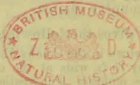

1082------------------------------------------------

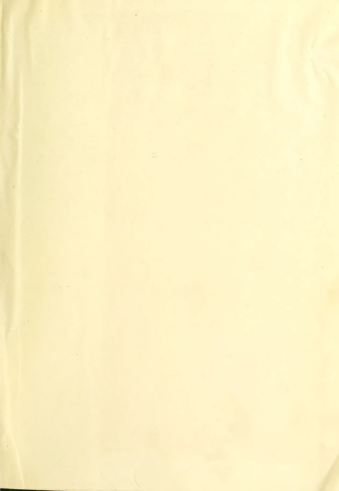This image shows a blank, aged, cream-colored page, likely an endpaper or flyleaf from an old book. The paper has a slightly textured appearance with visible creases and some minor discoloration or foxing, particularly towards the edges. There is no text or other markings on the page.

1083------------------------------------------------

